# BUKU AJAR
# CRYPTOGRAPHIC METHODS
## MK-E-01 / ELEKTIF-G1/G3

**Program Studi:** Magister Terapan Forensik Digital dan Keamanan Siber  
**Institusi:** Politeknik Elektronika Negeri Surabaya  
**Bobot SKS:** 2T + 1P (3 SKS)  
**Semester:** 1 atau 3 (Gasal — Elektif Pool)  
**Level Bloom Dominan:** C4–C5 (Analyze, Evaluate)  

---

## METADATA MATA KULIAH

| Atribut | Isi |
|---|---|
| Kode MK | MK-E-01 (ELEKTIF-G1/G3) |
| Nama MK | Cryptographic Methods |
| Rumpun MK | Keilmuan Inti — Kriptografi dan Proteksi Data (KI-4); CSEC KA-1; CyBOK Cryptography/Applied Cryptography |
| Bobot | 2T + 1P = 3 SKS (2 jam teori + 2 jam praktikum/minggu) |
| Semester | 1 atau 3 (Gasal), Elektif Pool |
| Jenis | Elektif |
| Level Bloom | C4 (Analyze) – C5 (Evaluate) |
| Ko-requisit | Proposal Tesis (Sem. 1) atau Pendalaman Tesis/Lab (Sem. 3) |
| Prasyarat Pedagogik | Cybersecurity Principles, Secure Programming (disarankan) |

---

## KATA PENGANTAR

Kriptografi adalah fondasi matematis dari kepercayaan digital. Hampir setiap protokol keamanan modern — dari HTTPS yang mengamankan transaksi perbankan, hingga enkripsi perangkat mobile yang melindungi data pribadi, hingga tanda tangan digital yang memvalidasi perangkat lunak — bergantung pada primitif kriptografi yang dirancang, diimplementasikan, dan dikonfigurasi dengan benar.

Namun kriptografi juga merupakan domain di mana kesalahan kecil berdampak besar. Menggunakan mode operasi yang salah, mengelola kunci secara tidak aman, memilih parameter yang lemah, atau menggunakan algoritma yang sudah tidak aman — semuanya dapat menghancurkan jaminan keamanan yang seharusnya diberikan. Kriptografi yang diimplementasikan dengan buruk sering kali lebih berbahaya daripada tidak ada kriptografi sama sekali, karena ia memberikan rasa aman yang palsu.

Buku ajar ini mengajarkan kriptografi dari perspektif analis dan evaluator: bukan sekadar "bagaimana algoritma ini bekerja," tetapi "mengapa algoritma ini dirancang seperti ini," "di mana ia dapat gagal," dan "bagaimana saya memverifikasi bahwa implementasi ini benar dan aman." Pendekatan ini selaras dengan kebutuhan praktisi keamanan siber dan forensik digital yang harus membuat keputusan tentang pilihan kriptografi dalam sistem nyata.

Catatan khusus: seluruh praktikum dalam buku ini menggunakan lingkungan yang terisolasi, dataset/library yang legal, dan tidak pernah mengarahkan pembaca pada penyalahgunaan kriptografi untuk aktivitas ilegal. Pemahaman tentang kelemahan kriptografi selalu disajikan dalam konteks pertahanan dan mitigasi.

---

## DESKRIPSI MATA KULIAH

Mata kuliah Cryptographic Methods membahas prinsip, algoritma, protokol, implementasi, dan evaluasi metode kriptografi untuk proteksi data dan sistem keamanan. Pembelajaran menekankan kemampuan analitis dan evaluatif dalam memilih algoritma yang sesuai, memahami batasan keamanan, menghindari kesalahan implementasi, mengevaluasi kinerja dan keamanan algoritma, serta menyusun rekomendasi teknis yang dapat dipertanggungjawabkan. Mata kuliah ini mendukung eksplorasi topik tesis di bidang kriptografi, proteksi data, keamanan jaringan/cloud/IoT, forensik digital, dan cyber defense analytics.

---

## PETA OBE: CPL → IK → CPMK → Sub-CPMK → EVALUASI

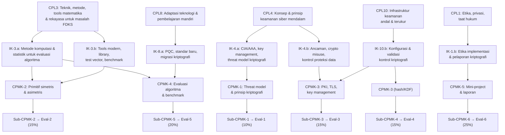

---

## PETA KOMPETENSI MATA KULIAH

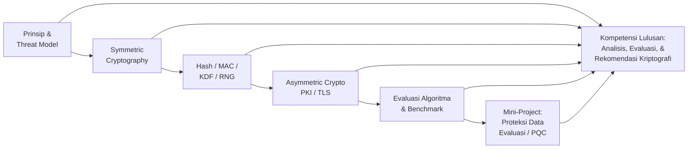

---

## PETUNJUK PENGGUNAAN BUKU

Buku ini dirancang untuk mahasiswa yang sudah memiliki dasar keamanan siber dan ingin mendalami kriptografi dari perspektif analitis dan evaluatif. Setiap bab membangun fondasi untuk bab berikutnya — teori yang dipelajari di Bab 1-2 akan digunakan untuk mengevaluasi risiko implementasi di Bab 3-8, dan seluruhnya diintegrasikan dalam mini-project di Bab 15-16.

Praktikum menggunakan Python dengan library yang sudah tersedia luas (cryptography, PyCryptodome, hashlib). Semua kode yang ditulis harus dijalankan dalam lingkungan terisolasi (virtual environment atau container). Mahasiswa tidak diizinkan menggunakan pengetahuan dari buku ini untuk aktivitas ofensif pada sistem tanpa otorisasi.

Mahasiswa Semester 1: gunakan mini-project sebagai eksplorasi topik tesis.
Mahasiswa Semester 3: integrasikan mini-project langsung dengan penelitian tesis.

---

## PETA BAB DAN DELIVERABLE

| Bab | Pertemuan | Sub-CPMK | Materi Utama | Evaluasi | Deliverable |
|---|---|---|---|---|---|
| 1 | 1 | Sub-CPMK-1 | Kriptografi modern, CIA/AAA, prinsip Kerckhoffs | Eval-1 (10%) | Threat model brief (bagian 1) |
| 2 | 2 | Sub-CPMK-1 | Threat model, adversary model, crypto misuse, etika | Eval-1 (10%) | Threat model brief (final) |
| 3 | 3 | Sub-CPMK-2 | AES, block cipher, mode operasi ECB/CBC/CTR | Eval-2 (15%) | Lab AES (bagian 1) |
| 4 | 4 | Sub-CPMK-2 | GCM/AEAD, nonce/IV management, bahaya implementasi | Eval-2 (15%) | Lab AES + misuse case |
| 5 | 5 | Sub-CPMK-4 | Hash functions: SHA-2, SHA-3, properti keamanan | Eval-4 (15%) | Audit hash (bagian 1) |
| 6 | 6 | Sub-CPMK-4 | MAC, HMAC, KDF, password hashing, salt/pepper | Eval-4 (15%) | Audit MAC/KDF/password |
| 7 | 7 | Sub-CPMK-4 | Entropy, RNG, key lifecycle, secret management | Eval-4 (15%) | Audit RNG/key lifecycle |
| 8 | 8 | Sub-CPMK-4 | KMS, HSM, cryptographic storage, key management audit | Eval-4 (15%) | Audit report final |
| 9 | 9 | Sub-CPMK-3 | RSA: matematika, keamanan, padding schemes | Eval-3 (15%) | Studi kasus PKI (bagian 1) |
| 10 | 10 | Sub-CPMK-3 | ECC, ECDH, Diffie-Hellman, key exchange protocols | Eval-3 (15%) | Studi kasus key exchange |
| 11 | 11 | Sub-CPMK-3 | Digital signature, sertifikat, PKI, trust chain | Eval-3 (15%) | Analisis PKI |
| 12 | 12 | Sub-CPMK-3 | TLS 1.3, handshake, forward secrecy, konfigurasi | Eval-3 (15%) | Studi kasus TLS final |
| 13 | 13 | Sub-CPMK-5 | Evaluasi algoritma: test vector, benchmark, correctness | Eval-5 (20%) | Rancangan eksperimen |
| 14 | 14 | Sub-CPMK-5 | Post-quantum cryptography, NIST PQC, migration planning | Eval-5 (20%) | PQC migration note |
| 15 | 15 | Sub-CPMK-6 | Mini-project: desain, implementasi, reproducibility | Eval-6 (25%) | Mini-project prototype |
| 16 | 16 | Sub-CPMK-6 | Applied cryptography, PET, laporan akhir, presentasi | Eval-6 (25%) | Final report + presentasi |

---

# BAB 1 — KRIPTOGRAFI MODERN: RUANG LINGKUP, TUJUAN KEAMANAN, DAN PRINSIP DASAR

## 1. Capaian Pembelajaran Bab

Setelah mempelajari bab ini, mahasiswa mampu:
- Mendefinisikan kriptografi modern dan membedakannya dari kriptografi klasik
- Menjelaskan tujuan keamanan: confidentiality, integrity, authentication, non-repudiation, forward secrecy, dan accountability
- Memahami prinsip Kerckhoffs dan implikasinya terhadap desain sistem
- Mengidentifikasi primitif kriptografi utama dan hubungannya

*Berkaitan dengan Sub-CPMK-1, Eval-1 (10%)*

## 2. Peta Konsep Bab

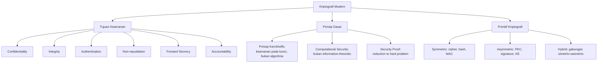

## 3. Pengantar Kontekstual

Sebelum era komputer, kriptografi adalah seni menyembunyikan pesan — sandi Caesar, Vigenère, Enigma. Kriptografi modern, yang muncul setelah karya Shannon (1949) dan Diffie-Hellman (1976), adalah ilmu eksakta berbasis matematika. Perbedaan fundamentalnya: kriptografi modern memiliki *proof* — bukti formal bahwa memecahkan suatu sistem setara dengan memecahkan masalah matematika yang diyakini sulit.

Implikasinya untuk praktisi keamanan siber: pilihan algoritma bukan sekadar preferensi atau "terasa aman" — ia adalah keputusan teknis dengan konsekuensi yang dapat dianalisis secara formal.

## 4. Landasan Teori

### 4.1 Tujuan Keamanan (Security Goals)

**Confidentiality (Kerahasiaan):**
Informasi hanya dapat diakses oleh pihak yang berwenang. Dijamin oleh enkripsi simetris/asimetris. Ancaman: eavesdropping, man-in-the-middle.

**Integrity (Integritas):**
Informasi tidak dapat dimodifikasi tanpa terdeteksi. Dijamin oleh hash, MAC, atau digital signature. Ancaman: tampering, bit-flipping attacks.

**Authentication (Autentikasi):**
Verifikasi identitas pengirim atau asal data. Dijamin oleh MAC (untuk pesan) atau digital signature (untuk non-repudiation). Ancaman: impersonation, replay attacks.

**Non-repudiation:**
Pengirim tidak dapat menyangkal telah mengirimkan pesan. Dijamin oleh digital signature dengan kunci privat. MAC tidak memberikan non-repudiation karena kunci juga diketahui penerima.

**Forward Secrecy (Perfect Forward Secrecy):**
Kompromi kunci jangka panjang tidak mengungkap sesi sebelumnya. Dijamin oleh key exchange ephemeral (ECDHE). Penting: TLS 1.3 mewajibkan forward secrecy.

**Accountability:**
Tindakan dapat dikaitkan dengan entitas yang melakukannya. Dijamin oleh kombinasi authentication + logging yang tidak dapat dipalsukan. Relevan untuk audit forensik.

### 4.2 Prinsip Kerckhoffs

Auguste Kerckhoffs (1883) merumuskan prinsip yang menjadi fondasi kriptografi modern:

**"Sistem kriptografi harus aman meskipun semua aspek sistem, kecuali kunci, adalah pengetahuan publik."**

Implikasi praktis:
- Keamanan tidak boleh bergantung pada kerahasiaan algoritma ("security through obscurity")
- Algoritma yang digunakan secara publik dapat diaudit oleh komunitas — kesalahan desain lebih cepat ditemukan
- Ketika algoritma dikompromikan (bukan kuncinya), cukup ganti kunci; jika keamanan bergantung pada kerahasiaan algoritma, seluruh sistem harus diganti

**Kontra-argumen yang salah:** "Jika algoritma kita tidak diketahui publik, penyerang tidak bisa menyerangnya." Ini diabaikan karena: (a) algoritma hampir selalu dapat di-reverse-engineer dari implementasinya; (b) tanpa public scrutiny, kesalahan desain tersembunyi; (c) sejarah penuh contoh sistem "secret" yang mudah dipecahkan ketika algo terungkap.

### 4.3 Computational Security

Kriptografi modern tidak menjanjikan keamanan *absolut* (kecuali one-time pad, yang tidak praktis). Ia menjanjikan keamanan *komputasional*: tidak ada algoritma yang efisien secara komputasi yang dapat memecahkan sistem dalam waktu yang bermakna.

**Definisi formal (informal):** Sistem kriptografi aman secara komputasional jika setiap adversary yang berjalan dalam waktu polinomial hanya dapat memenangkan permainan keamanan dengan probabilitas yang *negligible* (dapat diabaikan).

**Implikasi:** Parameter keamanan (ukuran kunci, panjang hash) harus dipilih agar keamanan komputasional bertahan selama *masa pakai yang diharapkan* dari data yang dilindungi.

### 4.4 Klasifikasi Primitif Kriptografi

| Kategori | Primitif | Fungsi Utama |
|---|---|---|
| Symmetric | Block cipher (AES) | Enkripsi dengan kunci bersama |
| Symmetric | Stream cipher (ChaCha20) | Enkripsi aliran data |
| Symmetric | Hash function (SHA-256) | One-way fingerprint |
| Symmetric | MAC/HMAC | Autentikasi pesan dengan kunci |
| Asymmetric | Public-key encryption (RSA-OAEP) | Enkripsi kunci publik |
| Asymmetric | Key exchange (DH/ECDH) | Pembentukan kunci bersama |
| Asymmetric | Digital signature (ECDSA, EdDSA) | Tanda tangan digital |
| Hybrid | TLS, PGP, Signal | Kombinasi simetris + asimetris |

## 5. Model atau Arsitektur

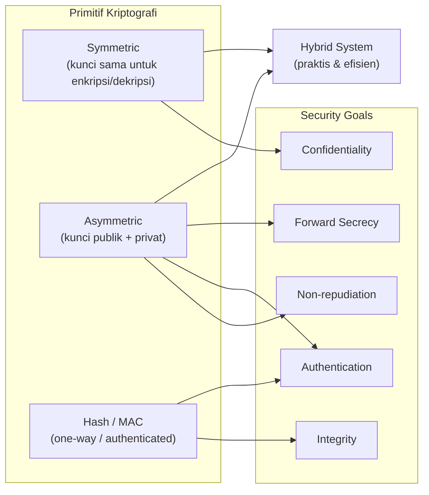

## 6. Contoh Terapan

**Skenario: Aplikasi pesan terenkripsi untuk forensik digital**

Sebuah tim forensik perlu mengirimkan laporan penyelidikan yang sangat sensitif antar-anggota. Mereka membutuhkan:
- **Confidentiality:** Laporan tidak dapat dibaca pihak tidak berwenang → enkripsi AES-256-GCM
- **Integrity:** Laporan tidak dapat dimodifikasi dalam transit → GCM memberikan authentication tag
- **Authentication:** Penerima yakin siapa pengirimnya → digital signature dengan ECDSA
- **Non-repudiation:** Pengirim tidak bisa menyangkal mengirimkan laporan → signature dengan kunci privat yang hanya dimiliki pengirim
- **Forward secrecy:** Bahkan jika kunci signing kompromis di masa depan, pesan lama tetap aman → ECDHE untuk session key

Sistem yang dibangun: Signal Protocol atau TLS 1.3 dengan ephemeral DH + authenticated encryption.

## 7. Praktikum atau Aktivitas Terarah

**Tujuan:** Mengidentifikasi tujuan keamanan dan primitif kriptografi yang digunakan dalam protokol nyata.

**Aktivitas:**
1. Pilih satu protokol atau aplikasi: HTTPS (TLS 1.3), Signal, WhatsApp E2E, SSH, atau PGP.
2. Baca dokumentasi teknis atau RFC yang relevan.
3. Identifikasi: primitif kriptografi apa yang digunakan? Tujuan keamanan mana yang dipenuhi? Apakah forward secrecy ada?
4. Buat tabel pemetaan: primitif → tujuan keamanan → algoritma spesifik.
5. Identifikasi satu potensi kelemahan dan rekomendasikan perbaikan.

**Output:** Dokumen 2 halaman, tabel pemetaan, dan satu paragraf rekomendasi.

## 8. Latihan Pemahaman

1. **(Pilihan Ganda)** Prinsip Kerckhoffs menyatakan bahwa:
   - A. Algoritma kriptografi harus dirahasiakan dari publik
   - B. Keamanan sistem harus bergantung hanya pada kerahasiaan kunci, bukan algoritma
   - C. Sistem kriptografi yang aman tidak dapat dipecahkan secara matematis
   - D. Semua algoritma kriptografi harus menggunakan kunci yang sama

2. **(Analisis)** Sebuah vendor produk IoT mengklaim bahwa enkripsinya "sangat aman karena algoritma kami proprietary dan tidak ada yang tahu cara kerjanya." Evaluasi klaim ini menggunakan prinsip Kerckhoffs.

3. **(Pilihan Ganda)** Mana yang TIDAK dijamin oleh MAC (Message Authentication Code)?
   - A. Integritas pesan
   - B. Autentikasi pengirim (kepada penerima yang mengetahui kunci)
   - C. Non-repudiation
   - D. Deteksi modifikasi pesan

4. **(Analisis)** Jelaskan perbedaan antara "information-theoretic security" dan "computational security." Mengapa one-time pad memiliki keamanan information-theoretic, sementara AES tidak?

5. **(Evaluasi)** Forward secrecy dianggap penting dalam protokol modern. Jelaskan skenario nyata di mana tidak adanya forward secrecy menyebabkan kerusakan keamanan yang signifikan.

## 9. Latihan Terapan / Studi Kasus

**Studi Kasus 1:** Sebuah organisasi menggunakan sistem enkripsi email berbasis S/MIME dengan sertifikat yang sama selama 10 tahun. Email terenkripsi dari 5 tahun lalu tersimpan dalam arsip server. Tahun ini, kunci privat sertifikat tersebut bocor. Analisis: (a) tujuan keamanan mana yang terkompromis?; (b) apakah forward secrecy dapat membantu?; (c) apa yang harus dilakukan untuk mengurangi dampak?

**Studi Kasus 2:** Tim keamanan menemukan bahwa sistem internal menggunakan algoritma enkripsi yang dikembangkan sendiri oleh developer internal ("homegrown crypto"). Bagaimana Anda mengevaluasi risiko ini? Apa argumen teknis yang dapat Anda gunakan untuk merekomendasikan migrasi ke algoritma standar?

## 10. Kunci Jawaban dan Pembahasan

**Soal 1:** Jawaban B. Prinsip Kerckhoffs: keamanan bergantung pada kerahasiaan kunci, bukan algoritma. Ini memungkinkan algoritma diaudit publik tanpa mengorbankan keamanan.

**Soal 2:** Klaim ini melanggar prinsip Kerckhoffs. Masalah: (a) algoritma proprietary tidak dapat diaudit oleh komunitas kriptografi — kesalahan desain tidak terdeteksi; (b) implementasi hampir selalu dapat di-reverse-engineer dari perangkat keras/firmware; (c) jika algoritma terungkap (dan ia selalu terungkap akhirnya), seluruh keamanan runtuh. Rekomendasi: gunakan algoritma standar yang telah diaudit publik (AES, ChaCha20) dan buat keamanan bergantung pada pengelolaan kunci yang baik.

**Soal 3:** Jawaban C. Non-repudiation memerlukan bahwa *hanya* pengirim yang dapat membuat autentikasi. MAC menggunakan kunci simetris yang diketahui oleh pengirim DAN penerima — penerima bisa saja memalsukan MAC sendiri, sehingga pengirim bisa menyangkal. Digital signature dengan kunci privat memberikan non-repudiation karena hanya pengirim yang memiliki kunci privat.

**Soal 4:** Information-theoretic security: aman bahkan jika penyerang memiliki kekuatan komputasi tak terbatas. One-time pad: cipher text adalah XOR dari plaintext dengan kunci acak sepanjang plaintext → setiap possible plaintext menghasilkan cipher text yang sama → tidak ada informasi tentang plaintext. Computational security: aman hanya jika penyerang dibatasi pada komputasi polinomial. AES: kekuatan AES bergantung pada asumsi bahwa tidak ada algoritma polinomial yang efisien untuk memecahkannya — ini belum terbukti secara teoritis tetapi diyakini kuat berdasarkan analisis dekade.

**Soal 5:** Contoh nyata — NSA PRISM (2013): dokumen Snowden mengungkapkan bahwa NSA merekam traffic internet terenkripsi dengan harapan memecahkannya di masa depan jika kunci diperoleh. Sistem yang tidak memiliki forward secrecy (misalnya TLS dengan RSA key exchange statis) rentan: NSA merekam seluruh traffic, kemudian ketika kunci privat RSA diperoleh (legal, hack, atau koersi), *semua* sesi lama dapat didekripsi. TLS 1.3 mewajibkan ECDHE — setiap sesi menggunakan kunci ephemeral yang dihapus setelah sesi selesai → forward secrecy terjamin.

## 11. Ringkasan Bab

Kriptografi modern didasarkan pada asumsi keamanan komputasional dan prinsip Kerckhoffs. Tujuan keamanan mencakup: confidentiality, integrity, authentication, non-repudiation, forward secrecy, dan accountability. Primitif kriptografi dibagi menjadi: symmetric (cipher, hash, MAC), asymmetric (PKC, signature, KE), dan hybrid. Pilihan algoritma harus didasarkan pada tujuan keamanan yang ingin dicapai, bukan sekadar "terasa aman."

## 12. Refleksi Profesional

1. Sebagai analis keamanan, Anda sering diminta untuk mengevaluasi klaim keamanan dari vendor. Bagaimana Anda memverifikasi bahwa klaim kriptografis suatu produk dapat dipercaya? Alat dan pendekatan apa yang Anda gunakan?

2. Prinsip Kerckhoffs memiliki implikasi etis: transparansi algoritma memungkinkan audit publik. Di negara dengan otoriter atau kepentingan surveilans, terdapat tekanan untuk menggunakan "algoritma nasional" yang tidak transparan. Bagaimana Anda bersikap sebagai profesional keamanan siber dalam situasi ini?


---

# BAB 2 — THREAT MODEL, ADVERSARY CAPABILITY, DAN ETIKA KRIPTOGRAFI

## 1. Capaian Pembelajaran Bab

Setelah mempelajari bab ini, mahasiswa mampu:
- Menyusun threat model yang spesifik untuk sistem berbasis kriptografi
- Memahami kategorisasi adversary capability dan implikasinya terhadap pilihan algoritma
- Mengidentifikasi kesalahan penggunaan kriptografi yang umum
- Menerapkan prinsip etika dan kepatuhan hukum dalam analisis dan implementasi kriptografi

*Berkaitan dengan Sub-CPMK-1, Eval-1 (10%)*

## 2. Peta Konsep Bab

```mermaid
flowchart TD
    A[Threat Modeling untuk Kriptografi] --> B[Adversary Model]
    B --> B1[Passive: eavesdropping\nCPA — Chosen Plaintext]
    B --> B2[Active: tampering\nCCA — Chosen Ciphertext]
    B --> B3[Insider: akses parsial]
    B --> B4[Nation-state: sumber daya besar]
    A --> C[Attack Surface]
    C --> C1[Algoritma: weak cipher, param kecil]
    C --> C2[Implementasi: side-channel, buffer overflow]
    C --> C3[Protokol: replay, downgrade, oracle]
    C --> C4[Key Management: poor generation, storage]
    C --> C5[Misuse: ECB mode, nonce reuse, hardcoded key]
    A --> D[Security Assumptions]
    D --> D1[Computational hardness assumptions]
    D --> D2[Trusted random number generation]
    D --> D3[Secure key storage]
    A --> E[Etika & Hukum]
    E --> E1[Privacy by design]
    E --> E2[Responsible disclosure]
    E --> E3[Regulasi: UU PDP, GDPR, FIPS]
```

## 3. Pengantar Kontekstual

Memilih AES-256 dan kemudian menyimpan kunci dalam file teks di direktori yang dapat diakses semua user adalah contoh nyata dari kesalahan yang sering terjadi: algoritma yang benar, implementasi yang salah. Threat modeling membantu mengidentifikasi di mana sistem dapat gagal — bukan hanya di level algoritma, tetapi juga di level implementasi, protokol, dan manajemen kunci.

## 4. Landasan Teori

### 4.1 Adversary Model dalam Kriptografi

Kriptografi formal mendefinisikan keamanan melalui "permainan" antara *challenger* dan *adversary*. Adversary model menentukan apa yang boleh dilakukan adversary:

**Chosen Plaintext Attack (CPA):**
Adversary dapat meminta enkripsi dari plaintext yang dipilihnya. Ini adalah model minimal untuk enkripsi yang berguna — jika sistem tidak aman terhadap CPA, ia tidak layak digunakan.

**Chosen Ciphertext Attack (CCA/CCA2):**
Adversary juga dapat meminta dekripsi dari ciphertext yang dipilihnya (kecuali ciphertext yang sedang diuji). CCA2 (adaptive) adalah model yang lebih kuat dan lebih realistis untuk banyak skenario.

**Implikasi:** Cipher yang aman terhadap CCA2 harus menggunakan *authenticated encryption* — enkripsi tanpa authentication tag rentan terhadap padding oracle dan bit-flipping attacks.

**Kategorisasi adversary berdasarkan sumber daya:**

| Tipe | Sumber Daya | Kemampuan | Relevan untuk |
|---|---|---|---|
| Script kiddie | Rendah | Tools yang tersedia | Amatir |
| Cybercriminal | Menengah | Botnet, GPU farm | Ransomware, fraud |
| APT/Nation-state | Tinggi | Superkomputer, zero-day | Critical infrastructure |
| Quantum adversary | Proyeksi masa depan | Quantum computer | PQC migration |

### 4.2 Attack Surface Kriptografi

**Kelemahan Algoritma:**
- Algoritma yang sudah diketahui lemah: DES, RC4, MD5 (untuk collision resistance), SHA-1
- Parameter yang tidak memadai: RSA-1024 (tidak cukup), ECDSA dengan kurva P-192
- Algorithmic backdoor: kontroversi Dual_EC_DRBG (NIST 2006, dugaan NSA backdoor)

**Kelemahan Implementasi:**
- *Side-channel attacks*: timing attacks (pengukuran waktu eksekusi), power analysis, cache-timing
- Buffer overflow dalam kode kriptografi
- Penggunaan fungsi yang tidak constant-time untuk operasi yang sensitif terhadap timing

**Kelemahan Protokol:**
- *Replay attack*: pesan lama dimainkan ulang (mitigasi: nonce, timestamp)
- *Downgrade attack*: memaksa penggunaan algoritma lama (mitigasi: version enforcement, HSTS)
- *Oracle attack*: sistem memberikan informasi tentang validitas ciphertext (mitigasi: authenticated encryption)

**Crypto Misuse (Kesalahan Penggunaan):**

| Misuse | Deskripsi | Konsekuensi |
|---|---|---|
| ECB mode | Blok identik → ciphertext identik | Pola data terlihat (famous ECB penguin) |
| Nonce reuse (GCM) | Menggunakan IV yang sama dua kali | Seluruh kerahasiaan dan integritas runtuh |
| Hardcoded key | Kunci tertanam dalam kode | Kompromis total jika source code bocor |
| Weak password hash | MD5, SHA-1 tanpa salt | Rainbow table, brute force cepat |
| Self-signed cert | Certificate tanpa root CA | Tidak ada trust chain yang valid |
| Short key | RSA-512, AES-64 | Brute force feasible |

### 4.3 Security Assumptions

Keamanan sistem kriptografi bergantung pada asumsi-asumsi yang harus dipenuhi:

1. **Computational hardness:** Factoring bilangan besar (RSA), discrete log (DH/ECC) adalah masalah komputasi yang sulit — jika asumsi ini salah, seluruh sistem yang bergantung padanya runtuh.
2. **Random Number Generation:** Kunci harus dibangkitkan dari sumber yang benar-benar acak (CSPRNG). Penggunaan `rand()` biasa dalam C untuk kunci kriptografi adalah kesalahan serius.
3. **Secure Key Storage:** Kunci harus tersimpan dengan perlindungan yang memadai. Kunci di file teks, environment variable yang dapat dibaca semua proses, atau memory yang tidak terlindungi adalah risiko.
4. **Trusted Implementation:** Library kriptografi harus dari sumber yang tepercaya dan dipelihara. Jangan implement sendiri.

### 4.4 Etika dan Kepatuhan Hukum

**Privacy by Design:**
Kriptografi harus diintegrasikan sejak awal perancangan sistem, bukan ditambahkan sebagai afterthought. GDPR dan UU PDP No. 27/2022 mensyaratkan perlindungan data personal yang memadai.

**Regulasi yang Relevan:**
- UU PDP No. 27/2022: mengatur pemrosesan data pribadi; enkripsi sebagai technical safeguard
- FIPS 140-3: standar modul kriptografi untuk penggunaan pemerintah AS
- GDPR Art. 32: mengharuskan "appropriate technical measures" termasuk enkripsi
- Export Control: beberapa algoritma kriptografi diatur oleh hukum ekspor (EAR, Wassenaar Arrangement)

**Responsible Use:**
Pengetahuan tentang kelemahan kriptografi harus digunakan untuk defensive purposes. Mengeksploitasi kelemahan kriptografi pada sistem yang bukan milik sendiri tanpa otorisasi adalah pelanggaran hukum (UU ITE).

## 5. Model atau Arsitektur

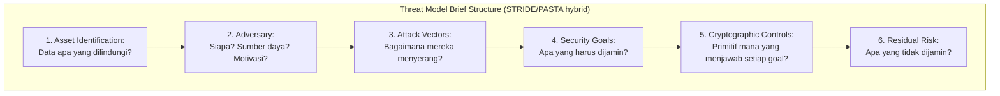

## 6. Contoh Terapan

**Threat Model Brief untuk Sistem E-Voting:**

| Komponen | Detail |
|---|---|
| Aset | Suara pemilih (confidentiality), hasil rekapitulasi (integrity), identitas pemilih (authentication + privacy) |
| Adversary | Penyerang oportunistik (low), organized crime (medium), nation-state (high) |
| Attack vectors | Network eavesdropping, vote manipulation, voter impersonation, insider corruption, DDoS |
| Security goals | Each voter votes once (integrity), votes anonymous (confidentiality), result verifiable (accountability) |
| Crypto controls | Blind signature untuk anonimitas, commitments untuk verifiability, TLS untuk transport |
| Residual risk | Physical coercion, voter selling votes, insider with system access — kriptografi tidak dapat mengatasi ini |

## 7. Praktikum atau Aktivitas Terarah

**Tujuan:** Menyusun Threat Model Brief untuk sistem yang berkaitan dengan topik tesis atau studi kasus yang dipilih.

**Langkah Kerja:**
1. Pilih satu sistem: API layanan digital, sistem IoT, aplikasi mobile, atau infrastruktur cloud.
2. Identifikasi aset kriptografi yang perlu dilindungi.
3. Buat adversary model: minimal 2 level adversary (oportunistik dan targeted).
4. Peta attack surface menggunakan checklist 5 kategori (algoritma, implementasi, protokol, key management, misuse).
5. Tentukan security goals dan primitif kriptografi yang diperlukan untuk setiap goal.
6. Nyatakan residual risk secara jujur.

**Output:** Threat Model Brief (1-2 halaman), siap digunakan sebagai Eval-1.

## 8. Latihan Pemahaman

1. **(Pilihan Ganda)** Dalam model CCA2, adversary diizinkan untuk:
   - A. Hanya mengobservasi ciphertext
   - B. Meminta enkripsi dari plaintext yang dipilihnya
   - C. Meminta dekripsi dari ciphertext yang dipilihnya (kecuali target ciphertext)
   - D. Mengetahui kunci enkripsi

2. **(Analisis)** Sebuah developer menggunakan fungsi `random.randint()` Python untuk membangkitkan kunci AES-256. Apa risiko keamanannya dan bagaimana cara mengatasinya?

3. **(Evaluasi)** Mengapa ECB (Electronic Codebook) mode tidak boleh digunakan untuk enkripsi data nyata, meskipun algoritma dasarnya (AES) aman?

## 9. Latihan Terapan / Studi Kasus

Sebuah startup IoT menggunakan AES-128-ECB untuk mengenkripsi data sensor yang dikirim dari 1.000 perangkat ke server pusat. Kunci yang sama digunakan untuk semua perangkat. Lakukan threat model terhadap sistem ini: identifikasi minimal 4 kelemahan kriptografi, jelaskan implikasi setiap kelemahan, dan buat rekomendasi perbaikan yang konkret dan terprioritas.

## 10. Kunci Jawaban dan Pembahasan

**Soal 1:** Jawaban C. CCA2 (Adaptive Chosen Ciphertext Attack) mengizinkan adversary meminta dekripsi dari ciphertext yang dipilihnya, kecuali target ciphertext yang sedang dianalisis. Ini mensimulasikan skenario di mana adversary memiliki akses ke decryption oracle (misalnya, server yang memberikan error message berbeda untuk ciphertext yang tidak valid).

**Soal 2:** `random.randint()` adalah pseudorandom number generator (PRNG) yang tidak dirancang untuk kriptografi. Ia dapat diprediksi jika state awal diketahui atau dapat diestimasi. Untuk kriptografi, gunakan CSPRNG (Cryptographically Secure PRNG): Python `secrets.token_bytes(32)` atau `os.urandom(32)` yang menggunakan entropy dari sistem operasi (/dev/urandom pada Linux).

**Soal 3:** ECB mode mengenkripsi setiap blok secara independen. Dua blok plaintext yang identik menghasilkan ciphertext yang identik. Ini berarti pola dalam data terlihat dalam ciphertext — contoh paling terkenal adalah "ECB Penguin" (gambar Linux penguin yang dienkripsi dengan ECB masih terlihat polanya). Untuk data sensor IoT, nilai-nilai yang sama (misalnya, suhu konstan) akan menghasilkan ciphertext yang sama, mengungkapkan pola temporal.

**Soal Studi Kasus:** Empat kelemahan utama: (1) ECB mode — pola data terlihat; perbaikan: AES-128-GCM (AEAD). (2) Kunci yang sama untuk 1.000 perangkat — jika satu perangkat dikompromis, semua data dari semua perangkat terkena; perbaikan: kunci unik per perangkat dengan key derivation per device ID. (3) AES-128 — masih aman tetapi AES-256 lebih prudent untuk sistem yang bertahan lama; perbaikan: migrasi ke AES-256-GCM. (4) Tidak ada autentikasi pesan — dengan ECB, penyerang dapat memodifikasi ciphertext tanpa terdeteksi; perbaikan: GCM memberikan authentication tag.

## 11. Ringkasan Bab

Threat model kriptografi mencakup: adversary model (CPA/CCA, kapabilitas sumber daya), attack surface (algoritma, implementasi, protokol, key management, misuse), dan security assumptions (computational hardness, secure RNG, secure key storage). Crypto misuse (ECB mode, nonce reuse, hardcoded keys, weak hash) adalah penyebab terbesar kegagalan sistem kriptografi di dunia nyata. Etika dan kepatuhan hukum (UU PDP, GDPR) wajib diintegrasikan dalam perancangan sistem.

## 12. Refleksi Profesional

1. Dalam audit keamanan sistem, Anda menemukan bahwa sistem kritikal menggunakan DES (Data Encryption Standard, 56-bit, yang sudah deprecated sejak 2000-an). Manajemen bersikeras tidak bisa mengganti karena integrasi sistem yang rumit. Bagaimana Anda mendokumentasikan risiko ini dan apa opsi mitigasi interim yang dapat Anda rekomendasikan?

2. Anda mengetahui bahwa kolega Anda berencana menggunakan pengetahuan tentang kelemahan kriptografi pada sistem yang sedang diaudit untuk keuntungan pribadi. Apa tindakan yang etis dan apa implikasi hukumnya di Indonesia?


---

# BAB 3 — AES DAN BLOCK CIPHER: PRINSIP DAN IMPLEMENTASI

## 1. Capaian Pembelajaran Bab

Setelah mempelajari bab ini, mahasiswa mampu:
- Menjelaskan prinsip kerja AES (Advanced Encryption Standard) dan struktur Substitution-Permutation Network
- Memahami properti confusion dan diffusion yang dibutuhkan block cipher yang kuat
- Memilih ukuran kunci AES (128/192/256-bit) sesuai threat model
- Menggunakan test vector untuk memverifikasi implementasi AES

*Berkaitan dengan Sub-CPMK-2, Eval-2 (15%)*

## 2. Peta Konsep Bab

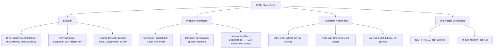

## 3. Pengantar Kontekstual

AES adalah standar enkripsi simetris yang paling banyak digunakan di dunia — dari enkripsi disk (BitLocker, FileVault), hingga WiFi (WPA2/WPA3), hingga TLS. Dipilih melalui kompetisi NIST (1997-2001), AES menggantikan DES yang sudah lemah. Memahami prinsip internal AES bukan sekadar pengetahuan akademis — ia membantu praktisi mengevaluasi implementasi, memilih parameter yang tepat, dan memahami mengapa misuse (seperti ECB mode) berbahaya.

## 4. Landasan Teori

### 4.1 Arsitektur AES: Substitution-Permutation Network

AES beroperasi pada blok 128-bit (16 byte) yang direpresentasikan sebagai matriks 4×4 byte (*state*). Proses enkripsi terdiri dari sejumlah *round* yang masing-masing menerapkan empat transformasi:

**1. SubBytes (Confusion):**
Setiap byte state diganti menggunakan S-Box (substitution box) yang non-linear. S-Box dirancang untuk memaksimalkan *non-linearity* — mencegah analisis algebraic yang linear.

**2. ShiftRows (Diffusion — Permutasi Baris):**
Baris-baris matriks state di-shift secara siklik: baris 0 tidak berubah, baris 1 dishift 1 byte, baris 2 dishift 2 byte, baris 3 dishift 3 byte.

**3. MixColumns (Diffusion — Mixing Kolom):**
Setiap kolom matriks state dikalikan dengan matriks tetap dalam Galois Field GF(2⁸). Hasilnya: satu byte input mempengaruhi seluruh kolom output.

**4. AddRoundKey (Key Mixing):**
State di-XOR dengan subkey dari key schedule. Ini adalah satu-satunya langkah yang melibatkan kunci.

Kombinasi SubBytes (confusion) + ShiftRows+MixColumns (diffusion) menciptakan *avalanche effect*: mengubah 1 bit input menyebabkan perubahan ~50% bit output setelah beberapa round.

### 4.2 Key Schedule

Dari master key (128/192/256-bit), AES menghasilkan sejumlah subkey melalui proses key expansion. Subkey digunakan pada setiap round. Desain key schedule memastikan tidak ada round key yang mudah dihitung dari round key lain.

### 4.3 Ukuran Kunci dan Round

| Varian | Panjang Kunci | Jumlah Round | Keamanan Saat Ini |
|---|---|---|---|
| AES-128 | 128 bit | 10 | Aman (best attack: ~2¹²⁶) |
| AES-192 | 192 bit | 12 | Aman |
| AES-256 | 256 bit | 14 | Aman, direkomendasikan untuk long-term |

Catatan: serangan known-key pada AES-256 membutuhkan ~2¹¹⁹ operasi — tetap jauh di atas kemampuan komputasi saat ini atau masa dekat.

### 4.4 Test Vector dan NIST FIPS 197

Test vector adalah pasangan (kunci, plaintext, ciphertext) yang diketahui dan dipublikasikan secara resmi. Mereka digunakan untuk memverifikasi bahwa implementasi AES menghasilkan output yang benar.

**Contoh test vector AES-128 (dari FIPS 197):**
```
Key:    00 01 02 03 04 05 06 07 08 09 0a 0b 0c 0d 0e 0f
Input:  00 11 22 33 44 55 66 77 88 99 aa bb cc dd ee ff
Output: 69 c4 e0 d8 6a 7b 04 30 d8 cd b7 80 70 b4 c5 5a
```

Verifikasi dengan test vector adalah langkah wajib setelah implementasi — jika output tidak cocok, ada bug dalam implementasi.

## 5. Model atau Arsitektur

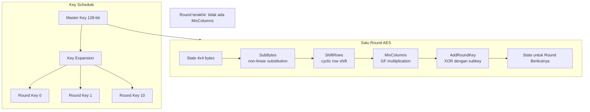

## 6. Contoh Terapan

**Verifikasi implementasi AES-128 dengan Python:**

```python
# Menggunakan library 'cryptography' (pip install cryptography)
from cryptography.hazmat.primitives.ciphers import Cipher, algorithms, modes
from cryptography.hazmat.backends import default_backend

# Test vector dari FIPS 197
key = bytes.fromhex('000102030405060708090a0b0c0d0e0f')
plaintext = bytes.fromhex('00112233445566778899aabbccddeeff')
expected = bytes.fromhex('69c4e0d86a7b0430d8cdb78070b4c55a')

# AES-128 ECB (hanya untuk verifikasi test vector — jangan digunakan dalam produksi!)
cipher = Cipher(algorithms.AES(key), modes.ECB(), backend=default_backend())
encryptor = cipher.encryptor()
ciphertext = encryptor.update(plaintext) + encryptor.finalize()

assert ciphertext == expected, "Test vector FAILED — implementasi bermasalah!"
print(f"Test vector PASSED: {ciphertext.hex()}")
```

**Catatan penting:** ECB digunakan di atas *hanya* untuk verifikasi test vector FIPS 197 (yang tidak menggunakan mode operasi). Untuk enkripsi data nyata, gunakan AES-GCM (dibahas di Bab 4).

## 7. Praktikum atau Aktivitas Terarah

**Tujuan:** Memverifikasi implementasi AES menggunakan NIST test vectors dan mengamati avalanche effect.

**Langkah Kerja:**
1. Unduh NIST FIPS 197 test vectors: https://csrc.nist.gov/publications/detail/fips/197/final
2. Implementasikan verifikasi test vector menggunakan library `cryptography` Python.
3. Jalankan verifikasi untuk minimal 3 test vector (AES-128, AES-192, AES-256).
4. Demonstrasi avalanche effect: ambil satu test vector, ubah 1 bit pada plaintext, enkripsi ulang, hitung berapa persen bit ciphertext yang berubah.
5. Dokumentasikan hasil dalam laporan lab.

**Catatan Etika:** Semua eksperimen dilakukan pada data buatan/test vector, bukan data nyata. Library yang digunakan adalah open source dan legitimate (PyCryptodome, cryptography).

## 8. Latihan Pemahaman

1. **(Pilihan Ganda)** Pada AES, langkah MixColumns berfungsi untuk:
   - A. Menggantikan byte dengan nilai dari S-Box
   - B. Menggeser baris matriks state secara siklik
   - C. Menyebarkan pengaruh setiap byte ke seluruh kolom (diffusion)
   - D. Menambahkan subkey ke state melalui XOR

2. **(Analisis)** Mengapa AES-256 menggunakan 14 round sementara AES-128 hanya 10 round?

3. **(Evaluasi)** Jika test vector verification untuk implementasi AES-128 gagal (output tidak cocok dengan FIPS 197), apa kemungkinan penyebabnya? Berikan 3 kemungkinan.

## 9. Latihan Terapan / Studi Kasus

Anda diminta mengaudit implementasi enkripsi pada sebuah aplikasi open source yang mengklaim menggunakan AES-256. Kode sumber tersedia. Bagaimana Anda memverifikasi bahwa: (a) implementasi secara kriptografis benar (menggunakan test vector); (b) parameter yang dipilih sesuai (ukuran kunci, algoritma); (c) tidak ada misuse (hardcoded key, penggunaan ECB, dll.)?

## 10. Kunci Jawaban dan Pembahasan

**Soal 1:** Jawaban C. MixColumns mengalikan setiap kolom matriks state dengan matriks tetap dalam Galois Field GF(2⁸). Hasilnya: setiap byte output dalam satu kolom bergantung pada semua 4 byte input dalam kolom tersebut — inilah diffusion.

**Soal 2:** Lebih banyak round memberikan keamanan margin yang lebih tinggi terhadap serangan kriptanalitik. AES-256 memiliki kunci yang lebih besar, sehingga key schedule lebih panjang dan lebih banyak material kunci tersedia — ini memungkinkan/memerlukan lebih banyak round untuk mengeksploitasi keseluruhan kunci secara penuh.

**Soal 3:** Kemungkinan kegagalan test vector: (a) byte order (endianness) yang salah — implementasi membalik urutan byte sebelum/sesudah operasi; (b) kesalahan indexing matriks state — beberapa implementasi menggunakan row-major vs column-major yang berbeda dari spesifikasi FIPS 197; (c) key schedule yang salah — langkah RotWord, SubWord, atau Rcon yang tidak diimplementasikan dengan benar.

**Soal Studi Kasus:** Audit checklist: (a) Correctness: jalankan NIST CAVP test vectors (Cryptographic Algorithm Validation Program) — tersedia di csrc.nist.gov. Bandingkan output implementasi dengan known answers. (b) Parameter check: search source untuk `AES(` atau `Cipher(` — verifikasi key length 256 bit (32 bytes). Check apakah iv/nonce dibangkitkan secara random. (c) Misuse audit: search untuk `ECB`, `hardcoded_key`, `key = "..."`; check apakah iv/nonce di-reuse; check apakah ada padding manual yang tidak perlu.

## 11. Ringkasan Bab

AES menggunakan Substitution-Permutation Network dengan 4 transformasi per round: SubBytes (confusion), ShiftRows + MixColumns (diffusion), AddRoundKey (key mixing). Avalanche effect memastikan 1-bit change menyebar ke seluruh output. Test vector dari FIPS 197 digunakan untuk verifikasi correctness implementasi. AES-256 direkomendasikan untuk data yang perlu bertahan lama.

## 12. Refleksi Profesional

1. AES telah ada selama lebih dari 20 tahun tanpa kelemahan praktis yang ditemukan. Bagaimana komunitas kriptografi memastikan kepercayaan pada algoritma ini terus diperbarui? Apa yang akan mengubah rekomendasi penggunaan AES?

---

# BAB 4 — MODE OPERASI, AEAD, DAN BAHAYA IMPLEMENTASI

## 1. Capaian Pembelajaran Bab

Setelah mempelajari bab ini, mahasiswa mampu:
- Menjelaskan mode operasi block cipher (ECB, CBC, CTR, GCM) dan trade-off keamanannya
- Memahami konsep Authenticated Encryption with Associated Data (AEAD) dan mengapa itu penting
- Mengidentifikasi bahaya nonce/IV reuse dan cara mencegahnya
- Mengimplementasikan AES-GCM yang benar menggunakan library kriptografi standar

*Berkaitan dengan Sub-CPMK-2, Eval-2 (15%)*

## 2. Peta Konsep Bab

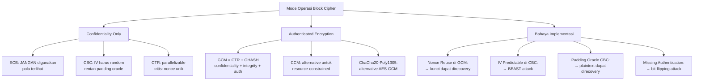

## 3. Pengantar Kontekstual

AES sebagai block cipher hanya mengenkripsi satu blok 128-bit. Untuk mengenkripsi data yang lebih panjang, diperlukan *mode operasi* yang mendefinisikan bagaimana blok-blok dihubungkan. Pilihan mode operasi adalah salah satu keputusan kriptografi yang paling berdampak — dan paling sering salah. Padding Oracle Attack yang mengguncang SSL/TLS, BEAST Attack, dan Lucky13 semuanya adalah serangan terhadap *mode operasi yang salah*, bukan terhadap AES itu sendiri.

## 4. Landasan Teori

### 4.1 ECB (Electronic Codebook) — JANGAN DIGUNAKAN

ECB mengenkripsi setiap blok secara independen dengan kunci yang sama. Hasilnya: blok plaintext yang identik menghasilkan blok ciphertext yang identik. Ini mengungkapkan pola dalam data.

**Demo:** Gambar bitmap yang dienkripsi dengan AES-128-ECB masih terlihat bentuknya ("ECB Penguin"). Untuk data terstruktur (header yang sama, field yang berulang), ECB berbahaya.

**Aturan:** ECB **tidak boleh** digunakan untuk enkripsi data nyata. Satu-satunya penggunaan yang sah adalah untuk verifikasi test vector (satu blok tunggal).

### 4.2 CBC (Cipher Block Chaining)

Setiap blok plaintext di-XOR dengan ciphertext blok sebelumnya sebelum dienkripsi. Blok pertama menggunakan IV (Initialization Vector).

**Persyaratan keamanan CBC:**
- IV harus *unpredictable* dan unik untuk setiap enkripsi
- IV tidak perlu rahasia (biasanya dikirimsama dengan ciphertext)

**Kelemahan:** 
- *Padding Oracle Attack*: jika sistem memberikan informasi berbeda untuk padding yang valid vs tidak valid, penyerang dapat memulihkan plaintext blok demi blok. Mitigasi: gunakan AEAD daripada CBC + MAC terpisah.
- *BEAST Attack*: jika IV dapat diprediksi (seperti di TLS 1.0), memungkinkan chosen-plaintext attack. Mitigasi: TLS 1.1+ menggunakan IV random untuk setiap record.

### 4.3 CTR (Counter Mode)

CTR mengubah block cipher menjadi stream cipher. Setiap blok mengenkripsi counter yang meningkat, menghasilkan *keystream* yang di-XOR dengan plaintext.

**Keunggulan:**
- Dapat diparalelkan (tidak seperti CBC)
- Tidak memerlukan padding (dapat mengenkripsi data dengan panjang sembarang)
- Sama arah enkripsi dan dekripsi (hanya XOR)

**Kelemahan kritis:** Jika *nonce* (counter awal) digunakan ulang dengan kunci yang sama, XOR dari dua ciphertext = XOR dari dua plaintext. Ini secara langsung mengungkapkan informasi tentang plaintext.

### 4.4 GCM (Galois/Counter Mode) — AEAD yang Direkomendasikan

GCM = CTR (untuk enkripsi) + GHASH (untuk authentication). Ini adalah mode *Authenticated Encryption with Associated Data* (AEAD).

**Properti AEAD:**
- **Confidentiality:** Data terenkripsi dengan CTR
- **Integrity + Authentication:** GHASH menghasilkan Authentication Tag (16 byte default)
- **Associated Data:** Data yang tidak dienkripsi tetapi diautentikasi (misalnya header)

**Output GCM:** `(IV/Nonce, Ciphertext, Authentication Tag)`

**Persyaratan keamanan GCM:**
- Nonce HARUS unik untuk setiap enkripsi dengan kunci yang sama
- Jika nonce di-reuse: **catastrophic failure** — kunci dapat dipulihkan, semua ciphertext yang menggunakan nonce tersebut dapat didekripsi dan dimanipulasi
- Rekomendasi: nonce 96-bit (12 byte) yang dibangkitkan secara random (probabilitas kolisi negligible untuk < 2³² enkripsi per kunci)

**Catatan:** Jika ada kemungkinan lebih dari 2³² enkripsi dengan kunci yang sama, gunakan rotasi kunci atau AES-GCM-SIV (nonce-misuse resistant).

### 4.5 ChaCha20-Poly1305

Alternatif modern untuk AES-GCM yang tidak memerlukan hardware AES acceleration. Lebih cepat pada platform tanpa AES-NI. Digunakan di TLS 1.3, Android, dan aplikasi mobile. Nonce 96-bit; keamanan setara AES-256-GCM.

### 4.6 Implementasi AES-GCM yang Benar

```python
import os
from cryptography.hazmat.primitives.ciphers.aead import AESGCM

# Bangkitkan kunci baru (simpan dengan aman!)
key = AESGCM.generate_key(bit_length=256)

# Bangkitkan nonce baru untuk setiap enkripsi
nonce = os.urandom(12)  # 96-bit nonce

aesgcm = AESGCM(key)

# Enkripsi dengan associated data (AAD) opsional
plaintext = b"Data sensitif yang harus dilindungi"
aad = b"Header: tidak dienkripsi tapi diautentikasi"

ciphertext = aesgcm.encrypt(nonce, plaintext, aad)
# ciphertext sudah termasuk authentication tag (16 byte di akhir)

# Dekripsi — akan raise exception jika authentication gagal
try:
    recovered = aesgcm.decrypt(nonce, ciphertext, aad)
    print(f"Dekripsi berhasil: {recovered}")
except Exception:
    print("AUTHENTICATION FAILED — data mungkin dimodifikasi!")
```

## 5. Model atau Arsitektur

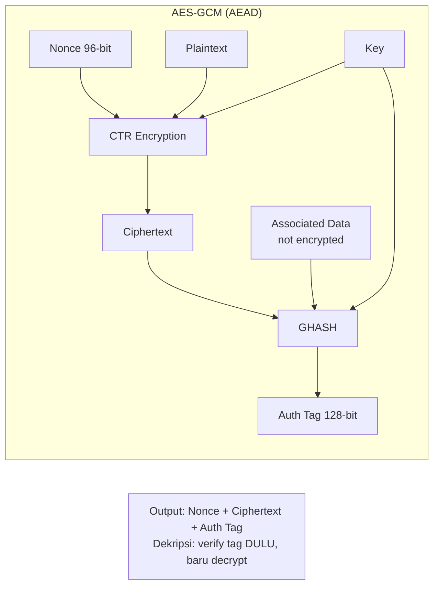

## 6. Contoh Terapan

**Kasus: Enkripsi file log forensik di cloud storage**

Requirement: confidentiality + integrity + dapat memverifikasi bahwa file tidak dimodifikasi oleh cloud provider.

Solusi: AES-256-GCM dengan kunci yang hanya dipegang oleh tim forensik.
- Setiap file menggunakan nonce unik (disimpan bersama file sebagai prefix)
- Associated data: nama file + timestamp + metadata
- Authentication tag diverifikasi sebelum membuka file

Jika penyerang (atau cloud provider tidak jujur) memodifikasi ciphertext → authentication tag tidak valid → file ditolak.

## 7. Praktikum atau Aktivitas Terarah

**Tujuan:** Mengimplementasikan enkripsi AES-GCM yang benar dan mendemonstrasikan bahaya nonce reuse.

**Langkah Kerja:**
1. Implementasikan enkripsi file menggunakan AES-256-GCM (kode template di atas sebagai titik awal).
2. Verifikasi bahwa modifikasi 1 byte pada ciphertext menyebabkan authentication failure.
3. **Demonstrasi bahaya (controlled):** Enkripsi dua pesan berbeda dengan kunci yang sama dan nonce yang sama. Hitung XOR dari kedua ciphertext — ini akan mengungkapkan XOR dari kedua plaintext. Dokumentasikan bahwa ini adalah kelemahan kritis.
4. Tulis laporan lab: implementasi, demonstrasi, analisis risiko, rekomendasi.

**Catatan Etika:** Demonstrasi nonce reuse dilakukan hanya pada data buatan yang Anda buat sendiri, bukan pada sistem atau data nyata.

## 8. Latihan Pemahaman

1. **(Pilihan Ganda)** Properti AEAD (Authenticated Encryption with Associated Data) menjamin:
   - A. Hanya confidentiality
   - B. Hanya integrity
   - C. Confidentiality + integrity + authentication dalam satu operasi
   - D. Non-repudiation

2. **(Analisis)** Jelaskan secara teknis mengapa nonce reuse pada AES-GCM adalah "catastrophic failure" sementara IV reuse pada AES-CTR "hanya" mengungkapkan XOR plaintext.

3. **(Evaluasi)** Tim pengembang mengusulkan: "Kami akan menggunakan AES-128-CBC + SHA-256 HMAC secara terpisah (encrypt-then-MAC) daripada AES-GCM. Ini memberikan flexibilitas." Evaluasi proposal ini dari perspektif keamanan dan kompleksitas implementasi.

## 9. Latihan Terapan / Studi Kasus

Anda menemukan bahwa sebuah aplikasi mobile banking menggunakan AES-256-CBC untuk mengenkripsi transaksi, dengan IV yang diambil dari timestamp Unix (detik) saat transaksi dilakukan. Analisis kelemahan ini, estimasi risiko eksploitasi, dan buat rekomendasi perbaikan lengkap termasuk cara migrasi yang aman.

## 10. Kunci Jawaban dan Pembahasan

**Soal 1:** Jawaban C. AEAD menjamin ketiganya dalam satu operasi yang terintegrasi. Ini lebih aman daripada enkripsi dan autentikasi terpisah karena menghindari kesalahan dalam urutan operasi (encrypt-then-MAC vs MAC-then-encrypt).

**Soal 2:** Dalam AES-GCM: nonce reuse memungkinkan pemulihan kunci GHASH (H), yang kemudian memungkinkan pemalsuan authentication tag untuk pesan lain. Ini lebih dari sekadar "mengungkapkan XOR plaintext" — penyerang dapat membuat ciphertext yang tampak valid untuk plaintext sewenang-wenang. Dalam AES-CTR: nonce reuse hanya mengungkapkan XOR dari dua plaintext (karena keystream yang sama di-XOR dengan dua plaintext berbeda). Ini serius tetapi tidak separa-catastrophic dengan GCM.

**Soal 3:** Encrypt-then-MAC dengan CBC+HMAC bisa aman jika diimplementasikan dengan benar, tetapi: (a) lebih kompleks — lebih banyak peluang salah; (b) CBC rentan terhadap padding oracle jika tidak hati-hati; (c) urutan encrypt-then-MAC vs MAC-then-encrypt penting dan sering salah; (d) performance lebih buruk karena dua operasi terpisah. Rekomendasi: gunakan AES-GCM karena lebih sederhana, lebih efisien, dan well-specified.

**Soal Studi Kasus:** IV dari timestamp Unix (detik) — masalah: (a) timestamp dapat diprediksi; (b) dua transaksi dalam detik yang sama menggunakan IV yang sama (IV collision); (c) memungkinkan BEAST-like attack. Risiko: jika penyerang dapat mempengaruhi timing transaksi, mereka dapat mengatur IV collision. Perbaikan: ganti ke AES-GCM dengan random nonce (os.urandom(12)). Migrasi: versi baru ciphertext menggunakan flag/prefix untuk membedakan format lama vs baru; migrasi bertahap.

## 11. Ringkasan Bab

ECB tidak boleh digunakan untuk data nyata. CBC memerlukan IV random dan rentan terhadap padding oracle. CTR memerlukan nonce unik. GCM (AEAD) adalah pilihan modern yang memberikan confidentiality + integrity + authentication dalam satu operasi. Nonce reuse pada GCM adalah catastrophic failure. Selalu gunakan library kriptografi yang sudah teruji — jangan implementasikan mode operasi sendiri.

## 12. Refleksi Profesional

1. Padding Oracle Attack adalah contoh bagaimana informasi yang "tampak tidak berbahaya" (error message yang berbeda) dapat menjadi oracle yang memungkinkan serangan. Bagaimana prinsip ini diterapkan dalam desain API keamanan: apa yang boleh dan tidak boleh diungkapkan kepada klien yang tidak terautentikasi?


---

# BAB 5 — HASH FUNCTIONS: SHA-2, SHA-3, DAN PROPERTI KEAMANAN

## 1. Capaian Pembelajaran Bab

Setelah mempelajari bab ini, mahasiswa mampu:
- Mendefinisikan hash function kriptografi dan tiga properti keamanannya
- Membedakan SHA-1, SHA-2, SHA-3 dan status keamanannya saat ini
- Memahami aplikasi hash dalam integritas data, password storage, dan digital signature
- Mengevaluasi pilihan hash function untuk berbagai skenario

*Berkaitan dengan Sub-CPMK-4, Eval-4 (15%)*

## 2. Peta Konsep Bab

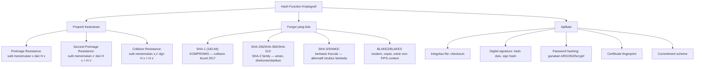

## 3. Pengantar Kontekstual

Hash function ada di mana-mana dalam keamanan siber: checksum untuk verifikasi integritas software, fingerprint sertifikat TLS, dasar dari digital signature, dan — sering disalahgunakan — penyimpanan password. Memahami properti keamanan hash function dan perbedaan antara hash "kriptografi" dan "non-kriptografi" adalah kompetensi dasar yang tidak dapat diabaikan.

## 4. Landasan Teori

### 4.1 Tiga Properti Keamanan Hash Function

**Preimage Resistance (One-wayness):**
Diberikan `h`, sulit menemukan `x` sehingga `H(x) = h`. Ini memastikan hash tidak dapat "dibalikkan" untuk menemukan input.

**Second Preimage Resistance:**
Diberikan `x`, sulit menemukan `x' ≠ x` sehingga `H(x) = H(x')`. Ini mencegah penggantian dokumen dengan dokumen lain yang memiliki hash yang sama.

**Collision Resistance:**
Sulit menemukan pasangan `(x, x')` dengan `x ≠ x'` sehingga `H(x) = H(x')`. Ini lebih kuat dari second preimage resistance karena penyerang bebas memilih *kedua* input.

**Hierarki:** Collision resistance ⊃ second preimage resistance ⊃ preimage resistance. Sebuah fungsi yang tidak collision resistant mungkin masih preimage resistant, tetapi tidak sebaliknya.

**Birthday Paradox:** Probabilitas collision untuk output n-bit terjadi setelah sekitar 2^(n/2) evaluasi. SHA-256 (256-bit): collision resistance nyata ~2¹²⁸ operasi — aman. SHA-1 (160-bit): ~2⁸⁰ secara teori, ~2⁶³·¹ secara praktis (Google SHAttered, 2017).

### 4.2 Status Hash Function

| Fungsi | Output | Status | Rekomendasi |
|---|---|---|---|
| MD5 | 128-bit | DIKOMPROMIS (collision 2004) | Jangan gunakan untuk keamanan |
| SHA-1 | 160-bit | DIKOMPROMIS (collision 2017) | Jangan gunakan; deprecated oleh browser |
| SHA-256 | 256-bit | Aman | Direkomendasikan — standar saat ini |
| SHA-384 | 384-bit | Aman | Untuk keamanan lebih tinggi |
| SHA-512 | 512-bit | Aman | Direkomendasikan untuk long-term |
| SHA3-256 | 256-bit | Aman | Alternatif berbasis Keccak |
| BLAKE2b | 512-bit | Aman | Non-NIST, sangat cepat |
| BLAKE3 | 256-bit | Aman | Modern, paralel, sangat cepat |

### 4.3 SHA-2 vs SHA-3: Perbedaan Struktural

SHA-2 menggunakan struktur Merkle-Damgård dengan kompresi berbasis Davies-Meyer. SHA-3 menggunakan struktur Sponge Function (Keccak) yang fundamentally berbeda. Keduanya aman, tetapi memiliki karakteristik yang berbeda:
- SHA-2 lebih efisien pada hardware dengan AES acceleration
- SHA-3 lebih efisien pada hardware resource-constrained
- Memiliki keduanya dalam toolbox adalah "cryptographic agility" yang baik

### 4.4 Kesalahan Penggunaan Hash untuk Password

**JANGAN:** Menyimpan password sebagai `SHA-256(password)`. Alasan:
1. Hash cepat — GPU modern dapat menghitung miliaran SHA-256/detik, memungkinkan brute force
2. Rainbow table: tabel precomputed hash untuk password umum
3. Tidak ada salt: password yang sama menghasilkan hash yang sama di semua user

**HARUS:** Gunakan fungsi khusus password hashing: **Argon2** (pemenang PHC 2015), **bcrypt**, atau **scrypt**. Ini dirancang untuk menjadi lambat (tunable work factor) dan memerlukan banyak memori.

## 5. Model atau Arsitektur

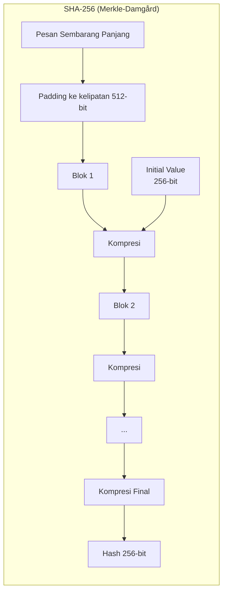

## 6. Contoh Terapan

**Verifikasi integritas software download:**

```python
import hashlib

def verify_download(filepath: str, expected_sha256: str) -> bool:
    """Verifikasi integritas file yang didownload."""
    sha256 = hashlib.sha256()
    with open(filepath, 'rb') as f:
        for chunk in iter(lambda: f.read(65536), b''):
            sha256.update(chunk)
    computed = sha256.hexdigest()
    return computed == expected_sha256

# Contoh: memverifikasi ISO Linux
iso_path = "ubuntu-22.04.3-desktop-amd64.iso"
expected = "a435f6f393dda581172490ead5"  # hash dari website resmi
is_valid = verify_download(iso_path, expected)
```

## 7. Praktikum atau Aktivitas Terarah

**Tujuan:** Membandingkan hash functions dan memverifikasi properti kriptografi.

**Langkah Kerja:**
1. Hitung hash dari string "Hello World" menggunakan MD5, SHA-1, SHA-256, SHA-512 menggunakan Python `hashlib`.
2. Ubah satu huruf ("Hello world") dan bandingkan — verifikasi avalanche effect.
3. Demonstrasikan mengapa `hashlib.md5("password")` tidak aman untuk password: hitung berapa hash MD5 yang dapat dihitung per detik di komputer Anda (`timeit`), estimasi waktu brute force untuk password 6 karakter.
4. Bandingkan dengan `bcrypt.hashpw()` — ukur berapa hash bcrypt yang dapat dihitung per detik.

## 8. Latihan Pemahaman

1. **(Analisis)** Apa perbedaan antara collision resistance dan second preimage resistance? Mengapa collision resistance lebih sulit untuk dipertahankan?

2. **(Evaluasi)** Aplikasi menyimpan password sebagai `SHA-256(username + password)`. Apakah penambahan username sebagai salt sudah cukup? Jelaskan kelemahannya.

## 9. Latihan Terapan / Studi Kasus

Database password sebuah platform diretas. Anda mendapatkan dump database yang berisi `md5(password)` untuk 1 juta user. Tanpa memecahkan satu pun hash, bagaimana Anda mengidentifikasi user yang menggunakan password yang sama? Apa implikasinya? Rekomendasikan arsitektur penyimpanan password yang benar.

## 10. Kunci Jawaban dan Pembahasan

**Soal 1:** Second preimage resistance: diberikan x dan H(x), sulit menemukan x' berbeda dengan H(x') = H(x). Collision resistance: sulit menemukan pasangan (x, x') apapun dengan hash yang sama. Collision resistance lebih sulit dipertahankan karena birthday paradox — penyerang bebas memilih kedua input, sehingga dapat menggunakan 2^(n/2) teknik untuk menemukan collision.

**Soal 2:** Penambahan username tidak cukup karena: (a) username tidak random — dictionary attack masih mungkin; (b) deterministic — user dengan password dan username yang sama (di platform berbeda atau jika ganti password kembali) menghasilkan hash yang sama; (c) masih SHA-256 yang cepat — brute force tetap feasible. Solusi: bcrypt/Argon2 dengan salt random per-user.

**Soal Studi Kasus:** Tanpa memecahkan hash: (a) cari hash yang muncul lebih dari sekali — dua user dengan hash MD5 sama *pasti* menggunakan password yang sama; (b) ini dapat digunakan untuk menghubungkan identitas (user A dan user B punya password sama → satu bocor, keduanya bocor); (c) bandingkan dengan database MD5 hash publik (RainbowCrack, CrackStation) — password umum langsung teridentifikasi. Rekomendasi: Argon2id dengan salt 16 byte random per user, work factor yang dapat dikonfigurasi (memori 64MB, 3 iterasi), output 32 byte.

## 11. Ringkasan Bab

Hash function kriptografi memiliki tiga properti: preimage resistance, second preimage resistance, dan collision resistance. SHA-256+ aman untuk integritas dan signature. SHA-1 dan MD5 TIDAK BOLEH digunakan untuk keamanan. Hash function TIDAK BOLEH digunakan langsung untuk password — gunakan Argon2, bcrypt, atau scrypt yang dirancang khusus untuk password hashing.

## 12. Refleksi Profesional

1. Transisi dari SHA-1 ke SHA-256 membutuhkan waktu bertahun-tahun meskipun kelemahan SHA-1 sudah diketahui sejak 2005. Bagaimana Anda merencanakan "cryptographic agility" dalam sistem yang Anda bangun, agar transisi algoritma di masa depan dapat dilakukan tanpa downtime signifikan?

---

# BAB 6 — MAC, HMAC, KDF, DAN PASSWORD HASHING

## 1. Capaian Pembelajaran Bab

Setelah mempelajari bab ini, mahasiswa mampu:
- Menjelaskan MAC (Message Authentication Code) dan HMAC
- Memahami Key Derivation Function (KDF) dan kapan menggunakannya
- Memilih algoritma password hashing yang tepat (Argon2, bcrypt, scrypt)
- Memahami konsep salt, pepper, dan work factor dalam password hashing

*Berkaitan dengan Sub-CPMK-4, Eval-4 (15%)*

## 2. Peta Konsep Bab

```mermaid
flowchart TD
    A[Authenticated Symmetric Primitif] --> B[MAC]
    B --> B1[HMAC-SHA256:\nHMAC = H k XOR opad || H k XOR ipad || m ]
    B --> B2[CMAC: berbasis AES block cipher]
    B --> B3[GMAC: bagian dari GCM]
    A --> C[Key Derivation Function KDF]
    C --> C1["HKDF: extract + expand\nuntuk session key derivation"]
    C --> C2["PBKDF2: password-based\niterative stretching — lemah vs GPU"]
    C --> C3["Argon2id: MEMORY HARD\npemenang PHC 2015 — direkomendasikan"]
    C --> C4["bcrypt: adaptive work factor\nlama tapi masih aman"]
    C --> C5["scrypt: memory-hard\nalternative argon2"]
    A --> D[Komponen Keamanan]
    D --> D1[Salt: random, per-user, mencegah rainbow table]
    D --> D2[Pepper: secret, server-side, tambahan lapisan]
    D --> D3[Work factor: tunable cost parameter]
```

## 3. Pengantar Kontekstual

Setelah memahami hash function, langkah berikutnya adalah memahami konstruksi yang menggunakan hash dengan kunci (MAC) dan cara menurunkan kunci kriptografi dari material yang ada (KDF). Ini adalah komponen yang sering ditemukan dalam protokol nyata: HMAC digunakan di JWT, TLS, dan API authentication; KDF digunakan di TLS key schedule, SSH, dan Signal Protocol.

## 4. Landasan Teori

### 4.1 MAC: Message Authentication Code

MAC menghasilkan *authentication tag* untuk memverifikasi bahwa pesan berasal dari pihak yang memiliki kunci rahasia dan tidak dimodifikasi.

**HMAC (Hash-based MAC):**

`HMAC(K, m) = H((K ⊕ opad) || H((K ⊕ ipad) || m))`

Di mana H adalah hash function, K adalah kunci, opad/ipad adalah padding constants. Konstruksi ini mencegah length extension attack yang rentan pada naive konstruksi `H(K || m)`.

**Perbedaan MAC vs Signature:**

| Properti | MAC | Digital Signature |
|---|---|---|
| Kunci | Simetris (shared secret) | Asimetris (kunci publik/privat) |
| Non-repudiation | Tidak (kedua pihak tahu kunci) | Ya (hanya signer yang tahu kunci privat) |
| Performance | Sangat cepat | Lebih lambat (operasi asimetris) |
| Penggunaan | Antara pihak yang tahu secret | Public verification |

**HMAC dalam praktik:**
- JWT (JSON Web Token): `HMAC-SHA256(header.payload, secret)`
- API authentication: request signing
- Cookie integrity: `HMAC-SHA256(cookie_data, server_secret)`
- Kelemahan: tidak memberikan non-repudiation; keamanan bergantung pada kerahasiaan kunci

### 4.2 Key Derivation Function (KDF)

KDF menghasilkan satu atau lebih kunci kriptografi dari "material kunci" awal (master key, password, atau shared secret).

**HKDF (HMAC-based Key Derivation Function, RFC 5869):**
- **Extract:** `PRK = HMAC-Hash(salt, IKM)` → pseudorandom key dari input key material
- **Expand:** `OKM = HKDF-Expand(PRK, info, L)` → output key material sepanjang L byte

Digunakan di: TLS 1.3, Signal Protocol, WhatsApp, WireGuard. Cocok untuk menurunkan beberapa kunci dari satu master key (misalnya: derive encryption key dan MAC key secara terpisah).

**PBKDF2:**
Menjalankan HMAC berulang kali (work factor = jumlah iterasi) untuk memperlambat brute force. Masalah: tidak memory-hard — GPU dengan ribuan core dapat menghitung PBKDF2 secara paralel.

### 4.3 Password Hashing: Argon2, bcrypt, scrypt

**Mengapa berbeda dari KDF biasa?**
Password memiliki entropi rendah — manusia cenderung memilih password yang mudah diingat. Fungsi password hashing harus:
1. Lambat secara tuneable (work factor)
2. Memory-hard: memerlukan banyak RAM → GPU paralel menjadi tidak efisien

**Argon2id (REKOMENDASI):**
Pemenang Password Hashing Competition (PHC) 2015. Mode `id` (hybrid) melindungi terhadap side-channel dan GPU attack.

Parameter penting:
- `m_cost`: memory usage (MB) — rekomendasi OWASP: min 64MB
- `t_cost`: iterasi — rekomendasi: min 3
- `parallelism`: thread

```python
import argon2  # pip install argon2-cffi
ph = argon2.PasswordHasher(
    time_cost=3,       # iterasi
    memory_cost=65536, # 64 MB
    parallelism=2,     # 2 thread
    hash_len=32,
    salt_len=16
)
hashed = ph.hash("user_password")
# Output: $argon2id$v=19$m=65536,t=3,p=2$...

# Verify
try:
    ph.verify(hashed, "user_password")  # True
    ph.verify(hashed, "wrong_password")  # raises VerifyMismatchError
except argon2.exceptions.VerifyMismatchError:
    print("Password salah")
```

**bcrypt:** Work factor 10-12 direkomendasikan (2^10 = 1024 iterasi). Masih aman tetapi terbatas pada password < 72 byte dan output 60 karakter.

### 4.4 Salt dan Pepper

**Salt:** Nilai random yang unik per password, disimpan bersama hash. Mencegah:
- Rainbow table attack (precomputed hash untuk password umum)
- Identification: dua user dengan password sama menghasilkan hash berbeda

**Pepper:** Secret value yang disimpan di server (bukan di database). Jika database bocor, penyerang masih perlu pepper untuk brute force. Pepper harus disimpan terpisah dari database (misalnya, environment variable atau secret management system).

Pepper diimplementasikan biasanya sebelum hashing: `bcrypt(password + pepper)` atau sebagai HMAC step.

## 5. Model atau Arsitektur

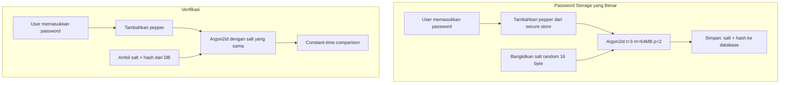

## 6. Contoh Terapan

**Implementasi API authentication menggunakan HMAC-SHA256:**

```python
import hmac
import hashlib
import time

def sign_request(api_key: str, method: str, path: str, body: str, timestamp: str) -> str:
    """Membuat signature untuk API request."""
    message = f"{method}\n{path}\n{body}\n{timestamp}"
    signature = hmac.new(
        api_key.encode(),
        message.encode(),
        hashlib.sha256
    ).hexdigest()
    return signature

def verify_request(api_key: str, method: str, path: str, 
                   body: str, timestamp: str, signature: str) -> bool:
    """Verifikasi signature API request."""
    # Cek timestamp tidak terlalu lama (cegah replay attack)
    if abs(time.time() - float(timestamp)) > 300:  # 5 menit window
        return False
    
    expected = sign_request(api_key, method, path, body, timestamp)
    # Gunakan compare_digest untuk mencegah timing attack!
    return hmac.compare_digest(expected, signature)
```

## 7. Praktikum atau Aktivitas Terarah

**Tujuan:** Mengimplementasikan sistem penyimpanan password yang aman dan membandingkan performa berbagai algoritma.

**Langkah Kerja:**
1. Implementasikan penyimpanan password dengan Argon2id (gunakan `argon2-cffi`).
2. Bandingkan waktu hash untuk: MD5, SHA-256, bcrypt (cost=10), bcrypt (cost=12), Argon2id.
3. Simulasikan brute force: berapa password/detik yang dapat dicoba per algoritma?
4. Implementasikan HMAC-SHA256 untuk API request signing dengan replay protection.
5. Laporan: tabel perbandingan performa + analisis implikasi keamanan.

## 8. Latihan Pemahaman

1. **(Pilihan Ganda)** Mengapa HMAC lebih aman dari konstruksi `H(K || m)` (naive MAC)?
   - A. HMAC menggunakan dua kunci berbeda
   - B. HMAC mencegah length extension attack dengan nested hash
   - C. HMAC menggunakan AES bukan hash
   - D. HMAC tidak memerlukan kunci

2. **(Analisis)** Jelaskan perbedaan antara salt dan pepper dalam password hashing. Jika database bocor tetapi source code dan environment variable tidak bocor, apa manfaat pepper?

## 9. Latihan Terapan / Studi Kasus

Anda menemukan bahwa sistem login menggunakan PBKDF2-SHA1 dengan 1.000 iterasi (default dari 2010) dan salt 8 byte. Hitung secara kasar: berapa iterasi PBKDF2-SHA1 yang dapat dihitung per detik oleh GPU modern (estimasi: 1 GPU = ~1 miliar PBKDF2-SHA1/detik dengan 1.000 iterasi)? Apa rekomendasi migrasi yang aman ke Argon2id tanpa invalidasi semua password yang ada?

## 10. Kunci Jawaban dan Pembahasan

**Soal 1:** Jawaban B. `H(K || m)` rentan terhadap length extension attack karena banyak hash function (SHA-256, MD-5) menggunakan Merkle-Damgård construction — penyerang yang mengetahui `H(K || m)` dapat menghitung `H(K || m || extension)` tanpa mengetahui K. HMAC menggunakan nested hashing yang memblokir serangan ini.

**Soal 2:** Salt: random, unik per user, disimpan di database. Fungsi: mencegah rainbow table dan membuat setiap hash unik. Jika database bocor: penyerang mendapat salt, harus brute force per-user. Pepper: server-side secret, tidak di database. Fungsi: lapisan perlindungan tambahan — jika hanya database bocor (bukan server config/env), penyerang tidak bisa brute force karena tidak tahu pepper.

**Soal Studi Kasus:** PBKDF2-SHA1 1.000 iterasi dengan 1 GPU: ~10⁹/detik / 1.000 iterasi = 10⁶ password/detik. Password 8 karakter alfanumerik: 36⁸ ≈ 2.8 × 10¹² kombinasi → waktu brute force: ~2.8 juta detik = ~32 hari. Tidak aman. Migrasi: (a) hash ulang password saat user login: jika PBKDF2(password) cocok, buat Argon2id(password) baru; (b) tandai akun yang sudah migrasi; (c) setelah periode tertentu, force reset password untuk akun yang belum migrasi.

## 11. Ringkasan Bab

MAC dan HMAC menyediakan autentikasi pesan dengan kunci simetris, tanpa non-repudiation. KDF (HKDF) menurunkan kunci dari material kunci awal. Password hashing HARUS menggunakan fungsi memory-hard: Argon2id (rekomendasi utama), bcrypt (alternatif), atau scrypt. Salt (random, per-user, public) dan pepper (secret, server-side) adalah komponen wajib.

## 12. Refleksi Profesional

1. Argon2id dapat menghabiskan 64MB RAM dan waktu yang terukur per verifikasi. Pada sistem dengan jutaan pengguna aktif bersamaan, ini berdampak pada infrastruktur. Bagaimana Anda menyeimbangkan keamanan password hashing dengan kebutuhan skalabilitas dalam sistem produksi?

---

# BAB 7 — ENTROPY, RANDOM NUMBER GENERATION, DAN KEY LIFECYCLE

## 1. Capaian Pembelajaran Bab

Setelah mempelajari bab ini, mahasiswa mampu:
- Memahami konsep entropy dan mengapa ia kritis untuk keamanan kriptografi
- Membedakan PRNG, CSPRNG, dan sumber entropy hardware
- Memahami key lifecycle: generation, distribution, storage, rotation, dan destruction
- Mengidentifikasi common mistakes dalam RNG dan key management

*Berkaitan dengan Sub-CPMK-4, Eval-4 (15%)*

## 2. Peta Konsep Bab

```mermaid
flowchart TD
    A[Random Number Generation] --> B[Entropy Sources]
    B --> B1[Hardware: gerakan mouse, disk timing,\nnetwork events, thermal noise]
    B --> B2[OS Entropy Pool: /dev/urandom Linux,\nCryptGenRandom Windows]
    B --> B3[HWRNG: Intel RDRAND/RDSEED,\nTPM true RNG]
    A --> C[RNG Types]
    C --> C1["PRNG: deterministic, tidak untuk crypto\nrand() in C, Math.random() JS"]
    C --> C2["CSPRNG: unpredictable, untuk crypto\nSecureRandom Java, secrets Python, os.urandom"]
    C --> C3["DRBG: deterministic RBG seeded\nfrom entropy — NIST SP 800-90A"]

    A --> D[Key Lifecycle]
    D --> D1[Generation: CSPRNG, adequate length]
    D --> D2[Distribution: secure channel / key wrapping]
    D --> D3[Storage: HSM, KMS, vault, never plaintext]
    D --> D4[Use: scope-limited, logged]
    D --> D5[Rotation: periodic, post-compromise]
    D --> D6[Revocation: immediate post-breach]
    D --> D7[Destruction: cryptographic erasure]
```

## 3. Pengantar Kontekstual

Seluruh keamanan sistem kriptografi bergantung pada kunci yang tidak dapat diprediksi. Jika kunci dapat diprediksi — baik karena dibangkitkan dari PRNG yang buruk, dari entropy yang rendah, atau karena parameter yang predictable — maka tidak ada algoritma yang aman sekalipun dapat menyelamatkan sistem.

Kasus nyata: Android Bitcoin wallet (2013) menggunakan Java `SecureRandom` yang di-seed dengan waktu pada beberapa versi Android. Hasilnya: kunci yang sama dibangkitkan berulang kali, memungkinkan pencurian Bitcoin dari dompet pengguna.

## 4. Landasan Teori

### 4.1 Entropy

Entropy (dalam konteks kriptografi) mengukur ketidakpastian atau unpredictability suatu nilai. 

- **1 bit entropy:** 50-50 antara 0 dan 1
- **256 bit entropy:** 2²⁵⁶ kemungkinan yang setara
- **Entropi kunci AES-256:** 256 bit — hanya jika kunci dibangkitkan dari sumber dengan entropi setinggi ini

**Low-entropy sources yang sering disalahgunakan:**
- Timestamp (detik/milidetik): hanya beberapa bit entropy
- PID proses: sangat predictable
- Sequential counter: 0 entropy

### 4.2 PRNG vs CSPRNG

**PRNG (Pseudorandom Number Generator):**
Deterministik — setelah seed diketahui, seluruh sequence dapat diprediksi. Cocok untuk simulasi, game, tidak aman untuk kriptografi.

**CSPRNG (Cryptographically Secure PRNG):**
Dirancang agar outputnya tidak dapat dibedakan dari truly random sequence oleh adversary komputasional. Seeded dari entropy pool OS.

| Platform | CSPRNG yang Tepat |
|---|---|
| Python | `os.urandom(n)` atau `secrets.token_bytes(n)` |
| Java | `java.security.SecureRandom` |
| C/C++ | `/dev/urandom` atau `getrandom()` |
| JavaScript/Node | `crypto.randomBytes()` |
| PHP | `random_bytes()` (PHP 7+) |

**JANGAN GUNAKAN:** `rand()`, `random()`, `Math.random()`, `time()` untuk kriptografi.

### 4.3 NIST SP 800-90: DRBG

NIST SP 800-90A mendefinisikan Deterministic Random Bit Generator (DRBG) — algoritma untuk CSPRNG yang distandarisasi untuk penggunaan federal. Contoh: CTR_DRBG berbasis AES, HMAC_DRBG berbasis SHA.

**Kontroversi Dual_EC_DRBG:** Satu algoritma DRBG yang distandarisasi NIST pada 2006 (Dual Elliptic Curve) diduga mengandung backdoor NSA — titik pada kurva eliptik dipilih dengan cara yang memungkinkan pemulihan state DRBG oleh pihak yang mengetahui discrete log antara titik-titik tersebut. Ini adalah contoh penting mengapa backdoor dalam standar kriptografi sangat berbahaya dan mengapa transparansi standar kritis.

### 4.4 Key Lifecycle Management

**1. Key Generation:**
- Gunakan CSPRNG, bukan timestamp atau password langsung
- Panjang kunci sesuai rekomendasi NIST SP 800-57

**2. Key Distribution:**
- Jangan kirim kunci via plaintext channel
- Gunakan key wrapping (encrypt kunci dengan kunci lain yang lebih kuat)
- Public key dapat didistribusikan bebas; private key tidak pernah meninggalkan sistem yang menggunakannya

**3. Key Storage:**
- Pilihan: Hardware Security Module (HSM), Key Management System (KMS) cloud (AWS KMS, Azure Key Vault, GCP Cloud KMS), atau software vault (HashiCorp Vault)
- JANGAN: hardcode kunci dalam source code, simpan di git, lingkungan variabel yang tidak terproteksi

**4. Key Use:**
- Setiap kunci memiliki tujuan yang ditentukan (encryption key ≠ signing key ≠ MAC key)
- Batasi scope kunci — jangan gunakan kunci yang sama untuk semua operasi

**5. Key Rotation:**
- Rutin: rotasi kunci secara periodik (misalnya, tiap 90 hari atau 1 tahun)
- Event-driven: rotasi setelah dugaan kompromi atau ketika personel dengan akses kunci meninggalkan organisasi

**6. Key Revocation:**
- Sistem harus mampu merevokasi kunci secara immediate jika terjadi insiden
- Untuk kunci publik: CRL (Certificate Revocation List) atau OCSP

**7. Key Destruction:**
- Cryptographic erasure: overwrite lokasi memori/storage dengan data random
- Untuk HSM: zeroize — perintah untuk menghapus semua material kunci
- Backup kunci yang dihapus juga harus dihancurkan

## 5. Model atau Arsitektur

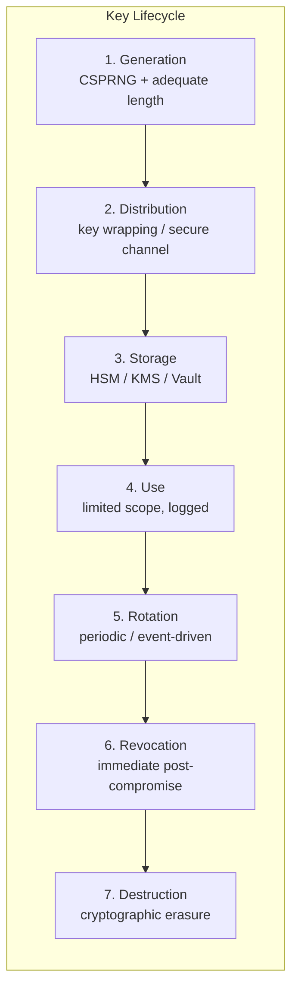

## 6. Contoh Terapan

**Audit RNG dalam kode:**

```python
# BERBAHAYA — contoh yang salah untuk tujuan edukasi
import random
import time

def bad_key_generation():
    random.seed(int(time.time()))  # seed dari timestamp!
    return bytes([random.randint(0, 255) for _ in range(32)])

# BENAR
import os
import secrets

def good_key_generation():
    return secrets.token_bytes(32)  # 256-bit dari OS entropy
```

## 7. Praktikum atau Aktivitas Terarah

**Tujuan:** Mengaudit RNG usage dalam kode dan mengimplementasikan key lifecycle yang aman.

**Langkah Kerja:**
1. Scan kode Python menggunakan `grep -r "random\." --include="*.py"` — identifikasi semua penggunaan `random` module (yang tidak secure) vs `secrets`/`os.urandom`.
2. Demonstrasi entropi: ukur waktu yang dibutuhkan untuk menghasilkan 1000 kunci dengan `os.urandom(32)` vs `random.getrandbits(256)`.
3. Implementasikan key rotation: script yang menghasilkan kunci baru, mengenkripsi ulang data dengan kunci baru, dan menghapus kunci lama secara aman.

## 8. Latihan Pemahaman

1. **(Analisis)** Developer menggunakan `random.randint(0, 2**256)` dengan argument bahwa angkanya sangat besar sehingga tidak bisa ditebak. Apa yang salah dengan argumen ini?

2. **(Evaluasi)** Sebuah KMS cloud menawarkan enkripsi kunci ("envelope encryption"): data dienkripsi dengan DEK (Data Encryption Key), dan DEK dienkripsi dengan KEK (Key Encryption Key) yang disimpan di KMS. Apa keuntungan desain ini dibanding menyimpan DEK langsung?

## 9. Latihan Terapan / Studi Kasus

Sebuah perusahaan menggunakan kunci AES-256 yang sama untuk mengenkripsi semua data customer mereka selama 5 tahun. Kunci tersebut disimpan dalam file konfigurasi `.env` yang dicommit ke repository git private. Tim keamanan baru saja menemukan ini. Buat incident response plan yang mencakup: penilaian risiko, langkah mitigasi immediate, prosedur rotasi kunci, dan rekomendasi arsitektur jangka panjang.

## 10. Kunci Jawaban dan Pembahasan

**Soal 1:** `random.randint()` Python menggunakan Mersenne Twister PRNG — deterministik setelah seed diketahui. Dengan mengobservasi 624 output berturut-turut, state PRNG dapat dipulihkan sepenuhnya, dan seluruh output masa depan dapat diprediksi. Ukuran ruang output tidak relevan — yang relevan adalah *entropy* seed, yang jauh lebih kecil.

**Soal 2:** Envelope encryption memiliki keuntungan: (a) skalabilitas: DEK dapat diubah per dataset tanpa merotasi KEK; (b) granularitas: data berbeda dapat memiliki DEK berbeda, membatasi blast radius jika satu kunci bocor; (c) key material tidak pernah meninggalkan KMS — operasi enkripsi/dekripsi dilakukan di KMS, aplikasi hanya mendapat ciphertext; (d) audit trail: KMS mencatat semua operasi kunci.

**Soal Studi Kasus:** Incident response: (1) Immediate risk assessment: apakah git repository accessible publik? Apakah history sudah dibaca pihak tidak berwenang? (2) Immediate action: revoke kunci git repository access, scan git history untuk eksposur (.env file commit), rotate kunci AES-256 — generate kunci baru dengan CSPRNG. (3) Key rotation: enkripsi ulang semua data customer dengan kunci baru secara bertahap; lakukan dalam batch untuk menghindari downtime. (4) Jangka panjang: implement KMS (AWS KMS/HashiCorp Vault); jangan pernah commit secret ke git; gunakan `.gitignore` untuk `.env`; implement secret scanning dalam CI/CD pipeline.

## 11. Ringkasan Bab

Entropy adalah fondasi keamanan kriptografi. CSPRNG (os.urandom, secrets) harus digunakan untuk kunci, bukan PRNG biasa. Key lifecycle melibatkan 7 fase: generation, distribution, storage, use, rotation, revocation, dan destruction. HSM/KMS/Vault adalah cara yang benar untuk menyimpan kunci.

## 12. Refleksi Profesional

1. Key destruction adalah konsep yang sering diabaikan dalam perencanaan sistem. Dalam konteks forensik digital, ada situasi di mana penghancuran kunci adalah tindakan yang diperlukan (misalnya data yang sudah expired dan tidak boleh direkonstruksi). Bagaimana Anda memastikan bahwa key destruction benar-benar efektif — termasuk backup, memory dumps, dan penyimpanan residual?

---

# BAB 8 — AUDIT HASH/MAC/KDF/RNG DAN KEY MANAGEMENT PADA SKENARIO APLIKASI

## 1. Capaian Pembelajaran Bab

Setelah mempelajari bab ini, mahasiswa mampu:
- Melakukan audit kriptografi terhadap sistem aplikasi nyata
- Mengidentifikasi misuse hash, MAC, KDF, RNG, dan key management
- Menyusun laporan audit dengan temuan, risiko, dan rekomendasi terprioritas
- Menggunakan standar (NIST SP 800-57, OWASP) sebagai referensi audit

*Berkaitan dengan Sub-CPMK-4, Eval-4 (15%) — Final Audit Report*

## 2. Peta Konsep Bab

```mermaid
flowchart TD
    A[Cryptographic Audit] --> B[Audit Scope]
    B --> B1[Hash functions: algoritma, penggunaan]
    B --> B2[MAC: HMAC vs naive, key rotation]
    B --> B3[KDF/Password: Argon2/bcrypt, work factor]
    B --> B4[RNG: CSPRNG vs PRNG, seeding]
    B --> B5[Key Management: storage, rotation, lifecycle]
    A --> C[Audit Methodology]
    C --> C1[Code Review: static analysis]
    C --> C2[Configuration Review: algo, params]
    C --> C3[Test Vector Verification]
    C --> C4[Dependency Check: outdated libraries]
    A --> D[Findings Classification]
    D --> D1[Critical: immediate exploit possible]
    D --> D2[High: significant risk]
    D --> D3[Medium: limited risk]
    D --> D4[Low/Informational: best practice]
    A --> E[Output]
    E --> E1[Audit Report + Risk Register]
    E --> E2[Prioritized Recommendations]
```

## 3. Pengantar Kontekstual

Seorang analis kriptografi tidak hanya harus tahu teori — ia harus mampu menerapkannya dalam konteks audit sistem nyata. Bab ini mengintegrasikan konsep dari Bab 5-7 ke dalam metodologi audit yang sistematis, mengikuti standar industri dari NIST, OWASP, dan CWE (Common Weakness Enumeration).

## 4. Landasan Teori

### 4.1 Standar Referensi Audit

**NIST SP 800-57 Part 1:** Rekomendasi untuk key management — mendefinisikan algoritma yang direkomendasikan, ukuran kunci, dan masa pakai.

**NIST SP 800-131A:** Panduan transisi ke algoritma dan panjang kunci yang lebih kuat. Mendefinisikan status algoritma: "Allowed", "Deprecated", "Disallowed".

**OWASP Cryptographic Storage Cheat Sheet:** Panduan praktis untuk enkripsi data at rest.

**OWASP Key Management Cheat Sheet:** Panduan key lifecycle.

**CWE (Common Weakness Enumeration):**
- CWE-327: Use of Broken or Risky Cryptographic Algorithm
- CWE-328: Use of Weak Hash
- CWE-330: Use of Insufficiently Random Values
- CWE-321: Use of Hard-coded Cryptographic Key
- CWE-916: Use of Password Hash With Insufficient Computational Effort

### 4.2 Audit Checklist

**Hash Function Audit:**
- [ ] MD5 tidak digunakan untuk keamanan (hanya mungkin untuk non-security checksum)
- [ ] SHA-1 tidak digunakan untuk signature, certificate, atau keamanan
- [ ] SHA-256 atau lebih kuat digunakan
- [ ] Password tidak disimpan sebagai hash biasa (SHA-256, MD5, dll.)

**MAC Audit:**
- [ ] HMAC (bukan naive H(K||m)) digunakan
- [ ] Kunci MAC berbeda dari kunci enkripsi
- [ ] Kunci MAC memiliki entropi yang cukup (min 128-bit)
- [ ] Verifikasi menggunakan constant-time comparison (bukan `==`)

**KDF/Password Hashing Audit:**
- [ ] Password di-hash menggunakan Argon2id/bcrypt/scrypt
- [ ] Work factor memadai (bcrypt: cost ≥ 10; Argon2: m ≥ 64MB, t ≥ 3)
- [ ] Salt unik per-user, minimal 16 byte, random
- [ ] PBKDF2 tidak digunakan dengan iterasi rendah (jika masih digunakan: min 600.000 per OWASP 2023)

**RNG Audit:**
- [ ] Tidak ada penggunaan `random`, `rand()`, `Math.random()` untuk kriptografi
- [ ] `os.urandom()`/`secrets`/`SecureRandom` digunakan
- [ ] Kunci tidak di-generate dari seed yang predictable (timestamp, PID)

**Key Management Audit:**
- [ ] Tidak ada kunci hardcoded dalam source code
- [ ] Kunci tidak disimpan dalam file yang dapat diakses publik
- [ ] Kunci tidak di-commit ke git
- [ ] Key rotation terjadwal dan terdokumentasi
- [ ] Secret management system (Vault, KMS) digunakan

### 4.3 Format Laporan Audit Kriptografi

```
CRYPTOGRAPHIC SECURITY AUDIT REPORT
Sistem: [Nama sistem]
Tanggal: [Tanggal audit]
Auditor: [Nama]
Scope: [Komponen yang diaudit]

RINGKASAN EKSEKUTIF:
[2-3 paragraf ringkasan temuan kritis]

METODOLOGI:
[Code review, configuration review, tool yang digunakan]

TEMUAN:
CRYPTO-001 [Critical]: Hardcoded AES key dalam AuthService.java
  - CWE: CWE-321
  - Bukti: Line 47, AuthService.java
  - Risiko: Seluruh data terenkripsi dapat didekripsi jika source code bocor
  - Rekomendasi: Pindahkan ke KMS (AWS KMS/Vault); implementasikan key rotation

CRYPTO-002 [High]: Password disimpan sebagai MD5(password)
  - CWE: CWE-916, CWE-328
  - Bukti: UserRepository.java, line 103
  - Risiko: Rainbow table attack; brute force sangat cepat
  - Rekomendasi: Migrasi ke Argon2id; re-hash password saat user login

[Lanjutkan untuk setiap temuan]

RISK REGISTER:
[Tabel: Temuan, Severity, Likelihood, Risk, Priority]

REKOMENDASI PRIORITAS:
[Diurutkan berdasarkan risk]
```

## 5. Model atau Arsitektur

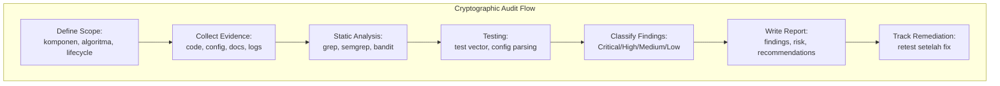

## 6. Contoh Terapan

**Menggunakan `bandit` untuk static analysis kriptografi Python:**

```bash
# Install bandit
pip install bandit

# Scan seluruh proyek
bandit -r ./src/ -t B303,B304,B305,B306,B324,B501,B502,B503,B504,B505,B506

# B303: MD5 usage
# B324: SHA-1 usage  
# B311: random usage in security context
# B501-B506: SSL/TLS issues
```

Bandit mengidentifikasi secara otomatis: penggunaan MD5, SHA-1, random() untuk kriptografi, kunci hardcoded, dan konfigurasi TLS yang lemah.

## 7. Praktikum atau Aktivitas Terarah

**Tujuan:** Melakukan audit kriptografi pada aplikasi sampel dan menyusun laporan audit.

**Langkah Kerja:**
1. Dosen menyediakan kode sumber aplikasi dengan beberapa kelemahan kriptografi yang disengaja (untuk tujuan pendidikan).
2. Jalankan `bandit` dan analisis outputnya.
3. Lakukan manual code review menggunakan audit checklist.
4. Identifikasi minimal 5 temuan dengan severity berbeda.
5. Susun Audit Report menggunakan template di atas.
6. Prioritaskan rekomendasi berdasarkan risk (severity × likelihood).

**Output:** Laporan audit lengkap — ini adalah Eval-4.

## 8. Latihan Pemahaman

1. **(Analisis)** Dalam audit, Anda menemukan kode: `token = hashlib.sha256(f"{user_id}{timestamp}".encode()).hexdigest()`. Ini digunakan sebagai reset password token. Identifikasi kelemahan keamanannya.

2. **(Evaluasi)** NIST SP 800-131A mendeprekasikan RSA-1024. Sistem Anda masih menggunakan RSA-1024 karena integrasi dengan sistem legacy. Bagaimana Anda mengklasifikasikan temuan ini dan apa mitigasi interim yang dapat Anda rekomendasikan?

## 9. Latihan Terapan / Studi Kasus

Anda diminta mengaudit sistem enkripsi database sebuah rumah sakit yang menyimpan rekam medis. Sistem menggunakan AES-128-CBC dengan kunci yang disimpan dalam database yang sama. Salt untuk password hashing adalah nama pengguna. Buat laporan audit lengkap dengan minimal 4 temuan, risk register, dan rekomendasi remediation.

## 10. Kunci Jawaban dan Pembahasan

**Soal 1:** Kelemahan: (a) `user_id` dan `timestamp` memiliki entropi sangat rendah — dapat diprediksi; (b) SHA-256 adalah hash function, bukan token generator — mudah dibruteforce; (c) tidak ada expiry mechanism; (d) tidak ada salt random; (e) length extension attack. Perbaikan: gunakan `secrets.token_urlsafe(32)` untuk token reset yang benar-benar acak, simpan hash dari token (bukan token langsung) di database, set expiry 15-30 menit.

**Soal 2:** Klasifikasi: Critical atau High (bergantung pada data yang diproteksi). RSA-1024 dapat dipecahkan dengan sumber daya yang cukup — NIST menganggap ini tidak aman setelah 2010. Mitigasi interim: (a) batasi penggunaan RSA-1024 hanya untuk integrasi legacy yang tidak dapat diubah; (b) tambahkan lapisan enkripsi tambahan untuk data kritikal; (c) buat rencana migrasi konkret ke RSA-2048 atau ECDSA-256; (d) dokumentasikan risiko residu secara formal.

**Soal Studi Kasus:** Laporan audit untuk sistem rumah sakit: CRYPTO-001 [Critical]: Kunci AES tersimpan di database yang sama dengan data yang dienkripsi → jika database bocor, seluruh rekam medis dapat didekripsi. Rekomendasi: pindahkan kunci ke KMS terpisah. CRYPTO-002 [High]: AES-128-CBC tanpa HMAC → rentan padding oracle; modifikasi data tidak terdeteksi. Rekomendasi: migrasi ke AES-256-GCM. CRYPTO-003 [High]: Salt = nama pengguna → dictionary attack terhadap password. Rekomendasi: salt random 16 byte + Argon2id. CRYPTO-004 [Critical]: Data rekam medis (PHI) di bawah perlindungan yang tidak memadai → potensi pelanggaran UU PDP No. 27/2022 dan HIPAA (jika data pasien internasional). Rekomendasi: audit menyeluruh dengan konsultan hukum.

## 11. Ringkasan Bab

Audit kriptografi yang sistematis mencakup: code review, configuration review, test vector verification, dan dependency audit. Standar referensi: NIST SP 800-57/131A, OWASP Cryptographic Cheat Sheets. Laporan audit harus menggunakan format yang jelas dengan severity classification (Critical/High/Medium/Low), bukti, risiko, dan rekomendasi terprioritas.

## 12. Refleksi Profesional

1. Dalam audit keamanan rumah sakit, Anda menemukan kelemahan kritis yang mempengaruhi kerahasiaan rekam medis ribuan pasien. Selain melaporkan kepada klien, apakah ada kewajiban profesional atau hukum lain? Bagaimana UU PDP No. 27/2022 dan peraturan kesehatan Indonesia mengatur situasi ini?


---

# BAB 9 — RSA: MATEMATIKA, KEAMANAN, DAN IMPLEMENTASI BENAR

## 1. Capaian Pembelajaran Bab

Setelah mempelajari bab ini, mahasiswa mampu:
- Menjelaskan matematika di balik RSA: faktorisasi dan Euler's totient
- Membedakan RSA-PKCS1v1.5 dan RSA-OAEP dalam konteks keamanan
- Mengidentifikasi parameter RSA yang aman dan yang tidak aman
- Menjelaskan serangan terhadap RSA yang salah diimplementasikan

*Berkaitan dengan Sub-CPMK-5*

## 2. Peta Konsep Bab

```mermaid
flowchart TD
    A[RSA] --> B[Matematika Fondasi]
    B --> B1["Euler Totient: φ(n) = (p-1)(q-1)"]
    B --> B2["Public key: (e, n)"]
    B --> B3["Private key: d, dimana ed ≡ 1 mod φ(n)"]
    B --> B4["Enkripsi: c = mᵉ mod n"]
    B --> B5["Dekripsi: m = cᵈ mod n"]
    A --> C[Keamanan]
    C --> C1["Hardness: Integer Factorization Problem\nsulit memfaktorkan n = p×q"]
    C --> C2["RSA-1024: DEPRECATED (NIST 2010)"]
    C --> C3["RSA-2048: minimum saat ini"]
    C --> C4["RSA-3072/4096: untuk long-term security"]
    A --> D[Padding Schemes]
    D --> D1["PKCS#1 v1.5: VULNERABLE\nBleichenbacher attack (1998)"]
    D --> D2["OAEP: RECOMMENDED\nRSA-OAEP dengan SHA-256"]
    A --> E[Aplikasi]
    E --> E1[Enkripsi kunci simetris: Hybrid encryption]
    E --> E2[Digital signature: PSS scheme]
    E --> E3[Key exchange: TLS handshake]
```

## 3. Pengantar Kontekstual

RSA adalah algoritma kriptografi asimetris yang paling lama digunakan dan paling dikenal. Hampir setiap implementasi TLS, PKI, dan digital signature pernah atau masih menggunakan RSA. Namun RSA memiliki banyak jebakan implementasi — padding scheme yang salah, parameter yang lemah, atau penggunaan langsung tanpa konstruksi hybrid dapat menghancurkan keamanan seluruh sistem.

## 4. Landasan Teori

### 4.1 Matematika RSA

**Key Generation:**
1. Pilih dua bilangan prima besar `p` dan `q` (berbeda, rahasia)
2. Hitung `n = p × q` (modulus, publik)
3. Hitung `φ(n) = (p-1)(q-1)` (Euler's totient, rahasia)
4. Pilih `e` sehingga `gcd(e, φ(n)) = 1` dan `1 < e < φ(n)` (biasanya `e = 65537`)
5. Hitung `d` sehingga `e × d ≡ 1 (mod φ(n))` menggunakan Extended Euclidean Algorithm
6. Public key: `(e, n)`, Private key: `(d, n)` (dan p, q, φ(n) harus dirahasiakan)

**Enkripsi dan Dekripsi:**
- Enkripsi: `c = mᵉ mod n`
- Dekripsi: `m = cᵈ mod n`

Keamanan bergantung pada Integer Factorization Problem: mudah mengalikan `p × q`, tapi sulit memfaktorkan `n` menjadi `p` dan `q` untuk bilangan prima besar.

### 4.2 Mengapa RSA Textbook Tidak Aman

RSA "textbook" (tanpa padding) memiliki beberapa kelemahan fundamental:

1. **Deterministic:** Pesan yang sama selalu menghasilkan ciphertext yang sama → penyerang dapat melakukan exhaustive search untuk pesan pendek/predictable.
2. **Multiplicative homomorphism:** `Enc(m₁) × Enc(m₂) = Enc(m₁ × m₂ mod n)` → dapat memanipulasi ciphertext secara matematis.
3. **Small message vulnerability:** Jika `mᵉ < n`, dekripsi hanya memerlukan akar kuadrat integer biasa (untuk `e=3`, `m³ < n`).

### 4.3 Padding Schemes

**PKCS#1 v1.5 (JANGAN GUNAKAN UNTUK ENKRIPSI):**
Format padding: `0x00 || 0x02 || PS || 0x00 || M` di mana PS adalah padding random. Masalah: Bleichenbacher attack (1998) dan variannya memungkinkan dekripsi ciphertext RSA tanpa kunci privat dengan memanfaatkan oracle yang memberitahu apakah padding valid atau tidak. ROBOT attack (2017) membuktikan ini masih praktis terhadap banyak server TLS.

**OAEP (Optimal Asymmetric Encryption Padding) — REKOMENDASI:**
RSA-OAEP menggunakan randomized padding dengan MGF (Mask Generation Function). Aman secara terbukti (CCA-secure) jika menggunakan hash yang tepat. Gunakan RSA-OAEP dengan SHA-256.

**Untuk Signature: PSS (Probabilistic Signature Scheme):**
RSA-PSS lebih aman dari RSA-PKCS1v1.5 untuk signature. NIST SP 800-131A merekomendasikan RSA-PSS.

### 4.4 Ukuran Kunci RSA

| Ukuran Kunci | Status | Rekomendasi |
|---|---|---|
| 512-bit | Broken (< 1999) | Tidak boleh digunakan |
| 1024-bit | Deprecated (NIST 2010) | Tidak boleh digunakan |
| 2048-bit | Current minimum | Minimum untuk tanda tangan sampai 2030 |
| 3072-bit | Strong | Direkomendasikan untuk baru |
| 4096-bit | Very strong | Untuk long-term security |

### 4.5 Hybrid Encryption

RSA tidak didesain untuk mengenkripsi data dalam jumlah besar. RSA hanya dapat mengenkripsi data yang lebih kecil dari modulus (n). Praktik yang benar: **hybrid encryption**.

1. Bangkitkan kunci simetris random (misalnya, AES-256 key)
2. Enkripsi data dengan kunci simetris: `cipher_data = AES-256-GCM(key, data)`
3. Enkripsi kunci simetris dengan RSA-OAEP: `cipher_key = RSA_OAEP_Encrypt(pub_key, key)`
4. Kirim: `(cipher_key, cipher_data)`

Inilah yang digunakan di email enkripsi (S/MIME, PGP), file enkripsi, dan TLS sebelum ECDH menjadi dominan.

## 5. Model atau Arsitektur

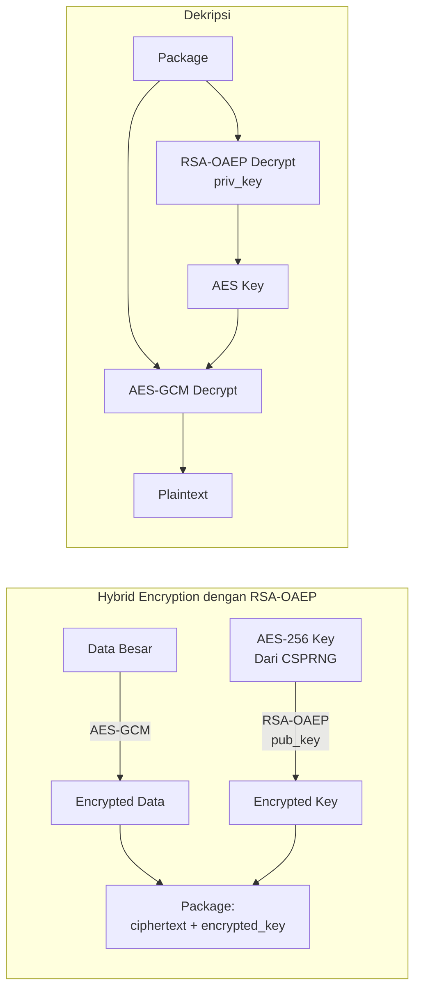

## 6. Contoh Terapan

```python
from cryptography.hazmat.primitives.asymmetric import rsa, padding
from cryptography.hazmat.primitives import hashes, serialization
import os

# Generate RSA-2048 key pair
private_key = rsa.generate_private_key(
    public_exponent=65537,
    key_size=2048,
)
public_key = private_key.public_key()

# Hybrid encryption: enkripsi AES key dengan RSA-OAEP
aes_key = os.urandom(32)  # 256-bit AES key

encrypted_key = public_key.encrypt(
    aes_key,
    padding.OAEP(
        mgf=padding.MGF1(algorithm=hashes.SHA256()),
        algorithm=hashes.SHA256(),
        label=None
    )
)

# Dekripsi
recovered_key = private_key.decrypt(
    encrypted_key,
    padding.OAEP(
        mgf=padding.MGF1(algorithm=hashes.SHA256()),
        algorithm=hashes.SHA256(),
        label=None
    )
)
assert aes_key == recovered_key
```

## 7. Praktikum atau Aktivitas Terarah

**Tujuan:** Mengimplementasikan hybrid encryption dengan RSA-OAEP dan memverifikasi keamanan padding.

**Langkah Kerja:**
1. Generate RSA-2048 key pair dan serialisasi ke PEM format.
2. Implementasikan hybrid encryption: generate AES-256 key, enkripsi data dengan AES-GCM, enkripsi AES key dengan RSA-OAEP.
3. Implementasikan dekripsi hybrid.
4. Verifikasi: modifikasi satu bit pada encrypted_key dan periksa apakah dekripsi gagal dengan error yang aman.

## 8. Latihan Pemahaman

1. **(Analisis)** RSA-PKCS1v1.5 masih digunakan dalam banyak implementasi TLS lama. Jelaskan Bleichenbacher attack dan mengapa ini masih berbahaya bahkan pada tahun 2024.

2. **(Evaluasi)** Developer menggunakan `e = 3` (exponent kecil) untuk mempercepat enkripsi. Apa risiko spesifik yang ditimbulkan oleh pilihan ini, dan mengapa `e = 65537` adalah pilihan standar?

## 9. Latihan Terapan / Studi Kasus

Sebuah sistem enkripsi email menggunakan RSA-1024 dengan PKCS#1 v1.5 padding. Email yang dienkripsi disimpan selama 10 tahun. Buatkan rencana migrasi yang mencakup: penilaian risiko data yang sudah tersimpan, strategi re-enkripsi, pemilihan parameter baru (ukuran kunci dan padding scheme), dan timeline migrasi.

## 10. Kunci Jawaban dan Pembahasan

**Soal 1:** Bleichenbacher attack mengeksploitasi oracle: sistem yang menjawab "apakah padding PKCS#1 v1.5 valid?" Melalui ribuan (atau jutaan) query dengan ciphertext yang dimodifikasi secara adaptif, penyerang dapat memulihkan plaintext tanpa kunci privat. ROBOT attack (2017) menunjukkan bahwa banyak server TLS (Facebook, Cisco, F5) masih rentan — timing perbedaan dalam respons error sudah cukup sebagai oracle. Serangan ini berbahaya karena: (a) banyak sistem lama masih menggunakan PKCS#1 v1.5; (b) serangan ini tidak memerlukan kunci privat; (c) dapat digunakan untuk men-decrypt session TLS yang direkam.

**Soal 2:** Risiko e=3: Jika pesan m kecil (m³ < n), penyerang dapat menghitung akar kubik integer dari ciphertext tanpa operasi modular — dekripsi langsung. Untuk e=3 dan pesan yang sama dikirim ke 3 penerima berbeda: Chinese Remainder Theorem memungkinkan pemulihan pesan dari ketiga ciphertext. e=65537 (= 2¹⁶ + 1) adalah bilangan prima Fermat yang menyeimbangkan keamanan (tidak terlalu kecil) dan efisiensi enkripsi (hanya 17 perkalian karena representasi biner-nya hanya 2 bit 1).

**Soal Studi Kasus:** Risiko: RSA-1024 dapat difaktorkan dengan sumber daya yang cukup (estimasi: sekitar 100 MIPS-years); data yang disimpan selama 10 tahun berisiko tinggi jika kunci terkompromis. Migrasi: (a) Immediate: hentikan penggunaan RSA-1024 untuk email baru, pindah ke RSA-3072 + RSA-OAEP-SHA256; (b) Re-enkripsi: prioritaskan email dengan klasifikasi data tinggi; (c) Untuk email lama yang tidak dapat di-re-enkripsi (kunci lama sudah destroyed): dokumentasikan sebagai risiko residu; (d) Timeline: 3 bulan untuk infrastruktur baru, 6 bulan untuk re-enkripsi email kritikal.

## 11. Ringkasan Bab

RSA berbasis pada Integer Factorization Problem. RSA-2048 minimum; RSA-3072/4096 direkomendasikan. Padding wajib: RSA-OAEP (bukan PKCS#1 v1.5) untuk enkripsi; RSA-PSS untuk signature. RSA hanya untuk mengenkripsi data kecil (kunci simetris) — gunakan hybrid encryption untuk data besar. e=65537 adalah standar.

## 12. Refleksi Profesional

1. RSA-1024 sudah deprecated sejak 2010, namun masih ditemukan di banyak sistem legacy. Bagaimana Anda mengkomunikasikan urgensi migrasi kepada manajemen yang mungkin tidak memahami kriptografi, terutama ketika biaya migrasi signifikan dan "tidak ada yang diretas hari ini"?


---

# BAB 10 — ELLIPTIC CURVE CRYPTOGRAPHY, DIFFIE-HELLMAN, DAN KEY EXCHANGE

## 1. Capaian Pembelajaran Bab

Setelah mempelajari bab ini, mahasiswa mampu:
- Menjelaskan prinsip dasar Elliptic Curve Cryptography (ECC)
- Memahami Diffie-Hellman Key Exchange (DHKE) dan ECDH
- Membandingkan ECC dengan RSA dari segi keamanan dan efisiensi
- Mengenal kurva eliptik standar (P-256, P-384, Curve25519)
- Mengidentifikasi kelemahan forward secrecy dalam desain protokol

*Berkaitan dengan Sub-CPMK-5*

## 2. Peta Konsep Bab

```mermaid
flowchart TD
    A[Kriptografi Kunci Publik Modern] --> B[ECC]
    B --> B1["Elliptic Curve: y² = x³ + ax + b mod p"]
    B --> B2["ECDLP: sulit menemukan k dari Q = kP"]
    B --> B3["Kurva Standar: P-256, P-384, Curve25519/X25519"]
    A --> C[Key Exchange]
    C --> C1["DH klasik: gˣ mod p\nrentan tanpa autentikasi → MITM"]
    C --> C2["ECDH: kA × PB = kB × PA = shared secret"]
    C --> C3["ECDHE: Ephemeral — kunci baru per sesi\n→ Forward Secrecy"]
    A --> D[Security Properties]
    D --> D1["Forward Secrecy: kompromi long-term key\ntidak membahayakan session key lama"]
    D --> D2["Autentikasi: DHKE/ECDHE harus dikombinasikan\ndengan signature untuk cegah MITM"]
    A --> E[Parameter Keamanan]
    E --> E1["256-bit ECC ≈ 3072-bit RSA security level"]
    E --> E2["Curve25519: desain modern, constant-time, direkomendasikan"]
    E --> E3["P-256 (NIST/ANSSI): digunakan luas di TLS, FIDO2"]
```

## 3. Pengantar Kontekstual

ECC telah menjadi pilihan utama kriptografi asimetris modern karena ukuran kunci yang jauh lebih kecil dari RSA dengan tingkat keamanan yang setara. WhatsApp, Signal, TLS 1.3, FIDO2/WebAuthn, dan hampir semua sistem modern menggunakan ECC. Pemahaman ECC dan ECDH bukan lagi opsional bagi profesional keamanan siber.

## 4. Landasan Teori

### 4.1 Elliptic Curve Basics

Kurva eliptik di atas field prima Fp: `y² ≡ x³ + ax + b (mod p)`, di mana `4a³ + 27b² ≠ 0` (kurva non-singular).

**Point Addition:** Dua titik pada kurva dapat "ditambahkan" menggunakan geometri yang didefinisikan secara aljabar. Titik "O" (point at infinity) adalah elemen identitas.

**Scalar Multiplication:** `Q = kP` — menambahkan titik P sebanyak k kali. Ini adalah operasi dasar ECC:
- **Mudah:** Diberikan k dan P, hitung Q (dengan double-and-add, O(log k))
- **Sulit:** Diberikan Q dan P, temukan k (Elliptic Curve Discrete Logarithm Problem — ECDLP)

### 4.2 Keamanan ECC vs RSA

| Keamanan | RSA | ECC | Keterangan |
|---|---|---|---|
| 80-bit | 1024-bit | 160-bit | RSA-1024 deprecated |
| 112-bit | 2048-bit | 224-bit | |
| 128-bit | 3072-bit | 256-bit | P-256, Curve25519 |
| 192-bit | 7680-bit | 384-bit | P-384 |
| 256-bit | 15360-bit | 512-bit | P-521 |

ECC-256 ≈ RSA-3072 dalam security level, tetapi ukuran kunci dan ciphertext jauh lebih kecil, dan operasi kriptografi jauh lebih cepat.

### 4.3 Kurva Standar

**P-256 (secp256r1 / prime256v1):**
Kurva NIST. Paling luas digunakan: TLS, FIDO2, ECDSA dalam banyak aplikasi. Kontroversi kecil pada konstanta kurva (random-looking tapi dengan seed tidak transparan), namun dianggap aman.

**P-384 (secp384r1):**
Untuk tingkat keamanan lebih tinggi, digunakan di pemerintahan AS (NSA Suite B, TS/SCI data).

**Curve25519 / X25519:**
Dirancang oleh Daniel J. Bernstein (2006) untuk ECDH. Desain transparan, constant-time by design (resisten timing attack), dan sangat cepat. Digunakan di Signal Protocol, TLS 1.3, WireGuard, SSH modern. **Rekomendasi untuk sistem baru.**

**Ed25519:**
Untuk digital signature (Edwards-curve DSA). Konstanta, safety, performa sangat baik. Digunakan di SSH-keygen modern, Git commit signing.

### 4.4 Diffie-Hellman Key Exchange (DHKE)

DHKE memungkinkan dua pihak membuat shared secret tanpa pernah mengirimkan secret tersebut:

```
Alice                              Bob
pilih a (secret)                   pilih b (secret)
A = gᵃ mod p                      B = gᵇ mod p
───── kirim A ─────────────────────────────────────>
<────────────────────────── kirim B ───────────────
S = Bᵃ mod p                      S = Aᵇ mod p
S = gᵃᵇ mod p = gᵇᵃ mod p = shared secret ✓
```

**Masalah DHKE Klasik:**
- Rentan Man-in-the-Middle (MITM) tanpa autentikasi — Eve dapat mengganti A dan B
- Parameter p dan g harus dipilih dengan hati-hati (2048-bit minimum; gunakan RFC 3526 group)

**ECDH:** Sama seperti DH tetapi menggunakan scalar multiplication pada kurva eliptik:
- Alice: `aG` (public key), `a` (private key)
- Bob: `bG` (public key), `b` (private key)
- Shared secret: `a(bG) = b(aG) = abG`

### 4.5 Ephemeral Key Exchange dan Forward Secrecy

**Static DH/ECDH:** Long-term private key digunakan untuk setiap sesi. Jika private key bocor, semua sesi masa lalu (yang direkam) dapat didekripsi.

**Ephemeral ECDHE:** Kunci baru dibangkitkan untuk setiap sesi dan dihapus setelah sesi berakhir. Jika long-term key bocor, sesi masa lalu tetap aman karena kunci sesi sudah tidak ada.

**Forward Secrecy (FS) / Perfect Forward Secrecy (PFS):** Properti bahwa kompromi kunci jangka panjang tidak mengkompromikan sesi yang sudah selesai. TLS 1.3 mewajibkan ECDHE — menjadikan forward secrecy sebagai standar, bukan opsional.

## 5. Model atau Arsitektur

```mermaid
sequenceDiagram
    participant Alice
    participant Bob
    Note over Alice,Bob: ECDHE Key Exchange
    Alice->>Alice: Generate ephemeral keypair (a, aG)
    Bob->>Bob: Generate ephemeral keypair (b, bG)
    Alice->>Bob: Send aG (ephemeral public key)
    Bob->>Alice: Send bG (ephemeral public key)
    Alice->>Alice: S = a × bG
    Bob->>Bob: S = b × aG
    Note over Alice,Bob: S = abG (shared secret, identical)
    Alice->>Alice: Derive session keys from S via HKDF
    Bob->>Bob: Derive session keys from S via HKDF
    Note over Alice,Bob: Both delete ephemeral private keys (a, b)
    Note over Alice,Bob: Forward Secrecy: S tidak dapat dipulihkan kemudian
```

## 6. Contoh Terapan

```python
from cryptography.hazmat.primitives.asymmetric.x25519 import X25519PrivateKey
from cryptography.hazmat.primitives.kdf.hkdf import HKDF
from cryptography.hazmat.primitives import hashes

# Alice
alice_private = X25519PrivateKey.generate()
alice_public = alice_private.public_key()

# Bob
bob_private = X25519PrivateKey.generate()
bob_public = bob_private.public_key()

# ECDH shared secret
alice_shared = alice_private.exchange(bob_public)
bob_shared = bob_private.exchange(alice_public)

assert alice_shared == bob_shared  # True

# Derive session key menggunakan HKDF
def derive_key(shared_secret: bytes, label: bytes) -> bytes:
    return HKDF(
        algorithm=hashes.SHA256(),
        length=32,
        salt=None,
        info=label,
    ).derive(shared_secret)

alice_key = derive_key(alice_shared, b"session-key-v1")
bob_key = derive_key(bob_shared, b"session-key-v1")
assert alice_key == bob_key  # True
```

## 7. Praktikum atau Aktivitas Terarah

**Tujuan:** Implementasikan X25519 ECDHE key exchange dan demonstrasikan forward secrecy.

**Langkah Kerja:**
1. Generate X25519 keypair untuk Alice dan Bob menggunakan `cryptography` library.
2. Lakukan key exchange dan derive AES session key menggunakan HKDF.
3. Enkripsi pesan menggunakan session key.
4. Demonstrasikan forward secrecy: hapus ephemeral private keys, verifikasi bahwa session key tidak dapat direkonstruksi.
5. Bandingkan ukuran kunci X25519 (32 byte private, 32 byte public) dengan RSA-2048 (256 byte modulus).

## 8. Latihan Pemahaman

1. **(Analisis)** Jelaskan mengapa ECDHE tanpa autentikasi masih rentan terhadap MITM attack, dan mekanisme apa yang digunakan TLS untuk mengatasi ini.

2. **(Evaluasi)** Signal Protocol menggunakan "X3DH" (Extended Triple Diffie-Hellman) yang melibatkan multiple key pairs per user. Mengapa satu ECDHE saja tidak cukup untuk Signal's use case (asynchronous messaging)?

## 9. Latihan Terapan / Studi Kasus

Server TLS Anda saat ini dikonfigurasi dengan cipher suites: `TLS_RSA_WITH_AES_128_CBC_SHA`. Ini berarti kunci sesi AES dienkripsi langsung dengan RSA kunci statis (bukan ECDHE). Identifikasi: (a) masalah forward secrecy, (b) masalah algoritma lain, dan (c) rekomendasikan konfigurasi cipher suite TLS 1.3 yang benar.

## 10. Kunci Jawaban dan Pembahasan

**Soal 1:** ECDHE memastikan shared secret dibuat — tetapi tidak memverifikasi *siapa* yang membuat secret tersebut. MITM dapat: (a) intercept Alice's ephemeral public key `aG`; (b) ganti dengan `eG` (Eve's ephemeral key); (c) lakukan ECDHE dengan Alice menggunakan `eG` dan dengan Bob menggunakan Eve's key. Hasilnya: Alice berpikir dia berbicara dengan Bob, padahal berbicara dengan Eve. TLS mengatasi ini dengan: signature sertifikat server — server menandatangani ephemeral public key dengan private key sertifikat (RSA atau ECDSA), yang diverifikasi oleh CA trust chain.

**Soal 2:** X3DH mengatasi asynchronous messaging: pengguna bisa offline saat pesan dikirim. Single ECDHE memerlukan kedua pihak online secara bersamaan. X3DH menggunakan prekey bundles (published public keys) sehingga pengirim dapat membuat shared secret dengan penerima yang offline. Ini melibatkan: identity key, signed prekey, dan one-time prekeys — sehingga setiap session memiliki forward secrecy meskipun hanya satu pihak yang aktif.

**Soal Studi Kasus:** (a) Forward secrecy: `TLS_RSA_WITH_*` menggunakan RSA static key untuk enkripsi kunci sesi. Jika private key RSA bocor, semua sesi yang direkam dapat didekripsi. (b) Masalah lain: AES-128-CBC (bukan GCM/AEAD), SHA (SHA-1 family, deprecated). (c) Konfigurasi TLS 1.3 yang benar: TLS 1.3 hanya mendukung AEAD cipher suites dengan ECDHE: `TLS_AES_256_GCM_SHA384`, `TLS_AES_128_GCM_SHA256`, `TLS_CHACHA20_POLY1305_SHA256`. Seluruhnya menggunakan ECDHE secara mandatory.

## 11. Ringkasan Bab

ECC memberikan keamanan setara RSA dengan kunci yang jauh lebih kecil (ECC-256 ≈ RSA-3072). ECDH memungkinkan key exchange tanpa mengirim secret. Ephemeral ECDHE memberikan forward secrecy. Curve25519/X25519 direkomendasikan untuk sistem baru. DHKE/ECDHE harus dikombinasikan dengan autentikasi untuk mencegah MITM.

## 12. Refleksi Profesional

1. Forward secrecy menjamin bahwa sesi masa lalu aman jika long-term key dikompromisi di masa depan. Namun, ini tidak melindungi sesi yang *sedang berlangsung* saat kompromi terjadi. Bagaimana protokol seperti Signal menangani skenario ini dengan "break-in recovery"?


---

# BAB 11 — TANDA TANGAN DIGITAL: ECDSA, EdDSA, DAN SERTIFIKAT X.509

## 1. Capaian Pembelajaran Bab

Setelah mempelajari bab ini, mahasiswa mampu:
- Memahami properti keamanan digital signature (authenticity, non-repudiation, integrity)
- Membedakan ECDSA dan EdDSA dalam desain dan keamanan
- Menjelaskan struktur sertifikat digital X.509
- Mengidentifikasi kelemahan implementasi ECDSA (nonce reuse)

*Berkaitan dengan Sub-CPMK-5*

## 2. Peta Konsep Bab

```mermaid
flowchart TD
    A[Digital Signature] --> B[Properties]
    B --> B1[Authenticity: hanya pemegang kunci privat dapat sign]
    B --> B2[Integrity: modifikasi dokumen membatalkan signature]
    B --> B3[Non-repudiation: penandatangan tidak dapat menyangkal]
    A --> C[Algorithms]
    C --> C1["DSA: berbasis DLP, deprecated"]
    C --> C2["ECDSA: ECC-based, luas digunakan\nRENTAN jika nonce reuse!"]
    C --> C3["EdDSA/Ed25519: deterministic nonce\naman, cepat, direkomendasikan"]
    C --> C4["RSA-PSS: RSA-based, untuk kompatibilitas"]
    A --> D[Proses]
    D --> D1["Sign: sig = ECDSA_Sign(privkey, hash(msg))"]
    D --> D2["Verify: ECDSA_Verify(pubkey, sig, hash(msg))"]
    A --> E[X.509 Certificate]
    E --> E1[Struktur: Subject, Issuer, Validity, PubKey, Extensions]
    E --> E2[Signature dari CA]
    E --> E3[Chain of Trust: Root CA → Intermediate CA → End-entity]
```

## 3. Pengantar Kontekstual

Digital signature adalah primitif kriptografi yang memungkinkan verifikasi keaslian dan integritas data — dari email, software update, kontrak elektronik, hingga kode program. Sertifikat X.509 adalah cara kunci publik dikaitkan dengan identitas secara tepercaya melalui chain of trust. Memahami digital signature dan PKI adalah fundamental bagi siapa pun yang bekerja di keamanan siber.

## 4. Landasan Teori

### 4.1 Digital Signature: Cara Kerja

1. **Penandatangan (Alice):**
   - Hitung `h = Hash(dokumen)` menggunakan SHA-256 atau lebih kuat
   - Hitung `signature = Sign(private_key, h)`
   - Kirim `(dokumen, signature)`

2. **Verifikasi (Bob):**
   - Hitung `h = Hash(dokumen)` yang diterima
   - Hitung `valid = Verify(public_key, signature, h)`
   - Jika valid = True: dokumen asli dan ditandatangani oleh pemegang private_key

**Catatan penting:** Signature dibuat atas *hash* dokumen, bukan dokumen itu sendiri — ini memungkinkan tanda tangan atas dokumen besar.

### 4.2 ECDSA

ECDSA (Elliptic Curve Digital Signature Algorithm) menggunakan kurva eliptik. Operasi:

**Sign(privkey `d`, message `m`):**
1. Pilih nonce random `k` (sangat kritis!)
2. Hitung `R = k × G`, ambil `r = R.x mod n`
3. Hitung `s = k⁻¹(Hash(m) + d × r) mod n`
4. Signature: `(r, s)`

**Verify(pubkey `Q = dG`, message `m`, signature `(r, s)`):**
1. Hitung `u1 = Hash(m) × s⁻¹ mod n`, `u2 = r × s⁻¹ mod n`
2. Hitung `R' = u1 × G + u2 × Q`
3. Valid jika `R'.x mod n == r`

**Bahaya Kritis — Nonce Reuse:**
Jika nonce `k` yang sama digunakan untuk dua signature berbeda `(r, s1)` dan `(r, s2)`:
`s1 = k⁻¹(h1 + dr) mod n`
`s2 = k⁻¹(h2 + dr) mod n`
Dari `s1 - s2 = k⁻¹(h1 - h2)`, penyerang dapat menghitung `k`, lalu menghitung `d` (private key)!

**Kasus nyata:** PlayStation 3 (2010) menggunakan nilai `k` yang konstan untuk seluruh sistem — private key Sony berhasil dipulihkan, memungkinkan penandatanganan perangkat lunak yang tidak resmi.

### 4.3 EdDSA dan Ed25519

EdDSA (Edwards-curve Digital Signature Algorithm) mengatasi kelemahan ECDSA dengan **deterministic nonce**:

`k = PRF(private_seed, message)` — nonce `k` dihitung dari seed privat dan pesan, bukan dari RNG.

Ini berarti:
- Tidak ada risiko nonce reuse bahkan jika RNG buruk
- Lebih cepat dari ECDSA
- Constant-time by design (resisten timing attack)
- Ed25519: menggunakan Curve25519 twisted Edwards form

**Rekomendasi:** Untuk sistem baru, gunakan Ed25519/EdDSA. Untuk kompatibilitas dengan TLS/PKI, gunakan ECDSA dengan P-256.

### 4.4 Sertifikat X.509

X.509 adalah standar format sertifikat digital yang menghubungkan kunci publik dengan identitas (subject).

**Struktur sertifikat X.509:**
```
TBSCertificate:
  Version: 3
  SerialNumber: unik per CA
  Signature Algorithm: ecdsa-with-SHA256
  Issuer: CN=Let's Encrypt R3, O=Let's Encrypt, C=US
  Validity:
    NotBefore: 2024-01-01
    NotAfter:  2024-04-01
  Subject: CN=example.com
  SubjectPublicKeyInfo: EC Public Key (P-256)
  Extensions:
    Subject Alternative Name: DNS:example.com, DNS:www.example.com
    Key Usage: Digital Signature
    Extended Key Usage: TLS Web Server Authentication
    CRL Distribution Points: http://crl.letsencrypt.org/...
    Authority Information Access: OCSP: http://ocsp.letsencrypt.org/...
Signature: [CA's ECDSA signature over TBSCertificate]
```

**Chain of Trust:**
```
Root CA (DigiCert Global Root CA)
  └── Intermediate CA (DigiCert TLS RSA SHA256 2020 CA1)
        └── End-entity Certificate (example.com)
```

Browser/OS mempercayai Root CA yang termasuk dalam "trust store" (pre-installed). Intermediate CA mengurangi risiko: Root CA private key disimpan sangat aman (offline HSM), hanya Intermediate CA yang operasional.

### 4.5 Certificate Revocation

Sertifikat dapat direvokasi sebelum masa berlakunya habis:
- **CRL (Certificate Revocation List):** Daftar serial number yang direvokasi, diterbitkan periodik. Masalah: bisa besar dan stale.
- **OCSP (Online Certificate Status Protocol):** Query real-time ke CA untuk status sertifikat tertentu. Masalah: privasi (CA tahu siapa yang mengunjungi apa).
- **OCSP Stapling:** Server melampirkan OCSP response yang sudah ditandatangani CA, menghilangkan masalah privasi.

## 5. Model atau Arsitektur

```mermaid
flowchart LR
    subgraph SIGN["Penandatanganan"]
        DOC[Dokumen]
        HASH1[SHA-256 Hash]
        PRIVKEY[Private Key]
        SIG[Signature]
        DOC --> HASH1
        HASH1 --> ECDSA[ECDSA/EdDSA Sign]
        PRIVKEY --> ECDSA
        ECDSA --> SIG
    end
    subgraph VERIFY["Verifikasi"]
        DOC2[Dokumen yang Diterima]
        HASH2[SHA-256 Hash]
        PUBKEY[Public Key dari Sertifikat X.509]
        SIG2[Signature yang Diterima]
        DOC2 --> HASH2
        HASH2 --> VER[ECDSA/EdDSA Verify]
        PUBKEY --> VER
        SIG2 --> VER
        VER --> RESULT{Valid?}
        RESULT -- Ya --> OK[Asli & tidak dimodifikasi]
        RESULT -- Tidak --> FAIL[Gagal: modifikasi atau kunci salah]
    end
```

## 6. Contoh Terapan

```python
from cryptography.hazmat.primitives.asymmetric.ed25519 import Ed25519PrivateKey
from cryptography.hazmat.primitives.serialization import (
    Encoding, PublicFormat, PrivateFormat, NoEncryption
)

# Generate Ed25519 keypair
private_key = Ed25519PrivateKey.generate()
public_key = private_key.public_key()

# Sign dokumen
document = b"Kontrak pengadaan infrastruktur keamanan senilai Rp 500.000.000"
signature = private_key.sign(document)

# Verify
try:
    public_key.verify(signature, document)
    print("Signature valid — dokumen asli")
except Exception:
    print("Signature INVALID — dokumen mungkin dimodifikasi")

# Tampilkan key sizes
pub_bytes = public_key.public_bytes(Encoding.Raw, PublicFormat.Raw)
print(f"Ed25519 public key size: {len(pub_bytes)} bytes (32 bytes)")
```

## 7. Praktikum atau Aktivitas Terarah

**Tujuan:** Mengimplementasikan digital signature dan melakukan inspeksi sertifikat X.509.

**Langkah Kerja:**
1. Generate Ed25519 keypair, tandatangani dokumen, verifikasi signature.
2. Demonstrasikan: modifikasi satu byte dokumen → verifikasi gagal.
3. Inspeksi sertifikat X.509: `openssl s_client -connect google.com:443 -showcerts < /dev/null | openssl x509 -text -noout` — identifikasi: subject, issuer, validity, algorithm, extensions.
4. Parsing sertifikat menggunakan Python `cryptography` library: ekstrak subject, issuer, validity, public key algorithm, SAN.

## 8. Latihan Pemahaman

1. **(Analisis)** Mengapa EdDSA dengan deterministic nonce lebih aman dari ECDSA dalam implementasi praktis, meskipun secara teori ECDSA dengan truly random nonce setara keamanannya?

2. **(Evaluasi)** Browser menampilkan pesan "Your connection is not private" ketika sertifikat sudah kadaluarsa. Apakah expired certificate berarti koneksi tidak terenkripsi? Jelaskan apa yang sebenarnya berubah.

## 9. Latihan Terapan / Studi Kasus

Anda menemukan bahwa aplikasi internal menggunakan SHA-1 dengan ECDSA untuk signing dokumen kontrak digital. Buat analisis risiko dan rencana migrasi yang mempertimbangkan: dokumen yang sudah ditandatangani, proses re-signing, dan standar hukum tanda tangan digital di Indonesia (UU ITE dan PP Sistem Elektronik).

## 10. Kunci Jawaban dan Pembahasan

**Soal 1:** Keunggulan EdDSA praktis: ECDSA memerlukan nonce random berkualitas tinggi per operasi. Jika implementasi memiliki RNG yang lemah, biased, atau seeder yang buruk (kasus umum di embedded systems, HSM tertentu, atau early boot), nonce bisa predictable atau bahkan reused. EdDSA menghilangkan ketergantungan ini sepenuhnya — nonce diturunkan secara deterministik dari private key dan message, sehingga tidak ada jalan untuk nonce reuse bahkan dengan RNG terburuk sekalipun.

**Soal 2:** Expired certificate tidak berarti koneksi tidak terenkripsi. Enkripsi TLS tetap berfungsi. Yang berubah: sertifikat yang expired tidak dapat diverifikasi terhadap timeline valid CA — browser tidak dapat memverifikasi bahwa sertifikat masih dalam periode yang diotorisasi CA. Ini berarti: (a) tidak ada jaminan bahwa pemilik sertifikat masih legitimate (CA mungkin ingin merevoke tetapi tidak bisa karena sudah expired); (b) validitas chain of trust terputus untuk periode saat ini.

**Soal Studi Kasus:** ECDSA-SHA1 rentan: SHA-1 collision ditemukan 2017 — ini berarti dua dokumen berbeda dapat memiliki SHA-1 hash yang sama, memungkinkan substitusi dokumen dengan signature yang valid. Ini adalah risiko Critical untuk kontrak hukum. Migrasi: (a) dokumen yang sudah ditandatangani: SHA-1 collision untuk dokumen spesifik sangat mahal (Rp ratusan juta komputasi) — risiko aktual rendah untuk dokumen yang sudah ada, tetapi harus re-sign semua dokumen aktif; (b) sistem baru: pindah ke Ed25519 atau ECDSA-SHA256; (c) aspek hukum: UU ITE mengharuskan tanda tangan elektronik menggunakan algoritma yang disetujui (PP No. 71/2019 tentang Penyelenggaraan Sistem Elektronik) — pastikan algoritma baru memenuhi standar Kominfo/BSrE.

## 11. Ringkasan Bab

Digital signature menjamin authenticity, integrity, dan non-repudiation. ECDSA rentan terhadap nonce reuse — Ed25519/EdDSA dengan deterministic nonce lebih aman untuk implementasi. Sertifikat X.509 menghubungkan kunci publik dengan identitas melalui chain of trust dari Root CA. CRL, OCSP, dan OCSP Stapling menangani revokasi.

## 12. Refleksi Profesional

1. Non-repudiation dalam hukum diasumsikan bahwa hanya pemilik private key yang dapat menghasilkan signature. Namun, jika private key bocor (malware, insider threat), siapakah yang bertanggung jawab atas dokumen yang ditandatangani dengan kunci tersebut? Bagaimana sistem manajemen sertifikat dapat mendukung penyelidikan forensik dalam kasus sengketa tanda tangan digital?


---

# BAB 12 — PKI, TRUST CHAIN, TLS 1.3, DAN FORWARD SECRECY DALAM PRAKTIK

## 1. Capaian Pembelajaran Bab

Setelah mempelajari bab ini, mahasiswa mampu:
- Menjelaskan arsitektur PKI dan hierarki CA
- Memahami TLS 1.3 handshake dan cipher suites yang aman
- Mengkonfigurasi TLS server yang aman sesuai best practice
- Mengevaluasi konfigurasi TLS menggunakan alat seperti SSL Labs atau testssl.sh

*Berkaitan dengan Sub-CPMK-6, Eval-3 (15%) — Final*

## 2. Peta Konsep Bab

```mermaid
flowchart TD
    A[PKI dan TLS] --> B[PKI Architecture]
    B --> B1[Root CA: trust anchor, offline HSM]
    B --> B2[Intermediate CA: operasional, signs end-entity cert]
    B --> B3[End-entity Certificate: server/client/code signing]
    B --> B4[RA: Registration Authority, verifikasi identitas]
    A --> C[Certificate Types]
    C --> C1[DV: Domain Validated — otomatis]
    C --> C2[OV: Organization Validated — verifikasi org]
    C --> C3[EV: Extended Validation — verifikasi ketat]
    A --> D[TLS 1.3]
    D --> D1[1-RTT Handshake: lebih cepat dari TLS 1.2]
    D --> D2[Mandatory ECDHE: forward secrecy by design]
    D --> D3[AEAD only: AES-GCM, ChaCha20-Poly1305]
    D --> D4[Removed: RSA key exchange, CBC mode, SHA-1]
    A --> E[Konfigurasi]
    E --> E1[Cipher suites: TLS_AES_256_GCM_SHA384 diutamakan]
    E --> E2[Curve: X25519 diutamakan]
    E --> E3[HSTS: preload, max-age min 1 tahun]
    E --> E4[OCSP Stapling: diaktifkan]
```

## 3. Pengantar Kontekstual

PKI (Public Key Infrastructure) adalah sistem yang memungkinkan internet HTTPS bekerja — dari online banking hingga email terenkripsi. TLS 1.3 adalah evolusi terpenting protokol TLS dalam dekade terakhir, menghilangkan banyak kelemahan historis TLS 1.2. Profesional keamanan siber harus mampu mengevaluasi dan mengkonfigurasi TLS dengan benar.

## 4. Landasan Teori

### 4.1 PKI Architecture

**Certificate Authority (CA):**
Entitas tepercaya yang menerbitkan sertifikat setelah memverifikasi identitas pemohon.

**Hierarki CA:**
- **Root CA:** Trust anchor — private key disimpan di HSM offline, sertifikasnya diinstal di trust store OS/browser. Root CA tidak menerbitkan sertifikat end-entity secara langsung.
- **Intermediate CA:** Diterbitkan oleh Root CA, beroperasi secara online, menerbitkan sertifikat end-entity. Jika compromised, Root CA dapat merevoke Intermediate CA.
- **End-entity Certificate:** Sertifikat untuk server, client, atau code signing.

**Jenis Validasi:**
- **DV (Domain Validated):** CA memverifikasi pemohon mengontrol domain (via DNS atau HTTP challenge). Otomatis, murah (Let's Encrypt: gratis). Tidak memverifikasi identitas organisasi.
- **OV (Organization Validated):** CA memverifikasi eksistensi legal organisasi. Lebih dipercaya untuk B2B.
- **EV (Extended Validation):** Verifikasi paling ketat — inspeksi manual, menampilkan nama organisasi di browser (meski browser modern mengurangi UI perbedaan EV).

### 4.2 Certificate Transparency (CT)

Sejak 2018, sertifikat TLS yang valid harus dilogging ke **Certificate Transparency Logs** — append-only log publik yang dapat diaudit oleh siapa pun. Ini mencegah CA menerbitkan sertifikat palsu secara diam-diam.

Untuk memantau: crt.sh, transparencyreport.google.com — bisa digunakan untuk melihat semua sertifikat yang diterbitkan untuk domain Anda.

### 4.3 TLS 1.3 — Revolusi Protokol

TLS 1.3 (RFC 8446, 2018) adalah redesign signifikan:

**Yang Dihapus:**
- RSA key exchange (tidak forward secret)
- CBC mode cipher suites
- MD5, SHA-1 dari signature
- Compression (CRIME attack)
- Renegotiation
- Export-grade cipher suites (FREAK, LogJam)
- DH parameter < 2048-bit

**Yang Dipertahankan dan Diperkuat:**
- ECDHE mandatory untuk key exchange
- AEAD-only cipher suites (GCM, Poly1305)
- Certificate signature: masih RSA atau ECDSA

**1-RTT Handshake (TLS 1.3):**
```
Client                                Server
  |                                     |
  |--- ClientHello                      |
  |    (supported_versions: TLS 1.3)   |
  |    (key_share: X25519 pubkey)       |
  |    (signature_algs: ed25519, ecdsa) |
  |------------------------------------>|
  |                                     |--- Server memproses, derive key
  |                                     |
  |<----ServerHello                     |
  |     (key_share: server X25519 pub)  |
  |<----{EncryptedExtensions}           |
  |<----{Certificate}                   |
  |<----{CertificateVerify}             |
  |<----{Finished}                      |
  |                                     |
  |--- {Finished}                      |
  |------------------------------------>|
  |                                     |
  Application Data (encrypted) -------->|
```

Setelah ClientHello dan ServerHello, semua komunikasi sudah terenkripsi (berbeda dari TLS 1.2 di mana Certificate masih plaintext).

### 4.4 Konfigurasi TLS yang Aman (Nginx)

```nginx
server {
    listen 443 ssl;
    server_name example.com;

    # Certificate
    ssl_certificate /etc/ssl/certs/example.com.crt;
    ssl_certificate_key /etc/ssl/private/example.com.key;

    # TLS versions — hanya TLS 1.2 dan 1.3
    ssl_protocols TLSv1.2 TLSv1.3;

    # Cipher suites untuk TLS 1.2 (TLS 1.3 mengatur sendiri)
    ssl_ciphers 'ECDHE-ECDSA-AES256-GCM-SHA384:ECDHE-RSA-AES256-GCM-SHA384:ECDHE-ECDSA-CHACHA20-POLY1305:ECDHE-RSA-CHACHA20-POLY1305';
    ssl_prefer_server_ciphers on;

    # ECDH curve
    ssl_ecdh_curve X25519:secp384r1;

    # OCSP Stapling
    ssl_stapling on;
    ssl_stapling_verify on;

    # Session tickets (perhatian: mengurangi forward secrecy jika session ticket key lama digunakan)
    ssl_session_tickets off;  # atau rotasi kunci session ticket secara rutin

    # HSTS
    add_header Strict-Transport-Security "max-age=31536000; includeSubDomains; preload" always;
}
```

### 4.5 Evaluasi Konfigurasi TLS

**SSL Labs (ssllabs.com/ssltest):** Online tool yang memberikan grade A+ hingga F berdasarkan konfigurasi TLS. Memeriksa: versi TLS, cipher suites, certificate chain, HSTS, vulnerabilities (Heartbleed, POODLE, BEAST, ROBOT, dll.)

**testssl.sh:** Script open source untuk evaluasi TLS dari command line (berguna untuk server internal):
```bash
./testssl.sh --full example.com:443
```

**Indikator konfigurasi sehat:**
- Grade A+ di SSL Labs
- TLS 1.2 dan 1.3 saja (tidak ada TLS 1.0, 1.1, SSLv3)
- Tidak ada cipher suite CBC + SHA (CBC mode rentan terhadap BEAST/Lucky13)
- HSTS diaktifkan dengan max-age ≥ 1 tahun
- OCSP Stapling diaktifkan
- Tidak ada kerentanan yang diketahui (Heartbleed, POODLE, FREAK, LogJam, DROWN, ROBOT)

## 5. Model atau Arsitektur

```mermaid
flowchart TD
    subgraph PKI["PKI Trust Hierarchy"]
        ROOT["Root CA\nOffline HSM\nTrust Store OS/Browser"]
        INT["Intermediate CA\nOnline HSM\nOperasional"]
        EE["End-Entity Certificate\nexample.com\nECDSA P-256"]
        ROOT -- "signs" --> INT
        INT -- "signs" --> EE
    end
    subgraph CT["Certificate Transparency"]
        LOG1["CT Log 1\nArgon (Google)"]
        LOG2["CT Log 2\nNimbus (Cloudflare)"]
        EE -- "logged in" --> LOG1
        EE -- "logged in" --> LOG2
    end
    subgraph CLIENT["Client Verification"]
        BROWSER["Browser/Client"]
        EE -- "sent in TLS handshake" --> BROWSER
        BROWSER -- "verify chain" --> INT
        BROWSER -- "verify chain" --> ROOT
        BROWSER -- "check CT SCT" --> LOG1
        BROWSER -- "check revocation OCSP" --> OCSP_RESP["OCSP Stapled Response"]
    end
```

## 6. Contoh Terapan

**Membaca dan menganalisis sertifikat X.509 dengan Python:**

```python
import ssl
import socket
from cryptography import x509
from cryptography.hazmat.backends import default_backend

def analyze_certificate(hostname: str, port: int = 443):
    """Ambil dan analisis sertifikat TLS dari server."""
    context = ssl.create_default_context()
    with socket.create_connection((hostname, port)) as sock:
        with context.wrap_socket(sock, server_hostname=hostname) as ssock:
            der_cert = ssock.getpeercert(binary_form=True)
            tls_version = ssock.version()
            cipher = ssock.cipher()

    cert = x509.load_der_x509_certificate(der_cert, default_backend())
    
    print(f"Host: {hostname}")
    print(f"TLS Version: {tls_version}")
    print(f"Cipher: {cipher[0]}")
    print(f"Subject: {cert.subject}")
    print(f"Issuer: {cert.issuer}")
    print(f"Valid from: {cert.not_valid_before_utc}")
    print(f"Valid until: {cert.not_valid_after_utc}")
    print(f"Signature algo: {cert.signature_hash_algorithm.name}")
    
    try:
        san = cert.extensions.get_extension_for_class(x509.SubjectAlternativeName)
        print(f"SAN: {san.value.get_values_for_type(x509.DNSName)}")
    except x509.ExtensionNotFound:
        pass

analyze_certificate("google.com")
```

## 7. Praktikum atau Aktivitas Terarah

**Tujuan:** Mengaudit konfigurasi TLS server dan menginterpretasikan hasilnya.

**Langkah Kerja:**
1. Gunakan `testssl.sh` untuk mengaudit server target yang disediakan dosen (bukan server produksi publik tanpa izin).
2. Identifikasi: TLS versions, cipher suites, certificate chain, kerentanan.
3. Analisis sertifikat menggunakan skrip Python di atas.
4. Simulasikan konfigurasi Nginx yang aman di lingkungan virtual.
5. Re-test dengan `testssl.sh` dan verifikasi hasil Grade A+.

**Output:** Laporan audit TLS — ini berkontribusi ke Eval-3.

## 8. Latihan Pemahaman

1. **(Analisis)** Mengapa TLS 1.3 menghapus RSA key exchange dari cipher suites, padahal RSA masih digunakan untuk autentikasi sertifikat? Jelaskan perbedaan keduanya.

2. **(Evaluasi)** Server Anda menggunakan `ssl_session_tickets on` (default Nginx). Apa implikasi terhadap forward secrecy dan bagaimana cara memitigasinya?

## 9. Latihan Terapan / Studi Kasus

Anda diminta melakukan TLS security audit untuk aplikasi perbankan yang menggunakan TLS 1.0 dan 1.1 untuk mendukung "nasabah dengan browser lama". Hasil testssl.sh menunjukkan: POODLE (SSLv3/TLS 1.0), CBC cipher suites, tidak ada HSTS, session renegotiation enabled. Buat laporan audit dan rencana mitigasi yang mempertimbangkan trade-off antara keamanan dan aksesibilitas nasabah.

## 10. Kunci Jawaban dan Pembahasan

**Soal 1:** RSA key exchange (TLS_RSA_WITH_*): kunci sesi dienkripsi dengan RSA public key server. Jika private key server bocor di masa depan, semua sesi yang direkam dapat didekripsi. Tidak ada forward secrecy. RSA autentikasi sertifikat: RSA digunakan untuk *menandatangani* handshake — ini untuk memverifikasi identitas server, bukan untuk mengenkripsi kunci sesi. Kunci sesi tetap dinegosiasikan via ECDHE yang memberikan forward secrecy. Signature RSA tidak melanggar forward secrecy karena tidak mengungkapkan kunci sesi.

**Soal 2:** Session tickets mengenkripsi session state menggunakan secret session ticket key. Jika session ticket key bocor atau tidak dirotasi, semua sesi yang menggunakan tickets tersebut dapat didekripsi — melanggar forward secrecy. Mitigasi: rotasi session ticket key secara berkala (setiap 24 jam), atau `ssl_session_tickets off` dan gunakan session cache (dalam memori, tidak persisten), atau implementasikan session ticket key rotation di load balancer.

**Soal Studi Kasus:** Risk assessment: POODLE → downgrade attack; CBC + TLS 1.0 → BEAST attack; session renegotiation → MITM injection; tidak ada HSTS → protocol downgrade. Mitigasi bertahap: (a) Immediate: disable SSLv3, enable HSTS; (b) 30 hari: disable TLS 1.0; (c) 90 hari: disable TLS 1.1; (d) untuk nasabah lama: banner informasi browser update requirement; data menunjukkan < 0.5% pengguna masih di browser yang tidak support TLS 1.2. Trade-off: keamanan ribuan nasabah lain vs. aksesibilitas sebagian kecil — prioritas keamanan mayoritas dengan program edukasi upgrade browser.

## 11. Ringkasan Bab

PKI menyediakan infrastruktur kepercayaan melalui hierarki Root CA → Intermediate CA → End-entity. TLS 1.3 mewajibkan ECDHE dan AEAD, menghapus kelemahan historis. Konfigurasi TLS yang aman: TLS 1.2+, ECDHE cipher suites, HSTS, OCSP Stapling, session ticket rotation. SSL Labs/testssl.sh digunakan untuk evaluasi.

## 12. Refleksi Profesional

1. Let's Encrypt telah menerbitkan miliaran sertifikat gratis dan otomatis, secara dramatis meningkatkan adopsi HTTPS. Namun, ini juga berarti phishing site dan malware distribution site dapat dengan mudah mendapatkan sertifikat "valid" — sehingga gembok hijau tidak lagi menjamin "aman". Bagaimana implikasi ini terhadap user education dan strategi keamanan berlapis?


---

# BAB 13 — EVALUASI ALGORITMA: TEST VECTOR, CAVP, DAN BENCHMARK

## 1. Capaian Pembelajaran Bab

Setelah mempelajari bab ini, mahasiswa mampu:
- Menggunakan test vector NIST untuk memverifikasi implementasi kriptografi
- Memahami CAVP (Cryptographic Algorithm Validation Program)
- Melakukan benchmark kinerja algoritma kriptografi
- Mengevaluasi correctness dan reproducibility implementasi kriptografi

*Berkaitan dengan Sub-CPMK-7, Eval-5 (10%)*

## 2. Peta Konsep Bab

```mermaid
flowchart TD
    A[Evaluasi Implementasi Kriptografi] --> B[Correctness Validation]
    B --> B1["Test Vector:\nInput+Output yang diketahui benar"]
    B --> B2["NIST CAVP:\nCryptographic Algorithm Validation Program"]
    B --> B3["FIPS 140-3:\nstandar modul kriptografi"]
    A --> C[Performance Benchmark]
    C --> C1["Throughput: MB/s untuk enkripsi/dekripsi"]
    C --> C2["Latency: waktu per operasi\npenting untuk short message"]
    C --> C3["Hardware acceleration: AES-NI, AVX"]
    A --> D[Metodologi]
    D --> D1["Isolasi: minimal proses background"]
    D --> D2["Warmup: JIT/cache warmup sebelum measure"]
    D --> D3["Statistical: mean, std, percentile p99"]
    D --> D4["Reproducibility: seed, version, environment"]
    A --> E[Output]
    E --> E1["Validation Report: test vector pass/fail"]
    E --> E2["Benchmark Report: tabel perbandingan algoritma"]
```

## 3. Pengantar Kontekstual

Implementasi kriptografi yang benar secara matematis masih bisa salah secara teknis: buffer overflow, integer overflow, side channel, atau sekadar bug implementasi. Test vector dari NIST dan proses CAVP menyediakan standar verifikasi yang dapat direproduksi. Benchmark yang metodologis memungkinkan pemilihan algoritma yang tepat berdasarkan kebutuhan performa.

## 4. Landasan Teori

### 4.1 Test Vector

Test vector adalah pasangan input-output yang diketahui kebenarannya dari sumber otoritatif (NIST, RFC, standar). Implementasi yang benar harus menghasilkan output yang identik untuk input yang sama.

**Contoh test vector AES-128-ECB (FIPS 197 Appendix B):**
```
Key:       2b7e151628aed2a6abf7158809cf4f3c
Plaintext: 6bc1bee22e409f96e93d7e117393172a
Ciphertext: 3ad77bb40d7a3660a89ecaf32466ef97
```

**Contoh test vector SHA-256 (FIPS 180-4):**
```
Input:  "abc"
Output: ba7816bf8f01cfea414140de5dae2ec73b00361bbef0469348423f656ffd195
```

### 4.2 NIST CAVP

CAVP (Cryptographic Algorithm Validation Program) adalah program NIST untuk memvalidasi implementasi kriptografi. Library yang digunakan di produk federal harus melalui CAVP.

Test vector tersedia di: csrc.nist.gov/projects/cryptographic-algorithm-validation-program

**Cara menggunakan CAVP test vectors:**
1. Download test vector files (.rsp atau .req format) dari NIST
2. Parse setiap test case (Key, IV/Nonce, Plaintext, Ciphertext)
3. Jalankan implementasi Anda pada setiap test case
4. Bandingkan output dengan expected result
5. Semua test case harus lulus (PASS)

```python
def verify_aes_gcm_test_vectors():
    """Verifikasi implementasi AES-GCM terhadap test vector NIST."""
    from cryptography.hazmat.primitives.ciphers.aead import AESGCM
    
    # Test vector dari NIST SP 800-38D
    test_vectors = [
        {
            "key": bytes.fromhex("0000000000000000000000000000000000000000000000000000000000000000"),
            "nonce": bytes.fromhex("000000000000000000000000"),
            "plaintext": b"",
            "aad": b"",
            "expected_tag": bytes.fromhex("530f8afbc74536b9a963b4f1c4cb738b"),
        },
        # ... tambah test vectors lainnya
    ]
    
    all_pass = True
    for i, tv in enumerate(test_vectors):
        aesgcm = AESGCM(tv["key"])
        ciphertext = aesgcm.encrypt(tv["nonce"], tv["plaintext"], tv["aad"])
        # Untuk GCM: last 16 bytes adalah tag
        tag = ciphertext[-16:]
        
        if tag == tv["expected_tag"]:
            print(f"Test {i+1}: PASS")
        else:
            print(f"Test {i+1}: FAIL — expected {tv['expected_tag'].hex()}, got {tag.hex()}")
            all_pass = False
    
    return all_pass
```

### 4.3 Benchmark Metodologi

Benchmark yang buruk menghasilkan angka yang tidak dapat dipercaya atau direproduksi. Prinsip benchmark kriptografi:

**Warmup:** JIT compiler (Python, Java) dan CPU cache belum "panas" saat pertama kali dijalankan. Lakukan beberapa iterasi warmup sebelum mengukur.

**Isolasi:** Minimalkan variabel eksternal: tutup aplikasi lain, matikan antivirus sementara (jika diizinkan), jalankan pada beban CPU yang konsisten.

**Statistical rigor:** Jangan hanya laporkan rata-rata. Laporkan: mean, standard deviation, median, p95/p99. Ini mengungkapkan outlier dan variance yang tersembunyi dari rata-rata.

**Reproducibility:** Dokumentasikan: versi library, versi Python/OS, spesifikasi hardware, ukuran data yang diuji.

```python
import timeit
import statistics
import sys
import platform
from cryptography.hazmat.primitives.ciphers.aead import AESGCM
import os

def benchmark_aesgcm(data_size: int = 1024*1024, iterations: int = 100):
    """Benchmark AES-256-GCM throughput."""
    key = AESGCM.generate_key(bit_length=256)
    nonce = os.urandom(12)
    data = os.urandom(data_size)
    aesgcm = AESGCM(key)
    
    # Warmup
    for _ in range(5):
        aesgcm.encrypt(nonce, data, None)
    
    # Measure
    times = []
    for _ in range(iterations):
        start = timeit.default_timer()
        ct = aesgcm.encrypt(nonce, data, None)
        elapsed = timeit.default_timer() - start
        times.append(elapsed)
    
    mean_time = statistics.mean(times)
    std_time = statistics.stdev(times)
    throughput_mbps = (data_size / 1024 / 1024) / mean_time
    
    print(f"AES-256-GCM Encrypt ({data_size/1024:.0f} KB):")
    print(f"  Mean: {mean_time*1000:.3f} ms ± {std_time*1000:.3f} ms")
    print(f"  Throughput: {throughput_mbps:.1f} MB/s")
    print(f"  Environment: Python {sys.version.split()[0]}, {platform.processor()}")
    
    return throughput_mbps

benchmark_aesgcm()
```

### 4.4 Membaca Hasil Benchmark dengan Kritis

Angka benchmark tanpa konteks menyesatkan:
- **"AES-GCM 10 GB/s"** — mungkin benar di server dengan AES-NI, tetapi salah di embedded system
- **Ukuran data:** Enkripsi 16-byte vs 1-MB memiliki karakteristik berbeda (overhead dominan untuk data kecil)
- **Hardware acceleration:** AES-NI di Intel/AMD dapat 10-50× lebih cepat dari software
- **Paralelisme:** ChaCha20-Poly1305 lebih baik dari AES-GCM pada platform tanpa AES-NI

## 5. Model atau Arsitektur

```mermaid
flowchart TD
    subgraph VALIDATION["Validation Pipeline"]
        SOURCE[Source Code\nImplementasi]
        TV[Test Vector\nNIST/RFC]
        RUNNER[Test Runner]
        RESULT{Pass/Fail}
        SOURCE --> RUNNER
        TV --> RUNNER
        RUNNER --> RESULT
        RESULT -- Fail --> DEBUG[Debug + Fix]
        DEBUG --> SOURCE
        RESULT -- Pass --> CERT[Validation Report]
    end
    subgraph BENCHMARK["Benchmark Pipeline"]
        IMPL[Implementasi Tervalidasi]
        CONFIG[Konfigurasi:\ndata size, iterations]
        BENCH[Benchmark Runner\ndengan warmup]
        STATS[Statistical Analysis\nmean, std, p99]
        REPORT[Benchmark Report]
        IMPL --> BENCH
        CONFIG --> BENCH
        BENCH --> STATS
        STATS --> REPORT
    end
```

## 6. Contoh Terapan

Seorang arsitek keamanan diminta memilih antara AES-256-GCM dan ChaCha20-Poly1305 untuk enkripsi data di IoT device tanpa AES-NI hardware support. Metodologi: (1) Benchmark keduanya pada hardware IoT target dengan data sizes yang representatif (1KB, 10KB, 100KB); (2) Verifikasi test vectors untuk kedua algoritma; (3) Pilih berdasarkan throughput, latency, dan konsumsi daya. Hasil biasa: ChaCha20-Poly1305 2-4× lebih cepat dari AES-GCM pada platform tanpa hardware acceleration.

## 7. Praktikum atau Aktivitas Terarah

**Tujuan:** Memvalidasi implementasi kriptografi menggunakan test vectors NIST dan melakukan benchmark komparatif.

**Langkah Kerja:**
1. Unduh test vectors AES-GCM dari NIST CAVP website.
2. Implementasikan test runner yang mem-parse format .rsp NIST dan menjalankan seluruh test vectors.
3. Benchmark: AES-128-GCM vs AES-256-GCM vs ChaCha20-Poly1305 untuk data sizes: 1KB, 10KB, 100KB, 1MB.
4. Presentasikan hasil dalam tabel + grafik (matplotlib) dengan error bars menunjukkan standard deviation.
5. Laporan: interpretasikan hasil, rekomendasikan algoritma untuk berbagai use case.

**Output:** Benchmark report — ini adalah Eval-5.

## 8. Latihan Pemahaman

1. **(Analisis)** Anda menjalankan AES-GCM benchmark dan mendapatkan throughput 50 GB/s. Mengapa ini harus dicurigai dan variabel apa yang perlu Anda periksa?

2. **(Evaluasi)** Implementasi AES-GCM yang Anda tulis lulus semua test vectors NIST tetapi memberikan output berbeda dari implementasi referensi untuk input di luar test vectors. Apa yang mungkin terjadi dan bagaimana Anda mendiagnosisnya?

## 9. Latihan Terapan / Studi Kasus

Tim Anda harus memilih library kriptografi untuk aplikasi fintech yang memproses 10.000 transaksi per detik, setiap transaksi memerlukan enkripsi AES-256-GCM untuk ~1KB data. Buat benchmark plan yang komprehensif: kandidat library (OpenSSL, libsodium, cryptography Python, BoringSSL), metrics yang diukur, environment yang direproduksi, dan kriteria keputusan.

## 10. Kunci Jawaban dan Pembahasan

**Soal 1:** 50 GB/s sangat mencurigakan karena: (a) AES-NI terbaik di server modern mencapai sekitar 10-20 GB/s untuk AES-GCM; (b) kemungkinan: kompiler melakukan loop optimization karena data identik, JIT cache hit yang tidak realistis, benchmark tidak mengukur operasi yang sebenarnya. Periksa: apakah nonce bervariasi antar iterasi? apakah data input bervariasi? apakah hasil enkripsi digunakan (untuk mencegah dead code elimination)?

**Soal 2:** Kemungkinan: (a) edge case dalam padding atau handling data dengan panjang tertentu; (b) endianness bug yang tidak terdeteksi dalam test vectors; (c) implementasi yang hanya benar untuk test vectors spesifik (overfit). Diagnosis: fuzzing — generate random inputs, bandingkan output dengan implementasi referensi (differential testing). Tool: libFuzzer, AFL++ dengan differential mode.

**Soal Studi Kasus:** Benchmark plan: (a) Environment: dedicated server, CPU Intel Xeon E5 dengan AES-NI, Linux 5.15, Python 3.11, versi library documented; (b) Metrics: latency median + p99 untuk 1KB, throughput, memory usage; (c) Kandidat: libsodium (C, minimal, audited), OpenSSL 3.0 (via Python cryptography), BoringSSL (Google, FIPS-compatible). Minimum 1000 iterasi warmup + 10.000 iterations measurement; (d) Kriteria keputusan: throughput ≥ 1 GB/s (10.000 tx/s × 1KB), latency p99 < 100μs, FIPS-compatible (jika required), aktif maintained, security audit history.

## 11. Ringkasan Bab

Test vector dari NIST/RFC adalah satu-satunya cara terverifikasi untuk memvalidasi implementasi kriptografi. CAVP menyediakan test vector formal. Benchmark yang valid memerlukan warmup, isolasi, statistical rigor, dan dokumentasi environment untuk reproducibility.

## 12. Refleksi Profesional

1. Implementasi kriptografi yang lolos test vectors dapat masih memiliki side-channel vulnerability (timing attack, cache attack). Dalam konteks apa side-channel vulnerability ini paling berbahaya, dan bagaimana pendekatan constant-time implementation mengatasi ini?

---

# BAB 14 — POST-QUANTUM CRYPTOGRAPHY: NIST PQC DAN MIGRASI

## 1. Capaian Pembelajaran Bab

Setelah mempelajari bab ini, mahasiswa mampu:
- Menjelaskan ancaman quantum computing terhadap kriptografi saat ini
- Memahami prinsip dasar algoritma NIST PQC (Kyber, Dilithium)
- Menyusun rencana migrasi kriptografi dari klasik ke post-quantum
- Memahami konsep "harvest now, decrypt later" dan implikasinya

*Berkaitan dengan Sub-CPMK-7, Eval-6 (20%)*

## 2. Peta Konsep Bab

```mermaid
flowchart TD
    A[Post-Quantum Cryptography] --> B[Ancaman Quantum]
    B --> B1["Shor's Algorithm:\nbisa faktorkan RSA, pecahkan ECDLP\neksponensial → polinomial"]
    B --> B2["Grover's Algorithm:\nbisect symmetric search space\nAES-128 → AES-256 effective"]
    B --> B3["Harvest Now, Decrypt Later:\nrekam sekarang, dekripsi setelah QC tersedia"]
    A --> C[NIST PQC Standards 2024]
    C --> C1["ML-KEM (Kyber) FIPS 203:\nKEM — Key Encapsulation Mechanism"]
    C --> C2["ML-DSA (Dilithium) FIPS 204:\nDigital Signature"]
    C --> C3["SLH-DSA (SPHINCS+) FIPS 205:\nhash-based signature, conservative"]
    A --> D[Problem Fondasi PQC]
    D --> D1["LWE/MLWE: Learning With Errors\nML-KEM, ML-DSA berbasis ini"]
    D --> D2["Hash functions: quantum-resistant\ndengan ukuran output yang cukup"]
    A --> E[Migrasi]
    E --> E1["Crypto Agility: desain untuk pergantian algoritma"]
    E --> E2["Hybrid: klasik + PQC selama transisi"]
    E --> E3["Timeline: NIST merekomendasikan migrasi 2030"]
```

> **Catatan Penting:** Materi ini disajikan sebagai analisis desain dan strategi migrasi. Implementasi produksi algoritma PQC harus menggunakan library yang telah divalidasi (liboqs, AWS-LC, BoringSSL) dan divalidasi oleh dosen pengampu sebelum deployment.

## 3. Pengantar Kontekstual

Quantum computing yang cukup kuat akan, ketika tersedia, dapat memecahkan RSA, ECDSA, dan ECDH dalam waktu yang layak menggunakan Shor's Algorithm. Ini akan mengancam seluruh infrastruktur PKI dan keamanan internet saat ini. Penting: komputer quantum yang cukup kuat *belum* ada pada 2026, tetapi perencanaan migrasi harus dimulai sekarang karena data sensitif yang dienkripsi saat ini dapat dikumpulkan dan didekripsi nanti ("harvest now, decrypt later").

NIST menerbitkan standar PQC final pada 2024 (FIPS 203, 204, 205) — tonggak penting yang memberikan target konkret untuk migrasi.

## 4. Landasan Teori

### 4.1 Ancaman Quantum Computing

**Shor's Algorithm (1994):**
Algoritma quantum yang dapat memfaktorkan integer dalam waktu polinomial (vs. eksponensial untuk komputer klasik). Ini berarti:
- RSA semua ukuran: dapat dipecahkan
- Diffie-Hellman klasik: dapat dipecahkan
- ECDLP (dasar ECC): dapat dipecahkan
- Semua algoritma asimetris berbasis faktorisasi atau DLP: **tidak aman** terhadap quantum computer

**Grover's Algorithm:**
Mempercepat pencarian database yang tidak terstruktur — mereduksi space pencarian symmetric dari N ke √N. Efeknya: AES-128 menjadi sekitar AES-64 dalam "quantum bit security" → solusi: gunakan AES-256 untuk long-term quantum-resistant symmetric encryption.

**Harvest Now, Decrypt Later (HNDL):**
Aktor ancaman (negara-bangsa) dapat merekam traffic terenkripsi saat ini dan menyimpannya untuk didekripsi ketika quantum computer tersedia. Data dengan lifetime sensitif > 10-15 tahun sudah berisiko. Contoh: rekam medis, rahasia negara, IP perusahaan.

### 4.2 NIST PQC Standards (2024)

**ML-KEM / CRYSTALS-Kyber (FIPS 203):**
Key Encapsulation Mechanism — digunakan untuk key exchange (pengganti ECDH). Berbasis MLWE (Module Learning With Errors).

Cara kerja sederhana: matrix dan vector dalam ring polynomial dengan "noise" yang sengaja ditambahkan. Keamanan bergantung pada sulitnya memisahkan signal dari noise tanpa kunci privat.

Parameter: Kyber-512 (128-bit keamanan), Kyber-768 (192-bit), Kyber-1024 (256-bit).

**ML-DSA / CRYSTALS-Dilithium (FIPS 204):**
Digital signature — pengganti ECDSA/EdDSA. Berbasis MLWE juga, sangat terkait dengan Kyber.

**SLH-DSA / SPHINCS+ (FIPS 205):**
Hash-based signature — berbeda dari Dilithium, berbasis pada keamanan hash function saja. Lebih konservatif dan teoritis lebih "future-proof" (tidak bergantung pada hardness assumption baru), tetapi signature lebih besar.

### 4.3 Perbandingan Ukuran

| Algoritma | Kunci Publik | Kunci Privat | Signature/Ciphertext | Keamanan |
|---|---|---|---|---|
| RSA-2048 | 256 byte | 1276 byte | 256 byte | Tidak aman vs. quantum |
| ECDSA P-256 | 64 byte | 32 byte | ~64 byte | Tidak aman vs. quantum |
| Ed25519 | 32 byte | 64 byte | 64 byte | Tidak aman vs. quantum |
| ML-KEM-768 | 1184 byte | 2400 byte | 1088 byte KEM | 192-bit classical |
| ML-DSA-65 | 1952 byte | 4032 byte | 3293 byte | 192-bit classical |
| SLH-DSA-128f | 32 byte | 64 byte | 17088 byte | 128-bit classical |

Trade-off nyata: ukuran kunci dan signature PQC jauh lebih besar dari algoritma klasik.

### 4.4 Strategi Migrasi

**Cryptographic Agility:**
Desain sistem sehingga algoritma kriptografi dapat diganti tanpa perubahan arsitektur besar. Misalnya: abstrak "crypto provider" interface, sehingga mengganti dari ECDSA ke ML-DSA hanya mengubah implementasi provider.

**Hybrid Approach (Masa Transisi):**
Gunakan algoritma klasik DAN PQC secara paralel:
`shared_secret = KDF(ECDH_secret || KyberKEM_secret)`

Ini menjamin: jika salah satu dari keduanya aman (ECDH vs. classical adversary; Kyber vs. quantum adversary), seluruh sistem aman. IETF sudah standarisasi hybrid TLS (RFC 9539).

**Timeline Migrasi (NIST rekomendasi):**
- 2025-2028: Audit kriptografi, identifikasi aset yang berisiko HNDL
- 2026-2030: Migrasi sistem kritikal ke PQC atau hybrid
- 2030+: Penghentian bertahap algoritma klasik untuk data sensitif

### 4.5 Batas Presentasi Materi

Materi di atas disajikan pada level analisis desain dan strategi. Detail matematis lengkap LWE/MLWE (polynomial ring, noise distribution, reconciliation) memerlukan background aljabar linear tingkat lanjut yang melampaui scope kursus ini. Mahasiswa yang ingin memperdalam dapat merujuk: CRYSTALS-Kyber specification, NIST FIPS 203, dan "A Decade of Lattice Cryptography" (Peikert, 2016).

## 5. Model atau Arsitektur

```mermaid
flowchart TD
    subgraph HYBRID["Hybrid PQC+Classical Key Exchange"]
        CLIENT[Client]
        SERVER[Server]
        CLIENT -- "ECDHE (X25519)" --> ECDH_SS[ECDH Shared Secret]
        CLIENT -- "ML-KEM (Kyber768)" --> KYBER_SS[Kyber Shared Secret]
        ECDH_SS --> KDF["HKDF\nKDF(ECDH_secret || Kyber_secret)"]
        KYBER_SS --> KDF
        KDF --> SESSION_KEY[Session Key\nAES-256-GCM]
    end
```

## 6. Contoh Terapan

**Mengidentifikasi aset yang berisiko HNDL:**

Sebuah organisasi kesehatan memiliki:
- Rekam medis pasien (lifetime: 30-75 tahun) → **HIGH RISK** untuk HNDL
- Session TLS untuk website umum (lifetime: 1-24 jam) → **LOW RISK** (expired sebelum QC tersedia)
- Kunci penandatangan kontrak digital (lifetime: 10-20 tahun) → **HIGH RISK**
- Enkripsi backup data tahunan yang disimpan 10 tahun → **HIGH RISK**

Prioritaskan migrasi berdasarkan: sensitivity × remaining lifetime.

## 7. Praktikum atau Aktivitas Terarah

**Tujuan:** Menganalisis sistem yang ada dan menyusun rencana migrasi PQC.

**Langkah Kerja:**
1. Audit kriptografi sistem target (gunakan template dari Bab 8) untuk mengidentifikasi semua penggunaan RSA, ECDH, ECDSA.
2. Klasifikasikan data berdasarkan sensitivity dan lifetime.
3. Buat risk matrix: `HNDL Risk Score = Sensitivity × (Estimated_QC_Year - Current_Year - Data_Lifetime)`.
4. Susun rencana migrasi: fase, timeline, algoritma pengganti.
5. Demonstrasikan penggunaan liboqs Python binding untuk ML-KEM dalam lingkungan lab yang terisolasi.

**Catatan Etika:** Penggunaan liboqs untuk eksperimentasi dan pendidikan diizinkan. Jangan gunakan implementasi PQC yang belum diaudit untuk data produksi.

## 8. Latihan Pemahaman

1. **(Analisis)** Mengapa Grover's Algorithm tidak mendorong penghapusan AES, sedangkan Shor's Algorithm mendorong penghapusan RSA dan ECC?

2. **(Evaluasi)** Organisasi Anda memiliki data yang dienkripsi dengan RSA-2048 dan disimpan selama 20 tahun ke depan. Tim teknis berpendapat bahwa quantum computer tidak akan tersedia dalam 10 tahun. Apa argumen Anda untuk tetap memprioritaskan migrasi PQC sekarang?

## 9. Latihan Terapan / Studi Kasus

Pemerintah daerah menyimpan catatan sipil (akte kelahiran, pernikahan, kematian) yang didigitalisasi dan dienkripsi menggunakan RSA-2048 + AES-256-CBC. Data harus aman selama 100 tahun. Buat rencana migrasi PQC yang mencakup: risk assessment, pemilihan algoritma, strategi hybrid, dan aspek governance.

## 10. Kunci Jawaban dan Pembahasan

**Soal 1:** Grover's Algorithm mereduksi effective security level secara kuadrat: AES-128 (128-bit klasik) menjadi setara 64-bit quantum. Solusinya sederhana: pindah ke AES-256, yang memberikan 128-bit quantum security. Ini tidak memerlukan penggantian algoritma, hanya peningkatan ukuran kunci. Shor's Algorithm secara fundamental memecahkan masalah matematika yang menjadi dasar RSA (faktorisasi) dan ECC (ECDLP) — tidak ada ukuran kunci yang membuat RSA quantum-safe karena Shor bekerja dalam polinomial time terhadap *masalah matematika itu sendiri*.

**Soal 2:** Argumen untuk migrasi sekarang: (a) "10 tahun" adalah estimasi — bisa lebih cepat; (b) HNDL: musuh dapat *sudah* merekam data Anda; (c) migrasi infrastruktur butuh waktu — 10 tahun untuk migrasi besar tidak unrealistic; (d) data yang dienkripsi hari ini dengan RSA-2048 mungkin masih perlu dilindungi ketika QC tersedia; (e) NIST sudah menerbitkan standar PQC — tidak ada alasan teknis menunggu.

**Soal Studi Kasus:** Risk assessment: catatan sipil 100 tahun = HIGH RISK HNDL. RSA-2048 tidak quantum-safe. AES-256-CBC: AES-256 quantum-safe tetapi CBC tidak memiliki autentikasi (ganti ke GCM). Algoritma pengganti: ML-KEM-1024 (untuk key exchange/wrapping), ML-DSA-87 (untuk tanda tangan akta), AES-256-GCM (untuk enkripsi data). Strategi hybrid selama transisi: ML-KEM-1024 + ECDH-P-384. Governance: tentukan custodian kunci, kebijakan rotasi, prosedur backup kunci, dan verifikasi migrasi data. Timeline: 5 tahun untuk migrasi seluruh arsip.

## 11. Ringkasan Bab

Shor's Algorithm mengancam semua kriptografi berbasis faktorisasi dan DLP (RSA, ECC, DH). Grover's Algorithm hanya mereduksi—tidak menghancurkan—keamanan symmetric. NIST menerbitkan standar PQC 2024: ML-KEM (Kyber), ML-DSA (Dilithium), SLH-DSA (SPHINCS+). Harvest Now Decrypt Later adalah ancaman nyata untuk data berumur panjang. Strategi migrasi: audit, prioritas berdasarkan risk, hybrid selama transisi.

## 12. Refleksi Profesional

1. Standar kriptografi baru memerlukan audit dan review yang ekstensif — CRYSTALS-Kyber melalui proses NIST selama 6 tahun. Dalam organisasi Anda, siapa yang berwenang memutuskan mengadopsi algoritma baru? Bagaimana proses review internal yang bertanggung jawab untuk keputusan kriptografi strategis?


---

# BAB 15 — MINI-PROJECT KRIPTOGRAFI: DESAIN, IMPLEMENTASI, DAN REPRODUCIBILITY

## 1. Capaian Pembelajaran Bab

Setelah mempelajari bab ini, mahasiswa mampu:
- Merancang sistem kriptografi yang lengkap dan terintegrasikan dari berbagai primitif
- Mengimplementasikan sistem kriptografi yang memenuhi syarat: benar, aman, legal, reproducible
- Mendokumentasikan desain kriptografi sesuai standar profesional
- Mengevaluasi keputusan desain berdasarkan threat model dan requirements

*Berkaitan dengan Sub-CPMK-8, Eval-6 (20%)*

## 2. Peta Konsep Bab

```mermaid
flowchart TD
    A[Mini-Project Kriptografi] --> B[Fase Desain]
    B --> B1[Threat Model: aset, adversary, attack surface]
    B --> B2[Requirements: kerahasiaan, integritas, autentikasi, forward secrecy]
    B --> B3[Algorithm Selection: sesuai requirements + threat model]
    B --> B4[Architecture Design: komponen, data flow, key management]
    A --> C[Fase Implementasi]
    C --> C1[Use validated libraries: jangan implementasi sendiri]
    C --> C2[Test vectors: verifikasi setiap komponen]
    C --> C3[Error handling: informasi minimal ke adversary]
    C --> C4[Logging: audit trail tanpa data sensitif]
    A --> D[Fase Evaluasi]
    D --> D1[Security review: terhadap threat model]
    D --> D2[Reproducibility: dokumentasi environment]
    D --> D3[Benchmark: performa dalam konteks use case]
    A --> E[Dokumentasi]
    E --> E1[Cryptographic Design Document CDD]
    E --> E2[Test Report: unit test + integration test]
    E --> E3[Security Consideration: keterbatasan dan asumsi]
```

## 3. Pengantar Kontekstual

Bab ini mengintegrasikan seluruh pengetahuan kriptografi dari Bab 1-14 ke dalam proyek nyata. Mini-project bukan hanya tentang kode yang berjalan — ini tentang proses engineering yang bertanggung jawab: memilih algoritma yang tepat untuk konteks yang tepat, mendokumentasikan keputusan, memverifikasi correctness, dan mengakui keterbatasan.

## 4. Landasan Teori

### 4.1 Prinsip Desain Sistem Kriptografi

**1. Jangan Implementasikan Primitif Sendiri:**
Prinsip ini tidak bisa ditekankan cukup kuat: *never roll your own crypto*. Implementasikan sistem *menggunakan* primitif dari library yang telah diaudit (libsodium, cryptography Python, OpenSSL). Primitif seperti AES, SHA-256, dan RSA harus datang dari library yang terbukti.

**2. Gunakan Abstraksi Level Tinggi:**
libsodium `crypto_secretbox_easy()` lebih aman dari merakit AES-GCM manual karena sudah memilih parameter yang aman. Hanya turun ke level rendah jika benar-benar diperlukan dan Anda tahu apa yang Anda lakukan.

**3. Cryptographic Agility vs. Simplicity Trade-off:**
Crypto agility (mudah mengganti algoritma) baik secara prinsip, tetapi terlalu banyak abstraksi dapat memperkenalkan bug. Untuk sistem yang tidak terlalu kompleks, hardcode algoritma yang tepat lebih aman dari sistem pluggable yang fleksibel tapi rentan algorithm downgrade attack.

**4. Key Separation:**
Jangan gunakan satu kunci untuk multiple tujuan. Derive kunci berbeda untuk enkripsi, MAC, dan autentikasi menggunakan HKDF dengan info string berbeda.

**5. Secure Default:**
Default ke pilihan paling aman. User tidak boleh harus "opt-in" ke keamanan.

### 4.2 Template Cryptographic Design Document (CDD)

```
CRYPTOGRAPHIC DESIGN DOCUMENT
Sistem: [Nama sistem]
Versi: 1.0
Author: [Nama]
Review: [Nama reviewer]
Date: [Tanggal]

1. GAMBARAN SISTEM
   [Deskripsi singkat sistem dan konteks penggunaan]

2. ASET YANG DILINDUNGI
   - [Asset A]: Kerahasiaan + Integritas
   - [Asset B]: Integritas saja
   
3. THREAT MODEL
   Adversary: [Level: script kiddie / cybercriminal / nation-state]
   Attack surface: [network, physical, insider]
   Out of scope: [physical attack, supply chain]

4. REQUIREMENTS
   R1: Kerahasiaan data at rest
   R2: Kerahasiaan data in transit
   R3: Integritas data
   R4: Autentikasi pengirim
   R5: Forward secrecy untuk session

5. ALGORITHM SELECTION
   Symmetric encryption: AES-256-GCM (REASON: ...)
   Key exchange: ECDH X25519 (REASON: ...)
   Signature: Ed25519 (REASON: ...)
   Hash: SHA-256 (REASON: ...)
   KDF: HKDF-SHA256 (REASON: ...)
   
6. KEY MANAGEMENT
   Key generation: [CSPRNG, ukuran]
   Key storage: [HSM/KMS/Vault]
   Key rotation: [kebijakan]
   
7. IMPLEMENTATION NOTES
   Library: [nama, versi, justifikasi]
   Test vectors: [sumber, cakupan]
   
8. SECURITY CONSIDERATIONS DAN LIMITASI
   [Apa yang sistem ini TIDAK proteksi]
   [Asumsi yang harus dipenuhi]
   [Risiko residu]
```

### 4.3 Skenario Mini-Project yang Direkomendasikan

**Skenario A: Secure File Storage System**
Enkripsi file lokal dengan password user. Komponen: password hashing (Argon2id), key derivation (HKDF), enkripsi file (AES-256-GCM), integrity verification.

**Skenario B: Secure Messaging Protocol (simplified)**
Two-party secure messaging tanpa server. Komponen: ECDH key exchange (X25519), session key derivation, message encryption (AES-256-GCM dengan nonce counter), MAC verification.

**Skenario C: Cryptographic Audit Tool**
Tool untuk mengaudit penggunaan kriptografi dalam codebase Python. Komponen: static analysis (grep + AST parsing), checklist validation, report generation.

## 5. Model atau Arsitektur

```mermaid
flowchart TD
    subgraph SECURE_FILE["Skenario A: Secure File Storage"]
        PASSWORD[User Password]
        SALT[Salt: 16 byte CSPRNG]
        ARGON2[Argon2id\nm=64MB t=3 p=2]
        MASTER_KEY[Master Key 32 byte]
        HKDF_ENC[HKDF-SHA256\ninfo = 'encryption']
        HKDF_MAC[HKDF-SHA256\ninfo = 'authentication']
        ENC_KEY[Encryption Key]
        AUTH_KEY[Auth Key - jika digunakan terpisah]
        FILE[File Plaintext]
        NONCE[Nonce: 12 byte CSPRNG]
        GCM[AES-256-GCM]
        OUTPUT[Encrypted File:\nsalt + nonce + ciphertext + tag]

        PASSWORD --> ARGON2
        SALT --> ARGON2
        ARGON2 --> MASTER_KEY
        MASTER_KEY --> HKDF_ENC --> ENC_KEY
        MASTER_KEY --> HKDF_MAC --> AUTH_KEY
        FILE --> GCM
        ENC_KEY --> GCM
        NONCE --> GCM
        GCM --> OUTPUT
        SALT --> OUTPUT
        NONCE --> OUTPUT
    end
```

## 6. Contoh Terapan

```python
"""
Secure File Encryption — Mini Project Template
DISCLAIMER: Ini adalah template edukasi. Untuk produksi,
gunakan library yang telah diaudit seperti libsodium/PyNaCl.
"""
import os
import struct
from cryptography.hazmat.primitives.ciphers.aead import AESGCM
from cryptography.hazmat.primitives.kdf.hkdf import HKDF
from cryptography.hazmat.primitives import hashes
import argon2

def derive_key(password: str, salt: bytes) -> bytes:
    """Derive encryption key dari password menggunakan Argon2id."""
    ph = argon2.low_level.hash_secret_raw(
        password.encode(),
        salt,
        time_cost=3,
        memory_cost=65536,
        parallelism=2,
        hash_len=32,
        type=argon2.low_level.Type.ID
    )
    # Expand ke encryption key via HKDF
    return HKDF(
        algorithm=hashes.SHA256(),
        length=32,
        salt=None,
        info=b"secure-file-enc-v1",
    ).derive(ph)

def encrypt_file(plaintext: bytes, password: str) -> bytes:
    """Enkripsi file dengan password."""
    salt = os.urandom(16)
    nonce = os.urandom(12)
    key = derive_key(password, salt)
    
    aesgcm = AESGCM(key)
    ciphertext = aesgcm.encrypt(nonce, plaintext, None)
    
    # Format: [salt 16B][nonce 12B][ciphertext+tag]
    return salt + nonce + ciphertext

def decrypt_file(ciphertext_package: bytes, password: str) -> bytes:
    """Dekripsi file dengan password."""
    salt = ciphertext_package[:16]
    nonce = ciphertext_package[16:28]
    ciphertext = ciphertext_package[28:]
    
    key = derive_key(password, salt)
    aesgcm = AESGCM(key)
    
    try:
        return aesgcm.decrypt(nonce, ciphertext, None)
    except Exception:
        raise ValueError("Dekripsi gagal: password salah atau data rusak")
```

## 7. Praktikum atau Aktivitas Terarah

**Tujuan:** Mengembangkan dan mengevaluasi mini-project kriptografi secara komprehensif.

**Langkah Kerja:**
1. Pilih skenario (A, B, atau C) dengan persetujuan dosen.
2. Buat Cryptographic Design Document (CDD) terlebih dahulu.
3. Implementasikan menggunakan library tervalidasi.
4. Tulis unit test dengan test vectors untuk setiap komponen kriptografi.
5. Lakukan security review terhadap CDD dan implementasi.
6. Buat laporan evaluasi: correctness, security, reproducibility, performance.

**Output:** Kode + CDD + laporan evaluasi — ini berkontribusi ke Eval-6.

## 8. Latihan Pemahaman

1. **(Analisis)** Mengapa dalam Skenario A (Secure File Storage), salt disimpan bersama ciphertext meskipun ini berarti penyerang mengetahui salt?

2. **(Desain)** Dalam Skenario B (Secure Messaging), bagaimana Anda menangani "message ordering" — memastikan pesan diproses dalam urutan yang benar dan replay attack dicegah?

## 9. Latihan Terapan / Studi Kasus

Review kode berikut yang diklaim sebagai "secure file encryption":
```python
import hashlib, os
key = hashlib.md5(password.encode()).digest()  # MD5 dari password
iv = b'0000000000000000'  # IV statis
cipher = AES.new(key, AES.MODE_CBC, iv)
ciphertext = cipher.encrypt(pad(data, 16))
```
Identifikasi semua kelemahan kriptografi, klasifikasikan berdasarkan severity, dan tulis implementasi yang benar.

## 10. Kunci Jawaban dan Pembahasan

**Soal 1:** Salt tidak perlu rahasia — fungsinya adalah membuat setiap enkripsi unik meskipun password sama. Salt mencegah rainbow table (tabel precomputed hash) dan memastikan bahwa dua file yang dienkripsi dengan password yang sama menghasilkan kunci enkripsi berbeda. Menyimpan salt bersama ciphertext tidak membantu penyerang — penyerang masih harus brute force password dengan Argon2id yang sangat lambat.

**Soal 2:** Message ordering dan replay protection: (a) sequence number: setiap pesan memiliki counter yang diinkremen, diverifikasi oleh penerima; (b) nonce-as-counter: gunakan nonce deterministik sebagai counter (untuk memastikan unikness dan ordering); (c) timestamp: tambahkan timestamp ke pesan; reject pesan yang terlalu lama (> 5 menit window); (d) dalam sistem real (Signal): Ratchet protocol yang menggabungkan sequence number dengan session key rotation.

**Soal Studi Kasus:** Kelemahan: (1) [CRITICAL] MD5 untuk password hashing — tidak ada work factor, sangat cepat di GPU, rainbow table available. Perbaiki: Argon2id; (2) [CRITICAL] IV statis — dua file dengan password dan konten parsial yang sama akan menghasilkan ciphertext yang identical di bagian yang sama, memungkinkan inferensi tentang plaintext. Perbaiki: IV/nonce random per enkripsi; (3) [HIGH] AES-CBC tanpa MAC — no integrity protection, rentan padding oracle. Perbaiki: gunakan AES-GCM (AEAD); (4) [HIGH] MD5(password) hanya 16 byte dan predictable — weak key. Implementasi yang benar: Argon2id + HKDF + AES-256-GCM dengan random nonce.

## 11. Ringkasan Bab

Mini-project kriptografi yang benar dimulai dengan CDD (Cryptographic Design Document), menggunakan library tervalidasi, memverifikasi correctness dengan test vectors, dan mendokumentasikan keterbatasan. Prinsip utama: jangan implementasikan primitif sendiri, pisahkan kunci per fungsi, gunakan default aman, dan dokumentasikan asumsi.

## 12. Refleksi Profesional

1. Dalam review CDD, Anda menemukan bahwa kolega mengusulkan mengimplementasikan "custom cipher" untuk "keamanan melalui ketidakjelasan" karena lebih susah di-reverse. Bagaimana Anda menjelaskan mengapa ini bukan pendekatan keamanan yang valid, dan apa yang dapat dilakukan untuk memenuhi kebutuhan mereka dengan cara yang benar?

---

# BAB 16 — APPLIED CRYPTOGRAPHY, PRIVACY-ENHANCING TECHNOLOGIES, DAN LAPORAN AKHIR

## 1. Capaian Pembelajaran Bab

Setelah mempelajari bab ini, mahasiswa mampu:
- Mengenali Privacy-Enhancing Technologies (PET) dan aplikasinya
- Mengintegrasikan seluruh konsep kriptografi ke dalam analisis sistem nyata
- Menyusun laporan akhir kriptografi yang komprehensif dan profesional
- Memahami frontier teknologi kriptografi dan implikasinya untuk profesi

*Berkaitan dengan Sub-CPMK-8, Eval-6 (20%) — Final*

## 2. Peta Konsep Bab

```mermaid
flowchart TD
    A[Applied Cryptography dan PET] --> B[Privacy-Enhancing Technologies]
    B --> B1["Zero-Knowledge Proof ZKP:\nbuktikan pengetahuan tanpa ungkapkan informasi"]
    B --> B2["Homomorphic Encryption HE:\nkomputasi pada data terenkripsi"]
    B --> B3["Secure Multi-Party Computation SMPC:\nkomputasi bersama tanpa saling ungkap data"]
    B --> B4["Differential Privacy DP:\ntambahkan noise terkalkulasi untuk privasi statistik"]
    A --> C[Aplikasi Nyata]
    C --> C1["TLS: transport security"]
    C --> C2["SSH: remote access security"]
    C --> C3["PGP/GPG: email encryption"]
    C --> C4["Signal Protocol: E2E messaging"]
    C --> C5["Cryptocurrency: blockchain, digital signature"]
    C --> C6["FIDO2/WebAuthn: passwordless authentication"]
    A --> D[Laporan Akhir]
    D --> D1[Sintesis seluruh topik MK]
    D --> D2[Evaluasi sistem nyata]
    D --> D3[Rekomendasi berbasis evidence]
    D --> D4[Pertimbangan etika dan hukum]
```

## 3. Pengantar Kontekstual

Bab terakhir ini menjangkau dua horizon: ke dalam (sintesis dan integrasi seluruh materi perkuliahan) dan ke depan (frontier kriptografi yang akan membentuk lanskap keamanan siber dekade mendatang). Privacy-Enhancing Technologies mewakili perpanjangan alami dari kriptografi — bukan hanya melindungi data dari pihak yang tidak berwenang, tetapi memungkinkan kolaborasi dan komputasi sambil mempertahankan privasi.

## 4. Landasan Teori

### 4.1 Privacy-Enhancing Technologies (PET)

**Zero-Knowledge Proof (ZKP):**
Membuktikan bahwa sebuah statement benar *tanpa* mengungkapkan informasi apapun selain kebenaran statement tersebut.

Contoh klasik: Sudahkah Anda membayar pajak? Zero-knowledge: membuktikan kepada fiskus bahwa pendapatan Anda di atas threshold tanpa mengungkapkan angka pendapatan sebenarnya.

Contoh digital: zk-SNARK dalam Zcash (transaksi keuangan dengan privasi), zkProof bahwa seseorang berusia di atas 18 tahun tanpa mengungkapkan tanggal lahir exac.

**Homomorphic Encryption (HE):**
Memungkinkan komputasi pada data terenkripsi: `Enc(a) + Enc(b) = Enc(a+b)`.

Fully Homomorphic Encryption (FHE): mendukung operasi arbitrary. Sangat komputasi-intensif saat ini (ribuan kali lebih lambat dari komputasi unencrypted). Aplikasi potensial: cloud computing pada data medis sensitif tanpa cloud provider melihat data.

**Secure Multi-Party Computation (SMPC):**
Beberapa pihak dapat bersama-sama menghitung fungsi dari input masing-masing tanpa mengungkapkan input kepada pihak lain.

Contoh: dua perusahaan ingin mengetahui apakah ada karyawan yang bekerja di keduanya tanpa mengungkapkan daftar karyawan masing-masing.

**Differential Privacy (DP):**
Menambahkan noise yang dikalibrasi secara matematis ke output statistik sehingga tidak dapat disimpulkan data individu, tetapi statistik agregat tetap akurat.

Digunakan oleh: Apple (iOS telemetri), Google (Chrome telemetri), US Census Bureau. Memberikan *formal privacy guarantee* yang terbukti secara matematika.

### 4.2 Kriptografi dalam Sistem Nyata

**Signal Protocol:**
Protokol enkripsi end-to-end yang digunakan WhatsApp, Signal, dan Facebook Messenger. Menggabungkan: X3DH (Extended Triple DH) untuk session establishment, Double Ratchet Algorithm untuk forward secrecy dan break-in recovery, Sealed Sender untuk metadata privacy.

**FIDO2/WebAuthn:**
Standar passwordless authentication. Menggunakan asymmetric cryptography: private key disimpan di authenticator (Yubikey, TPM, biometrik), challenge-response dengan public key. Resisten phishing karena origin binding — credential hanya valid untuk domain yang terdaftar.

**Blockchain dan Kriptografi:**
Bitcoin menggunakan ECDSA-secp256k1 untuk tanda tangan transaksi, SHA-256 untuk Proof of Work. Ethereum menggunakan keccak256, secp256k1. Blockchain *bukan* primitif kriptografi baru — ia menggunakan primitif yang sudah ada (hash, signature) dalam struktur data distributed ledger.

### 4.3 Laporan Akhir Kriptografi

Laporan akhir adalah sintesis dari seluruh kompetensi yang dibangun sepanjang perkuliahan. Struktur yang diharapkan:

```
LAPORAN AKHIR KRIPTOGRAFI
Judul: Evaluasi dan Rekomendasi Kriptografi [Sistem Target]

BAB 1: PENDAHULUAN
  1.1 Latar belakang dan konteks
  1.2 Tujuan evaluasi
  1.3 Metodologi
  1.4 Scope dan batasan

BAB 2: TINJAUAN ASET DAN THREAT MODEL
  2.1 Identifikasi aset kritis
  2.2 Adversary model
  2.3 Attack surface

BAB 3: EVALUASI KRIPTOGRAFI SAAT INI
  3.1 Algoritma yang digunakan
  3.2 Implementasi dan konfigurasi
  3.3 Key management
  3.4 Temuan: kelemahan dan risiko (tabel)

BAB 4: REKOMENDASI
  4.1 Rekomendasi teknis (per temuan)
  4.2 Roadmap migrasi
  4.3 Pertimbangan PQC
  4.4 Pertimbangan PET (jika relevan)

BAB 5: ASPEK ETIKA DAN HUKUM
  5.1 Kepatuhan UU PDP No. 27/2022
  5.2 FIPS/NIST compliance (jika diperlukan)
  5.3 Pertimbangan export control

BAB 6: KESIMPULAN

LAMPIRAN: Audit checklist, test vector report, benchmark report
```

### 4.4 Frontier Kriptografi

**Threshold Cryptography:** Kunci dibagi ke beberapa pihak; operasi kriptografi (sign, decrypt) memerlukan t-dari-n pihak untuk bekerja sama. Digunakan untuk cold storage cryptocurrency dan key management kritikal.

**Oblivious RAM (ORAM):** Menyembunyikan pola akses memori dari pengamat — bahkan access pattern ke database terenkripsi dapat mengungkapkan informasi.

**Quantum Key Distribution (QKD):** Distribusi kunci menggunakan prinsip mekanika quantum — keamanan berdasarkan hukum fisika bukan kekerasan komputasional. Masih sangat terbatas secara jarak dan infrastruktur.

## 5. Model atau Arsitektur

```mermaid
flowchart TD
    subgraph SYNTHESIS["Sintesis Kriptografi: Laporan Akhir"]
        ASSETS[Identifikasi Aset]
        THREAT[Threat Model]
        CURRENT[Evaluasi Kriptografi Saat Ini]
        FINDINGS[Temuan dan Risiko]
        RECOM[Rekomendasi Teknis]
        ROAD[Roadmap Migrasi]
        ETHICS[Aspek Etika dan Hukum]
        REPORT[Laporan Akhir]

        ASSETS --> THREAT --> CURRENT --> FINDINGS
        FINDINGS --> RECOM --> ROAD
        ROAD --> REPORT
        ETHICS --> REPORT
    end
```

## 6. Contoh Terapan

**Evaluasi sistem e-Government:**

Bayangkan sistem tanda tangan elektronik e-Government Indonesia yang menggunakan: RSA-1024 untuk sertifikat ASN, SHA-1 untuk dokumen hashing, password disimpan MD5. Evaluasi komprehensif:

- **Aset:** Keaslian dokumen pemerintah, identitas ASN
- **Threat model:** External attacker (forgery), insider, long-term (data usia > 20 tahun)
- **Temuan Critical:** RSA-1024 deprecated; SHA-1 collision found; MD5 broken
- **Rekomendasi:** Migrasi ke ECDSA P-256 + SHA-256; password ke Argon2id; pertimbangkan PQC untuk sertifikat jangka panjang
- **Hukum:** Tanda tangan elektronik di Indonesia diatur UU ITE dan PP No. 82/2012; algoritma harus memenuhi standar yang diakui

## 7. Praktikum atau Aktivitas Terarah

**Tujuan:** Menyusun laporan akhir yang mengintegrasikan seluruh materi perkuliahan.

**Langkah Kerja:**
1. Pilih sistem target (dapat dilanjutkan dari mini-project Bab 15 atau sistem berbeda yang disetujui dosen).
2. Lakukan evaluasi komprehensif menggunakan metodologi dari Bab 8.
3. Susun laporan akhir menggunakan template di atas.
4. Presentasikan: 15-20 menit presentasi + 10 menit tanya jawab.

**Output:** Laporan akhir + presentasi — ini adalah Eval-6 final.

## 8. Latihan Pemahaman

1. **(Analisis)** Zero-Knowledge Proof membuktikan pengetahuan tanpa mengungkapkan informasi. Jelaskan bagaimana ini dapat digunakan untuk sistem verifikasi usia online yang menghormati privasi pengguna.

2. **(Evaluasi)** Differential Privacy menambahkan noise ke data statistik. Apakah ini berarti output statistiknya tidak akurat? Jelaskan trade-off antara privasi dan akurasi dalam DP.

## 9. Latihan Terapan / Studi Kasus (Komprehensif)

Anda adalah konsultan keamanan yang diminta mengevaluasi sistem kriptografi untuk platform telemedisin yang melayani 500.000 pasien. Platform menggunakan: TLS 1.2 dengan RSA-2048, database rekam medis dienkripsi AES-128-CBC dengan kunci yang sama untuk semua pasien, password disimpan bcrypt (cost=10), API menggunakan HMAC-SHA1. Tulis evaluasi komprehensif mencakup: threat model, temuan (minimal 5 dengan severity), risk register, rekomendasi prioritas, roadmap implementasi 12 bulan, dan aspek kepatuhan UU PDP.

## 10. Kunci Jawaban dan Pembahasan

**Soal 1:** Zero-Knowledge Proof untuk verifikasi usia: (a) pengguna memiliki dokumen identitas digital dari pemerintah yang memuat tanggal lahir; (b) pihak ketiga (misalnya layanan streaming) meminta bukti "usia ≥ 18"; (c) pengguna menggunakan ZKP untuk menghasilkan proof bahwa tanggal lahir dalam dokumen menghasilkan usia ≥ 18, *tanpa mengungkapkan* tanggal lahir actual atau identitas lainnya; (d) layanan streaming memverifikasi ZKP menggunakan public key penerbit dokumen — mendapat jawaban ya/tidak tanpa data pribadi apapun. Implementasi nyata: menggunakan zk-SNARK atau Bulletproofs.

**Soal 2:** Differential Privacy tidak membuat output tidak akurat — noise yang ditambahkan dikalibrasi sehingga: (a) untuk query individu: noise cukup besar untuk menyembunyikan kontribusi individu manapun; (b) untuk query agregat besar: noise relatif kecil terhadap sinyal, sehingga statistik tetap informatif. Trade-off: *privacy budget* (ε) — semakin kecil ε (lebih banyak privasi), semakin besar noise, semakin kurang akurat. Tidak ada solusi sempurna — selalu ada trade-off yang harus dikalibrasi sesuai use case.

**Soal Studi Kasus:** Threat model: pasien (PHI), dokter (akses sah), pihak tak berwenang (eksternal), insider, asuransi/BPJS (akses terbatas). Temuan: (1) [CRITICAL] AES-128-CBC satu kunci semua pasien — satu kunci bocor = semua data terekspos; tidak ada integritas. Perbaiki: AES-256-GCM, kunci unik per pasien; (2) [CRITICAL] Tidak ada forward secrecy — TLS RSA-only. Perbaiki: TLS 1.3 atau ECDHE cipher suites; (3) [HIGH] HMAC-SHA1 deprecated. Perbaiki: HMAC-SHA256; (4) [MEDIUM] AES-128 (ganti ke AES-256 untuk data PHI); (5) [MEDIUM] Tidak ada audit log kriptografi untuk akses. Roadmap 12 bulan: bulan 1-2: migrasi TLS; bulan 3-4: re-key database dengan arsitektur kunci baru; bulan 5-6: migrasi API ke HMAC-SHA256; bulan 7-12: audit, monitoring, dokumentasi. Kepatuhan UU PDP: rekam medis adalah data sensitif per UU PDP No. 27/2022 Pasal 4 — kegagalan mengamankan dapat berakibat sanksi hingga Rp 60 miliar.

## 11. Ringkasan Bab

Privacy-Enhancing Technologies (ZKP, HE, SMPC, DP) memperluas kriptografi ke ranah privasi komputasi. Sistem nyata (Signal, FIDO2, blockchain) menggunakan kombinasi primitif yang telah kita pelajari. Laporan akhir mengintegrasikan: threat model, evaluasi, temuan, rekomendasi, roadmap, dan aspek hukum. Ini adalah output kompetensi utama mata kuliah ini.

## 12. Refleksi Profesional

1. Kriptografi adalah alat teknis, tetapi keputusan tentang *apa* yang dienkripsi, *siapa* yang memiliki akses kunci, dan *berapa lama* data disimpan adalah keputusan etis dan hukum. Sebagai profesional keamanan siber, bagaimana Anda memastikan bahwa rekomendasi teknis Anda sejalan dengan nilai-nilai privasi, keadilan, dan hak asasi manusia?

2. Anda telah mempelajari cukup kriptografi untuk memahami mengapa "security by obscurity" tidak efektif dan mengapa transparansi algoritma (seperti yang dianut NIST) adalah fondasi kepercayaan. Bagaimana prinsip ini — bahwa keamanan harus bergantung pada kunci, bukan kerahasiaan algoritma — berlaku lebih luas dalam bidang keamanan siber?


---

# LAMPIRAN

---

## LAMPIRAN A — TEMPLATE CRYPTOGRAPHIC DESIGN DOCUMENT (CDD)

```
====================================================================
CRYPTOGRAPHIC DESIGN DOCUMENT (CDD)
====================================================================
Nama Sistem   : ___________________________________________________
Versi Dokumen : ___________________________________________________
Tanggal       : ___________________________________________________
Author        : ___________________________________________________
Reviewer      : ___________________________________________________
Status        : [Draft / Under Review / Approved]

--------------------------------------------------------------------
BAGIAN 1: GAMBARAN SISTEM
--------------------------------------------------------------------
Deskripsi Sistem:
___________________________________________________________________

Konteks Penggunaan:
___________________________________________________________________

Pengguna Utama:
___________________________________________________________________

--------------------------------------------------------------------
BAGIAN 2: ASET YANG DILINDUNGI
--------------------------------------------------------------------
| No | Aset              | Klasifikasi    | Property        |
|----|-------------------|----------------|-----------------|
| 1  |                   | [Public/Intern/| [C/I/A/Non-rep] |
|    |                   |  Konfidensial/ |                 |
|    |                   |  Rahasia]      |                 |
| 2  |                   |                |                 |

--------------------------------------------------------------------
BAGIAN 3: THREAT MODEL
--------------------------------------------------------------------
Level Adversary: [Script Kiddie / Cybercriminal / Nation-State]
Attack Surface: ___________________________________________________
Out of Scope: _____________________________________________________
Asumsi Keamanan: __________________________________________________

--------------------------------------------------------------------
BAGIAN 4: REQUIREMENTS KEAMANAN
--------------------------------------------------------------------
[ ] R1: Kerahasiaan data at rest
[ ] R2: Kerahasiaan data in transit
[ ] R3: Integritas data
[ ] R4: Autentikasi entitas
[ ] R5: Non-repudiation
[ ] R6: Forward secrecy
[ ] R7: Post-quantum resistance
[ ] R8: Lainnya: ________________________________________________

--------------------------------------------------------------------
BAGIAN 5: PEMILIHAN ALGORITMA
--------------------------------------------------------------------
| Fungsi                | Algoritma yang Dipilih | Justifikasi     |
|-----------------------|------------------------|-----------------|
| Symmetric encryption  |                        |                 |
| Key exchange          |                        |                 |
| Digital signature     |                        |                 |
| Hash function         |                        |                 |
| Password hashing      |                        |                 |
| KDF                   |                        |                 |
| MAC                   |                        |                 |
| RNG                   |                        |                 |

--------------------------------------------------------------------
BAGIAN 6: KEY MANAGEMENT
--------------------------------------------------------------------
Key Generation : ___________________________________________________
Key Storage    : [HSM / KMS / Software Vault / File]
Key Rotation   : ___________________________________________________
Key Revocation : ___________________________________________________
Key Destruction: ___________________________________________________

--------------------------------------------------------------------
BAGIAN 7: IMPLEMENTASI
--------------------------------------------------------------------
Library yang Digunakan: ____________________________________________
Versi Library         : ____________________________________________
Test Vector Sumber    : ____________________________________________
Test Coverage         : ____________________________________________

--------------------------------------------------------------------
BAGIAN 8: SECURITY CONSIDERATIONS DAN LIMITASI
--------------------------------------------------------------------
Yang TIDAK dilindungi oleh desain ini:
___________________________________________________________________

Asumsi yang harus dipenuhi:
___________________________________________________________________

Risiko residu yang diterima:
___________________________________________________________________

Referensi standar:
___________________________________________________________________

====================================================================
PERSETUJUAN
====================================================================
Author   : ______________________ Tanggal: _______________________
Reviewer : ______________________ Tanggal: _______________________
Approver : ______________________ Tanggal: _______________________
```

---

## LAMPIRAN B — TEMPLATE LAPORAN AUDIT KRIPTOGRAFI

```
====================================================================
CRYPTOGRAPHIC SECURITY AUDIT REPORT
====================================================================
Sistem Diaudit : ___________________________________________________
Tanggal Audit  : ___________________________________________________
Auditor        : ___________________________________________________
Scope          : ___________________________________________________

====================================================================
RINGKASAN EKSEKUTIF
====================================================================
[2-3 paragraf: jumlah temuan, severity overview, rekomendasi utama]

Total temuan:
  Critical : ____
  High     : ____
  Medium   : ____
  Low      : ____
  Info     : ____

====================================================================
METODOLOGI
====================================================================
Metode yang digunakan:
[ ] Code review (manual)
[ ] Static analysis (tool: _______________________)
[ ] Configuration review
[ ] Test vector verification
[ ] Dependency analysis
[ ] Lainnya: ________________________________________

====================================================================
TEMUAN DETAIL
====================================================================

TEMUAN ID : CRYPTO-001
Severity   : [Critical / High / Medium / Low / Info]
Judul      : ___________________________________________________
CWE        : CWE-___: _________________________________________
Komponen   : ___________________________________________________
Bukti      :
  File: _________________ Baris: _____
  Kode/Konfigurasi:
  _______________________________________________________________

Deskripsi  :
___________________________________________________________________

Risiko     :
___________________________________________________________________

Rekomendasi:
___________________________________________________________________

Referensi  : ___________________________________________________

---

[Ulangi untuk setiap temuan]

====================================================================
RISK REGISTER
====================================================================
| ID         | Severity | Likelihood | Risk Score | Priority |
|------------|----------|------------|------------|----------|
| CRYPTO-001 |          |            |            |          |
| CRYPTO-002 |          |            |            |          |

Risk Score = Severity × Likelihood (scale 1-5)

====================================================================
REKOMENDASI PRIORITAS
====================================================================
[Diurutkan berdasarkan Risk Score]

1. [ID] [Judul] — [Timeline yang direkomendasikan]
2. ...

====================================================================
LAMPIRAN AUDIT
====================================================================
A. Checklist kriptografi yang digunakan
B. Tools dan versi yang digunakan
C. Test vector results (jika dilakukan)
```

---

## LAMPIRAN C — TEMPLATE LAPORAN BENCHMARK

```
====================================================================
CRYPTOGRAPHIC BENCHMARK REPORT
====================================================================
Tanggal       : ___________________________________________________
Tester        : ___________________________________________________

====================================================================
ENVIRONMENT
====================================================================
OS            : ___________________________________________________
CPU           : ___________________________________________________
RAM           : ___________________________________________________
Python Version: ___________________________________________________
Library & Ver : ___________________________________________________
AES-NI Support: [ ] Ya  [ ] Tidak
Lainnya       : ___________________________________________________

====================================================================
METODOLOGI
====================================================================
Warmup        : ___ iterasi
Iterasi ukur  : ___ iterasi
Data sizes    : ___________________________________________________
Statistical   : [Mean ± Std / Median / P95 / P99]

====================================================================
HASIL BENCHMARK
====================================================================

--- ENKRIPSI (throughput MB/s) ---
| Data Size | AES-128-GCM | AES-256-GCM | ChaCha20-Poly1305 |
|-----------|-------------|-------------|-------------------|
| 1 KB      |             |             |                   |
| 10 KB     |             |             |                   |
| 100 KB    |             |             |                   |
| 1 MB      |             |             |                   |

--- LATENCY (ms, mean ± std) ---
| Operasi       | AES-128-GCM | AES-256-GCM | ChaCha20-P1305 |
|---------------|-------------|-------------|----------------|
| Enkripsi 1KB  |             |             |                |
| Dekripsi 1KB  |             |             |                |

--- PASSWORD HASHING (hash/detik) ---
| Algoritma                | hash/detik |
|--------------------------|------------|
| MD5 (referensi, insecure)|            |
| bcrypt cost=10           |            |
| bcrypt cost=12           |            |
| Argon2id (m=64MB, t=3)   |            |

--- ASYMMETRIC (ms per operasi) ---
| Operasi            | RSA-2048 | ECDSA P-256 | Ed25519 |
|--------------------|----------|-------------|---------|
| Key generation     |          |             |         |
| Sign               |          |             |         |
| Verify             |          |             |         |

====================================================================
ANALISIS DAN REKOMENDASI
====================================================================
[Interpretasi hasil: kapan menggunakan algoritma mana]

====================================================================
REPRODUCIBILITY NOTES
====================================================================
[Cara mereproduksi benchmark ini]
```

---

## LAMPIRAN D — TEMPLATE MINI-PROJECT EVALUATION REPORT

```
====================================================================
MINI-PROJECT EVALUATION REPORT
====================================================================
Nama Proyek   : ___________________________________________________
Skenario      : [A: Secure File Storage / B: Secure Messaging / C: Audit Tool]
Tanggal       : ___________________________________________________
Mahasiswa     : ___________________________________________________

====================================================================
RINGKASAN PROYEK
====================================================================
[Deskripsi singkat apa yang diimplementasikan]

====================================================================
CORRECTNESS VALIDATION
====================================================================
| Komponen          | Test Vectors Digunakan | Pass/Fail |
|-------------------|------------------------|-----------|
| Encryption        |                        |           |
| Decryption        |                        |           |
| Authentication    |                        |           |
| Key Derivation    |                        |           |

Test vector source: _______________________________________________

====================================================================
SECURITY ANALYSIS
====================================================================
Threat model yang diaddress:
___________________________________________________________________

Security properties yang terpenuhi:
[ ] Kerahasiaan
[ ] Integritas
[ ] Autentikasi
[ ] Forward secrecy (jika applicable)
[ ] Replay protection (jika applicable)

Known limitations:
___________________________________________________________________

====================================================================
REPRODUCIBILITY
====================================================================
Langkah untuk mereproduksi:
1. Install dependencies: ________________________________________
2. Konfigurasi: ________________________________________________
3. Jalankan: ___________________________________________________

Repository / kode tersedia di: ____________________________________

====================================================================
KEPUTUSAN DESAIN UTAMA DAN JUSTIFIKASI
====================================================================
| Keputusan                 | Pilihan  | Justifikasi              |
|---------------------------|----------|--------------------------|
| Symmetric encryption algo |          |                          |
| Password hashing          |          |                          |
| Key derivation            |          |                          |
| Nonce management          |          |                          |
| Error handling            |          |                          |

====================================================================
PERTIMBANGAN ETIKA
====================================================================
Batas penggunaan yang sah:
___________________________________________________________________

Apa yang TIDAK boleh dilakukan dengan sistem ini:
___________________________________________________________________

====================================================================
PENILAIAN MANDIRI
====================================================================
| Aspek                     | Skor (1-5) | Catatan               |
|---------------------------|------------|------------------------|
| Correctness               |            |                        |
| Security design           |            |                        |
| Code quality              |            |                        |
| Documentation             |            |                        |
| Reproducibility           |            |                        |
```

---

## LAMPIRAN E — TEMPLATE LAPORAN AKHIR KRIPTOGRAFI

```
====================================================================
LAPORAN AKHIR KRIPTOGRAFI
====================================================================
Judul         : Evaluasi dan Rekomendasi Kriptografi [Nama Sistem]
Mahasiswa     : ___________________________________________________
NIM           : ___________________________________________________
Dosen         : ___________________________________________________
Tanggal       : ___________________________________________________
Semester      : ___________________________________________________

====================================================================
DAFTAR ISI
====================================================================
BAB 1: Pendahuluan
BAB 2: Tinjauan Aset dan Threat Model
BAB 3: Evaluasi Kriptografi Saat Ini
BAB 4: Rekomendasi
BAB 5: Aspek Etika dan Hukum
BAB 6: Kesimpulan
Lampiran A: Audit Checklist
Lampiran B: Test Vector Report
Lampiran C: Benchmark Report (jika dilakukan)

====================================================================
BAB 1: PENDAHULUAN
====================================================================
1.1 Latar Belakang
    [Konteks sistem dan mengapa evaluasi diperlukan]

1.2 Tujuan Evaluasi
    [Apa yang ingin dicapai]

1.3 Metodologi
    [Code review, config review, testing, standar referensi]

1.4 Scope dan Batasan
    [Apa yang diaudit dan apa yang di luar scope]

====================================================================
BAB 2: TINJAUAN ASET DAN THREAT MODEL
====================================================================
2.1 Identifikasi Aset Kritis
    [Tabel aset dengan klasifikasi dan properti yang dibutuhkan]

2.2 Adversary Model
    [Siapa penyerang potensial, kapabilitas mereka]

2.3 Attack Surface
    [Vektor serangan yang relevan]

====================================================================
BAB 3: EVALUASI KRIPTOGRAFI SAAT INI
====================================================================
3.1 Algoritma yang Digunakan
    [Inventaris algoritma per komponen]

3.2 Implementasi dan Konfigurasi
    [Temuan dari code/config review]

3.3 Key Management
    [Evaluasi lifecycle kunci]

3.4 Temuan dan Risiko
    [Risk register dengan tabel: ID, deskripsi, severity, risiko]

====================================================================
BAB 4: REKOMENDASI
====================================================================
4.1 Rekomendasi Teknis
    [Per temuan, dengan justifikasi berbasis standar]

4.2 Roadmap Implementasi
    [Timeline realistis berdasarkan prioritas risiko]

4.3 Pertimbangan Post-Quantum
    [Jika data atau sistem memiliki lifetime > 10 tahun]

4.4 Pertimbangan Privacy-Enhancing Technologies
    [Jika relevan dengan konteks sistem]

====================================================================
BAB 5: ASPEK ETIKA DAN HUKUM
====================================================================
5.1 Kepatuhan Regulasi
    [UU PDP No. 27/2022, regulasi sektoral yang relevan]

5.2 Pertimbangan Etika Profesi
    [Conflict of interest, kewajiban pelaporan, dll]

5.3 Export Control
    [Jika sistem akan digunakan lintas batas atau diekspor]

====================================================================
BAB 6: KESIMPULAN
====================================================================
[Rangkuman temuan utama dan prioritas aksi]

====================================================================
DAFTAR PUSTAKA
====================================================================
[Standar, framework, dan referensi yang digunakan]
```

---

## LAMPIRAN F — RUBRIK PENILAIAN

### Eval-1: Kuis 1 (10%)

| Aspek | Bobot | Deskripsi |
|---|---|---|
| Pemahaman konsep kriptografi dasar | 40% | Dapat menjelaskan tujuan keamanan, primitif, threat model |
| Identifikasi misuse | 35% | Mengenali ECB, nonce reuse, weak hash dalam kode |
| Ketepatan terminologi | 25% | Penggunaan terminologi yang benar |

### Eval-2: Kuis 2 (10%)

| Aspek | Bobot | Deskripsi |
|---|---|---|
| Pemahaman AES dan mode operasi | 40% | Mode ECB/CBC/CTR/GCM, AEAD, avalanche effect |
| Analisis keamanan mode | 35% | Dapat menilai keamanan pilihan mode dan parameter |
| Ketepatan teknis | 25% | Akurasi dalam jawaban teknis |

### Eval-3: Laporan PKI dan TLS (15%)

| Aspek | Bobot | Deskripsi |
|---|---|---|
| Kelengkapan evaluasi TLS | 30% | Mencakup version, cipher suites, certificate, HSTS, OCSP |
| Kedalaman analisis | 25% | Menjelaskan mengapa temuan adalah masalah |
| Kualitas rekomendasi | 25% | Rekomendasi konkret, berbasis standar |
| Format dan profesionalisme | 20% | Laporan terstruktur, bahasa akademik |

### Eval-4: Laporan Audit Kriptografi (15%)

| Aspek | Bobot | Deskripsi |
|---|---|---|
| Identifikasi temuan | 30% | Kelengkapan dan keakuratan temuan |
| Severity classification | 20% | Ketepatan penilaian severity |
| Kualitas rekomendasi | 25% | Spesifik, dapat diimplementasikan |
| Risk register | 15% | Kelengkapan dan konsistensi |
| Referensi standar | 10% | Penggunaan NIST, OWASP, CWE |

### Eval-5: Benchmark Report (10%)

| Aspek | Bobot | Deskripsi |
|---|---|---|
| Metodologi benchmark | 30% | Warmup, isolasi, iterasi, statistical analysis |
| Validasi test vector | 30% | Correctness verification |
| Analisis dan interpretasi | 25% | Insight dari data, rekomendasi berbasis data |
| Reproducibility | 15% | Dokumentasi environment yang cukup |

### Eval-6: Laporan Akhir dan Presentasi (20%)

| Aspek | Bobot | Deskripsi |
|---|---|---|
| Kelengkapan laporan | 25% | Semua komponen wajib ada |
| Kedalaman analisis | 25% | Sintesis komprehensif, bukan daftar |
| Kualitas rekomendasi | 20% | Evidence-based, terprioritas |
| Aspek etika/hukum | 15% | Pertimbangan UU PDP, etika profesi |
| Presentasi | 15% | Kejelasan, penguasaan materi, kemampuan menjawab |

---

## LAMPIRAN G — PERNYATAAN ETIKA PRAKTIKUM

```
PERNYATAAN ETIKA PRAKTIKUM KRIPTOGRAFI
Mata Kuliah: Cryptographic Methods (MK-E-01)

Saya yang bertanda tangan di bawah ini:
Nama     : ___________________________________________________
NIM      : ___________________________________________________
Program  : Magister Terapan Forensik Digital dan Keamanan Siber
Semester : ___________________________________________________

Dengan ini menyatakan bahwa dalam seluruh kegiatan praktikum dan
mini-project mata kuliah ini:

1. PENGGUNAAN LEGAL DAN BEROTORISASI
   Saya akan menggunakan tool, library, dan dataset yang legal,
   berlisensi sesuai, dan dalam lingkungan terisolasi (VM/lab).
   Saya tidak akan menggunakan pengetahuan kriptografi yang saya
   peroleh untuk mengakses sistem tanpa otorisasi.

2. TUJUAN DEFENSIF
   Seluruh praktikum dan penelitian saya bertujuan untuk analisis,
   pertahanan, audit, dan peningkatan keamanan — bukan untuk
   serangan, eksploitasi, atau aktivitas yang merugikan pihak lain.

3. KERAHASIAAN DATA
   Saya tidak akan menggunakan data pribadi nyata dalam praktikum
   tanpa persetujuan eksplisit. Seluruh data uji adalah data
   sintetis atau data yang telah dianonimisasi.

4. PRIVASI
   Saya memahami dan akan menghormati prinsip Privacy by Design
   dan ketentuan UU PDP No. 27/2022 dalam setiap keputusan desain.

5. PELAPORAN BERTANGGUNG JAWAB
   Jika dalam kegiatan akademik saya menemukan kerentanan nyata pada
   sistem pihak ketiga, saya akan melaporkannya secara bertanggung
   jawab (responsible disclosure) kepada pihak yang berwenang,
   bukan mengeksploitasinya.

6. INTEGRITAS AKADEMIK
   Seluruh pekerjaan yang saya kumpulkan adalah karya saya sendiri,
   kecuali bagian yang secara eksplisit dikutip dengan atribusi
   yang tepat.

7. EKSPOR KRIPTOGRAFI
   Saya memahami bahwa beberapa teknologi kriptografi dapat tunduk
   pada peraturan export control dan saya tidak akan
   mendistribusikan implementasi kriptografi tanpa memahami
   implikasi hukumnya.

Ditandatangani di : ___________________________
Pada tanggal      : ___________________________
Tanda tangan      : ___________________________

Diketahui oleh Dosen Pengampu:
Nama              : ___________________________
Tanggal           : ___________________________
Tanda tangan      : ___________________________
```

---

# KUNCI JAWABAN GLOBAL DAN PEMBAHASAN

Kunci jawaban detail untuk setiap latihan telah disertakan di dalam setiap bab (Bagian 10: Kunci Jawaban dan Pembahasan). Bagian ini menyediakan indeks dan catatan tambahan untuk latihan studi kasus yang memerlukan analisis lebih mendalam.

## Panduan Umum Pembahasan

**Untuk soal analisis (C4):** Jawaban yang baik harus mengidentifikasi komponen masalah, menjelaskan mengapa setiap komponen bermasalah dengan referensi ke prinsip atau standar kriptografi yang relevan, dan tidak hanya deskriptif.

**Untuk soal evaluasi (C5):** Jawaban yang baik harus membandingkan alternatif dengan kriteria yang jelas, mempertimbangkan trade-off, dan memberikan rekomendasi yang dapat dipertahankan.

**Untuk soal desain (C6):** Jawaban yang baik harus menyebutkan threat model yang dipertimbangkan, menjelaskan pemilihan setiap komponen, dan mengakui keterbatasan desain.

## Catatan untuk Dosen

Soal studi kasus disengaja dirancang terbuka dan tidak memiliki satu jawaban "benar" tunggal. Evaluasi mahasiswa berdasarkan: kelengkapan analisis, justifikasi berdasarkan prinsip dan standar, kesadaran akan trade-off, dan kemampuan mengidentifikasi keterbatasan pendekatan mereka sendiri.

---

# DAFTAR PUSTAKA

## Pustaka Utama (dari RPS MK-E-01)

1. Ferguson, N., Schneier, B., & Kohno, T. (2010). *Cryptography Engineering: Design Principles and Practical Applications*. Wiley.

2. Boneh, D., & Shoup, V. (2023). *A Graduate Course in Applied Cryptography*. Tersedia online: https://toc.cryptobook.us/ [Diakses 2025]

3. NIST. (2001). *Federal Information Processing Standard 197: Advanced Encryption Standard*. National Institute of Standards and Technology.

4. NIST. (2015). *Federal Information Processing Standard 180-4: Secure Hash Standard*. National Institute of Standards and Technology.

5. NIST. (2013). *Special Publication 800-57 Part 1: Recommendation for Key Management – Part 1: General*. National Institute of Standards and Technology.

## Pustaka Pendukung

6. NIST. (2019). *Special Publication 800-131A Rev. 2: Transitioning the Use of Cryptographic Algorithms and Key Lengths*. National Institute of Standards and Technology.

7. NIST. (2024). *Federal Information Processing Standard 203: Module-Lattice-Based Key-Encapsulation Mechanism Standard* (ML-KEM/Kyber).

8. NIST. (2024). *Federal Information Processing Standard 204: Module-Lattice-Based Digital Signature Standard* (ML-DSA/Dilithium).

9. NIST. (2024). *Federal Information Processing Standard 205: Stateless Hash-Based Digital Signature Standard* (SLH-DSA/SPHINCS+).

10. Bellare, M., & Rogaway, P. (1994). Optimal Asymmetric Encryption. *Advances in Cryptology — EUROCRYPT '94*. Lecture Notes in Computer Science, vol 950.

11. Bernstein, D.J. (2006). Curve25519: New Diffie-Hellman Speed Records. *Public Key Cryptography — PKC 2006*.

12. Bernstein, D.J., Duif, N., Lange, T., Schwabe, P., & Yang, B.Y. (2012). High-speed high-security signatures. *Journal of Cryptographic Engineering*, 2(2), 77–89.

13. Internet Engineering Task Force (IETF). (2018). *RFC 8446: The Transport Layer Security (TLS) Protocol Version 1.3*.

14. Internet Engineering Task Force (IETF). (2010). *RFC 5869: HMAC-based Extract-and-Expand Key Derivation Function (HKDF)*.

15. Internet Engineering Task Force (IETF). (2015). *RFC 7748: Elliptic Curves for Security* (Curve25519, Curve448).

16. OWASP. (2023). *Cryptographic Storage Cheat Sheet*. Open Web Application Security Project. https://cheatsheetseries.owasp.org/cheatsheets/Cryptographic_Storage_Cheat_Sheet.html

17. OWASP. (2023). *Password Storage Cheat Sheet*. Open Web Application Security Project. https://cheatsheetseries.owasp.org/cheatsheets/Password_Storage_Cheat_Sheet.html

18. OWASP. (2023). *Key Management Cheat Sheet*. Open Web Application Security Project. https://cheatsheetseries.owasp.org/cheatsheets/Key_Management_Cheat_Sheet.html

19. Bleichenbacher, D. (1998). Chosen Ciphertext Attacks Against Protocols Based on the RSA Encryption Standard PKCS #1. *Advances in Cryptology — CRYPTO '98*.

20. Boneh, D., DeMillo, R.A., & Lipton, R.J. (1997). On the Importance of Checking Cryptographic Protocols for Faults. *Advances in Cryptology — EUROCRYPT '97*.

21. Marlinspike, M., & Perrin, T. (2016). *The Double Ratchet Algorithm*. Signal Foundation. https://signal.org/docs/specifications/doubleratchet/

22. Perrin, T., & Marlinspike, M. (2016). *The X3DH Key Agreement Protocol*. Signal Foundation. https://signal.org/docs/specifications/x3dh/

23. Dwork, C., & Roth, A. (2014). The Algorithmic Foundations of Differential Privacy. *Foundations and Trends in Theoretical Computer Science*, 9(3–4), 211–407.

24. Peikert, C. (2016). A Decade of Lattice Cryptography. *Foundations and Trends in Theoretical Computer Science*, 10(4), 283–424.

25. Indonesia. (2022). *Undang-Undang Nomor 27 Tahun 2022 tentang Perlindungan Data Pribadi*. Lembaran Negara RI Tahun 2022 Nomor 196.

26. Indonesia. (2008). *Undang-Undang Nomor 11 Tahun 2008 tentang Informasi dan Transaksi Elektronik*, sebagaimana diubah dengan UU No. 19 Tahun 2016.

27. National Cybersecurity Center of Excellence (NCCoE)/NIST. (2022). *Migration to Post-Quantum Cryptography: Quantum Readiness: Testing Draft Standards*. NIST SP 1800-38B.

28. Common Weakness Enumeration (CWE). MITRE Corporation. https://cwe.mitre.org/ — khususnya CWE-327, CWE-328, CWE-330, CWE-321, CWE-916.

29. Barker, E., & Roginsky, A. (2019). *NIST Special Publication 800-90B: Recommendation for the Entropy Sources Used for Random Bit Generation*. National Institute of Standards and Technology.

30. International Organization for Standardization. (2020). *ISO/IEC 19790:2012 (AMD 1:2015): Information Technology — Security Techniques — Security Requirements for Cryptographic Modules*. [Basis untuk FIPS 140-3]

---

*Buku ajar ini telah diselaraskan sepenuhnya dengan RPS Mata Kuliah Cryptographic Methods (MK-E-01), Program Studi Magister Terapan Forensik Digital dan Keamanan Siber, dan disusun berdasarkan standar akademik magister terapan.*

*Seluruh praktikum menggunakan dataset, library, dan sistem yang legal, terisolasi, dan tidak memfasilitasi penyalahgunaan kriptografi untuk aktivitas ilegal. Topik post-quantum cryptography disajikan sebagai analisis desain dan migrasi.*

*Program Studi Magister Terapan Forensik Digital dan Keamanan Siber*
*© 2025 — Hak cipta dilindungi undang-undang*
