# BUKU AJAR
# CYBER LAW & DIGITAL PRIVACY
## VSFDKS09

---

**Program Studi:** Magister Terapan Forensik Digital dan Keamanan Siber  
**Jurusan:** Teknik Informatika dan Komputer  
**Institusi:** Politeknik Elektronika Negeri Surabaya (PENS)

---

*Disusun untuk memenuhi kebutuhan bahan ajar pada mata kuliah Cyber Law & Digital Privacy, Program Studi Magister Terapan Forensik Digital dan Keamanan Siber.*

---

## METADATA MATA KULIAH

| Komponen | Keterangan |
|---|---|
| Kode Mata Kuliah | VSFDKS09 (MK-W-09) |
| Nama Mata Kuliah | Cyber Law & Digital Privacy |
| Rumpun Mata Kuliah | Hukum Siber, Privasi Digital, Regulasi, Compliance, Legal Brief, Tata Kelola Bukti Elektronik |
| Bobot SKS | 3 SKS (T=2, P=1) |
| Semester | 3 (Gasal) |
| Jenis | Wajib |
| Level Bloom Dominan | C4–C5 (Menganalisis dan Mengevaluasi) |
| Prasyarat Pedagogik | Cybersecurity Principles, Ethical Hacking, Security Audit, Digital Forensics |
| Ko-requisit | Digital Forensics, Seminar Penelitian Interdisipliner 1, Lokakarya Berbasis Lab 1 |

---

## KATA PENGANTAR

Mata kuliah Cyber Law & Digital Privacy hadir di persimpangan antara dua domain yang semakin tidak terpisahkan: teknologi informasi dan sistem hukum. Bagi praktisi keamanan siber dan forensik digital, pemahaman hukum bukan sekadar pelengkap — ia adalah fondasi yang menentukan apakah pekerjaan teknis yang dilakukan memiliki nilai di hadapan hukum, regulasi, dan pengadilan.

Indonesia telah membangun kerangka hukum siber yang terus berkembang: Undang-Undang ITE yang telah diubah dua kali, Undang-Undang Perlindungan Data Pribadi yang disahkan pada 2022, Peraturan Pemerintah tentang PSTE, serta berbagai regulasi sektoral dan standar internasional seperti ISO/IEC 27001, ISO/IEC 27701, dan NIST Privacy Framework. Kerangka ini membentuk kewajiban, hak, dan tanggung jawab yang harus dipahami oleh setiap profesional keamanan informasi.

Buku ajar ini dirancang untuk mahasiswa Magister Terapan Forensik Digital dan Keamanan Siber yang telah memiliki dasar kuat dalam teknis keamanan. Tujuannya bukan menghasilkan sarjana hukum — melainkan profesional teknis yang mampu menganalisis implikasi hukum dari keputusan teknis, menyusun dokumentasi yang dapat dipertanggungjawabkan secara hukum, dan berkomunikasi secara efektif dengan counsel, regulator, dan manajemen.

Pendekatan buku ini adalah *case-based* dan *evidence-aware*: setiap konsep hukum diperiksa dalam konteks kasus nyata atau skenario operasional, dengan penekanan pada analisis yang kritis, proporsional, dan berbasis bukti.

*Tim Dosen VSFDKS09*  
*Program Studi Magister Terapan Forensik Digital dan Keamanan Siber, PENS*

---

## DESKRIPSI MATA KULIAH

Mata kuliah ini membekali mahasiswa dengan kemampuan menganalisis dan mengevaluasi isu hukum siber, perlindungan data pribadi, kepatuhan regulasi, tata kelola bukti elektronik, dan legal incident response dalam konteks keamanan siber dan forensik digital.

Pembelajaran mencakup: rezim ITE/PSTE, perlindungan data pribadi (UU PDP), hak subjek data, kewajiban pengendali/prosesor data, transfer data lintas batas, breach handling, chain of custody dari perspektif hukum, admissibility bukti elektronik, analisis kasus cybercrime, compliance mapping, Data Protection Impact Assessment (DPIA) ringkas, dan penyusunan legal brief.

Metode pembelajaran: case-based method, problem-based learning, simulasi legal brief, mini compliance audit, dan presentasi profesional.

---

## PETA OBE: CPL → IK → CPMK → SUB-CPMK → EVALUASI

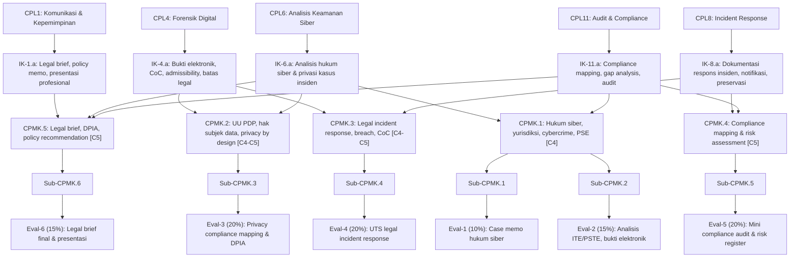

---

## PETA KOMPETENSI MATA KULIAH

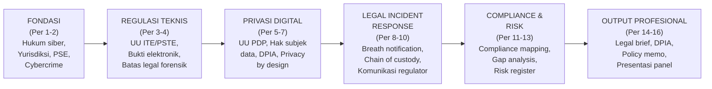

---

## PETUNJUK PENGGUNAAN BUKU

Buku ini dirancang sebagai bahan ajar mandiri dengan struktur per-bab yang mengikuti alur 16 pertemuan RPS. Setiap bab memiliki 12 seksi standar: Capaian Pembelajaran, Peta Konsep (diagram Mermaid), Pengantar Kontekstual, Landasan Teori, Model/Arsitektur, Contoh Terapan, Praktikum/Aktivitas, Latihan Pemahaman, Studi Kasus, Kunci Jawaban, Ringkasan, dan Refleksi Profesional.

Mahasiswa disarankan membaca setiap bab sebelum pertemuan kelas, menyelesaikan latihan secara mandiri, kemudian membandingkan dengan kunci jawaban yang disediakan. Diagram Mermaid adalah alat berpikir — jangan dilewati.

---

## TABEL PEMETAAN BAB–OBE

| Bab | Pertemuan | Sub-CPMK | CPMK | Materi Utama | Evaluasi |
|---|---|---|---|---|---|
| 1 | 1 | Sub-CPMK.1 | CPMK.1 | Ruang lingkup hukum siber, etika, yurisdiksi | Eval-1 |
| 2 | 2 | Sub-CPMK.1 | CPMK.1 | PSE/PSTE, cybercrime, liability, legal issue spotting | Eval-1 |
| 3 | 3 | Sub-CPMK.2 | CPMK.1/3 | UU ITE, tanda tangan elektronik, transaksi elektronik | Eval-2 |
| 4 | 4 | Sub-CPMK.2 | CPMK.1/3 | Bukti elektronik, admissibility, batas legal forensik/pentest | Eval-2 |
| 5 | 5 | Sub-CPMK.3 | CPMK.2 | UU PDP, jenis data pribadi, hak subjek data | Eval-3 |
| 6 | 6 | Sub-CPMK.3 | CPMK.2 | Dasar pemrosesan, privacy notice, consent, retention | Eval-3 |
| 7 | 7 | Sub-CPMK.3 | CPMK.2 | DPIA, privacy by design, pengendali/prosesor | Eval-3 |
| 8 | 8 | Sub-CPMK.4 | CPMK.3 | Legal incident response, UTS integratif | Eval-4 |
| 9 | 9 | Sub-CPMK.4 | CPMK.3 | Breach notification, kewajiban pelaporan regulator | Eval-4 |
| 10 | 10 | Sub-CPMK.4 | CPMK.3 | Chain of custody hukum, preservasi bukti, komunikasi stakeholder | Eval-4 |
| 11 | 11 | Sub-CPMK.5 | CPMK.4 | Compliance mapping: UU PDP, ITE, ISO 27001/27701 | Eval-5 |
| 12 | 12 | Sub-CPMK.5 | CPMK.4 | Gap analysis dan risk register berbasis regulasi | Eval-5 |
| 13 | 13 | Sub-CPMK.5 | CPMK.4 | Rekomendasi kontrol dan prioritisasi berbasis risiko | Eval-5 |
| 14 | 14 | Sub-CPMK.6 | CPMK.5 | Legal brief: struktur IRAC, argumen hukum-teknis | Eval-6 |
| 15 | 15 | Sub-CPMK.6 | CPMK.5 | Policy memo, DPIA finalization, executive summary | Eval-6 |
| 16 | 16 | Sub-CPMK.6 | CPMK.5 | Presentasi profesional, tanya jawab panel, refleksi akhir | Eval-6 |

---

---

## Bab 1 — Ruang Lingkup Hukum Siber, Etika Profesional, dan Yurisdiksi

### 1. Capaian Pembelajaran Bab

Setelah menyelesaikan bab ini, mahasiswa mampu:
- Menjelaskan ruang lingkup dan cabang-cabang hukum siber (C2)
- Mengidentifikasi prinsip etika profesional dalam konteks keamanan siber dan forensik digital (C2)
- Menganalisis isu yurisdiksi dalam kejahatan dan investigasi siber lintas batas (C4)
- Mengidentifikasi legal issue dasar pada skenario hukum siber (C4)

*Dikaitkan dengan Sub-CPMK.1 (Pertemuan 1) dan Eval-1 (10%).*

---

### 2. Peta Konsep Bab

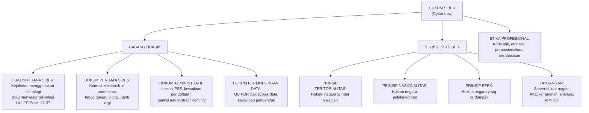

---

### 3. Pengantar Kontekstual

Ketika seorang praktisi keamanan siber menemukan kerentanan di sistem orang lain, ia berhadapan bukan hanya dengan keputusan teknis — melainkan dengan pertanyaan hukum dan etika yang fundamental: apakah tindakan ini diizinkan? Siapa yang berwenang memberikan izin? Hukum negara mana yang berlaku? Apa konsekuensi hukumnya jika terjadi kesalahan?

Kasus Bjorn Bjornsson (fiktif) adalah ilustrasi: seorang pentester Indonesia dikontrak oleh perusahaan multinasional berkantor di Singapura untuk menguji sistem yang servernya berada di Amerika Serikat, menguji dari jaringan di Belanda. Hukum negara mana yang berlaku? Masing-masing yurisdiksi memiliki jawaban berbeda — dan professional yang tidak memahami ini berpotensi menghadapi tuntutan hukum bahkan saat melakukan pekerjaan yang diotorisasi.

---

### 4. Landasan Teori

#### 1.1 Definisi dan Ruang Lingkup Hukum Siber

Hukum siber (cyber law) adalah cabang hukum yang mengatur aktivitas yang dilakukan di ruang siber (cyberspace) — medium yang terdiri dari jaringan komputer, internet, dan sistem informasi yang saling terhubung.

Berbeda dari hukum tradisional yang bertumpu pada batas fisik (wilayah, kertas, kehadiran fisik), hukum siber berhadapan dengan karakteristik unik ruang siber:

**Karakteristik ruang siber yang membuat regulasi kompleks:**
- *Borderlessness* (tanpa batas): data mengalir melampaui batas negara secara instan
- *Anonymity* (anonimitas): identitas pelaku dapat disembunyikan
- *Speed* (kecepatan): kejahatan dapat dilakukan dan jejaknya dihapus dalam hitungan detik
- *Replicability* (dapat digandakan): bukti digital sangat mudah dimodifikasi atau diperbanyak
- *Global reach*: satu tindakan dapat berdampak pada jutaan orang di berbagai negara

**Cabang-cabang hukum siber:**

Hukum pidana siber mengatur perbuatan yang dikriminalisasi oleh negara dan diancam dengan sanksi pidana. Di Indonesia, ini terutama diatur dalam UU ITE Pasal 27–37, yang mencakup konten ilegal, akses tidak sah, penyadapan, sabotase, pemalsuan data, dan cybercrime lainnya.

Hukum perdata siber mengatur hubungan hukum antara subjek hukum privat — kontrak elektronik, e-commerce, sengketa online, tanggung jawab platform, dan ganti rugi akibat pelanggaran keamanan data.

Hukum administratif siber mengatur hubungan antara negara dengan penyelenggara sistem elektronik — kewajiban pendaftaran PSE, kepatuhan standar teknis, kewajiban pelaporan insiden, dan sanksi administratif yang dapat dijatuhkan oleh regulator (Kemenkominfo, OJK, BI, dll.).

Hukum perlindungan data pribadi adalah cabang yang paling berkembang pesat. UU PDP No. 27/2022 menetapkan hak-hak subjek data, kewajiban pengendali dan prosesor, dasar pemrosesan yang sah, dan sanksi administratif serta pidana.

#### 1.2 Prinsip Etika Profesional dalam Keamanan Siber

Profesi keamanan siber tidak memiliki badan sertifikasi tunggal dengan kode etik yang mengikat secara hukum seperti halnya profesi dokter atau pengacara. Namun, komunitas profesional internasional telah mengembangkan prinsip-prinsip etika yang dipandang sebagai standar minimum:

**Otorisasi (Authorization):** Tidak ada tindakan terhadap sistem orang lain tanpa otorisasi yang jelas dan terdokumentasi. Otorisasi harus spesifik: mencakup sistem apa, jenis pengujian apa, dalam periode waktu apa, dan oleh siapa.

**Proporsionalitas (Proportionality):** Tindakan investigasi atau pengujian tidak boleh melebihi apa yang diperlukan untuk tujuan yang diotorisasi. Mengeksfiltrasi seluruh database untuk "membuktikan kerentanan" ketika cukup dengan screenshot satu record adalah pelanggaran proporsionalitas.

**Kerahasiaan (Confidentiality):** Informasi tentang kerentanan, sistem klien, atau data yang ditemukan selama penugasan tidak boleh dibagikan tanpa otorisasi eksplisit.

**Pengungkapan yang bertanggung jawab (Responsible Disclosure):** Kerentanan yang ditemukan harus dilaporkan kepada pemilik sistem sebelum (atau bersamaan dengan) publikasi, memberi waktu untuk perbaikan.

**Non-maleficence:** Tindakan profesional tidak boleh menyebabkan kerusakan yang tidak perlu — bahkan jika otorisasi ada, profesional harus meminimalkan dampak terhadap sistem dan data yang tidak relevan.

**Objektivitas:** Dalam konteks forensik dan audit, temuan harus dilaporkan secara jujur dan lengkap, termasuk yang bertentangan dengan kepentingan klien.

#### 1.3 Yurisdiksi dalam Hukum Siber

Yurisdiksi adalah kewenangan suatu negara untuk membuat dan menegakkan hukum. Dalam ruang siber, yurisdiksi menjadi sangat kompleks karena satu kejadian dapat melibatkan multiple negara secara bersamaan.

**Prinsip teritorialitas:** Negara memiliki yurisdiksi atas kejadian yang terjadi di wilayahnya. Jika server yang diserang berada di Indonesia, hukum Indonesia berlaku — meskipun penyerang berada di luar negeri.

**Prinsip nasionalitas aktif:** Negara memiliki yurisdiksi atas warganya yang melakukan kejahatan di manapun. Warga Indonesia yang melakukan cybercrime dari luar negeri tetap dapat dijerat hukum Indonesia.

**Prinsip nasionalitas pasif:** Negara memiliki yurisdiksi jika korbannya adalah warganya, meskipun kejahatan dilakukan di luar negeri.

**Prinsip efek (effects doctrine):** Negara memiliki yurisdiksi jika tindakan yang dilakukan di tempat lain menimbulkan dampak signifikan di wilayahnya. Digunakan luas oleh AS dan UE.

**Implikasi praktis untuk profesional:**
- Selalu dapatkan surat otorisasi yang jelas sebelum melakukan pengujian
- Untuk penugasan lintas batas, konsultasikan dengan legal counsel tentang hukum yang berlaku di setiap yurisdiksi yang terlibat
- Simpan dokumentasi otorisasi dengan baik — ini adalah perlindungan hukum utama

---

### 5. Model Yurisdiksi Siber

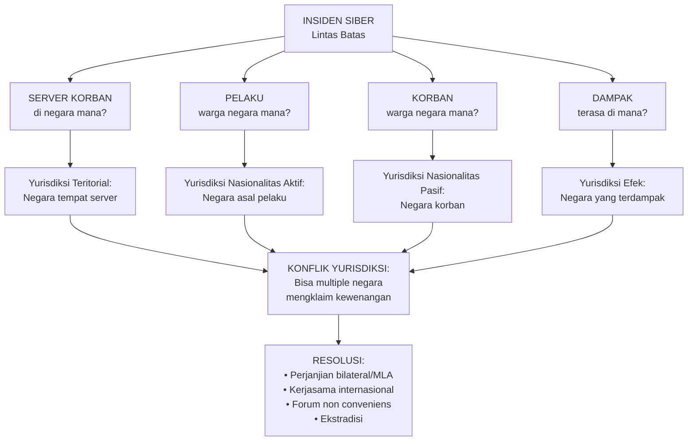

---

### 6. Contoh Terapan

**Kasus: Serangan Ransomware terhadap Rumah Sakit Nasional (Skenario Fiktif)**

Rumah Sakit Umum Nasional (RSUN) di Jakarta diserang ransomware. Investigasi awal menunjukkan bahwa serangan berasal dari server di Rusia, yang dikendalikan oleh pelaku yang menggunakan VPN dari Belanda. Malware di-deploy melalui phishing email yang dikirim dari akun email gratis yang dibuat di server di Amerika Serikat. Data pasien — termasuk data medis yang sangat sensitif — terenkripsi dan sebagian dieksfiltrasi ke server di Ukraina.

**Analisis yurisdiksi:**
- Indonesia memiliki yurisdiksi teritorial (korban/server di Indonesia) dan akan menjadi yurisdiksi utama.
- Jika pelaku adalah WNI, Indonesia juga memiliki yurisdiksi nasionalitas aktif.
- AS, Belanda, Rusia, Ukraina semua memiliki potensi klaim yurisdiksi.
- Penegakan hukum internasional memerlukan Mutual Legal Assistance Treaty (MLAT) antar negara — proses yang bisa memakan waktu bertahun-tahun.

**Implikasi untuk responden insiden:**
- Dokumentasikan semua bukti dengan standar yang dapat diterima di berbagai yurisdiksi
- Koordinasikan dengan Bareskrim / BSSN untuk penegakan hukum
- Pertimbangkan notifikasi BSSN dan Kemenkominfo sesuai kewajiban pelaporan

---

### 7. Praktikum — Legal Issue Spotting

**Tujuan:** Berlatih mengidentifikasi isu hukum (legal issue spotting) dari skenario keamanan siber.

**Prasyarat:** Memiliki akses ke teks UU ITE (UU No. 1/2024) dan UU PDP.

**Skenario:** Seorang analis keamanan di perusahaan e-commerce menemukan kerentanan SQL injection di website perusahaan saingan. Tanpa pemberitahuan, ia menguji kerentanan tersebut dan berhasil mengakses sebagian database pelanggan saingan (tidak mengunduh data). Ia kemudian melaporkan temuan ini secara anonim kepada saingan melalui email.

**Tugas:**
1. Identifikasi semua isu hukum yang mungkin timbul dari tindakan analis ini.
2. Untuk setiap isu, sebutkan pasal regulasi yang relevan.
3. Apakah "niat baik" (good faith) dan "tidak ada kerugian nyata" menjadi pembelaan yang sah?
4. Bagaimana seharusnya analis bertindak secara etis dan legal jika menemukan kerentanan di sistem pihak lain?

**Kriteria keberhasilan:** Mampu mengidentifikasi minimal 3 isu hukum berbeda dengan referensi pasal yang tepat, dan merumuskan tindakan alternatif yang legal dan etis.

---

### 8. Latihan Pemahaman

**Soal 1 (Pilihan Ganda):** Prinsip yurisdiksi mana yang paling sering digunakan oleh Indonesia untuk menuntut pelaku cybercrime yang servernya berada di luar negeri namun korbannya adalah warga atau institusi Indonesia?

a) Prinsip nasionalitas pasif  
b) Prinsip teritorialitas  
c) Prinsip efek  
d) Prinsip universalitas

**Soal 2 (Esai Singkat):** Jelaskan mengapa "otorisasi" adalah prinsip etika yang paling fundamental dalam profesi keamanan siber, lebih dari sekadar kepatuhan teknis.

**Soal 3 (Analisis):** Seorang CISO perusahaan multinasional meminta tim penetration testing-nya untuk menguji sistem yang servernya berada di tiga negara berbeda (Indonesia, Singapura, Amerika Serikat). Apa yang harus disiapkan dari perspektif hukum sebelum pengujian dimulai?

**Soal 4 (Perbandingan Konsep):** Bandingkan tanggung jawab hukum pidana (criminal liability) dan tanggung jawab hukum perdata (civil liability) dalam konteks kebocoran data akibat kelalaian keamanan siber perusahaan. Beri contoh masing-masing.

**Soal 5 (Evaluasi):** Seorang security researcher menemukan kerentanan kritis pada sistem perbankan online dan memutuskan untuk mempublikasikan detail teknis di media sosial tanpa pemberitahuan kepada bank terlebih dahulu, dengan alasan "bank harus segera bertindak." Evaluasi tindakan ini dari perspektif etika dan hukum.

---

### 9. Latihan Terapan / Studi Kasus

**Studi Kasus 1:** Perusahaan fintech "PayNusa" menyewa jasa penetration testing dari PT Sekuriti Andal. Kontrak ditandatangani oleh VP IT PayNusa, bukan CEO. Selama pengujian, tim menemukan kerentanan yang memungkinkan akses ke data nasabah. Mereka mengakses 100 record data nasabah sebagai "proof of concept." Seminggu kemudian, PayNusa mengklaim bahwa pengujian melebihi cakupan yang disetujui dan mengancam melaporkan PT Sekuriti Andal ke polisi.

Analisis: (a) Apakah otorisasi dari VP IT cukup secara hukum? (b) Apakah mengakses 100 record nasabah sebagai PoC melampaui cakupan wajar? (c) Apa yang seharusnya dilakukan PT Sekuriti Andal sebelum memulai pengujian?

---

### 10. Kunci Jawaban dan Pembahasan

**Soal 1:** Jawaban: **a) Prinsip nasionalitas pasif** — Indonesia cenderung menggunakan prinsip ini karena UU ITE berlaku terhadap siapa pun yang melakukan perbuatan yang berdampak pada pengguna sistem elektronik di Indonesia. Prinsip teritorialitas kurang efektif jika server pelaku di luar negeri. Prinsip efek lebih umum digunakan oleh AS dan UE. Prinsip universalitas umumnya untuk kejahatan paling berat (genosida, dll.). Catatan: dalam praktiknya Indonesia sering mengkombinasikan beberapa prinsip.

**Soal 2:** Otorisasi adalah prinsip fundamental karena tanpa otorisasi, setiap tindakan teknis yang identik secara persis — bahkan yang bertujuan membantu — dapat menjadi tindak pidana (akses tidak sah, penyadapan ilegal). Hukum pidana tidak mempertimbangkan niat yang baik jika unsur perbuatan terpenuhi: mengakses sistem orang lain tanpa hak adalah kejahatan terlepas dari tujuannya. Otorisasi yang terdokumentasi adalah satu-satunya "perisai hukum" yang dapat diandalkan profesional keamanan.

**Soal 3:** Yang harus disiapkan: (a) Surat otorisasi tertulis yang secara eksplisit menyebut sistem yang boleh diuji, periode waktu, jenis pengujian, dan person in charge dari klien; (b) Kajian hukum (legal review) untuk masing-masing yurisdiksi — hukum pentest di Singapura dan AS berbeda dari Indonesia; (c) Perjanjian kerahasiaan (NDA) yang berlaku di semua yurisdiksi; (d) Konsultasi dengan counsel tentang apakah pengujian memerlukan notifikasi kepada otoritas di negara masing-masing; (e) Prosedur penanganan data yang ditemukan selama pengujian sesuai regulasi tiap negara (PDPA Singapura, CCPA/HIPAA AS jika relevan).

**Soal 4:** Tanggung jawab pidana timbul jika pelanggaran memenuhi unsur tindak pidana — misalnya, jika kelalaian keamanan yang menyebabkan kebocoran data disertai unsur kesengajaan atau kecerobohan yang melanggar UU ITE Pasal 32 (pengubahan/perusakan/pemindahan data elektronik milik orang lain). Tanggung jawab perdata timbul tanpa harus ada unsur pidana — korban dapat menggugat ganti rugi atas kerugian yang diderita akibat kebocoran data berdasarkan Perbuatan Melawan Hukum (PMH, KUHPerdata Pasal 1365). Contoh: kebocoran data nasabah bank akibat tidak ada enkripsi pada database — bank dapat dituntut secara perdata oleh nasabah yang dirugikan, dan secara administratif oleh OJK, bahkan tanpa ada tuntutan pidana.

**Soal 5:** Tindakan ini bermasalah baik secara etika maupun hukum. Secara etika, publikasi langsung tanpa pemberitahuan melanggar prinsip responsible disclosure — prinsip yang diterima luas dalam komunitas keamanan. Memberikan waktu bagi pemilik sistem untuk menambal kerentanan sebelum detail publik adalah standar minimum. Secara hukum, di Indonesia: publikasi detail teknis kerentanan yang dapat digunakan untuk menyerang sistem bank dapat melanggar UU ITE Pasal 33 (gangguan sistem) atau 34 (distribusi alat yang digunakan untuk kejahatan siber), meskipun ini bergantung pada interpretasi. Argumen "kepentingan publik" belum memiliki preseden yang kuat dalam hukum Indonesia. Tindakan yang benar: hubungi bank secara langsung (melalui program bug bounty jika ada, atau langsung ke CISO), beri batas waktu yang wajar (30-90 hari adalah standar industri), kemudian publikasikan dengan detail yang dikurangi jika tidak ada respons.

**Studi Kasus 1:**
(a) Otorisasi VP IT: bermasalah. Kewenangan VP IT untuk mengikat perusahaan secara hukum dalam kontrak yang berpotensi mengekspos data nasabah perlu diverifikasi dari anggaran dasar perusahaan dan Surat Kuasa. Dalam praktik forensik yang baik, otorisasi harus datang dari level yang memiliki kewenangan hukum yang tidak dapat diperdebatkan — idealnya CEO atau Direksi dengan resolusi board. (b) Mengakses 100 record nasabah: ini sangat bergantung pada apa yang dinyatakan dalam kontrak. Jika kontrak hanya mengizinkan pengujian kerentanan (vulnerability assessment) dan bukan eksploitasi data aktual, maka mengakses 100 record nasabah melebihi cakupan — bahkan dengan niat PoC. Standar industri: PoC untuk SQL injection cukup dengan membuktikan bahwa query berhasil dikembalikan, bukan mengunduh atau mengakses data aktual. (c) Yang seharusnya dilakukan: (1) kontrak dengan Statement of Work (SoW) yang sangat detail tentang cakupan, termasuk apa yang DILARANG; (2) otorisasi dari pejabat dengan kewenangan yang jelas; (3) Rules of Engagement (RoE) yang ditandatangani kedua pihak; (4) prosedur eskalasi jika ditemukan kerentanan kritis; (5) larangan eksplisit mengakses data pengguna aktual.

---

### 11. Ringkasan Bab

Hukum siber mencakup empat cabang utama: pidana, perdata, administratif, dan perlindungan data — masing-masing dengan rezim regulasi dan sanksi yang berbeda. Yurisdiksi dalam ruang siber bersifat multi-prinsipal dan sering bertumpang-tindih, menjadikan koordinasi internasional sebagai kebutuhan. Bagi profesional keamanan, otorisasi yang terdokumentasi adalah perlindungan hukum utama, dan prinsip etika seperti proporsionalitas, kerahasiaan, dan responsible disclosure membentuk standar perilaku minimum profesi.

---

### 12. Refleksi Profesional

1. Ketika klien meminta Anda melakukan sesuatu yang secara teknis mungkin dilakukan tetapi meragukan secara hukum, apa mekanisme internal yang akan Anda gunakan untuk membuat keputusan?

2. Sebagai profesional, bagaimana Anda menyeimbangkan kewajiban kepada klien (kerahasiaan, melaporkan kerentanan) dengan kewajiban kepada publik (jika kerentanan yang Anda temukan dapat membahayakan jutaan orang)?

---

## Bab 2 — PSE, PSTE, Cybercrime, dan Liability

### 1. Capaian Pembelajaran Bab

Setelah menyelesaikan bab ini, mahasiswa mampu:
- Menjelaskan konsep dan kewajiban Penyelenggara Sistem Elektronik (PSE) dan PSTE (C2)
- Mengklasifikasikan bentuk-bentuk kejahatan siber berdasarkan UU ITE (C4)
- Menganalisis prinsip pertanggungjawaban (liability) dalam kejahatan dan insiden siber (C4)
- Melakukan legal issue spotting pada kasus cybercrime sederhana (C4)

*Dikaitkan dengan Sub-CPMK.1 (Pertemuan 2) dan Eval-1 (10%).*

---

### 2. Peta Konsep Bab

```mermaid
flowchart TD
    PSE["PENYELENGGARA\nSISTEM ELEKTRONIK (PSE)"] --> PSEPriv["PSE LINGKUP PRIVAT:\n• Wajib daftar ke Kominfo\n• Permenkominfo 5/2020\n• Konten ilegal → take down\n• Data lokal/asing"]
    PSE --> PSEPub["PSE LINGKUP PUBLIK:\n• Lembaga negara\n• Kewajiban tata kelola\nlebih ketat"]
    PSE --> Obligations["KEWAJIBAN PSE:\n• Keandalan sistem\n• Perlindungan data\n• Take-down konten ilegal\n• Pelaporan insiden\n• Akses penyidik"]
    Cybercrime["CYBERCRIME\n(UU ITE Pasal 27-37)"] --> ContentOffense["KONTEN ILEGAL (Ps.27-29):\nAsusila, perjudian, penghinaan,\npemerasan, berita bohong,\nSARA, ancaman"]
    Cybercrime --> AccessOffense["AKSES ILEGAL (Ps.30-31):\nAkses tanpa hak (Ps.30),\nPenyadapan (Ps.31)"]
    Cybercrime --> IntegrityOffense["INTEGRITAS SISTEM (Ps.32-33):\nManipulasi data elektronik (Ps.32),\nGangguan sistem (Ps.33)"]
    Cybercrime --> FacilitationOffense["FASILITASI (Ps.34-35):\nAlat yang digunakan kejahatan,\nPemalsuan dokumen elektronik"]
    Liability["LIABILITY\n(PERTANGGUNGJAWABAN)"] --> CriminalLiab["PIDANA:\nUnsur: perbuatan, melawan\nhukum, kesalahan (sengaja/lalai)"]
    Liability --> CivilLiab["PERDATA PMH:\nKUHPer Ps.1365: perbuatan\nmelawan hukum → ganti rugi"]
    Liability --> AdminLiab["ADMINISTRATIF:\nSanksi Kominfo/OJK/BI:\nteguran, denda, blokir, cabut izin"]
    Liability --> PlatformLiab["LIABILITY PLATFORM:\nSafe harbor doctrine?\nNotice & takedown?\nUU ITE tidak eksplisit"]
```

---

### 3. Landasan Teori

#### 2.1 Penyelenggara Sistem Elektronik (PSE)

PSE adalah setiap orang, penyelenggara negara, badan usaha, dan masyarakat yang menyediakan, mengelola, dan/atau mengoperasikan sistem elektronik secara sendiri-sendiri maupun bersama-sama kepada pengguna sistem elektronik. Definisi ini sangat luas — mencakup dari startup kecil hingga platform global.

**PP 71/2019 tentang PSTE membagi PSE menjadi:**
- **PSE Lingkup Publik:** Instansi dan lembaga negara
- **PSE Lingkup Privat:** Orang, badan usaha, dan masyarakat selain penyelenggara negara

**Kewajiban PSE Lingkup Privat (Permenkominfo 5/2020 dan perubahannya):**

Setiap PSE lingkup privat wajib mendaftarkan dirinya kepada Kemenkominfo melalui sistem OSS. PSE yang tidak terdaftar dapat dikenai sanksi administratif berupa pemblokiran akses. Kewajiban utama PSE mencakup:

1. **Keandalan sistem:** Memastikan sistem elektronik beroperasi sebagaimana mestinya
2. **Perlindungan data:** Melindungi data pengguna sesuai ketentuan yang berlaku
3. **Take-down konten ilegal:** Memenuhi perintah Kemenkominfo untuk menurunkan konten yang melanggar hukum dalam 24 jam (konten mendesak) atau 14 hari (konten lain)
4. **Akses penyidik:** Membuka akses kepada aparat penegak hukum untuk kepentingan penyidikan sesuai prosedur hukum
5. **Data residency (diskursus):** Isu kewajiban penyimpanan data di dalam negeri telah berkembang dan perlu dicek pada regulasi terkini

**Implikasi keamanan:** Ketika organisasi menjadi PSE, ia otomatis memiliki kewajiban keamanan yang dapat ditegakkan secara regulasi — bukan hanya best practice teknis.

#### 2.2 Kejahatan Siber dalam UU ITE

UU No. 11/2008 yang telah diubah dengan UU No. 19/2016 dan terakhir UU No. 1/2024 mengkriminalisasi berbagai perbuatan yang dilakukan menggunakan sistem elektronik:

**Pasal 27 (Konten ilegal):** Mendistribusikan, mentransmisikan, atau membuat dapat diaksesnya konten yang memiliki muatan: melanggar kesusilaan, perjudian, penghinaan/pencemaran nama baik, atau pemerasan/pengancaman.

*Catatan kritis:* Pasal 27 ayat (3) tentang pencemaran nama baik telah menjadi salah satu pasal yang paling sering digunakan untuk mengkriminalisasi kritik dan ekspresi online di Indonesia. UU No. 1/2024 melakukan beberapa modifikasi — mahasiswa perlu memeriksa versi terkini.

**Pasal 30 (Akses ilegal):** Dengan sengaja dan tanpa hak atau melawan hukum mengakses komputer dan/atau sistem elektronik orang lain. Ini adalah pasal yang paling relevan untuk keamanan siber — unauthorized access bahkan jika tidak ada kerusakan tetap dapat dijerat.

**Pasal 31 (Penyadapan ilegal):** Dengan sengaja dan tanpa hak atau melawan hukum melakukan intersepsi atau penyadapan atas informasi elektronik dan/atau dokumen elektronik. Ini mencakup packet sniffing tanpa otorisasi pada jaringan orang lain.

**Pasal 32 (Manipulasi data):** Dengan sengaja dan tanpa hak atau melawan hukum melakukan perbuatan yang mengakibatkan berubahnya, hilangnya, atau tidak berfungsinya sistem elektronik.

**Pasal 33 (Gangguan sistem):** Dengan sengaja dan tanpa hak atau melawan hukum melakukan tindakan yang mengakibatkan sistem elektronik tidak bekerja sebagaimana mestinya. Ini mencakup serangan DDoS.

**Pasal 34 (Fasilitasi):** Dengan sengaja dan tanpa hak atau melawan hukum memproduksi, menjual, mengadakan untuk digunakan, mengimpor, mendistribusikan, menyediakan, atau memiliki program komputer dan/atau perangkat keras yang dirancang atau secara khusus dikembangkan untuk memfasilitasi perbuatan yang dilarang. Relevan untuk tools hacking.

#### 2.3 Prinsip Pertanggungjawaban (Liability)

**Liability pidana** mensyaratkan dua elemen utama: (1) actus reus — perbuatan yang dilarang oleh hukum, dan (2) mens rea — kesalahan (sengaja atau lalai). Untuk Pasal 30 UU ITE, misalnya, unsur "dengan sengaja" adalah elemen mens rea yang wajib dibuktikan. Ini penting karena: pengujian penetrasi yang diotorisasi tidak memenuhi unsur "tanpa hak" karena ada otorisasi; namun tanpa otorisasi, bahkan pengujian dengan niat baik dapat memenuhi unsur pasal ini.

**Liability perdata** tidak mensyaratkan unsur pidana. Berdasarkan KUHPerdata Pasal 1365, siapapun yang melakukan perbuatan melawan hukum dan menyebabkan kerugian pada orang lain wajib mengganti kerugian tersebut. Kelalaian keamanan yang menyebabkan kebocoran data dapat menjadi dasar gugatan PMH, meskipun tidak ada tuntutan pidana.

**Liability administratif** adalah sanksi yang dijatuhkan oleh regulator (Kemenkominfo, OJK, BI, dll.) atas pelanggaran kewajiban regulasi. Tidak memerlukan proses pengadilan — dapat berupa teguran, denda, pemblokiran, atau pencabutan izin.

**Safe harbor doctrine:** Dalam hukum AS (Section 230 CDA), platform umumnya tidak bertanggung jawab atas konten yang dibuat oleh pengguna. Indonesia belum memiliki ketentuan safe harbor yang eksplisit dalam UU ITE — posisi platform seperti marketplace atau media sosial dalam kasus konten ilegal pengguna masih menjadi diskursus hukum yang belum sepenuhnya settled.

---

### 4. Contoh Terapan

**Kasus Uji Penetrasi Tanpa Ruang Lingkup Jelas**

PT Solusi Digital mengontrak perusahaan konsultan untuk "mengetes keamanan sistem kami." Kontrak tidak menyebutkan ruang lingkup spesifik. Konsultan melakukan pengujian dan, dalam prosesnya, mengakses server database yang ternyata berisi data pelanggan perusahaan partner PT Solusi Digital — sistem yang berbagi infrastruktur tetapi bukan milik PT Solusi Digital.

**Analisis:**
- Konsultan mungkin telah melanggar Pasal 30 UU ITE terhadap perusahaan partner, bahkan dengan otorisasi dari PT Solusi Digital, karena otorisasi hanya mencakup sistem PT Solusi Digital.
- Pertanggungjawaban pidana: bergantung pada unsur "tanpa hak" — argumen bahwa konsultan tidak tahu sistem tersebut bukan milik klien bisa menjadi mitigasi mens rea, tetapi tidak menghilangkan risiko.
- Pelajaran: Rules of Engagement harus mendefinisikan dengan sangat spesifik sistem mana yang boleh diuji, termasuk batasan IP range, domain, dan larangan eksplisit untuk sistem yang bukan milik klien.

---

### 5. Latihan Pemahaman

**Soal 1:** Sebuah startup e-commerce dengan 50.000 pengguna aktif baru menyadari bahwa mereka belum mendaftarkan diri sebagai PSE. Apa risiko hukum yang mereka hadapi?

**Soal 2:** Jelaskan perbedaan antara akses ilegal (Pasal 30 UU ITE) dan penyadapan ilegal (Pasal 31 UU ITE) dalam konteks sebuah insiden keamanan jaringan.

**Soal 3:** Seorang karyawan IT perusahaan, tanpa otorisasi dari manajemen, mengakses email rekan kerjanya yang dicurigai membocorkan informasi perusahaan kepada kompetitor. Apakah tindakan ini dapat dijerat hukum meskipun karyawan tersebut adalah bagian dari tim IT internal?

**Kunci Jawaban:**

Soal 1: Risiko: (a) sanksi administratif dari Kemenkominfo berupa pemblokiran akses (pengguna tidak dapat mengakses platform); (b) tidak dapat menerima permintaan akses dari penyidik secara prosedural; (c) tidak dapat mengajukan permintaan takedown konten ilegal secara resmi; (d) risiko reputasi dan kemungkinan perdata jika terjadi insiden keamanan dan terbukti tidak mematuhi kewajiban PSE. Tindakan segera: daftar melalui OSS Kemenkominfo.

Soal 2: Akses ilegal (Ps.30) adalah tentang masuk ke dalam sistem — mengakses file, database, atau sistem tanpa otorisasi. Penyadapan ilegal (Ps.31) adalah tentang mengintersepsi komunikasi yang sedang berjalan — packet sniffing jaringan orang lain, man-in-the-middle attack, wiretapping. Contoh insiden: jika penyerang mengakses server korban dan membaca file di dalamnya = Ps.30. Jika penyerang men-sniff traffic jaringan antara pengguna dan server = Ps.31. Keduanya bisa terjadi bersamaan.

Soal 3: Ya, dapat dijerat. Pasal 30 UU ITE tidak membedakan antara orang dalam (insider) dan orang luar — unsurnya adalah akses "tanpa hak" terhadap sistem elektronik orang lain. "Orang lain" dalam konteks ini adalah pemilik akun email (rekan kerja). Karyawan IT tidak otomatis memiliki hak mengakses email pribadi rekan kerjanya, meskipun ia memiliki akses teknis ke server. Otorisasi harus datang dari prosedur yang sah — misalnya, perintah dari manajemen dengan otorisasi legal yang tepat, bukan keputusan pribadi. Ini menegaskan mengapa prosedur otorisasi internal untuk monitoring karyawan harus jelas dan terdokumentasi.

---

### 6. Ringkasan Bab

PSE memiliki kewajiban hukum yang luas — keandalan sistem, perlindungan data, kepatuhan take-down, dan akses penyidik. UU ITE mengkriminalisasi empat kategori utama: konten ilegal, akses/intersepsi ilegal, perusakan integritas sistem, dan fasilitasi. Pertanggungjawaban dapat bersifat pidana, perdata, atau administratif — dan ketiganya dapat muncul secara bersamaan dari satu insiden. Profesional keamanan harus memahami bahwa "otorisasi" adalah unsur yang menentukan apakah tindakan teknis mereka termasuk kejahatan atau pekerjaan yang sah.

---

### 7. Refleksi Profesional

1. Perusahaan tempat Anda bekerja mendapatkan perintah dari Kemenkominfo untuk memberikan akses ke sistem tanpa surat izin pengadilan, hanya berdasarkan surat dari kementerian. Apa langkah yang tepat secara hukum dan prosedural?

2. Sebagai CISO, bagaimana Anda membangun kebijakan internal tentang monitoring aktivitas karyawan yang legal, etis, dan efektif?

---

## Bab 3 — UU ITE, Tanda Tangan Elektronik, dan Transaksi Elektronik

### 1. Capaian Pembelajaran Bab

Setelah menyelesaikan bab ini, mahasiswa mampu:
- Menganalisis ketentuan UU ITE terkait informasi elektronik yang sah sebagai alat bukti (C4)
- Menjelaskan konsep dan jenis tanda tangan elektronik serta nilai hukumnya (C2)
- Menganalisis regulasi transaksi elektronik dan kontrak online (C4)
- Mengidentifikasi isu hukum dalam penerapan tanda tangan elektronik di organisasi (C4)

*Dikaitkan dengan Sub-CPMK.2 (Pertemuan 3) dan Eval-2 (15%).*

---

### 2. Peta Konsep Bab

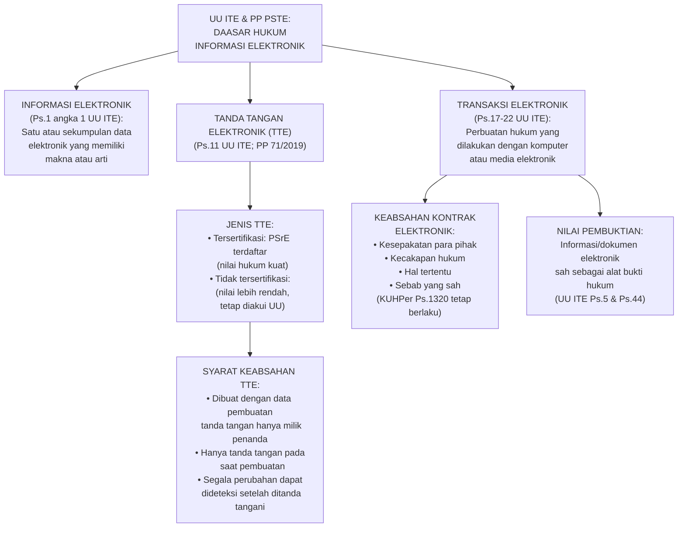

---

### 3. Landasan Teori

#### 3.1 Informasi dan Dokumen Elektronik sebagai Alat Bukti

UU ITE Pasal 5 menetapkan bahwa informasi elektronik dan/atau dokumen elektronik dan/atau hasil cetaknya merupakan alat bukti hukum yang sah. Pasal 44 UU ITE secara eksplisit menambahkan alat bukti berupa informasi elektronik dan dokumen elektronik ke dalam ketentuan alat bukti KUHAP.

**Syarat sah sebagai alat bukti:**
- Menggunakan sistem elektronik yang memenuhi persyaratan minimum (andal, aman, beroperasi sebagaimana mestinya)
- Tidak perlu selalu ada versi cetaknya — dokumen asli elektronik sudah sah
- Keaslian dan integritas harus dapat dibuktikan (hash, metadata, audit trail)

**Persyaratan minimum sistem elektronik:** PP 71/2019 mengatur bahwa sistem elektronik yang digunakan untuk transaksi harus: dapat menampilkan kembali informasi elektronik secara utuh, melindungi ketersediaan, keutuhan, keautentikan, kerahasiaan, dan keteraksesan informasi elektronik.

#### 3.2 Tanda Tangan Elektronik (TTE)

TTE bukan sekadar scan tanda tangan fisik — ia adalah mekanisme kriptografi yang membuktikan identitas penanda tangan dan integritas dokumen yang ditandatangani.

**Mekanisme TTE berbasis kriptografi asimetris:**
1. Penanda tangan memiliki pasangan kunci: kunci privat (rahasia) dan kunci publik (dibagikan)
2. Dokumen di-hash untuk menghasilkan "sidik jari" dokumen
3. Hash dokumen dienkripsi menggunakan kunci privat penanda tangan → menghasilkan tanda tangan digital
4. Penerima mendekripsi tanda tangan menggunakan kunci publik penanda tangan untuk mendapatkan hash asli
5. Penerima menghitung hash dokumen yang diterima
6. Jika kedua hash cocok: dokumen tidak diubah dan tanda tangan valid

**Jenis TTE dalam hukum Indonesia (PP 71/2019 dan Permenkominfo terkait):**

*TTE Tersertifikasi:* TTE yang dibuat menggunakan sertifikat elektronik yang dikeluarkan oleh Penyelenggara Sertifikasi Elektronik (PSrE) yang telah mendapat pengakuan dari Kemenkominfo. Ini adalah TTE yang memiliki kekuatan hukum tertinggi. Contoh PSrE yang diakui: BSrE (Balai Sertifikasi Elektronik BSSN), Peruri Digital Security.

*TTE Tidak Tersertifikasi:* TTE yang dibuat tanpa menggunakan sertifikat dari PSrE terakreditasi. Tetap memiliki nilai hukum tetapi pembuktian di pengadilan lebih bergantung pada keterangan ahli dan bukti tambahan.

**Nilai hukum TTE:** Berdasarkan Pasal 11 UU ITE, TTE memiliki kekuatan hukum dan akibat hukum yang sah selama memenuhi persyaratan. TTE tersertifikasi memiliki presumption of validity yang lebih kuat.

#### 3.3 Transaksi dan Kontrak Elektronik

Kontrak elektronik tunduk pada syarat sahnya perjanjian dalam KUHPerdata Pasal 1320 (kesepakatan, kecakapan, hal tertentu, sebab yang halal), dengan adaptasi untuk medium elektronik.

**Kapan kontrak elektronik terbentuk?** UU ITE Pasal 20: kontrak elektronik terjadi pada saat penawaran transaksi elektronik yang dikirim oleh pengirim telah diterima dan disetujui oleh penerima.

**Permasalahan hukum kontrak elektronik:**
- *Clickwrap agreements:* Pengguna mengklik "Saya Setuju" tanpa membaca TOS — apakah ini kesepakatan yang sah? Secara hukum umumnya ya, tetapi klausul yang tidak wajar (unfair terms) dapat diuji.
- *Verifikasi identitas:* Siapa yang sebenarnya melakukan transaksi jika akun dikompromis?
- *Waktu dan tempat kontrak:* Untuk lintas yurisdiksi, penting untuk menentukan hukum mana yang berlaku.

---

### 4. Contoh Terapan

**Kasus: Sengketa Kontrak SaaS**

PT Manufaktur Jaya membayar langganan software SaaS selama 12 bulan. Penyedia layanan menghentikan layanan di bulan ke-8 karena dugaan pelanggaran TOS. PT Manufaktur Jaya mengklaim tidak pernah menyetujui TOS dan tidak pernah melanggar apapun. Komunikasi seluruhnya dilakukan via email dan portal online.

**Analisis hukum:**
- TOS yang disetujui melalui mekanisme clickwrap saat pendaftaran adalah kontrak elektronik yang sah.
- Email konfirmasi pendaftaran dengan link TOS adalah bukti kesepakatan.
- Semua email dan log akses adalah informasi elektronik yang sah sebagai alat bukti.
- Klaim "tidak pernah menyetujui TOS" sulit dibuktikan jika ada audit trail sistem yang menunjukkan bahwa checkbox TOS di-klik saat pendaftaran.
- Pelajaran untuk organisasi: simpan audit trail semua tindakan kritis pengguna dengan timestamp yang andal.

---

### 5. Latihan Pemahaman

**Soal 1:** Jelaskan mengapa TTE tersertifikasi memiliki nilai pembuktian yang lebih kuat dibandingkan TTE tidak tersertifikasi.

**Soal 2:** Sebuah perusahaan menggunakan tanda tangan digital berbasis PKI untuk semua kontrak internal. Sistem PKI-nya dikelola secara internal tanpa menggunakan PSrE yang diakui Kemenkominfo. Apa implikasi hukum dari kontrak yang ditandatangani dengan TTE ini?

**Kunci Jawaban:**

Soal 1: TTE tersertifikasi memiliki nilai pembuktian lebih kuat karena: (a) identitas penanda tangan diverifikasi secara independen oleh PSrE yang terakreditasi pemerintah — ada rantai kepercayaan (chain of trust) yang dapat diaudit; (b) hukum memberikan presumption of validity — jika TTE tersertifikasi valid secara teknis, pengadilan dapat lebih mudah menerima keaslian dokumen; (c) PSrE menyimpan catatan penerbitan sertifikat yang dapat diverifikasi; (d) standar teknis yang digunakan adalah standar yang diatur dan diawasi regulator. TTE tidak tersertifikasi secara teknis bisa identik, tetapi tanpa rantai kepercayaan pihak ketiga yang terakreditasi, pembuktian di pengadilan bergantung lebih banyak pada keterangan ahli dan bukti korroboratif.

Soal 2: Ini adalah TTE tidak tersertifikasi — sah dan memiliki nilai hukum berdasarkan UU ITE, tetapi: (a) tidak mendapat presumption of validity yang sama; (b) jika kontrak disengketakan di pengadilan, beban pembuktian lebih berat — perusahaan harus membuktikan autentisitas dan integritas TTE dengan keterangan ahli kriptografi; (c) untuk kontrak dengan nilai tinggi atau pihak eksternal, ini meningkatkan risiko sengketa pembuktian; (d) rekomendasi: untuk dokumen kritIs eksternal, gunakan TTE tersertifikasi dari PSrE terakreditasi. Untuk dokumen internal risiko rendah, TTE internal dapat diterima dengan dokumentasi teknis yang kuat.

---

### 6. Ringkasan Bab

Informasi dan dokumen elektronik adalah alat bukti yang sah secara hukum di Indonesia, dengan syarat dihasilkan dari sistem yang memenuhi standar minimum. TTE tersertifikasi memberikan presumption of validity yang lebih kuat dan didukung infrastruktur kepercayaan PSrE. Kontrak elektronik tunduk pada hukum perjanjian umum — clickwrap adalah sah, namun klausul yang tidak wajar tetap dapat digugat. Bagi profesional keamanan, ini berarti audit trail sistem yang andal adalah aset pembuktian yang kritis.

---

### 7. Refleksi Profesional

1. Organisasi Anda menggunakan TTE untuk kontrak senilai miliaran rupiah. Apa yang perlu Anda audit dari sistem TTE tersebut untuk memastikan nilai pembuktiannya kuat?

---

## Bab 4 — Bukti Elektronik, Admissibility, dan Batas Legal Forensik/Pentest

### 1. Capaian Pembelajaran Bab

Setelah menyelesaikan bab ini, mahasiswa mampu:
- Menganalisis persyaratan admissibility bukti elektronik dalam sistem hukum Indonesia (C4)
- Mengidentifikasi batas legal pengujian penetrasi dan forensik digital (C4)
- Menghubungkan prinsip forensic soundness dengan persyaratan hukum pembuktian (C4)
- Menyusun analisis kasus ITE/PSTE berbasis issue matrix (C5)

*Dikaitkan dengan Sub-CPMK.2 (Pertemuan 4) dan Eval-2 (15%).*

---

### 2. Peta Konsep Bab

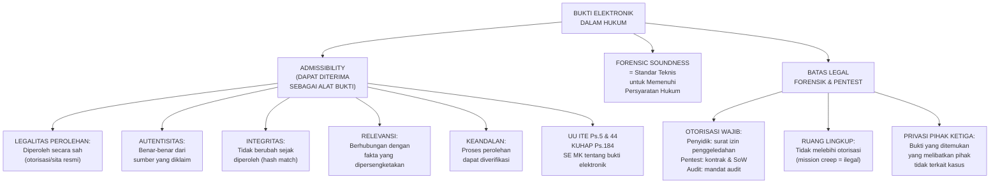

---

### 3. Landasan Teori

#### 4.1 Kerangka Admissibility Bukti Elektronik di Indonesia

Sistem hukum acara pidana Indonesia (KUHAP Pasal 184) menyebutkan lima jenis alat bukti yang sah: keterangan saksi, keterangan ahli, surat, petunjuk, dan keterangan terdakwa. Informasi elektronik dan dokumen elektronik ditambahkan melalui UU ITE Pasal 44 sebagai alat bukti yang sah — menjadikan total enam kategori dalam konteks kejahatan siber.

**Lima kriteria admissibility bukti elektronik yang umum diterima:**

*Legalitas perolehan:* Bukti harus diperoleh melalui cara yang sah secara hukum. Bukti yang diperoleh melalui akses tidak sah (tanpa otorisasi) umumnya tidak dapat diterima (fruit of the poisonous tree doctrine dalam hukum common law — tidak secara eksplisit dalam hukum Indonesia tetapi hakim dapat mempertimbangkan cara perolehan bukti). Penyidik harus memiliki surat izin penggeledahan dari pengadilan untuk menyita perangkat digital.

*Autentisitas:* Bukti harus terbukti berasal dari sumber yang diklaim. Hash kriptografi adalah mekanisme utama untuk membuktikan autentisitas — jika hash file yang diserahkan ke pengadilan sama dengan hash yang dihitung saat pertama kali ditemukan, ini membuktikan file tidak berubah.

*Integritas:* Isi bukti tidak berubah sejak diperoleh. Ini dijamin oleh hash, chain of custody yang tidak terputus, dan prosedur akuisisi yang terstandar.

*Relevansi:* Bukti harus berkaitan secara langsung atau tidak langsung dengan fakta yang dipersengketakan dalam kasus.

*Keandalan:* Proses perolehan dan analisis bukti dapat diverifikasi — metode yang digunakan adalah metode yang diterima secara ilmiah, dan setiap langkah terdokumentasi.

#### 4.2 Batas Legal Pengujian Penetrasi

Penetration testing yang dilakukan tanpa otorisasi yang tepat adalah kejahatan berdasarkan Pasal 30 UU ITE, terlepas dari niat. Otorisasi yang sah untuk pentest harus memenuhi syarat berikut:

**Elemen otorisasi yang sah:**
1. **Subjek yang berwenang:** Otorisasi harus datang dari pihak yang secara hukum berhak memberikan izin atas sistem yang diuji — untuk sistem perusahaan, ini umumnya direksi atau pejabat yang mendapat delegasi.
2. **Objek yang spesifik:** Sistem yang boleh diuji harus disebutkan secara eksplisit — IP range, domain, aplikasi spesifik.
3. **Periode yang ditentukan:** Kapan pengujian boleh dilakukan.
4. **Jenis pengujian:** Apa yang boleh dilakukan — reconnaissance saja? Eksploitasi kerentanan? Social engineering?
5. **Batasan yang tegas:** Apa yang dilarang secara eksplisit — mengakses data pengguna aktual, menyerang sistem pihak ketiga yang terintegrasi, dll.

**"Bug Bounty" dan legal grey area:** Program bug bounty oleh perusahaan teknologi besar memberikan otorisasi terbatas kepada siapa saja untuk mencari dan melaporkan kerentanan. Peserta harus membaca syarat program dengan teliti — otorisasi biasanya terbatas pada jenis kerentanan tertentu dan tidak mencakup eksploitasi aktual data pengguna.

#### 4.3 Bukti Elektronik dalam Proses Penyidikan

Penyidik Bareskrim/Polri yang menangani cybercrime harus mengikuti prosedur yang menjamin admissibility:

1. **Surat perintah penggeledahan/penyitaan** dari pengadilan (atau kondisi mendesak)
2. **Dokumentasi kondisi awal** perangkat sebelum akuisisi (foto, video)
3. **Akuisisi forensik yang terstandar:** write blocker, forensic image, hash verification
4. **Chain of custody** yang tidak terputus dari TKP hingga pengadilan
5. **Keterangan ahli** untuk menjelaskan bukti digital kepada hakim yang mungkin tidak memiliki latar belakang teknis

**Peraturan terkait:** Peraturan Kapolri tentang penyidikan cybercrime, SE Mahkamah Agung tentang pembuktian elektronik — mahasiswa perlu merujuk pada regulasi yang paling terkini.

---

### 4. Latihan Terapan / Studi Kasus

**Studi Kasus: Bukti yang Diperoleh Secara Kontroversial**

Dalam sebuah kasus penggelapan dana oleh karyawan perusahaan, manajemen meminta tim IT untuk mengakses komputer karyawan yang sedang cuti dan meng-copy semua dokumen. Tidak ada surat izin penggeledahan dari pengadilan, hanya instruksi verbal dari CEO. Dokumen yang ditemukan kemudian diserahkan ke penyidik Polri sebagai bukti.

Analisis: (a) Apakah bukti ini dapat diterima di pengadilan? (b) Apakah tindakan tim IT melanggar hukum? (c) Bagaimana seharusnya manajemen bertindak?

**Kunci Jawaban:**

(a) Admissibility bermasalah: cara perolehan tidak mengikuti prosedur hukum. Dalam sistem KUHAP Indonesia, tidak ada ketentuan eksplisit tentang exclusionary rule sekuat hukum Amerika — hakim memiliki diskresi. Namun, hakim dapat mempertanyakan validitas dan integritas bukti yang diperoleh tanpa prosedur yang tepat, dan terdakwa dapat mempersoalkannya. Untuk memastikan admissibility, seharusnya ada prosedur yang memadai.

(b) Tindakan tim IT berpotensi melanggar: UU ITE Pasal 30 (akses tanpa hak terhadap sistem elektronik orang lain) — komputer karyawan yang diakses tanpa izin pengadilan dapat dianggap sebagai sistem elektronik "milik" karyawan dari aspek privacy; UU PDP yang mengatur perlindungan data pribadi karyawan.

(c) Prosedur yang benar: (1) konsultasi dengan legal counsel sebelum mengakses perangkat karyawan; (2) jika ini adalah investigasi kriminal, libatkan Polri sejak awal — Polri yang akan mengajukan surat izin penggeledahan; (3) jika ini adalah investigasi internal (non-kriminal), pastikan ada kebijakan perusahaan yang jelas tentang monitoring dan akses perangkat karyawan yang sudah diketahui karyawan (dalam kontrak kerja atau kebijakan IT yang ditandatangani); (4) simpan dokumentasi lengkap seluruh proses.

---

### 5. Ringkasan Bab

Admissibility bukti elektronik di Indonesia bergantung pada legalitas perolehan, autentisitas, integritas, relevansi, dan keandalan. Forensic soundness adalah standar teknis yang memenuhi persyaratan hukum ini. Pengujian penetrasi hanya legal dengan otorisasi yang spesifik, terdokumentasi, dan dari pihak yang berwenang. Bukti yang diperoleh secara tidak sah berisiko tidak dapat diterima di pengadilan dan dapat mengekspos perolehan bukti tersebut kepada tuntutan hukum.

---

### 6. Refleksi Profesional

1. Sebagai ahli digital forensics yang diminta bersaksi sebagai ahli di pengadilan, bagaimana Anda menjelaskan konsep "hash integrity" kepada hakim awam dalam bahasa yang mudah dipahami tetapi tetap akurat secara ilmiah?

2. Anda menemukan bahwa selama investigasi forensik internal yang diotorisasi, Anda secara tidak sengaja mengakses dokumen yang menunjukkan korupsi oleh manajemen senior — bukan yang menjadi objek investigasi awal. Apa yang harus Anda lakukan?

---

---

## Bab 5 — UU PDP: Jenis Data Pribadi dan Hak Subjek Data

### 1. Capaian Pembelajaran Bab

Setelah menyelesaikan bab ini, mahasiswa mampu:
- Mengklasifikasikan jenis data pribadi berdasarkan UU PDP No. 27/2022 (C4)
- Mengidentifikasi hak-hak subjek data dan kewajiban pengendali dalam memenuhinya (C4)
- Mengevaluasi skenario pemrosesan data dari perspektif kewajiban UU PDP (C5)

*Dikaitkan dengan Sub-CPMK.3 (Pertemuan 5) dan Eval-3 (20%).*

---

### 2. Peta Konsep Bab

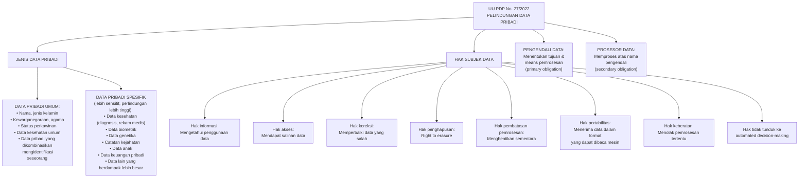

---

### 3. Landasan Teori

#### 5.1 Kerangka UU PDP No. 27/2022

UU PDP adalah undang-undang pertama yang secara khusus mengatur perlindungan data pribadi secara komprehensif di Indonesia. Sebelumnya, perlindungan data tersebar di berbagai regulasi sektoral (perbankan, kesehatan, telekomunikasi). UU PDP berlaku secara umum (lex generalis) dengan tetap mengakui regulasi sektoral.

**Ruang lingkup berlakunya UU PDP:**
- Berlaku untuk setiap orang atau organisasi yang memproses data pribadi warga negara atau penduduk Indonesia, TERMASUK yang berdomisili di luar negeri (extraterritorial scope, mirip GDPR)
- Berlaku untuk sektor publik dan privat

**Terminologi kunci:**

*Data Pribadi:* Data tentang orang perseorangan yang teridentifikasi atau dapat diidentifikasi secara tersendiri atau dikombinasikan dengan informasi lainnya.

*Subjek Data Pribadi (Data Subject):* Orang perseorangan yang pada dirinya melekat data pribadi.

*Pengendali Data Pribadi (Data Controller):* Setiap orang, badan publik, dan organisasi internasional yang bertindak sendiri-sendiri atau bersama-sama dalam menentukan tujuan dan melakukan kendali pemrosesan data pribadi.

*Prosesor Data Pribadi (Data Processor):* Setiap orang, badan publik, dan organisasi internasional yang bertindak sendiri-sendiri atau bersama-sama dalam melakukan pemrosesan data pribadi atas nama pengendali data pribadi.

#### 5.2 Klasifikasi Data Pribadi

UU PDP membedakan dua kategori data yang memiliki tingkat perlindungan berbeda:

**Data Pribadi Umum** mencakup data yang secara relatif kurang sensitif: nama lengkap, jenis kelamin, kewarganegaraan, agama, status perkawinan, dan data pribadi yang dikombinasikan untuk mengidentifikasi seseorang. Meskipun disebut "umum," tetap memerlukan perlindungan yang layak.

**Data Pribadi Spesifik** mencakup data yang lebih sensitif karena potensi dampak diskriminasi, kerugian material, atau privasi yang lebih besar jika bocor:
- Data dan informasi kesehatan (diagnosis, riwayat pengobatan, rekam medis)
- Data biometrik (sidik jari, retina, pengenalan wajah)
- Data genetika
- Catatan kejahatan
- Data anak (perlindungan tambahan karena kerentanan anak)
- Data keuangan pribadi (rekening bank, utang piutang pribadi, dll.)
- Orientasi seksual

Pemrosesan Data Pribadi Spesifik mensyaratkan: persetujuan eksplisit dari subjek data, atau dasar hukum yang lebih ketat.

#### 5.3 Hak-Hak Subjek Data

UU PDP memberikan delapan kategori hak kepada subjek data yang wajib dipenuhi oleh pengendali:

**Hak Informasi:** Mendapatkan informasi yang jelas tentang: identitas pengendali, tujuan pemrosesan, jenis data yang diproses, penerima data, periode retensi, dan hak-hak yang dimiliki subjek data. Ini diimplementasikan melalui *privacy notice* (lihat Bab 6).

**Hak Akses:** Mendapatkan salinan data pribadi yang dimiliki oleh pengendali beserta informasi tentang bagaimana data tersebut diproses. Pengendali harus merespons dalam jangka waktu yang wajar (UU PDP tidak menyebutkan batas waktu spesifik — praktik terbaik: 30 hari seperti GDPR).

**Hak Koreksi:** Meminta pengendali untuk memperbaiki data yang tidak akurat, tidak lengkap, atau menyesatkan. Pengendali wajib menindaklanjuti dengan segera.

**Hak Penghapusan (Right to Erasure/Right to Be Forgotten):** Meminta penghapusan data pribadi dalam kondisi tertentu: data tidak lagi diperlukan untuk tujuan pemrosesan semula, persetujuan dicabut, atau pemrosesan ilegal. Ada pengecualian: untuk kepentingan hukum, kepentingan publik, atau kepentingan penelitian.

**Hak Pembatasan Pemrosesan:** Meminta pengendali untuk menghentikan sementara pemrosesan data dalam kondisi tertentu, misalnya saat subjek data mempersoalkan akurasi data atau keabsahan pemrosesan.

**Hak Portabilitas:** Mendapatkan data pribadi dalam format yang terstruktur, umum digunakan, dan dapat dibaca mesin (machine-readable), serta dapat ditransfer ke pengendali lain. Ini memfasilitasi perpindahan layanan — misal, memindahkan data dari satu bank ke bank lain.

**Hak Keberatan:** Menolak pemrosesan data untuk tujuan tertentu, terutama untuk pemasaran langsung atau pemrosesan berbasis kepentingan sah (legitimate interest) pengendali.

**Hak atas Keputusan Otomatis:** Menolak tunduk pada keputusan yang dihasilkan semata-mata oleh pemrosesan otomatis (termasuk profiling) yang menimbulkan akibat hukum atau dampak signifikan, kecuali ada persetujuan eksplisit atau keperluan kontrak.

#### 5.4 Pengendali vs Prosesor: Tanggung Jawab Berbeda

**Pengendali Data** menanggung tanggung jawab primer — ia yang menentukan tujuan dan cara pemrosesan. Kewajiban utama: memastikan semua pemrosesan memiliki dasar hukum yang sah, memenuhi hak subjek data, menunjuk DPO jika diperlukan, melakukan DPIA untuk pemrosesan berisiko tinggi, dan melaporkan pelanggaran data.

**Prosesor Data** menanggung tanggung jawab sekunder — ia hanya memproses atas perintah pengendali, dan hanya untuk tujuan yang diperintahkan. Kewajiban: mengimplementasikan keamanan teknis dan organisasi yang memadai, tidak memproses untuk tujuan selain yang diperintahkan, membantu pengendali memenuhi kewajibannya, dan melaporkan pelanggaran kepada pengendali.

**Contoh dalam konteks keamanan siber:**
- Perusahaan yang menggunakan cloud provider untuk menyimpan data pengguna: perusahaan = pengendali, cloud provider = prosesor. Perusahaan bertanggung jawab atas pemrosesan, cloud provider hanya menjalankan instruksi. Perjanjian antara keduanya (Data Processing Agreement/DPA) wajib ada.
- SIEM vendor yang memproses log perusahaan: SIEM vendor berpotensi menjadi prosesor jika log mengandung data pribadi.

---

### 4. Contoh Terapan

**Kasus: Rumah Sakit dan Hak Akses Pasien**

Seorang pasien meminta rekam medisnya dari Rumah Sakit X untuk keperluan mengajukan klaim asuransi. Rumah Sakit X menolak dengan alasan data medis adalah rahasia dan tidak bisa diberikan kepada pasien sendiri.

**Analisis UU PDP:** Penolakan ini tidak sesuai dengan UU PDP. Rekam medis mengandung data pribadi spesifik (data kesehatan) milik pasien. Pasien sebagai subjek data memiliki hak akses — hak untuk mendapatkan salinan data pribadi mereka. Rumah sakit sebagai pengendali data wajib memenuhi hak ini. Alasan "rahasia" tidak berlaku untuk pasien itu sendiri — kerahasiaan data medis berlaku terhadap pihak ketiga, bukan terhadap pemilik data.

**Implikasi:** Penolakan yang tidak berdasar terhadap pelaksanaan hak subjek data dapat menjadi dasar pengaduan kepada lembaga pengawas perlindungan data pribadi yang akan dibentuk berdasarkan UU PDP, dan dapat mengakibatkan sanksi administratif.

---

### 5. Latihan Pemahaman

**Soal 1:** Kategorikan data berikut sebagai data pribadi umum atau spesifik, dan jelaskan alasannya: (a) nomor KTP, (b) hasil tes HIV, (c) alamat email, (d) catatan kriminal, (e) foto selfie, (f) template sidik jari digital.

**Soal 2:** Sebuah platform e-commerce ingin menggunakan data pembelian pelanggan untuk membuat profil perilaku yang akan digunakan untuk targeted advertising. Hak subjek data mana yang paling relevan untuk melindungi pelanggan dari pemrosesan seperti ini?

**Kunci Jawaban:**

Soal 1: (a) Nomor KTP: data pribadi umum — mengidentifikasi seseorang tetapi tidak secara inheren sensitif seperti kategori spesifik; (b) Hasil tes HIV: data pribadi spesifik — data kesehatan yang sangat sensitif; (c) Alamat email: data pribadi umum — mengidentifikasi seseorang dalam konteks digital; (d) Catatan kriminal: data pribadi spesifik — eksplisit disebutkan dalam UU PDP; (e) Foto selfie: tergantung konteks — foto biasa adalah data pribadi umum, tetapi jika digunakan untuk pengenalan wajah menjadi data biometrik (spesifik); (f) Template sidik jari digital: data pribadi spesifik — data biometrik.

Soal 2: Hak yang paling relevan: (a) Hak keberatan — pelanggan dapat menolak pemrosesan data untuk tujuan pemasaran langsung; (b) Hak atas keputusan otomatis — jika profiling menghasilkan keputusan yang berdampak signifikan, pelanggan dapat menolaknya; (c) Hak informasi — pelanggan harus diberitahu bahwa datanya digunakan untuk profiling marketing (privacy notice); (d) Dalam beberapa kasus, hak portabilitas juga relevan jika pelanggan ingin pindah platform dan membawa data pembeliannya.

---

### 6. Ringkasan Bab

UU PDP membagi data pribadi menjadi dua kategori dengan tingkat perlindungan berbeda. Delapan hak subjek data menciptakan kewajiban operasional yang konkret bagi pengendali: merespons permintaan akses, memproses koreksi, memungkinkan penghapusan, dan mengakomodasi portabilitas. Pengendali dan prosesor memiliki peran dan tanggung jawab yang berbeda, diikat oleh Data Processing Agreement. Profesional keamanan harus memahami UU PDP bukan sebagai regulasi legal semata, tetapi sebagai persyaratan desain untuk sistem dan proses yang menangani data pribadi.

---

### 7. Refleksi Profesional

1. Sebagai CISO, bagaimana Anda membangun sistem teknis yang memungkinkan organisasi untuk memenuhi hak akses dan hak penghapusan subjek data dalam waktu yang reasonable?

---

## Bab 6 — Dasar Pemrosesan, Privacy Notice, Consent, dan Data Retention

### 1. Capaian Pembelajaran Bab

Setelah menyelesaikan bab ini, mahasiswa mampu:
- Mengidentifikasi dan mengevaluasi dasar-dasar pemrosesan data pribadi yang sah (C4)
- Menganalisis persyaratan privacy notice yang memadai (C4)
- Membedakan consent yang sah dari consent yang tidak memenuhi syarat (C4)
- Mengevaluasi kebijakan data retention dari perspektif UU PDP (C5)

*Dikaitkan dengan Sub-CPMK.3 (Pertemuan 6) dan Eval-3 (20%).*

---

### 2. Peta Konsep Bab

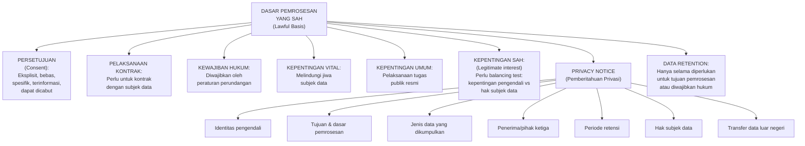

---

### 3. Landasan Teori

#### 6.1 Dasar Pemrosesan Data yang Sah

UU PDP menetapkan bahwa pemrosesan data pribadi harus memiliki dasar yang sah. Tanpa dasar pemrosesan yang sah, pemrosesan data pribadi adalah pelanggaran hukum.

**Persetujuan (Consent)** adalah dasar pemrosesan yang paling umum dipahami, tetapi juga paling sering disalahgunakan. Syarat consent yang sah berdasarkan UU PDP:
- *Eksplisit:* Dinyatakan secara tegas — checkbox yang sudah di-centang (pre-ticked) bukan consent yang sah
- *Bebas:* Tidak ada paksaan atau tekanan — consent yang diberikan sebagai syarat wajib untuk layanan yang tidak ada hubungannya dengan pemrosesan tersebut dipertanyakan validitasnya
- *Spesifik:* Untuk tujuan yang jelas dan tertentu — tidak berlaku untuk semua pemrosesan yang mungkin dilakukan di masa depan
- *Terinformasi:* Subjek data memahami apa yang mereka setujui — privacy notice yang jelas adalah prasyarat
- *Dapat dicabut:* Subjek data dapat menarik consent kapan saja, dan pencabutan harus semudah pemberian consent

**Pelaksanaan kontrak** adalah dasar pemrosesan yang valid jika pemrosesan data benar-benar diperlukan untuk melaksanakan kontrak dengan subjek data. Contoh: platform e-commerce memproses alamat pengiriman karena diperlukan untuk memenuhi pesanan. Tetapi data yang sama tidak dapat digunakan untuk keperluan lain (misalnya marketing) hanya berdasarkan dasar ini.

**Kewajiban hukum** membenarkan pemrosesan yang diwajibkan oleh peraturan perundangan — misalnya, bank wajib menyimpan data transaksi untuk keperluan Anti-Pencucian Uang (APU).

**Kepentingan sah (Legitimate Interest)** adalah dasar yang paling fleksibel tetapi paling kompleks: pengendali dapat memproses data jika memiliki kepentingan sah yang tidak melebihi hak dan kepentingan subjek data. Memerlukan balancing test yang didokumentasikan.

#### 6.2 Privacy Notice

Privacy notice adalah dokumen yang memberikan informasi kepada subjek data tentang bagaimana data mereka diproses. Ini bukan sekadar formalitas — ini adalah kewajiban hukum yang menentukan apakah consent yang diberikan adalah "terinformasi" dan apakah subjek data dapat menjalankan hak-haknya.

**Syarat privacy notice yang memadai:**
- Menggunakan bahasa yang jelas, mudah dipahami, dan bukan jargon hukum yang membingungkan
- Tersedia sebelum atau saat pengumpulan data (bukan setelah)
- Mencakup semua informasi material tentang pemrosesan
- Dapat diakses dengan mudah (tidak tersembunyi di halaman 47 dari dokumen 50 halaman)

**Masalah umum privacy notice:**
- Terlalu panjang dan penuh jargon hukum — subjek data tidak membacanya
- Tidak spesifik — "kami dapat menggunakan data Anda untuk berbagai tujuan"
- Tidak diperbarui saat ada perubahan kebijakan pemrosesan
- Privacy notice untuk pemrosesan data anak tidak menggunakan bahasa yang sesuai anak

#### 6.3 Data Retention

Prinsip penyimpanan terbatas (storage limitation) dalam UU PDP: data pribadi tidak boleh disimpan lebih lama dari yang diperlukan untuk tujuan pemrosesan. Setelah tujuan tercapai atau periode yang ditetapkan berakhir, data harus dihapus atau dianonimkan.

**Menentukan periode retensi:**
- Tujuan pemrosesan menentukan periode minimum yang diperlukan
- Kewajiban hukum dapat menetapkan periode minimum yang harus dipatuhi (misal: data pajak 10 tahun, rekam medis 25 tahun)
- Setelah periode minimum terpenuhi, data harus dihapus kecuali ada alasan sah untuk menyimpan lebih lama

**Implikasi keamanan siber:**
- Data yang tidak diperlukan tetapi masih disimpan adalah risiko — jika terjadi pelanggaran, semakin banyak data yang terdampak
- Kebijakan retensi yang jelas adalah komponen essential dari data governance
- Sistem harus dirancang untuk dapat menghapus data pada akhir periode retensi secara otomatis (data lifecycle management)

---

### 4. Latihan Terapan

**Studi Kasus:** Sebuah aplikasi mobile fitness mengumpulkan: nama, email, usia, jenis kelamin, data GPS (lokasi latihan), detak jantung (dari smartwatch yang terhubung), dan riwayat olahraga. Privacy policy mereka berbunyi: "Kami menggunakan data Anda untuk meningkatkan pengalaman pengguna dan dapat membagikannya dengan mitra kami."

Analisis: (a) Data mana yang termasuk data pribadi spesifik? (b) Apakah privacy notice ini memadai? (c) Apakah dasar pemrosesan untuk berbagi dengan "mitra" jelas? (d) Rekomendasikan perbaikan.

**Kunci Jawaban:**

(a) Data pribadi spesifik: data detak jantung (data kesehatan) adalah data pribadi spesifik yang memerlukan perlindungan lebih tinggi dan dasar pemrosesan yang lebih ketat (consent eksplisit). Data GPS jika dikombinasikan dengan informasi lain dapat mengidentifikasi pola pergerakan yang sangat sensitif.

(b) Privacy notice ini tidak memadai: sangat vague ("meningkatkan pengalaman" tidak menjelaskan apa yang dilakukan secara spesifik), tidak menyebutkan penerima data ("mitra" adalah pihak siapa?), tidak menyebutkan dasar pemrosesan untuk masing-masing aktivitas, tidak menyebutkan periode retensi, tidak menyebutkan hak pengguna, dan tidak menyebutkan apakah data ditransfer ke luar negeri.

(c) Dasar pemrosesan untuk berbagi dengan mitra tidak jelas. Jika berbasis consent, consent yang diberikan saat mendaftar tidak mencakup berbagi dengan pihak ketiga yang tidak ditentukan. Ini kemungkinan pelanggaran prinsip spesifisitas consent.

(d) Rekomendasi: (1) pisahkan privacy notice menjadi bagian-bagian yang jelas untuk setiap jenis pemrosesan; (2) sebutkan secara eksplisit nama atau kategori mitra yang akan menerima data; (3) minta consent terpisah untuk berbagi data dengan mitra; (4) untuk data detak jantung, minta consent eksplisit dengan penjelasan yang jelas; (5) tetapkan dan nyatakan periode retensi; (6) sediakan mekanisme mudah untuk menarik consent dan menghapus data.

---

### 5. Ringkasan Bab

Setiap pemrosesan data pribadi harus memiliki dasar hukum yang sah. Consent yang valid bukan sekadar klik checkbox — ia harus eksplisit, bebas, spesifik, terinformasi, dan dapat dicabut. Privacy notice adalah kewajiban hukum dan alat enabling hak subjek data. Prinsip storage limitation mengharuskan data dihapus setelah tidak lagi diperlukan — bukan disimpan selamanya "untuk jaga-jaga."

---

### 6. Refleksi Profesional

1. Banyak organisasi menyimpan data pengguna yang sudah tidak aktif selama bertahun-tahun "karena mungkin berguna." Dari perspektif UU PDP dan risiko keamanan, bagaimana Anda meyakinkan manajemen untuk menerapkan kebijakan retensi yang ketat?

---

## Bab 7 — DPIA, Privacy by Design, dan Pengendali/Prosesor Data

### 1. Capaian Pembelajaran Bab

Setelah menyelesaikan bab ini, mahasiswa mampu:
- Menjelaskan konsep dan langkah Data Protection Impact Assessment (DPIA) (C2)
- Mengidentifikasi situasi yang memerlukan DPIA berdasarkan risiko pemrosesan (C4)
- Menerapkan prinsip Privacy by Design dalam desain sistem dan proses (C3)
- Menganalisis kewajiban kontraktual antara pengendali dan prosesor data (C4)

*Dikaitkan dengan Sub-CPMK.3 (Pertemuan 7) dan Eval-3 (20%) — deliverable: DPIA ringkas.*

---

### 2. Peta Konsep Bab

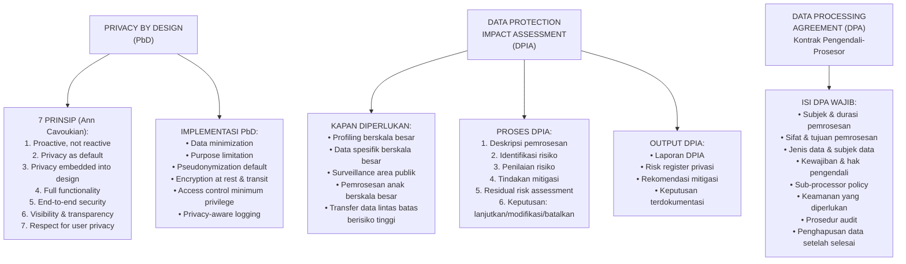

---

### 3. Landasan Teori

#### 7.1 Privacy by Design

Privacy by Design (PbD) adalah paradigma yang menyatakan bahwa privasi harus diintegrasikan ke dalam desain sistem sejak awal — bukan ditambahkan setelah sistem dibangun (privacy by afterthought).

**Tujuh prinsip PbD (Ann Cavoukian, 2009):**

*Proaktif bukan reaktif:* Antisipasi masalah privasi sebelum terjadi, bukan merespons setelah ada insiden.

*Privasi sebagai pengaturan default:* Sistem harus mengumpulkan minimum data yang diperlukan dan pengaturan paling privat adalah pengaturan default — pengguna yang ingin berbagi lebih banyak harus secara aktif memilih, bukan sebaliknya.

*Privasi tertanam dalam desain:* Privasi bukan fitur tambahan — ia adalah komponen inti dari arsitektur sistem.

*Fungsionalitas penuh:* PbD bukan tentang mengorbankan fungsionalitas untuk privasi — keduanya dapat dicapai bersamaan.

*Keamanan end-to-end:* Perlindungan data sepanjang siklus hidupnya, mulai dari pengumpulan hingga penghapusan.

*Visibilitas dan transparansi:* Pengguna dapat memverifikasi bagaimana privasi dijaga — sistem dapat diaudit.

*Menghormati privasi pengguna:* Desain yang berpusat pada pengguna dan memberikan kontrol kepada pengguna atas data mereka.

**Implementasi teknis PbD:**

Pseudonimisasi default: menggunakan identifier teknis yang tidak langsung mengidentifikasi seseorang, dengan mapping yang tersimpan terpisah dan aman. Jika terjadi kebocoran pseudonymized data, risiko identifikasi lebih rendah.

Data minimization: hanya mengumpulkan data yang benar-benar diperlukan untuk tujuan spesifik. Jika nama depan cukup, tidak perlu nama lengkap. Jika usia cukup, tidak perlu tanggal lahir.

Enkripsi default: data at rest dan in transit dienkripsi, dengan manajemen kunci yang aman.

Access control minimum privilege: setiap sistem dan pengguna hanya mendapat akses ke data yang diperlukan untuk peran mereka — tidak lebih.

#### 7.2 Data Protection Impact Assessment (DPIA)

DPIA adalah proses terstruktur untuk mengidentifikasi dan memitigasi risiko privasi dari pemrosesan data pribadi sebelum pemrosesan dimulai. UU PDP mengamanatkan DPIA untuk pemrosesan yang berisiko tinggi.

**Kapan DPIA diperlukan:**
- Pemrosesan berskala besar atas data pribadi spesifik
- Profiling atau evaluasi sistematis aspek pribadi seseorang (termasuk pembuatan keputusan otomatis)
- Pengawasan area yang dapat diakses publik secara berskala besar (CCTV, Wi-Fi tracking)
- Pemrosesan data anak secara berskala besar
- Transfer data pribadi ke luar Indonesia

**Langkah-langkah DPIA:**

*Step 1 — Deskripsi pemrosesan:* Apa yang diproses, mengapa, bagaimana, oleh siapa, dan untuk siapa. Termasuk alur data (data flow diagram).

*Step 2 — Penilaian kebutuhan dan proporsionalitas:* Apakah pemrosesan ini diperlukan? Apakah ada cara yang lebih privat untuk mencapai tujuan yang sama?

*Step 3 — Identifikasi risiko:* Apa saja risiko privasi yang mungkin timbul? Kemungkinan terjadinya? Besarnya dampak jika terjadi?

*Step 4 — Tindakan mitigasi:* Kontrol teknis dan organisasi apa yang dapat mengurangi risiko?

*Step 5 — Residual risk:* Setelah mitigasi, berapa risiko yang tersisa? Apakah dapat diterima?

*Step 6 — Keputusan:* Lanjutkan (jika residual risk dapat diterima), modifikasi (tambahkan kontrol), atau batalkan (jika risiko terlalu tinggi dan tidak dapat dimitigasi).

**Template DPIA Ringkas** (lihat Lampiran D).

#### 7.3 Data Processing Agreement (DPA)

Ketika pengendali menggunakan prosesor (misalnya cloud provider, SIEM vendor), harus ada perjanjian tertulis (DPA) yang mengatur kewajiban keamanan dan privasi prosesor.

**Isi wajib DPA berdasarkan praktik terbaik (UU PDP dan ISO 27701):**
- Deskripsi subjek, durasi, sifat, dan tujuan pemrosesan
- Jenis data pribadi yang diproses dan kategori subjek data
- Kewajiban dan hak pengendali
- Instruksi kepada prosesor tentang cara memproses data
- Kewajiban keamanan yang harus dipenuhi prosesor
- Kebijakan sub-processor (apakah prosesor boleh melibatkan prosesor lain?)
- Prosedur untuk membantu pengendali memenuhi hak subjek data
- Prosedur notifikasi pelanggaran data
- Pemeriksaan dan audit oleh pengendali
- Penghapusan atau pengembalian data setelah kontrak berakhir

---

### 4. Latihan Terapan — DPIA Ringkas

**Skenario:** PT HealthTech ingin meluncurkan aplikasi pemantauan kesehatan mental yang mengumpulkan: nama, usia, jenis kelamin, jawaban kuesioner kesehatan mental harian (depresi, kecemasan), rekaman suara selama sesi "journaling" yang dianalisis oleh AI untuk mendeteksi stres, dan lokasi GPS.

Buat DPIA ringkas menggunakan template berikut:

| Komponen DPIA | Isi |
|---|---|
| Deskripsi Pemrosesan | Data apa, dari siapa, oleh siapa, untuk apa |
| Dasar Hukum Pemrosesan | Dasar mana yang digunakan untuk masing-masing data |
| Identifikasi Risiko (min. 3) | Risiko apa yang mungkin timbul terhadap privasi subjek data |
| Penilaian Risiko | Kemungkinan × Dampak untuk tiap risiko |
| Tindakan Mitigasi | Kontrol teknis dan organisasi untuk tiap risiko |
| Residual Risk | Risiko setelah mitigasi |
| Keputusan | Lanjutkan / Modifikasi / Batalkan + alasan |

**Kunci Jawaban DPIA Ringkas:**

*Deskripsi:* PT HealthTech memproses data kesehatan mental (spesifik), biometrik suara (spesifik), dan lokasi (umum namun sensitif) dari pengguna aplikasi mobile untuk tujuan pemantauan kesehatan mental dan analisis AI. Pengguna adalah individu yang secara sukarela mendaftar.

*Dasar Hukum:* Untuk data spesifik (jawaban kesehatan mental, rekaman suara sebagai data biometrik): harus consent eksplisit. Untuk data lokasi: consent atau pelaksanaan layanan (jika lokasi benar-benar diperlukan untuk fitur).

*Risiko utama:*
1. **Kebocoran data kesehatan mental** — kemungkinan: medium; dampak: sangat tinggi (diskriminasi, stigma sosial, asuransi)
2. **Penyalahgunaan data oleh pihak ketiga** (data dijual ke perusahaan asuransi) — kemungkinan: medium; dampak: tinggi
3. **Re-identifikasi** dari rekaman suara bahkan jika data "dianonimkan" — kemungkinan: medium-tinggi; dampak: tinggi

*Mitigasi:*
1. Enkripsi end-to-end pada semua data spesifik, pembatasan akses ketat, dan penetration testing reguler
2. DPA ketat dengan vendor AI, larangan eksplisit penggunaan data selain tujuan yang ditentukan, audit tahunan
3. Tidak menyimpan rekaman suara asli setelah analisis AI — hanya menyimpan output analisis, bukan rekaman

*Residual risk:* Medium — dengan mitigasi, risiko dapat diterima untuk layanan yang memberikan manfaat kesehatan signifikan.

*Keputusan:* Lanjutkan dengan modifikasi — implementasikan semua mitigasi sebelum launch, dengan review DPIA setelah 6 bulan pertama operasional.

---

### 5. Ringkasan Bab

Privacy by Design mengintegrasikan privasi ke dalam desain sistem sejak awal, bukan sebagai afterthought. DPIA adalah proses sistematis untuk mengidentifikasi dan memitigasi risiko privasi sebelum pemrosesan berisiko tinggi dimulai — wajib untuk kategori pemrosesan tertentu. DPA adalah kontrak yang mengikat prosesor untuk memproses data sesuai instruksi pengendali dan dengan standar keamanan yang memadai. Ketiganya bersama-sama membentuk kerangka tata kelola privasi yang komprehensif.

---

### 7. Refleksi Profesional

1. Organisasi Anda akan mengimplementasikan sistem HR baru yang memproses data karyawan secara lebih ekstensif, termasuk analisis performa berbasis AI. Kapan DPIA diperlukan dan siapa yang harus terlibat dalam prosesnya?

---

## Bab 8 — Legal Incident Response dan UTS Integratif

### 1. Capaian Pembelajaran Bab

Setelah menyelesaikan bab ini, mahasiswa mampu:
- Menganalisis insiden keamanan dari perspektif hukum dan regulasi (C4)
- Mengidentifikasi kewajiban hukum yang timbul saat terjadi insiden keamanan data (C4)
- Mengevaluasi langkah-langkah legal incident response yang benar (C5)
- Mengintegrasikan seluruh konsep Bab 1–7 dalam skenario kasus yang kompleks (C5)

*Dikaitkan dengan Sub-CPMK.4 (Pertemuan 8) dan Eval-4 (20% — UTS).*

---

### 2. Peta Konsep Bab

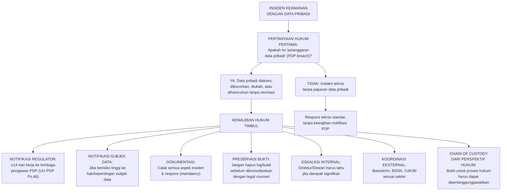

---

### 3. Konsep Legal Incident Response

#### 8.1 Apa itu Pelanggaran Data Pribadi?

UU PDP Pasal 46 mendefinisikan pelanggaran perlindungan data pribadi sebagai kondisi dimana data pribadi yang diproses secara tidak sengaja atau melawan hukum menjadi dapat diakses, dibocorkan, diubah, disalahgunakan, hilang, ditransfer, dihancurkan, atau dimusnahkan.

Ini lebih luas dari sekadar data breach dalam pengertian teknis — mencakup:
- Ransomware yang mengenkripsi dan mengancam mempublikasikan data
- Insider yang mengakses data melebihi kewenangannya
- Pengiriman email ke penerima yang salah berisi data pribadi
- Kehilangan perangkat yang mengandung data tidak terenkripsi
- Akses tidak sah dari eksternal (hacking)

#### 8.2 Kewajiban Notifikasi

UU PDP Pasal 46 mewajibkan pengendali untuk:
1. Memberitahu lembaga pengawas (yang akan dibentuk) paling lambat **14 hari kerja** sejak mengetahui pelanggaran
2. Memberitahu subjek data yang terdampak **jika pelanggaran berpotensi menimbulkan risiko tinggi terhadap hak dan kepentingan subjek data**

Isi notifikasi kepada regulator harus mencakup: jenis pelanggaran, jenis dan perkiraan jumlah data pribadi yang terpengaruh, identitas penanggungjawab, tindakan yang telah dan akan diambil, serta dampak yang mungkin timbul.

**Catatan:** UU PDP mewajibkan notifikasi bahkan sebelum seluruh investigasi selesai — ini berbeda dari intuisi teknis yang ingin "memastikan semua detail" sebelum melaporkan. Jika ada ketidakpastian, laporkan dengan informasi yang tersedia dan perbarui secara berkala.

#### 8.3 Preservasi Bukti vs Respons Insiden

Ada ketegangan antara: responden insiden yang ingin membersihkan sistem untuk memulihkan operasi sesegera mungkin, dan kebutuhan forensik/hukum untuk melestarikan bukti untuk investigasi dan proses hukum.

**Prinsip:** Konsultasikan dengan legal counsel dan tim forensik SEBELUM menghapus atau memodifikasi sistem yang terdampak. Dalam banyak kasus, ada cara untuk memulihkan operasi (misalnya menggunakan sistem cadangan) tanpa merusak bukti pada sistem asli.

**Chain of custody dalam konteks hukum:** Dokumen dalam investigasi forensik yang akan digunakan dalam proses hukum harus memiliki chain of custody yang tidak terputus — setiap perpindahan, akses, atau modifikasi harus dicatat.

---

### 4. UTS Integratif — Kasus PT Bintang Digital

#### Skenario

PT Bintang Digital adalah PSE Lingkup Privat yang mengelola platform pendidikan online dengan 500.000 pengguna, termasuk 80.000 pengguna anak di bawah 18 tahun. Data yang diproses mencakup: nama, email, nomor telepon, alamat, data pembayaran, dan untuk pengguna anak, data prestasi akademik dan laporan perkembangan dari guru.

Pada Senin pagi, tim IT menemukan bahwa database pengguna telah diakses oleh pihak tidak berwenang selama akhir pekan. Log menunjukkan eksfiltrasi data untuk sekitar 120.000 pengguna (termasuk 30.000 anak). Ransomware juga ter-deploy tetapi belum diaktifkan.

#### Pertanyaan UTS

**Bagian A — Klasifikasi dan Kewajiban (30 poin)**

1. Data apa saja yang diproses PT Bintang Digital yang termasuk data pribadi spesifik? Untuk masing-masing, jelaskan mengapa ia termasuk spesifik dan implikasi perlindungannya.

2. Apakah insiden ini memenuhi definisi "pelanggaran data pribadi" berdasarkan UU PDP? Jelaskan analisisnya.

3. Dalam 24 jam pertama setelah insiden terdeteksi, kewajiban hukum apa saja yang harus segera diprioritaskan oleh PT Bintang Digital?

**Bagian B — Tindakan Legal Incident Response (40 poin)**

4. Susun breach response checklist dengan urutan prioritas yang tepat untuk 72 jam pertama, mencakup tindakan teknis, hukum, dan komunikasi.

5. PT Bintang Digital memiliki kewajiban notifikasi ke multiple pihak. Identifikasi semua pihak yang harus diberitahu, tenggat waktu untuk masing-masing, dan informasi minimum yang harus disampaikan.

6. Ransomware yang ter-deploy belum diaktifkan. Tim IT ingin segera menghapus malware tersebut untuk mencegah eksekusi. Dari perspektif hukum dan forensik, apa yang harus dipertimbangkan sebelum melakukan tindakan ini?

**Bagian C — Chain of Custody dan Bukti (30 poin)**

7. Jelaskan bagaimana PT Bintang Digital harus mendokumentasikan insiden ini sehingga dokumentasi tersebut dapat digunakan dalam proses hukum (jika perlu).

8. Penyidik Bareskrim meminta akses ke sistem PT Bintang Digital untuk keperluan penyelidikan. Apa yang perlu diverifikasi PT Bintang Digital sebelum memberikan akses, dan apa yang perlu didokumentasikan selama akses?

---

### 5. Kunci Jawaban UTS

**Soal 1:** Data pribadi spesifik: (a) data anak-anak secara keseluruhan — UU PDP memberikan perlindungan tambahan untuk data anak karena kerentanan anak; (b) data prestasi akademik dan laporan perkembangan — jika dapat dikategorikan sebagai data yang berdampak signifikan pada kehidupan anak; (c) data pembayaran (data keuangan pribadi). Implikasi: dasar pemrosesan harus lebih kuat (consent eksplisit orang tua untuk data anak), keamanan harus lebih tinggi, dan dalam konteks pelanggaran, dampak kepada anak diprioritaskan.

**Soal 2:** Ya, insiden ini memenuhi definisi pelanggaran data pribadi UU PDP: data pribadi dari 120.000 pengguna (termasuk 30.000 anak) diakses dan dieksfiltrasi oleh pihak tidak berwenang — ini memenuhi unsur "data pribadi yang diproses secara tidak sengaja atau melawan hukum menjadi dapat diakses" dan "dibocorkan." Eksfiltrasi data = data sudah berada di tangan pihak yang tidak diotorisasi.

**Soal 3:** Prioritas 24 jam pertama: (a) isolasi sistem yang terdampak untuk menghentikan eksfiltrasi lebih lanjut (teknis — SEGERA); (b) konsultasi dengan legal counsel tentang kewajiban notifikasi dan preservasi bukti; (c) preserve bukti: jangan hapus log atau sistem sebelum ada arahan dari tim forensik dan legal; (d) eskalasi ke Direksi dan CISO; (e) begin documentation: mulai mencatat setiap tindakan yang diambil; (f) assess scope: berapa pengguna terdampak, data apa yang terekspos.

**Soal 4 — Breach Response Checklist 72 Jam:**

*0-4 jam:*
- Isolasi sistem terdampak
- Alert tim forensik dan legal counsel
- Alert manajemen senior dan Direksi
- Mulai incident log dengan timestamp semua tindakan
- Preserve semua log sistem tanpa modifikasi

*4-24 jam:*
- Forensic acquisition sistem yang terdampak (sebelum remediasi)
- Assessment scope — jumlah pengguna dan data yang terdampak
- Hubungi cyber insurance provider (jika ada)
- Koordinasikan dengan BSSN jika infrastruktur kritis terdampak
- Pertimbangkan preservasi ransomware untuk analisis (jangan hapus dulu)

*24-48 jam:*
- Siapkan draft notifikasi regulator (14 hari kerja tenggat)
- Identifikasi pengguna yang memerlukan notifikasi individual (terutama anak-anak)
- Hubungi vendor forensik eksternal jika kapasitas internal tidak cukup

*48-72 jam:*
- Kirimkan notifikasi awal ke regulator PDP (dengan informasi yang tersedia)
- Siapkan website dedicated incident untuk update publik
- Pertimbangkan layanan credit/identity monitoring untuk pengguna terdampak

**Soal 5 — Pihak yang Harus Diberitahu:**

| Pihak | Tenggat | Informasi Minimum |
|---|---|---|
| Lembaga Pengawas PDP | 14 hari kerja sejak mengetahui | Jenis pelanggaran, data yang terdampak, tindakan yang diambil |
| 120.000 subjek data yang terdampak | Segera jika risiko tinggi (terutama data anak) | Apa yang terjadi, data apa yang terdampak, tindakan yang diambil, apa yang bisa pengguna lakukan |
| Orang tua/wali anak yang terdampak | Bersamaan dengan notifikasi ke anak | Khusus untuk data anak |
| Kemenkominfo (sebagai PSE) | Segera setelah mengetahui insiden yang signifikan | Berdasarkan kewajiban PSE |
| BSSN | Sesuai prosedur | Jika menyangkut keamanan nasional atau infrastruktur kritis |

**Soal 6:** Sebelum menghapus ransomware: (a) lakukan forensic acquisition lengkap sistem yang terinfeksi — ransomware biner, konfigurasi, dan semua artefak; (b) hash semua bukti sebelum modifikasi; (c) konsultasikan dengan legal counsel — ransomware yang belum aktif adalah bukti penting untuk investigasi pidana (Pasal 33 UU ITE); (d) koordinasikan dengan Bareskrim jika akan ada pelaporan pidana — penyidik mungkin perlu bukti asli; (e) dokumentasikan semua langkah remediasi dalam chain of custody. Kemudian buat salinan forensik, dan lakukan remediasi pada sistem asli atau gunakan sistem cadangan untuk pemulihan operasi.

**Soal 7:** Dokumentasi yang dapat digunakan dalam proses hukum: (a) incident timeline dengan timestamp yang akurat dan sumber setiap informasi; (b) forensic acquisition log dengan hash verification; (c) chain of custody form untuk setiap item bukti; (d) screenshot dengan hash dan timestamp; (e) log komunikasi internal tentang insiden; (f) catatan setiap tindakan yang diambil dan alasannya; (g) dokumentasi siapa yang mengakses sistem selama respons dan kapan. Semua dokumen harus ditandatangani oleh pejabat yang bertanggung jawab.

**Soal 8:** Sebelum memberikan akses ke Bareskrim: (a) verifikasi identitas penyidik dan surat tugas resmi; (b) minta surat izin penggeledahan/penyitaan dari pengadilan atau dasar hukum akses (tergantung konteks); (c) konsultasikan dengan legal counsel; (d) minta spesifikasi sistem/data apa yang diminta akses — batasi scope sesuai surat izin. Selama akses: (e) catat nama penyidik, nomor identitas, waktu mulai dan selesai akses; (f) dokumentasikan sistem/data apa yang diakses; (g) siapkan chain of custody untuk setiap data yang diberikan kepada penyidik; (h) pastikan satu perwakilan perusahaan hadir selama akses berlangsung.

---

### 6. Ringkasan Bab

Legal incident response menambahkan dimensi hukum pada respons insiden teknis: kewajiban notifikasi dengan tenggat waktu yang ketat, preservasi bukti untuk proses hukum, eskalasi ke manajemen dan regulator, dan chain of custody. Pelanggaran data pribadi memicu kewajiban yang berlapis — ke regulator, ke subjek data, dan ke instansi penegak hukum. Ketegangan antara pemulihan cepat dan preservasi bukti harus dikelola dengan koordinasi antara tim teknis, forensik, dan legal.

---

### 8. Refleksi Profesional

1. Organisasi Anda mengalami pelanggaran data pada hari Jumat sore. Legal counsel tidak dapat dihubungi hingga Senin. Sistem perlu segera dipulihkan untuk operasional bisnis yang kritis. Bagaimana Anda menyeimbangkan kebutuhan bisnis mendesak dengan kewajiban preservasi bukti dan notifikasi hukum?

2. Setelah insiden, manajemen senior meminta Anda untuk tidak melaporkan kepada regulator karena "dampaknya kecil dan bisa diselesaikan internal." Apa yang Anda lakukan?

---

---

## Bab 9 — Breach Notification dan Kewajiban Pelaporan Regulator

### 1. Capaian Pembelajaran Bab

Setelah menyelesaikan bab ini, mahasiswa mampu:
- Menganalisis kewajiban breach notification berdasarkan UU PDP dan regulasi sektoral (C4)
- Membuat breach notification yang memenuhi persyaratan regulasi (C5)
- Mengidentifikasi regulator yang relevan berdasarkan sektor dan jenis insiden (C4)

*Dikaitkan dengan Sub-CPMK.4 (Pertemuan 9) dan Eval-4 (20%).*

---

### 2. Peta Konsep Bab

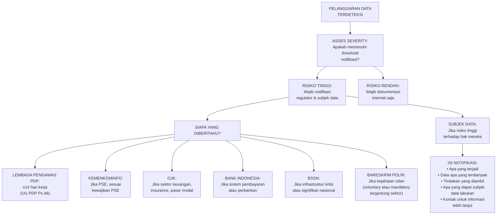

---

### 3. Landasan Teori

#### 9.1 Kewajiban Notifikasi Bertingkat

Berbeda dari sistem single-regulator seperti GDPR di UE, Indonesia memiliki ekosistem regulator yang berlapis untuk breach notification — bergantung pada sektor dan jenis data yang terdampak:

**UU PDP (regulasi horizontal):** Berlaku untuk semua sektor. Notifikasi ke lembaga pengawas PDP dalam 14 hari kerja, dan ke subjek data jika risiko tinggi.

**Regulasi sektoral OJK:** Bank, perusahaan asuransi, perusahaan sekuritas, dan fintech memiliki kewajiban pelaporan insiden siber kepada OJK yang mungkin memiliki tenggat waktu lebih ketat (beberapa peraturan OJK menetapkan 1×24 jam untuk laporan awal).

**Regulasi Bank Indonesia:** Sistem pembayaran dan penyelenggara jasa keuangan di bawah kewenangan BI memiliki kewajiban pelaporan insiden tersendiri.

**Regulasi BSSN:** Pengelola infrastruktur informasi kritis (CIIO — Critical Information Infrastructure Operator) seperti sektor energi, transportasi, keuangan, kesehatan, dan pemerintahan wajib melaporkan insiden kepada BSSN.

**Implikasi praktis:** Untuk organisasi di sektor keuangan yang juga adalah PSE, satu insiden dapat memicu kewajiban pelaporan ke UU PDP, OJK, BI, dan BSSN secara bersamaan — dengan tenggat dan format yang berbeda.

#### 9.2 Kriteria Threshold Notifikasi

Tidak semua insiden keamanan adalah "pelanggaran data pribadi" yang memerlukan notifikasi regulator. Perlu asesmen:

**Notifikasi wajib ke regulator:** Ketika ada pelanggaran data pribadi yang terjadi (akses tidak sah, eksfiltrasi, dll.) — tanpa memandang tingkat risiko.

**Notifikasi wajib ke subjek data:** Hanya jika pelanggaran berpotensi menimbulkan risiko tinggi terhadap hak dan kepentingan subjek data. Faktor-faktor: jenis dan sensitivitas data, jumlah subjek yang terdampak, kemungkinan penyalahgunaan, dampak jika data disalahgunakan.

**Dokumentasi internal wajib (tanpa notifikasi):** Untuk insiden yang terjadi tetapi tidak menimbulkan risiko tinggi — harus tetap didokumentasikan dalam incident register.

#### 9.3 Struktur Notifikasi yang Baik

Notifikasi kepada subjek data harus menggunakan prinsip komunikasi krisis yang baik:
- **Bahasa jelas, bukan jargon:** "Data Anda mungkin terekspos" bukan "terjadi exfiltration unauthorized"
- **Fakta, bukan spekulasi:** Hanya menyampaikan apa yang sudah diketahui; jika investigasi masih berlangsung, katakan demikian
- **Tindakan konkret:** Apa yang bisa dilakukan subjek data untuk melindungi diri (ganti password, pantau rekening, dll.)
- **Kontak yang jelas:** Kemana subjek data dapat mengajukan pertanyaan atau pengaduan

---

### 4. Latihan Terapan

**Tugas:** Buat draft notifikasi breach kepada subjek data untuk kasus PT Bintang Digital (dari Bab 8). Notifikasi harus memenuhi persyaratan UU PDP dan menggunakan bahasa yang mudah dipahami pengguna awam.

**Kunci Jawaban — Draft Notifikasi:**

---
*Pemberitahuan Penting tentang Keamanan Akun Anda*

Kepada [Nama Pengguna],

Kami ingin memberitahu Anda tentang sebuah insiden keamanan yang terjadi pada platform PT Bintang Digital.

**Apa yang Terjadi?**
Antara [tanggal] dan [tanggal], kami mendeteksi bahwa pihak tidak berwenang berhasil mengakses sistem kami dan mengambil sebagian data pengguna, termasuk kemungkinan data akun Anda.

**Data Apa yang Terdampak?**
Data yang mungkin terekspos meliputi: nama, alamat email, nomor telepon, dan [sebutkan data spesifik lainnya]. Data kartu kredit Anda TIDAK termasuk karena disimpan secara terenkripsi oleh penyedia pembayaran kami.

**Apa yang Sudah Kami Lakukan?**
Segera setelah mendeteksi insiden ini, kami: (1) mengamankan sistem dan menghentikan akses tidak sah; (2) melaporkan insiden kepada regulator berwenang; (3) melibatkan tim forensik digital independen untuk investigasi; (4) memperkuat keamanan sistem kami.

**Apa yang Perlu Anda Lakukan?**
Sebagai langkah kehati-hatian: (1) segera ganti password akun PT Bintang Digital Anda; (2) aktifkan autentikasi dua faktor jika tersedia; (3) waspadai email mencurigakan yang mengatasnamakan kami; (4) jika menggunakan password yang sama di layanan lain, segera ganti.

**Pertanyaan?**
Hubungi tim dukungan kami di [email/telepon] atau kunjungi [website] untuk informasi lebih lanjut.

Kami meminta maaf atas kejadian ini dan berkomitmen untuk terus meningkatkan keamanan data Anda.

[Tanda tangan Direktur]

---

**Ringkasan Bab:** Kewajiban breach notification di Indonesia bersifat berlapis dan bergantung sektor. Identifikasi semua regulator yang relevan adalah langkah pertama dalam breach response plan. Notifikasi kepada subjek data harus menggunakan bahasa yang jelas, faktual, dan memberikan tindakan konkret yang dapat dilakukan.

**Refleksi:** Regulasi breach notification dengan tenggat ketat (14 hari kerja) tidak memberikan banyak waktu untuk investigasi lengkap. Bagaimana Anda mempersiapkan organisasi agar dapat memenuhi kewajiban ini bahkan ketika investigasi masih berlangsung?

---

## Bab 10 — Chain of Custody Hukum, Preservasi Bukti, dan Komunikasi Stakeholder

### 1. Capaian Pembelajaran Bab

Setelah menyelesaikan bab ini, mahasiswa mampu:
- Menganalisis chain of custody dari perspektif hukum acara pidana Indonesia (C4)
- Merancang prosedur preservasi bukti yang memenuhi standar admissibility (C5)
- Menyusun rencana komunikasi stakeholder untuk incident response legal (C5)

*Dikaitkan dengan Sub-CPMK.4 (Pertemuan 10) dan Eval-4 (20%).*

---

### 2. Peta Konsep Bab

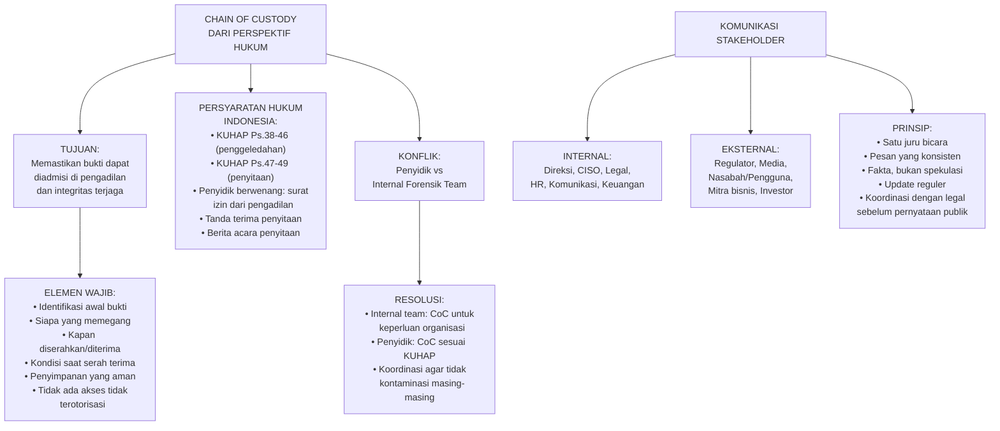

---

### 3. Landasan Teori dan Latihan Terapan

#### 10.1 Chain of Custody dalam Konteks KUHAP

Ketika investigasi internal melibatkan bukti yang kemudian diserahkan kepada penyidik Polri atau akan digunakan dalam proses hukum, prosedur chain of custody internal harus kompatibel dengan persyaratan KUHAP.

KUHAP Pasal 38-49 mengatur prosedur penggeledahan dan penyitaan:
- Penyitaan harus dilakukan oleh penyidik yang berwenang dengan surat izin pengadilan (atau dalam keadaan mendesak, dilaporkan segera setelahnya)
- Barang yang disita harus dibuat berita acaranya
- Tanda terima penyitaan diberikan kepada pemilik barang
- Barang sitaan disimpan dengan aman dan dapat diakses oleh terdakwa/kuasanya untuk pemeriksaan

**Implikasi:** Jika tim internal menyita atau mengakses bukti sebelum penyidik, ini dapat menimbulkan pertanyaan tentang integritas bukti. Koordinasi awal dengan legal counsel dan penyidik tentang siapa yang "memegang" bukti pertama kali adalah kritis.

#### 10.2 Komunikasi Stakeholder dalam Legal Incident Response

Insiden keamanan yang signifikan melibatkan banyak pemangku kepentingan dengan kebutuhan informasi yang berbeda:

**Direksi/Dewan:** Perlu memahami: dampak bisnis, kewajiban hukum, risiko reputasi, dan keputusan yang perlu diambil. Komunikasikan dalam bahasa bisnis, bukan teknis.

**Legal Counsel:** Perlu mengetahui semua fakta sejak dini — mereka akan memberikan panduan tentang apa yang boleh dan tidak boleh dikomunikasikan, dan kepada siapa.

**Regulator:** Formal, terdokumentasi, berbasis fakta yang diketahui. Hindari spekulasi. Jika ada ketidakpastian, nyatakan sebagai ketidakpastian.

**Media/Publik:** Hati-hati — koordinasikan semua pernyataan dengan legal counsel. Satu juru bicara yang telah dilatih. Pesan harus konsisten. Jangan katakan "tidak ada yang perlu dikhawatirkan" sebelum investigasi selesai.

**Pengguna/Nasabah:** Jujur dan tepat waktu. Berikan tindakan yang konkret. Hindari downplaying yang tidak berdasar.

---

### 4. Latihan Pemahaman

**Soal 1:** Dalam investigasi internal PT Bintang Digital, tim IT telah memigrasikan log sistem ke server baru untuk memudahkan analisis — tanpa menyimpan hash dari log asli terlebih dahulu. Apa konsekuensi dari tindakan ini untuk admissibility bukti?

**Soal 2:** Buat outline stakeholder communication plan untuk 48 jam pertama insiden PT Bintang Digital, yang mencakup: siapa, kapan, pesan apa, dan melalui saluran apa.

**Kunci Jawaban:**

Soal 1: Konsekuensi serius: (a) integritas log tidak dapat dibuktikan — tanpa hash dari log asli, tidak ada cara untuk membuktikan bahwa log yang ada sekarang identik dengan log asli (tidak ada modifikasi); (b) terdakwa atau pengacaranya dapat mempersoalkan autentisitas log di pengadilan; (c) tindakan ini melemahkan nilai bukti, meskipun tidak ada niat untuk memanipulasi. Tindakan korektif: meskipun sudah terlambat untuk log asli, hash server baru harus segera diambil dan didokumentasikan; sertakan dokumentasi tentang proses migrasi (siapa yang melakukan, kapan, tools apa yang digunakan) sebagai bagian dari chain of custody; pertimbangkan apakah ada backup log asli yang masih dapat diakses.

Soal 2 — Outline Communication Plan:

*0-4 jam:*
- Direksi dan CISO: briefing verbal + email ringkasan — fakta yang diketahui, langkah yang diambil, potensi dampak. Saluran: telepon/meeting darurat
- Legal Counsel: notifikasi lengkap + konsultasi tentang kewajiban notifikasi. Saluran: telepon langsung
- Tim IT Security: situational brief, instruksi untuk preserve bukti. Saluran: meeting internal

*4-24 jam:*
- Regulator (jika threshold terpenuhi): laporan awal sesuai regulasi. Saluran: formal/sistem pelaporan regulasi
- Tim PR/Komunikasi: briefing untuk menyiapkan holding statement. Saluran: meeting internal

*24-48 jam:*
- Pengguna yang terdampak: notifikasi formal sesuai UU PDP. Saluran: email langsung ke pengguna + portal website
- Mitra bisnis yang mungkin terdampak: pemberitahuan tertulis. Saluran: email formal
- Pernyataan publik jika media sudah mengetahui: satu juru bicara yang ditunjuk. Saluran: press release atau konferensi pers

**Ringkasan:** Chain of custody yang valid memerlukan dokumentasi yang tidak terputus dari identifikasi awal hingga penggunaan di pengadilan — setiap gap atau anomali dapat dieksploitasi untuk mempersoalkan admissibility bukti. Komunikasi stakeholder dalam legal incident response harus terkoordinasi, terkonsisten, dan selalu dikonsultasikan dengan legal counsel sebelum pernyataan material dibuat.

**Refleksi:** Tekanan media dan kekhawatiran reputasi dapat mendorong manajemen untuk membuat pernyataan publik yang prematur tentang insiden. Bagaimana Anda sebagai CISO menyeimbangkan transparansi dengan kebutuhan untuk tidak membuat pernyataan yang tidak akurat atau dapat digunakan sebagai dasar gugatan hukum?

---

## Bab 11 — Compliance Mapping: UU PDP, ITE, dan ISO 27001/27701

### 1. Capaian Pembelajaran Bab

Setelah menyelesaikan bab ini, mahasiswa mampu:
- Membangun compliance matrix yang memetakan kewajiban regulasi ke kontrol teknis dan organisasi (C5)
- Membandingkan persyaratan UU PDP, UU ITE, ISO 27001, dan ISO 27701 (C4)
- Mengidentifikasi overlap dan gap antara kerangka regulasi dan standar yang berbeda (C4)

*Dikaitkan dengan Sub-CPMK.5 (Pertemuan 11) dan Eval-5 (20%).*

---

### 2. Peta Konsep Bab

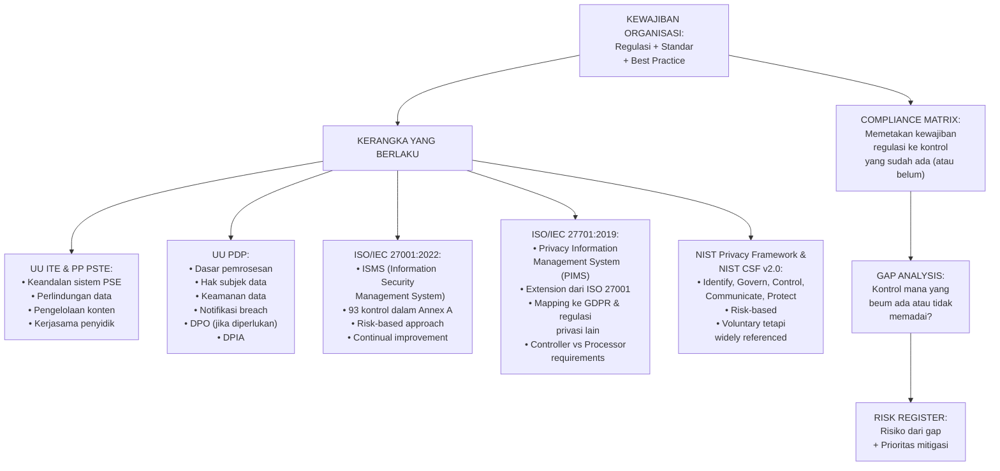

---

### 3. Landasan Teori

#### 11.1 Pendekatan Compliance Mapping

Compliance mapping adalah proses sistematis untuk mengidentifikasi semua kewajiban regulasi dan standar yang berlaku bagi organisasi, dan memetakan masing-masing kewajiban tersebut ke kontrol yang sudah ada atau yang perlu ditambahkan.

**Langkah compliance mapping:**
1. Identifikasi semua regulasi dan standar yang berlaku (berdasarkan sektor, jenis data, geografis)
2. Ekstrak kewajiban spesifik dari masing-masing regulasi/standar
3. Inventarisasi kontrol yang sudah ada di organisasi
4. Petakan kewajiban ke kontrol yang ada (atau tidak ada)
5. Identifikasi gap — kewajiban tanpa kontrol yang memadai
6. Prioritaskan gap berdasarkan risiko

#### 11.2 Perbandingan UU PDP, ISO 27001, dan ISO 27701

| Aspek | UU PDP | ISO 27001:2022 | ISO 27701:2019 |
|---|---|---|---|
| Sifat | Wajib (hukum Indonesia) | Sukarela (standar internasional) | Sukarela (extension ISO 27001) |
| Fokus | Hak subjek data, kewajiban pengendali/prosesor | Keamanan informasi secara umum | Privasi informasi (extension keamanan) |
| Pendekatan | Rules-based (kewajiban spesifik) | Risk-based (kontrol berdasarkan risiko) | Risk-based dengan tambahan privacy requirements |
| Certification | Tidak ada sertifikasi formal | Dapat disertifikasi oleh auditor independen | Sertifikasi bersama ISO 27001 |
| Sanksi non-compliance | Administratif (denda, sanksi) + Pidana | Tidak ada sanksi langsung | Tidak ada sanksi langsung |
| DPO | Tidak disebutkan eksplisit di UU PDP | Tidak relevan | Mengacu pada persyaratan regulasi setempat |

#### 11.3 Compliance Matrix — Contoh Parsial

| Kewajiban | Sumber Regulasi | Kontrol yang Ada | Status | Gap |
|---|---|---|---|---|
| Menginformasikan kepada subjek data tentang pemrosesan | UU PDP Ps. 30 | Privacy notice di website | Partially compliant | Privacy notice belum mencakup semua jenis pemrosesan |
| Keamanan data secara teknis dan organisasi | UU PDP Ps. 35 | Firewall, antivirus, kebijakan password | Partially compliant | Enkripsi data at rest belum diterapkan |
| Notifikasi breach dalam 14 hari kerja | UU PDP Ps. 46 | Tidak ada SOP notifikasi breach | Non-compliant | Perlu membangun SOP breach notification |
| Keandalan sistem (availability) | PP PSTE Ps. 4 | Backup reguler | Partially compliant | Belum ada DRP yang tertest |
| Pengelolaan risiko keamanan informasi | ISO 27001 A.6.1 | Risk assessment tahunan | Compliant | - |
| Transfer data ke luar Indonesia | UU PDP Ps. 56 | Tidak ada mekanisme formal | Non-compliant | Perlu data transfer mechanism (SCCs atau adequacy decision) |

---

### 4. Latihan Terapan — Mini Compliance Mapping

**Skenario:** PT Solusi Fintech adalah perusahaan fintech yang menyediakan layanan pinjaman online (P2P lending). Pengguna mereka sekitar 200.000 orang. Mereka memproses data: KTP, NPWP, rekening bank, data transaksi keuangan, nomor HP, dan foto selfie untuk verifikasi identitas. Mereka menggunakan vendor cloud luar negeri untuk infrastruktur.

**Tugas:** Buat compliance matrix parsial (minimal 10 baris) yang memetakan kewajiban dari UU PDP, UU ITE/PP PSTE, dan OJK/BI terkait P2P lending, ke status compliance PT Solusi Fintech. Identifikasi gap utama dan buat risk register dengan minimal 5 risiko.

**Kunci Jawaban — Risk Register:**

| # | Risiko | Sumber Gap | Kemungkinan | Dampak | Skor | Mitigasi |
|---|---|---|---|---|---|---|
| R1 | Sanksi administratif UU PDP karena tidak ada mekanisme transfer data ke luar negeri (cloud vendor asing) | Gap compliance UU PDP Ps.56 | Tinggi | Tinggi | Kritis | Tinjau kontrak cloud vendor, implementasikan mekanisme transfer data yang sah (DPA yang memadai atau transfer ke negara dengan perlindungan setara) |
| R2 | Pelanggaran data foto selfie (biometrik) tanpa mitigasi yang memadai | Data biometrik adalah data spesifik, belum ada kontrol khusus | Sedang | Sangat Tinggi | Kritis | Enkripsi biometrik, akses kontrol ketat, retensi terbatas |
| R3 | Gagal memenuhi kewajiban notifikasi breach 14 hari kerja | Belum ada SOP breach notification | Sedang | Tinggi | Tinggi | Kembangkan dan uji SOP breach notification |
| R4 | Sanksi OJK karena sistem tidak memenuhi standar keamanan | Tidak ada assessment kepatuhan OJK POJK P2P | Sedang | Tinggi | Tinggi | Lakukan gap analysis terhadap POJK No. 10/POJK.05/2022 |
| R5 | Pelanggaran hak akses subjek data karena tidak ada mekanisme formal | Tidak ada portal hak subjek data | Rendah | Sedang | Sedang | Bangun portal/mekanisme untuk pelaksanaan hak subjek data |

**Ringkasan:** Compliance mapping mengubah kewajiban regulasi abstrak menjadi checklist kontrol yang konkret dan dapat diaudit. Untuk organisasi yang tunduk pada multiple regulasi, pendekatan sistematis ini mencegah gap yang tidak terdeteksi. ISO 27001 dan 27701 memberikan kerangka kontrol yang dapat digunakan untuk memenuhi kewajiban UU PDP secara sistematis.

---

## Bab 12 — Gap Analysis dan Risk Register Berbasis Regulasi

### 1. Capaian Pembelajaran Bab

Setelah menyelesaikan bab ini, mahasiswa mampu:
- Melakukan gap analysis yang terstruktur terhadap posisi compliance saat ini (C5)
- Menyusun risk register berbasis regulasi dengan scoring yang dapat dipertahankan (C5)
- Memprioritaskan temuan gap berdasarkan risiko hukum dan operasional (C5)

*Dikaitkan dengan Sub-CPMK.5 (Pertemuan 12) dan Eval-5 (20%).*

---

### 2. Peta Konsep Bab

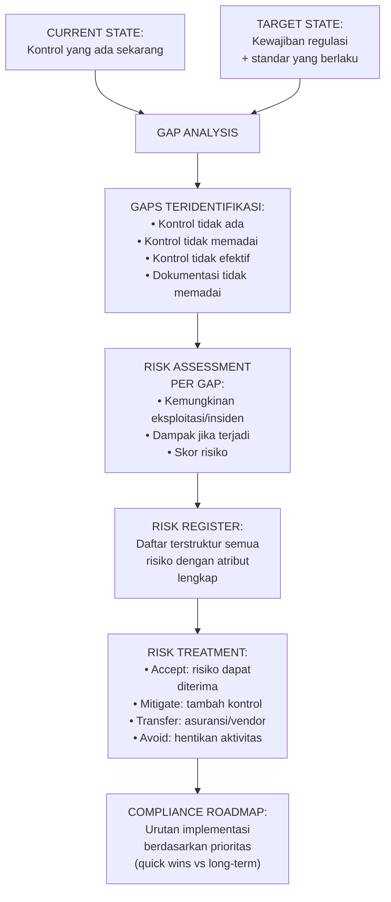

---

### 3. Landasan Teori

#### 12.1 Metodologi Gap Analysis

Gap analysis membandingkan posisi saat ini dengan posisi yang seharusnya:

**Langkah 1 — Tetapkan target state:** Semua kewajiban dari regulasi dan standar yang berlaku (dari compliance matrix Bab 11).

**Langkah 2 — Assess current state:** Untuk setiap kewajiban, evaluasi tingkat kepatuhan saat ini:
- *Compliant:* Kontrol ada, berfungsi, dan terdokumentasi
- *Partially Compliant:* Kontrol ada tetapi tidak lengkap atau tidak konsisten diterapkan
- *Non-Compliant:* Kontrol tidak ada atau tidak berfungsi
- *Not Applicable:* Kewajiban tidak berlaku dalam konteks ini

**Langkah 3 — Identifikasi dan dokumentasikan gap:** Gap adalah semua kondisi selain "Compliant." Dokumentasikan: apa yang kurang, mengapa ini adalah gap, dan referensi ke kewajiban spesifik.

**Langkah 4 — Lakukan risk assessment untuk setiap gap.**

#### 12.2 Risk Register Berbasis Regulasi

Risk register adalah dokumen tabel yang mencatat semua risiko yang diidentifikasi beserta atributnya:

| Atribut | Deskripsi |
|---|---|
| Risk ID | Identifier unik |
| Deskripsi Risiko | Apa yang mungkin terjadi dan dampaknya |
| Sumber Risiko | Gap mana yang menyebabkan risiko ini |
| Regulasi/Standar | Kewajiban yang tidak terpenuhi |
| Kemungkinan (1-5) | Seberapa mungkin risiko ini terjadi |
| Dampak (1-5) | Seberapa besar dampaknya jika terjadi |
| Risk Score | Kemungkinan × Dampak |
| Risk Level | Low (1-5), Medium (6-12), High (13-19), Critical (20-25) |
| Risk Owner | Siapa yang bertanggung jawab |
| Treatment | Accept/Mitigate/Transfer/Avoid |
| Kontrol Mitigasi | Kontrol yang akan ditambahkan |
| Target Date | Kapan mitigasi akan diimplementasikan |
| Residual Risk | Risk score setelah mitigasi |

---

### 4. Latihan dan Kunci Jawaban

**Soal:** Dari gap analysis PT Solusi Fintech (Bab 11), buatlah risk register lengkap untuk 5 risiko teratas, urutkan dari critical ke low, dan tentukan treatment yang tepat beserta justifikasinya.

**Kunci:** Lihat risk register dari kunci jawaban Bab 11 untuk dasar, ditambah: untuk setiap risiko, risk owner harus disebutkan (CISO untuk risiko teknis, DPO untuk risiko privasi, Legal Counsel untuk risiko hukum); treatment harus mempertimbangkan cost-benefit — tidak semua risiko perlu dimitigasi ke nol; target date harus realistis dan berbasis urgensi (risiko kritis = 30 hari, tinggi = 90 hari, sedang = 6 bulan).

**Ringkasan:** Gap analysis yang terstruktur menghasilkan risk register yang menjadi dokumen kerja untuk program compliance. Prioritisasi berbasis risk score memastikan sumber daya terbatas difokuskan pada risiko yang paling kritis. Risk register bukan dokumen statis — harus diperbarui secara berkala dan dikelola sebagai bagian dari ISMS.

---

## Bab 13 — Rekomendasi Kontrol dan Prioritisasi Berbasis Risiko

### 1. Capaian Pembelajaran Bab

Setelah menyelesaikan bab ini, mahasiswa mampu:
- Merumuskan rekomendasi kontrol yang spesifik, actionable, dan berbasis risk register (C5)
- Memprioritaskan rekomendasi menggunakan framework risk-based prioritization (C5)
- Menyusun compliance roadmap yang realistis untuk organisasi (C5)

*Dikaitkan dengan Sub-CPMK.5 (Pertemuan 13) dan Eval-5 (20% — deliverable: rekomendasi kontrol).*

---

### 2. Peta Konsep Bab

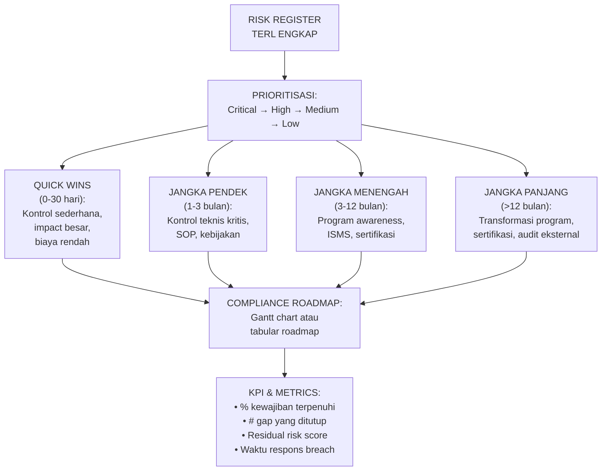

---

### 3. Prinsip Rekomendasi Kontrol yang Efektif

Rekomendasi kontrol compliance yang baik harus:

**Spesifik terhadap gap:** Bukan "tingkatkan keamanan" — tetapi "implementasikan enkripsi AES-256 untuk semua data biometrik yang tersimpan di database menggunakan [tools/framework spesifik] sebelum [tanggal]."

**Mappable ke standar:** Setiap rekomendasi harus dapat dikaitkan dengan kontrol spesifik dalam ISO 27001 Annex A atau ISO 27701 — ini memudahkan tracking dan audit.

**Memiliki pemilik yang jelas:** Setiap rekomendasi harus memiliki risk owner yang bertanggung jawab untuk implementasi.

**Terukur keberhasilannya:** Bagaimana kita tahu kontrol berhasil diimplementasikan? (misalnya: "semua database diverifikasi menggunakan scan tool X menunjukkan enkripsi aktif")

**Realistis secara sumber daya:** Rekomendasi yang membutuhkan 50 orang FTE untuk implementasi dalam 1 bulan tidak actionable.

---

### 4. Latihan Terapan

**Tugas Final Eval-5:** Berdasarkan risk register PT Solusi Fintech dari Bab 11-12, susun compliance roadmap 12 bulan yang mencakup: (a) quick wins bulan 1; (b) program jangka pendek bulan 2-3; (c) program jangka menengah bulan 4-9; (d) program jangka panjang bulan 10-12. Untuk setiap program, sebutkan: aktivitas, output yang diharapkan, pemilik, dan KPI keberhasilan.

**Kunci:** Roadmap efektif memulai dengan quick wins yang tidak membutuhkan banyak sumber daya tetapi menutup gap kritis (misalnya: membuat SOP breach notification — bisa selesai dalam seminggu dengan komitmen tim legal). Diikuti implementasi kontrol teknis yang memerlukan pengembangan (enkripsi database — 1-3 bulan). Lalu program organisasi jangka menengah (privacy awareness training, DPIA process). Terakhir, program strategis yang membutuhkan komitmen jangka panjang (sertifikasi ISO 27001).

**Ringkasan:** Rekomendasi kontrol yang baik mengubah gap analysis abstrak menjadi action plan yang dapat dieksekusi dan diukur. Compliance roadmap membantu manajemen memahami investment yang diperlukan dan timeline yang realistis untuk mencapai target compliance.

---

## Bab 14 — Legal Brief: Struktur IRAC dan Argumen Hukum-Teknis

### 1. Capaian Pembelajaran Bab

Setelah menyelesaikan bab ini, mahasiswa mampu:
- Menerapkan kerangka IRAC untuk menyusun argumen hukum yang terstruktur (C5)
- Mengintegrasikan analisis teknis dan analisis hukum dalam satu argumen yang kohesif (C5)
- Menyusun legal brief tentang isu keamanan siber atau privasi digital (C5)

*Dikaitkan dengan Sub-CPMK.6 (Pertemuan 14) dan Eval-6 (15%).*

---

### 2. Peta Konsep Bab

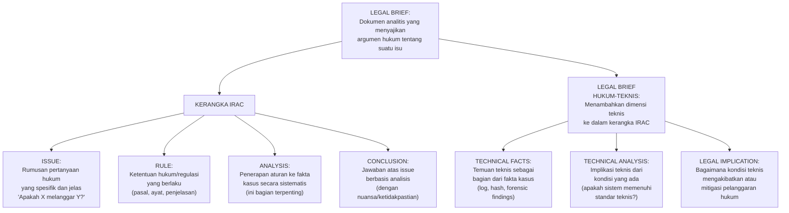

---

### 3. Panduan Menulis Legal Brief Hukum-Teknis

#### 14.1 Kerangka IRAC

**Issue (Isu):** Rumuskan pertanyaan hukum yang spesifik dan terukur. Hindari isu yang terlalu luas. Contoh yang baik: "Apakah tindakan PT X menyimpan data biometrik pengguna tanpa dasar pemrosesan yang sah melanggar Pasal 20 UU PDP dan apa konsekuensi hukumnya?" Contoh yang buruk: "Apakah PT X melanggar hukum?"

**Rule (Aturan):** Sebutkan semua ketentuan hukum yang relevan secara lengkap dan akurat. Kutip pasal dan ayat secara spesifik. Untuk legal brief hukum-teknis, tambahkan standar teknis yang relevan (ISO 27001, NIST) jika menjadi benchmark dalam kasus.

**Analysis (Analisis):** Ini adalah bagian terpenting. Terapkan aturan ke fakta kasus secara sistematis. Untuk setiap elemen dari Rule, analisis apakah fakta kasus memenuhi atau tidak memenuhi elemen tersebut. Pertimbangkan argumen kontra dan tangkis dengan bukti.

**Conclusion (Kesimpulan):** Jawaban atas Issue berdasarkan analisis. Jika ada ketidakpastian, nyatakan dengan tepat: "Berdasarkan fakta yang tersedia, tindakan PT X kemungkinan besar melanggar [ketentuan], namun hal ini bergantung pada [faktor X] yang masih perlu diverifikasi."

#### 14.2 Integrasi Aspek Teknis

Legal brief hukum-teknis berbeda dari legal brief murni hukum karena: fakta kasus mencakup kondisi teknis (konfigurasi sistem, log, hasil forensik); analisis mencakup penilaian apakah kondisi teknis memenuhi atau tidak memenuhi standar teknis yang menjadi acuan hukum; kesimpulan menghubungkan kondisi teknis dengan konsekuensi hukum.

**Contoh integrasi:** "Berdasarkan Pasal 35 UU PDP, pengendali wajib melindungi data pribadi menggunakan langkah keamanan yang memadai. ISO 27001 sebagai standar yang umumnya diterima menetapkan enkripsi data sebagai kontrol keamanan (Annex A, A.8.24). Hasil asesmen teknis menunjukkan bahwa PT X tidak menerapkan enkripsi data at rest untuk database yang menyimpan data biometrik pengguna (lihat Temuan Teknis, Lampiran A). Kondisi ini merupakan kegagalan menerapkan langkah keamanan yang memadai sebagaimana diwajibkan Pasal 35 UU PDP, yang mengakibatkan potensi pelanggaran ketentuan tersebut."

---

### 4. Contoh Legal Brief — Ringkas

**LEGAL BRIEF**
**Kasus:** Analisis Kepatuhan PT Solusi Fintech terhadap Kewajiban Transfer Data Lintas Batas
**Tanggal:** [Tanggal]
**Disusun oleh:** [Nama]

**I. ISSUE**
Apakah penggunaan infrastruktur cloud asing oleh PT Solusi Fintech untuk menyimpan dan memproses data pribadi pengguna Indonesia memenuhi persyaratan transfer data lintas batas sebagaimana diatur dalam Pasal 56 UU PDP No. 27/2022?

**II. RULE**
Pasal 56 UU PDP menetapkan bahwa transfer data pribadi ke luar wilayah Indonesia wajib: (a) memenuhi ketentuan bahwa negara tujuan memiliki tingkat perlindungan data pribadi yang setara atau lebih tinggi dari Indonesia; atau (b) terdapat perjanjian internasional antara Indonesia dengan negara tujuan; atau (c) ada jaminan perlindungan yang memadai melalui ketentuan dalam kontrak antara pengendali dan pihak penerima di luar negeri.

**III. ANALYSIS**
Fakta: PT Solusi Fintech menggunakan layanan AWS di-region Singapore. AWS adalah entitas hukum berkedudukan di AS. Data pengguna Indonesia diproses di server fisik di Singapura.

Penilaian: (a) Singapura memiliki Personal Data Protection Act (PDPA) 2012 — apakah ini setara dengan UU PDP Indonesia? Perbandingan substantif diperlukan; PDPA Singapura memiliki prinsip serupa tetapi tidak identik. Belum ada penetapan resmi dari pemerintah Indonesia tentang negara dengan perlindungan setara. (b) Belum ada perjanjian bilateral Indonesia-Singapura tentang perlindungan data yang diketahui. (c) PT Solusi Fintech perlu memeriksa apakah DPA dengan AWS mencakup ketentuan perlindungan yang memadai sesuai standar UU PDP.

**IV. CONCLUSION**
Berdasarkan analisis di atas, transfer data PT Solusi Fintech ke infrastruktur cloud asing menghadapi risiko kepatuhan yang signifikan terhadap Pasal 56 UU PDP. Tanpa penetapan resmi tentang kesetaraan perlindungan atau DPA yang memadai dengan cloud provider, PT Solusi Fintech berpotensi melanggar ketentuan transfer data lintas batas. Disarankan untuk: (1) meninjau dan memperbarui DPA dengan AWS; (2) memantau perkembangan penetapan resmi dari pemerintah tentang negara dengan perlindungan setara; (3) mempertimbangkan penggunaan Standard Contractual Clauses (SCCs) sebagai mekanisme transfer yang dapat dipertahankan.

---

### 5. Latihan dan Refleksi

**Soal:** Buat IRAC brief (maksimum 500 kata) tentang isu berikut: "Apakah penggunaan AI untuk pembuatan keputusan otomatis dalam penilaian kredit (credit scoring) oleh fintech, tanpa kemungkinan bagi pemohon untuk meminta penjelasan atau keberatan, melanggar hak subjek data berdasarkan UU PDP?"

**Refleksi:** Legal brief yang baik harus membedakan antara apa yang dapat dibuktikan dengan fakta yang ada, dan apa yang masih menjadi area abu-abu hukum. Bagaimana Anda mengkomunikasikan ketidakpastian hukum kepada klien tanpa mengurangi nilai advis hukum Anda?

---

## Bab 15 — Policy Memo, DPIA Finalization, dan Executive Summary

### 1. Capaian Pembelajaran Bab

Setelah menyelesaikan bab ini, mahasiswa mampu:
- Menyusun policy memo yang efektif untuk rekomendasi kebijakan keamanan siber/privasi (C5)
- Menyelesaikan DPIA lengkap dengan semua komponen yang disyaratkan (C5)
- Menulis executive summary yang mengintegrasikan temuan teknis dan implikasi hukum (C5)

*Dikaitkan dengan Sub-CPMK.6 (Pertemuan 15) dan Eval-6 (15%).*

---

### 2. Peta Konsep Bab

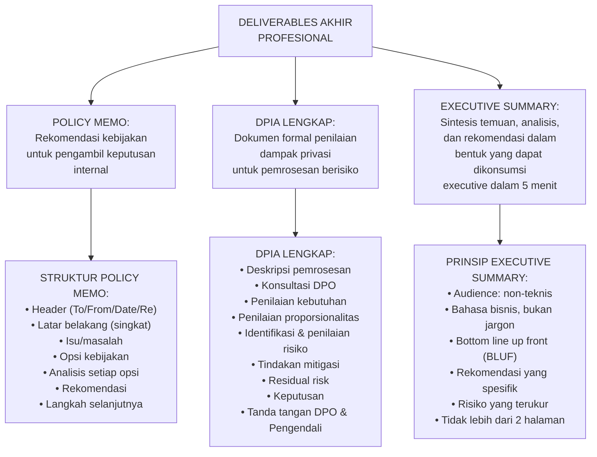

---

### 3. Policy Memo — Panduan Penulisan

Policy memo adalah dokumen internal yang merekomendasikan kebijakan kepada pengambil keputusan. Berbeda dari legal brief (yang menganalisis hukum), policy memo berfokus pada rekomendasi tindakan.

**Format standar:**

```
POLICY MEMO

Kepada     : [Nama dan Jabatan Penerima]
Dari       : [Nama dan Jabatan Pengirim]
Tanggal    : [Tanggal]
Perihal    : [Judul isu yang dibahas]
Klasifikasi: [Rahasia/Terbatas/Publik]

RINGKASAN EKSEKUTIF
[1-2 kalimat: rekomendasi utama]

LATAR BELAKANG
[2-3 paragraf: konteks masalah]

ISU/MASALAH
[Pernyataan masalah yang jelas]

OPSI KEBIJAKAN
Opsi 1: [Judul] — [deskripsi, kelebihan, kekurangan, implikasi]
Opsi 2: [Judul] — [deskripsi, kelebihan, kekurangan, implikasi]
Opsi 3: [Judul] — [deskripsi, kelebihan, kekurangan, implikasi]

REKOMENDASI
[Opsi mana yang direkomendasikan dan mengapa]

LANGKAH SELANJUTNYA
[Tindakan konkret yang diperlukan, siapa yang bertanggung jawab, kapan]
```

---

### 4. Latihan Terapan

**Tugas:** Buat policy memo (maksimum 600 kata) kepada Direksi PT Solusi Fintech tentang keputusan apakah akan menggunakan infrastruktur cloud lokal Indonesia vs tetap menggunakan cloud asing, mengingat kewajiban UU PDP tentang transfer data lintas batas. Presentasikan minimal 2 opsi dengan analisis kelebihan dan kekurangan.

**Kunci:** Policy memo yang baik untuk kasus ini harus: (1) menyajikan masalah kepatuhan UU PDP secara jelas tanpa jargon hukum berlebihan; (2) menawarkan setidaknya dua opsi yang realistis (cloud lokal Indonesia, atau tetap cloud asing dengan mekanisme kepatuhan yang ditingkatkan); (3) menganalisis setiap opsi dari perspektif: biaya, kemudahan implementasi, risiko kepatuhan, dan implikasi operasional; (4) membuat rekomendasi yang jelas dengan alasan; (5) menyebutkan langkah selanjutnya yang konkret.

**Ringkasan Bab:** Policy memo, DPIA, dan executive summary adalah output profesional utama dari analisis hukum-teknis. Masing-masing memiliki audiens dan tujuan berbeda: policy memo untuk pengambil keputusan internal, DPIA untuk dokumentasi kepatuhan dan regulasi, dan executive summary untuk stakeholder yang membutuhkan synthesis cepat dari analisis yang kompleks.

---

## Bab 16 — Presentasi Profesional dan Evaluasi Akhir

### 1. Capaian Pembelajaran Bab

Setelah menyelesaikan bab ini, mahasiswa mampu:
- Mempresentasikan legal brief atau policy memo secara profesional kepada panel reviewer (C5)
- Menjawab pertanyaan kritis tentang metodologi analisis dan kekuatan argumen (C5)
- Merefleksikan pembelajaran dan area pengembangan profesional dalam hukum siber (C5)

*Dikaitkan dengan Sub-CPMK.6 (Pertemuan 16) dan Eval-6 (15%).*

---

### 2. Peta Konsep Bab

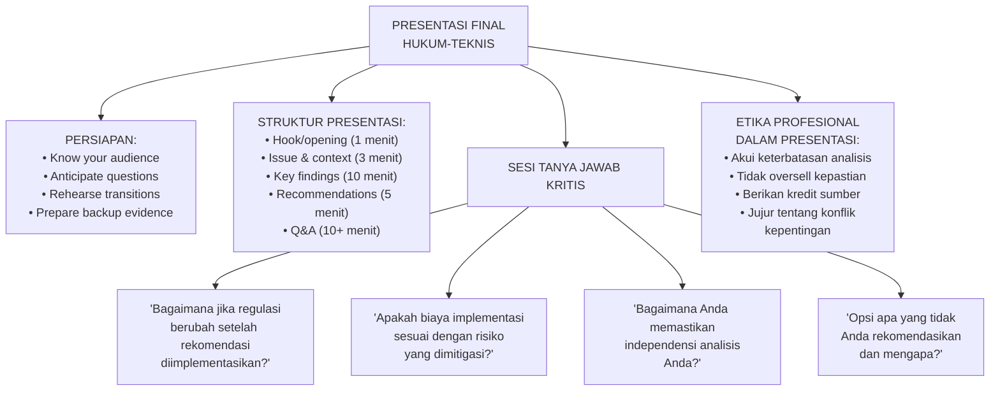

---

### 3. Panduan Presentasi dan Evaluasi Akhir

#### 16.1 Prinsip Presentasi Hukum-Teknis yang Efektif

**Know your audience:** Presentasi kepada panel yang terdiri dari CISO, Legal Counsel, dan CFO memerlukan keseimbangan yang berbeda dari presentasi kepada tim IT semata. CISO membutuhkan detail teknis; Legal Counsel membutuhkan ketepatan hukum; CFO membutuhkan quantifikasi risiko bisnis.

**Bottom Line Up Front (BLUF):** Mulai dengan rekomendasi atau temuan utama, bukan dengan sejarah panjang. Pengambil keputusan yang sibuk perlu tahu "what should we do" di menit pertama, bukan di akhir presentasi 30 menit.

**Visual aids yang tepat:** Compliance matrix dalam spreadsheet 200 baris tidak efektif sebagai slide. Gunakan: heat map risiko, roadmap visual, diagram flow proses, tabel ringkasan yang padat.

**Defend dengan evidence, bukan opini:** Setiap pernyataan yang dipertanyakan harus dapat dijawab dengan referensi ke pasal regulasi, temuan audit, atau dokumen yang dapat diverifikasi.

#### 16.2 Menghadapi Pertanyaan Sulit

**"Regulator belum pernah menindak kasus seperti ini di Indonesia — mengapa kita harus khawatir?"**
Jawaban: "Benar bahwa penegakan UU PDP masih dalam tahap awal. Namun, membangun posisi compliance sekarang — ketika penegakan belum ketat — jauh lebih efisien daripada melakukan remedial setelah ada tindakan penegakan. Biaya non-compliance yang disebutkan dalam UU PDP (sanksi administratif hingga 2% dari pendapatan tahunan) juga signifikan. Lebih penting, insiden data breach sendiri — terlepas dari tindakan regulasi — menimbulkan kerugian bisnis dan reputasi yang jauh lebih besar."

**"DPIA ini terasa terlalu teoritis — apa dampak praktisnya?"**
Jawaban: "DPIA bukan sekadar dokumen kepatuhan. Proses DPIA mengidentifikasi risiko privasi sebelum sistem diluncurkan — pada tahap ini, biaya remediasi 10-100x lebih murah daripada setelah sistem beroperasi. Selain itu, DPIA yang terdokumentasi adalah bukti bahwa organisasi telah melakukan due diligence — yang relevan jika terjadi insiden dan ada pertanyaan tentang kewajaran tindakan yang diambil."

#### 16.3 Evaluasi Akhir — Rubrik

| Komponen | Bobot | Deskripsi |
|---|---|---|
| Kualitas legal brief/DPIA/policy memo | 35% | Struktur IRAC/DPIA, akurasi hukum, kekuatan argumen, evidence appendix |
| Kedalaman analisis hukum-teknis | 25% | Integrasi dimensi teknis dan hukum, konsistensi logika |
| Presentasi | 20% | Kejelasan, struktur, visual aids, adaptasi audiens |
| Q&A | 20% | Kemampuan menjawab pertanyaan kritis, kejujuran tentang ketidakpastian, defend dengan evidence |

---

### 4. Latihan Final

**Soal Refleksi 1:** Identifikasi satu konsep hukum siber yang paling mengubah cara Anda berpikir tentang pekerjaan teknis Anda, dan jelaskan perubahan perspektif itu secara konkret.

**Soal Refleksi 2:** Dalam 3 tahun ke depan, tren hukum siber apa yang menurut Anda akan paling berdampak pada profesi keamanan siber di Indonesia? Apa implikasinya untuk pengembangan kompetensi profesional Anda?

**Kunci Jawaban Refleksi 1:** Tidak ada jawaban tunggal — yang dinilai adalah kedalaman refleksi dan konkretnya perubahan perspektif. Contoh yang baik: "Sebelum mata kuliah ini, saya memahami penetration testing murni sebagai aktivitas teknis. Setelah mempelajari UU ITE Pasal 30 dan persyaratan otorisasi, saya menyadari bahwa setiap penugasan pentest yang tidak memiliki documented authorization yang adequate dari pihak yang berwenang adalah aktivitas yang berpotensi ilegal — terlepas dari niat. Ini mengubah cara saya mempersiapkan penugasan: kini saya selalu memastikan Statement of Work, Rules of Engagement, dan authorization letter ditandatangani sebelum memulai satu command pun."

**Ringkasan Bab dan Mata Kuliah:** Presentasi profesional adalah tahap terakhir dalam rantai nilai analisis hukum-teknis. Nilai sebenarnya dari competence hukum siber bukan hanya dalam memahami regulasi — tetapi dalam kemampuan untuk mengkomunikasikan implikasi hukum kepada berbagai audiens secara efektif, membuat keputusan yang defensible, dan membangun sistem serta proses yang secara by design mematuhi kewajiban hukum.

**Refleksi Profesional:** Hukum siber adalah bidang yang berubah dengan cepat — UU ITE telah diubah dua kali dalam 16 tahun, UU PDP baru disahkan 2022, dan regulasi pelengkap masih terus berkembang. Sebagai profesional, bagaimana Anda membangun mekanisme untuk tetap terkini dengan perkembangan regulasi yang relevan dengan pekerjaan Anda?

---

---

# LAMPIRAN

## Lampiran A — Template Case Memo (Eval-1)

```
==========================================================
CASE MEMO — ANALISIS HUKUM SIBER
==========================================================
Nomor Memo    : CM-[TAHUN]-[NOMOR]
Tanggal       : _______________
Disusun oleh  : _______________
Subjek Memo   : _______________
Klasifikasi   : [ ] Publik  [ ] Terbatas  [ ] Rahasia

==========================================================
1. RINGKASAN KASUS
==========================================================
[Deskripsi singkat fakta kasus: 3-5 kalimat]

==========================================================
2. IDENTIFIKASI ISU HUKUM (LEGAL ISSUE SPOTTING)
==========================================================
Isu #1: _______________
Regulasi yang Relevan: _______________
Analisis Singkat: _______________

Isu #2: _______________
Regulasi yang Relevan: _______________
Analisis Singkat: _______________

Isu #3: _______________
Regulasi yang Relevan: _______________
Analisis Singkat: _______________

==========================================================
3. YURISDIKSI & PSE
==========================================================
Yurisdiksi yang Berlaku: _______________
Alasan: _______________
Status PSE: [ ] PSE Lingkup Publik  [ ] PSE Lingkup Privat  [ ] Bukan PSE
Kewajiban PSE yang Relevan: _______________

==========================================================
4. PERTANGGUNGJAWABAN (LIABILITY)
==========================================================
Pidana: _______________
Perdata: _______________
Administratif: _______________

==========================================================
5. REKOMENDASI
==========================================================
[Tindakan yang direkomendasikan berdasarkan analisis]

==========================================================
6. REFERENSI REGULASI
==========================================================
[Daftar pasal dan regulasi yang dirujuk]
==========================================================
```

---

## Lampiran B — Template Legal Issue Matrix (Eval-2)

```
LEGAL ISSUE MATRIX
==========================================================
Kasus       : _______________
Analis      : _______________
Tanggal     : _______________

Kolom:
1. Isu Hukum
2. Fakta yang Relevan
3. Regulasi/Pasal
4. Analisis Penerapan
5. Kesimpulan (Melanggar/Tidak/Tidak Jelas)
6. Risiko Hukum (Tinggi/Sedang/Rendah)

[Isi tabel sesuai kasus yang dianalisis]
==========================================================
```

---

## Lampiran C — Template Breach Response Checklist (Eval-4)

```
BREACH RESPONSE CHECKLIST
==========================================================
Nama Organisasi    : _______________
Nomor Insiden      : _______________
Tanggal Deteksi    : _______________
Penanggung Jawab   : _______________

==========================================================
JAM 0-4 (CONTAINMENT AWAL)
==========================================================
[ ] Isolasi sistem terdampak
[ ] Alert tim forensik dan legal counsel
[ ] Alert manajemen senior dan Direksi
[ ] Buka incident log (timestamp semua tindakan)
[ ] Preserve semua log tanpa modifikasi
[ ] Tentukan apakah ini "pelanggaran data pribadi" per UU PDP

==========================================================
JAM 4-24 (ASESMEN & PRESERVASI)
==========================================================
[ ] Forensic acquisition sistem terdampak (sebelum remediasi)
[ ] Assess scope: jenis & jumlah data yang terdampak
[ ] Identifikasi jenis data (umum/spesifik)
[ ] Hubungi cyber insurance provider
[ ] Konsultasi dengan legal counsel tentang kewajiban notifikasi
[ ] Tentukan threshold notifikasi (apakah wajib ke regulator & subjek data?)

==========================================================
JAM 24-72 (NOTIFIKASI)
==========================================================
[ ] Siapkan draft notifikasi ke lembaga pengawas PDP
[ ] Identifikasi regulator sektoral lain yang perlu diberitahu
[ ] Siapkan draft notifikasi kepada subjek data yang terdampak
[ ] Review draft dengan legal counsel
[ ] Kirim notifikasi ke regulator (≤14 hari kerja)
[ ] Kirim notifikasi ke subjek data (jika risiko tinggi)

==========================================================
HARI 3-14 (INVESTIGASI & PEMULIHAN)
==========================================================
[ ] Investigasi forensik mendalam
[ ] Update notifikasi regulator dengan informasi terbaru
[ ] Implementasi kontrol sementara untuk mencegah insiden berulang
[ ] Dokumentasi insiden lengkap untuk keperluan hukum
[ ] Koordinasikan dengan Bareskrim jika ada aspek pidana

==========================================================
DOKUMENTASI CHAIN OF CUSTODY
==========================================================
Item Bukti         | Hash | Custodian | Tgl/Waktu
___________________|______|___________|__________
                   |      |           |
==========================================================
```

---

## Lampiran D — Template DPIA Ringkas (Eval-3)

```
DATA PROTECTION IMPACT ASSESSMENT (DPIA) RINGKAS
==========================================================
Nama Proyek/Sistem  : _______________
Pengendali Data     : _______________
DPO (jika ada)      : _______________
Tanggal             : _______________
Versi               : _______________

==========================================================
BAGIAN 1 — DESKRIPSI PEMROSESAN
==========================================================
1.1 Tujuan Pemrosesan:
1.2 Dasar Hukum Pemrosesan:
1.3 Jenis Data yang Diproses:
    [ ] Data Pribadi Umum — sebutkan: _______________
    [ ] Data Pribadi Spesifik — sebutkan: _______________
1.4 Kategori Subjek Data:
1.5 Jumlah Perkiraan Subjek Data:
1.6 Penerima Data (pihak ketiga):
1.7 Transfer Data ke Luar Negeri: [ ] Ya [ ] Tidak
    Jika Ya, mekanisme: _______________
1.8 Periode Retensi:
1.9 Alur Data (data flow diagram):

==========================================================
BAGIAN 2 — PENILAIAN KEBUTUHAN & PROPORSIONALITAS
==========================================================
2.1 Apakah pemrosesan ini perlu untuk tujuan yang dinyatakan? ___
2.2 Apakah ada cara yang lebih privacy-friendly untuk mencapai
    tujuan yang sama? _______________
2.3 Apakah jumlah data yang dikumpulkan minimal yang diperlukan?
    _______________

==========================================================
BAGIAN 3 — IDENTIFIKASI & PENILAIAN RISIKO
==========================================================
Risiko # | Deskripsi | Kemungkinan (1-5) | Dampak (1-5) | Skor
_________|___________|___________________|______________|_____
         |           |                   |              |
         |           |                   |              |

==========================================================
BAGIAN 4 — TINDAKAN MITIGASI
==========================================================
Risiko # | Mitigasi Yang Direncanakan | Implementasi | Residual Risk
_________|___________________________|______________|______________
         |                           |              |
         |                           |              |

==========================================================
BAGIAN 5 — KEPUTUSAN
==========================================================
[ ] Lanjutkan — risiko residual dapat diterima
[ ] Lanjutkan dengan modifikasi — kontrol tambahan diperlukan
[ ] Konsultasi ke regulator sebelum melanjutkan
[ ] Batalkan — risiko tidak dapat dimitigasi ke level yang diterima

Alasan: _______________

==========================================================
TANDA TANGAN
==========================================================
Pengendali Data    : _______________ Tanggal: ___
DPO (jika ada)     : _______________ Tanggal: ___
Disetujui oleh     : _______________ Tanggal: ___
==========================================================
```

---

## Lampiran E — Template Compliance Matrix (Eval-5)

```
COMPLIANCE MATRIX
==========================================================
Nama Organisasi   : _______________
Sektor            : _______________
Tanggal Asesmen   : _______________
Asesor            : _______________

Kolom:
1. Kode Kewajiban
2. Sumber Regulasi/Standar
3. Deskripsi Kewajiban
4. Kontrol yang Ada
5. Status (Compliant/Partially/Non-Compliant/N/A)
6. Gap (jika ada)
7. Prioritas Gap (Critical/High/Medium/Low)
8. PIC

[Isi tabel berdasarkan regulasi yang berlaku untuk organisasi]
==========================================================
```

---

## Lampiran F — Template Legal Brief (Eval-6)

```
LEGAL BRIEF
==========================================================
Kasus/Isu         : _______________
Disusun untuk     : _______________
Disusun oleh      : _______________
Tanggal           : _______________
Versi             : _______________
Klasifikasi       : _______________

==========================================================
I. ISSUE
==========================================================
[Rumusan pertanyaan hukum yang spesifik]

==========================================================
II. RULE
==========================================================
[Ketentuan hukum/regulasi yang berlaku — kutip pasal spesifik]

==========================================================
III. ANALYSIS
==========================================================
[Penerapan aturan ke fakta kasus secara sistematis]

3.1 Fakta yang Relevan:
    [Fakta teknis dan factual yang terkait dengan issue]

3.2 Penerapan Aturan ke Fakta:
    [Analisis elemen per elemen]

3.3 Argumen Kontra dan Tanggapan:
    [Antisipasi argumen yang berlawanan]

==========================================================
IV. CONCLUSION
==========================================================
[Jawaban atas issue berdasarkan analisis]

Tingkat kepercayaan: [ ] Tinggi  [ ] Sedang  [ ] Rendah
Alasan ketidakpastian (jika ada): _______________

==========================================================
V. REKOMENDASI TINDAKAN
==========================================================
[Tindakan konkret yang disarankan berdasarkan analisis]

==========================================================
LAMPIRAN
==========================================================
A. Referensi regulasi lengkap
B. Temuan teknis yang dirujuk
C. Dokumen pendukung lainnya
==========================================================
```

---

## Lampiran G — Rubrik Penilaian Legal Brief & Presentasi (Eval-6)

| Komponen | Bobot | 85-100 (Sangat Baik) | 70-84 (Baik) | 55-69 (Cukup) | <55 (Kurang) |
|---|---|---|---|---|---|
| Kualitas Issue Spotting | 15% | Issue dirumuskan spesifik, tepat, dan mencakup semua dimensi hukum | Issue tepat tapi kurang spesifik | Issue ada tapi tidak akurat | Issue tidak diidentifikasi |
| Akurasi Hukum (Rule) | 20% | Semua pasal dikutip akurat, regulasi terkini digunakan | Sebagian besar akurat, minor error | Ada error material dalam kutipan | Banyak error atau regulasi yang salah |
| Kualitas Analisis | 25% | Analisis mendalam, elemen per elemen, argumen kontra dipertimbangkan | Analisis baik tapi kurang mendalam | Analisis ada tapi superfisial | Tidak ada analisis substantif |
| Kesimpulan | 15% | Menjawab issue secara langsung, mengakui ketidakpastian dengan tepat | Kesimpulan ada, minor gaps | Kesimpulan tidak langsung menjawab issue | Tidak ada kesimpulan atau tidak relevan |
| Presentasi | 15% | Jelas, terstruktur, visual aids efektif, adaptasi audiens | Presentasi baik, minor improvements | Dapat dipahami tapi kurang terstruktur | Sulit dipahami |
| Q&A | 10% | Menjawab dengan evidence, jujur tentang ketidakpastian, mempertahankan argumen dengan kuat | Menjawab sebagian besar dengan baik | Menjawab sebagian, beberapa pertanyaan tidak terjawab | Tidak dapat menjawab pertanyaan dengan memadai |

---

## Lampiran H — Pernyataan Etika Profesi

```
PERNYATAAN ETIKA PROFESI
==========================================================
Nama            : _______________
Program Studi   : Magister Terapan Forensik Digital & Keamanan Siber
Mata Kuliah     : Cyber Law & Digital Privacy (VSFDKS09)

Saya yang bertanda tangan di bawah ini menyatakan:

1. INTEGRITAS ANALISIS: Semua analisis hukum yang saya lakukan
   didasarkan pada pemahaman yang jujur dan akurat terhadap
   regulasi yang berlaku — bukan untuk membenarkan tindakan
   yang melanggar hukum.

2. TIDAK ADA KONFLIK KEPENTINGAN: Tidak ada kepentingan
   pribadi atau finansial yang mempengaruhi objektivitas
   analisis saya, kecuali yang telah diungkapkan secara
   eksplisit.

3. KERAHASIAAN: Informasi klien atau organisasi yang saya
   dapatkan dalam konteks pembelajaran ini akan dijaga
   kerahasiaannya.

4. PENGEMBANGAN BERKELANJUTAN: Saya berkomitmen untuk terus
   memperbarui pengetahuan tentang perkembangan hukum siber
   dan privasi digital yang terus berubah.

5. TIDAK MENYALAHGUNAKAN PENGETAHUAN: Pengetahuan tentang
   hukum siber yang diperoleh tidak akan digunakan untuk
   membantu aktivitas yang melanggar hukum.

Tanda Tangan    : _______________
Tanggal         : _______________
==========================================================
```

---

# KUNCI JAWABAN GLOBAL — RANGKUMAN TEMA LINTAS BAB

**Tema 1: Hukum dan Teknik Adalah Dua Sisi dari Koin yang Sama**
Setiap keputusan teknis memiliki implikasi hukum, dan setiap kewajiban hukum memerlukan implementasi teknis. Enkripsi database bukan hanya praktik keamanan yang baik — ia adalah cara memenuhi kewajiban "langkah keamanan yang memadai" dalam UU PDP Pasal 35.

**Tema 2: Otorisasi Adalah Segalanya**
Baik dalam hukum pidana (Pasal 30 UU ITE: akses "tanpa hak") maupun dalam etika profesi, otorisasi yang terdokumentasi adalah perbedaan antara pekerjaan yang sah dan kejahatan. Ini berlaku untuk pentest, forensik, monitoring karyawan, dan akses penyidik.

**Tema 3: Dokumentasi Membuat Compliance Dapat Dibuktikan**
Compliance yang tidak terdokumentasi secara efektif bukan compliance — tidak ada cara untuk membuktikannya kepada regulator atau pengadilan. DPIA, privacy notice, chain of custody, dan incident log bukan overhead administratif: mereka adalah bukti bahwa organisasi beroperasi secara bertanggung jawab.

**Tema 4: Privacy by Design Lebih Murah dari Privacy by Remediation**
Membangun privasi ke dalam sistem sejak awal — enkripsi default, data minimization, access control — jauh lebih hemat daripada menambahkan kontrol setelah sistem beroperasi, atau membayar denda setelah insiden.

**Tema 5: Ketidakpastian Hukum Harus Diakui, Bukan Disembunyikan**
Hukum siber Indonesia masih berkembang. UU PDP baru disahkan 2022. Banyak isu masih belum memiliki preseden pengadilan. Analisis yang jujur mengakui ketidakpastian ini dan menyampaikannya dengan tepat — bukan memberikan kepastian palsu yang dapat merugikan klien.

---

# DAFTAR PUSTAKA

## Regulasi dan Perundangan

Republik Indonesia. (2024). *Undang-Undang Nomor 1 Tahun 2024 tentang Perubahan Kedua atas Undang-Undang Nomor 11 Tahun 2008 tentang Informasi dan Transaksi Elektronik*. Lembaran Negara Republik Indonesia.

Republik Indonesia. (2022). *Undang-Undang Nomor 27 Tahun 2022 tentang Pelindungan Data Pribadi*. Lembaran Negara Republik Indonesia.

Republik Indonesia. (2019). *Peraturan Pemerintah Nomor 71 Tahun 2019 tentang Penyelenggaraan Sistem dan Transaksi Elektronik*. Lembaran Negara Republik Indonesia.

Kementerian Komunikasi dan Informatika. (2020). *Peraturan Menteri Komunikasi dan Informatika Nomor 5 Tahun 2020 tentang Penyelenggara Sistem Elektronik Lingkup Privat beserta perubahannya*. Berita Negara Republik Indonesia.

Kementerian Komunikasi dan Informatika. (2016). *Peraturan Menteri Komunikasi dan Informatika Nomor 20 Tahun 2016 tentang Perlindungan Data Pribadi Dalam Sistem Elektronik*. Berita Negara Republik Indonesia.

Republik Indonesia. (1981). *Undang-Undang Nomor 8 Tahun 1981 tentang Hukum Acara Pidana (KUHAP)*. Lembaran Negara Republik Indonesia.

## Standar Internasional

ISO/IEC. (2022). *ISO/IEC 27001:2022 — Information Security, Cybersecurity and Privacy Protection — Information Security Management Systems — Requirements*. International Organization for Standardization.

ISO/IEC. (2019). *ISO/IEC 27701:2019 — Security Techniques — Extension to ISO/IEC 27001 and ISO/IEC 27002 for Privacy Information Management*. International Organization for Standardization.

## Referensi Akademik dan Profesional

Kuner, C., Bygrave, L. A., Docksey, C., & Drechsler, L. (2020). *The EU General Data Protection Regulation (GDPR): A Commentary*. Oxford University Press.

NIST. (2024). *NIST Cybersecurity Framework Version 2.0*. National Institute of Standards and Technology. https://doi.org/10.6028/NIST.CSWP.29

NIST. (2020). *NIST Privacy Framework: A Tool for Improving Privacy through Enterprise Risk Management, Version 1.0*. National Institute of Standards and Technology.

NIST. (2012). *Computer Security Incident Handling Guide* (NIST SP 800-61 Rev. 2). National Institute of Standards and Technology. https://doi.org/10.6028/NIST.SP.800-61r2

NIST. (2006). *Guide to Integrating Forensic Techniques into Incident Response* (NIST SP 800-86). National Institute of Standards and Technology.

Cavoukian, A. (2010). *Privacy by Design: The 7 Foundational Principles*. Information and Privacy Commissioner of Ontario.

European Parliament. (2016). *Regulation (EU) 2016/679 of the European Parliament and of the Council (General Data Protection Regulation — GDPR)*. Official Journal of the European Union. [Sebagai referensi komparatif]

Samarajiva, R. (Ed.). (2021). *Privacy and Personal Data Protection in Asia: Emerging Frameworks and Key Issues*. LIRNEasia. [Untuk konteks regional Asia]

Badan Siber dan Sandi Negara (BSSN). *Panduan Keamanan Siber dan Perlindungan Data — Regulasi dan Praktik Indonesia*. BSSN. [Cek versi terkini di website BSSN]

---

*Buku Ajar ini disusun sesuai dengan Rencana Pembelajaran Semester (RPS) mata kuliah Cyber Law & Digital Privacy (VSFDKS09), Program Studi Magister Terapan Forensik Digital dan Keamanan Siber, PENS. Seluruh analisis hukum dalam buku ini bersifat edukatif dan tidak merupakan advis hukum profesional. Untuk keperluan hukum yang spesifik, konsultasikan dengan praktisi hukum yang berkualifikasi.*

---
*Versi 1.0 — Disusun untuk Tahun Akademik 2025/2026*
