# BUKU AJAR
# CYBER THREAT INTELLIGENCE ANALYSIS

---

**Program Studi**: Magister Terapan Forensik Digital dan Keamanan Siber
**Kode Mata Kuliah**: MK-E-11 / ELEKTIF-G2
**Bobot SKS**: T = 2, P = 1, Total = 3 SKS
**Semester**: 2 (Pool Genap; Elektif Pathway)
**Level Bloom / CSEC KA**: C4–C5 / KA-5
**Institusi**: Politeknik Elektronika Negeri Surabaya (PENS)
**Departemen**: Teknik Informatika dan Komputer

---

## HALAMAN PENGESAHAN

Buku ajar ini dikembangkan oleh Tim Dosen Program Studi Magister Terapan Forensik Digital dan Keamanan Siber PENS sebagai referensi utama mata kuliah **Cyber Threat Intelligence Analysis (MK-E-11)**.

Dokumen Referensi RPS: `FM.RPS.MTr.FDKS.MK-E-11.2025` | Tanggal Penyusunan: 28-05-2026

---

## KATA PENGANTAR

Keamanan siber modern tidak lagi cukup dengan pertahanan reaktif. Organisasi yang mampu bertahan terhadap ancaman canggih adalah organisasi yang memahami musuhnya — motif, kapabilitas, teknik, dan target mereka — sebelum serangan terjadi. Di sinilah **Cyber Threat Intelligence (CTI)** berperan: mengubah data ancaman mentah menjadi pengetahuan yang dapat ditindaklanjuti.

Buku ajar ini dirancang untuk mahasiswa Program Studi Magister Terapan Forensik Digital dan Keamanan Siber yang ingin menguasai siklus intelijen ancaman siber secara end-to-end. Mulai dari merumuskan *intelligence requirements*, mengumpulkan dan mengevaluasi sumber data, menganalisis IOC dan TTP, menyusun *structured intelligence* berbasis STIX/TAXII, membangun *threat hunting hypothesis*, hingga menghasilkan laporan CTI strategis/taktis/operasional yang dapat digunakan untuk pengambilan keputusan pertahanan organisasi.

Pendekatan dalam buku ini adalah **evidence-based, hypothesis-driven, dan analytically rigorous** — menghindari spekulasi, mengakui bias dan ketidakpastian, serta menekankan reproducibility dan auditability artefak intelijen. Setiap teknik dan metode dikaitkan dengan framework resmi (MITRE ATT&CK, STIX 2.1, TAXII 2.1, NIST SP 800-150, dan Kill Chain) serta praktik industri terkini.

Etika profesi dan kepatuhan hukum adalah pilar tak terpisahkan. Semua praktik dalam buku ini dilakukan dalam lingkungan yang legal, terisolasi, berotorisasi, dan tidak diarahkan untuk eksploitasi sistem pihak ketiga.

**Tim Dosen Pengampu MK-E-11**
Program Studi Magister Terapan Forensik Digital dan Keamanan Siber — PENS

---

## DESKRIPSI MATA KULIAH

Mata kuliah **Cyber Threat Intelligence Analysis (MK-E-11)** membahas siklus CTI (*collection, processing, analysis, dissemination*), perumusan *intelligence requirements* dan PIR, evaluasi sumber data, analisis IOC/TTP/campaign/actor behavior, pemetaan ATT&CK, penyusunan artefak intelijen terstruktur berbasis STIX/TAXII, *threat hunting hypothesis* dengan *analytic tradecraft*, serta *reporting* strategis/taktis/operasional untuk mendukung keputusan pertahanan siber.

**Prasyarat yang Disarankan**: Cybersecurity Principles; Security Info & Event Management / Incident Response sebagai konteks operasional.

**Catatan Implementasi**: Semua praktik teknis dilakukan pada lingkungan legal, terisolasi, berotorisasi, menggunakan dataset/log/konfigurasi yang sah, serta tidak diarahkan untuk eksploitasi sistem pihak ketiga.

---

## PETA OBE: CPL → IK → CPMK → SUB-CPMK → EVALUASI

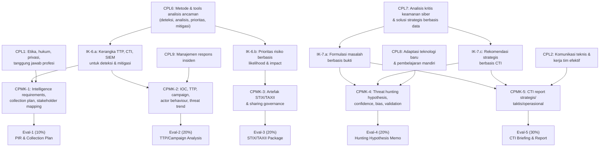

---

## PETA KOMPETENSI MATA KULIAH

```mermaid
flowchart LR
    A["Bab 1-2\nCTI Lifecycle &\nIntelligence Requirements"]
    B["Bab 3-4\nSource Evaluation &\nCollection Plan"]
    C["Bab 5-6\nIOC Analysis &\nThreat Actor Profiling"]
    D["Bab 7-8\nTTP & Kill Chain\nAnalysis"]
    E["Bab 9-10\nATT&CK Mapping &\nCampaign Analysis"]
    F["Bab 11-12\nSTIX/TAXII &\nIntel Sharing"]
    G["Bab 13-14\nThreat Hunting\nHypothesis"]
    H["Bab 15\nCTI Reporting &\nBriefing"]
    I["Bab 16\nTren & Pengayaan CTI"]

    A --> B --> C --> D --> E --> F --> G --> H --> I
    
    style A fill:#e8f4fd
    style B fill:#e8f4fd
    style C fill:#fef9e7
    style D fill:#fef9e7
    style E fill:#fef9e7
    style F fill:#eafaf1
    style G fill:#fdebd0
    style H fill:#fdebd0
    style I fill:#f5eef8
```

---

## TABEL PEMETAAN BAB — OBE

| Bab | Judul | Sub-CPMK | CPMK | Materi Utama | Evaluasi | Artefak |
|---|---|---|---|---|---|---|
| 1 | CTI Lifecycle dan Intelligence Ecosystem | Sub-CPMK-1 | CPMK-1 | CTI lifecycle, types of intelligence | Eval-1 | Intelligence lifecycle diagram |
| 2 | Intelligence Requirements dan PIR | Sub-CPMK-1 | CPMK-1 | PIR, stakeholder mapping, collection plan | Eval-1 | PIR Document |
| 3 | Source Evaluation dan Data Reliability | Sub-CPMK-2 | CPMK-2 | Source taxonomy, reliability, bias | Eval-2 | Source evaluation matrix |
| 4 | IOC Analysis dan Classification | Sub-CPMK-2 | CPMK-2 | IOC types, lifecycle, confidence | Eval-2 | IOC worksheet |
| 5 | Threat Actor Profiling | Sub-CPMK-2 | CPMK-2 | Actor taxonomy, attribution, TTPs | Eval-2 | Actor profile |
| 6 | Kill Chain Analysis | Sub-CPMK-2 | CPMK-2 | Lockheed Martin Kill Chain, Diamond Model | Eval-2 | Kill chain mapping |
| 7 | TTP Analysis dan ATT&CK Framework | Sub-CPMK-2 | CPMK-2 | MITRE ATT&CK, techniques, sub-techniques | Eval-2 | ATT&CK heatmap |
| 8 | Campaign Analysis dan Trend Intelligence | Sub-CPMK-2 | CPMK-2 | Campaign tracking, sector trends | Eval-2 | Campaign analysis report |
| 9 | STIX 2.1 — Structured Threat Information | Sub-CPMK-3 | CPMK-3 | STIX objects, relationships, bundles | Eval-3 | STIX bundle |
| 10 | TAXII 2.1 dan Intelligence Sharing Governance | Sub-CPMK-3 | CPMK-3 | TAXII protocol, TLP, sharing policy | Eval-3 | TAXII configuration |
| 11 | Intel Sharing Platforms dan Community | Sub-CPMK-3 | CPMK-3 | MISP, OpenCTI, ISACs | Eval-3 | Sharing policy document |
| 12 | Analytic Tradecraft dan Structured Analysis | Sub-CPMK-4 | CPMK-4 | SAT, ACH, cognitive bias | Eval-4 | Analytic note |
| 13 | Threat Hunting Hypothesis | Sub-CPMK-4 | CPMK-4 | Hypothesis, confidence, validation | Eval-4 | Hunting hypothesis memo |
| 14 | CTI Report — Strategis, Taktis, Operasional | Sub-CPMK-5 | CPMK-5 | Report types, audience, structure | Eval-5 | CTI report draft |
| 15 | Capstone — CTI Briefing dan Rekomendasi | Sub-CPMK-5 | CPMK-5 | Full CTI cycle, briefing, presentation | Eval-5 | CTI briefing package |
| 16 | Tren CTI, Sertifikasi, dan Pengayaan | Pengayaan | Semua | AI/ML in CTI, certifications, careers | — | Reflection memo |

---

## PETUNJUK PENGGUNAAN BUKU

Buku ini dirancang untuk dibaca secara **sekuensial** mengikuti alur 16 pertemuan. Setiap bab membangun kompetensi yang diperlukan untuk bab berikutnya:

- **Bab 1–2** membangun fondasi CTI lifecycle dan cara merumuskan kebutuhan intelijen.
- **Bab 3–8** mengembangkan kemampuan analisis: sumber data, IOC, actor, kill chain, TTP, dan campaign.
- **Bab 9–11** mengajarkan standar STIX/TAXII dan praktik berbagi intelijen.
- **Bab 12–13** membangun kemampuan analytic tradecraft dan threat hunting hypothesis.
- **Bab 14–15** mengintegrasikan semua kompetensi ke dalam CTI report dan presentasi profesional.
- **Bab 16** memperluas wawasan tentang tren industri dan jalur karir CTI.

Untuk setiap bab: baca pengantar kontekstual → pelajari landasan teori → kerjakan contoh terapan → lakukan praktikum → selesaikan latihan → cek kunci jawaban → lakukan refleksi.

---

## DAFTAR BAB

1. CTI Lifecycle dan Intelligence Ecosystem
2. Intelligence Requirements, PIR, dan Stakeholder Mapping
3. Source Evaluation, Collection Plan, dan Data Reliability
4. IOC Analysis: Klasifikasi, Lifecycle, dan Confidence
5. Threat Actor Profiling dan Attribution
6. Kill Chain Analysis dan Diamond Model
7. TTP Analysis dan MITRE ATT&CK Framework
8. Campaign Analysis dan Strategic Threat Trends
9. STIX 2.1 — Structured Threat Information Expression
10. TAXII 2.1 dan Intelligence Sharing Governance
11. Intel Sharing Platforms: MISP, OpenCTI, dan ISAC
12. Analytic Tradecraft dan Structured Analytic Techniques
13. Threat Hunting Hypothesis dan Validation Plan
14. CTI Reporting — Strategis, Taktis, dan Operasional
15. Capstone — CTI Briefing dan Rekomendasi Pertahanan
16. Tren CTI, Sertifikasi, dan Pengayaan Profesional

---

---

## Bab 1 — CTI Lifecycle dan Intelligence Ecosystem

### 1. Capaian Pembelajaran Bab

Setelah menyelesaikan bab ini, mahasiswa mampu:
- Menjelaskan definisi, tujuan, dan peran Cyber Threat Intelligence (CTI) dalam ekosistem keamanan siber organisasi.
- Mendeskripsikan setiap fase CTI lifecycle beserta input, output, dan keterkaitannya.
- Membedakan tipe intelijen (strategis, taktis, operasional, teknis) dan audience yang sesuai.
- Menjelaskan prinsip etika, legalitas, dan batasan dalam pengumpulan serta berbagi intelijen.

Bab ini memetakan **Sub-CPMK-1** dan berkontribusi pada **Eval-1 (10%)**.

---

### 2. Peta Konsep Bab

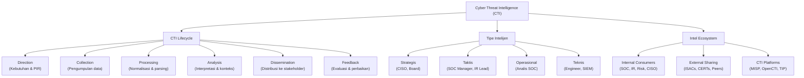

---

### 3. Pengantar Kontekstual

Pada April 2021, operator ransomware REvil menyerang Quanta Computer — pemasok Apple — dan berhasil mencuri blueprint MacBook. Pada Oktober 2023, kelompok APT Lazarus menyerang infrastruktur kripto di Korea Selatan dengan rantai serangan yang telah dipersiapkan selama berbulan-bulan. Apa yang membedakan organisasi yang mampu mendeteksi dan menggagalkan serangan semacam ini dengan yang tidak? Dalam banyak kasus, jawabannya adalah **Cyber Threat Intelligence yang matang**.

CTI bukan sekadar feed IOC (IP address mencurigakan, hash malware, atau domain berbahaya). CTI yang sesungguhnya adalah produk intelijen yang menjawab pertanyaan spesifik dari pengambil keputusan: *Siapa yang menyerang kami? Mengapa? Dengan cara apa? Dan apa yang harus kami lakukan?*

Di Indonesia, kebutuhan CTI semakin krusial seiring meningkatnya insiden siber pada sektor perbankan, infrastruktur kritis, dan pemerintahan. BSSN mencatat ratusan ribu serangan siber setiap tahun, namun kapasitas analisis intelijen ancaman di banyak organisasi masih terbatas pada pemantauan reaktif. Mata kuliah ini membangun kapasitas analisis yang proaktif dan strategis.

---

### 4. Landasan Teori

#### 4.1 Definisi Cyber Threat Intelligence

**Definisi**: CTI adalah pengetahuan berbasis bukti (*evidence-based knowledge*) tentang ancaman siber, termasuk konteks, mekanisme, indikator, implikasi, dan rekomendasi yang dapat ditindaklanjuti oleh pengambil keputusan untuk merespons ancaman tersebut.

**Kata kunci dalam definisi ini:**
- *Evidence-based*: CTI didasarkan pada data dan analisis, bukan spekulasi.
- *Actionable*: CTI harus menghasilkan tindakan konkret, bukan sekadar laporan deskriptif.
- *Decision-relevant*: CTI disesuaikan dengan kebutuhan spesifik konsumen intelijen.

**Perbedaan CTI dengan data ancaman mentah:**
| Data Mentah | CTI |
|---|---|
| IP: 192.168.1.1 terhubung ke port 443 | Server C2 APT29 aktif, digunakan dalam kampanye spionase September 2024 |
| Hash: abc123def456 | Malware Cobalt Strike beacon, digunakan oleh FIN7, teknik T1059.001 |
| Anomali login pukul 02:00 | Pola konsisten dengan lateral movement post-compromise APT |

#### 4.2 CTI Lifecycle

CTI lifecycle adalah kerangka kerja iteratif yang memastikan intelijen dihasilkan secara sistematis dan relevan. Terdapat beberapa model lifecycle, namun yang paling umum adalah model 6-fase:

**Fase 1 — Direction (Pengarahan)**

*Tujuan*: Mendefinisikan apa yang ingin diketahui.

Dalam fase ini, analis CTI bekerja sama dengan stakeholder (CISO, SOC Lead, Risk Manager) untuk menetapkan:
- **Priority Intelligence Requirements (PIR)**: Pertanyaan intelijen utama yang paling penting dijawab.
- **Intelligence Requirements (IR)**: Pertanyaan lebih spesifik yang mendukung PIR.
- **Collection Requirements**: Jenis data apa yang perlu dikumpulkan.

Contoh PIR: *"Apakah organisasi kami menjadi target kelompok APT yang menargetkan sektor perbankan Indonesia?"*

*Prinsip kerja*: Tanpa direction yang jelas, pengumpulan data menjadi tidak terarah dan menghasilkan noise, bukan intelligence.

*Batasan*: PIR yang terlalu luas ("semua ancaman siber") membuat collection tidak efisien. PIR yang terlalu sempit dapat melewatkan ancaman signifikan.

**Fase 2 — Collection (Pengumpulan)**

*Tujuan*: Mengumpulkan data mentah dari berbagai sumber sesuai collection requirements.

Sumber data CTI dibagi menjadi:
- **OSINT (Open Source Intelligence)**: Data publik — laporan vendor, berita, media sosial, paste sites, GitHub, dark web forum (dengan izin dan dalam batas legal).
- **HUMINT (Human Intelligence)**: Informasi dari manusia — komunitas berbagi intelijen, ISAC, kolega industri.
- **SIGINT/TECHINT**: Data teknis — log, PCAP, malware sample, vulnerability data.
- **FININT**: Informasi finansial — pola pembayaran cryptocurrency terkait ransomware (dengan otoritas hukum).

*Risiko kesalahan*: Mengumpulkan data dari sumber yang tidak diotorisasi (scraping secara ilegal, akses sistem tanpa izin) melanggar hukum dan etika profesi, serta dapat mencemari intelligence dengan data yang tidak dapat diverifikasi.

**Fase 3 — Processing (Pemrosesan)**

*Tujuan*: Mengubah data mentah menjadi format yang dapat dianalisis.

Aktivitas utama:
- Normalisasi format (konversi ke skema standar seperti STIX 2.1)
- Deduplication (menghapus data duplikat)
- Enrichment (menambahkan konteks — GeoIP, Whois, VirusTotal)
- Filtering (membuang data yang tidak relevan)
- Translation (jika data dalam bahasa asing)

**Fase 4 — Analysis (Analisis)**

*Tujuan*: Menginterpretasikan data untuk menghasilkan intelligence yang bermakna.

Ini adalah fase paling kritis dan paling membutuhkan keahlian analis. Aktivitas analisis meliputi:
- Identifikasi pola dan hubungan
- Attribution (siapa pelakunya?)
- Assessment kemungkinan (seberapa yakin?)
- Evaluasi dampak dan risiko
- Structured Analytic Techniques (SAT) untuk mengurangi bias kognitif

**Fase 5 — Dissemination (Diseminasi)**

*Tujuan*: Menyebarkan intelligence ke konsumen yang tepat dalam format yang tepat.

Format dissemination harus disesuaikan dengan audience:
- **CISO/Board**: Executive briefing, 1–2 halaman, bahasa bisnis
- **SOC Manager**: Tactical report, IOC list, TTP summary
- **Analis SOC**: STIX bundles, detection rules, enriched IOC feeds
- **Komunitas**: Intelligence sharing via MISP/TAXII dengan TLP yang tepat

**Fase 6 — Feedback (Umpan Balik)**

*Tujuan*: Mengevaluasi apakah intelligence yang dihasilkan bermanfaat dan meningkatkan proses.

Feedback loop yang baik menjawab:
- Apakah PIR terjawab?
- Apakah intelligence memengaruhi keputusan?
- Apakah ada gap dalam collection?
- Apa yang perlu diperbaiki untuk siklus berikutnya?

*Kesalahan umum*: Banyak tim CTI mengabaikan fase feedback, sehingga siklus tidak pernah berkembang.

#### 4.3 Tipe Intelijen

| Tipe | Time Horizon | Audience | Pertanyaan yang Dijawab | Contoh Output |
|---|---|---|---|---|
| **Strategis** | Bulanan–Tahunan | CISO, Board, Risk Officer | Ancaman apa yang relevan dengan bisnis kami dalam 12 bulan ke depan? | Annual threat landscape report |
| **Taktis** | Mingguan–Bulanan | SOC Manager, IR Lead, Threat Hunter | Teknik dan taktik apa yang digunakan musuh saat ini? | TTP brief, ATT&CK heatmap |
| **Operasional** | Harian–Mingguan | Analis SOC, Incident Responder | Apakah sedang ada kampanye aktif yang menargetkan kami? | Campaign alert, actor activity update |
| **Teknis** | Real-time | SIEM Engineer, Firewall Admin | IP/domain/hash mana yang harus diblokir sekarang? | IOC feed, detection rules |

*Risiko kesalahan interpretasi*: Mencampur tipe intelijen untuk audience yang salah adalah kesalahan umum — memberikan IOC list kepada CISO tidak bermakna, memberikan executive briefing kepada SIEM engineer tidak actionable.

#### 4.4 Etika dan Legalitas CTI

CTI beroperasi dalam ekosistem yang memiliki implikasi etis dan hukum signifikan:

**Prinsip etika dalam CTI:**
1. *Do No Harm*: Pengumpulan intelligence tidak boleh membahayakan pihak ketiga yang tidak terlibat.
2. *Proportionality*: Tingkat intrusi pengumpulan data harus proporsional dengan kebutuhan.
3. *Transparency*: Sumber intelligence harus dapat diungkapkan kepada konsumen yang tepat.
4. *Privacy*: Data personal yang tidak relevan dengan ancaman tidak boleh dikumpulkan atau disimpan.

**Batasan hukum di Indonesia:**
- UU ITE (UU No. 11/2008 jo. No. 19/2016): Melarang akses sistem tanpa izin untuk tujuan apapun.
- UU PDP (UU No. 27/2022): Mengatur pengumpulan dan pemrosesan data pribadi.
- Aturan BSSN: Regulasi tentang berbagi informasi ancaman siber antar instansi pemerintah.

---

### 5. Model atau Arsitektur

#### Arsitektur CTI Program

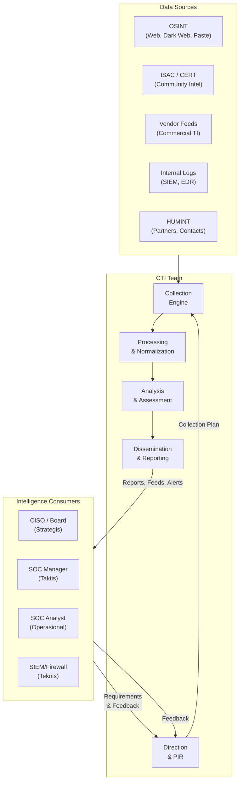

---

### 6. Contoh Terapan

**Skenario**: Bank Nasional Indonesia (BNI fiktif — "Bank Nusantara") berencana membangun program CTI pertama mereka. Tim keamanan siber diperintahkan CISO untuk menyusun proposal program CTI.

**Konteks kasus**: Bank dengan 5.000 karyawan, 200 cabang, layanan *mobile banking* dan *internet banking* aktif. Pernah mengalami insiden phishing berskala besar 8 bulan lalu.

**Aset yang dilindungi**: Sistem *core banking*, data nasabah, sistem pembayaran, reputasi.

**Ancaman utama**: Kelompok APT yang menargetkan sektor finansial Asia Tenggara; operator ransomware; kelompok cybercrime yang mengincar *business email compromise* (BEC).

**Proses analisis**:
1. Tim CTI memetakan stakeholder: CISO (strategis), SOC Lead (taktis), analis SOC (operasional), tim firewall (teknis).
2. Workshop PIR menghasilkan 3 PIR utama: (1) Apakah ada kelompok APT yang secara aktif menargetkan bank-bank Indonesia? (2) Teknik phishing apa yang sedang digunakan untuk menargetkan sektor finansial? (3) Adakah data Bank Nusantara yang bocor di dark web?
3. Collection plan disusun untuk masing-masing PIR, mencantumkan sumber data, metode, frekuensi, dan format output.
4. Dissemination plan: laporan bulanan untuk CISO, weekly brief untuk SOC Lead, IOC feed harian untuk SIEM.

**Hasil yang diharapkan**: Program CTI yang terstruktur, dengan PIR yang jelas, collection plan yang feasible, dan dissemination yang disesuaikan dengan audience.

---

### 7. Praktikum atau Aktivitas Terarah

**Judul**: Memetakan CTI Lifecycle untuk Organisasi Hipotetis

**Tujuan**: Mahasiswa mampu menerapkan CTI lifecycle framework pada konteks organisasi spesifik dan mengidentifikasi kebutuhan intelijen awal.

**Prasyarat**: Pemahaman konsep CTI lifecycle dari kuliah.

**Lingkungan lab**: Tidak memerlukan tools teknis — menggunakan worksheet dan dokumen template.

**Dataset/artefak**: Template PIR Document (Lampiran B), kasus skenario organisasi yang disediakan dosen.

**Langkah kerja**:
1. Baca skenario organisasi yang diberikan (sektor, ukuran, insiden sebelumnya, aset kritis).
2. Identifikasi minimal 3 stakeholder dan kebutuhan intelijen masing-masing.
3. Rumuskan 2–3 PIR yang relevan dengan konteks organisasi.
4. Untuk setiap PIR, identifikasi tipe intelijen yang diperlukan (strategis/taktis/operasional/teknis).
5. Buat draft collection plan awal (sumber data yang akan digunakan, frekuensi, format).
6. Identifikasi 2 batasan etika/hukum yang harus diperhatikan dalam program CTI organisasi tersebut.

**Bukti yang harus dikumpulkan**: Dokumen PIR (menggunakan template), stakeholder map, collection plan draft.

**Format laporan**: Laporan tertulis 2–3 halaman + stakeholder map (dapat berupa diagram atau tabel).

**Kriteria keberhasilan**: PIR dapat dioperasionalkan (spesifik, terukur, relevan), collection plan mencantumkan sumber yang feasible dan legal, batasan etika diidentifikasi dengan tepat.

**Catatan etika**: Seluruh aktivitas dilakukan berdasarkan skenario hipotetis. Tidak ada pengumpulan data dari sistem atau entitas nyata yang tidak berotorisasi.

---

### 8. Latihan Pemahaman

**Soal 1 (Pilihan Ganda — C4 Analisis)**
Sebuah tim SOC menerima feed IOC berisi 50.000 IP address mencurigakan dari vendor komersial. Manajer meminta analis untuk "langsung blokir semua IP ini di firewall." Respons yang paling tepat dari analis CTI adalah:

A. Langsung melaksanakan perintah karena vendor komersial biasanya akurat.
B. Memblokir 10% teratas berdasarkan threat score tertinggi terlebih dahulu.
C. Memvalidasi relevansi IOC terhadap konteks organisasi, menilai risiko false positive, dan menyarankan pendekatan bertahap.
D. Menolak karena feed IOC tidak pernah akurat.

**Soal 2 (Esai Singkat — C4)**
Jelaskan mengapa fase *direction* dalam CTI lifecycle dianggap sebagai fase paling kritis. Apa yang terjadi jika fase ini dilewati atau dilakukan dengan buruk?

**Soal 3 (Analisis Kasus — C5)**
CISO sebuah perusahaan telekomunikasi meminta laporan tentang "semua ancaman siber yang relevan." Sebagai analis CTI, apa masalah dengan permintaan ini, dan bagaimana Anda akan merestrukturisasinya menjadi PIR yang efektif?

**Soal 4 (Perbandingan Konsep — C4)**
Bandingkan CTI taktis dan CTI operasional dari sisi: time horizon, audience, format output, dan pertanyaan yang dijawab. Berikan satu contoh konkret untuk masing-masing.

**Soal 5 (Evaluasi — C5)**
Seorang analis CTI menemukan informasi berharga tentang teknik serangan terbaru di sebuah forum dark web. Ia ingin mendokumentasikan temuan ini sebagai intelligence. Identifikasi minimal 3 pertimbangan etika dan hukum yang harus diperhatikan sebelum menggunakan informasi tersebut.

---

### 9. Latihan Terapan / Studi Kasus

**Studi Kasus 1**: Tim CTI sebuah perusahaan manufaktur besar mendapati bahwa mereka menerima laporan intelijen yang tidak pernah digunakan oleh tim SOC atau manajemen. Anggaran CTI terancam dipotong karena dianggap tidak memberikan nilai. Analisis akar masalah dari situasi ini menggunakan kerangka CTI lifecycle. Identifikasi fase mana yang kemungkinan besar bermasalah, dan rekomendasikan 3 langkah perbaikan konkret.

**Studi Kasus 2**: Anda adalah analis CTI di BSSN Indonesia. Anda diminta menyusun program CTI untuk berbagi intelijen ancaman dengan 50 instansi pemerintah. Rancang framework program CTI tersebut mencakup: tipe intelijen yang akan diproduksi, mekanisme collection, model dissemination, pertimbangan klasifikasi dan TLP, serta tantangan etika/hukum yang perlu diantisipasi.

---

### 10. Kunci Jawaban dan Pembahasan

**Soal 1**: **Jawaban C**

*Alasan*: IOC dari feed vendor komersial, meskipun berkualitas tinggi, tidak selalu relevan dengan konteks organisasi tertentu. Memblokir 50.000 IP tanpa validasi berisiko sangat tinggi — bisa memblokir IP legitimate (false positive) yang mengganggu operasi bisnis. CTI yang baik selalu mempertimbangkan *context* dan *relevance* sebelum tindakan. Pendekatan bertahap (validasi → prioritasi → implementasi bertahap → monitoring dampak) adalah praktik standar.

*Jawaban A salah*: Akurasi vendor tidak menjamin relevansi untuk konteks spesifik organisasi. *Jawaban B* sebagian benar (prioritasi) tetapi masih tidak melakukan validasi relevansi. *Jawaban D* keliru — feed IOC bermanfaat jika digunakan dengan tepat.

*Teori yang mendasari*: Intelligence Lifecycle fase Analysis — setiap intelligence harus divalidasi relevansinya sebelum digunakan untuk keputusan.

**Soal 2**:
Fase direction kritis karena seluruh siklus CTI bekerja untuk menjawab pertanyaan yang ditetapkan di fase ini. Tanpa direction yang baik: (1) Collection menjadi tidak terarah — mengumpulkan data dalam jumlah besar tanpa fokus yang menghasilkan *noise*; (2) Analysis tidak memiliki konteks — analis tidak tahu apakah temuannya relevan; (3) Dissemination kehilangan target — laporan yang dihasilkan tidak menjawab kebutuhan stakeholder; (4) Feedback tidak bermakna — tidak ada tolok ukur untuk menilai apakah intelligence berhasil.

*Analogi*: Detektif yang mulai mengumpulkan bukti tanpa tahu kejahatan apa yang sedang diselidiki.

**Soal 3**:
Masalah: "Semua ancaman siber yang relevan" terlalu luas, tidak terukur, tidak menetapkan prioritas, dan membuat analis tidak tahu harus mulai dari mana. PIR yang distrukturisasi ulang:
- PIR-1: "Apakah ada kelompok APT yang secara aktif menargetkan operator telekomunikasi di Asia Tenggara dalam 6 bulan terakhir?"
- PIR-2: "Teknik serangan apa yang paling sering digunakan untuk menyerang infrastruktur jaringan telekomunikasi?"
- PIR-3: "Apakah ada indikasi kebocoran data pelanggan perusahaan kami di forum dark web atau platform paste?"

Setiap PIR memiliki scope yang terukur, timeframe yang jelas, dan dapat dijawab dengan sumber data spesifik.

**Soal 4**:
| Aspek | CTI Taktis | CTI Operasional |
|---|---|---|
| Time horizon | Mingguan–Bulanan | Harian–Mingguan |
| Audience | SOC Manager, IR Lead | Analis SOC, Incident Responder |
| Format output | TTP brief, ATT&CK heatmap, actor profile | Campaign alert, IOC update, actor activity report |
| Pertanyaan dijawab | "Teknik apa yang digunakan musuh saat ini?" | "Apakah sedang ada kampanye aktif yang menargetkan kami?" |
| Contoh | Laporan: "APT29 menggunakan T1059.001 dalam kampanye September 2024" | Alert: "Domain phishing baru terkait kampanye APT29 aktif sejak kemarin" |

**Soal 5**:
Tiga pertimbangan utama: (1) *Legalitas akses* — apakah forum dark web diakses dengan cara yang legal? Sekadar membaca forum publik umumnya legal, namun mendaftar dengan identitas palsu atau mengunduh konten ilegal bisa melanggar hukum; (2) *Kontaminasi evidence* — apakah sumber dapat dikutip atau diverifikasi? Sumber anonim dari dark web tidak dapat diverifikasi dan confidence-nya rendah; (3) *Privasi dan data pihak ketiga* — apakah informasi di forum mengandung data personal korban yang tidak relevan dengan intelligence? Menyalin dan menyebarkan data tersebut bisa melanggar UU PDP. Tambahan: (4) Apakah tindakan pengumpulan ini memengaruhi operasi keamanan siber lain (honeypot, operasi undercover)?

---

### 11. Ringkasan Bab

CTI adalah pengetahuan berbasis bukti yang mengubah data ancaman menjadi *actionable intelligence* bagi pengambil keputusan. CTI Lifecycle 6-fase (Direction → Collection → Processing → Analysis → Dissemination → Feedback) memastikan intelligence diproduksi secara sistematis. Empat tipe intelijen (strategis, taktis, operasional, teknis) melayani audience berbeda dengan format dan time horizon berbeda. Etika dan legalitas adalah batasan tak ternegosiasi dalam pengumpulan dan berbagi intelligence. Fase direction adalah fondasi seluruh program CTI — PIR yang buruk menghasilkan intelligence yang tidak bermakna.

---

### 12. Refleksi Profesional

1. Dalam konteks organisasi publik Indonesia (misalnya instansi pemerintah atau BUMN), siapa saja stakeholder CTI yang perlu dilibatkan dalam phase *direction*, dan apa tantangan unik dalam menetapkan PIR lintas departemen dengan kepentingan yang berbeda?

2. Seorang analis CTI menemukan bahwa perusahaan tempat ia bekerja menjual *threat intelligence* kepada pihak ketiga tanpa memberitahu sumber data aslinya. Bagaimana Anda menilai situasi ini dari perspektif etika profesi dan hukum privasi di Indonesia?

3. Bagaimana program CTI harus berevolusi ketika organisasi beralih ke lingkungan hybrid cloud? Identifikasi 2 tantangan collection dan 2 tantangan analysis yang muncul dalam konteks ini.

---

## Bab 2 — Intelligence Requirements, PIR, dan Stakeholder Mapping

### 1. Capaian Pembelajaran Bab

Setelah menyelesaikan bab ini, mahasiswa mampu:
- Merumuskan Priority Intelligence Requirements (PIR) yang terukur, relevan, dan dapat dioperasionalkan.
- Melakukan stakeholder mapping untuk program CTI dan mengidentifikasi kebutuhan intelijen per stakeholder.
- Menyusun collection plan yang komprehensif berdasarkan PIR.
- Mengevaluasi sumber data CTI berdasarkan kriteria reliabilitas dan relevansi.

Bab ini melanjutkan **Sub-CPMK-1** dan berkontribusi pada **Eval-1 (10%)**.

---

### 2. Peta Konsep Bab

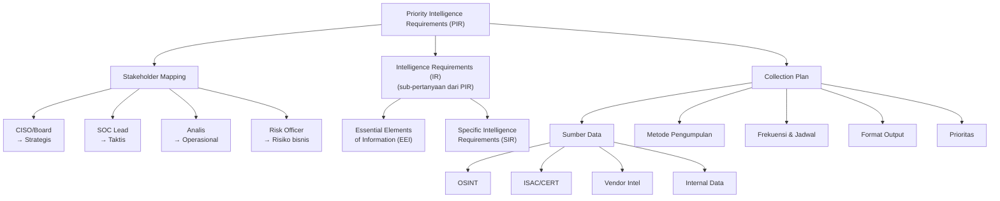

---

### 3. Pengantar Kontekstual

Salah satu kegagalan paling umum dalam program CTI bukan pada kekurangan data, melainkan pada kelebihan data yang tidak relevan. Tim CTI banyak yang terjebak dalam *collection bias* — mengumpulkan apa yang mudah dikumpulkan, bukan apa yang benar-benar dibutuhkan. Hasilnya adalah laporan intelijen yang panjang tetapi tidak digunakan, atau IOC feed berisi ribuan indikator yang membebani analis SOC.

Solusinya adalah disiplin dalam **requirements management** — proses memastikan bahwa setiap intelligence yang diproduksi menjawab pertanyaan spesifik dari stakeholder yang spesifik. Bab ini membangun fondasi praktis untuk requirements management dalam program CTI.

---

### 4. Landasan Teori

#### 4.1 Anatomi Intelligence Requirements

Intelligence Requirements dalam CTI mengadopsi struktur hierarkis dari komunitas intelligence nasional:

**Priority Intelligence Requirements (PIR)**
Pertanyaan intelijen paling kritis yang harus dijawab untuk mendukung keputusan strategis organisasi. PIR biasanya berjumlah 3–7 per organisasi (terlalu banyak PIR berarti tidak ada yang diprioritaskan).

Karakteristik PIR yang baik (mnemonic **SMART-I**):
- **Specific**: Pertanyaan dapat dioperasionalkan menjadi collection tasks.
- **Measurable**: Ada indikator yang dapat diukur untuk menentukan apakah PIR terjawab.
- **Actionable**: Jawaban PIR memungkinkan keputusan atau tindakan konkret.
- **Relevant**: Relevan dengan risiko bisnis dan operasional organisasi.
- **Time-bound**: Ada timeframe yang jelas.
- **Intelligence-able**: Dapat dijawab dengan sumber intelligence yang tersedia (bukan pertanyaan yang tidak mungkin dijawab).

**Intelligence Requirements (IR) / Essential Elements of Information (EEI)**
Sub-pertanyaan yang lebih spesifik yang mendukung PIR. Satu PIR biasanya memiliki 3–10 IR.

Contoh:
- PIR: "Apakah ada APT yang menargetkan sektor finansial Indonesia?"
- IR-1: "APT mana yang memiliki track record menyerang bank di Asia Tenggara?"
- IR-2: "Teknik initial access apa yang digunakan APT tersebut dalam 12 bulan terakhir?"
- IR-3: "Apakah ada indikasi reconnaissance terhadap infrastruktur kami?"

**Specific Intelligence Requirements (SIR)**
Pertanyaan yang paling granular, langsung dapat diterjemahkan ke collection task spesifik.

#### 4.2 Stakeholder Mapping dalam CTI

Stakeholder mapping adalah proses mengidentifikasi semua pihak yang akan mengonsumsi intelligence dan mendefinisikan kebutuhan spesifik mereka.

**Framework Stakeholder CTI:**

| Stakeholder | Level | Pertanyaan Utama | Format Pilihan | Frekuensi |
|---|---|---|---|---|
| CISO / CEO | Eksekutif | "Apakah kami dalam bahaya? Apa dampak bisnisnya?" | Executive brief, 1 hal. | Bulanan |
| Risk Officer | Manajerial | "Bagaimana ancaman ini memengaruhi risk posture?" | Risk update, quantified | Bulanan/Kuartalan |
| SOC Manager | Taktis | "TTP apa yang harus kami deteksi?" | Tactical report, TTP summary | Mingguan |
| Incident Responder | Taktis | "Actor apa yang mungkin terlibat dalam insiden ini?" | Actor profile, playbook | On-demand |
| SOC Analyst (L1/L2) | Operasional | "Apakah ini IOC yang harus saya khawatirkan?" | Alert, enriched IOC | Real-time |
| SIEM/Firewall Engineer | Teknis | "Apa yang harus saya blokir/detect?" | IOC feed, Sigma rules | Daily |
| Legal/Compliance | Hukum | "Apakah insiden ini memerlukan notifikasi regulator?" | Incident summary | On-demand |

*Kesalahan umum*: Mengabaikan non-technical stakeholder (legal, HR, komunikasi) yang juga membutuhkan intelligence selama insiden.

#### 4.3 Collection Plan

Collection plan adalah dokumen yang mendefinisikan *bagaimana* intelligence akan dikumpulkan untuk menjawab setiap PIR/IR.

**Komponen Collection Plan:**

1. **Requirement Reference**: PIR atau IR yang dijawab.
2. **Collection Source**: Jenis sumber (OSINT, vendor, ISAC, internal).
3. **Specific Source**: Nama spesifik (VirusTotal, AlienVault OTX, MISP instance, feed vendor X).
4. **Collection Method**: Manual (analis membaca), otomatis (API pull), atau semi-otomatis (scheduled script).
5. **Frequency**: Seberapa sering data dikumpulkan (real-time, harian, mingguan).
6. **Format/Schema**: Format data yang diharapkan (STIX, JSON, CSV, PDF).
7. **Reliability Rating**: Penilaian awal reliabilitas sumber (tinggi/sedang/rendah).
8. **Owner**: Siapa analis yang bertanggung jawab.
9. **Legal/Ethical Constraints**: Batasan hukum atau etika yang berlaku.

#### 4.4 Source Evaluation Framework

Sebelum menggunakan sumber data, analis CTI harus mengevaluasi reliabilitasnya menggunakan framework standar.

**NATO/IC Admissibility Matrix (dimodifikasi untuk CTI):**

Dimensi pertama — **Source Reliability**:
- A: Sepenuhnya dapat diandalkan (riwayat akurasi tinggi, terverifikasi)
- B: Umumnya dapat diandalkan (sebagian besar akurat)
- C: Cukup dapat diandalkan (akurasi bervariasi)
- D: Tidak selalu dapat diandalkan (kerap tidak akurat)
- E: Tidak dapat diandalkan (rekam jejak buruk)
- F: Reliabilitas tidak dapat dinilai (sumber baru)

Dimensi kedua — **Information Credibility**:
- 1: Dikonfirmasi oleh sumber lain yang independen
- 2: Mungkin benar (konsisten dengan pola yang diketahui)
- 3: Tidak dapat dikonfirmasi
- 4: Mungkin tidak benar (bertentangan dengan informasi lain)
- 5: Tidak benar (telah diverifikasi salah)
- 6: Kebenaran tidak dapat dinilai

Contoh evaluasi: "Sumber B-2" berarti sumber umumnya dapat diandalkan, dan informasi ini mungkin benar (konsisten dengan intel lain).

---

### 5. Model atau Arsitektur

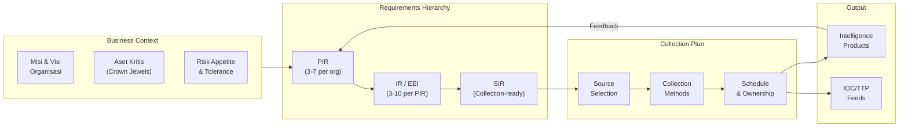

---

### 6. Contoh Terapan

**Skenario**: Universitas XYZ memiliki divisi IT Security yang baru dibentuk. Mereka diminta membangun program CTI sederhana untuk melindungi infrastruktur kampus (student information system, research data, email, network).

**Stakeholder mapping**:
- Rektor: Ingin tahu "apakah data mahasiswa aman?" dan "apakah ada risiko reputasional?"
- Kepala IT: "Apa yang harus diblokir/dikonfigurasi minggu ini?"
- SOC Analyst (1 orang): "Apakah alert yang saya lihat hari ini adalah ancaman nyata?"
- Research Office: "Apakah ada risiko spionase pada data riset?"

**PIR yang dirumuskan**:
- PIR-1: "Apakah ada ancaman ransomware yang secara aktif menargetkan institusi pendidikan tinggi Indonesia?"
- PIR-2: "Teknik phishing apa yang digunakan untuk menargetkan email universitas?"
- PIR-3: "Apakah ada credential atau data mahasiswa yang bocor di forum underground?"

**Collection plan (ringkas)**:
| PIR | Sumber | Metode | Frekuensi |
|---|---|---|---|
| PIR-1 | OSINT (berita, vendor report), CERT-ID | Manual review | Mingguan |
| PIR-2 | PhishTank, OpenPhish, email headers | Otomatis (API) + Manual | Harian |
| PIR-3 | Have I Been Pwned API, forum monitoring (legal/OSINT only) | Semi-otomatis | Mingguan |

---

### 7. Praktikum atau Aktivitas Terarah

**Judul**: Menyusun PIR, IR, dan Collection Plan untuk Skenario Organisasi

**Tujuan**: Menghasilkan dokumen PIR dan collection plan yang dapat dioperasionalkan untuk organisasi yang diberikan.

**Prasyarat**: Bab 1 (CTI Lifecycle) telah dipahami.

**Langkah kerja**:
1. Gunakan skenario organisasi yang diberikan dosen (atau skenario dari Bab 1 Praktikum).
2. Identifikasi 5 stakeholder dan dokumentasikan dalam tabel stakeholder map.
3. Lakukan workshop PIR (simulasi) — tulis 3 PIR menggunakan kriteria SMART-I.
4. Untuk setiap PIR, turunkan minimal 3 IR yang lebih spesifik.
5. Susun collection plan dalam format tabel (PIR, IR, Sumber, Metode, Frekuensi, Format, Owner, Reliabilitas, Batasan Etika).
6. Evaluasi 2 sumber data yang dipilih menggunakan NATO reliability/credibility matrix.

**Artefak yang diserahkan**: Dokumen PIR + Collection Plan (menggunakan template Lampiran B).

---

### 8. Latihan Pemahaman

**Soal 1 (Evaluasi — C5)**: Seorang CISO meminta tim CTI untuk menghasilkan PIR: "Apakah ada ancaman siber yang relevan dengan organisasi kita?" Identifikasi 3 kelemahan PIR ini dan tulis ulang menjadi PIR yang memenuhi kriteria SMART-I.

**Soal 2 (Analisis — C4)**: Mengapa penting untuk membedakan antara "intelligence requirement" dan "information need"? Berikan contoh masing-masing dan jelaskan implikasi perbedaan ini pada collection plan.

**Soal 3 (Pilihan Ganda — C4)**: Source reliability rating "C-3" dalam NATO matrix berarti: A. Sumber dapat diandalkan, informasi dikonfirmasi B. Sumber cukup dapat diandalkan, informasi tidak dapat dikonfirmasi C. Sumber tidak dapat diandalkan, informasi mungkin benar D. Reliabilitas sumber tidak diketahui, informasi mungkin benar.

**Soal 4 (Esai — C4)**: Jelaskan 3 risiko yang muncul jika collection plan tidak mencantumkan "batasan etika/hukum" sebagai kolom eksplisit. Berikan contoh konkret untuk masing-masing risiko.

**Soal 5 (Perancangan — C5)**: Dirancang sebagai direktur CTI di perusahaan e-commerce besar Indonesia. Susun 3 PIR dan stakeholder map untuk program CTI Anda, dengan justifikasi mengapa PIR tersebut dipilih berdasarkan profil risiko perusahaan e-commerce.

---

### 9. Latihan Terapan / Studi Kasus

**Studi Kasus 1**: Tim CTI sebuah rumah sakit swasta besar di Jakarta diminta menyusun PIR dalam 2 jam karena adanya laporan serangan ransomware pada rumah sakit serupa di Surabaya. Bagaimana Anda memprioritaskan dan menyusun PIR dalam kondisi waktu terbatas ini? Apa trade-off yang harus dibuat?

**Studi Kasus 2**: Vendor CTI menawarkan feed intelijen premium dengan "100.000 IOC per hari" kepada tim CTI Anda. Bagaimana Anda mengevaluasi apakah feed ini worth buying? Rancang framework evaluasi vendor CTI yang mencakup: relevansi PIR, source reliability, format data, integration effort, dan total cost of ownership.

---

### 10. Kunci Jawaban dan Pembahasan

**Soal 1**: Kelemahan: (1) Terlalu luas — "ancaman siber yang relevan" tidak terdefinisi; (2) Tidak time-bound — tidak ada timeframe; (3) Tidak measurable — tidak ada kriteria "sudah terjawab". Revisi: "Apakah ada kelompok APT atau operator ransomware yang secara aktif menargetkan perusahaan manufaktur skala menengah di Indonesia dalam 6 bulan terakhir, dan jika ya, teknik initial access apa yang mereka gunakan?" Ini lebih spesifik, terukur (dapat dicek melalui laporan vendor dan OSINT), actionable (menghasilkan TTP yang dapat dideteksi), dan time-bound (6 bulan).

**Soal 2**: *Intelligence requirement* adalah pertanyaan yang HARUS dijawab untuk mendukung keputusan kritis (diprioritaskan, memiliki akuntabilitas). *Information need* adalah informasi yang berguna tapi tidak kritis. Contoh: IR = "Apakah ada eksfiltrasi data sebelum ransomware dieksekusi?" (mempengaruhi keputusan notifikasi data breach). Information need = "Nama operator ransomware ini." Perbedaannya pada collection plan: IR mendapat prioritas sumber, anggaran, dan timeline; information need diisi "jika ada waktu".

**Soal 3**: **Jawaban B**. C = sumber cukup dapat diandalkan (akurasi bervariasi); 3 = informasi tidak dapat dikonfirmasi oleh sumber independen. Ini berarti intelligence ini harus digunakan dengan hati-hati dan dicari konfirmasi dari sumber lain.

**Soal 4**: Tiga risiko: (1) Analis mengumpulkan data dari sumber yang ilegal (scraping forum privat, akses OSINT yang melanggar ToS platform) → potensi masalah hukum bagi organisasi; (2) Analis mengumpulkan data personal yang tidak relevan (email, nomor telepon dari data breach) → pelanggaran UU PDP; (3) Analis berbagi intelligence yang mengandung PII kepada pihak ketiga tanpa consent → kewajiban hukum dan reputasional.

**Soal 5**: Untuk e-commerce Indonesia: PIR-1: "Apakah ada kampanye aktif targeting payment gateway atau checkout page e-commerce Indonesia?" (relevan: kerugian finansial langsung); PIR-2: "Teknik credential stuffing atau account takeover apa yang digunakan untuk menyerang platform e-commerce sejenis?" (relevan: reputasi, kerugian pelanggan); PIR-3: "Apakah ada data kartu kredit atau akun pelanggan kami yang diperdagangkan di dark web?" (relevan: compliance PCI-DSS, kewajiban notifikasi). Stakeholder: CEO (PIR-3 → dampak reputasi), CISO (semua PIR), Payment Team (PIR-1), Customer Service (PIR-3), Legal/Compliance (PIR-3).

---

### 11. Ringkasan Bab

PIR adalah jantung program CTI — pertanyaan intelijen yang paling kritis dan menggunakan kriteria SMART-I. Stakeholder mapping memastikan bahwa intelligence yang diproduksi relevan dengan kebutuhan nyata setiap konsumen. Collection plan menerjemahkan PIR menjadi tindakan pengumpulan yang konkret, terstruktur, dan bertanggung jawab. Evaluasi sumber menggunakan NATO reliability matrix memastikan confidence level intelligence yang dihasilkan dikalibrasi dengan tepat.

---

### 12. Refleksi Profesional

1. Dalam konteks budaya organisasi Indonesia, bagaimana Anda mengelola situasi di mana stakeholder senior (misalnya CISO atau direktur) memiliki "gut feeling" tentang ancaman yang tidak didukung oleh PIR yang terstruktur? Bagaimana Anda menyeimbangkan antara kepatuhan pada proses dan dinamika kekuasaan organisasi?

2. Sebuah CERT nasional meminta Anda berbagi PIR organisasi Anda agar bisa membantu pengumpulan intelligence yang lebih terarah. Informasi apa yang boleh dan tidak boleh dibagikan, dan mengapa?


---

## Bab 3 — Source Evaluation, Collection Plan, dan Data Reliability

### 1. Capaian Pembelajaran Bab

Setelah menyelesaikan bab ini, mahasiswa mampu:
- Mengklasifikasikan sumber data CTI berdasarkan tipe (OSINT, HUMINT, TECHINT, dll.) dan reliabilitasnya.
- Menerapkan framework evaluasi sumber (reliability + credibility matrix) pada sumber CTI nyata.
- Mengidentifikasi bias dalam proses pengumpulan dan analisis intelligence.
- Menyusun collection plan yang komprehensif dengan pertimbangan reliabilitas dan batasan etika.

Bab ini mendukung **Sub-CPMK-2** dan berkontribusi pada **Eval-2 (20%)**.

---

### 2. Peta Konsep Bab

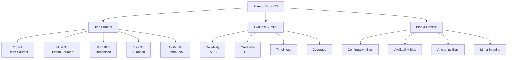

---

### 3. Pengantar Kontekstual

Tidak semua data adalah intelligence, dan tidak semua intelligence adalah akurat. Dalam dunia CTI, kualitas output sangat bergantung pada kualitas input. Sumber yang buruk menghasilkan intelligence yang buruk — dan intelligence yang buruk yang dipercaya bisa lebih berbahaya daripada tidak memiliki intelligence sama sekali.

"Garbage in, garbage out" adalah prinsip yang sangat relevan dalam CTI. Analis yang tidak kritis terhadap sumber dapat terjebak dalam *deception operations* — di mana musuh dengan sengaja menanamkan informasi palsu untuk mempengaruhi persepsi dan keputusan defender.

Bab ini membangun kemampuan critical thinking dalam mengevaluasi sumber data CTI, mengidentifikasi bias, dan membangun collection plan yang robust.

---

### 4. Landasan Teori

#### 4.1 Taksonomi Sumber Data CTI

**OSINT (Open Source Intelligence)**
Data yang diperoleh dari sumber yang dapat diakses publik secara legal.
- *Contoh*: Blog keamanan (Krebs on Security, Schneier on Security), laporan vendor (Mandiant, CrowdStrike, Kaspersky), database CVE/NVD, Shodan/Censys, Twitter/X CTI community, paste sites (Pastebin), MITRE ATT&CK, PhishTank.
- *Kelebihan*: Murah, mudah diakses, volume besar.
- *Keterbatasan*: Kualitas sangat bervariasi, banyak noise, risiko disinformasi, informasi bisa sudah lama.

**TECHINT (Technical Intelligence)**
Data teknis yang dikumpulkan dari sistem dan infrastruktur yang dikontrol atau dengan izin.
- *Contoh*: Log SIEM internal, NetFlow, PCAP, malware sample dari sandbox, vulnerability scan, honeypot data, EDR telemetry.
- *Kelebihan*: Sangat relevan dengan konteks organisasi, high fidelity, real-time.
- *Keterbatasan*: Coverage terbatas pada footprint organisasi sendiri, memerlukan infrastruktur monitoring.

**HUMINT (Human Intelligence)**
Informasi dari sumber manusia melalui interaksi atau jaringan kepercayaan.
- *Contoh*: Informasi dari ISAC (Information Sharing and Analysis Center), diskusi dengan peers industri, informasi dari vendor partner, laporan dari karyawan.
- *Kelebihan*: Kontekstual, dapat memberikan nuansa yang tidak ada dalam data teknis.
- *Keterbatasan*: Sangat bergantung pada kepercayaan, sulit diverifikasi, bisa bias.

**COMINT (Community Intelligence)**
Intelligence yang dibagikan dalam komunitas keamanan siber melalui platform berbagi.
- *Contoh*: MISP instances, AlienVault OTX pulses, ISAC sharing groups, TAXII feeds, IST (Intel Sharing Toolkit).
- *Kelebihan*: Network effect — semakin banyak yang berbagi, semakin kaya intelligence.
- *Keterbatasan*: Kualitas bervariasi tergantung kontributor, risiko kontaminasi dari sumber yang tidak terverifikasi.

**Commercial Threat Intelligence**
Feed dan laporan yang dijual oleh vendor keamanan komersial.
- *Contoh*: Recorded Future, Mandiant Advantage, CrowdStrike Falcon Intelligence, Cisco Talos, VirusTotal Intelligence.
- *Kelebihan*: Dikurasi oleh tim analis profesional, volume besar, sering disertai konteks ATT&CK.
- *Keterbatasan*: Biaya tinggi, tidak selalu relevan dengan konteks spesifik organisasi, potensi bias vendor.

#### 4.2 Data Quality Dimensions

Untuk mengevaluasi kualitas sumber CTI, analis harus menilai beberapa dimensi:

| Dimensi | Definisi | Cara Mengukur |
|---|---|---|
| **Accuracy** | Seberapa benar informasinya | Cross-validate dengan sumber independen |
| **Timeliness** | Seberapa baru informasinya | Check timestamp dan freshness window |
| **Completeness** | Seberapa lengkap informasinya | Apakah semua field intelligence ada? |
| **Consistency** | Apakah konsisten dengan informasi lain | Bandingkan dengan sumber terpercaya |
| **Relevance** | Seberapa relevan dengan PIR | Mapping ke PIR/IR |
| **Reliability** | Apakah sumber dapat dipercaya secara historis | Track record evaluasi |

#### 4.3 Cognitive Bias dalam Intelligence Analysis

Bias kognitif adalah musuh terbesar analis intelligence. Beberapa bias yang paling umum:

**Confirmation Bias**: Kecenderungan mencari dan menerima informasi yang mengonfirmasi hipotesis yang sudah ada, sambil mengabaikan informasi yang bertentangan. Ini adalah bias paling berbahaya dalam analisis ancaman.

*Mitigasi*: Secara aktif mencari *disconfirming evidence* — bukti yang bertentangan dengan hipotesis Anda.

**Availability Bias**: Menilai probabilitas ancaman berdasarkan seberapa mudah contohnya teringat, bukan berdasarkan data aktual. Serangan ransomware yang baru saja terjadi di berita membuat analis melebih-lebihkan probabilitas ransomware sebagai ancaman paling kritis.

*Mitigasi*: Gunakan data historis dan statistik, bukan intuisi atau memori.

**Anchoring Bias**: Terlalu bergantung pada informasi pertama yang diterima saat membuat penilaian. Jika laporan pertama mengidentifikasi APT28 sebagai pelaku, analis cenderung mempertahankan attribution ini meski bukti selanjutnya meragukan.

*Mitigasi*: Secara eksplisit re-evaluate attribution setiap kali evidence baru masuk.

**Mirror Imaging**: Mengasumsikan bahwa musuh berpikir dan berperilaku seperti kita. Analis yang berlatih di lingkungan korporat mungkin mengasumsikan bahwa APT negara-bangsa akan menggunakan teknik yang sama dengan *pentester* korporat.

*Mitigasi*: Pelajari case study dari perspektif musuh, gunakan Red Team/adversarial thinking.

**Groupthink**: Anggota tim menekan pendapat berbeda untuk menjaga harmoni kelompok, menghasilkan konsensus yang tidak kritis.

*Mitigasi*: Designated devil's advocate, anonymous assessment tools, structured analytic techniques.

---

### 5. Model atau Arsitektur

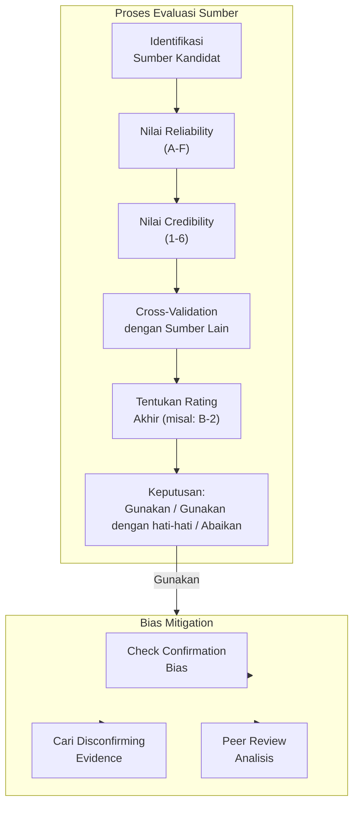

---

### 6. Contoh Terapan

**Skenario**: Tim CTI perusahaan energi menerima laporan bahwa grup APT "Sandworm" (atribusi ke Rusia) sedang menargetkan infrastruktur energi di Asia. Mereka menemukan informasi ini dari 4 sumber berbeda:
- Sumber A: Tweet dari akun Twitter peneliti keamanan independen (baru, tidak dikenal).
- Sumber B: Blog post dari Mandiant (firma intelijen ancaman terkemuka).
- Sumber C: Alert dari ISAC Energi (kelompok berbagi intelligence industri energi).
- Sumber D: Log internal SIEM menunjukkan koneksi ke IP yang disebutkan di laporan Mandiant.

**Evaluasi sumber**:
- Sumber A: F-3 (reliabilitas tidak diketahui, informasi tidak dapat dikonfirmasi) → gunakan hanya sebagai indikasi awal.
- Sumber B: A-2 (sangat dapat diandalkan, mungkin benar — belum divalidasi internal) → kredibilitas tinggi.
- Sumber C: B-2 (umumnya dapat diandalkan, mungkin benar) → credible karena peer industry.
- Sumber D: A-1 (internal, dikonfirmasi dalam lingkungan sendiri) → highest confidence.

**Keputusan**: Intelligence ini sangat credible (Sumber B+C+D saling mengonfirmasi). Sumber D (internal) adalah yang paling actionable — IP terkait sudah terhubung ke sistem internal.

---

### 7. Praktikum atau Aktivitas Terarah

**Judul**: Evaluasi Sumber CTI Menggunakan Reliability-Credibility Matrix

**Tujuan**: Mahasiswa mampu menerapkan source evaluation framework pada sumber CTI nyata (menggunakan dataset simulasi).

**Langkah kerja**:
1. Diberikan 5 skenario sumber CTI (blog, ISAC alert, vendor report, internal log, tweet).
2. Untuk setiap sumber, tentukan: tipe sumber (OSINT/TECHINT/HUMINT/dll.), reliability rating (A-F), credibility rating (1-6), alasan penilaian.
3. Identifikasi potensi bias yang mungkin timbul dalam analisis dari setiap sumber.
4. Buat rekomendasi: apakah sumber ini dapat digunakan langsung, perlu cross-validasi, atau ditolak?
5. Susun ringkasan collection assessment — sumber mana yang diprioritaskan untuk menjawab PIR tertentu.

**Artefak**: Source Evaluation Matrix (tabel 5 sumber dengan rating, alasan, dan rekomendasi).

---

### 8. Latihan Pemahaman

**Soal 1**: Apa perbedaan fundamental antara *source reliability* dan *information credibility* dalam konteks evaluasi sumber CTI? Mengapa keduanya harus dinilai secara independen?

**Soal 2** (Pilihan Ganda): Seorang analis yang percaya bahwa "kelompok APT China selalu menggunakan phishing sebagai initial access" dan mengabaikan bukti teknis bahwa serangan yang sedang diinvestigasi menggunakan supply chain attack mengalami: A. Anchoring bias B. Mirror imaging C. Confirmation bias D. Availability bias.

**Soal 3**: Sebuah vendor CTI komersial mengklaim bahwa feed mereka memiliki "99% accuracy." Identifikasi 3 pertanyaan kritis yang harus Anda ajukan untuk mengevaluasi klaim ini sebelum membeli layanan mereka.

**Soal 4**: Jelaskan mengapa *mirror imaging* sangat berbahaya dalam konteks analisis ancaman dari nation-state APT. Berikan contoh konkret.

**Soal 5** (Perancangan): Rancang prosedur "bias check" 5-langkah yang harus dilakukan tim CTI sebelum mempublikasikan laporan attribution.

---

### 9. Latihan Terapan / Studi Kasus

**Studi Kasus 1**: Tim CTI Anda menerima informasi dari sumber HUMINT (kolega di perusahaan lain) bahwa "grup APT lokal sedang menargetkan perusahaan logistik di Indonesia." Sumber ini belum pernah memberikan informasi sebelumnya (F-3). Bagaimana Anda menangani intelligence ini? Rancang rencana validasi 72 jam untuk menentukan apakah intelligence ini credible.

**Studi Kasus 2**: Audit collection plan perusahaan manufaktur menemukan bahwa 80% sumber adalah vendor report dari satu vendor komersial yang sama. Identifikasi risiko dari collection plan yang tidak terdiversifikasi ini dan rekomendasikan strategi diversifikasi sumber yang lebih robust.

---

### 10. Kunci Jawaban dan Pembahasan

**Soal 1**: *Source reliability* menilai rekam jejak historis sumber — seberapa sering sumber ini memberikan informasi yang akurat di masa lalu. Ini adalah penilaian tentang *siapa* yang memberikan informasi. *Information credibility* menilai apakah informasi *spesifik ini* dapat dipercaya, terlepas dari siapa yang memberikannya — apakah dikonfirmasi oleh sumber lain, apakah konsisten dengan yang diketahui. Dinilai independen karena: sumber yang biasanya reliable (A) bisa memberikan informasi yang salah atau tidak terkonfirmasi (A-3), sementara sumber yang tidak dikenal (F) bisa kebetulan memberikan informasi yang dikonfirmasi oleh sumber lain (F-1).

**Soal 2**: **Jawaban C — Confirmation Bias**. Analis memiliki keyakinan awal (APT China = phishing) dan mengabaikan bukti yang bertentangan (supply chain attack). Ini adalah definisi klasik confirmation bias.

**Soal 3**: Pertanyaan kritis: (1) "99% accuracy diukur bagaimana — TP rate, FP rate, atau sesuatu yang lain? Dalam dataset apa?" (2) "Berapa *false positive rate* — berapa persen IOC yang ternyata legitimate?" (3) "Seberapa relevan untuk konteks industri dan geografi kita — apakah diukur secara umum atau spesifik untuk sektor/region kami?"

**Soal 4**: Mirror imaging dalam analisis APT negara-bangsa berbahaya karena nation-state actor memiliki sumber daya, motivasi, timeline, dan risk tolerance yang sangat berbeda dari threat actor komersial. Contoh: Analis yang terbiasa dengan penetration testing korporat mungkin mengasumsikan APT akan bergerak cepat (days to weeks). Namun APT29 diketahui beroperasi dengan *dwell time* rata-rata 200+ hari — jauh lebih sabar. Analis yang mirror-imaging akan melewatkan indicator awal karena mengasumsikan serangan sudah selesai setelah tidak ada aktivitas selama 2 minggu.

**Soal 5**: Prosedur bias check attribution: (1) *Devil's advocate* — tunjuk seorang analis untuk secara aktif berargumen melawan attribution yang diusulkan; (2) *Alternative hypothesis* — susun minimal 2 hipotesis attribution alternatif dan evaluasi evidence yang mendukung/menolak masing-masing; (3) *Source independence check* — pastikan semua sumber yang mendukung attribution benar-benar independen (bukan saling mengutip); (4) *Confidence calibration* — tetapkan confidence level eksplisit dengan justifikasi; (5) *Peer review* — minta analis yang tidak terlibat dalam analisis awal untuk me-review dengan fresh eyes.

---

### 11. Ringkasan Bab

Kualitas CTI ditentukan oleh kualitas sumber. Sumber CTI diklasifikasikan ke dalam beberapa tipe (OSINT, TECHINT, HUMINT, COMINT, Commercial), masing-masing dengan kelebihan dan keterbatasan. Evaluasi sumber menggunakan reliability-credibility matrix (A-F / 1-6) memastikan confidence intelligence dikalibrasi dengan tepat. Bias kognitif — terutama confirmation bias dan mirror imaging — adalah ancaman tersembunyi dalam analisis intelligence yang harus dimitigasi secara struktural.

---

### 12. Refleksi Profesional

1. Dark web monitoring adalah teknik CTI yang kontroversial. Dari perspektif etika profesional dan hukum Indonesia, kondisi apa yang membenarkan penggunaan teknik ini, dan batasan apa yang harus selalu dipertahankan?

2. Jika organisasi Anda menjadi target *deception operation* — di mana musuh dengan sengaja menanamkan informasi palsu di forum OSINT untuk memengaruhi keputusan Anda — bagaimana Anda mendeteksi dan merespons situasi ini?

---

## Bab 4 — IOC Analysis: Klasifikasi, Lifecycle, dan Confidence

### 1. Capaian Pembelajaran Bab

Setelah menyelesaikan bab ini, mahasiswa mampu:
- Mengklasifikasikan berbagai tipe IOC (network, host, email, behavioral) dan memahami nilai analitis masing-masing.
- Menjelaskan IOC lifecycle dari penciptaan hingga deprecation.
- Menetapkan confidence level IOC berdasarkan sumber dan validasi.
- Mengevaluasi keterbatasan IOC-based detection dan komplementasinya dengan pendekatan TTP-based.

Bab ini mendukung **Sub-CPMK-2** dan berkontribusi pada **Eval-2 (20%)**.

---

### 2. Peta Konsep Bab

```mermaid
flowchart TD
    IOC_DEF["Indicator of Compromise (IOC)"]
    
    IOC_DEF --> TYPES2["Tipe IOC"]
    IOC_DEF --> LC2["IOC Lifecycle"]
    IOC_DEF --> CONF["Confidence & Scoring"]
    IOC_DEF --> LIMIT["Keterbatasan IOC"]
    
    TYPES2 --> NET_IOC["Network IOC\n(IP, Domain, URL)"]
    TYPES2 --> HOST_IOC["Host IOC\n(Hash, Registry, File Path)"]
    TYPES2 --> EMAIL_IOC["Email IOC\n(Subject, Sender, Header)"]
    TYPES2 --> BEH_IOC["Behavioral IOC\n(Process pattern, API calls)"]
    
    LC2 --> CREATE["Creation\n(Discovered/Reported)"]
    LC2 --> VALIDATE["Validation\n(Verified as malicious)"]
    LC2 --> DEPLOY["Deployment\n(Active detection)"]
    LC2 --> MONITOR2["Monitoring\n(Tracking hits)"]
    LC2 --> DEPRECATE["Deprecation\n(False positive / stale)"]
    
    CONF --> SCORE["Confidence Score\n(0-100 / Low-Med-High)"]
    CONF --> DECAY["Decay Rate\n(IOC age degrades value)"]
    
    LIMIT --> EVASION["Mudah di-evade\n(IP berganti, hash diubah)"]
    LIMIT --> NOISE["High noise\n(CDN, shared hosting)"]
    LIMIT --> TTP_ADV["TTP-based lebih tahan\nlama (Pyramid of Pain)"]
```

---

### 3. Pengantar Kontekstual

Jika Anda pernah berlangganan threat intelligence feed dan mendapati analis SOC tenggelam dalam ribuan alert yang kebanyakan adalah false positive, Anda telah mengalami masalah klasik *IOC overload*. IOC (Indicators of Compromise) adalah elemen terpenting dan sekaligus paling disalahgunakan dalam CTI.

IOC yang baik adalah yang presisi, terkini, dan relevan. IOC yang buruk — yang sudah kadaluarsa, tidak tervalidasi, atau terlalu umum — menciptakan noise yang memperburuk *alert fatigue* SOC. Memahami taksonomi, lifecycle, dan keterbatasan IOC adalah keterampilan fundamental setiap analis CTI.

---

### 4. Landasan Teori

#### 4.1 Definisi dan Klasifikasi IOC

**Definisi**: IOC adalah artefak yang diamati dalam sistem atau jaringan yang mengindikasikan kemungkinan terjadinya intrusi atau aktivitas berbahaya dengan tingkat kepercayaan tertentu.

**Kata kunci**: *Mengindikasikan* (bukan membuktikan) dan *kemungkinan* (bukan kepastian).

**Tipe IOC berdasarkan domain:**

*Network IOC:*
- IP Address: Alamat IP server C2, IP exfiltration, IP scanner.
- Domain/FQDN: Domain C2, domain phishing, DGA-generated domains.
- URL: URL phishing spesifik, URL malware delivery, URL C2 beacon.
- Network traffic pattern: User-agent string, request pattern, TLS fingerprint (JA3/JA3S).

*Host IOC:*
- File hash (MD5, SHA-1, SHA-256): Identifikasi malware spesifik. SHA-256 adalah standar.
- File path/name: Lokasi file yang ditinggalkan malware.
- Registry key: Persistence mechanism di Windows Registry.
- Mutex/Semaphore: Nama mutex yang dibuat malware untuk mencegah double execution.
- Scheduled task name: Nama scheduled task yang dibuat untuk persistence.

*Email IOC:*
- Email address: Alamat pengirim phishing.
- Subject line: Subject email phishing campaign spesifik.
- Email header: X-Mailer, routing information.
- Attachment hash: Hash lampiran berbahaya.

*Behavioral IOC (tahan lama):*
- Process creation pattern: "cmd.exe spawned by winword.exe" (Word membuka command prompt).
- API call sequence: Urutan API calls yang khas untuk malware tertentu.
- Network behavior: Beacon interval reguler ke C2.
- Living-off-the-land binaries (LOLBins) patterns.

#### 4.2 Pyramid of Pain

David Bianco mengembangkan *Pyramid of Pain* untuk menggambarkan seberapa sulit bagi musuh untuk mengubah berbagai tipe IOC ketika defender mendeteksinya:

```
        [TTPs]                    ← Paling sulit diubah musuh, paling bernilai bagi defender
       [Tools]
     [Network/Host Artifacts]
    [Domain Names]
   [IP Addresses]
  [Hash Values]                   ← Paling mudah diubah musuh, paling sedikit bernilai
```

*Implikasi*: IOC berbasis hash atau IP memiliki *decay* sangat cepat — musuh bisa mengubahnya dalam hitungan menit. IOC berbasis TTP (bagaimana mereka beroperasi) jauh lebih tahan lama karena mengubah TTP memerlukan retooling dan retraining yang mahal.

#### 4.3 IOC Lifecycle

**Fase 1 — Discovery/Creation**: IOC ditemukan pertama kali, dari analisis malware, laporan eksternal, atau investigasi insiden internal.

**Fase 2 — Validation**: IOC diverifikasi — apakah benar-benar berbahaya atau bisa jadi legitimate? (misalnya: apakah IP ini adalah server shared hosting yang kadang digunakan untuk phishing?)

**Fase 3 — Enrichment**: Penambahan konteks — siapa pemilik IP? domain ini terkait aktor mana? hash ini terkait malware family apa?

**Fase 4 — Deployment**: IOC diimplementasikan ke detection tools (SIEM rules, firewall blocklist, EDR signatures).

**Fase 5 — Monitoring**: Tracking hits — seberapa sering IOC ini memicu alert? Berapa TP vs FP ratio?

**Fase 6 — Tuning**: Penyesuaian berdasarkan monitoring — apakah perlu whitelist tertentu? Apakah confidence perlu direvisi?

**Fase 7 — Deprecation**: IOC dihentikan penggunaannya ketika: sudah terlalu lama (stale), terbukti false positive, atau sudah diketahui publik sehingga musuh sudah tidak menggunakannya.

#### 4.4 IOC Confidence dan Scoring

Setiap IOC harus memiliki confidence score yang dikalibrasi:

| Confidence Level | Definisi | Implikasi Tindakan |
|---|---|---|
| **High (80-100%)** | Dikonfirmasi dari multiple independent sources, validated di lingkungan sendiri | Block langsung, create detection rule |
| **Medium (40-79%)** | Dari sumber terpercaya tapi belum divalidasi internal, atau dari satu sumber yang reliable | Alert + investigate, watch-and-alert (jangan block langsung) |
| **Low (0-39%)** | Dari sumber tidak dikenal, satu laporan tanpa konfirmasi, atau IOC tua | Monitor only, jangan dijadikan blocking rule |

**IOC Decay**: Nilai IOC menurun seiring waktu. IP address kehilangan 50% relevansinya dalam 7 hari (karena IP sering berpindah). Domain memiliki lifecycle lebih lama (weeks-months). Hash malware relatif stabil (meski musuh bisa recompile). TTP paling tahan lama (months-years).

---

### 5. Model atau Arsitektur

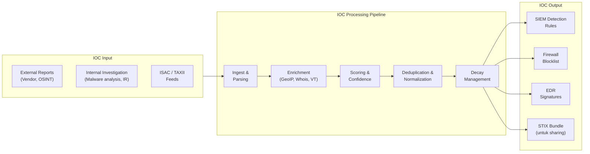

---

### 6. Contoh Terapan

**Skenario**: Analis CTI di perusahaan logistik menerima laporan dari vendor bahwa SHA-256 hash `e3b0c44298fc1c149afb...` terkait dengan malware *PlugX* yang digunakan APT41. Domain `update-service[.]xyz` juga disebutkan sebagai C2.

**Proses analisis**:
1. **Validasi hash**: Submit ke VirusTotal — 45/72 engine mendeteksi sebagai malicious, keluarga PlugX dikonfirmasi. Confidence: High.
2. **Validasi domain**: WHOIS menunjukkan domain baru dibuat 2 minggu lalu. VirusTotal: 12/90 engine flagging. Resolve ke IP 103.x.x.x yang berada di ASN yang sering digunakan APT Asia. Confidence: Medium-High.
3. **Internal check**: Cari hash di EDR logs — tidak ditemukan. Search domain di DNS logs — tidak ditemukan akses dari internal network.
4. **Enrichment**: Domain C2 terkait dengan clustering campaign APT41 di laporan Mandiant 2024.
5. **Keputusan deployment**:
   - Hash: Tambahkan ke EDR signature sebagai block. Confidence tinggi, FP risk rendah.
   - Domain: Tambahkan ke DNS sinkhole dengan alert (bukan block langsung) — monitoring dulu. Confidence medium.
6. **Lifecycle**: Set decay flag 30 hari untuk domain (domain bisa berganti), 90 hari untuk hash.

---

### 7. Praktikum atau Aktivitas Terarah

**Judul**: IOC Lifecycle Management dengan Dataset Simulasi

**Tujuan**: Mahasiswa mampu mengelola IOC dari ingest hingga deployment menggunakan dataset IOC simulasi.

**Dataset**: File CSV berisi 20 IOC (campuran IP, domain, hash, URL) dengan metadata sumber, tanggal discovery, dan laporan terkait — disediakan dosen.

**Langkah kerja**:
1. Klasifikasikan setiap IOC ke tipe yang sesuai.
2. Tentukan confidence level berdasarkan sumber dan informasi yang tersedia.
3. Identifikasi IOC yang sudah stale (>30 hari untuk IP, >90 hari untuk domain).
4. Tentukan disposisi setiap IOC: block, alert, monitor, deprecate.
5. Buat Pyramid of Pain mapping — kelompokkan 20 IOC ke level piramida yang sesuai.
6. Identifikasi 3 IOC yang paling bernilai (tertinggi dalam Pyramid of Pain, confidence tinggi, fresh) untuk dijadikan detection rule prioritas.

**Artefak**: IOC triage spreadsheet + Pyramid of Pain mapping + 3 detection rule draft.

---

### 8. Latihan Pemahaman

**Soal 1**: Menurut Pyramid of Pain, mengapa hash-based detection memiliki nilai yang paling rendah bagi defender dibanding TTP-based detection? Implikasi apa yang dimiliki ini terhadap strategi pembuatan detection rule?

**Soal 2** (Pilihan Ganda): IOC dengan confidence "Low (25%)" sebaiknya digunakan untuk: A. Block langsung di firewall B. Buat alert di SIEM yang wajib diinvestigasi dalam 30 menit C. Monitor only — catat jika terjadi tanpa alert otomatis D. Diabaikan karena confidence terlalu rendah.

**Soal 3**: Apa yang dimaksud dengan "IOC decay" dan mengapa IP address memiliki decay rate yang lebih tinggi dibanding TTP? Berikan contoh konkret.

**Soal 4**: Seorang analis mendapati domain yang sama (`cdn-update[.]com`) muncul di 3 sumber berbeda: laporan vendor, OSINT Twitter, dan ISAC alert. Apakah ini berarti confidence otomatis menjadi "High"? Jelaskan faktor-faktor yang perlu dipertimbangkan.

**Soal 5**: Jelaskan 3 cara threat actor dapat menghindari deteksi berbasis IOC network (IP dan domain), dan bagaimana TTP-based detection mengatasi setiap keterbatasan tersebut.

---

### 9. Latihan Terapan / Studi Kasus

**Studi Kasus 1**: SOC perusahaan perbankan memiliki blocklist yang berisi 250.000 IP dan domain dari berbagai feed IOC. Analis melaporkan bahwa false positive rate mencapai 60% dan analis kelelahan menangani alert. Lakukan analisis akar masalah dan rekomendasikan program "IOC hygiene" untuk membersihkan dan meningkatkan kualitas blocklist.

**Studi Kasus 2**: Selama investigasi insiden, analis menemukan bahwa malware yang digunakan menggunakan teknik *domain generation algorithm* (DGA) — domain baru dibuat secara algoritmik setiap hari. Bagaimana IOC-based detection tradisional gagal menghadapi DGA, dan strategi detection apa yang lebih efektif?

---

### 10. Kunci Jawaban dan Pembahasan

**Soal 1**: Hash memiliki nilai rendah karena musuh dapat mengubahnya dengan trivial — cukup mengubah 1 byte dalam file (misalnya menambah null byte) menghasilkan hash yang sama sekali berbeda, sementara malware tetap berfungsi identik. Implikasi: fokus sebagian besar detection rule pada behavioral IOC dan TTP (proses yang dilakukan malware, API calls, persistence mechanism) daripada hash spesifik. Hash berguna sebagai *quick triage* awal tapi tidak boleh menjadi satu-satunya layer deteksi.

**Soal 2**: **Jawaban C**. Low confidence IOC hanya valid untuk monitoring pasif. Menjadikannya blocking rule (A) berisiko very high false positive. Alert wajib investigasi (B) akan membebani analis dengan noise bervolume tinggi. Mengabaikan (D) salah — data tetap bernilai untuk correlation jika muncul bersama IOC lain.

**Soal 3**: IOC decay adalah penurunan nilai/reliabilitas IOC seiring waktu. IP address mengalami decay cepat karena: infrastruktur musuh sangat dinamis (bulletproof hosting berganti IP setiap hari-minggu), IP sering di-reuse oleh legitimasi setelah abuse (shared hosting, VPS), dan defender yang mengblokir IP memaksa musuh ganti server dalam hitungan jam. Contoh: IP C2 yang dilaporkan hari ini mungkin sudah tidak digunakan dalam 48 jam. TTP (misalnya "Word spawning PowerShell") bertahan lama karena mengubah teknik operasional memerlukan pengembangan ulang alat, pelatihan operator, dan testing — biaya yang jauh lebih tinggi bagi musuh.

**Soal 4**: Tidak otomatis High. Perlu dipertimbangkan: (1) Apakah ketiga sumber benar-benar independen, atau apakah ISAC dan Twitter sama-sama mengutip laporan vendor yang sama? Jika demikian, ini satu sumber bukan tiga; (2) Apakah domain ini bisa berupa *false flag* — sengaja ditanamkan oleh musuh untuk menyesatkan defender? (3) Berapa umur laporan ini? Domain bisa sudah di-takedown; (4) Apakah domain ini menggunakan shared hosting yang mungkin digunakan oleh entitas legitim lain?

**Soal 5**: Tiga evasion teknik dan counter TTP-based: (1) *IP rotation* — musuh berganti IP setiap jam → counter: deteksi pola beacon (regularity of connection intervals) bukan IP spesifik; (2) *Domain parking* — menggunakan legitimate CDN/cloud (Cloudflare, AWS) sebagai C2 proxy → counter: deteksi traffic anomaly ke CDN (high volume outbound, unusual timing) + behavioral analysis; (3) *Fast flux DNS* — domain resolve ke ribuan IP berbeda setiap beberapa detik → counter: deteksi TTL yang sangat rendah, query frequency anomaly, tidak mengandalkan IP blocklist.

---

### 11. Ringkasan Bab

IOC adalah artefak teknis yang mengindikasikan kemungkinan kompromi — bukan bukti pasti. Tipe IOC beragam (network, host, email, behavioral) dengan nilai yang berbeda-beda sesuai Pyramid of Pain. IOC memiliki lifecycle dari discovery hingga deprecation dan nilai yang menurun seiring waktu (decay). Confidence scoring memastikan IOC digunakan sesuai tingkat kepastiannya. Keterbatasan IOC-based detection (mudah di-evade, decay cepat) membuat pendekatan TTP-based menjadi komplemen yang esensial.

---

### 12. Refleksi Profesional

1. Sebuah perusahaan mempertimbangkan untuk membeli 5 threat intelligence feed berbeda dengan total biaya Rp 2 miliar per tahun. Sebagai CTI advisor, faktor apa yang Anda gunakan untuk mengevaluasi ROI dari investasi ini? Bagaimana Anda mengukur "nilai" threat intelligence secara kuantitatif?

2. IOC sharing adalah praktik yang dianggap baik dalam komunitas keamanan siber. Namun ada argumen bahwa berbagi IOC secara berlebihan justru membantu musuh memahami apa yang sudah diketahui defender. Bagaimana Anda menyeimbangkan antara manfaat sharing dan risiko *burning* intelligence?


---

## Bab 5 — Threat Actor Profiling dan Attribution

### 1. Capaian Pembelajaran Bab

Setelah menyelesaikan bab ini, mahasiswa mampu:
- Mengklasifikasikan threat actor berdasarkan motivasi, kapabilitas, dan target.
- Menyusun threat actor profile yang terstruktur menggunakan framework standar.
- Menjelaskan metode dan batasan attribution dalam CTI.
- Menganalisis implikasi attribution terhadap keputusan respons dan kebijakan.

Bab ini mendukung **Sub-CPMK-2** dan berkontribusi pada **Eval-2 (20%)**.

---

### 2. Peta Konsep Bab

```mermaid
flowchart TD
    ACTOR["Threat Actor"]
    
    ACTOR --> TAXO["Klasifikasi Actor"]
    ACTOR --> PROFILE["Actor Profiling"]
    ACTOR --> ATTR["Attribution"]
    
    TAXO --> NATION["Nation-State APT\n(Spionase, Sabotase)"]
    TAXO --> CRIM["Cybercriminal\n(Finansial)"]
    TAXO --> HACKTIVIST["Hacktivist\n(Ideologi)"]
    TAXO --> INSIDER["Insider Threat\n(Akses legitim)"]
    TAXO --> TERRORIST["Cyber-Terrorist\n(Teror/Disruption)"]
    
    PROFILE --> MOTIV["Motivasi"]
    PROFILE --> CAP["Kapabilitas"]
    PROFILE --> TARGET2["Target & Victimology"]
    PROFILE --> TTP_P["TTP Signature"]
    PROFILE --> INFRA["Infrastructure"]
    PROFILE --> TIMING["Timing Patterns"]
    
    ATTR --> TECH_ATTR["Technical Attribution\n(Malware, Infrastructure)"]
    ATTR --> OPS_ATTR["Operational Attribution\n(TTP, OPSEC mistakes)"]
    ATTR --> STRAT_ATTR["Strategic Attribution\n(Geopolitics, Intent)"]
    ATTR --> LIMITS["Batasan Attribution\n(False flag, shared tools)"]
```

---

### 3. Pengantar Kontekstual

Mengetahui *siapa* yang menyerang Anda sama pentingnya dengan mengetahui *bagaimana* mereka menyerang. Sebuah organisasi yang mengetahui bahwa mereka menjadi target APT yang disponsori negara harus merespons secara berbeda dibanding jika diserang oleh operator ransomware oportunistik. Tujuan, metode, timeline, dan pilihan target sangat berbeda.

Namun attribution — proses mengidentifikasi siapa pelaku serangan — adalah salah satu aspek CTI yang paling sulit dan paling sering disalahgunakan. Banyak klaim attribution yang terburu-buru atau dipengaruhi oleh bias geopolitik. Analis CTI yang baik harus memahami metode, batasan, dan implikasi attribution.

---

### 4. Landasan Teori

#### 4.1 Klasifikasi Threat Actor

**Nation-State APT (Advanced Persistent Threat)**

*Definisi*: Kelompok yang disponsori atau didukung oleh pemerintah suatu negara, beroperasi dengan tujuan strategis nasional.

*Karakteristik*: Sumber daya tidak terbatas, kesabaran tinggi (dwell time bulan-tahun), zero-day capabilities, target spesifik (pemerintah, infrastruktur kritis, defence contractor, teknologi).

*Contoh terkenal* (berdasarkan laporan publik): APT28/Fancy Bear (atribusi ke Rusia, fokus pada pemerintahan dan militer), APT29/Cozy Bear (Rusia, spionase diplomatik), APT40 (Cina, maritime dan engineering), Lazarus Group (Korea Utara, finansial dan crypto), OilRig/APT34 (Iran, energi dan pemerintahan Timur Tengah).

**Cybercriminal (eCrime)**

*Motivasi*: Keuntungan finansial.

*Tipe*: Ransomware-as-a-Service (RaaS) operators dan affiliates; Business Email Compromise (BEC) groups; carding groups; initial access brokers (IAB).

*Karakteristik*: Lebih oportunistik, mengikuti uang, sering menjual akses kepada aktor lain, ekosistem kompleks dengan spesialisasi peran.

**Hacktivist**

*Motivasi*: Ideologi, politik, agama, atau protes sosial.

*Karakteristik*: Kapabilitas lebih rendah (umumnya DDoS, defacement), target dipilih berdasarkan isu yang sedang viral, koordinasi melalui platform publik.

**Insider Threat**

*Karakteristik unik*: Memiliki akses legitim yang membuat deteksi jauh lebih sulit. Motivasi beragam: finansial (bribe oleh competitor/intelligence service), ketidakpuasan, kecelakaan (negligence), atau paksaan.

**Script Kiddies dan Opportunistic Attackers**

Menggunakan tools yang sudah ada (metasploit, crimeware kits), tidak punya kapabilitas pengembangan, biasanya tidak targeted — menyerang siapa saja yang rentan.

#### 4.2 Framework Threat Actor Profile

Profil threat actor yang komprehensif mencakup:

1. **Identity/Naming**: Nama kelompok (dari berbagai vendor bisa berbeda — APT28 = Fancy Bear = Sofacy = STRONTIUM).
2. **Motivasi**: Apa yang ingin mereka capai?
3. **Sponsor/Attribution**: Siapa yang mendanai/mengarahkan mereka? (dengan tingkat kepercayaan)
4. **Kapabilitas**: Apa yang bisa mereka lakukan? (0day, custom malware, supply chain attack?)
5. **Target Victimology**: Sektor, geografi, ukuran organisasi yang menjadi target.
6. **TTP Signature**: Teknik dan taktik yang khas — *fingerprint* operasional mereka.
7. **Infrastructure**: Bagaimana mereka menyiapkan dan menggunakan infrastruktur?
8. **Timing Patterns**: Kapan mereka aktif (timezone hints, working hours patterns)?
9. **Malware Family**: Tools dan malware yang digunakan secara konsisten.
10. **Geopolitical Context**: Apa yang sedang terjadi di geopolitik yang mungkin menjelaskan targeting mereka?

#### 4.3 Metode Attribution

Attribution bekerja pada tiga level:

**Technical Attribution**: Menggunakan artefak teknis untuk mengidentifikasi aktor.
- Malware code similarity (code reuse, shared libraries)
- Infrastructure overlaps (same ASN, SSL certificate reuse, shared C2 pattern)
- TTP fingerprinting (unique combination of techniques)
- Language artifacts (error messages, comments dalam malware, PE metadata)
- OPSEC mistakes (penggunaan personal email, login dari residential IP)

**Operational Attribution**: Menggunakan pola operasional.
- Working hour patterns (menunjukkan timezone)
- Targeting yang konsisten (sektor, geografi)
- Modus operandi yang berulang

**Strategic Attribution**: Konteks geopolitik dan strategis.
- Apakah targeting konsisten dengan kepentingan strategis negara tertentu?
- Timing serangan terhadap peristiwa geopolitik

#### 4.4 Batasan dan Risiko Attribution

**False Flag Operations**: Musuh yang canggih dapat dengan sengaja menggunakan tools, bahasa, atau infrastruktur yang biasanya dikaitkan dengan aktor lain untuk menyesatkan attribution.

**Shared Tools and Infrastructure**: Banyak kelompok menggunakan tools open source yang sama (Cobalt Strike, Metasploit, Mimikatz). Penggunaan tools yang sama bukan berarti kelompok yang sama.

**Burned Infrastructure**: Ketika defender mendeteksi dan mempublikasikan IOC, musuh akan meninggalkan infrastruktur tersebut. Sehingga melihat IOC yang "dikaitkan dengan APT X" di environment Anda tidak selalu berarti APT X yang menyerang — bisa jadi aktor lain yang membeli akses ke infrastructure yang sudah burned.

**Attribution Confidence Levels**: Selalu ikut-sertakan confidence level dalam attribution. Terminologi standar: "High confidence", "Moderate confidence", "Low confidence" — atau gunakan scale numerik.

---

### 5. Model atau Arsitektur

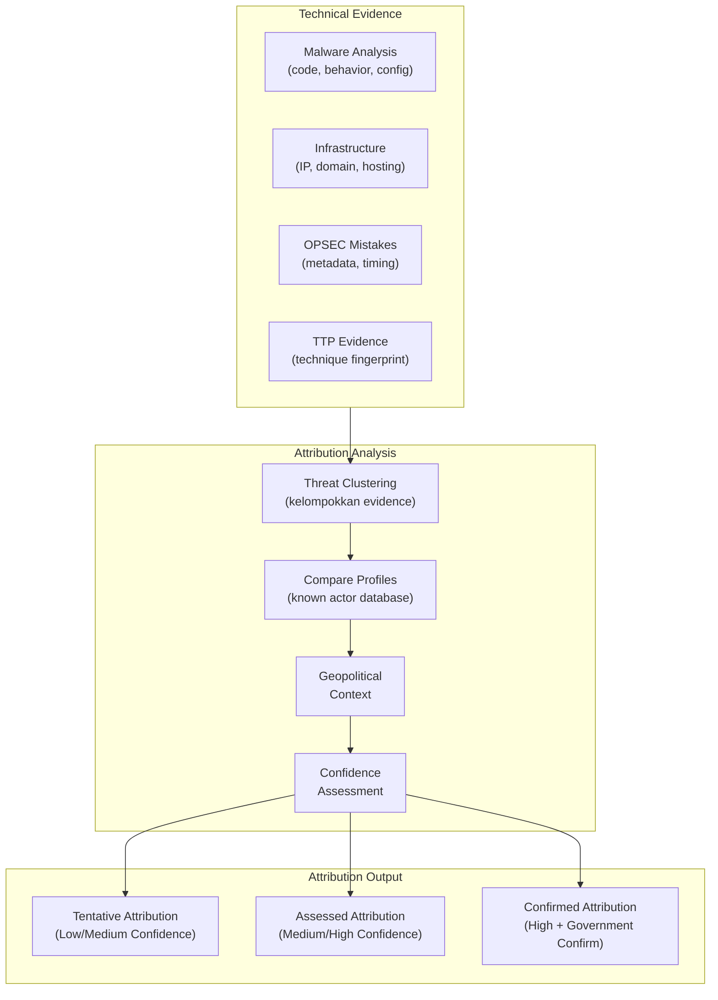

---

### 6. Contoh Terapan

**Skenario**: Investigasi insiden di perusahaan farmasi Indonesia mengidentifikasi beberapa artefak:
- Malware dengan kesamaan kode 87% dengan SOGU backdoor yang dikaitkan APT40 (laporan CrowdStrike)
- C2 infrastructure di Hong Kong, ASN yang sama dengan kampanye sebelumnya
- Serangan dimulai saat peneliti perusahaan mempresentasikan temuan vaksin di konferensi internasional
- Working hours pattern menunjukkan UTC+8

**Analisis attribution**:
- Technical: Code similarity tinggi (87%) + infrastructure overlap → Strong indicator APT40
- Operational: Timing serangan tepat setelah publikasi penelitian farmasi → konsisten dengan motif spionase teknologi
- Strategic: Cina memiliki kepentingan dalam research farmasi; APT40 dikenal menargetkan sektor kesehatan dan research

**Assessment**: "With moderate-high confidence, this activity is assessed as consistent with APT40 (tracked as Bronze Mohawk) based on code similarity, infrastructure overlap, and targeting pattern. However, false flag possibility cannot be fully excluded."

---

### 7. Praktikum atau Aktivitas Terarah

**Judul**: Menyusun Threat Actor Profile Menggunakan Data Publik

**Tujuan**: Mahasiswa mampu menyusun threat actor profile yang terstruktur berdasarkan laporan intelijen publik (vendor reports, MITRE ATT&CK Groups database).

**Dataset**: Kumpulan laporan publik tentang 3 threat actor (disediakan dosen — berbasis informasi yang sudah dipublikasikan secara resmi).

**Langkah kerja**:
1. Pilih satu threat actor yang ditugaskan.
2. Baca laporan yang disediakan dan ekstrak informasi untuk setiap komponen profil (10 komponen dari Seksi 4.2).
3. Buat threat actor profile document menggunakan template (Lampiran terkait).
4. Identifikasi TTP signature dari actor menggunakan MITRE ATT&CK (minimal 5 techniques).
5. Tentukan tingkat kepercayaan attribution yang tersedia di sumber publik.
6. Presentasikan profil dalam 10 menit kepada kelompok.

**Artefak**: Threat actor profile document + ATT&CK technique mapping.

**Catatan etika**: Seluruh informasi berasal dari laporan publik yang sudah dipublikasikan oleh vendor keamanan. Tidak ada akses ke informasi non-publik atau sistem pihak ketiga.

---

### 8. Latihan Pemahaman

**Soal 1**: Jelaskan mengapa penggunaan tools yang sama (misalnya Cobalt Strike) oleh dua kelompok berbeda tidak dapat dijadikan bukti bahwa mereka adalah kelompok yang sama.

**Soal 2** (Pilihan Ganda): Dalam proses attribution, "working hours pattern menunjukkan UTC+8" merupakan indikasi level: A. Technical Attribution B. Operational Attribution C. Strategic Attribution D. Confirmed Attribution.

**Soal 3**: Sebuah serangan menggunakan teknik dan tools yang identik dengan kelompok APT dari negara A. Namun negara A dan negara target sedang dalam hubungan diplomatik yang baik. Bagaimana Anda mengintegrasikan konteks geopolitik ini dalam assessment attribution?

**Soal 4**: Apa yang dimaksud dengan "false flag operation" dalam konteks cyber threat? Berikan skenario konkret dan jelaskan bagaimana analis CTI dapat mendeteksinya.

**Soal 5**: Threat actor profile yang baik harus mencakup apa saja? Jelaskan 5 komponen terpenting dan mengapa masing-masing penting untuk CTI operasional.

---

### 9. Latihan Terapan / Studi Kasus

**Studi Kasus 1**: BSSN menerima laporan bahwa beberapa instansi pemerintah Indonesia mengalami intrusi. Artefak teknis menunjukkan kesamaan dengan kelompok yang sebelumnya menargetkan negara-negara ASEAN lain. Pemerintah meminta attribution assessment untuk keperluan diplomatic response. Bagaimana Anda menyusun attribution assessment yang responsible — yang cukup kredibel untuk mendukung keputusan diplomatik tetapi mengakui ketidakpastian yang ada?

**Studi Kasus 2**: Perusahaan Anda baru saja mengalami ransomware. Tim investigasi ingin melakukan attribution untuk memahami musuh. Manajer berargumen bahwa attribution tidak berguna — "yang penting kita bersih dan operasi kembali normal." Bangun argumen tentang nilai attribution dalam konteks operasional dan strategis pasca-insiden.

---

### 10. Kunci Jawaban dan Pembahasan

**Soal 1**: Cobalt Strike, Metasploit, dan banyak tools offensive lainnya tersedia secara komersial atau open source dan digunakan oleh ratusan kelompok — dari APT negara-bangsa hingga operator ransomware hingga penetration tester. Penggunaan tools yang sama hanya menunjukkan bahwa kedua kelompok memiliki akses ke tools tersebut, bukan bahwa mereka sama. Bahkan musuh bisa dengan sengaja menggunakan tools yang dikaitkan dengan kelompok lain (false flag). Attribution yang valid memerlukan kombinasi evidence yang lebih unik: code reuse dalam custom malware, infrastructure overlap yang tidak dapat dijelaskan oleh kebetulan, dan TTP combination yang sangat spesifik.

**Soal 2**: **Jawaban B — Operational Attribution**. Working hours pattern adalah karakteristik *operasional* — bagaimana mereka beroperasi. Technical attribution lebih pada artefak teknis (kode, hash, infrastructure). Strategic attribution lebih pada konteks geopolitik.

**Soal 3**: Konteks geopolitik adalah salah satu input dalam attribution tapi tidak determinatif. Hubungan diplomatik yang baik tidak mengecualikan operasi intelijen atau proxy operations — banyak nation-state yang menjalankan cyber operations sambil mempertahankan hubungan diplomatik resmi yang baik. Assessment yang tepat: "Technical evidence menunjukkan konsistensi kuat dengan kelompok X dari negara A. Meskipun hubungan diplomatik bilateral sedang baik, ini tidak mengecualikan possibility bahwa operasi ini dijalankan oleh subunit intelligence yang beroperasi semi-independen, atau sebagai false flag. Confidence assessment: moderate."

**Soal 4**: False flag operation adalah serangan yang dirancang untuk membuat pihak lain terlihat sebagai pelaku. Skenario: kelompok A menanam bahasa Rusia dalam kode malware mereka, menggunakan infrastructure yang sebelumnya dikaitkan dengan APT Rusia, dan menyerang target yang merupakan musuh Rusia — padahal kelompok A adalah aktor dari negara berbeda. Deteksi: (1) Artefak yang "terlalu jelas" — musuh yang benar-benar ingin menyembunyikan identitas justru sangat berhati-hati; (2) Inkonsistensi — bahasa dalam malware tidak cocok dengan timezone evidence; (3) Cross-validate multiple indicator categories yang tidak semuanya menunjuk ke arah yang sama.

**Soal 5**: Lima komponen terpenting: (1) *TTP Signature* — fingerprint operasional yang unik, paling stabil dan berguna untuk detection; (2) *Target Victimology* — menentukan apakah organisasi Anda dalam scope target kelompok ini; (3) *Kapabilitas* — memahami apa yang bisa mereka lakukan membantu threat modeling; (4) *Motivasi* — menentukan tujuan serangan (espionage vs. finansial vs. sabotase) → respons berbeda; (5) *Infrastructure Pattern* — membantu mendeteksi infrastructure baru yang belum terdokumentasi berdasarkan pola yang diketahui.

---

### 11. Ringkasan Bab

Threat actor diklasifikasikan berdasarkan motivasi, kapabilitas, dan target (nation-state, eCrime, hacktivist, insider). Profil threat actor yang komprehensif mencakup 10 komponen dari identitas hingga timing pattern. Attribution bekerja pada tiga level (technical, operational, strategic) dan selalu harus disertai confidence level yang eksplisit. Batasan attribution (false flag, shared tools, burned infrastructure) harus diakui dan dikomunikasikan. Attribution yang bertanggung jawab adalah yang mengakui ketidakpastiannya, bukan yang mengklaim kepastian yang tidak ada.

---

### 12. Refleksi Profesional

1. Dalam konteks Indonesia, apakah organisasi swasta memiliki kewajiban atau tanggung jawab hukum untuk melaporkan attribution finding kepada BSSN atau aparat hukum? Apa konsekuensi hukum dari salah attribution?

2. Ketika Anda sebagai analis CTI mengidentifikasi bahwa kelompok yang menyerang klien Anda kemungkinan disponsori oleh pemerintah negara tertentu, bagaimana Anda mengkomunikasikan temuan ini kepada CISO dan legal counsel secara bertanggung jawab?


---

## Bab 6 — Kill Chain Analysis dan Diamond Model

### 1. Capaian Pembelajaran Bab

Setelah menyelesaikan bab ini, mahasiswa mampu:
- Menerapkan Lockheed Martin Cyber Kill Chain untuk menganalisis dan memahami serangan siber.
- Menggunakan Diamond Model of Intrusion Analysis untuk menghubungkan komponen serangan.
- Menganalisis campaign menggunakan kedua framework dan mengidentifikasi peluang deteksi dan respons.
- Mengevaluasi kelebihan dan keterbatasan masing-masing framework.

Bab ini mendukung **Sub-CPMK-2** dan berkontribusi pada **Eval-2 (20%)**.

---

### 2. Peta Konsep Bab

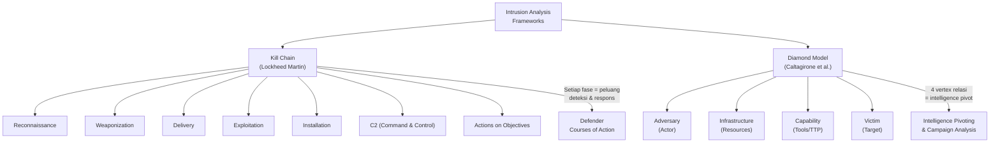

---

### 3. Pengantar Kontekstual

Dua framework analisis intrusi yang paling berpengaruh dalam CTI adalah **Lockheed Martin Cyber Kill Chain** (dikembangkan 2011) dan **Diamond Model of Intrusion Analysis** (Caltagirone, Pendergast, Betz — 2013). Keduanya memberikan cara berpikir yang berbeda tentang serangan: Kill Chain memandang serangan sebagai *urutan fase temporal*, sementara Diamond Model memandang intrusion sebagai *relasi antara 4 komponen*.

Keduanya saling melengkapi dan bersama-sama memberikan analisis yang lebih kaya daripada salah satunya sendiri.

---

### 4. Landasan Teori

#### 4.1 Lockheed Martin Cyber Kill Chain

Kill Chain mengadaptasi konsep militer untuk analisis intrusi siber. Premisnya: serangan yang berhasil harus melewati serangkaian fase secara berurutan. Memutus *satu* fase saja akan menggagalkan keseluruhan serangan.

**Fase 1 — Reconnaissance**
*Apa*: Musuh mengumpulkan informasi tentang target.
*Metode*: OSINT (LinkedIn, web scraping, Shodan), passive DNS, email harvesting, network scanning.
*Defender Course of Action*: Deteksi scanning (IDS), minimasi attack surface information (WHOIS privacy, minimal public footprint).

**Fase 2 — Weaponization**
*Apa*: Musuh membuat senjata (malware, exploit) untuk digunakan terhadap target.
*Tidak dapat dideteksi secara langsung* — terjadi di sisi musuh.
*Defender Course of Action*: Analisis malware yang digunakan di serangan lain untuk memahami kapabilitas musuh.

**Fase 3 — Delivery**
*Apa*: Pengiriman senjata ke target.
*Metode*: Email phishing, watering hole, USB drop, supply chain compromise, drive-by download.
*Defender Course of Action*: Email filtering, web proxy, user awareness training, endpoint protection.

**Fase 4 — Exploitation**
*Apa*: Eksekusi exploit setelah delivery berhasil.
*Metode*: Exploit software vulnerability, macro execution, social engineering.
*Defender Course of Action*: Patch management, application whitelisting, sandboxing.

**Fase 5 — Installation**
*Apa*: Musuh menginstal backdoor/implant untuk akses persisten.
*Metode*: Scheduled task, registry run key, service installation, DLL hijacking.
*Defender Course of Action*: EDR detection (process injection, registry modification), integrity monitoring.

**Fase 6 — Command and Control (C2)**
*Apa*: Musuh membuat komunikasi dua-arah dengan implant di target.
*Metode*: HTTP/S beaconing, DNS tunneling, social media as C2, encrypted channels.
*Defender Course of Action*: DNS filtering, traffic analysis, outbound connection monitoring, network segmentation.

**Fase 7 — Actions on Objectives**
*Apa*: Musuh melaksanakan tujuan akhir.
*Metode*: Data exfiltration, ransomware deployment, lateral movement ke target akhir, sabotage.
*Defender Course of Action*: DLP, data classification, endpoint isolation, IR procedures.

**Kritik terhadap Kill Chain**:
- Terlalu linear — serangan modern bisa tidak mengikuti urutan ini (bisa melompati fase, atau berulang).
- Tidak cocok untuk insider threat (tidak ada "delivery" eksternal).
- Terlalu fokus pada initial compromise, kurang pada lateral movement pasca-kompromi.

#### 4.2 Diamond Model of Intrusion Analysis

Diamond Model mendefinisikan setiap intrusion event sebagai relasi antara 4 vertex:

- **Adversary**: Pelaku yang bertanggung jawab atas intrusion.
- **Capability**: Tools, malware, teknik yang digunakan.
- **Infrastructure**: Infrastruktur yang digunakan (IP, domain, server) sebagai perantara.
- **Victim**: Target intrusion.

*Meta-features* yang menambah konteks: timestamp, phase (Kill Chain phase), result (sukses/gagal), direction (adversary-to-victim atau victim-to-infra), methodology, resources.

**Socio-Political Axis**: Hubungan antara adversary dan victim (motivasi, relationship).
**Technology Axis**: Hubungan antara capability dan infrastructure (bagaimana capability di-deploy).

**Kekuatan Diamond Model**:
- Mendukung *intelligence pivoting* — dari satu vertex, pivot ke vertex lain untuk menemukan hal baru. Jika kita tahu infrastructure, kita bisa pivot ke: (1) victim lain yang menggunakan infrastructure yang sama → campaign scope; (2) capability lain yang menggunakan infrastructure yang sama → actor tools.
- Memungkinkan clustering events menjadi *activity threads* (series of events oleh actor yang sama terhadap victim yang sama) dan *campaigns* (series of threads berbagi tujuan).

---

### 5. Model atau Arsitektur

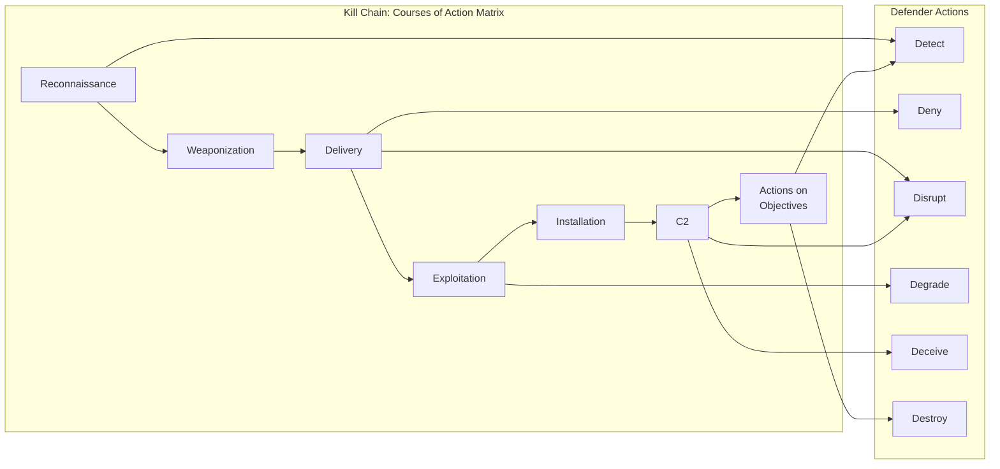

---

### 6. Contoh Terapan

**Skenario**: Analisis serangan phishing yang berhasil pada sebuah BUMN Indonesia.

**Kill Chain Analysis**:
- Recon: Musuh melakukan LinkedIn scraping untuk menemukan nama direktur keuangan dan email format perusahaan.
- Weaponization: Dokumen Word dengan macro berbahaya yang mengunduh Cobalt Strike beacon.
- Delivery: Email phishing "dari CFO" meminta approval urgent anggaran Q4 (spear phishing).
- Exploitation: Korban enable macro → beacon dieksekusi.
- Installation: Scheduled task dibuat sebagai persistence.
- C2: Beacon beaconing ke domain `office365-update[.]com` setiap 60 detik via HTTPS.
- Actions: Exfiltration dokumen keuangan ke server FTP eksternal.

**Diamond Model**:
- Adversary: Kelompok eCrime (motif finansial, belum terdididentifikasi).
- Capability: Cobalt Strike + custom macro dropper.
- Infrastructure: Domain `office365-update[.]com`, FTP server di Bulgaria.
- Victim: Divisi keuangan BUMN.

*Intelligence pivot*: Cek infrastructure → IP yang sama digunakan dalam serangan ke perusahaan BUMN lain 2 bulan lalu → menemukan campaign yang lebih luas.

---

### 7. Praktikum atau Aktivitas Terarah

**Judul**: Kill Chain dan Diamond Model Analysis pada Dataset Insiden Simulasi

**Tujuan**: Mahasiswa mampu menerapkan kedua framework analisis pada dataset insiden yang realistis.

**Dataset**: Log dan artefak insiden simulasi (email header, malware summary, network log, SIEM events) — disediakan dosen.

**Langkah kerja**:
1. Baca dataset insiden secara keseluruhan untuk memahami gambaran umum.
2. Petakan setiap event/artefak ke fase Kill Chain yang sesuai.
3. Identifikasi fase mana yang *tidak memiliki evidence* dalam dataset (gap dalam telemetry).
4. Isi Diamond Model untuk insiden ini (4 vertex + meta-features).
5. Lakukan satu intelligence pivot dari vertex Infrastructure → temukan apakah ada victim lain atau capability lain yang terhubung (menggunakan dataset VirusTotal/OTX simulasi yang disediakan).
6. Identifikasi peluang deteksi (Defender Course of Action) untuk setiap fase Kill Chain yang teridentifikasi.

**Artefak**: Kill Chain mapping + Diamond Model diagram + Intelligence pivot findings.

---

### 8. Latihan Pemahaman

**Soal 1**: Jelaskan mengapa memutus Kill Chain pada fase "Delivery" lebih cost-effective bagi defender dibanding memutusnya pada fase "Actions on Objectives."

**Soal 2** (Pilihan Ganda): Dalam Diamond Model, hubungan antara Capability dan Infrastructure disebut: A. Socio-Political Axis B. Technology Axis C. Meta-Feature D. Activity Thread.

**Soal 3**: Identifikasi 3 kritik utama terhadap Cyber Kill Chain dan jelaskan bagaimana Diamond Model mengatasi keterbatasan tersebut.

**Soal 4**: Apa yang dimaksud dengan "intelligence pivoting" dalam Diamond Model, dan bagaimana teknik ini membantu mengungkap kampanye yang lebih luas dari analisis satu event intrusion?

**Soal 5**: Seorang insider threat mencuri data dengan menggunakan akses legitim mereka — tidak ada malware, tidak ada phishing, tidak ada C2 channel. Bagaimana Anda memodifikasi Kill Chain untuk menganalisis insider threat scenario ini?

---

### 9. Latihan Terapan / Studi Kasus

**Studi Kasus 1**: Anda menerima Diamond Model dari insiden di organisasi A. Vertex Infrastructure menunjukkan IP dan domain yang sama dengan insiden di organisasi B setahun lalu. Gunakan intel pivoting untuk: (a) mengidentifikasi apakah ini campaign yang sama, (b) memperluas victim list yang mungkin, (c) merumuskan 3 hipotesis tentang actor yang bertanggung jawab.

**Studi Kasus 2**: Tim keamanan menggunakan Kill Chain sebagai framework utama untuk defensive strategy. Review Kill Chain-based defense matrix mereka dan identifikasi: (a) fase mana yang over-defended, (b) fase mana yang under-defended, (c) bagaimana integrasikan MITRE ATT&CK sebagai pelengkap untuk menutup gap.

---

### 10. Kunci Jawaban dan Pembahasan

**Soal 1**: Memutus di fase Delivery lebih cost-effective karena: (1) *Prevention vs. detection/response* — mencegah payload masuk jauh lebih murah daripada mendeteksi dan merespons setelah compromise; (2) *Leverage* — satu kontrol (email filtering yang baik) bisa memblokir ribuan serangan yang berbeda; (3) *Timing* — semakin awal serangan diblokir, semakin sedikit kerusakan yang terjadi dan semakin sedikit investigasi yang diperlukan. Memutus di "Actions on Objectives" berarti musuh sudah berjam-jam atau berhari-hari di dalam network, damage sudah terjadi, dan respons jauh lebih kompleks dan mahal.

**Soal 2**: **Jawaban B — Technology Axis**. Sumbu teknologi menggambarkan bagaimana capability di-deploy melalui infrastructure.

**Soal 3**: Kritik Kill Chain dan respons Diamond Model: (1) *Terlalu linear* → Diamond Model tidak mensyaratkan urutan; intrusion bisa dimodelkan sebagai graph event yang tidak berurutan; (2) *Tidak cocok insider threat* → Diamond Model tidak bergantung pada konsep "intrusi dari luar"; adversary bisa berupa insider; (3) *Terlalu fokus pada initial access* → Diamond Model bisa memodelkan lateral movement, privilege escalation sebagai event-event berbeda dalam activity thread, bukan hanya initial compromise.

**Soal 4**: Intelligence pivoting adalah proses menggunakan informasi dari satu vertex Diamond Model untuk menemukan informasi baru di vertex lain. Contoh: mengetahui C2 IP (Infrastructure) → cari semua victim yang terhubung ke IP ini di database internal/eksternal → menemukan 5 victim lain yang tidak diketahui sebelumnya → semua victim adalah perusahaan energi → ini adalah campaign targeted terhadap sektor energi → pivot ke Capability → semua intrusion menggunakan malware X → ini adalah campaign dengan actor yang menggunakan malware X.

**Soal 5**: Insider threat dalam Kill Chain yang dimodifikasi: Recon tidak diperlukan (sudah tahu sistem internal); Weaponization = mengidentifikasi data yang ingin dicuri; Delivery = akses langsung menggunakan kredensial legitimate; Exploitation = tidak ada exploit teknis — privilege escalation mungkin; Installation = tidak diperlukan (sudah punya akses); C2 = mungkin tidak ada atau sangat sederhana (email ke akun personal); Actions = exfiltration (USB, email, cloud upload). Framework yang lebih tepat untuk insider: User and Entity Behavior Analytics (UEBA) yang mendeteksi anomali perilaku pengguna yang sudah memiliki akses.

---

### 11. Ringkasan Bab

Kill Chain memodelkan serangan sebagai 7 fase berurutan, di mana memutus satu fase menggagalkan serangan. Diamond Model memodelkan setiap intrusion sebagai relasi antara 4 vertex (adversary, capability, infrastructure, victim) yang memungkinkan intelligence pivoting dan campaign analysis. Keduanya saling melengkapi: Kill Chain memberikan perspektif temporal dan defender courses of action; Diamond Model memberikan perspektif relasional dan kemampuan untuk memperluas pemahaman dari satu event ke kampanye yang lebih luas.

---

### 12. Refleksi Profesional

1. Kill Chain dikembangkan berdasarkan perspektif militer AS. Apakah framework ini sepenuhnya berlaku untuk ancaman siber di konteks Indonesia, termasuk cybercriminals lokal, hacktivists, dan potential nation-state threats? Bagian mana yang perlu adaptasi?

2. Kelemahan Diamond Model adalah ia membutuhkan analis yang cukup berpengalaman untuk melakukan intelligence pivoting yang efektif. Dalam konteks tim CTI kecil dengan sumber daya terbatas (seperti yang umum di Indonesia), bagaimana Anda memprioritaskan penggunaan Diamond Model?


---

## Bab 7 — TTP Analysis dan MITRE ATT&CK Framework

### 1. Capaian Pembelajaran Bab

Setelah menyelesaikan bab ini, mahasiswa mampu:
- Menjelaskan struktur dan komponen MITRE ATT&CK framework secara komprehensif.
- Mengidentifikasi dan memetakan TTP dari artefak insiden ke ATT&CK techniques.
- Menggunakan ATT&CK Navigator untuk memvisualisasikan coverage dan gap deteksi.
- Mengintegrasikan ATT&CK dalam CTI workflow untuk threat-informed defense.

Bab ini mendukung **Sub-CPMK-2** dan berkontribusi pada **Eval-2 (20%)**.

---

### 2. Peta Konsep Bab

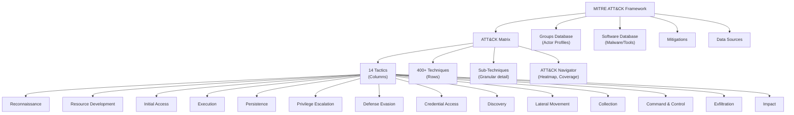

---

### 3. Pengantar Kontekstual

Sebelum MITRE ATT&CK, ancaman siber didokumentasikan secara inkonsisten — setiap vendor menggunakan terminologi dan kategori berbeda. Mendiskusikan ancaman lintas organisasi menjadi babel — satu orang menyebut "lateral movement via SMB" sementara yang lain menyebutnya "network propagation" atau "pivoting." MITRE ATT&CK, yang diluncurkan 2015 dan kini menjadi standar industri global, mengubah itu dengan menyediakan taksonomi universal yang berbasis pada perilaku musuh yang *diobservasi di dunia nyata*.

ATT&CK bukan hanya klasifikasi — ia adalah knowledge base yang menghubungkan teknik, aktor, tools, mitigasi, dan data sources dalam satu ekosistem yang terintegrasi. Untuk CTI, ATT&CK adalah *lingua franca* yang memungkinkan komunikasi yang presisi tentang ancaman.

---

### 4. Landasan Teori

#### 4.1 Struktur MITRE ATT&CK

**14 Tactic (Kolom Matrix)**
Tactic merepresentasikan *tujuan taktis* musuh — *mengapa* mereka melakukan sesuatu. Ini bukan *apa* yang mereka lakukan.

1. **Reconnaissance**: Mengumpulkan informasi untuk merencanakan operasi.
2. **Resource Development**: Menyiapkan infrastruktur dan sumber daya.
3. **Initial Access**: Mendapatkan akses pertama ke jaringan target.
4. **Execution**: Menjalankan kode berbahaya.
5. **Persistence**: Mempertahankan akses meski terjadi restart, credential change.
6. **Privilege Escalation**: Mendapatkan hak akses yang lebih tinggi.
7. **Defense Evasion**: Menghindari deteksi.
8. **Credential Access**: Mencuri kredensial (password, hash, ticket).
9. **Discovery**: Mengetahui lingkungan target.
10. **Lateral Movement**: Bergerak ke sistem lain dalam network.
11. **Collection**: Mengumpulkan data yang akan dieksfiltrasi.
12. **Command and Control**: Berkomunikasi dengan sistem yang dikompromikan.
13. **Exfiltration**: Mencuri data dari network target.
14. **Impact**: Memanipulasi, mengganggu, atau menghancurkan sistem dan data.

**Technique dan Sub-Technique**
Technique adalah *bagaimana* musuh mencapai tujuan taktis. Setiap teknik memiliki:
- ID unik (misalnya T1059 — Command and Scripting Interpreter)
- Deskripsi dan prosedur detail
- Sub-techniques (T1059.001 = PowerShell, T1059.003 = Windows Command Shell)
- Examples penggunaan oleh actor dan malware
- Detection guidance
- Mitigation recommendations
- Data sources yang relevan

#### 4.2 TTP-Based Intelligence vs. IOC-Based

**TTP (Tactics, Techniques, and Procedures)** adalah cara musuh beroperasi. Berbeda dengan IOC yang spesifik dan mudah berubah, TTP lebih stabil karena mencerminkan *metode* musuh yang sulit diubah.

| Aspek | IOC-Based | TTP-Based |
|---|---|---|
| Contoh | IP: 1.2.3.4, Hash: abc123 | T1059.001 — PowerShell execution |
| Stability | Rendah (berubah dalam jam/hari) | Tinggi (bertahan bulan-tahun) |
| Detection | Signature-based | Behavioral analytics |
| Evasion | Trivial (ganti IP/recompile) | Sulit (harus ubah metodologi) |
| Intelligence value | Rendah-Sedang | Tinggi |

#### 4.3 ATT&CK Navigator

ATT&CK Navigator adalah tool visualisasi web yang memungkinkan:
- Membuat *heatmap* coverage — teknik mana yang sudah dideteksi, mana yang belum.
- Overlay profil actor — teknik mana yang digunakan actor tertentu, di mana kita memiliki coverage.
- Gap analysis — mana teknik penting yang tidak ada deteksinya.
- Sharing dan kolaborasi dalam format JSON yang terstandar.

**Warna dalam heatmap**:
- Hijau: Ada deteksi/coverage.
- Merah/jingga: Tidak ada coverage — gap.
- Kuning: Coverage partial atau dalam progress.

#### 4.4 Menggunakan ATT&CK untuk CTI

**Threat-Informed Defense**: Menggunakan pengetahuan tentang TTP musuh yang relevan untuk memprioritaskan investasi defensif.

Workflow:
1. Identifikasi actor yang relevan dengan organisasi (dari threat actor profiling).
2. Ekstrak TTP actor tersebut dari ATT&CK Groups database.
3. Load TTP ke Navigator, buat heatmap actor.
4. Overlay dengan coverage deteksi yang ada.
5. Identifikasi gap — teknik yang digunakan actor tapi tidak ada deteksinya.
6. Prioritaskan development detection rule untuk teknik-teknik gap yang paling kritis.

---

### 5. Model atau Arsitektur

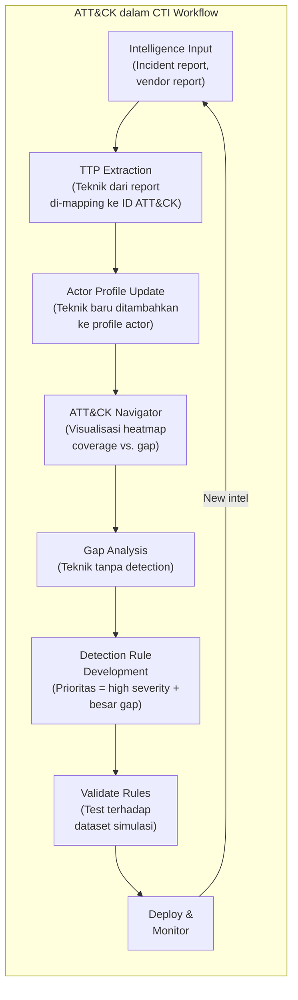

---

### 6. Contoh Terapan

**Skenario**: Tim CTI perusahaan energi Indonesia melakukan threat-informed defense assessment berdasarkan profile APT40 yang diketahui menargetkan sektor energi Asia.

**TTP yang teridentifikasi dari ATT&CK APT40 profile** (sebagian):
- T1190 — Exploit Public-Facing Application
- T1566.001 — Spearphishing Attachment
- T1059.001 — PowerShell
- T1021.001 — Remote Desktop Protocol
- T1071.001 — Web Protocols (C2)
- T1560.001 — Archive via Utility (kompresi sebelum exfil)
- T1041 — Exfiltration Over C2 Channel

**Pemetaan coverage existing** (contoh hasil):
- T1190: ✅ Covered (WAF + vulnerability scanning)
- T1566.001: ✅ Covered (email filtering, sandbox)
- T1059.001: ⚠️ Partial (ada deteksi tapi tidak semua execution pattern)
- T1021.001: ✅ Covered (RDP monitoring)
- T1071.001: ❌ Gap (tidak ada deteksi behavioral C2 via HTTPS)
- T1560.001: ❌ Gap (tidak ada deteksi kompresi file dalam volume besar)
- T1041: ❌ Gap (DLP terbatas)

**Prioritas pengembangan detection rule**: T1071.001, T1560.001, T1041 — karena digunakan dalam fase akhir serangan (exfiltration chain) dan saat ini tidak ada coverage.

---

### 7. Praktikum atau Aktivitas Terarah

**Judul**: ATT&CK Mapping dan Gap Analysis Menggunakan ATT&CK Navigator

**Tujuan**: Mahasiswa mampu melakukan TTP mapping dari laporan intelijen dan melakukan gap analysis menggunakan ATT&CK Navigator.

**Lingkungan**: ATT&CK Navigator (https://mitre-attack.github.io/attack-navigator/ — aksesibel publik, tidak memerlukan akun).

**Dataset**: Laporan insiden simulasi yang berisi deskripsi teknis serangan — disediakan dosen.

**Langkah kerja**:
1. Baca laporan insiden dan identifikasi teknik yang digunakan — mapping ke ATT&CK ID.
2. Buka ATT&CK Navigator, buat layer baru.
3. Masukkan teknik yang teridentifikasi dan beri warna merah (teknik yang digunakan musuh).
4. Tambahkan layer kedua: teknik yang saat ini sudah ada detection rule-nya (beri warna hijau).
5. Identifikasi overlap (merah+hijau) = covered; merah tanpa hijau = gap.
6. Susun prioritas 5 teknik gap teratas berdasarkan: (a) fase Kill Chain (semakin awal lebih prioritas, kecuali jika impact-nya tinggi), (b) ease of detection.
7. Export Navigator layer sebagai JSON untuk disubmit sebagai artefak.

**Artefak**: ATT&CK Navigator JSON + gap analysis report (prioritas 5 teknik + justifikasi).

---

### 8. Latihan Pemahaman

**Soal 1**: Jelaskan perbedaan antara "Tactic" dan "Technique" dalam ATT&CK. Berikan satu contoh konkret dari setiap tipe.

**Soal 2**: Mengapa "T1059.001 — PowerShell" dapat digunakan oleh legitimate administrator sekaligus oleh musuh, dan bagaimana ini mempengaruhi strategi deteksi?

**Soal 3** (Pilihan Ganda): Dalam ATT&CK heatmap analysis, teknik yang paling diprioritaskan untuk dibuat detection rule-nya adalah: A. Teknik yang digunakan oleh banyak actor berbeda, ada dalam gap, dan ada di fase Impact B. Teknik yang hanya digunakan satu actor tapi sangat complex C. Teknik dalam fase Reconnaissance D. Teknik yang paling mudah dibuat detection rule-nya.

**Soal 4**: Seorang analis menemukan bahwa musuh menggunakan T1036.005 — Match Legitimate Name or Location (menyamarkan malware dengan nama mirip sistem). Identifikasi: (a) tactic dari teknik ini, (b) data source yang dibutuhkan untuk mendeteksinya, (c) satu detection logic sederhana.

**Soal 5**: Apa kelebihan dan keterbatasan ATT&CK sebagai framework untuk CTI dibanding menggunakan Kill Chain saja?

---

### 9. Latihan Terapan / Studi Kasus

**Studi Kasus 1**: Tim CTI organisasi kesehatan Indonesia ingin membangun threat-informed defense program. Dari laporan BSSN dan media, mereka mengetahui bahwa kelompok ransomware banyak menargetkan rumah sakit dengan pola: phishing → PowerShell → credential dumping → lateral movement via RDP → ransomware deployment. Gunakan ATT&CK untuk: (a) mapping TTP ke ATT&CK IDs, (b) susun coverage assessment sederhana, (c) rekomendasikan 3 deteksi rule yang paling kritis.

**Studi Kasus 2**: Manajer SOC meminta Anda untuk "menutupi semua teknik ATT&CK" sebagai target coverage. Evaluasi permintaan ini secara kritis — apakah ini feasible dan desirable? Rekomendasikan pendekatan yang lebih pragmatis berdasarkan threat-informed prioritization.

---

### 10. Kunci Jawaban dan Pembahasan

**Soal 1**: *Tactic* adalah tujuan taktis musuh — *mengapa* mereka melakukan sesuatu. Contoh: "Persistence" — musuh ingin memastikan mereka tetap memiliki akses meski terjadi reboot. *Technique* adalah *bagaimana* mereka mencapai tujuan tersebut. Contoh: T1547.001 — Registry Run Keys / Startup Folder — musuh menulis ke registry HKCU\Software\Microsoft\Windows\CurrentVersion\Run agar malware dijalankan otomatis setiap login.

**Soal 2**: PowerShell adalah tool administrasi yang legitimate digunakan setiap hari oleh admin untuk automasi, deployment, dan manajemen. Musuh menggunakannya karena sudah tersedia di semua Windows modern, sering diwhitelist, dan sangat powerful. Implikasi deteksi: tidak bisa memblokir PowerShell sepenuhnya → harus deteksi *behavioral anomaly* — PowerShell yang dijalankan oleh proses yang tidak biasa (Word, browser), PowerShell dengan flag `-EncodedCommand`, download cradle patterns (IEX + web request), atau PowerShell yang dijalankan oleh user non-IT.

**Soal 3**: **Jawaban A**. Teknik yang digunakan banyak actor (menunjukkan prevalensi tinggi), ada dalam gap (tidak terdeteksi), dan berada di fase Impact (kerugian terbesar) adalah prioritas tertinggi karena: (1) Banyak actor = kemungkinan terjadi lebih tinggi; (2) Gap = jika terjadi, tidak akan terdeteksi; (3) Impact = kerusakan terbesar jika tidak terdeteksi.

**Soal 4**: (a) Tactic: Defense Evasion (musuh mencoba menghindari deteksi dengan kamuflase). (b) Data sources: Process creation events (Windows Event ID 4688 atau Sysmon Event ID 1), file system monitoring. (c) Detection logic: Alert jika proses dibuat dengan nama yang mirip dengan proses sistem (misalnya `svchost.exe` di luar `C:\Windows\System32\`, atau `lsass.exe` di folder temp). KQL: `process.executable: ("*\\AppData\\*\\svchost.exe" OR "*\\Temp\\*\\lsass.exe")`.

**Soal 5**: *Kelebihan ATT&CK vs Kill Chain*: (1) Jauh lebih granular — 400+ teknik vs 7 fase; (2) Berbasis perilaku nyata yang diobservasi, bukan model konseptual; (3) Terhubung ke actor database, software database, mitigation — ekosistem terintegrasi; (4) Standar industri yang memungkinkan komunikasi lintas organisasi; (5) Mencakup post-compromise activity yang detail — Kill Chain mengabaikan banyak yang terjadi setelah initial access. *Keterbatasan ATT&CK*: (1) Sangat besar dan overwhelming bagi tim kecil; (2) Coverage bias ke Windows/enterprise environment; (3) Sub-techniques dapat membingungkan; (4) Perlu update terus-menerus mengikuti evolusi ancaman; (5) Tidak linear — sulit digunakan sebagai timeline.

---

### 11. Ringkasan Bab

MITRE ATT&CK adalah knowledge base universal yang mendokumentasikan 400+ teknik musuh dalam 14 tactic, berbasis observasi nyata di lapangan. TTP-based detection jauh lebih tahan lama daripada IOC-based. ATT&CK Navigator memungkinkan visualisasi coverage dan gap analysis yang esensial untuk threat-informed defense. Integrasi ATT&CK dalam CTI workflow memungkinkan prioritisasi investasi defensif berdasarkan ancaman yang paling relevan.

---

### 12. Refleksi Profesional

1. MITRE ATT&CK terutama mencerminkan teknik yang diobservasi di lingkungan enterprise Windows. Bagaimana Anda mengadaptasi framework ini untuk organisasi yang heavily Linux/Unix, atau yang beroperasi di lingkungan OT/SCADA?

2. Jika Anda diminta mempresentasikan "ATT&CK coverage report" kepada Dewan Direksi yang tidak memiliki latar belakang teknis, bagaimana Anda mentranslasikan heatmap teknis menjadi narasi risiko bisnis yang dapat dipahami dan digunakan untuk pengambilan keputusan?

---

## Bab 8 — Campaign Analysis dan Strategic Threat Trends

### 1. Capaian Pembelajaran Bab

Setelah menyelesaikan bab ini, mahasiswa mampu:
- Mendefinisikan dan menganalisis campaign sebagai rangkaian aktivitas ancaman yang terhubung.
- Melakukan trend analysis pada ancaman siber strategis yang relevan dengan sektor dan geografi target.
- Menyusun strategic threat assessment berbasis evidence.
- Mengintegrasikan campaign intelligence ke dalam threat modeling dan risk assessment.

Bab ini mendukung **Sub-CPMK-2** dan melengkapi **Eval-2 (20%)**.

---

### 2. Peta Konsep Bab

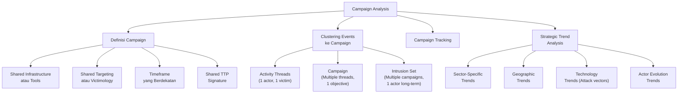

---

### 3. Pengantar Kontekstual

Memahami satu insiden secara terisolasi hanya memberikan sebagian gambaran. Intelligence yang paling berharga seringkali muncul ketika kita menghubungkan multiple events menjadi *campaign* — pola serangan yang berkelanjutan dengan tujuan yang konsisten. Campaign analysis mengungkapkan: siapa yang beroperasi, terhadap siapa, menggunakan apa, dan untuk tujuan apa — dalam jangka waktu yang bermakna.

Strategic trend analysis melangkah lebih jauh — memahami tidak hanya kampanye spesifik, tetapi perubahan besar dalam landscape ancaman yang mempengaruhi perencanaan keamanan jangka panjang.

---

### 4. Landasan Teori

#### 4.1 Hierarki Aktivitas Ancaman

Dalam Diamond Model, aktivitas ancaman diorganisasikan dalam hierarki:

**Event**: Satu episode aktivitas berbahaya yang dapat diobservasi — satu intrusion, satu phishing attempt.

**Activity Thread**: Serangkaian events yang terhubung — dilakukan oleh adversary yang sama terhadap victim yang sama. Setiap event dalam thread memiliki "victim phase" yang terhubung ke "next victim phase."

**Campaign**: Kumpulan activity threads yang berbagi tujuan umum — mungkin melibatkan multiple victims. Campaign menunjukkan bahwa adversary sedang mengeksekusi rencana operasional yang lebih besar.

**Intrusion Set**: Semua aktivitas yang dikaitkan dengan satu adversary dalam jangka panjang — mungkin mencakup multiple campaigns dengan tujuan berbeda.

#### 4.2 Metode Clustering Campaign

Untuk mengidentifikasi apakah events berbeda adalah bagian dari campaign yang sama:

**Infrastructure Overlaps**: IP address, domain, ASN yang sama digunakan dalam multiple intrusions.

**TTP Consistency**: Kombinasi teknik yang sangat spesifik yang muncul secara konsisten — "fingerprint" operasional.

**Toolset Similarity**: Malware atau tools yang sama digunakan, terutama jika ada modifikasi kecil yang konsisten.

**Victimology Pattern**: Target yang serupa — sektor yang sama, ukuran organisasi serupa, geografi yang sama.

**Temporal Correlation**: Events terjadi dalam timeframe yang berdekatan atau dengan pattern yang reguler.

**Malware DNA**: Code reuse analysis — shared code segments, shared libraries, shared configuration format.

#### 4.3 Strategic Threat Trend Analysis

Trend analysis menjawab pertanyaan: "Bagaimana landscape ancaman berubah?" dan "Ke mana ancaman akan bergerak?"

**Dimensi trend yang dianalisis:**

*Sector Trends*: Sektor mana yang mengalami peningkatan targeting? Pada 2023-2024, sektor kesehatan dan infrastruktur kritis menjadi target utama ransomware karena propensitas yang lebih tinggi untuk membayar dan kepekaan operasional.

*Geographic Trends*: Wilayah mana yang mengalami peningkatan serangan? Asia Tenggara mengalami peningkatan signifikan dalam targeting oleh APT, sebagian didorong oleh dinamika geopolitik regional.

*Attack Vector Trends*: Bagaimana initial access berubah? Tren terkini: initial access broker (IAB) yang menjual akses ke berbagai RaaS operators; supply chain attacks; VPN vulnerability exploitation.

*Actor Evolution*: Bagaimana teknik dan kapabilitas actor berkembang? Tren: penggunaan tools legitimate (living-off-the-land), ekosistem crime-as-a-service yang makin terstruktur.

---

### 5. Model atau Arsitektur

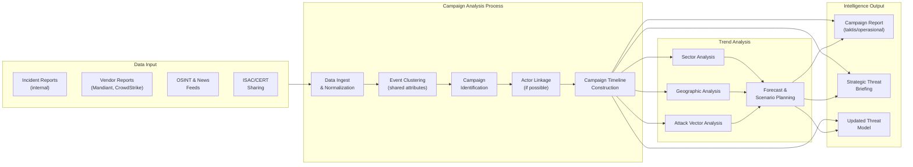

---

### 6. Contoh Terapan

**Skenario**: Tim CTI menganalisis 5 laporan insiden dari berbagai perusahaan logistik Indonesia yang terjadi dalam 3 bulan terakhir.

**Observasi dari 5 insiden**:
- Semua menggunakan spearphishing dengan tema "perubahan regulasi bea cukai"
- 4 dari 5 menggunakan domain dengan pola `customs-update[sektor].com`
- Malware yang digunakan memiliki code overlap 74% dengan Njrat variant
- Working hours suggest UTC+7 (Indonesia timezone atau Vietnam)
- Target: semua perusahaan logistik dengan operasi di Pelabuhan Tanjung Priok atau Belawan

**Campaign Identification**:
- Activity threads: 5 threads terpisah, masing-masing actor-to-victim
- Shared attributes: tema phishing, domain pattern, malware family, victimology (logistik + pelabuhan)
- Assessment: Ini adalah satu campaign terkoordinasi menargetkan sektor logistik maritime Indonesia

**Strategic Context**: Sektor logistik Indonesia menjadi target karena merupakan node kritis dalam supply chain Asia Tenggara. Potensi motif: spionase ekonomi (mengetahui cargo manifest), sabotase port operations, atau sebagai lateral movement menuju pemerintah melalui kontraktor.

---

### 7. Praktikum atau Aktivitas Terarah

**Judul**: Campaign Clustering dan Trend Analysis dari Dataset Simulasi

**Tujuan**: Mengidentifikasi campaign dari kumpulan events berbeda dan menganalisis trend strategis.

**Dataset**: 20 event simulasi (dengan metadata: timestamp, infrastructure, TTP, target sektor, geography) — disediakan dosen.

**Langkah kerja**:
1. Analisis setiap event dan ekstrak atribut kunci (infrastructure, TTP, target, timing).
2. Kelompokkan events berdasarkan shared attributes — identifikasi 2-3 campaign yang mungkin.
3. Untuk setiap kampanye yang teridentifikasi, buat: timeline, activity summary, tentative actor attribution (confidence level).
4. Lakukan trend analysis sederhana: sektor apa yang paling sering ditargetkan? Teknik apa yang paling sering muncul?
5. Susun rekomendasi intelligence collection untuk 30 hari ke depan berdasarkan trend yang teridentifikasi.

**Artefak**: Campaign clustering report + trend analysis summary + 30-day collection recommendations.

---

### 8. Latihan Pemahaman

**Soal 1**: Apa perbedaan antara "campaign" dan "intrusion set" dalam hierarki Diamond Model? Berikan contoh.

**Soal 2**: Anda mendapati 3 insiden berbeda menggunakan C2 domain yang sama. Apakah ini cukup untuk menyimpulkan bahwa ketiganya adalah bagian dari campaign yang sama? Apa bukti tambahan yang dibutuhkan?

**Soal 3** (Esai): Jelaskan mengapa understanding campaign lebih valuable dari understanding individual incidents dalam konteks strategic threat assessment.

**Soal 4**: Trend analysis menunjukkan bahwa serangan supply chain meningkat 300% dalam 2 tahun terakhir di Asia Tenggara. Bagaimana Anda mentranslasikan trend ini menjadi rekomendasi actionable untuk CISO perusahaan manufaktur?

**Soal 5**: Apa risiko dari "over-clustering" — menggabungkan events yang sebenarnya bukan dari campaign yang sama ke dalam satu cluster?

---

### 9. Latihan Terapan / Studi Kasus

**Studi Kasus 1**: Analisis 6 laporan insiden publik yang terjadi pada tahun 2023-2024 di sektor perbankan ASEAN. Identifikasi: (a) berapa kampanye berbeda yang teridentifikasi, (b) TTP yang paling konsisten, (c) implikasi untuk bank-bank di Indonesia.

**Studi Kasus 2**: Manajemen meminta CTI strategic outlook untuk 12 bulan ke depan. Berdasarkan tren ancaman yang relevan (pilih 3 tren dari literatur publik), susun scenario planning: (a) most likely scenario, (b) worst case scenario, (c) best case scenario — beserta implikasi untuk program keamanan siber.

---

### 10. Kunci Jawaban dan Pembahasan

**Soal 1**: *Campaign* adalah kumpulan activity threads yang berbagi tujuan umum dalam timeframe tertentu — misalnya "Operation Cloud Hopper" yang menargetkan managed service providers global. *Intrusion Set* adalah semua aktivitas yang dikaitkan dengan satu adversary dalam jangka panjang, yang mungkin mencakup multiple campaigns dengan tujuan berbeda seiring waktu. Contoh: APT28 (intrusion set) menjalankan berbagai campaigns sepanjang eksistensi mereka — campaign untuk mempengaruhi pemilu, campaign spionase militer, campaign terhadap institusi olahraga — semuanya dikaitkan ke actor yang sama (APT28) tapi merupakan campaign berbeda dengan tujuan berbeda.

**Soal 2**: Tidak cukup hanya dari C2 domain yang sama. C2 domain bisa digunakan secara bergantian oleh kelompok berbeda (shared infrastructure / bulletproof hosting yang disewa banyak actor). Bukti tambahan yang dibutuhkan: (1) Kesamaan TTP yang lebih spesifik (bukan hanya satu teknik); (2) Victimology yang konsisten (target serupa); (3) Temporal correlation yang bermakna; (4) Malware code similarity (bukan hanya kesamaan malware family); (5) Consistency dalam methodology (cara kerja yang terlalu mirip untuk kebetulan).

**Soal 3**: Campaign understanding memberikan: (1) *Scope* — berapa banyak dan siapa saja yang terdampak, bukan hanya satu insiden; (2) *Intent* — dari pattern kampanye, dapat disimpulkan tujuan strategis musuh, bukan hanya taktis; (3) *Predictability* — campaign yang dipahami memungkinkan prediksi siapa yang akan menjadi target berikutnya; (4) *Resource allocation* — CISO dapat berargumen untuk resource lebih besar ketika ancamannya terlihat sebagai kampanye sistematis, bukan insiden terisolasi; (5) *Pre-emption* — memungkinkan notifikasi early warning kepada organisasi yang mungkin menjadi target berikutnya.

**Soal 4**: Translasi trend ke rekomendasi: (1) *Vendor/supplier security assessment* — audit keamanan siber supplier kritis, termasuk klausul keamanan dalam kontrak; (2) *Software Bill of Materials (SBOM)* — implementasi SBOM untuk memahami komponen software yang digunakan; (3) *Enhanced monitoring pada update mechanisms* — deteksi unusual software update activity; (4) *Compartmentalization* — batasi akses vendor ke sistem production; (5) *Threat hunting use case* — buat hunting hypothesis khusus untuk supply chain attack patterns.

**Soal 5**: Over-clustering risiko: (1) *False attribution* — menggabungkan activities dari actor berbeda membuat profil actor menjadi tidak akurat, yang kemudian mengarah pada wrong defender assumptions; (2) *Missed nuance* — dua actor yang berbeda mungkin memiliki TTP mirip tetapi motivasi berbeda, target berbeda — digabungkan akan mengaburkan perbedaan penting ini; (3) *Flawed threat model* — jika satu "campaign" sebenarnya dua actor berbeda, estimasi kapabilitas dan scope salah; (4) *Wasted intelligence effort* — menginvestigasi satu campaign yang sebenarnya dua, membuang resources.

---

### 11. Ringkasan Bab

Campaign analysis menghubungkan events terpisah menjadi narrative yang bermakna melalui shared attributes (infrastructure, TTP, victimology, timing). Hierarki Diamond Model (event → activity thread → campaign → intrusion set) menyediakan kerangka yang terstruktur. Strategic trend analysis mentransformasi data historical menjadi forward-looking intelligence yang mendukung perencanaan jangka panjang. Campaign dan trend intelligence adalah komponen kunci CTI strategis yang melayani CISO dan manajemen senior.

---

### 12. Refleksi Profesional

1. Bagaimana organisasi harus mengelola "intelligence latency" — keterlambatan antara terjadinya serangan dan tersedianya campaign intelligence yang memadai? Apa implikasi dari latency ini terhadap defensive decision making?

2. Strategic threat trends seringkali mencerminkan kondisi geopolitik, ekonomi, dan teknologi yang lebih luas. Sebagai CTI professional, sejauh mana Anda harus memiliki pemahaman tentang geopolitik dan ekonomi global? Bagaimana Anda membangun kapabilitas ini?


---

## Bab 9 — STIX 2.1: Structured Threat Information Expression

### 1. Capaian Pembelajaran Bab

Setelah menyelesaikan bab ini, mahasiswa mampu:
- Menjelaskan struktur dan tujuan STIX 2.1 sebagai standar representasi intelligence.
- Mengidentifikasi dan menggunakan berbagai STIX Domain Objects (SDO) dan STIX Relationship Objects (SRO).
- Menyusun STIX bundle sederhana yang merepresentasikan intelligence dari skenario nyata.
- Mengevaluasi kelebihan STIX dibanding format intelligence lainnya.

Bab ini mendukung **Sub-CPMK-3** dan berkontribusi pada **Eval-3 (20%)**.

---

### 2. Peta Konsep Bab

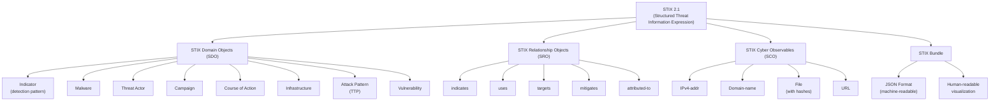

---

### 3. Pengantar Kontekstual

Bayangkan dua tim CTI ingin berbagi intelligence tentang malware yang sama. Tim A menggunakan spreadsheet Excel dengan kolom "IP musuh", "Nama malware", dan "Teknik". Tim B menggunakan PDF report narasi. Tim C menggunakan database internal mereka. Bagaimana mereka berbagi intelligence secara efisien? Dengan format berbeda, setiap pertukaran memerlukan manual translation yang lambat, rawan error, dan tidak scalable.

STIX (Structured Threat Information Expression) dan pasangannya TAXII (Trusted Automated eXchange of Intelligence Information) memecahkan masalah ini. STIX menyediakan *skema data standar* untuk intelligence siber dalam format JSON yang machine-readable — memungkinkan sharing otomatis, parsing otomatis, dan integrasi langsung ke platform CTI.

---

### 4. Landasan Teori

#### 4.1 STIX 2.1 Overview

STIX adalah standar terbuka yang dikembangkan oleh OASIS. Versi 2.1 (2021) adalah versi terkini. Semua objek STIX memiliki:
- **type**: Tipe objek (wajib)
- **id**: UUID unik (wajib)
- **spec_version**: "2.1" (wajib)
- **created**: Timestamp penciptaan (wajib)
- **modified**: Timestamp modifikasi terakhir (wajib)

#### 4.2 STIX Domain Objects (SDO) Utama

**Indicator**: Mendefinisikan pattern yang jika ditemukan mengindikasikan aktivitas berbahaya.
```json
{
  "type": "indicator",
  "id": "indicator--8e2e2d2b-17d4-4cbf-938f-98d0f11db83e",
  "spec_version": "2.1",
  "created": "2024-09-01T08:00:00.000Z",
  "modified": "2024-09-01T08:00:00.000Z",
  "name": "Malicious URL - APT40 C2",
  "pattern": "[url:value = 'https://update-service.xyz/beacon']",
  "pattern_type": "stix",
  "valid_from": "2024-09-01T08:00:00.000Z",
  "indicator_types": ["malicious-activity"],
  "confidence": 85
}
```

**Threat Actor**: Merepresentasikan individu, grup, atau organisasi yang melakukan ancaman.
```json
{
  "type": "threat-actor",
  "id": "threat-actor--0c7b5b88-8ff7-4a4d-aa9d-feb398cd1d7e",
  "spec_version": "2.1",
  "created": "2024-01-01T00:00:00.000Z",
  "modified": "2024-09-01T08:00:00.000Z",
  "name": "APT40",
  "threat_actor_types": ["nation-state"],
  "aliases": ["Bronze Mohawk", "TEMP.Periscope"],
  "sophistication": "advanced",
  "resource_level": "government",
  "primary_motivation": "organizational-gain"
}
```

**Malware**: Merepresentasikan malware atau malware family.
```json
{
  "type": "malware",
  "id": "malware--0c7b5b88-4aa9d-feb3-98cd-1d7e7bfe4b88",
  "spec_version": "2.1",
  "created": "2024-09-01T00:00:00.000Z",
  "modified": "2024-09-01T00:00:00.000Z",
  "name": "PlugX",
  "malware_types": ["backdoor", "remote-access-trojan"],
  "is_family": true
}
```

**Attack Pattern**: Merepresentasikan teknik serangan (biasanya diisi dengan ATT&CK reference).
```json
{
  "type": "attack-pattern",
  "id": "attack-pattern--7b211ac6-c815-4a0f-b90c-4a07d7a79ee0",
  "spec_version": "2.1",
  "created": "2024-09-01T00:00:00.000Z",
  "modified": "2024-09-01T00:00:00.000Z",
  "name": "Spearphishing Attachment",
  "external_references": [
    {
      "source_name": "mitre-attack",
      "external_id": "T1566.001"
    }
  ]
}
```

**Course of Action**: Merepresentasikan langkah mitigasi atau respons.

**Campaign**: Merepresentasikan serangkaian aktivitas berbahaya yang berkaitan.

**Vulnerability**: Merepresentasikan kerentanan (biasanya di-link ke CVE).

**Infrastructure**: Merepresentasikan infrastruktur yang digunakan oleh musuh atau dieksploitasi.

#### 4.3 STIX Relationship Objects (SRO)

SRO menghubungkan SDO dan SCO dalam graph relasi. Beberapa relationship yang paling umum:

- `threat-actor → uses → malware`: Actor menggunakan malware tertentu.
- `indicator → indicates → malware`: Indicator mendeteksi malware.
- `malware → targets → identity`: Malware menargetkan identitas/organisasi.
- `threat-actor → attributed-to → identity`: Actor dikaitkan ke negara/organisasi.
- `course-of-action → mitigates → attack-pattern`: Mitigasi mengatasi teknik serangan.

```json
{
  "type": "relationship",
  "id": "relationship--d44ca62b-fa84-4f89-bae6-0f5a",
  "spec_version": "2.1",
  "created": "2024-09-01T08:00:00.000Z",
  "modified": "2024-09-01T08:00:00.000Z",
  "relationship_type": "uses",
  "source_ref": "threat-actor--0c7b5b88-8ff7-4a4d-aa9d-feb398cd1d7e",
  "target_ref": "malware--0c7b5b88-4aa9d-feb3-98cd-1d7e7bfe4b88"
}
```

#### 4.4 STIX Bundle

Bundle adalah container yang mengemas satu atau lebih STIX objects untuk distribusi atau penyimpanan.

```json
{
  "type": "bundle",
  "id": "bundle--f8a7e8c1-5d16-4a54-a9b7-12345678",
  "objects": [
    { ... SDO/SRO objects ... }
  ]
}
```

---

### 5. Model atau Arsitektur

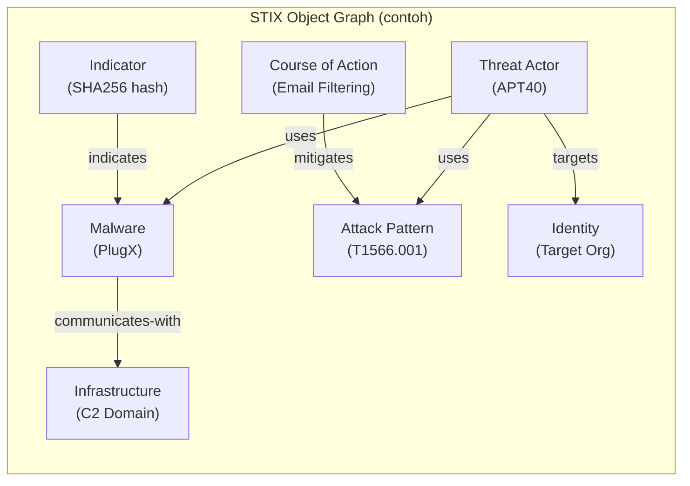

---

### 6. Contoh Terapan

**Skenario**: Tim CTI menganalisis insiden di perusahaan logistik dan ingin mendokumentasikannya dalam STIX 2.1 untuk berbagi dengan ISAC.

**STIX Bundle yang dihasilkan** (ringkasan):
- **Threat Actor** object: Kelompok eCrime (belum bernama, tentative attribution)
- **Malware** object: NjRAT variant dengan hashes SHA256
- **Indicator** object: Domain C2 `customs-update[.]xyz` dengan STIX pattern
- **Attack Pattern** objects: T1566.001, T1059.001, T1041
- **Infrastructure** object: IP 103.x.x.x di ASN XYZ
- **Relationship** objects: actor→uses→malware, indicator→indicates→malware, actor→uses→attack-pattern
- **Bundle**: Mengemas semua objects dengan TLP:GREEN marking

Hasil sharing: anggota ISAC lain dapat mengimport bundle ini langsung ke MISP mereka, menjalankan matching terhadap telemetry internal mereka, dan segera mendeteksi jika ada komunikasi ke C2 domain yang sama.

---

### 7. Praktikum atau Aktivitas Terarah

**Judul**: Membuat STIX 2.1 Bundle dari Skenario Insiden

**Tujuan**: Mahasiswa mampu membuat STIX bundle yang valid dari skenario insiden yang diberikan.

**Tools**: Editor teks / JSON editor; validator STIX (online STIX validator); visualizer STIX (STIX Visualizer di GitHub, berbasis web).

**Skenario**: Diberikan ringkasan insiden phishing yang menyebabkan compromise di perusahaan retail — termasuk email header, malware hash, C2 domain, dan teknik yang digunakan.

**Langkah kerja**:
1. Identifikasi semua elemen yang perlu direpresentasikan sebagai STIX objects.
2. Buat setiap SDO (minimal: 1 Indicator, 1 Malware, 1 Threat Actor tentative, 2 Attack Pattern).
3. Buat SCO yang relevan (IPv4-addr atau domain-name).
4. Buat SRO yang menghubungkan objects (minimal 3 relationships).
5. Kemas semua objects dalam satu Bundle.
6. Validasi bundle menggunakan STIX validator.
7. Visualisasikan menggunakan STIX Visualizer.

**Artefak**: STIX bundle JSON file + screenshot visualizer + brief explanation (1 halaman) tentang keputusan desain.

---

### 8. Latihan Pemahaman

**Soal 1**: Apa perbedaan antara STIX Domain Object (SDO) dan STIX Cyber Observable (SCO)? Berikan contoh masing-masing.

**Soal 2**: Mengapa STIX menggunakan UUID sebagai identifier objek daripada nama sederhana? Apa keuntungannya dalam konteks intelligence sharing?

**Soal 3** (Pilihan Ganda): Relasi yang tepat untuk menyatakan bahwa "firewall rule X mengatasi teknik spearphishing" dalam STIX adalah: A. `threat-actor uses attack-pattern` B. `course-of-action mitigates attack-pattern` C. `indicator indicates malware` D. `attack-pattern targets identity`.

**Soal 4**: Seorang analis ingin merepresentasikan confidence bahwa indikator tertentu benar-benar berbahaya. Bagaimana confidence ini direpresentasikan dalam STIX 2.1?

**Soal 5**: Jelaskan mengapa STIX bundle lebih valuable daripada sharing IOC dalam format CSV sederhana, terutama dalam konteks otomasi dan enrichment.

---

### 9. Latihan Terapan / Studi Kasus

**Studi Kasus 1**: Anda menerima STIX bundle dari partner berisi 50 objects. Bagaimana Anda memvalidasi, memprioritaskan, dan mengintegrasikan bundle ini ke dalam platform CTI organisasi Anda? Rancang proses ingestion dan triage untuk STIX bundle dari partner external.

**Studi Kasus 2**: Tim Anda ingin mulai menggunakan STIX sebagai format standar internal. Identifikasi 5 tantangan implementasi yang mungkin dihadapi (teknis, SDM, proses, governance) dan rekomendasikan pendekatan adoption yang bertahap.

---

### 10. Kunci Jawaban dan Pembahasan

**Soal 1**: *SDO* merepresentasikan konsep-konsep intelijen tingkat tinggi — kontekstual dan semantik. Contoh: `threat-actor` (siapa musuhnya?), `malware` (tools apa yang digunakan?), `campaign` (apa kampanyenya?). *SCO* merepresentasikan observasi teknis yang konkret dan terukur. Contoh: `ipv4-addr` (specific IP address), `domain-name` (specific domain), `file` dengan hash. Perbedaan penting: SCO biasanya lebih akurat (ini adalah fakta teknis) tapi lebih mudah diubah oleh musuh; SDO lebih stabil tapi memerlukan interpretasi analitis.

**Soal 2**: UUID (Universally Unique Identifier) memastikan setiap object memiliki identifier global yang unik dan tidak akan pernah konflik dengan object lain dari organisasi yang berbeda. Jika menggunakan nama, dua organisasi bisa membuat Indicator dengan nama "phishing-domain" yang berbeda — ini akan konflik saat dimerge. UUID memungkinkan: (1) safe merging dari multiple sources tanpa collision; (2) precise referencing dalam relationships; (3) deduplication yang akurat (jika UUID sama, itu object yang sama).

**Soal 3**: **Jawaban B — `course-of-action mitigates attack-pattern`**. Ini adalah relasi yang paling semantically tepat: Course of Action (firewall rule) memitigasi Attack Pattern (spearphishing).

**Soal 4**: Confidence dalam STIX 2.1 direpresentasikan melalui properti `confidence` pada SDO dan SRO (nilai 0-100). Pada Indicator, `confidence: 85` berarti analis memiliki 85% keyakinan bahwa pattern ini valid sebagai indicator berbahaya. Selain itu, marking definitions (TLP, Statement) dapat menambahkan konteks tentang sumber dan keterbatasan intelligence.

**Soal 5**: Kelebihan STIX vs CSV: (1) *Semantic richness* — STIX menyatakan bukan hanya "ini IP berbahaya" tapi "IP ini adalah C2 yang digunakan oleh APT X dalam kampanye Y yang menargetkan Z dengan teknik T1071"; CSV hanya berisi IP dan "malicious". (2) *Machine-readable relationships* — platform CTI bisa otomatis membangun graph relasi, pivot, dan enrichment; CSV memerlukan manual interpretation; (3) *Standardized schema* — semua platform yang support STIX 2.1 bisa parse tanpa kustomisasi; (4) *Confidence, validity, dan TLP* — built-in metadata; CSV tidak ada standar; (5) *Provenance* — setiap object memiliki created, modified, created_by_ref — auditability lengkap.

---

### 11. Ringkasan Bab

STIX 2.1 adalah standar terbuka berbasis JSON untuk representasi intelligence siber. SDO merepresentasikan konsep intelligence (actor, malware, indicator, campaign), SCO merepresentasikan observasi teknis konkret, dan SRO menghubungkan keduanya dalam knowledge graph. Bundle mengemas objects untuk distribusi. STIX memungkinkan sharing otomatis, integrasi platform, dan intelligence yang semantically kaya dibandingkan format adhoc seperti CSV atau PDF.

---

### 12. Refleksi Profesional

1. Implementasi STIX memerlukan investasi signifikan dalam tooling, training, dan proses. Untuk organisasi kecil dengan tim CTI 1-2 orang dan budget terbatas, bagaimana Anda memprioritaskan adopsi STIX? Apakah STIX selalu necessary?

2. STIX bundle yang berisi detailed intelligence tentang actor dan teknik bisa disalahgunakan jika jatuh ke tangan yang salah. Bagaimana mekanisme TLP (Traffic Light Protocol) dan data handling procedures harus diterapkan untuk memastikan keamanan dalam berbagi STIX intelligence?

---

## Bab 10 — TAXII 2.1 dan Intelligence Sharing Governance

### 1. Capaian Pembelajaran Bab

Setelah menyelesaikan bab ini, mahasiswa mampu:
- Menjelaskan arsitektur dan mekanisme kerja TAXII 2.1.
- Mengkonfigurasi TAXII Collection dan Channel untuk berbagi intelligence.
- Menerapkan Traffic Light Protocol (TLP) dalam intelligence sharing.
- Menyusun intelligence sharing policy yang mencakup governance, hak, dan kewajiban.

Bab ini mendukung **Sub-CPMK-3** dan berkontribusi pada **Eval-3 (20%)**.

---

### 2. Peta Konsep Bab

```mermaid
flowchart TD
    TAXII_MAIN["TAXII 2.1\n(Transport Protocol)"]
    
    TAXII_MAIN --> SERVER["TAXII Server\n(menyediakan intel)"]
    TAXII_MAIN --> CLIENT["TAXII Client\n(mengkonsumsi intel)"]
    TAXII_MAIN --> API_ROOT["API Root\n(endpoint organisasi)"]
    
    API_ROOT --> COLLECTION["Collection\n(grup STIX objects)"]
    COLLECTION --> GET["GET /objects\n(pull intel)"]
    COLLECTION --> POST["POST /objects\n(push intel)"]
    
    TAXII_MAIN --> TLP["Traffic Light Protocol (TLP)"]
    TLP --> TLP_RED["TLP:RED\n(Named recipients only)"]
    TLP --> TLP_AMBER["TLP:AMBER\n(Organization only)"]
    TLP --> TLP_GREEN["TLP:GREEN\n(Community)"]
    TLP --> TLP_WHITE["TLP:CLEAR\n(Public)"]
    
    TAXII_MAIN --> GOVERNANCE["Sharing Governance"]
    GOVERNANCE --> POLICY["Sharing Policy"]
    GOVERNANCE --> AGREEMENT["Sharing Agreement"]
    GOVERNANCE --> RIGHTS["Rights & Obligations"]
```

---

### 3. Pengantar Kontekstual

STIX mendefinisikan *apa* yang dibagikan. TAXII mendefinisikan *bagaimana* membagikannya. Bersama-sama, STIX/TAXII membentuk ekosistem sharing intelligence yang otomatis, terstandar, dan scalable — memungkinkan dua platform CTI dari organisasi berbeda untuk saling berbagi intelligence dalam hitungan detik tanpa intervensi manusia.

Namun teknis saja tidak cukup. Intelligence sharing memerlukan *trust* — kepercayaan bahwa pihak lain tidak akan menyalahgunakan intelligence yang Anda bagikan, tidak akan mengidentifikasi sumber Anda, dan akan mematuhi kondisi penggunaan yang disepakati. Traffic Light Protocol dan sharing agreements adalah mekanisme yang membangun trust ini.

---

### 4. Landasan Teori

#### 4.1 Arsitektur TAXII 2.1

TAXII 2.1 adalah protokol berbasis REST HTTP/HTTPS. Ia mendefinisikan:

**TAXII Server**: Menyediakan endpoint REST untuk mengakses STIX objects.

**API Root**: URL base yang merepresentasikan satu organisasi atau divisi. Satu server bisa memiliki multiple API roots.

**Collection**: Kumpulan STIX objects yang dapat diakses. Analogikan sebagai "feed" atau "channel" intelligence. Collection dapat:
- Bersifat read-only (subscriber pull)
- Bersifat writable (contributor push)

**Endpoints TAXII**:
- `GET /taxii2/` — Discovery: mengetahui API roots yang tersedia.
- `GET /{api-root}/collections/` — Listing collection yang tersedia.
- `GET /{api-root}/collections/{id}/objects/` — Mendapatkan STIX objects dari collection.
- `POST /{api-root}/collections/{id}/objects/` — Menambahkan STIX objects ke collection.

**Autentikasi**: TAXII menggunakan HTTP Basic Auth atau OAuth2. TLS wajib untuk semua komunikasi.

#### 4.2 Traffic Light Protocol (TLP)

TLP adalah kerangka sederhana untuk mengkomunikasikan batasan penyebaran informasi. Versi terbaru adalah TLP v2.0.

| Label | Warna | Penyebaran | Contoh Penggunaan |
|---|---|---|---|
| **TLP:RED** | Merah | Hanya untuk penerima yang disebutkan secara eksplisit | Intelligence sangat sensitif tentang korban spesifik |
| **TLP:AMBER** | Kuning | Dalam organisasi + need-to-know partners | IOC yang belum publik tentang kampanye aktif |
| **TLP:AMBER+STRICT** | Kuning + | Hanya dalam organisasi penerima | Intel yang sangat sensitif untuk internal |
| **TLP:GREEN** | Hijau | Dalam komunitas/ISAC | Campaign report yang sudah terverifikasi |
| **TLP:CLEAR** | Putih/Transparan | Publik tidak terbatas | IOC yang sudah dipublikasikan vendor |

*Kesalahan umum*: Menggunakan TLP:RED untuk semua intelligence karena "aman" — ini menciptakan fatigue dan menghalangi sharing yang bermanfaat. TLP harus dipilih sesuai dengan sensitivitas aktual.

#### 4.3 Intelligence Sharing Governance

**Sharing Agreement**: Dokumen legal/semi-legal yang mendefinisikan:
- Siapa yang boleh menjadi anggota komunitas sharing?
- Apa hak dan kewajiban anggota?
- Bagaimana intelligence boleh digunakan?
- Apa konsekuensi pelanggaran?

**Key Governance Principles**:
1. *Reciprocity*: Anggota yang mengambil intelligence juga harus berkontribusi.
2. *Need-to-know*: Intelligence hanya dibagikan kepada pihak yang membutuhkan.
3. *Non-attribution*: Sumber individual tidak diidentifikasi tanpa izin.
4. *Timeliness*: Intelligence harus dibagikan tepat waktu untuk tetap relevan.
5. *Accuracy*: Anggota bertanggung jawab atas akurasi intelligence yang mereka bagikan.

---

### 5. Model atau Arsitektur

```mermaid
sequenceDiagram
    participant C as TAXII Client<br/>(Consumer)
    participant S as TAXII Server<br/>(Provider)
    participant P as CTI Platform<br/>(MISP/OpenCTI)

    C->>S: GET /taxii2/ (Discovery)
    S-->>C: API Root List
    C->>S: GET /{api-root}/collections/
    S-->>C: Collection List
    C->>S: GET /{api-root}/collections/{id}/objects/?added_after=2024-09-01
    S-->>C: STIX Bundle (TLP:GREEN objects)
    C->>P: Import STIX Bundle
    P-->>C: Enrichment + Alert on matches
    
    Note over C,S: Push flow (contributor)
    P->>C: New STIX Bundle (dari internal analysis)
    C->>S: POST /{api-root}/collections/{id}/objects/
    S-->>C: 200 OK (accepted)
```

---

### 6. Contoh Terapan

**Skenario**: ISAC Perbankan Indonesia (fictional) mengelola TAXII server untuk berbagi intelligence di antara 15 bank anggota. Konfigurasi:

- **API Root**: `https://isac-perbankan.id/taxii2/`
- **Collections**:
  - `banking-ioc-feed` (TLP:GREEN, read-only bagi anggota, writable untuk admin)
  - `critical-alerts` (TLP:AMBER, write permission untuk semua anggota)
  - `campaign-reports` (TLP:AMBER+STRICT, read-only, ditulis oleh tim analis ISAC)

**Workflow**: Bank Nusantara mendeteksi phishing campaign baru. Analis membuat STIX bundle (Indicator + Malware + Attack Pattern). Push ke `critical-alerts` collection dengan TLP:AMBER. Dalam 5 menit, semua bank anggota yang menggunakan TAXII client mendapatkan bundle ini dan SIEM mereka otomatis mengecek apakah ada komunikasi ke IOC tersebut.

---

### 7. Praktikum atau Aktivitas Terarah

**Judul**: Simulasi TAXII Client-Server Interaction dan Sharing Policy

**Tujuan**: Memahami mekanisme TAXII dan menyusun sharing policy.

**Langkah kerja** (menggunakan public TAXII server atau local simulation):
1. Gunakan TAXII client (cti-taxii-client Python library atau Postman) untuk connect ke public TAXII demo server.
2. Lakukan discovery: tampilkan API roots dan collections yang tersedia.
3. Ambil (GET) STIX objects dari satu collection.
4. Analisis TLP marking pada objects yang diterima.
5. Susun draft Sharing Policy untuk komunitas CTI fiktif (menggunakan template Lampiran).

**Catatan**: Gunakan server demo publik atau environment simulasi yang disediakan dosen — jangan koneksi ke TAXII server organisasi nyata tanpa otorisasi.

---

### 8. Latihan Pemahaman

**Soal 1**: Jelaskan perbedaan antara TAXII "push" dan "pull" model. Kapan masing-masing lebih sesuai digunakan?

**Soal 2** (Pilihan Ganda): Seorang analis menerima report dengan marking TLP:AMBER tentang kampanye aktif. Ia ingin berbagi ke grup LinkedIn professionalnya. Ini: A. Diizinkan karena LinkedIn adalah komunitas profesional B. Melanggar TLP — TLP:AMBER hanya untuk organisasi penerima + partners dengan need-to-know C. Diizinkan jika informasi sudah umum diketahui D. Diizinkan dengan menghapus nama sumber.

**Soal 3**: Apa yang dimaksud dengan "reciprocity" dalam konteks intelligence sharing community? Mengapa prinsip ini penting untuk keberlanjutan komunitas?

**Soal 4**: TAXII menggunakan HTTPS dengan autentikasi. Mengapa ini tidak cukup sebagai satu-satunya mekanisme keamanan dalam intelligence sharing, dan apa layer keamanan tambahan yang diperlukan?

**Soal 5**: Sebuah ISAC mengizinkan semua anggota untuk push intelligence ke shared collection. Apa risiko keamanan dan kualitas dari arsitektur ini, dan bagaimana mekanisme governance bisa mengatasinya?

---

### 9. Latihan Terapan / Studi Kasus

**Studi Kasus 1**: Anda diminta merancang TAXII infrastructure untuk CERT-ID (national CERT fiktif) yang melayani 200 organisasi dari berbagai sektor. Rancang: (a) jumlah dan nama API roots yang diperlukan, (b) collection yang diperlukan per sektor, (c) TLP policy untuk setiap collection, (d) autentikasi dan access control model.

**Studi Kasus 2**: Bank Nusantara mengalami insiden. Setelah investigasi, mereka ragu untuk berbagi intelligence karena khawatir hal ini mengungkapkan kelemahan security mereka kepada competitor. Bangun argumen (pro dan kontra) untuk keputusan berbagi atau tidak berbagi, dan rekomendasikan kerangka keputusan untuk situasi serupa.

---

### 10. Kunci Jawaban dan Pembahasan

**Soal 1**: *Pull model* (consumer menginisiasi GET): cocok untuk batch intelligence consumption — consumer mengambil ketika siap, dengan filter waktu. Keuntungan: consumer kontrol bandwidth dan timing. Cocok untuk: daily IOC feed consumption, enrichment on-demand. *Push model* (provider menginisiasi, atau consumer POST ke server): cocok untuk real-time sharing saat incident — "ini baru saja terjadi, semua orang harus tahu sekarang." Keuntungan: minimal latency. Cocok untuk: critical alert sharing, active incident coordination.

**Soal 2**: **Jawaban B**. TLP:AMBER secara eksplisit membatasi penyebaran ke dalam organisasi penerima dan partners yang memiliki need-to-know. LinkedIn adalah platform publik yang tidak memenuhi syarat ini. Bahkan menghapus nama sumber (pilihan D) tidak mengubah fakta bahwa konten TLP:AMBER tidak boleh disebarkan ke luar circle yang authorized.

**Soal 3**: *Reciprocity* berarti anggota yang menerima intelligence dari komunitas juga harus berkontribusi intelligence kepada komunitas. Penting karena: tanpa reciprocity, komunitas akan mengalami "free rider problem" — semua anggota hanya mengambil tanpa berkontribusi, yang menyebabkan kualitas dan volume intelligence menurun dan akhirnya komunitas collapse. Komunitas yang sehat adalah di mana setiap anggota adalah contributor sekaligus consumer.

**Soal 4**: HTTPS + autentikasi memastikan *channel security* (komunikasi tidak dapat disadap) dan *access control* (hanya yang authorized yang bisa akses server). Namun ini tidak menjamin: (1) *Data integrity* — apakah STIX objects yang diterima tidak dimodifikasi sebelum sharing? → butuh digital signature; (2) *Non-repudiation* — apakah contributor benar-benar siapa yang diklaim? → butuh PKI; (3) *Content validation* — apakah intelligence valid dan tidak merupakan poisoning attack? → butuh editorial review atau trust scoring; (4) *TLP compliance* — apakah penerima akan mematuhi TLP? → butuh legal agreement.

**Soal 5**: Risiko dari open-write collection: (1) *Intelligence poisoning* — anggota jahat atau yang dikompromikan menyuntikkan IOC palsu ke dalam feed, menyebabkan false positives massal di seluruh anggota; (2) *Quality degradation* — anggota dengan kapabilitas rendah menyumbang intelligence berkualitas buruk; (3) *Spamming* — anggota menyumbang volume besar IOC yang tidak tervalidasi. Governance mitigasi: (1) Editorial review sebelum publish; (2) Trust scoring per contributor; (3) Dedicated submission collection yang berbeda dari consume collection; (4) Automated validation (format check, deduplication, basic quality filter).

---

### 11. Ringkasan Bab

TAXII 2.1 adalah protokol REST/HTTP untuk transport STIX objects secara otomatis. Model push dan pull melayani use case yang berbeda. TLP v2.0 menyediakan framework sederhana untuk mengkomunikasikan batasan penyebaran intelligence. Sharing governance (agreement, reciprocity, non-attribution) adalah fondasi trust yang memungkinkan komunitas sharing berfungsi secara berkelanjutan. Kombinasi STIX + TAXII + TLP + Governance = ekosistem intelligence sharing yang lengkap.

---

### 12. Refleksi Profesional

1. Indonesia belum memiliki ekosistem intelligence sharing yang matang seperti ISACs di AS atau CERT-EU. Sebagai pemimpin CTI di sebuah perusahaan, langkah apa yang dapat Anda ambil untuk berkontribusi pada pengembangan ekosistem sharing nasional?

2. Dalam sharing community, sering terjadi dilema antara "share early" (cepat tapi mungkin belum tervalidasi) vs. "share late" (tervalidasi tapi mungkin sudah tidak relevan). Bagaimana Anda menyeimbangkan antara timeliness dan accuracy dalam contribution policy?


---

## Bab 11 — Intel Sharing Platforms: MISP, OpenCTI, dan ISAC

### 1. Capaian Pembelajaran Bab

Setelah menyelesaikan bab ini, mahasiswa mampu:
- Menjelaskan arsitektur dan kapabilitas platform CTI utama (MISP dan OpenCTI).
- Membandingkan MISP dan OpenCTI berdasarkan fitur, use case, dan konteks deployment.
- Mendeskripsikan peran ISAC dalam ekosistem intelligence sharing.
- Menyusun sharing policy document yang mencakup governance, TLP, dan hak-kewajiban.

Bab ini melengkapi **Sub-CPMK-3** dan berkontribusi pada **Eval-3 (20%)**.

---

### 2. Peta Konsep Bab

```mermaid
flowchart TD
    PLATFORM["CTI Sharing Platforms"]
    
    PLATFORM --> MISP["MISP\n(Malware Information\nSharing Platform)"]
    PLATFORM --> OPENCTI["OpenCTI\n(Open Cyber Threat\nIntelligence)"]
    PLATFORM --> ISAC_MAIN["ISAC\n(Information Sharing and\nAnalysis Center)"]
    
    MISP --> MISP_FEAT["Fitur MISP:\nEvent-centric, Correlation,\nFeed management, TAXII,\nwarning lists, decay"]
    OPENCTI --> OC_FEAT["Fitur OpenCTI:\nGraph-native, STIX 2.1,\nRelationship analysis,\nConnectors ecosystem"]
    ISAC_MAIN --> ISAC_FEAT["Fitur ISAC:\nSector-specific community,\nAnalyst team, TLP-based,\nHuman intelligence layer"]
    
    MISP --> MISP_INT["Integrasi:\nSIEM, Firewall, EDR,\nVirusTotal, OpenCTI"]
    OPENCTI --> OC_INT["Integrasi:\nMISP, TheHive, MITRE,\nVirusTotal, Shodan"]
    ISAC_MAIN --> ISAC_INT["Integrasi:\nTAXII feed, MISP instances,\nEmail briefing, Portal"]
```

---

### 3. Pengantar Kontekstual

Memiliki format standar (STIX) dan protokol transport (TAXII) adalah langkah yang diperlukan tapi tidak cukup. Organisasi juga membutuhkan platform yang menyediakan interface yang dapat digunakan manusia, integrasi ke tools yang ada, dan fitur manajemen intelligence yang kaya. Di sinilah platform CTI seperti **MISP** dan **OpenCTI** berperan.

Sementara itu, **ISAC** menyediakan lapisan *komunitas* yang memungkinkan sharing intelligence dalam ekosistem yang berbasis kepercayaan, dengan anggota dari industri yang sama yang memahami konteks bisnis masing-masing.

---

### 4. Landasan Teori

#### 4.1 MISP (Malware Information Sharing Platform)

MISP adalah platform open-source yang dikembangkan CIRCL (Computer Incident Response Center Luxembourg) dan digunakan oleh ribuan organisasi global.

**Konsep inti MISP:**

*Event*: Unit informasi utama dalam MISP. Satu event merepresentasikan satu insiden, satu report, atau satu cluster intelligence. Setiap event berisi: deskripsi, TLP, distribution level, dan kumpulan attributes.

*Attribute*: IOC atau informasi spesifik dalam event. Contoh: `ip-dst: 1.2.3.4`, `domain: evil.com`, `sha256: abc...`, `email-subject: Urgent payment`.

*Object*: Kumpulan attributes yang berhubungan erat — lebih terstruktur dari attribute individual. Contoh: object `file` yang berisi `filename`, `sha256`, `size`, `ssdeep`.

*Galaxy / Cluster*: Framework taksonomis yang sudah built-in, termasuk ATT&CK Galaxy (semua techniques) dan Threat Actor Galaxy.

**Fitur kunci MISP:**
- *Correlation*: Otomatis menemukan events lain yang berbagi IOC — membantu mengidentifikasi campaign.
- *Feed management*: Subscribe ke feed STIX/MISP dari sources lain secara otomatis.
- *Warning lists*: Whitelist domain/IP yang diketahui legitimate (CDN, search engines, cloud providers) untuk mengurangi false positive.
- *Decay model*: IOC decay otomatis berdasarkan usia dan sumber.
- *Sighting*: Anggota komunitas bisa melaporkan "sighting" — "saya melihat IOC ini di environment saya" — memvalidasi relevansi IOC.
- *TAXII server built-in*: MISP bisa berperan sebagai TAXII server untuk push/pull otomatis.

#### 4.2 OpenCTI

OpenCTI adalah platform open-source yang dikembangkan oleh ANSSI (Badan Siber Perancis) dan Luatix, dengan pendekatan berbeda dari MISP.

**Filosofi OpenCTI**: Graph-native, STIX 2.1 native. Semua data direpresentasikan sebagai graph entities dan relationships, bukan event-attribute seperti MISP.

**Fitur kunci OpenCTI:**
- *Knowledge graph*: Visualisasi semua intelligence sebagai graph — mudah melihat hubungan antar entity.
- *STIX 2.1 native*: Seluruh data model berbasis STIX, memudahkan interoperability.
- *Connectors ecosystem*: Integrasi via connectors ke banyak platform (MISP, VirusTotal, Shodan, abuse.ch, ATT&CK).
- *Investigation workbench*: Analis bisa membuat investigasi visual yang menghubungkan berbagai entity.
- *Dashboard*: Statistik dan visualisasi tentang intelligence yang ada.
- *Reports*: Membuat structured reports dari knowledge graph.

#### 4.3 MISP vs. OpenCTI

| Aspek | MISP | OpenCTI |
|---|---|---|
| Model data | Event-centric (events + attributes) | Graph-centric (entities + relationships) |
| STIX support | Import/export STIX (tidak fully native) | STIX 2.1 native |
| Komunitas | Sangat besar, mature (10+ tahun) | Growing, modern |
| Ease of use | Learning curve medium | Learning curve lebih tinggi awalnya |
| Correlation | Built-in, real-time | Via investigation/graph analysis |
| Best for | IOC management, sharing community | Structured intelligence, complex analysis |
| Integration | Baik dengan SIEM tradisional | Lebih baik untuk complex CTI workflows |

#### 4.4 ISAC (Information Sharing and Analysis Center)

ISAC adalah organisasi berbasis sektoral yang memfasilitasi sharing intelligence di antara anggota dari industri yang sama.

**Karakteristik ISAC:**
- Anggota adalah perusahaan dari sektor yang sama (Finansial-ISAC, Energi-ISAC, Kesehatan-ISAC).
- Memiliki tim analis yang mengkurasi dan menganalisis intelligence sebelum didistribusikan.
- Menyediakan human intelligence layer — analis bisa dihubungi untuk konteks dan clarification.
- Operating model berbasis trust — anggota lebih terbuka berbagi karena sesama industri.
- Menyediakan produk intelligence yang beragam: feeds, reports, briefings, workshops.

**ISAC vs. TAXII Feed**: ISAC lebih dari sekadar feed teknis. ISAC menyediakan *komunitas* dan *analisis kurasi*. Feed teknis (TAXII/MISP) memberikan volume, ISAC memberikan konteks dan relevansi sektoral.

---

### 5. Model atau Arsitektur

```mermaid
flowchart TD
    subgraph ECOSYSTEM["CTI Platform Ecosystem"]
        MISP2["MISP\n(IOC management,\nSharing hub)"]
        OPENCTI2["OpenCTI\n(Intelligence analysis,\nGraph exploration)"]
        SIEM2["SIEM\n(Elastic/Splunk)"]
        EDR2["EDR\n(CrowdStrike/Wazuh)"]
        ISAC2["ISAC\n(Community)"]
        TAXII2["TAXII Feeds\n(External vendors)"]
    end

    ISAC2 -->|"STIX/TAXII"| MISP2
    TAXII2 -->|"Pull feeds"| MISP2
    MISP2 -->|"Sync"| OPENCTI2
    OPENCTI2 -->|"IOC export"| SIEM2
    OPENCTI2 -->|"IOC export"| EDR2
    SIEM2 -->|"Sighting/alert"| MISP2
```

---

### 6. Contoh Terapan

**Skenario**: Tim CTI Bank Nusantara menggunakan MISP sebagai platform utama, diintegrasikan dengan SIEM (Elastic) dan terhubung ke ISAC Perbankan Indonesia.

**Workflow harian**:
1. Pagi: MISP secara otomatis pull updates dari ISAC TAXII feed (semalam ada 3 events baru).
2. Analis review events baru: 1 event tentang phishing campaign (TLP:AMBER), 2 events IOC untuk fraud detection.
3. Analis tambahkan context lokal pada event phishing — apakah ada karyawan yang menerima email serupa? Jika ya, tambahkan "sighting."
4. IOC yang relevan secara otomatis diforward ke Elastic SIEM melalui MISP → SIEM integration.
5. Sore: Analis menemukan IOC baru dari investigasi internal. Buat event di MISP → push ke ISAC collection (TLP:AMBER+STRICT).

---

### 7. Praktikum atau Aktivitas Terarah

**Judul**: Navigasi dan Penggunaan Platform CTI (MISP/OpenCTI Demo)

**Tujuan**: Mahasiswa familiar dengan antarmuka dan kapabilitas platform CTI open-source.

**Lingkungan**: MISP demo instance (demo.misp.social atau local deployment) atau OpenCTI demo.

**Langkah kerja**:
1. Login ke MISP demo instance. Eksplorasi: Home dashboard, Recent events, Feed management.
2. Cari events yang berkaitan dengan "ransomware" — lihat attributes, galaxy mapping (ATT&CK).
3. Cek correlation view — lihat berapa events yang berbagi IOC yang sama.
4. Buat event baru (menggunakan data dari skenario simulasi yang diberikan dosen).
5. Eksplorasi OpenCTI (jika tersedia): lihat knowledge graph, cari satu threat actor, eksplorasi relasi.
6. Tulis perbandingan 1 halaman: MISP vs OpenCTI dari perspektif penggunaan analis.

---

### 8. Latihan Pemahaman

**Soal 1**: Apa perbedaan utama antara MISP "sighting" dan MISP "attribute"? Mengapa sighting penting dalam ekosistem sharing?

**Soal 2**: Jelaskan mengapa "warning lists" di MISP diperlukan. Apa yang terjadi jika seorang analis tidak menggunakan warning lists?

**Soal 3** (Pilihan Ganda): Jika tim CTI Anda utamanya membutuhkan kemampuan untuk memvisualisasikan relasi kompleks antar entities (threat actor → campaign → malware → victim) dalam format graph, platform yang lebih sesuai adalah: A. MISP B. OpenCTI C. TAXII D. AlienVault OTX.

**Soal 4**: Apa nilai tambah yang diberikan ISAC dibandingkan sekadar berlangganan commercial threat intelligence feed dari vendor?

**Soal 5**: Seorang admin MISP menyiapkan sharing group untuk komunitas 20 organisasi. Apa 3 parameter governance utama yang harus dikonfigurasi dan mengapa?

---

### 9. Latihan Terapan / Studi Kasus

**Studi Kasus 1**: Perusahaan Anda berencana bergabung dengan ISAC yang baru dibentuk untuk sektor logistik Indonesia. Tim legal meminta Anda menjelaskan risk dan benefit dari keanggotaan. Susun analisis yang mencakup: manfaat operasional, risiko keamanan informasi, kewajiban hukum, dan rekomendasi.

**Studi Kasus 2**: Tim CTI Anda menggunakan 3 platform berbeda: MISP (internal), OpenCTI (untuk investigasi kompleks), dan AlienVault OTX (untuk external feed). Data tidak sinkron antar platform, menyebabkan analis harus manual cross-check. Rancang arsitektur integrasi yang memungkinkan single source of truth sambil memanfaatkan kelebihan masing-masing platform.

---

### 10. Kunci Jawaban dan Pembahasan

**Soal 1**: *Attribute* adalah IOC atau data spesifik yang merupakan bagian dari event — fakta yang diketahui (IP ini adalah C2). *Sighting* adalah laporan dari anggota komunitas bahwa mereka telah melihat attribute ini di lingkungan mereka — validasi empiris bahwa IOC masih aktif dan relevan. Sighting penting karena: (1) Memvalidasi bahwa IOC masih "live" dan tidak stale; (2) Menunjukkan seberapa luas campaign ini — berapa banyak organisasi yang melihat IOC yang sama; (3) Membantu calibrate confidence score secara komunal.

**Soal 2**: Warning lists adalah daftar IP/domain/hash yang diketahui legitimate — CDN providers (Cloudflare, Akamai), search engine crawlers, cloud provider IP ranges, dan sebagainya. Tanpa warning lists: analis akan mendapatkan alert false positive ketika IOC feed berisi IP dari Cloudflare (yang digunakan oleh ratusan situs legitimate) atau Google DNS server. Warning lists mengurangi noise secara dramatis dan memungkinkan analis fokus pada IOC yang benar-benar mencurigakan.

**Soal 3**: **Jawaban B — OpenCTI**. OpenCTI adalah graph-native platform yang didesain untuk visualisasi dan analisis relasi kompleks antar entities. MISP lebih baik untuk volume IOC management, TAXII adalah protokol transport (bukan platform), AlienVault OTX adalah community feed platform.

**Soal 4**: Nilai tambah ISAC dibandingkan commercial feed: (1) *Sektoral relevance* — intelligence dari peers di industri yang sama, sehingga jauh lebih relevan secara kontekstual; (2) *Human analyst layer* — bisa bertanya kepada analis ISAC untuk klarifikasi dan konteks yang tidak tersedia dalam feed otomatis; (3) *Trusted community* — anggota lebih terbuka berbagi detail sensitif karena mengenal sesama anggota; (4) *Reciprocal intelligence* — anggota mendapatkan intelligence yang juga dikontribusi oleh peers, bukan hanya dari satu vendor; (5) *Sector-specific workshops dan training* — ISAC sering menyelenggarakan exercise dan table-top yang relevan dengan ancaman sektoral.

**Soal 5**: Tiga parameter governance utama untuk sharing group MISP: (1) *Distribution policy* — siapa yang bisa melihat events: "All members of sharing group," "Specific organizations," atau "Connected communities"? Ini menentukan TLP level effective dari data yang dishare; (2) *Contribution requirements* — apakah semua anggota wajib berkontribusi? Minimum berapa events per periode? Tanpa ini, free rider problem; (3) *Data retention policy* — berapa lama events disimpan? Kapan IOC dianggap stale dan perlu di-decay atau dihapus? Ini penting untuk menghindari akumulasi intelligence yang sudah tidak relevan.

---

### 11. Ringkasan Bab

MISP adalah platform event-centric yang mature untuk IOC management dan community sharing. OpenCTI adalah platform graph-native berbasis STIX 2.1 yang unggul dalam analisis relasi kompleks. Keduanya saling melengkapi dan bisa diintegrasikan. ISAC menyediakan lapisan komunitas dan analisis kurasi yang tidak bisa digantikan oleh platform teknis saja. Pemilihan platform bergantung pada kebutuhan: volume IOC (MISP), complex analysis (OpenCTI), community trust (ISAC).

---

### 12. Refleksi Profesional

1. Indonesia belum memiliki ISAC yang matang untuk sektor-sektor kritis seperti perbankan, energi, dan telekomunikasi. Sebagai CTI professional, apa peran yang dapat Anda ambil dalam mendorong pembentukan ISAC sektoral? Apa tantangan terbesar yang perlu diatasi?

2. Platform CTI open-source seperti MISP dan OpenCTI memerlukan investasi yang signifikan dalam infrastruktur, maintenance, dan SDM yang terlatih. Bagaimana organisasi kecil dengan budget terbatas bisa tetap berpartisipasi dalam ekosistem intelligence sharing tanpa menjalankan platform sendiri?

---

## Bab 12 — Analytic Tradecraft dan Structured Analytic Techniques

### 1. Capaian Pembelajaran Bab

Setelah menyelesaikan bab ini, mahasiswa mampu:
- Menjelaskan prinsip analytic tradecraft yang digunakan dalam komunitas intelligence profesional.
- Menerapkan Structured Analytic Techniques (SAT) untuk mengurangi bias dan meningkatkan rigor analisis.
- Membuat Analytic Note yang terstruktur dengan confidence statement yang dikalibrasi.
- Mengidentifikasi dan mengelola asumsi dalam analisis intelligence.

Bab ini mendukung **Sub-CPMK-4** dan berkontribusi pada **Eval-4 (20%)**.

---

### 2. Peta Konsep Bab

```mermaid
flowchart TD
    TRADECRAFT["Analytic Tradecraft"]
    
    TRADECRAFT --> PRINCIPLES["Core Principles"]
    TRADECRAFT --> SAT_MAIN["Structured Analytic\nTechniques (SAT)"]
    TRADECRAFT --> CONFIDENCE2["Confidence Statements"]
    TRADECRAFT --> ASSUMPTIONS["Assumption Management"]
    
    PRINCIPLES --> EVIDENCE_BASED["Evidence-based\nreasoning"]
    PRINCIPLES --> ALTERNATIVE["Alternative\nhypothesis testing"]
    PRINCIPLES --> TRANSPARENT["Transparent\nreasoning"]
    PRINCIPLES --> CALIBRATED["Calibrated\nuncertainty"]
    
    SAT_MAIN --> ACH["Analysis of Competing\nHypotheses (ACH)"]
    SAT_MAIN --> KEY_ASSUME["Key Assumptions\nCheck (KAC)"]
    SAT_MAIN --> DEVIL["Devil's Advocate"]
    SAT_MAIN --> PREMORTEM["Pre-mortem Analysis"]
    SAT_MAIN --> BRAINSTORM["Structured\nBrainstorming"]
    
    CONFIDENCE2 --> LANG["Confidence Language:\nAssessed, Likely,\nProbably, Possibly"]
    CONFIDENCE2 --> ICD_203["ICD 203 Standard\n(US IC framework)"]
```

---

### 3. Pengantar Kontekstual

Sebuah laporan CTI yang buruk bisa berbunyi: "APT28 menyerang organisasi kami." Laporan CTI yang baik berbunyi: "Dengan tingkat kepercayaan sedang-tinggi, kami menilai bahwa Activity Group yang kami kluster sebagai UNC3524 — yang secara teknis konsisten dengan teknik yang dikaitkan APT28 — bertanggung jawab atas intrusion ini, berdasarkan kesamaan kode malware (87%), infrastructure overlap, dan pola targeting, meskipun false flag tidak sepenuhnya dapat dikecualikan."

Perbedaan ini bukan sekadar gaya penulisan — ini adalah perbedaan antara intelligence yang dapat dipercaya dan yang bisa menyesatkan. *Analytic tradecraft* adalah seperangkat prinsip dan teknik yang memastikan analisis intelligence dilakukan secara rigor, transparan, dan dapat diaudit.

---

### 4. Landasan Teori

#### 4.1 Prinsip Analytic Tradecraft

**Evidence-based reasoning**: Setiap klaim dalam intelligence harus didukung oleh evidence yang dapat dikutip. Klaim tanpa evidence adalah opini, bukan intelligence.

**Alternative hypothesis**: Untuk setiap hipotesis yang diajukan, secara aktif pertimbangkan hipotesis alternatif dan evaluasi evidence yang mendukung dan menolaknya.

**Transparent reasoning**: Tunjukkan cara Anda mencapai kesimpulan — bukan hanya kesimpulannya. Ini memungkinkan konsumen intelligence untuk mengevaluasi kualitas reasoning dan mengidentifikasi kelemahan.

**Calibrated uncertainty**: Acknowledge ketidakpastian secara eksplisit. Jangan overclaim (membuat klaim lebih pasti dari yang didukung evidence) atau underclaim (menghindari commitment karena takut salah).

**Source transparency**: Identifikasikan sumber Anda (setidaknya dalam bentuk yang dapat diverifikasi oleh konsumen yang authorized) sehingga konsumen bisa menilai confidence sendiri.

#### 4.2 Analysis of Competing Hypotheses (ACH)

ACH adalah teknik terstruktur yang dikembangkan oleh Richards Heuer (CIA) untuk mengurangi confirmation bias.

**Langkah ACH:**
1. Identify hypotheses: Buat daftar semua hipotesis yang plausible — jangan hanya hipotesis yang paling "jelas."
2. List evidence and arguments: Kumpulkan semua evidence yang relevan, baik yang mendukung maupun menolak hypotheses.
3. Matrix analysis: Buat matrix (hypothesis × evidence). Untuk setiap cell: apakah evidence ini *consistent*, *inconsistent*, atau *not applicable* terhadap hypothesis ini?
4. Assess hypotheses: Hypothesis yang paling sedikit *inconsistent* evidence-nya (bukan yang paling banyak supporting evidence) adalah yang paling kuat.
5. Consider refutations: Identifikasi evidence apa yang, jika ditemukan, akan secara definitif menyingkirkan hypothesis tertentu.

*Mengapa mencari inconsistency, bukan supporting evidence?* Karena bias kita membuat kita overly receptive terhadap evidence yang mendukung belief kita. Secara aktif mencari yang tidak konsisten melawan bias ini.

#### 4.3 Key Assumptions Check (KAC)

Setiap analisis intelligence berdiri di atas asumsi. KAC adalah teknik untuk mengekspos dan mengevaluasi asumsi-asumsi tersebut.

**Langkah KAC:**
1. Identify key assumptions: Apa yang Anda asumsikan sebagai benar dalam analisis ini yang belum diverifikasi?
2. Assess validity: Seberapa solid setiap asumsi? Apa dasar dari setiap asumsi?
3. Assess sensitivity: Seberapa besar dampaknya terhadap kesimpulan jika asumsi ini ternyata salah?
4. Plan for monitoring: Bagaimana Anda akan mengetahui jika asumsi ini ternyata tidak benar?

#### 4.4 Confidence Statements dan Confidence Language

**US Intelligence Community Confidence Language (ICD 203)**

Standar ini mendefinisikan terminology yang konsisten untuk mengekspresikan probabilitas:

| Term | Approximate Probability | Contoh Penggunaan |
|---|---|---|
| Almost certainly / Nearly certain | > 95% | "Serangan ini almost certainly dilakukan oleh aktor yang sama dengan kampanye Mei 2024" |
| Highly likely / Very likely | 85-95% | "Musuh highly likely akan mencoba exfiltration dalam 24 jam ke depan" |
| Likely / Probably | 55-85% | "APT40 probably menargetkan sektor energi Indonesia tahun ini" |
| Even chance | ~50% | "Even chance bahwa serangan akan dilanjutkan setelah peringatan publik" |
| Unlikely / Improbable | 15-45% | "Unlikely bahwa musuh menggunakan zero-day dalam serangan ini" |
| Very unlikely / Remote | 5-15% | "Remote bahwa ini adalah operasi insider" |
| Almost certainly not | < 5% | "Keterlibatan nation-state almost certainly not berdasarkan TTP yang diobservasi" |

**Perbedaan confidence dari probability**: Confidence adalah keyakinan analisis tentang *assessment* — seberapa yakin kita bahwa reasoning kita valid. Probability adalah penilaian tentang *kemungkinan terjadinya event*. Keduanya harus dikomunikasikan secara terpisah.

---

### 5. Model atau Arsitektur

```mermaid
flowchart TD
    subgraph ACH_PROCESS["ACH Process"]
        H1["H1: APT Nation-State"]
        H2["H2: eCrime Opportunistic"]
        H3["H3: Insider + External"]
        H4["H4: False Flag"]
    end

    subgraph EVIDENCE_MATRIX["Evidence Matrix"]
        E1["E1: Custom malware\n(code reuse dengan APT)"]
        E2["E2: Random victimology\n(tidak targeted)"]
        E3["E3: Ransomware\ndeployed (finansial motive)"]
        E4["E4: Admin credentials\nused (insider knowledge?)"]
        E5["E5: Nation-state targeting\npattern"]
    end

    H1 -->|"Consistent"| E1
    H1 -->|"Inconsistent"| E2
    H1 -->|"Inconsistent"| E3
    H1 -->|"Consistent"| E5
    H2 -->|"Inconsistent"| E1
    H2 -->|"Consistent"| E2
    H2 -->|"Consistent"| E3
    H3 -->|"Consistent"| E4
    H4 -->|"Consistent"| E1

    VERDICT["Assessment:\nH2 paling sedikit\ninconsistency → prioritas"]
    E1 & E2 & E3 & E4 & E5 --> VERDICT
```

---

### 6. Contoh Terapan

**Skenario**: Analis CTI diminta membuat attribution assessment untuk insiden di perusahaan energi. Tersedia: malware sample dengan kesamaan kode APT33, C2 di Iran-registered domain, ransomware payload dieksekusi di akhir, dan akses menggunakan leaked credential dari dark web.

**ACH Application**:
- Hipotesis: H1 = APT33 (nation-state Iran); H2 = Criminal opportunistic; H3 = Hacktivism; H4 = False flag.
- Evidence E1 (Code similarity APT33): H1=Consistent, H2=Inconsistent, H3=Inconsistent, H4=Consistent.
- Evidence E2 (Ransomware payload): H1=Inconsistent (APT33 biasanya spionase, bukan ransomware), H2=Consistent, H3=Inconsistent, H4=Possible.
- Evidence E3 (Iran-registered domain): H1=Consistent, H2=Possible (bisa bulletproof), H3=Inconsistent, H4=Consistent.
- Evidence E4 (Leaked credential): H1=Possible (opportunistic reuse), H2=Consistent (initial access broker style), H3=Possible.

**Assessment**: H2 (Criminal opportunistic) memiliki paling sedikit inconsistency. H1 memiliki inconsistency signifikan (ransomware payload). Dengan **moderate confidence**, ini dinilai sebagai eCrime operation yang memanfaatkan tools/infrastructure yang beredar di underground, bukan operasi APT33. False flag tidak dapat dikecualikan.

---

### 7. Praktikum atau Aktivitas Terarah

**Judul**: ACH Analysis pada Skenario Attribution

**Tujuan**: Mahasiswa mampu menerapkan ACH untuk mengevaluasi hipotesis attribution secara sistematis.

**Dataset**: Skenario insiden dengan 6 evidence items dan 4 hipotesis actor yang mungkin.

**Langkah kerja**:
1. Buat matrix 4×6 (hipotesis × evidence).
2. Isi setiap cell: Consistent (C), Inconsistent (I), atau N/A.
3. Hitung "inconsistency score" per hipotesis (jumlah I).
4. Tentukan hipotesis yang paling didukung (sedikit I, banyak C).
5. Identifikasi 2 Key Assumptions yang mendasari analisis.
6. Buat Analytic Note 1 halaman dengan confidence statement menggunakan ICD 203 language.

**Artefak**: ACH matrix + Analytic Note.

---

### 8. Latihan Pemahaman

**Soal 1**: Mengapa dalam ACH kita mencari hipotesis dengan paling sedikit *inconsistency* daripada paling banyak *supporting evidence*? Apa risiko dari pendekatan sebaliknya?

**Soal 2** (Pilihan Ganda): Analytic Note yang menggunakan kalimat "sangat mungkin bahwa" tanpa menjelaskan estimasi probabilitas yang dimaksud melanggar prinsip: A. Evidence-based reasoning B. Calibrated uncertainty C. Source transparency D. Alternative hypothesis.

**Soal 3**: Bedakan antara "confidence level" dan "probability" dalam konteks CTI reporting. Berikan contoh kalimat yang menggunakan keduanya secara tepat.

**Soal 4**: Apa yang dimaksud dengan "key assumption" dalam analisis intelligence? Berikan contoh satu key assumption dalam skenario attribution dan jelaskan sensitivitasnya.

**Soal 5**: Jelaskan teknik "Pre-mortem analysis" dan bagaimana teknik ini membantu meningkatkan kualitas analisis intelligence sebelum kesimpulan dipublikasikan.

---

### 9. Latihan Terapan / Studi Kasus

**Studi Kasus 1**: Review sebuah CTI report fiktif (disediakan dosen) yang berisi klaim attribution tanpa ACH, tanpa confidence language, dan dengan beberapa asumsi yang tidak dinyatakan secara eksplisit. Identifikasi: (a) klaim yang tidak didukung evidence, (b) asumsi yang tidak dinyatakan, (c) bias yang terlihat, dan (d) rekomendasikan revisi spesifik untuk meningkatkan rigor laporan tersebut.

**Studi Kasus 2**: Tim CTI Anda baru saja menyelesaikan analisis yang menyimpulkan bahwa kelompok tertentu bertanggung jawab atas insiden. Sebelum mempublikasikan laporan, lakukan Pre-mortem analysis: asumsikan assessment Anda salah — apa yang mungkin penyebabnya? Apa yang harusnya Anda lakukan berbeda dalam analisis?

---

### 10. Kunci Jawaban dan Pembahasan

**Soal 1**: Mencari *paling sedikit inconsistency* daripada *paling banyak supporting evidence* karena: dengan mencari supporting evidence, kita cenderung mengumpulkan hanya evidence yang mengonfirmasi hipotesis favorit kita (confirmation bias). Dengan mencari inconsistency, kita dipaksa untuk secara aktif mencari evidence yang bertentangan dengan setiap hipotesis. Risiko pendekatan sebaliknya: hipotesis yang salah bisa terlihat sangat kuat jika kita hanya mengumpulkan evidence yang mendukungnya, sementara hipotesis yang benar bisa terlihat lemah karena kita tidak mencari cukup supporting evidence untuk hipotesis yang bukan favorit kita.

**Soal 2**: **Jawaban B — Calibrated uncertainty**. Kalimat "sangat mungkin bahwa" tanpa penjelasan persentase atau referensi ke framework probabilitas (seperti ICD 203) adalah ambigu — setiap pembaca bisa menginterpretasikan "sangat mungkin" secara berbeda. Calibrated uncertainty mengharuskan penggunaan bahasa yang memiliki definisi probabilitas yang jelas dan disepakati.

**Soal 3**: *Confidence level* = seberapa yakin analis bahwa reasoning/evidence yang mendukung assessment valid. "High confidence" berarti banyak evidence yang kuat, dari multiple sources. *Probability* = seberapa mungkin suatu event atau kondisi terjadi. Contoh penggunaan tepat: "Dengan high confidence, kami menilai bahwa APT40 probably (55-85%) akan kembali menargetkan sektor energi Indonesia dalam 6 bulan ke depan, berdasarkan pattern targeting historis dan intensifikasi kampanye mereka di Q3 2024." — confidence (high) menjelaskan kualitas analisis; probable menjelaskan likelihood event.

**Soal 4**: Key assumption adalah premis yang belum diverifikasi yang mendasari analisis — jika premis ini salah, kesimpulan bisa berubah drastis. Contoh dalam attribution: Assumption: "Malware yang digunakan adalah versi terbaru PlugX yang hanya tersedia untuk kelompok tertentu." Sensitivitas: TINGGI — jika PlugX versi ini ternyata sudah bocor ke underground dan digunakan secara luas, maka attribution berdasarkan malware ini akan jauh lebih lemah. Monitoring: Pantau underground forum untuk evidence distribusi PlugX variant.

**Soal 5**: Pre-mortem analysis (juga disebut "prospective hindsight"): Sebelum kesimpulan dipublikasikan, analis membayangkan bahwa 6 bulan ke depan assessment ini terbukti salah. Mereka kemudian bekerja mundur untuk mengidentifikasi: apa yang bisa membuat assessment ini salah? Teknik ini membantu karena: (1) Mengatasi groupthink — individu yang ragu lebih mudah menyuarakan kekhawatiran dalam konteks hypothetical; (2) Mengidentifikasi assumption yang tidak disadari; (3) Menemukan alternative hypotheses yang belum dipertimbangkan; (4) Menghasilkan daftar "warning indicators" yang harus dipantau untuk mengkonfirmasi atau membantah assessment.

---

### 11. Ringkasan Bab

Analytic tradecraft adalah seperangkat prinsip (evidence-based, alternative hypothesis, transparent reasoning, calibrated uncertainty) yang memastikan intelligence diproduksi secara rigor. SAT — terutama ACH dan KAC — menyediakan metode terstruktur untuk mengurangi bias kognitif. Confidence language yang terstandar (ICD 203) memungkinkan komunikasi ketidakpastian yang presisi kepada konsumen intelligence. Semua analisis intelligence yang dipublikasikan harus dapat menunjukkan evidence, reasoning, dan asumsi yang mendasarinya.

---

### 12. Refleksi Profesional

1. Penerapan SAT seperti ACH memakan waktu yang signifikan. Dalam situasi incident response yang membutuhkan respons cepat, bagaimana Anda menyeimbangkan antara rigor analitis dan kecepatan? Kapan rigor dapat "dikurangi" secara bertanggung jawab?

2. Confidence language dalam laporan CTI dirancang untuk memberikan informasi kepada pengambil keputusan. Namun dalam praktik, banyak eksekutif tidak memahami perbedaan antara "likely" (55-85%) dan "almost certainly" (>95%). Bagaimana Anda mengkomunikasikan ketidakpastian secara efektif kepada audience non-teknis?


---

## Bab 13 — Threat Hunting Hypothesis dan Validation Plan

### 1. Capaian Pembelajaran Bab

Setelah menyelesaikan bab ini, mahasiswa mampu:
- Menjelaskan konsep threat hunting dan perbedaannya dari monitoring reaktif.
- Menyusun threat hunting hypothesis yang dapat dioperasionalkan dan divalidasi.
- Merancang validation plan yang mencakup data sources, detection logic, dan success criteria.
- Mengelola confidence level dan mendokumentasikan hasil hunting dalam Analytic Note.

Bab ini mendukung **Sub-CPMK-4** dan berkontribusi pada **Eval-4 (20%)**.

---

### 2. Peta Konsep Bab

```mermaid
flowchart TD
    TH["Threat Hunting"]
    
    TH --> DEFINITION["Definisi & Konsep"]
    TH --> HYPOTHESIS["Hypothesis Development"]
    TH --> VALIDATION["Validation Plan"]
    TH --> DOCUMENTATION["Documentation &\nAnalytic Note"]
    
    DEFINITION --> PROACTIVE["Proactive\n(hypothesis-driven)"]
    DEFINITION --> VS_MONITOR["vs. Monitoring\n(alert-driven)"]
    DEFINITION --> HUMAN["Human-in-the-loop\n(analis driven)"]
    
    HYPOTHESIS --> THREAT_MODEL["Threat Model\n(siapa yang menyerang kita?)"]
    HYPOTHESIS --> TTP_HYPO["TTP-based\n(dari ATT&CK)"]
    HYPOTHESIS --> OBSERVABLE["Observable\n(apa yang terlihat di log?)"]
    
    VALIDATION --> DATA_SRC["Data Sources\n(mana log yang diperlukan?)"]
    VALIDATION --> LOGIC["Detection Logic\n(query/rule)"]
    VALIDATION --> SUCCESS["Success Criteria\n(TP/FP definition)"]
    VALIDATION --> SCOPE["Scope &\nTimeframe"]
    
    DOCUMENTATION --> ANALYTIC_NOTE["Analytic Note"]
    DOCUMENTATION --> CONFIDENCE_STMT["Confidence Statement"]
    DOCUMENTATION --> LESSONS_LEARNED["Lessons Learned"]
```

---

### 3. Pengantar Kontekstual

Monitoring reaktif — menunggu alert dari SIEM — hanya mendeteksi ancaman yang detection rules sudah ada. Musuh yang menggunakan teknik baru, living-off-the-land, atau yang beroperasi di bawah threshold alert akan lolos tanpa terdeteksi.

**Threat hunting** adalah pendekatan proaktif di mana analis secara aktif mencari tanda-tanda kompromi atau aktivitas berbahaya yang mungkin lolos dari detection rules yang ada — menggunakan hipotesis yang didorong oleh intelligence tentang cara musuh beroperasi.

---

### 4. Landasan Teori

#### 4.1 Definisi dan Model Threat Hunting

**Definisi**: Threat hunting adalah proses proaktif, iteratif, dan dipimpin manusia untuk mencari tanda-tanda ancaman yang belum terdeteksi dalam lingkungan, berdasarkan hipotesis yang didorong oleh intelligence.

**Karakteristik hunting yang membedakannya dari monitoring:**
- *Proactive vs. reactive*: Hunting tidak menunggu alert — ia mencari aktif.
- *Hypothesis-driven*: Ada asumsi awal yang perlu divalidasi atau dibantah.
- *Human intelligence*: Analis menggunakan judgment dan kreativitas, bukan hanya rule.
- *Iterative*: Hasil hunting menjadi input untuk iterasi berikutnya.

**Maturity Model Threat Hunting** (SANS):
- Level 0: Reactive (hanya alert-driven, tidak ada hunting)
- Level 1: Minimal (sesekali hunting berdasarkan laporan vendor)
- Level 2: Procedural (hunting reguler menggunakan prosedur terdokumentasi)
- Level 3: Innovative (hipotesis baru dikembangkan internal, data science digunakan)
- Level 4: Advanced (automation + human expertise, threat-intel-driven cycles)

#### 4.2 Threat Hunting Hypothesis Development

**Sumber hipotesis hunting:**
1. *CTI-driven*: "TI report menyebutkan APT40 menggunakan T1071.001 (HTTP C2). Apakah ada komunikasi HTTP anomalous di environment kami?"
2. *ATT&CK-driven*: "Kami tidak punya coverage untuk T1036.005. Mari hunting untuk teknik ini."
3. *Situational awareness*: "Ada peningkatan campaign phishing di sektor kami bulan ini. Mari hunting untuk post-phishing activity."
4. *Log gap*: "Kami baru onboard log DNS kemarin. Apakah ada DNS tunneling yang selama ini tidak terdeteksi?"
5. *Incident-driven*: "Insiden bulan lalu menunjukkan bahwa attacker menggunakan PowerShell. Apakah ada host lain yang menunjukkan pola serupa?"

**Format Hypothesis yang Baik:**

```
IF [kondisi/teknik yang diharapkan dari musuh]
THEN [observable yang dapat dideteksi di data]
BERDASARKAN [intelligence/reasoning yang mendukung hipotesis ini]
```

Contoh:
```
IF APT40 menggunakan T1071.001 (HTTP C2 dengan beacon interval reguler)
THEN akan ada koneksi HTTP outbound ke IP/domain yang tidak umum 
     dengan interval waktu yang konsisten (misal: setiap 60-120 detik)
BERDASARKAN profil APT40 dari Mandiant report September 2024 yang 
     mendokumentasikan beacon interval 60s menggunakan PlugX.
```

#### 4.3 Validation Plan

**Komponen Validation Plan:**

1. **Data Sources**: Log apa yang diperlukan untuk menguji hipotesis?
   - Contoh: Proxy logs dengan URL, timestamp, bytes, user-agent, destination IP.

2. **Scope**: Sistem mana yang akan di-hunt? Time window berapa lama?
   - Contoh: Semua host Tier-1, 30 hari terakhir.

3. **Detection Logic**: Query atau analisis spesifik yang akan dijalankan.
   - Contoh KQL: `network.protocol: "http" AND NOT destination.domain: (*.google.com OR *.microsoft.com) | stats count() by destination.ip, @timestamp_minute | where count between (3,5)`

4. **True Positive Definition**: Kondisi spesifik apa yang akan kita sebut sebagai "terkonfirmasi malicious"?

5. **False Positive Definition**: Kondisi apa yang akan kita sebut sebagai "legitimate dan dapat dieksklusi"?

6. **Success Criteria**: Kapan hunt ini dianggap selesai? Apakah "tidak menemukan" juga merupakan hasil yang valid?

7. **Documentation**: Bagaimana hasil akan didokumentasikan, terlepas dari apakah menemukan sesuatu atau tidak?

#### 4.4 Dokumentasi Hunting: Analytic Note

Setiap hunting session harus didokumentasikan dalam Analytic Note yang mencakup:
- Hipotesis awal
- Reasoning dan CTI yang mendasari
- Data yang dianalisis
- Metodologi yang digunakan
- Temuan (positif atau negatif)
- Confidence level atas kesimpulan
- Rekomendasi (buat detection rule, update threat model, atau hunt lanjutan)

*Null results penting*: Jika hunt tidak menemukan evidence yang expected, ini juga merupakan intelligence — menunjukkan bahwa teknik tersebut mungkin tidak digunakan, atau telah berhasil dihindari, atau coverage data tidak memadai.

---

### 5. Model atau Arsitektur

```mermaid
flowchart TD
    subgraph HUNTING_CYCLE["Threat Hunting Cycle"]
        TRIGGER["Trigger\n(CTI, ATT&CK gap,\nincident, awareness)"]
        HYPOTHESIS_DEV["Hypothesis\nDevelopment"]
        DATA_COLLECT["Data Collection\n& Preparation"]
        HUNT["Hunt Execution\n(query, analysis,\nvisualization)"]
        INVESTIGATE["Investigation\n(validate findings)"]
        DOCUMENT2["Documentation\n(Analytic Note)"]
        IMPROVE["Improvement\n(new rule, updated\nthreat model)"]
    end

    TRIGGER --> HYPOTHESIS_DEV
    HYPOTHESIS_DEV --> DATA_COLLECT
    DATA_COLLECT --> HUNT
    HUNT -->|"Findings"| INVESTIGATE
    HUNT -->|"No findings"| DOCUMENT2
    INVESTIGATE --> DOCUMENT2
    DOCUMENT2 --> IMPROVE
    IMPROVE -->|"New hypothesis"| TRIGGER
```

---

### 6. Contoh Terapan

**Skenario**: Tim CTI mendapatkan laporan bahwa kelompok ransomware aktif di Indonesia menggunakan teknik T1053.005 (Scheduled Task) untuk persistence setelah initial access.

**Hypothesis**:
```
IF kelompok ini menggunakan T1053.005 di environment kami (berdasarkan 
   laporan BSSN tentang kampanye aktif)
THEN akan ada scheduled task yang dibuat oleh proses non-admin atau 
   dengan nama yang tidak umum pada host yang baru-baru ini mengalami 
   aktivitas mencurigakan (login anomalous, PowerShell execution)
BERDASARKAN laporan BSSN 2024 dan tindakan yang diambil selama insiden 
   di perusahaan lain di industri yang sama.
```

**Validation Plan**:
- Data sources: Windows Event ID 4698 (scheduled task created), Sysmon Event ID 1.
- Scope: Semua Windows host, 14 hari terakhir.
- Detection Logic: `event.code: "4698" AND NOT user.name: ("svc_batch*" OR "SYSTEM") AND host.name: [hosts dengan anomalous login dalam 72 jam terakhir]`
- TP Definition: Task dibuat oleh non-privileged user, dibuat dalam 24 jam setelah login anomalous.
- FP Definition: Task dibuat oleh IT automation (SCCM, Ansible) atau batch service accounts.

**Hasil hunt**: 3 scheduled tasks ditemukan di 2 host yang memenuhi kriteria. Satu dikonfirmasi FP (SCCM deployment task). Dua lainnya di-escalate untuk investigasi mendalam → dikonfirmasi sebagai TP, menemukan kompromi yang sebelumnya tidak terdeteksi.

---

### 7. Praktikum atau Aktivitas Terarah

**Judul**: Menyusun Threat Hunting Hypothesis dan Mini Validation Plan

**Tujuan**: Mahasiswa mampu mengembangkan hipotesis hunting yang dapat dioperasionalkan berdasarkan CTI dan ATT&CK.

**Dataset**: Threat intelligence brief tentang kampanye aktif (disediakan dosen) + excerpt log SIEM simulasi.

**Langkah kerja**:
1. Baca intelligence brief dan identifikasi 3 TTP yang digunakan musuh.
2. Untuk setiap TTP, susun hunting hypothesis dalam format IF-THEN-BERDASARKAN.
3. Pilih satu hipotesis untuk dikembangkan menjadi Validation Plan lengkap (6 komponen).
4. Tulis query hunting dalam KQL atau pseudo-code berdasarkan data yang tersedia.
5. Jalankan query terhadap dataset log simulasi dan dokumentasikan temuan.
6. Tulis Analytic Note 1-2 halaman yang mencakup semua komponen dokumentasi.

**Artefak**: Hypothesis document (3 hypotheses) + Validation Plan + Query + Analytic Note.

---

### 8. Latihan Pemahaman

**Soal 1**: Apa perbedaan mendasar antara threat hunting dan threat monitoring? Mengapa organisasi yang sudah memiliki SIEM dengan banyak rules masih perlu melakukan hunting?

**Soal 2**: Jelaskan mengapa "null result" (tidak menemukan evidence) dalam threat hunting tetap merupakan hasil yang berharga dan harus didokumentasikan.

**Soal 3** (Pilihan Ganda): Hunting hypothesis yang paling efektif biasanya didorong oleh: A. Kemampuan query SIEM yang tersedia B. Intuisi analis berdasarkan pengalaman C. Intelligence tentang TTP yang digunakan oleh ancaman yang relevan dengan organisasi D. Volume data terbesar yang tersedia.

**Soal 4**: Mengapa penting untuk mendefinisikan "False Positive Definition" sebelum melakukan hunting, bukan setelah menemukan hasil?

**Soal 5**: Seorang threat hunter menemukan anomali yang "menarik" selama hunting tetapi tidak dapat mengkonfirmasi apakah berbahaya atau tidak dalam waktu yang tersedia. Bagaimana anomali ini harus didokumentasikan dan di-escalate?

---

### 9. Latihan Terapan / Studi Kasus

**Studi Kasus 1**: Tim keamanan sebuah rumah sakit memiliki 1 hunter dan 4 jam waktu hunting per minggu. Berdasarkan landscape ancaman (ransomware targeting healthcare), susun hunting program yang realistis untuk 3 bulan — mencakup jadwal, prioritas hipotesis, data sources yang diperlukan, dan metric keberhasilan program.

**Studi Kasus 2**: Threat hunter menemukan bahwa dalam 6 bulan hunting, tidak pernah ada satu pun TP yang dikonfirmasi. CISO mempertanyakan nilai program hunting. Bangun argumen untuk mempertahankan program — apakah null results benar-benar tidak ada nilainya? Apa yang mungkin menjelaskan null results (tidak ada intrusion vs. bad hunting hypothesis vs. data gap)?

---

### 10. Kunci Jawaban dan Pembahasan

**Soal 1**: Monitoring adalah alert-driven — menunggu rule yang ada untuk trigger. Coverage-nya dibatasi oleh rules yang sudah ada. Hunting adalah hypothesis-driven — analis aktif mencari berdasarkan model ancaman. Hunting diperlukan meski sudah ada SIEM karena: (1) Musuh yang menggunakan teknik baru tidak akan terdeteksi oleh rules lama; (2) Living-off-the-land techniques menggunakan tools legitimate yang sulit di-rule; (3) Musuh yang memahami detection rules Anda akan beroperasi di bawah threshold; (4) Hunting menemukan kompromi yang sudah ada sebelum detection rule dibuat; (5) Hunting menghasilkan detection rules baru berdasarkan evidence nyata dari environment Anda sendiri.

**Soal 2**: Null results berharga karena: (1) Mereka memberikan *negative evidence* yang membantu calibrate threat model — "jika musuh menggunakan teknik ini, kita seharusnya melihatnya, dan kita tidak melihatnya, sehingga kemungkinan mereka tidak menggunakan teknik ini atau belum beroperasi di environment kita"; (2) Null result yang disebabkan data gap (log tidak ada) adalah penemuan penting yang perlu di-remediate; (3) Null result menjadi baseline — jika hunting yang sama di masa depan menemukan sesuatu, kita tahu kapan ia mulai; (4) Dokumentasi null result mencegah duplikasi usaha hunting di masa depan.

**Soal 3**: **Jawaban C**. Hipotesis terbaik berasal dari intelligence yang relevan — TTP yang diketahui digunakan oleh ancaman yang menargetkan sektor/geografi Anda. Ini memastikan hunting effort difokuskan pada ancaman yang paling mungkin dan relevan, bukan pada teknik random yang belum tentu digunakan musuh Anda.

**Soal 4**: FP Definition sebelum hunting penting karena: (1) Mencegah *post-hoc rationalization* — jika FP tidak didefinisikan sebelumnya, analis bisa secara tidak sadar mendefinisikan FP berdasarkan apa yang mereka temukan, bukan berdasarkan logika yang independen; (2) Memastikan konsistensi — analis yang berbeda pada data yang berbeda menggunakan standard yang sama; (3) Mencegah hunting bias — tanpa FP definition, analis yang ingin menemukan sesuatu mungkin mengklasifikasikan legitimate activity sebagai TP.

**Soal 5**: Anomali yang tidak terkonfirmasi harus didokumentasikan dengan: (1) Deskripsi lengkap anomali yang ditemukan; (2) Reasoning mengapa ini "menarik" (apa yang membuatnya anomalous?); (3) Hipotesis tentang apa yang mungkin menjelaskannya (TP, FP, atau innocent anomaly); (4) Data tambahan yang dibutuhkan untuk konfirmasi; (5) Confidence level: "Inconclusive — perlu investigasi lebih lanjut." Escalation: buat investigation ticket dengan all evidence, flag untuk follow-up, tentukan deadline.

---

### 11. Ringkasan Bab

Threat hunting adalah proses proaktif, hypothesis-driven yang mencari ancaman yang lolos dari detection rules. Hipotesis yang baik menggunakan format IF-THEN-BERDASARKAN yang operasional. Validation plan mendefinisikan data sources, detection logic, TP/FP criteria, dan success criteria sebelum hunting dimulai. Semua hunting sessions harus didokumentasikan dalam Analytic Note — termasuk null results. Hasil hunting menghasilkan: confirmed intrusions, new detection rules, updated threat models, atau identified telemetry gaps.

---

### 12. Refleksi Profesional

1. Threat hunting memerlukan analis yang memiliki pemahaman mendalam tentang sistem operasi, jaringan, dan musuh — keterampilan yang langka dan mahal. Bagaimana organisasi dengan budget terbatas dapat membangun kapabilitas hunting yang efektif?

2. Threat hunting yang tidak menghasilkan temuan bisa diinterpretasikan sebagai "tidak ada ancaman" atau "environment bersih." Apa bahayanya interpretasi ini, dan bagaimana seorang hunter mengkomunikasikan null results secara jujur kepada manajemen tanpa meremehkan nilai program?

---

## Bab 14 — CTI Reporting: Strategis, Taktis, dan Operasional

### 1. Capaian Pembelajaran Bab

Setelah menyelesaikan bab ini, mahasiswa mampu:
- Membedakan struktur dan konten laporan CTI strategis, taktis, dan operasional.
- Menyesuaikan format dan bahasa laporan berdasarkan audience yang dituju.
- Menyusun CTI report yang terstruktur, berbasis bukti, dan dapat ditindaklanjuti.
- Merancang executive briefing yang efektif untuk audience non-teknis.

Bab ini mendukung **Sub-CPMK-5** dan berkontribusi pada **Eval-5 (30%)**.

---

### 2. Peta Konsep Bab

```mermaid
flowchart TD
    CTI_REPORT["CTI Reporting"]
    
    CTI_REPORT --> STR_RPT["Strategic Report"]
    CTI_REPORT --> TAC_RPT["Tactical Report"]
    CTI_REPORT --> OPS_RPT["Operational Report"]
    CTI_REPORT --> TECH_RPT["Technical Report"]
    
    STR_RPT --> STR_AUD["Audience: CISO, Board"]
    STR_RPT --> STR_CONTENT["Content: Threat landscape,\nBusiness risk, Trends,\nStrategic recommendations"]
    STR_RPT --> STR_FORMAT["Format: 2-5 hal,\nExecutive summary first,\nMinimal jargon"]
    
    TAC_RPT --> TAC_AUD["Audience: SOC Manager,\nIR Lead"]
    TAC_RPT --> TAC_CONTENT["Content: Actor profile,\nTTP summary, ATT&CK map,\nDetection gaps"]
    TAC_RPT --> TAC_FORMAT["Format: 5-15 hal,\nTechnical depth medium"]
    
    OPS_RPT --> OPS_AUD["Audience: SOC Analyst,\nIncident Responder"]
    OPS_RPT --> OPS_CONTENT["Content: Active campaigns,\nIOC list, Immediate actions"]
    OPS_RPT --> OPS_FORMAT["Format: 1-3 hal,\nBullet points, IOC table"]
    
    TECH_RPT --> TECH_AUD["Audience: SIEM Eng,\nFirewall Admin"]
    TECH_RPT --> TECH_CONTENT["Content: Raw IOC,\nSigma rules, STIX bundle"]
    TECH_RPT --> TECH_FORMAT["Format: Machine-readable,\nMinimal prose"]
```

---

### 3. Pengantar Kontekstual

Intelligence hanya bernilai jika sampai kepada orang yang tepat dalam format yang tepat. Laporan yang brilian secara analitis tetapi tidak dapat dipahami oleh audiencenya adalah laporan yang gagal. CTI reporting adalah keterampilan yang sering diremehkan — banyak analis yang hebat dalam analisis tetapi kesulitan mengkomunikasikan temuan mereka secara efektif.

Bab ini membangun keterampilan reporting yang menjembatani analisis teknis mendalam dengan komunikasi yang dapat digunakan untuk pengambilan keputusan.

---

### 4. Landasan Teori

#### 4.1 Prinsip CTI Reporting

**Audience-first**: Sebelum menulis, tentukan siapa yang akan membaca laporan dan apa yang mereka butuhkan untuk keputusan apa.

**Bottom-line-up-front (BLUF)**: Mulailah dengan kesimpulan dan rekomendasi, bukan dengan latar belakang. Eksekutif tidak membaca seluruh laporan — mereka membaca paragraf pertama dan kemungkinan berhenti di sana.

**So what factor**: Setiap temuan harus dijawab dengan "so what?" — apa implikasinya bagi organisasi? IOC tanpa konteks bisnis adalah data, bukan intelligence.

**Actionability**: Setiap laporan harus berakhir dengan rekomendasi spesifik yang dapat dilaksanakan oleh audience.

**Accuracy and honesty**: Jangan overclaim. Gunakan confidence language yang tepat. Akui ketidakpastian.

#### 4.2 Strategic Report

**Tujuan**: Menginformasikan keputusan investasi keamanan jangka panjang dan risk management.

**Struktur:**
1. Executive Summary (1 paragraf: kesimpulan utama + rekomendasi strategis)
2. Threat Landscape Overview (apa ancaman terbesar yang relevan dengan organisasi kita?)
3. Threat Actor Profiles (siapa yang menargetkan sektor/geografi kita, dengan konfirmasi yang ada)
4. Key Trends (bagaimana ancaman berevolusi dalam 12 bulan terakhir)
5. Business Impact Assessment (apa potensi dampak ke operasi, finansial, reputasi?)
6. Strategic Recommendations (3-5 rekomendasi dengan prioritas dan justifikasi)
7. Appendix (detail teknis untuk yang membutuhkan)

**Bahasa**: Minimal jargon teknis. Framing dalam bahasa risiko bisnis. "Ransomware dapat menyebabkan downtime 2-3 minggu dengan estimasi kerugian Rp X miliar" lebih efektif dari "ransomware menggunakan RSA-4096 encryption."

#### 4.3 Tactical Report

**Tujuan**: Membantu SOC Manager dan IR Lead memahami apa yang perlu dideteksi dan bagaimana merespons.

**Struktur:**
1. Summary (1 paragraf: actor, target, TTP utama)
2. Threat Actor Profile (kapabilitas, targeting, TTP signature)
3. ATT&CK Mapping (heatmap atau tabel teknik)
4. Detection Opportunities (teknik mana yang dapat dideteksi, data source apa, detection logic apa)
5. Coverage Gap Analysis (teknik mana yang tidak ada coverage)
6. Recommended Response Actions
7. IOC Summary Table

#### 4.4 Operational Report (Flash Report / Alert)

**Tujuan**: Menginformasikan analis tentang campaign aktif yang membutuhkan immediate attention.

**Karakteristik**: Singkat (1-3 halaman), tepat waktu, action-oriented. Biasanya diterbitkan dalam jam-hari, bukan minggu.

**Struktur:**
1. Alert Summary (1-2 kalimat: apa yang terjadi, siapa yang terdampak, kapan)
2. Immediate Recommended Actions (bullet points, ordered by urgency)
3. IOC Table (IP, domain, hash, dengan confidence dan expiry)
4. Context (background tentang actor atau campaign ini)
5. Next Steps (kapan update berikutnya?)

---

### 5. Model atau Arsitektur

```mermaid
flowchart LR
    subgraph PRODUCT_SELECTION["Pemilihan Format Laporan"]
        Q1{"Audience adalah\nexekutif/board?"}
        Q2{"Audience adalah\ntim operasional?"}
        Q3{"Ada kampanye\naktif/urgent?"}
        Q4{"Audience butuh\ndetail teknis?"}
    end

    subgraph FORMATS["Format Output"]
        STR_OUT["Strategic Report\n(Bulanan/Kuartalan)"]
        TAC_OUT["Tactical Report\n(Mingguan)"]
        OPS_OUT["Operational Alert\n(Harian/On-demand)"]
        TECH_OUT["Technical Package\n(IOC feed, STIX)"]
    end

    Q1 -->|"Ya"| STR_OUT
    Q1 -->|"Tidak"| Q2
    Q2 -->|"Ya + tidak urgent"| TAC_OUT
    Q2 -->|"Ya + urgent"| Q3
    Q3 -->|"Ya"| OPS_OUT
    Q3 -->|"Tidak"| Q4
    Q4 -->|"Ya"| TECH_OUT
```

---

### 6. Contoh Terapan

**Skenario**: Tim CTI perusahaan perbankan perlu mengkomunikasikan temuan bahwa APT kelompok "UNC2891" sedang aktif menargetkan bank-bank di Asia Tenggara.

**Untuk CISO** (Strategic): "Kelompok APT yang termotivasi secara finansial — yang kami sebut UNC2891 — saat ini aktif menargetkan bank-bank ASEAN menggunakan teknik phishing yang canggih. Dengan kemungkinan tinggi, Bank Nusantara berada dalam scope targeting mereka berdasarkan ukuran dan sektor kita. Kami merekomendasikan: (1) peningkatan awareness training untuk staf keuangan, (2) review konfigurasi email filtering, (3) tambahan monitoring untuk anomali akses data nasabah."

**Untuk SOC Manager** (Tactical): "UNC2891 menggunakan T1566.001 sebagai initial access, T1059.001 untuk eksekusi, dan T1041 untuk exfiltration. ATT&CK coverage kita gap pada T1041 — perlu detection rule baru. Berikut 5 teknik prioritas detection dan IOC list dari laporan terkini..."

**Untuk Analis SOC** (Operational Alert): "URGENT: Campaign phishing aktif dari UNC2891 terdeteksi. Blokir segera: domain `payroll-update[.]info`, IP 103.x.x.x. Monitor: akses tidak biasa ke sistem core banking dari workstation non-privileged dalam 48 jam ke depan. Laporan ke SOC Lead jika ada hit."

---

### 7. Praktikum atau Aktivitas Terarah

**Judul**: Membuat 3 Laporan untuk Audience Berbeda dari Dataset yang Sama

**Tujuan**: Mahasiswa mampu mengadaptasi konten intelligence untuk audience yang berbeda.

**Dataset**: Intelligence package tentang satu campaign (actor profile, IOC list, TTP mapping, business context) — disediakan dosen.

**Langkah kerja**:
1. Baca intelligence package secara keseluruhan.
2. Tulis Strategic Report (max 2 halaman) untuk CISO — fokus pada business risk dan strategic recommendations.
3. Tulis Tactical Report (max 4 halaman) untuk SOC Manager — fokus pada TTP, detection, dan coverage gaps.
4. Tulis Operational Alert (max 1 halaman) untuk Analis SOC — fokus pada immediate actions dan IOC.
5. Peer review: tukar laporan dengan mahasiswa lain, evaluasi apakah laporan sesuai dengan audiencenya.

**Artefak**: Tiga laporan + peer review comments.

---

### 8. Latihan Pemahaman

**Soal 1**: Mengapa prinsip "Bottom-line-up-front (BLUF)" sangat penting dalam CTI reporting untuk eksekutif? Apa risiko dari laporan yang mulai dengan latar belakang panjang sebelum sampai ke kesimpulan?

**Soal 2** (Pilihan Ganda): Operational Alert yang efektif bagi analis SOC sebaiknya: A. Mencakup background aktor yang komprehensif agar analis memahami konteks penuh B. Dimulai dengan immediate recommended actions, diikuti IOC list C. Ditulis dalam bahasa formal akademis untuk menunjukkan profesionalisme D. Minimal 5 halaman untuk memastikan kelengkapan.

**Soal 3**: Apa yang dimaksud dengan "so what factor" dalam CTI reporting dan bagaimana menerapkannya pada temuan teknis berikut: "Musuh menggunakan T1560.001 — Archive Collected Data using Utility"?

**Soal 4**: Seorang analis ingin mencantumkan semua detail teknis dalam executive summary karena "CISO perlu memahami semuanya." Evaluasi pendekatan ini dan rekomendasikan yang lebih baik.

**Soal 5**: Bagaimana laporan CTI untuk sektor publik (misalnya instansi pemerintah) harus berbeda dari laporan untuk sektor swasta dalam hal konten, bahasa, dan format?

---

### 9. Latihan Terapan / Studi Kasus

**Studi Kasus 1**: Sebuah insiden terjadi pada hari Jumat sore. CISO membutuhkan situational briefing dalam 2 jam, SOC Manager membutuhkan panduan tindakan malam ini, dan analis SOC yang bertugas weekend membutuhkan guidance yang spesifik. Buat 3 produk intelijen yang berbeda (executive flash note, tactical brief, operational guidance) dari situasi yang sama — dalam kondisi waktu terbatas ini.

**Studi Kasus 2**: Tim CTI Anda telah mempublikasikan laporan bulanan selama 6 bulan, namun CISO jarang membacanya. Lakukan audit CTI reporting program: identifikasi mengapa laporan tidak dibaca, dan rekomendasikan redesign format dan distribution yang akan meningkatkan engagement dan utilization.

---

### 10. Kunci Jawaban dan Pembahasan

**Soal 1**: BLUF penting karena: eksekutif memiliki waktu terbatas dan perhatian yang terbagi di antara banyak prioritas. Penelitian menunjukkan bahwa pembaca sering hanya membaca paragraf pertama — terutama dalam konteks laporan yang panjang. Jika informasi paling penting ada di halaman 5 setelah 4 halaman latar belakang, eksekutif yang sibuk tidak akan pernah mencapainya. Risiko laporan dengan latar belakang panjang: (1) Keputusan diambil tanpa membaca rekomendasi; (2) Laporan dianggap terlalu "teknis" dan ditaruh di samping; (3) CISO meminta verbal briefing yang menghilangkan nilai dokumen tertulis.

**Soal 2**: **Jawaban B**. Operational Alert untuk analis SOC harus action-oriented dan segera. Analis yang menerima alert perlu tahu SEKARANG apa yang harus dilakukan, bukan membaca 5 halaman background terlebih dahulu. Background bisa ada tapi di bawah, setelah actions dan IOC.

**Soal 3**: "So what" untuk T1560.001: "Musuh menggunakan teknik kompresi file (T1560.001) yang berarti mereka sedang mempersiapkan exfiltration data dalam waktu dekat. Ini adalah indikator bahwa fase pencurian data sudah dimulai. Jika tidak dihentikan dalam 12-24 jam, kemungkinan besar data sensitif sudah keluar dari network. Tindakan segera: hunt untuk network transfer volume anomaly dan isolasi sistem yang menjalankan kompresi data tidak biasa."

**Soal 4**: Pendekatan yang salah karena: executive summary adalah untuk membantu eksekutif membuat keputusan, bukan untuk memastikan mereka memahami setiap detail teknis. Detail teknis adalah hambatan, bukan nilai tambah untuk audience ini. Pendekatan yang lebih baik: executive summary berisi — dalam 1-2 halaman — apa yang terjadi, apa artinya bagi bisnis, dan apa yang perlu dilakukan. Detail teknis dimasukkan ke appendix atau bagian terpisah yang direferensikan jika ada yang ingin mendalami. Prinsip: eksekutif yang ingin tahu lebih akan bertanya; jangan memaksa mereka membaca semua detail dulu.

**Soal 5**: Perbedaan laporan untuk sektor publik vs. swasta: (a) *Bahasa dan framing*: sektor publik lebih fokus pada implikasi terhadap pelayanan publik, data warga negara, dan kedaulatan nasional; sektor swasta fokus pada kerugian finansial, reputasi, dan continuity bisnis; (b) *Regulatory context*: sektor publik mengacu pada regulasi pemerintah (perpres, peraturan BSSN); sektor swasta ke OJK, BI, atau regulasi industri; (c) *Distribution*: laporan untuk instansi pemerintah mungkin memiliki klasifikasi (terbatas/rahasia) yang mengatur distribusi secara lebih ketat; (d) *Escalation path*: sektor publik mungkin perlu melibatkan BSSN, BIN, atau Polri tergantung severity.

---

### 11. Ringkasan Bab

CTI reporting yang efektif dimulai dari audience — kebutuhan CISO, SOC Manager, analis, dan engineer berbeda secara fundamental. Strategic report mengkomunikasikan risiko bisnis dan rekomendasi strategis. Tactical report membantu tim operasional memahami TTP dan gap deteksi. Operational alert memberikan guidance immediate action. Prinsip BLUF, so-what factor, dan actionability memastikan intelligence digunakan, bukan diabaikan. Confidence language yang tepat memastikan ketidakpastian dikomunikasikan dengan jujur.

---

### 12. Refleksi Profesional

1. Anda bekerja di tim CTI yang menghasilkan laporan berkualitas tinggi, tetapi CISO dan manajemen tidak pernah membacanya. Apa tanggung jawab analis CTI dalam memastikan intelligence digunakan, dan seberapa jauh anggung jawab tersebut?

2. CTI reporting sering kali mengandung informasi yang sensitif — tentang kerentanan yang belum dipatch, actor yang belum diidentifikasi publik, atau kampanye yang sedang berlangsung. Bagaimana Anda memastikan bahwa laporan CTI internal tidak bocor ke publik atau jatuh ke tangan yang salah?


---

## Bab 15 — Capstone: CTI Briefing dan Rekomendasi Pertahanan

### 1. Capaian Pembelajaran Bab

Setelah menyelesaikan bab ini, mahasiswa mampu:
- Mengintegrasikan seluruh kompetensi CTI dalam satu siklus penuh dari collection hingga briefing.
- Menyusun CTI briefing package yang profesional untuk audience eksekutif.
- Mempresentasikan temuan CTI dan rekomendasi pertahanan kepada panel evaluator.
- Mengevaluasi kualitas intelligence dan mengidentifikasi area perbaikan untuk siklus berikutnya.

Bab ini mengintegrasikan **Sub-CPMK-5** dan merupakan puncak **Eval-5 (30%)**.

---

### 2. Peta Konsep Bab

```mermaid
flowchart TD
    CAPSTONE_MAIN["CAPSTONE:\nCTI Full Cycle Integration"]
    
    CAPSTONE_MAIN --> PHASE1["Fase 1:\nIntelligence Requirements\n& Collection"]
    CAPSTONE_MAIN --> PHASE2["Fase 2:\nAnalysis & Enrichment"]
    CAPSTONE_MAIN --> PHASE3["Fase 3:\nStructured Intelligence\n(STIX)"]
    CAPSTONE_MAIN --> PHASE4["Fase 4:\nThreat Hunting Hypothesis"]
    CAPSTONE_MAIN --> PHASE5["Fase 5:\nCTI Report & Briefing"]
    
    PHASE1 --> PIR_CP["PIR & Collection Plan\n(Eval-1 integration)"]
    PHASE2 --> ANALYSIS_CP["IOC, TTP, Actor,\nCampaign Analysis\n(Eval-2 integration)"]
    PHASE3 --> STIX_CP["STIX Bundle\n(Eval-3 integration)"]
    PHASE4 --> HUNTING_CP["Hypothesis & Validation\n(Eval-4 integration)"]
    PHASE5 --> BRIEF_CP["Executive Briefing\n(Eval-5 deliverable)"]
    
    BRIEF_CP --> PRESENT["Presentasi Panel\n(15 menit + Q&A)"]
    BRIEF_CP --> WRITTEN["Written CTI Report\n(Strategic + Tactical)"]
    BRIEF_CP --> ARTEFACT["Artefak:\nSTIX, IOC, ATT&CK map"]
```

---

### 3. Pengantar Kontekstual

Siklus CTI yang sesungguhnya tidak berakhir dengan analisis — ia berakhir ketika intelligence yang dihasilkan mempengaruhi keputusan dan tindakan yang meningkatkan postur keamanan organisasi. Capstone ini mensimulasikan siklus penuh: dari mendapatkan mandatoria (PIR) dari "stakeholder," mengumpulkan dan menganalisis intelligence, memproduksi artefak terstruktur, mengembangkan hipotesis hunting, hingga menyampaikan briefing yang menghasilkan rekomendasi pertahanan yang actionable.

---

### 4. Landasan Teori: Integrasi Siklus CTI

Capstone ini tidak memperkenalkan teori baru — ia mengintegrasikan semua teori dari Bab 1-14. Berikut adalah peta integrasi komponen:

| Komponen Capstone | Bab Referensi | Artefak |
|---|---|---|
| PIR dan Stakeholder Mapping | Bab 1-2 | PIR Document, Stakeholder Map |
| Collection Plan dengan Source Evaluation | Bab 2-3 | Collection Plan dengan reliability rating |
| IOC Analysis | Bab 4 | IOC triage spreadsheet |
| Actor Profiling | Bab 5 | Threat Actor Profile |
| Kill Chain / Diamond Model | Bab 6 | Kill Chain mapping, Diamond Model |
| ATT&CK Mapping | Bab 7 | ATT&CK Navigator JSON + heatmap |
| Campaign Analysis | Bab 8 | Campaign Analysis Report |
| STIX Bundle | Bab 9 | STIX 2.1 JSON bundle |
| TLP dan Sharing Policy | Bab 10 | TLP marking pada artefak |
| Analytic Tradecraft (ACH) | Bab 12 | Attribution Assessment dengan ACH |
| Threat Hunting Hypothesis | Bab 13 | Hypothesis Document + Validation Plan |
| CTI Report | Bab 14 | Strategic Report + Tactical Report |
| Executive Briefing | Bab 14-15 | Slide deck + presentation |

---

### 5. Skenario Capstone: "Operasi Cempaka"

**Latar Belakang Organisasi**: PT Nusantara Digital Mandiri (NDM) adalah perusahaan fintech terkemuka Indonesia dengan 2 juta pengguna aktif, layanan pinjaman online, dan sistem pembayaran digital terintegrasi. NDM baru saja menyelesaikan ekspansi ke Vietnam dan Thailand.

**Situasi**: Dalam 3 minggu terakhir, tim SOC mendeteksi anomali ringan: beberapa akun administrator yang tidak biasa login dari luar negeri, peningkatan volume query ke database pembayaran pada jam non-bisnis, dan satu alert dari EDR yang dikategorikan sebagai false positive tapi belum diinvestigasi mendalam.

**Mandat dari CISO**: "Saya perlu intelligence assessment — apakah ini ancaman yang terkoordinasi? Siapa yang mungkin di baliknya? Apa yang harus kita lakukan segera dan dalam 3 bulan ke depan?"

**Skenario intelligence dataset** (disediakan dosen):
- Anomali login: 3 akun admin dari IP di Belanda dan Singapura, timestamp menunjukkan UTC+7.
- EDR alert: Memory injection ke proses lsass.exe yang dikategorikan FP.
- External report: Laporan dari FS-ISAC tentang group "TA-NDR" yang menargetkan fintech Asia Tenggara.
- OSINT: Domain `nusantara-digital.support` terdaftar 2 bulan lalu, konten meniru situs NDM.
- Paste site: Hash credential dump yang berisi email `@ndm.co.id` — 50 akun.
- DNS log anomaly: Beberapa query ke domain dengan DGA pattern dari workstation departemen IT.

---

### 6. Deliverables Capstone

**Deliverable 1 — PIR Document & Collection Plan** (sudah dikerjakan Eval-1):
Update berdasarkan situasi baru.

**Deliverable 2 — Intelligence Analysis Package** (sudah dikerjakan Eval-2):
IOC analysis, actor profile (TA-NDR), Kill Chain mapping, ATT&CK mapping.

**Deliverable 3 — STIX Bundle** (sudah dikerjakan Eval-3):
STIX 2.1 bundle yang merepresentasikan intelligence tentang TA-NDR dan campaign mereka.

**Deliverable 4 — Hunting Hypothesis Memo** (sudah dikerjakan Eval-4):
2 hipotesis hunting berdasarkan TTP TA-NDR + Validation Plan.

**Deliverable 5 — CTI Briefing Package** (Eval-5):
- **Strategic Report** (2-3 halaman): Untuk CISO — threat landscape, business risk, strategic recommendations.
- **Tactical Brief** (3-5 halaman): Untuk SOC Manager — TTP summary, ATT&CK coverage/gap, detection recommendations.
- **Executive Slide Deck** (8-10 slides): Untuk presentasi panel 15 menit.
- **Presentasi Panel**: 15 menit presentasi + 10 menit Q&A.

---

### 7. Praktikum: Simulasi Siklus CTI Penuh

**Tujuan**: Mengintegrasikan semua deliverables Bab 1-14 ke dalam satu briefing package yang kohesif.

**Langkah kerja capstone** (dikerjakan secara kumulatif sepanjang semester, diselesaikan di Bab 15):

1. **Revisi dan integrasi deliverables sebelumnya**: Pastikan PIR, Collection Plan, IOC analysis, Actor Profile, STIX bundle, dan Hunting Hypotheses konsisten dan saling merujuk.

2. **Synthesis analysis**: Dari semua analisis yang sudah dilakukan, buat satu narrative yang menjelaskan kampanye secara keseluruhan.

3. **Attribution assessment dengan ACH**: Evaluasi semua hipotesis actor menggunakan ACH, tentukan confidence level.

4. **Threat Hunting execution** (menggunakan dataset simulasi): Jalankan satu hipotesis hunting dan dokumentasikan hasilnya.

5. **Report writing**: Tulis Strategic Report dan Tactical Brief berdasarkan semua analisis.

6. **Slide deck creation**: Buat executive slide deck yang mengikuti prinsip BLUF dan audience-first.

7. **Presentasi**: Latih presentasi 15 menit — simulate Q&A dengan sesama mahasiswa sebelum presentasi final.

**Format presentasi panel**:
- Slide 1: Context dan mandate (PIR/scope)
- Slide 2-3: Situational overview (apa yang terjadi?)
- Slide 4-5: Threat actor dan TTP analysis
- Slide 6: ATT&CK heatmap (coverage dan gap)
- Slide 7: Hunting findings
- Slide 8: Business risk assessment
- Slide 9-10: Strategic dan tactical recommendations
- Slide 11 (opsional): Next steps dan open questions

---

### 8. Latihan Pemahaman

**Soal 1**: Dalam capstone skenario "Operasi Cempaka", evidence mana yang paling signifikan untuk dikategorikan sebagai "high confidence IOC" dan mengapa?

**Soal 2**: Berdasarkan skenario NDM, rumuskan satu PIR yang paling kritis dan dua IR yang mendukungnya.

**Soal 3** (Analisis): Dengan menggunakan ACH, evaluasi dua hipotesis: H1 = TA-NDR (eCrime menargetkan fintech) vs. H2 = Insider menggunakan akses admin. Petakan evidence dari skenario ke matrix inconsistency.

**Soal 4**: Apa yang harus menjadi "Immediate Recommended Action" nomor satu untuk SOC NDM berdasarkan evidence yang tersedia? Justifikasi pilihan Anda.

**Soal 5**: Dalam briefing executive, bagaimana Anda mengkomunikasikan temuan bahwa credential 50 akun @ndm.co.id mungkin sudah bocor di dark web tanpa menciptakan panik yang tidak perlu?

---

### 9. Latihan Terapan / Studi Kasus

**Studi Kasus 1**: Setelah briefing Anda, CISO bertanya: "Apakah kita sudah dikompromikan saat ini?" Berdasarkan evidence dari skenario, apa jawaban Anda — dan bagaimana Anda mengkomunikasikannya dengan tingkat kepastian yang tepat?

**Studi Kasus 2**: 3 bulan setelah briefing, CISO meminta review: "Seberapa akurat prediksi Anda? Apa yang sudah kita perbaiki berdasarkan rekomendasi Anda?" Rancang framework untuk mengukur dan melaporkan efektivitas program CTI Anda.

---

### 10. Kunci Jawaban dan Pembahasan

**Soal 1**: Evidence dengan confidence tertinggi: (1) Memory injection ke lsass.exe — dikonfirmasi oleh EDR (internal telemetry, source reliability A, information credibility 1 karena dari sistem sendiri). Ini adalah indicator yang sangat serius karena lsass.exe injection adalah teknik credential theft yang umum digunakan (T1003.001); (2) Credential dump dengan email @ndm.co.id di paste site — konfirmasi dari external source, dapat diverifikasi langsung dengan mengecek apakah credential valid. Confidence medium-high. Evidence yang lebih rendah confidence: anomali login dari IP luar negeri (bisa legitimate — VPN, travel).

**Soal 2**: PIR terpenting: "Apakah PT Nusantara Digital Mandiri saat ini dalam kondisi aktif dikompromikan oleh threat actor eksternal, dan jika ya, apa scope kompromi tersebut?" IR-1: "Apakah credential @ndm.co.id yang bocor di dark web sudah digunakan untuk akses tidak sah ke sistem internal?" IR-2: "Apakah anomali DNS query yang menunjukkan pola DGA menunjukkan malware yang sudah aktif berkomunikasi dengan C2?"

**Soal 3**: ACH Matrix untuk skenario Cempaka:
- E1 (Memory injection lsass.exe): H1-Consistent (TA-NDR diketahui mencuri credential), H2-Consistent (insider bisa juga mencuri credential sesama)
- E2 (Admin login dari Belanda/Singapura): H1-Consistent (proxy/VPN digunakan TA-NDR), H2-Possible (insider bisa juga VPN dari luar)
- E3 (DGA DNS query dari departemen IT): H1-Consistent (malware di workstation IT), H2-Inconsistent (insider biasanya tidak perlu malware)
- E4 (Credential dump di dark web): H1-Consistent (TA-NDR exfil credential), H2-Possible
- E5 (Domain spoofing ndm.co.id): H1-Consistent (phishing prep atau resource development), H2-Inconsistent (insider tidak perlu buat phishing domain)
Assessment: H1 lebih konsisten dengan bukti keseluruhan (DGA dan domain spoofing tidak cocok untuk insider). H1 dinilai lebih probable dengan moderate confidence.

**Soal 4**: Immediate recommended action #1: **Reset password dan revoke semua session token untuk 50 akun @ndm.co.id yang ada di credential dump** — karena ini adalah evidence konkret bahwa credential sudah bocor dan bisa digunakan untuk unauthorized access saat ini. Justifikasi: Jika akun-akun ini belum di-reset, musuh bisa login dengan credential valid kapan saja. Ini adalah tindakan containment dengan dampak bisnis minimal (reset password) tapi risiko yang dimitigasi sangat tinggi (potential unauthorized access ke sistem finansial).

**Soal 5**: Komunikasi credential breach ke eksekutif: "Kami menemukan bahwa sekitar 50 akun email perusahaan kemungkinan telah terpapar dalam kebocoran data yang beredar di forum underground. Ini adalah situasi yang perlu ditindaklanjuti dengan cepat namun terkelola. Kami sudah mengambil langkah reset password untuk akun-akun tersebut [jika sudah dilakukan] dan sedang memverifikasi apakah ada akses tidak sah yang sudah terjadi. Kemungkinan besar ini adalah bagian dari upaya reconnaissance yang lebih luas oleh kelompok yang sama yang menargetkan fintech di Asia Tenggara. Kami akan memberikan update dalam 24 jam."

---

### 11. Ringkasan Bab

Capstone Operasi Cempaka mengintegrasikan seluruh siklus CTI — dari PIR hingga executive briefing — dalam satu narrative yang kohesif. Kunci keberhasilan capstone adalah konsistensi: setiap deliverable harus saling merujuk dan membangun satu assessment yang terintegrasi. Briefing yang efektif bukan hanya tentang menyajikan temuan — tetapi tentang membantu pengambil keputusan memahami implikasi dan tindakan yang diperlukan.

---

### 12. Refleksi Profesional

1. Setelah menyelesaikan siklus CTI penuh dalam capstone ini, apa yang paling mengejutkan Anda tentang kompleksitas atau tantangan analisis intelligence siber? Bagaimana pengalaman ini mengubah pandangan Anda tentang peran CTI dalam organisasi?

2. Siklus CTI tidak pernah benar-benar "selesai" — feedback loop selalu membawa kita kembali ke awal dengan pertanyaan baru. Apa PIR yang akan Anda ajukan untuk siklus berikutnya berdasarkan hasil capstone ini, dan mengapa?

---

## Bab 16 — Tren CTI, Sertifikasi, dan Pengayaan Profesional

### 1. Capaian Pembelajaran Bab

Setelah menyelesaikan bab ini, mahasiswa mampu:
- Mengidentifikasi tren mutakhir yang membentuk masa depan Cyber Threat Intelligence.
- Mengevaluasi sertifikasi profesional CTI dan jalur karir yang relevan.
- Menghubungkan kompetensi yang dibangun dalam MK-E-11 dengan kebutuhan industri dan riset.
- Merumuskan rencana pengembangan profesional mandiri pasca-studi.

Bab ini bersifat **Pengayaan** dan tidak memiliki evaluasi tersendiri.

---

### 2. Peta Konsep Bab

```mermaid
flowchart TD
    TRENDS["Tren Masa Depan CTI"]
    
    TRENDS --> AI_CTI["AI/ML dalam CTI"]
    TRENDS --> AUTO_INTEL["Automation &\nOrchestration"]
    TRENDS --> CLOUD_INTEL["Cloud-Native\nThreat Intelligence"]
    TRENDS --> INTL_COOP["International CTI\nCooperation"]
    TRENDS --> QUANTUM["Post-Quantum\nThreats"]
    
    AI_CTI --> AUTO_IOC["Automated IOC\nExtraction (NLP)"]
    AI_CTI --> PREDICT["Predictive\nIntelligence"]
    AI_CTI --> CLUSTER_AI["AI-assisted\nClustering"]
    
    AUTO_INTEL --> SOAR_CTI["SOAR + CTI\nIntegration"]
    AUTO_INTEL --> AUTO_STIX["Automated STIX\nGeneration"]
    
    TRENDS --> CERT_PATH["Jalur Sertifikasi"]
    CERT_PATH --> SANS_CTI["SANS FOR578\n(CTI)"]
    CERT_PATH --> EC_THREAT["EC-Council\nThreat Intelligence"]
    CERT_PATH --> CERTIFIED_CTI["Certified Threat\nIntelligence Analyst"]
    CERT_PATH --> GIAC_CTI["GIAC GCTI"]
```

---

### 3. Pengantar Kontekstual

Dunia CTI berubah dengan cepat. Teknik yang cutting-edge hari ini bisa menjadi standar dalam 2 tahun. Perkembangan AI, otomasi, cloud, dan dinamika geopolitik terus membentuk ulang cara intelligence diproduksi, dibagikan, dan dikonsumsi. Bab penutup ini membantu mahasiswa memahami ke mana bidang ini bergerak dan bagaimana memposisikan diri sebagai profesional yang relevan.

---

### 4. Landasan Teori

#### 4.1 AI/ML dalam Cyber Threat Intelligence

**Natural Language Processing (NLP) untuk intelligence extraction**: Tools AI dapat menganalisis ribuan laporan keamanan, blog, forum, dan berita untuk mengekstrak IOC dan TTP secara otomatis — mengotomasi pekerjaan yang sebelumnya memerlukan jam kerja analis.

Contoh: ChatIE (Extract structured intelligence from unstructured text), MITRE's TRAM (TTP extraction), dan berbagai commercial tools.

**Machine Learning untuk threat clustering**: Algoritma clustering (K-means, DBSCAN, neural networks) dapat mengelompokkan events ke campaign berdasarkan similarity features — mempercepat campaign analysis yang sebelumnya manual.

**Predictive intelligence**: Model ML dilatih pada data historis serangan untuk memprediksi target berikutnya atau teknik yang kemungkinan akan digunakan — masih dalam tahap penelitian tetapi menjanjikan.

**Keterbatasan AI dalam CTI**:
- *Hallucination*: Model bahasa bisa menghasilkan IOC atau attribution yang terlihat valid tetapi palsu.
- *Adversarial manipulation*: Musuh bisa "meracuni" training data untuk memengaruhi output model.
- *Black box problem*: Model ML sulit untuk menjelaskan *mengapa* mereka membuat klasifikasi tertentu — ini bertentangan dengan prinsip transparent reasoning dalam tradecraft.
- *Data bias*: Model dilatih pada data historis yang mungkin tidak merepresentasikan ancaman baru.

**Kesimpulan**: AI sebagai *augmentation*, bukan *replacement* — analis manusia tetap esensial untuk penilaian, konteks, dan keputusan kritis.

#### 4.2 Automation dan Orchestration dalam CTI

**SOAR + CTI Integration**: Platform SOAR (Security Orchestration, Automation and Response) dapat mengkonsumsi intelligence dan mengotomasi respons — misalnya, jika IOC baru masuk melalui TAXII, SOAR otomatis mengecek apakah IOC sudah ada dalam environment, dan jika ya, otomatis membuka investigasi ticket.

**Automated STIX generation**: Beberapa platform mulai mengotomasi konversi dari unstructured report ke STIX bundle menggunakan NLP — mempercepat time-to-share secara signifikan.

#### 4.3 Cloud-Native Threat Intelligence

Seiring dengan migrasi organisasi ke cloud (AWS, Azure, GCP), intelligence landscape berubah:
- **Cloud-specific TTPs**: Teknik seperti cloud credential theft (T1078.004), cloud service abuse, serverless malware menjadi lebih umum.
- **Cloud-native telemetry**: CloudTrail, Azure Activity Log, GCP Audit Log menjadi sumber intelligence baru.
- **Cross-cloud threats**: Musuh yang beroperasi lintas cloud provider memerlukan intelligence yang terintegrasi dari multiple cloud environments.

#### 4.4 Kerja Sama Internasional dalam CTI

- **Formal channels**: INTERPOL Cybercrime, Europol EC3, FIRST (Forum of Incident Response and Security Teams).
- **National CERTs**: Kerjasama bilateral dan multilateral melalui APCERT (Asia Pacific CERT), OIC-CERT (OIC member states).
- **Challenges**: Perbedaan regulasi privasi (GDPR vs. regulasi negara lain), kekhawatiran kedaulatan data, perbedaan kapabilitas antar negara.

---

### 5. Model atau Arsitektur

```mermaid
flowchart LR
    subgraph AI_AUGMENTED["AI-Augmented CTI Pipeline"]
        RAW_DATA["Raw Data\n(Web, Forum, Reports)"]
        NLP_EXTRACT["NLP Extraction\n(IOC, TTP auto-extract)"]
        ML_CLUSTER["ML Clustering\n(Campaign clustering)"]
        HUMAN_REVIEW["Human Review\n(Validation & Context)"]
        STIX_AUTO["Automated STIX\nGeneration"]
        TAXII_AUTO["TAXII Auto-push\nto community"]
    end

    RAW_DATA --> NLP_EXTRACT --> ML_CLUSTER --> HUMAN_REVIEW --> STIX_AUTO --> TAXII_AUTO
    
    Note_1["🔑 Human review tetap\npenting untuk validasi\ndan konteks"]
    HUMAN_REVIEW --- Note_1
```

---

### 6. Contoh Terapan

**Skenario futuristik (5 tahun ke depan)**: Tim CTI menggunakan AI assistant untuk memproses 5.000 laporan keamanan per hari secara otomatis, mengekstrak dan menormalisasi IOC ke STIX, dan mengidentifikasi campaign cluster yang membutuhkan perhatian manusia. Analis manusia fokus pada: validasi clustering yang tidak pasti, analisis kontekstual yang memerlukan geopolitical knowledge, pembuatan hipotesis hunting yang kreatif, dan briefing eksekutif.

**Yang tidak berubah**: Kebutuhan akan analis yang memahami motif manusia, konteks geopolitik, etika, dan kemampuan berkomunikasi dengan stakeholder non-teknis.

---

### 7. Jalur Sertifikasi CTI

| Sertifikasi | Provider | Level | Fokus |
|---|---|---|---|
| **GIAC GCTI** (Cyber Threat Intelligence) | SANS/GIAC | Intermediate | CTI analysis, collection, STIX/TAXII |
| **FOR578** (Cyber Threat Intelligence) | SANS | Training | Course companion untuk GCTI |
| **Certified Threat Intelligence Analyst (CTIA)** | EC-Council | Intermediate | Threat intelligence lifecycle |
| **Certified Cyber Intelligence Professional (CCIP)** | CTIIC | Advanced | Strategic intelligence |
| **Analyst's Notebook Certification** | IBM | Specialized | i2 Analyst Notebook for CTI |

**Non-certification yang penting**:
- MITRE ATT&CK training (free, online)
- CISA training dan resources
- OpenCTI/MISP community training (free)

---

### 8. Latihan Pemahaman

**Soal 1**: Apa risiko terbesar dari menggunakan AI untuk attribution dalam CTI tanpa human oversight? Berikan skenario konkret.

**Soal 2**: Jelaskan bagaimana landscape ancaman berubah dengan peningkatan adopsi cloud computing, khususnya dalam hal teknik yang digunakan musuh.

**Soal 3**: Mengapa kerjasama internasional dalam CTI sulit dilakukan meski semua pihak mendapat manfaat? Identifikasi 3 hambatan utama.

**Soal 4** (Evaluasi): Seorang CISO mengatakan "Kita akan mengganti tim CTI kita dengan AI — lebih murah dan tidak pernah lelah." Evaluasi klaim ini secara kritis.

**Soal 5**: Berdasarkan perjalanan Anda melalui MK-E-11, identifikasi 3 kompetensi yang paling berharga untuk karir CTI dan jelaskan mengapa.

---

### 9. Latihan Terapan / Studi Kasus

**Studi Kasus 1**: Evaluasi satu tool AI untuk CTI (misalnya, LLM-based threat intelligence assistant). Identifikasi: (a) apa yang dilakukannya dengan baik, (b) di mana ia bisa menghasilkan output yang berbahaya jika tidak divalidasi, (c) bagaimana ia seharusnya diintegrasikan dalam workflow CTI manusia.

**Studi Kasus 2**: Susun rencana pengembangan profesional 3 tahun untuk diri Anda sebagai CTI analyst. Meliputi: sertifikasi yang diprioritaskan, skills yang perlu dikembangkan, komunitas yang akan diikuti, dan topik riset yang ingin dikontribusikan.

---

### 10. Kunci Jawaban dan Pembahasan

**Soal 1**: Risiko AI attribution tanpa human oversight: AI dapat dengan cepat menghasilkan attribution berdasarkan code similarity dan pattern matching, tetapi tanpa mempertimbangkan kemungkinan false flag, konteks geopolitik, atau ambiguitas dalam evidence. Skenario konkret: AI dilatih pada data yang mengaitkan malware X dengan negara A. Musuh dari negara B menggunakan malware X (yang sudah beredar di underground) untuk menyerang negara C → AI otomatis mengattribusikan ke negara A → organisasi mengambil tindakan diplomatik atau retaliatory yang salah. Ini bisa memiliki konsekuensi geopolitik serius.

**Soal 2**: Dengan cloud adoption, teknik musuh berevolusi: (1) *Cloud credential theft* menjadi sangat valuable karena satu credential bisa memberikan akses ke seluruh cloud infrastructure; (2) *Cloud misconfiguration exploitation* — S3 bucket publik, IAM overprovisioning; (3) *Serverless malware* dan fungsi cloud sebagai C2; (4) *Cross-cloud lateral movement* — dari satu cloud account ke account lain; (5) *API abuse* — menggunakan API legitimate untuk exfiltration. Detection menjadi lebih kompleks karena perlu mengintegrasikan cloud audit logs dari multiple providers.

**Soal 3**: Tiga hambatan kerjasama internasional CTI: (1) *Regulasi privasi yang berbeda* — GDPR Eropa membatasi jenis data yang bisa dibagikan lintas border, sementara negara lain tidak memiliki batasan serupa; (2) *Kepentingan keamanan nasional* — negara tidak ingin berbagi intelligence yang bisa mengungkapkan metode pengumpulan atau kapabilitas intelijen mereka; (3) *Trust deficit* — khawatir bahwa intelligence yang dibagikan akan digunakan untuk keuntungan kompetitif atau disalahgunakan oleh penerima.

**Soal 4**: Klaim CISO tidak valid. Argumen counter: (1) AI saat ini tidak dapat melakukan reasoning geopolitik yang diperlukan untuk strategic intelligence; (2) AI menghasilkan output yang perlu divalidasi — tanpa manusia, error rate akan tinggi dan konsekuensinya bisa serius; (3) CTI memerlukan hubungan manusia — komunitas sharing, ISAC, briefing eksekutif — yang tidak dapat direplikasi AI; (4) Adversarial AI: musuh akan mengeksploitasi ketergantungan pada AI melalui data poisoning, model evasion, dan prompt injection. Yang lebih tepat: AI sebagai force multiplier yang memungkinkan tim CTI kecil bekerja lebih efektif, bukan replacement.

**Soal 5**: Tiga kompetensi paling berharga (jawaban bervariasi per mahasiswa — nilai berdasarkan kualitas justifikasi): kandidat kompetensi: (1) Analytic tradecraft — kemampuan reasoning yang bias-free dan transparent; (2) Kemampuan komunikasi multi-level — berbicara dengan CISO, SOC analyst, dan engineer; (3) ATT&CK fluency — kemampuan memetakan TTPs ke framework universal; (4) Hypothesis-driven thinking — kemampuan memformulasikan pertanyaan yang tepat sebelum mencari jawaban; (5) STIX/TAXII proficiency — kemampuan menghasilkan structured intelligence yang dapat dibagikan.

---

### 11. Ringkasan Bab

CTI terus berevolusi: AI/ML mengotomasi volume processing, cloud-native threats memerlukan koleksi intelligence baru, dan kerjasama internasional menjadi semakin penting. Namun human expertise — judgment, konteks, komunikasi, dan etika — tetap tak tergantikan. Jalur sertifikasi GCTI, CTIA, dan community resources menyediakan pengembangan profesional berkelanjutan. Masa depan CTI adalah analis yang mampu bekerja berdampingan dengan AI — memanfaatkan kecepatan dan skala AI sambil menyediakan konteks dan penilaian yang hanya manusia bisa berikan.

---

### 12. Refleksi Profesional

1. Bidang CTI masih sangat muda di Indonesia. Sebagai lulusan program magister terapan, apa tanggung jawab Anda dalam mengembangkan ekosistem CTI nasional — baik melalui penelitian, pengajaran, komunitas, atau kebijakan?

2. Setelah menyelesaikan MK-E-11, bagaimana pemahaman Anda tentang "keamanan siber" berubah? Apakah ada asumsi yang Anda miliki di awal semester yang sekarang Anda pertanyakan?

---

---

## LAMPIRAN A — TEMPLATE PIR DOCUMENT DAN STAKEHOLDER MAP

**Dokumen Priority Intelligence Requirements (PIR)**
**Organisasi**: ___________________________________
**Program CTI**: ___________________________________
**Tanggal Penyusunan**: ___________________________________
**Review Berikutnya**: ___________________________________
**Disusun oleh**: ___________________________________
**Disetujui oleh**: ___________________________________

---

### STAKEHOLDER MAP

| No | Stakeholder | Peran/Jabatan | Tipe Intelligence | Frekuensi Laporan | Format Pilihan | Pertanyaan Utama |
|---|---|---|---|---|---|---|
| 1 | | | Strategis | | | |
| 2 | | | Taktis | | | |
| 3 | | | Operasional | | | |
| 4 | | | Teknis | | | |
| 5 | | | | | | |

---

### PRIORITY INTELLIGENCE REQUIREMENTS

**PIR-1**:
> [Rumuskan pertanyaan intelijen menggunakan kriteria SMART-I]

- Time Horizon: [3/6/12 bulan]
- Tipe Intelligence: [Strategis/Taktis/Operasional/Teknis]
- Stakeholder Utama: [Nama/jabatan]
- Indikator "terjawab": [Bagaimana kita tahu PIR ini sudah terjawab?]

**Intelligence Requirements (IR) turunan PIR-1:**
- IR-1.1: ___________________________________
- IR-1.2: ___________________________________
- IR-1.3: ___________________________________

---

**PIR-2**:
> [Rumuskan pertanyaan intelijen]

- Time Horizon: ___
- IR-2.1, IR-2.2, IR-2.3: ___________________________________

---

**PIR-3**:
> [Rumuskan pertanyaan intelijen]

---

### COLLECTION PLAN

| PIR/IR | Sumber Data | Tipe Sumber | Metode | Frekuensi | Format | Reliability | Owner | Batasan Etika/Hukum |
|---|---|---|---|---|---|---|---|---|
| PIR-1 | | OSINT | Manual | Mingguan | PDF/JSON | B | | |
| PIR-1 | | ISAC | TAXII Pull | Harian | STIX | A | | |
| PIR-2 | | Internal SIEM | API | Real-time | CEF/ECS | A | | |
| PIR-3 | | Commercial Feed | API | Harian | JSON | B | | |

---

## LAMPIRAN B — TEMPLATE THREAT ACTOR PROFILE

**Actor Profile Document**
**Profile ID**: TAP-[YYYY-MM]-[NNN]
**Classification**: [TLP:GREEN / TLP:AMBER / TLP:RED]
**Versi**: [1.0]
**Tanggal**: [YYYY-MM-DD]
**Dibuat oleh**: ___________________________________

---

**1. Identifikasi**

| Field | Detail |
|---|---|
| Nama Utama | |
| Alias (vendor berbeda) | |
| MITRE ATT&CK Group ID | |
| Kategori | [Nation-State / eCrime / Hacktivist / Insider] |
| Negara Asal (confidence) | [Negara] ([High/Medium/Low confidence]) |
| Sponsor | [Pemerintah / Organisasi kriminal / Mandiri] |
| Aktif sejak | |
| Status (aktif/tidak aktif) | |

---

**2. Motivasi dan Tujuan**

Motivasi utama: [Finansial / Spionase / Sabotase / Ideologi / Disruption]

Deskripsi tujuan strategis:
[Jelaskan apa yang ingin dicapai actor ini secara konsisten dari berbagai campaign yang diketahui]

---

**3. Target dan Victimology**

| Dimensi | Detail |
|---|---|
| Sektor target | [Perbankan, Energi, Pemerintahan, dll] |
| Geografi target | [Negara/Region] |
| Ukuran organisasi | [Enterprise, UKM, Government] |
| Aset yang diincar | [Data PII, IP, Infrastruktur kritis, Uang] |

---

**4. Kapabilitas**

- Tingkat Sophistication: [Low / Medium / High / Very High]
- Zero-day capability: [Yes (confirmed) / Suspected / No / Unknown]
- Custom malware development: [Yes / No / Unknown]
- Estimated team size: [Individual / Small (<10) / Medium (10-50) / Large (50+)]
- Persistence capability: [Days / Weeks / Months-Years]

---

**5. TTP Signature** (ATT&CK Mapped)

| Tactic | Technique | Sub-Technique | Confidence | Notes |
|---|---|---|---|---|
| Initial Access | T1566 Phishing | T1566.001 Attachment | High | Spear phishing dengan tema [X] |
| Execution | T1059 | T1059.001 PowerShell | High | Encoded commands |
| Persistence | T1053 | T1053.005 Scheduled Task | Medium | |
| Lateral Movement | T1021 | T1021.001 RDP | Medium | |
| Exfiltration | T1041 | | High | Via C2 channel |

---

**6. Malware dan Tools**

| Nama | Tipe | Fungsi | Confidence |
|---|---|---|---|
| | | | |

---

**7. Infrastructure Pattern**

- Hosting preference: [Bulletproof hosting / Cloud / Compromised servers]
- Geolocation pattern: [Negara/region yang sering digunakan]
- Domain registration pattern: [Baru dibuat / Domain lama / Typosquatting]
- C2 protocol: [HTTP/S / DNS / Social media / Custom]
- Rotation frequency: [Harian / Mingguan / Bulanan]

---

**8. Timing Patterns**

- Working hours: [UTC+X, jam Y–Z]
- Active days: [Senin-Jumat / tidak ada pola]
- Seasonal pattern: [geopolitical events, holiday, fiscal year]

---

**9. Attribution Statement**

"Dengan tingkat kepercayaan [High/Medium/Low], kelompok ini dinilai sebagai [kategori] yang beroperasi dari [negara/region], berdasarkan [evidence utama]. [Kemungkinan false flag / alternatif attribution yang perlu dipertimbangkan]."

---

**10. History dan Campaign Overview**

| Kampanye | Periode | Target | Teknik Utama | Sumber Referensi |
|---|---|---|---|---|
| | | | | |

---

## LAMPIRAN C — TEMPLATE STIX BUNDLE SEDERHANA

Template STIX 2.1 bundle minimal untuk intelligence sharing:

```json
{
  "type": "bundle",
  "id": "bundle--[UUID-BARU]",
  "objects": [
    {
      "type": "identity",
      "id": "identity--[UUID]",
      "spec_version": "2.1",
      "created": "[TIMESTAMP]",
      "modified": "[TIMESTAMP]",
      "name": "[NAMA ORGANISASI PEMBUAT]",
      "identity_class": "organization"
    },
    {
      "type": "threat-actor",
      "id": "threat-actor--[UUID]",
      "spec_version": "2.1",
      "created": "[TIMESTAMP]",
      "modified": "[TIMESTAMP]",
      "name": "[NAMA ACTOR]",
      "threat_actor_types": ["[nation-state/criminal/hacktivist]"],
      "sophistication": "[minimal/intermediate/advanced/expert]",
      "resource_level": "[individual/club/organization/government]",
      "primary_motivation": "[ideology/organizational-gain/financial-gain]"
    },
    {
      "type": "malware",
      "id": "malware--[UUID]",
      "spec_version": "2.1",
      "created": "[TIMESTAMP]",
      "modified": "[TIMESTAMP]",
      "name": "[NAMA MALWARE]",
      "malware_types": ["[backdoor/ransomware/trojan/spyware]"],
      "is_family": [true/false]
    },
    {
      "type": "indicator",
      "id": "indicator--[UUID]",
      "spec_version": "2.1",
      "created": "[TIMESTAMP]",
      "modified": "[TIMESTAMP]",
      "name": "[DESKRIPSI SINGKAT INDICATOR]",
      "pattern": "[domain-name:value = 'evil.example.com']",
      "pattern_type": "stix",
      "valid_from": "[TIMESTAMP]",
      "valid_until": "[TIMESTAMP-90-HARI]",
      "indicator_types": ["malicious-activity"],
      "confidence": 75
    },
    {
      "type": "attack-pattern",
      "id": "attack-pattern--[UUID]",
      "spec_version": "2.1",
      "created": "[TIMESTAMP]",
      "modified": "[TIMESTAMP]",
      "name": "[NAMA TEKNIK]",
      "external_references": [
        {
          "source_name": "mitre-attack",
          "external_id": "T[XXXX].[XXX]",
          "url": "https://attack.mitre.org/techniques/T[XXXX]/[XXX]/"
        }
      ]
    },
    {
      "type": "relationship",
      "id": "relationship--[UUID]",
      "spec_version": "2.1",
      "created": "[TIMESTAMP]",
      "modified": "[TIMESTAMP]",
      "relationship_type": "uses",
      "source_ref": "threat-actor--[UUID-DARI-ATAS]",
      "target_ref": "malware--[UUID-DARI-ATAS]"
    },
    {
      "type": "relationship",
      "id": "relationship--[UUID-2]",
      "spec_version": "2.1",
      "created": "[TIMESTAMP]",
      "modified": "[TIMESTAMP]",
      "relationship_type": "indicates",
      "source_ref": "indicator--[UUID-DARI-ATAS]",
      "target_ref": "malware--[UUID-DARI-ATAS]"
    },
    {
      "type": "marking-definition",
      "id": "marking-definition--613f2e26-407d-48c7-9eca-b8e91ba519f9",
      "spec_version": "2.1",
      "created": "2017-01-20T00:00:00.000Z",
      "definition_type": "tlp",
      "definition": {
        "tlp": "green"
      }
    }
  ]
}
```

**Petunjuk penggunaan template**:
1. Ganti semua `[UUID]` dengan UUID yang dihasilkan secara random (gunakan `uuidgen` di Linux atau online UUID generator).
2. Ganti semua `[TIMESTAMP]` dengan format ISO 8601 (contoh: `"2026-07-12T08:00:00.000Z"`).
3. Pilih TLP marking yang sesuai: ubah `"tlp": "green"` ke `amber` atau `red` sesuai kebutuhan.
4. Validasi JSON menggunakan STIX validator sebelum publish.

---

## LAMPIRAN D — TEMPLATE HUNTING HYPOTHESIS MEMO

**Threat Hunting Hypothesis Document**
**Hypothesis ID**: HYP-[YYYY-MM-DD]-[NNN]
**Status**: [Draft / Active / Completed / Archived]
**Tanggal Dibuat**: ___________________________________
**Hunter**: ___________________________________
**Related PIR**: ___________________________________

---

**HYPOTHESIS STATEMENT**

```
IF [kondisi/teknik yang diharapkan dari musuh]

THEN [observable yang dapat dideteksi dalam data internal]

BERDASARKAN [intelligence, ATT&CK reference, atau reasoning yang mendukung]
```

**ATT&CK Technique**: T[XXXX].[XXX] — [Nama Teknik]
**Tactic**: [Nama Tactic]
**Confidence bahwa teknik ini digunakan musuh**: [High/Medium/Low]
**Justifikasi confidence**: ___________________________________

---

**VALIDATION PLAN**

**Data Sources yang Diperlukan**:
| Sumber | ECS Field Kunci | Ketersediaan | Rentention Period |
|---|---|---|---|
| | | [Available/Partial/Not available] | |

**Scope**:
- Systems: [Semua host / Tier-1 only / Department X]
- Time window: [N hari terakhir]

**Detection Logic** (query):
```
[Tulis query KQL, EQL, atau pseudo-code]
```

**True Positive Definition**:
[Kondisi spesifik yang mengonfirmasi hipotesis benar — bukan hanya "mencurigakan"]

**False Positive Definition**:
[Kondisi yang menjelaskan mengapa temuan bisa legitimate]

**Success Criteria**:
[Kapan hunting ini dianggap selesai, termasuk "tidak menemukan" adalah valid]

---

**EXECUTION LOG**

| Tanggal | Langkah | Temuan | Tindak Lanjut |
|---|---|---|---|
| | | | |

---

**HASIL DAN ANALYTIC NOTE**

**Kesimpulan**: [TP ditemukan / Null result / Inconclusive]

**Confidence Statement**:
"Dengan tingkat kepercayaan [High/Medium/Low], hipotesis ini [terkonfirmasi/ditolak/tidak dapat disimpulkan] berdasarkan [evidence atau kurangnya evidence]."

**Evidence Kunci** (jika ada temuan):
- [Deskripsi finding 1]
- [Deskripsi finding 2]

**Interpretasi Null Result** (jika tidak ada temuan):
[ ] Musuh tidak menggunakan teknik ini (hipotesis salah)
[ ] Musuh menggunakan teknik ini tetapi data tidak tersedia (gap telemetry)
[ ] Musuh menggunakan teknik ini tetapi di luar scope hunt
[ ] Tidak dapat disimpulkan — perlu data tambahan

**Rekomendasi**:
- [ ] Buat detection rule berdasarkan temuan
- [ ] Perluas scope hunt (sistem/waktu lebih luas)
- [ ] Update threat model (teknik tidak digunakan oleh musuh yang relevan)
- [ ] Perbaiki telemetry gap (onboard data source yang missing)
- [ ] Jadwalkan repeat hunt dalam [N] minggu

---

## LAMPIRAN E — TEMPLATE CTI ANALYTIC NOTE

**CTI Analytic Note**
**Note ID**: AN-[YYYY-MM-DD]-[NNN]
**Classification/TLP**: ___________________________________
**Tanggal**: ___________________________________
**Analyst**: ___________________________________
**Peer Reviewed by**: ___________________________________

---

**SUBJECT**: [Topik analisis dalam satu kalimat]

---

**KEY JUDGMENT** (Bottom-line-up-front):
> [Satu paragraf kesimpulan utama dengan confidence statement eksplisit menggunakan ICD 203 language]

---

**EVIDENCE**

| # | Evidence | Sumber | Reliability | Credibility | Supports | Contradicts |
|---|---|---|---|---|---|---|
| 1 | | | A-F | 1-6 | H1/H2/H3 | H1/H2/H3 |
| 2 | | | | | | |
| 3 | | | | | | |

---

**HYPOTHESES CONSIDERED**

| Hipotesis | Evidence Yang Mendukung | Evidence Yang Bertentangan | Assessment |
|---|---|---|---|
| H1: | | | [Lebih probable / Less probable] |
| H2: | | | |
| H3: | | | |

---

**KEY ASSUMPTIONS**

| # | Asumsi | Validitas | Sensitivitas | Monitoring Plan |
|---|---|---|---|---|
| 1 | | [High/Medium/Low] | [Jika salah, kesimpulan berubah signifikan?] | |

---

**CONFIDENCE STATEMENT**

"[Dengan {High/Moderate/Low} confidence], kami menilai bahwa [assessment]. Confidence ini didasarkan pada [sumber dan kualitas evidence]. Ketidakpastian utama yang tersisa adalah [sebutkan]. Jika [kondisi X] terjadi, assessment perlu direvisi."

---

**BIAS CHECK**

- [ ] Confirmation bias check: Evidence yang bertentangan dengan hipotesis favorit sudah dipertimbangkan
- [ ] Mirror imaging check: Tidak mengasumsikan musuh berpikir seperti defender
- [ ] Anchoring bias check: Attribution tidak locked ke hipotesis pertama
- [ ] Availability bias check: Tidak over-weight pada insiden yang baru terjadi
- [ ] Groupthink check: Devil's advocate perspective sudah dipertimbangkan

---

**REKOMENDASI**

1. [Tindakan immediate dengan justifikasi]
2. [Tindakan jangka menengah]
3. [Monitoring indicators yang perlu dipantau untuk validasi/refutasi]

---

## LAMPIRAN F — RUBRIK PENILAIAN CAPSTONE CTI BRIEFING (Eval-5)

**Rubrik Holistik dan Analitik — CTI Briefing Package (30% dari nilai akhir)**

---

### Komponen 1: Completeness dan Integrasi Siklus CTI (25%)

| Aspek | Sangat Baik (4) | Baik (3) | Cukup (2) | Kurang (1) |
|---|---|---|---|---|
| PIR dan Collection Plan | PIR SMART-I, collection plan feasible dan legal, reliabilitas sumber dinilai | PIR jelas, plan feasible dengan minor gap | PIR kurang operasional, plan ada gap | PIR tidak operasional atau collection plan tidak ada |
| IOC dan TTP Analysis | IOC diklasifikasi, lifecycle, confidence, Pyramid of Pain mapping | Analisis ada tapi tidak semua komponen | Analisis partial | Tidak ada analisis bermakna |
| STIX Bundle | Bundle valid, schema benar, relationships tepat, TLP sesuai | Bundle valid dengan minor issues | Bundle ada tapi tidak valid secara teknis | Tidak ada STIX atau sangat salah |
| Hunting Hypothesis | Hypothesis IF-THEN-BASED, validation plan lengkap, documented | Hypothesis ada, plan partial | Hypothesis ada tapi tidak operasional | Tidak ada atau tidak bermakna |

### Komponen 2: Kualitas Analisis (30%)

| Aspek | Sangat Baik (4) | Baik (3) | Cukup (2) | Kurang (1) |
|---|---|---|---|---|
| Analytic Tradecraft | ACH diterapkan, bias check dilakukan, confidence statement dengan ICD 203 | Analisis kritis, confidence ada tapi tidak formal | Analisis ada tapi tidak kritis | Tidak ada analytic rigor |
| Attribution Assessment | Confidence dikalibrasi, alternatif hipotesis, false flag dipertimbangkan | Attribution ada dengan confidence | Attribution tanpa confidence | Attribution tanpa evidence |
| Intelligence Value | "So what" dijawab untuk setiap finding, implikasi bisnis dijelaskan | Sebagian besar finding ada so-what | So-what minimal | Tidak ada implikasi yang dijelaskan |

### Komponen 3: CTI Report (25%)

| Aspek | Sangat Baik (4) | Baik (3) | Cukup (2) | Kurang (1) |
|---|---|---|---|---|
| Strategic Report | BLUF, business risk framing, 3+ rekomendasi terprioritas dengan justifikasi | BLUF, rekomendasi ada | Report ada tapi terlalu teknis untuk audience | Report tidak sesuai audience |
| Tactical Report | ATT&CK coverage/gap, detection recommendations, IOC table | Tactical report ada, gap analysis partial | Report ada tapi tidak actionable | Tidak ada tactical guidance |
| Operational Alert | Immediate actions, IOC list, timely format | Alert ada dengan actions | Alert terlalu panjang/tidak urgent | Tidak ada operational guidance |

### Komponen 4: Presentasi (20%)

| Aspek | Sangat Baik (4) | Baik (3) | Cukup (2) | Kurang (1) |
|---|---|---|---|---|
| Slide Deck | 8-10 slides, BLUF di awal, audience-appropriate, visual tidak overloaded | 8-10 slides, umumnya baik | Ada tapi tidak audience-appropriate | Tidak ada atau sangat tidak terstruktur |
| Oral Presentation | Dalam 15 menit, confident, jelas, terminologi tepat | Dalam 15 menit, umumnya baik | Over/under time, kurang jelas | Major issues |
| Q&A Response | Menjawab pertanyaan dengan evidence dan reasoning | Menjawab sebagian besar | Menjawab minimal | Tidak dapat menjawab |

---

**Penghitungan Nilai:**
Total score = rata-rata weighted dari semua komponen × 4 → skala 0-4 → konversi ke 0-100.

| Skala 4 | Nilai Huruf | Nilai Angka |
|---|---|---|
| 3.5 – 4.0 | A | 90 – 100 |
| 3.0 – 3.49 | AB | 80 – 89 |
| 2.5 – 2.99 | B | 70 – 79 |
| 2.0 – 2.49 | BC | 60 – 69 |
| < 2.0 | C/D/E | < 60 |

---

## LAMPIRAN G — PERNYATAAN ETIKA PRAKTIKUM

**PERNYATAAN ETIKA DAN TANGGUNG JAWAB PRAKTIKUM**
**Mata Kuliah: Cyber Threat Intelligence Analysis (MK-E-11)**

Saya, yang bertanda tangan di bawah ini:

Nama: ___________________________________
NIM: ___________________________________
Program Studi: Magister Terapan Forensik Digital dan Keamanan Siber

Dengan ini menyatakan bahwa:

1. **Data dan Sumber yang Berotorisasi**: Seluruh intelligence yang saya kumpulkan dalam kegiatan praktikum dan capstone berasal dari sumber yang legal dan berotorisasi: OSINT publik yang dapat diakses secara legal, dataset simulasi yang disediakan dosen, platform publik (VirusTotal, OTX) dengan mengikuti Terms of Service, dan laporan publik dari vendor keamanan dan instansi resmi.

2. **Batasan Akses**: Saya tidak akan dan tidak telah mengakses sistem, database, forum, atau platform yang memerlukan otorisasi khusus yang tidak saya miliki — termasuk forum dark web yang memerlukan pendaftaran dengan identitas palsu, sistem intelligence milik organisasi lain tanpa izin, atau layanan berbayar tanpa lisensi yang valid.

3. **Penggunaan Defensif**: Seluruh pengetahuan dan teknik CTI yang saya pelajari akan saya gunakan untuk tujuan defensif: melindungi sistem dan data, mendeteksi ancaman, mendukung respons insiden, dan meningkatkan postur keamanan organisasi. Saya tidak akan menggunakan pengetahuan ini untuk menyerang sistem tanpa otorisasi.

4. **Attribution yang Bertanggung Jawab**: Setiap attribution yang saya lakukan dalam konteks praktikum hanya menggunakan data publik yang sudah dipublikasikan secara resmi. Saya tidak akan membuat klaim attribution yang dapat merugikan pihak tertentu tanpa evidence yang memadai dan tanpa confidence statement yang tepat.

5. **Kerahasiaan Intelligence**: Intelligence atau informasi sensitif yang mungkin saya akses dalam konteks praktikum (misalnya, skenario yang mengandung data realistis) akan saya jaga kerahasiaannya dan tidak akan saya sebarkan kepada pihak yang tidak berkepentingan.

6. **Kepatuhan Hukum**: Saya memahami bahwa pengumpulan, analisis, atau berbagi intelligence siber tanpa otorisasi yang tepat dapat melanggar UU ITE (UU No. 11/2008 jo. No. 19/2016), UU PDP (UU No. 27/2022), dan regulasi terkait. Saya berkomitmen untuk selalu beroperasi dalam batas hukum yang berlaku.

7. **Integritas Analitis**: Saya berkomitmen untuk menerapkan analytic tradecraft yang jujur — tidak overclaiming, mengakui ketidakpastian, dan tidak menyembunyikan evidence yang bertentangan dengan hipotesis saya.

8. **Pelaporan**: Jika dalam pelaksanaan praktikum atau capstone saya secara tidak sengaja menemukan informasi yang mengindikasikan ancaman nyata terhadap individu, organisasi, atau infrastruktur kritis, saya berkomitmen untuk segera melaporkannya kepada dosen koordinator untuk penanganan yang tepat.

Pernyataan ini saya buat dengan sadar, tanpa paksaan, dan dengan pemahaman penuh akan konsekuensinya.

Surabaya, _________________________

Tanda Tangan: ___________________________________

Nama Lengkap: ___________________________________

NIM: ___________________________________

---

## CATATAN DOSEN DAN PANDUAN EVALUASI

### Catatan Umum untuk Pengajar

Mata kuliah MK-E-11 berbeda secara fundamental dari mata kuliah teknikal murni — CTI adalah kombinasi antara keterampilan analitis, domain knowledge teknis, dan kemampuan komunikasi profesional. Evaluasi harus mencerminkan ketiga dimensi ini.

**Penilaian Analytic Tradecraft**: Evaluasi bukan hanya pada *kesimpulan* yang dihasilkan mahasiswa, tetapi pada *reasoning process*. Mahasiswa yang mencapai kesimpulan yang kurang tepat tetapi menunjukkan process ACH yang solid, bias check yang baik, dan confidence statement yang jujur harus mendapatkan nilai lebih tinggi dari mahasiswa yang mencapai kesimpulan yang "benar" tapi melalui reasoning yang tidak transparan.

**Null Results dalam Hunting**: Jangan menilai hunting hypothesis berdasarkan apakah mahasiswa "menemukan" sesuatu atau tidak. Nilai berdasarkan kualitas hypothesis, validation plan, execution, dan documentation — termasuk interpretasi null result yang insightful.

**Attribution Sensitivity**: Dalam konteks skenario simulasi, mahasiswa mungkin mengidentifikasi actor dengan nama-nama kelompok nyata (APT29, APT40, Lazarus). Pastikan mahasiswa memahami bahwa dalam konteks akademik, ini adalah latihan menggunakan data publik — bukan klaim resmi.

**Evaluasi Cross-Deliverable**: Eval-5 (CTI Briefing) harus menunjukkan integrasi dari semua deliverables sebelumnya (Eval-1 s.d. Eval-4). Inconsistency antar deliverables (misalnya, actor profile di Eval-2 berbeda dengan attribution di briefing Eval-5) harus menjadi poin pengurangan nilai.

---

## DAFTAR PUSTAKA

### Pustaka Utama

1. MITRE Corporation. (2024). *MITRE ATT&CK® Knowledge Base v15*. https://attack.mitre.org/

2. OASIS. (2021). *STIX Version 2.1: Structured Threat Information Expression*. OASIS Standard. https://docs.oasis-open.org/cti/stix/v2.1/

3. OASIS. (2021). *TAXII Version 2.1: Trusted Automated eXchange of Indicator Information*. OASIS Standard. https://docs.oasis-open.org/cti/taxii/v2.1/

4. Intelligence and National Security Alliance (INSA). (2022). *Cyber Intelligence Preparation of the Operating Environment*. INSA Enduring Security Framework.

5. NIST. (2016). *SP 800-150: Guide to Cyber Threat Information Sharing*. National Institute of Standards and Technology. https://doi.org/10.6028/NIST.SP.800-150

6. SANS Institute. (2023). *FOR578: Cyber Threat Intelligence (Course Materials)*. SANS Institute.

### Pustaka Pendukung

7. Caltagirone, S., Pendergast, A., & Betz, C. (2013). *The Diamond Model of Intrusion Analysis*. Center for Cyber Intelligence Analysis and Threat Research.

8. Hutchins, E. M., Cloppert, M. J., & Amin, R. M. (2011). *Intelligence-Driven Computer Network Defense Informed by Analysis of Adversary Campaigns and Intrusion Kill Chains*. Lockheed Martin.

9. Heuer, R. J. (1999). *Psychology of Intelligence Analysis*. Center for the Study of Intelligence, CIA. https://www.cia.gov/resources/csi/books-monographs/

10. Bianco, D. (2013). *The Pyramid of Pain*. [Blog post]. https://detect-respond.blogspot.com/2013/03/the-pyramid-of-pain.html

11. CIRCL. (2024). *MISP (Malware Information Sharing Platform) Documentation*. https://www.misp-project.org/documentation/

12. Luatix / ANSSI. (2024). *OpenCTI Documentation*. https://docs.opencti.io/

13. FIRST.org. (2022). *Traffic Light Protocol (TLP) v2.0 Standard*. https://www.first.org/tlp/

14. Mandiant. (2024). *M-Trends 2024: Cyber Security Threat Trends and Insights*. Mandiant / Google.

15. CrowdStrike. (2024). *Global Threat Report 2024*. CrowdStrike.

16. Verizon. (2024). *2024 Data Breach Investigations Report (DBIR)*. Verizon Business.

17. US Office of the Director of National Intelligence. (2015). *ICD 203: Analytic Standards*. Intelligence Community Directive. https://www.dni.gov/index.php/how-we-work/icds

18. BSSN. (2024). *Laporan Keamanan Siber Nasional Indonesia 2023*. Badan Siber dan Sandi Negara.

19. Pemerintah RI. (2022). *Undang-Undang Nomor 27 Tahun 2022 tentang Perlindungan Data Pribadi*. Sekretariat Negara RI.

20. FS-ISAC. (2024). *Financial Sector Threat Intelligence Reports*. Financial Services Information Sharing and Analysis Center. https://www.fsisac.com/

21. Levi, M., & Bertussi, G. (2022). *Cyber Threat Intelligence: Methods and Practice*. Academic Press.

22. Roberts, H., & Crain, J. (2023). *Structured Analytic Techniques for Cyber Intelligence*. Intelligence and National Security, 38(2).

23. Flores, W. R., & Sheridan, M. (2021). *Threat Intelligence Sharing in Critical Infrastructure: Governance and Legal Considerations*. Journal of Cybersecurity, 7(1).

24. MITRE. (2024). *STIX/TAXII GitHub Repository and Examples*. https://github.com/oasis-open/cti-stix2

25. Sigma Project. (2024). *Sigma Rule Repository — Threat Actor Detections*. https://github.com/SigmaHQ/sigma

---

*Buku ajar ini telah diselaraskan dengan RPS MK-E-11 Cyber Threat Intelligence Analysis, Program Studi Magister Terapan Forensik Digital dan Keamanan Siber, PENS. Seluruh konten bab (Bab 1-16), latihan, kunci jawaban, diagram Mermaid, lampiran (A-G), catatan dosen, dan daftar pustaka mencerminkan CPL, CPMK, Sub-CPMK, evaluasi, bahan kajian, dan rencana pembelajaran pertemuan sebagaimana tercantum dalam RPS FM.RPS.MTr.FDKS.MK-E-11.2025.*

---

**© Program Studi Magister Terapan Forensik Digital dan Keamanan Siber — PENS**
**Dokumen untuk keperluan akademik internal. Dilarang menyebarluaskan tanpa izin.**
