# BUKU AJAR
# DIGITAL FORENSICS
### VSFDKS08

---

**Program Studi:** Magister Terapan Forensik Digital dan Keamanan Siber  
**Jurusan:** Teknik Informatika dan Komputer  
**Institusi:** Politeknik Elektronika Negeri Surabaya (PENS)  
**Kode Mata Kuliah:** VSFDKS08 (MK-W-08)  
**Bobot SKS:** 2 SKS Teori + 2 SKS Praktik (4 SKS)  
**Semester:** 3 (Gasal)  
**Level Bloom Dominan:** C5 (Mengevaluasi)  
**Prasyarat:** Cybersecurity Principles (VSFDKS03), Secure Programming (VSFDKS04)  
**Versi Dokumen:** 2025/2026  

---

## Kata Pengantar

Digital forensics adalah disiplin yang berdiri di persimpangan antara teknologi, hukum, dan integritas profesional. Seorang praktisi forensik digital bukan hanya seorang teknisi yang pandai membaca data — ia adalah seorang penjaga kebenaran yang harus memastikan bahwa setiap langkah dalam investigasinya dapat dipertahankan di hadapan pengadilan, komite disiplin, atau panel ahli.

Buku ajar ini dirancang untuk program Magister Terapan Forensik Digital dan Keamanan Siber, dan menggunakan pendekatan yang menempatkan **integritas bukti sebagai prinsip non-negotiable**. Setiap prosedur, setiap perintah, setiap keputusan dalam investigasi forensik harus dapat dijawab pertanyaan: "Dapatkah Anda mempertahankan ini di bawah cross-examination?"

Penekanan buku ini pada empat pilar: **forensic soundness** (keutuhan metodologi), **chain of custody** (keterlacakan penanganan bukti), **defensibility** (kemampuan temuan dipertahankan), dan **proportionality** (proporsionalitas investigasi terhadap kebutuhan hukum dan privasi).

---

## Deskripsi Mata Kuliah

Mata kuliah Digital Forensics membekali mahasiswa dengan kemampuan melakukan akuisisi, preservasi, analisis, validasi, dan pelaporan bukti digital secara forensik dan dapat dipertanggungjawabkan. Pembelajaran mencakup forensic readiness, prinsip chain of custody, disk dan file system forensics, memory forensics, network forensics, log dan timeline analysis, mobile/cloud artifact awareness, anti-forensics awareness, legal/ethical aspects, serta penyusunan laporan forensik profesional.

---

## Peta OBE: CPL → IK → CPMK → Sub-CPMK → Evaluasi

| CPL | IK | CPMK | Sub-CPMK | Evaluasi | Bobot |
|---|---|---|---|---|---|
| CPL4, CPL10 | IK-4.a, IK-10.a | CPMK.1 | Sub-CPMK.1 | Eval-1: Kuis konsep + forensic readiness brief + CoC case | 10% |
| CPL4, CPL10 | IK-4.a, IK-10.a | CPMK.2 | Sub-CPMK.2 | Eval-2: Praktikum akuisisi, imaging, hashing, evidence package | 15% |
| CPL6, CPL10 | IK-6.a, IK-10.a | CPMK.3 | Sub-CPMK.3 | Eval-3: Laporan analisis disk, file system, OS artifacts, metadata | 20% |
| CPL6, CPL8, CPL10 | IK-6.a, IK-8.a, IK-10.a | CPMK.3/4 | Sub-CPMK.4 | Eval-4: UTS + memory/network analysis + timeline | 20% |
| CPL1, CPL6, CPL8 | IK-1.a, IK-6.a, IK-8.a | CPMK.4 | Sub-CPMK.5 | Eval-5: Integrated case analysis + validation + hypothesis | 20% |
| CPL1, CPL4, CPL6 | IK-1.a, IK-4.a, IK-6.a | CPMK.5 | Sub-CPMK.6 | Eval-6: Laporan forensik final + evidence appendix + presentasi | 15% |

---

## Peta Kompetensi Mata Kuliah

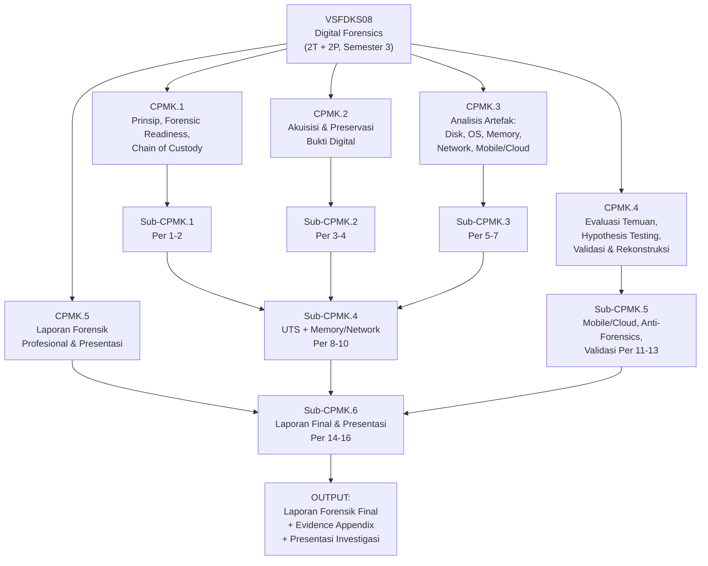

---

## Petunjuk Penggunaan Buku

Buku ini dirancang untuk digunakan bersamaan dengan praktikum laboratorium. Setiap bab teori (T) memiliki komponen praktikum (P) yang menggunakan tools forensik yang sama dengan yang digunakan profesional: Autopsy, The Sleuth Kit, Volatility 3, Wireshark, KAPE, dan Plaso/log2timeline.

**Peringatan etika:** Semua praktikum dalam buku ini menggunakan image disk, memory dump, dan packet capture yang sudah disiapkan khusus untuk laboratorium. Tidak ada prosedur yang mengarahkan mahasiswa untuk melakukan akuisisi pada sistem nyata tanpa otorisasi eksplisit. Prinsip ini tidak dapat dikompromikan.

---

## Peta Bab dan Alur Pembelajaran

| Bab | Pertemuan | Sub-CPMK | Materi Utama | Evaluasi |
|---|---|---|---|---|
| 1 | 1 | Sub-CPMK.1 | Prinsip forensik digital dan forensic readiness | — |
| 2 | 2 | Sub-CPMK.1 | Legal, etika, chain of custody, evidence lifecycle | Eval-1 |
| 3 | 3 | Sub-CPMK.2 | Triage, akuisisi live vs dead, write blocker | — |
| 4 | 4 | Sub-CPMK.2 | Forensic imaging, hashing, evidence labeling, CoC | Eval-2 |
| 5 | 5 | Sub-CPMK.3 | Disk forensics dan file system analysis | — |
| 6 | 6 | Sub-CPMK.3 | Deleted file recovery, metadata, slack space | — |
| 7 | 7 | Sub-CPMK.3 | OS artifacts, registry, log analysis, browser/email | Eval-3 |
| 8 | 8 | Sub-CPMK.4 | UTS integratif + pengantar memory forensics | Eval-4 (UTS) |
| 9 | 9 | Sub-CPMK.4 | Memory forensics dengan Volatility 3 | — |
| 10 | 10 | Sub-CPMK.4 | Network forensics dan timeline analysis | Eval-4 (praktik) |
| 11 | 11 | Sub-CPMK.5 | Mobile dan cloud artifact forensics | — |
| 12 | 12 | Sub-CPMK.5 | Anti-forensics awareness dan deteksi | — |
| 13 | 13 | Sub-CPMK.5 | Validasi temuan, hypothesis testing, rekonstruksi | Eval-5 |
| 14 | 14 | Sub-CPMK.6 | Struktur laporan forensik profesional | — |
| 15 | 15 | Sub-CPMK.6 | Executive summary, evidence appendix, rekomendasi | — |
| 16 | 16 | Sub-CPMK.6 | Presentasi investigasi dan evaluasi akhir | Eval-6 |

---

## Bab 1 — Prinsip Forensik Digital dan Forensic Readiness

### 1. Capaian Pembelajaran Bab

Setelah menyelesaikan bab ini, mahasiswa mampu:
- Menjelaskan definisi, ruang lingkup, dan tujuan forensik digital (C2)
- Mengidentifikasi prinsip-prinsip forensic soundness dan mengapa setiap prinsip penting (C2)
- Menjelaskan konsep forensic readiness dan manfaatnya bagi organisasi (C2)
- Membedakan kategori investigasi forensik: criminal, civil, corporate, incident response (C2)

*Dikaitkan dengan Sub-CPMK.1 (Pertemuan 1) dan Eval-1 (10%).*

---

### 2. Peta Konsep Bab

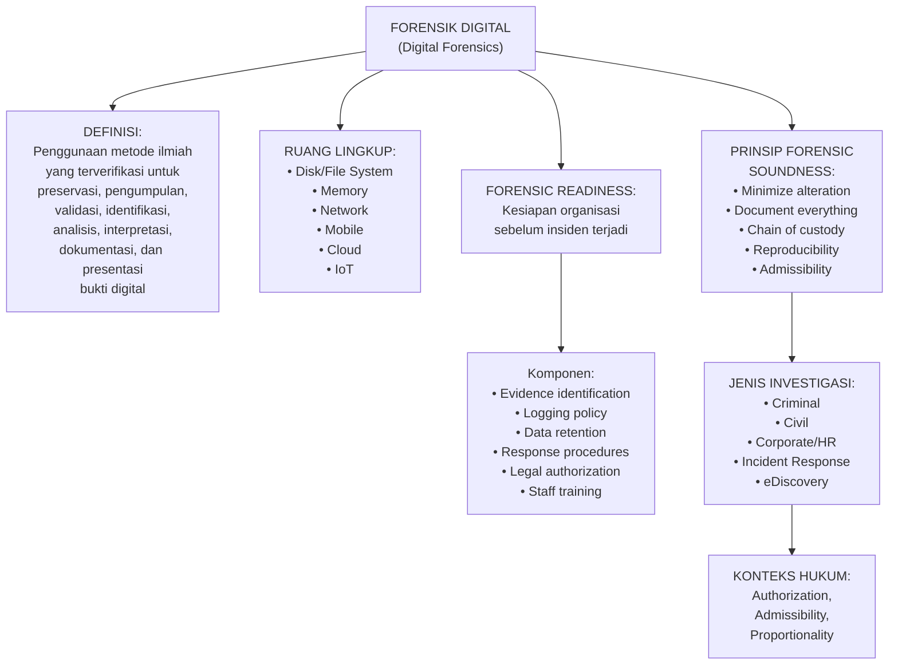

---

### 3. Pengantar Kontekstual

Pada April 2021, sebuah BUMN di Indonesia mengalami kebocoran data yang berdampak pada 279 juta data penduduk. Ketika tim investigasi dikerahkan, mereka menemukan masalah yang lebih serius dari kebocoran itu sendiri: sistem logging tidak dikonfigurasi dengan benar, tidak ada forensic readiness plan, dan tidak ada prosedur chain of custody untuk bukti digital. Akibatnya, meskipun pelaku dapat diidentifikasi, bukti yang dikumpulkan tidak dapat digunakan di pengadilan karena proses pengumpulannya tidak memenuhi standar forensik.

Kasus ini mendemonstrasikan dengan jelas: forensik digital bukan hanya tentang kemampuan teknis menemukan bukti — tetapi tentang memastikan bukti tersebut dapat digunakan secara legal dan dapat dipertahankan secara profesional.

---

### 4. Landasan Teori

#### 1.1 Definisi Forensik Digital

SWGDE (Scientific Working Group for Digital Evidence) mendefinisikan forensik digital sebagai: *"Penggunaan metode ilmiah yang terverifikasi untuk preservasi, pengumpulan, validasi, identifikasi, analisis, interpretasi, dokumentasi, dan presentasi bukti digital yang diperoleh dari sumber digital untuk tujuan memfasilitasi atau mendorong rekonstruksi kejadian yang ditemukan sebagai kriminal."*

Definisi yang lebih luas (Casey, 2011) mencakup tidak hanya kriminal tetapi juga investigasi sipil, investigasi korporat, respons insiden, dan eDiscovery.

#### 1.2 Prinsip-Prinsip Forensic Soundness

**Prinsip 1: Minimize Alteration (Minimasi Perubahan)**
Setiap aksi yang dilakukan pada bukti digital berpotensi mengubah bukti tersebut. Investigator wajib menggunakan metode yang meminimalkan perubahan. Jika perubahan tidak dapat dihindari (seperti dalam live acquisition), perubahan tersebut harus didokumentasikan.

*Implikasi:* Gunakan write blocker saat mengakses media penyimpanan. Jangan menjalankan program apapun pada sistem yang sedang diinvestigasi kecuali mutlak diperlukan.

**Prinsip 2: Document Everything (Dokumentasi Menyeluruh)**
Setiap langkah dalam investigasi — dari pengambilan bukti pertama hingga penyerahan laporan — harus didokumentasikan. Jika tidak terdokumentasi, anggap tidak pernah terjadi dari perspektif hukum.

*Format dokumentasi:* tanggal/waktu (timezone harus jelas), nama investigator, tindakan yang dilakukan, tools dan versi yang digunakan, hasil yang diamati, kondisi lingkungan.

**Prinsip 3: Chain of Custody**
Setiap perpindahan tangan bukti harus dicatat — dari siapa, ke siapa, kapan, mengapa, dan dalam kondisi apa. Celah dalam chain of custody dapat menyebabkan bukti tidak dapat diterima di pengadilan.

**Prinsip 4: Reproducibility**
Prosedur yang digunakan harus dapat diulang oleh investigator lain menggunakan tools yang sama dan menghasilkan hasil yang sama. Ini adalah salah satu kriteria yang membedakan forensik digital dari "guesswork".

**Prinsip 5: Admissibility (Penerimaan di Pengadilan)**
Bukti digital harus memenuhi kriteria admissibility sesuai sistem hukum yang berlaku:
- *Relevan*: berkaitan langsung dengan kasus yang diselidiki
- *Autentik*: dapat dibuktikan bahwa bukti adalah apa yang diklaim
- *Tidak dimanipulasi*: integritas bukti dapat diverifikasi (hash)
- *Diperoleh secara legal*: dengan otorisasi yang tepat

#### 1.3 Forensic Readiness

Forensic readiness adalah kemampuan organisasi untuk memaksimalkan penggunaan bukti digital dengan biaya investigasi minimal (Rowlingson, 2004). Ini bukan tentang respons setelah insiden — tetapi kesiapan sebelum insiden.

**10 Langkah Forensic Readiness (Rowlingson, 2004):**
1. Definisikan skenario bisnis yang memerlukan bukti digital
2. Identifikasi sumber dan jenis bukti digital yang tersedia
3. Tentukan persyaratan chain of custody
4. Terapkan kebijakan keamanan yang mendukung forensic readiness
5. Pastikan bahwa akuisisi bukti legal dan tidak merugikan bisnis
6. Definisikan kebijakan untuk mengamankan dan mentransfer bukti secara aman
7. Pastikan monitoring mencakup log yang diperlukan untuk investigasi
8. Latih staf dalam awareness forensic readiness
9. Dokumentasikan respons terhadap insiden keamanan siber
10. Pastikan tinjauan hukum melingkupi kapabilitas forensik

**Manfaat forensic readiness:**
- Menurunkan biaya investigasi post-incident
- Meningkatkan kemungkinan bukti dapat digunakan di pengadilan
- Mempercepat waktu respons insiden
- Meminimalkan gangguan operasional selama investigasi

#### 1.4 Jenis-Jenis Investigasi Forensik Digital

**Investigasi Kriminal:**
Dilakukan oleh atau atas permintaan penegak hukum. Standar tertinggi untuk chain of custody dan admissibility. Memerlukan otorisasi legal (surat perintah penggeledahan/penyitaan).

**Investigasi Sipil (Civil Litigation):**
Mendukung sengketa perdata: kontrak, kekayaan intelektual, pelanggaran kerahasiaan. Standar bukti berbeda dari kriminal (preponderance of evidence vs beyond reasonable doubt).

**Investigasi Korporat/HR:**
Dilakukan secara internal oleh organisasi: investigasi kecurangan karyawan, pelanggaran kebijakan, kebocoran data internal. Otorisasi melalui kebijakan HR dan perjanjian kerja.

**Incident Response Forensics:**
Forensik dalam konteks respons insiden keamanan siber. Fokus pada: identifikasi scope compromise, containment, eradikasi, dan pemulihan. Tidak selalu berujung pada proses hukum.

**eDiscovery:**
Pengumpulan dan produksi bukti elektronik dalam proses hukum. Melibatkan volume data yang sangat besar dan prosedur yang sangat terstruktur.

---

### 5. Model atau Arsitektur

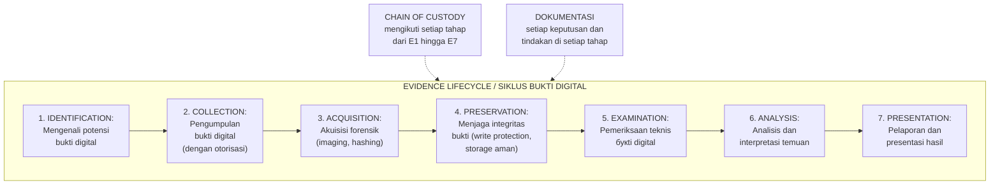

---

### 6. Contoh Terapan

**Skenario: Investigasi Kebocoran Data di PT Nusantara Energi**

PT Nusantara Energi mencurigai bahwa seorang karyawan mengunduh data sensitif sebelum resign. HRD melaporkan ke tim keamanan internal yang memiliki forensic readiness plan.

*Identifikasi:* Tim mengidentifikasi sumber bukti potensial: laptop karyawan, USB activity log dari endpoint protection, DLP (Data Loss Prevention) alert log, dan access log ke file server.

*Otorisasi:* Karena ini investigasi internal, otorisasi diperoleh dari Direktur HRD dan Legal sesuai prosedur kebijakan perusahaan yang telah ada.

*Manfaat forensic readiness:* Karena kebijakan logging sudah ada sebelumnya (bagian dari forensic readiness plan), log USB activity tersedia selama 90 hari. Tanpa kebijakan ini, bukti tidak akan tersedia.

*Chain of custody dimulai:* Laptop disita oleh tim forensik dalam kondisi dimatikan. Segel bukti ditempelkan. CoC form diisi dengan: waktu penyitaan, kondisi laptop, nama penyita dan saksi.

---

### 7. Praktikum — Membuat Forensic Readiness Plan Ringkas

**Tujuan:** Mengidentifikasi dan mendokumentasikan komponen forensic readiness untuk skenario organisasi.

**Skenario:** Anda adalah konsultan keamanan siber yang diminta membuat Forensic Readiness Plan ringkas untuk sebuah perusahaan fintech dengan 200 karyawan. Perusahaan memiliki: server on-premise (3 server), 150 laptop karyawan, sistem cloud (AWS), dan data nasabah yang terklasifikasi sensitif.

**Langkah kerja:**
1. Identifikasi minimal 5 skenario insiden yang mungkin terjadi dan memerlukan investigasi forensik
2. Untuk setiap skenario, identifikasi: sumber bukti digital, jenis log yang diperlukan, retention period yang direkomendasikan
3. Buat kebijakan chain of custody sederhana: siapa yang berwenang mengakses bukti, prosedur penyimpanan
4. Identifikasi tools forensik yang perlu tersedia dan siapa yang perlu dilatih
5. Susun dalam format dokumen satu halaman

**Kriteria keberhasilan:** Plan mencakup minimal 5 skenario; setiap skenario memiliki sumber bukti yang jelas; ada kebijakan chain of custody; tools dan training teridentifikasi.

**Catatan etika:** Forensic readiness plan harus menyeimbangkan kebutuhan investigasi dengan privasi karyawan. Cantumkan klausul bahwa monitoring harus dikomunikasikan kepada karyawan sesuai ketentuan hukum yang berlaku.

---

### 8–12. Latihan, Kunci Jawaban, Ringkasan, Refleksi

**Latihan:**

Soal 1: Jelaskan mengapa "reproducibility" adalah prinsip penting dalam forensik digital. Berikan contoh situasi di mana forensik digital tidak reproducible dan konsekuensinya.

Soal 2: Sebuah organisasi memutuskan bahwa forensic readiness terlalu mahal dan tidak perlu karena "belum pernah mengalami insiden serius". Evaluasi argumen ini dan berikan counterargument.

Soal 3: Bedakan antara investigasi kriminal dan investigasi korporat dalam hal: (a) otorisasi yang diperlukan; (b) standar chain of custody; (c) tujuan utama investigasi.

Soal 4 (Studi Kasus): Seorang investigator forensik dihubungi oleh klien korporat yang meminta analisis laptop karyawan yang dicurigai melakukan kecurangan. Klien meminta investigator untuk segera memeriksa laptop. Sebelum memulai, apa saja yang harus diperiksa dan disiapkan oleh investigator?

**Kunci Jawaban:**

Soal 1: Reproducibility penting karena: (a) dalam proses hukum, pihak lawan (pengacara terdakwa) berhak meminta expert lain untuk memverifikasi temuan secara independen; jika prosedur tidak dapat direproduksi, temuan dapat didiskreditkan; (b) memastikan bahwa tools dan metode yang digunakan adalah reliable, bukan artefak dari alat yang cacat; (c) memungkinkan peer review internal dan quality assurance. Contoh tidak reproducible: investigator menggunakan script custom yang tidak terdokumentasi; tools custom yang tidak divalidasi; prosedur yang bergantung pada pengaturan sistem spesifik yang tidak dicatat. Konsekuensi: temuan dapat ditolak di pengadilan; reputasi investigator rusak; kasus dapat gugur.

Soal 2: Argumen "belum pernah terjadi insiden" adalah *survivorship bias* — ketiadaan insiden yang terdeteksi tidak berarti ketiadaan insiden. Counterargument: (a) biaya investigasi post-incident tanpa forensic readiness jauh lebih tinggi; (b) tanpa logging yang tepat, insiden mungkin tidak terdeteksi atau bukti tidak tersedia saat dibutuhkan; (c) regulasi (UU PDP, PCI-DSS, ISO 27001) sering mensyaratkan kemampuan investigasi; (d) waktu respons insiden lebih lambat tanpa forensic readiness, memperbesar dampak; (e) forensic readiness dapat diimplementasikan secara bertahap dengan biaya yang proporsional.

Soal 3: (a) Otorisasi: investigasi kriminal memerlukan surat perintah dari penegak hukum (di Indonesia: surat perintah penyitaan); investigasi korporat memerlukan otorisasi manajemen sesuai kebijakan HR dan perjanjian kerja. (b) Chain of custody: keduanya memerlukan CoC yang ketat, tetapi investigasi kriminal memiliki standar yang lebih tinggi karena bukti mungkin digunakan di pengadilan pidana; investigasi korporat mungkin cukup untuk keperluan tindakan disiplin internal. (c) Tujuan: investigasi kriminal bertujuan mendukung proses hukum pidana; investigasi korporat bertujuan menentukan pelanggaran kebijakan dan mendukung tindakan HR/manajemen (yang mungkin berujung pada pemecatan atau kompensasi sipil).

Soal 4: Sebelum memulai, investigator harus: (a) mendapatkan otorisasi tertulis dari pihak berwenang yang tepat (Legal/HRD/Direktur) — tanpa ini, investigasi mungkin ilegal; (b) memastikan ruang lingkup investigasi jelas dan terdokumentasi: apa yang dicari, dalam periode apa; (c) memeriksa apakah karyawan telah diberitahu tentang kebijakan monitoring sesuai ketentuan hukum; (d) mempersiapkan CoC form sebelum menyentuh laptop; (e) memastikan tools yang akan digunakan telah divalidasi dan terdokumentasi versinya; (f) menetapkan prosedur penyimpanan bukti yang aman.

**Ringkasan:** Forensik digital adalah disiplin ilmiah yang menghasilkan bukti yang dapat diterima dan dipertahankan secara legal. Forensic soundness (minimize alteration, documentation, chain of custody, reproducibility, admissibility) adalah fondasi dari setiap investigasi yang valid. Forensic readiness mempersiapkan organisasi untuk mengumpulkan dan menggunakan bukti digital secara efektif sebelum insiden terjadi.

**Refleksi:** (1) Apakah ada tegangan antara kecepatan respons insiden (yang menuntut tindakan cepat) dan forensic soundness (yang menuntut dokumentasi dan prosedur yang ketat)? Bagaimana Anda menyeimbangkan keduanya? (2) Di Indonesia, regulasi tentang bukti elektronik masih berkembang. Bagaimana ketidakpastian hukum ini mempengaruhi cara Anda mendokumentasikan dan mempresentasikan bukti digital?

---

## Bab 2 — Legal, Etika, Chain of Custody, dan Evidence Lifecycle

### 1. Capaian Pembelajaran Bab

Setelah menyelesaikan bab ini, mahasiswa mampu:
- Mengidentifikasi kerangka hukum yang mengatur bukti elektronik di Indonesia (C2)
- Menjelaskan persyaratan chain of custody yang lengkap dan valid (C2)
- Menyusun dokumentasi chain of custody untuk skenario investigasi (C3)
- Menganalisis dilema etika dalam investigasi forensik digital (C4)

*Dikaitkan dengan Sub-CPMK.1 (Pertemuan 2) dan Eval-1 (10% — deliverable: kuis konsep + forensic readiness brief + CoC case).*

---

### 2. Peta Konsep Bab

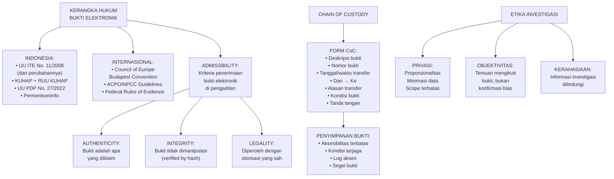

---

### 3–12. Landasan Teori, Contoh Terapan, Latihan, Kunci Jawaban, Ringkasan, Refleksi

#### 2.1 Kerangka Hukum Bukti Elektronik di Indonesia

**UU ITE No. 11 Tahun 2008 dan perubahannya (UU No. 19 Tahun 2016):**
- Pasal 5: Informasi elektronik dan/atau dokumen elektronik diakui sebagai alat bukti hukum yang sah
- Pasal 5(2): Informasi elektronik adalah perluasan dari alat bukti yang sah sesuai hukum acara yang berlaku di Indonesia
- Pasal 6: Syarat validitas: informasi dapat diakses, ditampilkan, dijamin keutuhan, dan dapat dipertanggungjawabkan

**UU PDP No. 27 Tahun 2022 (Perlindungan Data Pribadi):**
Membatasi penggunaan data pribadi — relevan untuk investigasi yang melibatkan data karyawan atau nasabah. Investigasi harus proporsional dan memiliki dasar hukum yang jelas.

**KUHAP (Kitab Undang-Undang Hukum Acara Pidana):**
Alat bukti yang diakui: keterangan saksi, keterangan ahli, surat, petunjuk, keterangan terdakwa. Dokumen elektronik masuk kategori "surat" atau "petunjuk" tergantung konteks.

**Saksi Ahli Digital:**
Investigator forensik yang bersaksi di pengadilan harus memenuhi persyaratan sebagai ahli: kualifikasi yang dapat diverifikasi, metodologi yang terstandar, dapat menjelaskan metodologi kepada non-teknis.

#### 2.2 Chain of Custody: Komponen dan Prosedur

Chain of custody (CoC) adalah rekaman kronologis tentang siapa yang mengakses atau memiliki kendali atas bukti, kapan, dan mengapa.

**Komponen Form CoC:**

```
FORM CHAIN OF CUSTODY

Nomor Kasus: ________________
Nomor Item Bukti: ________________
Deskripsi Bukti: ________________
Tanggal/Waktu Penyitaan: ________________  Timezone: ________________
Lokasi Penyitaan: ________________
Penyita: ________________  NIP/NIK: ________________
Kondisi saat penyitaan: ________________
Hash MD5: ________________
Hash SHA-256: ________________

TRANSFER LOG:
| No | Tgl/Waktu | Dari | Ke | Alasan | Kondisi | TTD Serah | TTD Terima |
|----|-----------|------|----|--------|---------|-----------|------------|
| 1  |           |      |    |        |         |           |            |

PENYIMPANAN:
Lokasi penyimpanan: ________________
Kondisi penyimpanan: ________________
Log akses penyimpanan: Ya / Tidak
```

**Prosedur minimal:**
1. Segel bukti fisik segera setelah penyitaan (segel dengan tanda tangan dan tanggal di atasnya)
2. Foto kondisi awal sebelum akuisisi
3. Isi CoC form sebelum melakukan apapun
4. Setiap transfer (tangan ke tangan, lokasi ke lokasi) harus tercatat
5. Penyimpanan di tempat yang terkunci dengan log akses

#### 2.3 Etika Investigasi Forensik Digital

**Proporsionalitas:**
Scope investigasi harus proporsional dengan kebutuhan investigasi. Investigasi kecurangan keuangan tidak memberi izin untuk membaca semua email personal karyawan yang tidak terkait. Batasi scope dan dokumentasikan batas tersebut.

**Objektivitas:**
Investigator forensik bekerja untuk kebenaran, bukan untuk pihak yang membayarnya. Jika bukti menunjukkan ke arah yang tidak menguntungkan klien — tetap laporkan. Kegagalan melaporkan bukti yang ekskulpatori (membebaskan tersangka) adalah pelanggaran etika serius.

**Konfirmasi Bias:**
Bahaya terbesar dalam forensik: investigator sudah memiliki hipotesis dan mencari bukti yang mendukungnya, mengabaikan bukti yang tidak mendukung. Antidotnya: investigasi berbasis hipotesis yang diuji (bukan dikonfirmasi), dokumentasi semua temuan (termasuk yang tidak relevan dengan hipotesis).

**Kerahasiaan:**
Informasi yang ditemukan dalam investigasi — termasuk informasi yang tidak relevan dengan kasus — harus dijaga kerahasiaannya. Non-disclosure agreement (NDA) dengan klien adalah praktik standar.

**Latihan:**

Soal 1: Lengkapi form CoC untuk skenario berikut: Laptop model Dell Latitude E7450, SN: ABC123456, warna hitam, ditemukan menyala di meja karyawan Budi Santoso pada 15 Juni 2024 pukul 14:30 WIB di kantor PT ABC lantai 3. Laptop dimatikan dan disita oleh investigator Andi (NIP: 001234) dengan saksi HRD Sari (NIP: 005678). Hash SHA-256 image: [akan diisi setelah akuisisi]. Laptop disimpan di Evidence Room Forensics Lab.

Soal 2: Seorang investigator forensik menemukan bukti bahwa tersangka yang diselidiki juga tampaknya menjadi korban pencurian identitas oleh pihak ketiga. Informasi ini tidak relevan langsung dengan kasus yang diselidiki. Apa yang harus investigator lakukan?

**Kunci Jawaban:**

Soal 1: [Siswa mengisi form CoC dengan data yang diberikan. Poin penting: nomor kasus diisi sesuai sistem penomoran; nomor item bukti: misalnya EVD-001; deskripsi lengkap termasuk model, SN, warna; tanggal/waktu penyitaan: 15 Juni 2024 14:30 WIB (UTC+7); lokasi penyitaan: Kantor PT ABC, Lantai 3, meja karyawan Budi Santoso; penyita: Andi, NIP 001234; saksi: Sari, NIP 005678; kondisi: laptop dalam keadaan menyala, kemudian dimatikan sebelum penyitaan; hash: "akan diisi setelah akuisisi forensik". Penyimpanan: Evidence Room Forensics Lab, dikunci, akses terbatas.]

Soal 2: Investigator wajib mendokumentasikan temuan ini, meskipun di luar scope investigasi. Tindakan yang tepat: (a) dokumentasikan temuan dalam catatan investigasi pribadi; (b) informasikan kepada klien (organisasi) secara tertulis bahwa ada temuan di luar scope yang mungkin memerlukan tindakan terpisah; (c) jika ada indikasi tindak pidana yang sedang berlangsung (pencurian identitas aktif), pertimbangkan apakah ada kewajiban hukum untuk melaporkan; (d) jangan menggunakan informasi tersebut melebihi yang diperlukan untuk melindungi integritas investigasi utama. Prinsip proporsionalitas: informasi ini tidak boleh dijadikan subjek investigasi lebih lanjut tanpa otorisasi tambahan.

**Ringkasan:** Kerangka hukum bukti elektronik di Indonesia didasarkan pada UU ITE yang mengakui dokumen elektronik sebagai alat bukti sah, dengan syarat validitas yang harus dipenuhi. Chain of custody adalah mekanisme yang menjamin integritas dan keterlacakan bukti dari pengambilan hingga presentasi di pengadilan. Etika investigasi — proporsionalitas, objektivitas, anti-bias konfirmasi, dan kerahasiaan — adalah kompetensi profesional yang tidak kalah penting dari kompetensi teknis.

**Refleksi:** (1) Seorang investigator forensik yang sangat kompeten secara teknis tetapi bias dalam interpretasi hasil dapat berbahaya. Mekanisme apa yang dapat diterapkan untuk mengurangi risiko konfirmasi bias dalam tim investigasi? (2) Bagaimana Anda menjelaskan kepada klien (yang bukan teknisi) bahwa Anda menemukan bukti yang tidak menguntungkan mereka, ketika mereka membayar Anda untuk "membuktikan" bahwa karyawan mereka bersalah?

---

## Bab 3 — Triage, Akuisisi Live vs Dead, dan Write Blocker

### 1. Capaian Pembelajaran Bab

Setelah menyelesaikan bab ini, mahasiswa mampu:
- Melakukan triage forensik untuk menentukan prioritas dan pendekatan akuisisi (C3)
- Membedakan live acquisition dari dead acquisition dan memilih yang tepat (C4)
- Menjelaskan fungsi write blocker dan mengapa penggunaannya kritis (C2)
- Menerapkan prosedur akuisisi yang aman dan terdokumentasi (C3)

*Dikaitkan dengan Sub-CPMK.2 (Pertemuan 3).*

---

### 2. Peta Konsep Bab

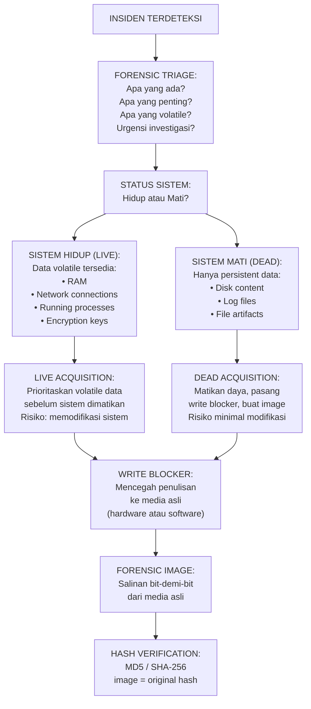

---

### 3–12. Landasan Teori, Contoh, Latihan, Kunci, Ringkasan, Refleksi

#### 3.1 Forensic Triage

Triage adalah proses penilaian cepat untuk menentukan:
- Apakah ada bukti yang relevan dan di mana?
- Apa yang paling volatile (berisiko hilang segera)?
- Apakah sistem perlu tetap hidup atau dapat dimatikan?
- Apa urutan prioritas akuisisi?

**Order of Volatility (RFC 3227):** Data yang paling cepat berubah/hilang harus diambil terlebih dahulu:
1. Registers, cache CPU
2. RAM (memory volatil)
3. Temporary file system, swap/page file
4. Proses yang berjalan, network connections
5. Disk (hard drive, SSD)
6. Remote logging dan monitoring data
7. Physical configuration, network topology
8. Archival media (backup)

#### 3.2 Live Acquisition

Live acquisition dilakukan saat sistem masih menyala — menangkap data volatile yang akan hilang saat dimatikan.

**Kapan live acquisition diperlukan:**
- Data terenkripsi: kunci enkripsi mungkin ada di RAM (misal: BitLocker dalam mode running)
- Proses jahat aktif: malware yang hanya ada di memory
- Network connections aktif: koneksi C2 (command and control) yang sedang berlangsung
- Volatile evidence: log yang hanya ada di memory, tidak ditulis ke disk

**Risiko live acquisition:**
- Setiap perintah yang dijalankan pada sistem target memodifikasi sistem (timestamp, log, state)
- Malware mungkin mendeteksi investigasi dan menghapus jejak
- Sistem mungkin crash selama akuisisi

**Prinsip live acquisition:**
- Gunakan tools yang dijalankan dari media yang dapat dipercaya (USB investigator, bukan dari sistem target)
- Catat setiap perintah yang dijalankan beserta outputnya
- Dokumentasikan semua perubahan yang mungkin terjadi pada sistem

**Tools live acquisition umum:**
- *WinPmem / RAMMap*: Windows memory dump
- *DumpIt*: Windows memory dump (single executable)
- *LiME (Linux Memory Extractor)*: Linux kernel module untuk memory dump
- *KAPE (Kroll Artifact Parser and Extractor)*: Windows triage dan koleksi artefak

#### 3.3 Dead Acquisition

Dead acquisition dilakukan pada sistem yang sudah dimatikan — memberikan kondisi yang lebih stabil dan dapat direproduksi.

**Kapan dead acquisition lebih tepat:**
- Enkripsi tidak aktif (disk tidak terenkripsi atau kunci tersedia)
- Data volatile tidak kritis untuk investigasi
- Sistem dapat dimatikan tanpa kehilangan bukti penting

**Prosedur dead acquisition:**
1. Matikan sistem (pull-the-plug untuk Windows; `shutdown -h now` untuk Linux jika disk tidak terenkripsi)
2. Pasang write blocker antara media penyimpanan dan workstation forensik
3. Buat forensic image menggunakan tools yang tervalidasi
4. Verifikasi hash image terhadap hash media asli
5. Buat dua salinan image (working copy dan archival copy)
6. Simpan media asli dalam kondisi aman

#### 3.4 Write Blocker

Write blocker adalah perangkat atau software yang mencegah penulisan apapun ke media yang sedang dianalisis — menjaga integritas bukti asli.

**Hardware write blocker:** Perangkat fisik yang ditempatkan antara media dan workstation forensik. Lebih dipercaya karena tidak bergantung pada OS. Contoh: Tableau T8-R2, WiebeTech Forensic UltraDock.

**Software write blocker:** Konfigurasi OS untuk memblokir penulisan. Kurang dipercaya karena bergantung pada software. Hanya gunakan jika hardware write blocker tidak tersedia, dan dokumentasikan.

**Verifikasi write blocker:** Sebelum digunakan, verifikasi bahwa write blocker berfungsi:
1. Catat hash media sebelum memasang write blocker
2. Pasang write blocker
3. Coba tulis ke media (harus gagal)
4. Verifikasi hash media tidak berubah setelah percobaan penulisan

**Latihan:**

Soal 1: Anda tiba di TKP dan menemukan komputer dalam keadaan menyala, layar menampilkan aplikasi enkripsi VeraCrypt yang sedang aktif dengan volume terenkripsi terbuka. Apa yang Anda prioritaskan dan mengapa?

Soal 2: Jelaskan mengapa "pull-the-plug" (mencabut daya secara tiba-tiba) lebih disukai daripada shutdown normal (melalui OS) untuk dead acquisition pada sistem Windows dalam beberapa skenario.

**Kunci Jawaban:**

Soal 1: Prioritas utama: live acquisition segera, sebelum sistem dimatikan atau volume VeraCrypt dikunci. Alasannya: (a) VeraCrypt volume sedang terbuka berarti kunci enkripsi ada di RAM — jika sistem dimatikan, kunci hilang dan data terenkripsi tidak dapat diakses; (b) live memory dump harus dilakukan terlebih dahulu untuk menangkap kunci enkripsi dan state saat ini; (c) setelah memory dump, dapat melakukan akuisisi disk (yang sekarang dapat dibaca karena volume terenkripsi masih terbuka); (d) dokumentasikan kondisi layar dengan foto sebelum menyentuh sistem.

Soal 2: Pull-the-plug lebih disukai dalam beberapa situasi karena: (a) shutdown normal melalui OS menjalankan banyak rutinitas pembersihan yang dapat memodifikasi bukti: menghapus temp files, mengupdate timestamps, menulis ke event log, menutup koneksi jaringan secara teratur; (b) malware mungkin mendeteksi shutdown dan menjalankan anti-forensics routine (hapus log, enkripsi file); (c) evidence di hibernation file atau page file mungkin lebih berharga jika sistem dimatikan mendadak. Pengecualian: untuk server atau sistem Linux, pull-the-plug dapat menyebabkan file system corruption — shutdown graceful mungkin lebih tepat.

**Ringkasan:** Triage menentukan pendekatan akuisisi yang paling tepat. Live acquisition menangkap data volatile yang tidak ada di disk, tetapi berisiko memodifikasi sistem. Dead acquisition lebih stabil dan reproducible. Write blocker adalah alat wajib yang menjamin integritas bukti asli tidak berubah selama akuisisi. Setiap keputusan harus didokumentasikan beserta alasannya.

**Refleksi:** Keputusan "live atau dead acquisition" harus dibuat dalam hitungan detik di TKP. Bagaimana Anda mempersiapkan diri untuk membuat keputusan yang tepat dan terdokumentasi dalam situasi tekanan tinggi?

---

## Bab 4 — Forensic Imaging, Hashing, dan Evidence Handling

### 1. Capaian Pembelajaran Bab

Setelah menyelesaikan bab ini, mahasiswa mampu:
- Membuat forensic image menggunakan tools yang tervalidasi (C3)
- Menghitung dan memverifikasi hash kriptografi untuk validasi integritas (C3)
- Menyusun paket evidence handling yang lengkap (C4)
- Mendokumentasikan proses akuisisi sesuai standar forensik (C3)

*Dikaitkan dengan Sub-CPMK.2 (Pertemuan 4) dan Eval-2 (15% — deliverable: evidence handling package).*

---

### 2. Peta Konsep Bab

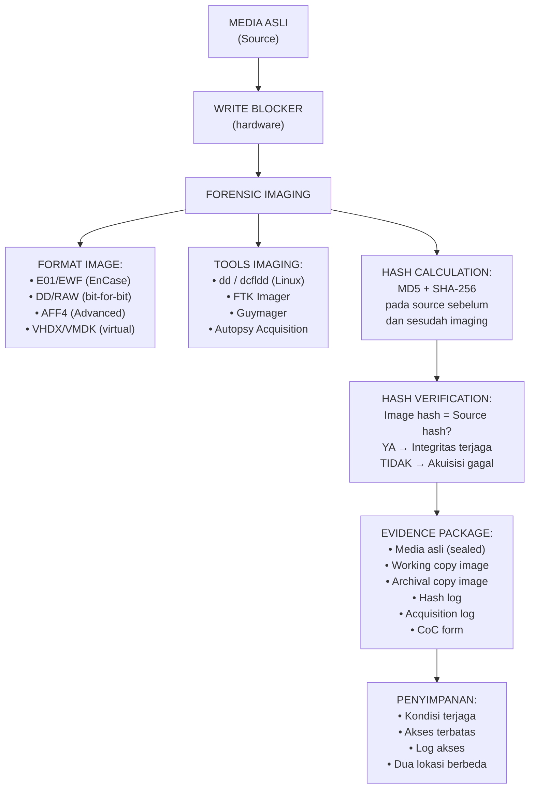

---

### 3–12. Landasan Teori, Contoh, Latihan, Kunci, Ringkasan, Refleksi

#### 4.1 Format Forensic Image

**DD/RAW:**
Salinan bit-demi-bit tanpa kompresi atau metadata tambahan. Paling portabel — dapat dibuka oleh hampir semua tools forensik. Ukuran sama dengan media asli.

```bash
# Membuat forensic image dengan dd
dd if=/dev/sdb of=/media/evidence/disk_image.dd bs=512 conv=noerror,sync status=progress

# Menghitung hash sebelum imaging
sha256sum /dev/sdb > /media/evidence/source_hash.txt

# Menghitung hash image
sha256sum /media/evidence/disk_image.dd > /media/evidence/image_hash.txt
```

**E01/EWF (Expert Witness Format):**
Format proprietary EnCase yang mendukung kompresi, enkripsi, dan metadata bawaan. Paling umum di lingkungan hukum. Dapat dibuka oleh Autopsy, FTK, dan tools lain.

**AFF4 (Advanced Forensic Format 4):**
Format open-source modern yang mendukung kompresi, enkripsi, multi-volume, dan metadata extensible. Direkomendasikan oleh NIST.

#### 4.2 Hash Kriptografi untuk Validasi Integritas

Hash kriptografi adalah "sidik jari digital" dari data. Perubahan sekecil apapun pada data akan menghasilkan hash yang berbeda secara total.

**MD5:** 128-bit. Cepat. Secara kriptografi sudah tidak aman (collision dapat dibuat), tetapi masih digunakan dalam forensik untuk verifikasi integritas (bukan otentikasi kriptografi).

**SHA-256:** 256-bit. Lebih lambat dari MD5 tetapi jauh lebih aman dari collision. Standar yang direkomendasikan untuk forensik saat ini.

**Praktik terbaik:** Gunakan KEDUANYA — MD5 dan SHA-256. Jika ada pertanyaan tentang integritas, memiliki dua hash memberikan kepercayaan yang lebih tinggi.

**Prosedur hash:**
1. Hitung hash media asli SEBELUM imaging
2. Buat forensic image
3. Hitung hash media asli SETELAH imaging (harus sama dengan langkah 1)
4. Hitung hash forensic image
5. Catat semua nilai hash dalam hash log dengan timestamp

```bash
# Hash log format
echo "=== HASH LOG ===" > hash_log.txt
echo "Date: $(date -u)" >> hash_log.txt
echo "Investigator: [nama]" >> hash_log.txt
echo "" >> hash_log.txt
echo "--- Source device: /dev/sdb ---" >> hash_log.txt
echo "MD5 (pre-acquisition): $(md5sum /dev/sdb | awk '{print $1}')" >> hash_log.txt
echo "SHA-256 (pre-acquisition): $(sha256sum /dev/sdb | awk '{print $1}')" >> hash_log.txt
# [buat image]
echo "" >> hash_log.txt
echo "--- Forensic Image: disk_image.dd ---" >> hash_log.txt
echo "MD5: $(md5sum disk_image.dd | awk '{print $1}')" >> hash_log.txt
echo "SHA-256: $(sha256sum disk_image.dd | awk '{print $1}')" >> hash_log.txt
echo "" >> hash_log.txt
echo "Verification: [MATCH / MISMATCH]" >> hash_log.txt
```

#### 4.3 Practical: FTK Imager untuk Windows

FTK Imager (Forensic Toolkit Imager) adalah tools gratis dari AccessData yang banyak digunakan untuk:
- Membuat forensic image (E01, DD)
- Memverifikasi hash
- Mem-browse isi image
- Melakukan live memory acquisition

**Prosedur dasar FTK Imager:**
1. File → Create Disk Image
2. Pilih source type: Physical Drive / Logical Drive
3. Pilih source device
4. Pilih format output (E01 direkomendasikan)
5. Isi metadata: case number, examiner, notes
6. Atur split size dan kompresi
7. Klik Start → Monitor progress
8. Verifikasi hash di akhir (otomatis oleh FTK Imager)

#### 4.4 Paket Evidence Handling

Evidence handling package yang lengkap harus mencakup:

| Dokumen | Isi |
|---|---|
| Chain of Custody Form | Transfer log, penyimpanan, akses |
| Acquisition Log | Tools, versi, waktu mulai/selesai, kondisi |
| Hash Log | MD5 + SHA-256 source dan image, pre dan post |
| Evidence Inventory | Daftar semua item bukti dengan deskripsi |
| Foto Dokumentasi | Kondisi awal, setup akuisisi, segel bukti |
| Tool Validation Record | Versi tools, validasi sebelum digunakan |

**Praktikum (Eval-2):**

Gunakan image disk yang disediakan laboratorium (bukan sistem nyata). Lakukan:
1. Verifikasi write blocker aktif (gunakan simulator write blocker di lab)
2. Buat forensic image menggunakan FTK Imager atau Guymager
3. Hitung dan verifikasi hash (MD5 + SHA-256)
4. Buat acquisition log yang lengkap
5. Isi CoC form
6. Kumpulkan semua dokumen dalam evidence handling package

**Latihan:**

Soal 1: Hash SHA-256 dari media asli adalah `a1b2c3d4...` (64 karakter). Setelah imaging, hash dari image adalah `a1b2c3d5...`. Apa artinya? Apa yang harus dilakukan?

Soal 2: Mengapa penting untuk menghitung hash media asli SETELAH imaging (bukan hanya sebelum)?

**Kunci Jawaban:**

Soal 1: Hash yang berbeda (berbeda di karakter terakhir) berarti isi image tidak identik dengan media asli — integritas akuisisi GAGAL. Kemungkinan penyebab: (a) write blocker tidak berfungsi dan ada penulisan ke media selama imaging; (b) error baca selama imaging yang menghasilkan data yang tidak lengkap atau berbeda; (c) bug pada tools imaging. Tindakan: jangan gunakan image ini sebagai bukti forensik; identifikasi penyebab kegagalan; ulang proses akuisisi setelah memastikan semua prosedur benar; dokumentasikan kegagalan ini dalam acquisition log.

Soal 2: Menghitung hash media asli setelah imaging memverifikasi bahwa: (a) write blocker berfungsi — media asli tidak berubah selama proses imaging; (b) media tidak terpengaruh oleh proses imaging (misalnya: perangkat yang korup bisa berubah state setelah dibaca intensif). Jika hash sebelum dan sesudah imaging identik, itu membuktikan bahwa proses imaging tidak mengubah media asli — ini adalah bukti tambahan bahwa prosedur dilakukan dengan benar.

**Ringkasan:** Forensic imaging adalah proses pembuatan salinan bit-demi-bit yang dapat diverifikasi dari media asli. Hash kriptografi (MD5 + SHA-256) adalah mekanisme verifikasi integritas yang fundamental. Evidence handling package mendokumentasikan seluruh proses dan menjadi dasar dari admissibility bukti di pengadilan.

**Refleksi:** SSD modern menggunakan teknik wear leveling dan garbage collection yang dapat secara otomatis memodifikasi data "di latar belakang" bahkan tanpa penulisan aktif dari OS. Bagaimana ini mempengaruhi konsep "integritas bukti" dalam forensik digital modern?

---

## Bab 5 — Disk Forensics dan File System Analysis

### 1. Capaian Pembelajaran Bab

Setelah menyelesaikan bab ini, mahasiswa mampu:
- Menjelaskan struktur disk dan partisi (MBR, GPT) serta cara menganalisisnya (C2)
- Mengidentifikasi struktur file system umum: NTFS, ext4, FAT32 (C2)
- Menggunakan Autopsy/The Sleuth Kit untuk analisis disk forensik (C3)
- Menginterpretasikan informasi dari struktur file system dalam konteks investigasi (C4)

*Dikaitkan dengan Sub-CPMK.3 (Pertemuan 5).*

---

### 2. Peta Konsep Bab

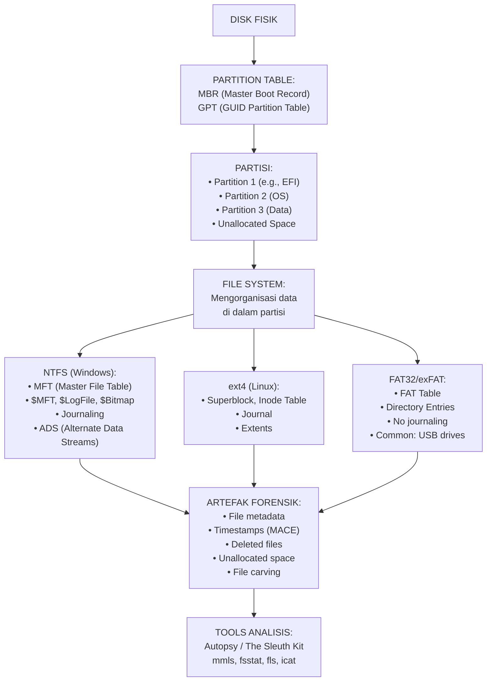

---

### 3–12. Landasan Teori, Contoh, Latihan, Kunci, Ringkasan, Refleksi

#### 5.1 Struktur Disk: MBR vs GPT

**MBR (Master Boot Record):**
Berada di sektor pertama disk (LBA 0). Berisi bootloader dan partition table (max 4 primary partitions, max 2TB). Masih umum pada sistem lama.

**GPT (GUID Partition Table):**
Bagian dari standar UEFI. Mendukung disk > 2TB, max 128 partisi. Menggunakan GUID unik per partisi. Memiliki backup partition table di akhir disk.

**Relevansi forensik:**
- Membaca partition table memberikan gambaran struktur disk
- Unallocated space antara partisi atau di akhir disk dapat mengandung data yang dihapus atau disembunyikan
- Partisi tersembunyi atau tidak terdaftar mungkin mengindikasikan anti-forensics

**TSK commands:**
```bash
# Lihat partition table
mmls /path/to/disk.dd

# Contoh output:
# Slot  Start    End       Length   Description
# 00:   Meta     0000000  0000000  Primary Table (#0)
# 01:   00:00    2048     1048576  Win95 FAT32 (0x0c) [EFI]
# 02:   01:00    1050624  104857600 NTFS/HPFS [C:]
```

#### 5.2 NTFS — File System Windows

NTFS adalah file system default Windows sejak NT. Struktur kunci:

**MFT (Master File Table):**
Database yang berisi satu record (≥1KB) untuk setiap file dan direktori. Metadata lengkap: nama, ukuran, timestamps, atribut, dan lokasi data.

**Timestamps MACE:**
Setiap file NTFS memiliki 4 timestamp:
- **M**: Modified — kapan isi file terakhir diubah
- **A**: Accessed — kapan file terakhir dibuka/dibaca
- **C**: Changed (MFT Modified) — kapan MFT record berubah (atribut berubah)
- **E**: Created (Entry) — kapan file dibuat

*Catatan forensik:* Timestamps dapat dimanipulasi (timestomping). Bandingkan timestamp $STANDARD_INFORMATION dengan $FILE_NAME — keduanya berisi timestamp tetapi $FILE_NAME lebih sulit dimanipulasi.

**Alternate Data Streams (ADS):**
NTFS memungkinkan data tersembunyi dilampirkan ke file tanpa terlihat di direktori listing biasa. Digunakan oleh malware untuk menyembunyikan payload.

```cmd
# Membuat ADS
echo "hidden data" > file.txt:hidden_stream

# Melihat ADS dengan dir
dir /r file.txt

# Membaca ADS
more < file.txt:hidden_stream
```

**$LogFile dan $UsnJrnl:**
Journal file yang mencatat perubahan file system. Sangat berguna untuk rekonstruksi timeline — file yang dihapus mungkin masih tercatat di journal.

#### 5.3 Analisis dengan Autopsy

Autopsy adalah GUI open-source di atas The Sleuth Kit yang menyederhanakan analisis disk forensik.

**Membuka case di Autopsy:**
1. Create New Case → isi nomor kasus, investigator
2. Add Data Source → Add Disk Image/VM File → pilih image (.dd, .E01)
3. Pilih ingest modules: Hash Lookup, File Type Identification, Keyword Search, dll.
4. Tunggu ingest selesai
5. Browse file tree, Recent Documents, Web History, Installed Programs, dll.

**TSK command-line equivalents:**
```bash
# List partitions
mmls disk.dd

# File system info
fsstat -o [offset] disk.dd

# List files dan direktori
fls -r -o [offset] disk.dd

# Ekstrak file berdasarkan inode
icat -o [offset] disk.dd [inode_number] > output_file

# Cari file yang dihapus
fls -r -d -o [offset] disk.dd
```

**Latihan:**

Soal 1: Sebuah file memiliki timestamps berikut: Modified: 2024-01-15, Accessed: 2024-01-20, Created: 2023-12-01, MFT Modified: 2024-01-22. Interpretasikan apa yang mungkin terjadi pada file ini.

Soal 2: Mengapa Unallocated Space penting dalam forensik digital, meskipun tidak ada file yang "terlihat" di sana?

**Kunci Jawaban:**

Soal 1: Interpretasi: (a) File dibuat pada 2023-12-01; (b) Isi file terakhir diubah pada 2024-01-15; (c) File terakhir dibuka pada 2024-01-20; (d) MFT record diubah pada 2024-01-22 — berarti ada perubahan atribut file (mungkin permission, rename, atau perubahan yang tidak mempengaruhi isi) setelah file terakhir diakses. Ini bisa mengindikasikan: pengguna mengubah atribut file (misalnya, menyembunyikan file) pada 2024-01-22, tanpa membuka atau mengubah isi.

Soal 2: Unallocated space adalah area disk yang tidak digunakan oleh file aktif — tetapi seringkali berisi: (a) data dari file yang dihapus (sistem operasi menandai space sebagai "bebas" tetapi tidak menghapus data aktual sampai ditimpa); (b) sisa data dari file yang lebih kecil yang menggantikan file besar (slack space); (c) data yang sengaja disembunyikan oleh pelaku; (d) artefak dari file yang pernah ada yang berguna untuk rekonstruksi timeline. Teknik file carving dapat memulihkan file dari unallocated space berdasarkan header/footer file signature, bahkan tanpa struktur file system yang tersisa.

**Ringkasan:** Disk forensics bekerja pada tiga level: fisik (disk dan partisi), logis (file system), dan virtual (file dan direktori). NTFS menyimpan metadata yang kaya — khususnya timestamps MACE dan $LogFile — yang sangat berharga untuk rekonstruksi kejadian. Unallocated space sering mengandung bukti yang tidak terlihat di navigasi file biasa. Autopsy/TSK adalah tools utama untuk eksplorasi yang terstruktur.

**Refleksi:** Timestamps adalah salah satu bukti forensik yang paling sering diajukan di pengadilan dan paling sering diperdebatkan. Sebagai investigator, bagaimana Anda menjelaskan kepada hakim atau juri awam bahwa timestamp bisa dimanipulasi, dan mengapa ini tidak otomatis membatalkan semua bukti berbasis timestamp?

---

## Bab 6 — Deleted File Recovery, Metadata, dan Slack Space

### 1. Capaian Pembelajaran Bab

Setelah menyelesaikan bab ini, mahasiswa mampu:
- Menjelaskan mekanisme penghapusan file dan mengapa data masih dapat dipulihkan (C2)
- Melakukan pemulihan file yang terhapus menggunakan file carving (C3)
- Menganalisis metadata file sebagai bukti forensik (C4)
- Menjelaskan konsep slack space dan signifikansinya dalam investigasi (C2)

*Dikaitkan dengan Sub-CPMK.3 (Pertemuan 6).*

---

### 2. Peta Konsep Bab

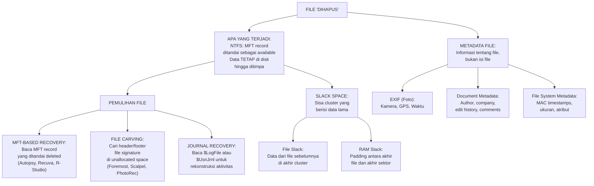

---

### 3–12. Landasan Teori, Contoh, Latihan, Kunci, Ringkasan, Refleksi

#### 6.1 Mekanisme Penghapusan File

Ketika pengguna menghapus file (Recycle Bin dikosongkan atau Shift+Delete):
- **NTFS:** MFT record ditandai sebagai tidak digunakan (availability bit diubah), tapi data tidak dihapus dari disk. Space dikembalikan ke unallocated pool.
- **FAT32:** Karakter pertama nama file diubah menjadi 0xE5 (file entry ditandai sebagai tersedia).
- Data aktual di cluster tetap ada hingga ditimpa oleh file baru.

**Implikasi:** File yang dihapus dapat dipulihkan selama cluster-nya belum ditimpa. Semakin lama setelah penghapusan, semakin besar kemungkinan data tertimpa.

#### 6.2 File Carving

File carving adalah teknik pemulihan file dari unallocated space berdasarkan file signature (magic bytes), bukan struktur file system.

**Prinsip:** Setiap jenis file memiliki header (tanda awal) dan seringkali footer (tanda akhir) yang khas:
- JPEG: Header `FF D8 FF`, Footer `FF D9`
- PNG: Header `89 50 4E 47 0D 0A 1A 0A`, Footer `49 45 4E 44 AE 42 60 82`
- PDF: Header `25 50 44 46` (`%PDF`), Footer `%%EOF`
- ZIP/Office: Header `50 4B 03 04`

**Tools:**
```bash
# Foremost (berbasis config file signatures)
foremost -i /path/to/image.dd -o /output/recovered/ -t jpg,pdf,doc

# Scalpel (lebih cepat, dikonfigurasi di /etc/scalpel/scalpel.conf)
scalpel /path/to/image.dd -o /output/recovered/

# Photorec (GUI, sangat efektif untuk foto dan dokumen)
photorec /path/to/image.dd
```

**Keterbatasan file carving:**
- Tidak dapat memulihkan nama file dan path asli
- File yang terfragmentasi mungkin tidak dapat dipulihkan secara utuh
- Menghasilkan banyak false positive (fragmen yang tidak utuh)

#### 6.3 Metadata sebagai Bukti Forensik

**EXIF Metadata (foto digital):**
Foto digital menyimpan metadata EXIF yang bisa sangat kaya secara forensik:
- Model kamera dan lensa
- Tanggal dan waktu pengambilan foto (dari jam kamera — mungkin berbeda dari timestamp file)
- Koordinat GPS (jika diaktifkan)
- Pengaturan kamera (aperture, ISO, shutter speed)

```bash
# Membaca EXIF dengan ExifTool
exiftool photo.jpg

# Output contoh:
# File Modification Date/Time  : 2024:03:15 10:23:45+07:00
# Date/Time Original           : 2024:03:15 10:22:11
# GPS Latitude                 : 7 deg 15' 0.48" S
# GPS Longitude                : 112 deg 45' 0.12" E
# Make                         : Apple
# Camera Model Name            : iPhone 15 Pro
```

**Document Metadata (Office):**
File Word, Excel, PowerPoint menyimpan metadata yang mencakup: nama penulis, organisasi, tanggal pembuatan dan modifikasi, jumlah revisi, komentar tersembunyi, dan bahkan metadata penulis sebelumnya.

```bash
# Menganalisis metadata dokumen
exiftool document.docx
# Atau gunakan python-docx untuk analisis lebih mendalam
```

#### 6.4 Slack Space

**File slack space:** Saat file disimpan ke disk, ia menempati cluster penuh (unit alokasi minimum). Jika file lebih kecil dari cluster, sisa cluster berisi data lama dari file sebelumnya (atau nol, tergantung implementasi).

Contoh: Cluster size 4096 bytes. File baru 1500 bytes. Bytes 1500-4096 adalah slack space yang mungkin berisi sisa data file sebelumnya.

```bash
# Mengekstrak slack space dengan TSK
blkls -A disk.dd [partisi offset] > slack_space.bin

# Mencari string dalam slack space
strings slack_space.bin | grep -i "keyword"
```

**Forensic significance:** Data yang ditulis oleh pengguna mungkin tersisa di slack space bahkan setelah file ditimpa dengan konten baru.

**Latihan:**

Soal 1: Seorang investigator menggunakan Foremost untuk melakukan file carving pada unallocated space dan menemukan 3.000 file JPEG. Bagaimana ia memprioritaskan file mana yang perlu diperiksa lebih lanjut?

Soal 2: Sebuah foto tersangka ditemukan dengan timestamp file: 2024-05-10 15:30:00, tetapi EXIF timestamp "DateTimeOriginal" menunjukkan 2024-05-08 09:15:00. Apa yang mungkin terjadi dan bagaimana relevansinya secara forensik?

**Kunci Jawaban:**

Soal 1: Strategi prioritisasi: (a) gunakan hash matching terhadap database seperti NSRL untuk mengecualikan file sistem/program standar; (b) gunakan file modification timestamp dari metadata yang dapat dipulihkan untuk mempersempit ke periode yang relevan dengan investigasi; (c) gunakan thumbnail preview untuk quick scan visual; (d) terapkan keyword search pada metadata EXIF (GPS location, kamera model) yang relevan dengan kasus; (e) gunakan face recognition atau object detection jika tersedia untuk menemukan foto yang relevan; (f) prioritaskan file yang tidak corrupt (file carving sering menghasilkan file parsial).

Soal 2: Kemungkinan yang terjadi: (a) *Timestamp manipulation*: seseorang mengubah timestamp file system setelah foto diambil (misalnya untuk alibi); EXIF DateTimeOriginal lebih sulit dimanipulasi karena tertanam di data kamera; (b) *File copy*: foto dicopy ke perangkat berbeda — timestamp file berubah ke waktu copy, EXIF tetap dari waktu pengambilan asli; (c) *Kamera dengan jam salah*: jam kamera tidak dikalibrasi. Relevansi forensik: perbedaan 2 hari ini penting — jika kasus bergantung pada lokasi tersangka pada 2024-05-10, foto ini (sebenarnya dari 2024-05-08) mungkin tidak relevan untuk alibi yang diklaim. Investigator harus mencorroboratif dengan bukti lain untuk menentukan mana yang akurat.

**Ringkasan:** Penghapusan file tidak menghapus data — hanya menandai space sebagai tersedia. File carving memungkinkan pemulihan dari unallocated space berdasarkan file signature. Metadata (EXIF, document metadata, file system metadata) sering mengandung informasi investigatif yang tidak terlihat di konten file. Slack space adalah area yang sering diabaikan tetapi dapat mengandung bukti dari file yang sudah tidak ada.

**Refleksi:** Metadata foto yang mengandung koordinat GPS dapat secara akurat menempatkan seseorang di lokasi tertentu pada waktu tertentu. Apakah penggunaan GPS metadata dalam investigasi forensik selalu proporsional? Kapan ini mungkin melanggar privasi yang lebih dari yang diizinkan oleh otorisasi investigasi?

---

## Bab 7 — OS Artifacts, Registry, Log Analysis, dan Browser/Email Artifacts

### 1. Capaian Pembelajaran Bab

Setelah menyelesaikan bab ini, mahasiswa mampu:
- Mengidentifikasi dan menganalisis OS artifacts Windows yang relevan untuk investigasi (C4)
- Menganalisis Windows Registry sebagai sumber informasi forensik (C4)
- Melakukan log analysis dari Windows Event Log dan sistem log Linux (C4)
- Mengekstrak dan menganalisis browser history dan email artifacts (C3)

*Dikaitkan dengan Sub-CPMK.3 (Pertemuan 7) dan Eval-3 (20% — deliverable: laporan analisis disk, OS artifacts, metadata).*

---

### 2. Peta Konsep Bab

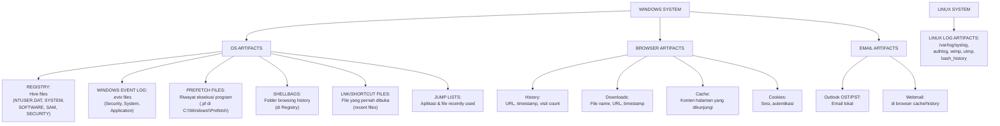

---

### 3–12. Landasan Teori, Contoh, Latihan, Kunci, Ringkasan, Refleksi

#### 7.1 Windows Registry sebagai Sumber Forensik

Windows Registry adalah database hierarkis yang menyimpan konfigurasi sistem dan pengguna. Dari perspektif forensik, Registry adalah harta karun informasi.

**Hive files kunci (lokasi di disk):**
| Hive | Lokasi di disk | Informasi Forensik |
|---|---|---|
| SYSTEM | `\Windows\System32\config\SYSTEM` | Konfigurasi sistem, hardware, waktu terakhir boot, timezone |
| SOFTWARE | `\Windows\System32\config\SOFTWARE` | Installed programs, OS version, autorun entries |
| SAM | `\Windows\System32\config\SAM` | Akun pengguna lokal dan hash password |
| SECURITY | `\Windows\System32\config\SECURITY` | Kebijakan keamanan, cached credentials |
| NTUSER.DAT | `\Users\[username]\NTUSER.DAT` | Per-user settings, recently opened files, search history |
| UsrClass.dat | `\Users\[username]\AppData\Local\Microsoft\Windows\UsrClass.dat` | ShellBags, file associations |

**Key forensik di Registry:**

```
# Recent files yang dibuka (per user)
HKCU\Software\Microsoft\Windows\CurrentVersion\Explorer\RecentDocs

# Autorun entries (persistence mechanism)
HKLM\SOFTWARE\Microsoft\Windows\CurrentVersion\Run
HKLM\SOFTWARE\Microsoft\Windows\CurrentVersion\RunOnce
HKCU\Software\Microsoft\Windows\CurrentVersion\Run

# Network connections pernah terhubung
HKLM\SYSTEM\CurrentControlSet\Services\Tcpip\Parameters\Interfaces

# USB devices yang pernah terhubung
HKLM\SYSTEM\CurrentControlSet\Enum\USBSTOR

# Terakhir kali diakses (UserAssist — executions per user)
HKCU\Software\Microsoft\Windows\CurrentVersion\Explorer\UserAssist
```

**Tools:** Registry Explorer (Eric Zimmermann), RegRipper, Autopsy Registry Analyzer

#### 7.2 Windows Event Log

Windows Event Log menyimpan rekaman kejadian sistem, keamanan, dan aplikasi dalam format .evtx.

**Event ID penting untuk investigasi:**

| Event ID | Log | Deskripsi |
|---|---|---|
| 4624 | Security | Successful logon |
| 4625 | Security | Failed logon |
| 4634/4647 | Security | Logoff |
| 4648 | Security | Logon with explicit credentials (runas) |
| 4720 | Security | User account created |
| 4722/4723 | Security | User account enabled/password changed |
| 4728 | Security | Member added to security-enabled global group |
| 4776 | Security | Domain controller attempted to validate credentials |
| 7045 | System | New service installed |
| 4688 | Security | New process created (jika diaktifkan) |
| 4698 | Security | Scheduled task created |

**Analisis dengan EvtxECmd (Eric Zimmermann) atau PowerShell:**
```powershell
# PowerShell — mencari logon failures
Get-WinEvent -FilterHashtable @{LogName='Security'; Id=4625} | 
Select-Object TimeCreated, Message | 
Export-Csv failed_logons.csv
```

#### 7.3 Prefetch Files dan Execution Evidence

Prefetch adalah fitur Windows yang menyimpan informasi tentang program yang pernah dijalankan, untuk mempercepat loading di masa depan. Bagi forensik, ini adalah bukti eksekusi.

**Lokasi:** `C:\Windows\Prefetch\[PROGRAM_NAME]-[HASH].pf`

**Informasi dari Prefetch:**
- Nama program yang dijalankan
- Kapan terakhir dijalankan (dan hingga 8 kali terakhir)
- Berapa kali dijalankan
- File yang diakses saat program berjalan
- Volume dari mana program dijalankan

**Tools:** PECmd (Eric Zimmermann), Windows Prefetch View, Autopsy

#### 7.4 Browser Artifacts

**Chrome (Windows):**
```
Profile: %LOCALAPPDATA%\Google\Chrome\User Data\Default\
History: SQLite database
Downloads: SQLite database
Cache: \Cache\
Cookies: SQLite database
Bookmarks: JSON file
```

```bash
# Membaca Chrome history dengan SQLite
sqlite3 History "SELECT url, title, last_visit_time, visit_count FROM urls ORDER BY last_visit_time DESC LIMIT 50"

# Chrome timestamp adalah microseconds sejak 1601-01-01
# Convert: python3 -c "from datetime import datetime; print(datetime(1601,1,1) + timedelta(microseconds=TIMESTAMP))"
```

**Latihan:**

Soal 1: Dalam investigasi korporat, Anda menemukan Registry key: `HKCU\Software\Microsoft\Windows\CurrentVersion\Run` berisi entry: `"Updater" = "C:\Users\budi\AppData\Roaming\svchost.exe"`. Apa yang ini mungkin mengindikasikan dan apa langkah investigasi selanjutnya?

Soal 2: Event ID 4625 (failed logon) dari sistem server menunjukkan 847 kegagalan login dalam 30 menit dari satu IP address. Apa yang ini mungkin mengindikasikan dan bagaimana Anda menganalisisnya lebih lanjut?

**Kunci Jawaban:**

Soal 1: Entry Registry di Run key yang mereferensikan `svchost.exe` di profil user (bukan di `C:\Windows\System32`) adalah sangat mencurigakan: (a) `svchost.exe` asli Windows ada di `C:\Windows\System32\` — bukan di AppData pengguna; (b) ini mengindikasikan kemungkinan **persistence mechanism** malware yang menyamar sebagai Windows service; (c) program ini dijalankan otomatis setiap pengguna login. Langkah investigasi: (1) ekstrak file `svchost.exe` dari AppData dan submit ke VirusTotal; (2) analisis konten file (strings, PE analysis); (3) cari artefak eksekusi di Prefetch; (4) analisis Event ID 4688 untuk melihat apa yang dilakukan saat dijalankan; (5) analisis network connections dari proses ini.

Soal 2: 847 failed logon dalam 30 menit dari satu IP adalah pattern **brute force attack**. Analisis lebih lanjut: (a) cari Event ID 4624 segera setelah cluster 4625 — apakah ada successful logon? Jika ya, akun berhasil dikompromis; (b) identifikasi akun mana yang ditargetkan (dari field dalam event log); (c) periksa IP sumber — internal atau eksternal? VPN? Known bad actor? (d) analisis timeline: apakah serangan berhenti tiba-tiba (mungkin berhasil)? (e) korelasikan dengan network log untuk melihat aktivitas dari IP sumber sebelum dan sesudah serangan; (f) rekomendasikan: blokir IP, review akun yang diserang, aktifkan MFA.

**Ringkasan:** OS artifacts — Registry, Event Log, Prefetch, ShellBags, LNK files — adalah rekaman aktivitas pengguna dan sistem yang tidak mudah dihapus. Browser artifacts mendokumentasikan aktivitas web dengan detail. Kombinasi analisis semua sumber ini memungkinkan rekonstruksi timeline yang kuat. Pemahaman tentang lokasi dan format setiap artefak adalah kompetensi inti forensik digital Windows.

**Refleksi:** Windows secara terus-menerus berkembang dan menambah atau mengubah lokasi artefak forensik. Bagaimana seorang investigator forensik memastikan pengetahuannya selalu terkini dengan versi OS terbaru? Apa sumber referensi yang paling dapat diandalkan?

---

## Bab 8 — UTS Integratif dan Pengantar Memory Forensics

### 1. Capaian Pembelajaran Bab

Setelah menyelesaikan bab ini, mahasiswa mampu:
- Mengintegrasikan konsep Bab 1–7 dalam skenario kasus investigasi yang kohesif (C5)
- Menjelaskan arsitektur memory komputer dan mengapa memory forensics penting (C2)
- Mengidentifikasi jenis data yang dapat ditemukan dalam memory dump (C3)
- Menjelaskan prinsip kerja Volatility 3 sebagai platform analisis memory (C2)

*Dikaitkan dengan Sub-CPMK.3 dan Sub-CPMK.4 (Pertemuan 8) dan Eval-4 (20% — UTS).*

---

### 2. Peta Konsep Bab

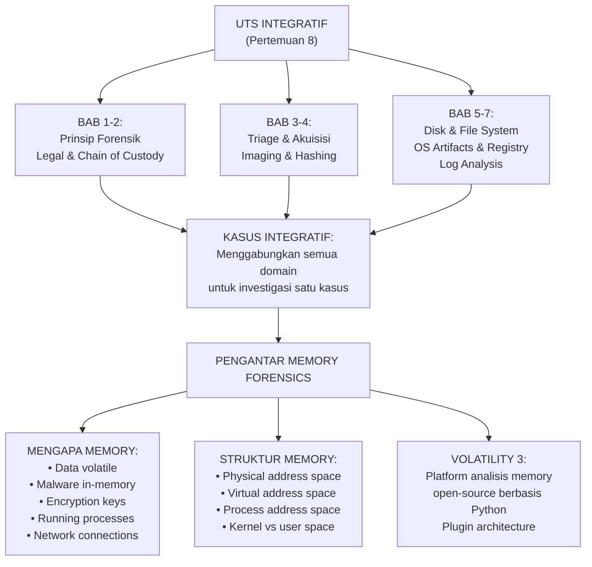

---

### 3. UTS — Kasus Integratif PT Nusantara Energi (Lanjutan)

#### Konteks Kasus

PT Nusantara Energi melaporkan insiden keamanan: akun administrator sistem SCADA (Supervisory Control and Data Acquisition) mereka diduga dikompromikan. Seorang teknisi menemukan bahwa workstation `WS-SCADA-01` (Windows 10) menunjukkan perilaku mencurigakan: traffic jaringan tidak biasa ke IP eksternal dan file log yang terhapus.

Tim forensik (Anda) ditugaskan untuk melakukan investigasi lengkap menggunakan image disk yang telah diakuisisi sebelumnya oleh responden pertama, beserta memory dump yang juga telah diambil sebelum workstation dimatikan.

#### Pertanyaan UTS Integratif

**Bagian A — Chain of Custody dan Legalitas (20 poin)**

1. Responden pertama yang mengakuisisi disk menggunakan software write blocker (bukan hardware). Apakah ini valid secara forensik? Jelaskan risiko dan persyaratan dokumentasi tambahan yang diperlukan.

2. UU ITE dan UU PDP memberikan kerangka hukum yang berbeda untuk investigasi ini. Jelaskan bagaimana kedua regulasi tersebut berlaku dan apa yang harus diperhatikan dalam pengelolaan data pribadi karyawan yang ditemukan selama investigasi.

**Bagian B — Analisis Disk dan OS Artifacts (40 poin)**

3. Dari Registry key `HKLM\SYSTEM\CurrentControlSet\Enum\USBSTOR`, ditemukan bahwa sebuah USB drive dengan serial number `disk&rev_2.00\9876543210&0` terakhir terhubung pada 2024-11-15 pukul 02:34:17 WIB — di luar jam kerja normal. Apa signifikansi temuan ini dan langkah apa yang perlu dilakukan untuk mendalaminya?

4. Windows Event Log menunjukkan 15 kali Event ID 4625 (failed logon) untuk akun `administrator` antara 02:00-02:30 WIB dari IP lokal `192.168.10.45`, diikuti satu Event ID 4624 (successful logon) pada 02:35 WIB. Interpretasikan sekuens ini dan apa implikasinya?

5. File Prefetch `PSEXEC.EXE-[HASH].pf` ditemukan dengan last execution time 02:38 WIB pada malam yang sama. PsExec adalah legitimate Windows administration tool. Bagaimana Anda menginterpretasikan keberadaan PsExec dalam konteks investigasi ini?

**Bagian C — Sintesis dan Laporan (40 poin)**

6. Berdasarkan temuan pada poin 3-5, buat timeline ringkas kejadian yang mungkin terjadi pada malam 2024-11-15 antara pukul 02:00-03:00 WIB.

7. Susun hipotesis investigasi yang paling masuk akal berdasarkan bukti yang ada, serta satu hipotesis alternatif. Bukti tambahan apa yang diperlukan untuk mengkonfirmasi atau menyangkal setiap hipotesis?

---

### 4. Kunci Jawaban UTS

**Bagian A:**

Jawaban 1: Software write blocker valid secara forensik DENGAN syarat dokumentasi yang lebih ketat. Risiko: software write blocker bergantung pada integritas OS — jika OS disusupi malware, write blocker mungkin tidak berfungsi. Persyaratan tambahan: (a) dokumentasikan versi OS, versi tools write blocker, dan setting konfigurasi; (b) hitung hash sebelum dan sesudah untuk membuktikan tidak ada perubahan; (c) lampirkan validasi tools (misal: NIST Tool Validation Certificate jika tersedia); (d) jelaskan dalam laporan mengapa hardware write blocker tidak digunakan. Hardware write blocker selalu lebih disukai karena tidak bergantung pada software layer.

Jawaban 2: UU ITE No. 11/2008 berlaku untuk: otoritas penyidik untuk mendapatkan akses ke sistem (Pasal 43), mengamankan dan menyita dokumen elektronik (Pasal 43 ayat 3), dan menggunakan bukti digital di pengadilan. UU PDP No. 27/2022 berlaku karena data karyawan (akun, log aktivitas, konten komunikasi) adalah data pribadi yang dilindungi. Perhatian: (a) hanya kumpulkan data yang proporsional dan relevan dengan investigasi; (b) data pribadi karyawan yang tidak relevan harus diproteksi; (c) ada batasan siapa yang boleh mengakses data — perlu dasar hukum yang jelas (mis. perintah penyidik atau otorisasi manajemen perusahaan dengan legal counsel); (d) data harus disimpan aman dan tidak boleh dibagikan tanpa alasan hukum.

**Bagian B:**

Jawaban 3: USB drive terhubung pukul 02:34 di luar jam kerja (signifikan). Langkah: (a) bandingkan dengan daftar perangkat USB yang diizinkan (asset register); (b) cari file yang dibuat/dimodifikasi sekitar waktu ini menggunakan timeline analysis; (c) periksa Volume Shadow Copies untuk perubahan file; (d) analisis LNK files di lokasi `%APPDATA%\Microsoft\Windows\Recent` untuk file yang diakses dari drive eksternal; (e) cari event log EntriOS terkait mount/unmount perangkat; (f) korelasikan dengan akun user mana yang sedang login saat itu.

Jawaban 4: Ini adalah pattern brute force internal diikuti keberhasilan akses: (a) 15 kegagalan dalam 30 menit dari IP internal 192.168.10.45 mengindikasikan brute force atau credential stuffing dari satu workstation internal; (b) keberhasilan login pada 02:35 mengindikasikan password administrator berhasil ditebak; (c) sumber internal (192.168.10.45) berarti perlu mengidentifikasi workstation mana dengan IP tersebut — bisa jadi peretas sudah mengompromikan workstation lain terlebih dahulu; (d) implikasi: akun administrator dikompromisi pada malam tersebut melalui brute force dari jaringan internal.

Jawaban 5: PsExec (Microsoft Sysinternals) adalah tool sah untuk remote execution Windows, tetapi sangat sering disalahgunakan oleh attacker untuk lateral movement dan remote code execution. Konteks mencurigakan: (a) dijalankan 3 menit setelah successful logon administrator; (b) pukul 02:38 tengah malam; (c) bukan bagian dari operasi normal sistem SCADA. Kemungkinan besar: attacker menggunakan credentials administrator yang baru dikompromisi untuk menjalankan PsExec — kemungkinan untuk eksekusi remote atau lateral movement ke sistem lain. Langkah investigasi: analisis parameter PsExec dari command line history, network connections saat itu, dan sistem remote mana yang mungkin ditargetkan.

**Bagian C:**

Jawaban 6 — Timeline rekonstruksi:
- 02:00-02:30 WIB: Brute force terhadap akun administrator dari workstation internal 192.168.10.45
- 02:34 WIB: USB drive terhubung ke WS-SCADA-01 (oleh siapa? Apakah attacker sudah di lokasi fisik atau ini kejadian terpisah?)
- 02:35 WIB: Successful logon administrator ke WS-SCADA-01 (brute force berhasil)
- 02:38 WIB: PsExec dieksekusi — kemungkinan untuk akses remote ke sistem lain atau eksekusi payload dari USB

Jawaban 7 — Hipotesis: **Hipotesis utama:** Insider threat atau attacker yang sudah berada di jaringan internal menggunakan workstation lain (192.168.10.45) untuk brute force credentials administrator WS-SCADA-01, kemudian setelah berhasil login menggunakan PsExec untuk lateral movement atau eksekusi malware yang dibawa via USB. **Hipotesis alternatif:** USB drive adalah kejadian terpisah (teknisi sah yang masuk di luar jam kerja untuk maintenance), dan brute force adalah serangan berbeda yang kebetulan berhasil di waktu yang sama. Bukti yang diperlukan: (a) CCTV untuk memverifikasi siapa yang secara fisik di ruang server pukul 02:34; (b) analisis konten USB drive; (c) analisis workstation 192.168.10.45; (d) network log untuk melihat ke mana PsExec membuat koneksi; (e) memory dump untuk melihat proses dan network connections saat insiden.

---

### 5. Pengantar Memory Forensics

#### Mengapa Memory Forensics?

Memory (RAM) mengandung data yang tidak pernah ada di disk:
- Proses yang berjalan dan semua state-nya
- Network connections aktif dan buffer
- Kunci enkripsi yang sedang digunakan
- Malware yang dirancang untuk hanya berjalan di memory (fileless malware)
- Credentials yang di-cache oleh OS (Windows: LSASS process)
- Clipboard contents
- Command history dari shell/terminal

#### Arsitektur Memory

**Physical Memory:** RAM fisik yang diakses melalui physical address. Memory dump mengambil snapshot ini.

**Virtual Memory:** Setiap proses memiliki ruang alamat virtual sendiri (4GB pada 32-bit, 128TB pada 64-bit Windows). OS menerjemahkan alamat virtual ke fisik.

**Kernel Space vs User Space:** Memory dibagi antara kernel (OS) dan user processes. Tools forensik harus mampu menganalisis keduanya.

#### Volatility 3: Pengantar

Volatility 3 adalah framework Python open-source untuk memory forensics. Berbeda dari Volatility 2, versi 3 tidak memerlukan profil OS yang terpisah — secara otomatis mendeteksi struktur OS dari memory dump.

```bash
# Instalasi Volatility 3
pip install volatility3

# Syntax dasar
python3 vol.py -f /path/to/memory.dmp [plugin]

# Informasi umum tentang image
python3 vol.py -f memory.dmp windows.info

# List proses
python3 vol.py -f memory.dmp windows.pslist

# List proses dengan parent-child relationship
python3 vol.py -f memory.dmp windows.pstree
```

**Latihan Pemahaman:**

Soal 1: Seorang investigator memiliki akses ke disk image dan memory dump dari sistem yang sama. Untuk kasus berikut, tentukan sumber mana yang lebih tepat: (a) Menemukan file yang dihapus 3 bulan lalu; (b) Mengidentifikasi proses malware yang tidak membuat file di disk; (c) Memulihkan kunci enkripsi BitLocker.

Soal 2: Fileless malware adalah malware yang tidak menyimpan file ke disk dan hanya berjalan di memory. Jelaskan mengapa ini menjadi tantangan bagi pendekatan forensik tradisional yang hanya fokus pada disk.

**Kunci Jawaban:**

Soal 1: (a) File yang dihapus 3 bulan lalu → **Disk image**: memory bersifat volatile dan tidak menyimpan data dari 3 bulan lalu; cari di unallocated space disk. (b) Malware yang tidak ada di disk → **Memory dump**: satu-satunya tempat malware fileless dapat ditemukan adalah RAM saat sistem berjalan. (c) Kunci enkripsi BitLocker → **Memory dump**: kunci enkripsi ada di RAM saat BitLocker volume aktif; jika sistem sudah dimatikan, kunci tidak dapat dipulihkan dari disk (data terenkripsi).

Soal 2: Forensik tradisional bergantung pada keberadaan file di disk — mencari executable, DLL, script malware di file system. Fileless malware menghindari ini sepenuhnya dengan: (a) hanya ada sebagai proses di memory; (b) menggunakan legitimate OS tools seperti PowerShell untuk melakukan aksi berbahaya (LOL — Living Off the Land); (c) tidak meninggalkan file signature yang dapat dideteksi antivirus berbasis file. Implikasi: tanpa memory dump yang diambil saat malware masih berjalan, bukti utama mungkin hilang. Forensik harus mencakup memory forensics sebagai prosedur standar untuk kasus insiden modern.

**Ringkasan:** UTS mengintegrasikan konsep Bab 1–7 dalam kasus PT Nusantara Energi yang menunjukkan bagaimana berbagai artefak (Registry, Event Log, Prefetch, USB history) terhubung dalam satu narasi investigasi. Memory forensics menjawab keterbatasan disk forensics dengan menangkap data yang tidak pernah ada di disk — khususnya penting untuk deteksi fileless malware dan pemulihan kunci enkripsi.

**Refleksi:** Investigasi SCADA/ICS (Industrial Control System) memiliki risiko tambahan: sistem tidak dapat dimatikan sembarangan karena bisa mengganggu infrastruktur kritis (listrik, air, gas). Bagaimana ini mengubah pendekatan Anda dalam melakukan forensik dibandingkan workstation biasa?

---

## Bab 9 — Memory Forensics dengan Volatility 3

### 1. Capaian Pembelajaran Bab

Setelah menyelesaikan bab ini, mahasiswa mampu:
- Menggunakan plugin Volatility 3 untuk analisis proses, network connections, dan artifacts memory (C3)
- Mengidentifikasi tanda-tanda malware dalam memory dump (C4)
- Menganalisis injeksi kode dan hollowing proses (C4)
- Mengekstrak artefak dari memory untuk rekonstruksi timeline (C4)

*Dikaitkan dengan Sub-CPMK.4 (Pertemuan 9).*

---

### 2. Peta Konsep Bab

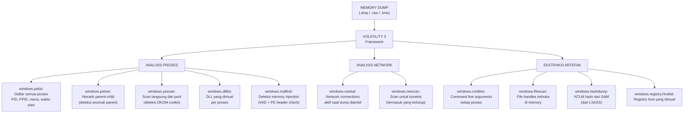

---

### 3. Analisis Mendalam dengan Volatility 3

#### 9.1 Deteksi Anomali Proses

**windows.pslist vs windows.psscan:**

`pslist` berjalan melalui linked list proses kernel yang dikelola OS — rootkit yang memanipulasi linked list (DKOM — Direct Kernel Object Manipulation) dapat menyembunyikan proses dari pslist.

`psscan` melakukan scan langsung pada pool memory untuk mencari struktur `_EPROCESS` — lebih sulit disembunyikan. Bandingkan output keduanya: proses yang ada di psscan tapi tidak di pslist adalah SANGAT mencurigakan.

```bash
# Analisis proses
python3 vol.py -f memory.dmp windows.pslist > pslist.txt
python3 vol.py -f memory.dmp windows.psscan > psscan.txt

# Cari perbedaan (diff)
diff <(awk '{print $2}' pslist.txt | sort) <(awk '{print $2}' psscan.txt | sort)
```

**Parent-Child anomaly detection:**

Proses tertentu selalu memiliki parent yang sama dalam sistem normal. Anomali parent adalah tanda injection:

| Proses | Parent Normal |
|---|---|
| `smss.exe` | `System` (PID 4) |
| `csrss.exe` | `smss.exe` |
| `wininit.exe` | `smss.exe` |
| `winlogon.exe` | `smss.exe` |
| `lsass.exe` | `wininit.exe` |
| `services.exe` | `wininit.exe` |
| `svchost.exe` | `services.exe` |
| `explorer.exe` | `userinit.exe` |

Contoh anomali: `lsass.exe` dengan parent `cmd.exe` adalah tanda injeksi.

**Deteksi Process Hollowing dan DLL Injection:**

```bash
# malfind: mencari memory regions dengan proteksi PAGE_EXECUTE_READWRITE
# dan mengandung PE header (indikasi injeksi kode)
python3 vol.py -f memory.dmp windows.malfind --pid [PID] > malfind_output.txt

# Dump memory region yang mencurigakan untuk analisis lebih lanjut
python3 vol.py -f memory.dmp windows.malfind --dump > ./dumped_sections/

# Kirim ke VirusTotal (hash dari dump)
sha256sum dumped_sections/*.dmp
```

#### 9.2 Analisis Network dari Memory

```bash
# Koneksi aktif saat dump diambil
python3 vol.py -f memory.dmp windows.netstat

# Semua koneksi (termasuk yang sudah tertutup tapi masih di memory)
python3 vol.py -f memory.dmp windows.netscan

# Output contoh:
# Offset  Proto  LocalAddr:Port  ForeignAddr:Port  State  PID  Owner
# ...TCP  192.168.1.50:49873  185.220.101.45:443  ESTABLISHED  4521  svchost.exe
```

IP tujuan yang mencurigakan (misalnya known Tor exit node atau IP dari threat intelligence feed) dalam koneksi yang berasal dari proses tidak terduga adalah temuan investigatif penting.

#### 9.3 Ekstraksi Credentials dari LSASS

LSASS (Local Security Authority Subsystem Service) menyimpan credentials yang di-cache untuk autentikasi Windows. Attacker sering mendump LSASS untuk credential harvesting.

```bash
# Dump NTLM hash dari SAM melalui LSASS
python3 vol.py -f memory.dmp windows.hashdump

# Output: Username:RID:LM_Hash:NTLM_Hash
# administrator:500:aad3b435b51404eeaad3b435b51404ee:8846f7eaee8fb117ad06bdd830b7586c
```

*Catatan etika dan keamanan:* Ekstraksi hash credentials hanya boleh dilakukan dalam konteks investigasi yang diotorisasi. Hash ini tidak boleh dibagikan atau disimpan di luar paket bukti yang aman. Penggunaan hash untuk tujuan selain investigasi adalah illegal.

**Praktikum:**

Gunakan memory dump sample yang disediakan laboratorium (misalnya dari MemLabs atau image latihan CTF yang legal dan berlisensi untuk pendidikan).

Langkah:
1. Identifikasi OS dan versi dari `windows.info`
2. Jalankan `windows.pslist` dan `windows.pstree` — catat proses yang mencurigakan
3. Bandingkan dengan `windows.psscan` — apakah ada perbedaan?
4. Jalankan `windows.netstat` — catat koneksi mencurigakan
5. Jalankan `windows.cmdline` untuk proses mencurigakan
6. Jalankan `windows.malfind` untuk proses mencurigakan
7. Dokumentasikan semua temuan dalam format tabel: Artefak, Lokasi Memory, Nilai, Interpretasi, Signifikansi Forensik

**Latihan:**

Soal 1: `windows.pslist` menampilkan `svchost.exe` dengan PID 3421, PPID 980. Proses dengan PID 980 adalah `explorer.exe`. Apakah ini normal? Apa implikasinya?

Soal 2: `windows.malfind` melaporkan region memory dalam proses `notepad.exe` dengan MZ header (PE signature) yang tidak terkait dengan DLL yang diketahui. Apa yang ini mungkin mengindikasikan?

**Kunci Jawaban:**

Soal 1: TIDAK normal. `svchost.exe` seharusnya selalu memiliki parent `services.exe` (biasanya PID sekitar 600-800). Parent `explorer.exe` adalah anomali besar yang mengindikasikan: (a) process spoofing — malware yang menyamar sebagai `svchost.exe` tetapi diluncurkan dari user context (`explorer.exe`); (b) injection — `svchost.exe` yang diinjeksi code berbahaya; (c) kemungkinan masalah integrity: apakah executable `svchost.exe` ini sama dengan yang ada di `System32`? Langkah: (1) bandingkan hash executable dengan hash `C:\Windows\System32\svchost.exe`; (2) jalankan `malfind` pada PID 3421; (3) periksa command line dan DLL yang dimuat; (4) periksa network connections dari PID ini.

Soal 2: MZ header (PE signature `4D 5A`) dalam memory region proses `notepad.exe` yang tidak terkait dengan DLL yang sah mengindikasikan **code injection**: (a) attacker mungkin menginject executable/shellcode ke dalam proses `notepad.exe` untuk menyembunyikan aktivitas berbahaya di dalam proses yang terlihat sah; (b) teknik yang umum: Process Hollowing (proses dijalankan, kode asli dihapus, diganti kode berbahaya), DLL Injection, atau Reflective DLL Loading; (c) proses `notepad.exe` yang harusnya text editor sederhana tidak seharusnya mengandung PE lain di memory-nya. Langkah: dump memory region tersebut dan analisis PE yang ditemukan — hash, strings, imports.

**Ringkasan:** Volatility 3 memungkinkan analisis mendalam terhadap memory dump untuk menemukan bukti yang tidak ada di disk. Plugin utama mencakup analisis proses (pslist, psscan, pstree, malfind), network (netstat, netscan), dan ekstraksi artefak (cmdline, hashdump, filescan). Anomali parent-child dan perbedaan antara pslist dan psscan adalah tanda awal rootkit atau injection.

**Refleksi:** Analisis memory dump dari sistem yang menjalankan aplikasi perbankan atau kesehatan dapat mengekspos data sensitif pengguna (nomor rekening, data medis) yang tidak relevan dengan investigasi. Bagaimana prosedur investigasi Anda mengelola data yang secara tidak sengaja ditemukan ini?

---

## Bab 10 — Network Forensics dan Timeline Analysis

### 1. Capaian Pembelajaran Bab

Setelah menyelesaikan bab ini, mahasiswa mampu:
- Menganalisis packet capture (PCAP) menggunakan Wireshark untuk investigasi forensik (C4)
- Mengekstrak artefak dari traffic jaringan yang tersimpan (C3)
- Membuat timeline investigasi yang terintegrasi dari berbagai sumber bukti (C5)
- Menggunakan log2timeline/Plaso untuk timeline analysis (C3)

*Dikaitkan dengan Sub-CPMK.4 (Pertemuan 10).*

---

### 2. Peta Konsep Bab

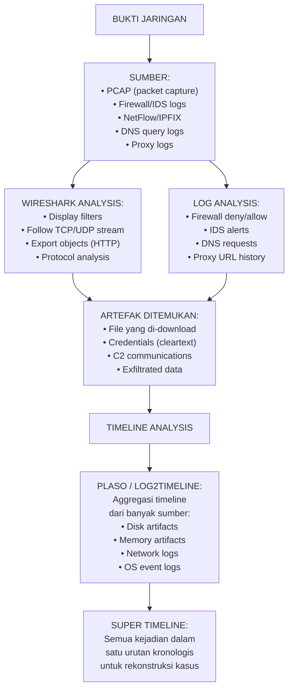

---

### 3. Analisis Mendalam

#### 10.1 Network Forensics dengan Wireshark

Wireshark adalah network protocol analyzer yang memungkinkan inspeksi packet-level dari traffic jaringan yang tersimpan dalam format PCAP.

**Display Filters berguna untuk forensik:**

```wireshark
# HTTP traffic
http

# DNS queries
dns

# Traffic ke/dari IP tertentu
ip.addr == 185.220.101.45

# TCP port tertentu
tcp.port == 4444

# HTTP POST (exfiltrasi data)
http.request.method == "POST"

# Cari credentials dalam cleartext
http contains "password" or http contains "passwd"

# FTP commands
ftp

# SSL/TLS (untuk melihat metadata, bukan konten terenkripsi)
ssl
tls
```

**Follow TCP Stream:**
Klik kanan pada packet → Follow → TCP Stream. Ini menampilkan konten lengkap dari satu sesi TCP sebagai teks yang dapat dibaca — sangat berguna untuk melihat data yang dikirim/diterima dalam satu koneksi.

**Export Objects:**
File → Export Objects → HTTP. Ini mengekstrak semua file yang ditransfer melalui HTTP dari PCAP — berguna untuk mendapatkan malware yang di-download atau data yang di-upload.

#### 10.2 Analisis DNS untuk Investigasi

DNS log adalah sumber intelijen yang underutilized:

- **DNS exfiltration:** Data dikodekan dalam subdomain DNS queries (misal: `base64data.evil.com`) — terlihat normal dari sisi network karena DNS adalah legitimate traffic
- **DGA (Domain Generation Algorithm):** Malware menggunakan algoritma untuk menghasilkan domain secara acak setiap hari — melihat banyak query ke domain random yang terlihat seperti typo adalah tanda DGA
- **C2 via DNS:** Instruksi dari C2 server dikirim sebagai DNS TXT records

```bash
# Analisis DNS dari PCAP dengan tshark
tshark -r capture.pcap -Y "dns" -T fields -e dns.qry.name | sort | uniq -c | sort -rn | head 50

# Mencari domain yang panjang/random (indikasi DGA atau DNS tunneling)
tshark -r capture.pcap -Y "dns" -T fields -e dns.qry.name | awk 'length($0) > 50'
```

#### 10.3 Timeline Analysis dengan Plaso/log2timeline

Plaso (plaso Langar Á Stakkur Opinn) adalah tools Python yang mengaggregasi artefak dari berbagai sumber menjadi satu super-timeline dalam format kronologis.

**Workflow:**

```bash
# Langkah 1: Buat storage file dari berbagai sumber
# Dari disk image
log2timeline.py --storage-file case.plaso disk_image.dd

# Dari direktori (Windows artifacts)
log2timeline.py --storage-file case.plaso /path/to/windows/

# Langkah 2: Proses dan filter
psort.py --output-file case_timeline.csv --output-format dynamic \
  --slice "2024-11-15" --slice-size 86400 \
  case.plaso

# Langkah 3: Analisis dengan CSV atau tools seperti Timeline Explorer
# (Eric Zimmermann's Timeline Explorer untuk GUI)
```

**Sumber yang dapat di-parse Plaso:**
- Windows Registry (all hives)
- Windows Event Log (.evtx)
- Prefetch files
- Browser history (Chrome, Firefox, IE)
- Recycle Bin artifacts
- LNK files
- NTFS $MFT
- Linux syslog, auth.log, wtmp
- PCAP (via tshark)

#### 10.4 Super Timeline untuk Rekonstruksi Kasus PT Nusantara Energi

Contoh baris-baris dari super timeline yang dihasilkan (disingkat):

```
2024-11-15 02:00:17 UTC | EventLog | 4625 | Failed logon: admin from 192.168.10.45
2024-11-15 02:00:24 UTC | EventLog | 4625 | Failed logon: admin from 192.168.10.45
[... 13 baris serupa ...]
2024-11-15 02:34:17 UTC | Registry  | USBSTOR | USB device connected: SN 9876543210
2024-11-15 02:35:03 UTC | EventLog | 4624 | Successful logon: admin (from 192.168.10.45)
2024-11-15 02:37:45 UTC | MFT      | Create | C:\Users\admin\AppData\Roaming\svchost.exe
2024-11-15 02:38:12 UTC | Prefetch  | Execute | PSEXEC.EXE (first run)
2024-11-15 02:38:45 UTC | Network   | TCP   | Outbound HTTPS to 185.220.101.45:443 (PID 4521: svchost.exe)
2024-11-15 02:41:03 UTC | EventLog | 7045  | New service installed: WindowsUpdater
2024-11-15 02:45:33 UTC | EventLog | 4720  | New account created: backdoor_admin
```

Timeline ini menunjukkan dengan jelas urutan kompromis yang terjadi.

**Latihan:**

Soal 1: Seorang analis menemukan bahwa DNS log menunjukkan subdomain queries ke domain yang sama dengan pola seperti: `aGVsbG8=.exfil-domain.com`, `d29ybGQ=.exfil-domain.com`, `dGVzdA==.exfil-domain.com`. Apa yang mungkin sedang terjadi?

Soal 2: Dalam super timeline, Anda melihat bahwa timestamp $MFT untuk file berbeda 3 jam dari timestamp Event Log untuk operasi yang sama. Apa penyebab yang mungkin dan bagaimana Anda menyelidikinya?

**Kunci Jawaban:**

Soal 1: Subdomain-subdomain ini adalah base64 encoded strings: `aGVsbG8=` = "hello", `d29ybGQ=` = "world", `dGVzdA==` = "test". Ini adalah **DNS data exfiltration**: data dikodekan dalam base64 dan dikirim sebagai bagian dari subdomain DNS query. DNS query ke server attacker (`exfil-domain.com`) yang mengontrol domain tersebut dapat membaca data yang dikirim. Keuntungan teknik ini: (a) DNS biasanya tidak diblokir oleh firewall; (b) terlihat seperti DNS request normal; (c) sulit dideteksi tanpa analisis mendalam. Langkah investigasi: (1) identifikasi proses mana yang membuat query ini (dari memory atau endpoint log); (2) dekode semua subdomain untuk melihat data apa yang diekstrak; (3) hitung total volume data yang dikeksfiltrasikan; (4) laporkan ke threat intelligence untuk blocking domain.

Soal 2: Perbedaan 3 jam antara timestamp dari sumber berbeda kemungkinan disebabkan oleh **timezone mismatch**: (a) $MFT timestamps disimpan dalam UTC; (b) Event Log mungkin dikonfigurasi untuk menyimpan dalam local time (UTC+7 untuk WIB = perbedaan 7 jam, tapi 3 jam mungkin mengindikasikan timezone lain); (c) setelah Daylight Saving Time change (tidak relevan di Indonesia, tetapi relevan untuk sistem multinasional); (d) sistem yang timezone-nya salah dikonfigurasi. Cara menyelidiki: (1) periksa timezone setting sistem dari Registry (`HKLM\SYSTEM\CurrentControlSet\Control\TimeZoneInformation`); (2) konfirmasi dari `windows.info` di Volatility (menampilkan timezone sistem saat memory dump diambil); (3) normalize semua timestamp ke UTC sebelum membuat timeline. Ini adalah praktik standar: selalu normalize ke UTC untuk super timeline.

**Ringkasan:** Network forensics menganalisis traffic dari perspektif bukti — PCAP untuk analisis mendalam, log untuk overview. DNS adalah vektor exfiltration yang sering diabaikan. Super timeline mengintegrasikan semua sumber bukti (disk, memory, network, OS logs) ke dalam satu narasi kronologis yang dapat diperiksa — ini adalah fondasi dari laporan forensik yang komprehensif.

**Refleksi:** Traffic HTTPS (TLS encrypted) mendominasi internet modern. Network forensics tradisional yang bergantung pada inspeksi isi payload menjadi kurang efektif. Apakah ini berarti network forensics "mati"? Atau ada pendekatan lain (metadata, timing, volume, DNS) yang masih bermakna?

---

## Bab 11 — Mobile dan Cloud Artifact Forensics

### 1. Capaian Pembelajaran Bab

Setelah menyelesaikan bab ini, mahasiswa mampu:
- Mengidentifikasi tantangan khusus forensik pada perangkat mobile (C2)
- Menjelaskan jenis data yang dapat diekstraksi dari perangkat Android dan iOS (C2)
- Menganalisis tantangan forensik dalam lingkungan cloud (C4)
- Mengidentifikasi sumber bukti cloud yang dapat diperoleh secara legal (C3)

*Dikaitkan dengan Sub-CPMK.5 (Pertemuan 11).*

---

### 2. Peta Konsep Bab

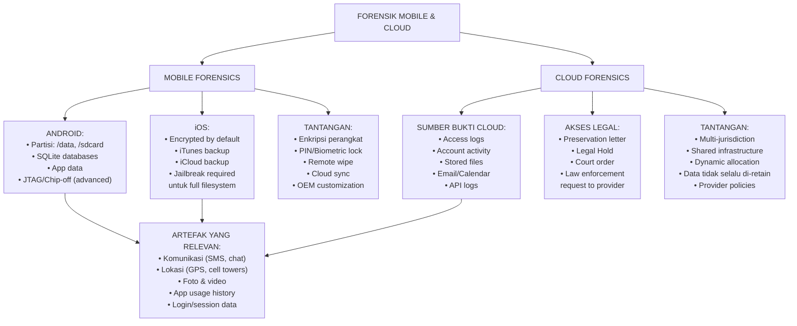

---

### 3. Mobile Forensics

#### 11.1 Android Forensics

Android adalah platform open-source berbasis Linux dengan struktur partisi yang dapat dianalisis secara forensik:

**Partisi penting:**
- `/data/data/[package_name]/`: Data per-aplikasi — databases SQLite, preferences, files
- `/data/media/`: Media yang tersimpan (foto, video, dokumen pengguna)
- `/sdcard/`: External storage (terkadang SD card fisik, terkadang emulated storage)
- `/system/`: OS files — biasanya tidak relevan untuk investigasi pengguna

**Database SQLite di Android:**
Hampir semua aplikasi Android menyimpan data dalam format SQLite. Lokasi umum:
```
/data/data/com.whatsapp/databases/msgstore.db  (WhatsApp messages)
/data/data/com.android.providers.contacts/databases/contacts2.db  (Contacts)
/data/data/com.android.providers.telephony/databases/mmssms.db  (SMS/MMS)
```

**Analisis ADB (Android Debug Bridge) — hanya jika debug mode aktif dan diotorisasi:**
```bash
# Backup data aplikasi (memerlukan konfirmasi pada perangkat)
adb backup -f backup.ab -apk -shared -all

# Convert backup ke tar untuk ekstraksi
dd if=backup.ab bs=1 skip=24 | python3 -c "import zlib,sys; sys.stdout.buffer.write(zlib.decompress(sys.stdin.buffer.read()))" | tar xv
```

*Catatan penting:* Akses ADB memerlukan USB debugging yang diaktifkan oleh pengguna, atau otorisasi passcode perangkat. Jangan mencoba bypass autentikasi tanpa otorisasi hukum yang tepat.

**Tools forensik mobile:**
- **Cellebrite UFED:** Solusi komersial terkemuka, mendukung ribuan model perangkat, termasuk ekstraksi fisik
- **Oxygen Forensic Detective:** Multi-platform, analisis cloud, parsing aplikasi
- **MSAB XRY:** Untuk investigasi law enforcement
- **Andriller:** Open-source, untuk Android dengan ADB access

#### 11.2 iOS Forensics

iOS memiliki enkripsi default yang kuat — seluruh data dienkripsi dengan kunci yang berasal dari passcode pengguna. Tanpa passcode, akses forensik sangat terbatas.

**Sumber bukti iOS tanpa passcode:**
- iTunes backup (jika backup pernah dibuat ke komputer yang dianalisis) — lokasi: `%APPDATA%\Apple Computer\MobileSync\Backup\` (Windows)
- iCloud backup — memerlukan Apple ID credentials atau legal order ke Apple
- Metadata dari iCloud (daftar file, tidak kontennya, tanpa private key)

**Dengan passcode atau BFU (Before First Unlock):**
Chip T2/Secure Enclave di iPhone modern membuat brute force hampir tidak mungkin. Tools seperti Cellebrite Premium atau GrayKey (untuk law enforcement) dapat memanfaatkan vulnerability tertentu tetapi dengan batasan.

**iTunes backup forensics:**
```bash
# Decrypt backup (memerlukan password backup)
ibackup-extractor atau iPhone Backup Extractor (komersial)

# Open-source: iphone-backup-decrypt (Python)
pip install iphone-backup-decrypt
# Kemudian parse dengan SQLite browser
```

#### 11.3 Cloud Forensics

**Mengapa cloud forensics berbeda:**
- Data mungkin tersebar di multiple data centers di multiple yurisdiksi hukum
- Infrastructure di-share dengan pengguna lain (forensic isolation sulit)
- Data dapat hilang saat resource di-dealokasi (cloud ephemeral computing)
- Provider mungkin memiliki log retention policy yang terbatas

**Sumber bukti cloud yang dapat diperoleh:**

| Sumber | Isi | Cara Memperoleh |
|---|---|---|
| Cloud provider audit logs | API calls, login attempts, resource access | Legal request ke provider atau melalui konfigurasi akun |
| Access logs (S3, Azure Blob) | Siapa mengakses file apa, kapan | Account audit log jika diaktifkan |
| Identity provider logs | Autentikasi SSO, MFA events | Legal request atau admin account |
| Email provider logs | Email header, metadata | Legal request atau account admin |
| SaaS application logs | Activity log (Slack, Google Workspace) | Legal hold request ke provider |

**Legal Hold dan Preservation Letter:**
Sebelum data dapat dihapus oleh provider karena account closure atau retention policy, investigator harus mengirimkan preservation letter kepada provider meminta mereka untuk mempertahankan data yang relevan. Ini harus dilakukan SEGERA setelah investigasi dimulai — sebelum data hilang.

**Contoh untuk AWS (jika investigator memiliki akses akun):**
```bash
# Download CloudTrail logs (audit log AWS)
aws cloudtrail lookup-events --start-time 2024-11-15T00:00:00Z \
  --end-time 2024-11-16T00:00:00Z \
  --output json > cloudtrail_events.json

# Analyze S3 access logs
aws s3api get-bucket-logging --bucket <bucket-name>
```

**Latihan:**

Soal 1: Seorang tersangka menggunakan WhatsApp untuk komunikasi yang relevan dengan investigasi. Perangkat Android-nya memiliki kunci dan Anda tidak memiliki passcode. Jelaskan setidaknya tiga pendekatan berbeda (masing-masing dengan keunggulan, keterbatasan, dan dasar legalitasnya) untuk mendapatkan bukti WhatsApp.

Soal 2: Sebuah perusahaan menduga karyawannya mengeksfiltrasikan data ke Google Drive pribadi. Jelaskan langkah-langkah forensik yang dapat dilakukan tanpa mengakses Google Drive karyawan tersebut secara langsung.

**Kunci Jawaban:**

Soal 1: Tiga pendekatan:

(a) **Backup WhatsApp di cloud (Google Drive):** WhatsApp Android menyimpan backup ke Google Drive pengguna secara berkala. Memerlukan: legal order ke Google untuk mendapatkan backup, atau akses ke akun Google tersangka (memerlukan otorisasi hukum). Keunggulan: konten pesan lengkap. Keterbatasan: backup mungkin tidak real-time, pesan terbaru mungkin belum di-backup; enkripsi end-to-end WhatsApp: backup di Google Drive TIDAK dienkripsi E2E secara default (kecuali pengguna mengaktifkan encrypted backup di WhatsApp terbaru).

(b) **WhatsApp Web atau perangkat tertaut:** Jika tersangka pernah menggunakan WhatsApp Web di komputer yang dapat diakses, session mungkin masih aktif. Akses komputer yang terotorisasi dan cari session WhatsApp Web. Keunggulan: tidak memerlukan akses perangkat. Keterbatasan: bergantung pada session masih aktif.

(c) **Komunikasi dari pihak lain:** Penerima atau pengirim pesan lain mungkin memiliki perangkat yang dapat diakses secara legal. Ambil bukti dari perangkat mereka. Keunggulan: tidak memerlukan akses ke perangkat tersangka. Keterbatasan: hanya mendapatkan konten yang ada pada perangkat pihak ketiga, bukan metadata pengirim.

Soal 2: Pendekatan tanpa akses langsung ke Google Drive karyawan:

(a) **DLP (Data Loss Prevention) logs:** Jika perusahaan memiliki DLP solution, periksa log upload ke cloud storage. DLP dapat mendeteksi upload file sensitif ke Google Drive.

(b) **Proxy/Firewall logs:** Analisis traffic log untuk koneksi ke `drive.google.com` dari workstation karyawan — lihat volume upload (byte count), waktu, dan frekuensi.

(c) **Browser history dari workstation karyawan:** Google Drive activity tercatat dalam browser history — bisa menunjukkan file apa yang diakses/di-upload.

(d) **OS artifacts dari workstation:** File yang di-copy ke local folder sync (misalnya Google Drive desktop app membuat folder lokal yang disinkronkan) meninggalkan artefak di $MFT, ShellBags, dan Recent files.

(e) **Legal request ke Google:** Jika ada otorisasi hukum, kirim permintaan ke Google untuk mendapatkan akses log akun Google karyawan tersebut.

**Ringkasan:** Mobile forensics menghadapi tantangan enkripsi yang semakin kuat — iOS khususnya. Android lebih terbuka tetapi tetap memerlukan otorisasi untuk akses data. Cloud forensics berhadapan dengan tantangan jurisdiksi, retention policy, dan ephemeral infrastructure. Preservation letter adalah tindakan pertama yang kritis. Kombinasi bukti dari berbagai sumber (perangkat, cloud, proxy logs, workstation) memberikan gambaran yang lebih lengkap.

**Refleksi:** Perangkat mobile modern mengandung data yang paling intim tentang kehidupan seseorang — komunikasi, lokasi, kesehatan, keuangan. Bagaimana Anda menentukan batasan yang proporsional antara kebutuhan investigasi dan hak privasi yang dilindungi UU PDP dalam konteks forensik mobile?

---

## Bab 12 — Anti-Forensics Awareness

### 1. Capaian Pembelajaran Bab

Setelah menyelesaikan bab ini, mahasiswa mampu:
- Mengidentifikasi teknik anti-forensics yang umum digunakan (C4)
- Menganalisis dampak teknik anti-forensics terhadap investigasi (C4)
- Menerapkan counter-measures dan teknik deteksi anti-forensics (C4)
- Mendokumentasikan temuan anti-forensics dalam laporan investigasi (C3)

*Dikaitkan dengan Sub-CPMK.5 (Pertemuan 12).*

---

### 2. Peta Konsep Bab

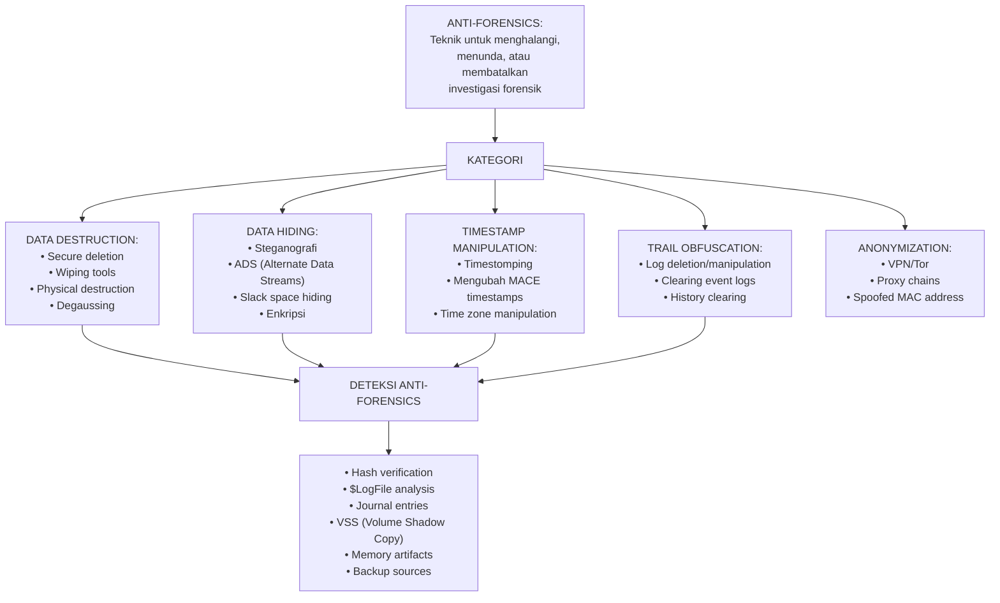

---

### 3. Teknik Anti-Forensics dan Deteksinya

#### 12.1 Secure Deletion dan Wiping

**Cara kerja:** Tools seperti `eraser`, `shred` (Linux), atau `sdelete` (Sysinternals) menimpa data yang dihapus dengan pola acak atau nol, mencegah pemulihan.

```bash
# shred: timpa file 3 kali kemudian hapus
shred -vzu -n 3 sensitive_file.txt

# sdelete (Windows): secure delete
sdelete -p 3 sensitive_file.txt

# dd: wipe unallocated space
dd if=/dev/urandom of=/dev/sdb bs=4M status=progress
```

**Deteksi:**
- Keberadaan tools wiping di sistem adalah bukti niat anti-forensics (Prefetch, Registry MRU, installer)
- Timestamps `last modified` pada $MFT menunjukkan kapan wiping dilakukan
- Volume Shadow Copies mungkin masih mengandung data sebelum dihapus
- MFT records dari file yang diwipe mungkin masih ada (nama file, ukuran) meskipun konten sudah ditimpa

**Keterbatasan wiping di SSD:** SSD menggunakan wear leveling dan over-provisioning — data yang ditulis ke LBA tertentu mungkin sebenarnya disimpan di lokasi NAND flash yang berbeda. `shred` mungkin tidak benar-benar menimpa semua salinan data pada SSD.

#### 12.2 Timestomping

**Cara kerja:** Memodifikasi timestamps MACE untuk menyembunyikan waktu aktivitas yang sebenarnya atau membuat file tampak lebih lama dari yang sebenarnya.

```powershell
# PowerShell — mengubah timestamp file
$(Get-Item "C:\malware.exe").lastWriteTime = "01/01/2020 00:00:00"
$(Get-Item "C:\malware.exe").creationTime = "01/01/2020 00:00:00"
```

**Deteksi:**
- **$STANDARD_INFORMATION vs $FILE_NAME:** NTFS menyimpan timestamps di dua tempat. Tools like `timestomp` biasanya hanya memodifikasi `$STANDARD_INFORMATION` (yang ditampilkan Windows Explorer). `$FILE_NAME` timestamps lebih sulit diubah. Ketidaksesuaian antara keduanya adalah tanda kuat timestomping.
- **$LogFile dan $UsnJrnl:** Journal mencatat kapan atribut file diubah — bahkan jika timestamp diubah, journal mencatat operasi perubahan atribut tersebut.
- **Logical impossibility:** File dengan creation time lebih baru dari modified time adalah anomali (bagaimana file dimodifikasi sebelum dibuat?).

```bash
# Cek $STANDARD_INFORMATION vs $FILE_NAME dengan Autopsy atau TSK
istat disk.dd [inode] | grep -A 20 "\$STANDARD_INFORMATION\|\$FILE_NAME"
```

#### 12.3 Log Deletion dan Event Log Manipulation

**Cara kerja:** Menghapus atau memodifikasi log untuk menghilangkan jejak aktivitas.

```powershell
# Windows: hapus semua event log (memerlukan admin privileges)
Get-EventLog -List | ForEach-Object { Clear-EventLog $_.Log }
# Atau
wevtutil cl Security
wevtutil cl System
wevtutil cl Application
```

**Deteksi:**
- Event ID **1102** (Security log) dan **104** (System log): Windows mencatat bahwa event log dihapus — ini adalah self-logging event. Jika log berisi event 1102 dan kemudian tiba-tiba kosong, itu sendiri adalah bukti.
- **Volume Shadow Copies:** VSS mungkin masih mengandung event log dari sebelum penghapusan.
- **Sysmon (System Monitor):** Jika Sysmon diinstall (konfigurasi EDR/SIEM), ia dapat mencatat event yang tidak tercatat di event log standar.
- **SIEM/Log forwarding:** Jika log dikirim ke SIEM atau syslog server, attacker hanya bisa menghapus log lokal — log remote masih ada.

#### 12.4 Steganografi

**Cara kerja:** Menyembunyikan data di dalam file lain (gambar, audio, video) sehingga keberadaan data tidak terlihat.

**Deteksi steganografi:**
- **Statistical analysis:** File gambar dengan pesan tersembunyi memiliki distribusi statistical yang sedikit berbeda dari gambar normal (chi-square test, RS analysis)
- **Tools:** `stegdetect`, `StegExpose`, `zsteg` (untuk PNG/BMP), `outguess-detect`
- **File size anomalies:** Gambar dengan ukuran yang jauh lebih besar dari yang seharusnya berdasarkan resolusi dan format

```bash
# Deteksi steganografi dengan stegdetect
stegdetect -t jpeg_image.jpg

# zsteg untuk PNG
zsteg suspicious_image.png

# binwalk: mencari file tersembunyi di dalam file
binwalk suspicious_image.jpg
```

**Latihan:**

Soal 1: Investigator menemukan file `photo.jpg` di unallocated space. Timestamps `$STANDARD_INFORMATION` menunjukkan file dibuat tahun 2019, tapi `$FILE_NAME` timestamps menunjukkan 2024. Mana yang lebih dipercaya dan mengapa?

Soal 2: Event log Security pada sistem yang diselidiki menunjukkan Event ID 1102 (audit log cleared) pada 02:42 WIB — 4 menit setelah timeline insiden yang sudah direkonstruksi. Apa signifikansi temuan ini untuk investigasi?

**Kunci Jawaban:**

Soal 1: `$FILE_NAME` timestamps lebih dipercaya dalam kasus ini. Alasannya: (a) Tools timestomping yang tersedia secara luas (seperti timestomp.exe) memodifikasi `$STANDARD_INFORMATION` karena ini yang dapat diakses melalui Windows API. Memodifikasi `$FILE_NAME` memerlukan akses kernel-level yang lebih kompleks. (b) Ketidaksesuaian antara keduanya — `$SI` menunjukkan 2019 tapi `$FN` menunjukkan 2024 — adalah tanda kuat bahwa `$SI` dimanipulasi untuk membuat file terlihat lebih lama. (c) Kenyataan bahwa file ada di unallocated space berarti ini adalah file yang dihapus — jika dibuat tahun 2019, mengapa baru muncul di unallocated space sekarang? Ini memperkuat argumen bahwa timestamps 2019 adalah manipulasi.

Soal 2: Event ID 1102 pada 02:42 — 4 menit setelah insiden — adalah bukti yang sangat signifikan: (a) ini mengindikasikan bahwa pelaku secara sadar mencoba menghilangkan jejak dengan menghapus event log setelah melakukan aktivitas; (b) ironisnya, Event ID 1102 itu sendiri adalah bukti tindakan anti-forensics; (c) pertanyaan investigatif: siapa yang menghapus log? (akun apa yang melakukan operasi ini — bisa dilihat dari informasi dalam event 1102 sendiri sebelum dihapus, atau dari Event ID 4624 sebelumnya); (d) tindakan: segera cek apakah ada backup log (VSS, SIEM), dan gunakan $LogFile/$UsnJrnl untuk rekonstruksi aktivitas antara 02:00-02:42. Keberadaan event ini memperkuat hipotesis bahwa pelaku memiliki pengetahuan forensik dan berusaha menutupi jejaknya.

**Ringkasan:** Anti-forensics adalah bidang yang berkembang seiring dengan perkembangan forensik. Investigator harus familiar dengan teknik umum — wiping, timestomping, log deletion, steganografi — dan cara mendeteksinya. Kunci: bukti anti-forensics itu sendiri adalah bukti kesadaran dan niat pelaku. Sistem dengan multiple redundant logging (SIEM, VSS, journal) jauh lebih tahan terhadap anti-forensics.

**Refleksi:** Pengetahuan tentang anti-forensics adalah "pedang bermata dua" — memahaminya diperlukan untuk mendeteksinya, tetapi pengetahuan yang sama dapat disalahgunakan. Bagaimana program studi ini memastikan bahwa pengetahuan anti-forensics yang diajarkan digunakan secara etis dan defensif?

---

## Bab 13 — Validasi Temuan, Hypothesis Testing, dan Rekonstruksi Kasus

### 1. Capaian Pembelajaran Bab

Setelah menyelesaikan bab ini, mahasiswa mampu:
- Menerapkan metodologi validasi temuan forensik (C5)
- Membangun dan menguji hipotesis investigasi berbasis evidence (C5)
- Merekonstruksi kasus menggunakan timeline dan correlation analysis (C5)
- Mengidentifikasi bias investigasi dan cara mengatasinya (C4)

*Dikaitkan dengan Sub-CPMK.5 (Pertemuan 13) dan Eval-5 (20% — integrated case analysis).*

---

### 2. Peta Konsep Bab

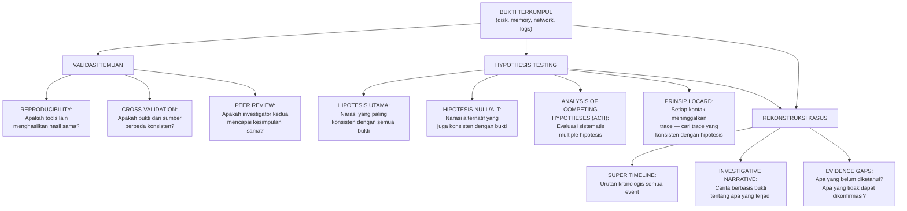

---

### 3. Metodologi Validasi dan Rekonstruksi

#### 13.1 Prinsip Validasi Temuan Forensik

**Reproducibility:** Proses forensik yang valid harus menghasilkan hasil yang sama jika diulang dengan data dan tools yang sama. Dokumentasikan semua langkah secara detail sehingga investigator independen dapat mereproduksi temuan.

**Cross-source consistency:** Bukti yang valid biasanya dikuatkan oleh multiple sumber independen. Jika metadata file mengatakan file dibuat pukul 02:37, Prefetch menunjukkan program dijalankan pada 02:38, dan Event Log menunjukkan login berhasil pada 02:35 — semua konsisten dan saling menguatkan.

**Peer review:** Untuk kasus penting, investigasi kedua oleh investigator independen meningkatkan kepercayaan temuan.

**Negative evidence:** Ketidakhadiran bukti yang seharusnya ada juga bermakna. Jika investigasi mengindikasikan file dikirim via USB tapi tidak ada LNK file atau ShellBags entry — ini anomali yang perlu dijelaskan.

#### 13.2 Analysis of Competing Hypotheses (ACH)

ACH adalah metodologi analitik yang dikembangkan oleh CIA untuk mengevaluasi hipotesis bersaing secara sistematis dan mengurangi bias konfirmasi.

**Prosedur ACH:**

1. **Identifikasi hipotesis** — buat semua penjelasan yang mungkin, termasuk yang tidak nyaman
2. **Daftar bukti yang signifikan** — semua bukti yang dapat membedakan hipotesis
3. **Buat matriks** — evaluasi setiap bukti terhadap setiap hipotesis: Consistent (C), Inconsistent (I), atau Neutral (N)
4. **Refine hipotesis** — pertimbangkan hipotesis yang paling sedikit inkonsistensinya
5. **Identifikasi bukti kunci** — bukti yang paling membedakan hipotesis
6. **Report uncertainty** — tidak semua hipotesis dapat ditolak dengan pasti

**Contoh matriks ACH untuk kasus PT Nusantara Energi:**

| Bukti | H1: Insider Attack | H2: External APT via Lateral Movement | H3: Accidental Admin Error |
|---|---|---|---|
| Brute force dari IP internal | C | C | I |
| USB dicolok jam 02:34 | C | N | C |
| PsExec dijalankan | C | C | I |
| Backdoor account dibuat | C | C | I |
| Tidak ada eksternal intrusion di firewall log | C | C | N |
| Traffic ke IP Tor | C | C | I |

Hasil: H3 (accidental error) memiliki banyak inkonsistensi — dapat dieksklusi. H1 dan H2 keduanya konsisten — perlu bukti tambahan untuk membedakan.

#### 13.3 Menghindari Confirmation Bias

Confirmation bias — mencari bukti yang mengkonfirmasi teori yang sudah dipegang, mengabaikan yang kontradiksi — adalah ancaman terbesar terhadap objektivitas forensik.

**Strategi mitigasi:**
- **Devil's advocate:** Secara aktif cari bukti yang mendukung hipotesis alternatif
- **ACH:** Struktur analitik memaksa evaluasi hipotesis bersaing
- **Peer review:** Investigator kedua yang tidak mengetahui hipotesis Anda menganalisis bukti yang sama
- **Document all evidence:** Catat SEMUA temuan, termasuk yang tidak mendukung teori Anda
- **Quantify uncertainty:** Gunakan bahasa yang tepat — "konsisten dengan" bukan "membuktikan"

#### 13.4 Rekonstruksi Kasus Final PT Nusantara Energi

Berdasarkan super timeline dan analisis bukti:

**Narasi investigatif:**

Pada malam 2024-11-15, antara pukul 02:00-03:00 WIB, terjadi serangkaian aktivitas tidak sah di workstation `WS-SCADA-01` PT Nusantara Energi:

1. Pukul 02:00-02:30: Brute force terhadap akun `administrator` dari IP internal `192.168.10.45` — mengindikasikan workstation tersebut telah dikompromisi atau diakses secara fisik oleh pelaku internal.

2. Pukul 02:34: USB drive dengan serial number tidak dikenal terhubung ke `WS-SCADA-01`. Analisis file system menunjukkan beberapa file executable baru di-copy ke `C:\Users\admin\AppData\Roaming\` pada waktu yang sama.

3. Pukul 02:35: Brute force berhasil — akun `administrator` berhasil diautentikasi dari `192.168.10.45`.

4. Pukul 02:37: File `svchost.exe` palsu di-copy ke profil user — persistence mechanism.

5. Pukul 02:38: `PsExec.exe` dijalankan — kemungkinan untuk eksekusi remote atau transfer tools.

6. Pukul 02:40: Koneksi outbound HTTPS ke `185.220.101.45` (diidentifikasi sebagai Tor exit node) dibuat oleh proses dengan nama menyamar sebagai `svchost.exe`.

7. Pukul 02:41: Service `WindowsUpdater` baru diinstall — backdoor persistence.

8. Pukul 02:45: Akun `backdoor_admin` dibuat — persistence tambahan.

9. Pukul 02:42: Event log Security dihapus (Event ID 1102) — upaya menghilangkan jejak.

**Bukti gaps yang belum terjawab:**
- Siapa yang mengakses workstation di IP `192.168.10.45` (perlu analisis workstation tersebut)?
- Apakah USB drive fisik dapat diperoleh untuk analisis konten?
- Apa yang di-transfer via koneksi Tor ke IP `185.220.101.45`?
- Apakah sistem SCADA lain dikompromisi via PsExec?

**Latihan:**

Soal 1: Dalam rekonstruksi kasus, investigator menemukan bukti yang kuat bahwa tersangka melakukan aksi berbahaya, namun juga menemukan satu bukti yang tidak konsisten dengan hipotesis tersebut. Bagaimana investigator harus menangani bukti yang tidak konsisten ini dalam laporan forensik?

**Kunci Jawaban:**

Jawaban: Bukti yang tidak konsisten TIDAK boleh diabaikan, dihilangkan, atau diminimalkan — meskipun berlawanan dengan hipotesis utama. Dalam laporan forensik, investigator harus: (a) **melaporkan semua bukti**, termasuk yang tidak konsisten dengan hipotesis utama; (b) **menyajikan hipotesis alternatif** yang dapat menjelaskan bukti tidak konsisten tersebut; (c) **menjelaskan mengapa hipotesis utama tetap paling kuat** meskipun ada bukti yang tidak konsisten — apakah bukti tersebut bisa dijelaskan oleh faktor lain? Apakah reliability-nya lebih rendah? (d) **quantify uncertainty**: "Temuan ini konsisten dengan hipotesis X. Bukti Y tidak konsisten dengan hipotesis X; kemungkinan penjelasan adalah Z, namun ini perlu investigasi lebih lanjut." Menyembunyikan atau mengabaikan bukti yang tidak konsisten adalah pelanggaran etika forensik yang serius dan dapat membatalkan seluruh investigasi jika terungkap di pengadilan.

**Ringkasan:** Validasi forensik memerlukan reproducibility, cross-source consistency, dan peer review. ACH adalah metodologi terstruktur untuk mengevaluasi hipotesis bersaing dan mengurangi confirmation bias. Rekonstruksi kasus menghasilkan narasi berbasis evidence yang juga secara eksplisit mengidentifikasi evidence gaps dan ketidakpastian. Kejujuran tentang ketidakpastian adalah fondasi kredibilitas forensik.

**Refleksi:** Bias investigasi dapat mempengaruhi siapa pun, bahkan investigator berpengalaman. Apa mekanisme kelembagaan (prosedural, organisasional) yang dapat dibangun oleh unit forensik untuk meminimalkan dampak bias kognitif terhadap hasil investigasi?

---

## Bab 14 — Struktur Laporan Forensik Profesional

### 1. Capaian Pembelajaran Bab

Setelah menyelesaikan bab ini, mahasiswa mampu:
- Menyusun laporan forensik yang memenuhi standar profesional dan legal (C5)
- Mengorganisasi temuan forensik secara logis dan dapat diverifikasi (C5)
- Mengadaptasi laporan untuk audiens berbeda: teknis dan non-teknis (C4)
- Menghindari kesalahan umum dalam penulisan laporan forensik (C4)

*Dikaitkan dengan Sub-CPMK.6 (Pertemuan 14) dan Eval-6 (15%).*

---

### 2. Peta Konsep Bab

```mermaid
flowchart TD
    ForReport["LAPORAN FORENSIK\nPROFESIONAL"] --> Components["KOMPONEN WAJIB"]
    Components --> Cover["HALAMAN JUDUL:\nKasus, investigator,\nklasifikasi, tanggal"]
    Components --> ExecSumm["EXECUTIVE SUMMARY:\n1-2 halaman\nUntuk manajemen/pengambil\nkeputusan non-teknis"]
    Components --> Scope["RUANG LINGKUP:\nApa yang diselidiki,\napa yang tidak,\nbatasan investigasi"]
    Components --> MethodSection["METODOLOGI:\nTools, prosedur,\nstandar yang digunakan"]
    Components --> Findings["TEMUAN:\nFakta yang dapat\ndiverifikasi, bukan opini"]
    Components --> Analysis["ANALISIS:\nInterpretasi temuan\nberbasis evidence"]
    Components --> Conclusion["KESIMPULAN:\nJawaban atas pertanyaan\ninvestigasi"]
    Components --> Recom["REKOMENDASI:\nTindakan perbaikan\nberdasarkan temuan"]
    Components --> Appendix["LAMPIRAN:\nEvidence inventory,\nhash log, CoC, raw data"]
    ForReport --> Quality["KUALITAS LAPORAN"]
    Quality --> Accuracy["AKURASI:\nHanya fact-based,\ntidak spekulatif"]
    Quality --> Objectivity["OBJEKTIVITAS:\nTidak berpihak,\nlaporan bukti yang tidak\nmendukung pun disertakan"]
    Quality --> Clarity["KEJELASAN:\nBahasa yang dapat dipahami\naudiens yang dituju"]
    Quality --> Verifiability["VERIFIABILITAS:\nSetiap klaim dapat\nditelusuri ke bukti asli"]
```

---

### 3. Panduan Penulisan Laporan Forensik

#### 14.1 Prinsip Dasar Penulisan Laporan Forensik

**Hanya fakta, bukan opini tanpa dasar:** Hindari pernyataan seperti "tersangka pasti melakukan..." — gunakan "bukti menunjukkan bahwa...", "konsisten dengan...", "tidak dapat dikesampingkan bahwa...".

**Setiap klaim dapat ditelusuri:** Setiap pernyataan faktual harus dapat ditelusuri ke bukti spesifik. Gunakan referensi ke evidence item: "Foto USB drive (Item #EV-003) menunjukkan label dengan nomor seri yang cocok dengan Registry entry di USBSTOR (Lampiran C, baris 47)."

**Bahasa yang konsisten:** Gunakan terminologi yang konsisten sepanjang laporan. Jangan berganti-ganti antara "hard drive", "disk", dan "media penyimpanan" untuk benda yang sama.

**Dokumentasikan ketidakpastian:** Gunakan bahasa yang tepat: "dapat diindikasikan bahwa...", "tidak dapat dikonfirmasi tanpa...", "kemungkinan..."

#### 14.2 Struktur Laporan Forensik Standar

**Bagian 1: Halaman Judul dan Metadata**
```
LAPORAN INVESTIGASI FORENSIK DIGITAL
Nomor Kasus     : [NKF-2024-1115-001]
Klasifikasi     : RAHASIA / TERBATAS / dll.
Subjek          : Insiden Keamanan WS-SCADA-01
Klien           : PT Nusantara Energi
Investigator    : [Nama], [Sertifikasi]
Tanggal Laporan : [Tanggal]
Versi Laporan   : 1.0 (Draft/Final)
```

**Bagian 2: Executive Summary** (1-2 halaman)
- Latar belakang insiden (2-3 kalimat)
- Lingkup investigasi
- Temuan utama (3-5 poin paling signifikan)
- Kesimpulan investigatif
- Rekomendasi utama
- Status kasus (ongoing/closed)

*Target audiens: manajemen eksekutif yang tidak memiliki latar belakang teknis*

**Bagian 3: Ruang Lingkup dan Batasan**
- Pertanyaan investigatif yang dijawab
- Sistem/media yang dianalisis
- Periode waktu investigasi
- Yang TIDAK dianalisis dan mengapa (batasan otorisasi, teknis, atau waktu)
- Batasan teknis yang mempengaruhi investigasi

**Bagian 4: Metodologi**
- Tools yang digunakan (nama, versi, referensi validasi)
- Prosedur yang diikuti (referensi ke SOP atau standar: NIST SP 800-86, dll.)
- Kondisi laboratorium

**Bagian 5: Temuan** (core section — teknis)
- Disusun per domain: Disk Analysis, Memory Analysis, Network Analysis, OS Artifacts
- Setiap temuan: deskripsi, lokasi, referensi evidence item, hash/timestamp
- Tabel ringkasan temuan jika perlu

**Bagian 6: Analisis dan Rekonstruksi Timeline**
- Interpretasi temuan dalam konteks kasus
- Super timeline (subset yang relevan)
- Narasi investigatif berbasis evidence

**Bagian 7: Kesimpulan**
- Jawaban langsung atas pertanyaan investigatif
- Level kepercayaan setiap kesimpulan
- Bukti yang mendukung dan (jika ada) yang tidak konsisten

**Bagian 8: Rekomendasi**
- Tindakan remediasi jangka pendek
- Perbaikan kontrol jangka panjang
- Tindak lanjut investigatif yang disarankan

**Lampiran:**
- Evidence Inventory (semua item bukti)
- Hash Log
- Chain of Custody Form
- Screenshots/output tools
- Raw data yang direferensikan dalam laporan

#### 14.3 Kesalahan Umum dan Cara Menghindarinya

| Kesalahan | Contoh Buruk | Contoh Baik |
|---|---|---|
| Pernyataan tanpa bukti | "Tersangka mencuri data" | "File dengan nama 'customer_db.xlsx' di-copy ke USB pada 02:37 WIB (Temuan 3, Item EV-007)" |
| Bahasa tidak pasti yang tidak dikuantifikasi | "Mungkin ada malware" | "windows.malfind mendeteksi PE header tidak sah dalam region memory PID 3421 — kemungkinan code injection (Lampiran F, baris 23-45)" |
| Opini tanpa dasar | "Attacker adalah profesional" | "Penggunaan PsExec, pembuatan backdoor account, dan penghapusan event log menunjukkan pelaku memiliki pengetahuan administrasi Windows yang advanced" |
| Jargon tanpa penjelasan | "IoC ditemukan di MFT dengan MACE anomaly" | "Metadata file (khususnya timestamp pembuatan — 'Created' time) tidak konsisten dengan timestamp modification, yang dapat mengindikasikan manipulasi timestamp (Temuan 7)" |
| Mengabaikan bukti kontradiktif | [Tidak menyebut] | "Satu temuan tidak konsisten dengan hipotesis utama: tidak ada evidence bahwa akun `backdoor_admin` pernah digunakan setelah dibuat (Bagian 8.3)" |

**Latihan:**

Soal 1: Tuliskan Executive Summary (maksimal 200 kata) untuk kasus PT Nusantara Energi berdasarkan temuan dari Bab 13.

**Kunci Jawaban:**

---
**EXECUTIVE SUMMARY — INVESTIGASI WS-SCADA-01**

Pada malam 15 November 2024, workstation `WS-SCADA-01` milik PT Nusantara Energi mengalami kompromi keamanan yang signifikan. Investigasi forensik digital terhadap image disk dan memory dump dari workstation tersebut menghasilkan temuan sebagai berikut:

**Temuan Utama:**
Akun administrator dikompromisi melalui brute force attack yang berasal dari jaringan internal (192.168.10.45) antara pukul 02:00-02:35 WIB. Setelah berhasil masuk, pelaku menginstall mekanisme persistence (service jahat dan akun backdoor), menjalankan tools lateral movement (PsExec), dan membuat koneksi outbound ke node Tor eksternal. USB drive tidak teridentifikasi terhubung ke sistem pada waktu yang sama.

**Kesimpulan:**
Bukti menunjukkan adanya akses tidak sah yang disengaja oleh pelaku dengan pengetahuan administrasi Windows yang advanced. Sumber serangan berasal dari dalam jaringan korporat, mengindikasikan kemungkinan insider threat atau workstation internal yang sudah dikompromisi sebelumnya.

**Rekomendasi Segera:**
Isolasi workstation 192.168.10.45 untuk investigasi lanjutan; nonaktifkan semua akun yang dibuat selama insiden; ganti semua password administrator; review log firewall untuk koneksi ke IP 185.220.101.45.

**Ketidakpastian yang Tersisa:** Identitas pelaku fisik dan konten yang mungkin dikeksfiltrasikan belum dapat dikonfirmasi.

---

**Ringkasan:** Laporan forensik profesional adalah produk utama yang menentukan nilai seluruh investigasi — temuan terbaik menjadi tidak berguna jika tidak terdokumentasi dengan baik. Prinsip kunci: akurasi, objektivitas, verifiabilitas, dan kejelasan. Executive Summary untuk manajemen harus non-teknis tetapi tetap akurat.

**Refleksi:** Laporan forensik dapat menjadi bukti di pengadilan, atau dapat membatalkan karir seseorang jika mengandung kesalahan atau bias. Sebagai investigator, bagaimana Anda membangun sistem review internal untuk memastikan kualitas laporan sebelum diterbitkan?

---

## Bab 15 — Executive Summary, Evidence Appendix, dan Rekomendasi

### 1. Capaian Pembelajaran Bab

Setelah menyelesaikan bab ini, mahasiswa mampu:
- Menyusun Executive Summary yang efektif untuk audiens non-teknis (C5)
- Membangun evidence appendix yang terorganisasi dan dapat ditelusuri (C5)
- Merumuskan rekomendasi berbasis evidence yang actionable (C5)
- Mengintegrasikan semua komponen laporan menjadi dokumen kohesif (C5)

*Dikaitkan dengan Sub-CPMK.6 (Pertemuan 15).*

---

### 2. Peta Konsep Bab

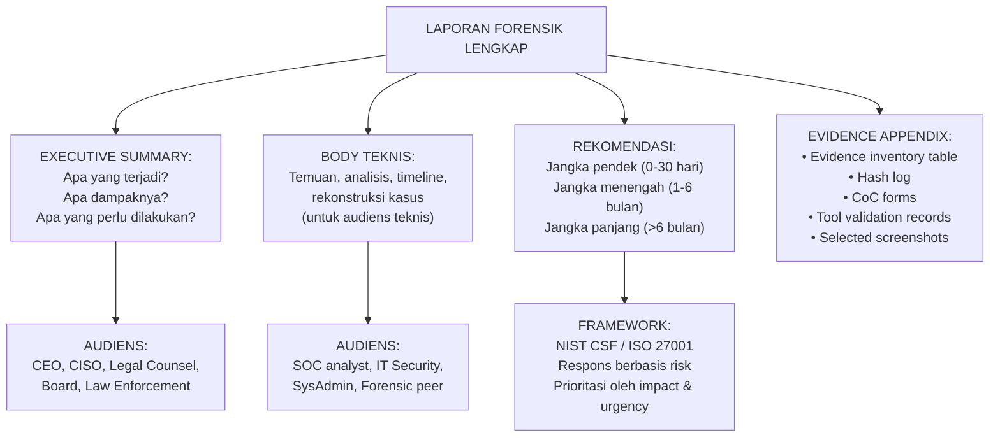

---

### 3. Menyusun Rekomendasi yang Efektif

#### 15.1 Karakteristik Rekomendasi yang Baik

Rekomendasi forensik yang efektif harus:
- **Spesifik:** "Aktifkan multi-factor authentication untuk semua akun administrator" — bukan "tingkatkan keamanan"
- **Actionable:** Dapat langsung diimplementasikan dengan sumber daya yang tersedia
- **Berbasis evidence:** Berakar pada temuan investigasi, bukan saran generik
- **Diprioritaskan:** Dibedakan antara kritis, penting, dan jangka panjang
- **Risk-informed:** Setiap rekomendasi dikaitkan dengan risiko yang dimitigasi

#### 15.2 Kategorisasi Rekomendasi

**Immediate Actions (0-7 hari) — Containment:**
- Isolasi sistem yang terkompromisi
- Ganti semua credentials yang mungkin dikompromis
- Nonaktifkan akun backdoor yang ditemukan
- Block IP dan domain terkait attacker di firewall

**Short-term (7-30 hari) — Eradication & Recovery:**
- Reimaging sistem yang terkompromisi
- Patch vulnerabilities yang dieksploitasi
- Audit semua akun dan permission

**Medium-term (1-6 bulan) — Hardening:**
- Implementasi MFA untuk semua akun privileged
- Aktifkan advanced audit logging (Sysmon, PowerShell logging)
- Implementasi network segmentation untuk SCADA
- Deploy SIEM untuk centralized log monitoring
- Implementasi USB device control policy

**Long-term (>6 bulan) — Strategic:**
- Security awareness training untuk semua karyawan
- Red team exercise untuk validasi kontrol baru
- Forensic readiness program (Bab 1)
- Incident Response Plan yang terupdate

#### 15.3 Evidence Appendix — Inventaris Bukti

Template Evidence Inventory (lengkap):

```
EVIDENCE INVENTORY — NKF-2024-1115-001
=========================================
Item #  | Deskripsi                        | Media        | Hash SHA-256  | Received  | Custodian
--------|----------------------------------|--------------|---------------|-----------|----------
EV-001  | WS-SCADA-01 HDD 1TB              | Original HDD | [hash]        | 2024-11-16| Budi
EV-002  | Forensic Image EV-001            | USB 4TB      | [hash]        | 2024-11-16| Budi
EV-003  | Memory dump WS-SCADA-01          | USB 4TB      | [hash]        | 2024-11-16| Budi
EV-004  | PCAP network (2024-11-15 01-03)  | DVD          | [hash]        | 2024-11-17| Ani
EV-005  | Windows Event Log export         | USB 256GB    | [hash]        | 2024-11-17| Ani
EV-006  | Foto TKP (15 foto)               | USB 256GB    | [zip hash]    | 2024-11-16| Budi
EV-007  | USB drive ditemukan di lokasi    | Evidence bag | N/A           | 2024-11-17| Budi
```

**Latihan:**

Soal 1: Seorang CISO meminta rekomendasi berdasarkan temuan investigasi PT Nusantara Energi. Susun setidaknya 5 rekomendasi konkret, masing-masing dengan kategori waktu, risiko yang diatasi, dan referensi ke temuan investigasi.

**Kunci Jawaban:**

| # | Rekomendasi | Kategori | Risiko yang Diatasi | Referensi Temuan |
|---|---|---|---|---|
| 1 | Implementasi MFA untuk semua akun administrator dan akun dengan akses SCADA | Short-term | Brute force attack berhasil karena autentikasi single-factor | Temuan 4: 15 failed logon → 1 success |
| 2 | Implementasi USB device control policy: whitelist only, logging semua koneksi USB | Short-term | USB drive tidak teridentifikasi digunakan untuk transfer malware | Temuan 3: USBSTOR Registry entry |
| 3 | Deploy Sysmon di semua workstation dengan konfigurasi yang merekam process creation, network connections, dan file creation | Medium-term | Kekurangan telemetri yang mencegah deteksi real-time | Gap: tidak ada process creation log (Event 4688 tidak aktif) |
| 4 | Implementasi network segmentation: SCADA network diisolasi dari corporate network dengan firewall strict | Medium-term | Lateral movement dari corporate network ke SCADA | Temuan 1: brute force dari IP internal corporate |
| 5 | Aktifkan dan monitor SIEM dengan alert untuk: multiple failed logon, new service installation, new account creation di jam non-kerja | Medium-term | Semua aktivitas insiden terjadi tanpa alert real-time | Temuan seluruh timeline: tidak ada deteksi real-time |

**Ringkasan:** Executive Summary adalah jembatan antara investigator teknis dan pengambil keputusan. Evidence appendix memberikan jejak audit yang memungkinkan verifikasi independen. Rekomendasi yang diprioritaskan berdasarkan risk impact memastikan sumber daya terbatas digunakan secara efektif.

**Refleksi:** Rekomendasi forensik sering bertabrakan dengan kebutuhan operasional bisnis — "segmentasi network SCADA" mungkin berarti downtime yang mahal. Bagaimana investigator/konsultan forensik menyajikan rekomendasi yang mempertimbangkan trade-off bisnis tanpa mengorbankan keamanan?

---

## Bab 16 — Presentasi Investigasi dan Evaluasi Akhir

### 1. Capaian Pembelajaran Bab

Setelah menyelesaikan bab ini, mahasiswa mampu:
- Mempresentasikan temuan forensik secara profesional kepada audiens teknis dan non-teknis (C5)
- Menjawab pertanyaan kritis tentang metodologi dan temuan investigasi (C5)
- Merefleksikan pembelajaran dan kompetensi yang dicapai sepanjang mata kuliah (C5)
- Mengidentifikasi area pengembangan profesional dalam forensik digital (C4)

*Dikaitkan dengan Sub-CPMK.6 (Pertemuan 16) dan Eval-6 (15% — presentasi final).*

---

### 2. Peta Konsep Bab

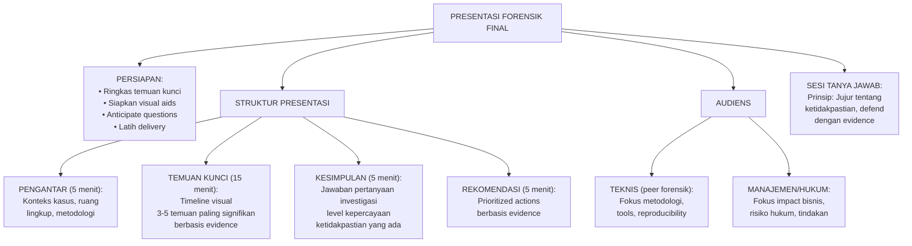

---

### 3. Panduan Presentasi dan Evaluasi Akhir

#### 16.1 Prinsip Presentasi Forensik

**Kejujuran tentang ketidakpastian:** Dalam sesi tanya jawab, jangan mempertahankan klaim yang tidak dapat didukung oleh bukti. "Saya tidak yakin tentang itu dan akan perlu investigasi lebih lanjut" adalah jawaban yang jauh lebih baik daripada spekulasi.

**Defend dengan evidence, bukan opini:** Setiap pernyataan yang dipertanyakan harus dapat dijawab dengan: "Bukti untuk pernyataan ini adalah... [referensi spesifik ke item, halaman, hash]."

**Adaptasi bahasa ke audiens:** Definisikan jargon teknis jika berbicara dengan manajemen. Untuk audiens hukum, tekankan admissibility, chain of custody, dan legal framework.

**Visual aids yang efektif:**
- Timeline visual adalah yang paling efektif untuk menjelaskan urutan kejadian
- Diagram network untuk menjelaskan lateral movement
- Screenshot annotated untuk menunjukkan artefak spesifik
- Hindari slide penuh teks

#### 16.2 Menghadapi Pertanyaan Kritis

**"Bagaimana Anda yakin bahwa evidence tidak dimanipulasi?"**
Jawaban: "Hash SHA-256 dari media asli dan forensic image cocok — saya dapat menunjukkan hash log yang ditandatangani. Proses ini didokumentasikan sesuai NIST SP 800-86. Investigator independen dapat memverifikasi temuan yang sama dengan menggunakan image yang sama."

**"Bukankah tersangka bisa mengatakan seseorang menggunakan komputernya?"**
Jawaban: "Ini adalah pertanyaan yang valid. Bukti forensik menunjukkan [X, Y, Z], yang konsisten dengan penggunaan oleh pemilik akun. Namun, investigasi forensik tidak selalu dapat membuktikan siapa yang secara fisik mengoperasikan keyboard. Ini adalah pertanyaan yang perlu dijawab oleh saksi dan bukti korroboratif lainnya."

**"Apakah tools yang Anda gunakan tervalidasi?"**
Jawaban: "Volatility 3, Autopsy, dan FTK Imager adalah tools yang banyak digunakan dan divalidasi komunitas forensik. Saya menggunakan versi [X.Y.Z] dan dapat menyediakan dokumentasi validasi. NIST NSRL juga dapat digunakan sebagai referensi."

#### 16.3 Evaluasi Akhir: Refleksi Kompetensi

Mahasiswa diharapkan melakukan refleksi terhadap perkembangan kompetensi sepanjang mata kuliah:

**Kompetensi yang dikembangkan:**
- Prinsip forensik digital dan forensic readiness
- Legal framework investigasi digital di Indonesia
- Teknik akuisisi evidence yang sound
- Analisis disk, file system, dan OS artifacts
- Memory forensics dengan Volatility 3
- Network forensics dan timeline analysis
- Mobile dan cloud forensics awareness
- Anti-forensics detection
- Penulisan laporan forensik profesional

**Studi Kasus Final — Penilaian Komprehensif (Eval-6):**

Mahasiswa diberikan skenario investigasi lengkap yang belum pernah dibahas di kelas, berupa:
- Image disk (dapat berupa VM snapshot)
- Memory dump
- Packet capture
- Brief dari klien fiktif

Mahasiswa harus menghasilkan:
- Laporan forensik lengkap sesuai standar Bab 14
- Evidence appendix
- Rekomendasi
- Presentasi 30 menit kepada "klien" (dosen dan penguji)

**Latihan dan Kunci Jawaban Bab 16:**

Soal 1: Seorang lawyer mempertanyakan temuan Anda: "Bagaimana Anda membuktikan bahwa waktu di Event Log akurat? Bagaimana kita tahu sistem tidak salah jam?" Bagaimana Anda menjawab?

Kunci Jawaban: Jawaban yang tepat mengakui keterbatasan ini secara jujur, kemudian menunjukkan bagaimana mitigasinya: "Ini adalah pertanyaan yang penting. Timestamp sistem memang bisa salah karena konfigurasi timezone yang salah atau manipulasi jam sistem. Dalam investigasi ini, saya melakukan langkah berikut untuk memvalidasi akurasi timestamp: (1) Membandingkan event log timestamps dengan sumber clock eksternal yang terdokumentasi — dalam kasus ini, SIEM log yang menggunakan NTP server menunjukkan timestamp yang konsisten; (2) Crossreferencing dengan timestamp dari sumber berbeda (Registry, $MFT, Prefetch, Event Log) — semua konsisten satu sama lain, menunjukkan jam sistem akurat pada waktu kejadian; (3) Mengecek Registry `W32TM` untuk mengetahui konfigurasi NTP server sistem. Jika ada bukti bahwa jam sistem dimanipulasi, itu sendiri akan muncul sebagai anomali dalam multiple sumber. Namun demikian, saya bersedia mengakui bahwa jika jam sistem dimanipulasi dengan cara yang tidak meninggalkan jejak, ini adalah keterbatasan yang perlu diakui dalam laporan."

Soal 2: Dalam presentasi final, audiens mempertanyakan apakah investigasi Anda objektif mengingat klien adalah perusahaan yang memiliki kepentingan dalam hasil investigasi tertentu. Bagaimana Anda merespons?

Kunci Jawaban: "Pertanyaan ini menyentuh integritas fundamental dari praktik forensik. Komitmen saya sebagai investigator forensik adalah kepada kebenaran dan bukti — bukan kepada klien. Dalam investigasi ini: (1) Semua bukti, termasuk yang tidak menguntungkan klien, dilaporkan secara penuh; (2) Saya menggunakan metodologi yang dapat diverifikasi secara independen — investigator lain dengan akses ke image yang sama dapat mereproduksi dan memverifikasi temuan saya; (3) Saya mendokumentasikan semua langkah secara detail sehingga setiap keputusan analitik dapat diperiksa; (4) Jika ada bukti yang menunjukkan bahwa klien sendiri terlibat dalam insiden, saya berkewajiban untuk melaporkannya. Standar etika forensik mengharuskan objektivitas penuh, dan saya siap mempertanggungjawabkan setiap pernyataan dalam laporan ini kepada bukti spesifik yang dapat diverifikasi."

**Ringkasan:** Presentasi forensik adalah bagian akhir dari rantai nilai investigasi. Kejujuran tentang ketidakpastian, kemampuan defend dengan evidence, dan adaptasi komunikasi ke audiens adalah kompetensi profesional yang sama pentingnya dengan keterampilan teknis. Integritas forensik — melaporkan semua bukti secara objektif — adalah fondasi kredibilitas yang tidak dapat dikompromikan.

**Refleksi:** Setelah menyelesaikan mata kuliah ini, identifikasi satu area kompetensi forensik yang menurut Anda paling perlu dikembangkan lebih lanjut, dan rumuskan rencana pengembangan diri yang konkret (sertifikasi, praktik, bacaan) untuk mengembangkannya dalam 12 bulan ke depan.

---

---

# LAMPIRAN

## Lampiran A — Template Chain of Custody Form

```
====================================================================
FORMULIR CHAIN OF CUSTODY — BUKTI DIGITAL
====================================================================
Nomor Kasus     : _______________________
Nomor Item Bukti: _______________________
Tanggal/Waktu   : _______________________
Investigator    : _______________________

--------------------------------------------------------------------
DESKRIPSI ITEM BUKTI
--------------------------------------------------------------------
Jenis Media     : [ ] HDD  [ ] SSD  [ ] USB  [ ] CD/DVD
                  [ ] Memory Card  [ ] Perangkat Mobile  [ ] Lainnya: ___
Merek/Model     : _______________________
Kapasitas       : _______________________
Serial Number   : _______________________
Kondisi Fisik   : _______________________
Ditemukan Di    : _______________________

--------------------------------------------------------------------
HASH KRIPTOGRAFI (ISI SETELAH AKUISISI)
--------------------------------------------------------------------
MD5   : _______________________________________________
SHA-256: _______________________________________________
Dihitung dengan  : _______________________  Versi: _______

--------------------------------------------------------------------
LOG TRANSFER BUKTI
--------------------------------------------------------------------
Diserahkan Oleh      | Diterima Oleh        | Tgl/Waktu  | Tujuan
---------------------|----------------------|------------|--------
                     |                      |            |
                     |                      |            |
                     |                      |            |

--------------------------------------------------------------------
KONDISI PENYIMPANAN
--------------------------------------------------------------------
Lokasi Penyimpanan: _______________________
Kondisi Penyimpanan: [ ] Lemari terkunci  [ ] Ruang bukti
Akses Terbatas  : [ ] Ya  [ ] Tidak
Suhu/Kelembaban Terkontrol: [ ] Ya  [ ] Tidak
====================================================================
```

---

## Lampiran B — Template Evidence Inventory

```
EVIDENCE INVENTORY — NOMOR KASUS: _______________
================================================================
Item # | Deskripsi             | Tgl Diterima | Hash SHA-256
       |                       |              | (16 char pertama)
-------|----------------------|--------------|----------------
EV-001 |                      |              |
EV-002 |                      |              |
EV-003 |                      |              |
EV-004 |                      |              |
EV-005 |                      |              |

NOTES:
- Hash penuh tersimpan di Hash Log (Lampiran C)
- Semua item disimpan di [lokasi penyimpanan]
- Akses hanya untuk investigator yang terotorisasi
================================================================
```

---

## Lampiran C — Template Acquisition Log

```
ACQUISITION LOG
================================================================
Kasus           : _______________
Tanggal/Waktu   : _______________
Investigator    : _______________
Tools Akuisisi  : _______________  Versi: _______________

Source Device
--------------
Jenis           : _______________
Identifier      : _______________
Kapasitas       : _______________
Write Blocker   : [ ] Hardware: _____________ Versi: _______
                  [ ] Software: _____________ Versi: _______

Hash Source (Pre-Acquisition)
------------------------------
MD5    : _______________
SHA-256: _______________
Waktu  : _______________

Proses Akuisisi
----------------
Waktu Mulai     : _______________
Waktu Selesai   : _______________
Format Output   : [ ] DD/RAW  [ ] E01  [ ] AFF4  [ ] Lainnya: ___
Ukuran Output   : _______________
Error/Bad Sector: _______________

Hash Source (Post-Acquisition)
-------------------------------
MD5    : _______________
SHA-256: _______________
Match dengan Pre? : [ ] YA — Integritas terjaga
                    [ ] TIDAK — Investigasi diperlukan

Hash Image
-----------
MD5    : _______________
SHA-256: _______________
Match dengan Source? : [ ] YA  [ ] TIDAK

Verifikasi Akhir: [ ] BERHASIL  [ ] GAGAL — Alasan: _______________

Tanda Tangan Investigator: _______________  Tanggal: _______________
================================================================
```

---

## Lampiran D — Template Laporan Forensik Digital

```
====================================================================
LAPORAN INVESTIGASI FORENSIK DIGITAL
====================================================================
Nomor Kasus     :
Klasifikasi     :
Subjek          :
Klien           :
Investigator    :
Tanggal Laporan :
Versi           :

====================================================================
BAGIAN 1 — EXECUTIVE SUMMARY
====================================================================
[Ringkasan 1-2 halaman untuk manajemen/pengambil keputusan]

Latar Belakang:

Temuan Utama:
1.
2.
3.

Kesimpulan:

Rekomendasi Segera:
1.
2.

====================================================================
BAGIAN 2 — RUANG LINGKUP DAN BATASAN
====================================================================
Pertanyaan Investigatif:
1.
2.

Sistem/Media yang Dianalisis:
[Referensi ke Evidence Inventory]

Yang TIDAK Dianalisis:

Batasan Teknis:

====================================================================
BAGIAN 3 — METODOLOGI
====================================================================
Tools yang Digunakan:
[Tabel: nama tools, versi, fungsi]

Standar yang Diikuti:
[ ] NIST SP 800-86  [ ] ACPO Guidelines  [ ] Lainnya: ___

====================================================================
BAGIAN 4 — TEMUAN
====================================================================
4.1 Analisis Disk
[...]

4.2 Analisis Memory
[...]

4.3 Analisis Network
[...]

4.4 Analisis OS Artifacts
[...]

====================================================================
BAGIAN 5 — ANALISIS DAN TIMELINE
====================================================================
[Super timeline dan narasi investigatif]

====================================================================
BAGIAN 6 — KESIMPULAN
====================================================================
[Jawaban atas pertanyaan investigatif dengan level kepercayaan]

====================================================================
BAGIAN 7 — REKOMENDASI
====================================================================
[Tabel: rekomendasi, prioritas, kategori waktu, referensi temuan]

====================================================================
LAMPIRAN
====================================================================
A. Evidence Inventory
B. Hash Log
C. Chain of Custody Forms
D. Tool Validation Records
E. Screenshots (jika relevan)
====================================================================
```

---

## Lampiran E — Template Worksheet Timeline Investigasi

```
SUPER TIMELINE WORKSHEET — KASUS: _______________
====================================================================
Timestamp (UTC)   | Sumber     | Event           | Signifikansi
------------------|------------|-----------------|----------------
                  |            |                 |
                  |            |                 |
                  |            |                 |

KODE SUMBER:
EVT = Windows Event Log
MFT = NTFS $MFT
REG = Windows Registry
PRF = Prefetch
MEM = Memory (Volatility)
NET = Network/PCAP
USB = USB Registry (USBSTOR)
DNS = DNS Log
FW  = Firewall Log
====================================================================
```

---

## Lampiran F — Rubrik Penilaian Laporan Forensik (Eval-6)

| Komponen | Bobot | 85-100 (Sangat Baik) | 70-84 (Baik) | 55-69 (Cukup) | <55 (Kurang) |
|---|---|---|---|---|---|
| Chain of Custody | 15% | CoC lengkap, semua transfer terdokumentasi, hash terverifikasi | CoC lengkap, minor errors | CoC ada tapi tidak lengkap | CoC tidak ada atau sangat tidak lengkap |
| Metodologi Akuisisi | 15% | Write blocker digunakan, imaging tervalidasi, prosedur sesuai standar | Sebagian besar prosedur benar | Ada prosedur yang tidak tepat | Metodologi tidak jelas atau tidak tepat |
| Kelengkapan Analisis | 25% | Semua domain dianalisis: disk, memory, network, OS artifacts | 3 dari 4 domain dianalisis | 2 dari 4 domain dianalisis | Hanya 1 domain atau tidak lengkap |
| Kualitas Laporan | 20% | Akurat, objektif, setiap klaim terlacak ke bukti, bahasa jelas | Sebagian besar akurat dan terlacak | Beberapa klaim tanpa referensi bukti | Banyak klaim tidak terdukung bukti |
| Rekomendasi | 10% | Spesifik, actionable, diprioritaskan, berbasis evidence | Baik tapi kurang spesifik atau prioritas | Ada tapi generik | Tidak ada atau tidak relevan |
| Presentasi | 15% | Jelas, terstruktur, adaptasi audiens, tanya jawab ditangani dengan baik | Presentasi baik, minor gaps | Presentasi dapat dipahami tapi kurang terstruktur | Sulit dipahami atau tidak terstruktur |

---

## Lampiran G — Pernyataan Etika Praktikum

```
PERNYATAAN ETIKA PRAKTIKUM FORENSIK DIGITAL
====================================================================
Nama Mahasiswa  : _______________
NIM             : _______________
Mata Kuliah     : Digital Forensics (VSFDKS08)
Pertemuan/Lab   : _______________

Saya yang bertanda tangan di bawah ini menyatakan bahwa:

1. OTORISASI: Saya hanya melakukan analisis forensik terhadap
   sistem, media, atau data yang telah secara eksplisit
   diotorisasi untuk saya analisis dalam lingkup mata kuliah ini.

2. TIDAK ADA PENGGUNAAN OFENSIF: Saya tidak akan menggunakan
   pengetahuan dan teknik yang dipelajari untuk menyerang,
   mengakses tanpa otorisasi, atau merusak sistem yang bukan
   milik saya atau yang tidak diotorisasi untuk saya akses.

3. PRIVASI: Jika dalam praktikum ditemukan data pribadi yang
   tidak relevan dengan tujuan pembelajaran, saya akan
   merahasiakannya dan tidak akan membagikan atau menggunakannya.

4. KERAHASIAAN: Saya akan menjaga kerahasiaan temuan yang
   diperoleh dalam praktikum dan tidak akan
   mendiskusikannya di luar lingkup yang diizinkan oleh
   instruktur.

5. INTEGRITAS: Saya akan melaporkan semua temuan secara
   jujur, termasuk yang tidak mendukung hipotesis awal,
   sesuai standar objektivitas forensik profesional.

6. HUKUM: Saya memahami bahwa pelanggaran terhadap UU ITE
   No. 11/2008 dan regulasi terkait dapat mengakibatkan
   sanksi hukum, dan saya berkomitmen untuk mematuhinya.

Tanda Tangan   : _______________
Tanggal        : _______________
====================================================================
```

---

# KUNCI JAWABAN GLOBAL

## Rekap Kunci Jawaban Lintas Bab

**Tema Berulang yang Harus Dipahami:**

**Tema 1: Integritas Bukti adalah Segalanya**
Setiap bab berulang kali menunjukkan bahwa integritas bukti — dibuktikan melalui hash yang cocok, write blocker, dokumentasi yang lengkap — adalah fondasi dari semua nilai investigatif. Tanpa integritas yang dapat dibuktikan, bukti tidak dapat diadmisi.

**Tema 2: Dokumentasikan Segalanya, Termasuk Ketidakpastian**
Investigator yang baik mendokumentasikan SEMUA temuan, termasuk yang tidak mendukung hipotesis, dan dengan jelas menyatakan level kepercayaan dan keterbatasan setiap kesimpulan.

**Tema 3: Anti-Forensics Tidak Sempurna**
Hampir setiap teknik anti-forensics meninggalkan jejaknya sendiri. Log deletion meninggalkan Event ID 1102. Timestomping meninggalkan ketidaksesuaian antara $SI dan $FN. Wiping meninggalkan jejak tools di Prefetch. Investigator yang mengetahui hal ini memiliki keunggulan.

**Tema 4: Multiple Sources, Multiple Validation**
Kepercayaan investigasi meningkat drastis saat temuan dikuatkan oleh multiple sumber independen. Tidak ada "single source of truth" yang cukup.

**Tema 5: Etika dan Legalitas adalah Non-Negotiable**
Investigasi yang melanggar hukum atau etika — bahkan jika menemukan bukti kejahatan — dapat membatalkan seluruh proses hukum dan mengekspos investigator ke tanggung jawab hukum.

---

# DAFTAR PUSTAKA

## Pustaka Utama

Casey, E. (2011). *Digital Evidence and Computer Crime: Forensic Science, Computers, and the Internet* (3rd ed.). Academic Press.

Nelson, B., Phillips, A., & Steuart, C. (2019). *Guide to Computer Forensics and Investigations* (6th ed.). Cengage Learning.

NIST. (2006). *Guide to Integrating Forensic Techniques into Incident Response* (NIST SP 800-86). National Institute of Standards and Technology. https://doi.org/10.6028/NIST.SP.800-86

NIST. (2014). *Guidelines on Mobile Device Forensics* (NIST SP 800-101 Rev. 1). National Institute of Standards and Technology. https://doi.org/10.6028/NIST.SP.800-101r1

NIST. (2005). *Guide to Malware Incident Prevention and Handling for Desktops and Laptops* (NIST SP 800-83). National Institute of Standards and Technology.

## Pustaka Pendukung

Carrier, B. (2005). *File System Forensic Analysis*. Addison-Wesley Professional.

Luttgens, J., Pepe, M., & Mandia, K. (2014). *Incident Response & Computer Forensics* (3rd ed.). McGraw-Hill.

Rowlingson, R. (2004). A ten step process for forensic readiness. *International Journal of Digital Evidence*, 2(3), 1–28.

ACPO. (2012). *Good Practice Guide for Digital Evidence*. Association of Chief Police Officers.

Cichonski, P., Millar, T., Grance, T., & Scarfone, K. (2012). *Computer Security Incident Handling Guide* (NIST SP 800-61 Rev. 2). National Institute of Standards and Technology. https://doi.org/10.6028/NIST.SP.800-61r2

Brinson, A., Robinson, A., & Rogers, M. (2006). A cyber forensics ontology: Creating a new approach to studying cyber forensics. *Digital Investigation*, 3, 37–43.

Cohen, F. (2009). Fundamentals of digital forensic evidence. In *Handbook of Information and Communication Security*. Springer.

Garfinkel, S. (2010). Digital forensics research: The next 10 years. *Digital Investigation*, 7, S64–S73.

Zdziarski, J. (2008). *iPhone Forensics: Recovering Evidence, Personal Data, and Corporate Assets*. O'Reilly Media.

## Regulasi dan Standar

Republik Indonesia. (2008). *Undang-Undang Nomor 11 Tahun 2008 tentang Informasi dan Transaksi Elektronik*. Lembaran Negara Republik Indonesia.

Republik Indonesia. (2022). *Undang-Undang Nomor 27 Tahun 2022 tentang Perlindungan Data Pribadi*. Lembaran Negara Republik Indonesia.

Republik Indonesia. (1981). *Undang-Undang Nomor 8 Tahun 1981 tentang Hukum Acara Pidana (KUHAP)*. Lembaran Negara Republik Indonesia.

ISO/IEC. (2012). *ISO/IEC 27037:2012 — Information Technology — Security Techniques — Guidelines for Identification, Collection, Acquisition and Preservation of Digital Evidence*. International Organization for Standardization.

RFC 3227. (2002). *Guidelines for Evidence Collection and Archiving*. Internet Engineering Task Force.

---

*Buku Ajar ini telah disusun sesuai dengan Rencana Pembelajaran Semester (RPS) mata kuliah Digital Forensics (VSFDKS08), Program Studi Magister Terapan Forensik Digital dan Keamanan Siber, Politeknik Elektronika Negeri Surabaya (PENS). Seluruh konten bersifat defensif, legal, dan mengutamakan prinsip etika profesi forensik digital.*

---
*Versi 1.0 — Disusun untuk Tahun Akademik 2025/2026*
