# BUKU AJAR
# ETHICAL HACKING
## Kode Mata Kuliah: VSFDKS06

---

**Program Studi:** Magister Terapan Forensik Digital dan Keamanan Siber  
**Jurusan:** Teknik Informatika dan Komputer  
**Institusi:** Politeknik Elektronika Negeri Surabaya (PENS)  
**Bobot SKS:** T = 2 | P = 1 (Total 3 SKS)  
**Semester:** 2 (Genap)  
**Prasyarat:** Cybersecurity Principles (VSFDKS03), Secure Programming (VSFDKS04)

---

> **Pernyataan Etika Penggunaan Buku**
>
> Seluruh isi buku ajar ini — termasuk teknik, prosedur, dan contoh — **hanya boleh dipraktikkan pada sistem yang dimiliki sendiri atau yang telah mendapat otorisasi tertulis yang eksplisit dari pemiliknya.** Penerapan teknik pengujian penetrasi pada sistem tanpa otorisasi merupakan tindak pidana di Indonesia (UU ITE Pasal 30-32) dan di hampir seluruh yurisdiksi lainnya.
>
> Buku ini disusun untuk membentuk **profesional keamanan siber yang etis, legal, dan bertanggung jawab** — bukan untuk memfasilitasi akses tidak sah terhadap sistem orang lain.
>
> *Semua aktivitas praktikum dalam buku ini dilaksanakan pada lingkungan lab yang terisolasi, sah, dan mendapat otorisasi.*

---

## METADATA MATA KULIAH

| Atribut | Detail |
|---------|--------|
| Kode Mata Kuliah | VSFDKS06 (MK-W-06) |
| Nama Mata Kuliah | Ethical Hacking |
| Rumpun | Keilmuan Inti — Penetration Testing & Ethical Hacking |
| Bobot SKS | T=2, P=1 (3 SKS) |
| Semester | 2 (Genap) |
| Jenis | Wajib |
| Level Bloom | C4–C5 (Menganalisis dan Mengevaluasi) |
| Prasyarat | Cybersecurity Principles (VSFDKS03), Secure Programming (VSFDKS04) |
| Mode Pembelajaran | 2 jam teori + 2 jam praktik per minggu |

---

## KATA PENGANTAR

Ethical hacking adalah disiplin yang menuntut lebih dari sekadar kemampuan teknis — ia menuntut integritas, penilaian hukum yang cermat, dan pemahaman mendalam tentang tanggung jawab profesional. Seorang penguji penetrasi yang kompeten bukan hanya seseorang yang dapat menemukan kerentanan, tetapi seseorang yang tahu kapan harus berhenti, bagaimana mendokumentasikan temuan secara bertanggung jawab, dan bagaimana mengkomunikasikan risiko kepada pemangku kepentingan dengan cara yang dapat ditindaklanjuti.

Buku ajar ini dirancang untuk Program Studi Magister Terapan Forensik Digital dan Keamanan Siber PENS, mengikuti Rencana Pembelajaran Semester (RPS) VSFDKS06 sebagai sumber otoritatif. Ia dibangun di atas prasyarat yang kuat — Cybersecurity Principles dan Secure Programming — dan mempersiapkan mahasiswa untuk karier sebagai profesional keamanan siber yang dapat dipercaya untuk melakukan pengujian keamanan pada infrastruktur organisasi yang nyata.

Setiap bab dalam buku ini mengikuti siklus penuh pengujian penetrasi: dari perencanaan dan otorisasi, melalui reconnaissance, scanning, enumeration, validasi kerentanan yang terkontrol, hingga pelaporan profesional. Pendekatan ini mencerminkan standar industri — PTES, NIST SP 800-115, dan metodologi OWASP — yang akan mahasiswa temui dalam pekerjaan nyata.

Satu prinsip yang tidak dapat ditawar dalam buku ini: **tidak ada teknik ofensif yang dipraktikkan di luar lingkungan lab yang sah dan terisolasi.** Pemahaman tentang cara kerja serangan adalah prasyarat untuk pertahanan yang efektif; tetapi pemahaman itu harus diperoleh melalui cara yang legal, etis, dan dapat dipertanggungjawabkan.

---

## DESKRIPSI MATA KULIAH

Mata kuliah Ethical Hacking membekali mahasiswa dengan kemampuan melakukan pengujian penetrasi secara etis, legal, terukur, dan terdokumentasi. Cakupan meliputi konsep dan metodologi penetration testing, legal boundary, authorization, rules of engagement, reconnaissance, scanning, enumeration, vulnerability discovery, validasi kerentanan di laboratorium terkontrol, analisis risiko, penyusunan mitigasi, retest plan, dan pelaporan profesional.

Pembelajaran menggunakan pendekatan case-based method, problem/project-based learning, simulasi lab terisolasi, serta penilaian berbasis portofolio dan laporan profesional.

---

## PETA OBE: CPL → IK → CPMK → Sub-CPMK → EVALUASI

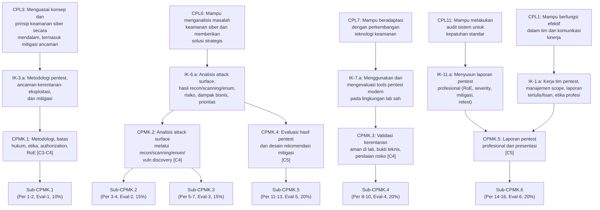
```mermaid
flowchart TD
    CPL3["CPL3: Menguasai konsep dan\nprinsip keamanan siber secara\nmendalam, termasuk mitigasi ancaman"] --> IK3a["IK-3.a: Metodologi pentest,\nancaman-kerentanan-eksploitasi,\ndan mitigasi"]
    CPL6["CPL6: Mampu menganalisis masalah\nkeamanan siber dan memberikan\nsolusi strategis"] --> IK6a["IK-6.a: Analisis attack surface,\nhasil recon/scanning/enum,\nrisiko, dampak bisnis, prioritas"]
    CPL7["CPL7: Mampu beradaptasi\ndengan perkembangan\nteknologi keamanan"] --> IK7a["IK-7.a: Menggunakan dan\nmengevaluasi tools pentest modern\npada lingkungan lab sah"]
    CPL11["CPL11: Mampu melakukan\naudit sistem untuk\nkepatuhan standar"] --> IK11a["IK-11.a: Menyusun laporan pentest\nprofesional (RoE, severity, mitigasi,\nretest)"]
    CPL1["CPL1: Mampu berfungsi efektif\ndalam tim dan komunikasi\nkinerja"] --> IK1a["IK-1.a: Kerja tim pentest,\nmanajemen scope, laporan\ntertulis/lisan, etika profesi"]
    
    IK3a --> CPMK1["CPMK.1: Metodologi, batas\nhukum, etika, authorization,\nRoE [C3-C4]"]
    IK6a --> CPMK2["CPMK.2: Analisis attack surface\nmelalui recon/scanning/enum/\nvuln discovery [C4]"]
    IK7a --> CPMK3["CPMK.3: Validasi kerentanan\naman di lab, bukti teknis,\npenilaian risiko [C4]"]
    IK6a --> CPMK4["CPMK.4: Evaluasi hasil pentest\ndan desain rekomendasi mitigasi\n[C5]"]
    IK11a --> CPMK5["CPMK.5: Laporan pentest\nprofesional dan presentasi\n[C5]"]
    IK1a --> CPMK5

    CPMK1 --> SubCPMK1["Sub-CPMK.1\n(Per 1-2, Eval-1, 10%)"]
    CPMK2 --> SubCPMK2["Sub-CPMK.2\n(Per 3-4, Eval-2, 15%)"]
    CPMK2 --> SubCPMK3["Sub-CPMK.3\n(Per 5-7, Eval-3, 15%)"]
    CPMK3 --> SubCPMK4["Sub-CPMK.4\n(Per 8-10, Eval-4, 20%)"]
    CPMK4 --> SubCPMK5["Sub-CPMK.5\n(Per 11-13, Eval-5, 20%)"]
    CPMK5 --> SubCPMK6["Sub-CPMK.6\n(Per 14-16, Eval-6, 20%)"]
```

---

## PETA KOMPETENSI MATA KULIAH

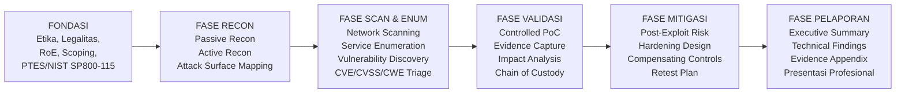
```mermaid
flowchart LR
    Foundation["FONDASI\nEtika, Legalitas,\nRoE, Scoping,\nPTES/NIST SP800-115"] --> Recon["FASE RECON\nPassive Recon\nActive Recon\nAttack Surface Mapping"]
    Recon --> ScanEnum["FASE SCAN & ENUM\nNetwork Scanning\nService Enumeration\nVulnerability Discovery\nCVE/CVSS/CWE Triage"]
    ScanEnum --> Validate["FASE VALIDASI\nControlled PoC\nEvidence Capture\nImpact Analysis\nChain of Custody"]
    Validate --> Mitigate["FASE MITIGASI\nPost-Exploit Risk\nHardening Design\nCompensating Controls\nRetest Plan"]
    Mitigate --> Report["FASE PELAPORAN\nExecutive Summary\nTechnical Findings\nEvidence Appendix\nPresentasi Profesional"]
```

---

## PETA KURIKULUM BUKU

| Bab | Judul | Sub-CPMK | Materi Utama | Evaluasi |
|-----|-------|----------|--------------|----------|
| 1 | Etika, Legalitas, dan Kerangka Metodologi | Sub-CPMK.1 | PTES, NIST SP 800-115, legal boundary, kode etik | Eval-1 (10%) |
| 2 | Scoping, Authorization, dan Rules of Engagement | Sub-CPMK.1 | Scope memo, RoE, authorization, lab safety | Eval-1 (10%) |
| 3 | Passive Reconnaissance dan OSINT Konseptual | Sub-CPMK.2 | Passive recon, OSINT, footprinting | Eval-2 (15%) |
| 4 | Active Reconnaissance dan Attack Surface Mapping | Sub-CPMK.2 | Active recon, asset discovery, threat model awal | Eval-2 (15%) |
| 5 | Network Scanning dan Service Discovery | Sub-CPMK.3 | Nmap, port scanning, service fingerprinting | Eval-3 (15%) |
| 6 | Enumeration dan Vulnerability Discovery | Sub-CPMK.3 | Service enumeration, vuln assessment, OpenVAS | Eval-3 (15%) |
| 7 | CVE, CVSS, CWE, dan Vulnerability Triage | Sub-CPMK.3 | CVE/CVSS/CWE/NVD, false positive, prioritisasi | Eval-3 (15%) |
| 8 | UTS — Analisis Kasus Integratif | Sub-CPMK.4 | Review metodologi, kasus integratif Bab 1-7 | Eval-4 (20%) |
| 9 | Controlled Proof-of-Concept Validation | Sub-CPMK.4 | PoC terbatas di lab, evidence capture, RoE | Eval-4 (20%) |
| 10 | Impact Analysis dan Dampak Bisnis | Sub-CPMK.4 | Dampak teknis vs bisnis, containment, chain of custody | Eval-4 (20%) |
| 11 | Web dan API Security Testing Awareness | Sub-CPMK.5 | OWASP Top 10, WSTG, ASVS, API Top 10 | Eval-5 (20%) |
| 12 | Post-Exploitation Risk Assessment (Konseptual) | Sub-CPMK.5 | Privilege escalation model, lateral movement concepts | Eval-5 (20%) |
| 13 | Mitigasi, Hardening, Containment, dan Retest | Sub-CPMK.5 | Compensating controls, CIS Benchmarks, retest plan | Eval-5 (20%) |
| 14 | Penulisan Laporan Penetration Testing Profesional | Sub-CPMK.6 | Report structure, executive summary, technical findings | Eval-6 (20%) |
| 15 | Presentasi kepada Stakeholder | Sub-CPMK.6 | Teknik presentasi, audiens teknis vs manajerial, Q&A | Eval-6 (20%) |
| 16 | Final Portfolio dan Retest Planning | Sub-CPMK.6 | Portfolio review, closure, remediation tracking | Eval-6 (20%) |

---

## PETUNJUK PENGGUNAAN BUKU

Buku ini dirancang sebagai bahan ajar mandiri yang sejajar dengan perkuliahan tatap muka dan daring. Setiap bab mengikuti siklus pembelajaran: teori → model → contoh terapan → praktikum → latihan → jawaban.

**Untuk mahasiswa:**
- Baca bagian Landasan Teori sebelum kuliah untuk mempersiapkan diskusi.
- Gunakan diagram Mermaid sebagai panduan visual sebelum membaca teks panjang.
- Setiap Praktikum harus dilakukan di lingkungan lab yang ditentukan — **jangan pernah mencoba di luar lab**.
- Latihan Pemahaman dan Studi Kasus adalah persiapan untuk evaluasi.

**Untuk dosen:**
- Bab 8 (UTS) dapat digunakan sebagai soal atau diskusi kelas.
- Lampiran A-G berisi template evaluasi yang dapat disesuaikan.
- Praktikum dirancang untuk target lab yang tersedia di PENS (Metasploitable, DVWA, WebGoat, VMs terisolasi).

**Lingkungan lab yang digunakan:**
- Metasploitable2/3 (VM yang sengaja rentan, terisolasi)
- DVWA (Damn Vulnerable Web Application)
- WebGoat (OWASP)
- HackTheBox / TryHackMe (platform legal untuk pembelajaran)
- VMs terisolasi yang disediakan oleh program studi

---

## DAFTAR BAB

1. Etika, Legalitas, dan Kerangka Metodologi Ethical Hacking
2. Scoping, Authorization, dan Rules of Engagement
3. Passive Reconnaissance dan OSINT Konseptual
4. Active Reconnaissance dan Attack Surface Mapping
5. Network Scanning dan Service Discovery
6. Enumeration dan Vulnerability Discovery
7. CVE, CVSS, CWE, dan Vulnerability Triage
8. UTS — Analisis Kasus Integratif Reconnaissance hingga Vulnerability Discovery
9. Controlled Proof-of-Concept Validation
10. Impact Analysis, Containment, dan Chain of Custody
11. Web dan API Security Testing Awareness
12. Post-Exploitation Risk Assessment (Konseptual)
13. Mitigasi, Hardening, Containment, Cleanup, dan Retest Plan
14. Penulisan Laporan Penetration Testing Profesional
15. Presentasi kepada Stakeholder Teknis dan Manajerial
16. Final Portfolio Review dan Remediation Tracking

---


---

# BAB 1 — ETIKA, LEGALITAS, DAN KERANGKA METODOLOGI ETHICAL HACKING

**Pertemuan:** 1  
**Sub-CPMK:** Sub-CPMK.1  
**Evaluasi:** Eval-1 (10%)

---

## 1. Capaian Pembelajaran Bab

Setelah menyelesaikan Bab 1, mahasiswa mampu:

- Menjelaskan perbedaan antara ethical hacking, penetration testing, dan tindak pidana siber dari perspektif hukum.
- Mengidentifikasi batas-batas legal yang mengatur pengujian keamanan di Indonesia dan secara internasional.
- Menjelaskan metodologi pengujian penetrasi standar industri (PTES dan NIST SP 800-115).
- Menyebutkan kode etik profesi keamanan siber yang relevan.
- Menjelaskan prinsip "do no harm" dalam konteks pengujian penetrasi.

---

## 2. Peta Konsep Bab

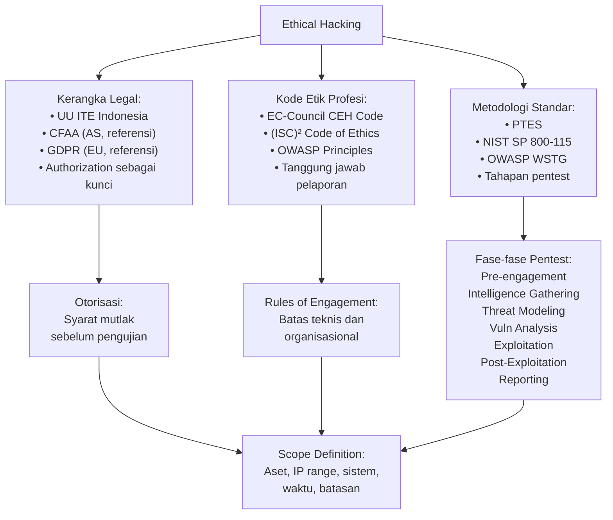
```mermaid
flowchart TD
    EH["Ethical Hacking"] --> Legal["Kerangka Legal:\n• UU ITE Indonesia\n• CFAA (AS, referensi)\n• GDPR (EU, referensi)\n• Authorization sebagai kunci"]
    EH --> Ethics["Kode Etik Profesi:\n• EC-Council CEH Code\n• (ISC)² Code of Ethics\n• OWASP Principles\n• Tanggung jawab pelaporan"]
    EH --> Methodology["Metodologi Standar:\n• PTES\n• NIST SP 800-115\n• OWASP WSTG\n• Tahapan pentest"]
    
    Legal --> Authorization["Otorisasi:\nSyarat mutlak\nsebelum pengujian"]
    Ethics --> RoE["Rules of Engagement:\nBatas teknis dan\norganisasional"]
    Methodology --> Phases["Fase-fase Pentest:\nPre-engagement\nIntelligence Gathering\nThreat Modeling\nVuln Analysis\nExploitation\nPost-Exploitation\nReporting"]
    
    Authorization --> Scope["Scope Definition:\nAset, IP range, sistem,\nwaktu, batasan"]
    RoE --> Scope
    Phases --> Scope
```

---

## 3. Pengantar Kontekstual

Dalam dunia keamanan siber, pengetahuan tentang cara penyerang berpikir dan bekerja adalah aset yang sangat berharga bagi pembela. Namun, garis antara "penelitian keamanan yang sah" dan "tindak pidana siber" seringkali tipis — dan yang membedakan keduanya bukan teknik yang digunakan, melainkan **otorisasi**.

Kasus-kasus hukum di berbagai negara telah menunjukkan bahwa bahkan peneliti keamanan dengan niat baik sekalipun dapat menghadapi tuntutan pidana jika mereka mengakses sistem tanpa izin yang jelas. Di Indonesia, Pasal 30-32 UU ITE mengatur akses tidak sah ke sistem elektronik dengan ancaman pidana yang signifikan.

Sebaliknya, organisasi yang ingin memastikan keamanan sistemnya membutuhkan profesional yang dapat mensimulasikan serangan nyata dalam batas yang terkendali — inilah peran penetration tester profesional. Permintaan untuk profesional ini terus meningkat: laporan *Cybersecurity Ventures* memperkirakan lebih dari 3.5 juta posisi keamanan siber kosong secara global, dan pengujian penetrasi adalah salah satu kompetensi yang paling dicari.

---

## 4. Landasan Teori

### 4.1 Terminologi: Ethical Hacking vs Penetration Testing vs Red Teaming

Meskipun sering digunakan secara bergantian, ketiga istilah ini memiliki nuansa yang berbeda:

**Ethical Hacking** adalah istilah luas yang mencakup semua aktivitas pengujian keamanan yang dilakukan dengan izin dari pemilik sistem, dengan tujuan menemukan dan melaporkan kerentanan sebelum penyerang menemukan dan mengeksploitasinya. Kata "ethical" merujuk pada kerangka moral dan hukum yang mengikat, bukan pada teknik yang digunakan.

**Penetration Testing** (pentest) adalah bentuk ethical hacking yang lebih terstruktur dan terfokus. Ia biasanya memiliki:
- Scope yang terdefinisi dengan jelas (aset mana yang diuji)
- Jangka waktu yang terbatas
- Metodologi yang terdokumentasi
- Deliverable berupa laporan formal dengan temuan dan rekomendasi

**Red Teaming** adalah simulasi serangan yang lebih komprehensif dan realistis. Red team beroperasi seperti penyerang nyata — dengan pengetahuan minimal tentang target ("black box"), dan fokus bukan hanya pada kerentanan teknis tetapi juga pada kemampuan deteksi dan respons organisasi (Blue Team).

Untuk mata kuliah ini, fokus utama adalah **penetration testing** dengan prinsip-prinsip ethical hacking.

### 4.2 Kerangka Hukum

**Di Indonesia:**
Undang-Undang Nomor 11 Tahun 2008 tentang Informasi dan Transaksi Elektronik (UU ITE), sebagaimana diubah dengan UU Nomor 19 Tahun 2016, mengatur:
- **Pasal 30:** Larangan mengakses sistem elektronik orang lain tanpa izin
- **Pasal 31:** Larangan intersepsi informasi/dokumen elektronik tanpa izin
- **Pasal 32:** Larangan mengubah, menambah, mengurangi, memindahkan, atau merusak informasi/dokumen elektronik

Ancaman pidana berkisar antara 6 tahun penjara hingga denda Rp 12 miliar, tergantung pasal yang dilanggar. **Tidak ada "zona abu-abu" berdasarkan niat baik** — jika tidak ada otorisasi tertulis, pengujian keamanan adalah tindak pidana.

**Otorisasi sebagai perlindungan hukum:**
Otorisasi tertulis dari pemilik sistem adalah satu-satunya perlindungan hukum bagi penguji penetrasi. Otorisasi ini harus:
- Tertulis (bukan lisan atau implisit)
- Menyebutkan scope secara eksplisit (sistem mana, IP apa)
- Menyebutkan jangka waktu yang diizinkan
- Ditandatangani oleh pihak yang berwenang (bukan hanya admin teknis)
- Menyebutkan batasan (apa yang boleh dan tidak boleh dilakukan)

### 4.3 Metodologi PTES (Penetration Testing Execution Standard)

PTES adalah standar open-source yang mendefinisikan tujuh fase pengujian penetrasi:

**1. Pre-Engagement Interactions**  
Komunikasi awal dengan klien: mendefinisikan scope, otorisasi, timeline, dan deliverable. Hasilnya adalah dokumen Statement of Work (SoW) dan Rules of Engagement (RoE).

**2. Intelligence Gathering (Reconnaissance)**  
Pengumpulan informasi tentang target secara pasif (OSINT) dan aktif. Tujuan: memahami attack surface sebelum pengujian teknis dimulai.

**3. Threat Modeling**  
Mengidentifikasi ancaman yang paling relevan berdasarkan aset yang ada, profil organisasi, dan temuan reconnaissance. Menghasilkan prioritas area pengujian.

**4. Vulnerability Analysis**  
Identifikasi dan validasi kerentanan potensial melalui scanning, enumeration, dan analisis manual. Kategorisasi berdasarkan CVE/CVSS.

**5. Exploitation**  
Validasi kerentanan melalui proof-of-concept yang terkontrol dan terdokumentasi. **Penting:** dalam konteks lab, eksploitasi dilakukan HANYA pada target yang diizinkan, dengan tujuan membuktikan kerentanan — bukan untuk merusak sistem.

**6. Post-Exploitation**  
Dalam pengujian nyata (red team), fase ini menilai dampak nyata dari keberhasilan eksploitasi. Dalam konteks mata kuliah ini, fase ini dipelajari **secara konseptual** karena batasan etika dan keselamatan lab.

**7. Reporting**  
Dokumentasi lengkap semua temuan, evidence, analisis risiko, dan rekomendasi dalam format laporan profesional.

### 4.4 NIST SP 800-115: Technical Guide to Information Security Testing

NIST SP 800-115 (2008, diperbarui berkala) menyediakan panduan teknis untuk pengujian dan penilaian keamanan informasi. Ia mendefinisikan empat teknik utama:

| Teknik | Deskripsi |
|--------|-----------|
| Review | Memeriksa dokumen, konfigurasi, aturan tanpa aktivitas teknis |
| Target Identification and Analysis | Mengidentifikasi dan menganalisis karakteristik target |
| Target Vulnerability Validation | Memvalidasi kerentanan yang teridentifikasi |
| Security Assessment Planning and Reporting | Merencanakan pengujian dan melaporkan hasil |

NIST SP 800-115 juga mendefinisikan tiga level pengetahuan penguji:
- **Black box:** Tidak ada informasi awal tentang target (simulasi penyerang eksternal)
- **White box:** Penguji memiliki akses penuh ke informasi sistem (simulasi insider)
- **Gray box:** Penguji memiliki pengetahuan parsial (simulasi penyerang dengan informasi terbatas)

### 4.5 Kode Etik Profesi

**EC-Council CEH Code of Ethics (ringkasan):**
- Jaga kerahasiaan informasi klien
- Tidak melakukan pengujian tanpa izin
- Laporkan semua kerentanan yang ditemukan, termasuk yang "memalukan"
- Tidak menyimpan, menggunakan, atau menjual data sensitif yang ditemukan
- Patuhi hukum yang berlaku di yurisdiksi target

**(ISC)² Code of Ethics Canons:**
1. Protect society, the common good, necessary public trust and confidence, and the infrastructure
2. Act honorably, honestly, justly, responsibly, and legally
3. Provide diligent and competent service to principals
4. Advance and protect the profession

**Prinsip "Do No Harm":**
Dalam pengujian penetrasi, "do no harm" berarti:
- Tidak menyebabkan downtime atau gangguan layanan yang tidak direncanakan
- Tidak mengeksfiltrasi data sensitif keluar dari lingkungan yang diotorisasi
- Tidak meninggalkan backdoor atau malware (bahkan untuk tujuan "monitoring")
- Segera melaporkan jika ditemukan bukti kompromi yang sudah ada (sebelum pengujian dimulai)
- Menghapus semua artefak pengujian setelah selesai

---

## 5. Model atau Arsitektur

### 5.1 Siklus Pengujian Penetrasi Berotorisasi

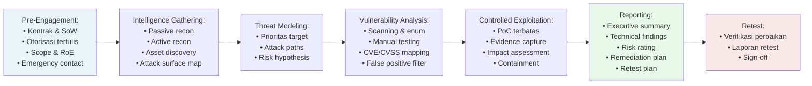
```mermaid
flowchart LR
    A["Pre-Engagement:\n• Kontrak & SoW\n• Otorisasi tertulis\n• Scope & RoE\n• Emergency contact"] --> B["Intelligence Gathering:\n• Passive recon\n• Active recon\n• Asset discovery\n• Attack surface map"]
    B --> C["Threat Modeling:\n• Prioritas target\n• Attack paths\n• Risk hypothesis"]
    C --> D["Vulnerability Analysis:\n• Scanning & enum\n• Manual testing\n• CVE/CVSS mapping\n• False positive filter"]
    D --> E["Controlled Exploitation:\n• PoC terbatas\n• Evidence capture\n• Impact assessment\n• Containment"]
    E --> F["Reporting:\n• Executive summary\n• Technical findings\n• Risk rating\n• Remediation plan\n• Retest plan"]
    F --> G["Retest:\n• Verifikasi perbaikan\n• Laporan retest\n• Sign-off"]
    
    style A fill:#e8f4f8
    style F fill:#e8f8e8
    style G fill:#f8e8e8
```

---

## 6. Contoh Terapan

### Skenario: Pre-Engagement untuk Pengujian Infrastruktur Perusahaan Fintech

**Konteks:**  
PT Fintech Maju Bersama meminta tim keamanan PENS untuk melakukan penetration testing terhadap infrastruktur webnya sebelum audit ISO 27001.

**Aset yang diuji:**
- Aplikasi web perbankan digital (domain: app.fintech-mb.internal) — hanya di lab testing
- API backend yang melayani aplikasi mobile
- Server web produksi DILARANG — hanya lingkungan staging

**Proses Pre-Engagement:**

1. **Kick-off meeting:** Definisikan tujuan bisnis pengujian (compliance, risk reduction)
2. **Scope agreement:** IP range staging: 192.168.100.0/24, tidak termasuk server produksi
3. **Authorization letter:** Ditandatangani oleh CTO dan Legal Officer
4. **Emergency contact:** Jika ditemukan kerentanan kritis yang sedang dieksploitasi aktif → hubungi nomor darurat dalam 1 jam
5. **Testing window:** Senin-Jumat 09:00-17:00 WIB
6. **Deliverable:** Laporan penuh dalam 2 minggu setelah pengujian selesai

**Pelajaran:** Scope yang tertulis jelas melindungi kedua belah pihak — penguji tidak dapat dituntut karena menguji sistem dalam scope, dan klien mengetahui dengan tepat apa yang diuji.

---

## 7. Praktikum atau Aktivitas Terarah

### Aktivitas 1.1: Analisis Kasus Legal Ethical Hacking

**Tujuan:** Membangun kemampuan analisis hukum dalam konteks pengujian keamanan.

**Prasyarat:** Membaca UU ITE Pasal 30-32 (tersedia di peraturan.go.id)

**Aktivitas:**  
Baca tiga skenario berikut dan tentukan: apakah legal, membutuhkan otorisasi tambahan, atau ilegal?

1. Seorang mahasiswa keamanan siber melakukan port scan terhadap router WiFi kampus untuk "melihat port apa yang terbuka" tanpa meminta izin.
2. Seorang admin IT melakukan vulnerability scan terhadap server yang dikelolanya menggunakan tool dari vendor.
3. Seorang peneliti menemukan kerentanan di website pemerintah saat browsing, kemudian menggunakan tool otomatis untuk mengonfirmasi kerentanan tersebut tanpa izin.

**Format laporan:** Untuk setiap skenario: (a) legal/ilegal? (b) pasal mana yang relevan? (c) apa yang seharusnya dilakukan?

**Catatan etika dan keselamatan:** Analisis ini murni akademis. Jangan mencoba skenario nyata tanpa otorisasi.

---

## 8. Latihan Pemahaman

**Soal 1 (Pilihan Ganda):**  
Apa yang membedakan ethical hacking dari tindak pidana siber?
- A. Teknik yang digunakan
- B. Niat pelaku
- C. Otorisasi tertulis dari pemilik sistem
- D. Tingkat keahlian penguji

**Soal 2 (Esai Singkat):**  
Jelaskan mengapa "otorisasi lisan" tidak cukup sebagai perlindungan hukum bagi seorang penetration tester.

**Soal 3 (Analisis):**  
PTES mendefinisikan tujuh fase. Mengapa fase "Pre-Engagement Interactions" ditempatkan pertama, sebelum aktivitas teknis apapun?

**Soal 4 (Perbandingan):**  
Apa perbedaan antara penetration testing (black box) dan vulnerability assessment? Dalam situasi apa organisasi harus memilih salah satunya?

**Soal 5 (Evaluasi):**  
Seorang penguji penetrasi menemukan, selama pengujian yang diotorisasi, bukti bahwa sistem klien sudah dikompromis oleh pihak lain. Apa yang seharusnya dilakukan? Berikan justifikasi berdasarkan kode etik profesi.

---

## 9. Latihan Terapan / Studi Kasus

### Studi Kasus 1: Batas Scope yang Ambigu

Tim pentest mendapat otorisasi untuk menguji "seluruh infrastruktur web perusahaan ABC". Saat reconnaissance, mereka menemukan bahwa ABC menggunakan jasa cloud provider dan sebagian infrastruktur dihosting di AWS. Satu anggota tim berargumen bahwa server AWS tersebut termasuk dalam "infrastruktur web ABC". Anggota lain berpendapat bahwa pengujian server pihak ketiga (AWS) memerlukan otorisasi terpisah.

**Pertanyaan (C5):**  
(a) Siapa yang benar? Jelaskan dari perspektif hukum (terms of service AWS, UU ITE).  
(b) Bagaimana seharusnya situasi ini diantisipasi dalam fase pre-engagement?  
(c) Apa yang harus dilakukan tim saat ini (setelah menemukan fakta ini)?  
(d) Rancang klausul scope dalam kontrak yang akan mencegah ambiguitas ini.

---

## 10. Kunci Jawaban dan Pembahasan

**Soal 1 — Jawaban: C**  
Teknik yang sama (port scanning, eksploitasi, dll) dapat legal atau ilegal tergantung pada otorisasi. Niat tidak cukup sebagai perlindungan hukum — bahkan dengan niat terbaik, akses tanpa izin tetap melanggar UU ITE. Tingkat keahlian tidak relevan secara hukum. **Otorisasi tertulis** adalah satu-satunya elemen yang mengubah aktivitas ofensif menjadi legal.

**Soal 2 — Otorisasi lisan tidak cukup karena:**  
(1) Tidak ada bukti yang dapat diverifikasi jika terjadi sengketa;  
(2) Pihak yang memberi izin lisan mungkin tidak memiliki kewenangan hukum untuk melakukannya;  
(3) Sistem hukum pidana mensyaratkan bukti tertulis dalam sengketa;  
(4) Jika terjadi insiden (sistem crash, data loss), tidak ada dokumen yang melindungi penguji dari tuntutan;  
(5) Otorisasi lisan mudah disangkal kemudian hari.

**Soal 5 — Menemukan kompromi yang ada:**  
Langkah yang benar: (a) Berhenti menguji area yang terkompromi untuk menghindari kontaminasi forensik; (b) Segera hubungi kontak darurat klien sesuai RoE; (c) Dokumentasikan temuan dengan screenshot/log yang timestamped; (d) Jangan mencoba menyelidiki lebih jauh tanpa izin tambahan dari klien; (e) Klien kemudian memutuskan apakah melanjutkan pentest atau memprioritaskan incident response. Dasar etika: melaporkan temuan sepenuhnya adalah kewajiban profesional, bahkan jika tidak disebutkan dalam kontrak.

---

## 11. Ringkasan Bab

Ethical hacking adalah pengujian keamanan yang dilakukan dengan otorisasi tertulis dari pemilik sistem. Landasan hukum di Indonesia (UU ITE) menjadikan otorisasi sebagai syarat mutlak. Metodologi standar industri — PTES dan NIST SP 800-115 — menyediakan kerangka yang terstruktur untuk pengujian yang bertanggung jawab. Kode etik profesi menambahkan lapisan tanggung jawab moral di atas kepatuhan hukum, termasuk kewajiban melaporkan semua temuan secara penuh dan jujur.

---

## 12. Refleksi Profesional

**Pertanyaan Refleksi 1:** Seorang teman meminta Anda membantu "memeriksa keamanan" website bisnisnya tanpa memberikan dokumen otorisasi formal karena "terlalu merepotkan". Apa yang Anda lakukan, dan bagaimana Anda menjelaskan risiko hukum kepada mereka?

**Pertanyaan Refleksi 2:** Dalam konteks Indonesia, di mana literasi hukum siber masih berkembang, seorang penetration tester profesional memiliki tanggung jawab tambahan apa terhadap kliennya — selain melakukan pengujian teknis?

---

# BAB 2 — SCOPING, AUTHORIZATION, DAN RULES OF ENGAGEMENT

**Pertemuan:** 2  
**Sub-CPMK:** Sub-CPMK.1  
**Evaluasi:** Eval-1 (10%)

---

## 1. Capaian Pembelajaran Bab

Setelah menyelesaikan Bab 2, mahasiswa mampu:

- Menyusun scope memo yang lengkap dan tidak ambigu untuk skenario pengujian penetrasi.
- Merancang Rules of Engagement (RoE) yang mencakup batasan teknis dan organisasional.
- Menjelaskan komponen-komponen authorization yang sah dalam pengujian keamanan.
- Mengidentifikasi risiko dalam penugasan pentest dan memetakannya ke RoE yang tepat.

---

## 2. Peta Konsep Bab

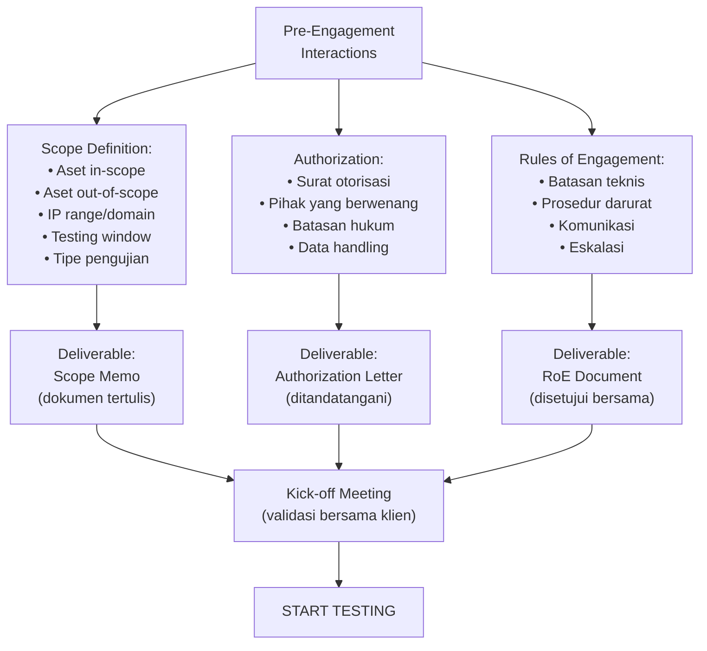
```mermaid
flowchart TD
    PreEngagement["Pre-Engagement\nInteractions"] --> ScopeDoc["Scope Definition:\n• Aset in-scope\n• Aset out-of-scope\n• IP range/domain\n• Testing window\n• Tipe pengujian"]
    PreEngagement --> AuthDoc["Authorization:\n• Surat otorisasi\n• Pihak yang berwenang\n• Batasan hukum\n• Data handling"]
    PreEngagement --> RoEDoc["Rules of Engagement:\n• Batasan teknis\n• Prosedur darurat\n• Komunikasi\n• Eskalasi"]
    
    ScopeDoc --> ScopeMemo["Deliverable:\nScope Memo\n(dokumen tertulis)"]
    AuthDoc --> AuthLetter["Deliverable:\nAuthorization Letter\n(ditandatangani)"]
    RoEDoc --> RoEDoc2["Deliverable:\nRoE Document\n(disetujui bersama)"]
    
    ScopeMemo --> Kick["Kick-off Meeting\n(validasi bersama klien)"]
    AuthLetter --> Kick
    RoEDoc2 --> Kick
    Kick --> StartTest["START TESTING"]
```

---

## 3. Pengantar Kontekstual

Dokumen pre-engagement adalah fondasi dari seluruh penugasan. Kegagalan mendefinisikan scope dengan jelas adalah salah satu penyebab paling umum dari: sengketa hukum, gangguan layanan yang tidak direncanakan, dan hilangnya kepercayaan klien. Bahkan penguji berpengalaman sekalipun dapat membuat kesalahan mahal jika scope tidak didefinisikan dengan tepat.

---

## 4. Landasan Teori

### 4.1 Komponen Scope Definition

Scope adalah daftar eksplisit dari apa yang boleh dan tidak boleh diuji. Ia harus mencakup:

**In-Scope:**
- IP address atau CIDR range yang diotorisasi
- Domain/subdomain yang diotorisasi
- Aplikasi dan API spesifik
- Tipe pengujian yang diizinkan (network, web, physical, social engineering)
- Jangka waktu pengujian

**Out-of-Scope (sama pentingnya):**
- Sistem produksi jika hanya staging yang diotorisasi
- Sistem pihak ketiga (cloud provider, SaaS)
- Teknik yang dilarang (DoS, destructive testing)
- Data yang tidak boleh diakses (data PII pelanggan)
- Waktu di luar testing window

### 4.2 Authorization Document

Authorization document (surat otorisasi) harus memuat:

```
[KOP SURAT ORGANISASI]

SURAT OTORISASI PENGUJIAN KEAMANAN

Dengan surat ini, [Nama Organisasi], yang diwakili oleh [Nama Pejabat] 
selaku [Jabatan yang berwenang], memberikan otorisasi kepada:

Tim Penguji: [Nama Tim / Individu]
Afiliasi: [Institusi]

untuk melakukan pengujian keamanan dengan ketentuan sebagai berikut:

Scope: [daftar aset yang diotorisasi]
Periode: [tanggal mulai] s/d [tanggal selesai]
Testing window: [jam dan hari yang diizinkan]
Batasan: [daftar yang tidak diizinkan]

[Nama], [Jabatan]
[Tanda tangan dan cap institusi]
[Tanggal]
```

**Siapa yang harus menandatangani?**  
Otorisasi harus ditandatangani oleh pejabat yang memiliki kewenangan hukum untuk mengotorisasi pengujian — biasanya CTO, CISO, atau pejabat dengan delegasi wewenang tertulis. Otorisasi dari admin teknis saja **tidak cukup** secara hukum.

### 4.3 Rules of Engagement (RoE)

RoE adalah dokumen yang mendefinisikan bagaimana pengujian akan dilaksanakan. Komponen wajib:

**Teknis:**
- Tools yang diizinkan dan dilarang
- Teknik yang diizinkan (passive only, active, exploitation)
- Apakah DoS diizinkan? (Biasanya: tidak)
- Apakah social engineering diizinkan? (Biasanya: tidak, atau scope sangat terbatas)
- Threshold untuk menghentikan pengujian (jika sistem crash, dsb)

**Operasional:**
- Kontak darurat (klien) dan cara menghubungi jika terjadi insiden
- Prosedur eskalasi jika ditemukan kompromi yang sedang berlangsung
- Prosedur komunikasi reguler (laporan harian/mingguan)
- Format pelaporan dan timeline

**Data Handling:**
- Bagaimana data sensitif yang ditemukan akan ditangani
- Apakah screenshot boleh keluar dari lingkungan pengujian?
- Retensi data evidence setelah pengujian selesai
- Proses penghapusan artefak pengujian

### 4.4 Klasifikasi Jenis Pengujian

| Jenis | Deskripsi | Ketika Dipilih |
|-------|-----------|----------------|
| Black Box | Tidak ada informasi awal | Simulasi penyerang eksternal |
| White Box | Informasi penuh (kode, konfigurasi) | Code review terintegrasi, efisiensi tinggi |
| Gray Box | Informasi parsial (akun user, diagram arsitektur) | Simulasi insider, efisiensi + realisme |
| Crystal Box | Akses penuh ke source code dan infrastruktur | Audit mendalam, compliance |

---

## 5. Model atau Arsitektur

### 5.1 Alur Persetujuan Dokumen Pre-Engagement

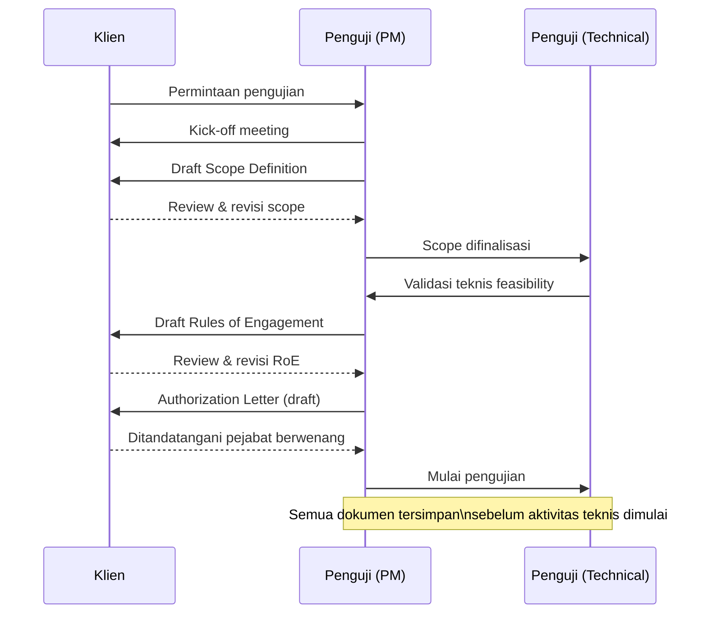
```mermaid
sequenceDiagram
    participant Client as Klien
    participant PM as Penguji (PM)
    participant Tech as Penguji (Technical)
    
    Client->>PM: Permintaan pengujian
    PM->>Client: Kick-off meeting
    PM->>Client: Draft Scope Definition
    Client-->>PM: Review & revisi scope
    PM->>Tech: Scope difinalisasi
    Tech->>PM: Validasi teknis feasibility
    PM->>Client: Draft Rules of Engagement
    Client-->>PM: Review & revisi RoE
    PM->>Client: Authorization Letter (draft)
    Client-->>PM: Ditandatangani pejabat berwenang
    PM->>Tech: Mulai pengujian
    Note over PM,Tech: Semua dokumen tersimpan\nsebelum aktivitas teknis dimulai
```

---

## 6. Contoh Terapan

### Contoh Scope Memo

```markdown
# SCOPE MEMO — PENGUJIAN PENETRASI
## PT Infrastruktur Digital Nusantara
## Referensi: PDN-PENTEST-2025-001

### Tujuan
Mengidentifikasi kerentanan keamanan pada infrastruktur web PDN 
sebelum peluncuran layanan versi 2.0.

### Aset In-Scope
| Aset | IP/Domain | Keterangan |
|------|-----------|------------|
| Web App Staging | 192.168.10.100 | Portal utama (staging only) |
| API Gateway | 192.168.10.101 | REST API v2 |
| Database (read-only) | 192.168.10.102 | Hanya koneksi yang dites |

### Aset Out-of-Scope
- Seluruh server produksi (subnet 10.0.0.0/8)
- Server AWS yang dikelola vendor pihak ketiga
- Sistem pembayaran (dikelola partner PSP)
- Teknik: DoS/DDoS, social engineering, physical access

### Tipe Pengujian
- Gray box (diberikan akun pengguna biasa dan diagram arsitektur)
- Network penetration testing
- Web application testing (OWASP WSTG)
- API security testing (OWASP API Top 10)

### Testing Window
Senin–Jumat, 08:00–17:00 WIB
Periode: 15 Juli – 26 Juli 2025

### Kontak Darurat
- Technical Lead: [Nama], +62-xxx-xxxx (24/7)
- Bila sistem tidak responsif: hentikan pengujian, hubungi dalam 15 menit
```

---

## 7. Praktikum atau Aktivitas Terarah

### Aktivitas 2.1: Menyusun Scope Memo dan RoE (Eval-1)

**Tujuan:** Menghasilkan dokumen pre-engagement yang lengkap untuk skenario lab.

**Skenario lab:**  
Program studi menyediakan environment lab berisi: (a) VM Metasploitable2 di IP 192.168.50.10; (b) VM DVWA di 192.168.50.11; (c) VM Windows Server 2019 di 192.168.50.12 (hanya network scan, tidak exploitation).

**Tugas:**
1. Susun Scope Memo yang memuat semua komponen yang diperlukan
2. Susun Authorization Letter (simulasi — dengan tanda tangan koordinator mata kuliah)
3. Susun Rules of Engagement yang mencakup batasan teknis dan prosedur darurat
4. Serahkan sebagai Eval-1

**Kriteria penilaian Eval-1:**
- Scope jelas dan tidak ambigu: 30%
- Out-of-scope terdefinisi: 20%
- RoE mencakup batasan teknis dan prosedur darurat: 30%
- Legal/ethical considerations diidentifikasi: 20%

---

## 8. Latihan Pemahaman

**Soal 1:** Mengapa mendefinisikan "out-of-scope" sama pentingnya dengan mendefinisikan "in-scope"?

**Soal 2:** Seorang penguji mendapat otorisasi untuk menguji "semua server perusahaan". Apakah ini scope yang memadai? Apa yang perlu ditambahkan?

**Soal 3:** Apa risiko teknis dan hukum jika Rules of Engagement tidak mendefinisikan prosedur darurat?

**Soal 4 (Analisis):** Identifikasi setidaknya 5 elemen yang WAJIB ada dalam authorization letter yang sah secara hukum.

---

## 9. Latihan Terapan / Studi Kasus

### Studi Kasus 2: RoE yang Tidak Lengkap

Tim pentest memulai pengujian berdasarkan scope yang sudah disetujui. Di hari kedua, sebuah script scanning otomatis menyebabkan satu server staging crash karena tidak dilindungi rate limiting. Klien marah dan mengancam tuntutan hukum, mengklaim bahwa "DoS tidak diizinkan".

Tim pentest berargumen bahwa mereka tidak melakukan DoS yang disengaja — crash terjadi karena kerentanan pada server, bukan karena niat mereka.

**Pertanyaan (C5):**  
(a) Siapa yang bertanggung jawab atas insiden ini?  
(b) Elemen RoE apa yang seharusnya mencegah situasi ini?  
(c) Bagaimana seharusnya RoE mendefinisikan "batas pengujian yang diizinkan" untuk mencegah kerusakan tidak disengaja?  
(d) Apa pelajaran untuk penugasan berikutnya?

---

## 10. Kunci Jawaban

**Soal 1:** Out-of-scope mendefinisikan batas hukum dan teknis — apa yang TIDAK boleh disentuh. Tanpanya, penguji dapat secara tidak sengaja menguji sistem yang tidak diotorisasi (cloud provider, mitra bisnis) yang memiliki implikasi hukum tersendiri. Definisi out-of-scope yang jelas juga melindungi penguji jika terjadi insiden di luar area yang diuji.

**Studi Kasus 2:**  
(a) Tanggung jawab bersama: klien karena tidak mendefinisikan batasan yang jelas dalam RoE; tim pentest karena tidak mengklarifikasi apakah aggressive scan diizinkan; (b) RoE seharusnya mendefinisikan: rate limiting untuk scanning tools, prosedur emergency stop, dan siapa yang dihubungi jika terjadi ketidakresponsifan sistem; (c) RoE harus melarang: scan rate > X requests/second, tool yang dikenal menyebabkan crash (beberapa NSE scripts Nmap), dan pengujian tanpa notifikasi monitoring pihak klien; (d) Selalu tes dengan rate rendah terlebih dulu, eskalasikan intensitas secara bertahap, dan selalu ada kontak darurat yang siap dihubungi.

---

## 11. Ringkasan Bab

Dokumen pre-engagement — scope memo, authorization letter, dan rules of engagement — adalah fondasi dari pengujian penetrasi yang profesional dan legal. Scope yang ambigu menyebabkan sengketa; RoE yang tidak lengkap menyebabkan insiden. Investasi waktu dalam fase pre-engagement jauh lebih murah daripada menangani konsekuensi dari dokumentasi yang buruk.

---

## 12. Refleksi Profesional

**Pertanyaan Refleksi 1:** Seorang klien yang tidak sabar ingin Anda mulai pengujian segera tanpa menunggu dokumen legal selesai. Bagaimana Anda merespons secara profesional tanpa kehilangan kontrak?

---


---

# BAB 3 — PASSIVE RECONNAISSANCE DAN OSINT KONSEPTUAL

**Pertemuan:** 3  
**Sub-CPMK:** Sub-CPMK.2  
**Evaluasi:** Eval-2 (15%)

---

## 1. Capaian Pembelajaran Bab

Setelah menyelesaikan Bab 3, mahasiswa mampu:

- Menjelaskan perbedaan antara passive dan active reconnaissance.
- Mengidentifikasi sumber-sumber informasi publik (OSINT) yang relevan untuk pengujian keamanan.
- Melakukan passive reconnaissance dalam batas scope yang ditetapkan.
- Mengorganisasi temuan reconnaissance dalam format yang dapat ditindaklanjuti.

---

## 2. Peta Konsep Bab

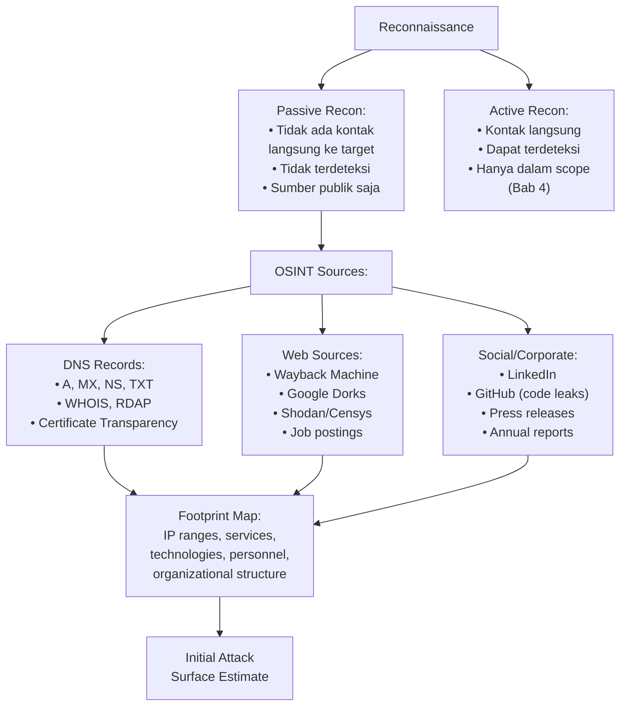
```mermaid
flowchart TD
    Recon["Reconnaissance"] --> Passive["Passive Recon:\n• Tidak ada kontak\n  langsung ke target\n• Tidak terdeteksi\n• Sumber publik saja"]
    Recon --> Active["Active Recon:\n• Kontak langsung\n• Dapat terdeteksi\n• Hanya dalam scope\n  (Bab 4)"]

    Passive --> OSINT["OSINT Sources:"]
    OSINT --> DNS["DNS Records:\n• A, MX, NS, TXT\n• WHOIS, RDAP\n• Certificate Transparency"]
    OSINT --> Web["Web Sources:\n• Wayback Machine\n• Google Dorks\n• Shodan/Censys\n• Job postings"]
    OSINT --> Social["Social/Corporate:\n• LinkedIn\n• GitHub (code leaks)\n• Press releases\n• Annual reports"]
    
    DNS --> FootprintMap["Footprint Map:\nIP ranges, services,\ntechnologies, personnel,\norganizational structure"]
    Web --> FootprintMap
    Social --> FootprintMap
    FootprintMap --> AttackSurface["Initial Attack\nSurface Estimate"]
```

---

## 3. Pengantar Kontekstual

Sebelum menyentuh target secara teknis, seorang penguji penetrasi yang cerdas terlebih dulu mengumpulkan sebanyak mungkin informasi dari sumber yang sepenuhnya publik. Ini bukan hanya tentang efisiensi — reconnaissance yang baik dapat mengungkapkan kerentanan sebelum scanning teknis dimulai, dan sering kali menemukan "pintu belakang" yang tidak pernah ditemukan oleh scanner otomatis.

Lebih penting lagi, passive reconnaissance tidak meninggalkan jejak di log sistem target. Dari perspektif blue team, ini adalah fase yang paling sulit dideteksi dan dihentikan — yang menjadikannya sangat berharga bagi penguji, dan sangat penting bagi pembela untuk memahami.

---

## 4. Landasan Teori

### 4.1 Passive vs Active Reconnaissance

| Karakteristik | Passive | Active |
|---------------|---------|--------|
| Kontak ke target | Tidak ada | Langsung |
| Sumber | Hanya data publik | Target dan infrastrukturnya |
| Deteksi oleh target | Sangat sulit | Dapat terdeteksi di log/IDS |
| Contoh | WHOIS, Google, Shodan | Nmap scan, banner grabbing |
| Persyaratan otorisasi | Tidak diperlukan untuk sumber publik | Wajib ada sebelum dimulai |

**Catatan penting:** "Passive" berarti tidak ada kontak langsung ke *infrastruktur target*. Mengakses database publik (WHOIS, Shodan, Wayback Machine) yang *menyimpan* informasi tentang target tetap dianggap passive — karena Anda tidak mengirim paket ke server target.

### 4.2 OSINT: Open-Source Intelligence

OSINT adalah pengumpulan informasi dari sumber yang tersedia secara publik. Dalam konteks keamanan siber, sumber OSINT yang paling relevan meliputi:

**DNS dan Infrastruktur:**
- **WHOIS/RDAP:** Informasi registrar domain, tanggal kedaluwarsa, nama kontak (sering kali email, nomor telepon — berguna untuk social engineering assessment)
- **DNS records:** A (IP address), MX (mail server), NS (name server), TXT (SPF/DKIM — mengungkapkan teknologi email), CNAME (subdomain aliasing)
- **Certificate Transparency Logs:** crt.sh menyimpan semua sertifikat TLS yang pernah diterbitkan untuk domain. Seringkali mengungkapkan subdomain internal yang tidak terdaftar di DNS publik.
- **Reverse DNS:** Mencari IP dari hostname, atau hostname dari IP

**Web Intelligence:**
- **Google Dorks:** Kueri Google khusus untuk menemukan informasi sensitif yang tidak sengaja diindeks. Contoh: `site:target.com filetype:pdf`, `site:target.com "not for distribution"`, `intitle:"index of" site:target.com`
- **Wayback Machine (web.archive.org):** Versi historis website yang dapat mengungkapkan teknologi, struktur direktori, atau halaman yang sudah dihapus
- **Shodan/Censys:** Search engine untuk perangkat yang terhubung ke internet. Dapat menemukan server, IoT devices, port terbuka, banner layanan — tanpa mengirim paket ke target

**Informasi Organisasional:**
- **LinkedIn:** Karyawan dan peran mereka, teknologi yang digunakan (dari profil), dan foto yang dapat mengungkapkan badge/fisik gedung
- **GitHub:** Kode yang di-push ke repositori publik dapat mengandung API keys, password, konfigurasi internal, atau endpoint API yang tidak terdokumentasi
- **Job postings:** Lowongan kerja mengungkapkan teknologi stack yang digunakan ("Looking for AWS CloudFormation expert, Kubernetes, PostgreSQL, Redis")

### 4.3 Google Dorks: Teknik Pencarian Lanjutan

Google Dorks menggunakan operator pencarian khusus Google untuk menemukan informasi spesifik:

| Operator | Fungsi | Contoh |
|----------|--------|--------|
| `site:` | Batasi ke domain tertentu | `site:target.com` |
| `filetype:` | Cari tipe file | `filetype:pdf site:target.com` |
| `intitle:` | Kata kunci dalam judul | `intitle:"index of"` |
| `inurl:` | Kata kunci dalam URL | `inurl:admin` |
| `intext:` | Kata kunci dalam teks | `intext:"password"` |
| `cache:` | Versi cached Google | `cache:target.com` |

**Contoh dork yang mengungkapkan informasi sensitif:**
- `site:target.com filetype:env` → mencari file .env yang terekspos
- `site:target.com inurl:backup` → file backup yang terekspos
- `site:target.com "Index of /" intext:config` → direktori konfigurasi terbuka

**Catatan etika:** Google dorks hanya mengakses informasi yang sudah diindeks Google secara publik. Namun, menggunakannya untuk tujuan berbahaya tetap melanggar ToS Google dan berpotensi melanggar hukum.

### 4.4 Certificate Transparency

Sejak 2018, browser utama mensyaratkan semua sertifikat TLS dimasukkan ke dalam public Certificate Transparency Logs. Ini berarti setiap subdomain yang pernah mendapat sertifikat TLS — termasuk subdomain internal yang tidak dimaksudkan untuk publik — tersimpan dalam log yang dapat dicari.

Menggunakan crt.sh:
```
https://crt.sh/?q=%.target.com
```
Ini mencari semua sertifikat untuk domain target.com, termasuk subdomainnya.

---

## 5. Model atau Arsitektur

### 5.1 OSINT Framework untuk Pengujian Keamanan

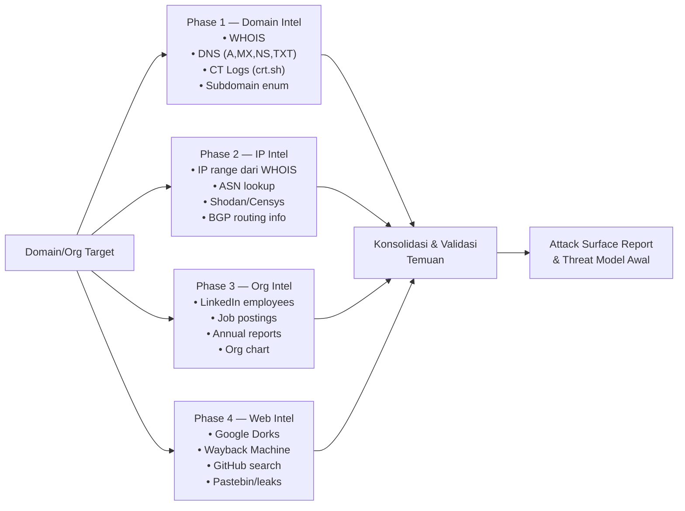
```mermaid
flowchart LR
    Target["Domain/Org Target"] --> Phase1["Phase 1 — Domain Intel\n• WHOIS\n• DNS (A,MX,NS,TXT)\n• CT Logs (crt.sh)\n• Subdomain enum"]
    Target --> Phase2["Phase 2 — IP Intel\n• IP range dari WHOIS\n• ASN lookup\n• Shodan/Censys\n• BGP routing info"]
    Target --> Phase3["Phase 3 — Org Intel\n• LinkedIn employees\n• Job postings\n• Annual reports\n• Org chart"]
    Target --> Phase4["Phase 4 — Web Intel\n• Google Dorks\n• Wayback Machine\n• GitHub search\n• Pastebin/leaks"]
    
    Phase1 --> Consolidate["Konsolidasi & Validasi\nTemuan"]
    Phase2 --> Consolidate
    Phase3 --> Consolidate
    Phase4 --> Consolidate
    
    Consolidate --> AttackSurface2["Attack Surface Report\n& Threat Model Awal"]
```

---

## 6. Contoh Terapan

### Studi Kasus: Passive Recon untuk Pengujian Institusi Pendidikan (Simulasi)

**Target (simulasi — bukan praktik nyata):** universitas-contoh.ac.id

**Temuan passive recon simulasi:**

1. **CT Logs (crt.sh):** Ditemukan 47 subdomain, termasuk `staging.universitas-contoh.ac.id`, `devops.universitas-contoh.ac.id`, dan `jenkins.universitas-contoh.ac.id` — mengindikasikan infrastruktur CI/CD yang berpotensi berisi environment staging.

2. **WHOIS:** Domain diregistrasi atas nama individu (bukan organisasi), menggunakan email pribadi `@gmail.com` — potensi masalah governance.

3. **DNS TXT records:** SPF record hanya mencakup beberapa server, artinya email spoofing dari domain universitas mungkin tidak terdeteksi oleh beberapa mail server.

4. **LinkedIn:** 15 karyawan IT mencantumkan keahlian "CentOS 6 administration" — CentOS 6 sudah end-of-life dan tidak mendapat patch keamanan.

5. **GitHub:** Repositori publik mahasiswa mengandung konfigurasi MySQL dengan host `db.internal.universitas-contoh.ac.id` dan password hardcoded — kemungkinan besar password sudah diubah, tetapi mengungkapkan struktur internal.

**Insight dari passive recon:**
- Subdomain staging/devops/jenkins kemungkinan memiliki security posture lebih lemah dari production
- Stack teknologi mengandung software EOL
- Potensi masalah email spoofing

---

## 7. Praktikum atau Aktivitas Terarah

### Aktivitas 3.1: Passive Reconnaissance pada Lab Target (Eval-2 Parsial)

**Tujuan:** Melakukan passive reconnaissance pada target yang disediakan program studi menggunakan sumber publik saja.

**Target lab:** VM yang disediakan program studi (bukan sistem nyata). Informasi target diberikan oleh dosen.

**Langkah kerja:**
1. Cek WHOIS/RDAP domain target lab (jika domain tersedia)
2. Enumerasi DNS records menggunakan `dig` atau `nslookup` dalam lab environment
3. Cek Certificate Transparency logs (untuk domain lab — jika tersedia)
4. Dokumentasikan semua temuan dalam format tabel: (Sumber, Temuan, Potensi Implikasi)

**Catatan etika:** Semua aktivitas ini dilakukan pada target lab yang ditentukan. Jangan gunakan teknik ini pada domain nyata tanpa otorisasi.

**Format deliverable:**
- Tabel OSINT findings dengan kolom: Source, Finding, Potential Implication
- Diagram attack surface awal
- Threat model awal (aset mana yang paling berisiko berdasarkan temuan)

---

## 8. Latihan Pemahaman

**Soal 1:** Mengapa passive reconnaissance dianggap "tidak mengirim paket ke target" meskipun kita menggunakan tool seperti Shodan yang menyimpan informasi tentang target?

**Soal 2:** Apa yang dimaksud dengan "Certificate Transparency Log" dan mengapa ia berguna dalam reconnaissance?

**Soal 3 (Analisis):** Seorang penguji menemukan bahwa target menggunakan Apache 2.2.15 (diketahui dari Shodan banner). CVE untuk versi ini sudah banyak dipublikasikan. Apakah ini sudah cukup untuk melaporkan kerentanan, atau diperlukan langkah tambahan? Jelaskan.

**Soal 4:** Jelaskan mengapa "job postings" adalah sumber OSINT yang berharga bagi penyerang.

**Soal 5 (Evaluasi):** Seorang mahasiswa menemukan file .env yang berisi API keys dalam repositori GitHub publik milik target (dalam scope). Apa yang harus dilakukan: (a) gunakan API keys tersebut untuk mengakses layanan, (b) catat sebagai temuan kritis dan laporkan segera tanpa menggunakan, (c) abaikan karena "itu bukan bagian dari scope teknis"?

---

## 9. Latihan Terapan

### Studi Kasus 3: OSINT yang Mengungkapkan Risiko Kritis

Selama passive reconnaissance, tim menemukan repositori GitHub publik yang di-fork dari repository internal klien. Dalam commit history repositori tersebut, terdapat file konfigurasi yang berisi:
- Kredensial database staging (username/password)
- Endpoint API internal (bukan dalam scope yang didefinisikan)
- Komentar kode yang menyebut "TODO: hapus sebelum merge ke production"

**Pertanyaan (C5):**  
(a) Tentukan tingkat risiko temuan ini berdasarkan konteks yang ada.  
(b) Bagaimana melaporkan temuan ini jika endpoint API internal bukan dalam scope resmi?  
(c) Apa implikasi terhadap posture keamanan klien secara keseluruhan?  
(d) Rekomendasikan mitigasi jangka pendek dan jangka panjang.

---

## 10. Kunci Jawaban

**Soal 1:** Shodan, Censys, dan layanan serupa adalah "search engines untuk internet" yang secara aktif men-scan seluruh internet (bukan target spesifik) dan menyimpan hasilnya. Ketika kita query Shodan untuk informasi tentang target, kita berinteraksi dengan *database Shodan* — bukan dengan server target. Ini serupa dengan membaca buku referensi tentang seseorang daripada langsung menemuinya.

**Soal 3:** Tidak cukup hanya berdasarkan Shodan. Diperlukan: (a) Verifikasi bahwa banner Shodan masih akurat (data Shodan bisa outdated); (b) Konfirmasi kerentanan dengan CVE database untuk versi spesifik; (c) Dalam fase pengujian aktif — verifikasi apakah patch atau mitigasi sudah diterapkan meskipun banner masih lama; (d) Dokumentasikan semua langkah verifikasi sebagai evidence.

**Soal 5:** Jawaban yang benar adalah (b). Menggunakan API keys yang ditemukan adalah unauthorized access meskipun keys tersebut tersedia publik — ini melanggar scope dan berpotensi melanggar UU ITE. Temuan ini harus dilaporkan sebagai "critical finding" dalam kategori "Credential Exposure" tanpa menggunakan kredensial tersebut.

---

## 11. Ringkasan Bab

Passive reconnaissance mengumpulkan informasi dari sumber publik tanpa kontak langsung ke target. OSINT mencakup DNS, Certificate Transparency, Shodan/Censys, Google Dorks, LinkedIn, dan GitHub. Setiap sumber memberikan lapisan informasi yang berbeda dan saling melengkapi. Temuan OSINT menjadi dasar attack surface mapping dan threat model awal.

---

## 12. Refleksi Profesional

**Pertanyaan Refleksi 1:** Informasi yang dapat ditemukan melalui passive OSINT tentang organisasi Anda sendiri mungkin mengejutkan. Sebagai praktisi keamanan siber, bagaimana Anda akan menyarankan organisasi untuk mengelola "digital footprint" mereka secara proaktif?

---

# BAB 4 — ACTIVE RECONNAISSANCE DAN ATTACK SURFACE MAPPING

**Pertemuan:** 4  
**Sub-CPMK:** Sub-CPMK.2  
**Evaluasi:** Eval-2 (15%)

---

## 1. Capaian Pembelajaran Bab

Setelah menyelesaikan Bab 4, mahasiswa mampu:

- Melakukan active reconnaissance yang terkontrol dalam batas scope yang diotorisasi.
- Menyusun attack surface map yang komprehensif.
- Membuat threat model awal berdasarkan temuan reconnaissance.
- Membedakan aset kritis dari aset pendukung dalam konteks risiko.

---

## 2. Peta Konsep Bab

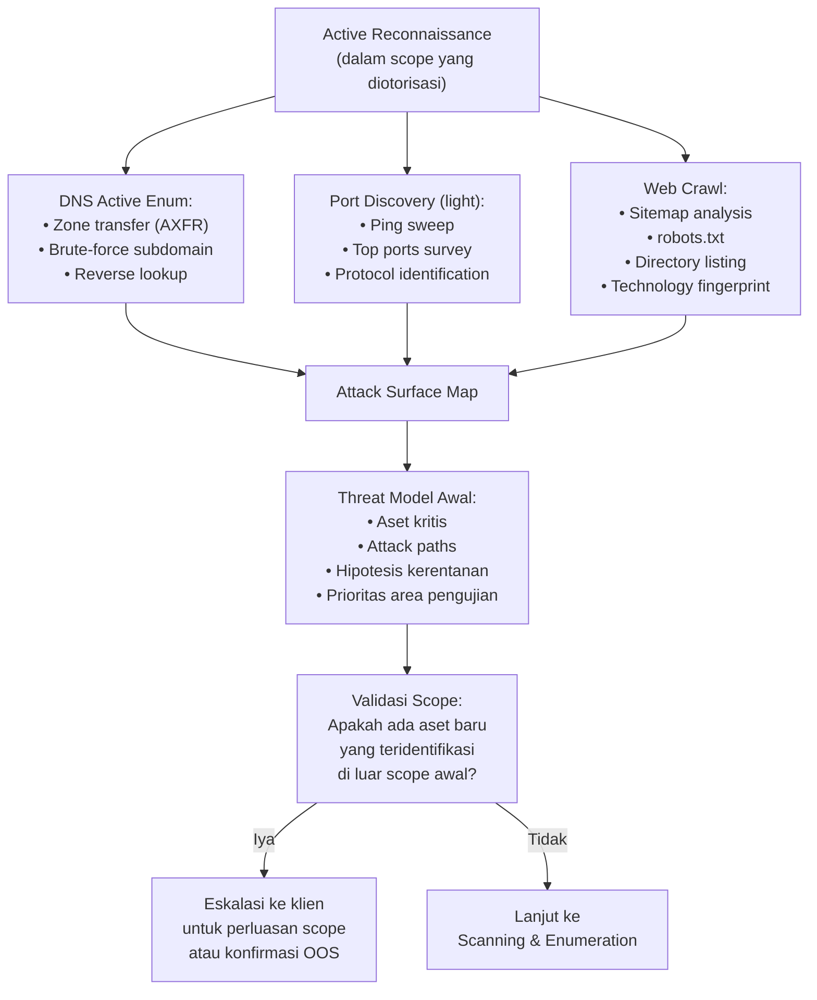
```mermaid
flowchart TD
    ActiveRecon["Active Reconnaissance\n(dalam scope yang diotorisasi)"] --> DNS2["DNS Active Enum:\n• Zone transfer (AXFR)\n• Brute-force subdomain\n• Reverse lookup"]
    ActiveRecon --> PortScan["Port Discovery (light):\n• Ping sweep\n• Top ports survey\n• Protocol identification"]
    ActiveRecon --> WebCrawl["Web Crawl:\n• Sitemap analysis\n• robots.txt\n• Directory listing\n• Technology fingerprint"]
    
    DNS2 --> ASMap["Attack Surface Map"]
    PortScan --> ASMap
    WebCrawl --> ASMap
    
    ASMap --> ThreatModel["Threat Model Awal:\n• Aset kritis\n• Attack paths\n• Hipotesis kerentanan\n• Prioritas area pengujian"]
    
    ThreatModel --> ScopeValidation["Validasi Scope:\nApakah ada aset baru\nyang teridentifikasi\ndi luar scope awal?"]
    ScopeValidation --> |Iya| Escalate["Eskalasi ke klien\nuntuk perluasan scope\natau konfirmasi OOS"]
    ScopeValidation --> |Tidak| NextPhase["Lanjut ke\nScanning & Enumeration"]
```

---

## 3. Pengantar Kontekstual

Active reconnaissance adalah langkah pertama yang meninggalkan jejak di log target. Setelah mendapat otorisasi dan menyelesaikan passive recon, penguji mulai berinteraksi langsung dengan infrastruktur target — tapi masih dalam mode "reconnaissance", bukan "exploitation". Tujuannya adalah membangun gambaran yang lebih akurat dan detail tentang attack surface.

---

## 4. Landasan Teori

### 4.1 DNS Active Enumeration

**DNS Zone Transfer (AXFR):**  
Secara historis, server DNS primer dapat mentransfer seluruh zone file ke server DNS sekunder. Jika misconfiguration memungkinkan transfer ke klien apapun, penguji dapat mendapat daftar lengkap semua hostname. Saat ini jarang berhasil karena sudah diketahui sebagai misconfiguration, tetapi tetap layak dicoba.

```bash
# Cek NS records
dig NS target.example.lab

# Coba zone transfer
dig AXFR @ns1.target.example.lab target.example.lab
```

**Subdomain Enumeration:**  
Menggunakan wordlist untuk menemukan subdomain yang ada:
- Tools: `dnsenum`, `amass`, `subfinder` (untuk lab environment)
- Wordlist: SecLists (DNS)
- Teknik: Brute-force + permutasi

### 4.2 Attack Surface Components

Attack surface adalah total area di mana sistem dapat diserang. Komponennya meliputi:

| Komponen | Contoh | Relevansi |
|----------|--------|-----------|
| Network surface | Port terbuka, protokol | Dapat langsung dieksploitasi dari jaringan |
| Application surface | Endpoint web/API | Logika aplikasi yang dapat diserang |
| Human surface | Karyawan, social engineering | Phishing, pretexting |
| Physical surface | Akses fisik, badge | Di luar scope pentest jaringan biasa |
| Cloud surface | Misconfigured S3, IAM | Terutama untuk organisasi yang menggunakan cloud |

### 4.3 Technology Fingerprinting

Mengidentifikasi teknologi yang digunakan oleh target:

**Web Server:**
- HTTP response headers: `Server: Apache/2.4.41`, `X-Powered-By: PHP/7.4`
- `Wappalyzer` (browser extension yang legal dan pasif)
- `whatweb` (tool fingerprinting)

**Network:**
- TTL values dari ping (Linux ~64, Windows ~128)
- Port 445 (SMB → Windows), port 22 (SSH → Linux/BSD)
- Banner service dari `telnet` atau `nc`

### 4.4 Threat Modeling: STRIDE Basics

Threat model awal mengklasifikasikan potensi ancaman menggunakan framework STRIDE:

| Huruf | Ancaman | Contoh |
|-------|---------|--------|
| S | Spoofing | Mengaku sebagai pengguna yang sah |
| T | Tampering | Memodifikasi data dalam transit |
| R | Repudiation | Menyangkal melakukan tindakan |
| I | Information Disclosure | Mengakses data yang tidak diotorisasi |
| D | Denial of Service | Membuat layanan tidak tersedia |
| E | Elevation of Privilege | Mendapat hak akses yang lebih tinggi |

---

## 5. Model atau Arsitektur

### 5.1 Attack Surface Map Template

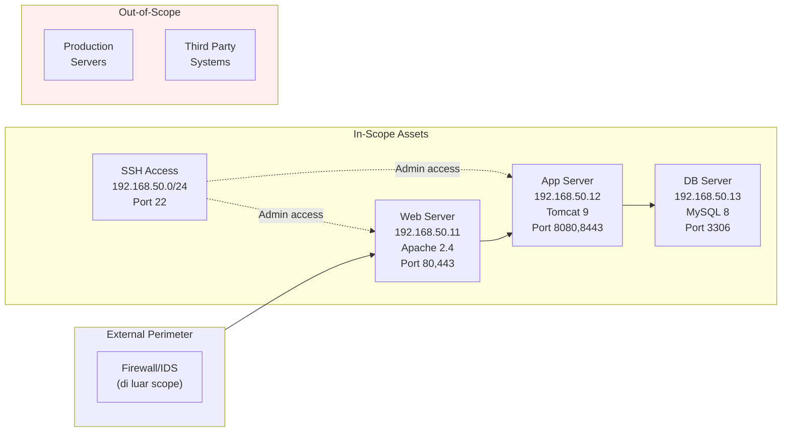
```mermaid
flowchart LR
    subgraph External["External Perimeter"]
        FW["Firewall/IDS\n(di luar scope)"]
    end
    subgraph InScope["In-Scope Assets"]
        Web["Web Server\n192.168.50.11\nApache 2.4\nPort 80,443"]
        App["App Server\n192.168.50.12\nTomcat 9\nPort 8080,8443"]
        DB["DB Server\n192.168.50.13\nMySQL 8\nPort 3306"]
        SSH["SSH Access\n192.168.50.0/24\nPort 22"]
    end
    subgraph OOS["Out-of-Scope"]
        Prod["Production\nServers"]
        ThirdParty["Third Party\nSystems"]
    end
    
    External --> Web
    Web --> App
    App --> DB
    SSH -.->|Admin access| Web
    SSH -.->|Admin access| App
    
    style OOS fill:#ffeeee
    style External fill:#eeeeff
```

---

## 6. Contoh Terapan

### Laporan Attack Surface Report (Template)

```markdown
# Attack Surface Report
## Target: [Nama Target Lab] | Tanggal: [Tanggal]

### Eksekutif Ringkas
Hasil reconnaissance mengidentifikasi X host aktif dengan Y layanan terbuka dalam scope pengujian. Temuan terpenting: [ringkasan 2-3 poin].

### Aset Teridentifikasi
| IP | Hostname | OS (estimasi) | Port/Layanan Terbuka | Prioritas |
|----|----------|---------------|----------------------|-----------|
| 192.168.50.10 | metasploitable.lab | Linux | 21,22,23,25,80,... | TINGGI |
| 192.168.50.11 | dvwa.lab | Linux | 80,443 | TINGGI |

### Attack Paths Potensial
1. External → Web App (port 80/443) → Potential OWASP vulnerabilities
2. External → SSH (port 22) → Brute force risk
3. External → FTP (port 21) → Anonymous access check

### Threat Model Awal (STRIDE)
| Aset | Spoofing | Tampering | Repudiation | Info Disc | DoS | EoP |
|------|----------|-----------|-------------|-----------|-----|-----|
| Web App | ⚠ | ⚠ | ✗ | ⚠ | ✗ | ⚠ |
| Database | ✗ | ⚠ | ✗ | ⚠ | ✗ | ⚠ |

### Rekomendasi Prioritas Area Pengujian
1. Web application (OWASP Top 10) — highest attack surface
2. SSH service (authentication controls)
3. FTP service (anonymous access)
```

---

## 7. Praktikum atau Aktivitas Terarah

### Aktivitas 4.1: Active Recon dan Attack Surface Mapping (Eval-2 Lengkap)

**Target:** VM lab yang disediakan program studi (Metasploitable2 / DVWA)

**Langkah:**
1. DNS enumeration (jika domain tersedia di lab)
2. Light port sweep untuk identifikasi host aktif
3. Technology fingerprinting dari web headers
4. Susun attack surface map (diagram dan tabel)
5. Buat threat model awal menggunakan STRIDE

**Deliverable Eval-2:**
- Attack surface report (Markdown/PDF)
- Diagram attack surface (bisa dibuat manual atau dengan tool)
- Threat model tabel STRIDE per aset

---

## 8. Latihan Pemahaman

**Soal 1:** Apa perbedaan antara "attack surface" dan "attack vector"? Berikan contoh konkret untuk masing-masing.

**Soal 2:** Mengapa DNS Zone Transfer menjadi metode yang jarang berhasil pada implementasi modern?

**Soal 3:** Jelaskan mengapa "X-Powered-By: PHP/7.4" dalam HTTP response header adalah informasi yang berguna bagi penguji dan berbahaya bagi server.

**Soal 4 (Analisis):** Selama active recon, Anda menemukan bahwa target memiliki port 6379 (Redis) terbuka tanpa autentikasi. Masukkan ini ke dalam analisis STRIDE — ancaman mana yang paling relevan?

---

## 9. Latihan Terapan

### Studi Kasus 4: Attack Surface yang Lebih Luas dari Perkiraan

Selama active recon, tim menemukan host 192.168.50.20 yang aktif tetapi tidak ada dalam scope memo awal. Analisis menunjukkan host ini adalah server CI/CD (Jenkins) yang terhubung ke semua server lain dalam scope.

**Pertanyaan (C5):**  
(a) Apa implikasi keamanan dari server CI/CD yang tidak disertakan dalam scope?  
(b) Prosedur apa yang harus diikuti untuk menangani temuan ini?  
(c) Bagaimana seharusnya discovery ini mengubah threat model?  
(d) Rancang klausul scope yang akan mencakup server CI/CD secara otomatis pada penugasan berikutnya.

---

## 10. Kunci Jawaban

**Soal 1:**
- **Attack surface:** Total area yang dapat diserang — semua titik masuk potensial ke sistem. Contoh: semua port terbuka, semua endpoint API, semua formulir input.
- **Attack vector:** Cara atau jalur spesifik yang digunakan penyerang untuk mengeksploitasi kerentanan. Contoh: SQL injection melalui formulir login, atau eksploitasi kerentanan RCE melalui port 8080.
- Attack surface adalah *target*, attack vector adalah *cara mencapai target*.

**Soal 4:** Redis tanpa autentikasi paling rentan terhadap:
- **Information Disclosure (I):** Semua data yang disimpan di Redis dapat dibaca
- **Tampering (T):** Data dapat dimodifikasi atau dihapus
- **Elevation of Privilege (E):** Redis dengan konfigurasi tertentu dapat menulis file ke sistem file host (misalnya ~/.ssh/authorized_keys) → RCE

---

## 11. Ringkasan Bab

Active reconnaissance melibatkan kontak langsung dengan infrastruktur target dan hanya dilakukan setelah otorisasi diterima. Teknik meliputi DNS enumeration, port discovery ringan, dan technology fingerprinting. Hasilnya dikompilasi menjadi attack surface map yang menjadi panduan untuk fase scanning dan enumeration berikutnya. Threat model awal menggunakan STRIDE untuk memprioritaskan area pengujian.

---

## 12. Refleksi Profesional

**Pertanyaan Refleksi 1:** Sebuah organisasi meminta Anda melakukan pentest tetapi tidak mengetahui "berapa banyak sistem yang mereka miliki". Bagaimana kondisi ini mencerminkan masalah manajemen aset, dan apa implikasinya terhadap posture keamanan mereka secara keseluruhan?

---


---

# BAB 5 — NETWORK SCANNING DAN SERVICE DISCOVERY

**Pertemuan:** 5  
**Sub-CPMK:** Sub-CPMK.3  
**Evaluasi:** Eval-3 (15%)

---

## 1. Capaian Pembelajaran Bab

Setelah menyelesaikan Bab 5, mahasiswa mampu:

- Menjelaskan cara kerja teknik port scanning (SYN, Connect, UDP) dan implikasinya.
- Menggunakan Nmap untuk network scanning dalam lingkungan lab yang diotorisasi.
- Menginterpretasikan output Nmap secara akurat, termasuk identifikasi false positive.
- Mendokumentasikan temuan scanning sebagai evidence yang dapat diaudit.

---

## 2. Peta Konsep Bab

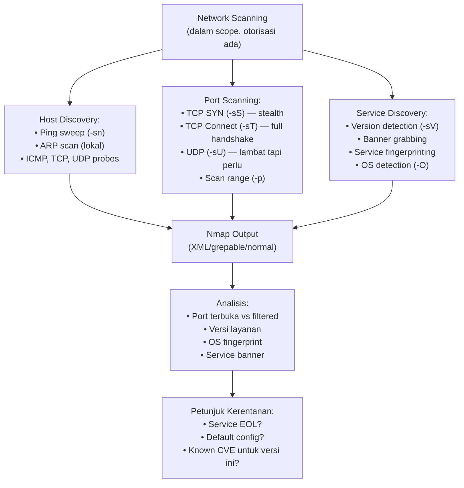
```mermaid
flowchart TD
    NetworkScan["Network Scanning\n(dalam scope, otorisasi ada)"] --> HostDisc["Host Discovery:\n• Ping sweep (-sn)\n• ARP scan (lokal)\n• ICMP, TCP, UDP probes"]
    NetworkScan --> PortScan2["Port Scanning:\n• TCP SYN (-sS) — stealth\n• TCP Connect (-sT) — full handshake\n• UDP (-sU) — lambat tapi perlu\n• Scan range (-p)"]
    NetworkScan --> ServiceDisc["Service Discovery:\n• Version detection (-sV)\n• Banner grabbing\n• Service fingerprinting\n• OS detection (-O)"]
    
    HostDisc --> NmapOutput["Nmap Output\n(XML/grepable/normal)"]
    PortScan2 --> NmapOutput
    ServiceDisc --> NmapOutput
    
    NmapOutput --> Analysis["Analisis:\n• Port terbuka vs filtered\n• Versi layanan\n• OS fingerprint\n• Service banner"]
    
    Analysis --> VulnHints["Petunjuk Kerentanan:\n• Service EOL?\n• Default config?\n• Known CVE untuk versi ini?"]
```

---

## 3. Pengantar Kontekstual

Nmap (Network Mapper) adalah tool paling fundamental dalam toolkit penetration tester. Dirilis pada 1997 oleh Fyodor, Nmap telah berkembang menjadi ekosistem lengkap yang mencakup port scanning, version detection, OS fingerprinting, dan scripting engine (NSE) yang dapat melakukan ratusan pemeriksaan keamanan otomatis. Memahami cara kerja Nmap bukan hanya tentang menggunakan tool — ini tentang memahami bagaimana protokol jaringan bekerja, yang menjadi fondasi untuk semua pemahaman keamanan jaringan.

---

## 4. Landasan Teori

### 4.1 Teknik Port Scanning

**TCP SYN Scan (-sS) — "Half-open" atau "Stealth" Scan:**
```
Penguji → [SYN] → Target
Target → [SYN/ACK] → Penguji  (port terbuka)
Penguji → [RST] → Target       (tidak menyelesaikan handshake)
```
Tidak menyelesaikan TCP three-way handshake → lebih sedikit log di beberapa sistem. Memerlukan akses root/administrator.

**TCP Connect Scan (-sT):**
```
Penguji → [SYN] → Target
Target → [SYN/ACK] → Penguji  (port terbuka)
Penguji → [ACK] → Target       (handshake selesai)
Penguji → [RST/FIN] → Target   (tutup koneksi)
```
Menyelesaikan handshake penuh → lebih mudah terdeteksi di log. Tidak memerlukan akses root — cocok untuk non-privileged testing.

**UDP Scan (-sU):**
UDP tidak memiliki handshake → deteksi lebih sulit. Open UDP port tidak merespons; closed port merespons dengan ICMP "port unreachable". Sangat lambat — pertimbangkan hanya untuk port UDP penting (53, 67/68, 69, 123, 161, 514).

### 4.2 Status Port Nmap

| Status | Arti | Implikasi |
|--------|------|-----------|
| `open` | Layanan menerima koneksi | Target utama penyelidikan lanjutan |
| `closed` | Port dapat diakses tapi tidak ada layanan | Berguna untuk OS detection |
| `filtered` | Firewall memblokir probe | Tidak dapat ditentukan terbuka/tertutup |
| `open|filtered` | Tidak bisa bedakan open/filtered | Umum untuk UDP |
| `unfiltered` | Dapat diakses tapi tidak bisa tentukan state | Dari ACK scan |

### 4.3 Nmap Syntax Referensi

```bash
# Host discovery (tidak ada port scan)
nmap -sn 192.168.50.0/24

# SYN scan pada 1000 port umum (butuh root)
sudo nmap -sS 192.168.50.10

# TCP connect scan (tanpa root)
nmap -sT 192.168.50.10

# Version detection + OS detection + script scanning
sudo nmap -sV -O -sC 192.168.50.10

# Scan semua 65535 port
sudo nmap -sS -p- 192.168.50.10

# Scan port spesifik
sudo nmap -sS -p 22,80,443,8080,3306 192.168.50.10

# UDP scan pada port umum
sudo nmap -sU --top-ports 20 192.168.50.10

# Output ke semua format
sudo nmap -sV -O -sC 192.168.50.10 -oA scan_output

# Verbose dengan timing agresif (gunakan hati-hati)
sudo nmap -sV -T4 192.168.50.10
```

**Catatan tentang timing (-T):**
- T0, T1, T2: Lambat (stealth, untuk menghindari IDS di real engagement)
- T3: Normal (default)
- T4: Agresif (cepat, tapi bisa menyebabkan gangguan pada jaringan sensitif)
- T5: Gila (sangat cepat, berpotensi menyebabkan gangguan)

**Untuk lab:** T3 atau T4 umumnya aman. Untuk lingkungan produksi nyata: T2 atau T3.

### 4.4 Nmap Scripting Engine (NSE)

NSE memungkinkan Nmap menjalankan skrip Lua untuk pemeriksaan lanjutan. Kategori skrip:

| Kategori | Deskripsi |
|----------|-----------|
| `auth` | Pemeriksaan autentikasi default/lemah |
| `brute` | Brute-force — gunakan dengan HATI-HATI, dapat mengunci akun |
| `default` | Skrip aman yang dijalankan dengan -sC |
| `discovery` | Enumerasi lebih lanjut |
| `exploit` | HANYA di lab terisolasi — mengeksploitasi kerentanan |
| `safe` | Skrip yang tidak merusak |
| `vuln` | Pemeriksaan kerentanan spesifik |

Untuk pentest awal, gunakan `-sC` (default scripts) atau `--script safe,discovery`. Hindari `--script brute` dan `--script exploit` kecuali dalam fase yang tepat di lab.

### 4.5 Menginterpretasikan Output Nmap

```
PORT     STATE  SERVICE  VERSION
22/tcp   open   ssh      OpenSSH 7.2p2 Ubuntu 4ubuntu2.10 (Ubuntu Linux)
80/tcp   open   http     Apache httpd 2.4.18
443/tcp  closed https
3306/tcp open   mysql    MySQL 5.7.29
```

Analisis:
- **Port 22:** OpenSSH 7.2p2 → Cek CVE untuk versi ini. Ubuntu 4ubuntu2.10 → konteks distribusi.
- **Port 80:** Apache 2.4.18 → Relatif tua, cek CVE. Tidak ada HTTPS → potensi masalah konfigurasi.
- **Port 443:** Closed → Tidak ada layanan HTTPS → Semua traffic HTTP tidak terenkripsi.
- **Port 3306:** MySQL 5.7 terbuka → Database aksesibel dari network → Potensi masalah serius jika tidak dilindungi firewall.

---

## 5. Model atau Arsitektur

### 5.1 Alur Scanning yang Terstruktur

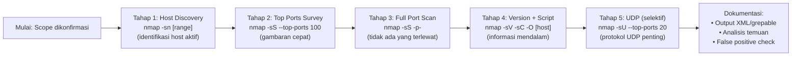
```mermaid
flowchart LR
    A["Mulai: Scope dikonfirmasi"] --> B["Tahap 1: Host Discovery\nnmap -sn [range]\n(identifikasi host aktif)"]
    B --> C["Tahap 2: Top Ports Survey\nnmap -sS --top-ports 100\n(gambaran cepat)"]
    C --> D["Tahap 3: Full Port Scan\nnmap -sS -p-\n(tidak ada yang terlewat)"]
    D --> E["Tahap 4: Version + Script\nnmap -sV -sC -O [host]\n(informasi mendalam)"]
    E --> F["Tahap 5: UDP (selektif)\nnmap -sU --top-ports 20\n(protokol UDP penting)"]
    F --> G["Dokumentasi:\n• Output XML/grepable\n• Analisis temuan\n• False positive check"]
```

---

## 6. Contoh Terapan

### Interpretasi Output Nmap Nyata — Metasploitable2

```
# nmap -sV -sC -O 192.168.50.10

PORT     STATE SERVICE     VERSION
21/tcp   open  ftp         vsftpd 2.3.4
22/tcp   open  ssh         OpenSSH 4.7p1 Debian 8ubuntu1 (protocol 2.0)
23/tcp   open  telnet      Linux telnetd
25/tcp   open  smtp        Postfix smtpd
80/tcp   open  http        Apache httpd 2.2.8
139/tcp  open  netbios-ssn Samba smbd 3.X - 4.X
445/tcp  open  netbios-ssn Samba smbd 3.0.20-Debian
3306/tcp open  mysql       MySQL 5.0.51a-3ubuntu5
5432/tcp open  postgresql  PostgreSQL DB 8.3.0
```

**Analisis temuan:**
- `vsftpd 2.3.4` → CVE-2011-2523 — backdoor terkenal dengan trigger `:)` dalam username
- `telnet` terbuka → Protokol tidak terenkripsi, transmit password dalam plaintext
- `Apache 2.2.8` → EOL, banyak CVE
- `Samba 3.0.20` → CVE-2007-2447 — MS-RPC Shell Command Injection (terkenal, "usermap script")
- `MySQL 5.0.51` → EOL, authentication bypass potensial

Setiap temuan ini akan membutuhkan validasi dalam fase exploitation terkontrol. Tahap scanning hanya mengidentifikasi — belum memvalidasi.

---

## 7. Praktikum atau Aktivitas Terarah

### Aktivitas 5.1: Network Scanning pada Lab Target (Eval-3 Parsial)

**Target:** VM Metasploitable2 atau target lab yang ditetapkan program studi  
**IP target:** disediakan oleh dosen (contoh: 192.168.50.10)

**Langkah kerja:**
```bash
# 1. Host discovery
nmap -sn 192.168.50.0/24

# 2. Top ports survey
nmap -sS --top-ports 100 192.168.50.10 -oN scan_top100.txt

# 3. Full port scan
nmap -sS -p- 192.168.50.10 -oN scan_full.txt

# 4. Version + default scripts
nmap -sV -sC -O 192.168.50.10 -oA scan_detailed

# 5. UDP top 20
nmap -sU --top-ports 20 192.168.50.10 -oN scan_udp.txt
```

**Dokumentasi:**
- Screenshot semua output
- Tabel: Port | Service | Version | Potensi Risk
- Identifikasi false positive (jika ada)

**Catatan keselamatan:** Gunakan timing -T3 (default) atau -T2 untuk menghindari gangguan tidak disengaja. Jangan gunakan `--script exploit` pada tahap ini.

---

## 8. Latihan Pemahaman

**Soal 1:** Apa perbedaan antara TCP SYN scan dan TCP Connect scan dalam hal jejak yang ditinggalkan di log sistem?

**Soal 2 (Analisis):** Nmap menunjukkan port 3306 MySQL dalam status "filtered". Apa yang dapat dan tidak dapat disimpulkan dari status ini?

**Soal 3:** Mengapa scan UDP lebih lambat daripada scan TCP, dan strategi apa yang dapat digunakan untuk mengoptimalkan waktu scan UDP?

**Soal 4:** Port 8080 terbuka menjalankan "Apache Tomcat 7.0.88". Tanpa melakukan pengujian lebih lanjut, informasi apa saja yang sudah dapat Anda kumpulkan tentang risiko potensial dari temuan ini saja?

**Soal 5 (Evaluasi):** Seorang kolega menyarankan menggunakan `nmap -T5` karena "cepat dan efisien". Evaluasi saran ini dari perspektif keamanan, legalitas, dan profesionalisme.

---

## 9. Latihan Terapan

### Studi Kasus 5: Temuan Scanning yang Mengejutkan

Saat melakukan scan terhadap scope yang diotorisasi (192.168.50.0/24), Nmap mendeteksi host aktif di 192.168.50.50 yang tidak ada dalam scope memo. Host ini menjalankan RDP (3389) dan SMB (445) dengan OS Windows Server 2019.

Investigasi menunjukkan bahwa ini adalah domain controller yang "tidak sengaja" terhubung ke network segment yang diuji.

**Pertanyaan (C5):**  
(a) Apa risiko keamanan dari kondisi ini (DC terhubung ke segment yang lebih rendah keamanannya)?  
(b) Apakah penguji boleh melanjutkan pengujian terhadap 192.168.50.50? Berikan justifikasi.  
(c) Bagaimana melaporkan temuan ini kepada klien?  
(d) Apa rekomendasi jangka pendek untuk klien?

---

## 10. Kunci Jawaban

**Soal 1:** SYN scan mengirim paket SYN dan segera mengirim RST setelah menerima SYN/ACK — tidak menyelesaikan handshake. Banyak sistem tidak mencatat koneksi yang tidak selesai, sehingga SYN scan lebih "stealthy". TCP Connect scan menyelesaikan handshake penuh — lebih mudah terdeteksi di log karena ada catatan koneksi yang lengkap.

**Soal 2:** Status "filtered" berarti: firewall atau filter memblokir probe Nmap. Yang dapat disimpulkan: ada sesuatu yang melindungi port 3306 dari akses langsung. Yang TIDAK dapat disimpulkan: apakah MySQL berjalan (mungkin tidak ada layanan, mungkin ada tapi difilter), apakah MySQL rentan, apakah koneksi dari host lain juga difilter.

**Soal 5:** `nmap -T5` tidak direkomendasikan karena: (a) Dapat menyebabkan packet loss, false negatives (port dilaporkan filtered karena terlalu cepat); (b) Berpotensi menyebabkan gangguan layanan pada sistem sensitif — melanggar prinsip "do no harm"; (c) Pada penugasan nyata, T5 hampir pasti akan terdeteksi IDS/IPS dan dapat membatalkan status "pentest" menjadi "DoS attack"; (d) Untuk lingkungan lab yang terisolasi, T4 biasanya sudah lebih dari cukup.

---

## 11. Ringkasan Bab

Network scanning dengan Nmap adalah fondasi dari fase vulnerability discovery. Memahami teknik scan (SYN, Connect, UDP), menginterpretasikan status port (open, closed, filtered), dan menggunakan version detection secara bertanggung jawab adalah keterampilan inti. Semua scanning harus dilakukan dalam scope yang diotorisasi, dengan timing yang tidak mengganggu layanan, dan hasilnya didokumentasikan secara lengkap sebagai evidence.

---

## 12. Refleksi Profesional

**Pertanyaan Refleksi 1:** Seorang penguji menemukan bahwa kliennya menggunakan banyak sistem legacy yang tidak dapat di-patch karena bergantung pada aplikasi kritis. Bagaimana Anda menyampaikan rekomendasi yang realistis dan dapat ditindaklanjuti dalam situasi ini?

---


---

# BAB 6 — ENUMERATION DAN VULNERABILITY DISCOVERY

**Pertemuan:** 6  
**Sub-CPMK:** Sub-CPMK.3  
**Evaluasi:** Eval-3 (15%)

---

## 1. Capaian Pembelajaran Bab

Setelah menyelesaikan Bab 6, mahasiswa mampu:

- Melakukan service enumeration yang sistematis pada layanan yang teridentifikasi.
- Menggunakan vulnerability scanner (OpenVAS/GVM) di lingkungan lab.
- Membedakan kerentanan nyata dari false positive.
- Mendokumentasikan temuan vulnerability discovery dalam format triage.

---

## 2. Peta Konsep Bab

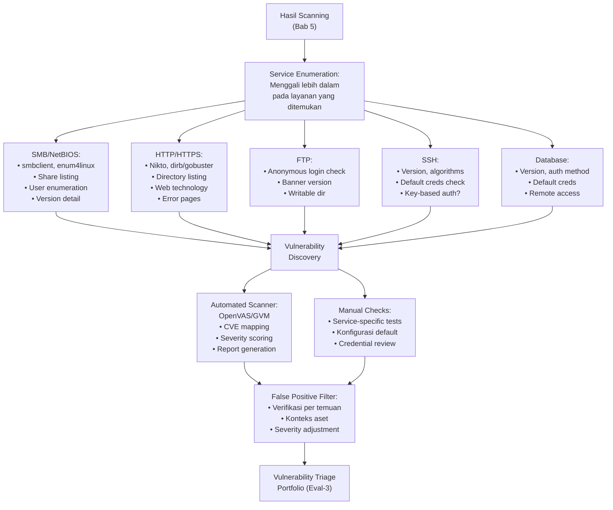
```mermaid
flowchart TD
    ScanResults["Hasil Scanning\n(Bab 5)"] --> Enum["Service Enumeration:\nMenggali lebih dalam\npada layanan yang ditemukan"]
    
    Enum --> SMB["SMB/NetBIOS:\n• smbclient, enum4linux\n• Share listing\n• User enumeration\n• Version detail"]
    Enum --> HTTP["HTTP/HTTPS:\n• Nikto, dirb/gobuster\n• Directory listing\n• Web technology\n• Error pages"]
    Enum --> FTP["FTP:\n• Anonymous login check\n• Banner version\n• Writable dir"]
    Enum --> SSH["SSH:\n• Version, algorithms\n• Default creds check\n• Key-based auth?"]
    Enum --> DB["Database:\n• Version, auth method\n• Default creds\n• Remote access"]
    
    SMB --> VulnDisc["Vulnerability\nDiscovery"]
    HTTP --> VulnDisc
    FTP --> VulnDisc
    SSH --> VulnDisc
    DB --> VulnDisc
    
    VulnDisc --> AutoScan["Automated Scanner:\nOpenVAS/GVM\n• CVE mapping\n• Severity scoring\n• Report generation"]
    VulnDisc --> ManualCheck["Manual Checks:\n• Service-specific tests\n• Konfigurasi default\n• Credential review"]
    
    AutoScan --> FPFilter["False Positive Filter:\n• Verifikasi per temuan\n• Konteks aset\n• Severity adjustment"]
    ManualCheck --> FPFilter
    FPFilter --> VulnTriage["Vulnerability Triage\nPortfolio (Eval-3)"]
```

---

## 3. Pengantar Kontekstual

Enumeration adalah langkah yang mengubah data scanning yang kasar menjadi intelijen yang dapat ditindaklanjuti. Sementara scanning memberi tahu "ada layanan di port 445", enumeration menjawab "layanan ini menggunakan versi Samba 3.0.20, berbagi direktori HOME, dan memiliki 3 user accounts yang dapat dienumerate". Perbedaan ini bisa berarti perbedaan antara temuan "port terbuka" dan temuan "RCE critical".

---

## 4. Landasan Teori

### 4.1 SMB/NetBIOS Enumeration

SMB (Server Message Block) adalah protokol berbagi file yang sangat kaya informasi untuk enumeration:

```bash
# Cek berbagi (share) yang tersedia
smbclient -L //192.168.50.10 -N        # -N: anonymous login
smbclient -L //192.168.50.10 -U guest

# Comprehensive SMB enumeration
enum4linux -a 192.168.50.10

# Output enum4linux mencakup:
# - OS information
# - User accounts
# - Groups
# - Shared resources
# - Password policy
```

### 4.2 Web Application Enumeration

**Nikto — Web Server Scanner:**
```bash
# Nikto scan dasar
nikto -h http://192.168.50.11

# Output mencakup:
# - Server version dan konfigurasi
# - Dangerous files (/etc/passwd, backup files)
# - Outdated versions
# - Security misconfigurations (directory listing, default pages)
```

**Directory Bruteforcing:**
```bash
# gobuster — directory brute-force
gobuster dir -u http://192.168.50.11 -w /usr/share/wordlists/dirb/common.txt

# Output: daftar direktori dan file yang ditemukan
# /admin, /backup, /phpinfo.php, /config.php, dll
```

### 4.3 OpenVAS/GVM (Greenbone Vulnerability Management)

OpenVAS (Open Vulnerability Assessment System) adalah scanner kerentanan open-source yang paling komprehensif. Dalam lingkungan lab, ia memberikan:

- Pemetaan CVE terhadap layanan yang terdeteksi
- Scoring berbasis CVSS
- Laporan yang dapat diekspor (XML, PDF)
- Network Vulnerability Tests (NVT) yang terus diperbarui

**Alur penggunaan OpenVAS di lab:**
1. Akses OpenVAS melalui web interface (biasanya https://localhost:9392)
2. Buat "Target" dengan IP target lab
3. Buat "Task" dengan target dan scan config (biasanya "Full and fast")
4. Jalankan scan dan tunggu selesai
5. Unduh laporan XML untuk analisis

### 4.4 False Positive dalam Vulnerability Assessment

False positive adalah laporan kerentanan yang sebenarnya tidak ada atau tidak dapat dieksploitasi dalam konteks target. Penyebab umum:

1. **Version mismatch:** Scanner mendeteksi versi yang rentan, tetapi organisasi telah mem-backport patch (umum di distribusi Linux enterprise)
2. **Compensating controls:** Kerentanan ada, tetapi diblokir oleh firewall atau IDS sebelum dapat dieksploitasi
3. **Configuration difference:** CVE berlaku untuk konfigurasi default, tetapi target menggunakan konfigurasi non-default yang tidak rentan
4. **Plugin outdated:** Plugin scanner menggunakan pola deteksi yang sudah tidak akurat

**Cara memvalidasi (mengurangi false positive):**
1. Cek versi secara manual: `telnet target 22` atau akses banner service
2. Cek changelog distribusi untuk backport patches
3. Verifikasi komponen yang rentan benar-benar ada dan aktif
4. Jika memungkinkan (dalam scope), coba PoC terbatas untuk konfirmasi

---

## 5. Model atau Arsitektur

### 5.1 Vulnerability Discovery Pipeline

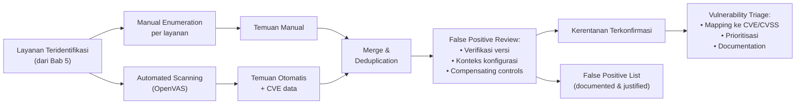
```mermaid
flowchart LR
    Services["Layanan Teridentifikasi\n(dari Bab 5)"] --> Manual["Manual Enumeration\nper layanan"]
    Services --> Automated["Automated Scanning\n(OpenVAS)"]
    
    Manual --> Findings1["Temuan Manual"]
    Automated --> Findings2["Temuan Otomatis\n+ CVE data"]
    
    Findings1 --> Merge["Merge &\nDeduplication"]
    Findings2 --> Merge
    
    Merge --> FPReview["False Positive Review:\n• Verifikasi versi\n• Konteks konfigurasi\n• Compensating controls"]
    
    FPReview --> Confirmed["Kerentanan Terkonfirmasi"]
    FPReview --> FPList["False Positive List\n(documented & justified)"]
    
    Confirmed --> Triage["Vulnerability Triage:\n• Mapping ke CVE/CVSS\n• Prioritisasi\n• Documentation"]
```

---

## 6. Contoh Terapan

### Contoh: Enumeration Output dan Analisis

**Hasil enum4linux pada Metasploitable2 (simulasi):**
```
[+] Enumerating users using SID S-1-5-21-...
  user:[root] rid:[0x3e8]
  user:[daemon] rid:[0x3ea]
  user:[msfadmin] rid:[0x3f2]

[+] Password Policy
  Minimum password length: 5
  Password history length: 0
  Maximum password age: Not Set
  
[+] Share Enumeration
  Sharename  Type  Comment
  ---------  ----  -------
  print$     Disk  Printer Drivers
  tmp        Disk  oh noes!
  opt        Disk
  IPC$       IPC   IPC Service
```

**Analisis:**
- Share `tmp` dengan komentar "oh noes!" — kemungkinan directori `/tmp` yang world-writable
- Password minimum 5 karakter, tidak ada history → brute force lebih mudah
- User `msfadmin` teridentifikasi → target potential untuk brute force

---

## 7. Praktikum atau Aktivitas Terarah

### Aktivitas 6.1: Service Enumeration dan Vulnerability Discovery (Eval-3)

**Target:** VM Metasploitable2 / DVWA di lab

**Langkah:**
```bash
# SMB Enumeration
enum4linux -a [TARGET_IP]

# HTTP Enumeration
nikto -h http://[TARGET_IP]
gobuster dir -u http://[TARGET_IP] -w /usr/share/wordlists/dirb/common.txt

# FTP check
ftp [TARGET_IP]  # coba anonymous login

# SSH version
nmap --script ssh-auth-methods [TARGET_IP]
```

**Vulnerability Scanning:**
1. Jalankan OpenVAS/GVM terhadap target
2. Unduh laporan
3. Review setiap temuan: false positive atau valid?

**Deliverable Eval-3:**
- Enumeration notes per layanan
- Daftar kerentanan dari OpenVAS (setelah filter false positive)
- Tabel vulnerability triage (lihat Bab 7 untuk CVE/CVSS mapping)

---

## 8. Latihan Pemahaman

**Soal 1:** Apa perbedaan antara "vulnerability scanning" dan "penetration testing"?

**Soal 2:** Jelaskan mengapa "backported patches" menyebabkan false positive pada vulnerability scanner dan bagaimana cara mengidentifikasinya.

**Soal 3 (Analisis):** OpenVAS melaporkan "Apache HTTPD mod_ssl Remote Code Execution (CVE-2021-XXXX)" dengan severity CRITICAL. Langkah apa yang Anda ambil untuk menentukan apakah ini false positive atau valid?

**Soal 4:** Dalam enumerasi SMB, Anda menemukan share bernama "backup$" yang dapat diakses secara anonim. Apa implikasi keamanan dari temuan ini?

---

## 9. Latihan Terapan

### Studi Kasus 6: Hasil OpenVAS yang Overwhelming

Tim menerima laporan OpenVAS dengan 347 kerentanan yang diklasifikasikan sebagai HIGH dan 892 sebagai MEDIUM untuk 12 server. Klien meminta prioritas perbaikan. Tim tidak mungkin memvalidasi semuanya dalam waktu tersisa.

**Pertanyaan (C5):**  
(a) Bagaimana strategi triage yang efisien untuk 347 HIGH findings?  
(b) Berapa estimasi false positive rate yang wajar untuk vulnerability scanner otomatis, dan mengapa ini penting untuk dikomunikasikan kepada klien?  
(c) Faktor apa yang Anda gunakan untuk memprioritaskan validasi?  
(d) Bagaimana mengkomunikasikan keterbatasan waktu kepada klien secara profesional?

---

## 10. Kunci Jawaban

**Soal 1:** Vulnerability scanning adalah proses otomatis yang mengidentifikasi kerentanan potensial berdasarkan pencocokan versi dan pola — hasilnya adalah daftar yang perlu divalidasi, banyak di antaranya mungkin false positive. Penetration testing adalah pengujian yang lebih mendalam yang mencakup validasi aktual, eksploitasi terkontrol, dan analisis dampak bisnis. Pentest menggunakan hasil vuln scan sebagai input, bukan sebagai output akhir.

**Studi Kasus 6:**  
(a) Strategi: kelompokkan berdasarkan tipe (network, web, OS) — seringkali satu root cause menyebabkan puluhan temuan. Prioritaskan yang dapat dieksploitasi tanpa autentikasi dan yang menghadap internet; (b) False positive rate untuk scanner otomatis bisa 20-50% tergantung konfigurasi dan target — ini harus dikomunikasikan kepada klien agar tidak terjadi over-prioritization; (c) Faktor: CVSS score, exploitability (exploit public tersedia?), posisi aset (internet-facing?), sensitivitas data; (d) Sampaikan: "Kami telah memvalidasi X temuan HIGH yang paling kritis. Estimasi false positive: Y%. Rekomendasi: mulai perbaikan pada Z temuan yang telah kami validasi secara manual."

---

## 11. Ringkasan Bab

Enumeration menggali informasi lebih dalam dari setiap layanan yang ditemukan — SMB, HTTP, FTP, SSH, database. Vulnerability scanner otomatis (OpenVAS) efisien tetapi menghasilkan false positive yang signifikan. False positive filtering dan manual verification adalah langkah kritis sebelum eskalasi ke fase exploitation. Semua temuan harus didokumentasikan dengan justifikasi (valid atau false positive).

---

## 12. Refleksi Profesional

**Pertanyaan Refleksi 1:** Seorang manajer IT klien melihat laporan 347 kerentanan CRITICAL dan langsung panik. Bagaimana Anda meredakan kepanikan ini sambil tetap menyampaikan realita risiko yang ada?

---

# BAB 7 — CVE, CVSS, CWE, DAN VULNERABILITY TRIAGE

**Pertemuan:** 7  
**Sub-CPMK:** Sub-CPMK.3  
**Evaluasi:** Eval-3 (15%)

---

## 1. Capaian Pembelajaran Bab

Setelah menyelesaikan Bab 7, mahasiswa mampu:

- Menjelaskan sistem CVE, CVSS, CWE, dan NVD beserta hubungannya.
- Menghitung dan menginterpretasikan CVSS score beserta konteks lingkungan.
- Melakukan vulnerability triage berbasis risiko, bukan hanya severity.
- Menyusun Vulnerability Triage Portfolio sebagai deliverable Eval-3.

---

## 2. Peta Konsep Bab

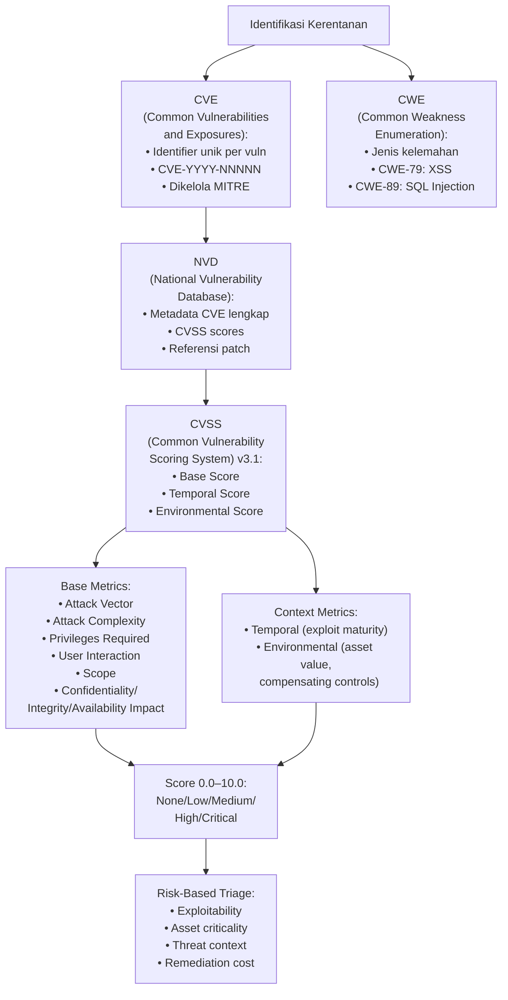
```mermaid
flowchart TD
    VulnID["Identifikasi Kerentanan"] --> CVE2["CVE\n(Common Vulnerabilities\nand Exposures):\n• Identifier unik per vuln\n• CVE-YYYY-NNNNN\n• Dikelola MITRE"]
    VulnID --> CWE2["CWE\n(Common Weakness\nEnumeration):\n• Jenis kelemahan\n• CWE-79: XSS\n• CWE-89: SQL Injection"]
    
    CVE2 --> NVD2["NVD\n(National Vulnerability\nDatabase):\n• Metadata CVE lengkap\n• CVSS scores\n• Referensi patch"]
    
    NVD2 --> CVSS2["CVSS\n(Common Vulnerability\nScoring System) v3.1:\n• Base Score\n• Temporal Score\n• Environmental Score"]
    
    CVSS2 --> BaseMetrics["Base Metrics:\n• Attack Vector\n• Attack Complexity\n• Privileges Required\n• User Interaction\n• Scope\n• Confidentiality/\n  Integrity/Availability Impact"]
    CVSS2 --> ContextMetrics["Context Metrics:\n• Temporal (exploit maturity)\n• Environmental (asset value,\n  compensating controls)"]
    
    BaseMetrics --> Score["Score 0.0–10.0:\nNone/Low/Medium/\nHigh/Critical"]
    ContextMetrics --> Score
    
    Score --> Triage["Risk-Based Triage:\n• Exploitability\n• Asset criticality\n• Threat context\n• Remediation cost"]
```

---

## 3. Pengantar Kontekstual

CVSS score adalah titik awal, bukan kesimpulan akhir. Kerentanan dengan CVSS 9.8 di server yang tidak dapat diakses dari internet mungkin lebih rendah prioritasnya dibandingkan CVSS 6.0 di server web yang diakses 10 juta pengguna setiap hari. Triage yang baik mempertimbangkan konteks — dan itulah yang membedakan laporan pentest yang berharga dari laporan yang hanya mencetak ulang output scanner.

---

## 4. Landasan Teori

### 4.1 CVE: Common Vulnerabilities and Exposures

CVE adalah sistem pengidentifikasi universal untuk kerentanan keamanan yang diketahui publik. Format: `CVE-[TAHUN]-[NOMOR]`.

Contoh: `CVE-2021-44228` = Log4Shell (Log4j vulnerability, ditemukan 2021, nomor urut 44228)

CVE dikelola oleh MITRE Corporation dan didistribusikan ke NVD. Proses:
1. Peneliti menemukan kerentanan baru
2. Melaporkan ke MITRE atau CNA (CVE Numbering Authority)
3. CVE ID ditetapkan (mungkin dalam status "RESERVED" sebelum detail publik)
4. Detail dipublikasikan di NVD dengan metadata lengkap

### 4.2 CVSS v3.1: Cara Kerja Scoring

CVSS (Common Vulnerability Scoring System) versi 3.1 menggunakan tiga kelompok metrik:

**Base Score (0.0–10.0):**

| Metrik | Opsi | Penjelasan |
|--------|------|------------|
| Attack Vector (AV) | Network/Adjacent/Local/Physical | Dari mana serangan dilakukan |
| Attack Complexity (AC) | Low/High | Seberapa sulit kondisi yang diperlukan |
| Privileges Required (PR) | None/Low/High | Hak akses yang dibutuhkan sebelum exploit |
| User Interaction (UI) | None/Required | Apakah korban harus melakukan sesuatu |
| Scope (S) | Unchanged/Changed | Apakah eksploitasi mempengaruhi komponen di luar sistem asli |
| Confidentiality Impact (C) | None/Low/High | Dampak terhadap kerahasiaan |
| Integrity Impact (I) | None/Low/High | Dampak terhadap integritas |
| Availability Impact (A) | None/Low/High | Dampak terhadap ketersediaan |

**Contoh kalkulasi:**
CVE-2017-0144 (EternalBlue/MS17-010):
- AV:Network, AC:Low, PR:None, UI:None → penyerang remote tanpa autentikasi
- S:Changed → dapat menyebar ke sistem lain
- C:High, I:High, A:High → full compromise
- **Base Score: 9.8 (Critical)**

**Temporal Score:**
Memodifikasi Base Score berdasarkan kematangan exploit:
- Exploit Code Maturity: belum ada → ada PoC → aktif dieksploitasi
- Remediation Level: patch tersedia menurunkan urgency
- Report Confidence: tingkat keyakinan pelapor

**Environmental Score:**
Memodifikasi berdasarkan konteks lingkungan target:
- Modified Attack Metrics: jika compensating controls ada (firewall membatasi AV)
- Asset Importance: CR/IR/AR (Confidentiality/Integrity/Availability Requirements)

### 4.3 CWE: Common Weakness Enumeration

CWE mengklasifikasikan *jenis* kelemahan (bukan instansi spesifik seperti CVE):

| CWE ID | Kelemahan | Contoh CVE terkait |
|--------|-----------|-------------------|
| CWE-79 | Improper Neutralization of Input (XSS) | Banyak CVE pada CMS |
| CWE-89 | SQL Injection | Banyak CVE pada aplikasi web |
| CWE-78 | OS Command Injection | Banyak CVE pada perangkat jaringan |
| CWE-287 | Improper Authentication | CVE di berbagai layanan |
| CWE-200 | Information Exposure | CVE terkait disclosure |
| CWE-120 | Buffer Copy without Check (Buffer Overflow) | CVE pada software C/C++ |

CWE berguna untuk: mengidentifikasi pola kelemahan sistemik, mengarahkan code review, dan memilih remediasi yang tepat.

### 4.4 Risk-Based Triage

CVSS score adalah perkiraan umum, bukan keputusan akhir. Risk-based triage mempertimbangkan:

```
Risk = CVSS Base × Exploitability_Context × Asset_Value

Exploitability_Context:
- Apakah ada public exploit?
- Apakah exploit mudah digunakan?
- Apakah target dapat diakses dari internet?

Asset_Value:
- Data apa yang disimpan/diproses?
- Berapa dampak bisnis jika dikompromis?
- Apakah ada compensating controls?
```

**Priority Matrix:**

| CVSS Score | Aset Kritis | Aset Non-Kritis |
|------------|-------------|-----------------|
| Critical (9.0–10.0) | URGENT (24 jam) | HIGH (7 hari) |
| High (7.0–8.9) | HIGH (7 hari) | MEDIUM (30 hari) |
| Medium (4.0–6.9) | MEDIUM (30 hari) | LOW (90 hari) |
| Low (0.1–3.9) | LOW (90 hari) | Informational |

---

## 5. Model atau Arsitektur

### 5.1 Vulnerability Triage Workflow

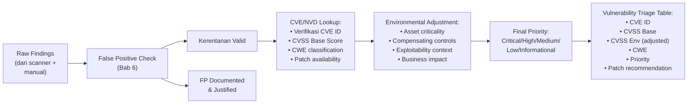
```mermaid
flowchart LR
    RawFindings["Raw Findings\n(dari scanner +\nmanual)"] --> FPCheck["False Positive Check\n(Bab 6)"]
    FPCheck --> ValidVuln["Kerentanan Valid"]
    FPCheck --> FPDoc["FP Documented\n& Justified"]
    
    ValidVuln --> CVELookup["CVE/NVD Lookup:\n• Verifikasi CVE ID\n• CVSS Base Score\n• CWE classification\n• Patch availability"]
    CVELookup --> ContextAdj["Environmental Adjustment:\n• Asset criticality\n• Compensating controls\n• Exploitability context\n• Business impact"]
    
    ContextAdj --> Priority["Final Priority:\nCritical/High/Medium/\nLow/Informational"]
    Priority --> TriageTable["Vulnerability Triage Table:\n• CVE ID\n• CVSS Base\n• CVSS Env (adjusted)\n• CWE\n• Priority\n• Patch recommendation"]
```

---

## 6. Contoh Terapan

### Template Vulnerability Triage Portfolio (Eval-3)

```markdown
# Vulnerability Triage Portfolio
## Target: Lab Environment | Tanggal: [Tanggal]
## Penguji: [Nama] | Ref: EVAL3-[NIM]

---

### Ringkasan Eksekutif
Total temuan: 12 | Critical: 2 | High: 4 | Medium: 4 | Low: 2 | Informational: 0
False positive terdokumentasi: 5

---

### Temuan Critical

| # | CVE ID | CWE | Service | CVSS Base | CVSS Env | Priority | Ringkasan |
|---|--------|-----|---------|-----------|----------|----------|-----------|
| 1 | CVE-2011-2523 | CWE-78 | vsftpd 2.3.4/tcp 21 | 10.0 | 10.0 | CRITICAL | vsftpd backdoor command injection. Public exploit tersedia (Metasploit). Tidak ada compensating control. |
| 2 | CVE-2007-2447 | CWE-78 | Samba 3.0.20/tcp 445 | 9.0 | 9.0 | CRITICAL | Samba username map script RCE. Public exploit tersedia. |

### Temuan High

| # | CVE ID | CWE | Service | CVSS Base | CVSS Env | Priority | Ringkasan |
|---|--------|-----|---------|-----------|----------|----------|-----------|
| 3 | CVE-2006-1547 | CWE-400 | Apache 2.2.8/tcp 80 | 7.8 | 6.5 | HIGH | DoS via malformed Accept-Language. CVSS Env diturunkan karena asset non-production. |

### False Positive Terdokumentasi

| # | CVE ID | Layanan | Alasan FP |
|---|--------|---------|-----------|
| 1 | CVE-2021-XXXX | Apache 2.4.18 | Versi Ubuntu telah mem-backport patch. Cek `apt-get changelog apache2` menunjukkan patch diterapkan. |

---

### Rekomendasi Prioritas
1. [CRITICAL] Patch atau isolasi vsftpd 2.3.4 segera
2. [CRITICAL] Upgrade Samba ke versi terkini
3. [HIGH] Upgrade Apache 2.2.8 (EOL)
```

---

## 7. Praktikum atau Aktivitas Terarah

### Aktivitas 7.1: Menyusun Vulnerability Triage Portfolio (Deliverable Eval-3)

**Tugas:**
1. Ambil hasil scanning dan enumeration dari Bab 5-6
2. Untuk setiap kerentanan: cari CVE ID di nvd.nist.gov, catat CVSS base score, CWE classification
3. Lakukan environmental adjustment berdasarkan konteks lab
4. Tentukan priority final
5. Dokumentasikan false positive dengan justifikasi
6. Compile dalam format tabel triage

---

## 8. Latihan Pemahaman

**Soal 1:** Apa perbedaan antara CVE, CVSS, dan CWE? Jelaskan hubungan di antara ketiganya.

**Soal 2:** CVE-2021-44228 (Log4Shell) memiliki CVSS Base Score 10.0 (Critical). Namun, jika target yang menggunakannya adalah server internal yang hanya dapat diakses dari jaringan internal, bagaimana environmental score seharusnya disesuaikan?

**Soal 3 (Analisis):** Dua kerentanan: A (CVSS 9.5, server internal, tidak ada public exploit) dan B (CVSS 7.2, server internet-facing, ada public exploit di Metasploit). Mana yang harus diprioritaskan? Jelaskan reasoning.

---

## 9. Latihan Terapan

### Studi Kasus 7: CVSS Contextualization dalam Praktik

Organisasi X memiliki server web dengan CVE-2019-0708 (BlueKeep, CVSS 9.8). Server ini menjalankan RDP tetapi dilindungi oleh firewall yang hanya mengizinkan koneksi RDP dari subnet admin (10.10.0.0/16). Namun, subnet admin tersebut memiliki 500 workstation.

**Pertanyaan (C5):**  
(a) Hitung environmental CVSS dengan mempertimbangkan compensating control (firewall).  
(b) Apakah kerentanan ini masih harus diprioritaskan tinggi meskipun ada firewall? Justifikasi.  
(c) Apa skenario di mana compensating control ini bisa gagal?  
(d) Rancang rekomendasi yang mempertimbangkan tradeoff antara keamanan dan operasional.

---

## 10. Kunci Jawaban

**Soal 1:** CVE adalah *identifier* untuk kerentanan spesifik ("instansi" kelemahan tertentu di software tertentu). CVSS adalah *scoring system* yang mengkuantifikasi severitas CVE. CWE adalah *klasifikasi jenis* kelemahan yang mendasari (pola abstrak, bukan instansi spesifik). Contoh: CVE-2017-5638 (Struts RCE) → CVSS 10.0 → CWE-20 (Improper Input Validation).

**Soal 3:** B harus diprioritaskan lebih tinggi meskipun CVSS lebih rendah. Reasoning: (a) Internet-facing = attack surface lebih luas; (b) Public exploit di Metasploit = eksploitasi sangat mudah (tidak perlu skill tinggi); (c) A memerlukan penyerang yang sudah berada di jaringan internal. Risk = severity × exploitability × accessibility. B memiliki exploitability dan accessibility yang jauh lebih tinggi.

---

## 11. Ringkasan Bab

CVE, CVSS, CWE, dan NVD membentuk ekosistem standar untuk mengidentifikasi, mengklasifikasikan, dan menilai kerentanan. CVSS Base Score adalah titik awal — environmental adjustment dan konteks bisnis menentukan prioritas akhir. Risk-based triage adalah keterampilan kunci yang membedakan penguji berpengalaman dari pemula: bukan hanya menemukan kerentanan, tetapi membantu organisasi fokus pada yang benar-benar penting.

---

## 12. Refleksi Profesional

**Pertanyaan Refleksi 1:** Sebuah organisasi memutuskan untuk "menerima risiko" (risk acceptance) pada kerentanan CVSS 8.5 karena biaya perbaikan terlalu tinggi. Sebagai penguji keamanan, bagaimana Anda mendokumentasikan keputusan ini, dan apa tanggung jawab profesional Anda?

---


---

# BAB 8 — UTS: ANALISIS KASUS INTEGRATIF RECONNAISSANCE HINGGA VULNERABILITY DISCOVERY

**Pertemuan:** 8  
**Sub-CPMK:** Sub-CPMK.4  
**Evaluasi:** Eval-4 (20%)

---

## 1. Capaian Pembelajaran Bab

Bab ini berfungsi sebagai konsolidasi dan evaluasi komprehensif Bab 1–7. Mahasiswa harus mampu:

- Mengintegrasikan seluruh pengetahuan dari scoping hingga vulnerability triage dalam analisis kasus end-to-end.
- Menilai kualitas scope memo, RoE, dan evidence dalam skenario yang diberikan.
- Mengidentifikasi kesalahan metodologi dalam proses pentest yang digambarkan.
- Membuat rekomendasi berbasis temuan yang komprehensif.

---

## 2. Peta Konsep Bab

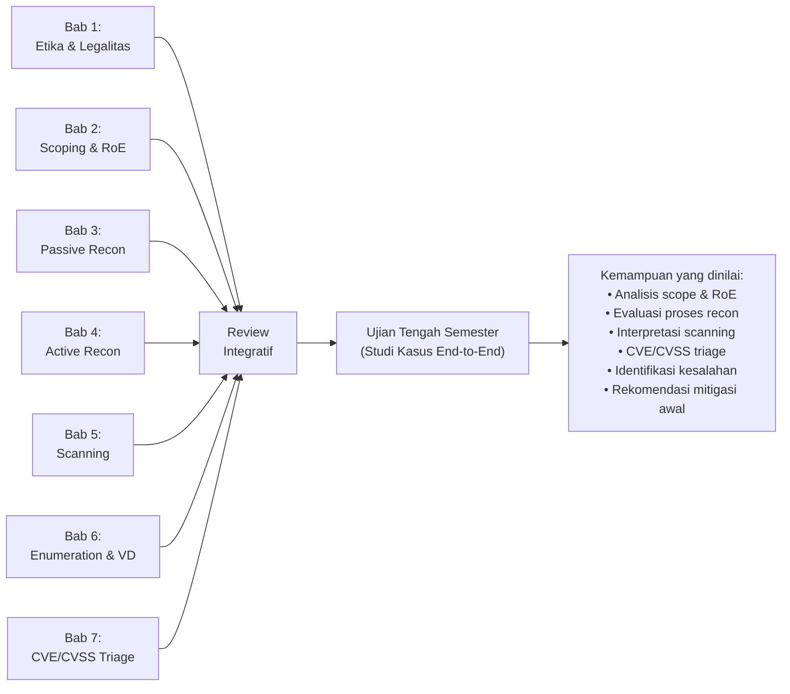
```mermaid
flowchart LR
    Bab1["Bab 1:\nEtika & Legalitas"] --> Review["Review\nIntegratif"]
    Bab2["Bab 2:\nScoping & RoE"] --> Review
    Bab3["Bab 3:\nPassive Recon"] --> Review
    Bab4["Bab 4:\nActive Recon"] --> Review
    Bab5["Bab 5:\nScanning"] --> Review
    Bab6["Bab 6:\nEnumeration & VD"] --> Review
    Bab7["Bab 7:\nCVE/CVSS Triage"] --> Review
    
    Review --> UTS["Ujian Tengah Semester\n(Studi Kasus End-to-End)"]
    UTS --> Analysis["Kemampuan yang dinilai:\n• Analisis scope & RoE\n• Evaluasi proses recon\n• Interpretasi scanning\n• CVE/CVSS triage\n• Identifikasi kesalahan\n• Rekomendasi mitigasi awal"]
```

---

## 3. Pengantar Kontekstual

Ujian Tengah Semester dirancang sebagai studi kasus komprehensif yang mensimulasikan penugasan pentest nyata. Mahasiswa diberikan dokumen-dokumen pre-engagement, output tools, dan laporan parsial yang berisi deliberate errors dan area yang perlu dianalisis secara kritis.

---

## 4. Landasan Teori: Sintesis Bab 1–7

### 4.1 Checklist Pre-Engagement yang Lengkap

```markdown
## Pre-Engagement Checklist

### Legal & Authorization
- [ ] Authorization letter ditandatangani pejabat berwenang
- [ ] Scope didefinisikan dengan IP/domain eksplisit
- [ ] Out-of-scope terdefinisi (terutama sistem pihak ketiga)
- [ ] Testing window ditetapkan
- [ ] Kontak darurat tersedia 24/7

### Rules of Engagement
- [ ] Teknik yang diizinkan dan dilarang didefinisikan
- [ ] Prosedur penghentian darurat ditetapkan
- [ ] Data handling policy disepakati
- [ ] Threshold gangguan layanan ditetapkan

### Reconnaissance Plan
- [ ] Passive recon sebelum active recon
- [ ] Tools dan sumber yang akan digunakan terdokumentasi
- [ ] Attack surface mapping plan

### Scanning & Enumeration Plan
- [ ] Scan rate yang diizinkan
- [ ] Tools yang diizinkan
- [ ] Output format untuk evidence
```

### 4.2 Kesalahan Umum yang Harus Diidentifikasi dalam UTS

**Pre-Engagement Errors:**
- Scope ambigu ("semua server" tanpa IP spesifik)
- Otorisasi dari pihak yang tidak berwenang
- Tidak ada prosedur darurat
- Tidak ada definisi out-of-scope

**Reconnaissance Errors:**
- Active recon sebelum otorisasi diterima
- Menggunakan informasi dari sumber yang tidak terpercaya tanpa verifikasi
- Tidak mendokumentasikan sumber temuan

**Scanning Errors:**
- Scan rate terlalu tinggi (T5)
- Scanning sistem out-of-scope
- Tidak menyimpan output dalam format yang dapat diaudit

**Vulnerability Analysis Errors:**
- Melaporkan semua scanner output sebagai "temuan" tanpa false positive filter
- Tidak menggunakan environmental CVSS adjustment
- CVSS score tidak sesuai dengan versi yang terdeteksi

---

## 5. Soal UTS (Contoh)

### Skenario UTS: Penugasan Pentest yang Bermasalah

Tim dari perusahaan konsultan keamanan "SecurePro" mendapat penugasan pentest dari PT Logistik Nusantara (LN). Berikut adalah kronologi yang terjadi:

**Hari 1:**  
Tim menerima email dari `admin@logistik-nusantara.id` yang berisi: "Kami mengizinkan tim Anda untuk menguji keamanan sistem kami. Fokus pada server web kami." Tanpa dokumen formal, tim langsung memulai passive reconnaissance.

**Hari 2:**  
Tim melakukan Nmap scan dengan `-T5` terhadap 203.0.113.0/24 berdasarkan informasi dari email. Scan menyebabkan satu server (203.0.113.15) tidak responsif selama 30 menit.

**Hari 3:**  
OpenVAS melaporkan 50 kerentanan HIGH pada 203.0.113.10. Tim langsung mencantumkan semua 50 kerentanan dalam laporan tanpa validasi manual.

**Hari 5:**  
Tim menemukan bahwa 203.0.113.20 adalah server yang dikelola vendor cloud — bukan aset LN sendiri. Mereka tetap melanjutkan scan terhadap server ini karena "masih dalam subnet yang diberikan".

---

### Pertanyaan UTS

**Soal UTS-1 (15 poin):**  
Identifikasi minimal 5 kesalahan metodologis dalam kronologi di atas. Untuk setiap kesalahan: (a) jelaskan kesalahannya, (b) apa risiko hukum atau teknis yang ditimbulkan, (c) apa yang seharusnya dilakukan.

**Soal UTS-2 (20 poin):**  
Rancang ulang pre-engagement process untuk PT Logistik Nusantara, termasuk: (a) dokumen yang diperlukan, (b) scope definition yang proper, (c) RoE yang mencegah insiden di atas.

**Soal UTS-3 (25 poin):**  
Dari laporan OpenVAS 50 HIGH findings, tim mengambil sampel 5 temuan untuk dianalisis:

| # | CVE | Service | CVSS Base | Catatan Scanner |
|---|-----|---------|-----------|-----------------|
| 1 | CVE-2014-6271 | bash/Apache CGI | 10.0 | Shellshock |
| 2 | CVE-2021-XXXX | Apache 2.4.50 | 9.8 | Path Traversal |
| 3 | CVE-2019-YYYY | OpenSSL 1.0.2k-fips | 7.5 | Red Hat backport terdeteksi |
| 4 | CVE-2020-ZZZZ | Nginx 1.18.0 | 6.0 | Hanya internal network |
| 5 | CVE-2018-AAAA | MySQL 5.7 | 8.8 | Require local access |

Untuk setiap temuan: validasi apakah ini kemungkinan true positive atau false positive, dan justifikasi berdasarkan teori. Hitung priority final dengan environmental adjustment.

**Soal UTS-4 (20 poin):**  
Buatlah scope memo yang benar untuk skenario di atas, menggunakan template dari Bab 2.

**Soal UTS-5 (20 poin):**  
Diskusikan implikasi hukum dari tindakan tim pada Hari 5 (scanning server vendor cloud). Rujuk pada UU ITE yang relevan dan jelaskan apa yang seharusnya dilakukan.

---

## 6. Kunci Jawaban UTS (Panduan Pembahasan)

### Soal UTS-1 — Kesalahan Metodologis

**Kesalahan 1: Otorisasi tidak formal**  
- Masalah: Email dari admin (bukan pejabat berwenang) bukan otorisasi yang sah secara hukum
- Risiko: Tim dapat dituntut pidana berdasarkan UU ITE Pasal 30 meskipun memiliki email izin
- Seharusnya: Minta authorization letter formal ditandatangani CTO/CISO/Legal

**Kesalahan 2: Active scanning tanpa scope formal**  
- Masalah: IP range 203.0.113.0/24 tidak terverifikasi sebagai milik LN
- Risiko: Mungkin scan IP milik ISP atau organisasi lain
- Seharusnya: Verifikasi kepemilikan IP melalui WHOIS sebelum scan

**Kesalahan 3: Timing agresif (-T5)**  
- Masalah: T5 menyebabkan server tidak responsif — termasuk gangguan layanan
- Risiko: Melanggar "do no harm", potensi tuntutan hukum atas gangguan bisnis
- Seharusnya: Gunakan T3 atau T2, test dengan rate rendah lebih dulu

**Kesalahan 4: 50 temuan scanner tanpa validasi**  
- Masalah: False positive rate tinggi, laporan tidak dapat diandalkan
- Risiko: Klien panik, mengambil tindakan yang tidak perlu, kehilangan kepercayaan
- Seharusnya: Validasi manual minimal untuk semua HIGH findings

**Kesalahan 5: Scan server vendor cloud**  
- Masalah: Server vendor cloud bukan milik LN — memerlukan otorisasi terpisah dari vendor
- Risiko: Melanggar ToS cloud provider dan UU ITE
- Seharusnya: Hentikan segera, laporkan ke klien sebagai "aset out-of-scope ditemukan"

### Soal UTS-3 — CVE Analysis

- CVE-2014-6271 (Shellshock): **True Positive kemungkinan** — CVE sangat terkenal, CVSS 10.0. Perlu verifikasi apakah bash masih digunakan dalam CGI. Priority: CRITICAL.
- CVE-2021-XXXX: **True Positive** — Apache 2.4.50 diketahui rentan. Perlu konfirmasi versi. Priority: CRITICAL.
- CVE-2019-YYYY (Red Hat backport): **Kemungkinan False Positive** — "Red Hat backport terdeteksi" adalah indikator bahwa patch mungkin sudah di-backport. Perlu verifikasi via `rpm -q --changelog openssl`. Priority: MEDIUM (pending verifikasi).
- CVE-2020-ZZZZ (internal only): **Environmental adjustment diperlukan** — CVSS Base 6.0 tetapi hanya internal. Environmental score turun menjadi ~4.0 jika tidak ada akses dari internet. Priority: LOW.
- CVE-2018-AAAA (require local access): **Perlu konteks** — "Require local access" bisa berarti AV:Local dalam CVSS, yang berarti penyerang sudah harus di dalam sistem. Priority sangat bergantung pada apakah ada vektor untuk initial access.

---

## 7. Latihan Tambahan

**Soal Latihan 8.1:** Gambarkan flowchart pengambilan keputusan yang harus diikuti ketika penguji menemukan sistem yang aktif tapi tidak ada dalam scope memo selama fase scanning.

**Soal Latihan 8.2:** Jelaskan perbedaan antara "tindakan yang tidak etis" dan "tindakan yang ilegal" dalam konteks penetration testing. Apakah ada tindakan yang etis tapi ilegal, atau ilegal tapi dapat dibenarkan secara etis?

---

## 8. Ringkasan Bab

UTS mengintegrasikan seluruh pengetahuan dari Bab 1–7 dalam format studi kasus end-to-end. Kemampuan yang diuji mencakup: identifikasi kesalahan metodologi, analisis legal/etik, perancangan dokumen pre-engagement, validasi false positive, CVSS triage, dan rekomendasi berbasis bukti. Kesalahan paling umum adalah mengabaikan fase pre-engagement dan menerima output scanner tanpa validasi.

---

## 9. Refleksi Profesional

**Pertanyaan Refleksi 1:** Membaca studi kasus UTS, apakah Anda pernah menyaksikan praktik serupa dalam lingkungan profesional atau akademis? Apa hambatan yang membuat tim keamanan "skip" prosedur formal meskipun mengetahui risikonya?

---


---

# BAB 9 — CONTROLLED PROOF-OF-CONCEPT VALIDATION

**Pertemuan:** 9  
**Sub-CPMK:** Sub-CPMK.4  
**Evaluasi:** Eval-4 (20%)

---

## 1. Capaian Pembelajaran Bab

Setelah menyelesaikan Bab 9, mahasiswa mampu:

- Menjelaskan prinsip dan batasan controlled proof-of-concept (PoC) validation.
- Melakukan PoC validation terbatas di lingkungan lab yang terisolasi dan berotorisasi.
- Mendokumentasikan evidence PoC yang valid, reproducible, dan dapat diaudit.
- Membedakan antara "bukti kerentanan ada" dan "eksploitasi penuh".

---

## 2. Peta Konsep Bab

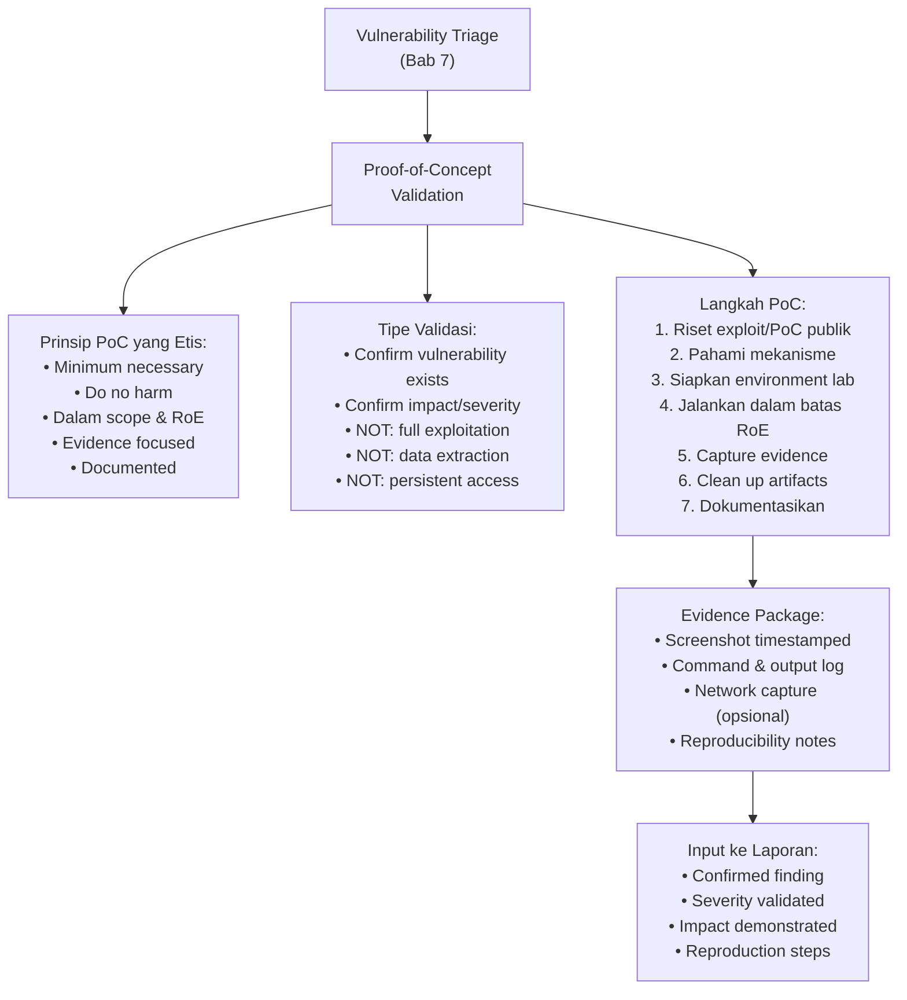
```mermaid
flowchart TD
    VulnTriage["Vulnerability Triage\n(Bab 7)"] --> PoC["Proof-of-Concept\nValidation"]
    
    PoC --> Principles["Prinsip PoC yang Etis:\n• Minimum necessary\n• Do no harm\n• Dalam scope & RoE\n• Evidence focused\n• Documented"]
    
    PoC --> Types["Tipe Validasi:\n• Confirm vulnerability exists\n• Confirm impact/severity\n• NOT: full exploitation\n• NOT: data extraction\n• NOT: persistent access"]
    
    PoC --> Steps["Langkah PoC:\n1. Riset exploit/PoC publik\n2. Pahami mekanisme\n3. Siapkan environment lab\n4. Jalankan dalam batas RoE\n5. Capture evidence\n6. Clean up artifacts\n7. Dokumentasikan"]
    
    Steps --> Evidence["Evidence Package:\n• Screenshot timestamped\n• Command & output log\n• Network capture (opsional)\n• Reproducibility notes"]
    
    Evidence --> Report2["Input ke Laporan:\n• Confirmed finding\n• Severity validated\n• Impact demonstrated\n• Reproduction steps"]
```

---

## 3. Pengantar Kontekstual

Perbedaan antara "vulnerability scanner output" dan "validated finding" adalah demonstrasi bahwa kerentanan benar-benar dapat dieksploitasi dalam konteks target. PoC validation memberikan klien bukti konkret — bukan hanya estimasi teoretis. Namun, PoC juga merupakan titik di mana risiko paling tinggi: terlalu jauh dapat menyebabkan kerusakan atau melebihi scope; tidak cukup jauh memberikan false assurance bahwa kerentanan tidak serius.

**Aturan emas:** Buktikan bahwa kerentanan **ada** dan **dapat dieksploitasi** — bukan mengekstraksi semua data atau mendapatkan persistent control atas sistem.

---

## 4. Landasan Teori

### 4.1 Definisi PoC dalam Konteks Pentest Etis

Proof-of-Concept adalah demonstrasi terkontrol bahwa suatu kerentanan dapat dieksploitasi. Dalam konteks pentest etis:

**Yang termasuk PoC yang sah:**
- Membuktikan RCE dengan menjalankan `id` atau `whoami` (bukan malware)
- Membuktikan SQL injection dengan mengekstrak versi database (`SELECT @@version`)
- Membuktikan XSS dengan menampilkan `alert(1)` atau `alert(document.cookie)` dalam session sendiri
- Membuktikan path traversal dengan membaca `/etc/passwd` (file publik)

**Yang TIDAK termasuk PoC yang sah:**
- Mengekstraksi dan mengeksfiltrasi data customer
- Membuat atau memodifikasi data dalam database produksi
- Memasang backdoor atau persistence mechanism
- Eskalasi privilege ke administrator/root tanpa perlu untuk membuktikan impact
- Pivoting ke sistem lain di luar scope

### 4.2 Menggunakan Public Exploit dengan Bertanggung Jawab

Banyak kerentanan memiliki exploit publik di ExploitDB, GitHub, atau Metasploit. Penggunaannya dalam pentest etis harus:

1. **Pahami dulu, gunakan kemudian:** Membaca dan memahami kode exploit sebelum menjalankan — jangan "run script yang tidak dimengerti"
2. **Test di lab dulu:** Jalankan di environment identik yang terisolasi untuk memahami efeknya
3. **Minimal necessary:** Gunakan opsi yang paling tidak invasif yang cukup untuk membuktikan kerentanan
4. **Tidak ada auto-pivot:** Matikan opsi yang secara otomatis mencoba pivot ke sistem lain

### 4.3 Metasploit Framework: Penggunaan Bertanggung Jawab di Lab

Metasploit adalah framework eksploitasi yang paling dikenal. Dalam konteks lab terisolasi:

```bash
# Struktur dasar Metasploit
msfconsole

# Cari exploit untuk kerentanan tertentu
search vsftpd 2.3.4
search type:exploit name:usermap

# Load exploit
use exploit/unix/ftp/vsftpd_234_backdoor

# Lihat options
show options

# Set target
set RHOSTS 192.168.50.10

# Jalankan (hanya di lab!)
run

# Jika berhasil: HANYA jalankan perintah untuk bukti
# id, whoami, hostname — BUKAN install backdoor, BUKAN pivot
```

**Catatan:** Metasploit digunakan di lab terisolasi SAJA. Dalam pentest nyata, penggunaannya harus disetujui secara eksplisit dalam RoE dan setiap modul yang digunakan harus didokumentasikan.

### 4.4 Evidence Capture yang Berkualitas

Evidence yang baik harus memiliki sifat:

| Sifat | Penjelasan |
|-------|------------|
| **Timestamped** | Screenshot memiliki timestamp yang visible (atau metadata yang dapat diverifikasi) |
| **Contextual** | Screenshot menampilkan cukup konteks — target IP, command, output |
| **Reproducible** | Langkah-langkah untuk mereproduksi terdokumentasi |
| **Chain of custody** | Evidence tidak dimodifikasi setelah capture |
| **Attribution** | Jelas bahwa ini dari penguji X pada tanggal Y terhadap target Z |

```bash
# Cara menghasilkan evidence berkualitas
# 1. Set terminal dengan info yang terlihat
PS1="[\u@\h \w]$ "

# 2. Tampilkan tanggal/waktu sebelum perintah
date && id

# 3. Simpan seluruh session terminal
script -a /tmp/session_$(date +%Y%m%d_%H%M%S).log

# 4. Screenshot dengan timestamp visible
# (gunakan tool screenshot OS dengan tampilan jam)

# 5. Simpan semua output ke file
nmap -sV 192.168.50.10 | tee nmap_output_$(date +%Y%m%d).txt
```

---

## 5. Model atau Arsitektur

### 5.1 Decision Tree untuk PoC Validation

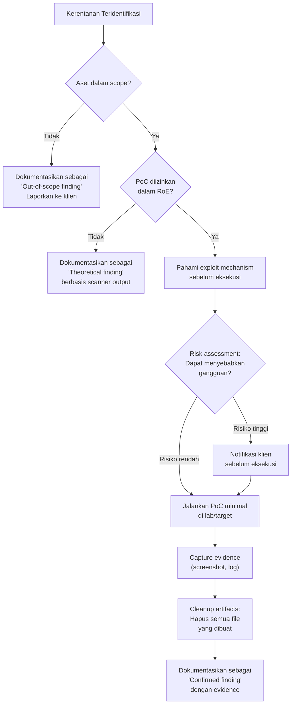
```mermaid
flowchart TD
    VulnFound["Kerentanan Teridentifikasi"] --> InScope{"Aset dalam scope?"}
    InScope --> |Tidak| Document["Dokumentasikan sebagai\n'Out-of-scope finding'\nLaporkan ke klien"]
    InScope --> |Ya| PoCAproved{"PoC diizinkan\ndalam RoE?"}
    PoCAproved --> |Tidak| NoExploit["Dokumentasikan sebagai\n'Theoretical finding'\nberbasis scanner output"]
    PoCAproved --> |Ya| Understand["Pahami exploit mechanism\nsebelum eksekusi"]
    Understand --> RiskAssess{"Risk assessment:\nDapat menyebabkan\ngangguan?"}
    RiskAssess --> |Risiko tinggi| NotifyClient["Notifikasi klien\nsebelum eksekusi"]
    RiskAssess --> |Risiko rendah| Execute["Jalankan PoC minimal\ndi lab/target"]
    NotifyClient --> Execute
    Execute --> CaptureEvidence["Capture evidence\n(screenshot, log)"]
    CaptureEvidence --> Cleanup["Cleanup artifacts:\nHapus semua file\nyang dibuat"]
    Cleanup --> Document2["Dokumentasikan sebagai\n'Confirmed finding'\ndengan evidence"]
```

---

## 6. Contoh Terapan

### Contoh: PoC Documentation untuk Samba RCE

```markdown
## Finding: Samba Username Map Script Remote Code Execution
### CVE: CVE-2007-2447 | CVSS: 9.0 (Critical)
### Target: 192.168.50.10 | Service: Samba 3.0.20

#### Evidence Summary
Berhasil dikonfirmasi bahwa kerentanan CVE-2007-2447 dapat dieksploitasi 
untuk mendapat remote code execution (RCE) sebagai user "root" pada target.

#### Reproduction Steps
1. Jalankan Metasploit: `msfconsole`
2. Load exploit: `use exploit/multi/samba/usermap_script`
3. Set target: `set RHOSTS 192.168.50.10`
4. Execute: `run`
5. Verifikasi akses: `id` → output: `uid=0(root) gid=0(root)`

#### Evidence Captures
- Screenshot 1: Metasploit output menunjukkan "Meterpreter session opened"
- Screenshot 2: Output `id` menunjukkan uid=0(root)
- Screenshot 3: Output `hostname` menunjukkan nama host target
- Log file: session_20250715_142350.log

#### Impact Assessment
- Full root access ke sistem target
- Seluruh data pada sistem dapat diakses
- Sistem dapat digunakan sebagai pivot ke jaringan internal

#### Actions Taken Post-PoC
- Sesi diterminasi segera setelah capture evidence
- Tidak ada file yang dibuat atau dimodifikasi
- Tidak ada koneksi ke sistem lain dari sesi ini

#### Cleanup Verification
- Tidak ada proses baru yang tertinggal (verifikasi: `ps aux` sebelum dan sesudah)
- Log Metasploit disimpan di [path]
```

---

## 7. Praktikum atau Aktivitas Terarah

### Aktivitas 9.1: PoC Validation di Lab (Eval-4 Parsial — Lab Validation Report)

**Target:** Metasploitable2 VM di lab (IP sesuai instruksi dosen)

**Tugas (pilih 1-2 kerentanan dari triage Bab 7):**
1. Pilih 1-2 kerentanan HIGH/CRITICAL yang sudah ada dalam triage
2. Cari PoC atau exploit publik di ExploitDB atau Metasploit
3. Pahami mekanisme exploit sebelum menjalankan
4. Jalankan PoC di lab — capture evidence (screenshot + log)
5. Terminasi sesi segera setelah evidence captured
6. Dokumentasikan dalam format lab validation report

**Batasan yang harus dipatuhi:**
- HANYA jalankan perintah verifikasi: `id`, `whoami`, `hostname`
- Jangan akses atau kopikan file data
- Jangan buat persistence (cronjob, user baru, backdoor)
- Jangan pivot ke sistem lain
- Semua artefak dari sesi dihapus setelah selesai

---

## 8. Latihan Pemahaman

**Soal 1:** Jelaskan mengapa menjalankan `id` setelah mendapat RCE sudah cukup sebagai PoC, dan mengapa melanjutkan ke "mengunduh seluruh /etc/passwd" melanggar prinsip pentest etis.

**Soal 2:** Apa yang dimaksud dengan "cleanup artifacts" dan mengapa ini penting setelah setiap PoC validation?

**Soal 3 (Analisis):** RoE tidak secara eksplisit menyebutkan apakah exploitation diizinkan — hanya menyebutkan "penetration testing". Apakah ini cukup untuk melakukan PoC? Jelaskan reasoning.

**Soal 4:** Bedakan antara "false positive" dan "theoretical vulnerability" (kerentanan yang ada tapi tidak dapat dikonfirmasi PoC karena RoE terbatas). Bagaimana keduanya dilaporkan secara berbeda?

---

## 9. Latihan Terapan

### Studi Kasus 9: Exploitation yang Melampaui Batas

Selama PoC untuk XSS di aplikasi web klien, seorang penguji berhasil mengeksekusi JavaScript di browser klien (dalam session testnya sendiri). Ia kemudian memutuskan untuk "menunjukkan dampak sesungguhnya" dengan mencuri cookie session admin (yang login di browser lain yang terpisah — bukan browser penguji) untuk membuktikan bahwa XSS ini dapat digunakan untuk session hijacking.

**Pertanyaan (C5):**  
(a) Apakah tindakan ini melanggar batas etika? Mengapa?  
(b) Apakah ini juga melanggar scope atau RoE yang umum? Jelaskan.  
(c) Apa cara yang tepat untuk mendemonstrasikan dampak XSS untuk session hijacking tanpa mengakses session orang lain?  
(d) Bagaimana seharusnya laporan mendeskripsikan impact dari XSS ini tanpa melakukan cookie theft?

---

## 10. Kunci Jawaban

**Soal 3:** "Penetration testing" tanpa definisi eksplisit tentang scope exploitation adalah ambiguitas yang berbahaya. Standar profesional (PTES, NIST SP 800-115) mensyaratkan bahwa teknik exploitation harus disetujui secara eksplisit. Jika tidak disebutkan, penguji seharusnya: (a) Mengasumsikan tidak diizinkan; (b) Menghubungi klien untuk klarifikasi SEBELUM melanjutkan ke fase exploitation; (c) Mendokumentasikan pertanyaan klarifikasi dan jawaban yang diterima.

**Studi Kasus 9:**  
(a) Ya — penguji mengakses session pengguna lain (admin) tanpa izin eksplisit. Ini melampaui "demonstrasi PoC" menjadi "akses data tidak terotorisasi";  
(b) Ya — RoE biasanya tidak mengizinkan akses ke akun nyata selain akun test yang disediakan;  
(c) Cara yang tepat: Buat dua akun test (attacker dan victim), jalankan XSS dari akun attacker yang mencuri cookie akun victim, demonstrasikan dengan kedua akun test sendiri;  
(d) Laporan menyatakan: "XSS ini dapat digunakan untuk session hijacking. Dengan asumsi penyerang dapat menyuntikkan skrip ke halaman yang dikunjungi administrator, penyerang dapat mencuri session token. Dampak: akses tidak sah ke akun administrator." — tanpa perlu mengeksekuси theft sesungguhnya.

---

## 11. Ringkasan Bab

PoC validation mengubah "kerentanan potensial" menjadi "kerentanan terkonfirmasi dengan evidence". Prinsip "minimum necessary" adalah panduan utama — buktikan kerentanan ada, bukan eksploitasi sejauh mungkin. Evidence harus timestamped, contextual, dan reproducible. Setiap PoC diakhiri dengan cleanup artifacts. RoE yang tidak eksplisit mengizinkan exploitation harus diklarifikasi sebelum dilanjutkan.

---

## 12. Refleksi Profesional

**Pertanyaan Refleksi 1:** Klien meminta Anda melakukan "full exploitation untuk menunjukkan dampak sesungguhnya" termasuk mengekstraksi data customer. Bagaimana Anda merespons permintaan ini, dan apa yang Anda jelaskan tentang batasan etika dan hukum yang berlaku?

---

# BAB 10 — IMPACT ANALYSIS, CONTAINMENT, DAN CHAIN OF CUSTODY

**Pertemuan:** 10  
**Sub-CPMK:** Sub-CPMK.4  
**Evaluasi:** Eval-4 (20%)

---

## 1. Capaian Pembelajaran Bab

Setelah menyelesaikan Bab 10, mahasiswa mampu:

- Melakukan impact analysis yang mencakup dimensi teknis dan bisnis.
- Menjelaskan prosedur containment dan cleanup setelah PoC.
- Membangun chain of custody yang valid untuk evidence pentest.
- Mendokumentasikan temuan dengan kualitas yang memenuhi standar laporan profesional.

---

## 2. Peta Konsep Bab

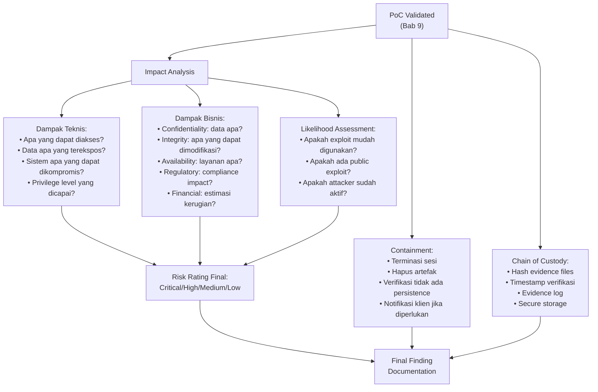
```mermaid
flowchart TD
    PoC2["PoC Validated\n(Bab 9)"] --> Impact["Impact Analysis"]
    
    Impact --> Technical["Dampak Teknis:\n• Apa yang dapat diakses?\n• Data apa yang terekspos?\n• Sistem apa yang dapat dikompromis?\n• Privilege level yang dicapai?"]
    Impact --> Business["Dampak Bisnis:\n• Confidentiality: data apa?\n• Integrity: apa yang dapat dimodifikasi?\n• Availability: layanan apa?\n• Regulatory: compliance impact?\n• Financial: estimasi kerugian?"]
    Impact --> Likelihood["Likelihood Assessment:\n• Apakah exploit mudah digunakan?\n• Apakah ada public exploit?\n• Apakah attacker sudah aktif?"]
    
    Technical --> RiskRating["Risk Rating Final:\nCritical/High/Medium/Low"]
    Business --> RiskRating
    Likelihood --> RiskRating
    
    PoC2 --> Containment["Containment:\n• Terminasi sesi\n• Hapus artefak\n• Verifikasi tidak ada persistence\n• Notifikasi klien jika diperlukan"]
    
    PoC2 --> CoC["Chain of Custody:\n• Hash evidence files\n• Timestamp verifikasi\n• Evidence log\n• Secure storage"]
    
    RiskRating --> Finding["Final Finding\nDocumentation"]
    Containment --> Finding
    CoC --> Finding
```

---

## 3. Pengantar Kontekstual

Menemukan dan mengeksploitasi kerentanan hanyalah separuh dari nilai pentest. Separuh lainnya adalah mengkomunikasikan dampak dengan cara yang membantu organisasi memahami risiko bisnis yang nyata dan membuat keputusan yang tepat tentang prioritas remediation.

---

## 4. Landasan Teori

### 4.1 Impact Analysis: Teknis dan Bisnis

**Dimensi CIA dalam Impact Analysis:**

| Dimensi | Pertanyaan Kunci | Contoh Dampak |
|---------|-----------------|---------------|
| Confidentiality | Data apa yang dapat diakses? | Database customer, credential, IP sensitif |
| Integrity | Apa yang dapat dimodifikasi? | Konfigurasi sistem, data transaksi, kode |
| Availability | Layanan apa yang dapat dihentikan? | Web server, database, email, VPN |

**Translasi Teknis ke Bisnis:**

```markdown
TEKNIS: "RCE sebagai root pada web server"
↓
BISNIS: "Penyerang dapat:
- Mengakses semua data customer yang disimpan (potensi GDPR/UU PDP violation)
- Memodifikasi harga produk atau transaksi
- Menghapus semua data (estimated recovery time: 3-5 hari berdasarkan backup policy)
- Menggunakan server untuk menyerang customer (reputational damage)"
```

### 4.2 Likelihood Assessment

Impact saja tidak menentukan prioritas — likelihood juga penting:

| Faktor | Low | Medium | High |
|--------|-----|--------|------|
| Exploit availability | Tidak ada | PoC publik | Exploit dalam Metasploit |
| Skill required | Expert | Intermediate | Script kiddie |
| Detection probability | Mudah terdeteksi | Moderate | Sulit terdeteksi |
| Active exploitation | Tidak ada bukti | Rumored | Confirmed in wild |

### 4.3 Cleanup dan Containment Prosedur

Setelah PoC, penguji harus:

```bash
# 1. Terminasi semua sesi yang dibuka
exit  # atau kill session di Metasploit

# 2. Cek apakah ada proses yang tertinggal
# (dari dalam sistem target, jika masih punya akses)
# ps aux | grep [nama tool]

# 3. Hapus file yang dibuat selama testing
# rm /tmp/pentest_* 
# (hanya file yang dibuat oleh penguji)

# 4. Verifikasi tidak ada cronjob baru
# crontab -l
# cat /etc/cron.*

# 5. Catat semua tindakan dalam log
echo "$(date): Terminated session to 192.168.50.10, cleanup complete" >> pentest_log.txt
```

### 4.4 Chain of Custody untuk Evidence

Chain of custody memastikan bahwa evidence tidak dimodifikasi setelah collection:

```bash
# Hash semua file evidence
sha256sum screenshot_001.png >> evidence_hashes.txt
sha256sum nmap_output.xml >> evidence_hashes.txt
sha256sum session_log.txt >> evidence_hashes.txt

# Buat evidence manifest
cat > evidence_manifest.txt << EOF
Evidence Manifest — Pentest [CLIENT] [DATE]
Generated: $(date)
Penguji: [Nama]

Files:
$(sha256sum screenshot_001.png)
$(sha256sum nmap_output.xml)
$(sha256sum session_log.txt)

Note: Files di atas harus memiliki hash yang sama saat diterima klien.
EOF

# Compress dan enkripsi untuk pengiriman
zip -r evidence_$(date +%Y%m%d).zip screenshots/ logs/ evidence_manifest.txt
gpg --recipient client@domain.com --encrypt evidence_$(date +%Y%m%d).zip
```

---

## 5. Model atau Arsitektur

### 5.1 Finding Documentation Template

```mermaid
flowchart LR
    Finding2["Finding"] --> Header["Header:\n• ID Temuan\n• Judul\n• Target\n• Tanggal"]
    Finding2 --> Summary["Executive Summary:\n(2-3 kalimat, non-teknis)"]
    Finding2 --> Technical2["Technical Details:\n• Vulnerability description\n• CVE/CVSS\n• Evidence (screenshot)"]
    Finding2 --> Impact2["Impact:\n• Technical impact\n• Business impact\n• Likelihood"]
    Finding2 --> Remediation2["Remediation:\n• Short-term fix\n• Long-term fix\n• References"]
    Finding2 --> Retest2["Retest Guidance:\n• Cara memverifikasi fix\n• Expected outcome"]
```

---

## 6. Contoh Terapan

### Template Finding Documentation Lengkap

```markdown
## Finding #001: Samba Username Map Script RCE
### ID: PENTEST-LN-001 | Severity: CRITICAL | CVSS: 9.0

#### Executive Summary
Server berbagi file (SMB) pada 192.168.50.10 menjalankan Samba versi 3.0.20 
yang mengandung kerentanan command injection kritis. Kerentanan ini memungkinkan 
penyerang yang tidak terautentikasi mendapat akses penuh (root) ke sistem 
hanya dengan mengirimkan username yang dikonstruksi khusus.

#### Technical Details
- **CVE:** CVE-2007-2447
- **CWE:** CWE-78 (OS Command Injection)
- **Target:** 192.168.50.10:445/tcp (Samba 3.0.20)
- **CVSS Base:** 9.0 (Critical)

**Root Cause:** Samba 3.0.20–3.0.25rc3 dengan konfigurasi "username map script" 
memungkinkan injeksi perintah shell melalui karakter meta-shell dalam username.

**Evidence:**
[Screenshot 1] — Metasploit exploit berhasil
[Screenshot 2] — Output `id` menunjukkan root access
[Screenshot 3] — Output `hostname` menunjukkan target system

#### Impact
**Technical:** Full root access to target system
**Business:** 
- Akses ke semua file dan database pada server ini
- Potensi pivot ke sistem lain di subnet yang sama
- Risk of data exfiltration atau sabotase

**Likelihood:** HIGH — exploit tersedia di Metasploit, tidak memerlukan autentikasi

#### Remediation
**Jangka pendek (immediate):**
- Upgrade Samba ke versi terkini (minimum 3.0.25 atau versi LTS distro)
- Atau: nonaktifkan layanan SMB jika tidak diperlukan
- Atau: batasi akses ke port 445 menggunakan firewall

**Jangka panjang:**
- Implementasi patch management yang proaktif
- Regular vulnerability scanning
- Isolasi layanan SMB di subnet terpisah

**Referensi:** https://nvd.nist.gov/vuln/detail/CVE-2007-2447

#### Retest Guidance
Setelah patch diterapkan:
1. Jalankan ulang: `nmap -sV -p 445 [TARGET]` — verifikasi versi Samba baru
2. Coba exploit: `use exploit/multi/samba/usermap_script` — expected: "Connection refused" atau "Failed"
3. Verifikasi: `smbclient -L //[TARGET] -N` — harusnya require authentication

#### Status
- [x] Identified | [x] Validated | [ ] Remediated | [ ] Retested
```

---

## 7. Praktikum atau Aktivitas Terarah

### Aktivitas 10.1: Lab Validation Report (Deliverable Eval-4)

**Tugas:** Susun Lab Validation Report lengkap yang mencakup:
1. Executive summary dari semua kerentanan yang divalidasi
2. Minimal 2 findings dalam format template lengkap (seperti di atas)
3. Impact analysis (teknis + bisnis) per finding
4. Chain of custody manifest untuk semua evidence

---

## 8. Latihan Pemahaman

**Soal 1:** Mengapa "dampak bisnis" lebih penting dikomunikasikan kepada manajemen dibandingkan "dampak teknis"?

**Soal 2:** Apa tujuan dari chain of custody dalam konteks penetration testing (berbeda dengan forensik digital)?

**Soal 3 (Analisis):** Dua kerentanan dengan CVSS yang sama (8.5) — satu dengan "exploit dalam Metasploit" dan satu "hanya PoC teoritis di paper akademik 2020". Bagaimana likelihood assessment berbeda untuk keduanya, dan bagaimana ini mempengaruhi risk rating final?

---

## 9. Latihan Terapan

### Studi Kasus 10: Temuan Kritis yang Mengganggu Bisnis

Selama pentest terotorisasi, penguji menemukan SQL injection kritis pada form login aplikasi e-commerce yang memungkinkan bypass autentikasi. Mereka mendapat akses ke panel admin dan dapat melihat (tapi tidak mengunduh) data 500,000 transaksi customer.

**Pertanyaan (C5):**  
(a) Buat impact analysis lengkap (teknis + bisnis + regulatory) untuk temuan ini.  
(b) Apakah penguji harus segera menghentikan pengujian dan melaporkan temuan kritis ini kepada klien, atau menyelesaikan semua tes dulu?  
(c) Apa kewajiban klien terhadap regulasi (UU PDP Indonesia) jika kerentanan ini pernah dieksploitasi sebelum pentest?  
(d) Rancang rekomendasi remediation jangka pendek (24 jam) dan jangka panjang.

---

## 10. Kunci Jawaban

**Soal 2:** Dalam pentest, chain of custody berfungsi berbeda dari forensik: (a) Membuktikan bahwa evidence tidak dimodifikasi setelah PoC — penting jika klien mempertanyakan apakah penguji "melebih-lebihkan" temuan; (b) Membuktikan bahwa penguji hanya mengakses apa yang ada dalam scope; (c) Melindungi penguji dari tuduhan bahwa mereka "menanam" kerentanan; (d) Memungkinkan klien memverifikasi evidence secara independen.

**Studi Kasus 10 — (b):** Temuan kritis HARUS dilaporkan segera kepada klien — tidak menunggu selesainya semua tes. Alasan: (1) Kewajiban kontraktual dan etika profesional; (2) Klien perlu mengambil tindakan cepat (emergency patch, monitoring tambahan); (3) Jika terjadi insiden nyata selama pengujian berlangsung, penguji dan klien sudah berkomunikasi; (4) PTES dan NIST SP 800-115 mensyaratkan eskalasi temuan kritis secara cepat.

---

## 11. Ringkasan Bab

Impact analysis menerjemahkan temuan teknis menjadi risiko bisnis yang dapat dipahami manajemen. Containment memastikan tidak ada artefak pengujian yang tersisa. Chain of custody memberikan integritas pada evidence. Dokumentasi finding yang lengkap — executive summary, technical details, impact, remediation, retest guidance — adalah deliverable utama yang menentukan nilai pentest bagi klien.

---

## 12. Refleksi Profesional

**Pertanyaan Refleksi 1:** Sebuah pentest menemukan bahwa semua data customer selama 3 tahun dapat diakses melalui satu kerentanan SQL injection. Klien meminta Anda "tidak mencantumkan detail ini dalam laporan karena akan mempengaruhi IPO mereka yang akan datang." Bagaimana Anda merespons?

---


---

# BAB 11 — WEB DAN API SECURITY TESTING AWARENESS

**Pertemuan:** 11  
**Sub-CPMK:** Sub-CPMK.5  
**Evaluasi:** Eval-5 (20%)

---

## 1. Capaian Pembelajaran Bab

Setelah menyelesaikan Bab 11, mahasiswa mampu:

- Menjelaskan OWASP Top 10 (web) dan OWASP API Security Top 10 sebagai framework penilaian.
- Mengidentifikasi kerentanan web/API umum dalam konteks audit berbasis OWASP WSTG dan ASVS.
- Melakukan pengujian web/API awareness yang terkontrol pada platform lab legal (DVWA, WebGoat).
- Mengklasifikasikan temuan web/API berdasarkan OWASP kategori dan CVSS.

---

## 2. Peta Konsep Bab

```mermaid
flowchart TD
    WebSec["Web & API\nSecurity Testing"] --> OWASP10["OWASP Top 10 2021:\nA01-A10"]
    WebSec --> APITop10["OWASP API\nSecurity Top 10 2023:\nAPI1-API10"]
    WebSec --> WSTG["OWASP WSTG:\nWeb Security\nTesting Guide"]
    WebSec --> ASVS["OWASP ASVS:\nApp Security\nVerification Standard"]
    
    OWASP10 --> Injection["A03: Injection\n(SQL, OS, LDAP)"]
    OWASP10 --> BrokenAuth["A07: Identification &\nAuthentication Failures"]
    OWASP10 --> IDOR["A01: Broken\nAccess Control"]
    OWASP10 --> Misconfig["A05: Security\nMisconfiguration"]
    OWASP10 --> XSS3["A03: Injection\n(includes XSS)"]
    
    APITop10 --> BOLA["API1: BOLA\n(Broken Object Level\nAuthorization)"]
    APITop10 --> AuthFail["API2: Broken\nAuthentication"]
    APITop10 --> MassAssign["API3: Broken\nObject Property\nLevel Authorization"]
    
    WSTG --> Methodology["Methodology:\nTest cases per kategori\n(400+ test cases)"]
    ASVS --> Levels["Levels 1/2/3:\nVerification depth"]
```

---

## 3. Pengantar Kontekstual

Aplikasi web dan API adalah attack surface terbesar dalam sebagian besar organisasi modern — hampir semua interaksi bisnis digital melewati lapisan ini. OWASP (Open Web Application Security Project) adalah organisasi nirlaba yang memproduksi standar, tools, dan panduan untuk keamanan aplikasi web yang menjadi referensi industri di seluruh dunia.

---

## 4. Landasan Teori

### 4.1 OWASP Top 10 2021

**A01:2021 — Broken Access Control (naik dari #5)**  
Kontrol akses yang tidak benar memungkinkan pengguna mengakses resource di luar izin mereka. Contoh: mengubah parameter `?user_id=123` menjadi `?user_id=456` untuk mengakses akun lain (IDOR — Insecure Direct Object Reference).

**A02:2021 — Cryptographic Failures**  
Data sensitif tidak dilindungi dengan enkripsi yang memadai: password disimpan tanpa hash, transmisi HTTP (bukan HTTPS), penggunaan algoritma lemah (MD5, DES).

**A03:2021 — Injection**  
Input dari pengguna dikirim ke interpreter (SQL, OS, LDAP) tanpa sanitasi. SQL injection: `' OR '1'='1` yang mengubah query menjadi `WHERE username='' OR '1'='1'`. XSS: skrip JavaScript yang disisipkan dalam input dan dieksekusi di browser pengguna lain.

**A04:2021 — Insecure Design**  
Masalah yang muncul dari desain arsitektur yang lemah — bukan implementasi yang salah dari desain yang benar. Rate limiting yang tidak ada, threat model yang tidak dilakukan saat design phase.

**A05:2021 — Security Misconfiguration**  
Konfigurasi default yang tidak aman: port debug terbuka, error messages yang verbose (mengungkapkan stack trace), direktori listing aktif, default credentials.

**A06:2021 — Vulnerable and Outdated Components**  
Menggunakan library, framework, atau software dengan kerentanan yang diketahui. Log4Shell (CVE-2021-44228) adalah contoh paling dramatis.

**A07:2021 — Identification and Authentication Failures**  
Implementasi autentikasi yang lemah: password tidak dibatasi kecepatan login (memungkinkan brute force), session yang tidak diinvalidasi saat logout, penggunaan algoritma weak untuk token.

**A08:2021 — Software and Data Integrity Failures**  
CI/CD pipeline yang tidak aman, deserialisasi tidak aman, update tanpa verifikasi integritas.

**A09:2021 — Security Logging and Monitoring Failures**  
Tidak ada logging yang memadai, log tidak dipantau, tidak ada alerting untuk event kritis.

**A10:2021 — Server-Side Request Forgery (SSRF)**  
Aplikasi mengambil URL dari input pengguna tanpa validasi → penyerang dapat membuat server mengakses resource internal (metadata cloud: 169.254.169.254, internal services).

### 4.2 OWASP API Security Top 10 (2023)

**API1:2023 — Broken Object Level Authorization (BOLA)**  
API endpoint yang mengakses objek berdasarkan ID yang dikirim user tanpa memverifikasi apakah user tersebut memiliki akses ke objek itu. Contoh: `GET /api/orders/12345` — apakah verifikasi bahwa order 12345 milik user yang sedang login?

**API2:2023 — Broken Authentication**  
Token autentikasi yang lemah atau mudah diprediksi, tidak ada rate limiting pada endpoint autentikasi, token yang tidak kedaluwarsa.

**API3:2023 — Broken Object Property Level Authorization**  
Pengguna dapat membaca atau menulis properti objek yang tidak seharusnya dapat diakses. Mirip dengan mass assignment: API menerima field `is_admin: true` dari user dan menerapkannya.

**API4:2023 — Unrestricted Resource Consumption**  
Tidak ada pembatasan pada query yang mahal: endpoint yang mengembalikan ribuan record tanpa pagination, file upload tanpa size limit.

**API5:2023 — Broken Function Level Authorization**  
Pengguna biasa dapat mengakses endpoint admin karena kontrol akses hanya berbasis UI, bukan backend.

### 4.3 OWASP WSTG dan ASVS

**WSTG (Web Security Testing Guide):** Panduan testing komprehensif dengan 400+ test case terorganisir dalam 12 kategori (Configuration, Authentication, Authorization, Session Management, Input Validation, dll). Versi terbaru tersedia di owasp.org.

**ASVS (Application Security Verification Standard):** Framework verifikasi dengan tiga level:
- **Level 1:** Keamanan dasar yang dapat diverifikasi melalui black-box testing
- **Level 2:** Keamanan standar untuk aplikasi yang menangani data sensitif
- **Level 3:** Keamanan tinggi untuk aplikasi kritis (perbankan, kesehatan)

### 4.4 Pengujian Web di Lab (DVWA)

DVWA (Damn Vulnerable Web Application) adalah aplikasi yang sengaja rentan untuk pembelajaran:

```bash
# Akses DVWA di lab
http://192.168.50.11/dvwa/

# Kerentanan yang tersedia (dengan tingkat kesulitan: Low/Medium/High)
# - SQL Injection
# - XSS (Reflected & Stored)
# - CSRF
# - File Inclusion (LFI/RFI)
# - Command Injection
# - Brute Force
# - File Upload
```

---

## 5. Model atau Arsitektur

### 5.1 Web Application Testing Methodology

```mermaid
flowchart LR
    Target2["Web Application\nTarget (Lab)"] --> Fingerprint["Fingerprinting:\n• Technology stack\n• Server version\n• Framework"]
    Fingerprint --> Auth2["Authentication Testing:\n• Login bypass\n• Brute force rate?\n• Password policy\n• Session management"]
    Fingerprint --> Input["Input Validation:\n• SQL injection\n• XSS\n• Command injection\n• Path traversal"]
    Fingerprint --> AccessCtrl["Access Control:\n• IDOR\n• Privilege escalation\n• Horizontal access"]
    Fingerprint --> Config2["Configuration:\n• Default pages\n• Error messages\n• Debug endpoints\n• Headers security"]
    
    Auth2 --> Findings3["Findings"]
    Input --> Findings3
    AccessCtrl --> Findings3
    Config2 --> Findings3
    
    Findings3 --> OWASP_Cat["Kategori OWASP\n(A01-A10)"]
```

---

## 6. Contoh Terapan

### Contoh: Testing SQL Injection di DVWA

**Context:** DVWA di lab, level "Low", dalam scope yang diotorisasi.

```
URL: http://192.168.50.11/dvwa/vulnerabilities/sqli/?id=1&Submit=Submit

Test 1: Input normal
id=1 → Output: "First name: admin, Surname: admin"

Test 2: Quote test
id=1' → Output: SQL error (konfirmasi SQLi ada)

Test 3: UNION-based extraction (PoC level)
id=1' UNION SELECT 1,@@version-- -
→ Output: "First name: admin, Surname: 5.7.29-Ubuntu"
(hanya versi database — sufficient PoC tanpa mengakses data sensitif)
```

**Finding:** SQL Injection terkonfirmasi. Severity: HIGH (A03:2021 — Injection, CWE-89). Penguji BERHENTI di versi database — tidak mengekstraksi tabel atau data pengguna nyata.

---

## 7. Praktikum atau Aktivitas Terarah

### Aktivitas 11.1: OWASP Testing di DVWA/WebGoat (Eval-5 Parsial)

**Target lab:** DVWA di 192.168.50.11 / WebGoat

**Tugas (pilih 3 dari 5 kategori):**
1. **SQL Injection:** Konfirmasi injeksi, tunjukkan versi database sebagai PoC
2. **XSS Reflected:** Inject `<script>alert(1)</script>` dalam parameter yang rentan
3. **Broken Access Control:** Temukan endpoint yang dapat diakses tanpa autentikasi
4. **Security Misconfiguration:** Identifikasi direktori listing atau default pages
5. **CSRF:** Identifikasi form tanpa CSRF token

**Batasan:**
- Hanya pada akun test yang disediakan
- Tidak mengekstraksi data pengguna nyata
- Tidak memodifikasi data
- Dokumentasikan sebagai OWASP finding

---

## 8. Latihan Pemahaman

**Soal 1:** Jelaskan perbedaan antara Reflected XSS dan Stored XSS dalam hal dampak dan cara kerja.

**Soal 2:** BOLA (API1) sering dianggap sebagai kerentanan yang "mudah ditemukan tapi sulit diperbaiki". Mengapa?

**Soal 3 (Analisis):** Aplikasi web menggunakan `error_reporting(E_ALL)` di PHP production. Apa kerentanan OWASP yang ini termasuk, dan apa informasi yang dapat diekstraksi dari error messages?

**Soal 4:** Apa perbedaan antara ASVS Level 1, 2, dan 3, dan kapan setiap level digunakan?

---

## 9. Latihan Terapan

### Studi Kasus 11: API yang Mengekspos Data Sensitif

API endpoint `GET /api/v1/users/{user_id}/profile` mengembalikan semua data pengguna termasuk field yang tidak seharusnya ditampilkan: `{ "name": "Ferry", "email": "ferry@example.com", "password_hash": "$2b$10$...", "admin": false, "internal_notes": "VIP customer" }`.

**Pertanyaan (C5):**  
(a) Identifikasi semua kerentanan OWASP API yang ada dalam contoh ini.  
(b) Untuk BOLA: bagaimana Anda membuktikan kerentanan ini dalam PoC yang aman?  
(c) Apa dampak eksposur `password_hash` meskipun hash bcrypt?  
(d) Rancang response API yang proper untuk endpoint ini.

---

## 10. Kunci Jawaban

**Soal 1:** Reflected XSS: skrip berbahaya di-inject melalui URL parameter dan langsung di-reflect kembali ke halaman yang ditampilkan — korban harus mengklik link berbahaya. Dampak: biasanya terbatas pada satu sesi. Stored XSS: skrip disimpan di server (database, komentar) dan dieksekusi setiap kali halaman dimuat oleh pengguna lain — tidak perlu trick khusus. Dampak: lebih luas, dapat mempengaruhi semua pengguna yang mengakses halaman tersebut.

**Studi Kasus 11:**  
(a) API3:2023 (mass property exposure — menampilkan password_hash, internal_notes, admin flag), API1:2023 (BOLA — jika dapat mengakses user ID lain), API8:2023 (Security Misconfiguration — mengekspos internal fields);  
(b) PoC BOLA: akses endpoint dengan user_id berbeda dari yang sedang login (menggunakan akun test A dan B). Jika akun A dapat mengakses data akun B → BOLA confirmed;  
(c) Meskipun bcrypt kuat, eksposur hash memungkinkan offline cracking — jika password lemah, dapat di-crack dengan GPU; juga berguna untuk credential stuffing; merupakan data sensitif yang tidak seharusnya di-expose;  
(d) Response yang proper: `{ "name": "Ferry", "email": "ferry@example.com" }` — hanya field yang diperlukan dan diotorisasi untuk user tersebut.

---

## 11. Ringkasan Bab

OWASP menyediakan framework referensi untuk keamanan web dan API: Top 10 untuk awareness, WSTG untuk metodologi pengujian, ASVS untuk verifikasi mendalam. Kerentanan web umum (injection, broken access control, misconfiguration) sering berakar dari masalah desain dasar, bukan bug yang kompleks. Pengujian web/API dilakukan pada platform lab (DVWA, WebGoat) dalam batas scope dan RoE yang ditetapkan.

---

## 12. Refleksi Profesional

**Pertanyaan Refleksi 1:** OWASP Top 10 telah ada sejak 2003 dan daftar yang sama (injection, broken authentication, XSS) terus muncul setiap update. Apa yang ini katakan tentang keefektifan pendidikan keamanan dalam industri pengembangan software?

---


---

# BAB 12 — POST-EXPLOITATION RISK ASSESSMENT (KONSEPTUAL)

**Pertemuan:** 12  
**Sub-CPMK:** Sub-CPMK.5  
**Evaluasi:** Eval-5 (20%)

---

## 1. Capaian Pembelajaran Bab

Setelah menyelesaikan Bab 12, mahasiswa mampu:

- Menjelaskan konsep post-exploitation dan mengapa pemahaman fase ini penting bagi pembela.
- Mengidentifikasi teknik post-exploitation yang umum (privilege escalation, lateral movement, persistence) secara konseptual.
- Menganalisis dampak potensial dari initial access yang tidak dicegah.
- Menggunakan pemahaman post-exploitation untuk memprioritaskan kontrol keamanan pertahanan.

---

## 2. Peta Konsep Bab

```mermaid
flowchart TD
    InitialAccess["Initial Access\n(dari PoC Bab 9)"] --> PostExploit["Post-Exploitation\n(konseptual — defensive focus)"]
    
    PostExploit --> PrivEsc["Privilege Escalation:\n• Local (kernel exploits)\n• Misconfigured SUID\n• Weak service perms\n• Credential in config files"]
    
    PostExploit --> Persistence["Persistence:\n• Cronjob\n• Startup scripts\n• SSH authorized_keys\n• Web shells"]
    
    PostExploit --> LateralMove["Lateral Movement:\n• SSH dengan key yang ditemukan\n• Credential reuse\n• Pivoting via SOCKS\n• Network discovery dari dalam"]
    
    PostExploit --> DataAccess["Data Access:\n• Sensitive files\n• Database credentials\n• Backup archives\n• Browser credentials"]
    
    PrivEsc --> DefImplication["Implikasi Defensif:\n• Patch management\n• Least privilege\n• File permission audit\n• Secrets management"]
    Persistence --> DefImplication
    LateralMove --> DefImplication
    DataAccess --> DefImplication
    
    DefImplication --> Controls["Kontrol Keamanan\nyang Harus Ada"]
```

---

## 3. Pengantar Kontekstual

Bab ini membahas post-exploitation **secara konseptual dan dari perspektif pembela** — bukan sebagai panduan teknis untuk mengeksploitasi sistem nyata. Memahami apa yang terjadi setelah initial access sangat penting bagi profesional keamanan defensif: blue team analyst, SOC engineer, dan security architect perlu tahu apa yang dicari penyerang setelah masuk, agar dapat mendeteksi dan mencegahnya.

**Penting:** Dalam konteks lab terisolasi dan otorisasi yang diterima, fase post-exploitation dalam pentest nyata memerlukan izin eksplisit tambahan dan harus dilakukan dengan sangat terkontrol.

---

## 4. Landasan Teori

### 4.1 Cyber Kill Chain dan MITRE ATT&CK (Awareness)

**Cyber Kill Chain (Lockheed Martin)** mendefinisikan 7 fase serangan:
1. Reconnaissance → 2. Weaponization → 3. Delivery → 4. Exploitation → 5. Installation → 6. Command & Control → 7. Actions on Objectives

Post-exploitation mencakup fase 5–7.

**MITRE ATT&CK Framework** adalah knowledge base dari taktik, teknik, dan prosedur (TTP) yang digunakan oleh penyerang nyata, berdasarkan observasi di lapangan. ATT&CK memiliki 14 taktik untuk enterprise environment:

| Taktik | Contoh Teknik | Relevansi Defensif |
|--------|---------------|-------------------|
| Initial Access | Phishing, Exploit Public App | Perimeter defense |
| Execution | PowerShell, bash | Script control, EDR |
| Persistence | Scheduled Tasks, Registry | System integrity monitoring |
| Privilege Escalation | Sudo bypass, Token Manipulation | Least privilege |
| Defense Evasion | Log Deletion, Timestomping | Log integrity |
| Credential Access | Keylogging, Credential Dumping | MFA, credential hygiene |
| Discovery | Network Scanning dari dalam | Network segmentation |
| Lateral Movement | Remote Services, Pass-the-Hash | Network segmentation, MFA |
| Collection | Screen Capture, Data from Shares | DLP, access control |
| Exfiltration | Via encrypted channel | Egress filtering, DLP |

### 4.2 Privilege Escalation: Konsep dan Mitigasi

**Linux Privilege Escalation (konseptual):**

| Teknik | Mekanisme | Mitigasi |
|--------|-----------|---------|
| SUID Misconfiguration | Binary dengan SUID bit yang dapat disalahgunakan | Audit SUID files reguler |
| Sudo misconfiguration | User dapat sudo ke command berbahaya | Prinsip least privilege untuk sudo |
| Kernel exploits | Bug di kernel yang memungkinkan privilege escalation | Patch kernel reguler |
| Credential in config | Password tersimpan plaintext di config files | Secrets management (Vault, env vars) |
| Writable cron scripts | Script yang dijalankan oleh root dapat dimodifikasi | File permission audit |

```bash
# Contoh audit SUID files (defensif — untuk sysadmin)
find / -perm -4000 -type f 2>/dev/null

# Expected output pada sistem yang bersih: hanya binaries yang diperlukan
# Red flags: custom scripts dengan SUID, interpreter (python, perl) dengan SUID
```

### 4.3 Lateral Movement: Konsep dan Mitigasi

Setelah mendapat akses ke satu sistem, penyerang biasanya mencoba menyebar ke sistem lain:

**Teknik umum (konseptual):**
- **SSH key reuse:** Menemukan SSH private key di sistem yang terkompromis, digunakan untuk login ke sistem lain
- **Credential reuse:** Password database ditemukan di satu sistem, digunakan di sistem lain
- **Network discovery:** Menjalankan Nmap dari dalam jaringan untuk menemukan sistem yang tidak terlihat dari luar

**Mitigasi:**
- Network segmentation (VLAN, micro-segmentation)
- Unique credentials per sistem — jangan reuse password
- SSH key management yang ketat
- Host-based firewall untuk membatasi koneksi lateral

### 4.4 Persistence: Teknik dan Deteksi

Penyerang memasang persistence untuk mempertahankan akses meskipun sistem di-restart:

**Teknik umum (konseptual):**
- Cronjob yang menjalankan reverse shell secara periodik
- Web shell tersembunyi di direktori web server
- SSH authorized_keys yang ditambahkan
- Startup script yang dimodifikasi

**Cara mendeteksi:**
```bash
# Audit cronjobs (defensif)
crontab -l
ls /etc/cron.*
cat /etc/crontab

# Audit authorized_keys
find / -name "authorized_keys" 2>/dev/null

# Audit web files yang baru dimodifikasi (defensif)
find /var/www -newer /var/www/index.php -type f
```

---

## 5. Model atau Arsitektur

### 5.1 Post-Exploitation dari Perspektif Blue Team

```mermaid
flowchart LR
    AttackerView["Perspektif Penyerang\n(untuk dipahami pembela)"] --> BlueTeam["Perspektif Blue Team\n(yang harus dideteksi)"]
    
    AttackerView --> A1["1. Initial access\n(exploit service)"]
    A1 --> A2["2. Local recon\n(id, hostname, ifconfig)"]
    A2 --> A3["3. Find creds/keys\n(config files, .ssh)"]
    A3 --> A4["4. Privilege escalation\n(SUID, sudo, kernel)"]
    A4 --> A5["5. Establish persistence\n(cron, authorized_keys)"]
    A5 --> A6["6. Lateral movement\n(ssh to other hosts)"]
    
    A1 --> B1["Deteksi: Failed login\nspike, exploit signatures\nin IDS/IPS"]
    A2 --> B2["Deteksi: Unusual\nprocess execution,\naudit logs"]
    A3 --> B3["Deteksi: File access\nto sensitive paths\nin audit log"]
    A4 --> B4["Deteksi: SUID execution,\nsudo logs, kernel\nalert"]
    A5 --> B5["Deteksi: Cron changes,\nauthorized_keys changes\n(file integrity monitoring)"]
    A6 --> B6["Deteksi: Lateral SSH\nfrom internal hosts,\nnetwork flow anomaly"]
```

---

## 6. Contoh Terapan

### Skenario: Post-Exploitation Risk Assessment untuk Laporan

```markdown
## Post-Exploitation Risk Assessment
### Context: Berdasarkan confirmed RCE pada 192.168.50.10

Asumsi: Penyerang mendapat root access melalui CVE-2007-2447 (Samba RCE).

#### Tahap 1 — Local Discovery (konseptual, tidak dieksekusi penuh)
Dari root shell, penyerang dapat:
- Membaca /etc/shadow (semua password hash)
- Menemukan file konfigurasi dengan database credentials
- Melihat koneksi jaringan aktif ke sistem lain (netstat -an)
- Menemukan SSH private keys di /home/*/.ssh/id_rsa

#### Tahap 2 — Implikasi Lateral Movement
Dari credentials dan SSH keys yang dapat ditemukan di sistem ini,
penyerang berpotensi:
- Login ke sistem lain yang menggunakan password yang sama (password reuse)
- Menggunakan SSH key yang ditemukan untuk login ke server lain
- Berdasarkan output netstat, terlihat koneksi ke 192.168.50.50 (di luar scope)
  → Flag untuk klien: kemungkinan ada sistem lain yang terhubung

#### Implikasi untuk Laporan
Finding ini mengangkat severity kerentanan Samba dari "server compromise"
menjadi "potential full network compromise" — klien harus menganggap
seluruh network segment sebagai potentially compromised setelah insiden.
```

---

## 7. Praktikum atau Aktivitas Terarah

### Aktivitas 12.1: Post-Exploitation Awareness Analysis

**Tugas (tanpa aktivitas teknis ofensif):**
1. Berdasarkan temuan dari Bab 5–9, buat "post-exploitation scenario" untuk 2 kerentanan kritis yang ditemukan
2. Untuk setiap skenario: (a) Apa yang dapat dilakukan penyerang setelah initial access? (b) Deteksi apa yang harus ada untuk mendeteksi setiap langkah? (c) Kontrol apa yang dapat mencegah lateral movement?
3. Hasil menjadi bagian dari analisis dalam laporan akhir (Eval-5)

---

## 8. Latihan Pemahaman

**Soal 1:** Mengapa pemahaman tentang post-exploitation teknik penting bagi seorang blue team analyst?

**Soal 2:** Jelaskan konsep "dwell time" dan mengapa metrik ini penting dalam keamanan siber.

**Soal 3 (Analisis):** Sebuah perusahaan mengklaim "kami aman karena semua server kami sudah di-patch". Apakah patch management cukup untuk mencegah semua post-exploitation teknik? Jelaskan gap yang masih ada.

**Soal 4:** Apa perbedaan antara "privilege escalation horizontal" dan "privilege escalation vertikal"?

---

## 9. Latihan Terapan

### Studi Kasus 12: Blast Radius Assessment

Sebuah pentest menemukan bahwa server staging (192.168.50.10) dikompromis melalui RCE. Investigasi menunjukkan bahwa server ini memiliki koneksi ke:
- Database server (192.168.50.13) — menyimpan data 200,000 pelanggan
- Internal file server (192.168.50.14) — berisi dokumen keuangan
- CI/CD server (192.168.50.20) — dapat mendeploy kode ke production

**Pertanyaan (C5):**  
(a) Buat "blast radius" assessment — sistem apa yang berpotensi terdampak jika penyerang menguasai 192.168.50.10?  
(b) Mengapa kompromi CI/CD server secara khusus sangat kritis?  
(c) Rekomendasikan arsitektur network segmentation yang dapat membatasi blast radius ini.  
(d) Berdasarkan risk ini, bagaimana seharusnya klien mengubah severity rating temuan Samba RCE?

---

## 10. Kunci Jawaban

**Soal 2:** "Dwell time" adalah waktu antara penyerang pertama kali masuk (initial access) dan kapan keberadaan mereka terdeteksi. Menurut laporan industri, rata-rata dwell time bisa mencapai puluhan hingga ratusan hari. Ini penting karena: semakin lama penyerang berada di dalam, semakin banyak data yang dapat diakses/dieksfiltrasi, semakin banyak persistence yang dapat dipasang, dan semakin sulit untuk "clean" semua compromise setelah terdeteksi.

**Soal 3:** Patch management tidak cukup. Gap yang masih ada: (a) Misconfiguration (file permissions, sudo rules) tidak terselesaikan oleh patch; (b) Credential reuse antar sistem; (c) Tidak ada network segmentation; (d) Kurangnya file integrity monitoring untuk mendeteksi persistence; (e) Tidak ada behavioral monitoring/SIEM untuk mendeteksi lateral movement yang menggunakan legitimate tools.

---

## 11. Ringkasan Bab

Post-exploitation dipelajari dari perspektif pembela — untuk memahami apa yang terjadi setelah initial access sehingga kontrol deteksi dan pencegahan yang tepat dapat dirancang. Teknik utama (privilege escalation, lateral movement, persistence) masing-masing memiliki deteksi dan mitigasi yang spesifik. MITRE ATT&CK adalah referensi utama untuk memahami TTP penyerang dan merancang kontrol defensif.

---

## 12. Refleksi Profesional

**Pertanyaan Refleksi 1:** Pengetahuan tentang post-exploitation teknik adalah "dual-use" — dapat digunakan untuk menyerang atau membela. Bagaimana komunitas keamanan siber seharusnya mengelola penyebaran pengetahuan ini secara bertanggung jawab?

---

# BAB 13 — MITIGASI, HARDENING, CONTAINMENT, CLEANUP, DAN RETEST PLAN

**Pertemuan:** 13  
**Sub-CPMK:** Sub-CPMK.5  
**Evaluasi:** Eval-5 (20%)

---

## 1. Capaian Pembelajaran Bab

Setelah menyelesaikan Bab 13, mahasiswa mampu:

- Merancang rekomendasi mitigasi teknis dan organisasional untuk setiap temuan.
- Membedakan antara mitigasi, compensating controls, dan hardening.
- Menyusun retest plan yang memungkinkan verifikasi remediation.
- Menggunakan CIS Controls dan CIS Benchmarks sebagai referensi hardening.

---

## 2. Peta Konsep Bab

```mermaid
flowchart TD
    Findings4["Confirmed Findings\n(dari Bab 9-12)"] --> Remediation3["Remediation Planning"]
    
    Remediation3 --> Fix["Fix (Remediasi Langsung):\n• Patch vulnerability\n• Update software\n• Ubah konfigurasi\n• Hapus service tidak perlu"]
    
    Remediation3 --> Compensating["Compensating Controls\n(jika fix tidak mungkin):\n• Firewall rule\n• WAF rule\n• IDS signature\n• Network isolation"]
    
    Remediation3 --> Hardening["Hardening:\n• CIS Benchmarks\n• OS hardening\n• Service hardening\n• Network hardening"]
    
    Fix --> RetestPlan["Retest Plan:\n• Cara verifikasi fix\n• Expected outcome\n• Testing timeline\n• Sign-off criteria"]
    Compensating --> RetestPlan
    Hardening --> RetestPlan
    
    RetestPlan --> Cleanup2["Cleanup:\n• Hapus semua artefak pentest\n• Verifikasi tidak ada perubahan\n  residual pada target\n• Konfirmasi ke klien"]
```

---

## 3. Pengantar Kontekstual

Menemukan kerentanan adalah separuh dari nilai pentest. Separuh lainnya adalah membantu organisasi mengatasi kerentanan tersebut secara efektif. Rekomendasi yang tidak dapat ditindaklanjuti ("upgrade semua software") tidak berguna. Rekomendasi yang baik adalah spesifik, bertingkat (jangka pendek dan panjang), dan mempertimbangkan konteks operasional klien.

---

## 4. Landasan Teori

### 4.1 Hierarki Remediation

**Fix langsung (paling efektif):**  
Menghilangkan kerentanan dari rootnya. Patch software, ubah konfigurasi yang salah, hapus service yang tidak diperlukan.

**Mitigasi (mengurangi dampak):**  
Kerentanan masih ada tetapi dampaknya dikurangi. Input validation yang lebih ketat pada lapisan aplikasi sementara patch belum tersedia.

**Compensating Control (kontrol pengganti):**  
Kontrol alternatif yang memberikan perlindungan setara ketika fix langsung tidak feasible. Contoh: server tidak dapat di-patch karena downtime constraint → isolasi di VLAN yang lebih ketat + tambahkan monitoring.

**Risk Acceptance:**  
Kerentanan diketahui, telah dievaluasi, dan organisasi secara sadar memutuskan untuk tidak memperbaikinya karena cost/benefit. Harus didokumentasikan dan ditandatangani oleh risk owner.

### 4.2 CIS Controls dan CIS Benchmarks

**CIS Critical Security Controls (CIS Controls):**  
18 kontrol keamanan yang diprioritaskan berdasarkan efektivitas terhadap serangan nyata. Tiga kelompok:
- Implementation Group 1 (IG1): Fundamental — untuk semua organisasi
- Implementation Group 2 (IG2): Foundational — untuk organisasi dengan risiko sedang
- Implementation Group 3 (IG3): Organizational — untuk organisasi berisiko tinggi

**CIS Benchmarks:**  
Panduan konfigurasi keamanan yang spesifik untuk OS, aplikasi, dan perangkat jaringan. Tersedia untuk Linux, Windows, Apache, MySQL, AWS, dll.

Contoh CIS Benchmark untuk Linux (ringkasan):
```bash
# 1. Pastikan filesystem yang tidak diperlukan dinonaktifkan
# /etc/modprobe.d/CIS.conf: install cramfs /bin/true

# 2. Partisi /tmp terpisah dengan noexec
# /etc/fstab: tmpfs /tmp tmpfs nodev,nosuid,noexec 0 0

# 3. SSH hardening (/etc/ssh/sshd_config)
# Protocol 2
# PermitRootLogin no
# PasswordAuthentication no (gunakan key-based)
# MaxAuthTries 4
```

### 4.3 Remediasi per Tipe Kerentanan

**Network-level:**
```
Samba RCE (CVE-2007-2447):
→ Immediate: Update Samba ke versi terkini
→ Short-term: Batasi akses port 445 dengan firewall rule
→ Long-term: Implementasi patch management process

Open Telnet (port 23):
→ Immediate: Nonaktifkan telnet daemon
→ Replace with: SSH dengan key-based authentication
```

**Web application:**
```
SQL Injection:
→ Immediate: Parameterized queries / prepared statements
→ Short-term: WAF dengan rule SQLi
→ Long-term: Developer training, SAST dalam CI/CD

XSS:
→ Immediate: Output encoding (htmlspecialchars)
→ Short-term: Content Security Policy (CSP) header
→ Long-term: Developer training, code review process
```

### 4.4 Retest Plan

Retest adalah verifikasi bahwa remediation berhasil. Retest plan harus mencakup:

```markdown
## Retest Plan — Finding #001 (Samba RCE)

### Pre-Retest Requirements
- Samba versi baru sudah diinstall: `samba --version`
- Firewall rule untuk port 445 sudah diterapkan (jika applicable)

### Retest Procedure
1. Verifikasi versi baru: `nmap -sV -p 445 [TARGET]`
   Expected: Samba 4.x.x atau lebih baru
   
2. Coba exploit (di lab environment):
   `use exploit/multi/samba/usermap_script`
   Expected: "Connection refused" atau "Exploit failed"
   
3. Verify service functionality:
   `smbclient -L //[TARGET] -U [testuser]`
   Expected: Login berhasil dengan credentials yang valid

### Sign-off Criteria
- Versi Samba sudah di atas 3.0.25
- Exploit tidak berhasil
- Layanan SMB masih berfungsi untuk legitimate use

### Retest Timeline
Dilakukan dalam 30 hari setelah laporan diserahkan.
```

---

## 5. Model atau Arsitektur

### 5.1 Remediation Priority Matrix

```mermaid
flowchart LR
    subgraph Q1 ["Prioritas 1: Segera (24-72 jam)"]
        P1["Critical + Internet-facing\n+ Public exploit tersedia"]
    end
    subgraph Q2 ["Prioritas 2: Minggu ini (7 hari)"]
        P2["High + Internet-facing\nATAU\nCritical + Internal"]
    end
    subgraph Q3 ["Prioritas 3: Bulan ini (30 hari)"]
        P3["Medium + Internet-facing\nATAU\nHigh + Internal"]
    end
    subgraph Q4 ["Prioritas 4: Kuartal ini (90 hari)"]
        P4["Low atau\nMedium + Internal"]
    end
    
    Findings4 --> Q1
    Findings4 --> Q2
    Findings4 --> Q3
    Findings4 --> Q4
```

---

## 6. Contoh Terapan

### Mitigation Matrix Template (untuk Laporan)

```markdown
# Mitigation Matrix

| # | Finding | Severity | Priority | Remediation Langsung | Compensating Control | Retest Method |
|---|---------|----------|----------|---------------------|---------------------|---------------|
| 1 | Samba RCE (CVE-2007-2447) | Critical | Segera | Update Samba | Block port 445 via firewall | Nmap version check + exploit attempt |
| 2 | Telnet Port 23 Open | High | 7 hari | Nonaktifkan telnet service | Firewall block | Nmap check port 23 closed |
| 3 | MySQL tanpa autentikasi | Critical | Segera | Set MySQL root password | Block port 3306 dari external | mysql -u root (harus require password) |
| 4 | Apache 2.2.8 (EOL) | High | 30 hari | Upgrade Apache | WAF untuk CVE yang diketahui | Nmap version check |
| 5 | HTTP tanpa HTTPS | Medium | 30 hari | Install SSL cert, redirect HTTP→HTTPS | N/A | curl -I http://target (redirect ke HTTPS) |
```

---

## 7. Praktikum atau Aktivitas Terarah

### Aktivitas 13.1: Mitigation Design (Deliverable Eval-5)

**Tugas:**
1. Ambil vulnerability triage portfolio dari Bab 7
2. Untuk setiap finding, rancang: (a) Remediasi langsung, (b) Compensating control jika remediasi tidak feasible segera, (c) Retest procedure
3. Compile dalam Mitigation Matrix
4. Tambahkan Hardening Checklist berdasarkan CIS Benchmarks untuk OS/service yang diuji

---

## 8. Latihan Pemahaman

**Soal 1:** Apa perbedaan antara "remediasi" dan "mitigasi"? Berikan contoh konkret untuk kerentanan SQL injection.

**Soal 2:** Kapan "risk acceptance" merupakan respons yang dapat diterima terhadap kerentanan? Apa yang harus terdokumentasikan?

**Soal 3 (Analisis):** Klien tidak dapat mempatch server Windows Server 2012 karena ketergantungan aplikasi legacy. Rancang compensating controls yang layak untuk mengamankan server ini.

---

## 9. Latihan Terapan

### Studi Kasus 13: Remediation yang Membuat Kerentanan Baru

Setelah pentest, klien mengimplementasikan "fix" untuk SQL injection dengan cara menambahkan blacklist kata kunci SQL ("DROP", "SELECT", "UNION") ke input validation. Tiga bulan kemudian, pentest berikutnya menemukan bahwa blacklist dapat dibypass menggunakan encoding (`UNION` → `UNI/**/ON`).

**Pertanyaan (C5):**  
(a) Apa yang salah dengan pendekatan remediasi yang dipilih klien?  
(b) Apa remediasi yang benar untuk SQL injection?  
(c) Bagaimana seharusnya retest plan yang baik dapat mendeteksi bahwa "fix" ini tidak memadai?  
(d) Apa implikasi temuan ini untuk proses vulnerability management klien?

---

## 10. Kunci Jawaban

**Soal 1:** Remediasi menghilangkan kerentanan dari sumbernya (parameterized query menghilangkan SQL injection). Mitigasi mengurangi dampak/likelihood tanpa menghilangkan kerentanan (WAF rule memblokir beberapa SQL injection payloads, tetapi injeksi masih mungkin). Remediasi lebih baik, tetapi mitigasi berguna sementara patch/fix sedang disiapkan.

**Studi Kasus 13:**  
(a) Blacklist-based validation adalah anti-pattern karena tidak bisa lengkap — penyerang selalu menemukan bypass. Ini "security through obscurity" yang tidak efektif;  
(b) Fix yang benar: parameterized queries (prepared statements) yang memisahkan data dari kode SQL — tidak ada blacklist yang perlu karena input tidak pernah diinterpretasikan sebagai SQL;  
(c) Retest plan yang baik seharusnya mencakup test case untuk bypass teknik umum: encoding, case variation, SQL comment injection — tidak hanya mengetes payload yang sama persis;  
(d) Implikasi: klien perlu developer training tentang secure coding, SAST tools dalam CI/CD untuk mendeteksi SQL injection pattern, dan code review process — "patching" kerentanan tanpa memahami root cause hanya memindahkan masalah.

---

## 11. Ringkasan Bab

Remediation yang efektif menghilangkan kerentanan dari sumbernya — patch, konfigurasi yang benar, atau desain ulang. Compensating controls menyediakan perlindungan sementara ketika fix langsung tidak segera feasible. CIS Controls dan CIS Benchmarks menyediakan referensi hardening yang berbasis praktik terbaik industri. Retest plan memastikan bahwa remediation diverifikasi secara sistematis, bukan hanya diasumsikan berhasil.

---

## 12. Refleksi Profesional

**Pertanyaan Refleksi 1:** Banyak organisasi hanya memperbaiki temuan pentest karena "harus lulus audit", bukan karena benar-benar peduli keamanan. Sebagai profesional keamanan, bagaimana Anda mengubah mindset ini dari "checkbox compliance" menjadi "genuine security posture improvement"?

---


---

# BAB 14 — PENULISAN LAPORAN PENETRATION TESTING PROFESIONAL

**Pertemuan:** 14  
**Sub-CPMK:** Sub-CPMK.6  
**Evaluasi:** Eval-6 (20%)

---

## 1. Capaian Pembelajaran Bab

Setelah menyelesaikan Bab 14, mahasiswa mampu:

- Menyusun laporan penetration testing yang memenuhi standar profesional industri.
- Menulis executive summary yang tepat untuk audiens non-teknis.
- Mendokumentasikan technical findings dalam format yang akurat dan reproducible.
- Menyusun remediation plan dan retest guidance yang dapat ditindaklanjuti.

---

## 2. Peta Konsep Bab

```mermaid
flowchart TD
    AllFindings["Semua Temuan\n(Bab 1-13)"] --> PentestReport["Laporan Penetration Testing"]
    
    PentestReport --> Cover["Halaman Sampul:\n• Judul, klien, tanggal\n• Klasifikasi CONFIDENTIAL\n• Kontak penguji"]
    PentestReport --> ExecSum["Executive Summary:\n• Untuk C-level/Board\n• Non-teknis, 1-2 halaman\n• Gambaran risiko bisnis\n• Top 3-5 rekomendasi"]
    PentestReport --> ScopeSection["Scope & Methodology:\n• Dokumen otorisasi ref\n• Scope in/out\n• Metodologi (PTES/NIST)\n• Testing timeline"]
    PentestReport --> TechFindings["Technical Findings:\n• Semua temuan tervalidasi\n• Severity + CVSS\n• Evidence (screenshot)\n• Reproduction steps\n• Remediation"]
    PentestReport --> RiskSummary["Risk Summary:\n• Dashboard risiko\n• Distribusi severity\n• Top risks"]
    PentestReport --> Appendix["Lampiran:\n• Evidence appendix\n• Tool list\n• References\n• Retest plan"]
    
    ExecSum --> Audience["Audiens:\nCEO, Board, non-teknis"]
    TechFindings --> Audience2["Audiens:\nCTO, DevOps, Sysadmin"]
```

---

## 3. Pengantar Kontekstual

Laporan adalah produk akhir yang paling penting dari sebuah pentest — itulah yang klien bayar dan gunakan. Teknik eksploitasi yang brillian tidak bernilai jika laporan tidak mengkomunikasikan temuan dengan jelas. Sebaliknya, laporan yang tertulis dengan baik dapat mengubah cara organisasi memandang keamanan dan mendorong perubahan fundamental.

---

## 4. Landasan Teori

### 4.1 Struktur Laporan Pentest Standar

**Halaman Sampul:**
- Judul: "Penetration Testing Report — [Nama Klien]"
- Tanggal laporan dan tanggal pengujian
- Klasifikasi: CONFIDENTIAL / RESTRICTED
- Versi: v1.0 (Draft) → v1.1 (setelah review klien) → v2.0 (Final setelah retest)
- Penguji: nama dan kontak
- Jangan gunakan nama perusahaan klien dalam judul file yang mudah terlihat

**Executive Summary (1-2 halaman):**

```markdown
## Executive Summary

### Gambaran Umum
PT [Klien] menugaskan tim keamanan [Penguji] untuk melakukan penetration testing 
terhadap infrastruktur web dan API staging pada periode [Tanggal]. Pengujian dilakukan 
dalam mode gray-box dengan scope yang didefinisikan dalam Authorization Letter 
Ref: [Ref].

### Temuan Kunci
Pengujian menemukan [N] kerentanan dalam sistem yang diuji:
- **Critical:** 2 kerentanan yang memungkinkan akses tidak terotorisasi penuh
- **High:** 4 kerentanan yang dapat menyebabkan kebocoran data
- **Medium:** 5 kerentanan yang memerlukan perhatian
- **Low/Informational:** 8 temuan

**Risiko utama:** Dua kerentanan Critical — Samba Remote Code Execution dan 
vsftpd Backdoor — memungkinkan penyerang mengambil alih kendali penuh server 
secara remote tanpa autentikasi. Jika dieksploitasi, ini dapat mengakibatkan 
kebocoran semua data [tipe data sensitif] yang tersimpan di server tersebut.

### Rekomendasi Prioritas
1. **Segera (24-72 jam):** Patch atau isolasi server yang menjalankan Samba 3.0.20 
   dan vsftpd 2.3.4
2. **Minggu ini:** Update software EOL (Apache 2.2, MySQL 5.0)
3. **Bulan ini:** Implementasi HTTPS untuk semua endpoint
```

**Technical Findings:**
Setiap finding menggunakan format standar (lihat template di Bab 10).

**Appendices:**
- Appendix A: Vulnerability Triage Table (ringkasan semua temuan)
- Appendix B: Evidence Screenshots (hanya yang dimaksud dalam laporan)
- Appendix C: Tools Used
- Appendix D: Retest Plan
- Appendix E: References (CVE links, patch notes)

### 4.2 Prinsip Penulisan yang Efektif

**Untuk Executive Summary:**
- Gunakan bahasa bisnis, bukan jargon teknis
- Fokus pada implikasi bisnis, bukan cara kerja teknis
- Berikan konteks: "penyerang dapat mengakses data 500.000 customer" lebih bermakna dari "server memiliki RCE"
- Spesifik dalam rekomendasi — hindari "perkuat keamanan"

**Untuk Technical Findings:**
- Setiap klaim harus didukung evidence
- Reproduction steps harus cukup detail untuk diikuti oleh penguji lain
- Severity rating harus konsisten (gunakan CVSS)
- Remediation harus spesifik dan actionable

**Hindari:**
- Kata-kata yang meremehkan klien ("masalah dasar", "kelalaian fatal")
- Over-claiming severity untuk membuat pengujian terlihat lebih dramatis
- Under-reporting untuk menghindari konfrontasi dengan klien
- Copy-paste output tool tanpa analisis

### 4.3 Handling Sensitive Information dalam Laporan

- Laporan mengandung informasi yang sangat sensitif — detail kerentanan yang belum dipatch
- Kirim hanya melalui saluran terenkripsi (encrypted email, secure document portal)
- Jangan kirim melalui email biasa
- Tandai semua halaman: "CONFIDENTIAL — [Nama Klien] — NOT FOR DISTRIBUTION"
- Definisikan masa retensi laporan dalam kontrak

---

## 5. Model atau Arsitektur

### 5.1 Laporan Pentest: Anatomi

```mermaid
flowchart LR
    subgraph Management ["Untuk Manajemen"]
        ExSum2["Executive Summary\n(halaman 1-2)"]
        RiskDash["Risk Dashboard\n(halaman 3)"]
    end
    
    subgraph Technical3 ["Untuk Tim Teknis"]
        MethodSection["Methodology\n(halaman 4-5)"]
        FindingsSection["Technical Findings\n(halaman 6-N)"]
    end
    
    subgraph AppendixSection ["Lampiran"]
        EvidenceApp["Evidence Screenshots"]
        RetestApp["Retest Plan"]
        ToolsApp["Tools & References"]
    end
    
    ExSum2 -.-> Technical3
    RiskDash -.-> Technical3
    FindingsSection --> AppendixSection
```

---

## 6. Contoh Terapan

### Risk Dashboard Template

```markdown
## Risk Dashboard

### Distribusi Severity
| Severity | Jumlah | % dari Total |
|----------|--------|--------------|
| Critical | 2 | 14% |
| High | 4 | 29% |
| Medium | 5 | 36% |
| Low | 3 | 21% |

### Top 5 Risiko berdasarkan Priority Score

| Rank | Finding | CVSS | Priority | Status |
|------|---------|------|----------|--------|
| 1 | vsftpd Backdoor RCE | 10.0 | CRITICAL | Open |
| 2 | Samba RCE | 9.0 | CRITICAL | Open |
| 3 | MySQL No Authentication | 9.8 | CRITICAL | Open |
| 4 | Telnet Enabled (cleartext) | 7.0 | HIGH | Open |
| 5 | Apache 2.2.8 (EOL) | 7.5 | HIGH | Open |

### Remediation Timeline Recommendation
| Prioritas | Jumlah Temuan | Target Perbaikan |
|-----------|---------------|------------------|
| Segera (24-72 jam) | 3 | [Tanggal] |
| Minggu ini (7 hari) | 4 | [Tanggal] |
| Bulan ini (30 hari) | 5 | [Tanggal] |
| Kuartal ini (90 hari) | 2 | [Tanggal] |
```

---

## 7. Praktikum atau Aktivitas Terarah

### Aktivitas 14.1: Menyusun Draft Laporan Pentest (Eval-6 Parsial)

**Tugas:**  
Compile semua hasil dari Bab 1-13 menjadi draft laporan pentest profesional:
1. Halaman sampul dengan klasifikasi CONFIDENTIAL
2. Executive Summary (1-2 halaman, non-teknis)
3. Scope & Methodology (menggunakan dokumen dari Bab 2)
4. Risk Dashboard
5. Technical Findings (minimal 3 findings dengan format lengkap)
6. Appendix A: Vulnerability Triage Table

---

## 8. Latihan Pemahaman

**Soal 1:** Mengapa executive summary harus ditulis untuk audiens non-teknis, sementara technical findings ditulis untuk audiens teknis?

**Soal 2:** Apa yang dimaksud dengan "actionable recommendation" dan bagaimana membedakannya dari rekomendasi yang tidak dapat ditindaklanjuti?

**Soal 3 (Analisis):** Seorang penguji melaporkan temuan sebagai "Critical" meskipun CVSS base score hanya 6.5. Dalam kondisi apa ini mungkin dibenarkan?

**Soal 4:** Mengapa laporan pentest harus dikirim melalui saluran terenkripsi dan tidak boleh di-share secara bebas?

---

## 9. Latihan Terapan

### Studi Kasus 14: Laporan yang Kontroversial

Klien menolak menandatangani laporan akhir karena merasa finding "Broken Access Control pada fitur reset password" seharusnya tidak dicantumkan — "itu sudah kami tahu dan sedang diperbaiki." Tim penguji berpendapat bahwa semua kerentanan yang ditemukan harus dilaporkan, termasuk yang sudah diketahui klien.

**Pertanyaan (C5):**  
(a) Siapa yang benar dalam argumen ini? Berikan justifikasi etika dan profesional.  
(b) Bagaimana menangani finding yang "sudah diketahui klien" dalam laporan?  
(c) Apa risiko bagi penguji jika menghapus finding atas permintaan klien?  
(d) Bagaimana klausul kontrak yang tepat untuk mengatur situasi ini?

---

## 10. Kunci Jawaban

**Soal 3:** Severity dapat ditingkatkan dari CVSS base score jika: (a) Aset yang terdampak sangat kritis (database dengan data customer, server payment); (b) Exploit publik tersedia dan sangat mudah digunakan; (c) Terhubung ke temuan lain yang bersama-sama membentuk attack chain yang kritis; (d) Klien dalam industri yang diregulasi (perbankan, kesehatan) di mana confidentiality requirement sangat tinggi. Dalam kasus seperti ini, environmental CVSS adjustment dapat meningkatkan score, dan penilaian penguji harus didokumentasikan dengan justifikasi yang jelas.

**Studi Kasus 14:**  
(a) Penguji benar — semua kerentanan yang ditemukan harus dilaporkan. Laporan adalah catatan kondisi keamanan sistem pada saat pengujian, bukan hanya daftar "kejutan baru"; (b) Finding yang sudah diketahui dapat ditandai dengan status "Known — Remediation in Progress" dengan timeline yang dikonfirmasi klien; (c) Risiko bagi penguji: jika kerentanan tersebut dieksploitasi oleh penyerang nyata, penguji dapat dituduh menyembunyikan temuan kritis; integritas profesional dapat dipertanyakan; (d) Klausul kontrak: "Semua kerentanan yang ditemukan dalam scope akan dilaporkan, termasuk yang sudah diketahui klien. Status remediation dapat dicantumkan jika dikonfirmasi oleh klien."

---

## 11. Ringkasan Bab

Laporan penetration testing yang profesional memiliki dua audiens utama: manajemen (executive summary) dan tim teknis (technical findings). Setiap finding harus didukung evidence, memiliki CVSS score yang konsisten, dan remediation yang spesifik. Laporan harus ditangani sebagai informasi sangat sensitif — dikirim terenkripsi dan tidak dibagikan sembarangan. Semua temuan harus dilaporkan secara lengkap dan jujur.

---

## 12. Refleksi Profesional

**Pertanyaan Refleksi 1:** Laporan pentest adalah dokumen yang mengekspos kelemahan klien — jika jatuh ke tangan yang salah, ia dapat digunakan sebagai panduan serangan. Bagaimana Anda memastikan keamanan laporan ini selama masa retensinya?

---

# BAB 15 — PRESENTASI KEPADA STAKEHOLDER TEKNIS DAN MANAJERIAL

**Pertemuan:** 15  
**Sub-CPMK:** Sub-CPMK.6  
**Evaluasi:** Eval-6 (20%)

---

## 1. Capaian Pembelajaran Bab

Setelah menyelesaikan Bab 15, mahasiswa mampu:

- Mempresentasikan temuan pentest kepada audiens teknis dan non-teknis secara efektif.
- Mengadaptasi pesan dan terminologi berdasarkan audiens.
- Merespons pertanyaan teknis dan manajerial dengan substansi dan kejujuran.
- Menyiapkan slide deck yang efektif untuk presentasi pentest.

---

## 2. Peta Konsep Bab

```mermaid
flowchart TD
    PentestFindings2["Temuan Pentest\n(Laporan Bab 14)"] --> Presentation["Presentasi kepada\nStakeholder"]
    
    Presentation --> ManagementPres["Presentasi Manajemen:\n• C-level, Board\n• Fokus: risiko bisnis\n• Terminologi non-teknis\n• ROI remediation\n• Compliance implications\n• Waktu: 20-30 menit"]
    
    Presentation --> TechnicalPres["Presentasi Teknis:\n• IT/Ops/Dev team\n• Fokus: finding detail\n• Reproduction steps\n• Remediation guidance\n• Prioritas teknis\n• Waktu: 60-90 menit"]
    
    ManagementPres --> QAMgmt["Q&A Manajemen:\n• 'Seberapa parah ini?'\n• 'Berapa biaya perbaikan?'\n• 'Apa dampak bisnis?'\n• 'Apa yang pesaing kami punya?'"]
    TechnicalPres --> QATech["Q&A Teknis:\n• 'Bagaimana cara kerjanya?'\n• 'Apa patch yang tepat?'\n• 'Ada false positive?'\n• 'Berapa lama testing berlangsung?'"]
```

---

## 3. Pengantar Kontekstual

Kemampuan berkomunikasi adalah skills yang sering diabaikan dalam pendidikan keamanan siber — padahal ini adalah salah satu skills yang paling membedakan penguji junior dari senior. Seorang penguji yang menemukan kerentanan kritis tetapi tidak dapat mengkomunikasikannya kepada manajemen dengan cara yang mendorong tindakan tidak memberikan nilai penuh dari penugasannya.

---

## 4. Landasan Teori

### 4.1 Mengadaptasi Pesan untuk Audiens Berbeda

**Untuk C-level/Board (manajemen non-teknis):**

| Hindari | Gunakan |
|---------|---------|
| "RCE via Samba username map script" | "Penyerang dapat mengambil alih server dari jarak jauh" |
| "CVSS 9.0, CWE-78" | "Risiko kritis — perbaikan diperlukan dalam 72 jam" |
| "TCP port 445 SMB service" | "Layanan berbagi file" |
| "Metasploit exploit available" | "Alat untuk mengeksploitasi ini tersedia secara bebas di internet" |

**Untuk tim teknis:**

| Berikan | Berikan Detail |
|---------|----------------|
| CVE ID dan CVSS breakdown | Reproduction steps step-by-step |
| Evidence screenshots | Command yang digunakan |
| Patch notes atau commit yang memperbaiki | Cara verifikasi perbaikan |

### 4.2 Struktur Presentasi Manajemen (30 menit)

| Slide | Konten | Waktu |
|-------|--------|-------|
| 1 | Judul, tujuan, scope ringkas | 2 menit |
| 2 | Gambaran risiko: jumlah temuan per severity | 3 menit |
| 3 | Top 3 risiko: bisnis impact, bukan teknis | 5 menit |
| 4 | Demo atau visual (opsional): menunjukkan "serangan" yang berhasil | 3 menit |
| 5 | Remediation roadmap: berapa lama, berapa biaya estimasi | 5 menit |
| 6 | Perbandingan: sebelum dan sesudah (jika ini retest) | 2 menit |
| 7 | Rekomendasi dan next steps | 3 menit |
| 8 | Kesimpulan | 2 menit |
| Q&A | | 10 menit |

### 4.3 Menjawab Pertanyaan yang Sulit

**"Seberapa parah ini dibandingkan perusahaan lain?"**  
Jawab jujur berdasarkan data yang ada. Tidak boleh membandingkan klien spesifik dengan klien lain (confidentiality). Dapat mengacu pada laporan industri umum (Verizon DBIR, IBM X-Force).

**"Apakah kita sudah pernah diserang?"**  
Ini di luar scope pentest standar. Bisa menjawab: "Pentest menguji apakah sistem dapat diserang. Untuk mendeteksi apakah sudah pernah diserang, diperlukan forensic investigation atau threat hunting yang terpisah."

**"Berapa biaya untuk memperbaiki semua ini?"**  
Tidak dalam posisi untuk mengestimasi dengan tepat, tetapi bisa menyediakan panduan: "Temuan Critical biasanya dapat diperbaiki dengan patch yang ada, tanpa biaya software tambahan. Remediasi arsitektural yang lebih besar mungkin memerlukan konsultasi tambahan."

---

## 5. Model atau Arsitektur

### 5.1 Communication Flow Pentest Debrief

```mermaid
sequenceDiagram
    participant P as Penguji
    participant M as Manajemen (CTO/CISO)
    participant T as Tim Teknis

    P->>M: Executive briefing (30 min)
    Note over P,M: Fokus: risiko bisnis, ROI remediation
    M-->>P: Pertanyaan strategis
    P-->>M: Jawaban berbasis dampak bisnis
    
    P->>T: Technical walkthrough (90 min)
    Note over P,T: Fokus: detail teknis, reproduction, patch
    T-->>P: Pertanyaan teknis
    P-->>T: Demonstration (jika diizinkan)
    
    M->>T: Arahan prioritas
    Note over M,T: Berdasarkan briefing dari penguji
    T->>P: Follow-up questions (via email/meeting)
```

---

## 6. Contoh Terapan

### Menyampaikan Finding Kritis kepada CEO (Non-teknis)

**Versi tidak efektif:**
"Samba 3.0.20 memiliki CVE-2007-2447 dengan CVSS 9.0. Username map script memungkinkan OS command injection melalui meta-shell characters dalam username."

**Versi efektif:**
"Bapak/Ibu, server berbagi file perusahaan menjalankan software yang memiliki celah keamanan kritis yang sudah diketahui sejak 2007. Artinya, siapapun yang dapat mengakses jaringan perusahaan — baik dari luar maupun karyawan yang sudah masuk jaringan internal — dapat mengambil alih kendali penuh server tersebut hanya dalam beberapa menit menggunakan alat yang tersedia gratis di internet. Server tersebut menyimpan [data sensitif]. Kami merekomendasikan untuk memprioritaskan perbaikan ini dalam 72 jam ke depan."

---

## 7. Praktikum atau Aktivitas Terarah

### Aktivitas 15.1: Simulasi Presentasi Pentest (Eval-6 Parsial)

**Tugas:**
1. Buat slide deck untuk presentasi 20 menit kepada "management" (dosen dan peers)
2. Presentasikan top 3-5 temuan dari hasil lab selama semester
3. Gunakan bahasa bisnis untuk executive summary slide
4. Persiapkan jawaban untuk 5 pertanyaan Q&A yang diantisipasi
5. Presentasi diikuti dengan 10 menit sesi Q&A

---

## 8. Latihan Pemahaman

**Soal 1:** Mengapa penting untuk memiliki dua versi presentasi (manajemen vs teknis) alih-alih satu presentasi untuk semua?

**Soal 2:** Seorang CISO bertanya: "Apakah sistem kami lebih aman dari kompetitor?" — Bagaimana Anda menjawab pertanyaan ini dengan profesional dan jujur?

**Soal 3 (Analisis):** Selama presentasi, tim teknis klien membantah bahwa satu finding adalah false positive. Bagaimana Anda merespons situasi ini secara profesional?

---

## 9. Latihan Terapan

### Studi Kasus 15: Audiens yang Tidak Peduli

Selama presentasi kepada Board of Directors, mayoritas anggota terlihat tidak tertarik dan CEO mengatakan "Kami tidak pernah diserang, jadi ini bukan prioritas kami." Penguji memiliki evidence bahwa dua kerentanan Critical sudah ada selama lebih dari 2 tahun.

**Pertanyaan (C5):**  
(a) Bagaimana Anda menyampaikan risiko kepada audiens yang tidak tertarik tanpa bersikap menakut-nakuti (fear-mongering)?  
(b) Argumen bisnis apa yang paling efektif untuk mendorong tindakan remediasi?  
(c) Apa kewajiban profesional Anda jika klien memutuskan untuk tidak mengambil tindakan sama sekali?  
(d) Bagaimana mendokumentasikan keputusan mereka untuk melindungi integritas profesional Anda?

---

## 10. Kunci Jawaban

**Soal 3:** Respons profesional terhadap bantahan false positive: (a) Minta penjelasan spesifik: "Bisakah Anda menjelaskan mengapa Anda berpikir ini false positive? Apa patch atau mitigasi yang sudah diterapkan?"; (b) Jika mereka memberikan informasi baru (misalnya versi yang berbeda, patch yang sudah diterapkan) → akui dan verifikasi; (c) Jika tidak ada bukti baru → tunjukkan evidence Anda secara terperinci; (d) Jika masih tidak setuju → dokumentasikan perbedaan pendapat dalam laporan: "Klien mengklaim bahwa [X]. Tim penguji mempertahankan penilaian bahwa [Y] berdasarkan evidence berikut: [...]."

---

## 11. Ringkasan Bab

Presentasi yang efektif mengadaptasi pesan, terminologi, dan tingkat detail berdasarkan audiens. Manajemen membutuhkan konteks bisnis; tim teknis membutuhkan detail teknis. Menjawab pertanyaan sulit dengan jujur, berbasis data, dan profesional adalah keterampilan kritis. Kegagalan mengkomunikasikan temuan secara efektif dapat membuat pentest yang baik tidak memberikan dampak bisnis yang diharapkan.

---

## 12. Refleksi Profesional

**Pertanyaan Refleksi 1:** Penguji keamanan sering memiliki keunggulan teknis tetapi kesulitan berkomunikasi dengan manajemen. Apa yang dapat dilakukan secara proaktif untuk membangun kemampuan komunikasi bisnis, mengingat ini adalah karier yang membutuhkan keduanya?

---

# BAB 16 — FINAL PORTFOLIO REVIEW DAN REMEDIATION TRACKING

**Pertemuan:** 16  
**Sub-CPMK:** Sub-CPMK.6  
**Evaluasi:** Eval-6 (20%)

---

## 1. Capaian Pembelajaran Bab

Bab 16 adalah konsolidasi dan evaluasi akhir semester. Mahasiswa mampu:

- Mempresentasikan laporan penetration testing final kepada audiens yang disimulasikan.
- Mempertahankan semua temuan, metodologi, dan rekomendasi di hadapan reviewer.
- Mengkonsolidasikan portfolio lengkap dari Eval-1 hingga Eval-6.
- Merancang remediation tracking system yang dapat digunakan klien pasca-pentest.

---

## 2. Peta Konsep Bab

```mermaid
flowchart TD
    AllWork["Semua Pekerjaan Semester"] --> FinalEval["Final Portfolio\nEvaluasi Akhir Semester"]
    
    AllWork --> Eval1r["Eval-1: Scope Memo & RoE"]
    AllWork --> Eval2r["Eval-2: Recon & Attack Surface"]
    AllWork --> Eval3r["Eval-3: Vuln Triage Portfolio"]
    AllWork --> Eval4r["Eval-4: Lab Validation Report"]
    AllWork --> Eval5r["Eval-5: Pentest + Mitigasi"]
    AllWork --> Eval6r["Eval-6: Final Report + Presentasi"]
    
    Eval1r --> FinalEval
    Eval2r --> FinalEval
    Eval3r --> FinalEval
    Eval4r --> FinalEval
    Eval5r --> FinalEval
    Eval6r --> FinalEval
    
    FinalEval --> Components["Komponen Evaluasi Akhir:\n• Kualitas laporan final\n• Presentasi & Q&A\n• Portfolio kelengkapan\n• Konsistensi temuan\n• Kualitas mitigasi"]
    
    FinalEval --> RemTracking["Remediation Tracking:\n• Issue tracker template\n• Status monitoring\n• Sign-off process\n• Lessons learned"]
```

---

## 3. Pengantar Kontekstual

Evaluasi akhir semester mensimulasikan penyerahan deliverable pentest kepada klien. Ini adalah saat di mana semua kemampuan yang dipelajari diintegrasikan: dari scoping, reconnaissance, scanning, exploitation, documentation, hingga presentasi profesional. Kemampuan mempertahankan temuan di hadapan pertanyaan kritis menunjukkan pemahaman mendalam, bukan sekadar kemampuan mengikuti tutorial.

---

## 4. Landasan Teori

### 4.1 Remediation Tracking Pasca-Pentest

Setelah laporan diserahkan, klien perlu sistem untuk melacak progress remediation:

```markdown
# Remediation Tracker — [Klien] — [Tanggal]

| ID | Finding | Severity | Assigned To | Status | Target Date | Completion | Evidence |
|----|---------|----------|-------------|--------|-------------|------------|---------|
| F01 | Samba RCE | Critical | [Tim Ops] | In Progress | [Tanggal+3d] | — | — |
| F02 | vsftpd Backdoor | Critical | [Tim Ops] | Remediated | [Tanggal+1d] | [Tanggal] | [Link] |
| F03 | Telnet Open | High | [Tim Ops] | Open | [Tanggal+7d] | — | — |
...

Status options: Open / In Progress / Remediated / Risk Accepted / Won't Fix
```

### 4.2 Retest Execution

Setelah klien menyatakan remediation selesai, penguji melakukan retest:

**Retest scope:** Hanya melakukan verifikasi bahwa temuan yang dilaporkan sudah diperbaiki — bukan melakukan pentest baru.

**Retest report:** Dokumen terpisah yang mencatat:
- Temuan yang diverifikasi sudah diperbaiki
- Temuan yang masih open
- Temuan baru yang ditemukan selama verifikasi (jika ada)

### 4.3 Lessons Learned

Setelah penugasan selesai, tim penguji melakukan internal review:
- Apa yang berjalan baik?
- Apa yang dapat ditingkatkan?
- Teknik baru apa yang ditemukan?
- Bagaimana scope/RoE dapat ditingkatkan untuk penugasan berikutnya?

### 4.4 Professional Development: Staying Current

Landscape ancaman berubah terus. Penguji profesional harus:
- Mengikuti CVE feeds (nvd.nist.gov, exploit-db.com)
- Berlatih secara reguler di platform legal (HackTheBox, TryHackMe)
- Mengikuti sertifikasi yang relevan (OSCP, CEH, GPEN)
- Membaca laporan industri (Verizon DBIR, OWASP, SANS)

---

## 5. Model atau Arsitektur

### 5.1 Siklus Pentest Lengkap

```mermaid
flowchart LR
    PreEng["Pre-Engagement\n(Bab 1-2)"] --> Recon2["Reconnaissance\n(Bab 3-4)"]
    Recon2 --> ScanEnum2["Scanning &\nEnumeration\n(Bab 5-6-7)"]
    ScanEnum2 --> UTS2["Validasi PoC\n(Bab 8-9-10)"]
    UTS2 --> PostExploit2["Web/API &\nPost-Exploit\n(Bab 11-12)"]
    PostExploit2 --> Mitig2["Mitigasi &\nRekomendasi\n(Bab 13)"]
    Mitig2 --> Report3["Pelaporan\n(Bab 14)"]
    Report3 --> Present2["Presentasi\n(Bab 15)"]
    Present2 --> Retest3["Retest &\nTracking\n(Bab 16)"]
    Retest3 --> PreEng
    
    style PreEng fill:#e8f4f8
    style Report3 fill:#e8f8e8
    style Retest3 fill:#f8e8e8
```

---

## 6. Contoh Terapan

### Rubrik Self-Assessment Portfolio Pentest

```markdown
## Self-Assessment — Portfolio Penetration Testing
## Nama: [Nama] | NIM: [NIM] | Semester Genap YYYY/YYYY

### Checklist Kelengkapan Portfolio

#### Eval-1 — Scoping & RoE (10%)
- [ ] Authorization letter (simulasi) tersedia
- [ ] Scope memo mencakup in-scope dan out-of-scope
- [ ] RoE mendefinisikan batasan teknis dan prosedur darurat
- [ ] Legal/ethical considerations diidentifikasi

#### Eval-2 — Recon & Attack Surface (15%)
- [ ] OSINT findings terdokumentasi (minimal 3 sumber)
- [ ] Attack surface map tersedia (diagram)
- [ ] Threat model awal (STRIDE per aset)
- [ ] Scope validation setelah active recon

#### Eval-3 — Vulnerability Triage (15%)
- [ ] Scanning output tersimpan (XML/grepable)
- [ ] Enumeration notes per layanan
- [ ] False positive terdokumentasi dengan justifikasi
- [ ] Vulnerability triage table (CVE, CVSS, CWE, priority)

#### Eval-4 — Lab Validation Report (20%)
- [ ] Minimal 2 PoC dengan evidence screenshot
- [ ] Evidence timestamped dan contextual
- [ ] Chain of custody manifest
- [ ] Cleanup documented

#### Eval-5 — Pentest & Mitigation (20%)
- [ ] Web/API testing (minimal 3 OWASP categories)
- [ ] Post-exploitation risk assessment
- [ ] Mitigation matrix lengkap
- [ ] Retest plan per finding

#### Eval-6 — Final Report & Presentasi (20%)
- [ ] Laporan profesional (Executive Summary + Technical Findings)
- [ ] Risk dashboard
- [ ] Presentasi slide deck tersedia
- [ ] Dapat menjawab Q&A dengan substansi
```

---

## 7. Praktikum atau Aktivitas Terarah

### Aktivitas 16.1: Final Presentation dan Portfolio Submission (Deliverable Eval-6)

**Tugas:**
1. Finalisasi laporan pentest profesional
2. Presentasikan kepada dosen dan peers (20-30 menit + Q&A)
3. Submit portfolio lengkap (Eval-1 hingga Eval-6)
4. Susun remediation tracker untuk semua temuan

**Kriteria evaluasi presentasi:**
- Kejelasan penyampaian executive summary: 20%
- Kedalaman technical findings: 25%
- Kualitas evidence dan reproducibility: 20%
- Respons Q&A: 20%
- Kelayakan remediation plan: 15%

---

## 8. Latihan Pemahaman

**Soal 1:** Apa perbedaan antara "retest" dan "full pentest baru"? Kapan masing-masing diperlukan?

**Soal 2:** Mengapa "lessons learned" penting sebagai bagian dari proses pentest, bukan sekadar aktivitas opsional?

**Soal 3 (Refleksi):** Tinjau kembali checklist portfolio. Aspek mana yang paling menantang selama semester ini, dan apa yang akan Anda lakukan berbeda?

---

## 9. Latihan Terapan

### Studi Kasus 16: Retest yang Menemukan Hal Baru

Selama retest 30 hari setelah laporan, tim menemukan bahwa semua temuan critical sudah diperbaiki. Namun, mereka juga menemukan kerentanan baru (SQL injection) yang tidak ada saat pengujian awal — kemungkinan dimasukkan dalam pembaruan fitur yang dilakukan bersamaan dengan remediation.

**Pertanyaan (C5):**  
(a) Apakah temuan baru ini berada dalam scope retest? Apa yang seharusnya dilakukan?  
(b) Bagaimana mendokumentasikan situasi ini dalam laporan retest?  
(c) Apa implikasinya terhadap proses pengembangan klien (DevSecOps)?  
(d) Bagaimana situasi ini seharusnya memotivasi klien untuk mengintegrasikan security testing ke dalam CI/CD pipeline?

---

## 10. Kunci Jawaban

**Soal 1:** Retest memverifikasi spesifik bahwa temuan yang dilaporkan sudah diperbaiki — scope terbatas pada findings yang ada dalam laporan. Pentest baru melakukan assessment komprehensif terhadap sistem yang mungkin sudah berubah. Retest biasanya lebih pendek dan lebih murah. Pentest baru diperlukan ketika: ada perubahan signifikan pada infrastruktur, setelah 12 bulan, atau untuk audit compliance.

**Studi Kasus 16:**  
(a) Kerentanan baru secara teknis di luar scope retest, tetapi adalah praktik profesional yang baik untuk melaporkannya kepada klien — dengan catatan bahwa ini adalah "incidental finding" di luar scope retest yang disepakati; (b) Laporan retest: "Semua N temuan dalam laporan asli telah diverifikasi sebagai remediated. Selama retest, kami mengidentifikasi kerentanan baru di luar scope yang mungkin diintroduksi dalam update fitur baru. Rekomendasi: lakukan mini-pentest terhadap fitur baru sebelum go-live"; (c) Implikasi DevSecOps: Remediation tanpa security review terhadap perubahan baru dapat mengintroduksi kerentanan baru — ini adalah argumen kuat untuk SAST/DAST dalam CI/CD; (d) Argumentasi: "Setiap kali kode baru di-deploy, kerentanan baru mungkin diintroduksi. Security testing sekali setahun tidak cukup — perlu automated security testing di setiap build."

---

## 11. Ringkasan Bab

Final portfolio review mengintegrasikan seluruh pekerjaan semester — dari scoping hingga presentasi. Retest memverifikasi remediation, bukan melakukan pentest baru. Remediation tracking membantu klien mengelola progress. Temuan incidental selama retest dilaporkan sebagai temuan tambahan di luar scope. Penguji profesional terus belajar karena landscape ancaman selalu berkembang.

---

## 12. Refleksi Profesional

**Pertanyaan Refleksi 1:** Anda telah menyelesaikan satu semester mempelajari ethical hacking — dari teori legalitas hingga laporan profesional. Bagaimana perjalanan ini mengubah cara Anda memandang keamanan digital, baik sebagai profesional keamanan siber maupun sebagai pengguna sistem digital?

**Pertanyaan Refleksi 2:** Ethical hacking adalah profesi yang memerlukan kepercayaan luar biasa dari klien. Apa prinsip-prinsip profesional yang akan Anda pegang dalam karier Anda untuk mempertahankan kepercayaan ini?

---


---

# LAMPIRAN

---

## Lampiran A — Template Scope Memo dan Authorization Letter

```markdown
---
# SCOPE MEMO — PENETRATION TESTING
## Referensi: [ORG]-PENTEST-[TAHUN]-[NOMOR]
## Klasifikasi: CONFIDENTIAL

---

## 1. Informasi Penugasan
| Atribut | Detail |
|---------|--------|
| Klien | [Nama Organisasi] |
| Penguji | [Nama / Tim] |
| Tanggal Kick-off | [YYYY-MM-DD] |
| Testing Window | [Tanggal Mulai] s/d [Tanggal Selesai] |
| Jam Testing | [Jam Mulai] – [Jam Selesai] [Timezone] |
| Jenis Testing | [Black Box / Gray Box / White Box] |

## 2. Aset In-Scope
| Aset | IP Address / CIDR / Domain | Tipe | Keterangan |
|------|---------------------------|------|------------|
| [Nama Server] | [IP/Domain] | [Web/API/Network] | [Keterangan] |

## 3. Aset Out-of-Scope
| Aset | Alasan OOS |
|------|------------|
| Semua server produksi | Hanya staging yang diizinkan |
| Sistem milik vendor/pihak ketiga | Memerlukan otorisasi terpisah |
| [Sistem lain] | [Alasan] |

## 4. Teknik yang Diizinkan
- [ ] Passive Reconnaissance
- [ ] Active Reconnaissance (network scan)
- [ ] Vulnerability Scanning (automated)
- [ ] Manual Web Application Testing
- [ ] Controlled Exploitation (PoC terbatas di lab)
- [ ] Social Engineering (jika diizinkan secara eksplisit)

## 5. Teknik yang DILARANG
- [ ] DoS/DDoS attacks
- [ ] Destructive testing (format, delete, overwrite)
- [ ] Physical access testing
- [ ] Social engineering (jika tidak diizinkan di atas)
- [ ] Exfiltration data sensitif di luar environment

## 6. Kontak Darurat
| Peran | Nama | Nomor | Email | Kapan Dihubungi |
|-------|------|-------|-------|-----------------|
| Technical Lead (Klien) | [Nama] | [No.] | [Email] | Jika sistem crash / tidak responsif |
| CISO/Security Officer | [Nama] | [No.] | [Email] | Temuan Critical yang memerlukan immediate action |
| Penguji Lead | [Nama] | [No.] | [Email] | — |

## 7. Deliverable
| Deliverable | Format | Timeline |
|-------------|--------|---------|
| Scope Memo | Dokumen ini | Sebelum testing |
| Mid-test Update (opsional) | Email summary | Pertengahan pengujian |
| Laporan Final | PDF (encrypted) | [N] hari setelah testing selesai |
| Retest Report | PDF (encrypted) | [N] hari setelah klien remediate |

---

# AUTHORIZATION LETTER

[KOP SURAT ORGANISASI]

Nomor: [Nomor Surat]
Tanggal: [Tanggal]

**SURAT OTORISASI PENGUJIAN KEAMANAN SISTEM**

Dengan surat ini, kami yang bertanda tangan di bawah ini:

Nama    : ___________________________________
Jabatan : ___________________________________
Organisasi : _________________________________

selaku pihak yang berwenang atas sistem informasi dan infrastruktur teknologi 
organisasi kami, dengan ini memberikan otorisasi kepada:

Tim Penguji : ___________________________________
Afiliasi    : ___________________________________

untuk melakukan pengujian keamanan (penetration testing) dengan ketentuan 
sebagai berikut:

**Scope yang diotorisasi:**
[Daftar sistem, IP, domain yang diizinkan — sesuai Scope Memo di atas]

**Periode testing:**
[Tanggal Mulai] s/d [Tanggal Selesai], pada jam [Jam Mulai] – [Jam Selesai]

**Batasan:**
[Daftar teknik yang TIDAK diizinkan]

**Ketentuan:**
1. Tim penguji wajib menghentikan pengujian dan menghubungi kontak darurat 
   jika terjadi gangguan layanan yang tidak direncanakan.
2. Semua temuan wajib dilaporkan secara lengkap.
3. Data yang ditemukan tidak boleh dieksfiltrasi atau disimpan di luar 
   lingkungan yang diotorisasi.
4. Laporan hanya diserahkan kepada pihak yang berwenang di organisasi kami.

Demikian surat otorisasi ini dibuat untuk dapat dipergunakan sebagaimana mestinya.

[Kota], [Tanggal]

____________________________
[Nama Pejabat Berwenang]
[Jabatan]
[Nama Organisasi]
[Cap/Stempel Institusi]
```

---

## Lampiran B — Template Rules of Engagement (RoE)

```markdown
---
# RULES OF ENGAGEMENT
## Penetration Testing — [Nama Klien]
## Referensi: [Referensi Scope Memo]
## Tanggal: [Tanggal]

---

## 1. Teknis

### 1.1 Tools yang Diizinkan
| Kategori | Tools |
|----------|-------|
| Reconnaissance | nmap, masscan, dig, whois, shodan (query only) |
| Web Testing | Burp Suite (Community/Pro), nikto, gobuster |
| Vulnerability Scanning | OpenVAS/GVM, Nessus (jika tersedia) |
| Exploitation | Metasploit Framework (hanya modul yang disebutkan dalam laporan) |
| Other | [Tool lain yang disepakati] |

### 1.2 Tools yang DILARANG
- Exploit kit komersial yang tidak disetujui
- Tools yang mengandung malware atau backdoor
- Custom tools yang tidak didokumentasikan

### 1.3 Batasan Teknis
- Scan rate maksimum: T3 (nmap default) kecuali disepakati lain
- UDP scan: hanya top-20 port
- Brute force: dilarang terhadap akun produksi, hanya terhadap akun test yang disediakan
- File upload: hanya file benign (tidak executable, tidak malware)
- Eksploitasi: hanya dalam scope dan hanya untuk verifikasi, bukan full compromise

### 1.4 Threshold Penghentian
Tim penguji WAJIB menghentikan pengujian dan menghubungi klien jika:
- Sistem menjadi tidak responsif > 5 menit
- Ditemukan bukti kompromi yang sudah ada sebelum pengujian
- Terjadi efek samping yang tidak direncanakan pada sistem

## 2. Operasional

### 2.1 Jadwal Komunikasi
| Frekuensi | Format | Penerima |
|-----------|--------|---------|
| Harian | Status email singkat | Technical Lead |
| Critical finding | Immediate phone call | CISO + Technical Lead |
| End of testing | Verbal debrief | Technical + Management |

### 2.2 Prosedur Darurat
1. Hentikan seluruh aktivitas pengujian
2. Hubungi Technical Lead dalam 15 menit
3. Dokumentasikan kondisi saat penghentian
4. Tunggu instruksi sebelum melanjutkan

### 2.3 Evidence Handling
- Screenshot: disimpan dalam folder terpisah per hari
- Terminal log: disimpan dengan `script` command
- Tidak ada evidence yang keluar dari laptop penguji tanpa enkripsi
- Laptop penguji menggunakan full-disk encryption
- Evidence dihapus dari laptop penguji setelah laporan dikirim

## 3. Tanda Tangan Persetujuan

Kedua pihak menyatakan memahami dan menyetujui Rules of Engagement ini:

Pihak Klien:                          Pihak Penguji:
___________________________            ___________________________
[Nama, Jabatan]                        [Nama Penguji Lead]
[Tanggal]                              [Tanggal]
```

---

## Lampiran C — Template Laporan Penetration Testing Profesional

```markdown
---
[HALAMAN SAMPUL]

# LAPORAN PENETRATION TESTING
# [NAMA KLIEN]

**Klasifikasi:** CONFIDENTIAL — FOR AUTHORIZED PERSONNEL ONLY
**Versi:** [v1.0 Draft / v2.0 Final]
**Tanggal:** [YYYY-MM-DD]
**Referensi:** [REF-CODE]

**Tim Penguji:**
| Nama | Peran | Kontak |
|------|-------|--------|
| [Nama] | Lead Penetration Tester | [email] |

**Distribusi Terbatas:**
Dokumen ini hanya boleh didistribusikan kepada:
- [Nama CISO]
- [Nama CTO]
- [Tim Security Operations]

---

## DAFTAR ISI
1. Executive Summary
2. Scope dan Metodologi
3. Ringkasan Risiko
4. Technical Findings
5. Rekomendasi
6. Lampiran

---

## 1. EXECUTIVE SUMMARY

### Tujuan Pengujian
[1-2 kalimat tentang mengapa pengujian ini dilakukan]

### Gambaran Temuan
Pengujian menemukan [N] kerentanan:
[tabel distribusi severity]

### Risiko Utama
[2-3 paragraf bisnis-focused tentang top risks]

### Rekomendasi Prioritas
1. [Rekomendasi 1]
2. [Rekomendasi 2]
3. [Rekomendasi 3]

---

## 2. SCOPE DAN METODOLOGI

### 2.1 Scope
[Referensi ke Scope Memo, list aset in-scope]

### 2.2 Metodologi
[PTES / NIST SP 800-115 / OWASP WSTG]

### 2.3 Timeline
[Tanggal pengujian]

---

## 3. RINGKASAN RISIKO

### 3.1 Distribusi Severity
[Tabel dan chart distribusi]

### 3.2 Risk Dashboard
[Top 5 findings tabel]

---

## 4. TECHNICAL FINDINGS

### Finding #001: [Judul Finding]
**Severity:** Critical | **CVSS:** 9.0 | **CVE:** CVE-XXXX-XXXX

**Executive Summary:**
[2-3 kalimat non-teknis]

**Technical Details:**
[Detail teknis lengkap]

**Evidence:**
[Screenshot dengan deskripsi]

**Impact:**
[Technical + Business impact]

**Remediation:**
[Short-term + Long-term]

**Retest Guidance:**
[Cara verifikasi fix]

---

## 5. REKOMENDASI

### 5.1 Immediate Actions (24-72 jam)
[Daftar]

### 5.2 Short-term (7-30 hari)
[Daftar]

### 5.3 Long-term (30-90 hari)
[Daftar]

---

## LAMPIRAN A: VULNERABILITY TRIAGE TABLE
[Tabel lengkap semua findings]

## LAMPIRAN B: TOOLS USED
[List tools dengan versi]

## LAMPIRAN C: EVIDENCE INDEX
[Index semua screenshot dengan hash]

## LAMPIRAN D: RETEST PLAN
[Detail retest procedure per finding]
```

---

## Lampiran D — Template Lab Validation Report (Eval-4)

```markdown
---
# LAB VALIDATION REPORT
## Mata Kuliah: Ethical Hacking (VSFDKS06)
## Mahasiswa: [Nama] — [NIM]
## Tanggal: [YYYY-MM-DD]
## Target Lab: [IP/Nama Target]

---

## Ringkasan Eksekutif
Total kerentanan divalidasi: [N] | Critical: [N] | High: [N] | Medium: [N]

---

## Finding yang Divalidasi

### Finding #1: [Nama CVE / Kerentanan]
**Severity:** [Critical/High/Medium/Low]
**CVSS Base:** [Score]
**Target:** [IP:Port/Service]

**Langkah Reproduksi:**
1. [Langkah 1]
2. [Langkah 2]
3. [dst]

**Evidence:**
- [Screenshot 1: deskripsi]
- [Screenshot 2: deskripsi]

**Perintah yang dijalankan untuk PoC:**
```bash
[command]
```

**Output yang membuktikan kerentanan:**
```
[output]
```

**Cleanup yang dilakukan:**
- [ ] Sesi diterminasi
- [ ] Tidak ada file yang dibuat/tertinggal
- [ ] Verifikasi: ps aux menunjukkan tidak ada proses residual

---

## Chain of Custody Manifest

| File | SHA-256 Hash | Tanggal Capture |
|------|-------------|-----------------|
| screenshot_001.png | [hash] | [YYYY-MM-DD HH:MM:SS] |
| session_log.txt | [hash] | [YYYY-MM-DD HH:MM:SS] |

---

## Pernyataan Etika
Saya menyatakan bahwa seluruh aktivitas dalam laporan ini dilakukan:
- Hanya pada target lab yang diotorisasi
- Tidak ada data nyata yang diakses atau dieksfiltrasi
- Semua artefak telah dihapus setelah capture evidence
- Sesuai dengan Rules of Engagement mata kuliah

[Nama] | [NIM] | [Tanggal]
```

---

## Lampiran E — Vulnerability Triage Table Template (Eval-3)

```markdown
---
# VULNERABILITY TRIAGE PORTFOLIO
## Mahasiswa: [Nama] — [NIM]
## Target: [Target Lab]
## Tanggal: [Tanggal]

---

## Ringkasan
| Severity | Jumlah | False Positive |
|----------|--------|----------------|
| Critical | [N] | [N] |
| High | [N] | [N] |
| Medium | [N] | [N] |
| Low | [N] | [N] |

---

## Temuan Valid

| # | CVE ID | Service/Port | CVSS Base | CVSS Env | CWE | Priority | Keterangan |
|---|--------|-------------|-----------|----------|-----|----------|------------|
| 1 | [CVE] | [Service:Port] | [Score] | [Score] | [CWE] | [Priority] | [Ringkasan] |

---

## False Positive Terdokumentasi

| # | CVE ID | Service | Alasan FP | Bukti FP |
|---|--------|---------|-----------|----------|
| 1 | [CVE] | [Service] | [Alasan] | [Bukti: versi check, patch confirmation] |
```

---

## Lampiran F — Mitigation Matrix Template (Eval-5)

```markdown
---
# MITIGATION MATRIX
## Mahasiswa: [Nama] — [NIM]
## Target: [Target Lab]
## Tanggal: [Tanggal]

---

| # | Finding | Severity | Root Cause | Short-term Fix | Compensating Control | Long-term Fix | Retest Method | Priority |
|---|---------|----------|------------|----------------|---------------------|---------------|---------------|----------|
| 1 | [Nama] | Critical | [Akar masalah] | [Patch segera] | [Sementara] | [Arsitektural] | [Cara retest] | Segera |

---

## Hardening Checklist (CIS Benchmark Reference)
### OS: [Ubuntu Linux / Windows Server / etc.]

| # | CIS Control | Status | Catatan |
|---|-------------|--------|---------|
| 1 | Filesystem: tmp dengan noexec | ✗ Not configured | Perlu update /etc/fstab |
| 2 | SSH: PermitRootLogin no | ✓ Configured | — |
| 3 | SSH: PasswordAuthentication no | ✗ Not configured | Gunakan key-based auth |
```

---

## Lampiran G — Rubrik Penilaian

```markdown
# Rubrik Penilaian — Ethical Hacking (VSFDKS06)

## Eval-1: Scope Memo, Legal-Ethical Quiz, dan RoE (10%)

| Dimensi | Sangat Baik (4) | Baik (3) | Cukup (2) | Kurang (1) |
|---------|-----------------|----------|-----------|------------|
| Kelengkapan Scope | In-scope dan out-of-scope sangat jelas, tidak ambigu | Scope jelas, minor gap | Scope ada tapi ambigu | Scope tidak memadai |
| Legal/Ethical Awareness | Semua aspek legal dan etika teridentifikasi | Sebagian besar teridentifikasi | Ada tapi tidak lengkap | Tidak ada |
| RoE Completeness | RoE mencakup teknis, operasional, darurat | Sebagian besar | Ada tapi tidak lengkap | Tidak memadai |
| Authorization Validity | Surat otorisasi benar (pihak berwenang, scope eksplisit) | Benar dengan minor issue | Kurang valid | Tidak ada |

## Eval-6: Laporan Akhir dan Presentasi Penetration Testing (20%)

| Dimensi | Bobot | Sangat Baik (4) | Baik (3) | Cukup (2) | Kurang (1) |
|---------|-------|-----------------|----------|-----------|------------|
| Executive Summary | 15% | Non-teknis, risiko bisnis jelas, rekomendasi prioritas | Sebagian besar non-teknis | Campuran teknis/non-teknis | Terlalu teknis |
| Technical Findings | 25% | Semua findings dengan CVE/CVSS/CWE, evidence, reproduction | Sebagian besar lengkap | Ada tapi tidak konsisten | Minim |
| Evidence Quality | 20% | Timestamped, contextual, chain of custody ada | Evidence ada, beberapa kurang konteks | Ada tapi kualitas rendah | Tidak ada evidence |
| Mitigation Plan | 20% | Spesifik, bertingkat, retest guidance lengkap | Baik, sebagian tidak spesifik | Ada tapi umum | Tidak ada atau tidak actionable |
| Presentasi & Q&A | 20% | Jelas, terstruktur, menjawab Q&A dengan substansi | Presentasi baik, beberapa Q&A tidak terjawab | Presentasi cukup | Tidak jelas, tidak dapat menjawab |
```

---

## Lampiran H — Pernyataan Etika Pengujian Keamanan

```markdown
---
# PERNYATAAN ETIKA PENGUJIAN KEAMANAN
## Program Studi Magister Terapan Forensik Digital dan Keamanan Siber
## Mata Kuliah: Ethical Hacking (VSFDKS06)

---

Saya yang bertanda tangan di bawah ini:

Nama : ________________________________________________
NIM  : ________________________________________________

dengan ini menyatakan bahwa selama mengikuti mata kuliah Ethical Hacking 
dan selama karier profesional saya sebagai praktisi keamanan siber, saya 
berkomitmen untuk:

**1. Legalitas**
Saya hanya akan melakukan pengujian keamanan pada sistem yang:
- Saya miliki sendiri, atau
- Telah memberikan otorisasi tertulis yang eksplisit kepada saya

Saya memahami bahwa melakukan pengujian tanpa otorisasi merupakan tindak 
pidana berdasarkan UU ITE (Pasal 30-32) dan berpotensi melanggar hukum 
internasional.

**2. Kejujuran Pelaporan**
Saya akan melaporkan semua temuan secara lengkap dan jujur, termasuk:
- Temuan yang tidak menguntungkan klien
- Temuan yang kontroversial atau sensitif
- Konfirmasi bahwa sistem aman dalam area yang diuji

Saya tidak akan menyembunyikan, melemahkan, atau membesar-besarkan temuan 
atas permintaan siapapun.

**3. Kerahasiaan**
Saya akan menjaga kerahasiaan informasi klien yang saya peroleh selama 
penugasan, termasuk setelah penugasan berakhir.

**4. Minimal Impact**
Saya berkomitmen pada prinsip "do no harm" — tidak menyebabkan gangguan 
layanan yang tidak direncanakan dan tidak meninggalkan artefak berbahaya.

**5. Aktivitas Lab Pembelajaran**
Seluruh teknik yang saya pelajari dalam mata kuliah ini hanya akan saya 
praktikkan pada:
- Lingkungan lab resmi yang disediakan program studi
- Platform pembelajaran legal (HackTheBox, TryHackMe, dll)
- Sistem milik saya sendiri dengan konfigurasi yang aman

Saya memahami konsekuensi akademis dan hukum jika melanggar komitmen ini.

Surabaya, ______________________

_____________________________
[Nama Mahasiswa]
NIM: ___________________
```

---

# KUNCI JAWABAN DAN PEMBAHASAN GLOBAL

## Rekap Kunci Jawaban Soal Pilihan Ganda

### Bab 1
**Soal 1 — Jawaban: C (Otorisasi tertulis)**  
Otorisasi tertulis adalah satu-satunya elemen yang secara hukum membedakan ethical hacking dari tindak pidana. Teknik yang sama dapat digunakan secara legal (dengan otorisasi) atau ilegal (tanpa otorisasi). Niat baik tidak diakui sebagai perlindungan hukum dalam hukum pidana siber Indonesia.

### Bab 5
**Soal 1 — Perbedaan SYN scan vs Connect scan:**  
SYN scan mengirim paket SYN, menerima SYN/ACK, lalu mengirim RST — tidak menyelesaikan TCP handshake. Lebih stealthy karena banyak sistem tidak mencatat koneksi yang tidak selesai. Memerlukan hak root. TCP Connect scan menyelesaikan handshake penuh — lebih mudah terdeteksi di log sistem. Tidak memerlukan root.

### Bab 7
**Soal 3 — Kerentanan B vs A:**  
B (CVSS 7.2, internet-facing, public exploit) harus diprioritaskan karena: risk = severity × exploitability × accessibility. B memiliki exploitability (public exploit mudah digunakan) dan accessibility (internet-facing) yang jauh lebih tinggi dari A.

---

## Kunci Jawaban Studi Kasus — Pembahasan Mendalam

### Bab 9 Studi Kasus — Cookie Theft dalam XSS PoC

**(a) Apakah melanggar etika?**  
Ya. Mengakses session cookie admin yang sedang aktif — meskipun melalui teknik XSS yang diuji — adalah akses tidak terotorisasi ke akun orang lain. PoC yang valid hanya memerlukan demonstrasi bahwa XSS bisa dieksekusi (alert(1)) atau bahwa cookie *milik penguji sendiri* dapat dibaca.

**(c) Cara demonstrasi yang tepat:**  
Buat dua akun test: "attacker_test" dan "victim_test". Login sebagai victim_test di browser A, login sebagai attacker_test di browser B. Inject XSS dari attacker_test yang mencuri cookie victim_test. Demonstrasikan session hijacking menggunakan cookie victim_test — semuanya menggunakan akun test yang disediakan, bukan akun pengguna nyata.

---

### Bab 14 Studi Kasus — Laporan yang Kontroversial

**(a) Tim penguji benar.**  
Semua finding harus dilaporkan karena: (1) Laporan adalah catatan kondisi sistem pada saat pengujian; (2) "Sudah diketahui" tidak berarti "sudah diperbaiki" — buktinya masih ada saat pengujian; (3) Jika kerentanan ini dieksploitasi oleh penyerang, penguji yang menghapusnya dari laporan atas permintaan klien dapat dituntut atas penyembunyian informasi; (4) Integritas profesional tidak dapat dikompromikan atas tekanan klien.

**(c) Risiko jika menghapus finding:**  
Melanggar kode etik profesi (CEH, OSCP, (ISC)²). Berpotensi menjadi aksesori jika kerentanan yang disembunyikan kemudian dieksploitasi. Kehilangan kepercayaan klien lain jika menjadi publik.

---

# DAFTAR PUSTAKA

## Pustaka Utama (sesuai RPS VSFDKS06)

1. Weidman, G. (2014). *Penetration Testing: A Hands-On Introduction to Hacking*. No Starch Press.

2. Stuttard, D., & Pinto, M. (2011). *The Web Application Hacker's Handbook: Finding and Exploiting Security Flaws* (2nd ed.). Wiley.

3. National Institute of Standards and Technology. (2008). *NIST SP 800-115: Technical Guide to Information Security Testing and Assessment*. U.S. Department of Commerce. https://doi.org/10.6028/NIST.SP.800-115

4. Penetration Testing Execution Standard (PTES). (2012). *PTES Technical Guidelines*. http://www.pentest-standard.org/

5. OWASP Foundation. (2021). *OWASP Web Security Testing Guide (WSTG) v4.2*. https://owasp.org/www-project-web-security-testing-guide/

6. OWASP Foundation. (2021). *OWASP Application Security Verification Standard (ASVS) v4.0.3*. https://owasp.org/www-project-application-security-verification-standard/

7. OWASP Foundation. (2021). *OWASP Top 10 — 2021*. https://owasp.org/www-project-top-ten/

8. OWASP Foundation. (2023). *OWASP API Security Top 10 — 2023*. https://owasp.org/www-project-api-security/

## Pustaka Pendukung

9. MITRE. (2023). *MITRE ATT&CK® Framework v14*. https://attack.mitre.org/

10. FIRST. (2023). *Common Vulnerability Scoring System v3.1 Specification Document*. https://www.first.org/cvss/specification-document

11. MITRE. (2023). *Common Weakness Enumeration (CWE)*. https://cwe.mitre.org/

12. NIST. (2023). *National Vulnerability Database (NVD)*. https://nvd.nist.gov/

13. Center for Internet Security. (2023). *CIS Critical Security Controls v8*. https://www.cisecurity.org/controls/

14. Center for Internet Security. (2023). *CIS Benchmarks*. https://www.cisecurity.org/cis-benchmarks/

15. PortSwigger. (2023). *Web Security Academy*. https://portswigger.net/web-security

16. Verizon. (2023). *2023 Data Breach Investigations Report (DBIR)*. https://www.verizon.com/business/resources/reports/dbir/

17. Lockheed Martin. (2011). Intelligence-Driven Computer Network Defense Informed by Analysis of Adversary Campaigns and Intrusion Kill Chains. *Proceedings of the 6th International Conference on Information Warfare and Security*. [Cyber Kill Chain paper]

18. Kali Linux Project. (2023). *Kali Linux Documentation*. https://www.kali.org/docs/

19. Rapid7. (2023). *Metasploit Framework Documentation*. https://docs.metasploit.com/

20. Lyon, G. F. (2009). *Nmap Network Scanning: The Official Nmap Project Guide to Network Discovery and Security Scanning*. Insecure.Com LLC. https://nmap.org/book/

21. OWASP Foundation. (2021). *OWASP Cheat Sheet Series*. https://cheatsheetseries.owasp.org/

22. Exploit-DB. (2023). *The Exploit Database*. https://www.exploit-db.com/

23. Greenbone Networks. (2023). *Greenbone Vulnerability Management (OpenVAS) Documentation*. https://docs.greenbone.net/

24. Indonesia. (2016). *Undang-Undang Nomor 19 Tahun 2016 tentang Perubahan atas Undang-Undang Nomor 11 Tahun 2008 tentang Informasi dan Transaksi Elektronik*. Lembaran Negara Republik Indonesia. https://peraturan.go.id/

25. Indonesia. (2022). *Undang-Undang Nomor 27 Tahun 2022 tentang Perlindungan Data Pribadi*. Lembaran Negara Republik Indonesia. https://peraturan.go.id/

---

*Buku Ajar Ethical Hacking (VSFDKS06) — Versi Final*  
*Disusun untuk Program Studi Magister Terapan Forensik Digital dan Keamanan Siber, PENS*  
*Seluruh praktikum dalam buku ini dirancang untuk dilaksanakan secara **legal, aman, berotorisasi, dan defensif** pada lingkungan lab yang terisolasi.*  
*Teknik yang dipelajari dalam buku ini hanya boleh dipraktikkan pada sistem yang dimiliki sendiri atau dengan otorisasi tertulis yang eksplisit.*

