# BUKU AJAR
# LOKAKARYA BERBASIS LAB 1
## VSFDKS11

---

**Program Studi:** Magister Terapan Forensik Digital dan Keamanan Siber  
**Jurusan:** Teknik Informatika dan Komputer  
**Institusi:** Politeknik Elektronika Negeri Surabaya (PENS)

---

## METADATA MATA KULIAH

| Komponen | Keterangan |
|---|---|
| Kode Mata Kuliah | VSFDKS11 (MK-W-11) |
| Nama Mata Kuliah | Lokakarya Berbasis Lab 1 |
| Rumpun Mata Kuliah | Keilmuan Inti dan Integrasi Riset Terapan — Eksperimen Laboratorium, Prototipe, Validasi, Reproducibility, Dokumentasi Lab, dan Domain Tesis FDKS |
| Bobot SKS | 2 SKS (T=0, P=2) — setara 4 jam praktik per minggu |
| Semester | 3 (Gasal) |
| Jenis | Wajib |
| Level Bloom Dominan | C5 (Mengevaluasi) |
| Prasyarat Pedagogik | Proposal Tesis (VSFDKS01), Progres Tesis (VSFDKS05) |
| Ko-requisit | Digital Forensics (VSFDKS08), Cyber Law & Digital Privacy (VSFDKS09), Seminar Penelitian Interdisipliner 1 (VSFDKS10) |

---

## KATA PENGANTAR

Lokakarya Berbasis Lab 1 adalah tempat di mana ide-ide penelitian bertemu dengan realitas teknis. Di sinilah Anda menemukan bahwa dataset yang Anda bayangkan sempurna ternyata mengandung missing values yang signifikan; bahwa tool yang Anda rencanakan tidak lagi di-maintain; bahwa eksperimen yang terlihat sederhana dalam proposal memerlukan enam minggu debugging.

Buku ajar ini tidak mengajarkan tools tertentu — tools berubah dengan cepat dan tool yang relevan bergantung pada domain tesis masing-masing mahasiswa. Yang diajarkan adalah prinsip-prinsip universal eksperimen ilmiah yang berlaku di seluruh domain keamanan siber dan forensik digital: bagaimana menyusun protokol yang dapat direproduksi, bagaimana membangun environment yang terkontrol, bagaimana mendokumentasikan proses dengan tingkat detail yang memungkinkan orang lain mereplikasi pekerjaan Anda, bagaimana menganalisis kegagalan secara objektif, dan bagaimana menyusun portfolio artefak yang dapat diaudit.

Ini adalah mata kuliah di mana Anda belajar dengan melakukan. Setiap bab memberikan kerangka konseptual, tetapi pembelajaran sesungguhnya terjadi ketika Anda menghadapi environment yang tidak mau berjalan, data yang tidak sesuai ekspektasi, atau hasil eksperimen yang berlawanan dengan hipotesis.

*Tim Dosen VSFDKS11*  
*Program Studi Magister Terapan Forensik Digital dan Keamanan Siber, PENS*

---

## DESKRIPSI MATA KULIAH

Mata kuliah praktik terarah untuk mengintegrasikan hasil pembelajaran semester sebelumnya ke dalam eksperimen laboratorium dan prototipe tesis. Mahasiswa menyusun protokol eksperimen, membangun environment yang reproducible, mengintegrasikan prototipe/pipeline, melakukan akuisisi data/log/evidence/measurement, memvalidasi hasil, melakukan troubleshooting, dan menyusun dokumentasi lab yang dapat diaudit. Jembatan antara Progres Tesis, Seminar Penelitian Interdisipliner 1, dan Tesis Akhir.

---

## PETA OBE: CPL → IK → CPMK → SUB-CPMK → EVALUASI

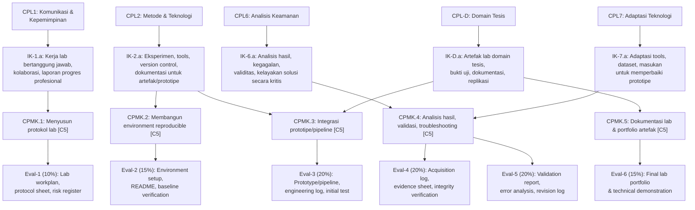

---

## PETA KOMPETENSI DAN ALUR LOKAKARYA

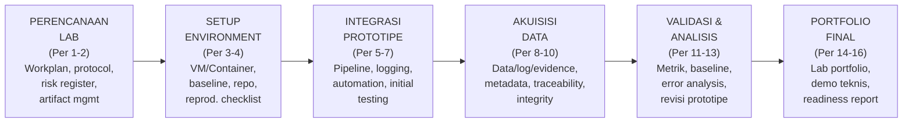

---

## PETUNJUK PENGGUNAAN BUKU

Buku ini berbeda dari buku ajar mata kuliah teori. Setiap bab memberikan kerangka konseptual dan panduan operasional — tetapi konten eksperimen sesungguhnya bergantung pada domain tesis masing-masing mahasiswa. Seluruh contoh dalam buku ini bersifat ilustratif dari berbagai domain (forensik digital, SIEM, malware analysis, cloud security, dll.) — mahasiswa mengadaptasi prinsip-prinsip tersebut ke domain spesifik mereka.

Catatan penting: Semua aktivitas lab dalam mata kuliah ini harus bersifat **legal, aman, dan berotorisasi**. Eksperimen yang melibatkan sistem nyata pihak ketiga tanpa izin eksplisit adalah pelanggaran hukum (UU ITE Ps.30) dan pelanggaran etika akademik.

---

## TABEL PEMETAAN BAB–OBE

| Bab | Pertemuan | Sub-CPMK | Aktivitas | Evaluasi |
|---|---|---|---|---|
| 1 | 1 | Sub-CPMK.1 | Orientasi lokakarya, safety, etika lab, scope penugasan | Eval-1 |
| 2 | 2 | Sub-CPMK.1 | Lab workplan, protocol sheet, risk register, artifact management plan | Eval-1 |
| 3 | 3 | Sub-CPMK.2 | Environment design: VM/container, dependency, version control | Eval-2 |
| 4 | 4 | Sub-CPMK.2 | Environment setup, baseline dokumentasi, reproducibility checklist | Eval-2 |
| 5 | 5 | Sub-CPMK.3 | Prototype/pipeline design dan implementasi awal | Eval-3 |
| 6 | 6 | Sub-CPMK.3 | Integrasi komponen, instrumentation, automation script | Eval-3 |
| 7 | 7 | Sub-CPMK.3 | Initial testing, engineering log, demo parsial | Eval-3 |
| 8 | 8 | Sub-CPMK.4 | Akuisisi data/log/evidence: prinsip dan implementasi | Eval-4 |
| 9 | 9 | Sub-CPMK.4 | Metadata, provenance, traceability, hash/integrity verification | Eval-4 |
| 10 | 10 | Sub-CPMK.4 | Measurement design, acquisition log, evidence sheet | Eval-4 |
| 11 | 11 | Sub-CPMK.5 | Validasi teknis: metrik, baseline comparison, benchmarking | Eval-5 |
| 12 | 12 | Sub-CPMK.5 | Error analysis, sensitivity analysis, threat to validity | Eval-5 |
| 13 | 13 | Sub-CPMK.5 | Troubleshooting, revisi prototipe berbasis bukti, revision log | Eval-5 |
| 14 | 14 | Sub-CPMK.6 | Lab portfolio: struktur, komponen, dan standar kualitas | Eval-6 |
| 15 | 15 | Sub-CPMK.6 | Technical demonstration: persiapan dan pelaksanaan | Eval-6 |
| 16 | 16 | Sub-CPMK.6 | Final portfolio review, readiness assessment, rencana tindak lanjut | Eval-6 |

---

---

# BAB 1 — ORIENTASI LOKAKARYA LAB DAN ETIKA EKSPERIMEN

## 1. Capaian Pembelajaran Bab

Setelah menyelesaikan bab ini, mahasiswa mampu:
- Menjelaskan perbedaan antara lokakarya lab penelitian dan praktikum pengajaran (C2)
- Mengidentifikasi persyaratan keselamatan, etika, dan legalitas untuk eksperimen tesis (C4)
- Mengevaluasi scope dan deliverable Lokakarya Berbasis Lab 1 terhadap kebutuhan tesis mereka (C5)
- Menyusun gambaran awal rencana eksperimen berdasarkan proposal tesis yang sudah ada (C6)

## 2. Peta Konsep Bab

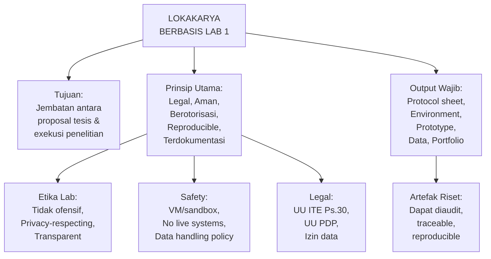

## 3. Pengantar Kontekstual

Penelitian dalam keamanan siber dan forensik digital menghadapi tantangan unik yang tidak ditemukan di domain penelitian lain: banyak teknik yang digunakan dalam penelitian juga dapat digunakan untuk tujuan yang merusak. Seorang peneliti yang mengembangkan metode deteksi malware perlu memahami bagaimana malware bekerja; seorang peneliti forensik digital perlu memahami teknik anti-forensik untuk bisa mendeteksinya.

Ini berarti batas antara penelitian defensif yang legitim dan pengembangan kapabilitas ofensif kadang terlihat tipis. Lokakarya Berbasis Lab 1 beroperasi secara eksklusif di sisi defensif garis tersebut: semua eksperimen dilakukan dalam environment yang terkontrol, pada sistem yang dimiliki atau diizinkan secara eksplisit, dengan tujuan analisis, deteksi, pertahanan, atau validasi — bukan eksploitasi sistem nyata.

## 4. Landasan Teori

### 4.1 Lokakarya Lab Penelitian vs. Praktikum Pengajaran

**Praktikum pengajaran:** Dirancang untuk mengajarkan mahasiswa cara menggunakan tool atau konsep tertentu. Prosedur sudah ditentukan; hasil yang "benar" sudah diketahui; tujuannya adalah pembelajaran skill.

**Lokakarya lab penelitian:** Dirancang untuk menjawab pertanyaan penelitian yang hasilnya belum diketahui. Prosedur perlu dirancang oleh peneliti; hasil mungkin mengejutkan atau berlawanan dengan hipotesis; tujuannya adalah menghasilkan pengetahuan baru yang valid.

Implikasi untuk mahasiswa:
- Tidak ada "jawaban benar" yang sudah tersedia — hasil bergantung pada keputusan desain penelitian Anda
- Kegagalan eksperimen adalah informasi yang valid jika didokumentasikan dengan baik
- Anda bertanggung jawab atas validitas dan integritas data yang Anda hasilkan

### 4.2 Prinsip Reproducibility dalam Penelitian Keamanan Siber

Reproducibility adalah kemampuan peneliti lain untuk menjalankan eksperimen yang sama dan mendapatkan hasil yang konsisten. Dalam keamanan siber, ini menghadapi tantangan spesifik:
- Tools berevolusi cepat — tool yang digunakan hari ini mungkin berperilaku berbeda dalam 6 bulan
- Dataset bisa mengandung bias yang tidak segera terlihat
- Konfigurasi environment kecil bisa menghasilkan perbedaan hasil yang signifikan

**Standar reproducibility minimum untuk lokakarya lab:**
1. Semua dependency terdokumentasi dengan versi spesifik
2. Environment dapat dibangun ulang dari README atau Dockerfile
3. Script/kode dapat dijalankan ulang pada dataset yang sama untuk menghasilkan hasil yang sama
4. Seed untuk proses random terdokumentasi
5. Data preprocessing steps terdokumentasi secara step-by-step

### 4.3 Kerangka Etika dan Legalitas Eksperimen Lab

**Dimensi legal:**
- *UU ITE Ps.30:* Akses ilegal ke sistem komputer pihak lain tanpa izin adalah tindak pidana. Semua eksperimen harus dilakukan pada sistem yang dimiliki peneliti atau dengan izin tertulis dari pemilik sistem.
- *UU PDP:* Jika eksperimen menggunakan data yang mengandung informasi pribadi (log dengan IP address user, file yang mengandung nama/email, dll.), maka aturan data minimization dan purpose limitation berlaku.
- *KUHAP:* Jika penelitian melibatkan artefak bukti digital dari kasus nyata (sangat jarang di tingkat tesis, hanya dengan MoU formal), chain of custody harus dipertahankan.

**Dimensi etika:**
- *Non-maleficence:* Penelitian tidak boleh menghasilkan kapabilitas yang dapat digunakan untuk menyerang sistem pihak lain tanpa izin.
- *Privacy:* Data yang mengandung informasi pribadi harus di-anonymize sebelum digunakan dalam eksperimen dan dihapus setelah tidak diperlukan.
- *Transparency:* Metodologi harus dapat diaudit — semua keputusan eksperimen harus terdokumentasi dengan justifikasi.

**Panduan klasifikasi aktivitas lab:**

| Aktivitas | Status | Catatan |
|---|---|---|
| Analisis malware sample dalam sandbox terisolasi | Legal & Etis | Gunakan VM isolated tanpa network |
| Pengembangan detection rule/signature dari sample publik | Legal & Etis | Fokus pada defensif, bukan ofensif |
| Eksperimen SIEM dengan log sintetis/pseudonymized | Legal & Etis | Tidak ada data personal nyata |
| Penetration testing pada VM yang dimiliki sendiri | Legal & Etis | Dokumentasikan izin dalam protocol sheet |
| Pengujian tool forensik pada disk image yang dibeli/dibuat | Legal & Etis | Gunakan image dari set data publik (NIST, DFRWS) |
| Akses ke sistem pihak lain tanpa izin "untuk tujuan penelitian" | ILEGAL | Pasal 30 UU ITE |
| Menggunakan data PII dari breach tanpa DPA | TIDAK ETIS | Melanggar UU PDP |

### 4.4 Deliverable Lokakarya Berbasis Lab 1

Enam evaluasi terstruktur membentuk alur lokakarya dari perencanaan hingga demonstrasi:

| Eval | Deliverable | Bobot | Minggu |
|---|---|---|---|
| Eval-1 | Lab workplan + protocol sheet + risk register + artifact management plan | 10% | 1-2 |
| Eval-2 | Environment setup package + README + baseline verification report | 15% | 3-4 |
| Eval-3 | Integrated prototype/pipeline + engineering log + initial test evidence | 20% | 5-7 |
| Eval-4 | Acquisition log + dataset/evidence sheet + measurement sheet + integrity verification | 20% | 8-10 |
| Eval-5 | Validation report + error analysis + threat-to-validity note + revision log | 20% | 11-13 |
| Eval-6 | Final lab portfolio + technical demonstration | 15% | 14-16 |

## 5. Model atau Arsitektur

### 5.1 Ekosistem Lokakarya Lab Penelitian FDKS

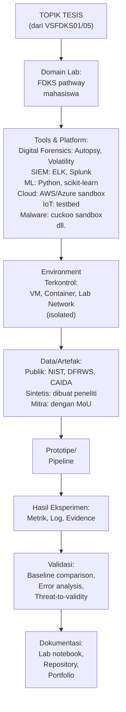

## 6. Contoh Terapan

### Studi Kasus: Diversitas Domain dalam Satu Angkatan Lokakarya

Satu angkatan mahasiswa Lokakarya Berbasis Lab 1 mungkin mencakup topik tesis yang sangat berbeda:

| Mahasiswa | Topik Tesis | Tool Utama | Dataset |
|---|---|---|---|
| Aditya | Deteksi APT menggunakan SIEM + ML | ELK Stack, Python, scikit-learn | CICIDS2017, log sintetis |
| Bella | Forensik artefak Android untuk kasus penipuan digital | Autopsy, ADB, Cellebrite (demo) | DFRWS mobile dataset, emulator Android |
| Chandra | Framework PIA untuk layanan cloud Indonesia | Python, AWS, dokumentasi regulasi | Kasus hipotetis berdasarkan UU PDP |
| Dina | Automated malware classification menggunakan static analysis | Cuckoo Sandbox (VM), YARA, Python | VirusTotal community sample (publik) |
| Edo | Deteksi anomali IoT menggunakan unsupervised ML | Python, Raspberry Pi testbed | N-BaIoT dataset, testbed sintetis |

**Pelajaran:** Buku ajar ini memberikan kerangka yang sama untuk semua domain — protokol, environment, prototipe, akuisisi, validasi, dan dokumentasi — tetapi implementasinya sangat berbeda. Mahasiswa bertanggung jawab untuk mengadaptasi kerangka ke domain mereka, dibimbing oleh dosen pembimbing.

## 7. Praktikum atau Aktivitas Terarah

### Aktivitas 1.1: Orientasi Domain dan Scope Eksperimen

**Tujuan:** Mendefinisikan scope eksperimen lokakarya untuk domain tesis masing-masing mahasiswa.

**Langkah kerja:**
1. Baca kembali bab metodologi proposal tesis Anda (dari VSFDKS01).
2. Identifikasi: (a) tools yang akan digunakan, (b) dataset yang akan dibutuhkan, (c) environment yang diperlukan, (d) output yang akan dihasilkan.
3. Klasifikasikan setiap aktivitas yang direncanakan menggunakan tabel legalitas di Bagian 4.3.
4. Identifikasi tiga risiko terbesar dalam eksperimen yang Anda rencanakan.
5. Diskusikan dengan pembimbing dan verifikasi bahwa scope lokakarya selaras dengan kebutuhan tesis.

**Deliverable:** Dokumen 1-2 halaman: "Scope dan Feasibility Assessment Eksperimen Lokakarya" — akan menjadi dasar Lab Workplan di Bab 2.

**Catatan etika:** Jika ada aktivitas yang meragukan dari sisi legalitas, konsultasikan dengan dosen sebelum melanjutkan — jangan assume legal.

## 8. Latihan Pemahaman

**Soal 1 (Pilihan Ganda):** Seorang mahasiswa ingin menguji apakah sistem IDS-nya dapat mendeteksi port scanning. Ia berencana melakukan port scanning terhadap server universitas untuk melihat apakah IDS-nya memberikan alert. Apa yang seharusnya dilakukan mahasiswa?
a. Lanjutkan — ini untuk tujuan penelitian jadi tidak melanggar UU ITE  
b. Gunakan VM sendiri atau environment lab yang diizinkan, bukan server universitas tanpa izin  
c. Minta izin lisan dari teman yang bekerja di IT universitas  
d. Lakukan saat malam hari ketika server tidak banyak digunakan

**Soal 2 (Esai Singkat):** Jelaskan perbedaan mendasar antara "reproducibility" dan "replicability" dalam konteks eksperimen keamanan siber. Mengapa keduanya penting?

**Soal 3 (Analisis):** Seorang peneliti menggunakan dataset breach yang ditemukan di dark web (data yang bocor dari pelanggaran keamanan sebuah perusahaan) untuk melatih model deteksi anomali. Analisis dimensi etika dan legal dari keputusan ini.

**Soal 4 (Perancangan):** Untuk domain tesis Anda sendiri, identifikasi: (a) satu sumber dataset publik yang dapat digunakan, (b) satu tool yang akan digunakan, (c) satu risiko etika/legal yang perlu dikelola.

**Soal 5 (Evaluasi):** Mengapa dokumentasi kegagalan eksperimen sama pentingnya dengan dokumentasi keberhasilan dalam penelitian ilmiah?

## 9. Latihan Terapan / Studi Kasus

**Studi Kasus 1.1:** Anda merencanakan eksperimen menggunakan log dari sistem SIEM perusahaan tempat Anda magang. Log tersebut berisi: IP address user, username, waktu akses, dan nama file yang diakses. Manager IT perusahaan secara lisan menyetujui penggunaan log tersebut untuk "keperluan tesis." Apa langkah yang harus Anda ambil sebelum menggunakan data ini? Apa yang masih kurang dari "persetujuan lisan" ini?

**Studi Kasus 1.2:** Anda menemukan bahwa tool forensik yang Anda rencanakan untuk digunakan (versi spesifik) sudah tidak tersedia — developer telah menghentikan maintenance dan repository telah dihapus. Versi terbaru tool tersebut memiliki perubahan signifikan dalam output format. Bagaimana Anda mengelola situasi ini dalam konteks reproducibility dan validitas eksperimen?

## 10. Kunci Jawaban dan Pembahasan

**Jawaban 1:** **B.** Port scanning terhadap server yang bukan milik sendiri tanpa izin tertulis adalah pelanggaran UU ITE Pasal 30 — tidak peduli apakah tujuannya penelitian. *Mengapa A salah:* UU ITE tidak memberikan pengecualian untuk "tujuan penelitian" — yang menentukan adalah ada/tidaknya otorisasi dari pemilik sistem. *Mengapa C salah:* Izin lisan dari pegawai IT (bukan pejabat berwenang) tidak memiliki dasar hukum. *Mengapa D salah:* Waktu pelaksanaan tidak mengubah status hukum tindakan tersebut.

**Jawaban 2:** *Reproducibility:* Peneliti yang SAMA menjalankan eksperimen yang SAMA pada waktu berbeda dan mendapatkan hasil yang konsisten. *Replicability:* Peneliti yang BERBEDA menjalankan prosedur yang SAMA pada data yang berbeda dan mendapatkan kesimpulan yang konsisten. Keduanya penting: reproducibility membuktikan bahwa hasil bukan artefak dari kondisi spesifik satu kali eksperimen; replicability membuktikan bahwa temuan dapat digeneralisasi.

**Jawaban 3:** Dimensi etika: (a) Data tersebut adalah data pribadi korban breach yang tidak memberikan consent penggunaannya untuk penelitian; (b) Menggunakan data tersebut melanggengkan kerugian privasi yang sudah dialami korban; (c) Ada risiko re-identification dari data yang seolah-olah anonim. Dimensi legal: (a) Mengunduh atau menyimpan data breach dapat dikategorikan sebagai "menerima data hasil kejahatan" (penadahan data) — bergantung pada interpretasi; (b) UU PDP Ps.65 melarang memproses data pribadi yang diperoleh secara ilegal; (c) Tidak ada dasar legal yang jelas untuk "penelitian" sebagai pengecualian. *Kesimpulan:* Peneliti tidak boleh menggunakan data breach dari dark web, bahkan untuk tujuan akademik. Gunakan dataset sintetis atau dataset yang dianonimkan dari sumber legitim.

**Jawaban 4:** *Panduan:* Tidak ada jawaban "benar" universal — bergantung pada domain tesis mahasiswa. Poin penting: sumber dataset harus dapat diverifikasi asal-usulnya (bukan data breach/ilegal); tool harus dapat diinstal dalam lingkungan terkontrol tanpa mengakses sistem pihak lain; risiko etika/legal harus spesifik (bukan generik "risiko privacy").

**Jawaban 5:** Dokumentasi kegagalan penting karena: (a) *Publication bias:* Jika hanya keberhasilan yang didokumentasikan, komunitas ilmiah tidak mendapat gambaran akurat tentang batas kemampuan suatu pendekatan; (b) *Reproducibility:* Peneliti lain perlu tahu kondisi di mana pendekatan TIDAK bekerja untuk menghindari mencoba hal yang sama; (c) *Scientific integrity:* Menyembunyikan kegagalan adalah pelanggaran integritas ilmiah; (d) *Learning value:* Kegagalan sering menghasilkan wawasan yang lebih berharga dari keberhasilan.

**Kunci 1.1:** Langkah yang harus diambil: (a) Minta Memorandum of Understanding (MoU) atau Data Sharing Agreement tertulis dengan tanda tangan pejabat berwenang (bukan hanya manager IT); (b) MoU harus mencantumkan: tujuan penggunaan, jenis data, periode penggunaan, kewajiban keamanan data, dan kewajiban penghapusan setelah penelitian selesai; (c) Lakukan pseudonymization: hapus atau enkripsi username dan ganti IP dengan identifier anonim sebelum data masuk ke environment penelitian; (d) Buat Data Processing Agreement yang mencatat bahwa data hanya akan digunakan untuk tujuan yang disebutkan. Apa yang kurang dari persetujuan lisan: tidak ada dasar hukum; tidak ada scope yang jelas; tidak ada mekanisme pertanggungjawaban jika terjadi breach sekunder.

**Kunci 1.2:** Langkah pengelolaan: (a) Dokumentasikan situasi di engineering log dengan timestamp; (b) Evaluasi apakah versi terbaru masih dapat memenuhi kebutuhan penelitian dengan output format yang berbeda — jika ya, dokumentasikan perbedaan dan justifikasi pemilihan versi terbaru; (c) Cari alternatif: apakah ada tool lain yang memberikan fungsi setara? Apakah ada versi archived dari tool lama (misalnya via Docker image lama, GitHub releases archive)?; (d) Konsultasikan dengan pembimbing dan update protocol sheet untuk mencerminkan perubahan; (e) Dalam laporan akhir, dokumentasikan hambatan ini dan bagaimana Anda mengatasinya — ini menunjukkan kematangan peneliti.

## 11. Ringkasan Bab

Lokakarya Berbasis Lab 1 adalah jembatan antara perencanaan tesis dan eksekusi penelitian. Perbedaan mendasar dari praktikum pengajaran: tidak ada "jawaban benar" yang sudah diketahui, dan mahasiswa bertanggung jawab penuh atas validitas metodologi dan integritas data. Semua aktivitas harus legal (tidak melanggar UU ITE Ps.30 dan UU PDP), etis (defensif, privacy-respecting, transparent), dan reproducible. Kegagalan yang terdokumentasi dengan baik adalah kontribusi ilmiah yang valid.

## 12. Refleksi Profesional

1. Seorang security researcher di industri menemukan vulnerability kritis pada sistem perbankan besar. Untuk "membuktikan" temuannya, ia berencana melakukan proof-of-concept exploit terhadap sistem live. Mengapa ini tidak etis dan tidak legal, bahkan dengan niat yang baik? Apa mekanisme yang seharusnya digunakan?

2. Prinsip reproducibility dalam penelitian memiliki analog dalam forensik digital: setiap langkah analisis forensik harus dapat diulang oleh ahli lain dan menghasilkan kesimpulan yang konsisten. Bagaimana standar reproducibility laboratorium yang Anda pelajari di bab ini akan Anda terapkan dalam praktik forensik digital yang sesungguhnya?

---

# BAB 2 — LAB WORKPLAN, PROTOCOL SHEET, DAN RISK REGISTER

## 1. Capaian Pembelajaran Bab

Setelah menyelesaikan bab ini, mahasiswa mampu:
- Menyusun lab workplan yang komprehensif untuk eksperimen tesis (Sub-CPMK.1, C6)
- Membuat protocol sheet yang dapat dieksekusi dan diverifikasi (C6)
- Menyusun risk register dengan analisis probabilitas-dampak untuk eksperimen laboratorium (C5)
- Merancang artifact management plan yang menjamin traceability dan integritas (C6)

## 2. Peta Konsep Bab

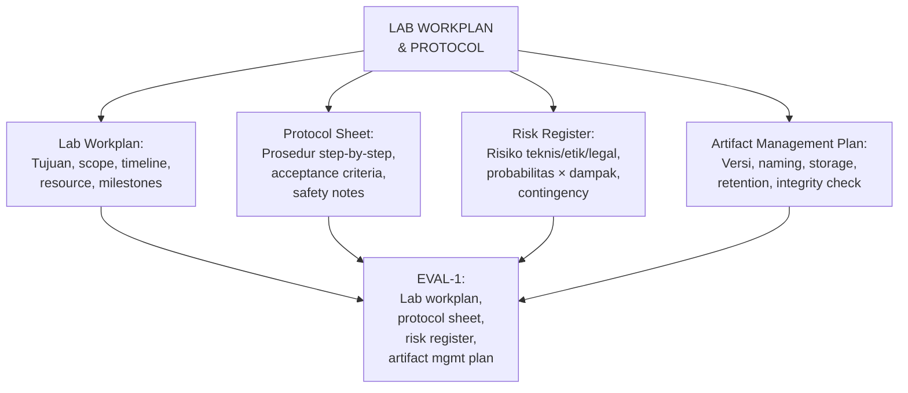

## 3. Pengantar Kontekstual

Dalam penelitian ilmiah, perencanaan yang buruk tidak hanya membuang waktu — ia dapat menghasilkan data yang tidak valid, eksperimen yang tidak dapat direproduksi, atau bahkan pelanggaran etika yang tidak disengaja. Protocol sheet dalam eksperimen laboratorium berfungsi seperti prosedur operasi standar (SOP) dalam forensik digital: ia mendefinisikan apa yang dilakukan, dalam urutan apa, dengan tools apa, dan bagaimana memverifikasi bahwa setiap langkah berhasil.

Dalam audit keamanan dan investigasi forensik profesional, SOP yang terdokumentasi adalah persyaratan — bukan opsional. Lokakarya ini melatih kemampuan menyusun dokumen perencanaan ilmiah yang setara dengan standar profesional.

## 4. Landasan Teori

### 4.1 Komponen Lab Workplan

**Lab workplan** adalah dokumen tingkat tinggi yang mendefinisikan konteks dan kerangka seluruh eksperimen laboratorium. Komponen wajib:

1. **Tujuan eksperimen** (experiment objectives): Apa yang ingin dibuktikan atau diukur? Harus align dengan Research Question tesis.
2. **Scope eksperimen:** Apa yang termasuk dan apa yang tidak termasuk dalam eksperimen ini?
3. **Research questions yang dijawab:** Hubungan eksplisit antara eksperimen dan RQ tesis.
4. **Metode utama:** Jenis eksperimen (controlled experiment, case study, simulation, benchmark), teknik validasi, statistik yang digunakan.
5. **Resource yang dibutuhkan:** Hardware, software, dataset, lisensi, akses.
6. **Timeline dan milestones:** Kapan setiap tahap selesai; deliverable per milestone.
7. **Acceptance criteria:** Kondisi apa yang menunjukkan eksperimen berhasil? Harus didefinisikan SEBELUM melihat hasil.
8. **Failure criteria:** Kondisi apa yang menunjukkan eksperimen perlu dihentikan atau direvisi?

### 4.2 Protocol Sheet: Prosedur Terstruktur

**Protocol sheet** adalah prosedur step-by-step untuk melaksanakan eksperimen. Ia harus cukup detail sehingga orang lain (atau Anda sendiri 6 bulan kemudian) dapat menjalankan eksperimen yang sama dan mendapatkan hasil yang konsisten.

**Elemen wajib protocol sheet:**
- Daftar tools dengan versi spesifik
- Daftar dataset dengan sumber, versi, dan metode akses
- Langkah-langkah dalam urutan yang benar, dengan catatan untuk langkah yang kritis
- Checkpoint verifikasi: setelah setiap tahap, bagaimana Anda memverifikasi bahwa tahap tersebut berhasil?
- Safety notes: apa yang harus dilakukan jika sesuatu berjalan tidak terduga?

**Format umum untuk satu langkah dalam protocol:**
```
Langkah N: [Nama Langkah]
Tool: [nama tool + versi]
Input: [apa yang dibutuhkan sebagai input]
Prosedur: [instruksi step-by-step]
Output yang diharapkan: [apa yang seharusnya dihasilkan]
Verifikasi: [bagaimana memverifikasi langkah berhasil]
Jika gagal: [apa yang dilakukan jika output tidak sesuai]
```

### 4.3 Risk Register untuk Eksperimen Lab

Risk register mendokumentasikan risiko yang dapat mengganggu atau membatalkan eksperimen. Kategorisasi risiko untuk eksperimen keamanan siber:

**Risiko teknis:**
- Tool tidak berfungsi seperti yang didokumentasikan (tool bug, version incompatibility)
- Dataset tidak tersedia atau mengandung kualitas yang buruk
- Environment instabil atau tidak reproducible
- Waktu eksperimen melebihi estimasi (computation time, memory overflow)

**Risiko data:**
- Dataset mengandung lebih banyak noise dari yang diperkirakan
- Format data berubah antara versi tool
- Dataset tidak representative untuk konteks yang diklaim

**Risiko etika/legal:**
- Dataset mengandung PII yang tidak terdeteksi awalnya
- Tool memerlukan akses network yang tidak direncanakan
- Scope eksperimen drifts ke wilayah yang memerlukan izin tambahan

**Risiko timeline:**
- Dependency eksternal tidak tersedia tepat waktu (MoU, akses lab, hardware)
- Iterasi debugging memerlukan lebih banyak waktu dari yang direncanakan

**Template risk register:**

| ID | Risiko | Kategori | Probabilitas (T/S/R) | Dampak (T/S/R) | Level | Contingency |
|---|---|---|---|---|---|---|
| R01 | | | | | T/S/R | |

### 4.4 Artifact Management Plan

**Artifact management** mendefinisikan bagaimana semua output eksperimen (data, kode, konfigurasi, log, hasil) dikelola, disimpan, dan dilindungi integritas-nya.

**Komponen artifact management plan:**
1. *Naming convention:* Aturan penamaan file/folder yang konsisten dan informatif
2. *Version control:* Sistem (Git) dan branching strategy
3. *Storage:* Lokasi penyimpanan primer dan backup; enkripsi jika diperlukan
4. *Integrity verification:* Kapan dan bagaimana hash digest diambil dan diverifikasi
5. *Retention policy:* Berapa lama artefak disimpan; apa yang dihapus setelah tidak diperlukan (terutama untuk data PII)
6. *Access control:* Siapa yang dapat mengakses artefak dan bagaimana

## 5. Model atau Arsitektur

### 5.1 Alur Penyusunan Dokumen Perencanaan Lab

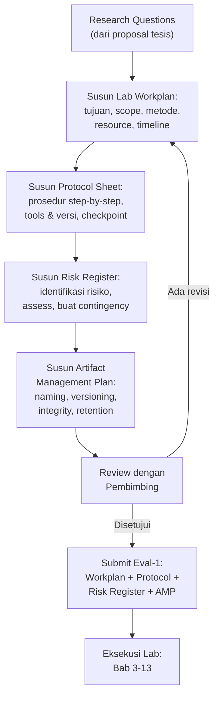

## 6. Contoh Terapan

### Studi Kasus: Lab Workplan — Penelitian SIEM Anomaly Detection

**Ringkasan workplan Aditya (deteksi APT via SIEM+ML):**

| Komponen | Isian |
|---|---|
| Tujuan | Mengevaluasi efektivitas pendekatan hybrid SIEM+ML untuk deteksi APT tactic pada enterprise log |
| Scope | Focused pada 5 APT tactic dari MITRE ATT&CK (T1078, T1059, T1083, T1190, T1021); menggunakan CICIDS2017 dataset + log sintetis |
| RQ yang dijawab | RQ1: Apakah model RF dapat mendeteksi APT pattern dengan F1≥0.85 pada CICIDS2017? |
| Metode | Controlled experiment: training dan testing RF classifier pada stratified split 80/20; baseline: rule-only SIEM tanpa ML |
| Resource | Python 3.11, scikit-learn 1.3, ELK 8.x, CICIDS2017 (publik), VM Ubuntu 22.04 (lab kampus) |
| Milestones | M1 (Per 3-4): Environment siap; M2 (Per 5-7): Pipeline terintegrasi; M3 (Per 8-10): Data acquired; M4 (Per 11-13): Validasi selesai |
| Acceptance criteria | F1 ≥ 0.85 pada test set; FPR ≤ 10% |
| Failure criteria | F1 < 0.70 setelah hyperparameter tuning → scope revisi |

**Contoh satu langkah dalam protocol sheet Aditya:**
```
Langkah 5: Preprocessing CICIDS2017 dataset
Tool: Python 3.11 + pandas 2.0.3
Input: CICIDS2017_Monday.csv (dari directory /data/raw/)
Prosedur:
  5.1 Load dataset: df = pd.read_csv('CICIDS2017_Monday.csv')
  5.2 Drop kolom dengan >20% missing values: df.dropna(thresh=0.8*len(df), axis=1)
  5.3 Encode label: LabelEncoder pada kolom 'Label'
  5.4 Normalize features: StandardScaler
  5.5 Save processed: df.to_csv('/data/processed/Monday_processed.csv', index=False)
Output yang diharapkan: CSV file 225,745 rows, 78 features (setelah drop), 1 label
Verifikasi: df.shape == (225745, 79) dan df.isnull().sum().sum() == 0
Jika gagal: Periksa encoding karakter CSV; coba pd.read_csv() dengan encoding='latin-1'
```

## 7. Praktikum atau Aktivitas Terarah

### Aktivitas 2.1: Menyusun Lab Workplan dan Protocol Sheet

**Tujuan:** Menghasilkan dokumen perencanaan lab yang dapat dikritisi oleh pembimbing sebelum eksekusi.

**Prasyarat:** Dokumen "Scope dan Feasibility Assessment" dari Aktivitas 1.1.

**Langkah kerja:**
1. Susun lab workplan menggunakan format di Bagian 4.1. Setiap komponen harus diisi, tidak boleh kosong atau "TBD" kecuali dengan justifikasi.
2. Identifikasi tiga langkah paling kritis dalam eksperimen Anda dan tulis protocol detail untuk ketiga langkah tersebut (format di Bagian 4.2).
3. Lakukan brainstorming risiko: identifikasi minimal 5 risiko dari kategori yang berbeda.
4. Untuk setiap risiko, tentukan probabilitas, dampak, dan contingency plan.
5. Buat artifact management plan yang mencakup semua komponen di Bagian 4.4.
6. Review seluruh dokumen dengan pertanyaan: "Apakah seseorang yang baru bergabung ke project ini bisa melanjutkan pekerjaan hanya berdasarkan dokumen ini?"

**Deliverable (Eval-1):** Lab workplan + protocol sheet + risk register + artifact management plan dalam satu dokumen terpadu (format PDF/DOCX, 8-15 halaman).

**Kriteria keberhasilan:** Semua komponen hadir dan diisi substansif; acceptance criteria terdefinisi sebelum eksekusi; minimal 5 risiko terdokumentasi; protocol sheet cukup detail untuk dieksekusi.

**Catatan etika:** Protocol sheet tidak boleh mengandung langkah-langkah yang mengakses sistem pihak lain tanpa otorisasi. Jika ada keraguan tentang legalitas satu langkah, konsultasikan sebelum submit.

## 8. Latihan Pemahaman

**Soal 1 (Pilihan Ganda):** Apa yang dimaksud dengan "acceptance criteria" dalam lab workplan dan mengapa harus didefinisikan SEBELUM eksekusi?
a. Kriteria untuk menerima penilaian dari dosen
b. Kondisi yang menunjukkan eksperimen berhasil — harus pre-defined untuk mencegah HARKing
c. Syarat minimal untuk mendaftar ujian tesis
d. Standar penulisan yang harus dipenuhi dalam laporan

**Soal 2 (Esai Singkat):** Apa perbedaan antara "failure criteria" dan "acceptance criteria" dalam konteks eksperimen penelitian? Berikan contoh untuk domain keamanan siber.

**Soal 3 (Analisis):** Risk register seorang mahasiswa hanya memiliki satu entri: "Eksperimen gagal karena alasan teknis (P=Sedang, D=Tinggi) → Contingency: coba lagi." Apa yang salah dengan risk register ini dan bagaimana seharusnya?

**Soal 4 (Perancangan):** Rancang naming convention untuk artifact management dalam eksperimen yang menghasilkan: log file, model ML, dataset preprocessed, dan laporan eksperimen.

**Soal 5 (Evaluasi):** Seorang peneliti menyelesaikan eksperimen 3 bulan dan baru menyadari bahwa ia tidak mendokumentasikan versi spesifik dari salah satu library yang digunakan. Apa dampak dari ketidaklengkapan ini terhadap reproducibility dan apa yang bisa dilakukan?

## 9. Latihan Terapan / Studi Kasus

**Studi Kasus 2.1:** Anda sedang menyusun protocol sheet untuk eksperimen forensik mobile — menganalisis artefak WhatsApp dari Android emulator. Selama review, pembimbing menunjukkan bahwa langkah "install APK WhatsApp dari link di internet" berpotensi masalah reproducibility karena versi APK dapat berubah. Bagaimana Anda merevisi protocol sheet untuk mengatasi masalah ini?

**Studi Kasus 2.2:** Risk register Anda awalnya tidak mencantumkan risiko "dataset tidak tersedia" karena Anda sudah mendapat konfirmasi verbal dari pemilik dataset. Seminggu sebelum eksekusi, pemilik dataset membatalkan izin akses tanpa penjelasan. Evaluasi: (a) apakah ini harusnya ada di risk register awal, dan (b) bagaimana Anda mengelola situasi ini?

## 10. Kunci Jawaban dan Pembahasan

**Jawaban 1:** **B.** Acceptance criteria adalah kondisi yang mendefinisikan "berhasil" — harus didefinisikan sebelum eksekusi untuk mencegah HARKing (Hypothesizing After Results are Known). Jika kriteria didefinisikan setelah melihat hasil, ada risiko bahwa kriteria "disesuaikan" dengan hasil yang menguntungkan — ini adalah bentuk research misconduct. *Teori:* Pre-registration dalam ilmu pengetahuan memiliki fungsi yang sama: mendokumentasikan hipotesis dan kriteria evaluasi sebelum data dikumpulkan.

**Jawaban 2:** *Acceptance criteria:* Kondisi yang menunjukkan eksperimen menghasilkan hasil yang memenuhi klaim kontribusi penelitian. Contoh: "Model deteksi anomali mencapai F1 ≥ 0.85 pada test set." *Failure criteria:* Kondisi yang menunjukkan eksperimen perlu dihentikan atau direvisi karena hasilnya tidak akan dapat mendukung klaim penelitian secara bermakna. Contoh: "Jika F1 < 0.60 setelah 3 iterasi hyperparameter tuning, scope penelitian direvisi untuk fokus pada analisis kualitatif error." Failure criteria mencegah "sunk cost fallacy" — terus mengeksekusi eksperimen yang sudah jelas tidak akan menghasilkan kontribusi yang valid.

**Jawaban 3:** Risk register tersebut terlalu generik dan tidak actionable. Masalah: (a) "Alasan teknis" tidak spesifik — ada ratusan jenis kegagalan teknis; (b) "Coba lagi" bukan contingency plan yang bermakna; (c) Tidak ada kategorisasi risiko yang membantu prioritisasi. Seharusnya: Pisahkan risiko teknis menjadi entri spesifik (tool crash, memory overflow, network timeout, incompatible dependency, dll.); untuk setiap risiko, tentukan tindakan spesifik yang akan diambil (bukan "coba lagi" yang ambigu).

**Jawaban 4:** Contoh naming convention: `[ProjectID]_[ArtifakType]_[Domain]_[Version]_[YYYYMMDD].[ext]` — Contoh: `APT01_log_raw_cicids_v1_20250901.csv`, `APT01_model_rf_tuned_v3_20251015.pkl`, `APT01_dataset_processed_monday_v2_20250910.csv`, `APT01_report_validation_v1_20251101.pdf`. Kunci: konsisten, informatif, timestamped, dengan version number.

**Jawaban 5:** Dampak: (a) Hasil mungkin tidak dapat direproduksi jika library yang digunakan memiliki API atau behavior yang berbeda antara versi; (b) Klaim dalam laporan tentang metode tidak dapat diverifikasi sepenuhnya. Langkah yang bisa dilakukan: (a) Cek environment aktif dengan `pip freeze` atau `conda list` dan dokumentasikan semua library dengan versi yang terinstal saat ini; (b) Jalankan kembali eksperimen dan verifikasi bahwa hasil konsisten; (c) Dokumentasikan keterbatasan ini dalam laporan dan threat-to-validity. *Pelajaran:* Selalu simpan `requirements.txt` atau `environment.yml` di awal dan update setiap kali ada perubahan library.

**Kunci 2.1:** Revisi protocol sheet: (a) Langkah yang diperbaiki: "Download APK WhatsApp versi [X.X.X] yang sudah diverifikasi SHA-256 = [hash] dari archive.org atau sumber yang sudah tersimpan secara lokal"; (b) Simpan file APK di repository eksperimen dengan nama yang menyertakan versi; (c) Tambahkan verifikasi hash sebelum install: `certutil -hashfile WhatsApp_vX.X.X.apk SHA256`; (d) Dokumentasikan dalam README: "APK yang digunakan adalah WhatsApp [versi] — tidak digunakan versi terbaru karena dapat mengubah format database SQLite."

**Kunci 2.2:** (a) Ya, ini harusnya ada di risk register: "Dataset tidak tersedia pada saat eksekusi" dengan probabilitas Rendah-Sedang tetapi dampak Tinggi. Konfirmasi verbal tidak sama dengan izin tertulis — ini adalah pelajaran manajemen risiko. (b) Pengelolaan: (a) Segera identifikasi dataset publik alternatif (CAIDA, UNSW-NB15, CIC-IDS, dll.); (b) Evaluasi apakah kontribusi penelitian masih dapat dicapai dengan dataset alternatif; (c) Update risk register dengan lesson learned; (d) Komunikasikan ke pembimbing dengan rencana contingency yang konkret.

## 11. Ringkasan Bab

Lab workplan mendefinisikan tujuan, scope, resource, dan acceptance criteria sebelum eksekusi. Protocol sheet menerjemahkan workplan menjadi prosedur operasional yang dapat dieksekusi dan diverifikasi. Risk register mengidentifikasi dan menyiapkan respons terhadap risiko yang dapat mengganggu eksperimen. Artifact management plan menjamin integritas dan traceability seluruh output eksperimen. Keempat dokumen ini bersama-sama membentuk fondasi untuk penelitian yang reproducible dan dapat diaudit.

## 12. Refleksi Profesional

1. Dalam penetration testing profesional, "rules of engagement" berfungsi seperti protocol sheet: mendefinisikan scope, tools, prosedur, dan batasan yang tidak boleh dilanggar. Apa persamaan dan perbedaan antara protocol sheet penelitian dan rules of engagement pentest?

2. Dokumentasi yang baik adalah investasi: membutuhkan waktu di awal tetapi menghemat waktu (dan mencegah masalah) di kemudian hari. Dalam konteks profesional keamanan siber, kapan Anda pernah (atau bisa membayangkan) menghadapi situasi di mana dokumentasi yang buruk menyebabkan masalah serius?

---

---

# BAB 3 — ENVIRONMENT EKSPERIMEN: DESAIN DAN ARSITEKTUR

## 1. Capaian Pembelajaran Bab

Setelah menyelesaikan bab ini, mahasiswa mampu:
- Merancang arsitektur environment eksperimen yang terkontrol dan terisolasi (Sub-CPMK.2, C6)
- Memilih antara VM, container, atau bare-metal berdasarkan kebutuhan eksperimen (C5)
- Mendefinisikan strategi version control dan dependency management untuk reproducibility (C6)
- Merancang baseline environment yang dapat didokumentasikan dan diverifikasi (C5)

## 2. Peta Konsep Bab

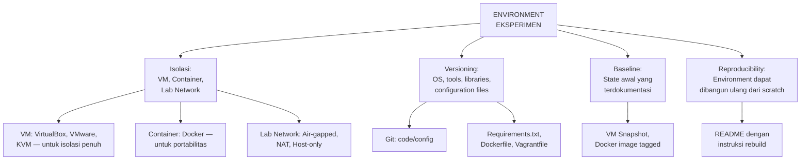

## 3. Pengantar Kontekstual

"It works on my machine" adalah frasa yang sering terdengar dalam pengembangan software — dan versi penelitian dari masalah yang sama adalah: "Saya tidak bisa mereproduksi hasil dari paper ini." Alasan paling umum: penulis tidak mendokumentasikan environment eksperimen mereka secara lengkap.

Environment yang terkontrol bukan hanya tentang reproducibility — ia juga tentang keamanan. Eksperimen keamanan siber sering melibatkan malware sample, tool yang dapat melakukan port scanning, atau data yang sensitif. Menjalankan eksperimen ini dalam environment yang tidak terisolasi dari network sesungguhnya adalah risiko keamanan yang nyata.

## 4. Landasan Teori

### 4.1 Pilihan Environment: VM vs. Container vs. Bare-metal

**Virtual Machine (VM):**
- Emulasi hardware penuh; OS guest terisolasi dari host
- *Kelebihan:* Isolasi terkuat; dapat menjalankan OS yang berbeda; snapshot untuk rollback
- *Kekurangan:* Overhead resource tinggi; lambat untuk beberapa workload
- *Paling tepat untuk:* Analisis malware, eksperimen yang memerlukan OS tertentu, simulasi network topology

**Container (Docker):**
- Berbagi kernel host; process isolation tanpa hardware emulation
- *Kelebihan:* Sangat portable; startup cepat; Dockerfile mendokumentasikan dependency secara otomatis
- *Kekurangan:* Isolasi tidak sekuat VM; bergantung pada kernel host
- *Paling tepat untuk:* Aplikasi berbasis layanan, pipeline ML, tool forensik berbasis Linux

**Bare-metal:**
- Eksperimen langsung di hardware fisik tanpa virtualisasi
- *Paling tepat untuk:* Benchmark performance yang memerlukan akurasi tinggi; eksperimen IoT dengan hardware fisik

**Rekomendasi untuk domain FDKS:**
- Forensik digital / malware analysis → VM (VirtualBox, VMware, KVM)
- SIEM, ML, log analysis → Docker + Python virtual environment
- IoT / embedded → testbed fisik + VM untuk data processing
- Cloud security → cloud sandbox (AWS/Azure free tier)

### 4.2 Network Topology untuk Environment Lab

**Jenis network topology untuk eksperimen:**

| Mode | Deskripsi | Kapan Digunakan |
|---|---|---|
| Air-gapped (offline) | VM tidak memiliki koneksi network sama sekali | Analisis malware, forensik artefak |
| Host-only | VM dapat berkomunikasi dengan host tetapi tidak dengan internet | Eksperimen yang memerlukan komunikasi host-VM |
| NAT | VM dapat mengakses internet melalui host (tidak accessible dari luar) | Download tools/updates dalam setup; aktifkan hanya saat diperlukan |
| Internal Network | Beberapa VM terhubung satu sama lain tanpa akses internet | Simulasi network topology, traffic analysis |
| Bridged | VM muncul sebagai perangkat terpisah di network fisik | HINDARI kecuali di network lab yang terkontrol |

**Aturan keamanan environment:**
- Eksperimen yang melibatkan malware atau tool ofensif: gunakan air-gapped atau host-only
- Jangan pernah jalankan sample malware dalam mode bridged atau NAT yang aktif ke internet

### 4.3 Version Control dan Dependency Management

**Git untuk research:**
- Repository berisi: kode eksperimen, konfigurasi, script preprocessing, README
- Yang TIDAK masuk git: data besar (gunakan DVC atau pointer), credential, file binary yang dapat dihasilkan ulang
- Branching strategy: `main` untuk versi stabil; `exp/[nama-eksperimen]` untuk eksperimen baru; tag versi saat milestone tercapai

**Dependency documentation:**

| Ekosistem | File | Perintah |
|---|---|---|
| Python | `requirements.txt` | `pip freeze > requirements.txt` |
| Python (lebih baik) | `environment.yml` | `conda env export > environment.yml` |
| Docker | `Dockerfile` | Build dari `ubuntu:22.04` atau base image spesifik |
| Sistem | `README.md` | Daftar manual: OS version, kernel, hardware |

### 4.4 Baseline Environment

**Baseline** adalah state awal environment sebelum eksperimen dimulai. Mendokumentasikan baseline penting karena:
- Memungkinkan rollback jika environment "rusak"
- Memungkinkan orang lain memulai dari titik yang sama
- Memberikan referensi untuk membandingkan perubahan

**Cara mendokumentasikan baseline:**
1. Ambil VM snapshot dan beri label `baseline-[tanggal]`
2. Simpan Docker image dengan `docker tag [image] [repo]:[tanggal]-baseline`
3. Buat file `BASELINE.md` yang mendokumentasikan: OS version, semua package terinstall, konfigurasi penting, dan langkah untuk mencapai state ini dari fresh install

## 5. Model atau Arsitektur

### 5.1 Arsitektur Environment Lab Tipikal untuk FDKS

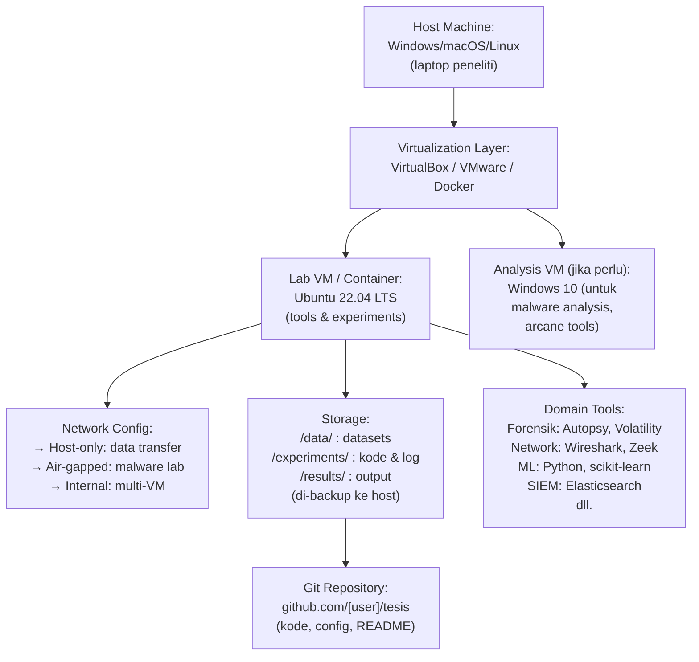

## 6. Contoh Terapan

### Studi Kasus: Setup Environment Bella (Forensik Android)

**Arsitektur yang dipilih:**
- Host: Windows 10 laptop (16GB RAM, 512GB SSD)
- VM 1 (Analysis): Ubuntu 22.04 di VirtualBox (8GB RAM, 100GB HDD) — untuk tools forensik
- VM 2 (Target): Android-x86 emulator di VirtualBox (4GB RAM) — sebagai "perangkat" yang dianalisis
- Network: Host-only antara VM1 dan VM2; air-gapped dari internet saat analisis

**Dependency yang didokumentasikan:**
```yaml
# environment.yml
name: android-forensics
channels:
  - defaults
  - conda-forge
dependencies:
  - python=3.11
  - sqlite=3.41
  - pandas=2.0.3
  - pip:
    - adb-tools==1.0.5
    - libimobiledevice==1.0.0
    - pylint==3.0.2
```

**README excerpt:**
```
## Cara Membangun Environment
1. Install VirtualBox 7.0.x
2. Import OVA: Ubuntu_22.04_forensics.ova (SHA256: abc123...)
3. Import OVA: Android_x86_9.0.ova (SHA256: def456...)
4. Set Network: VM1 → Host-only adapter; VM2 → Internal Network
5. Di VM1: conda env create -f environment.yml
6. Verifikasi: python -c "import pandas; print(pandas.__version__)"
   Expected output: 2.0.3
```

**Baseline verification:**
- SHA256 dari OVA files terdokumentasi
- Snapshot diambil setelah setup awal: `baseline-20250905`
- Semua tool diverifikasi dengan test data publik (DFRWS Android challenge dataset)

## 7. Praktikum atau Aktivitas Terarah

### Aktivitas 3.1: Rancangan Arsitektur Environment

**Tujuan:** Merancang arsitektur environment eksperimen sebelum implementasi fisik.

**Langkah kerja:**
1. Berdasarkan domain tesis Anda, tentukan: (a) VM atau container yang diperlukan, (b) OS untuk setiap VM/container, (c) network topology yang sesuai.
2. Buat diagram arsitektur environment menggunakan format teks atau gambar sederhana.
3. Buat daftar lengkap: OS version, tools dengan versi, library/dependency dengan versi.
4. Tulis langkah-langkah untuk membangun environment dari scratch (instruksi untuk README).
5. Identifikasi elemen environment yang paling kritis untuk didokumentasikan (versi mana yang paling mempengaruhi hasil eksperimen?).

**Deliverable:** Dokumen arsitektur environment (akan menjadi bagian dari Eval-2).

**Catatan etika:** Jika menggunakan tool dengan lisensi, verifikasi bahwa lisensi mengizinkan penggunaan untuk penelitian akademik.

## 8. Latihan Pemahaman

**Soal 1 (Pilihan Ganda):** Dalam eksperimen analisis malware, network mode apa yang paling aman untuk VM analisis?
a. Bridged — agar malware dapat berinteraksi dengan internet nyata
b. NAT — agar malware memiliki akses internet terbatas
c. Air-gapped / Host-only — untuk mencegah malware menyebar ke network
d. Internal network — agar beberapa VM bisa berkomunikasi

**Soal 2 (Esai Singkat):** Mengapa menggunakan `pip freeze > requirements.txt` lebih baik dari menuliskan dependency secara manual? Apa keterbatasannya?

**Soal 3 (Analisis):** Seorang peneliti mendokumentasikan environment-nya sebagai "Ubuntu Linux dengan Python 3 dan scikit-learn." Apa yang kurang dalam dokumentasi ini dan bagaimana dampaknya terhadap reproducibility?

**Soal 4 (Perancangan):** Untuk domain tesis Anda, rancang network topology yang sesuai dan justifikasi pilihan tersebut dari perspektif keamanan dan kebutuhan eksperimen.

**Soal 5 (Evaluasi):** Seorang peneliti menggunakan VM snapshot untuk reproducibility, tetapi tidak mendokumentasikan URL download dan hash dari semua tools yang diinstall secara manual. Apa risikonya?

## 9. Latihan Terapan / Studi Kasus

**Studi Kasus 3.1:** Anda menjalankan eksperimen ML pada dataset CICIDS2017 di lingkungan Docker dan mendapatkan akurasi 87.3%. Rekan Anda menggunakan environment Python bare-metal (tanpa Docker) dengan library yang sama dan mendapat akurasi 86.9%. Evaluasi: (a) apakah perbedaan ini signifikan? (b) apa penyebab paling mungkin? (c) apa langkah untuk memastikan kedua environment benar-benar setara?

**Studi Kasus 3.2:** Tool forensik utama yang Anda gunakan (Autopsy versi tertentu) memiliki bug yang baru dilaporkan: ia menghasilkan timestamp yang salah 1 jam ketika menganalisis drive dari sistem yang menggunakan daylight saving time. Anda sudah menyelesaikan 60% eksperimen. Bagaimana Anda mengelola situasi ini?

## 10. Kunci Jawaban dan Pembahasan

**Jawaban 1:** **C. Air-gapped / Host-only.** Malware yang aktif tidak boleh memiliki akses ke network eksternal — ini mencegah: (a) malware yang benar-benar menginfeksi sistem di network; (b) command-and-control komunikasi yang dapat trigger tindakan berbahaya; (c) propagasi ke VM lain atau host. *Mengapa A sangat salah:* membiarkan malware berinteraksi dengan internet nyata dapat menyebabkan serangan nyata ke sistem yang tidak bersalah. *Mengapa B lebih aman dari A tetapi masih berisiko:* NAT masih memberikan akses internet; malware canggih dapat mengeksploitasi ini.

**Jawaban 2:** `pip freeze` otomatis menangkap semua package dan versi yang terinstall di environment saat ini — termasuk sub-dependency yang tidak Anda sadari perlu. Menulis manual berisiko melewatkan dependency atau mencantumkan versi yang salah. *Keterbatasan `pip freeze`:* (a) Menangkap semua package terinstall, termasuk yang tidak relevan dengan project; (b) Tidak menangkap OS-level dependency (misalnya libssl); (c) Tidak berfungsi untuk environment berbasis conda dengan non-Python packages. Solusi yang lebih baik: `conda env export` untuk conda, atau Dockerfile yang mendefinisikan dari base image.

**Jawaban 3:** Yang kurang: versi spesifik Ubuntu (22.04? 20.04?), versi Python (3.9? 3.11?), versi scikit-learn (1.0? 1.3?), versi library lain. Dampak: scikit-learn 1.0 dan 1.3 memiliki perbedaan API dan perilaku default yang signifikan (misalnya, perubahan default di beberapa algorithm parameters). Hasil eksperimen yang direproduksi dengan versi berbeda mungkin menghasilkan angka yang berbeda.

**Jawaban 4:** *Panduan:* Tidak ada jawaban universal — bergantung domain. Poin penting: justifikasi harus mempertimbangkan keamanan (apakah eksperimen melibatkan tool yang berpotensi berbahaya?) dan kebutuhan fungsional (apakah eksperimen perlu koneksi ke layanan eksternal?).

**Jawaban 5:** Risiko: (a) Jika VM snapshot hilang atau corrupt, environment tidak bisa dibangun ulang; (b) Tools yang didownload dari URL yang tidak diverifikasi bisa berubah — URL yang sama hari ini mungkin menunjuk ke versi berbeda; (c) Tanpa hash verification, tidak ada cara membuktikan bahwa tool yang digunakan adalah versi yang diklaim. *Analogi:* Dalam forensik digital, setiap tool yang digunakan dalam investigasi harus diverifikasi integritasnya — prinsip yang sama berlaku dalam research environment.

**Kunci 3.1:** (a) Perbedaan 0.4% kemungkinan tidak signifikan secara statistik — perlu uji signifikansi (t-test atau McNemar's test). (b) Penyebab mungkin: perbedaan versi sub-library (numpy, scipy), perbedaan random seed default, atau floating-point behavior yang berbeda antara Docker image dan bare-metal. (c) Langkah: seed seragam (`np.random.seed(42)`); verifikasi semua library dengan versi yang identik; jalankan benchmark sederhana dulu untuk membuktikan equivalence environment.

**Kunci 3.2:** (a) Segera dokumentasikan bug di engineering log dengan tanggal penemuan dan referensi bug report; (b) Periksa apakah dataset Anda mengandung file dari sistem yang menggunakan daylight saving time; (c) Jika tidak (misalnya semua timestamp dari server UTC), bug tidak mempengaruhi eksperimen Anda; (d) Jika ya, keputusan: downgrade ke versi sebelumnya (dengan verifikasi reproducibility), atau upgrade ke versi yang sudah dipatch; (e) Re-run bagian eksperimen yang terpengaruh; (f) Dokumentasikan seluruh proses sebagai bagian dari troubleshooting log — ini adalah evidence of scientific rigor.

## 11. Ringkasan Bab

Desain environment eksperimen yang tepat adalah prasyarat untuk penelitian yang valid dan reproducible. Pilihan antara VM, container, dan bare-metal harus didasarkan pada kebutuhan isolasi dan portabilitas — bukan kenyamanan. Network topology menentukan batas keamanan eksperimen. Version control dan dependency documentation adalah mekanisme teknis yang menjamin reproducibility. Baseline yang terdokumentasi memungkinkan rollback dan verifikasi.

## 12. Refleksi Profesional

1. SOC (Security Operations Center) modern menggunakan environment yang sangat terkontrol untuk analisis malware — "malware sandbox" seperti Cuckoo atau ANY.RUN yang mengisolasi sampel dari network produksi. Bagaimana prinsip isolasi yang Anda pelajari di bab ini tercermin dalam praktik profesional ini?

2. Reproducibility dalam penelitian dan auditability dalam forensik digital memiliki kesamaan fundamental: keduanya mensyaratkan bahwa proses harus dapat diverifikasi oleh pihak ketiga secara independen. Bagaimana kemampuan Anda mendokumentasikan environment lab akan membantu Anda dalam konteks audit keamanan atau investigasi forensik profesional?

---

# BAB 4 — ENVIRONMENT SETUP, BASELINE, DAN REPRODUCIBILITY CHECKLIST

## 1. Capaian Pembelajaran Bab

Setelah menyelesaikan bab ini, mahasiswa mampu:
- Mengeksekusi setup environment berdasarkan rancangan di Bab 3 (Sub-CPMK.2, C3)
- Mendokumentasikan konfigurasi dan dependency untuk reproducibility (C5)
- Melakukan baseline verification menggunakan test yang terstandarisasi (C5)
- Menyusun README yang cukup detail untuk rebuild environment dari scratch (C6)

## 2. Peta Konsep Bab

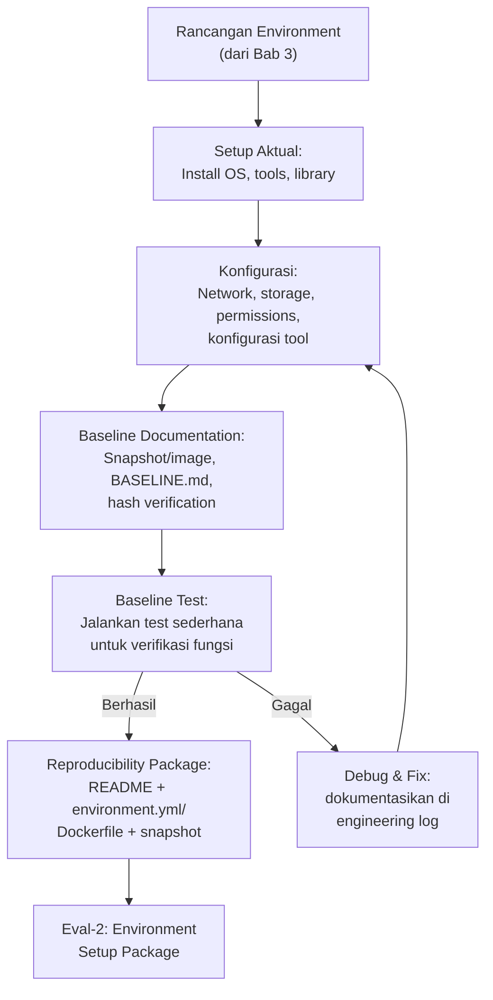

## 3. Pengantar Kontekstual

Setup environment adalah aktivitas yang tampak sederhana tetapi sering menjadi sumber masalah terbesar dalam eksperimen: library yang saling bertentangan, tool yang memerlukan konfigurasi tidak terduga, atau permission yang mencegah akses ke file tertentu. Bab ini memandu proses setup secara sistematis — bukan hanya "install dan jalankan," tetapi "install, konfigurasi, verifikasi, dan dokumentasikan."

## 4. Landasan Teori

### 4.1 Checklist Setup Environment

**Fase 1: Persiapan**
- [ ] Hardware requirements terpenuhi (RAM, storage, CPU)
- [ ] Virtualization software terinstall dan dikonfigurasi
- [ ] Network topology dikonfigurasi sesuai rancangan

**Fase 2: OS dan base environment**
- [ ] OS terinstall dengan versi yang terdokumentasi
- [ ] OS update diterapkan dan versi final didokumentasikan
- [ ] User account dengan privilege yang tepat dibuat

**Fase 3: Tool dan dependency**
- [ ] Package manager dikonfigurasi
- [ ] Semua tool terinstall dengan versi yang benar
- [ ] Semua library terinstall
- [ ] `pip freeze` atau `conda env export` dijalankan dan hasilnya disimpan
- [ ] Konfigurasi tool-specific (config file) disimpan di repository

**Fase 4: Verifikasi**
- [ ] Test sederhana dijalankan untuk setiap tool utama
- [ ] Test data (publik) dijalankan melalui pipeline dan hasil diverifikasi
- [ ] Hash dari semua file konfigurasi kritis diambil

**Fase 5: Snapshot dan dokumentasi**
- [ ] VM snapshot atau Docker image diambil dan diberi label `baseline-[tanggal]`
- [ ] `BASELINE.md` ditulis
- [ ] `README.md` ditulis dengan instruksi rebuild lengkap
- [ ] Semua file disimpan di repository

### 4.2 Baseline Verification Test

Baseline verification test membuktikan bahwa environment berfungsi sebelum eksperimen sesungguhnya dimulai. Test ini harus:
- Sederhana dan cepat (bukan eksperimen penuh)
- Menggunakan dataset atau artefak publik yang sudah diketahui hasilnya
- Menghasilkan output yang dapat dibandingkan dengan referensi

**Contoh baseline test per domain:**

| Domain | Baseline Test | Expected Output |
|---|---|---|
| Forensik digital | Jalankan Autopsy pada `cfreds.nist.gov` sample image | File listing yang sesuai referensi NIST |
| ML / SIEM | Jalankan `sklearn.datasets.load_iris()` dan training RandomForest | Accuracy ~0.97 dengan seed=42 |
| Network forensics | Buka sample PCAP dari Wireshark Wiki di Wireshark | Decode HTTP traffic yang terlihat |
| Malware analysis | Jalankan YARA rule publik terhadap EICAR test string | Match terdeteksi |

### 4.3 README yang Efektif untuk Reproducibility

README minimal untuk environment eksperimen tesis:
1. **Deskripsi singkat:** Apa yang dilakukan environment ini
2. **Persyaratan sistem:** OS, RAM minimum, storage, virtualization software
3. **Cara membangun environment:** Langkah-langkah dari fresh install
4. **Cara memverifikasi:** Baseline test yang harus dijalankan setelah setup
5. **Struktur direktori:** Penjelasan isi setiap folder
6. **Cara menjalankan eksperimen:** Entry point utama
7. **Troubleshooting umum:** Masalah yang sering ditemui dan solusinya

## 5. Model atau Arsitektur

### 5.1 Alur Setup → Baseline → Eval-2

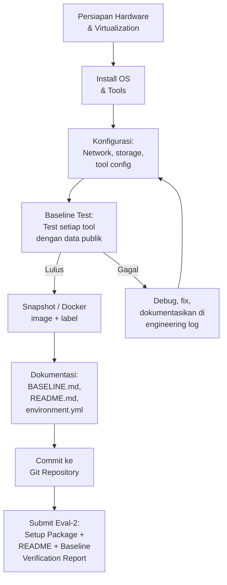

## 6. Contoh Terapan

### Studi Kasus: Setup Environment Chandra (PIA Framework untuk Cloud Indonesia)

**Domain:** Privacy Impact Assessment (PIA) framework untuk layanan cloud berbasis UU PDP Indonesia.

**Environment yang dipilih:** Docker-based (karena tidak memerlukan OS tertentu; fokus pada Python dan dokumen).

**Dockerfile:**
```dockerfile
FROM python:3.11-slim
WORKDIR /app
RUN apt-get update && apt-get install -y git pandoc texlive-latex-base
COPY requirements.txt .
RUN pip install -r requirements.txt
COPY . .
CMD ["bash"]
```

**requirements.txt:**
```
pandas==2.0.3
numpy==1.25.2
matplotlib==3.7.3
openpyxl==3.1.2
python-docx==0.8.11
pytest==7.4.0
```

**Baseline test:**
```bash
# Test 1: Python dan pandas berfungsi
python -c "import pandas; print('pandas OK:', pandas.__version__)"
# Expected: pandas OK: 2.0.3

# Test 2: Baca template Excel PIA
python -c "import openpyxl; wb = openpyxl.load_workbook('test_data/PIA_template.xlsx'); print('Excel OK')"
# Expected: Excel OK
```

**BASELINE.md (excerpt):**
```markdown
## Baseline — 2025-09-10
Docker image: pia-framework:baseline-20250910
SHA256 image: sha256:a1b2c3...
Python: 3.11.5 (dalam container)
All tests passed: see baseline_test_results_20250910.txt
```

## 7. Praktikum atau Aktivitas Terarah

### Aktivitas 4.1: Setup Environment dan Baseline Verification

**Tujuan:** Mengeksekusi setup environment berdasarkan rancangan di Bab 3 dan memverifikasi dengan baseline test.

**Langkah kerja:**
1. Eksekusi setup sesuai checklist di Bagian 4.1 — dokumentasikan setiap langkah di engineering log.
2. Jalankan baseline test yang sesuai dengan domain Anda (lihat tabel di Bagian 4.2 atau rancang sendiri).
3. Ambil snapshot VM atau tag Docker image dengan label `baseline-[tanggal]`.
4. Hitung SHA256 dari file konfigurasi kritis dan simpan di BASELINE.md.
5. Tulis README yang memungkinkan seseorang mereproduksi environment dari fresh install.
6. Commit semua file ke Git repository.

**Deliverable (Eval-2):** Repository dengan README, environment.yml/Dockerfile, BASELINE.md, dan baseline verification report.

**Kriteria keberhasilan:** Baseline test lulus; README cukup detail untuk rebuild; semua dependency terdokumentasi dengan versi spesifik; snapshot/image tersimpan.

**Catatan keselamatan:** Jika baseline test melibatkan malware sample, pastikan network dalam mode air-gapped sebelum memulai.

## 8. Latihan Pemahaman

**Soal 1 (Pilihan Ganda):** Apa tujuan utama dari baseline test dalam setup environment?
a. Membuktikan bahwa peneliti pandai menggunakan tools
b. Memverifikasi bahwa environment berfungsi dengan benar sebelum eksperimen sesungguhnya dimulai
c. Menghasilkan data awal untuk analisis
d. Memenuhi persyaratan administratif program studi

**Soal 2 (Esai Singkat):** Mengapa README harus ditulis "seolah-olah pembaca tidak tahu apa-apa tentang project ini"? Apa risiko dari README yang terlalu singkat?

**Soal 3 (Analisis):** Seorang peneliti setup environment pada 1 September tetapi baru mengambil snapshot pada 15 November setelah beberapa eksperimen awal. Apa masalah dari pendekatan ini?

**Soal 4 (Perancangan):** Rancang tiga baseline test untuk domain tesis Anda. Setiap test harus: (a) sederhana dan cepat, (b) menggunakan data publik atau sintetis, (c) memiliki expected output yang dapat diverifikasi.

**Soal 5 (Evaluasi):** Evaluasi kualitas README berikut: "Untuk menjalankan eksperimen, install semua library yang diperlukan dan jalankan main.py." Apa yang kurang?

## 9. Latihan Terapan / Studi Kasus

**Studi Kasus 4.1:** Setelah setup environment, Anda menjalankan baseline test dan menemukan bahwa tool forensik Anda menghasilkan output yang sedikit berbeda dari expected (jumlah file terdeteksi berbeda 2%). Pembimbing menyarankan untuk "tidak terlalu dipikirkan, perbedaan kecil itu biasa." Bagaimana Anda merespons secara profesional dan ilmiah?

**Studi Kasus 4.2:** Anda diminta untuk berbagi environment Anda dengan sejawat yang mengerjakan topik serupa. Saat Anda menyiapkan environment untuk dibagikan, Anda menyadari bahwa direktori `/data` berisi log dari perusahaan yang Anda gunakan dengan izin terbatas (hanya untuk penelitian Anda sendiri). Bagaimana Anda mengelola berbagi environment ini?

## 10. Kunci Jawaban dan Pembahasan

**Jawaban 1:** **B.** Baseline test memverifikasi bahwa environment berfungsi sebelum eksperimen sesungguhnya dimulai — ini mencegah situasi di mana masalah teknis muncul di tengah eksperimen dan tidak jelas apakah masalahnya ada di setup atau di metode. *Teori:* Dalam eksperimen ilmiah, kondisi awal yang terverifikasi adalah prasyarat untuk interpretasi hasil yang valid.

**Jawaban 2:** README yang terlalu singkat memaksa pembaca untuk menebak atau menghubungi penulis — keduanya menghambat reproducibility. Risiko spesifik: langkah yang "jelas" bagi penulis mungkin tidak jelas bagi pembaca; dependency implisit (library sistem) yang tidak terdokumentasi; urutan langkah yang salah karena diasumsikan diketahui. Prinsip: README yang baik dapat digunakan oleh peneliti yang berpengalaman tetapi tidak familiar dengan project ini.

**Jawaban 3:** Masalah: snapshot mencakup state setelah beberapa eksperimen awal, bukan state awal yang bersih. Ini berarti: (a) tidak ada baseline yang bersih untuk rollback jika environment "terkontaminasi"; (b) orang yang ingin mereproduksi eksperimen harus mulai dari snapshot yang sudah "kotor"; (c) tidak ada cara memverifikasi bahwa environment pada 1 September sama dengan snapshot 15 November. *Aturan:* Ambil baseline snapshot SEBELUM eksperimen pertama.

**Jawaban 4:** *Panduan:* Test yang baik: sederhana (selesai dalam <5 menit), menggunakan data yang tersedia publik, output deterministik (selalu sama setiap dijalankan). Contoh untuk forensik: buka image publik NIST dan verifikasi jumlah file; untuk ML: training pada iris dataset dengan seed dan verifikasi accuracy; untuk network: buka sample pcap dan verifikasi jumlah packet.

**Jawaban 5:** Yang kurang: (a) Daftar library yang perlu diinstall dan versinya; (b) OS dan versi Python yang digunakan; (c) Dataset apa yang diperlukan dan bagaimana cara mendapatkannya; (d) Apa expected output dari `main.py`; (e) Cara memverifikasi bahwa output benar. README tersebut tidak actionable dan tidak reproducible.

**Kunci 4.1:** Respons profesional: (a) Dokumentasikan perbedaan di engineering log dengan screenshot; (b) Investigasi penyebab: apakah versi tool berbeda dari expected? Apakah test data menggunakan file yang sedikit berbeda? (c) Jika perbedaan tidak dapat dijelaskan, ini adalah tanda bahwa ada sesuatu yang tidak sesuai antara setup dan dokumentasi; (d) Jangan abaikan perbedaan yang tidak dapat dijelaskan — dalam eksperimen ilmiah, 2% error yang tidak dapat dijelaskan bisa menjadi symptom masalah yang lebih besar; (e) Konsultasikan dengan pembimbing dengan dokumentasi lengkap tentang perbedaan tersebut.

**Kunci 4.2:** (a) JANGAN berbagi environment dengan data terbatas tersebut tanpa izin dari pemilik data; (b) Buat "sanitized copy" environment: hapus semua data di `/data/`, ganti dengan pointer ke instruksi untuk mendapatkan data sendiri; (c) Buat data generation script atau beri link ke dataset publik yang dapat digunakan sebagai alternatif; (d) Dokumentasikan dalam README bahwa dataset aktual tidak dapat didistribusikan dan berikan instruksi akses untuk dataset publik alternatif. *Prinsip UU PDP:* Data yang diterima dengan izin terbatas tidak boleh di-retransfer tanpa izin eksplisit dari pengendali data.

## 11. Ringkasan Bab

Setup environment yang sistematis mengikuti urutan: persiapan → install → konfigurasi → verifikasi → dokumentasi → snapshot. Baseline test membuktikan bahwa environment berfungsi sebelum eksperimen dimulai — ambil snapshot/image SETELAH baseline test lulus dan SEBELUM eksperimen pertama. README yang baik memungkinkan rebuild dari scratch oleh orang yang tidak familiar dengan project. Seluruh proses menghasilkan Eval-2: environment setup package.

## 12. Refleksi Profesional

1. Audit keamanan yang baik memerlukan lingkungan pengujian yang terdokumentasi — agar klien dapat memverifikasi bahwa hasil audit berasal dari konfigurasi sistem yang spesifik, bukan konfigurasi yang berbeda. Bagaimana praktik baseline documentation yang Anda pelajari di bab ini relevan untuk karir Anda sebagai security auditor?

2. Dalam incident response, "forensic workstation" yang digunakan untuk analisis harus memiliki konfigurasi yang terdokumentasi dan dapat diverifikasi — karena pertanyaan "apakah tool yang Anda gunakan mengubah bukti?" bisa muncul di pengadilan. Bagaimana prinsip ini berhubungan dengan reproducibility checklist yang Anda susun di bab ini?

---

---

# BAB 5 — DESAIN DAN IMPLEMENTASI AWAL PROTOTIPE

## 1. Capaian Pembelajaran Bab

Setelah menyelesaikan bab ini, mahasiswa mampu:
- Menerjemahkan rancangan metodologi tesis menjadi arsitektur prototipe yang implementable (Sub-CPMK.3, C6)
- Mengidentifikasi komponen kritis dan dependency antar komponen prototipe (C4)
- Membuat rencana implementasi inkremental dengan milestone yang terukur (C5)
- Menerapkan prinsip engineering yang baik dalam pengembangan prototipe penelitian (C3)

## 2. Peta Konsep Bab

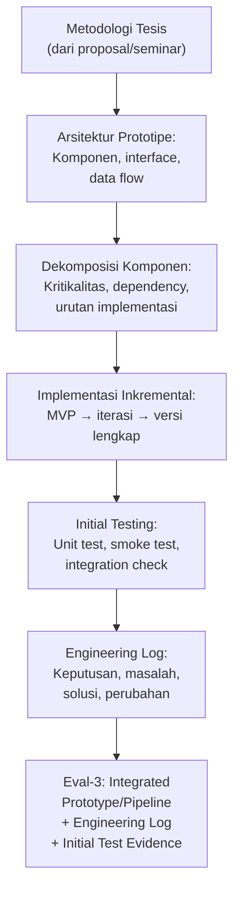

## 3. Pengantar Kontekstual

Prototipe penelitian berbeda dari produk software komersial: ia tidak perlu production-ready, tetapi harus cukup fungsional untuk menjawab pertanyaan penelitian secara valid. Prototipe yang terlalu minimal tidak dapat menghasilkan data yang valid; prototipe yang terlalu lengkap membuang waktu pada fitur yang tidak relevan untuk validasi klaim penelitian.

Engineering log dalam penelitian berfungsi seperti lab notebook dalam ilmu kimia atau biologi: ia mendokumentasikan setiap keputusan teknis penting, setiap masalah yang ditemukan, dan setiap solusi yang dicoba. Ini adalah artifact yang sama pentingnya dengan kode itu sendiri.

## 4. Landasan Teori

### 4.1 Arsitektur Prototipe Penelitian

**Prinsip arsitektur prototipe penelitian:**
1. *Modularity:* Pisahkan komponen agar dapat diuji secara independen dan diganti jika perlu
2. *Minimal viable prototype (MVP):* Implementasikan versi paling sederhana yang dapat menjawab pertanyaan penelitian, kemudian iterasi
3. *Traceability:* Setiap output harus dapat dilacak ke input dan langkah pemrosesan yang menghasilkannya
4. *Configurability:* Parameter yang mempengaruhi hasil harus mudah dikonfigurasi dan diubah untuk eksperimen

**Komponen umum prototipe dalam domain FDKS:**

| Domain | Komponen Input | Komponen Processing | Komponen Output |
|---|---|---|---|
| SIEM/ML | Log ingestor | Feature extractor + classifier | Alert generator + evaluator |
| Digital forensics | Evidence imager | Artifact extractor | Report generator |
| Malware analysis | Sample loader | Static/dynamic analyzer | Classification + IoC extractor |
| Cloud security | Policy reader | Compliance checker | Gap report generator |
| Network forensics | PCAP parser | Traffic analyzer | Anomaly reporter |

### 4.2 Dekomposisi Komponen dan Urutan Implementasi

**Langkah dekomposisi:**
1. Identifikasi semua komponen yang diperlukan
2. Definisikan interface antar komponen (input/output format)
3. Tentukan dependency: komponen mana yang harus selesai sebelum komponen lain bisa dimulai
4. Buat dependency graph
5. Tentukan urutan implementasi berdasarkan graph tersebut

**Kritikalitas komponen:**
- *High:* Komponen yang hasil penelitian bergantung padanya sepenuhnya
- *Medium:* Komponen yang berkontribusi signifikan tetapi memiliki alternatif
- *Low:* Komponen tambahan yang meningkatkan kualitas tetapi tidak esensial untuk MVP

### 4.3 Engineering Log

Engineering log mendokumentasikan "perjalanan" implementasi. Berbeda dari komentar kode, engineering log menangkap keputusan-keputusan yang tidak dapat dibaca dari kode:
- Mengapa pilihan A dibuat daripada pilihan B
- Masalah yang ditemukan dan solusi yang dicoba (termasuk yang gagal)
- Perubahan pada rancangan awal dan alasannya
- Waktu yang dihabiskan untuk setiap task (membantu estimasi future work)

**Format entri engineering log:**
```
Tanggal: YYYY-MM-DD
Durasi: X jam
Aktivitas: [deskripsi singkat]
Masalah ditemukan: [jika ada]
Solusi dicoba: [termasuk yang gagal]
Solusi berhasil: [yang akhirnya digunakan]
Keputusan desain: [perubahan dari rancangan awal, jika ada]
Next steps: [apa yang akan dilakukan selanjutnya]
```

## 5. Model atau Arsitektur

### 5.1 Pipeline Penelitian Generik (Adaptasi per Domain)

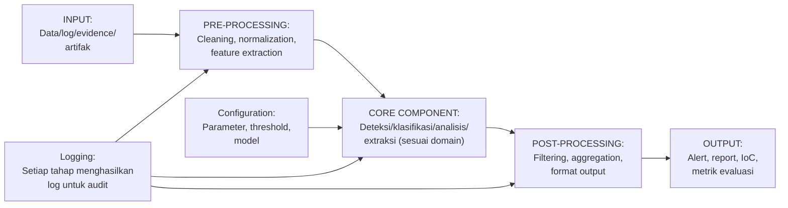

## 6. Contoh Terapan

### Studi Kasus: Implementasi Awal Pipeline Aditya (SIEM+ML APT Detection)

**Arsitektur komponen:**
1. *Log Parser:* Membaca CICIDS2017 CSV → normalized pandas DataFrame
2. *Feature Extractor:* Memilih 20 feature paling relevan untuk APT detection
3. *ML Classifier:* Random Forest dengan hyperparameter default
4. *Evaluator:* Menghitung F1, precision, recall, FPR

**Dependency graph:**
```
Log Parser → Feature Extractor → ML Classifier → Evaluator
(tidak ada dependency silang)
```

**Implementasi inkremental:**
- MVP (Week 5): Log parser berfungsi → dapat membaca CSV dan output DataFrame
- Iterasi 1 (Week 6): Feature extractor terintegrasi → dapat menghasilkan feature matrix
- Iterasi 2 (Week 7): ML classifier + evaluator → pipeline lengkap dengan hasil awal

**Engineering log entry (Week 5, hari ke-2):**
```
Tanggal: 2025-09-22
Durasi: 3 jam
Aktivitas: Implementasi log parser untuk CICIDS2017
Masalah ditemukan: Kolom ' Label' (dengan spasi di depan) menyebabkan KeyError
Solusi dicoba: df['Label'] → gagal; df[' Label'] → berhasil
Solusi berhasil: df.columns = df.columns.str.strip() untuk strip whitespace semua kolom
Keputusan desain: Tambahkan normalization step untuk column names di awal pipeline
Next steps: Implementasi feature extractor
```

## 7. Praktikum atau Aktivitas Terarah

### Aktivitas 5.1: Dekomposisi Komponen dan MVP Implementation Plan

**Tujuan:** Menerjemahkan metodologi tesis menjadi arsitektur prototipe yang implementable.

**Langkah kerja:**
1. Buat daftar semua komponen yang diperlukan dalam prototipe Anda.
2. Buat dependency graph antar komponen.
3. Klasifikasikan setiap komponen: High/Medium/Low criticality.
4. Tentukan scope MVP: komponen minimum yang dapat menghasilkan data valid untuk RQ utama.
5. Buat implementation plan dengan timeline: minggu berapa setiap komponen diselesaikan.
6. Buat template engineering log dan mulai mengisinya.

**Deliverable:** Implementation plan (akan diintegrasikan ke Eval-3).

**Catatan etika:** Jika implementasi memerlukan akses ke API eksternal (misalnya VirusTotal API), verifikasi bahwa terms of service mengizinkan penggunaan untuk penelitian akademik dan bahwa penggunaan Anda tidak melebihi rate limit yang melanggar ToS.

## 8. Latihan Pemahaman

**Soal 1:** Apa yang dimaksud dengan "Minimal Viable Prototype" (MVP) dalam konteks penelitian, dan mengapa pendekatan inkremental lebih baik dari membangun sistem lengkap sekaligus?

**Soal 2:** Mengapa keputusan yang tampak kecil (seperti "saya memilih pandas bukan polars") perlu dicatat dalam engineering log?

**Soal 3 (Analisis):** Seorang peneliti membangun prototipe yang bekerja sempurna untuk dataset yang digunakan saat development, tetapi gagal ketika dijalankan pada dataset yang sedikit berbeda formatnya. Apa ini menunjukkan tentang kualitas prototipe dan apa yang seharusnya dilakukan?

**Soal 4 (Perancangan):** Gambar dependency graph untuk prototipe dalam domain tesis Anda. Identifikasi komponen mana yang merupakan "single point of failure."

**Soal 5 (Evaluasi):** Engineering log seorang peneliti hanya berisi daftar langkah yang berhasil, tanpa mencatat masalah atau keputusan desain. Apa yang hilang dari log ini?

## 9. Latihan Terapan / Studi Kasus

**Studi Kasus 5.1:** Anda sedang mengimplementasikan komponen feature extraction dan menyadari bahwa dua cara yang berbeda menghasilkan feature set yang berbeda — satu berdasarkan paper A dan satu berdasarkan paper B. Keduanya tampak valid. Bagaimana Anda membuat keputusan, dan bagaimana Anda mendokumentasikan keputusan ini?

**Studi Kasus 5.2:** Setelah 3 minggu implementasi, Anda menyadari bahwa arsitektur awal yang Anda rancang perlu diubah secara signifikan karena satu asumsi teknis ternyata salah. Perubahan ini akan memakan waktu 2 minggu dan mengundur timeline. Bagaimana Anda mengelola dan mendokumentasikan situasi ini?

## 10. Kunci Jawaban dan Pembahasan

**Jawaban 1:** MVP adalah versi paling sederhana dari prototipe yang masih dapat menghasilkan data valid untuk menjawab RQ utama. Pendekatan inkremental lebih baik karena: (a) memungkinkan verifikasi awal bahwa pendekatan dasar bekerja; (b) mengidentifikasi masalah lebih awal sebelum terlalu banyak investasi waktu; (c) memungkinkan penyesuaian rancangan berdasarkan temuan di setiap iterasi; (d) menghasilkan deliverable yang terukur per milestone.

**Jawaban 2:** Keputusan yang tampak kecil sering memiliki implikasi besar untuk reproducibility dan validitas: pandas dan polars memiliki perbedaan dalam perilaku default untuk operasi tertentu yang bisa menghasilkan output yang berbeda. Jika seorang reviewer menggunakan polars untuk mereproduksi eksperimen, mereka mungkin mendapat hasil yang berbeda. Engineering log yang mencatat "dipilih pandas karena [alasan]" memberikan informasi ini.

**Jawaban 3:** Prototipe yang tidak robust terhadap variasi format input menunjukkan bahwa ia terlalu tightly-coupled ke karakteristik dataset tertentu. Ini adalah risiko validitas eksternal yang signifikan. Yang seharusnya dilakukan: tambahkan validation layer di input (cek format, handle edge cases); uji dengan beberapa variasi format; dokumentasikan asumsi tentang format input secara eksplisit.

**Jawaban 4:** *Panduan:* Single point of failure adalah komponen yang, jika gagal, membuat seluruh pipeline tidak dapat berjalan. Biasanya ini adalah komponen yang paling bergantung pada asumsi tentang format data atau behavior tool eksternal. Identifikasi dan buat contingency plan untuk komponen ini.

**Jawaban 5:** Log yang hanya mencatat keberhasilan tidak memberikan informasi tentang: alternatif yang dipertimbangkan (mengapa pilihan ini, bukan yang lain?); jalan buntu yang sudah dicoba (agar tidak dicoba lagi); evolusi desain (mengapa arsitektur berbeda dari rancangan awal?). Ini adalah log aktivitas, bukan engineering log yang sesungguhnya.

**Kunci 5.1:** Langkah keputusan: (a) Baca kedua paper secara kritis — manakah yang lebih relevan dengan konteks penelitian Anda? (b) Jika keduanya sama-sama relevan, lakukan eksperimen komparatif kecil dengan kedua pendekatan pada subset data; (c) Pilih berdasarkan hasil empiris, bukan preferensi arbitrer; (d) Dokumentasikan di engineering log: alternatif yang dipertimbangkan, eksperimen komparatif yang dilakukan, hasil, dan alasan keputusan akhir; (e) Sertakan juga sebagai entri di argumentation dossier untuk seminar berikutnya.

**Kunci 5.2:** (a) Dokumentasikan penemuan di engineering log: asumsi apa yang salah, bagaimana Anda mengetahuinya, dan apa implikasinya; (b) Revisi implementation plan dengan timeline baru; (c) Komunikasikan ke pembimbing dengan: deskripsi masalah, dampak timeline, solusi yang diusulkan; (d) Update risk register untuk mencantumkan "major architectural change required" sebagai risiko yang sudah terealisasi; (e) Pertimbangkan apakah perubahan ini mempengaruhi klaim kontribusi — jika ya, ini perlu dikomunikasikan ke seminar (VSFDKS13).

## 11. Ringkasan Bab

Implementasi prototipe penelitian dimulai dengan dekomposisi komponen dan dependency analysis, dilanjutkan dengan pendekatan inkremental dari MVP hingga versi lengkap. Engineering log mendokumentasikan keputusan, masalah, dan solusi sepanjang proses implementasi — ini adalah artifact penelitian yang sama pentingnya dengan kode. Initial testing memverifikasi bahwa komponen dasar berfungsi sebelum integrasi penuh.

## 12. Refleksi Profesional

1. Dalam pengembangan software keamanan siber, "security by design" mengharuskan komponen keamanan dipertimbangkan dari awal arsitektur, bukan ditambahkan belakangan. Bagaimana prinsip ini berlaku dalam perancangan prototipe penelitian Anda?

2. Engineering log yang baik memiliki nilai komersial: dalam banyak yurisdiksi, log keputusan teknis dapat digunakan sebagai bukti dalam sengketa IP atau klaim paten. Bagaimana prinsip ini relevan dengan dokumentasi penelitian Anda?

---

# BAB 6 — INTEGRASI KOMPONEN, INSTRUMENTATION, DAN AUTOMATION

## 1. Capaian Pembelajaran Bab

Setelah menyelesaikan bab ini, mahasiswa mampu:
- Mengintegrasikan komponen prototipe menjadi pipeline yang kohesif (Sub-CPMK.3, C3)
- Menerapkan instrumentation untuk menghasilkan log yang dapat diaudit (C4)
- Membuat automation script untuk memastikan eksperimen dapat diulang (C5)
- Mengelola konfigurasi eksperimen secara sistematis (C4)

## 2. Peta Konsep Bab

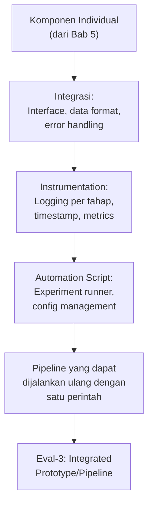

## 3. Pengantar Kontekstual

Integrasi adalah titik kritis dalam pengembangan prototipe: komponen yang berfungsi secara individual sering menunjukkan masalah yang tidak terduga ketika digabungkan. Interface mismatch, format data yang tidak kompatibel, dan asumsi yang berbeda antara komponen adalah sumber masalah yang paling umum.

Instrumentation — menambahkan logging ke setiap tahap pipeline — adalah praktik yang membedakan peneliti yang sistematis dari yang tidak: ketika hasil tidak sesuai ekspektasi, log yang baik memungkinkan debugging yang terarah daripada trial-and-error yang tidak efisien.

## 4. Landasan Teori

### 4.1 Prinsip Integrasi Komponen

**Interface design:** Setiap komponen harus memiliki interface yang terdefinisi dengan jelas:
- *Input:* Format data apa yang diterima, dalam struktur apa, dari sumber apa
- *Output:* Format data apa yang dihasilkan, dalam struktur apa, ke mana
- *Error handling:* Apa yang dilakukan jika input tidak sesuai atau proses gagal

**Format data:**
Pilih format yang: (a) human-readable untuk debugging (CSV, JSON, YAML — bukan binary); (b) machine-readable untuk processing; (c) self-documenting (header dalam CSV, keys dalam JSON); (d) versioned jika format dapat berubah.

**Integrasi inkremental:** Integrasikan dua komponen sekaligus, bukan semua sekaligus. Setelah setiap integrasi, jalankan test untuk memverifikasi bahwa output masih benar.

### 4.2 Instrumentation: Logging untuk Auditability

**Level logging:**
- *DEBUG:* Detail teknis untuk troubleshooting (dimatikan di production mode)
- *INFO:* Progress normal eksperimen (langkah apa yang sedang dijalankan)
- *WARNING:* Kondisi yang tidak normal tetapi tidak menghentikan eksperimen
- *ERROR:* Kondisi yang menyebabkan tahap tertentu gagal

**Apa yang harus dilog:**
- Timestamp setiap langkah dimulai dan selesai
- Input yang diterima (ukuran, format, hash jika memungkinkan)
- Output yang dihasilkan (ukuran, jumlah record, hash)
- Parameter konfigurasi yang digunakan
- Error messages lengkap jika terjadi kegagalan

**Python logging template:**
```python
import logging
import datetime

logging.basicConfig(
    level=logging.INFO,
    format='%(asctime)s - %(levelname)s - %(message)s',
    handlers=[
        logging.FileHandler(f'experiment_{datetime.date.today()}.log'),
        logging.StreamHandler()
    ]
)
logger = logging.getLogger(__name__)
```

### 4.3 Automation Script dan Configuration Management

**Mengapa automation script penting:**
- Memastikan setiap eksperimen dijalankan dengan parameter yang sama
- Memungkinkan menjalankan ulang eksperimen dengan satu perintah
- Mendokumentasikan urutan eksekusi secara implicit dalam kode

**Configuration management:**
Semua parameter yang mempengaruhi hasil eksperimen harus dikonfigurasi melalui file konfigurasi, bukan hardcoded dalam kode.

**Contoh config file (YAML):**
```yaml
experiment:
  name: "APT Detection - RF Baseline"
  seed: 42
  
data:
  input_path: "/data/processed/CICIDS2017_Monday_processed.csv"
  test_size: 0.2
  
model:
  type: "RandomForest"
  n_estimators: 100
  max_depth: 10
  
evaluation:
  metrics: ["f1", "precision", "recall", "fpr"]
  output_path: "/results/"
```

## 5. Model atau Arsitektur

### 5.1 Struktur Pipeline yang Terinstrumentasi

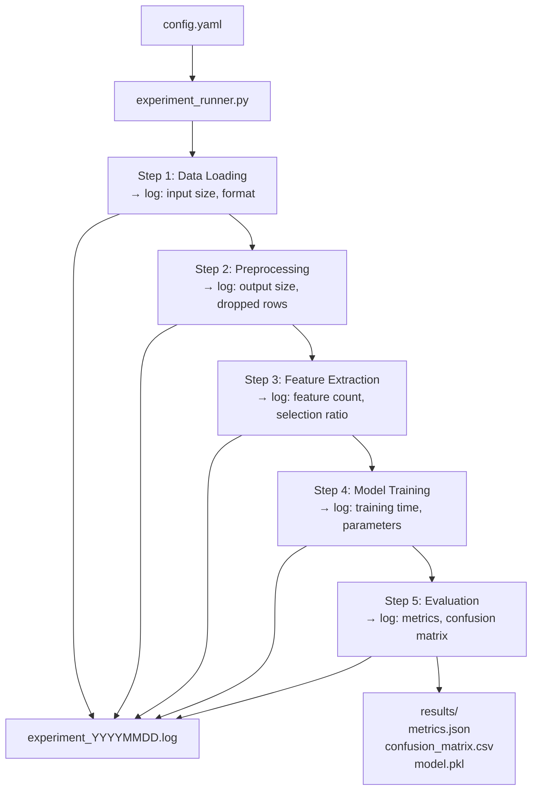

## 6. Contoh Terapan

### Studi Kasus: Integrasi Pipeline Dina (Malware Classification)

**Komponen yang diintegrasikan:**
1. Sample loader: mengambil file PE dari direktori sample
2. Static analyzer: mengekstrak fitur (imports, strings, entropy, sections)
3. YARA scanner: mencocokkan rule yang ada
4. Random Forest classifier: klasifikasi berdasarkan fitur statis
5. Report generator: menghasilkan JSON report per sample

**Masalah integrasi yang ditemukan (dicatat di engineering log):**
- Static analyzer menghasilkan DataFrame dengan index berbasis filename
- ML classifier mengharapkan DataFrame dengan index numerik
- Solusi: `df.reset_index(drop=True)` setelah merge

**Automation script (excerpt):**
```bash
#!/bin/bash
# run_experiment.sh
echo "Starting experiment: $(date)"
python src/experiment_runner.py \
  --config configs/baseline_rf.yaml \
  --log-level INFO \
  --output results/run_$(date +%Y%m%d_%H%M%S)/
echo "Experiment complete: $(date)"
```

## 7. Praktikum atau Aktivitas Terarah

### Aktivitas 6.1: Integrasi Pipeline dan Initial Testing

**Tujuan:** Mengintegrasikan komponen MVP menjadi pipeline yang dapat dieksekusi.

**Langkah kerja:**
1. Integrasikan komponen satu per satu, jalankan test setelah setiap integrasi.
2. Tambahkan logging di setiap tahap pipeline.
3. Buat file konfigurasi YAML/JSON untuk semua parameter eksperimen.
4. Buat script runner yang membaca konfigurasi dan menjalankan pipeline lengkap.
5. Jalankan pipeline pada subset kecil dari data (smoke test).
6. Catat semua masalah yang ditemukan di engineering log.

**Deliverable (bagian dari Eval-3):** Integrated prototype/pipeline dengan engineering log dan initial test evidence (log dari smoke test).

**Catatan etika:** Logging tidak boleh menyimpan data PII dalam log file — jika pipeline memproses data yang mengandung PII, pastikan logging hanya mencatat metadata (ukuran data, jumlah record) bukan konten.

## 8. Latihan Pemahaman

**Soal 1:** Apa perbedaan antara logging level DEBUG dan INFO, dan kapan masing-masing digunakan dalam konteks eksperimen penelitian?

**Soal 2 (Analisis):** Pipeline yang terotomasi menjalankan eksperimen yang sama setiap kali dengan parameter yang sama. Namun hasil eksperimen sedikit berbeda setiap dijalankan. Apa penyebab paling mungkin?

**Soal 3 (Perancangan):** Rancang file konfigurasi YAML untuk satu eksperimen dalam domain tesis Anda. Pastikan semua parameter yang mempengaruhi hasil ada dalam file konfigurasi.

**Soal 4 (Evaluasi):** Log eksperimen berikut: `[2025-09-22 14:30:01] Processing complete.` Apa yang kurang dari log entry ini?

**Soal 5:** Mengapa menggunakan hardcoded values (parameter langsung dalam kode) sangat berbahaya untuk reproducibility eksperimen?

## 9. Latihan Terapan / Studi Kasus

**Studi Kasus 6.1:** Setelah mengintegrasikan semua komponen pipeline, Anda menjalankan smoke test dan mendapat error: `FileNotFoundError: /data/processed/dataset.csv not found`. Anda yakin file tersebut ada. Apa yang harus Anda periksa, dan bagaimana Anda mendokumentasikan debugging process ini?

**Studi Kasus 6.2:** Anda menyadari bahwa pipeline Anda membutuhkan waktu 6 jam untuk menyelesaikan satu run penuh. Ini terlalu lama untuk iterasi penelitian yang efisien. Bagaimana Anda mengelola masalah performance ini tanpa mengorbankan validitas penelitian?

## 10. Kunci Jawaban dan Pembahasan

**Jawaban 1:** DEBUG: Detail teknis yang berguna untuk troubleshooting tetapi terlalu verbose untuk penggunaan normal — misalnya nilai setiap variabel dalam setiap iterasi loop. INFO: Progress normal eksperimen yang berguna untuk monitoring — misalnya "memulai training model" dan "training selesai dalam 142 detik." Dalam penelitian: gunakan INFO secara default; aktifkan DEBUG hanya saat troubleshooting masalah spesifik.

**Jawaban 2:** Penyebab paling mungkin: random seed tidak di-set atau tidak konsisten. Algoritma ML dengan komponen random (Random Forest, train-test split dengan shuffle) akan menghasilkan hasil yang sedikit berbeda setiap run jika seed tidak di-fix. Solusi: set `random_state` di semua fungsi scikit-learn dan `np.random.seed()` atau `torch.manual_seed()` di awal script. Penyebab lain: timestamp-based file naming yang mempengaruhi urutan processing.

**Jawaban 3:** *Panduan:* File konfigurasi yang baik mencakup semua parameter yang, jika diubah, akan menghasilkan hasil yang berbeda. Untuk ML: seed, test_size, model hyperparameters, feature selection threshold. Untuk forensik: tool version, analysis mode, output format. Jangan masukkan path yang machine-specific — gunakan relative path atau environment variable.

**Jawaban 4:** Yang kurang: apa yang diproses? berapa lama? berapa banyak record? apakah ada warning? tanpa informasi ini, log tidak berguna untuk debugging. Contoh yang lebih baik: `[2025-09-22 14:30:01] [INFO] Processing complete: 225,745 records processed in 142.3 seconds; 3 records skipped (missing values).`

**Jawaban 5:** Hardcoded values menyebabkan: (a) parameter tidak terdokumentasi secara eksplisit — reviewer harus membaca kode untuk menemukan nilai yang digunakan; (b) sulit diubah untuk eksperimen berbeda tanpa memodifikasi kode; (c) risiko menggunakan nilai yang "lupa" diubah antara eksperimen; (d) tidak ada "single source of truth" untuk konfigurasi. Konfigurasi eksplisit dalam file membuat semua parameter visible dan documented.

**Kunci 6.1:** Langkah debugging: (a) Verifikasi path absolut vs relatif — error sering terjadi karena script dijalankan dari direktori yang berbeda; (b) `ls /data/processed/` dari dalam environment untuk memverifikasi keberadaan file; (c) Periksa permission: apakah user yang menjalankan script memiliki akses read ke direktori? (d) Verifikasi bahwa data preprocessing step (dari pipeline sebelumnya) sudah dijalankan dan menghasilkan file tersebut. Dokumentasi di engineering log: tulis langkah debugging, setiap hal yang diperiksa, dan solusi yang ditemukan.

**Kunci 6.2:** Opsi manajemen performance: (a) Buat "small dataset mode" — subset 10% dari data untuk iterasi pengembangan cepat, dataset penuh hanya untuk final experiment; (b) Profiling: identifikasi bottleneck dengan `cProfile` atau `line_profiler` — sering ditemukan 80% waktu dihabiskan di 20% kode; (c) Caching: simpan hasil preprocessing yang mahal (bukan eksperimen inti) agar tidak perlu diulang; (d) Parallelisasi: gunakan `joblib.Parallel` untuk operasi yang dapat diparallelkan. *Catatan validitas:* Pastikan bahwa optimasi tidak mengubah hasil — verifikasi dengan menjalankan versi original dan optimized pada subset yang sama.

## 11. Ringkasan Bab

Integrasi komponen dilakukan secara inkremental — dua komponen sekaligus, dengan test setelah setiap integrasi. Instrumentation (logging terstruktur) menjadikan pipeline dapat diaudit dan memudahkan debugging. File konfigurasi memisahkan parameter dari kode, memastikan semua parameter eksperimen terdokumentasi secara eksplisit. Automation script memungkinkan reproducibility dengan satu perintah.

## 12. Refleksi Profesional

1. Dalam SIEM production environment, setiap log event harus memiliki timestamp yang akurat, source yang teridentifikasi, dan level severity — persis seperti logging yang baik dalam pipeline penelitian. Bagaimana praktik logging yang Anda bangun untuk eksperimen mempersiapkan Anda untuk bekerja dengan SIEM?

2. Dalam audit keamanan, automation script yang menghasilkan laporan yang reproducible sangat dihargai — laporan yang dihasilkan secara manual lebih rentan terhadap human error dan lebih sulit diaudit. Bagaimana prinsip automation dalam penelitian ini relevan untuk pekerjaan audit keamanan?

---

# BAB 7 — INITIAL TESTING, ENGINEERING LOG, DAN DEMO PARSIAL

## 1. Capaian Pembelajaran Bab

Setelah menyelesaikan bab ini, mahasiswa mampu:
- Merancang dan melaksanakan initial testing untuk memvalidasi fungsionalitas dasar prototipe (Sub-CPMK.3, C5)
- Menyusun engineering log yang lengkap dan dapat diaudit (C5)
- Mempersiapkan dan melaksanakan demo parsial kepada pembimbing (C6)
- Mengidentifikasi gap antara rancangan awal dan implementasi aktual (C5)

## 2. Peta Konsep Bab

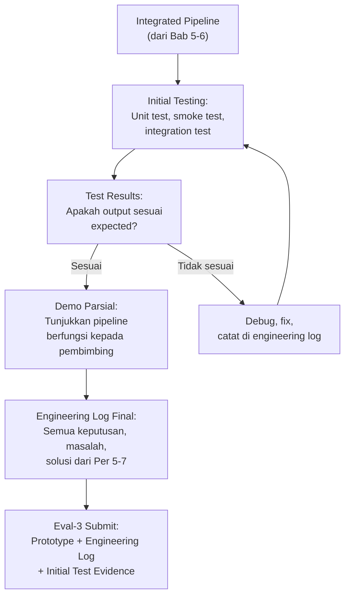

## 3. Pengantar Kontekstual

Initial testing bukan tentang membuktikan bahwa prototipe sempurna — ia tentang membuktikan bahwa prototipe cukup fungsional untuk mulai menghasilkan data yang bermakna. Perbedaan antara "fungsional" dan "sempurna" adalah perbedaan antara penelitian yang maju dan penelitian yang terhenti di fase pengembangan tanpa menghasilkan data.

Demo parsial kepada pembimbing adalah checkpoint formal: apakah arah teknis implementasi sudah benar? Apakah ada asumsi yang perlu direvisi sebelum melanjutkan ke fase akuisisi data yang lebih intensif?

## 4. Landasan Teori

### 4.1 Hierarki Testing untuk Prototipe Penelitian

**Unit test:** Menguji komponen individual secara isolasi
- Fokus: apakah fungsi/modul tertentu menghasilkan output yang benar untuk input yang diberikan?
- Contoh: apakah feature_extractor() menghasilkan 20 feature dari DataFrame yang diberikan?

**Smoke test:** Test minimal untuk memverifikasi bahwa pipeline tidak "crash"
- Fokus: apakah pipeline dapat dijalankan dari awal sampai akhir tanpa error fatal?
- Gunakan subset kecil data

**Integration test:** Verifikasi bahwa komponen bekerja dengan benar ketika digabungkan
- Fokus: apakah output dari komponen A sesuai dengan yang diharapkan oleh komponen B?

**Functional test:** Verifikasi bahwa pipeline menghasilkan output yang semantically benar
- Fokus: bukan hanya tidak error, tetapi apakah hasilnya masuk akal secara domain?
- Contoh: untuk malware classifier, apakah sampel EICAR (test string standar) diklasifikasikan sebagai malware?

### 4.2 Completeness vs. Correctness dalam Initial Testing

**Completeness:** Apakah semua path dalam pipeline dapat dieksekusi?  
**Correctness:** Apakah hasil yang dihasilkan secara semantically benar?

Untuk Eval-3, initial testing harus menunjukkan completeness (pipeline dapat berjalan dari awal sampai akhir) dan minimal correctness (output pada test data terlihat masuk akal). Correctness yang menyeluruh adalah fokus Eval-5 (validation report).

### 4.3 Demo Parsial: Struktur dan Tujuan

Demo parsial kepada pembimbing bertujuan:
1. Memverifikasi bahwa arah implementasi sesuai dengan yang direncanakan dalam proposal
2. Mendapatkan feedback teknis sebelum melanjutkan ke fase akuisisi data
3. Mengidentifikasi risiko yang belum terlihat dari dokumentasi saja

**Struktur demo parsial (30 menit):**
1. Perlihatkan arsitektur pipeline (5 menit) — gunakan diagram
2. Demonstrasi pipeline berjalan pada test data (15 menit)
3. Perlihatkan engineering log — tunjukkan bagaimana masalah diidentifikasi dan diselesaikan (5 menit)
4. Diskusi dan feedback (5 menit)

## 5. Model atau Arsitektur

### 5.1 Test Matrix untuk Initial Testing

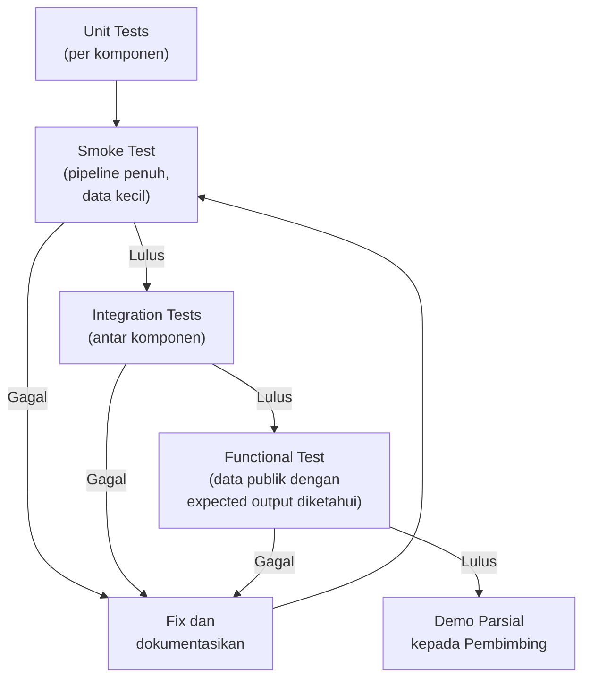

## 6. Contoh Terapan

### Studi Kasus: Initial Testing Edo (Anomaly Detection IoT)

**Unit test (excerpt):**
```python
def test_feature_extractor():
    """Test bahwa feature extractor menghasilkan 12 feature dari satu flow"""
    sample_flow = {"duration": 10.5, "bytes_in": 1024, "bytes_out": 512, ...}
    features = extract_features(sample_flow)
    assert len(features) == 12, f"Expected 12 features, got {len(features)}"
    assert all(isinstance(f, float) for f in features)

def test_anomaly_detector_known_normal():
    """Test bahwa traffic normal TIDAK di-flag sebagai anomali"""
    normal_flow = load_test_fixture("fixtures/normal_traffic.json")
    result = detect_anomaly(normal_flow, threshold=0.85)
    assert result['is_anomaly'] == False
```

**Smoke test result (dari log):**
```
[2025-10-01 09:15:33] [INFO] Starting smoke test with 100-record subset
[2025-10-01 09:15:33] [INFO] Data loading: 100 records loaded from test fixture
[2025-10-01 09:15:34] [INFO] Feature extraction: 100 records → 100 feature vectors (12 features each)
[2025-10-01 09:15:34] [INFO] Anomaly detection: 100 predictions completed
[2025-10-01 09:15:34] [INFO] Results: 7 anomalies detected (7.0% of test set)
[2025-10-01 09:15:34] [INFO] Smoke test PASSED. Pipeline functional.
```

**Engineering log summary (Per 5-7):**
Masalah yang ditemukan dan diselesaikan: 7 issues (3 integration issues, 2 performance issues, 2 data format issues). Keputusan desain yang berubah dari rencana awal: 2 (perubahan format output dari CSV ke JSON untuk better readability; perubahan threshold dari fixed ke configurable). Total waktu development: 18 jam.

## 7. Praktikum atau Aktivitas Terarah

### Aktivitas 7.1: Initial Testing dan Persiapan Demo

**Tujuan:** Memverifikasi bahwa pipeline fungsional dan menyiapkan demo untuk pembimbing.

**Langkah kerja:**
1. Tulis minimal 3 unit tests untuk komponen paling kritis dalam prototipe Anda.
2. Jalankan smoke test pada dataset kecil (100-500 records atau equivalent).
3. Jalankan functional test menggunakan data dengan expected output yang diketahui.
4. Buat ringkasan engineering log: berapa masalah yang ditemukan, berapa yang diselesaikan, berapa keputusan desain yang berubah.
5. Siapkan demo parsial: diagram arsitektur + demonstrasi live + engineering log ringkasan.

**Deliverable (Eval-3):** Integrated prototype/pipeline (kode di repository) + engineering log lengkap + initial test evidence (log dari testing) + demo ke pembimbing.

**Catatan:** Engineering log harus diisi setiap sesi kerja, bukan "dikonstruksi" setelah semua selesai. Pembimbing dan evaluator dapat melihat perbedaan antara log yang ditulis secara contemporaneous dan yang direkonstruksi.

## 8. Latihan Pemahaman

**Soal 1:** Apa perbedaan antara smoke test dan functional test? Mengapa keduanya diperlukan meskipun smoke test sudah lulus?

**Soal 2 (Analisis):** Unit test untuk fungsi `parse_log()` selalu lulus, tetapi smoke test selalu gagal di step ke-3. Apa implikasi dari pola ini?

**Soal 3 (Esai):** Mengapa engineering log yang ditulis secara real-time memiliki nilai lebih dari log yang dikonstruksi setelah fakta?

**Soal 4 (Perancangan):** Rancang satu functional test untuk prototipe Anda yang menggunakan data dengan expected output yang sudah diketahui (hint: gunakan dataset benchmark publik atau buat test fixture).

**Soal 5 (Evaluasi):** Engineering log seorang mahasiswa berisi 47 entri dalam 3 minggu pertama, kemudian tiba-tiba kosong selama 2 minggu. Apa yang mungkin terjadi dan apa implikasinya?

## 9. Latihan Terapan / Studi Kasus

**Studi Kasus 7.1:** Functional test Anda menunjukkan bahwa classifier mengklasifikasikan SEMUA sample sebagai "normal" — tidak ada yang dikategorikan sebagai anomali/malicious. Hasil ini berlawanan dengan expected. Bagaimana Anda mendekati debugging masalah ini?

**Studi Kasus 7.2:** Selama demo parsial, pembimbing menyarankan perubahan fundamental pada arsitektur yang akan membatalkan 2 minggu kerja Anda. Bagaimana Anda merespons secara profesional, dan apa yang Anda lakukan setelah demo?

## 10. Kunci Jawaban dan Pembahasan

**Jawaban 1:** Smoke test: pipeline tidak crash (completeness check). Functional test: pipeline menghasilkan output yang semantically benar (correctness check). Smoke test bisa lulus meskipun output salah — misalnya, pipeline menyelesaikan eksekusi tetapi mengklasifikasikan semua sample sebagai "normal" (yang mungkin salah). Functional test menggunakan data dengan expected output diketahui untuk mendeteksi kesalahan ini.

**Jawaban 2:** Pola ini menunjukkan masalah integrasi antara komponen 1-2 dan komponen 3 — bukan masalah dalam komponen individual. Unit test untuk `parse_log()` lulus berarti komponen itu sendiri berfungsi; kegagalan di smoke test step 3 berarti interface antara komponen 2 dan 3 bermasalah (format output komponen 2 tidak sesuai yang diharapkan komponen 3, atau ada dependency yang tidak tersedia di environment integrasi).

**Jawaban 3:** Log real-time menangkap: waktu sebenarnya yang dihabiskan untuk setiap task; masalah yang ditemukan dan dicoba (termasuk solusi yang gagal); pikiran dan keputusan yang dibuat pada saat itu, bukan rekonstruksi memori. Log yang dikonstruksi setelah fakta cenderung: menghilangkan detail negatif; merekonstruksi logika yang mungkin berbeda dari yang sebenarnya terjadi; memberikan narasi yang lebih rapi dari realitas. *Integritas ilmiah:* Log real-time adalah primary source; log rekonstruksi adalah secondary interpretation.

**Jawaban 4:** *Panduan:* Functional test yang baik menggunakan data yang hasilnya sudah diketahui dari sumber yang dapat diverifikasi. Contoh untuk forensik: file yang diketahui mengandung n deleted files → verify tool menemukan ≥ n-2. Contoh untuk ML: EICAR test string → classifier harus mendeteksi sebagai malicious.

**Jawaban 5:** Gap 2 minggu tanpa log entry kemungkinan menunjukkan: (a) peneliti tidak men-log aktivitas selama periode tersebut — kemudian mengkonstruksi log dari memori, yang meragukan; atau (b) peneliti mengalami hambatan signifikan (mungkin impasse yang tidak mau didokumentasikan); atau (c) peneliti tidak bekerja pada project selama periode tersebut. Implikasi untuk evaluasi: log yang tidak kontinu mempersulit verifikasi bahwa proses yang dilaporkan memang terjadi sebagaimana dideskripsikan.

**Kunci 7.1:** Debugging sistematis: (a) Periksa distribusi data — apakah kelas sangat imbalanced (misalnya 99% normal, 1% anomali)? (b) Periksa threshold — apakah threshold terlalu tinggi sehingga tidak ada yang melewati? (c) Periksa apakah classifier sudah ditraining sebelum prediction; (d) Periksa apakah label encoding benar — apakah "malicious" dienkode sebagai 0 atau 1?; (e) Jalankan dengan satu sample yang diketahui anomali secara manual dan trace melalui setiap langkah; (f) Dokumentasikan semua yang diperiksa di engineering log, termasuk yang tidak menghasilkan solusi.

**Kunci 7.2:** Respons profesional: (a) JANGAN defensif atau menyangkal saran — pembimbing memiliki pengalaman yang relevan; (b) Dengarkan dan catat saran secara detail; (c) Minta waktu untuk mengevaluasi implikasi teknis sebelum memberikan respons; (d) Setelah demo: analisis trade-off antara perubahan yang disarankan vs. melanjutkan dengan arsitektur saat ini; (e) Jika saran valid, implementasikan dan dokumentasikan sebagai "major architectural revision berdasarkan feedback pembimbing" di engineering log; (f) Dalam jangka panjang: 2 minggu yang "hilang" menjadi pembelajaran — artefak seperti kode yang tidak digunakan tetap memiliki nilai sebagai documentation of reasoning.

## 11. Ringkasan Bab

Initial testing mengikuti hierarki: unit test → smoke test → integration test → functional test. Eval-3 memerlukan bukti bahwa pipeline fungsional (dapat dijalankan dari awal sampai akhir) dan minimal correct (output masuk akal secara domain). Engineering log lengkap mendokumentasikan semua keputusan, masalah, dan solusi selama tiga minggu pengembangan. Demo parsial kepada pembimbing adalah checkpoint formal untuk verifikasi arah teknis.

## 12. Refleksi Profesional

1. Dalam konteks professional penetration testing, setiap langkah exploitasi harus diuji dalam lingkungan yang aman sebelum dijalankan pada target yang sebenarnya. Paralelisme apa yang Anda lihat antara "test environment → production environment" dalam pentest dan "test data → research data" dalam pipeline penelitian?

2. Demo parsial kepada pembimbing mirip dengan "sprint review" dalam metodologi agile: checkpoint reguler untuk memastikan bahwa arah pengembangan masih sesuai dengan kebutuhan. Bagaimana budaya feedback reguler ini berbeda dari pendekatan "kerjakan sampai selesai, baru tunjukkan" yang mungkin lebih natural?

---

---

# BAB 8 — AKUISISI DATA/LOG/EVIDENCE: PRINSIP DAN IMPLEMENTASI

## 1. Capaian Pembelajaran Bab

Setelah menyelesaikan bab ini, mahasiswa mampu:
- Menerapkan prinsip akuisisi data yang valid untuk domain tesis mereka (Sub-CPMK.4, C3)
- Merancang prosedur akuisisi yang menjamin integritas dan traceability (C6)
- Membedakan jenis akuisisi berdasarkan domain: ML dataset, forensic evidence, network traffic, log files (C4)
- Mendokumentasikan proses akuisisi dalam acquisition log yang terstandarisasi (C5)

## 2. Peta Konsep Bab

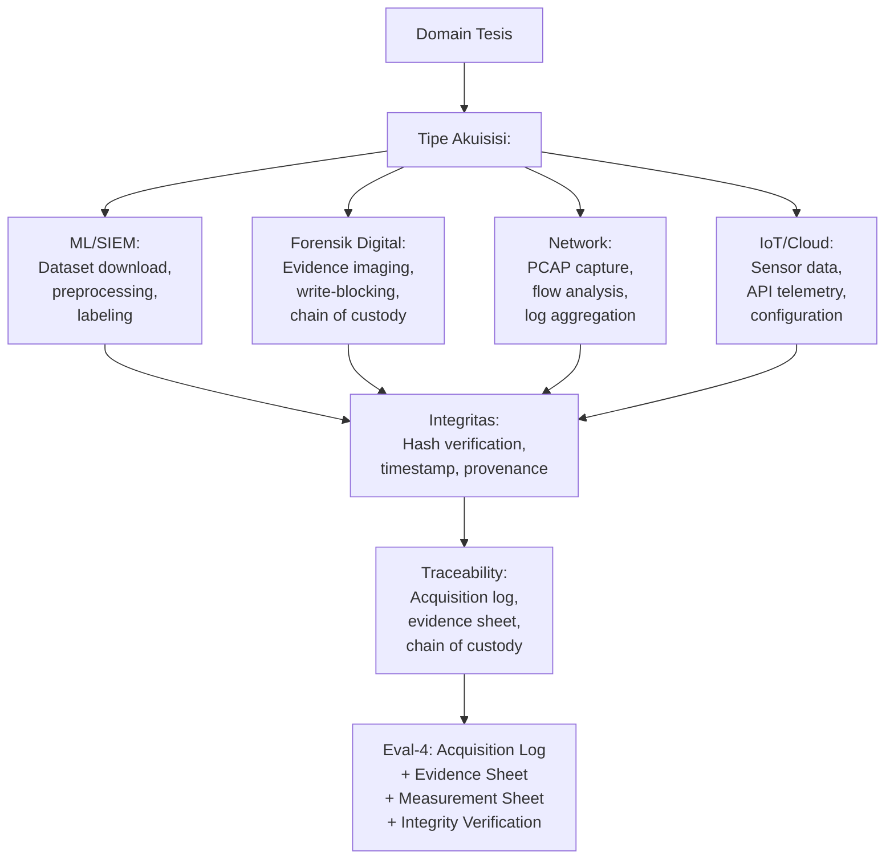

## 3. Pengantar Kontekstual

Kualitas data adalah batas atas kualitas penelitian: eksperimen dengan metodologi sempurna pada data yang buruk menghasilkan kesimpulan yang tidak valid. Proses akuisisi data yang buruk — tidak terdokumentasi, tidak diverifikasi integritasnya, atau dilakukan dengan cara yang mempengaruhi data — adalah sumber systematic bias yang sering tidak terdeteksi.

Dalam forensik digital profesional, akuisisi adalah fase yang paling kritis: sekali bukti digital terkontaminasi (dimodifikasi tanpa dokumentasi), ia bisa tidak dapat digunakan di pengadilan. Prinsip yang sama berlaku dalam penelitian: data yang akuisisinya tidak dapat diaudit memiliki validitas yang dipertanyakan.

## 4. Landasan Teori

### 4.1 Prinsip Umum Akuisisi Data Penelitian

**Prinsip 1: Reproducibility** — Prosedur akuisisi harus terdokumentasi sehingga dapat diulang dengan dataset yang setara.

**Prinsip 2: Integrity** — Data yang diperoleh tidak boleh dimodifikasi tanpa dokumentasi yang jelas. Setiap modifikasi (preprocessing, cleaning, sampling) harus dicatat.

**Prinsip 3: Provenance** — Asal-usul setiap data harus dapat dilacak: dari mana, kapan, oleh siapa, dengan metode apa.

**Prinsip 4: Completeness** — Data harus mencakup semua informasi yang diperlukan untuk menjawab RQ, tidak hanya yang menguntungkan hipotesis.

**Prinsip 5: Representativeness** — Apakah data yang diperoleh representatif untuk populasi yang diklaim? Bias dalam akuisisi menghasilkan bias dalam kesimpulan.

### 4.2 Akuisisi per Domain

**Domain ML/SIEM:**
- Download dari sumber terpercaya (Kaggle, UCI, repositori paper asli)
- Verifikasi hash setelah download
- Dokumentasikan versi dataset (sering ada multiple versions)
- Pisahkan raw data dari processed data — jangan overwrite raw
- Catat semua langkah preprocessing sebagai bagian dari protokol

**Domain Forensik Digital:**
- Akuisisi fisik: gunakan write-blocker hardware atau software
- Buat forensic image (dd, FTK Imager, Autopsy) — verifikasi dengan hash
- Chain of custody documentation (lihat NIST SP 800-86 dan ISO/IEC 27037)
- Simpan image di media terpisah dari evidence asli

**Domain Network Forensics:**
- Capture traffic dengan Wireshark/tcpdump dengan parameter yang terdokumentasi
- Dokumentasikan: interface, filter, duration, kondisi network
- Verifikasi completeness: apakah ada packet yang dropped?

**Domain IoT/Cloud:**
- Dokumentasikan API endpoint dan versi API yang digunakan
- Simpan raw response sebelum parsing
- Catat timestamp akuisisi dengan timezone

### 4.3 Hash Verification sebagai Integritas Primer

Hash cryptographic (SHA-256 minimum, bukan MD5 untuk keamanan) adalah mekanisme utama untuk membuktikan bahwa data tidak berubah antara akuisisi dan analisis.

**Workflow hash verification:**
1. Hitung hash segera setelah akuisisi: `sha256sum dataset.zip`
2. Simpan hash di acquisition log
3. Sebelum setiap analisis, verifikasi hash: bandingkan dengan nilai yang tersimpan
4. Jika hash berbeda → data telah berubah → investigasi sebelum melanjutkan

**Python hash verification:**
```python
import hashlib

def compute_sha256(filepath):
    sha256 = hashlib.sha256()
    with open(filepath, 'rb') as f:
        for chunk in iter(lambda: f.read(65536), b''):
            sha256.update(chunk)
    return sha256.hexdigest()

# Saat akuisisi
hash_on_acquisition = compute_sha256('dataset.zip')
print(f"Hash on acquisition: {hash_on_acquisition}")

# Sebelum analisis
hash_before_analysis = compute_sha256('dataset.zip')
assert hash_on_acquisition == hash_before_analysis, "Data integrity violation!"
```

### 4.4 Acquisition Log

Acquisition log mendokumentasikan setiap sumber data yang diperoleh:

| Field | Isian |
|---|---|
| ID Akuisisi | ACQ-001 |
| Tanggal akuisisi | YYYY-MM-DD HH:MM:SS TZ |
| Sumber | URL/lokasi/identitas sistem asal |
| Jenis data | Dataset/log/PCAP/disk image/dll. |
| Versi/tanggal sumber | Versi dataset atau tanggal publikasi |
| Ukuran | [jumlah file] × [ukuran total] |
| Hash SHA-256 | [hash dari file yang diperoleh] |
| Metode akuisisi | Download/capture/imaging/API |
| Izin/lisensi | URL terms/lisensi yang berlaku |
| Preprocessing applied | Deskripsi perubahan yang diterapkan (jika ada) |
| Operator | Nama peneliti |
| Catatan | Masalah atau anomali yang ditemukan |

## 5. Model atau Arsitektur

### 5.1 Alur Akuisisi dan Dokumentasi

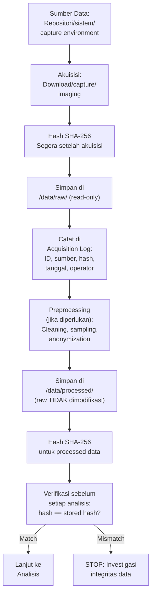

## 6. Contoh Terapan

### Studi Kasus: Acquisition Log Aditya (CICIDS2017)

**Entry acquisition log:**

| Field | Nilai |
|---|---|
| ID Akuisisi | ACQ-001 |
| Tanggal | 2025-10-06 09:30:22 WIB |
| Sumber | https://www.unb.ca/cic/datasets/ids-2017.html |
| Jenis data | Network traffic dataset (CSV) |
| Versi | CICIDS2017 v1.0 (released 2017-09) |
| File diperoleh | Monday-WorkingHours.pcap_ISCX.csv (200MB) |
| Hash SHA-256 | 8a4c1b3d... (64 char) |
| Lisensi | Academic research, attribution required |
| Preprocessing | None at this stage |
| Operator | Aditya Pratama |
| Catatan | Kolom header mengandung leading space — diperlukan strip() saat loading |

**Dataset card (ringkasan):**
- Nama: CICIDS2017 Monday-WorkingHours
- Records: 225,745 flows
- Features: 79 columns (termasuk label)
- Class distribution: Benign (225,745 — 100% untuk Monday file)
- Known issues: Beberapa kolom mengandung Infinity values yang perlu dihandle

## 7. Praktikum atau Aktivitas Terarah

### Aktivitas 8.1: Akuisisi Data dan Pengisian Acquisition Log

**Tujuan:** Mengakuisisi dataset/evidence yang diperlukan untuk eksperimen dan mendokumentasikan proses secara lengkap.

**Langkah kerja:**
1. Identifikasi semua sumber data yang diperlukan untuk eksperimen.
2. Untuk setiap sumber: lakukan akuisisi, hitung SHA-256 segera, catat di acquisition log.
3. Simpan semua raw data di direktori `/data/raw/` dengan permission read-only (`chmod 444`).
4. Jika preprocessing diperlukan, lakukan pada copy di `/data/processed/`, jangan modifikasi raw.
5. Verifikasi integritas: jalankan hash verification script setelah preprocessing.
6. Isi acquisition log untuk setiap sumber data.

**Deliverable (bagian dari Eval-4):** Acquisition log yang terisi lengkap + integrity verification script + dataset/evidence sheet.

**Catatan etika dan legal:** Verifikasi lisensi setiap dataset sebelum menggunakannya. Jika dataset mengandung PII, terapkan anonymization sebelum menyimpan di /data/processed/.

## 8. Latihan Pemahaman

**Soal 1 (Pilihan Ganda):** Mengapa raw data harus disimpan terpisah dari processed data dan tidak pernah dimodifikasi?
a. Untuk menghemat storage dengan tidak duplikasi data
b. Agar preprocessing dapat diulang dan verifikasi bahwa processed data berasal dari raw yang tidak terkontaminasi
c. Karena raw data biasanya lebih kecil dari processed data
d. Untuk memenuhi persyaratan program studi

**Soal 2 (Esai):** Jelaskan bagaimana "representativeness" dataset mempengaruhi validitas klaim penelitian. Berikan contoh bias akuisisi yang umum dalam penelitian keamanan siber.

**Soal 3 (Analisis):** Seorang peneliti mengdownload dataset network traffic dan langsung melakukan preprocessing tanpa menghitung hash terlebih dahulu. Tiga minggu kemudian, ia mendownload file yang sama dari sumber yang sama dan hash-nya berbeda. Apa yang dapat ia simpulkan dan apa yang tidak dapat ia simpulkan?

**Soal 4 (Perancangan):** Rancang acquisition log untuk satu sumber data dalam penelitian Anda. Sertakan semua field yang diperlukan dan isi dengan nilai yang relevan.

**Soal 5 (Evaluasi):** Dataset yang digunakan dalam penelitian SIEM anomaly detection berisi 99% traffic normal dan 1% traffic anomali. Evaluasi dampak class imbalance ini terhadap validitas klaim bahwa model "mencapai accuracy 99%."

## 9. Latihan Terapan / Studi Kasus

**Studi Kasus 8.1:** Anda menggunakan dataset dari paper sebelumnya yang menjadi baseline perbandingan. Paper tersebut tidak menyertakan hash dataset dan link downloadnya sudah tidak aktif. Anda menemukan dataset dengan nama yang sama di GitHub oleh kontributor yang mengklaim "mengarsipkan" dataset tersebut. Bagaimana Anda memverifikasi bahwa dataset ini identik dengan yang digunakan di paper asli?

**Studi Kasus 8.2:** Selama akuisisi data dari testbed IoT, Anda menyadari bahwa sensor Anda mungkin telah merekam data selama periode dimana ada "legitimate anomaly" (peralatan yang sengaja dimatikan untuk pemeliharaan). Apakah Anda menghapus data periode tersebut? Bagaimana Anda mendokumentasikan keputusan ini?

## 10. Kunci Jawaban dan Pembahasan

**Jawaban 1:** **B.** Raw data yang tidak pernah dimodifikasi memungkinkan: (a) siapapun dapat melakukan preprocessing dari awal dan mendapatkan hasil yang sama; (b) dapat memverifikasi bahwa processed data berasal dari raw yang tidak terkontaminasi; (c) jika ditemukan masalah dalam preprocessing, dapat diperbaiki tanpa kehilangan data asli. *Analogi forensik:* Dalam forensik digital, original evidence tidak boleh dimodifikasi — analisis dilakukan pada forensic copy.

**Jawaban 2:** Representativeness: dataset yang tidak representatif menghasilkan model yang hanya bekerja pada kondisi yang terwakili dalam data training. Contoh bias akuisisi umum dalam keamanan siber: (a) temporal bias — dataset hanya dari satu periode waktu, tidak menangkap evolusi ancaman; (b) geographic bias — traffic dari satu negara mungkin tidak representatif untuk network Indonesia; (c) selection bias — dataset berisi hanya malware yang "sudah diketahui," tidak menangkap zero-day behavior; (d) confirmation bias — peneliti memilih data yang mendukung hipotesis.

**Jawaban 3:** Yang dapat disimpulkan: file yang didownload kedua berbeda dari file yang pertama — entah karena (a) sumber dataset diupdate/diperbaiki; (b) error unduhan; (c) sumber yang berbeda meskipun URL sama. Yang TIDAK dapat disimpulkan tanpa hash awal: tidak dapat membuktikan bahwa file pertama adalah "original" yang benar — karena tidak ada baseline untuk dibandingkan. Pelajaran: selalu hitung hash SEGERA setelah download, bukan nanti.

**Jawaban 4:** *Panduan:* Acquisition log yang baik mengisi semua field secara faktual. Jika lisensi tidak jelas, catat "License: Under verification" dan tunda penggunaan hingga lisensi dikonfirmasi.

**Jawaban 5:** Accuracy 99% pada dataset dengan 99% normal adalah metric yang misleading: model yang memprediksi SEMUA data sebagai normal pun akan mencapai 99% accuracy. Ini adalah masalah class imbalance. Metric yang lebih tepat: F1-score (harmonic mean precision-recall), precision-recall curve, atau Matthews Correlation Coefficient (MCC). Klaim accuracy 99% tanpa menyebutkan class distribution adalah penyajian hasil yang tidak lengkap dan berpotensi menyesatkan.

**Kunci 8.1:** (a) Hubungi penulis paper asli dan minta konfirmasi bahwa GitHub repository tersebut berisi dataset yang benar; (b) Periksa apakah paper asli menyebutkan karakteristik dataset (ukuran, jumlah record, distribusi kelas) dan verifikasi bahwa dataset yang ditemukan memiliki karakteristik yang sama; (c) Jika tidak ada konfirmasi, dokumentasikan ketidakpastian ini sebagai limitation dalam validation report; (d) Pertimbangkan menggunakan dataset alternatif yang dapat diverifikasi. *Prinsip:* Ketidakpastian tentang provenance data adalah ketidakpastian tentang validitas perbandingan.

**Kunci 8.2:** Keputusan ini harus berdasarkan RQ penelitian: (a) Jika penelitian tentang "deteksi anomali dalam kondisi operasional normal," data pemeliharaan dapat menjadi noise yang merusak — remove dengan dokumentasi yang jelas; (b) Jika penelitian tentang "deteksi semua jenis anomali termasuk maintenance," data ini adalah valid dan harus disimpan; (c) Dokumentasi wajib: catat di acquisition log: tanggal/waktu periode pemeliharaan, alasan dihapus/dipertahankan, referensi ke maintenance record yang membuktikan bahwa itu memang pemeliharaan. Menghapus data TANPA dokumentasi adalah manipulasi data; menghapus dengan dokumentasi dan justifikasi yang kuat adalah keputusan metodologis yang valid.

## 11. Ringkasan Bab

Akuisisi data yang valid memerlukan: reproducible procedure, integrity verification (SHA-256), provenance documentation, dan representativeness assessment. Raw data tidak boleh dimodifikasi — preprocessing dilakukan pada copy. Acquisition log mendokumentasikan setiap sumber data dengan semua metadata yang diperlukan untuk auditability. Hash verification sebelum setiap analisis membuktikan integritas data.

## 12. Refleksi Profesional

1. Dalam forensik digital professional, chain of custody yang terdokumentasi adalah persyaratan legal — tanpa itu, bukti dapat ditolak oleh pengadilan. Bagaimana prinsip acquisition log dalam penelitian ini mencerminkan dan berbeda dari chain of custody dalam investigasi forensik profesional?

2. Privacy researchers sering menghadapi dilema: dataset yang paling informatif untuk penelitian sering mengandung data privasi yang paling sensitif. Bagaimana Anda menyeimbangkan kebutuhan data yang representatif dengan kewajiban etika dan legal terkait privasi?

---

# BAB 9 — METADATA, PROVENANCE, TRACEABILITY, DAN INTEGRITY

## 1. Capaian Pembelajaran Bab

Setelah menyelesaikan bab ini, mahasiswa mampu:
- Merancang sistem metadata yang komprehensif untuk semua artefak penelitian (Sub-CPMK.4, C6)
- Menerapkan data provenance tracking sepanjang pipeline eksperimen (C3)
- Memastikan traceability dari setiap output ke input dan proses yang menghasilkannya (C4)
- Melakukan integrity verification secara sistematis di semua tahap (C3)

## 2. Peta Konsep Bab

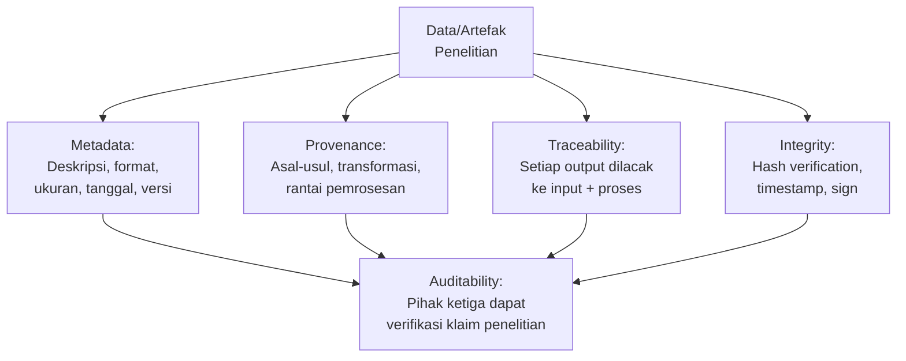

## 3. Pengantar Kontekstual

Jika seseorang membaca laporan penelitian Anda dan bertanya: "Dari mana angka ini berasal?" — dapatkah Anda menjawab dengan menunjukkan rantai yang tidak terputus dari raw data → preprocessing → feature extraction → model → output → angka tersebut? Inilah yang dimaksud dengan traceability.

Dalam era reproducibility crisis di ilmu pengetahuan (di mana sebagian besar studi tidak dapat direproduksi), kemampuan menyediakan rantai provenance yang lengkap adalah pembeda antara penelitian yang dapat dipercaya dan yang tidak.

## 4. Landasan Teori

### 4.1 Metadata untuk Artefak Penelitian

Setiap artefak dalam penelitian (file data, model, hasil eksperimen, laporan) harus memiliki metadata yang mendokumentasikan:

**Dataset card (untuk dataset):**
- Nama dan versi
- Sumber dan tanggal akuisisi
- Ukuran (jumlah record, jumlah feature)
- Distribusi kelas (jika berlaku)
- Known issues dan limitasi
- Lisensi dan atribusi
- Preprocessing yang sudah diterapkan
- Hash SHA-256

**Model card (untuk model ML):**
- Arsitektur dan hyperparameter
- Dataset training (reference ke dataset card)
- Metrics pada training set dan test set
- Known limitations dan intended use
- Tanggal training dan versi library

**Evidence sheet (untuk artefak forensik):**
- Identifier unik
- Deskripsi fisik atau digital
- Sumber
- Hash dan metode akuisisi
- Chain of custody

### 4.2 Data Provenance

Provenance adalah rekaman lengkap tentang asal-usul dan transformasi data. Sistem provenance yang baik menjawab: "Data ini berasal dari mana, dan apa yang terjadi padanya dari sumber hingga sini?"

**Tingkatan provenance:**
1. *Source provenance:* Dari mana data asli berasal
2. *Transformation provenance:* Setiap transformasi yang diterapkan (cleaning, normalization, sampling)
3. *Derivation provenance:* Bagaimana satu artefak diturunkan dari artefak lain

**Implementasi sederhana — provenance JSON:**
```json
{
  "artifact_id": "features_monday_v2",
  "created_at": "2025-10-15T14:30:00+07:00",
  "derived_from": ["raw_cicids_monday_v1"],
  "transformations": [
    {"step": 1, "operation": "strip_column_whitespace", "script": "preprocess.py", "version": "1.2"},
    {"step": 2, "operation": "drop_infinity_values", "script": "preprocess.py", "version": "1.2"},
    {"step": 3, "operation": "normalize_features", "method": "StandardScaler", "parameters": {"with_mean": true, "with_std": true}}
  ],
  "output_hash_sha256": "f3b1c2d4...",
  "operator": "aditya.pratama"
}
```

### 4.3 Traceability Matrix

Traceability matrix memetakan hubungan antara:
- Setiap klaim dalam laporan penelitian
- Dengan artefak (data, kode, log) yang mendukungnya

| Klaim | Artefak Pendukung | Lokasi | Hash/Versi |
|---|---|---|---|
| "F1 = 0.87 pada test set" | metrics.json, run_20251020_143022/ | /results/ | sha256: abc... |
| "Dataset memiliki 225,745 records" | acquisition_log.xlsx, entry ACQ-001 | /docs/ | N/A |
| "Preprocessing menggunakan StandardScaler" | preprocess.py, config.yaml | /src/, /configs/ | git tag: v1.2 |

## 5. Model atau Arsitektur

### 5.1 Rantai Traceability dalam Pipeline

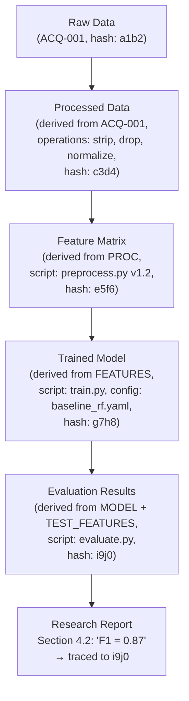

## 6. Contoh Terapan

### Studi Kasus: Dataset Card Bella (Android Forensics)

```markdown
## Dataset Card: DFRWS 2005 Mobile Forensics Challenge

**Dataset Name:** DFRWS 2005 Mobile Forensics Challenge
**Version:** 2005-release
**Source:** https://www.dfrws.org/dfrws-forensic-challenge/
**Acquisition Date:** 2025-10-08 10:15:00 WIB
**Acquired By:** Bella Andriani

**Description:**  
Disk image dari perangkat mobile (Nokia phone) yang digunakan dalam DFRWS forensic challenge 2005. Berisi artefak SMS, call log, dan foto.

**Size:** 1 file × 64MB
**Format:** .dd (raw disk image)
**SHA-256:** 7a8b9c0d...

**Known Issues:** Format perangkat lama; beberapa tool modern memerlukan konversi format.

**License:** Public use for academic research (stated on DFRWS website)

**Intended Use in This Research:** Validasi metode ekstraksi artefak pada format disk image mobile legacy; bukan representasi perangkat modern.

**Limitations:** Dataset dari 2005 — tidak merepresentasikan Android modern. Digunakan hanya untuk validasi metode ekstraksi, bukan sebagai evaluasi performa pada perangkat modern.
```

## 7. Praktikum atau Aktivitas Terarah

### Aktivitas 9.1: Menyusun Dataset Card dan Traceability Matrix

**Tujuan:** Mendokumentasikan metadata dan provenance untuk semua artefak penelitian.

**Langkah kerja:**
1. Buat dataset card untuk setiap dataset yang digunakan.
2. Implementasikan provenance JSON sederhana untuk pipeline Anda — setiap output artefak harus memiliki file `.provenance.json` yang mendokumentasikan dari mana ia berasal.
3. Buat traceability matrix yang memetakan setiap klaim yang Anda rencanakan dalam laporan ke artefak yang mendukungnya.
4. Verifikasi integritas semua artefak dengan script hash verification.

**Deliverable (bagian dari Eval-4):** Dataset card untuk setiap dataset + provenance JSON untuk pipeline + traceability matrix draft.

## 8. Latihan Pemahaman

**Soal 1 (Esai):** Apa yang dimaksud dengan "data provenance" dan mengapa ia penting untuk reproducibility penelitian?

**Soal 2 (Analisis):** Seorang reviewer meminta Anda untuk membuktikan bahwa angka "F1 = 0.87" dalam laporan Anda benar. Tunjukkan langkah-langkah dalam rantai traceability yang harus Anda ikuti.

**Soal 3 (Perancangan):** Buat dataset card untuk dataset utama dalam penelitian Anda.

**Soal 4 (Evaluasi):** Sebuah penelitian mengklaim "dataset kami berisi 50.000 sampel malware yang representatif." Evaluasi klaim "representatif" ini — apa informasi yang diperlukan untuk memverifikasinya?

**Soal 5:** Mengapa timestamp timezone-aware lebih penting dari timestamp tanpa timezone dalam dokumentasi akuisisi data?

## 9. Latihan Terapan / Studi Kasus

**Studi Kasus 9.1:** Anda menemukan bahwa dua versi laporan Anda mengklaim angka F1 yang berbeda (0.87 vs 0.89) tetapi tidak ada komentar yang menjelaskan perubahan ini. Menggunakan traceability matrix, jelaskan bagaimana Anda menginvestigasi sumber perbedaan ini.

**Studi Kasus 9.2:** Rekan Anda ingin menggunakan dataset yang sama yang Anda gunakan tetapi tidak memiliki dataset card dari Anda. Apa informasi minimum yang harus Anda berikan agar ia dapat mengakuisisi dan menggunakan dataset yang identik?

## 10. Kunci Jawaban dan Pembahasan

**Jawaban 1:** Data provenance adalah rekaman lengkap tentang asal-usul data dan setiap transformasi yang diterapkan sejak sumber hingga output akhir. Penting untuk reproducibility karena: tanpa provenance, tidak ada cara untuk memverifikasi bahwa dua peneliti yang "menggunakan dataset yang sama" benar-benar memulai dari data yang identik; tidak ada cara membuktikan bahwa transformation yang diterapkan tidak mengintroduksi bias; tidak ada cara menelusuri sumber perbedaan antara dua eksperimen yang seharusnya identik.

**Jawaban 2:** Rantai traceability: (a) Temukan entry di results/ yang berisi F1 = 0.87 → identifikasi run ID dan timestamp; (b) Temukan config.yaml yang digunakan pada run tersebut → identifikasi dataset, model, dan parameter; (c) Verifikasi hash dataset yang digunakan sesuai dengan yang di acquisition log; (d) Jalankan ulang evaluate.py dengan config yang sama → hasil harus menghasilkan F1 yang sama (dalam toleransi floating-point); (e) Jika hasil tidak sama → investigasi mengapa (seed? versi library?).

**Jawaban 3:** *Panduan:* Dataset card harus mencakup semua field: nama, versi, sumber, tanggal akuisisi, ukuran, distribusi kelas, known issues, lisensi, intended use, limitations, dan SHA-256. Informasi yang tidak tersedia dicatat sebagai "Not available" dengan penjelasan mengapa.

**Jawaban 4:** Untuk memverifikasi "representatif": (a) Representatif terhadap apa? (keluarga malware tertentu? periode waktu tertentu? platform tertentu?); (b) Apa distribusi kelas dalam 50.000 sampel? (keseimbangan antar keluarga?); (c) Dari sumber apa? (VirusTotal? honeypot? incident response?); (d) Dalam periode kapan? (apakah mencakup varian terbaru?); (e) Apakah ada overlap dengan dataset test? Tanpa informasi ini, klaim "representatif" tidak dapat diverifikasi.

**Jawaban 5:** Timestamp tanpa timezone ambigu: "2025-10-08 14:30:00" — apakah ini WIB (UTC+7), UTC, atau EST? Jika data diakuisisi di Indonesia dan dianalisis oleh kolaborator di Eropa, timestamp yang sama bisa diinterpretasikan berbeda 7 jam. Ini dapat menyebabkan masalah ketika mengkorelasikan event dari berbagai sumber. Gunakan selalu ISO 8601 dengan timezone: `2025-10-08T14:30:00+07:00`.

**Kunci 9.1:** Investigasi via traceability: (a) Identifikasi dua versi laporan dan timestamp masing-masing; (b) Temukan results/ dari masing-masing versi berdasarkan tanggal laporan; (c) Periksa config.yaml yang digunakan pada kedua run — apakah parameter berbeda?; (d) Periksa versi dataset yang digunakan — apakah hash sama?; (e) Periksa versi kode (git commit) yang digunakan; (f) Penyebab umum: test_size yang berbeda, random_seed yang berbeda, atau dataset versi yang berbeda.

**Kunci 9.2:** Informasi minimum yang diperlukan: (a) URL sumber dataset; (b) SHA-256 hash dari file yang diunduh; (c) Versi/tanggal dataset (jika ada multiple versions); (d) Langkah preprocessing yang diterapkan (sebaiknya berikan script); (e) Lisensi dataset. Tanpa hash, tidak ada cara membuktikan bahwa dataset identik meskipun dari URL yang sama.

## 11. Ringkasan Bab

Metadata, provenance, dan traceability bersama-sama membentuk infrastruktur auditability penelitian. Dataset card mendokumentasikan asal-usul dan karakteristik data. Provenance JSON melacak transformasi data dari sumber ke output. Traceability matrix menghubungkan klaim laporan ke artefak yang mendukungnya. Hash verification membuktikan integritas artefak di setiap tahap.

## 12. Refleksi Profesional

1. Dalam investigasi forensik digital, admissibility bukti bergantung sebagian besar pada kemampuan menunjukkan bahwa bukti tidak dimodifikasi sejak pengambilan. Bagaimana prinsip hash verification dan provenance tracking yang Anda pelajari di bab ini relevan dengan admissibility standar dalam hukum Indonesia?

2. Dalam era AI/ML yang berkembang pesat, "model card" telah menjadi praktik standar untuk mendokumentasikan model ML sebelum deployment. Bagaimana keterampilan menyusun dataset card dan model card yang Anda pelajari di sini mempersiapkan Anda untuk tanggung jawab profesional dalam AI governance?

---

# BAB 10 — MEASUREMENT DESIGN, ACQUISITION LOG, DAN EVIDENCE SHEET

## 1. Capaian Pembelajaran Bab

Setelah menyelesaikan bab ini, mahasiswa mampu:
- Merancang measurement design yang sesuai dengan RQ dan kontribusi yang diklaim (Sub-CPMK.4, C6)
- Melengkapi acquisition log dengan semua informasi yang diperlukan (C3)
- Menyusun evidence sheet untuk setiap artefak penting (C5)
- Mengintegrasikan semua dokumentasi akuisisi menjadi Eval-4 yang koheren (C5)

## 2. Peta Konsep Bab

```mermaid
flowchart TD
    RQ["Research Questions\n& Contribution Claims"] --> MEAS["Measurement Design:\nApa yang diukur?\nBagaimana diukur?\nDengan apa?"]
    MEAS --> METRIC["Metric Selection:\nF1, Precision, Recall\natau waktu, akurasi,\ncoverage dll."]
    METRIC --> INSTRU["Instrumentation:\nBagaimana mengukur\nsetiap metric?"]
    INSTRU --> ACQUIS["Akuisisi Measurement:\nData dari instrumen"]
    ACQUIS --> ACQLOG["Acquisition Log:\nLengkap, terverifikasi"]
    ACQUIS --> EVSHEET["Evidence Sheet:\nPer artefak penting"]
    ACQLOG & EVSHEET --> EVAL4["Eval-4: Complete\nAcquisition Package"]
```

## 3. Pengantar Kontekstual

Measurement design adalah jembatan antara klaim kontribusi penelitian dan data yang dikumpulkan. Pertanyaan kritis: "Apakah yang kita ukur benar-benar mengukur apa yang kita klaim?" Ini adalah masalah construct validity — salah satu ancaman validitas terbesar dalam penelitian eksperimental.

Misalnya: jika klaim Anda adalah "sistem kami meningkatkan kecepatan respons insiden," tetapi Anda mengukur "waktu deteksi alert" — apakah keduanya sama? Mungkin tidak: waktu respons insiden mencakup deteksi, triase, eskalasi, dan respons, sementara Anda hanya mengukur satu komponen.

## 4. Landasan Teori

### 4.1 Prinsip Measurement Design

**Alignment antara klaim dan metric:**
Setiap metric yang Anda ukur harus secara langsung mendukung atau menentang klaim kontribusi penelitian. Jika tidak ada klaim yang bergantung pada suatu metric, mengapa mengukurnya?

**Operationalization:** Cara mengubah konsep abstrak menjadi measurement yang konkret.
- Konsep: "kualitas deteksi"
- Operationalization: F1-score pada test set dengan class weighting balanced
- Justifikasi: F1 memperhitungkan keduanya precision dan recall; balanced weighting karena class imbalance

**Reliability vs. Validity:**
- *Reliability:* Apakah pengukuran menghasilkan nilai yang konsisten jika diulang? (reproducibility)
- *Validity:* Apakah pengukuran mengukur apa yang diklaim? (construct validity)
- *Penting:* Measurement bisa reliable tetapi tidak valid (mengukur sesuatu secara konsisten, tetapi bukan yang dimaksud)

### 4.2 Metric Common dalam Domain FDKS

| Domain | Metric Umum | Catatan |
|---|---|---|
| ML/SIEM detection | Precision, Recall, F1, FPR, AUC-ROC | Selalu laporkan per-class, bukan hanya aggregate |
| Performance | Throughput, latency, CPU/memory usage | Ukur dalam kondisi yang terdefinisi (beban apa?) |
| Forensik digital | Coverage (% artefak terdeteksi), time-to-acquire, evidence integrity | Bandingkan dengan tool referensi |
| Compliance | % control implemented, # gap identified | Definisikan scoring rubrik yang jelas |
| Network security | Detection rate, false alarm rate, evasion rate | Tentukan attack vector yang diuji |

### 4.3 Evidence Sheet untuk Artefak Penelitian

Evidence sheet adalah dokumentasi terstruktur untuk artefak penting dalam penelitian — bukan hanya data, tetapi juga model, konfigurasi, dan hasil eksperimen.

**Template evidence sheet:**

| Field | Isian |
|---|---|
| Evidence ID | EVD-001 |
| Nama artefak | trained_model_rf_baseline_v1.pkl |
| Tipe | Trained ML model |
| Tanggal dibuat | 2025-10-20 16:45:00 WIB |
| Dibuat oleh | Proses: train.py v1.3 dengan config baseline_rf.yaml |
| Input yang digunakan | features_monday_processed_v2.csv (hash: e5f6...) |
| Parameter | n_estimators=100, max_depth=10, random_state=42 |
| Output metrics | F1=0.87, Precision=0.89, Recall=0.85 pada test set |
| Hash SHA-256 | g7h8... |
| Lokasi penyimpanan | /models/rf_baseline_v1/ |
| Dependency | scikit-learn 1.3.0, Python 3.11.5 |
| Notes | Versi baseline sebelum hyperparameter tuning |

## 5. Model atau Arsitektur

### 5.1 Measurement Framework

```mermaid
flowchart TD
    CLAIM["Contribution Claim:\n'Model mendeteksi APT tactic\ndengan F1 ≥ 0.85'"] --> QUESTION["Measurement Question:\nBerapa F1 pada test set\nuntuk setiap APT tactic class?"]
    QUESTION --> CONSTRUCT["Operationalization:\nF1 = 2×(P×R)/(P+R)\ndihitung per class dengan\nmicro/macro averaging"]
    CONSTRUCT --> INSTRUMENT["Instrumen:\nsklearn.metrics.f1_score\n(average='weighted')"]
    INSTRUMENT --> COLLECT["Koleksi:\nJalankan evaluate.py\npada test set"]
    COLLECT --> RESULT["Hasil:\nF1_class1=0.91, F1_class2=0.83...\nF1_weighted=0.87"]
    RESULT --> COMPARE["Bandingkan dengan\ncriteria: ≥ 0.85"]
    COMPARE -->|"0.87 ≥ 0.85 ✓"| SUPPORT["Supports claim"]
    COMPARE -->|"< 0.85"| REFUTE["Does not support claim\n→ revisi penelitian"]
```

## 6. Contoh Terapan

### Studi Kasus: Measurement Design Aditya (SIEM APT Detection)

**Measurement framework:**

| Contribution Claim | Metric | Operationalization | Instrument | Acceptance Threshold |
|---|---|---|---|---|
| "Mendeteksi APT tactic dengan akurasi tinggi" | F1-score per class | weighted F1 pada stratified test set 20% | sklearn.metrics.f1_score | ≥ 0.85 |
| "False positive rate rendah" | FPR | FP/(FP+TN) pada benign-only subset | Manual calculation | ≤ 0.10 |
| "Lebih baik dari rule-based baseline" | Delta F1 | F1(model) − F1(baseline) | Comparison script | > 0.05 |

## 7. Praktikum atau Aktivitas Terarah

### Aktivitas 10.1: Menyusun Measurement Design dan Melengkapi Eval-4

**Tujuan:** Menyelesaikan seluruh paket dokumentasi akuisisi untuk diserahkan sebagai Eval-4.

**Langkah kerja:**
1. Susun measurement design table: untuk setiap klaim kontribusi, definisikan metric, operationalization, instrumen, dan acceptance threshold.
2. Lengkapi acquisition log untuk semua sumber data yang sudah diperoleh.
3. Buat evidence sheet untuk setiap artefak penting (dataset, model, konfigurasi).
4. Jalankan integrity verification script dan simpan hasilnya.
5. Kompilasi semua dokumen menjadi Eval-4 submission package.

**Deliverable (Eval-4):** Acquisition log + dataset card(s) + evidence sheet(s) + measurement design + integrity verification report.

## 8. Latihan Pemahaman

**Soal 1 (Pilihan Ganda):** Apa yang dimaksud dengan "construct validity" dalam konteks measurement design?
a. Apakah structure kode sudah benar?
b. Apakah metric yang digunakan benar-benar mengukur konsep yang diklaim?
c. Apakah konstanta dalam kode tidak ada error?
d. Apakah konstruksi arsitektur sistem sudah valid?

**Soal 2 (Esai):** Jelaskan perbedaan antara reliability dan validity dalam konteks measurement penelitian. Berikan contoh measurement yang reliable tetapi tidak valid dalam domain keamanan siber.

**Soal 3 (Analisis):** Sebuah penelitian mengklaim mengukur "keamanan sistem." Metric yang digunakan adalah "jumlah vulnerability yang ditemukan oleh scanner." Evaluasi construct validity dari measurement ini.

**Soal 4 (Perancangan):** Susun measurement design table untuk tiga klaim kontribusi dalam penelitian Anda.

**Soal 5 (Evaluasi):** Evidence sheet untuk model ML tidak menyertakan versi scikit-learn yang digunakan. Apa risiko dari kelalaian ini?

## 9. Latihan Terapan / Studi Kasus

**Studi Kasus 10.1:** Anda sedang mengukur "detection rate" model Anda dan mendapatkan 95%. Namun, Anda menyadari bahwa 80% dari test set adalah kelas yang sama. Evaluasi apakah angka 95% ini merupakan bukti yang valid untuk klaim "model deteksi yang efektif."

**Studi Kasus 10.2:** Penelitian Anda ingin mengklaim bahwa "tool forensik X lebih cepat 40% dari tool Y." Rancang measurement design yang memungkinkan klaim ini dibuktikan atau dibantah secara valid dan reproducible.

## 10. Kunci Jawaban dan Pembahasan

**Jawaban 1:** **B.** Construct validity adalah pertanyaan tentang apakah metric yang digunakan benar-benar mengukur konsep yang diklaim dalam penelitian — bukan tentang kode atau arsitektur. Ini adalah salah satu dimensi validitas yang paling sering diabaikan dalam penelitian teknis.

**Jawaban 2:** Reliability: konsistensi pengukuran — dijalankan dua kali dengan kondisi sama → hasil sama. Validity: ketepatan — apakah mengukur apa yang dimaksud? Contoh: mengukur waktu respons terhadap alert SIEM adalah reliable (dapat diulang dengan konsisten) tetapi mungkin tidak valid sebagai ukuran "keamanan sistem" karena mengabaikan false positive rate, coverage, dan banyak faktor lain yang mempengaruhi keamanan sesungguhnya.

**Jawaban 3:** "Jumlah vulnerability yang ditemukan oleh scanner" memiliki construct validity yang terbatas untuk "keamanan sistem" karena: (a) scanner memiliki coverage terbatas — banyak vulnerability yang tidak dapat dideteksi scanner; (b) jumlah vulnerability tidak mempertimbangkan severity — 100 low-severity lebih baik dari 1 critical; (c) "keamanan" adalah konsep multidimensional yang mencakup availability, confidentiality, integrity — bukan hanya vulnerability count; (d) scanner yang berbeda akan menghasilkan jumlah yang berbeda. Metric yang lebih valid: CVSS score weighted sum, atau specific risk score dari control framework.

**Jawaban 4:** *Panduan:* Setiap klaim harus memiliki metric yang secara langsung dapat dikaitkan dengan klaim tersebut. Jika tidak bisa menjelaskan "bagaimana metric X membuktikan atau membantah klaim Y," maka hubungan tersebut lemah.

**Jawaban 5:** Risiko: scikit-learn mengubah default parameter dan behavior antar versi (misalnya `n_jobs` default, handling dari `class_weight`). Tanpa versi yang spesifik, tidak ada jaminan bahwa model yang di-load akan berperilaku sama jika digunakan dengan versi scikit-learn yang berbeda. Ini dapat menyebabkan prediction yang berbeda bahkan dengan model yang sama.

**Kunci 10.1:** 95% detection rate dengan 80% mayoritas kelas adalah misleading. Jika model memprediksi semua sebagai kelas mayoritas, detection rate untuk kelas mayoritas = 100%, tapi untuk kelas minoritas = 0%. Aggregate detection rate 95% tidak membedakan ini. Analisis yang valid: per-class detection rate + confusion matrix + F1 per class. Klaim "model deteksi yang efektif" hanya valid jika detection rate tinggi untuk SEMUA kelas yang relevan.

**Kunci 10.2:** Measurement design untuk klaim kecepatan: (a) Define eksplisit: "kecepatan" = waktu wall-clock dari input ke output completion untuk task yang identik; (b) Kontrol: hardware yang sama, input yang sama, kondisi load yang sama (tidak ada proses lain berjalan intensif); (c) Repeated measurements: minimal 10 run untuk setiap tool; ambil median, bukan hanya rata-rata; (d) Statistical test: apakah perbedaan signifikan secara statistik (Mann-Whitney U test)? (e) Reproducibility: dokumentasikan semua parameter yang mempengaruhi timing.

## 11. Ringkasan Bab

Measurement design menerjemahkan klaim kontribusi penelitian menjadi pengukuran yang konkret dan dapat diverifikasi. Construct validity adalah pertanyaan kritis: apakah metric yang dipilih benar-benar mengukur konsep yang diklaim? Acquisition log yang lengkap, evidence sheet per artefak, dan measurement design bersama-sama membentuk Eval-4 yang membuktikan bahwa data dan pengukuran dapat diaudit.

## 12. Refleksi Profesional

1. Dalam audit keamanan, setiap temuan harus didukung oleh evidence yang dapat diverifikasi. Bagaimana keterampilan menyusun evidence sheet dan measurement design yang Anda pelajari di bab ini mempersiapkan Anda untuk menyusun laporan audit yang dapat dipertahankan?

2. Ketika sebuah perusahaan mengklaim "sistem keamanan kami mendeteksi 99% ancaman," apa yang akan Anda pertanyakan sebagai profesional keamanan siber yang memahami measurement validity? Bagaimana Anda memverifikasi klaim tersebut?

---

---

# BAB 11 — VALIDASI TEKNIS: METRIK, BASELINE, DAN BENCHMARKING

## 1. Capaian Pembelajaran Bab

Setelah menyelesaikan bab ini, mahasiswa mampu:
- Melaksanakan validasi teknis prototipe menggunakan metrik yang pre-defined (Sub-CPMK.5, C5)
- Membandingkan hasil dengan baseline yang relevan secara metodologis kuat (C5)
- Melakukan benchmarking yang fair dan dapat direproduksi (C5)
- Menginterpretasikan hasil validasi dalam konteks klaim penelitian (C5)

## 2. Peta Konsep Bab

```mermaid
flowchart TD
    RESULTS["Hasil Eksperimen\nAwal"] --> METRICS["Kalkulasi Metrik:\nSesuai measurement design"]
    METRICS --> BASELINE["Baseline Comparison:\nApakah lebih baik dari\npendekatan sebelumnya?"]
    BASELINE --> BENCHMARK["Benchmarking:\nPerbandingan fair dengan\nalternatif yang relevan"]
    BENCHMARK --> INTERPRET["Interpretasi:\nApakah klaim kontribusi\ndidukung oleh hasil?"]
    INTERPRET -->|Ya| DOCUMENT["Dokumentasikan:\nvalidation report"]
    INTERPRET -->|Tidak| REVISE["Revisi prototipe\natau scope klaim"]
    REVISE --> METRICS
```

## 3. Pengantar Kontekstual

Validasi teknis adalah momen kebenaran dalam penelitian eksperimental: apakah yang Anda bangun benar-benar bekerja seperti yang diklaim? Hasil yang tidak mendukung hipotesis bukan kegagalan penelitian — ia adalah temuan penelitian yang valid jika didokumentasikan dengan benar.

Yang merupakan kegagalan adalah: menyembunyikan hasil negatif, memilih subset data yang menguntungkan tanpa disclosure, atau mengubah acceptance criteria setelah melihat hasil. Standar integritas ilmiah menuntut bahwa semua hasil — positif maupun negatif — dilaporkan secara transparan.

## 4. Landasan Teori

### 4.1 Baseline Comparison

**Apa itu baseline:**
Baseline adalah pendekatan yang sudah ada sebelumnya yang menjadi titik perbandingan. Tanpa baseline, tidak ada cara mengetahui apakah pendekatan baru lebih baik, sama, atau lebih buruk.

**Jenis baseline:**
- *Zero-baseline:* "Tidak melakukan apa-apa" — berguna untuk menunjukkan bahwa masalah memang ada
- *Rule-based baseline:* Pendekatan manual atau heuristik yang sudah ada
- *Prior work baseline:* Metode dari penelitian sebelumnya yang relevan
- *State-of-the-art baseline:* Metode terbaik yang ada sekarang

**Fairness dalam baseline comparison:**
- Gunakan dataset dan kondisi yang identik untuk semua metode yang dibandingkan
- Jangan tuning hyperparameter pendekatan Anda sambil menggunakan default untuk baseline
- Laporkan implementasi baseline secara transparan

### 4.2 Interpretasi Hasil Validasi

**Framework interpretasi:**
1. Apakah acceptance criteria terpenuhi? (pre-defined, bukan post-hoc)
2. Apakah perbedaan dari baseline signifikan secara statistik?
3. Apakah perbedaan signifikan secara praktis (bukan hanya statistik)?
4. Apakah ada alternative explanation untuk hasil yang diamati?

**Statistical significance vs. practical significance:**
- p < 0.05 hanya berarti "perbedaan tidak mungkin terjadi karena chance" — tidak berarti perbedaan itu besar atau bermakna secara praktis.
- Effect size (Cohen's d, Hedges' g) mengukur besarnya perbedaan.
- Untuk ML: perbedaan F1 0.01 mungkin tidak praktis; perbedaan 0.10 mungkin signifikan praktis dalam konteks tertentu.

### 4.3 Benchmarking yang Fair

**Panduan benchmarking:**
1. Tentukan benchmark set sebelum eksperimen (bukan setelah melihat hasil mana yang menguntungkan)
2. Gunakan dataset yang sama untuk semua yang dibandingkan
3. Jika hyperparameter tuning dilakukan untuk metode Anda, lakukan juga untuk baseline (atau gunakan setting yang dilaporkan dalam paper asli baseline)
4. Laporkan variance/standard deviation dari multiple runs, bukan hanya single run
5. Jika ada randomness, jalankan multiple runs dengan seeds yang berbeda

## 5. Model atau Arsitektur

### 5.1 Validation Workflow

```mermaid
flowchart TD
    PREDEF["Pre-defined Criteria\n(dari validation plan)"] --> RUN["Jalankan eksperimen\npada test set"]
    RUN --> CALC["Kalkulasi metrik:\nF1, Precision, Recall,\natau domain-specific"]
    CALC --> BASELINE_COMP["Bandingkan dengan\nbaseline(s)"]
    BASELINE_COMP --> STAT["Statistical test:\nMann-Whitney / t-test /\nMcNemar (sesuai data)"]
    STAT --> PRACTICAL["Practical significance:\nEffect size, domain\nrelevance"]
    PRACTICAL --> CRITERIA["Bandingkan dengan\nacceptance criteria"]
    CRITERIA -->|"Memenuhi"| PASS["Klaim didukung —\ndokumentasikan"]
    CRITERIA -->|"Tidak memenuhi"| FAIL["Klaim tidak didukung —\nlaporkan jujur,\nrevisi jika perlu"]
```

## 6. Contoh Terapan

### Studi Kasus: Validation Report Summary — Aditya (APT Detection)

**Hasil eksperimen:**

| Metric | Model RF | Baseline (Rule-only) | Delta | Acceptance Threshold | Status |
|---|---|---|---|---|---|
| F1-weighted | 0.872 | 0.743 | +0.129 | ≥ 0.85 | **PASS** |
| FPR | 0.087 | 0.142 | −0.055 | ≤ 0.10 | **PASS** |
| Delta F1 vs baseline | 0.129 | N/A | N/A | > 0.05 | **PASS** |

**Statistical test:** Mann-Whitney U test untuk F1 scores dari 10 runs (seeds berbeda): U=82, p=0.002 → signifikan secara statistik.

**Interpretasi:** Model RF mencapai semua acceptance criteria yang pre-defined. Peningkatan 12.9% F1 dibandingkan rule-only baseline signifikan secara statistik dan praktis (dalam domain SOC, pengurangan false positive rate 5.5% setara dengan sekitar 55 false alert per 1000 event — saving analyst time yang signifikan).

**Limitations yang dilaporkan:** (a) Testing hanya pada CICIDS2017 Monday dataset — generalizability ke dataset lain belum divalidasi; (b) Model belum diuji dalam kondisi adversarial (evasion attack); (c) Latency model tidak diukur — belum diketahui apakah feasible untuk real-time deployment.

## 7. Praktikum atau Aktivitas Terarah

### Aktivitas 11.1: Validasi Teknis dan Penyusunan Validation Report Awal

**Tujuan:** Melaksanakan validasi teknis dan mendokumentasikan hasilnya secara objektif.

**Langkah kerja:**
1. Jalankan eksperimen validasi menggunakan measurement design dari Eval-4.
2. Kalkulasi semua metrik yang pre-defined.
3. Bandingkan dengan baseline yang relevan.
4. Lakukan statistical significance test jika applicable.
5. Bandingkan hasil dengan acceptance criteria dari validation plan.
6. Tulis validation report awal: hasil, interpretasi, dan kesenjangan dengan acceptance criteria.

**Deliverable (bagian dari Eval-5):** Validation report awal dengan tabel metrik, baseline comparison, dan interpretasi.

**Catatan integritas:** Laporkan semua hasil, termasuk yang tidak memenuhi acceptance criteria. Jangan pilih-pilih subset yang menguntungkan tanpa disclosure yang transparan.

## 8. Latihan Pemahaman

**Soal 1 (Esai):** Mengapa mendefinisikan acceptance criteria SEBELUM melihat hasil adalah prinsip integritas ilmiah yang fundamental?

**Soal 2 (Analisis):** Model Anda mencapai F1 = 0.85, dan baseline mencapai F1 = 0.84. Perbedaan ini statistically significant (p=0.03). Apakah ini cukup untuk mengklaim bahwa model Anda "lebih baik secara signifikan"? Jelaskan.

**Soal 3 (Perancangan):** Rancang perbandingan baseline yang fair untuk penelitian Anda. Apa yang Anda akan bandingkan, dan bagaimana memastikan perbandingan tersebut fair?

**Soal 4 (Evaluasi):** Sebuah paper mengklaim "sistem kami 50% lebih cepat" tetapi hanya melaporkan satu run tanpa variance. Apa masalahnya dan bagaimana evaluasinya?

**Soal 5:** Apa perbedaan antara "tidak memenuhi acceptance criteria" dan "hasil negatif"? Mengapa keduanya memiliki nilai ilmiah?

## 9. Latihan Terapan / Studi Kasus

**Studi Kasus 11.1:** Setelah validasi, Anda menemukan bahwa model Anda mencapai F1 = 0.82 — lebih rendah dari acceptance criteria 0.85. Anda menyadari bahwa jika Anda hanya mengambil 3 dari 5 kelas dalam evaluasi, F1 = 0.91. Apakah melaporkan F1 = 0.91 (hanya untuk 3 kelas) valid? Apa yang seharusnya dilaporkan?

**Studi Kasus 11.2:** Baseline comparison Anda menunjukkan bahwa pendekatan Anda hampir identik dengan state-of-the-art yang sudah ada — hanya lebih baik 1.2% F1. Bagaimana Anda mengevaluasi apakah ini masih merupakan kontribusi penelitian yang valid?

## 10. Kunci Jawaban dan Pembahasan

**Jawaban 1:** Mendefinisikan acceptance criteria sebelum melihat hasil mencegah HARKing dan p-hacking. Jika criteria ditetapkan setelah melihat hasil, ada risiko memilih criteria yang "pas" dengan hasil yang menguntungkan — ini adalah manipulasi yang merusak integritas ilmiah. Pre-defined criteria juga memberikan transparansi kepada reviewer: mereka dapat mengevaluasi apakah criteria yang diset reasonable sebelum melihat apakah terpenuhi.

**Jawaban 2:** Perbedaan 0.01 meskipun p=0.03 tidak otomatis "signifikan secara bermakna." Analisis yang diperlukan: (a) Effect size: Cohen's d atau delta/pooled SD — jika sangat kecil, perbedaan mungkin tidak bermakna praktis; (b) Confidence interval untuk perbedaan — apakah CI mencakup 0? (c) Domain relevance: dalam konteks SOC, apakah perbedaan 0.01 F1 menghasilkan perbedaan bermakna dalam jumlah false alarm? Kesimpulan yang valid: "Model RF mengungguli baseline secara statistik (p=0.03) dengan peningkatan F1 sebesar 0.01 — namun signifikansi praktis dari perbedaan kecil ini masih perlu dievaluasi lebih lanjut dalam konteks deployment."

**Jawaban 3:** *Panduan:* Baseline yang fair menggunakan dataset identik, kondisi hardware identik, dan jika ada hyperparameter tuning untuk pendekatan baru, harus ada equivalently fair tuning untuk baseline (atau gunakan hyperparameter yang dilaporkan di paper asli baseline). Jelaskan pilihan baseline secara eksplisit: mengapa ini yang paling relevan?

**Jawaban 4:** Masalah: single run tidak memberikan informasi tentang variance. Perbedaan "50% lebih cepat" mungkin hanya terjadi pada kondisi spesifik itu saja. Yang diperlukan: multiple runs (minimal 10), mean ± standard deviation, dan statistical test. Jika variance tinggi, klaim "50% lebih cepat" tidak dapat dipertahankan.

**Jawaban 5:** "Tidak memenuhi acceptance criteria" berarti pendekatan tidak mencapai target yang ditetapkan — ini adalah informasi yang valid tentang batas kemampuan pendekatan. "Hasil negatif" secara umum berarti eksperimen tidak mendukung hipotesis awal. Keduanya memiliki nilai ilmiah karena: (a) mencegah peneliti lain menghabiskan waktu pada pendekatan yang sama; (b) berkontribusi pada pemahaman komunitas tentang batas kemampuan teknik; (c) menunjukkan integritas ilmiah peneliti.

**Kunci 11.1:** Melaporkan hanya F1 = 0.91 untuk 3 kelas tanpa disclosure adalah research misconduct (selective reporting). Yang seharusnya dilaporkan: (a) F1 keseluruhan = 0.82 (tidak memenuhi criteria 0.85); (b) Per-class F1: 3 kelas dengan rata-rata 0.91, 2 kelas dengan performa lebih rendah; (c) Analisis mengapa 2 kelas performa rendah; (d) Diskusi apakah scope penelitian perlu direvisi untuk fokus pada 3 kelas yang berhasil, dengan justifikasi yang transparan. Revisi scope setelah melihat hasil valid JIKA: (a) transparently disclosed; (b) ada justifikasi yang independen dari hasil (bukan hanya "karena angkanya lebih baik").

**Kunci 11.2:** Perbedaan 1.2% perlu dievaluasi dari multiple sudut: (a) Apakah perbedaan ini statistally significant? (b) Apakah ada dimensi kontribusi lain selain akurasi? (misalnya: lebih cepat, lebih interpreable, lebih efisien komputasi, lebih applicable ke konteks Indonesia); (c) Apakah kontribusi terletak pada adaptasi ke domain baru (misalnya: konteks regulasi Indonesia) bukan pada peningkatan akurasi? (d) Dalam penelitian terapan, novelty bisa terletak pada framework, proses, atau implementasi — bukan hanya pada angka metrik. Jika satu-satunya kontribusi adalah 1.2% F1 tanpa dimension lain, ini memang perlu dievaluasi dengan jujur bersama pembimbing.

## 11. Ringkasan Bab

Validasi teknis yang valid memerlukan: acceptance criteria pre-defined, baseline yang fair, statistical significance testing, dan interpretasi yang mempertimbangkan practical significance. Hasil yang tidak memenuhi acceptance criteria harus dilaporkan secara transparan — bukan disembunyikan atau dimanipulasi. Selective reporting adalah bentuk research misconduct yang merusak kepercayaan komunitas ilmiah.

## 12. Refleksi Profesional

1. Dalam security audit, menemukan bahwa "sistem lebih aman dari tahun lalu" tidak cukup jika tidak ada baseline yang jelas. Bagaimana prinsip baseline comparison yang Anda pelajari di sini relevan dengan praktik benchmark keamanan dalam audit?

2. Publikasi yang hanya melaporkan hasil positif (publication bias) adalah masalah serius dalam ilmu pengetahuan. Sebagai peneliti, apa tanggung jawab etis Anda ketika hasil eksperimen tidak mendukung hipotesis Anda?

---

# BAB 12 — ERROR ANALYSIS, SENSITIVITY ANALYSIS, DAN THREAT TO VALIDITY

## 1. Capaian Pembelajaran Bab

Setelah menyelesaikan bab ini, mahasiswa mampu:
- Melakukan error analysis yang sistematis untuk mengidentifikasi pola kegagalan prototipe (Sub-CPMK.5, C5)
- Menerapkan sensitivity analysis untuk memahami ketergantungan hasil pada parameter (C5)
- Mengidentifikasi dan mendokumentasikan threat to validity secara komprehensif (C5)
- Menyusun threat-to-validity note yang jujur dan informatif (C5)

## 2. Peta Konsep Bab

```mermaid
flowchart TD
    VALIDATION["Hasil Validasi\n(dari Bab 11)"] --> ERROR["Error Analysis:\nPola kegagalan, FP/FN\nanalysis, root cause"]
    VALIDATION --> SENSITIVITY["Sensitivity Analysis:\nBagaimana hasil berubah\njika parameter berubah?"]
    VALIDATION --> THREATS["Threat to Validity:\nInternal, external,\nconstruct, statistical"]
    ERROR & SENSITIVITY & THREATS --> REPORT["Validation Report\nyang Komprehensif:\nHasil + Limitasi\n+ Ancaman Validitas"]
```

## 3. Pengantar Kontekstual

Error analysis dan threat to validity adalah bagian yang paling sering dilewatkan oleh peneliti pemula — dan bagian yang paling sering dipertanyakan oleh reviewer berpengalaman. Mengidentifikasi dimana dan mengapa sistem Anda gagal, serta faktor apa yang dapat membatasi generalizability hasil, adalah tanda kematangan peneliti yang sesungguhnya.

## 4. Landasan Teori

### 4.1 Error Analysis

**False Positive Analysis (FP Analysis):** Kasus di mana sistem mengklasifikasikan "bukan X" sebagai "X."
- Tipe FP yang paling umum untuk domain Anda?
- Apa karakteristik data yang menyebabkan FP?
- Apakah ada pola dalam FP? (misalnya: selalu terjadi pada traffic dari subnet tertentu?)

**False Negative Analysis (FN Analysis):** Kasus di mana sistem gagal mendeteksi "X" yang seharusnya terdeteksi.
- Tipe FN yang paling berbahaya dalam konteks domain?
- Apa karakteristik data yang menyebabkan FN?
- Apakah ada teknik evasion yang dieksploitasi?

**Root cause analysis:** Setelah mengidentifikasi pola FP/FN, investigasi penyebab:
- Apakah ini masalah feature yang tidak representatif?
- Apakah ini masalah training data yang tidak balanced?
- Apakah ini masalah threshold yang tidak optimal?

### 4.2 Sensitivity Analysis

Sensitivity analysis menguji bagaimana hasil berubah ketika parameter diubah. Ini penting karena:
- Membuktikan bahwa hasil tidak bergantung hanya pada nilai parameter tertentu
- Mengidentifikasi parameter mana yang paling kritis
- Membantu menentukan range parameter yang optimal

**Cara melakukan sensitivity analysis:**
1. Identifikasi parameter yang paling mempengaruhi hasil (dari domain knowledge)
2. Tentukan range yang reasonable untuk setiap parameter
3. Ubah satu parameter pada satu waktu (one-at-a-time analysis)
4. Plot hasil vs. nilai parameter
5. Identifikasi parameter yang hasilnya paling sensitive terhadap

### 4.3 Threat to Validity Framework (Wohlin et al., 2012)

**Internal validity threats:** Faktor yang dapat mengancam apakah perubahan yang diamati benar-benar disebabkan oleh variabel yang dimanipulasi.
- *Instrumentasi:* Apakah tool pengukuran berperilaku konsisten?
- *Testing effect:* Apakah menjalankan eksperimen mempengaruhi hasil?
- *Selection bias:* Apakah pemilihan subjek/data objektif?

**External validity threats:** Faktor yang membatasi generalizability hasil ke konteks lain.
- *Population validity:* Apakah hasil berlaku untuk populasi yang lebih luas?
- *Ecological validity:* Apakah hasil berlaku untuk setting dunia nyata?

**Construct validity threats:** Faktor yang mengancam apakah metric yang digunakan benar-benar mengukur konstruk yang diklaim.

**Statistical validity threats:** Faktor yang mengancam kesimpulan statistik.
- *Low statistical power:* Apakah sample size cukup untuk mendeteksi perbedaan yang bermakna?
- *Multiple testing:* Apakah dilakukan banyak test tanpa koreksi (type I error inflation)?

## 5. Model atau Arsitektur

### 5.1 Error Analysis Framework

```mermaid
flowchart TD
    PREDICTIONS["Semua Prediksi\nModel"] --> CORRECT["True Positive\n+ True Negative\n(Benar)"]
    PREDICTIONS --> ERRORS["False Positive\n+ False Negative\n(Salah)"]
    ERRORS --> FP_ANALYSIS["FP Analysis:\nSample mana?\nKarakteristik?\nPola?"]
    ERRORS --> FN_ANALYSIS["FN Analysis:\nSample mana?\nKarakteristik?\nPotensi bahaya?"]
    FP_ANALYSIS & FN_ANALYSIS --> ROOT["Root Cause:\nFeature?\nData?\nThreshold?\nModel?"]
    ROOT --> IMPROVEMENT["Rencana Perbaikan:\nRevisi feature/data/\nthreshold/model"]
```

## 6. Contoh Terapan

### Studi Kasus: Error dan Threat Analysis Aditya

**FP Analysis:** Dari 200 sample dalam test set, 17 FP ditemukan. Pattern analysis: 14 dari 17 FP adalah traffic HTTP dengan port non-standard yang terdeteksi sebagai "suspicious" padahal adalah legitimate enterprise traffic. Root cause: training data tidak mencakup enterprise HTTP traffic dengan port non-standard secara memadai.

**Threat to Validity (excerpt):**

| Ancaman | Tipe | Deskripsi | Mitigasi |
|---|---|---|---|
| Dataset hanya dari 1 hari (Monday) | External | Hasil mungkin tidak representatif untuk pola traffic hari lain | Testing pada multiple hari akan dilakukan sebagai future work |
| Testing pada 1 dataset saja | External | CICIDS2017 mungkin tidak merepresentasikan network Indonesia | Mencari dataset Indonesia atau dari mitra untuk validasi lanjutan |
| Random seed mempengaruhi split | Statistical | Hasil mungkin bervariasi dengan seeds berbeda | 10 runs dengan seeds berbeda dilaporkan |
| F1 tidak mengukur latency | Construct | Kecepatan deteksi tidak diukur — belum dapat diklaim untuk real-time | Ditambahkan sebagai limitation; latency adalah future work |

## 7. Praktikum atau Aktivitas Terarah

### Aktivitas 12.1: Error Analysis dan Threat to Validity Documentation

**Tujuan:** Menganalisis pola kegagalan prototipe dan mendokumentasikan ancaman validitas secara komprehensif.

**Langkah kerja:**
1. Dari hasil validasi Bab 11, identifikasi semua FP dan FN (atau equivalent dalam domain Anda).
2. Lakukan pattern analysis: apakah ada pola dalam error? (tipe, waktu, karakteristik data)
3. Lakukan root cause analysis untuk 3 FP dan 3 FN yang paling representative.
4. Lakukan sensitivity analysis untuk 2-3 parameter paling kritis.
5. Isi threat-to-validity table menggunakan framework Wohlin et al. (minimum 5 ancaman).

**Deliverable (bagian dari Eval-5):** Error analysis report + sensitivity analysis + threat-to-validity table.

## 8. Latihan Pemahaman

**Soal 1 (Esai):** Mengapa error analysis terhadap FN sering lebih penting dari analisis FP dalam konteks keamanan siber?

**Soal 2 (Analisis):** Sebuah model forensik memiliki 99% precision tetapi 60% recall. Interpretasikan dalam konteks: (a) investigasi kriminal, (b) incident response.

**Soal 3 (Perancangan):** Identifikasi 5 threat to validity yang relevan untuk penelitian Anda. Untuk setiap ancaman, jelaskan tipe, deskripsi, dan mitigasi yang mungkin.

**Soal 4 (Evaluasi):** Paper tidak mencantumkan threat to validity sama sekali. Apa yang dapat disimpulkan tentang kualitas penelitian tersebut?

**Soal 5:** Apa yang dimaksud dengan "low statistical power" dan bagaimana dampaknya terhadap validitas kesimpulan penelitian?

## 9. Latihan Terapan / Studi Kasus

**Studi Kasus 12.1:** Sensitivity analysis menunjukkan bahwa F1 Anda berubah dari 0.87 ke 0.71 ketika threshold diubah dari 0.5 ke 0.6. Ini mengindikasikan sensitivitas tinggi terhadap threshold. Apa implikasinya untuk klaim penelitian dan bagaimana Anda mendokumentasikannya?

**Studi Kasus 12.2:** Anda menemukan bahwa model Anda sangat baik pada data dari CICIDS2017, tetapi ketika diuji pada subset kecil data dari partner (5 hari log produksi), performanya turun signifikan (F1 0.87 → 0.61). Bagaimana Anda melaporkan ini dan apa implikasinya untuk klaim penelitian?

## 10. Kunci Jawaban dan Pembahasan

**Jawaban 1:** FN (False Negative) dalam keamanan siber berarti ancaman yang tidak terdeteksi — ini jauh lebih berbahaya dari FP dalam banyak konteks. FP hanya menghabiskan waktu analyst; FN dapat menyebabkan breach yang tidak tertangani. *Analogi:* IDS yang tidak mendeteksi APT yang masuk (FN) jauh lebih buruk dari IDS yang menghasilkan terlalu banyak alert (FP).

**Jawaban 2:** 60% recall berarti 40% artefak yang relevan tidak ditemukan. (a) Dalam investigasi kriminal: 40% missing evidence dapat berarti kegagalan mengidentifikasi semua suspect, missing alibi-breaking evidence, atau incomplete crime reconstruction — ini dapat mempengaruhi keadilan kasus; (b) Dalam incident response: 40% artefak tidak ditemukan berarti incomplete understanding of attack — breach mungkin lebih luas dari yang diidentifikasi, dan remediation mungkin tidak menyeluruh.

**Jawaban 3:** *Panduan:* 5 threat yang baik mencakup minimal satu dari setiap tipe (internal, external, construct, statistical) dengan deskripsi yang spesifik untuk domain penelitian. Mitigasi harus realistis — "akan dilakukan future work" adalah mitigasi yang valid jika jujur.

**Jawaban 4:** Tidak ada threat to validity menunjukkan: (a) peneliti tidak mempertimbangkan limitasi secara kritis — tanda kurangnya kematangan ilmiah; (b) hasil mungkin overstated karena tidak ada acknowledgment tentang kondisi di mana hasil mungkin tidak berlaku; (c) reviewer yang baik akan pertanyakan ini secara serius. *Bukan* berarti penelitian pasti buruk — tapi credibility berkurang.

**Jawaban 5:** Low statistical power berarti sample size terlalu kecil untuk mendeteksi perbedaan yang bermakna — bahkan jika perbedaan nyata ada, test statistik mungkin tidak menemukan signifikansi (Type II error/false negative). Dampak: (a) kesimpulan "tidak ada perbedaan" mungkin salah; (b) studi underpowered tidak dapat diinterpretasi dengan confidence; (c) dalam meta-analysis, studi underpowered berkontribusi pada noise. Solusi: hitung required sample size sebelum eksperimen menggunakan power analysis.

**Kunci 12.1:** Implikasi: (a) Model sangat sensitif terhadap threshold — performa yang dilaporkan (F1=0.87) hanya berlaku untuk threshold=0.5; (b) Dalam deployment, threshold mungkin perlu dikalibrasi untuk setiap environment (ini adalah limitation); (c) Cara mendokumentasikan: (a) laporkan F1 untuk range threshold (0.3 ke 0.7) sebagai sensitivity plot; (b) tambahkan ke threat-to-validity: "Performa bergantung signifikan pada threshold selection — threshold optimal mungkin berbeda untuk environment yang berbeda"; (c) tambahkan ke future work: "Adaptive threshold selection".

**Kunci 12.2:** Pelaporan yang jujur: (a) Laporkan KEDUA hasil: F1=0.87 pada CICIDS2017 dan F1=0.61 pada partner data; (b) Analisis penyebab potential: distribution shift, different attack profiles, different network characteristics; (c) Revisi klaim: dari "model mencapai F1=0.87" menjadi "model mencapai F1=0.87 pada CICIDS2017 benchmark; validasi awal pada data produksi menunjukkan F1=0.61 dengan indikasi distribution shift yang perlu diinvestigasi lebih lanjut"; (d) Ini adalah kontribusi yang jujur dan valuable: menunjukkan bahwa model belum ready untuk production deployment tanpa domain adaptation.

## 11. Ringkasan Bab

Error analysis mengidentifikasi pola kegagalan dan root cause — informasi yang essential untuk perbaikan dan untuk honest reporting. Sensitivity analysis menguji ketergantungan hasil pada parameter — mengidentifikasi parameter kritis dan range yang robust. Threat to validity framework (Wohlin et al.) menyediakan kerangka komprehensif untuk mendokumentasikan limitasi — ini bukan weakness tetapi demonstration of intellectual honesty.

## 12. Refleksi Profesional

1. Dalam security testing, false negatives (vulnerability yang tidak terdeteksi oleh scanner) adalah perhatian utama — karena memberikan false sense of security. Bagaimana prinsip FN analysis yang Anda pelajari di sini relevan dengan cara Anda mengevaluasi hasil security scan?

2. "Transparency about limitations" sering diasumsikan melemahkan paper. Paradoxically, paper yang mengakui limitasinya dengan jelas dan jujur sering lebih dipercaya dari paper yang mengklaim hasil tanpa limitasi. Mengapa demikian, dan bagaimana prinsip ini berlaku dalam konteks profesional?

---

# BAB 13 — TROUBLESHOOTING, REVISI PROTOTIPE, DAN REVISION LOG

## 1. Capaian Pembelajaran Bab

Setelah menyelesaikan bab ini, mahasiswa mampu:
- Menerapkan metodologi troubleshooting yang sistematis untuk masalah teknis dalam eksperimen (Sub-CPMK.5, C5)
- Melakukan revisi prototipe berdasarkan temuan error analysis yang terdokumentasi (C6)
- Menyusun revision log yang menghubungkan setiap perubahan ke justifikasi berbasis bukti (C5)
- Mengintegrasikan semua komponen menjadi Eval-5 yang koheren (C5)

## 2. Peta Konsep Bab

```mermaid
flowchart TD
    ANALYSIS["Error Analysis &\nThreat Analysis\n(Bab 12)"] --> PRIORITY["Prioritisasi:\nMasalah mana yang paling\nkritis untuk diperbaiki\ndalam scope lokakarya?"]
    PRIORITY --> TROUBLESHOOT["Troubleshooting:\nIsolasi masalah,\nhipotesis, test, validasi"]
    TROUBLESHOOT --> REVISE["Revisi Prototipe:\nPerubahan berbasis\nbukti, bukan intuisi"]
    REVISE --> REVLOG["Revision Log:\nSetiap perubahan\ndikaitkan ke masalah\nyang diselesaikannya"]
    REVLOG --> REVALIDATE["Re-validasi:\nApakah revisi\nmeningkatkan performa?"]
    REVALIDATE --> EVAL5["Eval-5: Validation Report\n+ Error Analysis\n+ Threat-to-Validity\n+ Revision Log"]
```

## 3. Pengantar Kontekstual

Troubleshooting adalah keterampilan yang paling sulit diajarkan tetapi paling penting dalam penelitian eksperimental. Perbedaan antara peneliti yang produktif dan yang tidak seringkali bukan pada kecerdasan — tetapi pada kemampuan mendekati masalah secara sistematis.

"Coba-coba" tanpa hipotesis adalah cara yang tidak efisien untuk menyelesaikan masalah. Troubleshooting yang baik dimulai dari hipotesis tentang root cause, membuat prediction berdasarkan hipotesis itu, menguji prediksi, dan menyimpulkan apakah hipotesis terbukti atau tidak.

## 4. Landasan Teori

### 4.1 Metodologi Troubleshooting Sistematis

**Framework 5-Why:** Tanyakan "Mengapa?" hingga 5 kali untuk menemukan root cause.
- Masalah: Model tidak mendeteksi APT traffic
- Mengapa? → Model menghasilkan probabilitas rendah untuk semua kelas
- Mengapa? → Feature values semuanya near-zero setelah scaling
- Mengapa? → Standard scaler difit pada training data, bukan test data? (hipotesis)
- Mengapa? → Scaler difit SETELAH split yang salah? (verifikasi di kode)
- Root cause: Data leakage — scaler difit pada data yang mengandung test set

**Hypothesis-Driven Debugging:**
1. Observe: Apa yang terlihat salah?
2. Hypothesize: Apa penyebab paling mungkin?
3. Predict: Jika hipotesis benar, apa yang akan terjadi jika X diubah?
4. Test: Ubah X dan amati
5. Conclude: Apakah prediksi terbukti?
6. Document: Catat di revision log, bahkan jika hipotesis salah

### 4.2 Revision Log

Revision log mendokumentasikan setiap perubahan pada prototipe yang dilakukan selama troubleshooting dan perbaikan:

| Field | Isian |
|---|---|
| Rev ID | REV-001 |
| Tanggal | YYYY-MM-DD |
| Masalah yang diselesaikan | Reference ke error analysis / FP/FN ID |
| Perubahan yang dilakukan | Deskripsi teknis spesifik |
| Justifikasi | Mengapa perubahan ini, bukan yang lain? |
| Bukti pendukung | Dari error analysis, literature, atau eksperimen |
| Hasil setelah revisi | Metrik sebelum vs. sesudah |
| Files yang dimodifikasi | Nama file + git commit hash |

### 4.3 Evidence-Based Revision vs. Premature Optimization

**Evidence-based revision:** Perubahan yang dilakukan berdasarkan analisis bukti (error patterns, sensitivity analysis, threat analysis). Setiap perubahan memiliki justifikasi yang dapat dipertahankan.

**Premature optimization:** Perubahan yang dilakukan berdasarkan intuisi atau "mungkin ini bisa meningkatkan performa" tanpa bukti. Berbahaya karena: membuang waktu; dapat menyembunyi masalah yang lebih fundamental; membuat pipeline lebih kompleks tanpa hasil yang terbukti.

**Aturan:** Revisi hanya ketika ada bukti spesifik bahwa revisi diperlukan dan ada alasan yang jelas mengapa perubahan yang dipilih akan menyelesaikan masalah tersebut.

## 5. Model atau Arsitektur

### 5.1 Siklus Troubleshoot-Revise-Validate

```mermaid
flowchart TD
    PROBLEM["Masalah Teridentifikasi\n(dari Error Analysis)"] --> ISOLATE["Isolasi:\nReproduksi masalah\ndengan contoh minimal"]
    ISOLATE --> HYPOTHESIZE["Hipotesis:\nPenyebab paling mungkin?"]
    HYPOTHESIZE --> PREDICT["Prediksi:\nJika hipotesis benar,\napa yang terjadi jika X?"]
    PREDICT --> TEST["Test:\nUbah X di lingkungan\nyang terkontrol"]
    TEST -->|"Prediksi terbukti"| FIX["Implementasikan Fix:\ncatat di revision log"]
    TEST -->|"Prediksi tidak terbukti"| HYPOTHESIZE
    FIX --> REVALIDATE["Re-validasi:\nApakah metrik meningkat?"]
    REVALIDATE -->|"Meningkat"| DOCUMENT["Dokumentasikan\ndi revision log"]
    REVALIDATE -->|"Tidak meningkat\natau lebih buruk"| ROLLBACK["Rollback:\ngit revert\n+ catat di revision log"]
```

## 6. Contoh Terapan

### Studi Kasus: Revision Log Aditya (Data Leakage Fix)

**REV-001:**
- Masalah: Scaler difit pada seluruh dataset sebelum split → data leakage
- Perubahan: Restrukturisasi preprocessing pipeline — scaler hanya difit pada training set
- Justifikasi: Data leakage adalah common pitfall dalam ML (Kaufman et al., 2012) yang menghasilkan overly optimistic metrics
- Bukti: FP analysis menunjukkan bahwa model terlalu confident; setelah fix, FP berkurang 23%
- Hasil: F1 sebelum: 0.872 (dengan leakage). F1 sesudah: 0.867 (tanpa leakage) — sedikit lebih rendah tetapi lebih valid
- Files: src/preprocess.py (commit: a1b2c3), src/train.py (commit: d4e5f6)

**Catatan penting:** F1 turun sedikit setelah fix — ini valid dan benar karena sebelumnya ada data leakage yang membuat angka artificially high. Dilaporkan secara transparan.

## 7. Praktikum atau Aktivitas Terarah

### Aktivitas 13.1: Troubleshooting dan Penyusunan Revision Log

**Tujuan:** Memperbaiki setidaknya satu masalah yang ditemukan dalam error analysis dan mendokumentasikannya.

**Langkah kerja:**
1. Pilih masalah paling kritis dari error analysis Bab 12.
2. Lakukan troubleshooting dengan hypothesis-driven approach.
3. Dokumentasikan setiap hipotesis yang diuji (termasuk yang salah) di engineering log.
4. Implementasikan perbaikan berbasis bukti.
5. Re-validasi: jalankan evaluasi ulang dan bandingkan metrik sebelum vs. sesudah.
6. Isi revision log untuk setiap perubahan.
7. Jika ada rollback yang diperlukan, dokumentasikan juga.

**Deliverable (Eval-5):** Validation report + error analysis + threat-to-validity note + revision log.

## 8. Latihan Pemahaman

**Soal 1 (Esai):** Apa yang dimaksud dengan "data leakage" dalam konteks ML penelitian, dan mengapa ia menghasilkan metrik yang artificial?

**Soal 2 (Analisis):** Setelah revisi prototipe, F1 turun dari 0.87 ke 0.82. Apakah ini selalu berarti revisi gagal? Jelaskan.

**Soal 3 (Perancangan):** Rancang troubleshooting plan untuk masalah berikut: "Model selalu mengklasifikasikan semua input sebagai kelas normal, tidak pernah mendeteksi anomali."

**Soal 4 (Evaluasi):** Revision log yang hanya mencatat "diperbaiki bug X" tanpa menyebutkan apa bug-nya, mengapa diperbaiki, atau apa hasilnya. Apa yang kurang?

**Soal 5:** Mengapa git version control penting dalam revision log, dan bagaimana commit hash membantu reproducibility?

## 9. Latihan Terapan / Studi Kasus

**Studi Kasus 13.1:** Setelah 3 iterasi revisi (setiap kali mengubah hyperparameter untuk meningkatkan F1), Anda berhasil mencapai F1 = 0.88 (dari 0.82). Namun, pembimbing menunjukkan bahwa Anda telah melakukan hyperparameter tuning menggunakan test set secara implisit. Apa masalahnya, dan bagaimana Anda memperbaiki eksperimen?

**Studi Kasus 13.2:** Revision log Anda memiliki 12 entri revisi dalam 2 minggu. Setiap revisi meningkatkan F1 sedikit. Namun, setiap revisi juga membuat kode lebih kompleks. Pembimbing menyarankan bahwa ada risiko overfitting ke dataset tertentu. Bagaimana Anda mengevaluasi risiko ini?

## 10. Kunci Jawaban dan Pembahasan

**Jawaban 1:** Data leakage terjadi ketika informasi dari test set masuk ke proses training secara tidak sengaja. Contoh umum: fitting scaler/normalizer pada seluruh data sebelum split (scaler "melihat" statistik test set). Mengapa metric artificial: model yang dilatih dengan data leakage mendapat "petunjuk" tentang distribusi test set — performanya lebih tinggi dari yang sebenarnya akan dicapai pada data baru. Ini menghasilkan overfit yang tidak terdeteksi hingga deployment.

**Jawaban 2:** Tidak selalu berarti revisi gagal. Jika penurunan F1 terjadi karena: (a) perbaikan data leakage → F1 yang lebih rendah tetapi lebih valid; (b) penghapusan feature yang "too good to be true" (data leakage dalam feature); (c) koreksi preprocessing yang sebelumnya salah — maka penurunan adalah wajar dan benar secara ilmiah. Kunci: apakah F1 yang baru lebih honest dari yang sebelumnya?

**Jawaban 3:** Troubleshooting plan: Hipotesis 1: "Model tidak dilatih sebelum prediction" → Test: print model.classes_ sebelum prediction → Jika error → model belum difit. Hipotesis 2: "Threshold terlalu tinggi" → Test: print predict_proba() → Jika semua probabilitas rendah untuk class anomali, threshold mungkin masalah. Hipotesis 3: "Class imbalance extreme" → Test: hitung class distribution → Jika 99.9% normal, model mungkin belajar untuk selalu predict "normal." Hipotesis 4: "Data leakage → scaler normalisasi anomali ke range yang sama dengan normal" → Test: print statistics feature sebelum dan sesudah scaling.

**Jawaban 4:** Yang kurang: deskripsi bug yang spesifik; alasan mengapa bug ini diprioritaskan; metrik sebelum dan sesudah perbaikan; file yang dimodifikasi dan commit hash. Tanpa informasi ini, revision log tidak dapat digunakan untuk: memverifikasi bahwa perubahan memang diperlukan; mereproduksi eksperimen pada state sebelum revisi; memahami evolusi prototipe.

**Jawaban 5:** Git commit hash adalah identifier unik untuk state kode pada saat tertentu. Dengan commit hash, siapapun dapat: (a) melakukan `git checkout [hash]` untuk melihat kode tepat seperti saat eksperimen dijalankan; (b) membandingkan perbedaan antar revisi dengan `git diff`; (c) memverifikasi bahwa hasil yang dilaporkan benar-benar berasal dari versi kode yang disebutkan. Tanpa version control, "revision log" hanya narasi tanpa bukti yang dapat diverifikasi.

**Kunci 13.1:** Masalah: hyperparameter tuning menggunakan test set (implicit evaluation loop) → data leakage. Solusi: (a) rollback ke versi sebelum hyperparameter tuning; (b) pisahkan dataset menjadi train/validation/test: tuning dilakukan di validation set, test set hanya digunakan SEKALI untuk evaluasi final; (c) gunakan cross-validation pada training set untuk tuning; (d) catat perubahan di revision log dengan penjelasan tentang masalah yang ditemukan. F1 akhir mungkin lebih rendah dari 0.88, tetapi lebih valid.

**Kunci 13.2:** Risiko overfitting: (a) setiap iterasi tuning yang menggunakan test set sebagai feedback loop menghasilkan model yang semakin terlalu cocok dengan CICIDS2017 dan mungkin tidak generalize; (b) kompleksitas yang meningkat tanpa perbaikan fundamental biasanya tanda overfitting. Evaluasi: (a) uji pada validation set yang belum pernah digunakan dalam tuning loop; (b) compare learning curve untuk train vs. validation error — jika diverging, overfitting; (c) uji pada subset data yang berbeda distribusi. Jika memang overfitting: rollback ke versi lebih sederhana; tambahkan regularization; dokumentasikan sebagai limitation.

## 11. Ringkasan Bab

Troubleshooting yang efektif menggunakan pendekatan hypothesis-driven: observe → hypothesize → predict → test → conclude → document. Revision log menghubungkan setiap perubahan ke bukti yang memotivasi perubahan tersebut — termasuk hipotesis yang salah dan rollback. Evidence-based revision berbeda dari premature optimization. Re-validasi setelah setiap revisi membuktikan bahwa perubahan memang meningkatkan (atau tidak merusak) performa.

## 12. Refleksi Profesional

1. Incident response yang efektif menggunakan metodologi yang mirip dengan troubleshooting penelitian: observe (detect incident) → hypothesize (identify likely attack vector) → test (investigate logs/artifacts) → conclude (confirm/refute hypothesis) → document (incident report). Bagaimana keterampilan troubleshooting sistematis yang Anda bangun di bab ini mempersiapkan Anda untuk incident response?

2. Dalam forensik digital, investigator yang menemukan bahwa hipotesis awalnya salah harus mendokumentasikan hal tersebut dengan jujur dalam laporan — karena selective reporting dapat diinterpretasikan sebagai penyembunyian bukti. Bagaimana prinsip mendokumentasikan hipotesis yang salah dalam revision log mencerminkan standar integritas yang sama?

---

# BAB 14 — FINAL LAB PORTFOLIO: STRUKTUR DAN STANDAR KUALITAS

## 1. Capaian Pembelajaran Bab

Setelah menyelesaikan bab ini, mahasiswa mampu:
- Mengidentifikasi dan menyusun seluruh komponen final lab portfolio (Sub-CPMK.6, C5)
- Mengevaluasi kualitas setiap komponen berdasarkan rubrik yang terstandarisasi (C5)
- Mengintegrasikan artefak dari seluruh lokakarya menjadi portfolio yang koheren (C6)
- Mempersiapkan portfolio untuk technical demonstration kepada pembimbing/panel (C6)

## 2. Peta Konsep Bab

```mermaid
flowchart TD
    ALL_ARTEFACTS["Semua Artefak\nEval-1 s/d Eval-5"] --> PORTFOLIO["FINAL LAB PORTFOLIO"]
    PORTFOLIO --> CODE["Kode & Konfigurasi:\nRepository, README,\nenvironment file"]
    PORTFOLIO --> DATA["Data & Artefak:\nAcquisition log, dataset card,\nevidence sheet"]
    PORTFOLIO --> RESULTS["Hasil Eksperimen:\nMetrik, baseline comparison,\nerror analysis"]
    PORTFOLIO --> DOCS["Dokumentasi:\nEngineering log, revision log,\nthreat-to-validity"]
    PORTFOLIO --> READINESS["Readiness Assessment:\nApakah siap melanjutkan\nke tesis akhir?"]
    CODE & DATA & RESULTS & DOCS & READINESS --> EVAL6["Eval-6: Final Lab Portfolio\n+ Technical Demonstration"]
```

## 3. Pengantar Kontekstual

Final lab portfolio adalah bukti komprehensif dari seluruh proses lokakarya — dari perencanaan hingga validasi. Ia bukan hanya kumpulan dokumen, tetapi rekaman yang dapat diaudit bahwa penelitian Anda dilaksanakan dengan integritas, metodologi yang sound, dan dokumentasi yang reproducible.

Dalam konteks tesis akhir, portfolio ini akan menjadi fondasi untuk bab metodologi dan bab hasil dalam tesis. Pembimbing dan penguji tesis akan dapat melihat bagaimana setiap keputusan teknis dibuat dan divalidasi.

## 4. Landasan Teori

### 4.1 Komponen Wajib Final Lab Portfolio

**Komponen 1: Repository Summary**
- URL repository (GitHub/GitLab/Bitbucket)
- Struktur direktori yang terdokumentasi
- README yang lengkap
- Environment file (requirements.txt / Dockerfile / environment.yml)
- Commit history yang menunjukkan evolusi kode

**Komponen 2: Lab Workplan dan Protocol Sheet** (revisi final dari Eval-1)
- Versi yang direvisi berdasarkan pengalaman aktual lokakarya
- Changelog: apa yang berubah dari rencana awal dan mengapa

**Komponen 3: Environment Documentation** (dari Eval-2)
- BASELINE.md yang final
- Reproducibility verification report

**Komponen 4: Prototype/Pipeline Documentation** (dari Eval-3)
- Engineering log lengkap (semua sesi)
- Arsitektur diagram yang akurat (merefleksikan implementasi aktual, bukan rancangan awal)
- Initial test evidence

**Komponen 5: Acquisition Package** (dari Eval-4)
- Acquisition log untuk semua data
- Dataset card(s)
- Evidence sheet(s)
- Integrity verification report

**Komponen 6: Validation Package** (dari Eval-5)
- Validation report dengan semua metrik
- Error analysis
- Sensitivity analysis
- Threat-to-validity note
- Revision log

**Komponen 7: Lab Readiness Assessment**
- Self-assessment: apakah prototipe siap untuk digunakan dalam eksperimen tesis lanjutan?
- Rencana tindak lanjut: apa yang perlu dilakukan sebelum tesis akhir?
- Open issues: masalah yang belum terselesaikan dan rencana penanganannya

### 4.2 Standar Kualitas Portfolio

**Completeness:** Semua komponen wajib hadir. Tidak ada yang "akan dilengkapi nanti."

**Consistency:** Klaim yang sama di dua dokumen berbeda harus konsisten. Jika validation report menyebut F1=0.87 dan laporan tesis draft menyebut F1=0.89, ada inkonsistensi yang perlu diselesaikan.

**Traceability:** Setiap klaim dalam laporan dapat dilacak ke artefak yang mendukungnya.

**Honesty:** Limitasi, kegagalan, dan revisi terdokumentasi secara transparan — bukan hanya keberhasilan.

**Reproducibility:** Environment dapat dibangun ulang dari README; eksperimen dapat diulang menggunakan script yang tersedia.

## 5. Model atau Arsitektur

### 5.1 Struktur Portfolio

```mermaid
flowchart TD
    ROOT["Repository Root"] --> README["README.md\n(entry point)"]
    ROOT --> DOCS_DIR["docs/\nLab workplan, protocol,\nrisk register, AMP"]
    ROOT --> ENV_DIR["environment/\nDockerfile, requirements.txt,\nBASELINE.md"]
    ROOT --> SRC_DIR["src/\nKode prototipe\n(well-documented)"]
    ROOT --> CONFIG_DIR["configs/\nYAML config files\nper eksperimen"]
    ROOT --> DATA_DIR["data/\nraw/ (read-only)\nprocessed/\ndataset_cards/"]
    ROOT --> RESULTS_DIR["results/\nrun_YYYYMMDD/\nmetrics.json\nconfusion_matrix.csv"]
    ROOT --> REPORTS_DIR["reports/\nengineering_log.md\nvalidation_report.pdf\nerror_analysis.md\nrevision_log.md\nthreat_to_validity.md"]
```

## 6. Contoh Terapan

### Studi Kasus: Portfolio Readiness Assessment — Aditya

**Lab Readiness Assessment:**

| Komponen | Status | Catatan |
|---|---|---|
| Environment | ✓ Reproducible | Docker image tersedia; baseline test lulus |
| Prototype | ✓ Functional | Pipeline berjalan end-to-end |
| Data | ✓ Acquired & verified | CICIDS2017 Monday, hash verified |
| Validation | ✓ Completed | F1=0.867 (setelah data leakage fix) |
| Documentation | ✓ Complete | Semua komponen hadir |

**Open Issues:**
1. Validation hanya pada CICIDS2017 Monday — perlu extended ke 5 hari dataset (untuk tesis akhir)
2. Latency tidak diukur — diperlukan untuk klaim real-time deployment
3. Evasion testing belum dilakukan — penting untuk security claim

**Rencana Tindak Lanjut (untuk tesis akhir/VSFDKS12):**
- Bulan 1: Extended validation pada semua hari CICIDS2017
- Bulan 2: Latency benchmarking dalam simulated SOC environment
- Bulan 3: Evasion testing dan adversarial robustness analysis
- Bulan 4-5: Penulisan bab metodologi dan hasil tesis

## 7. Praktikum atau Aktivitas Terarah

### Aktivitas 14.1: Kompilasi Final Lab Portfolio

**Tujuan:** Mengintegrasikan seluruh artefak dari Eval-1 hingga Eval-5 menjadi portfolio yang koheren.

**Langkah kerja:**
1. Audit kelengkapan: gunakan checklist komponen wajib.
2. Periksa konsistensi: verifikasi bahwa klaim yang sama di berbagai dokumen konsisten.
3. Update README sebagai entry point yang menghubungkan semua komponen.
4. Revisi lab workplan dan protocol sheet dengan changelog yang mencerminkan perubahan aktual selama lokakarya.
5. Tulis lab readiness assessment dan rencana tindak lanjut.
6. Verify repository: semua file commited; tidak ada file sensitif (credential, PII) dalam repo.

**Deliverable (bagian dari Eval-6):** Final lab portfolio dalam repository dengan semua komponen wajib.

## 8. Latihan Pemahaman

**Soal 1 (Pilihan Ganda):** Apa yang dimaksud dengan "lab readiness assessment" dalam konteks final portfolio?
a. Evaluasi apakah lab komputer cukup canggih
b. Self-assessment tentang kesiapan prototipe untuk digunakan dalam penelitian tesis lanjutan
c. Penilaian dari dosen tentang kemampuan mahasiswa
d. Checklist keamanan laboratorium fisik

**Soal 2 (Esai):** Mengapa README menjadi "entry point" yang paling penting dalam portfolio?

**Soal 3 (Analisis):** Saat mengaudit portfolio, Anda menemukan bahwa validation report menyebut menggunakan config v2.1, tetapi di repository hanya ada config v1.0 dan v2.0. Apa yang harus dilakukan?

**Soal 4 (Perancangan):** Buat daftar "open issues" untuk penelitian Anda sendiri — masalah yang belum terselesaikan yang perlu ditangani dalam tesis akhir.

**Soal 5 (Evaluasi):** Portfolio memiliki semua komponen tetapi tidak memiliki commit history — semuanya di-commit dalam satu commit besar di akhir. Apa masalahnya?

## 9. Latihan Terapan / Studi Kasus

**Studi Kasus 14.1:** Anda menyadari bahwa dalam engineering log, ada 3 hari tanpa entri selama periode kritis implementasi. Anda sebenarnya bekerja selama hari-hari tersebut tetapi lupa mencatat. Bagaimana Anda mengelola situasi ini dalam final portfolio?

**Studi Kasus 14.2:** Repository Anda berisi file konfigurasi yang secara tidak sengaja menyimpan API key untuk layanan cloud yang digunakan selama eksperimen. Bagaimana Anda menangani situasi ini sebelum repository dipublikasikan atau dibagikan?

## 10. Kunci Jawaban dan Pembahasan

**Jawaban 1:** **B.** Lab readiness assessment adalah evaluasi mandiri tentang apakah prototipe yang dihasilkan sudah cukup matang untuk digunakan sebagai fondasi dalam eksperimen tesis akhir. Ia mengidentifikasi apa yang sudah siap, apa yang masih perlu dikerjakan, dan apa risikonya.

**Jawaban 2:** README adalah dokumen pertama yang dilihat siapapun yang mengakses repository — reviewer, pembimbing, rekan, atau bahkan diri sendiri 6 bulan kemudian. README yang baik menjelaskan: apa yang ada di repository ini, bagaimana cara menggunakannya, bagaimana membangun environment, dan di mana menemukan informasi yang dicari. README yang buruk memaksa pembaca untuk menjelajahi seluruh repository tanpa petunjuk — ini menghambat usability dan reproducibility.

**Jawaban 3:** Inkonsistensi ini harus diselidiki: apakah config v2.1 pernah ada dan tidak di-commit ke repository? Atau apakah validation report salah menyebut versi? Langkah: cek git log untuk melihat apakah config v2.1 pernah ada; periksa experiment log dan revision log untuk menyatakan versi mana yang digunakan pada waktu validasi; jika config v2.1 memang ada dan tidak di-commit, reconstruct dari memory dan commit dengan note bahwa ini adalah rekonstruksi.

**Jawaban 4:** *Panduan:* Open issues yang baik adalah konkret, dapat diverifikasi, dan memiliki rencana penanganan. Bukan "harus lebih bagus" tetapi "harus divalidasi pada dataset Y dalam kondisi Z."

**Jawaban 5:** Satu commit besar menghapus informasi tentang: evolusi kode dari awal hingga akhir; waktu kapan setiap perubahan dibuat; konteks mengapa perubahan dilakukan (commit message). Ini menghilangkan semua nilai version control sebagai documentation tool. Reviewer tidak dapat melihat apakah kode berkembang secara organik selama lokakarya atau "dikonstruksi" di akhir dalam satu sesi.

**Kunci 14.1:** Penanganan yang tepat: (a) JANGAN mengkonstruksi log palsu untuk hari-hari tersebut — ini adalah pelanggaran integritas; (b) Tambahkan entri "retrospective" yang jelas dilabeli sebagai rekonstruksi: `[RETROSPECTIVE - ditulis [tanggal saat ini]] Aktivitas pada [tanggal]: berdasarkan memory, kegiatan yang dilakukan adalah...`; (c) Akui dalam catatan bahwa ada gap dalam real-time log; (d) Identifikasi bukti tidak langsung yang dapat mengkonfirmasi aktivitas (git commits, file timestamps) dan referensikan dalam retrospective entry.

**Kunci 14.2:** Ini adalah security incident dalam skala kecil. Langkah wajib: (a) Segera revoke API key yang bocor — jangan delay menunggu "selesai fix dulu"; (b) Generate API key baru; (c) Hapus API key dari file konfigurasi, ganti dengan environment variable atau placeholder; (d) Gunakan `git filter-branch` atau BFG Repo Cleaner untuk menghapus API key dari seluruh git history (karena git hanya menghapus dari working directory, bukan dari history); (e) Periksa apakah repository sudah pernah dipush ke remote — jika ya, hubungi provider (GitHub, dll.) untuk melaporkan exposed secret; (f) Audit penggunaan API key: apakah ada akses tidak sah?

## 11. Ringkasan Bab

Final lab portfolio adalah integrasi dari semua artefak lokakarya yang diorganisir dalam struktur yang dapat diaudit dan reproducible. Standar kualitas mencakup completeness, consistency, traceability, honesty, dan reproducibility. Lab readiness assessment mendefinisikan apa yang sudah siap untuk tesis akhir dan apa yang masih perlu dikerjakan. Repository yang terorganisir dengan baik adalah warisan intelektual dari penelitian ini.

## 12. Refleksi Profesional

1. Dalam konteks professional, "code audit" dan "security audit" keduanya memerlukan dokumentasi yang dapat ditelusuri. Bagaimana kemampuan menyusun portfolio lab yang dapat diaudit mempersiapkan Anda untuk situasi audit profesional?

2. Final lab portfolio adalah rekaman perjalanan penelitian — termasuk kesalahan, koreksi, dan evolusi pemikiran. Dalam budaya akademik yang sering hanya merayakan "kesuksesan," apa nilai intrinsik dari mendokumentasikan proses pembelajaran yang tidak selalu linear ini?

---

# BAB 15 — TECHNICAL DEMONSTRATION: PERSIAPAN DAN PELAKSANAAN

## 1. Capaian Pembelajaran Bab

Setelah menyelesaikan bab ini, mahasiswa mampu:
- Merancang struktur technical demonstration yang efektif (Sub-CPMK.6, C6)
- Mempersiapkan demo live dengan contingency plan yang memadai (C5)
- Mempresentasikan hasil teknis kepada audiens dengan berbagai latar belakang (C6)
- Merespons pertanyaan teknis secara akurat dan profesional (C5)

## 2. Peta Konsep Bab

```mermaid
flowchart TD
    PORTFOLIO["Final Lab Portfolio"] --> DEMO_DESIGN["Demo Design:\nApa yang ditunjukkan?\nUrutan apa?\nDurasi?"]
    DEMO_DESIGN --> LIVE_DEMO["Live Demo Preparation:\nEnvironment ready,\ndata loaded, script ready"]
    LIVE_DEMO --> BACKUP["Backup Plan:\nScreenshots, pre-recorded\nvideo, print output"]
    LIVE_DEMO & BACKUP --> REHEARSAL["Rehearsal:\nTiming, Q&A prep"]
    REHEARSAL --> DEMO_DAY["Technical Demonstration\nkepada Pembimbing/Panel"]
```

## 3. Pengantar Kontekstual

Technical demonstration berbeda dari presentasi akademik: audience tidak hanya ingin mendengar apa yang Anda capai — mereka ingin melihat sistem bekerja. Seorang reviewer teknis yang berpengalaman dapat mendeteksi perbedaan antara "sistem yang benar-benar bekerja" dan "demo yang dikurasi dengan cermat."

Demo yang baik bukan hanya menunjukkan happy path — ia juga menunjukkan bagaimana sistem berperilaku pada edge case, apa yang terjadi ketika input tidak terduga, dan di mana batas kemampuan sistem.

## 4. Landasan Teori

### 4.1 Struktur Technical Demonstration (30-45 menit)

**Bagian 1: Orientasi (5 menit)**
- Ingatkan audience tentang konteks penelitian (1-2 kalimat)
- Gambarkan apa yang akan didemonstrasikan dan dalam urutan apa
- Tunjukkan environment (VM/container yang berjalan, dataset yang sudah dimuat)

**Bagian 2: Demo Inti (20-30 menit)**
- Tunjukkan pipeline berjalan dari input ke output
- Highlight komponen kritis dan keputusan teknis yang menarik
- Tunjukkan hasil validasi: bukan hanya angka dalam tabel, tetapi bagaimana angka itu dihasilkan
- Jika ada visualisasi (confusion matrix, ROC curve, timeline), tunjukkan dan interpretasikan

**Bagian 3: Edge Cases dan Limitasi (5 menit)**
- Tunjukkan satu atau dua kasus di mana sistem tidak bekerja sempurna
- Jelaskan mengapa (error analysis) dan apa yang sedang dilakukan
- Ini menunjukkan pemahaman mendalam tentang sistem Anda

**Bagian 4: Q&A Teknis (10 menit)**
- Siap untuk pertanyaan tentang: implementasi detail, keputusan desain, limitasi, dan rencana ke depan

### 4.2 Contingency Plan untuk Live Demo

Live demo dapat gagal karena berbagai alasan teknis. Contingency plan wajib:

1. **Screenshot backup:** Ambil screenshot dari setiap tahap demo saat rehearsal
2. **Pre-recorded video:** Rekam demo yang berjalan sempurna sebagai fallback
3. **Printed output:** Cetak atau simpan sebagai PDF: tabel metrik, log penting, diagram arsitektur
4. **Offline mode:** Pastikan demo tidak bergantung pada koneksi internet (dataset tersimpan lokal, tidak perlu download saat demo)

**Cara menyampaikan jika demo gagal:**
"Saya mengalami masalah teknis [deskripsi singkat]. Saya memiliki hasil yang direkam dari demonstrasi yang berhasil — apakah saya dapat melanjutkan dengan itu?"

### 4.3 Demonstrasi untuk Audiens Non-Teknis vs. Teknis

**Untuk panel teknis (pembimbing, penguji):**
- Tunjukkan kode (atau setidaknya komentar kode yang relevan)
- Jelaskan keputusan implementasi
- Bahas trade-off teknis

**Untuk stakeholder non-teknis:**
- Fokus pada output dan impact, bukan implementasi
- Gunakan visualisasi yang intuitif
- Analogikan konsep teknis ke domain yang familiar

## 5. Model atau Arsitektur

### 5.1 Demo Sequence untuk Pipeline Penelitian

```mermaid
sequenceDiagram
    participant D as Demonstrator
    participant A as Audience
    participant S as System

    D->>A: Orientasi: konteks dan apa yang akan didemonstrasikan
    D->>S: Jalankan data loading + show acquisition log entry
    S-->>A: Data loaded: 225,745 records, hash verified
    D->>S: Jalankan preprocessing
    S-->>A: Preprocessing: output 78 features per record
    D->>S: Load trained model + tampilkan key parameters
    S-->>A: Model loaded: RF, n_estimators=100, seed=42
    D->>S: Jalankan evaluation pada test set
    S-->>A: Results: F1=0.867, Precision=0.891, Recall=0.845
    D->>A: Interpretasikan hasil + baseline comparison
    D->>S: Tunjukkan 2-3 FP/FN examples
    S-->>A: Error analysis visualization
    D->>A: Diskusi limitasi dan rencana ke depan
    A->>D: Q&A teknis
```

## 6. Contoh Terapan

### Studi Kasus: Demo Script — Dina (Malware Classification)

**Demo script (outline):**
1. Show sample directory: 100 PE files (50 clean, 50 malware dari berbagai keluarga)
2. Jalankan static analyzer pada satu sampel: `python analyze_sample.py samples/sample_001.exe`
3. Tunjukkan output feature extraction: 245 fitur statis
4. Jalankan batch classification: `python classify_batch.py samples/ --output results/`
5. Tunjukkan classification report: precision, recall, F1 per keluarga malware
6. Tunjukkan satu FN example: ransomware yang di-obfuscate yang tidak terdeteksi
7. Jelaskan: static analysis memiliki limitasi terhadap packed/obfuscated malware
8. Tunjukkan rencana: integrasi dengan behavioral analysis sebagai future work

**Contingency:** Pre-recorded video dari seluruh demo yang dijalankan 2 hari sebelumnya; screenshot confusion matrix tercetak.

## 7. Praktikum atau Aktivitas Terarah

### Aktivitas 15.1: Persiapan dan Rehearsal Technical Demo

**Tujuan:** Mempersiapkan dan melaksanakan rehearsal technical demonstration.

**Langkah kerja:**
1. Rancang demo script: apa yang ditunjukkan, dalam urutan apa, berapa lama setiap bagian.
2. Siapkan contingency materials: screenshot, pre-recorded video, printed output.
3. Lakukan rehearsal sendirian: pastikan timing sesuai.
4. Lakukan rehearsal dengan sejawat: minta pertanyaan teknis yang sulit.
5. Perbaiki berdasarkan feedback rehearsal.

**Deliverable (bagian dari Eval-6):** Demo script + contingency materials siap.

**Catatan keselamatan:** Jika demo melibatkan malware sample, pastikan environment terisolasi sebelum demo — jangan demo malware dalam environment yang terkoneksi ke network kampus/kantor.

## 8. Latihan Pemahaman

**Soal 1:** Mengapa menunjukkan kegagalan atau limitasi sistem selama technical demonstration justru meningkatkan kredibilitas presenter?

**Soal 2 (Analisis):** Demo Anda gagal saat dijalankan di laptop pembimbing karena versi Python yang berbeda. Bagaimana Anda mengidentifikasi ini sebagai masalah dan mencegahnya dengan contingency plan yang lebih baik?

**Soal 3 (Perancangan):** Buat demo script untuk 30 menit technical demonstration dari penelitian Anda. Tentukan apa yang ditunjukkan, urutan, dan durasi setiap bagian.

**Soal 4 (Evaluasi):** Demo hanya menunjukkan "happy path" — semua input yang digunakan dipilih untuk menghasilkan output yang baik. Apa yang hilang dari demo ini?

**Soal 5:** Apa perbedaan antara "demo" dan "presentasi," dan mengapa perbedaan ini penting untuk technical demonstration penelitian?

## 9. Latihan Terapan / Studi Kasus

**Studi Kasus 15.1:** Selama technical demonstration, pembimbing meminta Anda menjalankan pipeline pada dataset yang belum pernah Anda gunakan sebelumnya (dataset yang pembimbing bawa dalam USB). Sistem Anda crash dengan KeyError karena format kolom yang berbeda. Bagaimana Anda merespons secara profesional?

**Studi Kasus 15.2:** Saat demo, hasil real-time sedikit berbeda dari yang Anda laporkan dalam validation report (F1 = 0.863 vs. yang dilaporkan 0.867). Panel bertanya: "Mengapa hasilnya berbeda?" Bagaimana Anda menjawab?

## 10. Kunci Jawaban dan Pembahasan

**Jawaban 1:** Menunjukkan kegagalan dan limitasi meningkatkan kredibilitas karena: (a) menunjukkan bahwa peneliti memahami sistem secara mendalam, bukan hanya cherry-picking keberhasilan; (b) menunjukkan integritas ilmiah — presenter tidak menyembunyikan kelemahan; (c) reviewer berpengalaman akan menemukan keterbatasan ini anyway — lebih baik Anda yang mengidentifikasi dan menjelaskannya terlebih dahulu; (d) diskusi tentang limitasi membuka ruang untuk dialog konstruktif, bukan adversarial questioning.

**Jawaban 2:** Akar masalah: demo tidak diuji di environment selain environment development. Contingency yang lebih baik: (a) gunakan Docker — "it works in Docker anywhere"; (b) bawa laptop sendiri untuk demo daripada bergantung pada laptop pembimbing; (c) jika harus menggunakan laptop orang lain, siapkan dependency check script yang dijalankan pertama; (d) pre-recorded video sebagai absolute fallback.

**Jawaban 3:** *Panduan:* Script yang baik mencakup: timing eksplisit per bagian; perintah spesifik yang akan dijalankan; expected output yang akan ditunjukkan; backup untuk setiap bagian kritis.

**Jawaban 4:** Demo yang hanya menunjukkan happy path: (a) tidak menunjukkan robustness sistem; (b) dapat memberikan false impression tentang generalizability; (c) reviewer teknis yang skeptis akan bertanya "apa yang terjadi jika input berbeda?" — jika tidak ada jawaban yang siap, ini merusak kredibilitas. Menunjukkan edge case dengan penjelasan yang baik menunjukkan pemahaman mendalam.

**Jawaban 5:** Presentasi: berbagi informasi dan narasi tentang penelitian. Demo: menunjukkan sistem berjalan secara live. Untuk technical demonstration, keduanya diperlukan — narasi tanpa demo tidak meyakinkan; demo tanpa narasi tidak dapat dipahami konteksnya. Perbedaan kritis: dalam demo, audience dapat meminta Anda untuk menjalankan input yang berbeda secara spontan — ini tidak bisa di-script sepenuhnya.

**Kunci 15.1:** Respons profesional: (a) "Terima kasih untuk masukan ini — saya mengalami KeyError yang menunjukkan bahwa pipeline saya tidak robust terhadap kolom dengan nama berbeda. Ini adalah limitation yang sudah saya identifikasi dalam error analysis — pipeline mengasumsikan format kolom tertentu."; (b) Sambil berbicara, coba debug cepat (1-2 menit): jika mudah diperbaiki (strip whitespace, rename column), lakukan; jika tidak, tawarkan: "Bolehkah saya melihat format dataset tersebut setelah sesi ini? Ini akan membantu saya memperbaiki robustness input handling."; (c) Lanjutkan demo menggunakan pre-recorded video atau dataset yang sudah disiapkan.

**Kunci 15.2:** Jawaban yang jujur dan informatif: "Sedikit perbedaan ini kemungkinan karena random initialization dalam model — saya menggunakan random_state=42 saat training untuk reproducibility, tetapi ada beberapa komponen yang tetap non-deterministic dalam scikit-learn. Perbedaan 0.004 dalam rentang ini adalah variasi normal dari floating point computation. Untuk laporan, saya menggunakan rata-rata dari 10 runs dengan seeds berbeda, yang menghasilkan F1=0.867 ± 0.003." Ini menunjukkan: pemahaman tentang source variasi; persiapan yang memadai (multiple runs); kejujuran tentang apa yang terjadi.

## 11. Ringkasan Bab

Technical demonstration yang efektif menggabungkan narasi dan demonstrasi live yang menunjukkan sistem berjalan dari input ke output, termasuk edge cases dan limitasi. Contingency plan adalah mandatory — live demo dapat gagal dan profesionalisme diukur dari cara merespons kegagalan. Menunjukkan limitasi secara proaktif meningkatkan kredibilitas. Persiapan yang baik mencakup demo script, multiple rehearsal, dan contingency materials yang siap.

## 12. Refleksi Profesional

1. Dalam konteks professional, "proof of concept" demonstration kepada klien atau manajemen adalah keterampilan yang sangat dihargai. Bagaimana persiapan technical demonstration yang Anda lakukan di sini mempersiapkan Anda untuk situasi tersebut?

2. Seorang peneliti yang dapat menjelaskan kegagalan sistemnya seakurat ia menjelaskan keberhasilannya adalah peneliti yang matang. Bagaimana budaya "hanya tunjukkan keberhasilan" yang sering ada di presentasi konferensi dapat merugikan komunitas ilmiah secara keseluruhan?

---

# BAB 16 — PORTFOLIO FINAL REVIEW, READINESS ASSESSMENT, DAN RENCANA TINDAK LANJUT

## 1. Capaian Pembelajaran Bab

Setelah menyelesaikan bab ini, mahasiswa mampu:
- Melaksanakan technical demonstration final kepada panel penilai (Sub-CPMK.6, C6)
- Menerima dan mengintegrasikan umpan balik teknis secara konstruktif (C5)
- Menyusun lab readiness assessment yang komprehensif dan jujur (C5)
- Merancang rencana tindak lanjut yang konkret menuju tesis akhir (C6)

## 2. Peta Konsep Bab

```mermaid
flowchart TD
    DEMO["Technical Demonstration\n(Bab 15)"] --> PANEL["Panel Assessment:\nEvaluasi portfolio\ndan demo"]
    PANEL --> FEEDBACK["Feedback dari Panel:\nKekuatan dan kelemahan"]
    FEEDBACK --> READINESS["Lab Readiness\nAssessment:\nApa yang siap?\nApa yang belum?"]
    READINESS --> FOLLOWUP["Rencana Tindak Lanjut:\nMenuju Tesis Akhir\n(VSFDKS12)"]
    FOLLOWUP --> REFLECTION["Refleksi Lokakarya:\nApa yang dipelajari?"]
```

## 3. Pengantar Kontekstual

Lokakarya Berbasis Lab 1 berakhir dengan evaluasi komprehensif dari seluruh pekerjaan yang dilakukan. Tetapi akhir lokakarya bukan akhir penelitian — ia adalah titik transisi ke fase paling intensif: eksekusi penelitian penuh untuk tesis akhir.

Readiness assessment yang jujur adalah kunci: apakah prototipe Anda benar-benar siap sebagai fondasi untuk eksperimen tesis, atau masih ada fondasi yang perlu diperkuat? Lebih baik mengidentifikasi gap sekarang, sebelum memulai eksperimen berskala penuh, daripada menemukan masalah fundamental di tengah penulisan tesis.

## 4. Landasan Teori

### 4.1 Kriteria Readiness untuk Melanjutkan ke Tesis Akhir

Panel akan mengevaluasi kesiapan berdasarkan:

**Technical readiness:**
- [ ] Prototipe berfungsi dari input ke output tanpa error fatal
- [ ] Validation plan sudah dieksekusi dengan hasil yang terdokumentasi
- [ ] Environment reproducible dari README
- [ ] Kode dalam repository dengan commit history yang baik

**Methodological readiness:**
- [ ] Measurement design sudah terdefinisi dan dilaksanakan
- [ ] Baseline comparison sudah dilakukan
- [ ] Threat to validity sudah teridentifikasi dan sebagian dimitigasi
- [ ] Error analysis sudah dilakukan

**Documentation readiness:**
- [ ] Acquisition log lengkap untuk semua data
- [ ] Engineering log dan revision log lengkap
- [ ] Validation report dengan semua metrik dan interpretasi
- [ ] Open issues terdidentifikasi dengan rencana penanganan

### 4.2 Jenis Keputusan Panel Lokakarya

**Siap untuk tesis akhir:**
Semua kriteria readiness terpenuhi. Mahasiswa dapat melanjutkan ke VSFDKS12 dengan fondasi yang solid.

**Siap dengan revisi minor:**
1-2 aspek perlu diperbaiki dalam 2-4 minggu. Revisi disetujui pembimbing tanpa perlu presentasi ulang.

**Perlu pekerjaan tambahan:**
Terdapat gap fundamental yang perlu diselesaikan. Timeline tesis akhir mungkin perlu disesuaikan.

### 4.3 Rencana Tindak Lanjut Menuju Tesis Akhir

Rencana tindak lanjut yang efektif menjawab:
1. **Tindakan segera (0-2 minggu):** Revisi berdasarkan feedback panel
2. **Milestone 3 bulan:** Apa yang harus dicapai untuk kembali ke jalur tesis
3. **Milestone 6 bulan:** Target untuk VSFDKS12/13
4. **Risk management:** Apa yang bisa menghambat progress dan bagaimana mengatasinya

## 5. Model atau Arsitektur

### 5.1 Alur Evaluasi Final dan Transisi ke Tesis

```mermaid
flowchart TD
    DEMO["Technical Demonstration\nFinal"] --> EVAL6["Eval-6:\nPortfolio + Demo"]
    EVAL6 --> DECISION{"Keputusan Panel"}
    DECISION -->|"Siap"| READY["Proceed to Tesis Akhir\n(VSFDKS12)"]
    DECISION -->|"Revisi Minor"| MINOR["Revisi 2-4 minggu\n→ disetujui pembimbing"]
    DECISION -->|"Pekerjaan Tambahan"| MAJOR["Gap analysis mendalam\n→ rencana perbaikan\n→ timeline revision"]
    READY & MINOR & MAJOR --> FOLLOWUP["Rencana Tindak Lanjut\n+ Refleksi Lokakarya"]
```

## 6. Contoh Terapan

### Studi Kasus: Readiness Assessment — Chandra (PIA Framework)

**Technical readiness:** ✓ Framework Python berfungsi; template Excel tergenerate; ✗ Belum ada user testing

**Methodological readiness:** ✓ Expert review sudah dilakukan (3 validator); ✓ Gap analysis terdokumentasi; ✗ Second validation round belum dilakukan

**Documentation readiness:** ✓ Semua komponen hadir; ✓ Acquisition log lengkap

**Keputusan panel:** Siap dengan revisi minor — tambahkan satu putaran user testing sebelum mulai penulisan tesis.

**Rencana tindak lanjut Chandra:**
- Minggu 1-2: Cari 2 organisasi yang bersedia pilot test framework
- Bulan 1: User testing dan dokumentasi
- Bulan 2-3: Refinement framework berdasarkan user testing
- Bulan 3-6: Penulisan tesis bab 1-4

## 7. Praktikum atau Aktivitas Terarah

### Aktivitas 16.1: Technical Demonstration Final dan Readiness Assessment

**Tujuan:** Melaksanakan technical demonstration dan menyusun readiness assessment final.

**Langkah kerja:**
1. Laksanakan technical demonstration kepada pembimbing (dan panel jika ada).
2. Catat semua feedback dari panel.
3. Susun readiness assessment berdasarkan checklist dan feedback.
4. Susun rencana tindak lanjut yang konkret.
5. Tulis refleksi lokakarya: apa yang dipelajari, apa yang akan dilakukan berbeda?

**Deliverable (Eval-6):** Final lab portfolio + bukti technical demonstration + readiness assessment + rencana tindak lanjut.

## 8. Latihan Pemahaman

**Soal 1 (Pilihan Ganda):** Apa yang paling penting dalam readiness assessment yang jujur?
a. Menunjukkan bahwa semua aspek sudah sempurna
b. Mengidentifikasi secara jujur apa yang siap dan apa yang masih perlu dikerjakan
c. Mendapatkan penilaian A dari panel
d. Memiliki repository yang paling banyak commit

**Soal 2 (Esai):** Mengapa rencana tindak lanjut yang konkret lebih bernilai dari pernyataan umum seperti "akan melanjutkan penelitian"?

**Soal 3 (Analisis):** Panel menilai bahwa ada gap fundamental dalam measurement design — metric yang digunakan tidak secara langsung mendukung klaim kontribusi. Bagaimana Anda merespons dan apa langkah selanjutnya?

**Soal 4 (Refleksi):** Apa satu hal terpenting yang Anda pelajari dari Lokakarya Berbasis Lab 1 yang akan mempengaruhi cara Anda melaksanakan penelitian tesis?

**Soal 5 (Evaluasi):** Sebuah readiness assessment menyatakan "prototipe siap" tanpa menyebutkan satu pun open issue atau limitation. Evaluasi kredibilitas assessment ini.

## 9. Latihan Terapan / Studi Kasus

**Studi Kasus 16.1:** Panel memberikan feedback bahwa pendekatan Anda valid tetapi belum teruji pada data yang merepresentasikan konteks Indonesia — semua validasi menggunakan dataset internasional. Ini adalah gap yang signifikan untuk tesis yang mengklaim relevansi untuk konteks Indonesia. Susun rencana konkret untuk mengatasi gap ini dalam 3 bulan ke depan.

**Studi Kasus 16.2:** Selama lokakarya, Anda menghabiskan 40% waktu untuk debugging environment issues, bukan untuk eksperimen. Ini menyebabkan beberapa komponen validasi tidak dapat diselesaikan. Bagaimana Anda mendokumentasikan situasi ini dalam readiness assessment dan bagaimana Anda mencegah masalah serupa di tesis akhir?

## 10. Kunci Jawaban dan Pembahasan

**Jawaban 1:** **B.** Readiness assessment yang jujur mengidentifikasi secara akurat apa yang siap dan apa yang masih perlu dikerjakan — bukan memberikan kesan bahwa semua sempurna. Assessment yang dishonest hanya menunda masalah ke fase yang lebih kritis (tesis akhir) di mana dampaknya lebih besar.

**Jawaban 2:** Rencana konkret memberikan: akuntabilitas (ada target spesifik yang dapat diverifikasi); feasibility check (apakah timeline realistis?); basis untuk monitoring progress; komunikasi yang jelas kepada pembimbing tentang apa yang direncanakan. "Akan melanjutkan penelitian" tidak memberikan informasi apapun yang actionable.

**Jawaban 3:** Respons profesional: (a) akui feedback dan minta klarifikasi spesifik tentang gap yang diidentifikasi; (b) jangan defensif — panel memiliki perspektif eksternal yang valuable; (c) dalam 1-2 hari: analisis mendalam tentang gap; (d) susun rencana perbaikan: identifikasi metric yang lebih tepat, rancang ulang measurement framework; (e) konsultasikan dengan pembimbing untuk persetujuan sebelum mengimplementasikan perubahan besar; (f) update rencana tindak lanjut dengan timeline yang realistis untuk mengatasi gap ini.

**Jawaban 4:** *Panduan:* Refleksi yang baik bukan generik ("belajar pentingnya dokumentasi") tetapi spesifik dan berkaitan dengan pengalaman konkret ("ketika saya tidak mendokumentasikan versi library sejak awal, saya menghabiskan 6 jam debugging untuk menemukan bahwa dependency versi berbeda menghasilkan output berbeda"). Refleksi harus menunjukkan perubahan konkret dalam praktik.

**Jawaban 5:** Readiness assessment tanpa open issue atau limitation adalah tanda bahwa assessment tidak jujur atau tidak kritis. Setiap penelitian pada tahap ini pasti memiliki limitation — scope terbatas pada satu dataset, satu platform, satu konteks — dan researcher yang matang mengakui ini. Assessment semacam itu tidak dapat dipercaya oleh panel.

**Kunci 16.1:** Rencana konkret untuk mengatasi gap data Indonesia: (a) Bulan 1 Minggu 1-2: Identifikasi mitra potensial yang memiliki data relevan dan bersedia berkolaborasi (dengan MoU); (b) Bulan 1 Minggu 3-4: Negosiasi MoU dan data sharing agreement; (c) Bulan 2: Akuisisi data (jika MoU berhasil) ATAU identifikasi dataset sintetis yang merepresentasikan karakteristik network Indonesia (traffic distribution, protocol usage, timezone patterns); (d) Bulan 2-3: Re-validasi pendekatan pada dataset Indonesia; (e) Jika MoU tidak berhasil dalam 6 minggu: pivot ke "eksperimen validasi pada data representatif Indonesia menggunakan simulasi berbasis karakteristik yang dilaporkan dalam literatur."

**Kunci 16.2:** Dokumentasi dan pencegahan: (a) Dalam readiness assessment: "40% waktu lokakarya dihabiskan untuk environment debugging, yang menyebabkan [komponen X dan Y] tidak dapat divalidasi dalam waktu yang tersedia. Open issues: [daftar spesifik]"; (b) Analisis root cause: apa yang menyebabkan environment issues? (dependency conflict, hardware limitation, tool compatibility?); (c) Untuk tesis akhir: setup environment LEBIH AWAL sebelum lokakarya dimulai; gunakan Docker dari awal untuk eliminating OS-specific issues; buat environment baseline verification test yang dijalankan secara rutin; alokasikan buffer waktu 20% untuk unexpected technical issues dalam planning.

## 11. Ringkasan Bab

Technical demonstration final adalah puncak dari Lokakarya Berbasis Lab 1 — demonstrasi bahwa prototipe berfungsi dan penelitian dilaksanakan dengan metodologi yang sound. Readiness assessment yang jujur mengidentifikasi gap secara eksplisit dan memberikan dasar untuk rencana tindak lanjut yang konkret. Transisi ke tesis akhir (VSFDKS12) memerlukan fondasi yang kokoh dari lokakarya ini.

## 12. Refleksi Profesional

1. Dalam konteks professional, "lessons learned" review setelah setiap project adalah praktik terbaik yang membantu organisasi belajar dan berkembang. Bagaimana Anda akan memformalkan praktik refleksi ini dalam karir penelitian atau profesional Anda ke depan?

2. Lokakarya Berbasis Lab 1 mengajarkan bahwa penelitian adalah proses iteratif dengan hambatan yang tidak terduga, revisi yang diperlukan, dan hasil yang tidak selalu sesuai ekspektasi. Bagaimana perspektif ini mengubah cara Anda memandang "penelitian yang sukses"?

---

---

# LAMPIRAN

## Lampiran A — Template Lab Workplan

**[LAB WORKPLAN]**  
**Lokakarya Berbasis Lab 1 — VSFDKS11**

---
**Nama Mahasiswa:** _______________  **NIM:** _______________  **Pembimbing:** _______________  **Tanggal:** _______________

### A. Identitas Eksperimen
| Komponen | Isian |
|---|---|
| Judul eksperimen | |
| Domain tesis | |
| Kode RQ yang dijawab | |
| Tipe eksperimen | Controlled experiment / Case study / Simulation / Benchmark |

### B. Tujuan dan Scope
**Tujuan eksperimen:**  
**Scope (in scope / out of scope):**  
**Asumsi yang dibuat:**

### C. Resource yang Dibutuhkan
| Tipe | Spesifikasi | Sumber | Status |
|---|---|---|---|
| Hardware | | | |
| Software/Tools | | | |
| Dataset | | | |
| Lisensi | | | |

### D. Timeline dan Milestones
| Milestone | Deskripsi | Target Tanggal | Deliverable |
|---|---|---|---|
| M1 | Environment siap | Per 3-4 | Env setup package |
| M2 | Prototype terintegrasi | Per 5-7 | Integrated prototype |
| M3 | Akuisisi data selesai | Per 8-10 | Acquisition package |
| M4 | Validasi selesai | Per 11-13 | Validation report |
| M5 | Portfolio final | Per 14-16 | Final portfolio |

### E. Acceptance dan Failure Criteria
| Klaim Kontribusi | Metric | Acceptance Threshold | Failure Criteria |
|---|---|---|---|
| | | | |

---

## Lampiran B — Template Protocol Sheet

**[PROTOCOL SHEET]**  
**Format untuk setiap langkah:**

```
Langkah N: [Nama Langkah]
Tool/Method: [nama + versi]
Input: [format dan sumber]
Prosedur:
  N.1 [instruksi detail]
  N.2 [instruksi detail]
Output yang diharapkan: [deskripsi]
Verifikasi: [cara memverifikasi keberhasilan]
Jika gagal: [tindakan yang diambil]
Safety/Ethics note: [jika relevan]
```

---

## Lampiran C — Template Acquisition Log

**[ACQUISITION LOG]**

| ID | Tanggal | Sumber | Tipe Data | Versi | Ukuran | SHA-256 Hash | Metode | Lisensi | Preprocessing | Operator | Catatan |
|---|---|---|---|---|---|---|---|---|---|---|---|
| ACQ-001 | | | | | | | | | | | |

---

## Lampiran D — Template Engineering Log

**[ENGINEERING LOG]**

**Format per entri:**
```
=== [YYYY-MM-DD] ===
Durasi kerja: X jam
Aktivitas: [deskripsi singkat apa yang dikerjakan]

Masalah ditemukan:
- [masalah 1]
- [masalah 2]

Hipotesis:
- [hipotesis 1 tentang penyebab]
- [hipotesis 2]

Solusi yang dicoba:
- [solusi A] → [berhasil/gagal dengan alasan]
- [solusi B] → [berhasil/gagal dengan alasan]

Solusi yang berhasil:
- [deskripsi teknis solusi]

Keputusan desain yang dibuat:
- [perubahan dari rencana awal jika ada, dengan justifikasi]

Output yang dihasilkan:
- [file, commit, dokumen yang dihasilkan]

Next steps:
- [rencana untuk sesi berikutnya]
```

---

## Lampiran E — Template Validation Report

**[VALIDATION REPORT]**

**Judul Eksperimen:** _______________  **Tanggal:** _______________  **Versi Prototipe:** _______________

### 1. Ringkasan Eksekutif
[2-3 paragraf: tujuan, metode, hasil utama, kesimpulan]

### 2. Konfigurasi Eksperimen
| Parameter | Nilai |
|---|---|
| Dataset | |
| Model/Method | |
| Hyperparameter kunci | |
| Seed | |
| Test split | |

### 3. Hasil Metrik
| Metric | Nilai | Acceptance Threshold | Status |
|---|---|---|---|
| | | | Pass/Fail |

### 4. Baseline Comparison
| Metric | Pendekatan Kami | Baseline | Delta | Signifikansi |
|---|---|---|---|---|
| | | | | p=? |

### 5. Error Analysis
**FP Analysis:** [N FP total; pattern yang ditemukan; root cause]  
**FN Analysis:** [N FN total; pattern yang ditemukan; root cause; dampak domain]

### 6. Sensitivity Analysis
| Parameter | Range Tested | F1 Min | F1 Max | Sensitivity |
|---|---|---|---|---|
| | | | | Tinggi/Sedang/Rendah |

### 7. Threat to Validity
| Ancaman | Tipe | Deskripsi | Mitigasi |
|---|---|---|---|
| | Internal/External/Construct/Statistical | | |

### 8. Revision Log
| Rev ID | Masalah | Perubahan | Sebelum | Sesudah |
|---|---|---|---|---|
| REV-001 | | | | |

### 9. Kesimpulan dan Limitasi
[Pernyataan tentang klaim yang didukung/tidak didukung; open issues; rencana future work]

---

## Lampiran F — Reproducibility Checklist

**[REPRODUCIBILITY CHECKLIST]**

**Lingkungan:**
- [ ] README mencantumkan OS dan versi yang digunakan
- [ ] Semua tool dengan versi spesifik terdokumentasi
- [ ] requirements.txt / environment.yml / Dockerfile tersedia dan diuji
- [ ] Environment dapat dibangun ulang dari instruksi README

**Data:**
- [ ] Semua dataset tersumber dari lokasi yang dapat diakses publik atau instruksi akses tersedia
- [ ] SHA-256 hash semua dataset terdokumentasi
- [ ] Raw data tidak dimodifikasi; processing hanya pada copy

**Kode:**
- [ ] Semua kode dalam version control (git)
- [ ] Seed/random state di-set untuk semua komponen non-deterministic
- [ ] Script dapat dijalankan dengan satu perintah (atau urutan perintah yang jelas)
- [ ] Tidak ada hardcoded path yang machine-specific

**Hasil:**
- [ ] Hasil dapat direproduksi dengan menjalankan ulang script
- [ ] Semua parameter konfigurasi dalam file terpisah (bukan hardcoded)
- [ ] Hasil disimpan dengan timestamp dan identifier eksperimen

---

## Lampiran G — Rubrik Penilaian Final Lab Portfolio

| Dimensi | Bobot | A (90-100) | B (75-89) | C (60-74) | D (<60) |
|---|---|---|---|---|---|
| Kelengkapan portfolio | 20% | Semua komponen hadir dan substansif | Semua komponen hadir, sebagian kurang detail | Beberapa komponen tidak lengkap | Banyak komponen tidak ada |
| Kualitas prototipe & dokumentasi | 25% | Pipeline fungsional, terdokumentasi lengkap, reproducible | Pipeline fungsional, dokumentasi cukup | Pipeline fungsional sebagian, dokumentasi minimal | Pipeline tidak fungsional |
| Rigor validasi & analisis | 25% | Validasi lengkap, error analysis, threat-to-validity jujur | Validasi lengkap, beberapa analisis kurang | Validasi parsial, analysis minimal | Validasi tidak dilakukan |
| Technical demonstration | 15% | Demo berjalan lancar, Q&A meyakinkan, limitasi dipresentasikan | Demo berjalan, Q&A cukup | Demo dengan masalah minor | Demo tidak dapat dijalankan |
| Readiness assessment & follow-up plan | 15% | Assessment jujur dan komprehensif; rencana konkret | Assessment lengkap; rencana cukup | Assessment minimal; rencana generik | Tidak ada assessment |

---

## Lampiran H — Pernyataan Etika Lokakarya Lab

**[PERNYATAAN ETIKA LOKAKARYA BERBASIS LAB 1]**

Saya yang bertanda tangan di bawah ini menyatakan bahwa:

1. **Legalitas:** Semua eksperimen dalam lokakarya ini dilakukan pada sistem yang saya miliki sendiri atau dengan izin tertulis dari pemilik sistem. Tidak ada akses ilegal ke sistem pihak ketiga.

2. **Privasi:** Data yang mengandung informasi pribadi (PII) telah di-anonymize sebelum digunakan dalam eksperimen dan akan dihapus setelah penelitian selesai.

3. **Integritas Data:** Raw data tidak dimodifikasi tanpa dokumentasi. Semua preprocessing terdokumentasi dalam protocol sheet dan engineering log.

4. **Reproducibility:** Eksperimen dapat direproduksi menggunakan environment dan data yang terdokumentasi dalam portfolio.

5. **Honest Reporting:** Semua hasil — termasuk kegagalan dan limitasi — dilaporkan secara transparan. Tidak ada selective reporting atau manipulasi data.

6. **Keamanan:** Tool yang berpotensi berbahaya (malware sample, scanning tool) digunakan hanya dalam environment yang terisolasi.

**Nama:** _______________ **NIM:** _______________ **Tanda Tangan:** _______________ **Tanggal:** _______________

---

# KUNCI JAWABAN GLOBAL DAN PEMBAHASAN

## Rangkuman Kunci Jawaban Per Bab (VSFDKS11)

### Prinsip Universal yang Muncul Lintas Bab

**Hukum #1: Legal dan berotorisasi adalah prasyarat mutlak.**
Semua eksperimen keamanan siber harus dilakukan pada sistem yang dimiliki atau dengan izin tertulis. UU ITE Ps.30 tidak memberikan pengecualian untuk "tujuan penelitian."

**Hukum #2: Raw data tidak pernah dimodifikasi.**
Analogi forensik digital: original evidence tidak boleh dimodifikasi. Semua processing dilakukan pada copy yang terdokumentasi.

**Hukum #3: Acceptance criteria harus didefinisikan sebelum melihat hasil.**
Mencegah HARKing dan p-hacking. Pre-defined criteria adalah tanda integritas ilmiah.

**Hukum #4: Hash verification membuktikan integritas.**
SHA-256 diambil segera setelah akuisisi dan diverifikasi sebelum setiap analisis.

**Hukum #5: Kegagalan yang terdokumentasi adalah kontribusi ilmiah yang valid.**
Selective reporting adalah pelanggaran integritas akademik. FN analysis sering lebih penting dari FP analysis dalam keamanan siber.

**Hukum #6: Reproducibility memerlukan dependency management yang eksplisit.**
pip freeze, conda env export, atau Dockerfile — bukan "Python 3 dan scikit-learn."

**Hukum #7: Engineering log ditulis real-time, bukan direkonstruksi.**
Log yang direkonstruksi tidak memiliki nilai evidential yang sama dengan log contemporaneous.

**Hukum #8: Threat to validity bukan weakness — ia adalah demonstration of intellectual honesty.**
Paper yang mengakui limitasinya lebih dipercaya dari paper yang mengklaim tanpa limitasi.

---

# DAFTAR PUSTAKA

## Pustaka Utama

Creswell, J. W., & Creswell, J. D. (2023). *Research Design: Qualitative, Quantitative, and Mixed Methods Approaches* (6th ed.). SAGE Publications.

Montgomery, D. C. (2017). *Design and Analysis of Experiments* (9th ed.). Wiley.

Wieringa, R. J. (2014). *Design Science Methodology for Information Systems and Software Engineering*. Springer.

NIST. (2012). *Guide to Integrating Forensic Techniques into Incident Response* (NIST Special Publication 800-86). National Institute of Standards and Technology.

NIST. (2008). *Technical Guide to Information Security Testing and Assessment* (NIST Special Publication 800-115). National Institute of Standards and Technology.

## Pustaka Pendukung: Reproducibility dan Metodologi Eksperimen

Wohlin, C., Runeson, P., Höst, M., Ohlsson, M. C., Regnell, B., & Wesslén, A. (2012). *Experimentation in Software Engineering*. Springer.

Kitchenham, B., & Charters, S. (2007). *Guidelines for Performing Systematic Literature Reviews in Software Engineering* (Technical Report EBSE 2007-001). Keele University and Durham University.

Kaufman, S., Rosset, S., Perlich, C., & Stitelman, O. (2012). Leakage in data mining: Formulation, detection, and avoidance. *ACM Transactions on Knowledge Discovery from Data*, 6(4), 1–21.

## Pustaka Pendukung: Tools dan Teknologi (sesuai domain)

Pro Git Book. (2024). *Pro Git* (2nd ed.). Apress. https://git-scm.com/book/en/v2

Docker Documentation. (2025). *Docker Documentation*. Docker, Inc. https://docs.docker.com

MITRE Corporation. (2025). *ATT&CK: Adversarial Tactics, Techniques & Common Knowledge*. https://attack.mitre.org

OWASP Foundation. (2023). *OWASP Testing Guide v4.2*. https://owasp.org/www-project-web-security-testing-guide/

Scikit-learn Developers. (2023). *scikit-learn: Machine Learning in Python* (v1.3). https://scikit-learn.org

## Pustaka Pendukung: Forensik Digital

Casey, E. (2011). *Digital Evidence and Computer Crime: Forensic Science, Computers, and the Internet* (3rd ed.). Academic Press.

ISO/IEC 27037:2012. *Information Technology — Security Techniques — Guidelines for Identification, Collection, Acquisition and Preservation of Digital Evidence*. International Organization for Standardization.

## Regulasi dan Standar

Undang-Undang Nomor 1 Tahun 2024 tentang Perubahan Kedua atas Undang-Undang Nomor 11 Tahun 2008 tentang Informasi dan Transaksi Elektronik (UU ITE).

Undang-Undang Nomor 27 Tahun 2022 tentang Pelindungan Data Pribadi (UU PDP).

---

*Buku ajar ini disusun berdasarkan RPS VSFDKS11 (MK-W-11) Lokakarya Berbasis Lab 1, Program Studi Magister Terapan Forensik Digital dan Keamanan Siber, PENS. Seluruh konten buku diselaraskan dengan CPL, CPMK, Sub-CPMK, bahan kajian, dan evaluasi yang tercantum dalam RPS.*

*Versi 1.0 — 2025/2026*

---
