# BUKU AJAR
# LOKAKARYA BERBASIS LAB 2
## VSFDKS14 / MK-W-14

**Program Studi:** Magister Terapan Forensik Digital dan Keamanan Siber  
**Institusi:** Politeknik Elektronika Negeri Surabaya  
**Bobot SKS:** 0T + 2P (2 SKS Praktik/Lokakarya)  
**Semester:** 4 (Genap)  
**Level Bloom Dominan:** C6 (Create)  

---

## METADATA MATA KULIAH

| Atribut | Isi |
|---|---|
| Kode MK | VSFDKS14 (MK-W-14) |
| Nama MK | Lokakarya Berbasis Lab 2 |
| Rumpun MK | Keilmuan Inti dan Integrasi Riset Terapan — Eksperimen Laboratorium, Prototipe, Validasi, Reproducibility, Dokumentasi Lab, dan Domain Tesis FDKS |
| Bobot | 0T + 2P = 2 SKS (setara 4 jam praktik/minggu) |
| Semester | 4 (Genap) |
| Jenis | Wajib |
| Level Bloom | C6 (Create) |
| Prasyarat | Lokakarya Berbasis Lab 1 (MK-W-11), Progres Tesis (MK-W-05) |
| Ko-requisit | Tesis Akhir (MK-W-12), Seminar 2 (MK-W-13), Publikasi (MK-W-15) |

---

## KATA PENGANTAR

Mata kuliah Lokakarya Berbasis Lab 2 adalah muara dari seluruh perjalanan penelitian dalam Program Studi Magister Terapan Forensik Digital dan Keamanan Siber. Jika Lokakarya Berbasis Lab 1 membangun fondasi — protokol, environment, dan eksperimen awal — maka Lokakarya Berbasis Lab 2 menuntut mahasiswa untuk *menyelesaikan* pekerjaan tersebut: memfinalisasi artefak, mereplikasi eksperimen, menyusun bukti yang dapat diaudit, dan mengemas semua hasil dalam paket yang siap dipertahankan di sidang tesis dan dipublikasikan.

Buku ajar ini disusun dari sudut pandang seorang peneliti senior yang telah melihat ribuan tesis dan paper gagal — bukan karena idenya buruk, tetapi karena artefaknya tidak berfungsi saat dicoba ulang, dokumentasinya tidak cukup untuk direplikasi, atau klaimnya tidak didukung bukti yang dapat ditelusuri. Reproducibility, auditability, dan traceability bukan formalitas birokrasi — ini adalah standar minimum keabsahan penelitian.

Setiap bab dalam buku ini dirancang sebagai panduan kerja (*working guide*), bukan hanya narasi teoritis. Mahasiswa diharapkan mengerjakan setiap praktikum secara nyata, menghasilkan artefak yang sesungguhnya, dan mendokumentasikan proses dengan standar yang dapat diaudit.

*Satu prinsip yang perlu dipegang: jika tidak terdokumentasi, maka tidak terjadi.*

---

## DESKRIPSI MATA KULIAH

Lokakarya Berbasis Lab 2 merupakan mata kuliah praktik tingkat akhir yang berjalan paralel dengan Tesis Akhir, Seminar Penelitian Interdisipliner 2, dan Publikasi. Fokusnya adalah penguatan artefak/prototipe tesis, replikasi eksperimen, penyelesaian dokumentasi teknis final, dan persiapan bukti validasi yang siap diaudit.

Mahasiswa memfinalisasi: replication protocol, reproducibility package, release package, engineering log, demo script, dan final lab dossier. Pada akhir mata kuliah, seluruh artefak tesis harus berada dalam kondisi yang dapat dijalankan ulang oleh pihak ketiga yang tidak terlibat dalam penelitian, dengan mengikuti dokumentasi yang disediakan.

---

## PETA OBE: CPL → IK → CPMK → Sub-CPMK → EVALUASI

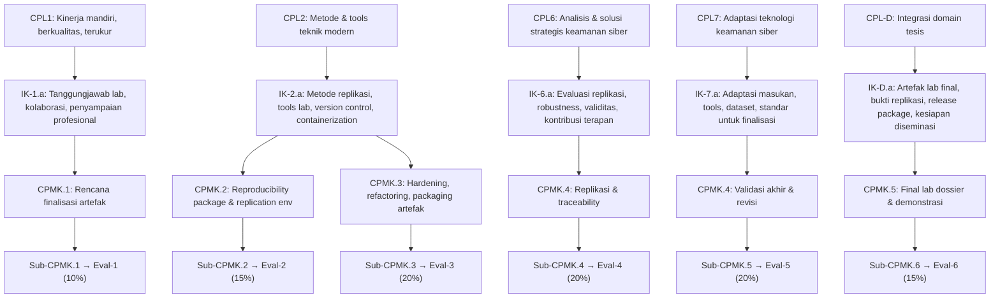

---

## PETA KOMPETENSI MATA KULIAH

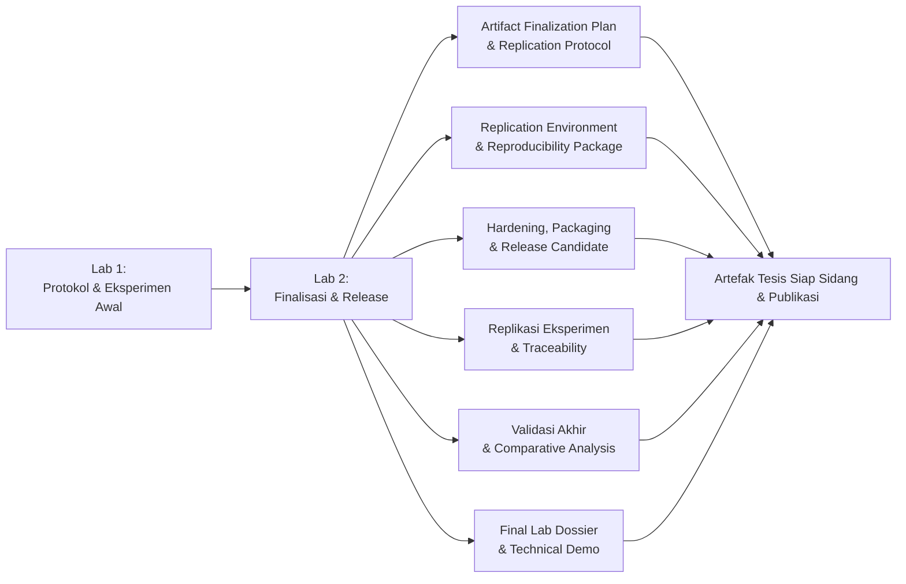

---

## PETUNJUK PENGGUNAAN BUKU

Buku ini dirancang sebagai *working document* — dibaca sambil bekerja, bukan sebelumnya. Setiap bab berkorelasi dengan pertemuan lokakarya dan menghasilkan artefak nyata yang menjadi komponen evaluasi.

Mahasiswa diharapkan:
1. Membaca bagian Landasan Teori sebelum sesi lokakarya
2. Mengerjakan Praktikum selama atau segera setelah sesi
3. Mengisi template yang disediakan di Lampiran
4. Mendapatkan sign-off pembimbing untuk setiap deliverable utama

Setiap praktikum dalam buku ini dirancang untuk lingkungan yang legal, berotorisasi, dan aman. Seluruh pengujian dilakukan pada sistem yang dimiliki atau memiliki izin eksplisit dari pengelola.

---

## PETA BAB DAN DELIVERABLE

| Bab | Pertemuan | Sub-CPMK | Materi Utama | Evaluasi | Deliverable |
|---|---|---|---|---|---|
| 1 | 1 | Sub-CPMK.1 | Orientasi Lab 2: Dari Lab 1 ke Finalisasi | Eval-1 (10%) | Artifact finalization plan |
| 2 | 2 | Sub-CPMK.1 | Replication Protocol, Risk Register, Release Checklist | Eval-1 (10%) | Protocol + risk register |
| 3 | 3 | Sub-CPMK.2 | Replication Environment: VM/Container | Eval-2 (15%) | Environment setup & baseline |
| 4 | 4 | Sub-CPMK.2 | Reproducibility Package & Execution Guide | Eval-2 (15%) | Reproducibility package |
| 5 | 5 | Sub-CPMK.3 | Artifact Hardening & Refactoring | Eval-3 (20%) | Hardened artifact v1 |
| 6 | 6 | Sub-CPMK.3 | Instrumentation & Automation | Eval-3 (20%) | Instrumented codebase |
| 7 | 7 | Sub-CPMK.3 | Packaging & Release Candidate | Eval-3 (20%) | Release candidate |
| 8 | 8 | Sub-CPMK.4 | Replication Execution & Measurement | Eval-4 (20%) | Replication log v1 |
| 9 | 9 | Sub-CPMK.4 | Robustness & Sensitivity Check | Eval-4 (20%) | Sensitivity analysis |
| 10 | 10 | Sub-CPMK.4 | Traceability & Integrity Verification | Eval-4 (20%) | Integrity report |
| 11 | 11 | Sub-CPMK.5 | Final Validation: Metrik & Baseline | Eval-5 (20%) | Final validation report |
| 12 | 12 | Sub-CPMK.5 | Comparative Analysis & Threat to Validity | Eval-5 (20%) | Comparative analysis |
| 13 | 13 | Sub-CPMK.5 | Troubleshooting Final & Revision Log | Eval-5 (20%) | Revision log |
| 14 | 14 | Sub-CPMK.6 | Final Lab Dossier | Eval-6 (15%) | Lab dossier draft |
| 15 | 15 | Sub-CPMK.6 | Release Package & Demo Script | Eval-6 (15%) | Release package |
| 16 | 16 | Sub-CPMK.6 | Technical Demonstration & Panel Review | Eval-6 (15%) | Final demo |

---

# BAB 1 — ORIENTASI LAB 2: DARI LOKAKARYA 1 KE FINALISASI ARTEFAK

## 1. Capaian Pembelajaran Bab

Setelah mempelajari bab ini, mahasiswa mampu:
- Mengidentifikasi posisi Lokakarya Berbasis Lab 2 dalam alur tesis
- Memahami standar kualitas artefak yang diharapkan pada akhir Lab 2
- Mengevaluasi kesiapan awal artefak/prototipe dari Lab 1
- Menetapkan gap antara kondisi artefak saat ini dan kondisi yang diharapkan

*Berkaitan dengan Sub-CPMK.1, Eval-1 (10%)*

## 2. Peta Konsep Bab

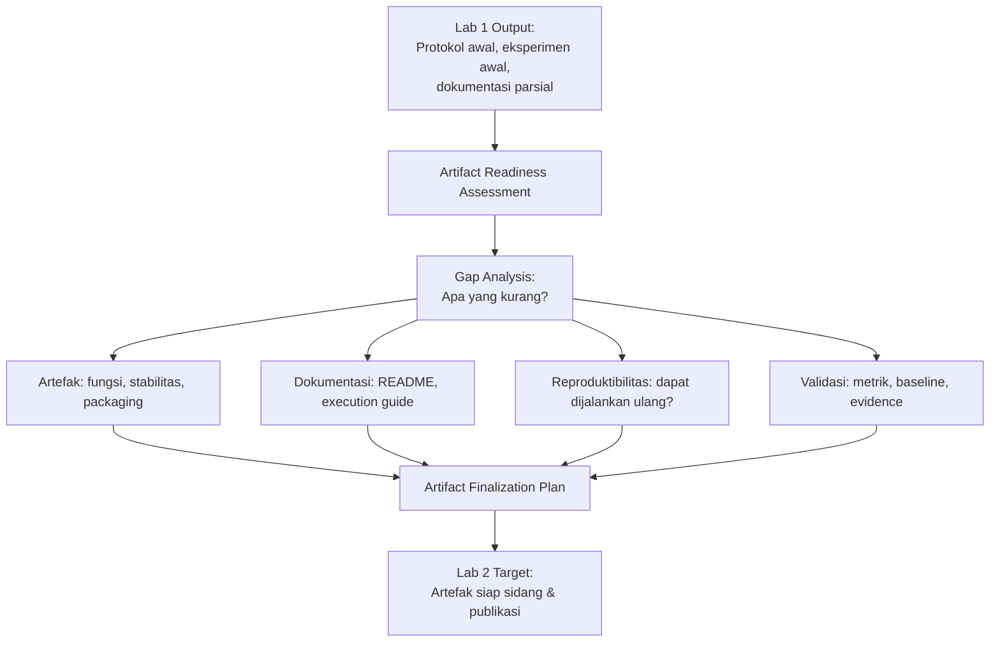

## 3. Pengantar Kontekstual

Lokakarya Berbasis Lab 1 membangun infrastruktur penelitian: environment yang terkontrol, protokol akuisisi, engineering log, dan eksperimen awal. Hasilnya adalah bukti bahwa pendekatan penelitian *dapat berjalan*. Namun "dapat berjalan di tangan penelitinya sendiri" berbeda dari "dapat dijalankan ulang oleh orang lain mengikuti dokumentasi."

Lab 2 menutup gap tersebut. Tujuannya bukan mengulang apa yang sudah dilakukan, melainkan memastikan bahwa apa yang sudah dilakukan dapat *diverifikasi*, *direplikasi*, dan *dikomunikasikan* dengan standar akademik dan profesional yang tinggi.

Penguji tesis yang berpengalaman akan menanyakan: "Dapatkah saya menjalankan artefak ini dengan mengikuti README Anda?" Jika jawabannya tidak, artefak tersebut belum selesai.

## 4. Landasan Teori

### 4.1 Artifact Readiness Levels (ARL)

Artifact Readiness Level (ARL) adalah skala yang mengadaptasi Technology Readiness Level (TRL) NASA untuk konteks artefak penelitian:

| ARL | Level | Deskripsi |
|---|---|---|
| ARL-1 | Konsep | Ide artefak terdefinisi, belum ada implementasi |
| ARL-2 | Proof of concept | Implementasi dasar berjalan di lingkungan peneliti |
| ARL-3 | Eksperimen terkontrol | Berjalan dalam environment yang terdefinisi |
| ARL-4 | Tervalidasi | Hasil eksperimen dapat dibandingkan dengan baseline |
| ARL-5 | Terdokumentasi | Ada README, execution guide, dan dependency spec |
| ARL-6 | Reproducible | Pihak ketiga dapat menjalankan ulang dengan mengikuti dokumentasi |

Target Lab 2: semua artefak mencapai minimal ARL-5, dan idealnya ARL-6.

### 4.2 Dimensi Kesiapan Artefak

Untuk mencapai ARL-5/6, artefak harus memenuhi empat dimensi:

**Dimensi Fungsional:** Artefak berjalan tanpa error fatal, menghasilkan output yang konsisten, dan perilakunya sesuai dengan klaim penelitian.

**Dimensi Reproduktibilitas:** Dependency sudah di-lock (versi eksak), environment dapat dibangun ulang dari instruksi, random seed di-set untuk semua komponen stochastic, dan hasil dapat direproduksi dalam batas variabilitas yang dinyatakan.

**Dimensi Dokumentasi:** README berisi prasyarat, langkah instalasi, cara menjalankan, interpretasi output, dan known limitations. Execution guide memberikan instruksi step-by-step yang dapat diikuti tanpa pengetahuan internal tentang proyek.

**Dimensi Validasi:** Ada perbandingan dengan baseline yang fair, metrik yang tepat untuk masalah yang diklaim, dan bukti statistik yang memadai untuk klaim yang dibuat.

### 4.3 Gap Analysis: Dari Lab 1 ke Lab 2

Gap analysis yang sistematis adalah langkah pertama Lab 2. Tanpa pemahaman yang jelas tentang di mana posisi artefak saat ini dan di mana harus berada, waktu lab akan terbuang untuk aktivitas yang tidak prioritas.

Format gap analysis:

```
[Dimensi] | [Status Saat Ini] | [Target Akhir Lab 2] | [Effort Estimasi]
Fungsional | Core pipeline berjalan, edge cases masih error | Semua edge cases ter-handle | 2 minggu
Reproduktibilitas | Dependency tidak di-lock | requirements.txt/lock file tersedia | 3 hari
Dokumentasi | README draft | README final + execution guide | 1 minggu
Validasi | Hasil satu run | 5x repeated measurement | 1 minggu
```

## 5. Model atau Arsitektur

```mermaid
flowchart LR
    subgraph LAB1["Lab 1 State (Input)"]
        L1A[Artefak awal]
        L1B[Eksperimen awal]
        L1C[Dokumentasi parsial]
        L1D[Engineering log v1]
    end

    subgraph ASSESSMENT["Readiness Assessment"]
        RA1[ARL Assessment]
        RA2[Gap Analysis\n4 dimensi]
        RA3[Risk Register]
    end

    subgraph PLAN["Artifact Finalization Plan"]
        P1[Target ARL per artefak]
        P2[Milestone & deadline]
        P3[Acceptance criteria]
        P4[Resource & tools]
    end

    subgraph LAB2["Lab 2 Target (Output)"]
        L2A[Artefak ARL-5/6]
        L2B[Replikasi tervalidasi]
        L2C[Dokumentasi final]
        L2D[Release package]
    end

    LAB1 --> ASSESSMENT --> PLAN --> LAB2
```

## 6. Contoh Terapan

**Gap analysis untuk tesis malware detection (domain: AI/ML Security):**

| Dimensi | Status Lab 1 | Target Lab 2 | Prioritas |
|---|---|---|---|
| Fungsional | Model berjalan untuk dataset training; belum diuji untuk file format selain PE | Semua format yang diklaim (PE, ELF) diuji | Tinggi |
| Reproduktibilitas | requirements.txt tidak menyebut versi CUDA; random seed tidak di-set | requirements-lock.txt dengan versi eksak; seed di-set di semua entry point | Tinggi |
| Dokumentasi | README 5 baris | README 2 halaman + execution guide | Sedang |
| Validasi | F1 dari satu run; tidak ada baseline | 5-fold CV; 3 baseline; Wilcoxon test | Tinggi |

Estimasi total effort: 7 minggu. Timeline Lab 2 tersedia 8 minggu (pertemuan 1-16). Buffer 1 minggu untuk contingency.

## 7. Praktikum atau Aktivitas Terarah

**Tujuan:** Melakukan ARL assessment dan gap analysis terhadap artefak tesis.

**Langkah Kerja:**
1. Inventarisasi semua artefak yang dihasilkan di Lab 1 (kode, dataset, konfigurasi, log).
2. Untuk setiap artefak, tentukan ARL saat ini menggunakan skala ARL-1 hingga ARL-6.
3. Isi tabel gap analysis empat dimensi.
4. Estimasi effort untuk menutup setiap gap.
5. Diskusikan dengan pembimbing untuk validasi prioritas.

**Output Deliverable:** Artifact readiness assessment document (1-2 halaman) yang menjadi dasar artifact finalization plan.

## 8. Latihan Pemahaman

1. **(Pilihan Ganda)** ARL-5 berbeda dari ARL-4 karena:
   - A. ARL-5 memiliki lebih banyak eksperimen
   - B. ARL-5 mensyaratkan dokumentasi yang memungkinkan pihak lain menjalankan artefak
   - C. ARL-5 memerlukan publikasi
   - D. ARL-5 berarti artefak sudah di-deploy ke production

2. **(Analisis)** Artefak tesis menghasilkan F1=0.92 dalam satu run, tetapi setelah dijalankan oleh rekan mahasiswa mengikuti README, hasilnya F1=0.87. Dimensi kesiapan mana yang bermasalah dan mengapa?

3. **(Evaluasi)** Pembimbing menyatakan bahwa "artefak sudah cukup baik untuk sidang." Namun berdasarkan ARL assessment, artefak berada di ARL-3. Apakah pernyataan pembimbing cukup sebagai justifikasi untuk tidak meningkatkan ARL? Jelaskan.

## 9. Latihan Terapan / Studi Kasus

**Studi Kasus:** Mahasiswa A memiliki artefak tesis berupa tool forensik Python yang berfungsi di komputernya sendiri. Tool ini bergantung pada library yang di-install dengan `pip install` tanpa versi spesifik. README hanya berisi: "Install requirements lalu jalankan main.py." Dokumentasi lainnya tidak ada. Lakukan ARL assessment, identifikasi semua gap, dan susun prioritas perbaikan untuk 8 minggu Lab 2.

## 10. Kunci Jawaban dan Pembahasan

**Soal 1:** Jawaban B. ARL-5 mensyaratkan dokumentasi yang cukup agar pihak lain dapat menjalankan artefak — ini adalah leap signifikan dari ARL-4 yang hanya mensyaratkan hasil tervalidasi. Dokumentasi yang memadai adalah enabler reproduktibilitas.

**Soal 2:** Masalah pada dimensi **Reproduktibilitas**. Perbedaan hasil (0.92 vs 0.87) menunjukkan bahwa environment yang berbeda menghasilkan output yang berbeda — kemungkinan karena versi library yang berbeda, random seed yang tidak di-set, atau preprocessing yang berbeda. Gap ini harus ditutup sebelum klaim F1=0.92 dapat dipertahankan.

**Soal 3:** Pernyataan pembimbing tidak cukup sebagai justifikasi penuh. Pembimbing menyatakan "cukup untuk sidang" — yang mungkin benar dari perspektif kesiapan argumen. Namun ARL-3 berarti artefak belum dapat diverifikasi oleh pihak ketiga, yang melemahkan klaim reproducibility dan dapat menjadi kelemahan yang diekspos penguji. Target minimal ARL-5 tetap direkomendasikan.

## 11. Ringkasan Bab

ARL (Artifact Readiness Level) adalah skala kesiapan artefak dari ARL-1 (konsep) hingga ARL-6 (reproducible oleh pihak ketiga). Lab 2 menargetkan minimal ARL-5. Gap analysis empat dimensi (fungsional, reproduktibilitas, dokumentasi, validasi) adalah langkah pertama yang menghasilkan artifact finalization plan yang realistis.

## 12. Refleksi Profesional

1. Dalam dunia keamanan siber profesional, alat yang hanya bisa dioperasikan oleh pembuatnya adalah risiko operasional — jika pembuat tidak tersedia, alat tersebut tidak bernilai. Bagaimana prinsip ARL-6 (dapat dijalankan oleh orang lain) mencerminkan kebutuhan nyata dalam tim SOC atau tim forensik profesional?


---

# BAB 2 — REPLICATION PROTOCOL, RISK REGISTER, DAN RELEASE CHECKLIST

## 1. Capaian Pembelajaran Bab

Setelah mempelajari bab ini, mahasiswa mampu:
- Menyusun replication protocol yang komprehensif untuk artefak tesis
- Membangun risk register yang mengidentifikasi ancaman teknis, etis, dan legal
- Menyusun release checklist yang menjamin kesiapan artefak untuk distribusi
- Menetapkan acceptance criteria final yang terukur

*Berkaitan dengan Sub-CPMK.1, Eval-1 (10%)*

## 2. Peta Konsep Bab

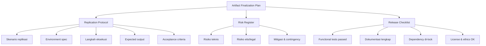

## 3. Pengantar Kontekstual

Sebuah eksperimen yang tidak dapat direplikasi adalah klaim, bukan fakta ilmiah. Replication protocol adalah dokumen yang memungkinkan seseorang yang tidak terlibat dalam penelitian untuk menjalankan ulang eksperimen dan mendapatkan hasil yang konsisten dengan klaim yang dibuat.

Dalam konteks keamanan siber dan forensik digital, replikabilitas memiliki dimensi tambahan: apakah prosedur yang diklaim dapat digunakan kembali dalam investigasi nyata? Apakah dokumentasinya cukup untuk diterima sebagai standar operasional?

## 4. Landasan Teori

### 4.1 Struktur Replication Protocol

Replication protocol yang baik mencakup:

**Header:**
- Judul protokol
- Versi dan tanggal
- Penulis dan reviewer
- Artefak yang dicakup

**Prerequisites:**
- Hardware requirements (minimum dan rekomendasi)
- Operating system dan versi yang didukung
- Dependency yang harus ada sebelum memulai
- Dataset atau file yang harus tersedia

**Environment Setup:**
- Langkah instalasi step-by-step (bukan hanya perintah — sertakan expected output)
- Verifikasi bahwa environment siap (smoke test)
- Known issues dan solusinya

**Execution Steps:**
- Langkah-langkah eksekusi dalam urutan yang benar
- Parameter yang perlu dikonfigurasi dan nilai default
- Bagaimana cara menjalankan untuk skenario berbeda

**Expected Output:**
- Apa yang seharusnya terlihat jika eksekusi berhasil
- Metrik yang diharapkan (range, bukan angka exact)
- Format output dan lokasinya

**Troubleshooting:**
- Error yang umum terjadi dan cara mengatasinya

### 4.2 Risk Register untuk Lab 2

Risk register Lab 2 mencakup risiko yang dapat mengganggu penyelesaian artefak dalam timeline yang tersedia:

| Kode | Risiko | Kemungkinan | Dampak | Level | Mitigasi | Contingency |
|---|---|---|---|---|---|---|
| R-01 | Dependency obsolete atau incompatible | Sedang | Tinggi | Tinggi | Lock semua versi di Lab 1 | Buat virtual environment terisolasi |
| R-02 | Dataset tidak dapat diakses ulang | Rendah | Sangat Tinggi | Tinggi | Backup lokal + hash verifikasi | Gunakan subset yang sudah disimpan |
| R-03 | Artefak tidak mereplikasi hasil Lab 1 | Sedang | Tinggi | Tinggi | Debug sebelum finalisasi | Analisis divergensi, akui sebagai finding |
| R-04 | Pembimbing tidak tersedia untuk review | Sedang | Sedang | Sedang | Jadwalkan review lebih awal | Gunakan self-checklist |
| R-05 | Hardware/infrastructure failure | Rendah | Tinggi | Sedang | Cloud backup, snapshot rutin | Rebuild dari snapshot |

### 4.3 Release Checklist

Release checklist adalah gate yang harus dilewati sebelum artefak dinyatakan "selesai":

**Functional Gate:**
- [ ] Semua unit test pass
- [ ] Smoke test pass pada environment bersih
- [ ] Edge cases yang diketahui ter-handle atau terdokumentasi

**Reproducibility Gate:**
- [ ] Dependency file dengan versi eksak tersedia
- [ ] Random seed di-set dan terdokumentasi
- [ ] Environment dapat dibangun ulang dari instruksi dalam 30 menit

**Documentation Gate:**
- [ ] README final ada dan akurat
- [ ] Execution guide dapat diikuti oleh seseorang yang tidak terlibat dalam proyek
- [ ] Known limitations terdokumentasi

**Ethics & Legal Gate:**
- [ ] Lisensi artefak jelas
- [ ] Dataset tidak mengandung data personal yang belum dianonimisasi
- [ ] Tidak ada kerentanan yang ditemukan selama pengembangan yang belum diungkap

## 5. Model atau Arsitektur

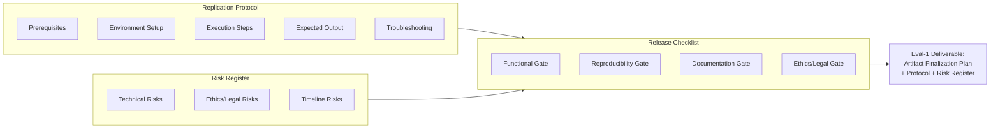

## 6. Contoh Terapan

**Replication protocol untuk tool forensik container (Python/Docker):**

*Prerequisites:* Docker Engine 24.0+, Python 3.11, Git. Dataset: `container_artifacts_v2.tar.gz` (SHA-256: abc123...).

*Environment Setup:*
```bash
git clone https://github.com/user/container-forensics-tool.git
cd container-forensics-tool
git checkout v1.2.0  # pinned release
docker build -t cft:v1.2.0 .
# Expected: Successfully built [image_id]
```

*Execution:*
```bash
docker run --rm -v /path/to/dataset:/data cft:v1.2.0 \
  --input /data/sample_001 --output /data/results --mode full
```

*Expected Output:* File `results/report_sample_001.json` dengan field: `artifacts_found`, `completeness_rate`, `chain_of_custody_verified`. Expected completeness_rate: 0.90-0.96 (± 3% dari nilai yang dilaporkan dalam tesis).

## 7. Praktikum atau Aktivitas Terarah

**Tujuan:** Menyusun replication protocol, risk register, dan release checklist untuk artefak tesis.

**Langkah Kerja:**
1. Tentukan skenario replikasi yang paling kritis (skenario yang menghasilkan klaim utama tesis).
2. Tulis replication protocol menggunakan template di Lampiran A.
3. Isi risk register dengan minimal 5 risiko nyata yang relevan.
4. Tentukan acceptance criteria yang konkret dan terukur untuk setiap skenario.
5. Uji protocol dengan meminta rekan mahasiswa mengikutinya — catat di mana mereka tersangkut.

## 8. Latihan Pemahaman

1. **(Pilihan Ganda)** "Expected output" dalam replication protocol sebaiknya berisi:
   - A. Angka eksak yang harus sama persis
   - B. Range nilai yang mencerminkan variabilitas yang dapat diterima
   - C. Deskripsi kualitatif tanpa angka
   - D. Screenshot dari run yang berhasil

2. **(Analisis)** Risk register mencantumkan "pembimbing tidak tersedia" sebagai risiko. Apakah ini risiko yang valid untuk dicantumkan? Mengapa atau mengapa tidak?

3. **(Perancangan)** Artefak Anda menggunakan dataset pihak ketiga yang hanya tersedia melalui request manual ke organisasi lain. Bagaimana Anda menangani risiko ini dalam risk register, dan apa implikasinya untuk release checklist?

## 9. Latihan Terapan / Studi Kasus

**Studi Kasus:** Mahasiswa B menyerahkan replication protocol yang sudah ditulis kepada rekan mahasiswa untuk diuji. Rekan tersebut mengikuti langkah-langkah dalam protokol tetapi tersangkut di langkah 3 ("Install dependencies") karena satu library memerlukan compiler C++ yang tidak disebutkan di prerequisites. Identifikasi: apa yang harus ditambahkan ke protokol? Bagaimana mencegah jenis gap ini terulang?

## 10. Kunci Jawaban dan Pembahasan

**Soal 1:** Jawaban B. Expected output seharusnya berisi range nilai yang mencerminkan variabilitas yang dapat diterima, bukan angka eksak. Replikasi yang menghasilkan 0.919 ketika expected adalah "0.92" dapat mengakibatkan replikator salah mengira eksperimen gagal, padahal sebenarnya sukses dengan variabilitas normal.

**Soal 2:** Risiko ini valid. Ketergantungan pada satu orang (bottleneck risk) adalah risiko manajemen proyek yang nyata. Mitigasi: jadwalkan review lebih awal dari batas waktu, dan miliki self-checklist untuk kasus pembimbing tidak tersedia.

## 11. Ringkasan Bab

Replication protocol mendokumentasikan skenario, environment, langkah eksekusi, dan expected output. Risk register mengidentifikasi ancaman teknis, etis, legal, dan timeline dengan mitigasi. Release checklist adalah gate empat dimensi (functional, reproducibility, documentation, ethics/legal) yang harus dilewati sebelum artefak dinyatakan selesai.

## 12. Refleksi Profesional

1. Dalam audit keamanan profesional, setiap langkah prosedur yang dilakukan harus terdokumentasi sehingga dapat diverifikasi secara independen. Bagaimana prinsip replication protocol mencerminkan kebutuhan auditabilitas dalam praktik profesional?

---

# BAB 3 — REPLICATION ENVIRONMENT: VM, CONTAINER, DAN BASELINE

## 1. Capaian Pembelajaran Bab

Setelah mempelajari bab ini, mahasiswa mampu:
- Memilih dan membangun replication environment yang tepat (VM vs Container vs bare-metal)
- Mengonfigurasi dependency lock dan version pinning untuk reproduktibilitas
- Membuat dan memverifikasi environment baseline
- Mendokumentasikan environment untuk reproduksi oleh pihak ketiga

*Berkaitan dengan Sub-CPMK.2, Eval-2 (15%)*

## 2. Peta Konsep Bab

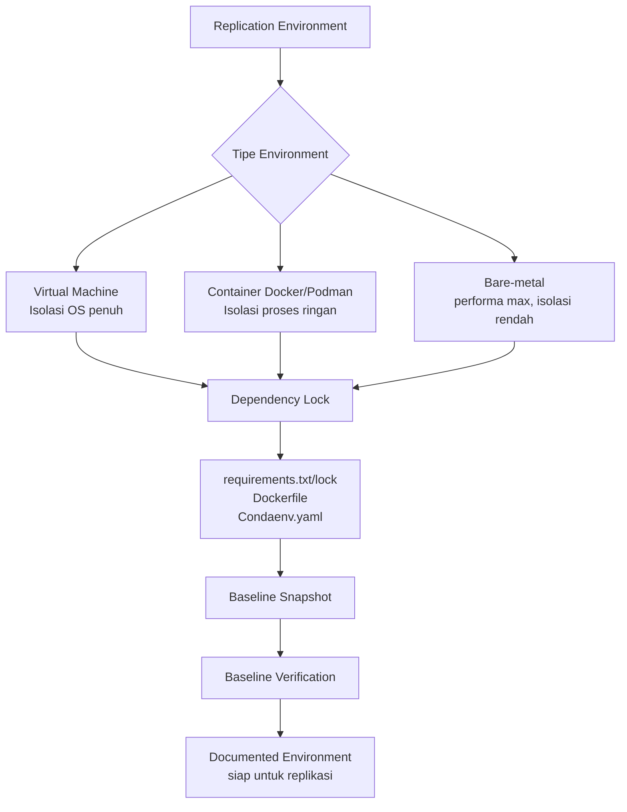

## 3. Pengantar Kontekstual

Kegagalan replikasi dalam penelitian ML dan keamanan siber seringkali bukan karena algoritmanya yang salah — melainkan karena environment yang berbeda. Versi library yang berbeda menghasilkan implementasi yang sedikit berbeda. CUDA versi berbeda menghasilkan numerical precision yang berbeda. Sistem operasi yang berbeda menangani path dan encoding secara berbeda.

Tugas Lab 2 adalah memastikan bahwa environment eksperimen terdokumentasi dengan presisi yang cukup sehingga tidak ada ambiguitas tentang "kondisi apa ketika hasil ini dihasilkan."

## 4. Landasan Teori

### 4.1 Pilihan Environment: Trade-offs

**Virtual Machine (VM):**
- *Kelebihan:* Isolasi OS penuh; dapat mengemas seluruh sistem operasi; cocok untuk penelitian yang bergantung pada konfigurasi kernel atau driver
- *Kekurangan:* File image besar (beberapa GB); lebih lambat dari container; overhead signifikan
- *Kapan digunakan:* Forensik digital (memerlukan kernel-level tools), malware analysis (isolasi penuh), penelitian yang bergantung pada OS spesifik

**Container (Docker/Podman):**
- *Kelebihan:* Ringan; portabel; build reproducible dari Dockerfile; image lebih kecil dari VM
- *Kekurangan:* Berbagi kernel dengan host; tidak cocok untuk penelitian yang butuh isolasi kernel penuh
- *Kapan digunakan:* ML pipeline, web-based tools, most software security research

**Bare-metal dengan dependency management:**
- *Kelebihan:* Performa maksimal; tidak ada overhead virtualisasi
- *Kekurangan:* Sulit untuk direplikasi — sangat bergantung pada konfigurasi hardware dan OS peneliti
- *Kapan digunakan:* Penelitian yang sangat sensitif terhadap performa; harus disertai dokumentasi environment yang sangat detail

### 4.2 Dependency Lock: Strategi per Ekosistem

| Ekosistem | Tool | File Lock | Catatan |
|---|---|---|---|
| Python | pip + pip-tools | `requirements.txt` dengan `==` version | Gunakan `pip freeze > requirements.txt` |
| Python | Poetry | `poetry.lock` | Direkomendasikan untuk proyek kompleks |
| Python | Conda | `environment.yml` dengan versi eksak | Untuk proyek dengan non-Python dependency |
| Node.js | npm | `package-lock.json` | Commit lock file ke repository |
| Rust | Cargo | `Cargo.lock` | Otomatis di-generate |
| Go | Go modules | `go.sum` | Otomatis di-generate |

**Untuk Docker:** Pin image base ke digest SHA256, bukan hanya tag:
```dockerfile
FROM python:3.11.9@sha256:abc123...
```
Tag `python:3.11` dapat berubah saat Docker pull ulang; digest tidak berubah.

### 4.3 Baseline Verification

Setelah environment dibangun, lakukan smoke test terstruktur untuk verifikasi:

```bash
# Contoh smoke test script
python -c "import torch; print(torch.__version__)"  # Expected: 2.1.0
python -c "import numpy; print(numpy.__version__)"   # Expected: 1.26.4
python main.py --test --sample test_data/sample_001.bin  # Expected: exit code 0, output matches fixture
```

Catat semua hasil smoke test sebagai bagian dari baseline documentation. Ini adalah bukti bahwa environment berfungsi pada titik tertentu.

## 5. Model atau Arsitektur

```mermaid
flowchart LR
    subgraph BUILD["Environment Build"]
        B1[Dockerfile atau\nVM config atau\nrequirements.txt]
        B2[Build proses\nditerministic]
        B3[Image / snapshot / env]
    end

    subgraph VERIFY["Baseline Verification"]
        V1[Smoke test\nsemua dependency]
        V2[Integration test\nartefak utama]
        V3[Hash/SHA verifikasi\nfile kritis]
    end

    subgraph DOCUMENT["Dokumentasi Environment"]
        D1[Environment spec file]
        D2[Build log]
        D3[Verification report]
        D4[Known issues & workarounds]
    end

    BUILD --> VERIFY --> DOCUMENT
    DOCUMENT --> EVAL2["Eval-2: Reproducibility Package\n+ Repository Release\n+ Baseline Verification Report"]
```

## 6. Contoh Terapan

**Dockerfile untuk penelitian NLP-based phishing detection:**

```dockerfile
FROM python:3.11.9@sha256:abc123def456...
WORKDIR /app
COPY requirements-lock.txt .
RUN pip install --no-cache-dir -r requirements-lock.txt
COPY src/ ./src/
COPY models/ ./models/
COPY data/ ./data/

# Smoke test saat build
RUN python -c "import transformers; assert transformers.__version__ == '4.35.2'"
RUN python src/smoke_test.py

CMD ["python", "src/main.py"]
```

Catatan penting: `models/` berisi file model yang di-download — sertakan hash verifikasi dalam smoke test untuk memastikan model yang digunakan sama persis dengan yang di tesis.

## 7. Praktikum atau Aktivitas Terarah

**Tujuan:** Membangun dan mendokumentasikan replication environment final untuk artefak tesis.

**Prasyarat:** Artefak dari Lab 1, daftar dependency yang digunakan.

**Langkah Kerja:**
1. Pilih tipe environment (VM/Container/bare-metal) dan justifikasikan pilihan.
2. Buat Dockerfile, requirements-lock.txt, atau konfigurasi environment yang sesuai.
3. Build environment dari scratch (jangan gunakan environment yang sudah ada).
4. Jalankan smoke test dan catat hasilnya.
5. Dokumentasikan semua langkah dalam execution guide.
6. Minta rekan mahasiswa mencoba mengikuti execution guide — catat di mana ia tersangkut.

**Kriteria keberhasilan:** Rekan mahasiswa dapat membangun environment dan menjalankan smoke test tanpa bantuan dalam waktu ≤60 menit.

## 8. Latihan Pemahaman

1. **(Pilihan Ganda)** Mengapa pin Docker image ke SHA256 digest lebih baik daripada menggunakan tag?
   - A. SHA256 lebih pendek dan mudah diingat
   - B. Tag dapat berubah saat image di-update, sedangkan digest tidak berubah
   - C. SHA256 lebih aman dari serangan
   - D. Digest mengurangi ukuran image

2. **(Analisis)** Penelitian menggunakan model ML yang di-download dari Hugging Face Hub. Model tersebut tidak disimpan dalam repository karena ukurannya 3GB. Identifikasi risiko dan solusinya.

3. **(Evaluasi)** Mahasiswa C mengklaim bahwa "conda environment.yml sudah cukup untuk reproducibility." Evaluasi klaim ini — dalam kondisi apa ia benar, dan dalam kondisi apa ia tidak cukup?

## 9. Latihan Terapan / Studi Kasus

**Studi Kasus:** Mahasiswa D menyelesaikan Lab 1 menggunakan environment bare-metal di laptop pribadinya. Untuk Lab 2, pembimbing meminta agar penelitian dapat direplikasi di server lab yang berbeda (Linux, berbeda hardware). Mahasiswa saat ini menggunakan Windows. Susun rencana migrasi environment yang menjaga reproducibility.

## 10. Kunci Jawaban dan Pembahasan

**Soal 1:** Jawaban B. Docker tag seperti `python:3.11` adalah pointer yang dapat diupdate — `docker pull python:3.11` hari ini mungkin mengunduh image berbeda dari `docker pull python:3.11` enam bulan yang lalu. SHA256 digest adalah identifier content-addressable yang tidak berubah selama content tidak berubah.

**Soal 2:** Risiko: model yang di-download mungkin diupdate oleh pemiliknya (atau dihapus), mengakibatkan versi berbeda yang menghasilkan hasil berbeda. Solusi: (a) simpan model secara lokal dengan hash verifikasi; (b) atau gunakan versioned model (HuggingFace mendukung commit hash); (c) dokumentasikan model ID, commit hash, dan tanggal download.

## 11. Ringkasan Bab

Environment dapat berupa VM, container, atau bare-metal — masing-masing dengan trade-off yang berbeda. Dependency lock yang presisi (versi eksak, bukan range) adalah prasyarat reproduktibilitas. Docker image harus di-pin ke digest SHA256. Baseline verification dengan smoke test memberikan bukti bahwa environment berfungsi pada titik tertentu.

## 12. Refleksi Profesional

1. Dalam tim SOC atau tim forensik profesional, "environment drift" (konfigurasi yang berubah seiring waktu tanpa dokumentasi) adalah masalah operasional yang nyata. Bagaimana praktik dependency lock dan environment snapshot yang Anda pelajari membantu mencegah masalah ini?

---

# BAB 4 — REPRODUCIBILITY PACKAGE DAN EXECUTION GUIDE

## 1. Capaian Pembelajaran Bab

Setelah mempelajari bab ini, mahasiswa mampu:
- Menyusun reproducibility package yang komprehensif
- Menulis execution guide yang dapat diikuti tanpa pengetahuan internal proyek
- Merancang repository release yang terstruktur dan dapat diaudit
- Memverifikasi integritas seluruh komponen package menggunakan kriptografi

*Berkaitan dengan Sub-CPMK.2, Eval-2 (15%)*

## 2. Peta Konsep Bab

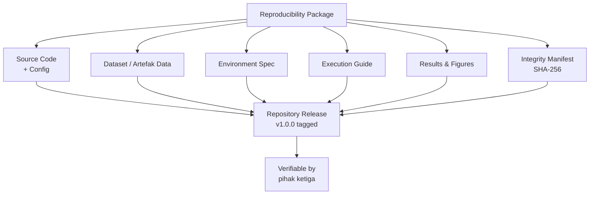

## 3. Pengantar Kontekstual

Reproducibility package adalah "kapsul waktu" penelitian — segala sesuatu yang diperlukan untuk mereplikasi hasil, dikemas dalam satu tempat yang dapat diakses. Jika tesis adalah narasi tentang apa yang dilakukan dan ditemukan, reproducibility package adalah buktinya.

Dalam komunitas ML security, gerakan "Reproducibility Challenge" menunjukkan bahwa sebagian besar paper tidak dapat direproduksi oleh kelompok independen — bahkan ketika kode tersedia. Penyebab utama: kode tersedia tetapi konfigurasi tidak, atau dataset tidak tersedia, atau versi tidak terdokumentasi. Buku ini mengajarkan cara menghindari kesalahan-kesalahan tersebut.

## 4. Landasan Teori

### 4.1 Komponen Reproducibility Package

**1. Source Code dengan Provenance:**
- Semua kode yang menghasilkan hasil yang dilaporkan
- Versi di-pin di repository dengan tag (contoh: `git tag v1.0.0`)
- Bukan "kode yang digunakan untuk menghasilkan hasil tersebut" — tapi commit eksak yang digunakan

**2. Dataset atau Dataset Pointer:**
- Jika dataset dapat didistribusikan: sertakan dalam package dengan hash verifikasi
- Jika dataset tidak dapat didistribusikan (karena lisensi atau ukuran): sertakan instruksi untuk mendapatkan dataset yang sama, beserta preprocessing script
- Sertakan dataset card yang mendokumentasikan sumber, lisensi, statistik dasar, dan cara memperolehnya

**3. Environment Specification:**
- requirements-lock.txt, Dockerfile, atau konfigurasi environment yang setara
- Bukan hanya file yang ada — tapi file yang sudah diverifikasi dapat digunakan untuk mereplikasi

**4. Configuration Files:**
- Semua hyperparameter, threshold, flag, dan parameter yang mempengaruhi hasil
- Format yang dapat dibaca manusia dan mesin (YAML, TOML, JSON)
- Hindari hard-coded values dalam kode — gunakan config file

**5. Execution Guide (README utama):**
- Gambaran umum proyek dalam 3-5 kalimat
- Prerequisites (hardware, OS, tools)
- Langkah instalasi
- Cara menjalankan untuk setiap use case utama
- Interpretasi output
- Known limitations dan troubleshooting

**6. Results dan Figures Reproducibility:**
- Script atau notebook yang menghasilkan setiap tabel dan gambar dalam tesis
- Bukan hasil yang di-copy-paste — tapi script yang dapat dijalankan ulang untuk menghasilkan hasil yang sama

**7. Integrity Manifest:**
- SHA-256 hash untuk semua file kritis
- File manifest dapat diverifikasi untuk memastikan package tidak dimodifikasi

### 4.2 Repository Release Structure

```
repository/
├── README.md              ← entry point, execution guide
├── LICENSE                ← lisensi artefak
├── CHANGELOG.md           ← riwayat perubahan
├── requirements-lock.txt  ← atau Dockerfile, poetry.lock
├── src/                   ← source code
│   ├── main.py
│   ├── preprocessing.py
│   └── evaluation.py
├── config/
│   └── experiment.yaml    ← semua parameter
├── data/
│   ├── README.md          ← dataset card
│   ├── raw/ (atau pointer)
│   └── processed/
├── experiments/
│   └── run_all.sh         ← script untuk menjalankan semua eksperimen
├── results/
│   └── figures/
├── notebooks/
│   └── analysis.ipynb     ← reproduksi semua tabel dan gambar
└── MANIFEST.sha256        ← integrity manifest
```

### 4.3 Membuat SHA-256 Integrity Manifest

```bash
# Generate manifest untuk semua file kritis
find src/ config/ data/processed/ -type f | sort | \
  xargs sha256sum > MANIFEST.sha256

# Verifikasi (dilakukan oleh replikator)
sha256sum -c MANIFEST.sha256
```

Manifest ini memungkinkan siapapun untuk memverifikasi bahwa file yang mereka miliki identik dengan file yang digunakan dalam penelitian.

## 5. Model atau Arsitektur

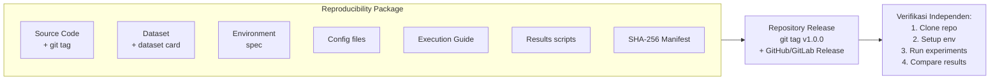

## 6. Contoh Terapan

**Dataset card untuk dataset PCAP forensik:**

```yaml
# data/README.md (Dataset Card)
dataset_name: PENS-PCAP-Forensics-2024
version: 1.0
description: >
  Koleksi 200 file PCAP yang digunakan dalam penelitian forensik jaringan.
  Berisi sampel traffic normal (100 file) dan traffic dengan indikasi eksfiltrasi (100 file).
source: Simulasi dalam lab terkontrol, PENS, 2024
license: CC-BY-4.0
size: 4.2 GB (compressed: 1.1 GB)
sha256_archive: abc123def456...
format: PCAP (Wireshark compatible, libpcap format)
statistics:
  total_files: 200
  normal_traffic: 100
  suspicious_traffic: 100
  avg_duration_seconds: 300
how_to_obtain: >
  Dataset tersedia di: https://zenodo.org/record/XXXXX
  atau dengan menghubungi: ferryas@pens.ac.id
preprocessing:
  script: src/preprocess_pcap.py
  steps: "timestamps anonymized, internal IPs masked"
ethical_note: >
  Semua traffic dihasilkan dalam lingkungan lab terkontrol.
  Tidak ada data dari jaringan produksi atau data personal nyata.
```

## 7. Praktikum atau Aktivitas Terarah

**Tujuan:** Menyusun reproducibility package lengkap untuk artefak tesis.

**Langkah Kerja:**
1. Buat struktur repository sesuai template di atas.
2. Buat dataset card untuk setiap dataset yang digunakan.
3. Buat script `run_all.sh` atau notebook yang mereproduksi semua hasil utama.
4. Generate SHA-256 manifest.
5. Verifikasi package: delete environment, clone ulang dari repository, ikuti README — apakah hasil dapat direproduksi?

**Kriteria keberhasilan:** Hasil yang dihasilkan dari package berada dalam 1% dari hasil yang dilaporkan di tesis (untuk metrik numerik), atau identik (untuk output deterministik).

## 8. Latihan Pemahaman

1. **(Analisis)** Mengapa config file terpisah (YAML/TOML) lebih baik dari hard-coded values dalam kode untuk reproducibility?

2. **(Evaluasi)** Mahasiswa E menyertakan notebook Jupyter dalam reproducibility package. Notebook berisi sel-sel yang perlu dijalankan dalam urutan tertentu, tetapi urutan tersebut tidak dijelaskan. Identifikasi masalah dan solusinya.

3. **(Perancangan)** Dataset Anda berukuran 50GB dan tidak dapat disertakan dalam repository. Rancang strategi distribusi dataset yang menjaga reproducibility.

## 9. Latihan Terapan / Studi Kasus

**Studi Kasus:** Reviewer jurnal menolak paper Anda dengan komentar: "Kode yang disediakan di GitHub tidak menghasilkan hasil yang sama dengan yang dilaporkan dalam paper." Anda yakin kode Anda benar. Identifikasi semua kemungkinan penyebab divergensi dan susun checklist debugging untuk mengidentifikasi akar masalah.

## 10. Kunci Jawaban dan Pembahasan

**Soal 1:** Config file terpisah memungkinkan: (a) perubahan parameter tanpa memodifikasi kode; (b) dokumentasi semua parameter dalam satu tempat yang mudah ditemukan; (c) replikator dapat dengan mudah melihat konfigurasi eksak yang digunakan; (d) version control dapat melacak perubahan parameter secara terpisah dari perubahan kode.

**Soal 2:** Masalah: urutan sel notebook yang tidak didokumentasikan menciptakan dependensi implisit yang tidak terlihat. Pengguna yang menjalankan sel dalam urutan berbeda (atau me-restart kernel) akan mendapat hasil berbeda. Solusi: (a) dokumentasikan bahwa "Semua sel harus dijalankan dalam urutan top-to-bottom setelah kernel restart"; (b) atau refactor notebook ke script Python yang deterministik; (c) tambahkan "Run All" verification test.

## 11. Ringkasan Bab

Reproducibility package terdiri dari tujuh komponen: source code (git-tagged), dataset (atau pointer + dataset card), environment spec, config files, execution guide, results scripts, dan SHA-256 manifest. Repository release harus terstruktur sehingga siapapun dapat menemukan apa yang mereka butuhkan tanpa harus bertanya. Integrity manifest memungkinkan verifikasi bahwa package tidak dimodifikasi.

## 12. Refleksi Profesional

1. Dalam digital forensics profesional, "chain of custody" memastikan bahwa bukti tidak dimodifikasi sejak pengumpulan. SHA-256 manifest dalam reproducibility package berfungsi analogis. Bagaimana prinsip yang sama diterapkan dalam pengelolaan bukti digital di proses hukum?

---

# BAB 5 — ARTIFACT HARDENING DAN REFACTORING

## 1. Capaian Pembelajaran Bab

Setelah mempelajari bab ini, mahasiswa mampu:
- Mengidentifikasi kelemahan teknis artefak yang perlu diperkuat (hardening)
- Melakukan refactoring terstruktur untuk meningkatkan kualitas kode tanpa mengubah perilaku
- Menerapkan prinsip defensive coding dalam konteks keamanan siber
- Mendokumentasikan setiap perubahan dalam engineering log

*Berkaitan dengan Sub-CPMK.3, Eval-3 (20%)*

## 2. Peta Konsep Bab

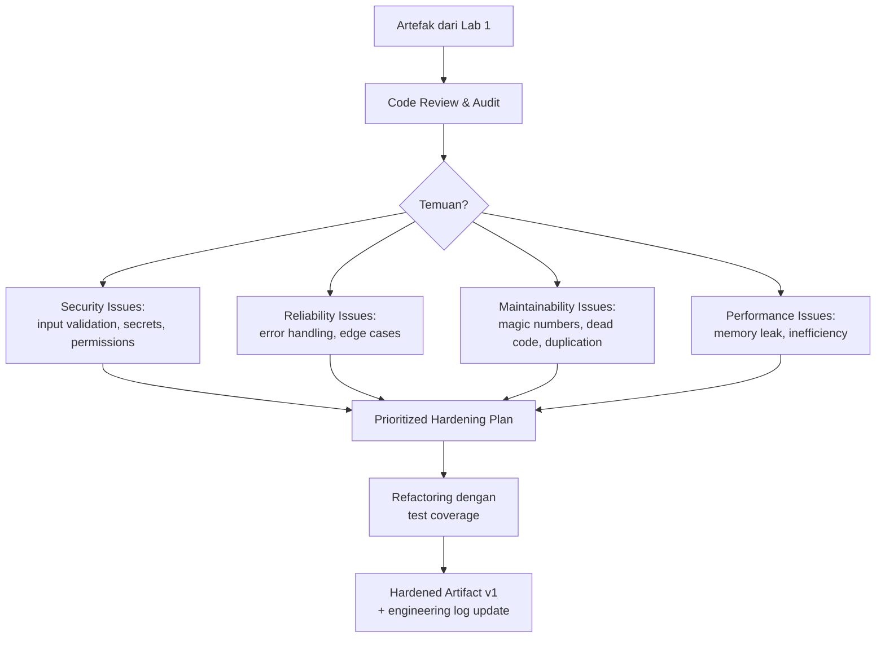

## 3. Pengantar Kontekstual

"Hardening" dalam konteks ini bukan hanya keamanan (security hardening) — melainkan proses membuat artefak lebih robust, reliable, dan maintainable. Artefak penelitian sering dikembangkan dengan pendekatan "yang penting berjalan" (make it work). Lab 2 adalah waktu untuk mentransisikannya ke standar "dapat diandalkan oleh orang lain" (make it right).

Penelitian keamanan siber memiliki tanggung jawab tambahan: artefak yang berinteraksi dengan data sensitif, log sistem, atau artefak forensik harus menangani semua path code dengan hati-hati — termasuk error paths.

## 4. Landasan Teori

### 4.1 Kategori Hardening

**Security Hardening:**
- *Input validation:* Apakah semua input divalidasi sebelum diproses? (path traversal, injection)
- *Secret management:* Apakah ada credential, token, atau kunci yang ter-hardcode dalam kode atau config?
- *File permissions:* Apakah artefak membuat file dengan permission yang terlalu terbuka?
- *Dependency vulnerabilities:* Apakah ada library yang memiliki CVE yang diketahui?

**Reliability Hardening:**
- *Error handling:* Apakah semua exception ditangani dengan graceful? Apakah ada `bare except:` atau `catch (Exception e) {}`?
- *Edge cases:* Apakah artefak diuji untuk input kosong, file tidak ditemukan, koneksi terputus?
- *Resource management:* Apakah file handle, koneksi database, dan socket ditutup dengan benar?

**Maintainability Hardening (Refactoring):**
- *Magic numbers:* Ganti angka hard-coded dengan konstanta bernama
- *Dead code:* Hapus kode yang tidak pernah dieksekusi
- *Duplication:* Extract fungsi yang digunakan berulang
- *Documentation:* Tambahkan docstring untuk fungsi yang kompleks

### 4.2 Prinsip Refactoring yang Aman

Aturan utama refactoring: **perilaku tidak boleh berubah**. Untuk memastikan ini:

1. *Test before refactoring:* Tulis test untuk perilaku yang ada sebelum mengubah kode
2. *Small steps:* Lakukan refactoring dalam langkah kecil, bukan overhaul besar sekaligus
3. *Test after each step:* Jalankan test setelah setiap perubahan kecil
4. *Commit incrementally:* Setiap langkah refactoring = satu commit dengan pesan yang jelas

### 4.3 Dependency Vulnerability Scanning

```bash
# Python — cek CVE dalam dependency
pip install safety
safety check -r requirements-lock.txt

# Node.js
npm audit

# Docker image
docker scout cves myimage:v1.0.0
# atau: trivy image myimage:v1.0.0
```

Setiap CVE yang ditemukan harus: (a) di-upgrade ke versi yang tidak rentan, atau (b) didokumentasikan sebagai known risk dengan justifikasi mengapa tidak dapat diupgrade (misalnya, versi yang lebih baru breaking changes yang mempengaruhi hasil).

## 5. Model atau Arsitektur

```mermaid
flowchart LR
    subgraph AUDIT["Pre-Hardening Audit"]
        A1[Security scan\n(secrets, CVE)]
        A2[Static analysis\n(pylint, bandit)]
        A3[Manual code review\n(edge cases, error handling)]
    end

    subgraph PLAN["Hardening Plan"]
        HP1[Critical: security issues]
        HP2[High: reliability issues]
        HP3[Medium: maintainability]
        HP4[Low: cosmetic]
    end

    subgraph EXECUTE["Hardening Execution"]
        HE1[Fix in priority order]
        HE2[Test after each fix]
        HE3[Commit dengan pesan deskriptif]
        HE4[Update engineering log]
    end

    AUDIT --> PLAN --> EXECUTE
    EXECUTE --> EVAL3["Eval-3: Hardened Artifact\n+ Engineering Log\n+ Test Evidence"]
```

## 6. Contoh Terapan

**Hardening tool forensik Python — temuan dan perbaikan:**

*Temuan 1 (Critical — security):* API key tersimpan dalam config.py:
```python
# SEBELUM (berbahaya)
API_KEY = "sk-abc123def456..."

# SESUDAH (aman)
import os
API_KEY = os.environ.get("VIRUSTOTAL_API_KEY")
if not API_KEY:
    raise ValueError("VIRUSTOTAL_API_KEY environment variable not set")
```

*Temuan 2 (High — reliability):* Path traversal tidak dicegah:
```python
# SEBELUM
def read_artifact(filename):
    with open(f"/evidence/{filename}") as f:
        return f.read()

# SESUDAH
import os
def read_artifact(filename):
    safe_path = os.path.realpath(os.path.join("/evidence", filename))
    if not safe_path.startswith("/evidence/"):
        raise ValueError(f"Path traversal attempt: {filename}")
    with open(safe_path) as f:
        return f.read()
```

## 7. Praktikum atau Aktivitas Terarah

**Tujuan:** Melakukan security dan reliability hardening pada artefak tesis.

**Langkah Kerja:**
1. Jalankan static analysis tool (bandit untuk Python, atau equivalent).
2. Jalankan dependency vulnerability scan (safety atau npm audit).
3. Lakukan manual code review dengan fokus pada error handling dan edge cases.
4. Buat hardening plan: kategorisasikan semua temuan berdasarkan prioritas.
5. Kerjakan perbaikan dalam urutan prioritas, dengan test setelah setiap perubahan.
6. Update engineering log dengan setiap perubahan yang dilakukan.

**Etika dan keselamatan:** Jika ditemukan CVE dalam dependency, jangan membuat exploit — cukup dokumentasikan dan upgrade atau mitigasi.

## 8. Latihan Pemahaman

1. **(Pilihan Ganda)** "Bare except" dalam Python (`except:` tanpa tipe exception) bermasalah karena:
   - A. Menyebabkan kode berjalan lebih lambat
   - B. Menangkap semua exception termasuk KeyboardInterrupt dan SystemExit, menyembunyikan error kritis
   - C. Tidak kompatibel dengan Python 3
   - D. Menggunakan terlalu banyak memori

2. **(Analisis)** Artefak menggunakan library dengan CVE severity "Medium" yang belum di-patch. Library yang lebih baru dengan patch ada, tetapi memerlukan perubahan API yang akan mempengaruhi hasil eksperimen. Bagaimana Anda menangani situasi ini?

3. **(Evaluasi)** Mahasiswa F mengatakan: "Saya tidak perlu hardening karena artefak ini hanya untuk penelitian, tidak untuk production." Evaluasi argumen ini.

## 9. Latihan Terapan / Studi Kasus

**Studi Kasus:** Static analysis menemukan 3 masalah critical, 7 high, 15 medium, dan 40 low dalam artefak tesis. Tersisa 3 minggu sebelum evaluasi Eval-3. Buat rencana hardening yang realistis: mana yang harus diselesaikan, mana yang dapat diakui sebagai known issue, dan bagaimana mendokumentasikan keputusan ini.

## 10. Kunci Jawaban dan Pembahasan

**Soal 1:** Jawaban B. `bare except:` menangkap semua exception termasuk `KeyboardInterrupt` (Ctrl+C), `SystemExit`, dan `GeneratorExit` yang biasanya tidak seharusnya ditangkap. Ini dapat menyebabkan artefak tidak dapat dihentikan dan menyembunyikan error yang seharusnya terlihat. Selalu gunakan exception type yang spesifik: `except FileNotFoundError:` atau minimal `except Exception:`.

**Soal 2:** Opsi yang tersedia: (a) Upgrade dan re-run eksperimen untuk memverifikasi bahwa hasilnya konsisten (direkomendasikan jika effort terjangkau); (b) Dokumentasikan CVE sebagai known risk dalam release notes, jelaskan bahwa eksperimen dilakukan dengan versi X karena versi Y mengubah API. Untuk penelitian yang tidak diekspos ke jaringan, Medium CVE seringkali dapat diterima dengan dokumentasi yang tepat.

**Soal 3:** Argumen ini lemah. Pertama, artefak penelitian dapat digunakan kembali oleh peneliti lain — including dalam konteks yang lebih berisiko. Kedua, secret yang ter-hardcode dalam kode yang dipublikasikan di GitHub dapat dieksploitasi meskipun "hanya untuk penelitian." Ketiga, kebiasaan defensive coding adalah kompetensi profesional yang dibangun sejak research stage.

## 11. Ringkasan Bab

Hardening mencakup empat kategori: security (input validation, secret management, dependency CVE), reliability (error handling, edge cases, resource management), maintainability (magic numbers, dead code, duplication), dan performance. Refactoring yang aman mengikuti prinsip: test first, small steps, test after each step, commit incrementally. Semua perubahan dicatat dalam engineering log.

## 12. Refleksi Profesional

1. Dalam pengembangan tool keamanan profesional (misalnya tool forensik atau scanner), code review dan security hardening adalah bagian dari proses sebelum tool digunakan di lapangan. Bagaimana pengalaman hardening artefak tesis ini mempersiapkan Anda untuk standar kualitas yang diharapkan di lingkungan profesional?


---

# BAB 6 — INSTRUMENTATION DAN AUTOMATION

## 1. Capaian Pembelajaran Bab

Setelah mempelajari bab ini, mahasiswa mampu:
- Menerapkan instrumentasi kode untuk pengumpulan metrik eksperimen secara otomatis
- Membangun automation script untuk menjalankan eksperimen secara reproduktif
- Mengimplementasikan logging yang terstruktur dan dapat diaudit
- Mengintegrasikan continuous integration sederhana untuk verifikasi otomatis

*Berkaitan dengan Sub-CPMK.3, Eval-3 (20%)*

## 2. Peta Konsep Bab

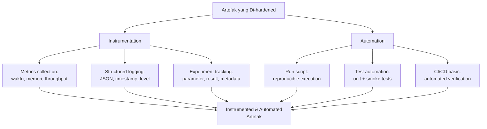

## 3. Pengantar Kontekstual

Penelitian yang harus dijalankan secara manual, langkah demi langkah, dengan keputusan yang tidak terdokumentasi di setiap titik — adalah penelitian yang tidak reproducible. Automation bukan kemewahan; ini adalah keharusan untuk reproducibility.

Instrumentasi memungkinkan pengumpulan data eksperimen secara sistematis, tanpa bergantung pada pencatatan manual yang rentan terhadap kesalahan. Setiap run eksperimen seharusnya menghasilkan log terstruktur yang mencatat: kapan dijalankan, dengan parameter apa, dan apa hasilnya.

## 4. Landasan Teori

### 4.1 Structured Logging untuk Eksperimen

Logging yang baik menggunakan format terstruktur (JSON) yang dapat di-parse secara otomatis:

```python
import logging
import json
import time
from datetime import datetime

class ExperimentLogger:
    def __init__(self, experiment_name, config):
        self.experiment_name = experiment_name
        self.config = config
        self.start_time = time.time()
        self.log_file = f"logs/{experiment_name}_{datetime.now():%Y%m%d_%H%M%S}.jsonl"

    def log_metric(self, step, metrics):
        entry = {
            "timestamp": datetime.now().isoformat(),
            "experiment": self.experiment_name,
            "step": step,
            "config": self.config,
            "metrics": metrics,
            "elapsed_seconds": time.time() - self.start_time
        }
        with open(self.log_file, 'a') as f:
            f.write(json.dumps(entry) + '\n')
```

Format JSONL (JSON Lines) — satu JSON object per baris — memudahkan parsing dan streaming log dari eksperimen panjang.

### 4.2 Experiment Tracking

Untuk penelitian ML, experiment tracking tools (MLflow, Weights & Biases, atau bahkan spreadsheet terstruktur) memungkinkan perbandingan antar run:

```python
import mlflow

with mlflow.start_run(run_name="baseline_experiment"):
    mlflow.log_params({
        "model": "RandomForest",
        "n_estimators": 100,
        "max_depth": 10,
        "random_state": 42
    })
    # ... training code ...
    mlflow.log_metrics({
        "f1_score": f1,
        "precision": precision,
        "recall": recall,
        "auc_roc": auc
    })
    mlflow.log_artifact("results/confusion_matrix.png")
```

Jika tidak menggunakan tool tracking, minimal catat parameter dan hasil dalam log file terstruktur dan simpan konfigurasi yang digunakan untuk setiap run.

### 4.3 Run Script: Reproducible Execution

```bash
#!/bin/bash
# run_experiment.sh — reproducible execution script
set -euo pipefail  # exit on error, undefined variable, pipe failure

EXPERIMENT_NAME="baseline_$(date +%Y%m%d_%H%M%S)"
CONFIG_FILE="config/experiment.yaml"
OUTPUT_DIR="results/${EXPERIMENT_NAME}"

echo "[$(date -Iseconds)] Starting experiment: ${EXPERIMENT_NAME}"

mkdir -p "${OUTPUT_DIR}"

# Log git state
git log --oneline -1 > "${OUTPUT_DIR}/git_state.txt"
git status >> "${OUTPUT_DIR}/git_state.txt"

# Run experiment
python src/run_experiment.py \
  --config "${CONFIG_FILE}" \
  --output "${OUTPUT_DIR}" \
  --seed 42 \
  2>&1 | tee "${OUTPUT_DIR}/stdout.log"

echo "[$(date -Iseconds)] Experiment complete. Results: ${OUTPUT_DIR}"
```

Elemen penting: `set -euo pipefail` (gagal jika ada error), log git state, seed eksplisit, tee output ke log file.

## 5. Model atau Arsitektur

```mermaid
flowchart LR
    subgraph INSTRUMENTED["Artefak yang Di-instrumentasi"]
        I1[Structured JSON logging]
        I2[Metric collection]
        I3[Config serialization]
        I4[Git state capture]
    end

    subgraph AUTOMATED["Automation Layer"]
        A1[run_experiment.sh]
        A2[run_all.sh\n(semua skenario)]
        A3[test_suite.sh]
    end

    subgraph OUTPUT["Reproducible Output"]
        O1[results/{timestamp}/]
        O2[logs/{timestamp}.jsonl]
        O3[Test pass/fail report]
    end

    INSTRUMENTED & AUTOMATED --> OUTPUT
    OUTPUT --> TRACEABILITY["Traceability:\nsetiap result → config → code → timestamp"]
```

## 6. Contoh Terapan

**Automation untuk eksperimen network anomaly detection:**

```bash
#!/bin/bash
# run_all_experiments.sh
set -euo pipefail

MODELS=("random_forest" "gradient_boosting" "neural_network")
DATASETS=("cicids2017" "cicids2022" "custom_2024")

for MODEL in "${MODELS[@]}"; do
  for DATASET in "${DATASETS[@]}"; do
    echo "Running: ${MODEL} on ${DATASET}"
    python src/train_evaluate.py \
      --model "${MODEL}" \
      --dataset "${DATASET}" \
      --config "config/${MODEL}.yaml" \
      --output "results/${MODEL}_${DATASET}" \
      --seed 42
  done
done

echo "Generating comparison table..."
python src/generate_table.py --results-dir results/ --output results/comparison_table.csv
```

Dengan script ini, seluruh eksperimen (9 kombinasi) dapat dijalankan ulang dengan satu perintah, menghasilkan hasil yang identik.

## 7. Praktikum atau Aktivitas Terarah

**Tujuan:** Menambahkan instrumentation dan automation ke artefak tesis.

**Langkah Kerja:**
1. Identifikasi semua parameter eksperimen yang mempengaruhi hasil — pindahkan ke config file YAML.
2. Tambahkan structured logging ke entry point utama.
3. Buat `run_experiment.sh` yang menjalankan eksperimen secara reproduktif.
4. Buat `run_all.sh` yang menjalankan semua skenario yang dilaporkan dalam tesis.
5. Verifikasi: jalankan `run_all.sh` dari awal, hasilnya harus konsisten dengan yang dilaporkan.

## 8. Latihan Pemahaman

1. **(Analisis)** Mengapa `set -euo pipefail` penting dalam bash script untuk eksperimen ilmiah?

2. **(Evaluasi)** Mahasiswa G menggunakan Jupyter Notebook sebagai satu-satunya cara menjalankan eksperimen. Setiap run memerlukan manual cell execution. Identifikasi keterbatasan ini untuk reproducibility dan sarankan perbaikan.

3. **(Perancangan)** Eksperimen Anda memerlukan 6 jam untuk dijalankan. Bagaimana automation dan checkpointing dapat membantu mengelola ini?

## 9. Latihan Terapan / Studi Kasus

**Studi Kasus:** Mahasiswa H memiliki 12 eksperimen berbeda yang dilaporkan dalam tesisnya. Setiap eksperimen saat ini dijalankan dengan parameter yang di-hardcode dalam notebook yang berbeda. Susun rencana refactoring untuk mengkonsolidasikan ini ke dalam sistem config + automation yang reproducible, tanpa mengubah hasil eksperimen.

## 10. Kunci Jawaban dan Pembahasan

**Soal 1:** `set -e` menyebabkan script berhenti saat ada perintah yang gagal (exit code ≠ 0); `set -u` menyebabkan error jika variable tidak terdefinisi; `set -o pipefail` memastikan bahwa jika perintah dalam pipeline gagal, seluruh pipeline dianggap gagal. Tanpa ini, script dapat terus berjalan setelah error, menghasilkan output yang tidak valid tanpa peringatan.

**Soal 2:** Jupyter notebook dengan manual cell execution bermasalah karena: (a) order eksekusi sel dapat tidak konsisten; (b) state kernel dapat berbeda antara run; (c) tidak dapat diotomasi tanpa tools tambahan; (d) sulit untuk diintegrasikan ke CI/CD. Perbaikan: konversi ke Python script dengan CLI arguments, atau gunakan `nbconvert --execute` untuk headless execution.

## 11. Ringkasan Bab

Instrumentation meliputi structured logging (JSON), metric collection, config serialization, dan git state capture. Automation run scripts memastikan eksperimen dapat dijalankan ulang dengan satu perintah. `run_all.sh` yang mencakup semua skenario adalah komponen kritis reproducibility package.

## 12. Refleksi Profesional

1. Dalam operasi keamanan siber, automation dan logging adalah standar operasional — SIEM bergantung pada log terstruktur, dan playbook SOC mengotomasi respons insiden. Bagaimana prinsip yang sama diterapkan dalam penelitian untuk memastikan eksperimen dapat diaudit dan diverifikasi?

---

# BAB 7 — PACKAGING DAN RELEASE CANDIDATE

## 1. Capaian Pembelajaran Bab

Setelah mempelajari bab ini, mahasiswa mampu:
- Membuat release candidate yang siap untuk evaluasi dan distribusi
- Menyusun release notes yang informatif dan profesional
- Menerapkan semantic versioning untuk artefak penelitian
- Melakukan final functional testing sebelum release candidate dinyatakan siap

*Berkaitan dengan Sub-CPMK.3, Eval-3 (20%)*

## 2. Peta Konsep Bab

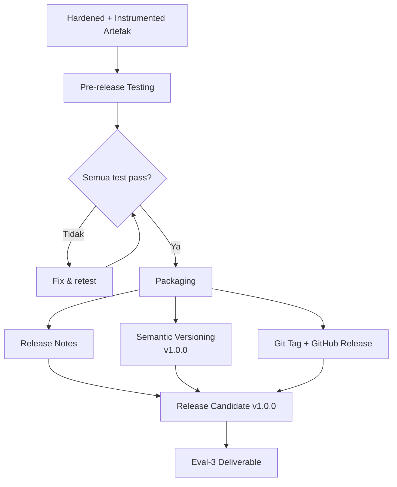

## 3. Pengantar Kontekstual

Release candidate adalah versi artefak yang dinyatakan siap untuk evaluasi — bukan "masih dalam pengembangan" tetapi "ini adalah versi yang diklaim." Dalam penelitian, release candidate berkorespondensi dengan versi yang digunakan untuk menghasilkan semua hasil yang dilaporkan dalam tesis.

Setelah release candidate dibuat dan di-tag dalam repository, tidak ada perubahan kode yang boleh dilakukan tanpa membuat release baru. Ini adalah komitmen bahwa "hasil yang dilaporkan dihasilkan oleh kode dalam tag ini."

## 4. Landasan Teori

### 4.1 Semantic Versioning untuk Artefak Penelitian

Semantic versioning (semver) menggunakan format MAJOR.MINOR.PATCH:
- **MAJOR:** Perubahan yang tidak backward-compatible (perubahan signifikan pada interface atau hasil)
- **MINOR:** Fitur baru yang backward-compatible
- **PATCH:** Bug fix yang tidak mengubah perilaku

Untuk artefak penelitian dalam Lab 2, versioning yang disarankan:
- `v0.x.y` — selama Lab 1 (eksperimen awal, tidak stable)
- `v1.0.0-rc1` — release candidate pertama di Lab 2
- `v1.0.0` — release final yang digunakan dalam tesis

### 4.2 Pre-Release Testing Checklist

Sebelum membuat release candidate:

```bash
# 1. Jalankan semua test
python -m pytest tests/ -v --tb=short

# 2. Jalankan smoke test
./scripts/smoke_test.sh

# 3. Jalankan full experiment (untuk memverifikasi hasil konsisten)
./run_all.sh

# 4. Verifikasi dokumentasi
# - README dapat diikuti oleh orang baru?
# - Semua parameter terdokumentasi?
# - Known limitations ada?

# 5. Check dependency vulnerabilities
safety check -r requirements-lock.txt

# 6. Verifikasi tidak ada secret ter-commit
git grep -E "(password|api_key|secret|token)\s*=" -- "*.py" "*.yaml" "*.json"
```

### 4.3 Release Notes

Release notes mendokumentasikan apa yang berubah dan apa yang diketahui bermasalah:

```markdown
# Release Notes — v1.0.0

## Overview
Tool forensik container yang mampu mengekstraksi artefak dari lingkungan
Kubernetes dengan completeness rate 94% pada dataset validasi.

## Requirements
- Python 3.11+
- Docker Engine 24.0+
- 8GB RAM minimum, 16GB recommended

## Installation
Ikuti execution guide di README.md

## What's New (dibanding Lab 1 prototype)
- Ditambahkan dukungan untuk Podman runtime
- Diperbaiki: race condition pada concurrent container extraction
- Ditambahkan structured JSON logging
- Semua parameter eksperimen dapat dikonfigurasi via YAML

## Known Issues
- Belum diuji pada Kubernetes versi < 1.26
- Beberapa format container exotis (Singularity) tidak didukung
- Pada sistem dengan low memory, batch size otomatis dikurangi

## Ethical Disclosure
Seluruh pengujian dilakukan dalam lingkungan lab terkontrol dengan
otorisasi penuh. Tidak ada sistem produksi yang digunakan dalam pengujian.
```

## 5. Model atau Arsitektur

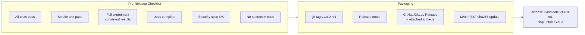

## 6. Contoh Terapan

**Git workflow untuk release candidate:**

```bash
# 1. Pastikan semua test pass
python -m pytest tests/ && echo "All tests passed"

# 2. Update version number
sed -i 's/__version__ = ".*"/__version__ = "1.0.0-rc1"/' src/__init__.py

# 3. Update CHANGELOG
echo "# Changelog" > CHANGELOG.md
echo "## v1.0.0-rc1 ($(date +%Y-%m-%d))" >> CHANGELOG.md

# 4. Commit dan tag
git add -A
git commit -m "chore: prepare release v1.0.0-rc1"
git tag -a v1.0.0-rc1 -m "Release candidate 1 untuk evaluasi Lab 2"
git push origin main --tags

# 5. Verifikasi tag
git log --oneline -5
```

## 7. Praktikum atau Aktivitas Terarah

**Tujuan:** Membuat release candidate v1.0.0-rc1 dari artefak tesis.

**Langkah Kerja:**
1. Jalankan semua item pre-release checklist — pastikan semua pass.
2. Tulis release notes mengikuti template.
3. Buat git tag dan GitHub/GitLab release.
4. Update MANIFEST.sha256.
5. Verifikasi bahwa seseorang dapat clone repository dari tag dan mengikuti README.

**Kriteria keberhasilan:** Release candidate dapat di-clone dan dijalankan oleh evaluator (pembimbing atau penguji) tanpa bantuan dari peneliti.

## 8. Latihan Pemahaman

1. **(Analisis)** Setelah membuat release candidate v1.0.0-rc1, penguji menemukan bug minor yang mempengaruhi output format (bukan nilai metrik). Bagaimana Anda merespons — perbaiki di v1.0.0-rc1 yang sama, atau buat v1.0.0-rc2?

2. **(Evaluasi)** Known issues dalam release notes: apakah mencantumkan banyak known issues membuat artefak terlihat "tidak selesai"? Jelaskan perspektif yang benar.

3. **(Perancangan)** Artefak Anda menghasilkan hasil yang sedikit berbeda (dalam margin ±2%) setiap kali dijalankan karena komponen stochastic. Bagaimana release notes Anda menjelaskan ini agar replikator tidak bingung?

## 9. Latihan Terapan / Studi Kasus

**Studi Kasus:** Release candidate v1.0.0-rc1 sudah dibuat dan di-share dengan pembimbing untuk review. Pembimbing menemukan: (a) minor typo di README; (b) satu test case gagal pada edge case yang jarang terjadi; (c) satu parameter di config tidak terdokumentasi. Kategorisasikan setiap temuan dan tentukan apakah perlu rc2 atau dapat diselesaikan dengan cara lain.

## 10. Kunci Jawaban dan Pembahasan

**Soal 1:** Buat v1.0.0-rc2. Setelah tag dibuat, tidak ada perubahan pada kode yang di-tag — commit fix ke branch, buat tag baru. Ini menjaga audit trail yang jelas: rc1 memiliki bug X, rc2 memperbaikinya. Jangan pernah "move a tag" karena ini merusak traceability.

**Soal 2:** Known issues dalam release notes adalah tanda peneliti yang *jujur dan profesional*. Reviewer dan penguji menghargai transparency — mereka mengetahui bahwa tidak ada artefak yang sempurna, dan peneliti yang mendokumentasikan keterbatasannya secara eksplisit menunjukkan pemahaman yang mendalam tentang karyanya. Yang terlihat "tidak selesai" adalah artefak yang memiliki masalah tersembunyi yang ditemukan oleh reviewer secara mengejutkan.

## 11. Ringkasan Bab

Release candidate dibuat setelah semua item pre-release checklist terpenuhi. Semantic versioning (MAJOR.MINOR.PATCH) memberikan identitas yang jelas. Git tag yang immutable memastikan bahwa klaim "hasil dihasilkan oleh kode ini" dapat diverifikasi. Release notes yang jujur tentang known issues mencerminkan profesionalisme peneliti.

## 12. Refleksi Profesional

1. Dalam pengembangan software keamanan profesional, proses release melibatkan code freeze, pengujian intensif, dan sign-off dari multiple stakeholder. Bagaimana proses release candidate yang Anda pelajari mencerminkan praktik ini?

---

# BAB 8 — REPLICATION EXECUTION DAN MEASUREMENT

## 1. Capaian Pembelajaran Bab

Setelah mempelajari bab ini, mahasiswa mampu:
- Melaksanakan replikasi eksperimen menggunakan release candidate
- Mengumpulkan data pengukuran berulang (repeated measurements)
- Menjaga traceability antara konfigurasi, eksekusi, dan hasil
- Mendokumentasikan replication log yang dapat diaudit

*Berkaitan dengan Sub-CPMK.4, Eval-4 (20%)*

## 2. Peta Konsep Bab

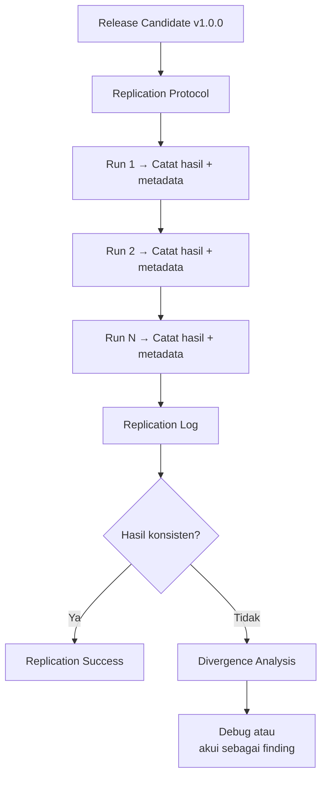

## 3. Pengantar Kontekstual

Replikasi eksperimen adalah proses menjalankan ulang eksperimen yang sama (menggunakan kode dan data yang sama) untuk memverifikasi konsistensi hasil. Ini berbeda dari *reproduksi* (menggunakan kode berbeda tetapi metode yang sama) dan *replication* dalam arti penuh (studi independen yang mencoba mengkonfirmasi temuan).

Dalam konteks Lab 2, yang dimaksud adalah *internal replication*: memverifikasi bahwa artefak menghasilkan hasil yang konsisten dalam kondisi yang sama. Ini adalah gate minimum untuk mengklaim bahwa hasil eksperimen adalah stabil, bukan artefak dari satu run yang kebetulan bagus.

## 4. Landasan Teori

### 4.1 Repeated Measurement Protocol

Jumlah pengulangan yang direkomendasikan bergantung pada tipe eksperimen:

| Tipe Eksperimen | Minimum Repetisi | Alasan |
|---|---|---|
| ML dengan random component (shuffle, init) | 5-10 runs | Estimasi variance yang reliable |
| Forensic tool (deterministik) | 3 runs | Verifikasi konsistensi |
| Network experiment (environment variable) | 5 runs | Menangkap variabilitas jaringan |
| Security assessment (deterministik) | 3 runs | Verifikasi stabilitas |

Untuk setiap run, catat:
- Timestamp (awal dan akhir)
- Versi artefak (git commit hash)
- Konfigurasi yang digunakan (atau hash dari config file)
- Environment (versi OS, library, hardware jika relevan)
- Semua metrik output

### 4.2 Replication Log Format

```
[Run ID]: run_001
[Timestamp]: 2026-06-30T09:15:32+07:00
[Duration]: 00:45:23
[Git Commit]: a3f9b2c
[Config Hash]: SHA256: abc123...
[Environment]: Ubuntu 22.04, Python 3.11.9, CUDA 11.8
[Hardware]: RTX 3090, 32GB RAM

[Metrics]:
  F1 Score: 0.921
  Precision: 0.934
  Recall: 0.909
  AUC-ROC: 0.971
  Inference Time (avg ms): 23.4

[Notes]: Run bersih, tidak ada error atau warning.
```

### 4.3 Analisis Konsistensi Hasil

Setelah N runs, lakukan analisis konsistensi:

```python
import numpy as np

f1_scores = [0.921, 0.918, 0.924, 0.919, 0.922]

print(f"Mean F1: {np.mean(f1_scores):.4f}")
print(f"Std F1: {np.std(f1_scores):.4f}")
print(f"CV (Coefficient of Variation): {np.std(f1_scores)/np.mean(f1_scores)*100:.2f}%")
print(f"Range: [{np.min(f1_scores):.4f}, {np.max(f1_scores):.4f}]")
```

Coefficient of Variation (CV) < 5% biasanya dianggap konsisten untuk eksperimen ML. CV > 10% menunjukkan variabilitas yang perlu diinvestigasi dan dijelaskan.

## 5. Model atau Arsitektur

```mermaid
flowchart LR
    subgraph REPLICATION["Replication Execution"]
        R1["Run 1\n(config + seed + env)"]
        R2["Run 2\n(config + seed + env)"]
        R3["Run N\n(config + seed + env)"]
    end

    subgraph LOG["Replication Log"]
        L1[Run ID + Timestamp]
        L2[Git commit + Config hash]
        L3[Environment spec]
        L4[Metrics per run]
        L5[Notes]
    end

    subgraph ANALYSIS["Consistency Analysis"]
        A1[Mean + Std per metrik]
        A2[Coefficient of Variation]
        A3[Range analysis]
        A4[Outlier detection]
    end

    REPLICATION --> LOG --> ANALYSIS
    ANALYSIS --> EVAL4["Eval-4: Replication Log\n+ Repeated Measurement Sheet\n+ Integrity Verification"]
```

## 6. Contoh Terapan

**Replication log untuk eksperimen malware classification (5 runs):**

| Run | F1 | Precision | Recall | AUC | Time (s) |
|---|---|---|---|---|---|
| run_001 | 0.921 | 0.934 | 0.909 | 0.971 | 1423 |
| run_002 | 0.918 | 0.930 | 0.907 | 0.968 | 1401 |
| run_003 | 0.924 | 0.938 | 0.911 | 0.973 | 1445 |
| run_004 | 0.919 | 0.932 | 0.906 | 0.969 | 1418 |
| run_005 | 0.922 | 0.935 | 0.910 | 0.972 | 1431 |
| **Mean** | **0.921** | **0.934** | **0.909** | **0.971** | **1424** |
| **Std** | **0.002** | **0.003** | **0.002** | **0.002** | **16** |
| **CV** | **0.22%** | **0.32%** | **0.22%** | **0.21%** | **1.1%** |

CV <1% untuk semua metrik — konsistensi sangat baik, random seed di-set dengan benar.

## 7. Praktikum atau Aktivitas Terarah

**Tujuan:** Melaksanakan replikasi eksperimen minimal 3-5 runs dan menyusun replication log.

**Langkah Kerja:**
1. Jalankan release candidate menggunakan `run_experiment.sh` (dari Bab 6).
2. Untuk setiap run: catat semua informasi dalam replication log template.
3. Setelah semua run selesai: hitung mean, std, dan CV untuk setiap metrik.
4. Identifikasi apakah ada run yang outlier — jika ya, investigasi penyebabnya.
5. Verifikasi integrity: hash semua result file dan catat dalam MANIFEST.sha256.

## 8. Latihan Pemahaman

1. **(Analisis)** Dari 5 runs, hasil F1 adalah: 0.92, 0.91, 0.93, 0.72, 0.92. Run ke-4 jauh lebih rendah. Apa yang harus dilakukan?

2. **(Evaluasi)** Mahasiswa I mengklaim bahwa menggunakan fixed random seed (seed=42) untuk semua runs berarti semua runs pasti identik, sehingga tidak perlu menjalankan 5 kali. Evaluasi argumen ini.

3. **(Perancangan)** Eksperimen Anda melibatkan interaksi dengan jaringan (download data real-time). Bagaimana ini mempengaruhi repeatability, dan bagaimana Anda mendesain replication protocol untuk mengatasinya?

## 9. Latihan Terapan / Studi Kasus

**Studi Kasus:** Setelah 5 runs, mahasiswa J menemukan bahwa dua runs menghasilkan F1 yang signifikan lebih rendah (0.81 vs rata-rata 0.92). Setelah investigasi, ditemukan bahwa dua runs tersebut menggunakan versi Python 3.12 (bukan 3.11 seperti requirements). Susun: (a) analisis root cause; (b) cara mencegah ini ke depan; (c) bagaimana melaporkan temuan ini dalam tesis.

## 10. Kunci Jawaban dan Pembahasan

**Soal 1:** Run ke-4 dengan F1=0.72 adalah outlier yang signifikan (>2 std dev dari mean). Tindakan: (a) investigasi log run ke-4 untuk menemukan penyebab; (b) jika ditemukan kondisi yang anomali (hardware issue, data corruption, dll.) yang bukan bagian dari eksperimen normal — dokumentasikan, exclude dengan justifikasi, dan jalankan run pengganti; (c) jangan exclude tanpa justifikasi — ini cherry-picking.

**Soal 2:** Argumen ini tidak sepenuhnya benar. Fixed random seed memastikan determinisme untuk operasi yang menggunakan RNG (shuffle, weight initialization). Namun ada sumber variabilitas lain yang tidak dipengaruhi seed: timing-dependent operations, GPU parallelism non-determinism (pada beberapa konfigurasi), atau I/O operations. Menjalankan multiple runs tetap penting untuk memverifikasi bahwa determinisme benar-benar terjaga.

## 11. Ringkasan Bab

Replication execution menghasilkan replication log yang mencatat semua informasi yang diperlukan untuk memverifikasi konsistensi (run ID, timestamp, git commit, config hash, environment, metrics). Analisis konsistensi menggunakan mean, std, dan CV. Outlier harus diinvestigasi dan diakui, bukan diabaikan. Integrity verification menggunakan SHA-256 hash.

## 12. Refleksi Profesional

1. Dalam investigasi forensik digital profesional, "repeatability" — kemampuan untuk mendapatkan hasil yang sama dari bukti yang sama — adalah persyaratan yang sering diperiksa dalam persidangan. Bagaimana replication log yang Anda buat mempersiapkan artefak forensik untuk memenuhi standar ini?

---

# BAB 9 — ROBUSTNESS DAN SENSITIVITY ANALYSIS

## 1. Capaian Pembelajaran Bab

Setelah mempelajari bab ini, mahasiswa mampu:
- Melakukan robustness check untuk mengevaluasi stabilitas artefak terhadap variasi input
- Melakukan sensitivity analysis untuk mengidentifikasi parameter yang paling berpengaruh
- Menginterpretasikan hasil robustness dan sensitivity sebagai bukti kualitas kontribusi
- Mendokumentasikan temuan robustness sebagai bagian dari final validation

*Berkaitan dengan Sub-CPMK.4, Eval-4 (20%)*

## 2. Peta Konsep Bab

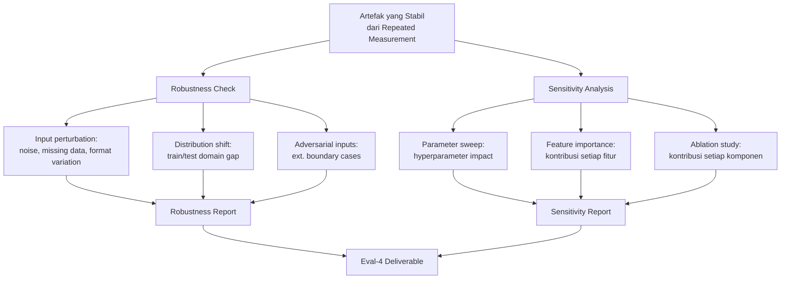

## 3. Pengantar Kontekstual

Artefak yang hanya bekerja pada dataset training dengan kondisi ideal tidak bernilai dalam praktik. Robustness dan sensitivity analysis menjawab pertanyaan penting: "Seberapa dapat diandalkan artefak ini ketika kondisi tidak sempurna?"

Dalam keamanan siber, kondisi tidak sempurna adalah norma: data yang tidak lengkap, log yang terpotong, format yang bervariasi, dan serangan yang sengaja menghindari deteksi. Artefak yang robust terhadap variasi ini memiliki nilai praktis yang lebih tinggi.

## 4. Landasan Teori

### 4.1 Robustness Check

**Input Perturbation Test:** Tambahkan noise atau variasi ke input dan ukur degradasi performa:
- Untuk data tabular: tambahkan Gaussian noise ke fitur numerik
- Untuk text/log: perturbasi format (tambah/hapus whitespace, ganti encoding)
- Untuk PCAP/binary: truncate atau corrupt sebagian data

**Distribution Shift Test:** Uji pada data dari distribusi yang berbeda dari training:
- Dataset dari sumber berbeda (cross-dataset evaluation)
- Dataset dari periode waktu berbeda (temporal shift)
- Dataset dari environment berbeda (cross-environment)

**Boundary Case Test:** Uji pada input yang berada di batas sistem:
- Input kosong
- Input sangat besar
- Input dengan format yang tidak biasa tetapi valid

### 4.2 Sensitivity Analysis

**Hyperparameter Sensitivity:** Untuk ML models:

```python
import numpy as np
from sklearn.model_selection import cross_val_score

# Sweep hyperparameter
n_estimators_range = [10, 50, 100, 200, 500]
results = {}

for n in n_estimators_range:
    model = RandomForestClassifier(n_estimators=n, random_state=42)
    scores = cross_val_score(model, X_train, y_train, cv=5, scoring='f1')
    results[n] = {'mean': scores.mean(), 'std': scores.std()}
    print(f"n_estimators={n}: F1={scores.mean():.4f} ± {scores.std():.4f}")
```

**Ablation Study:** Evaluasi kontribusi setiap komponen sistem:

| Konfigurasi | F1 | Delta |
|---|---|---|
| Full system (semua komponen) | 0.921 | baseline |
| Tanpa preprocessing modul A | 0.884 | -0.037 (-4.0%) |
| Tanpa feature engineering B | 0.891 | -0.030 (-3.3%) |
| Tanpa postprocessing C | 0.910 | -0.011 (-1.2%) |

Ablation study membuktikan kontribusi setiap komponen dan mengidentifikasi mana yang paling kritis.

## 5. Model atau Arsitektur

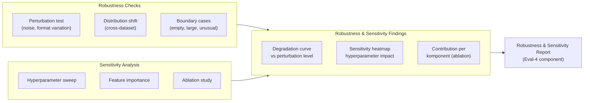

## 6. Contoh Terapan

**Robustness test untuk network anomaly detection:**

*Perturbation test — tambahkan packet loss simulation:*

| Packet Loss | F1 | Notes |
|---|---|---|
| 0% (baseline) | 0.921 | Normal conditions |
| 5% loss | 0.904 | Acceptable degradation |
| 15% loss | 0.871 | Significant degradation |
| 30% loss | 0.812 | Near operational limit |

Interpretasi: sistem robust hingga 15% packet loss, degradasi signifikan di atas itu. Batas operasional yang direkomendasikan: ≤10% packet loss.

## 7. Praktikum atau Aktivitas Terarah

**Tujuan:** Melakukan robustness check dan sensitivity analysis untuk artefak tesis.

**Langkah Kerja:**
1. Identifikasi tiga skenario robustness yang paling relevan untuk domain tesis.
2. Rancang dan jalankan perturbation test — catat hasil pada setiap level perturbation.
3. Jalankan hyperparameter sweep untuk 2-3 parameter yang paling kritis.
4. Jalankan ablation study untuk 3-5 komponen utama artefak.
5. Buat tabel dan visualisasi dari semua hasil.

## 8. Latihan Pemahaman

1. **(Analisis)** Ablation study menunjukkan bahwa menghapus komponen B hanya menurunkan F1 sebesar 0.002 (dari 0.921 ke 0.919). Apa yang dapat disimpulkan tentang kontribusi komponen B?

2. **(Evaluasi)** Mahasiswa K berargumen bahwa "robustness test tidak diperlukan karena sistem kami diuji pada dataset yang sama yang akan digunakan dalam produksi." Evaluasi argumen ini.

3. **(Perancangan)** Untuk tool forensik yang menganalisis memory dump, rancang tiga skenario robustness test yang relevan.

## 9. Latihan Terapan / Studi Kasus

**Studi Kasus:** Robustness test menemukan bahwa artefak ML Anda mengalami degradasi F1 dari 0.92 ke 0.74 ketika data dari organisasi berbeda digunakan (distribution shift). Ini adalah temuan yang signifikan yang belum dilaporkan dalam tesis. Bagaimana Anda: (a) melaporkan temuan ini secara jujur; (b) menginterpretasikannya sebagai limitation yang spesifik; (c) menggunakannya untuk memperkuat, bukan melemahkan, nilai kontribusi tesis?

## 10. Kunci Jawaban dan Pembahasan

**Soal 1:** Komponen B memiliki kontribusi yang sangat kecil (0.002 F1 = 0.22% relatif). Ini bermakna: (a) komponen B dapat dihapus tanpa dampak signifikan pada performa; (b) atau komponen B redundant dengan komponen lain; (c) komponen B mungkin masih bernilai untuk alasan lain (misalnya komputasi yang lebih cepat, atau kontribusi pada kasus tertentu yang tidak tercermin dalam aggregate F1). Laporan ini sebagai temuan faktual, bukan kegagalan.

**Soal 2:** Argumen lemah. Dalam praktik, "dataset yang akan digunakan dalam produksi" tidak pernah identik dengan training data — ada temporal drift, perubahan distribusi, dan variasi yang tidak terduga. Robustness test yang menggunakan data di luar training distribution adalah cara untuk mengevaluasi seberapa siap artefak untuk kondisi nyata.

## 11. Ringkasan Bab

Robustness check mengevaluasi stabilitas artefak terhadap input perturbation, distribution shift, dan boundary cases. Sensitivity analysis mencakup hyperparameter sweep, feature importance, dan ablation study. Temuan robustness dan sensitivity yang jujur memperkuat kredibilitas penelitian — bukan melemahkannya.

## 12. Refleksi Profesional

1. Dalam keamanan siber operasional, sistem yang hanya bekerja dalam "lab conditions" tidak layak untuk deployment. Standar keamanan seperti Common Criteria dan ISO 27001 mensyaratkan pengujian dalam kondisi yang lebih ekstrem dari kondisi normal. Bagaimana robustness testing yang Anda lakukan mencerminkan standar evaluasi ini?

---

# BAB 10 — TRACEABILITY DAN INTEGRITY VERIFICATION

## 1. Capaian Pembelajaran Bab

Setelah mempelajari bab ini, mahasiswa mampu:
- Membangun sistem traceability yang menghubungkan hasil ke konfigurasi, kode, dan data
- Melakukan integrity verification menggunakan kriptografi (SHA-256)
- Menyusun data provenance yang mendokumentasikan asal-usul setiap data
- Memastikan audit trail eksperimen dapat diverifikasi secara independen

*Berkaitan dengan Sub-CPMK.4, Eval-4 (20%)*

## 2. Peta Konsep Bab

```mermaid
flowchart TD
    A[Setiap Hasil Eksperimen] --> B[Traceability Chain]
    B --> C[Git Commit Hash:\nkode versi berapa?]
    B --> D[Config Hash:\nparameter apa?]
    B --> E[Dataset Hash:\ndata apa?]
    B --> F[Environment:\nOS, tools, versions apa?]
    B --> G[Timestamp:\nkapan dijalankan?]
    C & D & E & F & G --> H[Complete Audit Trail]
    H --> I[Verifiable by\npihak independen]
```

## 3. Pengantar Kontekstual

"Traceability" dalam penelitian berarti setiap klaim yang dibuat dapat ditelusuri ke bukti yang mendasarinya. Setiap angka dalam tesis harus dapat ditelusuri ke: run mana yang menghasilkannya, dengan kode versi berapa, konfigurasi apa, pada data apa, dan kapan.

Tanpa traceability, penelitian adalah black box — "percayalah pada kami." Dengan traceability, penelitian adalah transparent box — "verifikasikan sendiri." Dalam era di mana reproducibility crisis sedang menjadi perhatian utama komunitas ilmiah, traceability adalah standar yang tidak dapat dikompromikan.

## 4. Landasan Teori

### 4.1 Komponen Traceability Chain

Untuk setiap hasil yang dilaporkan, chain berikut harus dapat diverifikasi:

```
Hasil (angka/output) 
  → Run ID (dalam replication log)
  → Git commit hash (kode yang digunakan)
  → Config file hash (parameter yang digunakan)
  → Dataset hash (data yang digunakan)
  → Environment spec (OS, libraries, hardware)
  → Timestamp (kapan dijalankan)
```

### 4.2 SHA-256 untuk Integrity Verification

```python
import hashlib
import json

def compute_file_hash(filepath):
    """Compute SHA-256 hash of a file."""
    sha256 = hashlib.sha256()
    with open(filepath, 'rb') as f:
        for chunk in iter(lambda: f.read(65536), b''):
            sha256.update(chunk)
    return sha256.hexdigest()

def compute_config_hash(config_dict):
    """Compute SHA-256 hash of configuration dict."""
    # Sort keys untuk determinism
    config_str = json.dumps(config_dict, sort_keys=True)
    return hashlib.sha256(config_str.encode()).hexdigest()

# Contoh penggunaan
dataset_hash = compute_file_hash("data/processed/train.csv")
config_hash = compute_config_hash({"model": "rf", "n_estimators": 100})
print(f"Dataset: {dataset_hash}")
print(f"Config: {config_hash}")
```

### 4.3 Data Provenance

Data provenance mendokumentasikan asal-usul dan transformasi setiap dataset:

```yaml
# data/provenance.yaml
dataset_name: cicids2017_processed
version: 1.0
created: 2026-05-15
creator: [nama peneliti]

sources:
  - name: CICIDS2017 original
    url: https://www.unb.ca/cic/datasets/ids-2017.html
    download_date: 2026-04-10
    sha256: "original_file_hash_here"

transformations:
  - step: 1
    description: "Remove duplicate rows"
    script: src/preprocess.py
    function: remove_duplicates
    input_sha256: "hash_before"
    output_sha256: "hash_after"
    timestamp: 2026-04-11T10:00:00
  - step: 2
    description: "Normalize features"
    script: src/preprocess.py
    function: normalize_features
    input_sha256: "hash_before_step2"
    output_sha256: "hash_after_step2"
    timestamp: 2026-04-11T10:15:00

final_sha256: "final_processed_dataset_hash"
```

## 5. Model atau Arsitektur

```mermaid
flowchart LR
    subgraph PROVENANCE["Data Provenance"]
        P1[Source dataset\n+ SHA-256]
        P2[Transformation 1\n+ input/output SHA-256]
        P3[Transformation N\n+ input/output SHA-256]
        P4[Final processed\ndataset + SHA-256]
        P1 --> P2 --> P3 --> P4
    end

    subgraph EXPERIMENT["Experiment Traceability"]
        E1[Git commit hash]
        E2[Config hash]
        E3[Dataset hash]
        E4[Environment spec]
        E5[Timestamp]
        E1 & E2 & E3 & E4 & E5 --> RUN[Run ID]
    end

    subgraph RESULTS["Results"]
        R1[Result file\n+ SHA-256]
        R2[Replication log\nentry]
    end

    PROVENANCE --> EXPERIMENT --> RESULTS
    RESULTS --> AUDIT["Complete Audit Trail\n(verifiable independently)"]
```

## 6. Contoh Terapan

**Traceability entry untuk satu eksperimen:**

```json
{
  "run_id": "run_005",
  "timestamp": "2026-06-15T14:30:22+07:00",
  "git_commit": "a3f9b2c4d5e6f7a8b9c0d1e2f3a4b5c6d7e8f9a0",
  "git_branch": "main",
  "config_file": "config/experiment.yaml",
  "config_hash": "sha256:abc123def456...",
  "dataset": {
    "train": "data/processed/train.csv",
    "train_hash": "sha256:111222333...",
    "test": "data/processed/test.csv",
    "test_hash": "sha256:444555666..."
  },
  "environment": {
    "python_version": "3.11.9",
    "os": "Ubuntu 22.04.4 LTS",
    "cuda_version": "11.8",
    "key_packages": {
      "torch": "2.1.0",
      "sklearn": "1.3.2",
      "numpy": "1.26.4"
    }
  },
  "results": {
    "f1_score": 0.922,
    "precision": 0.935,
    "recall": 0.910,
    "output_file": "results/run_005/predictions.csv",
    "output_hash": "sha256:777888999..."
  }
}
```

Dengan entry ini, siapapun dapat: (a) clone commit `a3f9b2c`, (b) memverifikasi dataset dengan hash, (c) menggunakan config yang sama, (d) menjalankan ulang, dan (e) memverifikasi bahwa hasilnya konsisten.

## 7. Praktikum atau Aktivitas Terarah

**Tujuan:** Membangun sistem traceability lengkap untuk semua eksperimen yang dilaporkan.

**Langkah Kerja:**
1. Untuk setiap eksperimen yang menghasilkan angka dalam tesis: buat traceability entry.
2. Verifikasi setiap hash — pastikan file yang direferensikan masih ada dan hashnya cocok.
3. Buat data provenance document untuk setiap dataset.
4. Update MANIFEST.sha256 dengan semua file yang relevan.
5. Lakukan final verification: minta rekan mahasiswa memverifikasi tiga traceability entry secara acak.

## 8. Latihan Pemahaman

1. **(Analisis)** Mahasiswa L memiliki angka F1=0.93 dalam tesisnya tetapi tidak dapat mengidentifikasi run mana yang menghasilkan angka tersebut. Apa implikasinya untuk validity tesis?

2. **(Evaluasi)** Apakah menggunakan platform cloud (seperti Google Colab) untuk menjalankan eksperimen mempersulit traceability? Bagaimana mengatasinya?

3. **(Perancangan)** Tesis Anda melaporkan 15 eksperimen berbeda. Rancang sistem traceability yang efisien untuk mengelola semua ini.

## 9. Latihan Terapan / Studi Kasus

**Studi Kasus:** Penguji meminta Anda untuk menunjukkan bahwa angka F1=0.921 yang dilaporkan di tesis dapat diverifikasi. Tuliskan langkah-langkah yang akan Anda ambil untuk mendemonstrasikan ini menggunakan sistem traceability yang telah dibangun.

## 10. Kunci Jawaban dan Pembahasan

**Soal 1:** Jika run yang menghasilkan angka tidak dapat diidentifikasi, maka tidak ada cara untuk memverifikasi bahwa angka tersebut valid. Ini adalah masalah serius yang dapat: (a) dianggap sebagai fabrication oleh penguji yang skeptis; (b) tidak dapat dipertahankan jika dipertanyakan. Solusi jangka pendek: rekonstruksi dengan menjalankan ulang semua eksperimen dengan traceability yang benar. Ke depan: instrumentasi dari awal.

**Soal 2:** Google Colab mempersulit traceability karena: environment tidak persistent, versi library dapat berubah, dan tidak ada version control built-in. Solusinya: (a) catat versi eksplisit di awal setiap notebook; (b) simpan output ke Google Drive dengan timestamp; (c) gunakan `pip freeze` di awal notebook untuk merekam semua versi; (d) pertimbangkan menggunakan reproducibility platform seperti DVC.

## 11. Ringkasan Bab

Traceability chain menghubungkan setiap hasil ke git commit, config hash, dataset hash, environment, dan timestamp. SHA-256 memberikan integrity verification yang cryptographically secure. Data provenance mendokumentasikan asal-usul dan transformasi dataset. Sistem traceability yang baik memungkinkan verifikasi independen dari setiap angka dalam tesis.

## 12. Refleksi Profesional

1. Dalam digital forensics profesional, "chain of custody" memastikan bahwa bukti dapat ditelusuri dari pengumpulan hingga presentasi di pengadilan. Sistem traceability eksperimen yang Anda bangun mengikuti prinsip yang sama. Bagaimana pemahaman ini mempengaruhi cara Anda akan mendokumentasikan pekerjaan teknis di karier profesional?


---

# BAB 11 — FINAL VALIDATION: METRIK DAN BASELINE

## 1. Capaian Pembelajaran Bab

Setelah mempelajari bab ini, mahasiswa mampu:
- Melakukan final validation dengan metrik yang tepat untuk tipe masalah penelitian
- Memilih dan mengimplementasikan baseline yang fair dan representatif
- Melakukan perbandingan statistik yang valid antara artefak dan baseline
- Menyusun final validation report yang dapat dipertahankan

*Berkaitan dengan Sub-CPMK.5, Eval-5 (20%)*

## 2. Peta Konsep Bab

```mermaid
flowchart TD
    A[Artefak Final + Data] --> B[Metric Selection]
    B --> B1["Task-appropriate metrics:\nF1 untuk klasifikasi tidak seimbang\nCompleteness untuk forensik\nCoverage untuk audit"]

    A --> C[Baseline Selection]
    C --> C1[Trivial baseline:\nalways predict majority]
    C --> C2[State-of-the-art baseline]
    C --> C3[Ablation baseline]
    C --> C4[Industrial baseline\nbila tersedia]

    B1 & C1 & C2 & C3 & C4 --> D[Statistical Comparison]
    D --> E[Final Validation Report]
    E --> EVAL5[Eval-5]
```

## 3. Pengantar Kontekstual

Final validation adalah saat semua kerja keras Lab 2 diuji: apakah klaim yang dibuat dalam tesis dapat dibuktikan dengan data yang ada? Final validation bukan tentang mendapatkan hasil yang bagus — melainkan tentang mendapatkan hasil yang *jujur dan dapat dipertahankan*.

Kegagalan umum: memilih metrik yang "kebetulan" membuat hasil terlihat baik, atau menggunakan baseline yang sengaja dilemahkan. Penguji yang berpengalaman akan melihat ini. Final validation yang jujur, dengan kekurangan yang diakui secara eksplisit, lebih kuat daripada validasi yang terlihat sempurna tetapi mudah dipertanyakan.

## 4. Landasan Teori

### 4.1 Pemilihan Metrik yang Tepat

| Domain | Masalah | Metrik yang Tepat | Metrik yang Tidak Tepat |
|---|---|---|---|
| Malware detection | Klasifikasi tidak seimbang | F1, AUC-ROC, MCC | Accuracy |
| Forensic completeness | Kelengkapan artefak | Recall, Completeness rate | Precision saja |
| Anomaly detection | Deteksi anomali jarang | F1-minority class, AUC | Overall accuracy |
| Audit compliance | Coverage | Coverage%, False negative rate | Precision saja |
| Vulnerability scanning | Deteksi celah | Recall (miss rate critical) | Specificity |

### 4.2 Baseline yang Fair

**Trivial baseline:** Model paling sederhana yang mungkin (majority class, random). Jika sistem tidak mengalahkan trivial baseline secara signifikan, ada masalah fundamental.

**State-of-the-art baseline:** Metode terbaik yang ada di literatur, diimplementasikan dengan parameter yang direkomendasikan (bukan sengaja dilemahkan). Kutip paper dan versi yang digunakan.

**Ablation baseline:** Versi sistem tanpa komponen yang diklaim berkontribusi — untuk membuktikan kontribusi komponen tersebut.

**Industrial baseline:** Tool atau metode yang saat ini digunakan industri, jika ada dan dapat diakses.

### 4.3 Statistical Comparison

Untuk membuktikan bahwa perbedaan antara sistem dan baseline bukan kebetulan:

```python
from scipy import stats
import numpy as np

# Wilcoxon signed-rank test (non-parametric, recommended untuk ML)
system_scores = [0.921, 0.918, 0.924, 0.919, 0.922]
baseline_scores = [0.851, 0.847, 0.853, 0.849, 0.852]

stat, p_value = stats.wilcoxon(system_scores, baseline_scores)
print(f"Wilcoxon p-value: {p_value:.6f}")

# Effect size (Cohen's d)
mean_diff = np.mean(system_scores) - np.mean(baseline_scores)
pooled_std = np.sqrt((np.std(system_scores)**2 + np.std(baseline_scores)**2) / 2)
cohen_d = mean_diff / pooled_std
print(f"Cohen's d: {cohen_d:.4f}")  # >0.8 = large effect
```

## 5. Model atau Arsitektur

```mermaid
flowchart LR
    subgraph COMPARISON["Final Comparison"]
        C1["Our System\n(5 runs, mean ± std)"]
        C2["Trivial Baseline\n(1 run)"]
        C3["SotA Baseline\n(5 runs, mean ± std)"]
        C4["Ablation\n(5 runs, mean ± std)"]
    end

    subgraph STATS["Statistical Test"]
        S1["Wilcoxon signed-rank\n(non-parametric)"]
        S2["Effect size\n(Cohen's d)"]
        S3["95% Confidence Interval"]
    end

    subgraph REPORT["Final Validation Report"]
        R1[Comparison table]
        R2[Statistical significance]
        R3[Effect size interpretation]
        R4[Limitation acknowledgment]
    end

    COMPARISON --> STATS --> REPORT
    REPORT --> EVAL5["Eval-5 Deliverable"]
```

## 6. Contoh Terapan

**Final validation table (format yang direkomendasikan untuk tesis):**

| System | F1 ↑ | Precision | Recall | AUC | p-value | Cohen's d |
|---|---|---|---|---|---|---|
| Our System | **0.921 ± 0.002** | 0.934 | 0.909 | 0.971 | — | — |
| SotA (Zhang 2023) | 0.851 ± 0.003 | 0.861 | 0.842 | 0.923 | 0.008* | 1.24 (large) |
| Trivial (majority) | 0.000 | 0.000 | 0.000 | 0.500 | <0.001* | — |
| Ablation (no feat. A) | 0.884 ± 0.003 | 0.898 | 0.871 | 0.951 | 0.012* | 1.08 (large) |

*p < 0.05 (Wilcoxon signed-rank test)

## 7. Praktikum atau Aktivitas Terarah

**Tujuan:** Melakukan final validation dan menyusun final validation report.

**Langkah Kerja:**
1. Verifikasi bahwa metrik yang digunakan tepat untuk tipe masalah.
2. Jalankan semua baseline (minimal trivial + SotA) pada kondisi yang sama.
3. Lakukan statistical comparison (Wilcoxon atau t-test sesuai distribusi data).
4. Hitung effect size.
5. Susun final validation report mengikuti template di Lampiran.

## 8. Latihan Pemahaman

1. **(Pilihan Ganda)** Untuk klasifikasi dengan 95% negative dan 5% positive, metrik utama yang paling tepat adalah:
   - A. Accuracy
   - B. F1-score (atau F1 pada minority class)
   - C. Specificity
   - D. True Negative Rate

2. **(Analisis)** Effect size Cohen's d = 0.15 ditemukan antara sistem dan baseline. p-value = 0.03. Apakah perbedaan ini bermakna secara praktis?

3. **(Evaluasi)** Mahasiswa M memilih baseline yang diketahui memiliki performa rendah karena "itu yang paling umum digunakan." Apakah ini pilihan baseline yang fair?

## 9. Latihan Terapan / Studi Kasus

**Studi Kasus:** Final validation menunjukkan sistem Anda lebih baik dari SotA dengan p=0.04 dan Cohen's d=0.35 (small effect). Pembimbing mendukung untuk mempublikasikan. Namun effect size yang kecil membuat kontribusi terlihat marginal. Bagaimana Anda menyajikan dan menginterpretasikan hasil ini secara jujur — termasuk kelebihan dan keterbatasan klaimnya?

## 10. Kunci Jawaban dan Pembahasan

**Soal 1:** Jawaban B. Accuracy untuk dataset 95:5 akan memberikan 95% meskipun model selalu memprediksi kelas negatif. F1-score (terutama pada minority class) memberikan gambaran yang lebih akurat tentang kemampuan model mendeteksi kasus positif yang sebenarnya relevan.

**Soal 2:** p-value=0.03 menunjukkan bahwa perbedaan signifikan secara statistik. Namun Cohen's d=0.15 adalah "small effect" — perbedaan ada tetapi kecil secara praktis. Kesimpulan yang tepat: "Perbedaan signifikan secara statistik tetapi effect size kecil (d=0.15). Signifikansi praktis bergantung pada konteks aplikasi."

**Soal 3:** Ini bermasalah jika "yang paling umum digunakan" memiliki implementasi yang lemah yang bukan representasi terbaik dari metode tersebut. Baseline yang fair menggunakan implementasi dengan parameter yang dioptimalkan (default yang direkomendasikan dari paper original), bukan versi yang sengaja lemah.

## 11. Ringkasan Bab

Pemilihan metrik harus sesuai dengan tipe masalah — accuracy sering tidak tepat untuk masalah tidak seimbang. Baseline harus fair: trivial, SotA dengan parameter terbaik, dan ablation. Statistical comparison menggunakan uji yang sesuai (Wilcoxon untuk non-normal, t-test untuk normal) dengan effect size. Final validation report harus jujur tentang hasil dan interpretasinya.

## 12. Refleksi Profesional

1. Dalam evaluasi tool keamanan profesional (misalnya evaluasi antivirus atau IDS), metrik yang dipilih menentukan apakah tool tersebut direkomendasikan untuk penggunaan. Bagaimana pemahaman tentang pemilihan metrik yang tepat mempengaruhi keputusan Anda sebagai evaluator profesional?

---

# BAB 12 — COMPARATIVE ANALYSIS DAN THREAT TO VALIDITY

## 1. Capaian Pembelajaran Bab

Setelah mempelajari bab ini, mahasiswa mampu:
- Melakukan comparative analysis yang sistematis antara sistem dan baseline
- Mengidentifikasi dan mendokumentasikan threat to validity dalam konteks Lab 2
- Menggunakan framework Wohlin untuk menganalisis validitas temuan
- Mengintegrasikan analisis validitas ke dalam final validation report

*Berkaitan dengan Sub-CPMK.5, Eval-5 (20%)*

## 2. Peta Konsep Bab

```mermaid
flowchart TD
    A[Hasil Final Validation] --> B[Comparative Analysis]
    B --> B1[Per-metric comparison]
    B --> B2[Per-scenario comparison]
    B --> B3[Error analysis:\nFP, FN, error cases]

    A --> C[Threat to Validity]
    C --> C1[Internal validity:\nkausalitas klaim]
    C --> C2[External validity:\ngeneralisasi]
    C --> C3[Construct validity:\noperasionalisasi]
    C --> C4[Statistical validity:\nkesimpulan statistik]

    B & C --> D[Integrated Analysis:\nkekuatan & kelemahan berbasis evidence]
```

## 3. Pengantar Kontekstual

Comparative analysis yang baik tidak hanya menampilkan tabel perbandingan — ia menganalisis *mengapa* sistem lebih baik atau lebih buruk dalam kondisi tertentu. Analisis error yang mendalam (mengapa sistem gagal dalam kasus tertentu) memberikan insight yang lebih berharga daripada angka aggregate.

Threat to validity, yang dianalisis menggunakan framework Wohlin, adalah cara untuk mengakui secara sistematis kondisi di mana temuan mungkin tidak berlaku — sebuah standar kejujuran ilmiah yang penting.

## 4. Landasan Teori

### 4.1 Error Analysis

Error analysis mengkategorikan kegagalan untuk memahami pola:

**False Positive Analysis (FP):** Kasus yang salah diklasifikasikan sebagai positif.
- Pattern apa yang menyebabkan FP?
- Apakah ada pola konsisten yang dapat diperbaiki?

**False Negative Analysis (FN):** Kasus positif yang terlewat.
- Untuk masalah keamanan (malware, anomali, intrusi): FN seringkali lebih berbahaya dari FP
- Apa karakteristik kasus yang terlewat?

```python
# Error analysis untuk classification
from sklearn.metrics import confusion_matrix, classification_report
import pandas as pd

# Identifikasi FP dan FN
y_pred = model.predict(X_test)
fp_indices = np.where((y_pred == 1) & (y_test == 0))[0]
fn_indices = np.where((y_pred == 0) & (y_test == 1))[0]

# Analisis karakteristik error
fp_samples = X_test[fp_indices]
fn_samples = X_test[fn_indices]
```

### 4.2 Threat to Validity dalam Konteks Eksperimen Lab

Menggunakan framework Wohlin:

**Internal Validity Threats (Lab 2 context):**
- *Selection bias:* Apakah data split antara train/test bebas dari leakage?
- *Instrumentation:* Apakah tools pengukuran konsisten antar run?

**External Validity Threats (Lab 2 context):**
- *Population:* Seberapa representatif dataset terhadap kondisi nyata?
- *Temporal:* Apakah temuan relevan untuk data masa depan (temporal drift)?
- *Setting:* Apakah lab environment merepresentasikan deployment environment?

**Construct Validity Threats:**
- *Metric adequacy:* Apakah metrik yang dipilih benar-benar mengukur konstruk yang diklaim?
- *Operationalization:* Apakah definisi "sukses" dalam eksperimen sesuai dengan definisi dalam klaim?

**Statistical Validity Threats:**
- *Multiple comparisons:* Jika banyak hipotesis diuji, apakah Bonferroni correction diterapkan?
- *Sample size:* Apakah dataset cukup besar untuk kesimpulan yang dibuat?

## 5. Model atau Arsitektur

```mermaid
flowchart LR
    subgraph COMPARATIVE["Comparative Analysis"]
        CA1[Overall metrics\nper baseline]
        CA2[Per-scenario\nbreakdown]
        CA3[Error analysis\nFP/FN patterns]
        CA4[Computation cost\ncomparison]
    end

    subgraph VALIDITY["Threat to Validity"]
        V1[Internal threats]
        V2[External threats]
        V3[Construct threats]
        V4[Statistical threats]
    end

    subgraph INTEGRATED["Integrated Report"]
        IR1[Kekuatan yang dikonfirmasi]
        IR2[Kelemahan yang diakui]
        IR3[Kondisi berlaku dan tidak berlaku]
    end

    COMPARATIVE & VALIDITY --> INTEGRATED
    INTEGRATED --> EVAL5["Eval-5: Final Validation Report\n+ Replication Analysis\n+ Threat-to-Validity Note"]
```

## 6. Contoh Terapan

**Error analysis untuk malware detection:**

*FP Pattern:* 73% false positive adalah file obfuscated yang menggunakan teknik yang mirip dengan malware (code packing). Ini menunjukkan bahwa sistem terlalu sensitif terhadap packing — dapat diperbaiki dengan feature engineering yang lebih baik untuk membedakan packed-but-benign dari packed-and-malicious.

*FN Pattern:* 81% false negative adalah fileless malware atau memory-resident malware yang tidak meninggalkan artefak file. Ini adalah limitation fundamental dari pendekatan berbasis file — bukan bug tetapi scope limitation yang harus diakui.

## 7. Praktikum atau Aktivitas Terarah

**Tujuan:** Melakukan error analysis dan threat to validity analysis untuk artefak tesis.

**Langkah Kerja:**
1. Identifikasi dan analisis minimal 20 kasus error (FP dan FN).
2. Kelompokkan error berdasarkan pola yang ditemukan.
3. Isi Wohlin threat-to-validity matrix untuk penelitian Anda.
4. Integrasi temuan ke dalam final validation report.

## 8. Latihan Pemahaman

1. **(Analisis)** Error analysis menemukan bahwa 90% FN adalah kasus dari kategori yang sama. Apa implikasinya untuk klaim tesis?

2. **(Evaluasi)** Mahasiswa N tidak melakukan error analysis karena "tingkat akurasi sudah tinggi." Evaluasi keputusan ini.

3. **(Perancangan)** Bagaimana threat to validity "temporal" direfleksikan dalam batas klaim tesis yang menggunakan dataset dari 2020-2022?

## 9. Latihan Terapan / Studi Kasus

**Studi Kasus:** Comparative analysis menunjukkan sistem Anda memiliki F1 lebih tinggi dari SotA secara keseluruhan, tetapi lebih rendah untuk satu kategori spesifik (varian ransomware fileless). Bagaimana Anda menyajikan hasil ini secara jujur, termasuk: klaim apa yang dapat dibuat, klaim apa yang tidak dapat dibuat, dan bagaimana temuan ini mempengaruhi scope kontribusi?

## 10. Kunci Jawaban dan Pembahasan

**Soal 1:** Jika 90% FN berasal dari satu kategori, ini menunjukkan bahwa sistem memiliki systematic blind spot untuk kategori tersebut. Implikasinya: klaim "sistem mendeteksi X" harus dibatasi dengan "kecuali untuk kategori Y." Ini adalah limitation yang harus diakui secara eksplisit, dan bukan sesuatu yang dapat disembunyikan di balik aggregate F1 yang tinggi.

**Soal 2:** Keputusan ini berisiko. Tingkat akurasi yang tinggi tidak berarti semua kasus ditangani dengan baik — aggregate metric dapat menyembunyikan kegagalan sistematis pada subkelompok penting. Error analysis justru paling informatif ketika aggregate metric tinggi, karena memungkinkan identifikasi kasus edge yang tersisa.

## 11. Ringkasan Bab

Comparative analysis mencakup perbandingan per-metrik, per-skenario, dan error analysis yang mendalam. Threat to validity menggunakan framework Wohlin (internal, external, construct, statistical) untuk mendokumentasikan kondisi di mana temuan berlaku dan tidak berlaku. Integrated report menggabungkan kekuatan yang dikonfirmasi dengan kelemahan yang diakui secara jujur.

## 12. Refleksi Profesional

1. Dalam incident response profesional, root cause analysis (RCA) adalah analisis error yang sistematis — mengapa deteksi gagal, mengapa respons terlambat. Bagaimana kemampuan error analysis yang Anda latih dalam Lab 2 relevan dengan kompetensi RCA dalam SOC?

---

# BAB 13 — TROUBLESHOOTING FINAL DAN REVISION LOG

## 1. Capaian Pembelajaran Bab

Setelah mempelajari bab ini, mahasiswa mampu:
- Menerapkan metodologi troubleshooting berbasis evidence untuk masalah teknis
- Mendokumentasikan proses troubleshooting dalam revision log yang dapat diaudit
- Membuat keputusan revisi yang berbasis bukti dan memiliki justifikasi yang jelas
- Mengelola perubahan artefak dengan version control yang ketat

*Berkaitan dengan Sub-CPMK.5, Eval-5 (20%)*

## 2. Peta Konsep Bab

```mermaid
flowchart TD
    A[Temuan dari Validation\ndan Robustness Check] --> B{Perlu perbaikan?}
    B -- Ya --> C[Troubleshooting]
    C --> D[Hypothesis-driven debugging\n5-Why analysis]
    D --> E[Fix implementation]
    E --> F[Regression test:\napakah fix tidak merusak yang lain?]
    F --> G{Test pass?}
    G -- Tidak --> C
    G -- Ya --> H[Commit + update revision log]
    B -- Tidak/Out-of-scope --> I[Dokumentasi sebagai\nknown limitation]
    H & I --> J[Revision Log Final]
    J --> EVAL5[Eval-5]
```

## 3. Pengantar Kontekstual

Tidak semua masalah yang ditemukan dalam validation perlu diperbaiki — dan tidak semua perbaikan yang diinginkan dapat dilakukan dalam timeline yang tersedia. Troubleshooting final bukan tentang memperbaiki segala sesuatu, melainkan tentang membuat keputusan yang tepat: mana yang diperbaiki, mana yang diakui sebagai limitation, dan mana yang di-defer ke penelitian masa depan.

Revision log adalah rekaman setiap keputusan — termasuk keputusan untuk *tidak* memperbaiki sesuatu beserta justifikasinya. Ini adalah bagian dari audit trail yang lengkap.

## 4. Landasan Teori

### 4.1 Hypothesis-Driven Debugging

Troubleshooting yang tidak sistematis membuang waktu. Pendekatan hypothesis-driven:

1. **Observe:** Catat gejala secara tepat (bukan "hasilnya buruk" tapi "F1 turun dari 0.92 ke 0.74 ketika dataset dari sumber B digunakan, sementara dengan sumber A tetap 0.92")
2. **Hypothesize:** Formulasikan hipotesis yang dapat diuji ("Kemungkinan distribusi fitur berbeda antara sumber A dan B")
3. **Test:** Rancang test minimal untuk mengkonfirmasi atau menolak hipotesis ("Bandingkan distribusi fitur antara dataset A dan B")
4. **Conclude:** Berdasarkan hasil test, terima atau tolak hipotesis, dan formulasikan hipotesis berikutnya jika diperlukan
5. **Fix or document:** Jika root cause ditemukan, implementasikan fix; jika tidak dapat diperbaiki dalam scope, dokumentasikan sebagai limitation

### 4.2 5-Why Analysis

Untuk masalah kompleks, 5-Why membantu menemukan root cause:

```
Masalah: F1 = 0.74 pada dataset dari sumber B

Why 1: Mengapa F1 rendah? 
  → Karena banyak FN pada kelas "encrypted traffic"

Why 2: Mengapa banyak FN untuk encrypted traffic?
  → Karena fitur statistik paket berbeda untuk traffic terenkripsi

Why 3: Mengapa fitur berbeda?
  → Karena TLS versi berbeda di sumber B menghasilkan pola header yang berbeda

Why 4: Mengapa model tidak generalisasi?
  → Karena training data hanya dari sumber A yang menggunakan TLS 1.2

Why 5: Mengapa hanya TLS 1.2?
  → Karena sumber A adalah lingkungan legacy yang belum migrasi ke TLS 1.3

Root Cause: Model overfitted ke pola TLS 1.2; tidak mempelajari fitur yang 
            TLS-version-agnostic. 
Solusi: Tambahkan TLS 1.3 data ke training, atau gunakan fitur yang 
        lebih abstrak dari versi TLS tertentu.
```

### 4.3 Revision Log Format

```markdown
## Revision Log

### REV-001 (2026-06-20)
**Masalah:** F1 turun ke 0.74 pada cross-dataset evaluation
**Hipotesis:** Fitur berbeda antara TLS 1.2 dan TLS 1.3
**Test yang dilakukan:** Distribusi fitur antara kedua dataset
**Temuan:** Konfirmasi: fitur header_length dan packet_size_variance berbeda signifikan
**Tindakan:** Tambahkan normalisasi fitur TLS-version-specific
**Hasil setelah fix:** F1 = 0.89 pada dataset B (naik dari 0.74)
**Regression test:** Passed — F1 pada dataset A tetap 0.921
**Commit:** abc123def

### REV-002 (2026-06-22)
**Masalah:** Memory usage terlalu tinggi (8GB untuk dataset besar)
**Hipotesis:** Semua data di-load ke memori sekaligus
**Test:** Memory profiling dengan mprof
**Temuan:** Konfirmasi — dataset di-load penuh di preprocessing
**Tindakan:** Implementasi batch processing
**Hasil setelah fix:** Memory turun ke 2.1GB
**Regression test:** Passed — F1 tidak berubah
**Commit:** def456ghi

### KNOWN-001 (tidak diperbaiki, diakui sebagai limitation)
**Masalah:** Performa turun signifikan untuk fileless malware
**Alasan tidak diperbaiki:** Memerlukan pendekatan berbeda (memory analysis) 
  yang di luar scope penelitian ini
**Dokumentasi:** Dicatat di Bab 5 tesis sebagai limitation
**Status:** Acknowledged as limitation; arah future work
```

## 5. Model atau Arsitektur

```mermaid
flowchart LR
    subgraph ISSUES["Issues dari Validation"]
        I1[Performance issues]
        I2[Reliability issues]
        I3[Reproducibility issues]
        I4[Documentation issues]
    end

    subgraph TRIAGE["Triage"]
        T1[Can fix in Lab 2?\nYa → REV-xxx]
        T2[Cannot fix in scope?\nAcknowledge → KNOWN-xxx]
        T3[Future work?\nDocument → FUTURE-xxx]
    end

    subgraph LOG["Revision Log"]
        L1[REV: problem + fix + test]
        L2[KNOWN: acknowledged limitation]
        L3[FUTURE: arah penelitian lanjutan]
    end

    ISSUES --> TRIAGE --> LOG
    LOG --> FINAL_ARTEFAK["Final Artefak\n(post-revision)"]
    LOG --> EVAL5["Eval-5: Revision Log\n+ Troubleshooting evidence"]
```

## 6. Contoh Terapan

**Troubleshooting race condition dalam tool forensik concurrent:**

*Gejala:* Tool kadang-kadang menghasilkan file output yang terpotong saat memproses banyak container secara bersamaan.

*Hypothesis:* Race condition di mana dua thread menulis ke file yang sama.

*Test:* Jalankan dengan `--workers 1` (single thread) → tidak ada issue. Jalankan dengan `--workers 4` → issue muncul.

*Root Cause:* File output tidak menggunakan thread-safe locking.

*Fix:*
```python
import threading
write_lock = threading.Lock()

def write_output(result, output_file):
    with write_lock:
        with open(output_file, 'a') as f:
            f.write(json.dumps(result) + '\n')
```

*Regression test:* 5 runs dengan `--workers 4` → tidak ada file terpotong.

## 7. Praktikum atau Aktivitas Terarah

**Tujuan:** Menyelesaikan troubleshooting final dan menyusun revision log.

**Langkah Kerja:**
1. Kompilasi semua masalah yang ditemukan dari Bab 8-12.
2. Triage setiap masalah: dapat diperbaiki di Lab 2 / limitation / future work.
3. Untuk masalah yang dapat diperbaiki: jalankan hypothesis-driven debugging.
4. Implementasikan fix, jalankan regression test.
5. Dokumentasikan setiap keputusan dalam revision log.
6. Commit semua perubahan dengan pesan yang deskriptif.

## 8. Latihan Pemahaman

1. **(Analisis)** Mahasiswa O melakukan perbaikan tetapi tidak menjalankan regression test. Satu minggu kemudian, saat melakukan demo ke pembimbing, ditemukan bahwa skenario yang sebelumnya bekerja kini gagal. Apa yang seharusnya dilakukan berbeda?

2. **(Evaluasi)** Revision log hanya berisi REV entries (perbaikan) tetapi tidak ada KNOWN entries (limitation yang diakui). Apakah ini tanda penelitian yang sempurna atau tanda audit trail yang tidak lengkap?

3. **(Perancangan)** Anda menemukan bug dalam artefak yang mempengaruhi 3 dari 30 eksperimen yang dilaporkan. Bagaimana Anda mengelola situasi ini — perbaiki dan re-run, atau akui sebagai errata?

## 9. Latihan Terapan / Studi Kasus

**Studi Kasus:** Troubleshooting menemukan bahwa hasil terbaik dalam tesis (F1=0.92) hanya dicapai dengan hyperparameter tertentu yang tidak terdokumentasi sebelumnya, dan hyperparameter default memberikan F1=0.87. Keputusan apa yang harus diambil? Pertimbangkan implikasi terhadap: klaim tesis, fairness terhadap baseline, dan reproducibility.

## 10. Kunci Jawaban dan Pembahasan

**Soal 1:** Seharusnya: menjalankan full regression test suite setelah setiap perbaikan. Perubahan pada satu bagian kode dapat memiliki efek samping yang tidak terduga pada bagian lain. Regression testing adalah safety net yang memastikan perbaikan tidak memperkenalkan regresi.

**Soal 2:** Tidak ada KNOWN entries kemungkinan besar adalah tanda audit trail yang tidak lengkap — hampir tidak ada penelitian yang tidak memiliki keterbatasan yang diakui. Penelitian yang "sempurna" seringkali adalah penelitian yang scopenya sangat terbatas atau penelitian yang keterbatasannya tidak dievaluasi secara serius.

## 11. Ringkasan Bab

Troubleshooting final menggunakan hypothesis-driven debugging dan 5-Why analysis. Revision log mencatat semua perubahan (REV), keterbatasan yang diakui (KNOWN), dan arah masa depan (FUTURE). Regression test wajib dijalankan setelah setiap fix. Keputusan untuk tidak memperbaiki sesuatu memerlukan justifikasi yang terdokumentasi.

## 12. Refleksi Profesional

1. Dalam bug tracking profesional, setiap bug memiliki lifecycle: reported → triaged → assigned → fixed → verified → closed. Revision log yang Anda susun mengikuti prinsip yang sama. Bagaimana kebiasaan mendokumentasikan perubahan teknis dengan baik akan membantu Anda bekerja dalam tim keamanan siber yang lebih besar?

---

# BAB 14 — FINAL LAB DOSSIER

## 1. Capaian Pembelajaran Bab

Setelah mempelajari bab ini, mahasiswa mampu:
- Menyusun final lab dossier yang mengintegrasikan semua deliverable Lab 2
- Memastikan konsistensi antara semua dokumen dalam dossier
- Memformat dossier sesuai standar profesional untuk audit dan sidang
- Mengidentifikasi dan mengisi gap dalam dokumentasi sebelum finalisasi

*Berkaitan dengan Sub-CPMK.6, Eval-6 (15%)*

## 2. Peta Konsep Bab

```mermaid
flowchart TD
    A[Semua Deliverable Lab 2] --> B[Final Lab Dossier]
    B --> B1[Artifact Finalization\nPlan & Protocol]
    B --> B2[Reproducibility\nPackage docs]
    B --> B3[Engineering Log\nfinal]
    B --> B4[Replication Log\nfinal]
    B --> B5[Final Validation\nReport]
    B --> B6[Revision Log\nfinal]
    B --> B7[Release Notes\nv1.0.0]
    B --> B8[README final\n+ Execution Guide]
    B1 & B2 & B3 & B4 & B5 & B6 & B7 & B8 --> C[Dossier yang Dapat\nDiaudit dan Dikomunikasikan]
```

## 3. Pengantar Kontekstual

Final lab dossier adalah konsolidasi seluruh kerja Lab 2 dalam satu paket yang terpadu. Bukan sekadar kumpulan dokumen — melainkan narasi teknis yang koheren tentang bagaimana artefak dikembangkan, divalidasi, dan disiapkan untuk sidang tesis dan publikasi.

Evaluator dan penguji sidang akan merujuk ke dossier ini untuk memverifikasi klaim yang dibuat dalam tesis. Dossier yang baik mengantisipasi pertanyaan mereka dan menyediakan jawaban berbasis evidence sebelum pertanyaan diajukan.

## 4. Landasan Teori

### 4.1 Struktur Final Lab Dossier

```
FINAL LAB DOSSIER
VSFDKS14 — Lokakarya Berbasis Lab 2
[Nama Mahasiswa] — [Judul Tesis] — [Tanggal]

SECTION 1: EXECUTIVE SUMMARY (1-2 halaman)
  - Ringkasan artefak dan kontribusinya
  - Status kesiapan (ARL final)
  - Temuan kunci dari validasi
  - Keterbatasan utama yang diakui

SECTION 2: ARTIFACT FINALIZATION (merujuk ke dokumen Bab 1-2)
  - Artifact finalization plan
  - Replication protocol final
  - Risk register final (status setiap risiko)
  - Release checklist (semua item terpenuhi)

SECTION 3: REPRODUCIBILITY PACKAGE (merujuk ke dokumen Bab 3-4)
  - Environment specification final
  - Repository release (URL + commit hash)
  - Execution guide summary
  - SHA-256 manifest

SECTION 4: ARTIFACT QUALITY (merujuk ke dokumen Bab 5-7)
  - Hardening summary (semua perbaikan yang dilakukan)
  - Test results (unit test, smoke test, integration test)
  - Release candidate changelog

SECTION 5: REPLICATION EVIDENCE (merujuk ke dokumen Bab 8-10)
  - Replication log summary (N runs, mean ± std per metrik)
  - Robustness & sensitivity findings
  - Traceability matrix (result → config → code → data)

SECTION 6: VALIDATION RESULTS (merujuk ke dokumen Bab 11-13)
  - Final validation table (system vs baselines)
  - Statistical significance summary
  - Error analysis summary
  - Threat to validity summary
  - Revision log summary

SECTION 7: RELEASE PACKAGE (merujuk ke dokumen Bab 15)
  - Repository URL dan release tag
  - Demo script summary
  - Sustainability note

APPENDIX
  - Full engineering log
  - Full replication log
  - Full revision log
  - SHA-256 manifest
```

### 4.2 Consistency Check

Sebelum finalisasi dossier, lakukan consistency check:

| Item | Tesis | Dossier | Consistent? |
|---|---|---|---|
| F1 = X.XXX | Bab 4, Tabel 4.3 | Section 6, Final Validation | □ |
| Dataset size | Bab 3 | Section 3, Dataset Card | □ |
| Model version | Bab 3 | Section 4, Release Candidate | □ |
| Metrik utama | Bab 3 | Section 6, Metric Selection | □ |

## 5. Model atau Arsitektur

```mermaid
flowchart LR
    subgraph DOCS["Semua Dokumen Lab 2"]
        D1[Bab 1-2: Plan & Protocol]
        D2[Bab 3-4: Env & Package]
        D3[Bab 5-7: Hardening & Release]
        D4[Bab 8-10: Replication]
        D5[Bab 11-13: Validation]
    end

    subgraph DOSSIER["Final Lab Dossier"]
        DO1[Executive Summary]
        DO2[Artifact Finalization]
        DO3[Reproducibility Package]
        DO4[Artifact Quality]
        DO5[Replication Evidence]
        DO6[Validation Results]
        DO7[Release Package]
    end

    DOCS --> DOSSIER
    DOSSIER --> EVAL6["Eval-6 (bagian 1):\nFinal Lab Dossier"]
```

## 6. Contoh Terapan

**Executive summary dossier untuk tesis network forensics:**

> *Artefak:* NetForensicKit v1.0.0 — tool ekstraksi dan analisis artefak jaringan untuk environment cloud-native.
>
> *Status:* ARL-6 (reproducible). Seluruh eksperimen dapat direplikasi menggunakan reproducibility package yang tersedia di https://github.com/user/netforensickit/releases/tag/v1.0.0.
>
> *Temuan kunci:* Completeness rate 0.94 ± 0.01 pada 50 skenario simulasi. Signifikan lebih tinggi dari tool baseline (0.78, p=0.003, Cohen's d=1.42).
>
> *Keterbatasan utama:* (1) Belum diuji pada production cluster dengan beban tinggi; (2) Format container Singularity tidak didukung; (3) Temporal validity terbatas — tool divalidasi pada Kubernetes versi 1.26-1.29.

## 7. Praktikum atau Aktivitas Terarah

**Tujuan:** Menyusun final lab dossier yang lengkap.

**Langkah Kerja:**
1. Kumpulkan semua deliverable dari Bab 1-13.
2. Susun dossier mengikuti struktur di atas.
3. Lakukan consistency check — verifikasi semua angka konsisten antara dossier dan tesis.
4. Tulis executive summary (1-2 halaman).
5. Dapatkan review dari pembimbing.

## 8. Latihan Pemahaman

1. **(Analisis)** Executive summary dossier berisi angka yang berbeda dari tesis. Mana yang digunakan sebagai referensi, dan bagaimana menangani perbedaan ini?

2. **(Evaluasi)** Mahasiswa P menyerahkan dossier yang hanya berisi tautan ke repository GitHub tanpa ringkasan konten. Apakah ini memenuhi standar final lab dossier? Mengapa?

3. **(Perancangan)** Bagaimana dossier harus mempresentasikan temuan robustness yang menunjukkan degradasi performa signifikan pada kondisi tertentu?

## 9. Latihan Terapan / Studi Kasus

**Studi Kasus:** Saat menyusun consistency check dossier, ditemukan bahwa angka precision di tesis (0.934) berbeda dengan yang tercatat dalam replication log (0.931 rata-rata 5 runs). Investigasi dan identifikasi: (a) mana yang benar; (b) bagaimana perbedaan ini bisa terjadi; (c) bagaimana menyelesaikannya sebelum sidang.

## 10. Kunci Jawaban dan Pembahasan

**Soal 1:** Sumber tunggal kebenaran adalah replication log yang dihasilkan langsung dari eksperimen. Jika ada perbedaan, cek: apakah tesis menggunakan run yang berbeda? Apakah ada pembulatan yang berbeda? Resolusi: standarisasi semua angka dari sumber yang sama (replication log), update dokumen yang tidak konsisten.

**Soal 2:** Tidak memenuhi standar. Tautan ke repository saja tidak memberikan konteks: apa yang ada di repository? Bagaimana menavigasinya? Apa temuan kuncinya? Dossier harus dapat dibaca dan dipahami sebagai dokumen mandiri, meskipun ia merujuk ke artefak eksternal.

## 11. Ringkasan Bab

Final lab dossier mengintegrasikan semua deliverable Lab 2 dalam tujuh bagian yang terstruktur. Consistency check memastikan semua angka konsisten antara dossier dan tesis. Executive summary adalah entry point yang dapat dibaca secara mandiri. Dossier bukan sekadar kumpulan file — melainkan narasi teknis yang koheren.

## 12. Refleksi Profesional

1. Dalam audit keamanan profesional, deliverable akhir adalah laporan audit yang mengkonsolidasikan temuan, bukti, dan rekomendasi. Final lab dossier mengikuti prinsip yang sama. Bagaimana kemampuan menyusun dokumentasi teknis yang terstruktur dan komprehensif menjadi kompetensi karier yang berharga?

---

# BAB 15 — RELEASE PACKAGE DAN DEMO SCRIPT

## 1. Capaian Pembelajaran Bab

Setelah mempelajari bab ini, mahasiswa mampu:
- Menyusun release package final yang siap untuk distribusi dan archiving
- Membuat demo script yang dapat dijalankan secara reproduktif untuk presentasi sidang
- Menyusun sustainability note yang menjelaskan pemeliharaan artefak ke depan
- Mempersiapkan contingency plan untuk demo yang gagal

*Berkaitan dengan Sub-CPMK.6, Eval-6 (15%)*

## 2. Peta Konsep Bab

```mermaid
flowchart TD
    A[Release Candidate v1.0.0-rc] --> B[Final Testing]
    B --> C{All gates pass?}
    C -- Ya --> D[Release Package v1.0.0]
    D --> E[Repository: git tag v1.0.0]
    D --> F[Archive: Zenodo/OSF/institusi]
    D --> G[Demo Script: dapat dijalankan ulang]
    D --> H[Sustainability Note]
    E & F & G & H --> I[Final Release Package]
    I --> EVAL6["Eval-6 (bagian 2)"]
```

## 3. Pengantar Kontekstual

Release package final berbeda dari release candidate — ini adalah versi yang dinyatakan selesai, diarchive, dan direferensikan dalam tesis. Setelah release final dibuat, tidak ada perubahan yang boleh dilakukan pada artefak yang di-tag. Jika ada perbaikan setelah ini, itu adalah v1.1.0 atau patch, bukan retroactive modification dari v1.0.0.

Demo script adalah "bagian paling berbahaya" dari presentasi teknis. Demo yang gagal di depan penguji dapat merusak kepercayaan pada penelitian, meskipun semua bukti lain solid. Oleh karena itu, demo script harus dipersiapkan dengan sangat teliti, termasuk contingency plan.

## 4. Landasan Teori

### 4.1 Release Package Final Components

```
release_package_v1.0.0/
├── RELEASE.md              ← Release manifest (apa yang ada dalam package ini)
├── README.md               ← Entry point, execution guide
├── LICENSE                 ← Lisensi
├── CHANGELOG.md            ← Riwayat perubahan
├── CITATION.cff            ← Cara mengutip artefak ini
├── requirements-lock.txt   ← atau Dockerfile final
├── MANIFEST.sha256         ← Integrity manifest
├── src/                    ← Source code final
├── config/                 ← Configuration files
├── data/                   ← Dataset atau dataset card
├── scripts/
│   ├── run_experiment.sh
│   ├── run_all.sh
│   └── demo.sh             ← Demo script
├── tests/                  ← Test suite
└── results/                ← Pre-computed results untuk referensi
```

### 4.2 CITATION.cff

Citation File Format (CFF) memungkinkan artefak dikutip secara formal:

```yaml
cff-version: 1.2.0
message: "If you use this software, please cite it using these metadata."
type: software
authors:
  - family-names: "[Nama Belakang]"
    given-names: "[Nama Depan]"
    orcid: "https://orcid.org/XXXX-XXXX-XXXX-XXXX"
    affiliation: "Politeknik Elektronika Negeri Surabaya"
title: "[Nama Artefak]"
version: 1.0.0
date-released: "2026-07-01"
url: "https://github.com/[user]/[repo]"
doi: "10.5281/zenodo.XXXXXXX"
```

### 4.3 Demo Script: Reproducible dan Resilient

```bash
#!/bin/bash
# demo.sh — demonstration script for thesis defense
# VERSION: 1.0.0 — DO NOT MODIFY after release

set -euo pipefail

DEMO_CASE="${1:-sample}"  # default ke sample case
OUTPUT_DIR="demo_output/${DEMO_CASE}"

echo "============================================"
echo "DEMO: [Nama Artefak] v1.0.0"
echo "Case: ${DEMO_CASE}"
echo "============================================"

mkdir -p "${OUTPUT_DIR}"

echo "[Step 1/4] Verifying environment..."
python -c "import torch; print(f'PyTorch: {torch.__version__}')"

echo "[Step 2/4] Loading data..."
python src/load_demo_data.py --case "${DEMO_CASE}" --output "${OUTPUT_DIR}"

echo "[Step 3/4] Running analysis..."
python src/analyze.py \
  --input "${OUTPUT_DIR}/data" \
  --output "${OUTPUT_DIR}/results" \
  --config config/demo.yaml \
  2>&1 | tee "${OUTPUT_DIR}/demo.log"

echo "[Step 4/4] Generating visualization..."
python src/visualize.py \
  --results "${OUTPUT_DIR}/results" \
  --output "${OUTPUT_DIR}/figures"

echo "============================================"
echo "DEMO COMPLETE. Results: ${OUTPUT_DIR}"
echo "============================================"
```

**Contingency plan:**
- Simpan pre-recorded demo video sebagai backup
- Siapkan pre-computed results yang dapat ditampilkan tanpa menjalankan ulang
- Test demo script minimal 3x sebelum sidang, termasuk pada environment yang berbeda

## 5. Model atau Arsitektur

```mermaid
flowchart LR
    subgraph RELEASE["Release Package Final"]
        R1[Source code\ngit tagged]
        R2[Demo script\n+ backup video]
        R3[Pre-computed\nresults]
        R4[CITATION.cff]
        R5[Archival:\nZenodo DOI]
    end

    subgraph SUSTAINABILITY["Sustainability Plan"]
        S1[Maintenance scope:\nakan dimaintain sampai kapan?]
        S2[Known dependencies\nyang akan obsolete]
        S3[Successor/fork\njika ada]
    end

    RELEASE & SUSTAINABILITY --> EVAL6["Eval-6 (bagian 2):\nRelease Package\n+ Demo Script\n+ Technical Presentation"]
```

## 6. Contoh Terapan

**Sustainability note untuk tool forensik:**

> *Maintenance scope:* Tool ini akan dipertahankan kompatibilitasnya dengan Kubernetes versi 1.26-1.32 selama masa studi pascasarjana peneliti (estimasi 2 tahun). Update untuk versi lebih baru akan memerlukan effort tambahan yang belum dikomitkan.
>
> *Known obsolescence risks:* Library `kubernetes-python-client` biasanya merilis breaking changes setiap 6-12 bulan. Pengguna disarankan mempin ke versi dalam requirements-lock.txt.
>
> *Community:* Issues dan pull requests diterima di repository GitHub. Tidak ada SLA untuk respons.
>
> *DOI:* Snapshot v1.0.0 diarchive di Zenodo (DOI: 10.5281/zenodo.XXXXXXX) untuk referensi jangka panjang yang tidak bergantung pada GitHub.

## 7. Praktikum atau Aktivitas Terarah

**Tujuan:** Menyusun release package final dan menguji demo script.

**Langkah Kerja:**
1. Finalisasi semua komponen release package.
2. Buat CITATION.cff.
3. Upload ke Zenodo atau platform archiving lainnya untuk mendapatkan DOI.
4. Buat dan uji demo script — pastikan berjalan dalam waktu ≤ 5 menit.
5. Rekam backup demo video.
6. Update MANIFEST.sha256 untuk package final.

## 8. Latihan Pemahaman

1. **(Analisis)** Mengapa mendapatkan DOI (Digital Object Identifier) dari platform seperti Zenodo penting untuk artefak penelitian?

2. **(Evaluasi)** Demo script gagal karena koneksi internet terputus di tengah jalan (script butuh download model). Apakah ini dapat dianggap sebagai masalah reproducibility? Bagaimana mencegahnya?

3. **(Perancangan)** Rancang contingency plan untuk demo yang lengkap: apa yang dilakukan jika (a) laptop mati, (b) demo script error, (c) hasil demo berbeda dari yang diharapkan.

## 9. Latihan Terapan / Studi Kasus

**Studi Kasus:** Mahasiswa Q berencana melakukan demo live saat sidang yang memerlukan akses ke server cloud. Server mungkin tidak responsif saat sidang. Susun rencana mitigasi risiko yang lengkap untuk memastikan presentasi teknis tetap efektif meskipun demo live gagal.

## 10. Kunci Jawaban dan Pembahasan

**Soal 1:** DOI penting karena: (a) DOI adalah identifier permanen — URL GitHub dapat berubah atau dihapus, DOI tidak; (b) platform seperti Zenodo memastikan artefak dipreservasi untuk jangka panjang; (c) DOI membuat artefak dapat dikutip secara formal dalam paper; (d) DOI memberikan credibility bahwa artefak telah diarchive secara resmi.

**Soal 2:** Ya, ini adalah masalah reproducibility — ketergantungan pada resource online yang tidak dijamin tersedia adalah risiko. Pencegahan: (a) bundle semua yang diperlukan dalam package (termasuk model); (b) jika ukuran terlalu besar, sediakan instruksi download sekali (tidak saat demo); (c) pre-download semua resource sebelum demo dimulai; (d) contingency: pre-loaded environment siap.

## 11. Ringkasan Bab

Release package final mencakup source code (git-tagged), demo script, pre-computed results, CITATION.cff, dan archival DOI. Demo script harus reproduktif dan memiliki contingency plan (backup video, pre-computed results). Sustainability note menjelaskan scope pemeliharaan yang realistis.

## 12. Refleksi Profesional

1. Dalam dunia open source keamanan siber, tool yang tidak di-maintained dengan jelas menjadi security risk — dependency yang tidak di-update menghasilkan vulnerability baru. Bagaimana sustainability planning yang Anda lakukan dalam Lab 2 mencerminkan tanggung jawab peneliti terhadap komunitas yang mungkin menggunakan artefaknya?

---

# BAB 16 — TECHNICAL DEMONSTRATION DAN PANEL REVIEW

## 1. Capaian Pembelajaran Bab

Setelah mempelajari bab ini, mahasiswa mampu:
- Melaksanakan demonstrasi teknis artefak secara profesional
- Mengkomunikasikan kualitas teknis artefak kepada panel teknis
- Merespons pertanyaan teknis mendalam dengan berbasis evidence
- Menutup Lab 2 dengan refleksi yang bermakna dan rencana tindak lanjut

*Berkaitan dengan Sub-CPMK.6, Eval-6 (15%)*

## 2. Peta Konsep Bab

```mermaid
flowchart TD
    A[Final Lab Dossier\n+ Release Package] --> B[Technical Demonstration]
    B --> B1[Setup demo environment\n(tidak boleh gagal)]
    B --> B2[Guided walkthrough:\nartefak → hasil → evidence]
    B --> B3[Live execution\natau recording backup]
    B --> B4[Q&A teknis mendalam]

    B4 --> C{Pertanyaan Panel}
    C --> C1[Teknis:\n"Bagaimana X bekerja?"]
    C --> C2[Validitas:\n"Bagaimana Anda tahu hasilnya valid?"]
    C --> C3[Reproduktibilitas:\n"Dapatkah saya menjalankan ini?"]
    C --> C4[Keterbatasan:\n"Mengapa tidak X?"]
```

## 3. Pengantar Kontekstual

Technical demonstration adalah kesempatan untuk menunjukkan bahwa artefak benar-benar berjalan — bukan hanya klaim di atas kertas. Namun demonstrasi yang paling efektif bukan hanya "lihat, program ini jalan" — melainkan narasi yang menghubungkan setiap langkah demo ke klaim yang dibuat dalam tesis.

Panel teknis dalam Lab 2 akan mengevaluasi tidak hanya apakah artefak berjalan, tetapi apakah mahasiswa memahami *mengapa* ia berjalan, *dalam kondisi apa* ia tidak berjalan, dan *apa yang dilakukan* untuk memastikan hasil yang diklaim dapat dipercaya.

## 4. Landasan Teori

### 4.1 Struktur Technical Demonstration

| Segmen | Durasi | Konten |
|---|---|---|
| Setup & introduction | 2 menit | Briefing: apa yang akan didemonstrasikan dan mengapa |
| Environment verification | 2 menit | Tunjukkan bahwa environment berjalan dari clean state |
| Core functionality demo | 5-8 menit | Demo kasus utama yang menghasilkan klaim tesis |
| Evidence presentation | 3 menit | Tunjukkan replication log, validation table, traceability |
| Q&A teknis | 15-20 menit | Panel mengajukan pertanyaan teknis mendalam |

Total: ~30 menit.

### 4.2 Tipologi Pertanyaan Panel Teknis

**Pertanyaan "Show me":** "Tunjukkan bagaimana artefak menangani kasus X."
→ Respons: Demo langsung atau rujuk ke pre-recorded video untuk kasus tersebut.

**Pertanyaan "Prove it":** "Bagaimana Anda membuktikan bahwa angka ini benar?"
→ Respons: Tunjukkan replication log dan traceability chain.

**Pertanyaan "What if":** "Apa yang terjadi jika input X diberikan?"
→ Respons: Jika sudah diuji dalam robustness check, tunjukkan hasilnya. Jika belum: "Ini adalah kasus yang belum kami uji secara eksplisit; berdasarkan pemahaman kami tentang arsitektur, kami mengharapkan Y karena Z, tetapi ini perlu divalidasi."

**Pertanyaan "Why not":** "Mengapa tidak menggunakan pendekatan Z yang lebih sederhana?"
→ Respons: Jawab dengan justifikasi keputusan teknis dari engineering log atau finalization plan.

### 4.3 Demonstrasi yang Gagal: Penanganan Profesional

Jika demo gagal di depan panel:

1. *Tetap tenang* — panik akan memperburuk situasi
2. *Akui dengan cepat* — "Demo mengalami masalah teknis. Izin saya menampilkan hasil yang sudah direkam sebelumnya yang menggunakan setup yang sama."
3. *Gunakan contingency* — pre-recorded video atau pre-computed results
4. *Jangan kompromikan integritas* — jangan menampilkan hasil dari run yang berbeda sebagai "demo"

## 5. Model atau Arsitektur

```mermaid
flowchart LR
    subgraph DEMO["Technical Demo"]
        D1["Environment setup\n(5 menit sebelum sesi)"]
        D2["Guided walkthrough\n(10 menit)"]
        D3["Evidence presentation\n(5 menit)"]
        D4["Q&A\n(15-20 menit)"]
    end

    subgraph CONTINGENCY["Contingency Plan"]
        C1[Pre-recorded video]
        C2[Pre-computed results]
        C3[Slides dengan screenshots]
    end

    subgraph EVIDENCE["Evidence yang Siap"]
        E1[Replication log\n(printed/digital)]
        E2[Validation table]
        E3[Traceability entries]
        E4[Engineering log summary]
    end

    DEMO --> CONTINGENCY
    DEMO --> EVIDENCE
    EVIDENCE --> EVAL6["Eval-6 Final:\nTechnical Demonstration\n+ Portfolio Review\n+ Panel Feedback"]
```

## 6. Contoh Terapan

**Script guided walkthrough untuk tool forensik:**

"Saya akan mendemonstrasikan tiga hal: (1) bahwa artefak dapat dijalankan dari environment bersih, (2) bahwa artefak menghasilkan hasil yang diklaim dalam tesis, dan (3) bahwa hasil tersebut dapat ditelusuri ke eksperimen yang terdokumentasi.

[Layar menampilkan terminal bersih]

Pertama, saya clone repository dari tag yang di-archive, sesuai dengan instruksi dalam reproducibility package...

[Langkah clone + build environment]

Saya jalankan smoke test untuk memverifikasi environment siap...

[Output smoke test ditampilkan]

Sekarang saya jalankan eksperimen dengan skenario yang menghasilkan completeness rate 0.94 yang dilaporkan di tesis...

[Eksperimen berjalan, output ditampilkan]

Hasil ini konsisten dengan run_003 dalam replication log — Anda dapat melihat bahwa completeness_rate = 0.941, yang berada dalam range 0.94 ± 0.01 yang dilaporkan. Traceability entry untuk run ini ada di dossier halaman 42."

## 7. Praktikum atau Aktivitas Terarah

**Tujuan:** Melaksanakan technical demonstration formal sebagai bagian dari Eval-6.

**Format:** Demo 15-20 menit + Q&A 15-20 menit dengan panel (pembimbing + minimal satu dosen evaluator).

**Persiapan:**
1. Test demo script minimal 3x sebelum sesi, termasuk dalam environment yang berbeda.
2. Siapkan contingency: video recording dan pre-computed results.
3. Siapkan "evidence kit": replication log, validation table, traceability matrix — dalam format yang mudah diakses saat Q&A.

**Setelah demo:** Susun rencana tindak lanjut (action plan) dalam 48 jam — termasuk semua feedback dari panel dan timeline untuk perbaikan sebelum sidang.

## 8. Latihan Pemahaman

1. **(Analisis)** Panel meminta demonstrasi kasus yang tidak ada dalam demo script. Bagaimana Anda merespons?

2. **(Evaluasi)** Demo berjalan sempurna dan menghasilkan hasil yang lebih baik dari yang dilaporkan di tesis. Bagaimana Anda menjelaskan perbedaan ini?

3. **(Perancangan)** Buat rundown demo 20 menit untuk artefak tesis Anda, termasuk segmen dan konten per segmen.

## 9. Latihan Terapan / Studi Kasus

**Studi Kasus:** Selama technical demonstration, panel menemukan bahwa mereka dapat mengikuti reproducibility package dan mendapatkan hasil yang berbeda dari yang dilaporkan (F1=0.88 vs 0.92). Mereka mempertanyakan validitas klaim. Bagaimana Anda menangani situasi ini secara profesional? Langkah apa yang diambil untuk menginvestigasi dan merespons dalam 24 jam setelah sesi?

## 10. Kunci Jawaban dan Pembahasan

**Soal 1:** Respons profesional: "Kasus tersebut tidak ada dalam demo script karena [alasan: di luar scope, atau belum diuji]. Berdasarkan pemahaman kami tentang arsitektur, kami mengharapkan [deskripsi perilaku]. Kami dapat mengujinya setelah sesi ini dan melaporkan hasilnya. Sementara itu, apakah ada aspek dari kasus yang sudah diuji yang dapat saya tunjukkan untuk menjawab pertanyaan yang mendasarinya?"

**Soal 2:** Hasil yang *lebih baik* dari yang dilaporkan saat demo juga perlu dijelaskan. Kemungkinan: (a) kondisi hardware yang lebih baik; (b) overhead yang lebih sedikit; (c) versi library yang sedikit berbeda. Respons jujur: "Hasil 0.X terlihat lebih baik dari 0.92 yang dilaporkan. Ini mungkin disebabkan oleh [hipotesis]. Angka yang valid untuk klaim tesis adalah yang terdokumentasi dalam replication log dengan 5 runs, bukan hasil satu demo."

## 11. Ringkasan Bab

Technical demonstration memiliki empat segmen: setup, guided walkthrough, evidence presentation, dan Q&A. Contingency plan (recording + pre-computed results) wajib disiapkan. Demo yang gagal ditangani dengan tenang menggunakan contingency — jangan kompromikan integritas. Setiap pertanyaan panel dijawab dengan merujuk ke evidence yang terdokumentasi.

## 12. Refleksi Profesional

1. Technical demonstration dalam Lab 2 adalah versi akademik dari "proof of concept review" yang sering dilakukan dalam development tool keamanan profesional. Setelah mengalami proses Lab 2 dari awal hingga akhir — dari gap analysis hingga technical demo — kompetensi apa yang paling signifikan yang Anda kembangkan sebagai peneliti dan praktisi?


---

# LAMPIRAN

## Lampiran A — Template Artifact Finalization Plan

```
ARTIFACT FINALIZATION PLAN
VSFDKS14 — Lokakarya Berbasis Lab 2

Nama Mahasiswa  : ___________________________
NIM             : ___________________________
Judul Tesis     : ___________________________
Pembimbing      : ___________________________
Tanggal         : ___________________________

─────────────────────────────────────────────────────
SECTION 1: ARTIFACT INVENTORY

| ID | Nama Artefak | Tipe | ARL Saat Ini | ARL Target |
|---|---|---|---|---|
| A-01 | | □ Kode □ Dataset □ Tool □ Pipeline | ARL-_ | ARL-_ |
| A-02 | | □ Kode □ Dataset □ Tool □ Pipeline | ARL-_ | ARL-_ |

─────────────────────────────────────────────────────
SECTION 2: GAP ANALYSIS

| Artefak | Dimensi | Status Saat Ini | Target | Estimasi Effort |
|---|---|---|---|---|
| A-01 | Fungsional | | | |
| A-01 | Reproduktibilitas | | | |
| A-01 | Dokumentasi | | | |
| A-01 | Validasi | | | |

─────────────────────────────────────────────────────
SECTION 3: ACCEPTANCE CRITERIA FINAL

Artefak dinyatakan siap jika semua kriteria berikut terpenuhi:
□ Semua unit test pass
□ Smoke test pass pada environment bersih
□ Replication menghasilkan hasil dalam ±___% dari nilai yang dilaporkan
□ README dapat diikuti oleh seseorang yang tidak terlibat proyek
□ Dependency di-lock dengan versi eksak
□ Tidak ada secret ter-hardcode
□ SHA-256 manifest tersedia

─────────────────────────────────────────────────────
SECTION 4: TIMELINE

| Minggu | Aktivitas | Output | Status |
|---|---|---|---|
| 1-2 | | | |
| 3-4 | | | |
| 5-7 | | | |
| 8-10 | | | |
| 11-13 | | | |
| 14-16 | | | |

Disetujui pembimbing: ___________________________  Tanggal: ___
```

---

## Lampiran B — Template Replication Protocol

```
REPLICATION PROTOCOL
Artefak: ___________________________ Versi: v___
Tanggal: ___________________________ Author: ___

─────────────────────────────────────────────────────
PREREQUISITES
Hardware:
  - CPU: minimum ___, rekomendasi ___
  - RAM: minimum ___ GB, rekomendasi ___ GB
  - GPU: □ Wajib (___) □ Opsional □ Tidak diperlukan
  
Software:
  - OS: ___________________________
  - Python/Runtime versi: ___________________________
  - Docker/Container: □ Diperlukan □ Opsional

Files yang diperlukan:
  - Dataset: ___ (SHA-256: ___)
  - Model weights: ___ (SHA-256: ___)

─────────────────────────────────────────────────────
ENVIRONMENT SETUP (langkah demi langkah)

Step 1: ___________________________
  Expected output: ___________________________

Step 2: ___________________________
  Expected output: ___________________________

SMOKE TEST:
Jalankan: ___________________________ 
Expected: ___________________________

─────────────────────────────────────────────────────
EXECUTION STEPS

Skenario 1: [Nama Skenario]
  Command: ___________________________
  Config: ___________________________
  Expected output: ___________________________  
  Expected metrics (range): ___________________________

Skenario 2: [Nama Skenario]
  Command: ___________________________
  Expected output: ___________________________

─────────────────────────────────────────────────────
TROUBLESHOOTING

Error: ___________________________
Solution: ___________________________

Error: ___________________________
Solution: ___________________________
```

---

## Lampiran C — Template Replication Log

```
REPLICATION LOG
Artefak: ___________________________ Versi: v___
Periode replikasi: ___________________________

─────────────────────────────────────────────────────
RUN RECORDS

Run ID: run_001
  Timestamp start: ___________________________
  Timestamp end: ___________________________
  Duration: ___________________________
  Git commit: ___________________________
  Config hash: ___________________________
  Environment: OS=___, Python=___, [key libs]
  Hardware: ___________________________
  Metrics:
    [Metrik 1]: ___
    [Metrik 2]: ___
    [Metrik 3]: ___
  Notes: ___________________________

Run ID: run_002
  [isi sama seperti run_001]

─────────────────────────────────────────────────────
SUMMARY STATISTICS (setelah N runs)

| Metrik | Run 1 | Run 2 | Run 3 | Run 4 | Run 5 | Mean | Std | CV% |
|---|---|---|---|---|---|---|---|---|
| [Metrik 1] | | | | | | | | |
| [Metrik 2] | | | | | | | | |

─────────────────────────────────────────────────────
CONSISTENCY ASSESSMENT

CV < 5% untuk semua metrik: □ Ya □ Tidak
Outlier teridentifikasi: □ Ya (run: ___, nilai: ___, investigasi: ___) □ Tidak
Kesimpulan konsistensi: ___________________________
```

---

## Lampiran D — Template Final Validation Report

```
FINAL VALIDATION REPORT
Artefak: ___________________________ Versi: v___
Tanggal: ___________________________

─────────────────────────────────────────────────────
SECTION 1: METRIK DAN BASELINE

Metrik yang digunakan: ___________________________
Justifikasi pemilihan metrik: ___________________________

Baseline:
  1. Trivial baseline: ___________________________ (F1=___)
  2. SotA baseline: ___________________________ (paper: ___, F1=___)
  3. Ablation: ___________________________ (F1=___)

─────────────────────────────────────────────────────
SECTION 2: COMPARISON TABLE

| System | [M1] | [M2] | [M3] | p-value | Cohen's d |
|---|---|---|---|---|---|
| Our system | | | | — | — |
| Trivial | | | | | |
| SotA | | | | | |
| Ablation | | | | | |

─────────────────────────────────────────────────────
SECTION 3: ERROR ANALYSIS SUMMARY

FP patterns (N=___): ___________________________
FN patterns (N=___): ___________________________
Insight utama: ___________________________

─────────────────────────────────────────────────────
SECTION 4: THREAT TO VALIDITY

Internal: ___________________________
External: ___________________________
Construct: ___________________________
Statistical: ___________________________

─────────────────────────────────────────────────────
SECTION 5: LIMITATION SUMMARY

Limitation 1: ___________________________
Limitation 2: ___________________________
Limitation 3: ___________________________

Kondisi di mana sistem TIDAK boleh digunakan: ___________________________
```

---

## Lampiran E — Template Revision Log

```
REVISION LOG
Artefak: ___________________________ Periode: ___

─────────────────────────────────────────────────────
REV ENTRIES (perbaikan yang dilakukan)

### REV-001
Tanggal: ___________________________
Masalah: ___________________________
Hipotesis: ___________________________
Test yang dilakukan: ___________________________
Temuan: ___________________________
Tindakan: ___________________________
Hasil setelah fix: ___________________________
Regression test: □ Passed □ Failed (tindak lanjut: ___)
Git commit: ___________________________

─────────────────────────────────────────────────────
KNOWN ENTRIES (limitation yang diakui)

### KNOWN-001
Masalah: ___________________________
Alasan tidak diperbaiki: ___________________________
Dokumentasi di tesis: Bab ___, halaman ___
Status: Acknowledged as limitation

─────────────────────────────────────────────────────
FUTURE ENTRIES (arah penelitian lanjutan)

### FUTURE-001
Deskripsi: ___________________________
Motivasi: ___________________________
Estimasi effort: ___________________________
Relevansi untuk penelitian masa depan: ___________________________
```

---

## Lampiran F — Rubrik Penilaian Lab 2 (VSFDKS14)

```
RUBRIK PENILAIAN LOKAKARYA BERBASIS LAB 2 (VSFDKS14)
Program Studi Magister Terapan Forensik Digital dan Keamanan Siber — PENS

EVAL-1: ARTIFACT FINALIZATION PLAN, REPLICATION PROTOCOL,
        RISK REGISTER, RELEASE CHECKLIST (10%)
─────────────────────────────────────────────────────
A (90-100): Target finalisasi jelas dan realistis; replication protocol dapat diikuti 
  oleh orang lain; risk register mencakup semua risiko teknis, etis, dan legal yang 
  relevan; acceptance criteria terukur dan spesifik.
B (75-89): Rencana solid; satu elemen sedikit kurang detail (misalnya protocol belum 
  diuji oleh pihak ketiga).
C (60-74): Rencana ada tetapi acceptance criteria tidak terukur atau risk register 
  superfisial.
D (40-59): Rencana sangat generik, tidak spesifik untuk artefak tesis.
E (<40): Tidak diserahkan atau tidak menunjukkan pemahaman tentang finalization plan.

EVAL-2: REPRODUCIBILITY PACKAGE, REPOSITORY RELEASE,
        EXECUTION GUIDE, BASELINE VERIFICATION (15%)
─────────────────────────────────────────────────────
A (90-100): Environment dapat dibangun ulang dari instruksi dalam 60 menit; 
  dependency di-lock dengan versi eksak; repository release rapi dengan git tag; 
  execution guide dapat diikuti tanpa bantuan; baseline verification terdokumentasi.
B (75-89): Package solid; satu aspek kurang lengkap (misalnya execution guide butuh 
  beberapa klarifikasi).
C (60-74): Package ada tetapi dependency tidak di-lock atau environment tidak dapat 
  dibangun ulang tanpa bantuan.
D (40-59): Repository ada tetapi tidak terstruktur; tidak ada execution guide yang 
  dapat diikuti.
E (<40): Tidak ada reproducibility package.

EVAL-3: HARDENED ARTIFACT, RELEASE CANDIDATE,
        ENGINEERING LOG, FINAL TEST EVIDENCE (20%)
─────────────────────────────────────────────────────
A (90-100): Semua critical dan high security/reliability issues telah di-address; 
  release candidate v1.0.0 di-tag; semua test pass; engineering log mendokumentasikan 
  setiap perubahan signifikan; automation script berjalan.
B (75-89): Hardening solid; ada 1-2 medium issue yang belum di-address dengan 
  dokumentasi yang jelas.
C (60-74): Artefak di-hardened tetapi beberapa critical issue masih ada atau 
  tidak terdokumentasi.
D (40-59): Hardening sangat minimal; release candidate tidak ada.
E (<40): Tidak ada bukti hardening.

EVAL-4: REPLICATION LOG, REPEATED MEASUREMENTS,
        ROBUSTNESS/SENSITIVITY, INTEGRITY VERIFICATION (20%)
─────────────────────────────────────────────────────
A (90-100): ≥5 runs terdokumentasi dengan lengkap; CV <5%; robustness check 
  ≥3 skenario; sensitivity analysis (hyperparameter sweep + ablation); 
  traceability chain lengkap; SHA-256 manifest tersedia.
B (75-89): Replication solid; robustness check dilakukan tetapi sensitivity 
  analysis tidak lengkap.
C (60-74): <5 runs; atau tidak ada robustness check; atau traceability tidak lengkap.
D (40-59): Hanya 1-2 runs; tidak ada analisis konsistensi.
E (<40): Tidak ada replication log.

EVAL-5: FINAL VALIDATION REPORT, REPLICATION ANALYSIS,
        THREAT-TO-VALIDITY NOTE, LIMITATION NOTE, REVISION LOG (20%)
─────────────────────────────────────────────────────
A (90-100): Metrik tepat untuk masalah; ≥2 baseline (trivial + SotA); statistical 
  testing dengan effect size; error analysis ≥20 kasus; Wohlin threat-to-validity 
  lengkap; revision log mencakup semua perubahan dan known limitations.
B (75-89): Validasi solid; error analysis ada tetapi kurang mendalam; 
  threat-to-validity tidak lengkap untuk semua 4 tipe.
C (60-74): Validasi ada tetapi baseline tidak fair atau metrik tidak tepat.
D (40-59): Hanya perbandingan sederhana tanpa statistical testing.
E (<40): Tidak ada final validation report.

EVAL-6: FINAL LAB DOSSIER, RELEASE PACKAGE,
        DEMO SCRIPT, REPRODUCIBILITY PACKAGE, TECHNICAL PRESENTATION (15%)
─────────────────────────────────────────────────────
A (90-100): Dossier lengkap dan konsisten; release package dapat dijalankan ulang; 
  demo berjalan atau contingency digunakan secara profesional; Q&A teknis dijawab 
  dengan berbasis evidence; presentasi komunikatif; sustainability note ada.
B (75-89): Dossier solid; demo ada sedikit masalah tetapi contingency siap; 
  Q&A sebagian besar baik.
C (60-74): Dossier tidak lengkap; demo mengalami masalah tanpa contingency; 
  beberapa pertanyaan tidak dapat dijawab.
D (40-59): Dossier sangat tidak lengkap; demo tidak berjalan.
E (<40): Tidak hadir atau deliverable tidak diserahkan.

─────────────────────────────────────────────────────
NILAI AKHIR =
  (Eval-1 × 0.10) + (Eval-2 × 0.15) + (Eval-3 × 0.20) +
  (Eval-4 × 0.20) + (Eval-5 × 0.20) + (Eval-6 × 0.15)
```

---

## Lampiran G — Pernyataan Etika Lab

```
PERNYATAAN ETIKA LABORATORIUM
Lokakarya Berbasis Lab 2 — VSFDKS14

Saya yang bertanda tangan di bawah ini:

Nama        : ___________________________
NIM         : ___________________________
Judul Tesis : ___________________________

Dengan ini menyatakan bahwa:

1. OTORISASI DAN KESELAMATAN
   Seluruh eksperimen dilakukan dalam lingkungan yang saya miliki atau memiliki 
   izin eksplisit untuk digunakan. Saya tidak melakukan pengujian pada sistem 
   pihak ketiga tanpa otorisasi.

2. INTEGRITAS DATA
   Semua data yang dikumpulkan, diproses, dan dilaporkan adalah nyata dan tidak 
   dimanipulasi. Saya tidak melakukan selective reporting yang menyembunyikan 
   hasil yang tidak mendukung klaim.

3. PERLINDUNGAN DATA
   Setiap data personal yang digunakan dalam penelitian telah dianonimisasi 
   atau memiliki informed consent. Penelitian ini mematuhi UU No. 27/2022 
   tentang Perlindungan Data Pribadi.

4. REPRODUCIBILITY
   Saya berkomitmen bahwa artefak yang diserahkan dalam Lab 2 dapat direplikasi 
   oleh pihak ketiga mengikuti dokumentasi yang disediakan, dalam kondisi yang 
   sama dengan kondisi eksperimen.

5. RESPONSIBLE DISCLOSURE
   Jika eksperimen menemukan kerentanan dalam sistem yang tidak dimiliki oleh 
   peneliti, saya akan mengikuti protokol responsible disclosure sebelum 
   mempublikasikan detail teknis.

6. SUSTAINABILITY
   Saya akan menjaga komitmen pemeliharaan artefak sesuai dengan sustainability 
   note yang terdokumentasi dalam release package.

Surabaya, _________________

Tanda Tangan Mahasiswa,                Diketahui Pembimbing,

_________________________              _________________________
[Nama Mahasiswa]                       [Nama Pembimbing]
NIM: ___________________
```

---

# KUNCI JAWABAN DAN PEMBAHASAN GLOBAL

## Rekap Jawaban Pilihan Ganda

| Bab | No. Soal | Jawaban | Konsep Utama |
|---|---|---|---|
| 1 | 1 | B | ARL-5 mensyaratkan dokumentasi yang dapat diikuti pihak lain |
| 2 | 1 | B | Expected output sebagai range, bukan nilai eksak |
| 3 | 1 | B | Docker image pinning ke SHA256 digest |
| 4 | 1 | — | Analisis (config file vs hard-coded values) |
| 5 | 1 | B | Bare except menangkap semua exception termasuk kritis |
| 6 | 1 | — | Analisis (set -euo pipefail) |
| 7 | 1 | — | Analisis (buat rc baru untuk setiap perubahan) |
| 8 | 1 | — | Analisis (outlier run) |
| 9 | 1 | — | Analisis (ablation study) |
| 10 | 1 | — | Analisis (traceability implications) |
| 11 | 1 | B | F1 untuk klasifikasi tidak seimbang |
| 12 | 1 | — | Analisis (FN 90% dari satu kategori) |
| 13 | 1 | — | Analisis (regression test) |
| 14 | 1 | — | Analisis (sumber kebenaran tunggal) |
| 15 | 1 | — | Analisis (DOI importance) |
| 16 | 1 | — | Analisis (pertanyaan di luar demo script) |

---

## Pembahasan Soal Integratif

### Integratif 1 — Traceability Chain untuk Angka Tesis

*Pertanyaan:* Bagaimana Anda membuktikan bahwa angka F1=0.921 yang tertera di halaman 45 tesis Anda dapat dipercaya?

*Jawaban Model:*
1. Tunjukkan replication log: F1=0.921 ± 0.002 dari 5 runs (run_001 hingga run_005)
2. Tunjukkan traceability entry untuk run_003 (sebagai contoh): git commit a3f9b2c, config hash abc123, dataset hash def456
3. Verifikasi hash dataset yang digunakan: `sha256sum data/processed/train.csv` → cocok dengan MANIFEST.sha256
4. Clone repository dengan `git checkout a3f9b2c`, rebuild environment, jalankan dengan config yang sama → hasilnya dalam range 0.921 ± 0.002
5. Statistical significance: Wilcoxon p=0.008 vs SotA baseline, Cohen's d=1.24 (large effect)

### Integratif 2 — Scenario: Demo Gagal di Sidang

*Pertanyaan:* Saat demo di sidang, artefak Anda mengeluarkan error yang tidak pernah terjadi sebelumnya: `CUDA out of memory`. Apa yang Anda lakukan?

*Jawaban Model:*
1. Tetap tenang — panik terlihat tidak profesional
2. Segera akui: "Terdapat masalah teknis dengan GPU memory. Izin saya menampilkan recording demo yang dilakukan dengan setup yang sama sebelum sidang."
3. Gunakan contingency: tampilkan pre-recorded video atau pre-computed results
4. Jelaskan: "Ini kemungkinan karena batch size default terlalu besar untuk GPU di ruang ini. Ini adalah kasus yang terdokumentasi dalam known issues — solusinya adalah menggunakan `--batch-size 16` sebagai gantinya. Dalam setting normal yang kami dokumentasikan, ini tidak terjadi."
5. Setelah sidang: investigasi root cause, dokumentasikan dalam revision log

---

# DAFTAR PUSTAKA

## Pustaka Utama (dari RPS VSFDKS14)

Wieringa, R. J. (2014). *Design science methodology for information systems and software engineering*. Springer.

Creswell, J. W., & Creswell, J. D. (2018). *Research design: Qualitative, quantitative, and mixed methods approaches* (5th ed.). SAGE Publications.

Montgomery, D. C. (2017). *Design and analysis of experiments* (9th ed.). Wiley.

National Institute of Standards and Technology. (2006). *NIST SP 800-86: Guide to integrating forensic techniques into incident response*. NIST.

National Institute of Standards and Technology. (2008). *NIST SP 800-115: Technical guide to information security testing and assessment*. NIST.

## Pustaka Pendukung

### Version Control dan Reproducibility

Chacon, S., & Straub, B. (2014). *Pro Git* (2nd ed.). Apress. https://git-scm.com/book

Docker Documentation. (2024). *Docker overview*. Docker Inc. https://docs.docker.com

Pineau, J., Vincent-Lamarre, P., Sinha, K., Larivière, V., Beygelzimer, A., d'Alché-Buc, F., Fox, E., & Larochelle, H. (2021). Improving reproducibility in machine learning research. *Journal of Machine Learning Research, 22*(1), 7459–7478.

### Experiment Management

MLflow Documentation. (2024). *MLflow: An open source platform for the machine learning lifecycle*. https://mlflow.org/docs

Wilson, G., Bryan, J., Cranston, K., Kitzes, J., Nederbragt, L., & Teal, T. K. (2017). Good enough practices in scientific computing. *PLOS Computational Biology, 13*(6), e1005510.

### Testing dan Quality Assurance

Myers, G. J., Sandler, C., & Badgett, T. (2011). *The art of software testing* (3rd ed.). Wiley.

Bandit documentation. (2024). *Bandit: A tool designed to find common security issues in Python code*. PyCQA. https://bandit.readthedocs.io

### Forensik Digital dan Keamanan Siber

Casey, E. (2011). *Digital evidence and computer crime: Forensic science, computers and the internet* (3rd ed.). Academic Press.

Carrier, B. D. (2005). *File system forensic analysis*. Addison-Wesley.

MITRE Corporation. (2024). *ATT&CK for enterprise v15*. https://attack.mitre.org/

### Standar dan Framework

ISO/IEC 27001:2022. (2022). *Information security, cybersecurity and privacy protection — Information security management systems — Requirements*. ISO.

ISO/IEC 29147:2018. (2018). *Information technology — Security techniques — Vulnerability disclosure*. ISO.

Software Heritage Foundation. (2024). *CITATION.cff: Citation file format*. https://citation-file-format.github.io

---

*Buku Ajar ini disusun berdasarkan RPS MK-W-14 / VSFDKS14 sebagai sumber utama dan otoritatif. Semua konten telah diselaraskan dengan CPL, CPMK, Sub-CPMK, bahan kajian, rencana pembelajaran per pertemuan, dan bentuk evaluasi yang tercantum dalam RPS.*

*Program Studi Magister Terapan Forensik Digital dan Keamanan Siber*
*Politeknik Elektronika Negeri Surabaya*
