# BUKU AJAR
# METODOLOGI PENELITIAN DAN PENULISAN ILMIAH
### VSFDKS02

---

**Program Studi:** Magister Terapan Forensik Digital dan Keamanan Siber  
**Jurusan:** Teknik Informatika dan Komputer  
**Institusi:** Politeknik Elektronika Negeri Surabaya (PENS)  
**Kode Mata Kuliah:** VSFDKS02 (MK-W-02)  
**Bobot SKS:** 2 SKS Teori  
**Semester:** 1 (Gasal)  
**Level Bloom Dominan:** C4–C5 (Menganalisis dan Mengevaluasi)  
**Ko-Requisit:** Proposal Tesis (VSFDKS01)  
**Koordinator:** Prof. Iwan Syarif, S.Kom., M.Kom., M.Sc., Ph.D.  
**Versi Dokumen:** 2025/2026  

---

## Kata Pengantar

Mata kuliah Metodologi Penelitian dan Penulisan Ilmiah (VSFDKS02) adalah fondasi intelektual dari seluruh program Magister Terapan Forensik Digital dan Keamanan Siber. Tanpa pemahaman yang kokoh tentang bagaimana pengetahuan baru dihasilkan secara valid dan dapat dipercaya, seorang peneliti — betapapun cerdasnya — akan menghasilkan temuan yang tidak dapat dipertahankan secara akademik.

Buku ajar ini dirancang sebagai pendamping aktif selama 16 pertemuan mata kuliah. Ia bukan ringkasan teori — ia adalah panduan untuk berpikir dan bekerja sebagai peneliti di bidang keamanan siber dan forensik digital. Setiap bab dirancang agar langsung dapat diaplikasikan pada penyusunan proposal tesis yang sedang berjalan secara bersamaan dalam ko-requisit VSFDKS01.

Penekanan buku ini adalah pada tiga hal yang sering diabaikan namun sangat kritis: **rigor** (ketepatan metodologi), **reproducibility** (kemampuan penelitian diulang oleh orang lain dengan hasil yang sama), dan **integritas akademik** (kejujuran dalam melaporkan proses dan hasil). Ketiga prinsip ini bukan hanya persyaratan akademik — di bidang keamanan siber, ia adalah standar profesional yang menentukan apakah temuan penelitian dapat dipercaya dan digunakan untuk melindungi sistem nyata.

---

## Deskripsi Mata Kuliah

Mata kuliah ini membekali mahasiswa dengan kemampuan merancang penelitian terapan di bidang keamanan siber dan forensik digital. Pembahasan mencakup paradigma penelitian, desain eksperimen, metode kuantitatif dan kualitatif, teknik pengumpulan dan analisis data, validasi statistik, evaluasi model machine learning, etika penelitian, serta keterampilan penulisan ilmiah yang memenuhi standar publikasi internasional.

Sebagai ko-requisit Proposal Tesis, setiap konsep metodologi yang dibahas langsung diarahkan untuk mendukung penyusunan proposal tesis mahasiswa — terutama Bab 1 (Pendahuluan), Bab 2 (Tinjauan Pustaka), dan Bab 3 (Metodologi).

---

## Peta OBE: CPL → IK → CPMK → Sub-CPMK → Evaluasi

| CPL | Bobot | IK | CPMK | Sub-CPMK | Evaluasi | Bobot |
|---|---|---|---|---|---|---|
| CPL6 | 35% | IK-6.a | CPMK.1 | Sub-CPMK.1 | Eval-1: Analisis paper + protokol SLR | 6% |
| CPL2 | 30% | IK-2.a | CPMK.2 | Sub-CPMK.2 | Eval-2: Desain eksperimen, sampling, instrumen | 7% |
| CPL6+CPL2 | — | IK-6.a+IK-2.a | CPMK.1/2 | Sub-CPMK.3 | Eval-3: Ujian Tengah Semester (UTS) | 30% |
| CPL2 | 30% | IK-2.a | CPMK.3 | Sub-CPMK.4 | Eval-4: Laporan analisis data + evaluasi model | 7% |
| CPL1 | 20% | IK-1.a/1.b | CPMK.4 | Sub-CPMK.5 | Eval-5: Artikel mini, etika, peer review, presentasi | 20% |
| CPL7 | 15% | IK-7.a | CPMK.4 | Sub-CPMK.6 | Eval-6: Ujian Akhir Semester (UAS) + artikel final | 30% |

**CPMK:**
- CPMK.1: Menganalisis dan mengevaluasi paradigma dan desain penelitian terapan [C4-C5]
- CPMK.2: Merancang desain eksperimen yang valid dan reliabel [C5]
- CPMK.3: Menerapkan analisis data statistik dan metrik ML [C4]
- CPMK.4: Menyusun dokumen ilmiah sesuai standar publikasi internasional [C5]

---

## Peta Kompetensi Mata Kuliah

```mermaid
flowchart TD
    MK["VSFDKS02\nMetodologi Penelitian\n& Penulisan Ilmiah"] --> C1["CPMK.1\nParadigma &\nDesain Penelitian"]
    MK --> C2["CPMK.2\nDesain Eksperimen\n& Instrumen"]
    MK --> C3["CPMK.3\nAnalisis Data\n& ML Metrics"]
    MK --> C4["CPMK.4\nPenulisan Ilmiah\n& Etika Publikasi"]
    C1 --> S1["Sub-CPMK.1\nParadigma, DSR,\nSLR/PRISMA\n(Per 1-3)"]
    C2 --> S2["Sub-CPMK.2\nDesain Eksperimen,\nKualitatif, Mixed,\nSampling\n(Per 4-7)"]
    S1 & S2 --> S3["Sub-CPMK.3\nUTS\n(Per 8)"]
    C3 --> S4["Sub-CPMK.4\nStatistik &\nML Metrics\n(Per 9-11)"]
    C4 --> S5["Sub-CPMK.5\nPenulisan Ilmiah\n& Peer Review\n(Per 12-14)"]
    S4 & S5 --> S6["Sub-CPMK.6\nPresentasi & UAS\n(Per 15-16)"]
    S3 --> Thesis["TESIS:\nProposal Bab 1-3\n(VSFDKS01)"]
    S6 --> Publication["PUBLIKASI:\nArtikel Ilmiah Mini"]
```

---

## Petunjuk Penggunaan Buku

Buku ini dirancang untuk digunakan secara aktif, bukan hanya dibaca. Setiap bab memiliki dua lapis: **teori** (yang memberi pemahaman konseptual) dan **terapan** (yang menuntut mahasiswa mengaplikasikan pada topik tesis mereka sendiri).

Untuk hasil optimal: bacalah setiap bab sebelum pertemuan, kerjakan latihan secara mandiri sebelum melihat kunci jawaban, dan terapkan setiap konsep langsung ke dokumen proposal tesis Anda. Buku ini adalah alat — bukan tujuan akhir.

---

## Peta Bab dan Alur Pembelajaran

| Bab | Pertemuan | Sub-CPMK | Materi Utama | Evaluasi |
|---|---|---|---|---|
| 1 | 1 | Sub-CPMK.1 | Pengantar metodologi penelitian terapan | — |
| 2 | 2 | Sub-CPMK.1 | Paradigma penelitian dan Design Science Research | — |
| 3 | 3 | Sub-CPMK.1 | Systematic Literature Review dan PRISMA | Eval-1 |
| 4 | 4 | Sub-CPMK.2 | Desain penelitian kuantitatif dan eksperimen | — |
| 5 | 5 | Sub-CPMK.2 | Hipotesis, variabel, dan desain eksperimen lanjut | — |
| 6 | 6 | Sub-CPMK.2 | Metode kualitatif dan mixed-method | — |
| 7 | 7 | Sub-CPMK.2 | Sampling, validitas, dan reliabilitas instrumen | Eval-2 |
| 8 | 8 | Sub-CPMK.3 | UTS — Evaluasi integratif metodologi | Eval-3 (30%) |
| 9 | 9 | Sub-CPMK.4 | Statistik deskriptif dan inferensial | — |
| 10 | 10 | Sub-CPMK.4 | Statistik non-parametrik dan multivariat | — |
| 11 | 11 | Sub-CPMK.4 | Metrik evaluasi machine learning | Eval-4 |
| 12 | 12 | Sub-CPMK.5 | Struktur artikel ilmiah dan penulisan akademik | — |
| 13 | 13 | Sub-CPMK.5 | Etika penelitian dan publikasi | — |
| 14 | 14 | Sub-CPMK.5 | Peer review dan strategi publikasi | Eval-5 |
| 15 | 15 | Sub-CPMK.6 | Presentasi ilmiah dan komunikasi riset | Eval-5b |
| 16 | 16 | Sub-CPMK.6 | UAS dan artikel ilmiah mini final | Eval-6 (30%) |

---

## Bab 1 — Pengantar Metodologi Penelitian Terapan Keamanan Siber

### 1. Capaian Pembelajaran Bab

Setelah menyelesaikan bab ini, mahasiswa mampu:
- Menjelaskan posisi riset terapan dalam spektrum penelitian ilmiah (C2)
- Membedakan penelitian dasar, terapan, dan pengembangan dengan contoh konkret di bidang keamanan siber (C2)
- Menjelaskan mengapa rigor metodologi penting dalam penelitian keamanan siber (C2)
- Mengidentifikasi komponen-komponen utama desain penelitian (C1)

*Dikaitkan dengan Sub-CPMK.1 (Pertemuan 1).*

---

### 2. Peta Konsep Bab

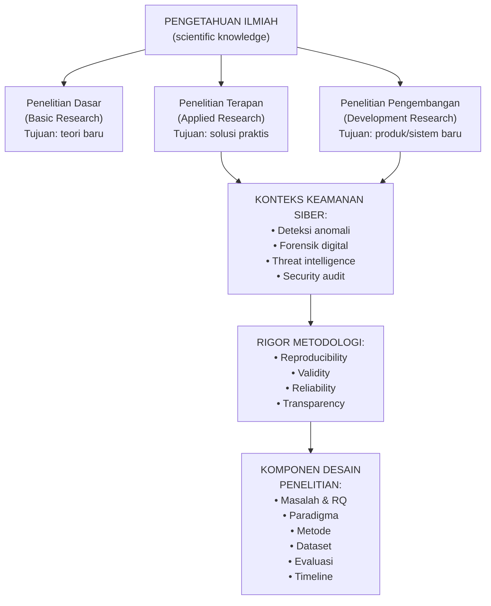

---

### 3. Pengantar Kontekstual

Mengapa metodologi penelitian penting bagi seorang praktisi keamanan siber? Bukankah yang paling penting adalah kemampuan teknis — bisa menganalisis malware, memahami protokol jaringan, atau melakukan forensik digital?

Jawabannya ada pada kasus nyata: pada 2020, sebuah makalah yang diklaim menunjukkan bahwa sistem deteksi intrusi berbasis deep learning mencapai akurasi 99,8% ternyata menggunakan dataset yang terekspos pada proses training — sebuah kesalahan metodologi fundamental yang disebut *data leakage*. Sistem yang diimplementasikan berdasarkan klaim tersebut gagal total di lingkungan produksi. Dalam keamanan siber, klaim yang tidak valid dapat menyebabkan sistem produksi terlindungi oleh pertahanan yang tidak efektif.

Metodologi adalah sistem jaminan kualitas dari proses menghasilkan pengetahuan.

---

### 4. Landasan Teori

#### 4.1 Spektrum Penelitian Ilmiah

Penelitian ilmiah dapat ditempatkan pada spektrum kontinum:

**Penelitian Dasar (Basic/Fundamental Research)**
Tujuan: menghasilkan pengetahuan teoritis baru tanpa target aplikasi langsung. Contoh: mengembangkan teori kompleksitas kriptografi baru. Evaluasi: apakah teori ini valid secara matematis dan menambah pemahaman?

**Penelitian Terapan (Applied Research)**
Tujuan: menggunakan atau mengadaptasi pengetahuan yang ada untuk memecahkan masalah praktis spesifik. Contoh: mengembangkan algoritma deteksi anomali berbasis LSTM untuk traffic MQTT IIoT. Evaluasi: apakah solusi ini bekerja lebih baik dari pendekatan yang ada untuk masalah yang ditargetkan?

**Penelitian Pengembangan (Development Research)**
Tujuan: menciptakan produk, sistem, atau metodologi baru yang dapat digunakan. Contoh: mengembangkan framework forensik cloud untuk investigasi insiden multi-tenant. Evaluasi: apakah produk/framework ini berguna, usable, dan menyelesaikan masalah nyata?

Program Magister Terapan Forensik Digital dan Keamanan Siber berfokus pada penelitian terapan dan pengembangan — menghasilkan solusi teknis yang dapat langsung digunakan untuk meningkatkan keamanan sistem nyata.

#### 4.2 Komponen Desain Penelitian

Setiap penelitian yang terstruktur dengan baik memiliki komponen berikut yang saling terhubung:

**1. Masalah Penelitian (Research Problem)**
Deskripsi yang jelas tentang kondisi yang tidak memuaskan dan perlu diperbaiki. Harus: spesifik, terdokumentasi (didukung literatur), dan signifikan.

**2. Research Question (RQ)**
Pertanyaan yang memfokuskan penelitian dan membatasi scope. RQ yang baik: dapat dijawab secara empiris, tidak terlalu luas, dan jawabannya tidak sudah diketahui.

**3. Paradigma dan Pendekatan**
Kerangka filosofis yang menentukan apa yang dianggap sebagai "bukti" dan bagaimana pengetahuan dihasilkan (akan dibahas mendalam di Bab 2).

**4. Metode Penelitian**
Prosedur spesifik untuk mengumpulkan dan menganalisis data/artefak.

**5. Evaluasi**
Kriteria dan metrik yang menentukan apakah penelitian berhasil menjawab RQ.

#### 4.3 Mengapa Rigor Itu Kritis

Dalam penelitian keamanan siber, rigor bukan pilihan — ia adalah keharusan karena:

- **Stakes tinggi**: Sistem produksi yang dilindungi berdasarkan penelitian yang buruk dapat memberi rasa aman yang palsu
- **Adversarial context**: Penyerang aktif mencari kelemahan dalam sistem yang dikembangkan dari penelitian
- **Reproducibility crisis**: Penelitian yang tidak dapat direproduksi tidak dapat divalidasi dan tidak dapat dibangun oleh peneliti lain
- **Policy implications**: Temuan riset keamanan sering menjadi dasar kebijakan organisasional atau regulasi

**Tiga pilar rigor penelitian keamanan siber:**

*Validity (Validitas)*: Apakah penelitian benar-benar mengukur apa yang diklaim diukur? Apakah metode tepat untuk RQ?

*Reliability (Reliabilitas)*: Apakah hasil konsisten jika penelitian diulang oleh peneliti lain dalam kondisi yang sama?

*Transparency (Transparansi)*: Apakah semua prosedur, data, dan keputusan didokumentasikan cukup detail untuk diaudit dan direproduksi?

---

### 5. Model atau Arsitektur

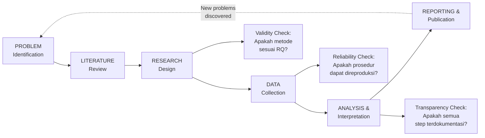

---

### 6. Contoh Terapan

**Studi Kasus: Dari Masalah Industri ke Desain Penelitian**

Sebuah perusahaan infrastruktur kritis di Indonesia melaporkan bahwa sensor IIoT mereka menggunakan MQTT sering mengalami anomali trafik yang tidak terdeteksi oleh sistem IDS konvensional berbasis signature. Tiga insiden keamanan dalam 6 bulan terakhir tidak terdeteksi hingga terlambat.

Komponen desain penelitian:
- *Problem*: IDS berbasis signature tidak efektif untuk deteksi anomali behavioral pada traffic MQTT IIoT
- *RQ*: Seberapa besar peningkatan F1-score yang dapat dicapai model LSTM dibanding Random Forest untuk deteksi anomali MQTT?
- *Paradigma*: Positivist eksperimental
- *Metode*: Eksperimen komparatif menggunakan dataset MQTTset
- *Evaluasi*: F1-score, AUC-ROC, inference latency; uji Wilcoxon signed-rank (α=0.05)
- *Kontribusi*: Model LSTM yang dapat diimplementasikan sebagai komponen IDS untuk lingkungan IIoT

---

### 7. Praktikum — Pemetaan Masalah Penelitian

**Tujuan:** Mengidentifikasi dan mengartikulasikan masalah penelitian tesis Anda secara terstruktur.

**Langkah kerja:**
1. Tuliskan dalam 2-3 kalimat: masalah apa yang ada di bidang keamanan siber yang akan Anda teliti?
2. Tunjukkan bukti bahwa masalah ini nyata: cari minimal 2 statistik, laporan industri, atau paper yang mendokumentasikan masalah tersebut
3. Isi template komponen desain penelitian untuk topik tesis Anda:
   - Problem statement: ________________________________
   - Research question: ________________________________
   - Paradigma yang diantisipasi: ________________________________
   - Metode yang diantisipasi: ________________________________
   - Evaluasi yang diantisipasi: ________________________________
4. Presentasikan dalam 3 menit kepada kelompok kecil; minta feedback: "Apakah masalah ini cukup spesifik? Apakah RQ dapat dijawab?"

**Kriteria keberhasilan:** Problem statement jelas dan didukung referensi; RQ spesifik dan terukur; dapat menjelaskan perbedaan antara penelitian yang Anda rencanakan dengan yang sudah ada.

**Catatan etika:** Pastikan bahwa masalah yang dipilih berkaitan dengan perbaikan pertahanan, deteksi, forensik, atau tata kelola keamanan — bukan pengembangan kapabilitas ofensif yang dapat disalahgunakan.

---

### 8. Latihan Pemahaman

**Soal 1 (Pilihan Ganda):**
Sebuah penelitian bertujuan "mengembangkan framework audit keamanan cloud untuk organisasi keuangan Indonesia". Penelitian ini paling tepat dikategorikan sebagai:
a) Penelitian dasar karena menghasilkan framework baru  
b) Penelitian terapan karena menargetkan konteks spesifik (organisasi keuangan)  
c) Penelitian pengembangan karena menghasilkan metodologi yang dapat digunakan  
d) Penelitian kualitatif karena melibatkan organisasi

**Soal 2 (Esai Singkat):**
Jelaskan mengapa *reproducibility* lebih sulit dicapai dalam penelitian keamanan siber dibandingkan, misalnya, penelitian kimia atau fisika.

**Soal 3 (Analisis Kasus):**
Sebuah paper mengklaim bahwa algoritma deteksi malware mereka mencapai akurasi 99.5% pada dataset yang mereka kumpulkan sendiri dari komputer mereka. Dataset dan kode tidak dipublikasikan. Identifikasi minimal 3 masalah metodologi dalam penelitian ini.

**Soal 4 (Perancangan):**
Untuk topik "deteksi phishing menggunakan NLP", tulis RQ yang memenuhi kriteria SMART (Specific, Measurable, Achievable, Relevant, Time-bound).

**Soal 5 (Evaluasi):**
Seorang mahasiswa berargumen: "Metodologi tidak terlalu penting selama hasilnya berguna di dunia nyata." Evaluasi argumen ini dan berikan counterargument yang kuat.

---

### 9. Latihan Terapan / Studi Kasus

**Studi Kasus 1:**
Sebuah startup keamanan siber mempublikasikan blog post yang mengklaim bahwa produk mereka "mendeteksi 100% serangan zero-day" berdasarkan uji internal menggunakan 50 sampel malware. Seorang peneliti dari perguruan tinggi ingin mereproduksi klaim ini untuk makalah tinjauan. Analisislah: (a) apa yang perlu peneliti ketahui untuk dapat mereproduksi eksperimen? (b) apa yang kemungkinan besar membuat klaim "100%" tidak dapat dipertahankan secara ilmiah? (c) bagaimana seharusnya klaim tersebut dirumuskan untuk memenuhi standar ilmiah?

**Studi Kasus 2:**
Anda diminta memberikan masukan kepada rekan yang sedang menyusun proposal tesis dengan judul "Analisis Keamanan Siber di Indonesia". Identifikasi setidaknya 4 kelemahan fundamental dari judul ini dan reformulasikan menjadi judul yang lebih tepat dan spesifik.

---

### 10. Kunci Jawaban dan Pembahasan

**Soal 1:** Jawaban: **c) Penelitian pengembangan** — karena menghasilkan framework (artefak berupa metodologi) yang dapat digunakan secara langsung. Pilihan (b) juga ada unsur kebenarannya, tetapi tidak menangkap esensi bahwa produk utamanya adalah artefak yang dapat digunakan. Framework bukan hanya "terapan" dari teori yang ada, melainkan penciptaan metodologi baru. Mengapa (a) salah: framework bukan pengetahuan teoritis murni. Mengapa (d) salah: jenis penelitian (kualitatif/kuantitatif) adalah dimensi berbeda dari kategori tujuan penelitian.

**Soal 2:** Reproducibility dalam keamanan siber lebih sulit karena: (a) *Dataset yang berubah*: malware, serangan, dan traffic bersifat dinamis — dataset yang dikumpulkan bulan lalu mungkin sudah tidak representatif; (b) *Environment sensitivity*: konfigurasi sistem, patch level, dan kondisi jaringan sangat mempengaruhi hasil dan sulit distandarisasi; (c) *Legal constraints*: banyak dataset keamanan mengandung data sensitif yang tidak dapat dibagikan secara publik; (d) *Adversarial adaptation*: penyerang beradaptasi — teknik yang terdeteksi kemarin mungkin sudah dimodifikasi.

**Soal 3:** Masalah metodologi: (1) *Dataset bias*: dataset dikumpulkan dari satu mesin — tidak representatif untuk variasi sistem nyata; (2) *Tidak dapat direproduksi*: tanpa dataset dan kode, tidak ada yang dapat memverifikasi klaim; (3) *Overfitting risk*: model yang mencapai 99.5% pada dataset sendiri kemungkinan overfit; (4) *Tidak ada baseline*: tidak ada perbandingan dengan metode yang sudah ada; (5) *Metrik tunggal*: accuracy saja tidak cukup untuk menilai kualitas classifier keamanan (FPR? Recall pada novel malware?).

**Soal 4:** Contoh RQ yang baik: "Apakah model BERT yang di-fine-tune pada dataset phishing URL Indonesia mencapai F1-score yang secara statistik signifikan lebih tinggi dibanding SVM berbasis fitur heuristik pada dataset evaluasi PhishTank periode 2023-2024?" — Specific (BERT vs SVM), Measurable (F1-score), Achievable (dalam satu tesis), Relevant (domain phishing), Time-bound (dataset 2023-2024).

**Soal 5:** Argumen rekan mahasiswa mengandung kelemahan yang disebut *pragmatic fallacy* — asumsi bahwa hasil yang "berguna" menjamin bahwa proses menghasilkannya valid. Counterargument: (a) tanpa metodologi yang ketat, kita tidak tahu apakah hasil benar-benar "berguna" atau hanya kebetulan bekerja pada kondisi tertentu; (b) metodologi yang buruk dapat menghasilkan false confidence — sistem yang tampak bekerja di lab tetapi gagal di produksi; (c) dalam keamanan siber, false positive dan false negative memiliki konsekuensi nyata; (d) science progress bergantung pada kemampuan membangun di atas penelitian sebelumnya — yang hanya mungkin jika metodologi terdokumentasi dengan baik.

---

### 11. Ringkasan Bab

Penelitian terapan keamanan siber berada di antara penelitian dasar (teori) dan pengembangan (produk). Tujuannya adalah menghasilkan solusi atau pengetahuan yang dapat langsung digunakan untuk meningkatkan keamanan sistem nyata. Rigor metodologi — yang terdiri dari validity, reliability, dan transparency — adalah tidak dapat dikompromikan karena klaim yang tidak valid dalam keamanan siber dapat menyebabkan kerugian nyata. Setiap desain penelitian harus dibangun dari problem yang terdokumentasi, RQ yang spesifik, dan metode yang sesuai.

---

### 12. Refleksi Profesional

1. Apakah ada tekanan dalam dunia akademik atau industri untuk "menghasilkan hasil positif" (publication bias)? Bagaimana tekanan ini dapat merusak integritas penelitian keamanan siber?
2. Jika penelitian Anda menghasilkan hasil yang tidak signifikan (model baru tidak lebih baik dari baseline), apakah itu artinya penelitian Anda gagal? Jelaskan perspektif Anda.
3. Sebagai peneliti terapan, Anda berada di persimpangan antara akademik (yang menuntut rigor) dan industri (yang menuntut kecepatan). Bagaimana Anda menyeimbangkan keduanya tanpa mengorbankan integritas?

---

## Bab 2 — Paradigma Penelitian dan Design Science Research

### 1. Capaian Pembelajaran Bab

Setelah menyelesaikan bab ini, mahasiswa mampu:
- Menganalisis perbedaan mendasar antara paradigma positivist, interpretivist, dan pragmatist (C4)
- Mengevaluasi kesesuaian paradigma dengan jenis masalah keamanan siber (C5)
- Menjelaskan siklus dan prinsip Design Science Research (DSR) untuk penelitian artefak keamanan siber (C2)
- Memilih paradigma yang tepat untuk topik tesis masing-masing (C5)

*Dikaitkan dengan Sub-CPMK.1 (Pertemuan 2).*

---

### 2. Peta Konsep Bab

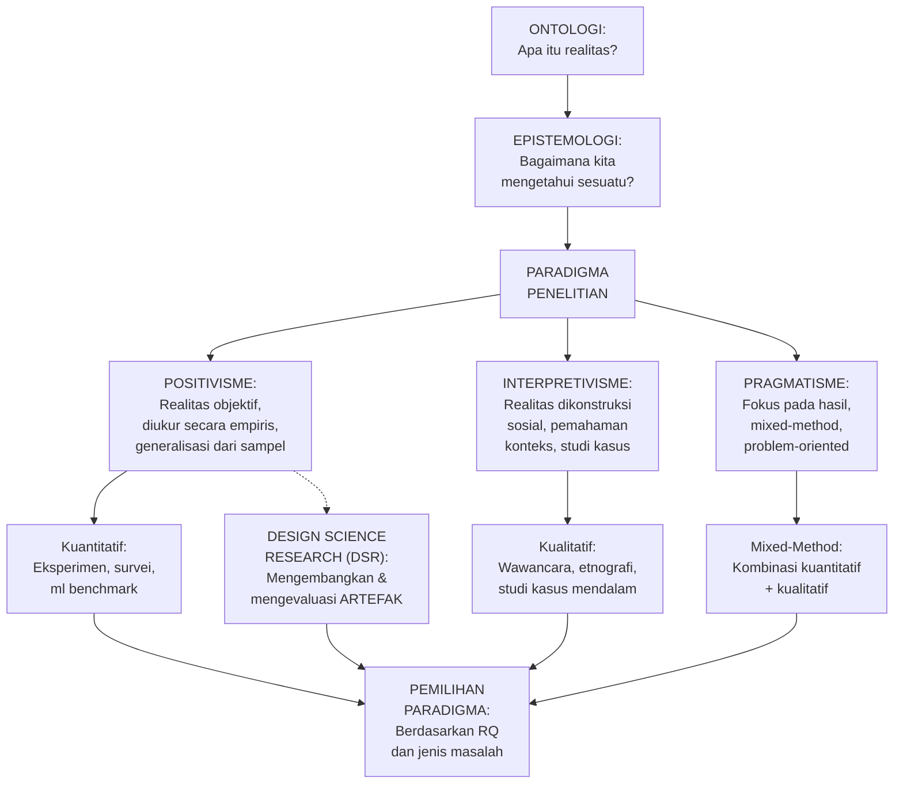

---

### 3. Pengantar Kontekstual

Paradigma penelitian bukan sekadar formalitas akademik — ia adalah sistem kepercayaan yang menentukan apa yang dianggap sebagai "pengetahuan yang valid" dalam konteks penelitian Anda. Seorang peneliti yang memilih paradigma yang salah akan menggunakan metode yang tidak tepat, menghasilkan data yang tidak relevan, dan pada akhirnya menarik kesimpulan yang tidak menjawab pertanyaan yang sebenarnya ingin dijawab.

Dalam keamanan siber, sebagian besar penelitian teknis menggunakan paradigma positivist secara implisit — mengukur performa algoritma, menghitung false positive rate, membandingkan latency. Namun ada domain penting yang memerlukan interpretivist atau pragmatist: studi tentang perilaku manusia dalam keamanan (mengapa pengguna mengklik phishing link?), analisis kebijakan keamanan organisasi, atau pengembangan framework yang harus dievaluasi melalui adoption study.

---

### 4. Landasan Teori

#### 4.1 Positivisme

**Asumsi ontologis:** Realitas bersifat objektif dan independen dari pengamat.
**Asumsi epistemologis:** Pengetahuan diperoleh melalui observasi empiris yang dapat direplikasi dan diukur.
**Pendekatan:** Deduksi — mulai dari teori/hipotesis, lalu uji secara empiris.
**Teknik:** Eksperimen terkontrol, analisis statistik, generalisasi.

**Cocok untuk keamanan siber ketika:**
- Mengembangkan dan membandingkan algoritma (ML/DL untuk IDS, malware analysis)
- Mengukur performa kriptografi
- Mengevaluasi efektivitas kontrol keamanan dengan metrik kuantitatif
- Penelitian yang memerlukan generalisasi dari sampel ke populasi

**Keterbatasan:** Tidak cocok untuk memahami kompleksitas perilaku manusia, konteks organisasional, atau makna yang tidak dapat dikuantifikasi.

#### 4.2 Interpretivisme

**Asumsi ontologis:** Realitas dikonstruksi secara sosial — berbeda-beda bergantung pada pengamat dan konteks.
**Asumsi epistemologis:** Pengetahuan diperoleh melalui pemahaman mendalam tentang perspektif dan konteks.
**Pendekatan:** Induksi — dari observasi spesifik ke pola umum.
**Teknik:** Wawancara mendalam, etnografi, grounded theory, analisis konten.

**Cocok untuk keamanan siber ketika:**
- Memahami mengapa pengguna mengabaikan kebijakan keamanan
- Menganalisis budaya keamanan organisasi
- Mempelajari proses pengambilan keputusan insiden respons dalam konteks spesifik
- Investigasi forensik yang melibatkan pemahaman motivasi dan konteks pelaku

**Keterbatasan:** Temuan sulit digeneralisasikan; subyektivitas peneliti dapat mempengaruhi interpretasi.

#### 4.3 Pragmatisme

**Asumsi:** Fokus pada konsekuensi praktis dan pemecahan masalah; realitas bersifat dinamis.
**Pendekatan:** Mixed-method — menggunakan metode kuantitatif dan kualitatif sesuai kebutuhan.
**Teknik:** Sequential atau concurrent mixed design.

**Cocok untuk keamanan siber ketika:**
- Mengembangkan sistem yang perlu dievaluasi secara teknis (kuantitatif) DAN dievaluasi dari perspektif pengguna (kualitatif)
- Studi yang memerlukan triangulasi dari multiple sumber data
- Penelitian kebijakan yang memerlukan data performa DAN konteks implementasi

#### 4.4 Design Science Research (DSR)

DSR adalah paradigma yang dikembangkan untuk penelitian yang menghasilkan artefak baru — sangat relevan untuk penelitian terapan keamanan siber.

**Referensi utama:** Hevner et al. (2004) "Design Science in Information Systems Research" (MIS Quarterly); Wieringa (2014) "Design Science Methodology for Information Systems and Software Engineering".

**Jenis Artefak dalam DSR:**
- *Konstruk*: kosakata atau konsep baru (taxonomy serangan baru)
- *Model*: representasi abstrak (model threat, model risiko)
- *Metode*: panduan atau proses (metodologi forensik cloud)
- *Instansiasi*: implementasi nyata (sistem IDS, tool forensik)

**Tujuh Pedoman DSR (Hevner et al., 2004):**
1. *Design as an Artifact*: DSR harus menghasilkan artefak yang dapat digunakan
2. *Problem Relevance*: Artefak harus menyelesaikan masalah organisasi yang relevan
3. *Design Evaluation*: Utilitas artefak harus dievaluasi dengan ketat
4. *Research Contributions*: DSR harus berkontribusi pada pengetahuan ilmiah
5. *Research Rigor*: Metode yang ketat digunakan dalam konstruksi dan evaluasi
6. *Design as a Search Process*: Mencari solusi terbaik dalam ruang yang terbatas
7. *Communication of Research*: Hasil dikomunikasikan kepada audience yang tepat

**Siklus DSR (Wieringa, 2014):**
Masalah → Investigasi masalah → Desain treatment → Validasi treatment → Implementasi → Evaluasi → Komunikasi

**Positivisme vs DSR:**
Penelitian positivist bertanya "Apa yang benar?" (Hipotesis H₁ benar/salah).
DSR bertanya "Apa yang berguna?" (Artefak X menyelesaikan masalah Y?).

---

### 5. Model atau Arsitektur

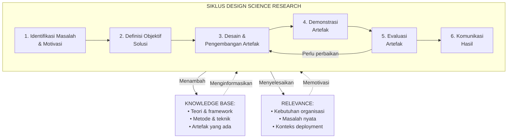

---

### 6. Contoh Terapan

**Studi kasus A — Pilihan Positivist (Rina):**
Rina mengembangkan model LSTM untuk deteksi anomali MQTT. Paradigma positivist tepat karena: (a) produknya adalah model yang dievaluasi dengan metrik kuantitatif (F1, AUC); (b) ada hipotesis yang dapat diuji (LSTM > RF); (c) tujuannya adalah generalisasi ke lingkungan IIoT serupa.

**Studi kasus B — Pilihan DSR (Bima):**
Bima mengembangkan framework metodologi forensik cloud multi-tenant. DSR tepat karena: (a) produknya adalah artefak tipe "metode/framework"; (b) evaluasi yang tepat adalah case study dan expert review, bukan uji statistik performa; (c) pertanyaan utama adalah "apakah framework ini berguna?" bukan "apakah hipotesis H₁ benar?".

**Studi kasus C — Pilihan Mixed-Method/Pragmatist (Sari):**
Sari mengembangkan sistem CTI otomatis dan ingin tahu: (1) seberapa akurat sistem mengklasifikasi ancaman (kuantitatif); (2) apakah analis keamanan merasa sistem tersebut berguna dan dapat dipercaya (kualitatif). Paradigma pragmatist dengan mixed-method paling tepat.

---

### 7–12. Latihan, Kunci Jawaban, Ringkasan, Refleksi

**Latihan:**

Soal 1: Seorang peneliti ingin memahami "mengapa administrator sistem seringkali mengabaikan peringatan keamanan dari SIEM, meskipun peringatan tersebut valid." Paradigma mana yang paling tepat dan mengapa?

Soal 2: Sebuah tesis bertujuan "mengembangkan model risiko baru untuk penilaian keamanan IoT pada fasilitas kesehatan." Klasifikasikan artefak ini dalam taksonomi DSR dan jelaskan bagaimana cara mengevaluasinya.

Soal 3: Bedakan antara "mengevaluasi artefak dalam siklus DSR" dengan "menguji hipotesis dalam penelitian positivist." Apa implikasi perbedaan ini untuk cara Anda melaporkan hasil?

**Kunci Jawaban:**

Soal 1: Interpretivist paling tepat. Alasannya: pertanyaan ini menanyakan "mengapa" (motivasi, persepsi, perilaku) — domain interpretivisme. Jawaban tidak dapat diperoleh dari pengukuran kuantitatif saja; diperlukan pemahaman konteks, makna, dan pengalaman subjektif administrator. Metode yang sesuai: wawancara mendalam dengan administrator, analisis grounded theory untuk mengidentifikasi tema-tema dominan. Positivist kurang tepat karena pertanyaan ini tidak tentang mengukur performa sistem, melainkan memahami perilaku manusia.

Soal 2: Artefak "model risiko" dalam taksonomi DSR termasuk tipe *Model* — representasi abstrak dari sistem atau fenomena (dalam hal ini: lanskap risiko IoT di fasilitas kesehatan). Cara evaluasi yang tepat: (a) *Expert review*: mengundang pakar keamanan IoT dan pakar keamanan fasilitas kesehatan untuk menilai kelengkapan, validitas, dan utilitas model; (b) *Case study*: menerapkan model pada satu atau beberapa fasilitas kesehatan nyata dan menilai apakah menghasilkan penilaian risiko yang akurat dan dapat ditindaklanjuti; (c) *Comparison*: membandingkan hasil penerapan model ini dengan model risiko IoT generik (NIST IoT Security) untuk menunjukkan nilai tambah dari spesialisasi konteks.

Soal 3: Dalam positivist, "menguji hipotesis" berarti mengumpulkan data empiris dan menerapkan uji statistik untuk menentukan apakah H₁ atau H₀ yang didukung — hasilnya adalah pernyataan probabilistik tentang kebenaran hipotesis. Dalam DSR, "mengevaluasi artefak" berarti menilai apakah artefak berguna, dapat digunakan, dan menyelesaikan masalah yang dimaksud — hasilnya adalah pernyataan tentang kualitas dan utilitas artefak. Implikasi pelaporan: penelitian positivist melaporkan p-value, confidence interval, dan efek size. DSR melaporkan kasus penggunaan, skenario demonstrasi, feedback evaluator, dan perbandingan dengan solusi sebelumnya.

**Ringkasan:** Paradigma penelitian adalah sistem kepercayaan yang menentukan apa yang dianggap sebagai bukti valid. Positivisme cocok untuk penelitian yang mengukur dan membandingkan performa secara kuantitatif. Interpretivisme cocok untuk memahami konteks dan makna. Pragmatisme memungkinkan kombinasi keduanya. DSR adalah paradigma khusus untuk penelitian yang menghasilkan artefak — sangat relevan untuk sebagian besar penelitian terapan keamanan siber.

**Refleksi:** (1) Apakah pilihan paradigma mempengaruhi jenis temuan yang "diizinkan" untuk dianggap valid? Misalnya, apakah penelitian positivist tentang phishing dapat menangkap nuansa psikologis yang tidak dapat dikuantifikasi? (2) Sebagian besar program doktoral teknik mengajarkan penelitian positivist secara dominan. Apakah ini membuat peneliti keamanan siber "buta" terhadap dimensi sosial dari masalah keamanan?

---

## Bab 3 — Systematic Literature Review dan PRISMA

### 1. Capaian Pembelajaran Bab

Setelah menyelesaikan bab ini, mahasiswa mampu:
- Merancang protokol Systematic Literature Review (SLR) yang lengkap dan dapat direproduksi (C5)
- Menyusun search string Boolean yang efektif untuk database akademik (C3)
- Menerapkan kriteria inklusi/eksklusi untuk screening literatur (C3)
- Menyintesis temuan literatur ke dalam matriks dan narasi yang mengidentifikasi research gap (C4)

*Dikaitkan dengan Sub-CPMK.1 (Pertemuan 3) dan Eval-1 (6% — deliverable: protokol SLR + analisis 1 artikel).*

---

### 2. Peta Konsep Bab

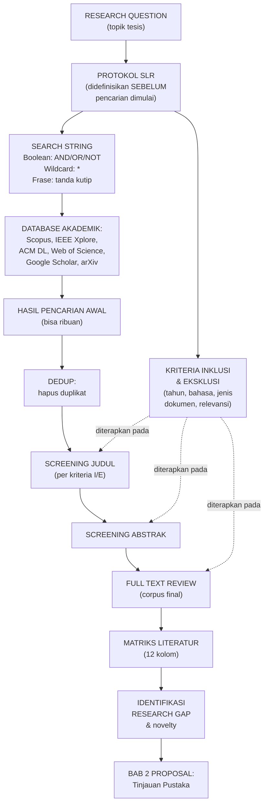

---

### 3. Pengantar Kontekstual

Systematic Literature Review bukan sekadar "membaca banyak paper". Ia adalah metodologi penelitian tersendiri — dengan protokol yang harus didefinisikan sebelum pencarian dimulai, prosedur screening yang transparan dan dapat direproduksi, dan pelaporan yang mengikuti standar (PRISMA). Perbedaan antara SLR dan *ad hoc literature review* (membaca paper yang kebetulan ditemukan) sama seperti perbedaan antara pemeriksaan forensik yang sistematis dan "melihat-lihat" TKP tanpa prosedur.

---

### 4. Landasan Teori

#### 4.1 Mengapa SLR, Bukan Narrative Review?

*Narrative review* (tinjauan naratif): peneliti memilih paper berdasarkan pengetahuan pribadi, tanpa protokol formal. Hasilnya: bias seleksi (cenderung memilih paper yang mendukung pandangan peneliti), tidak dapat direproduksi, tidak komprehensif.

*Systematic Literature Review*: protokol formal, pencarian komprehensif, screening berdasarkan kriteria yang telah ditetapkan, pelaporan yang transparan. Hasilnya: dapat direproduksi, komprehensif, minim bias seleksi.

Untuk penelitian tesis di level magister, SLR adalah standar minimum untuk tinjauan pustaka yang dapat dipertahankan secara akademik.

#### 4.2 Varian Tinjauan Sistematis

- *Systematic Literature Review (SLR)*: fokus pada sintesis temuan penelitian dari corpus yang komprehensif
- *Systematic Mapping Study (SMS)*: fokus pada pemetaan landscape penelitian (siapa meneliti apa, dengan metode apa, pada konteks apa) — lebih luas tapi kurang mendalam
- *Scoping Review*: eksplorasi awal untuk memetakan konsep dan mengidentifikasi gap, tanpa klaim komprehensif
- *Meta-Analysis*: sintesis kuantitatif dari hasil numerik multiple studies — memerlukan homogenitas metode

Untuk proposal tesis, SLR atau SMS adalah pilihan yang paling umum.

#### 4.3 Protokol SLR

Protokol harus **didefinisikan dan didokumentasikan SEBELUM pencarian dimulai**. Mendefinisikan protokol setelah melihat hasil pencarian menciptakan bias konfirmasi.

**Komponen protokol SLR:**

**1. Research Question(s) untuk SLR**
Bisa berbeda dari RQ tesis — RQ SLR berfokus pada "apa yang sudah diketahui tentang topik ini?"
Contoh: "Metode machine learning apa yang sudah digunakan untuk deteksi anomali pada protokol MQTT, dan seberapa efektifnya?"

**2. Database dan Sumber**
Minimal 2-3 database primer. Rekomendasi untuk keamanan siber:
- *IEEE Xplore*: terbaik untuk teknik elektro dan komputasi
- *ACM Digital Library*: terbaik untuk ilmu komputer
- *Scopus*: multidisiplin, coverage luas
- *Web of Science*: untuk impact factor dan citation analysis
- *arXiv (cs.CR)*: preprint — berguna untuk temuan terbaru, tapi belum peer-reviewed
- *Google Scholar*: cakupan luas tapi tidak dapat difilter dengan presisi

**3. Search String**

Komponen Boolean:
- `AND`: mempersempit — semua kata harus muncul
- `OR`: memperluas — salah satu kata cukup
- `NOT`: mengecualikan
- `"tanda kutip"`: frasa tepat
- `*` (wildcard): menangkap variasi (detect* → detect, detection, detector, detecting)
- `()`: pengelompokan

Contoh search string:
```
("intrusion detection" OR "anomaly detection" OR "threat detection")
AND
("MQTT" OR "IoT" OR "Industrial IoT" OR "IIoT")
AND
("machine learning" OR "deep learning" OR "neural network" OR "LSTM" OR "random forest")
```

Setiap database memiliki sintaks sedikit berbeda — baca dokumentasi database yang digunakan.

**4. Kriteria Inklusi (I) dan Eksklusi (E)**

| Kriteria | Inklusi | Eksklusi |
|---|---|---|
| Tipe publikasi | Artikel jurnal peer-reviewed, conference paper (CORE A/B) | Editorial, opinion, thesis, blog, white paper |
| Tahun publikasi | 2019-2024 | Sebelum 2019 (kecuali paper foundational) |
| Bahasa | Inggris | Selain Inggris |
| Topik | Deteksi anomali/intrusi pada IoT/IIoT menggunakan ML | Topik yang tidak terkait protokol IoT atau ML |
| Ketersediaan | Full-text tersedia | Abstrak saja |

**5. Prosedur Screening**

Dilakukan dalam 3 tahap secara berurutan:
- *Screening judul*: hanya baca judul — include jika mungkin relevan, exclude jika jelas tidak relevan
- *Screening abstrak*: baca abstrak — terapkan kriteria I/E secara lebih ketat
- *Full-text review*: baca paper lengkap — keputusan final

Untuk setiap paper yang dieksklusikan pada tahap full-text, dokumentasikan alasannya.

#### 4.4 Pelaporan PRISMA

PRISMA (Preferred Reporting Items for Systematic Reviews and Meta-Analyses) adalah standar pelaporan internasional untuk tinjauan sistematis. Elemen utama yang harus dilaporkan:

1. Total hasil pencarian per database
2. Jumlah setelah dedup
3. Jumlah yang di-screen (judul)
4. Jumlah yang dieksklusikan dengan alasan
5. Jumlah yang di-screen (abstrak)
6. Jumlah full-text yang dinilai
7. Jumlah yang dieksklusikan dengan alasan
8. Jumlah studi final yang diinklusikan

Banyak program studi dan jurnal mensyaratkan diagram PRISMA flow sebagai bukti transparansi proses.

#### 4.5 Sintesis dan Identifikasi Gap

Setelah corpus final terbentuk, langkah berikutnya adalah sintesis:

**Matriks Literatur (12 kolom):** lihat Lampiran B VSFDKS01 untuk format lengkap.

**Cara mengidentifikasi gap:**
Setelah mengisi matriks, cari pola:
- Semua paper menggunakan dataset yang sama → *data gap* (opportunity: dataset baru)
- Semua paper menggunakan algoritma yang sama → *methodological gap*
- Semua paper menguji di lingkungan lab → *context gap* (opportunity: real-world deployment)
- Tidak ada paper yang mengukur latency atau resource usage → *evaluation gap*
- Domain spesifik (IIoT, healthcare, fintech) belum diteliti → *domain gap*

**Narasi sintesis** harus menjawab: "Berdasarkan corpus yang ditelaah, yang sudah diketahui adalah X, yang belum ditangani adalah Y, dan penelitian ini merespons gap Y dengan pendekatan Z."

---

### 5. Model atau Arsitektur

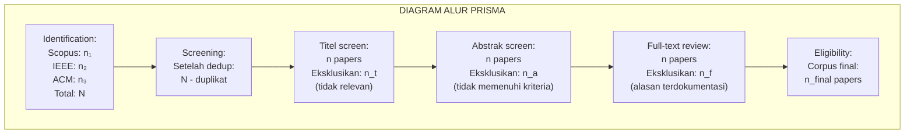

---

### 6–12. Contoh Terapan, Praktikum, Latihan, Kunci Jawaban, Ringkasan, Refleksi

**Contoh Terapan — Protokol SLR Sari (CTI & NLP):**

RQ SLR: "Teknik NLP apa yang sudah diterapkan untuk ekstraksi threat intelligence dari sumber dark web atau forum cybercrime, dan apa keterbatasan utamanya?"

Search string:
```
("threat intelligence" OR "cyber threat intelligence" OR "CTI")
AND
("natural language processing" OR "NLP" OR "text mining" OR "information extraction")
AND
("dark web" OR "underground forum" OR "cybercrime forum" OR "hacker forum" OR "Telegram")
```

Database: IEEE Xplore, ACM DL, Scopus, arXiv cs.CR
Kriteria: 2019-2024, Inggris, peer-reviewed (konferensi IEEE/ACM/Springer atau jurnal Q1-Q2)

**Praktikum — Eval-1:** (1) Pilih 1 artikel metodologi yang relevan dengan tesis Anda; (2) analisis artikel tersebut menggunakan 12 kolom matriks literatur; (3) tulis protokol SLR lengkap untuk topik tesis Anda (RQ SLR, database, search string, kriteria I/E); (4) jalankan search string di minimal 2 database dan laporkan jumlah hasil awal.

**Latihan:**

Soal 1: Mengapa protokol SLR harus didefinisikan SEBELUM pencarian dimulai? Apa yang terjadi jika Anda mendefinisikan kriteria inklusi setelah melihat hasil pencarian?

Soal 2: Search string berikut: `"malware detection" AND "deep learning"` menghasilkan 847 hasil. Mahasiswa memutuskan untuk mempersempit dengan menambahkan `AND "ransomware"`. Hasilnya menjadi 124 paper. Apa risiko metodologis dari keputusan ini?

Soal 3: Bedakan antara SLR dan Systematic Mapping Study. Kapan Anda memilih salah satu dibandingkan yang lain?

**Kunci Jawaban:**

Soal 1: Jika kriteria didefinisikan setelah melihat hasil, ada risiko *post-hoc rationalization* — peneliti (sadar atau tidak) memilih kriteria yang menginklusikan paper yang mendukung hipotesis mereka dan mengeksklusikan paper yang tidak mendukung. Ini adalah bentuk bias konfirmasi yang merusak validitas tinjauan. SLR yang baik dapat direproduksi oleh peneliti lain yang mengikuti protokol yang sama dan mendapat hasil yang substansially sama.

Soal 2: Risiko: dengan menambahkan `AND "ransomware"`, semua paper tentang malware lain (trojan, spyware, APT, cryptominer) yang tidak menyebutkan "ransomware" dieksklusikan — meskipun mungkin sangat relevan untuk penelitian deteksi malware secara umum. Ini adalah *scope creep* yang bias: jika keputusan ini dibuat karena 847 paper "terlalu banyak", maka scope dibatasi bukan karena alasan konseptual tetapi karena alasan praktis. Solusi yang lebih baik: pertahankan scope yang luas, tapi percepat proses screening dengan membagi tugas atau menggunakan tools screening (Rayyan, Covidence).

Soal 3: SLR bertujuan menjawab pertanyaan spesifik dengan mensintesis temuan dari corpus yang komprehensif — lebih mendalam, tapi lebih sempit scope-nya. SMS bertujuan memetakan landscape penelitian: siapa meneliti apa, dengan metode apa, pada konteks apa — lebih luas, tapi kurang mendalam per paper. Pilih SLR jika: sudah ada cukup penelitian untuk disintesis dan Anda ingin tahu "apa hasilnya?". Pilih SMS jika: ingin gambaran luas tentang bidang yang masih relatif baru atau ingin mengidentifikasi area yang under-researched.

**Ringkasan:** SLR adalah metodologi penelitian yang menghasilkan tinjauan literatur yang dapat direproduksi dan bebas bias seleksi. Protokol harus didefinisikan sebelum pencarian. Pelaporan mengikuti standar PRISMA. Sintesis corpus final menghasilkan matriks literatur dan identifikasi research gap yang menjadi dasar posisi penelitian di Bab 2 proposal.

**Refleksi:** (1) Dalam era AI, apakah mungkin AI digunakan untuk mengotomasi sebagian proses SLR? Apa risiko dan peluangnya? (2) Jika dua peneliti menjalankan protokol SLR yang identik dan mendapat corpus final yang berbeda, apa yang ini berarti tentang objektivitas SLR?

---

## Bab 4 — Desain Penelitian Kuantitatif dan Eksperimen

### 1. Capaian Pembelajaran Bab

Setelah menyelesaikan bab ini, mahasiswa mampu:
- Merumuskan variabel penelitian (independen, dependen, kontrol, moderating) dengan tepat (C3)
- Memilih desain eksperimen yang sesuai: pre-test/post-test, control group, factorial, repeated measures (C4)
- Mengidentifikasi ancaman terhadap validitas internal dan eksternal eksperimen (C4)
- Menyusun hipotesis yang dapat diuji secara empiris (C3)

*Dikaitkan dengan Sub-CPMK.2 (Pertemuan 4).*

---

### 2. Peta Konsep Bab

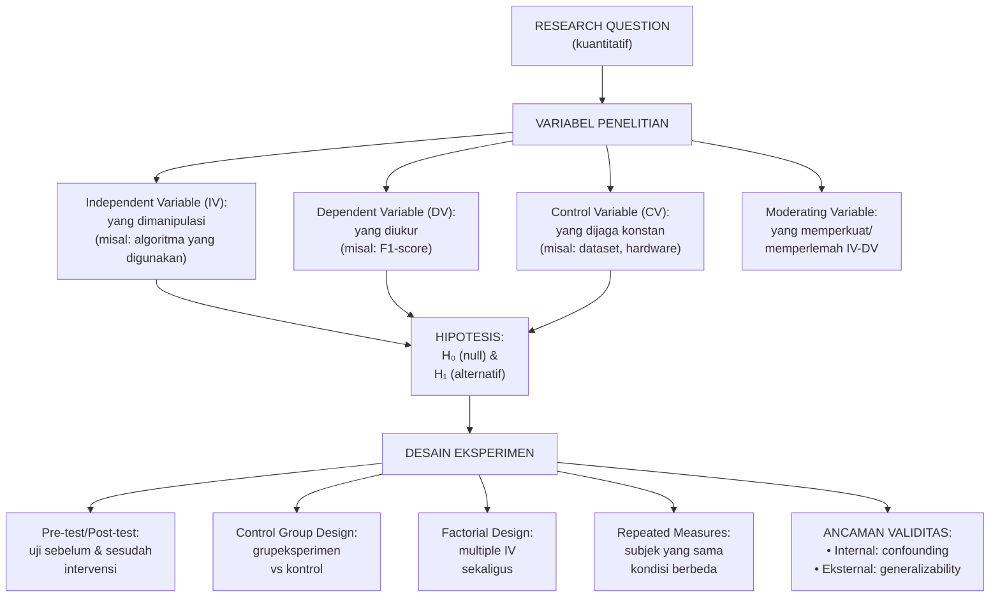

---

### 3–12. Landasan Teori, Contoh Terapan, Latihan, Kunci Jawaban, Ringkasan, Refleksi

#### 4.1 Variabel Penelitian

Dalam penelitian kuantitatif, semua faktor yang relevan harus diidentifikasi dan dikategorikan:

**Independent Variable (IV) / Variabel Bebas:**
Variabel yang dimanipulasi atau dipilih oleh peneliti untuk menyelidiki pengaruhnya. Dalam penelitian ML keamanan siber: pilihan algoritma (LSTM vs RF), jenis preprocessing (dengan/tanpa normalisasi), arsitektur model.

**Dependent Variable (DV) / Variabel Terikat:**
Variabel yang diukur sebagai respons terhadap manipulasi IV. Dalam penelitian IDS: F1-score, AUC-ROC, inference latency, false positive rate.

**Control Variable (CV) / Variabel Kontrol:**
Faktor yang berpotensi mempengaruhi DV tetapi tidak ingin diselidiki — dijaga konstan untuk mengisolasi pengaruh IV. Contoh: dataset yang sama, hardware yang sama, jumlah epoch yang sama.

**Moderating Variable:**
Variabel yang memperkuat atau memperlemah hubungan IV-DV. Contoh: ukuran dataset (mungkin LSTM lebih unggul dari RF pada dataset besar tetapi tidak pada dataset kecil).

#### 4.2 Formulasi Hipotesis

Hipotesis yang baik adalah spesifik, testable, dan falsifiable:

**H₀ (Hipotesis Null):** Pernyataan "tidak ada efek/perbedaan". Default yang akan "ditolak" jika bukti cukup kuat.
> H₀: Tidak ada perbedaan F1-score yang signifikan secara statistik (α=0.05) antara model LSTM dan Random Forest pada dataset MQTTset untuk deteksi anomali traffic MQTT.

**H₁ (Hipotesis Alternatif):** Pernyataan efek/perbedaan yang diharapkan.
> H₁: Model LSTM menghasilkan F1-score yang secara statistik signifikan lebih tinggi dibanding Random Forest (α=0.05) pada dataset MQTTset untuk deteksi anomali traffic MQTT.

*Catatan:* H₁ bisa directional (LSTM lebih tinggi dari RF — one-tailed test) atau non-directional (ada perbedaan antara LSTM dan RF — two-tailed test). Pilih berdasarkan justifikasi teoritis.

#### 4.3 Desain Eksperimen

**Pre-test/Post-test Design:**
Mengukur DV sebelum dan sesudah intervensi. Cocok untuk: studi efektivitas pelatihan keamanan, sebelum/sesudah deployment sistem keamanan.

**Control Group Design:**
Satu grup mendapat perlakuan (eksperimen), satu grup tidak (kontrol). Cocok untuk: mengisolasi efek intervensi dari faktor lain.

**Factorial Design:**
Dua atau lebih IV dimanipulasi secara bersamaan, memungkinkan analisis interaksi. Contoh: menguji efek algoritma (LSTM vs RF) × jenis preprocessing (SMOTE vs tanpa SMOTE) secara bersamaan — menghasilkan 4 kondisi.

**Repeated Measures Design:**
Semua subjek/kondisi melewati semua perlakuan. Cocok untuk: perbandingan algoritma pada kondisi yang sama (mengeliminasi variabilitas antar-dataset).

#### 4.4 Ancaman Validitas

**Validitas Internal (Internal Validity):**
Apakah perbedaan yang diamati benar-benar disebabkan oleh IV?

Ancaman umum:
- *Data leakage*: informasi test set bocor ke training
- *Confounding variable*: faktor ketiga mempengaruhi DV
- *Maturation*: perubahan dalam subjek seiring waktu
- *Instrumentation*: perubahan cara pengukuran

**Validitas Eksternal (External Validity):**
Apakah temuan dapat digeneralisasikan?

Ancaman umum:
- *Population validity*: sampel tidak representatif untuk populasi
- *Ecological validity*: kondisi lab tidak merepresentasikan dunia nyata
- *Temporal validity*: temuan mungkin tidak berlaku di waktu yang berbeda

**Latihan:**

Soal 1: Sebuah penelitian membandingkan dua IDS: IDS-A (di-tune oleh peneliti sendiri, 200 jam) dan IDS-B (konfigurasi default, 2 jam). IDS-A menang. Ancaman validitas apa yang ada?

Soal 2: Rumuskan H₀ dan H₁ untuk penelitian: "Apakah model BERT lebih akurat dari TF-IDF dalam mengklasifikasikan forum threat intelligence bahasa Indonesia?"

**Kunci Jawaban:**

Soal 1: Ini adalah ancaman validitas internal jenis *confounding variable*: perbedaan performa antara IDS-A dan IDS-B mungkin bukan karena perbedaan algoritma, melainkan karena perbedaan upaya optimasi (200 jam vs 2 jam). Ini tidak fair comparison. Untuk mengisolasi efek algoritma, kedua sistem harus di-tune dengan upaya yang setara (misal: keduanya melalui hyperparameter tuning menggunakan GridSearchCV dengan budget waktu/iterasi yang sama).

Soal 2: H₀: Tidak ada perbedaan F1-score yang signifikan secara statistik (α=0.05) antara model BERT yang di-fine-tune dan classifier berbasis TF-IDF pada dataset klasifikasi forum threat intelligence bahasa Indonesia. H₁: Model BERT yang di-fine-tune menghasilkan F1-score yang secara statistik signifikan lebih tinggi dibanding TF-IDF pada dataset yang sama (one-tailed, karena ada justifikasi teoritis bahwa BERT lebih baik dalam memahami konteks semantik).

**Ringkasan:** Desain penelitian kuantitatif yang kuat memerlukan: identifikasi variabel yang jelas (IV, DV, CV), hipotesis yang spesifik dan testable, desain eksperimen yang sesuai, dan antisipasi ancaman validitas. Setiap keputusan desain harus dapat dijustifikasi dan didokumentasikan.

**Refleksi:** Apakah semua masalah keamanan siber dapat diformulasikan sebagai hipotesis yang testable? Berikan contoh masalah yang sulit atau tidak mungkin diuji dengan desain eksperimen, dan jelaskan mengapa.

---

## Bab 5 — Hipotesis, Variabel, dan Desain Eksperimen Lanjut

### 1. Capaian Pembelajaran Bab

Setelah menyelesaikan bab ini, mahasiswa mampu:
- Merancang desain eksperimen factorial dan repeated measures untuk masalah keamanan siber yang kompleks (C5)
- Menjelaskan power analysis dan menentukan ukuran sampel minimum (C3)
- Mengidentifikasi masalah *multiple comparisons* dan cara mengatasinya (C4)
- Mendeskripsikan perbedaan eksperimen dalam-lab vs dalam-lapangan (C2)

*Dikaitkan dengan Sub-CPMK.2 (Pertemuan 5).*

---

### 2. Peta Konsep Bab

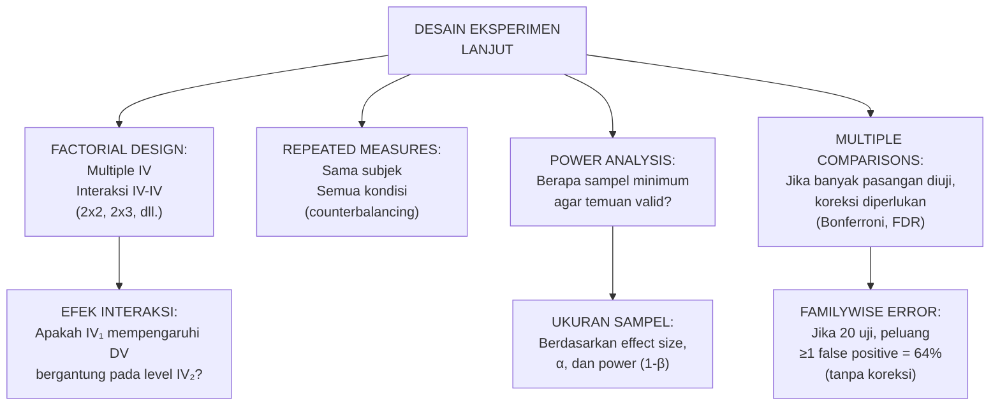

---

### 3–12. Landasan Teori, Latihan, Kunci Jawaban, Ringkasan, Refleksi

#### 5.1 Power Analysis dan Ukuran Sampel

Power analisis menjawab: "Berapa sampel yang saya butuhkan agar eksperimen saya memiliki peluang yang cukup untuk mendeteksi efek nyata jika efek tersebut ada?"

Komponen power analysis:
- **α (alpha)**: tingkat signifikansi (biasanya 0.05) — peluang false positive yang ditoleransi
- **β (beta)**: tingkat false negative yang ditoleransi (biasanya 0.20)
- **Power (1-β)**: peluang mendeteksi efek nyata (biasanya 0.80)
- **Effect size**: seberapa besar perbedaan yang diharapkan (Cohen's d, η², f)

Dalam penelitian ML keamanan siber, "sampel" sering merujuk pada jumlah folds dalam cross-validation atau jumlah independent runs. Untuk analisis statistik yang valid, minimal 10 independent runs atau 10-fold cross-validation direkomendasikan.

*Tools*: G*Power (software gratis), pwr package (R), scipy.stats (Python).

#### 5.2 Multiple Comparisons Problem

Jika Anda membandingkan 5 algoritma secara pairwise (10 pasangan), dan menggunakan α=0.05 untuk setiap uji, peluang mendapat setidaknya 1 false positive adalah:

1 - (0.95)¹⁰ = 0.401 = 40.1%

Koreksi yang umum:
- *Bonferroni*: bagi α dengan jumlah uji (α_adjusted = 0.05/10 = 0.005). Konservatif.
- *Holm-Bonferroni*: sequential, lebih powerful dari Bonferroni
- *Benjamini-Hochberg (FDR)*: mengontrol False Discovery Rate, lebih liberal

Dalam penelitian yang membandingkan multiple algoritma, laporkan metode koreksi yang digunakan.

#### 5.3 Eksperimen Lab vs Lapangan

**Eksperimen Lab (In-vitro / Controlled Experiment):**
Semua kondisi dikontrol secara ketat. Validitas internal tinggi. Validitas eksternal lebih rendah (kondisi lab tidak = produksi). Cocok untuk: perbandingan algoritma menggunakan dataset benchmark.

**Eksperimen Lapangan (In-situ / Field Experiment):**
Dilakukan di lingkungan nyata. Validitas eksternal lebih tinggi. Validitas internal lebih rendah (banyak faktor tidak terkontrol). Cocok untuk: evaluasi deployment sistem keamanan, uji penetrasi dengan otorisasi.

Untuk tesis, kebanyakan eksperimen adalah lab-based — ini harus dinyatakan sebagai keterbatasan.

**Latihan:**

Soal 1: Anda membandingkan 4 algoritma IDS (A, B, C, D) menggunakan pairwise comparison. Berapa pasangan yang harus diuji? Jika α=0.05 tanpa koreksi, berapa peluang ≥1 false positive?

Soal 2: Mengapa perlu counterbalancing dalam repeated measures design?

**Kunci Jawaban:**

Soal 1: 4 algoritma → C(4,2) = 6 pasangan (A-B, A-C, A-D, B-C, B-D, C-D). Peluang ≥1 false positive = 1 - (0.95)⁶ = 1 - 0.735 = 26.5%. Tanpa koreksi Bonferroni, ada peluang lebih dari 1 dalam 4 bahwa salah satu temuan "signifikan" adalah false positive. Dengan koreksi Bonferroni: α_adjusted = 0.05/6 ≈ 0.0083.

Soal 2: Dalam repeated measures, urutan perlakuan dapat mempengaruhi hasil (*order effect* atau *carryover effect*). Contoh: jika selalu menguji algoritma A sebelum B, maka jika dataset pertama lebih mudah, A selalu diuntungkan. Counterbalancing (mengacak urutan perlakuan antar-subjek) memastikan order effect terdistribusi merata dan tidak bias ke satu kondisi.

**Ringkasan:** Desain eksperimen lanjut mempertimbangkan ukuran sampel yang memadai (power analysis), interaksi antar variabel (factorial design), dan masalah multiple comparisons. Transparansi tentang desain eksperimen dan keterbatasannya adalah komponen kunci dari laporan penelitian yang kredibel.

**Refleksi:** Power analysis menunjukkan bahwa banyak penelitian keamanan siber menggunakan sampel yang terlalu kecil untuk mendeteksi efek yang nyata dengan confidence yang cukup. Apa implikasi etis dari mempublikasikan hasil penelitian yang underpowered?

---

## Bab 6 — Metode Kualitatif dan Mixed-Method

### 1. Capaian Pembelajaran Bab

Setelah menyelesaikan bab ini, mahasiswa mampu:
- Menjelaskan kapan metode kualitatif lebih tepat daripada kuantitatif dalam penelitian keamanan siber (C2)
- Mengidentifikasi teknik pengumpulan data kualitatif: wawancara mendalam, FGD, observasi (C2)
- Merancang desain mixed-method sequential explanatory atau concurrent triangulation (C5)
- Mengevaluasi kualitas penelitian kualitatif menggunakan kriteria trustworthiness (C4)

*Dikaitkan dengan Sub-CPMK.2 (Pertemuan 6).*

---

### 2. Peta Konsep Bab

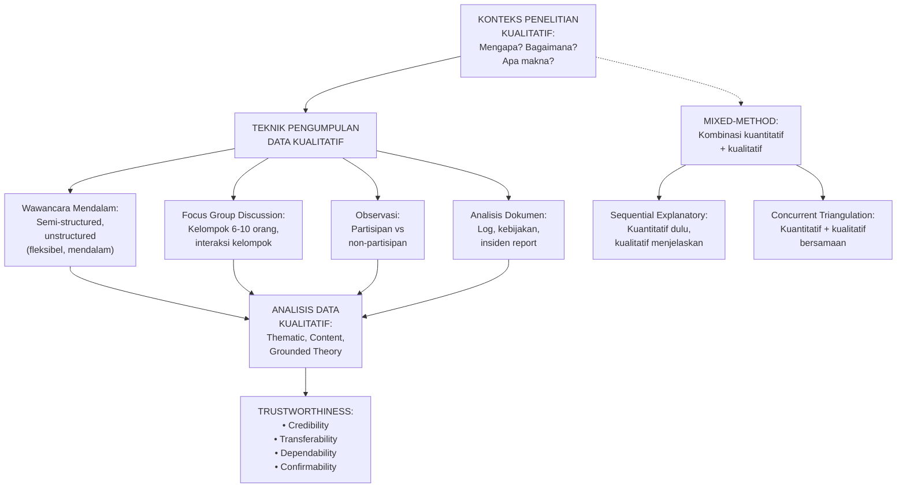

---

### 3–12. Landasan Teori, Latihan, Kunci Jawaban, Ringkasan, Refleksi

#### 6.1 Kapan Metode Kualitatif dalam Keamanan Siber?

Metode kualitatif tepat ketika pertanyaan penelitian berfokus pada:
- *Mengapa* orang berperilaku tertentu dalam konteks keamanan
- *Bagaimana* proses pengambilan keputusan dalam insiden respons berlangsung
- *Apa makna* kebijakan keamanan bagi karyawan
- *Bagaimana* budaya keamanan berkembang dalam organisasi

Contoh penelitian kualitatif dalam keamanan siber:
- Studi tentang mengapa SOC analyst mengalami alert fatigue
- Analisis bagaimana organisasi memutuskan untuk membayar ransomware
- Investigasi mengapa kebijakan password kompleks sering dilanggar

#### 6.2 Teknik Wawancara

**Terstruktur (Structured):** Pertanyaan identik untuk semua responden. Memungkinkan perbandingan, tapi kurang fleksibel.

**Semi-terstruktur (Semi-structured):** Ada panduan pertanyaan (interview guide) tapi boleh menyimpang untuk mendalami jawaban menarik. Paling umum dalam penelitian kualitatif akademik.

**Tidak terstruktur (Unstructured):** Sangat fleksibel, mendalam. Cocok untuk exploratory research. Lebih sulit dianalisis secara konsisten.

**Ukuran sampel dalam wawancara:** Ditentukan oleh *theoretical saturation* — tidak ada informasi baru yang muncul dari wawancara tambahan. Biasanya 15-30 responden untuk studi kualitatif.

#### 6.3 Trustworthiness dalam Penelitian Kualitatif

Analogi dengan validitas dan reliabilitas dalam kuantitatif:
- *Credibility* (analogi internal validity): apakah temuan akurat dari perspektif peserta? Teknik: member checking, triangulasi
- *Transferability* (analogi external validity): apakah temuan relevan di konteks lain? Teknik: thick description
- *Dependability* (analogi reliability): apakah proses konsisten dan dapat diaudit? Teknik: audit trail
- *Confirmability* (analogi objectivity): apakah temuan berasal dari data, bukan bias peneliti? Teknik: reflexivity statement

#### 6.4 Mixed-Method Design

**Sequential Explanatory:** Fase kuantitatif dulu → fase kualitatif untuk menjelaskan hasil kuantitatif yang tidak terduga. Contoh: kuantitatif menunjukkan bahwa karyawan tua lebih sering mengklik phishing; kualitatif mendalami mengapa.

**Sequential Exploratory:** Fase kualitatif dulu → fase kuantitatif untuk mengkonfirmasi dan mengeneralisasi. Contoh: wawancara mengidentifikasi faktor risiko → survei mengukur prevalensi faktor tersebut.

**Concurrent Triangulation:** Kedua fase berjalan bersamaan, temuan diintegrasikan di akhir. Paling kompleks.

**Latihan:**

Soal 1: Seorang peneliti ingin memahami "alasan SOC analyst di Indonesia sering mengabaikan alert dari SIEM." Rancang desain penelitian kualitatif yang tepat: jenis metode, teknik pengumpulan data, ukuran sampel, dan cara analisis.

Soal 2: Apa kelemahan utama menggunakan wawancara sebagai satu-satunya sumber data dalam penelitian tentang perilaku keamanan?

**Kunci Jawaban:**

Soal 1: Pendekatan: interpretivist dengan metode wawancara semi-terstruktur. Alasan: pertanyaan berfokus pada "alasan" — motivasi, persepsi, pengalaman subjektif yang tidak dapat dikuantifikasi. Teknik: wawancara semi-terstruktur dengan panduan pertanyaan mencakup: (a) deskripsi workflow alert handling sehari-hari; (b) jenis alert yang paling sering diabaikan dan alasannya; (c) faktor organisasional/teknis yang berkontribusi. Ukuran sampel: sampai theoretical saturation, estimasi 15-25 SOC analyst dari berbagai organisasi. Analisis: thematic analysis (Braun & Clarke, 2006) — koding induktif, identifikasi tema, penulisan narasi tematik.

Soal 2: Kelemahan utama wawancara sebagai sumber tunggal: (a) *Social desirability bias*: responden mungkin melaporkan perilaku yang "seharusnya" bukan yang sebenarnya; (b) *Recall bias*: orang tidak selalu mengingat perilaku mereka secara akurat; (c) *Tidak dapat memverifikasi*: tidak ada cara mengkonfirmasi bahwa yang dilaporkan sesuai dengan yang dilakukan. Triangulasi yang baik: wawancara + observasi langsung + analisis log sistem.

**Ringkasan:** Metode kualitatif menjawab pertanyaan "mengapa" dan "bagaimana" yang tidak dapat dijawab oleh data kuantitatif. Trustworthiness (bukan validitas dalam arti kuantitatif) adalah standar kualitas untuk penelitian kualitatif. Mixed-method menggabungkan kekuatan keduanya untuk masalah penelitian yang kompleks.

**Refleksi:** Penelitian kualitatif tentang perilaku keamanan sering melibatkan akses ke informasi sensitif tentang kelemahan keamanan organisasi. Bagaimana Anda memastikan bahwa informasi tersebut tidak disalahgunakan, dan bagaimana Anda mendapat kepercayaan responden untuk berbagi secara jujur?

---

## Bab 7 — Sampling, Validitas, dan Reliabilitas Instrumen

### 1. Capaian Pembelajaran Bab

Setelah menyelesaikan bab ini, mahasiswa mampu:
- Membedakan jenis-jenis sampling dan memilih yang tepat untuk konteks penelitian (C4)
- Menjelaskan validitas konstruk, isi, dan konkuren untuk instrumen survei (C2)
- Menerapkan uji reliabilitas Cronbach's alpha untuk instrumen survei (C3)
- Menyusun desain instrumen survei keamanan siber yang valid dan reliabel (C5)

*Dikaitkan dengan Sub-CPMK.2 (Pertemuan 7) dan Eval-2 (7% — deliverable: desain eksperimen mini + instrumen).*

---

### 2. Peta Konsep Bab

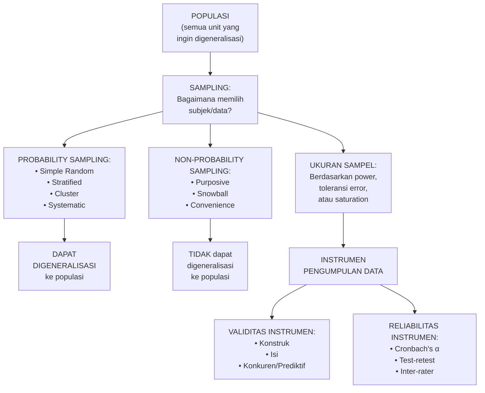

---

### 3–12. Landasan Teori, Latihan, Kunci Jawaban, Ringkasan, Refleksi

#### 7.1 Jenis Sampling

**Probability Sampling** (setiap unit memiliki peluang diseleksi yang diketahui):
- *Simple Random*: setiap unit dipilih secara acak → representatif, cocok untuk populasi homogen
- *Stratified*: populasi dibagi strata, lalu random sampling per strata → lebih representatif untuk populasi heterogen
- *Cluster*: populasi dibagi cluster, beberapa cluster dipilih secara acak → efisien untuk populasi tersebar geografis
- *Systematic*: pilih setiap k-th unit → praktis, tapi bisa bias jika ada pola periodik

**Non-Probability Sampling** (tidak semua unit memiliki peluang diseleksi):
- *Purposive*: memilih berdasarkan karakteristik spesifik → untuk penelitian kualitatif atau eksperimen di mana populasi spesifik dibutuhkan
- *Snowball*: responden merujuk responden lain → untuk populasi sulit diakses
- *Convenience*: menggunakan yang paling mudah diakses → rentan bias, validitas eksternal rendah

**Untuk penelitian ML keamanan siber:**
"Sampling" sering berarti pemilihan data dari dataset. Prinsip yang sama berlaku: apakah data Anda representatif untuk masalah yang diklaim diselesaikan?

#### 7.2 Validitas Instrumen Survei

Instrumen (kuesioner, skala) yang baik harus:

**Valid Konstruk (Construct Validity):** Apakah instrumen mengukur konstruk abstrak yang dimaksud (misal: "security awareness")? Diuji dengan: factor analysis, convergent validity, discriminant validity.

**Valid Isi (Content Validity):** Apakah item-item dalam instrumen mencakup semua dimensi konstruk yang relevan? Dinilai oleh: panel ahli (content validity index/CVI ≥ 0.80).

**Valid Konkuren (Concurrent Validity):** Apakah skor instrumen berkorelasi dengan ukuran gold standard yang sudah ada? Cocok ketika sudah ada instrumen yang divalidasi sebelumnya.

#### 7.3 Reliabilitas: Cronbach's Alpha

Cronbach's alpha (α) mengukur konsistensi internal — seberapa konsisten item-item dalam skala mengukur konstruk yang sama.

Interpretasi:
- α ≥ 0.90: excellent
- α = 0.80-0.89: good
- α = 0.70-0.79: acceptable
- α = 0.60-0.69: questionable
- α < 0.60: poor (instrumen perlu direvisi)

*Catatan penting:* α yang sangat tinggi (> 0.95) bisa mengindikasikan item yang terlalu redundan (mengukur hal yang persis sama dalam kata-kata berbeda), bukan kebaikan instrumen.

**Rumus Cronbach's alpha:**
α = (k/(k-1)) × (1 - Σσᵢ²/σₜ²)
Di mana: k = jumlah item, σᵢ² = variansi item, σₜ² = variansi total skor

#### 7.4 Konteks Dataset sebagai "Instrumen" dalam ML

Dalam penelitian ML, dataset berfungsi seperti instrumen pengukuran. Pertanyaan analoginya:
- *Validitas konstruk*: apakah dataset benar-benar merepresentasikan ancaman yang diklaim? (Apakah serangan dalam dataset mencerminkan serangan nyata?)
- *Validitas isi*: apakah semua jenis ancaman yang relevan tercakup?
- *Reliabilitas*: apakah pengukuran (labeling) konsisten? (Inter-rater reliability untuk dataset yang dilabeli manual)

**Latihan:**

Soal 1: Anda melakukan survei security awareness kepada 500 karyawan di sebuah bank menggunakan kuesioner online yang dikirim via email internal. Jenis sampling apa ini? Apa ancaman terhadap validitasnya?

Soal 2: Anda mengembangkan skala "Cyber Security Self-Efficacy" (CSSE) dengan 15 item. Cronbach's alpha = 0.62. Apa artinya ini, dan apa yang harus dilakukan?

**Kunci Jawaban:**

Soal 1: Ini adalah *convenience sampling* — Anda menggunakan yang mudah diakses (karyawan yang memiliki email dan mau merespons). Ancaman validitas: (a) *Non-response bias*: karyawan yang lebih sadar keamanan mungkin lebih mungkin mengisi survei, menghasilkan sampel yang tidak representatif; (b) *Selection bias*: hanya karyawan dengan email yang dapat berpartisipasi — mengeksklusikan karyawan tanpa akses digital; (c) *Generalizability*: hasil tidak dapat digeneralisasikan ke bank lain atau industri lain.

Soal 2: α = 0.62 berada di zona "questionable" — tidak cukup untuk instrumen yang akan digunakan dalam penelitian akademik. Langkah yang harus diambil: (a) analisis item-total correlation untuk setiap item — item dengan korelasi < 0.30 kandidat untuk dihapus; (b) lihat kolom "alpha if item deleted" — jika menghapus item tertentu meningkatkan alpha secara signifikan, pertimbangkan menghapusnya; (c) tinjau kembali item dari sisi konten — apakah ada item yang ambigu atau mengukur konstruk yang berbeda? (d) jika perlu, tambahkan item baru berdasarkan expert review; (e) lakukan pilot test ulang dengan sampel baru.

**Ringkasan:** Sampling yang tepat menentukan apakah temuan dapat digeneralisasikan. Instrumen yang valid dan reliabel menghasilkan data yang dapat dipercaya. Untuk penelitian ML, dataset adalah "instrumen" — kualitasnya menentukan seberapa valid klaim penelitian.

**Refleksi:** (1) Dalam banyak penelitian keamanan siber, sampel adalah dataset publik yang dikumpulkan di lingkungan lab. Apakah ini masalah yang perlu diakui secara eksplisit dalam setiap paper, atau sudah menjadi "pemahaman umum" yang tidak perlu disebutkan? (2) Cronbach's alpha mengasumsikan bahwa semua item mengukur konstruk yang sama (unidimensional). Untuk instrumen yang mengukur konstruk multidimensional seperti "security maturity", apakah alpha masih relevan?

---

## Bab 8 — UTS: Evaluasi Integratif Metodologi

### 1. Capaian Pembelajaran Bab

Bab ini merupakan pertemuan UTS (Ujian Tengah Semester). Mahasiswa diuji pada: paradigma penelitian, desain penelitian (kuantitatif, eksperimental, kualitatif, mixed-method), SLR/PRISMA, sampling, validitas, dan reliabilitas instrumen.

*Sub-CPMK.3 — Eval-3: Ujian Tengah Semester (30% dari total nilai).*

---

### 2. Ringkasan Materi UTS (Bab 1–7)

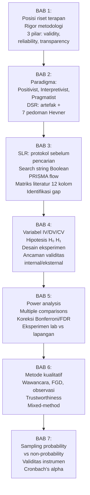

---

### 3. Soal Latihan UTS (Format Kasus Integratif)

**Kasus 1 — Pilihan Paradigma:**
Mahasiswa A ingin meneliti: "Bagaimana tim respons insiden di bank-bank Indonesia membuat keputusan selama serangan ransomware aktif?" Mahasiswa B ingin meneliti: "Seberapa efektif model BERT dalam mendeteksi pesan phishing berbahasa Indonesia dibanding model berbasis keyword matching?"
(a) Tentukan paradigma yang paling tepat untuk setiap penelitian dan justifikasi pilihan Anda.
(b) Untuk masing-masing, apakah DSR relevan? Mengapa atau mengapa tidak?

**Kasus 2 — Evaluasi Desain SLR:**
Seorang mahasiswa menulis di Bab 2 proposalnya: "Peneliti telah menelaah 47 paper tentang deteksi anomali IoT. Paper dipilih dari Google Scholar dan IEEE Xplore menggunakan kata kunci 'anomaly detection IoT'. Kriteria seleksi adalah relevansi dengan topik penelitian." Identifikasi minimal 5 kelemahan metodologis dalam deskripsi SLR ini.

**Kasus 3 — Desain Eksperimen:**
Anda mengembangkan sistem IDPS berbasis ML untuk jaringan SCADA. Rancang desain eksperimen lengkap untuk mengevaluasi sistem Anda. Sertakan: (a) hipotesis H₀ dan H₁; (b) IV, DV, dan CV; (c) desain eksperimen (jenis); (d) dataset dan justifikasi; (e) metrik evaluasi; (f) rencana uji statistik; (g) antisipasi ancaman validitas.

**Kasus 4 — Sampling dan Instrumen:**
Anda akan mengukur "security awareness" di sebuah universitas dengan 3.000 dosen dan 20.000 mahasiswa menggunakan kuesioner online. (a) Berapa ukuran sampel minimum jika menggunakan margin of error 5% dan confidence level 95%? (b) Sampling stratified vs simple random — mana yang lebih tepat dan mengapa? (c) Jelaskan 3 langkah untuk memvalidasi instrumen kuesioner Anda sebelum pengumpulan data.

---

### 4. Kunci Jawaban UTS

**Kasus 1:**
(a) Mahasiswa A → Interpretivist. Pertanyaan berfokus pada "bagaimana" proses pengambilan keputusan — domain pemahaman konteks dan makna, bukan pengukuran kuantitatif. Metode: wawancara semi-terstruktur mendalam dengan anggota tim respons insiden yang pernah mengalami ransomware attack.
Mahasiswa B → Positivist. Pertanyaan adalah perbandingan kuantitatif performa dua pendekatan — dapat dijawab dengan F1-score, precision, recall, dan uji statistik. Metode: eksperimen komparatif.
(b) DSR kurang relevan untuk Mahasiswa A karena tidak menghasilkan artefak baru — melainkan pengetahuan tentang proses yang ada. DSR relevan untuk Mahasiswa B jika ia mengembangkan versi BERT yang diadaptasi untuk konteks phishing bahasa Indonesia (artefak tipe instansiasi).

**Kasus 2:**
Lima kelemahan: (1) "Relevansi dengan topik penelitian" sebagai kriteria seleksi adalah subjektif dan tidak dapat direproduksi — tidak ada definisi operasional; (2) tidak ada protokol yang disebutkan sebagai didefinisikan sebelum pencarian; (3) hanya 2 database — IEEE Xplore dan Google Scholar — SLR yang baik memerlukan minimal 3-4 database yang saling melengkapi (misal: ACM DL, Scopus); (4) search string "anomaly detection IoT" terlalu sederhana — tidak menggunakan sinonim, wildcard, atau Boolean yang complex; (5) tidak ada laporan PRISMA flow — tidak diketahui berapa yang dieksklusikan di setiap tahap dan mengapa.

**Kasus 3:** (a) H₀: Tidak ada perbedaan signifikan (α=0.05) dalam F1-score antara sistem IDPS berbasis ML yang diusulkan dan IDS baseline berbasis signature pada dataset SCADA. H₁: Sistem IDPS berbasis ML menghasilkan F1-score yang signifikan lebih tinggi dari IDS baseline pada dataset SCADA. (b) IV: jenis sistem (ML-based vs signature-based). DV: F1-score, false positive rate, detection latency. CV: dataset yang sama, traffic scenario yang sama, hardware yang sama. (c) Repeated measures — dataset yang sama diuji pada kedua sistem untuk eliminasi variabilitas antar-dataset. (d) Dataset: SWaT (Secure Water Treatment) atau BATADAL — satu-satunya dataset SCADA publik yang mencakup serangan autentik. (e) Metrik: F1-score (macro), false positive rate, mean detection time (MDT). (f) Wilcoxon signed-rank test pada F1 dari 10-fold cross-validation (paired, karena repeated measures). (g) Ancaman internal: pastikan tuning dilakukan dengan upaya setara untuk kedua sistem. Ancaman eksternal: nyatakan bahwa SWaT adalah lab environment, bukan produksi.

**Kasus 4:** (a) Formula Slovin: n = N / (1 + N×e²) = 23000 / (1 + 23000×0.0025) ≈ 23000/58.5 ≈ 393. (b) Stratified lebih tepat: populasi heterogen (dosen vs mahasiswa memiliki karakteristik security awareness yang berbeda). Dengan stratified, proporsi dosen dan mahasiswa dalam sampel mencerminkan proporsi di populasi — lebih representatif. (c) Tiga langkah validasi: (1) Content validity: panel 5 ahli keamanan siber menilai relevansi setiap item menggunakan Content Validity Index (CVI ≥ 0.80); (2) Face validity: pilot test dengan 10-15 responden — apakah pertanyaan mudah dipahami? (3) Construct validity: confirmatory factor analysis pada data pilot untuk memastikan item berkelompok sesuai dimensi yang dimaksud.

---

## Bab 9 — Statistik Deskriptif dan Inferensial

### 1. Capaian Pembelajaran Bab

Setelah menyelesaikan bab ini, mahasiswa mampu:
- Menghitung dan menginterpretasikan ukuran tendensi sentral dan dispersi (C3)
- Memilih dan menerapkan uji statistik parametrik yang tepat: t-test, ANOVA (C3)
- Menginterpretasikan p-value, confidence interval, dan effect size secara akurat (C4)
- Menjelaskan asumsi yang harus dipenuhi sebelum menggunakan uji parametrik (C2)

*Dikaitkan dengan Sub-CPMK.4 (Pertemuan 9).*

---

### 2. Peta Konsep Bab

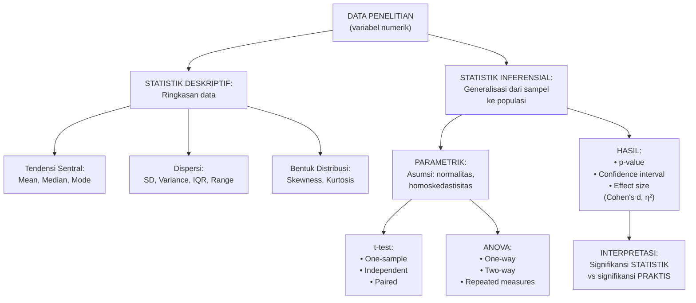

---

### 3–12. Landasan Teori, Latihan, Kunci Jawaban, Ringkasan, Refleksi

#### 9.1 Statistik Deskriptif

Sebelum inferensi, selalu lakukan analisis deskriptif:

**Ukuran Tendensi Sentral:**
- *Mean*: rata-rata — sensitif terhadap outlier
- *Median*: nilai tengah — robust terhadap outlier, lebih baik untuk distribusi skewed
- *Mode*: nilai paling sering muncul

**Ukuran Dispersi:**
- *Variance (s²)*: rata-rata kuadrat deviasi dari mean
- *Standard Deviation (SD, s)*: akar kuadrat variansi — unit sama dengan data
- *Interquartile Range (IQR)*: Q3-Q1 — robust terhadap outlier

**Bentuk Distribusi:**
- *Skewness positif*: ekor panjang ke kanan (outlier tinggi)
- *Skewness negatif*: ekor panjang ke kiri
- *Kurtosis*: "keruncingan" distribusi

#### 9.2 Asumsi Uji Parametrik

Sebelum t-test atau ANOVA, verifikasi:
1. **Normalitas**: data terdistribusi normal (uji: Shapiro-Wilk untuk n<50, Kolmogorov-Smirnov untuk n≥50; atau lihat Q-Q plot)
2. **Homoskedastisitas** (untuk independent groups): variansi antar kelompok homogen (uji: Levene's test)
3. **Independence**: observasi saling independen

Jika asumsi tidak terpenuhi → gunakan uji non-parametrik (Bab 10).

#### 9.3 t-test

**One-sample t-test:** Membandingkan mean sampel dengan nilai referensi.
Contoh: apakah F1-score model > 0.80?

**Independent samples t-test:** Membandingkan mean dua kelompok yang berbeda.
Contoh: apakah F1-score sistem A berbeda dari sistem B (dua dataset berbeda)?

**Paired t-test:** Membandingkan dua pengukuran pada subjek/kondisi yang sama.
Contoh: apakah F1-score sistem A berbeda dari sistem B pada dataset yang sama (10 folds)?

Formula t untuk paired test: t = d̄ / (SD_d / √n)
Di mana: d̄ = rata-rata perbedaan, SD_d = SD perbedaan, n = jumlah pasangan

#### 9.4 Interpretasi p-value dan Effect Size

**p-value:** Probabilitas mendapatkan hasil minimal sebesar yang diamati JIKA H₀ benar. *Bukan* probabilitas bahwa H₀ benar atau salah.

Kesalahan umum: "p=0.03 berarti ada 3% kemungkinan H₀ benar" — INI SALAH.
Yang benar: "Jika H₀ benar, ada 3% peluang mendapatkan perbedaan sebesar atau lebih besar dari yang kami amati."

**Effect size:** Seberapa besar perbedaan secara praktis?
- *Cohen's d*: untuk perbandingan dua mean
  - Kecil: d=0.2 | Sedang: d=0.5 | Besar: d=0.8
- *η² (eta squared)*: untuk ANOVA — proporsi variance yang explained oleh IV
  - Kecil: η²=0.01 | Sedang: η²=0.06 | Besar: η²=0.14

Sangat penting: p-value kecil tidak berarti efek besar. Dengan n yang besar, perbedaan trivial bisa signifikan secara statistik tetapi tidak berarti secara praktis.

**Confidence Interval (CI):** Rentang nilai di mana parameter populasi kemungkinan besar berada. CI 95% untuk perbedaan mean yang tidak mencakup 0 = signifikan pada α=0.05.

**Latihan:**

Soal 1: Model A menghasilkan F1 = [0.87, 0.89, 0.91, 0.85, 0.88] pada 5 fold. Model B menghasilkan F1 = [0.83, 0.85, 0.87, 0.81, 0.84]. Hitung mean dan SD untuk masing-masing, lalu hitung d̄ dan persiapkan untuk paired t-test.

Soal 2: Sebuah paper melaporkan: "Model kami secara signifikan lebih baik dari baseline (p=0.001)." Apakah ini informasi yang cukup untuk menilai signifikansi praktis? Apa yang masih perlu dilaporkan?

**Kunci Jawaban:**

Soal 1: Model A: mean = (0.87+0.89+0.91+0.85+0.88)/5 = 4.40/5 = 0.880. SD_A = √[(0.0004+0.0001+0.0009+0.0009+0)/4] = √(0.0023/4) = √0.000575 ≈ 0.024. Model B: mean = 0.840. Perbedaan per fold: d = [0.04, 0.04, 0.04, 0.04, 0.04]. d̄ = 0.040, SD_d = 0 (perbedaan konstan). Dalam praktik nyata, perbedaan tidak akan konstan — ini contoh ideal. t = 0.040 / (0 / √5) → tidak terdefinisi karena SD_d=0. Dalam kasus nyata: t = d̄ / (SD_d/√n), lalu bandingkan dengan t-table (df=n-1=4, α=0.05, two-tailed, critical value ≈ 2.776).

Soal 2: p=0.001 hanya mengatakan bahwa perbedaan signifikan secara statistik. Yang masih perlu dilaporkan: (a) *Effect size* (Cohen's d atau η²) — seberapa besar perbedaan secara praktis? p kecil dengan n besar bisa diperoleh dari perbedaan yang sangat kecil; (b) *Confidence interval* untuk perbedaan — rentang berapa selisih performanya?; (c) *Nilai aktual* (mean ± SD) untuk kedua model; (d) *Uji statistik yang digunakan* dan asumsi yang dipenuhi. Tanpa ini, klaim "signifikan" tidak informatif.

**Ringkasan:** Statistik deskriptif memberikan gambaran awal data; statistik inferensial memungkinkan generalisasi dari sampel ke populasi. p-value mengukur evidensi melawan H₀ — bukan probabilitas hipotesis. Effect size mengukur besarnya perbedaan secara praktis. Keduanya harus dilaporkan bersama.

**Refleksi:** Ada perdebatan di komunitas ilmiah tentang apakah threshold p < 0.05 sudah tidak relevan dan harus digantikan oleh effect size dan CI. Apa pandangan Anda, dan bagaimana ini mempengaruhi cara Anda akan melaporkan hasil penelitian?

---

## Bab 10 — Statistik Non-Parametrik dan Multivariat

### 1. Capaian Pembelajaran Bab

Setelah menyelesaikan bab ini, mahasiswa mampu:
- Memilih uji non-parametrik yang tepat ketika asumsi parametrik tidak terpenuhi (C4)
- Menjelaskan prinsip uji Wilcoxon, Mann-Whitney, Kruskal-Wallis, dan Friedman (C2)
- Menerapkan analisis korelasi (Pearson, Spearman) dan regresi linear sederhana (C3)
- Menjelaskan prinsip PCA dan clustering dalam konteks analisis data keamanan siber (C2)

*Dikaitkan dengan Sub-CPMK.4 (Pertemuan 10).*

---

### 2. Peta Konsep Bab

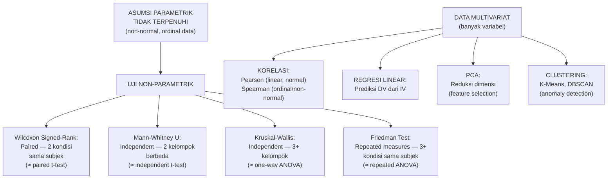

---

### 3–12. Landasan Teori, Latihan, Kunci Jawaban, Ringkasan, Refleksi

#### 10.1 Panduan Pemilihan Uji Statistik

| Situasi | Parametrik | Non-Parametrik |
|---|---|---|
| 2 kelompok terkait (paired) | Paired t-test | Wilcoxon Signed-Rank |
| 2 kelompok bebas | Independent t-test | Mann-Whitney U |
| 3+ kelompok bebas | One-way ANOVA | Kruskal-Wallis |
| 3+ kondisi terkait | Repeated ANOVA | Friedman Test |
| Hubungan 2 variabel kontinu | Pearson correlation | Spearman correlation |

**Kapan pilih non-parametrik:**
- Data tidak terdistribusi normal (uji Shapiro-Wilk: p < 0.05)
- Data ordinal (skala Likert, ranking)
- Ukuran sampel kecil (n < 30) dan distribusi tidak dapat diasumsikan normal
- Ada outlier yang tidak dapat dihapus

#### 10.2 Wilcoxon Signed-Rank Test (Paling Relevan untuk Penelitian ML)

Prosedur:
1. Hitung perbedaan untuk setiap pasangan: dᵢ = Xᵢ₁ - Xᵢ₂
2. Hapus perbedaan = 0
3. Rank |dᵢ| dari terkecil ke terbesar
4. Beri tanda positif/negatif pada rank sesuai tanda dᵢ
5. Hitung W = min(W⁺, W⁻) — sum of signed ranks
6. Bandingkan W dengan nilai kritis (tabel) atau hitung z-score untuk n > 25

**Kenapa Wilcoxon untuk ML?**
Hasil k-fold cross-validation adalah *paired* — setiap fold, kedua model diuji pada data yang sama. Tidak ada asumsi distribusi normal diperlukan.

#### 10.3 Korelasi

**Pearson r:** Mengukur kekuatan dan arah hubungan linear antara dua variabel kontinu. Asumsi: kedua variabel normal, hubungan linear.

Interpretasi r: |r| ≥ 0.7 (kuat), 0.3-0.7 (sedang), < 0.3 (lemah)

**Spearman ρ:** Korelasi berbasis ranking. Tidak memerlukan normalitas; menangkap hubungan monoton (tidak harus linear).

**Dalam keamanan siber:** Korelasi digunakan untuk analisis hubungan antar fitur (feature correlation analysis) sebelum training ML — fitur yang sangat berkorelasi (|r| > 0.9) kandidat untuk dihapus karena redundan.

#### 10.4 PCA dan Clustering

**Principal Component Analysis (PCA):**
Teknik dimensionality reduction yang mentransformasi p variabel asli menjadi komponen-komponen yang tidak berkorelasi, diurutkan berdasarkan variansi yang dijelaskan. Berguna untuk: visualisasi data tinggi-dimensi, menghapus redundansi fitur, mempercepat training ML.

**Clustering (K-Means, DBSCAN):**
Mengelompokkan data berdasarkan kemiripan tanpa label — unsupervised. Aplikasi keamanan siber: anomaly detection (cluster kecil = anomali potensial), network traffic analysis, threat grouping.

**Latihan:**

Soal 1: Anda memiliki data F1-score dari 10-fold cross-validation untuk dua model: Model X dan Model Y. Shapiro-Wilk pada perbedaan (X-Y) menghasilkan p=0.03. Uji apa yang Anda gunakan? Mengapa?

Soal 2: Anda menemukan korelasi Pearson r=0.92 antara dua fitur dalam dataset keamanan siber. Apa implikasinya untuk feature engineering?

**Kunci Jawaban:**

Soal 1: p=0.03 dari Shapiro-Wilk berarti distribusi perbedaan tidak normal (menolak H₀ bahwa data normal). Oleh karena itu, paired t-test tidak dapat digunakan (melanggar asumsi normalitas). Uji yang tepat: *Wilcoxon Signed-Rank Test* — versi non-parametrik dari paired t-test, tidak memerlukan asumsi distribusi normal, dan cocok untuk data paired (10 folds, model yang sama pada data yang sama).

Soal 2: r=0.92 menunjukkan korelasi yang sangat tinggi antara dua fitur. Implikasi untuk feature engineering: (a) *Multikolinearitas*: jika kedua fitur digunakan bersamaan dalam model linear (regresi, SVM linear), multikolinearitas dapat membuat koefisien tidak stabil; (b) *Redundansi*: kedua fitur membawa informasi yang hampir sama — salah satunya dapat dihapus tanpa kehilangan informasi signifikan; (c) *Tindakan*: gunakan feature selection (hapus salah satu) atau PCA untuk menggabungkan kedua fitur menjadi satu komponen. Untuk model tree-based (RF, XGBoost), korelasi tinggi kurang bermasalah karena model tidak mengasumsikan independence.

**Ringkasan:** Pemilihan uji statistik bergantung pada: jumlah kelompok yang dibandingkan, apakah data paired atau independent, dan apakah asumsi parametrik terpenuhi. Wilcoxon Signed-Rank adalah pilihan utama untuk perbandingan model ML dalam k-fold cross-validation. Analisis multivariat (korelasi, PCA, clustering) memberikan wawasan tentang struktur data yang berguna untuk feature engineering.

**Refleksi:** Beberapa peneliti ML menggunakan uji statistik hanya sebagai "pelengkap" yang diperlukan reviewer, tanpa benar-benar memahami maknanya. Apa dampak dari praktik ini terhadap kredibilitas literature keamanan siber?

---

## Bab 11 — Metrik Evaluasi Machine Learning untuk Keamanan Siber

### 1. Capaian Pembelajaran Bab

Setelah menyelesaikan bab ini, mahasiswa mampu:
- Menghitung dan menginterpretasikan confusion matrix dan metrik turunannya (C3)
- Memilih metrik evaluasi yang tepat untuk masalah keamanan siber yang imbalanced (C4)
- Menjelaskan ROC curve dan AUC serta interpretasinya (C2)
- Menginterpretasikan hasil evaluasi model ML secara akademik dalam konteks keamanan siber (C4)

*Dikaitkan dengan Sub-CPMK.4 (Pertemuan 11) dan Eval-4 (7% — deliverable: laporan analisis data Python/R).*

---

### 2. Peta Konsep Bab

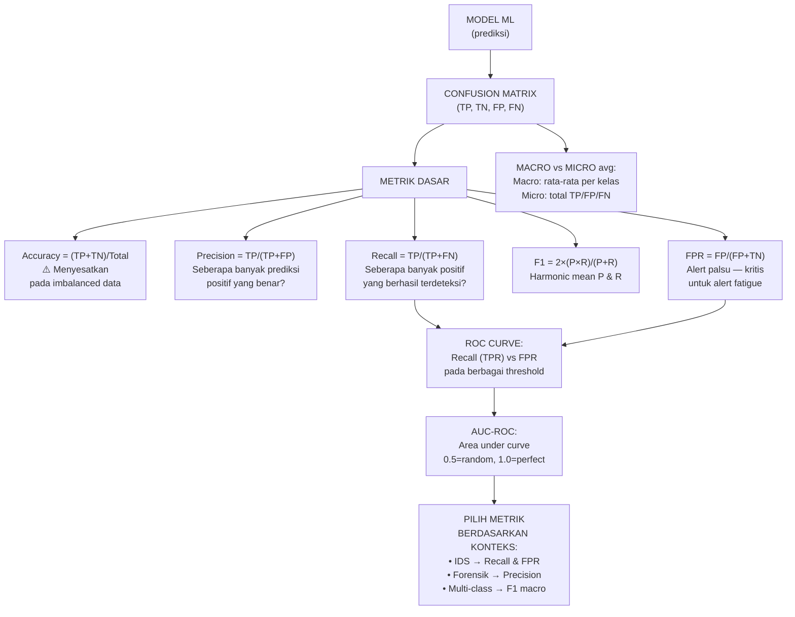

---

### 3–12. Landasan Teori, Latihan, Kunci Jawaban, Ringkasan, Refleksi

#### 11.1 Confusion Matrix

Untuk klasifikasi biner (positif = serangan, negatif = benign):

```
                  Predicted
                  +        -
Actual    +    TP       FN
          -    FP       TN
```

- **TP (True Positive):** Serangan → diprediksi sebagai serangan ✓
- **TN (True Negative):** Benign → diprediksi sebagai benign ✓
- **FP (False Positive):** Benign → diprediksi sebagai serangan ✗ (false alarm)
- **FN (False Negative):** Serangan → diprediksi sebagai benign ✗ (missed attack)

**Dalam konteks keamanan siber:**
- FN lebih berbahaya daripada FP: serangan yang tidak terdeteksi → kompromi sistem
- FP terlalu banyak → alert fatigue → analis mengabaikan alert → FN yang sesungguhnya

#### 11.2 Metrik dan Kapan Menggunakannya

| Metrik | Formula | Kapan Digunakan |
|---|---|---|
| Accuracy | (TP+TN)/Total | Dataset balanced; quick overview |
| Precision | TP/(TP+FP) | Ingin minimalisir false alarms; investigasi forensik |
| Recall (TPR) | TP/(TP+FN) | Ingin mendeteksi semua serangan; IDS kritis |
| F1-score | 2PR/(P+R) | Dataset imbalanced; trade-off P dan R |
| FPR | FP/(FP+TN) | Mengukur beban false alarm |
| AUC-ROC | Area under ROC | Evaluasi keseluruhan threshold-independent |
| MCC | Kompleks | Paling informatif untuk imbalanced |

**F1 Macro vs Micro:**
- *Macro*: hitung F1 per kelas, rata-rata sederhana → memberikan bobot sama ke semua kelas (cocok untuk imbalanced)
- *Micro*: hitung TP/FP/FN secara agregat → lebih dipengaruhi kelas mayoritas

#### 11.3 ROC Curve dan AUC

ROC (Receiver Operating Characteristic) curve memplot Recall (TPR) pada sumbu-y terhadap FPR pada sumbu-x pada berbagai threshold keputusan. Area Under Curve (AUC):
- AUC = 0.5: model sama seperti random guess
- AUC = 1.0: perfect classifier
- AUC > 0.9: excellent; 0.8-0.9: good; 0.7-0.8: fair

**Keunggulan AUC:** Tidak sensitif terhadap class imbalance; mengukur performa secara threshold-independent.

**Keterbatasan:** AUC mengasumsikan biaya FP dan FN yang sama — tidak selalu tepat untuk keamanan siber di mana FN jauh lebih berbahaya.

**Alternatif:** Precision-Recall (PR) curve lebih informatif untuk dataset sangat imbalanced; fokus pada kelas positif (serangan).

#### 11.4 Implementasi Python

```python
from sklearn.metrics import (classification_report, confusion_matrix, 
                              roc_auc_score, f1_score)
import numpy as np

# Setelah model.predict():
y_true = [...]  # label sebenarnya
y_pred = [...]  # prediksi model

# Confusion matrix
cm = confusion_matrix(y_true, y_pred)
print("Confusion Matrix:\n", cm)

# Report lengkap
print(classification_report(y_true, y_pred, 
                             target_names=['benign', 'attack'],
                             digits=4))

# F1 macro
f1_macro = f1_score(y_true, y_pred, average='macro')
print(f"F1 Macro: {f1_macro:.4f}")

# AUC (untuk binary, perlu y_prob bukan y_pred)
y_prob = model.predict_proba(X_test)[:, 1]
auc = roc_auc_score(y_true, y_prob)
print(f"AUC-ROC: {auc:.4f}")
```

**Latihan:**

Soal 1: Sebuah IDS mengevaluasi 10.000 sampel: 9.500 benign, 500 serangan. Model memprediksi semua sebagai benign. Hitung: accuracy, precision, recall, F1.

Soal 2: Peneliti melaporkan AUC=0.95 untuk sistem deteksi malware mereka. Apakah ini cukup untuk menyimpulkan sistem "sangat baik"? Apa informasi tambahan yang diperlukan?

**Kunci Jawaban:**

Soal 1: TP=0, TN=9500, FP=0, FN=500. Accuracy = (0+9500)/10000 = 95% — MENYESATKAN. Precision = 0/(0+0) = tidak terdefinisi (0/0). Recall = 0/(0+500) = 0% — model tidak mendeteksi SATUPUN serangan. F1 = 0 (karena recall=0). Ini mendemonstrasikan mengapa accuracy adalah metrik yang berbahaya untuk dataset imbalanced: 95% accuracy tapi 0% recall → sistem keamanan yang sama sekali tidak berguna.

Soal 2: AUC=0.95 adalah indikator positif, tetapi tidak cukup sendiri. Informasi tambahan yang diperlukan: (a) *Dataset composition*: apakah imbalanced? Jika sangat imbalanced, PR-AUC lebih informatif; (b) *Jenis malware*: apakah semua jenis malware terwakili, atau hanya jenis yang dilatih? (c) *False positive rate pada operating point*: pada threshold yang digunakan dalam produksi, berapa FPR? (d) *Perbandingan dengan baseline*: AUC=0.95 vs apa? vs signature-based AV? vs random? (e) *Generalizability*: diuji pada dataset yang sama dengan training? Apakah independent test set digunakan?

**Ringkasan:** Confusion matrix adalah fondasi dari semua metrik evaluasi ML. Untuk keamanan siber, recall (kemampuan mendeteksi serangan) dan FPR (beban false alarm) adalah metrik terpenting. Accuracy menyesatkan pada dataset imbalanced. AUC-ROC memberikan evaluasi threshold-independent. Pilih metrik berdasarkan konteks operasional, bukan konvensi.

**Refleksi:** Jika Anda adalah CISO yang akan memutuskan apakah mengadopsi sistem IDS baru berdasarkan laporan penelitian, metrik apa yang paling Anda prioritaskan? Apakah ada perbedaan antara apa yang penting untuk publikasi akademik dan apa yang penting untuk keputusan bisnis?

---

## Bab 12 — Struktur Artikel Ilmiah dan Penulisan Akademik

### 1. Capaian Pembelajaran Bab

Setelah menyelesaikan bab ini, mahasiswa mampu:
- Menyusun struktur artikel ilmiah berformat IMRaD yang kohesif (C5)
- Menulis abstrak yang informatif dan memenuhi standar jurnal internasional (C5)
- Menulis bagian Introduction dengan struktur argumentation yang kuat (C5)
- Menggunakan referensi manajemen dan format APA 7th edition dengan benar (C3)

*Dikaitkan dengan Sub-CPMK.5 (Pertemuan 12).*

---

### 2. Peta Konsep Bab

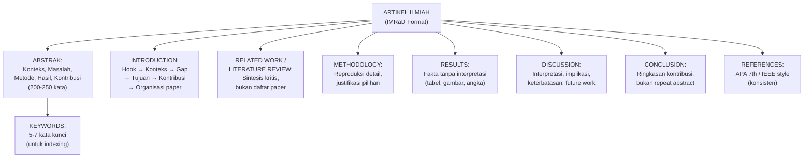

---

### 3–12. Landasan Teori, Contoh Terapan, Latihan, Kunci Jawaban, Ringkasan, Refleksi

#### 12.1 Format IMRaD

IMRaD (Introduction, Methods, Results, and Discussion) adalah format standar untuk artikel ilmiah empiris. Variannya mencakup:
- *Introduction + Related Work + Methodology + Results + Discussion + Conclusion* — paling umum untuk paper panjang
- *Introduction + Background + Methodology + Experiments + Results + Discussion + Conclusion* — umum di paper teknis AI/ML

Setiap bagian memiliki tujuan yang spesifik — jangan mencampur konten antar bagian.

#### 12.2 Menulis Abstrak yang Efektif

**Struktur abstrak (model CARS — Create A Research Space, Swales, 1990):**
1. **Context** (1-2 kalimat): mengapa topik ini penting?
2. **Problem** (1-2 kalimat): apa gap yang ditangani?
3. **Method** (2-3 kalimat): apa yang dilakukan dan bagaimana?
4. **Results** (1-2 kalimat): temuan utama
5. **Contribution** (1 kalimat): implikasi atau signifikansi

**Prinsip penulisan abstrak:**
- Berdiri sendiri (standalone): tidak ada referensi ke teks utama; tidak ada kutipan
- Spesifik: sebutkan metode dan hasil konkret (bukan "kami menunjukkan peningkatan performa")
- Past tense untuk metode dan hasil; present tense untuk pernyataan umum
- Tidak ada singkatan yang tidak didefinisikan

**Contoh Abstrak Buruk vs Baik:**

*Buruk:* "Penelitian ini mengembangkan sistem IDS baru menggunakan deep learning. Sistem ini diuji dan menunjukkan hasil yang baik."

*Baik:* "Sistem deteksi intrusi berbasis LSTM yang dikembangkan dalam penelitian ini menghasilkan F1-score 0.937 (macro) pada dataset MQTTset, meningkat 8.3% dibanding baseline Random Forest (p=0.003, Wilcoxon signed-rank). Model dievaluasi menggunakan 10-fold stratified cross-validation pada 68.8 juta rekaman traffic MQTT IIoT dengan 7 kelas ancaman, menjadikannya kandidat untuk deployment di lingkungan IIoT dengan constraint latency rendah."

#### 12.3 Menulis Introduction

Introduction yang kuat mengikuti pola corong (funnel):
1. **Hook**: pernyataan pembuka yang menarik perhatian dengan menunjukkan relevansi topik
2. **Konteks**: situasi saat ini (dengan statistik dan referensi)
3. **Gap**: apa yang belum ditangani oleh penelitian yang ada
4. **Tujuan**: apa yang penelitian ini lakukan
5. **Kontribusi**: apa yang baru dan berkontribusi
6. **Organisasi**: "Paper ini diorganisasikan sebagai berikut: ..."

Kesalahan umum:
- *Terlalu umum*: "Keamanan siber adalah bidang yang penting..." — terlalu luas
- *Tanpa gap*: mendeskripsikan penelitian yang ada tanpa menunjukkan apa yang kurang
- *Klaim tidak terdukung*: "Serangan meningkat 500%" tanpa referensi
- *Terlalu panjang*: Introduction > 20% dari panjang paper — terlalu banyak

#### 12.4 Manajemen Referensi dan APA 7th Edition

**Tools manajemen referensi:** Zotero (open source), Mendeley, EndNote. Semua dapat mengekspor ke format APA, IEEE, atau Chicago secara otomatis.

**Format APA 7th untuk konteks akademik keamanan siber:**

*Artikel jurnal:*
Hochreiter, S., & Schmidhuber, J. (1997). Long short-term memory. *Neural Computation*, *9*(8), 1735–1780. https://doi.org/10.1162/neco.1997.9.8.1735

*Conference paper:*
Author, A. A., & Author, B. B. (Tahun). Judul paper. *Nama Proceedings/Conference*, halaman–halaman. https://doi.org/...

*Standar/dokumen organisasi:*
NIST. (2020). *NIST Special Publication 800-207: Zero trust architecture*. National Institute of Standards and Technology. https://doi.org/10.6028/NIST.SP.800-207

**Prinsip sitasi yang baik:**
- Sitasi harus mendukung klaim spesifik — bukan dekorasi
- Jangan mensitasi apa yang Anda tidak baca (sitasi rantai — cite yang Anda cite tanpa baca aslinya)
- Prioritaskan sumber primer (paper asli) atas sumber sekunder (review paper)

**Latihan:**

Soal 1: Identifikasi masalah dalam abstrak berikut: "Paper ini membahas tentang deteksi malware menggunakan machine learning. Kami mengusulkan pendekatan baru yang lebih baik dari metode sebelumnya. Hasil menunjukkan peningkatan yang signifikan."

Soal 2: Tulis satu paragraf Introduction (hook + konteks + gap) untuk topik "Deteksi Phishing Email berbahasa Indonesia menggunakan BERT."

**Kunci Jawaban:**

Soal 1: Masalah: (a) Tidak ada angka konkret — "lebih baik" dan "peningkatan signifikan" tidak informatif; (b) Tidak ada dataset yang disebutkan; (c) Tidak ada metode spesifik yang disebutkan ("machine learning" terlalu luas); (d) Tidak ada konteks mengapa masalah ini penting; (e) Tidak ada kontribusi yang dinyatakan secara eksplisit.

Soal 2: Contoh paragraf: "Phishing tetap menjadi vektor serangan yang paling berhasil secara global, menyebabkan kerugian finansial sebesar USD 52 miliar pada tahun 2022 (IC3, 2023). Di Indonesia, Badan Siber dan Sandi Negara (BSSN) melaporkan 370.000 insiden siber pada 2023, dengan phishing sebagai kategori dominan. Meskipun sistem filter email berbasis machine learning telah berkembang pesat untuk teks berbahasa Inggris, efektivitasnya menurun drastis untuk teks berbahasa Indonesia karena perbedaan struktur gramatikal, penggunaan slang, dan konteks budaya yang tidak terwakili dalam model pre-trained yang ada. Penelitian ini mengusulkan..."

**Ringkasan:** Artikel ilmiah yang baik tidak hanya tentang apa yang dilakukan — tetapi bagaimana membingkai kontribusi sehingga jelas, dapat dipercaya, dan dapat dibangun oleh peneliti lain. Setiap bagian IMRaD memiliki fungsi spesifik. Abstrak harus berdiri sendiri dan informatif secara konkret.

**Refleksi:** Banyak paper dari peneliti non-native English speaker diterima/ditolak karena masalah bahasa, bukan karena kualitas riset. Apakah ini adil? Apa strategi yang dapat dilakukan peneliti Indonesia untuk memastikan kualitas bahasa tidak menjadi hambatan?

---

## Bab 13 — Etika Penelitian dan Publikasi

### 1. Capaian Pembelajaran Bab

Setelah menyelesaikan bab ini, mahasiswa mampu:
- Mengidentifikasi berbagai pelanggaran etika penelitian: plagiarisme, fabrikasi, falsifikasi, masalah authorship (C4)
- Menjelaskan prinsip-prinsip etika yang khusus berlaku untuk penelitian keamanan siber (C2)
- Menerapkan responsible disclosure sebagai standar profesional (C3)
- Menganalisis dilema etika penelitian keamanan siber dan merumuskan respons yang tepat (C4)

*Dikaitkan dengan Sub-CPMK.5 (Pertemuan 13).*

---

### 2. Peta Konsep Bab

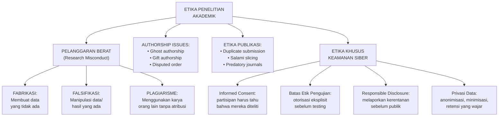

---

### 3–12. Landasan Teori, Latihan, Kunci Jawaban, Ringkasan, Refleksi

#### 13.1 Tiga Pelanggaran Utama (FFP)

**Fabrikasi (Fabrication):** Membuat data, hasil, atau referensi yang tidak ada. Contoh: melaporkan hasil eksperimen yang tidak pernah dilakukan. Sangat jarang tapi sangat serius — mencemari literature ilmiah.

**Falsifikasi (Falsification):** Memanipulasi, mengubah, atau menghapus data/hasil yang ada sehingga tidak akurat merepresentasikan penelitian. Contoh: menghapus outlier yang tidak disukai tanpa alasan metodologis, mengubah gambar hasil.

**Plagiarisme (Plagiarism):** Menggunakan karya (teks, ide, data, gambar) orang lain tanpa atribusi yang tepat. Termasuk: self-plagiarism (mendaur ulang teks sendiri dari publikasi sebelumnya tanpa disclosure).

**Konsekuensi:** Retraksi paper, pencabutan gelar, larangan publikasi, sanksi institusional, dan dalam beberapa kasus hukum.

**Cek plagiarisme:** Turnitin, iThenticate (standard jurnal), Grammarly (untuk indikasi awal). Gunakan sebelum submit, bukan sebagai alat "lolos plagiarisme".

#### 13.2 Masalah Authorship

**Kriteria authorship (ICMJE — International Committee of Medical Journal Editors, diadopsi luas):** Seseorang berhak menjadi penulis hanya jika memenuhi SEMUA:
1. Kontribusi substansial pada konsepsi, desain, atau akuisisi/analisis/interpretasi data
2. Terlibat dalam penulisan atau revisi substansial
3. Menyetujui versi final untuk publikasi
4. Bertanggung jawab atas semua aspek pekerjaan

**Ghost authorship:** Orang yang memberikan kontribusi signifikan tidak dicantumkan sebagai penulis (sering karena alasan politik atau konflik kepentingan).

**Gift authorship:** Orang dicantumkan sebagai penulis tanpa kontribusi substansial (karena senioritas, tekanan, atau "balas budi").

Keduanya adalah pelanggaran etika.

#### 13.3 Etika Khusus Penelitian Keamanan Siber

**Prinsip Menlo (2012):** Framework etika untuk penelitian keamanan siber, analoginya Belmont Report untuk penelitian medis:
- *Respect for Persons*: informed consent, privasi, otorisasi
- *Beneficence*: memaksimalkan manfaat, meminimalkan risiko
- *Justice*: distribusi risiko dan manfaat yang adil
- *Respect for Law*: kepatuhan hukum, keterlibatan pemangku kepentingan

**Authorized Testing ONLY:**
Tidak ada eksperimen keamanan pada sistem nyata tanpa otorisasi eksplisit tertulis. Ini bukan sekadar etika — di Indonesia, ini adalah kewajiban hukum (UU ITE No. 11/2008 dan perubahannya).

**Responsible Disclosure:**
Jika penelitian menemukan kerentanan (vulnerability) nyata:
1. Laporkan ke vendor/pemilik sistem secara private
2. Berikan waktu yang wajar untuk patch (standar industri: 90 hari)
3. Koordinasikan tanggal publikasi
4. Jangan mempublikasikan detail teknis yang dapat langsung dieksploitasi sebelum patch tersedia
5. Jika vendor tidak responsif setelah batas waktu → full disclosure (dengan pertimbangan)

**Anonimisasi Data:**
Jika penelitian mengumpulkan data yang mengandung PII (Personally Identifiable Information): hapus atau anonimisasi sebelum analisis. Dalam konteks forensik: data harus diproteksi chain of custody.

#### 13.4 Predatory Journals

Predatory journals adalah jurnal yang berpura-pura menjadi jurnal ilmiah legitimate tetapi tidak melakukan peer review yang sesungguhnya — mereka menerima hampir semua paper dengan imbalan biaya publikasi (APC).

**Ciri-ciri predatory journal:**
- Mengundang submit lewat email spam
- Peer review sangat cepat (< 2 minggu)
- Tidak ada editorial board yang jelas atau identitasnya palsu
- Website penuh typo dan informasi tidak konsisten
- APC diminta sebelum review

**Cara memverifikasi jurnal:** Cabells Predatory Reports; DOAJ (Directory of Open Access Journals); Scimago (Q1-Q4 ranking); database SINTA (untuk Indonesia).

**Pelajaran:** Publikasi di predatory journal tidak hanya tidak bernilai akademik — ia dapat merusak reputasi peneliti.

**Latihan:**

Soal 1: Seorang peneliti menemukan kerentanan SQL Injection kritis pada website layanan publik pemerintah Indonesia saat melakukan penelitian tentang keamanan aplikasi web. Dia belum mendapat otorisasi untuk mengakses sistem tersebut. Jelaskan secara langkah-demi-langkah apa yang harus dia lakukan.

Soal 2: Pembimbing tesis meminta namanya dicantumkan sebagai penulis pertama pada paper yang dikembangkan dari tesis mahasiswa, meskipun ia hanya memberikan masukan umum di dua pertemuan. Analisislah situasi ini dari perspektif etika authorship.

**Kunci Jawaban:**

Soal 1: Langkah yang tepat: (a) Hentikan akses segera — tidak melanjutkan eksploitasi lebih lanjut karena tanpa otorisasi ini sudah melanggar hukum; (b) Dokumentasikan temuan dengan detail yang cukup untuk dilaporkan, tapi jangan menyimpan data yang dieksfiltrasi dari sistem; (c) Laporkan secara private ke tim keamanan atau kontak publik lembaga pemerintah tersebut — jangan melalui media sosial atau forum publik; (d) Berikan informasi yang cukup agar mereka dapat mereproduksi dan memperbaiki kerentanan; (e) Berikan waktu yang wajar (rekomendasi 30-90 hari) sebelum disclosure publik; (f) Tidak mempublikasikan detail teknis sebelum patch tersedia; (g) Konsultasikan dengan pembimbing dan legal institusi tentang implikasi hukum dari penemuan ini.

Soal 2: Berdasarkan kriteria ICMJE, pembimbing yang hanya memberikan "masukan umum di dua pertemuan" tidak memenuhi kriteria authorship: (a) tidak ada kontribusi substansial pada konsepsi/desain/analisis; (b) tidak terlibat dalam penulisan atau revisi substansial; (c) meskipun menyetujui versi final, itu tidak cukup tanpa dua kriteria sebelumnya. Ini adalah *gift authorship* — pelanggaran etika. Tindakan yang tepat bagi mahasiswa: (a) diskusikan secara diplomatis bahwa urutan authorship seharusnya mencerminkan kontribusi; (b) tawaran yang lebih tepat untuk kontribusi pembimbing: acknowledgment section; (c) jika ada tekanan yang tidak etis, konsultasikan dengan komite etika institusi. Namun, penting untuk membedakan "masukan umum" dari kontribusi substansial — jika pembimbing terlibat signifikan dalam membentuk penelitian, authorship mungkin memang layak.

**Ringkasan:** Integritas penelitian bukan pilihan — ia adalah prasyarat untuk dapat dipercaya sebagai peneliti dan profesional keamanan siber. Pelanggaran etika penelitian memiliki konsekuensi serius bagi individu dan institusi. Etika yang khusus berlaku untuk penelitian keamanan siber — otorisasi, responsible disclosure, privasi data — harus dipahami dan dipatuhi, bukan karena kewajiban formal, tetapi karena kita bertanggung jawab terhadap sistem dan orang yang kita lindungi.

**Refleksi:** (1) Dalam situasi di mana menemukan kerentanan tanpa otorisasi adalah satu-satunya cara untuk "membuktikan" masalah keamanan yang serius, apakah ada justifikasi etis untuk melanjutkan? (2) Mengapa penelitian keamanan siber memerlukan standar etika yang lebih ketat dari, misalnya, penelitian kimia organik?

---

## Bab 14 — Peer Review dan Strategi Publikasi

### 1. Capaian Pembelajaran Bab

Setelah menyelesaikan bab ini, mahasiswa mampu:
- Melakukan peer review berbasis rubrik yang konstruktif dan akademik (C4)
- Mengidentifikasi jurnal target yang tepat berdasarkan scope dan kualitas (C4)
- Menyusun respons terhadap reviewer yang profesional dan efektif (C5)
- Menjelaskan strategi publikasi dari tesis ke jurnal/konferensi (C3)

*Dikaitkan dengan Sub-CPMK.5 (Pertemuan 14) dan Eval-5 (20% — deliverable: draft abstrak + introduction, esai etika, peer review silang).*

---

### 2. Peta Konsep Bab

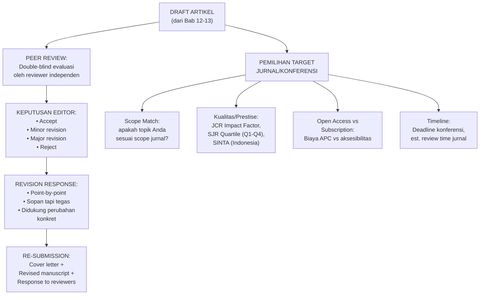

---

### 3–12. Landasan Teori, Latihan, Kunci Jawaban, Ringkasan, Refleksi

#### 14.1 Proses Peer Review

**Double-blind peer review:** Identitas penulis tidak diketahui reviewer; identitas reviewer tidak diketahui penulis. Standar emas untuk objektivitas.

**Single-blind:** Reviewer tahu identitas penulis; penulis tidak tahu reviewer. Lebih umum di beberapa bidang.

**Open review:** Semua identitas diketahui. Semakin populer di era open science.

**Timeline khas:** Submit → Editor desk review (1-2 minggu) → Assign ke reviewer (1-2 minggu) → Review (4-8 minggu) → Keputusan → Revisi (4-8 minggu) → Final decision. Total: 3-9 bulan untuk satu siklus.

#### 14.2 Melakukan Peer Review yang Baik

Peer review yang baik:
- **Konstruktif, bukan destruktif**: tujuannya meningkatkan paper, bukan mempermalukan penulis
- **Spesifik**: bukan "metodologi lemah" tapi "desain eksperimen tidak menjelaskan bagaimana baseline di-tune (Bagian 3.2)"
- **Berbasis bukti**: kritik didukung referensi atau argumen metodologis
- **Seimbang**: akui kekuatan dan kelemahan

**Struktur review:**
1. **Summary** (2-3 kalimat): ringkasan singkat tentang apa yang paper lakukan
2. **General assessment** (1 paragraf): penilaian keseluruhan
3. **Major concerns** (numbered list): masalah yang harus ditangani
4. **Minor concerns** (numbered list): masalah kecil (typo, klarifikasi)
5. **Recommendation**: Accept/Minor revision/Major revision/Reject

#### 14.3 Merespons Reviewer

Respons yang efektif:
- Ucapkan terima kasih (singkat, tidak berlebihan)
- Respons point-by-point untuk setiap komentar reviewer
- Format: [Komentar Reviewer #1.1] → [Respons kami] → [Perubahan yang dilakukan: halaman X, paragraf Y]
- Jika tidak setuju dengan komentar: nyatakan argumen yang kuat dengan referensi — tidak perlu menyetujui semua
- Jangan defensive atau aggressive

**Contoh respons:**
> **Komentar Reviewer 2.3:** "Penulis mengklaim LSTM lebih baik dari RF tanpa uji statistik yang memadai."
>
> **Respons:** Terima kasih atas catatan ini. Reviewer benar bahwa kami belum melaporkan uji statistik formal. Kami telah menambahkan Wilcoxon signed-rank test pada 10-fold cross-validation (n=10 pasangan) yang menghasilkan W=0, p=0.002 (two-tailed), menunjukkan bahwa perbedaan signifikan secara statistik. Penambahan ini terdapat pada Bagian 4.3 (halaman 8) dan Tabel 4.

#### 14.4 Memilih Jurnal/Konferensi Target

**Untuk jurnal:**
- *Impact Factor (IF)*: rata-rata sitasi per paper dalam 2 tahun — makin tinggi makin prestisius
- *Quartile (Q1-Q4)*: berdasarkan Scimago atau JCR — Q1 adalah 25% teratas
- *SINTA*: peringkat jurnal Indonesia (S1-S6)
- *Indexing*: Scopus, Web of Science, DOAJ

**Jurnal relevan untuk keamanan siber (contoh Q1-Q2):**
- *Computers & Security* (Elsevier, IF~5, Q1)
- *IEEE Transactions on Information Forensics and Security* (IEEE, IF~7, Q1)
- *Journal of Information Security and Applications* (Elsevier, IF~5, Q1)
- *Future Generation Computer Systems* (Elsevier, IF~7, Q1 — broader scope)

**Konferensi bergengsi:**
- IEEE S&P (Oakland), CCS (ACM), USENIX Security, NDSS — tier 1
- RAID, ESORICS, ACSAC — tier 2

**Strategi realistis untuk mahasiswa magister:**
Mulai dari konferensi nasional/regional bereputasi atau jurnal Q3-Q4 Scopus, kemudian tingkatkan. Konferensi IEEE/ACM lebih achievable sebagai target pertama dibandingkan jurnal Q1.

**Latihan:**

Soal 1: Anda menerima komentar reviewer: "Hasil Anda tidak dapat dipercaya karena dataset yang digunakan sudah usang." Tulis respons yang profesional tapi defensif secara ilmiah.

Soal 2: Bagaimana cara membedakan jurnal legitimate dari predatory journal? Sebutkan 5 langkah verifikasi.

**Kunci Jawaban:**

Soal 1: "Terima kasih atas catatan ini. Kami memahami kekhawatiran tentang currency dataset. Kami menggunakan [nama dataset, tahun] karena: (a) merupakan satu-satunya dataset publik yang mencakup [karakteristik spesifik yang relevan untuk RQ kami]; (b) digunakan sebagai benchmark dalam [N] paper terkait yang diterbitkan antara [tahun]-[tahun] (lihat Tabel 2 yang sudah kami perbarui), memungkinkan perbandingan langsung dengan state-of-the-art; (c) dataset baru yang lebih recent ([nama jika ada]) tidak mencakup [aspek kritis] yang diperlukan untuk menjawab RQ kami. Kami setuju bahwa keterbatasan ini perlu diakui secara eksplisit — kami telah menambahkan paragraf di Bagian 5.2 (Keterbatasan) yang mendiskusikan implikasi temporal dataset ini dan merekomendasikan evaluasi ulang menggunakan dataset yang lebih baru sebagai future work."

Soal 2: Lima langkah verifikasi: (1) Cek di Scopus (scimagojr.com) atau Web of Science — jika tidak terindeks, waspada; (2) Verifikasi editorial board — apakah nama editor dapat ditemukan di Google Scholar sebagai peneliti aktif di bidangnya? (3) Cek DOAJ (doaj.org) untuk jurnal open access legitimate; (4) Baca paper yang sudah diterbitkan — apakah kualitasnya terlihat memenuhi standar peer review? Ada typo, argumen lemah, atau tidak ada metodologi jelas? (5) Perhatikan APC (Article Processing Charge) — apakah diminta sebelum review? Jurnal legitimate biasanya meminta APC hanya setelah acceptance.

**Ringkasan:** Peer review adalah mekanisme jaminan kualitas ilmiah — memahaminya dari dua sisi (sebagai penulis dan reviewer) menjadikan Anda lebih efektif dalam keduanya. Strategi publikasi yang realistis dimulai dari venue yang achievable dan secara bertahap meningkat. Respons terhadap reviewer yang profesional menunjukkan kedewasaan akademik.

**Refleksi:** (1) Proses peer review memakan waktu dan tidak dibayar. Apakah sistem ini sustainable, dan apa alternatif yang sedang dieksplorasi komunitas ilmiah? (2) Jika Anda menerima paper yang sangat buruk sebagai reviewer, apakah Anda berkewajiban memberikan revisi yang mendetail, atau cukup merekomendasikan reject dengan penjelasan singkat?

---

## Bab 15 — Presentasi Ilmiah dan Komunikasi Riset

### 1. Capaian Pembelajaran Bab

Setelah menyelesaikan bab ini, mahasiswa mampu:
- Menyusun presentasi riset yang efektif dalam waktu 15-20 menit (C5)
- Mendesain slide yang mendukung narasi tanpa menjadi distraksi (C3)
- Menjawab pertanyaan dari audiens secara akademik dan percaya diri (C4)
- Mengadaptasi presentasi untuk konteks yang berbeda: seminar, konferensi, pitch (C5)

*Dikaitkan dengan Sub-CPMK.6 (Pertemuan 15) dan Eval-5b (bagian dari 20% — deliverable: presentasi 5 menit + Q&A).*

---

### 2. Peta Konsep Bab

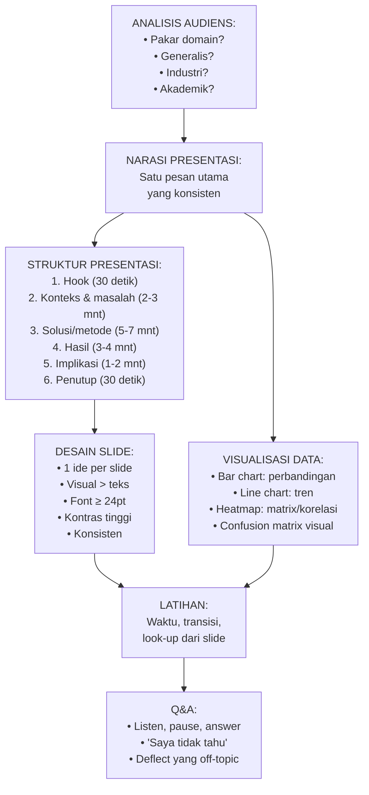

---

### 3–12. Landasan Teori, Latihan, Kunci Jawaban, Ringkasan, Refleksi

#### 15.1 Prinsip Desain Slide

**Aturan 1-6-6:** Maksimum 1 ide per slide, 6 bullet points per slide, 6 kata per bullet. Lebih sedikit lebih baik.

**Teks vs Visual:** Otak memproses gambar 60.000x lebih cepat dari teks. Ganti teks dengan: diagram, grafik, tabel, gambar representatif.

**Font dan Ukuran:** Minimum 24pt untuk body text, 32pt+ untuk heading. Font sans-serif (Arial, Calibri) lebih mudah dibaca di layar.

**Warna:** Kontras tinggi (hitam/putih, atau scheme yang diuji untuk color-blindness). Hindari merah-hijau bersamaan (8% laki-laki memiliki color blindness merah-hijau).

#### 15.2 Narasi vs Membaca Slide

**Presentasi yang buruk:** Presenter membaca slide kata per kata. Audiens tidak butuh presenter jika hanya membaca slide.

**Presentasi yang baik:** Slide adalah *visual aid* — pendukung narasi, bukan skrip. Presenter menjelaskan ide, memberikan konteks, dan menjawab "mengapa ini penting?" sementara slide menunjukkan data atau diagram.

**Teknik:** Latih presentasi tanpa melihat slide. Jika bisa mempresentasikan tanpa melihat slide, slide Anda adalah alat yang efektif.

#### 15.3 Menjawab Pertanyaan

**Teknik PAUSE:**
- **P**ause: berhenti sejenak sebelum menjawab — menunjukkan Anda berpikir, bukan reaktif
- **A**cknowledge: akui pertanyaan tersebut valid
- **U**nderstand: pastikan Anda memahami pertanyaan sebelum menjawab
- **S**tructure: jawab secara terstruktur
- **E**nd clearly: tutup jawaban dengan pernyataan yang jelas, lalu persilakan followup

**Situasi khusus:**
- *"Saya tidak tahu"*: lebih baik dari jawaban yang salah. "Itu pertanyaan yang bagus, saya belum memiliki data untuk menjawabnya dengan pasti — ini bisa menjadi area future work."
- *Pertanyaan di luar scope*: "Itu pertanyaan yang menarik tapi di luar scope penelitian ini. Saya senang mendiskusikannya secara terpisah setelah sesi."
- *Kritik yang valid*: "Anda benar bahwa ini adalah keterbatasan yang saya akui dalam paper. [Jelaskan upaya mitigasi atau implikasinya]."

#### 15.4 Adaptasi untuk Konteks Berbeda

**Seminar internal (20 menit):** Detail metodologi dan justifikasi keputusan design. Audiens: peneliti yang ingin mengaudit rigor Anda.

**Konferensi (15-20 menit):** Fokus pada novelty dan kontribusi. Audiens: peneliti dalam domain yang sama yang ingin tahu "apa yang baru?"

**Pitch kepada industri (5-10 menit):** Fokus pada masalah bisnis yang diselesaikan dan ROI potensial. Audiens: tidak peduli dengan detail teknis, peduli dengan nilai bisnis.

**Poster presentasi:** Berdiri sendiri dan mudah dipahami dalam 1-2 menit membaca mandiri. Layout: judul besar, visual dominan, minimal teks.

**Latihan:**

Soal 1: Anda sedang presentasi dan seorang penguji senior memotong presentasi Anda dan berkata: "Metodologi Anda memiliki flaw fundamental — Anda tidak dapat membandingkan model yang dilatih pada data imbalanced tanpa teknik resampling." Bagaimana Anda merespons?

Soal 2: Desain outline 10 slide untuk presentasi 15 menit tentang tesis Anda sendiri. Sertakan judul setiap slide dan satu kalimat tentang apa yang divisualisasikan.

**Kunci Jawaban:**

Soal 1: Respons yang tepat: (Pause) "Terima kasih atas catatan ini." (Acknowledge) "Saya memahami kekhawatiran tentang class imbalance dalam dataset." (Clarify/Defend) "Dalam penelitian ini, kami memang menggunakan teknik SMOTE untuk addressing class imbalance sebelum training — ini dijelaskan di Bagian Metodologi. SMOTE hanya diterapkan pada training set, bukan validation dan test set, untuk menghindari data leakage. Jika presentasi saya tidak cukup jelas menjelaskan ini, saya mohon maaf atas ketidakjelasan tersebut." (Jika masalah belum tercakup) "Jika kekhawatiran Anda adalah tentang aspek yang berbeda, saya sangat ingin mendiskusikannya lebih lanjut setelah sesi."

Soal 2: Contoh outline (untuk topik LSTM IDS): Slide 1: Judul + nama (logo institusi). Slide 2: "Masalah" — statistik serangan IIoT + gap IDS konvensional (bar chart tren serangan). Slide 3: "Tujuan Penelitian" — RQ dan kontribusi (2-3 bullet). Slide 4: "Arsitektur Solusi" — diagram LSTM pipeline (diagram alur). Slide 5: "Dataset" — MQTTset karakteristik (tabel ringkas: ukuran, kelas, tahun). Slide 6: "Desain Eksperimen" — 10-fold CV, baseline RF, prosedur (diagram alur sederhana). Slide 7: "Hasil Utama" — tabel perbandingan F1/AUC/Latency (tabel dengan highlight). Slide 8: "Signifikansi Statistik" — hasil Wilcoxon test (1 baris angka + p-value). Slide 9: "Implikasi dan Keterbatasan" — deployment context + keterbatasan (2 kolom). Slide 10: "Kesimpulan dan Future Work" — 3 poin utama + 2 arah pengembangan.

**Ringkasan:** Presentasi yang efektif adalah tentang komunikasi ide, bukan demonstrasi teknis. Slide adalah alat bantu visual, bukan skrip. Kemampuan menjawab pertanyaan dengan tenang dan jujur (termasuk mengakui keterbatasan) menunjukkan kedewasaan akademik yang lebih tinggi daripada klaim yang berlebihan.

**Refleksi:** (1) Apakah kemampuan presentasi yang baik adalah kompetensi yang perlu diajarkan secara formal dalam program riset, atau seharusnya berkembang secara alami? (2) Bagaimana Anda memastikan bahwa visualisasi data Anda tidak secara tidak sengaja menyesatkan audiens — misalnya, dengan axis yang dipotong untuk membuat perbedaan terlihat lebih besar dari yang sebenarnya?

---

## Bab 16 — UAS dan Artikel Ilmiah Mini Final

### 1. Capaian Pembelajaran Bab

Bab ini merupakan pertemuan UAS (Ujian Akhir Semester) dan pengumpulan artikel ilmiah mini final. Mahasiswa diuji pada keseluruhan kompetensi mata kuliah.

*Sub-CPMK.6 — Eval-6: UAS (30%) + artikel ilmiah mini final (bagian dari Eval-5 yang merupakan 20%).*

---

### 2. Ringkasan Materi UAS (Bab 1–15)

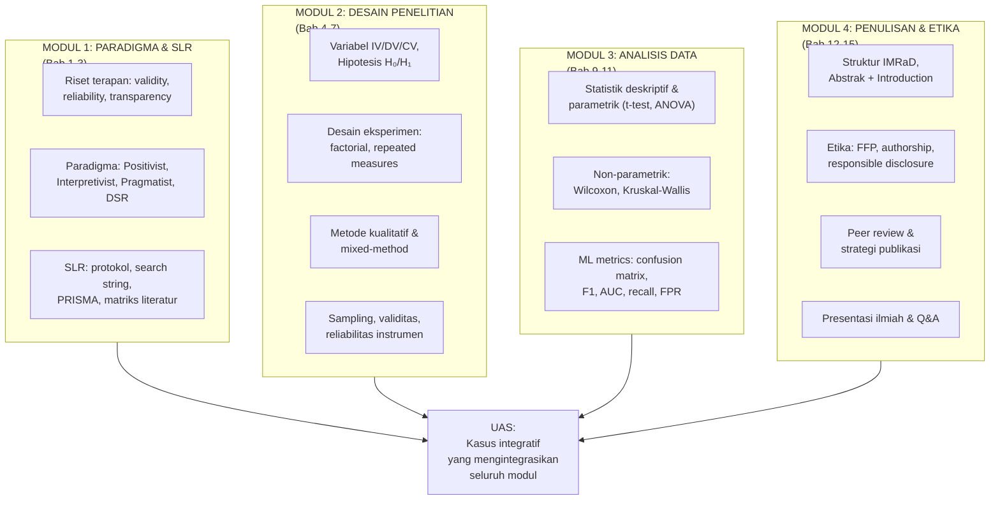

---

### 3. Soal UAS — Kasus Integratif

**Kasus UAS:**

Dr. Fatimah adalah dosen keamanan siber yang ingin mempublikasikan penelitiannya tentang "Deteksi Ransomware pada Jaringan Rumah Sakit Menggunakan Graph Neural Network (GNN)." Ia memiliki data traffic jaringan dari rumah sakit yang merupakan mitra penelitiannya. Berikut adalah deskripsi penelitiannya:

*"Kami menggunakan dataset yang dikumpulkan dari jaringan tiga rumah sakit swasta di Jawa Timur selama 6 bulan (Januari-Juni 2024), mengandung 2.1 juta rekaman traffic. Dataset diproses menggunakan GNN untuk mendeteksi pola lateral movement yang mengindikasikan ransomware. Kami membandingkan dengan LSTM dan Random Forest. GNN mencapai accuracy 98.7%, jauh di atas LSTM (94.2%) dan RF (91.5%). Kami menyimpulkan GNN adalah solusi terbaik untuk ransomware detection di fasilitas kesehatan."*

Pertanyaan 1 (20 poin): Identifikasi minimal 5 masalah metodologis dalam deskripsi penelitian ini.

Pertanyaan 2 (20 poin): Terdapat data pasien yang mungkin ikut tercapture dalam dataset traffic jaringan rumah sakit. Analisislah implikasi etis dan langkah-langkah yang seharusnya Dr. Fatimah lakukan sebelum dan selama pengumpulan data.

Pertanyaan 3 (20 poin): Reformulasikan hipotesis yang lebih tepat untuk penelitian ini, termasuk pemilihan uji statistik yang sesuai, dan jelaskan mengapa metrik yang dipilih lebih tepat dari sekadar accuracy.

Pertanyaan 4 (20 poin): Dr. Fatimah ingin mempublikasikan di jurnal Q2 Scopus di bidang keamanan siber. Bagaimana ia harus memilih jurnal yang tepat, dan apa yang harus ada dalam abstraknya agar memenuhi standar jurnal berkualitas?

Pertanyaan 5 (20 poin): Setelah submit, reviewer memberikan komentar: "Data dari tiga rumah sakit tidak memberikan generalizability yang cukup untuk klaim 'solusi terbaik untuk fasilitas kesehatan'." Tulis respons reviewer yang profesional.

---

### 4. Kunci Jawaban UAS

**Pertanyaan 1 — 5 masalah metodologis:**
(1) Penggunaan accuracy sebagai metrik utama pada dataset yang kemungkinan imbalanced (ransomware events jauh lebih jarang dari traffic normal) — accuracy 98.7% bisa dicapai dengan memprediksi semua sebagai "normal"; (2) tidak ada penjelasan tentang split train/validation/test — apakah ada data leakage? (3) tidak ada uji statistik untuk menentukan apakah perbedaan performa signifikan atau hanya variasi acak; (4) hyperparameter tuning tidak dijelaskan — apakah GNN, LSTM, dan RF di-tune dengan upaya yang setara (fair comparison)?; (5) "GNN mencapai 98.7%" — tidak disebutkan apakah ini rata-rata dari cross-validation atau satu run — satu run tidak dapat diandalkan.

**Pertanyaan 2 — Etika:**
Implikasi etis: data traffic jaringan rumah sakit dapat mengandung informasi yang terkait dengan pasien (akses ke rekam medis elektronik, informasi farmasi, dll.) — ini adalah data sensitif yang dilindungi hukum (PP 71/2019 tentang Penyelenggaraan Sistem dan Transaksi Elektronik; UU 23/1992 tentang Kesehatan). Langkah-langkah yang harus dilakukan: (a) sebelum pengumpulan: mendapatkan izin etik penelitian dari komite etika institusi akademik DAN rumah sakit; informed consent dari manajemen rumah sakit; (b) selama pengumpulan: anonimisasi otomatis — filter PII dari traffic capture; hanya menyimpan fitur yang diperlukan untuk analisis (flow statistics), bukan payload yang mungkin mengandung data pasien; (c) penyimpanan: data dienkripsi, akses terbatas; retensi sesuai dengan persetujuan yang diberikan; (d) dalam laporan: tidak mempublikasikan informasi yang dapat mengidentifikasi rumah sakit spesifik tanpa izin.

**Pertanyaan 3 — Hipotesis dan metrik:**
H₀: Tidak ada perbedaan yang signifikan secara statistik (α=0.05) antara F1-score (macro) GNN dan baseline LSTM dalam mendeteksi ransomware lateral movement pada dataset jaringan rumah sakit. H₁: GNN menghasilkan F1-score (macro) yang secara statistik signifikan lebih tinggi dari LSTM pada dataset yang sama. Uji: Wilcoxon Signed-Rank Test pada hasil 10-fold stratified cross-validation (paired, karena dataset yang sama). Metrik yang lebih tepat dari accuracy: F1-score macro (karena imbalanced); recall untuk kelas ransomware (karena FN lebih berbahaya dari FP — missed ransomware berakibat bencana); FPR (alert fatigue di fasilitas kesehatan sangat merugikan operasional).

**Pertanyaan 4 — Pemilihan jurnal dan abstrak:**
Jurnal yang tepat: scope match penting — cari jurnal yang menerima paper tentang ML/security dalam konteks healthcare IT. Contoh: *Computers in Biology and Medicine* (Q1, broader), *Computers & Security* (Q1), *Journal of Information Security and Applications* (Q1). Verifikasi melalui Scimago/JCR. Elemen abstrak yang harus ada: (a) konteks: ransomware sebagai ancaman utama fasilitas kesehatan (dengan statistik); (b) gap: belum ada studi yang menggunakan GNN untuk deteksi lateral movement spesifik ransomware di jaringan klinis; (c) metode: GNN dilatih pada dataset 2.1M rekaman dari 3 RS, dibandingkan LSTM dan RF; (d) hasil: GNN F1=X.XX, meningkat Y% dari baseline (p=Z.ZZZ, Wilcoxon test); (e) kontribusi: benchmark pertama GNN untuk deteksi ransomware pada jaringan klinis Indonesia.

**Pertanyaan 5 — Respons reviewer:**
"Terima kasih atas catatan yang valid ini. Reviewer tepat bahwa tiga rumah sakit memberikan sampel yang terbatas untuk generalisasi ke 'seluruh fasilitas kesehatan'. Kami telah merevisi klaim penelitian sebagai berikut: (a) Judul diubah dari 'solusi terbaik untuk fasilitas kesehatan' menjadi 'studi kasus preliminary pada jaringan rumah sakit swasta skala menengah di Jawa Timur'; (b) Bagian Pembahasan (5.3) ditambahkan sub-bagian Keterbatasan yang secara eksplisit mendiskusikan: scope yang terbatas pada tiga rumah sakit; kemungkinan bahwa pola ransomware berbeda di rumah sakit pemerintah, klinik kecil, atau konteks geografis lain; perlunya studi multi-site yang lebih luas sebagai future work; (c) Klaim 'solusi terbaik' dihapus dan digantikan dengan 'bukti awal bahwa GNN menunjukkan performa superior dalam konteks yang diteliti, yang memerlukan validasi lebih lanjut'. Kami percaya revisi ini menyelaraskan klaim penelitian dengan scope data yang tersedia tanpa mengurangi nilai kontribusi."

---

### 5. Artikel Ilmiah Mini — Panduan Final

Artikel ilmiah mini (4-6 halaman, IEEE format atau APA) harus mencakup:
- **Judul**: spesifik dan informatif
- **Abstrak**: 200-250 kata, struktur CPMC
- **Keywords**: 5-7 kata kunci
- **Introduction**: hook, konteks, gap, tujuan, kontribusi, organisasi
- **Related Work**: sintesis kritis ≥5 referensi primer
- **Methodology**: cukup detail untuk direproduksi
- **Results** (jika ada): tabel/grafik dengan interpretasi
- **Discussion**: implikasi, keterbatasan, future work
- **Conclusion**: ringkasan kontribusi
- **References**: APA 7th atau IEEE, konsisten

*Dinilai menggunakan Rubrik Penilaian Artikel (lihat Lampiran E).*

---

---

# Lampiran

## Lampiran A — Template Protokol SLR

```
PROTOKOL SYSTEMATIC LITERATURE REVIEW
[HARUS diisi sebelum pencarian dimulai]

Nama Peneliti: ________________________________
Topik Tesis: ________________________________
Tanggal Protokol Didefinisikan: ________________________________

1. RESEARCH QUESTION SLR
RQ-SLR: ________________________________

2. DATABASE DAN SUMBER
Primary:
- [ ] IEEE Xplore
- [ ] ACM Digital Library
- [ ] Scopus
- [ ] Web of Science
- [ ] Lainnya: ________________________________

Secondary (jika primary tidak cukup):
- [ ] Google Scholar (hanya untuk validasi kelengkapan)
- [ ] arXiv cs.CR (preprint)

3. SEARCH STRING

String utama:
(term_A1 OR term_A2 OR term_A3)
AND
(term_B1 OR term_B2 OR term_B3)
AND
(term_C1 OR term_C2 OR term_C3)

Catatan per database (modifikasi sintaks jika perlu):
- IEEE: ________________________________
- Scopus: ________________________________
- ACM: ________________________________

4. KRITERIA INKLUSI (I) DAN EKSKLUSI (E)

| Kriteria | Inklusi | Eksklusi |
|---|---|---|
| Tipe publikasi | | |
| Tahun | | |
| Bahasa | | |
| Topik | | |
| Aksesibilitas | | |

5. PROSEDUR SCREENING

Tahap 1 (Judul): dilakukan oleh _______________
Tahap 2 (Abstrak): dilakukan oleh _______________
Tahap 3 (Full-text): dilakukan oleh _______________
Inter-rater reliability: Cohen's Kappa target ≥ 0.70

6. DATA YANG DIEKSTRAK

Untuk setiap paper yang terinklusikan:
[ ] ID paper, Penulis, Tahun, Judul, Venue
[ ] Masalah penelitian
[ ] Metode
[ ] Dataset
[ ] Metrik
[ ] Hasil utama
[ ] Keterbatasan
[ ] Relevansi ke RQ tesis
[ ] Gap yang teridentifikasi

7. EXPECTED TIMELINE

Pencarian awal: ________________________________
Screening judul: ________________________________
Screening abstrak: ________________________________
Full-text review: ________________________________
Sintesis & matriks: ________________________________
Penulisan Bab 2: ________________________________
```

---

## Lampiran B — Template Desain Eksperimen

```
TEMPLATE DESAIN EKSPERIMEN
Nama Peneliti: ________________________________
Judul Tesis: ________________________________
Versi: ________________________________

1. PARADIGMA DAN JENIS PENELITIAN
Paradigma: [ ] Positivist  [ ] Pragmatist  [ ] Interpretivist
Jenis: [ ] Eksperimental  [ ] DSR  [ ] Case Study  [ ] Mixed

2. VARIABEL

Independent Variable (IV):
IV₁: ________________________________
  Level: ________________________________
IV₂ (jika ada): ________________________________

Dependent Variable (DV):
DV₁: ________________________________ (diukur dengan: ___________)
DV₂: ________________________________ (diukur dengan: ___________)

Control Variable (CV):
CV₁: ________________________________
CV₂: ________________________________

3. HIPOTESIS

H₀: ________________________________
H₁: ________________________________
Arah (directional/non-directional): ________________________________
Alpha (α): ________________________________

4. DESAIN EKSPERIMEN

Jenis desain: ________________________________
Justifikasi: ________________________________
Jumlah run/folds: ________________________________
Random seed: ________________________________

5. DATASET

Nama dataset: ________________________________
Sumber: ________________________________
Ukuran: ________________________________ sampel
Kelas: ________________________________
Split: Train/Val/Test = ___/__/___
Handling imbalance: [ ] SMOTE  [ ] Lainnya: ________  [ ] Tidak ada

6. PREPROCESSING

Langkah 1: ________________________________
Langkah 2: ________________________________
Langkah 3: ________________________________
Urutan: preprocessing dilakukan SETELAH split? [ ] Ya  [ ] Tidak

7. METRIK EVALUASI

Metrik Utama: ________________________________
Metrik Pendukung: ________________________________
Uji Statistik: ________________________________
  Software: [ ] Python (scipy.stats)  [ ] R  [ ] Lainnya: ______

8. BASELINE

Nama baseline: ________________________________
Konfigurasi: ________________________________
Tuning method: ________________________________ (sama dengan model utama)

9. REPRODUCIBILITY

Random seed didokumentasikan: [ ] Ya
Versi library (requirements.txt): [ ] Ya
Hardware specs: ________________________________
Kode tersedia di: ________________________________

10. ANTISIPASI ANCAMAN VALIDITAS

Validitas internal: ________________________________
Validitas eksternal: ________________________________
Mitigasi: ________________________________
```

---

## Lampiran C — Rubrik Peer Review Artikel Ilmiah

```
RUBRIK PEER REVIEW ARTIKEL ILMIAH
Reviewer: ________________________________
Paper yang direview: ________________________________
Tanggal: ________________________________

DIMENSI 1: SIGNIFIKANSI DAN NOVELTY (25%)

Skor 4: Gap literatur jelas, signifikan, dan terdokumentasi dengan baik.
        Kontribusi jelas dan substansial.
Skor 3: Gap teridentifikasi dengan cukup baik; kontribusi ada tapi
        bisa lebih tajam.
Skor 2: Gap tidak jelas atau tidak terdokumentasi; kontribusi marginal.
Skor 1: Tidak ada gap yang jelas; tidak ada kontribusi yang nyata.

Skor: ___/4   Nilai: ___ × 0.25 = ___
Komentar spesifik:
________________________________

DIMENSI 2: RIGOR METODOLOGI (30%)

Skor 4: Metode sangat tepat untuk RQ; fair comparison; reproducible;
        ancaman validitas diantisipasi.
Skor 3: Metode tepat; sebagian besar aspek ditangani dengan baik.
Skor 2: Ada kelemahan metodologis signifikan yang mempengaruhi validitas.
Skor 1: Metode tidak tepat atau ada masalah fundamental yang tidak
        dapat diperbaiki dengan revisi minor.

Skor: ___/4   Nilai: ___ × 0.30 = ___
Komentar spesifik:
________________________________

DIMENSI 3: KUALITAS PELAPORAN HASIL (20%)

Skor 4: Hasil dilaporkan dengan lengkap (mean ± SD, effect size,
        p-value, CI); tabel/gambar jelas; interpretasi akurat.
Skor 3: Hasil cukup lengkap; interpretasi sebagian besar akurat.
Skor 2: Hasil tidak lengkap; interpretasi ada yang tidak tepat.
Skor 1: Klaim tidak didukung oleh data yang dilaporkan.

Skor: ___/4   Nilai: ___ × 0.20 = ___
Komentar spesifik:
________________________________

DIMENSI 4: KUALITAS PENULISAN (15%)

Skor 4: Struktur IMRaD jelas; abstrak standalone; bahasa jelas dan
        tepat; referensi konsisten dan akurat.
Skor 3: Struktur cukup baik; bahasa dapat dipahami; referensi
        sebagian besar tepat.
Skor 2: Masalah struktur yang signifikan; bahasa membingungkan di
        beberapa bagian.
Skor 1: Masalah fundamental dalam struktur dan bahasa.

Skor: ___/4   Nilai: ___ × 0.15 = ___
Komentar spesifik:
________________________________

DIMENSI 5: ETIKA DAN INTEGRITAS (10%)

Skor 4: Tidak ada indikasi pelanggaran etika; keterbatasan diakui
        jujur; responsible disclosure jika relevan.
Skor 3: Sebagian besar aspek etika ditangani.
Skor 2: Ada kekhawatiran etika yang perlu ditangani.
Skor 1: Ada pelanggaran etika yang signifikan.

Skor: ___/4   Nilai: ___ × 0.10 = ___
Komentar spesifik:
________________________________

TOTAL: ___/4.0   Konversi: ___ × 25 = ___/100

REKOMENDASI:
[ ] Accept as is
[ ] Minor revision (dapat diterima setelah revisi kecil)
[ ] Major revision (memerlukan revisi substansial dan re-review)
[ ] Reject (masalah fundamental yang tidak dapat diperbaiki)

MAJOR CONCERNS (harus ditangani):
1. ________________________________
2. ________________________________
3. ________________________________

MINOR CONCERNS (disarankan):
1. ________________________________
2. ________________________________
```

---

## Lampiran D — Template Respons Reviewer

```
RESPONSE TO REVIEWERS

Manuscript Title: ________________________________
Manuscript ID: ________________________________
Date of Resubmission: ________________________________

Dear Editors and Reviewers,

Kami mengucapkan terima kasih kepada editor dan reviewer atas waktu dan
masukan yang berharga. Kami telah merevisi naskah dengan mempertimbangkan
semua komentar secara serius. Berikut adalah respons kami point-by-point.

Perubahan penting dalam revisi ini ditandai dengan highlight kuning dalam
naskah revisi untuk memudahkan verifikasi.

═══════════════════════════════════════════════════
REVIEWER 1
═══════════════════════════════════════════════════

Komentar 1.1: [Salin verbatim komentar reviewer]

Respons: [Respons Anda — mulai dengan mengakui validitas komentar,
         lalu jelaskan tindakan yang diambil atau berikan argumen
         jika tidak setuju]

Perubahan: [Deskripsi konkret perubahan — halaman X, paragraf Y,
           atau "ditambahkan Tabel 3 pada halaman 8"]

---

Komentar 1.2: [Salin verbatim]

Respons: ________________________________

Perubahan: ________________________________

═══════════════════════════════════════════════════
REVIEWER 2
═══════════════════════════════════════════════════

Komentar 2.1: [Salin verbatim]

Respons: ________________________________

Perubahan: ________________________________

═══════════════════════════════════════════════════

Kami berharap revisi ini memenuhi standar yang diperlukan untuk publikasi.
Kami dengan senang hati memberikan klarifikasi lebih lanjut jika diperlukan.

Hormat kami,
[Nama Penulis Korespondensi]
[Institusi]
[Email]
```

---

## Lampiran E — Rubrik Penilaian Artikel Ilmiah Mini

```
RUBRIK PENILAIAN ARTIKEL ILMIAH MINI (EVAL-5/6)

Nama Mahasiswa: ________________________________
Topik Artikel: ________________________________

DIMENSI 1: ABSTRAK (15%)
[ ] 4: Standalone, spesifik, mencakup CPMC, angka konkret
[ ] 3: Sebagian besar elemen ada, kurang spesifik di beberapa bagian
[ ] 2: Tidak standalone atau terlalu umum
[ ] 1: Tidak informatif

DIMENSI 2: INTRODUCTION (20%)
[ ] 4: Funnel yang jelas (hook→konteks→gap→tujuan), gap terdokumentasi
[ ] 3: Struktur ada, gap cukup jelas
[ ] 2: Gap tidak jelas atau tidak terdokumentasi
[ ] 1: Tidak ada struktur yang jelas

DIMENSI 3: RELATED WORK (15%)
[ ] 4: Sintesis kritis ≥5 referensi primer, gap dinyatakan eksplisit
[ ] 3: Ringkasan paper yang cukup, gap sebagian teridentifikasi
[ ] 2: Daftar paper tanpa sintesis
[ ] 1: Tidak ada atau sangat kurang

DIMENSI 4: METODOLOGI (20%)
[ ] 4: Cukup detail untuk direproduksi, justifikasi pilihan ada
[ ] 3: Detail cukup, beberapa justifikasi kurang
[ ] 2: Tidak cukup detail untuk direproduksi
[ ] 1: Tidak ada metodologi yang jelas

DIMENSI 5: HASIL DAN DISKUSI (15%)
[ ] 4: Fakta dipisahkan dari interpretasi; tabel/gambar jelas; keterbatasan diakui
[ ] 3: Sebagian besar aspek ada
[ ] 2: Fakta dan interpretasi tercampur; keterbatasan tidak diakui
[ ] 1: Tidak ada analisis yang bermakna

DIMENSI 6: REFERENSI DAN FORMAT (15%)
[ ] 4: ≥10 referensi primer, konsisten APA/IEEE, tidak ada sitasi palsu
[ ] 3: ≥7 referensi, sebagian besar konsisten
[ ] 2: <7 referensi atau inkonsisten
[ ] 1: Referensi tidak memadai atau tidak dapat diverifikasi

TOTAL: ___/100

Komentar Penilai: ________________________________
Nilai: ________________________________
```

---

## Kunci Jawaban Global — Soal Pilihan Lintas Bab

### Ringkasan Kunci Per Bab

**Bab 1:** Rigor (validity, reliability, transparency) adalah prasyarat, bukan pilihan, dalam penelitian keamanan siber. Hasil yang tidak valid atau tidak dapat direproduksi dapat menyebabkan pertahanan yang palsu.

**Bab 2:** Pemilihan paradigma harus mengikuti sifat RQ: positivist untuk pengukuran kuantitatif, interpretivist untuk pemahaman konteks, DSR untuk pengembangan artefak.

**Bab 3:** Protokol SLR harus didefinisikan sebelum pencarian. PRISMA flow melaporkan transparansi proses.

**Bab 4:** IV dimanipulasi, DV diukur, CV dijaga konstan. H₀ selalu menyatakan "tidak ada efek".

**Bab 5:** Power analysis menentukan ukuran sampel minimum. Multiple comparisons memerlukan koreksi.

**Bab 6:** Wawancara dan FGD cocok untuk pertanyaan "mengapa" dan "bagaimana". Trustworthiness (bukan validity) adalah standar kualitas kualitatif.

**Bab 7:** Stratified sampling lebih representatif untuk populasi heterogen. Cronbach's α < 0.70 mengindikasikan instrumen perlu direvisi.

**Bab 8 (UTS):** Lihat kunci jawaban kasus integratif UTS di Bab 8.

**Bab 9:** p-value adalah probabilitas mendapat hasil minimal sebesar yang diamati JIKA H₀ benar — BUKAN probabilitas H₀ benar. Selalu laporkan effect size bersama p-value.

**Bab 10:** Wilcoxon Signed-Rank adalah pilihan tepat untuk membandingkan dua model dalam k-fold CV ketika distribusi tidak normal.

**Bab 11:** Accuracy menyesatkan pada imbalanced data. Recall dan FPR adalah metrik terpenting untuk IDS. AUC adalah metrik threshold-independent.

**Bab 12:** Abstrak harus berdiri sendiri dan spesifik. Introduction mengikuti pola funnel.

**Bab 13:** Fabrikasi, falsifikasi, plagiarisme adalah pelanggaran berat. Responsible disclosure adalah standar profesional keamanan siber.

**Bab 14:** Peer review yang baik adalah konstruktif dan spesifik. Respons reviewer mengikuti format point-by-point.

**Bab 15:** Slide adalah alat bantu visual, bukan skrip. Kemampuan menjawab "saya tidak tahu" dengan jujur adalah tanda kedewasaan akademik.

**Bab 16 (UAS):** Lihat kunci jawaban kasus integratif UAS di Bab 16.

---

## Daftar Pustaka

American Psychological Association. (2020). *Publication manual of the American Psychological Association* (7th ed.). https://doi.org/10.1037/0000165-000

Braun, V., & Clarke, V. (2006). Using thematic analysis in psychology. *Qualitative Research in Psychology*, *3*(2), 77–101. https://doi.org/10.1191/1478088706qp063oa

Cohen, J. (1988). *Statistical power analysis for the behavioral sciences* (2nd ed.). Lawrence Erlbaum Associates.

Creswell, J. W., & Creswell, J. D. (2023). *Research design: Qualitative, quantitative, and mixed methods approaches* (6th ed.). SAGE Publications.

Demšar, J. (2006). Statistical comparisons of classifiers over multiple data sets. *Journal of Machine Learning Research*, *7*, 1–30.

Field, A., Miles, J., & Field, Z. (2012). *Discovering statistics using R*. SAGE Publications.

Hevner, A. R., March, S. T., Park, J., & Ram, S. (2004). Design science in information systems research. *MIS Quarterly*, *28*(1), 75–105. https://doi.org/10.2307/25148625

Kitchenham, B., & Charters, S. (2007). *Guidelines for performing systematic literature reviews in software engineering* (Technical Report EBSE 2007-001). Keele University.

Menlo Report. (2012). *The Menlo report: Ethical principles guiding information and communication technology research*. U.S. Department of Homeland Security.

Moher, D., Liberati, A., Tetzlaff, J., Altman, D. G., & PRISMA Group. (2009). Preferred reporting items for systematic reviews and meta-analyses: The PRISMA statement. *PLoS Medicine*, *6*(7), e1000097. https://doi.org/10.1371/journal.pmed.1000097

Page, M. J., McKenzie, J. E., Bossuyt, P. M., Boutron, I., Hoffmann, T. C., Mulrow, C. D., Shamseer, L., Tetzlaff, J. M., Akl, E. A., Brennan, S. E., Chou, R., Glanville, J., Grimshaw, J. M., Hróbjartsson, A., Lalu, M. M., Li, T., Loder, E. W., Mayo-Wilson, E., McDonald, S., … Moher, D. (2021). The PRISMA 2020 statement: An updated guideline for reporting systematic reviews. *BMJ*, *372*, n71. https://doi.org/10.1136/bmj.n71

Pedregosa, F., Varoquaux, G., Gramfort, A., Michel, V., Thirion, B., Grisel, O., Blondel, M., Prettenhofer, P., Weiss, R., Dubourg, V., Vanderplas, J., Passos, A., Cournapeau, D., Brucher, M., Perrot, M., & Duchesnay, E. (2011). Scikit-learn: Machine learning in Python. *Journal of Machine Learning Research*, *12*, 2825–2830.

Swales, J. M. (1990). *Genre analysis: English in academic and research settings*. Cambridge University Press.

Vaccari, I., Chiola, G., Aiello, M., Mongelli, M., & Cambiaso, E. (2020). MQTTset, a new dataset for machine learning techniques on MQTT. *Sensors*, *20*(22), 6578. https://doi.org/10.3390/s20226578

Wieringa, R. J. (2014). *Design science methodology for information systems and software engineering*. Springer. https://doi.org/10.1007/978-3-662-43839-8

Wilcoxon, F. (1945). Individual comparisons by ranking methods. *Biometrics Bulletin*, *1*(6), 80–83. https://doi.org/10.2307/3001968

Yin, R. K. (2018). *Case study research and applications: Design and methods* (6th ed.). SAGE Publications.

---

## Penutup

Buku ajar ini telah menyajikan fondasi metodologis yang komprehensif untuk penelitian terapan di bidang keamanan siber dan forensik digital. Seluruh konten diselaraskan dengan Rencana Pembelajaran Semester (RPS) VSFDKS02, mencakup 16 pertemuan yang terstruktur dalam enam Sub-CPMK.

Mahasiswa yang menguasai isi buku ini akan mampu: merancang penelitian yang valid dan dapat dipertahankan, menganalisis data menggunakan statistik yang tepat, menulis artikel ilmiah yang memenuhi standar internasional, dan berperilaku sebagai peneliti yang berintegritas dalam domain keamanan siber.

*Ingat prinsip utama: penelitian yang baik bukan hanya tentang hasil yang menarik — tetapi tentang cara menghasilkan hasil tersebut dengan jujur, ketat, dan dapat dipercaya.*

---

*Buku Ajar Metodologi Penelitian dan Penulisan Ilmiah (VSFDKS02)*
*Program Magister Terapan Forensik Digital dan Keamanan Siber*
*Diselaraskan dengan RPS VSFDKS02 — RPS2025*
