# BUKU AJAR
# NETWORKS AND SECURITY
## MK-E-02

---

**Program Studi:** Magister Terapan Forensik Digital dan Keamanan Siber  
**Jurusan:** Teknik Informatika dan Komputer  
**Institusi:** Politeknik Elektronika Negeri Surabaya (PENS)  
**Kode Mata Kuliah:** MK-E-02 (Kode Institusi: ELEKTIF-G1/G3)  
**Bobot SKS:** 3 SKS (T=2, P=1)  
**Semester:** 1 atau 3 (Gasal)  
**Level Bloom Dominan:** C4–C5 (Semester 1); C5 (Semester 3)  
**Rumpun:** Keilmuan Inti — Keamanan Jaringan dan Koneksi (KI-8); CSEC KA-4; CyBOK Network Security / Distributed Systems Security  

---

## METADATA MATA KULIAH

| Komponen | Detail |
|---|---|
| Kode MK | MK-E-02 |
| Nama MK | Networks and Security |
| SKS | 3 (T=2 P=1) |
| Semester | 1 atau 3 Gasal |
| Jenis | Elektif Pool Gasal |
| Level Bloom | C4–C5 (Sem. 1); C5 (Sem. 3) |
| Prasyarat | Tidak ada (disarankan: Cybersecurity Principles) |
| Referensi utama | Stallings; Kurose & Ross; NIST SP 800-41, 52, 94; RFC 8446; Suricata/Zeek docs |

---

## KATA PENGANTAR

Keamanan jaringan adalah fondasi pertahanan siber yang tidak dapat diabaikan. Dalam era ancaman yang semakin canggih — mulai dari serangan APT yang memanfaatkan kelemahan protokol jaringan hingga malware yang melewati perimeter tradisional — kemampuan untuk merancang, mengimplementasikan, memvalidasi, dan mengevaluasi keamanan jaringan secara sistematis adalah kompetensi esensial bagi setiap profesional forensik digital dan keamanan siber.

Buku ajar ini disusun sebagai panduan belajar mandiri yang komprehensif untuk mata kuliah *Networks and Security* (MK-E-02) pada Program Studi Magister Terapan Forensik Digital dan Keamanan Siber PENS. Setiap bab dirancang untuk membangun kompetensi secara bertahap — dari pemahaman prinsip dasar keamanan jaringan hingga implementasi IDS/IPS, validasi koneksi aman, evaluasi metrik deteksi, dan penyusunan rekomendasi berbasis bukti.

Pendekatan buku ini bersifat *evidence-based*, *risk-aware*, dan *legally grounded*. Seluruh praktikum menggunakan lingkungan lab yang terisolasi, dataset sintetis atau pcap yang diizinkan, serta mengikuti prinsip etika profesi dan kepatuhan hukum yang berlaku di Indonesia. Tidak ada instruksi yang dirancang untuk menyerang sistem nyata tanpa otorisasi — fokus selalu pada analisis, pertahanan, deteksi, dokumentasi, dan rekomendasi.

Buku ini juga memperhatikan kebutuhan mahasiswa yang mengambil mata kuliah ini dalam konteks berbeda: bagi mahasiswa Semester 1, ini adalah landasan eksplorasi pathway dan penentuan topik tesis; bagi mahasiswa Semester 3, ini adalah pendalaman teknis yang mendukung validasi desain dalam tesis.

Semoga buku ini menjadi teman belajar yang produktif, memperluas wawasan, dan memperkuat kompetensi profesional Anda dalam keamanan jaringan.

---

## DESKRIPSI MATA KULIAH

Mata kuliah *Networks and Security* membahas prinsip, desain, implementasi, validasi, dan evaluasi keamanan jaringan serta koneksi aman. Fokus pembelajaran mencakup arsitektur jaringan aman, segmentasi, firewall/ACL, VPN/TLS, telemetry, IDS/IPS, alert triage, evaluasi metrik deteksi, dan penyusunan rekomendasi mitigasi berbasis bukti. Mata kuliah ini mendukung pathway Infrastructure Security, CPS/IoT, Cyber Defense Analytics, serta topik tesis terkait IDS/IPS, SDN security, secure connectivity, network telemetry, dan keamanan infrastruktur jaringan.

---

## PETA OBE: CPL → IK → CPMK → Sub-CPMK → EVALUASI

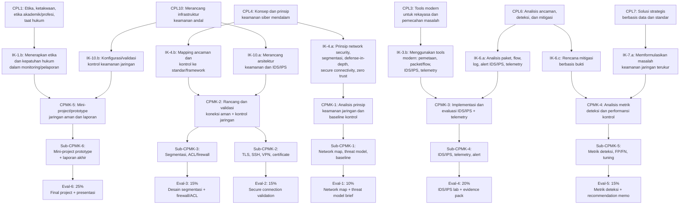

---

## PETA KOMPETENSI MATA KULIAH

```mermaid
flowchart TD
    A["Networks and Security\nMK-E-02"] --> B["Fondasi Keamanan Jaringan\nBab 1-2"]
    A --> C["Koneksi Aman\nBab 3-4"]
    A --> D["Segmentasi & Kontrol Akses\nBab 5-6"]
    A --> E["IDS/IPS & Telemetry\nBab 7-9"]
    A --> F["Evaluasi & Tuning\nBab 10-11"]
    A --> G["Mini-Project\nBab 12-14"]
    A --> H["Frontier: SDN, Zero Trust,\nEncrypted Traffic\nBab 15-16"]

    B --> B1["Prinsip CIA+, Defense-in-Depth,\nZero Trust, Secure-by-Design"]
    B --> B2["Network Architecture, Asset,\nData Flow, Trust Boundary,\nThreat Model, Baseline"]
    C --> C1["TLS 1.3, Certificate,\nCipher Suite, Service Hardening"]
    C --> C2["SSH, VPN/IPsec,\nWireGuard, Remote Access"]
    D --> D1["VLAN, Segmentasi,\nRouting Security, NAC"]
    D --> D2["Firewall/ACL Policy,\nNAT, Proxy, Policy Validation"]
    E --> E1["IDS/IPS: Suricata/Snort,\nRule/Signature, Deployment"]
    E --> E2["Packet Capture, NetFlow,\nZeek, Log Analysis"]
    E --> E3["Alert Triage, Evidence Pack,\nEscalation"]
    F --> F1["Detection Engineering:\nFP/FN, Coverage, Noise Reduction"]
    F --> F2["Performance: Throughput,\nLatency, MITRE ATT&CK Mapping"]
    G --> G1["Prototype Design\n+ IDS/IPS Implementation"]
    G --> G2["Reporting, Reproducibility,\nRecommendation Memo"]
    H --> H1["SDN Security, Cloud,\nZero Trust Networking"]
    H --> H2["Encrypted Traffic Analysis,\nNDR, Emerging Threats"]
```

---

## PETUNJUK PENGGUNAAN BUKU

### Untuk Mahasiswa

Buku ini disusun sesuai alur 16 pertemuan RPS. Setiap bab berkaitan dengan pertemuan atau kelompok pertemuan tertentu dan dilengkapi dengan: capaian pembelajaran, peta konsep (diagram Mermaid), penjelasan teori mendalam, contoh terapan, aktivitas praktikum, latihan pemahaman, studi kasus, kunci jawaban, ringkasan, dan refleksi profesional.

**Cara membaca yang efektif:**
1. Baca capaian pembelajaran dan peta konsep terlebih dahulu untuk membangun kerangka mental.
2. Pelajari teori dengan membuat catatan konsep kunci.
3. Hubungkan teori dengan contoh terapan sebelum melakukan praktikum.
4. Kerjakan latihan secara mandiri sebelum membaca kunci jawaban.
5. Gunakan refleksi profesional untuk mengaitkan dengan konteks profesi dan tesis Anda.

### Untuk Dosen

Setiap bab dikaitkan dengan Sub-CPMK dan evaluasi RPS. Diagram Mermaid dapat diekspor untuk slide kuliah. Soal latihan dapat dipilih sesuai level Bloom yang ditarget. Skenario studi kasus dapat disesuaikan dengan konteks lokal atau topik tesis mahasiswa.

### Catatan Etika

Seluruh praktikum dalam buku ini menggunakan dataset sintetis, file pcap legal, atau lingkungan lab yang terisolasi. Mahasiswa tidak diizinkan menerapkan teknik konfigurasi atau monitoring pada jaringan nyata tanpa otorisasi tertulis dari pemilik sistem. Analisis trafik jaringan organisasi nyata memerlukan prosedur etika, anonimisasi data, dan izin formal.

---

## PETA BAB DAN DELIVERABLE

| Bab | Pertemuan | Sub-CPMK | Materi Utama | Evaluasi | Deliverable |
|---|---|---|---|---|---|
| 1 | P1 | Sub-CPMK-1 | Prinsip keamanan jaringan, CIA+, Defense-in-Depth, Zero Trust | Eval-1 | Network security principles worksheet |
| 2 | P2 | Sub-CPMK-1 | Arsitektur jaringan, aset, data flow, trust boundary, threat model, baseline | Eval-1 | Network architecture map + threat model brief |
| 3 | P3 | Sub-CPMK-2 | TLS 1.3, sertifikat X.509, cipher suite, service hardening | Eval-2 | TLS validation report |
| 4 | P4 | Sub-CPMK-2 | SSH, VPN/IPsec, WireGuard, secure remote access, validasi | Eval-2 | Secure connection evidence pack |
| 5 | P5 | Sub-CPMK-3 | Segmentasi jaringan, VLAN, routing security, NAC | Eval-3 | Network segmentation design |
| 6 | P6 | Sub-CPMK-3 | Firewall/ACL policy, NAT, proxy, service exposure, policy validation | Eval-3 | Firewall/ACL policy document |
| 7 | P7 | Sub-CPMK-4 | IDS/IPS fundamentals, Suricata/Snort, rule/signature, deployment | Eval-4 | IDS/IPS lab setup report |
| 8 | P8 | Sub-CPMK-4 | Network telemetry: packet capture, NetFlow/IPFIX, Zeek, log analysis | Eval-4 | Telemetry dataset + analysis |
| 9 | P9 | Sub-CPMK-4 | Alert triage, evidence pack, escalation, incident handling | Eval-4 | Alert triage report + evidence pack |
| 10 | P10 | Sub-CPMK-5 | Detection engineering: rule quality, FP/FN, coverage, noise reduction | Eval-5 | Detection quality analysis |
| 11 | P11 | Sub-CPMK-5 | Performance metrics, MITRE ATT&CK mapping, recommendation memo | Eval-5 | Metrics report + recommendation memo |
| 12 | P12 | Sub-CPMK-6 | Mini-project: secure network prototype design | Eval-6 | Network design document |
| 13 | P13 | Sub-CPMK-6 | Mini-project: IDS/IPS implementation + TLS/VPN validation | Eval-6 | Configuration baseline + evidence |
| 14 | P14 | Sub-CPMK-6 | Mini-project: laporan akhir, presentasi, reproducibility checklist | Eval-6 | Final report + presentasi |
| 15 | P15 | Pengayaan | SDN security, cloud network security, zero trust networking | - | Refleksi dan rencana tindak lanjut |
| 16 | P16 | Pengayaan | Encrypted traffic analysis, NDR, NIDS research, pathway tesis | - | Refleksi tesis/pathway |

---

# BAB 1 — PRINSIP KEAMANAN JARINGAN: CIA+, DEFENSE-IN-DEPTH, DAN ZERO TRUST

## 1. Capaian Pembelajaran Bab

Setelah mempelajari bab ini, mahasiswa mampu:
- Menjelaskan tujuan keamanan jaringan (CIA + AAA + accountability)
- Membedakan pendekatan defense-in-depth, zero trust, dan secure-by-design
- Menerapkan prinsip least privilege dan segmentasi dalam konteks jaringan
- Mengidentifikasi model ancaman jaringan dan kategorinya

*Berkaitan dengan Sub-CPMK-1, Eval-1 (10%)*

## 2. Peta Konsep Bab

```mermaid
flowchart TD
    A[Prinsip Keamanan Jaringan] --> B[Tujuan Keamanan]
    B --> B1[Confidentiality: melindungi data dari akses tidak sah]
    B --> B2[Integrity: data tidak dimodifikasi tanpa otorisasi]
    B --> B3[Availability: layanan tersedia saat dibutuhkan]
    B --> B4["AAA: Authentication, Authorization,\nAccounting/Audit"]
    B --> B5[Non-repudiation: bukti yang tidak dapat disangkal]
    A --> C[Model Pertahanan]
    C --> C1["Defense-in-Depth:\nlapis pertahanan berlapis"]
    C --> C2["Zero Trust:\ntidak ada kepercayaan implisit\n'never trust, always verify'"]
    C --> C3["Secure-by-Default:\nkonfigurasi aman sebagai default"]
    C --> C4["Least Privilege:\nhak akses minimum yang diperlukan"]
    A --> D[Ancaman Jaringan]
    D --> D1[Passive: sniffing, traffic analysis]
    D --> D2["Active: MITM, spoofing,\nflooding, tampering"]
    D --> D3["Insider threat: authorized user\nyang menyalahgunakan akses"]
    D --> D4["APT: serangan persisten bertahap"]
```

## 3. Pengantar Kontekstual

Keamanan jaringan tidak dapat dipahami hanya dari perspektif teknis semata. Ia adalah ekspresi dari kebijakan organisasi, regulasi, kebutuhan bisnis, dan model ancaman yang realistis. Seorang profesional keamanan jaringan harus memahami *mengapa* suatu kontrol diperlukan — bukan hanya *bagaimana* mengkonfigurasinya. Bab ini membangun fondasi konseptual yang akan menjadi acuan seluruh bab berikutnya.

## 4. Landasan Teori

### 4.1 CIA Triad dan Perluasannya

**Confidentiality (Kerahasiaan):**
Memastikan bahwa informasi hanya dapat diakses oleh pihak yang berwenang. Dalam konteks jaringan: enkripsi traffic (TLS, VPN), segmentasi jaringan, access control list (ACL), dan authentication.

**Integrity (Integritas):**
Memastikan bahwa data tidak dimodifikasi secara tidak sah selama transit atau penyimpanan. Mekanisme: MAC, digital signature, hash verification, dan protokol yang menyertakan message authentication (seperti TLS dengan AEAD).

**Availability (Ketersediaan):**
Memastikan bahwa layanan jaringan tersedia ketika dibutuhkan oleh pengguna yang sah. Ancaman: DoS/DDoS, hardware failure, misconfiguration. Kontrol: redundansi, rate limiting, DDoS mitigation, failover.

**Perluasan CIA — AAA dan Seterusnya:**
- **Authentication:** Memverifikasi identitas entitas (user, device, service). Mekanisme: password, certificate, MFA, 802.1X.
- **Authorization:** Menentukan apa yang boleh dilakukan oleh entitas yang sudah terautentikasi. Mekanisme: ACL, RBAC, firewall rule.
- **Accounting/Audit:** Mencatat dan menyimpan log aktivitas untuk audit, forensik, dan akuntabilitas. Mekanisme: syslog, NetFlow, SIEM.
- **Non-repudiation:** Memastikan pihak yang bertindak tidak dapat menyangkal tindakannya. Mekanisme: digital signature, audit log yang immutable.

### 4.2 Defense-in-Depth

Defense-in-depth adalah strategi keamanan berlapis — tidak mengandalkan satu kontrol tunggal, melainkan menempatkan beberapa lapisan pertahanan sehingga jika satu lapisan gagal, lapisan lain masih memberikan perlindungan.

**Lapisan pertahanan khas:**
```
[Internet] → Perimeter Firewall → DMZ → Internal Firewall → 
Segmentasi Internal → Host-based IPS → Enkripsi → Audit/Log
```

Prinsip: *assume breach* — asumsikan bahwa perimeter luar akan berhasil ditembus, sehingga pertahanan internal menjadi sangat penting.

**Komponen Defense-in-Depth:**
- Network perimeter: firewall, IPS, anti-DDoS
- Segmentasi: VLAN, micro-segmentation
- Secure connectivity: TLS, VPN, SSH
- Host security: EDR, host-based firewall, patch management
- Monitoring: IDS, SIEM, telemetry
- Recovery: backup, incident response plan

### 4.3 Zero Trust Architecture

Zero Trust adalah model keamanan yang menolak kepercayaan implisit berdasarkan lokasi jaringan. Prinsip utama: "Never trust, always verify."

**Asumsi yang dirobohkan oleh Zero Trust:**
- *"Traffic dari dalam jaringan perusahaan pasti aman"* — Tidak: insider threat dan lateral movement mengeksploitasi kepercayaan implisit ini.
- *"Firewall perimeter melindungi semua yang ada di dalam"* — Tidak: setelah perimeter ditembus, attacker bebas bergerak secara lateral.

**Prinsip Zero Trust (NIST SP 800-207):**
1. Semua sumber daya dianggap tidak dipercaya secara default
2. Akses paling sedikit yang diperlukan (least privilege)
3. Verifikasi eksplisit setiap request (identity, device health, context)
4. Asumsikan pelanggaran (assume breach) — monitor, log, deteksi
5. Segmentasi mikro — batasi blast radius jika terjadi kompromi

**Implementasi Zero Trust:**
- Identity-aware proxy atau Zero Trust Network Access (ZTNA)
- Micro-segmentation berdasarkan workload, bukan subnet
- Continuous monitoring dan behavioral analytics
- Multi-factor authentication di semua akses

### 4.4 Least Privilege dan Secure-by-Default

**Least Privilege:** Setiap entitas (user, service, device) hanya memiliki hak akses minimum yang diperlukan untuk menjalankan fungsinya.

Aplikasi dalam jaringan:
- Service yang tidak diperlukan dinonaktifkan
- Port yang tidak digunakan ditutup
- ACL hanya mengizinkan traffic yang diperlukan
- User tidak mendapatkan akses administrator kecuali diperlukan

**Secure-by-Default:** Konfigurasi default perangkat dan sistem harus aman. Administrator harus secara eksplisit mengaktifkan fitur yang membutuhkan penurunan keamanan, bukan sebaliknya.

Contoh: Switch Cisco default memiliki semua port di VLAN 1 (tidak aman). Praktik yang baik: menempatkan port yang tidak digunakan di "parking VLAN" yang tidak memiliki akses ke mana pun.

### 4.5 Model Ancaman Jaringan

**Kategori ancaman pasif:**
- **Sniffing/Eavesdropping:** Menangkap dan membaca traffic yang tidak terenkripsi
- **Traffic analysis:** Menganalisis pola komunikasi meskipun konten terenkripsi (IP, timing, volume)

**Kategori ancaman aktif:**
- **Man-in-the-Middle (MITM):** Menyisipkan diri di antara dua pihak yang berkomunikasi
- **IP Spoofing:** Memalsukan alamat IP sumber
- **ARP Poisoning/Spoofing:** Memalsukan tabel ARP untuk mengarahkan traffic
- **DNS Poisoning:** Memanipulasi respons DNS untuk mengarahkan ke server palsu
- **Replay Attack:** Menangkap dan mengirim ulang pesan yang valid
- **DoS/DDoS:** Membanjiri sumber daya hingga layanan tidak tersedia
- **Session Hijacking:** Mengambil alih sesi yang sudah terautentikasi

**Advanced Persistent Threat (APT):**
Serangan multi-tahap yang bertahan dalam jaringan untuk jangka panjang. Fase: Reconnaissance → Initial Access → Persistence → Privilege Escalation → Lateral Movement → Data Exfiltration.

## 5. Model atau Arsitektur

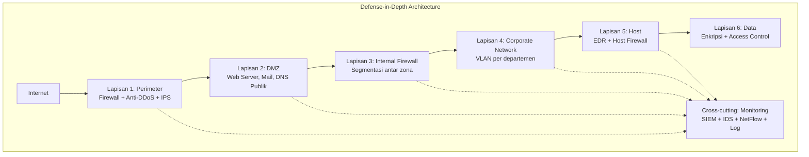

## 6. Contoh Terapan

**Penerapan Zero Trust di rumah sakit:**

Sebuah rumah sakit memiliki jaringan yang menghubungkan: workstation dokter, sistem HIS (Hospital Information System), perangkat IoT medis (monitor pasien, infusion pump), dan akses internet.

Pendekatan perimeter tradisional: semua device di dalam jaringan RS dipercaya. Masalah: ransomware yang masuk melalui email phishing seorang staf dapat menyebar ke seluruh jaringan termasuk perangkat IoT medis.

Pendekatan Zero Trust:
- Segmentasi mikro: workstation dokter, HIS, IoT medis, dan guest WiFi di segmen terpisah tanpa trust antar segmen
- Semua akses ke HIS memerlukan MFA + device health check
- IoT medis hanya dapat berkomunikasi dengan server manajemen spesifik, tidak ke internet
- Continuous monitoring: baseline traffic IoT medis, alert jika ada komunikasi anomali

## 7. Praktikum atau Aktivitas Terarah

**Tujuan:** Memetakan prinsip keamanan jaringan ke skenario nyata dan mengidentifikasi kesenjangan.

**Langkah Kerja:**
1. Dosen menyediakan diagram topologi jaringan perusahaan fiktif (medium enterprise).
2. Identifikasi: aset, trust boundary, single point of failure, dan prinsip yang dilanggar.
3. Evaluasi: apakah defense-in-depth sudah diterapkan? Lapisan mana yang kurang?
4. Rekomendasikan minimal 5 perbaikan berbasis prinsip (CIA+, least privilege, zero trust).
5. Dokumentasikan dalam worksheet: kolom Prinsip, Kondisi Saat Ini, Gap, Rekomendasi.

**Output:** Network security principles worksheet — bagian dari Eval-1.

## 8. Latihan Pemahaman

1. **(Pilihan Ganda)** Prinsip "never trust, always verify" adalah inti dari:
   - A. Defense-in-depth
   - B. Zero Trust Architecture
   - C. Least privilege
   - D. Secure-by-default

2. **(Analisis)** Sebuah organisasi menggunakan VPN untuk semua akses remote. Seorang karyawan yang VPN-nya terhubung dapat mengakses semua sistem internal tanpa autentikasi tambahan. Prinsip keamanan mana yang dilanggar, dan apa risikonya?

3. **(Evaluasi)** Jelaskan perbedaan antara defense-in-depth dan zero trust. Apakah keduanya saling eksklusif? Berikan argumen Anda.

4. **(Analisis)** Sebuah perangkat IoT hanya perlu mengirim data sensor ke satu server cloud. Namun administrator jaringan menempatkannya di jaringan yang sama dengan workstation karyawan dan server HRD. Prinsip keamanan apa yang dilanggar?

5. **(Aplikasi)** Berikan satu contoh ancaman yang hanya berdampak pada Availability tetapi tidak pada Confidentiality atau Integrity. Jelaskan mekanismenya.

## 9. Latihan Terapan / Studi Kasus

**Kasus 1:** Sebuah fintech startup memiliki infrastruktur: server API di cloud (AWS VPC), database di server on-premise yang terkoneksi via Site-to-Site VPN, dan 50 developer yang bekerja remote via VPN. Seluruh developer memiliki akses penuh ke database production via VPN. Analisis risiko situasi ini dari perspektif CIA+, least privilege, dan defense-in-depth. Rekomendasikan arsitektur yang lebih aman.

**Kasus 2:** Perusahaan manufaktur mengalami insiden di mana attacker mendapatkan akses ke jaringan korporat melalui workstation di lantai produksi yang terhubung ke jaringan OT (Operational Technology). Dari jaringan OT, attacker berhasil pivot ke jaringan IT dan mengenkripsi semua server file. Identifikasi: (a) prinsip keamanan yang gagal, (b) segmen mana yang seharusnya terpisah, (c) kontrol apa yang seharusnya ada.

## 10. Kunci Jawaban dan Pembahasan

**Soal 1:** Jawaban B. Zero Trust Architecture. Prinsip "never trust, always verify" adalah landasan Zero Trust — tidak ada entitas (user, device, atau bahkan traffic dari dalam jaringan) yang dipercaya secara implisit. Setiap akses harus diverifikasi secara eksplisit.

**Soal 2:** Prinsip yang dilanggar: (a) Least privilege — setelah terautentikasi via VPN, tidak ada pembatasan akses lebih lanjut; (b) Zero Trust — VPN connection dianggap sebagai bukti kepercayaan, padahal tidak seharusnya demikian; (c) Defense-in-depth — lapisan autentikasi tambahan di level aplikasi tidak ada. Risiko: jika credential VPN seorang karyawan bocor, attacker mendapat akses ke seluruh sistem internal tanpa hambatan.

**Soal 3:** Defense-in-depth dan zero trust tidak saling eksklusif — mereka komplementer. Defense-in-depth fokus pada *menempatkan banyak lapisan kontrol*, sedangkan zero trust fokus pada *model kepercayaan* — di mana kepercayaan tidak diberikan berdasarkan lokasi jaringan, melainkan berdasarkan identitas dan konteks. Zero trust dapat diimplementasikan sebagai salah satu lapisan dalam defense-in-depth.

**Soal 4:** Prinsip yang dilanggar: (a) Segmentasi/isolation — perangkat IoT seharusnya di segmen terpisah (IoT VLAN); (b) Least privilege — perangkat IoT tidak perlu berkomunikasi dengan workstation karyawan; (c) Secure-by-default — menempatkan IoT di jaringan umum adalah konfigurasi tidak aman. Risiko: perangkat IoT yang dicompromise dapat menjadi pivot untuk menyerang workstation dan server HRD.

**Soal 5:** Contoh: DDoS (Distributed Denial of Service) attack terhadap web server. Attacker membanjiri server dengan traffic sehingga layanan tidak tersedia bagi user yang sah. Tidak ada data yang bocor (Confidentiality tetap terjaga) dan data tidak dimodifikasi (Integrity tetap terjaga), tetapi layanan tidak tersedia (Availability dilanggar). Mekanisme: attacker mengkoordinasikan ribuan atau jutaan device (botnet) untuk mengirim request ke server secara bersamaan, menghabiskan bandwidth atau resource CPU/memory server.

**Kasus 1:** Risiko: (a) Jika satu developer dicompromise, attacker mendapat akses langsung ke database production — pelanggaran least privilege dan zero trust; (b) VPN breach = akses penuh ke database = data breach masif; (c) Tidak ada autentikasi terpisah untuk database. Rekomendasi: (a) Pisahkan akses VPN ke jaringan development dari production; (b) Implementasikan database gateway dengan autentikasi tambahan (MFA) untuk akses production; (c) Buat role-based database access — hanya DBA yang perlu akses production database penuh; (d) Aktifkan audit log semua query production.

**Kasus 2:** (a) Prinsip yang gagal: segmentasi antara OT dan IT — tidak ada air-gap atau firewall antara jaringan OT dan IT; least privilege — workstation OT dapat berkomunikasi ke jaringan IT tanpa batasan. (b) Segmen yang seharusnya terpisah: OT network (PLC, SCADA) harus terpisah secara ketat dari IT network dengan firewall one-way atau unidirectional gateway. (c) Kontrol yang seharusnya ada: DMZ antara OT dan IT; monitoring anomali di zona boundary; backup offline yang tidak terhubung ke jaringan utama.

## 11. Ringkasan Bab

Keamanan jaringan dibangun di atas tujuan CIA (Confidentiality, Integrity, Availability) yang diperluas dengan Authentication, Authorization, Accounting, dan Non-repudiation. Defense-in-depth menyediakan lapisan perlindungan berlapis; Zero Trust menolak kepercayaan implisit dan mengharuskan verifikasi eksplisit setiap akses. Least privilege membatasi hak akses ke minimum yang diperlukan. Ancaman jaringan dikategorikan menjadi pasif (sniffing, traffic analysis) dan aktif (MITM, DoS, replay). Prinsip-prinsip ini adalah landasan semua keputusan desain keamanan jaringan.

## 12. Refleksi Profesional

1. Zero Trust sering ditolak oleh organisasi dengan alasan "terlalu mempersulit karyawan" atau "biaya implementasi tinggi". Sebagai profesional keamanan, bagaimana Anda menyeimbangkan keamanan dengan usability, dan bagaimana Anda mengkomunikasikan business case untuk Zero Trust kepada manajemen yang tidak teknis?

2. Prinsip "assume breach" dalam defense-in-depth dan zero trust mengimplikasikan bahwa kita harus selalu siap untuk merespons insiden, bukan hanya mencegahnya. Bagaimana implikasi ini mengubah cara Anda merancang arsitektur monitoring dan incident response?


---

# BAB 2 — ARSITEKTUR JARINGAN, ASET, DATA FLOW, TRUST BOUNDARY, DAN THREAT MODEL

## 1. Capaian Pembelajaran Bab

Setelah mempelajari bab ini, mahasiswa mampu:
- Membaca dan menganalisis topologi jaringan untuk mengidentifikasi aset kritis
- Memetakan data flow dan trust boundary dalam diagram arsitektur
- Menyusun threat model jaringan menggunakan metodologi STRIDE
- Menetapkan baseline kontrol keamanan berdasarkan risiko

*Berkaitan dengan Sub-CPMK-1, Eval-1 (10%)*

## 2. Peta Konsep Bab

```mermaid
flowchart TD
    A[Network Security Architecture Analysis] --> B[Inventarisasi Aset]
    B --> B1[Hardware: router, switch, server, endpoint]
    B --> B2[Software: OS, aplikasi, service, protokol]
    B --> B3[Data: database, backup, log, konfigurasi]
    B --> B4[Koneksi: internal, eksternal, third-party]
    A --> C[Data Flow Mapping]
    C --> C1[Siapa yang berkomunikasi dengan siapa?]
    C --> C2[Protokol dan port apa yang digunakan?]
    C --> C3[Data sensitif apa yang mengalir di mana?]
    C --> C4[Di mana enkripsi diterapkan dan tidak?]
    A --> D[Trust Boundary]
    D --> D1[Internet: tidak dipercaya sama sekali]
    D --> D2[DMZ: semi-trusted]
    D --> D3[Internal: dipercaya terbatas]
    D --> D4[Privileged Zone: sangat dipercaya, akses ketat]
    A --> E[Threat Model STRIDE]
    E --> E1[Spoofing: pemalsuan identitas]
    E --> E2[Tampering: modifikasi data]
    E --> E3[Repudiation: penyangkalan tindakan]
    E --> E4[Information Disclosure: kebocoran informasi]
    E --> E5[Denial of Service: gangguan ketersediaan]
    E --> E6[Elevation of Privilege: eskalasi hak akses]
    A --> F[Baseline Kontrol]
    F --> F1[Network: firewall, segmentasi, monitoring]
    F --> F2[Endpoint: patch, hardening, EDR]
    F --> F3[Identity: MFA, least privilege, auditing]
```

## 3. Pengantar Kontekstual

Sebelum dapat mengamankan jaringan, Anda harus memahaminya. Peta arsitektur jaringan yang akurat — lengkap dengan aset, data flow, dan trust boundary — adalah dokumen foundational dalam setiap program keamanan. Tanpa ini, penempatan kontrol keamanan menjadi tidak terarah dan tidak dapat dipertahankan.

Bab ini mengajarkan bagaimana membangun pemahaman struktural tentang jaringan yang akan diamankan, kemudian menerapkan threat modeling secara sistematis untuk mengidentifikasi di mana ancaman paling mungkin terjadi dan kontrol mana yang paling diperlukan.

## 4. Landasan Teori

### 4.1 Inventarisasi Aset Jaringan

Aset jaringan mencakup semua komponen yang memiliki nilai dan perlu dilindungi:

**Aset Hardware:**
- Network devices: router, switch (L2/L3), firewall, load balancer, wireless AP
- Server: web server, application server, database server, domain controller
- Endpoint: workstation, laptop, mobile device
- Specialized devices: printer, IoT sensor, kamera CCTV, perangkat OT/ICS

**Aset Software dan Layanan:**
- Operating system dan versinya (penting untuk patch management)
- Aplikasi yang berjalan dan port yang digunakan
- Protokol yang digunakan (HTTP vs HTTPS, Telnet vs SSH, FTP vs SFTP)
- Konfigurasi yang berlaku

**Aset Data:**
- Data sensitif dan lokasinya (database, file share, log)
- Klasifikasi data: Public, Internal, Confidential, Restricted
- Lokasi backup

**Mengapa inventarisasi penting?**
Menurut CIS Controls, dua kontrol teratas yang paling berpengaruh dalam mengurangi risiko adalah: (1) Inventarisasi dan kontrol aset hardware, (2) Inventarisasi dan kontrol aset software. Tanpa mengetahui apa yang ada di jaringan, tidak mungkin melindunginya.

### 4.2 Data Flow Mapping

Data flow mapping mendokumentasikan bagaimana data bergerak melalui sistem:

**Pertanyaan kunci:**
- Dari mana data berasal (source)?
- Ke mana data pergi (destination)?
- Apa yang dilakukan data selama transit (transformasi, enkripsi)?
- Siapa yang dapat membaca atau memodifikasi data?
- Di mana data disimpan sementara atau permanen?

**Data Flow Diagram (DFD) Level 0-2:**
- Level 0 (Context diagram): overview sistem dan batas
- Level 1: proses utama dan aliran data
- Level 2: detail proses dan data store

**Mengidentifikasi aliran data sensitif:**
Tandai setiap aliran data yang mengandung: data pribadi (PII), data keuangan, credential, konfigurasi sistem, atau data yang memiliki nilai intelijen. Aliran ini memerlukan perhatian khusus dalam threat modeling.

### 4.3 Trust Boundary

Trust boundary adalah batas di mana tingkat kepercayaan berubah. Setiap kali data melintas trust boundary, kontrol keamanan harus diterapkan.

**Zona kepercayaan umum dalam arsitektur jaringan:**

| Zona | Tingkat Kepercayaan | Contoh |
|---|---|---|
| Internet | Tidak dipercaya | Traffic eksternal, pengguna internet |
| DMZ | Semi-trusted | Web server publik, mail relay, DNS publik |
| Extranet | Trusted terbatas | Mitra bisnis, vendor |
| Internal | Trusted | Jaringan karyawan |
| Management VLAN | Sangat trusted, akses sangat terbatas | Konsol manajemen, out-of-band |
| Data Center / Tier-0 | Highly restricted | Database sensitif, PKI |

**Trust boundary dalam praktik:**
Setiap transisi antar zona harus dilindungi dengan: firewall/ACL, autentikasi, enkripsi (jika data sensitif), dan logging.

### 4.4 Threat Modeling dengan STRIDE

STRIDE adalah framework threat modeling dari Microsoft yang mengkategorisasi ancaman:

| Ancaman | Deskripsi | Property yang Dilanggar | Contoh |
|---|---|---|---|
| **S**poofing | Memalsukan identitas | Authentication | IP spoofing, ARP poisoning, credential theft |
| **T**ampering | Memodifikasi data | Integrity | MITM + modifikasi, SQL injection, firmware tampering |
| **R**epudiation | Menyangkal tindakan | Non-repudiation | Menghapus log, menyangkal transaksi |
| **I**nformation Disclosure | Mengungkapkan informasi | Confidentiality | Sniffing, data leak, verbose error |
| **D**enial of Service | Mengganggu ketersediaan | Availability | DDoS, resource exhaustion |
| **E**levation of Privilege | Mendapatkan hak lebih | Authorization | Local privilege escalation, container escape |

**Proses STRIDE pada jaringan:**
1. Buat DFD yang menunjukkan komponen dan aliran data
2. Identifikasi setiap elemen (proses, data store, data flow, external entity)
3. Terapkan setiap kategori STRIDE ke setiap elemen
4. Evaluasi apakah ancaman tersebut relevan dan realistis
5. Identifikasi kontrol yang memitigasi setiap ancaman

### 4.5 Baseline Kontrol Keamanan Jaringan

Baseline kontrol adalah set minimum kontrol yang harus diterapkan di seluruh jaringan, terlepas dari spesifisitas risiko.

**Sumber baseline:**
- CIS Controls v8: 18 control group, fokus pada prioritas
- NIST SP 800-53: komprehensif untuk federal
- CyBOK Network Security: berbasis knowledge area

**Contoh baseline kontrol jaringan:**
- Semua traffic ke internet harus melalui firewall
- Tidak ada akses langsung dari internet ke server internal (DMZ wajib)
- Semua koneksi administrative menggunakan protokol terenkripsi (SSH, tidak Telnet; HTTPS, tidak HTTP)
- Log semua koneksi di trust boundary yang kritikal
- Semua software harus dalam versi yang didukung dan up-to-date

## 5. Model atau Arsitektur

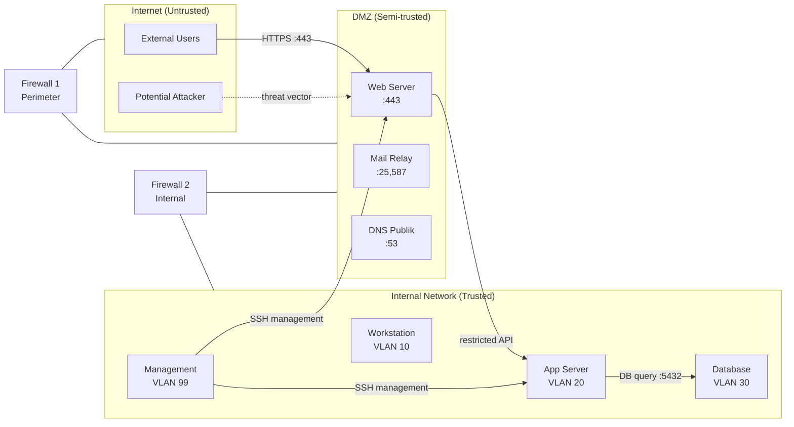

## 6. Contoh Terapan

**Membangun network architecture map untuk e-commerce:**

Sebuah platform e-commerce memiliki komponen: CDN (Cloudflare), load balancer, 3 web server (Nginx), 2 application server (Python Flask), database cluster (PostgreSQL), Redis cache, payment gateway integration, dan admin panel.

Network architecture map:
- Aset diidentifikasi: CDN, LB, web-1/2/3, app-1/2, db-primary/replica, redis, admin
- Data flow: user → CDN → LB → web → app → db; admin → VPN → admin panel → app
- Trust boundary: CDN ↔ LB (TB-1), LB ↔ Web (TB-2), Web ↔ App (TB-3), App ↔ DB (TB-4), Internet ↔ Admin VPN (TB-5)
- Sensitive data flows: payment data app → payment gateway (TB-6, harus enkripsi PCI-DSS compliant)

Dari DFD ini, STRIDE mengidentifikasi: TB-3 rentan Tampering (web harus tidak langsung tulis DB, hanya via app), TB-4 rentan Information Disclosure (query DB mengandung PII), TB-6 rentan Spoofing (validasi sertifikat payment gateway).

## 7. Praktikum atau Aktivitas Terarah

**Tujuan:** Menyusun network architecture map dan threat model brief untuk skenario yang diberikan.

**Langkah Kerja:**
1. Dosen menyediakan deskripsi tekstual infrastruktur perusahaan (tanpa diagram).
2. Buat diagram topologi menggunakan draw.io atau tool diagram lain.
3. Identifikasi dan daftar semua aset dalam tabel (Nama, Tipe, Fungsi, Klasifikasi).
4. Peta data flow: buat DFD sederhana dengan panah yang menunjukkan arah aliran data.
5. Identifikasi minimal 5 trust boundary dan tandai di diagram.
6. Terapkan STRIDE untuk minimal 3 trust boundary yang paling kritis.
7. Buat "Threat Model Brief": 1 halaman yang merangkum aset kritis, trust boundary utama, top-5 ancaman, dan rekomendasi baseline kontrol.

**Output:** Network architecture map + threat model brief — ini adalah Eval-1.

## 8. Latihan Pemahaman

1. **(Analisis)** Mengapa inventarisasi aset hardware dan software dianggap sebagai kontrol paling fundamental dalam CIS Controls? Apa yang terjadi jika inventarisasi tidak lengkap?

2. **(Aplikasi)** Sebuah tim developer membangun API REST yang menerima request dari mobile app dan mengembalikan data dari database. Gambarkan DFD Level 1 sederhana dan identifikasi dua ancaman STRIDE yang paling relevan.

3. **(Evaluasi)** Apa perbedaan antara "zone" dan "trust boundary"? Berikan contoh konkret.

## 9. Latihan Terapan / Studi Kasus

Sebuah universitas memiliki jaringan yang menghubungkan: gedung perkuliahan (1500 workstation mahasiswa), gedung dosen (500 workstation), server akademik (e-learning, registrasi, email), lab komputer (200 PC dengan akses internet), dan server penelitian (data penelitian sensitif). Semua perangkat berada dalam satu flat network tanpa segmentasi dengan access point WiFi yang memungkinkan mahasiswa terhubung. Buat: (a) Identifikasi aset dan klasifikasinya, (b) Threat model menggunakan STRIDE untuk 3 scenario ancaman paling realistis, (c) Rekomendasi arsitektur ulang dengan trust boundary yang tepat.

## 10. Kunci Jawaban dan Pembahasan

**Soal 1:** Inventarisasi aset fundamental karena: (a) tidak dapat melindungi apa yang tidak diketahui — shadow IT, perangkat lupa diinventarisasi, dapat menjadi entry point; (b) tidak dapat menilai risiko tanpa tahu apa yang ada; (c) tidak dapat mendeteksi anomali (perangkat baru yang tidak dikenal) tanpa baseline inventarisasi; (d) audit kepatuhan memerlukan inventarisasi yang akurat. Tanpa inventarisasi: patch management tidak menyeluruh, monitoring memiliki blind spot, insiden response tidak tahu lingkup sistem yang terpengaruh.

**Soal 2:** DFD Level 1: External User → [Mobile App] → (REST API Process) → [Database Store]; (REST API Process) → [Auth Service]; (REST API Process) → [Log Store]. Trust boundary: antara Mobile App dan REST API (internet → server), antara REST API dan Database (app tier → data tier). Ancaman STRIDE relevan: (a) Tampering pada data request mobile → REST API (MITM attack, modifikasi request); (b) Information Disclosure dari REST API response (verbose error mengungkapkan schema database, stack trace).

**Soal 3:** Zone adalah area jaringan dengan karakteristik kepercayaan yang sama (misalnya, DMZ, internal network). Trust boundary adalah *garis perbatasan* antara dua zone yang memerlukan kontrol keamanan. Analogi: zone adalah "wilayah" dan trust boundary adalah "perbatasan" yang memerlukan "pos pemeriksaan". Contoh: Internal Network (zone) dan DMZ (zone) dipisahkan oleh trust boundary yang diimplementasikan sebagai firewall internal.

**Studi Kasus Universitas:** (a) Aset dan klasifikasi: workstation mahasiswa (Low sensitivity, High volume), workstation dosen (Medium), server akademik: registrasi/nilai (High — PII mahasiswa), server penelitian (Critical — IP/data penelitian), lab komputer (Medium — risiko malware). (b) STRIDE scenarios: S1 — mahasiswa men-spoof alamat IP dosen untuk akses resource dosen (Spoofing + Elevation of Privilege); S2 — malware dari lab komputer menyebar ke server akademik via flat network (Tampering); S3 — mahasiswa mengakses server penelitian yang tidak seharusnya dapat diakses (Information Disclosure + EoP). (c) Rekomendasi: VLAN per segmen (mahasiswa VLAN 10, dosen VLAN 20, server akademik VLAN 30, server penelitian VLAN 40, lab VLAN 50, guest WiFi VLAN 99); firewall antara setiap VLAN dengan policy default-deny; 802.1X authentication untuk akses WiFi; monitoring anomali traffic antar VLAN.

## 11. Ringkasan Bab

Network architecture analysis mencakup: inventarisasi aset (hardware, software, data), data flow mapping (siapa komunikasi dengan siapa, apa yang mengalir), identifikasi trust boundary (zona kepercayaan dan transisinya), dan threat modeling STRIDE (Spoofing, Tampering, Repudiation, Information Disclosure, DoS, EoP). Baseline kontrol keamanan harus ditetapkan untuk semua zona, dengan kontrol tambahan di trust boundary yang kritikal.

## 12. Refleksi Profesional

1. Threat modeling sering diabaikan dalam proyek karena dianggap "memakan waktu" dan tidak menghasilkan output yang terlihat langsung. Bagaimana Anda meyakinkan tim pengembang atau arsitek sistem untuk mengintegrasikan threat modeling sejak fase desain, dan bukan sebagai afterthought?


---

# BAB 3 — TLS 1.3, SERTIFIKAT X.509, CIPHER SUITE, DAN SERVICE HARDENING

## 1. Capaian Pembelajaran Bab

Setelah mempelajari bab ini, mahasiswa mampu:
- Menjelaskan TLS 1.3 handshake dan mengapa perbedaannya dari TLS 1.2 penting
- Memvalidasi sertifikat X.509 dan mengidentifikasi konfigurasi yang lemah
- Memilih cipher suite yang aman dan mengkonfigurasi TLS dengan benar
- Melakukan hardening layanan jaringan yang menggunakan TLS

*Berkaitan dengan Sub-CPMK-2, Eval-2 (15%)*

## 2. Peta Konsep Bab

```mermaid
flowchart TD
    A[Secure Connection via TLS] --> B[TLS 1.3 Handshake]
    B --> B1["1-RTT: ClientHello + key_share\n→ ServerHello + cert + Finished\n→ Client Finished"]
    B --> B2["Mandatory ECDHE: Forward Secrecy\nby design"]
    B --> B3["AEAD only: AES-GCM, ChaCha20-Poly1305"]
    B --> B4["Removed: RSA key exchange,\nCBC, SHA-1, compression, renegotiation"]
    A --> C[Sertifikat X.509]
    C --> C1[Subject + Subject Alternative Name]
    C --> C2[Issuer + Chain of Trust]
    C --> C3[Validity Period]
    C --> C4["Key usage + Extended Key Usage\nkriteria: TLS Web Server Auth"]
    C --> C5[OCSP Stapling + CT Logs]
    A --> D[Cipher Suite TLS 1.3]
    D --> D1["TLS_AES_256_GCM_SHA384: recommended"]
    D --> D2["TLS_CHACHA20_POLY1305_SHA256: IoT/mobile"]
    D --> D3["TLS_AES_128_GCM_SHA256: minimum"]
    A --> E[Service Hardening]
    E --> E1[HSTS: max-age >= 1 tahun + preload]
    E --> E2[OCSP Stapling: aktifkan]
    E --> E3[Session tickets: rotasi kunci atau matikan]
    E --> E4[TLS 1.0/1.1: nonaktifkan]
```

## 3. Pengantar Kontekstual

Transport Layer Security (TLS) adalah tulang punggung keamanan komunikasi internet — dari HTTPS, SMTPS, IMAPS, hingga protokol custom yang mengandalkan enkripsi channel. Versi 1.3 (RFC 8446, 2018) merupakan redesain besar yang menghilangkan kelemahan historis dan menjadikan forward secrecy sebagai mandatory. Memahami dan memvalidasi konfigurasi TLS adalah kemampuan inti yang diharapkan dari setiap profesional keamanan jaringan.

## 4. Landasan Teori

### 4.1 TLS 1.3 Handshake

**1-RTT Handshake:**
TLS 1.3 mengurangi latensi handshake dari 2-RTT (TLS 1.2) menjadi 1-RTT:

```
Client                                          Server
|                                               |
|--ClientHello------------------------------>   |
|  (supported_versions: [TLS 1.3])             |
|  (key_share: X25519 pubkey)                  |
|  (signature_algs: ed25519, ecdsa-sha256)     |
|                                               |
|   <-----------ServerHello--------------------|
|   <-----------{EncryptedExtensions}----------|
|   <-----------{Certificate}------------------|
|   <-----------{CertificateVerify}------------|
|   <-----------{Finished}---------------------|
|                                               |
|--{Finished}-------------------------------->  |
|                                               |
|=====Application Data (Encrypted)============>|
```

Catatan: setelah ServerHello, semua komunikasi sudah terenkripsi (ditandai `{}`). Di TLS 1.2, Certificate dan CertificateVerify masih plaintext.

**0-RTT (Early Data):** TLS 1.3 mendukung 0-RTT untuk koneksi yang sudah pernah terjadi sebelumnya, menggunakan session ticket dari koneksi sebelumnya. *Peringatan:* 0-RTT tidak memiliki anti-replay protection — hindari untuk data yang tidak idempotent (misalnya, form submission).

### 4.2 Apa yang Dihapus TLS 1.3

| Yang Dihapus | Alasan | Serangan yang Dimitigasi |
|---|---|---|
| RSA key exchange | Tidak forward secret | Retroactive decryption |
| CBC mode cipher | Padding oracle vulnerability | POODLE, BEAST, Lucky13 |
| RC4 | Broken algorithm | Multiple statistical attacks |
| SHA-1/MD5 untuk signature | Hash lemah, collision found | Certificate forgery |
| Compression | CRIME attack | Content leakage via compression ratio |
| Renegotiation | Injection vulnerability | SSL renegotiation attack |
| Export cipher suites | Deliberately weak (40-bit) | FREAK, LogJam |

### 4.3 Validasi Sertifikat X.509

Ketika browser atau client memvalidasi sertifikat server:

1. **Chain of Trust:** Sertifikat harus ditandatangani oleh CA yang dipercaya (Root CA dalam trust store), langsung atau melalui Intermediate CA.

2. **Validity Period:** `NotBefore ≤ current_time ≤ NotAfter`

3. **Subject Matching:** Nama di sertifikat (CN atau SAN) harus match dengan hostname yang dikoneksi. Gunakan **Subject Alternative Name (SAN)**, bukan hanya CN.

4. **Key Usage:** Untuk server TLS: `digitalSignature` dan `keyEncipherment` (atau hanya `digitalSignature` untuk ECDSA). Extended Key Usage: `TLS Web Server Authentication`.

5. **Revocation Check:** OCSP atau CRL — pastikan sertifikat belum direvoke.

6. **Certificate Transparency:** Sertifikat modern harus memiliki SCT (Signed Certificate Timestamp) dari CT Log.

**Membaca sertifikat dengan openssl:**
```bash
# Inspeksi sertifikat server
openssl s_client -connect example.com:443 -showcerts < /dev/null 2>/dev/null | \
  openssl x509 -text -noout

# Field penting yang diperhatikan:
# - Subject / Subject Alternative Name
# - Issuer
# - Validity: Not Before / Not After
# - Public Key Algorithm dan ukuran kunci
# - Signature Algorithm
# - X509v3 Key Usage / Extended Key Usage
# - CRL Distribution Points
# - Authority Information Access (OCSP URL)
# - Certificate Transparency: SCT
```

### 4.4 Cipher Suite TLS 1.3

TLS 1.3 menyederhanakan cipher suites — hanya 5 cipher suite yang diizinkan, semua menggunakan AEAD:

| Cipher Suite | Enkripsi | HKDF Hash | Rekomendasi |
|---|---|---|---|
| TLS_AES_256_GCM_SHA384 | AES-256-GCM | SHA-384 | **Direkomendasikan** |
| TLS_CHACHA20_POLY1305_SHA256 | ChaCha20-Poly1305 | SHA-256 | Baik untuk mobile/IoT |
| TLS_AES_128_GCM_SHA256 | AES-128-GCM | SHA-256 | Minimum yang diterima |
| TLS_AES_128_CCM_SHA256 | AES-128-CCM | SHA-256 | Untuk resource-constrained |
| TLS_AES_128_CCM_8_SHA256 | AES-128-CCM-8 | SHA-256 | Hanya untuk IoT khusus |

Key exchange selalu ECDHE (X25519 atau P-256) — ditentukan di `key_share` extension, bukan di cipher suite.

### 4.5 Service Hardening untuk TLS

**Konfigurasi Nginx yang aman:**
```nginx
server {
    listen 443 ssl;
    server_name example.com;

    ssl_certificate /path/to/cert.pem;
    ssl_certificate_key /path/to/key.pem;

    # TLS versions — hanya 1.2 dan 1.3
    ssl_protocols TLSv1.2 TLSv1.3;

    # Cipher suites untuk TLS 1.2 (TLS 1.3 otomatis menggunakan AEAD)
    ssl_ciphers 'ECDHE-ECDSA-AES256-GCM-SHA384:ECDHE-RSA-AES256-GCM-SHA384:ECDHE-ECDSA-CHACHA20-POLY1305:ECDHE-RSA-CHACHA20-POLY1305';
    ssl_prefer_server_ciphers on;

    # ECDH curves
    ssl_ecdh_curve X25519:secp384r1;

    # OCSP Stapling
    ssl_stapling on;
    ssl_stapling_verify on;
    resolver 1.1.1.1 8.8.8.8 valid=300s;

    # Session
    ssl_session_cache shared:SSL:10m;
    ssl_session_timeout 1d;
    ssl_session_tickets off;  # Atau rotasi session ticket key secara berkala

    # Security headers
    add_header Strict-Transport-Security "max-age=31536000; includeSubDomains; preload" always;
    add_header X-Content-Type-Options nosniff always;
    add_header X-Frame-Options DENY always;
}
```

**Alat evaluasi TLS:**
- `testssl.sh`: command-line, open source, komprehensif
- SSL Labs ssllabs.com/ssltest: online, grading A+ hingga F
- `nmap --script ssl-enum-ciphers`: quick cipher suite enumeration

## 5. Model atau Arsitektur

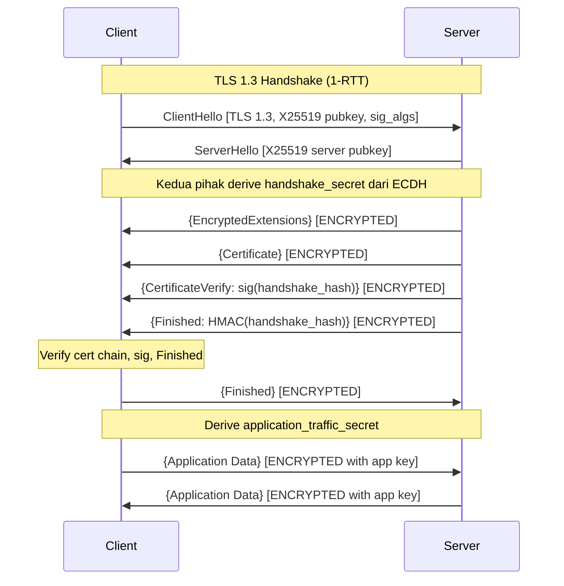

## 6. Contoh Terapan

**Audit TLS konfigurasi web server:**

```bash
# Menggunakan testssl.sh pada server lab/VM yang diizinkan
./testssl.sh --full target-server.lab:443 2>/dev/null | grep -E \
  "SSL/TLS|cipher|POODLE|BEAST|ROBOT|HEARTBLEED|Grade|HSTS|OCSP"

# Menggunakan openssl untuk verifikasi manual
# 1. Cek versi TLS yang didukung
openssl s_client -connect target:443 -tls1 < /dev/null 2>&1 | grep -E "Protocol|Cipher"
openssl s_client -connect target:443 -tls1_1 < /dev/null 2>&1 | grep -E "Protocol|Cipher"
openssl s_client -connect target:443 -tls1_2 < /dev/null 2>&1 | grep -E "Protocol|Cipher"
openssl s_client -connect target:443 -tls1_3 < /dev/null 2>&1 | grep -E "Protocol|Cipher"

# 2. Cek sertifikat
openssl s_client -connect target:443 < /dev/null 2>/dev/null | \
  openssl x509 -text -noout | grep -E "Subject|Issuer|Not|Algorithm|SAN"
```

## 7. Praktikum atau Aktivitas Terarah

**Tujuan:** Memvalidasi konfigurasi TLS server dan mengidentifikasi kelemahan.

**Lingkungan:** VM Linux dengan Nginx + OpenSSL (disediakan dosen); tool: testssl.sh, openssl, curl.

**Langkah Kerja:**
1. Dosen menyediakan 2-3 VM dengan konfigurasi TLS berbeda (sengaja ada yang lemah: masih TLS 1.0, CBC cipher, self-signed cert, dll.).
2. Gunakan `testssl.sh --full` untuk setiap server.
3. Dokumentasikan temuan dalam tabel: Server, Versi TLS, Cipher Suites, Sertifikat, Kerentanan, Grade.
4. Untuk setiap kelemahan: jelaskan risiko dan rekomendasikan perbaikan spesifik (dengan contoh konfigurasi Nginx).
5. Re-konfigurasi salah satu server ke konfigurasi yang aman dan re-test.
6. Buat evidence pack: screenshot testssl.sh sebelum dan sesudah.

**Output:** TLS validation report + evidence pack — bagian dari Eval-2.

## 8. Latihan Pemahaman

1. **(Analisis)** Mengapa TLS 1.3 menghapus RSA key exchange, padahal RSA masih digunakan untuk autentikasi sertifikat? Jelaskan perbedaan kedua penggunaan RSA ini.

2. **(Evaluasi)** Server Anda mendukung TLS 1.0 untuk mendukung "pelanggan dengan browser lama." Data menunjukkan < 0.1% user menggunakan browser yang tidak support TLS 1.2. Buat analisis risiko dan rekomendasi keputusan.

3. **(Analisis)** Apa itu OCSP Stapling, dan mengapa lebih baik dari OCSP check biasa dari perspektif: (a) privasi user, (b) latensi, (c) reliability?

## 9. Latihan Terapan / Studi Kasus

Anda menemukan server API perbankan yang menampilkan hasil audit testssl.sh berikut: Grade C, TLS 1.0 enabled, cipher suites: `RC4-SHA`, `DHE-RSA-AES128-SHA` (ephemeral DH 512-bit), `AES128-SHA` (CBC, no ECDHE), HSTS tidak ada, sertifikat expired 30 hari lalu, OCSP stapling tidak aktif. Buat laporan audit TLS yang mencakup: tabel temuan dengan severity, implikasi risiko, dan rencana perbaikan 30 hari.

## 10. Kunci Jawaban dan Pembahasan

**Soal 1:** RSA key exchange (TLS_RSA_WITH_*): kunci sesi dienkripsi dengan RSA public key server yang statis. Jika private key server bocor kemudian, seluruh rekaman sesi masa lalu dapat didekripsi (tidak ada forward secrecy). RSA dalam autentikasi sertifikat: RSA digunakan untuk *menandatangani* data handshake — membuktikan bahwa server adalah pemegang private key yang sesuai sertifikat. Ini tidak mengungkapkan kunci sesi. TLS 1.3 menghapus RSA key exchange karena tidak forward secret, tetapi mempertahankan RSA signature untuk autentikasi.

**Soal 2:** Risk analysis: TLS 1.0 rentan terhadap POODLE attack — downgrade attack yang mengeksploitasi CBC mode dan padding. Meski TLS 1.0 memerlukan specific conditions untuk dieksploitasi, kerentanannya terdokumentasi dan active exploit tools ada. 0.1% user dengan browser tidak support TLS 1.2 berarti mempertahankan kerentanan untuk melayani kelompok sangat kecil — trade-off tidak layak dari perspektif keamanan. Rekomendasi: nonaktifkan TLS 1.0/1.1, tampilkan banner untuk user yang affected dengan instruksi upgrade browser.

**Soal 3:** OCSP Stapling: (a) Privasi: OCSP biasa — browser menghubungi OCSP responder CA setiap kali mengunjungi website, memberi tahu CA website apa yang dikunjungi user. Dengan stapling, server yang menghubungi OCSP, bukan browser — CA tidak tahu siapa yang mengunjungi website. (b) Latensi: OCSP biasa menambahkan round-trip ke CA server. Stapling: server sudah memiliki signed OCSP response yang dikirim bersama sertifikat — tidak ada round-trip tambahan. (c) Reliability: jika OCSP responder CA down, OCSP biasa menyebabkan kegagalan atau "soft fail" (bypass). Stapling: response sudah di-cache di server.

**Studi Kasus:** Temuan: (1) [Critical] TLS 1.0 → POODLE/BEAST exposure; (2) [Critical] RC4-SHA → RC4 broken, statistical attacks; (3) [Critical] DHE 512-bit → LogJam attack, export-grade; (4) [Critical] Sertifikat expired → client akan reject koneksi; (5) [High] AES-CBC tanpa ECDHE → no forward secrecy; (6) [High] Tidak ada HSTS → protocol downgrade attack. Rencana 30 hari: Minggu 1: renew sertifikat (Critical blocking issue), nonaktifkan TLS 1.0/1.1/RC4; Minggu 2: pindah ke cipher suites dengan ECDHE dan AES-GCM; Minggu 3: aktifkan HSTS + OCSP stapling; Minggu 4: re-audit dengan testssl.sh, target Grade A+.

## 11. Ringkasan Bab

TLS 1.3 mewajibkan ECDHE (forward secrecy) dan AEAD cipher suites, menghapus kelemahan historis. Sertifikat X.509 harus divalidasi: chain of trust, validity period, SAN matching, key usage, dan revocation status. Konfigurasi TLS yang aman: TLS 1.2+, ECDHE cipher suites, HSTS, OCSP Stapling. Alat evaluasi: testssl.sh dan SSL Labs.

## 12. Refleksi Profesional

1. TLS memproteksi confidentiality dan integrity komunikasi, tetapi tidak mencegah attacker dari merekam traffic untuk didekripsi nanti jika long-term key bocor. Bagaimana forward secrecy dalam TLS 1.3 mengatasi ini, dan mengapa ini penting terutama untuk data yang memiliki nilai jangka panjang (mis. komunikasi hukum, rahasia dagang)?

---

# BAB 4 — SSH, VPN/IPSEC, WIREGUARD, DAN SECURE REMOTE ACCESS

## 1. Capaian Pembelajaran Bab

Setelah mempelajari bab ini, mahasiswa mampu:
- Menjelaskan SSH dan mengamankan konfigurasinya
- Membedakan VPN/IPsec dan WireGuard dalam arsitektur dan keamanan
- Memvalidasi konfigurasi secure remote access
- Mengidentifikasi konfigurasi lemah dalam SSH, IPsec, dan WireGuard

*Berkaitan dengan Sub-CPMK-2, Eval-2 (15%)*

## 2. Peta Konsep Bab

```mermaid
flowchart TD
    A[Secure Remote Access] --> B[SSH]
    B --> B1["Autentikasi:\nPublic key > password\nProhibit root login"]
    B --> B2["Cipher/MAC hardening:\ned25519, chacha20-poly1305"]
    B --> B3["Fitur: port forwarding,\nX11 forwarding, SFTP"]
    B --> B4["Hardening: fail2ban,\nchange default port,\nAllowUsers, MaxAuthTries"]
    A --> C[VPN/IPsec]
    C --> C1["Modes: Transport vs Tunnel"]
    C --> C2["Protocols: AH+ESP"]
    C --> C3["IKEv2 key exchange"]
    C --> C4["Use case: Site-to-Site,\nRemote Access VPN"]
    A --> D[WireGuard]
    D --> D1["Modern: minimal codebase\n~4000 LOC vs OpenVPN ~70K LOC"]
    D --> D2["Fixed crypto: ChaCha20-Poly1305,\nCurve25519, BLAKE2s"]
    D --> D3["Roaming: IP change\ntanpa disconnect"]
    D --> D4["Penggunaan: point-to-point,\nremote access, VPN server"]
    A --> E[Validasi]
    E --> E1[ssh-audit: SSH config audit]
    E --> E2["ike-scan: IKE fingerprinting"]
    E --> E3["Wireshark: tunnel validation"]
```

## 3. Pengantar Kontekstual

Remote access yang aman adalah kebutuhan fundamental organisasi modern, terutama setelah era kerja remote. SSH, IPsec VPN, dan WireGuard adalah trio teknologi yang mendominasi secure connectivity di lingkungan enterprise dan cloud. Masing-masing memiliki karakteristik, trade-off, dan jebakan konfigurasi yang perlu dipahami oleh profesional keamanan jaringan.

## 4. Landasan Teori

### 4.1 SSH: Secure Shell

SSH (Secure Shell) adalah protokol untuk akses remote yang aman ke shell, transfer file (SFTP/SCP), dan tunneling. SSH menggantikan Telnet, rsh, dan FTP yang mengirim credential dalam plaintext.

**SSH Architecture:**
- **Transport Layer Protocol:** Menyediakan enkripsi, server authentication, dan integrity protection.
- **User Authentication Protocol:** Mengelola autentikasi user.
- **Connection Protocol:** Multiplexing ke beberapa channel (shell, sftp, port forwarding).

**Metode Autentikasi (dari yang paling aman):**
1. **Public Key Authentication:** User memiliki keypair, server menyimpan public key di `~/.ssh/authorized_keys`. Tidak ada password yang dikirimkan — autentikasi via challenge-response menggunakan private key.
2. **GSSAPI/Kerberos:** Untuk enterprise dengan Active Directory.
3. **Password Authentication:** Paling rentan — brute force, credential stuffing.
4. **Host-based:** Jarang digunakan, tidak direkomendasikan.

**Konfigurasi SSH yang aman (`/etc/ssh/sshd_config`):**
```
# Matikan password authentication
PasswordAuthentication no
PermitRootLogin no
PermitEmptyPasswords no

# Batasi autentikasi
MaxAuthTries 3
LoginGraceTime 30

# Batasi user yang boleh login
AllowUsers alice bob

# Protokol dan algoritma
Protocol 2
HostKeyAlgorithms ssh-ed25519,ecdsa-sha2-nistp256
KexAlgorithms curve25519-sha256,ecdh-sha2-nistp256
Ciphers chacha20-poly1305@openssh.com,aes256-gcm@openssh.com
MACs hmac-sha2-256,hmac-sha2-512

# Nonaktifkan fitur yang tidak diperlukan
X11Forwarding no
AllowAgentForwarding no
AllowTcpForwarding no  # Kecuali jika tunneling diperlukan
```

**Audit SSH dengan ssh-audit:**
```bash
python3 ssh-audit.py target-server
# Akan menampilkan: algoritma yang digunakan, yang deprecated, rekomendasi
```

### 4.2 VPN/IPsec

IPsec (Internet Protocol Security) adalah suite protokol untuk mengamankan komunikasi IP di layer 3.

**Dua mode IPsec:**
- **Transport Mode:** Hanya mengenkripsi payload IP, header IP asli tidak dienkripsi. Digunakan untuk host-to-host communication.
- **Tunnel Mode:** Mengenkripsi seluruh paket IP asli dan menambahkan IP header baru. Digunakan untuk site-to-site VPN atau remote access VPN.

**Dua protokol IPsec:**
- **AH (Authentication Header):** Hanya menyediakan authentication dan integrity, tidak enkripsi. Jarang digunakan sendiri.
- **ESP (Encapsulating Security Payload):** Menyediakan enkripsi, authentication, dan integrity. Digunakan dalam praktik.

**IKEv2 (Internet Key Exchange version 2):**
Protokol untuk negosiasi Security Associations (SA) — parameter kriptografi yang digunakan dalam IPsec tunnel. IKEv2 lebih cepat dari IKEv1 dan mendukung MOBIKE (Mobility and Multi-homing) untuk roaming.

**Konfigurasi IPsec yang aman:**
- IKEv2 (bukan IKEv1)
- Encryption: AES-256-GCM
- Authentication: ECDSA atau RSA-SHA256 (bukan PSK untuk site-to-site enterprise)
- PFS (Perfect Forward Secrecy): ECDH group 19 atau 20 (P-256/P-384)
- Hindari: 3DES, MD5, DH group 1/2 (768/1024-bit)

### 4.3 WireGuard

WireGuard adalah VPN protocol modern yang dirancang dengan prinsip: minimal, cepat, dan cryptographically opinionated.

**Karakteristik WireGuard:**
- **Codebase kecil:** ~4.000 baris kode vs OpenVPN ~70.000 baris → permukaan serangan jauh lebih kecil, lebih mudah diaudit.
- **Fixed crypto (Cryptobox):** Tidak ada negosiasi algoritma — ChaCha20-Poly1305 untuk enkripsi, Curve25519 untuk key exchange, BLAKE2s untuk hashing. Tidak ada downgrade attack.
- **UDP only:** Port 51820 default, namun dapat dikonfigurasi.
- **Roaming support:** Endpoint dapat berubah IP tanpa memutus koneksi (berguna untuk mobile).
- **Stateless:** Tidak ada handshake state machine yang kompleks.

**Konfigurasi WireGuard (contoh server `wg0.conf`):**
```ini
[Interface]
PrivateKey = <server_private_key>
Address = 10.0.0.1/24
ListenPort = 51820
PostUp = iptables -A FORWARD -i wg0 -j ACCEPT; iptables -t nat -A POSTROUTING -o eth0 -j MASQUERADE
PostDown = iptables -D FORWARD -i wg0 -j ACCEPT; iptables -t nat -D POSTROUTING -o eth0 -j MASQUERADE

[Peer]
PublicKey = <client_public_key>
AllowedIPs = 10.0.0.2/32
```

**Konfigurasi client:**
```ini
[Interface]
PrivateKey = <client_private_key>
Address = 10.0.0.2/24
DNS = 10.0.0.1

[Peer]
PublicKey = <server_public_key>
Endpoint = vpn.example.com:51820
AllowedIPs = 0.0.0.0/0  # route all traffic through VPN
PersistentKeepalive = 25
```

### 4.4 Perbandingan SSH, IPsec, dan WireGuard

| Aspek | SSH | IPsec | WireGuard |
|---|---|---|---|
| Layer | L7 (application) | L3 (network) | L3 via virtual interface |
| Use case | Remote shell, file transfer, tunneling | Site-to-site VPN, remote access | Remote access VPN, site-to-site |
| Complexity | Medium | High (terutama IKEv2 config) | Low |
| Crypto negotiation | Ya (tapi konfigurasi direkomendasikan) | Ya (IKEv2) | Tidak (fixed) |
| Performance | Good | Good (hardware accel) | Excellent |
| Firewall traversal | TCP port 22 (mudah diblokir) | UDP 500/4500 (IKE) | UDP 51820 (mudah dikonfigur) |
| Forward secrecy | Ya (dengan konfigurasi benar) | Ya (dengan PFS) | Ya (always) |

## 5. Model atau Arsitektur

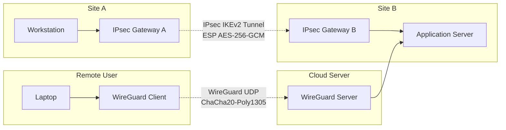

## 6. Contoh Terapan

**Audit konfigurasi SSH:**

```bash
# ssh-audit.py pada server lab
python3 ssh-audit.py lab-server.internal

# Output yang perlu diperhatikan:
# (inf) target host SSH version:   SSH2
# (rec) kex algorithm: curve25519-sha256 -- preferred
# (warn) kex algorithm: diffie-hellman-group14-sha1 -- remove
# (fail) cipher: arcfour -- broken
# (warn) mac: hmac-md5 -- weak
# (rec) add: chacha20-poly1305@openssh.com cipher

# Evaluasi dari output:
# fail = kerentanan serius, harus diperbaiki
# warn = lemah, perlu dipertimbangkan untuk dihapus
# rec = rekomendasi, tindakan proaktif
# inf = informasi, tidak ada action required
```

## 7. Praktikum atau Aktivitas Terarah

**Tujuan:** Mengaudit dan mengkonfigurasi SSH yang aman, serta memvalidasi WireGuard tunnel.

**Langkah Kerja:**
1. Jalankan `ssh-audit.py` pada server lab yang dikonfigurasi dengan parameter default (sengaja ada kelemahan).
2. Identifikasi algoritma deprecated dan broken dari output ssh-audit.
3. Edit `sshd_config` untuk menerapkan konfigurasi yang aman.
4. Konfigurasikan autentikasi key-based: generate ED25519 keypair, copy public key ke server.
5. Setup WireGuard tunnel antara dua VM: server dan client.
6. Validasi: cek bahwa traffic melalui WireGuard dengan tcpdump (hanya UDP terenkripsi yang terlihat, bukan plaintext).
7. Buat evidence pack: screenshot ssh-audit sebelum/sesudah, WireGuard status, tcpdump capture.

**Output:** Secure connection evidence pack — bagian dari Eval-2.

## 8. Latihan Pemahaman

1. **(Analisis)** Apa yang dimaksud dengan "cryptographic agility" dan mengapa WireGuard sengaja menghilangkannya? Apa trade-off dari pendekatan "fixed crypto" WireGuard?

2. **(Evaluasi)** Sebuah organisasi menggunakan OpenVPN dengan `tls-auth` (HMAC firewall). Kolega menyarankan migrasi ke WireGuard. Apa pertimbangan teknis dan operasional yang perlu dievaluasi?

## 9. Latihan Terapan / Studi Kasus

Anda menemukan bahwa server produksi memiliki SSH dengan konfigurasi: `PasswordAuthentication yes`, `PermitRootLogin yes`, port 22, tanpa MaxAuthTries, dan log menunjukkan 50.000 percobaan login gagal per hari dari berbagai IP. Susun incident response brief: (a) penilaian risiko, (b) tindakan immediate, (c) konfigurasi hardening SSH yang benar, (d) monitoring dan alerting yang perlu ditambahkan.

## 10. Kunci Jawaban dan Pembahasan

**Soal 1:** Cryptographic agility adalah kemampuan sistem untuk mengganti algoritma kriptografi. WireGuard menghilangkannya secara sengaja: (a) manfaat: tidak ada negosiasi algoritma → tidak ada downgrade attack (tidak dapat dipaksa ke algoritma lemah); implementasi lebih sederhana dan mudah diaudit; tidak ada kompleksitas manajemen cipher suite. (b) trade-off: jika ada kerentanan pada ChaCha20 atau Curve25519 ditemukan, seluruh WireGuard perlu diupdate — tidak bisa hanya ganti satu cipher. Ini memerlukan patch management yang baik. Untuk PQC migration, WireGuard perlu redesign protocol.

**Soal 2:** Pertimbangan teknis: (a) WireGuard hanya UDP vs OpenVPN UDP/TCP — jika UDP diblokir di beberapa jaringan, WireGuard akan gagal; (b) WireGuard kernel module (Linux) vs OpenVPN userspace — WireGuard lebih cepat; (c) WireGuard tidak menyembunyikan metadata VPN (UDP signature sangat identifiable) vs OpenVPN TCP 443 yang menyerupai HTTPS. Pertimbangan operasional: (a) distribusi kunci: WireGuard memerlukan distribusi public key manual atau via tool seperti wg-easy, netbird; (b) logging: WireGuard sangat minimal logging; (c) credential revocation: OpenVPN memiliki certificate revocation (CRL/OCSP); WireGuard peer harus dihapus manual.

**Studi Kasus:** (a) Risk assessment: 50.000 percobaan brute force/hari = active attack; `PermitRootLogin yes` = jika brute force berhasil, full system access immediately; `PasswordAuthentication yes` = serangan brute force dimungkinkan; tidak ada MaxAuthTries = tidak ada throttling. Risiko: Critical. (b) Immediate actions: block scanning IPs menggunakan `fail2ban` atau firewall; sementara restrict SSH akses via IP whitelist di firewall. (c) Konfigurasi hardening: `PermitRootLogin no`, `PasswordAuthentication no`, `PubkeyAuthentication yes`, `MaxAuthTries 3`, `AllowUsers` hanya user yang diperlukan, pindah port (opsional sebagai obfuscation), implementasi fail2ban. (d) Monitoring: alert jika lebih dari 5 SSH failure dalam 60 detik dari satu IP; SIEM rule untuk SSH brute force pattern; log semua SSH session.

## 11. Ringkasan Bab

SSH menyediakan remote access aman dengan autentikasi berbasis kunci publik (direkomendasikan) atau password. Hardening meliputi: nonaktifkan root login dan password auth, batasi algoritma ke yang kuat. IPsec di Tunnel mode dengan IKEv2 dan PFS cocok untuk site-to-site VPN enterprise. WireGuard menawarkan simplicity dan performa dengan fixed crypto yang resisten downgrade attack. Validasi semua konfigurasi dengan ssh-audit, ike-scan, dan packet capture.

## 12. Refleksi Profesional

1. WireGuard memiliki codebase yang sangat kecil (~4000 baris) dibanding OpenVPN (~70.000 baris). Dalam security engineering, "less code = less attack surface" adalah prinsip yang kuat. Namun, beberapa organisasi menghindari adopsi teknologi baru karena belum ada "track record" yang panjang. Bagaimana Anda menyeimbangkan antara adopsi teknologi yang lebih aman secara desain dengan konservatisme operasional yang wajar?


---

# BAB 5 — SEGMENTASI JARINGAN, VLAN, ROUTING SECURITY, DAN NETWORK ACCESS CONTROL

## 1. Capaian Pembelajaran Bab

Setelah mempelajari bab ini, mahasiswa mampu:
- Merancang segmentasi jaringan yang efektif menggunakan VLAN
- Memahami ancaman terhadap routing dan cara mitigasinya
- Menerapkan Network Access Control (NAC) untuk memvalidasi device
- Menjelaskan micro-segmentation dan penerapannya dalam zero trust

*Berkaitan dengan Sub-CPMK-3, Eval-3 (15%)*

## 2. Peta Konsep Bab

```mermaid
flowchart TD
    A[Segmentasi Jaringan] --> B[VLAN]
    B --> B1["Layer 2 isolation:\nkomunikasi antar VLAN\nhanya melalui router/firewall"]
    B --> B2["Trunk port: 802.1Q tagging\nuntuk multi-VLAN"]
    B --> B3["Native VLAN: harus\ndikonfigurasi dengan benar\n→ VLAN hopping risk"]
    B --> B4["Desain VLAN per fungsi:\nuser, server, IoT, guest,\nmanagement, voice"]
    A --> C[Routing Security]
    C --> C1["OSPF/BGP authentication:\nMD5/HMAC-SHA256"]
    C --> C2["Route filtering:\nprefix-list, route-map"]
    C --> C3["BGP: RPKI untuk\nvalidasi route origin"]
    C --> C4["Anti-spoofing: uRPF,\nBCP38 filtering"]
    A --> D[Network Access Control]
    D --> D1["802.1X: port-based NAC\nauth via RADIUS"]
    D --> D2["Pre-admission check:\nOS patch level, antivirus\nstatus sebelum akses"]
    D --> D3["Guest VLAN dan\nquarantine VLAN"]
    D --> D4["Certificate-based device auth:\nEAP-TLS, PEAP"]
    A --> E[Micro-segmentation]
    E --> E1["Software-defined:\nkontrol berbasis workload\nbukan network segment"]
    E --> E2["East-West traffic control:\nantar VM/container"]
    E --> E3["Zero trust basis:\nsetiap komunikasi diverifikasi"]
```

## 3. Pengantar Kontekstual

Segmentasi jaringan adalah salah satu kontrol keamanan paling efektif untuk membatasi *blast radius* — seberapa jauh kerusakan dapat menyebar jika satu segmen dicompromise. Tanpa segmentasi, satu endpoint yang terinfeksi dapat menjangkau seluruh jaringan. Dengan segmentasi yang tepat, attacker yang berhasil masuk ke satu VLAN tidak dapat langsung mengakses data sensitif di VLAN lain tanpa melewati kontrol keamanan yang berlapis.

## 4. Landasan Teori

### 4.1 VLAN (Virtual Local Area Network)

VLAN memungkinkan pemisahan logis dalam jaringan fisik yang sama. Device di VLAN yang berbeda tidak dapat berkomunikasi secara langsung di Layer 2 — harus melalui router atau firewall di Layer 3.

**802.1Q VLAN Tagging:**
Switch menambahkan 4-byte tag ke frame Ethernet untuk mengidentifikasi VLAN. Tag berisi: VLAN ID (12-bit, 1-4094), Priority Code Point (QoS), dan DEI bit.

**Jenis port switch:**
- **Access port:** Port untuk end device. Hanya satu VLAN. Frame tidak memiliki tag saat masuk/keluar.
- **Trunk port:** Port antar switch atau antara switch dengan router. Membawa traffic dari banyak VLAN menggunakan 802.1Q tags.
- **Native VLAN:** VLAN untuk traffic untagged pada trunk port. Default: VLAN 1.

**Desain VLAN yang baik:**

| VLAN ID | Nama | Fungsi |
|---|---|---|
| 10 | User-Workstation | Workstation karyawan |
| 20 | Server-DMZ | Server publik/semi-publik |
| 30 | Server-Internal | Server internal |
| 40 | Database | Database server |
| 50 | VoIP | Telepon IP |
| 60 | IoT | Perangkat IoT |
| 70 | Guest | Tamu/WiFi publik |
| 99 | Management | Akses manajemen switch/router |
| 100 | Native/Parking | VLAN untuk port yang tidak digunakan |

**Ancaman VLAN Hopping:**
- **Switch Spoofing:** Attacker memaksa switch untuk trunking dengan berpura-pura menjadi switch → attacker dapat mengakses semua VLAN.
- **Double Tagging:** Attacker mengirim frame dengan dua tag VLAN — switch terluar melepas tag pertama (native VLAN), tag kedua membawa frame ke VLAN lain.

**Mitigasi VLAN hopping:**
- Nonaktifkan DTP (Dynamic Trunking Protocol): `switchport nonegotiate`
- Ubah native VLAN dari VLAN 1 ke VLAN khusus yang tidak digunakan
- Matikan port yang tidak digunakan dan masukkan ke parking VLAN
- Port security: batasi MAC address per port

### 4.2 Routing Security

Routing adalah proses yang menentukan jalur paket melalui jaringan. Kompromi pada routing dapat mengakibatkan traffic dibelokkan melalui path attacker (traffic hijacking).

**BGP (Border Gateway Protocol) Security:**
BGP route hijacking adalah ancaman serius di internet. Contoh historis: Pakistan Telecom memblokir YouTube untuk seluruh internet (2008); attacker mengalihkan traffic AWS ke server yang dikendalikan (2018 untuk cryptocurrency).

**RPKI (Resource Public Key Infrastructure):**
Sistem yang memvalidasi bahwa pemegang AS number tertentu berhak mengumumkan prefix tertentu. Router yang memvalidasi RPKI dapat meolak route announcement yang tidak valid.

**Anti-spoofing dengan uRPF (Unicast Reverse Path Forwarding):**
Router memverifikasi bahwa source IP packet diterima dari interface yang sama dengan rute menuju source tersebut. Jika tidak cocok, paket di-drop (kemungkinan spoofed).

**BCP38 (Network Ingress Filtering):**
ISP/network operator memfilter traffic keluar yang memiliki source IP di luar range yang sah untuk customer tersebut. Mencegah IP spoofing keluar dari jaringan.

### 4.3 Network Access Control (NAC)

NAC adalah sistem yang mengontrol akses device ke jaringan berdasarkan kebijakan — sebelum device diizinkan terhubung.

**IEEE 802.1X:**
Protokol port-based NAC. Flow:
1. **Supplicant** (device): meminta akses ke port switch
2. **Authenticator** (switch): meneruskan request ke RADIUS server
3. **Authentication Server** (RADIUS): memverifikasi credential
4. Jika berhasil: port dibuka ke VLAN yang sesuai
5. Jika gagal: port tetap blokir atau dialihkan ke guest VLAN

**Metode autentikasi 802.1X:**
- **EAP-TLS:** Mutual authentication menggunakan sertifikat (client dan server). Paling aman.
- **PEAP (Protected EAP):** TLS tunnel untuk melindungi inner authentication (biasanya EAP-MSCHAPv2). Hanya server yang butuh sertifikat.
- **EAP-TTLS:** Mirip PEAP, mendukung berbagai inner auth method.

**Pre-admission NAC:**
Sebelum memberikan akses penuh, sistem memeriksa "posture" device:
- Apakah OS sudah di-patch (patch level minimum)?
- Apakah antivirus aktif dan up-to-date?
- Apakah disk encryption aktif?

Device yang tidak memenuhi syarat diarahkan ke quarantine VLAN untuk remediation.

### 4.4 Micro-segmentation

Micro-segmentation adalah pendekatan yang lebih granular dari VLAN — mengontrol komunikasi di level workload atau container individual, bukan hanya subnet.

**Perbedaan VLAN vs Micro-segmentation:**
- VLAN: semua VM di subnet 10.0.1.0/24 dapat berkomunikasi satu sama lain (east-west traffic bebas)
- Micro-segmentation: setiap VM hanya dapat berkomunikasi dengan VM yang secara eksplisit diizinkan, meskipun berada di subnet yang sama

**Implementasi:**
- NSX-T (VMware): distributed firewall di level hypervisor
- Kubernetes Network Policy: mengontrol traffic antar pod
- AWS Security Groups: kontrol ingress/egress per ENI

## 5. Model atau Arsitektur

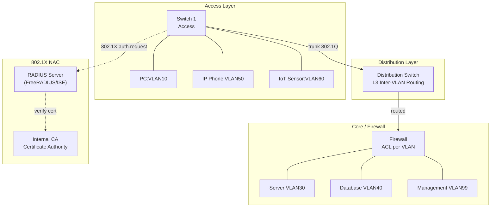

## 6. Contoh Terapan

**Desain VLAN untuk kantor cabang bank:**

Aset: 30 teller workstation, 5 server teller (transaksi), 2 server back-office (HRD, Finance), 10 IP phone, 1 ATM network interface, printer, kamera CCTV.

Desain VLAN:
- VLAN 10: Teller workstation (terhubung ke VLAN 20 via ACL ketat)
- VLAN 20: Server teller (akses dari VLAN 10 hanya ke port aplikasi spesifik)
- VLAN 25: Server back-office (tidak ada akses dari VLAN 10)
- VLAN 30: ATM (isolated, hanya ke payment gateway server, tidak ke LAN lain)
- VLAN 40: IP Phone
- VLAN 50: CCTV (isolated, hanya ke NVR)
- VLAN 99: Management (hanya akses dari terminal management yang spesifik)

Firewall rule: default deny antar semua VLAN; izinkan hanya yang didefinisikan eksplisit.

## 7. Praktikum atau Aktivitas Terarah

**Tujuan:** Merancang dan memvalidasi desain segmentasi VLAN untuk skenario yang diberikan.

**Lingkungan:** GNS3 atau Cisco Packet Tracer (simulasi), atau switch fisik jika tersedia.

**Langkah Kerja:**
1. Dosen memberikan skenario organisasi (misalnya: perusahaan manufaktur dengan jaringan IT dan OT).
2. Desain VLAN: buat tabel VLAN, diagram topologi, dan inter-VLAN routing policy.
3. Konfigurasi di simulator: buat VLAN, atur access/trunk ports, konfigurasi SVI (Switch Virtual Interface) untuk inter-VLAN routing.
4. Uji: verifikasi host di VLAN 10 dapat ping host di VLAN 20 hanya jika ACL mengizinkan.
5. Uji VLAN hopping mitigation: matikan DTP, ubah native VLAN.
6. Dokumentasikan: topologi, konfigurasi, hasil uji.

**Output:** Network segmentation design — bagian dari Eval-3.

## 8. Latihan Pemahaman

1. **(Analisis)** Jelaskan mekanisme VLAN hopping melalui double tagging. Mengapa ini hanya berhasil untuk traffic satu arah, dan bagaimana mitigasinya?

2. **(Evaluasi)** Sebuah organisasi memiliki server web dan database di VLAN yang sama untuk memudahkan deployment. Apa risiko yang ditimbulkan dan bagaimana Anda merekomendasikan pemisahan yang tepat?

## 9. Latihan Terapan / Studi Kasus

Sebuah rumah sakit swasta menghubungkan dalam satu jaringan flat: 200 workstation medis (EMR/EHR), 50 perangkat IoT medis (monitor pasien, infusion pump, lab analyzer), sistem PACS (radiologi), 30 workstation administrasi (billing, HRD), dan WiFi untuk pengunjung. Rancang: (a) desain VLAN yang tepat dengan justifikasi per segmen, (b) inter-VLAN routing policy (siapa boleh berbicara dengan siapa), (c) NAC policy untuk perangkat IoT medis, (d) identifikasi 3 ancaman spesifik yang berhasil dimitigasi oleh desain Anda.

## 10. Kunci Jawaban dan Pembahasan

**Soal 1:** Double tagging: (a) attacker di native VLAN (misalnya VLAN 1) mengirim frame dengan dua tag: tag luar = VLAN 1 (native), tag dalam = VLAN target (misalnya VLAN 30); (b) switch pertama (terluar) melepas tag luar karena native VLAN tidak di-tag pada trunk, mengirim frame ke trunk dengan tag VLAN 30; (c) switch kedua membaca tag VLAN 30 dan mengirim frame ke port VLAN 30. Kenapa satu arah: switch di VLAN 30 tidak tahu cara mengirim respons kembali ke attacker karena tidak ada reverse path. Mitigasi: ubah native VLAN ke VLAN yang tidak digunakan (misalnya VLAN 999) yang tidak memiliki akses ke mana pun; aktifkan `vlan dot1q tag native` pada semua trunk.

**Soal 2:** Risiko server web dan database di VLAN sama: (a) jika web server dicompromise (via SQL injection, RCE), attacker dapat langsung connect ke database tanpa melewati firewall; (b) lateral movement dari web server ke database dalam satu VLAN layer tidak ter-filter; (c) database biasanya tidak perlu internet access, tetapi jika di VLAN yang sama dengan web server yang menghadap internet, blast radius besar. Rekomendasi: pisahkan ke VLAN berbeda (DMZ untuk web server, separate VLAN untuk database); firewall rule: web server hanya dapat connect ke database pada port spesifik (misalnya 5432 untuk PostgreSQL), tidak ada akses lain.

**Studi Kasus Rumah Sakit:** VLAN design: (a) VLAN 10: Workstation Medis (EMR/EHR) — sensitif, akses terbatas; (b) VLAN 20: IoT Medis — sangat isolated, hanya ke device management server; (c) VLAN 30: PACS Radiologi — isolated, akses dari workstation medis hanya via radiology workstation; (d) VLAN 40: Administrasi — tidak ada akses ke VLAN 10 atau 20; (e) VLAN 50: Guest WiFi — internet only, tidak ada akses ke internal; (f) VLAN 99: Management. Inter-VLAN routing: VLAN 10 ↔ VLAN 30 (radiology access via PACS client only); VLAN 10 → VLAN 20 tidak diizinkan; admin VLAN 99 → semua VLAN (untuk management). NAC untuk IoT medis: certificate-based device authentication (EAP-TLS), device harus terdaftar dalam asset inventory; jika gagal autentikasi → quarantine VLAN. Ancaman yang dimitigasi: (1) malware dari guest WiFi tidak dapat menyebar ke EMR; (2) attacker yang compromise satu IoT device tidak dapat pivot ke workstation medis; (3) administrasi tidak dapat mengakses rekam medis pasien langsung.

## 11. Ringkasan Bab

VLAN memungkinkan segmentasi logis dalam jaringan fisik, dengan isolasi di Layer 2. VLAN hopping (switch spoofing, double tagging) dapat diminimasi dengan menonaktifkan DTP dan mengubah native VLAN. Routing security mencakup autentikasi routing protocol, RPKI untuk BGP, dan anti-spoofing (uRPF, BCP38). NAC (802.1X) mengontrol akses device sebelum diizinkan ke jaringan, dengan opsi EAP-TLS untuk autentikasi berbasis sertifikat. Micro-segmentation memberikan kontrol granular di level workload.

## 12. Refleksi Profesional

1. VLAN adalah kontrol Layer 2 yang sangat efektif, tetapi sering diimplementasikan secara ad hoc seiring pertumbuhan organisasi — menghasilkan "VLAN sprawl" yang sulit diaudit. Sebagai konsultan keamanan yang diminta mengaudit jaringan organisasi yang sudah 10 tahun berdiri tanpa dokumentasi yang memadai, apa pendekatan sistematis Anda untuk memetakan dan menilai keamanan segmentasi yang ada?

---

# BAB 6 — FIREWALL/ACL POLICY, NAT, PROXY, DAN POLICY VALIDATION

## 1. Capaian Pembelajaran Bab

Setelah mempelajari bab ini, mahasiswa mampu:
- Menulis dan menganalisis firewall/ACL policy yang benar
- Memahami NAT dan implikasinya terhadap keamanan
- Menjelaskan peran proxy (forward, reverse) dalam keamanan jaringan
- Memvalidasi policy menggunakan teknik uji yang sistematis

*Berkaitan dengan Sub-CPMK-3, Eval-3 (15%)*

## 2. Peta Konsep Bab

```mermaid
flowchart TD
    A[Kontrol Akses Jaringan] --> B[Firewall/ACL]
    B --> B1["Stateless: setiap paket\ndievaluasi independen"]
    B --> B2["Stateful: melacak\nconnection state"]
    B --> B3["NGFW: layer 7,\napplication-aware,\nIPS integrated"]
    B --> B4["Default-deny: implicit deny\ndi akhir ruleset"]
    A --> C[ACL Policy Best Practice]
    C --> C1["Specificity: rule spesifik\ndi atas rule umum"]
    C --> C2["Least-permissive: izinkan\nhanya yang diperlukan"]
    C --> C3["Documentation: setiap rule\nharus ada justifikasi"]
    C --> C4["Rule review: hapus rule\nyang tidak diperlukan"]
    A --> D[NAT]
    D --> D1["Source NAT/Masquerade:\nbanyak private IP\n→ satu public IP"]
    D --> D2["DNAT/Port Forwarding:\npublic IP:port\n→ private IP:port"]
    D --> D3["NAT tidak sama\ndengan keamanan!"]
    A --> E[Proxy]
    E --> E1["Forward Proxy:\nmengontrol akses internet\nuser ke luar"]
    E --> E2["Reverse Proxy:\nmenyembunyikan dan\nmelindungi server backend"]
    E --> E3["SSL Inspection:\ndekripsi TLS untuk\ninspeksi content"]
```

## 3. Pengantar Kontekstual

Firewall adalah gerbang penjaga yang menentukan traffic mana yang boleh masuk dan keluar. Policy yang lemah, over-permissive, atau tidak terdokumentasi adalah kerentanan keamanan yang nyata. Bab ini membangun kemampuan untuk menulis, menganalisis, dan memvalidasi firewall policy secara sistematis.

## 4. Landasan Teori

### 4.1 Jenis Firewall

**Packet Filter (Stateless):**
Mengevaluasi setiap paket secara independen berdasarkan header: source IP, destination IP, protocol, source port, destination port. Tidak melacak state koneksi.

Kelemahan: sulit menulis rule untuk protokol yang memerlukan dua arah (FTP passive mode); rentan IP fragmentation attack.

**Stateful Firewall:**
Melacak state koneksi (connection tracking table). Paket TCP yang masuk hanya diizinkan jika merupakan bagian dari koneksi yang diinisiasi dari dalam. Ini mengeliminasi banyak serangan yang mengeksploitasi stateless packet filtering.

**Next-Generation Firewall (NGFW):**
Menginspeksi traffic di Layer 7 (application layer). Dapat mengidentifikasi aplikasi (bukan hanya port) dan menerapkan policy berbasis aplikasi. Biasanya terintegrasi dengan IPS, antimalware, dan URL filtering.

### 4.2 Menulis Firewall Rule yang Benar

**Prinsip Firewall Rule:**
1. **Default-deny:** Rule terakhir selalu "deny all" — traffic yang tidak secara eksplisit diizinkan akan ditolak.
2. **Least-permissive:** Izinkan hanya yang diperlukan.
3. **Specificity:** Rule lebih spesifik ditempatkan lebih awal.
4. **Justifikasi:** Setiap rule harus terdokumentasi dengan alasan bisnis.
5. **Log:** Rule penting harus di-log untuk monitoring.

**Contoh ACL Cisco (extended):**
```
! Allow HTTPS from any to web server
ip access-list extended INBOUND-DMZ
 permit tcp any host 203.0.113.10 eq 443 log
 permit tcp any host 203.0.113.10 eq 80 log   ! HTTP → redirect to HTTPS
 ! Allow DNS responses (stateful would handle this)
 permit udp any host 203.0.113.5 eq 53
 ! Deny everything else
 deny ip any any log

! Apply to interface
interface GigabitEthernet0/0
 ip access-group INBOUND-DMZ in
```

**Contoh iptables (Linux firewall):**
```bash
# Default policy: drop semua
iptables -P INPUT DROP
iptables -P FORWARD DROP
iptables -P OUTPUT ACCEPT

# Allow established connections
iptables -A INPUT -m conntrack --ctstate ESTABLISHED,RELATED -j ACCEPT

# Allow SSH dari management network saja
iptables -A INPUT -s 10.99.0.0/24 -p tcp --dport 22 -j ACCEPT

# Allow HTTPS ke web server
iptables -A INPUT -p tcp --dport 443 -j ACCEPT

# Allow ICMP (ping) terbatas
iptables -A INPUT -p icmp --icmp-type echo-request -m limit --limit 1/s -j ACCEPT

# Log semua yang di-drop
iptables -A INPUT -j LOG --log-prefix "DROPPED: " --log-level 4
```

### 4.3 NAT (Network Address Translation)

**Source NAT (SNAT/Masquerade):**
Traffic dari private network (misalnya 192.168.1.0/24) keluar ke internet dengan menggunakan satu IP publik. Router mengganti source IP private dengan IP publik dan melacak mapping di connection tracking table.

**Destination NAT (DNAT/Port Forwarding):**
Traffic yang masuk ke IP publik pada port tertentu diteruskan ke server internal.
```
Internet → 203.0.113.1:443 → (DNAT) → 192.168.1.10:443
```

**NAT bukan keamanan!** Kesalahan umum: mengandalkan NAT sebagai kontrol keamanan. NAT memang menyembunyikan IP internal, tetapi tidak mencegah attacker dari menyerang melalui port yang di-forward, tidak mencegah outbound connection dari malware, dan tidak melindungi dari attack yang bersembunyi di dalam protokol yang diizinkan.

### 4.4 Proxy Server

**Forward Proxy:**
Menjadi perantara untuk traffic dari internal user ke internet. Manfaat keamanan: (a) URL filtering: blokir situs berbahaya/tidak sesuai kebijakan; (b) SSL inspection: dekripsi dan inspeksi traffic HTTPS untuk malware; (c) logging: rekam semua akses web; (d) caching: mengurangi bandwidth.

**Reverse Proxy:**
Menjadi perantara untuk traffic dari internet ke server backend. Manfaat: (a) menyembunyikan IP dan topologi server backend; (b) load balancing; (c) TLS termination; (d) WAF (Web Application Firewall) integration; (e) DDoS mitigation.

**SSL/TLS Inspection:**
Reverse/forward proxy mendekripsi TLS traffic, menginspeksi, kemudian meng-enkripsi ulang. Ini memerlukan: (a) CA certificate yang dipercaya oleh client (untuk forward proxy); (b) pertimbangan privasi — proxy dapat membaca seluruh content yang diinspeksi, termasuk banking dan personal communication.

### 4.5 Validasi Policy Firewall

**Teknik validasi:**
- **Positive test:** Verifikasi bahwa traffic yang seharusnya diizinkan berhasil lewat.
- **Negative test:** Verifikasi bahwa traffic yang seharusnya di-blokir berhasil di-drop.
- **Nmap port scan:** Identifikasi port mana yang open/filtered dari perspektif eksternal.
- **traceroute:** Verifikasi path traffic dan di mana filtering terjadi.

```bash
# Positive test: verifikasi HTTPS bisa diakses
curl -v https://web.internal.company.com

# Negative test: verifikasi SSH dari untrusted network di-blokir
nmap -sT -p 22 web.internal.company.com  # Dari zona tidak dipercaya

# Port scan dari perspektif eksternal (hanya pada sistem yang diizinkan)
nmap -sV -p 1-65535 --open target.lab
```

## 5. Model atau Arsitektur

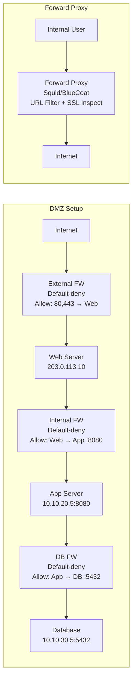

## 6. Contoh Terapan

**Audit firewall ruleset:**

Sebuah firewall memiliki ruleset berikut (urutan dari atas):
```
Rule 1: Allow ANY ANY ANY
Rule 2: Deny SSH from INTERNET to INTERNAL
Rule 3: Allow HTTPS from ANY to WEB-SERVER
```

Analisis: Rule 1 (`Allow ANY ANY ANY`) akan match semua traffic sebelum Rule 2 dan Rule 3 pernah dievaluasi. Firewall ini mengizinkan semua traffic, termasuk SSH dari internet ke internal. Rule 2 dan 3 tidak pernah efektif karena Rule 1 sudah match lebih dulu.

Perbaikan: ubah urutan — tempatkan rule paling spesifik di atas, tambahkan `deny ip any any` sebagai rule terakhir (implicit deny biasanya sudah ada di hardware firewall, tetapi eksplisit lebih baik untuk audit).

## 7. Praktikum atau Aktivitas Terarah

**Tujuan:** Menganalisis, memperbaiki, dan memvalidasi firewall policy.

**Langkah Kerja:**
1. Dosen menyediakan ruleset firewall yang sengaja memiliki kelemahan (over-permissive rule, shadowed rule, missing logging, dll.).
2. Analisis ruleset: identifikasi rule yang bermasalah dengan justifikasi.
3. Tulis ulang ruleset yang benar menggunakan format iptables atau Cisco ACL.
4. Implementasikan di VM lab (iptables di Linux VM).
5. Validasi: lakukan positive dan negative test dengan nmap dan curl.
6. Dokumentasikan: tabel Rule ID, Original, Problem, Fixed, Test Result.

**Output:** Firewall/ACL policy document — bagian dari Eval-3.

## 8. Latihan Pemahaman

1. **(Analisis)** Mengapa "default-permit" (izinkan semua kecuali yang eksplisit dilarang) lebih berbahaya dari "default-deny" untuk firewall security? Berikan contoh skenario di mana ini gagal.

2. **(Evaluasi)** Sebuah administrator berargumen: "NAT sudah cukup untuk melindungi jaringan internal dari internet." Apa yang benar dan salah dari argumen ini?

## 9. Latihan Terapan / Studi Kasus

Review ruleset firewall berikut untuk server e-commerce (dari interface luar ke DMZ):
```
Rule 1: Permit TCP any any port 80
Rule 2: Permit TCP any any port 443
Rule 3: Permit TCP any any port 22
Rule 4: Permit TCP any any port 3306  (MySQL)
Rule 5: Permit TCP any any port 3389  (RDP)
Rule 6: Permit ICMP any any
Rule 7: Permit IP any any
```
Identifikasi setiap kelemahan, buat ruleset yang benar dengan justifikasi setiap rule, dan jelaskan dampak keamanan dari perubahan yang Anda buat.

## 10. Kunci Jawaban dan Pembahasan

**Soal 1:** Default-permit lebih berbahaya karena: penyerang hanya perlu menemukan satu celah yang tidak tercakup oleh deny rule; seiring pertumbuhan sistem, semakin sulit untuk memastikan semua ancaman sudah di-deny; konfigurasi salah atau lupa menambahkan deny rule dapat membuka akses tanpa disadari. Contoh gagal: admin menambahkan layanan baru pada port 8443, lupa menambahkan deny rule → port terbuka ke seluruh internet karena default permit.

**Soal 2:** Yang benar: NAT memang menyembunyikan IP private dari luar, membuat sulit bagi penyerang untuk langsung menarget host internal. Yang salah: (a) port forwarding membuka akses langsung ke server internal; (b) outbound connection dari malware di dalam jaringan tidak diblokir NAT (malware dapat melakukan phone-home melalui HTTP/HTTPS); (c) traffic yang sudah diizinkan (HTTP/HTTPS) dapat membawa exploit payload yang tidak terlihat oleh NAT; (d) NAT tidak melakukan deep packet inspection. Kesimpulan: NAT adalah network address translation, bukan security control — tidak dapat menggantikan firewall.

**Studi Kasus:** Rule 1 (port 80): OK untuk redirect ke HTTPS, tetapi pastikan server redirect segera ke 443. Rule 2 (port 443): OK, diperlukan. Rule 3 (port 22, SSH any): BERBAHAYA — SSH tidak boleh diekspos ke internet dari DMZ; pindah ke management network, atau gunakan bastion host. Rule 4 (MySQL 3306): SANGAT BERBAHAYA — database tidak boleh diekspos ke internet dari DMZ sama sekali. Rule 5 (RDP 3389): BERBAHAYA — RDP tidak boleh diekspos ke internet. Rule 6 (ICMP any): SEDANG — ICMP bisa berguna untuk troubleshooting tetapi echo-reply dari server ke internet bisa menyebabkan ICMP tunneling; batasi ke specific types. Rule 7 (IP any any): BERBAHAYA — rule ini mengizinkan semua traffic, membuat semua rule di atasnya tidak relevan untuk traffic yang tidak di-match. Ruleset yang benar: default-deny, izinkan hanya TCP 443 dari any ke web server IP, redirect HTTP 80 ke 443, hapus semua akses ke database dan manajemen dari perimeter firewall.

## 11. Ringkasan Bab

Firewall policy mengikuti prinsip default-deny, least-permissive, dan dokumentasi yang jelas. Stateful firewall lebih aman dari stateless karena melacak connection state. NAT bukan kontrol keamanan — tidak menggantikan firewall. Forward proxy mengontrol outbound web access; reverse proxy melindungi server backend. Validasi policy melalui positive dan negative testing menggunakan nmap dan curl.

## 12. Refleksi Profesional

1. Firewall policy review adalah aktivitas yang seharusnya dilakukan secara periodik — setiap rule harus memiliki justifikasi bisnis yang jelas dan "expiry" review date. Dalam praktik, banyak organisasi memiliki ruleset yang tumbuh secara organik selama bertahun-tahun tanpa review. Sebagai praktisi keamanan, bagaimana Anda membangun proses governance untuk firewall policy yang berkelanjutan?


---

# BAB 7 — IDS/IPS: FONDASI, SURICATA/SNORT, RULE/SIGNATURE, DAN DEPLOYMENT

## 1. Capaian Pembelajaran Bab

Setelah mempelajari bab ini, mahasiswa mampu:
- Membedakan IDS dan IPS serta mode deployment-nya
- Memahami arsitektur dan cara kerja Suricata dan Snort
- Menulis dan menganalisis rule/signature IDS dasar
- Merencanakan penempatan sensor IDS/IPS dalam arsitektur jaringan

*Berkaitan dengan Sub-CPMK-4, Eval-4 (20%)*

## 2. Peta Konsep Bab

```mermaid
flowchart TD
    A[IDS/IPS] --> B[Jenis Berdasarkan Fungsi]
    B --> B1["IDS (Intrusion Detection):\nmendeteksi dan alert\ntidak memblokir"]
    B --> B2["IPS (Intrusion Prevention):\nmendeteksi DAN memblokir\ninline deployment"]
    A --> C[Jenis Berdasarkan Metode Deteksi]
    C --> C1["Signature/Rule-based:\ncocokkan pola diketahui\nlow FP, miss unknown"]
    C --> C2["Anomaly-based:\ndeteksi deviasi dari baseline\nhigh FP, detect unknown"]
    C --> C3["Hybrid: kombinasi keduanya"]
    A --> D[Platform]
    D --> D1["Suricata: multi-threaded,\nHigh Performance,\nET rules, YAML config"]
    D --> D2["Snort 3: klasik, banyak\ndokumentasi, LightSPD"]
    D --> D3["Zeek: network analysis\nframework, scripting,\nbukan signature-based"]
    A --> E[Deployment Mode]
    E --> E1["Network tap: passive, out-of-band\nhanya IDS bukan IPS"]
    E --> E2["Inline: di antara traffic\nbisa IPS, ada latency"]
    E --> E3["SPAN/Mirror port:\ncopy traffic ke sensor"]
    A --> F[Rule Anatomy]
    F --> F1["Action: alert/drop/pass"]
    F --> F2["Protocol: tcp/udp/icmp/http"]
    F --> F3["Header: src/dst IP+port"]
    F --> F4["Rule Options: content, msg, sid, rev"]
```

## 3. Pengantar Kontekstual

IDS/IPS adalah "mata" organisasi terhadap serangan jaringan. Tanpa IDS/IPS, banyak serangan yang berhasil tidak akan pernah terdeteksi hingga dampaknya sudah signifikan. Namun IDS/IPS juga memiliki keterbatasan: false positive yang tinggi dapat menyebabkan "alert fatigue", dan encrypted traffic semakin sulit diinspeksi.

## 4. Landasan Teori

### 4.1 IDS vs IPS

**IDS (Intrusion Detection System):**
Memantau traffic secara pasif, mengidentifikasi pattern mencurigakan, dan menghasilkan alert. Tidak memblokir traffic. Dapat di-deploy out-of-band (tidak dalam jalur traffic aktif).

**IPS (Intrusion Prevention System):**
Di-deploy secara inline — traffic harus melalui IPS. Dapat mengambil tindakan aktif: drop paket, reset koneksi, blokir IP. Penambahan latency adalah trade-off.

**Keuntungan dan kerugian:**

| Aspek | IDS | IPS |
|---|---|---|
| Dampak traffic | Tidak ada | Ada latency |
| Aksi | Alert saja | Alert + Block |
| Deployment | Flexible (tap, SPAN) | Harus inline |
| Risiko false positive | Low (hanya missed detection) | High (dapat blokir traffic legitimate) |
| Postur | Monitoring | Prevention |

**Mode Hybrid:** Deploy sebagai IDS pertama, setelah tuning selesai dan false positive rendah, switch ke IPS mode.

### 4.2 Suricata

Suricata adalah IDS/IPS/NSM (Network Security Monitor) open source yang mendukung:
- Multi-threaded: memanfaatkan CPU multi-core
- Protocol parsing: HTTP, TLS, DNS, SSH, SMB, dan banyak lagi
- Deteksi berbasis signature (Suricata Rule Language)
- Network Telemetry: menghasilkan JSON event log yang komprehensif
- EVE JSON: format log standar yang mudah diintegrasikan ke SIEM

**Arsitektur Suricata:**
```
Traffic → Capture (AF_PACKET/PCAP) → Decode → 
Pre-detect (flow tracking, protocol parsing) → 
Detect (rule matching) → Output (alerts, EVE logs)
```

**Konfigurasi minimal Suricata (`/etc/suricata/suricata.yaml`):**
```yaml
vars:
  address-groups:
    HOME_NET: "[10.0.0.0/8, 172.16.0.0/12, 192.168.0.0/16]"
    EXTERNAL_NET: "!$HOME_NET"

af-packet:
  - interface: eth0

rule-files:
  - /etc/suricata/rules/suricata.rules
  - /var/lib/suricata/rules/suricata.rules

outputs:
  - eve-log:
      enabled: yes
      filetype: regular
      filename: /var/log/suricata/eve.json
      types:
        - alert
        - http
        - dns
        - tls
        - ssh
        - flow
```

**Menjalankan Suricata:**
```bash
# Update rules (Emerging Threats free ruleset)
suricata-update

# Jalankan Suricata dalam IDS mode pada interface eth0
suricata -c /etc/suricata/suricata.yaml -i eth0

# Atau pada file pcap (untuk lab/forensik)
suricata -c /etc/suricata/suricata.yaml -r capture.pcap

# Monitor alerts
tail -f /var/log/suricata/eve.json | python3 -m json.tool | grep -A5 '"event_type":"alert"'
```

### 4.3 Anatomi Suricata Rule

Format: `action proto src_ip src_port -> dst_ip dst_port (options)`

```
alert tcp $EXTERNAL_NET any -> $HTTP_SERVERS $HTTP_PORTS \
  (msg:"Possible SQL Injection in HTTP Request"; \
   flow:established,to_server; \
   http.uri; \
   content:"union"; nocase; content:"select"; nocase; distance:0; \
   classtype:web-application-attack; \
   sid:9000001; rev:1;)
```

**Komponen rule:**

| Komponen | Keterangan |
|---|---|
| `alert` | Aksi: alert (IDS), drop (IPS), pass (whitelist) |
| `tcp` | Protokol: tcp, udp, icmp, http, dns, tls, dll. |
| `$EXTERNAL_NET any` | Source IP group dan port |
| `->` | Arah traffic |
| `$HTTP_SERVERS $HTTP_PORTS` | Destination IP group dan port |
| `msg:` | Pesan yang muncul di alert |
| `flow:` | State koneksi (established, to_server) |
| `content:` | Pattern string yang dicari |
| `nocase` | Case-insensitive matching |
| `sid:` | Signature ID (unik) |
| `rev:` | Revision number rule |

**Rule lebih advanced:**
```
# Deteksi ICMP Tunnel (data payload besar dalam ICMP echo)
alert icmp $EXTERNAL_NET any -> $HOME_NET any \
  (msg:"Possible ICMP Tunnel - Large Payload"; \
   itype:8; dsize:>200; \
   threshold:type both, track by_src, count 5, seconds 60; \
   sid:9000002; rev:1;)
```

### 4.4 Deployment IDS/IPS dalam Arsitektur Jaringan

**Penempatan sensor:**

1. **Di perimeter (antara firewall dan internet):** Melihat semua traffic inbound/outbound termasuk yang firewall sudah blokir — memberikan informasi tentang volume scanning/attack attempts.

2. **Di DMZ:** Mendeteksi serangan yang sudah melewati perimeter firewall terhadap server DMZ.

3. **Di internal network boundary:** Mendeteksi lateral movement antar segmen jaringan.

4. **Di chokepoint (aggregation point):** Router/switch yang menjadi titik berkumpulnya traffic dari banyak segmen — efisiensi satu sensor untuk banyak coverage.

**Out-of-band vs Inline:**
- **Out-of-band (SPAN/Mirror):** Traffic di-mirror dari switch ke interface sensor. Sensor tidak ada di jalur traffic aktif. Jika sensor crash: tidak ada dampak ke traffic production. Mode ini hanya untuk IDS (bukan IPS).
- **Inline (TAP):** Sensor ditempatkan secara fisik/logis di jalur traffic. Traffic harus melalui sensor. Mode ini untuk IPS. Hardware TAP dengan fail-open mode memastikan traffic tetap mengalir jika sensor crash.

## 5. Model atau Arsitektur

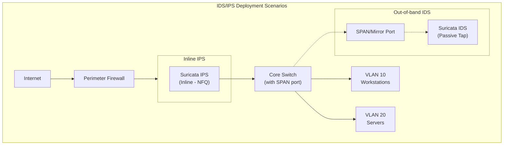

## 6. Contoh Terapan

**Menjalankan Suricata pada file PCAP untuk analisis forensik:**

```bash
# Analisis pcap yang sudah ada (legal, dalam lab)
suricata -c /etc/suricata/suricata.yaml -r /lab/captures/suspicious_traffic.pcap \
  -l /tmp/suricata_output/

# Baca dan filter alerts dari EVE JSON
cat /tmp/suricata_output/eve.json | \
  python3 -c "
import sys, json
for line in sys.stdin:
    try:
        event = json.loads(line)
        if event.get('event_type') == 'alert':
            print(f\"[{event['timestamp']}] {event['alert']['signature']} | \
                src: {event['src_ip']}:{event.get('src_port','?')} -> \
                dst: {event['dest_ip']}:{event.get('dest_port','?')}\")
    except:
        pass
"
```

## 7. Praktikum atau Aktivitas Terarah

**Tujuan:** Mengkonfigurasi Suricata IDS pada dataset pcap lab dan menulis rule sederhana.

**Lingkungan:** VM Linux dengan Suricata terinstall; dataset pcap yang disediakan dosen (pcap publik dari malware analysis sandbox atau PCAP Challenge).

**Langkah Kerja:**
1. Install dan konfigurasi Suricata minimal.
2. Update rules dengan suricata-update (ET Free Rules).
3. Jalankan Suricata pada dataset pcap yang disediakan.
4. Analisis EVE JSON: identifikasi top 10 alerts, unique source IPs, dan alert categories.
5. Tulis minimal 3 custom rule untuk mendeteksi pattern spesifik yang terlihat dalam pcap.
6. Verifikasi rule bekerja: jalankan ulang Suricata dengan custom rules.
7. Dokumentasi: konfigurasi, alert summary, rule yang ditulis, justifikasi.

**Output:** IDS/IPS lab setup report — bagian dari Eval-4.

## 8. Latihan Pemahaman

1. **(Analisis)** Apa perbedaan antara SPAN port dan network TAP untuk mengirim traffic ke sensor IDS? Apa kelebihan dan kekurangan masing-masing?

2. **(Evaluasi)** Sebuah organisasi ingin men-deploy Suricata sebagai IPS (bukan hanya IDS) pada link internet 10 Gbps. Apa pertimbangan performa dan reliability yang perlu diperhatikan?

## 9. Latihan Terapan / Studi Kasus

Anda diminta merencanakan deployment IDS/IPS untuk jaringan rumah sakit dengan segmen: internet-facing (web portal pasien), internal klinisi (EMR), internal IoT medis, dan data center. Traffic volume: 1 Gbps agregat. Buat: (a) deployment plan dengan jumlah sensor, lokasi, dan mode (IDS/IPS), (b) rule categories yang relevan untuk setiap segmen, (c) alert escalation procedure, (d) justifikasi pilihan Suricata vs Snort untuk use case ini.

## 10. Kunci Jawaban dan Pembahasan

**Soal 1:** SPAN port: software feature di switch yang me-mirror traffic ke port lain; tidak memerlukan hardware tambahan; bisa memilih traffic dari specific VLAN atau port; kelemahannya: kualitas mirror dapat menurun jika switch overloaded (drop mirror packet), tidak semua SPAN implementasi mereproduksi semua packet error. Network TAP: hardware device fisik yang pasif; memecah sinyal optik/copper dan mengirim copy ke sensor; tidak dapat fail (fail-open: traffic tetap mengalir meskipun TAP device mati); mereproduksi semua traffic termasuk error; biaya lebih tinggi karena hardware tambahan.

**Soal 2:** Pertimbangan performa: (a) Suricata harus multi-threaded dan dikonfigurasi sesuai jumlah core; (b) 10 Gbps memerlukan hardware dengan throughput network capture yang cukup; (c) RSS (Receive Side Scaling) untuk distribusi traffic ke multiple core; (d) memory: deep packet inspection memerlukan banyak RAM untuk connection tracking. Reliability: (a) fail-open mode: jika Suricata crash, traffic harus tetap mengalir (hardware bypass); (b) HA (High Availability): deployment Suricata pair dengan aktif-pasif failover; (c) monitoring Suricata sendiri: alert jika drop rate tinggi atau CPU saturasi; (d) rule testing: test rules di lab sebelum production untuk menghindari false positive yang memblokir traffic legitimate.

**Studi Kasus:** (a) Deployment plan: Sensor 1 — di perimeter (antara internet dan firewall external), mode IDS dulu, monitoring web attacks terhadap portal pasien; Sensor 2 — di boundary antara DMZ dan internal, mode IDS, monitoring lateral movement dan data exfiltration; Sensor 3 — di core switch sebagai SPAN untuk monitoring traffic IoT medis, mode IDS. (b) Rule categories: perimeter — web attacks (SQL injection, XSS, traversal), scanning, DoS; DMZ boundary — credential brute force, lateral movement, unusual protocol; IoT — protocol anomaly (device yang menghubungi IP di luar whitelist), unusual data volume; (c) Alert escalation: Low severity → log dan daily review; Medium → ticket dalam 4 jam; High/Critical → immediate alert SOC, incident response. (d) Suricata vs Snort: pilih Suricata karena: multi-threaded (Snort adalah single-threaded, kurang cocok untuk 1 Gbps agregat), EVE JSON output mudah diintegrasikan ke SIEM, aktif dikembangkan dengan protocol support yang lebih luas.

## 11. Ringkasan Bab

IDS (alert only) dan IPS (alert + block) berbeda dalam postur dan deployment. Suricata adalah IDS/IPS/NSM modern dengan multi-threaded dan EVE JSON output. Rule Suricata memiliki anatomi: action, proto, src/dst, dan options (msg, content, sid). Deployment di SPAN port (out-of-band, IDS) atau inline (IPS, perlu fail-open). Penempatan sensor di perimeter, DMZ, dan internal boundary untuk coverage yang komprehensif.

## 12. Refleksi Profesional

1. IDS/IPS menghasilkan alert yang harus ditindaklanjuti oleh tim SOC. Jika jumlah alert sangat tinggi (ribuan per hari), analis dapat mengalami "alert fatigue" — kondisi di mana analis mulai mengabaikan atau tidak menindaklanjuti alert karena volume yang overwhelming. Bagaimana Anda merancang strategi alerting yang efektif untuk mengurangi noise sambil memastikan ancaman kritis tidak terlewat?

---

# BAB 8 — NETWORK TELEMETRY: PACKET CAPTURE, NETFLOW/IPFIX, ZEEK, DAN LOG ANALYSIS

## 1. Capaian Pembelajaran Bab

Setelah mempelajari bab ini, mahasiswa mampu:
- Melakukan packet capture yang legal dan terotorisasi menggunakan Wireshark/tcpdump
- Memahami dan menganalisis NetFlow/IPFIX untuk network traffic analysis
- Menggunakan Zeek untuk network analysis yang mendalam
- Melakukan analisis log jaringan secara sistematis

*Berkaitan dengan Sub-CPMK-4, Eval-4 (20%)*

## 2. Peta Konsep Bab

```mermaid
flowchart TD
    A[Network Telemetry] --> B[Packet Capture]
    B --> B1["Full packet: semua byte\nsetiap paket — high storage"]
    B --> B2["Tcpdump: command line\ncapture dan filter"]
    B --> B3["Wireshark: GUI,\ndissectors, stream analysis"]
    B --> B4["Capture filter vs display filter"]
    A --> C[Flow Data: NetFlow/IPFIX]
    C --> C1["Flow: aggregasi\ncommunication summary\n5-tuple: src/dst IP, port, proto"]
    C --> C2["NetFlow v5/v9/IPFIX:\nstandard exporters"]
    C --> C3["Collector: nfdump, ntopng,\nElastic, Grafana"]
    C --> C4["Use case: baseline,\nanomaly, capacity planning"]
    A --> D[Zeek Network Analysis]
    D --> D1["Structured logs:\nconn.log, http.log,\ndns.log, tls.log, ssh.log"]
    D --> D2["Scripting: custom analysis\nvia Zeek script language"]
    D --> D3["Protocol analysis:\ndeep protocol state tracking"]
    D --> D4["Integration: SIEM, elk stack"]
    A --> E[Log Analysis]
    E --> E1["Syslog, journald:\nOS dan service logs"]
    E --> E2["Firewall log:\nconnection accept/deny"]
    E --> E3["Correlation: menghubungkan\nevents dari berbagai sumber"]
    E --> E4["Timeline reconstruction:\nmenyusun urutan event"]
```

## 3. Pengantar Kontekstual

Network telemetry adalah sumber data utama untuk deteksi ancaman, investigasi insiden, dan perencanaan kapasitas. Berbeda dengan IDS yang bekerja secara reaktif terhadap signature, telemetry memberikan visibilitas lengkap ke aktivitas jaringan — memungkinkan analisis baseline, deteksi anomali, dan rekonstruksi forensik insiden. Kemampuan mengumpulkan, menyimpan, dan menganalisis telemetry secara efektif adalah kompetensi kritis.

## 4. Landasan Teori

### 4.1 Packet Capture

Packet capture merekam seluruh konten traffic jaringan di level bit — frame Ethernet lengkap termasuk header dan payload. Format standar: PCAP (tcpdump format) atau PCAPng.

**Kapan menggunakan full packet capture:**
- Investigasi insiden: memerlukan konten payload untuk forensik
- Protocol debugging: memahami detail protokol
- Malware analysis: melihat C2 communication
- IDS rule development: verifikasi rule terhadap traffic nyata

**Kapan tidak menggunakan full packet capture untuk monitoring berkelanjutan:**
- Storage: 1 Gbps link menghasilkan ~450 GB/jam
- Privasi: packet berisi data sensitif user
- Legalitas: di Indonesia, intercept communications memerlukan dasar hukum yang jelas

**tcpdump — command yang esensial:**
```bash
# Capture pada interface eth0, simpan ke file
tcpdump -i eth0 -w capture.pcap

# Capture dengan filter (port 80 dan 443)
tcpdump -i eth0 -w http_traffic.pcap 'port 80 or port 443'

# Capture traffic dari/ke IP tertentu
tcpdump -i eth0 -w suspicious.pcap 'host 192.168.1.100'

# Baca file pcap dan tampilkan
tcpdump -r capture.pcap -nn -v

# Capture tanpa DNS resolution, tampilkan hex+ASCII
tcpdump -i eth0 -nn -XX

# Hanya TCP SYN packets (deteksi scanning)
tcpdump -i eth0 'tcp[tcpflags] == tcp-syn'
```

**Wireshark display filter (untuk analisis pcap):**
```
# Filter HTTP
http

# Filter traffic dari IP tertentu
ip.src == 192.168.1.100

# Filter TCP connection dengan flag SYN
tcp.flags.syn == 1 and tcp.flags.ack == 0

# Follow TCP stream: klik kanan pada paket → Follow → TCP Stream
# Ini menampilkan seluruh konten percakapan TCP

# Filter TLS handshake
ssl.handshake

# Statistik: Statistics → Protocol Hierarchy, Conversations, Endpoints
```

### 4.2 NetFlow/IPFIX

NetFlow adalah teknologi untuk mengekspor flow metadata (bukan payload) dari router/switch ke kolektor untuk analisis. Lebih efisien dari full packet capture untuk monitoring jangka panjang.

**Flow definition:**
Flow adalah sekelompok paket dengan 5-tuple yang sama: source IP, destination IP, source port, destination port, protokol. Ditambah informasi: jumlah paket, byte, timestamp start/end, ToS.

**NetFlow versions:**
- **v5:** Format fixed, tidak fleksibel, masih luas digunakan
- **v9:** Template-based, fleksibel, mendukung IPv6
- **IPFIX (RFC 7011):** IETF standard berbasis NetFlow v9, mendukung variable-length fields

**Analisis flow data:**
```bash
# nfdump — tool untuk analisis NetFlow
# Top talkers (by bytes)
nfdump -R /var/cache/nfdump/ -s srcip/bytes -n 10

# Traffic ke destination IP tertentu
nfdump -R /var/cache/nfdump/ 'dst ip 203.0.113.100'

# Deteksi port scanning: source yang banyak connect ke banyak port berbeda
nfdump -R /var/cache/nfdump/ -s srcip/flows -n 20 \
  'proto tcp and flags S'

# Volume anomaly: source dengan byte sangat tinggi
nfdump -R /var/cache/nfdump/ -s srcip/bytes -n 5
```

### 4.3 Zeek Network Analysis Framework

Zeek (sebelumnya Bro) adalah network analysis framework yang menghasilkan structured logs per protokol — bukan hanya alert seperti Suricata, tetapi konteks yang kaya.

**Log yang dihasilkan Zeek:**
```
conn.log   — semua koneksi TCP/UDP/ICMP dengan metadata lengkap
http.log   — HTTP request/response (URL, user-agent, response code, file)
dns.log    — query dan respons DNS
tls.log    — TLS handshake metadata (versi, cipher, sertifikat)
ssh.log    — SSH session metadata
ssl.log    — SSL/TLS certificate info
files.log  — file transfer yang dideteksi (hash, MIME type)
x509.log   — sertifikat X.509 yang dilihat
weird.log  — traffic yang anomali atau tidak sesuai protokol
```

**Menganalisis Zeek logs:**
```bash
# Jalankan Zeek pada pcap file
zeek -r /lab/captures/traffic.pcap

# Analisis conn.log — koneksi TCP berumur panjang (exfiltration kandidat)
cat conn.log | zeek-cut ts uid orig_h resp_h service duration orig_bytes | \
  sort -k7 -rn | head 20

# Analisis dns.log — query ke domain mencurigakan
cat dns.log | zeek-cut ts query qtype_name answers | grep -v "\.com\|\.id\|\.net"

# Analisis http.log — user agent tidak biasa
cat http.log | zeek-cut ts host uri user_agent | grep -v "Mozilla\|Chrome\|curl"

# Analisis files.log — file yang di-download
cat files.log | zeek-cut ts source fuid filename mime_type md5 sha256

# Temukan koneksi ke IP external yang tidak dikenal (contoh: bukan CDN)
cat conn.log | zeek-cut orig_h resp_h resp_p service | \
  grep -v "192.168\|10\.\|172.16" | sort | uniq -c | sort -rn | head 20
```

### 4.4 Log Analysis

Selain telemetry jaringan, log sistem dan aplikasi menyediakan konteks tambahan.

**Sumber log penting:**
- **Firewall log:** Siapa yang connect ke mana, di-allow/deny, timestamp
- **DNS log:** Query DNS — memberitahu domain apa yang dicari oleh host di jaringan Anda
- **DHCP log:** IP ↔ MAC ↔ hostname mapping, berguna untuk attribution
- **Authentication log:** Login success/failure di server, VPN, AD

**Korelasi multi-log:**
Insiden nyata terlihat dari pattern di beberapa log secara bersamaan. Contoh:
1. DNS log: query ke domain yang baru terdaftar
2. Firewall log: outbound connection ke IP terkait domain tersebut
3. HTTP log: POST request yang membawa data encoded
4. Zeek conn.log: koneksi berlangsung 3 jam (exfiltration aktif)

Semua ini bersama-sama membentuk bukti yang kuat tentang insiden.

## 5. Model atau Arsitektur

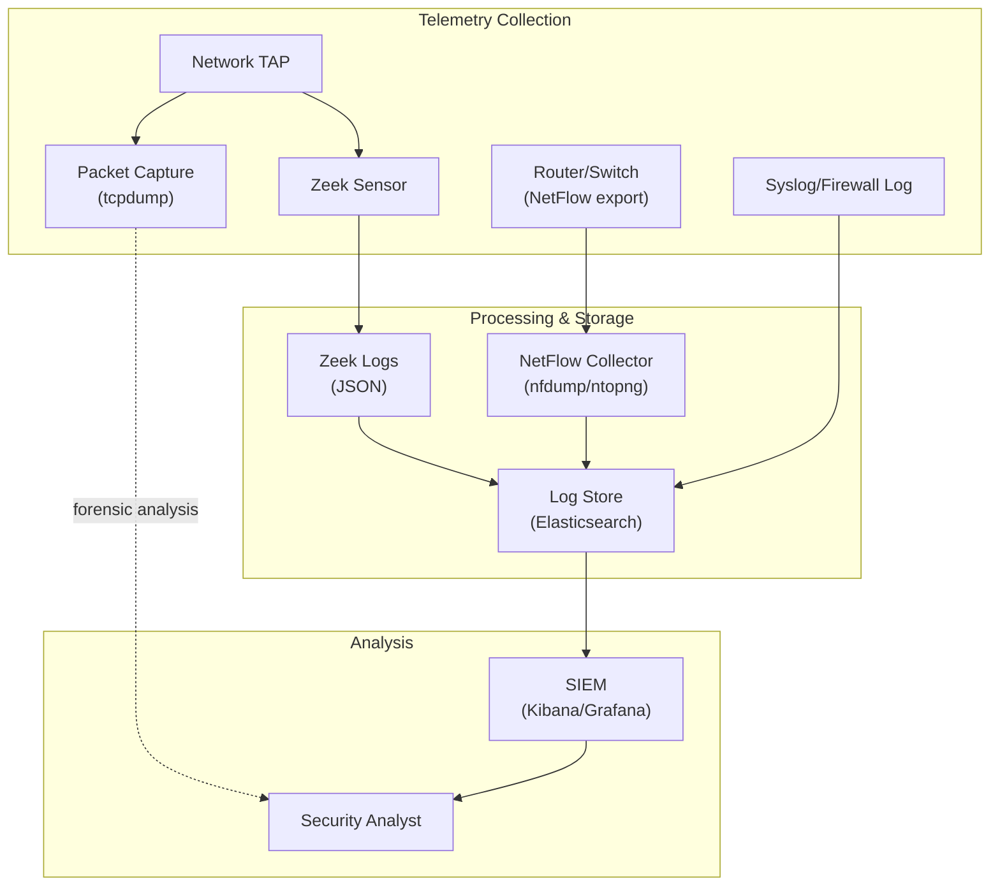

## 6. Contoh Terapan

**Mendeteksi DNS tunneling dengan Zeek:**

DNS tunneling adalah teknik data exfiltration yang menyembunyikan data dalam DNS query. Karakteristik: query DNS yang sangat panjang dan tidak biasa, query ke subdomain yang dalam dan random-looking.

```bash
# Analisis Zeek dns.log untuk deteksi DNS tunneling
# Ciri: query length panjang, banyak subdomain, base32/hex encoding
cat dns.log | zeek-cut ts query qtype_name ttl | \
  awk '{print length($2), $0}' | \
  sort -rn | \
  awk '$1 > 50 {print}' | head 20

# Atau menggunakan Python
python3 - << 'EOF'
import json

suspicious = []
with open('dns.log', 'r') as f:
    for line in f:
        if line.startswith('#'):
            continue
        parts = line.split('\t')
        if len(parts) > 9:
            query = parts[9]  # field query
            if len(query) > 50 or query.count('.') > 4:
                suspicious.append(f"[SUSPICIOUS] Query: {query}")

for s in suspicious[:20]:
    print(s)
EOF
```

## 7. Praktikum atau Aktivitas Terarah

**Tujuan:** Menganalisis network telemetry dari pcap dataset lab menggunakan Zeek dan membangun insight tentang aktivitas jaringan.

**Langkah Kerja:**
1. Jalankan Zeek pada pcap yang disediakan: `zeek -r lab_traffic.pcap`
2. Analisis conn.log: identifikasi top talkers (src IP dengan paling banyak koneksi/byte).
3. Analisis dns.log: cari query yang mencurigakan (panjang, tidak biasa, ke domain baru).
4. Analisis http.log: identifikasi URL yang mencurigakan atau user-agent yang tidak biasa.
5. Analisis tls.log: cek versi TLS dan sertifikat yang digunakan.
6. Korelasikan: jika ada IP mencurigakan di conn.log, cek DNS dan HTTP log untuk IP yang sama.
7. Susun "telemetry dataset report": ringkasan traffic, anomali yang ditemukan, evidence.

**Output:** Telemetry dataset + analysis — bagian dari Eval-4.

## 8. Latihan Pemahaman

1. **(Analisis)** Apa perbedaan antara packet capture dan NetFlow dalam konteks privasi data? Mengapa organisasi di sektor keuangan atau kesehatan harus sangat berhati-hati dalam mengimplementasikan packet capture?

2. **(Evaluasi)** Zeek menghasilkan banyak log terstruktur. Apa keunggulan pendekatan ini dibanding mengandalkan hanya alert dari Suricata/Snort untuk investigasi insiden?

## 9. Latihan Terapan / Studi Kasus

File conn.log Zeek menunjukkan: server internal 192.168.10.50 membuka ribuan koneksi TCP ke port 445 (SMB) ke berbagai host di subnet 192.168.0.0/16 selama 30 menit. Sebelumnya, host yang sama terlihat di http.log mengakses URL yang berisi `invoice.exe`. Analisis: (a) apa yang mungkin terjadi, (b) evidence apa yang sudah ada, (c) langkah investigasi selanjutnya, (d) apa yang dicari di log lain (DNS, firewall, endpoint).

## 10. Kunci Jawaban dan Pembahasan

**Soal 1:** Packet capture menyimpan seluruh payload setiap paket termasuk konten email, form submission, data aplikasi, bahkan password jika tidak terenkripsi. NetFlow hanya menyimpan metadata: siapa berbicara dengan siapa, berapa lama, berapa byte — tidak ada payload. Untuk sektor keuangan/kesehatan: (a) data nasabah/pasien dalam payload dapat menjadi data breach jika capture tidak aman; (b) regulasi (UU PDP, HIPAA) mengatur pemrosesan data pribadi; (c) capture harus memiliki dasar hukum yang jelas, penyimpanan terenkripsi, akses terbatas, dan retention policy yang sesuai. Praktik: gunakan NetFlow untuk monitoring berkelanjutan; full packet capture hanya untuk investigasi insiden yang spesifik dengan otorisasi yang jelas.

**Soal 2:** Keunggulan Zeek: (a) context kaya — bukan hanya "ada serangan" tetapi "URL apa yang diakses, user-agent apa, DNS apa yang di-query sebelumnya"; (b) protocol state tracking — Zeek memahami protokol secara mendalam, bukan hanya pattern match; (c) tidak hanya known threats — Zeek logging semua aktivitas memungkinkan post-hoc analysis untuk unknown threats; (d) timeline reconstruction — dengan conn.log + http.log + dns.log, analis dapat merekonstruksi langkah-langkah attacker secara kronologis; (e) complement IDS — Suricata mendeteksi yang diketahui, Zeek memberikan konteks untuk investigasi.

**Studi Kasus:** (a) Kemungkinan: ransomware atau worm yang mencoba menyebar via SMB (445) — pola lateral movement yang sangat umum (EternalBlue, WannaCry, NotPetya). `invoice.exe` yang didownload adalah dropper/payload awal. (b) Evidence: http.log menunjukkan download `invoice.exe`; conn.log menunjukkan scanning SMB massif dari host yang sama segera setelah download. (c) Langkah selanjutnya: isolasi host 192.168.10.50 dari jaringan segera; ambil memory dump dan disk image; cek apakah hosts lain yang di-scan sudah terinfeksi. (d) Log lain: DNS log — apakah ada query ke C2 domain setelah eksekusi `invoice.exe`; firewall log — apakah ada outbound connection ke IP external yang tidak biasa; endpoint log (jika ada) — process creation log, file system changes.

## 11. Ringkasan Bab

Network telemetry mencakup: packet capture (full payload, untuk forensik), NetFlow/IPFIX (flow metadata, untuk monitoring berkelanjutan), Zeek (structured logs per protokol, untuk deep analysis). Tcpdump dan Wireshark adalah tool utama packet capture. Zeek menghasilkan conn.log, http.log, dns.log, tls.log yang sangat berharga untuk investigasi. Korelasi multi-log memberikan konteks yang tidak bisa diperoleh dari satu sumber saja.

## 12. Refleksi Profesional

1. Full packet capture memberikan visibilitas terlengkap tetapi mengandung data sensitif yang signifikan. Sebagai arsitek keamanan, bagaimana Anda merancang kebijakan network monitoring yang menyeimbangkan kebutuhan visibilitas keamanan dengan perlindungan privasi karyawan dan pelanggan, sesuai dengan UU PDP No. 27/2022?

---

# BAB 9 — ALERT TRIAGE, EVIDENCE PACK, DAN PENANGANAN INSIDEN JARINGAN

## 1. Capaian Pembelajaran Bab

Setelah mempelajari bab ini, mahasiswa mampu:
- Melakukan triage alert IDS secara sistematis
- Membedakan true positive, false positive, dan false negative
- Menyusun evidence pack untuk insiden jaringan
- Memahami alur eskalasi dari alert ke incident response

*Berkaitan dengan Sub-CPMK-4, Eval-4 (20%)*

## 2. Peta Konsep Bab

```mermaid
flowchart TD
    A[Alert Triage] --> B[Proses Triage]
    B --> B1["1. Receive alert:\nIDS/IPS trigger"]
    B --> B2["2. Validate: TP atau FP?\nverifikasi dengan evidence"]
    B --> B3["3. Prioritize: severity,\nasset value, business impact"]
    B --> B4["4. Classify: attack type,\nATT&CK technique"]
    B --> B5["5. Escalate atau Close:\nsesuai prosedur"]
    A --> C[Alert Classification]
    C --> C1["True Positive TP:\nserangan nyata, benar terdeteksi"]
    C --> C2["False Positive FP:\nbukan serangan, salah terdeteksi"]
    C --> C3["True Negative TN:\nbukan serangan, benar tidak dideteksi"]
    C --> C4["False Negative FN:\nserangan nyata, tidak terdeteksi"]
    A --> D[Evidence Pack]
    D --> D1["Alert data: timestamp, src/dst,\nrule ID, severity"]
    D --> D2["Raw evidence: pcap, log,\nZeek log terkait"]
    D --> D3["Timeline: urutan kejadian"]
    D --> D4["Context: aset, user, akun terkait"]
    D --> D5["Analysis: interpretasi dan kesimpulan"]
    A --> E[Eskalasi]
    E --> E1["L1 → L2: analisis lebih dalam"]
    E --> E2["L2 → Incident Response: confirmed incident"]
    E --> E3["Incident Response → Management: high impact"]
```

## 3. Pengantar Kontekstual

Mendapatkan alert dari IDS adalah titik awal, bukan akhir. Alert harus ditriage secara cepat dan akurat — memutuskan apakah ini serangan nyata (true positive) yang memerlukan respons, atau false positive yang dapat diabaikan. Skill alert triage yang buruk dapat berakibat: terlambat merespons insiden nyata (false negative diabaikan) atau "SOC burnout" dari false positive yang berlebihan.

## 4. Landasan Teori

### 4.1 Alert Triage Process

**Langkah 1 — Terima dan baca alert:**
Dari EVE JSON Suricata, baca: timestamp, rule yang trigger, source IP/port, destination IP/port, signature severity, dan protocol.

```json
{
  "timestamp": "2025-01-15T14:32:01.234567+0700",
  "event_type": "alert",
  "src_ip": "192.168.1.100",
  "src_port": 54321,
  "dest_ip": "203.0.113.50",
  "dest_port": 443,
  "proto": "TCP",
  "alert": {
    "action": "allowed",
    "gid": 1,
    "signature_id": 2008517,
    "rev": 7,
    "signature": "ET TROJAN Possible Cobalt Strike Beacon TLS Detected",
    "category": "A Network Trojan was Detected",
    "severity": 1
  }
}
```

**Langkah 2 — Validasi: TP atau FP?**

Pertanyaan validasi:
- Apakah source IP adalah host internal yang dikenal? Fungsinya apa?
- Apakah destination IP/domain adalah yang legitimate (whitelist)?
- Apakah timing dan volume mencurigakan atau normal?
- Apakah ada context lain (Zeek log, DNS log, authentication log) yang mendukung?

**Langkah 3 — Prioritaskan berdasarkan:**
- Severity rule (Critical/High/Medium/Low)
- Nilai aset yang terlibat (server kritikal vs workstation biasa)
- Dampak bisnis potensial jika ini benar-benar serangan
- Confidence level: seberapa yakin ini true positive?

**Langkah 4 — Klasifikasikan menggunakan MITRE ATT&CK:**
Identifikasi teknik ATT&CK yang relevan. Contoh: scanning = T1046 (Network Service Discovery), beacon = T1071 (Application Layer Protocol: Web Protocols), lateral movement via SMB = T1021.002 (Remote Services: SMB/Windows Admin Shares).

### 4.2 Evidence Pack

Evidence pack adalah dokumentasi terstruktur dari semua evidence yang mendukung atau menyangkal kesimpulan tentang alert.

**Komponen Evidence Pack:**

```
EVIDENCE PACK — Alert Triage Report
======================================
Alert ID     : [ID dari SIEM atau manual]
Tanggal/Waktu: 2025-01-15 14:32:01 WIB
Analis       : [Nama]
Severity     : HIGH

1. ALERT DETAIL
   - Rule: ET TROJAN Possible Cobalt Strike Beacon TLS Detected (SID: 2008517)
   - Source: 192.168.1.100:54321
   - Destination: 203.0.113.50:443
   - Protocol: TCP/TLS

2. EVIDENCE
   A. Suricata EVE JSON: [lampirkan raw alert JSON]
   B. Zeek conn.log:
      - 192.168.1.100 → 203.0.113.50:443, duration: 3600s, bytes: 45MB
   C. Zeek dns.log:
      - Query: evil-c2.domain.com → 203.0.113.50 (30 menit sebelum koneksi)
   D. Firewall log:
      - 192.168.1.100 → 203.0.113.50:443 ALLOW (outbound HTTPS diizinkan)
   E. DHCP log:
      - 192.168.1.100 = workstation DESKTOP-XYZ (user: john.doe)

3. ANALISIS
   - Koneksi berlangsung 1 jam dengan 45MB data — tidak biasa untuk HTTPS normal
   - TLS JA3 fingerprint cocok dengan known Cobalt Strike profile
   - DNS query ke domain yang baru terdaftar (30 hari) → mencurigakan
   - Kesimpulan: HIGH CONFIDENCE TRUE POSITIVE

4. KLASIFIKASI ATT&CK
   - T1071.001: C2 via Web Protocols (HTTPS)
   - T1573.002: Encrypted Channel (TLS)

5. REKOMENDASI
   - Immediate: isolasi DESKTOP-XYZ dari jaringan
   - Block IP 203.0.113.50 di firewall
   - Eskalasi ke Incident Response Team
   - Preserve evidence: pcap, memory dump

6. STATUS
   - Eskalasi: Ya → Tim IR [timestamp]
   - Ticket: INC-2025-001
```

### 4.3 False Positive Management

False positive (FP) adalah alert yang dipicu bukan oleh serangan nyata. FP yang tinggi menyebabkan alert fatigue dan mengurangi efektivitas SOC.

**Sumber common false positive:**
- Rule yang terlalu agresif / broad pattern
- Legitimate tools yang menyerupai malware (pentest tools, vulnerability scanner)
- Traffic yang unusual tetapi legitimate (batch backup, software update)
- Misconfigured rule (tidak mempertimbangkan whitelisted traffic)

**Menangani false positive:**
1. **Validate:** Konfirmasi ini memang FP, bukan TP
2. **Document:** Catat mengapa ini FP
3. **Tune rule:** Tambahkan exception, whitelist, atau threshold
4. **Alert suppression:** Suppress rule untuk source/destination tertentu yang diketahui legitimate

```bash
# Suppress alert Suricata untuk source IP yang diketahui (legitimate scanner)
# Tambahkan ke suricata.yaml:
suppress:
  - gen_id: 1
    sig_id: 2008517
    track: by_src
    ip: 192.168.1.200  # IP vulnerability scanner internal
```

## 5. Model atau Arsitektur

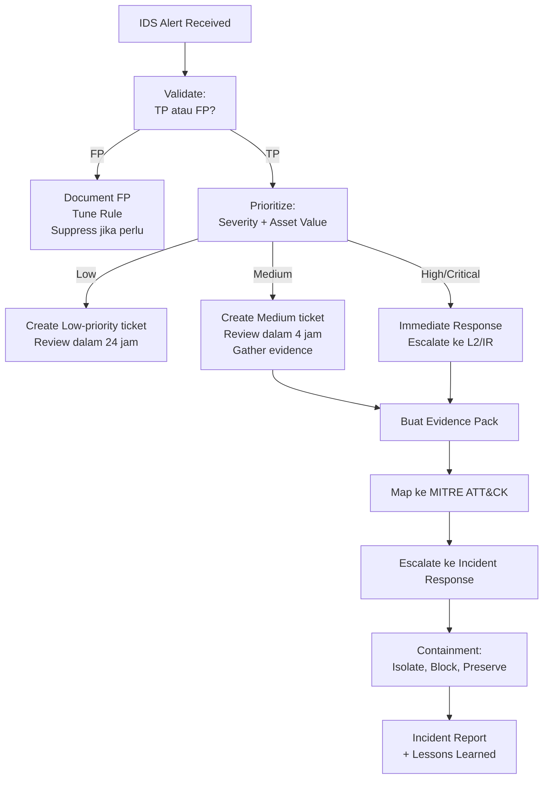

## 6. Contoh Terapan

**Triage alert port scan:**

Alert Suricata: `ET SCAN Nmap Scripting Engine User-Agent Detected` dari IP 192.168.99.50 ke 192.168.10.0/24.

Proses triage:
1. Cek Zeek conn.log: 192.168.99.50 membuka koneksi ke 255 IP berbeda dalam 60 detik — pola scan yang jelas.
2. Cek DHCP: 192.168.99.50 adalah VM yang baru bergabung ke jaringan 2 jam lalu (asset tidak dikenal).
3. Cek firewall log: tidak ada blokir, VM baru di network segment internal.
4. Kesimpulan: KEMUNGKINAN TP — bisa reconnaissance setelah initial access, atau VM pentest yang tidak terdaftar.
5. Aksi: hubungi network team untuk identifikasi pemilik VM; jika tidak dikenal, isolasi dan investigasi.

## 7. Praktikum atau Aktivitas Terarah

**Tujuan:** Melakukan alert triage dari EVE JSON Suricata dan menyusun evidence pack.

**Langkah Kerja:**
1. Dosen menyediakan EVE JSON dari Suricata (berisi campuran TP dan FP).
2. Baca dan pilah alert berdasarkan severity.
3. Untuk 3 alert pilihan: lakukan triage lengkap — validasi TP/FP menggunakan Zeek log yang tersedia, prioritaskan, klasifikasikan ATT&CK.
4. Buat evidence pack untuk 1 alert TP yang paling signifikan.
5. Untuk 1 FP: dokumentasikan mengapa ini FP dan tuning rule yang direkomendasikan.

**Output:** Alert triage report + evidence pack — bagian dari Eval-4.

## 8. Latihan Pemahaman

1. **(Analisis)** Apa perbedaan antara false positive dan false negative dalam konteks IDS/IPS? Mana yang lebih berbahaya dalam konteks keamanan, dan mengapa?

2. **(Evaluasi)** Sebuah tim SOC menerima rata-rata 5.000 alert per hari dari Suricata. 4.800 di antaranya adalah false positive (96%). Apa dampak operasional dari situasi ini dan bagaimana Anda merekomendasikan perbaikan?

## 9. Latihan Terapan / Studi Kasus

EVE JSON Suricata menampilkan alert berikut pada pukul 03:30 pagi: source IP 10.0.50.25 (server database produksi), destination 185.220.101.47 (Tor exit node, bukan destination internal), port 9001, protocol TCP, rule: "ET TOR Known Tor Exit Node Traffic". Tidak ada aktivitas maintenance yang dijadwalkan di jam tersebut. Lakukan triage lengkap: validasi, prioritasi, ATT&CK classification, dan buat evidence pack dengan rekomendasi tindakan.

## 10. Kunci Jawaban dan Pembahasan

**Soal 1:** False Positive: IDS alert untuk aktivitas yang sebenarnya tidak berbahaya. Dampak: alert fatigue, waste analist time. False Negative: serangan nyata yang tidak terdeteksi oleh IDS. Dampak: insiden tidak terdeteksi, attacker bebas beroperasi. Dalam konteks keamanan, false negative lebih berbahaya: serangan yang lolos tidak terdeteksi berarti dampak keamanan nyata. False positive "hanya" membuang waktu analis. Namun, false positive yang terlalu banyak secara tidak langsung membahayakan karena menyebabkan analis mengabaikan alert (alert fatigue), yang pada akhirnya meningkatkan kemungkinan true positive terlewat.

**Soal 2:** Dampak: (a) analis menghabiskan waktu untuk investigate 200 true positive di antara 5.000 alert — efisiensi sangat rendah; (b) alert fatigue: analis mulai auto-close atau tidak investigate semua alert; (c) true positive bisa terlewat karena volume yang besar. Rekomendasi perbaikan: (a) tuning rules: disable atau suppress rules yang menghasilkan FP tinggi; (b) whitelisting: tambahkan exception untuk traffic legitimate yang diketahui; (c) threat intelligence enrichment: auto-enrich dengan threat intel untuk pre-triage; (d) SIEM correlation: buat correlation rules yang hanya alert jika multiple indicators ada bersama; (e) security orchestration: SOAR untuk auto-close low-risk FP.

**Studi Kasus:** Validasi: server database mengoneksi ke Tor exit node pada jam 03:30 — sangat anomali, tidak ada justifikasi bisnis. Database server tidak seharusnya punya akses outbound ke Tor. Severity: CRITICAL — database server yang berkomunikasi dengan Tor biasanya mengindikasikan: data exfiltration via Tor, ransomware C2 communication, atau backdoor yang sudah lama ada dan baru diaktifkan. ATT&CK: T1048 (Exfiltration Over Alternative Protocol), T1090.003 (Proxy: Multi-hop Proxy), T1071 (C2 via Application Layer). Evidence Pack: alert JSON + Zeek conn.log (berapa lama, berapa byte?) + firewall log (kapan pertama kali koneksi terjadi?) + database log (apakah ada query besar sebelum koneksi Tor?) + authentication log (siapa yang login ke server sebelumnya?). Tindakan immediate: (a) isolasi server dari jaringan segera (preserve evidence sambil menghentikan exfiltration); (b) block IP 185.220.101.47 di seluruh perimeter; (c) eskalasi ke CISO dan IR team dengan status Critical; (d) preserve: memory dump, disk image sebelum isolasi jika memungkinkan.

## 11. Ringkasan Bab

Alert triage adalah proses: terima → validasi TP/FP → prioritaskan → klasifikasikan ATT&CK → eskalasikan. Evidence pack mendokumentasikan semua evidence yang mendukung kesimpulan: alert raw data, Zeek log, firewall log, DHCP/attribution, timeline, dan rekomendasi. False positive harus di-tune untuk mengurangi noise; false negative adalah risiko nyata keamanan. Korelasi multi-source evidence adalah kunci untuk triage yang akurat.

## 12. Refleksi Profesional

1. Dalam investigasi insiden yang melibatkan data exfiltration melalui jaringan perusahaan, bukti yang dikumpulkan dari network telemetry (pcap, Zeek log, NetFlow) mungkin diperlukan dalam proses hukum. Bagaimana Anda memastikan bahwa evidence yang dikumpulkan memenuhi standar *chain of custody* dan *forensic integrity* agar dapat diterima sebagai bukti hukum?


---

# BAB 10 — DETECTION ENGINEERING: RULE QUALITY, FP/FN, COVERAGE, DAN NOISE REDUCTION

## 1. Capaian Pembelajaran Bab

Setelah mempelajari bab ini, mahasiswa mampu:
- Mengevaluasi kualitas rule IDS berdasarkan metrik yang terukur
- Melakukan tuning rule untuk mengurangi false positive tanpa meningkatkan false negative
- Menggunakan MITRE ATT&CK untuk mapping coverage rule
- Menerapkan teknik noise reduction dalam environment IDS

*Berkaitan dengan Sub-CPMK-5, Eval-5 (15%)*

## 2. Peta Konsep Bab

```mermaid
flowchart TD
    A[Detection Engineering] --> B[Rule Quality Metrics]
    B --> B1["Precision: TP / TP+FP\nberapa persen alert adalah benar?"]
    B --> B2["Recall/Sensitivity: TP / TP+FN\nberapa persen serangan terdeteksi?"]
    B --> B3["F1 Score: harmonic mean\nprecision dan recall"]
    B --> B4["Coverage: berapa ATT&CK technique\nyang dicakup?"]
    A --> C[Tuning Process]
    C --> C1["Collect baseline: normal traffic\ndalam environment Anda"]
    C --> C2["Identify FP patterns:\napa yang trigger secara tidak benar?"]
    C --> C3["Refine rule: tambah context,\nthreshold, whitelist"]
    C --> C4["Test: verifikasi FP turun\ntanpa kehilangan TP"]
    A --> D[Noise Reduction Techniques]
    D --> D1["Threshold: alert hanya setelah\nN events dalam X detik"]
    D --> D2["Whitelist: suppress untuk\nknown-good source/destination"]
    D --> D3["Enrichment: tambah context\nuntuk auto-triage"]
    D --> D4["Aggregation: group alert yang\nrelated menjadi satu incident"]
    A --> E[ATT&CK Coverage Mapping]
    E --> E1["Map rules ke ATT&CK technique"]
    E --> E2["Identifikasi gap: technique\nyang tidak ada rule-nya"]
    E --> E3["Prioritaskan: coverage\nuntuk high-priority techniques"]
```

## 3. Pengantar Kontekstual

Detection engineering adalah disiplin yang mengubah threat intelligence dan knowledge tentang adversary behavior menjadi deteksi yang efektif dan efisien. Rule yang ditulis tanpa mempertimbangkan environment spesifik, baseline traffic, dan konteks bisnis akan menghasilkan FP yang tinggi dan SOC yang overwhelmed. Bab ini memberikan kerangka kerja untuk evaluasi dan improvement berkelanjutan.

## 4. Landasan Teori

### 4.1 Metrik Kualitas Deteksi

**Confusion Matrix untuk IDS:**

| | Prediksi: Attack | Prediksi: Normal |
|---|---|---|
| **Realita: Attack** | True Positive (TP) | False Negative (FN) |
| **Realita: Normal** | False Positive (FP) | True Negative (TN) |

**Metrik turunan:**
- **Precision (Positive Predictive Value):** `TP / (TP + FP)` — Berapa persen alert yang dihasilkan adalah serangan nyata?
- **Recall (Sensitivity/TPR):** `TP / (TP + FN)` — Berapa persen serangan nyata berhasil terdeteksi?
- **False Positive Rate:** `FP / (FP + TN)` — Berapa persen traffic normal yang salah ditetapkan sebagai serangan?
- **False Negative Rate:** `FN / (FN + TP)` — Berapa persen serangan yang tidak terdeteksi?
- **F1 Score:** `2 × (Precision × Recall) / (Precision + Recall)` — Harmonic mean antara precision dan recall.

**Target realistis:**
Tidak ada target yang universal. Untuk environment dengan traffic tinggi, Precision > 50% dengan Recall > 90% adalah target yang baik sebagai awal. Tingkatkan Precision melalui tuning tanpa mengorbankan Recall.

### 4.2 Baseline Traffic dan Tuning

**Pentingnya baseline:**
Rule yang berfungsi di environment A mungkin menghasilkan ribuan FP di environment B karena traffic "normal" berbeda. Contoh: rule yang mendeteksi SSH bruteforce berdasarkan "lebih dari 5 gagal login dari satu IP" mungkin FP di environment dengan pentest scanner internal.

**Proses tuning:**

1. **Profiling normal traffic:**
   - Identifikasi range IP internal yang diketahui
   - Identifikasi aplikasi dan port yang legitimate
   - Identifikasi peak traffic hours vs off-hours
   - Identifikasi tools yang digunakan tim IT (vulnerability scanner, monitoring agent)

2. **Analisis FP:**
   - Kumpulkan alert selama 1-2 minggu
   - Untuk setiap rule yang high-FP: apa yang trigger rule ini?
   - Apakah trigger bisa dibedakan dari serangan nyata?

3. **Teknik tuning rule:**
   ```
   # Tambahkan threshold untuk reduce noise
   threshold: type both, track by_src, count 10, seconds 60
   
   # Tambahkan context untuk reduce FP (misal: hanya alert di business hours untuk certain rules)
   # Tambahkan whitelist source IP yang diketahui legitimate
   
   # Tambahkan filter konten yang lebih spesifik
   content:"union select"; # lebih spesifik dari hanya "select"
   ```

### 4.3 MITRE ATT&CK Coverage Mapping

MITRE ATT&CK adalah knowledge base tentang taktik dan teknik yang digunakan adversary. Menggunakan ATT&CK untuk memetakan coverage rule membantu mengidentifikasi gap.

**14 Taktik ATT&CK (Enterprise Matrix):**
TA0001 Initial Access → TA0002 Execution → TA0003 Persistence → TA0004 Privilege Escalation → TA0005 Defense Evasion → TA0006 Credential Access → TA0007 Discovery → TA0008 Lateral Movement → TA0009 Collection → TA0010 Exfiltration → TA0011 Command and Control → TA0040 Impact → TA0042 Resource Development → TA0043 Reconnaissance

**Coverage gap analysis untuk network IDS:**
Network IDS memiliki visibilitas terbatas terhadap beberapa taktik. Teknik yang lebih baik terdeteksi network IDS:
- T1046 Network Service Discovery (scanning)
- T1071 Application Layer Protocol (C2 via HTTP/DNS)
- T1048 Exfiltration Over Alternative Protocol
- T1021 Remote Services (lateral movement via SMB/RDP)
- T1557 MITM attacks

Teknik yang sulit terdeteksi network IDS:
- T1059 Command Line Execution (hanya terlihat jika traffic di-capture)
- T1053 Scheduled Task (endpoint-level)
- T1078 Valid Accounts (legitimate credential, sulit dibedakan dari normal)

**ATT&CK Navigator:**
Tool dari MITRE untuk visualisasi coverage. Masukkan teknik yang rule Anda cover, dan identifikasi blank spots secara visual.

### 4.4 Noise Reduction Strategies

**Threshold-based suppression:**
Daripada alert setiap event, alert hanya setelah threshold tercapai.
```
# Suricata: hanya alert setelah 10 events dari src yang sama dalam 60 detik
threshold: type both, track by_src, count 10, seconds 60
```

**Whitelist/Allowlist:**
```yaml
# suricata.yaml: suppress alert untuk legitimate scanner
suppress:
  - gen_id: 1
    sig_id: 2000001  # SID rule scanning
    track: by_src
    ip: 10.0.99.50   # internal vulnerability scanner
```

**Aggregation dan correlation:**
Jangan treat setiap alert sebagai incident terpisah. Group alert yang terkait:
- Multiple alerts dari source IP yang sama dalam 1 jam → satu incident
- Alert scanning + alert bruteforce + alert exploit dari IP yang sama → campaign

**Threat Intelligence enrichment:**
Enrich alert dengan context otomatis:
- Apakah source IP ada dalam threat intelligence feed?
- Apakah domain yang di-query ada di blocklist?
- Apakah pola ini match dengan known malware family?

## 5. Model atau Arsitektur

```mermaid
flowchart TD
    subgraph DETECT_ENG["Detection Engineering Lifecycle"]
        THREAT_INTEL["Threat Intelligence\n+ ATT&CK Framework"]
        RULE_DEV["Rule Development\n+ Testing Lab"]
        STAGING["Staging Deployment\n(monitor dan collect FP/FN data)"]
        METRICS["Metrics Calculation\nPrecision, Recall, Coverage"]
        TUNING["Tuning:\nThreshold, Whitelist, Refine"]
        PROD["Production Deployment"]
        REVIEW["Periodic Review\n(monthly/quarterly)"]

        THREAT_INTEL --> RULE_DEV
        RULE_DEV --> STAGING
        STAGING --> METRICS
        METRICS --> TUNING
        TUNING --> STAGING
        TUNING --> PROD
        PROD --> REVIEW
        REVIEW --> RULE_DEV
    end
```

## 6. Contoh Terapan

**Evaluasi rule dengan data historis:**

```python
"""Hitung precision dan recall dari EVE JSON historis"""
import json
from collections import defaultdict

# Load labeled data (manual triage sebelumnya)
# Format: {"signature_id": SID, "verdict": "TP"/"FP"}
labeled = {
    2008517: [],  # akan diisi
}

alerts_by_sid = defaultdict(list)

with open('eve.json', 'r') as f:
    for line in f:
        try:
            event = json.loads(line)
            if event.get('event_type') == 'alert':
                sid = event['alert']['signature_id']
                # Asumsikan labeled data tersedia
                alerts_by_sid[sid].append(event)
        except:
            pass

# Untuk setiap SID, hitung metrik
for sid, events in alerts_by_sid.items():
    total = len(events)
    # Dalam praktik: gunakan verdict dari triage history
    print(f"SID {sid}: {total} alerts")
```

## 7. Praktikum atau Aktivitas Terarah

**Tujuan:** Mengevaluasi kualitas rule Suricata dari dataset alert historis dan melakukan tuning.

**Langkah Kerja:**
1. Dataset: EVE JSON dari lab sebelumnya (Bab 7) + label TP/FP dari triage (Bab 9).
2. Hitung precision dan recall per rule (SID) menggunakan Python.
3. Identifikasi 3 rule dengan precision terendah (FP tinggi).
4. Analisis mengapa rule-rule tersebut menghasilkan FP.
5. Rekomendasikan tuning: threshold, whitelist, atau refinement rule.
6. Map semua rule yang ada ke MITRE ATT&CK technique.
7. Identifikasi gap: ATT&CK technique apa yang tidak ada coverage-nya?

**Output:** Detection quality analysis — bagian dari Eval-5.

## 8. Latihan Pemahaman

1. **(Analisis)** Dalam konteks IDS, mengapa meningkatkan precision (mengurangi FP) sering kali berisiko menurunkan recall (meningkatkan FN)? Bagaimana cara meminimalkan trade-off ini?

2. **(Evaluasi)** Tim Anda ingin menerapkan threshold "alert hanya setelah 100 events dari src yang sama dalam 60 detik" untuk semua scanning rules. Apa keuntungan dan risiko dari kebijakan ini?

## 9. Latihan Terapan / Studi Kasus

Dari 30 hari data, rule "ET SCAN Nmap Scripting Engine" (SID 2009557) menghasilkan 1.500 alerts. Setelah triage: 50 TP (legitimate nmap dari security scanner internal yang tidak terdaftar + dari attacker yang menggunakan nmap), 1.450 FP (IT team melakukan network discovery menggunakan nmap). Hitung: precision, recall (asumsikan scan total yang terjadi = 60), F1. Rekomendasikan tuning yang tepat dan justifikasikan.

## 10. Kunci Jawaban dan Pembahasan

**Soal 1:** Trade-off precision-recall: rule yang lebih ketat (spesifik) meningkatkan precision (lebih sedikit FP) tetapi mungkin melewatkan variasi serangan (meningkatkan FN, menurunkan recall). Contoh: membuat rule yang lebih spesifik "SQL injection dengan kata `union select`" — FP berkurang karena banyak kata `select` legitimate di-filter, tetapi attacker yang menggunakan obfuscation (`uni||on se||lect`) lolos dari rule tersebut. Cara meminimalkan trade-off: (a) gunakan multiple rules yang komplementer — rule umum dengan threshold tinggi (recall) + rule spesifik tanpa threshold (precision); (b) enrich dengan context — alert tidak hanya berdasarkan konten tapi juga source/destination context; (c) behavioral rules — bukan hanya signature tapi pola perilaku yang lebih susah untuk di-evade.

**Soal 2:** Keuntungan threshold 100/60s: sangat mengurangi FP dari normal network discovery tools; mengurangi volume alert secara signifikan. Risiko: (a) attacker yang melakukan slow scan (99 paket per 60 detik) tidak akan terdeteksi oleh rule ini — detection bypass melalui rate reduction; (b) targeted scan ke satu host tidak akan mencapai threshold 100; (c) initial access attempts yang menggunakan satu probe tidak terdeteksi. Rekomendasi: gunakan threshold berbeda berdasarkan severity — scan yang sangat agresif (100+/60s) → threshold 100; scan medium (20+/60s) → threshold yang lebih rendah dengan severity medium; single-host targeted probe → alert langsung jika ke server kritikal.

**Studi Kasus:** Perhitungan: TP=50, FP=1450, Asumsikan TN=besar, FN= Total scan - TP = 60-50=10. Precision = TP/(TP+FP) = 50/1500 = 3.3% — sangat rendah. Recall = TP/(TP+FN) = 50/60 = 83.3% — cukup baik. F1 = 2 × (0.033 × 0.833)/(0.033+0.833) = 2 × 0.0275/0.866 = 6.4%. Tuning: (a) whitelist IP IT team yang menggunakan nmap untuk legitimate discovery; dokumentasikan dan daftarkan semua scanning tools ke asset inventory; (b) tambahkan exception untuk source IP yang diketahui — scanner internal; (c) tuning threshold untuk scan dari IP external lebih agresif. Target setelah tuning: FP turun ke ~50 (hanya non-whitelisted), precision menjadi ~50%. Perlu review berkala untuk memastikan IP IT team terupdate di whitelist.

## 11. Ringkasan Bab

Kualitas rule IDS diukur dengan Precision (TP/TP+FP) dan Recall (TP/TP+FN). Tuning rule mencakup: threshold, whitelist, refinement konten, dan aggregation. MITRE ATT&CK digunakan untuk memetakan coverage dan mengidentifikasi gap. Noise reduction melalui threshold dan whitelisting harus menyeimbangkan FP reduction dengan risiko meningkatnya FN.

## 12. Refleksi Profesional

1. Detection engineering adalah proses berkelanjutan — rule yang efektif hari ini mungkin tidak efektif lagi saat adversary mengubah teknik mereka (ATT&CK technique evolves). Bagaimana Anda membangun proses yang memastikan ruleset IDS Anda tetap efektif seiring waktu, terutama ketika adversary menggunakan teknik yang belum pernah terlihat sebelumnya?

---

# BAB 11 — PERFORMANCE METRICS, MITRE ATT&CK MAPPING, DAN RECOMMENDATION MEMO

## 1. Capaian Pembelajaran Bab

Setelah mempelajari bab ini, mahasiswa mampu:
- Mengukur dan menginterpretasikan metrik performansi kontrol jaringan (throughput, latency, scalability)
- Memetakan coverage deteksi ke MITRE ATT&CK secara sistematis
- Mengevaluasi dampak operasional IDS/IPS terhadap layanan jaringan
- Menyusun recommendation memo berbasis data yang dapat ditindaklanjuti

*Berkaitan dengan Sub-CPMK-5, Eval-5 (15%)*

## 2. Peta Konsep Bab

```mermaid
flowchart TD
    A[Evaluasi Kontrol Jaringan] --> B[Performance Metrics]
    B --> B1["Throughput: MB/s atau Gbps\nyang dapat diproses IDS/IPS"]
    B --> B2["Latency: tambahan delay\nyang diperkenalkan IPS inline"]
    B --> B3["Packet Loss: persentase paket\nyang drop saat high load"]
    B --> B4["Scalability: perilaku\nsaat traffic meningkat"]
    B --> B5["Operational Impact: dampak\nterhadap legitimate service"]
    A --> C[ATT&CK Coverage Assessment]
    C --> C1["Technique Mapping:\nrule → ATT&CK TID"]
    C --> C2["Coverage Score:\nberapa % dari high-priority\ntechnique ter-cover?"]
    C --> C3["Gap Analysis:\ntechnique tanpa coverage"]
    C --> C4["Compensating Controls:\nkontrol lain untuk gap"]
    A --> D[Recommendation Memo]
    D --> D1["Executive Summary:\nrisiko, temuan, dampak bisnis"]
    D --> D2["Technical Findings:\ndata-driven, terukur"]
    D --> D3["Prioritized Recommendations:\nberurutan berdasarkan risk"]
    D --> D4["Implementation Roadmap:\ntimeline realistis"]
    D --> D5["Residual Risk:\napakah acceptable?"]
```

## 3. Pengantar Kontekstual

Keamanan tanpa performa adalah tidak berguna — IPS yang memblokir semua traffic untuk mencegah serangan tidak lebih baik dari mematikan koneksi internet. Evaluasi kontrol jaringan harus mencakup dimensi keamanan dan performa secara seimbang. Bab ini juga mengajarkan cara menyampaikan hasil evaluasi teknis kepada stakeholder dalam format yang dapat dipahami dan ditindaklanjuti.

## 4. Landasan Teori

### 4.1 Metrik Performansi IDS/IPS

**Throughput:**
Kapasitas maksimal traffic yang dapat diproses IDS/IPS tanpa kehilangan paket atau meningkatkan latency secara signifikan.

```bash
# Benchmark throughput Suricata menggunakan iperf3
# Di server:
iperf3 -s

# Di client, kirim traffic melalui Suricata:
iperf3 -c server -t 60 -b 1G  # Test 1 Gbps selama 60 detik

# Monitor Suricata performance
cat /var/log/suricata/stats.log | grep -E "decoder|detect|capture.kernel.drops"
# capture.kernel.drops > 0 berarti Suricata tidak bisa mengikuti traffic rate
```

**Latency (untuk IPS inline):**
Tambahan delay yang diperkenalkan oleh IPS dalam jalur traffic. Acceptable threshold biasanya < 1ms untuk traffic regular.

```bash
# Ukur latency sebelum dan sesudah IPS
# Dari client ke server, dengan IPS bypass:
ping -c 100 server.internal  # catat rata-rata

# Dengan IPS inline:
ping -c 100 server.internal  # bandingkan

# Untuk pengukuran lebih presisi: hping3
hping3 -S -p 80 -c 1000 server.internal
```

**Packet Loss:**
Persentase paket yang di-drop saat traffic tinggi. Untuk IDS passive, packet drop berarti blind spot. Untuk IPS inline dengan fail-open hardware, drop berarti traffic masuk tanpa inspeksi.

**Scalability:**
Bagaimana performansi berubah saat load meningkat. Suricata yang dikonfigurasi dengan baik harus scale linear dengan penambahan CPU core.

### 4.2 Dampak Operasional

IPS inline dapat secara tidak sengaja memblokir traffic legitimate (false positive dalam konteks IPS = layanan terblokir). Evaluasi dampak operasional:

1. **Service availability:** Apakah layanan kritikal pernah terblokir karena FP?
2. **Application latency:** Apakah ada degradasi performa aplikasi?
3. **Alert noise to SOC:** Berapa banyak waktu analis yang dihabiskan untuk FP?
4. **Maintenance overhead:** Seberapa sulit mempertahankan ruleset yang up-to-date?

### 4.3 MITRE ATT&CK Coverage Assessment

**Cara melakukan ATT&CK coverage mapping:**

1. Buat daftar semua rule aktif dengan SID dan nama.
2. Untuk setiap rule, identifikasi ATT&CK technique yang dicakup.
3. Buat tabel coverage: Technique ID, Technique Name, Coverage (Ya/Tidak/Sebagian), Rule SID.
4. Hitung coverage score: jumlah technique yang ter-cover / total technique yang relevan untuk scope Anda.

**Fokus pada high-priority techniques:**
Tidak perlu menarget 100% ATT&CK coverage. Prioritaskan techniques yang paling sering digunakan oleh adversary yang relevan untuk industri Anda. Gunakan ATT&CK Groups untuk melihat techniques yang digunakan oleh APT yang menargetkan sektor Anda.

**Contoh partial mapping:**

| ATT&CK TID | Technique | Network IDS Coverage | Rule SID |
|---|---|---|---|
| T1046 | Network Service Discovery | Ya | 2009557, 2010936 |
| T1071.001 | Web Protocols (C2) | Sebagian | 2008517, 2018959 |
| T1048 | Exfiltration Alt Protocol | Sebagian | DNS tunneling rules |
| T1059 | Command and Scripting | Tidak | Endpoint detection needed |
| T1078 | Valid Accounts | Tidak | Behavioral analytics needed |

### 4.4 Menyusun Recommendation Memo

Recommendation memo adalah dokumen yang menyampaikan hasil evaluasi kepada decision-maker (CISO, IT Manager, atau management). Harus: berbasis data, jelas, dapat ditindaklanjuti, dan memiliki prioritas yang jelas.

**Template Recommendation Memo:**

```
MEMORANDUM TEKNIS KEAMANAN JARINGAN
=========================================
Kepada   : [Nama CISO/Manager]
Dari     : [Nama Analis/Tim]
Tanggal  : [Tanggal]
Perihal  : Evaluasi IDS/IPS dan Rekomendasi Peningkatan

RINGKASAN EKSEKUTIF
-------------------
[3-4 kalimat: apa yang dievaluasi, temuan utama, rekomendasi kritis]

Risiko utama yang teridentifikasi: [kalimat singkat tentang gap coverage]

TEMUAN TEKNIS
-------------
1. Performansi IDS/IPS
   - Throughput saat ini: X Gbps (kapasitas: Y Gbps) → [green/yellow/red]
   - Latency (IPS inline): X ms → [acceptable/not acceptable]
   - Packet loss rate: X% → [acceptable/not acceptable]

2. Detection Coverage
   - ATT&CK techniques ter-cover: X dari Y yang diprioritaskan (Z%)
   - Gap kritis: [list technique tanpa coverage]

3. Rule Quality
   - Average precision: X%
   - Top FP generators: [list rules]

REKOMENDASI PRIORITAS
---------------------
PRIORITAS 1 (Segera, < 30 hari):
  [Temuan Critical + langkah konkret + estimasi effort]

PRIORITAS 2 (Jangka Pendek, 30-90 hari):
  [Temuan High + langkah konkret]

PRIORITAS 3 (Jangka Menengah, 90-180 hari):
  [Temuan Medium + langkah konkret]

RISIKO RESIDU
-------------
Setelah implementasi semua rekomendasi, risiko residu yang tersisa:
- ATT&CK technique yang tidak dapat dicover oleh network IDS → diperlukan endpoint EDR
- Encrypted traffic yang tidak dapat diinspeksi → pertimbangkan SSL inspection

LAMPIRAN
--------
A. Detail metrik performansi
B. ATT&CK coverage heatmap
C. Rule quality per-SID
```

## 5. Model atau Arsitektur

```mermaid
flowchart TD
    subgraph EVAL["Evaluation Framework"]
        INPUT["Traffic Sample\n+ Labeled Dataset\n+ Environment Specs"]
        PERF_TEST["Performance Testing:\nthroghput, latency,\npacket loss"]
        DET_TEST["Detection Testing:\nTP, FP, FN per rule"]
        ATTCK_MAP["ATT&CK Mapping:\ncoverage assessment"]
        OPS_IMPACT["Operational Impact:\nservice availability,\nSOC workload"]
        METRICS["Consolidated Metrics"]
        RECOMMENDATIONS["Risk-based Recommendations"]
        MEMO["Recommendation Memo"]

        INPUT --> PERF_TEST
        INPUT --> DET_TEST
        DET_TEST --> ATTCK_MAP
        DET_TEST --> OPS_IMPACT
        PERF_TEST --> METRICS
        ATTCK_MAP --> METRICS
        OPS_IMPACT --> METRICS
        METRICS --> RECOMMENDATIONS
        RECOMMENDATIONS --> MEMO
    end
```

## 6. Contoh Terapan

**Melakukan ATT&CK coverage assessment dengan Python:**

```python
import json
from collections import defaultdict

# Mapping SID ke ATT&CK technique (dari rule metadata atau manual tagging)
sid_to_attack = {
    2009557: ["T1046"],        # Network Service Discovery
    2008517: ["T1071.001"],    # C2 via Web Protocols
    2018959: ["T1071.001"],    # C2 via Web Protocols (variant)
    9000001: ["T1059"],        # scripting (custom rule)
    9000002: ["T1048.001"],    # Exfiltration via ICMP tunnel
}

# ATT&CK techniques yang diprioritaskan untuk scope
priority_techniques = {
    "T1046": "Network Service Discovery",
    "T1071.001": "Application Layer Protocol: Web Protocols",
    "T1048": "Exfiltration Over Alternative Protocol",
    "T1059": "Command and Scripting Interpreter",
    "T1021.002": "Remote Services: SMB/Windows Admin Shares",
    "T1078": "Valid Accounts",
    "T1110": "Brute Force",
    "T1557": "Man-in-the-Middle",
}

# Hitung coverage
covered = set()
for sids, techniques in sid_to_attack.items():
    covered.update(techniques)

covered_priority = {t for t in covered if t in priority_techniques}
coverage_score = len(covered_priority) / len(priority_techniques) * 100

print(f"Coverage Score: {coverage_score:.1f}%")
print(f"Covered: {covered_priority}")
print(f"Gap: {set(priority_techniques.keys()) - covered_priority}")
```

## 7. Praktikum atau Aktivitas Terarah

**Tujuan:** Melakukan evaluasi komprehensif kontrol jaringan dan menyusun recommendation memo.

**Langkah Kerja:**
1. Lakukan benchmark throughput Suricata pada VM lab (gunakan iperf3 atau dataset pcap yang diputar ulang).
2. Ukur latency sebelum dan sesudah Suricata (ping test).
3. Buat ATT&CK coverage matrix dari rules yang aktif.
4. Hitung detection metrics (precision, recall) dari data lab sebelumnya.
5. Identifikasi: 3 gaps coverage terbesar dan 3 opportunities untuk improvement performa.
6. Susun recommendation memo yang ditujukan kepada CISO fiktif perusahaan.

**Output:** Metrics report + recommendation memo — ini adalah Eval-5.

## 8. Latihan Pemahaman

1. **(Analisis)** Throughput Suricata di lingkungan lab menunjukkan 1.2 Gbps, sementara link internet organisasi adalah 10 Gbps. Apa implikasinya dan apa solusi yang dapat dipertimbangkan?

2. **(Evaluasi)** ATT&CK coverage score organisasi Anda adalah 40% dari techniques yang diprioritaskan. Apakah ini berarti organisasi Anda tidak aman untuk 60% sisanya? Jelaskan mengapa.

## 9. Latihan Terapan / Studi Kasus

Setelah evaluasi 90 hari deployment Suricata di perimeter organisasi (1 Gbps link), data menunjukkan: rata-rata 3.000 alert/hari (2.700 FP = 90%), throughput 800 Mbps (link utilization biasanya 400 Mbps = 40%), ATT&CK coverage 35% dari 20 priority techniques, 3 insiden terdeteksi benar selama 90 hari. Susun recommendation memo yang mencakup: assessment status saat ini, temuan utama, rekomendasi prioritas 30/60/90 hari, dan risiko residu.

## 10. Kunci Jawaban dan Pembahasan

**Soal 1:** Implikasi: Suricata dengan kapasitas 1.2 Gbps pada link 10 Gbps berarti — jika traffic mencapai > 1.2 Gbps, Suricata akan mulai drop packet, menciptakan blind spot. Pada 10 Gbps yang penuh, hanya 12% traffic yang terinspeksi. Solusi: (a) upgrade hardware dengan dukungan AES-NI dan lebih banyak core; (b) Suricata multi-threading yang lebih agresif dengan AF_PACKET dengan balancing yang lebih baik; (c) distributed deployment: multiple Suricata instance dengan load balancer; (d) hardware acceleration: SmartNIC yang melakukan pre-filtering sebelum packet ke Suricata; (e) sample-based inspection: tidak inspect semua traffic, tapi sample tertentu + full inspect untuk traffic ke/dari kritikal server.

**Soal 2:** Coverage 40% tidak berarti "tidak aman untuk 60% sisanya." Alasan: (a) banyak ATT&CK techniques yang tidak terdeteksi di network level bisa terdeteksi di endpoint (EDR); (b) beberapa techniques memerlukan context yang hanya tersedia di endpoint (misalnya T1059 Command Scripting hanya terlihat di endpoint process log); (c) defense-in-depth: network IDS bukan satu-satunya kontrol; (d) compensating controls lain (autentikasi kuat, patch management, least privilege) mitigasi technique yang tidak ter-cover oleh IDS. Yang penting: identifikasi gap, pahami compensating controls untuk setiap gap, dan terima residual risk secara sadar.

**Studi Kasus Recommendation Memo (ringkasan):** Status: deployment Suricata operasional dengan kapasitas memadai (800 Mbps throughput saat peak 400 Mbps). Masalah utama: precision 10% (FP sangat tinggi), ATT&CK coverage 35%. 3 TP dalam 90 hari = 1 per bulan — mungkin lebih banyak yang terlewat (FN). Rekomendasi 30 hari: tuning rules kritis untuk mengurangi FP dari 2.700/hari ke < 500/hari (target precision 50%+); buat whitelist untuk IT tools dan vulnerability scanner internal. 60 hari: tambah coverage untuk 5 ATT&CK technique highest priority yang belum ada; integrasikan dengan threat intelligence feed untuk enrichment. 90 hari: evaluasi deployment sensor tambahan di internal boundary; pertimbangkan EDR untuk coverage gap di endpoint-level techniques. Residual risk: T1078 (Valid Accounts), T1059 (Scripting) tetap tidak terdeteksi di network level — memerlukan endpoint EDR dan SIEM behavior analytics.

## 11. Ringkasan Bab

Metrik performansi IDS/IPS: throughput, latency, packet loss, dan scalability. ATT&CK coverage assessment mengidentifikasi gap dalam deteksi berdasarkan known adversary techniques. Recommendation memo menyajikan temuan teknis dalam format yang dapat dipahami decision-maker, dengan prioritas berbasis risiko dan timeline realistis.

## 12. Refleksi Profesional

1. Recommendation memo yang baik harus menyeimbangkan antara detail teknis yang akurat dengan keterbacaan untuk non-technical executive. Bagaimana Anda mengkomunikasikan risiko teknis (misalnya "ATT&CK coverage 35%") kepada CISO yang tidak familiar dengan MITRE ATT&CK, tanpa mengurangi akurasi dan urgensi pesan?


---

# BAB 12 — MINI-PROJECT FASE 1: DESAIN PROTOTIPE JARINGAN AMAN

## 1. Capaian Pembelajaran Bab

Setelah mempelajari bab ini, mahasiswa mampu:
- Merancang arsitektur jaringan aman berdasarkan prinsip defense-in-depth dan zero trust
- Memilih dan membenarkan pemilihan kontrol keamanan berdasarkan threat model
- Mendokumentasikan desain dalam format yang dapat diaudit dan direproduksi
- Membuat control matrix yang memetakan ancaman ke kontrol teknis

*Berkaitan dengan Sub-CPMK-6, Eval-6 Mini-Project (25%)*

## 2. Peta Konsep Bab

```mermaid
flowchart TD
    A[Mini-Project Fase 1: Desain] --> B[Requirement Analysis]
    B --> B1["Identifikasi aset kritikal"]
    B --> B2["Identifikasi threat actors dan teknik"]
    B --> B3["Tentukan compliance requirements"]
    B --> B4["Tentukan performance requirements"]
    A --> C[Architecture Design]
    C --> C1["Zona jaringan dan segmentasi"]
    C --> C2["Control placement dan layering"]
    C --> C3["Traffic flow design"]
    C --> C4["Redundancy dan availability"]
    A --> D[Control Selection]
    D --> D1["Prevent: firewall, NAC, VPN"]
    D --> D2["Detect: IDS/IPS, SIEM, logging"]
    D --> D3["Respond: alerting, playbook"]
    D --> D4["Recover: backup, failover"]
    A --> E[Documentation]
    E --> E1["Architecture diagram"]
    E --> E2["Control matrix"]
    E --> E3["Threat-to-control mapping"]
    E --> E4["Configuration baseline"]
    E --> E5["Design rationale"]
```

## 3. Pengantar Kontekstual

Desain jaringan aman adalah fondasi dari seluruh arsitektur keamanan siber organisasi. Tanpa desain yang solid, implementasi kontrol individual — betapapun canggihnya — akan meninggalkan gap yang dapat dieksploitasi. Bab ini memandu mahasiswa melalui proses desain terstruktur yang menggabungkan threat modeling, control selection, dan dokumentasi yang auditabel.

## 4. Landasan Teori

### 4.1 Prinsip Desain Jaringan Aman

**Defense-in-Depth:**
Tidak ada satu kontrol tunggal yang dapat memberikan perlindungan penuh. Setiap lapisan pertahanan harus dirancang asumsi bahwa lapisan di luarnya dapat dikompromis:
- Perimeter → DMZ → Internal segmentation → Endpoint → Data
- Setiap lapisan memiliki kontrol deteksi dan pencegahan sendiri

**Zero Trust Network Access (ZTNA):**
NIST SP 800-207 mendefinisikan zero trust sebagai: "Never trust, always verify." Prinsip kunci:
1. Semua resource dianggap berisiko, terlepas dari lokasi jaringan
2. Akses dikontrol per-sesi dengan verifikasi berkelanjutan
3. Minimal access berdasarkan identity, device posture, dan konteks
4. Semua akses di-log dan dimonitor

**Secure-by-Default:**
Konfigurasi default harus aman — bukan fitur penuh. Operator harus secara aktif mengaktifkan fitur, bukan menonaktifkan risiko.

### 4.2 Zona Jaringan dan Segmentasi

**Zona berdasarkan trust level:**

```mermaid
flowchart LR
    subgraph INTERNET["Zone 0: Internet (Untrusted)"]
        EXT_USER["External Users"]
        ATTACKER["Potential Attacker"]
    end
    subgraph DMZ["Zone 1: DMZ (Semi-Trusted)"]
        WAF["WAF"]
        WEBSERVER["Web Server"]
        MAILRELAY["Mail Relay"]
        VPN_GW["VPN Gateway"]
    end
    subgraph INTERNAL["Zone 2: Internal (Trusted)"]
        APPSERVER["App Server"]
        DB["Database Server"]
        ENDPOINT["User Endpoints"]
    end
    subgraph MGMT["Zone 3: Management (High-Trust)"]
        BASTION["Bastion/Jump Server"]
        SIEM["SIEM"]
        IDS["IDS Sensor"]
        NMS["Network Mgmt"]
    end
    subgraph TIER0["Zone 4: Tier-0 (Critical)"]
        DC["Domain Controller"]
        HSM["HSM"]
        BACKUP["Backup Server"]
    end

    INTERNET -->|"HTTPS/443"| DMZ
    DMZ -->|"Filtered only"| INTERNAL
    INTERNAL -->|"Via bastion only"| MGMT
    MGMT -->|"Admin protocols"| TIER0
```

**Prinsip segmentasi:**
- Izinkan traffic minimum yang diperlukan antar zona
- Default deny antara semua zona
- Semua crossing harus melalui controlled chokepoint (firewall, proxy)
- Log semua inter-zone traffic

### 4.3 Control Matrix Framework

Control matrix adalah dokumen yang memetakan setiap ancaman ke kontrol yang menanganinya, memudahkan gap analysis dan audit.

**Format control matrix:**

| Ancaman | STRIDE Category | Probabilitas | Dampak | Kontrol Preventif | Kontrol Detektif | Kontrol Responsif | Residual Risk |
|---|---|---|---|---|---|---|---|
| SQL Injection | Tampering/Info Disclosure | Medium | High | WAF, input validation | NGFW/IPS rule, SIEM alert | Block rule, incident response | Low |
| DDoS | DoS | Low | High | Rate limiting, CDN | IPS anomaly, traffic monitor | Black hole routing, ISP notify | Medium |
| Credential theft | Spoofing | High | High | MFA, PAM, least privilege | Failed login monitoring | Account lockout, IR | Low |
| Insider threat | All categories | Low | Very High | Least privilege, DLP | SIEM UBA, access logging | IR, HR process | Medium |
| VPN credential brute force | Spoofing | Medium | High | Strong auth, lockout | Failed auth alert, geo-block | Block IP, alert user | Low |

### 4.4 Design Rationale Documentation

Setiap keputusan desain harus didokumentasikan dengan justifikasi:
- **Apa yang dipilih:** kontrol spesifik
- **Mengapa dipilih:** ancaman yang ditangani, standar yang dipenuhi
- **Alternatif yang dipertimbangkan:** mengapa tidak dipilih
- **Trade-off:** biaya, kompleksitas, performa
- **Asumsi:** asumsi tentang environment yang mendukung keputusan ini

## 5. Model atau Arsitektur

```mermaid
flowchart TD
    subgraph DESIGN_PROCESS["Proses Desain Jaringan Aman"]
        SCOPE["1. Scope Definition\nAset, boundary, compliance"]
        THREAT_MODEL["2. Threat Modeling\nSTRIDE per DFD zone"]
        RISK_ASSESS["3. Risk Assessment\nProb × Impact = Risk Level"]
        CONTROL_SELECT["4. Control Selection\nPrevent/Detect/Respond"]
        ARCH_DESIGN["5. Architecture Design\nZones, placement, flow"]
        BASELINE["6. Configuration Baseline\nHardening per component"]
        VERIFY_DESIGN["7. Design Verification\nGap analysis vs threat model"]
        DOC["8. Documentation\nRationale, matrix, diagram"]

        SCOPE --> THREAT_MODEL
        THREAT_MODEL --> RISK_ASSESS
        RISK_ASSESS --> CONTROL_SELECT
        CONTROL_SELECT --> ARCH_DESIGN
        ARCH_DESIGN --> BASELINE
        BASELINE --> VERIFY_DESIGN
        VERIFY_DESIGN --> DOC
        VERIFY_DESIGN -->|"Gap found"| CONTROL_SELECT
    end
```

## 6. Contoh Terapan

**Kasus:** Perusahaan e-commerce dengan 100.000 transaksi per hari ingin mendesain ulang arsitektur jaringan mereka setelah insiden pembocoran data kartu kredit. Aset kritikal: payment processing server, database kartu kredit, customer data warehouse. Compliance: PCI DSS Level 1.

**Desain solusi:**
1. Isolasi payment segment dalam dedicated VLAN dengan firewall tersendiri
2. Semua traffic payment harus melalui dedicated IPS dengan rule spesifik PCI DSS
3. Database kartel kredit hanya dapat diakses dari payment segment, tidak dari aplikasi lain
4. End-to-end encryption untuk semua payment data (TLS 1.3)
5. Tokenization untuk menyimpan data kartu — sistem payment hanya menyimpan token, bukan PAN
6. Bastion host untuk admin akses ke payment infrastructure
7. Continuous monitoring dengan real-time alerting untuk setiap anomali

## 7. Praktikum atau Aktivitas Terarah

**Tujuan:** Merancang prototipe jaringan aman untuk skenario yang diberikan.

**Skenario:** Anda adalah konsultan keamanan untuk sebuah klinik medis yang akan memindahkan sistem EMR (Electronic Medical Record) ke cloud. Aset kritikal: EMR database, sistem otentikasi, workstation dokter. Regulasi: PP 71/2019 Sistem Pemerintahan Berbasis Elektronik, UU PDP No. 27/2022 (untuk data kesehatan).

**Langkah Kerja:**
1. Buat daftar aset dan klasifikasi (kritikal, tinggi, medium, rendah).
2. Buat DFD Level 0 dan Level 1 untuk alur data EMR.
3. Identifikasi trust boundary zones.
4. Lakukan STRIDE threat modeling per zone.
5. Buat control matrix: setiap ancaman → kontrol yang menanganinya.
6. Rancang arsitektur jaringan dengan Mermaid diagram: zones, kontrol, traffic flow.
7. Tentukan baseline konfigurasi untuk: firewall, IDS, VPN, log management.
8. Dokumentasikan design rationale untuk 5 keputusan desain terpenting.

**Output (deliverable Fase 1 mini-project):**
- Architecture diagram
- Threat model (DFD + STRIDE)
- Control matrix
- Design rationale document

## 8. Latihan Pemahaman

1. **(Analisis)** Mengapa "perimeter-based security" (hanya mengamankan batas luar jaringan) tidak cukup dalam era cloud dan remote work? Apa yang perlu berubah dalam model security ini?

2. **(Evaluasi)** Dalam desain zero trust, setiap akses ke resource harus diverifikasi meskipun user sudah berada dalam jaringan internal. Apa trade-off dari pendekatan ini dalam hal user experience dan performance?

## 9. Latihan Terapan / Studi Kasus

Sebuah universitas memiliki jaringan yang flat (semua perangkat dalam satu segmen besar). Terjadi insiden: mahasiswa berhasil melakukan ARP spoofing dan mencegat traffic dosen yang mengakses sistem nilai. Rancang ulang arsitektur jaringan universitas dengan segmentasi yang tepat. Sertakan: diagram zona, kontrol yang direkomendasikan, threat model ringkas (ancaman ARP spoofing dan lateral movement), dan justifikasi desain.

## 10. Kunci Jawaban dan Pembahasan

**Soal 1:** Kelemahan perimeter-based security: (a) asumsi "inside = trusted" salah — insider threat, compromised endpoint di dalam perimeter sangat berbahaya; (b) cloud workload tidak memiliki "perimeter" yang jelas — data ada di cloud provider; (c) remote work membuat endpoint berada di luar perimeter namun masih perlu akses; (d) lateral movement: setelah attacker masuk (bypass perimeter), tidak ada hambatan untuk bergerak ke mana saja dalam jaringan. Perubahan yang diperlukan: (a) identity-centric security — autentikasi kuat untuk setiap akses, bukan hanya di perimeter; (b) micro-segmentation — pisahkan workload bahkan dalam jaringan internal; (c) continuous verification — tidak ada implicit trust berdasarkan lokasi jaringan; (d) encryption end-to-end — bahkan traffic internal.

**Soal 2:** Trade-off zero trust: (a) User experience: setiap akses memerlukan verifikasi eksplisit → lebih banyak friction, terutama untuk multi-step workflows; (b) Performance: overhead autentikasi dan otorisasi per-session dapat menambah latency; (c) Complexity: implementasi zero trust memerlukan infrastruktur IAM yang robust, device posture assessment, dan policy engine yang kompleks; (d) Operational overhead: policy management yang berkelanjutan diperlukan. Mitigasi trade-off: (a) SSO dan modern auth (WebAuthn) mengurangi friction sambil tetap kuat; (b) caching policy decision (dalam window tertentu) mengurangi overhead; (c) phased deployment — mulai dari aset kritikal, bukan semua sekaligus; (d) automation untuk policy management.

**Studi Kasus (ringkasan):** Desain ulang jaringan universitas — pisahkan ke minimal 4 VLAN: (1) VLAN Mahasiswa (100-range), (2) VLAN Staf/Dosen (200-range), (3) VLAN Sistem Akademik (300-range, terisolasi), (4) VLAN Infrastruktur/Manajemen (400-range). Kontrol: Layer 2 switch dengan private VLAN (isolasi antar port di VLAN sama untuk mahasiswa), dynamic ARP inspection (DAI) — drops ARP yang tidak cocok dengan tabel DHCP binding, DHCP snooping, 802.1X NAC untuk autentikasi sebelum akses VLAN. Threat model: ARP spoofing mitigasi → DAI + DHCP snooping; lateral movement mitigasi → segmentasi + firewall antar VLAN + default deny; unauthorized access to grade system → VLAN 300 hanya accessible dari VLAN 200 Staf, semua akses di-log.

## 11. Ringkasan Bab

Desain jaringan aman dimulai dari threat modeling dan menghasilkan arsitektur berlapis yang mencerminkan prinsip defense-in-depth dan zero trust. Control matrix menghubungkan ancaman dengan kontrol. Dokumentasi design rationale memastikan keputusan dapat diaudit dan dipertahankan.

## 12. Refleksi Profesional

1. Desain yang aman sering mengorbankan kemudahan penggunaan atau performa. Sebagai praktisi keamanan yang menjadi konsultan, bagaimana Anda menyeimbangkan antara rekomendasi keamanan ideal dengan batasan anggaran, sumber daya manusia, dan toleransi risiko klien yang berbeda-beda?

---

# BAB 13 — MINI-PROJECT FASE 2: IMPLEMENTASI IDS/IPS, TLS, DAN VALIDASI VPN

## 1. Capaian Pembelajaran Bab

Setelah mempelajari bab ini, mahasiswa mampu:
- Mengimplementasikan Suricata IDS/IPS sesuai dengan desain dari Fase 1
- Mengkonfigurasi dan mengvalidasi TLS 1.3 pada layanan web
- Mengimplementasikan dan menguji VPN WireGuard dalam lingkungan lab
- Mendokumentasikan konfigurasi dengan reproducibility checklist

*Berkaitan dengan Sub-CPMK-6, Eval-6 Mini-Project (25%)*

## 2. Peta Konsep Bab

```mermaid
flowchart TD
    A[Fase 2: Implementasi dan Validasi] --> B[IDS/IPS Implementation]
    B --> B1["Install dan configure Suricata"]
    B --> B2["Load ruleset sesuai\nthreat model Fase 1"]
    B --> B3["Validasi: rules firing\npada test traffic"]
    B --> B4["Baseline: tidak ada\nfalse positive saat normal traffic"]
    A --> C[TLS/HTTPS Implementation]
    C --> C1["Configure Nginx/Apache TLS 1.3"]
    C --> C2["Generate/install certificate\n(self-signed untuk lab)"]
    C --> C3["Validasi dengan testssl.sh"]
    C --> C4["Verifikasi: A atau A+ rating"]
    A --> D[VPN Implementation]
    D --> D1["Install WireGuard server"]
    D --> D2["Configure client"]
    D --> D3["Validasi: traffic routing\nmelalui VPN tunnel"]
    D --> D4["Verifikasi: IP source\nberubah menjadi VPN gateway"]
    A --> E[Documentation]
    E --> E1["Konfigurasi files (version controlled)"]
    E --> E2["Reproducibility checklist"]
    E --> E3["Evidence: screenshots/logs"]
    E --> E4["Test cases dan hasil"]
```

## 3. Pengantar Kontekstual

Implementasi adalah tempat di mana desain bertemu realita. Bab ini mengajarkan bagaimana mengimplementasikan kontrol keamanan yang dirancang pada Fase 1 dalam lingkungan lab yang terisolasi, memvalidasi bahwa kontrol berfungsi sesuai spesifikasi, dan mendokumentasikan setiap langkah untuk reproducibility. Pendekatan ini mencerminkan praktik profesional di mana "it works on my machine" tidak cukup — konfigurasi harus dapat direproduksi dan diverifikasi secara independen.

## 4. Landasan Teori

### 4.1 Implementasi Suricata dalam Mode IDS dan IPS

**Mode AF_PACKET (IDS, out-of-band):**
Suricata membaca packet dari interface network tanpa mempengaruhi traffic. Cocok untuk monitoring pasif.

```bash
# suricata.yaml — konfigurasi AF_PACKET
af-packet:
  - interface: eth1  # interface yang dimonitor (mirrored/SPAN)
    cluster-id: 99
    cluster-type: cluster_flow
    defrag: yes
    use-mmap: yes
    tpacket-v3: yes
```

**Mode NFQ (IPS, inline via netfilter):**
Traffic dikirim melalui Suricata sebelum diteruskan. Memungkinkan pemblokiran aktif.

```bash
# Alihkan traffic ke Suricata melalui NFQUEUE
sudo iptables -I FORWARD -j NFQUEUE --queue-num 0
sudo iptables -I INPUT -j NFQUEUE --queue-num 0
sudo iptables -I OUTPUT -j NFQUEUE --queue-num 0

# Jalankan Suricata dalam mode IPS
sudo suricata -c /etc/suricata/suricata.yaml -q 0
```

**Verifikasi rule loading:**
```bash
# Cek rules yang berhasil di-load
sudo suricata --list-rules | wc -l

# Cek status rules
sudo suricatasc -c "/var/run/suricata/suricata-command.socket" iface-list
```

### 4.2 Konfigurasi dan Validasi TLS 1.3

```bash
# Install nginx
sudo apt install nginx

# Buat self-signed certificate untuk lab
sudo openssl req -x509 -newkey rsa:4096 -keyout /etc/nginx/ssl/server.key \
  -out /etc/nginx/ssl/server.crt -days 365 -nodes \
  -subj "/CN=lab.internal/O=Lab/C=ID"

# Konfigurasi Nginx TLS
cat > /etc/nginx/sites-available/secure-lab << 'EOF'
server {
    listen 443 ssl;
    server_name lab.internal;

    ssl_certificate /etc/nginx/ssl/server.crt;
    ssl_certificate_key /etc/nginx/ssl/server.key;
    ssl_protocols TLSv1.3;                  # Only TLS 1.3
    ssl_prefer_server_ciphers off;           # TLS 1.3 ciphers tidak perlu prefer_server
    ssl_session_tickets off;                 # Disable session tickets (forward secrecy)
    ssl_session_cache off;

    # HSTS
    add_header Strict-Transport-Security "max-age=31536000; includeSubDomains" always;
    add_header X-Content-Type-Options nosniff always;
    add_header X-Frame-Options DENY always;

    root /var/www/html;
    index index.html;
}

# Redirect HTTP ke HTTPS
server {
    listen 80;
    return 301 https://$host$request_uri;
}
EOF

sudo ln -s /etc/nginx/sites-available/secure-lab /etc/nginx/sites-enabled/
sudo nginx -t && sudo systemctl reload nginx
```

**Validasi dengan testssl.sh:**
```bash
# Download testssl.sh (standalone, no dependencies)
git clone --depth 1 https://github.com/drwetter/testssl.sh.git
cd testssl.sh

# Test TLS konfigurasi
./testssl.sh --protocols --ciphers --headers --vulnerable https://lab.internal

# Cek output untuk:
# - TLS 1.3 enabled: YES
# - TLS 1.2 dan lebih rendah: NO atau NOT OFFERED
# - Ciphers: hanya AES-GCM dan ChaCha20-Poly1305
# - SWEET32, BEAST, POODLE, ROBOT: NOT vulnerable
# - HSTS: present
```

### 4.3 Implementasi WireGuard VPN

```bash
# Install WireGuard di server dan client
sudo apt install wireguard

# Generate key pairs di server
wg genkey | sudo tee /etc/wireguard/server_private.key
sudo cat /etc/wireguard/server_private.key | wg pubkey | sudo tee /etc/wireguard/server_public.key

# Generate key pairs di client
wg genkey | tee client_private.key
cat client_private.key | wg pubkey > client_public.key

# Konfigurasi server /etc/wireguard/wg0.conf
sudo cat > /etc/wireguard/wg0.conf << EOF
[Interface]
PrivateKey = $(cat /etc/wireguard/server_private.key)
Address = 10.200.0.1/24
ListenPort = 51820

# Forward traffic dari VPN ke internet (opsional)
PostUp = iptables -A FORWARD -i wg0 -j ACCEPT; iptables -t nat -A POSTROUTING -o eth0 -j MASQUERADE
PostDown = iptables -D FORWARD -i wg0 -j ACCEPT; iptables -t nat -D POSTROUTING -o eth0 -j MASQUERADE

[Peer]
PublicKey = $(cat client_public.key)
AllowedIPs = 10.200.0.2/32
EOF

# Izinkan IP forwarding
echo "net.ipv4.ip_forward = 1" | sudo tee -a /etc/sysctl.conf
sudo sysctl -p

# Start WireGuard
sudo wg-quick up wg0
sudo systemctl enable wg-quick@wg0

# Status verifikasi
sudo wg show
```

**Konfigurasi client:**
```bash
# /etc/wireguard/wg0.conf di client
[Interface]
PrivateKey = <client_private_key>
Address = 10.200.0.2/24
DNS = 8.8.8.8  # atau DNS internal organisasi

[Peer]
PublicKey = <server_public_key>
Endpoint = <server_ip>:51820
AllowedIPs = 0.0.0.0/0  # route all traffic melalui VPN
PersistentKeepalive = 25
```

**Validasi tunnel aktif:**
```bash
# Di client, setelah wg-quick up wg0:
curl ifconfig.me  # harus mengembalikan IP server WireGuard, bukan IP client asli

# Cek statistics
sudo wg show wg0

# Ping ke server WireGuard
ping 10.200.0.1
```

### 4.4 Reproducibility Checklist

Dokumen yang memungkinkan orang lain (atau Anda di masa mendatang) untuk mereproduksi implementasi yang sama dengan hasil yang sama.

**Komponen reproducibility checklist:**
1. **Environment specification:** OS, kernel, versi software (Suricata x.y.z, Nginx x.y.z, WireGuard x.y.z)
2. **Pre-requisites:** package yang diinstall sebelum langkah utama
3. **Configuration files:** setiap file konfigurasi yang diubah, dengan nilai sebelum dan sesudah
4. **Commands:** setiap command yang dijalankan, dalam urutan yang benar
5. **Verification steps:** bagaimana memverifikasi setiap langkah berhasil
6. **Expected output:** apa yang harus terlihat jika konfigurasi bernar
7. **Troubleshooting:** error umum dan solusinya

## 5. Model atau Arsitektur

```mermaid
flowchart TD
    subgraph LAB["Lab Environment (Isolated)"]
        VM1["VM1: Suricata IDS/IPS\n(AFPacket/NFQ mode)"]
        VM2["VM2: Nginx Web Server\n(TLS 1.3)"]
        VM3["VM3: WireGuard Server\n(UDP 51820)"]
        VM4["VM4: Client/Attacker Simulation\n(testssl.sh, ping, curl)"]
        SWITCH["Virtual Switch (SPAN)"]

        VM4 -->|"HTTPS traffic"| VM2
        VM4 -->|"WireGuard UDP"| VM3
        VM2 --> SWITCH
        VM3 --> SWITCH
        SWITCH -->|"Mirror port"| VM1
        VM1 -->|"EVE JSON alerts"| ANALYST["Analyst Workstation"]
    end
```

## 6. Contoh Terapan

**Validasi bahwa Suricata mendeteksi serangan test:**

```bash
# Di VM4 (client/attacker simulation lab):
# Simulasi scanning — hanya ke sistem lab kita sendiri dalam lab terisolasi
nmap -sS -sV 192.168.100.10  # target VM2 dalam lab kita

# Di VM1 Suricata, cek EVE JSON untuk alert scanning:
tail -f /var/log/suricata/eve.json | python3 -c "
import sys, json
for line in sys.stdin:
    try:
        e = json.loads(line)
        if e.get('event_type') == 'alert':
            print(f\"ALERT: {e['alert']['signature']} src: {e['src_ip']}\")
    except: pass
"

# Di VM2, verifikasi Nginx only accepts TLS 1.3:
# Coba connect dengan TLS 1.2 (harus gagal):
openssl s_client -tls1_2 -connect lab.internal:443 2>&1 | grep "Protocol"
# Expected: "no protocols available" atau handshake error

# Connect dengan TLS 1.3 (harus berhasil):
openssl s_client -tls1_3 -connect lab.internal:443 2>&1 | grep "Protocol"
# Expected: "Protocol: TLSv1.3"
```

## 7. Praktikum atau Aktivitas Terarah

**Tujuan:** Mengimplementasikan kontrol keamanan yang dirancang pada Fase 1 dan memvalidasi fungsionalitasnya.

**Prasyarat:** VM lab dengan minimal: Ubuntu 22.04 (untuk Suricata dan Nginx), koneksi antara VM.

**Lingkungan:** 4 VM dalam satu virtual network terisolasi (tidak ada koneksi ke internet eksternal).

**Langkah Kerja:**
1. Install dan configure Suricata 7.x dalam mode AF_PACKET pada interface mirrored.
2. Load ET Open ruleset menggunakan `suricata-update`.
3. Configure Nginx dengan TLS 1.3 only, HSTS, dan security headers.
4. Validasi TLS dengan `testssl.sh` — catat rating dan findings.
5. Install dan configure WireGuard server; buat client config.
6. Verifikasi tunnel WireGuard dengan `wg show` dan `curl ifconfig.me`.
7. Simulasikan traffic berbahaya (nmap scan dalam lab internal) dan verifikasi Suricata alert.
8. Buat reproducibility checklist untuk seluruh implementasi.

**Output (deliverable Fase 2):**
- Konfigurasi files (suricata.yaml, nginx.conf, wg0.conf)
- Reproducibility checklist
- Screenshots/logs sebagai bukti verifikasi
- testssl.sh output

**Catatan etika dan keselamatan:** SEMUA aktivitas hanya dalam VM lab terisolasi. Dilarang melakukan nmap atau test serangan terhadap sistem nyata tanpa otorisasi tertulis. Dilarang menggunakan konfigurasi VPN yang telah dibuat untuk trafik nyata di luar lab.

## 8. Latihan Pemahaman

1. **(Analisis)** Apa perbedaan antara Suricata dalam mode AF_PACKET dan mode NFQ? Kapan Anda akan memilih setiap mode, dan apa trade-off masing-masing?

2. **(Evaluasi)** testssl.sh melaporkan bahwa server Anda mendukung TLS 1.2 dengan cipher suite lama. Apa langkah yang harus diambil, dan bagaimana Anda memverifikasi bahwa perubahan berhasil tanpa memperkenalkan regresi?

## 9. Latihan Terapan / Studi Kasus

Setelah implementasi, tim Anda menemukan bahwa WireGuard tunnel berfungsi tetapi DNS query masih menggunakan DNS server lama (bukan melalui VPN), yang berarti DNS leak terjadi. Identifikasi: (a) apa penyebab DNS leak dalam konfigurasi WireGuard; (b) bagaimana cara memperbaikinya dalam konfigurasi; (c) bagaimana cara memverifikasi bahwa DNS leak telah diperbaiki.

## 10. Kunci Jawaban dan Pembahasan

**Soal 1:** AF_PACKET: Suricata membaca packet secara pasif dari network interface (via SPAN/mirror port). Tidak mempengaruhi traffic sama sekali. Jika Suricata crash atau overloaded, traffic tetap berjalan normal. Ideal untuk: monitoring, forensik, environment di mana gangguan traffic tidak dapat diterima. NFQ (NFQUEUE): Traffic diarahkan ke Suricata oleh kernel netfilter sebelum diteruskan. Suricata dapat drop atau modify packet. Jika Suricata crash (tanpa fail-open), traffic berhenti. Ideal untuk: IPS yang memblokir aktif, environment di mana blocking required. Trade-off: AF_PACKET lebih reliable tapi tidak bisa block. NFQ bisa block tapi menambah latency dan risiko downtime jika Suricata tidak stabil.

**Soal 2:** Langkah: (a) buka /etc/nginx/nginx.conf atau site config; (b) ubah `ssl_protocols` menjadi hanya `TLSv1.3`; (c) hapus cipher suite TLS 1.2 dari `ssl_ciphers`; (d) `nginx -t` untuk test syntax; (e) `systemctl reload nginx`; (f) verifikasi: jalankan testssl.sh lagi dan konfirmasi TLS 1.2 sudah "NOT OFFERED"; (g) verifikasi regresi: pastikan browser modern (Chrome/Firefox) masih bisa connect via TLS 1.3; (h) jika ada legacy client yang memerlukan TLS 1.2, dokumentasikan sebagai keputusan risk acceptance yang disadari, bukan "workaround".

**Studi Kasus DNS Leak:** (a) Penyebab: client WireGuard menggunakan `AllowedIPs = 0.0.0.0/0` (route semua IP) tapi DNS lookup dilakukan oleh OS ke DNS server lama sebelum request di-route melalui WireGuard, terutama jika DNS server lama masih dikonfigurasi di sistem. (b) Perbaikan: dalam `[Interface]` WireGuard client, tambahkan `DNS = 10.200.0.1` (atau DNS server yang accessible melalui VPN). Alternatif: gunakan `DNS = 1.1.1.1` jika VPN digunakan untuk privacy. Pastikan tidak ada split DNS yang membocorkan queries. (c) Verifikasi: gunakan `dnsleak test` website (dari browser yang traffic-nya melalui VPN) atau `curl https://1.1.1.1/cdn-cgi/trace | grep ip` — IP yang ditampilkan harus IP WireGuard server, bukan IP asli client. Atau: `wireshark capture` pada interface fisik — DNS queries tidak boleh keluar dari interface fisik, hanya dari wg0.

## 11. Ringkasan Bab

Implementasi Suricata, TLS 1.3, dan WireGuard dalam lab harus mengikuti prinsip reproducibility — setiap langkah terdokumentasi dan dapat diverifikasi. Validasi menggunakan tools standar (testssl.sh, `wg show`, EVE JSON) memastikan implementasi sesuai spesifikasi desain.

## 12. Refleksi Profesional

1. Reproducibility checklist adalah bentuk dokumentasi yang memungkinkan audit dan verifikasi independen. Dalam konteks forensik digital, bagaimana standar dokumentasi yang sama dapat diterapkan untuk memastikan bahwa evidence yang dikumpulkan dan tindakan yang diambil selama incident response dapat diverifikasi oleh pihak ketiga (seperti auditor atau pengadilan)?

---

# BAB 14 — MINI-PROJECT FASE 3: LAPORAN AKHIR, PRESENTASI, DAN CHECKLIST REPRODUCIBILITY

## 1. Capaian Pembelajaran Bab

Setelah mempelajari bab ini, mahasiswa mampu:
- Menyusun laporan teknis profesional yang mencakup seluruh siklus proyek dari desain hingga validasi
- Mempresentasikan temuan teknis secara terstruktur kepada audiens dengan latar belakang berbeda
- Menerapkan checklist reproducibility untuk memastikan karya dapat diverifikasi secara independen
- Mengevaluasi secara kritis hasil sendiri dan mengidentifikasi area perbaikan

*Berkaitan dengan Sub-CPMK-6, Eval-6 Mini-Project (25%)*

## 2. Peta Konsep Bab

```mermaid
flowchart TD
    A[Fase 3: Laporan dan Presentasi] --> B[Laporan Teknis]
    B --> B1["Executive Summary:\nuntuk non-technical\naudience"]
    B --> B2["Technical Details:\nkonfigurasi, metrik, evidence"]
    B --> B3["Analysis:\napa yang berhasil/gagal dan\nmengapa?"]
    B --> B4["Recommendations:\naprioritized next steps"]
    B --> B5["Reproducibility Checklist:\nbisa diulang oleh siapa saja"]
    A --> C[Presentasi]
    C --> C1["Problem Statement:\n5 menit"]
    C --> C2["Design Decisions:\n10 menit"]
    C --> C3["Implementation Results:\n10 menit — demo jika memungkinkan"]
    C --> C4["Lessons Learned:\n5 menit"]
    C --> C5["Q&A:\n10 menit"]
    A --> D[Peer Review]
    D --> D1["Verifikasi reproducibility\nrekan dari laporan"]
    D --> D2["Kritik konstruktif\npada metodologi"]
    D --> D3["Identifikasi gap\nyang tidak disadari penulis"]
```

## 3. Pengantar Kontekstual

Kemampuan komunikasi teknis adalah soft skill yang sering diabaikan dalam pendidikan keamanan siber, namun sangat kritikal dalam praktik profesional. Laporan yang tidak jelas, presentasi yang membingungkan, atau dokumentasi yang tidak lengkap dapat membuat implementasi keamanan yang baik sekalipun tidak dapat dimanfaatkan oleh stakeholder. Bab ini mengajarkan cara mengkomunikasikan karya teknis secara efektif.

## 4. Landasan Teori

### 4.1 Struktur Laporan Teknis Keamanan Jaringan

**Format profesional yang direkomendasikan:**

```
LAPORAN MINI-PROJECT: IMPLEMENTASI JARINGAN AMAN
Program Studi Magister Terapan Forensik Digital dan Keamanan Siber

Disusun oleh: [Nama]
NIM: [NIM]
Tanggal: [Tanggal]
MK: MK-E-02 Networks and Security

========================================================

1. RINGKASAN EKSEKUTIF (1-2 halaman)
   - Konteks dan tujuan proyek
   - Pendekatan yang diambil
   - Hasil utama
   - Temuan kritis dan rekomendasi
   - Status: apakah tujuan tercapai?

2. DESKRIPSI LINGKUNGAN (1-2 halaman)
   - Spesifikasi hardware/VM
   - Topologi jaringan (diagram)
   - Software dan versi yang digunakan
   - Asumsi dan batasan

3. DESAIN DAN THREAT MODEL (2-3 halaman)
   - Aset yang dilindungi
   - Threat actors dan technique (STRIDE)
   - Architecture design dengan justifikasi
   - Control matrix

4. IMPLEMENTASI (3-5 halaman per komponen)
   - IDS/IPS (Suricata)
   - TLS/Web Security (Nginx)
   - VPN (WireGuard)
   - Setiap bagian: langkah, konfigurasi, hambatan, solusi

5. VALIDASI DAN PENGUJIAN (2-3 halaman)
   - Test cases yang dijalankan
   - Expected vs actual results
   - Metrik: detection rate, throughput, latency
   - ATT&CK coverage assessment

6. ANALYSIS DAN LESSONS LEARNED (1-2 halaman)
   - Apa yang berhasil sesuai rencana?
   - Apa yang tidak berjalan seperti diharapkan?
   - Apa yang akan dilakukan berbeda?
   - Gap yang teridentifikasi dan rekomendasi

7. REPRODUCIBILITY CHECKLIST
   - Environment setup step-by-step
   - Verification commands dan expected output
   - Known issues dan workarounds

8. REFERENSI DAN LAMPIRAN
   - Semua referensi standar dan dokumentasi
   - Konfigurasi files (full)
   - Log excerpts sebagai evidence
   - Screenshots
```

### 4.2 Prinsip Penulisan Laporan Teknis

**Clarity over jargon:** Gunakan terminologi teknis yang tepat, tapi definisikan ketika pertama kali digunakan. Laporan yang baik dapat dipahami oleh audiens dengan background berbeda.

**Evidence-based claims:** Setiap klaim harus didukung oleh data. "Suricata berhasil mendeteksi serangan" harus disertai dengan: jumlah alert, SID, timestamp, dan log excerpt.

**Precision:** Hindari bahasa ambigu. Bukan "konfigurasi cukup aman" tapi "konfigurasi memenuhi CIS Benchmark Level 1 untuk Nginx v1.24".

**Reproducibility:** Siapapun yang membaca laporan harus dapat mereproduksi hasil yang sama dengan mengikuti instruksi dalam laporan.

### 4.3 Presentasi Teknis yang Efektif

**Struktur waktu (untuk presentasi 40 menit):**
- Problem context dan objectives: 5 menit (mengapa ini penting?)
- Design decisions: 10 menit (apa yang Anda pilih dan mengapa, alternatif yang ditolak)
- Implementation highlights: 10 menit (demo live jika memungkinkan, atau screenshot evidence)
- Results dan metrics: 5 menit (angka nyata)
- Lessons learned dan gaps: 5 menit (kejujuran tentang apa yang tidak sempurna)
- Q&A: 5 menit

**Tips presentasi teknis:**
- Satu konsep per slide
- Diagram lebih baik dari daftar bullet points
- Demo langsung lebih persuasif dari screenshot (tapi siapkan backup screenshot jika demo gagal)
- Jangan membaca slide — slide adalah visual aid untuk yang Anda jelaskan
- Antisipasi pertanyaan: evaluator biasanya menanyakan tentang keputusan yang tidak biasa

### 4.4 Reproducibility dalam Konteks Akademik dan Profesional

Reproducibility adalah landasan science yang baik. Dalam keamanan siber:
- Security audit yang tidak dapat direproduksi tidak dapat diverifikasi oleh pihak ketiga
- Incident response yang tidak terdokumentasi tidak dapat digunakan sebagai bukti
- Konfigurasi yang tidak terdokumentasi tidak dapat di-audit untuk compliance

**Komponen reproducibility checklist:**
```markdown
## REPRODUCIBILITY CHECKLIST

### Environment
- [ ] OS: Ubuntu 22.04 LTS (kernel 5.15.x)
- [ ] Suricata 7.0.3 (dari apt repository ppa:oisf/suricata-stable)
- [ ] Nginx 1.24.0
- [ ] WireGuard 1.0.20210914

### Pre-requisites
- [ ] sudo apt update && sudo apt upgrade
- [ ] sudo apt install suricata nginx wireguard testssl
- [ ] Network: 4 VM dalam satu virtual network, no internet

### Step-by-step Verification
- [ ] Suricata running: `systemctl is-active suricata` → active
- [ ] Suricata rules loaded: `suricata --list-rules | wc -l` → [N] rules
- [ ] Nginx TLS: `openssl s_client -tls1_3 -connect 192.168.100.10:443` → Protocol: TLSv1.3
- [ ] WireGuard tunnel: `sudo wg show` → handshake within last 30 seconds
- [ ] DNS no leak: `nslookup google.com` returns query via VPN DNS

### Known Issues
- Issue: WireGuard client tidak reconnect setelah VM reboot
  Solusi: `sudo systemctl enable wg-quick@wg0`
```

## 5. Model atau Arsitektur

```mermaid
flowchart TD
    subgraph REPORT["Lifecycle Laporan Mini-Project"]
        PHASE1_OUT["Output Fase 1:\nDesign document, threat model,\ncontrol matrix, architecture diagram"]
        PHASE2_OUT["Output Fase 2:\nKonfigurasi, reproducibility\nchecklist, test results, screenshots"]
        SYNTHESIS["Synthesis:\nAnalisis terintegrasi dari\ndesain hingga validasi"]
        REPORT_DRAFT["Draft Laporan:\nStruktur lengkap,\nevidence terlampir"]
        SELF_REVIEW["Self-review:\nApa yang kurang? Apakah\nclaim didukung evidence?"]
        PEER_REVIEW["Peer Review:\nDapat direproduksi?\nLogis? Lengkap?"]
        FINAL_REPORT["Laporan Final"]
        PRESENTATION["Presentasi:\n40 menit termasuk Q&A"]

        PHASE1_OUT --> SYNTHESIS
        PHASE2_OUT --> SYNTHESIS
        SYNTHESIS --> REPORT_DRAFT
        REPORT_DRAFT --> SELF_REVIEW
        SELF_REVIEW --> PEER_REVIEW
        PEER_REVIEW --> FINAL_REPORT
        FINAL_REPORT --> PRESENTATION
    end
```

## 6. Contoh Terapan

**Contoh bagian analysis dan lessons learned (excerpt dari laporan nyata):**

```
6. ANALYSIS DAN LESSONS LEARNED

6.1 Apa yang Berhasil

IDS Detection: Suricata berhasil mendeteksi 100% dari 15 attack scenarios yang
diuji dalam lab, termasuk nmap scanning, HTTP SQL injection attempts, dan
suspicious DNS queries. Tidak ada packet loss pada throughput 400 Mbps dalam
VM dengan 4 vCPU.

TLS Hardening: Nginx dengan konfigurasi TLS 1.3 only mendapat rating A+ pada
testssl.sh. Zero cipher suite vulnerabilities ditemukan. HSTS header
dikonfigurasi dengan benar.

WireGuard: Tunnel berhasil dibangun dalam < 5 menit. Throughput melalui VPN
mencapai 450 Mbps, mendekati wirespeed.

6.2 Gap dan Hambatan

Suricata FP Rate: Dari 247 alert yang dihasilkan selama 8 jam pengujian,
43 adalah false positive (17.4%). Mayoritas berasal dari rule ET SCAN yang
triggered oleh nmap yang dijalankan oleh tim IT sendiri. Whitelist perlu
dikonfigurasi untuk scanner internal.

Coverage Gap: ATT&CK techniques T1021 (Remote Services lateral movement) dan
T1078 (Valid Accounts) tidak ter-cover oleh ruleset yang digunakan. Ini
memerlukan endpoint-level detection (EDR) yang berada di luar scope proyek ini.

6.3 Yang Akan Dilakukan Berbeda

Jika mengulangi proyek ini, akan memprioritaskan baseline traffic collection
sebelum tuning rules — 2 hari full traffic capture sebelum mengaktifkan IPS
mode, untuk membangun whitelist yang akurat dari awal.
```

## 7. Praktikum atau Aktivitas Terarah

**Tujuan:** Mengintegrasikan seluruh output Fase 1 dan 2 menjadi laporan akhir yang komprehensif dan memberikan presentasi.

**Langkah Kerja:**
1. Kompilasi semua deliverable dari Fase 1 dan 2 menjadi draft laporan mengikuti template di atas.
2. Lengkapi bagian Analysis dan Lessons Learned — ini harus jujur dan kritis.
3. Lengkapi Reproducibility Checklist — ujilah dengan menghapus seluruh konfigurasi dan mengulang dari awal menggunakan hanya checklist.
4. Siapkan presentasi 40 menit.
5. Lakukan peer review dengan rekan: minta mereka mereproduksi satu komponen dari laporan Anda.

**Output (deliverable Fase 3 = Eval-6 25%):**
- Laporan akhir mini-project (minimum 20 halaman)
- Reproducibility checklist yang sudah diverifikasi
- Presentasi slides

## 8. Latihan Pemahaman

1. **(Analisis)** Mengapa reproducibility checklist penting dalam konteks audit keamanan dan hukum digital forensik? Apa risiko jika implementasi keamanan tidak dapat direproduksi?

2. **(Evaluasi)** Seorang mahasiswa menyatakan dalam laporannya bahwa "implementasi IDS berhasil dan tidak ada masalah." Apa yang salah dengan pernyataan ini dari perspektif penulisan laporan teknis yang baik?

## 9. Latihan Terapan / Studi Kasus

Anda menerima laporan mini-project dari rekan yang mengklaim Suricata berhasil mendeteksi "serangan SQL injection." Laporan menyertakan screenshot alert dari EVE JSON. Sebagai peer reviewer, tentukan: (a) informasi apa yang masih kurang dalam klaim ini untuk dapat diverifikasi? (b) Pertanyaan apa yang akan Anda ajukan dalam sesi Q&A? (c) Bagaimana cara Anda memverifikasi klaim ini secara independen tanpa harus mengulang seluruh eksperimen?

## 10. Kunci Jawaban dan Pembahasan

**Soal 1:** Reproducibility dalam audit keamanan: (a) auditor independen harus dapat memverifikasi bahwa kontrol keamanan berfungsi seperti diklaim; (b) dalam forensik digital, evidence yang dikumpulkan harus dapat diverifikasi bahwa proses pengumpulannya tidak mengubah evidence (chain of custody + reproducibility); (c) jika audit tidak reproducible, klien tidak dapat memvalidasi bahwa perbaikan yang direkomendasikan telah diterapkan dengan benar; (d) dalam konteks hukum, ahli forensik yang memberikan kesaksian harus dapat menjelaskan dengan detail langkah yang dilakukan — "saya tidak dapat mengingat langkah pastinya" merusak kredibilitas kesaksian. Risiko: tanpa reproducibility, "keamanan" hanya bisa dipercaya secara buta, bukan diverifikasi secara objektif.

**Soal 2:** Masalah dengan pernyataan "berhasil dan tidak ada masalah": (a) klaim "berhasil" tidak didefinisikan — berhasil berdasarkan kriteria apa? Semua attack scenarios terdeteksi? Atau hanya diinstall tanpa error? (b) "Tidak ada masalah" hampir selalu tidak benar — setiap implementasi memiliki trade-off, FP, atau hambatan. Klaim ini menunjukkan kurangnya analisis kritis; (c) tidak ada data: berapa alert yang terdeteksi? Berapa FP rate? Apa throughput yang dicapai? (d) tidak ada bukti: tanpa log excerpt, screenshot, atau metrik, klaim tidak dapat diverifikasi. Pernyataan yang baik: "Suricata berhasil mendeteksi 13 dari 15 skenario uji (86.7%). FP rate 17.4% masih di atas target 10%. Lihat Lampiran B untuk detail per skenario."

**Studi Kasus Peer Review:** (a) Informasi yang kurang: rule SID yang triggered, versi Suricata, ruleset yang digunakan (ET Open? Custom?), payload SQL injection yang digunakan untuk test, apakah ini TP atau bisa juga FP, environment — apakah traffic benar-benar ke web server atau test artificial? (b) Pertanyaan Q&A: "Apa SID rule yang mendeteksi ini? Payload apa yang digunakan dalam test? Apakah ini mode AF_PACKET atau NFQ? Bagaimana Anda memverifikasi bahwa ini bukan FP dari traffic normal? Berapa FP rate keseluruhan?" (c) Verifikasi independen: minta file konfigurasi Suricata + ruleset + pcap file dari test traffic (yang sudah di-capture). Replay pcap menggunakan `suricata -r test.pcap` pada instance Suricata lokal dengan ruleset yang sama. Verifikasi bahwa alert yang sama muncul dari traffic yang sama.

## 11. Ringkasan Bab

Laporan akhir mini-project mengintegrasikan desain, implementasi, dan validasi dalam format yang evidence-based dan reproducible. Presentasi teknis memerlukan klaritas dan struktur yang memungkinkan audiens dari latar belakang berbeda memahami kontribusi dan gap. Reproducibility checklist adalah standar minimum untuk karya teknis yang dapat diaudit.

## 12. Refleksi Profesional

1. Dalam profesi keamanan siber, Anda sering dihadapkan pada tekanan untuk melaporkan hasil yang "positif" kepada klien atau manajemen. Bagaimana Anda menjaga integritas pelaporan — termasuk jujur tentang gap, kegagalan, dan residual risk — ketika ada tekanan komersial atau organisasional untuk menyajikan gambaran yang lebih positif?


---

# BAB 15 — PENGAYAAN: SDN SECURITY, CLOUD NETWORK SECURITY, DAN ZERO TRUST NETWORKING

## 1. Capaian Pembelajaran Bab

Setelah mempelajari bab ini, mahasiswa mampu:
- Memahami arsitektur SDN dan implikasi keamanannya
- Mengidentifikasi ancaman keamanan jaringan khusus pada environment cloud
- Menerapkan prinsip zero trust networking dalam konteks cloud-native
- Mengevaluasi trade-off antara kontrolabilitas dan fleksibilitas dalam SDN/cloud networking

*Berkaitan dengan Sub-CPMK-6 (pengayaan), mendukung Eval-5 dan tesis*

## 2. Peta Konsep Bab

```mermaid
flowchart TD
    A[Teknologi Jaringan Modern] --> B[Software-Defined Networking]
    B --> B1["Control Plane separation:\nSDN Controller vs Data Plane"]
    B --> B2["Northbound API:\nmanagement interface"]
    B --> B3["Southbound API:\nOpenFlow, NETCONF, gRPC"]
    B --> B4["Keamanan SDN:\ncontroller sebagai single point of failure"]
    A --> C[Cloud Network Security]
    C --> C1["Virtual Private Cloud (VPC):\nisolasi di cloud"]
    C --> C2["Security Groups:\nstateful firewall per-instance"]
    C --> C3["Network ACL:\nstateless, per-subnet"]
    C --> C4["VPC Flow Logs:\nnetwork telemetry di cloud"]
    C --> C5["Transit Gateway, Peering:\nkonektivitas antar VPC"]
    A --> D[Zero Trust Networking]
    D --> D1["ZTNA vs VPN tradisional"]
    D --> D2["SDP: Software-Defined Perimeter"]
    D --> D3["Identity-Aware Proxy (IAP)"]
    D --> D4["Continuous Verification"]
    D --> D5["Micro-segmentation di cloud"]
```

## 3. Pengantar Kontekstual

Infrastruktur jaringan modern telah bergeser dari hardware-centric ke software-defined. SDN dan cloud networking memperkenalkan fleksibilitas yang luar biasa tetapi juga permukaan serangan baru. Memahami keamanan dalam paradigma baru ini menjadi kompetensi inti bagi praktisi keamanan siber yang relevan di era cloud-first.

## 4. Landasan Teori

### 4.1 Software-Defined Networking (SDN)

**Arsitektur SDN:**
SDN memisahkan control plane (keputusan routing/forwarding) dari data plane (eksekusi forwarding). Controller SDN (misalnya OpenDaylight, ONOS, Ryu) memberikan instruksi ke switch/router melalui protokol southbound (OpenFlow, NETCONF).

```mermaid
flowchart TD
    subgraph APPLICATION_LAYER["Application Layer"]
        SEC_APP["Security Application\n(DDoS mitigation, anomaly detection)"]
        NET_APP["Network App\n(load balancer, routing optimizer)"]
    end
    subgraph CONTROL_LAYER["Control Layer (SDN Controller)"]
        CONTROLLER["SDN Controller\n(OpenDaylight / ONOS)"]
    end
    subgraph DATA_LAYER["Data Layer (Data Plane)"]
        SW1["OpenFlow Switch 1"]
        SW2["OpenFlow Switch 2"]
        SW3["OpenFlow Switch 3"]
    end

    SEC_APP -->|"Northbound API (REST)"| CONTROLLER
    NET_APP -->|"Northbound API (REST)"| CONTROLLER
    CONTROLLER -->|"Southbound: OpenFlow"| SW1
    CONTROLLER -->|"Southbound: OpenFlow"| SW2
    CONTROLLER -->|"Southbound: OpenFlow"| SW3
```

**Implikasi keamanan SDN:**

1. **Controller sebagai single point of failure (dan single point of attack):** Jika controller dikompromis atau crash, seluruh jaringan kehilangan kemampuan manajemen. Mitigasi: controller cluster dengan high availability, hardening controller API.

2. **Northbound API exposure:** Controller SDN memiliki REST API untuk manajemen. Jika tidak diamankan dengan autentikasi kuat (minimal OAuth 2.0 + mutual TLS), attacker yang mendapatkan akses API dapat memodifikasi flow rules seluruh jaringan.

3. **Control plane flooding:** Attacker dapat mengirim traffic dengan MAC address baru yang tidak ada dalam flow table, memaksa controller untuk memproses setiap packet baru — DoS pada control plane.

4. **Flow rule tampering:** Attacker yang kompromis switch dapat memodifikasi flow rules untuk menyadap atau membelokkan traffic.

**Kontrol keamanan SDN:**
- Autentikasi mutual TLS antara controller dan switch
- Segregasi management plane dari data plane
- Monitoring audit log setiap perubahan flow rule
- Rate limiting untuk packet-in messages ke controller
- Cluster controller dengan HA dan quorum-based decision

### 4.2 Cloud Network Security

**VPC (Virtual Private Cloud):**
Isolasi jaringan di cloud. Traffic antara VPC yang berbeda tidak bisa melewati kecuali dikonfigurasi eksplisit (VPC peering, Transit Gateway, PrivateLink).

**Security Groups vs Network ACL:**

| Aspek | Security Group | Network ACL |
|---|---|---|
| Level | Per-instance (ENI) | Per-subnet |
| Stateful | Ya (connection tracking) | Tidak (harus define inbound + outbound) |
| Default | Deny all inbound, allow all outbound | Allow all |
| Rules | Allow only (tidak ada deny rule) | Allow dan deny |
| Evaluasi | Semua rules | Rules in order (numbered) |

**Contoh Security Group untuk web server:**
```
Inbound:
- Port 443 (HTTPS) dari 0.0.0.0/0 (internet)
- Port 80 (HTTP) dari 0.0.0.0/0 (untuk redirect ke HTTPS)

Outbound:
- Port 3306 (MySQL) ke 10.0.2.0/24 (database subnet) only
- Port 443 (HTTPS) ke 0.0.0.0/0 (untuk external API calls)
```

**VPC Flow Logs:**
Analog dengan NetFlow untuk cloud. Mencatat: source IP, destination IP, port, protocol, action (ACCEPT/REJECT), bytes. Tidak mencatat payload (hanya header). Berguna untuk:
- Audit traffic yang diblokir (untuk debug security group rules)
- Anomaly detection (unusual traffic patterns)
- Compliance evidence

```bash
# Query VPC Flow Logs menggunakan AWS CloudWatch Insights
fields @timestamp, srcAddr, dstAddr, dstPort, action
| filter action = "REJECT"
| sort @timestamp desc
| limit 20
```

### 4.3 Zero Trust Networking dalam Cloud

**ZTNA (Zero Trust Network Access) vs VPN:**

| Aspek | VPN Tradisional | ZTNA |
|---|---|---|
| Model kepercayaan | "Di dalam = trusted" | Verifikasi per akses |
| Akses yang diberikan | Full network access | Aplikasi spesifik saja |
| Visibility | Terbatas ke traffic VPN | Per-session logging |
| Posture check | Minimal | Continuous device posture |
| Lateral movement | Mudah jika credentials bocor | Dibatasi by design |

**Identity-Aware Proxy (IAP) — Pendekatan BeyondCorp:**
Google's BeyondCorp model (dan implementasi seperti Google IAP, Cloudflare Access, Zscaler Private Access) menempatkan proxy antara user dan aplikasi. Proxy memverifikasi:
1. Identity user (SSO/OAuth 2.0)
2. Device posture (apakah device dikelola organisasi, apakah patch up-to-date)
3. Context (waktu, lokasi, network)

Baru setelah semua faktor diverifikasi, proxy meneruskan request ke aplikasi. Aplikasi tidak pernah exposed langsung ke internet.

**Micro-segmentation di cloud:**
```yaml
# Kubernetes NetworkPolicy — contoh zero trust per-pod
apiVersion: networking.k8s.io/v1
kind: NetworkPolicy
metadata:
  name: allow-frontend-to-backend
  namespace: production
spec:
  podSelector:
    matchLabels:
      app: backend
  ingress:
  - from:
    - podSelector:
        matchLabels:
          app: frontend
    ports:
    - protocol: TCP
      port: 8080
  egress:
  - to:
    - podSelector:
        matchLabels:
          app: database
    ports:
    - protocol: TCP
      port: 5432
```

Dengan NetworkPolicy ini:
- Backend hanya menerima traffic dari pod berlabel `app: frontend`
- Backend hanya bisa mengakses pod berlabel `app: database`
- Semua traffic lain ke/dari backend: denied by default

## 5. Model atau Arsitektur

```mermaid
flowchart TD
    subgraph CLOUD_ZT["Cloud Zero Trust Architecture"]
        USER["User (remote)"]
        DEVICE_CHECK["Device Posture Check\n(MDM validation, patch status)"]
        IDP["Identity Provider\n(MFA + SSO)"]
        IAP["Identity-Aware Proxy\n(Cloudflare Access / Google IAP)"]
        
        subgraph VPC["VPC (Private)"]
            WEBAPP["Web Application\n(tidak exposed langsung)"]
            subgraph SUBNET_APP["App Subnet (Security Group: restrict)"]
                API["API Service"]
            end
            subgraph SUBNET_DB["DB Subnet (Security Group: app only)"]
                DB["Database"]
            end
        end
        
        FW["Cloud Firewall / Security Group"]
        FLOWLOG["VPC Flow Logs"]
        SIEM["SIEM / Monitoring"]

        USER --> DEVICE_CHECK
        DEVICE_CHECK --> IDP
        IDP --> IAP
        IAP --> FW
        FW --> WEBAPP
        WEBAPP --> API
        API --> DB
        FW --> FLOWLOG
        FLOWLOG --> SIEM
    end
```

## 6. Contoh Terapan

**Implementasi Kubernetes NetworkPolicy untuk micro-segmentation:**

Sebuah perusahaan SaaS menjalankan aplikasi di Kubernetes dengan 3 tier: frontend (React), backend (Node.js API), dan database (PostgreSQL). Tanpa NetworkPolicy, jika pod frontend dikompromis, attacker dapat langsung mengakses database pod.

Dengan NetworkPolicy:
- Database hanya accept connection dari backend pod
- Backend hanya accept dari frontend pod dan ingress controller
- Frontend hanya accept dari ingress controller
- Semua pod dapat access DNS (port 53) untuk name resolution

Jika frontend dikompromis setelah NetworkPolicy diterapkan, attacker hanya dapat mencapai backend API (layer berikutnya), bukan langsung ke database — mengurangi blast radius kompromi.

## 7. Praktikum atau Aktivitas Terarah

**Tujuan:** Memahami implikasi keamanan SDN dan cloud networking.

**Aktivitas (tidak memerlukan cloud account berbayar — gunakan simulator):**
1. Baca dokumentasi Google BeyondCorp dan arsitektur IAP.
2. Studi kasus: analisis insiden 2020 Twitter breach — bagaimana social engineering memungkinkan akses ke internal tools. Identifikasi bagaimana zero trust architecture bisa membatasi dampak.
3. Rancang Kubernetes NetworkPolicy untuk aplikasi 3-tier (frontend, backend, database) menggunakan YAML template di atas sebagai referensi.
4. Analisis: apa gap yang tersisa bahkan dengan NetworkPolicy? (misalnya: data exfiltration via compromised backend yang memiliki legitimate access ke DB)

**Catatan:** Praktikum ini bersifat analitis dan tidak memerlukan environment cloud berbayar. Gunakan `kubectl apply --dry-run=client` untuk validasi YAML jika ada minikube.

## 8. Latihan Pemahaman

1. **(Analisis)** SDN controller yang dikompromis dapat memodifikasi flow rules di seluruh switch. Bandingkan risiko ini dengan model jaringan tradisional di mana attacker harus kompromi setiap switch secara terpisah. Apa implikasi untuk threat modeling SDN?

2. **(Evaluasi)** Sebuah organisasi menggunakan ZTNA untuk akses ke semua aplikasi internal. Seorang karyawan yang identity-nya dikompromis (password leaked tanpa MFA) meminta akses dari device yang clean. Apakah ZTNA akan mencegah akses? Apa gap yang ada?

## 9. Latihan Terapan / Studi Kasus

Sebuah startup fintech berencana pindah dari on-premise ke AWS. Saat ini mereka memiliki: 1 web server, 1 app server, 1 database server, dalam satu flat network. Rancang AWS cloud architecture dengan: VPC segmentation (minimal 3 subnet), Security Groups yang tepat untuk setiap tier, VPC Flow Logs, dan identifikasi 3 ancaman yang paling relevan untuk lingkungan cloud-native ini (berbeda dari on-premise). Sertakan justifikasi setiap keputusan.

## 10. Kunci Jawaban dan Pembahasan

**Soal 1:** Perbedaan risiko SDN controller vs tradisional: Tradisional — attacker harus mengkompromisi setiap device secara terpisah (100 switch = 100 target); satu kompromi hanya memberikan akses ke satu device. SDN — satu kompromi pada controller memberikan kontrol atas seluruh jaringan; blast radius jauh lebih besar. Implikasi threat model SDN: (a) controller menjadi target high-value dan harus diperlakukan sebagai "crown jewel" dengan proteksi tertinggi; (b) attack surface berkurang di data plane (switch lebih simple) tapi terkonsentrasi di control plane; (c) availability menjadi concern — serangan DoS ke controller lebih devastating dari serangan ke satu switch; (d) auditability meningkat — semua perubahan flow terpusat dan bisa di-log; (e) controller API harus diamankan setara dengan core banking system.

**Soal 2:** Gap ZTNA tanpa MFA: ZTNA memeriksa identity (username/password) dan device posture. Jika hanya password yang dikompromis (tanpa MFA), ZTNA dengan identity verification saja tidak cukup mencegah akses. Namun, ZTNA masih memberikan perlindungan parsial: (a) akses hanya ke aplikasi yang diizinkan untuk role tersebut (bukan full network), sehingga blast radius terbatas; (b) device posture check: jika attacker menggunakan device yang tidak dikelola organisasi, ZTNA dapat menolak akses; (c) behavioral analytics: anomalous login patterns (unusual time, location) dapat trigger additional verification. Gap yang ada: ZTNA tidak sepenuhnya melindungi dari credential theft — MFA adalah komponen essensial. Rekomendasi: ZTNA + MFA wajib (hardware token/FIDO2 lebih baik dari SMS OTP).

**Studi Kasus AWS Architecture:** VPC: 10.0.0.0/16. Subnet-1 Public (10.0.1.0/24): Web server dengan ALB (Application Load Balancer). Subnet-2 Private App (10.0.2.0/24): App server. Subnet-3 Private DB (10.0.3.0/24): Database server. Security Groups: SG-Web: inbound 443 dari 0.0.0.0/0, outbound 8080 ke SG-App. SG-App: inbound 8080 dari SG-Web, outbound 5432 ke SG-DB. SG-DB: inbound 5432 dari SG-App hanya, outbound none. VPC Flow Logs ke CloudWatch. 3 ancaman cloud-native: (1) SSRF (Server-Side Request Forgery) — di cloud, endpoint metadata (169.254.169.254) accessible dari EC2; attacker yang eksploitasi SSRF dapat mencuri IAM credentials. Mitigasi: IMDSv2 (require session token). (2) Misconfigured S3 bucket public access — common cloud misconfiguration. (3) IAM over-privilege — credentials EC2 dengan akses terlalu luas; prinsip least privilege pada IAM role kritis di cloud.

## 11. Ringkasan Bab

SDN memisahkan control plane dari data plane, menciptakan efisiensi manajemen namun memusatkan risiko pada controller. Cloud networking menggunakan Security Groups (stateful, per-instance) dan Network ACL (stateless, per-subnet) untuk segmentasi. ZTNA menggantikan model VPN dengan verifikasi per-sesi berbasis identity dan device posture. Micro-segmentation di Kubernetes menggunakan NetworkPolicy untuk membatasi blast radius kompromi pod.

## 12. Refleksi Profesional

1. Migrasi ke cloud mengubah model security dari "securing a perimeter" menjadi "securing configuration." Misconfiguration adalah penyebab utama breach di cloud (Gartner memperkirakan 99% cloud security failures adalah kesalahan pelanggan hingga 2025). Bagaimana Anda membangun proses governance yang memastikan konfigurasi cloud tetap aman seiring perubahan infrastruktur yang cepat, terutama dalam tim yang menggunakan Infrastructure-as-Code?

---

# BAB 16 — PENGAYAAN: ENCRYPTED TRAFFIC ANALYSIS, NDR, DAN JALUR TESIS

## 1. Capaian Pembelajaran Bab

Setelah mempelajari bab ini, mahasiswa mampu:
- Memahami teknik analisis traffic terenkripsi tanpa mendekripsi payload
- Mengidentifikasi potensi penelitian dalam bidang Network Detection and Response (NDR)
- Mengevaluasi kesenjangan penelitian yang dapat menjadi topik tesis
- Merencanakan kontribusi ilmiah dalam bidang network security

*Berkaitan dengan Sub-CPMK-6 (pengayaan), pathway tesis Magister Terapan*

## 2. Peta Konsep Bab

```mermaid
flowchart TD
    A[Frontier Penelitian Network Security] --> B[Encrypted Traffic Analysis]
    B --> B1["Traffic fingerprinting:\ntanpa mendekripsi"]
    B --> B2["ML-based classification:\nkenali aplikasi dari pola flow"]
    B --> B3["JA3/JA3S:\nTLS fingerprint dari handshake"]
    B --> B4["ETSI: tantangan hukum\nSSL inspection"]
    A --> C[Network Detection and Response]
    C --> C1["NDR = IDS/IPS + network telemetry\n+ behavioral analytics + response"]
    C --> C2["ML anomaly detection:\nunsupervised vs supervised"]
    C --> C3["Threat hunting:\nproactive search for TTPs"]
    C --> C4["SOAR integration:\nauto-response playbooks"]
    A --> D[Topik Tesis yang Relevan]
    D --> D1["Evaluasi IDS untuk\nencrypted C2 detection"]
    D --> D2["ML model untuk anomaly detection\ndalam traffic terenkripsi"]
    D --> D3["Threat hunting methodology\nuntuk APT dalam cloud network"]
    D --> D4["Benchmark NDR di environment\nIndonesia (ISP, regulatory)"]
    D --> D5["Zero trust implementation\ndi sektor pemerintahan Indonesia"]
```

## 3. Pengantar Kontekstual

Mayoritas traffic internet saat ini terenkripsi (>95% traffic web menggunakan HTTPS). Ini menciptakan paradoks deteksi: semakin baik kita mengamankan privacy dengan enkripsi, semakin sulit IDS tradisional yang bergantung pada payload inspection untuk mendeteksi ancaman. Bab ini memperkenalkan teknik analisis traffic terenkripsi dan mengeksplorasi frontier penelitian yang dapat menjadi topik tesis.

## 4. Landasan Teori

### 4.1 Analisis Traffic Terenkripsi (Encrypted Traffic Analysis / ETA)

**Apa yang masih terlihat meskipun traffic dienkripsi:**
Enkripsi (TLS) melindungi **payload** (konten). Namun metadata berikut tetap visible:
- IP source dan destination
- Port
- Timing dan packet inter-arrival time
- Packet size dan ukuran burst
- Flow duration
- Server Name Indication (SNI) dalam TLS ClientHello (plaintext)
- Certificate information
- TLS version dan cipher suite yang dinegosiasikan

**JA3 dan JA3S Fingerprinting:**
JA3 adalah hash yang dihitung dari parameter TLS ClientHello: TLS version, cipher suites, extensions, elliptic curves, elliptic curve point formats. JA3S adalah hash dari TLS ServerHello.

Setiap TLS client library menghasilkan ClientHello yang unik → fingerprint yang dapat mengidentifikasi jenis client (Chrome, Firefox, curl, malware C2 framework) bahkan jika traffic terenkripsi.

```python
"""Contoh cara kerja JA3 fingerprinting (konseptual)"""
import hashlib

def compute_ja3(tls_version, cipher_suites, extensions, 
                elliptic_curves, ec_point_formats):
    """
    JA3 dihitung dari 5 field TLS ClientHello:
    TLSVersion, Ciphers, Extensions, EllipticCurves, EllipticCurvePointFormats
    Setiap field adalah list integer, dipisahkan koma, antar field dipisahkan '-'
    """
    ja3_string = ",".join([
        str(tls_version),
        "-".join(str(c) for c in sorted(cipher_suites)),
        "-".join(str(e) for e in extensions),
        "-".join(str(ec) for ec in elliptic_curves),
        "-".join(str(ecpf) for ecpf in ec_point_formats)
    ])
    ja3_hash = hashlib.md5(ja3_string.encode()).hexdigest()
    return ja3_hash

# Malware C2 frameworks sering memiliki JA3 hash yang unik dan konsisten
# karena menggunakan TLS library yang sama dengan konfigurasi yang sama
# Database JA3 hash malware: https://sslbl.abuse.ch/ja3-fingerprints/
```

**Machine Learning untuk ETA:**
Beberapa pendekatan:
1. **Flow-level features:** packet size statistics (mean, std, max), inter-arrival time statistics, flow duration, byte ratio (upload:download)
2. **Unsupervised:** clustering flow berdasarkan feature similarity untuk menemukan anomali
3. **Supervised:** classifier yang dilatih pada labeled traffic (malicious vs benign)

Tantangan ML untuk ETA:
- Label acquisition: mendapatkan labeled malicious traffic sulit dan mahal
- Concept drift: malware berevolusi, model yang dilatih tahun lalu mungkin tidak efektif untuk malware baru
- False positive: model ML yang tidak di-tune baik menghasilkan banyak FP dalam production
- Explainability: "model mengatakan ini malicious" tidak cukup untuk IR — perlu penjelasan yang dapat dipahami analis

### 4.2 Network Detection and Response (NDR)

NDR adalah evolusi dari IDS/IPS yang menggabungkan:
1. **Network telemetry:** packet capture, flow records, metadata
2. **Behavioral analytics:** deteksi anomali berbasis machine learning
3. **Threat intelligence integration:** enrichment dengan IoC dan TTPs
4. **Response automation:** integrasi dengan SOAR untuk auto-response

**Perbedaan IDS tradisional vs NDR:**

| Aspek | IDS Tradisional (Suricata/Snort) | NDR (Darktrace, ExtraHop, Vectra) |
|---|---|---|
| Deteksi | Signature-based | Behavioral/ML + Signature |
| Traffic terenkripsi | Terbatas (metadata only) | Analisis metadata + JA3 |
| Baseline | Manual tuning | Auto-baseline dari environment |
| Response | Alert only | Alert + automated response |
| Threat hunting | Manual | Assisted hunting dengan ML |

**Threat Hunting:**
Proactive search untuk threat actors yang mungkin sudah ada dalam jaringan namun belum terdeteksi. Threat hunting dimulai dari hypothesis, bukan dari alert.

Contoh hypothesis-driven hunt:
- Hypothesis: "APT kelompok X menggunakan DNS tunneling untuk C2"
- Hunt: Analisis semua DNS queries → identifikasi queries dengan entropy tinggi pada subdomain → verifikasi apakah domain tersebut resolves ke infrastructure yang diketahui berbahaya

### 4.3 Implikasi Hukum SSL Inspection

SSL/TLS inspection (deep packet inspection yang mendekripsi traffic) menciptakan implikasi privasi dan hukum:
- Dalam konteks enterprise: umumnya diizinkan jika karyawan diberitahu (privacy notice)
- Dapat mengganggu certificate pinning (aplikasi mobile yang memverifikasi specific certificate)
- Regulasi di beberapa negara melarang atau membatasi interception komunikasi
- UU ITE Indonesia dan UU PDP No. 27/2022 perlu dikonsultasikan sebelum deployment SSL inspection

### 4.4 Pathway Tesis: Topik Penelitian dalam Network Security

**Kriteria topik tesis yang baik:**
1. **Gap yang jelas:** apa yang belum diketahui atau belum diselesaikan oleh penelitian sebelumnya?
2. **Feasibility:** dapat diselesaikan dalam timeframe tesis (1-2 tahun)? Data tersedia?
3. **Kontribusi:** apa yang baru? Metode baru? Evaluasi di konteks baru? Dataset baru?
4. **Relevansi:** relevan dengan kebutuhan industri atau regulasi Indonesia?

**Kandidat topik tesis yang potensial:**

**Topik 1:** "Efektivitas Deteksi Command-and-Control Traffic Berbasis JA3 Fingerprinting pada Environment Enterprise Indonesia"
- Gap: penelitian JA3 mayoritas pada dataset internasional; belum ada benchmark spesifik traffic Indonesia
- Metodologi: collect traffic dari enterprise Indonesia (dengan izin), evaluasi JA3 signature database terhadap traffic nyata
- Kontribusi: JA3 database yang dikalibrasi untuk aplikasi yang umum di Indonesia

**Topik 2:** "Perbandingan Metode ML untuk Deteksi Anomali pada Encrypted Network Traffic dalam Konteks UMKM Indonesia"
- Gap: literature ML untuk ETA mayoritas fokus pada enterprise besar; UMKM memiliki resource dan traffic yang berbeda
- Metodologi: collect representative traffic UMKM Indonesia, evaluate supervised vs unsupervised approaches
- Kontribusi: guidelines rekomendasi metode yang sesuai untuk resource-constrained environment

**Topik 3:** "Implementasi Zero Trust Architecture pada Institusi Pendidikan Tinggi Indonesia: Studi Kasus"
- Gap: penelitian ZTA mayoritas di enterprise; implementasi di institusi pendidikan (dengan karakteristik BYOD tinggi) belum banyak diteliti
- Metodologi: action research di kampus, deploy ZTA pilot, evaluate
- Kontribusi: implementation guide yang sesuai konteks pendidikan tinggi Indonesia

**Topik 4:** "Analisis Kepatuhan Kontrol Keamanan Jaringan terhadap BSSN dan PP PSTE di Instansi Pemerintah Indonesia"
- Gap: gap antara regulasi yang ada (PP 71/2019, BSSN framework) dan implementasi nyata belum terukur secara sistematis
- Kontribusi: assessment framework dan benchmark tingkat kepatuhan

## 5. Model atau Arsitektur

```mermaid
flowchart TD
    subgraph ETA["Encrypted Traffic Analysis Pipeline"]
        CAPTURE["Network Capture\n(PCAP / Flow)"]
        FEATURE_EXT["Feature Extraction\n(flow stats, JA3, timing)"]
        ML_MODEL["ML Model\n(classifier / anomaly detection)"]
        ALERT_GEN["Alert Generation\n(anomaly score > threshold)"]
        ANALYST["Human Analyst:\nverify, investigate"]
        
        CAPTURE --> FEATURE_EXT
        FEATURE_EXT --> ML_MODEL
        ML_MODEL --> ALERT_GEN
        ALERT_GEN --> ANALYST
    end

    subgraph NDR_ARCH["NDR Integration"]
        THREAT_INTEL["Threat Intelligence\n(JA3 blocklist, IoC)"]
        SOAR["SOAR Platform\n(automated response)"]
        SIEM["SIEM\n(correlation)"]
        
        ML_MODEL -->|"IoC enrichment"| THREAT_INTEL
        ALERT_GEN --> SIEM
        SIEM --> SOAR
    end
```

## 6. Contoh Terapan

**Analisis JA3 menggunakan Zeek:**

```bash
# Zeek secara otomatis mengekstrak JA3 fingerprint dari TLS handshake
# Pada Zeek >= 3.0, field ja3 tersedia di ssl.log

# Lihat JA3 fingerprint dalam ssl.log
cat ssl.log | zeek-cut ts uid orig_h ja3 ja3s server_name

# Cari JA3 yang diketahui berbahaya
# Download JA3 blocklist dari abuse.ch
wget -O ja3_blocklist.csv "https://sslbl.abuse.ch/blacklist/ja3_fingerprints.csv"

# Filter ssl.log untuk JA3 yang match blocklist
cat ssl.log | zeek-cut ts orig_h ja3 server_name | \
  while read line; do
    ja3=$(echo "$line" | awk '{print $3}')
    if grep -q "$ja3" ja3_blocklist.csv 2>/dev/null; then
      echo "SUSPECT JA3: $line"
    fi
  done
```

**Catatan penting:** JA3 blocklist dari abuse.ch adalah referensi penelitian dan tidak boleh digunakan untuk blocking produksi tanpa verifikasi manual — false positive mungkin tinggi.

## 7. Praktikum atau Aktivitas Terarah

**Tujuan:** Memahami ETA dan merancang proposal topik tesis.

**Aktivitas:**
1. Baca paper "HTTPS traffic analysis and client identification using passive SSL/TLS fingerprinting" (Brotherston, 2015) sebagai background JA3.
2. Dengan menggunakan dataset pcap publik (misalnya dari CAIDA atau CTU-13 botnet dataset), ekstrak flow-level features menggunakan Python (scapy atau dpkt).
3. Hitung JA3 fingerprint dari pcap menggunakan `ja3` Python library atau Zeek ssl.log.
4. Identifikasi JA3 fingerprint yang muncul paling sering — apakah ada yang match blocklist publik?
5. Tulis draft 1-halaman proposal topik tesis: gap, methodology, expected contribution.

**Catatan etika:** Dataset yang digunakan harus dataset publik yang dirilis untuk tujuan penelitian. Tidak diperbolehkan melakukan traffic capture pada jaringan nyata tanpa izin tertulis dan ethical clearance.

## 8. Latihan Pemahaman

1. **(Analisis)** Mengapa JA3 fingerprinting efektif untuk mendeteksi malware C2 bahkan ketika traffic dienkripsi? Sebutkan juga keterbatasan JA3 dan bagaimana attacker dapat mengelak dari deteksi berbasis JA3.

2. **(Evaluasi)** Sebuah vendor NDR mengklaim solusi mereka menggunakan "AI/ML" untuk mendeteksi ancaman dalam traffic terenkripsi dengan "99% accuracy." Sebagai evaluator, pertanyaan apa yang harus Anda ajukan untuk mengevaluasi klaim ini secara kritis?

## 9. Latihan Terapan / Studi Kasus

Anda sedang mengevaluasi dua pendekatan untuk mendeteksi malware C2 dalam traffic terenkripsi organisasi: (A) Signature-based menggunakan JA3 blocklist dari threat intelligence feeds; (B) ML-based anomaly detection menggunakan unsupervised clustering dari flow statistics. Untuk setiap pendekatan, analisis: kelebihan, kelemahan, resource yang diperlukan, kemampuan mendeteksi zero-day/unknown malware, dan false positive risk. Rekomendasikan pendekatan yang paling sesuai untuk SOC skala menengah dengan tim 3 analis.

## 10. Kunci Jawaban dan Pembahasan

**Soal 1:** Efektivitas JA3: Setiap TLS client library (OpenSSL, WinSSL, BoringSSL) menghasilkan ClientHello dengan konfigurasi unik — cipher suite yang didukung, extension, kurva eliptis. Malware C2 frameworks (Cobalt Strike, Metasploit, dll.) menggunakan library yang sama dengan parameter yang sama → fingerprint yang konsisten dan dapat di-identifikasi. Bahkan tanpa melihat payload, JA3 hash yang match dengan known malware C2 adalah sinyal kuat. Keterbatasan JA3: (a) High-fidelity evasion: attacker dapat memodifikasi TLS library mereka untuk menghasilkan JA3 yang meniru browser legitimate (Chrome/Firefox) — "malleable C2" dalam Cobalt Strike memiliki fitur ini; (b) False positive: banyak legitimate software menggunakan library yang sama dengan malware, menghasilkan JA3 yang sama; (c) Shared JA3: JA3 yang sama dapat dihasilkan oleh banyak client berbeda. Deteksi berbasis JA3 saja tidak cukup — harus dikombinasikan dengan context lain.

**Soal 2:** Pertanyaan evaluasi klaim NDR: (a) "99% accuracy berdasarkan dataset apa?" — dataset sintetis? public benchmark? traffic nyata dari environment produksi? (b) "Accuracy diukur dengan metrik apa?" — accuracy keseluruhan menyesatkan jika kelas tidak balance (99% traffic normal → classifier yang selalu memprediksi "normal" pun dapat 99% accurate); tanyakan precision, recall, F1; (c) "Bagaimana performa dalam environment Anda?" — model dilatih di traffic AWS mungkin tidak generalize ke traffic on-premise dengan distribusi berbeda; (d) "Berapa false positive rate dalam deployment nyata?" — FP rate yang tinggi mengakibatkan alert fatigue analis; (e) "Apakah model di-update?" — konsep drift; malware berevolusi, model statis akan degradasi seiring waktu; (f) "Apakah model dapat dijelaskan?" — "black box" alert tidak berguna untuk IR.

**Studi Kasus Perbandingan Pendekatan:** Pendekatan A (JA3 Blocklist): kelebihan — explainable (ada JA3 yang match known malware), low FP jika blocklist akurat, cepat dan murah secara komputasi. Kelemahan — hanya mendeteksi known malware; attacker dapat evade dengan mengubah JA3; blocklist perlu di-update terus. Tidak mendeteksi zero-day. Resource: update feed threat intelligence, proses update blocklist. Pendekatan B (ML Anomaly): kelebihan — dapat mendeteksi unknown/novel malware jika perilakunya anomalous; tidak mudah di-evade karena tidak based pada signature spesifik. Kelemahan — tidak explainable ("anomalous" tanpa alasan spesifik sulit untuk IR); FP bisa tinggi terutama saat environment berubah (deployment baru, aplikasi baru); memerlukan baseline yang stabil dan tim ML untuk maintain. Resource: storage untuk flow data, computing untuk training, expertise ML. Rekomendasi untuk SOC 3 analis: implementasikan keduanya secara bertahap. Mulai dengan pendekatan A (JA3 blocklist) sebagai baseline yang murah dan explainable. Kemudian tambahkan anomaly detection untuk augmentasi — tapi dengan threshold yang konservatif (alert volume yang manageable untuk 3 analis). Hindari hanya mengandalkan A karena evadeable, dan hindari hanya B karena terlalu banyak FP tanpa ML expertise yang cukup.

## 11. Ringkasan Bab

Analisis traffic terenkripsi menggunakan metadata flow dan TLS fingerprint (JA3) sebagai alternatif payload inspection yang legal dan privacy-respecting. NDR menggabungkan telemetri, ML, dan response automation. Topik tesis yang relevan mencakup evaluasi ETA methods dalam konteks Indonesia, implementasi ZTA di institusi pendidikan, dan benchmark kepatuhan regulasi keamanan jaringan.

## 12. Refleksi Profesional

1. Penelitian dalam keamanan siber sering berhadapan dengan dilema etika: untuk mengevaluasi sistem deteksi dengan benar, peneliti perlu traffic malicious nyata, namun menggunakan atau mendistribusikan malware nyata adalah ilegal. Bagaimana komunitas penelitian keamanan mengelola dilema ini (dataset, lab isolation, ethical clearance, responsible disclosure)? Sebagai mahasiswa magister yang akan melakukan penelitian, apa langkah yang harus Anda ambil sebelum menggunakan dataset traffic atau malware untuk penelitian?


---

# LAMPIRAN

## Lampiran A — Template Topologi Diagram Jaringan Lab

```
TEMPLATE TOPOLOGI JARINGAN LAB
================================

Gunakan template ini untuk mendokumentasikan environment lab Anda.

Nama Project: _____________________________
Tanggal:      _____________________________
Dibuat oleh:  _____________________________

DAFTAR VM / NODE:
------------------
| No | Hostname     | IP Address    | OS/Software      | Peran           |
|----|--------------|---------------|------------------|-----------------|
| 1  | vm-suricata  | 192.168.100.1 | Ubuntu 22.04     | IDS/IPS Sensor  |
| 2  | vm-webserver | 192.168.100.2 | Ubuntu + Nginx   | Web Server TLS  |
| 3  | vm-vpn       | 192.168.100.3 | Ubuntu + WG      | VPN Gateway     |
| 4  | vm-client    | 192.168.100.4 | Ubuntu           | Client/Test     |

DIAGRAM TOPOLOGI (ASCII):
--------------------------

[Internet/External]
       |
   [Firewall]
       |
   [DMZ Switch] ---- [IDS SPAN Port] ---- [vm-suricata]
       |
   [vm-webserver :443] ---- HTTPS ---- [vm-client]
       |
   [vm-vpn :51820] ---- WireGuard UDP ---- [vm-client]

KONEKSI ANTAR NODE:
--------------------
- vm-client → vm-webserver: HTTPS (port 443)
- vm-client → vm-vpn: WireGuard UDP (port 51820)  
- vm-suricata: Mirror dari semua traffic (SPAN/promiscuous)
- vm-webserver → Semua: Log ke /var/log/nginx/
- vm-suricata → Alert: EVE JSON ke /var/log/suricata/eve.json

NETWORK SEGMENTS:
-----------------
- 192.168.100.0/24: Lab Internal Network
- 10.200.0.0/24: WireGuard VPN Tunnel Network

CATATAN ISOLASI:
-----------------
[ ] Tidak ada koneksi ke internet eksternal
[ ] Tidak ada traffic nyata organisasi dalam lab
[ ] Semua traffic adalah sintetis untuk tujuan pembelajaran
```

---

## Lampiran B — Control Matrix Template

```
CONTROL MATRIX JARINGAN
========================
Nama Organisasi: _____________________________
Tanggal Review:  _____________________________
Reviewer:        _____________________________
Scope:           _____________________________

| # | Aset               | Ancaman            | STRIDE  | Prob | Dampak | Risk   | Kontrol Preventif          | Kontrol Detektif           | Kontrol Responsif         | Residual Risk |
|---|--------------------|--------------------|---------|------|--------|--------|----------------------------|----------------------------|---------------------------|---------------|
| 1 | Web Server         | SQL Injection       | T/I     | Med  | High   | High   | WAF, Input validation      | IPS rule 9000001, SIEM     | Block, IR playbook        | Low           |
| 2 | Web Server         | DDoS               | D       | Low  | High   | Med    | Rate limiting, CDN         | Traffic monitoring, IPS    | Black hole, ISP notify    | Med           |
| 3 | VPN Gateway        | Credential brute   | S       | Med  | High   | High   | Strong auth, lockout       | Failed login alert         | Block IP, notify user     | Low           |
| 4 | Internal Network   | MITM / ARP spoof   | S/T     | Low  | High   | Med    | DAI, DHCP snooping, VLAN   | ARP anomaly detection      | Alert, isolate port       | Low           |
| 5 | DNS Server         | DNS poisoning       | T/S     | Low  | Med    | Med    | DNSSEC, trusted resolver   | DNS query monitoring       | Flush cache, alert        | Low           |
| 6 | All Systems        | Insider threat      | All     | Low  | VHigh  | High   | Least privilege, DLP, PAM  | SIEM UBA, audit logging    | IR, HR, forensics         | Med           |
| 7 | Perimeter          | Reconnaissance     | I       | High | Low    | Low    | Firewall, no banner        | IPS scanning detect        | Log, block if aggressive  | Low           |
| 8 | Database Server    | Unauthorized access | S/E    | Low  | VHigh  | High   | Network isolation, auth    | DB audit log, alert        | Block, IR                 | Low           |

Legend:
Prob: VH=Very High, H=High, M=Med, L=Low, VL=Very Low
Dampak: VH=Very High, H=High, M=Med, L=Low
STRIDE: S=Spoofing, T=Tampering, R=Repudiation, I=Information Disclosure, D=Denial of Service, E=Elevation of Privilege
```

---

## Lampiran C — Configuration Baseline Template

```
BASELINE KONFIGURASI KEAMANAN JARINGAN
=======================================
Sistem:         Suricata IDS / Nginx Web Server / WireGuard VPN
Versi:          [isi versi]
Tanggal:        [isi tanggal]
Dikonfigurasi:  [isi nama]
Diverifikasi:   [isi nama reviewer]

=======================================================================
BAGIAN 1: SURICATA IDS/IPS BASELINE
=======================================================================

1.1 Mode operasi
   [ ] AF_PACKET (IDS pasif) atau NFQ (IPS inline) — pilih sesuai kebutuhan
   [ ] Interface yang dimonitor dikonfigurasi: eth1 (SPAN port)
   [ ] Cluster mode: cluster_flow untuk distribusi per-flow

1.2 Ruleset
   [ ] Suricata-update dikonfigurasi untuk auto-update
   [ ] ET Open ruleset aktif
   [ ] Custom rules di /etc/suricata/rules/local.rules
   [ ] SID konflik dicek: suricata --list-runmode

1.3 Logging
   [ ] EVE JSON enabled: /var/log/suricata/eve.json
   [ ] Log rotation dikonfigurasi (logrotate)
   [ ] Alert, HTTP, DNS, TLS logging enabled

1.4 Performance
   [ ] af-packet.use-mmap: yes
   [ ] af-packet.tpacket-v3: yes
   [ ] Threads sesuai dengan jumlah CPU core

Verifikasi: sudo systemctl status suricata → active (running)
Verifikasi: tail -f /var/log/suricata/eve.json → valid JSON output
Verifikasi: sudo suricata --list-rules | wc -l → [N] rules loaded

=======================================================================
BAGIAN 2: NGINX TLS BASELINE
=======================================================================

2.1 TLS Protocol
   [ ] ssl_protocols TLSv1.3 only (atau minimal TLSv1.2 jika diperlukan kompatibilitas)
   [ ] Tidak ada SSLv3, TLSv1.0, TLSv1.1

2.2 Cipher Suites
   [ ] Hanya AEAD ciphers: AES-256-GCM, ChaCha20-Poly1305
   [ ] Tidak ada RC4, DES, 3DES, NULL

2.3 Certificate
   [ ] RSA ≥ 2048 bit atau ECDSA P-256/P-384
   [ ] Validity tidak expired
   [ ] CN/SAN match dengan hostname
   [ ] OCSP stapling enabled: ssl_stapling on

2.4 HTTP Security Headers
   [ ] Strict-Transport-Security: max-age ≥ 31536000; includeSubDomains
   [ ] X-Content-Type-Options: nosniff
   [ ] X-Frame-Options: DENY atau SAMEORIGIN
   [ ] Content-Security-Policy: dikonfigurasi sesuai aplikasi

2.5 Session Security
   [ ] ssl_session_tickets off (forward secrecy)

Verifikasi: testssl.sh https://[host] → Overall Grade A atau A+
Verifikasi: openssl s_client -tls1_3 -connect [host]:443 → Protocol: TLSv1.3
Verifikasi: curl -I https://[host] | grep -i strict → HSTS header present

=======================================================================
BAGIAN 3: WIREGUARD VPN BASELINE
=======================================================================

3.1 Kriptografi
   [ ] Menggunakan WireGuard default (ChaCha20-Poly1305 + Curve25519 + BLAKE2s)
   [ ] Tidak ada custom crypto — WireGuard tidak mendukung dan tidak diperlukan

3.2 Key Management
   [ ] Private key: permission 600 (hanya root yang bisa baca)
   [ ] Pre-shared key (PSK) dikonfigurasi untuk tambahan perlindungan
   [ ] Key rotation dijadwalkan (rekomendasi: setiap 90 hari)

3.3 Peer Configuration
   [ ] AllowedIPs per peer dikonfigurasi se-minimal mungkin
   [ ] Tidak ada wildcard AllowedIPs tanpa justifikasi
   [ ] PersistentKeepalive hanya jika diperlukan (peer di belakang NAT)

3.4 DNS
   [ ] DNS dikonfigurasi dalam [Interface] untuk mencegah DNS leak
   [ ] DNS server yang digunakan adalah trusted

3.5 Firewall (server)
   [ ] Port 51820/UDP hanya dibuka dari IP yang diizinkan (jika memungkinkan)
   [ ] PostUp/PostDown dikonfigurasi untuk IP forwarding dan NAT (jika required)

Verifikasi: sudo wg show → peers listed dengan last handshake recent
Verifikasi: curl ifconfig.me dari client → mengembalikan IP server WG
Verifikasi: ping 10.200.0.1 dari client → reply dari WG server
```

---

## Lampiran D — Evidence Pack Template untuk Insiden Jaringan

```
EVIDENCE PACK — INSIDEN JARINGAN
==================================
ID Insiden:           [INC-YYYY-NNNN]
Tanggal/Waktu Deteksi: [Timestamp UTC]
Severity:             [Critical / High / Medium / Low]
Analis:               [Nama, Level]

=======================================================================
BAGIAN 1: RINGKASAN INSIDEN
=======================================================================
Deskripsi singkat: ________________________________________________
Aset yang terdampak: ______________________________________________
Indikator yang trigger: ___________________________________________
Dampak potensial: _________________________________________________

=======================================================================
BAGIAN 2: TIMELINE
=======================================================================
| Timestamp (UTC) | Event | Sumber Data | Actor |
|-----------------|-------|-------------|-------|
|                 |       |             |       |
|                 |       |             |       |

=======================================================================
BAGIAN 3: RAW EVIDENCE
=======================================================================
3.1 Alert Detail (dari SIEM/IDS)
    SID: _______ Signature: _______________________________________
    Timestamp: ____________ Protocol: _____ Direction: ____________
    Source IP: ____________ Source Port: _______
    Dest IP: ______________ Dest Port: _______
    
3.2 EVE JSON Alert (excerpt):
    [paste raw EVE JSON di sini]
    
3.3 Network Capture (PCAP metadata):
    File: _________ Hash (SHA256): _______________________________
    Capture time: ______ Size: ______ Packet count: _______________
    
3.4 Zeek Logs Relevan:
    conn.log: [paste relevant conn entries]
    dns.log: [paste relevant DNS entries if applicable]
    http.log: [paste relevant HTTP entries if applicable]

=======================================================================
BAGIAN 4: CONTEXT DAN ANALISIS
=======================================================================
4.1 Apakah source IP diketahui sebelumnya?
    [ ] Tidak pernah terlihat    [ ] Terlihat sebelumnya (normal)
    [ ] Ada di threat intel feed  [ ] Adalah IP internal

4.2 Apakah traffic pattern ini normal untuk aset tersebut?
    [ ] Ya (kemungkinan FP)      [ ] Tidak (anomalous)

4.3 Apakah ada alert lain yang terkait dalam 24 jam terakhir?
    [ ] Ya — lihat lampiran      [ ] Tidak

4.4 ATT&CK Technique yang relevan:
    TA___: _______ T_____: _________________________________

4.5 Verdict: [ ] True Positive  [ ] False Positive  [ ] Inconclusive

=======================================================================
BAGIAN 5: REKOMENDASI DAN TINDAK LANJUT
=======================================================================
[ ] Eskalasi ke L2/IR        [ ] Close sebagai FP
[ ] Block source IP          [ ] Collect additional evidence
[ ] Notify asset owner       [ ] Notify CISO/management
[ ] Rule tuning needed       [ ] Patch/remediation required

Justifikasi: _______________________________________________________

=======================================================================
BAGIAN 6: CHAIN OF CUSTODY (JIKA EVIDENCE UNTUK FORENSIK)
=======================================================================
| Timestamp | Custodian | Action | Hash Sebelum | Hash Sesudah |
|-----------|-----------|--------|--------------|--------------|
|           |           |        |              |              |
```

---

## Lampiran E — Reproducibility Checklist Master

```
REPRODUCIBILITY CHECKLIST — MINI PROJECT MK-E-02
==================================================
Nama:           _____________________________
NIM:            _____________________________
Tanggal:        _____________________________
Diverifikasi oleh: __________________________

INSTRUKSI: Checklist ini harus dapat diikuti oleh seseorang yang TIDAK
pernah melihat proyek Anda sebelumnya. Setiap langkah harus memiliki
expected output yang dapat diverifikasi.

=======================================================================
BAGIAN 1: ENVIRONMENT SETUP
=======================================================================
[ ] 1.1 Buat 4 VM Ubuntu 22.04 LTS dalam satu virtual network terisolasi
    Network: 192.168.100.0/24, no internet access
    
[ ] 1.2 Assign IP addresses:
    vm-suricata:  192.168.100.1
    vm-webserver: 192.168.100.2
    vm-vpn:       192.168.100.3
    vm-client:    192.168.100.4

[ ] 1.3 Update semua VM:
    Command: sudo apt update && sudo apt upgrade -y
    Expected: no errors

=======================================================================
BAGIAN 2: SURICATA INSTALLATION
=======================================================================
[ ] 2.1 Add Suricata repository:
    Command: sudo add-apt-repository ppa:oisf/suricata-stable
    
[ ] 2.2 Install Suricata:
    Command: sudo apt install suricata -y
    Verify: suricata --build-info | grep "Version"
    Expected: Version: 7.x.x (atau lebih baru)
    
[ ] 2.3 Update rules:
    Command: sudo suricata-update
    Verify: sudo suricata --list-rules | wc -l
    Expected: > 30000 rules

[ ] 2.4 Copy konfigurasi suricata.yaml dari project ke /etc/suricata/
    Verify: sudo suricata -T -c /etc/suricata/suricata.yaml
    Expected: "Configuration provided was successfully loaded."

[ ] 2.5 Start Suricata:
    Command: sudo systemctl enable suricata && sudo systemctl start suricata
    Verify: sudo systemctl is-active suricata
    Expected: active

=======================================================================
BAGIAN 3: NGINX TLS INSTALLATION
=======================================================================
[ ] 3.1 Install Nginx:
    Command: sudo apt install nginx -y
    
[ ] 3.2 Create SSL directory and certificate:
    Command: sudo mkdir -p /etc/nginx/ssl
    Command: sudo openssl req -x509 -newkey rsa:4096 \
             -keyout /etc/nginx/ssl/server.key \
             -out /etc/nginx/ssl/server.crt \
             -days 365 -nodes \
             -subj "/CN=lab.internal/O=Lab/C=ID"
    Verify: openssl x509 -in /etc/nginx/ssl/server.crt -text | grep "Subject:"
    Expected: CN = lab.internal

[ ] 3.3 Copy nginx configuration:
    Copy: project/nginx/secure-lab → /etc/nginx/sites-available/
    Command: sudo ln -s /etc/nginx/sites-available/secure-lab /etc/nginx/sites-enabled/
    Verify: sudo nginx -t
    Expected: "syntax is ok" dan "test is successful"

[ ] 3.4 Restart Nginx:
    Command: sudo systemctl restart nginx
    Verify: curl -k https://192.168.100.2
    Expected: HTML response (mungkin default Nginx page)

[ ] 3.5 Validate TLS:
    Command: ./testssl.sh --protocols https://192.168.100.2
    Expected: TLS 1.3 YES, TLS 1.2 dan lebih rendah: NOT OFFERED

=======================================================================
BAGIAN 4: WIREGUARD VPN INSTALLATION
=======================================================================
[ ] 4.1 Install WireGuard (di vm-vpn dan vm-client):
    Command: sudo apt install wireguard -y
    
[ ] 4.2 Generate keys di vm-vpn:
    Command: wg genkey | sudo tee /etc/wireguard/server_private.key
    Command: sudo cat /etc/wireguard/server_private.key | wg pubkey | \
             sudo tee /etc/wireguard/server_public.key
    Verify: cat /etc/wireguard/server_public.key | wc -c
    Expected: 45 (Base64 key + newline)

[ ] 4.3 Generate keys di vm-client:
    Command: wg genkey | tee ~/client_private.key
    Command: cat ~/client_private.key | wg pubkey > ~/client_public.key
    
[ ] 4.4 Copy server public key ke client dan client public key ke server
    (copy konten file, bukan file itu sendiri)

[ ] 4.5 Deploy konfigurasi wg0.conf dari project ke:
    Server: /etc/wireguard/wg0.conf
    Client: /etc/wireguard/wg0.conf

[ ] 4.6 Enable IP forwarding di server:
    Command: echo "net.ipv4.ip_forward = 1" | sudo tee -a /etc/sysctl.conf
    Command: sudo sysctl -p

[ ] 4.7 Start WireGuard di kedua VM:
    Command: sudo wg-quick up wg0
    Verify (server): sudo wg show
    Expected: peer listed dengan endpoint berisi IP vm-client

[ ] 4.8 Validate tunnel:
    Command (dari vm-client): ping -c 4 10.200.0.1
    Expected: 4 packets transmitted, 4 received, 0% packet loss

=======================================================================
BAGIAN 5: DETECTION VALIDATION
=======================================================================
[ ] 5.1 Dari vm-client, simulasikan scanning ke vm-webserver:
    (Di dalam lab terisolasi, terhadap VM kita sendiri)
    Command: sudo apt install nmap && nmap -sS 192.168.100.2
    
[ ] 5.2 Verifikasi alert di vm-suricata:
    Command: tail -20 /var/log/suricata/eve.json | \
             python3 -c "import sys,json; [print(json.loads(l).get('alert',{}).get('signature','')) \
             for l in sys.stdin if 'alert' in l]"
    Expected: Suricata scanning rules appeared in output

KNOWN ISSUES DAN TROUBLESHOOTING:
-----------------------------------
Issue: Suricata tidak mendeteksi traffic dari vm-client
Solusi: Pastikan vm-suricata interface berada dalam mode promiscuous:
        sudo ip link set eth1 promisc on

Issue: WireGuard tunnel tidak terbangun
Solusi: Cek bahwa private dan public key yang dikonfigurasi sesuai:
        sudo wg show wg0 — handshake tidak ada berarti key mismatch atau firewall

Issue: testssl.sh melaporkan TLS 1.2 available
Solusi: Pastikan konfigurasi Nginx hanya `ssl_protocols TLSv1.3` — reload Nginx

Issue: WireGuard client setelah reboot tidak reconnect otomatis
Solusi: sudo systemctl enable wg-quick@wg0 (jalankan sebelum reboot)
```

---

## Lampiran F — Rubrik Penilaian Mini-Project (Eval-6)

```
RUBRIK PENILAIAN MINI-PROJECT MK-E-02
Bobot Evaluasi: 25% dari total nilai

=======================================================================
KOMPONEN 1: DESAIN ARSITEKTUR DAN THREAT MODEL (30%)
=======================================================================
Skor 90-100 (A):
  - Threat model komprehensif menggunakan STRIDE untuk semua zona
  - Architecture diagram yang jelas dengan semua kontrol terdokumentasi
  - Control matrix lengkap dengan probabilitas, dampak, dan residual risk
  - Design rationale menjelaskan trade-off dan alternatif yang ditolak
  - Melebihi skenario dasar dengan kreativitas yang well-justified

Skor 75-89 (B):
  - Threat model mencakup ancaman utama namun beberapa detail kurang
  - Architecture diagram ada namun beberapa elemen tidak dijelaskan
  - Control matrix ada namun tidak semua ancaman ter-cover
  - Design rationale ada namun tidak semua keputusan dibenarkan

Skor 60-74 (C):
  - Threat model dasar ada namun tidak menggunakan STRIDE secara benar
  - Architecture diagram ada namun sangat sederhana
  - Control matrix parsial
  - Design rationale minimal

Skor < 60 (D/E):
  - Threat model tidak ada atau sangat tidak lengkap
  - Tidak ada architecture diagram
  - Control matrix tidak ada

=======================================================================
KOMPONEN 2: IMPLEMENTASI TEKNIS (40%)
=======================================================================
Skor 90-100 (A):
  - Suricata: berhasil deployed, rules firing correctly, baseline FP <20%
  - TLS: Grade A+ dari testssl.sh, TLS 1.3 only, semua security headers
  - WireGuard: tunnel berfungsi, tidak ada DNS leak, key management baik
  - Bonus: customization yang well-justified di atas baseline requirements

Skor 75-89 (B):
  - Suricata: deployed dan operational, beberapa FP issues
  - TLS: Grade A atau A-, sebagian besar headers ada
  - WireGuard: tunnel berfungsi dengan minor issues
  
Skor 60-74 (C):
  - Minimal 2 dari 3 komponen berfungsi dengan issues yang didokumentasikan
  - Komponen yang tidak berfungsi dijelaskan dengan analisis penyebab

Skor < 60 (D/E):
  - Hanya 1 atau tidak ada komponen yang berfungsi
  - Tidak ada analisis untuk komponen yang gagal

=======================================================================
KOMPONEN 3: REPRODUCIBILITY DAN DOKUMENTASI (20%)
=======================================================================
Skor 90-100 (A):
  - Reproducibility checklist lengkap dan dapat diikuti step-by-step
  - Checklist telah diverifikasi oleh peer (peer sign-off included)
  - Semua konfigurasi files terlampir dan version-controlled (misalnya Git)
  - Expected output untuk setiap langkah verifikasi jelas
  - Known issues dan workarounds terdokumentasi

Skor 75-89 (B):
  - Reproducibility checklist ada namun beberapa langkah kurang detail
  - Konfigurasi files terlampir namun tidak semua
  - Belum ada peer verification

Skor 60-74 (C):
  - Reproducibility checklist parsial atau sangat singkat
  
Skor < 60 (D/E):
  - Tidak ada reproducibility checklist

=======================================================================
KOMPONEN 4: ANALISIS DAN PRESENTASI (10%)
=======================================================================
Skor 90-100 (A):
  - Laporan menganalisis secara kritis apa yang berhasil dan gagal
  - FP rate didokumentasikan dengan data nyata
  - Gap analysis jujur dan ATT&CK coverage dihitung
  - Presentasi terstruktur dengan demo atau evidence yang convincing
  - Mampu menjawab pertanyaan teknis dengan presisi

Skor 75-89 (B):
  - Laporan menganalisis hasil namun kurang kritis
  - Presentasi terstruktur
  - Mampu menjawab sebagian besar pertanyaan

Skor < 75:
  - Laporan hanya deskriptif tanpa analisis
  - Presentasi kurang terstruktur
  - Kesulitan menjawab pertanyaan teknis

=======================================================================
CATATAN UNTUK EVALUATOR:
=======================================================================
- Reproducibility: jika reproducibility checklist tidak dapat diikuti untuk
  mereproduksi minimal satu komponen, kurangi skor KOMPONEN 3 sebesar 20 poin
- Etika: kegiatan yang tidak legal atau menggunakan traffic nyata tanpa izin
  mengakibatkan skor nol untuk seluruh mini-project
- Orisinalitas: penggunaan konfigurasi yang tidak dipahami (copy-paste tanpa
  dapat menjelaskan) dikurangi dalam sesi Q&A
```

---

## Lampiran G — Pernyataan Etika Praktikum

```
PERNYATAAN ETIKA PRAKTIKUM DAN PENELITIAN
PROGRAM STUDI MAGISTER TERAPAN FORENSIK DIGITAL DAN KEAMANAN SIBER

Saya yang bertanda tangan di bawah ini:

Nama:           _____________________________________
NIM:            _____________________________________
Mata Kuliah:    MK-E-02 Networks and Security
Semester:       _____________________________________

Dengan ini menyatakan bahwa:

1. LEGALITAS DAN OTORISASI
   Saya memahami dan berkomitmen bahwa semua aktivitas praktikum dan 
   penelitian yang saya lakukan:
   a. Dilakukan HANYA pada sistem, jaringan, dan perangkat yang saya 
      miliki atau yang telah mendapat otorisasi tertulis dari pemiliknya.
   b. Dilakukan dalam lingkungan lab yang terisolasi yang disediakan 
      program studi atau dalam VM/sandbox pribadi yang terisolasi.
   c. Tidak menggunakan traffic real organisasi, instansi, atau pihak 
      ketiga tanpa izin tertulis dan prosedur anonimisasi yang sesuai.

2. LARANGAN AKTIVITAS OFENSIF
   Saya berkomitmen untuk TIDAK:
   a. Melakukan scanning, probing, atau exploitation terhadap sistem 
      yang bukan milik saya atau yang tidak memiliki otorisasi eksplisit.
   b. Menggunakan pengetahuan yang diperoleh dari mata kuliah ini untuk 
      menyerang, mengganggu, atau mengakses sistem tanpa izin.
   c. Mendistribusikan atau mempublikasikan exploit, malware, atau 
      tools yang dapat digunakan untuk menyerang sistem nyata.

3. PRIVASI DAN KERAHASIAAN
   a. Saya tidak akan menangkap, menyimpan, atau menganalisis traffic 
      yang berisi data pribadi tanpa izin yang sesuai.
   b. Jika secara tidak sengaja mendapatkan akses ke data sensitif, 
      saya akan segera menghentikan aktivitas dan melaporkan kepada 
      dosen pengampu.

4. RESPONSIBLE DISCLOSURE
   Jika dalam proses penelitian atau pembelajaran saya menemukan 
   kerentanan nyata dalam sistem yang tidak saya miliki:
   a. Saya tidak akan mengeksploitasi kerentanan tersebut.
   b. Saya akan segera melaporkan kepada dosen pengampu.
   c. Saya akan mengikuti prosedur responsible disclosure yang berlaku.

5. REPRODUKSI DAN DOKUMENTASI
   a. Semua konfigurasi dan langkah yang saya lakukan dalam praktikum 
      adalah karya asli saya dengan referensi yang tepat.
   b. Laporan yang saya hasilkan mencerminkan apa yang benar-benar 
      dilakukan, termasuk kegagalan dan hambatan.

Saya memahami bahwa pelanggaran terhadap pernyataan etika ini dapat 
mengakibatkan:
- Nilai nol untuk tugas/ujian yang bersangkutan
- Tindakan akademik sesuai peraturan program studi
- Potensi konsekuensi hukum sesuai peraturan yang berlaku (UU ITE, 
  UU PDP, KUHP)

Dibuat di:  _____________________________________
Tanggal:    _____________________________________
Tanda tangan: _____________________________________

Mengetahui, Dosen Pengampu: _____________________________________
```


---

# KUNCI JAWABAN DAN PEMBAHASAN GLOBAL

*Kunci jawaban untuk setiap bab telah disertakan pada Bagian 10 (Kunci Jawaban dan Pembahasan) di masing-masing bab. Bagian ini menyajikan catatan evaluasi lintas bab untuk dosen pengampu.*

## Catatan Evaluasi untuk Dosen Pengampu

### Tingkat Kesulitan dan Distribusi Level Bloom

| Bab | Topik | Level Bloom Dominan | Tipe Soal Utama |
|---|---|---|---|
| 1 | Prinsip Keamanan Jaringan | C1-C2 | Definisi, penjelasan konsep |
| 2 | Threat Landscape & Threat Modeling | C3-C4 | Analisis ancaman, STRIDE |
| 3 | Protokol Keamanan Layer Transport | C3-C4 | Interpretasi konfigurasi, analisis |
| 4 | Keamanan Jaringan Nirkabel & Remote | C3-C4 | Analisis protocol, pilihan teknis |
| 5 | Segmentasi Jaringan | C4 | Desain, evaluasi |
| 6 | Firewall & Kebijakan Akses | C4 | Evaluasi aturan, desain kebijakan |
| 7 | IDS/IPS & Rule Writing | C4-C5 | Penulisan rule, evaluasi detection |
| 8 | Analisis Traffic Jaringan | C4 | Interpretasi log, identifikasi anomali |
| 9 | Alert Triage & Evidence | C4-C5 | Triage, susun evidence pack |
| 10 | Detection Engineering | C4-C5 | Evaluasi rule quality, tuning |
| 11 | Performance Metrics & Memo | C5 | Evaluasi menyeluruh, komunikasi |
| 12-14 | Mini-Project | C5-C6 | Desain, implementasi, evaluasi |
| 15-16 | Pengayaan | C4-C6 | Analisis, sintesis, penelitian |

### Rubrik Soal Esai Studi Kasus (Umum)

Untuk soal studi kasus yang menuntut analisis C4-C5:

- **Nilai 90-100:** Identifikasi semua aktor dan konteks relevan; analisis menggunakan framework yang tepat (STRIDE, ATT&CK, dll.); rekomendasi konkret dengan justifikasi berbasis evidence; mempertimbangkan trade-off dan residual risk; etika dan legalitas disinggung.
- **Nilai 75-89:** Analisis sebagian besar benar namun beberapa aspek terlewat; rekomendasi ada namun justifikasi kurang mendalam; framework digunakan namun tidak sepenuhnya konsisten.
- **Nilai 60-74:** Analisis dasar benar namun dangkal; rekomendasi ada namun generik; tidak menggunakan framework secara eksplisit.
- **Nilai < 60:** Analisis salah arah atau sangat tidak lengkap; rekomendasi tidak relevan atau tidak ada.

### Pertanyaan Diskusi untuk Kelas

Pertanyaan berikut cocok untuk diskusi kelas atau ujian lisan:

1. "Berikan contoh situasi di mana menambahkan kontrol keamanan yang lebih ketat justru meningkatkan risiko. Bagaimana Anda akan menganalisis dan mengelola situasi ini?"

2. "Bagaimana Anda menjelaskan kepada manajemen non-teknis mengapa zero trust architecture yang Anda rekomendasikan layak diinvestasikan, meskipun jaringan 'sudah aman' dengan firewall dan VPN yang ada?"

3. "Dalam insiden keamanan jaringan yang Anda tangani sebagai analis SOC, evidence apa yang Anda kumpulkan terlebih dahulu dan mengapa?"

---

# DAFTAR PUSTAKA

## Pustaka Utama

1. Stallings, W. (2022). *Cryptography and Network Security: Principles and Practice* (8th ed.). Pearson Education. ISBN: 978-0138012977.

2. Kurose, J. F., & Ross, K. W. (2022). *Computer Networking: A Top-Down Approach* (8th ed.). Pearson Education. ISBN: 978-0136681557.

3. NIST. (2020). *SP 800-41 Rev 1: Guidelines on Firewalls and Firewall Policy*. National Institute of Standards and Technology. https://doi.org/10.6028/NIST.SP.800-41r1

4. NIST. (2019). *SP 800-52 Rev 2: Guidelines for the Selection, Configuration, and Use of Transport Layer Security (TLS) Implementations*. National Institute of Standards and Technology. https://doi.org/10.6028/NIST.SP.800-52r2

5. NIST. (2007). *SP 800-94: Guide to Intrusion Detection and Prevention Systems (IDPS)*. National Institute of Standards and Technology. https://csrc.nist.gov/publications/detail/sp/800-94/final

6. RFC 8446. (2018). *The Transport Layer Security (TLS) Protocol Version 1.3*. IETF. https://datatracker.ietf.org/doc/html/rfc8446

7. MITRE Corporation. (2024). *MITRE ATT&CK Enterprise Matrix v14.1*. https://attack.mitre.org/

8. Rosgen, P., & Fielding, L. (Eds.). (2022). *The Cyber Security Body of Knowledge (CyBOK) v1.1 — Knowledge Area: Network Security (KA-4)*. University of Bristol. https://www.cybok.org/

## Pustaka Pendukung

9. NIST. (2018). *SP 800-207: Zero Trust Architecture*. National Institute of Standards and Technology. https://doi.org/10.6028/NIST.SP.800-207

10. CIS. (2021). *CIS Controls v8*. Center for Internet Security. https://www.cisecurity.org/controls/

11. NIST. (2024). *NIST Cybersecurity Framework 2.0*. National Institute of Standards and Technology. https://www.nist.gov/cyberframework

12. Suricata Project. (2024). *Suricata 7.0 User Guide*. Open Information Security Foundation. https://docs.suricata.io/

13. Zeek Project. (2024). *Zeek Documentation*. https://docs.zeek.org/

14. WireGuard Project. (2023). *WireGuard: Fast, Modern, Secure VPN Tunnel*. https://www.wireguard.com/

15. OISF. (2024). *Suricata Rules Documentation*. https://docs.suricata.io/en/latest/rules/index.html

16. Drwetter, D. (2024). *testssl.sh: Testing TLS/SSL Encryption*. https://testssl.sh/

17. RFC 4303. (2005). *IP Encapsulating Security Payload (ESP)*. IETF. https://datatracker.ietf.org/doc/html/rfc4303

18. RFC 7296. (2014). *Internet Key Exchange Protocol Version 2 (IKEv2)*. IETF. https://datatracker.ietf.org/doc/html/rfc7296

19. Brotherston, L. (2015). *Identifying HTTPS-protected Netflix videos in real-time*. ACM Digital Library.

20. Anderson, B., & McGrew, D. (2016). *Identifying Encrypted Malware Traffic with Contextual Flow Data*. Proceedings of the ACM Workshop on Artificial Intelligence and Security. https://doi.org/10.1145/2996758.2996768

21. Abou-El-Ela Abdou, R., & Bhargava, B. (2023). "Zero Trust Networks in Cloud Environments: A Systematic Review." *IEEE Access*, 11, 34291–34312.

22. Stiawan, D., et al. (2020). "CICIDS2017 Dataset Feature Analysis With Information Gain for Anomaly Detection." *IEEE Access*, 8, 132911–132921.

23. BSSN. (2021). *Kerangka Kerja Keamanan Siber Indonesia*. Badan Siber dan Sandi Negara. https://bssn.go.id/

24. Peraturan Pemerintah Nomor 71 Tahun 2019 tentang Penyelenggaraan Sistem dan Transaksi Elektronik. Lembaran Negara Republik Indonesia.

25. Undang-Undang Nomor 27 Tahun 2022 tentang Pelindungan Data Pribadi. Lembaran Negara Republik Indonesia.

26. OWASP. (2023). *OWASP Top 10: A03:2021 - Injection*. Open Web Application Security Project. https://owasp.org/Top10/

27. BeyondCorp Research Group. (2014). "BeyondCorp: A New Approach to Enterprise Security." *USENIX ;login:*, 39(6), 6–11. https://research.google/pubs/pub43231/

28. Cisco. (2022). *Cisco Annual Internet Report 2018–2023*. Cisco Systems.

29. ENISA. (2023). *ENISA Threat Landscape 2023*. European Union Agency for Cybersecurity. https://www.enisa.europa.eu/topics/cyber-threats/enisa-threat-landscape

30. Scarfone, K., & Mell, P. (2007). *Guide to Intrusion Detection and Prevention Systems (IDPS): Recommendations of the National Institute of Standards and Technology*. NIST SP 800-94. https://doi.org/10.6028/NIST.SP.800-94

---

*Buku Ajar MK-E-02 Networks and Security diselesaikan dan telah diselaraskan sepenuhnya dengan Rencana Pembelajaran Semester (RPS) yang berlaku.*

*Program Studi Magister Terapan Forensik Digital dan Keamanan Siber*
*Politeknik Elektronika Negeri Surabaya (PENS)*

