# BUKU AJAR
# PROGRES TESIS
## Magister Terapan Forensik Digital dan Keamanan Siber

---

**Kode Mata Kuliah:** VSFDKS05  
**Nama Mata Kuliah:** Progres Tesis  
**Rumpun:** Keilmuan Dasar dan Inti — Riset Terapan, Pengembangan Prototipe, Eksperimen, Validasi, dan Diseminasi Awal  
**Bobot:** T = 0 SKS | P = 6 SKS  
**Semester:** 2 (Genap)  
**Program Studi:** Magister Terapan Forensik Digital dan Keamanan Siber  
**Institusi:** Politeknik Elektronika Negeri Surabaya (PENS)  

---

## METADATA MATA KULIAH

| Atribut | Keterangan |
|---|---|
| Kode MK | VSFDKS05 |
| Kode RPS | MK-W-05 |
| Nama MK | Progres Tesis |
| SKS Teori | 0 |
| SKS Praktik | 6 |
| Semester | 2 (Genap) |
| Level Bloom Dominan | C5 (Mengevaluasi), C6 (Mencipta) |
| Jenis MK | Wajib |
| Prasyarat | Proposal Tesis (VSFDKS01) lulus |
| Bentuk Pembelajaran Utama | Praktik/Proyek Tesis — 12 jam terbimbing/riset per minggu |
| Evaluasi | Tidak ada UTS/UAS tertulis — seluruh evaluasi berbasis artefak langsung |

---

## KATA PENGANTAR

Mata kuliah Progres Tesis (VSFDKS05) merupakan inti dari pengalaman akademik mahasiswa pada Program Studi Magister Terapan Forensik Digital dan Keamanan Siber. Berbeda dari mata kuliah lain yang mengajarkan pengetahuan dan keterampilan teknis, Progres Tesis menuntut mahasiswa untuk *menghasilkan pengetahuan baru* — melalui implementasi prototipe, pelaksanaan eksperimen, analisis hasil, dan dokumentasi temuan yang dapat diverifikasi.

Buku ajar ini dirancang sebagai panduan sistematis bagi mahasiswa yang sedang menjalani fase implementasi tesis. Setiap bab mencerminkan satu atau lebih pertemuan bimbingan, memberikan kerangka konseptual, panduan praktis, template kerja, dan standar kualitas yang diharapkan dari seorang peneliti terapan di bidang keamanan siber.

Dua prinsip yang mendasari seluruh buku ini adalah:

**1. Evidence-based research:** Setiap klaim dalam tesis harus didukung oleh bukti yang dapat diverifikasi — logbook, artefak, dataset, log eksperimen, dan hasil pengukuran yang reproducible.

**2. Etika dan legalitas riset:** Penelitian di bidang keamanan siber selalu melibatkan risiko etika dan hukum. Seluruh eksperimen harus dilakukan pada sistem yang diotorisasi, data yang sah, dan dalam batas yang diperbolehkan oleh hukum dan regulasi yang berlaku.

---

## DESKRIPSI MATA KULIAH

Mata kuliah Progres Tesis membimbing mahasiswa melaksanakan tahap implementasi awal tesis magister terapan setelah proposal tesis disetujui. Fokus pembelajaran mencakup:

- Penerjemahan proposal menjadi rencana kerja teknis yang operasional
- Penyiapan dataset/testbed dan lingkungan eksperimen yang reproducible
- Implementasi prototipe, model, algoritma, pipeline, atau prosedur penelitian
- Pelaksanaan eksperimen dan validasi awal dengan metode yang valid
- Analisis hasil, dokumentasi evidence, dan penyusunan draft Bab Hasil/Pembahasan
- Presentasi progres di hadapan pembimbing dan reviewer akademik

**Luaran utama mata kuliah:**
1. Rencana kerja implementasi tesis (WBS, milestone, risk register, DMP)
2. Lingkungan eksperimen yang siap dan terdokumentasi (repository, baseline, dataset/testbed)
3. Prototipe/implementasi awal yang fungsional dan dapat didemonstrasikan
4. Laporan eksperimen utama dengan evidence artefak yang dapat ditelusuri
5. Draft Bab Hasil dan Pembahasan
6. Dokumen Progres Tesis dan roadmap Tesis Akhir

---

## PETA OBE: CPL → IK → CPMK → SUB-CPMK → EVALUASI

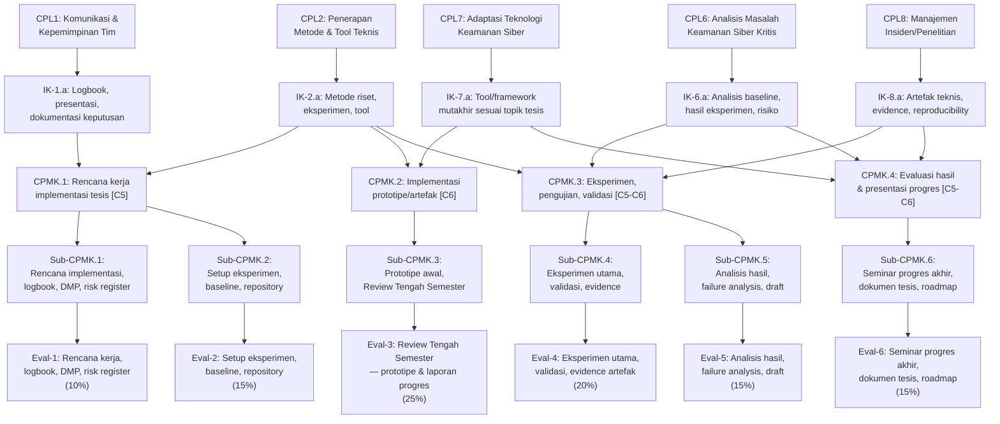

---

## PETA KOMPETENSI MATA KULIAH

```mermaid
flowchart LR
    Entry["Entry Behavior:\n• Proposal tesis disetujui\n• Topik & pembimbing ditetapkan\n• Metodologi dirancang\n• Pathway dipilih"] --> Phase1

    Phase1["Fase 1: Perencanaan\n(Per 1-2)\nSub-CPMK.1\n• WBS & milestone\n• Risk register\n• Logbook & DMP"] --> Phase2

    Phase2["Fase 2: Persiapan\n(Per 3-4)\nSub-CPMK.2\n• Setup environment\n• Dataset/testbed\n• Baseline & repository"] --> Phase3

    Phase3["Fase 3: Implementasi\n(Per 5-8)\nSub-CPMK.3\n• Prototipe v0.1\n• Demo & review\n• Revision planning"] --> Phase4

    Phase4["Fase 4: Eksperimen\n(Per 9-12)\nSub-CPMK.4\n• Eksperimen utama\n• Evidence artefak\n• Validasi awal"] --> Phase5

    Phase5["Fase 5: Analisis\n(Per 13-14)\nSub-CPMK.5\n• Analisis hasil\n• Failure analysis\n• Draft Bab Hasil"] --> Phase6

    Phase6["Fase 6: Diseminasi Awal\n(Per 15-16)\nSub-CPMK.6\n• Seminar progres\n• Dokumen tesis\n• Roadmap Tesis Akhir"]

    Phase6 --> Exit["Exit Behavior:\n• Prototipe fungsional\n• Evidence valid\n• Draft hasil tersedia\n• Siap Tesis Akhir"]
```

---

## TABEL PEMETAAN OBE

| Bab | Sub-CPMK | CPMK | Materi Utama | Aktivitas | Evaluasi | Artefak |
|-----|----------|------|-------------|-----------|----------|---------|
| 1 | Sub-CPMK.1 | CPMK.1 | Translasi proposal ke rencana kerja, WBS | Bimbingan, diskusi | Eval-1 | Dokumen WBS, kontrak milestone |
| 2 | Sub-CPMK.1 | CPMK.1 | Logbook riset, DMP, risk register | Penulisan logbook | Eval-1 | Logbook, DMP, risk register |
| 3 | Sub-CPMK.2 | CPMK.1 | Setup environment, version control, repository | Praktik setup | Eval-2 | README, environment file, repo |
| 4 | Sub-CPMK.2 | CPMK.1 | Dataset/testbed, baseline, reproducibility | Demo baseline | Eval-2 | Baseline results, data sheet |
| 5 | Sub-CPMK.3 | CPMK.2 | Desain arsitektur prototipe | Review desain | Eval-3 | Dokumen desain, diagram arsitektur |
| 6 | Sub-CPMK.3 | CPMK.2 | Implementasi prototipe Fase 1 | Coding/modeling | Eval-3 | Commit tagged v0.1-dev |
| 7 | Sub-CPMK.3 | CPMK.2 | Implementasi prototipe Fase 2 | Sanity check | Eval-3 | Demo video, commit v0.1 |
| 8 | Sub-CPMK.3 | CPMK.2 | Review Tengah Semester | Presentasi, tanya jawab | Eval-3 | Slide, laporan progres |
| 9 | Sub-CPMK.4 | CPMK.3 | Desain eksperimen utama | Workshop desain | Eval-4 | Protokol eksperimen |
| 10 | Sub-CPMK.4 | CPMK.3 | Pelaksanaan eksperimen | Praktik lab/riset | Eval-4 | Raw data, log eksperimen |
| 11 | Sub-CPMK.4 | CPMK.3 | Dokumentasi evidence dan logbook | Review artefak | Eval-4 | Evidence package |
| 12 | Sub-CPMK.4 | CPMK.3 | Validasi awal, interpretasi data | Konsultasi | Eval-4 | Laporan validasi sementara |
| 13 | Sub-CPMK.5 | CPMK.3/4 | Analisis hasil, visualisasi | Review analisis | Eval-5 | Grafik, tabel, analisis |
| 14 | Sub-CPMK.5 | CPMK.4 | Failure analysis, perbaikan, draft Bab Hasil | Revision sprint | Eval-5 | Draft Bab Hasil/Pembahasan |
| 15 | Sub-CPMK.6 | CPMK.4 | Persiapan seminar, dokumen Progres Tesis | Presentasi latihan | Eval-6 | Slide final, dokumen tesis |
| 16 | Sub-CPMK.6 | CPMK.4 | Seminar progres akhir, roadmap Tesis Akhir | Seminar formal | Eval-6 | Dokumen Progres Tesis final |

---

## PETUNJUK PENGGUNAAN BUKU

Buku ini memiliki karakter yang berbeda dari buku ajar teknis biasa. Tidak ada "materi" tunggal yang berlaku universal — karena topik tesis setiap mahasiswa berbeda. Sebagai gantinya, buku ini memberikan:

- **Kerangka proses** — langkah-langkah metodologis yang harus diikuti terlepas dari topik tesis
- **Template** — dokumen siap pakai yang disesuaikan dengan standar akademik PENS
- **Standar kualitas** — kriteria yang membedakan pekerjaan baik dari yang biasa
- **Contoh terapan** — ilustrasi dari berbagai pathway tesis (forensik digital, ethical hacking, security audit, dll.)
- **Pertanyaan refleksi** — mendorong mahasiswa berpikir kritis tentang keputusan riset mereka

**Cara membaca buku ini:**
Ikuti alur bab secara sequential. Setiap bab harus menghasilkan artefak nyata — jangan lanjut ke bab berikutnya sebelum artefak bab sebelumnya selesai dan disetujui pembimbing.

---

## DAFTAR BAB

| Bab | Judul | Sub-CPMK | Pertemuan |
|-----|-------|----------|-----------|
| 1 | Translasi Proposal ke Rencana Kerja Implementasi | Sub-CPMK.1 | 1 |
| 2 | Logbook Riset, Data Management Plan, dan Risk Register | Sub-CPMK.1 | 2 |
| 3 | Setup Lingkungan Eksperimen dan Repository | Sub-CPMK.2 | 3 |
| 4 | Dataset/Testbed, Baseline, dan Reproducibility | Sub-CPMK.2 | 4 |
| 5 | Desain Arsitektur Prototipe | Sub-CPMK.3 | 5 |
| 6 | Implementasi Prototipe — Fase 1 | Sub-CPMK.3 | 6 |
| 7 | Implementasi Prototipe — Fase 2 dan Sanity Check | Sub-CPMK.3 | 7 |
| 8 | Review Tengah Semester: Demonstrasi dan Evaluasi | Sub-CPMK.3 | 8 |
| 9 | Desain Eksperimen Utama | Sub-CPMK.4 | 9 |
| 10 | Pelaksanaan Eksperimen dan Pengumpulan Data | Sub-CPMK.4 | 10 |
| 11 | Dokumentasi Evidence dan Logbook Teknis | Sub-CPMK.4 | 11 |
| 12 | Validasi Awal dan Interpretasi Data | Sub-CPMK.4 | 12 |
| 13 | Analisis Hasil dan Visualisasi Data | Sub-CPMK.5 | 13 |
| 14 | Failure Analysis, Perbaikan Prototipe, dan Draft Bab Hasil | Sub-CPMK.5 | 14 |
| 15 | Persiapan Seminar Progres Akhir | Sub-CPMK.6 | 15 |
| 16 | Seminar Progres Akhir dan Roadmap Tesis Akhir | Sub-CPMK.6 | 16 |

---

# BAB 1 — TRANSLASI PROPOSAL KE RENCANA KERJA IMPLEMENTASI

**Pertemuan:** 1  
**Sub-CPMK:** Sub-CPMK.1  
**CPMK:** CPMK.1  
**Evaluasi:** Eval-1 (10%)

---

## 1. Capaian Pembelajaran Bab

Setelah menyelesaikan Bab 1, mahasiswa mampu:

- Menerjemahkan bab metodologi dan rencana penelitian dalam proposal yang telah disetujui menjadi rencana kerja teknis yang operasional.
- Menyusun Work Breakdown Structure (WBS) tesis dengan granularity yang tepat.
- Menetapkan milestone yang realistis, terukur, dan dapat diverifikasi.
- Mengidentifikasi kebutuhan teknis: data, testbed, tool, dan infrastruktur.
- Menyusun kontrak milestone sebagai komitmen tertulis antara mahasiswa dan pembimbing.

---

## 2. Peta Konsep Bab

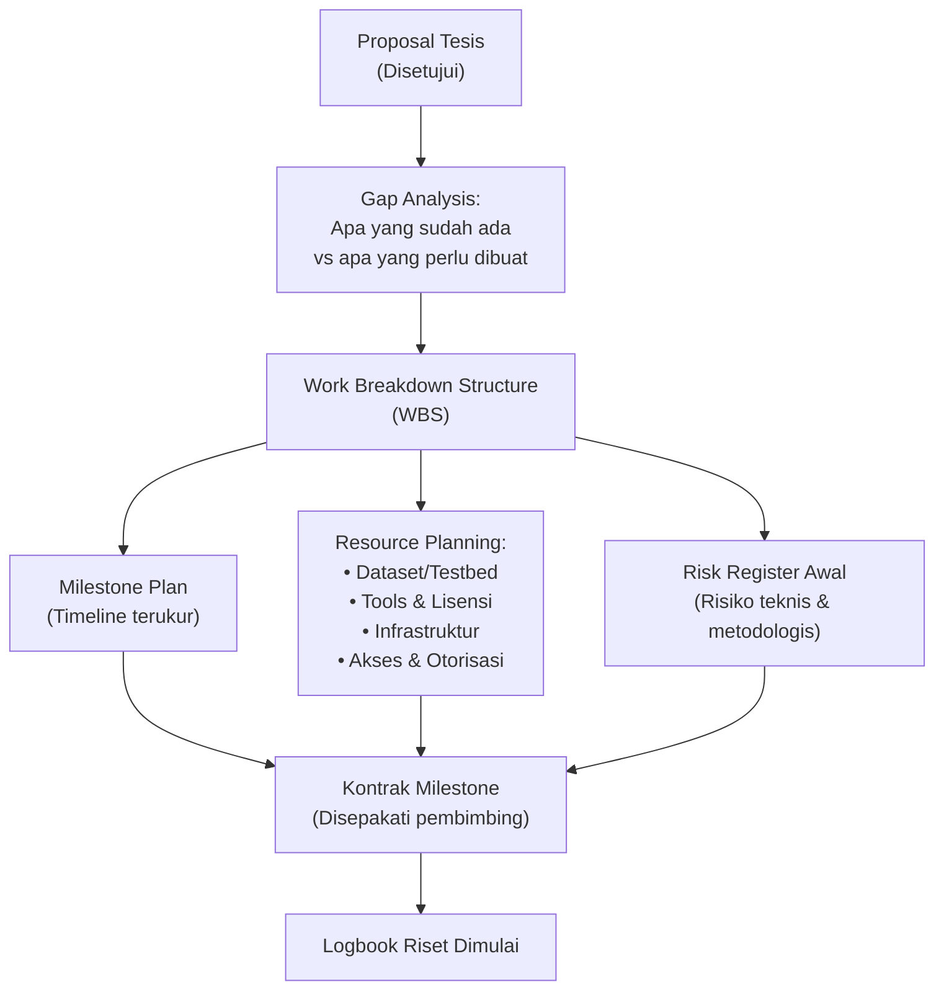

---

## 3. Pengantar Kontekstual

Proposal tesis adalah "janji" — sebuah rencana yang disetujui secara akademik tentang apa yang akan dilakukan mahasiswa. Namun proposal seringkali ditulis pada level abstrak yang tidak langsung dapat dieksekusi. Tugas pertama mahasiswa Progres Tesis adalah **operasionalisasi proposal**: mengubah rencana abstrak menjadi tindakan konkret yang dapat dijadwalkan, diukur, dan diverifikasi.

Kegagalan paling umum di fase ini adalah mahasiswa langsung "mulai coding" atau "mulai eksperimen" tanpa perencanaan yang matang. Hasilnya: pekerjaan yang tidak terstruktur, milestone yang terlewat, dan akhir semester tiba tanpa prototipe yang demonstrable.

---

## 4. Landasan Teori

### 4.1 Design Science Methodology dalam Konteks Tesis Terapan

Wieringa (2014) membedakan dua jenis penelitian:
- **Knowledge problem research:** Menghasilkan pengetahuan baru tentang dunia
- **Design problem research:** Menghasilkan artefak baru yang memecahkan masalah nyata

Tesis Magister Terapan PENS dominan pada **design problem research** — menghasilkan artefak (sistem, prototipe, model, prosedur, alat) yang memecahkan masalah konkret di bidang keamanan siber. Ini berarti:

1. Ada **problem** yang jelas dan relevan
2. Ada **artefak** yang dirancang dan diimplementasikan sebagai solusi
3. Ada **evaluasi** yang membuktikan artefak memecahkan problem
4. Ada **kontribusi pengetahuan** yang dapat direplikasi oleh peneliti lain

### 4.2 Work Breakdown Structure (WBS)

WBS memecah tesis menjadi komponen yang dapat dikerjakan dan diukur.

**Struktur WBS untuk Tesis Magister Terapan:**
```
Tesis: [Judul Tesis]
├── 1.0 Persiapan & Setup
│   ├── 1.1 Setup repository & version control
│   ├── 1.2 Pengumpulan/akuisisi dataset
│   ├── 1.3 Setup lingkungan eksperimen
│   └── 1.4 Implementasi baseline
│
├── 2.0 Implementasi
│   ├── 2.1 Desain arsitektur
│   ├── 2.2 Implementasi komponen A
│   ├── 2.3 Implementasi komponen B
│   ├── 2.4 Integrasi
│   └── 2.5 Sanity check awal
│
├── 3.0 Eksperimen & Evaluasi
│   ├── 3.1 Desain protokol eksperimen
│   ├── 3.2 Pelaksanaan eksperimen (skenario 1-N)
│   ├── 3.3 Pengumpulan & preprocessing data
│   └── 3.4 Analisis statistik & interpretasi
│
├── 4.0 Penulisan
│   ├── 4.1 Draft Bab 4 (Implementasi)
│   ├── 4.2 Draft Bab 5 (Hasil & Pembahasan)
│   └── 4.3 Revisi berdasarkan feedback pembimbing
│
└── 5.0 Diseminasi (semester ini)
    ├── 5.1 Presentasi Review Tengah Semester
    └── 5.2 Seminar Progres Akhir
```

### 4.3 Prinsip Milestone yang Baik — SMART

Milestone harus memenuhi kriteria SMART:
- **S**pecific: Apa tepatnya yang harus ada/selesai?
- **M**easurable: Bagaimana kita tahu ini selesai? Kriteria apa?
- **A**chievable: Realistis dengan waktu dan sumber daya yang ada?
- **R**elevant: Berkontribusi langsung ke tujuan penelitian?
- **T**ime-bound: Kapan deadline-nya?

**Contoh milestone yang BAIK (untuk tesis IDS berbasis ML):**
```
Milestone M2 (Per 4):
"Dataset NSL-KDD ter-download, terverifikasi integritas hash SHA-256, 
 ter-split train/validation/test (70/15/15), tersimpan di repository 
 dengan data sheet yang lengkap. Baseline (Random Forest accuracy 
 pada NSL-KDD) terimplementasi dan didokumentasikan."
```

**Contoh milestone yang BURUK:**
```
M2 (Per 4): "Dataset siap dan baseline sudah dibuat"
← Tidak ada kriteria verifikasi, tidak spesifik
```

### 4.4 Kontrak Milestone

Kontrak milestone adalah dokumen formal yang disepakati antara mahasiswa dan pembimbing di awal semester. Fungsinya:
- Menetapkan ekspektasi yang jelas untuk kedua belah pihak
- Memberikan dasar objektif untuk evaluasi progres
- Memaksa mahasiswa berpikir realistis tentang kapasitas kerja mereka

---

## 5. Model atau Arsitektur

### 5.1 Alur Translasi Proposal ke Rencana Kerja

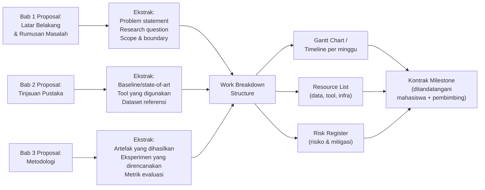

---

## 6. Contoh Terapan

### Contoh: Translasi Proposal "IDS Berbasis Federated Learning"

**Dari Proposal (abstrak):**
> "Penelitian ini akan mengembangkan sistem IDS yang menggunakan Federated Learning untuk mendeteksi intrusi tanpa berbagi data mentah antar node. Evaluasi menggunakan dataset NSL-KDD dan CICIDS2017."

**Menjadi Rencana Kerja Konkret:**

| WBS ID | Task | Deliverable | Deadline | Dependency |
|---|---|---|---|---|
| 1.1 | Setup Git repo + struktur folder | README, folder structure | Per 1 | — |
| 1.2 | Download + verifikasi NSL-KDD | Dataset + SHA hash + data sheet | Per 3 | 1.1 |
| 1.3 | Setup Python env (conda/docker) | environment.yml | Per 3 | 1.1 |
| 1.4 | Implementasi baseline (central ML) | Baseline accuracy + script | Per 4 | 1.2, 1.3 |
| 2.1 | Desain arsitektur FL | Diagram + dokumen desain | Per 5 | 1.4 |
| 2.2 | Implementasi server aggregator | Server code + unit test | Per 6 | 2.1 |
| 2.3 | Implementasi client node | Client code + unit test | Per 7 | 2.1 |
| 2.4 | Integrasi FL pipeline | Demo end-to-end | Per 7 | 2.2, 2.3 |
| ... | ... | ... | ... | ... |

---

## 7. Praktikum atau Aktivitas Terarah

### Aktivitas 1.1: Workshop Translasi Proposal

**Tujuan:** Menghasilkan WBS lengkap dan kontrak milestone semester ini.

**Prasyarat:** Proposal tesis yang telah disetujui.

**Langkah:**
1. Review kembali Bab 3 (Metodologi) proposal Anda — catat setiap "aktivitas" dan "deliverable" yang disebutkan
2. Susun WBS menggunakan template yang disediakan (Lampiran A)
3. Estimasi durasi setiap task dalam jam kerja realistis (bukan jam ideal)
4. Buat timeline dengan mempertimbangkan: mata kuliah lain semester ini, libur, Review Tengah Semester (Per 8), dan Seminar Progres (Per 16)
5. Identifikasi 5 risiko teknis terbesar dan mitigasinya
6. Presentasikan kepada pembimbing untuk mendapat persetujuan dan tanda tangan kontrak

**Bukti yang dikumpulkan:**
- File WBS dalam format Excel/Google Sheets atau markdown
- Kontrak milestone (PDF ditandatangani)
- Dokumen identifikasi resource yang dibutuhkan

**Kriteria keberhasilan:**
- WBS mencakup semua aspek metodologi proposal
- Setiap milestone memenuhi kriteria SMART
- Kontrak ditandatangani pembimbing

---

## 8. Latihan Pemahaman

**Soal 1 (PG):** Tujuan utama Kontrak Milestone antara mahasiswa dan pembimbing adalah:
A. Formalitas administrasi program studi  
B. Menetapkan ekspektasi yang jelas dan terukur untuk kedua belah pihak  
C. Memastikan pembimbing memiliki catatan kehadiran mahasiswa  
D. Menentukan nilai akhir mahasiswa di awal semester

**Soal 2 (PG):** Milestone berikut yang memenuhi kriteria SMART adalah:
A. "Selesai implementasi sistem"  
B. "Mengerjakan eksperimen"  
C. "Prototipe v0.1 dapat mendeteksi serangan SQL injection pada testbed DVWA dengan precision ≥0.80, terdokumentasi dalam repository tag v0.1, selesai Per 7"  
D. "Mencoba beberapa pendekatan"

**Soal 3 (Esai Singkat):** Apa perbedaan antara tujuan penelitian yang ditulis dalam proposal dan milestone dalam WBS? Berikan contoh konkret untuk keduanya.

**Soal 4 (Analisis):** Seorang mahasiswa membuat WBS dengan 40 task untuk satu semester. Setelah dihitung, total estimasi jam kerja adalah 960 jam (24 jam/minggu selama 40 minggu). Identifikasi masalah dalam perencanaan ini dan berikan rekomendasi perbaikan yang realistis.

**Soal 5 (Penerapan):** Ambil Bab 3 proposal tesis Anda sendiri dan ekstrak: (a) minimal 5 artefak yang harus dihasilkan, (b) minimal 3 eksperimen yang direncanakan, dan (c) minimal 3 risiko teknis yang mungkin terjadi.

---

## 9. Latihan Terapan / Studi Kasus

### Studi Kasus A: WBS Tesis Forensik Digital

Mahasiswa A sedang mengerjakan tesis tentang analisis artefak memori pada malware banking trojan. Proposal menyebutkan metodologi: koleksi sampel malware (dari dataset VirusTotal), analisis statis dan dinamis, pengembangan skrip Volatility3 kustom untuk deteksi artefak injeksi kode, dan evaluasi pada 30 sampel malware.

**Pertanyaan (C5):** Buat WBS lengkap untuk tesis ini yang mencakup minimal 20 task. Untuk setiap task: tentukan deliverable yang terverifikasi, estimasi durasi realistis, dan dependency. Identifikasi critical path — urutan task yang menentukan durasi minimum proyek.

### Studi Kasus B: Risiko Rencana Kerja

Mahasiswa B berencana menggunakan dataset real network traffic dari perusahaan mitra. Namun di Per 2, perusahaan mitra menyatakan tidak dapat memberikan data karena pertimbangan privasi. Mahasiswa B baru menyadari ini bukan skenario yang dipersiapkan dalam proposal.

**Pertanyaan (C5):** Analisis: (a) Risiko apa dalam risk register yang seharusnya mencakup skenario ini? (b) Apa opsi mitigasi yang tersedia? (c) Bagaimana mahasiswa B harus mengkomunikasikan perubahan ini kepada pembimbing? (d) Apakah perubahan ini memerlukan revisi proposal formal?

---

## 10. Kunci Jawaban dan Pembahasan

**Soal 1 — B:** Kontrak milestone adalah instrumen manajemen ekspektasi. Tanpanya, pembimbing dan mahasiswa mungkin memiliki ekspektasi yang berbeda tentang kemajuan yang diharapkan. Kontrak bukan formalitas (A) — ini adalah komitmen substantif. Bukan mekanisme absensi (C) atau penetapan nilai (D).

**Soal 2 — C:** Pilihan C memenuhi semua kriteria SMART: Specific (sistem mendeteksi SQL injection pada DVWA), Measurable (precision ≥0.80), Achievable (satu fitur spesifik), Relevant (terkait langsung tujuan tesis), Time-bound (Per 7, dengan tag repository). Pilihan A, B, D tidak dapat diverifikasi secara objektif.

**Soal 4:** Masalah: 24 jam/minggu selama 40 minggu adalah sangat tidak realistis untuk mahasiswa yang juga mengambil mata kuliah lain. Rekomendasi: (a) Mahasiswa S2 part-time realisme: 10-15 jam/minggu untuk tesis; (b) Satu semester = 16 minggu efektif → ~160-240 jam total; (c) Kurangi scope WBS secara signifikan; (d) Diskusikan dengan pembimbing untuk "scope yang achievable semester ini" vs "scope yang mungkin dilanjutkan di Tesis Akhir"; (e) Prioritaskan: apa MINIMUM yang harus ada agar Review Tengah Semester dan Seminar Progres berhasil?

---

## 11. Ringkasan Bab

Translasi proposal ke rencana kerja adalah langkah paling kritis di awal Progres Tesis. WBS memecah penelitian menjadi task yang dapat dikerjakan dan diukur. Milestone yang baik memenuhi kriteria SMART dan berfungsi sebagai komitmen terverifikasi antara mahasiswa dan pembimbing. Kontrak milestone di awal semester mencegah miskomunikasi dan memaksa perencanaan yang realistis.

---

## 12. Refleksi Profesional

**Pertanyaan Refleksi 1:** Seorang peneliti senior pernah berkata: "Perencanaan yang buruk adalah bentuk keangkuhan — asumsi bahwa Anda tahu persis apa yang akan terjadi." Apakah WBS dan milestone itu bertentangan dengan sifat penelitian yang tidak dapat sepenuhnya diprediksi? Bagaimana Anda menyeimbangkan kebutuhan untuk berencana dengan kebutuhan untuk fleksibel?

**Pertanyaan Refleksi 2:** Kontrak milestone memberikan tekanan yang nyata — jika milestone terlewat, ada konsekuensinya. Bagaimana Anda mengelola tekanan ini secara sehat, tanpa jatuh ke dalam dua ekstrem: terlalu santai (milestone hanyalah target aspirasional) atau terlalu tertekan (performa rendah karena kecemasan)?

---

# BAB 2 — LOGBOOK RISET, DATA MANAGEMENT PLAN, DAN RISK REGISTER

**Pertemuan:** 2  
**Sub-CPMK:** Sub-CPMK.1  
**CPMK:** CPMK.1  
**Evaluasi:** Eval-1 (10%)

---

## 1. Capaian Pembelajaran Bab

Setelah menyelesaikan Bab 2, mahasiswa mampu:

- Membuat dan memelihara logbook riset yang konsisten, terstruktur, dan akuntabel.
- Menyusun Data Management Plan (DMP) yang mencakup akuisisi, penyimpanan, keamanan, dan retensi data penelitian.
- Membuat risk register yang mengidentifikasi, menilai, dan memitigasi risiko teknis dan metodologis tesis.
- Memahami aspek etika dan legalitas dalam manajemen data penelitian keamanan siber.

---

## 2. Peta Konsep Bab

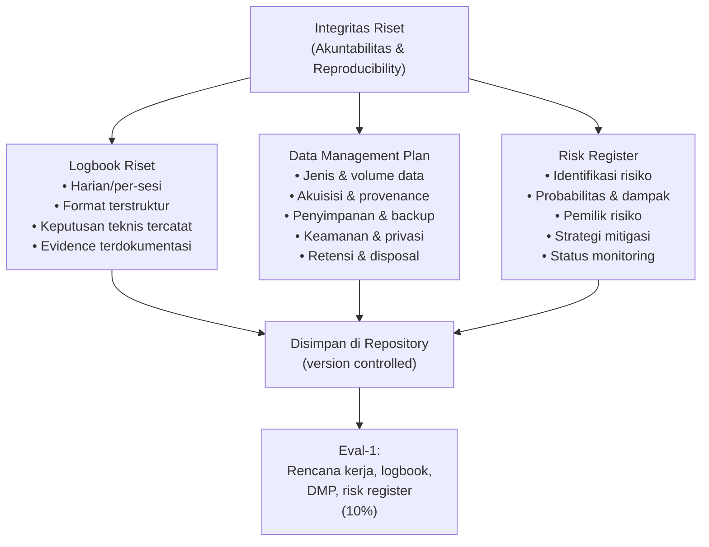

---

## 3. Pengantar Kontekstual

Dalam penelitian ilmiah, **apa yang tidak terdokumentasi dianggap tidak dilakukan**. Logbook riset bukan formalitas akademik — ini adalah fondasi dari reproducibility: kemampuan peneliti lain untuk memverifikasi, mereplikasi, dan membangun di atas pekerjaan Anda.

Dalam konteks keamanan siber, manajemen data memiliki dimensi tambahan: data yang Anda kumpulkan mungkin bersifat sensitif (traffic network nyata, malware sampel, data vulnerability assessment). Pengelolaan yang tidak hati-hati dapat melanggar privasi, hukum, atau etika penelitian.

---

## 4. Landasan Teori

### 4.1 Logbook Riset

Logbook riset adalah catatan kronologis dari semua aktivitas penelitian, keputusan teknis, hasil sementara, masalah yang ditemui, dan resolusinya.

**Fungsi logbook:**
1. **Reproducibility:** Orang lain (atau Anda sendiri di kemudian hari) dapat mereplikasi eksperimen
2. **Akuntabilitas:** Bukti bahwa pekerjaan benar-benar dilakukan
3. **Debugging:** Ketika eksperimen gagal, logbook membantu mencari tahu apa yang berubah
4. **Penulisan:** Bahan mentah untuk Bab Metodologi dan Bab Hasil
5. **IPR/HKI:** Bukti tanggal dan asal-usul ide/implementasi jika diperlukan

**Format Logbook yang Efektif:**
```markdown
## Sesi Riset — [Tanggal] [Jam Mulai - Jam Selesai]

### Tujuan Sesi
[Apa yang ingin dicapai dalam sesi ini]

### Aktivitas
1. [Aktivitas 1] → [Hasil/Output]
2. [Aktivitas 2] → [Hasil/Output]

### Keputusan Teknis
- Keputusan: [Apa yang diputuskan]
  Alasan: [Mengapa demikian]
  Alternatif yang ditolak: [Apa dan mengapa]

### Masalah dan Resolusi
- Masalah: [Deskripsi masalah]
  Resolusi: [Bagaimana diselesaikan / masih pending]

### Hasil Sesi
[Ringkasan: apa yang berhasil, apa yang tidak, apa langkah berikutnya]

### Link ke Artefak
- Commit: [hash]
- File: [path]
- Screenshot: [link/path]
```

### 4.2 Data Management Plan (DMP)

DMP mendokumentasikan bagaimana data penelitian dikelola dari akuisisi hingga disposal.

**Komponen DMP:**

| Komponen | Pertanyaan yang Dijawab |
|---|---|
| **Deskripsi Data** | Jenis data apa? Volume? Format? |
| **Akuisisi & Provenance** | Dari mana data berasal? Lisensi apa? Bagaimana diperoleh? |
| **Penyimpanan** | Di mana disimpan? Backup di mana? |
| **Keamanan & Privasi** | Apakah data sensitif? Siapa yang boleh akses? Enkripsi? |
| **Etika & Legal** | Apakah ada data personal? Perlu informed consent? |
| **Retensi & Disposal** | Berapa lama disimpan? Bagaimana dihapus secara aman? |
| **Berbagi Data** | Apakah data dapat dipublikasikan? Embargo berapa lama? |

**Etika Data dalam Penelitian Keamanan Siber:**
- Data traffic jaringan yang mengandung informasi personal → perlu anonimisasi
- Malware sampel → harus disimpan dalam environment terisolasi, tidak boleh dieksekusi di luar sandbox
- Data dari sistem pihak ketiga → harus ada izin tertulis dari pemilik sistem
- Dataset yang digunakan → harus mematuhi lisensi (beberapa dataset ML hanya untuk non-komersial)

### 4.3 Risk Register

Risk register mendokumentasikan semua risiko yang teridentifikasi, penilaian risiko, dan strategi mitigasi.

**Format Risk Register:**

| ID | Risiko | Kategori | Prob (1-5) | Dampak (1-5) | Skor | Mitigasi | Kontijensi | Pemilik | Status |
|---|---|---|---|---|---|---|---|---|---|
| R01 | Dataset tidak tersedia | Data | 2 | 5 | 10 | Siapkan alternatif dataset | Gunakan synthetic data | Mahasiswa | Open |
| R02 | Tool utama tidak dapat diinstall | Teknis | 2 | 4 | 8 | Test instalasi di minggu 1 | Gunakan Docker/cloud | Mahasiswa | Open |
| R03 | Performa model di bawah baseline | Metodologis | 3 | 4 | 12 | Review arsitektur lebih awal | Sesuaikan research question | Mahasiswa+Pembimbing | Open |

**Kategori Risiko untuk Tesis Keamanan Siber:**
- **Data:** dataset tidak tersedia, data kualitas buruk, perizinan tidak dapat diperoleh
- **Teknis:** tool/library tidak kompatibel, performa hardware tidak mencukupi, bug yang sulit diselesaikan
- **Metodologis:** pendekatan tidak berhasil, hasil jauh dari baseline, scope creep
- **Etika/Legal:** data mengandung informasi sensitif yang tidak dapat digunakan, perizinan sistem uji
- **Waktu:** milestone terlalu ambisius, mata kuliah lain lebih menyita waktu
- **Pembimbing:** jadwal bimbingan sulit, feedback terlambat

---

## 5. Model atau Arsitektur

### 5.1 Ekosistem Dokumentasi Riset

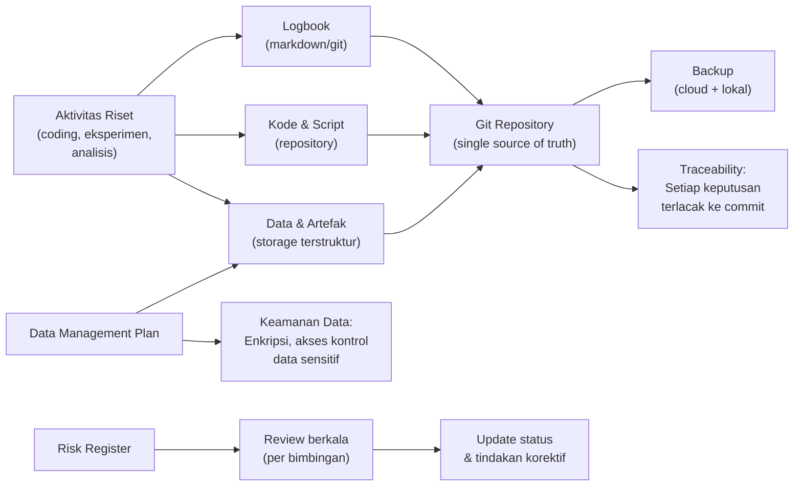

---

## 6. Contoh Terapan

### Contoh: DMP untuk Tesis Analisis Malware

**Konteks:** Tesis tentang deteksi malware banking trojan menggunakan analisis perilaku.

**Jenis data:**
- 300 sampel malware dari dataset ANY.RUN dan MalwareBazaar (binary PE)
- 100 log eksekusi dinamis dari Cuckoo Sandbox (JSON, ~500MB)
- 50 capture memory dump dari sistem terinfeksi simulasi (binary, ~10GB)
- Dataset ground truth labeling (CSV)

**Keamanan data:**
- Sampel malware: disimpan dalam folder terenkripsi (VeraCrypt), TIDAK pernah dieksekusi di luar VM sandbox
- VM sandbox: isolated network, snapshot sebelum dan sesudah eksekusi
- Memory dump: mengandung potensi kredensial — tidak dipublikasikan, dihapus setelah analisis selesai
- Repository: binary malware TIDAK di-push ke Git — hanya hash SHA-256 dan referensi

**Etika:**
- Semua sampel malware diperoleh dari dataset publik yang tersedia untuk penelitian akademik
- Tidak ada sistem nyata yang terinfeksi untuk keperluan penelitian
- Tidak ada eksfiltrasi atau komunikasi C2 dari VM selama eksperimen

---

## 7. Praktikum atau Aktivitas Terarah

### Aktivitas 2.1: Inisialisasi Logbook dan Repository

**Tujuan:** Membuat struktur repository dan logbook riset yang siap digunakan.

```bash
# Struktur repository yang disarankan
thesis-repo/
├── README.md            # Deskripsi penelitian, cara reproduce
├── docs/
│   ├── logbook/        # Satu file .md per minggu
│   ├── DMP.md          # Data Management Plan
│   ├── risk-register.md # Risk Register
│   └── milestone.md    # Kontrak milestone
├── src/                 # Kode sumber
├── data/
│   ├── raw/            # Data mentah (mungkin gitignored jika besar)
│   ├── processed/      # Data yang sudah diproses
│   └── README.md       # Data sheet: sumber, format, lisensi
├── experiments/        # Script eksperimen, konfigurasi
├── results/            # Output eksperimen
├── models/             # Model terlatih
└── .gitignore          # Jangan push: binary besar, credentials, malware
```

**Tugas:**
1. Buat repository Git (GitHub/GitLab institusi)
2. Buat struktur folder sesuai di atas
3. Tulis README yang menjelaskan penelitian Anda
4. Buat entry logbook pertama (sesi bimbingan per 1 dan 2)
5. Buat draft DMP (gunakan template Lampiran C)
6. Buat risk register awal dengan minimal 8 risiko (gunakan template Lampiran D)

---

## 8. Latihan Pemahaman

**Soal 1 (PG):** Logbook riset PALING PENTING untuk:
A. Membuktikan kehadiran mahasiswa kepada pembimbing  
B. Mendukung reproducibility dan akuntabilitas penelitian  
C. Menggantikan draft bab tesis  
D. Memenuhi persyaratan administrasi program studi saja

**Soal 2 (Kasus):** Seorang mahasiswa ingin menggunakan dataset network traffic dari kantor tempat ia bekerja untuk tesisnya. Dataset ini mengandung log koneksi real dari karyawan. Identifikasi masalah etika, legal, dan privasi yang perlu diselesaikan sebelum data ini dapat digunakan dalam penelitian akademik.

**Soal 3 (Analisis):** Risk register menunjukkan risiko R03: "Performa model di bawah baseline" dengan skor 12 (tinggi). Pembimbing meminta mitigasi yang lebih kuat. Berikan 3 strategi mitigasi yang berbeda untuk risiko ini, masing-masing dengan trade-off yang jelas.

**Soal 4 (Desain):** Anda menemukan bahwa dataset malware yang Anda gunakan mengandung 5 sampel yang ternyata adalah false positive (bukan malware). Bagaimana Anda mendokumentasikan temuan ini dalam logbook dan mengupdate DMP? Apa dampaknya terhadap hasil penelitian yang sudah berjalan?

**Soal 5 (Refleksi):** Logbook yang baik harus mencatat "keputusan yang diambil beserta alasannya." Mengapa penting mencatat alasan di balik keputusan teknis, bukan hanya keputusannya saja? Berikan contoh konkret.

---

## 9. Latihan Terapan / Studi Kasus

### Studi Kasus: Krisis Data di Tengah Penelitian

Mahasiswa C sedang mengerjakan tesis tentang deteksi anomali di jaringan IoT. Di Per 6, setelah 4 minggu mengumpulkan traffic data dari lab IoT kampus, ia baru menyadari bahwa beberapa perangkat IoT di lab ternyata milik peneliti lain dan data yang dikumpulkan mencakup komunikasi dari eksperimen mereka (bukan bagian dari tesis Mahasiswa C).

**Pertanyaan (C5):**
1. Apakah ada masalah etika dalam situasi ini? Jelaskan dari perspektif: (a) hak atas data peneliti lain, (b) informed consent, (c) penelitian yang bertanggung jawab.
2. Apa yang harus dilakukan Mahasiswa C? Urutkan tindakan prioritas dari yang paling mendesak.
3. Bagaimana situasi ini seharusnya dicegah? Identifikasi risiko dalam risk register yang harus ada sejak awal dan DMP yang harus mengatur hal ini.
4. Apakah data yang sudah terkumpul dapat digunakan jika mendapat izin retroaktif? Apa syaratnya?

---

## 10. Kunci Jawaban dan Pembahasan

**Soal 1 — B:** Logbook adalah instrumen utama reproducibility. Tanpa logbook yang baik, peneliti lain (atau Anda sendiri setelah beberapa bulan) tidak dapat mereplikasi hasil. Logbook juga berfungsi sebagai bukti bahwa eksperimen benar-benar dilakukan dengan cara yang diklaim — ini adalah inti dari integritas akademik. Fungsi absensi (A) dan administrasi (D) adalah efek sampingnya, bukan tujuan utama.

**Soal 2:** Masalah etika dan legal yang harus diselesaikan:
(a) **Persetujuan:** Diperlukan izin tertulis dari organisasi pemilik jaringan DAN (mungkin) dari karyawan yang traffic-nya direkam — data traffic mengandung informasi personal.
(b) **Privasi:** Log koneksi karyawan mengandung informasi tentang perilaku kerja, website yang dikunjungi, dll. — ini termasuk data pribadi di bawah UU PDP Indonesia.
(c) **Anonimisasi:** Bahkan dengan izin, data harus dianonimisasi sebelum digunakan dalam publikasi akademik.
(d) **Persetujuan Etika Penelitian:** Beberapa institusi memerlukan persetujuan komite etika untuk penelitian yang melibatkan data personal.
(e) **Lisensi/kepemilikan data:** Siapa pemilik data ini — perusahaan atau individu karyawan?

---

## 11. Ringkasan Bab

Logbook riset, DMP, dan risk register adalah tiga dokumen fondasi yang memastikan penelitian berjalan secara sistematis, akuntabel, dan dapat direproduksi. Logbook mencatat setiap aktivitas dan keputusan teknis. DMP mengatur bagaimana data dikelola — termasuk aspek keamanan, privasi, dan etika yang krusial dalam penelitian keamanan siber. Risk register mengantisipasi masalah sebelum terjadi. Ketiga dokumen harus hidup di repository dan diperbarui secara konsisten.

---

## 12. Refleksi Profesional

**Pertanyaan Refleksi 1:** Banyak peneliti (termasuk yang berpengalaman) tidak menjaga logbook dengan konsisten karena terasa seperti "overhead" yang mengurangi waktu untuk penelitian sesungguhnya. Bagaimana Anda membangun kebiasaan mendokumentasikan secara konsisten tanpa merasa terbebani?

**Pertanyaan Refleksi 2:** Data yang dikumpulkan dalam penelitian keamanan siber seringkali memiliki potensi penyalahgunaan — malware sampel yang bocor, log sistem yang mengandung informasi sensitif, atau tool yang dikembangkan untuk penelitian yang dapat digunakan untuk tujuan jahat. Sebagai peneliti, apa tanggung jawab Anda terhadap keamanan artefak penelitian Anda, baik selama penelitian berlangsung maupun setelah tesis selesai?

---


---

# BAB 3 — SETUP LINGKUNGAN EKSPERIMEN DAN REPOSITORY

**Pertemuan:** 3  
**Sub-CPMK:** Sub-CPMK.2  
**CPMK:** CPMK.1  
**Evaluasi:** Eval-2 (15%)

---

## 1. Capaian Pembelajaran Bab

Setelah menyelesaikan Bab 3, mahasiswa mampu:

- Menyiapkan lingkungan eksperimen yang reproducible menggunakan container atau virtual environment.
- Menstrukturkan repository penelitian dengan standar yang memudahkan reproduksi oleh pihak lain.
- Mengimplementasikan version control workflow untuk proyek riset.
- Mendokumentasikan lingkungan teknis (environment specification) dengan lengkap.

---

## 2. Peta Konsep Bab

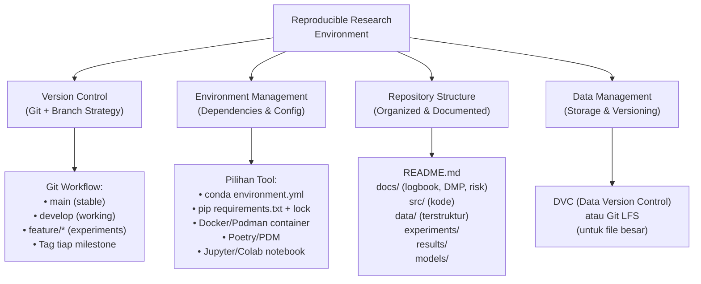

---

## 3. Pengantar Kontekstual

Reproducibility adalah salah satu krisis terbesar dalam sains modern — banyak hasil penelitian yang tidak dapat direplikasi oleh peneliti lain, bahkan oleh peneliti yang sama setelah beberapa bulan. Dalam bidang Machine Learning dan cybersecurity research, "reproducibility crisis" ini sangat nyata: model yang dilatih pada environment yang sedikit berbeda dapat menghasilkan akurasi yang sangat berbeda.

Setup lingkungan eksperimen yang baik sejak awal adalah investasi yang menghemat banyak waktu di kemudian hari dan merupakan standar minimal untuk publikasi ilmiah yang kredibel.

---

## 4. Landasan Teori

### 4.1 Reproducible Research Engineering

Penelitian yang reproducible memiliki properti:
1. **Replicability:** Orang lain dapat menjalankan kode Anda dan mendapat hasil yang sama
2. **Repeatability:** Anda sendiri dapat menjalankan ulang eksperimen dan mendapat hasil yang sama
3. **Traceability:** Setiap hasil dapat ditelusuri ke kode, data, dan konfigurasi spesifik yang menghasilkannya

**Musuh reproducibility:**
- Dependensi yang tidak di-pin versinya (`numpy` tanpa versi)
- "Works on my machine" — kode bergantung pada path absolut atau environment lokal
- Data yang dimodifikasi tanpa versi
- Random seed yang tidak di-set
- Preprocessing yang dilakukan secara manual tanpa skrip

### 4.2 Environment Management

**Pilihan untuk Python (paling umum dalam cybersecurity research):**

```bash
# Opsi 1: conda environment (direkomendasikan untuk ML)
conda env create -f environment.yml
conda activate thesis-env

# environment.yml:
name: thesis-env
channels:
  - conda-forge
  - defaults
dependencies:
  - python=3.11.5
  - numpy=1.24.3
  - scikit-learn=1.3.0
  - tensorflow=2.13.0
  - pip:
    - scapy==2.5.0
    - volatility3==2.5.0

# Opsi 2: Docker (paling reproducible — identik di semua platform)
# Dockerfile:
FROM python:3.11-slim
WORKDIR /app
COPY requirements.txt .
RUN pip install --no-cache-dir -r requirements.txt
COPY . .
CMD ["python", "main.py"]
```

### 4.3 Git Workflow untuk Riset

```bash
# Inisialisasi repository
git init
git remote add origin https://github.com/username/thesis-repo

# Branch strategy untuk riset:
# main      → versi stabil, hanya diupdate saat milestone selesai
# develop   → working branch sehari-hari
# exp/name  → branch eksperimen spesifik (dapat dihapus setelah selesai)

# Tag untuk milestone:
git tag -a v0.1-baseline -m "Baseline implementation complete"
git tag -a v0.2-prototype -m "Prototype v0.1 complete (Review Tengah Semester)"

# .gitignore yang baik untuk riset:
*.pyc
__pycache__/
.env                    # Credentials!
data/raw/               # Data besar — gunakan DVC
models/*.h5             # Model besar — gunakan DVC atau Git LFS
*.malware               # Jangan push malware ke GitHub!
```

### 4.4 Dokumentasi Environment

README.md harus mencakup:

```markdown
# [Judul Tesis]

## Deskripsi
[1 paragraf: apa penelitian ini, masalah apa yang dipecahkan]

## Persyaratan
- Python 3.11+
- CUDA 11.8 (opsional, untuk GPU)
- RAM: minimal 16GB
- Storage: 50GB untuk dataset

## Setup
```bash
git clone https://github.com/username/thesis-repo
cd thesis-repo
conda env create -f environment.yml
conda activate thesis-env
```

## Struktur Repository
```
src/           # Kode sumber
data/          # Lihat data/README.md untuk instruksi dataset
experiments/   # Konfigurasi eksperimen
results/       # Output (auto-generated, gitignored)
docs/          # Dokumentasi dan logbook
```

## Cara Reproduce Hasil Utama
```bash
python experiments/run_main_experiment.py --config experiments/config_main.yaml
```

## Lisensi
[Lisensi — sesuaikan dengan kebijakan PENS dan dataset yang digunakan]
```

---

## 5. Model atau Arsitektur

### 5.1 Pipeline Reproducible Research

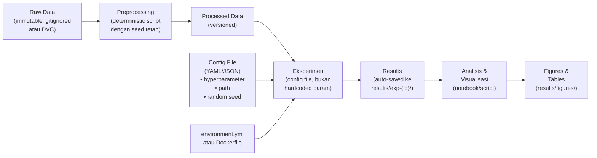

---

## 6. Contoh Terapan

### Contoh: Setup untuk Tesis IDS Berbasis Machine Learning

```python
# experiments/run_experiment.py
import yaml, argparse, random, numpy as np
from pathlib import Path
from datetime import datetime

def set_seed(seed):
    """Pastikan reproducibility dengan seed tetap."""
    random.seed(seed)
    np.random.seed(seed)
    # Untuk TensorFlow:
    # tf.random.set_seed(seed)

def run_experiment(config_path):
    with open(config_path) as f:
        config = yaml.safe_load(f)
    
    # Buat direktori output dengan timestamp
    exp_id = datetime.now().strftime("%Y%m%d_%H%M%S")
    output_dir = Path(f"results/{exp_id}")
    output_dir.mkdir(parents=True)
    
    # Simpan config yang digunakan (untuk reproducibility)
    import shutil
    shutil.copy(config_path, output_dir / "config.yaml")
    
    # Set seed
    set_seed(config['random_seed'])
    
    # Jalankan eksperimen
    # ...
    
    # Log ke logbook otomatis
    with open("docs/logbook/experiment_log.md", "a") as log:
        log.write(f"\n## Eksperimen {exp_id}\n")
        log.write(f"Config: {config_path}\n")
        log.write(f"Output: results/{exp_id}\n")
```

---

## 7. Praktikum atau Aktivitas Terarah

### Aktivitas 3.1: Setup Repository Lengkap

**Tujuan:** Repository siap untuk eksperimen, terdokumentasi, dan reproducible.

**Langkah:**
1. Buat struktur folder sesuai standar di atas
2. Inisialisasi Git, buat repository di GitHub/GitLab PENS
3. Buat environment.yml atau Dockerfile yang spesifik untuk penelitian Anda
4. Tulis README.md yang komprehensif
5. Setup .gitignore yang tepat
6. Commit awal dengan tag `v0.0-init`
7. Demonstrasikan kepada pembimbing: clone repository dari awal dan jalankan environment setup

**Kriteria keberhasilan:** Pembimbing (atau reviewer) dapat mengikuti instruksi README dan mendapatkan environment yang berjalan tanpa error tambahan.

---

## 8. Latihan Pemahaman

**Soal 1:** Mengapa menggunakan versi yang di-pin (misal `numpy==1.24.3`) lebih baik dari tidak di-pin (`numpy`) dalam requirements.txt untuk penelitian? Apa risikonya jika tidak di-pin?

**Soal 2:** Sebuah eksperimen ML menghasilkan accuracy 94.5%. Peneliti lain mencoba menjalankan kode yang sama tetapi mendapat 91.2%. Sebutkan minimal 4 penyebab perbedaan ini yang terkait dengan environment/setup, bukan dengan kode eksperimen itu sendiri.

**Soal 3:** Kapan sebaiknya menggunakan Docker/container alih-alih conda environment untuk mengelola lingkungan eksperimen?

---

## 9. Latihan Terapan / Studi Kasus

### Studi Kasus: Mewarisi Kode dari Penelitian Sebelumnya

Mahasiswa D melanjutkan topik dari alumni yang mengerjakan tesis 2 tahun lalu. Alumni tersebut meninggalkan kode Python, tetapi tanpa environment.yml, tanpa README, dan dengan komentar yang sangat minimal. Mahasiswa D harus menjalankan kode ini sebagai baseline.

**Pertanyaan (C4-C5):** Rancang strategi untuk: (a) merekonstruksi environment yang diperlukan, (b) memverifikasi bahwa kode berjalan dengan benar dan menghasilkan hasil yang sama dengan yang dilaporkan alumni, (c) mendokumentasikan proses ini sehingga tidak terulang di masa depan.

---

## 10. Kunci Jawaban dan Pembahasan

**Soal 2:** Penyebab perbedaan hasil tanpa perubahan kode:
(a) **Versi library berbeda** — numpy versi berbeda dapat menghasilkan random number sequence berbeda atau perhitungan floating point berbeda.
(b) **Random seed tidak di-set** — shuffle dataset, inisialisasi bobot, train/test split — semua bisa berbeda tanpa seed.
(c) **Versi Python berbeda** — `dict` ordering berubah di Python 3.7+; `round()` berperilaku berbeda.
(d) **Hardware berbeda** — GPU vs CPU, atau GPU berbeda seri, dapat menghasilkan perbedaan floating point karena urutan operasi paralel.
(e) **OS berbeda** — beberapa library berperilaku berbeda di Windows vs Linux.
(f) **Data preprocessing tidak deterministik** — jika preprocessing melibatkan parallel processing tanpa seed.

---

## 11. Ringkasan Bab

Setup lingkungan eksperimen yang baik adalah fondasi reproducibility. Environment harus di-pin dengan versi spesifik (conda/Docker), repository harus terstruktur dengan jelas, dan instruksi reproduksi harus dapat diikuti oleh orang lain tanpa komunikasi tambahan. Random seed harus di-set secara eksplisit. Semua konfigurasi eksperimen harus disimpan sebagai file (bukan hardcoded) dan di-commit ke repository.

---

## 12. Refleksi Profesional

**Pertanyaan Refleksi 1:** "Reproducibility is a spectrum, not a binary" — hasil yang persis sama tidak selalu mungkin (karena hardware, OS, dll.), tetapi "within acceptable variance" harus bisa dicapai. Bagaimana Anda mendefinisikan "acceptable variance" untuk penelitian Anda, dan bagaimana Anda membuktikannya?

**Pertanyaan Refleksi 2:** Open source dan open data adalah tren kuat dalam riset akademik. Apakah Anda berencana membuka kode dan data penelitian Anda setelah tesis selesai? Apa pertimbangan yang mempengaruhi keputusan ini (lisensi, keamanan data, HKI institusi, dll.)?

---

# BAB 4 — DATASET/TESTBED, BASELINE, DAN REPRODUCIBILITY

**Pertemuan:** 4  
**Sub-CPMK:** Sub-CPMK.2  
**CPMK:** CPMK.1  
**Evaluasi:** Eval-2 (15%)

---

## 1. Capaian Pembelajaran Bab

Setelah menyelesaikan Bab 4, mahasiswa mampu:

- Mengevaluasi dan memilih dataset atau testbed yang tepat untuk penelitian keamanan siber.
- Mendokumentasikan dataset menggunakan data sheet yang standar.
- Mengimplementasikan dan mendokumentasikan baseline yang representatif.
- Memverifikasi integritas data dan kesiapan eksperimen menggunakan reproducibility checklist.

---

## 2. Peta Konsep Bab

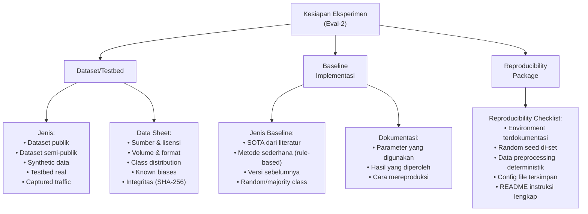

---

## 3. Pengantar Kontekstual

Kualitas penelitian sangat bergantung pada kualitas data dan kekuatan baseline. Dataset yang bias akan menghasilkan kesimpulan yang bias. Baseline yang lemah membuat kontribusi penelitian terlihat lebih besar dari kenyataannya. Keduanya adalah kesalahan metodologis yang serius yang dapat mengakibatkan paper ditolak oleh reviewer jurnal.

Dalam bidang keamanan siber, pemilihan dataset memiliki dimensi tambahan: banyak dataset yang digunakan dalam penelitian ternyata memiliki masalah — NSL-KDD yang sudah tua dan tidak mencerminkan ancaman modern, CICIDS2017 yang memiliki label error yang diketahui, atau dataset yang dibuat dalam kondisi terkontrol yang tidak mencerminkan traffic nyata.

---

## 4. Landasan Teori

### 4.1 Jenis Dataset dalam Penelitian Keamanan Siber

| Jenis | Contoh | Kelebihan | Keterbatasan |
|---|---|---|---|
| **Dataset Publik Standard** | NSL-KDD, CICIDS2017, UNSW-NB15, CIC-IDS | Mudah dibandingkan dengan penelitian lain | Mungkin sudah usang, label error |
| **Dataset Semi-publik** | CTU-13, CAIDA, MAWI | Traffic real, lebih representatif | Perlu registrasi, mungkin embargo |
| **Dataset Khusus Domain** | VirusTotal (malware), PhishTank (phishing), MISP | Spesifik sesuai topik | Volume, format, lisensi bervariasi |
| **Synthetic/Simulated** | GAN-generated, traffic simulation | Kontrol penuh, tidak ada privasi | Mungkin tidak mewakili real-world |
| **Testbed Real** | Lab jaringan, honeypot, sistem sandbox | Paling realistis | Kompleks, mahal, tidak mudah direproduksi |

### 4.2 Data Sheet untuk Dataset

Data Sheet (Gebru et al., 2018) adalah dokumentasi standar untuk dataset yang menjawab pertanyaan kritis tentang data.

**Komponen Data Sheet:**
```markdown
## Data Sheet: [Nama Dataset]

### Motivasi
- Untuk tujuan apa dataset ini dibuat?
- Siapa yang membuatnya dan didanai oleh siapa?

### Komposisi
- Berisi apa saja? Berapa jumlah instance?
- Distribusi kelas: [tabel distribusi]
- Apakah ada missing values?
- Apakah dataset mengandung data personal?

### Proses Pengumpulan
- Bagaimana data dikumpulkan?
- Dalam periode waktu apa?
- Mekanisme apa yang digunakan?

### Preprocessing/Cleaning
- Preprocessing apa yang sudah dilakukan?
- Apakah raw data tersedia?

### Distribusi
- Apakah dataset dipublikasikan? Di mana?
- Lisensi apa yang digunakan?
- Verifikasi integritas: MD5/SHA-256

### Pemeliharaan
- Apakah dataset di-maintain? Oleh siapa?
- Versi berapa yang digunakan dalam penelitian ini?

### Known Issues & Biases
- Masalah yang diketahui dalam dataset ini?
- Bias yang mungkin ada?
```

### 4.3 Baseline yang Kuat

Baseline berfungsi sebagai titik referensi untuk mengukur kontribusi penelitian. Baseline yang buruk dapat membuat kontribusi penelitian terlihat besar secara artifisial.

**Kriteria Baseline yang Baik:**
1. **Representatif terhadap SOTA:** Gunakan metode terbaik yang sudah ada di literatur, bukan metode yang lemah dengan sengaja
2. **Dilaporkan dengan parameter lengkap:** Parameter apa yang digunakan? Hyperparameter tuning dilakukan atau tidak?
3. **Direproduksi sendiri:** Jika memungkinkan, implementasikan baseline sendiri, jangan hanya mengambil angka dari paper lain
4. **Pada dataset yang sama:** Bandingkan pada dataset yang sama dengan split yang sama

```python
# Contoh dokumentasi baseline yang baik:
# baseline/random_forest_baseline.py

"""
Baseline: Random Forest Classifier
Dataset: NSL-KDD (KDDTrain+.arff)
Split: 70% train, 15% validation, 15% test (seed=42)
Hyperparameter: Default sklearn (n_estimators=100, random_state=42)
Expected accuracy: ~99.2% (sesuai dengan laporan di [referensi])

Cara menjalankan:
    python baseline/random_forest_baseline.py --seed 42
"""
```

### 4.4 Reproducibility Checklist

Sebelum memulai eksperimen utama, verifikasi:

```markdown
## Reproducibility Checklist (Eval-2)

### Environment
- [ ] environment.yml atau Dockerfile tersedia dan di-test
- [ ] Versi semua library di-pin
- [ ] Environment dapat disetup dari scratch dalam < 30 menit

### Data
- [ ] Dataset ter-download dan hash SHA-256 diverifikasi
- [ ] Data sheet lengkap tersedia
- [ ] Split train/val/test dengan seed yang sama dan terdokumentasi
- [ ] Preprocessing script tersedia (tidak ada langkah manual)

### Code
- [ ] Repository ter-clone dan code berjalan tanpa error
- [ ] Random seed di-set di semua lokasi yang relevan
- [ ] Config file (bukan hardcoded) untuk semua parameter

### Baseline
- [ ] Baseline ter-implementasi dan hasil didokumentasikan
- [ ] Cara menjalankan baseline terdokumentasi dalam README
- [ ] Hasil baseline konsisten setelah dijalankan 3 kali

### Documentation
- [ ] README berisi instruksi lengkap untuk reproduce
- [ ] Logbook mencatat semua langkah setup
```

---

## 5. Model atau Arsitektur

### 5.1 Hierarki Kualitas Dataset untuk Evaluasi Tesis

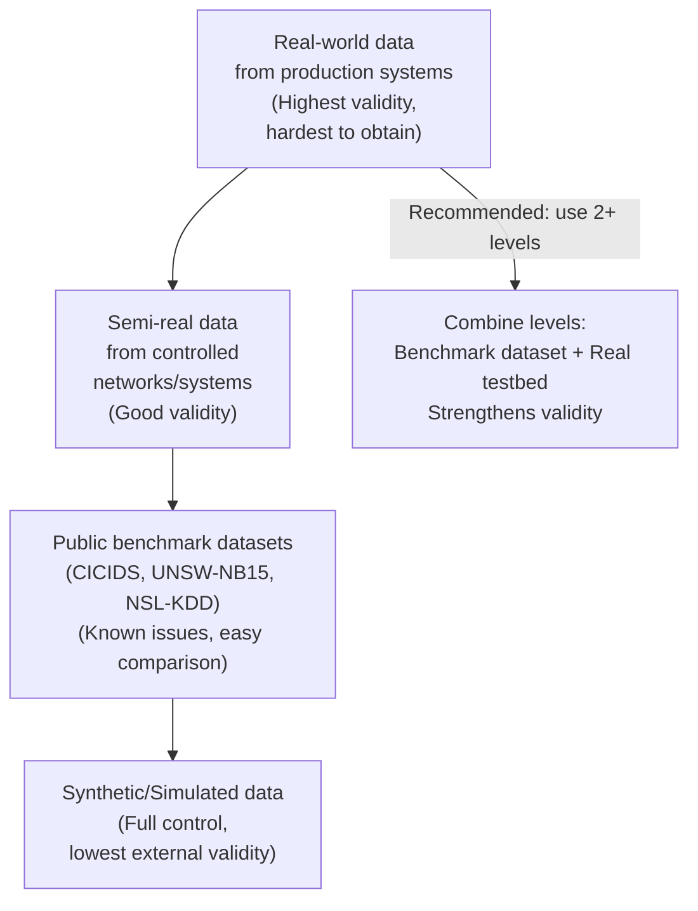

---

## 6. Contoh Terapan

### Contoh: Evaluasi Dataset untuk Tesis Deteksi DDoS

**Dataset yang Dievaluasi:**

| Dataset | Tahun | Volume | DDoS Types | Known Issues |
|---|---|---|---|---|
| CICIDS2017 | 2017 | 2.8M packets | Syn, HULK, Slowloris, GoldenEye | Label errors, traffic generation artifacts |
| CIC-DDoS2019 | 2019 | Multiple scenarios | 12 types | More recent, well-documented |
| CAIDA DDoS | 2007 | Real | Backscatter | Very old, protocol limitations |

**Keputusan:** Gunakan CIC-DDoS2019 sebagai dataset primer (lebih baru, lebih relevan), dan CIC-IDS2017 sebagai dataset sekunder untuk komparasi dengan penelitian sebelumnya.

**Dokumentasi dalam logbook:**
```
Keputusan: 2024-09-15
Memilih CIC-DDoS2019 sebagai dataset primer.
Alasan: (1) Lebih baru (mengurangi temporal bias), (2) Mencakup 12 jenis DDoS attack, 
(3) Well-documented, (4) Digunakan dalam minimal 15 paper 2022-2024 yang relevan.
Alternatif yang ditolak: CICIDS2017 (known label errors yang terdokumentasi dalam 
Engelen et al. 2021), CAIDA DDoS 2007 (terlalu usang, tidak relevan untuk serangan modern).
```

---

## 7. Praktikum atau Aktivitas Terarah

### Aktivitas 4.1: Verifikasi Dataset dan Baseline

**Tugas:**
1. Download dataset yang akan digunakan dalam tesis Anda
2. Verifikasi integritas dengan SHA-256 hash
3. Eksplorasi dataset: distribusi kelas, missing values, statistik dasar
4. Buat data sheet (Lampiran C template)
5. Implementasikan satu baseline yang paling relevan
6. Jalankan baseline 3 kali dengan seed berbeda — catat variance
7. Lengkapi reproducibility checklist

**Output Eval-2:**
- Data sheet (PDF/Markdown)
- Script preprocessing yang deterministik
- Baseline results (tabel + script)
- Reproducibility checklist yang diisi
- README yang diupdate

---

## 8. Latihan Pemahaman

**Soal 1 (Analisis):** Dataset NSL-KDD masih banyak digunakan dalam penelitian IDS meskipun dibuat pada tahun 1999. Jelaskan kelemahan menggunakan dataset ini untuk mengevaluasi sistem IDS modern, dan kapan penggunaannya masih dapat dibenarkan.

**Soal 2 (Desain):** Anda berencana menggunakan model yang dilatih pada dataset A dan diuji pada dataset B (cross-dataset evaluation). Apa keuntungan metodologis dari pendekatan ini dibanding hanya menggunakan satu dataset? Apa tantangannya?

**Soal 3 (Kritis):** Sebuah paper mengklaim model baru mencapai accuracy 99.8% pada NSL-KDD, melampaui semua metode sebelumnya yang maximum 98%. Sebagai reviewer, apa yang Anda pertanyakan tentang klaim ini?

---

## 9. Latihan Terapan / Studi Kasus

### Studi Kasus: Baseline yang Meragukan

Mahasiswa E menulis dalam tesisnya: "Model kami mencapai accuracy 96% pada dataset CICIDS2017, meningkat 15% dibanding baseline (81%)." Namun pembimbing mencurigai baseline yang digunakan adalah Naive Bayes dengan parameter default, sementara SOTA untuk dataset yang sama adalah >98%.

**Pertanyaan (C5):** Analisis situasi ini: (a) Apakah ini masalah akademik yang serius? Mengapa? (b) Kontribusi penelitian mahasiswa E sesungguhnya apa, jika dibandingkan dengan SOTA yang tepat? (c) Bagaimana memperbaiki situasi ini tanpa memulai penelitian dari awal?

---

## 10. Kunci Jawaban dan Pembahasan

**Soal 1:** NSL-KDD: Kelemahan utama adalah: (a) Traffic dari tahun 1999 — protokol, aplikasi, dan teknik serangan sangat berbeda dengan sekarang (tidak ada HTTPS, tidak ada modern APT, tidak ada IoT); (b) Sudah "solved" — banyak metode sederhana mencapai >99%, tidak ada tantangan yang berarti; (c) Artificial — traffic disimulasikan, bukan traffic real; (d) Missing modern attack types (ransomware, cryptomining, API abuse, dll.).

Masih dapat dibenarkan: (a) Untuk membandingkan dengan baseline dari penelitian lama yang menggunakan NSL-KDD; (b) Sebagai "proof of concept" bukan sebagai satu-satunya dataset evaluasi; (c) Sebagai komponen dari evaluasi multi-dataset.

**Soal 3:** Pertanyaan kritis sebagai reviewer:
(a) Baseline apa yang digunakan? Apakah SOTA yang tepat?
(b) Apakah data leakage terjadi? (train/test split tidak proper)
(c) Apakah ada class imbalance yang menyebabkan accuracy menyesatkan? (99.8% bisa dicapai dengan hanya memprediksi kelas mayoritas jika distribusi tidak seimbang)
(d) Apakah hasil dirata-rata atas multiple run? Atau satu run beruntung?
(e) Apakah ada hyperparameter tuning yang berlebihan pada test set? (overfitting ke test set)

---

## 11. Ringkasan Bab

Dataset dan baseline yang kuat adalah pondasi validitas penelitian. Dataset harus dipilih berdasarkan relevansi, kualitas, dan kemampuan untuk menjawab research question — bukan berdasarkan kemudahan mendapat angka yang tinggi. Data sheet mendokumentasikan semua aspek dataset secara transparan. Baseline harus representatif terhadap SOTA, bukan baseline yang lemah. Reproducibility checklist memastikan semua elemen siap sebelum eksperimen utama dimulai.

---

## 12. Refleksi Profesional

**Pertanyaan Refleksi 1:** Dalam penelitian keamanan siber, "adversarial" adalah sifat fundamental dari domain — penyerang terus beradaptasi. Bagaimana ini mempengaruhi validitas penelitian yang menggunakan dataset statis? Apa implikasinya untuk klaim "sistem kami dapat mendeteksi X% serangan"?

**Pertanyaan Refleksi 2:** Seorang peneliti terkemuka pernah berkata: "Pilih dataset yang membuat penelitianmu SULIT, bukan yang membuatnya MUDAH." Apa maksudnya, dan bagaimana prinsip ini seharusnya mempengaruhi pemilihan dataset dalam tesis Anda?

---

# BAB 5 — DESAIN ARSITEKTUR PROTOTIPE

**Pertemuan:** 5  
**Sub-CPMK:** Sub-CPMK.3  
**CPMK:** CPMK.2  
**Evaluasi:** Eval-3 (25%)

---

## 1. Capaian Pembelajaran Bab

Setelah menyelesaikan Bab 5, mahasiswa mampu:

- Menerjemahkan metodologi penelitian dari proposal menjadi desain arsitektur prototipe yang konkret.
- Membuat dokumen desain yang mencakup arsitektur komponen, alur data, antarmuka, dan keputusan teknis.
- Mengidentifikasi komponen kritis yang paling berisiko secara teknis.
- Menentukan kriteria "Definition of Done" untuk prototipe Review Tengah Semester.

---

## 2. Peta Konsep Bab

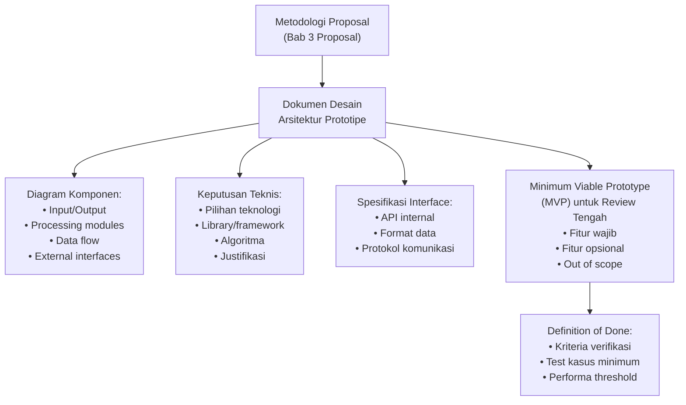

---

## 3. Pengantar Kontekstual

Banyak tesis mengalami masalah di tahap implementasi karena desain tidak pernah dipikirkan secara eksplisit — mahasiswa "langsung coding" dan arsitektur berkembang secara organik tanpa arah yang jelas. Akibatnya: kode yang sulit di-maintain, komponen yang saling terlalu bergantung (tightly coupled), dan kesulitan menambahkan fitur baru atau mengubah satu komponen tanpa merusak yang lain.

Desain arsitektur bukan hanya untuk "produk komersial" — bahkan kode penelitian perlu dirancang dengan baik agar dapat direplikasi, diperluas, dan diaudit oleh pembimbing dan reviewer.

---

## 4. Landasan Teori

### 4.1 Prinsip Desain untuk Kode Penelitian

Kode penelitian memiliki kebutuhan yang berbeda dari kode produksi. Prioritas utama:

1. **Reproducibility > Performa:** Kode yang reproducible lebih berharga dari kode yang cepat tapi tidak dapat direplikasi
2. **Readability > Cleverness:** Reviewer dan pembimbing harus dapat memahami kode Anda
3. **Modularitas:** Setiap komponen harus dapat diuji secara independen
4. **Configurability:** Parameter harus dari file konfigurasi, bukan hardcoded

### 4.2 Jenis Artefak Tesis dan Arsitekturnya

Tergantung jenis penelitian, artefak tesis dapat berupa:

**A. Sistem/Pipeline (IDS, SIEM, tool forensik):**
```
Input (Data) → Preprocessing → Feature Extraction → Detection/Classification → Output/Alert
```

**B. Model ML (deteksi anomali, klasifikasi malware):**
```
Dataset → Feature Engineering → Model Training → Evaluation → Deployment Wrapper
```

**C. Framework/Metodologi:**
```
Problem Definition → Framework Components → Case Study Application → Validation
```

**D. Prosedur/Playbook (incident response, forensics):**
```
Trigger → Triage → Investigation Steps → Documentation → Reporting
```

### 4.3 Minimum Viable Prototype (MVP)

MVP untuk Review Tengah Semester adalah versi terkecil dari sistem yang:
- Demonstrable (dapat ditunjukkan berjalan)
- Fungsional pada satu skenario end-to-end
- Diverifikasi dengan sanity check dasar
- Terdokumentasi (README untuk cara menjalankan)

MVP bukan prototipe yang "hampir selesai" — MVP adalah prototipe yang membuktikan bahwa pendekatan teknis yang dipilih dapat berjalan.

---

## 5. Model atau Arsitektur

### 5.1 Contoh Arsitektur: Sistem Deteksi Intrusi Jaringan

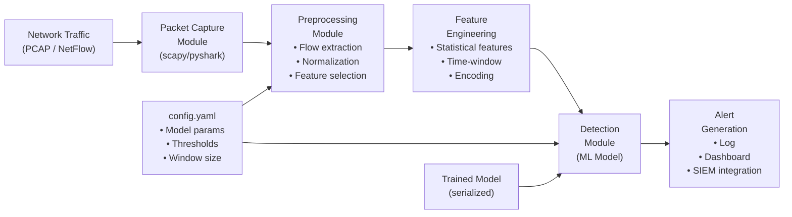

---

## 6. Contoh Terapan

### Template Dokumen Desain (ringkasan)

```markdown
# Dokumen Desain: [Judul Sistem]

## Ringkasan Sistem
[1 paragraf: apa sistem ini, problem yang dipecahkan]

## Arsitektur High-Level
[Diagram komponen]

## Komponen Utama

### Komponen A: [Nama]
- Input: [format, sumber]
- Output: [format, tujuan]
- Teknologi: [library/framework]
- Risiko teknis: [apa yang mungkin sulit]

### Komponen B: ...

## Keputusan Teknis

| Keputusan | Pilihan yang Dibuat | Alternatif yang Ditolak | Justifikasi |
|---|---|---|---|
| Framework ML | PyTorch | TensorFlow | Fleksibilitas lebih tinggi |

## MVP untuk Review Tengah Semester
Fitur yang HARUS ada:
- [ ] [Feature 1]
- [ ] [Feature 2]

Fitur yang akan ditambahkan setelah Review:
- [ ] [Feature 3]

## Definition of Done
MVP dianggap selesai jika:
- [ ] Dapat membaca input [format]
- [ ] Menghasilkan output [format] yang dapat diverifikasi
- [ ] Dijalankan pada [skenario test] dengan hasil [threshold]
```

---

## 7. Praktikum atau Aktivitas Terarah

### Aktivitas 5.1: Workshop Desain Arsitektur

**Tugas:**
1. Buat dokumen desain menggunakan template di atas
2. Buat minimal 2 diagram Mermaid: (a) arsitektur komponen, (b) alur data
3. Definisikan MVP dengan kriteria yang terukur
4. Identifikasi 3 komponen yang paling berisiko secara teknis — rencanakan "spike" (eksperimen kecil untuk membuktikan feasibility)
5. Presentasikan kepada pembimbing untuk validasi

---

## 8. Latihan Pemahaman

**Soal 1:** Apa perbedaan antara "arsitektur prototipe" dan "sistem produksi"? Apa yang boleh dikompromikan dalam prototipe penelitian?

**Soal 2:** Mengapa "Definition of Done" penting untuk Review Tengah Semester? Apa konsekuensinya jika DoD tidak didefinisikan sejak awal?

**Soal 3 (Analisis):** Seorang mahasiswa berencana mengintegrasikan 5 library baru yang belum pernah ia gunakan dalam satu prototipe. Identifikasi risiko dari pendekatan ini dan berikan rekomendasi strategi yang lebih aman.

---

## 9. Latihan Terapan / Studi Kasus

### Studi Kasus: Scope Creep

Mahasiswa F merancang IDS berbasis ML. Setelah Per 5, pembimbingnya menyarankan menambahkan: (a) real-time processing, (b) web dashboard, (c) integration dengan SIEM. Masing-masing fitur ini signifikan secara teknis.

**Pertanyaan (C5):** Analisis situasi "scope creep" ini. Berikan framework untuk memutuskan mana dari ketiga fitur tambahan yang (a) harus ada dalam prototipe Review Tengah Semester, (b) boleh ditunda ke setelah Review, (c) boleh di-drop atau disebutkan sebagai future work. Pertimbangkan: waktu tersisa, nilai ilmiah, kompleksitas teknis.

---

## 10. Kunci Jawaban

**Soal 1:** Prototipe penelitian boleh mengkompromikan: performa (tidak perlu dioptimasi untuk produksi), skalabilitas (tidak perlu handle ribuan pengguna), user experience (UI minimal), error handling (tidak perlu robust untuk semua edge case), keamanan produksi (tapi tetap tidak boleh melakukan hal ilegal). Yang TIDAK boleh dikompromikan: reproducibility, kebenaran logika eksperimen, validitas pengukuran.

---

## 11. Ringkasan Bab

Desain arsitektur sebelum implementasi mencegah pemborosan waktu akibat refactoring besar-besaran. Dokumen desain harus mendefinisikan komponen, antarmuka, keputusan teknis, dan MVP yang jelas. Definition of Done yang terukur memastikan Review Tengah Semester memiliki target yang objektif.

---

## 12. Refleksi Profesional

**Pertanyaan Refleksi 1:** "Perfect is the enemy of good" — dalam konteks tesis, kapan sebaiknya berhenti mendesain dan mulai mengimplementasikan? Bagaimana Anda mengenali bahwa desain sudah "cukup baik" untuk mulai dikerjakan?

---

# BAB 6 — IMPLEMENTASI PROTOTIPE — FASE 1

**Pertemuan:** 6  
**Sub-CPMK:** Sub-CPMK.3  
**CPMK:** CPMK.2  
**Evaluasi:** Eval-3 (25%)

---

## 1. Capaian Pembelajaran Bab

Setelah menyelesaikan Bab 6, mahasiswa mampu:

- Mengimplementasikan komponen inti prototipe sesuai desain yang telah divalidasi pembimbing.
- Menerapkan praktik coding yang mendukung reproducibility dan maintainability.
- Mendokumentasikan implementasi secara paralel dengan pengembangan.
- Melakukan commit dan tagging yang bermakna dalam repository.

---

## 2. Peta Konsep Bab

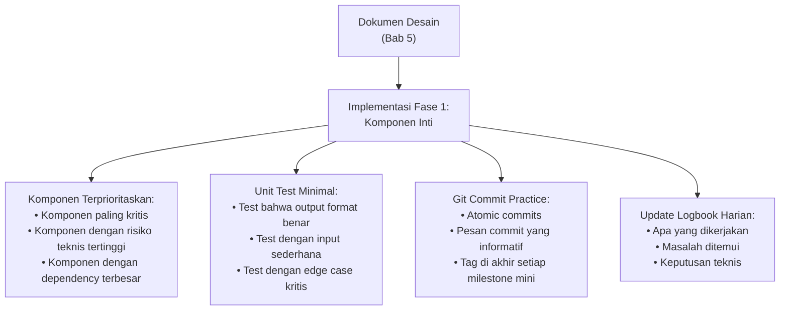

---

## 3. Pengantar Kontekstual

Implementasi adalah fase di mana desain berhadapan dengan realita teknis. Hampir selalu ada gap antara "apa yang direncanakan" dan "apa yang dapat diimplementasikan dalam waktu yang tersedia." Kemampuan untuk mengidentifikasi gap ini sejak dini dan mengkomunikasikannya kepada pembimbing adalah skill penting bagi peneliti.

---

## 4. Landasan Teori

### 4.1 Strategi Implementasi untuk Prototipe Penelitian

**Prinsip "Outside-In":** Mulai dari interface (input/output yang diharapkan), baru implementasikan bagian dalam.

```python
# Outside-in: definisikan interface dulu
class IntrusionDetector:
    def __init__(self, config: dict):
        """Load model dan konfigurasi."""
        pass
    
    def predict(self, features: np.ndarray) -> tuple[np.ndarray, np.ndarray]:
        """
        Prediksi label dan confidence untuk setiap flow.
        
        Returns:
            labels: array of predicted class labels
            confidences: array of confidence scores [0, 1]
        """
        pass  # Implementasikan ini berikutnya
    
    def evaluate(self, X_test, y_test) -> dict:
        """Return dict dengan accuracy, precision, recall, F1."""
        pass
```

**Prinsip "Spike" untuk Risiko Tinggi:** Sebelum implementasi penuh, buat eksperimen kecil yang membuktikan feasibility komponen yang paling tidak pasti.

```python
# Spike: apakah library A dan B dapat bekerja bersama?
# (20 baris kode, 30 menit) — sebelum investasi implementasi penuh
import library_a, library_b

# Test integrasi minimal
result = library_b.process(library_a.read(sample_input))
assert result.shape == expected_shape  # Jika ini berhasil, lanjutkan
```

### 4.2 Praktik Commit yang Baik untuk Riset

```bash
# Commit message yang BURUK:
git commit -m "update"
git commit -m "fix bug"
git commit -m "changes"

# Commit message yang BAIK:
git commit -m "feat: implement flow feature extraction from PCAP
  
  - Parse PCAP using scapy
  - Extract: src/dst IP/port, duration, packet count, byte count
  - Output format: DataFrame compatible with sklearn
  
  Tested on: sample_traffic.pcap (200 flows)
  Performance: ~1000 flows/sec on M2 Mac"

git commit -m "fix: resolve NaN in feature normalization when flow duration = 0
  
  Zero-duration flows (single packet) caused division by zero.
  Solution: add epsilon (1e-10) to duration before normalization.
  
  Fixes issue #12"
```

### 4.3 Dokumentasi Inline dan External

Kode penelitian harus dapat dipahami oleh pembimbing, reviewer, dan Anda sendiri 6 bulan kemudian:

```python
def extract_features(pcap_path: str, window_size: int = 60) -> pd.DataFrame:
    """
    Ekstrak fitur statistik dari file PCAP untuk deteksi intrusi.
    
    Menggunakan time-window approach (Gu et al., 2005) dengan window
    non-overlapping untuk mengurangi komputasi.
    
    Args:
        pcap_path: Path ke file PCAP
        window_size: Ukuran window dalam detik (default: 60)
    
    Returns:
        DataFrame dengan kolom: [src_ip, dst_ip, duration, pkt_count,
                                  byte_count, mean_pkt_size, std_pkt_size]
    
    Notes:
        - Memory intensive untuk PCAP > 1GB; gunakan chunking
        - Hanya IPv4 yang di-handle saat ini (IPv6 dalam TODO)
    """
```

---

## 5. Model atau Arsitektur

### 5.1 Iterasi Implementasi

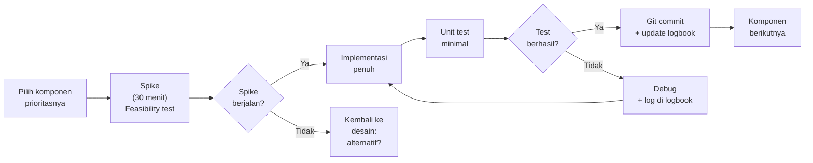

---

## 6. Contoh Terapan

### Contoh: Log Implementasi Komponen Feature Extractor

```markdown
## Sesi Riset — 2024-10-15, 14:00–18:00

### Tujuan
Implementasi komponen feature extraction dari PCAP (WBS 2.2)

### Aktivitas
1. Spike: uji scapy + pandas interop → BERHASIL (20 menit)
2. Implementasi `extract_flows_from_pcap()` → 90% selesai
   - Handle TCP, UDP OK
   - ICMP masih belum (bukan prioritas MVP)
3. Unit test dasar: 3 test pass, 1 fail (ICMP edge case)

### Masalah
- Scapy sangat lambat untuk file PCAP > 500MB (1200 detik untuk 1GB)
- Alternatif: gunakan `dpkt` untuk performance-critical path

### Keputusan Teknis
- Keputusan: Tetap gunakan scapy untuk prototype (readability > performance)
  Alasan: Prototype bukan production — hasil eksperimen lebih penting dari speed
  Catatan: Tandai sebagai performance bottleneck dalam Bab Pembahasan

### Status
- WBS 2.2: 80% complete
- Commit: 3a7f9d1 "feat: implement TCP/UDP flow extraction from PCAP"
- Sisa: ICMP handling + integrasi dengan modul berikutnya
```

---

## 7. Praktikum atau Aktivitas Terarah

### Aktivitas 6.1: Sprint Implementasi Komponen 1

**Durasi:** Per 6 (setara 1 minggu kerja)  
**Target:** Minimal 1 komponen inti selesai, ter-test, ter-commit dengan tag.

**Deliverable:**
- Kode komponen dengan unit test
- Commit bermakna dengan pesan yang informatif
- Update logbook (harian)
- Update WBS: task mana yang selesai/tertunda

---

## 8. Latihan Pemahaman

**Soal 1:** Apa yang dimaksud dengan "spike" dalam konteks implementasi prototipe penelitian, dan kapan sebaiknya digunakan?

**Soal 2:** Berikan 3 alasan mengapa unit test minimal penting bahkan untuk kode penelitian yang tidak akan di-deploy ke produksi.

**Soal 3 (Kasus):** Seorang mahasiswa menemukan bahwa library utama yang direncanakan tidak mendukung format data yang digunakan. Ini baru diketahui di Per 6 (setelah desain selesai di Per 5). Apa yang harus dilakukan? Apa informasi yang harus segera dikomunikasikan kepada pembimbing?

---

## 9. Latihan Terapan

### Studi Kasus: Implementasi vs. Perencanaan

Mahasiswa G berencana mengimplementasikan model federated learning menggunakan library X. Di Per 6, setelah 1 minggu implementasi, ia menemukan bahwa library X tidak mendukung custom loss function yang diperlukan untuk penelitiannya. Opsi: (a) ganti library Y (belajar dari awal, 2 minggu), (b) implementasi FL dari awal dengan PyTorch (4 minggu), (c) modifikasi research design untuk tidak memerlukan custom loss (diskusikan dengan pembimbing).

**Pertanyaan:** Analisis trade-off ketiga opsi dari perspektif: waktu, kualitas penelitian, dampak ke milestone, dan risiko.

---

## 10. Kunci Jawaban

**Soal 2 — Unit test penting karena:** (a) **Deteksi regresi**: saat mengubah satu komponen, test memastikan komponen lain tidak rusak — kritis dalam refactoring; (b) **Dokumentasi perilaku**: test adalah "spesifikasi yang dapat dieksekusi" — mendokumentasikan apa yang komponen seharusnya lakukan; (c) **Kepercayaan diri dalam refactoring**: tanpa test, perubahan kode selalu berisiko — dengan test, refactoring lebih aman dan lebih sering dilakukan sehingga kualitas kode meningkat.

---

## 11. Ringkasan Bab

Implementasi Fase 1 berfokus pada komponen inti dengan risiko teknis tertinggi. Gunakan "spike" untuk memvalidasi feasibility sebelum investasi implementasi penuh. Commit yang bermakna dan logbook yang konsisten memastikan pekerjaan dapat dilacak dan direproduksi. Dokumentasikan masalah dan keputusan teknis dalam logbook — ini adalah materi mentah untuk Bab Metodologi.

---

## 12. Refleksi Profesional

**Pertanyaan Refleksi 1:** "If you're not embarrassed by the first version of your product, you've launched too late" (Reid Hoffman). Apakah prinsip ini berlaku untuk prototipe penelitian? Di mana batasnya — prototipe yang "cukup baik untuk didemonstrasikan" vs. "terlalu kasar untuk diklaim sebagai kontribusi ilmiah"?

---


---

# BAB 7 — IMPLEMENTASI PROTOTIPE — FASE 2 DAN SANITY CHECK

**Pertemuan:** 7  
**Sub-CPMK:** Sub-CPMK.3  
**CPMK:** CPMK.2  
**Evaluasi:** Eval-3 (25%)

---

## 1. Capaian Pembelajaran Bab

Setelah menyelesaikan Bab 7, mahasiswa mampu:

- Mengintegrasikan komponen-komponen prototipe menjadi sistem yang dapat berjalan end-to-end.
- Melakukan sanity check untuk memverifikasi kebenaran dasar implementasi sebelum eksperimen.
- Mendokumentasikan prototipe v0.1 yang siap untuk Review Tengah Semester.
- Mengidentifikasi dan memprioritaskan perbaikan yang diperlukan sebelum eksperimen utama.

---

## 2. Peta Konsep Bab

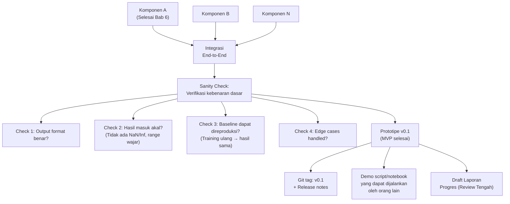

---

## 3. Pengantar Kontekstual

Integrasi komponen adalah fase yang sering menemukan masalah yang tidak terlihat saat setiap komponen bekerja secara independen. "Integration Hell" — istilah dalam software engineering — terjadi ketika banyak komponen yang bekerja sendiri-sendiri tiba-tiba tidak berjalan bersama karena ketidakcocokan interface, asumsi yang tidak dikomunikasikan, atau ketergantungan yang tidak terduga.

Sanity check adalah verifikasi minimal yang memastikan implementasi tidak memiliki kesalahan mendasar sebelum waktu berharga dihabiskan untuk eksperimen yang panjang.

---

## 4. Landasan Teori

### 4.1 Sanity Checks untuk Sistem ML/AI

```python
# Sanity checks yang WAJIB sebelum eksperimen ML:

# 1. Overfit test: model HARUS bisa overfit ke dataset kecil
#    Jika tidak bisa overfit ke 10 sampel, ada bug dalam training
X_tiny = X_train[:10]
y_tiny = y_train[:10]
model.fit(X_tiny, y_tiny, epochs=100)
assert model.evaluate(X_tiny, y_tiny)[1] > 0.99, "Model gagal overfit ke data kecil — periksa implementasi!"

# 2. Random baseline: model harus lebih baik dari random
random_accuracy = max(np.bincount(y_test)) / len(y_test)
model_accuracy = model.evaluate(X_test, y_test)[1]
assert model_accuracy > random_accuracy, f"Model ({model_accuracy:.3f}) tidak lebih baik dari random ({random_accuracy:.3f})!"

# 3. Gradient sanity: pastikan gradien mengalir
# (untuk model neural network)
with tf.GradientTape() as tape:
    output = model(X_tiny)
    loss = loss_fn(y_tiny, output)
grads = tape.gradient(loss, model.trainable_variables)
assert all(g is not None for g in grads), "Gradient tidak mengalir — ada masalah dalam model!"

# 4. Reproducibility test
result1 = run_experiment(seed=42)
result2 = run_experiment(seed=42)
assert np.allclose(result1['accuracy'], result2['accuracy']), "Hasil tidak reproducible!"
```

### 4.2 Integration Testing untuk Sistem Berbasis Pipeline

```python
# Integration test untuk pipeline IDS:
def test_pipeline_integration():
    """Test bahwa pipeline berjalan end-to-end dengan input minimal."""
    
    # Gunakan sample input kecil yang diketahui hasilnya
    sample_pcap = "tests/fixtures/sample_10flows.pcap"
    expected_alerts = ["192.168.1.5:34567 → 10.0.0.1:80 | DoS"]
    
    # Jalankan pipeline lengkap
    detector = IntrusionDetector(config="tests/fixtures/test_config.yaml")
    flows = detector.extract_flows(sample_pcap)
    predictions = detector.predict(flows)
    alerts = detector.generate_alerts(predictions, flows)
    
    # Verifikasi output format
    assert isinstance(alerts, list)
    assert len(alerts) > 0
    assert all('src' in a and 'dst' in a and 'type' in a for a in alerts)
    
    print(f"Integration test passed: {len(alerts)} alerts generated")
```

### 4.3 Dokumentasi Prototipe v0.1 — Release Notes

```markdown
# Release Notes: Prototipe v0.1

**Tanggal:** [Tanggal]
**Git tag:** v0.1-prototype
**Status:** MVP untuk Review Tengah Semester

## Fitur yang Diimplementasikan
- [x] Pembacaan PCAP dan ekstraksi flow
- [x] Preprocessing dan normalisasi fitur
- [x] Model Random Forest baseline
- [x] Output laporan dalam format JSON

## Keterbatasan Diketahui (Known Limitations)
- Hanya mendukung IPv4 (IPv6 dalam roadmap)
- Performa: ~1000 flows/detik (belum dioptimasi)
- Model belum ditraining dengan dataset final (hanya 30% subset)

## Cara Menjalankan Demo
```bash
conda activate thesis-env
python experiments/demo_v0.1.py --input data/sample/test_traffic.pcap
```

## Sanity Check Results
- Overfit test: PASS (accuracy 99.8% pada 10 sampel)
- Baseline reproduction: PASS (Random Forest accuracy 97.3% vs reported 97.1%)
- Reproducibility: PASS (3x run dengan seed 42 → identik)
```

---

## 5. Model atau Arsitektur

### 5.1 Checklist Kesiapan Review Tengah Semester

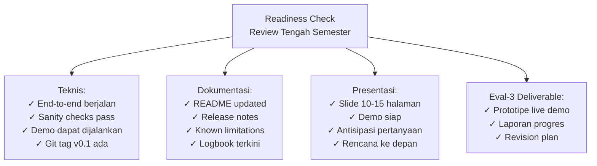

---

## 6. Contoh Terapan

### Contoh: Checklist Sanity Check untuk Tesis Forensik Memori

Untuk tesis tentang analisis artefak malware dalam memory dump:

```
Sanity Check List — Per 7 (sebelum Review Tengah Semester)

✓ Tool dapat membaca format memory dump yang digunakan (raw, DMP, LiME)
✓ Plugin Volatility3 kustom dapat dijalankan pada dump yang valid
✓ Output JSON/CSV dari plugin dapat diparse dengan benar
✓ Analisis pada sampel "ground truth" (memory dump dengan malware yang diketahui):
  → 5/5 sampel positif terdeteksi
  → 0/3 sampel bersih terdeteksi sebagai positif (FP = 0)
✗ (FAILED) Analisis pada dump yang dikompresi — belum didukung
  → MITIGASI: Dekompresi dulu secara manual, dokumentasikan sebagai limitasi
✓ Seluruh pipeline dapat dijalankan dalam < 5 menit per sample pada hardware lab
✓ Reproducibility: output identik pada 3 run pada dump yang sama
```

---

## 7. Praktikum atau Aktivitas Terarah

### Aktivitas 7.1: Integrasi dan Sanity Check Sprint

**Target Per 7:**
1. Integrasikan semua komponen — jalankan pipeline end-to-end pada sample data
2. Jalankan semua sanity checks — dokumentasikan mana yang pass/fail
3. Untuk yang fail: apakah ini blocker untuk Review Tengah Semester?
4. Tag repository: `git tag -a v0.1 -m "MVP complete — RTS ready"`
5. Siapkan demo script: `demo_v0.1.py` atau notebook yang dapat dijalankan orang lain
6. Tulis release notes

**Deliverable yang dikumpulkan sebelum Per 8:**
- Repository dengan tag v0.1
- Sanity check report (markdown)
- Demo yang dapat dijalankan
- Draft laporan progres (untuk Review Tengah Semester)

---

## 8. Latihan Pemahaman

**Soal 1:** Mengapa "overfit test" (model harus bisa overfit ke data kecil) merupakan sanity check yang penting untuk sistem ML? Apa yang dapat disimpulkan jika model GAGAL overfit bahkan ke 10 sampel?

**Soal 2:** Seorang mahasiswa menemukan bahwa sanity check "reproducibility" gagal — hasil sedikit berbeda setiap kali dijalankan. Daftar semua sumber ketidakdeterminisme yang mungkin dan cara memperbaikinya.

**Soal 3 (Evaluasi):** Review Tengah Semester adalah 1 minggu lagi. Sanity check menunjukkan 3 dari 7 komponen PASS, 2 FAIL dengan bug yang diketahui, dan 2 belum diimplementasikan sama sekali. Bagaimana Anda memprioritaskan 1 minggu terakhir sebelum review?

---

## 9. Latihan Terapan

### Studi Kasus: Sanity Check Menemukan Bug Serius

Di Per 7 (3 hari sebelum Review Tengah Semester), sanity check reproducibility test menunjukkan: eksperimen yang dijalankan ulang menghasilkan accuracy yang BERBEDA secara signifikan (87% vs 94%). Investigasi menemukan bahwa train/test split berbeda setiap kali karena random seed tidak diset sebelum split.

**Pertanyaan (C5):** Analisis implikasi dari temuan ini: (a) Apakah hasil yang sudah dilaporkan di logbook valid? (b) Apa yang harus dilakukan dalam 3 hari tersisa? (c) Bagaimana mengkomunikasikan ini kepada pembimbing? (d) Apa perubahan kode yang diperlukan?

---

## 10. Kunci Jawaban

**Soal 1:** Jika model tidak bisa overfit ke 10 sampel, ada masalah fundamental: (a) **Bug dalam training loop** — gradient tidak mengalir, loss tidak menurun; (b) **Learning rate terlalu kecil** — model tidak konvergen bahkan dengan data minimal; (c) **Target leak** — label dihapus atau salah diformat; (d) **Data pipeline bug** — input atau label yang salah dimasukkan ke model; (e) **Model terlalu kecil** — kapasitas model tidak cukup bahkan untuk 10 sampel. Intinya: jika tidak bisa overfit ke data kecil, model tidak dapat belajar apapun dari data besar.

---

## 11. Ringkasan Bab

Integrasi komponen dan sanity check adalah gate wajib sebelum Review Tengah Semester. Sanity check sistematis mencegah eksperimen yang panjang dan mahal berdasarkan pada implementasi yang salah. Prototipe v0.1 harus dapat didemonstrasikan, terdokumentasi dalam release notes, dan ter-tagged di repository. Known limitations harus didokumentasikan secara jujur.

---

## 12. Refleksi Profesional

**Pertanyaan Refleksi 1:** Dokumentasi "known limitations" dalam release notes memerlukan kejujuran tentang apa yang belum berhasil. Beberapa mahasiswa khawatir ini akan mempengaruhi penilaian negatif. Bagaimana Anda menyeimbangkan antara kejujuran ilmiah (mendokumentasikan keterbatasan) dengan kebutuhan untuk menunjukkan kemajuan yang baik?

---

# BAB 8 — REVIEW TENGAH SEMESTER: DEMONSTRASI DAN EVALUASI

**Pertemuan:** 8  
**Sub-CPMK:** Sub-CPMK.3  
**CPMK:** CPMK.2  
**Evaluasi:** Eval-3 (25%)

---

## 1. Capaian Pembelajaran Bab

Setelah menyelesaikan Bab 8, mahasiswa mampu:

- Menyiapkan presentasi Review Tengah Semester yang efektif dan profesional.
- Mendemonstrasikan prototipe yang fungsional kepada pembimbing dan reviewer.
- Merespons pertanyaan teknis dan metodologis dengan tepat dan percaya diri.
- Menyusun rencana revisi berdasarkan feedback reviewer untuk fase eksperimen.

---

## 2. Peta Konsep Bab

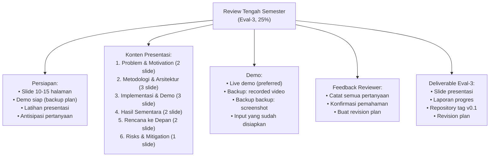

---

## 3. Pengantar Kontekstual

Review Tengah Semester adalah ujian pertama yang dinilai secara formal. Ini adalah kesempatan untuk mendapatkan feedback dari reviewer yang belum familiar dengan detail penelitian Anda — perspektif segar yang sering menemukan masalah yang tidak terlihat oleh mahasiswa dan pembimbing yang terlalu dekat dengan penelitian.

---

## 4. Landasan Teori

### 4.1 Struktur Presentasi Efektif

**Prinsip "SCQA" (Situation-Complication-Question-Answer):**
- **S**ituation: Konteks yang dipahami semua orang
- **C**omplication: Mengapa situasi ini bermasalah?
- **Q**uestion: Pertanyaan penelitian yang muncul dari komplikasi
- **A**nswer: Apa yang Anda lakukan untuk menjawab pertanyaan ini

**Struktur Slide Review Tengah Semester:**

| Slide | Konten | Durasi |
|---|---|---|
| 1 | Judul, mahasiswa, pembimbing | 30 detik |
| 2 | Problem & Motivasi — "Mengapa ini penting?" | 2 menit |
| 3 | Research Question & Scope | 1 menit |
| 4 | Metodologi Overview — diagram alur | 2 menit |
| 5 | Arsitektur Sistem/Prototipe | 2 menit |
| 6-7 | Implementasi — apa yang sudah selesai | 3 menit |
| 8 | Demo (atau hasil sementara) | 3 menit |
| 9 | Hasil Sementara — angka awal, bukan final | 1 menit |
| 10 | Rencana Per 9-16 — milestone konkret | 2 menit |
| 11 | Risiko & Mitigasi | 1 menit |
| 12 | Kesimpulan & Pertanyaan | 30 detik |
| **Total** | | **18 menit + 12 menit Q&A** |

### 4.2 Menangani Pertanyaan Reviewer

**Pertanyaan umum di Review Tengah Semester:**
- "Mengapa Anda memilih metode X bukan Y?"
- "Bagaimana Anda tahu bahwa baseline Anda kuat?"
- "Apa kontribusi novelty penelitian ini?"
- "Apakah prototipe sudah berjalan pada data real atau hanya simulasi?"
- "Apa risiko terbesar yang tersisa?"

**Cara merespons pertanyaan yang tidak diketahui jawabannya:**
```
"Pertanyaan yang sangat baik. Saya harus mengakui bahwa saya belum 
menyelidiki aspek tersebut secara mendalam. Yang saya ketahui saat ini 
adalah [apa yang diketahui]. Saya akan menindaklanjuti pertanyaan ini 
dalam sesi bimbingan berikutnya dengan pembimbing saya."
```

Ini jauh lebih baik dari mengarang jawaban atau bersikap defensif.

---

## 5. Model atau Arsitektur

### 5.1 Persiapan Demo

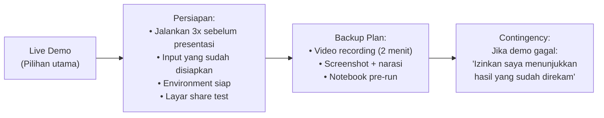

---

## 6. Contoh Terapan

### Template Laporan Progres (Eval-3)

```markdown
# Laporan Progres Tesis

**Mahasiswa:** [Nama] — [NIM]  
**Pembimbing:** [Nama]  
**Judul Tesis:** [Judul]  
**Periode:** Per 1–8 (Progres Tesis VSFDKS05)

## Ringkasan Eksekutif
[2-3 kalimat: apa yang telah dicapai dan apa yang direncanakan]

## Progres terhadap WBS
| WBS ID | Task | Status | Catatan |
|---|---|---|---|
| 1.1 | Setup repository | ✓ Selesai | |
| 1.2 | Download dataset | ✓ Selesai | |
| 2.1 | Desain arsitektur | ✓ Selesai | Divalidasi pembimbing Per 5 |
| 2.2 | Implementasi komponen A | ✓ Selesai | |
| 2.3 | Implementasi komponen B | 80% | Bug ICMP pending |
| 2.4 | Integrasi | ✓ Selesai | |

## Hasil Sementara
[Tabel/grafik hasil yang sudah ada — labeled "PRELIMINARY, TIDAK FINAL"]

## Temuan Sementara
[Apa yang sudah dipelajari dari implementasi — masalah teknis, insight awal]

## Revisi Rencana (jika ada)
[Perubahan dari WBS awal dan justifikasinya]

## Rencana Per 9–16
[Timeline konkret untuk fase eksperimen]

## Risiko Aktif
[Risk register — update status]
```

---

## 7. Praktikum atau Aktivitas Terarah

### Aktivitas 8.1: Persiapan dan Pelaksanaan Review Tengah Semester

**Sebelum Review:**
1. Latihan presentasi minimal 2 kali (sendiri + dengan teman/pembimbing)
2. Jalankan demo 3 kali — pastikan tidak ada error
3. Siapkan backup demo (video)
4. Buat daftar pertanyaan antisipasi dan siapkan jawaban

**Setelah Review:**
1. Catat semua feedback dan pertanyaan dalam logbook
2. Buat revision plan berdasarkan feedback
3. Update risk register
4. Commit semua perubahan yang dibuat untuk review: `git tag v0.1-rts`

---

## 8. Latihan Pemahaman

**Soal 1:** Mengapa penting memiliki "backup demo" selain live demo? Berikan skenario konkret di mana backup ini diperlukan.

**Soal 2:** Reviewer menanyakan: "Mengapa Anda menggunakan accuracy sebagai metrik, padahal dataset Anda sangat imbalanced (95% normal, 5% attack)?" Bagaimana Anda merespons pertanyaan ini dengan profesional?

**Soal 3 (Refleksi):** Apa yang dimaksud dengan "preliminary results" dan mengapa penting memberi label ini secara eksplisit pada hasil yang dipresentasikan di Review Tengah Semester?

---

## 9. Latihan Terapan

### Studi Kasus: Feedback Review yang Menantang

Reviewer menyatakan: "Pendekatan Anda menggunakan Federated Learning untuk IDS menarik, tetapi saya tidak melihat bukti bahwa FL benar-benar dibutuhkan. Mengapa tidak cukup menggunakan centralized ML yang lebih sederhana?"

**Pertanyaan (C5):** Ini adalah pertanyaan kritis tentang novelty dan justifikasi penelitian. Bagaimana Anda menjawabnya dalam konteks Review Tengah Semester? Apa yang harus ada dalam jawaban untuk meyakinkan reviewer?

---

## 10. Kunci Jawaban

**Soal 2 — Respons profesional:** "Pertanyaan yang sangat tepat. Anda benar bahwa accuracy bukan metrik yang optimal untuk dataset imbalanced. Dalam implementasi saat ini, saya menggunakan accuracy sebagai metrik sementara untuk memvalidasi bahwa pipeline berjalan benar. Untuk eksperimen utama (Per 9-12), saya akan menggunakan F1-score (per kelas), Precision, Recall, dan Area Under ROC Curve, yang lebih tepat untuk dataset imbalanced. Saya telah mencatatkan ini dalam revision plan sebagai prioritas tinggi untuk fase berikutnya."

---

## 11. Ringkasan Bab

Review Tengah Semester adalah milestone formal pertama yang menguji kemampuan mahasiswa untuk mengkomunikasikan progres penelitian kepada audiens eksternal. Presentasi yang efektif mengikuti struktur SCQA, demo harus dipersiapkan dengan backup, dan pertanyaan reviewer harus direspons dengan jujur dan profesional. Feedback dari reviewer adalah masukan berharga untuk meningkatkan kualitas penelitian — bukan serangan pribadi.

---

## 12. Refleksi Profesional

**Pertanyaan Refleksi 1:** Feedback dari reviewer terkadang terasa seperti kritik terhadap kerja keras yang telah dilakukan. Bagaimana Anda membangun mental model yang sehat terhadap feedback akademik — melihatnya sebagai "hadiah" bukan "serangan"?

**Pertanyaan Refleksi 2:** Bayangkan jika Review Tengah Semester Anda menunjukkan hasil yang jauh di bawah harapan. Pembimbing dan reviewer menyarankan perubahan signifikan pada pendekatan. Bagaimana Anda membuat keputusan antara: (a) pivoting ke pendekatan yang disarankan, (b) berargumen bahwa pendekatan awal masih valid, atau (c) mengkombinasikan keduanya?

---


---

# BAB 9 — DESAIN EKSPERIMEN UTAMA

**Pertemuan:** 9  
**Sub-CPMK:** Sub-CPMK.4  
**CPMK:** CPMK.3  
**Evaluasi:** Eval-4 (20%)

---

## 1. Capaian Pembelajaran Bab

Setelah menyelesaikan Bab 9, mahasiswa mampu:

- Merancang eksperimen yang valid, terkontrol, dan dapat direproduksi.
- Menetapkan hipotesis penelitian, variabel, dan baseline yang tepat.
- Merancang skenario eksperimen yang menjawab research question secara sistematis.
- Mengidentifikasi validity threats dan merencanakan mitigasinya.
- Mendokumentasikan protokol eksperimen sebelum eksperimen dilaksanakan.

---

## 2. Peta Konsep Bab

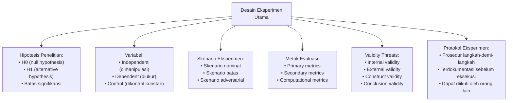

---

## 3. Pengantar Kontekstual

Desain eksperimen yang buruk adalah salah satu alasan paling umum paper ditolak oleh jurnal bereputasi. Eksperimen yang tidak terkontrol, metrik yang tidak sesuai, atau skenario yang tidak representatif dapat menghasilkan kesimpulan yang menyesatkan. Wohlin et al. (2012) dalam "Experimentation in Software Engineering" memberikan kerangka komprehensif yang menjadi referensi standar dalam bidang ini.

---

## 4. Landasan Teori

### 4.1 Hipotesis Penelitian

Hipotesis yang baik harus: falsifiable (dapat dibuktikan salah), specific (cukup spesifik untuk diuji), dan grounded (berdasarkan teori atau observasi sebelumnya).

**Format hipotesis:**
```
H0 (Null): Sistem yang diusulkan TIDAK memberikan peningkatan signifikan dalam [metrik]
           dibandingkan [baseline] pada [konteks/dataset]

H1 (Alternative): Sistem yang diusulkan memberikan peningkatan signifikan dalam [metrik]
                  dibandingkan [baseline] pada [konteks/dataset]
```

**Contoh:**
```
H0: Tidak ada perbedaan signifikan dalam F1-score (p < 0.05) antara sistem IDS berbasis 
    Federated Learning yang diusulkan dan Random Forest terpusat pada dataset CIC-DDoS2019.

H1: Sistem IDS berbasis Federated Learning yang diusulkan mencapai F1-score yang 
    signifikan lebih tinggi (p < 0.05) dibandingkan Random Forest terpusat pada dataset 
    CIC-DDoS2019, sambil mengurangi data sharing lebih dari 90%.
```

### 4.2 Variabel dalam Eksperimen

| Jenis Variabel | Definisi | Contoh dalam IDS |
|---|---|---|
| **Independent** | Yang Anda manipulasi/variasikan | Arsitektur model (FL vs centralized) |
| **Dependent** | Yang Anda ukur sebagai hasil | F1-score, detection rate, latency |
| **Control** | Yang dijaga konstan untuk isolasi | Dataset yang sama, split yang sama, random seed |
| **Confound** | Yang tidak dikontrol dan dapat mempengaruhi hasil | Ukuran dataset, class distribution |

### 4.3 Metrik Evaluasi untuk Keamanan Siber

**Untuk sistem deteksi (IDS, malware, anomali):**

| Metrik | Formula | Kapan Digunakan |
|---|---|---|
| Accuracy | (TP+TN)/(TP+TN+FP+FN) | Dataset balanced |
| Precision | TP/(TP+FP) | Ketika FP sangat mahal |
| Recall/TPR | TP/(TP+FN) | Ketika FN sangat mahal (missed attack) |
| F1-Score | 2×(P×R)/(P+R) | Dataset imbalanced |
| AUC-ROC | Area under ROC curve | Threshold-independent evaluation |
| FPR | FP/(FP+TN) | False Alarm Rate — penting untuk operasional |
| Detection Latency | Waktu dari event ke alert | Sistem real-time |

**Catatan penting:** Dalam konteks keamanan, **Recall** (tidak melewatkan serangan) biasanya lebih penting dari **Precision** (tidak false alarm). Namun FPR yang terlalu tinggi membuat sistem tidak operasional (alert fatigue).

### 4.4 Validity Threats (Ancaman Validitas)

Wohlin et al. (2012) mendefinisikan empat jenis validitas:

1. **Internal Validity:** Apakah perubahan dalam variabel dependent benar-benar disebabkan oleh variabel independent, bukan faktor lain?
   - Threat: Selection bias, confounding variables, instrumentation errors

2. **External Validity:** Apakah hasil dapat digeneralisasi ke konteks lain?
   - Threat: Dataset yang tidak representatif, skenario yang terlalu terkontrol

3. **Construct Validity:** Apakah metrik yang digunakan benar-benar mengukur apa yang diklaim?
   - Threat: Metrik yang tidak sesuai (accuracy pada imbalanced dataset)

4. **Conclusion Validity:** Apakah kesimpulan yang ditarik dari data sudah valid secara statistik?
   - Threat: Sample terlalu kecil, tidak ada uji statistik, p-hacking

### 4.5 Protokol Eksperimen

Protokol eksperimen harus ditulis SEBELUM eksperimen dilaksanakan (pre-registration). Ini mencegah "p-hacking" — menyesuaikan analisis setelah melihat data agar mendapat hasil yang diinginkan.

```markdown
## Protokol Eksperimen: [Nama Eksperimen]
**Tanggal penulisan:** [sebelum eksperimen dimulai]
**Status:** FINAL (tidak boleh diubah setelah eksperimen dimulai)

### Research Question yang Dijawab
[RQ spesifik dari proposal]

### Hipotesis
H0: [null hypothesis]
H1: [alternative hypothesis]

### Variabel
- Independent: [...]
- Dependent: [...]  
- Control: [...]

### Dataset
- Nama: [...]
- Versi/tanggal: [...]
- Split: train [%] / val [%] / test [%]
- Random seed: [angka tetap]

### Skenario Eksperimen
1. Skenario A: [deskripsi, parameter]
2. Skenario B: [deskripsi, parameter]

### Metrik Evaluasi
Primary: [...]
Secondary: [...]

### Prosedur
1. [Langkah 1]
2. [Langkah 2]
...

### Kriteria Keputusan
- H1 diterima jika: [kondisi terukur]
- Threshold signifikansi: p < 0.05 (atau effect size d > 0.8)

### Validity Threats
[Daftar threats yang teridentifikasi dan mitigasinya]
```

---

## 5. Model atau Arsitektur

### 5.1 Matriks Eksperimen

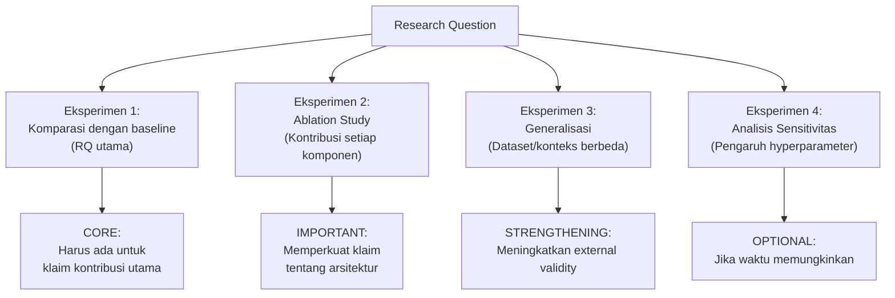

---

## 6. Contoh Terapan

### Contoh: Matriks Eksperimen untuk Tesis Federated IDS

| Eksperimen | Variabel Independen | Metrik | Tujuan | Prioritas |
|---|---|---|---|---|
| E1 | FL vs Centralized ML | F1, FPR, Recall | Komparasi utama | WAJIB |
| E2 | Jumlah client (5, 10, 20) | F1, Convergence | Skalabilitas FL | WAJIB |
| E3 | Federated + Non-IID data | F1, Fairness | Heterogenitas | PENTING |
| E4 | Dataset CICIDS2017 (validasi) | F1 | External validity | PENTING |
| E5 | FedAvg vs FedProx | F1, Comm overhead | Algoritma agregasi | OPSIONAL |

---

## 7. Praktikum atau Aktivitas Terarah

### Aktivitas 9.1: Workshop Desain Eksperimen

**Tugas:**
1. Tulis hipotesis H0 dan H1 untuk penelitian Anda
2. Identifikasi semua variabel (independent, dependent, control)
3. Pilih metrik evaluasi utama dan sekunder — justifikasikan pilihan
4. Rancang minimal 3 skenario eksperimen
5. Identifikasi 4 validity threats (satu dari setiap kategori) dan mitigasinya
6. Tulis protokol eksperimen lengkap (pre-registration)
7. Review protokol dengan pembimbing sebelum eksekusi

---

## 8. Latihan Pemahaman

**Soal 1 (PG):** "Construct validity threat" yang paling umum dalam penelitian IDS adalah:
A. Menggunakan hardware yang berbeda dari penelitian pembanding  
B. Menggunakan accuracy sebagai metrik tunggal pada dataset dengan class imbalance parah  
C. Menguji model pada dataset yang sama dengan training  
D. Tidak melaporkan waktu eksperimen

**Soal 2 (Analisis):** Jelaskan mengapa "ablation study" adalah bagian penting dari desain eksperimen untuk sistem yang mengkombinasikan beberapa komponen baru.

**Soal 3 (Desain):** Seorang mahasiswa ingin membuktikan bahwa modelnya lebih baik dari SOTA. Mereka berencana menjalankan eksperimen 10 kali dan melaporkan yang terbaik. Identifikasi masalah metodologis ini dan berikan alternatif yang valid secara ilmiah.

---

## 9. Latihan Terapan / Studi Kasus

### Studi Kasus: Desain Eksperimen untuk Tesis Threat Hunting

Mahasiswa merancang tool threat hunting berbasis CTI (Cyber Threat Intelligence) yang dapat mengotomatisasi korelasi IoC dengan log jaringan. Penelitian mengklaim: "tool kami mengurangi waktu analyst untuk mengidentifikasi serangan dari rata-rata 4 jam menjadi 15 menit."

**Pertanyaan (C5):** Rancang eksperimen yang valid untuk membuktikan klaim ini. Pertimbangkan: (a) bagaimana mengukur "waktu analyst" secara objektif, (b) siapa subjek eksperimen yang tepat (mahasiswa? SOC analyst berpengalaman?), (c) skenario apa yang digunakan, (d) apa validity threats utama, dan (e) apakah perlu persetujuan etika dari institusi untuk melibatkan manusia sebagai subjek?

---

## 10. Kunci Jawaban dan Pembahasan

**Soal 1 — B:** Construct validity menjawab: "apakah metrik mengukur apa yang diklaim?" Accuracy pada dataset imbalanced tidak mengukur kemampuan deteksi — classifier yang selalu memprediksi kelas mayoritas bisa mencapai accuracy 99% pada dataset yang 99% normal. Metrik yang tepat: F1-score, AUC-ROC, atau Recall + FPR secara bersamaan.

**Soal 3 — Masalah:** Ini adalah "p-hacking" atau "cherry-picking" — memilih run terbaik dari banyak run. Masalah: (a) Tidak reproducible — pembaca tidak tahu kondisi apa yang menghasilkan run terbaik; (b) Inflate performa yang dilaporkan; (c) Melanggar standar ilmiah. 

Alternatif yang valid: (a) Jalankan eksperimen N kali dengan seed berbeda; (b) Laporkan mean ± standard deviation; (c) Gunakan uji statistik (t-test, Wilcoxon) untuk perbandingan; (d) Laporkan SEMUA run, bukan hanya yang terbaik.

---

## 11. Ringkasan Bab

Desain eksperimen yang valid adalah fondasi dari kontribusi penelitian yang kredibel. Hipotesis harus falsifiable dan spesifik. Variabel harus diidentifikasi dan dikontrol dengan jelas. Metrik harus sesuai dengan konteks (tidak hanya accuracy). Validity threats harus diidentifikasi dan dimitigasi. Protokol eksperimen harus ditulis sebelum eksekusi untuk mencegah p-hacking.

---

## 12. Refleksi Profesional

**Pertanyaan Refleksi 1:** "Pre-registration" eksperimen (menulis protokol sebelum melihat data) adalah praktik yang semakin umum di bidang sains untuk mencegah p-hacking. Namun dalam penelitian terapan, eksperimen sering bersifat eksploratori — Anda tidak selalu tahu apa yang akan ditemukan. Bagaimana Anda menyeimbangkan antara rigor ilmiah (pre-registration) dengan fleksibilitas eksploratori?

---

# BAB 10 — PELAKSANAAN EKSPERIMEN DAN PENGUMPULAN DATA

**Pertemuan:** 10  
**Sub-CPMK:** Sub-CPMK.4  
**CPMK:** CPMK.3  
**Evaluasi:** Eval-4 (20%)

---

## 1. Capaian Pembelajaran Bab

Setelah menyelesaikan Bab 10, mahasiswa mampu:

- Melaksanakan eksperimen sesuai protokol yang telah ditetapkan.
- Mengumpulkan dan menyimpan data eksperimen secara terstruktur dan traceable.
- Memantau eksperimen secara real-time dan mengidentifikasi anomali.
- Mendokumentasikan kondisi eksperimen yang mempengaruhi validitas.

---

## 2. Peta Konsep Bab

```mermaid
flowchart TD
    Protocol2["Protokol Eksperimen\n(Bab 9)"] --> PreExec["Sebelum Eksekusi:\n• Environment check\n• Seed verification\n• Storage check\n• Baseline reproduction"]
    PreExec --> Execute["Eksekusi Eksperimen"]
    Execute --> Monitor["Monitoring Real-time:\n• Resource usage\n• Progress logging\n• Error detection"]
    Execute --> Collect["Pengumpulan Data:\n• Raw output\n• Log eksperimen\n• System metrics\n• Screenshots kritis"]
    Collect --> Store["Penyimpanan Terstruktur:\nresults/\n  {exp_id}/\n    config.yaml\n    raw_results.json\n    metrics.csv\n    experiment.log"]
    Store --> Verify["Verifikasi:\n• Integritas file\n• Completeness check\n• Consistency check"]
    Verify --> LogbookUpdate2["Update Logbook:\n• Kondisi eksperimen\n• Anomali yang ditemukan\n• Deviasi dari protokol"]
```

---

## 3. Pengantar Kontekstual

Eksperimen yang paling baik direncanakan masih bisa menghasilkan data yang tidak berguna jika pelaksanaannya tidak terstruktur. Pengumpulan data yang buruk — file yang tidak berlabel, konfigurasi yang tidak dicatat, hasil yang tidak dapat dikaitkan dengan kondisi spesifik — adalah sumber utama frustrasi saat fase analisis.

---

## 4. Landasan Teori

### 4.1 Struktur Penyimpanan Hasil Eksperimen

```
results/
├── 20241015_143022_exp_federated_10clients/
│   ├── config.yaml          ← Konfigurasi persis yang digunakan
│   ├── metrics.csv          ← Semua metrik per epoch/iterasi
│   ├── confusion_matrix.png ← Visualisasi
│   ├── model_weights.pkl    ← (jika relevan)
│   ├── experiment.log       ← Output konsol yang disimpan
│   └── system_info.json     ← Python version, library versions, hardware
├── 20241015_150512_exp_centralized/
│   └── ...
```

### 4.2 Logging Otomatis

```python
import logging, json, subprocess
from pathlib import Path
from datetime import datetime

def setup_experiment(config_path: str) -> Path:
    """Setup direktori output dan logging untuk eksperimen."""
    
    exp_id = datetime.now().strftime("%Y%m%d_%H%M%S")
    exp_name = Path(config_path).stem
    output_dir = Path(f"results/{exp_id}_{exp_name}")
    output_dir.mkdir(parents=True)
    
    # Logging ke file dan konsol
    logging.basicConfig(
        level=logging.INFO,
        format='%(asctime)s | %(levelname)s | %(message)s',
        handlers=[
            logging.FileHandler(output_dir / 'experiment.log'),
            logging.StreamHandler()
        ]
    )
    
    # Simpan config yang digunakan
    import shutil
    shutil.copy(config_path, output_dir / 'config.yaml')
    
    # Simpan info sistem (untuk reproducibility)
    sys_info = {
        'python': subprocess.getoutput('python --version'),
        'git_commit': subprocess.getoutput('git rev-parse HEAD'),
        'timestamp': datetime.now().isoformat(),
        'hostname': subprocess.getoutput('hostname')
    }
    with open(output_dir / 'system_info.json', 'w') as f:
        json.dump(sys_info, f, indent=2)
    
    logging.info(f"Experiment started: {exp_id}")
    return output_dir
```

### 4.3 Mengelola Deviasi dari Protokol

Tidak semua eksperimen berjalan sesuai protokol. Deviasi yang terdokumentasi tidak membatalkan penelitian — deviasi yang TIDAK terdokumentasi yang bermasalah.

**Cara mendokumentasikan deviasi:**
```markdown
## Deviasi Protokol — Eksperimen E2, Run 3 (2024-10-20)

**Deviasi:** Eksperimen dihentikan setelah 50 epoch (bukan 100 sesuai protokol)
**Alasan:** Server crash karena OOM (Out of Memory) pada epoch ke-51
**Dampak:** Data epoch 51-100 tidak tersedia untuk run ini
**Tindakan:** Tambahkan memory monitoring; ulang eksperimen ini esok hari
  dengan batch size dikurangi 50% (4096 → 2048)
**Status:** PENDING RERUN
```

---

## 5. Model atau Arsitektur

### 5.1 Pre-eksperimen Checklist

```
✓ Environment sesuai environment.yml/Dockerfile
✓ Random seed sudah di-set di semua lokasi
✓ Dataset: integrity hash diverifikasi
✓ Storage: cukup space (estimasi × 2 untuk safety)
✓ Baseline: dapat direproduksi (3x run → hasil konsisten)
✓ Config file: di-commit ke repo sebelum eksperimen
✓ Output directory: sudah dibuat, path benar
✓ Logging: berjalan dan outputting ke file
✓ Waktu: estimasi durasi → mulai eksperimen yang cukup panjang saat tidak aktif
✓ Backup: ada backup plan jika eksperimen crash di tengah
```

---

## 6. Contoh Terapan

### Strategi untuk Eksperimen Panjang

Beberapa eksperimen ML memerlukan waktu berjam-jam atau berhari-hari. Strategi:

```python
# Checkpoint saving — jangan hilangkan progress jika crash
import pickle, os

checkpoint_path = output_dir / "checkpoint.pkl"

for epoch in range(num_epochs):
    # ... training ...
    
    # Save checkpoint setiap 10 epoch
    if epoch % 10 == 0:
        state = {
            'epoch': epoch,
            'model_state': model.state_dict(),
            'optimizer_state': optimizer.state_dict(),
            'best_metric': best_metric,
            'history': history
        }
        with open(checkpoint_path, 'wb') as f:
            pickle.dump(state, f)
        logging.info(f"Checkpoint saved at epoch {epoch}")

# Resume dari checkpoint jika ada
if checkpoint_path.exists():
    with open(checkpoint_path, 'rb') as f:
        checkpoint = pickle.load(f)
    start_epoch = checkpoint['epoch'] + 1
    logging.info(f"Resuming from epoch {start_epoch}")
```

---

## 7. Praktikum atau Aktivitas Terarah

### Aktivitas 10.1: Pelaksanaan Eksperimen Batch Pertama

**Tugas:**
1. Jalankan pre-eksperimen checklist
2. Eksekusi eksperimen sesuai protokol
3. Monitor dan log semua output
4. Simpan hasil dalam struktur yang ditentukan
5. Update logbook: kondisi eksperimen, waktu, anomali

**Mandatory logging:**
- Waktu mulai dan selesai
- Konfigurasi yang digunakan
- Error atau warning yang muncul
- Deviasi dari protokol (jika ada)

---

## 8. Latihan Pemahaman

**Soal 1:** Mengapa menyimpan `system_info.json` (versi Python, versi library, git commit hash) bersama hasil eksperimen itu penting?

**Soal 2:** Seorang mahasiswa menjalankan 5 eksperimen dalam satu hari tanpa mencatat konfigurasi masing-masing. Di akhir hari, ia memiliki 5 folder hasil tetapi tidak tahu konfigurasi mana yang menghasilkan hasil terbaik. Apa yang seharusnya dilakukan dari awal untuk mencegah ini?

**Soal 3 (Etika):** Penelitian keamanan siber sering memerlukan eksperimen yang melibatkan malware atau teknik serangan. Sebutkan 3 prinsip etika yang harus diterapkan saat menjalankan eksperimen semacam itu.

---

## 9. Latihan Terapan

### Studi Kasus: Eksperimen yang Tidak Terkontrol

Mahasiswa H menjalankan eksperimen untuk membandingkan dua versi modelnya. Model A dijalankan pada laptop dengan GPU, Model B dijalankan pada CPU desktop karena GPU sedang digunakan. Model A menang dalam metric waktu latency. Pembimbing mempertanyakan validitas perbandingan ini.

**Pertanyaan (C4):** Identifikasi validity threat yang terjadi. Bagaimana eksperimen harus dirancang ulang untuk perbandingan yang valid?

---

## 10. Kunci Jawaban

**Soal 3 — Etika eksperimen keamanan siber:**
(a) **Isolasi**: Semua eksperimen dengan malware atau tool serangan harus dilakukan dalam environment yang sepenuhnya terisolasi (VM tanpa network, atau network terisolasi tanpa akses ke internet atau sistem lain).
(b) **Otorisasi**: Setiap sistem yang diuji harus dimiliki atau secara eksplisit diizinkan untuk diuji. Tidak ada eksperimen pada sistem yang tidak diotorisasi, bahkan untuk "melihat apakah bisa."
(c) **Minimal damage**: Eksperimen harus dirancang untuk mengumpulkan data yang diperlukan dengan dampak minimal — tidak membuat kerusakan yang tidak perlu bahkan pada sistem yang diizinkan.
(d) **Disclosure yang bertanggung jawab**: Jika eksperimen menemukan kerentanan nyata pada sistem pihak ketiga (tidak disengaja), wajib melaporkan melalui prosedur responsible disclosure.

---

## 11. Ringkasan Bab

Pelaksanaan eksperimen yang baik memerlukan: pre-eksperimen checklist, logging otomatis yang komprehensif, struktur penyimpanan yang terstruktur, dokumentasi deviasi dari protokol, dan checkpoint untuk eksperimen panjang. Semua kondisi eksperimen harus terdokumentasi — data yang tidak dapat dikaitkan dengan kondisi eksperimennya tidak berguna untuk analisis.

---

## 12. Refleksi Profesional

**Pertanyaan Refleksi 1:** Eksperimen yang berjalan selama berhari-hari di server menghabiskan listrik dan sumber daya komputasi yang signifikan. Apakah ada tanggung jawab lingkungan dalam penelitian komputasional intensif? Bagaimana Anda mempertimbangkan efisiensi komputasi sebagai dimensi dari desain eksperimen?

---

# BAB 11 — DOKUMENTASI EVIDENCE DAN LOGBOOK TEKNIS

**Pertemuan:** 11  
**Sub-CPMK:** Sub-CPMK.4  
**CPMK:** CPMK.3  
**Evaluasi:** Eval-4 (20%)

---

## 1. Capaian Pembelajaran Bab

Setelah menyelesaikan Bab 11, mahasiswa mampu:

- Mengidentifikasi jenis evidence yang diperlukan untuk mendukung klaim penelitian.
- Menyusun evidence package yang komprehensif, terstruktur, dan dapat ditelusuri.
- Memelihara logbook teknis yang mengaitkan setiap keputusan dengan evidence yang mendukungnya.
- Memahami prinsip chain of custody dalam konteks penelitian forensik digital.

---

## 2. Peta Konsep Bab

```mermaid
flowchart TD
    EvidenceTypes["Jenis Evidence\ndalam Tesis Keamanan Siber"] --> Quantitative["Evidence Kuantitatif:\n• Metrik evaluasi (tabel/grafik)\n• Log eksperimen\n• Statistical test results\n• Resource usage"]
    EvidenceTypes --> Qualitative["Evidence Kualitatif:\n• Screenshot\n• Demo video\n• Code review comments\n• Expert validation"]
    EvidenceTypes --> Artifacts["Artefak Teknis:\n• Model terlatih\n• Script eksperimen\n• Dataset processed\n• Tool yang dikembangkan"]

    Quantitative --> Package["Evidence Package\n(Eval-4)"]
    Qualitative --> Package
    Artifacts --> Package

    Package --> Structure["Struktur Package:\n• README evidence\n• Daftar klaim & pendukungnya\n• Cara memverifikasi\n• Integritas (hash)"]
    Package --> Logbook3["Logbook Teknis\n(Updated kontinu)"]
    
    Logbook3 --> Chain["Chain of Custody\n(untuk forensik digital):\n• Asal-usul data\n• Siapa yang menangani\n• Kapan & apa yang dilakukan"]
```

---

## 3. Pengantar Kontekstual

Dalam sidang tesis, pembimbing dan penguji akan meminta Anda membuktikan klaim-klaim dalam tesis. "Sistem kami mencapai recall 92%" — buktikan. "Prototipe berhasil mendeteksi serangan SQL injection" — tunjukkan. Evidence package adalah kumpulan semua bukti yang mendukung klaim penelitian.

Untuk tesis di bidang forensik digital, konsep "chain of custody" — dokumentasi yang membuktikan bahwa evidence tidak dimanipulasi dari saat pengambilan hingga analisis — sangat relevan dan harus diterapkan pada data penelitian itu sendiri.

---

## 4. Landasan Teori

### 4.1 Evidence Hierarchy dalam Penelitian Terapan

```
Tingkat Kepercayaan (tertinggi ke terendah):

1. Reproducible quantitative evidence
   (hasil yang sama saat direplikasi dengan code dan data yang sama)

2. Quantitative evidence dari multiple runs
   (mean ± std dari N eksperimen independen)

3. Quantitative evidence dari single run
   (satu eksperimen, terdokumentasi)

4. Qualitative evidence dengan validasi eksternal
   (expert review, user study dengan metodologi yang valid)

5. Qualitative evidence anekdotal
   (screenshot, demo yang tidak reproducible)
```

### 4.2 Memetakan Klaim ke Evidence

Setiap klaim dalam tesis harus dapat dipetakan ke evidence spesifik:

```markdown
## Evidence Map

### Klaim 1: "Sistem kami mencapai F1-score 91.3% pada CIC-DDoS2019"
- Evidence primer: results/20241020_exp_main/metrics.csv, baris 100, kolom F1
- Script untuk verifikasi: python evaluation/compute_metrics.py --exp results/20241020_exp_main
- Reproducible: Ya (seed=42, protocol v2.0 di docs/experiment_protocol.md)
- Statistical significance: Ya (t-test vs baseline: p=0.003 < 0.05)

### Klaim 2: "Sistem kami mengurangi data sharing 94% dibanding centralized"
- Evidence: docs/analysis/data_sharing_comparison.xlsx
- Perhitungan: src/analysis/compute_data_sharing.py
- Asumsi: Lihat docs/analysis/assumptions.md

### Klaim 3: "Prototipe dapat mendeteksi serangan DDoS dalam < 100ms"
- Evidence: results/20241025_exp_latency/latency_test.csv
- Demo video: docs/demos/latency_demo_2024-10-25.mp4
- Kondisi: Hardware X, network simulator Y, parameter Z
```

### 4.3 Chain of Custody untuk Data Penelitian Forensik

Untuk tesis forensik digital, setiap data yang digunakan sebagai evidence harus memiliki dokumentasi chain of custody:

```markdown
## Chain of Custody: Memory Dump Sample_001

**Asal-usul:** Diperoleh dari VM Windows 10 yang terinfeksi Emotet (sampel publik dari ANY.RUN)
**Tanggal Akuisisi:** 2024-10-05, 14:30 WIB
**Metode Akuisisi:** Belkasoft RAM Capturer v9.1 pada VM VirtualBox 7.0
**Hash saat akuisisi:** MD5: a3f8c2... | SHA-256: 7b89e1...
**Ukuran:** 4,294,967,296 bytes (4GB)

**Penyimpanan:**
- Primer: /data/raw/memory_dumps/sample_001.raw (NAS lab)
- Backup: Encrypted archive (AES-256) di storage institusi
- Hash setelah penyimpanan: MD5: a3f8c2... ← identik, integritas terjaga

**Siapa yang menangani:** [Nama mahasiswa] — seluruh proses
**Akses oleh pihak lain:** [Nama pembimbing] — verifikasi per 2024-10-10

**Tindakan yang dilakukan:**
1. 2024-10-05: Akuisisi
2. 2024-10-06: Analisis dengan Volatility3 v2.5 — lihat log: logs/vol3_sample001.log
3. 2024-10-08: Ekstraksi artefak — lihat: results/forensics/sample001_artifacts/
```

---

## 5. Model atau Arsitektur

### 5.1 Struktur Evidence Package

```
evidence_package/
├── README.md                 ← Panduan memverifikasi setiap klaim
├── claims_evidence_map.md    ← Peta klaim → evidence
├── quantitative/
│   ├── main_results.csv      ← Hasil eksperimen utama
│   ├── baseline_results.csv  ← Baseline untuk komparasi
│   └── statistical_tests.py  ← Script untuk uji statistik
├── artifacts/
│   ├── model_final.pkl       ← Artefak yang dihasilkan
│   └── reproduce.sh          ← Script untuk menghasilkan ulang
├── qualitative/
│   ├── demo_2024-10-25.mp4   ← Demo video
│   └── screenshots/
├── integrity/
│   └── checksums.sha256      ← Hash semua file untuk verifikasi
└── logbook_summary.md        ← Ringkasan logbook yang relevan
```

---

## 6. Contoh Terapan

### Contoh: Evidence Package untuk Tesis IDS

```bash
# Verifikasi integritas evidence package
sha256sum -c integrity/checksums.sha256

# Reproduce hasil utama
conda activate thesis-env
python evaluation/compute_metrics.py \
  --results results/20241020_exp_main/ \
  --output evidence_package/quantitative/verified_results.csv

# Jalankan statistical test
python evidence_package/quantitative/statistical_tests.py \
  --our results/20241020_exp_main/metrics.csv \
  --baseline results/20241018_exp_baseline/metrics.csv
```

---

## 7. Praktikum atau Aktivitas Terarah

### Aktivitas 11.1: Menyusun Evidence Package

**Tugas:**
1. Buat daftar semua klaim yang akan dibuat dalam tesis
2. Untuk setiap klaim: identifikasi evidence yang mendukungnya
3. Verifikasi bahwa setiap evidence dapat direproduksi atau diverifikasi
4. Susun evidence package dengan struktur yang ditentukan
5. Buat checksums untuk semua file evidence
6. Tulis README yang menjelaskan cara memverifikasi setiap klaim

---

## 8. Latihan Pemahaman

**Soal 1:** Mengapa penting memetakan setiap klaim ke evidence spesifik sebelum menulis Bab Hasil/Pembahasan?

**Soal 2:** Dalam konteks tesis forensik digital, mengapa "chain of custody" untuk data penelitian itu sendiri (bukan hanya untuk evidence forensik dalam kasus yang diteliti) penting?

**Soal 3 (Analisis):** Evidence mana yang memiliki tingkat kepercayaan lebih tinggi, dan mengapa: (a) Screenshot yang menunjukkan sistem bekerja, atau (b) Script yang dapat dijalankan untuk mereproduksi hasil? Jelaskan dalam konteks peer review akademik.

---

## 9. Latihan Terapan

### Studi Kasus: Evidence yang Tidak Lengkap

Mahasiswa I hendak melakukan sidang tesis. Penguji meminta ia membuktikan klaim: "Sistem kami 40% lebih cepat dari metode X." Mahasiswa menyadari bahwa hasil eksperimen kecepatan disimpan dalam catatan tangan di buku tulis yang sudah tidak ada, dan eksperimen tidak dapat diulangi karena testbed sudah berubah.

**Pertanyaan (C5):** Analisis situasi ini: (a) Apa yang seharusnya dilakukan dari awal? (b) Apa opsi yang tersedia sekarang untuk menyelamatkan situasi? (c) Bagaimana cara mengkomunikasikan keterbatasan ini kepada penguji secara profesional?

---

## 10. Kunci Jawaban

**Soal 3 — (b) Script yang reproducible** jauh lebih tinggi kredibilitasnya karena: (a) Peer reviewer dapat menjalankan script dan memverifikasi sendiri — ini adalah inti dari "reproducibility in science"; (b) Screenshot tidak dapat diverifikasi — bisa dimanipulasi; (c) Script yang dapat dijalankan membuktikan bahwa hasil bukan kebetulan atau artefak dari kondisi tertentu yang tidak terdokumentasi; (d) Standar konferensi/jurnal top saat ini semakin mensyaratkan reproducibility package bersama paper.

---

## 11. Ringkasan Bab

Evidence package adalah "bukti" yang mendukung klaim penelitian. Setiap klaim harus dipetakan ke evidence yang spesifik dan dapat diverifikasi. Evidence yang reproducible (dapat direplikasi oleh orang lain) memiliki kredibilitas tertinggi. Logbook teknis harus diperbarui secara konsisten dan mencatat semua kondisi yang mempengaruhi hasil. Untuk tesis forensik digital, chain of custody untuk data penelitian harus dijaga.

---

## 12. Refleksi Profesional

**Pertanyaan Refleksi 1:** "Extraordinary claims require extraordinary evidence" (Carl Sagan). Bagaimana prinsip ini berlaku dalam penelitian keamanan siber? Jika klaim Anda (misalnya "sistem kami mencapai 99.9% recall") terdengar terlalu bagus, apa yang harus Anda verifikasi ulang sebelum mempublikasikannya?

---

# BAB 12 — VALIDASI AWAL DAN INTERPRETASI DATA

**Pertemuan:** 12  
**Sub-CPMK:** Sub-CPMK.4  
**CPMK:** CPMK.3  
**Evaluasi:** Eval-4 (20%)

---

## 1. Capaian Pembelajaran Bab

Setelah menyelesaikan Bab 12, mahasiswa mampu:

- Melakukan validasi awal terhadap hasil eksperimen untuk memastikan kebenaran dan konsistensi.
- Menginterpretasikan data eksperimen secara kritis, menghindari overinterpretasi atau underinterpretation.
- Mengidentifikasi anomali dalam data dan menentukan apakah perlu investigasi lebih lanjut.
- Menyusun laporan validasi sementara sebagai input untuk analisis mendalam di Bab 13.

---

## 2. Peta Konsep Bab

```mermaid
flowchart TD
    RawResults["Raw Results\n(Eksperimen Per 10-11)"] --> Sanity3["Sanity Check Hasil:\n• Nilai dalam range yang wajar?\n• Tidak ada NaN/Inf?\n• Reproducible?"]
    Sanity3 --> Consistency["Consistency Check:\n• Baseline sesuai harapan?\n• Pola masuk akal?\n• Tidak ada data leakage?"]
    Consistency --> Anomaly["Anomaly Detection:\n• Outlier yang aneh\n• Hasil yang terlalu bagus/buruk\n• Pola yang tidak terduga"]
    Anomaly --> Investigate{"Anomali\nmemerlukan\npenyelidikan?"}
    Investigate -->|"Ya"| RootCause["Root Cause Analysis\n(Bab 14)"]
    Investigate -->|"Tidak"| Interpret["Interpretasi Awal:\n• Apa yang ditunjukkan data?\n• Apakah H1 didukung?\n• Apa limitasi sementara?"]
    Interpret --> Report2b["Laporan Validasi\nSementara"]
```

---

## 3. Pengantar Kontekstual

"All models are wrong, but some are useful" — George Box. Validasi adalah proses memastikan bahwa hasil yang diperoleh adalah nyata, bukan artefak dari implementasi yang salah, data yang bermasalah, atau kebetulan statistik.

---

## 4. Landasan Teori

### 4.1 Jenis Validasi dalam Penelitian ML/Keamanan

**Validasi Internal:**
- **Cross-validation:** Apakah hasil konsisten atas berbagai subset data?
- **Reproducibility:** Apakah hasil sama ketika dijalankan ulang?
- **Sensitivity analysis:** Bagaimana performa berubah saat hyperparameter diubah sedikit?

**Validasi Eksternal:**
- **Cross-dataset:** Apakah sistem yang dilatih pada Dataset A bekerja pada Dataset B?
- **Cross-temporal:** Apakah model yang dilatih pada data 2022 bekerja pada data 2023?
- **Expert validation:** Apakah hasil masuk akal bagi domain expert?

### 4.2 Red Flags dalam Hasil Eksperimen

| Situasi | Kemungkinan Masalah |
|---|---|
| Accuracy > 99.9% | Data leakage, dataset terlalu mudah, atau bug |
| Variance sangat kecil | Tidak ada randomness, hasil terlalu stabil |
| Performa turun drastis pada dataset lain | Overfitting parah, dataset spesifik |
| Baseline menghasilkan performa lebih baik dari yang dilaporkan di paper lain | Implementasi berbeda, dataset preprocessing berbeda |
| Metric tidak konsisten antar skenario | Normalisasi berbeda, bug dalam perhitungan |

### 4.3 Uji Statistik Dasar

```python
from scipy import stats

# t-test untuk membandingkan dua metode (paired samples)
result_our = [0.91, 0.92, 0.90, 0.93, 0.91]  # 5 runs
result_baseline = [0.85, 0.84, 0.86, 0.85, 0.84]  # 5 runs

t_stat, p_value = stats.ttest_rel(result_our, result_baseline)
print(f"t={t_stat:.3f}, p={p_value:.4f}")
if p_value < 0.05:
    print("Perbedaan signifikan secara statistik (p < 0.05)")

# Effect size (Cohen's d)
import numpy as np
d = (np.mean(result_our) - np.mean(result_baseline)) / \
    np.std(np.array(result_our + result_baseline), ddof=1)
print(f"Cohen's d = {d:.3f}")  # d > 0.8 = large effect
```

---

## 5. Model atau Arsitektur

### 5.1 Alur Validasi Bertahap

```mermaid
flowchart LR
    Data3["Data Mentah"] --> V1["Validasi Teknis:\nFormat, range, completeness"]
    V1 --> V2["Validasi Konsistensi:\nReproducibility, cross-run"]
    V2 --> V3["Validasi Statistik:\nSignifikansi, effect size"]
    V3 --> V4["Validasi Konteks:\nMasuk akal secara domain?"]
    V4 --> V5["Validasi Eksternal:\nCross-dataset/expert"]
    V5 --> Conclusion2["Kesimpulan\nValid & Dapat Diklaim"]
```

---

## 6. Contoh Terapan

### Checklist Validasi Awal

```markdown
## Validasi Awal — [Nama Eksperimen] — Per 12

### Validasi Teknis
✓ Tidak ada NaN atau Inf dalam metrics
✓ Semua nilai dalam range yang diharapkan (accuracy 0-1, F1 0-1)
✓ Jumlah prediksi sesuai jumlah test samples

### Validasi Konsistensi
✓ Baseline tereproduksi: RF accuracy 97.1% vs target 97.1% ✓
✓ 3 runs dengan seed berbeda → F1: 91.2, 91.5, 91.1 (std 0.17) ← acceptable
✗ Skenario 2 menghasilkan FPR 45% (unexpected high)
  → Investigation needed: kemungkinan class imbalance dalam skenario 2

### Validasi Statistik
- t-test vs baseline: t=8.3, p<0.001 ✓ (signifikan)
- Cohen's d = 1.4 (large effect) ✓

### Red Flags Ditemukan
- Skenario 2 FPR tinggi: perlu investigasi
- Aksi: cek distribusi kelas skenario 2 sebelum melanjutkan
```

---

## 7. Praktikum atau Aktivitas Terarah

### Aktivitas 12.1: Validasi dan Laporan Sementara

**Tugas:**
1. Jalankan seluruh validasi checklist pada data eksperimen yang telah dikumpulkan
2. Identifikasi semua anomali dan red flags
3. Untuk setiap anomali: tentukan apakah perlu investigasi (stop dan investigasi) atau dapat diteruskan (catat sebagai limitation)
4. Jalankan uji statistik yang sesuai
5. Tulis laporan validasi sementara

---

## 8. Latihan Pemahaman

**Soal 1:** Model binary classifier mencapai accuracy 98% pada dataset test. Setelah pengecekan lebih lanjut, ditemukan bahwa dataset test memiliki distribusi: 98% kelas normal, 2% kelas attack. Apa yang salah dengan klaim "accuracy 98%"?

**Soal 2:** Mengapa uji statistik (t-test, Wilcoxon) penting bahkan jika perbedaan numerik antara metode Anda dan baseline sudah terlihat besar?

**Soal 3 (Analisis):** Peneliti menemukan bahwa modelnya mendapat F1-score 99.5% — jauh lebih baik dari semua paper sebelumnya yang maximum 93%. Daftar semua kemungkinan penjelasan (termasuk yang tidak menyenangkan) untuk hasil yang "terlalu bagus" ini.

---

## 9. Latihan Terapan

### Studi Kasus: Data Leakage

Mahasiswa J mendapatkan hasil luar biasa: accuracy 99.8% sementara baseline terbaik dalam literatur adalah 95%. Setelah investigasi mendalam bersama pembimbing, ditemukan bahwa kolom "timestamp" dalam dataset secara tidak langsung mengidentifikasi kelas (data serangan dikumpulkan dalam rentang waktu tertentu).

**Pertanyaan (C5):** Analisis implikasi temuan ini: (a) Mengapa ini disebut "data leakage"? (b) Apa yang harus dilakukan dengan hasil yang sudah ada? (c) Bagaimana memperbaiki eksperimen? (d) Apa implikasinya terhadap timeline tesis?

---

## 10. Kunci Jawaban

**Soal 1 — Accuracy menyesatkan:** Classifier bodoh yang selalu memprediksi "normal" akan mencapai accuracy 98% pada dataset ini (karena 98% memang normal). Model dengan accuracy 98% MUNGKIN tidak lebih baik dari classifier yang tidak melakukan apa-apa. Metrik yang tepat: Recall (TPR) untuk kelas attack, F1-score, atau AUC-ROC yang tidak terpengaruh class imbalance sebanyak accuracy.

---

## 11. Ringkasan Bab

Validasi awal adalah gate kritis antara "mengumpulkan data" dan "menganalisis data." Red flags harus diinvestigasi sebelum melanjutkan — lebih baik menemukan data leakage di Per 12 daripada saat sidang. Uji statistik memberikan kepercayaan bahwa perbedaan yang diamati bukan kebetulan. Laporan validasi sementara mendokumentasikan status dan memberikan input untuk analisis mendalam.

---

## 12. Refleksi Profesional

**Pertanyaan Refleksi 1:** Ketika menemukan bahwa hasil Anda "terlalu bagus" — ada dua respons: (a) mencari bug atau data leakage yang menjelaskan hasil tersebut, atau (b) menerimanya sebagai breakthrough nyata. Apa yang membedakan peneliti yang jujur dari yang tidak? Dan bagaimana budaya akademik dapat mendorong salah satu respons ini?

---


---

# BAB 13 — ANALISIS HASIL DAN VISUALISASI DATA

**Pertemuan:** 13  
**Sub-CPMK:** Sub-CPMK.5  
**CPMK:** CPMK.3, CPMK.4  
**Evaluasi:** Eval-5 (15%)

---

## 1. Capaian Pembelajaran Bab

Setelah menyelesaikan Bab 13, mahasiswa mampu:

- Menganalisis hasil eksperimen secara sistematis dan kritis, menghindari bias konfirmasi.
- Membuat visualisasi data yang efektif dan tidak menyesatkan.
- Menginterpretasikan hasil dalam konteks research question dan literature yang relevan.
- Mengidentifikasi implikasi dari temuan, termasuk temuan yang tidak sesuai harapan.

---

## 2. Peta Konsep Bab

```mermaid
flowchart TD
    ValidatedData["Data Tervalidasi\n(Bab 12)"] --> Analysis3["Analisis Komprehensif"]
    Analysis3 --> Descriptive["Statistik Deskriptif:\n• Mean, median, std\n• Distribution plots\n• Correlation analysis"]
    Analysis3 --> Comparative["Analisis Komparatif:\n• vs Baseline\n• vs SOTA\n• Ablation study"]
    Analysis3 --> Causal["Analisis Kausal:\n• Mengapa X lebih baik dari Y?\n• Apa faktor yang paling berpengaruh?"]

    Descriptive --> Visualization2["Visualisasi Efektif"]
    Comparative --> Visualization2
    Causal --> Visualization2

    Visualization2 --> LineChart["Line Chart:\nConvergence, trend waktu"]
    Visualization2 --> BarChart["Bar Chart:\nPerbandingan metode"]
    Visualization2 --> Heatmap["Heatmap:\nConfusion matrix, korelasi"]
    Visualization2 --> BoxPlot["Box Plot:\nDistribusi & variance"]
    Visualization2 --> ROC["ROC Curve:\nThreshold analysis"]

    Visualization2 --> Interpretation["Interpretasi:\n• Apa artinya?\n• Mengapa begitu?\n• Implikasi apa?\n• Limitasi apa?"]
```

---

## 3. Pengantar Kontekstual

Analisis hasil bukan hanya tentang menghitung angka — ini tentang membangun narasi ilmiah yang menjelaskan apa yang terjadi, mengapa, dan apa artinya. Visualisasi yang baik dapat mengkomunikasikan insight yang membutuhkan ribuan kata jika dijelaskan secara verbal. Visualisasi yang buruk atau menyesatkan dapat mengaburkan realita.

---

## 4. Landasan Teori

### 4.1 Prinsip Visualisasi Data yang Efektif

**Prinsip Edward Tufte (Envisioning Information):**
- **Data-ink ratio:** Maksimalkan tinta yang merepresentasikan data, minimimalkan "chart junk"
- **Show the data:** Tampilkan distribusi actual, bukan hanya summary statistics
- **Context:** Berikan konteks yang cukup untuk interpretasi yang benar

**Kesalahan Umum dalam Visualisasi Keamanan/ML:**
```
❌ Memulai sumbu Y dari nilai bukan 0 untuk membesar-besarkan perbedaan
❌ Hanya menampilkan mean tanpa confidence interval atau std
❌ Bar chart untuk data distribusi (gunakan box plot atau violin plot)
❌ Pie chart untuk perbandingan (gunakan bar chart)
❌ 3D chart untuk data 2D (menambahkan distorsi persepsi)
❌ Warna yang tidak accessibility-friendly (merah-hijau untuk orang buta warna)
```

### 4.2 Analisis Hasil untuk Tesis Keamanan Siber

```python
import pandas as pd
import numpy as np
import matplotlib.pyplot as plt
import seaborn as sns
from scipy import stats

# Contoh analisis komprehensif
results_df = pd.read_csv('results/main_experiment/metrics.csv')

# 1. Statistik deskriptif
print("=== Descriptive Statistics ===")
print(results_df[['precision', 'recall', 'f1', 'fpr']].describe())

# 2. Komparasi dengan baseline
our_f1 = results_df['f1'].values
baseline_f1 = pd.read_csv('results/baseline/metrics.csv')['f1'].values

# Statistical test (paired t-test)
t_stat, p_value = stats.ttest_rel(our_f1, baseline_f1)
effect_size = (our_f1.mean() - baseline_f1.mean()) / np.std(
    np.concatenate([our_f1, baseline_f1]), ddof=1
)
print(f"\nComparison vs baseline:")
print(f"  Our F1: {our_f1.mean():.4f} ± {our_f1.std():.4f}")
print(f"  Baseline F1: {baseline_f1.mean():.4f} ± {baseline_f1.std():.4f}")
print(f"  t-test: t={t_stat:.3f}, p={p_value:.4f}")
print(f"  Cohen's d: {effect_size:.3f}")

# 3. Visualisasi confusion matrix
fig, axes = plt.subplots(1, 2, figsize=(12, 5))
# Plot confusion matrix with seaborn heatmap
# ...

# 4. ROC Curve
from sklearn.metrics import roc_curve, auc
# ...

plt.tight_layout()
plt.savefig('results/figures/main_analysis.pdf', dpi=300, bbox_inches='tight')
```

### 4.3 Interpretasi yang Tidak Bias

**Bias konfirmasi** adalah kecenderungan untuk menafsirkan data dengan cara yang mengkonfirmasi hipotesis yang sudah diyakini. Untuk menghindarinya:

1. **Buat hipotesis sebelum melihat data** (pre-registration)
2. **Analisis kasus di mana sistem Anda GAGAL** — ini lebih informatif dari kasus di mana berhasil
3. **Cari penjelasan alternatif** untuk hasil yang mendukung klaim Anda
4. **Tanyakan: "Apa yang harus saya temukan untuk MEMBATALKAN klaim ini?"**

---

## 5. Model atau Arsitektur

### 5.1 Struktur Analisis Bab Hasil

```mermaid
flowchart TD
    BabHasil["Bab Hasil/Pembahasan"] --> RQ3["Untuk setiap Research Question:"]
    RQ3 --> Present["1. Sajikan hasil\n(tabel/grafik)"]
    Present --> Compare["2. Bandingkan dengan baseline\n& literatur"]
    Compare --> Interpret2["3. Interpretasikan:\n'Mengapa hasilnya seperti ini?'"]
    Interpret2 --> Validity2["4. Diskusikan validity threats:\n'Apa yang membatasi generalisasi?'"]
    Validity2 --> Implications["5. Implikasi:\n'Apa artinya bagi praktik keamanan?'"]
```

---

## 6. Contoh Terapan

### Template Analisis per Research Question

```markdown
## RQ1: Apakah sistem IDS berbasis FL mencapai F1-score yang lebih tinggi 
##      dari centralized ML pada dataset CIC-DDoS2019?

### Hasil
Tabel 4.1 menunjukkan perbandingan performa sistem yang diusulkan dengan baseline.
Sistem FL mencapai F1-score rata-rata 0.913 ± 0.009 (N=5 runs), 
dibandingkan dengan Random Forest terpusat yang mencapai 0.852 ± 0.012.

[Gambar 4.1 — Box plot perbandingan F1-score]

### Analisis Statistik
Uji t berpasangan menunjukkan perbedaan yang signifikan secara statistik 
(t=9.8, p<0.001, d=2.1 — large effect size). H0 ditolak.

### Interpretasi
Peningkatan F1-score yang diamati dapat dikaitkan dengan: (1) kemampuan 
Federated Learning untuk melatih pada distribusi data yang lebih beragam 
dari multiple client, sehingga model lebih robust terhadap variasi traffic, 
dan (2) regularisasi implisit dari proses agregasi FedAvg yang mencegah...

### Validity Threats
Internal: [...]
External: Hasil ini diperoleh dari simulasi FL dengan 10 klien homogen. 
Performa pada skenario non-IID atau dengan jumlah klien yang lebih besar 
belum divalidasi (lihat keterbatasan, Bab 5).
```

---

## 7. Praktikum atau Aktivitas Terarah

### Aktivitas 13.1: Analisis dan Visualisasi Komprehensif

**Tugas:**
1. Lakukan analisis statistik lengkap untuk semua research question
2. Buat minimal 5 visualisasi yang efektif (no chart junk)
3. Tulis interpretasi untuk setiap hasil — termasuk kasus di mana sistem TIDAK berhasil
4. Identifikasi temuan yang tidak terduga dan diskusikan dengan pembimbing
5. Draft outline Bab Hasil/Pembahasan

**Deliverable Eval-5 (parsial):**
- Grafik dan tabel analisis (dalam folder results/figures)
- Draft narasi analisis (Markdown)

---

## 8. Latihan Pemahaman

**Soal 1 (Analisis):** Dua peneliti menganalisis dataset yang sama. Peneliti A menampilkan hasil sebagai bar chart dengan sumbu Y dari 0.85 hingga 0.95, membuat perbedaan antara metode terlihat sangat besar. Peneliti B menampilkan sumbu Y dari 0 hingga 1.0, membuat perbedaan terlihat kecil. Data yang sama, tampilan berbeda. Mana yang "benar"? Bagaimana seharusnya?

**Soal 2 (Kritis):** Sistem Anda mendapat recall 98% tetapi FPR (false positive rate) 45%. Bagaimana Anda menginterpretasikan hasil ini untuk audiens SOC analyst yang harus mengoperasikan sistem ini sehari-hari?

**Soal 3 (Sintesis):** Apa perbedaan antara "hasil yang tidak sesuai hipotesis" dan "hasil yang salah"? Berikan contoh konkret dan jelaskan bagaimana seharusnya merespons masing-masing dalam penulisan tesis.

---

## 9. Latihan Terapan

### Studi Kasus: Temuan yang Mengejutkan

Mahasiswa K menemukan bahwa pada skenario non-IID (data tidak terdistribusi merata antar klien FL), performanya LEBIH BURUK dari centralized ML — bertentangan dengan klaimnya bahwa FL lebih baik. Ia tergoda untuk tidak melaporkan hasil skenario non-IID ini.

**Pertanyaan (C5):** Analisis situasi etika ini: (a) Apakah tidak melaporkan hasil yang tidak mendukung hipotesis adalah masalah etika penelitian? (b) Bagaimana seharusnya memperlakukan temuan ini dalam tesis? (c) Dapatkah temuan negatif menjadi kontribusi positif? (d) Bagaimana mengkomunikasikan ini kepada pembimbing dan dalam tesis?

---

## 10. Kunci Jawaban

**Soal 2 — Interpretasi untuk SOC analyst:** Recall 98% berarti dari 100 serangan nyata, sistem mendeteksi 98 — sangat baik. Namun FPR 45% berarti dari 100 traffic normal, sistem salah mengklasifikasikan 45 sebagai serangan. Dalam produksi, jika 99% traffic adalah normal dan 1% adalah serangan, sistem akan menghasilkan: ~45 false alerts untuk setiap 98 true alerts — artinya SOC analyst akan menghabiskan waktu merespons 45% alert yang salah. Ini disebut "alert fatigue" dan dapat membuat sistem tidak operasional karena analyst mulai mengabaikan alert. Kesimpulan: sistem ini tidak siap untuk deployment tanpa threshold yang dioptimasi atau tambahan layer filtering.

**Soal 3:** Hasil yang tidak sesuai hipotesis = hasil nyata yang membuktikan hipotesis salah. Ini adalah informasi BERHARGA — banyak penemuan ilmiah terbesar dimulai dari hipotesis yang salah. Seharusnya dilaporkan dan dijelaskan. Hasil yang "salah" = hasil yang disebabkan oleh bug, data leakage, atau metodologi yang cacat. Ini bukan temuan yang valid dan tidak boleh dilaporkan sebagai hasil — harus diperbaiki dan dieksperimen ulang.

---

## 11. Ringkasan Bab

Analisis hasil yang baik mencakup statistik deskriptif, komparasi dengan baseline, uji statistik, dan interpretasi berbasis teori. Visualisasi harus jujur dan efektif — tidak menyesatkan. Temuan negatif atau yang tidak sesuai harapan harus dilaporkan secara transparan karena merupakan bagian dari kontribusi ilmiah. Interpretasi harus menghindari bias konfirmasi dengan secara aktif mencari penjelasan alternatif.

---

## 12. Refleksi Profesional

**Pertanyaan Refleksi 1:** "Positive results are published, negative results are filed away" — ini adalah masalah nyata dalam publikasi ilmiah yang disebut "publication bias." Bagaimana Anda secara pribadi akan berkontribusi untuk mengurangi bias ini? Dan apakah ada platform atau venue di mana Anda dapat mempublikasikan temuan negatif yang berharga?

---

# BAB 14 — FAILURE ANALYSIS, PERBAIKAN PROTOTIPE, DAN DRAFT BAB HASIL/PEMBAHASAN

**Pertemuan:** 14  
**Sub-CPMK:** Sub-CPMK.5  
**CPMK:** CPMK.4  
**Evaluasi:** Eval-5 (15%)

---

## 1. Capaian Pembelajaran Bab

Setelah menyelesaikan Bab 14, mahasiswa mampu:

- Melakukan failure analysis yang sistematis untuk mengidentifikasi akar masalah dari hasil yang kurang memuaskan.
- Memprioritaskan dan mengimplementasikan perbaikan prototipe berdasarkan analisis kegagalan.
- Menyusun draft Bab Hasil/Pembahasan tesis yang memenuhi standar akademik.
- Mendokumentasikan backlog perbaikan untuk Tesis Akhir.

---

## 2. Peta Konsep Bab

```mermaid
flowchart TD
    Analysis4["Hasil Analisis\n(Bab 13)"] --> Failure["Failure Analysis:\n• Kasus yang gagal dideteksi\n• Error patterns\n• Root cause analysis\n• 5 Whys atau Fishbone"]
    Failure --> Priority["Prioritisasi Perbaikan:\n• Impact × Effort matrix\n• Quick wins vs long-term\n• Feasible dalam semester ini\nvs roadmap Tesis Akhir"]
    Priority --> Implement2["Implementasi Perbaikan\n(Prototipe v1.0)"]
    Implement2 --> Rerun["Re-run eksperimen kritis\n(jika ada perubahan signifikan)"]
    Rerun --> Draft["Draft Bab Hasil/\nPembahasan"]
    
    Draft --> Structure3["Struktur Bab:\n1. Implementasi\n2. Hasil Eksperimen\n3. Diskusi\n4. Limitasi\n5. Threats to Validity"]
```

---

## 3. Pengantar Kontekstual

Failure analysis adalah salah satu skill paling berharga dalam research — kemampuan untuk secara sistematis mengidentifikasi mengapa sesuatu tidak bekerja, bukan hanya mengobservasi bahwa itu tidak bekerja. Dalam industri keamanan siber, Root Cause Analysis (RCA) adalah praktik standar dalam incident response. Dalam penelitian, failure analysis memimpin pada pemahaman yang lebih dalam tentang domain problem.

---

## 4. Landasan Teori

### 4.1 Failure Analysis Methodology

**Metode "5 Whys":**
```
Masalah: Sistem gagal mendeteksi serangan Slowloris DDoS

Why 1: Mengapa gagal? → FPR terlalu tinggi untuk Slowloris
Why 2: Mengapa FPR tinggi? → Fitur yang digunakan tidak membedakan Slowloris dari koneksi HTTP legitimate lambat
Why 3: Mengapa fitur tidak membedakan? → Fitur yang dipilih berbasis flow-level, tidak session-level
Why 4: Mengapa hanya flow-level? → Review literatur tidak mencakup paper yang fokus pada Slowloris
Why 5: Mengapa review tidak mencakup? → Scope review literatur dibatasi pada IDS generic, tidak application-layer DDoS

Root Cause: Feature engineering tidak mencakup fitur yang relevan untuk low-rate DDoS attacks
Corrective Action: Tambahkan session-duration dan connection-lifetime features
```

**Error Analysis untuk Classifier:**
```python
# Analisis false positive dan false negative
y_true = test_labels
y_pred = model.predict(X_test)

# Identifikasi false negatives (missed attacks)
false_negatives = X_test[(y_true == 1) & (y_pred == 0)]
print(f"False Negatives (missed attacks): {len(false_negatives)}")

# Analisis pola: apa yang membuat FN sulit dideteksi?
fn_analysis = pd.DataFrame(false_negatives, columns=feature_names)
fn_analysis['actual'] = 'attack (missed)'
print("\nFN Feature Distribution:")
print(fn_analysis.describe())

# Bandingkan dengan true positives
true_positives = X_test[(y_true == 1) & (y_pred == 1)]
tp_analysis = pd.DataFrame(true_positives, columns=feature_names)
print("\nTP vs FN Feature Comparison:")
print(fn_analysis.mean() - tp_analysis.mean())
```

### 4.2 Prioritisasi Perbaikan

**Impact × Effort Matrix:**

| | Effort Rendah | Effort Tinggi |
|---|---|---|
| **Impact Tinggi** | Quick Win — Kerjakan sekarang | Major Project — Jadikan roadmap Tesis Akhir |
| **Impact Rendah** | Fill-in — Kerjakan jika ada waktu | Low Priority — Skip atau drop |

### 4.3 Struktur Bab Hasil/Pembahasan yang Baik

```markdown
# BAB 4: IMPLEMENTASI DAN PENGUJIAN
## 4.1 Lingkungan Implementasi
## 4.2 Implementasi [Komponen A]
## 4.3 Implementasi [Komponen B]
## 4.4 Hasil Pengujian
### 4.4.1 Pengujian Fungsional
### 4.4.2 Pengujian Performa

# BAB 5: HASIL DAN PEMBAHASAN
## 5.1 Hasil Eksperimen Utama (menjawab RQ1)
## 5.2 Hasil Eksperimen Komparasi (menjawab RQ2)
## 5.3 Ablation Study
## 5.4 Diskusi
### 5.4.1 Interpretasi Hasil
### 5.4.2 Perbandingan dengan Penelitian Terdahulu
### 5.4.3 Implikasi Praktis
## 5.5 Keterbatasan Penelitian
## 5.6 Threats to Validity
```

---

## 5. Model atau Arsitektur

### 5.1 Revision Sprint Planning

```mermaid
flowchart LR
    FailureList["Daftar Kegagalan\n(dari Bab 13)"] --> Categorize["Kategorisasi:\nKritis (blocker) /\nPenting /\nNice-to-have"]
    Categorize --> Estimate["Estimasi effort\n(jam kerja)"]
    Estimate --> Prioritize["Prioritas:\nImpact×Effort Matrix"]
    Prioritize --> Sprint["Revision Sprint\n(Per 14, 1 minggu)"]
    Sprint --> Implement3["Implementasi\nperbaikan prioritas tinggi"]
    Implement3 --> Rerun2["Rerun eksperimen\n(jika perlu)"]
    Rerun2 --> Draft2["Draft\nBab Hasil"]
    
    Prioritize --> Backlog2["Backlog:\nRoadmap Tesis Akhir"]
```

---

## 6. Contoh Terapan

### Contoh: Backlog Perbaikan untuk Tesis Akhir

```markdown
## Refinement Backlog — Input untuk Tesis Akhir

### Priority HIGH (Wajib diselesaikan di Tesis Akhir)
1. **Tambahkan session-level features untuk deteksi Slowloris**
   - Impact: meningkatkan recall pada low-rate DDoS 
   - Effort: Medium (2-3 hari implementasi + re-experiment)
   
2. **Evaluasi pada dataset CICIDS2018 (cross-dataset validation)**
   - Impact: meningkatkan external validity claim
   - Effort: Low (dataset siap, hanya perlu re-run)

### Priority MEDIUM
3. **Optimasi performa: dari 1000 flows/s ke target 5000 flows/s**
   - Implementasi: migrate dari scapy ke dpkt

### Priority LOW / Future Work
4. **GUI dashboard untuk visualisasi alert real-time**
   - Tidak menambah nilai ilmiah, pure engineering
```

---

## 7. Praktikum atau Aktivitas Terarah

### Aktivitas 14.1: Revision Sprint dan Draft Bab Hasil

**Minggu Per 14:**
1. **Hari 1-2:** Failure analysis — analisis semua kasus yang gagal, identifikasi root cause
2. **Hari 3-4:** Implementasi perbaikan "quick wins" yang diprioritaskan
3. **Hari 5:** Rerun eksperimen kritis jika ada perubahan signifikan pada prototipe
4. **Hari 6-7:** Tulis draft Bab Hasil/Pembahasan (outline + section utama)

**Deliverable Eval-5 (penuh):**
- Failure analysis report (Markdown)
- Prototipe v1.0 dengan perbaikan
- Refinement backlog
- Draft Bab Hasil/Pembahasan awal

---

## 8. Latihan Pemahaman

**Soal 1:** Metode "5 Whys" untuk failure analysis berasumsi bahwa masalah memiliki satu root cause. Apa kelemahan asumsi ini, dan bagaimana Anda mengatasi keterbatasan metode ini dalam penelitian yang kompleks?

**Soal 2 (Desain):** Prototipe Anda memiliki 12 perbaikan yang diidentifikasi setelah failure analysis. Waktu tersisa sebelum Seminar Progres Akhir: 2 minggu. Bagaimana Anda membuat keputusan tentang mana yang dikerjakan sekarang vs dimasukkan ke Tesis Akhir?

**Soal 3 (Penulisan):** Mengapa bagian "Keterbatasan Penelitian" dan "Threats to Validity" dalam tesis bukan kelemahan yang harus disembunyikan, tetapi justru menunjukkan kematangan akademik?

---

## 9. Latihan Terapan

### Studi Kasus: Tradeoff Perbaikan vs. Tenggat Waktu

Failure analysis Mahasiswa L menunjukkan bahwa jika ia menambahkan satu komponen baru (transfer learning untuk meningkatkan generalisasi), F1-score kemungkinan meningkat dari 0.91 menjadi 0.95. Namun implementasi akan memerlukan 3 minggu, sementara Seminar Progres Akhir tinggal 2 minggu.

**Pertanyaan (C5):** Buat rekomendasi yang berargumen secara ilmiah: (a) Apakah Mahasiswa L harus menunda Seminar untuk mengejar peningkatan ini? (b) Ataukah lebih baik mempresentasikan dengan F1=0.91 dan memasukkan transfer learning sebagai "future work"? (c) Apa yang harus dikonsultasikan dengan pembimbing? (d) Bagaimana keputusan ini mempengaruhi kelayakan untuk lanjut ke Tesis Akhir?

---

## 10. Kunci Jawaban

**Soal 3:** Keterbatasan penelitian dan validity threats yang diakui secara eksplisit menunjukkan: (a) **Kejujuran ilmiah** — peneliti tidak mencoba menyembunyikan kelemahan; (b) **Pemahaman mendalam** — peneliti mengerti batas generalisasi temuannya; (c) **Sikap ilmiah yang matang** — penelitian yang baik selalu memiliki keterbatasan, dan mengakuinya adalah tanda kematangan, bukan kelemahan; (d) **Panduan untuk penelitian lanjutan** — keterbatasan yang jelas memberikan roadmap untuk penelitian berikutnya. Sebaliknya, tesis yang tidak membahas keterbatasan justru mencurigakan karena semua penelitian memiliki batasan.

---

## 11. Ringkasan Bab

Failure analysis menggunakan metode sistematis (5 Whys, error analysis) untuk menemukan root cause dari kegagalan, bukan hanya mengobservasi kegagalan. Prioritisasi perbaikan menggunakan Impact × Effort matrix membantu memutuskan apa yang dikerjakan sekarang vs roadmap Tesis Akhir. Draft Bab Hasil/Pembahasan harus memiliki struktur yang jelas, melaporkan hasil secara jujur termasuk yang tidak sesuai harapan, dan mendiskusikan implikasi serta keterbatasan.

---

## 12. Refleksi Profesional

**Pertanyaan Refleksi 1:** Failure analysis dalam penelitian kadang mempertanyakan asumsi fundamental proposal — misalnya, ternyata pendekatan yang diusulkan tidak lebih baik dari baseline. Bagaimana Anda mengelola implikasi psikologis dari penemuan seperti ini, dan apa yang seharusnya dilakukan dari perspektif integritas akademik?

---

# BAB 15 — PERSIAPAN SEMINAR PROGRES AKHIR

**Pertemuan:** 15  
**Sub-CPMK:** Sub-CPMK.6  
**CPMK:** CPMK.4  
**Evaluasi:** Eval-6 (15%)

---

## 1. Capaian Pembelajaran Bab

Setelah menyelesaikan Bab 15, mahasiswa mampu:

- Menyiapkan presentasi Seminar Progres Akhir yang komprehensif dan profesional.
- Menyusun Dokumen Progres Tesis yang lengkap dan memenuhi standar PENS.
- Mengkonsolidasikan semua artefak penelitian semester ini.
- Menyusun roadmap yang realistis untuk penyelesaian Tesis Akhir di semester berikutnya.

---

## 2. Peta Konsep Bab

```mermaid
flowchart TD
    Per15["Per 15 — Persiapan\nSeminar Progres Akhir"] --> Deliverables["Deliverable Eval-6"]
    Deliverables --> Slide["Slide Seminar\n(20-25 slide)\n30 menit presentasi\n+ 15 menit Q&A"]
    Deliverables --> DocTesis["Dokumen Progres Tesis\n(Draft Bab 1-5)"]
    Deliverables --> Artifacts2["Artefak Final Semester:\n• Repository dengan tag\n• Evidence package\n• SBOM artefak\n• Demo video"]
    Deliverables --> Roadmap["Roadmap Tesis Akhir:\n• WBS semester 3\n• Timeline\n• Resource needs\n• Risks update"]

    Slide --> Prac["Latihan Presentasi:\n• Timer 30 menit\n• Mock Q&A\n• Demo test"]
    DocTesis --> Review5["Review Pembimbing:\n• Bab 1-5 draft\n• Revisi sebelum seminar"]
```

---

## 3. Pengantar Kontekstual

Seminar Progres Akhir adalah pertanggungjawaban formal atas satu semester penuh pekerjaan tesis. Berbeda dari Review Tengah Semester yang menampilkan prototipe awal, Seminar Progres Akhir harus menampilkan: hasil eksperimen yang substantif, analisis yang mendalam, dan roadmap yang meyakinkan untuk penyelesaian di semester berikutnya.

---

## 4. Landasan Teori

### 4.1 Struktur Slide Seminar Progres Akhir

| Slide | Konten | Durasi |
|---|---|---|
| 1 | Judul, mahasiswa, pembimbing, tanggal | 30 detik |
| 2 | Recap: Problem, RQ, dan Scope | 2 menit |
| 3 | Recap: Metodologi Overview | 1 menit |
| 4 | Recap: Arsitektur Sistem | 1 menit |
| 5-7 | Hasil Eksperimen Utama (RQ1, RQ2, RQ3) | 6 menit |
| 8 | Ablation Study / Sensitivity Analysis | 2 menit |
| 9 | Perbandingan dengan SOTA | 2 menit |
| 10 | Diskusi: Mengapa sistem Anda bekerja/tidak | 3 menit |
| 11 | Demo (atau highlight demo) | 3 menit |
| 12 | Keterbatasan & Threats to Validity | 2 menit |
| 13 | Kontribusi sementara | 1 menit |
| 14 | Roadmap Tesis Akhir | 2 menit |
| 15 | Kesimpulan & Pertanyaan | 1 menit |
| **Total** | | **29 menit** |

### 4.2 Roadmap Tesis Akhir yang Realistis

Roadmap harus:
1. **Realistis:** Berdasarkan velocity aktual semester ini (bukan yang direncanakan)
2. **Spesifik:** Milestone SMART, bukan target aspirasional
3. **Mempertimbangkan keterbatasan:** Mata kuliah semester 3, jadwal lain
4. **Mencakup buffer:** 20% buffer untuk hal yang tidak terduga

```markdown
## Roadmap Tesis Akhir — VSFDKS12 (Semester 3)

### Ringkasan Kondisi Saat Ini
- Prototipe: v1.0 fungsional, sanity check pass
- Eksperimen: 4 dari 6 skenario selesai
- Penulisan: Bab 1-3 complete, Bab 4-5 draft 60%

### Target Tesis Akhir (Semester 3)
Per 1-2: Selesaikan skenario eksperimen 5 dan 6 (cross-dataset)
Per 3-4: Perbaikan prototipe dari refinement backlog (transfer learning)
Per 5-8: Revisi dan finalisasi Bab 4-5 berdasarkan semua eksperimen
Per 9-12: Tulis Bab 6 (Kesimpulan & Saran) dan revisi Bab 1-3
Per 13-14: Persiapan sidang tesis
Per 15-16: Sidang tesis dan revisi pasca-sidang

### Risiko Utama
1. Transfer learning memerlukan waktu lebih dari estimasi
   Mitigasi: Waktu buffer Per 3-4 bisa diperpanjang ke Per 5-6
2. Review pembimbing memerlukan revisi besar
   Mitigasi: Draft awal diberikan lebih awal (Per 1), bukan menunggu Per 5
```

### 4.3 Dokumen Progres Tesis

Dokumen Progres Tesis adalah dokumen formal yang merangkum pekerjaan satu semester. Strukturnya mengikuti format tesis, tetapi merupakan draft yang belum final:

```
Halaman Sampul
Pernyataan Keaslian
Abstrak Sementara
Daftar Isi
Bab 1: Pendahuluan [complete atau near-complete]
Bab 2: Tinjauan Pustaka [complete atau near-complete]
Bab 3: Metodologi Penelitian [complete]
Bab 4: Implementasi dan Pengujian [draft]
Bab 5: Hasil dan Pembahasan [draft]
Lampiran: Logbook (ringkasan), Evidence package index, Risk register final
```

---

## 5. Model atau Arsitektur

### 5.1 Konsolidasi Artefak Semester

```mermaid
flowchart LR
    All["Semua artefak\nsemester ini"] --> Consolidate["Konsolidasi\n& Verifikasi"]
    Consolidate --> Repo["Repository final:\ntag v1.0-progres-akhir"]
    Consolidate --> Evidence2["Evidence package\nlengkap"]
    Consolidate --> DocTesis2["Dokumen Progres Tesis\n(PDF)"]
    Consolidate --> Demo3["Demo yang dapat\ndijalankan"]
    
    Repo --> Archive["Archive untuk\nTesis Akhir:\nSemua terpreservasi\n& terdokumentasi"]
    Evidence2 --> Archive
    DocTesis2 --> Archive
    Demo3 --> Archive
```

---

## 6. Contoh Terapan

### Checklist Persiapan Seminar Progres Akhir

```markdown
## Checklist Per 15 — Seminar Progres Akhir

### Slide
✓ 20-25 slide selesai
✓ Latihan presentasi 30 menit (diukur)
✓ Mock Q&A dengan teman/pembimbing
✓ Demo siap (backup video tersedia)
✓ Font, kontras, ukuran teks dapat dibaca dari proyektor

### Dokumen Progres Tesis
✓ Draft Bab 1-3: reviewed pembimbing
✓ Draft Bab 4-5: tersedia (meskipun belum sempurna)
✓ Abstrak sementara ditulis
✓ Format sesuai template tesis PENS

### Repository & Artefak
✓ Tag v1.0 ada di repository
✓ README up-to-date dengan instruksi reproduce
✓ Evidence package lengkap
✓ Checksums diverifikasi
✓ Logbook diupdate hingga Per 15

### Roadmap
✓ WBS semester 3 selesai
✓ Dikonsultasikan dengan pembimbing
✓ Realistis berdasarkan velocity aktual
✓ Risks updated

### Logistik
✓ Waktu dan tempat seminar dikonfirmasi
✓ Komputer/perangkat untuk presentasi siap
✓ Backup slide (PDF) tersedia
```

---

## 7. Praktikum atau Aktivitas Terarah

### Aktivitas 15.1: Dress Rehearsal Seminar

**Tugas:**
1. Selesaikan slide (deadline: hari ke-3 Per 15)
2. Latihan presentasi solo: ukur waktu, pastikan ≤ 30 menit
3. Mock seminar dengan setidaknya 1 teman: minta feedback jujur
4. Konsolidasikan semua artefak: tag repository, buat checksums
5. Finalisasi Dokumen Progres Tesis: kirim ke pembimbing
6. Latihan demo: jalankan 3x, pastikan tidak ada error

---

## 8. Latihan Pemahaman

**Soal 1:** Apa perbedaan mendasar antara presentasi Review Tengah Semester (Per 8) dan Seminar Progres Akhir (Per 16) dalam hal kedalaman hasil dan kontribusi yang dapat diklaim?

**Soal 2:** Roadmap Tesis Akhir yang realistis harus didasarkan pada "velocity aktual" (kecepatan kerja yang nyata selama semester ini), bukan "velocity ideal." Jelaskan mengapa ini penting dan bagaimana mengukur velocity aktual dari logbook.

**Soal 3 (Evaluasi):** Mahasiswa M hendak mempresentasikan Seminar Progres Akhir dengan kondisi: prototipe berjalan tetapi 2 dari 6 skenario eksperimen belum selesai karena masalah teknis. Apakah ini situasi yang dapat diterima? Bagaimana seharusnya dikomunikasikan?

---

## 9. Latihan Terapan

### Studi Kasus: Seminar dengan Hasil Parsial

Pembimbing Mahasiswa N menyarankan untuk tidak mempresentasikan hasil 2 skenario yang hasilnya mengecewakan, agar "tidak memperlemah klaim." Mahasiswa N tidak nyaman dengan saran ini.

**Pertanyaan (C5):** Analisis dilema etika ini: (a) Apa panduan etika penelitian tentang "selective reporting"? (b) Apakah ada perbedaan antara "tidak melaporkan karena belum selesai" vs "tidak melaporkan karena hasilnya buruk"? (c) Bagaimana mahasiswa seharusnya merespons saran pembimbing ini? (d) Apa risiko jangka panjang dari selective reporting dalam komunitas akademik?

---

## 10. Kunci Jawaban

**Soal 3:** Situasi dengan 2 skenario belum selesai dapat diterima DENGAN SYARAT: (a) Penjelasan jujur mengapa skenario tersebut belum selesai (masalah teknis, bukan selective omission); (b) Roadmap yang jelas untuk menyelesaikan skenario tersebut di Tesis Akhir; (c) Diskusi tentang bagaimana ketidaklengkapan ini mempengaruhi klaim yang dapat dibuat saat ini; (d) Masalah teknis yang dihadapi justru dapat menunjukkan pemahaman mendalam tentang tantangan domain. Yang tidak dapat diterima: menyembunyikan bahwa skenario tersebut ada, atau mengklaim kesimpulan yang tidak didukung oleh data yang ada.

---

## 11. Ringkasan Bab

Seminar Progres Akhir adalah pertanggungjawaban formal satu semester penelitian. Persiapan yang matang mencakup: slide yang terstruktur baik, latihan timing, demo yang siap, dan backup plan. Dokumen Progres Tesis adalah draft formal yang menunjukkan kemajuan penulisan. Roadmap Tesis Akhir harus realistis berdasarkan velocity aktual. Semua artefak harus dikonsolidasikan dan dipreservasi sebelum seminar.

---

## 12. Refleksi Profesional

**Pertanyaan Refleksi 1:** Seminar Progres Akhir menandai akhir dari satu fase penting perjalanan akademik. Jika Anda harus memberikan satu saran kepada diri sendiri di awal semester ini (Per 1), apa yang akan Anda katakan? Bagaimana saran ini dapat membantu mahasiswa semester berikutnya?

---

# BAB 16 — SEMINAR PROGRES AKHIR DAN ROADMAP TESIS AKHIR

**Pertemuan:** 16  
**Sub-CPMK:** Sub-CPMK.6  
**CPMK:** CPMK.4  
**Evaluasi:** Eval-6 (15%)

---

## 1. Capaian Pembelajaran Bab

Bab 16 adalah pelaksanaan Seminar Progres Akhir. Mahasiswa mampu:

- Mempresentasikan seluruh progres penelitian semester ini kepada pembimbing dan reviewer secara komprehensif dan profesional.
- Mendemonstrasikan prototipe yang fungsional dan menjelaskan hasil eksperimen.
- Merespons pertanyaan akademik dan teknis dari reviewer dengan substansi dan kejujuran ilmiah.
- Menyerahkan Dokumen Progres Tesis, artefak final, dan roadmap Tesis Akhir yang telah disetujui.

---

## 2. Peta Konsep Bab

```mermaid
flowchart TD
    Seminar["Seminar Progres Akhir\n(Eval-6, 15%)"] --> Components["Komponen Evaluasi"]
    Components --> Pres2["Kualitas Presentasi:\n• Kejelasan\n• Kedalaman\n• Timing"]
    Components --> Demo4["Demo Prototipe:\n• Fungsional\n• Dapat didemonstrasikan\n• Kondisi diketahui"]
    Components --> QA["Q&A:\n• Akurasi jawaban\n• Kejujuran tentang limitasi\n• Kedalaman pemahaman"]
    Components --> Docs["Dokumen Progres Tesis:\n• Kelengkapan\n• Kualitas draft\n• Format benar"]
    Components --> Road["Roadmap:\n• Realistis\n• Terstruktur\n• Feasibility"]

    Seminar --> PostSeminar["Pasca Seminar"]
    PostSeminar --> Feedback2["Catat semua feedback\nreviewer"]
    PostSeminar --> Revision2["Action items\nuntuk Tesis Akhir"]
    PostSeminar --> Repository2["Finalisasi repository:\ntag v1.0-final"]
```

---

## 3. Pengantar Kontekstual

Seminar Progres Akhir bukan hanya evaluasi formal — ini adalah latihan untuk sidang tesis yang sesungguhnya. Kemampuan untuk mempertahankan klaim penelitian di hadapan audiens yang kritis, merespons pertanyaan yang tidak terduga, dan menunjukkan pemahaman mendalam tentang domain adalah skill yang akan terus digunakan sepanjang karier akademik dan profesional.

---

## 4. Landasan Teori

### 4.1 Mengelola Sidang/Seminar Akademik

**Sebelum presentasi:**
- Datang 30 menit lebih awal — test proyektor, koneksi internet, demo
- Siapkan daftar pertanyaan yang diantisipasi dan draft jawaban
- Bawa backup slide (USB, cloud) dan backup demo (video)

**Saat presentasi:**
- Mulai dengan confidence — Anda adalah orang yang paling tahu tentang penelitian ini
- Gunakan laser pointer untuk mengarahkan perhatian ke gambar/grafik
- Saat tidak tahu jawaban: akui dan jadikan sebagai action item

**Saat Q&A:**
- Dengarkan pertanyaan sampai selesai sebelum menjawab
- Minta klarifikasi jika pertanyaan tidak jelas: "Apakah yang Anda maksud adalah...?"
- Jawab secara langsung (tidak bertele-tele)
- Jika pertanyaan mengidentifikasi masalah nyata: "Itu adalah poin yang tepat. Saya akan menindaklanjuti ini dengan pembimbing saya."

### 4.2 Rubrik Evaluasi Seminar Progres Akhir

| Dimensi | Sangat Baik (A) | Baik (B) | Cukup (C) | Perlu Perbaikan (D) |
|---|---|---|---|---|
| Kejelasan Problem | Masalah sangat jelas, relevansi terbukti | Masalah jelas, relevansi ada | Masalah ada tapi kurang tajam | Masalah tidak jelas |
| Kualitas Metodologi | Metodologi kuat, sesuai RQ | Metodologi baik, minor gap | Metodologi ada, ada kelemahan | Metodologi lemah |
| Kedalaman Hasil | Hasil komprehensif, analisis mendalam | Hasil baik, analisis memadai | Hasil ada, analisis minimal | Hasil sedikit atau tidak ada |
| Demo | Demo berjalan, interaktif, mengesankan | Demo berjalan baik | Demo berjalan dengan isu minor | Demo gagal atau tidak ada |
| Q&A | Menjawab akurat dan mendalam | Menjawab baik | Menjawab sebagian | Tidak dapat menjawab |
| Roadmap | Realistis, detail, meyakinkan | Realistis, memadai | Ada, kurang detail | Tidak realistis |

---

## 5. Model atau Arsitektur

### 5.1 Alur Seminar Progres Akhir

```mermaid
flowchart LR
    Open["Pembukaan\n5 menit"] --> Pres3["Presentasi\n30 menit"]
    Pres3 --> Demo5["Demo\n5 menit"]
    Demo5 --> QA2["Q&A\n15 menit"]
    QA2 --> Deliberation["Deliberasi\n(Mahasiswa keluar)\n10 menit"]
    Deliberation --> Announcement["Pengumuman Hasil\n& Feedback\n5 menit"]
    Announcement --> ActionItems["Action Items\n(dicatat oleh mahasiswa)"]
    ActionItems --> NextSteps["Rencana lanjut\nke Tesis Akhir"]
```

---

## 6. Contoh Terapan

### Pertanyaan-Pertanyaan Umum dalam Seminar Progres Akhir

**Tentang Novelty:**
- "Apa kontribusi unik penelitian ini dibandingkan dengan paper X yang Anda sitir?"
- Jawaban ideal: jelaskan gap spesifik yang penelitian Anda isi, dengan referensi konkret ke literatur

**Tentang Validitas:**
- "Mengapa Anda yakin bahwa hasil ini dapat digeneralisasi ke jaringan nyata?"
- Jawaban ideal: jelaskan external validity yang ada dan keterbatasannya secara jujur

**Tentang Metodologi:**
- "Mengapa Anda memilih metode X bukan Y yang lebih modern?"
- Jawaban ideal: justifikasi berdasarkan literatur + pertimbangan praktis

**Tentang Hasil Negatif:**
- "Skenario 2 menunjukkan FPR 45%. Bagaimana Anda menjelaskan ini?"
- Jawaban ideal: failure analysis yang sudah Anda lakukan + rencana perbaikan

---

## 7. Praktikum atau Aktivitas Terarah

### Aktivitas 16.1: Seminar dan Tindak Lanjut

**Saat Seminar:**
- Jalankan sesuai persiapan di Per 15
- Catat SEMUA pertanyaan reviewer (minta izin merekam jika perlu)
- Setelah pengumuman: tulis action items yang jelas dari feedback

**Pasca Seminar (selesaikan dalam 3 hari):**
1. Tulis ringkasan semua feedback dan action items dalam logbook
2. Update risk register berdasarkan feedback reviewer
3. Revisi roadmap Tesis Akhir berdasarkan saran reviewer
4. Commit semua artefak final: `git tag v1.0-final-semester2`
5. Submit Dokumen Progres Tesis final ke sistem akademik PENS

---

## 8. Latihan Pemahaman

**Soal 1:** Seorang reviewer sangat kritis dan mempertanyakan relevansi penelitian Anda. Bagaimana Anda merespons secara profesional tanpa menjadi defensif atau menyetujui secara berlebihan?

**Soal 2 (Refleksi):** Setelah Seminar Progres Akhir selesai, apa tiga hal yang paling berharga yang Anda pelajari selama satu semester Progres Tesis — baik tentang riset, tentang topik penelitian Anda, maupun tentang diri sendiri sebagai peneliti?

**Soal 3 (Evaluasi):** Feedback reviewer menyarankan perubahan fundamental pada metodologi yang akan membatalkan sebagian besar pekerjaan yang sudah dilakukan. Bagaimana Anda mengevaluasi apakah saran ini harus diadopsi sepenuhnya, sebagian, atau ditolak dengan argumen yang baik?

---

## 9. Latihan Terapan / Studi Kasus

### Studi Kasus: Pasca-Seminar — Keputusan Besar

Setelah Seminar Progres Akhir, reviewer senior memberikan feedback: "Penelitian ini menarik, tetapi saya pikir Research Question Anda terlalu luas. Untuk Tesis Akhir, Anda harus memfokuskan pada satu aspek saja dan membuatnya lebih dalam, bukan lebar."

Mahasiswa O sudah menghabiskan satu semester mengerjakan pendekatan yang luas. Memfokuskan berarti membuang sebagian hasil yang ada.

**Pertanyaan (C5):** Berikan analisis dan rekomendasi: (a) Apakah feedback ini valid secara metodologis? (b) Bagaimana Anda mengevaluasi trade-off antara breadth (lebar) dan depth (dalam) untuk Tesis Akhir? (c) Bagaimana mendiskusikan ini dengan pembimbing agar mencapai keputusan yang terbaik untuk kualitas tesis? (d) Bagaimana menggunakan pekerjaan yang sudah ada (bahkan yang "dibuang") — apakah ada nilai yang tetap dapat diselamatkan?

---

## 10. Kunci Jawaban

**Soal 1 — Respons profesional terhadap kritik keras:**
(a) Dengarkan seluruh kritik tanpa menyela.
(b) Ucapkan terima kasih: "Terima kasih atas pertanyaan yang tajam ini."
(c) Jika kritik valid: "Anda benar bahwa ada keterbatasan di sini. Yang sudah saya lakukan adalah... dan saya berencana untuk mengatasi ini dengan..."
(d) Jika kritik mengasumsikan sesuatu yang salah: "Saya ingin mengklarifikasi — dalam penelitian ini, yang saya maksud adalah... Apakah klarifikasi ini menjawab kekhawatiran Anda?"
(e) Jika tidak yakin: "Ini adalah pertanyaan yang mendalam. Saya perlu mendiskusikan ini lebih lanjut dengan pembimbing saya untuk memberikan jawaban yang lebih substantif."
(f) JANGAN: berdebat dengan reviewer, merendahkan diri sendiri, atau membuat klaim yang tidak didukung untuk memenangkan argumen.

---

## 11. Ringkasan Bab

Seminar Progres Akhir adalah pertanggungjawaban formal dan milestone yang menentukan kelayakan lanjut ke Tesis Akhir. Persiapan yang matang, presentasi yang jujur, dan respons Q&A yang profesional adalah kunci keberhasilan. Pasca-seminar, semua feedback harus didokumentasikan, dianalisis, dan diintegrasikan ke dalam roadmap Tesis Akhir yang direvisi. Repository dan semua artefak harus difinalisasi dengan tag yang tepat.

---

## 12. Refleksi Profesional

**Pertanyaan Refleksi 1:** Anda telah menyelesaikan satu semester penuh Progres Tesis. Tinjau kembali kontrak milestone yang Anda buat di Per 1 — berapa persentase yang tercapai? Apa yang berjalan sesuai rencana dan apa yang tidak? Apa yang akan Anda ubah dalam pendekatan perencanaan Anda untuk Tesis Akhir?

**Pertanyaan Refleksi 2:** Menjadi peneliti berarti terus-menerus berhadapan dengan ketidakpastian, kegagalan, dan pertanyaan yang tidak memiliki jawaban mudah. Bagaimana pengalaman satu semester Progres Tesis telah membentuk identitas Anda sebagai peneliti? Apakah Anda merasa lebih atau kurang yakin bahwa penelitian adalah karier yang Anda inginkan — dan mengapa?

---


---

# LAMPIRAN

---

## Lampiran A — Template Research Logbook Harian

```markdown
---
# Logbook Riset — [Nama Mahasiswa] — [NIM]
# Mata Kuliah: Progres Tesis (VSFDKS05)
# Pembimbing: [Nama Pembimbing]
# Topik Tesis: [Judul Sementara]
---

## Sesi Riset — [YYYY-MM-DD] [HH:MM - HH:MM]

**Tujuan Sesi:**
[Apa yang ingin dicapai dalam sesi ini? Harus spesifik dan measurable]

**Aktivitas yang Dilakukan:**
1. [Aktivitas 1]
2. [Aktivitas 2]
3. [Aktivitas 3]

**Keputusan Teknis:**
- Keputusan: [Apa yang diputuskan]
  Alasan: [Mengapa memilih ini dan bukan alternatif lainnya]
  Alternatif yang dipertimbangkan: [Apa saja yang dipertimbangkan]

**Masalah dan Resolusi:**
| # | Masalah | Status | Resolusi / Rencana |
|---|---------|--------|-------------------|
| 1 | [deskripsi masalah] | Selesai/Pending | [solusi atau rencana] |

**Hasil Sesi:**
- [ ] [Deliverable 1] — [Selesai/Sebagian/Tidak selesai]
- [ ] [Deliverable 2]

**Kemajuan vs Target Milestone:**
Milestone saat ini: [nama milestone]
Target tanggal: [YYYY-MM-DD]
Perkiraan selesai: [tepat waktu / N hari terlambat / N hari lebih awal]

**Link ke Artefak:**
- Repository commit: [hash atau URL]
- File yang dimodifikasi: [path]
- Dokumen/catatan: [path atau URL]

**Rencana Sesi Berikutnya:**
[Apa yang akan dikerjakan di sesi berikutnya]

---
```

---

## Lampiran B — Template Risk Register Tesis

```markdown
# Risk Register Tesis
## [Judul Tesis] — [Nama Mahasiswa] — [NIM]
## Versi: [v1.0] | Tanggal update: [YYYY-MM-DD]

### Panduan Skoring
Probability: 1 (Sangat rendah) — 5 (Sangat tinggi)
Impact: 1 (Minimal) — 5 (Sangat besar)
Risk Score = Probability × Impact

| Skor | Level | Tindakan |
|------|-------|----------|
| 1-4 | Rendah | Monitor rutin |
| 5-9 | Sedang | Buat rencana mitigasi |
| 10-14 | Tinggi | Mitigasi segera |
| 15-25 | Kritis | Eskalasi ke pembimbing |

---

### Risiko Aktif

| ID | Kategori | Deskripsi Risiko | P | I | Skor | Level | Mitigasi | Pemilik | Status | Tanggal Review |
|----|----------|-----------------|---|---|------|-------|----------|---------|--------|----------------|
| R01 | Data | Dataset tidak tersedia atau akses terbatas | 3 | 4 | 12 | Tinggi | Siapkan 2 dataset alternatif | Mahasiswa | Aktif | YYYY-MM-DD |
| R02 | Teknis | Environment tidak reproducible di hardware lain | 2 | 3 | 6 | Sedang | Gunakan Docker + seed tetap | Mahasiswa | Aktif | YYYY-MM-DD |
| R03 | Metodologis | Baseline tidak representatif SOTA | 3 | 4 | 12 | Tinggi | Review literatur 2 tahun terakhir | Mahasiswa + Pembimbing | Aktif | YYYY-MM-DD |
| R04 | Etika-Legal | Dataset mengandung data pribadi yang tidak tersamarkan | 2 | 5 | 10 | Tinggi | Review DMP, konsultasi etika | Mahasiswa | Aktif | YYYY-MM-DD |
| R05 | Waktu | Eksperimen melebihi estimasi 2× | 3 | 3 | 9 | Sedang | Buffer 20%, prioritaskan RQ inti | Mahasiswa | Aktif | YYYY-MM-DD |

---

### Risiko yang Telah Ditutup

| ID | Deskripsi | Tanggal Ditutup | Resolusi |
|----|-----------|-----------------|----------|
| R00 | [contoh risiko yang sudah diselesaikan] | YYYY-MM-DD | [bagaimana diselesaikan] |

---

### Catatan Review Pembimbing
[Tanggal] — [Catatan dari diskusi dengan pembimbing tentang risiko]
```

---

## Lampiran C — Template Evidence Matrix

```markdown
# Evidence Matrix — Tesis
## [Judul Tesis] — [Nama Mahasiswa] — [NIM]
## Versi: [v1.0] | Tanggal: [YYYY-MM-DD]

### Keterangan Kolom
- RQ: Research Question yang dijawab oleh evidence ini
- Tipe: Quantitative / Qualitative / Artifact
- Kekuatan: Strong / Moderate / Weak
- Status: Tersedia / Sedang dikumpulkan / Direncanakan

---

### Peta Evidence

| ID | Klaim Penelitian | RQ | Evidence | Tipe | Lokasi | Hash/Version | Kekuatan | Status |
|----|-----------------|-----|---------|------|--------|--------------|----------|--------|
| E01 | Sistem FL mencapai F1>0.90 pada CIC-DDoS2019 | RQ1 | results/main_exp/metrics.csv | Quantitative | repo:abc123 | sha256:... | Strong | Tersedia |
| E02 | Latensi deteksi <100ms pada 1000 flows/s | RQ2 | results/perf_test/latency_log.csv | Quantitative | repo:def456 | sha256:... | Strong | Tersedia |
| E03 | Sistem berjalan tanpa modifikasi di 3 node berbeda | RQ3 | docs/repro_test_report.md | Artifact | repo:ghi789 | sha256:... | Moderate | Tersedia |
| E04 | [klaim tentang X] | RQ1 | [lokasi evidence] | [tipe] | [path] | [hash] | [kekuatan] | [status] |

---

### Gap Analysis — Evidence yang Masih Dibutuhkan

| RQ | Klaim | Evidence yang Dibutuhkan | Rencana Pengumpulan | Target Tanggal |
|----|-------|--------------------------|---------------------|---------------|
| RQ2 | Performa pada traffic non-IID | Eksperimen cross-dataset validation | Re-run dengan CICIDS2017 | YYYY-MM-DD |

---

### Chain of Custody — Perubahan Signifikan

| Tanggal | Evidence ID | Perubahan | Alasan | Diotorisasi Oleh |
|---------|-------------|-----------|--------|-----------------|
| YYYY-MM-DD | E01 | Update metrics setelah perbaikan bug | Bug pada normalisasi fitur terdeteksi | Mahasiswa, notifikasi pembimbing |
```

---

## Lampiran D — Template Data Management Plan (DMP)

```markdown
# Data Management Plan (DMP)
## [Judul Tesis]
## Mahasiswa: [Nama] — [NIM]
## Pembimbing: [Nama Pembimbing]
## Versi: 1.0 | Tanggal: [YYYY-MM-DD]

---

## 1. Deskripsi Data

| Jenis Data | Sumber | Volume Estimasi | Format | Sensitivitas |
|------------|--------|-----------------|--------|--------------|
| Dataset network traffic | CIC-DDoS2019 (UNB) | ~15 GB | PCAP + CSV | Rendah (publik) |
| Hasil eksperimen | Dihasilkan peneliti | ~500 MB | CSV, JSON | Rendah |
| Model weights | Dihasilkan peneliti | ~200 MB | .pkl, .pt | Rendah |
| Logbook | Peneliti | ~50 MB | Markdown | Sedang (internal) |
| Data konfigurasi | Peneliti | <10 MB | YAML | Rendah |

---

## 2. Akuisisi dan Dokumentasi

**Sumber data publik:**
- Dataset diperoleh dari [URL resmi/DOI]
- Tanggal akuisisi: [YYYY-MM-DD]
- Versi/hash yang digunakan: [hash]
- Lisensi: [CC0/MIT/dll]

**Prosedur dokumentasi:**
- Setiap dataset harus memiliki datasheet (Gebru et al., 2018)
- Setiap modifikasi dataset dicatat dalam CHANGELOG.md

---

## 3. Penyimpanan dan Backup

| Layer | Platform | Frekuensi Sync | Enkripsi |
|-------|----------|----------------|----------|
| Primer | Local SSD (laptop penelitian) | Real-time | BitLocker/FileVault |
| Sekunder | Institutional repository (PENS) | Harian | HTTPS upload |
| Tersier | GitHub (kode + metadata, BUKAN dataset besar) | Per commit | HTTPS |

**Dataset besar (>100 MB):**
- Tidak di-commit ke Git
- Tersimpan di NAS institusi
- Pointer dalam README dengan hash untuk verifikasi

---

## 4. Privasi dan Keamanan

**Apakah data mengandung informasi personal? [Ya/Tidak]**
Jika Ya:
- Jenis PII yang ada: [daftar]
- Prosedur anonimisasi: [deskripsi metode]
- Landasan legal penggunaan: [izin, lisensi dataset, dll]
- Siapa yang memiliki akses: [daftar peran]

**Data yang TIDAK boleh dibagikan secara publik:**
- [deskripsi data sensitif jika ada]

---

## 5. Retensi dan Disposal

| Jenis Data | Periode Retensi | Metode Disposal |
|------------|-----------------|-----------------|
| Dataset penelitian | 5 tahun setelah publikasi | Hapus aman (NIST 800-88) |
| Kode sumber | Indefinite (open source) | N/A |
| Logbook | 5 tahun setelah lulus | Arsip institusi |
| Model weights | 2 tahun setelah publikasi | Hapus aman |

---

## 6. Berbagi dan Publikasi Data

**Apakah data/kode akan dipublikasikan? [Ya/Tidak/Sebagian]**
- Rencana: [publikasi di GitHub/Zenodo/dll setelah tesis selesai]
- Format: [CSV, YAML, dll — format terbuka]
- Lisensi rencana: [MIT/Apache 2.0/CC-BY 4.0]
- Timeline: [setelah sidang/setelah publikasi paper]

---

## Persetujuan

Saya menyatakan bahwa DMP ini dibuat dengan itikad baik dan akan dipatuhi selama penelitian berlangsung.

Mahasiswa: _____________________ Tanggal: ____________
Pembimbing: ___________________ Tanggal: ____________
```

---

## Lampiran E — Template Laporan Praktikum / Laporan Progres Mingguan

```markdown
# Laporan Progres Mingguan
## Mata Kuliah: Progres Tesis (VSFDKS05)
## Mahasiswa: [Nama] — [NIM]
## Pembimbing: [Nama]
## Minggu ke-: [N] | Periode: [YYYY-MM-DD] s/d [YYYY-MM-DD]

---

## 1. Ringkasan Minggu Ini

[2-3 kalimat ringkasan apa yang dicapai minggu ini]

---

## 2. Pencapaian vs Target

| Target Minggu Ini | Status | Catatan |
|-------------------|--------|---------|
| [target 1] | ✓ Selesai / ⚠ Sebagian / ✗ Belum | [keterangan] |
| [target 2] | | |
| [target 3] | | |

**Persentase target tercapai:** [X]%

---

## 3. Tantangan dan Hambatan

| Hambatan | Dampak | Resolusi |
|----------|--------|----------|
| [hambatan 1] | [dampak pada timeline] | [sudah selesai/sedang ditangani/butuh bantuan pembimbing] |

---

## 4. Artefak yang Dihasilkan

| Artefak | Path/Link | Keterangan |
|---------|-----------|------------|
| [kode/dokumen/hasil] | [path atau git hash] | [keterangan singkat] |

---

## 5. Metrik Kemajuan

| Metrik | Minggu Lalu | Minggu Ini | Target Akhir |
|--------|-------------|------------|--------------|
| Bab yang diselesaikan | [N] | [N] | 6 bab |
| Eksperimen yang dijalankan | [N] | [N] | [total target] |
| Coverage test | [N]% | [N]% | >80% |
| Lines of code | [N] | [N] | — |

---

## 6. Update Risk Register

| ID Risiko | Perubahan | Tindakan |
|-----------|-----------|----------|
| [R01] | [level berubah dari X ke Y] | [tindakan yang diambil] |

---

## 7. Target Minggu Depan

1. [Target 1 — SMART]
2. [Target 2 — SMART]
3. [Target 3 — SMART]

---

## 8. Pertanyaan untuk Pembimbing

1. [Pertanyaan teknis atau metodologis yang membutuhkan masukan pembimbing]
2. [Pertanyaan lain]

---

Dibuat oleh: [Nama] | Tanggal: [YYYY-MM-DD]
```

---

## Lampiran F — Template Capstone Report / Dokumen Progres Tesis

```markdown
# PROGRES TESIS
## [JUDUL TESIS]

**Program Studi:** Magister Terapan Forensik Digital dan Keamanan Siber  
**Nama Mahasiswa:** [Nama Lengkap]  
**NIM:** [NIM]  
**Pembimbing:** [Nama Pembimbing]  
**Tanggal Progres Seminar:** [YYYY-MM-DD]  
**Semester:** [Genap/Ganjil YYYY/YYYY]

---

## PERNYATAAN KEASLIAN

Saya menyatakan bahwa penelitian ini adalah karya orisinal saya sendiri, dilakukan di bawah bimbingan yang tertera, dan belum pernah diajukan untuk gelar akademik di institusi manapun. Setiap referensi terhadap karya pihak lain telah dikutip secara eksplisit.

[Nama Mahasiswa]  
[NIM]  
[Tanggal]

---

## ABSTRAK SEMENTARA

[250-300 kata — konteks, gap, pendekatan, hasil sementara utama, signifikansi]

**Kata Kunci:** [keyword 1], [keyword 2], ..., [keyword 5]

---

## DAFTAR ISI

[otomatis jika menggunakan tools, atau dibuat manual]

---

## BAB 1 — PENDAHULUAN

### 1.1 Latar Belakang
[Mengapa masalah ini penting? Berikan konteks organisasional dan akademik]

### 1.2 Identifikasi Masalah
[Apa masalah spesifik yang diteliti? Bedakan knowledge problem dan design problem (Wieringa, 2014)]

### 1.3 Research Questions
[Daftar RQ yang jelas dan dapat dijawab]

### 1.4 Tujuan Penelitian
[Apa yang akan dicapai? Selaraskan dengan RQ]

### 1.5 Ruang Lingkup dan Batasan
[Apa yang termasuk dan tidak termasuk dalam penelitian ini]

### 1.6 Kontribusi Penelitian
[Apa yang baru dari penelitian ini? Bedakan kontribusi akademik vs praktis]

### 1.7 Sistematika Penulisan
[Overview singkat isi setiap bab]

---

## BAB 2 — TINJAUAN PUSTAKA

### 2.1 [Konsep Utama 1]
### 2.2 [Konsep Utama 2]
### 2.3 [Gap Analysis]
### 2.4 Kerangka Teoretis

---

## BAB 3 — METODOLOGI PENELITIAN

### 3.1 Pendekatan Penelitian
[Design Science / Empirical / dll (Wieringa, 2014)]

### 3.2 Desain Sistem / Arsitektur Prototipe
### 3.3 Dataset dan Lingkungan Eksperimen
### 3.4 Rancangan Eksperimen
### 3.5 Metrik Evaluasi
### 3.6 Prosedur Validasi

---

## BAB 4 — IMPLEMENTASI DAN PENGUJIAN (DRAFT)

### 4.1 Lingkungan Implementasi
### 4.2 Implementasi [Komponen A]
### 4.3 Implementasi [Komponen B]
### 4.4 Hasil Pengujian Fungsional
### 4.5 Sanity Checks

---

## BAB 5 — HASIL DAN PEMBAHASAN (DRAFT)

### 5.1 Hasil Eksperimen Utama
### 5.2 Analisis Komparatif
### 5.3 Diskusi
### 5.4 Keterbatasan Penelitian
### 5.5 Threats to Validity

---

## LAMPIRAN

### Lampiran A — Logbook Ringkasan
[Tabel ringkasan logbook per minggu]

### Lampiran B — Evidence Package Index
[Daftar semua evidence dengan hash dan lokasi]

### Lampiran C — Risk Register Final Semester
[Tabel risk register status akhir semester]

---

## DAFTAR PUSTAKA

[Format IEEE atau sesuai template tesis PENS]
```

---

## Lampiran G — Rubrik Penilaian Seminar Progres Akhir

```markdown
# Rubrik Penilaian — Seminar Progres Akhir
## Mata Kuliah: Progres Tesis (VSFDKS05) | Bobot: 15%

| Dimensi | Bobot | Sangat Baik (4) | Baik (3) | Cukup (2) | Kurang (1) |
|---------|-------|-----------------|----------|-----------|------------|
| **Problem Statement & Novelty** | 15% | Problem sangat jelas, gap teridentifikasi, novelty terbukti dari literatur | Problem jelas, gap ada, novelty diklaim dengan evidence | Problem ada, gap kurang tajam | Problem tidak jelas atau tidak relevan |
| **Metodologi** | 15% | Metodologi kokoh, justified, sesuai RQ, pilihan design diexplain | Metodologi baik, minor gap | Ada metodologi, beberapa kelemahan belum dibahas | Metodologi tidak ada atau sangat lemah |
| **Implementasi & Demo** | 20% | Prototipe berjalan, demo live, fitur utama RQ dapat didemonstrasikan | Demo berjalan, sebagian fitur | Demo ada, ada isu minor | Demo gagal atau tidak ada |
| **Hasil Eksperimen** | 20% | Hasil komprehensif, semua RQ dijawab, analisis statistik ada, ablation study | Hasil untuk RQ utama ada, analisis memadai | Hasil ada tapi tidak lengkap atau analisis dangkal | Hasil minimal atau tidak ada |
| **Analisis & Diskusi** | 15% | Interpretasi mendalam, perbandingan SOTA, validity threats dibahas, keterbatasan jujur | Diskusi baik, sebagian aspek | Ada diskusi tapi dangkal | Tidak ada diskusi atau hanya deskripsi |
| **Roadmap Tesis Akhir** | 10% | Realistis, SMART milestones, risiko teridentifikasi, timeline masuk akal | Roadmap baik, sebagian tidak spesifik | Ada roadmap, kurang realistis | Tidak ada atau sangat tidak realistis |
| **Kualitas Presentasi & Q&A** | 5% | Jelas, terstruktur, menjawab Q&A dengan substansi dan kejujuran | Presentasi baik, menjawab sebagian Q&A dengan baik | Presentasi cukup, ada Q&A yang tidak terjawab | Kurang jelas, banyak Q&A tidak terjawab |

**Skala nilai:**
- Sangat Baik (4): 88–100
- Baik (3): 75–87
- Cukup (2): 62–74
- Kurang (1): <62
```

---

## Lampiran H — Pernyataan Etika Penelitian

```markdown
# PERNYATAAN ETIKA PENELITIAN

Program Studi Magister Terapan Forensik Digital dan Keamanan Siber  
PENS (Politeknik Elektronika Negeri Surabaya)

---

**Saya yang bertanda tangan di bawah ini:**

Nama : _______________________________________________
NIM : _______________________________________________
Judul Tesis : _______________________________________________
Pembimbing : _______________________________________________

---

**Menyatakan bahwa penelitian ini:**

**1. Orisinalitas**
Penelitian ini adalah karya orisinal saya sendiri dan belum pernah dipublikasikan atau diajukan untuk gelar akademik di institusi manapun. Setiap penggunaan karya pihak lain dikutip secara eksplisit dan tepat.

**2. Kejujuran Data**
Seluruh data, hasil eksperimen, dan analisis yang saya laporkan adalah nyata, tidak dipalsukan, dan tidak dimanipulasi. Saya tidak akan melakukan:
- Fabrication (membuat data fiktif)
- Falsification (memodifikasi data untuk mengubah hasil)
- Selective reporting (hanya melaporkan hasil yang menguntungkan)

**3. Legalitas dan Otorisasi**
Seluruh eksperimen dan aktivitas praktikum dalam penelitian ini dilakukan pada:
- Sistem yang saya miliki sendiri, atau
- Sistem yang telah saya dapatkan izin tertulis yang eksplisit untuk mengujinya, atau
- Dataset publik yang digunakan sesuai lisensinya

Saya tidak akan melakukan pengujian keamanan, eksploitasi, atau pengumpulan data pada sistem orang lain tanpa otorisasi yang jelas.

**4. Privasi dan Perlindungan Data**
Saya memahami dan akan mematuhi ketentuan privasi yang berlaku. Jika penelitian melibatkan data yang mengandung informasi personal, saya akan:
- Melakukan anonimisasi yang memadai sebelum menggunakan data
- Menyimpan data sensitif dengan pengamanan yang tepat
- Tidak berbagi data sensitif tanpa izin yang diperlukan

**5. Penggunaan AI Tools**
Jika saya menggunakan AI tools (LLM, code generators, dll) dalam penelitian ini, saya menyatakan:
- Saya bertanggung jawab penuh atas seluruh isi tesis
- Penggunaan AI tools diungkapkan secara transparan dalam metodologi
- AI tidak digunakan untuk menghasilkan data atau hasil eksperimen fiktif

**6. Kesanggupan Reproduksi**
Saya menyanggupi untuk menyediakan kode, konfigurasi, dan panduan yang cukup bagi pihak lain untuk mereproduksi hasil penelitian ini.

---

Dengan menandatangani pernyataan ini, saya menerima konsekuensi akademis dan hukum jika terbukti melanggar etika penelitian.

Surabaya, _____ ______________ 20____

Mahasiswa,                          Pembimbing,

_______________________         _______________________
[Nama Mahasiswa]                 [Nama Pembimbing]
NIM. _______________            NIP/NIK. _______________
```

---

# KUNCI JAWABAN DAN PEMBAHASAN GLOBAL

Bagian ini merangkum jawaban dan pembahasan untuk soal-soal pilihan ganda dan esai yang tersebar di seluruh bab. Untuk soal studi kasus yang memerlukan analisis bertahap, pembahasan diberikan langsung di bagian "Kunci Jawaban" masing-masing bab.

---

## Rekap Kunci Jawaban per Bab

### Bab 1 — Perencanaan Tesis: WBS dan Milestone

**Soal 3 — Milestone yang lebih kuat:**
"Prototipe IDS dengan akurasi ≥ 85% pada testset CIC-DDoS2019 yang telah direplikasi oleh peer dari mesin yang berbeda" adalah milestone yang jauh lebih kuat dari "prototipe yang berjalan" karena: (a) Spesifik — metriks dan dataset ditentukan; (b) Measurable — ada angka target (≥85%); (c) Achievable — tidak mengklaim hal yang tidak mungkin; (d) Relevant — langsung menjawab RQ; (e) Time-bound — dapat dikaitkan dengan deadline.

"Prototipe yang berjalan" tidak SMART karena tidak mendefinisikan "berjalan" secara operasional, tidak ada kriteria keberhasilan yang terukur, dan tidak dapat difalsifikasi.

---

### Bab 2 — Dokumentasi Proses Riset

**Soal Logbook:** Logbook yang baik memiliki granularity setingkat "keputusan teknis" — cukup detail untuk direproduksi, tidak terlalu verbose sehingga tidak dapat dipertahankan. Kunci: catat MENGAPA, bukan hanya APA. Keputusan tanpa alasan tidak memiliki nilai untuk pihak lain.

**Soal DMP:** Data yang mengandung IP address dari traffic nyata memiliki implikasi privasi karena mengidentifikasi pengguna jaringan. Langkah yang tepat: anonimisasi IP (hashing atau masking), dokumentasikan proses anonimisasi dalam DMP, dan verifikasi bahwa dataset yang digunakan (misalnya CIC-DDoS2019) sudah melewati proses anonimisasi oleh pembuatnya.

---

### Bab 3 — Setup Environment dan Repository

**Soal reproducibility:** Tidak cukup hanya mendokumentasikan library (numpy, sklearn, dll). Yang diperlukan: versi TEPAT (requirements.txt dengan pin), versi Python, sistem operasi, hardware specs (terutama jika GPU-dependent), dan random seed. Bahkan urutan inisialisasi object dapat mempengaruhi hasil pada framework tertentu.

---

### Bab 4 — Dataset dan Baseline

**Soal NSL-KDD:** NSL-KDD dianggap tidak memadai untuk penelitian modern karena: (a) Traffic tahun 1998 tidak merepresentasikan ancaman modern; (b) Fitur yang sangat tinggi (tidak relevan untuk jaringan modern); (c) Banyak kertas sudah "solve" dataset ini — tidak ada ruang untuk kontribusi baru. Gunakan sebagai referensi historis, bukan sebagai dataset utama.

**Soal baseline:** Baseline yang baik harus: (a) Representatif SOTA — bukan hanya metode sederhana tapi dibandingkan dengan yang terbaik saat ini; (b) Parameterized — tidak default parameter, tuned dengan proses yang sama; (c) Reproducible — kode baseline terpublikasi atau disertakan; (d) Fair — dilatih dan dievaluasi pada kondisi yang identik dengan metode yang diusulkan.

---

### Bab 5 — Arsitektur Prototipe

**Prinsip desain modular:** Separation of concerns, loose coupling, high cohesion. Untuk sistem keamanan: setiap komponen harus dapat diverifikasi secara independen, dan antarmuka antar komponen harus eksplisit dan terdokumentasi.

---

### Bab 6 — Implementasi Fase 1

**Soal testing:** Unit test untuk komponen keamanan harus mencakup: (a) Happy path (input normal); (b) Edge cases (input kosong, sangat besar, format tidak valid); (c) Adversarial inputs (input yang dirancang untuk membypass deteksi). Tanpa adversarial testing, sistem keamanan tidak diuji pada skenario yang paling penting.

---

### Bab 7 — Implementasi Fase 2 dan Sanity Checks

**Soal overfit test:** Jika model tidak dapat overfit pada 10 sampel, ada kemungkinan: (a) Bug pada forward pass; (b) Learning rate terlalu kecil; (c) Model terlalu lemah untuk task ini. Overfit test BUKAN untuk evaluasi — ini untuk verifikasi bahwa mekanisme pembelajaran bekerja. Setelah lulus overfit test, regularisasi dan early stopping diterapkan untuk training sebenarnya.

---

### Bab 8 — Review Tengah Semester

**Soal presentasi:** Review Tengah Semester berbeda dari Seminar Progres Akhir dalam hal: (1) Fokus Review Tengah adalah validasi arah — apakah pendekatan yang diambil masih benar; (2) Seminar Progres Akhir harus menampilkan hasil substantif dan roadmap; (3) Kriteria evaluasi berbeda: Review Tengah lebih forggiving terhadap ketidaklengkapan.

---

### Bab 9 — Desain Eksperimen Utama

**Soal hipotesis:** Hipotesis yang dapat difalsifikasi harus: (a) Menyatakan prediksi spesifik; (b) Mendefinisikan kondisi di mana hipotesis akan DITOLAK; (c) Dapat diuji dengan eksperimen yang feasible. Hipotesis yang tidak dapat difalsifikasi ("sistem saya lebih baik") bukan hipotesis ilmiah — itu klaim.

---

### Bab 10 — Pelaksanaan Eksperimen

**Soal reproducibility:** Eksperimen reproducible bukan hanya tentang seed yang sama — ini tentang full environment (OS, library version, hardware). Dockerfile atau conda environment file adalah artefak yang setara dengan kode penelitian itu sendiri.

---

### Bab 11 — Dokumentasi Evidence

**Soal chain of custody:** Perubahan pada evidence setelah pengumpulan melemahkan validitas klaim. Jika perubahan diperlukan (misalnya bug fix), prosedurnya adalah: (a) Dokumentasikan perubahan dengan jelas; (b) Re-run semua eksperimen dari awal; (c) Jangan pernah memodifikasi hasil lama secara diam-diam; (d) Notifikasikan pembimbing.

---

### Bab 12 — Validasi Awal

**Soal Cohen's d:** Cohen's d mengukur besarnya perbedaan, bukan hanya apakah perbedaan ada. d=0.2 (small), d=0.5 (medium), d=0.8 (large). Penelitian dengan sampel besar dapat menunjukkan p-value sangat kecil (signifikan secara statistik) tetapi d sangat kecil (tidak signifikan secara praktis). Keduanya harus dilaporkan untuk interpretasi yang lengkap.

---

### Bab 13 — Analisis Hasil

**Soal bias konfirmasi:** Untuk menghindari bias konfirmasi: pre-registration hipotesis sebelum melihat data, analisis aktif kasus kegagalan, cari penjelasan alternatif, dan minta peer review dari kolega yang tidak memiliki kepentingan terhadap hasilnya.

---

### Bab 14 — Failure Analysis

**Soal keterbatasan:** Mengakui keterbatasan menunjukkan kematangan akademik, bukan kelemahan. Reviewer yang berpengalaman justru lebih skeptis terhadap tesis yang tidak membahas keterbatasan — karena setiap penelitian pasti memiliki batasan.

---

### Bab 15 — Persiapan Seminar

**Soal roadmap realistis:** Velocity aktual = total task selesai / total waktu yang digunakan, dihitung dari logbook aktual. Jika selama 8 minggu mengerjakan 4 eksperimen (velocity 0.5 eksperimen/minggu), maka untuk 4 eksperimen tersisa dibutuhkan 8 minggu, bukan 4 minggu seperti yang direncanakan secara optimistis.

---

### Bab 16 — Seminar Progres Akhir

**Soal respons kritik:** Merespons kritik keras dengan profesionalisme: (a) Akui jika valid; (b) Klarifikasi jika ada salah paham; (c) Jangan defensif atau menyetujui berlebihan; (d) Tindak lanjuti secara konkret. Kemampuan ini adalah soft skill akademis yang dinilai dalam seminar.

---

# DAFTAR PUSTAKA

## Pustaka Utama (sesuai RPS VSFDKS05)

1. Wieringa, R. J. (2014). *Design Science Methodology for Information Systems and Software Engineering*. Springer Berlin Heidelberg. https://doi.org/10.1007/978-3-662-43839-8

2. Creswell, J. W., & Creswell, J. D. (2018). *Research Design: Qualitative, Quantitative, and Mixed Methods Approaches* (5th ed.). SAGE Publications.

3. Wohlin, C., Runeson, P., Höst, M., Ohlsson, M. C., Regnell, B., & Wesslén, A. (2012). *Experimentation in Software Engineering*. Springer. https://doi.org/10.1007/978-3-642-29044-2

4. Kitchenham, B., & Pfleeger, S. L. (2008). *Guide to Advanced Empirical Software Engineering*. Springer. https://doi.org/10.1007/978-1-84800-044-5

5. Sharafaldin, I., Lashkari, A. H., & Ghorbani, A. A. (2018). Toward Generating a New Intrusion Detection Dataset and Intrusion Traffic Characterization. *Proceedings of the 4th International Conference on Information Systems Security and Privacy (ICISSP)*. https://doi.org/10.5220/0006639801080116

## Pustaka Pendukung

6. Gebru, T., Morgenstern, J., Vecchione, B., Vaughan, J. W., Wallach, H., III, H. D., & Crawford, K. (2018). Datasheets for Datasets. *Communications of the ACM*, 64(12), 86–92. https://doi.org/10.1145/3458723

7. Wilkinson, M. D., Dumontier, M., Aalbersberg, I. J., et al. (2016). The FAIR Guiding Principles for scientific data management and stewardship. *Scientific Data*, 3, 160018. https://doi.org/10.1038/sdata.2016.18

8. McMahan, H. B., Moore, E., Ramage, D., Hampson, S., & Agüera y Arcas, B. (2017). Communication-Efficient Learning of Deep Networks from Decentralized Data. *Proceedings of AISTATS*. https://arxiv.org/abs/1602.05629

9. NIST. (2018). *Framework for Improving Critical Infrastructure Cybersecurity, Version 1.1*. National Institute of Standards and Technology. https://doi.org/10.6028/NIST.CSWP.04162018

10. Goodfellow, I., Bengio, Y., & Courville, A. (2016). *Deep Learning*. MIT Press. https://www.deeplearningbook.org/

11. Géron, A. (2022). *Hands-On Machine Learning with Scikit-Learn, Keras, and TensorFlow* (3rd ed.). O'Reilly Media.

12. Wilson, G., et al. (2017). Good Enough Practices in Scientific Computing. *PLOS Computational Biology*, 13(6), e1005510. https://doi.org/10.1371/journal.pcbi.1005510

13. Reproducible Research Initiative. (2022). *The Turing Way: A Handbook for Reproducible, Ethical and Collaborative Research*. The Alan Turing Institute. https://the-turing-way.netlify.app/

14. Sculley, D., et al. (2015). Hidden Technical Debt in Machine Learning Systems. *Advances in Neural Information Processing Systems 28 (NIPS 2015)*. https://proceedings.neurips.cc/paper/2015/hash/86df7dcfd896fcaf2674f757a2463eba-Abstract.html

15. Shull, F., Singer, J., & Sjøberg, D. I. K. (Eds.). (2008). *Guide to Advanced Empirical Software Engineering*. Springer.

16. Lwakatare, L. E., et al. (2019). A Taxonomy of Software Engineering Challenges for Machine Learning Systems: An Empirical Investigation. *Proceedings of the Agile Processes in Software Engineering and Extreme Programming*.

17. Mitchell, M., et al. (2019). Model Cards for Model Reporting. *Proceedings of the Conference on Fairness, Accountability, and Transparency (FAT*)*. https://doi.org/10.1145/3287560.3287596

18. Stol, K.-J., & Fitzgerald, B. (2018). The ABC of Software Engineering Research. *ACM Transactions on Software Engineering and Methodology*, 27(3). https://doi.org/10.1145/3241743

19. Saltelli, A., et al. (2020). Five ways to ensure that models serve society: a manifesto. *Nature*, 582, 482–484. https://doi.org/10.1038/d41586-020-01812-9

20. Pedregosa, F., et al. (2011). Scikit-learn: Machine Learning in Python. *Journal of Machine Learning Research*, 12, 2825–2830.

21. Hunter, J. D. (2007). Matplotlib: A 2D Graphics Environment. *Computing in Science & Engineering*, 9(3), 90–95. https://doi.org/10.1109/MCSE.2007.55

22. Waskom, M. L. (2021). Seaborn: Statistical Data Visualization. *Journal of Open Source Software*, 6(60), 3021. https://doi.org/10.21105/joss.03021

23. International Committee of Medical Journal Editors. (2019). *Recommendations for the Conduct, Reporting, Editing, and Publication of Scholarly Work in Medical Journals*. ICMJE. [Prinsip berlaku lintas disiplin ilmu]

24. Benureau, F. C. Y., & Rougier, N. P. (2018). Re-run, Repeat, Reproduce, Reuse, Replicate: Transforming Code into Scientific Contributions. *Frontiers in Neuroinformatics*, 11, 69. https://doi.org/10.3389/fninf.2017.00069

25. PENS. (2025). *Panduan Penulisan Tesis Magister Terapan*. Politeknik Elektronika Negeri Surabaya. [Rujukan internal program studi]

---

*Daftar pustaka ini disusun sesuai RPS VSFDKS05 dan diperlengkap dengan referensi otoritatif yang relevan dengan topik progres tesis, metodologi penelitian, reproducibility, dan machine learning untuk keamanan siber. Mahasiswa dianjurkan untuk mengakses versi terkini dari standar dan framework yang dirujuk, karena dokumen tersebut dapat diperbarui secara berkala.*

---

**Buku Ajar Progres Tesis (VSFDKS05) — Versi Final**  
*Disusun untuk Program Studi Magister Terapan Forensik Digital dan Keamanan Siber, PENS*  
*Seluruh praktikum dalam buku ini dirancang untuk dilaksanakan secara legal, aman, berotorisasi, dan defensif.*

