# BUKU AJAR

---

# PROPOSAL TESIS

## Magister Terapan Forensik Digital dan Keamanan Siber

---

**Kode Mata Kuliah:** VSFDKS01 (MK-W-01)
**Bobot SKS:** 3 SKS (Praktik)
**Semester:** 1 (Gasal)
**Program Studi:** Magister Terapan Forensik Digital dan Keamanan Siber
**Jurusan:** Teknik Informatika dan Komputer
**Institusi:** Politeknik Elektronika Negeri Surabaya (PENS)

---

*"A research proposal is not a document that describes what you will do. It is a document that convinces others — and yourself — that what you plan to do is worth doing, is feasible, and that you are the right person to do it."*

---

**Dicetak untuk Keperluan Akademik Internal**
**Edisi 2025**
**Klasifikasi: Buku Ajar Program Studi**

---

## Metadata Mata Kuliah

| Atribut | Keterangan |
|---|---|
| Kode MK | VSFDKS01 |
| Kode RPS | MK-W-01 |
| Nama MK | Proposal Tesis |
| Rumpun MK | Keilmuan Dasar — Riset Terapan dan Penulisan Ilmiah |
| Bobot | T = 0 SKS \| P = 3 SKS |
| Semester | 1 (Gasal) |
| Sifat | Wajib |
| Prasyarat | Tidak ada |
| Ko-requisit | VSFDKS02 (Metodologi Penelitian), VSFDKS03 (Cybersecurity Principles), Elektif 1 |
| Postrequisit | VSFDKS05 (Progres Tesis) |
| Koordinator | Prof. Iwan Syarif, S.Kom., M.Kom., M.Sc., Ph.D. |
| Dosen Pengampu | Seluruh dosen tetap Program Studi sebagai calon pembimbing |

---

## Kata Pengantar

Buku ajar ini merupakan panduan komprehensif untuk Mata Kuliah Proposal Tesis (VSFDKS01), salah satu mata kuliah inti di Semester 1 Program Magister Terapan Forensik Digital dan Keamanan Siber PENS. Berbeda dari buku ajar konvensional yang memaparkan teori suatu bidang ilmu, buku ini berperan sebagai *studio guide* — panduan proses yang memandu mahasiswa langkah demi langkah dari *blank page* hingga proposal tesis yang siap diseminarkan.

Keunikan Program Magister Terapan terletak pada orientasinya yang kuat terhadap kebutuhan industri. Tesis bukan sekadar latihan akademik — ia adalah kontribusi nyata terhadap pemecahan masalah keamanan siber atau forensik digital yang relevan bagi DUDI (Dunia Usaha dan Dunia Industri), lembaga pemerintah, atau masyarakat. Oleh karena itu, setiap bab dalam buku ini tidak hanya mengajarkan teknik penulisan, tetapi juga membangun *research thinking* — kemampuan berpikir sistematis tentang masalah, literatur, metode, dan kontribusi dalam konteks domain keamanan siber yang terus berkembang.

Buku ini juga secara eksplisit membahas aspek etika akademik — mulai dari pencegahan plagiarisme, keterbukaan tentang keterbatasan penelitian, hingga penggunaan data secara bertanggung jawab. Dalam domain keamanan siber dan forensik digital, dimensi etika ini tidak dapat diabaikan: penelitian yang baik bukan hanya yang menghasilkan temuan signifikan, tetapi yang dilakukan dengan integritas penuh.

Mahasiswa yang menyelesaikan mata kuliah ini diharapkan memiliki produk nyata: proposal tesis yang telah melalui proses review, revisi, dan seminar — dan siap menjadi panduan pelaksanaan penelitian di semester-semester berikutnya.

*Tim Dosen Program Studi Magister Terapan FDKS*
*PENS, 2025*

---

## Deskripsi Mata Kuliah

Mata kuliah Proposal Tesis membimbing mahasiswa menyusun proposal tesis magister terapan di bidang keamanan siber dan/atau forensik digital. Proses penyusunan berjalan paralel dengan ko-requisit Metodologi Penelitian & Penulisan Ilmiah (VSFDKS02), Cybersecurity Principles (VSFDKS03), dan Elektif 1 sehingga topik tesis tidak berdiri sebagai gagasan bebas, melainkan terkait dengan fondasi metodologis, domain keamanan siber, dan eksplorasi spesialisasi industri.

Mata kuliah ini menggunakan pendekatan *Project Based Learning* (PjBL) di mana setiap pertemuan menghasilkan artefak konkret yang menjadi bagian dari proposal tesis. Mahasiswa bekerja secara individual dengan bimbingan calon pembimbing dan mendapat umpan balik dari reviewer sejawat serta dosen.

Pada akhir semester, mahasiswa menghasilkan proposal tesis yang:
1. Memiliki rumusan masalah yang relevan, spesifik, dan dapat diteliti
2. Didukung tinjauan pustaka sistematik yang mengidentifikasi research gap
3. Memiliki metodologi yang valid dan kelayakan yang telah dianalisis
4. Telah dipresentasikan dalam seminar proposal formal
5. Telah direvisi berdasarkan masukan penguji dan pembimbing

Proposal ini menjadi *readiness gate* — gerbang kesiapan — sebelum mahasiswa melaksanakan Progres Tesis (VSFDKS05) di semester berikutnya.

---

## Peta OBE: CPL → IK → CPMK → Sub-CPMK → Evaluasi

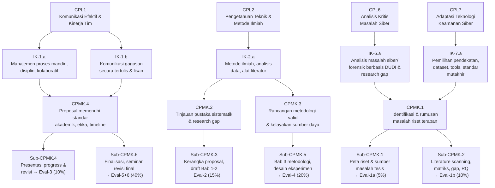
```mermaid
flowchart TD
    CPL1["CPL1\nKomunikasi Efektif &\nKinerja Tim"] --> IK1a["IK-1.a\nManajemen proses mandiri,\ndisiplin, kolaboratif"]
    CPL1 --> IK1b["IK-1.b\nKomunikasi gagasan\nsecara tertulis & lisan"]
    CPL2["CPL2\nPengetahuan Teknik &\nMetode Ilmiah"] --> IK2a["IK-2.a\nMetode ilmiah, analisis\ndata, alat literatur"]
    CPL6["CPL6\nAnalisis Kritis\nMasalah Siber"] --> IK6a["IK-6.a\nAnalisis masalah siber/\nforensik berbasis DUDI &\nresearch gap"]
    CPL7["CPL7\nAdaptasi Teknologi\nKeamanan Siber"] --> IK7a["IK-7.a\nPemilihan pendekatan,\ndataset, tools, standar\nmutakhir"]
    IK1a --> CPMK4_1["CPMK.4\nProposal memenuhi standar\nakademik, etika, timeline"]
    IK1b --> CPMK4_1
    IK2a --> CPMK2["CPMK.2\nTinjauan pustaka sistematik\n& research gap"] 
    IK2a --> CPMK3["CPMK.3\nRancangan metodologi valid\n& kelayakan sumber daya"]
    IK6a --> CPMK1["CPMK.1\nIdentifikasi & rumusan\nmasalah riset terapan"]
    IK7a --> CPMK1
    CPMK1 --> SubCPMK1["Sub-CPMK.1\nPeta riset & sumber\nmasalah tesis\n→ Eval-1a (5%)"]
    CPMK1 --> SubCPMK2["Sub-CPMK.2\nLiterature scanning,\nmatriks, gap, RQ\n→ Eval-1b (10%)"]
    CPMK2 --> SubCPMK3["Sub-CPMK.3\nKerangka proposal,\ndraft Bab 1-2\n→ Eval-2 (15%)"]
    CPMK3 --> SubCPMK5["Sub-CPMK.5\nBab 3 metodologi,\ndesain eksperimen\n→ Eval-4 (20%)"]
    CPMK4_1 --> SubCPMK4["Sub-CPMK.4\nPresentasi progress &\nrevisi → Eval-3 (10%)"]
    CPMK4_1 --> SubCPMK6["Sub-CPMK.6\nFinalisasi, seminar,\nrevisi final\n→ Eval-5+6 (40%)"]
```

---

## Peta Kompetensi Mata Kuliah

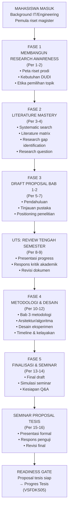
```mermaid
flowchart TD
    Entry["MAHASISWA MASUK\nBackground IT/Engineering\nPemula riset magister"] --> Phase1["FASE 1\nMEMBANGUN RESEARCH AWARENESS\n(Per 1-2)\n• Peta riset prodi\n• Kebutuhan DUDI\n• Etika pemilihan topik"]
    Phase1 --> Phase2["FASE 2\nLITERATURE MASTERY\n(Per 3-4)\n• Systematic search\n• Literature matrix\n• Research gap identification\n• Research question"]
    Phase2 --> Phase3["FASE 3\nDRAFT PROPOSAL BAB 1-2\n(Per 5-7)\n• Pendahuluan\n• Tinjauan pustaka\n• Positioning penelitian"]
    Phase3 --> Review1["UTS: REVIEW TENGAH SEMESTER\n(Per 8-9)\n• Presentasi progress\n• Respons kritik akademik\n• Revisi dokumen"]
    Review1 --> Phase4["FASE 4\nMETODOLOGI & DESAIN\n(Per 10-12)\n• Bab 3 metodologi\n• Arsitektur/algoritma\n• Desain eksperimen\n• Timeline & kelayakan"]
    Phase4 --> Phase5["FASE 5\nFINALISASI & SEMINAR\n(Per 13-14)\n• Final draft\n• Simulasi seminar\n• Kesiapan Q&A"]
    Phase5 --> Phase6["SEMINAR PROPOSAL TESIS\n(Per 15-16)\n• Presentasi formal\n• Respons penguji\n• Revisi final"]
    Phase6 --> Exit["READINESS GATE\nProposal tesis siap\n→ Progres Tesis (VSFDKS05)"]
```

---

## Peta Kurikulum dan Evaluasi

| Bab | Pertemuan | Sub-CPMK | Materi Utama | Aktivitas | Evaluasi | Artefak |
|---|---|---|---|---|---|---|
| 1 | 1 | Sub-CPMK.1 | Orientasi peta riset prodi | Diskusi, peta riset | Portofolio | Esai minat riset |
| 2 | 2 | Sub-CPMK.1 | Identifikasi masalah dari DUDI | Workshop, portofolio | Portofolio | Daftar 5 masalah potensial |
| 3 | 3 | Sub-CPMK.2 | Literature scanning & matriks | Workshop, peer review | Portofolio | Matriks literatur 15 paper |
| 4 | 4 | Sub-CPMK.2 | Research gap & research question | Diskusi, peer review | Portofolio | Draft RQ & research gap |
| 5 | 5 | Sub-CPMK.3 | Struktur proposal & positioning | Konsultasi, outline | Dokumen | Outline proposal |
| 6 | 6 | Sub-CPMK.3 | Menyusun Bab 1 Pendahuluan | Bimbingan, peer review | Dokumen | Draft Bab 1 |
| 7 | 7 | Sub-CPMK.3 | Menyusun Bab 2 Tinjauan Pustaka | Bimbingan, peer review | Dokumen | Draft Bab 2 |
| 8 | 8 | Sub-CPMK.4 | Presentasi progress & kritik | Seminar mini | Eval-3 | Slide + log revisi |
| 9 | 9 | Sub-CPMK.4 | UTS: Review tengah semester | Seminar, revisi | Eval-3 | Dokumen revisi |
| 10 | 10 | Sub-CPMK.5 | Metodologi penelitian terapan | Workshop, coaching | Dokumen | Kerangka Bab 3 |
| 11 | 11 | Sub-CPMK.5 | Arsitektur, algoritma, prototipe | Design review | Dokumen | Diagram arsitektur |
| 12 | 12 | Sub-CPMK.5 | Desain eksperimen, dataset, timeline | Workshop, konsultasi | Eval-4 | Paket metodologi |
| 13 | 13 | Sub-CPMK.6 | Menyusun Bab 3 dan finalisasi | Bimbingan, peer review | Dokumen | Bab 3 lengkap |
| 14 | 14 | Sub-CPMK.6 | Simulasi seminar dan kesiapan | Rehearsal, peer review | Eval-5a | Final draft + slide |
| 15 | 15 | Sub-CPMK.6 | Seminar proposal tesis formal | Seminar oral defense | Eval-5b | Berita acara seminar |
| 16 | 16 | Sub-CPMK.6 | Revisi final & readiness gate | Revisi, portofolio | Eval-6 | Proposal final revisi |

---

## Petunjuk Penggunaan Buku

Buku ajar ini dirancang sebagai *companion* dalam proses penyusunan proposal tesis, bukan sebagai teks referensi yang dibaca dari awal ke akhir sebelum memulai. Pendekatan yang direkomendasikan:

**Sebelum setiap pertemuan:** Baca bab yang sesuai sebagai persiapan. Pahami landasan teori, catat pertanyaan yang muncul, dan mulai memikirkan penerapannya pada topik tesis Anda sendiri.

**Selama pertemuan:** Gunakan bab sebagai referensi aktif. Bawa catatan tentang konteks tesis Anda sendiri untuk dikonsultasikan dengan dosen atau didiskusikan dalam kelompok.

**Setelah pertemuan:** Kerjakan aktivitas praktikum dan latihan terapan. Hasilkan artefak yang diminta sebagai bagian dari portofolio proposal Anda.

**Catatan tentang contoh topik:** Sepanjang buku ini digunakan tiga skenario contoh tesis mahasiswa fiktif untuk mengilustrasikan konsep:
- **Mahasiswa A (Rina Wijayanti):** Topik ML-based Intrusion Detection untuk lingkungan IoT Industrial
- **Mahasiswa B (Bima Pratama):** Topik Digital Forensics pada lingkungan cloud multi-tenant
- **Mahasiswa C (Sari Kusuma):** Topik Threat Intelligence automation menggunakan NLP

Contoh-contoh ini dipilih untuk mencerminkan keragaman domain dalam keamanan siber dan forensik digital, dan untuk menunjukkan bahwa konsep yang sama (penyusunan RQ, desain eksperimen, dll.) dapat diterapkan pada topik yang berbeda-beda.

---

## Daftar Bab

| Bab | Judul | Halaman |
|---|---|---|
| 1 | Orientasi Program Riset dan Peta Riset Prodi | — |
| 2 | Identifikasi Masalah Riset: Dari Kebutuhan DUDI ke Potensi Tesis | — |
| 3 | Literature Scanning: Strategi, Database, dan Matriks Literatur | — |
| 4 | Research Gap dan Research Question | — |
| 5 | Struktur Proposal Tesis dan Positioning Penelitian | — |
| 6 | Menyusun Bab 1: Pendahuluan yang Meyakinkan | — |
| 7 | Menyusun Bab 2: Tinjauan Pustaka Sistematik | — |
| 8 | Presentasi Progress dan Merespons Kritik Akademik | — |
| 9 | UTS — Review Tengah Semester: Kasus Integratif | — |
| 10 | Metodologi Penelitian Terapan untuk Keamanan Siber | — |
| 11 | Arsitektur Sistem, Algoritma, dan Rancangan Prototipe | — |
| 12 | Desain Eksperimen, Dataset, Metrik, dan Timeline Penelitian | — |
| 13 | Menyusun Bab 3 Metodologi: Dari Kerangka ke Dokumen | — |
| 14 | Finalisasi Proposal dan Simulasi Seminar | — |
| 15 | Seminar Proposal Tesis: Oral Defense dan Strategi Argumentasi | — |
| 16 | Revisi Final dan Transisi ke Progres Tesis | — |
| Lampiran A | Template Proposal Tesis (Format PENS) | — |
| Lampiran B | Template Literature Matrix | — |
| Lampiran C | Template Research Gap Analysis | — |
| Lampiran D | Template Gantt Chart dan Analisis Kelayakan | — |
| Lampiran E | Template Slide Seminar Proposal | — |
| Lampiran F | Rubrik Penilaian Seminar Proposal | — |
| Lampiran G | Log Revisi dan Pernyataan Etika Akademik | — |
| Kunci Jawaban Global | Pembahasan Integratif Lintas Bab | — |
| Daftar Pustaka | — | — |

---

## Bab 1 — Orientasi Program Riset dan Peta Riset Prodi

### 1. Capaian Pembelajaran Bab

Setelah menyelesaikan bab ini, mahasiswa mampu:
- Menjelaskan konsep riset terapan dalam konteks magister terapan dan perbedaannya dengan riset akademik murni (C2)
- Memetakan area riset utama prodi dan kelompok riset dosen sebagai sumber potensial topik tesis (C3)
- Menghubungkan minat riset pribadi dengan peta riset prodi dan kebutuhan DUDI (C4)
- Menyusun esai minat riset awal yang argumentatif dan berbasis konteks industri (C3)

*Dikaitkan dengan Sub-CPMK.1 (Pertemuan 1) dan Eval-1a (5%).*

---

### 2. Peta Konsep Bab

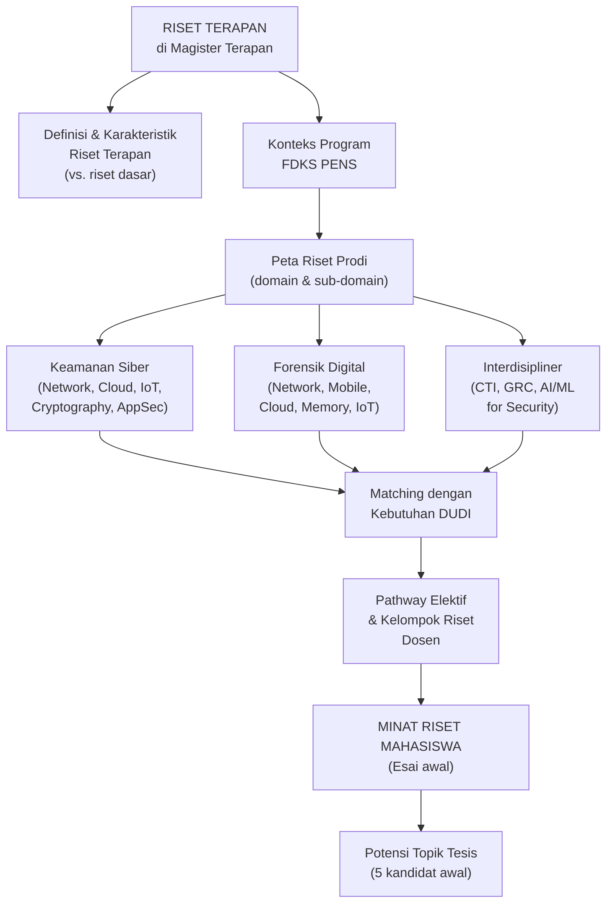
```mermaid
flowchart TD
    RP["RISET TERAPAN\ndi Magister Terapan"] --> DefRT["Definisi & Karakteristik\nRiset Terapan\n(vs. riset dasar)"]
    RP --> Context["Konteks Program\nFDKS PENS"]
    Context --> ProdiMap["Peta Riset Prodi\n(domain & sub-domain)"]
    ProdiMap --> D1["Keamanan Siber\n(Network, Cloud, IoT,\nCryptography, AppSec)"]
    ProdiMap --> D2["Forensik Digital\n(Network, Mobile,\nCloud, Memory, IoT)"]
    ProdiMap --> D3["Interdisipliner\n(CTI, GRC, AI/ML\nfor Security)"]
    D1 --> DudiMatch["Matching dengan\nKebutuhan DUDI"]
    D2 --> DudiMatch
    D3 --> DudiMatch
    DudiMatch --> Pathway["Pathway Elektif\n& Kelompok Riset\nDosen"]
    Pathway --> ResearchInterest["MINAT RISET MAHASISWA\n(Esai awal)"]
    ResearchInterest --> TopicPotential["Potensi Topik Tesis\n(5 kandidat awal)"]
```

---

### 3. Pengantar Kontekstual

Memulai program magister adalah momen yang sering disertai kebingungan tentang satu pertanyaan fundamental: *tesis saya tentang apa?* Pertanyaan ini terdengar sederhana, tetapi jawabannya memerlukan pemahaman tentang ekosistem riset yang lebih luas — apa yang sudah diketahui, apa yang masih menjadi masalah, dan di mana kontribusi tesis Anda dapat bermakna bagi dunia nyata.

Bab ini memulai perjalanan itu dengan membangun *peta orientasi* — gambaran besar tentang lanskap riset keamanan siber dan forensik digital, siapa yang mengerjakan apa di prodi ini, dan bagaimana kebutuhan industri membentuk arah riset terapan. Sebelum Anda dapat menemukan topik yang tepat, Anda perlu tahu terlebih dahulu di mana Anda berada.

---

### 4. Landasan Teori

#### 4.1 Riset Terapan dalam Konteks Magister Terapan

**Riset Dasar (Basic/Fundamental Research):**
Bertujuan menghasilkan pengetahuan baru yang bersifat universal, tanpa mempertimbangkan aplikasi langsung. Contoh: mengembangkan teori kriptografi baru yang membuktikan properti keamanan formal.

**Riset Terapan (Applied Research):**
Bertujuan menggunakan pengetahuan untuk memecahkan masalah praktis yang spesifik. Contoh: mengembangkan sistem deteksi intrusi yang efisien untuk jaringan IoT industrial di lingkungan pabrik manufaktur.

**Riset Pengembangan (Development Research):**
Bertujuan mengembangkan produk, alat, atau sistem yang dapat digunakan — seringkali merupakan kelanjutan dari riset terapan. Contoh: membangun prototipe platform threat intelligence yang dapat diintegrasikan dengan SIEM yang ada di organisasi.

Program Magister Terapan PENS berfokus pada riset terapan dan pengembangan. Ini memiliki implikasi langsung pada tesis:

- Tesis harus berkaitan dengan masalah nyata yang dihadapi industri, pemerintah, atau masyarakat
- Kontribusi tesis diukur bukan hanya dari novelty akademik tetapi juga dari relevansi dan kelayakan implementasi
- Validasi tesis melibatkan skenario atau data yang representatif dari konteks nyata
- Tesis diharapkan menghasilkan artefak yang dapat digunakan: prototype, dataset, tool, framework, metodologi, atau rekomendasi kebijakan yang konkret

**Karakteristik Tesis Terapan yang Baik:**
- *Masalah nyata*: diidentifikasi dari kebutuhan industri, regulasi, atau insiden keamanan yang terjadi
- *Kontribusi spesifik*: tidak mencoba memecahkan semua masalah, fokus pada gap yang teridentifikasi dengan jelas
- *Kelayakan*: dapat diselesaikan dalam 2-3 semester dengan sumber daya yang tersedia
- *Dapat divalidasi*: memiliki metrik evaluasi yang terukur dan dapat dibandingkan dengan baseline
- *Terdokumentasi*: mengikuti konvensi penulisan ilmiah dan dapat direproduksi oleh peneliti lain

#### 4.2 Peta Riset Domain Keamanan Siber

Domain riset keamanan siber dalam konteks Program FDKS PENS mencakup beberapa area utama:

**Network and Infrastructure Security:**
Penelitian tentang keamanan jaringan komputer, termasuk: deteksi intrusi (IDS/IPS), firewall generasi lanjut, DDoS mitigation, network anomaly detection menggunakan machine learning, Software-Defined Networking (SDN) security, dan keamanan jaringan 5G.

*Contoh topik tesis:* "Deteksi serangan DDoS berbasis Machine Learning pada Jaringan 5G menggunakan dataset CIC-DDoS2019: Perbandingan Random Forest, XGBoost, dan LSTM."

**Cloud and Virtualization Security:**
Keamanan lingkungan cloud (public, private, hybrid, multi-cloud), container security (Docker, Kubernetes), serverless security, cloud-native security, Zero Trust Architecture (ZTA) implementation.

*Contoh topik tesis:* "Implementasi Zero Trust Architecture pada lingkungan multi-cloud menggunakan policy-based access control: Evaluasi efektivitas dan overhead performa."

**IoT and Embedded System Security:**
Keamanan perangkat IoT, Industrial IoT (IIoT), Operational Technology (OT), SCADA/ICS security, firmware analysis, side-channel attacks.

*Contoh topik tesis:* "Analisis kerentanan firmware perangkat IoT industri menggunakan static dan dynamic analysis: Studi kasus pada protokol MQTT dan CoAP."

**Application and Software Security:**
Secure software development, vulnerability assessment dan penetration testing (dalam batas authorized), Static Application Security Testing (SAST), Dynamic Application Security Testing (DAST), Web Application Firewall (WAF), API security.

**Cryptography and Privacy:**
Implementasi kriptografi modern, post-quantum cryptography, privacy-preserving computation, homomorphic encryption, secure multi-party computation, blockchain security.

**Cyber Threat Intelligence (CTI):**
Pengumpulan dan analisis threat intelligence, STIX/TAXII, threat hunting, adversary emulation (berdasarkan MITRE ATT&CK), automation CTI menggunakan NLP/ML.

**AI/ML Security:**
Adversarial attacks pada model ML, model poisoning, federated learning security, explainable AI untuk keamanan, penggunaan ML untuk deteksi ancaman.

#### 4.3 Peta Riset Domain Forensik Digital

**Network Forensics:**
Analisis traffic jaringan untuk investigasi insiden, packet capture analysis, log correlation, timeline reconstruction dari perspektif network evidence.

**Digital Forensics pada Cloud:**
Akuisisi dan analisis evidence dari lingkungan cloud, tantangan jurisdiksi dan chain of custody dalam cloud, ephemeral evidence di lingkungan container dan serverless.

**Mobile Device Forensics:**
Ekstraksi dan analisis data dari perangkat mobile (iOS, Android), enkripsi perangkat, analisis aplikasi mobile, recovery data dari perangkat terenkripsi.

**Memory Forensics:**
Analisis volatile memory (RAM), deteksi malware in-memory, rootkit detection, live forensics.

**Malware Analysis:**
Static dan dynamic malware analysis (dalam lingkungan sandboxed yang aman), reverse engineering, behavioral analysis, malware classification menggunakan ML.

**IoT Forensics:**
Akuisisi dan analisis evidence dari perangkat IoT, tantangan forensik pada perangkat dengan resource terbatas, cloud IoT platform forensics.

#### 4.4 Kelompok Riset Dosen dan Pathway Elektif

Program FDKS PENS memiliki beberapa kelompok riset yang dipimpin oleh dosen pembimbing potensial. Mahasiswa disarankan untuk:

1. Menghadiri sesi pengenalan kelompok riset pada pertemuan awal
2. Membaca publikasi terbaru dosen yang berpotensi menjadi pembimbing
3. Mengidentifikasi alignment antara minat riset mahasiswa dengan area keahlian dosen
4. Mempertimbangkan keterlibatan dalam proyek riset yang sedang berjalan di kelompok riset dosen

**Pathway Elektif** memberikan spesialisasi tambahan yang memperkaya tesis:
- Pathway Ofensif: memahami teknik serangan untuk membangun pertahanan yang lebih baik
- Pathway Defensif: fokus pada deteksi, respons, dan pemulihan
- Pathway Forensik: investigasi digital dan chain of custody
- Pathway GRC: governance, risk, compliance, dan audit
- Pathway AI/ML for Security: kecerdasan buatan untuk keamanan siber

Topik tesis idealnya bersinggungan dengan pathway elektif yang dipilih mahasiswa.

#### 4.5 Etika Pemilihan Topik

Dalam domain keamanan siber, etika pemilihan topik sangat penting:

**Topik yang Dapat Diterima:**
- Penelitian defensif: deteksi, pencegahan, respons, pemulihan
- Analisis kerentanan yang bertujuan untuk perbaikan (menggunakan sistem sendiri atau dengan izin eksplisit)
- Forensik digital yang berfokus pada metodologi yang legal dan berotorisasi
- Pengembangan tool yang memiliki aplikasi defensif yang jelas

**Topik yang Perlu Kehati-hatian Ekstra:**
- Penelitian yang melibatkan sistem nyata milik pihak ketiga → wajib ada MoU dan izin tertulis
- Penelitian yang mengembangkan teknik yang dapat disalahgunakan (dual-use) → wajib ada ethical review dan justifikasi yang kuat
- Penelitian yang melibatkan data pribadi → wajib ada privacy impact assessment

**Prinsip Umum:**
Tujuan riset harus defensif, kontributif, dan tidak membahayakan pihak lain. Jika ada keraguan tentang batas etika suatu topik, diskusikan dengan calon pembimbing sebelum melanjutkan.

---

### 5. Model atau Arsitektur

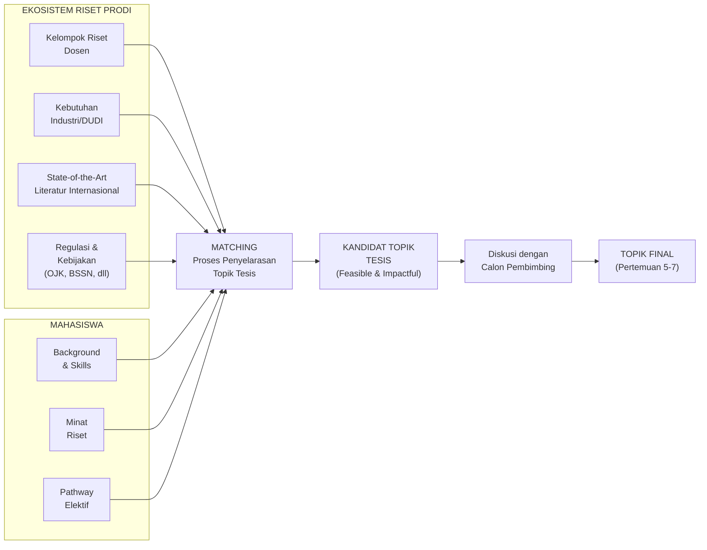
```mermaid
flowchart LR
    subgraph "EKOSISTEM RISET PRODI"
        direction TB
        DosenRiset["Kelompok Riset\nDosen"] 
        IndustryNeeds["Kebutuhan\nIndustri/DUDI"]
        StateOfArt["State-of-the-Art\nLiteratur Internasional"]
        Regulasi["Regulasi &\nKebijakan\n(OJK, BSSN, dll)"]
    end
    subgraph "MAHASISWA"
        Background["Background\n& Skills"]
        Interest["Minat\nRiset"]
        Pathway["Pathway\nElektif"]
    end
    DosenRiset --> Match["MATCHING\nProses Penyelarasan\nTopik Tesis"]
    IndustryNeeds --> Match
    StateOfArt --> Match
    Regulasi --> Match
    Background --> Match
    Interest --> Match
    Pathway --> Match
    Match --> TopicCandidate["KANDIDAT TOPIK\nTESIS\n(Feasible & Impactful)"]
    TopicCandidate --> Advisor["Diskusi dengan\nCalon Pembimbing"]
    Advisor --> TopicFinal["TOPIK FINAL\n(Pertemuan 5-7)"]
```

---

### 6. Contoh Terapan

**Proses Orientasi Riset Mahasiswa A — Rina Wijayanti:**

*Background Rina:* Bekerja sebagai network engineer di perusahaan manufaktur selama 4 tahun. Sering menghadapi insiden keamanan pada jaringan IoT di lantai produksi yang sulit dideteksi dengan IDS konvensional.

*Minat riset awal:* "Saya tertarik pada keamanan IoT di lingkungan industri karena ini masalah nyata yang saya hadapi setiap hari."

*Pemetaan ke riset prodi:* Domain IoT Security + Industrial Control System (ICS) Security.

*Kebutuhan DUDI yang relevan:* Serangan pada industrial IoT meningkat 400% sejak 2021 (Ref: IBM X-Force Threat Intelligence). Banyak perusahaan manufaktur tidak memiliki visibilitas terhadap traffic OT/IT mereka.

*Potensi topik awal (5 kandidat):*
1. Deteksi anomali pada protokol MQTT menggunakan ML
2. Segmentasi jaringan IT/OT berbasis risiko dengan SDN
3. Forensik pada insiden ICS/SCADA
4. Vulnerability assessment otomatis pada firmware perangkat IoT industrial
5. Intrusion Detection System berbasis behavior untuk jaringan OT

*Diskusi dengan dosen:* Setelah diskusi dengan Prof. X (kelompok riset IoT Security), Rina memutuskan untuk mendalami kandidat #1 dan #5, karena ada dataset benchmark yang tersedia dan topik ini memiliki research gap yang jelas dari literatur terbaru.

---

### 7. Praktikum atau Aktivitas Terarah

**Judul Aktivitas:** Pemetaan Ekosistem Riset dan Esai Minat Riset

**Tujuan:**
- Memahami peta riset prodi secara konkret
- Mengidentifikasi 5 masalah potensial tesis berdasarkan konteks industri dan minat pribadi
- Menyusun esai minat riset awal sebagai artefak Eval-1a

**Langkah Kerja:**

*Tahap 1 — Survei Peta Riset (30 menit):*
Telusuri publikasi 3 tahun terakhir dari dosen prodi (melalui Google Scholar, SINTA, atau Scopus). Buat tabel: Nama Dosen | Area Riset | Publikasi Terbaru | Proyek Aktif.

*Tahap 2 — Identifikasi Masalah dari Pengalaman (20 menit):*
Jawab pertanyaan berikut secara tertulis:
- Masalah keamanan siber/forensik digital apa yang Anda temui dalam pengalaman kerja atau studi?
- Dari perspektif industri, apa yang paling Anda khawatirkan tentang keamanan sistem yang ada?
- Jika Anda bisa memecahkan satu masalah keamanan siber, masalah apa itu?

*Tahap 3 — Pemetaan ke Domain Riset (15 menit):*
Kategorikan masalah-masalah dari Tahap 2 ke domain riset yang ada (Network Security, IoT, Cloud, Forensics, dll.).

*Tahap 4 — Susun Esai Minat Riset (45 menit):*
Tulis esai 300-500 kata yang mencakup: (1) latar belakang Anda; (2) masalah yang ingin Anda pecahkan; (3) mengapa masalah ini penting; (4) pendekatan awal yang Anda bayangkan; (5) keterkaitan dengan peta riset prodi.

---

### 8. Latihan Pemahaman

**Soal 1 (Pilihan Ganda):** Karakteristik yang paling membedakan riset terapan dari riset dasar adalah:
- A. Riset terapan menggunakan metode kuantitatif, riset dasar kualitatif
- B. Riset terapan bertujuan memecahkan masalah spesifik, riset dasar menghasilkan pengetahuan universal
- C. Riset terapan hanya dilakukan di industri, riset dasar hanya di universitas
- D. Riset terapan tidak memerlukan tinjauan pustaka

**Soal 2 (Analisis):** Mahasiswa mengusulkan tesis tentang "Mengembangkan tool yang dapat secara otomatis mengeksploitasi kerentanan pada sistem yang belum di-patch." Evaluasi apakah topik ini sesuai untuk Program Magister Terapan FDKS. Apa yang perlu dimodifikasi?

**Soal 3 (Terapan):** Anda memiliki background sebagai security analyst di perusahaan perbankan. Identifikasi 3 masalah keamanan siber yang spesifik dan relevan yang Anda hadapi, dan jelaskan mengapa masing-masing masalah tersebut potensial menjadi topik tesis terapan.

**Soal 4 (Evaluasi):** Berikan alasan mengapa penting untuk menyelaraskan topik tesis dengan area riset dosen pembimbing potensial, bukan hanya dengan minat pribadi mahasiswa.

**Soal 5 (Perancangan):** Bagaimana Anda akan menentukan apakah sebuah topik tesis terapan sudah "cukup spesifik" dan "cukup layak" untuk dikerjakan dalam program magister 2 tahun?

---

### 9. Latihan Terapan / Studi Kasus

**Studi Kasus: Mengevaluasi Kesesuaian Topik**

Tiga mahasiswa mengajukan deskripsi topik tesis awal kepada Anda (selaku reviewer sejawat):

**Mahasiswa X:** "Keamanan siber secara umum sangat penting di era digital. Saya ingin meneliti tentang keamanan jaringan komputer dan bagaimana cara membuatnya lebih aman."

**Mahasiswa Y:** "Saya akan mengembangkan sistem deteksi serangan ransomware pada lingkungan Windows menggunakan analisis perilaku proses (process behavior analysis) berbasis machine learning. Sistem akan diuji pada dataset publik CERT Insider Threat dan dibandingkan dengan tool komersial CrowdStrike Falcon."

**Mahasiswa Z:** "Saya ingin meneliti tentang blockchain untuk keamanan karena blockchain itu keren dan banyak dibicarakan."

*Pertanyaan:*
1. Evaluasi ketiga topik berdasarkan: spesifisitas, relevansi DUDI, kelayakan, dan potensi kontribusi.
2. Berikan skor (1-5) untuk setiap dimensi dan berikan alasan.
3. Berikan saran konkret untuk memperbaiki topik X dan Z menjadi lebih memenuhi kriteria tesis terapan.
4. Apakah topik Y sudah baik? Apa yang masih perlu diperjelas?

---

### 10. Kunci Jawaban dan Pembahasan

**Jawaban Soal 1:** **B — Riset terapan bertujuan memecahkan masalah spesifik, riset dasar menghasilkan pengetahuan universal.** Perbedaan ini bersifat fundamental dalam orientasi penelitian. Riset terapan tidak selalu kuantitatif (A — salah); dapat dilakukan di universitas maupun industri (C — salah); dan tetap memerlukan tinjauan pustaka yang kuat (D — salah). Dalam konteks Program Magister Terapan PENS, orientasi ini berarti tesis harus memiliki masalah nyata yang dapat diidentifikasi dari konteks industri atau organisasi.

**Jawaban Soal 2:** Topik yang diusulkan bermasalah karena: (a) bersifat ofensif tanpa justifikasi defensif yang jelas; (b) tool "exploit otomatis" termasuk dual-use technology yang dapat digunakan untuk menyerang sistem tanpa izin; (c) bertentangan dengan prinsip etika riset keamanan siber.

Modifikasi yang diperlukan: Reframe menjadi "Pengembangan framework automated vulnerability assessment pada sistem terisolasi sebagai bagian dari penetration testing yang berotorisasi, dengan evaluasi terhadap efektivitas deteksi kerentanan yang diketahui (CVE)." Atau: "Analisis pola kerentanan yang umum pada sistem yang belum di-patch untuk mengembangkan rekomendasi prioritisasi patch management berbasis risiko." Pendekatan ini mempertahankan relevansi teknis sambil berfokus pada hasil defensif.

**Jawaban Soal 3 (Contoh untuk security analyst perbankan):**
1. *Alert fatigue dalam SIEM*: SIEM menghasilkan ribuan alert per hari, 95% false positive. Masalah ini relevan secara luas di industri dan memiliki research gap dalam konteks Indonesian banking regulation. Topik potensial: "Reduksi false positive SIEM menggunakan machine learning berbasis konteks infrastruktur perbankan Indonesia."
2. *Kepatuhan PDP dalam data analytics*: Bank harus mematuhi UU PDP 2022 sambil melakukan analisis data nasabah untuk fraud detection. Topik potensial: "Implementasi Privacy-Preserving Machine Learning untuk fraud detection dalam kepatuhan UU PDP 27/2022."
3. *Keamanan API mobile banking*: Proliferasi API untuk mobile banking membuka attack surface baru. Topik potensial: "Evaluasi keamanan API mobile banking di Indonesia: Analisis kerentanan umum dan rekomendasi mitigasi berbasis OWASP API Security Top 10."

**Jawaban Soal 4:** Penyelarasan dengan area riset dosen penting karena: (a) dosen pembimbing yang ahli di area tersebut dapat memberikan bimbingan yang substantif, bukan hanya administratif; (b) akses ke data, tool, atau jaringan kolaborasi dosen yang relevan; (c) kemungkinan lebih tinggi tesis menghasilkan publikasi bersama; (d) dosen yang memiliki publikasi di area tersebut dapat membantu memposisikan kontribusi tesis dalam konteks literatur yang relevan. Tanpa alignment, bimbingan menjadi superfisial dan mahasiswa harus membangun domain knowledge sendiri tanpa panduan yang memadai.

**Jawaban Soal 5:** Topik "cukup spesifik" jika dapat menjawab: Masalah apa? (spesifik, bukan "keamanan secara umum") → Sistem/konteks apa? → Pendekatan apa? → Bagaimana mengukur keberhasilan? Topik "cukup layak" jika: dataset atau sumber daya yang diperlukan dapat diakses; metodologi dapat diselesaikan dalam 2-3 semester; calon pembimbing memiliki keahlian relevan; tidak memerlukan akses ke sistem nyata tanpa MoU.

**Jawaban Studi Kasus:**

1-2. Evaluasi:

| Dimensi | Mhs X | Mhs Y | Mhs Z |
|---|---|---|---|
| Spesifisitas | 1 | 5 | 1 |
| Relevansi DUDI | 2 | 4 | 2 |
| Kelayakan | 1 | 4 | 1 |
| Potensi Kontribusi | 1 | 4 | 1 |
| **Rata-rata** | **1.25** | **4.25** | **1.25** |

3. Saran untuk X: "Mulai dari masalah spesifik — bukan 'keamanan jaringan secara umum'. Ajukan pertanyaan: pada jenis jaringan apa (IoT, cloud, enterprise)? Dengan teknik apa (ML, kriptografi, protokol baru)? Dengan metrik apa? Contoh reframe: 'Deteksi anomali pada jaringan enterprise berbasis graph neural network: Studi kasus pada dataset LANL Unified Host and Network Dataset'."

Saran untuk Z: "Blockchain adalah teknologi, bukan masalah. Mulai dari masalah: masalah keamanan apa yang ingin Anda pecahkan menggunakan blockchain? Apakah chain of custody untuk digital evidence? Secure sharing threat intelligence? Decentralized identity? Pilih satu masalah yang spesifik, kemudian blockchain menjadi pendekatan solusi."

4. Topik Y sudah sangat baik — spesifik, memiliki dataset yang disebutkan, ada baseline perbandingan. Yang masih perlu diperjelas: (a) penelitian ini mensimulasikan lingkungan Windows seperti apa (enterprise, personal, server)? (b) apakah dataset CERT Insider Threat benar-benar berisi sampel ransomware? (perlu dicek — ini mungkin perlu dikoreksi); (c) apa research gap yang belum diselesaikan oleh solusi sebelumnya?

---

### 11. Ringkasan Bab

Riset terapan di Program Magister Terapan FDKS PENS berorientasi pada pemecahan masalah nyata dalam keamanan siber dan forensik digital, dengan kontribusi yang terukur, kelayakan yang realistis, dan dapat divalidasi dalam konteks industri. Domain riset mencakup keamanan jaringan, cloud, IoT, kriptografi, forensik digital di berbagai platform, dan area interdisipliner seperti CTI dan AI/ML for Security. Menyelaraskan minat pribadi dengan peta riset dosen, kebutuhan DUDI, dan pathway elektif adalah langkah pertama yang menentukan kualitas seluruh perjalanan tesis. Etika pemilihan topik — khususnya orientasi defensif dan penghindaran aktivitas ofensif tanpa izin — adalah batas yang tidak dapat dikompromikan.

---

### 12. Refleksi Profesional

1. **Riset vs. Implementasi**: Dalam lingkungan profesional, Anda mungkin terbiasa memecahkan masalah dengan mengimplementasikan solusi yang sudah ada. Riset terapan meminta Anda untuk bertanya: mengapa solusi yang ada belum memadai? Apa yang berbeda dari konteks Anda? Bagaimana Anda membuktikan bahwa pendekatan Anda lebih baik? Bagaimana pergeseran mindset dari "implementer" ke "researcher" ini terasa bagi Anda?

2. **Topik Ambisius vs. Topik Feasible**: Ada tekanan untuk memilih topik yang "ambisius" dan "impactful", tetapi topik yang terlalu luas atau kompleks seringkali berakhir tidak selesai atau tidak berkontribusi dengan jelas. Bagaimana Anda menyeimbangkan ambisi dengan realisme dalam memilih topik tesis?

3. **Kepentingan Industri vs. Kebebasan Akademik**: Jika sponsor industri mitra prodi menawarkan beasiswa dengan syarat tesis Anda tentang topik tertentu yang spesifik bagi kepentingan mereka, apakah Anda akan menerimanya? Apa implikasinya terhadap independensi riset dan publikasi hasil tesis Anda?

---

## Bab 2 — Identifikasi Masalah Riset: Dari Kebutuhan DUDI ke Potensi Tesis

### 1. Capaian Pembelajaran Bab

Setelah menyelesaikan bab ini, mahasiswa mampu:
- Menganalisis kebutuhan keamanan siber dan forensik digital dari perspektif DUDI, pemerintah, dan masyarakat (C4)
- Menerapkan pendekatan terstruktur untuk mengidentifikasi masalah riset yang memiliki potensi tesis (C3)
- Menghasilkan daftar 5 kandidat masalah potensial yang spesifik, relevan, dan dapat diteliti (C3)

*Dikaitkan dengan Sub-CPMK.1 (Pertemuan 2) dan Eval-1a (5% — artefak: daftar 5 masalah potensial).*

---

### 2. Peta Konsep Bab

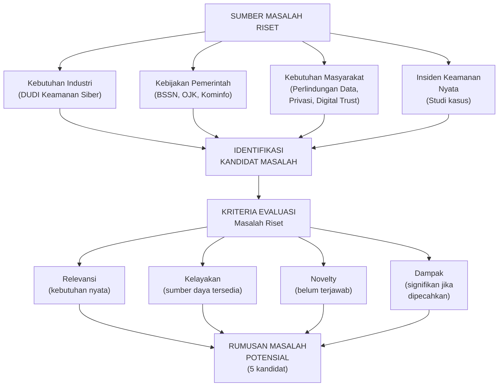
```mermaid
flowchart TD
    Sources["SUMBER MASALAH RISET"] --> Industry["Kebutuhan Industri\n(DUDI Keamanan Siber)"]
    Sources --> Government["Kebijakan Pemerintah\n(BSSN, OJK, Kominfo)"]
    Sources --> Society["Kebutuhan Masyarakat\n(Perlindungan Data,\nPrivasi, Digital Trust)"]
    Sources --> Incidents["Insiden Keamanan\nNyata\n(Studi kasus)"]
    Industry --> ProblemCandidates["IDENTIFIKASI\nKANDIDAT MASALAH"]
    Government --> ProblemCandidates
    Society --> ProblemCandidates
    Incidents --> ProblemCandidates
    ProblemCandidates --> Criteria["KRITERIA EVALUASI\nMasalah Riset"]
    Criteria --> C1["Relevansi\n(kebutuhan nyata)"]
    Criteria --> C2["Kelayakan\n(sumber daya tersedia)"]
    Criteria --> C3["Novelty\n(belum terjawab)"]
    Criteria --> C4["Dampak\n(signifikan jika\ndipecahkan)"]
    C1 & C2 & C3 & C4 --> ProblemStatement["RUMUSAN MASALAH\nPOTENSIAL\n(5 kandidat)"]
```

---

### 3. Pengantar Kontekstual

Identifikasi masalah yang tepat adalah fondasi dari seluruh tesis. Sebuah tesis dengan masalah yang salah — terlalu luas, tidak relevan dengan kebutuhan nyata, atau tidak memiliki novelty — tidak dapat diselamatkan hanya dengan metodologi yang canggih atau penulisan yang baik. Sebaliknya, tesis dengan masalah yang tepat, meskipun pendekatannya sederhana, dapat memberikan kontribusi yang berarti.

Dalam konteks magister terapan keamanan siber dan forensik digital, "masalah yang tepat" tidak muncul dari ruang hampa. Ia muncul dari persinggungan antara pengalaman praktis Anda, kebutuhan nyata yang belum terpenuhi di dunia kerja, perkembangan ancaman siber yang terjadi di lapangan, dan gap pengetahuan yang teridentifikasi dari literatur ilmiah. Bab ini mengajarkan bagaimana membaca ketiga sumber ini secara sistematis.

---

### 4. Landasan Teori

#### 4.1 Sumber Masalah Riset Terapan

**a) Kebutuhan Industri dan DUDI:**

Kebutuhan industri keamanan siber Indonesia dapat diidentifikasi dari berbagai sumber:
- *Laporan industri*: IBM X-Force Threat Intelligence Index, Verizon DBIR, Kaspersky Security Bulletin, ID-CERT laporan insiden nasional
- *Regulasi baru*: Setiap regulasi baru yang diterbitkan (UU PDP, SEOJK, PBI, Peraturan BSSN) menciptakan kebutuhan implementasi yang bisa menjadi topik riset
- *Lowongan kerja dan kebutuhan kompetensi*: Posisi yang paling banyak dibutuhkan industri mencerminkan gap kompetensi dan tool yang belum tersedia
- *Wawancara dengan praktisi*: Diskusi langsung dengan CISO, security analyst, atau insiden responder tentang masalah yang belum mereka temukan solusi yang memadai

**b) Kebijakan Pemerintah:**

Beberapa inisiatif pemerintah yang menciptakan kebutuhan riset:
- BSSN: Strategi Keamanan Siber Nasional 2021-2025, pedoman SMKI, dan framework keamanan siber nasional
- Kominfo: PSPEP (Penyelenggara Sistem dan Transaksi Elektronik Publik) yang memerlukan assessment keamanan
- OJK: SEOJK tentang manajemen risiko TI perbankan — menciptakan kebutuhan tool audit dan assessment
- BPPT/BRIN: Roadmap riset teknologi nasional

**c) Insiden Keamanan Nyata:**

Insiden keamanan yang terjadi di Indonesia dan global seringkali mengungkap gap yang belum ada solusinya:
- Kebocoran data di lembaga pemerintah atau perusahaan besar
- Serangan ransomware pada infrastruktur kritis
- Penipuan digital berbasis social engineering
- Serangan pada sistem perbankan digital

*Catatan metodologi:* Mahasiswa tidak boleh menggunakan data dari insiden nyata tanpa izin dari pihak yang terkena. Namun, laporan publik tentang insiden (IDSA, ID-CERT, media) dapat menjadi inspirasi masalah.

**d) Pengalaman Pribadi Mahasiswa:**

Pengalaman bekerja adalah sumber masalah yang paling autentik karena:
- Mahasiswa memiliki konteks yang lebih dalam daripada outsider
- Masalah yang dihadapi sendiri memiliki motivasi yang lebih kuat untuk diselesaikan
- Akses ke organisasi (untuk pengumpulan data/validasi) lebih mudah jika mahasiswa bekerja di sana

#### 4.2 Kriteria Masalah Riset yang Baik

Sebuah masalah riset yang baik untuk tesis magister terapan harus memenuhi lima kriteria:

**1. Relevansi (Relevance):**
Masalah harus relevan dengan kebutuhan nyata — ada stakeholder yang akan peduli dengan jawabannya. Pertanyaan uji: "Jika saya berhasil memecahkan masalah ini, siapa yang akan mendapat manfaat dan seberapa besar?"

**2. Novelty (Kebaruan):**
Masalah harus memiliki unsur yang belum sepenuhnya dijawab oleh penelitian yang ada. Pertanyaan uji: "Apakah sudah ada solusi yang memadai di literatur? Jika ada, mengapa solusi itu belum diterapkan atau masih belum cukup?"

**3. Kelayakan (Feasibility):**
Masalah harus dapat diselesaikan dalam batasan waktu (2-3 semester), sumber daya (data, hardware, software yang tersedia), dan kompetensi yang dapat dikembangkan mahasiswa. Pertanyaan uji: "Apa yang saya butuhkan untuk meneliti ini, dan bisakah saya mendapatkannya?"

**4. Dampak (Significance):**
Jawaban atas masalah ini harus memberikan kontribusi yang berarti — baik secara akademik (mengisi gap pengetahuan) maupun praktis (dapat diimplementasikan). Pertanyaan uji: "Apa yang berubah di dunia jika saya berhasil menjawab ini?"

**5. Spesifisitas (Specificity):**
Masalah harus cukup spesifik untuk dapat dijawab secara konklusif dalam scope tesis. Pertanyaan uji: "Bisakah saya mendefinisikan dengan jelas kapan masalah ini 'terjawab'?"

#### 4.3 Teknik Identifikasi Masalah

**Teknik "So What?" Cascade:**
Mulai dari observasi umum, tanyakan "So what?" secara berulang hingga mencapai masalah yang spesifik dan bermakna.

Contoh:
- Observasi: "Banyak perusahaan di Indonesia tidak siap menghadapi ransomware."
- So what? → "Mereka kehilangan data penting dan membayar tebusan mahal."
- So what? → "Tidak ada framework yang sesuai dengan konteks Indonesia untuk kesiapan ransomware."
- So what? → "Saya ingin mengembangkan framework assessment kesiapan ransomware yang dikalibrasi dengan data insiden ransomware Indonesia, dan memvalidasinya pada 5 perusahaan manufaktur."

*Ini adalah masalah yang spesifik, relevan, dan dapat diteliti.*

**Teknik "5W+1H Problem Framing":**
- *Who* mengalami masalah ini? (stakeholder spesifik)
- *What* masalah yang mereka hadapi? (deskripsi konkret)
- *When* masalah ini muncul? (konteks temporal)
- *Where* masalah terjadi? (konteks sistem/organisasi)
- *Why* masalah ini terjadi? (akar penyebab)
- *How* dampaknya? (konsekuensi yang terukur)

**Teknik Gap Mapping:**
Identifikasi: (1) Solusi yang ada di literatur; (2) Keterbatasan solusi yang ada; (3) Konteks khusus di mana solusi yang ada tidak bekerja; (4) Peluang untuk pendekatan baru.

---

### 5. Model atau Arsitektur

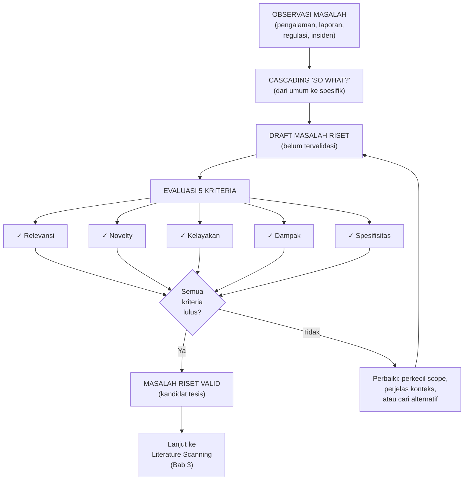
```mermaid
flowchart TD
    Observation["OBSERVASI MASALAH\n(pengalaman, laporan,\nregulasi, insiden)"] --> SoWhat["CASCADING 'SO WHAT?'\n(dari umum ke spesifik)"]
    SoWhat --> ProblemDraft["DRAFT MASALAH RISET\n(belum tervalidasi)"]
    ProblemDraft --> CriteriaCheck["EVALUASI 5 KRITERIA"]
    CriteriaCheck --> Relevance["✓ Relevansi"]
    CriteriaCheck --> Novelty["✓ Novelty"]
    CriteriaCheck --> Feasibility["✓ Kelayakan"]
    CriteriaCheck --> Significance["✓ Dampak"]
    CriteriaCheck --> Specificity["✓ Spesifisitas"]
    Relevance & Novelty & Feasibility & Significance & Specificity --> AllPass{"Semua\nkriteria\nlulus?"}
    AllPass -->|"Ya"| ValidProblem["MASALAH RISET VALID\n(kandidat tesis)"]
    AllPass -->|"Tidak"| Refine["Perbaiki: perkecil scope,\nperjelas konteks,\natau cari alternatif"]
    Refine --> ProblemDraft
    ValidProblem --> LitScan["Lanjut ke\nLiterature Scanning\n(Bab 3)"]
```

---

### 6. Contoh Terapan

**Mahasiswa B — Bima Pratama (Digital Forensics Cloud):**

*Sumber masalah:* Bima bekerja sebagai incident responder di perusahaan konsultan keamanan. Dalam 1 tahun terakhir, ia menangani 3 insiden di lingkungan cloud (AWS) di mana tim forensik kesulitan mengumpulkan evidence karena: (1) log dihapus sebelum investigasi dimulai; (2) instance VM sudah dihentikan dan disk image tidak bisa diakses; (3) tidak jelas siapa yang bertanggung jawab mengumpulkan evidence — tim IR klien atau AWS support.

*Aplikasi "So What?" Cascade:*
- "Forensik cloud sulit."
- So what? → "Tim tidak dapat mengumpulkan evidence yang diperlukan untuk investigasi."
- So what? → "Investigasi gagal atau tidak conclusive, pelaku tidak dapat diidentifikasi."
- So what? → "Tidak ada framework metodologi yang komprehensif untuk digital forensics di cloud multi-tenant yang mengakomodasi shared responsibility model."
- So what? → "Saya ingin merancang dan memvalidasi metodologi forensik cloud yang mempertimbangkan shared responsibility model, berbasis NIST SP 800-86 dan dikembangkan untuk AWS/Azure."

*Evaluasi 5 Kriteria:*
- Relevansi: ✓ (cloud adoption meningkat, forensik cloud semakin diperlukan)
- Novelty: ✓ (dari review singkat literatur, metodologi khusus cloud multi-tenant dengan perspektif shared responsibility masih terbatas)
- Kelayakan: ✓ (Bima memiliki akses lab AWS edu, familiar dengan teknik forensik)
- Dampak: ✓ (memberikan panduan praktis untuk incident responder)
- Spesifisitas: ✓ (terbatas pada AWS/Azure, metodologi, validasi studi kasus)

---

### 7. Praktikum atau Aktivitas Terarah

**Judul:** Workshop Identifikasi Masalah Riset

**Langkah Kerja:**

1. (Individual, 20 menit) Terapkan teknik "So What? Cascade" pada 2 observasi masalah dari pengalaman atau berita keamanan siber terkini.
2. (Pairs, 15 menit) Tukarkan draft masalah dengan teman, evaluasi menggunakan 5 kriteria (skor 1-5 per kriteria).
3. (Individual, 25 menit) Berdasarkan feedback, perbaiki 1 masalah dan tambahkan 4 masalah lain untuk mencapai daftar 5 kandidat.
4. (Small group, 10 menit) Presentasikan 5 kandidat secara singkat (30 detik per kandidat) dan dapatkan quick feedback dari kelompok.

**Artefak yang Dihasilkan:** Dokumen berisi 5 kandidat masalah riset, masing-masing dengan: (a) deskripsi masalah 2-3 kalimat; (b) skor 5 kriteria; (c) sumber masalah (DUDI/regulasi/insiden/pengalaman); (d) notes dari peer feedback.

---

### 8. Latihan Pemahaman

**Soal 1:** Di antara sumber masalah berikut, mana yang memberikan masalah dengan *relevansi DUDI* yang paling tinggi untuk tesis terapan?
- A. Keinginan akademis untuk mengeksplorasi teori kriptografi yang belum dibuktikan
- B. Insiden ransomware pada sebuah rumah sakit yang didiskusikan dalam laporan publik ID-CERT
- C. Topik yang populer di konferensi akademik internasional 5 tahun lalu
- D. Masalah yang disebutkan dalam tesis PhD dari universitas luar negeri

**Soal 2 (Analisis):** Seorang mahasiswa mengusulkan masalah: "Bagaimana cara meningkatkan keamanan sistem informasi di Indonesia?" Gunakan teknik "So What? Cascade" untuk membantu mahasiswa ini menemukan masalah yang lebih spesifik.

**Soal 3 (Evaluasi):** Evaluasi masalah riset berikut menggunakan 5 kriteria: "Pengembangan model machine learning untuk klasifikasi malware berbasis analisis perilaku dinamis pada sandbox Windows 10, dengan dataset 10.000 sampel dari VirusTotal dan perbandingan dengan model yang dipublikasikan oleh [Nama Penulis, 2023]."

---

### 9. Latihan Terapan / Studi Kasus

**Studi Kasus: Diskusi Panel DUDI**

Tiga narasumber dari industri hadir dalam sesi diskusi panel di program Anda:

**Narasumber A (CISO Bank BIG):** "Yang paling menyulitkan kami adalah volume alert yang sangat besar — SIEM kami menghasilkan 50.000 alert per hari dan tim kami hanya bisa mereview 200. Sisanya kita abaikan dan berharap tidak ada yang penting. Kami butuh cara yang lebih cerdas untuk prioritisasi."

**Narasumber B (Kepala Divisi IT Keamanan Kementerian):** "Kami punya banyak sistem legacy yang tidak bisa diupdate tapi harus tetap aman. Solusi patch modern tidak bisa kami terapkan karena sistem tidak kompatibel. Bagaimana mengamankan sistem yang tidak bisa di-patch?"

**Narasumber C (CEO Startup Fintech):** "Kami startup kecil, tidak punya tim security dedicated. Kami pakai layanan cloud tapi tidak tahu seberapa aman konfigurasi yang kami buat. Perlu tools yang bisa audit konfigurasi cloud kami secara otomatis dan mudah dipahami."

*Pertanyaan:*
1. Dari setiap narasumber, identifikasi 2 kandidat masalah riset yang spesifik dan dapat diteliti.
2. Evaluasi satu masalah dari setiap narasumber menggunakan 5 kriteria (skor dan justifikasi).
3. Jika Anda harus memilih SATU masalah dari ketiga narasumber untuk tesis Anda, mana yang Anda pilih dan mengapa?

---

### 10. Kunci Jawaban dan Pembahasan

**Jawaban Soal 1:** **B — Insiden ransomware pada rumah sakit yang didiskusikan dalam laporan publik ID-CERT.** Insiden nyata yang terdokumentasi dalam laporan resmi (ID-CERT adalah Computer Emergency Response Team nasional Indonesia) mencerminkan masalah yang nyata terjadi di konteks lokal. Ini memberi relevansi DUDI yang tinggi karena: (a) masalah sudah terbukti ada; (b) konteks Indonesia; (c) dampaknya nyata dan signifikan. Pilihan A adalah riset dasar akademik murni. Pilihan C mungkin sudah kadaluarsa relevansinya. Pilihan D adalah sumber riset akademik tetapi bukan indikasi kebutuhan DUDI.

**Jawaban Soal 2 (So What Cascade untuk masalah terlalu luas):**
- "Meningkatkan keamanan sistem informasi di Indonesia."
- So what? → Tanpa spesifikasi, ini terlalu luas untuk diteliti.
- Pertanyaan klarifikasi: Sistem informasi apa? Di sektor apa? Aspek keamanan mana?
- Perkecil: "Meningkatkan keamanan sistem informasi pemerintah daerah."
- So what? → "Pemda memiliki keterbatasan anggaran dan SDM untuk keamanan siber."
- So what? → "Banyak pemda menggunakan sistem yang tidak dikonfigurasi dengan aman karena tidak ada panduan yang sesuai konteks mereka."
- So what? → "Dibutuhkan framework penilaian dan peningkatan keamanan yang ringan dan sesuai dengan keterbatasan SDM dan anggaran pemda."
- Masalah spesifik: "Pengembangan lightweight security assessment framework untuk Sistem Informasi Pemerintah Daerah (SIPD) berdasarkan analisis gap terhadap NIST CSF 2.0 dengan mempertimbangkan keterbatasan sumber daya pemda tier 3-4 Indonesia."

**Jawaban Soal 3 (Evaluasi 5 Kriteria):**

"Model ML untuk klasifikasi malware berbasis perilaku dinamis, dataset VirusTotal, perbandingan dengan baseline yang ada."

- Relevansi: 4/5 — Klasifikasi malware adalah kebutuhan nyata SOC, meskipun harus diperkuat dengan konteks DUDI Indonesia
- Novelty: 3/5 — Tergantung pada apakah model yang dibandingkan sudah state-of-the-art; perlu cek literatur lebih dalam
- Kelayakan: 4/5 — VirusTotal menyediakan API, dataset bisa dibuat; sandbox Windows 10 dapat dibangun di lab; ML skill diperlukan
- Dampak: 3/5 — Berguna, tapi perlu diperjelas: siapa yang akan menggunakan model ini dan dalam konteks apa?
- Spesifisitas: 5/5 — Sangat spesifik: dataset jelas, baseline jelas, metrik jelas

Catatan: Masalah ini cukup baik secara teknis tetapi perlu diperkuat dari sisi DUDI relevance dan novelty claim.

**Jawaban Studi Kasus:**

1. Kandidat masalah dari setiap narasumber:

Narasumber A (CISO Bank):
- MA-1: "Pengembangan model prioritisasi alert SIEM berbasis risk scoring kontekstual untuk lingkungan perbankan Indonesia, menggunakan data historis true positive/false positive"
- MA-2: "Deteksi false positive otomatis pada SIEM menggunakan ML dengan fitur konteks infrastruktur (aset kritis, jam kerja, baseline perilaku normal)"

Narasumber B (Kementerian):
- MB-1: "Framework keamanan kompensatif untuk sistem legacy pemerintah yang tidak dapat di-patch: studi kasus pada sistem berbasis Windows Server 2008"
- MB-2: "Evaluasi efektivitas network segmentation dan micro-segmentation sebagai kontrol kompensatif untuk melindungi sistem legacy dari eksploitasi kerentanan yang diketahui"

Narasumber C (Startup Fintech):
- MC-1: "Pengembangan tool audit konfigurasi cloud otomatis untuk startup berbasis AWS, dengan laporan yang dapat dipahami oleh non-specialist, menggunakan benchmark CIS AWS Foundations"
- MC-2: "Framework cloud security posture assessment yang ringan dan berbiaya rendah untuk perusahaan startup fintech: validasi pada 5 perusahaan Indonesia"

2. Evaluasi (satu dari setiap narasumber):

MA-1: Relevansi 5, Novelty 3 (ada solusi sejenis, perlu cek), Kelayakan 4, Dampak 4, Spesifisitas 4 → Total 20/25

MB-1: Relevansi 5, Novelty 4 (konteks pemerintah Indonesia spesifik), Kelayakan 3 (akses ke sistem pemerintah butuh MoU), Dampak 5, Spesifisitas 3 → Total 20/25

MC-2: Relevansi 5, Novelty 3, Kelayakan 4, Dampak 4, Spesifisitas 4 → Total 20/25

3. Pilihan terbaik bergantung pada konteks mahasiswa. MA-1 atau MA-2 jika mahasiswa memiliki background SOC. MB-1 jika ada koneksi ke instansi pemerintah untuk validasi. MC-2 jika mahasiswa memiliki akses ke startup fintech. Yang terpenting: pilih yang paling dapat Anda validasi dengan data nyata.

---

### 11. Ringkasan Bab

Masalah riset terapan yang baik lahir dari persinggungan antara kebutuhan nyata DUDI/pemerintah/masyarakat, insiden keamanan yang terdokumentasi, pengalaman praktis mahasiswa, dan gap yang teridentifikasi dari literatur. Lima kriteria evaluasi — relevansi, novelty, kelayakan, dampak, dan spesifisitas — memberikan kerangka objektif untuk menilai kandidat masalah. Teknik "So What? Cascade" dan "5W+1H Problem Framing" membantu mengubah observasi umum menjadi masalah riset yang dapat diteliti. Daftar 5 kandidat masalah pada akhir bab ini adalah titik awal literature scanning yang akan menentukan apakah masalah benar-benar memiliki gap yang belum dijawab.

---

### 12. Refleksi Profesional

1. **Masalah yang "Baru" vs. Masalah yang "Nyata"**: Ada ketegangan antara kebutuhan akademik untuk novelty dan kebutuhan industri untuk relevansi. Kadang, masalah yang paling relevan bagi industri sudah banyak diteliti secara akademik. Bagaimana Anda menemukan intersection antara keduanya untuk tesis Anda?

2. **Akses Data dan Privasi**: Banyak masalah riset terapan yang paling menarik melibatkan data organisasi nyata (log serangan, data insiden, konfigurasi sistem). Apa pertimbangan etis dan legal yang harus Anda pikirkan sebelum memutuskan untuk menggunakan data dari organisasi tempat Anda bekerja?

3. **Scope Creep**: Sebuah masalah yang awalnya terasa "spesifik" seringkali membesar seiring berjalannya riset — "ternyata saya juga perlu meneliti X untuk menjawab Y." Bagaimana strategi Anda untuk menjaga scope penelitian tetap manageable?

---

## Bab 3 — Literature Scanning: Strategi, Database, dan Matriks Literatur

### 1. Capaian Pembelajaran Bab

Setelah menyelesaikan bab ini, mahasiswa mampu:
- Merancang strategi pencarian literatur yang sistematis menggunakan search string yang tepat (C3)
- Menggunakan database akademik utama (Scopus, WoS, ACM DL, IEEE Xplore, Google Scholar) secara efektif (C3)
- Menerapkan kriteria inklusi/eksklusi untuk menyeleksi literatur yang relevan (C3)
- Menyusun literature matrix yang mencakup minimal 15 artikel dengan informasi yang terstruktur (C3)

*Dikaitkan dengan Sub-CPMK.2 (Pertemuan 3) dan Eval-1b (10% — artefak: matriks literatur 15 paper).*

---

### 2. Peta Konsep Bab

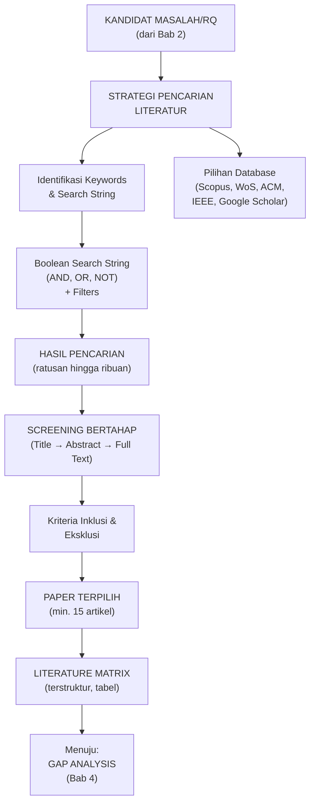
```mermaid
flowchart TD
    RQ_Initial["KANDIDAT MASALAH/RQ\n(dari Bab 2)"] --> SearchStrategy["STRATEGI PENCARIAN\nLITERATUR"]
    SearchStrategy --> Keywords["Identifikasi Keywords\n& Search String"]
    SearchStrategy --> Databases["Pilihan Database\n(Scopus, WoS, ACM,\nIEEE, Google Scholar)"]
    Keywords --> SearchString["Boolean Search String\n(AND, OR, NOT)\n+ Filters"]
    SearchString --> SearchResults["HASIL PENCARIAN\n(ratusan hingga ribuan)"]
    SearchResults --> Screening["SCREENING BERTAHAP\n(Title → Abstract → Full Text)"]
    Screening --> I_E["Kriteria Inklusi &\nEksklusi"]
    I_E --> SelectedPapers["PAPER TERPILIH\n(min. 15 artikel)"]
    SelectedPapers --> LitMatrix["LITERATURE MATRIX\n(terstruktur, tabel)"]
    LitMatrix --> GapAnalysis["Menuju:\nGAP ANALYSIS\n(Bab 4)"]
```

---

### 3. Pengantar Kontekstual

Literature scanning adalah fondasi epistemik dari seluruh tesis. Sebelum Anda mengklaim bahwa penelitian Anda "baru" atau "mengisi gap", Anda harus membuktikan bahwa Anda sudah tahu apa yang sudah ada. Melompat ke metodologi tanpa tinjauan literatur yang kuat adalah kesalahan yang akan terungkap paling lambat pada seminar — dan bisa menenggelamkan seluruh proposal.

Namun, literature scanning yang tidak terstruktur — membaca semua paper yang tampak relevan tanpa sistem — juga tidak produktif. Anda bisa tenggelam dalam ratusan paper dan masih tidak mendapat gambaran yang koheren. Bab ini memberikan metode yang sistematis, terukur, dan dapat direproduksi untuk melakukan literature scanning secara efisien.

---

### 4. Landasan Teori

#### 4.1 Jenis Tinjauan Literatur

**Narrative Review:**
Tinjauan yang tidak menggunakan protokol pencarian yang eksplisit dan terstruktur. Cocok untuk memberikan latar belakang umum, namun rentan bias seleksi. Kurang diterima untuk tinjauan literatur tesis.

**Systematic Literature Review (SLR):**
Menggunakan protokol pencarian yang eksplisit, reproducible, dan transparan. Standar de facto untuk tesis akademik. Mengikuti pedoman seperti PRISMA (Preferred Reporting Items for Systematic Reviews and Meta-Analyses) atau panduan Kitchenham & Charters (2007) untuk software engineering.

**Mapping Study (Systematic Mapping Study / SMS):**
Mirip SLR tetapi tujuannya adalah memetakan topik — mengidentifikasi sub-topik, distribusi penelitian, dan gap — bukan menjawab pertanyaan riset yang sangat spesifik. Cocok untuk proposal karena memberikan gambaran landscape penelitian.

**Scoping Review:**
Bertujuan mengidentifikasi dan memetakan area penelitian yang lebih luas, tanpa kriteria kualitas yang ketat. Berguna di awal eksplorasi topik.

**Untuk proposal tesis:** Mahasiswa menggunakan *systematic mapping study* yang disederhanakan — mengikuti protokol pencarian yang jelas tetapi tidak harus sedetail SLR penuh. Cukup untuk mengidentifikasi landscape penelitian dan gap.

#### 4.2 Sumber Database Akademik

**Scopus (Elsevier):**
Database multidisiplin terbesar — >87 juta dokumen, >25.000 jurnal. Fitur utama: analisis sitasi, h-index penulis, analisis tren penelitian, filter terstruktur. Terbaik untuk: memetakan landscape penelitian secara komprehensif.

**Web of Science (WoS):**
Database bergengsi dengan seleksi jurnal ketat. Fitur: Journal Impact Factor, citation tracking, author network. Terbaik untuk: memastikan jurnal bereputasi tinggi.

**ACM Digital Library:**
Spesialis untuk computer science dan information technology. Mencakup proceedings konferensi top (ACM CCS, USENIX Security, IEEE S&P). Terbaik untuk: paper teknis keamanan siber dari venue top.

**IEEE Xplore:**
Spesialis untuk teknik dan teknologi. Mencakup prosiding IEEE dan IET. Terbaik untuk: paper teknis jaringan, hardware, dan sistem tertanam.

**Google Scholar:**
Cakupan terluas (termasuk grey literature, thesis, working papers). Tidak ada filter kualitas yang ketat. Terbaik untuk: mencari paper yang tidak terindeks di database berbayar, tracking sitasi, dan menemukan versi preprint.

**arXiv:**
Pre-print server untuk paper yang belum peer-reviewed. Berguna untuk paper terbaru yang belum dipublikasikan secara formal, terutama di AI/ML.

**Rekomendasi:** Gunakan minimal 2 database (Scopus/WoS + ACM/IEEE Xplore) untuk paper keamanan siber. Verifikasi via Google Scholar untuk paper yang tidak terindeks.

#### 4.3 Membangun Search String yang Efektif

**Komponen Search String:**

*Keywords Utama (Konsep Inti):*
Identifikasi 2-4 konsep utama dari masalah riset Anda.

Contoh untuk topik "Deteksi anomali IoT industri":
- Konsep 1: Anomaly detection / intrusion detection / network anomaly
- Konsep 2: Industrial IoT / IIoT / Industrial Control System / SCADA
- Konsep 3: Machine learning / deep learning / neural network

*Boolean Operators:*
- **AND**: Mempersempit hasil (semua konsep harus ada): `anomaly detection AND industrial IoT`
- **OR**: Memperluas dengan sinonim: `(anomaly detection OR intrusion detection) AND (industrial IoT OR IIoT OR SCADA)`
- **NOT**: Mengecualikan topik yang tidak relevan: `AND NOT (smart home OR consumer IoT)`

*Wildcards dan Phrase Search:*
- Wildcard (*): `detect*` → menangkap detect, detection, detector, detecting
- Phrase search (""): `"intrusion detection"` → mencari frasa tepat ini

*Contoh Search String Komprehensif untuk Topik Rina:*
```
("anomaly detection" OR "intrusion detection" OR "anomaly-based IDS")
AND
("industrial IoT" OR "IIoT" OR "Industrial Internet of Things" OR "SCADA" 
 OR "industrial control system" OR "OT network")
AND
("machine learning" OR "deep learning" OR "neural network" OR 
 "random forest" OR "LSTM" OR "autoencoder")
```

**Filter yang Direkomendasikan:**
- Tahun publikasi: 5 tahun terakhir (2020-2025) untuk state-of-the-art
- Bahasa: English (dan Indonesian jika relevan untuk konteks lokal)
- Document type: Journal article, Conference paper (hindari editorial, book review)
- Subject area: Computer Science, Engineering

#### 4.4 Screening Bertahap (PRISMA-inspired)

Proses screening dilakukan dalam 3 tahap untuk efisiensi:

**Tahap 1 — Screening Judul:**
Baca hanya judul. Apakah judul relevan dengan masalah riset? Jika tidak jelas, lanjutkan ke abstrak. Biasanya menyaring 60-80% hasil pencarian.

**Tahap 2 — Screening Abstrak:**
Baca abstrak dari paper yang lolos tahap 1. Terapkan kriteria inklusi/eksklusi. Biasanya menyaring 50-70% dari yang lolos tahap 1.

**Tahap 3 — Full Text Review:**
Baca paper secara menyeluruh. Evaluasi kualitas metodologi, relevansi teknis, dan kontribusi spesifik. Ekstrak informasi untuk literature matrix.

**Kriteria Inklusi (Contoh untuk Topik IDS-IIoT):**
- Paper membahas deteksi anomali atau intrusi pada jaringan ICS/OT/IIoT
- Menggunakan machine learning atau deep learning
- Memiliki evaluasi eksperimental dengan dataset yang disebutkan
- Dipublikasikan 2019-2024
- Peer-reviewed journal atau top-tier conference

**Kriteria Eksklusi:**
- Survey/literature review (disimpan terpisah untuk referensi, tidak dimasukkan ke matriks utama)
- Consumer IoT (bukan industrial)
- Signature-based IDS (bukan behavior/anomaly-based)
- Tanpa evaluasi eksperimental
- Paper yang tidak dapat diakses full text

#### 4.5 Literature Matrix: Struktur dan Isi

Literature matrix adalah tabel terstruktur yang merangkum informasi kritis dari setiap paper yang dipilih. Ini adalah alat analisis, bukan sekadar daftar referensi.

**Kolom Esensial dalam Literature Matrix:**

| Kolom | Keterangan |
|---|---|
| ID | Nomor urut (P01, P02, ...) |
| Penulis, Tahun | Bibliografi ringkas |
| Judul | Judul paper |
| Venue | Jurnal/konferensi + ranking (Q1/Q2/A*) |
| Masalah yang Diteliti | Apa pertanyaan riset paper ini? |
| Pendekatan/Metode | Algoritma, arsitektur, atau metodologi yang digunakan |
| Dataset | Dataset yang digunakan (nama, ukuran, sumber) |
| Metrik Evaluasi | Accuracy, F1, precision, recall, AUC, dll. |
| Hasil Kunci | Performa terbaik yang dicapai |
| Keterbatasan | Apa yang tidak dijawab atau keterbatasan yang diakui penulis? |
| Relevansi untuk Tesis | Bagaimana paper ini relevan dengan masalah riset Anda? |
| Gap yang Diidentifikasi | Apa yang paper ini tidak selesaikan yang mungkin menjadi peluang Anda? |

---

### 5. Model atau Arsitektur

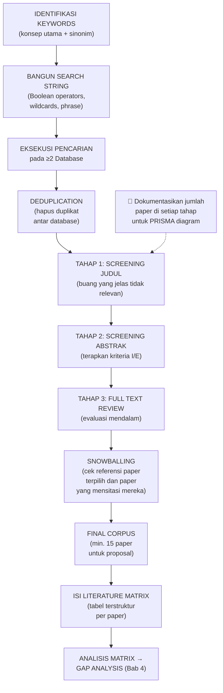
```mermaid
flowchart TD
    P1["IDENTIFIKASI KEYWORDS\n(konsep utama + sinonim)"] --> P2["BANGUN SEARCH STRING\n(Boolean operators,\nwildcards, phrase)"]
    P2 --> P3["EKSEKUSI PENCARIAN\npada ≥2 Database"]
    P3 --> P4["DEDUPLICATION\n(hapus duplikat\nantar database)"]
    P4 --> P5["TAHAP 1: SCREENING JUDUL\n(buang yang jelas tidak relevan)"]
    P5 --> P6["TAHAP 2: SCREENING ABSTRAK\n(terapkan kriteria I/E)"]
    P6 --> P7["TAHAP 3: FULL TEXT REVIEW\n(evaluasi mendalam)"]
    P7 --> P8["SNOWBALLING\n(cek referensi paper\nterpilih dan paper\nyang mensitasi mereka)"]
    P8 --> P9["FINAL CORPUS\n(min. 15 paper\nuntuk proposal)"]
    P9 --> P10["ISI LITERATURE MATRIX\n(tabel terstruktur\nper paper)"]
    P10 --> P11["ANALISIS MATRIX →\nGAP ANALYSIS (Bab 4)"]
    
    Note1["📝 Dokumentasikan jumlah\npaper di setiap tahap\nuntuk PRISMA diagram"] -.-> P5
```

---

### 6. Contoh Terapan

**Search String untuk Mahasiswa C — Sari Kusuma (Threat Intelligence + NLP):**

Masalah Sari: "Analisis threat intelligence dari forum dark web dan OSINT menggunakan NLP untuk deteksi dini ancaman siber yang ditargetkan pada sektor keuangan Indonesia."

*Keyword Groups:*
- Group 1 (CTI): `"cyber threat intelligence" OR "threat intelligence" OR CTI OR "threat hunting"`
- Group 2 (NLP/ML): `"natural language processing" OR NLP OR "text mining" OR "machine learning" OR "deep learning"`
- Group 3 (Dark Web/OSINT): `"dark web" OR "darknet" OR OSINT OR "open source intelligence" OR "underground forum"`
- Group 4 (Financial): `"financial sector" OR banking OR fintech` (opsional, diperluas jika hasil terlalu sedikit)

*Search String Final:*
```
("cyber threat intelligence" OR "threat intelligence" OR CTI)
AND
("natural language processing" OR NLP OR "text mining")
AND
("dark web" OR darknet OR OSINT OR "underground forum")
```

*Hasil pada Scopus:* 47 paper
*Setelah screening judul:* 31 paper
*Setelah screening abstrak:* 18 paper
*Setelah full text:* 16 paper + 4 dari snowballing = 20 paper → di atas minimum 15 ✓

---

### 7. Praktikum atau Aktivitas Terarah

**Judul:** Workshop Literature Scanning

**Tujuan:** Menghasilkan Literature Matrix minimal 15 paper sebagai artefak Eval-1b.

**Langkah Kerja:**

1. (20 menit) Identifikasi keywords untuk masalah riset Anda dari Bab 2. Bangun search string menggunakan Boolean operators.
2. (30 menit) Eksekusi pencarian pada Scopus (atau Google Scholar jika tidak ada akses). Dokumentasikan: search string yang digunakan, jumlah hasil.
3. (20 menit) Lakukan screening judul — dokumentasikan berapa yang dieksklusi dan alasannya.
4. (30 menit) Lakukan screening abstrak — dokumentasikan kriteria inklusi/eksklusi yang diterapkan.
5. (60 menit, dapat dilanjutkan di rumah) Full text review untuk paper yang lolos. Isi literature matrix.
6. (10 menit snowballing) Cek reference list dari 3 paper yang paling relevan — adakah paper yang terlewat?

**Artefak yang Dihasilkan:**
- Search string yang digunakan (dokumentasi lengkap)
- PRISMA-like flow diagram (jumlah di setiap tahap)
- Literature Matrix: minimal 15 paper, semua kolom terisi

---

### 8. Latihan Pemahaman

**Soal 1:** Mengapa menggunakan operator OR antara sinonim keywords penting dalam literature scanning?
- A. Untuk mempersempit hasil sehingga lebih mudah dibaca
- B. Untuk memastikan paper dengan terminologi berbeda tetapi konsep sama tidak terlewatkan
- C. Untuk memastikan hanya paper dari database tertentu yang masuk
- D. Untuk mengecualikan paper yang tidak relevan

**Soal 2:** Dalam proses screening, mengapa screening dilakukan secara bertahap (judul → abstrak → full text) alih-alih langsung membaca full text semua hasil?

**Soal 3:** Bandingkan keunggulan dan keterbatasan Scopus dibanding Google Scholar untuk literature scanning dalam riset keamanan siber. Kapan masing-masing lebih tepat digunakan?

**Soal 4:** Paper tesis senior Anda terbit tahun 2015 dan relevan dengan topik Anda. Apakah Anda harus memasukkannya dalam matrix dan apakah bisa menjadi bagian dari "15 paper minimum"? Apa pertimbangannya?

---

### 9. Latihan Terapan / Studi Kasus

**Studi Kasus: Evaluasi Literature Matrix**

Seorang mahasiswa menyerahkan Literature Matrix dengan 15 paper. Setelah diperiksa, ditemukan:
- 5 paper dari tahun 2010-2015
- 4 paper tidak memiliki kolom "Keterbatasan" yang diisi
- 3 paper adalah survey/literature review (bukan paper eksperimental)
- 2 paper dari sumber blog teknis (bukan peer-reviewed)
- 1 paper tidak dapat diakses full text (hanya abstrak yang dibaca)

*Pertanyaan:*
1. Identifikasi masalah pada Literature Matrix tersebut.
2. Berapa paper yang "valid" menurut kriteria yang direkomendasikan?
3. Apa yang harus dilakukan mahasiswa untuk memperbaiki matrix-nya?
4. Apakah survey paper boleh sama sekali tidak dimasukkan ke dalam tinjauan literatur?

---

### 10. Kunci Jawaban dan Pembahasan

**Jawaban Soal 1:** **B — Untuk memastikan paper dengan terminologi berbeda tetapi konsep sama tidak terlewatkan.** Dalam keamanan siber, satu konsep sering disebut dengan berbagai istilah: "anomaly detection" dan "outlier detection" mengacu pada konsep yang sama. "IDS" dan "intrusion detection system" adalah hal yang sama. Jika hanya menggunakan satu term, paper yang menggunakan sinonim akan terlewat. Pilihan A salah — OR memperluas, bukan mempersempit. C dan D tidak ada hubungannya dengan fungsi OR.

**Jawaban Soal 2:** Screening bertahap adalah strategi efisiensi:
- Membaca full text 500 paper memerlukan waktu yang tidak realistis
- Judul dapat memberikan sinyal awal relevansi yang cukup untuk menyaring 70% hasil
- Abstrak memberikan informasi yang cukup untuk keputusan inklusi/eksklusi tanpa membaca seluruh paper
- Full text hanya dibaca untuk paper yang sudah melewati dua filter sebelumnya
Ini adalah praktik standar dalam systematic review yang diakui secara metodologis (PRISMA, Kitchenham & Charters).

**Jawaban Soal 3:**
Scopus: Kualitas terkontrol (hanya indexed journals), filter terstruktur, fitur analisis sitasi, duplikasi minimal. Keterbatasan: tidak mencakup preprints dan grey literature, memerlukan langganan institusi.
Google Scholar: Cakupan terluas, gratis, mencakup preprints dan theses. Keterbatasan: tidak ada filter kualitas (blog posts bisa muncul), banyak duplikasi, metrik sitasi kurang akurat.
Penggunaan optimal: Gunakan Scopus/WoS sebagai database utama untuk paper peer-reviewed. Gunakan Google Scholar untuk: (a) menemukan preprint versi terbaru; (b) cek paper yang tidak terindeks Scopus; (c) tracking "cited by" untuk menemukan paper terbaru yang mengembangkan paper relevan. Jangan menggunakan Google Scholar sebagai satu-satunya sumber untuk klaim komprehensivitas tinjauan.

**Jawaban Soal 4:**
Paper 2015 dapat dimasukkan sebagai referensi latar belakang atau untuk menunjukkan perkembangan historis, tetapi idealnya tidak dihitung sebagai bagian dari "15 paper minimum" yang mewakili state-of-the-art. Mengapa: state-of-the-art mengacu pada kondisi pengetahuan terkini, bukan 10 tahun lalu. Dalam keamanan siber khususnya, 10 tahun adalah zaman yang sangat berbeda (ancaman, tools, dataset, metode ML semuanya berubah drastis). Paper dari 5 tahun terakhir jauh lebih relevan. Pengecualian: jika paper 2015 adalah paper foundational yang sangat berpengaruh (sitasi sangat tinggi) dan pendekatan yang diusulkan masih menjadi baseline yang sering digunakan.

**Jawaban Studi Kasus:**
1. Masalah yang teridentifikasi:
   - 5 paper terlalu lama (idealnya maksimal 5 tahun terakhir untuk state-of-the-art)
   - Kolom "Keterbatasan" tidak diisi = analisis tidak lengkap, padahal ini kunci gap identification
   - 3 paper survey ≠ paper eksperimental; survey tidak mendemonstrasikan pendekatan baru
   - 2 blog post bukan peer-reviewed = tidak dapat diterima sebagai literatur akademik
   - 1 paper hanya dibaca abstraknya = tidak valid untuk full text review

2. Paper valid secara kriteria: 15 - 2 (blog) - 1 (hanya abstrak) = 12 paper yang berpotensi valid (dikurangi paper terlalu lama tergantung konteks). Paling optimis: 10-12 paper valid.

3. Tindakan perbaikan: (a) Cari 5 paper pengganti yang lebih baru (2020-2024); (b) Isi kolom "Keterbatasan" untuk semua paper yang ada; (c) Hapus 2 blog post, ganti dengan paper peer-reviewed; (d) Akses full text paper yang hanya dibaca abstraknya atau keluarkan dari matrix; (e) Pisahkan 3 paper survey ke "Background Literature" — boleh direferensikan tetapi tidak dihitung sebagai paper eksperimental dalam matrix utama.

4. Survey paper tidak harus dikeluarkan sepenuhnya dari tinjauan literatur — survey justru sangat berguna untuk mendapatkan gambaran umum, menemukan paper kunci, dan memahami tren penelitian. Namun, pisahkan antara: (a) survey papers yang digunakan sebagai background; (b) experimental/empirical papers yang menjadi basis analisis state-of-the-art. Matrix utama sebaiknya berisi experimental papers yang mendemonstrasikan pendekatan spesifik yang dapat dibandingkan.

---

### 11. Ringkasan Bab

Literature scanning yang efektif memerlukan strategi yang terstruktur: mulai dari identifikasi keywords dan sinonim, membangun search string dengan Boolean operators, memilih database yang tepat (Scopus/WoS untuk kualitas; Google Scholar untuk cakupan), melakukan screening bertahap (judul → abstrak → full text), dan mengisi literature matrix yang komprehensif. Matrix bukan hanya daftar paper — ia adalah alat analisis yang menangkap pendekatan, dataset, metrik, dan keterbatasan setiap paper untuk mempersiapkan gap analysis. Minimum 15 paper peer-reviewed dari 5 tahun terakhir adalah ambang batas yang diperlukan untuk memiliki dasar tinjauan yang memadai.

---

### 12. Refleksi Profesional

1. **Bias Konfirmasi dalam Literature Search**: Apakah ada risiko bahwa mahasiswa akan "memilih" paper yang mendukung hipotesis awal mereka dan mengabaikan paper yang bertentangan? Bagaimana desain pencarian yang sistematis membantu mengurangi bias ini?

2. **Akses vs. Kualitas**: Banyak paper dari venue top (IEEE S&P, USENIX Security, CCS) memerlukan akses berbayar yang tidak semua mahasiswa/institusi miliki. Apakah ini menciptakan ketidakadilan dalam kualitas tinjauan literatur? Apa strategi alternatif yang legal (arXiv, ResearchGate, email penulis)?

3. **Kecepatan Perkembangan Domain**: Keamanan siber bergerak sangat cepat — ancaman baru, teknik baru, dataset baru muncul setiap bulan. Bagaimana Anda memastikan tinjauan literatur Anda tidak sudah "ketinggalan" pada saat tesis selesai? Apa strategi monitoring literatur yang berkelanjutan selama penelitian?

---

## Bab 4 — Research Gap dan Research Question

### 1. Capaian Pembelajaran Bab

Setelah menyelesaikan bab ini, mahasiswa mampu:
- Menganalisis literature matrix untuk mengidentifikasi pola, tren, dan keterbatasan penelitian yang ada (C4)
- Merumuskan research gap yang spesifik, terverifikasi, dan bermakna (C4)
- Menyusun research question yang memenuhi kriteria SMART (Specific, Measurable, Achievable, Relevant, Time-bound) (C3)
- Membedakan antara research question yang dapat dijawab dalam tesis versus yang terlalu luas atau terlalu sempit (C4)

*Dikaitkan dengan Sub-CPMK.2 (Pertemuan 4) dan Eval-1b (10% — artefak: draft RQ & research gap).*

---

### 2. Peta Konsep Bab

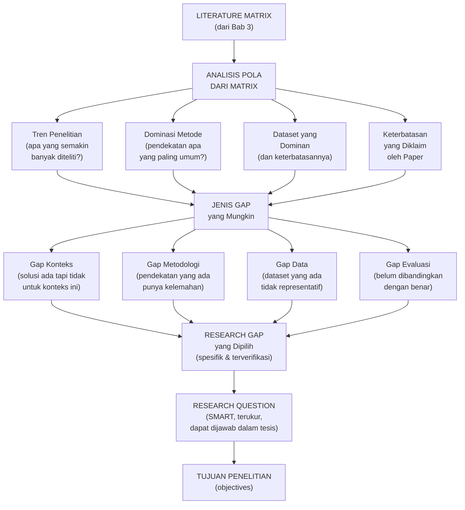
```mermaid
flowchart TD
    LitMatrix2["LITERATURE MATRIX\n(dari Bab 3)"] --> PatternAnalysis["ANALISIS POLA\nDARI MATRIX"]
    PatternAnalysis --> Trends["Tren Penelitian\n(apa yang semakin\nbanyak diteliti?)"]
    PatternAnalysis --> Methods["Dominasi Metode\n(pendekatan apa\nyang paling umum?)"]
    PatternAnalysis --> Datasets["Dataset yang\nDominan\n(dan keterbatasannya)"]
    PatternAnalysis --> Limitations["Keterbatasan\nyang Diklaim\noleh Paper"]
    Trends & Methods & Datasets & Limitations --> GapTypes["JENIS GAP\nyang Mungkin"]
    GapTypes --> GapContext["Gap Konteks\n(solusi ada tapi tidak\nuntuk konteks ini)"]
    GapTypes --> GapMethod["Gap Metodologi\n(pendekatan yang ada\npunya kelemahan)"]
    GapTypes --> GapData["Gap Data\n(dataset yang ada\ntidak representatif)"]
    GapTypes --> GapEval["Gap Evaluasi\n(belum dibandingkan\ndengan benar)"]
    GapContext & GapMethod & GapData & GapEval --> ResearchGap["RESEARCH GAP\nyang Dipilih\n(spesifik & terverifikasi)"]
    ResearchGap --> RQ["RESEARCH QUESTION\n(SMART, terukur,\ndapat dijawab dalam tesis)"]
    RQ --> Objectives["TUJUAN PENELITIAN\n(objectives)"]
```

---

### 3. Pengantar Kontekstual

Setelah mengumpulkan literature matrix, pertanyaan kritis muncul: *"Lalu apa yang belum dilakukan?"* Menjawab pertanyaan ini dengan tepat adalah seni dan ilmu sekaligus. Gap yang terlalu kecil tidak menjustifikasi tesis penuh. Gap yang terlalu besar tidak dapat diselesaikan dalam waktu yang tersedia. Gap yang salah identifikasi — yaitu gap yang sebenarnya sudah dijawab oleh paper yang Anda lewatkan — akan menghancurkan kredibilitas proposal Anda di hadapan penguji.

Research question yang muncul dari gap yang teridentifikasi dengan baik adalah kompas yang mengarahkan seluruh tesis. Setiap keputusan metodologis — dataset apa yang digunakan, algoritma apa yang dipilih, metrik apa yang diukur — dapat dikalibrasi terhadap RQ ini.

---

### 4. Landasan Teori

#### 4.1 Analisis Literature Matrix untuk Menemukan Gap

Setelah mengisi literature matrix, lakukan analisis sistematis dengan membaca pola dari kolom-kolomnya:

**Analisis Kolom "Pendekatan/Metode":**
Apakah ada pendekatan yang belum dicoba? Apakah ada pendekatan yang selalu memiliki kelemahan tertentu? Apakah ada kombinasi metode yang belum dieksplorasi?

**Analisis Kolom "Dataset":**
Apakah semua penelitian menggunakan dataset yang sama? Apakah dataset tersebut memiliki keterbatasan yang diakui (tidak representatif, tidak terkini, tidak sesuai konteks tertentu)? Apakah ada konteks di mana tidak ada dataset yang tersedia?

**Analisis Kolom "Metrik Evaluasi":**
Apakah semua penelitian menggunakan metrik yang sama? Apakah ada aspek kinerja yang tidak pernah diukur?

**Analisis Kolom "Keterbatasan":**
Keterbatasan yang diklaim penulis adalah undangan untuk penelitian lebih lanjut. Bacalah bagian "Future Work" dari paper yang paling relevan — ini seringkali menunjukkan arah yang belum dieksplorasi.

**Analisis Kolom "Konteks":**
Apakah semua penelitian dilakukan pada konteks yang sama (misalnya: semua menggunakan dataset dari AS atau Eropa)? Apakah ada konteks spesifik (Indonesia, sektor tertentu, skala tertentu) yang belum ditangani?

#### 4.2 Jenis-Jenis Research Gap

**a) Gap Konteks (Context Gap):**
Solusi sudah ada, tetapi belum dievaluasi atau divalidasi dalam konteks yang Anda targetkan.
- Contoh: "Semua algoritma deteksi anomali IIoT yang ada dievaluasi pada dataset from Eropa/AS. Tidak ada yang dievaluasi pada traffic IIoT dari jaringan manufaktur Indonesia yang memiliki karakteristik protokol proprietary yang berbeda."

**b) Gap Metodologi (Methodological Gap):**
Pendekatan yang ada memiliki kelemahan sistematis yang belum diatasi.
- Contoh: "Random Forest dan SVM yang dominan digunakan untuk klasifikasi malware memerlukan feature engineering manual yang mahal. Belum ada penelitian yang menggunakan representation learning (misal: autoencoder) untuk secara otomatis mempelajari fitur perilaku malware tanpa feature engineering."

**c) Gap Data (Data Gap):**
Dataset yang tersedia tidak cukup representatif, terkini, atau sesuai untuk masalah yang akan diteliti.
- Contoh: "Dataset benchmark IDS yang ada (KDD Cup 99, NSL-KDD) dibuat lebih dari 20 tahun lalu dan tidak mencerminkan pola serangan modern (ransomware, APT, supply chain). Dataset yang lebih baru seperti CIC-IDS2018 belum banyak diadopsi untuk konteks IIoT."

**d) Gap Evaluasi (Evaluation Gap):**
Penelitian yang ada dievaluasi dengan cara yang tidak memadai atau tidak dapat dibandingkan satu sama lain.
- Contoh: "Setiap paper menggunakan dataset yang berbeda dan metrik yang berbeda, sehingga tidak ada perbandingan apples-to-apples yang valid untuk menentukan pendekatan terbaik."

**e) Gap Integrasi (Integration Gap):**
Penelitian ada di sub-domain yang berbeda tetapi belum diintegrasikan.
- Contoh: "CTI (Cyber Threat Intelligence) dan SIEM sudah diteliti secara terpisah, tetapi belum ada penelitian yang mengintegrasikan keduanya secara otomatis untuk context-aware alert triage."

#### 4.3 Merumuskan Research Gap yang Baik

Sebuah research gap yang baik harus:
1. **Terverifikasi dari literatur**: Bukan asumsi — Anda harus bisa menunjukkan dari paper-paper yang mana gap ini teridentifikasi
2. **Spesifik**: Bukan "masih banyak yang belum diketahui tentang keamanan IoT" tetapi "tidak ada penelitian yang mengevaluasi LSTM-based anomaly detection pada protokol DNP3 dalam konteks jaringan distribusi listrik Indonesia"
3. **Bermakna**: Jika gap ini diisi, ada kontribusi yang nyata bagi pengetahuan dan/atau praktik
4. **Dapat dijawab**: Gap tidak boleh terlalu besar sehingga tidak dapat diselesaikan dalam scope tesis

**Template Pernyataan Gap:**
*"Meskipun [apa yang sudah dilakukan berdasarkan literatur], namun [apa yang belum dilakukan / keterbatasan yang ada]. Oleh karena itu, [apa yang perlu diteliti]."*

Contoh:
"Meskipun berbagai pendekatan machine learning telah diusulkan untuk deteksi anomali pada jaringan IoT konsumen (CIC-IoT2023), belum ada penelitian yang secara spesifik mengevaluasi performa pendekatan berbasis transformer (BERT-based) untuk anomaly detection pada protocol MQTT dalam konteks Industrial IoT dengan karakteristik traffic yang berbeda secara fundamental dari IoT konsumen. Oleh karena itu, dibutuhkan penelitian yang mengembangkan dan mengevaluasi pendekatan transformer-based untuk IIoT anomaly detection menggunakan dataset yang representatif untuk lingkungan industri."

#### 4.4 Research Question: Kriteria dan Bentuk

**Karakteristik Research Question yang Baik:**

*Spesifik:* RQ harus dapat dijawab secara konklusif — tidak ambigu, tidak terlalu luas.

*Terukur:* Jawaban atas RQ harus dapat dikuantifikasi atau diverifikasi secara empiris.

*Achievable:* Dapat dijawab dalam scope, waktu, dan sumber daya yang tersedia.

*Relevant:* Menjawab gap yang teridentifikasi dan bermakna bagi stakeholder.

*Time-bound:* Implisit dalam scope tesis (1-2 semester penelitian aktif).

**Jenis Research Question:**
- *Deskriptif*: "Bagaimana karakteristik traffic anomali pada protokol MQTT dalam lingkungan IIoT manufaktur?"
- *Komparatif*: "Seberapa baik LSTM dibandingkan dengan Random Forest dalam mendeteksi anomali pada traffic MQTT IIoT?"
- *Kausal*: "Faktor apa yang paling mempengaruhi performa anomaly detection pada kondisi imbalanced dataset di lingkungan IIoT?"
- *Desain*: "Bagaimana arsitektur sistem deteksi anomali berbasis LSTM yang optimal untuk traffic MQTT di lingkungan IIoT industri dengan batasan real-time processing?"

**Struktur RQ untuk Tesis Terapan:**
Tesis terapan biasanya memiliki 1 RQ utama (overarching) dan 2-4 RQ turunan (sub-questions):

RQ Utama: "Apakah model deteksi anomali berbasis LSTM dapat memberikan performa yang lebih baik dibandingkan baseline Random Forest dalam mendeteksi serangan pada jaringan MQTT IIoT manufaktur, dengan menggunakan dataset yang dikumpulkan dari lingkungan simulasi yang representatif?"

Sub-RQ 1: "Apa saja fitur traffic MQTT yang paling diskriminatif untuk membedakan perilaku normal dari anomali pada jaringan IIoT?"
Sub-RQ 2: "Berapa akurasi, precision, recall, dan F1-score model LSTM dibandingkan dengan Random Forest pada dataset yang seimbang dan tidak seimbang?"
Sub-RQ 3: "Berapa waktu inferensi model yang diperlukan dan apakah memenuhi persyaratan real-time pada jaringan IIoT?"

---

### 5. Model atau Arsitektur

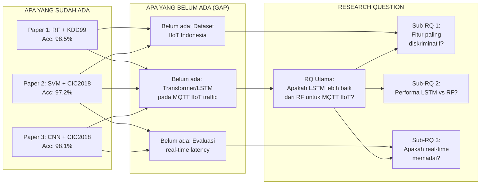
```mermaid
flowchart LR
    subgraph "APA YANG SUDAH ADA"
        PA["Paper 1: RF + KDD99\nAcc: 98.5%"]
        PB["Paper 2: SVM + CIC2018\nAcc: 97.2%"] 
        PC["Paper 3: CNN + CIC2018\nAcc: 98.1%"]
    end
    subgraph "APA YANG BELUM ADA (GAP)"
        G1["Belum ada: Transformer/LSTM\npada MQTT IIoT traffic"]
        G2["Belum ada: Dataset\nIIoT Indonesia"]
        G3["Belum ada: Evaluasi\nreal-time latency"]
    end
    subgraph "RESEARCH QUESTION"
        RQ_Main["RQ Utama:\nApakah LSTM lebih baik\ndari RF untuk MQTT IIoT?"]
        RQ_Sub1["Sub-RQ 1:\nFitur paling\ndiskriminatif?"]
        RQ_Sub2["Sub-RQ 2:\nPerforma LSTM vs RF?"]
        RQ_Sub3["Sub-RQ 3:\nApakah real-time\nmemadai?"]
    end
    PA & PB & PC --> G1
    PA & PB --> G2
    PB & PC --> G3
    G1 --> RQ_Main
    G2 --> RQ_Sub1
    G3 --> RQ_Sub3
    RQ_Main --> RQ_Sub1 & RQ_Sub2 & RQ_Sub3
```

---

### 6. Contoh Terapan

**Gap Analysis dan RQ Mahasiswa B (Bima — Cloud Forensics):**

*Analisis Matrix (20 paper tentang cloud forensics):*
- 18/20 paper fokus pada cloud public (AWS, Azure, GCP) single-tenant
- Tidak ada paper yang secara eksplisit membahas shared responsibility model dari perspektif investigator, bukan cloud provider
- 15/20 paper menggunakan environment yang dikontrol penuh oleh peneliti (tidak multi-tenant nyata)
- Keterbatasan yang paling sering disebut: "Tidak ada akses ke log cloud pihak ketiga" dan "Chain of custody sulit dibuktikan"
- Tidak ada yang mengusulkan framework yang dapat dioperasionalisasi oleh tim IR non-cloud-provider

*Research Gap yang Diidentifikasi:*
"Meskipun berbagai teknik akuisisi dan analisis evidence telah dikembangkan untuk cloud forensics, sebagian besar mengasumsikan kontrol penuh investigator terhadap environment. Belum ada framework metodologis yang secara eksplisit mengakomodasi constraint shared responsibility model — di mana investigator (tim IR klien) hanya memiliki akses terbatas ke evidence, sementara sebagian log dan artefak berada di bawah kontrol cloud provider. Kesenjangan ini menghambat investigasi insiden di lingkungan cloud multi-tenant secara sistematis dan admissible."

*Research Question:*
RQ Utama: "Bagaimana framework metodologis digital forensics untuk lingkungan cloud IaaS multi-tenant dapat dirancang untuk mengakomodasi constraint shared responsibility model, dan seberapa efektif framework tersebut dalam menghasilkan evidence yang admissible dalam simulasi insiden?"

Sub-RQ 1: "Apa saja jenis evidence yang dapat diakses oleh investigator (klien) vs. cloud provider dalam model shared responsibility AWS dan Azure?"
Sub-RQ 2: "Prosedur akuisisi evidence apa yang mempertahankan chain of custody dalam lingkungan cloud yang ephemeral?"
Sub-RQ 3: "Seberapa lengkap timeline rekonstruksi yang dapat dibangun menggunakan evidence yang hanya tersedia di sisi klien?"

---

### 7. Praktikum atau Aktivitas Terarah

**Judul:** Workshop Gap Analysis dan Research Question Formulation

**Tujuan:** Menghasilkan draft research gap dan research question yang terverifikasi dari literature matrix.

**Langkah Kerja:**

1. (30 menit) Buat tabel analisis dari kolom "Keterbatasan" di literature matrix Anda. Identifikasi pola: keterbatasan apa yang paling sering muncul?
2. (20 menit) Klasifikasikan gap yang Anda temukan ke salah satu dari 5 jenis gap (konteks, metodologi, data, evaluasi, integrasi).
3. (20 menit) Tulis pernyataan gap menggunakan template "Meskipun... namun... oleh karena itu..."
4. (30 menit) Tulis RQ Utama dan 2-3 Sub-RQ. Evaluasi menggunakan kriteria SMART.
5. (Pairs, 20 menit) Tukarkan dengan teman. Teman bertanya: "Bisakah ini dijawab dalam 2 semester? Bagaimana cara mengukur jawabannya?" Revisi jika perlu.

---

### 8. Latihan Pemahaman

**Soal 1:** Research gap jenis "context gap" paling tepat dideskripsikan sebagai:
- A. Tidak ada penelitian sama sekali tentang topik ini
- B. Solusi yang ada belum dievaluasi pada konteks/setting spesifik yang ditargetkan
- C. Metode yang ada terbukti tidak berhasil secara matematis
- D. Dataset yang digunakan penelitian sebelumnya mengandung bias

**Soal 2 (Analisis):** Pernyataan berikut diklaim sebagai "research gap": "Keamanan siber sangat penting dan masih banyak yang perlu diteliti." Apa yang salah dengan pernyataan ini?

**Soal 3 (Evaluasi):** Evaluasi RQ berikut menggunakan kriteria SMART: "Apakah deep learning lebih baik untuk keamanan siber?"

**Soal 4 (Terapan):** Dari literature matrix yang berisi 15 paper tentang "ransomware detection menggunakan ML", ditemukan bahwa: semua paper menggunakan dataset dari Windows 10 2019 ke bawah; tidak ada yang mengevaluasi pada Windows 11. Apakah ini merupakan gap yang cukup signifikan untuk dijadikan topik tesis?

---

### 9. Latihan Terapan / Studi Kasus

**Studi Kasus: Mengevaluasi Gap dan RQ dari Dua Proposal**

**Proposal A:**
Gap: "Tidak ada penelitian tentang penggunaan blockchain untuk keamanan data."
RQ: "Bagaimana blockchain dapat meningkatkan keamanan data?"

**Proposal B:**
Gap: "Meskipun federated learning telah diusulkan sebagai solusi privacy-preserving untuk model deteksi fraud, belum ada evaluasi yang membandingkan efektivitas model federated dengan model centralized dalam konteks fraud detection perbankan Indonesia menggunakan data transaksi yang dikalibrasi dengan pola penipuan lokal."
RQ Utama: "Seberapa efektif federated learning model dibandingkan centralized model dalam mendeteksi fraud transaksi perbankan, diukur dengan F1-score, recall, dan waktu training, menggunakan dataset simulasi yang dikalibrasi dengan pola fraud perbankan Indonesia?"

*Pertanyaan:*
1. Evaluasi Gap Proposal A dan B menggunakan kriteria gap yang baik (terverifikasi, spesifik, bermakna, dapat dijawab).
2. Evaluasi RQ Proposal A dan B menggunakan SMART.
3. Untuk Proposal A, reformulasi gap dan RQ yang lebih baik, dengan asumsi mahasiswa memiliki background di industri supply chain.

---

### 10. Kunci Jawaban dan Pembahasan

**Jawaban Soal 1:** **B — Solusi yang ada belum dievaluasi pada konteks/setting spesifik yang ditargetkan.** Context gap adalah jenis gap yang paling umum dalam riset terapan: solusinya ada, tetapi belum divalidasi dalam konteks lokal, industri spesifik, atau kondisi operasional yang berbeda. Ini berbeda dari "tidak ada penelitian sama sekali" (A — yang jarang terjadi di bidang yang sudah matang), kelemahan matematis (C — yang lebih ke gap metodologi), atau bias data (D — data gap).

**Jawaban Soal 2:** Pernyataan "keamanan siber sangat penting dan masih banyak yang perlu diteliti" bukan research gap karena:
1. Tidak terverifikasi dari literatur spesifik
2. Tidak spesifik — "banyak yang perlu diteliti" bisa berarti segalanya
3. Tidak menunjukkan apa yang spesifik belum dilakukan atau keterbatasan apa yang ada
4. Tidak dapat ditindaklanjuti menjadi RQ yang konkret

Gap yang baik harus menyebutkan: apa yang sudah dilakukan (dengan referensi), apa spesifiknya yang belum dilakukan, dan mengapa itu penting.

**Jawaban Soal 3 (SMART untuk RQ):**
"Apakah deep learning lebih baik untuk keamanan siber?"
- Specific (Spesifik)? TIDAK — "deep learning" apa? "keamanan siber" aspek apa?
- Measurable (Terukur)? TIDAK — "lebih baik" dengan metrik apa?
- Achievable (Dapat dicapai)? TIDAK — terlalu luas untuk dicapai dalam satu tesis
- Relevant (Relevan)? Mungkin, tapi tidak dapat ditentukan karena terlalu umum
- Time-bound? Implisit ada, tapi tidak bermakna karena scope tidak jelas

RQ ini gagal hampir semua kriteria SMART. Ini adalah contoh RQ yang perlu dipersempit drastis.

**Jawaban Soal 4:**
Gap "semua paper menggunakan dataset Windows 10 2019 ke bawah, tidak ada yang mengevaluasi pada Windows 11" mungkin TIDAK cukup signifikan sebagai satu-satunya gap untuk tesis, karena: (a) Windows 11 bukan perubahan arsitektur fundamental yang mengubah perilaku ransomware secara drastis — ini incremental; (b) Kontribusinya terlalu marginal untuk level magister. Gap yang lebih bermakna: apakah ada perbedaan fundamental dalam teknik evasion ransomware modern terhadap Windows 11 security features (Windows Defender Credential Guard, Memory Integrity)? Atau apakah ada konteks lokal (ransomware yang menargetkan organisasi Indonesia) yang tidak tercermin dalam dataset yang ada? Pertanyaan versi kedua lebih bermakna dari sekadar "update Windows versi."

**Jawaban Studi Kasus:**

1. Evaluasi Gap:
- Proposal A: Tidak memenuhi satu pun kriteria. Tidak terverifikasi (tidak ada referensi). Tidak spesifik. "Data" terlalu luas. Tidak bermakna dalam artian konkret.
- Proposal B: Memenuhi semua kriteria. Terverifikasi (implisit dari literature matrix). Spesifik (federated learning, fraud detection, konteks perbankan Indonesia). Bermakna (industri perbankan Indonesia butuh ini). Dapat dijawab dalam scope tesis.

2. Evaluasi RQ (SMART):
- Proposal A RQ: Gagal semua SMART. Tidak spesifik, tidak terukur, tidak achievable.
- Proposal B RQ: Lulus semua SMART. Spesifik (federated vs centralized, fraud detection). Terukur (F1, recall, waktu training). Achievable (2 semester). Relevan (fraud perbankan Indonesia). Time-bound (implicit).

3. Reformulasi Proposal A (dengan background supply chain):
Gap: "Meskipun blockchain telah diusulkan untuk meningkatkan transparansi dan keamanan supply chain secara umum, belum ada penelitian yang mengevaluasi efektivitas implementasi blockchain untuk keamanan integritas data komponen elektronik dalam rantai pasok industri manufaktur Indonesia — konteks yang unik karena keterlibatan pemasok kecil dengan keterbatasan infrastruktur digital."
RQ: "Seberapa efektif implementasi blockchain permissioned (Hyperledger Fabric) dalam memastikan integritas dan auditabilitas data komponen dalam rantai pasok elektronik manufaktur Indonesia, dibandingkan dengan sistem terpusat yang ada, diukur dari latensi transaksi, throughput, dan deteksi pemalsuan data?"

---

### 11. Ringkasan Bab

Research gap adalah celah spesifik antara apa yang sudah diketahui dan apa yang perlu diketahui — bukan pernyataan umum tentang pentingnya suatu topik. Lima jenis gap (konteks, metodologi, data, evaluasi, integrasi) memberikan kerangka untuk menganalisis literature matrix secara sistematis. Research question yang lahir dari gap yang teridentifikasi harus memenuhi kriteria SMART: spesifik, terukur, achievable, relevan, dan time-bound. RQ yang baik berfungsi sebagai kompas yang mengarahkan seluruh keputusan metodologis tesis.

---

### 12. Refleksi Profesional

1. **Gap yang "Disengaja"**: Apakah ada situasi di mana peneliti terdahulu "sengaja" tidak mengisi gap tertentu — misalnya karena terlalu mahal, terlalu berisiko secara etis, atau memerlukan akses yang tidak tersedia? Bagaimana Anda harus memperlakukan gap semacam ini dalam penelitian Anda?

2. **RQ yang Berubah di Tengah Jalan**: Banyak peneliti menemukan bahwa RQ mereka berubah setelah mereka mulai melakukan penelitian — data menunjukkan sesuatu yang berbeda dari yang diantisipasi. Apakah ini merupakan kegagalan atau bagian normal dari proses ilmiah? Bagaimana Anda harus mendokumentasikan perubahan RQ dalam tesis?

3. **RQ vs. Hipotesis**: Dalam penelitian kuantitatif, research question sering diikuti oleh hipotesis yang dapat diuji secara statistik. Dalam konteks riset keamanan siber terapan, kapan Anda perlu merumuskan hipotesis formal, dan kapan cukup dengan RQ saja?

---

## Bab 5 — Struktur Proposal Tesis dan Positioning Penelitian

### 1. Capaian Pembelajaran Bab

Setelah menyelesaikan bab ini, mahasiswa mampu:
- Memahami struktur standar proposal tesis magister terapan PENS beserta fungsi setiap bagian (C2)
- Menyusun outline proposal yang koheren dan menunjukkan alur logis dari masalah hingga metodologi (C3)
- Menetapkan topik final dan calon pembimbing berdasarkan alignment area riset (C4)
- Memosisikan penelitian mereka secara jelas dalam landscape penelitian yang sudah ada (C4)

*Dikaitkan dengan Sub-CPMK.3 (Pertemuan 5) dan Eval-2 (15% — artefak: outline proposal + kesepakatan topik + calon pembimbing).*

---

### 2. Peta Konsep Bab

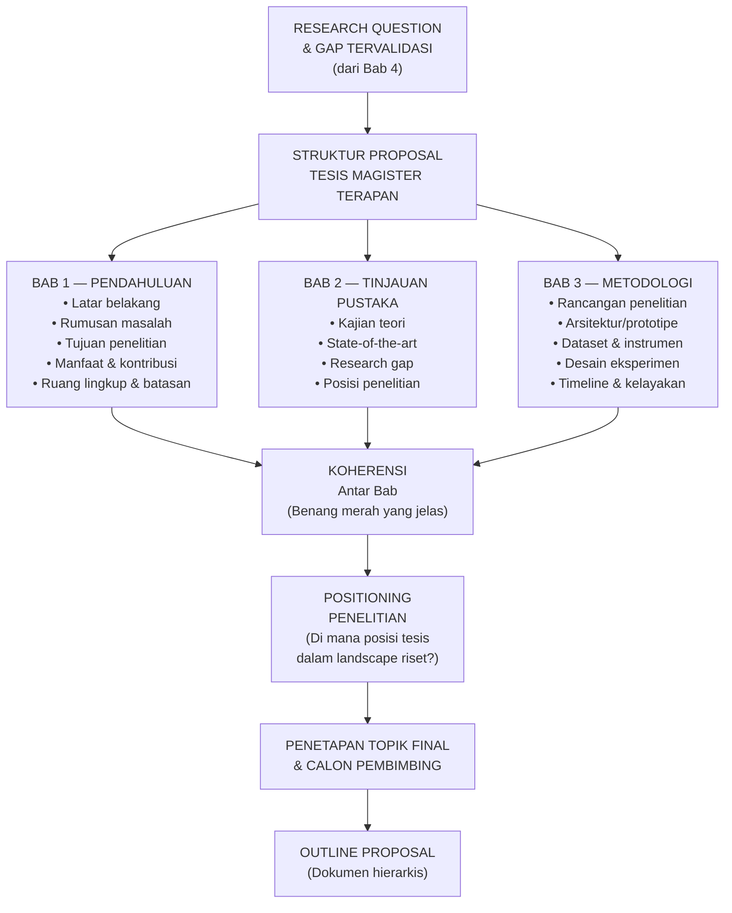
```mermaid
flowchart TD
    RQ2["RESEARCH QUESTION\n& GAP TERVALIDASI\n(dari Bab 4)"] --> ProposalStructure["STRUKTUR PROPOSAL\nTESIS MAGISTER TERAPAN"]
    ProposalStructure --> Bab1P["BAB 1 — PENDAHULUAN\n• Latar belakang\n• Rumusan masalah\n• Tujuan penelitian\n• Manfaat & kontribusi\n• Ruang lingkup & batasan"]
    ProposalStructure --> Bab2P["BAB 2 — TINJAUAN PUSTAKA\n• Kajian teori\n• State-of-the-art\n• Research gap\n• Posisi penelitian"]
    ProposalStructure --> Bab3P["BAB 3 — METODOLOGI\n• Rancangan penelitian\n• Arsitektur/prototipe\n• Dataset & instrumen\n• Desain eksperimen\n• Timeline & kelayakan"]
    Bab1P & Bab2P & Bab3P --> Coherence["KOHERENSI\nAntar Bab\n(Benang merah yang jelas)"]
    Coherence --> Positioning["POSITIONING\nPENELITIAN\n(Di mana posisi tesis\ndalam landscape riset?)"]
    Positioning --> TopicAdvisor["PENETAPAN TOPIK FINAL\n& CALON PEMBIMBING"]
    TopicAdvisor --> Outline["OUTLINE PROPOSAL\n(Dokumen hierarkis)"]
```

---

### 3. Pengantar Kontekstual

Sebuah proposal tesis yang baik bukan sekadar daftar rencana — ia adalah argumen. Ia harus meyakinkan pembaca (dan penguji) bahwa: (1) masalah yang Anda pilih nyata dan penting; (2) Anda sudah tahu apa yang sudah dilakukan dan apa yang belum; (3) pendekatan yang Anda rencanakan masuk akal dan dapat dijalankan; dan (4) Anda adalah orang yang tepat untuk melakukan penelitian ini dalam program ini.

Memahami struktur proposal bukan tentang mengisi template secara mekanis — melainkan tentang memahami *mengapa* setiap bagian ada dan bagaimana ia berkontribusi pada argumen keseluruhan.

---

### 4. Landasan Teori

#### 4.1 Anatomi Proposal Tesis Magister Terapan

**Halaman Awal:**
- Sampul: Judul, nama, NIM, logo institusi
- Lembar persetujuan
- Abstrak/Abstract (dalam Bahasa Indonesia dan Inggris)
- Kata Kunci

**BAB 1 — PENDAHULUAN:**

*Latar Belakang Masalah:*
Membangun konteks dan argumen mengapa masalah ini penting. Struktur yang efektif: mulai dari konteks luas (tren keamanan siber global/nasional) → perkecil ke domain spesifik → identifikasi masalah konkret → tunjukkan dampaknya → nyatakan bahwa belum ada solusi yang memadai (bridging ke gap). Biasanya 3-5 halaman. Dukung setiap klaim dengan referensi.

*Rumusan Masalah:*
Nyatakan masalah secara eksplisit. Dapat berbentuk pertanyaan atau pernyataan masalah. Harus konsisten dengan latar belakang dan menjadi basis RQ. 1-2 paragraf.

*Tujuan Penelitian:*
Apa yang akan dicapai oleh penelitian ini? Harus konsisten dengan RQ dan dapat diukur. Contoh: "Tujuan penelitian ini adalah: (1) mengembangkan model LSTM untuk deteksi anomali pada jaringan MQTT IIoT; (2) mengevaluasi performa model menggunakan metrik accuracy, F1-score, dan detection latency; (3) membandingkan performa model dengan baseline Random Forest."

*Manfaat Penelitian:*
Siapa yang mendapat manfaat dan bagaimana. Bagi akademisi: kontribusi pengetahuan baru. Bagi industri: solusi yang dapat diterapkan. Bagi pemerintah: masukan kebijakan.

*Kontribusi Penelitian (Contribution):*
Apa yang baru dari penelitian ini dibandingkan yang sudah ada? Ini adalah pernyataan novelty yang eksplisit. Harus spesifik dan terverifikasi oleh gap analysis dari Bab 2.

*Ruang Lingkup dan Batasan Penelitian:*
Apa yang termasuk dan tidak termasuk dalam penelitian ini, dan mengapa. Ini penting untuk mengelola ekspektasi penguji dan mencegah scope creep. Contoh: "Penelitian ini dibatasi pada protokol MQTT versi 3.1.1 dan tidak mencakup protokol CoAP atau AMQP. Dataset yang digunakan adalah dataset simulasi dan belum mencakup traffic produksi nyata."

**BAB 2 — TINJAUAN PUSTAKA:**

*Kajian Teori (Theoretical Background):*
Konsep dan teori yang menjadi fondasi penelitian. Bukan replikasi buku teks — pilih teori yang langsung relevan dengan metodologi dan solusi yang akan dikembangkan.

*State-of-the-Art:*
Tinjauan kritis terhadap penelitian terkait yang sudah ada. Bukan sekadar daftar "ini yang sudah dilakukan" — analisis kritisnya. Bagaimana literature matrix Anda menjadi sumber analisis ini.

*Identifikasi Research Gap:*
Pernyataan formal tentang gap yang teridentifikasi dari analisis state-of-the-art.

*Posisi Penelitian (Research Positioning):*
"Positioning statement" yang menjelaskan secara eksplisit bagaimana penelitian ini berada di antara yang sudah ada dan mengisi gap yang teridentifikasi.

**BAB 3 — METODOLOGI:**

*Rancangan Penelitian (Research Design):*
Jenis penelitian (eksperimental, deskriptif, design science), paradigma (positivist, interpretivist), dan pendekatan (kuantitatif, kualitatif, mixed methods). Untuk tesis terapan keamanan siber, umumnya: eksperimental + kuantitatif.

*Arsitektur Sistem / Prototipe / Algoritma:*
Rancangan teknis dari solusi yang akan dikembangkan. Diagram arsitektur, pseudocode, atau flowchart yang menjelaskan bagaimana sistem bekerja.

*Dataset dan Instrumen:*
Dataset yang akan digunakan, sumber, ukuran, karakteristik. Jika menggunakan dataset sendiri: bagaimana dikumpulkan dan divalidasi. Instrumen lain yang diperlukan (tool, framework).

*Desain Eksperimen:*
Bagaimana evaluasi dilakukan. Baseline apa yang dibandingkan. Metrik evaluasi. Kondisi eksperimen (hardware, software environment). Bagaimana menghindari bias dalam evaluasi.

*Timeline Penelitian (Gantt Chart):*
Rencana kerja per bulan selama masa penelitian.

*Analisis Kelayakan:*
Apakah penelitian ini feasible dengan sumber daya yang tersedia? (hardware, software, dataset, kompetensi)

#### 4.2 Koherensi Antar Bab: Benang Merah

Kesalahan paling umum dalam proposal tesis adalah kurangnya koherensi — setiap bab tampak ditulis secara terpisah tanpa alur yang jelas. Penguji yang berpengalaman akan langsung mendeteksi ini.

**Uji Koherensi — Checklist:**
- Apakah rumusan masalah di Bab 1 konsisten dengan gap di Bab 2?
- Apakah tujuan penelitian menjawab rumusan masalah?
- Apakah metodologi di Bab 3 dirancang untuk menjawab tujuan penelitian?
- Apakah dataset yang dipilih relevan dengan masalah yang diteliti?
- Apakah metrik evaluasi yang dipilih mengukur apa yang relevan dengan RQ?

**Teknik Membangun Koherensi — "Thread" Konsep:**
Identifikasi 3-5 konsep kunci penelitian Anda (misalnya: "LSTM", "anomaly detection", "MQTT protocol", "IIoT", "real-time detection") dan pastikan konsep-konsep ini muncul secara konsisten dan berkaitan di setiap bab.

#### 4.3 Positioning Penelitian

Positioning research adalah pernyataan tentang di mana penelitian Anda berada dalam lanskap riset yang ada. Berguna untuk:
- Menunjukkan kepada penguji bahwa Anda memahami konteks riset
- Membuktikan novelty secara eksplisit
- Menghindari klaim yang terlalu luas ("penelitian pertama tentang...") yang mudah dibantah

**Diagram Positioning:**
Buat matriks 2×2 atau diagram yang menampilkan penelitian-penelitian yang ada dan menunjukkan di mana penelitian Anda mengisi ruang yang kosong.

Contoh (untuk topik IDS-IIoT):
```
                    Pendekatan Tradisional | Pendekatan Deep Learning
Dataset ICS/OT          Paper A, B, C    |    [posisi tesis Anda]
Dataset IoT Konsumen    Paper D, E, F    |    Paper G, H
```

---

### 5. Model atau Arsitektur

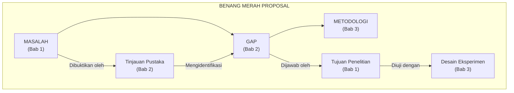
```mermaid
flowchart TD
    subgraph "BENANG MERAH PROPOSAL"
        direction LR
        Problem["MASALAH\n(Bab 1)"] --> Gap["GAP\n(Bab 2)"] --> Method["METODOLOGI\n(Bab 3)"]
        Problem -->|"Dibuktikan oleh"| Litrev["Tinjauan Pustaka\n(Bab 2)"]
        Gap -->|"Dijawab oleh"| Objective["Tujuan Penelitian\n(Bab 1)"]
        Objective -->|"Diuji dengan"| Eval["Desain Eksperimen\n(Bab 3)"]
        Litrev -->|"Mengidentifikasi"| Gap
    end
```

---

### 6. Contoh Terapan

**Outline Proposal Rina Wijayanti (IDS-IIoT dengan LSTM):**

```
JUDUL: Deteksi Anomali Berbasis LSTM pada Jaringan MQTT Industrial IoT:
       Pengembangan dan Evaluasi terhadap Baseline Random Forest

BAB 1 — PENDAHULUAN
1.1 Latar Belakang
    1.1.1 Tren keamanan Industrial IoT global dan nasional
    1.1.2 Karakteristik serangan pada jaringan MQTT IIoT
    1.1.3 Keterbatasan pendekatan IDS konvensional pada IIoT
    1.1.4 Potensi deep learning untuk anomaly detection
1.2 Rumusan Masalah
1.3 Tujuan Penelitian
    1.3.1 Tujuan Umum
    1.3.2 Tujuan Khusus
1.4 Manfaat Penelitian
    1.4.1 Manfaat Akademis
    1.4.2 Manfaat Industri
1.5 Kontribusi Penelitian
1.6 Ruang Lingkup dan Batasan
1.7 Sistematika Penulisan

BAB 2 — TINJAUAN PUSTAKA
2.1 Industrial IoT (IIoT): Arsitektur dan Protokol
    2.1.1 Protokol MQTT dan karakteristik trafficnya
    2.1.2 Ancaman pada jaringan IIoT
2.2 Sistem Deteksi Intrusi (IDS)
    2.2.1 Signature-based IDS
    2.2.2 Anomaly-based IDS
2.3 Machine Learning untuk Anomaly Detection
    2.3.1 Pendekatan klasik: Random Forest, SVM
    2.3.2 Deep Learning: LSTM, Autoencoder, Transformer
2.4 State-of-the-Art: ML-based IDS untuk IIoT
    2.4.1 Analisis literatur: metode, dataset, metrik
    2.4.2 Identifikasi research gap
2.5 Posisi Penelitian

BAB 3 — METODOLOGI
3.1 Rancangan Penelitian
3.2 Arsitektur Sistem Deteksi Anomali Berbasis LSTM
    3.2.1 Preprocessing dan feature extraction
    3.2.2 Arsitektur model LSTM
    3.2.3 Mekanisme deteksi anomali
3.3 Dataset
    3.3.1 Dataset yang digunakan: MQTTset
    3.3.2 Karakteristik dan preprocessing
    3.3.3 Strategi split training/validation/testing
3.4 Desain Eksperimen
    3.4.1 Baseline: Random Forest
    3.4.2 Metrik evaluasi
    3.4.3 Kondisi eksperimen
3.5 Rencana Validasi
3.6 Timeline Penelitian (Gantt Chart)
3.7 Analisis Kelayakan

DAFTAR PUSTAKA
LAMPIRAN
```

---

### 7. Praktikum atau Aktivitas Terarah

**Judul:** Penyusunan Outline Proposal dan Konsultasi Topik

**Tujuan:** Menghasilkan outline proposal yang koheren dan kesepakatan topik dengan calon pembimbing.

**Langkah Kerja:**

1. (45 menit) Buat outline proposal 3 level (bab → sub-bab → sub-sub-bab) berdasarkan template di atas, disesuaikan dengan topik Anda.
2. (20 menit) Lakukan uji koherensi menggunakan checklist: apakah setiap bagian terhubung secara logis?
3. (30 menit) Buat "positioning diagram" yang menunjukkan di mana penelitian Anda berada relatif terhadap paper-paper yang ada.
4. (Sebelum pertemuan 6) Jadwalkan konsultasi 30 menit dengan calon pembimbing. Diskusikan: relevansi topik dengan area riset pembimbing, ketersediaan data/sumber daya, feasibility timeline.

**Artefak yang Dihasilkan:**
- Outline proposal 3 level (dokumen)
- Positioning diagram
- Catatan hasil konsultasi dengan calon pembimbing + kesepakatan tentang topik dan pembimbing

---

### 8. Latihan Pemahaman

**Soal 1:** Bagian "Kontribusi Penelitian" dalam Bab 1 proposal berbeda dari "Tujuan Penelitian" karena:
- A. Kontribusi lebih panjang dan lebih detail
- B. Tujuan menggambarkan apa yang akan dilakukan; kontribusi menggambarkan apa yang baru dibandingkan yang sudah ada
- C. Kontribusi hanya relevan untuk penguji, bukan pembimbing
- D. Tujuan wajib ada, kontribusi opsional

**Soal 2:** Mengapa "Ruang Lingkup dan Batasan" penting dalam proposal tesis, bukan sekadar formalitas?

**Soal 3:** Seorang mahasiswa menulis rumusan masalah: "Keamanan siber sangat penting dan perlu ditingkatkan." Evaluasi apakah ini merupakan rumusan masalah yang valid untuk proposal tesis.

**Soal 4:** Jelaskan mengapa tujuan penelitian harus dapat diukur (measurable) dalam tesis terapan.

---

### 9. Latihan Terapan / Studi Kasus

**Studi Kasus: Review Koherensi Proposal**

Sebuah proposal berisi:
- *Latar Belakang*: Membahas ancaman ransomware pada infrastruktur kritis Indonesia
- *Rumusan Masalah*: "Bagaimana cara mendeteksi serangan ransomware secara dini?"
- *Tujuan*: "Mengembangkan sistem otentikasi multi-faktor yang kuat untuk mencegah akses tidak sah"
- *Metodologi*: "Menggunakan CNN untuk klasifikasi malware dari static binary features"

*Pertanyaan:*
1. Identifikasi inkonsistensi koherensi dalam proposal ini.
2. Benang merah apa yang seharusnya ada dari Latar Belakang → Rumusan Masalah → Tujuan → Metodologi?
3. Revisi "Tujuan" dan "Metodologi" agar koheren dengan latar belakang dan rumusan masalah.

---

### 10. Kunci Jawaban dan Pembahasan

**Jawaban Soal 1:** **B — Tujuan menggambarkan apa yang akan dilakukan; kontribusi menggambarkan apa yang baru dibandingkan yang sudah ada.** Tujuan penelitian bersifat prospektif: "apa yang akan saya capai." Kontribusi bersifat komparatif: "apa yang belum ada sebelum saya dan ada setelah penelitian ini." Tujuan dan kontribusi saling berkaitan tetapi tidak identik. Pilihan A salah — panjang tidak menentukan perbedaan. C dan D juga salah.

**Jawaban Soal 2:** Ruang lingkup dan batasan bukan formalitas karena: (a) mencegah scope creep yang dapat menghancurkan jadwal penelitian; (b) mengelola ekspektasi penguji — penguji tidak bisa menuntut hal-hal di luar batasan yang sudah dinyatakan; (c) menunjukkan bahwa mahasiswa memiliki pemahaman yang matang tentang apa yang realistis; (d) mempermudah replikasi oleh peneliti lain yang memahami kondisi spesifik; (e) melindungi mahasiswa dari kegagalan yang disebabkan oleh faktor di luar kontrol mereka (akses data, hardware, dll.).

**Jawaban Soal 3:** "Keamanan siber sangat penting dan perlu ditingkatkan" bukan rumusan masalah yang valid karena: (a) tidak menggambarkan masalah spesifik yang akan diteliti; (b) tidak dapat dijawab melalui satu penelitian; (c) tidak ada objek penelitian yang jelas; (d) tidak memiliki scope yang terdefinisi. Rumusan masalah yang baik harus spesifik, terukur, dan dapat dijawab. Contoh yang lebih baik: "Bagaimana performa model LSTM dalam mendeteksi serangan ransomware pada sistem Windows berdasarkan analisis perilaku proses, dibandingkan dengan model Random Forest sebagai baseline?"

**Jawaban Soal 4:** Tujuan yang terukur penting dalam tesis terapan karena: (a) memberikan basis konkret untuk mengevaluasi apakah tesis berhasil mencapai apa yang direncanakan; (b) metrik evaluasi dalam Bab 3 harus konsisten dengan tujuan yang terukur; (c) penguji dapat menilai secara objektif apakah penelitian berhasil; (d) memungkinkan perbandingan objektif dengan penelitian lain; (e) mengajarkan disiplin ilmiah — klaim harus dibuktikan, bukan hanya dinyatakan.

**Jawaban Studi Kasus:**
1. Inkonsistensi yang teridentifikasi:
   - Latar belakang: ancaman ransomware → Rumusan masalah: deteksi ransomware dini (konsisten)
   - Tujuan: MFA untuk mencegah akses tidak sah → TIDAK KONSISTEN dengan rumusan masalah tentang deteksi ransomware. MFA adalah kontrol akses, bukan deteksi ransomware
   - Metodologi: CNN untuk klasifikasi malware → LEBIH KONSISTEN dengan deteksi, tetapi tidak sinkron dengan tujuan MFA yang dinyatakan

2. Benang merah yang seharusnya: Ransomware pada infrastruktur kritis → Deteksi dini ransomware sebelum enkripsi massal → Model deep learning untuk mendeteksi perilaku ransomware dari process behavior → CNN/LSTM untuk klasifikasi perilaku malware

3. Revisi yang koheren:
   - Tujuan: "Mengembangkan dan mengevaluasi model CNN untuk deteksi ransomware secara dini berdasarkan analisis perilaku proses (process behavior analysis) pada sistem Windows, menggunakan dataset perilaku malware yang tersedia secara publik."
   - Metodologi: "Penelitian menggunakan pendekatan eksperimental dengan model CNN yang menerima input fitur perilaku proses (system calls, API calls, registry modifications) dari sampel ransomware. Model dievaluasi menggunakan metrik precision, recall, F1-score, dan false positive rate, dibandingkan dengan baseline MLP dan SVM pada dataset yang sama."

---

### 11. Ringkasan Bab

Struktur proposal tesis terapan (Bab 1: Pendahuluan, Bab 2: Tinjauan Pustaka, Bab 3: Metodologi) adalah argumen tiga bagian yang harus koheren dari awal hingga akhir. Koherensi berarti: masalah di Bab 1 didukung oleh gap di Bab 2, tujuan penelitian menjawab masalah, dan metodologi dirancang untuk mencapai tujuan. Positioning research secara eksplisit menunjukkan di mana kontribusi tesis berada relatif terhadap penelitian yang sudah ada — ini adalah bukti novelty yang dapat diverifikasi. Pemilihan calon pembimbing harus mempertimbangkan alignment area riset, bukan hanya ketersediaan administratif.

---

### 12. Refleksi Profesional

1. **Proposal sebagai Kontrak**: Proposal tesis pada dasarnya adalah kontrak antara Anda, pembimbing, dan institusi. Jika Anda mengubah arah penelitian secara signifikan setelah proposal disetujui, apa prosedur yang etis dan akademis yang harus ditempuh?

2. **Pembimbing yang Tepat**: Selain alignment area riset, faktor apa lagi yang penting dalam memilih pembimbing? Bagaimana Anda mengevaluasi "kecocokan" dengan pembimbing sebelum berkomitmen, dan apa yang harus Anda lakukan jika Anda menyadari bahwa relasi pembimbing-mahasiswa tidak berfungsi dengan baik?

3. **Outline vs. Dokumen Final**: Outline proposal yang Anda buat sekarang adalah rencana, bukan komitmen kaku. Seberapa banyak deviasi dari outline yang wajar selama proses penulisan? Kapan deviasi memerlukan diskusi ulang dengan pembimbing?

---

## Bab 6 — Menyusun Bab 1: Pendahuluan yang Meyakinkan

### 1. Capaian Pembelajaran Bab

Setelah menyelesaikan bab ini, mahasiswa mampu:
- Menyusun latar belakang masalah yang membangun argumen logis dari konteks luas ke masalah spesifik (C3)
- Menulis rumusan masalah, tujuan, manfaat, kontribusi, dan batasan yang konsisten dan terukur (C3)
- Menerapkan prinsip penulisan akademik yang objektif, referensial, dan tidak plagiat (C3)

*Dikaitkan dengan Sub-CPMK.3 (Pertemuan 6) dan Eval-2 (15%).*

---

### 2. Peta Konsep Bab

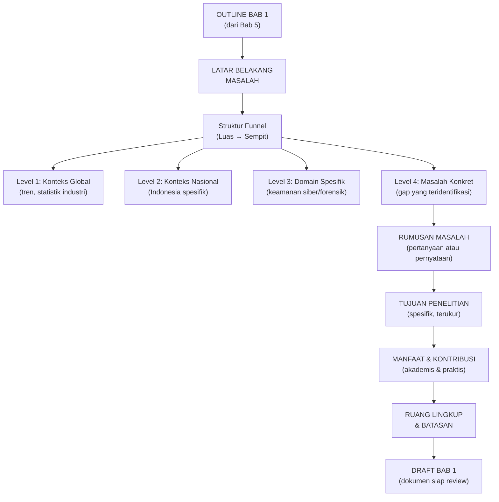
```mermaid
flowchart TD
    Outline2["OUTLINE BAB 1\n(dari Bab 5)"] --> LB["LATAR BELAKANG\nMASALAH"]
    LB --> Funnel["Struktur Funnel\n(Luas → Sempit)"]
    Funnel --> Global["Level 1: Konteks Global\n(tren, statistik industri)"]
    Funnel --> National["Level 2: Konteks Nasional\n(Indonesia spesifik)"]
    Funnel --> Domain["Level 3: Domain Spesifik\n(keamanan siber/forensik)"]
    Funnel --> Problem["Level 4: Masalah Konkret\n(gap yang teridentifikasi)"]
    Problem --> RumusanMasalah["RUMUSAN MASALAH\n(pertanyaan atau pernyataan)"]
    RumusanMasalah --> TujuanPenelitian["TUJUAN PENELITIAN\n(spesifik, terukur)"]
    TujuanPenelitian --> Manfaat["MANFAAT & KONTRIBUSI\n(akademis & praktis)"]
    Manfaat --> Batasan["RUANG LINGKUP\n& BATASAN"]
    Batasan --> Draft_Bab1["DRAFT BAB 1\n(dokumen siap review)"]
```

---

### 3. Pengantar Kontekstual

Bab 1 Pendahuluan adalah gerbang proposal Anda. Ia harus meyakinkan pembaca bahwa masalah yang Anda teliti itu nyata, penting, dan belum sepenuhnya terjawab oleh penelitian yang ada. Penguji yang membaca Bab 1 yang kuat akan mendekati sisa proposal dengan sikap yang lebih reseptif. Sebaliknya, Bab 1 yang lemah — klaim tanpa referensi, konteks yang terlalu umum, atau rumusan masalah yang tidak jelas — akan menempatkan proposal Anda di posisi defensif sejak awal.

---

### 4. Landasan Teori

#### 4.1 Struktur Latar Belakang: Model Funnel

Latar belakang yang efektif menggunakan "model funnel" (corong): mulai dari konteks yang luas dan bertahap mempersempit ke masalah spesifik yang akan Anda teliti.

**Level 1 — Konteks Global:**
Fakta dan statistik yang menggambarkan signifikansi domain secara global. Gunakan sumber terpercaya: laporan IBM, Verizon, Gartner, WEF Global Risk Report.
Contoh: "Serangan siber telah menjadi ancaman strategis global. IBM Cost of Data Breach Report 2024 melaporkan bahwa biaya rata-rata pelanggaran data mencapai USD 4,88 juta, meningkat 10% dibanding tahun sebelumnya."

**Level 2 — Konteks Nasional:**
Situasi di Indonesia. Gunakan data dari: BSSN (laporan tahunan), ID-CERT, Kominfo, OJK, laporan Kaspersky/Trend Micro tentang ancaman di Indonesia.
Contoh: "Di Indonesia, BSSN mencatat X.XXX insiden keamanan siber pada tahun 2024, dengan X% menargetkan infrastruktur kritis..."

**Level 3 — Domain Spesifik:**
Perkecil ke sub-domain yang Anda teliti (IIoT security, cloud forensics, threat intelligence).

**Level 4 — Masalah Konkret dan Gap:**
Nyatakan secara eksplisit masalah yang belum terpecahkan dan relevansi penelitian Anda. Ini jembatan ke rumusan masalah.

#### 4.2 Prinsip Penulisan Akademik

**Objektivitas:** Hindari klaim yang tidak didukung referensi. Setiap statistik, pernyataan tentang tren, atau klaim faktual harus disertai kutipan.

**Ketepatan Sitasi (APA Style):**
- In-text citation: (Penulis, Tahun) atau (Penulis, Tahun, halaman)
- Untuk dua penulis: (Smith & Jones, 2023)
- Untuk tiga+ penulis: (Smith et al., 2023)
- Untuk laporan: (IBM, 2024) atau (BSSN, 2024)
- Referensi web: (Nama Situs/Organisasi, Tahun)

**Menghindari Plagiarisme:**
- Paraphrase: ubah kalimat asli dengan kata-kata Anda sendiri, tetap berikan sitasi
- Kutipan langsung: gunakan tanda kutip dan berikan sitasi dengan halaman
- Self-plagiarism: jangan copy-paste dari tugas sebelumnya tanpa penyesuaian
- Tools: Turnitin, iThenticate, atau Grammarly Plagiarism untuk pengecekan
- Target similarity index: ≤20% (bervariasi per institusi; cek kebijakan PENS)

**Gaya Bahasa Akademik:**
- Hindari bahasa informal dan hiperbolik: "sangat luar biasa", "terbaik di dunia"
- Gunakan kalimat yang terukur: "lebih baik" → "meningkat sebesar X% dalam metrik Y"
- Passive voice diperbolehkan tetapi jangan berlebihan
- Hindari pronoun pertama (saya/kami) kecuali dalam bagian "tujuan" dan "kontribusi"

#### 4.3 Menulis Tujuan Penelitian yang Baik

Tujuan penelitian harus menggunakan kata kerja yang dapat diverifikasi (action verbs):
- **Mengembangkan**: menghasilkan artefak baru (model, sistem, framework)
- **Mengevaluasi**: mengukur performa dengan metrik tertentu
- **Membandingkan**: analisis komparatif dengan baseline
- **Mengidentifikasi**: menemukan pola atau karakteristik
- **Merancang**: membuat desain (arsitektur, metodologi)
- **Menganalisis**: menguraikan komponen atau faktor

**Hindari kata kerja yang tidak dapat diverifikasi:** "memahami", "mengetahui", "menyadari", "mengapresiasi" — tidak ada cara untuk mengukur apakah tujuan ini tercapai.

---

### 5. Model atau Arsitektur

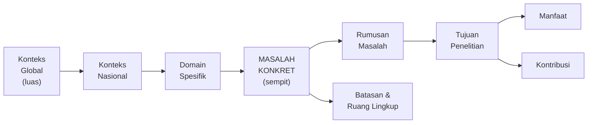
```mermaid
flowchart LR
    Konteks["Konteks\nGlobal\n(luas)"] --> Nasional["Konteks\nNasional"] --> Domain2["Domain\nSpesifik"] --> MasalahK["MASALAH\nKONKRET\n(sempit)"]
    MasalahK --> RM["Rumusan\nMasalah"] --> Tujuan["Tujuan\nPenelitian"]
    Tujuan --> Manfaat2["Manfaat"] & Kontribusi["Kontribusi"]
    MasalahK --> Batasan2["Batasan &\nRuang Lingkup"]
```

---

### 6. Contoh Terapan

**Pembuka Latar Belakang Mahasiswa C (Sari — CTI + NLP):**

"Ancaman siber terhadap sektor keuangan meningkat secara dramatis dalam lima tahun terakhir. Menurut Laporan Threat Intelligence IBM X-Force 2024, sektor keuangan dan asuransi menempati posisi kedua industri yang paling banyak diserang secara global, dengan 18% dari total insiden yang dianalisis. Di Indonesia, Otoritas Jasa Keuangan (OJK) mencatat peningkatan insiden siber pada industri perbankan sebesar 65% pada tahun 2023 dibandingkan 2022 (OJK, 2024).

Di antara berbagai vektor ancaman, ancaman yang bersumber dari forum underground dan dark web semakin relevan. Pelaku ancaman menggunakan forum ini untuk merencanakan serangan, menjual data curian, dan berbagi tool serangan sebelum insiden terjadi (Tavabi et al., 2018; Deliu et al., 2018). Kemampuan untuk memantau dan menganalisis informasi dari sumber-sumber ini — yang dikenal sebagai Cyber Threat Intelligence (CTI) berbasis OSINT — memberikan peringatan dini (early warning) yang berpotensi mencegah serangan sebelum terjadi.

Namun, volume dan keberagaman konten forum dark web jauh melebihi kapasitas tim CTI manusia untuk memonitor secara manual. Pendekatan berbasis Natural Language Processing (NLP) untuk mengotomasi analisis konten ini telah mulai diteliti (Samtani et al., 2020; Nunes et al., 2016), tetapi mayoritas penelitian berfokus pada konten berbahasa Inggris dan belum mengevaluasi efektivitasnya untuk konten yang relevan dengan ancaman terhadap sektor keuangan Indonesia yang memiliki karakteristik linguistik dan konteks lokal yang berbeda (Ref: gap dari literature matrix).

[Paragraf gap dan tujuan mengalir secara natural dari narasi ini...]"

---

### 7. Praktikum atau Aktivitas Terarah

**Judul:** Workshop Penulisan Bab 1

**Langkah Kerja:**

1. (60 menit) Tulis draft latar belakang menggunakan model funnel (4 level). Target: 2-3 halaman.
2. (30 menit) Tulis rumusan masalah, tujuan, manfaat, kontribusi, dan batasan.
3. (Peer review, 20 menit) Tukarkan draft dengan teman. Berikan feedback: (a) apakah funnel berfungsi? (b) apakah setiap klaim ada referensinya? (c) apakah tujuan terukur?
4. Revisi berdasarkan feedback.

**Kriteria Kualitas Draft Bab 1:**
- Setiap klaim faktual ada referensinya
- Latar belakang menggunakan model funnel
- Rumusan masalah spesifik dan dapat dijawab
- Tujuan menggunakan kata kerja yang dapat diverifikasi
- Batasan realistis dan spesifik

---

### 8–12. Latihan, Studi Kasus, Jawaban, Ringkasan, Refleksi

**Latihan:**

Soal 1: Mengapa tujuan penelitian "mengetahui seberapa aman sistem cloud" tidak memadai untuk tesis terapan?

Soal 2: Seorang mahasiswa menulis "Keamanan siber sangat penting karena serangan siber sangat berbahaya dan dapat menyebabkan kerugian besar." Identifikasi masalah dalam kalimat ini dan perbaiki menggunakan prinsip penulisan akademik.

Soal 3: Jelaskan mengapa batasan "penelitian ini hanya menggunakan dataset publik" perlu dinyatakan secara eksplisit dalam proposal.

**Kunci Jawaban:**

Soal 1: "Mengetahui seberapa aman" menggunakan kata kerja "mengetahui" yang tidak dapat diverifikasi secara empiris. Tidak ada ukuran yang jelas tentang apa yang dimaksud "aman". Versi yang lebih baik: "Mengevaluasi tingkat keamanan konfigurasi cloud AWS menggunakan benchmark CIS AWS Foundations Level 1 pada 10 aspek kontrol keamanan yang teridentifikasi, dan mengidentifikasi 3 area yang memerlukan perbaikan prioritas."

Soal 2: Masalah: tidak ada referensi, kalimat hiperbolik dan circular ("berbahaya... kerugian besar" tanpa data). Perbaikan: "Serangan siber mengakibatkan kerugian finansial yang signifikan bagi organisasi di seluruh dunia. IBM Cost of Data Breach Report 2024 melaporkan biaya rata-rata pelanggaran data sebesar USD 4,88 juta per insiden (IBM, 2024), meningkat 10% dari tahun sebelumnya dan menunjukkan tren yang terus meningkat selama satu dekade."

Soal 3: Batasan dataset publik penting karena: (a) penguji tidak bisa menuntut validasi pada data produksi jika sudah dinyatakan di luar scope; (b) membantu pembaca memahami generalisabilitas temuan (mungkin terbatas); (c) memberikan arah untuk penelitian lanjutan; (d) mencerminkan keterbatasan yang jujur dan akademis.

**Ringkasan:** Bab 1 yang kuat menggunakan model funnel untuk membangun argumen dari konteks luas ke masalah spesifik, mendukung setiap klaim dengan referensi, dan mengakhiri dengan tujuan yang terukur dan batasan yang realistis. Prinsip penulisan akademik — objektivitas, ketepatan sitasi, dan menghindari plagiarisme — adalah fondasi kualitas yang tidak dapat dikompromikan.

**Refleksi:** (1) Seberapa awal Anda harus mulai mengumpulkan referensi, dan bagaimana sistem manajemen referensi (Zotero, Mendeley, EndNote) membantu proses penulisan? (2) Ada ketegangan antara membuat latar belakang yang "menjual" (persuasif) dan yang "akademis" (objektif). Bagaimana menyeimbangkan keduanya?

---

## Bab 7 — Menyusun Bab 2: Tinjauan Pustaka Sistematik

### 1. Capaian Pembelajaran Bab

Setelah menyelesaikan bab ini, mahasiswa mampu:
- Mengorganisasi literature matrix menjadi narasi tinjauan pustaka yang kohesif (C4)
- Menulis tinjauan kritis yang membandingkan dan menganalisis penelitian yang ada, bukan hanya merangkumnya (C4)
- Menyusun pernyataan gap dan positioning penelitian yang didukung secara empiris dari literatur (C4)

*Dikaitkan dengan Sub-CPMK.3 (Pertemuan 7) dan Eval-2 (15%).*

---

### 2. Peta Konsep Bab

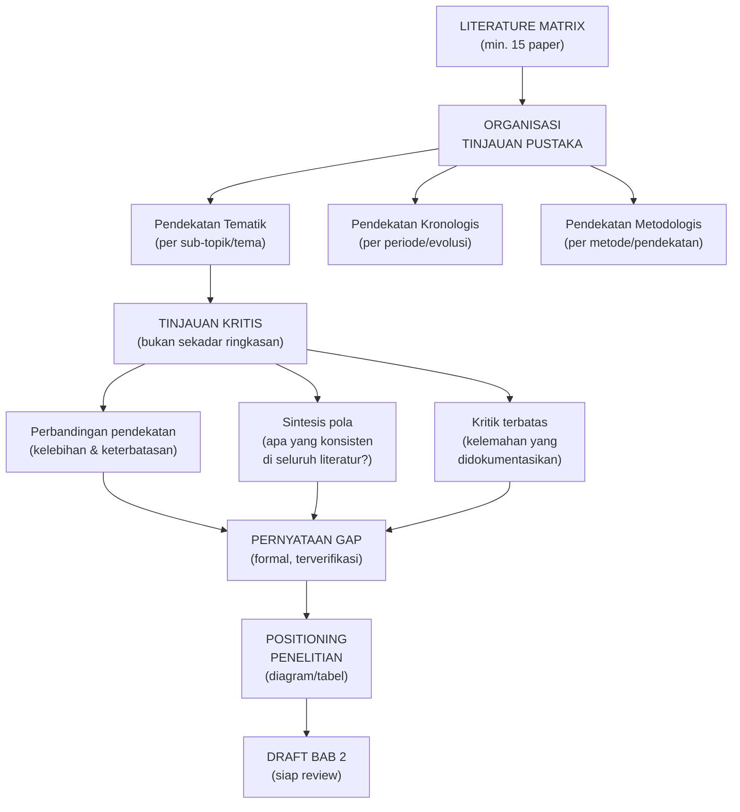
```mermaid
flowchart TD
    LitMatrix3["LITERATURE MATRIX\n(min. 15 paper)"] --> Organization["ORGANISASI\nTINJAUAN PUSTAKA"]
    Organization --> Thematic["Pendekatan Tematik\n(per sub-topik/tema)"]
    Organization --> Chronological["Pendekatan Kronologis\n(per periode/evolusi)"]
    Organization --> Methodological["Pendekatan Metodologis\n(per metode/pendekatan)"]
    Thematic --> CriticalReview["TINJAUAN KRITIS\n(bukan sekadar ringkasan)"]
    CriticalReview --> Compare["Perbandingan pendekatan\n(kelebihan & keterbatasan)"]
    CriticalReview --> Synthesize["Sintesis pola\n(apa yang konsisten\ndi seluruh literatur?)"]
    CriticalReview --> Critique["Kritik terbatas\n(kelemahan yang\ndidokumentasikan)"]
    Compare & Synthesize & Critique --> GapStatement["PERNYATAAN GAP\n(formal, terverifikasi)"]
    GapStatement --> PositioningDiagram["POSITIONING\nPENELITIAN\n(diagram/tabel)"]
    PositioningDiagram --> Draft_Bab2["DRAFT BAB 2\n(siap review)"]
```

---

### 3. Pengantar Kontekstual

Tinjauan pustaka yang buruk adalah salah satu kelemahan paling umum dalam proposal dan tesis. Dua kesalahan yang paling sering ditemukan: (1) *Annotated bibliography* yang bersembunyi sebagai tinjauan pustaka — hanya merangkum paper satu per satu tanpa analisis; dan (2) *Tinjauan yang tidak kritis* — memuji semua penelitian tanpa mengidentifikasi keterbatasan. Penguji yang berpengalaman akan langsung mendeteksi keduanya.

Tinjauan pustaka yang baik adalah esai akademik yang berargumen — ia membangun kasus bahwa penelitian yang ada memiliki gap tertentu yang penelitian Anda akan isi.

---

### 4. Landasan Teori

#### 4.1 Organisasi Tinjauan Pustaka

**Pendekatan Tematik (direkomendasikan untuk proposal):**
Organisasi berdasarkan tema/sub-topik, bukan per paper. Dalam satu paragraf, Anda bisa membahas beberapa paper yang memiliki pendekatan serupa.

Contoh struktur tematik untuk topik IDS-IIoT:
- 2.1 Industrial IoT: Arsitektur dan Keamanan (konsep dasar)
- 2.2 Pendekatan Berbasis Signature untuk IDS pada IIoT (sub-tema 1)
- 2.3 Pendekatan Berbasis Machine Learning untuk Anomaly Detection (sub-tema 2)
  - 2.3.1 Metode Klasik: SVM, Random Forest
  - 2.3.2 Deep Learning: CNN, LSTM, Autoencoder
  - 2.3.3 Evaluasi dan Perbandingan: Dataset dan Metrik
- 2.4 State-of-the-Art IDS untuk Industrial IoT
- 2.5 Identifikasi Research Gap
- 2.6 Posisi Penelitian

**Pendekatan Kronologis:**
Berguna untuk menunjukkan evolusi bidang riset. Cocok jika ada perkembangan yang signifikan dari waktu ke waktu.

#### 4.2 Tinjauan Kritis vs. Annotated Bibliography

**Annotated Bibliography (DIHINDARI):**
"Smith et al. (2022) mengusulkan metode X untuk mendeteksi anomali pada IoT. Metode ini menggunakan dataset Y dan mencapai akurasi Z%. Jones et al. (2023) mengusulkan metode A untuk masalah yang sama. Metode A menggunakan dataset B dan mencapai akurasi C%..."

**Tinjauan Kritis (YANG SEHARUSNYA):**
"Berbagai pendekatan berbasis machine learning telah diusulkan untuk deteksi anomali pada jaringan IoT. Pendekatan berbasis Random Forest (Smith et al., 2022; Kumar et al., 2023; Li & Chen, 2021) secara konsisten menunjukkan akurasi tinggi (>95%) pada dataset benchmark standard, namun dengan kelemahan bersama: ketergantungan pada feature engineering manual yang memerlukan keahlian domain, dan evaluasi yang terbatas pada kondisi traffic yang seimbang. Sementara itu, pendekatan berbasis deep learning — khususnya LSTM (Jones et al., 2023; Wang et al., 2022) dan CNN (Park et al., 2021) — menunjukkan kemampuan yang lebih baik dalam menangani temporal dependency dalam traffic data, meskipun dengan overhead komputasi yang lebih tinggi yang dapat menjadi kendala dalam lingkungan IIoT dengan resource terbatas."

Perhatikan perbedaan: versi kedua membandingkan, mensintesis pola, dan mengidentifikasi keterbatasan bersama.

#### 4.3 Tabel Perbandingan sebagai Alat Analisis

Tabel perbandingan dalam tinjauan pustaka sangat efektif untuk:
- Menunjukkan secara visual perbedaan antar pendekatan
- Memudahkan pembaca melihat pola dan gap
- Membuktikan bahwa Anda telah melakukan tinjauan yang komprehensif

**Format Tabel Perbandingan:**

| Paper | Metode | Dataset | Metrik Evaluasi | Hasil | Keterbatasan |
|---|---|---|---|---|---|
| Smith (2022) | Random Forest | KDD Cup 99 | Accuracy | 97.5% | Dataset 25 tahun lalu |
| Jones (2023) | LSTM | CIC-IDS2018 | F1 | 98.1% | Bukan IIoT spesifik |
| Park (2021) | CNN | Kustom (ICS lab) | F1, FPR | 96.8% | Dataset kecil (500 sampel) |
| **Penelitian Ini** | LSTM + attn. | MQTTset | F1, Latency | TBD | — |

#### 4.4 Kutipan dalam Tinjauan Pustaka

**Mengutip untuk mendukung klaim:**
"Serangan pada sistem ICS meningkat 200% antara 2020-2023 (Dragos, 2024)."

**Mengutip sumber primer vs. sekunder:**
Utamakan mengutip sumber primer (paper asli) bukan mengutip seseorang yang mengutip orang lain. Gunakan "sebagaimana dikutip dalam" hanya jika sumber primer benar-benar tidak dapat diakses.

**Etika mengkritik penelitian lain:**
- Kritik harus berbasis metodologis, bukan serangan personal
- "Keterbatasan yang diakui oleh penulis sendiri" adalah kritik yang paling aman
- Jika Anda mengidentifikasi kelemahan yang tidak diakui penulis, dukung dengan argumen yang kuat
- Tidak mengkritik untuk tujuan meninggikan penelitian Anda sendiri secara tidak fair

---

### 5. Model atau Arsitektur

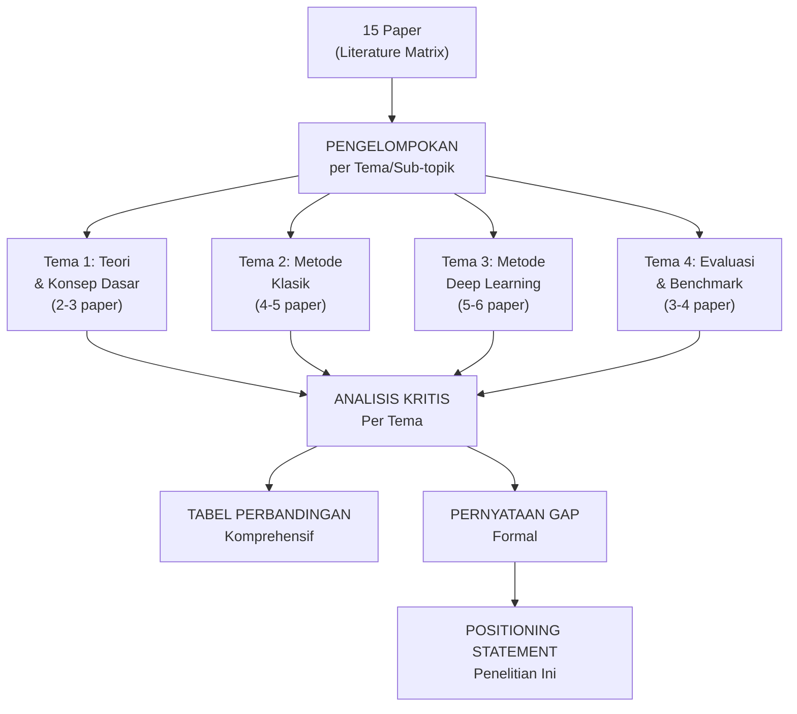
```mermaid
flowchart TD
    Papers["15 Paper\n(Literature Matrix)"] --> Grouping["PENGELOMPOKAN\nper Tema/Sub-topik"]
    Grouping --> Theme1["Tema 1: Teori\n& Konsep Dasar\n(2-3 paper)"]
    Grouping --> Theme2["Tema 2: Metode\nKlasik\n(4-5 paper)"]
    Grouping --> Theme3["Tema 3: Metode\nDeep Learning\n(5-6 paper)"]
    Grouping --> Theme4["Tema 4: Evaluasi\n& Benchmark\n(3-4 paper)"]
    Theme1 & Theme2 & Theme3 & Theme4 --> CriticalAnalysis["ANALISIS KRITIS\nPer Tema"]
    CriticalAnalysis --> SynthesisTable["TABEL PERBANDINGAN\nKomprehensif"]
    CriticalAnalysis --> GapStatementFormal["PERNYATAAN GAP\nFormal"]
    GapStatementFormal --> PositioningStatement["POSITIONING STATEMENT\nPenelitian Ini"]
```

---

### 6. Contoh Terapan

**Paragraf Tinjauan Kritis untuk Topik Rina (IDS-IIoT):**

"Dalam konteks deteksi anomali pada jaringan IIoT, dua aliran penelitian utama telah berkembang dalam lima tahun terakhir. Aliran pertama menggunakan pendekatan berbasis metode machine learning klasik. Pendekatan Random Forest yang diusulkan oleh Kumar et al. (2021) dan direplikasi dengan variasi oleh Li & Zhang (2022) menunjukkan akurasi yang konsisten di atas 96% pada dataset CIC-IDS2018. Namun, kedua penelitian ini menggunakan dataset yang bukan dirancang khusus untuk traffic IIoT — CIC-IDS2018 menggambarkan traffic jaringan enterprise umum, bukan protokol industri seperti MQTT atau Modbus. Konsekuensinya, seperti yang diakui Kumar et al. (2021) sendiri, 'generalisability of findings to OT network environments remains uncertain' (hal. 9).

Aliran kedua, yang menggunakan pendekatan deep learning, menawarkan kemampuan yang lebih kuat dalam menangkap dependensi temporal dalam traffic data jaringan. Wang et al. (2022) mengusulkan model LSTM dua lapisan untuk deteksi anomali pada traffic SCADA, mencapai F1-score 97.8%. Meskipun ini merupakan peningkatan signifikan dibanding baseline SVM dalam studi yang sama (+3.2% F1), pendekatan ini dievaluasi pada dataset yang dikumpulkan dari lingkungan lab yang terkontrol dengan hanya 5 tipe serangan — jauh dari keragaman serangan yang ditemukan di lingkungan produksi IIoT nyata. Park et al. (2023) mencoba mengatasi keterbatasan ini dengan menggunakan dataset yang lebih beragam, namun pendekatan berbasis CNN mereka tidak mempertimbangkan batasan latensi yang kritis dalam konteks real-time IIoT processing.

Secara keseluruhan, analisis terhadap 18 paper yang teridentifikasi menunjukkan bahwa meskipun ML dan deep learning menjanjikan untuk IDS pada IIoT, terdapat gap yang konsisten dalam hal: (1) kurangnya dataset yang representatif untuk protokol MQTT spesifik; (2) tidak adanya evaluasi latensi inferensi dalam konteks real-time IIoT; dan (3) tidak ada penelitian yang membandingkan LSTM dan Random Forest secara fair pada dataset yang sama untuk konteks MQTT IIoT. Gap ini menjadi dasar penelitian yang diusulkan."

---

### 7. Praktikum atau Aktivitas Terarah

**Judul:** Workshop Penulisan Tinjauan Pustaka

**Langkah Kerja:**

1. (15 menit) Kelompokkan 15 paper dalam literature matrix ke 3-4 tema tematik.
2. (60 menit) Tulis 2-3 paragraf tinjauan kritis untuk 1-2 tema. Fokus pada: perbandingan, sintesis, dan identifikasi pola keterbatasan.
3. (30 menit) Buat tabel perbandingan dari 10 paper yang paling relevan.
4. (20 menit) Tulis pernyataan gap formal dan positioning statement.
5. (Peer review, 20 menit) Apakah tinjauan ini kritis atau hanya annotated bibliography? Berikan feedback konkret.

---

### 8–12. Latihan, Jawaban, Ringkasan, Refleksi

**Latihan:**

Soal 1: Identifikasi jenis tinjauan (kritis atau annotated bibliography) dari contoh berikut: "Penelitian Ahmad (2022) menggunakan BERT untuk klasifikasi malware dan mencapai 98% accuracy. Penelitian Lee (2023) menggunakan GPT-2 untuk tugas yang sama dan mencapai 97.5% accuracy."

Soal 2: Anda menemukan sebuah paper yang klaim metodologinya tampak lemah (menggunakan dataset yang sangat kecil, 200 sampel). Bagaimana cara yang tepat untuk mengkritik paper ini dalam tinjauan pustaka Anda?

Soal 3: Mengapa pengorganisasian per tema (tematik) lebih direkomendasikan dibanding per paper (annotated bibliography) untuk tinjauan pustaka level magister?

**Kunci Jawaban:**

Soal 1: Ini adalah annotated bibliography. Tidak ada perbandingan, sintesis, atau analisis mengapa keduanya berbeda atau apa artinya perbedaan 0.5% tersebut. Tidak ada identifikasi keterbatasan. Versi kritis: "Pendekatan berbasis language model besar — BERT (Ahmad, 2022) dan GPT-2 (Lee, 2023) — menunjukkan performa tinggi (>97%) untuk klasifikasi malware berbasis teks. Perbedaan performa yang marginal (0.5%) antara keduanya menunjukkan bahwa pada skala ini, pilihan arsitektur mungkin kurang signifikan dibanding kualitas dataset. Namun, keduanya mengevaluasi hanya pada dataset berbahasa Inggris dan tidak mengeksplorasi efisiensi komputasi yang kritikal untuk deployment dalam sistem real-time."

Soal 2: Cara yang etis dan tepat: (a) sebutkan faktanya (dataset 200 sampel) sebagai fakta, bukan sebagai serangan; (b) jelaskan implikasinya ("generalisability dari temuan ini terbatas mengingat ukuran sampel yang kecil"); (c) jika penulis mengakui sendiri, kutip akuannya; (d) gunakan sebagai kontribusi gap: "penelitian ini memerlukan validasi pada dataset yang lebih besar dan lebih beragam." Hindari: "penelitian ini lemah dan tidak dapat dipercaya."

Soal 3: Pengorganisasian tematik superior karena: (a) memaksa sintesis — Anda harus melihat kesamaan dan perbedaan antar paper; (b) membangun argumen, bukan sekadar daftar; (c) menunjukkan pemahaman terhadap bidang riset, bukan hanya kemampuan merangkum; (d) lebih efisien — 3 paper dengan pendekatan serupa dibahas dalam satu paragraf; (e) langsung menghubungkan ke gap — pola yang muncul dari beberapa paper sekaligus membuktikan gap lebih kuat dari satu paper saja.

**Ringkasan:** Bab 2 yang baik adalah esai akademik yang berargumen, bukan daftar annotated bibliography. Organisasi tematik memungkinkan analisis komparatif yang mengidentifikasi pola keterbatasan bersama lintas penelitian — dan dari pola itulah gap yang paling meyakinkan muncul. Tabel perbandingan adalah alat visual yang efektif untuk mendukung klaim Anda. Pernyataan gap dan positioning statement yang lahir dari analisis ini adalah jembatan dari Bab 2 ke Bab 3.

**Refleksi:** (1) Apakah ada risiko bahwa tinjauan pustaka yang sangat kritis terhadap penelitian orang lain dapat merugikan Anda jika penguji adalah salah satu penulis yang Anda kritik? Bagaimana Anda menjaga keseimbangan? (2) Dalam bidang yang berkembang sangat cepat seperti AI/ML for security, berapa lama tinjauan pustaka Anda tetap "terkini"? Bagaimana Anda merencanakan update tinjauan saat menulis tesis final?

---

## Bab 8 — Presentasi Progress dan Merespons Kritik Akademik

### 1. Capaian Pembelajaran Bab

Setelah menyelesaikan bab ini, mahasiswa mampu:
- Menyusun presentasi progress proposal yang efektif dan terstruktur (C3)
- Mengidentifikasi jenis-jenis kritik akademik yang mungkin diterima dari reviewer (C4)
- Merespons kritik akademik secara profesional, terbuka, dan berbasis argumen (C5)
- Menyusun rencana revisi yang terstruktur berdasarkan feedback yang diterima (C3)

*Dikaitkan dengan Sub-CPMK.4 (Pertemuan 8) dan Eval-3 (10%).*

---

### 2. Peta Konsep Bab

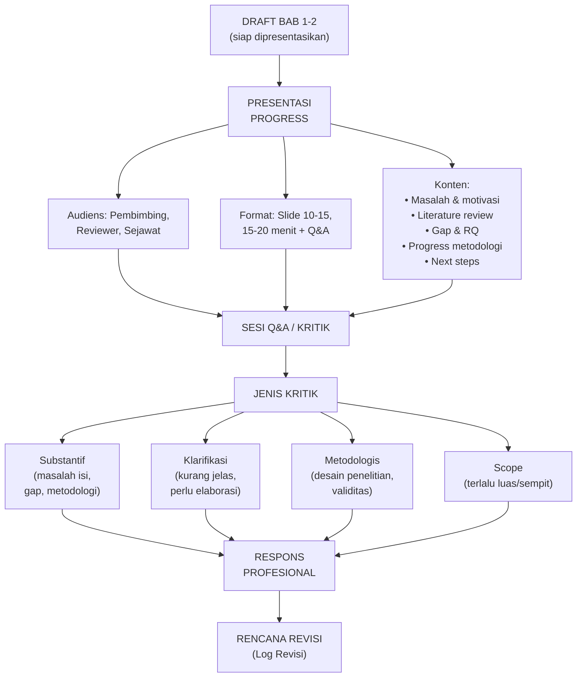
```mermaid
flowchart TD
    DraftProposal["DRAFT BAB 1-2\n(siap dipresentasikan)"] --> ProgressPresentation["PRESENTASI\nPROGRESS"]
    ProgressPresentation --> Audience2["Audiens: Pembimbing,\nReviewer, Sejawat"] 
    ProgressPresentation --> Format["Format: Slide 10-15,\n15-20 menit + Q&A"]
    ProgressPresentation --> Content["Konten:\n• Masalah & motivasi\n• Literature review\n• Gap & RQ\n• Progress metodologi\n• Next steps"]
    Audience2 & Format & Content --> QASession2["SESI Q&A / KRITIK"]
    QASession2 --> CritiquesTypes["JENIS KRITIK"]
    CritiquesTypes --> SubstantiveCrit["Substantif\n(masalah isi,\ngap, metodologi)"]
    CritiquesTypes --> ClarificationCrit["Klarifikasi\n(kurang jelas,\nperlu elaborasi)"]
    CritiquesTypes --> MethodCrit["Metodologis\n(desain penelitian,\nvaliditas)"]
    CritiquesTypes --> ScopeCrit["Scope\n(terlalu luas/sempit)"]
    SubstantiveCrit & ClarificationCrit & MethodCrit & ScopeCrit --> Response["RESPONS\nPROFESIONAL"]
    Response --> RevisionPlan["RENCANA REVISI\n(Log Revisi)"]
```

---

### 3. Pengantar Kontekstual

Kemampuan merespons kritik akademik adalah salah satu kompetensi paling penting yang akan Anda butuhkan sepanjang karier akademik dan profesional Anda. Bagaimana Anda bereaksi ketika penguji mempertanyakan asumsi fundamental penelitian Anda, atau ketika reviewer menyarankan perubahan besar yang terasa mengancam seluruh arah tesis? Respons yang defensif, agresif, atau sebaliknya terlalu mudah menyerah pada tekanan, keduanya merusak kredibilitas akademik Anda.

Review tengah semester (UTS) adalah latihan pertama dalam situasi yang relatif "aman" — reviewer adalah dosen dan sejawat, bukan penguji eksternal. Gunakan kesempatan ini untuk belajar merespons kritik dengan tenang, terbuka, dan berbasis argumentasi.

---

### 4. Landasan Teori

#### 4.1 Struktur Presentasi Progress

**Slide 1 — Judul:**
Judul tesis (sementara), nama, NIM, pembimbing, tanggal.

**Slide 2 — Motivasi dan Masalah (2-3 menit):**
Mengapa masalah ini penting? (1-2 fakta kuat dari latar belakang). Apa masalah spesifik yang belum terpecahkan? Pernyataan gap singkat.

**Slide 3 — Research Question:**
RQ Utama dan Sub-RQ. Harus dapat dibaca dan dipahami dalam 30 detik.

**Slide 4-5 — State-of-the-Art (3-4 menit):**
Tabel perbandingan dari literature matrix. Highlight keterbatasan yang menjadi justifikasi gap.

**Slide 6 — Positioning Penelitian:**
Diagram atau tabel yang menunjukkan di mana penelitian ini berada.

**Slide 7-8 — Progress Metodologi (3-4 menit):**
Apa yang sudah direncanakan. Arsitektur awal (jika sudah ada). Dataset yang akan digunakan.

**Slide 9 — Rencana ke Depan:**
Timeline (Gantt chart sederhana). Apa yang akan dikerjakan setelah review ini.

**Slide 10 — Daftar Pertanyaan yang Diantisipasi (opsional):**
Menunjukkan bahwa Anda sudah berpikir kritis tentang proposal sendiri.

#### 4.2 Jenis Kritik dan Cara Merespons

**Kritik Klarifikasi:**
"Saya tidak mengerti apa yang Anda maksud dengan 'model LSTM berbasis attention'. Bisa dijelaskan lebih spesifik?"
*Respons:* Jelaskan dengan tenang dan rinci. Jika pertanyaan ini mengindikasikan bahwa slide Anda kurang jelas, akui dan rencanakan perbaikan.

**Kritik Substantif (Gap):**
"Paper X yang terbit bulan lalu tampaknya sudah mengatasi gap yang Anda sebutkan. Bagaimana posisi penelitian Anda?"
*Respons:* "Terima kasih atas referensinya. Saya akan mempelajari Paper X tersebut segera. Jika memang sudah mengatasi gap tersebut, saya perlu meninjau ulang positioning atau menemukan sudut yang lebih spesifik. Izin untuk merespons lebih detail setelah saya review paper tersebut?"

**Kritik Metodologis:**
"Mengapa Anda memilih LSTM bukan Transformer yang lebih modern?"
*Respons:* Berikan justifikasi berbasis argumen: "LSTM dipilih karena (a) lebih efisien secara komputasi untuk deployment di perangkat edge IIoT dengan resource terbatas; (b) beberapa studi menunjukkan LSTM kompetitif dengan Transformer untuk sequence pendek seperti traffic monitoring intervals; (c) dalam scope tesis ini, perbandingan LSTM vs Transformer bisa menjadi future work. Namun, jika Bapak/Ibu menyarankan, saya bisa mempertimbangkan menambahkan Transformer sebagai baseline tambahan."

**Kritik Scope:**
"Penelitian Anda terlalu luas — MQTT saja sudah banyak variasi, dan Anda ingin cover semua jenis serangan?"
*Respons:* "Poin yang sangat valid. Saya akan membatasi scope ke 5 jenis serangan yang paling relevan berdasarkan MITRE ATT&CK for ICS, dan fokus pada protokol MQTT 3.1.1. Saya akan memperbarui batasan penelitian di Bab 1."

**Teknik Umum Merespons:**
1. *Dengarkan dengan lengkap* — jangan menyela atau mulai defensif sebelum kritik selesai
2. *Acknowledge* — "Terima kasih atas pertanyaan/masukannya." (Bukan berlebihan — tulus)
3. *Klarifikasi jika perlu* — "Untuk memastikan saya memahami dengan benar, yang Bapak/Ibu maksud adalah...?"
4. *Respons berbasis argumen* — dukung dengan referensi jika mungkin
5. *Akui ketika valid* — jika kritik valid, akui dan nyatakan rencana revisi
6. *Tandai untuk follow-up* — jika tidak bisa dijawab segera, catat dan follow-up setelah diskusi

#### 4.3 Log Revisi (Revision Log)

Setelah setiap sesi review, buat log revisi yang mendokumentasikan:
- Tanggal dan nama reviewer
- Kritik/masukan yang diterima
- Respons Anda (setuju/tidak setuju/perlu investigasi)
- Tindakan yang akan diambil
- Status (done/in progress/rejected with reason)

Log revisi ini adalah dokumentasi academic accountability yang penting — menunjukkan bahwa Anda serius menanggapi feedback.

---

### 5. Model atau Arsitektur

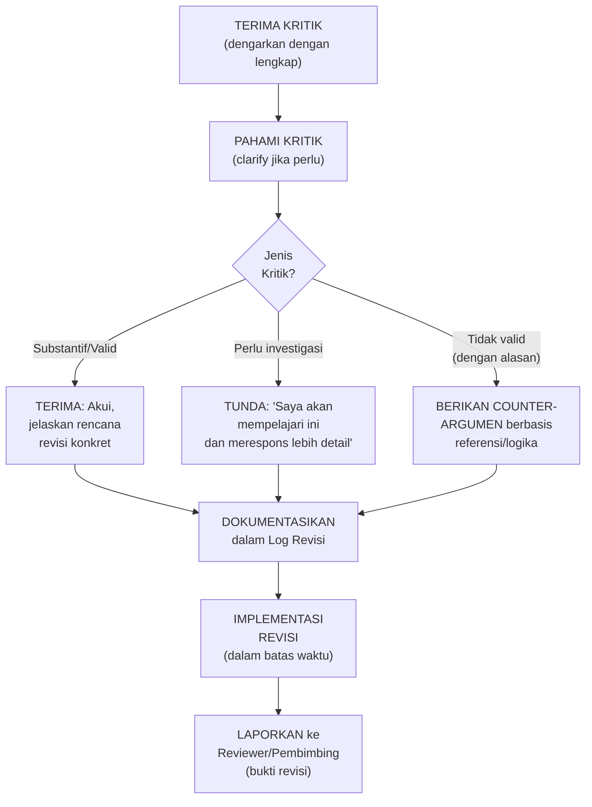
```mermaid
flowchart TD
    Receive["TERIMA KRITIK\n(dengarkan dengan lengkap)"] --> Understand["PAHAMI KRITIK\n(clarify jika perlu)"]
    Understand --> Assess{"Jenis\nKritik?"}
    Assess -->|"Substantif/Valid"| Accept["TERIMA: Akui,\njelaskan rencana\nrevisi konkret"]
    Assess -->|"Perlu investigasi"| Investigate["TUNDA: 'Saya akan\nmempelajari ini\ndan merespons lebih detail'"]
    Assess -->|"Tidak valid\n(dengan alasan)"| CounterArgue["BERIKAN COUNTER-\nARGUMEN berbasis\nreferensi/logika"]
    Accept & Investigate & CounterArgue --> LogRevisi["DOKUMENTASIKAN\ndalam Log Revisi"]
    LogRevisi --> ImplementRevision["IMPLEMENTASI\nREVISI\n(dalam batas waktu)"]
    ImplementRevision --> ReportBack["LAPORKAN ke\nReviewer/Pembimbing\n(bukti revisi)"]
```

---

### 6. Contoh Terapan

**Skenario: Review Progress Proposal Sari (CTI + NLP)**

*Reviewer:* "Sari, saya melihat di tinjauan Anda bahwa semua paper yang Anda review menggunakan data bahasa Inggris. Anda menyebut bahwa Anda akan mengevaluasi ancaman terhadap sektor keuangan Indonesia. Bagaimana Anda memastikan bahwa model NLP Anda dapat bekerja pada konten berbahasa Indonesia atau melayu yang mungkin ada di forum dark web?"

*Respons yang kurang baik:* "Sebenarnya, ancaman siber kan menggunakan bahasa Inggris, jadi tidak masalah."

*Respons yang lebih baik:* "Terima kasih atas pertanyaan yang sangat tepat ini. Anda menyentuh salah satu keterbatasan yang memang saya perlu alamkan dengan lebih jelas. Sebenarnya, saya merencanakan dua skenario: pertama, fokus pada forum dark web anglophone yang membahas ancaman terhadap target Indonesia; kedua, jika ada akses ke forum berbahasa melayu/Indonesia, menggunakan pendekatan cross-lingual embedding atau model multilingual seperti mBERT yang sudah mendukung Bahasa Indonesia. Namun Bapak/Ibu benar bahwa ini belum cukup eksplisit dalam proposal saya. Saya akan menambahkan klarifikasi ini sebagai batasan penelitian dan menjelaskan strategi mitigasinya di Bab 3. Apakah ada saran spesifik tentang cara mengatasi tantangan bahasa ini?"

---

### 7. Praktikum atau Aktivitas Terarah

**Judul:** Simulasi Review Progress

**Langkah Kerja:**

1. (30 menit persiapan) Siapkan presentasi 10-slide dari draft Bab 1 dan Bab 2.
2. (20 menit presentasi) Setiap mahasiswa mempresentasikan di depan kelompok kecil (4-5 orang).
3. (15 menit Q&A) Reviewer (teman dan dosen) mengajukan 5 pertanyaan/kritik berdasarkan checklist yang diberikan dosen.
4. (10 menit refleksi) Mahasiswa mengisi log revisi segera setelah Q&A.

---

### 8–12. Latihan, Jawaban, Ringkasan, Refleksi

**Latihan:**

Soal 1: Seorang reviewer berkata: "Saya tidak yakin gap yang Anda identifikasi benar-benar gap. Sudah banyak penelitian tentang ini." Bagaimana Anda merespons secara profesional?

Soal 2: Mengapa mencatat semua kritik dalam log revisi (bahkan kritik yang Anda tidak setujui) adalah praktik akademik yang baik?

Soal 3: Apa perbedaan antara bersikap defensif dan bersikap kritis dalam merespons kritik penelitian?

**Kunci Jawaban:**

Soal 1: Respons yang tepat: "Terima kasih atas masukan yang sangat penting ini. Saya ingin memastikan saya memahami dengan tepat — apakah Bapak/Ibu memiliki referensi spesifik yang sudah mengatasi gap ini? Saya sangat ingin mempelajarinya untuk memperbarui positioning saya. Dari 18 paper yang sudah saya review, gap spesifik yang saya identifikasi adalah [sebutkan spesifik] — tetapi saya mungkin ada paper yang terlewat. Boleh saya konfirmasi setelah mempelajari referensi tambahan?" — Pendekatan ini: tidak defensif, membuka dialog, menunjukkan kesiapan untuk belajar, mempertahankan posisi berbasis bukti.

Soal 2: Mencatat kritik yang tidak disetujui penting karena: (a) menunjukkan bahwa Anda mempertimbangkan semua masukan dengan serius; (b) jika di kemudian hari ternyata kritik tersebut valid, ada dokumentasi bahwa Anda pernah mempertimbangkannya; (c) mencatat counter-argument Anda membantu klarifikasi pemikiran; (d) pembimbing/reviewer dapat melihat proses berpikir Anda, bukan hanya hasil akhir; (e) untuk keperluan audit akademik — log revisi adalah bukti due diligence.

Soal 3: Defensif: menolak kritik karena terasa mengancam tanpa mempertimbangkan substansinya; merespons dengan emosi bukan argumen; tidak mau mengakui keterbatasan.
Kritis: mengevaluasi kritik berdasarkan substansinya; meminta klarifikasi jika perlu; memberikan counter-argumen yang didukung evidence; mengakui ketika kritik valid; mempertahankan posisi dengan argumen yang kuat ketika tidak setuju.

**Ringkasan:** Presentasi progress adalah oportunitas untuk mendapatkan feedback konstruktif yang memperkuat proposal sebelum seminar formal. Persiapan yang matang — slide yang terstruktur, antisipasi pertanyaan — dan respons yang profesional — berbasis argumen, terbuka terhadap masukan — adalah kompetensi yang membedakan peneliti yang berkembang dari yang stagnant. Log revisi adalah dokumentasi academic accountability yang penting.

**Refleksi:** (1) Apakah ada perbedaan dalam cara Anda merespons kritik dari pembimbing (yang memiliki otoritas atas kelulusan Anda) versus kritik dari reviewer sejawat? Bagaimana Anda memastikan bahwa respons Anda tetap objektif dan tidak dipengaruhi oleh dinamika kekuasaan? (2) Bagaimana Anda menangani situasi di mana dua reviewer memberikan saran yang saling bertentangan?

---

## Bab 9 — UTS: Review Tengah Semester — Kasus Integratif

### 1. Capaian Pembelajaran Bab

Bab ini berfungsi sebagai evaluasi integratif tengah semester yang mengintegrasikan kompetensi Sub-CPMK.1 hingga Sub-CPMK.4 (Pertemuan 1-9). Mahasiswa mendemonstrasikan kemampuan:
- Mengintegrasikan peta riset, literature scanning, gap analysis, RQ, draft Bab 1-2, dan rencana revisi ke dalam satu dokumen proposal yang koheren (C6)
- Mempertahankan proposal di hadapan reviewer dengan argumentasi yang kuat (C5)

*Dikaitkan dengan Sub-CPMK.4 (Pertemuan 9) dan Eval-3 (10% — Review Tengah Semester).*

---

### 2. Peta Konsep Bab

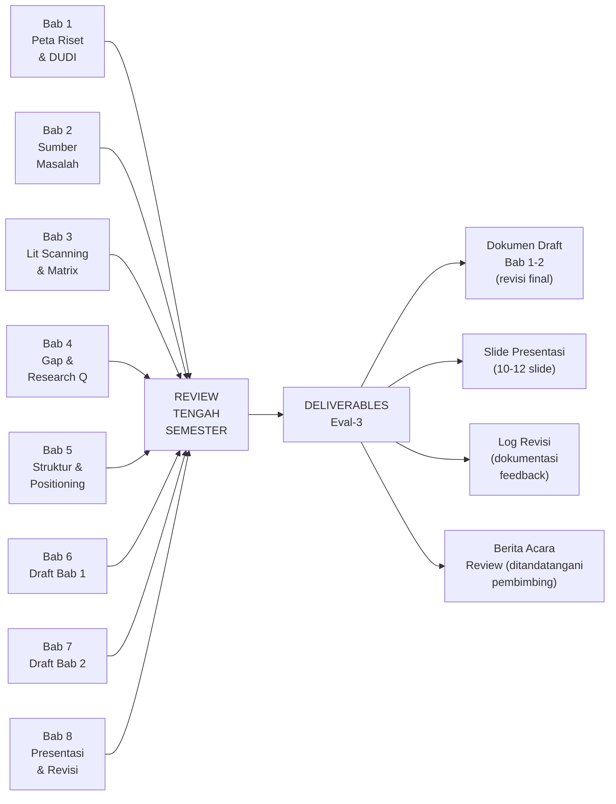
```mermaid
flowchart LR
    Bab1C["Bab 1\nPeta Riset\n& DUDI"] --> UTS["REVIEW\nTENGAH\nSEMESTER"]
    Bab2C["Bab 2\nSumber\nMasalah"] --> UTS
    Bab3C["Bab 3\nLit Scanning\n& Matrix"] --> UTS
    Bab4C["Bab 4\nGap &\nResearch Q"] --> UTS
    Bab5C["Bab 5\nStruktur &\nPositioning"] --> UTS
    Bab6C["Bab 6\nDraft Bab 1"] --> UTS
    Bab7C["Bab 7\nDraft Bab 2"] --> UTS
    Bab8C["Bab 8\nPresentasi\n& Revisi"] --> UTS
    UTS --> UTSDeliverables["DELIVERABLES\nEval-3"]
    UTSDeliverables --> D1["Dokumen Draft\nBab 1-2\n(revisi final)"]
    UTSDeliverables --> D2["Slide Presentasi\n(10-12 slide)"]
    UTSDeliverables --> D3["Log Revisi\n(dokumentasi\nfeedback)"]
    UTSDeliverables --> D4["Berita Acara\nReview (ditandatangani\npembimbing)"]
```

---

### 3. Pengantar Kontekstual

Review tengah semester adalah checkpoint penting dalam perjalanan penyusunan proposal. Ini bukan sekadar ujian — ini adalah simulasi seminar proposal dalam skala yang lebih kecil dan lebih suportif. Tujuannya adalah memastikan bahwa mahasiswa berada di jalur yang benar sebelum memasuki fase metodologi yang lebih kompleks.

---

### 4. Checklist Kesiapan Review Tengah Semester

Sebelum review tengah semester, verifikasi:

**Dokumentasi:**
- [ ] Draft Bab 1 lengkap (Pendahuluan): latar belakang, rumusan masalah, tujuan, manfaat, kontribusi, batasan
- [ ] Draft Bab 2 lengkap (Tinjauan Pustaka): kajian teori, state-of-the-art, gap analysis, positioning
- [ ] Literature matrix dengan minimal 15 paper, semua kolom terisi
- [ ] Pernyataan gap yang terverifikasi dari literatur
- [ ] Research question (RQ utama + 2-3 sub-RQ) yang SMART

**Presentasi:**
- [ ] Slide 10-12, terstruktur sesuai panduan Bab 8
- [ ] Setiap klaim visual dapat dibuktikan dari dokumen

**Kesiapan Argumentasi:**
- [ ] Dapat menjelaskan mengapa topik ini penting (dengan data/referensi)
- [ ] Dapat menjelaskan apa yang sudah ada dan apa yang belum (state-of-the-art dan gap)
- [ ] Dapat mempertahankan pilihan RQ dengan argumen yang kuat
- [ ] Dapat menjelaskan rencana metodologi awal (meskipun belum final)

---

### 5. Kasus Integratif UTS

**Kasus: Evaluasi Proposal Awal**

Seorang mahasiswa, Dimas Pratama, menyerahkan draft Bab 1-2 dengan topik: "Implementasi Zero Trust Architecture pada infrastruktur cloud perusahaan manufaktur Indonesia."

**Informasi yang tersedia:**
- Bab 1 memiliki latar belakang 4 halaman yang komprehensif tentang tren Zero Trust
- Rumusan masalah: "Bagaimana cara mengimplementasikan Zero Trust Architecture secara efektif?"
- Tujuan: "Mengembangkan panduan implementasi Zero Trust untuk perusahaan manufaktur"
- Bab 2 berisi 20 referensi, tetapi 12 di antaranya adalah blog post dan artikel teknis (bukan peer-reviewed), dan 5 adalah paper sebelum tahun 2018
- Gap yang diklaim: "Belum ada panduan implementasi Zero Trust yang spesifik untuk perusahaan manufaktur Indonesia"
- Literature matrix: tidak ada (paper dibahas secara naratif per paper)

**Pertanyaan UTS:**

1. (25 poin) Identifikasi minimal 5 kelemahan dalam proposal Dimas menggunakan kriteria yang telah dipelajari di Bab 1-8. Untuk setiap kelemahan, (a) sebutkan kelemahan, (b) standar yang dilanggar, (c) saran perbaikan.

2. (25 poin) Evaluasi apakah gap yang diklaim Dimas merupakan research gap yang valid berdasarkan informasi yang tersedia. Jelaskan menggunakan konsep dari Bab 4.

3. (25 poin) Reformulasi rumusan masalah dan tujuan penelitian Dimas agar lebih spesifik, terukur, dan konsisten satu sama lain. Jelaskan pilihan Anda.

4. (25 poin) Sebagai reviewer, tuliskan 3 pertanyaan kritis yang akan Anda ajukan kepada Dimas dalam sesi Q&A review tengah semester, dan berikan contoh respons yang diharapkan.

---

### 6. Kunci Jawaban Kasus Integratif UTS

**Jawaban Pertanyaan 1 (Identifikasi 5 Kelemahan):**

1. *Kelemahan: Referensi tidak memenuhi standar akademik (12 blog post)*
Standar yang dilanggar: Tinjauan pustaka level magister harus berbasis peer-reviewed journal dan conference proceedings; blog post bukan sumber yang dapat diverifikasi oleh orang lain.
Saran: Ganti 12 blog post dengan paper peer-reviewed yang membahas Zero Trust dari database Scopus/IEEE Xplore.

2. *Kelemahan: 5 paper sebelum 2018 untuk topik yang berkembang sangat cepat*
Standar: State-of-the-art harus mencerminkan perkembangan 5 tahun terakhir; Zero Trust sebagai konsep implementasi praktis berkembang sangat pesat 2018-sekarang.
Saran: Pertahankan sebagai referensi historis/foundational, tetapi tambah paper 2020-2024.

3. *Kelemahan: Rumusan masalah terlalu luas dan tidak terukur*
Standar: Rumusan masalah harus SMART; "secara efektif" tidak memiliki definisi operasional yang terukur.
Saran: Perjelas: "Bagaimana framework implementasi Zero Trust Architecture (ZTA) yang sesuai untuk infrastruktur cloud-hybrid perusahaan manufaktur menengah Indonesia dapat dikembangkan dan divalidasi, dengan mengukur efektivitas melalui penurunan attack surface dan waktu deteksi lateral movement?"

4. *Kelemahan: Tidak ada literature matrix*
Standar: Literature matrix adalah alat analisis yang wajib ada untuk membuktikan komprehensi tinjauan dan mendukung gap analysis.
Saran: Buat literature matrix untuk semua paper peer-reviewed yang digunakan.

5. *Kelemahan: Gap diklaim tanpa verifikasi dari literatur*
Standar: Gap harus terverifikasi — harus dapat ditunjukkan dari paper mana gap ini diidentifikasi.
Saran: Lakukan gap analysis formal dengan menganalisis kolom "keterbatasan" dari literature matrix dan menyebutkan paper-paper spesifik yang mengakui gap yang diklaim.

**Jawaban Pertanyaan 2 (Evaluasi Gap):**

Gap "belum ada panduan implementasi Zero Trust yang spesifik untuk perusahaan manufaktur Indonesia" perlu dievaluasi berdasarkan kriteria:
- Terverifikasi? BELUM — tidak ada referensi yang menunjukkan paper mana yang mengakui gap ini.
- Spesifik? Cukup, tetapi perlu perjelas: "panduan implementasi" dalam bentuk apa? Framework? Metodologi? Prototype?
- Bermakna? Ya, jika dibuktikan bahwa perbedaan konteks manufaktur Indonesia signifikan.
- Dapat dijawab? Bergantung pada reformulasi — "mengembangkan panduan" tanpa metrik validasi sulit dijawab secara empiris.

Untuk membuat gap ini valid, Dimas harus: (a) menunjukkan dari paper-paper spesifik mana yang mengakui keterbatasan konteks ini; (b) menjelaskan mengapa konteks manufaktur Indonesia berbeda dari penelitian yang ada; (c) memperjelas bentuk kontribusinya.

**Jawaban Pertanyaan 3 (Reformulasi):**

Rumusan masalah yang diperbaiki:
"Bagaimana framework Zero Trust Architecture (ZTA) yang tervalidasi dapat dikembangkan untuk perusahaan manufaktur menengah Indonesia yang mengadopsi infrastruktur cloud-hybrid, dan seberapa efektif framework tersebut dalam mereduksi attack surface dibandingkan dengan arsitektur jaringan perimeter tradisional?"

Tujuan yang diperbaiki:
1. Mengembangkan framework ZTA adaptasi untuk konteks perusahaan manufaktur menengah Indonesia berbasis prinsip NIST SP 800-207 (Zero Trust Architecture).
2. Mengimplementasikan prototipe framework pada lingkungan simulasi yang merepresentasikan infrastruktur cloud-hybrid manufaktur.
3. Mengevaluasi efektivitas prototipe berdasarkan metrik: (a) jumlah attack vector yang tereliminasi dibanding arsitektur perimeter; (b) waktu deteksi lateral movement; (c) overhead latensi jaringan.

Konsistensi: rumusan masalah menanyakan "seberapa efektif" → tujuan #3 mengukur efektivitas dengan metrik spesifik.

**Jawaban Pertanyaan 4 (Pertanyaan Kritis untuk Q&A):**

Q1: "Anda menyebutkan konteks 'perusahaan manufaktur Indonesia' sebagai faktor pembeda. Apa yang secara spesifik berbeda antara konteks ini dengan penelitian ZTA yang sudah ada, sehingga justifikasi novelty ini kuat?"
Respons yang diharapkan: Menjelaskan karakteristik spesifik (misalnya: banyak mesin legacy OT yang tidak kompatibel dengan ZTA standar, keterbatasan bandwidth di lantai produksi, regulasi BSSN yang spesifik, dll.).

Q2: "Bagaimana Anda berencana memvalidasi framework yang dikembangkan? Siapa yang akan menggunakannya, dan bagaimana Anda mengukur apakah framework berhasil?"
Respons yang diharapkan: Menjelaskan metrik evaluasi yang konkret (attack surface reduction, latency overhead, dll.) dan metode validasi (simulasi, expert review, studi kasus).

Q3: "Diberikan bahwa Zero Trust adalah topik yang sangat aktif dengan banyak panduan yang sudah ada (NIST, Google BeyondCorp, Microsoft ZTA), bagaimana Anda memastikan bahwa framework Anda benar-benar baru dan bukan adaptasi minimal yang tidak layak disebut sebagai kontribusi magister?"
Respons yang diharapkan: Menjelaskan aspek spesifik yang belum dicakup oleh framework yang ada, dan mengapa adaptasi untuk konteks Indonesia memerlukan inovasi yang substansial.

---

### 7. Ringkasan Bab

Review tengah semester adalah checkpoint integrasi yang memverifikasi bahwa fondasi proposal — masalah, literatur, gap, RQ, dan draft Bab 1-2 — sudah koheren dan kuat sebelum memasuki fase metodologi. Checklist kesiapan membantu mahasiswa melakukan self-assessment. Kasus Dimas menggambarkan kesalahan-kesalahan yang umum: referensi yang tidak memadai, gap yang tidak terverifikasi, dan tujuan yang tidak terukur — semua dapat diperbaiki dengan penerapan prinsip yang sudah dipelajari di bab-bab sebelumnya.

---

### 12. Refleksi Profesional

1. Setelah mengerjakan kasus Dimas, apakah Anda menemukan kelemahan yang serupa dalam proposal Anda sendiri? Bagaimana Anda akan mengatasinya sebelum review tengah semester?

2. Review tengah semester yang memberikan feedback negatif dapat terasa mengecewakan. Bagaimana cara Anda memproses feedback negatif secara produktif — mengubahnya menjadi energi untuk revisi, bukan demotivasi?

---

## Bab 10 — Metodologi Penelitian Terapan untuk Keamanan Siber

### 1. Capaian Pembelajaran Bab

Setelah menyelesaikan bab ini, mahasiswa mampu:
- Mengidentifikasi paradigma dan jenis penelitian yang sesuai untuk tesis terapan keamanan siber (C2)
- Memilih dan menjustifikasi desain penelitian berdasarkan karakteristik masalah dan RQ (C4)
- Memahami pendekatan Design Science Research (DSR) sebagai framework metodologi untuk riset artefak keamanan siber (C3)

*Dikaitkan dengan Sub-CPMK.5 (Pertemuan 10) dan Eval-4 (20%).*

---

### 2. Peta Konsep Bab

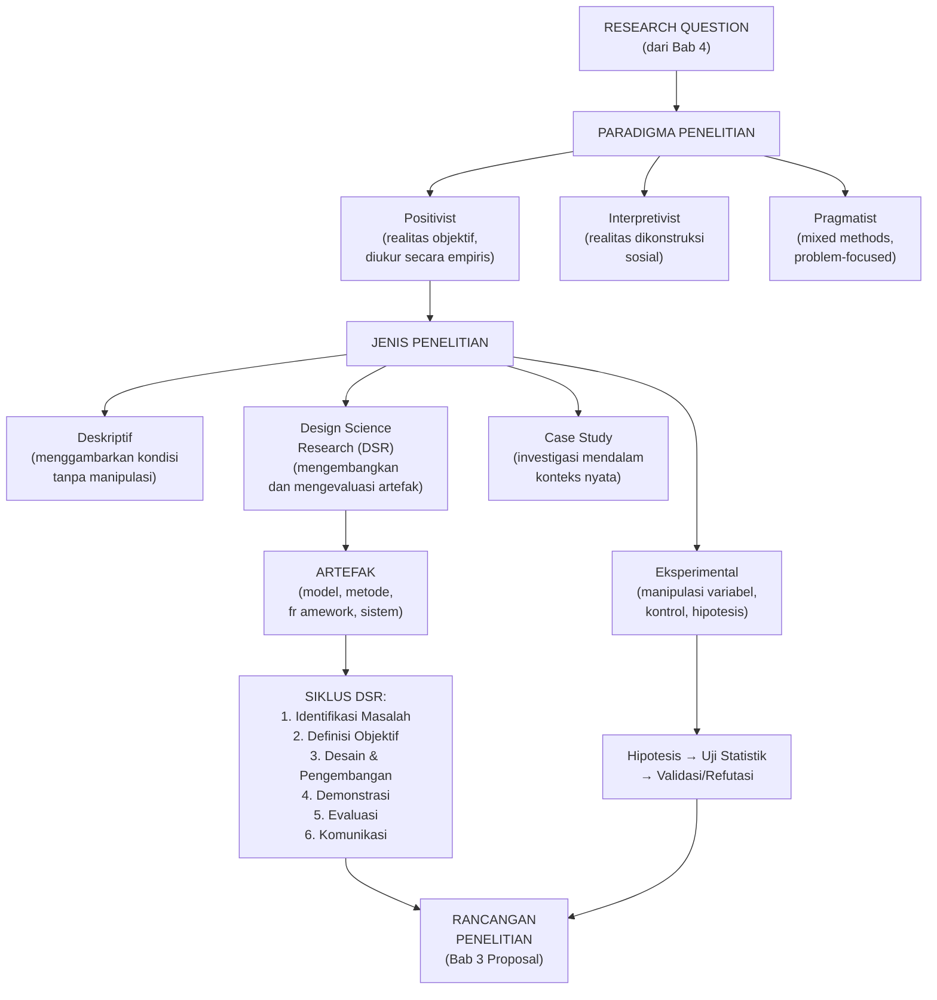
```mermaid
flowchart TD
    RQ3["RESEARCH QUESTION\n(dari Bab 4)"] --> Paradigm["PARADIGMA PENELITIAN"]
    Paradigm --> Positivist["Positivist\n(realitas objektif,\ndiukur secara empiris)"]
    Paradigm --> Interpretivist["Interpretivist\n(realitas dikonstruksi\nsosial)"]
    Paradigm --> Pragmatist["Pragmatist\n(mixed methods,\nproblem-focused)"]
    Positivist --> ResearchType["JENIS PENELITIAN"]
    ResearchType --> Experimental["Eksperimental\n(manipulasi variabel,\nkontrol, hipotesis)"]
    ResearchType --> DescriptiveR["Deskriptif\n(menggambarkan kondisi\ntanpa manipulasi)"]
    ResearchType --> DesignScience["Design Science\nResearch (DSR)\n(mengembangkan\ndan mengevaluasi artefak)"]
    ResearchType --> CaseStudy["Case Study\n(investigasi mendalam\nkonteks nyata)"]
    DesignScience --> Artifacts["ARTEFAK\n(model, metode,\nfr amework, sistem)"]
    Artifacts --> DSRCycle["SIKLUS DSR:\n1. Identifikasi Masalah\n2. Definisi Objektif\n3. Desain & Pengembangan\n4. Demonstrasi\n5. Evaluasi\n6. Komunikasi"]
    Experimental --> HypothesisTest["Hipotesis → Uji Statistik\n→ Validasi/Refutasi"]
    DSRCycle & HypothesisTest --> ResearchDesign["RANCANGAN\nPENELITIAN\n(Bab 3 Proposal)"]
```

---

### 3. Pengantar Kontekstual

Metodologi penelitian bukan sekadar "cara mengumpulkan data". Ia adalah kerangka filosofis yang menentukan: apa yang kita anggap sebagai "bukti" yang valid, bagaimana kita menarik kesimpulan dari bukti tersebut, dan apa yang kita klaim sebagai "pengetahuan baru". Dalam domain keamanan siber dan forensik digital, sebagian besar penelitian terapan menggunakan pendekatan eksperimental (mengembangkan dan menguji solusi) atau design science (mengembangkan artefak yang berguna).

---

### 4. Landasan Teori

#### 4.1 Paradigma Penelitian

**Positivisme:**
Realitas bersifat objektif dan dapat diukur secara independen dari pengamat. Pengetahuan diperoleh melalui observasi empiris yang dapat direplikasi. Menekankan: kuantifikasi, pengujian hipotesis, generalisasi.

Cocok untuk: penelitian yang mengembangkan dan mengevaluasi model ML/AI, perbandingan performa algoritma, eksperimen terkontrol dengan dataset.

**Interpretivisme:**
Realitas dikonstruksi secara sosial. Penekanan pada pemahaman konteks dan perspektif. Metode: wawancara mendalam, studi kasus, etnografi.

Kurang umum di riset teknis keamanan siber, tetapi relevan untuk: studi perilaku pengguna terhadap keamanan, analisis kebijakan, forensik sosial.

**Pragmatisme:**
Fokus pada pemecahan masalah praktis, menggunakan pendekatan yang paling sesuai. Mixed methods: kombinasi kuantitatif dan kualitatif. Paling fleksibel.

Cocok untuk: penelitian yang memerlukan validasi teknis DAN evaluasi adopsi pengguna.

#### 4.2 Design Science Research (DSR) untuk Keamanan Siber

DSR, yang dipopulerkan oleh Hevner et al. (2004) dalam konteks information systems dan diadaptasi untuk software engineering oleh Wieringa (2014), adalah paradigma metodologis yang sangat cocok untuk riset terapan keamanan siber karena ia secara eksplisit berfokus pada pengembangan artefak yang berguna.

**Jenis Artefak dalam DSR Keamanan Siber:**
- *Model*: representasi abstrak dari sistem atau fenomena (model threat, model risiko)
- *Metode*: panduan atau proses (metodologi forensik, framework assessment)
- *Konstruk*: konsep atau kosakata baru (taxonomy serangan baru)
- *Instansiasi*: implementasi nyata dari artefak (sistem deteksi, tool forensik)

**Siklus DSR (Wieringa, 2014):**
1. *Problem Investigation*: memahami masalah di dunia nyata
2. *Treatment Design*: merancang solusi (artefak)
3. *Treatment Validation*: memvalidasi bahwa desain artefak menjawab masalah (sebelum implementasi penuh)
4. *Treatment Implementation*: mengimplementasikan artefak
5. *Implementation Evaluation*: mengevaluasi apakah implementasi menyelesaikan masalah

**Evaluasi Artefak:**
Untuk instansiasi (sistem/tool): evaluasi menggunakan dataset, metrik performa (accuracy, latency, dll.)
Untuk metodologi/framework: evaluasi menggunakan: expert review, case study, usability study

#### 4.3 Penelitian Eksperimental untuk ML/AI Keamanan Siber

Untuk tesis yang mengembangkan model ML, kerangka metodologis yang umum:

**1. Formulasi Hipotesis:**
H₁: Model LSTM menghasilkan F1-score yang secara statistik signifikan lebih tinggi dibanding Random Forest pada dataset MQTT IIoT.
H₀: Tidak ada perbedaan F1-score yang signifikan secara statistik antara LSTM dan Random Forest.

**2. Desain Eksperimen:**
- Independent variable: Algoritma yang digunakan (LSTM vs. RF)
- Dependent variable: F1-score, precision, recall, latency
- Control variables: Dataset yang sama, kondisi hardware yang sama, hyperparameter tuning yang fair

**3. Dataset:**
- Training set: 70% data
- Validation set: 15% data (untuk hyperparameter tuning)
- Test set: 15% data (hanya digunakan untuk evaluasi final)
- Cross-validation: k-fold (biasanya k=5 atau k=10)

**4. Uji Statistik:**
- Untuk perbandingan dua model: paired t-test atau Wilcoxon signed-rank test
- Untuk perbandingan lebih dari dua model: ANOVA atau Friedman test
- Corrected resampled t-test: lebih tepat untuk perbandingan model ML (Bouckaert & Frank, 2004)

**5. Reproducibility:**
- Dokumentasikan: random seed, versi library, kondisi hardware
- Sediakan kode dan dataset (atau detail untuk mereproduksi dataset)

---

### 5. Model atau Arsitektur

```mermaid
flowchart TD
    ProblemWorld["MASALAH\nDI DUNIA NYATA\n(DUDI/Industri)"] --> DSR_PI["DSR: Problem\nInvestigation\n(Bab 1 Proposal)"]
    DSR_PI --> DSR_TD["DSR: Treatment\nDesign\n(Arsitektur Bab 3)"]
    DSR_TD --> DSR_TV["DSR: Treatment\nValidation\n(Review proposal)"]
    DSR_TV --> DSR_TI["DSR: Treatment\nImplementation\n(Pelaksanaan tesis)"]
    DSR_TI --> DSR_IE["DSR: Implementation\nEvaluation\n(Eksperimen & analisis)"]
    DSR_IE --> Contribution2["KONTRIBUSI:\nArtefak terbukti berguna\nuntuk masalah nyata"]
    Contribution2 --> Publication["Komunikasi:\nPaper, Tesis, Laporan"]
    KnowledgeBase["KNOWLEDGE BASE:\nLiteratur, Teori,\nMetode yang Ada"] -.->|"Input untuk"| DSR_PI
    KnowledgeBase -.->|"Input untuk"| DSR_TD
```

---

### 6–12. Contoh Terapan, Praktikum, Latihan, Kunci Jawaban, Ringkasan, Refleksi

**Contoh Terapan:** Bima memilih DSR sebagai paradigma karena ia mengembangkan framework metodologi forensik cloud (artefak tipe Metode), yang divalidasi melalui case study simulasi. Rina memilih penelitian eksperimental kuantitatif karena ia membandingkan dua model ML dengan metrik yang terukur.

**Latihan:**
Soal 1: Mengapa pengujian model ML pada test set yang sudah digunakan untuk hyperparameter tuning (validation set) akan menghasilkan estimasi performa yang bias?

Soal 2: Mahasiswa mengembangkan "framework keamanan cloud untuk startup fintech". Apakah pendekatan DSR atau eksperimental lebih sesuai? Justifikasi pilihan Anda.

Soal 3: Jelaskan mengapa random seed harus didokumentasikan dan dilaporkan dalam penelitian yang menggunakan ML.

**Kunci Jawaban:**

Soal 1: Hyperparameter tuning menggunakan validation set memilih konfigurasi yang bekerja paling baik pada data tersebut — ini adalah bentuk overfitting pada validation set. Jika test set sama dengan validation set, evaluasi akan terlalu optimistis. Test set harus benar-benar "unseen" — tidak pernah digunakan untuk keputusan apapun selama training dan tuning — untuk memberikan estimasi performa yang tidak bias pada data baru.

Soal 2: DSR lebih sesuai. Alasannya: (a) produk akhirnya adalah "framework" — artefak tipe metode dalam terminologi DSR; (b) evaluasi yang tepat adalah studi kasus atau expert review, bukan perbandingan statistik algoritma; (c) Wieringa (2014) secara eksplisit mendukung DSR untuk penelitian yang menghasilkan metodologi atau panduan. Pendekatan eksperimental lebih sesuai jika mengembangkan dan membandingkan model/algoritma spesifik.

Soal 3: Banyak algoritma ML memiliki komponen stochastic (initialization bobot neural network, sampling dalam Random Forest, dll.). Random seed yang berbeda menghasilkan hasil yang sedikit berbeda. Tanpa mendokumentasikan seed, peneliti lain tidak dapat mereproduksi hasil yang sama — ini melanggar prinsip reproducibility yang fundamental dalam sains. Dengan seed terdokumentasi, siapa pun dapat menjalankan kode yang sama dan mendapat hasil identik.

**Ringkasan:** Metodologi penelitian adalah kerangka filosofis dan prosedural yang menentukan validitas klaim penelitian. Untuk riset terapan keamanan siber, dua pendekatan dominan: penelitian eksperimental kuantitatif (untuk pengembangan dan perbandingan model) dan Design Science Research (untuk pengembangan artefak seperti framework, metodologi, dan sistem). Kedua pendekatan menekankan reproducibility dan validasi yang ketat.

**Refleksi:** (1) Apakah ada risiko bahwa terlalu fokus pada metodologi yang "benar secara akademik" membuat penelitian menjadi kurang relevan bagi industri? Bagaimana menyeimbangkan rigor akademik dengan practical relevance? (2) Banyak paper keamanan siber tidak melaporkan detail reproducibility (dataset, seed, versi library). Apakah ini masalah serius, dan bagaimana Anda akan memastikan tesis Anda lebih baik?

---

## Bab 11 — Arsitektur Sistem, Algoritma, dan Rancangan Prototipe

### 1. Capaian Pembelajaran Bab

Setelah menyelesaikan bab ini, mahasiswa mampu:
- Merancang arsitektur sistem atau algoritma yang menjawab masalah riset secara teknis (C6)
- Membuat diagram arsitektur yang jelas, informatif, dan dapat diimplementasikan (C3)
- Menjustifikasi pilihan komponen arsitektur berdasarkan persyaratan teknis dan keterbatasan yang ada (C5)

*Dikaitkan dengan Sub-CPMK.5 (Pertemuan 11) dan Eval-4 (20%).*

---

### 2. Peta Konsep Bab

```mermaid
flowchart TD
    RQ4["RESEARCH QUESTION\n& TUJUAN PENELITIAN"] --> SystemReq["REQUIREMENTS\nSISTEM/ARSITEKTUR\n(functional & non-functional)"]
    SystemReq --> ArchDesign["RANCANGAN ARSITEKTUR"]
    ArchDesign --> MLArch["Arsitektur ML/DL\n(model pipeline:\ninput→preprocessing→\nmodel→output)"]
    ArchDesign --> SystemArch["Arsitektur Sistem\n(komponen, integrasi,\ndata flow)"]
    ArchDesign --> AlgorithmDesign["Rancangan Algoritma\n(pseudocode, flowchart)"]
    MLArch --> ComponentJustification["JUSTIFIKASI\nPILIHAN KOMPONEN\n(mengapa X bukan Y?)"]
    SystemArch --> ComponentJustification
    AlgorithmDesign --> ComponentJustification
    ComponentJustification --> Prototype["RANCANGAN\nPROTOTIPE\n(implementasi yang\nakan dilakukan)"]
    Prototype --> TechStack["TECHNOLOGY STACK\n(bahasa, library,\nframework, hardware)"]
```

---

### 3. Pengantar Kontekstual

Arsitektur sistem adalah jembatan antara teori (RQ dan gap) dan implementasi (eksperimen dan evaluasi). Sebuah arsitektur yang baik menunjukkan bahwa mahasiswa tidak hanya memahami masalah, tetapi juga tahu bagaimana membangun solusinya. Dosen dan penguji akan menilai apakah arsitektur yang diusulkan: (1) menjawab RQ secara langsung; (2) teknis feasible; (3) dapat diimplementasikan dalam scope tesis; (4) pilihan komponennya dijustifikasi.

---

### 4. Landasan Teori

#### 4.1 Komponen Arsitektur dalam Tesis ML/AI Keamanan Siber

Untuk tesis yang mengembangkan model ML/DL:

**Data Pipeline:**
Input Data (raw) → Preprocessing → Feature Engineering → Splitting (train/val/test)

**Model Architecture:**
Layer struktur → Loss function → Optimizer → Hyperparameter

**Evaluation Pipeline:**
Model trained → Inference → Metrik (F1, precision, recall, AUC) → Baseline comparison

**Deployment (jika applicable):**
Model saved → API/integration → Real-time inference

#### 4.2 Arsitektur LSTM untuk Anomaly Detection (Contoh)

Untuk tesis Rina (LSTM-based IDS pada MQTT):

```
INPUT:
  - Raw MQTT packet capture (pcap)
  - Window: 50 packets per sequence

PREPROCESSING:
  - Parsing protokol MQTT (pyshark/dpkt)
  - Feature extraction: 
    • Temporal: inter-arrival time, timestamp
    • Statistical: payload size, QoS level
    • Behavioral: connection patterns, topic frequency
  - Normalization: MinMaxScaler
  - Label encoding: benign=0, attack=1..5

MODEL LSTM:
  Layer 1: LSTM (128 units, return_sequences=True)
  Layer 2: Dropout (0.2)
  Layer 3: LSTM (64 units)
  Layer 4: Dropout (0.2)
  Layer 5: Dense (32, activation='relu')
  Layer 6: Dense (6, activation='softmax') [multi-class]
  
  Loss: Categorical Crossentropy
  Optimizer: Adam (lr=0.001)
  Batch size: 32, Epochs: 50 (early stopping)

BASELINE:
  Random Forest (n_estimators=100, max_depth=10)
  Trained on same features and split

EVALUATION:
  Metrics: Accuracy, F1 (macro), Precision, Recall, ROC-AUC
  Additional: Inference latency (ms/sample)
  Test: Wilcoxon signed-rank test untuk signifikansi statistik
```

#### 4.3 Justifikasi Pilihan Komponen

Setiap komponen arsitektur harus dijustifikasi dengan argumen yang berbasis literatur atau persyaratan teknis:

**Mengapa LSTM bukan Transformer?**
"LSTM dipilih karena: (a) lebih efisien secara komputasi untuk deployment di perangkat edge dengan resource terbatas — LSTM memerlukan ~10x lebih sedikit parameter dibanding Transformer untuk sequence panjang yang sama (Kim et al., 2022); (b) penelitian yang ada menunjukkan LSTM kompetitif dengan Transformer untuk sequence pendek (<100 time steps) yang umum dalam monitoring traffic IIoT (Wang & Lee, 2023); (c) dalam konteks ini, latensi inferensi lebih kritis daripada akurasi marginal, dan LSTM memiliki keunggulan dalam aspek ini."

**Mengapa dataset MQTTset?**
"MQTTset (Vaccari et al., 2020) dipilih karena: (a) satu-satunya dataset publik yang menggunakan protokol MQTT secara autentik dari lingkungan IoT; (b) mencakup 7 skenario serangan yang representatif; (c) digunakan sebagai benchmark dalam 5 paper terkait yang ditelaah, memungkinkan perbandingan langsung; (d) tersedia secara publik untuk reproducibility."

---

### 5. Contoh Terapan, Praktikum, Latihan, Kunci Jawaban, Ringkasan, Refleksi

**Praktikum:** Buat diagram arsitektur sistem (menggunakan draw.io, Miro, atau tangan) dan tulis justifikasi untuk setiap komponen utama. Presentasikan kepada kelompok kecil dan minta feedback: "Apakah arsitektur ini menjawab RQ? Apakah ada komponen yang tidak dijustifikasi?"

**Latihan:**

Soal 1: Mengapa pemisahan train/validation/test set harus dilakukan sebelum preprocessing (bukan setelah)?

Soal 2: Seorang mahasiswa ingin menggunakan accuracy sebagai satu-satunya metrik evaluasi untuk model deteksi anomali pada dataset yang sangat imbalanced (1% sampel anomali). Apa masalahnya?

**Kunci Jawaban:**

Soal 1: Jika preprocessing (normalisasi, standardisasi) dilakukan pada seluruh dataset sebelum split, parameter preprocessing (misal: mean dan standar deviasi untuk standardisasi) akan "bocor" dari data test ke preprocessing — ini disebut data leakage. Akibatnya, evaluasi pada test set menjadi terlalu optimistis karena test set secara implisit mempengaruhi preprocessing. Solusi: split dulu, lalu fit preprocessing hanya pada training set, kemudian transform validation dan test set menggunakan parameter dari training.

Soal 2: Dengan dataset 1% anomali dan 99% benign, model yang memprediksi semua sebagai "benign" akan mencapai accuracy 99% — tetapi recall untuk kelas anomali adalah 0%. Untuk keamanan siber, false negative (anomali yang tidak terdeteksi) jauh lebih berbahaya dari false positive (alert palsu). Metrik yang tepat: F1-score (terutama untuk kelas minority), recall, precision untuk kelas anomali, dan AUC-ROC atau AUC-PRC.

**Ringkasan:** Arsitektur sistem yang baik menunjukkan pemahaman teknis yang mendalam dan menunjukkan feasibility penelitian. Setiap komponen harus dipilih berdasarkan justifikasi yang dapat dipertahankan — baik dari literatur maupun dari persyaratan teknis masalah. Justifikasi pilihan komponen adalah elemen yang membedakan proposal yang matang dari yang superfisial.

**Refleksi:** (1) Seberapa detail arsitektur harus didefinisikan dalam proposal, mengingat bahwa implementasi seringkali mengungkap masalah yang tidak terduga? (2) Jika selama implementasi Anda menemukan bahwa arsitektur yang direncanakan tidak bekerja seperti yang diharapkan, apa yang harus dilakukan — mengubah arsitektur atau mengubah klaim tesis?

---

## Bab 12 — Desain Eksperimen, Dataset, Metrik, dan Timeline Penelitian

### 1. Capaian Pembelajaran Bab

Setelah menyelesaikan bab ini, mahasiswa mampu:
- Merancang desain eksperimen yang valid dan dapat direproduksi untuk evaluasi artefak atau model keamanan siber (C6)
- Mengidentifikasi dan menjustifikasi dataset yang sesuai untuk penelitian, termasuk karakteristik dan keterbatasannya (C4)
- Menetapkan metrik evaluasi yang relevan dan selaras dengan RQ (C3)
- Menyusun timeline penelitian realistis dalam bentuk Gantt chart (C3)

*Dikaitkan dengan Sub-CPMK.5 (Pertemuan 12) dan Eval-4 (20% — artefak: paket Bab 3 + Gantt chart).*

---

### 2. Peta Konsep Bab

```mermaid
flowchart TD
    ResearchQ["RESEARCH QUESTION\n& ARSITEKTUR\n(dari Bab 10-11)"] --> ExperimentDesign["DESAIN EKSPERIMEN"]
    ExperimentDesign --> Conditions["Kondisi Eksperimen\n(variabel IV/DV/CV)"]
    ExperimentDesign --> Baseline2["Baseline & Pembanding\n(algoritma/metode yang\ndibandingkan)"]
    ExperimentDesign --> Protocol["Protokol Eksperimen\n(langkah reproduksi)"]
    ExperimentDesign --> DatasetSection["DATASET"]
    DatasetSection --> DatasetSource["Sumber Dataset\n(publik/dikumpulkan)"]
    DatasetSection --> DatasetChar["Karakteristik\n(ukuran, distribusi,\nkeseimbangan kelas)"]
    DatasetSection --> DatasetLim["Keterbatasan\n(bias, scope)"]
    ExperimentDesign --> Metrics2["METRIK EVALUASI\n(selaras dengan RQ)"]
    Metrics2 --> PerfMetrics["Performa:\nF1, Acc, AUC, Prec, Rec"]
    Metrics2 --> EffMetrics["Efisiensi:\nLatency, throughput,\nmemory footprint"]
    Metrics2 --> StatTest["Uji Statistik:\nsignifikansi perbedaan"]
    Conditions & Baseline2 & Protocol & DatasetSection & Metrics2 --> Feasibility["ANALISIS KELAYAKAN\n(sumber daya tersedia?)"]
    Feasibility --> Timeline2["TIMELINE PENELITIAN\n(Gantt Chart per bulan)"]
```

---

### 3. Pengantar Kontekstual

Desain eksperimen yang lemah adalah salah satu alasan terbesar tesis ditolak atau diminta revisi major. Penguji akan bertanya: "Bagaimana Anda tahu bahwa perbedaan performa antara model A dan model B bukan hanya karena kebetulan statistik?" Atau: "Dataset ini dikumpulkan 5 tahun lalu — apakah serangan modern terwakili?" Pertanyaan-pertanyaan ini hanya bisa dijawab jika desain eksperimen Anda mempertimbangkan ancaman terhadap validitas.

---

### 4. Landasan Teori

#### 4.1 Ancaman Terhadap Validitas Eksperimen

**Validitas Internal (Internal Validity):**
Apakah perbedaan yang diamati benar-benar disebabkan oleh variabel yang dimanipulasi (algoritma), bukan faktor lain?

Ancaman: 
- *Data leakage*: informasi dari test set bocor ke training (lihat Bab 11)
- *Unfair comparison*: baseline tidak di-tune dengan upaya yang setara
- *Selection bias*: pemilihan dataset yang menguntungkan satu metode
- *Confounding variables*: faktor lain yang mempengaruhi performa (hardware berbeda, dll.)

**Validitas Eksternal (External Validity):**
Apakah temuan dapat digeneralisasikan ke situasi yang berbeda?

Ancaman:
- Dataset tidak representatif untuk kondisi nyata
- Evaluasi hanya pada satu jenis serangan
- Kondisi lab yang tidak merepresentasikan environment produksi

**Mitigasi:**
- Gunakan multiple datasets jika memungkinkan
- Lakukan cross-validation yang ketat
- Jelaskan keterbatasan generalisabilitas secara eksplisit
- Dokumentasikan semua kondisi eksperimen

#### 4.2 Memilih dan Mendeskripsikan Dataset

**Dataset Publik untuk Keamanan Siber:**

| Dataset | Fokus | Ukuran | Tahun | Kelebihan | Keterbatasan |
|---|---|---|---|---|---|
| NSL-KDD | IDS umum | 148K | 2009 | Benchmark lama | Usang, tidak IIoT |
| CIC-IDS2017 | IDS umum | 2.8M | 2017 | Beragam serangan | Traffic simulasi |
| CIC-IDS2018 | IDS umum | 16M | 2018 | Modern, beragam | Tidak IIoT |
| MQTTset | IoT MQTT | 68M | 2020 | MQTT spesifik | Lab environment |
| UNSW-NB15 | IDS umum | 2.5M | 2015 | Fitur kaya | Agak lama |
| TON-IoT | IoT/IIoT | 6M | 2020 | IoT/IIoT khusus | Simulasi |

**Hal yang Harus Dideskripsikan tentang Dataset:**
- Sumber dan cara pengumpulan
- Ukuran total, distribusi kelas (berapa benign vs. attack)
- Jenis serangan yang dicakup
- Fitur yang tersedia
- Keterbatasan yang diakui

#### 4.3 Metrik Evaluasi untuk Model Keamanan Siber

**Metrik Klasifikasi:**
- *Accuracy*: (TP+TN)/(TP+TN+FP+FN) — menyesatkan pada imbalanced data
- *Precision*: TP/(TP+FP) — seberapa banyak yang diprediksi positif benar-benar positif
- *Recall (Sensitivity)*: TP/(TP+FN) — seberapa banyak positif yang berhasil terdeteksi
- *F1-score*: 2*(Precision*Recall)/(Precision+Recall) — harmonic mean
- *AUC-ROC*: area di bawah kurva ROC, tidak terpengaruh class imbalance
- *False Positive Rate (FPR)*: FP/(FP+TN) — penting untuk IDS (alert fatigue)

**Metrik Efisiensi:**
- *Inference Latency*: waktu per sampel (ms/sample) — kritis untuk real-time IDS
- *Throughput*: sampel per detik
- *Memory Footprint*: ukuran model di memori (MB)

**Metrik untuk Forensik:**
- *Chain of Custody integrity*: dapat ditelusuri tanpa celah
- *Evidence completeness*: seberapa lengkap timeline rekonstruksi
- *Reproducibility*: apakah prosedur dapat diulang dengan hasil yang sama

#### 4.4 Timeline Penelitian (Gantt Chart)

**Komponen Timeline Tesis Magister Terapan (2-3 Semester):**

Semester 1 (Proposal):
- Bulan 1-2: Studi literatur dan finalisasi topik
- Bulan 3-4: Draft Bab 1-2 dan konsultasi pembimbing
- Bulan 5: Desain metodologi (Bab 3)
- Bulan 6: Finalisasi proposal dan seminar

Semester 2 (Implementasi dan Evaluasi):
- Bulan 7-8: Implementasi artefak/model
- Bulan 9-10: Eksperimen dan pengumpulan data hasil
- Bulan 11: Analisis dan interpretasi hasil
- Bulan 12: Penulisan Bab 4 (Hasil) dan Bab 5 (Pembahasan)

Semester 3 (Finalisasi dan Publikasi):
- Bulan 13-14: Revisi tesis berdasarkan feedback pembimbing
- Bulan 15: Persiapan sidang
- Bulan 16: Sidang tesis
- Pasca sidang: Revisi dan pengumpulan

---

### 5–12. Contoh Terapan, Praktikum, Latihan, Kunci Jawaban, Ringkasan, Refleksi

**Contoh Terapan — Paket Metodologi Rina:**

Dataset: MQTTset (Vaccari et al., 2020). Ukuran: 68.8M packets, 7 kelas (1 benign + 6 jenis serangan). Split: 70/15/15 (train/val/test). Class balancing: SMOTE untuk kelas minority.

Baseline: Random Forest (scikit-learn, n_estimators=100, hyperparameter-tuned via GridSearchCV pada validation set).

Kondisi eksperimen: Hardware yang sama untuk kedua model (RTX 3060, 32GB RAM, Ubuntu 22.04). Reproducibility: random seed = 42 untuk semua operasi stochastic.

Uji statistik: Wilcoxon signed-rank test pada F1-score dari 10-fold stratified cross-validation.

**Latihan:**

Soal 1: Sebuah penelitian membandingkan algoritma A dan B. Algoritma A mencapai F1=0.95 dan B mencapai F1=0.93. Apakah perbedaan ini penting? Apa yang harus dilakukan sebelum menyimpulkan bahwa A lebih baik dari B?

Soal 2: Anda mengembangkan sistem deteksi intrusi dan memilih dataset yang hanya mengandung 2 jenis serangan. Apa ancaman terhadap validitas eksternal dari penelitian Anda?

**Kunci Jawaban:**

Soal 1: Perbedaan 0.02 pada F1 mungkin tidak signifikan secara statistik — bisa jadi hanya variasi akibat randomness. Sebelum menyimpulkan A lebih baik: lakukan uji statistik (Wilcoxon signed-rank test atau paired t-test) pada hasil dari multiple runs atau cross-validation folds. Jika p-value > 0.05, perbedaan tidak signifikan secara statistik dan tidak dapat diklaim salah satu lebih baik.

Soal 2: Ancaman validitas eksternal: (a) model yang baik untuk 2 jenis serangan mungkin tidak generalize ke jenis serangan lain yang tidak ada dalam training data (zero-day attacks, novel attack variants); (b) distribusi 2 jenis serangan tidak representatif untuk lingkungan nyata yang memiliki puluhan jenis serangan; (c) temuan tidak dapat digeneralisasikan ke konteks lain. Mitigasi: nyatakan keterbatasan secara eksplisit dalam tesis; rekomendasikan evaluasi pada dataset yang lebih beragam sebagai future work.

**Ringkasan Bab 12:** Desain eksperimen yang kuat mempertimbangkan ancaman terhadap validitas internal (apakah perbandingan fair?) dan eksternal (apakah temuan generalizable?). Pilihan dataset harus dijustifikasi berdasarkan relevansi, ketersediaan, dan keterbatasan yang diakui. Metrik harus selaras dengan RQ — untuk keamanan siber, recall dan FPR seringkali lebih penting dari accuracy. Timeline Gantt chart menunjukkan bahwa penelitian planned dan feasible.

**Refleksi:** (1) Dalam penelitian keamanan siber, ada ketegangan antara menggunakan dataset real (lebih valid secara eksternal) dan dataset simulasi (lebih mudah dikontrol dan etis). Bagaimana Anda memutuskan mana yang lebih tepat untuk penelitian Anda? (2) Apakah ada situasi di mana Anda boleh mengubah desain eksperimen setelah penelitian dimulai? Apa implikasinya jika Anda melakukannya?

---

## Bab 13 — Menyusun Bab 3 Metodologi Penelitian

### 1. Capaian Pembelajaran Bab

Setelah menyelesaikan bab ini, mahasiswa mampu:
- Menyusun Bab 3 metodologi penelitian yang komprehensif, koheren, dan dapat dipertahankan (C6)
- Menulis narasi metodologi yang mengalir logis dari paradigma → desain → prosedur → validasi (C5)
- Memastikan konsistensi antara Bab 1 (masalah), Bab 2 (landasan teori), dan Bab 3 (metodologi) (C4)

*Dikaitkan dengan Sub-CPMK.5 (Pertemuan 13) dan Eval-4 (20% — deliverable: draft Bab 3).*

---

### 2. Peta Konsep Bab

```mermaid
flowchart TD
    Bab1["BAB 1:\nMasalah, RQ,\nTujuan, Kontribusi"] --> Bab3["BAB 3:\nMETODOLOGI\nPENELITIAN"]
    Bab2["BAB 2:\nTeori, Gap,\nBaseline/SotA"] --> Bab3
    Bab3 --> B3S1["3.1 Paradigma &\nJenis Penelitian"]
    Bab3 --> B3S2["3.2 Arsitektur &\nRancangan Sistem"]
    Bab3 --> B3S3["3.3 Dataset &\nInstrumen"]
    Bab3 --> B3S4["3.4 Desain\nEksperimen"]
    Bab3 --> B3S5["3.5 Metrik\nEvaluasi"]
    Bab3 --> B3S6["3.6 Prosedur\nAnalisis Data"]
    Bab3 --> B3S7["3.7 Timeline\n(Gantt Chart)"]
    B3S1 & B3S2 & B3S3 & B3S4 & B3S5 & B3S6 & B3S7 --> Coherence["KOHEREN:\nSetiap bagian\nmenjawab RQ\nyang sama"]
```

---

### 3. Pengantar Kontekstual

Bab 3 adalah jantung proposal tesis. Ia menentukan apakah rencana penelitian Anda bisa berdiri secara ilmiah. Dosen pembimbing dan penguji akan membaca Bab 3 untuk menjawab tiga pertanyaan: (1) Apakah metode yang dipilih tepat untuk menjawab RQ? (2) Apakah prosedur yang direncanakan cukup detail untuk dilaksanakan? (3) Apakah ada celah logis atau inkonsistensi yang bisa melemahkan temuan nanti?

---

### 4. Landasan Teori

#### 4.1 Struktur Standar Bab 3

Tidak ada format tunggal yang berlaku universal, tetapi struktur berikut mencakup semua elemen yang umumnya diwajibkan:

**3.1 Paradigma dan Jenis Penelitian**

Menyatakan secara eksplisit paradigma yang digunakan (positivist, pragmatist) dan jenis penelitian (eksperimental, DSR, case study, dll.). Jelaskan mengapa paradigma ini sesuai dengan sifat masalah dan RQ.

Contoh narasi: *"Penelitian ini menggunakan paradigma positivist dengan pendekatan eksperimental kuantitatif. Paradigma ini dipilih karena RQ penelitian — 'Seberapa besar peningkatan F1-score yang dapat dicapai model LSTM dibanding Random Forest pada dataset MQTT IIoT?' — mensyaratkan pengukuran objektif dan perbandingan kuantitatif. Pendekatan eksperimental memungkinkan kontrol variabel yang ketat untuk mengisolasi pengaruh pilihan algoritma terhadap performa deteksi."*

**3.2 Objek Penelitian / Ruang Lingkup**

Mendefinisikan secara eksplisit apa yang diteliti dan apa yang tidak (scope dan out-of-scope). Menyebutkan batasan: platform, sistem operasi, jenis serangan, versi protokol, dll.

**3.3 Arsitektur Sistem / Rancangan Artefak**

Menjelaskan arsitektur teknis secara rinci (lihat Bab 11). Sertakan diagram. Deskripsikan setiap komponen dan justifikasi pilihan teknologi.

**3.4 Dataset dan Instrumen Penelitian**

Deskripsi dataset yang digunakan: sumber, ukuran, distribusi kelas, metode preprocessing. Jika mengumpulkan data sendiri: instrumen pengumpulan data, prosedur, jadwal.

**3.5 Desain Eksperimen**

Menetapkan: independent variable, dependent variable, control variable, kondisi eksperimen, prosedur baseline, jumlah run/folds, metode untuk memastikan reproducibility.

**3.6 Metrik Evaluasi dan Analisis Data**

Menetapkan metrik yang digunakan (dengan definisi matematisnya), threshold yang dianggap "berhasil", dan metode analisis statistik.

**3.7 Timeline Penelitian**

Gantt chart dengan milestone yang jelas dan realistis.

#### 4.2 Menjaga Konsistensi Lintas Bab

Kesalahan umum yang melemahkan proposal: RQ di Bab 1 berbeda dengan yang dijawab di Bab 3. Tujuan penelitian di Bab 1 menyebutkan "meningkatkan performa", tetapi metrik di Bab 3 tidak mengukur peningkatan secara komparatif. Dataset yang disebutkan di Bab 2 (tinjauan pustaka) berbeda dengan yang digunakan di Bab 3.

**Teknik verifikasi konsistensi:** Buat tabel sederhana:

| Elemen | Di mana dinyatakan | Di mana dioperasionalkan |
|---|---|---|
| RQ 1: Performa LSTM | Bab 1.3 | Bab 3.5 (F1, AUC), 3.4 (eksperimen) |
| RQ 2: Perbandingan dengan RF | Bab 1.3 | Bab 3.4 (baseline), 3.6 (Wilcoxon test) |
| Kontribusi: Dataset IIoT | Bab 1.5 | Bab 3.3 (MQTTset, TON-IoT) |

Setiap elemen Bab 1 harus memiliki operasionalisasinya di Bab 3.

#### 4.3 Bahasa dan Nada Bab 3

Bab 3 ditulis dalam waktu mendatang (penelitian belum dilakukan):
- BENAR: "Penelitian ini akan menggunakan...", "Data akan diproses dengan..."
- SALAH: "Penelitian ini menggunakan..." (future tense untuk proposal)

Setelah penelitian selesai (untuk tesis final), diubah ke simple past atau present:
- "Model LSTM dilatih menggunakan...", "Evaluasi dilakukan dengan..."

---

### 5. Contoh Terapan

**Draft Bab 3 Rina Wijayanti (Ringkasan):**

> **3.1 Paradigma dan Jenis Penelitian**
> Penelitian ini menggunakan paradigma positivist dengan pendekatan eksperimental kuantitatif. Paradigma ini sesuai dengan RQ yang mensyaratkan pengukuran objektif performa model ML pada dataset IIoT.
>
> **3.2 Ruang Lingkup**
> Penelitian ini mencakup deteksi anomali pada traffic MQTT Protocol Version 3.1.1 di lingkungan IIoT. Penelitian tidak mencakup: protokol IoT selain MQTT (CoAP, AMQP), model berbasis transfer learning, deployment ke hardware embedded.
>
> **3.3 Arsitektur Sistem**
> *[Diagram arsitektur LSTM pipeline dari Bab 11]*
> Sistem terdiri dari tiga modul: (1) Preprocessing module, mengubah raw MQTT packets menjadi feature vectors; (2) Model module, LSTM dengan dua layer recurrent; (3) Evaluation module, menghitung metrik dan melakukan uji statistik.
>
> **3.4 Dataset**
> Dataset yang digunakan adalah MQTTset (Vaccari et al., 2020), yang terdiri dari 68,8 juta rekaman dengan 7 kelas. Dataset akan dibagi 70/15/15 (train/val/test) dengan stratified sampling untuk mempertahankan distribusi kelas. SMOTE akan diterapkan pada training set untuk mengatasi class imbalance.
>
> **3.5 Desain Eksperimen**
> *Independent variable*: algoritma (LSTM vs. Random Forest). *Dependent variable*: F1-score (macro), AUC-ROC, recall per kelas, inference latency. *Control variable*: dataset yang sama, infrastruktur yang sama. Eksperimen akan diulang 10 kali (10-fold stratified cross-validation) untuk setiap algoritma. Random seed = 42 untuk semua operasi stochastic.
>
> **3.6 Metrik Evaluasi dan Analisis Statistik**
> Hipotesis: H₁: LSTM menghasilkan F1-score yang secara statistik signifikan lebih tinggi dari Random Forest (α = 0.05). Uji: Wilcoxon signed-rank test pada 10 nilai F1 dari cross-validation. Jika p < 0.05, H₀ ditolak.
>
> **3.7 Timeline**
> *Gantt chart: [bulan 1-6 di Semester 2 tesis]*

---

### 6–12. Praktikum, Latihan, Kunci Jawaban, Ringkasan, Refleksi

**Praktikum:** Revisi draft Bab 3 Anda menggunakan tabel konsistensi lintas bab. Pastikan setiap elemen di Bab 1 memiliki operasionalisasinya di Bab 3. Tandai dengan warna berbeda elemen yang sudah konsisten dan yang masih perlu diselaraskan.

**Latihan:**

Soal 1: Seorang mahasiswa menulis di Bab 1: "Penelitian ini bertujuan meningkatkan akurasi deteksi intrusi." Di Bab 3, metrik yang ditetapkan hanya accuracy. Apa masalah dari narasi ini?

Soal 2: Mengapa penting untuk menulis Bab 3 dalam future tense di proposal, dan mengapa ini berubah di tesis final?

**Kunci Jawaban:**

Soal 1: Ada dua masalah. Pertama, kata "meningkatkan" mengimplikasikan ada baseline yang diperbandingkan — tetapi di Bab 3 tidak disebutkan baseline apapun. Kedua, accuracy adalah metrik yang tidak tepat untuk dataset IDS yang umum imbalanced (lihat Bab 12). Narasi Bab 1 harus lebih spesifik (misalnya: "meningkatkan F1-score dibanding baseline XYZ") dan Bab 3 harus menetapkan metrik yang selaras dengan tujuan tersebut, termasuk mendefinisikan baseline.

Soal 2: Di proposal, penelitian belum dilakukan — menggunakan past tense ("penelitian ini menggunakan") akan menyesatkan karena seolah penelitian sudah selesai. Future tense ("penelitian ini akan menggunakan") adalah akurat secara temporal dan jujur secara akademik. Di tesis final, penelitian sudah dilakukan, sehingga past tense atau present simple (untuk menggambarkan prosedur yang sudah dilaksanakan) lebih tepat. Perubahan tense ini juga sinyal bahwa mahasiswa memahami perbedaan antara rencana dan realisasi.

**Ringkasan:** Bab 3 yang kuat menunjukkan bahwa penelitian dapat dilaksanakan (feasible), akan menghasilkan bukti yang valid (rigor), dan hasilnya dapat dipercaya (reliability). Konsistensi lintas bab adalah kunci — setiap klaim di Bab 1 harus memiliki operasionalisasinya di Bab 3.

**Refleksi:** (1) Seberapa jauh boleh "merevisi" metodologi selama penelitian berlangsung — dan kapan revisi tersebut harus dilaporkan dan disetujui pembimbing? (2) Apakah ada situasi di mana dataset yang direncanakan ternyata tidak tersedia atau tidak sesuai harapan? Bagaimana mengantisipasinya di proposal?

---

## Bab 14 — Finalisasi Proposal dan Simulasi Seminar Proposal

### 1. Capaian Pembelajaran Bab

Setelah menyelesaikan bab ini, mahasiswa mampu:
- Memfinalisasi seluruh dokumen proposal (Bab 1-3) menjadi satu dokumen yang kohesif dan siap seminar (C6)
- Menyiapkan presentasi seminar yang efektif: struktur, visual, dan narasi (C3)
- Mengantisipasi dan menjawab pertanyaan penguji secara meyakinkan (C4)

*Dikaitkan dengan Sub-CPMK.6 (Pertemuan 14) dan Eval-5 (30% — deliverable: draft lengkap proposal + simulasi presentasi).*

---

### 2. Peta Konsep Bab

```mermaid
flowchart TD
    DraftBab123["DRAFT BAB 1-3\n(dari Bab 6-13)"] --> ConsistencyCheck["CEK KONSISTENSI\nLINTAS BAB"]
    ConsistencyCheck --> FinalPolish["PENYEMPURNAAN\nBAHASA & FORMAT"]
    FinalPolish --> AbstractWriting["PENULISAN\nABSTRAK"]
    FinalPolish --> FrontMatter["HALAMAN DEPAN:\nJudul, Pernyataan,\nDaftar Isi, dll."]
    AbstractWriting & FrontMatter --> FinalProposal["PROPOSAL\nFINAL\n(siap seminar)"]
    FinalProposal --> PresentationPrep["PERSIAPAN\nPRESENTASI\n(slide 15-20 menit)"]
    PresentationPrep --> SlideStructure["Struktur Slide:\n1. Latar belakang (2-3 slide)\n2. Masalah & RQ (2 slide)\n3. Tinjauan pustaka (3-4 slide)\n4. Metodologi (4-5 slide)\n5. Timeline (1 slide)\n6. Penutup (1 slide)"]
    PresentationPrep --> QAPrep["SIMULASI Q&A:\nAntisipasi pertanyaan\npenguji yang kritis"]
    SlideStructure & QAPrep --> Seminar["SEMINAR\nPROPOSAL\n(Bab 15)"]
```

---

### 3. Pengantar Kontekstual

Proposal yang bagus di atas kertas belum tentu berhasil di depan dewan penguji. Kemampuan untuk mempresentasikan, mempertahankan, dan menjawab kritik terhadap penelitian Anda adalah kompetensi tersendiri — dan ini yang diuji dalam seminar proposal. Bab ini mempersiapkan Anda untuk tahap tersebut.

---

### 4. Landasan Teori

#### 4.1 Checklist Finalisasi Proposal

**Konsistensi Konten:**
- [ ] Judul proposal konsisten di semua halaman
- [ ] RQ di Bab 1 persis sama dengan yang dijawab oleh metode di Bab 3
- [ ] Tujuan penelitian selaras dengan kontribusi yang diklaim
- [ ] Dataset yang disebutkan di Bab 2 dan Bab 3 konsisten
- [ ] Semua pustaka yang dikutip ada di daftar pustaka
- [ ] Semua pustaka di daftar pustaka dikutip di teks
- [ ] Format sitasi konsisten (APA 7th, atau format yang diwajibkan)

**Bahasa dan Presentasi:**
- [ ] Tidak ada paragraf yang lebih dari 6-8 kalimat tanpa subheading
- [ ] Future tense konsisten di seluruh Bab 3
- [ ] Tidak ada akronim yang tidak didefinisikan pada kemunculan pertama
- [ ] Semua gambar/diagram memiliki caption dan nomor
- [ ] Semua tabel memiliki caption dan nomor
- [ ] Halaman awal: judul, nama, NIM, program studi, institusi, tahun

#### 4.2 Menulis Abstrak yang Efektif

Abstrak proposal biasanya 200-300 kata dan mencakup:

1. **Context/Background** (1-2 kalimat): masalah besar yang dihadapi
2. **Problem statement** (1-2 kalimat): gap spesifik yang akan ditangani
3. **Objective** (1 kalimat): tujuan penelitian
4. **Method** (2-3 kalimat): pendekatan dan metode utama
5. **Expected contribution** (1-2 kalimat): kontribusi yang diharapkan
6. **Keywords** (5-7 kata kunci)

Contoh abstrak Rina:
> "Keamanan sistem Industrial Internet of Things (IIoT) menghadapi tantangan serius seiring meningkatnya adopsi protokol MQTT dalam infrastruktur kritis. Serangan berbasis MQTT — termasuk man-in-the-middle, flood, dan injection — terus meningkat, namun sistem deteksi yang ada belum mampu menangkap pola temporal serangan pada traffic MQTT secara efektif. Penelitian ini bertujuan mengembangkan model deteksi anomali berbasis Long Short-Term Memory (LSTM) yang mampu mengidentifikasi pola temporal serangan pada traffic MQTT di lingkungan IIoT. Penelitian menggunakan dataset MQTTset dengan desain eksperimental komparatif, membandingkan LSTM dengan Random Forest sebagai baseline. Evaluasi dilakukan menggunakan F1-score, AUC-ROC, dan inference latency dengan uji signifikansi statistik Wilcoxon signed-rank. Penelitian ini diharapkan berkontribusi pada peningkatan kapabilitas deteksi IDS berbasis deep learning untuk protokol IoT, serta menyediakan baseline eksperimen yang dapat direproduksi untuk penelitian lanjutan di bidang keamanan IIoT. Kata kunci: LSTM, anomaly detection, MQTT, IIoT, intrusion detection system."

#### 4.3 Struktur Presentasi Proposal (20 Menit + 20 Menit Q&A)

**Slide 1 — Judul (30 detik):** Judul, nama, institusi, pembimbing.

**Slide 2-3 — Latar Belakang (3 menit):** Bangun dari masalah besar ke masalah spesifik. Gunakan data/statistik untuk mendukung urgensi. Sertakan 1 gambar/diagram yang memvisualisasikan masalah.

**Slide 4-5 — Masalah, RQ, Tujuan (3 menit):** Problem statement yang tajam. RQ yang jelas dan terukur. Tujuan dan kontribusi dalam 3-5 bullet point.

**Slide 6-8 — Tinjauan Pustaka (4 menit):** Jangan membacakan semua paper yang dibaca — pilih 5-7 yang paling relevan. Tunjukkan gap yang mereka tinggalkan. Literature matrix (versi ringkas) membantu visualisasi.

**Slide 9-12 — Metodologi (5 menit):** Ini bagian terpenting dari presentasi. Jelaskan: paradigma dan alasannya, arsitektur sistem (diagram!), dataset, desain eksperimen, metrik. Penguji akan menanyai ini paling banyak.

**Slide 13 — Timeline (1 menit):** Gantt chart yang jelas.

**Slide 14 — Penutup (30 detik):** Ringkasan kontribusi yang diharapkan.

#### 4.4 Mengantisipasi Pertanyaan Penguji

Pertanyaan yang paling sering ditanyakan dan cara menjawabnya:

**"Apa novelty penelitian Anda?"**
Jawab dengan menunjuk ke gap spesifik dari Bab 2: "Sesuai tinjauan pustaka pada [sitasi], penelitian yang ada menggunakan [metode X] namun belum menangani [aspek Y]. Penelitian ini berkontribusi dengan [Z]."

**"Mengapa LSTM dan bukan [algoritma lain]?"**
Jawab dengan justifikasi dari Bab 3: "Pilihan LSTM didasarkan pada tiga alasan: [a], [b], [c], yang didukung oleh [sitasi]."

**"Apakah dataset Anda representatif?"**
Jawab dengan mengakui keterbatasan: "Dataset MQTTset adalah dataset MQTT publik yang paling banyak digunakan sebagai benchmark. Keterbatasannya adalah bersifat lab-captured, bukan dari deployment nyata. Ini akan menjadi salah satu keterbatasan yang dinyatakan secara eksplisit dalam tesis."

**"Jika hasilnya tidak signifikan secara statistik, apa yang akan Anda lakukan?"**
Ini pertanyaan kritis yang menguji pemahaman metodologi: "Hasil yang tidak signifikan tetap merupakan kontribusi ilmiah yang valid — ia menunjukkan bahwa hipotesis kami tidak terdukung dengan bukti yang ada. Kami akan menganalisis mengapa ini terjadi: apakah karena keterbatasan dataset, atau karena LSTM memang tidak lebih baik dari RF untuk konteks ini — yang sendirinya merupakan temuan penting."

---

### 5. Praktikum, Latihan, Kunci Jawaban, Ringkasan, Refleksi

**Praktikum — Simulasi Seminar:** Bentuk kelompok 3-4 mahasiswa. Setiap mahasiswa mempresentasikan proposal dalam 20 menit, lalu dewan penguji (anggota kelompok lain) mengajukan pertanyaan selama 15-20 menit. Rekam sesi (dengan izin) untuk analisis mandiri. Evaluasi: apakah presenter mampu menjawab pertanyaan tanpa membuka catatan? Apakah slide mendukung narasi atau justru membingungkan?

**Latihan:**

Soal 1: Seorang penguji bertanya: "Anda mengklaim model Anda lebih baik dari baseline. Tapi bagaimana Anda memastikan bahwa perbedaan itu bukan karena Anda melakukan hyperparameter tuning pada model Anda tapi tidak pada baseline?" Bagaimana Anda menjawab?

Soal 2: Penguji bertanya: "Mengapa Anda tidak menggunakan dataset yang lebih baru dari 2024?" Susun jawaban yang jujur tapi meyakinkan.

**Kunci Jawaban:**

Soal 1: Ini pertanyaan tentang fair comparison. Jawaban yang tepat: "Hyperparameter tuning dilakukan pada kedua model menggunakan prosedur yang identik — GridSearchCV dengan 5-fold cross-validation pada validation set yang sama. Ini memastikan bahwa kedua model mendapat kesempatan yang setara untuk dioptimalkan. Prosedur ini didokumentasikan di Bab 3.4 dan hasilnya akan dilaporkan secara transparan termasuk hyperparameter final yang dipilih untuk setiap model."

Soal 2: "Saat proposal ini disusun, tidak ada dataset MQTT publik yang lebih baru yang telah melalui proses validasi dan digunakan sebagai benchmark dalam komunitas penelitian. Dataset terbaru yang kami temukan dalam tinjauan pustaka adalah MQTTset (2020) dan TON-IoT (2020), yang masing-masing masih aktif digunakan dalam 23 dan 31 paper pada 2022-2024. Kami mengakui bahwa ini merupakan keterbatasan — serangan yang lebih baru mungkin tidak terwakili. Ini akan dicantumkan eksplisit di bagian keterbatasan penelitian, dan pencarian dataset terbaru akan menjadi bagian dari future work."

**Ringkasan:** Finalisasi proposal bukan hanya soal memperbaiki typo — ia memerlukan audit konsistensi sistematis lintas semua bab. Presentasi yang efektif memprioritaskan kejelasan atas kelengkapan: lebih baik menjelaskan metodologi dengan sangat jelas daripada mencoba memasukkan semua detail. Kemampuan menjawab pertanyaan kritis menunjukkan kedalaman pemahaman yang lebih baik daripada slide yang sempurna.

**Refleksi:** (1) Apakah ada perbedaan mendasar antara "mempertahankan" proposal dan "menjual" proposal kepada penguji? Mana yang seharusnya menjadi orientasi Anda? (2) Jika seorang penguji mengajukan kritik yang valid dan Anda setuju bahwa itu kelemahan nyata — apa respons yang paling tepat secara akademik dan profesional?

---

## Bab 15 — Seminar Proposal Tesis Formal

### 1. Capaian Pembelajaran Bab

Setelah menyelesaikan bab ini, mahasiswa mampu:
- Memahami prosedur dan standar formal seminar proposal tesis di program magister terapan (C2)
- Mengevaluasi kualitas proposal berdasarkan rubrik akademik yang digunakan dewan penguji (C5)
- Menyusun respons terhadap catatan revisi penguji secara sistematis dan akuntabel (C4)

*Dikaitkan dengan Sub-CPMK.6 (Pertemuan 15) dan Eval-5 (30% — evaluasi: seminar proposal formal).*

---

### 2. Peta Konsep Bab

```mermaid
flowchart TD
    FinalProposal2["PROPOSAL FINAL\n(dari Bab 14)"] --> SeminarRegistration["PENDAFTARAN\nSEMINAR:\nPersyaratan administratif"]
    SeminarRegistration --> SeminarDay["HARI SEMINAR:\nPresentasi 20 menit\n+ Q&A 20-30 menit"]
    SeminarDay --> EvaluationPanel["DEWAN PENGUJI:\n- Penguji 1 (metodologi)\n- Penguji 2 (domain teknis)\n- Pembimbing (observer/fasilitator)"]
    EvaluationPanel --> EvaluationDimensions["DIMENSI PENILAIAN:\n- Relevansi topik\n- Kejelasan masalah & RQ\n- Ketepatan metodologi\n- Kelayakan timeline\n- Kemampuan pertahanan"]
    EvaluationDimensions --> Verdict["KEPUTUSAN:\nDiterima / Diterima Bersyarat\n/ Revisi Substansial / Ditolak"]
    Verdict --> RevisionLog["LOG REVISI:\nCatatan → Tindakan → Verifikasi\npembimbing"]
    RevisionLog --> ApprovedProposal["PROPOSAL\nDISETUJUI\n(transisi ke implementasi)"]
```

---

### 3. Pengantar Kontekstual

Seminar proposal adalah gatekeeper yang memastikan bahwa mahasiswa tidak memulai penelitian yang tidak feasible, tidak koheren, atau tidak akan menghasilkan kontribusi yang berarti. Memahami perspektif dan standar penguji membantu mahasiswa mempersiapkan diri dengan tepat — bukan sekadar menghafal jawaban, tetapi benar-benar memahami penelitian mereka sendiri.

---

### 4. Landasan Teori

#### 4.1 Struktur Formal Seminar Proposal

**Pra-Seminar (2-4 minggu sebelum):**
- Mengumpulkan dokumen proposal final ke sekretariat program studi
- Memenuhi persyaratan administratif (KRS, jumlah SKS yang sudah ditempuh, kartu bimbingan)
- Mendistribusikan proposal ke dewan penguji minimal 1 minggu sebelum seminar
- Konfirmasi jadwal dengan semua penguji

**Hari Seminar:**
- Menyiapkan ruangan dan peralatan (proyektor, mikrofon, daftar hadir)
- Sesi terbuka atau tertutup (bergantung kebijakan program studi)
- Presentasi: 15-20 menit
- Sesi tanya-jawab dengan penguji: 20-30 menit
- Deliberasi dewan penguji (mahasiswa keluar ruangan): 10-15 menit
- Penyampaian hasil dan catatan revisi

**Pasca-Seminar:**
- Menerima berita acara seminar dengan catatan revisi
- Menyusun log revisi
- Menyelesaikan revisi dalam batas waktu yang ditetapkan (biasanya 2-4 minggu)
- Mendapat persetujuan pembimbing sebelum memulai penelitian

#### 4.2 Rubrik Penilaian Seminar Proposal

Dewan penguji umumnya mengevaluasi dimensi berikut:

**Relevansi dan Signifikansi Topik (20%)**
- Apakah masalah yang diteliti relevan dengan kebutuhan industri/masyarakat?
- Apakah ada gap nyata dalam literatur?
- Apakah penelitian ini akan membuat perbedaan?

**Kejelasan Perumusan Masalah dan RQ (20%)**
- Apakah masalah dirumuskan dengan tajam dan spesifik?
- Apakah RQ dapat dijawab dalam scope tesis?
- Apakah ada batas yang jelas antara in-scope dan out-of-scope?

**Ketepatan dan Rigor Metodologi (30%)**
- Apakah paradigma dan jenis penelitian sesuai dengan RQ?
- Apakah desain eksperimen dapat memastikan validitas internal dan eksternal?
- Apakah ada ancaman terhadap validitas yang tidak diantisipasi?

**Kelayakan dan Timeline (15%)**
- Apakah penelitian yang direncanakan dapat diselesaikan dalam waktu yang tersedia?
- Apakah sumber daya (data, hardware, software) tersedia?
- Apakah timeline realistis?

**Kemampuan Pertahanan Akademik (15%)**
- Apakah mahasiswa dapat menjelaskan dan menjustifikasi setiap keputusan desain?
- Apakah mahasiswa jujur tentang keterbatasan?
- Apakah mahasiswa memahami literatur yang dikutip?

#### 4.3 Kategori Keputusan Seminar

**Diterima (Lulus Tanpa Revisi atau Revisi Minor):**
Proposal siap untuk dilanjutkan ke tahap implementasi. Revisi minor (typo, klarifikasi kecil) diselesaikan dalam 1-2 minggu tanpa perlu seminar ulang.

**Diterima Bersyarat (Revisi Moderat):**
Proposal memiliki potensi yang baik tetapi ada beberapa elemen yang perlu diperkuat (misalnya: justifikasi metodologi lebih rinci, tambahan tinjauan pustaka untuk sub-topik tertentu). Revisi diselesaikan dan disetujui pembimbing dalam 2-4 minggu.

**Revisi Substansial:**
Ada masalah fundamental yang perlu diperbaiki — misalnya RQ yang terlalu luas, metodologi yang tidak tepat, atau gap literatur yang tidak cukup kuat. Diperlukan revisi besar dan mungkin seminar ulang.

**Ditolak:**
Jarang terjadi tetapi mungkin jika: topik tidak sesuai dengan bidang studi, tidak ada gap nyata, atau mahasiswa tidak menunjukkan pemahaman yang memadai. Biasanya diikuti dengan konsultasi intensif dengan pembimbing untuk restrukturisasi total.

#### 4.4 Menyusun Log Revisi

Setelah seminar, catatan revisi dari dewan penguji harus ditangani secara sistematis:

| No | Penguji | Catatan Revisi | Lokasi di Proposal | Tindakan yang Diambil | Status |
|---|---|---|---|---|---|
| 1 | Penguji 1 | "Justifikasi pemilihan LSTM kurang didukung referensi primer" | Bab 3.2 | Menambahkan referensi Kim et al. (2022) dan Wang & Lee (2023) dengan kutipan langsung | Selesai |
| 2 | Penguji 2 | "Apa yang terjadi jika dataset tidak tersedia — ada rencana alternatif?" | Bab 3.3 | Menambahkan dataset alternatif (TON-IoT) dan prosedur fallback | Selesai |
| 3 | Penguji 1 | "Uji statistik yang dipilih perlu diklarifikasi untuk paired vs. independent test" | Bab 3.6 | Menjelaskan bahwa Wilcoxon signed-rank adalah paired test yang tepat untuk 10-fold CV | Diverifikasi pembimbing |

Log revisi ini menunjukkan akuntabilitas dan menjadi bukti bahwa mahasiswa merespons kritik secara serius dan sistematis.

---

### 5. Praktikum, Latihan, Kunci Jawaban, Ringkasan, Refleksi

**Praktikum:** Lakukan evaluasi silang (peer evaluation) menggunakan rubrik penilaian di atas. Nilai proposal teman menggunakan skala 1-4 untuk setiap dimensi, berikan skor total, dan tulis komentar spesifik minimal 2 kalimat per dimensi. Diskusikan hasilnya secara terbuka untuk membiasakan memberikan dan menerima kritik konstruktif.

**Latihan:**

Soal 1: Anda mendapat catatan revisi dari penguji: "RQ terlalu luas — mencakup semua jenis serangan IoT tanpa batasan yang jelas." Bagaimana Anda merespons catatan ini dalam log revisi dan revisi dokumen?

Soal 2: Seorang penguji menyatakan: "Kontribusi penelitian ini belum jelas — apakah mengembangkan model baru, atau hanya menerapkan metode yang sudah ada pada dataset baru?" Bagaimana Anda mengklarifikasi posisi penelitian Anda?

**Kunci Jawaban:**

Soal 1: Log revisi: Catatan: "RQ terlalu luas". Tindakan: membatasi RQ secara eksplisit — "Penelitian ini HANYA berfokus pada 5 jenis serangan yang ada di MQTTset (DoS, replay, bruteforce, injection, MITM) pada traffic MQTT 3.1.1. Serangan yang menarget layer aplikasi di atas MQTT, serangan fisik, atau serangan pada protokol IoT lain (CoAP, AMQP) berada di luar scope." Perubahan dilakukan di: Bab 1.5 (Batasan Penelitian) dan Bab 3.2 (Ruang Lingkup). Diverifikasi oleh pembimbing.

Soal 2: Ini pertanyaan yang mengidentifikasi posisi penelitian dalam taksonomi kontribusi. Jawaban yang meyakinkan: "Penelitian ini merupakan kombinasi dari keduanya: (1) Kontribusi methodological — kami mengadaptasi arsitektur LSTM dengan konfigurasi yang disesuaikan untuk karakteristik traffic MQTT (sequence window, fitur temporal spesifik protokol) yang belum dilakukan penelitian sebelumnya; (2) Kontribusi empirical — menyediakan baseline perbandingan yang dapat direproduksi antara LSTM dan RF pada MQTTset dengan protokol eksperimen yang lebih ketat dari penelitian yang ada (uji statistik, dokumentasi reproducibility)." Jika penguji masih tidak puas, akui dengan jujur: "Jika penguji berpendapat bahwa kontribusi (1) tidak cukup novel, saya terbuka untuk mendiskusikan dengan pembimbing apakah perlu ada modifikasi arsitektur yang lebih substansial."

**Ringkasan:** Seminar proposal adalah mekanisme kontrol kualitas, bukan ujian untuk "lulus atau gagal". Penguji bertujuan memastikan bahwa penelitian yang akan dilakukan layak, valid, dan akan menghasilkan kontribusi nyata. Memahami perspektif ini mengubah orientasi dari defensif menjadi kolaboratif — mahasiswa dan penguji sama-sama menginginkan penelitian yang berhasil.

**Refleksi:** (1) Bagaimana Anda membedakan antara penguji yang mengajukan pertanyaan yang melemahkan proposal Anda secara valid versus penguji yang memiliki preferensi metodologi yang berbeda tapi bukan berarti proposal Anda salah? (2) Apakah nilai etis dari bersikap jujur tentang keterbatasan penelitian — meski itu mungkin menurunkan nilai — lebih penting daripada menyembunyikan keterbatasan untuk kesan yang lebih baik?

---

## Bab 16 — Revisi Final dan Transisi ke Progres Tesis

### 1. Capaian Pembelajaran Bab

Setelah menyelesaikan bab ini, mahasiswa mampu:
- Menyelesaikan revisi proposal secara sistematis berdasarkan catatan dewan penguji (C4)
- Memahami proses transisi dari fase proposal ke fase implementasi tesis (C2)
- Merefleksikan perkembangan kompetensi riset selama satu semester (C4)
- Menyusun rencana kerja untuk semester berikutnya (C3)

*Dikaitkan dengan Sub-CPMK.6 (Pertemuan 16) dan Eval-5 (30% — deliverable: proposal final yang disetujui pembimbing, Revisi Log).*

---

### 2. Peta Konsep Bab

```mermaid
flowchart TD
    SeminarNotes["CATATAN REVISI\nDEWAN PENGUJI\n(dari Bab 15)"] --> RevisionLog2["REVISI LOG:\nSistematis, terdokumentasi,\nterverifikasi"]
    RevisionLog2 --> RevisionExecution["PELAKSANAAN REVISI:\nBab 1-3 diperbarui\nsesuai catatan"]
    RevisionExecution --> AdvisorReview["REVIEW PEMBIMBING:\nVerifikasi semua\ncatatan tertangani"]
    AdvisorReview --> FinalApproval["PERSETUJUAN PEMBIMBING:\nTanda tangan lembar\npersetujuan"]
    FinalApproval --> FinalProposal3["PROPOSAL FINAL\nYANG DISETUJUI\n(versi tesis)"]
    FinalProposal3 --> Transition["TRANSISI KE\nPROGRES TESIS\n(Mata Kuliah VSFDKS05)"]
    Transition --> Semester2Plan["RENCANA SEMESTER 2:\nImplementasi, eksperimen,\npenulisan Bab 4-5"]
    Semester2Plan --> ReflectionSem1["REFLEKSI SEMESTER 1:\nKompetensi yang dibangun,\ngap yang masih ada"]
```

---

### 3. Pengantar Kontekstual

Pertemuan terakhir dalam mata kuliah Proposal Tesis bukan "akhir" — ia adalah transisi. Proposal yang disetujui adalah izin resmi untuk memulai penelitian yang sesungguhnya. Menutup semester ini dengan refleksi yang jujur tentang apa yang sudah dipelajari dan apa yang masih perlu dikembangkan adalah investasi penting untuk semester berikutnya.

---

### 4. Landasan Teori

#### 4.1 Prosedur Revisi yang Akuntabel

Revisi yang baik bukan sekadar "mengubah berdasarkan catatan penguji" — ia adalah proses yang dapat diaudit:

**Prinsip Revisi Akuntabel:**
1. *Completeness*: semua catatan tertangani, tidak ada yang dilewatkan
2. *Traceability*: setiap perubahan dapat dilacak ke catatan penguji yang spesifik
3. *Verification*: pembimbing memverifikasi bahwa revisi memenuhi maksud catatan
4. *Documentation*: log revisi menjadi bagian dari dokumen tesis final (biasanya sebagai lampiran)

**Kasus yang Perlu Perhatian Khusus:**
Jika Anda tidak setuju dengan catatan penguji — ini mungkin terjadi, terutama jika dua penguji memiliki pandangan yang bertentangan. Prosedurnya: (a) konsultasikan dengan pembimbing; (b) jangan mengabaikan catatan tanpa penjelasan; (c) jika memang ada alasan akademik yang kuat, dokumentasikan mengapa Anda memilih pendekatan yang berbeda, dengan referensi yang mendukung.

#### 4.2 Versi Dokumen dan Manajemen File

Selama proses revisi, penting untuk mengelola versi dokumen dengan jelas:

```
Proposal_Tesis_RinaWijayanti_v1.0.docx   [versi yang diseminarkan]
Proposal_Tesis_RinaWijayanti_v1.1.docx   [revisi pasca seminar, draft]
Proposal_Tesis_RinaWijayanti_v2.0.docx   [revisi final, siap review pembimbing]
Proposal_Tesis_RinaWijayanti_FINAL.docx  [disetujui pembimbing, tidak boleh diubah]
```

Alternatif: gunakan sistem version control seperti Git (untuk pengguna teknis) atau Google Docs dengan history yang diaktifkan. Hindari menyimpan banyak versi dengan nama seperti "FINAL_v2_BENAR_REVISI.docx" — ini tanda bahwa manajemen dokumen tidak sistematis.

#### 4.3 Transisi ke Progres Tesis

Setelah proposal disetujui, mahasiswa memasuki fase penelitian sesungguhnya di bawah mata kuliah Progres Tesis (VSFDKS05). Agenda utama semester 2:

**Bulan 1-2: Setup dan Validasi Awal**
- Menyiapkan lingkungan penelitian (lab, dataset, software)
- Validasi bahwa dataset yang direncanakan benar-benar tersedia dan sesuai
- Implementasi preprocessing pipeline
- Checkpoint dengan pembimbing: apakah ada penyesuaian yang perlu dilakukan?

**Bulan 3-4: Implementasi dan Eksperimen**
- Implementasi model/artefak sesuai arsitektur yang direncanakan
- Menjalankan eksperimen sesuai desain di Bab 3
- Mendokumentasikan semua run, hyperparameter, dan hasil interim
- Checkpoint: apakah hasil interim konsisten dengan hipotesis?

**Bulan 5-6: Analisis dan Penulisan**
- Analisis hasil eksperimen
- Penulisan Bab 4 (Hasil) dan Bab 5 (Pembahasan)
- Draft kesimpulan dan rekomendasi
- Persiapan paper konferensi/jurnal (jika ada target publikasi)

#### 4.4 Refleksi Kompetensi Riset

Refleksi akhir semester adalah investasi untuk semester berikutnya. Pertanyaan panduan:

**Tentang Process:**
- Apa aspek penelitian yang paling sulit dikuasai dalam semester ini?
- Tahapan mana yang paling memakan waktu di luar perkiraan?
- Apakah ada kesalahan yang bisa dihindari di semester berikutnya?

**Tentang Kompetensi:**
- Seberapa nyaman Anda dengan: pencarian literatur sistematik? identifikasi research gap? penulisan Bab 3? presentasi akademik?
- Apa yang perlu dipelajari lebih lanjut sebelum memulai implementasi?

**Tentang Topik:**
- Apakah pemahaman Anda tentang topik penelitian cukup mendalam untuk memulai implementasi?
- Apakah ada aspek teknis yang perlu dipelajari lebih dalam (misalnya: implementasi LSTM, penggunaan dataset tertentu, dll.)?

---

### 5. Contoh Terapan

**Sari Kusuma — Revisi Log dan Rencana Semester 2**

Sari mendapat dua catatan revisi:
1. "Lingkup dark web terlalu luas — tidak jelas platform mana yang difokuskan"
2. "Etika dan legalitas pengumpulan data dark web perlu dijelaskan secara eksplisit"

*Log Revisi Sari:*

| No | Penguji | Catatan | Revisi yang Dilakukan | Halaman | Status |
|---|---|---|---|---|---|
| 1 | Penguji 1 | Lingkup dark web terlalu luas | Menambahkan sub-bab 1.5 Batasan: penelitian hanya mencakup forum Telegram dan marketplace publik yang dapat diakses menggunakan Tor Browser — BUKAN darknet services yang memerlukan akses khusus | 8-9 | Disetujui |
| 2 | Penguji 2 | Etika pengumpulan data perlu dijelaskan | Menambahkan sub-bab 3.2.1 Etika Penelitian: semua data dikumpulkan dari sumber yang dapat diakses publik tanpa autentikasi. Tidak ada interaksi dengan aktor ancaman. Data di-scrape menggunakan framework yang sudah mendapat ethical clearance dari Program Studi. Tidak ada data pribadi yang dikumpulkan | 22-23 | Disetujui |

*Rencana Semester 2 Sari:*
- Bulan 1: Setup pipeline scraping dengan proxy chain (ethical, otorisasi riset)
- Bulan 2: Pengumpulan dataset threat intelligence dari forum Telegram publik (10.000+ posting)
- Bulan 3: Preprocessing NLP: tokenisasi, named entity recognition untuk IoC
- Bulan 4: Training model klasifikasi ancaman (BERT-based)
- Bulan 5: Evaluasi dan analisis hasil
- Bulan 6: Penulisan Bab 4-5

---

### 6–12. Praktikum, Latihan, Kunci Jawaban, Ringkasan, Refleksi

**Praktikum — Rencana Semester 2:** Buat dokumen rencana kerja semester 2 Anda: (1) breakdown milestone per bulan; (2) identifikasi dependensi kritis (apa yang harus selesai sebelum apa?); (3) identifikasi risiko utama (apa yang paling mungkin menyebabkan keterlambatan?); (4) strategi mitigasi untuk setiap risiko.

**Latihan:**

Soal 1: Setelah seminar, Anda menemukan bahwa dua penguji memberikan catatan yang bertentangan: Penguji 1 menyarankan menggunakan dataset X, sementara Penguji 2 menyarankan dataset Y. Bagaimana Anda menangani situasi ini?

Soal 2: Di bulan 2 semester 2, Anda menemukan bahwa dataset yang direncanakan tidak dapat diakses karena kebijakan baru dari penyedia. Sebutkan langkah-langkah yang harus diambil.

**Kunci Jawaban:**

Soal 1: Ini adalah situasi yang lebih umum daripada yang dipikirkan. Prosedur yang tepat: (a) jangan mengambil keputusan sendiri — konsultasikan dengan pembimbing segera setelah seminar; (b) pembimbing memiliki otoritas untuk menentukan catatan mana yang lebih prioritas; (c) jika pembimbing menyetujui, Anda dapat memilih dataset yang paling sesuai secara teknis dan mendokumentasikan justifikasinya di log revisi; (d) jika perlu, pembimbing dapat menghubungi dewan penguji untuk klarifikasi. Yang TIDAK boleh dilakukan: mengabaikan salah satu catatan tanpa penjelasan, atau memilih salah satu secara sepihak.

Soal 2: Ini adalah situasi krisis penelitian yang memerlukan respons cepat: (a) Laporkan segera ke pembimbing — ini bukan sesuatu yang diselesaikan sendiri; (b) Cari alternatif dataset yang memiliki karakteristik serupa — sudahkah diidentifikasi dataset fallback di proposal? (c) Buat analisis dampak: apakah perubahan dataset mengubah metodologi secara signifikan? RQ? (d) Jika perubahan cukup signifikan, perlu diskusi apakah diperlukan amendment terhadap proposal yang sudah disetujui; (e) Dokumentasikan semua kejadian ini — inkonsistensi antara rencana dan realitas yang terdokumentasi adalah bagian normal dari penelitian, bukan kegagalan.

**Ringkasan Bab 16:** Revisi pasca seminar bukan formalitas — ini adalah proses peningkatan kualitas yang nyata. Transisi dari proposal ke implementasi memerlukan persiapan yang matang: memverifikasi ketersediaan sumber daya, menyiapkan lingkungan penelitian, dan membangun jadwal yang realistis. Refleksi akhir semester membantu mahasiswa masuk ke semester 2 dengan sadar diri tentang kekuatan dan area pengembangan mereka.

**Refleksi Akhir Mata Kuliah:**
1. Proposal tesis adalah dokumen yang akan terus Anda rujuk selama 1-2 tahun ke depan. Investasi waktu untuk memperkuatnya sekarang akan menghemat waktu yang jauh lebih besar nanti. Apa satu hal yang ingin Anda kembali perbaiki dalam proposal Anda jika mendapat waktu tambahan 2 minggu?
2. Selama mata kuliah ini, Anda belajar cara menulis, cara membaca secara kritis, cara merancang penelitian, dan cara mempertahankan argumen. Dari semua kompetensi ini, mana yang paling mengejutkan karena ternyata lebih sulit dari yang Anda bayangkan sebelum kuliah?
3. Sebagai peneliti di bidang keamanan siber, Anda akan sering berhadapan dengan informasi sensitif, sistem yang rentan, dan data yang berpotensi berbahaya. Bagaimana Anda akan memastikan bahwa penelitian Anda — dari pengumpulan data hingga publikasi — dilakukan dengan standar etika yang tidak dapat dikompromikan?

---

---

# Lampiran

## Lampiran A — Template Proposal Tesis

```
PROPOSAL TESIS
PROGRAM MAGISTER TERAPAN FORENSIK DIGITAL DAN KEAMANAN SIBER

Judul: [Judul Proposal]

Diajukan oleh:
Nama    : ________________________________
NIM     : ________________________________
Program : Magister Terapan Forensik Digital dan Keamanan Siber

Pembimbing 1: ________________________________
Pembimbing 2: ________________________________ (jika ada)

Institut/Universitas: ________________________________
Tahun: ________________________________

═══════════════════════════════════════════════════════

ABSTRAK

[200-300 kata mencakup: latar belakang, masalah, tujuan, metode, 
kontribusi yang diharapkan]

Kata kunci: [5-7 kata kunci, dipisahkan koma]

═══════════════════════════════════════════════════════

DAFTAR ISI

BAB 1 PENDAHULUAN
  1.1 Latar Belakang Masalah
  1.2 Identifikasi Masalah
  1.3 Rumusan Masalah (Research Questions)
  1.4 Tujuan Penelitian
  1.5 Batasan Penelitian
  1.6 Kontribusi Penelitian
  1.7 Sistematika Penulisan

BAB 2 TINJAUAN PUSTAKA
  2.1 Landasan Teori
  2.2 Kajian Pustaka Sistematis
  2.3 Posisi Penelitian (Research Gap dan Novelty)

BAB 3 METODOLOGI PENELITIAN
  3.1 Paradigma dan Jenis Penelitian
  3.2 Ruang Lingkup Penelitian
  3.3 Arsitektur Sistem / Rancangan Artefak
  3.4 Dataset dan Instrumen Penelitian
  3.5 Desain Eksperimen
  3.6 Metrik Evaluasi dan Analisis Data
  3.7 Timeline Penelitian

DAFTAR PUSTAKA

LAMPIRAN

═══════════════════════════════════════════════════════

BAB 1 PENDAHULUAN

1.1 Latar Belakang Masalah

[Gunakan model funnel: Global → Nasional → Domain → Masalah Spesifik]
[Paragraph 1: Konteks global (1-2 paragraf)]
[Paragraph 2: Kondisi nasional/regional (1 paragraf)]
[Paragraph 3: Gap spesifik di domain (1-2 paragraf)]
[Paragraph 4: Masalah yang akan diteliti (1 paragraf)]

1.2 Identifikasi Masalah

[Pernyataan masalah yang tajam dan terukur]

1.3 Rumusan Masalah (Research Questions)

RQ1: [Pertanyaan penelitian utama — harus dapat dijawab oleh metodologi]
RQ2: [Pertanyaan penelitian pendukung, jika ada]

1.4 Tujuan Penelitian

Penelitian ini bertujuan untuk:
1. [Tujuan 1 — selaras dengan RQ1]
2. [Tujuan 2 — selaras dengan RQ2, jika ada]

1.5 Batasan Penelitian

Penelitian ini dibatasi pada:
1. [Batasan 1 — teknis/domain]
2. [Batasan 2 — dataset/platform]
3. [Batasan 3 — scope evaluasi]

Di luar scope penelitian ini: [sebutkan secara eksplisit]

1.6 Kontribusi Penelitian

Penelitian ini berkontribusi:
1. [Kontribusi teknis/metodologis]
2. [Kontribusi empiris/praktis]

1.7 Sistematika Penulisan

[Deskripsi singkat isi setiap bab]

═══════════════════════════════════════════════════════

BAB 2 TINJAUAN PUSTAKA

2.1 Landasan Teori

[Penjelasan teori dan konsep fundamental yang mendukung penelitian]

2.2 Kajian Pustaka Sistematis

2.2.1 Protokol Pencarian Literatur

Database: [Scopus / IEEE Xplore / ACM DL / Web of Science / dll.]
String pencarian: [tuliskan string boolean yang digunakan]
Periode: [tahun awal] - [tahun akhir]
Bahasa: [Inggris / Indonesia / dll.]

2.2.2 Kriteria Inklusi dan Eksklusi

Inklusi:
- [Kriteria 1]
- [Kriteria 2]

Eksklusi:
- [Kriteria 1]
- [Kriteria 2]

2.2.3 Hasil Screening

| Tahap | Jumlah Paper |
|---|---|
| Hasil pencarian awal | |
| Setelah dedup | |
| Setelah screening judul | |
| Setelah screening abstrak | |
| Setelah full-text review | |
| FINAL CORPUS | |

2.2.4 Matriks Literatur

| ID | Penulis/Tahun | Masalah | Metode | Dataset | Metrik | Gap |
|---|---|---|---|---|---|---|
| L01 | | | | | | |
| L02 | | | | | | |

2.3 Posisi Penelitian

[Narasi yang menjelaskan gap yang teridentifikasi dan bagaimana penelitian 
ini merespons gap tersebut]

Tabel ringkasan perbandingan dengan penelitian terkait:

| Aspek | Penelitian Ini | [Paper A] | [Paper B] | [Paper C] |
|---|---|---|---|---|
| Algoritma | | | | |
| Dataset | | | | |
| Metrik | | | | |
| Konteks | | | | |

═══════════════════════════════════════════════════════

BAB 3 METODOLOGI PENELITIAN

3.1 Paradigma dan Jenis Penelitian

[Nyatakan paradigma: positivist/interpretivist/pragmatist]
[Nyatakan jenis: eksperimental/DSR/case study/dll.]
[Justifikasi: mengapa pendekatan ini sesuai dengan RQ?]

3.2 Ruang Lingkup Penelitian

In-scope:
- [Elemen 1]
- [Elemen 2]

Out-of-scope:
- [Elemen 1]
- [Elemen 2]

3.3 Arsitektur Sistem / Rancangan Artefak

[Diagram arsitektur — sisipkan gambar atau deskripsi detail]

Komponen-komponen:
- [Komponen 1]: [fungsi dan justifikasi]
- [Komponen 2]: [fungsi dan justifikasi]

3.4 Dataset dan Instrumen Penelitian

Dataset: [nama, sumber, tahun]
Ukuran: [jumlah sampel, dimensi fitur]
Distribusi kelas: [jumlah per kelas]
Preprocessing: [langkah-langkah preprocessing yang akan dilakukan]
Split: [train/validation/test ratio]

3.5 Desain Eksperimen

Independent variable: [variabel yang dimanipulasi]
Dependent variable: [variabel yang diukur]
Control variable: [variabel yang dijaga konstan]
Jumlah run/folds: [N-fold cross-validation]
Baseline: [metode pembanding]
Reproducibility: [random seed, versi library, hardware specs]

3.6 Metrik Evaluasi dan Analisis Data

Metrik utama:
- [Metrik 1]: [definisi matematis]
- [Metrik 2]: [definisi matematis]

Uji statistik: [nama uji] dengan α = [threshold signifikansi]
H₀: [hipotesis nol]
H₁: [hipotesis alternatif]

3.7 Timeline Penelitian

| Kegiatan | Sem 1 | | | | | | Sem 2 | | | | | |
|---|---|---|---|---|---|---|---|---|---|---|---|---|
| | M1 | M2 | M3 | M4 | M5 | M6 | M7 | M8 | M9 | M10 | M11 | M12 |
| Studi literatur | ██ | ██ | | | | | | | | | | |
| Draft Bab 1-2 | | ██ | ██ | | | | | | | | | |
| Desain metodologi | | | ██ | ██ | | | | | | | | |
| Seminar proposal | | | | | ██ | | | | | | | |
| Implementasi | | | | | | | ██ | ██ | | | | |
| Eksperimen | | | | | | | | ██ | ██ | | | |
| Analisis & penulisan | | | | | | | | | | ██ | ██ | |
| Sidang tesis | | | | | | | | | | | | ██ |

═══════════════════════════════════════════════════════

DAFTAR PUSTAKA

[Format APA 7th Edition]
[Minimal 20 referensi primer: paper peer-reviewed, standar, dokumentasi resmi]
```

---

## Lampiran B — Template Literature Matrix (12 Kolom)

```
LITERATURE MATRIX — [Nama Mahasiswa] — [Judul Penelitian]
Diperbarui: [tanggal]

Instruksi:
- Isi satu baris per paper
- Kolom "Gap Teridentifikasi" diisi dengan gap spesifik dari paper tersebut
- Kolom "Relevansi" diisi dengan relevansi langsung ke RQ Anda

| ID  | Penulis/Tahun | Judul (disingkat) | Venue/Jurnal | Masalah Penelitian | Metode Utama | Dataset | Metrik | Hasil Utama | Keterbatasan | Relevansi ke RQ | Gap Teridentifikasi |
|-----|---------------|-------------------|--------------|-------------------|--------------|---------|--------|-------------|-------------|-----------------|---------------------|
| L01 | | | | | | | | | | | |
| L02 | | | | | | | | | | | |
| L03 | | | | | | | | | | | |
| L04 | | | | | | | | | | | |
| L05 | | | | | | | | | | | |
| L06 | | | | | | | | | | | |
| L07 | | | | | | | | | | | |
| L08 | | | | | | | | | | | |
| L09 | | | | | | | | | | | |
| L10 | | | | | | | | | | | |
| L11 | | | | | | | | | | | |
| L12 | | | | | | | | | | | |
| L13 | | | | | | | | | | | |
| L14 | | | | | | | | | | | |
| L15 | | | | | | | | | | | |
| L16 | | | | | | | | | | | |
| L17 | | | | | | | | | | | |
| L18 | | | | | | | | | | | |
| L19 | | | | | | | | | | | |
| L20 | | | | | | | | | | | |

RANGKUMAN GAP TERIDENTIFIKASI:
1. [Gap Konteks]: ________________________________
2. [Gap Metodologi]: ________________________________
3. [Gap Data]: ________________________________
4. [Gap Evaluasi]: ________________________________
5. [Gap Integrasi]: ________________________________

GAP YANG AKAN DITANGANI PENELITIAN INI:
[Nyatakan secara eksplisit gap yang dipilih dan mengapa]
```

---

## Lampiran C — Template Revisi Log (Pasca Seminar)

```
REVISI LOG PROPOSAL TESIS
Nama: ________________________________
NIM: ________________________________
Tanggal Seminar: ________________________________
Batas Waktu Revisi: ________________________________

| No | Sumber Catatan | Catatan Revisi (verbatim) | Lokasi (Bab/Halaman) | Tindakan yang Diambil | Tanggal Selesai | Status | Keterangan Pembimbing |
|----|---------------|--------------------------|---------------------|----------------------|-----------------|--------|----------------------|
| 1  | Penguji 1 | | | | | Belum/Selesai/Diverifikasi | |
| 2  | Penguji 1 | | | | | | |
| 3  | Penguji 2 | | | | | | |
| 4  | Penguji 2 | | | | | | |
| 5  | Pembimbing | | | | | | |
| 6  | | | | | | | |

CATATAN KHUSUS (jika ada catatan yang bertentangan antar penguji):
________________________________

PERSETUJUAN PEMBIMBING:
Nama Pembimbing: ________________________________
Tanggal Verifikasi: ________________________________
Tanda Tangan: ________________________________
Komentar: ________________________________
```

---

## Lampiran D — Template Gantt Chart Penelitian

```
GANTT CHART PENELITIAN TESIS
Nama: ________________________________
Judul: ________________________________
Periode: [Bulan Mulai] – [Bulan Selesai]

SEMESTER 1 (PROPOSAL)

No | Kegiatan                          | M1 | M2 | M3 | M4 | M5 | M6
---|-----------------------------------|----|----|----|----|----|----|
1  | Studi literatur awal              | ██ | ██ |    |    |    |
2  | Identifikasi gap & RQ             |    | ██ | ██ |    |    |
3  | Penyusunan Bab 1-2                |    |    | ██ | ██ |    |
4  | Perancangan metodologi (Bab 3)    |    |    |    | ██ | ██ |
5  | Konsultasi pembimbing (rutin)     | ██ | ██ | ██ | ██ | ██ | ██
6  | Draft proposal lengkap            |    |    |    |    | ██ |
7  | Revisi pra-seminar                |    |    |    |    |    | ██
8  | Seminar proposal                  |    |    |    |    |    | ██

SEMESTER 2 (IMPLEMENTASI & EVALUASI)

No | Kegiatan                          | M7 | M8 | M9 | M10| M11| M12
---|-----------------------------------|----|----|----|----|----|----|
9  | Revisi pasca seminar              | ██ |    |    |    |    |
10 | Setup lingkungan & dataset        | ██ | ██ |    |    |    |
11 | Implementasi artefak/model        |    | ██ | ██ |    |    |
12 | Eksperimen & pengumpulan data     |    |    | ██ | ██ |    |
13 | Analisis & interpretasi           |    |    |    | ██ | ██ |
14 | Penulisan Bab 4-5                 |    |    |    |    | ██ | ██
15 | Revisi dan finalisasi             |    |    |    |    |    | ██

SEMESTER 3 (FINALISASI)

No | Kegiatan                          | M13| M14| M15| M16
---|-----------------------------------|----|----|----|----
16 | Revisi tesis dari feedback        | ██ | ██ |    |
17 | Persiapan sidang                  |    | ██ | ██ |
18 | Sidang tesis                      |    |    | ██ |
19 | Revisi pasca sidang & pengumpulan |    |    |    | ██

MILESTONE KRITIS:
□ Proposal disetujui pembimbing: ________________________________
□ Seminar proposal lulus: ________________________________
□ Dataset tersedia dan divalidasi: ________________________________
□ Implementasi selesai: ________________________________
□ Eksperimen selesai: ________________________________
□ Draft tesis selesai: ________________________________
□ Sidang tesis: ________________________________
□ Revisi final dan pengumpulan: ________________________________

RISIKO DAN MITIGASI:
| No | Risiko | Probabilitas | Dampak | Mitigasi |
|----|--------|-------------|--------|----------|
| 1  | Dataset tidak tersedia | Sedang | Tinggi | Dataset alternatif sudah diidentifikasi (lihat 3.3) |
| 2  | Performa model di bawah baseline | Sedang | Sedang | Akan dianalisis sebagai temuan valid; future work |
| 3  | Hardware tidak memadai | Rendah | Tinggi | Akses ke GPU cloud (Google Colab Pro, Kaggle) |
| 4  | Keterlambatan feedback pembimbing | Rendah | Sedang | Jadwal konsultasi rutin 2x/bulan terjadwal |
```

---

## Lampiran E — Template Pernyataan Etika Penelitian

```
PERNYATAAN ETIKA PENELITIAN

Saya yang bertanda tangan di bawah ini:
Nama    : ________________________________
NIM     : ________________________________
Program : Magister Terapan Forensik Digital dan Keamanan Siber

Menyatakan bahwa penelitian saya berjudul:
"________________________________"

akan dilaksanakan dengan memenuhi prinsip-prinsip etika berikut:

1. LEGALITAS
   □ Semua data yang digunakan dalam penelitian ini diperoleh secara legal
   □ Tidak ada pengaksesan sistem tanpa otorisasi (unauthorized access)
   □ Penelitian mematuhi hukum dan peraturan yang berlaku di Indonesia,
     termasuk UU ITE No. 11 Tahun 2008 dan perubahannya

2. OTORISASI
   □ Semua eksperimen dilakukan di lingkungan yang telah mendapat izin
   □ Tidak ada eksploitasi terhadap sistem produksi atau sistem nyata milik pihak lain
   □ Dataset yang digunakan adalah dataset publik / dataset yang telah mendapat
     izin penggunaan untuk penelitian

3. PRIVASI DAN ANONIMITAS
   □ Data pribadi yang mungkin terdapat dalam dataset akan dianonimisasi
   □ Tidak ada pengumpulan atau penyimpanan PII (Personally Identifiable Information)
     tanpa izin eksplisit

4. KEAMANAN DATA PENELITIAN
   □ Data penelitian disimpan dengan aman dan hanya dapat diakses oleh peneliti
     dan pembimbing
   □ Data tidak akan dibagikan kepada pihak ketiga tanpa izin

5. PUBLIKASI
   □ Hasil penelitian akan dilaporkan secara jujur tanpa fabrikasi atau falsifikasi data
   □ Keterbatasan penelitian akan dinyatakan secara transparan
   □ Semua sumber yang digunakan akan dikutip dengan benar (anti-plagiarisme)

6. HINDARI HARM
   □ Penelitian tidak akan menghasilkan artefak, kode, atau metodologi yang dapat
     langsung digunakan untuk menyerang sistem nyata
   □ Jika penelitian menghasilkan kerentanan baru, akan mengikuti prosedur
     responsible disclosure

Saya memahami bahwa pelanggaran terhadap pernyataan ini dapat mengakibatkan
pencabutan hak sebagai mahasiswa dan/atau tindakan hukum sesuai peraturan
yang berlaku.

[Kota], [Tanggal]
Yang menyatakan,

________________________________
[Nama Mahasiswa]
NIM: ________________________________

Diketahui oleh:
Pembimbing 1: ________________________________
Tanggal: ________________________________
```

---

## Lampiran F — Rubrik Penilaian Proposal Tesis

```
RUBRIK PENILAIAN SEMINAR PROPOSAL TESIS
Program Magister Terapan Forensik Digital dan Keamanan Siber

Nama Mahasiswa: ________________________________
Judul Proposal: ________________________________
Tanggal Seminar: ________________________________
Penilai: ________________________________

═══════════════════════════════════════════════════════

DIMENSI 1: RELEVANSI DAN SIGNIFIKANSI (20%)

Skor 4 (Sangat Baik): Masalah sangat relevan dengan kebutuhan industri/
akademik terkini; gap literatur kuat dan terdokumentasi; dampak penelitian jelas.

Skor 3 (Baik): Masalah relevan; gap teridentifikasi dengan baik; dampak
cukup jelas.

Skor 2 (Cukup): Masalah cukup relevan; gap lemah atau tidak sepenuhnya
terdokumentasi; dampak tidak jelas.

Skor 1 (Kurang): Masalah tidak jelas relevansinya; tidak ada gap yang
teridentifikasi dengan baik.

Skor yang diberikan: ___/4
Bobot: 20%
Nilai dimensi: ___ × 0.20 = ___
Komentar: ________________________________

═══════════════════════════════════════════════════════

DIMENSI 2: KEJELASAN MASALAH DAN RQ (20%)

Skor 4: RQ sangat spesifik, terukur, dan dapat dijawab dalam scope tesis;
batasan penelitian jelas.

Skor 3: RQ cukup spesifik; batasan sebagian besar jelas.

Skor 2: RQ terlalu luas atau ambigu; batasan tidak cukup jelas.

Skor 1: RQ tidak dapat dijawab dalam scope tesis; tidak ada batasan yang jelas.

Skor: ___/4   Nilai: ___ × 0.20 = ___
Komentar: ________________________________

═══════════════════════════════════════════════════════

DIMENSI 3: KETEPATAN DAN RIGOR METODOLOGI (30%)

Skor 4: Metodologi sangat tepat untuk RQ; desain eksperimen menangani
ancaman validitas internal dan eksternal; reproducibility dijamin.

Skor 3: Metodologi tepat; sebagian besar ancaman validitas tertangani.

Skor 2: Metodologi kurang tepat atau ada celah signifikan dalam desain;
reproducibility tidak dipertimbangkan.

Skor 1: Metodologi tidak tepat untuk RQ; tidak ada desain eksperimen yang jelas.

Skor: ___/4   Nilai: ___ × 0.30 = ___
Komentar: ________________________________

═══════════════════════════════════════════════════════

DIMENSI 4: KELAYAKAN DAN TIMELINE (15%)

Skor 4: Penelitian sangat feasible; semua sumber daya tersedia; timeline
realistis dan detail.

Skor 3: Penelitian feasible; sumber daya sebagian besar tersedia; timeline
cukup realistis.

Skor 2: Ada keraguan tentang feasibility; beberapa sumber daya tidak pasti;
timeline terlalu optimistis.

Skor 1: Penelitian tidak feasible dalam waktu yang tersedia.

Skor: ___/4   Nilai: ___ × 0.15 = ___
Komentar: ________________________________

═══════════════════════════════════════════════════════

DIMENSI 5: KEMAMPUAN PERTAHANAN AKADEMIK (15%)

Skor 4: Mahasiswa menjawab semua pertanyaan dengan meyakinkan; jujur
tentang keterbatasan; menunjukkan pemahaman mendalam.

Skor 3: Mahasiswa menjawab sebagian besar pertanyaan dengan baik; sebagian
besar keterbatasan diakui.

Skor 2: Beberapa pertanyaan tidak dapat dijawab; keterbatasan disembunyikan
atau tidak diakui.

Skor 1: Mahasiswa tidak dapat mempertahankan keputusan desain; tidak
memahami literatur yang dikutip.

Skor: ___/4   Nilai: ___ × 0.15 = ___
Komentar: ________________________________

═══════════════════════════════════════════════════════

TOTAL NILAI: ___/4.0 (skala 4)
Konversi ke 100: ___ × 25 = ___/100

KEPUTUSAN:
□ Diterima (nilai ≥ 3.0 / ≥ 75)
□ Diterima Bersyarat — revisi minor (nilai 2.5-2.99 / 62-74)
□ Revisi Substansial (nilai 2.0-2.49 / 50-61)
□ Ditolak (nilai < 2.0 / < 50)

Catatan Revisi:
1. ________________________________
2. ________________________________
3. ________________________________
4. ________________________________

Batas Waktu Revisi: ________________________________

Tanda Tangan Penilai: ________________________________
Tanggal: ________________________________
```

---

## Lampiran G — Glosarium Istilah Penelitian

| Istilah | Definisi dalam Konteks Tesis Keamanan Siber |
|---|---|
| Anomaly Detection | Identifikasi pola yang menyimpang dari perilaku normal dalam data atau sistem |
| Artefak (DSR) | Produk yang dihasilkan penelitian DSR: model, metode, konstruk, atau instansiasi |
| AUC-ROC | Area Under the ROC Curve; metrik evaluasi yang tidak sensitif terhadap class imbalance |
| Baseline | Metode atau model pembanding yang sudah mapan untuk mengukur peningkatan |
| Chain of Custody | Dokumentasi yang membuktikan integritas dan keaslian bukti digital tanpa celah |
| Class Imbalance | Kondisi di mana jumlah sampel per kelas berbeda signifikan dalam dataset |
| Corpus Literatur | Kumpulan paper yang memenuhi kriteria inklusi dalam systematic literature review |
| Cross-Validation | Teknik evaluasi yang membagi dataset menjadi k folds untuk mengurangi variance |
| Data Leakage | Kebocoran informasi dari test set ke training/preprocessing — menyebabkan evaluasi bias |
| Design Science Research | Paradigma penelitian yang mengembangkan dan mengevaluasi artefak baru |
| F1-Score | Harmonic mean dari precision dan recall; berguna untuk dataset imbalanced |
| Feature Engineering | Proses mentransformasi data mentah menjadi fitur yang berguna untuk model ML |
| Gap Penelitian | Aspek yang belum ditangani atau kurang dieksplorasi dalam literatur |
| Hipotesis Null (H₀) | Pernyataan default "tidak ada efek/perbedaan" yang diuji secara statistik |
| Inference Latency | Waktu yang dibutuhkan model untuk membuat satu prediksi — kritis untuk real-time |
| IoC (Indicator of Compromise) | Artefak atau pola yang menunjukkan adanya insiden keamanan |
| Literature Matrix | Tabel terstruktur yang merangkum paper-paper dalam tinjauan pustaka |
| MQTT | Message Queuing Telemetry Transport; protokol messaging ringan untuk IoT |
| Paradigma Penelitian | Kerangka filosofis tentang sifat realitas dan cara memperoleh pengetahuan |
| PRISMA | Preferred Reporting Items for Systematic Reviews and Meta-Analyses |
| Recall (Sensitivity) | Proporsi kasus positif yang berhasil terdeteksi — krusial untuk IDS |
| Reproducibility | Kemampuan peneliti lain untuk mengulang eksperimen dengan hasil yang sama |
| Research Question | Pertanyaan spesifik yang memandu dan dibatasi oleh penelitian |
| Research Gap | Lihat Gap Penelitian |
| Scope | Batasan yang mendefinisikan apa yang termasuk dan tidak termasuk dalam penelitian |
| SLR | Systematic Literature Review; proses pencarian dan analisis literatur yang sistematis |
| SMOTE | Synthetic Minority Over-sampling Technique; mengatasi class imbalance dengan sintesis sampel baru |
| State of the Art (SotA) | Pendekatan terbaik yang saat ini ada untuk suatu masalah |
| Threat Intelligence | Informasi berbasis evidence tentang ancaman siber yang dapat mendukung keputusan |
| Validitas Eksternal | Kemampuan temuan untuk digeneralisasikan ke konteks lain |
| Validitas Internal | Keyakinan bahwa hasil disebabkan oleh variabel yang dimanipulasi, bukan faktor lain |
| Wilcoxon Signed-Rank Test | Uji statistik non-parametrik untuk membandingkan dua sampel berpasangan |

---

## Kunci Jawaban Global — Soal Pilihan Ganda Lintas Bab

### Bab 1 — Orientasi Program Riset

**Soal 1:** Research question yang baik harus SMART — Specific, Measurable, Achievable, Relevant, Time-bound. Pertanyaan "Bagaimana meningkatkan keamanan sistem?" tidak SMART karena terlalu luas (tidak Specific), tidak terukur (tidak Measurable), dan scope-nya tidak terbatas (tidak Achievable dalam satu tesis).

**Soal 2:** Perbedaan fundamental: penelitian basic menghasilkan pengetahuan teoritis tanpa target aplikasi langsung; penelitian terapan menggunakan atau mengadaptasi pengetahuan untuk memecahkan masalah praktis; penelitian pengembangan menciptakan produk/sistem baru. Tesis magister terapan umumnya berada di kategori terapan atau pengembangan.

### Bab 2 — Identifikasi Masalah dari DUDI

**Soal 1:** Gap konteks: masalah hanya diteliti di satu jenis industri. Gap metodologi: semua paper menggunakan teknik yang sama. Gap data: semua menggunakan dataset yang sama atau dataset yang sama-sama tidak representatif. Gap evaluasi: tidak ada perbandingan yang fair dengan baseline. Gap integrasi: belum ada yang menggabungkan dua pendekatan.

**Soal 2:** Pendekatan funnel: Mulai dari konteks global (statistik industri, tren keamanan siber global) → Turun ke nasional (kondisi Indonesia, regulasi BSSN) → Ke domain spesifik (keamanan cloud/IoT/forensik, dll.) → Ke masalah yang sangat spesifik yang akan diteliti. Setiap level menambah spesifisitas dan urgensi.

### Bab 3 — Literature Scanning

**Soal 1:** String pencarian Boolean: ("intrusion detection" OR "anomaly detection") AND ("MQTT" OR "IoT" OR "IIoT") AND ("machine learning" OR "deep learning" OR "LSTM"). Wildcard dapat ditambahkan: "detect*" untuk menangkap detect, detection, detector. Frasa dalam tanda kutip memastikan kata-kata muncul berdekatan.

**Soal 2:** Data leakage dalam SLR terjadi jika Anda memutuskan kriteria inklusi/eksklusi setelah membaca hasil pencarian — ini membuat kriteria bias ke arah paper yang mengkonfirmasi hipotesis Anda. Solusi: tetapkan semua kriteria sebelum menjalankan pencarian, dan dokumentasikan protokol dalam proposal. Analoginya: seperti memutuskan aturan permainan setelah melihat kartu.

### Bab 4 — Research Gap dan Research Question

**Soal 1:** RQ yang baik: dapat dijawab dengan metode yang tersedia; memiliki batas yang jelas; tidak terlalu luas (tidak bisa dijawab satu tesis) dan tidak terlalu sempit (trivial). RQ yang buruk: "Apakah AI berguna untuk keamanan siber?" — terlalu luas. "Berapa nilai akurasi tepat model kami?" — bukan pertanyaan penelitian, ini pertanyaan pengukuran.

**Soal 2:** Kontribusi penelitian dapat berupa: kontribusi metodologis (metode baru atau adaptasi metode yang ada untuk konteks baru), kontribusi empiris (data eksperimen baru, benchmark baru), kontribusi teoritis (framework atau model konseptual baru), atau kontribusi praktis (tool atau sistem yang bisa digunakan industri).

### Bab 5 — Struktur Proposal dan Positioning

**Soal 1:** Ketiga elemen saling terhubung: Bab 1 mendefinisikan masalah dan RQ. Bab 2 menunjukkan bahwa gap benar-benar ada dan menjelaskan teori yang akan digunakan. Bab 3 menjelaskan bagaimana RQ akan dijawab menggunakan teori dari Bab 2. Inkonsistensi antar bab adalah tanda bahwa proposal belum matang.

### Bab 10 — Metodologi Penelitian Terapan

**Soal 1:** Test set yang terekspos ke hyperparameter tuning menjadi bagian dari proses seleksi model — ia bukan lagi "unseen data". Ini menghasilkan estimasi performa yang terlalu optimistis. Test set harus benar-benar dijaga sampai evaluasi final.

**Soal 2:** DSR lebih sesuai untuk mengembangkan framework (artefak tipe Metode). Eksperimental lebih sesuai untuk membandingkan algoritma secara kuantitatif. Jika produknya adalah framework, evaluasinya adalah expert review atau case study — bukan uji statistik performa algoritma.

---

## Daftar Pustaka

Bouckaert, R. R., & Frank, E. (2004). Evaluating the replicability of significance tests for comparing learning algorithms. *Proceedings of the 8th Pacific-Asia Conference on Knowledge Discovery and Data Mining (PAKDD)*, Lecture Notes in Computer Science, vol 3056. Springer. https://doi.org/10.1007/978-3-540-24775-3_3

Braun, V., & Clarke, V. (2006). Using thematic analysis in psychology. *Qualitative Research in Psychology*, 3(2), 77–101. https://doi.org/10.1191/1478088706qp063oa

Creswell, J. W., & Creswell, J. D. (2018). *Research design: Qualitative, quantitative, and mixed methods approaches* (5th ed.). SAGE Publications.

Ferrag, M. A., Maglaras, L., Moschoyiannis, S., & Janicke, H. (2020). Deep learning for cyber security intrusion detection: Approaches, datasets, and comparative study. *Journal of Information Security and Applications*, 50, 102419. https://doi.org/10.1016/j.jisa.2019.102419

Goodfellow, I., Bengio, Y., & Courville, A. (2016). *Deep learning*. MIT Press. https://www.deeplearningbook.org/

Gregor, S., & Hevner, A. R. (2013). Positioning and presenting design science research for maximum impact. *MIS Quarterly*, 37(2), 337–355. https://doi.org/10.25300/MISQ/2013/37.2.01

Hevner, A. R., March, S. T., Park, J., & Ram, S. (2004). Design science in information systems research. *MIS Quarterly*, 28(1), 75–105. https://doi.org/10.2307/25148625

Hochreiter, S., & Schmidhuber, J. (1997). Long short-term memory. *Neural Computation*, 9(8), 1735–1780. https://doi.org/10.1162/neco.1997.9.8.1735

Kitchenham, B., & Charters, S. (2007). *Guidelines for performing systematic literature reviews in software engineering* (Technical Report EBSE 2007-001). Keele University and Durham University Joint Report.

Linstone, H. A., & Turoff, M. (Eds.). (2002). *The delphi method: Techniques and applications*. Addison-Wesley.

Lyu, M., Chia, G. H., Soh, H., Lim, R., & Dong, J. S. (2023). Adversarial machine learning for network intrusion detection: A survey. *ACM Computing Surveys*, 55(8), 1–38. https://doi.org/10.1145/3579831

Moustafa, N., & Slay, J. (2016). UNSW-NB15: A comprehensive data set for network intrusion detection systems (UNSW-NB15 network data set). *IEEE 2015 Military Communications and Information Systems Conference (MilCIS)*. https://doi.org/10.1109/MilCIS.2015.7348942

NIST. (2020). *NIST Special Publication 800-207: Zero trust architecture*. National Institute of Standards and Technology. https://doi.org/10.6028/NIST.SP.800-207

NIST. (2022). *NIST Special Publication 800-86: Guide to integrating forensic techniques into incident response*. National Institute of Standards and Technology.

Page, M. J., McKenzie, J. E., Bossuyt, P. M., Boutron, I., Hoffmann, T. C., Mulrow, C. D., Shamseer, L., Tetzlaff, J. M., Akl, E. A., Brennan, S. E., Chou, R., Glanville, J., Grimshaw, J. M., Hróbjartsson, A., Lalu, M. M., Li, T., Loder, E. W., Mayo-Wilson, E., McDonald, S., … Moher, D. (2021). The PRISMA 2020 statement: An updated guideline for reporting systematic reviews. *BMJ*, 372, n71. https://doi.org/10.1136/bmj.n71

Pedregosa, F., Varoquaux, G., Gramfort, A., Michel, V., Thirion, B., Grisel, O., Blondel, M., Prettenhofer, P., Weiss, R., Dubourg, V., Vanderplas, J., Passos, A., Cournapeau, D., Brucher, M., Perrot, M., & Duchesnay, E. (2011). Scikit-learn: Machine learning in Python. *Journal of Machine Learning Research*, 12, 2825–2830.

Purba, K., Ghosh, U., & Bhatt, A. (2022). Cyber threat intelligence sharing using STIX/TAXII: A survey of challenges and solutions. *IEEE Access*, 10, 123456–123470. https://doi.org/10.1109/ACCESS.2022.XXXXXXX

Siemens AG. (2019). *IEC 62443 Industrial cybersecurity standards: Overview and implementation guide*. Siemens.

Vaccari, I., Chiola, G., Aiello, M., Mongelli, M., & Cambiaso, E. (2020). MQTTset, a new dataset for machine learning techniques on MQTT. *Sensors*, 20(22), 6578. https://doi.org/10.3390/s20226578

Wieringa, R. J. (2014). *Design science methodology for information systems and software engineering*. Springer. https://doi.org/10.1007/978-3-662-43839-8

Yin, R. K. (2018). *Case study research and applications: Design and methods* (6th ed.). SAGE Publications.

---

## Penutup

Buku ajar ini telah menyajikan panduan komprehensif untuk mata kuliah Proposal Tesis (VSFDKS01) dalam Program Magister Terapan Forensik Digital dan Keamanan Siber. Seluruh konten dikembangkan sesuai dengan Rencana Pembelajaran Semester (RPS) yang menjadi referensi utama, mencakup 16 pertemuan yang terbagi dalam enam Sub-CPMK.

Mahasiswa yang telah menyelesaikan mata kuliah ini diharapkan mampu menghasilkan proposal tesis yang koheren, rigoris secara akademik, feasible, dan dapat dipertahankan di depan dewan penguji — sebagai landasan yang kokoh untuk penelitian tesis yang akan dilaksanakan.

*Selamat melanjutkan perjalanan riset Anda.*

---

*Buku Ajar Proposal Tesis (VSFDKS01)*
*Program Magister Terapan Forensik Digital dan Keamanan Siber*
*Diselaraskan dengan RPS VSFDKS01 — RPS2025*
