# BUKU AJAR
# PUBLIKASI
## VSFDKS15 / MK-W-15

**Program Studi:** Magister Terapan Forensik Digital dan Keamanan Siber  
**Institusi:** Politeknik Elektronika Negeri Surabaya  
**Bobot SKS:** 0T + 3P (3 SKS Praktik/Proyek Publikasi)  
**Semester:** 4 (Genap)  
**Level Bloom Dominan:** C6 (Create)  

---

## METADATA MATA KULIAH

| Atribut | Isi |
|---|---|
| Kode MK | VSFDKS15 (MK-W-15) |
| Nama MK | Publikasi |
| Rumpun MK | Keilmuan Dasar dan Inti — Komunikasi Ilmiah, Etika Publikasi, Diseminasi Riset Terapan, dan Kesiapan Artikel Ilmiah |
| Bobot | 0T + 3P = 3 SKS (setara 6 jam kegiatan terbimbing/minggu) |
| Semester | 4 (Genap) |
| Jenis | Wajib |
| Level Bloom | C6 (Create) |
| Ko-requisit | Tesis Akhir (VSFDKS12), Seminar 2 (VSFDKS13), Lab 2 (VSFDKS14) |

---

## KATA PENGANTAR

Penelitian yang tidak dipublikasikan adalah penelitian yang belum selesai. Ia hanya memberikan manfaat bagi penelitinya sendiri — bukan bagi komunitas ilmiah, bukan bagi praktisi yang memerlukan pengetahuan tersebut, dan bukan bagi masyarakat yang pada akhirnya akan merasakan dampaknya.

Mata kuliah Publikasi dirancang untuk menutup jarak antara "hasil tesis yang baik" dan "artikel ilmiah yang layak diterima." Jarak ini lebih besar dari yang sering dibayangkan mahasiswa. Tesis dan artikel ilmiah adalah dua genre tulisan yang berbeda: tesis bersifat komprehensif dan demonstratif, artikel bersifat padat dan argumentatif. Mengubah tesis menjadi artikel bukan sekadar memotong panjang — melainkan *membangun ulang argumentasi* untuk audiens yang berbeda dengan format yang berbeda.

Buku ajar ini mengajarkan tidak hanya *cara* menulis artikel ilmiah, tetapi juga *mengapa* setiap elemen ada dan *standar etis* yang tidak dapat dikompromikan. Peneliti keamanan siber memiliki tanggung jawab tambahan: temuan yang dipublikasikan tanpa pertimbangan etis yang matang dapat menyebabkan kerugian nyata.

---

## DESKRIPSI MATA KULIAH

Mata kuliah Publikasi membimbing mahasiswa mengubah hasil Tesis Akhir menjadi artikel ilmiah yang layak diseminasi melalui jurnal, konferensi, prosiding, atau kanal ilmiah lain yang disetujui program studi. Pembelajaran menekankan: strategi pemilihan venue, etika publikasi, authorship, struktur artikel ilmiah, argumentasi novelty dan kontribusi, manajemen sitasi, visualisasi hasil, reproducibility/data availability, cover letter, respons reviewer, dan kesiapan submission. Luaran utama adalah naskah artikel ilmiah lengkap dan paket submission/diseminasi.

---

## PETA OBE: CPL → IK → CPMK → Sub-CPMK → EVALUASI

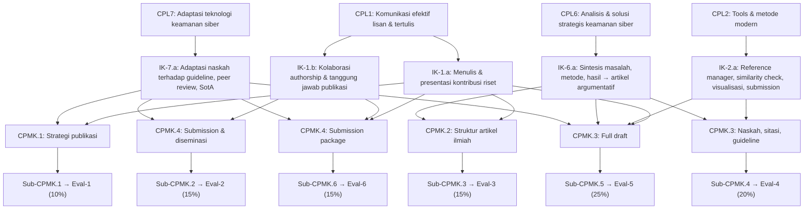

---

## PETA KOMPETENSI MATA KULIAH

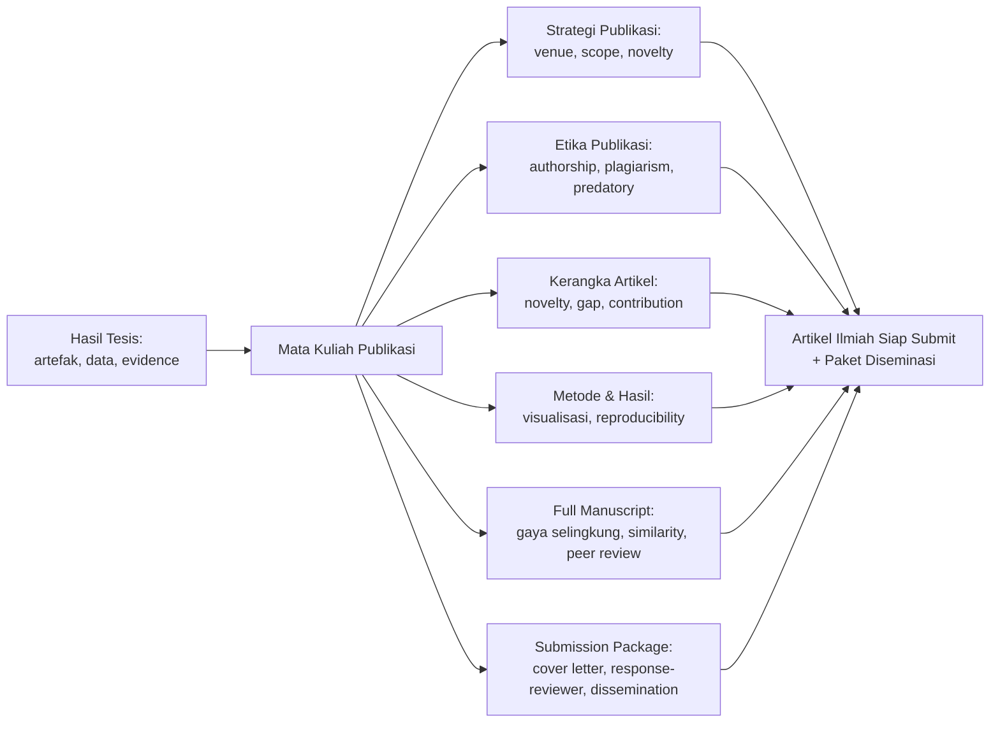

---

## PETUNJUK PENGGUNAAN BUKU

Buku ini bersifat *process-based* — setiap bab menghasilkan bagian dari artikel ilmiah atau dokumen pendukung yang akan diintegrasikan ke dalam final submission package. Mahasiswa sebaiknya mengerjakan buku ini sambil secara aktif menulis artikel mereka.

Setiap bab memiliki template atau checklist yang dapat langsung digunakan. Mahasiswa dianjurkan untuk membaca author guideline dari target venue mereka sejak awal dan merujuk ke sana sepanjang proses penulisan.

Semua praktik penulisan dalam buku ini menekankan integritas akademik. Tidak ada teknik yang direkomendasikan untuk "menipu" sistem similarity checker atau menyembunyikan kekurangan penelitian.

---

## PETA BAB DAN DELIVERABLE

| Bab | Pertemuan | Sub-CPMK | Materi Utama | Evaluasi | Deliverable |
|---|---|---|---|---|---|
| 1 | 1 | Sub-CPMK.1 | Publication Landscape & Readiness | Eval-1 (10%) | Readiness assessment |
| 2 | 2 | Sub-CPMK.1 | Target Venue Matrix & Publication Plan | Eval-1 (10%) | Venue matrix |
| 3 | 3 | Sub-CPMK.2 | Etika Publikasi: Authorship & Plagiarism | Eval-2 (15%) | Ethics checklist |
| 4 | 4 | Sub-CPMK.2 | Predatory Venue & Declaration | Eval-2 (15%) | Predatory checklist |
| 5 | 5 | Sub-CPMK.3 | Manuscript Skeleton & Novelty Matrix | Eval-3 (15%) | Article outline |
| 6 | 6 | Sub-CPMK.3 | Title, Abstract & Introduction | Eval-3 (15%) | Abstract + Intro draft |
| 7 | 7 | Sub-CPMK.3 | Related Work & Contribution Statement | Eval-3 (15%) | Related work draft |
| 8 | 8 | Sub-CPMK.4 | Methods Section | Eval-4 (20%) | Methods draft |
| 9 | 9 | Sub-CPMK.4 | Results, Figures & Tables | Eval-4 (20%) | Results draft |
| 10 | 10 | Sub-CPMK.4 | Discussion, Limitation & Data Availability | Eval-4 (20%) | Discussion draft |
| 11 | 11 | Sub-CPMK.5 | Full Manuscript Assembly | Eval-5 (25%) | Full draft v1 |
| 12 | 12 | Sub-CPMK.5 | Style Compliance & Citation Audit | Eval-5 (25%) | Style-compliant draft |
| 13 | 13 | Sub-CPMK.5 | Similarity Check & Internal Peer Review | Eval-5 (25%) | Similarity report |
| 14 | 14 | Sub-CPMK.5 | Revision dari Internal Peer Review | Eval-5 (25%) | Revised full draft |
| 15 | 15 | Sub-CPMK.6 | Submission Package & Cover Letter | Eval-6 (15%) | Submission package |
| 16 | 16 | Sub-CPMK.6 | Response-to-Reviewer & Dissemination Plan | Eval-6 (15%) | Final dissemination plan |

---

# BAB 1 — PUBLICATION LANDSCAPE DAN READINESS ASSESSMENT

## 1. Capaian Pembelajaran Bab

Setelah mempelajari bab ini, mahasiswa mampu:
- Memahami ekosistem publikasi ilmiah yang relevan untuk forensik digital dan keamanan siber
- Melakukan publication readiness assessment terhadap hasil tesis
- Mengidentifikasi gap antara kondisi penelitian saat ini dan persyaratan publikasi
- Memahami perbedaan antara journal article, conference paper, dan prosiding

*Berkaitan dengan Sub-CPMK.1, Eval-1 (10%)*

## 2. Peta Konsep Bab

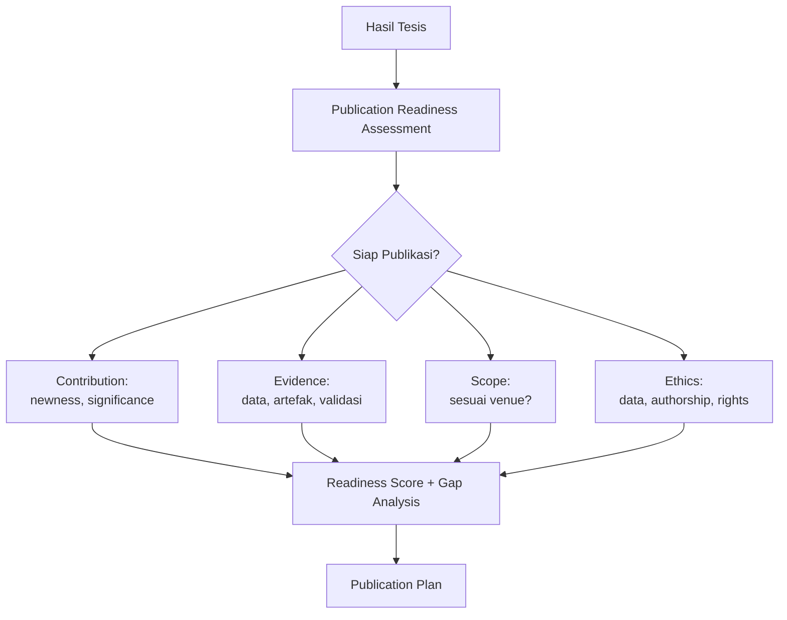

## 3. Pengantar Kontekstual

Tidak semua hasil tesis siap untuk dipublikasikan dalam bentuk aslinya. Tesis adalah dokumen akademik yang komprehensif — biasanya 80-150 halaman — yang mendemonstrasikan penguasaan metodologi. Artikel ilmiah adalah argumen yang padat — biasanya 8-12 halaman — yang mengklaim satu kontribusi spesifik.

Keputusan untuk mempublikasikan memerlukan penilaian jujur: apakah kontribusi cukup signifikan dan baru? Apakah evidence cukup kuat? Apakah tidak ada hambatan etis atau legal? Publication readiness assessment adalah jawaban sistematis terhadap pertanyaan-pertanyaan ini.

## 4. Landasan Teori

### 4.1 Ekosistem Publikasi untuk FDKS

**Jurnal vs Konferensi:**

| Tipe | Proses | Timeline | Prestise | Catatan untuk FDKS |
|---|---|---|---|---|
| Jurnal Q1/Q2 (Scopus/WoS) | Double-blind peer review | 6-24 bulan | Tinggi | Untuk kontribusi metodologis yang matang |
| Konferensi top-tier (IEEE S&P, CCS, USENIX) | Double-blind | 6-12 bulan | Sangat Tinggi | Kompetitif, acceptance rate rendah (~15%) |
| Konferensi tier-2 (IEEE ICTC, dll.) | Single/double-blind | 3-6 bulan | Sedang | Lebih accessible untuk mahasiswa |
| Jurnal SINTA Q1/Q2 | Peer review | 4-8 bulan | Nasional | Relevan untuk persyaratan kelulusan |
| Workshop/Symposium | Light review | 2-4 bulan | Rendah-Sedang | Baik untuk feedback awal |

### 4.2 Publication Readiness Assessment Framework

Penilaian kesiapan publikasi mencakup empat dimensi:

**Contribution Readiness (0-3):**
- 0: Tidak ada kontribusi yang jelas
- 1: Ada kontribusi tetapi tidak spesifik atau terlalu luas
- 2: Kontribusi jelas dan spesifik dengan boundary yang terdefinisi
- 3: Kontribusi jelas, spesifik, signifikan, dan terdokumentasi dalam evidence

**Evidence Readiness (0-3):**
- 0: Tidak ada evidence kuantitatif
- 1: Evidence ada tetapi tidak meyakinkan (satu run, tidak ada baseline)
- 2: Evidence solid (repeated measurement, baseline yang fair)
- 3: Evidence komprehensif (statistical significance, effect size, robustness check)

**Scope Fit (0-3):**
- 0: Tidak jelas venue mana yang tepat
- 1: Ada venue yang mungkin cocok tetapi tidak yakin
- 2: Venue spesifik teridentifikasi dengan scope yang cocok
- 3: Venue utama dan alternatif teridentifikasi dengan justifikasi

**Ethics Clearance (0-3):**
- 0: Ada isu etis yang belum diselesaikan (data personal, kerentanan belum di-disclose)
- 1: Isu teridentifikasi, dalam proses diselesaikan
- 2: Semua isu diselesaikan tetapi dokumentasi belum lengkap
- 3: Semua isu diselesaikan dan terdokumentasi

**Interpretasi total (0-12):**
- 10-12: Siap untuk submission langsung
- 7-9: Siap dengan perbaikan minor (2-4 minggu)
- 4-6: Perlu perbaikan signifikan (1-3 bulan)
- 0-3: Belum siap — diskusikan dengan pembimbing

### 4.3 Tipe Artikel untuk Kontribusi FDKS

| Tipe Artikel | Karakteristik | Cocok Untuk |
|---|---|---|
| Full Research Paper | 10-12 halaman; semua bagian IMRAD; kontribusi empiris atau sistem | Kontribusi utama tesis |
| Short Paper / Position Paper | 4-6 halaman; satu insight utama | Kontribusi yang lebih terfokus |
| Tool/Demo Paper | 4-6 halaman; mendeskripsikan artefak/tool | Kontribusi berbasis artefak |
| Survey/SLR | 15-20+ halaman; sintesis literatur | Kontribusi mapping |
| Case Study | 8-12 halaman; studi kasus mendalam | Forensik digital, incident response |

## 5. Model atau Arsitektur

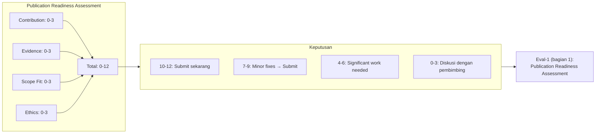

## 6. Contoh Terapan

**Publication readiness assessment untuk tesis malware detection:**

| Dimensi | Skor | Justifikasi |
|---|---|---|
| Contribution | 3 | Kontribusi jelas: sistem deteksi behavioral berbasis temporal pattern yang lebih akurat dari SotA. Boundary: PE malware di Windows. |
| Evidence | 2 | 5 runs, F1=0.921 vs baseline 0.851, Wilcoxon p=0.008. Belum ada cross-dataset validation. |
| Scope Fit | 2 | Target: IEEE Transactions on Information Forensics and Security. Scope cocok tetapi acceptance rate ~25%. Alternatif: Computers & Security (Q1). |
| Ethics | 3 | Dataset dari public repository dengan lisensi CC-BY. Tidak ada data personal. Tidak ada kerentanan yang ditemukan dalam sistem nyata. |
| **Total** | **10** | **Siap untuk submission dengan minor adjustments.** |

## 7. Praktikum atau Aktivitas Terarah

**Tujuan:** Melakukan publication readiness assessment untuk hasil tesis sendiri.

**Langkah Kerja:**
1. Isi setiap dimensi assessment (0-3) dengan justifikasi spesifik.
2. Hitung total skor dan tentukan kategori kesiapan.
3. Untuk setiap dimensi di bawah 3: identifikasi tindakan konkret untuk meningkatkan skor.
4. Diskusikan hasil dengan pembimbing untuk validasi.

**Output:** Publication readiness assessment document (1 halaman) beserta gap analysis dan action plan.

## 8. Latihan Pemahaman

1. **(Pilihan Ganda)** Perbedaan utama antara jurnal artikel dan conference paper adalah:
   - A. Jurnal selalu lebih bergengsi dari konferensi
   - B. Jurnal memiliki proses review yang lebih panjang; konferensi memiliki deadline yang lebih keras
   - C. Conference paper tidak dapat dikutip sebagai referensi
   - D. Jurnal hanya untuk hasil empiris; konferensi untuk artefak

2. **(Analisis)** Skor Ethics Clearance = 1 karena tesis menggunakan data dari organisasi mitra yang belum memberikan izin eksplisit untuk dipublikasikan. Apa yang harus dilakukan sebelum submission?

3. **(Evaluasi)** Mahasiswa A memiliki skor publication readiness total 6/12. Pembimbing menyarankan untuk langsung submit ke jurnal Q1. Evaluasi saran ini.

## 9. Latihan Terapan / Studi Kasus

**Studi Kasus:** Tesis Anda memiliki dua kontribusi: (a) dataset baru untuk deteksi intrusi IoT, dan (b) model ML yang menggunakan dataset tersebut. Kedua kontribusi cukup kuat untuk dipublikasikan sendiri-sendiri. Bagaimana Anda menentukan strategi: satu paper dengan kedua kontribusi, atau dua paper terpisah? Pertimbangkan: salami publication ethics, scope venye, effort, timeline.

## 10. Kunci Jawaban dan Pembahasan

**Soal 1:** Jawaban B. Perbedaan utama bukan tentang prestise (konferensi top-tier IEEE S&P lebih bergengsi dari banyak jurnal) tetapi tentang proses dan timeline. Jurnal memiliki review yang lebih iteratif dan dalam; konferensi memiliki deadline keras dan review yang lebih singkat.

**Soal 2:** Sebelum submission: (a) hubungi organisasi mitra untuk mendapatkan izin eksplisit secara tertulis; (b) anonimisasi data jika memungkinkan; (c) tambahkan ethical disclosure statement; (d) jika izin tidak dapat diperoleh, pertimbangkan menggunakan dataset publik sebagai pengganti dan mendapatkan hasil komparabel.

**Soal 3:** Saran berisiko. Skor 6/12 berarti ada gap signifikan yang belum diselesaikan. Submit ke jurnal Q1 dengan kondisi ini kemungkinan besar akan menghasilkan rejection atau major revision yang memakan waktu lebih lama daripada jika gap diselesaikan dahulu.

## 11. Ringkasan Bab

Publication readiness assessment mengevaluasi empat dimensi: contribution (0-3), evidence (0-3), scope fit (0-3), dan ethics (0-3). Skor 10-12 menunjukkan kesiapan; di bawah itu memerlukan gap analysis dan perbaikan. Tipe artikel (full paper, short paper, tool paper) harus dipilih sesuai dengan tipe kontribusi.

## 12. Refleksi Profesional

1. Dalam karier akademik dan profesional, keputusan untuk mempublikasikan atau tidak mempublikasikan sesuatu melibatkan pertimbangan yang sama yang Anda praktikkan dalam assessment ini. Bagaimana kemampuan menilai kesiapan publikasi secara jujur — termasuk mengakui ketika "belum siap" — menjadi kompetensi profesional yang penting?


---

# BAB 2 — TARGET VENUE MATRIX DAN PUBLICATION PLAN

## 1. Capaian Pembelajaran Bab

Setelah mempelajari bab ini, mahasiswa mampu:
- Menyusun target venue matrix yang komprehensif untuk artikel dari hasil tesis
- Mengevaluasi venue berdasarkan scope, indexing, APC, dan acceptance rate
- Membedakan venue predatory dari venue yang legitimate
- Menyusun publication plan dengan timeline yang realistis

*Berkaitan dengan Sub-CPMK.1, Eval-1 (10%)*

## 2. Peta Konsep Bab

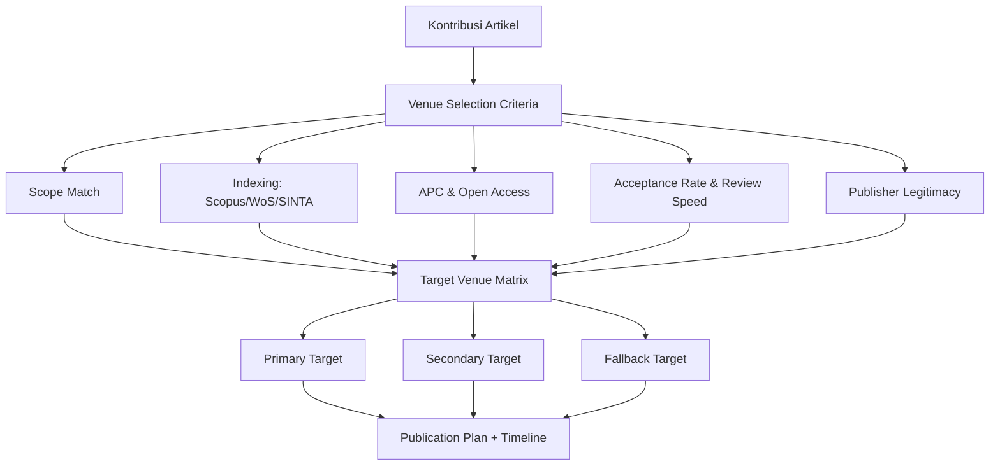

## 3. Pengantar Kontekstual

Pemilihan venue bukan sekadar memilih jurnal atau konferensi yang "terkenal." Ini adalah keputusan strategis yang memengaruhi: kemungkinan diterima, waktu yang dibutuhkan, biaya, visibilitas hasil penelitian, dan dampaknya terhadap komunitas yang tepat. Penelitian keamanan siber yang dikirimkan ke venue yang tidak tepat — misalnya, metode forensik digital yang dikirimkan ke jurnal general computer science tanpa komunitas forensik — akan sulit dievaluasi dengan adil.

## 4. Landasan Teori

### 4.1 Kriteria Pemilihan Venue

**Scope Match:**
Sebelum mempertimbangkan hal lain, pastikan topik artikel masuk dalam scope venue. Sebagian besar jurnal dan konferensi memiliki Aims & Scope yang eksplisit. Tanda bahaya: artikel forensik digital dikirimkan ke jurnal yang tidak pernah mempublikasikan artikel serupa dalam 3 tahun terakhir.

**Indexing:**
| Database | Bobot | Keterangan |
|---|---|---|
| Web of Science (WoS) Core | Tertinggi | Selektif, proses masuk ketat |
| Scopus | Tinggi | Lebih inklusif dari WoS, terpercaya |
| DOAJ | Sedang | Directory of Open Access Journals |
| SINTA Q1/Q2 | Nasional | Relevan untuk persyaratan Dikti |
| Google Scholar | Rendah | Tidak selektif, tidak cukup untuk publikasi akademis |

**Impact Factor vs CiteScore:**
- Impact Factor (IF): rata-rata sitasi artikel dalam 2 tahun terakhir per artikel yang diterbitkan (WoS)
- CiteScore: rata-rata sitasi dalam 4 tahun (Scopus)
- H-index: ukuran produktivitas dan dampak penulis, bukan jurnal
- Catatan: IF tinggi ≠ acceptance rate tinggi untuk semua bidang

**APC (Article Processing Charge):**
Jurnal open access biasanya mengenakan APC. Kisaran umum: USD 500 – USD 3.500. Beberapa jurnal terindeks Scopus memiliki APC waiver untuk negara berkembang atau afiliasi tertentu. APC yang sangat murah (<USD 200) dari jurnal yang mengklaim terindeks WoS adalah tanda bahaya predatory.

**Acceptance Rate:**
| Kategori | Acceptance Rate | Keterangan |
|---|---|---|
| Elite (IEEE S&P, CCS) | <15% | Sangat kompetitif |
| Top-tier journal Q1 | 15-25% | Kompetitif |
| Jurnal Q2 Scopus | 25-40% | Moderat |
| Jurnal Q3/Q4 | >40% | Lebih mudah tetapi dampak lebih rendah |
| Predatory | Hampir 100% | Tanda bahaya |

### 4.2 Venue yang Relevan untuk FDKS

**Jurnal Internasional Prioritas:**
| Nama | Publisher | Indexing | Fokus |
|---|---|---|---|
| IEEE Transactions on Information Forensics and Security | IEEE | WoS/Scopus Q1 | Forensik digital, kriptografi, security |
| Computers & Security | Elsevier | Scopus Q1 | Computer security, privacy |
| Digital Investigation / Forensic Science International: Digital | Elsevier | Scopus Q1 | Digital forensics |
| Journal of Cybersecurity | Oxford | Scopus Q1 | Kebijakan, teknis, sosioteknik |
| IEEE Access | IEEE | WoS/Scopus | Multidisiplin, APC moderate, open access |

**Konferensi Internasional:**
| Nama | Penyelenggara | Tingkatan | Fokus |
|---|---|---|---|
| IEEE S&P (Oakland) | IEEE | Elite | Security & privacy, semua aspek |
| ACM CCS | ACM | Elite | Computer security |
| USENIX Security | USENIX | Elite | Systems security, forensics |
| IEEE EuroS&P | IEEE | Top-tier | European security research |
| DFRWS | DFRWS Org | Top-tier forensik | Digital forensics spesifik |

**Jurnal Nasional (SINTA):**
| Nama | Lembaga | SINTA | Fokus |
|---|---|---|---|
| JNTETI (Jurnal Nasional Teknik Elektro dan TIK) | UGM | Q1 | TIK termasuk keamanan |
| Jurnal Ilmiah Teknik Elektro Komputer dan Informatika | UAD | Q2 | TIKE, security |
| IJCCS (Indonesian Journal of Computing and Cybernetics Systems) | UGM | Q1 | Komputasi |

### 4.3 Membuat Target Venue Matrix

Target Venue Matrix adalah tabel terstruktur yang mendokumentasikan semua kandidat venue dengan penilaian sistematis. Matrix ini menjadi dasar keputusan submission.

**Kolom wajib:**
1. Nama venue (jurnal/konferensi)
2. Publisher
3. Indexing (Scopus/WoS/SINTA/dll.)
4. Quartile
5. Acceptance rate (estimasi)
6. Review turnaround (estimasi bulan)
7. APC (jika ada)
8. Open Access?
9. Deadline (untuk konferensi)
10. Scope match (1-5)
11. Prioritas (Primary/Secondary/Fallback)
12. Catatan/Alasan

### 4.4 Publication Plan

Publication plan adalah jadwal eksplisit yang menghubungkan milestone penulisan dengan target submission date.

**Komponen publication plan:**
- Target venue (primary, secondary, fallback)
- Deadline venue
- Milestone penulisan: skeleton, draft bagian-bagian, full draft, revision, final
- Review cycle (internal peer review oleh pembimbing/kolega)
- Similarity check
- Submission date target
- Contingency: jika ditolak, venue mana berikutnya?

## 5. Model atau Arsitektur

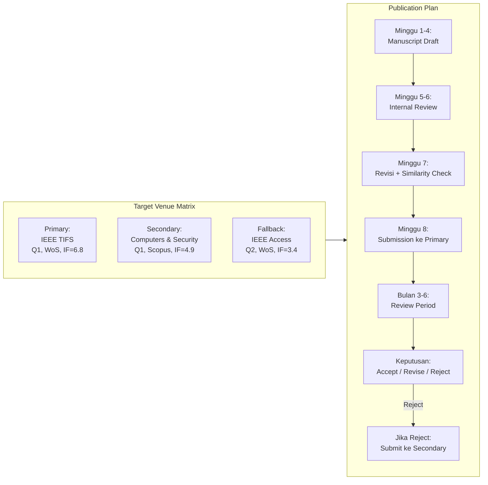

## 6. Contoh Terapan

**Target Venue Matrix untuk penelitian "Behavioral Malware Detection pada Android menggunakan Federated Learning":**

| Venue | Indexing | APC | Turnaround | Scope Match | Prioritas |
|---|---|---|---|---|---|
| IEEE TIFS | WoS Q1 | USD 1.950 | 3-4 bulan | 5/5 | Primary |
| Computers & Security | Scopus Q1 | USD 2.800 | 4-6 bulan | 4/5 | Secondary |
| Journal of Information Security and Applications | Scopus Q2 | USD 1.300 | 2-3 bulan | 4/5 | Fallback-1 |
| IEEE Access | WoS Q2 | USD 1.995 | 4-6 minggu | 3/5 | Fallback-2 |
| JNTETI | SINTA Q1 | 0 (subsidi) | 3-4 bulan | 3/5 | Alternatif Nasional |

## 7. Praktikum atau Aktivitas Terarah

**Tujuan:** Menyusun Target Venue Matrix dan Publication Plan untuk artikel dari tesis sendiri.

**Langkah Kerja:**
1. Identifikasi 2-3 kata kunci utama topik penelitian Anda.
2. Cari di Scimago (scimagojr.com) dan Scopus Author Search minimal 5 jurnal yang sesuai.
3. Cari minimal 2 konferensi internasional yang relevan.
4. Isi Target Venue Matrix sesuai template di Lampiran C.
5. Tentukan primary, secondary, dan fallback venue dengan justifikasi.
6. Buat publication plan dengan milestone dan timeline realistis.

**Catatan Etika:** Pastikan venue yang Anda pilih legitimate — cek Beall's List dan DOAJ. Tidak ada yang menang dari mempublikasikan di venue predatory; artikel tidak akan dikutip dan dapat merusak reputasi.

## 8. Latihan Pemahaman

1. **(Analisis)** Jurnal "International Journal of Advanced Computer Science Research" menawarkan: acceptance dalam 3 hari, biaya USD 50, tidak tercantum di Scopus atau WoS, tetapi mengklaim "ISI indexed." Apa yang harus Anda curigai dan bagaimana cara verifikasinya?

2. **(Pilihan Ganda)** CiteScore adalah:
   - A. Sama dengan Impact Factor, hanya namanya berbeda
   - B. Rata-rata sitasi per artikel dalam 4 tahun (Scopus)
   - C. Ukuran kualitas penulis, bukan jurnal
   - D. Hanya berlaku untuk jurnal open access

3. **(Perancangan)** Penelitian Anda menghasilkan dataset baru DAN model baru. Bagaimana Anda memutuskan apakah mengirimkan satu paper yang mencakup keduanya atau dua paper terpisah?

## 9. Latihan Terapan / Studi Kasus

Anda memiliki artikel forensik digital yang selesai. IEEE TIFS adalah target primary Anda. Setelah 5 bulan review, paper Anda ditolak dengan 3 reviewer comments: R1 positif, R2 meminta tambahan eksperimen yang membutuhkan 3 bulan kerja, R3 mempertanyakan novelty. Anda memiliki deadline kelulusan 8 bulan lagi. Buat analisis keputusan: submit revision ke TIFS atau redirect ke venue lain? Sertakan risk/benefit analysis, timeline implications, dan pertimbangan etis.

## 10. Kunci Jawaban dan Pembahasan

**Soal 1:** Tanda bahaya: acceptance 3 hari (tidak mungkin untuk double-blind peer review yang layak), biaya sangat murah, tidak terindeks Scopus/WoS. "ISI indexed" adalah klaim ambigu — ISI (Institute for Scientific Information) sudah diakuisisi Clarivate, dan istilah ini sering disalahgunakan oleh predatory journals. Cara verifikasi: cek di master list Web of Science (clarivate.com), cek di Scopus (scopus.com/sources), cek Beall's List of Predatory Publishers (tersedia di berbagai mirror), cek apakah jurnal terdaftar di DOAJ.

**Soal 2:** Jawaban B. CiteScore adalah metrik Scopus yang menghitung rata-rata sitasi artikel dalam 4 tahun terakhir. Impact Factor (WoS) menggunakan window 2 tahun. Keduanya mengukur dampak jurnal, bukan penulis (H-index adalah ukuran dampak penulis).

**Soal 3:** Pertimbangkan: (a) apakah satu venue dapat mengakomodasi kedua kontribusi dalam satu paper? (b) apakah memisahkan keduanya berarti salami publication (yang tidak etis jika satu paper tidak bisa berdiri sendiri tanpa yang lain)? (c) jika dataset cukup signifikan sebagai kontribusi tersendiri dan model cukup signifikan sebagai kontribusi tersendiri, dan keduanya dapat berdiri sendiri secara argumentatif, dua paper terpisah bisa sah — tetapi dengan cross-referencing yang eksplisit dan disclosure yang jelas.

**Soal Studi Kasus:** Analisis keputusan yang tepat mencakup: (1) Estimasi waktu: revision ke TIFS membutuhkan 3 bulan kerja + 3-5 bulan review lagi = 6-8 bulan total, mendekati batas kelulusan. (2) Risiko: TIFS mungkin masih reject setelah revision. (3) Opsi: redirect ke Computers & Security (turnaround 4-6 bulan, scope cocok, lebih mungkin accept tanpa tambahan eksperimen besar). (4) Pertimbangan etis: tidak etis untuk mengirimkan versi berbeda secara simultan (double submission). (5) Rekomendasi: diskusikan dengan pembimbing — redirect ke secondary venue dengan merespons komentar R1 dan R3 (novelty) yang bisa diselesaikan tanpa eksperimen tambahan, dengan mencatat R2 sebagai future work.

## 11. Ringkasan Bab

Target Venue Matrix mendokumentasikan pilihan venue berdasarkan: scope match, indexing/quartile, APC, acceptance rate, dan turnaround. Tentukan primary, secondary, dan fallback. Publication plan menghubungkan milestone penulisan dengan target submission date beserta contingency plan jika ditolak.

## 12. Refleksi Profesional

1. Pemilihan venue mencerminkan nilai-nilai Anda sebagai peneliti: apakah Anda memilih venue karena dampak dan relevansi komunitas, atau semata karena persyaratan kelulusan? Bagaimana kedua pertimbangan ini bisa diseimbangkan?

2. Open access memungkinkan penelitian dibaca oleh komunitas yang lebih luas, termasuk di negara berkembang. Namun APC sering menjadi hambatan. Apakah ada tanggung jawab profesional untuk memilih model publikasi yang lebih inklusif?

---

# BAB 3 — ETIKA PUBLIKASI: AUTHORSHIP DAN CONTRIBUTORSHIP

## 1. Capaian Pembelajaran Bab

Setelah mempelajari bab ini, mahasiswa mampu:
- Memahami dan menerapkan ICMJE Authorship Criteria untuk menentukan penulis yang sah
- Menggunakan CRediT taxonomy untuk mendokumentasikan kontribusi penulis secara transparan
- Mengidentifikasi pelanggaran authorship (gift, ghost, coercive authorship)
- Memahami konsekuensi pelanggaran authorship dalam publikasi ilmiah

*Berkaitan dengan Sub-CPMK.2, Eval-2 (15%)*

## 2. Peta Konsep Bab

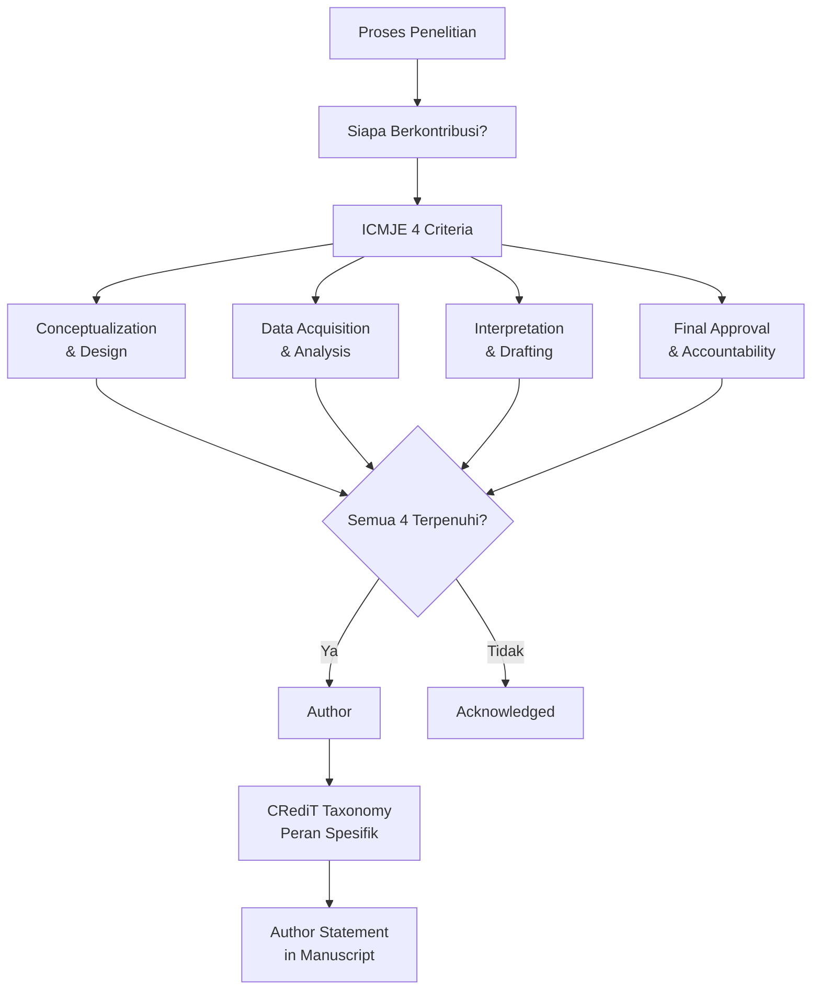

## 3. Pengantar Kontekstual

Authorship bukan sekadar nama yang tercantum di header artikel. Di balik setiap nama penulis terdapat klaim tentang kontribusi, tanggung jawab, dan akuntabilitas. Artikel yang diterbitkan adalah rekam jejak permanen — kesalahan yang terjadi di dalamnya menjadi tanggung jawab semua penulisnya.

Dalam konteks program magister, mahasiswa sering menghadapi situasi yang tidak jelas: apakah pembimbing otomatis menjadi penulis? Apakah kolega yang meminjamkan akses komputer berhak menjadi penulis? Apakah kepala laboratorium yang tidak terlibat langsung harus dicantumkan? Bab ini memberikan kerangka yang jelas.

## 4. Landasan Teori

### 4.1 ICMJE Authorship Criteria

International Committee of Medical Journal Editors (ICMJE) menetapkan standar authorship yang diadopsi secara luas di semua bidang ilmu, termasuk computer science dan keamanan siber. Seorang individu berhak menjadi penulis **jika dan hanya jika** memenuhi **semua empat kriteria** berikut:

1. **Kontribusi substansial** terhadap: konseptualisasi atau desain penelitian; ATAU akuisisi, analisis, atau interpretasi data.
2. **Partisipasi dalam penulisan artikel** atau revisi kritis yang signifikan untuk konten intelektual penting.
3. **Persetujuan terhadap versi final** yang akan dipublikasikan.
4. **Akuntabilitas** untuk semua aspek penelitian, termasuk bersedia menginvestigasi dan menyelesaikan masalah yang terkait dengan akurasi atau integritas.

Individu yang memenuhi hanya sebagian kriteria harus dicantumkan dalam **Acknowledgments**, bukan sebagai penulis.

### 4.2 Pelanggaran Authorship

**Ghost Authorship:**
Seseorang yang memberikan kontribusi substansial terhadap penelitian tetapi tidak dicantumkan sebagai penulis. Ini terjadi ketika, misalnya, seorang analis data yang melakukan seluruh analisis statistik tidak dicantumkan sebagai penulis. Ini adalah pelanggaran etika karena kontribusi tidak diakui dan tidak dapat dimintai pertanggungjawaban.

**Gift/Honorary Authorship:**
Seseorang dicantumkan sebagai penulis karena status (kepala departemen, direktur laboratorium, kolaborator yang membantu pendanaan) meskipun tidak memenuhi kriteria ICMJE. Ini adalah bentuk korupsi akademik yang merusak kepercayaan pada karya ilmiah.

**Coercive/Forced Authorship:**
Penulis junior dipaksa untuk mencantumkan nama penulis senior yang tidak berkontribusi, atau sebaliknya. Dalam konteks mahasiswa-pembimbing, ini dapat terjadi dalam arah mana pun.

**Disputes Authorship:**
Sengketa tentang urutan penulis atau apakah seseorang berhak menjadi penulis. Urutan penulis biasanya mencerminkan: penulis pertama = kontribusi terbesar; penulis terakhir = senior investigator/pembimbing (dalam banyak konvensi).

### 4.3 CRediT Taxonomy

Contributor Roles Taxonomy (CRediT) menyediakan 14 peran kontribusi yang spesifik. Ini memungkinkan transparansi lebih besar dari sekadar authorship:

| Peran | Deskripsi |
|---|---|
| Conceptualization | Ide; formulasi masalah |
| Data Curation | Manajemen, anotasi, dan pemeliharaan data |
| Formal Analysis | Analisis statistik dan matematis |
| Funding Acquisition | Perolehan dana untuk penelitian |
| Investigation | Eksperimen, pengumpulan data |
| Methodology | Desain dan pengembangan metodologi |
| Project Administration | Koordinasi dan manajemen proyek |
| Resources | Penyediaan material, peralatan, dataset |
| Software | Pengembangan kode, program, tools |
| Supervision | Pengawasan penelitian |
| Validation | Verifikasi/reproduksi hasil |
| Visualization | Pembuatan figur dan visualisasi |
| Writing – Original Draft | Penulisan draft pertama |
| Writing – Review & Editing | Revisi dan editing naskah |

Dalam Author Statement, setiap penulis dicantumkan dengan peran spesifik yang dimainkannya.

### 4.4 Authorship dalam Konteks Mahasiswa-Pembimbing

Dalam penelitian magister, beberapa situasi umum dan cara mengatasinya:

| Situasi | Keputusan Tepat | Alasan |
|---|---|---|
| Pembimbing membantu desain penelitian dan revisi artikel | Author (penulis ke-2) | Memenuhi kriteria 1, 2, 3, 4 |
| Pembimbing hanya menandatangani persetujuan administratif | Acknowledgment, bukan Author | Tidak memenuhi kriteria 1 dan 2 |
| Kepala laboratorium menyediakan akses komputer saja | Acknowledgment | Tidak memenuhi kriteria ICMJE |
| Kolega yang membantu implementasi kode | Author (jika kontribusi software substansial dan memenuh ikriteria lain) atau Acknowledgment | Bergantung pada besarnya kontribusi |

## 5. Model atau Arsitektur

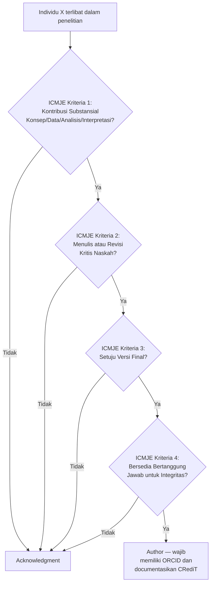

## 6. Contoh Terapan

**Kasus: Penelitian tesis "Intrusion Detection pada ICS menggunakan LSTM"**

| Individu | Kontribusi | Keputusan |
|---|---|---|
| Mahasiswa A | Konsep, desain, data collection, semua coding, penulisan draft, revisi | **Author (penulis ke-1)** |
| Pembimbing B | Membantu desain penelitian, revisi kritis naskah, persetujuan final | **Author (penulis ke-2)** |
| Teknisi C | Menyiapkan lab/server untuk eksperimen | **Acknowledgment** |
| Kepala Prodi D | Memberikan akses ke jaringan lab | **Acknowledgment** |
| Kolega E | Melakukan statistical analysis (Wilcoxon test) | **Author (penulis ke-3)** jika: juga membantu interpretasi dan revisi naskah; ATAU **Acknowledgment** jika hanya menjalankan analisis |

## 7. Praktikum atau Aktivitas Terarah

**Tujuan:** Menyusun Author Statement dan CRediT declaration untuk artikel tesis.

**Langkah Kerja:**
1. Buat daftar semua individu yang terlibat dalam penelitian Anda.
2. Untuk setiap individu, evaluasi apakah memenuhi semua 4 kriteria ICMJE.
3. Untuk setiap Author: dokumentasikan peran CRediT spesifik.
4. Untuk yang bukan Author: drafting kalimat Acknowledgment.
5. Diskusikan draf ini dengan pembimbing untuk konsensus.

**Catatan Etika:** Diskusi tentang authorship harus dilakukan *sebelum* penelitian dimulai, bukan setelah artikel selesai. Jika ada ketidaksepakatan, lihat kebijakan authorship institusi atau etika komite.

## 8. Latihan Pemahaman

1. **(Skenario)** Direktur laboratorium Anda memberikan akses ke dataset bernilai tinggi dari proyek sebelumnya dan membaca draft akhir tanpa memberikan komentar substantif, kemudian "menyetujui" untuk dipublikasikan. Apakah ia memenuhi kriteria authorship ICMJE?

2. **(Analisis)** Mengapa ghost authorship dianggap pelanggaran etika yang serius meskipun individu yang "dighost" mungkin tidak keberatan?

3. **(CRediT)** Seorang kolega melakukan semua visualisasi data (figur 1-8 dalam artikel), membantu interpretasi hasil visualisasi, dan mengedit bagian Results. Peran CRediT apa yang tepat untuk kolega ini?

## 9. Latihan Terapan / Studi Kasus

Pembimbing Anda secara konsisten menambahkan namanya sebagai penulis ke-2 pada semua tesis mahimbingnya, meskipun keterlibatannya bervariasi. Dalam kasus Anda, pembimbing menghadiri 3 dari 12 meeting, memberikan komentar pada draft bab 3, dan menandatangani lembar persetujuan. Bagaimana Anda mengevaluasi situasi ini menggunakan kriteria ICMJE? Apa langkah yang etis dan konstruktif untuk diambil? Pertimbangkan: dinamika power, implikasi hukum (UU PDP), dan kebijakan institusi.

## 10. Kunci Jawaban dan Pembahasan

**Soal 1:** Tidak memenuhi. Kriteria 2 (revisi kritis naskah) tidak terpenuhi — membaca dan "menyetujui" tanpa komentar substantif bukan revisi kritis. Jika pembimbing tidak memberikan komentar intelektual pada naskah, ia harus dicantumkan dalam Acknowledgment, bukan sebagai Author.

**Soal 2:** Ghost authorship adalah pelanggaran serius karena: (a) kontribusi intelektual tidak diakui secara publik — ini adalah bentuk pencurian kredit; (b) seseorang yang tidak berkontribusi dicantumkan sebagai author bertanggung jawab atas integritas artikel tersebut, padahal mereka tidak terlibat; (c) jika terjadi kesalahan atau fraud dalam artikel, ghost author tidak bisa dimintai pertanggungjawaban; (d) merusak kepercayaan komunitas ilmiah pada proses authorship.

**Soal 3:** Peran CRediT: Visualization (semua figur), Formal Analysis (interpretasi hasil visualisasi), Writing – Review & Editing (edit bagian Results). Dengan kontribusi ini, kolega tersebut kemungkinan memenuhi Kriteria 1 ICMJE (kontribusi analisis) dan Kriteria 2 (revisi kritis) — sehingga berhak menjadi Author, dengan catatan Kriteria 3 dan 4 juga terpenuhi.

**Soal Studi Kasus:** Evaluasi ICMJE: menghadiri 3/12 meeting + komentar 1 bab + tandatangan persetujuan → Kriteria 1 mungkin terpenuhi sebagian (komentar bab 3 mungkin = kontribusi substansial); Kriteria 2 sebagian terpenuhi; Kriteria 3 terpenuhi; Kriteria 4 ambigu. Secara ketat, situasi ini borderline. Langkah etis yang konstruktif: (1) Bicarakan secara langsung dengan pembimbing — "Saya ingin memastikan CRediT declaration kami akurat; bisakah kita mendokumentasikan kontribusi masing-masing?" (2) Jika pembimbing setuju untuk dikategorikan sebagai penulis, dokumen kontribusi secara formal. (3) Jika ada disagreement, konsultasikan ke ombudsman akademik atau komite etika institusi. Hindari konfrontasi langsung yang bisa merusak hubungan tanpa solusi. Kekuatan mahasiswa: dokumentasi semua interaksi (email, notulensi meeting) dari awal.

## 11. Ringkasan Bab

Authorship sah memerlukan pemenuhan semua 4 kriteria ICMJE: kontribusi substansial, partisipasi penulisan, persetujuan final, dan akuntabilitas. CRediT taxonomy memungkinkan transparansi peran spesifik. Gift authorship, ghost authorship, dan coercive authorship adalah pelanggaran etika dengan konsekuensi akademis yang serius.

## 12. Refleksi Profesional

1. Dalam karier sebagai peneliti atau profesional keamanan siber, Anda mungkin diminta (atau ditekan) untuk mencantumkan nama seseorang yang tidak berkontribusi. Bagaimana Anda membangun ketahanan profesional terhadap tekanan semacam ini?

2. Authorship yang tidak tepat dapat memiliki implikasi hukum di luar dunia akademik — misalnya dalam klaim hak kekayaan intelektual atas artefak penelitian. Bagaimana ini relevan dalam konteks Hak Kekayaan Intelektual (HKI) di Indonesia?


---

# BAB 4 — PLAGIARISM, SELF-PLAGIARISM, DAN PREDATORY VENUE SCREENING

## 1. Capaian Pembelajaran Bab

Setelah mempelajari bab ini, mahasiswa mampu:
- Mendefinisikan berbagai bentuk plagiarism dan membedakannya dari parafrase yang sah
- Memahami konsekuensi plagiarism di tingkat akademik, profesional, dan hukum
- Memahami konsep self-plagiarism dan text recycling
- Melakukan predatory venue screening secara sistematis

*Berkaitan dengan Sub-CPMK.2, Eval-2 (15%)*

## 2. Peta Konsep Bab

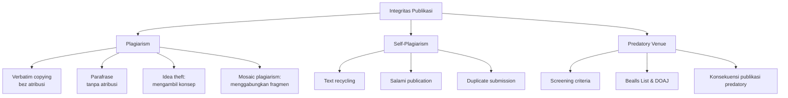

## 3. Pengantar Kontekstual

Plagiarism adalah bentuk penipuan akademik yang paling dikenal. Namun dalam praktik, batasannya tidak selalu jelas — terutama ketika mahasiswa berhadapan dengan tesis mereka sendiri, yang sekarang perlu diubah menjadi artikel. Apakah menyalin kalimat dari tesis sendiri adalah plagiarism? Jawabannya: tergantung pada kebijakan venue, apakah tesis sudah dipublikasikan, dan sejauh mana "recycling" yang dilakukan.

Di sisi lain, memilih venue yang salah — khususnya venue predatory — dapat menghanguskan karir akademik bahkan sebelum dimulai. Artikel yang diterbitkan di venue predatory tidak dapat ditarik kembali dengan mudah, dan afiliasi dengan venue tersebut dapat mencemari rekam jejak publikasi selamanya.

## 4. Landasan Teori

### 4.1 Definisi dan Tipologi Plagiarism

**Plagiarism Verbatim:**
Menyalin teks kata per kata dari sumber lain tanpa tanda kutip dan atribusi. Ini adalah bentuk plagiarism paling mudah dideteksi oleh similarity checker.

**Plagiarism Parafrase:**
Mengubah kata-kata teks sumber tetapi mempertahankan ide dan struktur kalimat tanpa atribusi. Sering lebih sulit dideteksi secara otomatis.

**Plagiarism Konsep/Ide:**
Mengambil alih ide, argumen, atau kerangka konseptual seseorang tanpa atribusi, meskipun seluruh teks ditulis ulang. Ini adalah bentuk plagiarism yang paling serius dan paling sulit dibuktikan.

**Mosaic Plagiarism:**
Menggabungkan fragmen dari beberapa sumber dengan sedikit modifikasi. Hasilnya terlihat "original" secara keseluruhan tetapi sesungguhnya adalah komposit dari teks orang lain.

**Plagiarism Data:**
Menggunakan dataset, figur, atau hasil eksperimen orang lain tanpa atribusi atau izin. Ini termasuk menggunakan ulang figur dari paper lain tanpa permission atau dengan mencantumkan sumber tetapi tanpa izin copyright.

### 4.2 Self-Plagiarism dan Text Recycling

**Self-plagiarism (text recycling):**
Menggunakan kembali teks yang telah diterbitkan sebelumnya dari karya sendiri tanpa disclosure. Konsep kunci: sekali teks dipublikasikan, copyright biasanya dialihkan ke publisher — artinya, teks itu bukan milik Anda lagi untuk digunakan bebas.

**Kontroversi text recycling dari tesis:**
Banyak program studi membolehkan mahasiswa menggunakan kembali teks dari tesis mereka untuk artikel ilmiah, dengan disclosure eksplisit. Namun kebijakannya bervariasi per venue dan per institusi. Panduan umum:
- Disclosure eksplisit: "Artikel ini diadaptasi dari tesis penulis [Judul Tesis, Institusi, Tahun]."
- Jika tesis belum dipublikasikan di repository publik, risiko lebih rendah.
- Jika tesis sudah ada di repository terbuka (misalnya PENS ePrints), similarity checker akan mendeteksi overlap.
- Methods section adalah bagian yang paling sering di-recycle; ini lebih diterima dibanding introduction atau discussion.

**Salami publication:**
Memecah satu penelitian yang seharusnya dilaporkan dalam satu paper menjadi beberapa paper ("least publishable units") untuk memaksimalkan jumlah publikasi. Ini tidak etis karena menggelembungkan output publikasi dan membuang waktu reviewer.

**Duplicate submission:**
Mengirimkan artikel yang sama (atau hampir sama) ke dua venue secara bersamaan. Ini melanggar kebijakan hampir semua jurnal dan konferensi, dan dapat mengakibatkan retraction dan blacklisting.

### 4.3 Similarity Checker dan Threshold

| Tool | Digunakan Oleh | Keterangan |
|---|---|---|
| iThenticate / Crossref Similarity Check | Mayoritas jurnal bereputasi | Gold standard untuk journal |
| Turnitin | Institusi pendidikan | Banyak digunakan untuk tesis |
| PlagScan, Copyleaks | Alternatif | Kualitas bervariasi |
| Grammarly (deteksi) | Terbatas | Tidak setara iThenticate |

**Threshold umum:**
- < 15% similarity (dikecualikan referensi): umumnya dapat diterima
- 15-30%: tergantung kebijakan venue; perlu diperiksa per bagian
- > 30%: biasanya memerlukan revisi signifikan sebelum submission

**Penting:** Threshold adalah panduan, bukan jaminan. Satu paragraf yang di-copy verbatim bisa menjadi masalah meskipun total similarity rendah.

### 4.4 Predatory Venue Screening

**Ciri-ciri venue predatory:**
- Acceptance very fast (hari atau minggu, bukan bulan)
- Peer review yang tidak substantif atau tidak ada
- APC sangat murah (< USD 100) atau tidak ada standar
- Klaim indexing palsu atau menyesatkan
- Scope terlalu luas ("multidisciplinary" tanpa fokus)
- Email spam yang mengundang submission
- Editorial board dengan nama-nama yang tidak dapat diverifikasi
- Tidak terdaftar di DOAJ atau tidak terindeks di database yang diklaim

**Tools Screening:**
- **Beall's List:** Daftar publisher dan jurnal predatory yang dikelola oleh komunitas (beallslist.net dan mirror-nya)
- **DOAJ (doaj.org):** Directory jurnal open access legitimate
- **Scopus Sources:** Daftar jurnal yang terindeks Scopus (scopus.com/sources)
- **Master Journal List Clarivate:** Daftar jurnal WoS (mjl.clarivate.com)
- **SCIMAGO (scimagojr.com):** Quartile dan metrics jurnal Scopus
- **Think. Check. Submit. (thinkchecksubmit.org):** Checklist evaluasi venue

## 5. Model atau Arsitektur

```mermaid
flowchart TD
    subgraph SIMILARITY["Similarity Check Workflow"]
        S1[Generate manuscript draft]
        S2[Run iThenticate/Turnitin]
        S3[Review Similarity Report]
        S4{> 15%?}
        S5[Identify high-similarity sections]
        S6[Paraphrase or cite properly]
        S7[Disclose tesis source jika relevan]
        S8[Re-run check]
        S9[Ready for submission]
        S1-->S2-->S3-->S4
        S4-->|Ya|S5-->S6-->S7-->S8-->S3
        S4-->|Tidak|S9
    end

    subgraph PREDATORY["Predatory Screening"]
        P1[Candidate Venue]
        P2[Cek DOAJ/Scopus/WoS]
        P3[Cek Beall's List]
        P4[Cek editorial board]
        P5[Cek recent published articles]
        P6{Pass?}
        P7[Blacklist venue]
        P8[Tambah ke venue matrix]
        P1-->P2-->P3-->P4-->P5-->P6
        P6-->|Tidak|P7
        P6-->|Ya|P8
    end
```

## 6. Contoh Terapan

**Kasus: Mahasiswa menggunakan ulang Methods section dari tesis untuk artikel:**

Tesis telah diupload ke repository PENS pada November 2025. Mahasiswa menulis artikel dan menyalin Methods section dari tesis hampir verbatim (350 kata). iThenticate melaporkan 18% similarity dengan sumber utama dari tesis sendiri.

**Analisis:**
- Tesis sudah publik di repository → iThenticate akan mendeteksi sebagai sumber
- 18% dengan sumber tunggal dari karya sendiri → perlu tindakan
- Solusi: (a) parafrase Methods section untuk artikel (bukan sekadar mengubah beberapa kata); (b) tambahkan footnote atau disclosure: "The experimental methodology in this section is adapted from the author's master's thesis [judul, PENS, 2025]"; (c) re-run similarity check untuk konfirmasi < 15%

## 7. Praktikum atau Aktivitas Terarah

**Tujuan:** Melakukan predatory venue screening menggunakan Think. Check. Submit. checklist.

**Langkah Kerja:**
1. Pilih 2 venue dari Target Venue Matrix Anda (satu yang Anda yakini legitimate, satu yang kurang yakin).
2. Untuk setiap venue, isi checklist Think. Check. Submit. (tersedia di thinkchecksubmit.org).
3. Cek DOAJ, Scopus Sources, dan Beall's List.
4. Dokumentasikan temuan dalam Ethics Checklist (Lampiran B).

**Catatan Etika:** Hindari menyebut nama jurnal yang diidentifikasi sebagai predatory kepada siapapun tanpa verifikasi yang kuat — salah labelkan jurnal yang legitimate sebagai predatory dapat berdampak hukum.

## 8. Latihan Pemahaman

1. **(Pilihan Ganda)** Mosaic plagiarism adalah:
   - A. Menyalin seluruh artikel dari satu sumber
   - B. Menggabungkan fragmen dari banyak sumber dengan modifikasi minimal
   - C. Menggunakan teks sendiri yang sudah dipublikasikan
   - D. Mengubah kesimpulan artikel orang lain

2. **(Analisis)** Jelaskan mengapa memilih venue predatory berdampak lebih dari sekadar "paper tidak dikutip" — jelaskan konsekuensi karir jangka panjang.

3. **(Evaluasi)** Similarity report menunjukkan 25% total similarity. Setelah diperiksa, 20% berasal dari Methods section yang mengutip langsung dari protokol standar ISO 27037 dengan atribusi lengkap. Apakah ini masalah? Jelaskan.

## 9. Latihan Terapan / Studi Kasus

Anda menerima undangan email dari jurnal "International Journal of Advanced Cybersecurity Research" yang menawarkan: fast track publication (2 minggu), APC USD 150, dan mengklaim terindeks di Scopus dan WoS. Lakukan predatory screening lengkap terhadap jurnal ini dan dokumentasikan temuan Anda menggunakan framework Think. Check. Submit. Apa keputusan Anda?

## 10. Kunci Jawaban dan Pembahasan

**Soal 1:** Jawaban B. Mosaic plagiarism adalah menggabungkan fragmen dari banyak sumber, sehingga tidak ada satu sumber tunggal yang mendominasi — ini membuat deteksi otomatis lebih sulit. Tidak ada satu pun kalimat yang disalin penuh, tetapi keseluruhan komposisi menggunakan gagasan dan frasa orang lain.

**Soal 2:** Konsekuensi memilih venue predatory: (a) artikel tidak akan dikutip oleh komunitas serius karena tidak terindeks di Scopus/WoS; (b) artikel tetap online selamanya dengan nama Anda — dan siapapun yang memeriksa rekam jejak publikasi Anda akan melihat afiliasi dengan venue tersebut; (c) beberapa institusi dan komite promosi dosen menolak menghitung publikasi predatory; (d) jika kemudian ditemukan bahwa Anda mempublikasikan di venue predatory, kepercayaan kolega dan pembimbing dapat berkurang; (e) biaya APC yang sudah dibayar tidak dapat dikembalikan.

**Soal 3:** Ini umumnya bukan masalah. Kutipan dari dokumen standar resmi (ISO, NIST, dll.) dengan atribusi lengkap adalah penggunaan yang sah. Similarity checker mendeteksi kesamaan teks, bukan plagiarism secara inheren. Yang penting: atribusi ada, tidak ada misrepresentasi kontribusi. Beberapa venue memiliki opsi untuk "exclude quotes" dan "exclude references" dalam laporan similarity — pastikan digunakan.

**Soal Studi Kasus:** Framework screening yang harus dilakukan: (1) Cek Scopus Sources (scopus.com/sources) — apakah jurnal terdaftar? (2) Cek Master Journal List Clarivate — apakah terdaftar di WoS? (3) Cek DOAJ — apakah terdaftar? (4) Cek Beall's List dan mirror-nya. (5) Cari editorial board — apakah nama-nama dapat diverifikasi di institusi yang diklaim? (6) Lihat beberapa artikel yang sudah terbit — apakah kualitasnya terlihat meragukan? (7) 2 minggu acceptance → sangat tidak mungkin untuk legitimate double-blind peer review. (8) USD 150 APC → sangat murah untuk venue internasional yang legitimate. Keputusan: hampir pasti predatory — jangan submit. Catat dalam venue blacklist.

## 11. Ringkasan Bab

Plagiarism hadir dalam berbagai bentuk: verbatim, parafrase, konsep, mosaic, dan data. Self-plagiarism dan text recycling memiliki aturan yang berbeda per venue, tetapi disclosure selalu diperlukan. Predatory venue screening wajib dilakukan sebelum submission menggunakan DOAJ, Scopus Sources, Beall's List, dan Think. Check. Submit.

## 12. Refleksi Profesional

1. Sebagai peneliti keamanan siber, Anda mungkin menemukan kerentanan dalam metode similarity detection (misalnya, translation plagiarism). Apa tanggung jawab Anda terhadap temuan semacam itu — apakah Anda melaporkan atau hanya tidak menggunakannya untuk kepentingan sendiri?

2. Tekanan untuk mempublikasikan (publish or perish) menciptakan insentif yang dapat mendorong pelanggaran integritas. Sebagai calon akademisi atau profesional FDKS, bagaimana Anda membangun lingkungan kerja yang resistif terhadap tekanan ini?


---

# BAB 5 — MANUSCRIPT SKELETON DAN NOVELTY MATRIX

## 1. Capaian Pembelajaran Bab

Setelah mempelajari bab ini, mahasiswa mampu:
- Menyusun manuscript skeleton yang mencerminkan struktur IMRAD
- Membangun novelty matrix yang mendokumentasikan klaim kebaruan secara sistematis
- Memahami perbedaan antara novelty, originality, dan contribution
- Menulis Highlights dan Graphical Abstract untuk artikel

*Berkaitan dengan Sub-CPMK.3, Eval-3 (15%)*

## 2. Peta Konsep Bab

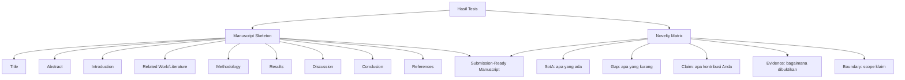

## 3. Pengantar Kontekstual

Artikel ilmiah yang baik tidak ditulis secara linear dari halaman pertama ke terakhir. Ia dibangun sebagai struktur yang koheren di mana setiap bagian memperkuat klaim utama. Sebelum menulis satu kalimat pun, peneliti yang berpengalaman akan membangun skeleton — kerangka yang menunjukkan bagaimana argumen mengalir dari problem ke contribution ke evidence ke implication.

Novelty matrix adalah alat komplementer: ia mendokumentasikan dengan presisi apa yang diklaim baru, apa yang sudah ada sebelumnya, dan di mana batasannya. Tanpa novelty matrix, klaim kebaruan sering terlalu luas atau terlalu sempit — dan reviewer akan mendeteksinya.

## 4. Landasan Teori

### 4.1 Struktur IMRAD dan Variasinya

IMRAD (Introduction, Methods, Results and Discussion) adalah struktur dominan untuk artikel empiris. Namun artikel di bidang FDKS sering menggunakan variasi:

| Variasi | Kapan Digunakan |
|---|---|
| IMRAD klasik | Penelitian empiris: eksperimen, evaluasi sistem |
| IMRAD + Related Work | Ketika literatur cukup kompleks untuk seksi tersendiri |
| IMSRAD | (Introduction, Methods, Results, Analysis, Discussion) — untuk penelitian dengan data kuantitatif kompleks |
| Problem-Solution | Sistem paper: identifikasi masalah, arsitektur solusi, evaluasi |
| Survey/SLR | Introduction, Protocol, Mapping, Synthesis, Conclusion |

### 4.2 Fungsi Setiap Bagian Artikel

**Title:** Mengandung 3 elemen: kontribusi utama + pendekatan/metode + konteks/domain. Contoh: "Behavioral Malware Detection Using Temporal Graph Neural Networks for Windows PE Files" — (kontribusi + metode + domain).

**Abstract (150-250 kata, 4-5 kalimat):**
- Kalimat 1: Konteks masalah dan motivasi
- Kalimat 2: Gap/kelemahan pendekatan yang ada
- Kalimat 3: Kontribusi: apa yang Anda lakukan
- Kalimat 4: Metode utama dan evaluasi
- Kalimat 5: Hasil utama dan implikasi

**Introduction (500-800 kata):**
- Paragraph 1: Kontekstualisasi masalah (broad → narrow)
- Paragraph 2: Review singkat pendekatan yang ada dan keterbatasannya
- Paragraph 3: Gap yang dijawab oleh penelitian ini
- Paragraph 4: Kontribusi utama artikel ini (dalam bullet points atau kalimat bernomor)
- Paragraph 5: Organisasi paper

**Related Work / Literature Review:**
Bukan daftar rangkuman paper — melainkan narasi terstruktur yang menunjukkan bagaimana literatur yang ada berkaitan dengan penelitian Anda dan *di mana gap-nya*. Setiap kelompok literatur harus diakhiri dengan kalimat yang menunjukkan keterbatasan atau gap.

**Methodology:**
Cukup detail untuk memungkinkan replikasi. Bukan semua langkah pengembangan — hanya yang diperlukan untuk memahami dan mengulang eksperimen.

**Results:**
Data mentah yang terorganisir, bukan interpretasi. Tabel dan figur harus self-explanatory. Statistik (mean ± std dev, confidence interval) harus eksplisit.

**Discussion:**
Interpretasi results. Hubungkan dengan hypothesis/RQ yang diajukan. Bandingkan dengan SotA. Jelaskan anomali atau hasil yang tidak terduga. Bahas keterbatasan.

**Conclusion:**
Rangkuman singkat kontribusi, implikasi, dan future work. Bukan repetisi discussion.

### 4.3 Novelty Matrix

Novelty matrix adalah tabel yang mengorganisir klaim kebaruan secara sistematis. Ini membantu: (a) peneliti sendiri memahami batas klaim; (b) reviewer memverifikasi klaim; (c) menghindari over-claiming atau under-claiming.

**Struktur Novelty Matrix:**

| Dimensi Kontribusi | SotA: Yang Sudah Ada | Gap: Yang Belum Ada | Klaim Kami | Evidence | Boundary |
|---|---|---|---|---|---|
| [Metodologis] | Metode A dan B yang ada | Keduanya tidak efisien untuk dataset X | Metode C yang 30% lebih cepat | Tabel 3, Gambar 4 | Hanya pada dataset tipe X |
| [Dataset] | Dataset publik Y dan Z | Tidak mencakup skenario IoT | Dataset baru D dengan 50K sampel IoT | Bagian 3.2 | Lingkungan lab terkontrol |
| [Empiris] | Evaluasi pada dataset benchmark | Tidak ada evaluasi cross-dataset | Evaluasi pada 3 dataset berbeda | Tabel 4-6 | Dataset yang tersedia publik |

**Jenis Novelty:**
- **Methodological novelty:** Metode baru atau adaptasi metode yang signifikan
- **Empirical novelty:** Dataset baru, setting evaluasi baru, temuan baru yang belum dilaporkan
- **Conceptual novelty:** Framework, model, atau taksonomi baru
- **Application novelty:** Menerapkan metode yang ada ke domain/konteks baru (novelty terendah — perlu diimbangi dengan evidence kuat)

### 4.4 Contribution Statement

Contribution statement adalah daftar eksplisit kontribusi artikel yang biasanya muncul di akhir Introduction. Format yang baik:

"Makalah ini memberikan kontribusi berikut:
1. [Kontribusi metodologis/teknis] — lebih spesifik dari overview
2. [Kontribusi empiris/evaluatif]  
3. [Kontribusi artefak: dataset/tool] (jika ada)"

Hindari: "Kami mengusulkan sebuah pendekatan baru yang inovatif..." — ini terlalu generik. Setiap kontribusi harus spesifik dan dapat diverifikasi.

## 5. Model atau Arsitektur

```mermaid
flowchart TD
    subgraph SKELETON["Manuscript Skeleton"]
        T[Title: masalah + metode + domain]
        AB[Abstract: 5 kalimat, satu klaim jelas]
        IN[Introduction: konteks → gap → kontribusi]
        RW[Related Work: narasi gap]
        ME[Methodology: reproduktibel]
        RE[Results: data + statistik]
        DI[Discussion: interpretasi + limits]
        CO[Conclusion: kontribusi + implikasi]
        T-->AB-->IN-->RW-->ME-->RE-->DI-->CO
    end

    subgraph NOVELTY["Novelty Matrix"]
        N1[SotA state]
        N2[Gap identification]
        N3[Specific claim]
        N4[Evidence pointer]
        N5[Scope boundary]
        N1-->N2-->N3-->N4-->N5
    end

    SKELETON & NOVELTY --> SUBMISSION["Submission-Ready\nManuscript"]
```

## 6. Contoh Terapan

**Skeleton untuk artikel "Federated Intrusion Detection pada ICS":**

- **Title:** "Federated Learning for Anomaly Detection in Industrial Control Systems: A Privacy-Preserving Approach with Heterogeneous Data"
- **Abstract [5 kalimat]:** ICS increasingly targeted by APT (context) → Existing ML-IDS requires centralized data, violating privacy (gap) → We propose FedIDS, federated learning IDS for ICS (contribution) → Evaluated on 3 ICS datasets with 5 FL variants (method) → FedIDS achieves F1=0.943 with 40% less communication overhead than FedAvg baseline (result)
- **Introduction outline:** ICS threats (1 para) → Centralized IDS limitations (1 para) → FL as privacy solution, its limitations for ICS (1 para) → Our contribution: FedIDS + 3 dataset eval (bullet) → Paper organization (1 para)

**Novelty Matrix untuk artikel ini:**

| Dimensi | SotA | Gap | Klaim | Evidence |
|---|---|---|---|---|
| Metodologi | FedAvg, FedProx untuk IDS umum | Tidak ada FL-IDS untuk heterogeneous ICS data | FedIDS dengan personalized aggregation | Tabel 3 |
| Dataset | 1 dataset tunggal | Cross-dataset generalizability belum dievaluasi | 3 dataset (SWAT, BATADAL, HAI) | Tabel 1, Lampiran A |
| Privacy | Privacy diassume, tidak diukur | Tidak ada differential privacy analysis | ε-DP analysis | Seksi 4.3 |

## 7. Praktikum atau Aktivitas Terarah

**Tujuan:** Membuat Manuscript Skeleton dan Novelty Matrix untuk artikel sendiri.

**Langkah Kerja:**
1. Tulis draft title artikel (3 variasi, pilih terbaik).
2. Tulis draft abstract 5 kalimat (gunakan template: konteks → gap → kontribusi → metode → hasil).
3. Buat outline Introduction dengan 5 paragraf (topik kalimat saja, belum detail).
4. Isi Novelty Matrix untuk minimal 2 dimensi kontribusi.
5. Tulis Contribution Statement (bullet 1-3 poin).
6. Review bersama sesama mahasiswa: apakah klaim terlalu luas? Terlalu sempit? Tidak cukup evidence?

## 8. Latihan Pemahaman

1. **(Pilihan Ganda)** "Application novelty" adalah klaim yang:
   - A. Sama kuatnya dengan methodological novelty
   - B. Menerapkan metode yang ada ke domain baru — memerlukan evidence yang lebih kuat untuk dipertahankan
   - C. Tidak dapat dipublikasikan di jurnal Q1
   - D. Selalu rejected oleh reviewer

2. **(Analisis)** Jelaskan mengapa Related Work bukan "daftar ringkasan paper yang ada" tetapi harus berupa "narasi terstruktur yang menunjukkan gap."

3. **(Koreksi)** Contribution statement berikut memiliki kelemahan: "Kami mengusulkan pendekatan inovatif baru untuk deteksi malware yang lebih baik dari yang ada sebelumnya." Identifikasi kelemahan dan tulis versi yang lebih baik.

## 9. Latihan Terapan / Studi Kasus

Anda menulis artikel dengan satu kontribusi utama: dataset baru untuk forensik jaringan IoT (10.000 sample, 12 attack types). Namun reviewer dari konferensi target Anda biasanya menginginkan kontribusi metodologis, bukan hanya dataset. Bagaimana Anda: (a) memposisikan ulang artikel agar kontribusi dataset lebih kuat; (b) menambahkan komponen metodologis tanpa over-claiming; (c) memilih venue yang tepat untuk dataset paper?

## 10. Kunci Jawaban dan Pembahasan

**Soal 1:** Jawaban B. Application novelty memiliki beban pembuktian lebih tinggi: reviewer akan bertanya "mengapa perlu paper tersendiri jika hanya menerapkan metode yang sudah ada?" Jawaban harus dalam evidence — domain tantangannya signifikan berbeda, hasil berbeda dari yang diharapkan, atau ada wawasan baru yang diperoleh dari penerapan tersebut.

**Soal 2:** Related Work sebagai daftar ringkuman tidak menunjukkan pemahaman mendalam tentang literatur dan tidak membantu pembaca memahami posisi penelitian Anda dalam landscape ilmiah. Related Work yang baik mengelompokkan literatur berdasarkan pendekatan atau fokus, menunjukkan keunggulan dan keterbatasan masing-masing kelompok, dan secara eksplisit menghubungkan gap dalam literatur ke research question yang dijawab artikel ini.

**Soal 3:** Kelemahan: (a) "inovatif baru" — redundan; (b) "lebih baik dari yang ada" — tidak spesifik (lebih baik dalam hal apa? berapa persen? dibandingkan apa?); (c) tidak ada boundary atau evidence pointer. Versi yang lebih baik: "Kami mengusulkan MalDetect, sistem deteksi malware berbasis behavioral analysis yang mencapai F1-score 0.94 pada dataset MalwareBazaar, mengungguli pendekatan signature-based sebesar 18% pada malware yang baru muncul (zero-day), dengan overhead komputasi yang 30% lebih rendah dari pendekatan deep learning yang sebanding."

**Soal Studi Kasus:** (a) Posisikan dataset sebagai enabler: tunjukkan bahwa masalah yang tidak bisa dipecahkan sebelumnya (karena tidak ada dataset) sekarang bisa dipecahkan. Sertakan baseline evaluation sebagai bukti utility dataset. (b) Tambahkan komponen metodologis yang muncul dari proses pembuatan dataset — misalnya, protokol koleksi yang dapat direplikasi, labeling methodology, atau annotation framework. Ini kontribusi metodologis yang jujur. (c) Venue yang tepat untuk dataset paper: IEEE Transactions on Dependable and Secure Computing (jika IoT security dataset), atau venue yang secara eksplisit menerima resource papers (beberapa konferensi seperti USENIX Security memiliki Artifact Evaluation track).

## 11. Ringkasan Bab

Manuscript skeleton memandu penulisan artikel sebagai argumen yang koheren, bukan kumpulan bagian yang terpisah. Novelty matrix mendokumentasikan klaim kebaruan secara sistematis: SotA yang ada, gap yang teridentifikasi, klaim spesifik, evidence pointer, dan boundary klaim. Contribution statement harus spesifik dan verifiable — bukan generik.

## 12. Refleksi Profesional

1. Salah satu tantangan dalam menulis artikel ilmiah adalah menahan diri untuk tidak over-claim. Mengapa over-claiming merusak reputasi jangka panjang lebih dari under-claiming? Bagaimana Anda melatih kemampuan untuk menilai klaim Anda sendiri secara objektif?

2. Manuscript skeleton mengharuskan Anda mengkristalisasi argumen sebelum menulis. Bagaimana kebiasaan ini dapat diterapkan dalam komunikasi profesional lain — misalnya, laporan insiden, analisis risiko, atau proposal proyek keamanan siber?


---

# BAB 6 — TITLE, ABSTRACT, DAN INTRODUCTION

## 1. Capaian Pembelajaran Bab

Setelah mempelajari bab ini, mahasiswa mampu:
- Menulis judul artikel yang informatif dan optimized untuk discoverability
- Menyusun abstract yang mencakup semua elemen kunci dalam 200 kata
- Menulis Introduction yang bergerak dari konteks luas ke kontribusi spesifik
- Memahami fungsi berbeda Abstract vs Introduction

*Berkaitan dengan Sub-CPMK.3, Eval-3 (15%)*

## 2. Peta Konsep Bab

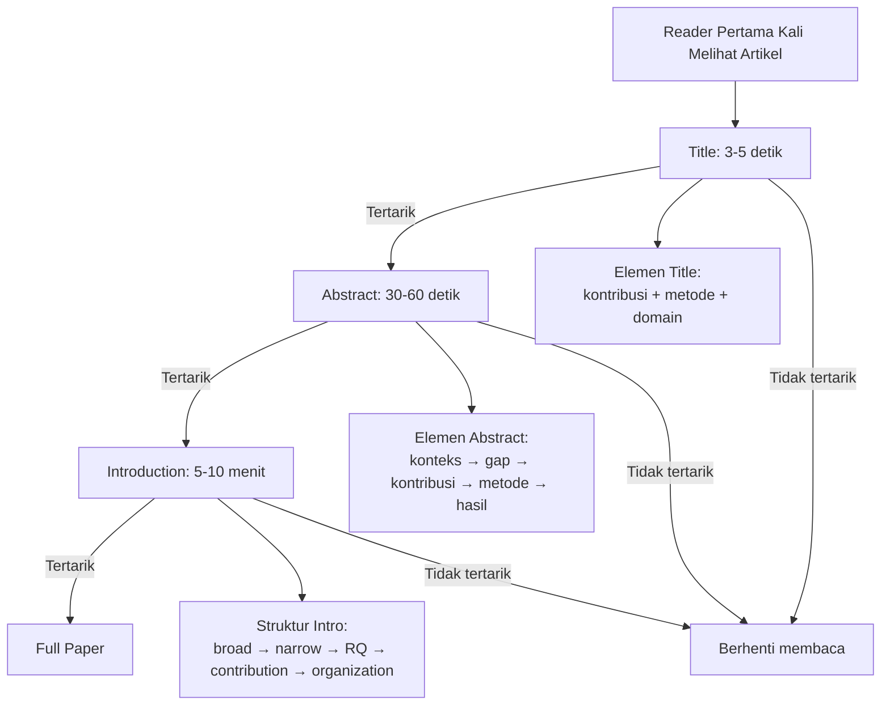

## 3. Pengantar Kontekstual

Judul, abstract, dan introduction adalah garis depan artikel Anda. Mereka yang menentukan apakah seorang reviewer, editor, atau pembaca akan memberikan perhatian pada karya Anda. Namun ketiganya memiliki fungsi yang berbeda dan ditulis untuk tujuan yang berbeda — kesalahan umum adalah memperlakukan ketiga bagian ini sebagai pengulangan dari hal yang sama.

## 4. Landasan Teori

### 4.1 Menulis Judul yang Efektif

**Fungsi judul:**
- Menarik pembaca yang relevan (discoverability dalam database)
- Mengkomunikasikan kontribusi utama dan scope
- Mengandung kata kunci untuk indexing

**Formula judul untuk artikel sistem/metode:**
`[Kontribusi Utama] + [menggunakan/berbasis/untuk] + [Metode/Pendekatan] + [di/pada] + [Domain/Konteks]`

Contoh: "Federated Intrusion Detection Using Graph Neural Networks for Industrial IoT Networks"

**Formula judul untuk artikel empiris/evaluatif:**
`[Fenomena/Temuan] + [in/on/for] + [Konteks]` atau `[Pendekatan komparatif]: [konteks]`

Contoh: "A Comparative Study of Ransomware Detection Techniques on Android Platforms"

**Hindari dalam judul:**
- Singkatan yang tidak universal (kecuali domain tahu)
- "Novel", "New", "First" — reviewer skeptis terhadap klaim ini di judul
- Terlalu panjang (> 15 kata biasanya dipangkas editor)
- Pertanyaan (kecuali meta-research/position paper)

**Pertimbangan SEO/Discoverability:**
Kata kunci utama harus ada di judul. Reviewer dan editor menggunakan kata kunci untuk mencari reviewer — kata kunci yang tepat meningkatkan peluang mendapat reviewer yang kompeten.

### 4.2 Abstract: 5 Kalimat, Satu Klaim

Abstract yang efektif dalam 150-250 kata (sesuai panduan venue) mencakup:

| Kalimat | Isi | Contoh |
|---|---|---|
| 1 | Konteks + kepentingan masalah | "Industrial control systems (ICS) are increasingly targeted by sophisticated cyberattacks that can cause physical damage." |
| 2 | Keterbatasan pendekatan yang ada | "Existing intrusion detection systems rely on centralized data collection, which violates the operational constraints of distributed ICS environments." |
| 3 | Kontribusi artikel | "This paper presents FedIDS, a federated learning framework for privacy-preserving anomaly detection in heterogeneous ICS networks." |
| 4 | Metode dan evaluasi | "FedIDS was evaluated on three public ICS datasets (SWaT, BATADAL, HAI) using five federated aggregation strategies." |
| 5 | Hasil utama + implikasi | "FedIDS achieves an F1-score of 0.943 with 40% reduced communication overhead compared to centralized baselines, enabling deployment in bandwidth-constrained environments." |

**Hindari dalam abstract:**
- Sitasi (beberapa venue melarang ini)
- Angka yang tidak muncul di paper
- Klaim yang tidak dapat diverifikasi dari paper
- Singkatan yang tidak didefinisikan

### 4.3 Introduction: Funnel Argumentatif

Introduction berfungsi sebagai corong argumentatif — bergerak dari konteks luas ke specific contribution. Struktur yang direkomendasikan:

**Paragraf 1 — Kontekstualisasi:**
Mengapa masalah ini penting? Berikan data atau fakta yang meyakinkan. Hindari memulai dengan "In recent years, technology has advanced..." — terlalu generik.

**Paragraf 2 — Pendekatan yang Ada dan Keterbatasannya:**
Apa yang sudah dilakukan untuk mengatasi masalah ini? Apa kelemahan spesifik yang belum diselesaikan? Ini harus specific (bukan generic "masih banyak yang perlu dilakukan").

**Paragraf 3 — Research Question atau Motivasi:**
Apa yang dijawab paper ini? Apa gap yang dijembatani? Ini harus mengalir secara logis dari paragraf sebelumnya.

**Paragraf 4 — Kontribusi (dalam bullets):**
Daftar eksplisit 2-4 kontribusi. Ini adalah bagian yang paling sering dikutip langsung oleh reviewer. Buat spesifik dan dapat diverifikasi.

**Paragraf 5 — Organisasi Paper:**
"The remainder of this paper is organized as follows: Section 2 reviews related work..."

### 4.4 Perbedaan Abstract vs Introduction

| Aspek | Abstract | Introduction |
|---|---|---|
| Panjang | 150-250 kata | 500-800 kata |
| Fungsi | Ringkasan komprehensif | Kontekstualisasi + argumen |
| Scope | Mencakup seluruh paper | Hanya konteks dan contribution |
| Sitasi | Umumnya tidak | Ya, untuk pendekatan yang ada |
| Teknis | Minimal | Moderat |

## 5. Model atau Arsitektur

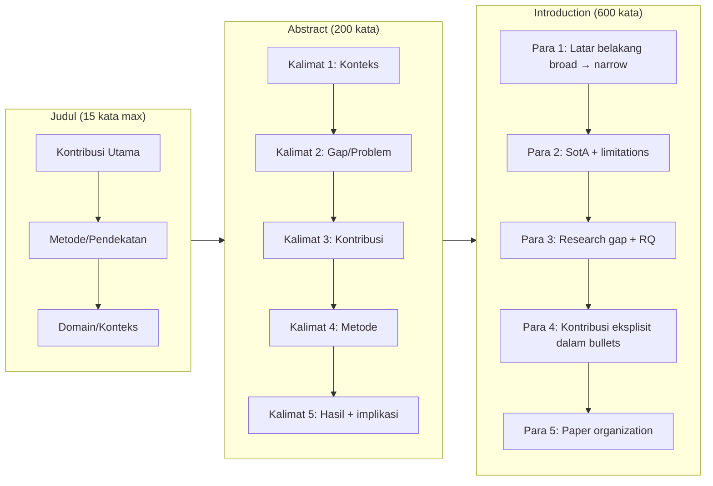

## 6. Contoh Terapan

**Judul (3 variasi untuk artikel malware detection):**
1. "Temporal Graph Neural Network for Android Malware Detection Using API Call Sequences" ✓
2. "A Novel Approach to Android Malware Detection" ✗ (terlalu generik)
3. "Detecting Android Malware: An Empirical Study of API Call Graph Analysis Using Temporal GNN Across Multiple Datasets" ✓ (lebih deskriptif, lebih panjang tetapi OK untuk jurnal)

**Abstract (draft):**
"Android malware has grown exponentially, with over 3.5 million new samples detected annually [cite]. Existing detection approaches relying on static analysis are increasingly ineffective against obfuscated and polymorphic malware. This paper proposes TempGraph-Droid, an Android malware detection system based on temporal graph neural networks that model dynamic API call sequences. TempGraph-Droid was evaluated on three public datasets (Drebin, DAPASA, and VirusShare) under cross-dataset evaluation settings. The proposed system achieves an F1-score of 0.921, outperforming state-of-the-art baseline methods by 7.3% while maintaining detection latency below 200ms, making it suitable for on-device deployment."

## 7. Praktikum atau Aktivitas Terarah

**Tujuan:** Menulis draft Title, Abstract, dan Introduction untuk artikel sendiri.

**Langkah Kerja:**
1. Tulis 3 variasi judul — evaluasi berdasarkan: informativeness, discoverability, dan brevity.
2. Tulis abstract 5 kalimat menggunakan template. Hitung kata (target: 150-200 kata).
3. Tulis Introduction dalam 5 paragraf. Pastikan setiap paragraf memiliki tujuan yang jelas.
4. Peer review: tukar draft dengan sesama mahasiswa. Berikan feedback: apakah klaim jelas? Apakah kontribusi spesifik?

## 8. Latihan Pemahaman

1. **(Analisis)** Mengapa memulai Introduction dengan "In recent years, technology has advanced significantly, leading to new security challenges" adalah awal yang lemah? Berikan alternatif yang lebih kuat untuk artikel tentang ransomware detection.

2. **(Koreksi)** Abstract berikut memiliki kelemahan: "In this paper, we propose a new method for detecting intrusions. Our method is better than existing methods. We evaluated it and got good results. The method uses machine learning. We conclude that our method is effective." Identifikasi semua kelemahan dan tulis versi yang lebih baik.

## 9. Latihan Terapan / Studi Kasus

Anda memiliki artikel yang dikirimkan ke IEEE TIFS dan dikembalikan dengan komentar editor: "The abstract and introduction do not clearly state the contribution. Reviewer 1 notes that it is unclear what is novel about this work compared to existing GNN-based malware detection methods." Tanpa mengubah isi penelitian, bagaimana Anda merevisi abstract dan introduction untuk menjawab komentar ini? Buatkan draft revisi dengan penjelasan perubahan yang dilakukan.

## 10. Kunci Jawaban dan Pembahasan

**Soal 1:** "In recent years, technology has advanced" adalah weak opening karena: (a) tidak informatif — setiap era punya perkembangan teknologi; (b) tidak specific — tidak mengatakan apa pun tentang masalah yang dibahas; (c) terlalu broad — langsung melompat ke masalah yang lebih menarik reviewer. Alternatif yang lebih kuat: "Ransomware attacks caused an estimated USD 20 billion in global damages in 2023, with healthcare and critical infrastructure as primary targets [cite]. Existing signature-based detection fails against novel ransomware variants that evade fingerprinting through polymorphic encryption."

**Soal 2:** Kelemahan: (a) "better than existing methods" — tidak spesifik (lebih baik bagaimana? berapa?); (b) "good results" — tidak ada angka; (c) "uses machine learning" — tidak ada detail metode yang spesifik; (d) tidak ada konteks masalah; (e) tidak ada gap yang diidentifikasi; (f) tidak ada batasan atau implikasi. Draft revisi: "Network intrusion detection in cloud environments presents unique challenges due to high-volume traffic and dynamic attack patterns [cite]. Existing ML-based approaches suffer from high false positive rates exceeding 15% and fail to adapt to concept drift in attack signatures. This paper introduces CloudIDS, a self-adaptive intrusion detection system using ensemble learning with online incremental training. CloudIDS was evaluated on CICIDS2017 and UNSW-NB15 datasets under simulated concept drift conditions. CloudIDS achieves 98.7% detection rate with 2.1% false positive rate, maintaining performance under concept drift while requiring 60% less retraining time compared to full-retraining baselines."

## 11. Ringkasan Bab

Title mengandung kontribusi + metode + domain dalam 15 kata. Abstract = 5 kalimat berurutan (konteks → gap → kontribusi → metode → hasil). Introduction = funnel dari broad ke specific, diakhiri dengan contribution bullets yang eksplisit dan paper organization.

## 12. Refleksi Profesional

1. Kemampuan menulis abstract yang jelas dan precise adalah keterampilan yang juga berguna di luar akademik — misalnya dalam executive summary laporan keamanan atau brief untuk manajemen. Bagaimana Anda menyesuaikan level teknis dalam ringkasan untuk audiens yang berbeda?

---

# BAB 7 — RELATED WORK DAN CONTRIBUTION STATEMENT

## 1. Capaian Pembelajaran Bab

Setelah mempelajari bab ini, mahasiswa mampu:
- Menulis Related Work sebagai narasi terstruktur yang menunjukkan gap
- Melakukan gap analysis yang sistematis terhadap literatur yang relevan
- Menulis Contribution Statement yang spesifik dan dapat diverifikasi
- Membedakan antara Related Work, Background, dan Literature Review

*Berkaitan dengan Sub-CPMK.3, Eval-3 (15%)*

## 2. Peta Konsep Bab

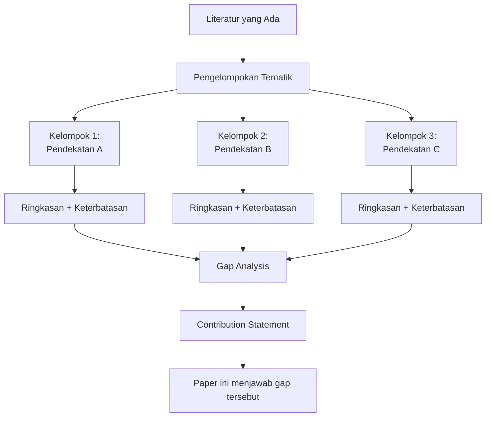

## 3. Pengantar Kontekstual

Related Work bukan hanya kewajiban formalitas akademik. Ia adalah argumen tentang posisi penelitian Anda dalam landscape ilmiah. Related Work yang baik menunjukkan bahwa Anda memahami bidang secara mendalam, bahwa Anda tahu apa yang sudah dilakukan, dan bahwa Anda dapat menunjukkan dengan tepat di mana penelitian Anda mengisi celah yang belum terisi.

## 4. Landasan Teori

### 4.1 Related Work vs Background vs Literature Review

| Bagian | Fungsi | Kapan Digunakan |
|---|---|---|
| Background | Menjelaskan konsep dasar yang diperlukan untuk memahami paper | Untuk konsep yang tidak dapat diasumsikan diketahui semua pembaca |
| Related Work | Menunjukkan posisi penelitian ini relatif terhadap yang sudah ada | Selalu ada di research paper |
| Literature Review | Komprehensif, mencakup semua literatur di area | Untuk survey paper, SLR |

Dalam research paper yang terfokus, Background dan Related Work kadang digabung, tapi lebih baik dipisah jika paper membutuhkan lebih dari 2 halaman untuk keduanya.

### 4.2 Struktur Related Work yang Efektif

**Pendekatan Tematik (Recommended):**
Kelompokkan literatur berdasarkan *pendekatan atau fokus*, bukan berdasarkan kronologi atau penulis.

```
2. Related Work
   2.1 [Tipe Pendekatan A dan Keterbatasannya]
   2.2 [Tipe Pendekatan B dan Keterbatasannya]
   2.3 [Domain/Konteks Spesifik dan Gap-nya]
   2.4 [Rangkuman gap dan positioning paper ini]
```

Setiap subbagian harus:
- Merujuk minimal 3-5 paper yang representatif
- Mendeskripsikan secara singkat pendekatan yang digunakan
- Menyebutkan keterbatasan spesifik yang relevan dengan paper Anda
- Diakhiri dengan kalimat yang mengarah ke gap yang Anda isi

### 4.3 Gap Analysis

Gap analysis dalam Related Work bukan sekadar "belum ada yang melakukan X" — harus menjelaskan *mengapa* gap ini penting dan *apa implikasinya*:

| Tipe Gap | Contoh | Cara Menyatakannya |
|---|---|---|
| Evaluasi gap | Tidak dievaluasi pada dataset X | "However, none of these approaches have been evaluated on ICS-specific datasets, limiting their applicability to industrial environments." |
| Skenario gap | Tidak menangani skenario Y | "Existing approaches assume static network topologies, which do not reflect the dynamic nature of modern SDN environments." |
| Scalability gap | Tidak efisien untuk skala Z | "While achieving high accuracy, these methods incur O(n²) computational overhead that precludes real-time deployment." |
| Privacy gap | Mengabaikan aspek privasi | "These centralized approaches require data sharing across organizational boundaries, raising data sovereignty concerns." |

### 4.4 Contribution Statement

Contribution Statement adalah kristalisasi dari gap analysis. Ia harus:
- Langsung menjawab gap yang diidentifikasi
- Spesifik (bukan "kami mengajukan pendekatan baru")
- Dapat diverifikasi dari isi paper

**Format yang direkomendasikan (dalam Introduction, Paragraf Kontribusi):**
```
The main contributions of this paper are:
(1) [Kontribusi teknis/metodologis yang spesifik]
(2) [Dataset/artefak jika ada]
(3) [Kontribusi empiris: evaluasi, benchmark, analisis]
```

**Contoh kuat vs lemah:**

| Lemah | Kuat |
|---|---|
| "Kami mengajukan metode baru untuk deteksi malware" | "Kami mengajukan MalGraph, GNN berbasis temporal yang memodelkan API call sequences sebagai dynamic graph, memungkinkan deteksi malware polimorfik dengan F1=0.921" |
| "Kami mengevaluasi pendekatan kami secara komprehensif" | "Kami mengevaluasi MalGraph pada 3 dataset publik (Drebin, DAPASA, VirusShare) dalam setting cross-dataset evaluation — skenario yang diabaikan oleh 87% studi yang ada" |

## 5. Model atau Arsitektur

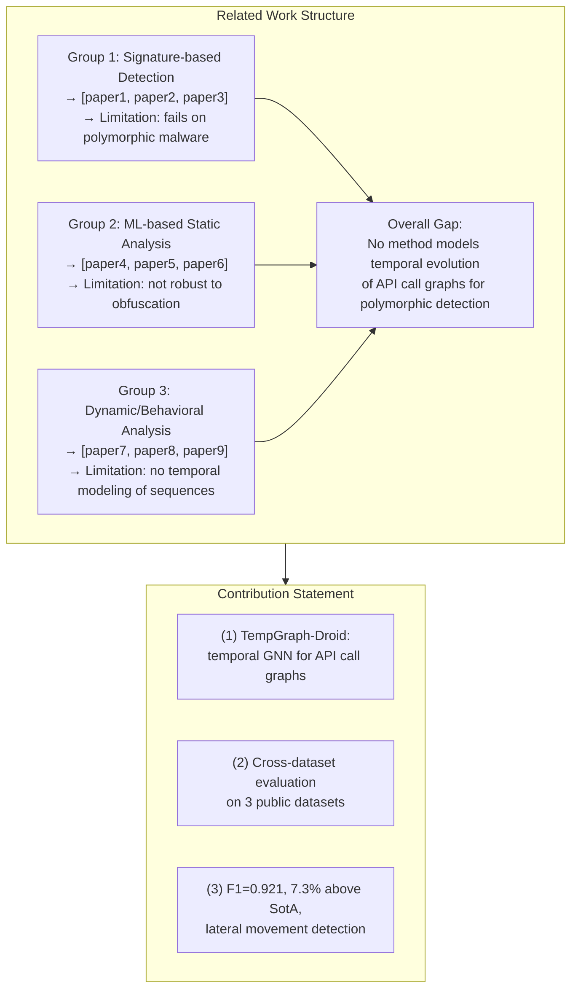

## 6. Contoh Terapan

**Paragraf Related Work untuk artikel ICS anomaly detection:**

"*2.1 Machine Learning-Based Anomaly Detection in ICS*

Several studies have applied ML to anomaly detection in ICS. Goh et al. [1] used LSTM to detect anomalies in the SWaT dataset, achieving 93% detection rate. Ahmed et al. [2] proposed Random Forest for BATADAL dataset anomalies. Kravchik and Shabtai [3] evaluated multiple ML models including k-NN and SVM for ICS anomaly detection. However, all these approaches require centralized data collection across all sensors, which is infeasible in multi-site or multi-vendor ICS deployments due to data sovereignty requirements [4]. Furthermore, none evaluated their approaches under communication-constrained conditions representative of real operational environments.

*2.2 Federated Learning for IoT Security*

Federated learning has emerged as a privacy-preserving alternative for distributed IoT security [5, 6]. Rey et al. [7] proposed federated intrusion detection for general IoT. However, IoT-focused FL approaches assume homogeneous data distributions, which does not hold for ICS environments where each site has distinct operational profiles. To the best of our knowledge, no prior work has applied FL to anomaly detection in heterogeneous ICS deployments.*"

## 7. Praktikum atau Aktivitas Terarah

**Tujuan:** Menulis Related Work untuk artikel sendiri dengan gap analysis yang eksplisit.

**Langkah Kerja:**
1. Kelompokkan semua referensi yang relevan menjadi 2-4 kelompok tematik.
2. Untuk setiap kelompok: identifikasi representative papers (3-5) dan keterbatasan spesifik.
3. Tulis setiap subbagian dengan struktur: deskripsi pendekatan → keterbatasan → bridge ke gap.
4. Tulis paragraf penutup Related Work yang merangkum semua gap dan memposisikan paper Anda.
5. Verifikasi: apakah Contribution Statement di Introduction menjawab semua gap yang diidentifikasi?

## 8. Latihan Pemahaman

1. **(Analisis)** Jelaskan mengapa menyusun Related Work secara kronologis (dari paper tertua ke terbaru) biasanya kurang efektif dibandingkan penyusunan tematik.

2. **(Koreksi)** Kalimat gap analysis berikut lemah: "Many researchers have worked on intrusion detection and there are still many open problems." Identifikasi kelemahan dan tulis versi yang lebih kuat untuk konteks ICS anomaly detection.

## 9. Latihan Terapan / Studi Kasus

Anda menulis artikel tentang "Network Forensics Framework untuk Cloud-Native Environments." Anda memiliki 30 paper yang relevan. Bagaimana Anda: (a) mengelompokkan 30 paper tersebut ke dalam klaster tematik yang bermakna; (b) memutuskan paper mana yang "representative" dan mana yang tidak perlu dikutip; (c) memastikan Related Work Anda tidak terasa seperti daftar paper tetapi seperti argumen yang membangun gap?

## 10. Kunci Jawaban dan Pembahasan

**Soal 1:** Penyusunan kronologis lebih kurang efektif karena: (a) pembaca tidak mendapatkan pemahaman tentang "kenapa" pendekatan berevolusi — hanya "kapan"; (b) sulit untuk melihat clustering tematik dari pendekatan yang berbeda; (c) keterbatasan dari setiap pendekatan tidak terorganisir secara logis; (d) tidak secara alami mengarah ke gap analysis. Penyusunan tematik memungkinkan: setiap kelompok diakhiri dengan keterbatasan spesifik, dan akhir Related Work secara alami menjadi synthesis of gaps yang dijawab paper ini.

**Soal 2:** Kelemahan kalimat: (a) "many researchers" dan "many open problems" — tidak spesifik sama sekali; (b) tidak menyebutkan keterbatasan apa yang masih ada; (c) tidak memposisikan paper ini dalam konteks gap yang spesifik. Versi lebih kuat: "Existing ML-based anomaly detection for ICS has been evaluated primarily on the SWaT and BATADAL datasets under controlled lab conditions [cite, cite]. However, no prior work has addressed the challenge of cross-site data heterogeneity or evaluated detection performance under communication constraints representative of real-world ICS deployments with limited bandwidth between sites and sensors."

**Soal Studi Kasus:** (a) Klaster tematik untuk 30 paper network forensics cloud-native: [Network Forensics Traditional], [Cloud-Specific Forensics], [Container/Kubernetes Forensics], [Evidence Preservation in Ephemeral Environments], [Legal/Compliance aspects of Cloud Evidence]. (b) Pemilihan paper representatif: prioritaskan paper yang dikutip paling banyak dalam bidang ini (impact), paper yang paling relevan secara metodologis dengan penelitian Anda, dan paper terbaru (3-5 tahun terakhir) yang menunjukkan SotA terkini. Hindari paper yang serupa secara marginal. (c) Membangun argumen: setiap klaster diakhiri dengan kalimat yang eksplisit menunjukkan keterbatasan — "However, these approaches assume persistent storage that is incompatible with ephemeral container environments" — sehingga setiap kalimat gap mengalir ke gap analysis final.

## 11. Ringkasan Bab

Related Work yang efektif menggunakan struktur tematik, bukan kronologis. Setiap kelompok diakhiri dengan keterbatasan spesifik. Gap analysis yang kuat adalah spesifik, menjelaskan *mengapa* gap itu penting, dan secara langsung dijawab oleh Contribution Statement.

## 12. Refleksi Profesional

1. Kemampuan untuk memahami posisi sesuatu dalam landscape yang lebih luas — dan mengidentifikasi gap yang belum terisi — adalah keterampilan yang sama yang diperlukan dalam threat intelligence, risk assessment, dan competitive analysis keamanan siber. Bagaimana Anda melatih kemampuan ini secara sistematis?


---

# BAB 8 — METHODS SECTION: REPRODUKTIBEL DAN DAPAT DIREPLIKASI

## 1. Capaian Pembelajaran Bab

Setelah mempelajari bab ini, mahasiswa mampu:
- Menulis Methods section yang memungkinkan replikasi oleh peneliti independen
- Menerapkan prinsip reproducibility dan replicability dalam penulisan metode
- Mendokumentasikan hyperparameter, environment, dan prosedur evaluasi secara eksplisit
- Menyusun dataset description dan data availability statement

*Berkaitan dengan Sub-CPMK.4, Eval-4 (20%)*

## 2. Peta Konsep Bab

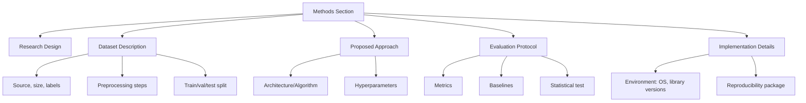

## 3. Pengantar Kontekstual

Reproducibility crisis dalam penelitian ilmiah — fenomena di mana banyak hasil penelitian tidak dapat direproduksi — berdampak khusus pada bidang machine learning dan keamanan siber. Methods section yang tidak cukup detail adalah salah satu penyebab utama. Pada saat yang sama, Methods section yang terlalu verbose menjadi sulit dibaca. Keseimbangan antara kelengkapan dan keterbacaan adalah seni yang perlu dipelajari.

## 4. Landasan Teori

### 4.1 Reproducibility vs Replicability

| Konsep | Definisi | Implikasi Penulisan |
|---|---|---|
| Reproducibility | Hasil yang sama dari kode dan data yang sama | Code dan data harus tersedia; environment terdokumentasi |
| Replicability | Hasil yang konsisten dari peneliti berbeda dengan metode yang sama | Langkah-langkah harus cukup detail untuk diikuti tanpa kode asli |
| Repeatability | Hasil yang sama dari setup dan peneliti yang sama | Lebih mudah; reproducibility lebih penting untuk publikasi |

### 4.2 Komponen Methods Section

**Research Design Overview (1 paragraf):**
Gambaran tingkat tinggi tentang pendekatan dan alasan pemilihannya. Ini membantu pembaca memahami struktur metode sebelum masuk ke detail.

**Dataset Description:**
- Sumber dataset (public / proprietary / baru dibuat)
- Ukuran (jumlah sampel, fitur, kelas)
- Label distribution (penting untuk imbalanced datasets)
- Preprocessing yang dilakukan (normalisasi, feature engineering, dll.)
- Train/validation/test split — dan apakah split dilakukan secara random atau time-based (penting untuk time-series data)
- Ethical considerations: apakah data mengandung informasi personal? Apakah ada IRB approval?

**Proposed Approach:**
- Arsitektur: digambarkan secara tekstual DAN dengan diagram
- Algoritma: pseudocode jika diperlukan untuk klarifikasi
- Design decisions: mengapa pilihan tertentu dibuat (bukan hanya apa yang dipilih)
- Hyperparameter utama: jika hyperparameter dipilih melalui tuning, jelaskan prosesnya

**Evaluation Protocol (sangat penting):**
- Metrik yang digunakan dan alasannya (mengapa Precision, Recall, F1 — bukan hanya Accuracy?)
- Baselines yang dibandingkan: mengapa baseline ini dipilih?
- Pengulangan eksperimen: berapa kali? Bagaimana variabilitas dilaporkan?
- Statistical significance test: Wilcoxon, McNemar, atau lainnya

**Implementation Details:**
- Hardware dan software environment: OS, Python version, library versions, GPU/CPU
- Hyperparameter lengkap: semua yang digunakan, termasuk yang tidak dituning
- Random seed (untuk reproducibility)
- Kode dan data availability

### 4.3 Data Availability Statement

Data Availability Statement adalah pernyataan eksplisit tentang ketersediaan data dan kode untuk verifikasi dan replikasi. Ini wajib di banyak jurnal Q1.

**Format umum:**
"The datasets used in this study are publicly available at [URL/DOI]. The code for replicating the experiments is available at [GitHub URL/Zenodo DOI] under [MIT/Apache 2.0] license."

Jika data tidak dapat dibagikan (misalnya karena pertimbangan privasi atau perjanjian dengan mitra):
"The data used in this study were obtained under a confidentiality agreement and cannot be made publicly available. Interested researchers may contact [email] to request access through the formal data sharing agreement."

### 4.4 Hyperparameter Reporting

Hyperparameter harus dilaporkan dalam tabel, bukan hanya disebutkan dalam teks:

| Parameter | Nilai | Metode Pemilihan |
|---|---|---|
| Learning rate | 0.001 | Grid search: {0.0001, 0.001, 0.01} |
| Batch size | 64 | Default (tidak dituning) |
| Hidden layers | 3 (256, 128, 64) | Ablation study (Tabel 5) |
| Epochs | 100 dengan early stopping (patience=10) | Monitoring val loss |
| Optimizer | Adam | Berdasarkan literatur terkait [cite] |

## 5. Model atau Arsitektur

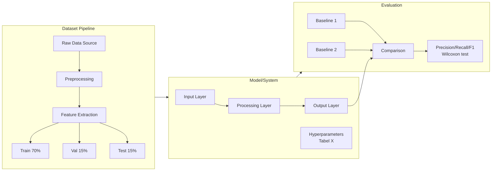

## 6. Contoh Terapan

**Methods section fragment untuk artikel malware detection:**

"*3.3 Evaluation Protocol*

We evaluate TempGraph-Droid using Precision, Recall, and F1-score (macro-averaged). We deliberately exclude Accuracy as the primary metric due to class imbalance in all datasets (benign:malware ratio of approximately 3:1), where a naive always-benign classifier would achieve >75% accuracy. Each experiment was run five times with different random seeds (42, 123, 456, 789, 2024), and we report mean ± standard deviation. Statistical significance between TempGraph-Droid and the best-performing baseline is assessed using Wilcoxon signed-rank test (α=0.05) over the five runs.

We compare against four baselines: (1) Drebin [27], a representative signature-based approach; (2) MaMaDroid [28], a representative static graph-based approach; (3) R2-D2 [29], a dynamic analysis approach; and (4) DL-Droid [30], a deep learning behavioral approach. Baseline implementations use authors' released code where available, otherwise reimplemented following paper descriptions and verified to reproduce reported results within ±2%.*"

## 7. Praktikum atau Aktivitas Terarah

**Tujuan:** Menulis Methods section yang reproducible untuk artikel sendiri.

**Langkah Kerja:**
1. Draftkan Dataset Description mencakup: sumber, ukuran, split, preprocessing.
2. Draftkan Evaluation Protocol: metrik (dengan alasan), baselines (dengan justifikasi), pengulangan.
3. Buat tabel Hyperparameter lengkap.
4. Tulis Data Availability Statement.
5. Self-check: dapatkah orang lain mereplikasi eksperimen Anda hanya dari Methods section ini?

## 8. Latihan Pemahaman

1. **(Evaluasi)** Mengapa menggunakan Accuracy sebagai satu-satunya metrik berbahaya untuk dataset yang imbalanced?

2. **(Perancangan)** Anda melakukan cross-dataset evaluation: training pada Dataset A, testing pada Dataset B. Bagaimana Anda melaporkan ini dalam Methods section? Apakah split train/val/test berlaku dengan cara yang sama?

## 9. Latihan Terapan / Studi Kasus

Artikel Anda membutuhkan reproducibility package: kode, model weights, dataset (atau pointer ke dataset publik), dan konfigurasi environment. Namun dataset mengandung network traffic dari infrastruktur jaringan milik mitra industri yang tidak boleh dipublikasikan. Bagaimana Anda menyusun: (a) Data Availability Statement yang jujur dan tidak menyesatkan; (b) reproducibility package yang memberikan nilai sebesar mungkin meskipun data tidak tersedia publik; (c) evaluasi alternatif menggunakan public dataset sebagai proxy?

## 10. Kunci Jawaban dan Pembahasan

**Soal 1:** Accuracy berbahaya untuk imbalanced dataset karena: jika dataset memiliki 90% kelas negatif (benign) dan 10% kelas positif (malware), classifier yang selalu memprediksi "benign" akan mencapai 90% accuracy — tanpa mendeteksi satu pun malware. F1-score (harmonic mean of Precision and Recall) tidak terpengaruh oleh ketidakseimbangan kelas dan memaksa model untuk perform pada kelas positif juga.

**Soal 2:** Cross-dataset evaluation dilaporkan dengan jelas: "We train on [Dataset A] and evaluate on [Dataset B] without any fine-tuning, to assess generalizability." Split konvensional tidak berlaku — seluruh Dataset A adalah training, seluruh Dataset B adalah test. Jika ada tuning hyperparameter, ini dilakukan menggunakan validation subset dari Dataset A. Ini lebih demanding dan menunjukkan generalizability yang lebih kuat.

**Soal Studi Kasus:** (a) DAS yang jujur: "The network traffic dataset used in this study was collected from industrial partner infrastructure under a confidentiality agreement. The dataset cannot be made publicly available due to privacy and contractual constraints. Researchers interested in obtaining access may contact [email] for information about the formal data sharing agreement." (b) Reproducibility package: release kode (anonymized dari referensi partner), model weights yang sudah ditraining, evaluation scripts, dan synthetic/anonymized dataset yang representative jika memungkinkan. (c) Public proxy: identifikasi dataset publik yang secara karakteristik paling mirip (misalnya CICIDS2017 untuk intrusion detection), dan evaluasi ulang model pada dataset publik tersebut — sertakan dalam paper sebagai tambahan validation.

## 11. Ringkasan Bab

Methods section harus cukup detail untuk replikasi. Komponen kunci: research design overview, dataset description (dengan split eksplisit), proposed approach (dengan diagram), evaluation protocol (metrik, baselines, pengulangan), dan implementation details (environment, hyperparameter, random seeds). Data Availability Statement wajib dan harus jujur.

## 12. Refleksi Profesional

1. Reproducibility dalam penelitian berkaitan langsung dengan kepercayaan pada ilmu pengetahuan. Dalam konteks keamanan siber, penelitian yang tidak dapat direproduksi dapat berujung pada adopsi solusi yang tidak efektif. Apa tanggung jawab Anda sebagai peneliti untuk memastikan karya Anda dapat diverifikasi?

---

# BAB 9 — RESULTS, FIGURES, TABLES, DAN DATA VISUALIZATION

## 1. Capaian Pembelajaran Bab

Setelah mempelajari bab ini, mahasiswa mampu:
- Menyusun Results section yang informatif dan tidak redundan dengan tabel/figur
- Membuat tabel dan figur yang self-explanatory dengan caption yang lengkap
- Menerapkan prinsip data visualization yang efektif untuk hasil penelitian
- Menghindari kesalahan umum dalam presentasi hasil kuantitatif

*Berkaitan dengan Sub-CPMK.4, Eval-4 (20%)*

## 2. Peta Konsep Bab

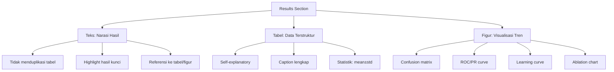

## 3. Pengantar Kontekstual

Results section menyajikan data — bukan interpretasi. Ini adalah perbedaan kritis yang sering dilanggar: interpretasi masuk di Discussion. Di Results, Anda menjawab "apa yang terjadi?" Di Discussion, Anda menjawab "mengapa ini terjadi dan apa artinya?"

Tabel dan figur adalah jantung dari Results section. Mereka harus dapat dipahami tanpa membaca teks — pembaca sering memindai tabel dan figur terlebih dahulu sebelum membaca narasi.

## 4. Landasan Teori

### 4.1 Struktur Results Section

**Pendekatan Terstruktur per Research Question:**
Jika artikel memiliki 3 RQ yang didefinisikan dalam Introduction, maka Results section memiliki 3 subbagian yang menjawab masing-masing RQ.

**Atau Terstruktur per Jenis Eksperimen:**
Misalnya: 5.1 Main Comparison Results, 5.2 Ablation Study, 5.3 Sensitivity Analysis, 5.4 Case Study

**Prinsip Narasi di Results:**
- Narasi teks melakukan 3 hal: (1) mengarahkan pembaca ke tabel/figur yang relevan, (2) menyoroti temuan kunci (bukan semua angka), (3) menunjukkan pola yang mungkin tidak terlihat dari tabel
- Hindari: menyebutkan setiap angka dalam tabel di teks — itu redundan

### 4.2 Membuat Tabel yang Efektif

**Tabel Comparison (yang paling umum):**

| Method | Dataset A F1 (%) | Dataset B F1 (%) | Dataset C F1 (%) | Avg. Inference (ms) |
|---|---|---|---|---|
| Baseline 1 | 85.3 ± 1.2 | 79.4 ± 2.1 | 82.1 ± 1.8 | 12.3 |
| Baseline 2 | 88.7 ± 0.9 | 83.2 ± 1.5 | 85.6 ± 1.3 | 45.7 |
| **Ours (TempGraph)** | **92.1 ± 0.7** | **88.9 ± 1.1** | **90.4 ± 0.9** | **15.2** |

*Bold = best result. ± = standard deviation over 5 runs. Statistical significance vs best baseline (Wilcoxon, p<0.05) marked with †.*

**Panduan Caption:**
Caption tabel harus mencakup: apa yang ditampilkan + parameter evaluasi + notasi yang digunakan. Contoh: "Table 2. Comparison of detection F1-scores (%) on three benchmark datasets. Values represent mean ± standard deviation over five independent runs. Best results per column in bold. † indicates statistically significant improvement over the best baseline (Wilcoxon signed-rank test, α=0.05)."

### 4.3 Membuat Figur yang Efektif

**Tipe Figur yang Umum dalam FDKS Research:**

| Figur | Kapan Digunakan | Informasi yang Disampaikan |
|---|---|---|
| Confusion Matrix | Klasifikasi | Distribusi TP/TN/FP/FN per kelas |
| ROC Curve + AUC | Klasifikasi biner | Trade-off sensitivity vs specificity |
| PR Curve | Imbalanced dataset | Trade-off precision vs recall |
| Learning Curve | Training ML | Konvergensi, overfitting/underfitting |
| Bar Chart + Error Bars | Comparison eksperimen | Mean dan variabilitas antar metode |
| Heatmap | Feature importance, correlation | Pola dalam data multidimensi |
| Architecture Diagram | Sistem/model baru | Komponen dan aliran data |

**Prinsip Visualisasi yang Baik:**
- Axis labels dengan satuan yang jelas
- Legend yang dapat dibaca (bukan hanya warna)
- Color scheme yang dapat dibaca dalam grayscale (untuk print)
- Tidak ada chartjunk (dekorasi yang tidak informatif)
- Error bars harus eksplisit menjelaskan apa yang diwakilinya (std dev? 95% CI?)

### 4.4 Melaporkan Statistik yang Benar

| Informasi | Cara Melaporkan |
|---|---|
| Single metric | F1-score: 0.921 (5 runs, std=0.007) |
| Range | Min: 0.914, Max: 0.929 |
| Confidence interval | 95% CI: [0.915, 0.927] |
| Significance | Wilcoxon signed-rank test: p=0.013, α=0.05 |
| Effect size | Cohen's d = 0.82 (large effect) |

## 5. Model atau Arsitektur

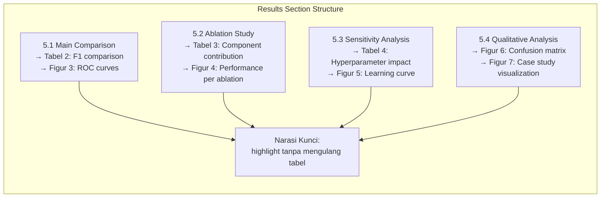

## 6. Contoh Terapan

**Narasi Results yang Baik:**

"Table 2 presents the F1-score comparison across three datasets. TempGraph-Droid consistently outperforms all baselines, achieving the highest F1-score on all three datasets with improvements of 3.4%, 5.7%, and 4.8% over the best baseline (MaMaDroid) on Drebin, DAPASA, and VirusShare, respectively. All improvements are statistically significant (Wilcoxon, p<0.05). Notably, on VirusShare — which contains the most recent and diverse samples — the performance gap widens (4.8%), suggesting that temporal modeling is particularly beneficial for detecting novel malware variants.

Figure 3 shows the ROC curves for all methods on DAPASA. TempGraph-Droid achieves the highest AUC (0.97), compared to MaMaDroid (0.93) and DL-Droid (0.91). The performance advantage is consistent across all operating points, confirming the robustness of temporal graph modeling."

## 7. Praktikum atau Aktivitas Terarah

**Tujuan:** Menyusun Results section dengan minimal 2 tabel dan 2 figur.

**Langkah Kerja:**
1. Buat tabel comparison utama dengan format: method × metric × dataset, termasuk mean ± std.
2. Buat minimal 1 figur (confusion matrix ATAU ROC curve ATAU bar chart).
3. Tulis narasi Results yang mengarahkan pembaca ke tabel/figur tanpa mengulang semua angka.
4. Self-check: apakah setiap tabel dan figur dapat dipahami tanpa membaca teks?

## 8. Latihan Pemahaman

1. **(Evaluasi)** Sebuah artikel melaporkan "Our method achieves 98% accuracy." Tanpa informasi lain, apa saja yang perlu Anda pertanyakan sebelum menerima klaim ini?

2. **(Perancangan)** Anda memiliki hasil ablation study: baseline sistem (semua komponen), tanpa temporal module, tanpa attention mechanism, tanpa graph structure. Visualisasi apa yang paling tepat untuk menampilkan hasil ini?

## 9. Latihan Terapan / Studi Kasus

Hasil eksperimen Anda menunjukkan bahwa model Anda memiliki F1-score rata-rata 0.871, tetapi dengan standard deviation 0.089 — cukup tinggi. Baseline terbaik memiliki F1 rata-rata 0.843 dengan std 0.031. Secara statistik, Wilcoxon test menunjukkan p=0.087 — tidak signifikan pada α=0.05. Bagaimana Anda: (a) melaporkan hasil ini secara jujur; (b) menyelidiki penyebab variabilitas tinggi; (c) menentukan apakah klaim improvement masih valid?

## 10. Kunci Jawaban dan Pembahasan

**Soal 1:** Pertanyaan yang harus diajukan: (a) Accuracy dari apa? Dataset mana? (b) Bagaimana distribusi kelas? (98% accuracy bisa berarti classifier trivial pada 98% kelas mayoritas.) (c) Apakah ada std dev? Berapa kali dijalankan? (d) Dibandingkan dengan apa? Apakah ada baseline? (e) Metrik lain apa? Precision, Recall, F1? (f) Apakah test set independent dari training set?

**Soal 2:** Bar chart dengan error bars adalah visualisasi paling tepat: setiap konfigurasi ablation = satu bar, tinggi bar = F1-score, error bar = std dev. Ini memudahkan perbandingan visual kontribusi setiap komponen. Alternatif: tabel ablation lebih informatif untuk exact numbers tetapi kurang visual.

**Soal Studi Kasus:** (a) Laporan jujur: "Our method achieves mean F1 = 0.871 (σ=0.089), compared to baseline F1=0.843 (σ=0.031). The Wilcoxon signed-rank test does not show statistical significance (p=0.087, α=0.05)." (b) Investigasi variabilitas: identifikasi run mana yang outlier — apakah ada randomness dalam data split? Apakah hasil sangat tergantung pada random seed? Apakah ada batch size atau learning rate yang menyebabkan instabilitas? (c) Validity klaim: improvement tidak dapat diklaim secara statistik pada threshold α=0.05. Opsi: (i) jalankan lebih banyak run (misalnya 20 run) untuk meningkatkan statistical power; (ii) jadikan ini sebagai promising result dengan catatan "not statistically significant"; (iii) identifikasi subset kondisi di mana improvement signifikan.

## 11. Ringkasan Bab

Results section menyajikan data, bukan interpretasi. Tabel dan figur harus self-explanatory dengan caption lengkap. Narasi teks menyoroti temuan kunci tanpa menduplikasi semua angka dari tabel. Melaporkan mean ± std dev, statistical significance, dan effect size adalah standar minimum untuk penelitian empiris.

## 12. Refleksi Profesional

1. Dalam forensik digital dan keamanan siber, melaporkan hasil secara akurat — termasuk ketidakpastian dan keterbatasan — adalah kewajiban profesional dan hukum. Laporan yang over-confident dapat menyebabkan kesalahan dalam persidangan atau keputusan kebijakan. Bagaimana prinsip ini berlaku dalam konteks akademik?

---

# BAB 10 — DISCUSSION, LIMITATIONS, DAN DATA/CODE AVAILABILITY

## 1. Capaian Pembelajaran Bab

Setelah mempelajari bab ini, mahasiswa mampu:
- Menulis Discussion yang menginterpretasikan hasil, bukan mengulang Results
- Menyatakan keterbatasan penelitian secara jujur dan proporsional
- Menghubungkan hasil dengan literatur dalam konteks Discussion
- Menyusun Data Availability Statement dan Future Work yang substantif

*Berkaitan dengan Sub-CPMK.4, Eval-4 (20%)*

## 2. Peta Konsep Bab

```mermaid
flowchart TD
    A[Discussion Section] --> B1[Interpretasi Hasil]
    A --> B2[Perbandingan dengan SotA]
    A --> B3[Penjelasan Anomali]
    A --> B4[Implikasi Praktis]
    A --> B5[Limitations]
    A --> B6[Future Work]
    B5 --> C1[Scope limitation]
    B5 --> C2[Methodological limitation]
    B5 --> C3[Empirical limitation]
    B5 --> C4[Temporal limitation]
    B6 --> D1[Ekstensi langsung]
    B6 --> D2[Pertanyaan terbuka]
```

## 3. Pengantar Kontekstual

Discussion adalah bagian yang paling sering ditulis dengan buruk dalam artikel penelitian. Ada dua kegagalan yang umum: (1) Discussion yang hanya mengulang apa yang sudah ada di Results, dan (2) Discussion yang membuat klaim yang tidak didukung oleh data. Discussion yang baik menghubungkan *apa yang terjadi* (Results) dengan *mengapa ini penting dan apa artinya* — sebuah tugas yang memerlukan pemikiran tingkat tinggi.

## 4. Landasan Teori

### 4.1 Fungsi Discussion

Discussion menjawab pertanyaan-pertanyaan berikut:
- Apa arti hasil ini dalam konteks yang lebih luas?
- Apakah hasil ini konsisten atau inkonsisten dengan penelitian sebelumnya?
- Apa yang menjelaskan anomali atau hasil yang tidak terduga?
- Apa implikasi praktis dari temuan ini?
- Apa keterbatasan penelitian ini?
- Apa pertanyaan yang dibuka oleh penelitian ini?

### 4.2 Interpretasi vs Spekulasi

Perbedaan kritis yang harus dijaga:
- **Interpretasi** = kesimpulan yang didukung oleh data yang dilaporkan
- **Spekulasi** = kesimpulan yang melampaui data — tidak dilarang, tetapi harus dilabeli dengan hedging: "This may suggest...", "One possible explanation is...", "Further investigation is needed to confirm..."

### 4.3 Menghubungkan Hasil dengan Literatur

Discussion yang baik tidak hanya membandingkan angka — ia menjelaskan *mengapa* perbedaan ada:

"Our temporal modeling approach achieves 7.3% higher F1-score than MaMaDroid on cross-dataset evaluation. This improvement is consistent with findings by Chen et al. [14] who showed that API call timing patterns contain discriminative information not captured by structural graph features alone. The larger gap on VirusShare (newer samples) may indicate that malware authors increasingly exploit temporal-based evasion, making temporal modeling particularly important for detecting emerging threats."

### 4.4 Menulis Keterbatasan yang Jujur

Keterbatasan bukan kelemahan yang harus disembunyikan — ia adalah batas yang jelas dari klaim artikel. Reviewer dan editor menghargai honesty tentang keterbatasan.

**Tipe Keterbatasan (sama seperti yang dipelajari di VSFDKS13):**

| Tipe | Contoh dalam Artikel ML-Security |
|---|---|
| Scope | "Evaluasi terbatas pada malware PE Windows; tidak diuji pada Android atau Linux" |
| Methodological | "Tuning hyperparameter dilakukan pada Dataset A; optimal setting mungkin berbeda untuk dataset lain" |
| Empirical | "Dataset publik mungkin tidak merepresentasikan distribusi malware in-the-wild; malware dalam dataset sudah diketahui" |
| Temporal | "Dataset dikumpulkan hingga 2023; malware baru yang muncul setelah periode ini tidak direpresentasikan" |

**Cara menyatakan keterbatasan yang baik:**
Bukan: "Penelitian ini memiliki banyak keterbatasan."
Ya: "Three limitations of this work should be noted. First, ... Second, ... Third, ... Future work should address these by..."

### 4.5 Future Work yang Substantif

Future Work bukan daftar harapan — ia harus mengalir langsung dari keterbatasan yang diidentifikasi dan menunjukkan pemahaman tentang apa yang diperlukan untuk kemajuan lebih lanjut:

| Keterbatasan | Future Work yang Mengalir Darinya |
|---|---|
| Hanya dievaluasi pada dataset publik | Evaluasi dengan dataset dari partner industri dengan controlled disclosure |
| Tidak menangani concept drift | Ekspansi ke online learning yang adaptif terhadap distribusi malware yang berubah |
| Overhead komputasi tinggi | Optimisasi model dengan quantization dan pruning untuk deployment on-device |

## 5. Model atau Arsitektur

```mermaid
flowchart TD
    subgraph DISCUSSION["Discussion Structure"]
        D1["Interpretasi Hasil:\napa yang ditemukan + mengapa"]
        D2["Perbandingan SotA:\nkonsisten / inkonsisten + penjelasan"]
        D3["Anomali:\nhasil tidak terduga + hipotesis penjelasan"]
        D4["Implikasi:\npraktis + teoritis"]
        D5["Keterbatasan:\n4 tipe: scope, metodologis, empiris, temporal"]
        D6["Future Work:\nmengalir dari limitations"]
        D1 --> D2 --> D3 --> D4 --> D5 --> D6
    end
```

## 6. Contoh Terapan

**Fragment Discussion untuk artikel federated ICS anomaly detection:**

"*6.1 Performance Analysis*

FedIDS consistently outperforms centralized baselines on all three datasets (Table 2), confirming our hypothesis that personalized aggregation better captures site-specific operational profiles in ICS. The 40% communication overhead reduction is particularly significant for field deployments where bandwidth between PLCs and central servers is limited to 1-10 Mbps — a constraint that precludes centralized approaches in practice.

The performance on HAI dataset (F1=0.901) is notably lower than on SWaT (F1=0.943). This difference is likely attributable to the higher frequency of process transitions in HAI — a manufacturing line dataset with more dynamic operational modes — where our fixed-window aggregation may miss shorter anomaly bursts. This finding motivates our future work on adaptive aggregation windows (Section 6.3).

*6.2 Limitations*

This work has three notable limitations. First, all experiments were conducted on publicly available datasets from research environments; real-world ICS deployments may have different noise characteristics and operational variability that could affect detection performance. Second, our evaluation assumes a stable federated topology; we did not evaluate performance under node failures or network partitions, which are realistic conditions in industrial settings. Third, the current implementation uses TensorFlow 2.12; compatibility with resource-constrained PLCs (which often run proprietary firmware) requires further adaptation.*"

## 7. Praktikum atau Aktivitas Terarah

**Tujuan:** Menulis Discussion lengkap untuk artikel sendiri.

**Langkah Kerja:**
1. Tulis 2 paragraf interpretasi hasil utama (hubungkan dengan literatur).
2. Identifikasi minimal 1 hasil anomali atau tidak terduga dan tulis hipotesis penjelasan.
3. Tulis paragraf implikasi praktis (untuk siapa temuan ini berguna dan bagaimana cara menggunakannya).
4. Tulis Limitations paragraph dengan minimal 3 keterbatasan (tipe berbeda).
5. Tulis Future Work paragraph dengan minimal 2 arah yang mengalir dari limitations.

## 8. Latihan Pemahaman

1. **(Analisis)** Mengapa Discussion yang hanya mengulang Results dianggap lemah? Apa kontribusi tambahan yang seharusnya diberikan Discussion?

2. **(Evaluasi)** Kalimat berikut ada di Discussion: "Our method will revolutionize intrusion detection and make all other methods obsolete." Identifikasi masalah dengan kalimat ini.

## 9. Latihan Terapan / Studi Kasus

Model Anda mendeteksi malware dengan F1=0.921, tetapi analisis confusion matrix menunjukkan bahwa model sering salah mengklasifikasikan adware sebagai ransomware (False Positive rate 18% untuk kelas tersebut). Bagaimana Anda: (a) melaporkan anomali ini dalam Discussion; (b) menjelaskan hipotesis mengapa ini terjadi; (c) menyarankan mitigasi atau future work; (d) mempertimbangkan implikasi praktis dari false positive ini dalam deployment nyata?

## 10. Kunci Jawaban dan Pembahasan

**Soal 1:** Discussion yang mengulang Results tidak menambah pemahaman. Discussion seharusnya menjelaskan *mengapa* hasil seperti yang diamati, menghubungkan temuan dengan pengetahuan yang sudah ada, mengidentifikasi anomali dan menjelaskannya, dan mendiskusikan implikasi yang tidak langsung terlihat dari data. Tanpa ini, pembaca mendapatkan informasi yang sama dua kali dan tidak mendapatkan wawasan tambahan.

**Soal 2:** "Will revolutionize" adalah klaim yang terlalu besar — tidak ada bukti dalam satu paper yang dapat mendukung klaim revolusi. "Make all other methods obsolete" adalah klaim absolut yang sangat sulit dipertahankan karena: (a) setiap metode memiliki trade-off yang berbeda; (b) SotA terus berkembang; (c) satu evaluasi tidak mencakup semua kondisi. Kalimat yang lebih tepat: "These results suggest that temporal graph modeling is a promising direction for malware detection, particularly in cross-dataset settings."

**Soal Studi Kasus:** (a) Laporan anomali: "Analysis of per-class performance reveals that the highest error rate occurs in the adware-ransomware boundary (FPR=18%), where our model incorrectly classifies adware samples as ransomware." (b) Hipotesis: "This confusion may be attributed to behavioral similarities between aggressive adware (which modifies file associations) and early-stage ransomware (which accesses files before encryption begins). Both exhibit similar API call patterns in the file system access phase, making temporal graph features insufficient for distinction at this boundary." (c) Mitigasi/future work: "Future work should investigate fine-grained temporal features specifically targeting the file encryption signature phase to improve adware-ransomware discrimination." (d) Implikasi praktis: "In deployment, a high false positive rate for ransomware detection causes unnecessary alerts and remediation actions for adware — which, while annoying, is significantly less harmful than ransomware. Security practitioners should configure detection thresholds for this specific boundary based on their organization's risk appetite."

## 11. Ringkasan Bab

Discussion menginterpretasikan hasil (bukan mengulang), menghubungkan temuan dengan literatur, menjelaskan anomali, dan mendiskusikan implikasi. Keterbatasan harus dinyatakan secara jujur dalam 4 tipe: scope, metodologis, empiris, temporal. Future Work mengalir dari keterbatasan, bukan daftar harapan acak.

## 12. Refleksi Profesional

1. Menyatakan keterbatasan penelitian secara jujur adalah salah satu tindakan integritas ilmiah yang paling penting — dan juga yang paling diabaikan. Mengapa researcher cenderung under-report keterbatasan? Apa yang bisa Anda lakukan untuk melawan insentif tersebut?

2. Implikasi praktis dalam Discussion sering mengandung klaim tentang apa yang harus dilakukan organisasi atau pemerintah berdasarkan temuan Anda. Apa tanggung jawab Anda terhadap akurasi klaim tersebut, mengingat bahwa kebijakan yang buruk dapat berdampak pada banyak orang?


---

# BAB 11 — FULL MANUSCRIPT ASSEMBLY DAN CONSISTENCY CHECK

## 1. Capaian Pembelajaran Bab

Setelah mempelajari bab ini, mahasiswa mampu:
- Mengintegrasikan semua bagian artikel menjadi naskah yang koheren
- Melakukan consistency check antar bagian artikel
- Memverifikasi bahwa semua klaim di Abstract dan Introduction terdukung di Results
- Menyesuaikan naskah dengan template dan author guideline venue target

*Berkaitan dengan Sub-CPMK.5, Eval-5 (25%)*

## 2. Peta Konsep Bab

```mermaid
flowchart TD
    A[Semua Draft Bagian] --> B[Full Manuscript Assembly]
    B --> C[Consistency Check]
    C --> C1[Abstract ↔ Results:\nangka cocok?]
    C --> C2[Introduction ↔ Methods:\nkontribusi = implementasi?]
    C --> C3[Methods ↔ Results:\nsemua metode dievaluasi?]
    C --> C4[Results ↔ Discussion:\ntidak ada klaim tanpa data?]
    C --> C5[Figures ↔ Captions:\nsemua direferensi di teks?]
    C --> C6[Referensi:\ntidak ada sitasi yang hilang?]
    C1 & C2 & C3 & C4 & C5 & C6 --> D[Revision List]
    D --> E[Revised Full Draft]
```

## 3. Pengantar Kontekstual

Banyak mahasiswa menghabiskan waktu berbulan-bulan menulis bagian-bagian artikel secara terpisah, lalu terkejut ketika merakit semuanya menjadi naskah yang koheren ternyata membutuhkan revisi besar. Abstract yang ditulis di awal mungkin tidak lagi mencerminkan angka yang sebenarnya ada di Results. Contribution yang diklaim di Introduction mungkin tidak sepenuhnya terdokumentasi di Methods.

Assembly dan consistency check adalah langkah kritis yang memastikan naskah adalah unit yang koheren — bukan kumpulan fragmen.

## 4. Landasan Teori

### 4.1 Assembly Order

Urutan assembly yang direkomendasikan tidak harus mengikuti urutan baca:
1. **Methods** → tulis paling dulu karena ini adalah inti penelitian
2. **Results** → berdasarkan eksperimen aktual
3. **Discussion** → setelah Results jelas
4. **Conclusion** → setelah Discussion selesai
5. **Introduction + Related Work** → terakhir, karena Anda sekarang tahu persis apa yang Anda temukan
6. **Abstract** → paling akhir — ringkasan dari paper yang sudah jadi

Banyak peneliti berpengalaman menulis Introduction dan Abstract terakhir karena klaim yang dibuat harus mencerminkan apa yang benar-benar ada di paper.

### 4.2 Consistency Check Framework

**Check 1: Angka di Abstract = Angka di Results**
Setiap angka yang disebutkan di Abstract harus muncul di Results section. Jika revisi dilakukan setelah Abstract ditulis, angka-angka ini sering tidak diperbarui.

**Check 2: Kontribusi di Introduction = Implementasi di Methods**
Setiap kontribusi yang diklaim di Introduction (biasanya dalam bullet points) harus dapat ditelusuri ke bagian Methods yang menjelaskan implementasinya dan Results yang mengevaluasinya.

**Check 3: Semua Baseline di Methods = Semua Baseline di Results**
Jika Methods menyebutkan 4 baseline, Results harus mengevaluasi 4 baseline tersebut.

**Check 4: Klaim di Discussion = Didukung Data di Results**
Setiap interpretasi di Discussion harus dapat ditelusuri ke angka atau temuan spesifik di Results.

**Check 5: Setiap Figure/Table Direferensi dalam Teks**
Tidak ada floating figure yang tidak direferensi. Teks harus secara eksplisit merujuk ke setiap tabel dan figur.

**Check 6: Konsistensi Terminologi**
Istilah kunci harus digunakan secara konsisten. Jika Anda menyebutnya "malware detection system" di Introduction tetapi "intrusion detection framework" di Methodology, reviewer akan bingung.

### 4.3 Mematuhi Author Guideline

Setiap venue memiliki author guideline yang berbeda. Hal-hal yang harus diperiksa:
- **Format**: column (1 atau 2), font, spacing
- **Page limit**: jumlah halaman yang diizinkan
- **Reference style**: IEEE, ACM, APA, atau lainnya
- **Figure format**: resolusi minimum (biasanya 300 dpi), format file (EPS, PDF, TIFF, PNG)
- **Supplementary material**: apakah diizinkan? Format apa?
- **Blind review**: apakah harus dianonimisasi? (hapus nama penulis, afiliasi, self-citations)

### 4.4 Menggunakan Template LaTeX/Word

Kebanyakan venue menyediakan template LaTeX atau Word. Manfaat template:
- Format otomatis sesuai panduan venue
- Menghindari masalah format saat submission
- Nomor halaman otomatis sesuai panduan

Jika menggunakan LaTeX (sangat direkomendasikan untuk artikel teknis):
- IEEE: `\documentclass[conference]{IEEEtran}` atau `\documentclass[journal]{IEEEtran}`
- ACM: `\documentclass[manuscript,screen,review]{acmart}`
- Elsevier: `\documentclass{elsarticle}`
- Overleaf menyediakan template siap pakai untuk semua major venues

## 5. Model atau Arsitektur

```mermaid
flowchart TD
    subgraph ASSEMBLY["Full Manuscript Assembly"]
        TITLE[Title + Authors + Abstract]
        INTRO[Introduction]
        RW[Related Work]
        METHODS[Methodology]
        RESULTS[Results]
        DISC[Discussion]
        CONC[Conclusion]
        REFS[References]
        TITLE-->INTRO-->RW-->METHODS-->RESULTS-->DISC-->CONC-->REFS
    end

    subgraph CHECKS["Consistency Checks"]
        CHK1[Abstract ↔ Results angka]
        CHK2[Intro contrib ↔ Methods + Results]
        CHK3[Methods baselines = Results baselines]
        CHK4[Discussion claims ← Results evidence]
        CHK5[Fig/Table referensi ada di teks]
        CHK6[Terminologi konsisten]
    end

    ASSEMBLY --> CHECKS --> REVISIONS[Revision List → Full Draft v1]
```

## 6. Contoh Terapan

**Consistency Check Table (diisi saat review draft):**

| Check | Klaim/Item | Status | Tindakan |
|---|---|---|---|
| Abstract → Results | "F1=0.921" | ✓ Cocok (Tabel 2, baris 3) | - |
| Abstract → Results | "7.3% improvement" | ✗ Tabel 2 menunjukkan 7.1% | Perbarui Abstract |
| Contribution 1 → Methods | "temporal modeling" | ✓ Seksi 3.2 | - |
| Contribution 2 → Results | "cross-dataset evaluation" | ✓ Seksi 5.1 | - |
| Methods → Results | "4 baselines" | ✗ Results hanya menampilkan 3 | Tambahkan hasil baseline 4 |
| Discussion → Results | "widening gap on VirusShare" | ✓ Tabel 2 mendukung | - |
| Figure 4 | Caption ada, direferensi di teks? | ✓ Paragraph 5.2 | - |

## 7. Praktikum atau Aktivitas Terarah

**Tujuan:** Merakit full manuscript draft dan melakukan consistency check.

**Langkah Kerja:**
1. Gabungkan semua draft bagian ke dalam template venue target.
2. Isi Consistency Check Table (format di atas) untuk semua 6 jenis check.
3. Buat Revision List dari setiap item yang tidak konsisten.
4. Lakukan revisi berdasarkan Revision List.
5. Hitung jumlah halaman — apakah sesuai page limit venue?

## 8. Latihan Pemahaman

1. **(Analisis)** Mengapa banyak peneliti merekomendasikan menulis Abstract paling akhir, bukan paling awal?

2. **(Prosedur)** Anda menemukan bahwa Contribution #3 di Introduction ("we provide a publicly available dataset") tidak memiliki corresponding section di Methods atau Results. Apa yang harus dilakukan?

## 9. Latihan Terapan / Studi Kasus

Setelah merakit full draft, Anda menemukan bahwa naskah Anda 14 halaman sementara page limit venue adalah 10 halaman (plus references). Identifikasi strategi yang sistematis untuk memangkas 4 halaman tanpa mengorbankan kontribusi utama. Pertimbangkan: bagian mana yang dapat dicompact, apa yang bisa dipindah ke supplementary, dan apa yang benar-benar tidak diperlukan.

## 10. Kunci Jawaban dan Pembahasan

**Soal 1:** Menulis Abstract terakhir memastikan bahwa: (a) semua angka yang diklaim di Abstract adalah angka final (bukan estimasi awal); (b) kontribusi yang diklaim di Abstract adalah kontribusi yang benar-benar ada di paper; (c) Abstract akurat merepresentasikan penelitian yang sebenarnya dilakukan. Abstract yang ditulis di awal sering menjadi "wishful thinking" tentang apa yang akan dicapai, dan sering tidak diperbarui setelah paper selesai.

**Soal 2:** Opsi: (a) Jika dataset benar-benar tersedia, tambahkan seksi dataset description di Methods dan data availability statement; (b) Jika dataset tidak selesai dibuat, hapus Contribution #3 dari Introduction dan revisi kalimat yang merujuk ke kontribusi ini; (c) Jika dataset akan tersedia nanti, ubah kalimat menjadi "will be made available upon acceptance" dengan catatan bahwa ini perlu dikonfirmasi dengan kebijakan venue.

**Soal Studi Kasus:** Strategi kompaksi yang sistematis: (1) Related Work (sering terlalu verbose — compact menjadi 1.5 halaman): hapus paper peripheral, fokus pada yang paling relevan. (2) Methods (compact tanpa menghilangkan reproducibility): pindahkan detail hyperparameter ke tabel atau supplementary. (3) Results (compact narasi, bukan tabel): teks yang menduplikasi isi tabel dapat dipangkas signifikan. (4) Discussion: pastikan tidak ada pengulangan Results — hapus paragraph yang hanya menyatakan ulang angka. (5) Supplementary material: pindahkan ablation detail, additional datasets, atau analisis tambahan ke supplementary (jika venue mengizinkan). Target: Abstract (~200 kata = ~0.3 hal), Intro (~0.8 hal), RW (~1.5 hal), Methods (~2.5 hal), Results+Discussion (~4 hal), Conclusion (~0.3 hal), References (~0.6 hal).

## 11. Ringkasan Bab

Assembly order yang efektif: Methods → Results → Discussion → Conclusion → Introduction/Related Work → Abstract. Consistency check harus memverifikasi: angka Abstract = Results, kontribusi Intro = implementasi Methods + evaluasi Results, terminologi konsisten, setiap figure/table direferensi. Kepatuhan pada author guideline (format, page limit, blind review) harus diverifikasi sebelum submission.

## 12. Refleksi Profesional

1. Consistency check dalam artikel ilmiah adalah analog dari code review dalam rekayasa perangkat lunak. Bagaimana Anda membangun kebiasaan verifikasi sistematis dalam pekerjaan profesional — untuk memastikan bahwa klaim yang dibuat kepada klien, manajemen, atau pengadilan selalu didukung oleh bukti yang dapat ditelusuri?

---

# BAB 12 — STYLE COMPLIANCE DAN CITATION AUDIT

## 1. Capaian Pembelajaran Bab

Setelah mempelajari bab ini, mahasiswa mampu:
- Menggunakan reference manager (Zotero/Mendeley) secara efektif
- Mematuhi citation style yang dipersyaratkan venue (IEEE, ACM, APA)
- Melakukan citation audit untuk memastikan semua sitasi akurat dan semua referensi dikutip
- Memverifikasi style compliance terhadap author guideline

*Berkaitan dengan Sub-CPMK.5, Eval-5 (25%)*

## 2. Peta Konsep Bab

```mermaid
flowchart TD
    A[Referensi dalam Naskah] --> B[Reference Manager]
    B --> B1[Zotero]
    B --> B2[Mendeley]
    B --> B3[BibTeX/LaTeX]
    B --> B4[JabRef]
    B --> C[Citation Style]
    C --> C1[IEEE: \[1\] style]
    C --> C2[ACM: Author, Year]
    C --> C3[APA: Author Year]
    B & C --> D[Citation Audit]
    D --> D1[Setiap sitasi ada di References]
    D --> D2[Setiap referensi dikutip di teks]
    D --> D3[Data referensi akurat]
    D --> D4[URL masih aktif]
    D1 & D2 & D3 & D4 --> E[Style-Compliant Manuscript]
```

## 3. Pengantar Kontekstual

Kesalahan sitasi — referensi yang tidak ada, URL yang mati, tahun yang salah, nama jurnal yang keliru — adalah salah satu alasan paling mudah bagi reviewer untuk meragukan kualitas keseluruhan artikel. Jika penulis tidak dapat memastikan akurasi sesuatu yang dapat diverifikasi secara langsung, bagaimana reviewer dapat mempercayai klaim teknis yang lebih sulit diverifikasi?

## 4. Landasan Teori

### 4.1 Reference Manager

Reference manager memungkinkan manajemen referensi yang otomatis dan konsisten. Tiga pilihan utama:

| Tool | Kelebihan | Kekurangan | Rekomendasi |
|---|---|---|---|
| Zotero | Open source, gratis, plugin browser, mendukung banyak format output | Interface kurang polished | Terbaik untuk kebanyakan pengguna |
| Mendeley | Gratis (versi dasar), PDF annotation | Elsevier product, isu privasi | Baik untuk pengguna Elsevier |
| EndNote | Paling lengkap, didukung institusi | Berbayar, mahal | Jika institusi menyediakan |
| JabRef (BibTeX) | Langsung terintegrasi dengan LaTeX | Hanya berbasis BibTeX | Terbaik untuk pengguna LaTeX |

**Workflow yang direkomendasikan:**
1. Import semua referensi ke Zotero/Mendeley
2. Verifikasi metadata (tahun, penulis, judul, venue)
3. Generate bibliography otomatis dalam format yang diperlukan
4. Sync dengan Word/LaTeX melalui plugin

### 4.2 Citation Styles

**IEEE Style (nomor dalam kurung siku):**
- In-text: [1] atau [1, 2, 3] atau [1]–[3]
- Reference list: diurut berdasarkan order kemunculan dalam teks
- Format: [1] A. Lastname, "Title of paper," *Journal Name*, vol. XX, no. X, pp. XXX–XXX, Month Year.

**ACM Style (author, year):**
- In-text: (Lastname, Year) atau [Lastname, Year]
- Reference list: diurut alfabetis
- Format: Lastname, Initial. Year. Title. *Venue*, pages.

**APA Style:**
- In-text: (Lastname, Year)
- Reference list: diurut alfabetis
- Format: Lastname, I. (Year). Title. *Journal Name*, Vol(Issue), pages. https://doi.org/...

### 4.3 Citation Audit Checklist

| Item | Cara Verifikasi |
|---|---|
| Setiap nomor sitasi ada di References | Check urutan: [1] → ada di References? Setiap [n] ada? |
| Setiap item di References dikutip di teks | Search setiap nomor referensi dalam teks |
| Nama penulis benar | Bandingkan dengan paper asli |
| Tahun benar | Bandingkan dengan publikasi asli |
| Judul benar (termasuk kapitalisasi) | Bandingkan dengan paper asli atau DOI |
| Venue/Journal name benar | Verifikasi nama resmi |
| Volume, issue, halaman benar | Cek di database |
| DOI valid | Test DOI link di doi.org |
| URL aktif (untuk online resources) | Test URL |

### 4.4 Self-Citation Ethics

Self-citation (mengutip karya sendiri) sah jika relevan dan perlu. Yang tidak etis:
- Mengutip karya sendiri yang tidak relevan untuk meningkatkan citation count
- Excessive self-citation yang mendistorsi Related Work (misalnya, 40% sitasi adalah milik sendiri)
- Mengutip karya yang belum/tidak dipublikasikan sebagai seolah sudah ada

Beberapa venue membatasi self-citation dalam blind review (tidak boleh mengidentifikasi diri melalui self-citation).

## 5. Model atau Arsitektur

```mermaid
flowchart LR
    subgraph AUDIT["Citation Audit Process"]
        A1[Buat daftar semua \[n\] dalam teks] --> A2[Cek setiap \[n\] ada di References]
        A2 --> A3[Buat daftar semua item di References]
        A3 --> A4[Cek setiap item dikutip di teks]
        A4 --> A5[Verifikasi metadata 5 item kritis]
        A5 --> A6[Test semua DOI/URL]
        A6 --> A7[Fix semua errors → clean bibliography]
    end
```

## 6. Contoh Terapan

**Common citation errors dan cara menghindarinya:**

| Error | Contoh | Solusi |
|---|---|---|
| Referensi mengambang | Paper mengutip [27] tetapi hanya ada 26 item di References | Tambahkan referensi yang hilang atau koreksi nomor |
| Referensi tidak dikutip | References memiliki item yang tidak dikutip di teks | Hapus atau tambahkan sitasi |
| Tahun salah | "Chen et al. (2020)" padahal paper diterbit 2021 | Verifikasi dengan DOI |
| URL mati | Website dikutip tetapi sudah offline | Gunakan archive.org atau hapus referensi |
| DOI salah | DOI tidak menghasilkan paper yang diklaim | Re-verifikasi DOI |

## 7. Praktikum atau Aktivitas Terarah

**Tujuan:** Melakukan citation audit lengkap pada naskah.

**Langkah Kerja:**
1. Import semua referensi ke Zotero.
2. Verifikasi metadata minimal 10 referensi terpenting (yang paling banyak dikutip atau paling kritis).
3. Jalankan audit: setiap [n] ada di References? Setiap item di References dikutip?
4. Test semua DOI (gunakan doi.org).
5. Generate bibliography final dalam format yang sesuai author guideline venue.

## 8. Latihan Pemahaman

1. **(Prosedur)** Dalam blind review, artikel Anda tidak boleh mengidentifikasi penulis. Bagaimana Anda menangani self-citation dari 3 paper sebelumnya yang sangat relevan?

2. **(Evaluasi)** Anda menemukan bahwa paper yang dikutip sebagai "[Smith et al., 2019]" sebenarnya adalah review paper yang mengklaim hal yang sama tetapi tidak memberikan evidence original. Bagaimana Anda menangani sitasi ini?

## 9. Latihan Terapan / Studi Kasus

Saat melakukan citation audit, Anda menemukan: (a) referensi [12] mengutip paper yang ternyata sudah di-retract pada 2022 karena data fabrication; (b) klaim utama Related Work Anda sebagian besar bergantung pada paper [8] yang ternyata adalah preprint ArXiv yang belum peer-reviewed; (c) URL untuk dataset publik yang dikutip sudah mati. Bagaimana Anda menangani masing-masing kasus ini?

## 10. Kunci Jawaban dan Pembahasan

**Soal 1:** Untuk blind review: ganti self-citation dengan "[omitted for blind review]" dalam teks, dan hapus atau anonimisasi item tersebut dari References. Catatan: ini hanya berlaku untuk paper Anda sendiri. Tidak etis untuk menghapus self-citation dari versi final (hanya dari blind submission). Setelah diterima, restore semua self-citation.

**Soal 2:** Anda harus menelusuri ke primary source yang sebenarnya memberikan evidence original. Jika review paper mengklaim "Smith et al. found X" tanpa evidence sendiri, ganti sitasi ke primary source (paper Smith) bukan review paper. Mengutip review paper sebagai bukti untuk klaim faktual adalah academic shorthand yang sering salah.

**Soal Studi Kasus:** (a) Retracted paper: harus dihapus dari References dan diganti dengan sumber lain yang tidak terkontaminasi, atau pernyataan tentang state-of-art yang bergantung padanya harus direvisi. Mengutip paper yang sudah retracted tanpa menyebutkan retraksi adalah pelanggaran etika. (b) ArXiv preprint: sah untuk dikutip jika relevan, tetapi harus diberi label "[preprint, not peer-reviewed]" dalam References, dan klaim yang bergantung padanya tidak boleh dianggap sebagai established fact. Pertimbangkan apakah ada peer-reviewed alternative. (c) URL mati: cek apakah dataset tersedia di repository lain atau bisa diakses melalui internet archive. Jika tidak, update reference dengan "[accessed: date, now unavailable]" atau gunakan archive.org URL. Jika dataset tidak dapat diakses sama sekali, evaluasi apakah bagian Results yang bergantung padanya masih valid.

## 11. Ringkasan Bab

Reference manager (Zotero/Mendeley) wajib digunakan untuk manajemen sitasi. Citation audit memverifikasi: konsistensi [n] ↔ References, metadata akurat, DOI valid, URL aktif. Self-citation etis harus relevan; untuk blind review, anonimisasi diri.

## 12. Refleksi Profesional

1. Kesalahan sitasi kecil dalam publikasi akademik dapat terlihat sepele, tetapi mereka merepresentasikan ketidaktelitian yang — jika dibawa ke konteks forensik digital atau penyusunan laporan hukum — bisa merusak integritas seluruh dokumen. Bagaimana standar ketelitian yang Anda terapkan dalam publikasi ilmiah membentuk standar ketelitian Anda dalam pekerjaan profesional?

---

# BAB 13 — SIMILARITY CHECK DAN INTERNAL PEER REVIEW

## 1. Capaian Pembelajaran Bab

Setelah mempelajari bab ini, mahasiswa mampu:
- Menginterpretasikan hasil similarity report secara kritis
- Membedakan overlap yang sah dari overlap yang bermasalah
- Melakukan internal peer review yang konstruktif
- Menggunakan feedback internal untuk meningkatkan kualitas naskah sebelum submission

*Berkaitan dengan Sub-CPMK.5, Eval-5 (25%)*

## 2. Peta Konsep Bab

```mermaid
flowchart TD
    A[Full Draft v1] --> B[Similarity Check\nTurnitin / iThenticate]
    B --> C[Similarity Report]
    C --> D{Analisis Report}
    D --> D1[Overlap dengan karya sendiri]
    D --> D2[Overlap dengan sumber yang dikutip]
    D --> D3[Overlap dengan sumber tidak dikutip]
    D1 --> E1[Disclosure jika diperlukan]
    D2 --> E2[Umumnya OK - verifikasi atribusi]
    D3 --> E3[Revisi: parafrase + atribusi]
    E1 & E2 & E3 --> F[Revised Draft]
    F --> G[Internal Peer Review]
    G --> G1[Technical accuracy]
    G --> G2[Clarity and flow]
    G --> G3[Contribution validity]
    G --> G4[Completeness]
    G1 & G2 & G3 & G4 --> H[Reviewer Feedback]
    H --> I[Final Revision → Full Draft v2]
```

## 3. Pengantar Kontekstual

Similarity check dan internal peer review adalah dua mekanisme quality control yang berbeda tetapi komplementer. Similarity check memeriksa originalitas teks. Internal peer review memeriksa kualitas konten. Keduanya wajib dilakukan sebelum submission — bukan karena diwajibkan institusi, tetapi karena keduanya secara substansial meningkatkan peluang diterima.

## 4. Landasan Teori

### 4.1 Menginterpretasikan Similarity Report

Similarity report dari iThenticate atau Turnitin menghasilkan persentase "similarity index" yang menunjukkan berapa persen teks artikel cocok dengan sumber yang ada di database. Namun persentase ini tidak dapat langsung diterjemahkan sebagai "seberapa banyak plagiarisme" — perlu interpretasi kontekstual.

**Sumber overlap yang sah (tidak perlu diubah):**
- Kutipan langsung dengan tanda kutip dan atribusi
- Definisi teknis standar (misalnya definisi dari standar ISO)
- Nama metode atau akronim yang digunakan secara universal
- Judul dan label (misalnya nama dataset, nama metode)
- Teks yang dikutip dari karya sendiri dengan disclosure

**Sumber overlap yang memerlukan perhatian:**
- Paragraf yang mirip dengan paper lain tanpa atribusi
- Overlap besar dengan satu sumber spesifik (> 5% dari satu sumber)
- Overlap dengan karya sendiri yang sudah dipublikasikan tanpa disclosure

**Prosedur interpretasi yang tepat:**
1. Buka laporan detail (bukan hanya persentase total)
2. Identifikasi sumber utama overlap
3. Untuk setiap highlight: apakah ada atribusi? Apakah overlap terlalu besar bahkan dengan atribusi?
4. Tentukan tindakan: tidak perlu tindakan / tambah atribusi / parafrase / disclosure

### 4.2 Internal Peer Review

Internal peer review adalah proses review oleh pembimbing atau kolega terpercaya sebelum submission ke jurnal/konferensi. Ini adalah simulasi dari proses review eksternal.

**Peran reviewer internal:**
- Pembimbing tesis (review substantif)
- Kolega di bidang yang sama (review teknis)
- Kolega di bidang berbeda (review clarity — apakah paper dapat dipahami oleh non-spesialis?)

**Struktur feedback internal yang efektif:**
Reviewer tidak hanya memberikan komentar positif. Feedback konstruktif mencakup:
1. **Major issues** (perlu direvisi sebelum submission): klaim yang tidak terdukung, metode yang tidak jelas, hasil yang tidak meyakinkan
2. **Minor issues** (dapat diperbaiki): kalimat yang tidak jelas, typo, formatting
3. **Suggestions** (opsional): ide untuk memperkuat paper

### 4.3 Merespons Feedback Internal

Gunakan Response Matrix untuk melacak setiap komentar reviewer internal dan respons terhadapnya. Ini juga mempersiapkan Anda untuk merespons komentar reviewer jurnal yang sebenarnya.

| # | Komentar Reviewer | Tipe | Respons | Tindakan dalam MS |
|---|---|---|---|---|
| 1 | "Claim di Intro tidak terdukung di Results" | Major | Setuju — revisi kontribusi atau tambah eksperimen | Perbarui Contribution bullet + Tabel 2 |
| 2 | "Gambar 3 sulit dibaca dalam grayscale" | Minor | Setuju | Perbarui color scheme |
| 3 | "Pertimbangkan menambahkan ablation untuk modul X" | Suggestion | Diterima | Tambahkan Tabel 5 ablation |

## 5. Model atau Arsitektur

```mermaid
flowchart LR
    DRAFT[Full Draft] --> SIM[Similarity Check]
    SIM --> REPORT[Report Analysis]
    REPORT --> FIX1[Fix: parafrase + atribusi]
    FIX1 --> DRAFT2[Revised Draft]

    DRAFT2 --> INT[Internal Peer Review]
    INT --> TECH[Technical Review\n(pembimbing/kolega)]
    INT --> CLARITY[Clarity Review\n(non-specialist)]
    TECH & CLARITY --> MATRIX[Response Matrix]
    MATRIX --> REVISION[Revisi Terarah]
    REVISION --> FINALV2[Full Draft v2\n→ Ready for Submission]
```

## 6. Contoh Terapan

**Similarity Report interpretation example:**

Similarity Index: 23%
- 8%: [tesis sendiri, sudah diungkapkan] → OK dengan disclosure
- 6%: [IEEE standard ISO 27001 definitions] → OK, nama standar dan definisi teknis
- 5%: [paper X, dikutip sebagai referensi 7] → OK, teks di-quote dengan atribusi
- 4%: [paper Y, TIDAK dikutip] → ⚠️ Perlu parafrase dan/atau sitasi

Tindakan: Total yang bermasalah = 4% → revisi 1 seksi. Total efektif setelah revisi ≈ 19% → acceptable.

## 7. Praktikum atau Aktivitas Terarah

**Tujuan:** Melakukan similarity check dan internal peer review, lalu menyusun Response Matrix.

**Langkah Kerja:**
1. Upload draft ke similarity checker (Turnitin/Grammarly atau alternatif yang tersedia).
2. Analisis laporan: identifikasi setiap highlight dan kategorikan (OK / perlu tindakan).
3. Buat review request untuk pembimbing: siapkan draft dengan nomorkan halaman dan paragraf.
4. Buat Response Matrix untuk semua feedback yang diterima.
5. Lakukan revisi berdasarkan Response Matrix.
6. Jalankan similarity check ulang untuk verifikasi setelah revisi.

## 8. Latihan Pemahaman

1. **(Analisis)** Similarity index artikel Anda adalah 35%. Setelah analisis detail, 25% berasal dari Methods section yang menggunakan definisi dan protokol dari standar ISO 27001 yang dikutip dengan lengkap. Apakah ini masalah? Apa yang harus dilakukan?

2. **(Prosedur)** Pembimbing Anda memberikan feedback: "Bagian Discussion terlalu panjang dan banyak yang mengulang Results." Bagaimana Anda merespons ini dalam Response Matrix dan tindakan konkret apa yang dilakukan?

## 9. Latihan Terapan / Studi Kasus

Anda menerima feedback internal dari kolega: "Kontribusi yang diklaim di paper ini (federated learning untuk ICS) sudah sangat mirip dengan paper X yang terbit 3 bulan lalu di IEEE TIFS. Saya khawatir reviewer akan menolak dengan alasan insufficient novelty." Bagaimana Anda: (a) melakukan analisis diferensiasi yang sistematis antara paper Anda dan paper X; (b) merevisi Related Work dan Contribution Statement untuk lebih jelas menunjukkan perbedaan; (c) memutuskan apakah novelty masih cukup untuk melanjutkan submission ke target venue yang sama?

## 10. Kunci Jawaban dan Pembahasan

**Soal 1:** Bukan masalah yang serius jika definisi dan protokol dari ISO 27001 dikutip dengan atribusi lengkap. Namun 25% dari satu sumber adalah proporsi yang besar. Tindakan yang disarankan: (a) Gunakan fitur "exclude quoted text" dan "exclude bibliography" di similarity checker — ini akan menurunkan angka yang relevan. (b) Pertimbangkan apakah semua kutipan dari standar memang perlu dikutip verbatim atau bisa diparafrase dengan tetap mengacu ke standar. (c) Jika venue memiliki threshold, periksa apakah setelah exclusion masih dalam range acceptable.

**Soal 2:** Response Matrix: "Komentar: Discussion terlalu panjang, mengulang Results. Tipe: Major. Respons: Setuju — Discussion seharusnya menginterpretasikan, bukan mengulang. Tindakan: Hapus semua paragraf yang hanya menyatakan ulang angka dari tabel. Pertahankan hanya paragraf yang memberikan interpretasi baru atau menghubungkan dengan literature."

**Soal Studi Kasus:** (a) Analisis diferensiasi sistematis: buat comparison table antara paper Anda dan paper X: dataset yang digunakan, skenario yang dievaluasi, aspek teknis yang berbeda (arsitektur, aggregation strategy, jenis ICS), temuan utama. Cari perbedaan substansial. (b) Revisi Related Work: tambahkan diskusi eksplisit tentang paper X dan jelaskan dengan tepat bagaimana penelitian Anda berbeda — bukan hanya "penelitian kami berbeda" tetapi "paper X mengevaluasi pada dataset SWaT tunggal dengan arsitektur FedAvg; penelitian kami mengevaluasi pada 3 dataset heterogeneous dengan personalized aggregation yang dirancang untuk mengatasi non-IID data distribution." (c) Keputusan novelty: jika diferensiasi substansial dan dapat dipertahankan, lanjutkan. Jika diferensiasi marginal, pertimbangkan: (i) expand evaluasi untuk memperkuat novelty empiris; (ii) targetkan venue berbeda; (iii) konsultasikan dengan pembimbing tentang apakah perlu reframing fundamental.

## 11. Ringkasan Bab

Similarity report harus diinterpretasikan secara kontekstual — tidak semua overlap bermasalah. Internal peer review menggunakan Response Matrix untuk melacak setiap komentar dan tindakan. Dua siklus revisi (post-similarity check + post-internal review) menghasilkan Full Draft v2 yang siap submission.

## 12. Refleksi Profesional

1. Proses peer review — baik internal maupun eksternal — adalah mekanisme quality control kolektif yang membuat ilmu pengetahuan dapat dipercaya. Bagaimana Anda membangun hubungan dengan kolega yang dapat memberikan critical feedback yang jujur, bukan sekadar validasi?

---

# BAB 14 — REVISION TRACKING DAN MANUSCRIPT FINALIZATION

## 1. Capaian Pembelajaran Bab

Setelah mempelajari bab ini, mahasiswa mampu:
- Menggunakan track changes secara efektif dalam revisi naskah
- Menyusun revision log yang sistematis
- Melakukan final proofread yang komprehensif
- Mempersiapkan naskah final yang siap submission

*Berkaitan dengan Sub-CPMK.5, Eval-5 (25%)*

## 2. Peta Konsep Bab

```mermaid
flowchart TD
    A[Full Draft v2] --> B[Track Changes]
    B --> C[Revision Categories]
    C --> C1[Konten: tambah/hapus argumen]
    C --> C2[Struktur: reorganisasi]
    C --> C3[Bahasa: klarifikasi, gramatikal]
    C --> C4[Format: style guide, tabel, figur]
    C1 & C2 & C3 & C4 --> D[Revision Log]
    D --> E[Final Proofread Checklist]
    E --> F1[Bahasa: grammar, spelling, consistency]
    E --> F2[Format: margins, fonts, spacing]
    E --> F3[Figures: resolusi, caption]
    E --> F4[References: format seragam]
    F1 & F2 & F3 & F4 --> G[Final Manuscript\n→ Siap Submission]
```

## 3. Pengantar Kontekstual

Finalisasi naskah adalah fase yang sering diremehkan — setelah bulan-bulan menulis, ada kecenderungan untuk menganggap "sudah selesai" padahal revisi terakhir belum dilakukan secara sistematis. Naskah yang dikirimkan dengan typo, inkonsistensi format, atau referensi yang salah memberikan kesan buruk kepada editor bahkan sebelum reviewer membaca isi penelitian.

## 4. Landasan Teori

### 4.1 Track Changes untuk Revisi Kolaboratif

Track Changes (di Word) atau revision history (di LaTeX/Overleaf) memungkinkan:
- Melihat semua perubahan yang dilakukan sejak versi sebelumnya
- Menerima atau menolak perubahan secara selektif
- Menyimpan history revisi untuk dokumentasi

**Best practices:**
- Gunakan track changes untuk semua revisi setelah internal peer review
- Beri comment yang menjelaskan alasan perubahan yang non-obvious
- Jangan "accept all changes" tanpa mereview — ada perubahan yang mungkin tidak disengaja

### 4.2 Revision Log

Revision log mendokumentasikan semua perubahan yang dilakukan selama revisi, terstruktur per komentar reviewer (internal atau eksternal):

**Format revision log:**

```
REVISION LOG v1→v2
Date: [tanggal]
Reviewer: [nama/kode]

REV-001: [Komentar] "Contribution #3 tidak terdukung di Results"
Action: Menambahkan Tabel 5 (ablation study untuk Contribution #3)
Location: Seksi 5.3 (halaman 8-9)
Status: RESOLVED

REV-002: [Komentar] "Gambar 3 tidak readable dalam grayscale"
Action: Mengganti color scheme dengan pattern+color yang colorblind-friendly
Location: Figur 3
Status: RESOLVED

KNOWN-001: [Limitasi yang diakui] Evaluasi hanya pada dataset publik
Action: Dicatat dalam Limitations (Seksi 6.2)
Status: ACKNOWLEDGED
```

### 4.3 Final Proofread Checklist

**Bahasa:**
- [ ] Tidak ada typo (gunakan spell checker + manual scan)
- [ ] Grammar benar (tool: Grammarly, LanguageTool)
- [ ] Terminologi konsisten (buat daftar istilah kunci)
- [ ] Abbreviasi didefinisikan saat pertama kali digunakan

**Format:**
- [ ] Margins sesuai template venue
- [ ] Font dan font size sesuai author guideline
- [ ] Line spacing sesuai (single/double tergantung venue)
- [ ] Page numbers ada (jika venue mengharuskan)
- [ ] Header/footer sesuai (untuk blind review: tidak ada nama penulis)

**Figures dan Tables:**
- [ ] Semua figur minimal 300 dpi (atau format vector)
- [ ] Semua figur dalam format yang diterima venue (PNG/PDF/EPS/TIFF)
- [ ] Semua caption lengkap dan informatif
- [ ] Semua figur dan tabel direferensi dalam teks
- [ ] Bold untuk best results dalam tabel

**References:**
- [ ] Format referensi seragam (semua IEEE, atau semua APA — tidak campur)
- [ ] Tidak ada referensi yang hilang atau tidak dikutip
- [ ] DOI/URL akurat

**Untuk Blind Review:**
- [ ] Nama penulis dan afiliasi dihapus dari naskah
- [ ] Self-citations dianonimisasi: "[Author's prior work, omitted for blind review]"
- [ ] Metadata PDF tidak mengandung nama penulis

## 5. Model atau Arsitektur

```mermaid
flowchart LR
    subgraph TRACKING["Revision Tracking"]
        T1[Track Changes diaktifkan]
        T2[Revisi dengan komentar]
        T3[Review setiap perubahan]
        T4[Accept/Reject selektif]
        T1-->T2-->T3-->T4
    end

    subgraph FINALIZE["Finalization"]
        F1[Final proofread\n4 dimensi]
        F2[Blind review check\njika diperlukan]
        F3[Generate PDF final]
        F4[Verifikasi PDF: rendering, fonts, links]
        F1-->F2-->F3-->F4
    end

    TRACKING --> FINALIZE --> SUBMIT[Ready to Submit]
```

## 6. Contoh Terapan

**Final Proofread Discovery:**

Seorang mahasiswa melakukan final proofread dan menemukan:
1. Abstrak masih menyebut "F1=0.931" tetapi Tabel 2 sudah diperbarui ke "F1=0.921" — perlu konsistensi
2. Figur 4 dalam teks direferensi sebagai "Gambar 4" di satu tempat dan "Figure 4" di tempat lain — pilih satu dan konsisten
3. Referensi [18] dikutip sebagai "Smith et al." tetapi di References ditulis "Smith and Jones" — tidak konsisten
4. PDF final memiliki metadata "Author: Siti Nurhaliza" — perlu dibersihkan untuk blind review

## 7. Praktikum atau Aktivitas Terarah

**Tujuan:** Melakukan final proofread menggunakan checklist dan mempersiapkan naskah final.

**Langkah Kerja:**
1. Aktifkan track changes dan lakukan revisi akhir berdasarkan internal review.
2. Isi Final Proofread Checklist secara sistematis.
3. Buat Revision Log untuk semua perubahan dari Draft v1 ke Draft v2.
4. Generate PDF dan verifikasi rendering (font terrender dengan benar, gambar jelas, link aktif).
5. Untuk blind review: verifikasi anonimisasi dalam PDF properties.

## 8. Latihan Pemahaman

1. **(Prosedur)** Anda sedang memfinalisasi naskah untuk blind review di IEEE S&P. Di References, Anda memiliki 2 paper dari karya sendiri yang dikutip. Apa yang harus dilakukan?

2. **(Analisis)** Mengapa memverifikasi PDF yang di-generate (bukan hanya source file Word/LaTeX) penting sebagai langkah finalisasi?

## 9. Latihan Terapan / Studi Kasus

Deadline submission konferensi adalah besok pukul 23:59. Anda baru menyadari bahwa dalam proses finalisasi, beberapa figur yang digenerate dalam LaTeX ter-render dengan huruf yang terlalu kecil (8pt) untuk dapat dibaca dalam PDF. Venue mensyaratkan minimal 10pt untuk semua teks dalam figur. Ada 7 figur yang bermasalah. Bagaimana Anda memprioritaskan dan menyelesaikan masalah ini dalam waktu terbatas?

## 10. Kunci Jawaban dan Pembahasan

**Soal 1:** Untuk blind review dengan self-citation: di dalam teks, ganti "[Smith, 2023]" dengan "[Author's prior work, 2023, omitted for blind review]". Dari References, hapus entry tersebut atau ganti dengan "[Author's prior work, Title omitted for blind review, Venue, 2023]". Setelah accepted, restore self-citations dengan informasi lengkap sebelum kamera-ready submission.

**Soal 2:** Source file (Word/LaTeX) mungkin ter-render berbeda di mesin reviewer dibanding mesin Anda. PDF adalah format yang platform-independent dan adalah apa yang sebenarnya dilihat reviewer. Masalah yang hanya muncul di PDF: (a) font tidak ter-embed (teks tampak berbeda); (b) gambar dengan resolusi cukup di source tetapi di-compress saat export PDF; (c) hyperlink rusak; (d) halaman overflow (konten terpotong); (e) metadata yang tidak diharapkan (nama penulis untuk blind review).

**Soal Studi Kasus:** Prioritisasi 7 figur: (1) Identifikasi figur mana yang paling kritis untuk argument utama paper — tangani ini dulu. (2) Cek apakah masalah bisa diselesaikan dengan LaTeX tweak global: `\usepackage[font=small]{caption}` atau adjust `\fontsize` dalam figure environment, bukan satu per satu. (3) Untuk figur yang ter-generate dari Python: tambahkan `plt.rcParams['font.size'] = 12` di awal script dan regenerate semua. (4) Verifikasi semua 7 figur setelah perbaikan. (5) Jika waktu tidak cukup: prioritaskan figur yang ada di main paper vs supplementary; apakah venue mengizinkan supplementary di deadline + 24 jam?

## 11. Ringkasan Bab

Finalisasi naskah mencakup: revision tracking dengan log yang sistematis, final proofread 4 dimensi (bahasa, format, figur/tabel, referensi), verifikasi PDF final, dan anonimisasi untuk blind review. Proses ini wajib dilakukan sebelum submission — tidak ada versi "cukup baik" saat berhadapan dengan editor dan reviewer.

## 12. Refleksi Profesional

1. Perhatian terhadap detail dalam finalisasi naskah adalah keterampilan yang sama yang diperlukan dalam membuat laporan forensik digital yang akan digunakan di pengadilan. Sebuah typo dalam laporan forensik digital bisa dieksploitasi oleh pengacara lawan untuk meragukan seluruh laporan. Bagaimana standar "zero error" dalam konteks profesional berbeda dari standar akademik?


---

# BAB 15 — SUBMISSION PACKAGE DAN COVER LETTER

## 1. Capaian Pembelajaran Bab

Setelah mempelajari bab ini, mahasiswa mampu:
- Menyusun submission package yang lengkap sesuai persyaratan venue
- Menulis cover letter yang efektif
- Memahami proses editorial workflow setelah submission
- Mempersiapkan dokumen pendukung submission (highlights, ORCID, copyright transfer)

*Berkaitan dengan Sub-CPMK.6, Eval-6 (15%)*

## 2. Peta Konsep Bab

```mermaid
flowchart TD
    A[Final Manuscript] --> B[Submission Package]
    B --> C1[Manuscript PDF]
    B --> C2[Cover Letter]
    B --> C3[Highlights 3-5 bullets]
    B --> C4[Suggested Reviewers 3-5]
    B --> C5[ORCID semua penulis]
    B --> C6[Data Availability Statement]
    B --> C7[Ethical Statement jika ada]
    B --> C8[Copyright Transfer Form]
    B --> C9[Supplementary Material jika ada]
    C1 & C2 & C3 & C4 & C5 & C6 & C7 & C8 & C9 --> D[Submit via Editorial System]
    D --> E[Editorial Office Review]
    E --> F1[Desk Reject: tidak sesuai scope]
    E --> F2[Peer Review: dikirim ke reviewer]
```

## 3. Pengantar Kontekstual

Submission bukan hanya mengirimkan satu file PDF. Proses editorial modern membutuhkan paket dokumen yang lengkap, dan setiap elemen memiliki fungsinya. Cover letter adalah komunikasi pertama Anda dengan editor — ia yang memutuskan apakah paper Anda layak dikirim ke reviewer atau langsung ditolak (desk reject).

## 4. Landasan Teori

### 4.1 Komponen Submission Package

**Manuscript (Required):**
File PDF atau Word dari naskah final (sesuai format venue). Untuk blind review, versi tanpa nama penulis.

**Cover Letter (Required):**
Surat resmi kepada Editor-in-Chief yang menjelaskan: topik artikel, kontribusi utama, kesesuaian dengan scope venue, pernyataan bahwa paper belum di-submit di tempat lain, deklarasi conflict of interest, dan pernyataan etika authorship.

**Highlights (Banyak Jurnal Elsevier):**
3-5 bullet points (maksimum 85 karakter per bullet) yang meringkas penemuan terpenting. Ditampilkan di halaman artikel di website jurnal untuk meningkatkan discoverability.

**Graphical Abstract (Beberapa Jurnal):**
Single image (biasanya landscape 1000-1500 px) yang mewakili isi artikel secara visual.

**Suggested Reviewers:**
Daftar 3-5 expert yang Anda sarankan sebagai reviewer. Editor tidak wajib menggunakan saran ini, tetapi membantu proses. Kriteria: expertise relevan, tidak ada conflict of interest dengan penulis, bukan collaborator dalam 3 tahun terakhir.

**ORCID:**
Open Researcher and Contributor ID — identifikasi unik untuk peneliti. Wajib di banyak jurnal. Daftarkan di orcid.org (gratis).

**Data dan Code Availability Statement:**
Pernyataan eksplisit tentang ketersediaan data dan kode (sudah dibahas di Bab 8).

### 4.2 Menulis Cover Letter yang Efektif

**Struktur cover letter:**

```
[Kota, Tanggal]

Dear Dr./Prof. [Nama Editor-in-Chief],

We are pleased to submit our manuscript entitled "[Judul Artikel]" 
for consideration for publication in [Nama Jurnal/Konferensi].

[Paragraph 1: Masalah dan kontribusi utama — 3-4 kalimat]

[Paragraph 2: Mengapa cocok untuk venue ini — 1-2 kalimat]

[Paragraph 3: Pernyataan etika dan keunikan submission]
  - Paper belum dipublikasikan dan tidak sedang dalam review di venue lain
  - Semua penulis telah membaca dan menyetujui versi yang dikirimkan
  - Tidak ada conflict of interest
  - Data availability statement sudah disertakan dalam manuscript

[Optional: suggested reviewers, atau area yang perlu dihindari]

Sincerely,
[Nama Penulis Korespondensi]
[Email]
[Afiliasi]
[ORCID]
```

**Hal yang tidak perlu di cover letter:**
- Memuji jurnal secara berlebihan
- Menjelaskan setiap bagian paper (bukan abstrak kedua)
- Meminta keputusan cepat (kecuali ada justifikasi yang sah — misalnya patent pending)

### 4.3 Editorial Workflow Setelah Submission

**Tahap 1: Technical Check (1-3 hari)**
Editorial office memeriksa: apakah format sesuai? Apakah semua komponen submission ada? Jika ada yang kurang, paper dikembalikan dengan permintaan perbaikan.

**Tahap 2: Editor Review (1-2 minggu)**
Editor-in-Chief atau Associate Editor membaca abstract dan introduction untuk menentukan: apakah scope sesuai? Apakah kualitas cukup untuk dikirim ke review? Jika tidak: desk reject. Jika ya: dikirim ke 2-3 reviewer.

**Tahap 3: Peer Review (4-12 minggu)**
Reviewer mengevaluasi naskah. Timeline bervariasi sangat lebar tergantung venue dan kecepatan reviewer merespons.

**Tahap 4: Editorial Decision**
- Accept (jarang pada submission pertama)
- Minor Revision (perbaikan kecil, biasanya dalam 4-8 minggu)
- Major Revision (perbaikan besar, kembali ke review setelah revisi)
- Reject (dengan atau tanpa opsi resubmit)

### 4.4 Memilih Suggested Reviewers

Kriteria memilih suggested reviewer:
1. Expertise yang relevan (bukan hanya nama terkenal di bidang)
2. Tidak ada conflict of interest: bukan co-author dalam 3-5 tahun, bukan di institusi yang sama, tidak ada hubungan komersial
3. Bukan musuh akademik (ini sah untuk dihindari melalui "opposed reviewers" jika venue memungkinkan)
4. Memiliki ORCID atau affiliation yang dapat diverifikasi

## 5. Model atau Arsitektur

```mermaid
flowchart TD
    subgraph PACKAGE["Submission Package Assembly"]
        P1[Final Manuscript PDF]
        P2[Cover Letter]
        P3[Highlights]
        P4[Suggested Reviewers]
        P5[ORCID IDs]
        P6[Data Availability]
        P7[Supplementary]
    end

    subgraph WORKFLOW["Editorial Workflow"]
        E1[Submission Received]
        E2[Technical Check\n1-3 hari]
        E3{Format OK?}
        E4[Return for correction]
        E5[Editor Review\n1-2 minggu]
        E6{Scope + Quality?}
        E7[Desk Reject]
        E8[Peer Review\n4-12 minggu]
        E9[Editorial Decision]

        E1-->E2-->E3
        E3-->|No|E4
        E3-->|Yes|E5-->E6
        E6-->|No|E7
        E6-->|Yes|E8-->E9
    end

    PACKAGE --> WORKFLOW
```

## 6. Contoh Terapan

**Cover Letter (contoh untuk artikel ICS federated learning):**

"Surabaya, 30 Juni 2026

Dear Prof. [Editor's Name],

We are pleased to submit our manuscript, 'FedIDS: Privacy-Preserving Intrusion Detection for Industrial Control Systems Using Personalized Federated Learning,' for consideration as a research article in IEEE Transactions on Information Forensics and Security.

Industrial control systems face increasing exposure to sophisticated cyberattacks, yet existing ML-based intrusion detection solutions require centralized data collection — incompatible with the operational constraints and data sovereignty requirements of distributed ICS environments. This paper presents FedIDS, a federated learning framework with a personalized aggregation strategy specifically designed for heterogeneous ICS data distributions. Evaluated across three public ICS datasets (SWaT, BATADAL, HAI), FedIDS achieves an F1-score of 0.943 with 40% reduced communication overhead compared to centralized baselines.

This work fits within the scope of IEEE TIFS as it directly addresses information forensics and security in critical infrastructure contexts, extending privacy-preserving computation to the ICS security domain.

We confirm that this manuscript is original, has not been published, and is not under review at any other venue. All authors have approved the final version. No conflict of interest exists. The datasets used are publicly available; access links are provided in the manuscript. Author contributions are documented in the CRediT statement.

We suggest the following potential reviewers: [3-5 names with affiliations and emails].

Sincerely,
[Nama]
[Email]
[Afiliasi]
[ORCID: 0000-0001-2345-6789]"

## 7. Praktikum atau Aktivitas Terarah

**Tujuan:** Menyusun submission package lengkap untuk artikel sendiri.

**Langkah Kerja:**
1. Tulis cover letter menggunakan template di atas. Sesuaikan dengan venue target.
2. Buat Highlights (3-5 bullet, maksimum 85 karakter per bullet).
3. Buat daftar 3 suggested reviewers dengan justifikasi expertise.
4. Daftar ORCID (jika belum punya) di orcid.org.
5. Compile semua komponen submission package dalam satu folder.
6. Simulasi upload ke editorial system venue target (biasanya ScholarOne atau Editorial Manager).

## 8. Latihan Pemahaman

1. **(Analisis)** Apa perbedaan antara desk reject dan reject setelah peer review? Bagaimana cover letter dapat mengurangi risiko desk reject?

2. **(Perancangan)** Anda ingin menyarankan reviewer yang expertise-nya relevan, tetapi khawatir bahwa salah satu kandidat adalah orang yang akan bereaksi negatif terhadap penelitian Anda (karena perbedaan pendekatan yang telah dipublikasikan). Apakah Anda boleh memasukkan mereka ke "opposed reviewers"? Apa pertimbangan etisnya?

## 9. Latihan Terapan / Studi Kasus

Paper Anda diterima dengan syarat "minor revision" dalam 6 minggu. Revisi yang diminta: (a) Reviewer 1: menambahkan diskusi tentang skalabilitas sistem untuk 100+ node; (b) Reviewer 2: memperjelas protokol evaluasi dalam Methods section; (c) Editor: mempersingkat Related Work sebesar 30%. Buat revision plan: urutan pengerjaan, waktu estimasi per item, dan bagaimana Anda akan mendokumentasikan semua revisi dalam Response Letter ke editor.

## 10. Kunci Jawaban dan Pembahasan

**Soal 1:** Desk reject terjadi ketika editor (tanpa mengirim ke reviewer) memutuskan bahwa paper tidak layak untuk venue tersebut — biasanya karena: scope tidak cocok, kualitas terlalu rendah, format tidak sesuai, atau sudah ada paper yang sangat mirip baru diterbitkan. Reject setelah peer review berarti paper sudah dibaca oleh reviewer dan dievaluasi secara substantif. Desk reject lebih cepat (1-2 minggu) dan memungkinkan re-submission yang lebih cepat. Cover letter mengurangi risiko desk reject dengan: (a) menjelaskan secara eksplisit mengapa paper sesuai scope venue; (b) menyoroti kontribusi kunci yang mungkin tidak langsung terlihat dari abstract; (c) menunjukkan bahwa penulis memahami venue mereka.

**Soal 2:** Memasukkan seseorang ke "opposed reviewers" (reviewers to avoid) adalah hak yang sah dan diterima dalam proses editorial — tetapi harus dengan justifikasi yang jujur. Justifikasi yang sah: conflict of interest nyata (co-author, institusi sama, hubungan komersial). Justifikasi yang tidak sah: "saya khawatir dia tidak setuju dengan pendekatan saya" tanpa conflict of interest nyata. Menggunakan opposed reviewers untuk menghindari kritik yang sahih adalah manipulasi proses review yang tidak etis. Jika Anda khawatir karena perbedaan pendekatan ilmiah, solusinya adalah memperkuat argumen Anda, bukan menghindari reviewer kritis.

**Soal Studi Kasus:** Revision plan: (1) Editor request (Related Work -30%) terlebih dahulu — ini structural change yang bisa mempengaruhi bagian lain. Estimasi: 1 hari. (2) Reviewer 2 (Methods clarification) — targeted addition, tidak structural. Estimasi: 2 hari. (3) Reviewer 1 (skalabilitas) — mungkin butuh analisis tambahan atau theoretical argument. Estimasi: 3-5 hari. Dokumentasi dalam Response Letter: setiap komentar diberi nomor, direspons point by point. Format: "We thank Reviewer [n] for this comment. We have [action taken]. Specifically, [apa yang ditambahkan/diubah, di halaman/seksi mana]. Please see page X, paragraph Y." Jangan hanya bilang "sudah diperbaiki" — jelaskan dengan tepat apa yang diubah dan di mana.

## 11. Ringkasan Bab

Submission package mencakup: manuscript, cover letter, highlights, suggested reviewers, ORCID, data availability statement, dan dokumen pendukung lainnya. Cover letter adalah komunikasi pertama dengan editor — harus ringkas, menjelaskan kontribusi dan kesesuaian scope, serta mengandung semua deklarasi etika yang diperlukan. Editorial workflow: technical check → editor review → peer review → decision.

## 12. Refleksi Profesional

1. Proses peer review adalah sistem yang memiliki kelemahan — reviewer bias, reviewer fatigue, dan selective rigor. Sebagai calon peneliti, bagaimana Anda menavigasi sistem ini dengan integritas: memanfaatkan mekanisme yang tersedia (suggested reviewers, opposed reviewers) tanpa memanipulasinya?

2. Submission yang ditolak adalah bagian normal dari proses penelitian ilmiah. Bagaimana Anda membangun resiliensi profesional terhadap rejection, dan bagaimana cara menggunakan feedback reviewer — bahkan yang menyakitkan — sebagai masukan yang berharga?

---

# BAB 16 — RESPONSE-TO-REVIEWER DAN DISSEMINATION PLAN

## 1. Capaian Pembelajaran Bab

Setelah mempelajari bab ini, mahasiswa mampu:
- Menulis Response Letter yang efektif untuk major dan minor revision
- Menggunakan Response-to-Reviewer Matrix untuk melacak semua komentar
- Menyusun dissemination plan yang mencakup konferensi, repository, dan media profesional
- Memahami integrasi dengan HKI dan aspek legal publikasi

*Berkaitan dengan Sub-CPMK.6, Eval-6 (15%)*

## 2. Peta Konsep Bab

```mermaid
flowchart TD
    A[Review Decision:\nMinor/Major Revision] --> B[Response-to-Reviewer Matrix]
    B --> C[Kategorisasi Komentar]
    C --> C1[Substansial:\ntambah eksperimen]
    C --> C2[Klarifikasi:\ntulis ulang/tambah penjelasan]
    C --> C3[Minor:\ntypo, format, citasi]
    C --> C4[Disagree:\nberikan counter-argument]
    C1 & C2 & C3 & C4 --> D[Revised Manuscript]
    D --> E[Response Letter]
    E --> F[Resubmission]
    F --> G{Keputusan Akhir}
    G -->|Accept| H[Post-Acceptance]
    H --> H1[Copyright Transfer/License]
    H --> H2[Camera-ready Preparation]
    H --> H3[Proof Review]
    H --> H4[Dissemination Plan]
    H4 --> I1[Conference Presentation]
    H4 --> I2[Repository Release]
    H4 --> I3[HKI Integration]
    H4 --> I4[Social/Professional Media]
```

## 3. Pengantar Kontekstual

Revisi setelah peer review adalah kesempatan, bukan hukuman. Reviewer telah memberikan waktu dan keahlian mereka — bahkan komentar yang terasa tidak adil sering mengandung perspektif yang akan dihadapi pembaca lain. Response Letter yang baik menunjukkan profesionalisme, kesediaan untuk berdialog ilmiah, dan kemampuan untuk meningkatkan kualitas karya.

Dissemination plan adalah langkah terakhir yang sering dilupakan. Artikel yang terbit tanpa strategi penyebaran ibarat pohon yang jatuh di hutan tanpa ada yang mendengar.

## 4. Landasan Teori

### 4.1 Response-to-Reviewer Matrix

Response-to-Reviewer Matrix adalah dokumen terstruktur yang mendokumentasikan setiap komentar reviewer dan respons terhadapnya.

**Format standar:**

```
Dear Editor-in-Chief and Reviewers,

We sincerely thank the reviewers for their thorough and constructive feedback. 
We have carefully addressed all comments and believe the manuscript 
has been significantly improved as a result.

Below, we provide our point-by-point response. 
[Changes in the revised manuscript are highlighted in blue.]
[Reviewer text in italic; our responses in regular text.]

=== REVIEWER 1 ===

[R1.1] *"The authors claim that their approach outperforms existing methods, 
but the comparison is not fair because the baselines use different datasets."*

Response: We thank Reviewer 1 for this important observation. We have 
revised our experimental setup to ensure all methods are evaluated on 
identical dataset splits using the same preprocessing pipeline. 
Specifically, we re-ran experiments for baselines 1-3 using our 
preprocessing pipeline (now documented in Section 3.2, page 5). 
The updated results are reported in Table 2 (page 8). 
The comparison now shows a consistent 4.8% improvement over the best 
baseline (previously 7.3%), which we believe is a more accurate 
representation of the method's advantage.

[R1.2] *"Minor: Table 3 caption is unclear."*

Response: We have revised the caption for Table 3 to be more 
self-explanatory (page 9). [No change to results, only caption text.]
```

**Kategori respons:**
- **Setuju + tindakan:** Tindakan telah dilakukan, lokasi perubahan disebutkan
- **Setuju parsial:** Sebagian dilakukan, jelaskan bagian mana dan alasan batasan
- **Tidak setuju:** Counter-argument yang sopan dan berbasis evidence — bukan emosional

### 4.2 Merespons Komentar yang Tidak Setuju

Tidak semua komentar reviewer akurat atau relevan. Namun cara merespons komentar yang tidak Anda setujui sangat menentukan:

**Respons yang salah:** "Reviewer has fundamentally misunderstood our approach. This comment is incorrect."

**Respons yang benar:**
"We respectfully disagree with this assessment. [Alasan berbasis argumen dan evidence]. To clarify any potential misunderstanding, we have revised Section X (page Y) to make this point more explicit. We hope this revision addresses the reviewer's concern, though we maintain our original conclusion that [klaim] because [argumen]."

### 4.3 Dissemination Plan

**Komponen dissemination plan:**

1. **Konferensi/Seminar Presentasi:**
   - Identifikasi 1-2 konferensi relevan untuk presentasi oral atau poster
   - Timeline: biasanya setelah acceptance, sebelum atau segera setelah publikasi
   - Persiapan: slide deck, poster

2. **Repository Release:**
   - Zenodo: deposit artikel preprint dan/atau dataset dengan DOI permanen
   - GitHub: release kode dengan tag versi dan CITATION.cff
   - Institutional repository: PENS ePrints untuk akses open

3. **HKI Integration:**
   - Jika penelitian menghasilkan artefak yang dapat dipatenkan, konsultasikan dengan Sentra HKI institusi sebelum publikasi (beberapa jenis paten membutuhkan filing sebelum disclosure publik)
   - Publikasi artikel adalah "prior art" — artikel yang sudah terbit dapat memblokir paten di kemudian hari untuk invensi yang sama

4. **Professional/Social Media:**
   - ResearchGate: upload preprint atau accepted manuscript (cek copyright policy)
   - LinkedIn: announcement artikel
   - Twitter/X atau Mastodon (akademik): thread tentang key findings
   - Surat email ke kolega dan network profesional

5. **Media Institusional:**
   - Press release dari Humas institusi jika penelitian memiliki dampak signifikan
   - Artikel di newsletter program studi

### 4.4 Aspek Legal Post-Acceptance

**Copyright Transfer vs License:**
- Jurnal closed access: penulis biasanya menandatangani copyright transfer kepada publisher. Setelah ini, Anda tidak bisa membagi PDF sesuka hati.
- Jurnal open access (Creative Commons): penulis mempertahankan copyright; artikel dapat dibagikan sesuai lisensi CC.
- Check kebijakan publisher: banyak publisher mengizinkan author accepted manuscript (AAM) untuk disimpan di repository institusional setelah embargo 6-12 bulan.

**Camera-Ready Preparation:**
Setelah accepted, venue biasanya memberikan instruksi kamera-ready: format final, ukuran file, penandatanganan copyright form, dan deadline. Ini harus diprioritaskan segera setelah acceptance.

**Proof Review:**
Publisher mengirimkan galley proof untuk dikoreksi. Ini adalah kesempatan terakhir untuk memperbaiki kesalahan — bukan untuk membuat revisi substansial. Deadlinenya biasanya 24-48 jam.

## 5. Model atau Arsitektur

```mermaid
flowchart TD
    subgraph RESPONSE["Response Letter Structure"]
        RL1[Ucapan terima kasih]
        RL2[Ringkasan revisi utama]
        RL3[Respons per reviewer:\npoint-by-point]
        RL4[Lokasi perubahan\ndalam manuscript]
        RL1-->RL2-->RL3-->RL4
    end

    subgraph DISSEMINATION["Dissemination Channels"]
        DIS1[Jurnal/Konferensi:\npublikasi utama]
        DIS2[Repository:\nZenodo, GitHub, ePrints]
        DIS3[Presentasi:\nkonferensi, seminar]
        DIS4[HKI: paten, hak cipta]
        DIS5[Media:\nResearchGate, LinkedIn]
        DIS6[Institusional:\nhumas, newsletter]
    end

    RESPONSE --> ACCEPT[Acceptance] --> DISSEMINATION
```

## 6. Contoh Terapan

**Response Matrix untuk 3 komentar reviewer:**

| # | Reviewer | Komentar | Kategori | Tindakan | Lokasi Perubahan |
|---|---|---|---|---|---|
| R1.1 | R1 | "Comparison unfair, different datasets" | Substansial | Re-run baselines dengan dataset yang sama; perbarui Tabel 2 | Seksi 3.2, Tabel 2 (hal 5, 8) |
| R1.2 | R1 | "Table 3 caption unclear" | Minor | Tulis ulang caption | Tabel 3 (hal 9) |
| R2.1 | R2 | "Why not include FedProx baseline?" | Klarifikasi | Tambahkan FedProx baseline dan diskusi alasan tidak menyertakan sebelumnya | Seksi 3.3 + Tabel 2 |
| R2.2 | R2 | "The threat model is overly simplified" | Setuju parsial | Perluas threat model seksi; tidak dapat menambahkan evaluasi baru dalam revisi minor | Seksi 2.1 |

**Dissemination Plan untuk artikel federated ICS:**

| Channel | Konten | Timeline | Keterangan |
|---|---|---|---|
| Zenodo | Dataset + kode + preprint | Bersamaan dengan acceptance | DOI: 10.5281/zenodo.XXXX |
| IEEE Digital Library | Final paper | Setelah proses publisher | Publisher handle |
| GitHub | Kode v1.0.0 dengan CITATION.cff | 1 minggu setelah acceptance | Tag semantic version |
| DFRWS 2027 | Poster presentasi | CFP: Sept 2026 | Hasil utama + dataset |
| LinkedIn | Announcement post | Hari artikel terbit | Link ke artikel + repository |
| PENS ePrints | Author accepted manuscript | Setelah embargo 12 bulan | Sesuai Elsevier policy |

## 7. Praktikum atau Aktivitas Terarah

**Tujuan:** Menulis Response Letter dan menyusun Dissemination Plan.

**Langkah Kerja:**
1. Buat skenario: asumsikan 3 komentar reviewer (minor, klarifikasi, substansial).
2. Isi Response-to-Reviewer Matrix untuk 3 komentar tersebut.
3. Tulis Response Letter lengkap (menggunakan format di atas).
4. Susun Dissemination Plan untuk artikel Anda mencakup 5 channel (jurnal, repository, presentasi, HKI assessment, satu media profesional).

## 8. Latihan Pemahaman

1. **(Analisis)** Reviewer 2 memberikan komentar: "The results are not statistically significant (p=0.09)." Anda telah menjalankan ulang eksperimen dengan lebih banyak run dan mendapatkan p=0.03. Bagaimana Anda merespons komentar ini dalam Response Letter?

2. **(Evaluasi)** Setelah artikel diterima oleh jurnal closed access, teman mahasiswa meminta PDF untuk dibagikan di WhatsApp group. Apa yang harus Anda lakukan, dan bagaimana Anda menjelaskan situasinya?

## 9. Latihan Terapan / Studi Kasus

Artikel Anda telah di-accept oleh IEEE TIFS. Setelah memeriksa copyright form yang harus ditandatangani, Anda menemukan bahwa beberapa klausul: (a) IEEE memiliki hak untuk mendistribusikan artikel; (b) Anda dapat memposting "author accepted manuscript" (bukan final typeset version) di personal website atau institutional repository setelah embargo 12 bulan; (c) Anda tidak dapat memposting final typeset version PDF di platform manapun tanpa izin IEEE. Buat dissemination plan yang patuh terhadap copyright IEEE sambil tetapi memaksimalkan visibilitas dan aksesibilitas artikel.

## 10. Kunci Jawaban dan Pembahasan

**Soal 1:** Response yang tepat: "We thank Reviewer 2 for highlighting this important issue. Upon reviewing this comment, we recognized that our original statistical analysis was based on only 5 runs, which was insufficient to achieve the required statistical power. We have re-run all experiments using 20 independent runs with different random seeds. The Wilcoxon signed-rank test now shows p=0.031 (α=0.05), confirming statistical significance. Updated results are reported in Table 2 (page 8) and the experimental setup description has been revised in Section 3.3 (page 6)." — Kunci: akui keterbatasan asli, jelaskan tindakan perbaikan yang konkret, tunjukkan lokasi perubahan.

**Soal 2:** Yang harus dilakukan: (a) Jelaskan bahwa setelah menandatangani copyright transfer, Anda tidak lagi memiliki hak untuk membagikan final PDF secara bebas; (b) Tawarkan alternatif: kirimkan link ke author accepted manuscript (AAM) jika sudah diposting di institutional repository, atau bagikan preprint dari Zenodo/ArXiv jika ada; (c) Jangan hanya mengatakan "tidak bisa" — bantu teman menemukan cara legal untuk mengakses artikel (misalnya melalui Open Access link jika ada, atau institutional access).

**Soal Studi Kasus:** Dissemination plan yang compliant dengan IEEE copyright: (1) Final PDF: hanya tersedia melalui IEEE Digital Library / IEEE Xplore. Tidak upload ke repository manapun. (2) Author Accepted Manuscript (AAM): setelah 12 bulan embargo, upload ke PENS institutional repository dengan label "[Author Accepted Manuscript — not final typeset version]". (3) Zenodo (segera setelah acceptance): upload AAM (versi yang diterima sebelum typesetting) dengan DOI permanen. Label jelas: "This is the author accepted manuscript. Final published version available at [DOI IEEE]." (4) Personal/institutional website: boleh link ke IEEE Xplore page, boleh upload AAM setelah embargo. (5) GitHub/code repository: kode dapat diupload bebas (kode ≠ artikel). (6) ResearchGate: upload AAM (bukan final PDF); ResearchGate memiliki perjanjian dengan IEEE tentang ini. (7) Konferensi presentasi: presentasi slide dapat dibagikan bebas (bukan artikel itu sendiri).

## 11. Ringkasan Bab

Response Letter merespons setiap komentar reviewer secara point-by-point dengan format: komentar dikutip → respons → tindakan → lokasi perubahan. Komentar yang tidak disetujui direspons dengan counter-argument sopan dan berbasis evidence. Dissemination plan mencakup: repository release (Zenodo, GitHub), presentasi, HKI assessment, dan media profesional — semua dalam batas copyright yang berlaku.

## 12. Refleksi Profesional

1. Merespons kritik reviewer secara profesional — bahkan ketika tidak setuju — memerlukan kemampuan yang sama dengan merespons kritik dari klien, manajemen, atau hakim dalam konteks profesional keamanan siber. Bagaimana Anda membangun kemampuan untuk membedakan kritik yang substantif dari kritik yang tidak relevan, dan merespons keduanya dengan tepat?

2. Dissemination plan mencerminkan komitmen Anda pada "ilmu pengetahuan yang diakses oleh semua." Di negara berkembang, akses ke jurnal berbayar masih menjadi hambatan besar. Apa yang dapat Anda lakukan sebagai peneliti individual untuk berkontribusi pada akses ilmu pengetahuan yang lebih inklusif?


---

# LAMPIRAN

---

## LAMPIRAN A — TEMPLATE PUBLICATION READINESS ASSESSMENT

```
PUBLICATION READINESS ASSESSMENT
Nama Mahasiswa     : ___________________________
NIM                : ___________________________
Judul Tesis        : ___________________________
Tanggal Assessment : ___________________________
Pembimbing         : ___________________________

═══════════════════════════════════════════════════════════
DIMENSI 1: CONTRIBUTION READINESS                  Skor: __ /3
═══════════════════════════════════════════════════════════
Kriteria:
0 = Tidak ada kontribusi yang dapat diartikulasikan
1 = Kontribusi ada tetapi terlalu luas atau generik
2 = Kontribusi spesifik dengan boundary yang terdefinisi
3 = Kontribusi spesifik, signifikan, terdokumentasi dalam evidence

Skor yang dipilih: __

Justifikasi (wajib diisi):
[Tuliskan kontribusi utama secara spesifik]
_____________________________________________________________
_____________________________________________________________

Boundary claim (apa yang TIDAK diklaim):
_____________________________________________________________

═══════════════════════════════════════════════════════════
DIMENSI 2: EVIDENCE READINESS                      Skor: __ /3
═══════════════════════════════════════════════════════════
Kriteria:
0 = Tidak ada evidence kuantitatif
1 = Evidence ada tetapi tidak meyakinkan (1 run, tanpa baseline)
2 = Evidence solid (repeated measurement, baseline yang fair)
3 = Evidence komprehensif (signifikansi statistik, effect size, robustness)

Skor yang dipilih: __

Justifikasi:
Jumlah run         : ___
Metrik utama       : ___ = ___
Baseline terbaik   : ___ = ___
Statistical test   : p = ___
Robustness check   : □ Ya  □ Tidak

Catatan evidence gaps:
_____________________________________________________________

═══════════════════════════════════════════════════════════
DIMENSI 3: SCOPE FIT                               Skor: __ /3
═══════════════════════════════════════════════════════════
Kriteria:
0 = Tidak jelas venue yang tepat
1 = Ada venue yang mungkin cocok tetapi tidak yakin
2 = Venue spesifik teridentifikasi dengan scope yang cocok
3 = Primary dan alternatif teridentifikasi dengan justifikasi

Skor yang dipilih: __

Venue Primary   : _____________________________________________
Justifikasi Scope: _____________________________________________
Venue Secondary : _____________________________________________
Venue Fallback  : _____________________________________________

═══════════════════════════════════════════════════════════
DIMENSI 4: ETHICS CLEARANCE                        Skor: __ /3
═══════════════════════════════════════════════════════════
Kriteria:
0 = Ada isu etis yang belum diselesaikan
1 = Isu teridentifikasi, dalam proses
2 = Semua isu diselesaikan, dokumentasi belum lengkap
3 = Semua isu diselesaikan dan terdokumentasi

Skor yang dipilih: __

Checklist:
□ Dataset menggunakan data publik ATAU mendapat izin eksplisit
□ Tidak ada data personal yang tidak terproteksi
□ Tidak ada kerentanan aktif yang belum di-disclose
□ Authorship sudah didiskusikan dengan semua kontributor
□ Tidak ada conflict of interest yang belum didisclosed

Isu yang masih perlu diselesaikan:
_____________________________________________________________

═══════════════════════════════════════════════════════════
TOTAL SKOR: __ / 12
═══════════════════════════════════════════════════════════

Interpretasi:
□ 10-12: Siap untuk submission langsung
□ 7-9 : Siap dengan perbaikan minor (2-4 minggu)
□ 4-6 : Perlu perbaikan signifikan (1-3 bulan)
□ 0-3 : Belum siap — diskusikan dengan pembimbing

Action Plan:
Gap yang perlu diselesaikan:
1. ___________________________________________________________
2. ___________________________________________________________
3. ___________________________________________________________

Target tanggal readiness: ___________________________________

Tanda tangan Mahasiswa : _________________ Tanggal: __________
Tanda tangan Pembimbing: _________________ Tanggal: __________
```

---

## LAMPIRAN B — ETHICS CHECKLIST PUBLIKASI

```
ETHICS CHECKLIST PUBLIKASI ILMIAH
Nama Mahasiswa     : ___________________________
Judul Artikel      : ___________________________
Target Venue       : ___________________________
Tanggal            : ___________________________

═══════════════════════════════════════════════════════════
BAGIAN 1: AUTHORSHIP INTEGRITY
═══════════════════════════════════════════════════════════

1.1 Semua penulis yang tercantum memenuhi semua 4 kriteria ICMJE:
    □ Kontribusi substansial terhadap konseptualisasi/desain/data/analisis
    □ Partisipasi dalam penulisan atau revisi kritis naskah
    □ Persetujuan terhadap versi final
    □ Kesediaan bertanggung jawab atas integritas penelitian

1.2 Tidak ada ghost authorship (orang berkontribusi substansial tapi tidak dicantumkan)
    □ Dikonfirmasi

1.3 Tidak ada gift/honorary authorship
    □ Dikonfirmasi

1.4 CRediT declaration sudah disiapkan:
    □ Ya  → Sertakan di manuscript

Penulis:
Nama 1: _________________ Peran CRediT: _____________________
Nama 2: _________________ Peran CRediT: _____________________
Nama 3: _________________ Peran CRediT: _____________________

Corresponding author: _________________ Email: _______________
ORCID:
Penulis 1: https://orcid.org/ _______________
Penulis 2: https://orcid.org/ _______________

═══════════════════════════════════════════════════════════
BAGIAN 2: DATA INTEGRITY
═══════════════════════════════════════════════════════════

2.1 Sumber data:
    □ Dataset publik → Nama dan URL: ___________________________
    □ Data koleksi sendiri → Ada izin: □ Ya  □ Tidak
    □ Data dari mitra → Ada perjanjian: □ Ya  □ Tidak
    □ Data sintetis → Generator: __________________________

2.2 Data mengandung informasi personal?
    □ Tidak
    □ Ya → Sudah dianonimisasi: □ Ya  □ Tidak

2.3 Data availability statement disiapkan:
    □ Data tersedia publik di: _________________________________
    □ Data tersedia atas permintaan
    □ Data tidak dapat dibagikan (alasan: _______________________)

═══════════════════════════════════════════════════════════
BAGIAN 3: PLAGIARISM DAN SELF-PLAGIARISM
═══════════════════════════════════════════════════════════

3.1 Similarity check dilakukan:
    □ Ya  → Tool: ____________ Skor: ___% Tanggal: __________
    □ Tidak (alasan: _________________________________________)

3.2 Overlap dengan tesis sendiri:
    □ Tidak ada overlap signifikan (< 5%)
    □ Ada overlap → Sudah di-disclose: □ Ya
      Kalimat disclosure yang digunakan:
      _______________________________________________________

3.3 Tidak ada duplicate submission (paper tidak sedang di-review di venue lain):
    □ Dikonfirmasi

═══════════════════════════════════════════════════════════
BAGIAN 4: VENUE LEGITIMACY
═══════════════════════════════════════════════════════════

4.1 Venue sudah diverifikasi menggunakan:
    □ Scopus Sources (scopus.com/sources)
    □ WoS Master Journal List (mjl.clarivate.com)
    □ DOAJ (doaj.org)
    □ Beall's List (tidak ada dalam daftar predatory)
    □ Think. Check. Submit. (thinkchecksubmit.org)

4.2 Venue terindeks di:
    □ Scopus (Quartile: __) □ WoS □ SINTA (Peringkat: __)
    □ Lainnya: ________________________________________________

═══════════════════════════════════════════════════════════
BAGIAN 5: CONFLICT OF INTEREST
═══════════════════════════════════════════════════════════

5.1 Apakah ada conflict of interest (finansial, komersial, personal)?
    □ Tidak ada
    □ Ada → Detail (wajib di-disclose): _______________________

5.2 Pernyataan conflict of interest sudah ditambahkan ke manuscript:
    □ Ya  □ Tidak applicable

═══════════════════════════════════════════════════════════
BAGIAN 6: PERNYATAAN AKHIR
═══════════════════════════════════════════════════════════

Dengan mengisi checklist ini, saya menyatakan bahwa:
- Semua informasi yang diberikan adalah benar dan akurat
- Semua penulis telah menyetujui isi artikel yang akan disubmit
- Tidak ada pelanggaran etika publikasi yang diketahui

Tanda tangan Mahasiswa : _________________ Tanggal: __________
Tanda tangan Pembimbing: _________________ Tanggal: __________
```

---

## LAMPIRAN C — TEMPLATE TARGET VENUE MATRIX

```
TARGET VENUE MATRIX
Mahasiswa  : ___________________________
Judul Artikel (sementara): ____________________________
Tanggal    : ___________________________

KONTRIBUSI UTAMA ARTIKEL:
□ Metodologis (metode/sistem baru)
□ Empiris (evaluasi/dataset baru)
□ Konseptual (framework/taksonomi)
□ Aplikasi (penerapan di domain baru)

Domain/Topik: _______________________________________________
Kata Kunci Utama: ___________________________________________

═══════════════════════════════════════════════════════════
VENUE 1 (PRIMARY)
═══════════════════════════════════════════════════════════
Nama Venue      : ___________________________________________
Publisher       : ___________________________________________
Tipe            : □ Jurnal  □ Konferensi  □ Prosiding
Indexing        : □ WoS  □ Scopus  □ DOAJ  □ SINTA: __
Quartile/Rank   : Q__  /  H-Index: __  /  IF: __
Acceptance Rate : ___%
Review Turnaround: __ bulan (estimasi)
APC             : USD ___ / Rp ___  □ Waiver available
Open Access     : □ Full OA  □ Hybrid  □ Subscription
Deadline (konf) : ___________________________________________
URL Author Guide: ___________________________________________
Scope Match     : __ /5
Alasan Dipilih  : ___________________________________________

═══════════════════════════════════════════════════════════
VENUE 2 (SECONDARY)
═══════════════════════════════════════════════════════════
Nama Venue      : ___________________________________________
Publisher       : ___________________________________________
Tipe            : □ Jurnal  □ Konferensi  □ Prosiding
Indexing        : □ WoS  □ Scopus  □ DOAJ  □ SINTA: __
Quartile/Rank   : Q__  /  H-Index: __
Acceptance Rate : ___%
Review Turnaround: __ bulan
APC             : USD ___ / Rp ___
Scope Match     : __ /5
Kapan digunakan : (jika Primary reject atau turnaround terlalu lama)

═══════════════════════════════════════════════════════════
VENUE 3 (FALLBACK)
═══════════════════════════════════════════════════════════
Nama Venue      : ___________________________________________
Scope Match     : __ /5
Catatan         : ___________________________________________

═══════════════════════════════════════════════════════════
PUBLICATION PLAN & TIMELINE
═══════════════════════════════════════════════════════════

[ ] Milestone 1: Manuscript Skeleton selesai         Target: ________
[ ] Milestone 2: Full Draft v1 selesai               Target: ________
[ ] Milestone 3: Internal Peer Review selesai        Target: ________
[ ] Milestone 4: Similarity Check < 15%              Target: ________
[ ] Milestone 5: Full Draft v2 (final) selesai       Target: ________
[ ] Milestone 6: Submission ke Primary Venue         Target: ________
[ ] Milestone 7: Review Period                       Estimasi: ______
[ ] Milestone 8: Revisi (jika diminta)               Target: ________
[ ] Milestone 9: Resubmission/Acceptance             Target: ________

CONTINGENCY PLAN:
Jika Primary reject → Submisi ke Secondary (estimasi: __ minggu setelah reject)
Jika Secondary reject → Submisi ke Fallback (estimasi: __ minggu)

Tanda tangan Mahasiswa : _________________ Tanggal: __________
Tanda tangan Pembimbing: _________________ Tanggal: __________
```

---

## LAMPIRAN D — TEMPLATE RESPONSE-TO-REVIEWER MATRIX

```
RESPONSE-TO-REVIEWER MATRIX
Judul Artikel  : ___________________________
Venue          : ___________________________
Manuscript ID  : ___________________________
Tanggal Revisi : ___________________________
Jenis Revisi   : □ Minor  □ Major

RINGKASAN REVISI UTAMA:
1. ___________________________________________________________
2. ___________________________________________________________
3. ___________________________________________________________

═══════════════════════════════════════════════════════════
EDITOR COMMENTS
═══════════════════════════════════════════════════════════

ED-01:
Komentar: ___________________________________________________
____________________________________________________________
Kategori: □ Substansial □ Klarifikasi □ Minor □ Disagree
Respons Kami: ______________________________________________
____________________________________________________________
Tindakan: __________________________________________________
Lokasi Perubahan: Seksi ___, hal ___
Status: □ Resolved □ Partial □ Disagree (dengan justifikasi)

═══════════════════════════════════════════════════════════
REVIEWER 1
═══════════════════════════════════════════════════════════

R1-01:
Komentar: ___________________________________________________
____________________________________________________________
Kategori: □ Substansial □ Klarifikasi □ Minor □ Disagree
Respons: ____________________________________________________
____________________________________________________________
Tindakan: __________________________________________________
Lokasi: Seksi ___, hal ___
Status: □ Resolved □ Partial □ Disagree

R1-02:
Komentar: ___________________________________________________
Kategori: □ Substansial □ Klarifikasi □ Minor □ Disagree
Respons: ____________________________________________________
Tindakan: __________________________________________________
Lokasi: ___________
Status: □ Resolved □ Partial □ Disagree

[Tambahkan baris sebanyak yang diperlukan]

═══════════════════════════════════════════════════════════
REVIEWER 2
═══════════════════════════════════════════════════════════

R2-01:
Komentar: ___________________________________________________
Kategori: □ Substansial □ Klarifikasi □ Minor □ Disagree
Respons: ____________________________________________________
Tindakan: __________________________________________________
Lokasi: ___________
Status: □ Resolved □ Partial □ Disagree

[Tambahkan baris sebanyak yang diperlukan]

═══════════════════════════════════════════════════════════
RINGKASAN STATUS REVISI
═══════════════════════════════════════════════════════════

Total komentar diterima: __
- Resolved       : __
- Partial        : __ (jelaskan di Response Letter)
- Disagree       : __ (counter-argument ada)

Perubahan terbesar:
1. ___________________________________________________________
2. ___________________________________________________________

Tanda tangan Mahasiswa : _________________ Tanggal: __________
Tanda tangan Pembimbing: _________________ Tanggal: __________
```

---

## LAMPIRAN E — TEMPLATE DISSEMINATION PLAN

```
DISSEMINATION PLAN
Judul Artikel   : ___________________________
Venue Publikasi : ___________________________
Status          : □ Submitted  □ Accepted  □ Published
Tanggal Update  : ___________________________

═══════════════════════════════════════════════════════════
1. PUBLIKASI UTAMA
═══════════════════════════════════════════════════════════
Venue           : ___________________________________________
DOI Final       : 10. ______________________________________
Tanggal Terbit  : ___________________________________________
URL             : ___________________________________________
Copyright Model : □ CC-BY  □ CC-BY-NC  □ Copyright Transfer ke publisher
APC dibayar     : □ Ya (Rp/USD ___) □ Tidak □ Waiver

═══════════════════════════════════════════════════════════
2. REPOSITORY RELEASE
═══════════════════════════════════════════════════════════

2a. Zenodo / Figshare
□ Preprint/AAM diupload        Tanggal: ___________
  DOI Zenodo   : 10.5281/zenodo. _______
  Konten       : □ AAM  □ Dataset  □ Kode  □ Slides
  Lisensi      : ___________________________________________

2b. GitHub Repository
□ Kode dipublikasikan          Tanggal: ___________
  URL          : https://github.com/ ______________________
  Release tag  : v _________ (semantic version)
  CITATION.cff : □ Sudah ada  □ Belum
  README       : □ Sudah ada  □ Belum

2c. Institutional Repository (PENS ePrints)
□ AAM diupload setelah embargo  Tanggal target: ___________
  Embargo periode: __ bulan (sesuai copyright publisher)
  URL          : ___________________________________________

═══════════════════════════════════════════════════════════
3. PRESENTASI ILMIAH
═══════════════════════════════════════════════════════════

3a. Konferensi Target
□ CFP submitted                  Deadline CFP: ___________
  Nama konferensi: __________________________________________
  Tipe presentasi: □ Oral  □ Poster  □ Demo
  Status         : □ Submitted  □ Accepted  □ Presented
  Tanggal presentasi: ________________________________________

3b. Seminar Internal / Program Studi
□ Dipresentasikan di seminar     Tanggal: ___________
  Audience: □ Mahasiswa S2  □ Dosen  □ Industri

═══════════════════════════════════════════════════════════
4. HKI ASSESSMENT
═══════════════════════════════════════════════════════════

4a. Potensi paten:
□ Tidak ada potensi paten
□ Ada potensi → Sudah dikonsultasikan ke Sentra HKI: □ Ya  □ Tidak
  Catatan: ___________________________________________________

4b. Hak cipta program komputer (jika ada):
□ Didaftarkan ke DJKI          Nomor: _______________
□ Tidak didaftarkan (alasan: _______________________________)

4c. Dokumen terkait HKI:
□ CITATION.cff sudah ada di repository
□ Lisensi open source dipilih: ___________________________

═══════════════════════════════════════════════════════════
5. MEDIA PROFESIONAL DAN SOSIAL
═══════════════════════════════════════════════════════════

5a. ResearchGate
□ Profil diperbarui dengan artikel baru   Tanggal: ___________
□ AAM diupload (sesuai policy publisher)

5b. LinkedIn
□ Post announcement artikel               Tanggal: ___________
  Link          : ___________________________________________

5c. Twitter/X / Mastodon / Media akademik lain
□ Thread tentang key findings             Tanggal: ___________
  Highlight:
  - Temuan 1: _______________________________________________
  - Temuan 2: _______________________________________________

5d. Email ke network
□ Email terkirim ke:
  □ Peneliti yang berkaitan topik
  □ Praktisi industri yang relevan
  □ Program studi mitra

═══════════════════════════════════════════════════════════
6. INSTITUSIONAL
═══════════════════════════════════════════════════════════

6a. Humas/Newsletter Program Studi
□ Informasi artikel dikirimkan ke humas  Tanggal: ___________

6b. Laporan ke pembimbing
□ Bukti publikasi diserahkan ke pembimbing

Catatan copyright compliance:
_______________________________________________________________
_______________________________________________________________

Tanda tangan Mahasiswa : _________________ Tanggal: __________
Tanda tangan Pembimbing: _________________ Tanggal: __________
```

---

## LAMPIRAN F — RUBRIK PENILAIAN

```
RUBRIK PENILAIAN MATA KULIAH PUBLIKASI (VSFDKS15)

Program Studi: Magister Terapan Forensik Digital dan Keamanan Siber
Kode MK: VSFDKS15 | SKS: 0T + 3P

════════════════════════════════════════════════════════════════════
EVAL-1 (10%): PUBLICATION READINESS ASSESSMENT + VENUE MATRIX
════════════════════════════════════════════════════════════════════

Komponen:
A. Publication Readiness Assessment (50%)
   4 = Semua 4 dimensi diisi dengan justifikasi spesifik; gap analysis akurat;
       action plan konkret dan realistis
   3 = 3 dimensi lengkap; 1 dimensi kurang justifikasi
   2 = 2 dimensi lengkap; action plan kurang konkret
   1 = Mengisi formulir tanpa justifikasi yang substansial

B. Target Venue Matrix (50%)
   4 = Primary, secondary, fallback teridentifikasi; semua kolom diisi;
       scope match dijustifikasi; publication plan dengan timeline realistis
   3 = 2 venue lengkap; timeline ada tetapi kurang detail
   2 = 1 venue lengkap; tidak ada contingency plan
   1 = Venue dipilih tanpa justifikasi; informasi tidak lengkap

════════════════════════════════════════════════════════════════════
EVAL-2 (15%): ETHICS CHECKLIST
════════════════════════════════════════════════════════════════════

4 = Semua bagian diisi; semua isu etis teridentifikasi dan diselesaikan;
    CRediT declaration lengkap; self-plagiarism diaddress dengan tepat;
    predatory venue screening dilakukan dengan alat yang tepat
3 = Isu etis utama diaddress; 1-2 item minor yang kurang
2 = Isu etis diidentifikasi tetapi tidak semua diselesaikan
1 = Checklist diisi tanpa pemahaman tentang implikasi etika

════════════════════════════════════════════════════════════════════
EVAL-3 (15%): MANUSCRIPT SKELETON, NOVELTY MATRIX, CONTRIBUTION STATEMENT
════════════════════════════════════════════════════════════════════

A. Manuscript Skeleton (40%)
   4 = Semua bagian IMRAD ada dengan topic sentence yang jelas;
       outline Introduction menunjukkan funnel argumentatif; organization paper logis
   3 = Skeleton lengkap tetapi beberapa bagian kurang detail
   2 = Skeleton ada tetapi tidak menunjukkan pemahaman fungsi tiap bagian
   1 = Daftar bagian tanpa konten yang bermakna

B. Novelty Matrix (30%)
   4 = Minimal 2 dimensi kontribusi; SotA, Gap, Claim, Evidence, Boundary semua diisi
       dengan substansi; klaim tidak over/under-claim
   3 = 1 dimensi lengkap; 1 dimensi parsial
   2 = Matrix diisi tetapi klaim terlalu generik
   1 = Matrix tidak bermakna / tidak menjawab gap yang nyata

C. Contribution Statement + Abstract (30%)
   4 = Contribution statement spesifik dan verifiable (3-4 poin);
       abstract 5 kalimat dengan semua elemen terpenuhi
   3 = Contribution jelas tetapi abstract kurang 1 elemen
   2 = Contribution ada tetapi generik; abstract terlalu pendek
   1 = "Pendekatan baru yang inovatif" tanpa spesifisitas

════════════════════════════════════════════════════════════════════
EVAL-4 (20%): METHODS-RESULTS PACKAGE + FIGURES/TABLES + REPRODUCIBILITY
════════════════════════════════════════════════════════════════════

A. Methods Section (40%)
   4 = Reproducible: dataset description lengkap, evaluation protocol eksplisit
       (metrik + baseline + pengulangan + statistical test), hyperparameter tabel,
       environment terdokumentasi, data availability statement ada
   3 = Methods substantif tetapi 1-2 elemen reproducibility kurang
   2 = Methods ada tetapi tidak cukup detail untuk replikasi
   1 = Methods hanya deskripsi high-level tanpa detail implementasi

B. Results Section + Figures/Tables (35%)
   4 = Tabel comparison dengan mean±std; minimal 1 figur dengan caption lengkap;
       narasi tidak mengulang tabel; statistical significance dilaporkan
   3 = Tabel ada; figur ada; narasi OK; tapi 1-2 elemen statistik kurang
   2 = Hasil ada tetapi tidak ada statistical test; figur tanpa caption informatif
   1 = Hanya angka tanpa konteks statistik atau visualisasi

C. Discussion + Limitations (25%)
   4 = Discussion menginterpretasikan (tidak mengulang); klaim terhubung ke evidence;
       minimal 3 keterbatasan (tipe berbeda); future work mengalir dari limitations
   3 = Discussion OK; keterbatasan ada tetapi kurang 1 tipe
   2 = Discussion sebagian mengulang Results; limitations generik
   1 = Discussion hampir sama dengan Results

════════════════════════════════════════════════════════════════════
EVAL-5 (25%): FULL MANUSCRIPT DRAFT + INTERNAL PEER REVIEW + SIMILARITY
════════════════════════════════════════════════════════════════════

A. Full Manuscript Draft v1 (40%)
   4 = Naskah lengkap (semua bagian IMRAD + References); consistency check dilakukan
       dan hasilnya didokumentasikan; sesuai page limit dan template venue
   3 = Naskah lengkap; 1-3 inkonsistensi yang teridentifikasi
   2 = Naskah ada tetapi beberapa bagian placeholder; template tidak digunakan
   1 = Naskah tidak lengkap atau tidak menggunakan template

B. Similarity Check + Citation Audit (30%)
   4 = Similarity report terlampir; skor < 15% (ekskl. referensi);
       citation audit dilakukan; semua DOI valid; referensi format seragam
   3 = Similarity report ada; skor 15-25% dengan analisis yang jelas; audit parsial
   2 = Similarity report ada tanpa analisis; citation audit tidak dilakukan
   1 = Tidak ada similarity check; banyak sitasi bermasalah

C. Internal Peer Review + Revision (30%)
   4 = Internal review dilakukan dengan pembimbing/kolega;
       Response Matrix diisi untuk semua komentar;
       Full Draft v2 menunjukkan perbaikan signifikan
   3 = Review dilakukan; respons ada; revisi dilakukan tetapi tidak semua komentar diaddress
   2 = Review dilakukan tetapi Response Matrix tidak diisi dengan baik
   1 = Tidak ada evidence internal review

════════════════════════════════════════════════════════════════════
EVAL-6 (15%): SUBMISSION PACKAGE + COVER LETTER + DISSEMINATION PLAN
════════════════════════════════════════════════════════════════════

A. Submission Package (40%)
   4 = Semua komponen ada: manuscript, cover letter, highlights, suggested reviewers,
       ORCID, data availability; semuanya sesuai format venue
   3 = 4-5 komponen ada; 1-2 komponen kurang
   2 = Manuscript + cover letter; komponen lain tidak lengkap
   1 = Hanya manuscript tanpa paket pendukung

B. Cover Letter (30%)
   4 = Mencakup: kontribusi + scope fit + deklarasi etika + no dual submission;
       profesional dan ringkas (maks. 1 halaman)
   3 = Cover letter ada; 1-2 elemen deklarasi kurang
   2 = Cover letter ada tetapi terlalu generik atau terlalu panjang
   1 = Bukan cover letter ilmiah yang tepat

C. Dissemination Plan (30%)
   4 = Mencakup: repository (Zenodo + GitHub), presentasi, HKI assessment,
       media profesional; timeline realistis; copyright compliance dipertimbangkan
   3 = 3 channel tercakup; 1-2 kurang detail
   2 = 2 channel; timeline tidak ada
   1 = Hanya menyebutkan "akan dipresentasikan" tanpa rencana konkret

════════════════════════════════════════════════════════════════════
KONVERSI NILAI
════════════════════════════════════════════════════════════════════

Nilai Huruf | Rentang    | Bobot
A           | 85 - 100   | 4.00
AB          | 75 - 84    | 3.50
B           | 65 - 74    | 3.00
BC          | 55 - 64    | 2.50
C           | 45 - 54    | 2.00
D           | 35 - 44    | 1.00
E           | 0  - 34    | 0.00

════════════════════════════════════════════════════════════════════
REKAP NILAI AKHIR
════════════════════════════════════════════════════════════════════

Eval-1 (10%): _____ × 0.10 = _____
Eval-2 (15%): _____ × 0.15 = _____
Eval-3 (15%): _____ × 0.15 = _____
Eval-4 (20%): _____ × 0.20 = _____
Eval-5 (25%): _____ × 0.25 = _____
Eval-6 (15%): _____ × 0.15 = _____
                              ─────
NILAI AKHIR:                  _____

Nama Dosen : ___________________________
Tanda Tangan: _________________________
Tanggal     : ___________________________
```

---

## LAMPIRAN G — PERNYATAAN ETIKA PUBLIKASI

```
PERNYATAAN ETIKA PUBLIKASI
Program Studi Magister Terapan Forensik Digital dan Keamanan Siber
Politeknik Elektronika Negeri Surabaya

Mata Kuliah: VSFDKS15 — Publikasi
Semester   : 4 (Genap)

─────────────────────────────────────────────────────────────────

Saya yang bertanda tangan di bawah ini:

Nama          : ___________________________
NIM           : ___________________________
Program Studi : Magister Terapan Forensik Digital dan Keamanan Siber
Pembimbing    : ___________________________

Judul artikel yang akan/sedang disiapkan untuk publikasi:
_______________________________________________________________
_______________________________________________________________

Dengan penuh kesadaran menyatakan bahwa:

1. ORISINALITAS DAN INTEGRITAS
   Artikel ini merupakan karya orisinal saya dan belum pernah
   dipublikasikan dalam bentuk apapun di tempat lain. Artikel
   tidak sedang dan tidak akan dikirimkan ke lebih dari satu venue
   secara bersamaan (tidak ada double/duplicate submission).

2. AUTHORSHIP
   Semua penulis yang tercantum memenuhi kriteria authorship ICMJE
   (kontribusi substansial, partisipasi penulisan, persetujuan final,
   akuntabilitas). Tidak ada ghost authorship maupun gift authorship
   dalam artikel ini.

3. INTEGRITAS DATA
   Data yang digunakan diperoleh secara sah dan etis. Tidak ada
   fabrikasi, falsifikasi, atau manipulasi data. Penggunaan data
   yang melibatkan informasi personal telah memenuhi ketentuan
   UU PDP No. 27 Tahun 2022.

4. PLAGIARISM
   Semua sumber yang digunakan dikutip dengan benar. Tidak ada
   penggunaan teks, ide, atau data orang lain tanpa atribusi yang
   tepat. Self-plagiarism telah dihindari atau di-disclose sesuai
   ketentuan venue target.

5. ETIKA PENELITIAN KEAMANAN SIBER
   Jika penelitian ini melibatkan evaluasi keamanan, analisis
   malware, forensik digital, atau aspek keamanan lainnya, semua
   aktivitas dilakukan dalam lingkungan yang terotorisasi, legal,
   dan defensif. Tidak ada eksploitasi sistem nyata tanpa izin.
   Kerentanan yang ditemukan telah ditangani sesuai prosedur
   responsible disclosure.

6. CONFLICT OF INTEREST
   Tidak ada konflik kepentingan finansial atau personal yang
   dapat memengaruhi objektivitas penelitian atau pelaporan hasil,
   kecuali yang telah didisclose secara eksplisit dalam manuscript.

7. KEPATUHAN HUKUM
   Penelitian dan publikasi ini mematuhi:
   - UU ITE No. 11 Tahun 2008 beserta perubahannya
   - UU PDP No. 27 Tahun 2022
   - Peraturan perundang-undangan HKI yang berlaku di Indonesia
   - Kebijakan etika penelitian Politeknik Elektronika Negeri Surabaya

8. TANGGUNG JAWAB
   Saya memahami bahwa pelanggaran terhadap pernyataan ini dapat
   mengakibatkan sanksi akademik, pembatalan nilai, dan/atau
   tindakan hukum sesuai peraturan yang berlaku.

─────────────────────────────────────────────────────────────────

Surabaya, _______________________

Mahasiswa,                         Pembimbing,

_________________________          _________________________
[Nama Mahasiswa]                   [Nama Pembimbing]
NIM: ___________________           NIP/NIDN: _______________

Mengetahui,
Ketua Program Studi,

_________________________
[Nama Kaprodi]
NIP/NIDN: _______________
```


---

# KUNCI JAWABAN DAN PEMBAHASAN GLOBAL

Bagian ini merangkum prinsip-prinsip teoritis di balik jawaban untuk soal pilihan ganda yang muncul di bab-bab sebelumnya, dengan penekanan pada konsep yang sering disalahpahami.

---

## Prinsip 1: Publication Readiness ≠ Perfectness

Mahasiswa sering menunda submission karena menunggu penelitian "sempurna." Publication readiness assessment yang dibahas di Bab 1 menunjukkan bahwa kesiapan bukan tentang kesempurnaan — melainkan tentang apakah klaim dapat dipertahankan dengan evidence yang ada. Skor 10/12 artinya ada gap kecil yang perlu ditutup, bukan bahwa penelitian perlu diulang dari awal.

**Kesalahan umum:** Menganggap bahwa hasil yang belum 100% di atas SotA berarti tidak layak dipublikasikan. Banyak paper yang diterima jurnal top bukan karena memberikan state-of-the-art terbaik, melainkan karena memberikan *insight* yang tidak ada di paper lain.

---

## Prinsip 2: Authorship adalah Tanggung Jawab, Bukan Penghargaan

ICMJE tidak mendefinisikan authorship sebagai bentuk penghargaan atas kontribusi. Ia mendefinisikannya sebagai tanda tanggung jawab atas integritas seluruh penelitian. Penulis yang mencantumkan namanya di artikel ilmiah menyatakan bersedia untuk menjelaskan dan mempertahankan setiap aspek penelitian tersebut.

**Implikasi:** Jika seseorang tidak memiliki pengetahuan tentang seluruh penelitian, ia sebaiknya tidak menjadi author — karena ia tidak dapat memenuhi Kriteria 4 ICMJE (akuntabilitas untuk integritas).

---

## Prinsip 3: Gap Analysis adalah Argumen, Bukan Keluhan

Gap analysis yang efektif bukan "belum ada yang melakukan X" — kalimat ini dapat ditolak reviewer dengan mudah. Gap analysis yang kuat menjelaskan *mengapa* belum ada yang melakukan X (mungkin karena masalah ini baru muncul, atau karena data yang diperlukan baru tersedia, atau karena pendekatan yang ada tidak scalable).

**Formula yang baik:** "[SotA melakukan A dan B dengan keterbatasan Y]. Keterbatasan ini penting karena [dampaknya terhadap Z]. Paper ini mengatasi keterbatasan tersebut dengan [kontribusi spesifik]."

---

## Prinsip 4: Metrik Evaluasi Harus Dipilih, Bukan Default

Memilih Accuracy sebagai satu-satunya metrik untuk dataset imbalanced adalah kesalahan metodologis yang serius — dan reviewer akan mendeteksinya. Pilihan metrik harus dijustifikasi: mengapa F1-score dan bukan Matthews Correlation Coefficient? Mengapa macro-averaging dan bukan micro-averaging? Setiap pilihan metodologis harus dapat dipertanggungjawabkan.

---

## Prinsip 5: Response Letter adalah Dialog Ilmiah

Response Letter bukan dokumen pertahanan diri — ia adalah dialog ilmiah. Tujuannya adalah membantu editor dan reviewer memahami bagaimana paper telah diperbaiki dan mengapa perubahan yang dilakukan adalah langkah yang tepat. Respons yang defensif atau emosional selalu kontraproduktif.

**Formula respons yang baik:**
1. Akui perspektif reviewer (tanpa harus setuju)
2. Jelaskan tindakan yang diambil (atau alasan tidak mengambil tindakan)
3. Tunjukkan lokasi perubahan dalam manuscript
4. Jika tidak setuju: berikan counter-argument berbasis evidence, sopan, dan spesifik

---

## Prinsip 6: Copyright adalah Kontrak yang Serius

Menandatangani copyright transfer form adalah tindakan hukum yang mengikat. Setelah menandatangani, Anda kehilangan hak tertentu atas teks artikel tersebut. Pemahaman tentang perbedaan antara Author Accepted Manuscript (AAM), Submitted Manuscript, dan Published/Typeset Version adalah pengetahuan dasar yang harus dimiliki setiap peneliti.

**Ringkasan hak yang biasanya dipertahankan penulis bahkan setelah copyright transfer:**
- Menggunakan artikel untuk keperluan pengajaran di kelas sendiri
- Menyertakan artikel dalam tesis
- Menyimpan AAM di institutional repository (biasanya setelah embargo)
- Membagikan reprint kepada kolega individual atas permintaan

---

## Prinsip 7: Dissemination adalah Bagian dari Tanggung Jawab Ilmiah

Penelitian yang tidak disebarluaskan tidak memenuhi tujuannya sebagai kontribusi ilmiah. Dissemination plan bukan opsional — ia adalah kelanjutan dari komitmen untuk berkontribusi pada pengetahuan. Dalam konteks keamanan siber, temuan yang tidak didiseminasikan dapat membuat komunitas tetap vulnerable terhadap ancaman yang sudah diketahui peneliti.

---

# DAFTAR PUSTAKA

## Pustaka Utama (dari RPS VSFDKS15)

**Standar dan Framework Penulisan Ilmiah:**

Day, R. A., & Gastel, B. (2012). *How to Write and Publish a Scientific Paper* (8th ed.). Greenwood.

Swales, J. M., & Feak, C. B. (2012). *Academic Writing for Graduate Students: Essential Tasks and Skills* (3rd ed.). University of Michigan Press.

Zobel, J. (2015). *Writing for Computer Science* (3rd ed.). Springer.

**Etika Publikasi:**

ICMJE. (2023). *Recommendations for the Conduct, Reporting, Editing, and Publication of Scholarly Work in Medical Journals*. International Committee of Medical Journal Editors. https://www.icmje.org/recommendations/

COPE (Committee on Publication Ethics). (2023). *COPE Guidelines and Flowcharts*. https://publicationethics.org/guidance/Guidelines

Brand, A., Allen, L., Altman, M., Hlava, M., & Scott, J. (2015). Beyond authorship: Attribution, contribution, collaboration, and credit. *Learned Publishing*, 28(2), 151–155. https://doi.org/10.1087/20150211

**Venue Selection:**

Beall, J. (2023). *Beall's List of Potential Predatory Journals and Publishers*. https://beallslist.net/

Think. Check. Submit. (2023). *Checklist for Evaluating Journals and Publishers*. https://thinkchecksubmit.org/

Directory of Open Access Journals. (2023). *DOAJ*. https://doaj.org/

Elsevier. (2023). *Scopus Sources*. https://scopus.com/sources

Clarivate. (2023). *Web of Science Master Journal List*. https://mjl.clarivate.com/

**Reproducibility:**

ACM. (2023). *ACM Artifact Review and Badging Policy*. https://www.acm.org/publications/policies/artifact-review-and-badging-current

Pineau, J., Vincent-Lamarre, P., Sinha, K., Larivière, V., Beygelzimer, A., d'Alché-Buc, F., Fox, E., & Larochelle, H. (2021). Improving reproducibility in machine learning research. *Journal of Machine Learning Research*, 22(1), 7459–7478.

**Similarity dan Plagiarism:**

iThenticate / Crossref Similarity Check. (2023). *Crossref Similarity Check*. https://www.crossref.org/services/similarity-check/

Turnitin. (2023). *Academic Integrity Solutions*. https://www.turnitin.com/

**Manajemen Referensi:**

Zotero. (2023). *Zotero: Your personal research assistant*. https://www.zotero.org/

Mendeley. (2023). *Mendeley Reference Manager*. https://www.mendeley.com/

**HKI dan Hukum:**

Undang-Undang Republik Indonesia Nomor 28 Tahun 2014 tentang Hak Cipta.

Undang-Undang Republik Indonesia Nomor 14 Tahun 2001 tentang Paten.

Undang-Undang Republik Indonesia Nomor 11 Tahun 2008 tentang Informasi dan Transaksi Elektronik beserta perubahannya (UU No. 19 Tahun 2016).

Undang-Undang Republik Indonesia Nomor 27 Tahun 2022 tentang Pelindungan Data Pribadi.

---

## Pustaka Pendukung Tambahan

**Publikasi Akademik dan Peer Review:**

Bourne, P. E., & Chalupa, L. M. (2006). Ten simple rules for getting grants. *PLOS Computational Biology*, 2(2), e12. https://doi.org/10.1371/journal.pcbi.0020012

Mensh, B., & Kording, K. (2017). Ten simple rules for structuring papers. *PLOS Computational Biology*, 13(9), e1005619. https://doi.org/10.1371/journal.pcbi.1005619

Keshav, S. (2007). How to read a paper. *ACM SIGCOMM Computer Communication Review*, 37(3), 83–84. https://doi.org/10.1145/1273445.1273458

**Keamanan Siber — Venue Referensi:**

IEEE Transactions on Information Forensics and Security. https://ieeexplore.ieee.org/xpl/RecentIssue.jsp?punumber=10206

Computers & Security (Elsevier). https://www.sciencedirect.com/journal/computers-and-security

IEEE Security & Privacy Symposium (Oakland). https://www.ieee-security.org/TC/SP-Index.html

ACM Conference on Computer and Communications Security (CCS). https://www.sigsac.org/ccs.html

USENIX Security Symposium. https://www.usenix.org/conferences/byname/108

Digital Forensics Research Workshop (DFRWS). https://dfrws.org/

**Visualisasi Data:**

Tufte, E. R. (2001). *The Visual Display of Quantitative Information* (2nd ed.). Graphics Press.

Wilke, C. O. (2019). *Fundamentals of Data Visualization: A Primer on Making Informative and Compelling Figures*. O'Reilly Media. (Tersedia online di https://clauswilke.com/dataviz/)

**Open Science dan Reproducibility:**

Open Science Collaboration. (2015). Estimating the reproducibility of psychological science. *Science*, 349(6251), aac4716. https://doi.org/10.1126/science.aac4716

Wilkinson, M. D., et al. (2016). The FAIR Guiding Principles for scientific data management and stewardship. *Scientific Data*, 3, 160018. https://doi.org/10.1038/sdata.2016.18

**DOI dan Repository:**

Zenodo. (2023). *Open repository for research outputs*. https://zenodo.org/

ORCID. (2023). *ORCID: Connecting research and researchers*. https://orcid.org/

Clarivate. (2023). *DataCite DOI Registration*. https://datacite.org/

---

## Catatan Pustaka

Seluruh pustaka di atas merupakan sumber yang terverifikasi pada saat penulisan buku ajar ini (2025/2026). Untuk standar, panduan, dan kebijakan (ICMJE, COPE, IEEE, ACM, Elsevier), pembaca disarankan untuk selalu merujuk pada versi terbaru yang tersedia di website resmi masing-masing, karena kebijakan dapat berubah.

Untuk publikasi akademik berpengaruh di bidang forensik digital dan keamanan siber, pembaca disarankan untuk memantau secara rutin: Google Scholar Alerts untuk kata kunci kritis, ACM Digital Library, IEEE Xplore, dan arXiv (cs.CR untuk Cryptography and Security).

---

# RINGKASAN BUKU AJAR

**Mata Kuliah:** Publikasi (VSFDKS15 / MK-W-15)  
**SKS:** 0T + 3P (3 SKS Praktik)  
**Semester:** 4 (Genap)  
**Program Studi:** Magister Terapan Forensik Digital dan Keamanan Siber, PENS  
**Jumlah Bab:** 16 bab (16 pertemuan)  
**Diagram Mermaid:** 26 diagram (minimal 1 per bab + peta OBE + peta kompetensi)  

**Jenis Latihan:**
- Pilihan ganda dengan pembahasan komparatif
- Analisis kasus berdasarkan skenario realistis
- Soal perancangan (venue matrix, contribution statement, response letter)
- Evaluasi kritis terhadap teks/klaim yang bermasalah
- Studi kasus berjenjang (C4-C5 level Bloom)

**Lampiran yang Dibuat:**
- Lampiran A: Template Publication Readiness Assessment
- Lampiran B: Ethics Checklist Publikasi
- Lampiran C: Template Target Venue Matrix + Publication Plan
- Lampiran D: Template Response-to-Reviewer Matrix
- Lampiran E: Template Dissemination Plan
- Lampiran F: Rubrik Penilaian (Eval-1 sampai Eval-6)
- Lampiran G: Pernyataan Etika Publikasi

**Pernyataan Keselarasan:**
Buku ajar ini telah diselaraskan sepenuhnya dengan RPS VSFDKS15 (MK-W-15) Publikasi, mencakup seluruh CPL, IK, CPMK, Sub-CPMK, materi per pertemuan (Pertemuan 1-16), bentuk evaluasi (Eval-1 s.d. Eval-6), dan bobot penilaian yang tercantum dalam RPS. Semua praktikum bersifat legal, aman, dan berotorisasi. Buku dapat digunakan sebagai bahan ajar mandiri oleh mahasiswa Program Studi Magister Terapan Forensik Digital dan Keamanan Siber.

