# BUKU AJAR
# RESILIENCE COMPUTING

---

**Program Studi**: Magister Terapan Forensik Digital dan Keamanan Siber
**Kode Mata Kuliah**: MK-E-12 / ELEKTIF-G2
**Bobot SKS**: T = 2, P = 1, Total = 3 SKS
**Semester**: 2 (Pool Genap; Elektif Pathway)
**Level Bloom / CSEC KA**: C4–C5 / KA-5
**Institusi**: Politeknik Elektronika Negeri Surabaya (PENS)
**Departemen**: Teknik Informatika dan Komputer

---

## HALAMAN PENGESAHAN

Buku ajar ini dikembangkan oleh Tim Dosen Program Studi Magister Terapan Forensik Digital dan Keamanan Siber PENS sebagai referensi utama mata kuliah **Resilience Computing (MK-E-12)**.

Dokumen Referensi RPS: `FM.RPS.MTr.FDKS.MK-E-12.2025` | Tanggal Penyusunan: 28-05-2026

---

## KATA PENGANTAR

Ketika serangan siber berhasil — dan pada akhirnya, serangan yang cukup canggih terhadap sistem yang cukup kompleks akan berhasil — pertanyaannya bukan lagi *apakah* insiden akan terjadi, melainkan *seberapa cepat organisasi dapat pulih dan melanjutkan operasi*. Di sinilah **Resilience Computing** berperan: bukan sekadar mempertahankan sistem dari serangan, tetapi memastikan sistem dan organisasi dapat bertahan, beradaptasi, dan pulih dari gangguan — apa pun penyebabnya.

Buku ajar ini dirancang untuk mahasiswa Program Studi Magister Terapan Forensik Digital dan Keamanan Siber yang ingin membangun kompetensi dalam merancang, mengimplementasikan, dan memvalidasi sistem yang tangguh. Mulai dari fondasi konseptual (*dependability*, *fault tolerance*, *high availability*), hingga rekayasa praktis (*backup/restore*, *failover*, *clean-room recovery*), perencanaan organisasional (*BCP/DRP*, *crisis communication*), dan validasi sistematis (*tabletop exercise*, *recovery drill*, *metrics*).

Pendekatan dalam buku ini adalah **evidence-based, risk-informed, dan measurable** — setiap keputusan desain resilience harus dapat dijustifikasi dengan analisis dampak bisnis, dikalibrasi dengan RTO/RPO yang realistis, dan divalidasi melalui pengujian yang terkendali dan berotorisasi.

Etika dan keselamatan adalah pilar utama. Semua praktik validasi dilakukan dalam lingkungan yang legal, terisolasi, berotorisasi, dan tidak diarahkan untuk eksploitasi sistem pihak ketiga atau gangguan layanan nyata.

**Tim Dosen Pengampu MK-E-12**
Program Studi Magister Terapan Forensik Digital dan Keamanan Siber — PENS

---

## DESKRIPSI MATA KULIAH

Mata kuliah **Resilience Computing (MK-E-12)** membahas *resilience engineering* untuk sistem komputasi dan keamanan siber, meliputi: konsep *fault tolerance*, *high availability*, *backup/restore*, *disaster recovery*, *BCP/DRP*, *recovery objective* (RTO/RPO), validasi resilience (*chaos-style controlled testing*, tabletop exercise), dan *cyber resilience metrics*. Mahasiswa akan menganalisis kebutuhan pemulihan, merancang arsitektur yang tangguh, menyusun BCP/DRP dan playbook, melakukan validasi terkendali, dan menyusun laporan resilience beserta roadmap perbaikan.

**Prasyarat yang Disarankan**: Cybersecurity Principles; Incident Response / Progres Tesis sebagai konteks studi kasus.

**Catatan Implementasi**: Semua praktik teknis dilakukan pada lingkungan legal, terisolasi, berotorisasi, menggunakan dataset/konfigurasi yang sah, serta tidak diarahkan untuk eksploitasi sistem pihak ketiga atau gangguan layanan produksi.

---

## PETA OBE: CPL → IK → CPMK → SUB-CPMK → EVALUASI

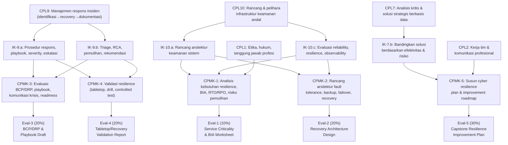

---

## PETA KOMPETENSI MATA KULIAH

```mermaid
flowchart LR
    A["Bab 1-2\nKonsep Resilience &\nFault Tolerance"]
    B["Bab 3-4\nBIA, Criticality &\nRTO/RPO"]
    C["Bab 5-6\nBackup/Restore &\nFailover Architecture"]
    D["Bab 7-8\nBCP & DRP"]
    E["Bab 9\nCrisis Communication"]
    F["Bab 10-11\nCyber Recovery &\nClean-Room Rebuild"]
    G["Bab 12-13\nTabletop & Recovery\nDrill Validation"]
    H["Bab 14\nResilience Metrics"]
    I["Bab 15\nCapstone Resilience Plan"]
    J["Bab 16\nTren & Pengayaan"]

    A --> B --> C --> D --> E --> F --> G --> H --> I --> J

    style A fill:#e8f4fd
    style B fill:#e8f4fd
    style C fill:#fef9e7
    style D fill:#fef9e7
    style E fill:#fef9e7
    style F fill:#eafaf1
    style G fill:#fdebd0
    style H fill:#fdebd0
    style I fill:#f5eef8
    style J fill:#f5eef8
```

---

## TABEL PEMETAAN BAB — OBE

| Bab | Judul | Sub-CPMK | CPMK | Materi Utama | Evaluasi | Artefak |
|---|---|---|---|---|---|---|
| 1 | Konsep Resilience dan Dependability Engineering | Sub-CPMK-1 | CPMK-1 | Resilience, dependability, RAMS | Eval-1 | Resilience concept map |
| 2 | Fault Tolerance, Redundancy, dan High Availability | Sub-CPMK-1 | CPMK-1 | Fault model, redundancy patterns, HA | Eval-1 | HA architecture diagram |
| 3 | Business Impact Analysis (BIA) dan Service Criticality | Sub-CPMK-2 | CPMK-1 | BIA methodology, criticality classification | Eval-1 | BIA worksheet |
| 4 | Recovery Objectives: RTO, RPO, dan Dependency Mapping | Sub-CPMK-2 | CPMK-1 | RTO/RPO/RTA, dependency map | Eval-1 | Dependency map + recovery matrix |
| 5 | Backup Strategy dan Restore Architecture | Sub-CPMK-3 | CPMK-2 | Backup types, 3-2-1 rule, restore testing | Eval-2 | Backup architecture design |
| 6 | Failover, Replication, dan Geographic Redundancy | Sub-CPMK-3 | CPMK-2 | Active-passive, active-active, geo-redundancy | Eval-2 | Failover design |
| 7 | Business Continuity Planning (BCP) | Sub-CPMK-3 | CPMK-3 | BCP components, ISO 22301 | Eval-3 | BCP document |
| 8 | Disaster Recovery Planning (DRP) | Sub-CPMK-3 | CPMK-3 | DRP structure, DR site types, runbook | Eval-3 | DRP runbook |
| 9 | Crisis Communication dan Stakeholder Management | Sub-CPMK-3 | CPMK-3 | Crisis comms, escalation, public relations | Eval-3 | Crisis communication plan |
| 10 | Cyber Incident Recovery dan Rebuild Strategy | Sub-CPMK-3 | CPMK-3 | Post-breach recovery, eradication, rebuild | Eval-3 | Recovery playbook |
| 11 | Golden Image, Clean-Room Recovery, dan Post-Breach Rebuild | Sub-CPMK-3 | CPMK-3 | Golden image, clean-room, forensic integrity | Eval-3 | Golden image policy |
| 12 | Resilience Testing: Tabletop Exercise | Sub-CPMK-4 | CPMK-4 | Tabletop design, facilitation, evaluation | Eval-4 | Tabletop report |
| 13 | Recovery Drill dan Controlled Failure Injection | Sub-CPMK-4 | CPMK-4 | DR drill, chaos engineering principles | Eval-4 | Drill report |
| 14 | Resilience Metrics dan Performance Indicators | Sub-CPMK-4 | CPMK-4 | KPI, KRI, MTTF, MTTR, availability formula | Eval-4 | Metrics dashboard |
| 15 | Capstone: Cyber Resilience Plan dan Improvement Roadmap | Sub-CPMK-5 | CPMK-5 | Full resilience plan, executive briefing | Eval-5 | Resilience plan + roadmap |
| 16 | Tren, Sertifikasi, dan Pengayaan Resilience Computing | Pengayaan | Semua | Cloud resilience, chaos engineering, certifications | — | Reflection memo |

---

## PETUNJUK PENGGUNAAN BUKU

- **Bab 1–2** membangun fondasi konseptual resilience engineering dan fault tolerance.
- **Bab 3–4** mengembangkan kemampuan analisis dampak bisnis dan penetapan recovery objectives.
- **Bab 5–6** mengajarkan rekayasa arsitektur backup/restore dan failover.
- **Bab 7–11** membangun kompetensi perencanaan BCP/DRP, crisis communication, dan cyber recovery.
- **Bab 12–14** mengembangkan kemampuan validasi dan pengukuran resilience.
- **Bab 15** mengintegrasikan semua kompetensi ke dalam Cyber Resilience Plan.
- **Bab 16** memperluas wawasan tentang tren industri dan jalur karir.

---

## DAFTAR BAB

1. Konsep Resilience dan Dependability Engineering
2. Fault Tolerance, Redundancy, dan High Availability Architecture
3. Business Impact Analysis (BIA) dan Service Criticality
4. Recovery Objectives: RTO, RPO, RTA, dan Dependency Mapping
5. Backup Strategy dan Restore Architecture
6. Failover, Replication, dan Geographic Redundancy
7. Business Continuity Planning (BCP)
8. Disaster Recovery Planning (DRP)
9. Crisis Communication dan Stakeholder Management
10. Cyber Incident Recovery dan Rebuild Strategy
11. Golden Image, Clean-Room Recovery, dan Post-Breach Rebuild
12. Resilience Testing: Tabletop Exercise
13. Recovery Drill dan Controlled Failure Injection
14. Resilience Metrics dan Performance Indicators
15. Capstone: Cyber Resilience Plan dan Improvement Roadmap
16. Tren, Sertifikasi, dan Pengayaan Resilience Computing

---

## Bab 1 — Konsep Resilience dan Dependability Engineering

### 1. Capaian Pembelajaran Bab

Setelah menyelesaikan bab ini, mahasiswa mampu:
- Menjelaskan definisi, tujuan, dan dimensi resilience dalam konteks sistem komputasi dan keamanan siber.
- Membedakan konsep *dependability*, *reliability*, *availability*, *maintainability*, dan *safety*.
- Menjelaskan posisi cyber resilience dalam ekosistem keamanan siber dan kontinuitas bisnis.
- Mengidentifikasi perbedaan antara *reliability engineering* dan *resilience engineering*.

Bab ini memetakan **Sub-CPMK-1** dan berkontribusi pada **Eval-1 (10%)**.

---

### 2. Peta Konsep Bab

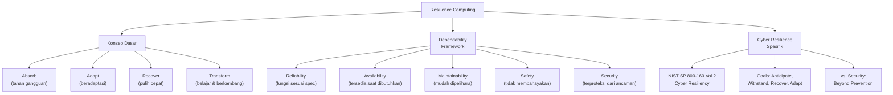

---

### 3. Pengantar Kontekstual

Pada Mei 2017, WannaCry ransomware melumpuhkan National Health Service (NHS) Inggris — ribuan komputer di ratusan rumah sakit dikunci, operasi dibatalkan, dan pasien dialihkan. Sistem yang sebelumnya "aman" terbukti tidak *resilient*: ketika serangan berhasil menembus pertahanan, tidak ada mekanisme pemulihan yang memadai.

Ini bukan kegagalan keamanan semata — ini adalah kegagalan *resilience*. Keamanan siber selama ini terlalu fokus pada *prevention* — mencegah serangan masuk. Namun realitanya, tidak ada sistem yang dapat dijamin 100% aman selamanya. Pertanyaannya adalah: **bagaimana sistem bertahan dan pulih ketika pertahanan ditembus?**

Resilience computing memberikan jawaban: rancang sistem yang dapat menyerap gangguan, beradaptasi, dan pulih dengan cepat — memastikan kelangsungan fungsi kritis meski terjadi kegagalan.

---

### 4. Landasan Teori

#### 4.1 Definisi Resilience

**Resilience** (dari bahasa Latin *resilire* — melambung kembali) dalam konteks sistem komputasi adalah kemampuan sistem untuk:

1. **Anticipate**: Mengantisipasi gangguan sebelum terjadi melalui pemantauan dan intelijen.
2. **Withstand**: Menahan gangguan — meminimalkan dampak melalui redundansi dan fault tolerance.
3. **Recover**: Pulih dari gangguan dengan cepat — mengembalikan fungsi kritis dalam target waktu yang ditetapkan.
4. **Adapt**: Belajar dari gangguan dan menyesuaikan diri untuk lebih tangguh di masa depan.

*Perbedaan kunci dari "keamanan" tradisional*: Keamanan fokus pada pencegahan (jangan biarkan gangguan masuk). Resilience mengakui bahwa gangguan *akan* terjadi dan fokus pada *response dan recovery*.

**NIST SP 800-160 Vol.2** mendefinisikan *cyber resiliency* sebagai kemampuan mengantisipasi, menahan, pulih dari, dan beradaptasi terhadap kondisi merugikan, tekanan, serangan, atau kompromi pada sumber daya cyber.

#### 4.2 Dependability Framework

**Dependability** adalah properti sistem yang memungkinkan kepercayaan yang sewajarnya terhadap layanan yang diberikan. Dependability mencakup beberapa atribut:

**Reliability (R)**: Probabilitas bahwa sistem berfungsi sesuai spesifikasi selama periode waktu tertentu dalam kondisi yang ditentukan. Diukur sebagai MTTF (Mean Time to Failure) atau MTBF (Mean Time Between Failures).

*Definisi formal*: R(t) = P(sistem berfungsi benar selama interval [0, t])

**Availability (A)**: Proporsi waktu dimana sistem siap beroperasi dan memberikan layanan yang benar.

*Formula*: A = MTBF / (MTBF + MTTR)

Dimana MTTR = Mean Time to Repair/Restore.

| Availability Level | Downtime per Tahun | Konteks |
|---|---|---|
| 99% ("two nines") | ~3,65 hari | Sistem non-kritis |
| 99,9% ("three nines") | ~8,76 jam | Sistem bisnis standar |
| 99,99% ("four nines") | ~52 menit | Sistem bisnis kritis |
| 99,999% ("five nines") | ~5,26 menit | Infrastruktur kritis, telekomunikasi |
| 99,9999% ("six nines") | ~31 detik | Sistem tier-1 kritis nasional |

**Maintainability (M)**: Kemudahan dan kecepatan sistem dapat diperbaiki, dimodifikasi, atau dipulihkan setelah kegagalan. Diukur sebagai MTTR.

**Safety**: Kemampuan sistem untuk tidak mengalami kegagalan yang mengakibatkan konsekuensi katastrofis terhadap lingkungan dan manusia.

**Security**: Kemampuan sistem untuk menolak akses dan modifikasi yang tidak diotorisasi.

**Integrity**: Properti bahwa sistem tidak mengalami modifikasi yang tidak tepat pada state-nya.

#### 4.3 Konsep Fault, Error, dan Failure

Untuk memahami resilience, kita harus membedakan tiga tingkat kejadian kegagalan:

**Fault (Kesalahan latent)**: Penyebab awal yang dapat memicu kegagalan — bisa berupa hardware defect, software bug, kesalahan konfigurasi, atau serangan siber. Fault bisa *dorman* (belum aktif) atau *aktif* (sudah mempengaruhi sistem).

**Error**: Manifestasi aktif dari fault dalam state sistem — bagian dari sistem total yang mengalami kondisi yang salah. Error adalah *intermediate state* antara fault dan failure.

**Failure**: Kejadian dimana sistem atau komponen berhenti memberikan layanan yang diperlukan sesuai spesifikasi. Failure adalah yang "terlihat" dari perspektif pengguna/sistem lain.

*Rantai kegagalan*: Fault → Error → Failure → Fault baru (dalam sistem yang lebih besar)

**Implikasi untuk resilience**: Resilience engineering bertujuan memutus rantai ini di berbagai titik:
- Mencegah fault menjadi error (fault prevention, fault avoidance)
- Mencegah error menjadi failure (fault tolerance, error masking)
- Meminimalkan dampak failure (failover, graceful degradation)
- Memulihkan dari failure (recovery, repair)

#### 4.4 Reliability Engineering vs. Resilience Engineering

| Dimensi | Reliability Engineering | Resilience Engineering |
|---|---|---|
| Asumsi | Kegagalan adalah anomali yang harus dicegah | Kegagalan adalah keniscayaan yang harus dikelola |
| Fokus | Mencegah kegagalan (prevention) | Mengelola kegagalan (anticipate, withstand, recover, adapt) |
| Metodologi | Redundancy, fault avoidance, FMEA | Dynamic adaptation, graceful degradation, rapid recovery |
| Konteks | Sistem tertutup, spesifikasi stabil | Sistem terbuka, lingkungan yang tidak pasti dan bermusuhan |
| Cocok untuk | Sistem engineering, manufaktur | Cyber systems, complex adaptive systems |
| Success metric | MTBF yang tinggi | Recovery time yang pendek, adaptive capacity |

*Mengapa keduanya diperlukan*: Reliability engineering membangun sistem yang jarang gagal. Resilience engineering memastikan bahwa ketika kegagalan terjadi, dampaknya minimal dan pemulihan cepat. Organisasi memerlukan keduanya.

---

### 5. Model atau Arsitektur

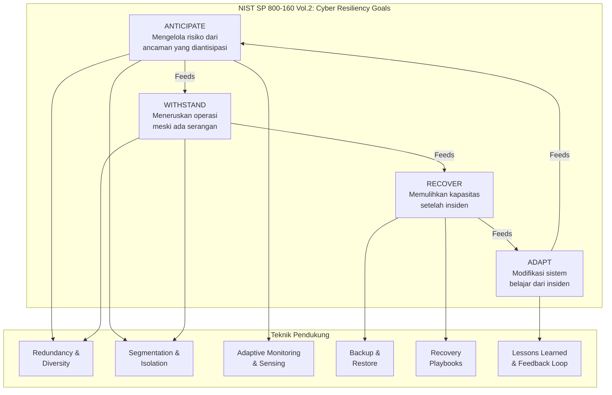

---

### 6. Contoh Terapan

**Skenario**: Rumah Sakit Umum Daerah Nusantara (fiktif) mengalami serangan ransomware yang mengenkripsi server rekam medis elektronik (RME). Sistem pencatatan pasien, jadwal operasi, dan farmasi terdampak.

**Analisis menggunakan kerangka ANTICIPATE-WITHSTAND-RECOVER-ADAPT**:

*Anticipate*: Sebelum serangan, apakah RS memiliki threat model yang mengidentifikasi ransomware sebagai risiko tinggi? Apakah backup rutin dilakukan? Apakah ada segmentasi jaringan yang memisahkan sistem RME dari jaringan umum?

*Withstand*: Ketika serangan terjadi, sistem mana yang masih dapat beroperasi? Apakah ada manual fallback procedure untuk pencatatan pasien? Apakah sistem kritis seperti ICU dan kamar operasi memiliki offline backup?

*Recover*: Berapa RTO yang ditetapkan untuk sistem RME? Apakah ada backup yang bersih yang tidak terenkripsi? Berapa lama proses restore? Apakah restore sudah pernah diuji?

*Adapt*: Setelah insiden, apa yang dipelajari? Apa yang diubah dalam arsitektur, prosedur, dan pelatihan untuk mencegah atau meminimalkan insiden serupa?

**Temuan umum dalam insiden healthcare**: Banyak RS menemukan bahwa backup ada tetapi tidak pernah diuji restore-nya; segmentasi jaringan tidak memisahkan sistem kritis; RTO tidak pernah ditetapkan secara formal; dan tidak ada manual procedure untuk kondisi sistem down.

---

### 7. Praktikum atau Aktivitas Terarah

**Judul**: Analisis Resilience Posture Menggunakan NIST SP 800-160 Vol.2

**Tujuan**: Mahasiswa mampu mengevaluasi postur resilience sebuah organisasi menggunakan framework NIST dan mengidentifikasi gap utama.

**Prasyarat**: Pemahaman dasar sistem informasi dan keamanan siber.

**Dataset/Skenario**: Deskripsi organisasi fiktif (sektor, infrastruktur, insiden terkini) yang disediakan dosen.

**Langkah kerja**:
1. Baca deskripsi organisasi dan identifikasi 5 layanan/sistem kritis.
2. Untuk setiap layanan, evaluasi postur saat ini terhadap 4 goal NIST (ANTICIPATE, WITHSTAND, RECOVER, ADAPT) menggunakan skala 1-4.
3. Identifikasi 3 gap terbesar (score terendah dengan dampak tertinggi).
4. Susun rekomendasi awal untuk masing-masing gap.
5. Presentasikan dalam format tabel Resilience Posture Assessment.

**Artefak**: Tabel Resilience Posture Assessment (5 layanan × 4 goal) + 3 rekomendasi prioritas.

**Catatan etika**: Analisis dilakukan menggunakan skenario fiktif. Jika menggunakan organisasi nyata sebagai studi kasus, tidak boleh mengungkapkan kelemahan spesifik yang dapat dieksploitasi kepada pihak tidak berkepentingan.

---

### 8. Latihan Pemahaman

**Soal 1** (Pilihan Ganda): Sistem yang memiliki MTBF = 1000 jam dan MTTR = 10 jam memiliki availability: A. 99% B. 99,01% C. 90% D. 99,9%.

**Soal 2** (Esai): Jelaskan perbedaan antara *fault*, *error*, dan *failure* dengan menggunakan contoh serangan ransomware pada sistem perbankan.

**Soal 3** (Analisis): Server database mengalami *disk failure* (fault). Error berupa data corruption terjadi secara bertahap selama 2 jam sebelum failure total terjadi. Bagaimana sistem yang *resilient* seharusnya mendeteksi dan merespons pada tahap error, sebelum mencapai failure?

**Soal 4** (Perbandingan): Bandingkan pendekatan reliability engineering dan resilience engineering dalam menghadapi serangan supply chain (seperti SolarWinds). Mana yang lebih tepat dan mengapa?

**Soal 5** (Evaluasi): CISO perusahaan manufaktur berargumen: "Kita sudah punya firewall, IDS, dan EDR — sistem kita sudah aman." Evaluasi pernyataan ini dari perspektif resilience engineering.

---

### 9. Latihan Terapan / Studi Kasus

**Studi Kasus 1**: Pada Juli 2021, sebuah perusahaan managed service provider (MSP) di AS mengalami serangan ransomware yang berdampak ke 1.500+ pelanggan mereka dalam hitungan jam melalui supply chain attack. Dengan menggunakan framework ANTICIPATE-WITHSTAND-RECOVER-ADAPT, analisis: (a) di fase mana sistem gagal paling kritis, (b) apa rekomendasi resilience architecture yang seharusnya sudah ada, (c) bagaimana MSP seharusnya mengkomunikasikan insiden kepada pelanggan.

**Studi Kasus 2**: Anda diminta menjadi konsultan untuk startup fintech Indonesia yang berencana meluncurkan layanan dalam 6 bulan. CTO bertanya: "Seberapa tinggi availability yang kita butuhkan dan berapa biayanya?" Rancang framework keputusan yang membantu CTO memilih target availability yang tepat berdasarkan: tipe layanan, toleransi downtime pelanggan, regulatory requirement, dan anggaran.

---

### 10. Kunci Jawaban dan Pembahasan

**Soal 1**: **Jawaban B — 99,01%**. Availability = MTBF / (MTBF + MTTR) = 1000 / (1000 + 10) = 1000/1010 = 0,9901 = 99,01%. Bukan 99% karena formula yang tepat memperhitungkan MTTR dalam denominator. Bukan 99,9% karena itu memerlukan MTTR yang jauh lebih kecil relatif terhadap MTBF.

**Soal 2**: *Fault*: Malware ransomware yang berhasil masuk ke sistem (melalui phishing atau exploit) — penyebab latent. *Error*: Proses enkripsi file yang berjalan diam-diam di background, memodifikasi state sistem secara progresif — belum terlihat sebagai failure. *Failure*: Sistem database tidak dapat diakses, transaksi gagal, layanan online tidak tersedia — ini yang terlihat oleh pengguna dan operator. Pelajaran: Jika sistem dapat mendeteksi error sebelum failure (anomali proses, enkripsi massal file), ada jendela waktu untuk containment sebelum dampak penuh terjadi.

**Soal 3**: Sistem yang resilient seharusnya: (1) Monitoring integritas disk (S.M.A.R.T. monitoring) yang mendeteksi degradasi disk sebelum failure total; (2) Checksumming data secara berkala untuk mendeteksi corruption; (3) Replikasi real-time ke node lain — corruption pada satu node tidak mempengaruhi node lain; (4) Alerting otomatis kepada tim ops ketika error rate meningkat; (5) Graceful degradation — beralih ke replica sebelum primary failure total. Kunci: window antara error dan failure adalah kesempatan untuk mengambil tindakan preventif.

**Soal 4**: Pendekatan *reliability engineering* mengasumsikan bahwa sistem akan berfungsi sesuai spec jika tidak ada fault — dalam konteks supply chain attack, adversary *menjadi bagian dari* supply chain yang dipercaya, sehingga reliability assumption (trusted components) sudah invalid dari awal. *Resilience engineering* lebih tepat karena: (1) Mengasumsikan bahwa trusted components bisa compromised; (2) Menerapkan zero-trust: verifikasi semua komunikasi meski dari komponen "trusted"; (3) Segmentasi: bahkan jika satu komponen compromised, blast radius terbatas; (4) Deteksi anomaly behavior dari komponen yang seharusnya trusted.

**Soal 5**: Pernyataan CISO terlalu sempit. Firewall, IDS, EDR adalah *preventive and detective controls* — mereka mengurangi probabilitas dan mempercepat deteksi serangan. Namun mereka tidak menjawab: (1) Apa yang terjadi *ketika* serangan berhasil melewati semua kontrol ini? (2) Berapa lama sistem dapat pulih dari ransomware? (3) Apakah backup tersedia, bersih, dan sudah diuji? (4) Apakah operasi manufaktur dapat berlanjut secara manual? (5) Siapa yang dihubungi pertama kali dan prosedur apa yang dijalankan? Security tanpa resilience adalah ilusi keamanan — organisasi perlu keduanya.

---

### 11. Ringkasan Bab

Resilience computing adalah kemampuan sistem untuk mengantisipasi, menahan, pulih dari, dan beradaptasi terhadap gangguan. Dependability framework mencakup reliability, availability, maintainability, safety, dan security. Rantai kegagalan fault→error→failure memerlukan intervensi di berbagai titik. Resilience engineering melengkapi reliability engineering dengan fokus pada *bagaimana sistem berperilaku saat gagal*, bukan hanya *mencegah kegagalan*. NIST SP 800-160 Vol.2 menyediakan framework ANTICIPATE-WITHSTAND-RECOVER-ADAPT sebagai panduan sistematis.

---

### 12. Refleksi Profesional

1. Dalam konteks layanan publik Indonesia (misalnya sistem administrasi kependudukan atau layanan kesehatan nasional), apa trade-off antara investasi dalam security prevention dan investasi dalam resilience/recovery? Bagaimana keterbatasan anggaran pemerintah mempengaruhi keputusan ini?

2. Konsep resilience menyiratkan bahwa kegagalan adalah keniscayaan. Apakah penerimaan filosofis ini bertentangan dengan budaya "zero defect" yang umum dalam dunia IT Indonesia? Bagaimana Anda membangun budaya resilience dalam tim yang terbiasa berpikir bahwa kegagalan adalah kegagalan?

---

## Bab 2 — Fault Tolerance, Redundancy, dan High Availability Architecture

### 1. Capaian Pembelajaran Bab

Setelah menyelesaikan bab ini, mahasiswa mampu:
- Menjelaskan model-model fault dan strategi fault tolerance yang sesuai.
- Merancang arsitektur redundancy menggunakan pola N+1, N+M, 2N, dan active-active.
- Mengevaluasi trade-off antara tingkat availability, biaya, dan kompleksitas.
- Mengidentifikasi Single Points of Failure (SPOF) dalam arsitektur sistem dan merencanakan eliminasinya.

Bab ini melanjutkan **Sub-CPMK-1** dan berkontribusi pada **Eval-1 (10%)**.

---

### 2. Peta Konsep Bab

```mermaid
flowchart TD
    FT["Fault Tolerance &\nHigh Availability"]
    
    FT --> FAULT_MODEL["Fault Classification"]
    FT --> REDUNDANCY["Redundancy Patterns"]
    FT --> HA_ARCH["HA Architecture"]
    FT --> SPOF["SPOF Analysis"]
    
    FAULT_MODEL --> TRANSIENT["Transient\n(sementara, hilang sendiri)"]
    FAULT_MODEL --> INTERMITTENT["Intermittent\n(berulang tidak tentu)"]
    FAULT_MODEL --> PERMANENT["Permanent\n(permanen, butuh repair)"]
    
    REDUNDANCY --> N1["N+1\n(satu spare)"]
    REDUNDANCY --> NM["N+M\n(M spare untuk N aktif)"]
    REDUNDANCY --> TN["2N\n(full mirror)"]
    REDUNDANCY --> ACTIVE_ACTIVE["Active-Active\n(semua aktif, load share)"]
    REDUNDANCY --> ACTIVE_PASSIVE["Active-Passive\n(standby siap ambil alih)"]
    
    HA_ARCH --> CLUSTERING["Clustering\n(heartbeat, quorum)"]
    HA_ARCH --> LB["Load Balancing\n(distribusi beban)"]
    HA_ARCH --> GRACEFUL["Graceful Degradation\n(fungsi berkurang tapi jalan)"]
    
    SPOF --> IDENTIFY["Identifikasi SPOF"]
    SPOF --> ELIMINATE["Eliminasi SPOF"]
    SPOF --> ACCEPT["Accept with\nMitigation"]
```

---

### 3. Pengantar Kontekstual

Pada Juni 2012, Amazon mengalami outage besar yang mempengaruhi Netflix, Pinterest, Instagram, dan ratusan layanan lain. Ironisnya, salah satu penyebab utamanya adalah ketergantungan berlebihan pada satu availability zone AWS dan kegagalan dalam distributed state management. Insiden ini mengajarkan dunia tentang pentingnya *fault-tolerant architecture* — bahwa bahkan infrastruktur cloud pun bisa gagal, dan desain sistem harus memperhitungkan kegagalan sebagai kondisi normal.

---

### 4. Landasan Teori

#### 4.1 Klasifikasi Fault

**Transient Fault**: Fault yang muncul sesaat lalu hilang sendiri tanpa intervensi. Contoh: memory bit flip akibat radiasi kosmik (soft error), network packet loss sesaat akibat interference.

*Penanganan*: Retry mechanism, error correction codes (ECC memory), checksumming.

**Intermittent Fault**: Fault yang muncul dan menghilang secara tidak menentu. Contoh: koneksi jaringan yang kadang-kadang terputus, hardware yang mulai mengalami degradasi.

*Penanganan*: Anomaly detection, trending analysis, proactive replacement sebelum permanent failure.

**Permanent Fault**: Fault yang persisten hingga komponen diperbaiki atau diganti. Contoh: disk failure, CPU yang rusak, komponen elektronik yang terbakar.

*Penanganan*: Redundancy, failover, repair/replacement, hot-swap components.

#### 4.2 Fault Tolerance Strategies

**Fault Prevention**: Menghindari fault sejauh mungkin melalui kualitas komponen, pengujian ketat, dan proses pengembangan yang matang.

**Fault Avoidance**: Menggunakan teknik untuk menghindari fault mencapai state yang berbahaya — misalnya input validation, secure coding.

**Fault Removal**: Menghapus fault yang sudah ada melalui testing, debugging, dan patching.

**Fault Tolerance**: Mengizinkan sistem terus beroperasi meski ada fault yang aktif, melalui *redundancy* dan *masking*. Ini adalah pendekatan utama dalam resilience engineering.

#### 4.3 Redundancy Patterns

**N+1 Redundancy**: Untuk setiap N komponen aktif, ada 1 komponen spare yang siap mengambil alih jika satu komponen gagal. Ini adalah model paling umum dan cost-effective.
- *Contoh*: 3 web server aktif (N=3) + 1 spare server (standby). Jika satu gagal, spare mengambil alih.
- *Kelemahan*: Hanya tahan satu kegagalan simultan.

**N+M Redundancy**: M spare untuk N komponen aktif — lebih toleran terhadap kegagalan multiple.
- *Contoh*: RAID 6 (N data drive + 2 parity drive, M=2) — tahan dua drive failure simultan.

**2N (Full Mirror) Redundancy**: Setiap komponen memiliki duplikat penuh yang identik.
- *Contoh*: Dual power supply, dual network uplink, active-passive database cluster.
- *Biaya*: 2× komponen, tapi memberikan *zero downtime* untuk satu kegagalan.

**Active-Active**: Semua instance beroperasi secara bersamaan, berbagi beban. Jika satu gagal, yang lain menyerap bebannya.
- *Kelebihan*: Tidak ada waktu switchover, utilisasi sumber daya lebih tinggi.
- *Tantangan*: Consistency masalah state (distributed consistency), lebih kompleks.

**Active-Passive (Standby)**: Satu instance aktif, satu standby (tidak memproses traffic). Jika primary gagal, standby diaktifkan.
- *Hot Standby*: Standby dalam kondisi siap penuh, switchover detik-menit.
- *Warm Standby*: Standby dalam kondisi partial ready, switchover menit-jam.
- *Cold Standby*: Standby tidak aktif, perlu setup, switchover jam-hari.

#### 4.4 Single Point of Failure (SPOF) Analysis

SPOF adalah komponen yang, jika gagal, menyebabkan seluruh sistem atau layanan gagal.

**Metode identifikasi SPOF**:
1. Gambar *dependency diagram* lengkap untuk layanan yang dianalisis.
2. Untuk setiap komponen, tanyakan: "Jika komponen ini gagal, apa yang terjadi pada layanan?"
3. Komponen yang failure-nya langsung menyebabkan service failure = SPOF.

**Contoh SPOF umum dalam arsitektur IT**:
- Single DNS server (tanpa secondary)
- Single database server (tanpa replica)
- Single load balancer (tanpa HA pair)
- Single ISP uplink
- Single data center (tanpa DR site)
- Single admin yang tahu credential kritis

**Strategi menangani SPOF**:
- *Eliminate*: Tambahkan redundancy (ideal).
- *Mitigate*: Kurangi probability atau impact (jika eliminasi tidak feasible karena biaya/teknis).
- *Accept*: Dokumenkan dan miliki recovery plan yang teruji (untuk SPOF yang tidak dapat dieliminasi).

---

### 5. Model atau Arsitektur

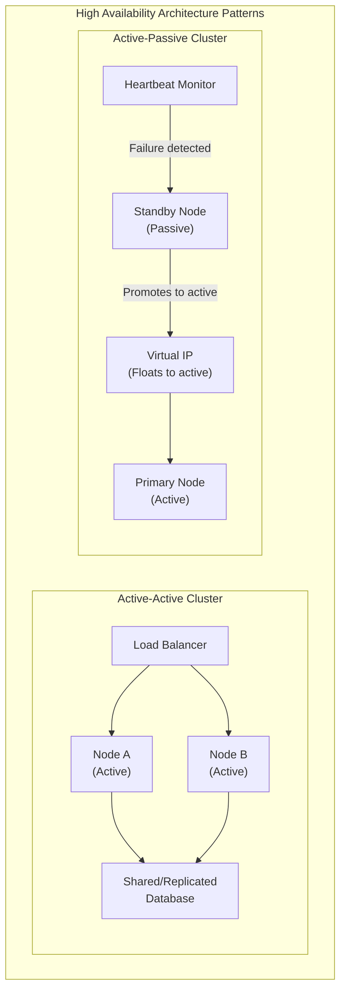

---

### 6. Contoh Terapan

**Skenario**: Platform e-commerce "NusaShop" (fiktif) mengalami downtime selama Harbolnas yang menyebabkan kerugian Rp 5 miliar. Root cause analysis menemukan: single database server tanpa replica, single load balancer, dan semua server di satu rack fisik.

**SPOF Analysis**:
- Database server: SPOF kritis (failure = total outage)
- Load balancer: SPOF (failure = tidak ada traffic routing)
- Rack tunggal: SPOF terhadap power failure atau hardware crash rack

**Rekomendasi arsitektur HA**:
- Database: Active-passive MySQL cluster dengan GTID replication; automatic failover via MHA atau ProxySQL.
- Load balancer: Keepalived dengan dua HAProxy dalam active-passive, Virtual IP floating.
- Server placement: Distribusikan ke minimal 2 rack berbeda dengan power feed berbeda.
- Tambahan: Multi-AZ deployment jika menggunakan cloud.

**Estimasi peningkatan availability**: Dari 99,5% (3,65 hari downtime/tahun) ke 99,99% (52 menit downtime/tahun) dengan eliminasi SPOF utama.

---

### 7. Praktikum atau Aktivitas Terarah

**Judul**: SPOF Analysis dan HA Architecture Design

**Tujuan**: Mahasiswa mampu mengidentifikasi SPOF dan merancang arsitektur HA untuk skenario yang diberikan.

**Skenario**: Arsitektur sistem e-government yang dideskripsi dalam diagram yang disediakan dosen (mencakup web server, app server, database, storage, network, power).

**Langkah kerja**:
1. Gambar ulang dependency diagram secara detail.
2. Identifikasi semua SPOF dengan mewarnainya merah.
3. Klasifikasikan setiap SPOF: dampak (critical/high/medium) dan feasibility eliminasi (easy/moderate/hard/not feasible).
4. Untuk 3 SPOF dengan dampak critical + feasibility moderate atau easy, rancang solusi redundancy.
5. Buat sebelum-sesudah: arsitektur awal vs. arsitektur HA yang direkomendasikan.
6. Estimasi perubahan availability (gunakan formula availability serial/paralel).

**Formula availability paralel**: A_parallel = 1 - (1-A1)(1-A2) [komponen redundant]
**Formula availability serial**: A_serial = A1 × A2 × ... × An [komponen bergantung serial]

**Artefak**: SPOF Analysis table + Before/After architecture diagram + Availability calculation.

---

### 8. Latihan Pemahaman

**Soal 1**: Sebuah sistem memiliki dua komponen serial: komponen A (availability 99,9%) dan komponen B (availability 99,5%). Hitung availability sistem keseluruhan.

**Soal 2** (Pilihan Ganda): Active-Active cluster lebih menguntungkan dibanding Active-Passive dalam hal: A. Konsistensi data B. Kemudahan implementasi C. Utilisasi resource dan tidak ada switchover time D. Toleransi terhadap split-brain.

**Soal 3**: Jelaskan perbedaan antara *hot standby*, *warm standby*, dan *cold standby* dalam konteks database server. Untuk setiap tipe, berikan contoh use case yang sesuai.

**Soal 4**: Sebuah arsitektur web application menggunakan: 2 web server (active-active, masing-masing 99,9%), 1 database server (99,9%), 1 storage system (99,99%). Hitunglah availability keseluruhan dan identifikasi komponen mana yang paling memengaruhi keseluruhan.

**Soal 5**: Dalam konteks keamanan siber, *split-brain syndrome* pada database cluster (di mana kedua node menganggap dirinya primary) adalah ancaman serius. Jelaskan mengapa dan bagaimana mekanisme *quorum* mengatasi masalah ini.

---

### 9. Latihan Terapan / Studi Kasus

**Studi Kasus 1**: Sebuah BUMN perbankan berencana membangun sistem core banking baru dengan target availability "five nines" (99,999%). Identifikasi: (a) berapa menit downtime yang diizinkan per tahun, (b) komponen apa saja yang perlu redundancy tingkat tinggi, (c) estimasi biaya implikasi dari target ini dibanding "four nines", dan (d) apakah "five nines" realistis untuk seluruh sistem atau hanya untuk komponen tertentu?

**Studi Kasus 2**: Startup SaaS Anda tiba-tiba viral dan traffic melonjak 10× dalam seminggu. Arsitektur yang ada (single server monolitik) tidak dapat menangani. Rancang strategi evolusi arsitektur dari single server ke highly available, scalable architecture — dengan mempertimbangkan urutan langkah berdasarkan dampak dan biaya.

---

### 10. Kunci Jawaban dan Pembahasan

**Soal 1**: Availability serial = A_A × A_B = 0,999 × 0,995 = 0,994005 = **99,4%**. Ini menunjukkan prinsip penting: dalam sistem serial, availability keseluruhan *selalu lebih rendah* dari availability komponen terendah. Komponen B dengan 99,5% menjadi bottleneck.

**Soal 2**: **Jawaban C**. Active-Active memungkinkan semua node melayani traffic secara bersamaan (utilisasi resource lebih tinggi, tidak ada "idle" standby) dan ketika satu node gagal, tidak ada switchover time — traffic langsung dialihkan ke node yang masih hidup. Active-Active lebih kompleks (bukan lebih mudah), dan justru lebih rentan terhadap split-brain karena dua node bisa menjadi conflict jika komunikasi terputus.

**Soal 3**: *Hot Standby*: Standby server berjalan penuh, menerima replikasi real-time, siap mengambil alih dalam detik–menit. Biaya: 2× resource running. Use case: database tier-1 e-commerce yang tidak toleran downtime. *Warm Standby*: Standby berjalan sebagian (software running, data partly current), memerlukan beberapa langkah aktivasi. Switchover menit–jam. Use case: aplikasi internal yang bisa toleran downtime pendek di jam kerja. *Cold Standby*: Standby tidak aktif, perlu installation/configuration, data dari last backup. Switchover jam–hari. Use case: sistem arsip, development environment backup, DR site untuk bencana regional.

**Soal 4**: Web server layer: 2 aktif paralel, A_web = 1-(1-0,999)² = 1-0,000001 = 0,999999 = 99,9999%. Database: 99,9% (serial). Storage: 99,99% (serial). A_total = 0,999999 × 0,999 × 0,9999 = **0,9989 ≈ 99,89%**. Komponen paling menentukan adalah *database* (99,9%) — menjadi bottleneck meski web layer sudah sangat tinggi. Untuk meningkatkan keseluruhan, database perlu redundancy dulu.

**Soal 5**: *Split-brain* terjadi ketika network partition memisahkan dua node cluster; keduanya tidak dapat "melihat" node lain dan keduanya mempromosikan diri sebagai primary. Akibatnya: dua "primary" menerima write secara independen → data divergence → data corruption saat network pulih. *Quorum* mengatasi ini dengan mensyaratkan bahwa node hanya boleh menjadi primary jika mendapat "vote" dari mayoritas node (>50%). Dalam cluster 3 node: jika partition terjadi, sisi dengan 2 node mendapat quorum → tetap aktif. Sisi dengan 1 node tidak mendapat quorum → menjadi passive atau self-terminate (STONITH — Shoot The Other Node In The Head). Ini memastikan hanya satu primary yang beroperasi meski ada network partition.

---

### 11. Ringkasan Bab

Fault diklasifikasikan sebagai transient, intermittent, atau permanent — dengan strategi penanganan berbeda. Fault tolerance menggunakan redundancy dan masking untuk memungkinkan operasi meski ada fault aktif. Pola redundancy (N+1, 2N, active-active, active-passive) memberikan pilihan trade-off antara biaya dan tingkat toleransi. SPOF analysis adalah langkah pertama dalam merancang arsitektur HA — semua SPOF kritis harus dieliminasi atau dimitigasi. Formula availability paralel dan serial memungkinkan kalkulasi kuantitatif dampak redundancy.

---

### 12. Refleksi Profesional

1. Dalam konteks anggaran pemerintah yang terbatas, bagaimana Anda memprioritas eliminasi SPOF untuk sistem layanan publik? Kriteria apa yang digunakan untuk memilih SPOF mana yang harus ditangani lebih dulu dengan anggaran yang tersedia?

2. Arsitektur Active-Active memberikan availability tertinggi tetapi juga kompleksitas tertinggi. Apakah ada risiko bahwa kompleksitas itu sendiri menciptakan SPOF baru (misalnya, kompleksitas yang melebihi kemampuan tim ops untuk memahami dan merespons dengan benar)? Bagaimana Anda menyeimbangkan antara availability target dan manageable complexity?


---

## Bab 3 — Business Impact Analysis (BIA) dan Service Criticality

### 1. Capaian Pembelajaran Bab

Setelah mempelajari bab ini, mahasiswa mampu:
- Menjelaskan konsep, tujuan, dan metodologi Business Impact Analysis (BIA) sesuai standar ISO 22301 dan NIST SP 800-34 (C2)
- Mengidentifikasi dan mengklasifikasikan aset dan proses bisnis berdasarkan tingkat kekritisan (C3)
- Merancang dan melaksanakan BIA untuk organisasi dengan konteks keamanan siber (C4)
- Menganalisis hasil BIA untuk menentukan prioritas pemulihan dan alokasi sumber daya (C4–C5)

*Keterkaitan Sub-CPMK-2 / CPMK-1 / Evaluasi-1*

---

### 2. Peta Konsep Bab

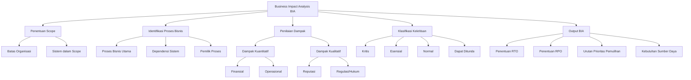

---

### 3. Pengantar Kontekstual

Sebuah serangan ransomware memaksa sebuah rumah sakit besar mematikan semua sistem selama 72 jam. Tim pemulihan menghadapi pertanyaan kritis: mana yang harus dipulihkan terlebih dahulu — sistem rekam medis pasien, sistem billing, sistem manajemen farmasi, atau portal komunikasi internal? Tanpa Business Impact Analysis (BIA) yang telah dilakukan sebelumnya, keputusan ini dibuat berdasarkan intuisi dan tekanan politik, bukan analisis dampak berbasis data.

BIA adalah proses sistematis yang menjawab pertanyaan mendasar: *Jika sistem X berhenti beroperasi, apa yang terjadi?* BIA mengkuantifikasi dan mengkualifikasi dampak gangguan terhadap proses bisnis, memungkinkan organisasi membuat keputusan pemulihan berbasis bukti.

Dalam konteks keamanan siber, BIA memiliki dimensi tambahan yang krusial: tidak semua ancaman siber berdampak sama. Serangan DDoS terhadap portal customer-facing berbeda dampaknya dengan ransomware pada sistem core banking. BIA membantu SOC, tim IR, dan manajemen memahami *blast radius* dari setiap skenario gangguan dan mengalokasikan sumber daya pemulihan secara proporsional.

---

### 4. Landasan Teori

#### 4.1 Definisi dan Tujuan BIA

**Business Impact Analysis (BIA)** adalah proses identifikasi, kuantifikasi, dan kualifikasi dampak bisnis dari gangguan atau penghentian proses bisnis. BIA merupakan fondasi dari seluruh program Business Continuity Management (BCM) karena menentukan *apa yang paling penting* bagi kelangsungan organisasi.

**Tujuan utama BIA:**
- Mengidentifikasi proses bisnis kritis yang membutuhkan pemulihan prioritas
- Menentukan dampak finansial dan operasional dari downtime
- Menetapkan Recovery Time Objective (RTO) dan Recovery Point Objective (RPO) awal
- Mengidentifikasi dependensi sistem dan sumber daya
- Membangun dasar untuk perencanaan BCP dan DRP

**Prinsip kerja BIA:**
BIA bekerja dengan metodologi *impact assessment* — mengukur besaran kerugian yang dialami organisasi jika proses bisnis tertentu tidak beroperasi dalam jangka waktu tertentu. Ini berbeda dari *risk assessment* yang mengukur kemungkinan terjadinya gangguan. BIA fokus pada konsekuensi, bukan probabilitas.

#### 4.2 Komponen Inti BIA

**a) Identifikasi Proses Bisnis**

Proses bisnis diidentifikasi melalui wawancara struktural dengan pemilik proses (process owners) dan pemangku kepentingan. Hasilnya adalah inventaris proses bisnis yang mencakup:
- Nama dan deskripsi proses
- Pemilik dan pengguna utama
- Sistem/aplikasi pendukung
- Dependensi internal dan eksternal
- Volume transaksi dan frekuensi operasi
- Regulasi atau SLA yang berlaku

**b) Penilaian Dampak Gangguan**

Dampak dinilai dalam dua dimensi:

*Dampak Kuantitatif (terukur dalam nilai moneter):*
- **Kehilangan pendapatan langsung:** setiap jam downtime menghasilkan X rupiah kerugian
- **Biaya operasional yang terus berjalan:** gaji, sewa, listrik, meski tidak ada produksi
- **Biaya pemulihan:** overtime, konsultan, penggantian perangkat
- **Denda dan penalti kontrak:** SLA breach, regulatory fine
- **Kehilangan pelanggan:** churn rate pasca insiden

*Dampak Kualitatif (dinilai dengan skala ordinal):*
- **Reputasi:** dampak terhadap kepercayaan publik dan brand
- **Regulasi/kepatuhan:** risiko sanksi, penangguhan lisensi
- **Keselamatan:** risiko cedera atau kematian (relevan untuk sektor kesehatan, utilitas)
- **Lingkungan:** untuk sektor industri dan energi

**c) Maximum Tolerable Downtime (MTD)**

MTD adalah durasi maksimum suatu proses bisnis dapat tidak beroperasi sebelum dampaknya menjadi tidak dapat diterima atau tidak dapat dipulihkan. MTD menjadi batas atas untuk penetapan RTO. Secara formal:

```
RTO < MTD
```

Jika MTD untuk sistem pembayaran adalah 4 jam, maka RTO tidak boleh melebihi 4 jam.

**d) Work Recovery Time (WRT)**

WRT adalah waktu yang dibutuhkan untuk memvalidasi sistem yang telah dipulihkan dan memastikan data konsisten sebelum operasi normal dilanjutkan. Hubungannya:

```
RTO = Waktu Pemulihan Teknis (Recovery) + WRT
```

#### 4.3 Klasifikasi Kekritisan (Service Criticality)

Organisasi mengklasifikasikan proses bisnis ke dalam tingkatan kekritisan untuk menentukan urutan dan prioritas pemulihan:

| Tingkat | Label | Deskripsi | MTD Tipikal |
|---------|-------|-----------|-------------|
| 1 | **Kritis (Critical)** | Penghentian segera menyebabkan kerugian signifikan, risiko keselamatan, atau kegagalan kepatuhan | < 4 jam |
| 2 | **Esensial (Essential)** | Penghentian menyebabkan dampak serius dalam 24 jam | 4–24 jam |
| 3 | **Penting (Important)** | Dampak signifikan dalam beberapa hari | 1–7 hari |
| 4 | **Normal** | Operasi dapat berlanjut dengan alternatif manual | 7–30 hari |
| 5 | **Dapat Ditunda (Deferrable)** | Tidak berdampak segera; dapat ditangguhkan lebih dari 30 hari | > 30 hari |

#### 4.4 Dependensi dan Pemetaan Sistem

Setiap proses bisnis bergantung pada rantai sistem yang saling terhubung. BIA harus memetakan dependensi ini untuk memahami cascading failures — kegagalan satu sistem yang memicu kegagalan sistem lain.

**Jenis dependensi:**
- **Upstream dependencies:** sistem yang harus berfungsi agar proses ini berjalan
- **Downstream dependencies:** proses lain yang bergantung pada proses ini
- **External dependencies:** penyedia layanan pihak ketiga, cloud provider, API eksternal
- **Human dependencies:** personel kunci yang tidak dapat digantikan segera

**Risiko kesalahan interpretasi:** Tim BIA sering melewatkan *hidden dependencies* — sistem yang tampak tidak terkait tetapi sebenarnya kritis. Contoh: sistem autentikasi SSO yang kelihatan tidak penting tetapi jika down membuat semua sistem lain tidak dapat diakses.

#### 4.5 BIA dalam Konteks Keamanan Siber

BIA tradisional berfokus pada gangguan fisik (bencana alam, kebakaran, pemadaman listrik). BIA cyber-aware menambahkan dimensi ancaman siber:

- **Ransomware scenario:** estimasi dampak jika semua data terenkripsi selama 72 jam, 168 jam
- **Data breach scenario:** dampak reputasi dan regulasi jika data PII bocor
- **Supply chain attack:** dampak jika vendor kritis dikompromis
- **Insider threat:** dampak sabotase terhadap sistem tertentu

Pendekatan ini menghasilkan **Cyber-Specific RTO/RPO** yang memperhitungkan bahwa pemulihan dari insiden siber sering lebih kompleks dari pemulihan dari bencana fisik karena memerlukan forensik, validasi integritas, dan pembersihan sistem.

---

### 5. Model atau Arsitektur

```mermaid
flowchart LR
    subgraph FASE1[Fase 1: Persiapan]
        A1[Pembentukan Tim BIA]
        A2[Penentuan Scope]
        A3[Pengembangan Template]
    end

    subgraph FASE2[Fase 2: Pengumpulan Data]
        B1[Wawancara Process Owner]
        B2[Workshop Departemen]
        B3[Review Dokumen]
        B4[System Inventory]
    end

    subgraph FASE3[Fase 3: Analisis]
        C1[Penilaian Dampak per Proses]
        C2[Penetapan MTD]
        C3[Pemetaan Dependensi]
        C4[Klasifikasi Kekritisan]
    end

    subgraph FASE4[Fase 4: Output]
        D1[Laporan BIA]
        D2[Recovery Priority List]
        D3[RTO/RPO Awal]
        D4[Resource Requirements]
    end

    subgraph FASE5[Fase 5: Validasi]
        E1[Review Management]
        E2[Update Berkala]
        E3[Post-Exercise Validation]
    end

    FASE1 --> FASE2
    FASE2 --> FASE3
    FASE3 --> FASE4
    FASE4 --> FASE5
    FASE5 -->|Update tahunan| FASE2
```

---

### 6. Contoh Terapan

**Kasus: BIA untuk PT Nusantara Digital Mandiri (Fintech)**

**Konteks:** PT Nusantara Digital Mandiri adalah perusahaan fintech yang menyediakan layanan pembayaran digital, pinjaman online, dan dompet elektronik. Setelah insiden ransomware yang mematikan layanan selama 18 jam, manajemen memutuskan melaksanakan BIA komprehensif.

**Aset yang dilindungi:** Data nasabah (PII), riwayat transaksi, sistem inti pembayaran, API gateway, sistem fraud detection, dan portal nasabah.

**Ancaman yang dianalisis:** Ransomware, DDoS, insider threat, kegagalan data center, pemadaman listrik berkepanjangan.

**Proses Analisis:**

Tim BIA melakukan wawancara dengan 12 pemilik proses selama 2 minggu dan menghasilkan matriks dampak:

| Proses Bisnis | Dampak/Jam (Rp) | Regulasi | MTD | Klasifikasi |
|--------------|-----------------|----------|-----|-------------|
| Core Payment Processing | 2.500.000.000 | OJK POJK 11 | 2 jam | Kritis |
| Fraud Detection Engine | Tidak langsung | OJK POJK 11 | 4 jam | Kritis |
| Customer Authentication (SSO) | Semua layanan stop | PDP Law | 1 jam | Kritis |
| Loan Disbursement System | 800.000.000 | OJK | 8 jam | Esensial |
| Customer Portal (Web/App) | 300.000.000 | - | 12 jam | Esensial |
| Accounting & Reconciliation | Penalti audit | OJK | 24 jam | Penting |
| HR & Payroll | - | Ketenagakerjaan | 72 jam | Normal |
| Marketing Dashboard | - | - | 30 hari | Dapat Ditunda |

**Temuan Kritis — Hidden Dependency:**
Tim menemukan bahwa sistem Customer Authentication (SSO) menjadi upstream dependency untuk seluruh 7 proses lainnya. Meskipun SSO sendiri bukan proses penghasil pendapatan, kegagalannya cascades ke seluruh layanan. MTD SSO ditetapkan 1 jam — lebih ketat dari Core Payment.

**Keputusan teknis:**
- SSO mendapat investasi High Availability tertinggi: Active-Active multi-region
- Core Payment mendapat hot standby dengan RTO target 30 menit
- Loan Disbursement mendapat warm standby dengan RTO target 4 jam

**Hasil BIA:** Recovery Priority List yang menjadi basis DRP organisasi, dengan urutan: SSO → Core Payment → Fraud Detection → Loan Disbursement → Customer Portal → Accounting.

---

### 7. Praktikum atau Aktivitas Terarah

**Judul Praktikum:** Pelaksanaan Mini-BIA untuk Sistem Informasi Akademik

**Tujuan Praktikum:**
- Menerapkan metodologi BIA pada lingkungan nyata yang terbatas
- Mengidentifikasi proses bisnis kritis dan dependensinya
- Mengisi BIA worksheet dan menghasilkan Recovery Priority List

**Prasyarat:**
- Pemahaman konsep BIA (Bab 3 ini)
- Kemampuan komunikasi untuk wawancara
- Pemahaman dasar sistem informasi

**Lingkungan Lab:**
- Setting: Sistem Informasi Akademik sebuah institusi pendidikan (dapat menggunakan institusi sendiri sebagai studi kasus atau skenario simulasi yang diberikan instruktur)
- Tools: BIA Worksheet (Lampiran B), spreadsheet, drawing tool untuk dependency map

**Dataset/Artefak:**
- Template BIA Worksheet (Lampiran B buku ini)
- Skenario sistem informasi akademik dengan 8 proses bisnis yang telah didefinisikan instruktur
- Daftar narasumber simulasi (role-play)

**Langkah Kerja:**

*Langkah 1 — Identifikasi Proses Bisnis (30 menit)*
Gunakan BIA Worksheet untuk mendaftar minimal 6 proses bisnis dari sistem akademik (contoh: pendaftaran mahasiswa baru, pengisian KRS, sistem penilaian, sistem keuangan, layanan perpustakaan, sistem absensi).

*Langkah 2 — Wawancara Simulasi (45 menit)*
Lakukan role-play wawancara dengan sesama mahasiswa yang berperan sebagai process owner. Gunakan daftar pertanyaan: "Apa yang terjadi jika sistem ini tidak dapat diakses selama 1 jam? 8 jam? 3 hari?" Catat jawaban di worksheet.

*Langkah 3 — Penilaian Dampak (30 menit)*
Untuk setiap proses, nilai dampak pada skala 1–5 untuk: reputasi institusi, dampak akademik mahasiswa, dampak operasional, dan kepatuhan regulasi. Hitung total skor dampak.

*Langkah 4 — Pemetaan Dependensi (30 menit)*
Buat diagram dependensi menggunakan draw.io atau kertas. Identifikasi upstream dan downstream dependency untuk setiap proses.

*Langkah 5 — Klasifikasi dan Prioritas (20 menit)*
Berdasarkan skor dampak dan peta dependensi, klasifikasikan setiap proses ke dalam tier kekritisan dan susun Recovery Priority List.

**Bukti yang Harus Dikumpulkan:**
- BIA Worksheet yang terisi lengkap (min. 6 proses)
- Diagram peta dependensi (dibuat manual atau digital)
- Recovery Priority List dengan justifikasi tiap keputusan

**Format Laporan:** Menggunakan template Laporan Praktikum (Lampiran A) + BIA Worksheet (Lampiran B).

**Kriteria Keberhasilan:**
- BIA Worksheet terisi lengkap dan konsisten
- Dependency map mencerminkan hubungan yang logis
- Recovery Priority List memiliki justifikasi berbasis data BIA, bukan asumsi intuitif
- Laporan mencakup refleksi tentang temuan mengejutkan (hidden dependencies)

**Catatan Etika dan Keselamatan:**
Jika praktikum menggunakan sistem nyata institusi, hanya lakukan pengamatan dan wawancara — tidak ada penetrasi atau akses sistem tanpa otorisasi. Data yang dikumpulkan dalam rangka BIA bersifat sensitif dan tidak boleh dibagikan di luar konteks perkuliahan.

---

### 8. Latihan Pemahaman

**Soal 1 (Pilihan Ganda — C4)**
Sebuah bank memiliki sistem ATM dengan Maximum Tolerable Downtime (MTD) 4 jam. Jika Recovery Time Objective (RTO) ditetapkan 3,5 jam dan Work Recovery Time (WRT) diestimasi 45 menit, kondisi apa yang terjadi?

A. RTO dan WRT konsisten dengan MTD karena RTO < MTD
B. Total waktu pemulihan efektif melampaui MTD karena RTO + WRT > MTD
C. WRT tidak perlu dihitung karena sudah termasuk dalam RTO
D. MTD harus disesuaikan menjadi 5 jam agar RTO valid

**Soal 2 (Pilihan Ganda — C4)**
Dalam BIA sebuah rumah sakit, sistem Rekam Medis Elektronik (RME) diidentifikasi memiliki dampak rendah secara finansial langsung tetapi memiliki downstream dependency ke 8 sistem lain. Bagaimana seharusnya tim BIA mengklasifikasikan RME?

A. Normal, karena dampak finansial langsung rendah
B. Kritis, karena downstream dependency yang luas menciptakan cascading failure potential yang tinggi
C. Esensial, sebagai kompromi antara dampak finansial rendah dan dependensi tinggi
D. Dapat Ditunda, karena rekam medis dapat dilakukan manual

**Soal 3 (Esai Singkat — C4)**
Jelaskan perbedaan antara BIA tradisional dan BIA cyber-aware. Mengapa sektor perbankan membutuhkan pendekatan BIA cyber-aware dalam era serangan siber yang semakin canggih?

**Soal 4 (Analisis Kasus — C5)**
Perusahaan logistik memiliki tiga sistem: (a) GPS Tracking Fleet dengan MTD 6 jam, (b) Customer Order Portal dengan MTD 12 jam, dan (c) Internal HR System dengan MTD 5 hari. Setelah serangan siber, tim pemulihan hanya memiliki kapasitas untuk memulihkan satu sistem per 4 jam. Analisis urutan pemulihan yang optimal dan justifikasinya dari perspektif BIA.

**Soal 5 (Perancangan — C5)**
Rancang kerangka pertanyaan wawancara BIA (minimal 8 pertanyaan) yang akan diajukan kepada process owner sistem e-commerce. Pertanyaan harus mencakup dimensi: dampak finansial, dampak operasional, dependensi, dan aspek keamanan siber.

**Soal 6 (Evaluasi Risiko — C5)**
Seorang analis menemukan bahwa proses bisnis A memiliki dampak finansial Rp 5 miliar/jam (MTD 2 jam) dan proses B memiliki dampak finansial Rp 500 juta/jam (MTD 8 jam) tetapi proses B memiliki implikasi kepatuhan regulasi yang dapat menyebabkan pencabutan izin usaha. Evaluasi bagaimana faktor kepatuhan regulasi harus diintegrasikan dalam scoring BIA.

---

### 9. Latihan Terapan / Studi Kasus

**Studi Kasus 1 — BIA Pasca-Insiden (C4–C5)**

PT Cakrawala Teknologi adalah penyedia layanan cloud hosting dengan 500 klien korporat. Pada tanggal 15 Maret pukul 02:00 WIB, terjadi serangan supply chain attack melalui pembaruan perangkat lunak yang terinfeksi. Dalam 3 jam, 60% server klien tidak dapat diakses.

Tim BIA melaporkan bahwa sebelum insiden, BIA terakhir dilakukan 3 tahun lalu dan tidak mencakup skenario supply chain attack. Recovery Priority List yang ada didasarkan pada klasifikasi lama yang tidak lagi relevan karena ada 3 klien baru dengan kontrak SLA kritis yang bergabung 6 bulan terakhir.

*Pertanyaan:*
1. Identifikasi setidaknya 3 kelemahan BIA PT Cakrawala yang terungkap dalam insiden ini
2. Tentukan proses apa yang harus diprioritaskan pemulihan berdasarkan informasi yang tersedia
3. Rancang rekomendasi untuk memperbarui BIA agar relevan dengan ancaman supply chain

**Studi Kasus 2 — BIA untuk Sistem Kritis Nasional (C5)**

Badan Siber dan Sandi Negara (BSSN) menugaskan Anda untuk membantu sebuah operator infrastruktur kritis (perusahaan distribusi listrik) melakukan BIA yang mencakup skenario serangan siber terhadap Operational Technology (OT) dan SCADA systems.

Sistem yang ada: SCADA (kontrol pembangkit), SCADA (kontrol distribusi), sistem billing, sistem ERP, portal pelanggan, dan sistem komunikasi internal.

*Pertanyaan:*
1. Jelaskan bagaimana BIA untuk sistem OT/SCADA berbeda dari BIA untuk IT systems biasa
2. Tentukan MTD yang realistis untuk masing-masing sistem dengan justifikasi berbasis dampak publik
3. Identifikasi regulatory requirements yang harus diperhitungkan dalam BIA infrastruktur kritis nasional

---

### 10. Kunci Jawaban dan Pembahasan

**Jawaban Soal 1: B**

Total waktu pemulihan efektif = RTO + WRT = 3,5 jam + 0,75 jam = 4,25 jam. Ini melampaui MTD 4 jam. Ini adalah kesalahan perancangan yang kritis — RTO harus ditetapkan sedemikian sehingga RTO + WRT ≤ MTD. Perancang yang baik akan menetapkan target yang lebih konservatif, misalnya RTO = 3 jam dengan WRT = 45 menit sehingga total = 3,75 jam < MTD 4 jam.

*Mengapa A salah:* Meskipun RTO < MTD, yang diperhitungkan adalah total waktu pemulihan efektif (termasuk WRT), bukan hanya RTO teknis. *Mengapa C salah:* WRT adalah fase terpisah setelah sistem teknis dipulihkan — tidak termasuk dalam RTO. *Mengapa D salah:* MTD ditetapkan berdasarkan dampak bisnis, bukan disesuaikan dengan kemampuan teknis. Jika MTD tidak bisa dipenuhi, investasi kapasitas pemulihan yang harus ditingkatkan.

*Teori yang mendasari:* Relasi fundamental MTD–RTO–WRT dalam NIST SP 800-34 Rev. 1. Kesalahan umum: mengabaikan WRT dalam perencanaan dan baru menyadarinya saat pemulihan nyata.

**Jawaban Soal 2: B**

Sistem RME harus diklasifikasikan **Kritis**. Dalam metodologi BIA modern (termasuk ISO 22301:2019), klasifikasi kekritisan tidak hanya berdasarkan dampak finansial langsung tetapi juga mempertimbangkan **indirect impact melalui cascading failures**. Sistem dengan banyak downstream dependency menciptakan multiplier effect — satu kegagalan menciptakan 8 kegagalan lanjutan. Selain itu, di rumah sakit, ketidaktersediaan RME dapat menciptakan risiko keselamatan pasien yang melampaui kerugian finansial apapun.

*Kaitan dengan standar:* ISO 22301:2019 Clause 8.2.2 mengharuskan BIA mempertimbangkan cascading consequences, bukan hanya dampak langsung.

**Jawaban Soal 3:**
BIA tradisional berfokus pada skenario gangguan fisik (gempa, banjir, kebakaran) dan menilai dampak berdasarkan downtime service. BIA cyber-aware menambahkan dimensi: (1) skenario ancaman siber spesifik seperti ransomware, DDoS, insider threat; (2) pertimbangan bahwa pemulihan dari insiden siber sering kali memerlukan forensik, validasi integritas, dan *clean rebuild* yang memperpanjang recovery time secara signifikan; (3) penilaian data integrity — sistem bisa "berjalan" tetapi data mungkin sudah terkompromis; (4) aspek reputasi dan kepatuhan regulasi (UU PDP, PCI-DSS, regulasi OJK) yang menjadi konsekuensi tambahan dari insiden siber.

Sektor perbankan membutuhkan pendekatan ini karena: peraturan OJK mengharuskan laporan insiden siber dalam 24 jam; kerugian dari ransomware tidak hanya downtime tetapi juga potensi exfiltration data nasabah; kepercayaan nasabah sangat sensitif terhadap insiden keamanan.

**Jawaban Soal 4:**
Berdasarkan MTD, urutan kekritisan: GPS Fleet (MTD 6 jam) > Customer Order Portal (MTD 12 jam) >> HR System (MTD 5 hari).

Namun, dengan kapasitas pemulihan 1 sistem per 4 jam, urutan optimal:
- Jam 0–4: Pulihkan GPS Tracking Fleet (MTD 6 jam, margin hanya 2 jam — paling mendesak)
- Jam 4–8: Pulihkan Customer Order Portal (MTD 12 jam, selesai pada jam ke-8, masih dalam batas)
- Jam 8–12: Pulihkan HR System (MTD 5 hari, sangat longgar)

Justifikasi: Jika urutan dibalik dan Customer Order Portal dipulihkan dulu (jam 0–4), GPS Fleet baru selesai jam ke-8 — melampaui MTD 6 jam dan menyebabkan kegagalan operasional yang tidak dapat diterima.

*Pelajaran:* Recovery Priority harus didasarkan pada **margin waktu tersisa terhadap MTD** (MTD - estimasi_waktu_saat_ini), bukan hanya nilai MTD absolut.

**Jawaban Soal 5:**

Contoh kerangka pertanyaan wawancara BIA untuk e-commerce:
1. "Jelaskan fungsi utama sistem ini dalam operasional bisnis sehari-hari?"
2. "Berapa nilai transaksi yang diproses sistem ini per jam saat peak load?"
3. "Apa yang terjadi jika sistem ini tidak tersedia selama 1 jam? 8 jam? 3 hari?"
4. "Sistem atau proses lain apa yang bergantung pada sistem ini (downstream dependencies)?"
5. "Sistem lain apa yang harus berfungsi agar sistem ini dapat berjalan (upstream dependencies)?"
6. "Apakah ada regulasi, SLA pelanggan, atau kontrak yang mewajibkan availability minimum?"
7. "Berapa lama operasi dapat berjalan dengan prosedur manual jika sistem ini down?"
8. "Jika terjadi serangan ransomware dan data sistem ini terenkripsi, berapa lama pemulihan yang dapat ditolerir?"

Kualitas pertanyaan BIA yang baik: spesifik pada dampak bisnis (bukan teknis), mencakup time horizon berbeda, dan mengeksplorasi workaround.

**Jawaban Soal 6:**
Dampak kepatuhan regulasi harus mendapatkan **bobot override** dalam scoring BIA — yaitu, risiko pencabutan izin usaha secara otomatis menempatkan proses tersebut pada tingkat kekritisan tertinggi, terlepas dari nilai finansial langsung per jam. 

Argumentasi: kehilangan lisensi adalah dampak *existential* bagi perusahaan, melampaui dampak finansial jangka pendek apapun. Proses B dengan MTD 8 jam tetapi regulatory implication harus diclassify Kritis dengan RTO yang sangat ketat.

Rekomendasi integrasi: tambahkan kolom "Regulatory Multiplier" dalam BIA scoring matrix — jika suatu proses memiliki risiko sanksi regulasi berat, kalikan skor totalnya dengan faktor 2–3 untuk mencerminkan dampak asimetrisnya.

**Kunci Studi Kasus 1:**
Kelemahan BIA PT Cakrawala: (1) BIA tidak diperbarui secara berkala (3 tahun tanpa update) sesuai ISO 22301 yang mensyaratkan review minimum tahunan; (2) Skenario supply chain attack tidak dimasukkan — BIA harus mencakup threat landscape terkini; (3) Onboarding klien baru dengan SLA kritis tidak memicu pembaruan BIA dan Recovery Priority List.

**Kunci Studi Kasus 2:**
Perbedaan BIA OT/SCADA: (1) Dampak langsung bersifat fisik dan keselamatan manusia, bukan finansial; (2) MTD OT jauh lebih ketat — kegagalan SCADA pembangkit bisa menyebabkan kerusakan fisik permanen pada turbin; (3) Recovery dari OT sering tidak dapat dilakukan secara remote dan memerlukan presisi teknis. MTD SCADA pembangkit: < 15 menit (resiko kerusakan fisik); SCADA distribusi: < 30 menit (resiko pemadaman kota); billing: 48 jam; ERP: 72 jam. Regulasi: PP 82/2012 tentang PTSE, Peraturan BSSN terkait Sistem Informasi Strategis Nasional.

---

### 11. Ringkasan Bab

Business Impact Analysis adalah fondasi analitik dari seluruh program resilience organisasi. BIA tidak sekadar mendaftar sistem — ia mengkuantifikasi konsekuensi bisnis dari kegagalan sistem tersebut, memungkinkan keputusan investasi pemulihan yang rasional dan berbasis data.

Konsep kunci yang harus dipahami: MTD sebagai batas atas yang tidak boleh dilanggar; hubungan MTD–RTO–WRT yang saling mengkonstrain; klasifikasi kekritisan sebagai alat prioritisasi; dan pemetaan dependensi sebagai metode menemukan hidden vulnerabilities. Dalam era siber, BIA harus diperluas dengan skenario ancaman siber spesifik dan mempertimbangkan kompleksitas tambahan pemulihan pasca-insiden siber.

BIA bukanlah dokumen statis — ia harus diperbarui ketika terjadi perubahan signifikan pada proses bisnis, infrastruktur, ancaman, atau regulasi yang berlaku.

---

### 12. Refleksi Profesional

1. BIA mengharuskan proses owner untuk "membayangkan" skenario kegagalan dan mengestimasikan dampaknya. Dalam praktik, manajer seringkali meremehkan dampak atau melebihkan kemampuan manual workaround karena insentif politis. Sebagai analis BIA, bagaimana Anda mengelola bias ini sambil tetap menjaga hubungan profesional yang baik dengan narasumber?

2. Hasil BIA mengungkapkan bahwa sistem HR dan payroll memiliki prioritas pemulihan yang sangat rendah (MTD 5 hari). Namun, dalam kondisi krisis, karyawan yang tidak mendapat informasi tentang status penggajian dapat meninggalkan organisasi justru saat organisasi paling membutuhkan mereka. Dimensi apa dari dampak BIA yang sering terabaikan dalam metodologi standar?

3. BIA sebuah rumah sakit menemukan bahwa sistem penyimpan data rekam medis memiliki MTD 30 menit karena risiko keselamatan pasien. Namun, anggaran rumah sakit tidak mencukupi untuk investasi High Availability yang memenuhi RTO tersebut. Bagaimana Anda sebagai konsultan menyampaikan temuan ini kepada dewan direksi rumah sakit, dan apa tanggung jawab etis Anda jika rekomendasi diabaikan?

---

---

## Bab 4 — Recovery Objectives: RTO, RPO, RTA, dan Dependency Mapping

### 1. Capaian Pembelajaran Bab

Setelah mempelajari bab ini, mahasiswa mampu:
- Mendefinisikan dan membedakan RTO, RPO, RTA, dan MTPD secara tepat (C2)
- Menghitung dan memvalidasi konsistensi antar recovery objectives untuk satu skenario (C3)
- Merancang recovery objective yang realistis berdasarkan hasil BIA dan kapasitas teknis (C4)
- Menganalisis dependency chain dan menentukan urutan pemulihan optimal untuk sistem multi-tier (C4–C5)

*Keterkaitan Sub-CPMK-2 / CPMK-1 / Evaluasi-1*

---

### 2. Peta Konsep Bab

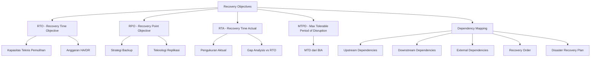

---

### 3. Pengantar Kontekstual

Saat terjadi kegagalan sistem, dua pertanyaan yang paling sering diajukan manajemen adalah: "Kapan sistem ini akan kembali berjalan?" dan "Berapa banyak data yang hilang?" Dua pertanyaan ini masing-masing dijawab oleh RTO dan RPO — dua metric paling fundamental dalam perencanaan pemulihan bencana.

Namun, banyak organisasi menetapkan RTO dan RPO secara aspirasional tanpa memvalidasinya terhadap kemampuan teknis nyata. Sebuah bank mungkin menyatakan RTO-nya adalah "2 jam" dalam dokumen DRP, tetapi ketika insiden nyata terjadi, pemulihan memakan 14 jam karena prosedur manual yang tidak pernah diuji. Gap antara RTO target dan RTA (Recovery Time Actual) adalah indikator kritis kematangan program resilience.

---

### 4. Landasan Teori

#### 4.1 Recovery Time Objective (RTO)

**RTO** adalah durasi maksimum yang ditoleransi sejak terjadinya gangguan hingga sistem kembali beroperasi pada tingkat layanan minimum yang dapat diterima. RTO bukan waktu pemulihan penuh — melainkan waktu untuk mencapai *Minimum Viable Service Level*.

**Komponen RTO:**

```
RTO = Waktu Deteksi + Waktu Eskalasi + Waktu Aktivasi DR + Waktu Recovery Teknis + WRT
```

- **Waktu Deteksi:** dari terjadinya kegagalan hingga monitoring mendeteksinya (detik hingga menit)
- **Waktu Eskalasi:** dari deteksi hingga keputusan aktivasi DR diambil
- **Waktu Aktivasi DR:** prosedur formal untuk mengaktifkan disaster recovery mode
- **Waktu Recovery Teknis:** waktu sistem teknis dikembalikan ke kondisi operasional
- **Work Recovery Time (WRT):** validasi data, integritas, dan koneksi aplikasi

**Hubungan RTO dengan biaya investasi:**
RTO yang lebih ketat memerlukan investasi infrastruktur yang lebih besar. Hubungan ini tidak linier:

| RTO Target | Strategi Tipikal | Investasi Relatif |
|------------|-----------------|-------------------|
| < 15 menit | Active-Active Multi-Region | Sangat Tinggi (4-6x) |
| 15–60 menit | Hot Standby + Automated Failover | Tinggi (2-3x) |
| 1–4 jam | Warm Standby + Semi-automated | Sedang (1.5x) |
| 4–24 jam | Cold Standby + Manual Recovery | Rendah (1.2x) |
| > 24 jam | Backup Only + Rebuild | Minimal |

#### 4.2 Recovery Point Objective (RPO)

**RPO** adalah durasi maksimum kehilangan data yang dapat ditoleransi — titik dalam waktu terjauh ke belakang di mana data masih dapat dipulihkan. RPO menentukan frekuensi minimum backup atau granularitas replikasi data.

**Implikasi RPO:**

```
RPO = 0      → Replikasi sinkron real-time (tidak ada data yang hilang)
RPO = 1 jam  → Backup atau replikasi tiap jam
RPO = 24 jam → Backup harian mencukupi
```

**RPO vs Backup Frequency:**
Jika RPO = 4 jam dan backup dilakukan setiap 4 jam, terjadi kegagalan pada t+3:59 setelah backup terakhir, maka data 3:59 jam hilang — masih dalam batas RPO. Jika backup dilakukan setiap 6 jam, worst case kehilangan 6 jam data, melanggar RPO.

**Biaya RPO:** Semakin ketat RPO, semakin tinggi biaya storage, bandwidth replikasi, dan kompleksitas manajemen data. RPO = 0 (zero data loss) memerlukan synchronous replication yang berimplikasi pada latency dan performa.

#### 4.3 Recovery Time Actual (RTA)

**RTA** adalah waktu pemulihan yang benar-benar terjadi dalam insiden nyata atau saat pengujian DR. RTA menjadi metric validasi apakah kapabilitas DR yang diinvestasikan benar-benar menghasilkan RTO yang dijanjikan.

**Analisis Gap RTO–RTA:**

```
Gap = RTA - RTO
Gap > 0 → Program DR belum memenuhi target; investigasi diperlukan
Gap = 0 atau negatif → Target tercapai; pertanyakan apakah target bisa diperketat
```

Gap yang konsisten mengindikasikan: prosedur DR tidak dilatih cukup, dokumentasi tidak akurat, kapasitas teknis tidak sesuai asumsi perencanaan, atau dependensi tidak dipetakan dengan benar.

#### 4.4 Maximum Tolerable Period of Disruption (MTPD)

**MTPD** (setara dengan MTD dalam beberapa framework) adalah titik di mana dampak kumulatif gangguan menjadi tidak dapat dipulihkan. Berbeda dari MTD yang bersifat operasional, MTPD sering digunakan dalam konteks strategis ISO 22301.

**Hierarki waktu yang harus konsisten:**

```
RTO + WRT < MTD/MTPD
RPO < Interval Backup Terakhir
```

Ketidakkonsistenan antara nilai-nilai ini adalah tanda perencanaan yang tidak valid.

#### 4.5 Dependency Mapping

Dependency Mapping adalah proses mendokumentasikan semua hubungan ketergantungan antara sistem, komponen, dan layanan — dari perspektif pemulihan bencana.

**Mengapa Dependency Mapping kritis:**
Dalam sistem multi-tier modern, pemulihan sebuah aplikasi tidak berguna jika database yang dipulihkan sebelumnya tidak konsisten, atau jika jaringan yang menghubungkan mereka belum terpulihkan. Urutan pemulihan yang salah menciptakan *circular dependency* yang menghambat seluruh proses.

**Komponen Dependency Map:**

*Upstream Dependencies (Prasyarat):*
Sistem-sistem yang harus berfungsi sebelum sistem target dapat dioperasikan. Contoh: database server, autentikasi, jaringan, storage.

*Downstream Dependencies (Konsekuensi):*
Sistem-sistem yang bergantung pada sistem target. Kegagalan sistem target menyebabkan kegagalan ini.

*External Dependencies:*
Pihak ketiga yang berada di luar kontrol langsung: cloud provider, DNS, ISP, payment gateway, API pihak ketiga.

**Recovery Sequence Matrix:**
Hasil dependency mapping adalah Recovery Sequence Matrix yang mendefinisikan urutan pemulihan yang valid secara teknis:

```
Level 0: Infrastruktur (jaringan, power, cooling)
Level 1: Infrastruktur IT (DNS, NTP, storage, virtualization platform)
Level 2: Sistem Fondasi (database server, autentikasi/SSO, messaging)
Level 3: Middleware dan API Gateway
Level 4: Aplikasi Bisnis Kritis
Level 5: Aplikasi Bisnis Non-kritis
Level 6: Layanan Reporting dan Analytics
```

---

### 5. Model atau Arsitektur

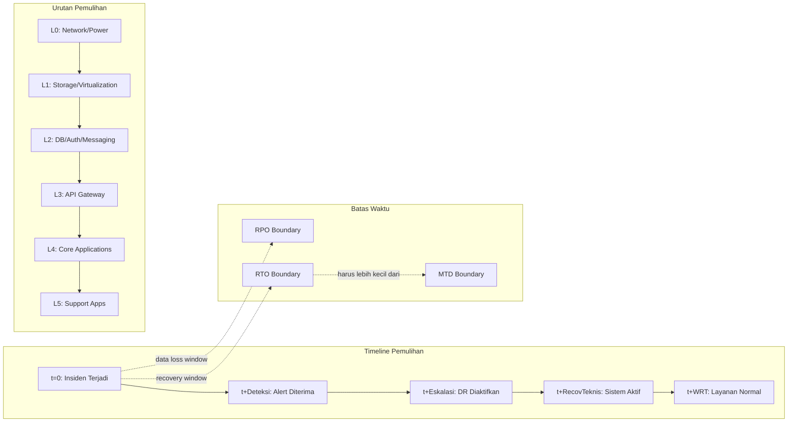

---

### 6. Contoh Terapan

**Kasus: Validasi Recovery Objectives Platform E-learning Universitas**

**Konteks:** Universitas menjalankan platform e-learning dengan 20.000 pengguna aktif. Menjelang periode ujian akhir semester, platform ini menjadi layanan kritis. BIA menghasilkan MTD = 6 jam selama periode ujian.

**Recovery Objectives yang ditetapkan:**
- RTO: 4 jam
- RPO: 2 jam (kehilangan data jawaban ujian maksimal 2 jam)
- WRT estimasi: 45 menit (validasi database integritas, koneksi aplikasi)

**Validasi konsistensi:**
```
RTO + WRT = 4 jam + 0,75 jam = 4,75 jam < MTD 6 jam ✓ (valid, margin 1,25 jam)
RPO = 2 jam → backup/replikasi harus dilakukan tiap 2 jam ✓
```

**Dependency Mapping hasil analisis:**

```
Platform E-learning
├── UPSTREAM (harus pulih lebih dulu)
│   ├── Network (L0) — tanpa ini tidak ada yang bisa diakses
│   ├── Authentication Service/SSO (L2) — tanpa ini mahasiswa tidak bisa login
│   ├── Database Cluster PostgreSQL (L2) — data ujian tersimpan di sini
│   └── Object Storage (jawaban dan materi) (L1)
└── DOWNSTREAM (akan berdampak jika platform down)
    ├── Sistem Penilaian
    ├── Laporan Akademik
    └── Notifikasi Email Mahasiswa
```

**Recovery Order yang ditetapkan:**
1. Network dan VPN (30 menit)
2. Virtualization Platform (20 menit)
3. PostgreSQL Database (recovery dari backup/replica) (60 menit)
4. Object Storage (sync dari mirror) (30 menit)
5. Authentication/SSO Service (15 menit)
6. E-learning Application Server (30 menit)
7. Load Balancer dan CDN (15 menit)
8. WRT: validasi koneksi, test login, test submit jawaban (45 menit)

**Total estimasi:** 245 menit ≈ 4,1 jam — mendekati RTO 4 jam, memerlukan parallelisasi tahap 2 dan 3 untuk mencapai target.

---

### 7. Praktikum atau Aktivitas Terarah

**Judul Praktikum:** Validasi Konsistensi Recovery Objectives dan Penyusunan Dependency Map

**Tujuan Praktikum:**
- Menghitung dan memvalidasi RTO, RPO, WRT, dan MTD untuk skenario nyata
- Membangun dependency map untuk sistem multi-tier
- Menyusun Recovery Sequence Matrix berbasis dependency analysis

**Prasyarat:** Pemahaman Bab 3 (BIA) dan Bab 4 (Recovery Objectives)

**Lingkungan Lab:** Analitik berbasis spreadsheet dan drawing tool; tidak memerlukan akses sistem produksi

**Dataset/Artefak yang Digunakan:**
- Skenario sistem multi-tier yang diberikan instruktur (sistem perbankan digital 7 komponen)
- Template Recovery Objectives Worksheet

**Langkah Kerja:**

*Langkah 1 — Penetapan Recovery Objectives (30 menit)*
Dari skenario yang diberikan, tetapkan RTO, RPO, dan WRT untuk setiap dari 7 komponen sistem. Dokumentasikan justifikasi setiap angka berdasarkan dampak bisnis.

*Langkah 2 — Validasi Konsistensi (20 menit)*
Untuk setiap komponen, periksa: apakah RTO + WRT < MTD? Jika tidak, rekomendasikan penyesuaian (apakah RTO diperketat dengan investasi lebih, atau MTD direlaksasi dengan persetujuan bisnis).

*Langkah 3 — Dependency Mapping (40 menit)*
Buat diagram dependency map untuk 7 komponen sistem. Tentukan level pemulihan (L0–L5) untuk setiap komponen.

*Langkah 4 — Recovery Sequence Matrix (20 menit)*
Susun Recovery Sequence Matrix dalam format tabel: urutan pemulihan, komponen, estimasi waktu per langkah, total kumulatif, dan catatan ketergantungan.

*Langkah 5 — Analisis Gap Potensial (15 menit)*
Hitung total estimasi recovery time dari sequence matrix. Bandingkan dengan RTO target. Identifikasi langkah mana yang paling berpotensi menyebabkan gap.

**Bukti yang Harus Dikumpulkan:**
- Tabel Recovery Objectives lengkap dengan validasi konsistensi
- Dependency Map (diagram)
- Recovery Sequence Matrix
- Analisis gap dan rekomendasi

**Kriteria Keberhasilan:**
- Semua nilai RTO+WRT < MTD (atau ada justifikasi jika tidak)
- Dependency map tidak memiliki circular dependency yang tidak dapat diselesaikan
- Recovery Sequence Matrix memiliki total waktu yang mendekati atau lebih kecil dari RTO

---

### 8. Latihan Pemahaman

**Soal 1 (Pilihan Ganda — C4)**
Sistem payment gateway memiliki MTD = 2 jam, RTO target = 90 menit, dan WRT estimasi = 40 menit. Apakah konfigurasi ini valid?

A. Valid, karena RTO < MTD
B. Tidak valid, karena RTO + WRT = 130 menit melampaui MTD 120 menit
C. Valid, karena WRT tidak dihitung dalam batasan MTD
D. Tidak dapat ditentukan tanpa mengetahui RPO

**Soal 2 (Pilihan Ganda — C4)**
Sebuah database kritis memiliki RPO = 4 jam. Tim backup saat ini melakukan backup setiap 6 jam. Dalam skenario kegagalan yang terjadi 5 jam setelah backup terakhir, berapa banyak data yang berpotensi hilang?

A. 4 jam (sesuai RPO)
B. 5 jam (waktu sejak backup terakhir)
C. 6 jam (interval backup penuh)
D. 1 jam (selisih antara RPO dan interval backup)

**Soal 3 (Esai Singkat — C4)**
Jelaskan mengapa RTA (Recovery Time Actual) lebih penting sebagai metric resilience daripada RTO (Recovery Time Objective). Berikan contoh situasi di mana RTO yang ambisius tetapi tidak divalidasi melalui pengujian dapat berbahaya.

**Soal 4 (Analisis — C5)**
Sistem e-commerce memiliki dependency berikut: Web Server → API Gateway → Application Server → Database Master → Database Slave. Dalam skenario Database Master gagal, jelaskan urutan pemulihan yang optimal jika Database Slave sudah tersedia sebagai hot standby, dan identifikasi risiko yang harus diperhatikan dalam setiap tahap.

**Soal 5 (Perancangan — C5)**
Rancang Recovery Objectives untuk sebuah sistem SIEM (Security Information and Event Management) yang digunakan oleh SOC 24/7. Pertimbangkan bahwa SIEM yang down berarti SOC kehilangan visibilitas terhadap ancaman yang sedang berjalan. Apa implikasi unik dari konteks keamanan siber ini terhadap penetapan RTO dan RPO?

---

### 9. Latihan Terapan / Studi Kasus

**Studi Kasus 1 — Inkonsistensi Recovery Objectives (C4–C5)**

Audit DR Plan sebuah perusahaan asuransi menemukan hal berikut:
- Klaim Proses System: MTD = 4 jam, RTO = 3,5 jam, WRT = 1 jam
- Core Insurance Platform: MTD = 8 jam, RTO = 6 jam, WRT = 30 menit
- Klaim Proses System memiliki upstream dependency ke Core Insurance Platform

*Pertanyaan:*
1. Identifikasi semua inkonsistensi dalam konfigurasi recovery objectives ini
2. Hitungan matematika mana yang menunjukkan pelanggaran batasan?
3. Rekomendasikan perbaikan dan jelaskan tradeoff investasinya

**Studi Kasus 2 — RPO dalam Konteks Compliance (C5)**

Bank sentral menerbitkan regulasi yang mewajibkan semua bank komersial memiliki RPO maksimal 1 jam untuk sistem core banking. Bank ABC saat ini menggunakan backup harian (RPO = 24 jam) dan memiliki anggaran terbatas. Teknologi yang tersedia: synchronous replication (RPO ≈ 0, biaya tertinggi), asynchronous replication (RPO beberapa menit, biaya tinggi), dan incremental backup tiap jam (RPO = 1 jam, biaya sedang).

*Pertanyaan:*
1. Teknologi mana yang memenuhi regulasi dengan biaya paling efisien?
2. Apa risiko residual dari masing-masing pilihan?
3. Bagaimana bank harus mendokumentasikan keputusan ini dalam konteks audit regulasi?

---

### 10. Kunci Jawaban dan Pembahasan

**Jawaban Soal 1: B**
RTO + WRT = 90 menit + 40 menit = 130 menit = 2 jam 10 menit. MTD = 2 jam = 120 menit. Karena 130 > 120, batasan MTD dilanggar. Konfigurasi tidak valid.

Untuk memperbaiki: (a) perkecil WRT dengan otomasi validasi → WRT < 30 menit, atau (b) perkecil RTO → target 80 menit sehingga 80+40=120 tepat di MTD (tanpa margin), atau idealnya (c) perkecil keduanya untuk memberikan safety margin.

**Jawaban Soal 2: B**
Kegagalan terjadi 5 jam setelah backup terakhir. Backup interval adalah 6 jam (artinya RPO aktual = 6 jam, yang melanggar RPO target 4 jam). Data yang hilang adalah data dari 5 jam terakhir sejak backup terakhir = **5 jam**. Ini melanggar RPO karena > 4 jam target.

*Implikasi:* backup harus dilakukan setiap 4 jam atau kurang untuk memenuhi RPO = 4 jam dalam semua skenario.

**Jawaban Soal 3:**
RTO adalah target yang ditetapkan di atas kertas; RTA adalah kenyataan yang terjadi saat insiden. RTO tanpa validasi RTA adalah ilusi keamanan. Sebuah lembaga keuangan mungkin mendokumentasikan RTO = 2 jam, tetapi jika prosedur DR tidak pernah diuji dan tim tidak terlatih, RTA aktual bisa 8–14 jam. Dalam kasus ini, manajemen beroperasi dengan false assurance bahwa mereka dapat pulih dalam 2 jam, padahal kemampuan nyata jauh lebih lemah. Dampaknya: regulasi mungkin menganggap bank memenuhi standar (berbasis dokumen RTO), padahal secara operasional tidak.

**Jawaban Soal 4:**
Urutan optimal: (1) Promosi Database Slave menjadi Master baru — ini harus dilakukan pertama karena semua layer aplikasi bergantung pada database. (2) Perbarui connection string di Application Server untuk menunjuk ke Database Master baru. (3) Restart Application Server jika diperlukan untuk mengambil konfigurasi baru. (4) Validasi API Gateway masih dapat menjangkau Application Server. (5) Validasi Web Server melalui smoke test end-to-end. 

Risiko per tahap: Promosi slave dapat menyebabkan split-brain jika Master lama masih hidup secara parsial → gunakan fencing mechanism. Replikasi asinkron dapat berarti Slave tertinggal beberapa transaksi → estimasi data loss dan komunikasikan ke bisnis.

**Jawaban Soal 5:**
SIEM memiliki karakteristik unik: downtime SIEM bukan hanya kerugian operational SIEM itu sendiri, tetapi memperbesar blast radius dari semua ancaman lain yang tidak terdeteksi selama downtime. Oleh karena itu: RTO SIEM harus sangat ketat (< 30 menit) bukan karena nilai bisnis langsung SIEM, tetapi karena implikasi keamanan dari "blind period." RPO SIEM harus mempertimbangkan dua dimensi: (a) event log yang hilang dari periode downtime (sumber log akan tetap menghasilkan event, SIEM yang tidak menerima) — ini lebih ke ingestion gap bukan data loss; (b) analitik dan korelasi rules yang mungkin perlu di-rebuild. Solusi: SIEM dengan HA architecture dan log buffering di sumber (log forwarder menyimpan event saat SIEM down, kemudian mengirim saat SIEM kembali online).

**Kunci Studi Kasus 1:**
Inkonsistensi: (1) Klaim Proses: RTO+WRT = 3,5+1 = 4,5 jam > MTD 4 jam — melanggar batasan. (2) Dependency violation: Klaim Proses bergantung pada Core Insurance Platform. Untuk memenuhi RTO Klaim Proses 3,5 jam, Core Insurance Platform harus sudah pulih sebelum menit ke-3,5 jam. Tetapi RTO Core Insurance adalah 6 jam — kontradiksi. Downstream tidak bisa pulih sebelum upstream. Perbaikan: Core Insurance RTO harus < Klaim RTO, misalnya Core Insurance RTO = 2 jam, lalu Klaim Proses dapat dimulai pemulihannya.

**Kunci Studi Kasus 2:**
Incremental backup tiap jam memenuhi RPO ≤ 1 jam dengan biaya sedang. Synchronous replication memenuhi RPO = 0 tetapi overengineering jika regulasi hanya mensyaratkan 1 jam. Asynchronous replication juga memenuhi tetapi lebih mahal dari hourly incremental backup. Risiko residual incremental backup: jika backup job gagal dan tidak terdeteksi, RPO bisa lebih buruk — wajib monitoring backup job. Dokumentasi untuk audit: decision log yang menjelaskan pemilihan teknologi berdasarkan regulatory requirement, risk assessment terhadap pilihan yang tidak dipilih, dan test result yang menvalidasi RPO yang dicapai.

---

### 11. Ringkasan Bab

RTO, RPO, RTA, dan MTPD/MTD adalah quartet metric yang mendefinisikan ekspektasi dan kapabilitas pemulihan sebuah organisasi. Keempat nilai ini harus konsisten secara matematis — pelanggaran batasan dalam perencanaan akan menghasilkan DRP yang tidak dapat dieksekusi saat insiden nyata.

Dependency Mapping adalah komplemen wajib dari Recovery Objectives — tanpa pemahaman urutan pemulihan yang valid secara teknis, bahkan RTO yang realistis pun dapat gagal dicapai karena pemulihan dilakukan dalam urutan yang salah. RTA sebagai metric validasi empiris adalah bukti matang tidaknya program resilience sebuah organisasi — gap antara RTO dan RTA adalah agenda prioritas perbaikan.

---

### 12. Refleksi Profesional

1. Regulasi keamanan siber di Indonesia (Peraturan OJK, BSSN) mulai mensyaratkan RTO dan RPO tertentu untuk sistem kritis. Sebagai profesional, bagaimana Anda mengelola situasi di mana RTO yang dipersyaratkan regulasi secara teknis dapat dicapai tetapi tidak tercermin dalam anggaran yang dialokasikan manajemen?

2. RPO = 0 (zero data loss) adalah janji yang secara teknis mendekati kemustahilan dalam sistem skala besar — synchronous replication selalu memiliki jendela kegagalan teoritis. Bagaimana Anda mengkomunikasikan keterbatasan ini kepada eksekutif yang menginginkan "zero data loss" sebagai selling point kepada pelanggan?

3. Dalam situasi pemulihan nyata, tekanan waktu sering mendorong tim teknis untuk mengambil jalan pintas seperti melewati langkah WRT (validasi data) demi memenuhi RTO. Apa risiko keamanan dan integritas data dari mengorbankan WRT, dan bagaimana Anda sebagai pemimpin teknis mengelola tekanan ini?

---

---

## Bab 5 — Backup Strategy dan Restore Architecture

### 1. Capaian Pembelajaran Bab

Setelah mempelajari bab ini, mahasiswa mampu:
- Menjelaskan jenis-jenis backup dan karakteristik teknis masing-masing (C2)
- Membandingkan strategi backup berdasarkan RPO, RTO, biaya, dan kompleksitas (C3–C4)
- Merancang backup architecture yang memenuhi recovery objectives organisasi (C4)
- Mengevaluasi restore architecture dan mengidentifikasi kelemahan dalam desain backup yang ada (C4–C5)

*Keterkaitan Sub-CPMK-3 / CPMK-2 / Evaluasi-2*

---

### 2. Peta Konsep Bab

```mermaid
flowchart TD
    BACKUP[Backup Strategy]
    BACKUP --> TYPES[Jenis Backup]
    BACKUP --> MEDIA[Media Penyimpanan]
    BACKUP --> RULE321[3-2-1 Rule]
    BACKUP --> ENCRYPT[Enkripsi Backup]
    BACKUP --> TEST[Pengujian Restore]

    TYPES --> FULL[Full Backup]
    TYPES --> INCR[Incremental Backup]
    TYPES --> DIFF[Differential Backup]
    TYPES --> SYNTH[Synthetic Full]
    TYPES --> SNAP[Snapshot]

    MEDIA --> LOCAL[Local Disk]
    MEDIA --> TAPE[Tape/Offsite]
    MEDIA --> CLOUD[Cloud Storage]
    MEDIA --> IMMUT[Immutable Storage]

    RULE321 --> COPY3[3 Salinan]
    RULE321 --> MEDIA2[2 Media Berbeda]
    RULE321 --> OFFSITE1[1 Offsite]

    RESTORE[Restore Architecture]
    RESTORE --> RTH[Restore to Hardware]
    RESTORE --> BM[Bare Metal Recovery]
    RESTORE --> P2V[Physical to Virtual]
    RESTORE --> INSTANT[Instant VM Recovery]
    RESTORE --> GRANULAR[Granular Recovery]
```

---

### 3. Pengantar Kontekstual

Ransomware modern telah mengubah paradigma ancaman terhadap backup. Kelompok ransomware seperti Conti dan BlackMatter secara eksplisit menargetkan backup repositories sebagai bagian dari strategi serangan — mereka mengenkripsi atau menghapus backup sebelum mengenkripsi data produksi, mengeliminasi kemampuan pemulihan korban. Serangan pada Kaseya VSA (2021) mengeksploitasi agen backup management untuk menyebarkan ransomware serentak ke ribuan klien.

Realitas ini memaksa pergeseran paradigma: backup bukan lagi sekadar proses teknis rutin, tetapi komponen kritis security posture. Strategi backup yang tidak mempertimbangkan ancaman siber adalah strategi yang tidak layak di era saat ini.

---

### 4. Landasan Teori

#### 4.1 Jenis-Jenis Backup

**a) Full Backup**
Menyalin seluruh dataset pada setiap eksekusi backup. Menghasilkan salinan lengkap dan mandiri (self-contained).

- **Kelebihan:** Restore paling sederhana — hanya memerlukan satu backup set
- **Kekurangan:** Waktu backup terpanjang, konsumsi storage terbesar, bandwidth tertinggi
- **RPO implikasi:** Jika dilakukan sekali sehari, RPO = 24 jam (worst case)
- **Penggunaan:** Biasanya sebagai weekly baseline, dikombinasikan dengan daily incremental

**b) Incremental Backup**
Menyalin hanya data yang berubah sejak backup terakhir (full atau incremental sebelumnya).

- **Kelebihan:** Backup cepat, konsumsi storage minimal
- **Kekurangan:** Restore kompleks — memerlukan full backup + semua incremental backup hingga titik yang diinginkan. Semakin banyak increment, semakin lama restore
- **RPO implikasi:** RPO = interval incremental (misalnya 1 jam jika incremental hourly)
- **Penggunaan:** Daily atau hourly sebagai supplement dari weekly full

**c) Differential Backup**
Menyalin semua data yang berubah sejak full backup terakhir.

- **Kelebihan:** Restore lebih sederhana dari incremental — hanya memerlukan full backup + satu differential backup terbaru
- **Kekurangan:** Ukuran diferensial terus bertumbuh mendekati ukuran full backup seiring waktu
- **Penggunaan:** Kompromi antara full dan incremental untuk lingkungan dengan data change rate sedang

**d) Synthetic Full Backup**
Full backup yang dibangun secara sintetis dari full backup lama dan incremental backup — tanpa membaca ulang data sumber. Ideal untuk menghindari beban baca pada sistem produksi.

**e) Snapshot**
Salinan point-in-time dari state sistem atau storage, biasanya berbasis teknologi Copy-on-Write (CoW) atau Redirect-on-Write (RoW). Snapshot bukan backup — ia tetap berada pada storage yang sama dengan data asli dan tidak memberikan proteksi terhadap kegagalan storage.

| Snapshot | Backup |
|----------|--------|
| Sangat cepat (detik) | Lebih lambat (menit-jam) |
| Berada di storage yang sama | Terpisah dari storage produksi |
| Tidak proteksi dari storage failure | Proteksi dari storage failure |
| Ideal untuk point-in-time recovery cepat | Ideal untuk disaster recovery |

#### 4.2 Aturan 3-2-1 dan Variannya

**Aturan 3-2-1 (klasik):**
- **3** salinan data (1 produksi + 2 backup)
- **2** media penyimpanan berbeda (misalnya disk + tape, atau disk + cloud)
- **1** salinan offsite (di lokasi fisik berbeda dari produksi)

Aturan ini memberikan proteksi terhadap: kegagalan media tunggal, bencana lokasi, dan kehilangan data lokal.

**Aturan 3-2-1-1 (modern, untuk ransomware resilience):**
- **3** salinan, **2** media, **1** offsite, **1** offline/immutable (airgapped atau WORM storage)

**Aturan 4-3-2 (untuk sistem sangat kritis):**
- **4** salinan, **3** media berbeda, **2** lokasi offsite yang berbeda

**Immutable Backup (WORM — Write Once Read Many):**
Backup yang tidak dapat dimodifikasi atau dihapus setelah ditulis, bahkan oleh administrator sistem. Memberikan proteksi terhadap ransomware yang mencoba menghapus backup dan terhadap insider threat. Diimplementasikan melalui: object storage dengan object lock (S3 Object Lock, Azure Blob immutability), hardware WORM drives, atau cloud vault dengan retention lock.

#### 4.3 Enkripsi dan Integritas Backup

Backup yang tidak terenkripsi adalah risiko keamanan setara dengan data produksi. Backup seringkali berisi data yang lebih lama dan lebih komprehensif dari data produksi saat ini.

**Enkripsi backup:**
- Di-rest: AES-256 untuk backup files/tapes
- In-transit: TLS untuk transfer backup ke offsite/cloud
- Key management: kunci enkripsi backup harus disimpan terpisah dari backup itu sendiri

**Integritas backup — hash verification:**
Setiap backup harus memiliki hash (SHA-256 atau lebih kuat) yang diverifikasi saat backup dibuat dan saat restore dilakukan. Hash mismatch mengindikasikan korupsi atau tampering.

#### 4.4 Restore Architecture

Backup tanpa restore adalah ilusi perlindungan. Restore architecture mendefinisikan bagaimana data dipulihkan dari backup.

**Jenis Restore:**

*Bare Metal Recovery (BMR):* Memulihkan seluruh sistem termasuk OS, aplikasi, dan data ke hardware baru. Digunakan saat hardware asli mengalami kegagalan total.

*Physical-to-Virtual (P2V) Recovery:* Memulihkan sistem fisik menjadi virtual machine. Memungkinkan recovery lebih cepat saat hardware pengganti belum tersedia.

*Instant VM Recovery:* Menjalankan VM langsung dari backup storage (boot from backup) sementara data dimigrasikan di background. RTO dapat turun drastis ke hitungan menit.

*Granular Recovery:* Memulihkan item individual — satu file, satu email, satu record database — tanpa memulihkan seluruh backup. Penting untuk kasus accidental deletion yang sering terjadi.

*Database Point-in-Time Recovery:* Menggunakan kombinasi full backup + transaction log untuk memulihkan database ke titik waktu tepat sebelum kerusakan terjadi.

#### 4.5 Backup Testing dan Validation

**Kelemahan paling umum dalam program backup:** backup tidak pernah diuji, sehingga kerusakan atau inkompabilitas baru ditemukan saat pemulihan nyata diperlukan.

**Jenis Pengujian Backup:**

| Tipe | Metode | Frekuensi Rekomendasi |
|------|--------|----------------------|
| **Backup Job Verification** | Verifikasi log bahwa backup selesai tanpa error | Otomatis setiap backup |
| **Hash Integrity Check** | Verifikasi hash file backup | Setiap backup (otomatis) |
| **Spot Restore Test** | Restore file/folder acak ke lingkungan test | Mingguan |
| **Full System Restore Test** | Restore penuh ke environment terisolasi | Tahunan minimum |
| **Recovery Time Measurement** | Catat waktu restore aktual (RTA) | Setiap test |

**Catatan penting:** Restore test harus dilakukan ke *isolated environment* — bukan ke production — untuk menghindari overwriting data production yang masih baik.

---

### 5. Model atau Arsitektur

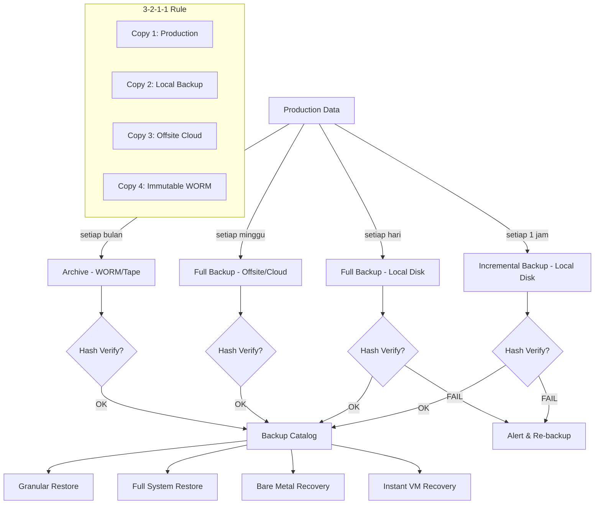

---

### 6. Contoh Terapan

**Kasus: Redesign Backup Architecture Pasca-Ransomware di Institusi Keuangan**

**Konteks:** Bank regional mengalami serangan ransomware yang berhasil mengenkripsi tidak hanya data produksi tetapi juga backup repository lokal karena backup server berada di segmen jaringan yang sama. Recovery terpaksa dilakukan dari backup tape offsite yang berumur 3 minggu, menyebabkan kehilangan data 3 minggu.

**Aset yang dilindungi:** Core banking database, data nasabah, riwayat transaksi, laporan regulasi.

**Ancaman:** Ransomware dengan kemampuan lateral movement dan backup destruction.

**Proses Analisis dan Redesign:**

*Kelemahan arsitektur lama yang teridentifikasi:*
1. Backup server di segmen jaringan yang sama dengan produksi (dapat diakses dari segmen yang dikompromis)
2. Tidak ada immutable backup
3. Backup tape offsite hanya mingguan (RPO efektif = 7 hari)
4. Backup tidak terenkripsi (risiko keamanan data)

*Arsitektur baru yang dirancang:*
1. **Segmentasi jaringan backup:** Backup server di segmen terpisah dengan akses one-directional (produksi dapat mendorong ke backup, backup tidak dapat menarik dari produksi)
2. **Immutable cloud backup:** Menggunakan AWS S3 Object Lock atau Azure Blob dengan immutability policy 90 hari
3. **Jadwal backup baru:** Incremental setiap 15 menit (RPO = 15 menit), full backup harian
4. **Enkripsi end-to-end:** AES-256 untuk semua backup, key management di AWS KMS yang terpisah
5. **Automated restore testing:** Setiap minggu, restore acak ke sandbox environment terpisah

*Hasil:* Dalam exercise simulasi 6 bulan kemudian, RTO berkurang dari 3 minggu (kondisi nyata sebelumnya) menjadi 4 jam untuk core banking database.

---

### 7. Praktikum atau Aktivitas Terarah

**Judul Praktikum:** Analisis dan Redesain Backup Strategy

**Tujuan Praktikum:**
- Mengidentifikasi kelemahan backup strategy yang ada berdasarkan studi kasus
- Menerapkan aturan 3-2-1-1 dalam perancangan backup architecture
- Menghitung implikasi RPO dari berbagai konfigurasi backup

**Prasyarat:** Pemahaman Bab 5 ini; akses ke spreadsheet/drawing tool

**Lingkungan Lab:** Analitik; tidak memerlukan akses sistem produksi

**Langkah Kerja:**

*Langkah 1 — Audit Backup Strategy Skenario (30 menit)*
Instruktur memberikan skenario backup architecture dengan kelemahan tersembunyi. Identifikasi semua kelemahan berdasarkan: aturan 3-2-1, enkripsi, segmentasi jaringan, dan testing.

*Langkah 2 — Perhitungan RPO Aktual (20 menit)*
Dari jadwal backup yang diberikan, hitung RPO worst-case untuk setiap jenis data. Bandingkan dengan RPO target dari BIA.

*Langkah 3 — Redesain Arsitektur (40 menit)*
Rancang backup architecture baru yang memenuhi: RPO ≤ target dari BIA, aturan 3-2-1-1, enkripsi semua backup, isolasi jaringan backup, dan automated integrity verification.

*Langkah 4 — Rencana Pengujian Restore (20 menit)*
Susun rencana pengujian restore berkala dengan jenis test, frekuensi, lingkungan test, dan kriteria keberhasilan.

**Bukti yang Harus Dikumpulkan:**
- Daftar kelemahan yang teridentifikasi dengan justifikasi
- Diagram backup architecture baru
- Tabel perhitungan RPO aktual vs. target
- Rencana pengujian restore

---

### 8. Latihan Pemahaman

**Soal 1 (Pilihan Ganda — C4)**
Organisasi melakukan full backup setiap Minggu (00:00) dan incremental setiap hari (00:00). Kegagalan terjadi pada hari Rabu pukul 23:30. Berapa lama data yang terancam hilang?

A. 7 hari (sejak full backup Minggu)
B. 2 hari 23 jam 30 menit (sejak incremental terakhir Senin)
C. 23 jam 30 menit (sejak incremental terakhir Rabu 00:00)
D. 0 hari (incremental mencakup semua perubahan)

**Soal 2 (Pilihan Ganda — C3)**
Manakah perbedaan utama antara snapshot dan backup?

A. Snapshot tidak menyimpan data, backup menyimpan data
B. Snapshot berada di storage yang sama dengan data produksi; backup berada di storage terpisah
C. Snapshot hanya untuk database; backup untuk semua jenis data
D. Snapshot lebih lambat dibuat tetapi lebih cepat di-restore dibanding backup

**Soal 3 (Analisis — C4)**
Sebuah startup menggunakan backup strategy sebagai berikut: full backup setiap hari tersimpan di folder lokal di server produksi yang sama. Identifikasi semua masalah keamanan dan resilience dari strategi ini menggunakan kerangka 3-2-1-1.

**Soal 4 (Perancangan — C5)**
Rancang backup strategy untuk sistem rekam medis rumah sakit dengan persyaratan: RPO = 1 jam, RTO = 4 jam, data harus memenuhi HIPAA-equivalent (enkripsi wajib), dan recovery harus dapat dilakukan bahkan jika data center utama hancur total. Jelaskan setiap komponen arsitektur dan justifikasi pilihannya.

**Soal 5 (Evaluasi — C5)**
Seorang CISO menyatakan: "Kami melakukan backup setiap hari dan belum pernah kehilangan data dalam 5 tahun, jadi backup strategy kami sudah cukup baik." Identifikasi kelemahan dalam argumen ini dan apa yang seharusnya dijadikan metric untuk mengevaluasi kematangan backup strategy.

---

### 9. Latihan Terapan / Studi Kasus

**Studi Kasus 1 — Ransomware dan Backup Destruction (C4–C5)**

PT Megah Logistik mengalami serangan ransomware. Investigasi menemukan: (a) serangan dimulai 3 hari sebelum enkripsi massal dimulai; (b) selama 3 hari itu, malware secara diam-diam menghapus backup jobs dan mengenkripsi file backup lokal; (c) backup cloud yang ada adalah versi dari 6 hari lalu karena backup cloud hanya dilakukan mingguan; (d) tidak ada immutable backup.

*Pertanyaan:*
1. Hitungan kehilangan data maksimum dalam skenario ini
2. Identifikasi minimal 3 kontrol yang seharusnya mencegah atau mendeteksi skenario ini
3. Rancang backup architecture yang resilien terhadap serangan jenis ini

**Studi Kasus 2 — Backup Compliance untuk Sektor Keuangan (C5)**

OJK menerbitkan persyaratan baru: semua backup data nasabah harus terenkripsi, disimpan minimal di 2 lokasi berbeda, memiliki retensi minimum 7 tahun untuk data audit, dan dapat di-restore dalam waktu 4 jam untuk keperluan audit regulasi. Bank XYZ saat ini menggunakan backup lokal terenkripsi (7 hari retensi) dan tidak memiliki offsite backup.

*Pertanyaan:*
1. Identifikasi gap antara kondisi saat ini dan persyaratan OJK
2. Rancang roadmap implementasi backup yang memenuhi regulasi dalam anggaran terbatas
3. Bagaimana Bank XYZ membuktikan kepatuhan terhadap persyaratan ini kepada auditor?

---

### 10. Kunci Jawaban dan Pembahasan

**Jawaban Soal 1: C**
Incremental backup terakhir dilakukan Rabu 00:00. Kegagalan terjadi Rabu 23:30. Data yang terancam hilang adalah data dari Rabu 00:00 hingga 23:30 = **23 jam 30 menit**. Ini adalah RPO worst-case dengan jadwal backup ini.

*Mengapa B salah:* Incremental Selasa 00:00 sudah tertangkap oleh incremental Rabu 00:00. Data yang berubah sejak Selasa sudah di-backup. *Mengapa A salah:* Full backup Minggu adalah baseline, tetapi incremental harian memperbarui titik pemulihan setiap hari.

**Jawaban Soal 2: B**
Perbedaan fundamental: snapshot berada di storage yang sama (sehingga jika storage gagal, snapshot ikut hilang), sedangkan backup berada di storage terpisah.

**Jawaban Soal 3:**
Masalah yang teridentifikasi berdasarkan 3-2-1-1: (1) **Hanya 1 salinan** — backup di folder yang sama dengan produksi, bukan salinan terpisah secara fisik; (2) **Hanya 1 media** — disk yang sama; (3) **Tidak ada offsite** — jika server fisik rusak/terbakar/dicuri, semua data hilang; (4) **Tidak ada immutable** — ransomware dapat mengenkripsi backup folder ini bersamaan dengan produksi; (5) Kerentanan tambahan: jika ransomware mengenkripsi server, backup juga terenkripsi sekaligus. Ini adalah backup strategy yang memberikan false sense of security.

**Jawaban Soal 4:**
Backup architecture untuk rekam medis: (1) Continuous data protection atau incremental setiap 30 menit → RPO ≤ 1 jam; (2) Backup lokal terenkripsi AES-256 di dedicated backup server (segmen terpisah) → memenuhi enkripsi + keamanan; (3) Replikasi ke cloud offsite (region berbeda) dengan immutability 7+ tahun → memenuhi proteksi disaster total; (4) Instant VM Recovery capability → RTO ≤ 4 jam; (5) Retensi: 30 hari granular, 7 tahun archive. Justifikasi offsite: jika data center hancur total, produksi dan backup lokal ikut hilang — offsite cloud adalah satu-satunya pemulihan tersisa.

**Jawaban Soal 5:**
Argumen CISO lemah karena "tidak pernah kehilangan data dalam 5 tahun" hanya menunjukkan bahwa belum pernah perlu pemulihan — bukan bahwa backup akan berhasil jika diperlukan. Metric yang seharusnya: (1) RTA dari restore test terbaru; (2) Persentase restore test yang berhasil dalam 12 bulan terakhir; (3) Coverage backup (apakah semua data kritis tercakup?); (4) Waktu deteksi kegagalan backup job; (5) Apakah backup memenuhi aturan 3-2-1-1; (6) Tanggal kadaluarsa enkripsi key.

**Kunci Studi Kasus 1:** Kehilangan data maksimum = 6 hari (sejak backup cloud terakhir). Kontrol pencegahan: (1) Immutable backup (WORM) yang tidak dapat dihapus meski environment dikompromis; (2) Monitoring integritas backup — alert jika backup job gagal atau backup file dihapus; (3) Offline/airgapped backup yang tidak dapat diakses dari jaringan produksi sama sekali.

**Kunci Studi Kasus 2:** Gap: tidak ada offsite backup (gap utama), retensi hanya 7 hari vs 7 tahun wajib. Roadmap: Fase 1 (1 bulan): implementasi cloud backup dengan enkripsi dan 7 tahun retensi → tutup gap offsite dan retensi paling kritis. Fase 2 (3 bulan): tambahkan automated restore testing triwulanan. Bukti kepatuhan: restore test log yang menunjukkan RTO ≤ 4 jam, enkripsi certificate untuk backup, audit trail penyimpanan 7 tahun.

---

### 11. Ringkasan Bab

Strategi backup yang matang mencakup lebih dari sekadar menyalin data secara berkala. Ia memerlukan pemilihan jenis backup yang tepat berdasarkan RPO target, implementasi aturan 3-2-1-1 untuk proteksi berlapis termasuk terhadap ransomware, enkripsi dan manajemen kunci yang terpisah, serta pengujian restore yang konsisten dan terdokumentasi.

Prinsip fundamental yang harus diingat: **backup yang tidak pernah diuji restore-nya adalah backup yang belum terbukti nilainya.** RTA dari restore test adalah satu-satunya metric yang membuktikan kapabilitas pemulihan nyata organisasi.

---

### 12. Refleksi Profesional

1. Backup adalah proses yang sering diabaikan hingga terjadi bencana. Sebagai profesional keamanan siber, bagaimana Anda membangun budaya organisasi di mana backup dan restore testing menjadi prioritas rutin, bukan aktivitas reaktif?

2. Regulasi seperti GDPR dan UU PDP Indonesia mengharuskan data pribadi dihapus atas permintaan subjek data. Namun backup biasanya tidak memungkinkan penghapusan granular satu record. Bagaimana Anda menyeimbangkan kebutuhan backup komprehensif dengan kewajiban regulasi penghapusan data?

3. Immutable backup memberikan proteksi terhadap ransomware tetapi juga berarti data tidak dapat dihapus bahkan jika kemudian ditemukan mengandung data yang seharusnya tidak disimpan (misalnya data PII yang salah diarsipkan). Bagaimana Anda merancang kebijakan immutability yang seimbang antara keamanan dan kepatuhan?

---

---

## Bab 6 — Failover, Replication, dan Geographic Redundancy

### 1. Capaian Pembelajaran Bab

Setelah mempelajari bab ini, mahasiswa mampu:
- Menjelaskan mekanisme failover otomatis dan manual beserta trade-off masing-masing (C2)
- Membandingkan teknologi replikasi (sinkron vs asinkron) berdasarkan RPO, latensi, dan biaya (C3)
- Merancang arsitektur geographic redundancy yang memenuhi kebutuhan ketersediaan tinggi (C4)
- Menganalisis skenario split-brain dan merancang mekanisme pencegahannya (C4–C5)

*Keterkaitan Sub-CPMK-3 / CPMK-2 / Evaluasi-2*

---

### 2. Peta Konsep Bab

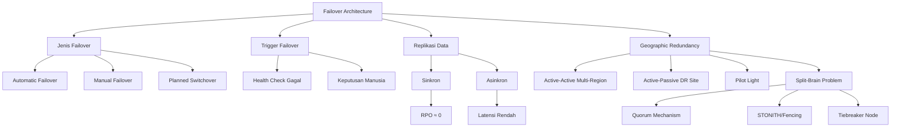

---

### 3. Pengantar Kontekstual

Pada 28 Februari 2017, sebuah human error dalam konfigurasi AWS S3 di region us-east-1 menyebabkan pemadaman massal yang berdampak pada ribuan layanan online selama 4 jam. Menariknya, beberapa perusahaan yang menggunakan arsitektur multi-region (seperti Netflix dengan Chaos Engineering mereka) tidak mengalami dampak signifikan — mereka secara otomatis beralih ke region lain. Perusahaan yang bergantung pada single region mengalami downtime penuh.

Ini adalah demonstrasi nyata dari nilai Geographic Redundancy dan Failover Architecture. Ketika satu lokasi atau komponen gagal, sistem yang dirancang dengan benar akan secara otomatis berpindah ke lokasi atau komponen lain tanpa intervensi manual.

---

### 4. Landasan Teori

#### 4.1 Failover: Konsep dan Klasifikasi

**Failover** adalah proses perpindahan otomatis atau manual dari sistem primer yang gagal ke sistem sekunder (standby). Failover merupakan mekanisme eksekutif dari arsitektur redundansi — redundansi adalah infrastrukturnya, failover adalah proses aktivasinya.

**Klasifikasi berdasarkan otomasi:**

*Automatic Failover:*
- Triggered oleh health check yang gagal tanpa intervensi manusia
- RTO lebih pendek (detik hingga menit)
- Risiko: false positive triggering — failover tidak perlu yang dapat menyebabkan disruption
- Memerlukan threshold yang dikalibrasi dengan baik

*Manual Failover:*
- Diputuskan oleh operator manusia setelah verifikasi
- RTO lebih panjang (menit hingga jam) karena memerlukan keputusan manusia
- Lebih aman dari false positive tetapi lebih lambat
- Cocok untuk skenario di mana dampak failover sendiri signifikan

*Planned Switchover (Graceful Failover):*
- Failover yang direncanakan dengan shutdown bersih dari sistem primer
- Tidak ada kehilangan data — semua transaksi aktif diselesaikan atau di-commit terlebih dahulu
- Digunakan untuk maintenance, upgrade, atau pengujian DR terencana

#### 4.2 Replikasi: Sinkron vs Asinkron

**Replikasi** adalah proses menduplikasikan data secara real-time atau near-real-time ke lokasi sekunder.

**Synchronous Replication:**
- Setiap write operation di sistem primer menunggu konfirmasi dari sistem sekunder sebelum dianggap selesai
- **RPO ≈ 0** — tidak ada data yang hilang jika primary gagal
- **Kekurangan:** menambahkan latency pada setiap write operation (setara 2× round-trip time antara primary dan secondary). Pada jarak antar site > 100 km, latency dapat mencapai 5–10 ms per write, yang tidak dapat diterima untuk high-throughput databases
- **Penggunaan:** untuk data sangat kritis dengan jarak site pendek (dalam kota yang sama atau data center berdekatan)

**Asynchronous Replication:**
- Write operation di primary selesai tanpa menunggu konfirmasi secondary
- Data dikirim ke secondary secara periodik atau segera setelah write selesai, tetapi ada *replication lag*
- **RPO > 0** — data dalam replication lag dapat hilang jika primary gagal secara tiba-tiba
- **Keuntungan:** tidak ada latency tambahan pada operasi primary, dapat mereplikasi ke jarak jauh (antar kota, antar negara)
- **Penggunaan:** untuk DR site yang jauh secara geografis, di mana latency sinkron tidak dapat diterima

| Aspek | Sinkron | Asinkron |
|-------|---------|----------|
| RPO | ≈ 0 | Detik–menit |
| Latensi | Meningkat | Tidak berubah |
| Jarak efektif | < 100 km | Tak terbatas |
| Biaya bandwidth | Lebih tinggi | Lebih rendah |
| Kompleksitas | Lebih tinggi | Lebih rendah |

#### 4.3 Geographic Redundancy

**Geographic Redundancy** adalah arsitektur yang mendistribusikan komponen sistem ke lokasi fisik berbeda untuk proteksi terhadap kegagalan tingkat site (bencana alam, pemadaman listrik regional, bencana lingkungan).

**Pola Arsitektur:**

*Active-Active Multi-Region:*
- Dua atau lebih site aktif secara bersamaan, melayani traffic secara paralel
- Failover instan karena tidak ada waktu "aktivasi" — traffic hanya diarahkan ulang
- Mensyaratkan data consistency mechanism yang kompleks
- Biaya tertinggi tetapi RTO mendekati nol

*Active-Passive (Hot Standby):*
- Site sekunder siap dengan sistem berjalan dan data ter-replikasi real-time
- Failover memerlukan waktu pengalihan traffic (DNS failover, load balancer reconfiguration)
- RTO: menit

*Pilot Light:*
- Hanya komponen inti yang berjalan di site sekunder (database minimal), aplikasi layer dimatikan
- Saat failover, aplikasi layer di-scale-up dari template yang sudah tersedia
- Lebih murah dari hot standby, RTO lebih panjang (menit hingga jam)

*Warm Standby:*
- Versi minimal sistem berjalan di site sekunder (skala kecil)
- Saat failover, scale-up ke kapasitas penuh
- Kompromi biaya-RTO antara Pilot Light dan Hot Standby

#### 4.4 Split-Brain Problem dan Solusinya

**Split-Brain** adalah kondisi di mana dua node (atau lebih) dalam cluster masing-masing percaya dirinya adalah satu-satunya node yang aktif dan mulai menerima write operations secara independen. Ini menghasilkan divergensi data yang sulit atau tidak mungkin direkonsiliasi.

Split-brain umumnya terjadi saat koneksi antar node terputus (*network partition*) sementara kedua node masih dalam kondisi baik secara operasional.

**Mekanisme Pencegahan:**

*Quorum Mechanism:*
Node hanya dapat menjadi active/primary jika memiliki majority votes dari total anggota cluster. Dalam cluster 3 node, perlu minimal 2 votes. Jika sebuah node terisolasi (hanya memiliki vote dirinya sendiri), ia turun ke mode pasif.

*STONITH (Shoot The Other Node In The Head) / Fencing:*
Node yang diragukan kesehatannya secara aktif di-shutdown oleh node lain melalui mekanisme eksternal (power controller, management interface). Ini memastikan hanya satu node yang aktif meski komunikasi antar node terputus.

*Tiebreaker/Witness Node:*
Node ketiga ringan (witness) yang tidak menyimpan data tetapi memberikan vote untuk memutus situasi 50-50. Node yang mendapat vote tiebreaker menjadi active.

*Arbitrated Network Partition:*
External arbitrator (cloud-hosted atau di lokasi ketiga) yang memberikan keputusan otoritatif tentang node mana yang boleh tetap aktif.

---

### 5. Model atau Arsitektur

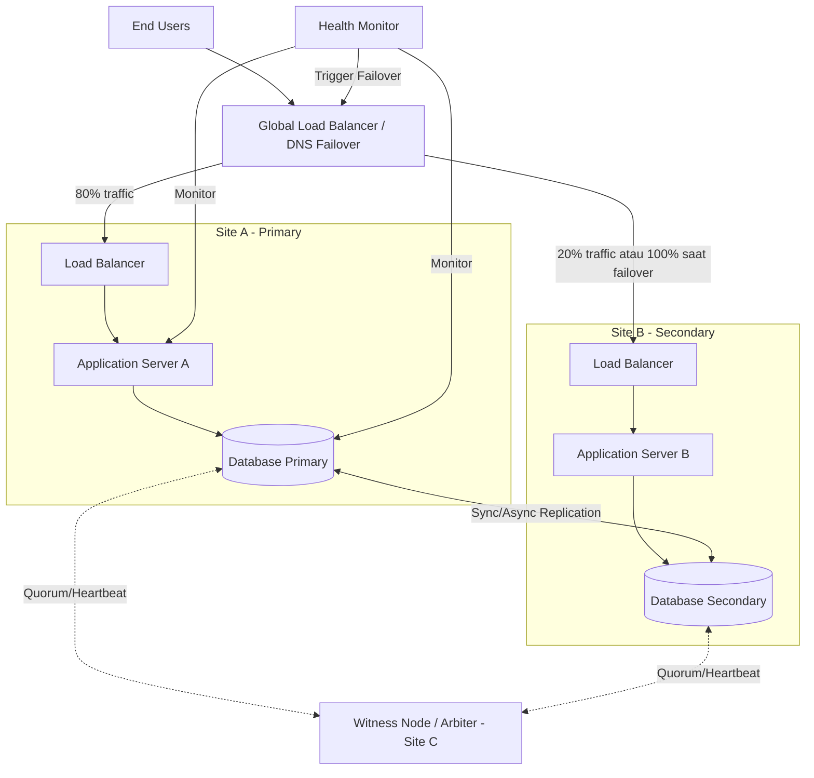

---

### 6. Contoh Terapan

**Kasus: Desain Failover Architecture untuk Fintech Payment Gateway**

**Konteks:** PT Bayar Cepat adalah penyedia payment gateway yang memproses 10.000 transaksi per detik pada jam sibuk. SLA dengan merchant mensyaratkan availability 99.99% (downtime maksimal 52 menit per tahun). Regulasi Bank Indonesia mengharuskan data transaksi tidak boleh hilang (RPO ≈ 0).

**Arsitektur yang dirancang:**

*Database Layer:*
- PostgreSQL Patroni cluster (3 node: primary di JKT-DC1, standby sinkron di JKT-DC2 (jarak 5 km), standby asinkron di SBY-DC3 (jarak 800 km))
- Sinkron ke JKT-DC2: RPO = 0, latensi tambahan ≈ 0.1 ms (acceptable)
- Asinkron ke SBY-DC3: RPO = 30 detik (dapat diterima untuk DR regional bencana besar)
- Patroni menggunakan etcd sebagai distributed configuration store untuk quorum

*Application Layer:*
- Kubernetes cluster dengan node di kedua data center Jakarta
- Pods di-schedule ke kedua DC; jika satu DC gagal, pods di-reschedule ke DC lain secara otomatis
- Stateless application layer memungkinkan failover tanpa koordinasi data

*Traffic Management:*
- Nginx Plus dengan active health checks setiap 5 detik
- DNS TTL = 60 detik untuk DNS-based failover
- Failover waktu: ≈ 60–90 detik (deteksi + DNS propagation)

*RTO yang dicapai:* 90 detik untuk kegagalan DC Jakarta → memenuhi target SLA 99.99%
*RPO yang dicapai:* 0 untuk kegagalan satu DC Jakarta (sinkron), 30 detik untuk bencana regional

---

### 7. Praktikum atau Aktivitas Terarah

**Judul Praktikum:** Analisis Arsitektur Failover dan Identifikasi SPOF

**Tujuan Praktikum:**
- Menganalisis diagram arsitektur failover yang diberikan untuk mengidentifikasi kelemahan
- Mengevaluasi apakah konfigurasi replikasi sesuai dengan RPO target
- Merancang perbaikan arsitektur untuk mengeliminasi SPOF yang ditemukan

**Lingkungan Lab:** Analitik; drawing tool; tidak memerlukan akses sistem produksi

**Langkah Kerja:**

*Langkah 1 — Analisis Arsitektur Diberikan (30 menit)*
Instruktur menyediakan diagram arsitektur dengan SPOF tersembunyi. Identifikasi semua SPOF dengan menelusuri setiap jalur kritis dari user ke data.

*Langkah 2 — Evaluasi Konfigurasi Replikasi (20 menit)*
Dari spesifikasi replikasi yang diberikan, tentukan: RPO yang dapat dicapai, risiko data loss pada skenario kegagalan berbeda (single node, single site, multi-site).

*Langkah 3 — Analisis Split-Brain Risk (20 menit)*
Identifikasi apakah arsitektur memiliki mekanisme pencegahan split-brain yang memadai. Jika tidak, rekomendasikan solusi (quorum, STONITH, tiebreaker).

*Langkah 4 — Redesain Arsitektur (40 menit)*
Buat diagram arsitektur yang diperbaiki, mengeliminasi SPOF yang ditemukan dan menambahkan mekanisme split-brain prevention.

**Bukti yang Harus Dikumpulkan:**
- SPOF inventory (daftar semua SPOF dengan penjelasan konsekuensinya)
- Analisis RPO aktual vs. target
- Analisis risiko split-brain
- Diagram arsitektur yang diperbaiki dengan anotasi perubahan

---

### 8. Latihan Pemahaman

**Soal 1 (Pilihan Ganda — C4)**
Sebuah database cluster 2-node menggunakan asynchronous replication. Primary gagal tiba-tiba saat replication lag = 45 detik. Berapa RPO dalam skenario ini?

A. 0 detik (asinkron selalu zero-loss)
B. 45 detik (sesuai replication lag)
C. Tidak dapat ditentukan tanpa mengetahui ukuran data
D. 90 detik (dua kali replication lag sebagai safety margin)

**Soal 2 (Analisis — C5)**
Dalam cluster database 3 node (A, B, C) dengan quorum majority, koneksi antara A dan B-C terputus akibat network partition. Node A masih dapat melayani aplikasi dan percaya dirinya adalah primary. Node B dan C juga masih berjalan dan berkomunikasi satu sama lain. Jelaskan apa yang terjadi berdasarkan mekanisme quorum dan mengapa ini mencegah split-brain.

**Soal 3 (Perancangan — C5)**
Perusahaan e-commerce ingin mencapai RTO = 5 menit dan RPO = 0 untuk database MySQL mereka di dua data center yang berjarak 200 km. Identifikasi trade-off teknis dari persyaratan ini dan rancang arsitektur yang paling mendekati persyaratan tersebut.

**Soal 4 (Evaluasi — C5)**
Evaluasi klaim: "Automatic failover selalu lebih baik dari manual failover karena RTO-nya lebih pendek." Identifikasi skenario di mana klaim ini salah dan jelaskan kapan manual failover lebih tepat dipilih.

---

### 9. Latihan Terapan / Studi Kasus

**Studi Kasus 1 — Failover yang Gagal (C4–C5)**

Sebuah bank mengalami kegagalan primary database server pada pukul 03:00 WIB. Automatic failover ke secondary seharusnya terjadi dalam 2 menit. Namun, secondary server juga gagal untuk mengambil alih. Investigasi menemukan: (a) secondary server memiliki disk failure yang tidak terdeteksi selama seminggu; (b) monitoring backup berhasil melaporkan bahwa backup berjalan normal, tetapi backup yang dilaporkan ternyata adalah backup dari secondary (yang datanya sudah berbeda dari primary karena replication lag); (c) failover script belum diuji dalam 8 bulan.

*Pertanyaan:*
1. Identifikasi setidaknya 4 kegagalan kontrol dalam skenario ini
2. Apa pelajaran arsitektural yang dapat diambil terkait monitoring dan testing?
3. Rancang checklist verifikasi bulanan untuk memastikan secondary selalu siap untuk failover

**Studi Kasus 2 — Geographic Redundancy untuk Infrastruktur Kritis (C5)**

Pemerintah Indonesia sedang merancang sistem e-government untuk layanan kependudukan yang harus tersedia 99.99% (termasuk saat bencana alam). Sistem ini akan melayani 50 juta transaksi per hari dari seluruh penjuru Indonesia.

*Pertanyaan:*
1. Rancang geographic redundancy strategy yang mempertimbangkan risiko bencana khas Indonesia (gempa, tsunami, banjir)
2. Bagaimana Anda menetapkan lokasi DR site yang optimal? Faktor apa yang dipertimbangkan?
3. Apa tantangan regulasi dan kedaulatan data yang perlu dipertimbangkan jika menggunakan cloud provider asing untuk DR?

---

### 10. Kunci Jawaban dan Pembahasan

**Jawaban Soal 1: B**
Asynchronous replication memiliki inherent replication lag. Saat primary gagal tiba-tiba, data dalam lag (45 detik) belum sampai ke secondary. Secondary menjadi primary baru tetapi tanpa data 45 detik terakhir. RPO = **45 detik** = replication lag saat kegagalan.

*Mengapa A salah:* Zero-loss (RPO=0) hanya dijamin oleh synchronous replication. *Mengapa C salah:* RPO asinkron setara dengan replication lag, yang tidak bergantung pada ukuran data tetapi pada waktu.

**Jawaban Soal 2:**
Dengan quorum majority (3 node, perlu ≥ 2 votes): Node A terisolasi dengan hanya 1 vote (dirinya sendiri) — tidak memiliki majority. Menurut aturan quorum, A harus turun ke mode read-only atau passive dan berhenti menerima write. Node B dan C memiliki 2 votes bersama — ini adalah majority. B atau C (tergantung proses leader election) akan menjadi primary baru dan menerima writes. Hasilnya: hanya satu node yang aktif sebagai primary, tidak ada split-brain. Data tetap konsisten karena A tidak menulis selama terisolasi.

**Jawaban Soal 3:**
RPO = 0 dengan jarak 200 km mensyaratkan synchronous replication. Pada jarak 200 km, speed of light latency ≈ 1 ms (round trip ≈ 2 ms). Setiap write operation menambahkan ≥ 2 ms latency — untuk high-throughput MySQL, ini dapat menurunkan throughput secara signifikan. RTO = 5 menit dengan automatic failover mungkin tercapai dengan Percona XtraDB Cluster atau MySQL Group Replication dengan synchronous mode. Trade-off: throughput turun ~15–30% karena synchronous overhead. Arsitektur: 3-node Galera Cluster dengan 2 node di DC1 dan 1 node di DC2 — ini memberikan quorum protection sekaligus RPO ≈ 0.

**Jawaban Soal 4:**
Klaim salah dalam beberapa skenario: (1) Cascading failure: jika monitoring system yang mendeteksi kegagalan juga terpengaruh oleh insiden yang sama (misalnya power grid failure yang juga mempengaruhi health check server), automatic failover dapat gagal atau ter-trigger secara tidak tepat. (2) Planned maintenance yang salah dikira kegagalan: jika primary server dimatikan untuk maintenance tanpa menginformasikan monitoring, automatic failover dapat mengganggu maintenance. (3) False positive: network glitch sementara dapat trigger failover yang tidak perlu, yang sendirinya menciptakan downtime singkat. Manual failover lebih tepat: ketika penyebab kegagalan belum jelas dan failover mungkin memperburuk situasi, ketika secondary diketahui memiliki replication lag besar, atau ketika insiden memerlukan forensik sebelum pengambilan keputusan.

**Kunci Studi Kasus 1:** Kegagalan kontrol: (1) Monitoring secondary health tidak mencakup disk health; (2) Backup reporting tidak membedakan sumber data (primary vs secondary); (3) Replication lag tidak dipantau; (4) Failover script tidak diuji secara berkala. Pelajaran: monitoring harus mencakup secondary health secara independen; backup test harus mem-verifikasi dari sumber yang benar; replication lag harus memiliki alert threshold.

**Kunci Studi Kasus 2:** Lokasi DR site optimal: pilih region yang tidak berada di lempeng tektonik yang sama, jauh dari zona tsunami, dan memiliki infrastruktur listrik dan telekomunikasi yang independen. Misalnya: Jawa sebagai primary, Sulawesi atau Kalimantan sebagai DR (bukan Sumatera yang berpotensi gempa serupa). Regulasi kedaulatan data: PP 71/2019 tentang Penyelenggaraan Sistem dan Transaksi Elektronik (PSTE) mensyaratkan data strategis pemerintah harus berada di Indonesia — cloud provider asing dapat digunakan hanya jika data center fisiknya berada di Indonesia.

---

### 11. Ringkasan Bab

Failover, replikasi, dan geographic redundancy membentuk lapisan pertahanan ketiga dari resilience architecture setelah deteksi kegagalan dan redundansi lokal. Pilihan antara replikasi sinkron dan asinkron adalah trade-off fundamental antara RPO (nol vs beberapa detik/menit) dan performa/jarak geografis.

Split-brain adalah risiko serius dalam cluster multi-node yang harus ditangani secara eksplisit melalui quorum, fencing, atau tiebreaker — bukan hanya diasumsikan tidak akan terjadi. Geographic redundancy memberikan lapisan proteksi terakhir terhadap kegagalan tingkat site.

---

### 12. Refleksi Profesional

1. Automatic failover memberikan RTO yang lebih baik tetapi dapat memperburuk situasi jika kegagalan disebabkan oleh kondisi yang juga akan mempengaruhi secondary. Sebagai arsitek sistem, bagaimana Anda mendesain "circuit breaker" untuk automatic failover yang mencegah cascading failure?

2. Dalam arsitektur Active-Active multi-region, data dapat dimodifikasi secara bersamaan di dua lokasi. Mekanisme conflict resolution (Last-Write-Wins, vector clocks, operational transformation) masing-masing memiliki implikasi pada konsistensi data. Apa implikasi legal jika conflict resolution yang salah menghapus data transaksi finansial yang valid?

3. Geographic redundancy yang menempatkan data di dua negara berbeda dapat menimbulkan konflik hukum — regulasi satu negara mungkin mengharuskan akses data oleh otoritas lokal yang tidak diperkenankan oleh regulasi negara lain. Bagaimana Anda sebagai arsitek cloud mendekati masalah kedaulatan data (data sovereignty) ini?

---

---

## Bab 7 — Business Continuity Planning (BCP)

### 1. Capaian Pembelajaran Bab

Setelah mempelajari bab ini, mahasiswa mampu:
- Menjelaskan standar ISO 22301:2019 dan kerangka kerja BCP secara komprehensif (C2)
- Mengidentifikasi komponen wajib dari Business Continuity Plan yang efektif (C3)
- Merancang BCP untuk skenario gangguan spesifik berdasarkan hasil BIA (C4)
- Mengevaluasi kematangan program BCM menggunakan capability maturity model (C5)

*Keterkaitan Sub-CPMK-3 / CPMK-3 / Evaluasi-3*

---

### 2. Peta Konsep Bab

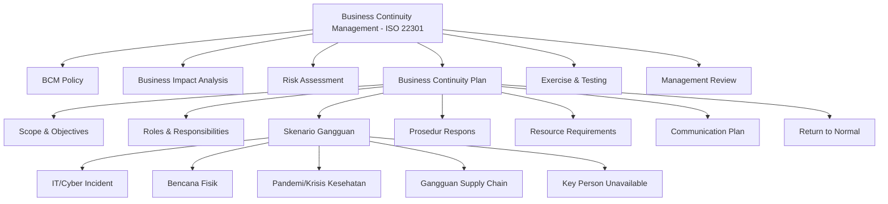

---

### 3. Pengantar Kontekstual

Pandemi COVID-19 pada 2020 menjadi ujian massal bagi Business Continuity Planning di seluruh dunia. Organisasi yang memiliki BCP komprehensif — termasuk skenario pandemi dan Work-from-Home — mampu bertransisi dalam hitungan hari. Organisasi tanpa BCP membutuhkan berminggu-minggu bahkan bulan untuk menyesuaikan operasional, dengan kerugian yang jauh lebih besar.

BCP bukan hanya tentang pemulihan IT. Ia mencakup kelangsungan seluruh operasional bisnis — termasuk personel, fasilitas, pemasok, dan komunikasi. Dalam konteks keamanan siber, BCP memastikan bahwa ketika insiden siber terjadi, organisasi memiliki kemampuan untuk terus beroperasi (pada kapasitas minimal) sambil proses pemulihan berlangsung.

---

### 4. Landasan Teori

#### 4.1 Business Continuity Management (BCM) dan ISO 22301

**Business Continuity Management (BCM)** adalah program manajemen holistik yang memastikan organisasi dapat melanjutkan operasinya pada level minimum yang dapat diterima selama dan setelah gangguan. BCM lebih luas dari IT Disaster Recovery — ia mencakup seluruh dimensi operasional organisasi.

**ISO 22301:2019 — Societal Security — Business Continuity Management Systems:**
Standar internasional yang mendefinisikan persyaratan untuk merencanakan, membangun, mengimplementasikan, mengoperasikan, memonitor, meninjau, memelihara, dan terus meningkatkan sistem manajemen business continuity (BCMS).

Struktur ISO 22301 mengikuti **High Level Structure (HLS)** yang sama dengan ISO 27001 dan ISO 9001, memungkinkan integrasi manajemen sistem yang lebih mudah.

**Klausul Utama ISO 22301:2019:**
- *Clause 4: Context of Organization* — memahami konteks internal dan eksternal organisasi
- *Clause 5: Leadership* — komitmen dan kebijakan dari manajemen puncak
- *Clause 6: Planning* — BIA, risk assessment, objektif BCM
- *Clause 7: Support* — sumber daya, kompetensi, awareness, komunikasi
- *Clause 8: Operation* — implementasi BCP, exercising
- *Clause 9: Performance Evaluation* — monitoring, audit, review
- *Clause 10: Improvement* — corrective action, continual improvement

#### 4.2 Komponen Business Continuity Plan

**BCP adalah dokumen operasional** yang menjelaskan langkah-langkah konkret yang harus diambil saat gangguan terjadi. BCP bukan dokumen strategi — ia adalah panduan tindakan.

**Struktur BCP yang efektif:**

*a) Header dan Metadata*
- Scope dan tujuan dokumen
- Tanggal berlaku dan riwayat revisi
- Approver dan pemilik dokumen
- Distribusi dan klasifikasi dokumen

*b) Aktivasi dan Eskalasi*
- Kondisi yang memicu aktivasi BCP (activation triggers)
- Prosedur eskalasi dan pengambilan keputusan aktivasi
- Crisis Management Team (CMT) dan authority hierarchy
- Contact tree — siapa menghubungi siapa dan dalam urutan apa

*c) Penilaian Insiden (Incident Assessment)*
- Template rapid assessment — apa yang terdampak, seberapa parah, berapa lama
- Decision matrix: full activation vs. partial activation vs. monitor-only

*d) Prosedur Respons per Skenario*
Untuk setiap skenario gangguan yang diidentifikasi dalam BIA, BCP menyediakan prosedur spesifik:
- Siapa yang harus dihubungi
- Tindakan segera (0–4 jam pertama)
- Tindakan jangka pendek (4–24 jam)
- Tindakan jangka menengah (1–7 hari)

*e) Kebutuhan Sumber Daya*
- Personel kunci dan backup-nya (jika personel kunci tidak tersedia)
- Fasilitas alternatif (lokasi kerja alternatif, remote work procedures)
- Peralatan dan teknologi minimum yang diperlukan
- Vendor dan kontraktor darurat

*f) Recovery dan Return to Normal*
- Kriteria untuk mengakhiri status BCP aktif
- Prosedur transisi kembali ke operasi normal
- Post-incident review requirements

#### 4.3 Skenario Gangguan dalam BCP

BCP yang komprehensif mencakup berbagai skenario gangguan, tidak terbatas pada IT failure:

**Skenario IT/Cyber:**
- Ransomware total atau parsial
- DDoS pada layanan internet-facing
- Data breach dengan potensi eksfiltrasi
- Kegagalan cloud provider utama
- Kompromi supply chain software

**Skenario Fisik:**
- Kebakaran atau bencana di gedung utama
- Pemadaman listrik berkepanjangan (> 4 jam)
- Bencana alam (gempa, banjir)
- Ancaman keamanan fisik (bom, aksi teror)

**Skenario SDM:**
- Unavailability personel kunci (sakit, kecelakaan)
- Pemogokan tenaga kerja
- Pandemi/wabah yang membatasi kehadiran fisik

**Skenario Pemasok:**
- Kegagalan vendor layanan kritis (ISP, cloud)
- Gangguan rantai pasok
- Kebangkrutan vendor kritis

#### 4.4 Alternate Work Site Strategy

Saat fasilitas utama tidak dapat digunakan, BCP harus mendefinisikan alternate work site strategy:

*Hot Site:* Fasilitas siap pakai dengan semua peralatan dan konektivitas tersedia, dapat digunakan dalam hitungan jam. Biaya paling mahal.

*Warm Site:* Fasilitas dengan infrastruktur dasar tersedia tetapi perlu konfigurasi dan setup peralatan. Dapat digunakan dalam 1–2 hari.

*Cold Site:* Fasilitas kosong yang hanya menyediakan space, listrik, dan konektivitas dasar. Perlu setup lengkap; biaya terendah tetapi RTO terpanjang.

*Work From Home (WFH):* Relevan untuk insiden yang tidak mempengaruhi konektivitas — semua karyawan bekerja dari rumah menggunakan VPN dan collaboration tools.

#### 4.5 BCM Maturity Model

Organisasi berada pada tingkat kematangan BCM yang berbeda. Maturity Assessment membantu mengidentifikasi gap dan memprioritaskan investasi.

| Level | Nama | Karakteristik |
|-------|------|---------------|
| 1 | Initial | BCP ad hoc, tidak terdokumentasi, reaktif |
| 2 | Defined | BCP terdokumentasi untuk beberapa fungsi kritis |
| 3 | Managed | BCP mencakup semua fungsi kritis, diuji berkala |
| 4 | Quantitatively Managed | Metrics BCM tersedia; RTA terukur dan dilaporkan |
| 5 | Optimizing | BCP terus diperbarui; lessons learned diintegrasikan; improvement berkelanjutan |

---

### 5. Model atau Arsitektur

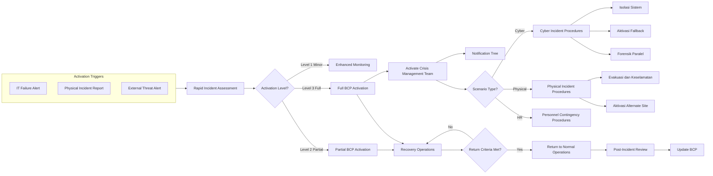

---

### 6. Contoh Terapan

**Kasus: Implementasi BCP untuk Serangan Ransomware pada Perusahaan Logistik**

**Konteks:** PT Ekspedisi Nusantara mengoperasikan 200 armada kendaraan dan melayani pengiriman ke 34 provinsi. Ketika ransomware menyerang sistem manajemen fleet dan tracking, operasional terancam lumpuh.

**BCP Response (berdasarkan BCP yang sudah disiapkan):**

*Jam 0–1 (Deteksi dan Aktivasi):*
- SOC mendeteksi anomali melalui SIEM: enkripsi massal file dimulai pukul 02:15 WIB
- Alert dikirim ke IT Manager on-call dalam 5 menit
- IT Manager mengaktifkan BCP Cyber Level 3 dalam 15 menit
- Crisis Management Team (CMT) dinotifikasi melalui WhatsApp group darurat

*Jam 1–4 (Containment dan Fallback):*
- Semua sistem yang terdeteksi ter-enkripsi diisolasi dari jaringan
- Sistem dispatch manual diaktifkan: sopir menerima instruksi via telepon dan WhatsApp (prosedur yang sudah didokumentasikan dalam BCP)
- Backup GPS tracking dari vendor pihak ketiga diaktifkan (kontrak darurat yang sudah disiapkan dalam BCP)
- Komunikasi publik: pengumuman di website tentang "gangguan teknis sementara"

*Jam 4–24 (Operasional Darurat):*
- Operasional berlanjut dengan kapasitas 70% menggunakan prosedur manual
- Tim IT fokus pada forensik dan pemulihan sistem non-kritis
- Vendor sistem manajemen fleet dihubungi untuk recovery assistance (kontak vendor emergency sudah ada di BCP)

*Hari 2–5 (Recovery):*
- Sistem dipulihkan dari backup offsite secara bertahap
- Sistem kritis (fleet management) dipulihkan terlebih dahulu sesuai Recovery Priority List

*Pelajaran:* Kemampuan untuk beroperasi pada 70% kapasitas dengan prosedur manual selama 5 hari mencegah kehilangan kontrak dan kerugian reputasi yang jauh lebih besar. BCP yang teruji adalah pembedanya.

---

### 7. Praktikum atau Aktivitas Terarah

**Judul Praktikum:** Penyusunan Skenario BCP untuk Insiden Siber

**Tujuan:** Membuat prosedur BCP lengkap untuk satu skenario gangguan siber

**Langkah Kerja:**

*Langkah 1 — Pilih Skenario (15 menit)*
Dari daftar skenario yang diberikan instruktur, pilih satu skenario (misalnya: ransomware menyerang sistem utama, DDoS pada layanan publik, atau kegagalan cloud provider utama).

*Langkah 2 — Define Activation Criteria (20 menit)*
Tentukan kondisi spesifik (metrik, alert, observasi) yang akan memicu aktivasi BCP untuk skenario ini.

*Langkah 3 — Susun Prosedur Respons Bertahap (60 menit)*
Tulis prosedur respons untuk jam 0–4, jam 4–24, dan hari 2–7. Setiap tahap harus mencakup: siapa yang bertanggung jawab, tindakan spesifik, output/deliverable yang diharapkan.

*Langkah 4 — Identifikasi Resource Requirements (20 menit)*
Buat daftar sumber daya yang diperlukan: personel, teknologi, vendor, fasilitas alternatif, anggaran darurat.

*Langkah 5 — Define Return-to-Normal Criteria (15 menit)*
Tentukan kriteria yang harus dipenuhi sebelum BCP dapat dinonaktifkan.

**Bukti yang Harus Dikumpulkan:** Dokumen BCP scenario lengkap (minimal 3 halaman) + resource list

---

### 8. Latihan Pemahaman

**Soal 1 (Pilihan Ganda — C4)**
Manakah pernyataan yang paling tepat menggambarkan perbedaan antara BCP dan DRP?

A. BCP dan DRP adalah istilah yang dapat digunakan secara bergantian
B. BCP mencakup kelangsungan seluruh operasional bisnis; DRP fokus pada pemulihan IT dan infrastruktur teknis
C. DRP lebih komprehensif dari BCP karena mencakup seluruh organisasi
D. BCP hanya berlaku untuk sektor keuangan; DRP untuk semua sektor

**Soal 2 (C3 — Identifikasi)**
Sebutkan minimal 5 elemen wajib yang harus ada dalam dokumen Business Continuity Plan yang efektif menurut prinsip ISO 22301.

**Soal 3 (Analisis — C4)**
Sebuah perusahaan memiliki BCP yang komprehensif tetapi tidak pernah diuji sejak 3 tahun lalu. Identifikasi risiko spesifik yang muncul dari kondisi ini.

**Soal 4 (Perancangan — C5)**
Rancang activation decision tree untuk BCP sebuah rumah sakit yang mencakup tiga level aktivasi: Level 1 (monitoring enhanced), Level 2 (partial activation — departemen tertentu), Level 3 (full activation). Tentukan kriteria spesifik untuk setiap level dan tindakan yang diperlukan.

**Soal 5 (Evaluasi — C5)**
Evaluasi klaim manajemen sebuah perusahaan: "Kami tidak perlu BCP terpisah karena semua sudah ter-cover dalam IT Disaster Recovery Plan kami." Identifikasi gap kritis dari pendekatan ini.

---

### 9. Latihan Terapan / Studi Kasus

**Studi Kasus 1 — BCP Gap Analysis (C4–C5)**

Perusahaan manufaktur memiliki BCP yang dibuat 4 tahun lalu. Auditor menemukan: (a) BCP tidak mencakup skenario serangan siber; (b) Alternate work site (cold site) sudah dikontrak pihak lain 2 tahun lalu; (c) Daftar kontak personel kunci 40% sudah tidak akurat; (d) BCP mencantumkan dua sistem legacy yang sudah dihentikan sebagai sistem kritis.

*Pertanyaan:*
1. Hitung "effective coverage" BCP ini berdasarkan temuan audit
2. Prioritaskan perbaikan berdasarkan risk impact
3. Rancang proses pemeliharaan BCP berkala yang mencegah masalah serupa berulang

**Studi Kasus 2 — BCP dalam Konteks Regulasi (C5)**

Bank Indonesia menerbitkan ketentuan bahwa semua bank umum harus memiliki BCP yang sudah diuji setahun sekali dan dapat diaktifkan dalam waktu 2 jam. Bank ABC memiliki BCP tetapi exercise terakhir menunjukkan waktu aktivasi 4,5 jam.

*Pertanyaan:*
1. Identifikasi bottleneck yang kemungkinan besar menyebabkan waktu aktivasi 4,5 jam
2. Rancang program perbaikan 6 bulan untuk mencapai waktu aktivasi ≤ 2 jam
3. Bagaimana Bank ABC mendokumentasikan dan melaporkan kematangan BCM kepada Bank Indonesia?

---

### 10. Kunci Jawaban dan Pembahasan

**Jawaban Soal 1: B**
BCP adalah program manajemen menyeluruh yang memastikan kelangsungan operasi bisnis secara holistik — mencakup personel, proses, fasilitas, teknologi, dan komunikasi. DRP (Disaster Recovery Plan) adalah subset dari BCP yang berfokus spesifik pada pemulihan infrastruktur IT dan sistem teknis. DRP menjawab "bagaimana sistem IT dipulihkan"; BCP menjawab "bagaimana bisnis tetap berjalan saat gangguan terjadi."

**Jawaban Soal 2:**
Lima elemen wajib BCP: (1) Scope dan objectives — apa yang dicakup dan apa yang tidak; (2) Activation criteria dan prosedur eskalasi; (3) Roles dan responsibilities — Crisis Management Team, authority matrix; (4) Prosedur respons per skenario dengan timeline; (5) Contact directory dan communication tree yang terupdate; (6) Resource requirements (fasilitas alternatif, vendor darurat, personel backup); (7) Return-to-normal criteria dan prosedur; (8) Review dan update schedule.

**Jawaban Soal 3:**
Risiko dari BCP yang tidak diuji 3 tahun: (1) Prosedur yang sudah obsolete karena perubahan sistem/proses yang tidak tercermin; (2) Personel kunci yang disebutkan dalam BCP sudah tidak bekerja di perusahaan; (3) Vendor dan kontraktor darurat yang disebutkan mungkin sudah tidak beroperasi atau kontraknya kedaluwarsa; (4) Alternate work site mungkin sudah digunakan untuk keperluan lain; (5) Waktu aktivasi aktual mungkin jauh lebih lama dari yang didokumentasikan; (6) Staf tidak familiar dengan prosedur karena tidak pernah latihan.

**Jawaban Soal 4:**
Activation decision tree: Level 1 (monitoring enhanced) — kriteria: degradasi layanan < 25%, pemulihan diestimasi < 2 jam, tidak ada dampak ke pelanggan eksternal. Tindakan: eskalasi ke IT Manager, enhanced monitoring, siapkan CMT on standby. Level 2 (partial activation) — kriteria: degradasi > 25% atau downtime > 2 jam atau ada dampak ke pelanggan eksternal; ATAU sistem kritis tertentu (ICU monitoring, farmasi) tidak tersedia. Tindakan: aktivasi CMT, alternatif manual untuk departemen terdampak, notifikasi manajemen senior. Level 3 (full activation) — kriteria: sistem kritis keselamatan pasien tidak tersedia, bencana fisik yang memengaruhi seluruh fasilitas, atau insiden siber yang mempengaruhi semua sistem. Tindakan: full CMT activation, alternate site, notifikasi regulator, crisis communication.

**Jawaban Soal 5:**
Gap kritis pendekatan "DRP = BCP": (1) DRP tidak mencakup skenario non-IT seperti kebakaran gedung, pandemi, atau ketidaktersediaan personel kunci; (2) DRP berfokus pada pemulihan teknis, bukan operasi bisnis selama pemulihan berlangsung; (3) DRP tidak mengatur alternate work site untuk karyawan; (4) DRP tidak mencakup komunikasi kepada pelanggan, media, dan regulator; (5) DRP tidak mengatur Business Impact Analysis tingkat bisnis — hanya IT recovery.

**Kunci Studi Kasus 1:** Effective coverage: sistem (2 sistem legacy tidak valid), lokasi (cold site tidak tersedia), SDM (40% kontak tidak akurat), skenario (siber tidak tercakup). Coverage efektif sangat rendah. Prioritas perbaikan: (1) Update kontak SDM segera (low cost, high impact); (2) Tambahkan skenario siber; (3) Kontrak alternate work site baru; (4) Update sistem yang dicakup. Proses pemeliharaan: review tahunan wajib dengan sign-off pemilik dokumen; review triggered jika ada perubahan sistem atau personel kritis.

**Kunci Studi Kasus 2:** Bottleneck tipikal: notification tree terlalu panjang, CMT tidak familiar dengan peran, prosedur terlalu kompleks untuk dibaca sambil dalam tekanan. Program perbaikan: bulan 1-2 (sederhanakan notification tree, latih CMT); bulan 3-4 (tabletop exercise dengan fokus pada kecepatan aktivasi); bulan 5-6 (full exercise dengan target 2 jam, ukur RTA, perbaiki bottleneck). Pelaporan ke BI: submit hasil exercise dengan RTA terukur dan rencana perbaikan.

---

### 11. Ringkasan Bab

Business Continuity Planning adalah fondasi organisasional dari resilience — ia memastikan bahwa saat gangguan terjadi, organisasi memiliki panduan tindakan yang jelas, terlatih, dan realistis. ISO 22301 menyediakan kerangka standar internasional yang mencakup seluruh lifecycle BCM dari perencanaan hingga peningkatan berkelanjutan.

BCP yang efektif bukan dokumen yang dibuat satu kali — ia adalah living document yang harus diperbarui setiap kali terjadi perubahan signifikan pada organisasi, dan divalidasi secara berkala melalui exercises.

---

### 12. Refleksi Profesional

1. BCP mensyaratkan keterlibatan aktif dari manajemen senior — tanpa komitmen kepemimpinan, BCP menjadi dokumen tidak bernyawa. Sebagai profesional BCM, bagaimana Anda membangun business case yang meyakinkan manajemen senior untuk berinvestasi dalam program BCM yang komprehensif?

2. Skenario pandemi dalam BCP sering mencakup ketentuan Work from Home. Namun, WFH skala besar juga meningkatkan permukaan serangan siber secara drastis (VPN, personal devices, home networks). Bagaimana BCP harus mengintegrasikan pertimbangan keamanan siber dalam skenario gangguan operasional yang bersifat non-siber?

3. BCP yang baik mendefinisikan prosedur untuk setiap skenario. Namun, insiden nyata seringkali adalah kombinasi dari beberapa skenario sekaligus (misalnya bencana alam yang memicu kegagalan IT sekaligus ketidaktersediaan personel). Bagaimana Anda merancang BCP yang fleksibel untuk skenario gabungan tanpa membuatnya terlalu kompleks untuk dieksekusi dalam kondisi krisis?

---

---

## Bab 8 — Disaster Recovery Planning (DRP)

### 1. Capaian Pembelajaran Bab

Setelah mempelajari bab ini, mahasiswa mampu:
- Menjelaskan kerangka kerja NIST SP 800-34 Rev.1 untuk IT Contingency Planning (C2)
- Membedakan IT System Contingency Plan dari DRP berdasarkan scope dan fokus (C3)
- Merancang komponen DRP untuk skenario kegagalan IT yang spesifik (C4)
- Mengevaluasi DRP yang ada berdasarkan completeness checklist standar (C4–C5)

*Keterkaitan Sub-CPMK-3 / CPMK-3 / Evaluasi-3*

---

### 2. Peta Konsep Bab

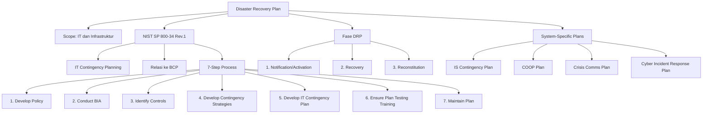

---

### 3. Pengantar Kontekstual

Ketika sistem IT mengalami kegagalan besar — baik karena bencana fisik maupun serangan siber — organisasi membutuhkan rencana tindakan yang spesifik, terstruktur, dan dapat dieksekusi oleh tim teknis di bawah tekanan. Inilah peran DRP: tidak seperti BCP yang berfokus pada kelangsungan bisnis secara holistik, DRP adalah panduan teknis rinci tentang bagaimana sistem IT dipulihkan.

NIST SP 800-34 Rev.1 "Contingency Planning Guide for Federal Information Systems" menjadi referensi standar global untuk IT Contingency Planning, meskipun namanya merujuk pada sistem federal AS. Prinsip-prinsipnya berlaku universal dan diadopsi secara luas oleh sektor privat.

---

### 4. Landasan Teori

#### 4.1 NIST SP 800-34 dan IT Contingency Planning

**NIST SP 800-34 Rev.1** mendefinisikan IT Contingency Planning sebagai proses pengembangan fitur dan prosedur yang memungkinkan pemulihan sistem IT setelah gangguan yang signifikan. Dokumen ini memberikan panduan 7 langkah (7-Step Process) untuk mengembangkan rencana kontinjensi IT yang efektif.

**Hierarki Rencana dalam NIST SP 800-34:**

| Rencana | Fokus | Pengguna |
|---------|-------|----------|
| Business Continuity Plan (BCP) | Operasional bisnis menyeluruh | Manajemen senior, semua unit |
| IT Contingency Plan (ITCP) | Sistem IT spesifik | Tim IT, system owners |
| Disaster Recovery Plan (DRP) | Pemulihan IT dan fasilitas | Tim IT, DR coordinator |
| Crisis Communications Plan | Komunikasi internal dan eksternal | PR, manajemen |
| Cyber Incident Response Plan | Respons insiden keamanan siber | SOC, CSIRT |
| COOP (Continuity of Operations Plan) | Kelangsungan fungsi penting pemerintah | Khusus sektor pemerintah |

#### 4.2 Tiga Fase DRP (NIST SP 800-34)

**Fase 1 — Notification/Activation Phase:**
Periode antara deteksi bencana/insiden hingga keputusan untuk mengaktifkan DRP. Mencakup:
- Prosedur deteksi dan notifikasi
- Penilaian kerusakan (damage assessment) awal
- Eskalasi dan keputusan aktivasi DRP
- Pembentukan recovery team dan assignment tugas
- Notifikasi kepada personel kunci dan vendor

*Dokumentasi kunci:* Notification checklist, damage assessment form, DRP activation criteria

**Fase 2 — Recovery Phase:**
Periode di mana recovery team melaksanakan pemulihan sistem di lokasi alternatif atau menggunakan sistem pengganti. Mencakup:
- Setup alternate processing site
- Recovery sistem berdasarkan Recovery Priority List
- Penggunaan backup data untuk restore
- Pengujian sistem yang dipulihkan
- Komunikasi status kepada manajemen dan pengguna

*Dokumentasi kunci:* Recovery procedures per sistem, step-by-step technical runbooks, checklist verifikasi

**Fase 3 — Reconstitution Phase:**
Pemulihan operasi ke kondisi normal, kembali ke primary site. Mencakup:
- Validasi bahwa sistem produksi telah sepenuhnya pulih
- Transfer operasi dari alternate site ke primary site
- Verifikasi integritas data
- Pengujian akhir sebelum deklarasi "return to normal"
- Demobilisasi recovery team
- Post-disaster documentation dan lessons learned

*Dokumentasi kunci:* Reconstitution checklist, data integrity validation procedures, post-event report template

#### 4.3 Komponen Dokumen DRP

**a) Executive Summary**
Ringkasan tujuan, scope, dan tanggung jawab kritis bagi pembaca eksekutif.

**b) System Description**
Deskripsi teknis sistem IT yang dicakup: arsitektur, komponen, interkoneksi, dependensi, data sensitivity, dan criticality classification.

**c) Recovery Team Structure**
Daftar personel dengan peran, tanggung jawab, dan kontak darurat. Mencakup backup personel untuk setiap peran kritis.

**d) Damage Assessment Procedures**
Prosedur sistematis untuk menilai tingkat kerusakan: apa yang masih berfungsi, apa yang rusak, estimasi waktu pemulihan, dan rekomendasi tingkat respons.

**e) Recovery Procedures**
Prosedur teknis step-by-step untuk memulihkan setiap komponen sistem. Ini adalah bagian terpanjang dan paling operasional dari DRP. Harus ditulis dengan asumsi bahwa pembaca mungkin bukan orang yang paling familiar dengan sistem tersebut.

*Prinsip penulisan recovery procedures:*
- Gunakan bahasa sederhana dan langkah-langkah numbered
- Sertakan expected output setelah setiap langkah (screenshot, output command, status indicator)
- Sertakan troubleshooting hints untuk masalah umum
- Jangan berasumsi pengetahuan yang tidak perlu

**f) System-Specific Backup dan Restore Procedures**
Prosedur spesifik untuk setiap sistem: di mana backup disimpan, command atau tools untuk restore, verifikasi keberhasilan restore.

**g) Dependencies dan Sequencing**
Urutan pemulihan sistem berdasarkan dependency mapping (hasil dari Bab 4).

**h) Vendor Contact dan Contracts**
Daftar vendor dengan kontak emergency, nomor kontrak support, dan SLA support yang relevan.

**i) Testing dan Maintenance Schedule**
Jadwal pengujian DRP dan prosedur pemeliharaan dokumen.

#### 4.4 IT System Contingency Strategies

Berdasarkan RTO target dan anggaran yang tersedia, NIST SP 800-34 mendefinisikan beberapa strategi kontinjensi:

**Untuk High-Impact Systems (RTO < 24 jam):**
- Hot site dengan real-time data replication
- Cloud DR dengan instant provisioning
- Dual data center Active-Active atau Active-Passive

**Untuk Medium-Impact Systems (RTO 24–72 jam):**
- Warm site dengan regular data backup dan restore
- Cloud standby dengan scheduled backups
- Mirrored storage dengan semi-automated failover

**Untuk Low-Impact Systems (RTO > 72 jam):**
- Cold site atau rebuild-from-scratch
- Recovery from backup to new hardware
- Temporary manual processes selama pemulihan berlangsung

---

### 5. Model atau Arsitektur

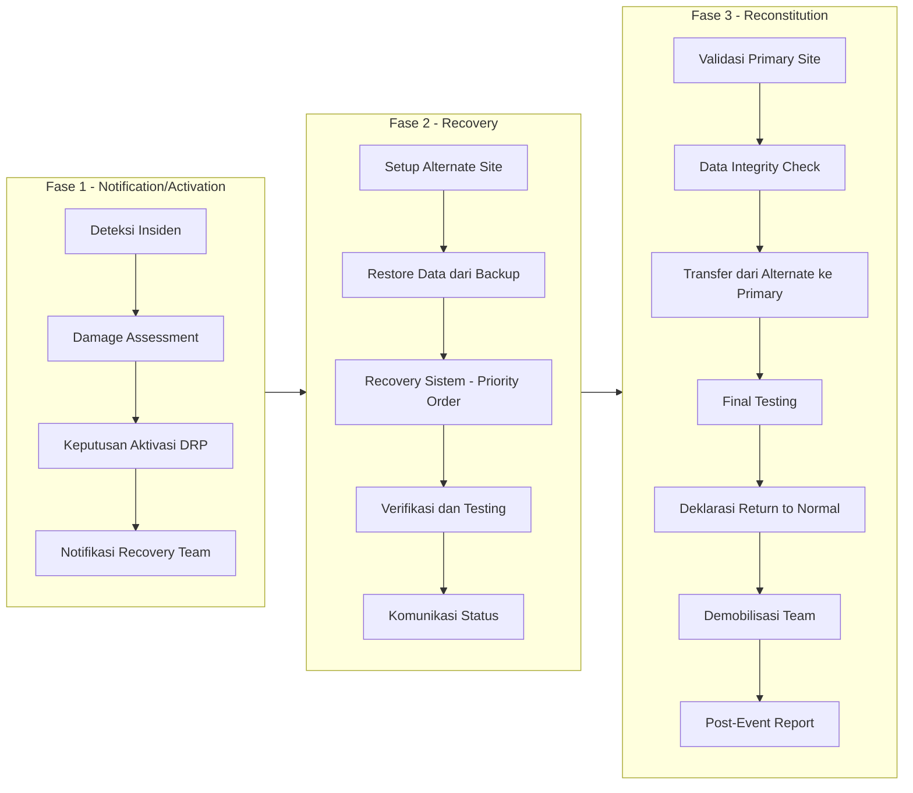

---

### 6. Contoh Terapan

**Kasus: DRP Response pada Kegagalan Data Center Akibat Kebakaran**

**Konteks:** Data center utama sebuah perusahaan asuransi mengalami kebakaran pada panel listrik pada Sabtu malam. 80% server tidak dapat diakses. DRP diaktifkan.

**Fase 1 — Notification/Activation (0–2 jam):**
- T+5 menit: Sistem monitoring mendeteksi kegagalan massal server
- T+15 menit: On-call engineer memverifikasi kebakaran dan menghubungi DR Coordinator
- T+30 menit: Damage assessment dilakukan — 80% server mati, storage array masih aman
- T+45 menit: DRP Level 3 diaktifkan; recovery team dinotifikasi
- T+60 menit: Vendor hot site dihubungi, konfirmasi kapasitas tersedia

**Fase 2 — Recovery (2–24 jam):**
- T+2 jam: Tim recovery tiba di hot site, setup infrastructure dimulai
- T+3 jam: Restore data dari backup cloud ke server di hot site (dimulai dari sistem kritis)
- T+6 jam: Core Insurance Platform aktif di hot site dengan data dari backup 4 jam sebelumnya
- T+8 jam: Customer Portal aktif
- T+12 jam: Semua sistem kritis beroperasi di hot site pada kapasitas penuh

**Fase 3 — Reconstitution (hari 3–10):**
- Hari 3: Fire marshal memberikan izin akses ke data center — inspeksi fisik
- Hari 5: Pemasangan server pengganti dimulai
- Hari 8: Server baru dikonfigurasi dan diuji
- Hari 9: Data disinkronkan dari hot site ke primary site yang baru
- Hari 10: Validasi integritas data selesai; traffic dialihkan kembali ke primary site
- Post-Event Report diselesaikan dalam 30 hari

**Hasil:** RTO aktual = 8 jam untuk semua sistem kritis (target 12 jam — melampaui target). RPO = 4 jam (sesuai target).

---

### 7. Praktikum atau Aktivitas Terarah

**Judul Praktikum:** Penyusunan Partial DRP — Recovery Procedures untuk Satu Sistem

**Tujuan:** Membuat recovery procedures yang lengkap dan dapat dieksekusi untuk satu sistem IT spesifik

**Langkah Kerja:**

*Langkah 1 — Pilih Sistem Target (10 menit)*
Pilih satu sistem dari skenario yang diberikan (misalnya: web server, database server, atau authentication service).

*Langkah 2 — System Description (20 menit)*
Dokumentasikan deskripsi teknis sistem: komponen, software/versi, dependensi, lokasi backup, dan klasifikasi kekritisan.

*Langkah 3 — Damage Assessment Form (20 menit)*
Buat form damage assessment yang akan diisi saat insiden terjadi: list pertanyaan, possible answers, dan implikasi masing-masing jawaban.

*Langkah 4 — Recovery Procedures (60 menit)*
Tulis step-by-step recovery procedures dari awal hingga verifikasi sistem berfungsi normal. Setiap langkah harus mencakup: perintah/tindakan spesifik, expected output, dan tindakan jika output tidak sesuai.

*Langkah 5 — Reconstitution Checklist (20 menit)*
Buat checklist untuk memvalidasi bahwa sistem telah pulih sepenuhnya sebelum deklarasi "return to normal."

**Bukti:** Dokumen DRP partial (recovery procedures untuk satu sistem), minimum 4 halaman teknis

---

### 8. Latihan Pemahaman

**Soal 1 (Pilihan Ganda — C4)**
Dalam framework NIST SP 800-34, kapan Fase Reconstitution dapat dimulai?

A. Segera setelah kegagalan sistem terdeteksi
B. Setelah sistem berhasil beroperasi di alternate site dan primary site sudah siap untuk menerima operasi kembali
C. Bersamaan dengan Recovery Phase untuk menghemat waktu
D. Setelah seluruh tim recovery mendapat persetujuan manajemen puncak

**Soal 2 (Analisis — C4)**
Recovery procedures dalam DRP mencantumkan 15 langkah untuk merestore database server. Langkah ke-7 menginstruksikan "start MySQL service dan verifikasi koneksi." Identifikasi apa yang kurang dalam penulisan langkah ini dan bagaimana seharusnya langkah tersebut ditulis.

**Soal 3 (Perancangan — C5)**
Rancang structure dokumen DRP untuk sistem email korporat (500 pengguna). Identifikasi semua komponen yang harus ada, siapa yang bertanggung jawab atas setiap komponen, dan bagaimana dokumen ini harus diuji.

**Soal 4 (Evaluasi — C5)**
DRP sebuah perusahaan telekomunikasi mencantumkan bahwa recovery procedures untuk core network dapat diselesaikan dalam 6 jam. Namun, saat exercise, tim menghabiskan 11 jam. Identifikasi faktor-faktor apa yang kemungkinan menyebabkan gap ini dan bagaimana setiap faktor dapat diatasi.

---

### 9. Latihan Terapan / Studi Kasus

**Studi Kasus 1 — DRP Review dan Update (C4–C5)**

Tim audit internal menemukan DRP sebuah lembaga pemerintah memiliki kondisi berikut: recovery procedures ditulis dalam bahasa teknis yang hanya dipahami oleh dua engineer yang sudah resign; vendor hot site dicantumkan belum memiliki kapasitas yang memadai untuk menampung semua server; dan prosedur backup mengacu pada teknologi tape yang sudah digantikan dengan cloud backup 2 tahun lalu.

*Pertanyaan:*
1. Prioritaskan temuan audit berdasarkan tingkat risiko
2. Rancang proses penulisan ulang recovery procedures yang accessible
3. Apa timeline realistis untuk memperbaiki semua gap ini?

**Studi Kasus 2 — Multi-System DRP Coordination (C5)**

Serangan siber pada sebuah universitas mengakibatkan kegagalan simultan pada: sistem akademik, sistem perpustakaan, sistem email, dan sistem keamanan gedung (access control). Masing-masing memiliki DRP terpisah tetapi tidak ada Master DRP yang mengkoordinasikan keempatnya.

*Pertanyaan:*
1. Apa masalah yang akan muncul ketika DRP terpisah dijalankan secara simultan tanpa koordinasi?
2. Rancang kerangka Master DRP yang mengkoordinasikan recovery dari semua sistem ini
3. Bagaimana dependency antar sistem harus dikelola dalam Master DRP?

---

### 10. Kunci Jawaban dan Pembahasan

**Jawaban Soal 1: B**
Reconstitution Phase dimulai setelah operasi berhasil berjalan di alternate site (artinya bisnis sudah terlayani) DAN primary site sudah siap untuk menerima operasi kembali (divalidasi, diperbaiki, dan diuji). Memulai Reconstitution sebelum alternate site stabil dapat menciptakan periode tanpa layanan jika transfer gagal di tengah jalan.

**Jawaban Soal 2:**
Langkah ke-7 tidak mencantumkan: (1) command yang spesifik — "start MySQL service" bisa berarti `systemctl start mysql` atau perintah lain tergantung OS; (2) expected output — apa yang harus terlihat jika berhasil; (3) tindakan jika gagal. Versi yang lebih baik: "Langkah 7: Start MySQL service. Jalankan: `sudo systemctl start mysql`. Expected output: `Started MySQL Community Server`. Verifikasi status: `sudo systemctl status mysql` — pastikan Active: active (running). Jika service tidak start, periksa error log di /var/log/mysql/error.log dan lanjut ke Troubleshooting Section A."

**Jawaban Soal 3:**
Komponen DRP email: (1) Deskripsi sistem (mail server, storage, SMTP gateway, spam filter, AD integration); (2) PIC: IT Manager (aktivasi), mail administrator (recovery); (3) Damage assessment: apakah mail server, storage, atau keduanya yang bermasalah?; (4) Recovery procedures per komponen (mail server restore, mailbox data restore dari backup, MX record pointing ke alternate); (5) Vendor: Microsoft/Google (jika cloud), backup mail provider; (6) Testing: tabletop annually, partial restore quarterly. Pengujian: annual full failover ke backup mail provider, verifikasi email delivery dan receipt.

**Jawaban Soal 4:**
Faktor gap RTO 6 jam vs. RTA 11 jam: (1) Prosedur tidak mencakup waktu deteksi dan eskalasi (bisa menambahkan 1–2 jam); (2) Dependensi yang tidak terdokumentasi — tim baru menyadari perlu sistem X dulu setelah mulai recovery sistem Y; (3) Prosedur ditulis dengan asumsi kondisi ideal yang tidak terpenuhi saat exercise; (4) Personel tidak familiar dengan prosedur karena tidak pernah latihan; (5) Tooling atau akses credential tidak tersedia atau expired. Solusi: sertakan waktu deteksi dalam RTO estimate, gambar dependency map, regular training, credential vault untuk emergency access.

---

### 11. Ringkasan Bab

DRP adalah terjemahan teknis dari strategi recovery ke dalam panduan tindakan yang dapat dieksekusi oleh tim IT di bawah tekanan krisis. NIST SP 800-34 memberikan kerangka 7 langkah yang sistematis dan tiga fase operasional yang jelas. Qualitas DRP diukur bukan dari kelengkapan dokumennya, tetapi dari apakah tim dapat menggunakannya secara efektif saat insiden nyata terjadi — sesuatu yang hanya dapat divalidasi melalui pengujian berkala.

---

### 12. Refleksi Profesional

1. DRP yang baik harus dapat dieksekusi oleh personel yang tidak familiar dengan sistem, dalam kondisi stres tinggi, tanpa akses internet atau dokumentasi tambahan. Bagaimana Anda menulis recovery procedures yang memenuhi standar ini, dan apa tradeoff antara kelengkapan detail dan keterbacaan?

2. Reconstitution Phase melibatkan pengalihan operasi dari alternate site kembali ke primary site. Jika primary site mengalami serangan siber yang menjadi penyebab aktivasi DRP, bagaimana Anda memastikan bahwa primary site benar-benar "bersih" sebelum mengembalikan operasi? Siapa yang memiliki otoritas untuk mendeklarasikan bahwa primary site aman?

3. DRP multi-system yang terintegrasi memerlukan koordinasi antar tim yang berbeda dengan prioritas dan tekanan yang berbeda. Dalam situasi insiden nyata, konflik prioritas antar tim sangat mungkin terjadi (misalnya tim jaringan ingin menyelesaikan recovery jaringan dulu sebelum tim database bisa memulai). Bagaimana DRP seharusnya mengelola konflik prioritas ini?

---

---

## Bab 9 — Crisis Communication dan Stakeholder Management

### 1. Capaian Pembelajaran Bab

Setelah mempelajari bab ini, mahasiswa mampu:
- Menjelaskan prinsip-prinsip crisis communication yang efektif dalam konteks insiden siber (C2)
- Mengidentifikasi stakeholder kritis dan memetakan kebutuhan komunikasi masing-masing (C3)
- Merancang rencana komunikasi krisis yang mencakup semua jalur dan audience yang relevan (C4)
- Mengevaluasi efektivitas komunikasi krisis berdasarkan prinsip manajemen reputasi dan kepatuhan regulasi (C5)

*Keterkaitan Sub-CPMK-3 / CPMK-3 / Evaluasi-3*

---

### 2. Peta Konsep Bab

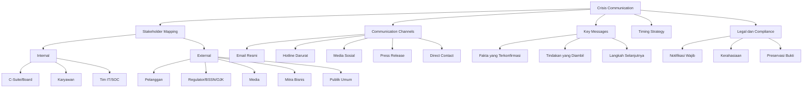

---

### 3. Pengantar Kontekstual

Pada tahun 2017, Equifax mengalami data breach yang mempengaruhi 147 juta data konsumen. Yang menjadi sorotan hampir sama beratnya dengan breach itu sendiri adalah bagaimana Equifax mengelola komunikasinya: pengumuman terlambat (6 minggu setelah discovery), website khusus yang terkesan tidak profesional, CEO yang memberikan pernyataan yang saling bertentangan. Saham Equifax jatuh 30% dan perusahaan akhirnya membayar $575 juta sebagai penyelesaian dengan FTC.

Sebaliknya, Maersk — yang juga mengalami insiden siber besar (NotPetya, 2017) dengan kerugian estimasi $300 juta — berhasil mempertahankan kepercayaan pelanggan dan mitra karena komunikasi yang transparan, konsisten, dan proaktif. CEO Maersk secara terbuka berbagi pelajaran dari insiden ini di konferensi industri.

Perbedaan ini bukan kebetulan — melainkan produk dari ada atau tidaknya Crisis Communication Plan yang dipersiapkan sebelumnya.

---

### 4. Landasan Teori

#### 4.1 Prinsip Crisis Communication

**Prinsip 1 — Kecepatan (Speed):**
Komunikasi pertama harus keluar dalam 1–2 jam pertama setelah keputusan untuk go-public diambil. "No comment" atau keheningan yang berkepanjangan akan diisi oleh spekulasi, rumor, dan informasi yang tidak akurat yang jauh lebih sulit untuk dikontrol.

**Prinsip 2 — Akurasi (Accuracy):**
Hanya komunikasikan fakta yang telah dikonfirmasi. Lebih baik mengatakan "kami sedang menginvestigasi dan akan memberikan update dalam X jam" daripada memberikan informasi yang kemudian harus dikoreksi. Koreksi informasi merusak kredibilitas lebih dalam dari ketidaktahuan awal.

**Prinsip 3 — Konsistensi (Consistency):**
Semua juru bicara harus menyampaikan pesan yang konsisten. Inkonsistensi menciptakan kesan kebingungan internal dan menurunkan kepercayaan publik. Single spokesperson atau pre-approved message templates membantu memastikan konsistensi.

**Prinsip 4 — Empati (Empathy):**
Acknowledge dampak pada stakeholder yang terdampak sebelum berbicara tentang apa yang telah atau akan dilakukan organisasi. Pernyataan yang terlalu defensive atau berfokus pada reputasi organisasi sebelum mengakui dampak kepada korban akan direspons negatif.

**Prinsip 5 — Akuntabilitas (Accountability):**
Jika organisasi bertanggung jawab atas kegagalan yang menyebabkan insiden, ambil tanggung jawab secara eksplisit dan jelaskan langkah perbaikan. Penyangkalan yang kemudian terbukti salah jauh lebih merusak daripada pengakuan bertanggung jawab.

**Prinsip 6 — Transparansi yang Terukur:**
Transparansi bukan berarti mengungkapkan semua detail teknis. Ada informasi yang tidak boleh diungkapkan karena: (a) investigasi forensik yang sedang berjalan (dapat mengontaminasi evidence atau memperingatkan pelaku); (b) kerahasiaan yang dilindungi hukum; (c) informasi yang dapat digunakan oleh penyerang untuk memperburuk insiden.

#### 4.2 Stakeholder Mapping dan Communication Needs

Berbeda audience memiliki kebutuhan informasi yang berbeda dan hak hukum untuk mendapatkan informasi dalam timeframe yang berbeda:

**Internal Stakeholders:**

*Board/CEO:* Membutuhkan ringkasan eksekutif — dampak bisnis, status pemulihan, implikasi regulasi, keputusan yang diperlukan. Format: briefing singkat, update berkala.

*Karyawan:* Membutuhkan informasi yang relevan dengan pekerjaan mereka — apa yang boleh dan tidak boleh mereka lakukan, apakah data pekerjaan mereka aman, kapan sistem akan pulih. Format: email internal, town hall.

*Tim IT/SOC:* Membutuhkan detail teknis untuk mendukung pemulihan — tidak perlu sanitized messaging.

**External Stakeholders:**

*Regulator/Pemerintah:* Berbeda regulasi memiliki persyaratan notifikasi yang berbeda:
- OJK: notifikasi insiden siber dalam 14 hari kerja (POJK 11/2022)
- BSSN: koordinasi untuk Infrastruktur Kritis Nasional
- UU PDP (UU 27/2022): notifikasi pelanggaran data pribadi kepada Kominfo dan subjek data paling lambat 14 hari kerja setelah diketahui

*Pelanggan yang Terdampak:* Hak untuk mengetahui jika data pribadi mereka terdampak. Komunikasi harus: akurat tentang data apa yang terdampak, memberikan panduan tindakan pencegahan, dan menawarkan bantuan (misalnya monitoring kredit untuk breach data finansial).

*Media:* Hanya berinteraksi melalui juru bicara yang ditunjuk. Siapkan press release dan FAQ. Jangan biarkan media vacuum — isi dengan pernyataan aktif.

*Mitra Bisnis:* Informasikan segera jika insiden dapat memengaruhi layanan atau data yang mereka percayakan kepada organisasi.

#### 4.3 Dark Site dan Communication Infrastructure

**Dark Site** adalah website yang sudah disiapkan sebelumnya tetapi tidak dipublikasikan, yang dapat "dihidupkan" dalam hitungan menit saat insiden terjadi. Dark site berisi informasi tentang insiden, panduan untuk stakeholder terdampak, dan kontak bantuan.

**Communication Infrastructure Redundancy:**
Insiden siber dapat memengaruhi infrastruktur komunikasi normal (email korporat, intranet). Crisis Communication Plan harus mendefinisikan jalur komunikasi alternatif yang tidak bergantung pada infrastruktur yang mungkin ter-kompromis:
- Personal mobile phones (bukan corporate phones)
- Personal email (bukan corporate email)
- Secure messaging app (Signal, WhatsApp) untuk komunikasi darurat

**Contact Tree:**
Rantai notifikasi yang mendefinisikan siapa menghubungi siapa. Dirancang untuk mencapai semua stakeholder kritis dalam waktu sesingkat mungkin melalui parallelisasi.

#### 4.4 Legal Considerations dalam Crisis Communication

**Do:**
- Koordinasikan dengan legal counsel sebelum pernyataan publik
- Dokumentasikan semua komunikasi (siapa, kapan, apa yang dikomunikasikan)
- Patuhi kewajiban notifikasi regulasi dengan tepat waktu

**Don't:**
- Jangan mengakui liability spesifik tanpa persetujuan legal
- Jangan mendiskusikan detail teknis yang dapat mengkompromis investigasi
- Jangan menyebutkan nama vendor atau teknologi yang mungkin terlibat sebelum investigasi selesai (implikasi hukum terhadap pihak ketiga)
- Jangan mengirim komunikasi yang mengandung Privileged Information tanpa enkripsi

---

### 5. Model atau Arsitektur

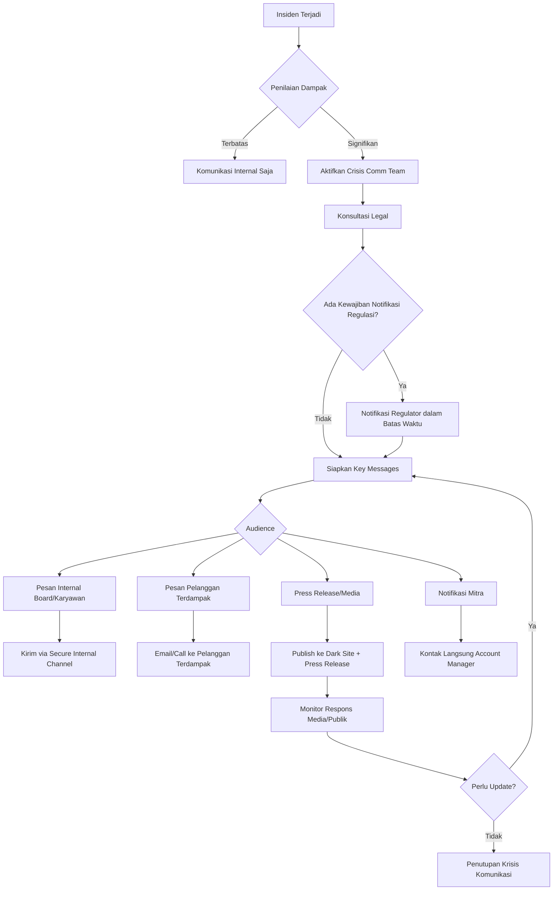

---

### 6. Contoh Terapan

**Kasus: Crisis Communication setelah Data Breach pada Platform E-Commerce**

**Konteks:** Platform e-commerce dengan 2 juta pengguna terdampak breach yang mengeksfiltrasi nama, email, nomor telepon, dan token kartu kredit (tokenized, bukan nomor asli). Breach terdeteksi T+0, investigasi forensik awal selesai T+48 jam.

**Timeline Komunikasi:**

*T+2 jam (Internal):*
CEO, CFO, dan General Counsel dinotifikasi melalui pesan pribadi terenkripsi. Briefing: scope awal insiden, langkah investigasi, dan keputusan yang diperlukan.

*T+4 jam (Internal — Karyawan IT dan customer service):*
"Kami saat ini menginvestigasi insiden keamanan. Mohon tidak memberikan informasi apapun kepada pelanggan atau media sampai ada komunikasi resmi. Jika menerima pertanyaan, arahkan ke nomor hotline darurat."

*T+24 jam (Regulasi):*
Notifikasi awal ke OJK dan Kominfo sesuai POJK 11/2022 dan UU PDP. Isi: scope insiden sementara (pending investigasi final), langkah yang diambil, estimasi jumlah subjek data terdampak.

*T+48 jam (Pelanggan):*
Email ke semua pengguna yang teridentifikasi terdampak: "Kami ingin menginformasikan insiden keamanan yang memengaruhi akun Anda. Data yang terdampak adalah: [list spesifik]. Yang TIDAK terdampak: [list]. Langkah yang kami rekomendasikan: [ganti password, monitor rekening]. Kami memohon maaf atas kejadian ini."

*T+48 jam (Publik):*
Dark site diaktifkan. Press release: informasi insiden, langkah pemulihan, komitmen keamanan, FAQ.

**Pelajaran:** Tidak ada komunikasi yang saling bertentangan karena semua message diapprove oleh legal dan PR sebelum dikirim. Pelanggan menerima informasi yang akurat dan specific (bukan pernyataan umum yang membingungkan).

---

### 7. Praktikum atau Aktivitas Terarah

**Judul Praktikum:** Menyusun Crisis Communication Plan untuk Skenario Ransomware

**Tujuan:** Membuat rencana komunikasi krisis yang komprehensif untuk satu skenario insiden siber

**Langkah Kerja:**

*Langkah 1 — Stakeholder Mapping (20 menit)*
Untuk skenario yang diberikan, identifikasi semua stakeholder dan kategorikan: internal vs external, hak informasi, timeframe notifikasi, dan jalur komunikasi.

*Langkah 2 — Key Messages per Audience (30 menit)*
Buat template pesan untuk setiap kategori stakeholder utama: apa yang dikomunikasikan, apa yang tidak, dan tone yang tepat.

*Langkah 3 — Contact Tree (20 menit)*
Buat visual contact tree yang mendefinisikan urutan dan jalur notifikasi dalam 4 jam pertama.

*Langkah 4 — Regulatory Requirements (20 menit)*
Identifikasi kewajiban notifikasi regulasi yang berlaku (OJK, BSSN, Kominfo/UU PDP) dengan deadline masing-masing.

*Langkah 5 — Simulasi Role-Play (30 menit)*
Dua mahasiswa berperan sebagai juru bicara (menggunakan pesan yang sudah disiapkan) dan satu sebagai jurnalis (mengajukan pertanyaan yang menantang). Evaluasi konsistensi dan efektivitas pesan.

**Bukti:** Crisis Communication Plan dokumen + transkrip role-play simulasi

---

### 8. Latihan Pemahaman

**Soal 1 (Pilihan Ganda — C4)**
Sebuah insiden siber pada bank baru dikonfirmasi pada pukul 09:00 WIB. Kapan batas waktu notifikasi ke OJK berdasarkan POJK 11/2022?

A. 24 jam setelah insiden terkonfirmasi
B. 3 hari kerja setelah insiden terkonfirmasi
C. 14 hari kerja setelah insiden terkonfirmasi
D. 30 hari kalender setelah insiden terkonfirmasi

**Soal 2 (Analisis — C4)**
Juru bicara sebuah perusahaan telekomunikasi menyatakan kepada media: "Data pelanggan sepenuhnya aman dan tidak ada yang bocor." Namun, 3 hari kemudian terbukti 500.000 data bocor. Analisis dampak dari pernyataan ini dan prinsip komunikasi apa yang dilanggar.

**Soal 3 (Perancangan — C5)**
Rancang template Dark Site untuk sebuah perusahaan fintech yang mengalami data breach. Tentukan konten minimal yang harus ada dan bagaimana konten harus diperbarui seiring perkembangan insiden.

**Soal 4 (Evaluasi — C5)**
Bandingkan pendekatan komunikasi Equifax (2017) dan Maersk (2017) dalam menangani insiden siber besar. Identifikasi minimal 5 perbedaan konkret dan evaluasi implikasi terhadap reputasi dan kepercayaan jangka panjang masing-masing perusahaan.

---

### 9. Latihan Terapan / Studi Kasus

**Studi Kasus 1 — Komunikasi yang Salah Penanganan (C4–C5)**

Sebuah rumah sakit mengalami ransomware yang mengenkripsi sistem rekam medis. Juru bicara rumah sakit — seorang administrator IT tanpa pelatihan komunikasi krisis — memberikan pernyataan kepada media: "Ini adalah serangan canggih yang tidak dapat diprediksi. Sistem kami sudah sangat baik. Ini kesalahan vendor software."

*Pertanyaan:*
1. Identifikasi semua masalah dalam pernyataan ini dari perspektif komunikasi krisis
2. Tulis ulang pernyataan yang lebih tepat berdasarkan prinsip crisis communication
3. Apa proses yang seharusnya dijalani sebelum pernyataan ini diberikan ke media?

**Studi Kasus 2 — Multi-Jurisdictional Communication (C5)**

Platform SaaS Indonesia memiliki pelanggan di Indonesia, Singapura, dan Australia. Terjadi data breach yang memengaruhi data pengguna di ketiga negara. Regulasi notifikasi: Indonesia (UU PDP — 14 hari kerja), Singapura (PDPA — 3 hari kerja untuk critical incidents), Australia (Privacy Act — 30 hari).

*Pertanyaan:*
1. Bagaimana platform ini memprioritaskan dan mengkoordinasikan kewajiban notifikasi ke tiga regulator dengan deadline berbeda?
2. Apakah pesan untuk pelanggan di ketiga negara harus sama? Apa yang perlu dibedakan?
3. Apa risiko jika notifikasi ke satu regulator lebih cepat dari yang lain dan ini diketahui publik?

---

### 10. Kunci Jawaban dan Pembahasan

**Jawaban Soal 1: C — 14 hari kerja**
POJK 11/2022 tentang Penyelenggaraan Teknologi Informasi oleh Bank Umum mengharuskan pelaporan insiden siber kepada OJK dalam waktu paling lambat 14 hari kerja sejak insiden diketahui. Catatan: ini adalah batas atas — notifikasi lebih awal selalu lebih baik, terutama untuk insiden yang berdampak besar.

*Catatan penting:* UU PDP 27/2022 mewajibkan notifikasi ke Kominfo juga dalam 14 hari kerja untuk pelanggaran data pribadi. Kedua kewajiban ini dapat berlaku secara bersamaan.

**Jawaban Soal 2:**
Pernyataan ini melanggar prinsip Akurasi — menyatakan fakta yang belum dikonfirmasi atau bahkan terbukti salah. Dampak: (1) Ketika kebenaran terungkap, seluruh kredibilitas perusahaan hancur — publik tidak akan mempercayai komunikasi selanjutnya; (2) Menyatakan "tidak ada yang bocor" padahal ada berpotensi menjadi bukti dalam litigasi atau investigasi regulasi (fraud atau misrepresentation); (3) Merugikan pelanggan yang tidak mengambil tindakan pencegahan karena yakin data mereka aman. Pernyataan yang lebih tepat: "Kami menginvestigasi sebuah insiden keamanan dan sedang mengevaluasi dampaknya. Kami akan memberikan update dalam 48 jam. Sebagai langkah pencegahan, kami merekomendasikan pelanggan memperbarui password mereka."

**Jawaban Soal 3:**
Konten minimal Dark Site: (1) Header: tanggal dan waktu update terakhir; (2) Pernyataan insiden: apa yang terjadi (tanpa detail teknis yang berlebihan); (3) Data apa yang terdampak dan apa yang tidak; (4) Langkah yang telah diambil oleh perusahaan; (5) Langkah yang direkomendasikan untuk pengguna terdampak; (6) FAQ yang dapat diperbarui; (7) Kontak untuk bantuan (hotline, email khusus); (8) Timeline: kapan update berikutnya akan diberikan. Update berkala: setidaknya setiap 24 jam selama fase aktif, meskipun tidak ada update substantif — pernyataan "kami terus menginvestigasi" lebih baik dari keheningan.

**Kunci Studi Kasus 1:** Masalah pernyataan: (1) Menyalahkan vendor tanpa konfirmasi (liability dan reputasi vendor tanpa due process); (2) Defensive dan tidak menunjukkan empati terhadap pasien; (3) Juru bicara tidak tepat — administrator IT bukan juru bicara yang terlatih. Pernyataan yang lebih baik: "Kami mengetahui adanya insiden keamanan pada sistem kami [waktu]. Keselamatan dan kerahasiaan data pasien adalah prioritas kami. Kami sedang menginvestigasi scope insiden dan mengambil langkah pemulihan. Update lebih lanjut akan kami berikan dalam [X jam]. Pasien yang membutuhkan informasi medis mendesak dapat menghubungi [nomor hotline]."

**Kunci Studi Kasus 2:** Prioritas notifikasi berdasarkan deadline: Singapura pertama (3 hari kerja) → Indonesia (14 hari kerja) → Australia (30 hari). Pesan untuk pelanggan: inti sama (apa yang terdampak, apa yang dilakukan, apa yang perlu dilakukan pengguna) tetapi disesuaikan dengan hak-hak subjek data berdasarkan regulasi masing-masing negara. Risiko if notifikasi tidak serentak: regulator yang belum dinotifikasi dapat menganggap ini sebagai keterlambatan yang disengaja; media dapat melaporkan inkonsistensi; pelanggan di negara yang dinotifikasi lebih awal mungkin memiliki ekspektasi layanan yang berbeda.

---

### 11. Ringkasan Bab

Crisis Communication yang efektif adalah komponen resilience yang sering diremehkan tetapi dapat menentukan kelangsungan organisasi pascainsiden. Kemampuan teknis memulihkan sistem tidak cukup jika kepercayaan stakeholder hancur karena komunikasi yang buruk. Prinsip-prinsip kunci — kecepatan, akurasi, konsistensi, empati, dan akuntabilitas — harus tercermin dalam Crisis Communication Plan yang disiapkan jauh sebelum insiden terjadi, termasuk template pesan, contact tree, dan prosedur aktivasi dark site.

---

### 12. Refleksi Profesional

1. Crisis communication yang efektif memerlukan koordinasi antara tim teknis (yang memahami insiden) dan tim komunikasi/legal (yang memahami messaging dan risiko). Dalam praktik, kedua tim ini sering memiliki perspektif yang bertentangan tentang seberapa banyak yang harus diungkapkan. Bagaimana Anda membangun proses keputusan yang menyeimbangkan transparansi publik dengan kebutuhan investigasi dan proteksi hukum?

2. Media sosial memungkinkan informasi (akurat maupun tidak) menyebar jauh lebih cepat dari kemampuan komunikasi resmi organisasi. Saat data breach Anda menjadi trending topic di Twitter sebelum Anda sempat mengirimkan pernyataan resmi, apa yang harus dilakukan? Apa peran monitoring media sosial dalam Crisis Communication Plan?

3. Dalam beberapa insiden siber, pelaku mungkin memantau komunikasi publik organisasi untuk mengetahui seberapa banyak yang sudah diketahui tim respons — informasi ini dapat mereka gunakan untuk memperburuk insiden atau melarikan diri sebelum teridentifikasi. Bagaimana Crisis Communication Plan harus mengelola ketegangan antara transparansi publik dan keamanan operasional investigasi?

---
