# BUKU AJAR
# SECURITY AUDIT
## Kode Mata Kuliah: VSFDKS07

---

**Program Studi:** Magister Terapan Forensik Digital dan Keamanan Siber  
**Jurusan:** Teknik Informatika dan Komputer  
**Institusi:** Politeknik Elektronika Negeri Surabaya (PENS)  
**Bobot SKS:** T = 2 | P = 1 (Total 3 SKS)  
**Semester:** 2 (Genap)  
**Prasyarat:** Cybersecurity Principles (VSFDKS03)

---

## METADATA MATA KULIAH

| Atribut | Detail |
|---------|--------|
| Kode Mata Kuliah | VSFDKS07 (MK-W-07) |
| Nama Mata Kuliah | Security Audit |
| Rumpun | Keilmuan Inti — Audit Keamanan Informasi, Risk Management & Governance, Compliance |
| Bobot SKS | T=2, P=1 (3 SKS) |
| Semester | 2 (Genap) |
| Jenis | Wajib |
| Level Bloom | C4–C5 (Menganalisis dan Mengevaluasi) |
| Prasyarat | Cybersecurity Principles (VSFDKS03) |

---

## KATA PENGANTAR

Audit keamanan informasi adalah mekanisme verifikasi independen yang memastikan bahwa kontrol keamanan yang diklaim oleh organisasi benar-benar ada, berfungsi, dan efektif. Dalam lingkungan bisnis modern yang semakin bergantung pada sistem digital, kemampuan melakukan audit keamanan yang objektif dan berbasis bukti adalah kompetensi yang sangat berharga — baik bagi auditor internal, konsultan eksternal, maupun manajer keamanan yang bertanggung jawab atas postur keamanan organisasi.

Buku ajar ini dirancang mengikuti RPS VSFDKS07 sebagai sumber otoritatif, membangun kompetensi mulai dari konsep dasar audit, perencanaan audit, pengumpulan evidence, penilaian kontrol, manajemen risiko, hingga pelaporan dan tindak lanjut. Pendekatan yang digunakan berakar pada standar internasional — ISO/IEC 27001:2022, ISO 19011:2018, NIST SP 800-53 Rev.5, dan CIS Controls — yang merupakan referensi yang digunakan oleh auditor profesional di seluruh dunia.

Satu prinsip yang mendasari seluruh buku ini adalah **objektivitas berbasis bukti** — setiap kesimpulan audit harus didukung oleh evidence yang cukup dan andal, setiap rekomendasi harus berbasis risiko yang terukur, dan setiap laporan harus jujur dan dapat dipertanggungjawabkan kepada semua pemangku kepentingan.

---

## DESKRIPSI MATA KULIAH

Mata kuliah Security Audit membekali mahasiswa dengan kemampuan merencanakan, melaksanakan, mengevaluasi, dan melaporkan audit keamanan informasi/siber secara objektif, etis, dan berbasis bukti. Cakupan meliputi audit lifecycle, audit scope, audit criteria, evidence collection, control assessment, compliance audit, risk assessment, risk register, audit working paper, nonconformity handling, corrective action plan, dan penyusunan laporan audit profesional.

---

## PETA OBE: CPL → IK → CPMK → Sub-CPMK → EVALUASI

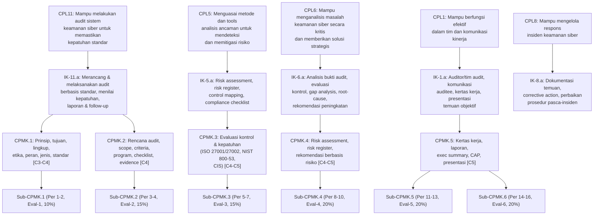

---

## PETA KOMPETENSI MATA KULIAH

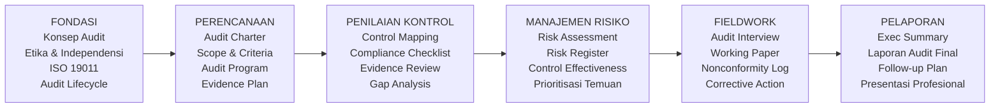

---

## PETA KURIKULUM BUKU

| Bab | Judul | Sub-CPMK | Materi Utama | Evaluasi |
|-----|-------|----------|--------------|----------|
| 1 | Konsep Dasar Audit Keamanan Informasi | Sub-CPMK.1 | Audit vs assessment, jenis audit, peran auditor | Eval-1 (10%) |
| 2 | Standar Audit, Etika, dan Siklus Audit | Sub-CPMK.1 | ISO 19011, prinsip audit, audit lifecycle | Eval-1 (10%) |
| 3 | Audit Charter, Scope, dan Kriteria Audit | Sub-CPMK.2 | Audit charter, scope definition, audit criteria | Eval-2 (15%) |
| 4 | Audit Program, Sampling, dan Evidence Plan | Sub-CPMK.2 | Audit program, sampling, evidence collection | Eval-2 (15%) |
| 5 | Kerangka Kontrol: ISO 27001/27002 dan NIST SP 800-53 | Sub-CPMK.3 | Control frameworks, mapping | Eval-3 (15%) |
| 6 | Control Mapping dan Compliance Checklist | Sub-CPMK.3 | Compliance checklist, maturity assessment | Eval-3 (15%) |
| 7 | Evidence Review dan Gap Analysis | Sub-CPMK.3 | Evidence matrix, gap analysis, control effectiveness note | Eval-3 (15%) |
| 8 | UTS: Analisis Kasus Integratif | Sub-CPMK.4 | Review Bab 1-7, kasus integratif | Eval-4 (20%) |
| 9 | Risk Assessment dan Risk Register | Sub-CPMK.4 | Likelihood-impact, inherent/residual risk, NIST SP 800-30 | Eval-4 (20%) |
| 10 | Control Effectiveness Rating dan Prioritisasi Temuan | Sub-CPMK.4 | Rating efektivitas, prioritas berbasis risiko | Eval-4 (20%) |
| 11 | Simulasi Audit: Wawancara dan Observasi | Sub-CPMK.5 | Teknik interview, observation, role play | Eval-5 (20%) |
| 12 | Working Paper dan Nonconformity Log | Sub-CPMK.5 | Working paper, finding classification, NC log | Eval-5 (20%) |
| 13 | Root Cause Analysis dan Corrective Action Plan | Sub-CPMK.5 | RCA, CAP, follow-up tracking | Eval-5 (20%) |
| 14 | Laporan Audit Profesional | Sub-CPMK.6 | Struktur laporan, exec summary, technical findings | Eval-6 (20%) |
| 15 | Presentasi Rekomendasi kepada Stakeholder | Sub-CPMK.6 | Komunikasi audit, audiens teknis vs manajerial | Eval-6 (20%) |
| 16 | Follow-up Audit dan Continuous Improvement | Sub-CPMK.6 | Follow-up audit, CAP tracking, PDCA | Eval-6 (20%) |

---

## PETUNJUK PENGGUNAAN BUKU

Buku ini mengikuti siklus penuh audit keamanan informasi: dari perencanaan hingga tindak lanjut. Setiap bab membangun di atas bab sebelumnya — mahasiswa disarankan membacanya secara berurutan. Skenario organisasi fiktif "PT Nusantara Digital" (NDG) digunakan sebagai thread sepanjang buku untuk memberikan konteks yang konsisten.

**Lingkungan praktikum:** Aktivitas praktikum menggunakan dokumen kebijakan dan laporan fiktif yang disediakan program studi, sehingga mahasiswa dapat berlatih sebagai auditor tanpa memerlukan akses ke sistem organisasi nyata.

---

## DAFTAR BAB

1. Konsep Dasar Audit Keamanan Informasi
2. Standar Audit, Etika, dan Siklus Audit
3. Audit Charter, Scope, dan Kriteria Audit
4. Audit Program, Sampling, dan Evidence Collection Plan
5. Kerangka Kontrol: ISO 27001/27002 dan NIST SP 800-53
6. Control Mapping dan Compliance Checklist
7. Evidence Review dan Gap Analysis
8. UTS — Analisis Kasus Integratif
9. Risk Assessment dan Risk Register
10. Control Effectiveness Rating dan Prioritisasi Temuan
11. Simulasi Audit: Teknik Wawancara dan Observasi
12. Working Paper dan Nonconformity Log
13. Root Cause Analysis dan Corrective Action Plan
14. Laporan Audit Profesional
15. Presentasi Rekomendasi kepada Stakeholder
16. Follow-up Audit dan Continuous Improvement

---

## Bab 1 — Konsep Dasar Audit Keamanan Informasi

### 1. Capaian Pembelajaran Bab

Setelah menyelesaikan bab ini, mahasiswa mampu:
- Mendefinisikan audit keamanan informasi dan membedakannya dari konsep penilaian (assessment) dan uji penetrasi (C2)
- Mengklasifikasikan jenis-jenis audit keamanan berdasarkan sudut pandang auditor, ruang lingkup, dan tujuan (C2)
- Mendeskripsikan peran dan tanggung jawab auditor internal, auditor eksternal, dan pihak yang diaudit (auditee) (C2)
- Menganalisis posisi audit dalam siklus tata kelola keamanan informasi organisasi (C4)

*Dikaitkan dengan Sub-CPMK.1 (Pertemuan 1) dan Evaluasi Eval-1 (10%).*

---

### 2. Peta Konsep Bab

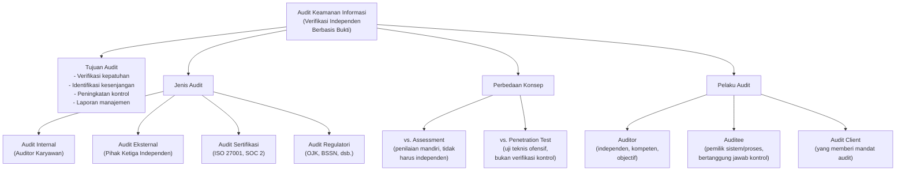

---

### 3. Pengantar Kontekstual

Bayangkan sebuah bank mengklaim sistem autentikasinya aman karena menggunakan multi-factor authentication. Apakah klaim tersebut cukup? Bagi pemangku kepentingan — regulator, nasabah, dewan direksi — klaim sepihak tidak memadai. Diperlukan verifikasi independen: seseorang yang tidak memiliki kepentingan untuk menutupi kelemahan, yang memiliki kompetensi untuk memeriksa evidence, dan yang mampu memberikan pendapat yang objektif. Itulah inti dari **audit keamanan informasi**.

Dalam konteks Magister Terapan Forensik Digital dan Keamanan Siber, kemampuan melakukan audit keamanan adalah fondasi dari peran sebagai praktisi yang bertanggung jawab. Seorang auditor keamanan informasi bukan hanya "pemeriksa daftar" (*checklist executor*) — ia adalah analis risiko, penasihat strategis, dan penjamin kualitas kontrol keamanan yang bekerja untuk kepentingan organisasi secara keseluruhan.

Regulasi Indonesia semakin mewajibkan audit keamanan: BSSN melalui Peraturan BSSN No. 8/2021 mengatur keamanan informasi instansi pemerintah; OJK melalui POJK No. 11/POJK.03/2022 mewajibkan bank memiliki fungsi audit internal keamanan siber; dan UU PDP (UU No. 27 Tahun 2022) mewajibkan pelindungan data yang dapat diverifikasi. Profesi auditor keamanan informasi, oleh karena itu, memiliki relevansi hukum dan profesional yang nyata.

---

### 4. Landasan Teori

#### 4.1 Definisi dan Konsep Audit Keamanan Informasi

**Audit keamanan informasi** adalah proses sistematis, independen, dan terdokumentasi untuk mendapatkan bukti audit (*audit evidence*) dan mengevaluasinya secara objektif guna menentukan sejauh mana kriteria audit terpenuhi (ISO 19011:2018, Klausul 3.1). Tiga kata kunci dalam definisi ini memiliki implikasi penting:

- **Sistematis**: Audit mengikuti metodologi yang terencana — bukan pemeriksaan acak atau ad hoc. Ada rencana audit, prosedur pengumpulan bukti, dan proses evaluasi yang terstruktur.
- **Independen**: Auditor tidak memiliki konflik kepentingan terhadap area yang diaudit. Independensi adalah fondasi kredibilitas audit.
- **Terdokumentasi**: Seluruh temuan, bukti, dan kesimpulan dicatat secara formal. Dokumentasi memungkinkan reprodusibilitas dan akuntabilitas.

**Tujuan audit keamanan informasi** dapat bervariasi tergantung mandat, tetapi umumnya mencakup:
1. **Verifikasi kepatuhan** (*compliance verification*): Memastikan bahwa kontrol yang diimplementasikan sesuai dengan standar, regulasi, atau kebijakan yang berlaku (misalnya ISO/IEC 27001, NIST SP 800-53, atau regulasi OJK).
2. **Identifikasi kesenjangan** (*gap identification*): Menemukan perbedaan antara kondisi kontrol saat ini (*current state*) dan kondisi yang diharapkan (*desired state*).
3. **Evaluasi efektivitas kontrol** (*control effectiveness evaluation*): Menilai apakah kontrol yang ada benar-benar bekerja sesuai tujuan desainnya (*design effectiveness*) dan apakah hasilnya sesuai harapan (*operating effectiveness*).
4. **Pelaporan kepada manajemen**: Memberikan informasi objektif kepada pembuat keputusan tentang postur keamanan organisasi.
5. **Dasar peningkatan berkelanjutan**: Menyediakan baseline untuk perbaikan kontrol pada siklus audit berikutnya.

#### 4.2 Perbedaan Audit, Assessment, dan Penetration Test

Ketiga konsep ini sering dikacaukan, padahal memiliki perbedaan yang signifikan:

| Dimensi | Audit | Assessment | Penetration Test |
|---------|-------|------------|-----------------|
| **Tujuan** | Verifikasi kepatuhan terhadap kriteria | Evaluasi tingkat kemampuan/risiko | Identifikasi kelemahan teknis yang dapat dieksploitasi |
| **Independensi** | Wajib independen | Bisa mandiri (self-assessment) | Pihak ketiga (umumnya) |
| **Metodologi** | Standar audit formal (ISO 19011) | Lebih fleksibel | Metodologi ofensif (PTES, OWASP) |
| **Output** | Opini/pernyataan kesesuaian, temuan, CAP | Laporan risiko, skor maturity | Laporan kelemahan teknis, PoC |
| **Bukti** | Dokumen, observasi, wawancara, uji ulang | Survei, wawancara, analisis dokumen | Eksploitasi terkontrol, log teknis |
| **Audiens** | Manajemen, regulator, dewan direksi | Manajemen keamanan | Tim keamanan teknis, manajemen |
| **Risiko etika** | Sangat rendah (tidak ada eksekusi teknis ofensif) | Rendah | Tinggi (memerlukan otorisasi ketat) |

Penting untuk dipahami: **audit bukan pengganti penetration test, dan sebaliknya**. Keduanya saling melengkapi dalam program keamanan informasi yang komprehensif.

#### 4.3 Jenis-Jenis Audit Keamanan Informasi

**a) Berdasarkan Posisi Auditor:**

**Audit Internal** dilakukan oleh auditor yang merupakan bagian dari organisasi, tetapi dengan independensi fungsional (biasanya melapor langsung ke dewan direksi atau komite audit, bukan kepada manajemen operasional). Keunggulan: biaya lebih rendah, pengetahuan mendalam tentang organisasi. Kelemahan: persepsi independensi yang lebih rendah dari pemangku kepentingan eksternal. Standar: IIA IPPF (International Professional Practices Framework dari Institute of Internal Auditors).

**Audit Eksternal** dilakukan oleh pihak ketiga yang sepenuhnya independen dari organisasi. Keunggulan: independensi yang lebih terjamin, kredibilitas yang lebih tinggi bagi pemangku kepentingan eksternal. Kelemahan: biaya lebih tinggi, kurva pembelajaran tentang organisasi. Standar: ISO 19011, ISACA ITAF.

**Audit Pihak Kedua** (second-party audit): dilakukan oleh pelanggan atau mitra terhadap pemasok/vendor. Tujuan: verifikasi apakah vendor memenuhi persyaratan kontrak atau standar keamanan yang disepakati.

**b) Berdasarkan Ruang Lingkup:**

- **Audit Kepatuhan** (*Compliance Audit*): Memverifikasi kesesuaian dengan standar tertentu (ISO 27001, PCI-DSS, dll.). Output utama: sertifikasi atau pernyataan kesesuaian.
- **Audit Kinerja** (*Performance Audit*): Mengevaluasi efektivitas dan efisiensi kontrol keamanan, bukan sekadar keberadaannya.
- **Audit Teknis** (*Technical Audit*): Fokus pada pemeriksaan konfigurasi teknis, patch management, hardening, log review.
- **Audit Proses** (*Process Audit*): Fokus pada prosedur operasional, kebijakan, dan manajemen sumber daya manusia terkait keamanan.
- **Audit Sertifikasi**: Dilakukan oleh lembaga sertifikasi (Certification Body/CB) akreditasi untuk menerbitkan sertifikat formal (misalnya ISO 27001).

**c) Berdasarkan Mandat Regulasi:**

Audit yang dimandatkan oleh regulasi memiliki konsekuensi hukum jika tidak dipatuhi. Di Indonesia, contohnya: audit keamanan sistem informasi pemerintah oleh BSSN (Peraturan BSSN 8/2021), audit keamanan siber perbankan yang disyaratkan OJK, dan audit ketaatan terhadap UU PDP.

#### 4.4 Peran dan Tanggung Jawab dalam Proses Audit

**Auditor** adalah individu yang melaksanakan audit. Kompetensi auditor meliputi:
- Pengetahuan tentang standar dan kontrol keamanan informasi yang diaudit
- Kemampuan mengumpulkan dan mengevaluasi bukti secara sistematis
- Kemampuan komunikasi dan dokumentasi yang kuat
- **Independensi dan objektivitas** — ini bukan hanya soal tidak memiliki kepentingan finansial, tetapi juga menghindari bias konfirmasi, yaitu kecenderungan mencari bukti yang mendukung kesimpulan yang sudah terbentuk

**Ketua Tim Audit** (*Lead Auditor*) bertanggung jawab atas perencanaan audit, koordinasi tim, komunikasi dengan auditee, dan kualitas laporan final.

**Auditee** adalah individu atau bagian organisasi yang menjadi objek audit. Tanggung jawab auditee meliputi:
- Menyediakan akses ke dokumen, sistem, dan personel yang diminta auditor
- Memberikan informasi yang akurat dan lengkap
- Merespons temuan audit dengan tindakan korektif yang tepat

**Audit Client** adalah pihak yang memberi mandat dan mendanai audit (misalnya dewan direksi, manajemen senior, atau regulator). Audit client menerima laporan audit dan bertanggung jawab atas tindak lanjut rekomendasi.

#### 4.5 Posisi Audit dalam Tata Kelola Keamanan Informasi

Audit keamanan informasi bukan aktivitas terisolasi — ia merupakan bagian integral dari **siklus Plan-Do-Check-Act (PDCA)** yang mendasari sistem manajemen keamanan informasi (ISMS) menurut ISO/IEC 27001. Dalam konteks ini:

- **Plan**: Organisasi menetapkan kebijakan, tujuan keamanan, dan rencana perlakuan risiko
- **Do**: Kontrol diimplementasikan
- **Check**: **Audit dan review** memverifikasi apakah kontrol berfungsi sesuai rencana
- **Act**: Manajemen mengambil tindakan korektif dan preventif berdasarkan temuan audit

Tanpa audit (*Check*), organisasi tidak memiliki mekanisme verifikasi objektif bahwa investasi keamanannya efektif. Audit adalah "jangkar akuntabilitas" dalam siklus ini.

---

### 5. Model atau Arsitektur

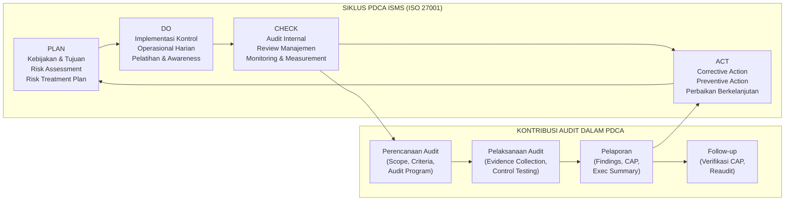

---

### 6. Contoh Terapan

**Skenario: Audit Keamanan Informasi Perdana di PT Nusantara Digital (NDG)**

**Konteks Organisasi:** PT Nusantara Digital (NDG) adalah perusahaan layanan keuangan digital dengan 500 karyawan, beroperasi di Jakarta dan Surabaya. NDG baru saja menyelesaikan implementasi ISMS berbasis ISO/IEC 27001:2022 selama 18 bulan. Manajemen ingin memverifikasi kesiapan mereka sebelum mengajukan sertifikasi resmi.

**Aset yang Dilindungi:** Data nasabah (KTP, rekening, histori transaksi), sistem core banking, dan infrastruktur cloud yang menyimpan data keuangan sensitif.

**Masalah/Kebutuhan:** NDG perlu memastikan bahwa kontrol yang diimplementasikan sesuai dengan persyaratan ISO/IEC 27001:2022 dan kebijakan internal. Mereka belum pernah menjalani audit formal sebelumnya.

**Keputusan Manajerial:** Manajemen memutuskan untuk melakukan **audit internal** terlebih dahulu (menggunakan tim auditor internal yang dilatih khusus) sebelum mengundang lembaga sertifikasi eksternal. Alasannya: (a) biaya lebih efisien, (b) memungkinkan identifikasi dan perbaikan kesenjangan sebelum audit sertifikasi, dan (c) melatih kapasitas audit internal untuk audit berkelanjutan ke depan.

**Proses Awal yang Dilakukan:**
1. Dewan Direksi NDG menerbitkan **Audit Charter** yang memberikan wewenang dan kemandirian kepada tim audit internal
2. Tim audit internal (2 orang dengan sertifikasi CISA dan ISO 27001 Lead Auditor) ditunjuk
3. Ruang lingkup audit ditetapkan: seluruh ISMS NDG termasuk kontrol teknis, proses operasional, dan manajemen sumber daya manusia
4. Kriteria audit: persyaratan ISO/IEC 27001:2022 Klausul 4-10 dan Annex A

**Hasil yang Diharapkan:** Laporan audit internal berisi daftar kesesuaian, nonconformity (jika ada), observasi, dan peluang peningkatan, yang menjadi dasar corrective action plan sebelum audit sertifikasi.

---

### 7. Praktikum atau Aktivitas Terarah

**Judul Praktikum:** Identifikasi Jenis Audit dan Analisis Peran Auditor

**Tujuan Praktikum:**
- Mampu mengklasifikasikan jenis audit yang tepat untuk skenario organisasi yang diberikan
- Mampu mengidentifikasi peran dan tanggung jawab masing-masing pihak dalam proses audit
- Mampu membedakan audit keamanan dari assessment dan penetration test

**Prasyarat:** Membaca Bab 1 secara lengkap; memahami konsep dasar ISMS.

**Lingkungan Lab:** Berbasis dokumen dan diskusi kelas; tidak memerlukan sistem komputer khusus.

**Dataset/Artefak yang Digunakan:** Skenario kasus organisasi fiktif (disediakan dosen); dokumen kebijakan keamanan informasi NDG (fiktif).

**Langkah Kerja:**

*Tahap 1 — Analisis Skenario (30 menit):*
Baca skenario berikut dan jawab pertanyaan analisis.

*Skenario A:* Direktur Keamanan Informasi RS Medika Prima meminta timnya untuk memeriksa apakah semua kebijakan keamanan data pasien sudah diterapkan, menggunakan daftar periksa internal. Hasilnya akan dilaporkan ke Direktur Utama.

*Skenario B:* Regulator OJK memerintahkan PT Finansial Aman untuk mendatangkan konsultan independen guna memverifikasi bahwa sistem keamanan siber perbankan mereka memenuhi POJK No. 11/POJK.03/2022.

*Skenario C:* Tim keamanan PT TechCorp meminta perusahaan keamanan eksternal untuk mencoba menembus sistem mereka menggunakan teknik hacker, dengan tujuan menemukan kelemahan sebelum diserang.

*Pertanyaan Analisis:*
1. Untuk setiap skenario (A, B, C): Apa jenis aktivitas yang dilakukan? Apakah itu audit, assessment, atau penetration test?
2. Siapa yang berperan sebagai auditor, auditee, dan audit client (jika ada) pada Skenario A dan B?
3. Mengapa Skenario C bukan merupakan audit? Apa perbedaan mendasarnya?
4. Pada Skenario A, apakah independensi auditor terjamin? Jelaskan risiko yang muncul jika tidak.

*Tahap 2 — Pemetaan Peran (20 menit):*
Untuk organisasi NDG (PT Nusantara Digital), buat tabel yang memetakan:

| Pihak | Peran dalam Audit | Tanggung Jawab Utama |
|-------|-------------------|---------------------|
| Tim Audit Internal NDG | ? | ? |
| Kepala Divisi IT NDG | ? | ? |
| Dewan Direksi NDG | ? | ? |
| Lembaga Sertifikasi (CB) | ? | ? |

*Tahap 3 — Presentasi Singkat (10 menit):*
Setiap kelompok (3-4 mahasiswa) mempresentasikan analisis Skenario A, B, atau C kepada kelas.

**Bukti yang Harus Dikumpulkan:**
- Tabel analisis jenis aktivitas untuk ketiga skenario
- Tabel pemetaan peran NDG yang telah diisi
- Catatan diskusi kelas

**Format Laporan:** Laporan singkat 2-3 halaman berisi analisis dan justifikasi.

**Kriteria Keberhasilan:**
- Semua tiga skenario diklasifikasikan dengan benar beserta justifikasi
- Perbedaan audit vs assessment vs pentest dijelaskan dengan tepat
- Pemetaan peran NDG lengkap dan konsisten

**Catatan Etika:** Semua analisis berbasis skenario fiktif; tidak ada akses ke sistem atau data organisasi nyata.

---

### 8. Latihan Pemahaman

**Soal 1 (Pilihan Ganda):** Menurut ISO 19011:2018, audit adalah proses yang bersifat:
- A. Reaktif dan tidak terencana
- B. Sistematis, independen, dan terdokumentasi
- C. Teknis dan ofensif
- D. Mandiri dan informal

**Soal 2 (Pilihan Ganda):** Perbedaan utama antara audit internal dan audit eksternal adalah:
- A. Audit eksternal selalu lebih mahal dan lebih akurat
- B. Audit internal tidak dapat menghasilkan temuan yang valid
- C. Auditor internal adalah karyawan organisasi dengan independensi fungsional, sedangkan auditor eksternal adalah pihak ketiga yang sepenuhnya independen
- D. Audit eksternal hanya dilakukan untuk keperluan sertifikasi ISO

**Soal 3 (Esai Singkat):** Jelaskan mengapa penetration test tidak dapat menggantikan audit keamanan informasi. Berikan minimal dua alasan yang berbeda.

**Soal 4 (Analisis Kasus):** Sebuah universitas meminta dosen keamanan siber internalnya untuk mengaudit sistem informasi akademik. Dosen tersebut adalah bagian dari tim yang merancang sistem tersebut. Apa masalah yang timbul? Bagaimana seharusnya audit ini diorganisir?

**Soal 5 (Perbandingan Konsep):** Buat tabel perbandingan antara "audit kesesuaian" (*compliance audit*) dan "audit kinerja" (*performance audit*). Sertakan minimal empat dimensi perbandingan.

**Soal 6 (Interpretasi Diagram):** Merujuk pada diagram PDCA dalam Bagian 5, pada fase manakah audit keamanan memberikan kontribusi terbesar? Jelaskan mengapa kelemahan pada fase ini berdampak pada seluruh siklus ISMS.

**Soal 7 (Perancangan Kontrol):** Anda adalah CISO sebuah perusahaan e-commerce yang baru menerapkan sistem pembayaran digital. Rencanakan program audit keamanan informasi selama satu tahun dengan mempertimbangkan jenis audit apa yang perlu dilakukan, oleh siapa, dan dengan frekuensi apa.

---

### 9. Latihan Terapan / Studi Kasus

**Studi Kasus 1: Krisis Audit di NDG**

PT Nusantara Digital baru saja menerima keluhan dari Bank Indonesia bahwa data nasabah mereka diduga bocor ke pihak tidak berwenang. NDG belum pernah melakukan audit keamanan informasi formal sebelumnya. Tim IT internal mengklaim semua sistem aman.

*Pertanyaan:*
1. Jenis audit apa yang paling tepat untuk situasi ini? Apakah audit internal atau eksternal lebih sesuai, dan mengapa?
2. Siapa yang harus menjadi audit client, auditor, dan auditee dalam situasi ini?
3. Apa risiko menggunakan tim IT internal NDG sebagai auditor dalam kasus ini? Jelaskan dari perspektif independensi.
4. Apa perbedaan output yang diharapkan dari audit keamanan informasi vs investigasi forensik digital dalam konteks kasus ini?

**Studi Kasus 2: Memilih Jenis Audit yang Tepat**

Manajemen sebuah rumah sakit pemerintah (RS Bahari Sejahtera) sedang mempertimbangkan tiga opsi untuk meningkatkan postur keamanan sistem informasi mereka:
- **Opsi A**: Melakukan self-assessment menggunakan CIS Controls v8 sebagai checklist
- **Opsi B**: Mengundang perusahaan konsultan untuk melakukan penetration test terhadap sistem EMR (Electronic Medical Record) mereka
- **Opsi C**: Melakukan audit keamanan informasi internal berbasis ISO/IEC 27001:2022

*Pertanyaan:*
1. Analisis kelebihan dan kekurangan masing-masing opsi dalam konteks kebutuhan rumah sakit sebagai fasilitas layanan publik yang memproses data kesehatan sensitif.
2. Opsi mana yang paling sesuai untuk tujuan memenuhi kewajiban regulasi? Jelaskan.
3. Apakah ketiga opsi tersebut dapat dilakukan secara bersamaan? Dalam urutan apa yang paling logis, dan mengapa?

---

### 10. Kunci Jawaban dan Pembahasan

**Jawaban Soal 1:** **B — Sistematis, independen, dan terdokumentasi.**

*Pembahasan:* ISO 19011:2018 Klausul 3.1 mendefinisikan audit sebagai "proses yang sistematis, independen, dan terdokumentasi untuk mendapatkan bukti audit dan mengevaluasinya secara objektif untuk menentukan sejauh mana kriteria audit terpenuhi." Kata "sistematis" menunjukkan bahwa audit mengikuti metodologi terencana. "Independen" memastikan objektivitas. "Terdokumentasi" menjamin akuntabilitas dan reprodusibilitas. Opsi A salah karena audit bersifat proaktif dan terencana. Opsi C salah karena audit bukan aktivitas ofensif. Opsi D salah karena audit memerlukan proses formal dan independensi.

**Jawaban Soal 2:** **C — Auditor internal adalah karyawan organisasi dengan independensi fungsional, sedangkan auditor eksternal adalah pihak ketiga yang sepenuhnya independen.**

*Pembahasan:* Perbedaan kunci bukan soal kualitas atau biaya, melainkan posisi auditor terhadap organisasi. Auditor internal memiliki independensi *fungsional* (bukan *struktural*) — mereka adalah karyawan, tetapi melapor ke komite audit atau dewan direksi, bukan ke manajemen operasional yang mereka audit. Ini memberikan independensi yang cukup untuk audit internal yang kredibel. Auditor eksternal tidak memiliki hubungan kerja dengan organisasi, sehingga independensi strukturalnya lebih kuat. Pilihan A dan B tidak akurat secara umum — audit internal yang dilakukan dengan benar dapat menghasilkan temuan yang sangat valid. Pilihan D terlalu sempit; audit eksternal juga dapat dilakukan untuk kepatuhan regulasi, due diligence, atau keperluan lain.

**Jawaban Soal 3 (Esai Singkat):**

Penetration test tidak dapat menggantikan audit keamanan informasi karena keduanya memiliki tujuan, metodologi, dan output yang berbeda secara fundamental:

*Alasan 1 — Cakupan berbeda:* Penetration test berfokus pada identifikasi kelemahan teknis yang dapat dieksploitasi — ia menguji apakah sistem dapat dibobol. Audit keamanan mencakup seluruh spektrum kontrol: tidak hanya teknis, tetapi juga kebijakan, prosedur, manusia (pelatihan, kesadaran), fisik, dan kepatuhan. Sebuah sistem mungkin "tidak dapat dibobol" secara teknis tetapi memiliki kebijakan yang lemah atau proses backup yang tidak pernah diuji — hal ini akan terdeteksi oleh audit tetapi tidak oleh pentest.

*Alasan 2 — Independensi dan standar berbeda:* Audit memerlukan independensi formal auditor dan mengikuti standar audit yang diakui (ISO 19011, ISACA ITAF). Output audit adalah opini/pernyataan yang dapat digunakan untuk tujuan kepatuhan regulasi atau sertifikasi. Output penetration test adalah laporan teknis tentang kelemahan yang ditemukan, yang tidak dapat digunakan sebagai bukti kepatuhan terhadap standar manajemen keamanan.

*Alasan 3 — Risiko dan otorisasi berbeda:* Penetration test melibatkan eksploitasi aktif (terkontrol), yang memerlukan otorisasi eksplisit dan dapat mengganggu operasional. Audit mengumpulkan bukti melalui observasi, wawancara, dan review dokumen — tanpa risiko gangguan operasional.

**Jawaban Soal 4 (Analisis Kasus):**

Masalah utama: **konflik kepentingan dan kompromi independensi**. Dosen yang merancang sistem tersebut memiliki bias motivasional untuk menemukan bahwa sistem yang dirancangnya aman. Secara psikologis, manusia cenderung tidak kritis terhadap pekerjaan sendiri (*self-serving bias*). Bahkan jika dosen tersebut mencoba untuk objektif, persepsi pemangku kepentingan (mahasiswa, manajemen universitas, regulator) tentang kredibilitas hasil audit akan sangat rendah karena kurangnya independensi yang terlihat (*independence in appearance*).

Solusi yang seharusnya: (1) Mintalah auditor internal dari departemen lain yang tidak terlibat dalam perancangan sistem; atau (2) Hire auditor eksternal yang memiliki kompetensi keamanan informasi dan tidak memiliki hubungan dengan proyek tersebut; (3) Jika audit internal tetap diperlukan, pastikan auditor hanya berperan sebagai fasilitator dan semua keputusan diperiksa oleh pihak yang tidak terlibat dalam perancangan.

**Jawaban Soal 5 (Perbandingan Konsep):**

| Dimensi | Audit Kesesuaian (Compliance Audit) | Audit Kinerja (Performance Audit) |
|---------|-------------------------------------|-----------------------------------|
| **Pertanyaan Utama** | "Apakah organisasi memenuhi persyaratan X?" | "Apakah kontrol bekerja secara efektif dan efisien?" |
| **Kriteria Evaluasi** | Standar eksternal (ISO 27001, NIST, regulasi) | Target kinerja, baseline, atau best practices |
| **Output** | Pernyataan kesesuaian, daftar nonconformity | Skor efektivitas, rekomendasi peningkatan |
| **Penggunaan Hasil** | Sertifikasi, demonstrasi kepatuhan regulasi | Optimasi program keamanan, pengambilan keputusan investasi |
| **Fokus Bukti** | Apakah kontrol ada dan didokumentasikan? | Apakah kontrol menghasilkan outcome yang diinginkan? |
| **Contoh** | Audit ISO 27001:2022 sebelum sertifikasi | Evaluasi apakah program awareness training mengurangi insiden phishing |

**Jawaban Soal 6 (Interpretasi Diagram):**

Audit memberikan kontribusi terbesar pada fase **Check** dalam siklus PDCA. Audit adalah mekanisme verifikasi formal yang menghasilkan bukti objektif tentang kondisi implementasi kontrol. Tanpa fase Check yang kuat, organisasi tidak dapat mengetahui apakah fase Do (implementasi kontrol) berhasil, sehingga fase Act (perbaikan) tidak memiliki landasan faktual. Konsekuensinya: (1) sumber daya investasi pada kontrol yang tidak efektif terus terbuang tanpa koreksi; (2) kesenjangan keamanan yang tidak terdeteksi bertahan dan berkembang; (3) pada siklus audit berikutnya, temuan yang sama akan muncul kembali (pola berulang). Kelemahan pada fase Check menciptakan "blind spot sistemik" — organisasi tidak mengetahui apa yang tidak diketahuinya.

**Jawaban Soal 7 (Perancangan Kontrol):**

Program audit keamanan informasi tahunan untuk perusahaan e-commerce:

- **Q1 (Maret)**: Audit internal komprehensif berbasis ISO/IEC 27001:2022 — dilakukan tim audit internal yang telah mendapat pelatihan. Fokus: kontrol kritis terkait pembayaran digital (PCI-DSS Requirement 1-12 sebagai referensi tambahan). Auditor: tim audit internal (2-3 orang).
- **Q2 (Juni)**: Audit teknis konfigurasi (*technical audit*) — review konfigurasi firewall, patch management, enkripsi data. Dilakukan oleh tim keamanan teknis yang berbeda dari tim yang mengelola kontrol tersebut. 
- **Q3 (September)**: Audit pihak ketiga/vendor — memeriksa apakah payment gateway dan cloud provider memenuhi persyaratan keamanan kontraktual. Ini adalah second-party audit.
- **Q4 (Desember)**: Audit eksternal oleh lembaga independen — untuk validasi kesiapan menjelang perpanjangan sertifikasi atau demonstrasi kepada investor/mitra.
- **Berkelanjutan**: Review bulanan ringkas terhadap metrik keamanan (bukan audit formal) dan tindak lanjut corrective action plan dari audit sebelumnya.

**Jawaban Studi Kasus 1:**

1. **Jenis audit yang paling tepat**: Mengingat adanya dugaan insiden kebocoran data, situasi ini memerlukan **kombinasi investigasi forensik digital DAN audit eksternal**. Audit eksternal lebih sesuai daripada audit internal karena: (a) kepercayaan publik dan regulator memerlukan independensi penuh; (b) tim IT internal terlibat langsung dengan sistem yang diduga bocor, sehingga ada konflik kepentingan potensial; (c) regulator (Bank Indonesia) kemungkinan akan meminta audit yang dilakukan oleh pihak independen yang dapat dipertanggungjawabkan.

2. **Peran pihak**: Audit Client: Bank Indonesia dan/atau Dewan Direksi NDG; Auditor: Perusahaan audit keamanan informasi eksternal yang independen dan terakreditasi; Auditee: Divisi IT dan keamanan informasi NDG, termasuk manajemen sistem yang terdampak.

3. **Risiko menggunakan tim IT internal sebagai auditor**: (a) *Bias kepentingan diri* — tim IT mungkin menghindari menemukan kesalahan mereka sendiri untuk melindungi karir dan reputasi; (b) *Kurangnya kepercayaan pemangku kepentingan* — meskipun hasilnya akurat, Bank Indonesia dan publik akan mempertanyakan kredibilitas hasil audit; (c) *Keterbatasan perspektif* — tim internal mungkin tidak melihat kelemahan yang bagi pihak luar sudah jelas (*familiarity bias*); (d) *Risiko hukum* — dalam konteks potensi pelanggaran regulasi, audit yang tidak independen dapat melemahkan posisi hukum NDG.

4. **Audit keamanan vs investigasi forensik**: Audit keamanan bertujuan mengevaluasi kontrol yang ada dan apakah memenuhi standar — output-nya adalah temuan kepatuhan dan rekomendasi perbaikan. Investigasi forensik bertujuan merekonstruksi kejadian spesifik, mengidentifikasi penyebab, dan mengumpulkan bukti yang dapat digunakan dalam proses hukum — output-nya adalah timeline insiden, chain of custody, dan atribusi (jika mungkin). Keduanya saling melengkapi: audit memberikan konteks sistemik, forensik memberikan rekonstruksi insiden.

**Jawaban Studi Kasus 2:**

1. *Analisis kelebihan dan kekurangan:*
   - **Opsi A (Self-assessment CIS Controls)**: Kelebihan: murah, cepat, dapat dilakukan sendiri, mengidentifikasi kesenjangan dasar. Kekurangan: tidak ada independensi (rentan bias); tidak memenuhi persyaratan regulasi; tidak dapat dijadikan bukti kepatuhan kepada pihak eksternal.
   - **Opsi B (Penetration Test EMR)**: Kelebihan: mengidentifikasi kelemahan teknis nyata yang dapat dieksploitasi; memberikan gambaran risiko teknis konkret. Kekurangan: sangat sempit (hanya teknis); tidak mengevaluasi kebijakan, prosedur, atau manajemen; data pasien yang sensitif memerlukan protokol keamanan sangat ketat saat pelaksanaan pentest; tidak memenuhi persyaratan audit kepatuhan regulasi.
   - **Opsi C (Audit Internal ISO 27001)**: Kelebihan: komprehensif (mencakup teknis dan non-teknis); berbasis standar internasional yang diakui; memiliki nilai demonstrasi kepatuhan. Kekurangan: lebih mahal dan memakan waktu; memerlukan auditor yang terlatih; tidak menguji kelemahan teknis secara aktif.

2. **Untuk tujuan kepatuhan regulasi**: Opsi C paling sesuai. Regulasi seperti UU PDP dan standar keamanan instansi pemerintah (Peraturan BSSN) umumnya mengacu pada kerangka manajemen keamanan informasi (SMKI/ISMS). Audit berbasis ISO 27001 memberikan output yang dapat didokumentasikan sebagai bukti kepatuhan dan dapat diverifikasi oleh regulator.

3. **Kombinasi dan urutan**: Ya, ketiganya dapat dilakukan secara bersamaan atau berurutan. Urutan yang paling logis: (1) **Self-assessment** terlebih dahulu untuk mendapatkan gambaran awal dengan biaya minimal; (2) **Audit internal ISO 27001** untuk evaluasi komprehensif dan identifikasi semua kesenjangan; (3) **Penetration test** pada sistem EMR setelah audit — dengan catatan bahwa temuan audit telah ditindaklanjuti, sehingga pentest dilakukan pada kondisi yang lebih matang dan hasilnya lebih akurat. Mengurutkan pentest di awal saat kontrol dasar belum dievaluasi kurang efisien karena banyak kelemahan yang ditemukan mungkin sudah diketahui dari audit.

---

### 11. Ringkasan Bab

Audit keamanan informasi adalah mekanisme verifikasi independen yang sistematis dan terdokumentasi, bukan sekadar pemeriksaan daftar. Tiga atribut intinya — sistematis, independen, dan terdokumentasi — membedakan audit dari aktivitas keamanan lainnya seperti assessment atau penetration test. Jenis audit beragam berdasarkan posisi auditor (internal/eksternal), ruang lingkup (teknis/proses/kepatuhan), dan mandat (sukarela/regulatori). Peran auditor, auditee, dan audit client masing-masing memiliki tanggung jawab yang berbeda dan komplementer. Dalam konteks ISMS berbasis ISO 27001, audit berada di fase "Check" dalam siklus PDCA — posisi yang menentukan apakah investasi keamanan organisasi menghasilkan outcome yang diinginkan. Tanpa audit yang efektif, organisasi beroperasi dengan keyakinan tanpa verifikasi, yang adalah kondisi paling berbahaya dalam manajemen risiko.

---

### 12. Refleksi Profesional

1. **Independensi vs. Efisiensi**: Seorang auditor internal yang memiliki hubungan dekat dengan tim yang diaudit mungkin menghadapi tekanan sosial untuk "melunak" dalam temuan. Bagaimana seorang profesional keamanan informasi menjaga objektivitas saat mengaudit rekan kerja yang juga teman? Apa mekanisme institusional yang dapat membantu?

2. **Tanggung Jawab Hukum Auditor**: Jika sebuah organisasi mendapat sertifikasi ISO 27001 berdasarkan audit yang kemudian terbukti tidak mendeteksi kelemahan kritis, siapa yang bertanggung jawab — auditor, manajemen organisasi, atau lembaga sertifikasi? Bagaimana batas tanggung jawab ini seharusnya didefinisikan?

3. **Audit sebagai Alat Akuntabilitas Publik**: Untuk organisasi yang memproses data publik (rumah sakit, instansi pemerintah), apakah hasil audit keamanan informasi seharusnya dipublikasikan? Pertimbangkan argumen dari sudut pandang transparansi publik versus risiko keamanan yang mungkin timbul dari pengungkapan temuan.

---

## Bab 2 — Standar Audit, Etika, dan Siklus Audit

### 1. Capaian Pembelajaran Bab

Setelah menyelesaikan bab ini, mahasiswa mampu:
- Menjelaskan tujuh prinsip audit menurut ISO 19011:2018 dan implikasinya dalam praktik (C2)
- Menguraikan siklus lengkap audit keamanan informasi dari inisiasi hingga follow-up (C2)
- Menganalisis dilema etika yang muncul dalam praktik audit dan mengevaluasi respons yang tepat (C4)
- Membedakan standar dan kerangka kerja yang relevan untuk berbagai konteks audit keamanan informasi (C4)

*Dikaitkan dengan Sub-CPMK.1 (Pertemuan 2) dan Evaluasi Eval-1 (10%).*

---

### 2. Peta Konsep Bab

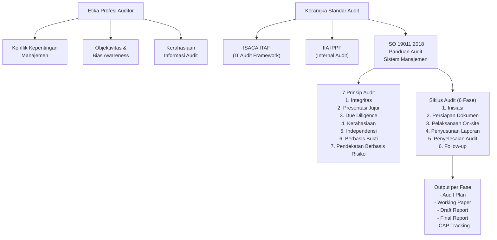

---

### 3. Pengantar Kontekstual

Kualitas sebuah audit tidak hanya ditentukan oleh kompetensi teknis auditor, tetapi juga oleh prinsip-prinsip etika yang dijunjung tinggi dan metodologi yang diikuti secara konsisten. Seorang auditor yang kompeten secara teknis tetapi tidak berintegritas — misalnya, menyesuaikan temuan dengan harapan klien atau menutupi nonconformity karena tekanan manajemen — menghasilkan audit yang secara hukum valid tetapi merusak tujuan fundamentalnya: memberikan jaminan objektif kepada pemangku kepentingan.

ISO 19011:2018 ("Guidelines for Auditing Management Systems") adalah standar internasional yang menyediakan panduan komprehensif tentang bagaimana audit sistem manajemen seharusnya dilakukan — termasuk sistem manajemen keamanan informasi (ISMS). Standar ini bukan hanya panduan teknis; ia mengandung kerangka etika yang menjadi landasan profesi auditor yang bertanggung jawab.

Siklus audit, ketika diikuti dengan disiplin, memastikan bahwa tidak ada fase penting yang terlewati — dari perencanaan yang matang hingga verifikasi bahwa tindakan korektif benar-benar diimplementasikan. Memahami siklus ini secara mendalam memungkinkan auditor mengelola waktu dan sumber daya secara efisien sekaligus menjaga kualitas hasil.

---

### 4. Landasan Teori

#### 4.1 Tujuh Prinsip Audit menurut ISO 19011:2018

ISO 19011:2018 Klausul 4 menetapkan tujuh prinsip yang menjadi fondasi audit yang efektif dan dapat dipercaya. Setiap prinsip memiliki implikasi praktis yang penting:

**Prinsip 1 — Integritas (Integrity)**
Integritas adalah fondasi profesionalisme auditor. Auditor harus jujur, bertanggung jawab, tulus, bijaksana, dan tidak memihak. Dalam praktik, ini berarti: melaporkan temuan yang tidak nyaman meskipun ada tekanan sosial atau politis untuk tidak melakukannya; menolak bujukan atau hadiah dari auditee; dan mengakui ketika suatu area di luar kompetensinya.

*Kesalahan umum:* "Softening" laporan — mengurangi tingkat keparahan temuan agar tidak mengecewakan manajemen klien atau untuk mempertahankan hubungan bisnis jangka panjang. Ini adalah pelanggaran integritas yang dapat mengorbankan kepentingan pemangku kepentingan yang bergantung pada laporan audit.

**Prinsip 2 — Presentasi Jujur (Fair Presentation)**
Laporan dan temuan audit harus merefleksikan kondisi yang sebenarnya secara akurat dan lengkap. Ini mencakup melaporkan hambatan yang ditemui selama audit, ketidakpastian yang mempengaruhi kepercayaan temuan, dan opini yang tidak konsensus dalam tim audit.

*Implikasi:* Jika auditee menolak memberikan akses ke sistem kritis, hal ini harus dicatat sebagai hambatan dalam laporan, bukan disembunyikan. Pembatasan ruang lingkup (*scope limitation*) yang signifikan dapat mengubah opini audit dari "bersih" menjadi "dengan pengecualian" (*qualified opinion*).

**Prinsip 3 — Due Professional Care (Due Diligence)**
Auditor harus menerapkan kehati-hatian, pertimbangan, dan keterampilan yang diharapkan dari seorang profesional yang kompeten di bidangnya. Ini tidak berarti sempurna — melainkan bahwa auditor menggunakan semua pengetahuan dan metodologi yang tersedia untuk menghasilkan kesimpulan yang dapat dipertanggungjawabkan.

*Implikasi praktis:* Menggunakan prosedur sampling yang memadai, tidak hanya memeriksa kasus yang paling mudah diperiksa; mendokumentasikan proses berpikir dan dasar kesimpulan.

**Prinsip 4 — Kerahasiaan (Confidentiality)**
Informasi yang diperoleh selama audit harus dijaga kerahasiaannya dan tidak digunakan untuk kepentingan pribadi atau dibagikan kepada pihak yang tidak berwenang. Ini adalah kepercayaan (*trust*) yang diberikan auditee kepada auditor, dan pelanggarannya dapat memiliki konsekuensi hukum.

*Contoh pelanggaran:* Mendiskusikan temuan audit klien di tempat umum, berbagi detail kelemahan kontrol dengan kompetitor klien, atau menggunakan informasi tentang kelemahan sistem untuk tujuan pribadi.

**Prinsip 5 — Independensi (Independence)**
Auditor harus bebas dari bias dan konflik kepentingan, dan menjaga objektivitas dalam seluruh proses audit. Independensi ada dua dimensi: *independence in fact* (bebas dari pengaruh yang dapat merusak objektivitas) dan *independence in appearance* (terlihat independen di mata pemangku kepentingan).

*Keduanya sama pentingnya:* Seorang auditor mungkin secara faktual independen, tetapi jika memiliki hubungan keluarga dengan manajemen yang diaudit, *independence in appearance* terganggu — yang merusak kredibilitas laporan bahkan jika kontennya akurat.

**Prinsip 6 — Pendekatan Berbasis Bukti (Evidence-Based Approach)**
Kesimpulan audit harus didasarkan pada bukti yang dapat diverifikasi dan dapat direproduksi. Bukti audit harus cukup (*sufficient*) — secara kuantitas memadai — dan tepat (*appropriate*) — secara kualitas relevan dan andal.

*Implikasi metodologi:* Auditor tidak boleh menarik kesimpulan berdasarkan "perasaan" atau asumsi tanpa dukungan bukti yang terdokumentasi. Setiap temuan harus dapat ditelusuri kembali ke bukti spesifik yang dicatat dalam kertas kerja audit.

**Prinsip 7 — Pendekatan Berbasis Risiko (Risk-Based Approach)**
Perencanaan dan prioritas audit harus mempertimbangkan risiko yang terkait dengan area yang diaudit. Area dengan risiko lebih tinggi mendapat perhatian yang lebih intensif. Ini memastikan sumber daya audit terbatas digunakan secara efektif.

*Implikasi:* Dalam organisasi keuangan, sistem pembayaran memiliki risiko lebih tinggi daripada sistem HR. Audit program harus mengalokasikan lebih banyak waktu dan pengujian yang lebih mendalam untuk sistem pembayaran.

#### 4.2 Siklus Audit Keamanan Informasi

Berdasarkan ISO 19011:2018, proses audit terdiri dari enam fase utama yang membentuk siklus lengkap:

**Fase 1 — Inisiasi Audit (Audit Initiation)**
- Penetapan tujuan, ruang lingkup, dan kriteria audit
- Pemilihan dan penugasan tim audit
- Penetapan kontak awal dengan auditee
- Penentuan kelayakan audit (apakah informasi yang cukup tersedia? apakah auditee kooperatif?)

Output: *Audit mandate* dan *audit scope statement*.

**Fase 2 — Persiapan Audit (Document Review)**
- Review dokumen sebelum kunjungan on-site: kebijakan keamanan, prosedur, laporan audit sebelumnya, hasil risk assessment
- Penyusunan *audit plan* yang detail (jadwal, area yang akan diaudit, auditor yang bertanggung jawab)
- Pengembangan *audit checklist* dan *work program*
- Identifikasi risiko audit dan rencana mitigasi

Output: *Audit plan* yang disetujui, *audit checklist*, *working paper template*.

**Fase 3 — Pelaksanaan Audit On-site (Audit Execution)**
Sub-fase ini mencakup:
- *Opening meeting*: perkenalan tim audit, konfirmasi ruang lingkup dan jadwal, klarifikasi aturan dasar
- *Evidence collection*: wawancara, observasi, review dokumen, uji kontrol
- *Working paper maintenance*: dokumentasi real-time semua bukti yang dikumpulkan
- *Closing meeting*: presentasi temuan awal kepada auditee untuk verifikasi akurasi faktual

Output: *Working papers*, *finding statements*, *evidence log*.

**Fase 4 — Penyusunan Laporan Audit (Audit Report Preparation)**
- Penyusunan draft laporan dari working papers
- Review dan verifikasi oleh ketua tim audit
- Klasifikasi temuan: nonconformity, observasi, peluang peningkatan
- Penyusunan executive summary untuk manajemen senior

Output: *Draft audit report* yang dikirim ke auditee untuk review faktual.

**Fase 5 — Penyelesaian Audit (Audit Completion)**
- Auditee merespons draft laporan (mengkonfirmasi atau mempertanyakan akurasi faktual, bukan mengubah kesimpulan)
- Finalisasi laporan dan distribusi kepada audit client
- Retensi dokumen audit sesuai kebijakan (biasanya 3-7 tahun)

Output: *Final audit report* yang didistribusikan dan *audit closure statement*.

**Fase 6 — Follow-up Audit**
- Monitoring implementasi *corrective action plan* (CAP) oleh auditee
- Verifikasi bahwa tindakan korektif mengatasi akar masalah (bukan hanya gejala)
- Audit tindak lanjut (*follow-up audit* atau *re-audit*) untuk memverifikasi efektivitas tindakan korektif pada temuan yang signifikan

Output: *CAP status report*, *follow-up audit findings* (jika dilakukan).

#### 4.3 Etika Profesi Auditor Keamanan Informasi

**Konflik Kepentingan dan Pengelolaannya**

Konflik kepentingan muncul ketika kepentingan pribadi atau profesional auditor berpotensi mempengaruhi objektivitas penilaiannya. Jenis konflik kepentingan yang umum dalam audit keamanan:

- **Konflik finansial**: Auditor yang perusahaannya juga menjual produk atau layanan kepada auditee memiliki insentif untuk memberikan laporan yang "bersih" agar hubungan bisnis terjaga
- **Konflik relasional**: Mengaudit departemen yang dipimpin oleh teman dekat atau anggota keluarga
- **Konflik self-review**: Mengaudit sistem atau kontrol yang pernah dirancang atau diimplementasikan oleh auditor sendiri (atau timnya)

Pengelolaan yang tepat: (a) Deklarasi konflik kepentingan sebelum penugasan; (b) Rotasi auditor secara berkala; (c) Review independen oleh pihak ketiga atas temuan yang sensitif.

**Kerahasiaan dan Batasan Pelaporan**

Informasi sensitif yang diperoleh selama audit (kelemahan sistem, data nasabah, strategi bisnis) tunduk pada kewajiban kerahasiaan. Namun, ada situasi di mana kerahasiaan berbenturan dengan kewajiban melaporkan:

- Jika auditor menemukan bukti pelanggaran hukum (misalnya penipuan, pelanggaran UU PDP) selama audit, apakah ia wajib melaporkannya kepada regulator meskipun melanggar kerahasiaan?
- Jawaban umum: IIA IPPF dan ISACA ITAF menetapkan bahwa auditor harus melaporkan kepada manajemen dan komite audit. Jika manajemen tidak bertindak, auditor memiliki kewajiban etika (dan mungkin hukum) untuk eskalasi.

**Objektivitas dan Bias Awareness**

Auditor rentan terhadap berbagai bentuk bias kognitif:
- *Confirmation bias*: Cenderung mencari bukti yang mengkonfirmasi hipotesis awal
- *Anchoring bias*: Terlalu bergantung pada informasi pertama yang diterima
- *Halo effect*: Penilaian positif terhadap satu aspek mempengaruhi penilaian aspek lain

Mitigasi: Gunakan checklist yang komprehensif, lakukan peer review temuan sebelum finalisasi, dan dokumentasikan proses berpikir di balik setiap kesimpulan.

#### 4.4 Kerangka Standar Audit yang Relevan

**ISO 19011:2018**: Panduan umum untuk audit sistem manajemen (termasuk ISMS). Berlaku untuk semua jenis audit sistem manajemen ISO, termasuk ISO 27001.

**ISACA ITAF (IT Assurance Framework)**: Standar untuk audit dan jaminan sistem informasi. Dikembangkan oleh ISACA (Information Systems Audit and Control Association). Relevan untuk auditor yang mengejar sertifikasi CISA (Certified Information Systems Auditor).

**IIA IPPF (International Professional Practices Framework)**: Standar untuk auditor internal. Dikembangkan oleh IIA (Institute of Internal Auditors). Mencakup Standar Internasional untuk Praktik Profesional Audit Internal.

**NIST SP 800-53A Rev.5**: Panduan khusus untuk menilai (*assessing*) kontrol keamanan dan privasi yang didefinisikan dalam NIST SP 800-53. Menyediakan prosedur penilaian untuk setiap kontrol.

---

### 5. Model atau Arsitektur

```mermaid
flowchart LR
    subgraph Inisiasi["FASE 1: INISIASI"]
        I1["Penetapan Tujuan\n& Ruang Lingkup"]
        I2["Pemilihan Tim Audit"]
        I3["Kontak Awal\ndengan Auditee"]
    end
    subgraph Persiapan["FASE 2: PERSIAPAN"]
        P1["Document Review\n(Kebijakan, Prosedur,\nLaporan Sebelumnya)"]
        P2["Penyusunan\nAudit Plan"]
        P3["Pengembangan\nChecklist & Work Program"]
    end
    subgraph Pelaksanaan["FASE 3: PELAKSANAAN ON-SITE"]
        E1["Opening Meeting"]
        E2["Evidence Collection\n(Wawancara, Observasi,\nReview Dokumen)"]
        E3["Working Paper\nMaintenance"]
        E4["Closing Meeting\n(Temuan Awal)"]
    end
    subgraph Laporan["FASE 4: LAPORAN"]
        R1["Draft Laporan"]
        R2["Review & Klasifikasi\nTemuan"]
        R3["Executive Summary"]
    end
    subgraph Selesai["FASE 5: PENYELESAIAN"]
        C1["Respons Auditee"]
        C2["Finalisasi Laporan"]
        C3["Distribusi & Retensi"]
    end
    subgraph Followup["FASE 6: FOLLOW-UP"]
        F1["Monitoring CAP"]
        F2["Verifikasi\nEfektivitas Tindakan"]
        F3["Re-audit\n(jika diperlukan)"]
    end
    Inisiasi --> Persiapan --> Pelaksanaan --> Laporan --> Selesai --> Followup
    Followup -.->|Siklus berikutnya| Inisiasi
```

---

### 6. Contoh Terapan

**Skenario: Audit Internal Pertama NDG — Penerapan Tujuh Prinsip ISO 19011**

**Konteks:** Tim audit internal NDG (Ibu Sari, Lead Auditor CISA, dan Pak Budi, auditor junior) memulai audit internal ISMS NDG untuk pertama kalinya. Area yang diaudit: manajemen akses dan identitas (*access and identity management*) — dipilih karena risiko tertinggi berdasarkan risk assessment terbaru.

**Penerapan Prinsip Integritas:**
Selama wawancara dengan Kepala IT NDG (yang kebetulan adalah teman lama Pak Budi), Kepala IT meminta agar "temuan minor" tidak dimasukkan ke laporan formal agar tidak mempermalukan timnya. Pak Budi harus menolak permintaan ini dengan sopan, menjelaskan bahwa semua temuan — terlepas dari tingkat keparahannya — harus dicatat secara jujur. Ia menawarkan kompromi yang sah: temuan minor dapat diklasifikasikan sebagai "Observasi" (bukan Nonconformity), tetapi tetap harus dicatat.

**Penerapan Prinsip Berbasis Bukti:**
Ibu Sari mengklaim bahwa "sistem MFA sudah diterapkan" berdasarkan informasi dari Kepala IT. Sebelum mencatat ini sebagai kesesuaian, Ibu Sari meminta bukti konkret: log akses sistem selama 30 hari terakhir yang menunjukkan MFA diterapkan untuk semua akun privileged, dan screenshot konfigurasi MFA di Active Directory. Setelah review, ternyata MFA hanya diterapkan untuk 78% akun — 22% akun privileged masih menggunakan password saja. Ini menjadi temuan nonconformity.

**Penerapan Prinsip Berbasis Risiko:**
Tim memutuskan untuk menghabiskan 60% waktu on-site untuk pemeriksaan akun privileged dan sistem manajemen identitas, dan hanya 40% untuk pemeriksaan kebijakan password karyawan umum — karena risiko kompromi akun privileged jauh lebih tinggi dampaknya.

---

### 7. Praktikum atau Aktivitas Terarah

**Judul Praktikum:** Simulasi Opening Meeting dan Pengembangan Audit Plan

**Tujuan Praktikum:**
- Mampu menyusun audit plan yang memuat elemen-elemen wajib berdasarkan ISO 19011
- Mampu melaksanakan opening meeting simulasi dengan peran auditor dan auditee
- Mampu mengidentifikasi potensi konflik etika dalam skenario audit

**Prasyarat:** Menyelesaikan Bab 1 dan Bab 2.

**Lingkungan Lab:** Ruang kelas; tidak memerlukan perangkat teknis khusus.

**Langkah Kerja:**

*Tahap 1 — Penyusunan Audit Plan (45 menit):*
Menggunakan template berikut, susun Audit Plan untuk skenario NDG:

```
AUDIT PLAN
Audit ID: [NDG-IA-2025-001]
Tanggal Audit: [Isi]
Tujuan Audit: [Isi — verifikasi kepatuhan ISO 27001:2022 klausul mana?]
Ruang Lingkup: [Area organisasi, sistem, lokasi yang dicakup]
Kriteria Audit: [Standar/persyaratan yang digunakan sebagai basis evaluasi]
Tim Audit: [Nama, peran, tanggung jawab]
Jadwal: [Tabel waktu per area/aktivitas]
Sumber Daya yang Diperlukan: [Dokumen yang diminta dari auditee]
Risiko Audit: [Potensi hambatan dan mitigasinya]
```

*Tahap 2 — Simulasi Opening Meeting (30 menit):*
Dua kelompok: satu sebagai tim audit, satu sebagai manajemen NDG (auditee). Simulasikan opening meeting 15 menit yang mencakup:
- Perkenalan tim audit dan auditee
- Konfirmasi tujuan, ruang lingkup, dan kriteria audit
- Penjelasan prosedur pengumpulan bukti
- Konfirmasi jadwal dan logistik
- Sesi tanya jawab singkat

Kelompok yang tidak bermain peran mengamati dan mencatat poin-poin yang kurang atau perlu diperbaiki.

*Tahap 3 — Analisis Etika (15 menit):*
Identifikasi potensi dilema etika dalam skenario berikut dan rekomendasikan tindakan yang tepat:
- Selama opening meeting, Direktur IT NDG menyatakan bahwa beberapa sistem "off-limits" untuk diperiksa karena mengandung data nasabah yang sangat sensitif
- Tim audit mendapati bahwa salah satu anggota tim pernah bekerja di NDG 2 tahun lalu

**Format Laporan:** Audit plan yang tersusun + ringkasan simulasi opening meeting + analisis etika.

**Kriteria Keberhasilan:**
- Audit plan mencakup semua elemen wajib
- Simulasi opening meeting mencakup semua agenda yang diperlukan
- Analisis etika mencerminkan pemahaman tentang prinsip-prinsip ISO 19011

---

### 8. Latihan Pemahaman

**Soal 1 (Pilihan Ganda):** Prinsip audit yang mengharuskan auditor melaporkan temuan yang tidak nyaman meskipun ada tekanan manajemen adalah:
- A. Kerahasiaan
- B. Integritas
- C. Due Diligence
- D. Independensi

**Soal 2 (Pilihan Ganda):** Dalam siklus audit ISO 19011, fase manakah yang menghasilkan *working papers*?
- A. Inisiasi Audit
- B. Persiapan Dokumen
- C. Pelaksanaan On-site
- D. Penyelesaian Audit

**Soal 3 (Esai Singkat):** Jelaskan perbedaan antara *independence in fact* dan *independence in appearance* dalam konteks audit keamanan informasi. Berikan contoh situasi di mana seorang auditor memiliki salah satu tetapi tidak yang lain.

**Soal 4 (Analisis Kasus):** Seorang auditor ISMS menemukan bahwa kebijakan password NDG tidak memenuhi persyaratan ISO 27001 Annex A 5.17 (authentication information). Namun, Direktur IT berargumen bahwa kebijakan tersebut memenuhi standar industri lokal yang lebih rendah. Bagaimana auditor seharusnya menangani situasi ini berdasarkan prinsip-prinsip ISO 19011?

**Soal 5 (Perbandingan Konsep):** Bandingkan fase "Opening Meeting" dan "Closing Meeting" dalam siklus audit on-site. Apa tujuan masing-masing, siapa yang harus hadir, dan informasi apa yang disampaikan?

**Soal 6 (Evaluasi Risiko):** Identifikasi tiga risiko audit yang mungkin muncul selama fase Pelaksanaan On-site dan jelaskan bagaimana masing-masing risiko dapat dimitigasi.

---

### 9. Latihan Terapan / Studi Kasus

**Studi Kasus 1: Dilema Etika di NDG**

Ibu Sari, Lead Auditor pada audit internal NDG, menemukan selama review dokumen bahwa sistem manajemen patch NDG tidak memiliki prosedur formal. Ini jelas merupakan nonconformity terhadap ISO 27001 Annex A 8.8 (management of technical vulnerabilities). Namun, ketika ia mendiskusikan temuan ini dengan Ketua Tim Proyek ISMS NDG (yang juga adalah orang yang menugaskan Ibu Sari untuk audit ini), Ketua Tim berargumen: "Kita tahu ada masalah ini, dan kita sedang dalam proses memperbaikinya. Tolong jangan masukkan ini sebagai nonconformity — masukkan saja sebagai 'sedang dalam perbaikan'."

*Pertanyaan:*
1. Apa konflik etika yang dihadapi Ibu Sari? Prinsip ISO 19011 mana yang terancam?
2. Bagaimana seharusnya Ibu Sari merespons permintaan ini?
3. Bagaimana Ibu Sari mendokumentasikan situasi ini dalam audit trail-nya?
4. Apakah ada kompromi yang etis (misalnya, mengakui bahwa tindakan perbaikan sudah dimulai dalam laporan), atau apakah nonconformity harus dilaporkan apa adanya?

**Studi Kasus 2: Hambatan Ruang Lingkup**

Selama audit on-site NDG, tim audit meminta akses ke log sistem server database utama untuk memverifikasi kontrol audit logging (ISO 27001 Annex A 8.15). Kepala IT NDG menolak, berargumen bahwa log tersebut mengandung data transaksi nasabah yang sangat sensitif dan memberikan akses akan melanggar kebijakan privasi internal NDG.

*Pertanyaan:*
1. Apakah penolakan ini merupakan hambatan audit (*scope limitation*) yang sah?
2. Apa opsi yang dimiliki tim audit dalam situasi ini? Jelaskan setidaknya tiga opsi dengan trade-off masing-masing.
3. Bagaimana situasi ini harus dicatat dalam laporan audit akhir?
4. Bagaimana penolakan akses ini mempengaruhi kesimpulan audit tentang kontrol audit logging NDG?

---

### 10. Kunci Jawaban dan Pembahasan

**Jawaban Soal 1:** **B — Integritas.**

*Pembahasan:* Prinsip Integritas dalam ISO 19011:2018 secara eksplisit menyatakan bahwa auditor harus "jujur dan tidak memihak." Melaporkan temuan yang tidak nyaman meskipun ada tekanan adalah manifestasi langsung dari integritas. Prinsip Kerahasiaan berkaitan dengan perlindungan informasi yang diperoleh selama audit. Due Diligence berkaitan dengan penerapan kehati-hatian profesional. Independensi berkaitan dengan kebebasan dari konflik kepentingan — meskipun independensi mendukung integritas, prinsip yang paling langsung relevan dengan situasi ini adalah Integritas.

**Jawaban Soal 2:** **C — Pelaksanaan On-site.**

*Pembahasan:* Working papers adalah rekaman real-time dari bukti yang dikumpulkan selama pelaksanaan audit on-site. Mereka dibuat saat wawancara dilakukan, dokumen di-review, dan kontrol diuji. Fase Inisiasi menghasilkan mandaat dan scope statement. Fase Persiapan menghasilkan audit plan dan checklist. Fase Penyelesaian menghasilkan laporan final, bukan working papers baru.

**Jawaban Soal 3 (Esai Singkat):**

*Independence in fact* (independensi faktual) berarti auditor benar-benar bebas dari pengaruh yang dapat merusak objektivitasnya — tidak ada hubungan keuangan, relasional, atau struktural yang menciptakan bias nyata.

*Independence in appearance* (independensi yang terlihat) berarti auditor terlihat independen di mata pemangku kepentingan yang memiliki informasi yang cukup — bahkan jika secara faktual independen, persepsi ketidakberpihakan harus terjaga.

*Contoh gap:*
- Auditor yang benar-benar independen dari suatu perusahaan, tetapi memiliki nama keluarga yang sama dengan CEO perusahaan tersebut, mungkin memiliki *independence in fact* tetapi kekurangan *independence in appearance* (meskipun tidak ada hubungan). Keduanya diperlukan untuk audit yang kredibel.
- Sebaliknya: auditor yang secara struktural independen tetapi menerima hadiah mewah dari auditee kehilangan *independence in fact* meskipun secara lahiriah terlihat independen.

**Jawaban Soal 4 (Analisis Kasus):**

Berdasarkan prinsip-prinsip ISO 19011, auditor seharusnya:
1. **Mempertahankan kriteria audit** yang telah ditetapkan di awal (ISO 27001:2022), bukan beralih ke standar alternatif yang lebih rendah. Kriteria audit adalah kontrak yang disepakati antara auditor dan audit client, dan tidak dapat diubah sepihak oleh auditee.
2. **Mencatat fakta secara akurat**: Kebijakan password NDG tidak memenuhi persyaratan ISO 27001 Annex A 5.17 — ini adalah fakta yang didukung bukti.
3. **Mencatat argumen auditee** dalam working paper sebagai "respons auditee" — namun argumen ini tidak mengubah temuan.
4. **Mendokumentasikan nonconformity**: Kebijakan password yang tidak memenuhi persyaratan ISO 27001 harus dilaporkan sebagai nonconformity, bukan sebagai kesesuaian. Fakta bahwa "standar lokal" mungkin lebih rendah tidak relevan dengan kriteria audit yang berlaku.
5. **Menjelaskan kepada Direktur IT** (dengan sopan tapi tegas) bahwa kriteria audit adalah ISO 27001, bukan standar lokal. Jika NDG ingin mengubah ruang lingkup atau kriteria audit, ini harus disetujui oleh audit client, bukan oleh auditee.

**Jawaban Soal 5 (Perbandingan Konsep):**

| Aspek | Opening Meeting | Closing Meeting |
|-------|-----------------|-----------------|
| **Tujuan** | Memulai audit dengan pemahaman bersama; konfirmasi scope & jadwal | Menyampaikan temuan awal; mendapatkan konfirmasi faktual dari auditee |
| **Yang Harus Hadir** | Tim audit, manajemen senior auditee, perwakilan area yang diaudit | Tim audit, manajemen senior auditee, pemilik proses yang memiliki temuan |
| **Informasi yang Disampaikan** | Tujuan, scope, kriteria, jadwal, metode pengumpulan bukti, logistik | Ringkasan temuan awal, klasifikasi tentatif (NC/observasi/OFI), langkah selanjutnya |
| **Sifat** | Informatif dan orientasi | Konfirmasi dan klarifikasi faktual |
| **Risiko Kegagalan** | Salah paham scope → pemborosan sumber daya | Auditee menyangkal temuan yang valid → konflik |

**Jawaban Soal 6 (Evaluasi Risiko):**

1. **Risiko: Auditee tidak kooperatif / menolak memberikan akses** → *Mitigasi:* Tetapkan persyaratan akses secara eksplisit dalam audit plan yang disetujui sebelum audit; dokumentasikan penolakan sebagai scope limitation; eskalasi ke audit client jika perlu.

2. **Risiko: Waktu audit tidak cukup untuk mencakup semua area** → *Mitigasi:* Gunakan pendekatan berbasis risiko sejak perencanaan — prioritaskan area berisiko tinggi; tetapkan time boxes yang realistis untuk setiap area; komunikasikan batasan ruang lingkup kepada audit client.

3. **Risiko: Auditor terpengaruh oleh informasi yang menyesatkan dari auditee** → *Mitigasi:* Selalu verifikasi klaim auditee dengan bukti independen (triangulasi bukti); gunakan lebih dari satu sumber bukti untuk temuan kritis; peer review temuan dalam tim audit sebelum finalisasi.

**Jawaban Studi Kasus 1:**

1. **Konflik etika**: Ibu Sari menghadapi tekanan dari orang yang menugaskannya untuk mengubah klasifikasi temuan yang sah — ini mengancam prinsip **Integritas** (melaporkan kondisi yang sebenarnya) dan **Presentasi Jujur** (laporan harus mencerminkan kondisi aktual).

2. **Respons yang tepat**: Ibu Sari harus menolak permintaan ini dengan tegas namun profesional. Ia dapat menjelaskan bahwa tanggung jawab profesionalnya mengharuskan ia melaporkan kondisi aktual kontrol. Namun, ia dapat *secara sah* mencatat dalam laporan bahwa "tindakan perbaikan telah dimulai pada [tanggal]" sebagai informasi kontekstual — ini bukan kompromi integritas, melainkan pelaporan fakta yang lengkap.

3. **Dokumentasi**: Ibu Sari harus mencatat dalam working paper: (a) tanggal dan detail percakapan dengan Ketua Tim; (b) permintaan yang diajukan; (c) keputusan auditor dan alasannya. Ini adalah bagian dari audit trail yang melindungi auditor jika ada perselisihan di kemudian hari.

4. **Kompromi yang etis**: Ya, ada kompromi yang etis: Nonconformity tetap dilaporkan sebagaimana adanya (kondisi saat ini tidak memenuhi persyaratan), tetapi laporan *juga mencatat* bahwa auditee telah memulai tindakan korektif. Ini adalah pelaporan yang jujur dan lengkap, bukan distorsi. Yang tidak etis adalah mengubah klasifikasi dari "Nonconformity" menjadi "sedang diperbaiki" tanpa mencatat bahwa kondisi saat ini tidak memenuhi persyaratan.

**Jawaban Studi Kasus 2:**

1. **Apakah ini scope limitation yang sah?** Ya, ini merupakan scope limitation yang nyata. Kekhawatiran privasi data nasabah adalah argumen yang sah — auditor tidak boleh mengakses data transaksi yang tidak relevan dengan tujuan audit mereka. Namun, penolakan ini harus dievaluasi secara kritis: apakah ada cara untuk memverifikasi kontrol audit logging tanpa mengakses data transaksi aktual (misalnya, dengan meminta log metadata atau log teknis yang sudah dianonimisasi)?

2. **Opsi tim audit:**
   - *Opsi A — Negosiasi akses terbatas*: Minta akses ke sampel log yang sudah di-anonymize atau log teknis yang tidak mengandung data nasabah. Trade-off: mungkin cukup untuk verifikasi parsial, tetapi mungkin tidak memungkinkan audit yang komprehensif.
   - *Opsi B — Minta bukti alternatif*: Minta laporan dari tim IT tentang konfigurasi audit logging, atau verifikasi melalui review kebijakan dan prosedur yang terkait. Trade-off: tidak sekuat bukti langsung, tetapi mungkin cukup untuk mendukung kesimpulan.
   - *Opsi C — Catat sebagai scope limitation dan buat kesimpulan terbatas*: Dokumentasikan penolakan dan buat pernyataan bahwa auditor tidak dapat memverifikasi kontrol audit logging karena pembatasan akses. Trade-off: jujur dan melindungi auditor, tetapi meninggalkan area signifikan tanpa verifikasi.

3. **Dokumentasi dalam laporan**: Laporan harus secara eksplisit menyatakan bahwa "tim audit tidak dapat memverifikasi efektivitas kontrol audit logging (ISO 27001 Annex A 8.15) karena akses ke log sistem database ditolak oleh auditee dengan alasan privasi data nasabah. Akibatnya, kesimpulan audit pada area ini terbatas." Ini adalah *scope limitation* yang harus tercermin dalam opini audit.

4. **Dampak pada kesimpulan**: Auditor tidak dapat memberikan opini "bersih" (*unqualified opinion*) tentang kontrol audit logging — opininya harus *qualified* dengan pengakuan bahwa area ini tidak dapat diverifikasi. Jika audit logging adalah kontrol kritis dalam scope, ini dapat mempengaruhi opini keseluruhan audit.

---

### 11. Ringkasan Bab

ISO 19011:2018 menetapkan tujuh prinsip yang menjadi fondasi etika dan metodologi audit: integritas, presentasi jujur, due diligence, kerahasiaan, independensi, pendekatan berbasis bukti, dan pendekatan berbasis risiko. Prinsip-prinsip ini bukan sekadar panduan abstrak — mereka memiliki implikasi praktis pada setiap keputusan auditor, dari cara menangani tekanan manajemen hingga cara mendokumentasikan hambatan. Siklus audit mencakup enam fase yang membentuk kerangka metodologi yang terstruktur: inisiasi, persiapan, pelaksanaan, penyusunan laporan, penyelesaian, dan follow-up. Etika profesi auditor bukan hanya soal menghindari korupsi nyata — ia mencakup manajemen bias kognitif, pengelolaan konflik kepentingan yang halus, dan keberanian untuk melaporkan temuan yang tidak populer. Auditor yang menggabungkan kompetensi teknis dengan integritas etika yang kuat adalah aset yang nilainya melampaui sekedar pemenuhan persyaratan formal.

---

### 12. Refleksi Profesional

1. **Tekanan Eksternal terhadap Integritas**: Dalam industri audit profesional, ada tekanan bisnis yang nyata — klien yang tidak puas dengan temuan dapat mencari auditor lain yang lebih "akomodatif". Bagaimana seorang auditor independen mempertahankan bisnis mereka sambil tetap menjaga integritas? Apakah sistem sertifikasi dan regulasi profesi auditor di Indonesia sudah cukup untuk melindungi independensi ini?

2. **Batas Kerahasiaan**: Jika selama audit ISMS Anda menemukan bukti bahwa perusahaan sedang melakukan penipuan laporan keuangan (yang tidak terkait dengan keamanan informasi), apa yang seharusnya Anda lakukan? Di mana batas antara kewajiban kerahasiaan sebagai auditor dan kewajiban etika sebagai warga negara?

3. **Siklus Audit yang Tidak Selesai**: Banyak organisasi melakukan audit ISMS tetapi tidak menindaklanjuti corrective action plan secara serius. Temuan yang sama muncul audit demi audit. Siapa yang bertanggung jawab untuk memastikan follow-up terjadi — auditor, manajemen, atau dewan direksi? Dan apa konsekuensinya jika tidak ada yang bertanggung jawab?

---

## Bab 3 — Audit Charter, Scope, dan Kriteria Audit

### 1. Capaian Pembelajaran Bab

Setelah menyelesaikan bab ini, mahasiswa mampu:
- Menyusun audit charter yang memuat semua elemen wajib dan memberikan wewenang yang memadai kepada tim audit (C3)
- Mendefinisikan ruang lingkup audit (*audit scope*) yang jelas, terukur, dan dapat diaudit (C3)
- Memilih dan membenarkan kriteria audit yang tepat untuk konteks organisasi tertentu (C4)
- Menganalisis trade-off antara ruang lingkup yang luas vs. fokus dalam konteks keterbatasan sumber daya audit (C4)

*Dikaitkan dengan Sub-CPMK.2 (Pertemuan 3) dan Evaluasi Eval-2 (15%).*

---

### 2. Peta Konsep Bab

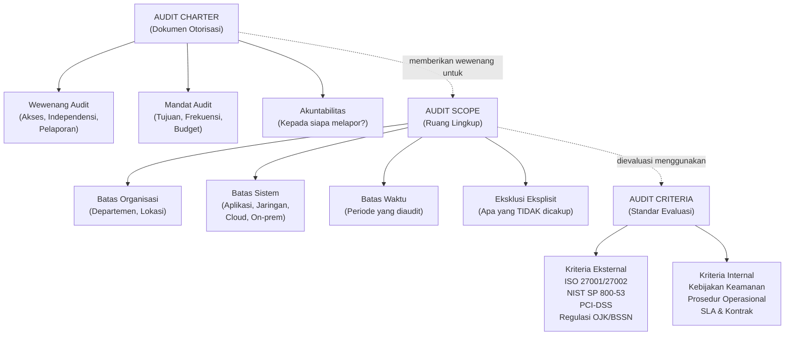

---

### 3. Pengantar Kontekstual

Sebelum auditor mengumpulkan satu bukti pun, tiga dokumen fondasi harus ada: *audit charter* yang memberikan wewenang legal dan fungsional, *scope statement* yang mendefinisikan batas-batas audit dengan presisi, dan *criteria document* yang menetapkan standar evaluasi. Tanpa ketiga fondasi ini, audit bukan hanya tidak efektif — ia dapat menjadi sumber konflik, salah paham, dan hasil yang tidak dapat dipertanggungjawabkan.

Masalah yang paling umum dalam audit keamanan adalah *scope creep* (perluasan ruang lingkup yang tidak terencana) dan *scope ambiguity* (ketidakjelasan tentang apa yang termasuk dan tidak termasuk dalam ruang lingkup). Keduanya menyebabkan pemborosan sumber daya, ketegangan dengan auditee, dan laporan yang tidak dapat dibandingkan dari satu periode ke periode berikutnya.

Di dunia nyata, audit charter adalah dokumen yang menentukan apakah tim audit dapat beroperasi secara efektif atau terus-menerus berjuang mendapatkan akses dan dukungan manajemen. Investasi waktu yang matang dalam menyusun ketiga dokumen ini akan menghemat jauh lebih banyak waktu selama pelaksanaan audit.

---

### 4. Landasan Teori

#### 4.1 Audit Charter

**Definisi:** Audit charter adalah dokumen formal yang menetapkan tujuan, wewenang, tanggung jawab, dan posisi organisasional dari fungsi audit. Ia adalah "kontrak" antara fungsi audit dan manajemen senior/dewan direksi yang memberikan legitimasi kepada proses audit.

**Komponen Wajib Audit Charter:**

**a) Tujuan (Purpose/Mission)**
Pernyataan ringkas tentang mengapa fungsi audit ada. Contoh: "Fungsi Audit Internal ISMS NDG bertujuan untuk memberikan jaminan independen kepada Dewan Direksi bahwa kontrol keamanan informasi NDG efektif, memadai, dan sesuai dengan persyaratan ISO/IEC 27001:2022 serta regulasi yang berlaku."

**b) Wewenang (Authority)**
Mendefinisikan hak akses yang dimiliki tim audit: akses ke semua sistem, dokumen, lokasi, dan personel yang diperlukan untuk melaksanakan tugasnya. Tanpa klausul wewenang yang jelas dan kuat, tim audit dapat diblokir oleh manajemen menengah yang tidak ingin diaudit. Wewenang juga mencakup hak untuk melaporkan langsung kepada komite audit atau dewan direksi, melampaui manajemen operasional.

**c) Tanggung Jawab (Responsibility)**
Mendefinisikan apa yang harus dilakukan tim audit: mengembangkan dan melaksanakan audit program, mendokumentasikan temuan, menerbitkan laporan, memantau corrective action.

**d) Independensi**
Menegaskan bahwa tim audit beroperasi independen dari area yang diaudit dan tidak memiliki tanggung jawab operasional untuk kontrol yang mereka nilai.

**e) Pelaporan (Reporting Line)**
Menentukan kepada siapa tim audit melapor. Untuk independensi yang optimal, laporan fungsional harus ke komite audit atau dewan direksi, bukan ke manajemen operasional.

**f) Standar yang Diacu**
Menyebutkan standar profesional yang diikuti tim audit (misalnya, ISO 19011:2018, IIA IPPF, ISACA ITAF).

**g) Frekuensi Review Charter**
Audit charter harus di-review secara berkala (biasanya tahunan) atau ketika ada perubahan signifikan dalam organisasi atau regulasi.

**Siapa yang Menyetujui Audit Charter?**
Idealnya, audit charter ditandatangani oleh Direktur Utama dan Komite Audit (atau setara). Tingkat persetujuan yang tinggi ini memberikan bobot dan legitimasi yang diperlukan agar tim audit dapat beroperasi secara efektif.

#### 4.2 Ruang Lingkup Audit (Audit Scope)

**Definisi:** Audit scope adalah batas-batas yang mendefinisikan apa yang akan dan tidak akan dicakup dalam audit tertentu. Scope yang terdefinisi dengan baik mencegah scope creep dan memberikan ekspektasi yang jelas kepada semua pihak.

**Dimensi Scope:**

**a) Batas Organisasional**
Departemen, divisi, cabang, atau entitas hukum mana yang dicakup? Misalnya: "Audit mencakup seluruh operasi PT NDG di kantor pusat Jakarta dan kantor regional Surabaya, tidak mencakup anak perusahaan PT NDG Fintech."

**b) Batas Sistem**
Sistem informasi, jaringan, aplikasi, dan infrastruktur mana yang termasuk? Misalnya: "Sistem yang dicakup: core banking system, sistem manajemen identitas, jaringan internal, dan cloud environment di AWS (region Jakarta)."

**c) Batas Temporal**
Periode waktu mana yang diaudit? Misalnya: "Audit mencakup implementasi kontrol selama periode Januari 2024 – Desember 2024."

**d) Batas Fungsional/Proses**
Proses bisnis atau fungsi mana yang dinilai? Misalnya: "Proses yang dicakup: manajemen akses dan identitas, manajemen keamanan jaringan, dan manajemen insiden keamanan."

**e) Eksklusi Eksplisit**
Secara eksplisit menyatakan apa yang TIDAK dicakup dan alasannya. Ini sama pentingnya dengan menyatakan apa yang dicakup. Misalnya: "Sistem X tidak dicakup dalam audit ini karena sedang dalam proses migrasi dan akan diaudit secara terpisah pada Q2 2025."

**Pentingnya Scope yang Tepat:**

*Scope terlalu luas* → Sumber daya tidak cukup untuk pemeriksaan mendalam; temuan menjadi superfisial; waktu terbuang untuk area berisiko rendah. Tim audit "tahu sedikit tentang banyak hal" alih-alih "tahu banyak tentang hal yang penting."

*Scope terlalu sempit* → Area risiko tinggi mungkin tidak tercover; pemangku kepentingan tidak mendapat gambaran menyeluruh; audit yang berulang dengan scope sempit menciptakan blind spot yang persisten.

*Scope yang optimal* → Ditentukan oleh analisis risiko: area dengan risiko tertinggi mendapat perhatian paling intensif.

#### 4.3 Kriteria Audit

**Definisi:** Audit criteria adalah kumpulan kebijakan, prosedur, standar, undang-undang, regulasi, atau persyaratan yang digunakan sebagai referensi untuk membandingkan bukti audit (ISO 19011:2018 Klausul 3.7). Singkatnya: kriteria adalah "tolok ukur" yang digunakan auditor untuk menilai apakah suatu kontrol memadai atau tidak.

**Jenis Kriteria Audit:**

**a) Kriteria Eksternal**
Standar, regulasi, atau framework yang ditetapkan oleh pihak eksternal:
- **ISO/IEC 27001:2022**: Persyaratan ISMS (Klausul 4-10 + Annex A controls)
- **ISO/IEC 27002:2022**: Panduan implementasi kontrol (bukan persyaratan — lebih tepat sebagai referensi "good practice")
- **NIST SP 800-53 Rev.5**: Katalog kontrol keamanan dan privasi (digunakan terutama di ekosistem pemerintah AS, tetapi juga diadopsi secara global)
- **CIS Controls v8**: 18 kontrol prioritas tinggi
- **PCI-DSS v4.0**: Persyaratan untuk entitas yang memproses data kartu pembayaran
- **Regulasi OJK** (POJK No. 11/POJK.03/2022): Untuk bank dan lembaga keuangan di Indonesia
- **Peraturan BSSN No. 8/2021**: Untuk instansi pemerintah Indonesia

**b) Kriteria Internal**
Dokumen yang dikembangkan sendiri oleh organisasi:
- Kebijakan keamanan informasi (Information Security Policy)
- Prosedur operasional standar (SOP)
- Standar konfigurasi teknis (baselines)
- SLA (Service Level Agreement) dengan vendor atau pelanggan
- Kontrak yang berisi persyaratan keamanan

**c) Kriteria Campuran**
Dalam banyak audit, kriteria adalah kombinasi: "Sistem pembayaran NDG harus memenuhi persyaratan PCI-DSS v4.0 Requirement 8 (Identify Users and Authenticate Access to System Components) DAN kebijakan manajemen akses internal NDG versi 3.1."

**Memilih Kriteria yang Tepat:**

Pemilihan kriteria harus diputuskan sebelum audit dimulai dan dikomunikasikan dengan jelas kepada auditee. Mengubah kriteria di tengah audit adalah praktik yang tidak dapat diterima.

Faktor yang mempengaruhi pemilihan:
1. **Mandat regulasi**: Apakah ada standar yang diwajibkan oleh regulasi?
2. **Tujuan audit**: Apakah untuk sertifikasi (memerlukan standar tertentu) atau untuk perbaikan internal?
3. **Konteks industri**: Standar industri yang relevan
4. **Kematangan organisasi**: Organisasi baru mungkin belum siap untuk dievaluasi terhadap standar yang sangat ketat

#### 4.4 Hubungan Charter, Scope, dan Criteria

Ketiga dokumen ini membentuk hierarki yang saling mendukung:

- **Charter** menetapkan *wewenang* untuk melakukan audit
- **Scope** mendefinisikan *batas* apa yang diaudit
- **Criteria** menentukan *standar* yang digunakan untuk mengevaluasi

Sebuah audit yang kuat memiliki charter yang kuat, scope yang jelas, dan criteria yang sesuai dengan konteks dan tujuan.

---

### 5. Model atau Arsitektur

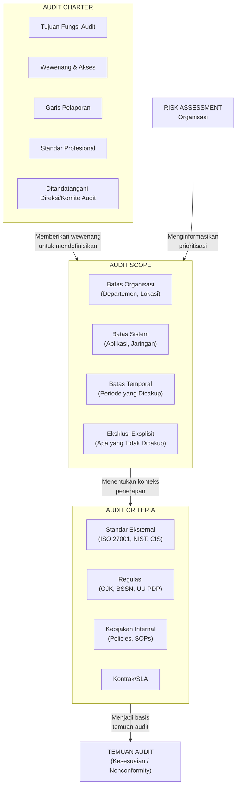

---

### 6. Contoh Terapan

**Skenario: Penyusunan Audit Charter dan Scope NDG**

**Konteks:** NDG telah memutuskan untuk melembagakan fungsi audit ISMS internal. Direktur Utama menugaskan Kepala Divisi Risk & Compliance untuk menyusun audit charter dan scope statement untuk audit ISMS pertama.

**Audit Charter NDG (Ringkasan):**

```
AUDIT CHARTER
FUNGSI AUDIT INTERNAL ISMS
PT NUSANTARA DIGITAL (NDG)

Tujuan:
Memberikan jaminan independen kepada Dewan Direksi NDG bahwa Sistem Manajemen 
Keamanan Informasi (SMKI/ISMS) NDG dirancang dan beroperasi secara efektif sesuai 
dengan persyaratan ISO/IEC 27001:2022 dan regulasi yang berlaku.

Wewenang:
Tim Audit Internal ISMS berwenang untuk:
- Mengakses seluruh area fisik, sistem informasi, basis data, dan dokumen yang 
  diperlukan untuk pelaksanaan audit
- Mewawancarai seluruh karyawan NDG yang terkait dengan area yang diaudit
- Mengakses log sistem, konfigurasi keamanan, dan rekaman insiden
- Melaporkan langsung kepada Komite Audit Dewan Direksi NDG

Tanggung Jawab:
- Mengembangkan dan melaksanakan annual audit program ISMS
- Menerbitkan laporan audit yang objektif dan berbasis bukti
- Memantau implementasi corrective action plan

Independensi:
Tim Audit Internal ISMS melapor secara fungsional kepada Komite Audit Dewan Direksi 
dan tidak memiliki tanggung jawab operasional terhadap kontrol yang diaudit.

Standar: ISO 19011:2018, ISACA ITAF, IIA IPPF

Disetujui oleh: Direktur Utama NDG dan Ketua Komite Audit
Tanggal: [tanggal penerbitan]
Review berikutnya: [tanggal + 1 tahun]
```

**Scope Statement NDG Audit Internal ISMS 2025:**

```
AUDIT SCOPE STATEMENT
NDG-IA-2025-001

Ruang Lingkup:
- Organisasi: Seluruh operasi PT Nusantara Digital (tidak termasuk anak perusahaan)
- Lokasi: Kantor Pusat Jakarta (utama) dan Kantor Regional Surabaya
- Sistem: Core banking system, Identity and Access Management (IAM), 
  jaringan internal, dan cloud environment AWS Jakarta
- Periode: Implementasi kontrol selama 1 Januari 2024 – 31 Desember 2024
- Proses: Manajemen akses, manajemen keamanan jaringan, manajemen insiden, 
  manajemen kerentanan, dan keamanan fisik

Eksklusi Eksplisit:
- Sistem PT NDG Fintech (anak perusahaan terpisah, jadwalkan audit terpisah Q3 2025)
- Sistem yang sedang dalam proses migrasi (HR-HRIS-v2) — akan diaudit setelah 
  migrasi selesai
- Workstation dan endpoint milik kontraktor pihak ketiga

Alasan Eksklusi: [Penjelasan singkat per eksklusi]
```

**Kriteria Audit NDG 2025:**
- Persyaratan: ISO/IEC 27001:2022 (Klausul 4-10 dan Annex A)
- Panduan implementasi: ISO/IEC 27002:2022
- Kebijakan keamanan informasi NDG versi 4.2 (ditetapkan 15 Februari 2024)
- Prosedur manajemen akses NDG-SEC-002 versi 2.1

---

### 7. Praktikum atau Aktivitas Terarah

**Judul Praktikum:** Penyusunan Dokumen Fondasi Audit (Charter + Scope + Criteria)

**Tujuan Praktikum:**
- Mampu menyusun draft audit charter yang memuat semua elemen wajib
- Mampu mendefinisikan scope yang jelas dengan batas organisasional, sistem, dan temporal
- Mampu memilih kriteria audit yang sesuai dengan konteks organisasi

**Prasyarat:** Menyelesaikan Bab 1, 2, dan 3.

**Lingkungan Lab:** Dokumen skenario NDG yang disediakan dosen; template audit charter dan scope statement.

**Langkah Kerja:**

*Tahap 1 — Penyusunan Draft Audit Charter (40 menit):*
Susun draft Audit Charter untuk skenario berikut:
"PT Medika Prima adalah rumah sakit swasta dengan 1.000 karyawan di Surabaya. Mereka baru saja menerapkan sistem Rekam Medis Elektronik (RME) berbasis cloud dan wajib memenuhi standar keamanan data kesehatan sesuai Permenkes No. 24 Tahun 2022."

Charter harus mencakup: tujuan, wewenang, tanggung jawab, independensi, pelaporan, standar yang diacu.

*Tahap 2 — Penyusunan Scope Statement (30 menit):*
Untuk audit ISMS PT Medika Prima, susun scope statement yang mencakup batas organisasional, sistem (RME, jaringan, workstation di klinik), temporal, dan setidaknya dua eksklusi yang masuk akal.

*Tahap 3 — Pemilihan Kriteria Audit (20 menit):*
Pilih dan justifikasikan kriteria audit yang paling sesuai untuk PT Medika Prima. Pertimbangkan: ISO/IEC 27001, NIST SP 800-53, CIS Controls, Permenkes No. 24/2022, kebijakan internal.

**Format Laporan:** Draft Charter (1-2 halaman) + Scope Statement (1 halaman) + Justifikasi Kriteria (0.5 halaman).

**Kriteria Keberhasilan:**
- Charter memuat semua elemen wajib dengan bahasa yang cukup kuat untuk memberikan wewenang nyata
- Scope jelas dan tidak ambigu; eksklusi didefinisikan dengan alasan
- Pemilihan kriteria justified berdasarkan konteks regulasi dan tujuan audit

---

### 8. Latihan Pemahaman

**Soal 1 (Pilihan Ganda):** Komponen audit charter yang memastikan auditor tidak dapat diblokir oleh manajemen menengah adalah:
- A. Tujuan Fungsi Audit
- B. Wewenang (Authority)
- C. Standar Profesional yang Diacu
- D. Frekuensi Review Charter

**Soal 2 (Pilihan Ganda):** "Sistem HR NDG tidak dicakup dalam audit ini karena sedang dalam proses migrasi" adalah contoh dari:
- A. Audit criteria
- B. Scope limitation karena auditee tidak kooperatif
- C. Eksklusi eksplisit yang terencana
- D. Nonconformity

**Soal 3 (Esai Singkat):** Jelaskan mengapa audit criteria tidak boleh diubah di tengah-tengah proses audit, dan apa konsekuensinya jika ini terjadi.

**Soal 4 (Analisis Kasus):** Sebuah organisasi menetapkan scope audit yang mencakup "seluruh sistem informasi perusahaan" tanpa detail lebih lanjut. Identifikasi setidaknya tiga masalah yang mungkin timbul dari scope yang tidak terdefinisi dengan baik ini.

**Soal 5 (Perancangan):** Rancang audit scope statement untuk audit keamanan jaringan sebuah perusahaan manufaktur dengan 5 lokasi produksi yang masing-masing memiliki sistem OT (Operational Technology) dan IT yang terhubung. Sertakan batas dan eksklusi yang relevan.

---

### 9. Latihan Terapan / Studi Kasus

**Studi Kasus 1: Scope Creep di NDG**

Tim audit NDG memulai audit ISMS dengan scope yang terdefinisi pada sistem core banking dan IAM. Selama pelaksanaan on-site, Direktur IT meminta tim audit untuk "sekalian" memeriksa keamanan sistem mobile banking yang baru diluncurkan, dengan argumen "toh sudah ada di sini." Tim audit merasa tertekan untuk mengakomodasi permintaan ini karena ingin mempertahankan hubungan baik dengan Direktur IT.

*Pertanyaan:*
1. Apa yang harus dilakukan tim audit menghadapi permintaan ini? Jelaskan dari perspektif scope management.
2. Apa risiko jika tim audit mengakomodasi permintaan ini tanpa proses formal?
3. Bagaimana proses formal yang tepat jika memang ada kebutuhan untuk memperluas scope?
4. Bagaimana situasi ini harus dikomunikasikan kepada audit client?

**Studi Kasus 2: Konflik Kriteria**

Selama audit NDG, auditor menemukan bahwa kebijakan password NDG mengharuskan password minimal 8 karakter. ISO/IEC 27002:2022 klausul 5.17 merekomendasikan "panjang password yang memadai" tanpa angka spesifik. NIST SP 800-63B (yang bukan kriteria audit yang ditetapkan) merekomendasikan minimal 8 karakter untuk password tanpa faktor lain, tetapi 6 karakter jika ada MFA. NDG menggunakan MFA.

*Pertanyaan:*
1. Berdasarkan kriteria yang ditetapkan (ISO 27001/27002 dan kebijakan internal NDG), apakah kebijakan password NDG sesuai atau tidak?
2. Apakah auditor dapat menggunakan NIST SP 800-63B sebagai dasar penilaian jika tidak ditetapkan sebagai kriteria? Jelaskan.
3. Bagaimana auditor seharusnya mendokumentasikan situasi ini dalam working paper?

---

### 10. Kunci Jawaban dan Pembahasan

**Jawaban Soal 1:** **B — Wewenang (Authority).**

*Pembahasan:* Klausul wewenang dalam audit charter secara eksplisit memberikan hak akses kepada tim audit ke semua sistem, dokumen, lokasi, dan personel yang diperlukan. Tanpa wewenang yang ditetapkan dalam dokumen formal yang disetujui manajemen tertinggi, manajer menengah dapat secara sah menolak permintaan akses. Klausul tujuan menjelaskan mengapa fungsi audit ada, bukan apa yang dapat dilakukannya. Standar profesional mendefinisikan metodologi, bukan wewenang akses. Frekuensi review adalah mekanisme pemeliharaan dokumen.

**Jawaban Soal 2:** **C — Eksklusi eksplisit yang terencana.**

*Pembahasan:* Eksklusi eksplisit adalah bagian penting dari scope statement yang mendefinisikan apa yang secara sengaja tidak dicakup, dengan alasan yang tercatat. Ini berbeda dari scope limitation (Pilihan B) yang muncul selama audit karena auditee tidak kooperatif — eksklusi sudah direncanakan sebelum audit dimulai. Bukan audit criteria (Pilihan A) karena criteria adalah standar evaluasi, bukan batas ruang lingkup.

**Jawaban Soal 3 (Esai Singkat):**

Audit criteria tidak boleh diubah di tengah audit karena:
1. **Prinsip konsistensi dan keadilan**: Auditee berhak mengetahui standar yang akan digunakan untuk mengevaluasi mereka sebelum audit dimulai. Mengubah criteria di tengah audit adalah tidak adil — seperti mengubah soal ujian saat peserta sedang mengerjakannya.
2. **Komparabilitas**: Laporan audit dari berbagai periode atau area hanya dapat dibandingkan jika menggunakan criteria yang sama.
3. **Integritas proses**: Mengubah criteria dapat menimbulkan kecurigaan bahwa perubahan dimotivasi oleh keinginan untuk mencapai hasil tertentu (terlalu ketat atau terlalu longgar).

Konsekuensi perubahan criteria di tengah audit: (a) temuan yang sudah dikumpulkan mungkin tidak valid lagi terhadap criteria baru; (b) auditee dapat mempertanyakan validitas seluruh proses; (c) audit harus dimulai ulang dengan criteria baru, membuang waktu dan sumber daya yang sudah diinvestasikan.

**Jawaban Soal 4 (Analisis Kasus):**

Masalah dari scope "seluruh sistem informasi" yang tidak spesifik:
1. **Sumber daya tidak mencukupi**: Tidak ada organisasi yang dapat mengaudit semua sistem secara mendalam dalam satu audit cycle dengan sumber daya terbatas. Scope yang terlalu luas menghasilkan audit yang dangkal dan tidak bermakna.
2. **Ketidakjelasan ekspektasi**: Auditee tidak tahu sistem mana yang perlu disiapkan untuk audit, menyebabkan kebingungan dan penundaan.
3. **Ketidakkonsistenan antar siklus audit**: Tanpa definisi yang presisi, siklus audit berikutnya mungkin mencakup "sistem" yang berbeda meskipun label scope-nya sama, membuat perbandingan antar waktu tidak valid.
4. **Risiko scope creep**: Tim audit atau auditee dapat terus memperluas interpretasi "seluruh sistem" selama audit berlangsung, menyebabkan over-run waktu dan anggaran.

**Jawaban Soal 5 (Perancangan):**

Contoh scope statement untuk perusahaan manufaktur:
```
Ruang Lingkup:
- Organisasi: PT Manufaktur X, seluruh divisi IT dan OT di 5 lokasi produksi
- Lokasi: Pabrik A (Surabaya), B (Semarang), C (Medan) — DICAKUP; 
           Kantor Distribusi D, E — TIDAK DICAKUP (audit terpisah Q4)
- Sistem IT: Jaringan korporat, ERP SAP, sistem email, Active Directory
- Sistem OT: SCADA untuk lini produksi 1-3 di Pabrik A dan B
- Batas IT/OT: Demiliterisasi zone (DMZ) antara IT dan OT dicakup
- Temporal: Kontrol yang berlaku 1 Januari – 31 Desember 2024

Eksklusi Eksplisit:
- Sistem SCADA Pabrik C (kontrak vendor maintenance belum memungkinkan akses audit — jadwalkan Q2 2025)
- Sistem OT lini produksi 4 dan 5 di Pabrik A (belum terintegrasi dengan jaringan korporat)
- Perangkat mobile milik kontraktor pihak ketiga
```

**Jawaban Studi Kasus 1:**

1. **Tindakan yang tepat**: Tim audit harus menolak permintaan ini dalam scope audit berjalan, tetapi dengan cara yang profesional. Langkah: (a) Jelaskan bahwa scope audit telah ditetapkan dan disetujui sebelum audit dimulai; (b) Tawaran: sistem mobile banking dapat dijadwalkan dalam audit terpisah atau dimasukkan dalam next audit cycle.

2. **Risiko mengakomodasi tanpa proses formal**: (a) Waktu tidak cukup — pemeriksaan mobile banking akan dangkal karena tidak ada persiapan (tidak ada checklist, tidak ada document review yang memadai); (b) Temuan menjadi tidak valid secara metodologis — tidak ada basis perbandingan; (c) Menciptakan preseden bahwa scope dapat berubah sesuai keinginan auditee, merusak kontrol kualitas audit.

3. **Proses formal yang tepat**: Jika ada kebutuhan nyata untuk memperluas scope, prosesnya: (a) Ketua tim audit berkomunikasi dengan audit client (bukan auditee) untuk persetujuan formal; (b) Penilaian kelayakan: apakah ada waktu dan sumber daya yang cukup? (c) Dokumen formal scope amendment yang ditandatangani audit client; (d) Penyesuaian audit plan dan checklist; (e) Perpanjangan timeline jika diperlukan.

4. **Komunikasi kepada audit client**: Tim audit harus segera menginformasikan kepada audit client (Komite Audit) bahwa: (a) ada permintaan perluasan scope dari auditee; (b) implikasi terhadap waktu dan kualitas; (c) rekomendasi tim audit (tidak mengakomodasi tanpa proses formal); (d) tawaran untuk menjadwalkan audit terpisah.

**Jawaban Studi Kasus 2:**

1. **Kesesuaian dengan kriteria yang ditetapkan**: Berdasarkan criteria yang ditetapkan (ISO 27001/27002 dan kebijakan internal NDG), kebijakan password NDG (minimal 8 karakter) **sesuai** (*compliant*). Kebijakan internal NDG menetapkan 8 karakter, dan ini konsisten dengan standar yang tercakup dalam criteria. ISO 27002:2022 tidak menetapkan angka spesifik — ia menyerahkan kepada organisasi untuk menentukan apa yang "memadai" dalam konteksnya.

2. **Penggunaan NIST SP 800-63B yang bukan criteria**: Tidak. Auditor tidak dapat menggunakan standar yang tidak ditetapkan sebagai criteria untuk membuat kesimpulan audit tentang kesesuaian atau ketidaksesuaian. Melakukan ini akan melanggar prinsip keadilan dan kepastian criteria. Namun, auditor *dapat* menyebutkan NIST SP 800-63B sebagai referensi dalam bagian "Peluang Peningkatan" (OFI) laporan, sebagai informasi kontekstual yang berguna bagi auditee untuk meningkatkan kontrol di masa depan.

3. **Dokumentasi dalam working paper**: Working paper harus mencatat: (a) Criteria yang berlaku: ISO 27002:2022 klausul 5.17 dan Kebijakan NDG-SEC-001 versi 4.2; (b) Temuan faktual: kebijakan password NDG menetapkan minimal 8 karakter + MFA wajib; (c) Evaluasi: memenuhi criteria yang ditetapkan (compliant); (d) Catatan auditor: sebagai referensi tambahan, NIST SP 800-63B mendukung pendekatan NDG untuk akun dengan MFA. Ini dapat dijadikan bahan OFI: pertimbangkan meningkatkan panjang minimum password untuk akun yang tidak menggunakan MFA.

---

### 11. Ringkasan Bab

Audit charter, scope, dan criteria adalah tiga pilar fondasi yang menentukan apakah sebuah audit dapat dilaksanakan dengan efektif dan hasil yang dapat dipercaya. Audit charter memberikan legitimasi dan wewenang; scope mendefinisikan batas yang jelas dan mencegah scope creep; criteria menetapkan standar evaluasi yang harus dikomunikasikan dan disepakati sebelum audit dimulai. Ketiga dokumen ini bukan formalitas birokratis — mereka adalah perlindungan praktis bagi auditor (memberikan wewenang akses), auditee (memberikan kepastian tentang apa yang akan diperiksa), dan audit client (memastikan audit menghasilkan informasi yang relevan untuk pengambilan keputusan). Investasi waktu dalam menyusun ketiga dokumen ini secara cermat sebelum audit dimulai akan menghemat lebih banyak waktu dan konflik selama pelaksanaan.

---

### 12. Refleksi Profesional

1. **Kekuatan Audit Charter**: Seberapa sering audit charter yang "lemah" (tidak memuat klausul wewenang yang kuat, atau ditandatangani oleh manajemen menengah bukan direksi) menjadi faktor yang membatasi efektivitas audit dalam praktik? Bagaimana seorang auditor junior seharusnya merespons ketika mendapati bahwa charter yang dimilikinya tidak memberikan wewenang yang cukup untuk mengakses sistem yang kritis?

2. **Scope dalam Konteks Keterbatasan Sumber Daya**: Dalam organisasi dengan anggaran audit terbatas, keputusan tentang scope adalah keputusan alokasi risiko — memilih audit mendalam di satu area berarti meninggalkan area lain tanpa verifikasi. Bagaimana auditor dan manajemen seharusnya membuat keputusan ini secara transparan dan bertanggung jawab?

3. **Criteria dan Perkembangan Standar**: Standar keamanan informasi (ISO 27001, NIST) secara berkala diperbarui. Jika standar diperbarui di tengah siklus sertifikasi, kapan organisasi dan auditor harus beralih ke versi baru? Siapa yang bertanggung jawab untuk memutuskan ini?

---


## Bab 4 — Audit Program, Sampling, dan Evidence Collection Plan

### 1. Capaian Pembelajaran Bab

Setelah menyelesaikan bab ini, mahasiswa mampu:
- Menyusun audit program yang komprehensif untuk area keamanan informasi tertentu (C3)
- Memilih metode sampling yang tepat berdasarkan konteks dan tujuan audit (C4)
- Merancang evidence collection plan yang mengidentifikasi jenis bukti, sumber, dan metode pengumpulan (C3)
- Mengevaluasi kecukupan dan keterandalan bukti audit yang dikumpulkan (C4)

*Dikaitkan dengan Sub-CPMK.2 (Pertemuan 4) dan Evaluasi Eval-2 (15%).*

---

### 2. Peta Konsep Bab

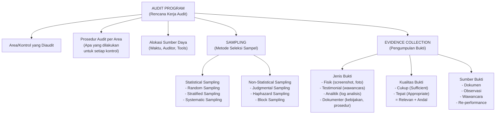

---

### 3. Pengantar Kontekstual

Dalam dunia nyata, tidak ada auditor yang dapat memeriksa 100% transaksi, log, atau konfigurasi yang ada dalam suatu organisasi. Sebuah bank dengan jutaan transaksi harian, ribuan akun pengguna, dan ratusan sistem tidak mungkin diaudit secara exhaustif dalam jangka waktu dan anggaran yang tersedia. Audit efektif bergantung pada kemampuan auditor untuk memilih sampel yang representatif dan mengumpulkan jenis bukti yang tepat dari sumber yang tepat.

Audit program adalah "peta jalan" operasional — ia menjabarkan setiap langkah yang akan dilakukan auditor untuk setiap area yang diaudit. Evidence collection plan mendefinisikan apa yang dicari, di mana mencarinya, dan bagaimana cara mengumpulkannya. Sampling yang buruk menghasilkan kesimpulan yang tidak valid meskipun bukti yang dikumpulkan secara individual akurat.

Pemahaman tentang metodologi sampling dan pengumpulan bukti adalah yang membedakan audit yang dapat memberikan opini yang dapat dipercaya dari audit yang hanya memberikan kesan pemeriksaan.

---

### 4. Landasan Teori

#### 4.1 Audit Program

**Definisi:** Audit program (juga disebut *audit work program* atau *audit procedure*) adalah dokumen yang menentukan langkah-langkah prosedural yang akan dilakukan auditor untuk setiap area atau kontrol yang diaudit. Ia adalah terjemahan operasional dari audit plan ke dalam tindakan konkret.

**Komponen Audit Program per Area:**

1. **Nomor referensi** — untuk penelusuran dan referensi silang
2. **Kontrol/persyaratan yang diuji** — misal: "ISO 27001 Annex A 8.2 — Privileged Access Rights"
3. **Tujuan pengujian** — apa yang ingin diverifikasi: "Verifikasi bahwa hak akses privileged diotorisasi, dikaji ulang secara berkala, dan dicabut ketika tidak lagi diperlukan"
4. **Prosedur audit** — langkah-langkah konkret yang akan dilakukan
5. **Sampel yang diperlukan** — jumlah dan jenis sampel
6. **Sumber bukti** — dokumen kebijakan, log sistem, personel yang diwawancara
7. **Alokasi waktu** — estimasi waktu yang diperlukan
8. **Auditor yang bertanggung jawab**
9. **Kolom untuk catatan temuan** — diisi selama pelaksanaan

**Contoh Entri Audit Program:**

```
Ref: AP-IAM-001
Kontrol: ISO 27001:2022 Annex A 5.18 — Access Rights
Tujuan: Verifikasi bahwa pemberian akses mengikuti prosedur otorisasi formal

Prosedur:
a) Minta daftar semua akun aktif dari sistem IAM (sampel: 30 akun — 15 privileged, 15 standard)
b) Untuk setiap akun dalam sampel: verifikasi ada form permintaan akses yang disetujui
c) Verifikasi akses sesuai dengan peran yang didefinisikan dalam RBAC policy
d) Minta laporan review akses terakhir (seharusnya dilakukan setiap 6 bulan)
e) Wawancara Kepala IT tentang prosedur onboarding dan offboarding

Sampel: 30 akun dari 847 total (sampling proporsional: privileged vs standard)
Sumber: IAM system export, HR system, Access request forms
Estimasi waktu: 4 jam
Auditor: Budi
Temuan: [diisi selama audit]
```

#### 4.2 Sampling dalam Audit

**Mengapa Sampling?**

Karena memeriksa seluruh populasi (100% testing) umumnya tidak praktis. Sampling memungkinkan auditor menarik kesimpulan tentang seluruh populasi berdasarkan subset yang terpilih. Kualitas kesimpulan bergantung pada representativitas sampel dan ukurannya.

**Terminologi Sampling:**

- **Populasi**: Semua item yang berpotensi dimasukkan dalam sampel (misalnya: semua 847 akun pengguna NDG)
- **Ukuran sampel (n)**: Jumlah item yang dipilih untuk diperiksa
- **Karakteristik yang diuji**: Atribut spesifik yang diperiksa dalam setiap item sampel
- **Error rate / deviation rate**: Proporsi item dalam sampel yang tidak memenuhi criteria (misalnya: 3 dari 30 akun tidak memiliki form otorisasi = deviation rate 10%)
- **Sampling risk**: Risiko bahwa kesimpulan berdasarkan sampel berbeda dari kesimpulan yang akan diperoleh jika seluruh populasi diperiksa

**Metode Statistical Sampling:**

*a) Random Sampling (Simple Random Sampling)*
Setiap item dalam populasi memiliki probabilitas yang sama untuk terpilih. Menggunakan tabel angka acak atau generator acak komputer.

Keunggulan: Representatif, dapat diekstrapolasi secara statistik.
Kelemahan: Tidak mempertimbangkan heterogenitas populasi; mungkin tidak efisien jika subkelompok risiko tinggi hanya sebagian kecil populasi.

*b) Stratified Sampling*
Populasi dibagi menjadi subkelompok (strata) berdasarkan karakteristik risiko, kemudian sampel diambil dari masing-masing strata.

Contoh: Dari 847 akun NDG, ada 50 akun privileged (risiko tinggi) dan 797 akun standar. Dengan stratified sampling: ambil 20 dari 50 privileged (40%) dan 20 dari 797 standar (2.5%) = 40 total. Ini memastikan akun privileged mendapat pemeriksaan yang lebih intensif sesuai risikonya.

Keunggulan: Lebih efisien untuk populasi heterogen dengan subkelompok risiko berbeda.

*c) Systematic Sampling*
Ambil setiap k-th item dari populasi (misalnya: setiap 10 akun). Mulai dari titik awal yang dipilih secara acak.

*d) Monetary Unit Sampling (MUS)*
Digunakan terutama dalam audit keuangan — probabilitas item terpilih proporsional dengan nilai monetarnya. Kurang relevan untuk audit keamanan teknis.

**Metode Non-Statistical Sampling:**

*a) Judgmental Sampling*
Auditor memilih item berdasarkan penilaian profesionalnya tentang apa yang paling relevan atau berisiko. Tidak dapat diekstrapolasi secara statistik, tetapi berguna ketika auditor memiliki pengetahuan khusus tentang area berisiko.

*b) Haphazard Sampling*
Mirip random sampling tetapi tanpa mekanisme formal — auditor memilih item "secara acak" tanpa sistem. Rentan terhadap bias tidak sadar. Tidak direkomendasikan untuk audit formal.

*c) Block Sampling*
Memilih blok item yang berurutan (misalnya: semua log untuk periode tertentu). Berguna untuk investigasi insiden tetapi tidak representatif untuk keseluruhan populasi.

**Berapa Ukuran Sampel yang Tepat?**

Tidak ada formula tunggal universal, tetapi faktor-faktor yang mempengaruhi:
- **Toleransi risiko**: Semakin rendah toleransi terhadap error, semakin besar sampel yang diperlukan
- **Ukuran populasi**: Untuk populasi besar, efek pada ukuran sampel minimal (hukum diminishing returns)
- **Expected deviation rate**: Jika expected error rate tinggi, sampel yang lebih besar diperlukan untuk deteksi yang andal
- **Risiko inherent area yang diaudit**: Area berisiko tinggi memerlukan sampel lebih besar

Panduan praktis untuk audit keamanan (non-statistik):
- Populasi < 50: Uji semua (100%)
- Populasi 50-250: Uji minimal 30-60 item
- Populasi > 250: Uji minimal 60 item atau gunakan statistical sampling

#### 4.3 Jenis dan Kualitas Bukti Audit

**Jenis Bukti Audit:**

*a) Bukti Fisik*
Hasil pengamatan langsung atau dokumentasi visual: foto lokasi server, screenshot konfigurasi sistem, foto akses fisik ke ruang server. Kelebihan: sangat konkret dan sulit disangkal. Keterbatasan: hanya merepresentasikan kondisi pada saat pengambilan bukti.

*b) Bukti Dokumenter*
Dokumen tertulis atau elektronik: kebijakan keamanan, prosedur, log sistem, laporan, kontrak, form otorisasi. Ini adalah jenis bukti yang paling umum dalam audit ISMS. Kelebihan: dapat dikompilasi, di-cross-reference, dan disimpan. Keterbatasan: dokumen dapat tidak mencerminkan praktik aktual ("kebijakan di atas kertas vs. praktik nyata").

*c) Bukti Testimonial*
Pernyataan dari individu yang diperoleh melalui wawancara. Kelebihan: dapat mengungkapkan praktik informal yang tidak terdokumentasi. Keterbatasan: rentan terhadap bias ingatan, keinginan untuk memberi kesan baik, atau tidak akuratnya informasi. Selalu triangulasi dengan jenis bukti lain.

*d) Bukti Analitik*
Hasil analisis, perbandingan, atau kalkulasi yang dilakukan auditor: analisis log untuk mendeteksi anomali akses, perbandingan konfigurasi dengan baseline, analisis tren insiden. Kelebihan: dapat mengungkapkan pola yang tidak terlihat dari pemeriksaan individual. Keterbatasan: kualitas bergantung pada kualitas data sumber dan metode analisis.

*e) Re-performance*
Auditor mengulang prosedur atau proses untuk memverifikasi bahwa hasilnya sesuai. Misalnya: mengikuti prosedur pemulihan password untuk memverifikasi bahwa proses verifikasi identitas berjalan sesuai prosedur. Kelebihan: bukti langsung bahwa kontrol berfungsi. Keterbatasan: memerlukan lebih banyak waktu dan kadang memerlukan kerjasama auditee.

**Kualitas Bukti Audit:**

Bukti yang baik harus memenuhi dua dimensi:

1. **Sufficient (Cukup)**: Kuantitas bukti memadai untuk mendukung kesimpulan. "Cukup" tidak berarti sebanyak mungkin — melainkan sebanyak yang diperlukan untuk auditor yang berpengalaman merasa yakin dengan kesimpulannya.

2. **Appropriate (Tepat)**: Kualitas bukti relevan dan andal.
   - *Relevan*: Bukti berkaitan langsung dengan pernyataan yang sedang diverifikasi
   - *Andal*: Bukti dapat dipercaya sebagai representasi akurat dari kondisi yang sebenarnya

**Hierarki Keandalan Bukti (dari paling andal ke kurang andal):**
1. Bukti yang diperoleh langsung oleh auditor (observasi, re-performance)
2. Bukti dari sumber eksternal yang independen (konfirmasi dari pihak ketiga)
3. Bukti dokumenter yang dihasilkan secara otomatis oleh sistem (log)
4. Bukti dokumenter yang dibuat oleh auditee (dokumen internal)
5. Bukti testimonial (pernyataan lisan)

**Triangulasi Bukti**

Untuk temuan kritis, gunakan minimal dua jenis bukti yang berbeda yang saling mendukung. Jika wawancara mengatakan "MFA diterapkan" dan log sistem juga menunjukkan MFA aktif, kepercayaan temuan lebih tinggi daripada hanya satu sumber.

#### 4.4 Evidence Collection Plan

Evidence collection plan adalah dokumen yang memetakan:
- Setiap kontrol/persyaratan yang akan diuji
- Jenis bukti yang diperlukan
- Sumber bukti spesifik
- Metode pengumpulan
- Personel yang akan diwawancara
- Dokumen yang akan diminta dari auditee

Dokumen ini sering disebut sebagai **Document Request List (DRL)** — daftar semua dokumen yang diminta dari auditee sebelum atau selama audit on-site.

---

### 5. Model atau Arsitektur

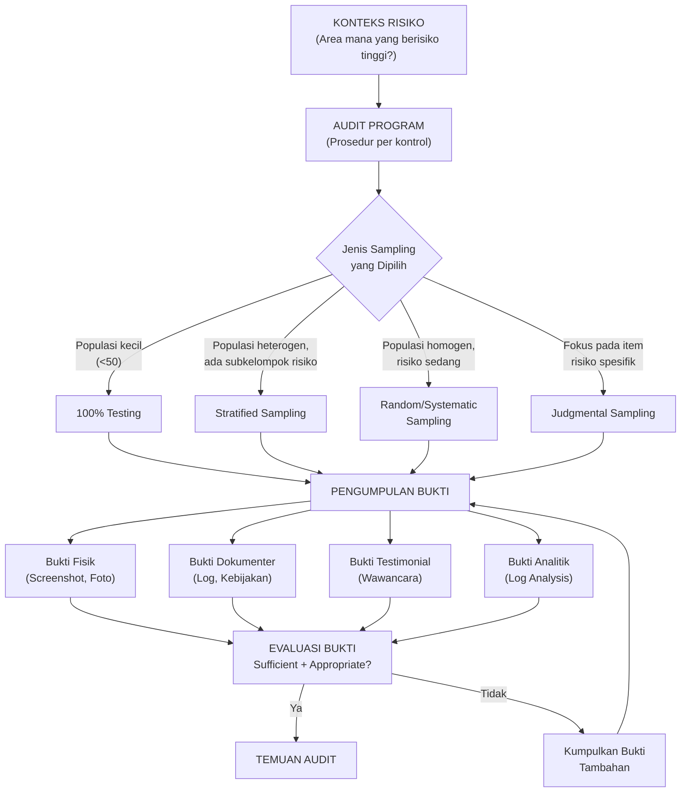

---

### 6. Contoh Terapan

**Skenario: Evidence Collection untuk Kontrol Manajemen Akses NDG**

**Konteks:** Tim audit NDG sedang mengevaluasi kontrol manajemen akses (ISO 27001:2022 Annex A 5.18 dan 8.2). Populasi: 847 akun pengguna total (50 akun privileged, 797 akun standar).

**Keputusan Sampling:**
- Akun privileged: Uji 25 dari 50 (50%) — judgmental dari posisi tertinggi risiko + random untuk sisanya
- Akun standar: Uji 25 dari 797 (3.1%) — random sampling

**Document Request List (DRL) yang Disiapkan:**

```
DOCUMENT REQUEST LIST — NDG-IA-2025-001
Area: Identity and Access Management

1. Export daftar semua akun aktif dari Active Directory (termasuk last login date)
2. Export daftar semua akun privileged (admin, superuser, service accounts)
3. Log review akses terakhir yang dilakukan (target: setiap 6 bulan)
4. Sampel 25 form permintaan akses untuk akun yang akan diuji
5. Offboarding checklist untuk 10 karyawan yang resign dalam 12 bulan terakhir
6. RBAC (Role-Based Access Control) policy versi terbaru
7. Log perubahan hak akses dalam 6 bulan terakhir
8. Laporan akun tidak aktif selama >90 hari
```

**Temuan Awal dari Evidence:**
- Dari 25 akun privileged: 3 tidak memiliki form otorisasi yang terisi lengkap, 2 akun ex-karyawan yang belum di-disable (bukti: log login terakhir sebelum tanggal pengunduran diri)
- Bukti triangulasi: wawancara dengan HR mengkonfirmasi proses offboarding tidak selalu mengirimkan notifikasi ke IT tepat waktu

---

### 7. Praktikum atau Aktivitas Terarah

**Judul Praktikum:** Penyusunan Audit Program dan Document Request List

**Tujuan Praktikum:**
- Mampu menyusun audit program yang operasional untuk area kontrol keamanan tertentu
- Mampu merancang strategi sampling yang sesuai
- Mampu menyusun Document Request List (DRL) yang komprehensif

**Prasyarat:** Menyelesaikan Bab 1-4.

**Lingkungan Lab:** Template audit program; skenario NDG.

**Langkah Kerja:**

*Tahap 1 — Penyusunan Audit Program (60 menit):*
Pilih satu dari dua area kontrol berikut dan susun audit program yang mencakup minimal 5 prosedur audit:
- Area A: Manajemen kerentanan (ISO 27001:2022 Annex A 8.8)
- Area B: Audit logging dan monitoring (ISO 27001:2022 Annex A 8.15)

Untuk setiap prosedur, sertakan: tujuan, langkah-langkah konkret, jenis sampel, sumber bukti, dan estimasi waktu.

*Tahap 2 — Keputusan Sampling (20 menit):*
Untuk area yang dipilih, tentukan:
- Populasi yang relevan (misalnya: semua sistem yang seharusnya di-patch, semua server yang seharusnya menghasilkan log)
- Metode sampling yang dipilih dan justifikasinya
- Ukuran sampel yang direkomendasikan

*Tahap 3 — Document Request List (20 menit):*
Buat DRL yang akan dikirimkan kepada auditee NDG 2 minggu sebelum audit on-site dimulai.

**Format Laporan:** Audit program (tabel) + keputusan sampling (narasi singkat) + DRL.

**Kriteria Keberhasilan:**
- Prosedur audit cukup detail untuk dilaksanakan tanpa penjelasan tambahan
- Keputusan sampling dijustifikasi berdasarkan risiko dan karakteristik populasi
- DRL mencakup semua dokumen yang diperlukan untuk menjalankan prosedur audit

---

### 8. Latihan Pemahaman

**Soal 1 (Pilihan Ganda):** Metode sampling yang paling tepat digunakan ketika populasi terdiri dari subkelompok dengan tingkat risiko yang sangat berbeda adalah:
- A. Simple Random Sampling
- B. Systematic Sampling
- C. Stratified Sampling
- D. Block Sampling

**Soal 2 (Pilihan Ganda):** Bukti yang paling andal dalam hirarki keandalan bukti audit adalah:
- A. Pernyataan lisan kepala IT dalam wawancara
- B. Dokumen kebijakan yang disediakan auditee
- C. Screenshot konfigurasi yang diambil langsung oleh auditor
- D. Email dari vendor yang dikonfirmasi oleh auditee

**Soal 3 (Esai Singkat):** Jelaskan apa yang dimaksud dengan "triangulasi bukti" dan mengapa ini penting dalam audit keamanan informasi.

**Soal 4 (Analisis Kasus):** Auditor mewawancarai Kepala IT NDG yang mengklaim bahwa "semua patch keamanan selalu diterapkan dalam 72 jam." Apakah pernyataan ini cukup sebagai bukti audit? Apa langkah selanjutnya yang harus dilakukan auditor?

**Soal 5 (Perancangan):** Rancang strategi sampling untuk audit kontrol manajemen akses di sebuah bank dengan 3.000 karyawan (200 akun privileged, 2.800 akun standar). Jelaskan metode sampling yang dipilih untuk masing-masing kelompok dan ukuran sampel yang direkomendasikan.

---

### 9. Latihan Terapan / Studi Kasus

**Studi Kasus 1: Evidence yang Bertentangan**

Tim audit NDG sedang memverifikasi kontrol manajemen patch (ISO 27001 Annex A 8.8). Kepala IT menyatakan dalam wawancara bahwa "semua patch kritis diterapkan dalam 14 hari." Tim audit meminta dan mendapat laporan patch management dari sistem manajemen patch. Laporan menunjukkan 97% kepatuhan. Namun, ketika auditor melakukan scanning independen terhadap 5 server sampel menggunakan tool vulnerability assessment berotorisasi, 2 dari 5 server menunjukkan patch kritis yang belum diterapkan berusia 45 dan 67 hari.

*Pertanyaan:*
1. Jenis bukti apa yang dikumpulkan dalam skenario ini? Klasifikasikan masing-masing.
2. Mengapa ada perbedaan antara laporan sistem patch management dan hasil scanning? Apa implikasinya?
3. Mana bukti yang lebih andal — laporan dari sistem atau hasil scanning langsung? Jelaskan mengapa.
4. Apa kesimpulan audit yang tepat berdasarkan evidence yang ada?
5. Apa tindakan lanjutan yang harus dilakukan auditor sebelum membuat kesimpulan final?

**Studi Kasus 2: Desain Audit Program**

Anda diminta menyusun audit program untuk mengevaluasi kontrol keamanan fisik data center NDG (ISO 27001:2022 Annex A 7.1-7.13 — Physical and Environmental Security). Data center NDG berlokasi di lantai 3 gedung kantor pusat, berisi 50 server dan 10 network device, dengan 15 personel yang memiliki akses resmi.

*Pertanyaan:*
1. Identifikasi setidaknya 5 kontrol spesifik yang perlu diaudit dalam area keamanan fisik.
2. Untuk setiap kontrol, tentukan prosedur audit yang akan dilakukan (jenis bukti yang dikumpulkan, metode pengumpulan).
3. Susun DRL yang akan dikirimkan kepada auditee 2 minggu sebelum kunjungan on-site.
4. Identifikasi risiko audit yang mungkin muncul saat melakukan audit fisik data center dan bagaimana mitigasinya.

---

### 10. Kunci Jawaban dan Pembahasan

**Jawaban Soal 1:** **C — Stratified Sampling.**

*Pembahasan:* Stratified sampling membagi populasi menjadi subkelompok berdasarkan karakteristik (dalam kasus ini, tingkat risiko) dan mengambil sampel dari masing-masing subkelompok. Ini memastikan bahwa subkelompok berisiko tinggi mendapat representasi yang memadai dalam sampel, meskipun ukurannya kecil relatif terhadap populasi total. Simple random sampling (A) tidak mempertimbangkan heterogenitas populasi. Systematic sampling (B) mengambil setiap k-th item, yang mungkin under-represent subkelompok kecil tapi berisiko tinggi. Block sampling (D) mengambil blok item berurutan, berguna untuk investigasi temporal tetapi bukan untuk populasi heterogen.

**Jawaban Soal 2:** **C — Screenshot konfigurasi yang diambil langsung oleh auditor.**

*Pembahasan:* Dalam hirarki keandalan bukti, bukti yang diperoleh langsung oleh auditor (observasi, re-performance) adalah yang paling andal karena tidak bergantung pada mediasi pihak ketiga yang dapat memodifikasi atau menyajikan informasi secara selektif. Screenshot yang diambil langsung oleh auditor di sistem yang berjalan tidak dapat dimanipulasi setelah fakta (berbeda dengan dokumen yang bisa dibuat khusus untuk audit). Pernyataan lisan (A) adalah bukti testimonial yang paling rentan terhadap bias dan ketidakakuratan. Dokumen kebijakan dari auditee (B) adalah bukti dokumenter yang dapat dimodifikasi. Email dari vendor yang dikonfirmasi auditee (D) lebih andal dari testimoni lisan, tetapi masih bergantung pada pihak ketiga.

**Jawaban Soal 3 (Esai Singkat):**

Triangulasi bukti adalah praktik menggunakan minimal dua jenis atau sumber bukti yang berbeda untuk mendukung kesimpulan yang sama. Konsep ini diambil dari navigasi dan survei — titik yang ditentukan dari dua sudut berbeda lebih akurat daripada dari satu sudut saja.

Pentingnya dalam audit keamanan:
1. **Mengurangi risiko sampling**: Satu jenis bukti mungkin tidak mewakili kondisi sebenarnya — triangulasi meningkatkan kepercayaan.
2. **Mengidentifikasi inkonsistensi**: Jika dua jenis bukti bertentangan, ini sendiri adalah temuan signifikan yang perlu diinvestigasi lebih lanjut.
3. **Menangkal manipulasi**: Auditor yang hanya mengandalkan dokumen yang disediakan auditee rentan terhadap penyajian informasi yang selektif. Bukti dari sumber independen (observasi langsung, log sistem) lebih sulit dimanipulasi.
4. **Memperkuat kesimpulan**: Temuan yang didukung oleh beberapa jenis bukti yang konsisten jauh lebih sulit untuk disangkal oleh auditee dalam proses respons laporan.

**Jawaban Soal 4 (Analisis Kasus):**

Pernyataan dari wawancara TIDAK cukup sebagai bukti audit — ini adalah bukti testimonial yang paling rendah dalam hierarki keandalan. Langkah selanjutnya yang harus dilakukan auditor:

1. Minta log manajemen patch untuk periode 12 bulan terakhir — ini akan menunjukkan tanggal patch dirilis dan tanggal diterapkan ke setiap sistem
2. Cross-reference dengan CVE/vendor security bulletins untuk mengidentifikasi kapan patch kritis dirilis
3. Ambil sampel sistem (misalnya 10-15 server dari berbagai kritisitas) dan bandingkan versi patch yang terpasang dengan patch terbaru yang tersedia
4. Minta laporan dari sistem patch management (WSUS, SCCM, atau setara) tentang compliance rate
5. Wawancara follow-up dengan anggota tim operasional (bukan hanya kepala IT) tentang proses aktual

**Jawaban Soal 5 (Perancangan):**

Strategi sampling untuk bank dengan 3.000 karyawan:

*Akun Privileged (200 akun — risiko sangat tinggi):*
- Metode: Stratified Sampling + Full Review untuk subset kritis
- Sub-strata: System administrators (misalnya 30 orang) → uji 100%; Domain admins (misalnya 10 orang) → uji 100%; Application admins (160 orang) → uji 40 secara random
- Total sampel privileged: sekitar 80 akun (40%)
- Justifikasi: Kompromi akun privileged memiliki dampak sangat tinggi; sampling yang lebih intensif diperlukan.

*Akun Standar (2.800 akun — risiko lebih rendah):*
- Metode: Stratified Sampling berdasarkan departemen
- Sub-strata: Departemen risiko tinggi (Treasury, IT, Risk — 400 akun) → 15%; Departemen lain (2.400 akun) → 5%
- Total sampel standar: sekitar 60 + 120 = 180 akun
- Justifikasi: Proporsi lebih besar dari departemen berisiko tinggi karena akses ke sistem sensitif lebih besar.

Total sampel: sekitar 260 dari 3.000 (8.7%)

**Jawaban Studi Kasus 1:**

1. **Klasifikasi jenis bukti:**
   - Pernyataan kepala IT: Bukti testimonial
   - Laporan dari sistem patch management: Bukti dokumenter (dihasilkan sistem — lebih andal dari dokumen manual)
   - Hasil scanning tool: Bukti analitik yang diperoleh langsung oleh auditor (paling andal)

2. **Alasan perbedaan dan implikasi:** Kemungkinan penyebab: (a) sistem patch management tidak mencakup semua server (misalnya server legacy tidak ter-manage oleh WSUS); (b) laporan sistem menunjukkan "sudah dijadwalkan" atau "sudah diunduh" tetapi belum benar-benar diterapkan; (c) ada konfigurasi yang mengecualikan beberapa server dari manajemen patch terpusat. Implikasi: laporan 97% kepatuhan mungkin tidak merefleksikan kondisi keamanan aktual.

3. **Bukti yang lebih andal:** Hasil scanning langsung oleh auditor lebih andal karena: (a) diperoleh langsung, tidak bergantung pada auditee; (b) mencerminkan kondisi aktual sistem pada saat pemeriksaan; (c) tidak dapat dimodifikasi setelah fakta; (d) jauh lebih sulit untuk auditor "tertipu" oleh data yang mungkin tidak akurat.

4. **Kesimpulan audit yang tepat:** Berdasarkan evidence yang ada, ada ketidaksesuaian (*nonconformity*) terhadap persyaratan manajemen patch: setidaknya 2 server kritis memiliki patch yang belum diterapkan melebihi batas waktu yang diklaim (14 hari). Laporan sistem patch management tidak akurat mencerminkan kondisi sebenarnya.

5. **Tindakan lanjutan:** (a) Perluas sampel scanning ke lebih banyak server (misalnya 20 total) untuk mendapatkan gambaran lebih representatif; (b) Wawancara tim operasional tentang alasan inkonsistensi; (c) Investigasi apakah semua server tercakup dalam sistem manajemen patch terpusat; (d) Dokumentasikan semua bukti dengan timestamp dan chain of custody yang jelas.

**Jawaban Studi Kasus 2:**

1. **Lima kontrol keamanan fisik yang perlu diaudit:**
   - A 7.1: Perimeter keamanan fisik (apakah ada kontrol akses ke area data center?)
   - A 7.2: Kontrol akses fisik (sistem akses kartu, log akses)
   - A 7.4: Monitoring keamanan fisik (CCTV, deteksi intrusi)
   - A 7.6: Bekerja di area aman (prosedur untuk personel yang bekerja di data center)
   - A 7.12: Keamanan kabel (manajemen kabel, perlindungan dari gangguan)
   - A 7.11: Utilitas pendukung (UPS, AC, pemadam kebakaran)

2. **Prosedur audit per kontrol:**
   - A 7.2 (Kontrol Akses): Observasi langsung pintu masuk data center; minta log akses 3 bulan terakhir; bandingkan daftar 15 personel yang punya akses resmi dengan log aktual; wawancara penanggung jawab fisik.
   - A 7.4 (Monitoring): Verifikasi operasional CCTV (observasi + minta rekaman sample); minta laporan alert monitoring selama 6 bulan; verifikasi cakupan CCTV (semua sudut kritis terlindungi).

3. **DRL untuk keamanan fisik:**
   - Daftar 15 personel yang memiliki hak akses fisik ke data center
   - Log akses fisik (kartu/biometrik) 3 bulan terakhir
   - Rekaman CCTV sampel (1 hari representatif per bulan selama 3 bulan)
   - Laporan maintenance UPS dan AC 12 bulan terakhir
   - Prosedur/SOP untuk bekerja di data center
   - Hasil last fire drill dan pengujian pemadam kebakaran

4. **Risiko audit dan mitigasi:**
   - *Risiko gangguan operasional*: Kunjungan fisik ke data center bisa mengganggu operasional server → Mitigasi: jadwalkan di luar jam puncak; minta pendamping teknis; tidak menyentuh perangkat tanpa izin eksplisit.
   - *Risiko keamanan fisik auditor*: Masuk ke area dengan peralatan listrik bertegangan tinggi → Mitigasi: ikuti prosedur keselamatan, gunakan APD jika diperlukan, hanya masuk bersama pendamping.
   - *Risiko keterbatasan akses*: Auditee mungkin membatasi akses karena pertimbangan keamanan → Mitigasi: tetapkan hak akses dalam audit charter; dokumentasikan pembatasan sebagai scope limitation.

---

### 11. Ringkasan Bab

Audit program adalah terjemahan operasional dari audit plan — ia menentukan langkah-langkah konkret yang akan dilakukan untuk setiap kontrol. Sampling adalah keterampilan inti yang memungkinkan auditor menarik kesimpulan tentang populasi besar berdasarkan subset yang representatif; stratified sampling adalah pendekatan paling efisien untuk populasi heterogen dengan subkelompok risiko yang berbeda. Jenis bukti audit beragam — dari fisik hingga testimonial — dengan hierarki keandalan yang menempatkan observasi langsung dan bukti dari sistem sebagai yang paling andal. Triangulasi bukti adalah praktik terbaik yang meningkatkan kepercayaan kesimpulan dan mengidentifikasi inkonsistensi yang signifikan. Evidence collection plan dan Document Request List (DRL) memastikan audit berjalan efisien dengan mempersiapkan sumber daya yang diperlukan sebelum on-site.

---

### 12. Refleksi Profesional

1. **Sampling Risk dan Tanggung Jawab Profesional**: Ketika seorang auditor mengambil sampel dan menyimpulkan bahwa kontrol "efektif" berdasarkan sampel tersebut, tetapi kemudian terjadi insiden keamanan yang ternyata berhubungan dengan kelemahan yang tidak terdeteksi dalam non-sampel — siapa yang bertanggung jawab? Bagaimana auditor melindungi diri dari klaim kelalaian profesional?

2. **Bukti Digital dan Chain of Custody**: Dalam era cloud, bukti audit semakin berbentuk digital (log, konfigurasi file, screenshot). Bagaimana auditor memastikan integritas bukti digital — bahwa log yang diberikan auditee tidak dimodifikasi, dan screenshot mencerminkan kondisi aktual? Kapan chain of custody mulai diperlukan dalam konteks audit (berbeda dari investigasi forensik)?

3. **Keterbatasan Akses dan Etika Pengujian**: Dalam beberapa kasus, pengujian kontrol yang paling efektif (misalnya mencoba bypass kontrol akses fisik atau menguji respons alarm) dapat mengganggu operasional atau menimbulkan risiko. Di mana batas antara pengujian yang sah dan gangguan yang tidak dapat diterima? Siapa yang berwenang memutuskan batas ini?

---

## Bab 5 — Kerangka Kontrol: ISO 27001/27002 dan NIST SP 800-53

### 1. Capaian Pembelajaran Bab

Setelah menyelesaikan bab ini, mahasiswa mampu:
- Menjelaskan struktur dan hierarki persyaratan ISO/IEC 27001:2022 (Klausul 4-10 dan Annex A) (C2)
- Membedakan peran ISO/IEC 27001 (persyaratan) dengan ISO/IEC 27002 (panduan implementasi) dalam konteks audit (C2)
- Mengidentifikasi keluarga kontrol utama dalam NIST SP 800-53 Rev.5 dan relevansinya dengan area keamanan (C2)
- Menganalisis persamaan dan perbedaan pendekatan ISO 27001/27002 dengan NIST SP 800-53 untuk tujuan pemetaan kontrol (C4)

*Dikaitkan dengan Sub-CPMK.3 (Pertemuan 5) dan Evaluasi Eval-3 (15%).*

---

### 2. Peta Konsep Bab

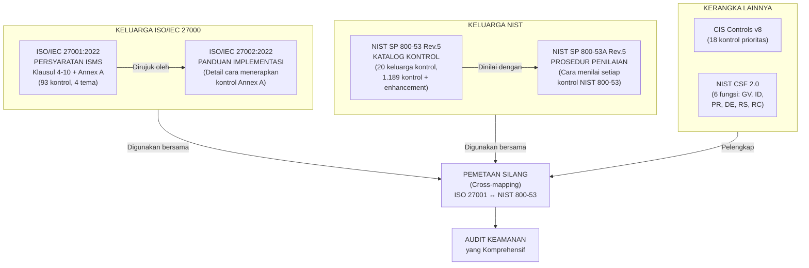

---

### 3. Pengantar Kontekstual

Seorang auditor keamanan informasi yang tidak memahami kerangka kontrol yang menjadi kriteria auditnya seperti hakim yang tidak memahami hukum yang harus diterapkannya. ISO/IEC 27001:2022, ISO/IEC 27002:2022, dan NIST SP 800-53 Rev.5 adalah tiga standar yang paling banyak digunakan dalam audit keamanan informasi global — dan memahami struktur, logika, dan hubungan di antara ketiganya adalah kompetensi inti auditor profesional.

Pembaruan besar terjadi pada kedua keluarga standar ini dalam beberapa tahun terakhir: ISO/IEC 27001 dan 27002 diperbarui ke versi 2022, membawa restrukturisasi signifikan pada kontrol (dari 114 menjadi 93 kontrol dalam 4 tema). NIST SP 800-53 mencapai Revisi 5 dengan penambahan keluarga Supply Chain Risk Management (SR) dan Privacy Controls yang terintegrasi. Auditor harus memahami perubahan ini agar analisisnya relevan dengan kerangka standar saat ini.

---

### 4. Landasan Teori

#### 4.1 ISO/IEC 27001:2022 — Persyaratan ISMS

ISO/IEC 27001:2022 adalah standar internasional yang menetapkan **persyaratan** untuk menetapkan, menerapkan, memelihara, dan meningkatkan secara berkelanjutan Sistem Manajemen Keamanan Informasi (ISMS/SMKI). Kata kunci: **persyaratan** (*shall*) — setiap klausul menggunakan bahasa imperatif yang menunjukkan kewajiban untuk sertifikasi.

**Struktur ISO/IEC 27001:2022:**

*Klausul 1-3*: Ruang lingkup, referensi normatif, dan istilah (tidak diaudit secara langsung)

*Klausul 4 — Konteks Organisasi*:
- 4.1: Memahami organisasi dan konteksnya (faktor internal & eksternal)
- 4.2: Memahami kebutuhan dan harapan pihak yang berkepentingan
- 4.3: Menentukan ruang lingkup ISMS
- 4.4: ISMS (sistem manajemen harus ditetapkan)

*Klausul 5 — Kepemimpinan*:
- 5.1: Kepemimpinan dan komitmen manajemen puncak
- 5.2: Kebijakan keamanan informasi
- 5.3: Peran, tanggung jawab, dan wewenang organisasi

*Klausul 6 — Perencanaan*:
- 6.1: Tindakan untuk mengatasi risiko dan peluang (risk assessment & risk treatment)
- 6.2: Tujuan keamanan informasi dan perencanaan untuk mencapainya
- 6.3 (baru di 2022): Perencanaan perubahan

*Klausul 7 — Dukungan*:
- 7.1-7.5: Sumber daya, kompetensi, kesadaran, komunikasi, dan informasi terdokumentasi

*Klausul 8 — Operasi*:
- 8.1: Perencanaan dan pengendalian operasional
- 8.2: Penilaian risiko keamanan informasi (risk assessment dilaksanakan)
- 8.3: Perlakuan risiko keamanan informasi

*Klausul 9 — Evaluasi Kinerja*:
- 9.1: Monitoring, pengukuran, analisis, dan evaluasi
- 9.2: Audit internal
- 9.3: Tinjauan manajemen

*Klausul 10 — Peningkatan*:
- 10.1: Peningkatan berkelanjutan
- 10.2: Nonconformity dan tindakan korektif

*Annex A — Kontrol Keamanan Informasi (2022):*
Annex A 2022 merestrukturisasi kontrol ke dalam **4 tema**:
1. **Tema Organisasi (Organizational)**: A.5 — 37 kontrol (kebijakan, peran, manajemen aset, manajemen pemasok, dsb.)
2. **Tema Orang (People)**: A.6 — 8 kontrol (skrining, keamanan SDM, perjanjian kerahasiaan)
3. **Tema Fisik (Physical)**: A.7 — 14 kontrol (perimeter fisik, akses fisik, pengamanan peralatan)
4. **Tema Teknologi (Technological)**: A.8 — 34 kontrol (kontrol akses, enkripsi, keamanan jaringan, manajemen kerentanan)

**Perubahan Utama 2022 vs. 2013:**
- Total kontrol berkurang dari 114 menjadi 93 (penggabungan dan restrukturisasi)
- 11 kontrol baru ditambahkan (termasuk: threat intelligence, ICT readiness for business continuity, physical security monitoring, configuration management, information deletion, data masking, web filtering, secure coding)
- Atribut baru untuk setiap kontrol: control type, information security properties, cybersecurity concepts, operational capabilities, security domains

#### 4.2 ISO/IEC 27002:2022 — Panduan Implementasi

ISO/IEC 27002:2022 adalah **panduan** (bukan persyaratan) yang menyediakan detail tentang cara menerapkan kontrol dalam Annex A ISO 27001. Untuk setiap kontrol, ISO 27002 menyediakan:
- **Kontrol** (pernyataan ringkas)
- **Tujuan** (mengapa kontrol ini diperlukan)
- **Panduan implementasi** (bagaimana menerapkannya)
- **Informasi lainnya** (konteks tambahan)
- **Atribut kontrol** (#tag untuk kategorisasi)

**Peran dalam Audit:**
ISO 27002 bukan dokumen yang diaudit secara langsung — sertifikasi ISO 27001 tidak mensyaratkan kepatuhan terhadap setiap rekomendasi ISO 27002. Namun, dalam audit yang mengevaluasi *kualitas* implementasi kontrol, ISO 27002 menyediakan referensi "good practice" yang berguna. Auditor dapat menggunakan ISO 27002 sebagai dasar untuk menilai apakah pendekatan yang dipilih organisasi memadai — meskipun berbeda dari panduan ISO 27002 — selama memenuhi tujuan kontrol.

#### 4.3 NIST SP 800-53 Rev.5 — Katalog Kontrol Keamanan

NIST SP 800-53 Rev.5 adalah katalog kontrol keamanan dan privasi yang dikembangkan oleh National Institute of Standards and Technology (NIST) AS. Meskipun awalnya ditujukan untuk sistem informasi federal AS, standar ini diadopsi secara luas secara global karena komprehensivitas dan kedalamannya.

**Struktur NIST SP 800-53 Rev.5:**

**20 Keluarga Kontrol:**

| Kode | Nama Keluarga | Contoh Kontrol |
|------|---------------|----------------|
| AC | Access Control | AC-1 (Policy), AC-2 (Account Mgmt), AC-17 (Remote Access) |
| AT | Awareness and Training | AT-2 (Literacy Training), AT-3 (Role-Based Training) |
| AU | Audit and Accountability | AU-2 (Event Logging), AU-9 (Protection of Audit Info) |
| CA | Assessment, Authorization, and Monitoring | CA-2 (Control Assessments), CA-7 (Continuous Monitoring) |
| CM | Configuration Management | CM-6 (Config Settings), CM-8 (System Inventory) |
| CP | Contingency Planning | CP-9 (System Backup), CP-10 (Recovery) |
| IA | Identification and Authentication | IA-2 (Identification & Auth), IA-5 (Authenticator Mgmt) |
| IR | Incident Response | IR-4 (Incident Handling), IR-8 (Incident Response Plan) |
| MA | Maintenance | MA-2 (Controlled Maintenance) |
| MP | Media Protection | MP-4 (Media Storage), MP-7 (Media Use) |
| PE | Physical and Environmental Protection | PE-2 (Physical Access Auth), PE-6 (Monitoring Physical Access) |
| PL | Planning | PL-2 (System Security Plans) |
| PM | Program Management | PM-1 (Info Security Program Plan) |
| PS | Personnel Security | PS-3 (Personnel Screening), PS-4 (Termination) |
| PT | Personally Identifiable Information Processing | PT-2 (Authority to Process PII) |
| RA | Risk Assessment | RA-3 (Risk Assessment), RA-5 (Vulnerability Monitoring) |
| SA | System and Services Acquisition | SA-3 (SDLC), SA-11 (Developer Testing) |
| SC | System and Communications Protection | SC-7 (Boundary Protection), SC-28 (Protection at Rest) |
| SI | System and Information Integrity | SI-2 (Flaw Remediation), SI-3 (Malicious Code Protection) |
| SR | Supply Chain Risk Management | SR-3 (Supply Chain Controls), SR-11 (Component Authenticity) |

**Tingkat Baseline Kontrol:**
NIST SP 800-53 mendefinisikan tiga baseline berdasarkan dampak sistem:
- **Low Baseline**: Sistem dengan dampak rendah jika terkompromasi
- **Moderate Baseline**: Sistem dengan dampak sedang
- **High Baseline**: Sistem dengan dampak tinggi (infrastruktur kritis, data sangat sensitif)

**NIST SP 800-53A Rev.5 — Prosedur Penilaian:**
Pasangan dari 800-53, dokumen ini menyediakan prosedur penilaian (*assessment procedures*) untuk setiap kontrol, termasuk:
- Metode penilaian: Interview, Examine, Test
- Objek yang harus diperiksa
- Pertanyaan yang harus diajukan dalam wawancara
- Pengujian yang harus dilakukan

Ini adalah panduan operasional yang sangat berguna bagi auditor yang menggunakan NIST sebagai criteria.

#### 4.4 Pemetaan Silang: ISO 27001 ↔ NIST SP 800-53

Banyak organisasi harus memenuhi lebih dari satu standar. Pemahaman tentang pemetaan silang memungkinkan efisiensi audit dan kepatuhan terhadap beberapa kerangka sekaligus.

**Contoh Pemetaan (parsial):**

| ISO 27001:2022 | ISO 27001 Tema | NIST SP 800-53 Rev.5 |
|----------------|----------------|----------------------|
| A.5.15 (Access Control) | Organizational | AC-1, AC-2, AC-3 |
| A.8.2 (Privileged Access Rights) | Technological | AC-6 (Least Privilege) |
| A.8.15 (Logging) | Technological | AU-2, AU-3, AU-9 |
| A.8.8 (Management of Technical Vulnerabilities) | Technological | RA-5, SI-2 |
| A.6.3 (Information Security Awareness) | People | AT-2, AT-3 |
| A.7.2 (Physical Access Controls) | Physical | PE-2, PE-3 |

**Catatan penting:** Pemetaan ini tidak selalu 1:1. Satu kontrol ISO mungkin dipetakan ke beberapa kontrol NIST, dan sebaliknya. Gunakan pemetaan resmi seperti yang diterbitkan oleh NIST (dalam lampiran NIST SP 800-53 Rev.5) sebagai referensi.

#### 4.5 Kerangka Pelengkap: NIST CSF 2.0 dan CIS Controls

**NIST Cybersecurity Framework (CSF) 2.0:**
Diperbarui pada Februari 2024, CSF 2.0 kini memiliki **6 fungsi** (CSF 1.1 hanya 5):
1. **Govern (GV)** — baru: strategi, kebijakan, peran, risiko, pengawasan
2. **Identify (ID)** — inventarisasi aset, manajemen risiko
3. **Protect (PR)** — kontrol akses, awareness, keamanan data, enkripsi
4. **Detect (DE)** — monitoring, analisis anomali
5. **Respond (RS)** — perencanaan respons, komunikasi, analisis
6. **Recover (RC)** — pemulihan, peningkatan

CSF lebih bersifat "framework" (kerangka kerja) daripada standar teknis — ia memetakan ke NIST SP 800-53 dan standar lain untuk implementasi teknis.

**CIS Controls v8:**
18 kontrol yang diprioritaskan berdasarkan efektivitas terhadap ancaman nyata:
- Implementation Groups: IG1 (basic), IG2 (foundational), IG3 (organizational)
- IG1 (56 Safeguards): Kontrol paling dasar yang harus dimiliki semua organisasi
- Setiap Safeguard dipetakan ke NIST CSF dan NIST SP 800-53

---

### 5. Model atau Arsitektur

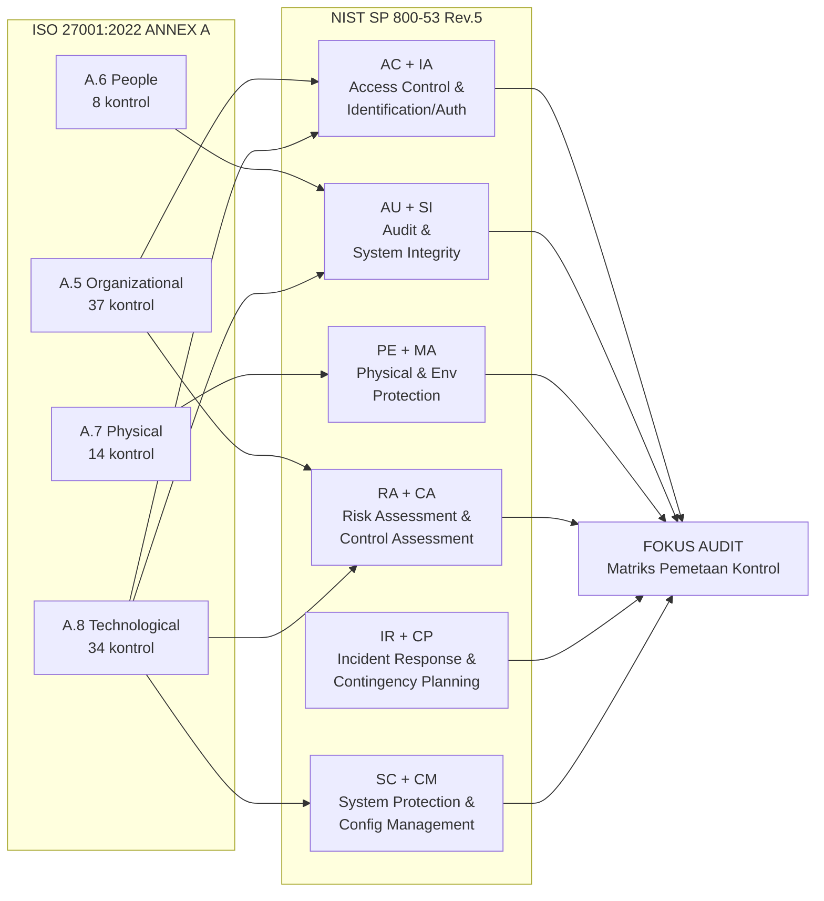

---

### 6. Contoh Terapan

**Skenario: NDG Memilih Kerangka Kontrol untuk Audit ISMS**

NDG harus memenuhi dua persyaratan sekaligus: (1) sertifikasi ISO/IEC 27001:2022 untuk meyakinkan mitra bisnis internasional, dan (2) audit kepatuhan terhadap regulasi OJK yang mengacu pada NIST SP 800-53 sebagai referensi tambahan. Tim keamanan NDG perlu memahami bagaimana kedua kerangka ini saling berhubungan untuk menghindari duplikasi effort.

**Pendekatan yang Dipilih NDG:**
1. ISO 27001:2022 menjadi kerangka primer (untuk sertifikasi)
2. NIST SP 800-53 digunakan sebagai referensi pengayaan — untuk kontrol yang memerlukan detail implementasi lebih dalam dari yang disediakan ISO 27002
3. CIS Controls IG1 digunakan sebagai "floor" minimum — memastikan semua 56 Safeguard dasar sudah ada sebelum masuk ke audit komprehensif

**Temuan dari Pemetaan:**
Ketika tim NDG memetakan kontrol mereka:
- Kontrol akses (ISO A.5.15, A.8.2) → NIST AC-1, AC-2, AC-6: NDG memiliki kebijakan akses (sesuai), tapi review akses berkala (AC-2(j)) belum dilakukan konsisten
- Logging (ISO A.8.15) → NIST AU-2, AU-3: Log diaktifkan, tapi tidak semua event kritis terdaftar dalam log policy (kesenjangan)
- Manajemen kerentanan (ISO A.8.8) → NIST RA-5, SI-2: Scanning dilakukan, tapi tidak ada prosedur formal untuk remediation timeline

---

### 7. Praktikum atau Aktivitas Terarah

**Judul Praktikum:** Analisis Kerangka Kontrol dan Pemetaan Silang

**Tujuan Praktikum:**
- Mampu mengidentifikasi kontrol ISO 27001:2022 Annex A yang relevan untuk skenario tertentu
- Mampu memetakan kontrol ISO 27001 ke keluarga kontrol NIST SP 800-53 yang sesuai
- Mampu mengidentifikasi kesenjangan kontrol berdasarkan kerangka yang dipilih

**Prasyarat:** Memiliki akses ke dokumen ISO/IEC 27001:2022 (atau ringkasannya) dan daftar keluarga kontrol NIST SP 800-53 Rev.5.

**Langkah Kerja:**

*Tahap 1 — Identifikasi Kontrol Relevan (30 menit):*
Untuk skenario NDG (layanan keuangan digital), identifikasi 10 kontrol ISO 27001:2022 Annex A yang paling kritis berdasarkan risiko bisnis NDG. Justifikasikan pemilihan setiap kontrol.

*Tahap 2 — Pemetaan Silang (30 menit):*
Untuk setiap kontrol ISO yang dipilih, identifikasi keluarga kontrol NIST SP 800-53 yang paling relevan. Gunakan tabel pemetaan sebagai output.

*Tahap 3 — Gap Analysis Awal (20 menit):*
Berdasarkan deskripsi NDG yang disediakan dosen, identifikasi 3 kontrol yang kemungkinan memiliki kesenjangan dan jelaskan mengapa.

**Format Laporan:** Tabel 10 kontrol + pemetaan silang + narasi gap analysis awal.

**Kriteria Keberhasilan:**
- 10 kontrol ISO dipilih dengan justifikasi berbasis risiko
- Pemetaan silang akurat (minimal 80% sesuai dengan referensi resmi)
- Gap analysis menunjukkan pemahaman tentang persyaratan kontrol

---

### 8. Latihan Pemahaman

**Soal 1 (Pilihan Ganda):** ISO/IEC 27001:2022 Annex A merestrukturisasi kontrol menjadi berapa tema?
- A. 2 tema (teknis dan non-teknis)
- B. 3 tema (organisasional, orang, teknologi)
- C. 4 tema (organisasional, orang, fisik, teknologi)
- D. 5 tema (sesuai NIST CSF 2.0)

**Soal 2 (Pilihan Ganda):** Perbedaan utama antara ISO/IEC 27001 dan ISO/IEC 27002 dalam konteks audit adalah:
- A. 27001 diaudit untuk sertifikasi; 27002 adalah panduan implementasi yang tidak diaudit secara langsung
- B. 27001 untuk perusahaan besar; 27002 untuk UKM
- C. 27001 untuk kontrol teknis; 27002 untuk kontrol manajemen
- D. 27001 adalah standar wajib; 27002 tidak diperlukan jika sudah ada 27001

**Soal 3 (Esai Singkat):** Jelaskan mengapa NIST SP 800-53A Rev.5 penting bagi auditor yang menggunakan NIST SP 800-53 sebagai kriteria audit, dan apa yang membedakannya dari 800-53.

**Soal 4 (Analisis Kasus):** Sebuah perusahaan startup fintech ingin memilih antara ISO 27001 dan NIST SP 800-53 sebagai kerangka kontrol primer untuk audit keamanan pertama mereka. Faktor apa saja yang harus dipertimbangkan dalam pemilihan ini?

**Soal 5 (Perbandingan):** Bandingkan pendekatan NIST CSF 2.0 dengan ISO 27001:2022 dalam hal tujuan, struktur, dan penggunaan yang tepat. Kapan menggunakan CSF dan kapan menggunakan ISO 27001?

---

### 9. Latihan Terapan / Studi Kasus

**Studi Kasus 1: Audit Multi-Framework**

NDG mendapat mandat audit dari dua pihak berbeda: Dewan Direksi menginginkan audit ISO 27001:2022, sementara OJK mengharuskan penilaian terhadap sejumlah kontrol dari NIST SP 800-53 Rev.5. Tim audit memiliki anggaran dan waktu untuk satu siklus audit.

*Pertanyaan:*
1. Bagaimana tim audit dapat merancang satu audit program yang secara efisien memenuhi kedua mandat tersebut?
2. Identifikasi 5 area kontrol di mana pemetaan silang ISO 27001 ↔ NIST 800-53 memungkinkan pengujian tunggal yang memenuhi kedua persyaratan.
3. Apa yang harus dilakukan jika persyaratan dari kedua kerangka berkonflik (misalnya, ISO 27001 mensyaratkan sesuatu yang tidak ada dalam NIST, atau sebaliknya)?

**Studi Kasus 2: Evaluasi Implementasi Kontrol**

Kontrol ISO 27001:2022 A.8.2 menyatakan: "Hak akses dengan hak istimewa harus dibatasi dan dikelola." ISO 27002 merekomendasikan: review berkala, Just-in-Time access untuk akun privileged, pemisahan akun privileged dari akun harian.

NDG saat ini:
- Memiliki kebijakan yang mewajibkan review akses setiap 6 bulan
- Review terakhir dilakukan 8 bulan lalu
- 15% akun privileged dimiliki oleh staf yang sudah resign
- Tidak mengimplementasikan Just-in-Time access (tidak ada di kebijakan mereka)

*Pertanyaan:*
1. Evaluasi kesesuaian NDG terhadap ISO 27001:2022 A.8.2. Apakah ini nonconformity?
2. Apakah ketidakadaan Just-in-Time access merupakan nonconformity? Jelaskan berdasarkan perbedaan status ISO 27001 dan ISO 27002.
3. Mana temuan yang lebih kritis: review yang terlambat 2 bulan atau akun privileged ex-karyawan yang masih aktif? Justifikasikan dari perspektif risiko.

---

### 10. Kunci Jawaban dan Pembahasan

**Jawaban Soal 1:** **C — 4 tema (organisasional, orang, fisik, teknologi).**

*Pembahasan:* ISO/IEC 27001:2022 Annex A merestrukturisasi 93 kontrol ke dalam 4 tema: A.5 Organizational (37 kontrol), A.6 People (8 kontrol), A.7 Physical (14 kontrol), dan A.8 Technological (34 kontrol). Ini berbeda dari versi 2013 yang menggunakan 14 klausul dengan 114 kontrol. Pilihan D (5 tema) adalah struktur NIST CSF 2.0, bukan ISO 27001.

**Jawaban Soal 2:** **A — 27001 diaudit untuk sertifikasi; 27002 adalah panduan implementasi yang tidak diaudit secara langsung.**

*Pembahasan:* ISO 27001 menggunakan bahasa "shall" (wajib) dan merupakan standar persyaratan yang menjadi basis sertifikasi. ISO 27002 menggunakan bahasa "should" (sebaiknya) dan merupakan panduan yang memberikan konteks dan detail implementasi — bukan standar persyaratan. Auditor menggunakan ISO 27002 sebagai referensi untuk menilai kualitas implementasi, tetapi tidak dapat menjadikannya basis nonconformity formal. Perbedaan bukan soal ukuran perusahaan (B), bukan soal teknis vs. manajemen (C — keduanya mencakup keduanya), dan (D) keliru karena 27002 tetap berguna dan diperlukan.

**Jawaban Soal 3 (Esai Singkat):**

NIST SP 800-53A Rev.5 adalah "pasangan penilaian" dari NIST SP 800-53. Jika 800-53 mendefinisikan *apa* yang harus ada (kontrol), maka 800-53A menjelaskan *bagaimana* menilai apakah kontrol tersebut ada dan efektif.

Pentingnya bagi auditor:
1. Menyediakan prosedur penilaian spesifik per kontrol: metode (interview/examine/test), objek yang diperiksa, dan pertanyaan wawancara.
2. Mengurangi ambiguitas interpretasi — dua auditor yang menggunakan 800-53A akan mengevaluasi kontrol yang sama dengan cara yang lebih konsisten.
3. Menjadi dasar penyusunan audit checklist yang berbasis standar.

Perbedaan: 800-53 = katalog kontrol (apa yang dibutuhkan); 800-53A = prosedur penilaian (bagaimana memverifikasinya).

**Jawaban Soal 4 (Analisis Kasus):**

Faktor yang harus dipertimbangkan:
1. **Kebutuhan sertifikasi**: ISO 27001 menawarkan sertifikasi formal yang diakui internasional; NIST tidak memiliki program sertifikasi formal.
2. **Regulasi yang berlaku**: Di Indonesia, OJK dan BSSN lebih eksplisit dalam mengacu ke NIST SP 800-53 atau standar serupa untuk fintech tertentu.
3. **Target pasar**: Jika startup berencana beroperasi di AS atau melayani klien yang mensyaratkan NIST (misalnya instansi federal), NIST lebih tepat.
4. **Kompleksitas organisasi**: NIST SP 800-53 jauh lebih kompleks (1.189 kontrol) dibanding Annex A ISO 27001 (93 kontrol). Startup dengan sumber daya terbatas mungkin memulai dengan ISO 27001.
5. **Kemampuan internal**: Tim yang sudah familiar dengan ISO standar akan lebih mudah mengadopsi ISO 27001.
6. **Horizon jangka panjang**: Jika tujuan akhir adalah audit multi-framework, mulai dengan ISO 27001 sebagai fondasi yang dapat diperluas dengan NIST untuk detail teknis.

**Jawaban Soal 5 (Perbandingan):**

| Aspek | NIST CSF 2.0 | ISO 27001:2022 |
|-------|--------------|----------------|
| **Tujuan** | Framework navigasi risiko siber tingkat tinggi | Standar persyaratan ISMS untuk sertifikasi |
| **Struktur** | 6 fungsi (GV, ID, PR, DE, RS, RC) | Klausul 4-10 + Annex A 93 kontrol |
| **Output** | Profil keamanan siber, identifikasi kesenjangan | Sertifikat ISO 27001 |
| **Penggunaan tepat** | Komunikasi risiko dengan manajemen; roadmap peningkatan; mengelola program keamanan tingkat tinggi | Sertifikasi formal; demonstrasi kepatuhan kepada mitra |
| **Bahasa** | "Should/can" (tidak memaksa) | "Shall" (persyaratan untuk sertifikasi) |

CSF tepat digunakan saat: komunikasi risiko kepada dewan direksi, mengelola program keamanan secara holistik, atau sebagai "peta jalan" sebelum masuk ke standar yang lebih spesifik. ISO 27001 tepat ketika: tujuan eksplisit adalah sertifikasi atau demonstrasi kepatuhan kepada pihak eksternal.

**Jawaban Studi Kasus 1:**

1. **Desain audit program terpadu**: Tim audit dapat merancang satu audit program dengan kolom referensi ganda — setiap prosedur audit ditandai dengan referensi ISO 27001 AND referensi NIST 800-53 yang relevan. Ini memungkinkan satu pemeriksaan menghasilkan bukti yang dapat digunakan untuk menilai kesesuaian terhadap kedua kerangka sekaligus. Contoh: wawancara tentang prosedur manajemen akses sekaligus mengumpulkan bukti untuk ISO A.5.15 (Access Control) DAN NIST AC-1 (Access Control Policy and Procedures).

2. **5 area pemetaan silang yang efisien:**
   - Kontrol akses: ISO A.5.15, A.8.2 ↔ NIST AC-1, AC-2, AC-6
   - Logging: ISO A.8.15 ↔ NIST AU-2, AU-3, AU-9
   - Manajemen kerentanan: ISO A.8.8 ↔ NIST RA-5, SI-2
   - Keamanan fisik: ISO A.7.1, A.7.2 ↔ NIST PE-2, PE-3
   - Respons insiden: ISO A.5.24-A.5.28 ↔ NIST IR-1, IR-4, IR-8

3. **Penanganan konflik**: Jika ada konflik, prioritaskan kerangka yang lebih ketat untuk memastikan pemenuhan keduanya. Dokumentasikan perbedaan secara eksplisit dalam laporan dan tunjukkan bagaimana kepatuhan terhadap satu kerangka mempengaruhi pemenuhan kerangka lainnya.

**Jawaban Studi Kasus 2:**

1. **Evaluasi kesesuaian A.8.2**: Berdasarkan ISO 27001:2022 A.8.2, NDG memiliki **dua nonconformity**:
   - NC1: Review akses yang terlambat (seharusnya setiap 6 bulan, terakhir 8 bulan lalu) → bukti: tidak ada dokumentasi review dalam periode yang dipersyaratkan
   - NC2: 15% akun privileged ex-karyawan masih aktif → bukti langsung dari data IAM → ini lebih serius karena merupakan bukti kegagalan kontrol yang nyata, bukan hanya kegagalan proses

2. **Just-in-Time access**: Ketidakadaan JIT access **BUKAN nonconformity** terhadap ISO 27001. Alasan: JIT access adalah rekomendasi ISO 27002 ("should"), bukan persyaratan ISO 27001 ("shall"). Selama tujuan kontrol A.8.2 (membatasi dan mengelola hak privileged) dipenuhi melalui mekanisme lain yang memadai, organisasi memiliki kebebasan untuk memilih cara implementasi. Namun, auditor dapat mencatatnya sebagai "Peluang Peningkatan" (OFI).

3. **Prioritas risiko**: Akun privileged ex-karyawan yang masih aktif JAUH lebih kritis dari segi risiko. Alasan: (a) Ini adalah kerentanan yang ada SEKARANG — akun yang aktif dapat disalahgunakan kapan saja; (b) Review yang terlambat 2 bulan adalah kegagalan proses, tetapi akun ex-karyawan aktif adalah kegagalan kontrol yang nyata dengan risiko akses tidak sah yang immediat; (c) Skenario ancaman konkret: mantan karyawan yang tidak puas dapat menggunakan akun yang masih aktif untuk sabotase atau pencurian data.

---

### 11. Ringkasan Bab

ISO/IEC 27001:2022 dan NIST SP 800-53 Rev.5 adalah dua kerangka kontrol utama yang digunakan dalam audit keamanan informasi global. ISO 27001 menyediakan persyaratan ISMS yang dapat disertifikasi dengan 93 kontrol dalam 4 tema, sementara ISO 27002 menyediakan panduan implementasi yang bukan persyaratan wajib. NIST SP 800-53 Rev.5 menawarkan katalog yang jauh lebih komprehensif dengan 20 keluarga kontrol dan panduan penilaian terpasang dalam 800-53A. Pemahaman tentang pemetaan silang antara kedua kerangka memungkinkan audit yang efisien dalam lingkungan multi-compliance. Kerangka pelengkap seperti NIST CSF 2.0 dan CIS Controls v8 menyediakan perspektif tambahan — CSF sebagai navigasi tingkat tinggi, CIS sebagai prioritisasi kontrol berbasis ancaman nyata. Auditor harus memahami tidak hanya isi kontrol, tetapi juga hierarki normatif (persyaratan vs. panduan) yang menentukan apakah suatu kekurangan menjadi nonconformity formal atau sekadar rekomendasi peningkatan.

---

### 12. Refleksi Profesional

1. **Standar vs. Realitas**: Standar seperti ISO 27001 dan NIST SP 800-53 dikembangkan dalam konteks tertentu dan diperbarui secara berkala, tetapi selalu ada jeda antara standar dan praktik terbaik yang berevolusi dengan cepat (misalnya terkait AI, cloud-native, zero trust). Bagaimana auditor memastikan bahwa evaluasi berdasarkan standar yang "tertinggal" tetap relevan dengan ancaman nyata yang dihadapi organisasi?

2. **Biaya Kepatuhan vs. Manfaat Keamanan**: Seberapa sering organisasi "gaming the standard" — memenuhi persyaratan formal tetapi tidak mencapai keamanan yang nyata? Bagaimana auditor dapat membedakan antara kepatuhan yang bermakna dan kepatuhan simbolis (*compliance theater*)?

3. **Kerangka untuk Siapa?**: Kerangka kontrol seperti NIST dan ISO dikembangkan terutama oleh dan untuk konteks negara maju. Apakah kerangka ini selalu tepat untuk diterapkan secara langsung di konteks Indonesia? Apa adaptasi yang mungkin diperlukan?

---

## Bab 6 — Control Mapping dan Compliance Checklist

### 1. Capaian Pembelajaran Bab

Setelah menyelesaikan bab ini, mahasiswa mampu:
- Melaksanakan pemetaan kontrol (*control mapping*) antara implementasi organisasi dengan persyaratan standar (C3)
- Menyusun compliance checklist yang operasional berdasarkan kontrol standar yang dipilih (C3)
- Mengevaluasi tingkat kematangan kontrol menggunakan model maturity assessment (C4)
- Mengidentifikasi kesenjangan kontrol dan mengklasifikasikannya berdasarkan tingkat keparahan (C4)

*Dikaitkan dengan Sub-CPMK.3 (Pertemuan 6) dan Evaluasi Eval-3 (15%).*

---

### 2. Peta Konsep Bab

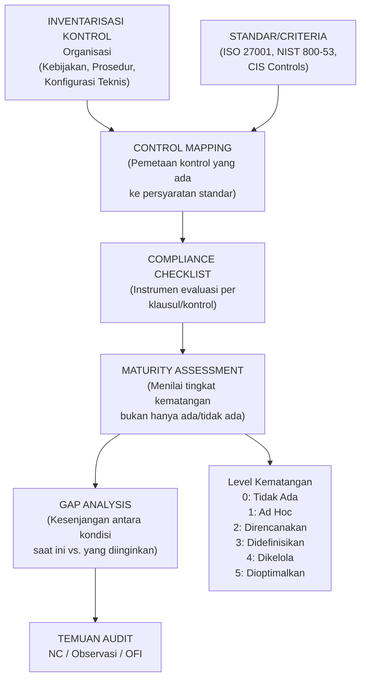

---

### 3. Pengantar Kontekstual

Bayangkan seorang auditor yang memasuki ruang server NDG dan bertanya kepada kepala IT: "Apakah Anda memiliki kontrol manajemen akses?" Kepala IT menjawab: "Tentu, kami punya Active Directory." Pertanyaan berikutnya yang kritis: apakah Active Directory yang ada ini benar-benar memenuhi persyaratan manajemen akses yang ditetapkan dalam ISO 27001:2022 Annex A.5.15 dan A.8.2? Apakah dikonfigurasi dengan benar? Apakah kebijakan yang mengatur penggunaannya ada dan diikuti? Apakah di-review secara berkala?

Control mapping dan compliance checklist adalah alat yang mengubah pertanyaan umum ("Apakah Anda punya kontrol X?") menjadi evaluasi yang terstruktur, terukur, dan dapat dipertanggungjawabkan. Mereka adalah jembatan antara persyaratan abstrak dalam standar dengan realitas konkret implementasi kontrol di lapangan.

---

### 4. Landasan Teori

#### 4.1 Control Mapping

**Definisi:** Control mapping adalah proses mendokumentasikan hubungan antara kontrol keamanan yang diimplementasikan oleh organisasi dengan persyaratan yang ada dalam standar atau regulasi yang menjadi criteria audit. Hasilnya adalah "peta kontrol" yang menunjukkan di mana ada kesesuaian, di mana ada kesenjangan, dan di mana ada duplikasi.

**Jenis Control Mapping:**

*a) Mapping Implementasi ke Standar*
Daftar semua kontrol yang diimplementasikan organisasi → petakan ke persyaratan standar.
Hasil: Menunjukkan di mana implementasi ada tetapi mungkin tidak memenuhi standar.

*b) Mapping Standar ke Implementasi*
Daftar semua persyaratan standar → untuk setiap persyaratan, identifikasi kontrol apa yang diimplementasikan.
Hasil: Menunjukkan persyaratan mana yang tidak terpenuhi (kesenjangan).

*c) Cross-Mapping Antar Standar*
Pemetaan antara dua atau lebih standar untuk mengidentifikasi overlap dan perbedaan.
Berguna untuk organisasi yang harus mematuhi beberapa kerangka.

**Proses Control Mapping:**

1. **Inventarisasi kontrol**: Kumpulkan daftar semua kontrol yang diklaim organisasi: kebijakan, prosedur, konfigurasi teknis, kontrol fisik, pelatihan.

2. **Analisis persyaratan standar**: Uraikan setiap persyaratan standar ke dalam elemen-elemen yang dapat diverifikasi (*verifiable elements*).

3. **Pemetaan**: Untuk setiap persyaratan standar, identifikasi kontrol organisasi yang "meng-address" persyaratan tersebut.

4. **Evaluasi gap**: Tentukan apakah kontrol yang ada benar-benar memenuhi persyaratan, atau hanya sebagian, atau tidak sama sekali.

5. **Dokumentasi**: Catat hasil pemetaan dalam matriks kontrol.

**Matriks Kontrol (Control Matrix):**

| Persyaratan Standar | Kontrol Organisasi | Bukti | Status | Kesenjangan |
|---------------------|-------------------|-------|--------|-------------|
| ISO A.8.2: Privileged Access | AD Group Policy "Admin-Restricted" | GP-2024-v3, log review Q3 | Sebagian sesuai | Review tidak dilakukan rutin |
| ISO A.8.8: Vuln. Management | OpenVAS scanning, Patch Policy NDG-SEC-003 | Scan report Okt-2024 | Tidak sesuai | Tidak ada SLA remediation |

#### 4.2 Compliance Checklist

**Definisi:** Compliance checklist adalah instrumen audit yang menguraikan persyaratan standar menjadi pertanyaan atau pernyataan yang dapat dijawab "Ya/Tidak/Sebagian/Tidak Berlaku", disertai dengan panduan tentang bukti yang diperlukan dan prosedur verifikasi.

**Prinsip Penyusunan Compliance Checklist yang Baik:**

1. **Atomik**: Setiap item hanya menguji satu hal. Hindari pertanyaan ganda: "Apakah kebijakan ada DAN diimplementasikan DAN di-review?" sebaiknya dipecah menjadi tiga item terpisah.

2. **Dapat Diverifikasi**: Setiap item harus memiliki bukti yang jelas yang dapat dikumpulkan. Hindari pertanyaan yang jawabannya hanya bisa berupa "ya, kami melakukannya" tanpa bukti.

3. **Terstruktur berdasarkan Standar**: Item checklist harus merujuk pada klausul/kontrol standar yang spesifik.

4. **Mencakup Tiga Aspek Efektivitas Kontrol:**
   - *Desain* (Design Effectiveness): Apakah kontrol dirancang untuk memenuhi tujuannya?
   - *Operasional* (Operating Effectiveness): Apakah kontrol beroperasi secara konsisten?
   - *Berkelanjutan* (Sustained Effectiveness): Apakah kontrol dipelihara dari waktu ke waktu?

**Contoh Compliance Checklist (ISO 27001 A.8.15 — Logging):**

```
COMPLIANCE CHECKLIST — NDG-IA-2025-001
Area: A.8.15 Logging (ISO/IEC 27001:2022)

Ref | Pertanyaan Checklist | Jenis Bukti | Hasil | Catatan
----|---------------------|-------------|-------|--------
8.15-1 | Apakah kebijakan logging terdokumentasi dan disetujui manajemen? | Dokumen kebijakan + approval | □Ya □Tidak □Sebagian | 
8.15-2 | Apakah event log diaktifkan di semua sistem kritis? | Konfigurasi sistem, sampel log | □Ya □Tidak □Sebagian |
8.15-3 | Apakah log mencakup: login sukses, login gagal, perubahan hak akses, akses ke data sensitif? | Review konfigurasi log policy | □Ya □Tidak □Sebagian |
8.15-4 | Apakah log dilindungi dari modifikasi tidak sah? | Konfigurasi akses ke log system | □Ya □Tidak □Sebagian |
8.15-5 | Apakah log di-review secara berkala? | Log review report, jadwal review | □Ya □Tidak □Sebagian |
8.15-6 | Apakah ada prosedur retensi log yang ditetapkan dan dipatuhi? | Kebijakan retensi + log storage | □Ya □Tidak □Sebagian |
8.15-7 | Apakah ada prosedur untuk menangani kapasitas log yang hampir penuh? | SOP kapasitas storage + alert | □Ya □Tidak □Sebagian |
```

#### 4.3 Maturity Assessment

Compliance checklist biner (Ya/Tidak) memiliki keterbatasan: tidak menangkap gradasi kualitas implementasi. Sebuah kontrol mungkin "Ada" tetapi sangat lemah (misalnya: kebijakan ada tetapi tidak pernah dikomunikasikan kepada karyawan, tidak di-review sejak 5 tahun lalu, dan tidak ada yang bertanggung jawab untuk memastikan kepatuhan).

**Maturity Assessment** mengukur tidak hanya keberadaan kontrol, tetapi tingkat kematangan implementasinya. Model yang umum digunakan:

**Model Kematangan 0-5 (Generik):**

| Level | Nama | Karakteristik |
|-------|------|---------------|
| 0 | Non-existent | Kontrol tidak ada sama sekali; tidak ada kesadaran tentang masalahnya |
| 1 | Initial/Ad Hoc | Kontrol mungkin ada tetapi tidak terencana; bergantung pada individu; tidak terdokumentasi |
| 2 | Repeatable | Proses ada tetapi tidak formal; berbeda antar individu/tim; pemantauan minimal |
| 3 | Defined | Proses terdokumentasi, standar, dan dikomunikasikan; ada pelatihan; pemantauan reguler |
| 4 | Managed | Proses diukur dan dikontrol; ada metrik kinerja; perbaikan berbasis data |
| 5 | Optimizing | Fokus pada peningkatan berkelanjutan; inovasi; pembelajaran dari kegagalan |

**Interpretasi Maturity dalam Konteks Audit:**

- Level 0-1: Kemungkinan nonconformity terhadap persyaratan dasar
- Level 2: Mungkin memenuhi persyaratan minimal, tetapi tidak konsisten; risiko residual tinggi
- Level 3: Umumnya memenuhi persyaratan standar seperti ISO 27001
- Level 4-5: Melampaui persyaratan standar; implementasi terbaik

**Perhatian:** Maturity assessment adalah alat tambahan, bukan pengganti compliance checklist. Untuk sertifikasi ISO 27001, yang relevan adalah apakah persyaratan terpenuhi (*compliance*), bukan level maturity per se. Namun maturity assessment sangat berguna untuk rekomendasi peningkatan dan prioritisasi.

#### 4.4 Gap Analysis

**Definisi:** Gap analysis adalah proses membandingkan kondisi kontrol saat ini (*current state*) dengan kondisi yang diinginkan (*desired state* atau *target state*) berdasarkan criteria audit, dan mendokumentasikan perbedaan (*gaps*) yang ada.

**Keluaran Gap Analysis:**
- Daftar gap yang teridentifikasi, disertai: kontrol yang terpengaruh, deskripsi gap, tingkat keparahan (berdasarkan risiko), dan rekomendasi perbaikan
- Prioritisasi gap berdasarkan risiko
- Estimasi effort perbaikan

**Klasifikasi Gap:**
- **Nonconformity (NC)**: Gap yang merupakan kegagalan memenuhi persyaratan yang "shall" dalam standar
- **Observasi (OBS)**: Area di mana kontrol ada tetapi memerlukan perhatian atau peningkatan; bukan kegagalan langsung
- **Peluang Peningkatan (OFI — Opportunity for Improvement)**: Saran untuk meningkatkan kontrol melampaui persyaratan minimum

---

### 5. Model atau Arsitektur

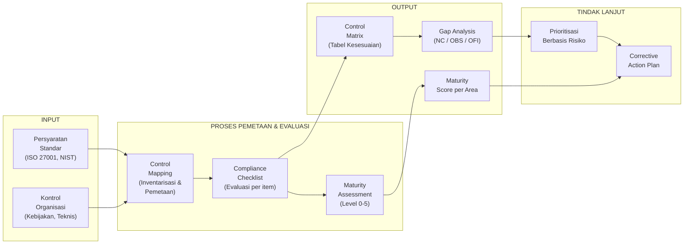

---

### 6. Contoh Terapan

**Skenario: Control Mapping dan Compliance Checklist NDG — Area Manajemen Akses**

**Inventarisasi Kontrol NDG (dikumpulkan dari wawancara dan review dokumen):**
- Kebijakan Manajemen Akses NDG-SEC-002 v2.1 (ada, disetujui Januari 2024)
- Active Directory dengan Group Policy untuk pembatasan akses
- RBAC (Role-Based Access Control) — 15 role didefinisikan
- Prosedur onboarding via sistem HR (Workday) → trigger permintaan akses IT
- Review akses dilakukan semi-annual (target), tapi terakhir 8 bulan lalu
- Tidak ada prosedur formal offboarding yang mengikat waktu pencabutan akses
- Tidak ada log terpusat untuk perubahan hak akses

**Matriks Kontrol NDG (ISO 27001 A.5.15, A.8.2):**

| Klausul | Persyaratan | Kontrol NDG | Status | Maturity |
|---------|------------|-------------|--------|----------|
| A.5.15 | Kebijakan kontrol akses terdokumentasi | Kebijakan NDG-SEC-002 | Sesuai | 3 |
| A.8.2(a) | Otorisasi formal untuk akses privileged | Form permintaan akses IT | Sesuai | 3 |
| A.8.2(b) | Review akses privileged secara berkala | Review semi-annual (terlambat) | NC | 2 |
| A.8.2(c) | Pencabutan akses saat tidak diperlukan | Offboarding tidak formal | NC | 1 |
| A.8.2(d) | Log perubahan akses privileged | Tidak ada log terpusat | NC | 1 |

**Temuan Gap Analysis:**
- NC1: Review akses privileged tidak dilakukan sesuai jadwal (8 bulan vs. target 6 bulan)
- NC2: Tidak ada prosedur formal offboarding yang memastikan akses dicabut segera → 15% akun ex-karyawan masih aktif (bukti langsung)
- NC3: Tidak ada log perubahan akses terpusat untuk akuntabilitas

---

### 7. Praktikum atau Aktivitas Terarah

**Judul Praktikum:** Penyusunan Compliance Checklist dan Control Matrix

**Tujuan Praktikum:**
- Mampu menyusun compliance checklist yang operasional untuk area kontrol keamanan
- Mampu mengisi control matrix berdasarkan skenario yang diberikan
- Mampu mengidentifikasi dan mengklasifikasikan gap sebagai NC, OBS, atau OFI

**Langkah Kerja:**

*Tahap 1 — Penyusunan Checklist (40 menit):*
Pilih area kontrol: ISO 27001:2022 A.8.8 (Management of Technical Vulnerabilities). Susun compliance checklist dengan minimal 8 item yang mencakup tiga aspek efektivitas (desain, operasional, berkelanjutan).

*Tahap 2 — Pengisian Control Matrix (30 menit):*
Dosen menyediakan deskripsi kondisi manajemen kerentanan di NDG. Isi control matrix dan tentukan status serta maturity level untuk setiap item.

*Tahap 3 — Gap Classification (20 menit):*
Klasifikasikan setiap gap yang ditemukan sebagai NC, OBS, atau OFI. Justifikasikan klasifikasi.

---

### 8. Latihan Pemahaman

**Soal 1 (Pilihan Ganda):** Prinsip penyusunan compliance checklist yang menyatakan bahwa setiap item hanya menguji satu hal disebut:
- A. Prinsip Komprehensif
- B. Prinsip Atomik
- C. Prinsip Verifikasi
- D. Prinsip Standar

**Soal 2 (Pilihan Ganda):** Kontrol yang terdokumentasi dan standar tetapi belum konsisten diikuti oleh semua personel berada pada level maturity:
- A. Level 1 (Ad Hoc)
- B. Level 2 (Repeatable)
- C. Level 3 (Defined)
- D. Level 4 (Managed)

**Soal 3 (Analisis):** Sebuah organisasi memiliki kebijakan patch management yang baik (level maturity 4), tetapi 30% server tidak dicakup oleh sistem manajemen patch karena dianggap "sistem legacy." Bagaimana auditor mengevaluasi kontrol ini?

**Soal 4 (Perancangan):** Rancang compliance checklist (minimal 6 item) untuk ISO 27001:2022 A.5.24 (Information Security Incident Management Planning and Preparation).

**Soal 5 (Esai):** Jelaskan perbedaan antara "desain efektivitas" dan "operasional efektivitas" sebuah kontrol, dan berikan contoh situasi di mana keduanya bertentangan (kontrol bagus dalam desain tetapi gagal dalam operasional, atau sebaliknya).

---

### 9. Latihan Terapan / Studi Kasus

**Studi Kasus 1: Control Mapping untuk NDG Cloud Environment**

NDG baru-baru ini bermigrasi 40% workload ke AWS (Amazon Web Services). Pada saat yang sama, audit ISMS NDG harus mencakup lingkungan cloud ini.

*Kontrol ISO 27001 yang Relevan:*
- A.5.23 (Information Security for Use of Cloud Services)
- A.8.7 (Protection Against Malware)
- A.8.20 (Networks Security)
- A.8.23 (Web Filtering)

*Kondisi NDG:*
- Memiliki Cloud Security Policy tapi belum diperbarui sejak sebelum migrasi ke AWS
- Menggunakan AWS Security Groups sebagai firewall virtual
- Tidak ada CSPM (Cloud Security Posture Management) tool
- Antivirus diinstal di EC2 instances tetapi konfigurasi berbeda-beda
- AWS CloudTrail diaktifkan di beberapa region tetapi tidak semua

*Pertanyaan:*
1. Untuk setiap kontrol ISO yang disebutkan, tentukan status (sesuai/tidak sesuai/sebagian sesuai) berdasarkan kondisi NDG di atas.
2. Petakan temuan ke dalam control matrix dan tentukan maturity level.
3. Klasifikasikan gap sebagai NC, OBS, atau OFI dan prioritaskan berdasarkan risiko.

---

### 10. Kunci Jawaban dan Pembahasan

**Jawaban Soal 1:** **B — Prinsip Atomik.** Prinsip atomik memastikan bahwa setiap item checklist hanya mengevaluasi satu elemen sehingga jawaban yang ambigu dapat dihindari dan setiap gap dapat diatribusikan ke satu persyaratan yang spesifik.

**Jawaban Soal 2:** **C — Level 3 (Defined).** Level 3 ditandai dengan proses yang terdokumentasi dan standar, tetapi implementasi belum sepenuhnya konsisten. Level 4 (Managed) mensyaratkan pengukuran kinerja berbasis metrik, yang lebih dari sekadar dokumentasi dan standarisasi.

**Jawaban Soal 3:** Auditor harus mengevaluasi kontrol secara menyeluruh, bukan hanya bagian yang terkelola dengan baik. Kenyataan bahwa 30% server tidak tercakup merupakan gap signifikan yang menghasilkan nonconformity terhadap A.8.8, terlepas dari maturity level kebijakan yang ada. Auditor harus: (a) mendokumentasikan gap cakupan sebagai NC; (b) menilai risiko dari server legacy yang tidak tercakup; (c) mencatat bahwa level maturity keseluruhan kontrol ini turun karena cakupan tidak penuh; (d) merekomendasikan agar server legacy dimasukkan ke dalam manajemen patch atau ada kompensating kontrol yang terdokumentasi.

**Jawaban Soal 4 (Checklist A.5.24):**
```
5.24-1: Apakah ada kebijakan manajemen insiden keamanan informasi yang terdokumentasi? [Dokumen kebijakan]
5.24-2: Apakah peran dan tanggung jawab dalam respons insiden didefinisikan secara jelas? [RACI chart/prosedur]
5.24-3: Apakah ada prosedur klasifikasi insiden (kritisitas, jenis)? [SOP klasifikasi]
5.24-4: Apakah ada prosedur eskalasi insiden yang terdokumentasi? [Prosedur eskalasi]
5.24-5: Apakah personel yang terlibat dalam respons insiden telah mendapat pelatihan? [Bukti pelatihan]
5.24-6: Apakah ada saluran pelaporan insiden yang jelas bagi semua karyawan? [Komunikasi/kebijakan]
5.24-7: Apakah ada mekanisme untuk mendokumentasikan dan belajar dari insiden yang terjadi? [Log insiden, post-mortem]
5.24-8: Apakah rencana respons insiden di-test atau di-simulasikan secara berkala? [Bukti tabletop exercise]
```

**Jawaban Soal 5 (Esai):**

*Desain efektivitas*: Apakah kontrol dirancang dengan benar untuk mencapai tujuannya? Ini dievaluasi dengan memeriksa kebijakan, prosedur, dan arsitektur kontrol — tanpa harus melihat apakah kontrol benar-benar dijalankan.

*Operasional efektivitas*: Apakah kontrol yang dirancang dengan baik benar-benar berjalan secara konsisten dalam operasional sehari-hari?

*Contoh konflik:*
- **Desain baik, operasional gagal**: Kebijakan patch management NDG menetapkan bahwa patch kritis harus diterapkan dalam 14 hari (desain baik, level 4). Tetapi dalam praktiknya, tim IT kewalahan dengan operasional dan patch kritis rata-rata baru diterapkan dalam 45 hari (operasional gagal). Auditor menemukan ini dari log patch management. Ini adalah nonconformity operasional meskipun desain kontrol sangat baik.
- **Operasional baik, desain lemah**: Sebuah perusahaan kecil tidak memiliki kebijakan tertulis tentang manajemen akses (desain tidak ada), tetapi dalam praktiknya administrator IT selalu meminta approval verbal sebelum memberikan akses (operasional cukup baik). Ini merupakan nonconformity desain (tidak ada dokumentasi formal) meskipun praktiknya bisa dibilang berjalan.

**Jawaban Studi Kasus 1:**

1. **Status per kontrol:**
   - A.5.23: **Sebagian Sesuai** — ada Cloud Security Policy tetapi tidak diperbarui setelah migrasi ke AWS; tidak mencakup konfigurasi AWS saat ini → maturity 2
   - A.8.7: **Sebagian Sesuai** — antivirus ada di EC2 tetapi konfigurasi tidak konsisten → maturity 2
   - A.8.20: **Sebagian Sesuai** — AWS Security Groups digunakan tetapi tidak ada kebijakan jaringan cloud yang formal → maturity 2
   - A.8.23: **Tidak Sesuai** — tidak ada bukti web filtering di lingkungan cloud → maturity 1

2. **Control Matrix:**
   | Klausul | Status | Maturity |
   |---------|--------|----------|
   | A.5.23 | Sebagian NC | 2 |
   | A.8.7 | Sebagian NC | 2 |
   | A.8.20 | Sebagian NC | 2 |
   | A.8.23 | NC | 1 |

3. **Klasifikasi dan Prioritas:**
   - **NC1 (Kritis)**: A.5.23 — Cloud Security Policy tidak diperbarui pasca-migrasi. Seluruh framework keamanan cloud tidak memiliki landasan kebijakan yang valid.
   - **NC2 (Tinggi)**: A.8.7 — Konfigurasi antivirus tidak konsisten → server dengan konfigurasi lemah berpotensi menjadi vektor malware.
   - **NC3 (Tinggi)**: A.8.23 — Tidak ada web filtering di cloud → risiko C2 (command and control) komunikasi dari instance yang terinfeksi.
   - **OBS**: A.8.20 — Security Groups ada tetapi tidak terdokumentasi dalam arsitektur jaringan formal; tidak ada monitoring terpusat.

---

### 11. Ringkasan Bab

Control mapping adalah proses penting yang menghubungkan implementasi kontrol organisasi dengan persyaratan standar, menghasilkan peta kontrol yang menunjukkan kesesuaian dan kesenjangan. Compliance checklist mengoperasionalkan persyaratan abstrak menjadi pertanyaan yang dapat diverifikasi, dengan prinsip utama atomisitas dan kemampuan verifikasi. Maturity assessment melengkapi checklist biner dengan memberikan gambaran gradasi kualitas implementasi — sebuah kontrol yang "ada" bisa berada di level maturity yang sangat berbeda. Gap analysis mengklasifikasikan ketidaksesuaian sebagai nonconformity, observasi, atau peluang peningkatan, yang menjadi dasar prioritisasi dan corrective action plan. Kombinasi keempat instrumen ini memberikan auditor pandangan yang komprehensif dan bernuansa tentang postur keamanan organisasi.

---

### 12. Refleksi Profesional

1. **Checklist sebagai Alat vs. Penjara**: Compliance checklist yang terlalu kaku dapat mendorong "check the box mentality" — di mana organisasi memenuhi setiap item checklist secara formal tetapi tidak mencapai tujuan keamanan yang mendasarinya. Bagaimana auditor menggunakan checklist sebagai alat yang membantu, bukan sebagai penjara yang membatasi penilaian profesional?

2. **Maturity vs. Keamanan Nyata**: Organisasi dengan maturity level 5 di semua area belum tentu lebih aman daripada yang hanya level 3 tetapi berfokus pada ancaman yang benar-benar relevan. Apa hubungan antara maturity assessment dan keamanan nyata (*security posture*) organisasi?

3. **Tanggung Jawab Auditor atas Gap yang Tidak Ditemukan**: Jika auditor menyelesaikan compliance checklist, semuanya menunjukkan "sesuai", tetapi kemudian terjadi insiden keamanan yang ternyata berhubungan dengan kelemahan yang seharusnya terdeteksi, apakah auditor dapat dimintai pertanggungjawaban? Apa yang menentukan batas tanggung jawab profesional ini?

---

## Bab 7 — Evidence Review dan Gap Analysis

### 1. Capaian Pembelajaran Bab

Setelah menyelesaikan bab ini, mahasiswa mampu:
- Mengevaluasi kecukupan dan keterandalan bukti audit yang telah dikumpulkan (C4)
- Melaksanakan gap analysis secara sistematis berdasarkan bukti audit dan criteria (C4)
- Menyusun pernyataan temuan (*finding statement*) yang akurat, objektif, dan didukung bukti (C3)
- Mengklasifikasikan dan memprioritaskan temuan audit berdasarkan tingkat keparahan dan risiko (C5)

*Dikaitkan dengan Sub-CPMK.3 (Pertemuan 7) dan Evaluasi Eval-3 (15%).*

---

### 2. Peta Konsep Bab

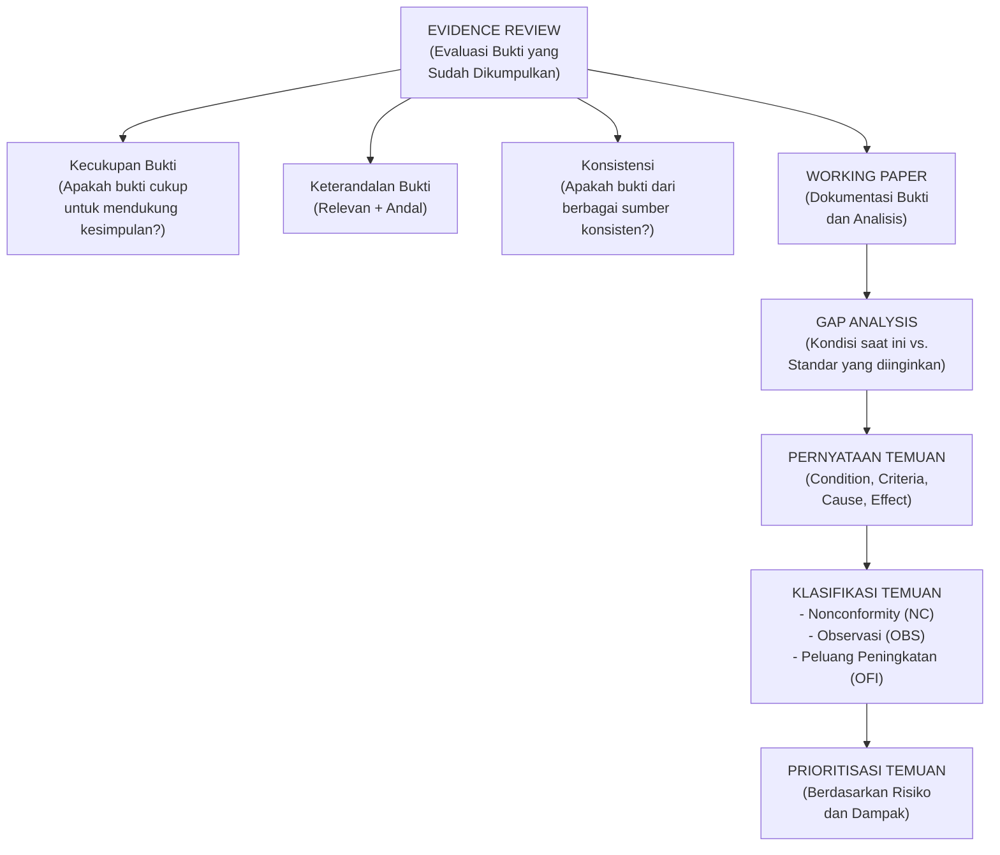

---

### 3. Pengantar Kontekstual

Mengumpulkan bukti adalah satu hal; mengevaluasi dan menarik kesimpulan yang valid dari bukti tersebut adalah hal yang berbeda. Seorang auditor yang kurang berpengalaman mungkin mengumpulkan bukti yang banyak tetapi menarik kesimpulan yang tidak tepat — baik terlalu keras (menyatakan nonconformity dari bukti yang tidak cukup kuat) atau terlalu lunak (melewatkan kesenjangan signifikan karena tidak mengenali bukti yang ada di depannya).

Evidence review adalah tahap kritis di mana auditor "duduk kembali" dan mengevaluasi secara holistik semua yang telah dikumpulkan: apakah bukti cukup? apakah konsisten? apakah ada inkonsistensi yang perlu diselidiki lebih lanjut? Dari evaluasi ini, auditor menyusun pernyataan temuan yang terstruktur — bukan sekadar daftar masalah, tetapi analisis yang menghubungkan kondisi yang ditemukan, kriteria yang dilanggar, penyebab yang mendasari, dan dampak yang ditimbulkan.

---

### 4. Landasan Teori

#### 4.1 Evidence Review

**Tujuan Evidence Review:**
Setelah pengumpulan bukti di lapangan, auditor harus melakukan review internal sebelum menyusun kesimpulan. Review ini memastikan bahwa:
- Tidak ada "lubang" dalam bukti yang mendukung kesimpulan penting
- Inkonsistensi antara sumber bukti sudah diidentifikasi dan dijelaskan
- Bias auditor tidak mempengaruhi interpretasi bukti
- Bukti yang dikumpulkan cukup untuk mendukung setiap pernyataan temuan

**Dimensi Evaluasi Bukti:**

*a) Kecukupan (Sufficiency)*
Apakah jumlah bukti memadai? Faktor yang mempengaruhi: risiko inherent area yang diaudit (semakin tinggi risiko, semakin banyak bukti diperlukan), ukuran populasi vs. sampel, sifat kontrol yang diuji.

*Tanda-tanda bukti tidak cukup:*
- Hanya ada satu bukti untuk klaim kritis
- Sampel terlalu kecil untuk populasi besar
- Hanya ada bukti testimonial tanpa corroboration dari sumber lain

*b) Keterandalan (Appropriateness/Reliability)*
Apakah bukti dapat dipercaya? Faktor yang mempengaruhi:
- Sumber bukti: pihak eksternal independen > sistem terotomatisasi > dokumen internal auditee > pernyataan lisan
- Kondisi pengendalian internal: organisasi dengan pengendalian internal yang lemah menghasilkan dokumen yang kurang andal
- Cara bukti diperoleh: diamati langsung > diperoleh secara independen > diberikan oleh auditee

*c) Konsistensi Bukti (Cross-Evidence Consistency)*
Apakah semua bukti yang dikumpulkan memberikan gambaran yang konsisten? Inkonsistensi antara sumber bukti harus diselidiki lebih lanjut — mereka bisa menunjukkan:
- Kesalahan dalam salah satu bukti
- Kondisi yang berbeda di periode waktu berbeda
- Upaya manipulasi dari auditee

#### 4.2 Struktur Pernyataan Temuan (4C)

Pernyataan temuan yang baik menggunakan struktur **4C**:

**Condition (Kondisi):** Apa yang ditemukan auditor — deskripsi faktual tentang kondisi yang ada. Harus spesifik, terukur, dan didukung bukti. *Contoh: "Berdasarkan review log akses Active Directory tanggal 15 November 2024, terdapat 12 akun pengguna dengan hak privileged yang dimiliki oleh mantan karyawan NDG yang sudah tidak bekerja sejak lebih dari 30 hari (berdasarkan cross-check dengan data HR)."*

**Criteria (Kriteria):** Standar, persyaratan, atau kebijakan yang seharusnya dipatuhi. *Contoh: "ISO/IEC 27001:2022 Annex A 8.2 mensyaratkan bahwa hak akses privileged harus dicabut segera ketika tidak lagi diperlukan. Kebijakan Manajemen Akses NDG-SEC-002 v2.1 Pasal 4.3 juga menetapkan bahwa akses harus dicabut dalam 24 jam setelah karyawan berhenti."*

**Cause (Penyebab):** Mengapa kondisi ini terjadi? Ini adalah akar penyebab, bukan gejala. Identifikasi penyebab yang tepat sangat penting agar corrective action mengatasi masalah secara fundamental, bukan hanya gejala. *Contoh: "Penyebab: Tidak ada mekanisme otomatis yang menghubungkan sistem HR (Workday) dengan Active Directory untuk pencabutan akses. Proses offboarding bergantung pada notifikasi manual dari HR ke IT, yang sering tertunda atau tidak tersampaikan."*

**Effect (Dampak/Effect):** Apa dampak aktual atau potensial dari kondisi yang ada? Ini menunjukkan mengapa temuan ini penting. *Contoh: "Dampak: Akun privileged yang aktif untuk mantan karyawan menciptakan risiko akses tidak sah yang signifikan. Mantan karyawan berpotensi mengakses data nasabah, sistem keuangan, dan infrastruktur kritis NDG. Risiko ini diperparah oleh fakta bahwa mantan karyawan mungkin tidak memiliki kewajiban kerahasiaan yang sama dengan karyawan aktif."*

#### 4.3 Klasifikasi Temuan

**Nonconformity (NC):**
Kegagalan memenuhi persyaratan yang bersifat "shall" (wajib) dalam standar. Nonconformity adalah temuan paling serius dalam audit berbasis standar.

*NC Mayor*: Kegagalan sistematik atau kelemahan yang mengindikasikan bahwa seluruh area proses tidak diimplementasikan atau tidak efektif; atau akumulasi NC minor yang menunjukkan pola kegagalan sistemik. NC mayor dapat menghalangi sertifikasi (dalam konteks audit ISO).

*NC Minor*: Kegagalan terisolasi atau tidak sistemik dalam pemenuhan persyaratan. Satu NC minor biasanya tidak menghalangi sertifikasi, tetapi harus diselesaikan dalam timeframe yang disepakati.

**Observasi (Observation):**
Area di mana kontrol ada dan memenuhi persyaratan minimal, tetapi ada indikasi bahwa kontrol tidak bekerja secara optimal atau ada risiko kegagalan di masa depan. Observasi tidak memerlukan corrective action formal, tetapi organisasi sebaiknya mempertimbangkan perbaikan.

**Peluang Peningkatan (OFI — Opportunity for Improvement):**
Saran untuk meningkatkan efektivitas, efisiensi, atau ketahanan kontrol melampaui persyaratan minimum. Berdasarkan good practices, inovasi industri, atau lessons learned. OFI bersifat opsional bagi auditee.

**Panduan Klasifikasi:**

| Kondisi | Klasifikasi |
|---------|-------------|
| Persyaratan "shall" tidak terpenuhi sama sekali | NC (mayor atau minor) |
| Persyaratan "shall" terpenuhi, tapi tidak konsisten atau ada risiko | Observasi |
| Persyaratan "shall" terpenuhi, tapi ada cara yang lebih baik | OFI |
| Persyaratan "should" (ISO 27002) tidak diikuti | OFI (bukan NC) |

#### 4.4 Prioritisasi Temuan

Tidak semua temuan memiliki urgensi yang sama. Prioritisasi membantu manajemen mengalokasikan sumber daya perbaikan secara efisien.

**Faktor Prioritisasi:**
- **Dampak**: Seberapa besar kerugian jika kondisi ini terus ada? (finansial, reputasional, legal, operasional)
- **Kemungkinan**: Seberapa besar peluang kondisi ini akan menyebabkan insiden?
- **Kemudahan eksploitasi**: Seberapa mudah kelemahan ini dapat dieksploitasi?
- **Regulasi**: Apakah ada implikasi kepatuhan regulasi yang wajib segera ditangani?
- **Visibilitas**: Apakah pemangku kepentingan eksternal mengetahui atau berpotensi mengetahui kondisi ini?

**Matriks Prioritas:**

| Dampak ↓ / Kemungkinan → | Rendah | Sedang | Tinggi |
|--------------------------|--------|--------|--------|
| **Tinggi** | Medium Priority | High Priority | Critical |
| **Sedang** | Low Priority | Medium Priority | High Priority |
| **Rendah** | Informational | Low Priority | Medium Priority |

---

### 5. Model atau Arsitektur

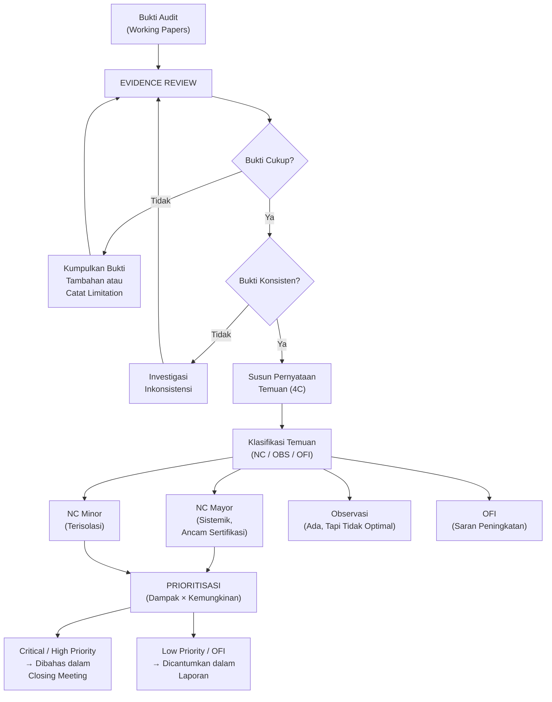

---

### 6. Contoh Terapan

**Skenario: Evidence Review dan Gap Analysis NDG — Area Logging**

**Bukti yang Dikumpulkan:**
1. Kebijakan logging NDG-SEC-004 v1.0 (dokumen, tersedia)
2. Konfigurasi syslog di 5 dari 8 server kritis (screenshot yang diambil auditor)
3. Log dari server database utama: tidak tersedia (ditolak karena alasan privasi)
4. Wawancara dengan sysadmin: "Semua server menghasilkan log, log direview setiap minggu"
5. Log review report: hanya ditemukan 3 laporan dalam 12 bulan terakhir (target: 52 weekly reviews)
6. Kapasitas storage log: 85% penuh; tidak ada prosedur formal untuk manajemen kapasitas

**Evidence Review:**

- *Kecukupan*: Tidak cukup untuk server database (scope limitation). Untuk server lain, konfigurasi dari 5 dari 8 server cukup untuk kesimpulan sampel.
- *Konsistensi*: **Inkonsistensi terdeteksi** — sysadmin mengklaim review "setiap minggu", tetapi hanya ditemukan 3 laporan dalam 12 bulan. Perlu klarifikasi.
- *Keandalan*: Screenshot konfigurasi (andal — diperoleh langsung auditor). Wawancara (kurang andal — bertentangan dengan dokumen).

**Klarifikasi atas inkonsistensi:** Tim audit melakukan wawancara follow-up dan menemukan bahwa "review mingguan" sebenarnya dilakukan secara informal tanpa dokumentasi — hanya melihat log sebentar tanpa laporan tertulis. Review formal (dengan laporan) hanya 3 kali dalam setahun.

**Pernyataan Temuan (4C):**

*Temuan 1:*
- **Condition**: Dari review 5 server, 3 server tidak mengaktifkan logging untuk event "privilege escalation". Log review formal hanya dilakukan 3 kali dalam 12 bulan terakhir.
- **Criteria**: ISO 27001:2022 A.8.15 mensyaratkan logging event yang relevan dan review secara berkala. Kebijakan NDG-SEC-004 mewajibkan review log mingguan dengan dokumentasi.
- **Cause**: (a) Tidak ada konfigurasi log standar (template) yang diterapkan secara konsisten ke semua server; (b) Tidak ada penugasan formal untuk review log mingguan dengan accountability.
- **Effect**: (a) Aktivitas berbahaya (termasuk privilege escalation) mungkin tidak terdeteksi; (b) Investigasi insiden masa lalu menjadi tidak mungkin karena log tidak lengkap.

**Klasifikasi**: NC Mayor (kegagalan sistemik pada kontrol kritis yang berdampak langsung pada deteksi insiden)

---

### 7. Praktikum atau Aktivitas Terarah

**Judul Praktikum:** Simulasi Evidence Review dan Penyusunan Finding Statement

**Tujuan Praktikum:**
- Mampu mengevaluasi kecukupan dan keterandalan bukti yang diberikan
- Mampu mengidentifikasi inkonsistensi antara sumber bukti
- Mampu menyusun pernyataan temuan menggunakan struktur 4C

**Langkah Kerja:**

*Tahap 1 — Evidence Package Review (40 menit):*
Dosen menyediakan "evidence package" yang berisi dokumen, wawancara tertulis, dan data teknis untuk area manajemen kerentanan NDG. Mahasiswa melakukan evidence review: evaluasi kecukupan, keandalan, dan konsistensi.

*Tahap 2 — Finding Statement (30 menit):*
Susun pernyataan temuan menggunakan struktur 4C untuk setiap gap yang diidentifikasi.

*Tahap 3 — Klasifikasi dan Prioritisasi (20 menit):*
Klasifikasikan setiap temuan (NC Mayor/Minor/OBS/OFI) dan tentukan prioritas berdasarkan matriks dampak × kemungkinan.

---

### 8. Latihan Pemahaman

**Soal 1 (Pilihan Ganda):** Komponen "Condition" dalam struktur 4C pernyataan temuan adalah:
- A. Standar atau kebijakan yang harus dipatuhi
- B. Penyebab mengapa kondisi tidak sesuai terjadi
- C. Deskripsi faktual tentang apa yang ditemukan auditor
- D. Dampak dari kondisi yang tidak sesuai

**Soal 2 (Pilihan Ganda):** Temuan yang mengindikasikan kegagalan sistemik dan berpotensi menghalangi sertifikasi ISO 27001 diklasifikasikan sebagai:
- A. Observasi
- B. NC Minor
- C. NC Mayor
- D. Peluang Peningkatan

**Soal 3 (Analisis Kasus):** Auditor memiliki dua bukti yang bertentangan: wawancara kepala IT mengatakan patch diterapkan dalam 14 hari, sementara log menunjukkan rata-rata 45 hari. Bagaimana auditor menangani inkonsistensi ini?

**Soal 4 (Perancangan):** Susun pernyataan temuan 4C untuk situasi berikut: "NDG tidak memiliki prosedur formal Business Continuity Plan (BCP) untuk sistem core banking, padahal ISO 27001:2022 A.5.29 (Information Security During Disruption) dan A.5.30 (ICT Readiness for Business Continuity) mensyaratkannya."

**Soal 5 (Evaluasi):** Diberikan tiga temuan berikut, prioritaskan dari yang paling kritis ke yang paling rendah dan justifikasikan: (a) Password policy mengharuskan 8 karakter tapi tidak ada batasan kompleksitas; (b) 5 akun privileged ex-karyawan masih aktif dan dapat digunakan untuk mengakses sistem keuangan; (c) Review log keamanan dilakukan 2 bulan sekali, bukan bulanan seperti yang dipersyaratkan kebijakan.

---

### 9. Latihan Terapan / Studi Kasus

**Studi Kasus: Evidence Conflict di NDG**

Tim audit NDG mengumpulkan bukti berikut untuk kontrol backup (ISO 27001:2022 A.8.13):

| Sumber Bukti | Keterangan |
|-------------|------------|
| Kebijakan Backup NDG-OPS-001 | Mewajibkan backup harian + uji restore bulanan |
| Wawancara sysadmin | "Backup berjalan setiap malam, restore test dilakukan setiap bulan" |
| Log backup system (50 hari terakhir) | 47 dari 50 hari backup berhasil; 3 hari backup gagal (tidak ada alert) |
| Dokumentasi uji restore | Hanya ditemukan 2 dokumen uji restore dalam 12 bulan (bukan 12) |
| Hasil uji restore langsung oleh auditor | Restore dari backup berhasil untuk file uji (3 menit) |

*Pertanyaan:*
1. Identifikasi semua inkonsistensi dalam evidence package di atas.
2. Lakukan evidence review: apakah bukti yang ada cukup dan andal untuk mengambil kesimpulan tentang efektivitas kontrol backup?
3. Susun pernyataan temuan 4C berdasarkan bukti di atas.
4. Klasifikasikan temuan dan prioritaskan berdasarkan risiko.

---

### 10. Kunci Jawaban dan Pembahasan

**Jawaban Soal 1:** **C — Deskripsi faktual tentang apa yang ditemukan auditor.** Condition adalah bagian observational dari temuan — "apa yang ada" vs. "apa yang seharusnya ada" (Criteria). Cause adalah mengapa kondisi ini terjadi, dan Effect adalah dampaknya.

**Jawaban Soal 2:** **C — NC Mayor.** NC Mayor adalah temuan yang menunjukkan kegagalan sistemik atau ketidakefektifan menyeluruh dari suatu area proses ISMS. Dalam konteks sertifikasi ISO 27001, NC Mayor yang tidak diselesaikan dalam timeframe yang ditetapkan akan menghalangi atau mencabut sertifikasi. NC Minor (B) adalah kegagalan terisolasi yang lebih mudah diatasi. Observasi (A) dan OFI (D) tidak memerlukan tindakan korektif formal.

**Jawaban Soal 3 (Analisis):**
Auditor harus:
1. **Tidak mengambil kesimpulan berdasarkan satu sumber saja** — inkonsistensi ini menunjukkan bahwa salah satu (atau keduanya) sumber tidak akurat.
2. **Mencari sumber bukti ketiga** yang lebih objektif: minta log manajemen patch dari sistem WSUS/SCCM untuk memverifikasi rata-rata waktu patching secara independen; lakukan uji langsung dengan memeriksa versi patch di beberapa server sampel.
3. **Dokumentasikan inkonsistensi** dalam working paper — inkonsistensi itu sendiri adalah temuan yang signifikan: salah satu pihak tidak memberikan informasi yang akurat.
4. **Gunakan bukti yang lebih andal** sebagai basis kesimpulan: log sistem lebih andal dari pernyataan lisan. Jika log dikonfirmasi oleh scanning langsung, ini memperkuat bahwa klaim kepala IT tidak akurat.
5. **Catat dalam laporan** bahwa ada inkonsistensi antara pernyataan manajemen dan data teknis, dan berikan kesimpulan berdasarkan bukti yang paling andal.

**Jawaban Soal 4 (Finding Statement 4C):**

- **Condition**: NDG tidak memiliki dokumen Business Continuity Plan (BCP) yang mencakup sistem core banking, dan tidak ada prosedur formal yang menetapkan langkah-langkah operasional selama gangguan layanan.
- **Criteria**: ISO/IEC 27001:2022 A.5.29 mensyaratkan bahwa keamanan informasi harus dijaga selama gangguan; A.5.30 mensyaratkan bahwa kesiapan TIK untuk kelangsungan bisnis harus direncanakan, diimplementasikan, dan diuji.
- **Cause**: BCP pernah disusun pada tahun 2019 tetapi tidak pernah diperbarui setelah migrasi ke cloud pada 2022, dan dokumen lama tidak lagi relevan dengan arsitektur sistem saat ini. Tidak ada penugasan formal untuk pemeliharaan BCP.
- **Effect**: NDG tidak memiliki panduan operasional yang teruji untuk memulihkan core banking system selama gangguan. Setiap insiden signifikan (bencana alam, serangan ransomware, kegagalan infrastruktur) akan ditangani secara ad hoc, meningkatkan risiko downtime berkepanjangan, kehilangan data, dan kegagalan memenuhi kewajiban regulasi tentang kelangsungan layanan keuangan.

**Jawaban Soal 5 (Prioritisasi):**

Urutan prioritas dari tertinggi ke terendah:
1. **(b) Akun privileged ex-karyawan aktif — CRITICAL**: Ini adalah risiko yang SEKARANG dapat dieksploitasi. Akun aktif = akses langsung ke sistem keuangan kritis. Dampak sangat tinggi (akses penuh ke sistem sensitif), kemungkinan dapat terjadi kapan saja. Memerlukan tindakan segera, tidak menunggu siklus audit.
2. **(c) Review log 2 bulan sekali (target bulanan) — HIGH**: Review log adalah kontrol deteksi kritis. Tanpa review yang memadai, serangan aktif mungkin tidak terdeteksi selama 2 bulan penuh. Dampak tinggi (blind spot pada deteksi ancaman), kemungkinan insiden aktif terjadi adalah nyata.
3. **(a) Password policy tanpa kompleksitas — MEDIUM**: Ini adalah kelemahan desain yang meningkatkan kerentanan terhadap brute force attack. Dampaknya penting tetapi kompensasi kontrol (MFA, account lockout) mungkin mengurangi risiko; tidak sepusing butir b dan c yang berkaitan dengan akses aktif dan deteksi yang lemah.

**Jawaban Studi Kasus:**

1. **Inkonsistensi dalam evidence package:**
   - *Inkonsistensi 1*: Sysadmin mengklaim uji restore dilakukan setiap bulan, tetapi hanya ada 2 dokumen dalam 12 bulan (10 uji restore tidak terdokumentasi atau tidak dilakukan).
   - *Inkonsistensi 2*: 3 hari backup gagal tetapi tidak ada alert yang terkirim — ini inkonsisten dengan klaim bahwa backup "berjalan setiap malam" (klaim menyiratkan pemantauan aktif, tapi tidak ada mekanisme alert).

2. **Evidence Review:**
   - *Kecukupan*: Cukup untuk menarik kesimpulan tentang efektivitas backup reguler (log 50 hari representatif) dan uji restore (2 dokumen + 1 uji langsung).
   - *Keandalan*: Log backup (andal — data sistem); hasil uji restore langsung (paling andal — diperoleh auditor); dokumen uji restore (andal untuk yang ada); wawancara (kurang andal — bertentangan dengan bukti).
   - *Konsistensi*: Tidak konsisten pada frekuensi uji restore (klaim vs. dokumentasi) dan pada monitoring backup gagal (klaim vs. log).

3. **Finding Statement 4C:**
   - *Condition*: Dari review log backup 50 hari terakhir, 3 backup gagal tanpa alert ke tim IT (94% success rate). Dokumentasi uji restore hanya tersedia 2 dari target 12 dalam setahun.
   - *Criteria*: Kebijakan NDG-OPS-001 mewajibkan backup harian dengan uji restore bulanan. ISO 27001:2022 A.8.13 mensyaratkan bahwa backup harus diuji secara teratur untuk memastikan keandalan.
   - *Cause*: (a) Tidak ada mekanisme alert otomatis untuk backup yang gagal; (b) Tidak ada prosedur formal dan penugasan untuk pelaksanaan dan dokumentasi uji restore bulanan.
   - *Effect*: (a) Tim IT tidak mengetahui backup gagal selama 3 hari — data dari periode tersebut mungkin tidak dapat dipulihkan; (b) Keandalan backup tidak dapat dikonfirmasi karena uji restore tidak dilakukan secara konsisten — risiko bahwa backup tidak dapat digunakan saat dibutuhkan.

4. **Klasifikasi dan Prioritas:**
   - NC Minor (1): Backup gagal tanpa alert — kegagalan operasional terisolasi, tidak sistemik, tapi dengan dampak signifikan. Prioritas: High.
   - NC Minor (2): Dokumentasi uji restore tidak sesuai kebijakan — kegagalan proses yang kurang kritis karena uji langsung berhasil. Prioritas: Medium-High.
   - OBS: Tidak ada prosedur pemantauan kapasitas backup storage secara proaktif — belum menjadi kegagalan tetapi risiko meningkat. Prioritas: Medium.

---

### 11. Ringkasan Bab

Evidence review adalah tahap kritis yang memastikan bahwa kesimpulan audit didasarkan pada bukti yang cukup, andal, dan konsisten. Inkonsistensi antara sumber bukti harus diselidiki, bukan diabaikan — mereka sering mengungkapkan kondisi yang lebih serius dari yang terlihat di permukaan. Pernyataan temuan menggunakan struktur 4C (Condition-Criteria-Cause-Effect) memberikan komprehensivitas yang diperlukan agar corrective action dapat mengatasi akar masalah, bukan hanya gejalanya. Klasifikasi temuan (NC Mayor/Minor, Observasi, OFI) memberikan gradasi yang penting bagi manajemen untuk memahami urgensi dan prioritas. Prioritisasi berbasis risiko memastikan bahwa sumber daya perbaikan yang terbatas dialokasikan ke area yang memberikan dampak keamanan paling besar.

---

### 12. Refleksi Profesional

1. **Objektivitas dalam Evidence Review**: Seorang auditor yang sudah "yakin" tentang kesimpulan sebelum menyelesaikan evidence review rentan terhadap bias konfirmasi — mencari bukti yang mendukung keyakinan awal dan mengabaikan yang bertentangan. Mekanisme apa yang dapat membantu auditor menghindari jebakan ini? Apakah peer review temuan oleh auditor lain cukup?

2. **Tanggung Jawab atas Kesimpulan yang Salah**: Jika pernyataan temuan ternyata tidak akurat (misalnya, auditor mengklasifikasikan sesuatu sebagai NC Mayor padahal sebenarnya minor, atau sebaliknya), apa konsekuensinya bagi auditor, auditee, dan audit client? Bagaimana sistem pengelolaan kualitas audit mengurangi risiko ini?

3. **Cause dalam 4C — Tantangan Terdalam**: Mengidentifikasi cause yang benar adalah bagian paling sulit dari 4C. Sering kali penyebab yang teridentifikasi hanya merupakan gejala, bukan akar masalah sesungguhnya. Bagaimana auditor memastikan bahwa cause yang diidentifikasi cukup dalam untuk mendukung corrective action yang benar-benar efektif?

---

## Bab 8 — UTS: Analisis Kasus Integratif

### 1. Capaian Pembelajaran Bab

Bab ini merupakan bab review dan evaluasi formatif yang mengintegrasikan materi Bab 1-7. Setelah menyelesaikan bab ini, mahasiswa mampu:
- Mengintegrasikan konsep audit lifecycle, standar, control mapping, dan evidence review dalam satu skenario komprehensif (C4)
- Mengevaluasi kondisi keamanan informasi sebuah organisasi secara holistik berdasarkan kriteria audit (C5)
- Menyusun rekomendasi prioritas yang komprehensif berdasarkan temuan audit integratif (C5)
- Mengkomunikasikan temuan dan rekomendasi secara efektif kepada berbagai audiens (C4)

*Dikaitkan dengan Sub-CPMK.4 (Pertemuan 8) dan Evaluasi Eval-4 (20% — UTS).*

---

### 2. Peta Konsep Bab

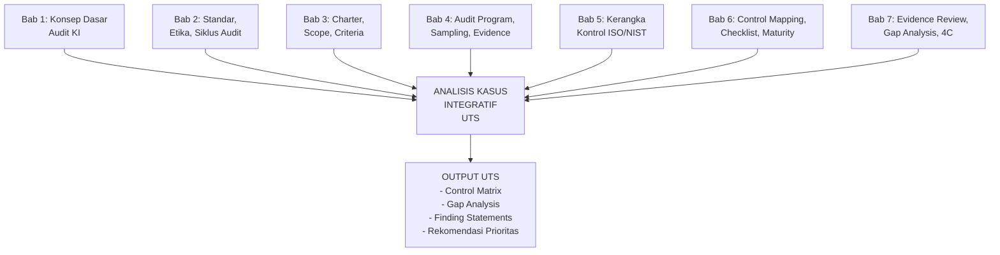

---

### 3. Pengantar Kontekstual

Unit Tengah Semester ini bukan sekadar evaluasi hafalan — ia adalah simulasi mini dari audit keamanan informasi yang sesungguhnya. Mahasiswa diberikan satu skenario organisasi yang kompleks dan harus menggunakan seluruh perangkat analisis yang dipelajari di Bab 1-7 untuk menghasilkan output audit yang komprehensif.

Keterampilan yang diuji: kemampuan berpikir sistematis, analisis bukti, pemetaan kontrol, penyusunan temuan yang terstruktur, dan rekomendasi berbasis risiko. Ini adalah keterampilan yang akan digunakan setiap hari dalam karir sebagai auditor keamanan informasi profesional.

---

### 4. Review Materi Bab 1-7

#### 4.1 Rangkuman Konsep Kunci

**Dari Bab 1 — Konsep Dasar:**
Audit keamanan informasi = sistematis + independen + terdokumentasi. Berbeda dari assessment (tidak harus independen) dan penetration test (teknis ofensif). Jenis: internal/eksternal, kepatuhan/kinerja, sertifikasi/regulasi.

**Dari Bab 2 — Standar dan Siklus:**
7 prinsip ISO 19011: integritas, presentasi jujur, due diligence, kerahasiaan, independensi, berbasis bukti, berbasis risiko. 6 fase siklus audit: inisiasi → persiapan → pelaksanaan → laporan → penyelesaian → follow-up.

**Dari Bab 3 — Charter, Scope, Criteria:**
Charter = legitimasi dan wewenang. Scope = batas yang jelas (organisasi, sistem, temporal, eksklusi). Criteria = standar evaluasi yang disepakati sebelum audit dimulai.

**Dari Bab 4 — Audit Program dan Evidence:**
Audit program = prosedur konkret per kontrol. Stratified sampling untuk populasi heterogen. Hirarki keandalan bukti: observasi langsung > sistem > dokumen auditee > wawancara.

**Dari Bab 5 — Kerangka Kontrol:**
ISO 27001:2022: 4 tema, 93 kontrol, bahasa "shall". ISO 27002:2022: panduan implementasi, bahasa "should", bukan basis nonconformity langsung. NIST SP 800-53: 20 keluarga, 1.189 kontrol, 3 baseline.

**Dari Bab 6 — Control Mapping dan Checklist:**
Control mapping = inventarisasi kontrol organisasi → peta ke persyaratan standar. Checklist: atomik, dapat diverifikasi, mencakup desain + operasional + berkelanjutan. Maturity level 0-5.

**Dari Bab 7 — Evidence Review dan Gap Analysis:**
Evidence review: kecukupan + keandalan + konsistensi. Finding statement 4C: Condition, Criteria, Cause, Effect. Klasifikasi: NC Mayor/Minor, Observasi, OFI.

---

### 5. Kasus Integratif UTS: PT Garuda Siber Nusantara (GSN)

#### 5.1 Latar Belakang Organisasi

PT Garuda Siber Nusantara (GSN) adalah perusahaan penyedia layanan managed security (MSSP) yang melayani 50 klien korporat di Indonesia. GSN mengelola SOC (Security Operations Center) 24/7, layanan threat intelligence, dan managed firewall untuk klien-kliennya. Dengan 200 karyawan dan kantor di Jakarta dan Bandung, GSN memproses data keamanan klien yang sangat sensitif.

GSN sedang mempersiapkan audit ISO/IEC 27001:2022 untuk pertama kalinya, dimotivasi oleh permintaan 15 klien besar yang mensyaratkan sertifikasi ini sebagai syarat kontrak. Mereka telah mengimplementasikan berbagai kontrol selama 2 tahun terakhir.

#### 5.2 Kondisi GSN (Informasi yang Diberikan untuk Diaudit)

**Area 1 — Manajemen Organisasi dan Kebijakan (Tema Organizational):**
- Kebijakan keamanan informasi ada, ditandatangani CEO, tapi terakhir di-review 3 tahun lalu
- ISMS scope sudah didefinisikan mencakup SOC dan layanan managed security
- Risk assessment dilakukan 18 bulan lalu; belum ada update setelah perubahan layanan cloud baru
- Peran CISO ada (dijabat VP Engineering sejak 6 bulan lalu yang tidak memiliki latar belakang keamanan)
- Tidak ada audit internal ISMS sebelumnya

**Area 2 — Manajemen Sumber Daya Manusia (Tema People):**
- Background check untuk karyawan baru: ada prosedur, tapi tidak dilakukan untuk 3 kontraktor jangka panjang yang memiliki akses ke sistem klien
- Perjanjian kerahasiaan (NDA): ditandatangani semua karyawan tetap, tapi tidak ditemukan untuk 2 karyawan yang bergabung 8 bulan lalu
- Pelatihan awareness keamanan: dilakukan setahun sekali via modul e-learning; 35% karyawan belum menyelesaikan modul tahun ini

**Area 3 — Keamanan Fisik (Tema Physical):**
- SOC berlokasi di ruang terkunci dengan akses kartu; log akses tersedia
- CCTV: aktif di pintu masuk dan area server SOC; rekaman disimpan 30 hari (kebijakan mewajibkan 90 hari)
- Pengunjung: ada prosedur registrasi, tapi log pengunjung tidak konsisten (ada hari tanpa entri meski ada kunjungan)

**Area 4 — Keamanan Teknologi (Tema Technological):**
- Manajemen akses: RBAC diterapkan; tapi 8 akun "service account" dengan hak admin penuh tidak diaudit dalam 12 bulan terakhir
- Enkripsi: data klien di-encrypt at-rest; data in-transit menggunakan TLS 1.2 (beberapa sistem masih TLS 1.0)
- Logging: SIEM (Splunk) aktif; tapi konfigurasi alerting belum di-tune — menghasilkan 500+ false positive per hari yang membuat analis kewalahan
- Manajemen kerentanan: scanning dilakukan bulanan; dari 120 temuan bulan terakhir, 35 high/critical belum di-remediate setelah >30 hari
- Patch management: server production: 95% patch; server development: 60% patch
- Business continuity: BCP ada dan di-test 1x setahun; terakhir ditest 14 bulan lalu (target: <12 bulan)

---

### 6. Panduan Pengerjaan UTS

#### 6.1 Tugas UTS

**Tugas 1: Penyusunan Dokumen Fondasi Audit (Bobot 20%)**
Berdasarkan skenario GSN:
1. Identifikasi siapa yang harus menjadi audit client, auditor, dan auditee
2. Susun scope statement yang tepat (termasuk eksklusi yang direkomendasikan)
3. Tentukan criteria audit yang sesuai dan justifikasinya

**Tugas 2: Control Mapping dan Compliance Checklist (Bobot 30%)**
Pilih 3 area dari 4 area yang diberikan dan untuk setiap area:
1. Identifikasi kontrol ISO 27001:2022 Annex A yang relevan
2. Buat control matrix yang menunjukkan status kesesuaian GSN
3. Tentukan maturity level untuk setiap kontrol yang dievaluasi

**Tugas 3: Gap Analysis dan Finding Statements (Bobot 30%)**
Identifikasi minimal 5 temuan dari kondisi GSN dan untuk setiap temuan:
1. Susun pernyataan temuan menggunakan struktur 4C
2. Klasifikasikan sebagai NC Mayor, NC Minor, Observasi, atau OFI
3. Prioritaskan berdasarkan risiko (dampak × kemungkinan)

**Tugas 4: Rekomendasi Eksekutif (Bobot 20%)**
Susun executive summary singkat (1-2 halaman) yang:
1. Merangkum postur keamanan informasi GSN saat ini
2. Menyebutkan 3 temuan paling kritis dan mengapa
3. Memberikan rekomendasi immediate actions (30 hari pertama)

---

### 7. Kunci Jawaban dan Pembahasan UTS

#### 7.1 Tugas 1 — Dokumen Fondasi Audit

**Peran dalam Audit:**
- Audit Client: Dewan Direksi GSN (yang memiliki kepentingan atas sertifikasi ISO 27001 untuk alasan bisnis)
- Auditor: Tim audit internal yang independen dari area operasional, OR auditor eksternal yang bersertifikat ISO 27001 Lead Auditor
- Auditee: Seluruh divisi operasional GSN yang terlibat dalam ISMS (SOC, IT, HR, Fasilitas, Management)

*Catatan: Karena ini adalah audit pertama dan tidak ada tim audit internal yang berpengalaman, rekomendasi terbaik adalah melibatkan auditor eksternal atau konsultan dengan sertifikasi Lead Auditor. VP Engineering sebagai CISO baru tidak dapat menjadi auditor untuk area yang menjadi tanggung jawabnya.*

**Scope Statement yang Direkomendasikan:**
```
Ruang Lingkup: ISMS PT Garuda Siber Nusantara
- Layanan: Managed SOC 24/7, Threat Intelligence, Managed Firewall
- Lokasi: Kantor Jakarta (utama - SOC berlokasi di sini) dan Kantor Bandung
- Sistem: SOC platform (SIEM Splunk, threat intel tools), sistem manajemen klien, 
  infrastruktur jaringan SOC, Active Directory, sistem email
- Temporal: Implementasi kontrol 1 Januari 2023 - 31 Desember 2024
  
Eksklusi yang Direkomendasikan:
- Sistem klien GSN (bukan milik GSN, dikelola untuk klien) — audit terpisah
- Sistem legacy koneksi VPN klien yang sedang dalam proses upgrade — Q2 2025
```

**Criteria Audit:**
- Primer: ISO/IEC 27001:2022 (Klausul 4-10 + Annex A) — untuk sertifikasi
- Panduan implementasi: ISO/IEC 27002:2022 — sebagai referensi kualitas
- Kebijakan internal GSN (Kebijakan Keamanan Informasi, SOP yang berlaku)

#### 7.2 Tugas 2 — Control Matrix GSN (Contoh untuk Area 4)

| Kontrol ISO | Kondisi GSN | Status | Maturity |
|-------------|-------------|--------|----------|
| A.5.15 (Akses Control) | RBAC diterapkan, tapi service accounts tidak diaudit | Sebagian NC | 2 |
| A.8.2 (Privileged Access) | 8 service accounts admin tidak diaudit 12 bulan | NC | 1 |
| A.8.7 (Malware Protection) | Tidak disebutkan — perlu verifikasi | Tidak diketahui | - |
| A.8.15 (Logging) | SIEM aktif tapi alerting tidak di-tune (500+ FP/hari) | Sebagian NC | 2 |
| A.8.8 (Vuln. Management) | 35 high/critical open >30 hari | NC | 2 |
| A.8.24 (Cryptography) | TLS 1.0 masih di beberapa sistem | NC | 2 |

#### 7.3 Tugas 3 — Lima Finding Statements GSN

**Finding 1 (NC Mayor):**
- **Condition**: 35 kerentanan high/critical dari hasil scanning bulan terakhir belum di-remediate setelah lebih dari 30 hari. Sistem GSN mengelola data keamanan 50 klien korporat.
- **Criteria**: ISO 27001:2022 A.8.8 mensyaratkan manajemen kerentanan teknis yang efektif. Kebijakan remediation GSN (jika ada) umumnya mensyaratkan high/critical diselesaikan dalam 14-30 hari.
- **Cause**: Tidak ada prosedur formal remediation timeline; tidak ada penugasan tanggung jawab remediation; tim operasional terlalu fokus pada layanan klien.
- **Effect**: GSN sebagai MSSP dengan kerentanan kritis merupakan target bernilai tinggi. Kompromi GSN dapat berarti akses ke data keamanan 50 klien korporat secara simultan — dampak kaskade yang sangat besar.
- *Prioritas: CRITICAL*

**Finding 2 (NC Minor):**
- **Condition**: 2 karyawan yang bergabung 8 bulan lalu tidak memiliki NDA yang ditandatangani. 3 kontraktor jangka panjang tidak menjalani background check.
- **Criteria**: ISO 27001:2022 A.6.1 (Screening) dan A.6.2 (Terms and Conditions of Employment) mensyaratkan screening yang sesuai dan perjanjian kerahasiaan untuk semua personel.
- **Cause**: Proses onboarding HR tidak memiliki checklist yang memastikan semua dokumen keamanan ditandatangani sebelum akses diberikan.
- **Effect**: Risiko kebocoran informasi klien dan risiko hukum jika terjadi pelanggaran kerahasiaan tanpa perlindungan kontraktual.
- *Prioritas: HIGH*

**Finding 3 (NC Minor):**
- **Condition**: 35% karyawan belum menyelesaikan modul awareness tahunan. TLS 1.0 masih digunakan di beberapa sistem.
- **Criteria**: A.6.3 (Awareness Training); A.8.24 (Use of Cryptography) — TLS 1.0 dianggap tidak aman sejak NIST menarik rekomendasinya.
- *Prioritas: HIGH (TLS 1.0) / MEDIUM (awareness training)*

**Finding 4 (Observasi):**
- **Condition**: Kebijakan keamanan informasi terakhir di-review 3 tahun lalu; risk assessment terakhir 18 bulan lalu (setelah ada perubahan layanan signifikan).
- **Criteria**: ISO 27001:2022 Klausul 5.2 mensyaratkan kebijakan di-review berkala; Klausul 6.1.2 mensyaratkan risk assessment dilakukan pada interval terencana atau saat perubahan signifikan.
- *Prioritas: HIGH — karena seluruh baseline ISMS berdasarkan informasi yang tidak akurat lagi*

**Finding 5 (NC Minor):**
- **Condition**: Rekaman CCTV hanya disimpan 30 hari vs. kebijakan 90 hari. BCP terakhir ditest 14 bulan lalu vs. target <12 bulan.
- *Prioritas: MEDIUM*

#### 7.4 Tugas 4 — Executive Summary (Ringkasan)

*Postur Keamanan GSN:* Implementasi ISMS GSN menunjukkan fondasi yang baik (RBAC, SIEM, vulnerability scanning, BCP ada), tetapi konsistensi implementasi dan pemeliharaan kontrol memerlukan perhatian signifikan sebelum audit sertifikasi ISO 27001.

*Tiga Temuan Paling Kritis:*
1. Kerentanan high/critical yang tidak di-remediate (risiko langsung terhadap keamanan klien)
2. TLS 1.0 pada beberapa sistem (enkripsi yang tidak memadai untuk data sensitif klien)
3. Risk assessment dan kebijakan yang outdated (fondasi ISMS tidak akurat)

*Immediate Actions (30 hari pertama):*
- Remediasi atau mitigasi segera (WAF/kompensating control) untuk 35 kerentanan high/critical
- Disable TLS 1.0 di semua sistem; upgrade ke TLS 1.2 minimum (TLS 1.3 direkomendasikan)
- Lengkapi NDA karyawan yang missing; susun jadwal background check kontraktor
- Mulai proses update risk assessment dan kebijakan keamanan informasi

---

### 8. Latihan Pemahaman (Review Bab 1-7)

**Soal 1:** Apa tiga atribut yang harus dimiliki sebuah audit menurut ISO 19011:2018?

**Soal 2:** Apa perbedaan antara ISO 27001 "shall" dan ISO 27002 "should" dalam konteks klasifikasi temuan audit?

**Soal 3:** Jelaskan mengapa stratified sampling lebih sesuai daripada simple random sampling untuk populasi akun pengguna yang terdiri dari akun privileged dan standar.

**Soal 4:** Dalam struktur temuan 4C, mengapa komponen "Cause" seringkali paling sulit untuk diidentifikasi dengan tepat?

**Soal 5:** Apa perbedaan antara "desain efektivitas" dan "operasional efektivitas" kontrol, dan berikan contoh kontrol yang baik secara desain tetapi gagal secara operasional.

---

### 9. Kunci Jawaban Review Bab 1-7

**Jawaban Soal 1:** Sistematis (mengikuti metodologi terencana), independen (bebas dari konflik kepentingan), dan terdokumentasi (seluruh proses dan temuan dicatat secara formal).

**Jawaban Soal 2:** "Shall" dalam ISO 27001 adalah persyaratan wajib — kegagalan memenuhinya langsung menjadi Nonconformity. "Should" dalam ISO 27002 adalah rekomendasi — kegagalan mengikutinya tidak otomatis menjadi Nonconformity tetapi bisa menjadi dasar OFI (Opportunity for Improvement) atau observasi jika menunjukkan risiko.

**Jawaban Soal 3:** Akun privileged memiliki risiko yang jauh lebih tinggi dari akun standar (satu akun privileged yang dikompromasi bisa berdampak jauh lebih besar). Simple random sampling mungkin menghasilkan sampel dengan proporsi akun privileged yang tidak memadai (misalnya hanya 2% dari sampel adalah privileged jika proporsional). Stratified sampling memastikan akun privileged diwakili secara memadai dalam sampel meskipun jumlahnya kecil, sehingga pengujian yang lebih intensif dapat dilakukan pada subkelompok berisiko tinggi.

**Jawaban Soal 4:** Cause yang paling mudah diidentifikasi biasanya adalah "gejala proksimal" (misalnya: "tidak ada yang memperbarui kebijakan"), bukan akar masalah sesungguhnya (misalnya: "tidak ada penugasan formal untuk pemeliharaan kebijakan dalam struktur organisasi, tidak ada anggaran yang dialokasikan, dan tidak ada mekanisme tracking untuk memastikan kebijakan di-review tepat waktu"). Auditor harus terus bertanya "mengapa?" (teknik 5 Whys) untuk mencapai akar masalah yang jika diperbaiki, akan mencegah kondisi yang sama berulang.

**Jawaban Soal 5:** Desain efektivitas = kontrol dirancang dengan benar untuk tujuannya. Operasional efektivitas = kontrol berjalan secara konsisten dalam praktik. Contoh: NDG memiliki kebijakan patch management yang komprehensif (desain baik) yang mewajibkan patch kritis dalam 14 hari. Tetapi karena tidak ada mekanisme monitoring yang otomatis memberi tahu tim jika patch tidak diterapkan dalam batas waktu, banyak server terlambat diupdate (operasional gagal). Kebijakan bagus di atas kertas, tidak berjalan di lapangan.

---

### 10. Ringkasan Bab

Bab 8 mengintegrasikan seluruh konsep dari Bab 1-7 melalui kasus integratif GSN. Audit keamanan informasi yang efektif memerlukan: fondasi dokumen yang kuat (charter, scope, criteria), metodologi yang sistematis (audit program, sampling, evidence collection), evaluasi yang objektif (control mapping, checklist, maturity assessment), dan pelaporan yang terstruktur (evidence review, gap analysis, 4C). Kasus GSN menunjukkan bahwa bahkan organisasi yang sudah mengimplementasikan banyak kontrol dapat memiliki kesenjangan signifikan dalam konsistensi, pemeliharaan, dan efektivitas operasional kontrol tersebut. Penemuan ini adalah nilai nyata dari audit — memberikan pandangan objektif yang tidak dapat diperoleh dari self-assessment internal.

---

### 11. Refleksi Profesional

1. **Audit sebagai Cermin Organisasi**: Kasus GSN menunjukkan sebuah ironi umum: perusahaan yang menjual layanan keamanan kepada klien belum tentu memiliki keamanan internal yang baik. Bagaimana hal ini harus ditangani — apakah auditor perlu bersikap lebih ketat pada organisasi yang seharusnya "lebih tahu"? Dan bagaimana ini memengaruhi kepercayaan klien GSN terhadap layanan yang mereka beli?

2. **Kompleksitas Audit MSSP**: Audit ISMS GSN hanya mencakup keamanan internal GSN — bukan keamanan yang GSN berikan kepada kliennya. Tetapi apakah ada konflik etika atau praktis ketika menjadi auditor MSSP? Informasi audit bisa mengungkapkan kelemahan dalam layanan yang GSN berikan kepada klien — siapa yang berhak mengetahui ini?

3. **Timing Audit vs. Readiness**: Manajemen GSN memilih untuk melakukan audit pertama kali justru ketika mereka sedang tidak siap — karena tekanan klien. Apakah ini pendekatan yang bertanggung jawab, atau haruskah mereka membangun kesiapan lebih dahulu sebelum mengundang auditor? Apa trade-off antara memulai audit lebih awal vs. menunggu kesiapan yang lebih baik?

---

## Bab 9 — Risk Assessment dan Risk Register

### 1. Capaian Pembelajaran Bab

Setelah menyelesaikan bab ini, mahasiswa mampu:
- Melaksanakan proses risk assessment keamanan informasi berdasarkan metodologi NIST SP 800-30 Rev.1 dan ISO 27001:2022 (C3)
- Menghitung dan menginterpretasikan likelihood-impact dalam matriks risiko (C3)
- Membedakan risiko inherent, risiko residual, dan efektivitas kontrol (C4)
- Menyusun risk register yang komprehensif sebagai output audit risk assessment (C3)
- Mengevaluasi kecukupan risk treatment plan berdasarkan postur risiko organisasi (C5)

*Dikaitkan dengan Sub-CPMK.4 (Pertemuan 9) dan Evaluasi Eval-4 (20%).*

---

### 2. Peta Konsep Bab

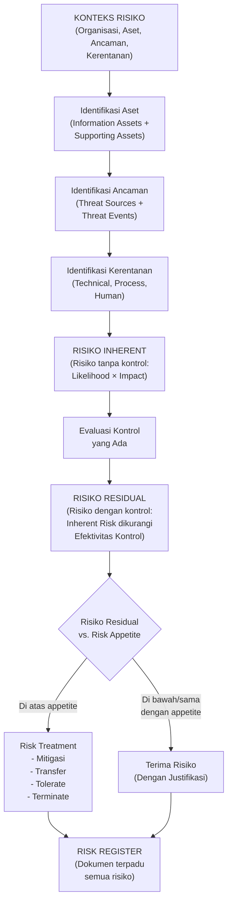

---

### 3. Pengantar Kontekstual

Risk assessment adalah jantung dari manajemen keamanan informasi berbasis risiko. Tanpa penilaian risiko yang sistematis, kontrol keamanan dipilih secara intuitif atau berdasarkan "tren industri" — bukan berdasarkan ancaman nyata yang dihadapi organisasi. Hasilnya adalah pengeluaran yang tidak efisien: terlalu banyak investasi di area berisiko rendah, terlalu sedikit di area berisiko tinggi.

Dalam konteks audit, auditor tidak hanya mengevaluasi apakah risk assessment dilakukan — mereka juga mengevaluasi kualitas dan kelengkapannya. Apakah semua ancaman signifikan diidentifikasi? Apakah likelihood dan impact dikalibrasi secara realistis? Apakah risk treatment plan sesuai dengan tingkat risiko yang teridentifikasi? Apakah risk register di-maintain dan diperbarui secara berkala?

NIST SP 800-30 Rev.1 menyediakan kerangka yang komprehensif dan sistematis untuk risk assessment yang telah diadopsi luas secara global. Dikombinasikan dengan persyaratan risk assessment ISO/IEC 27001:2022 Klausul 6.1, kerangka ini memberikan metodologi yang kuat untuk audit yang berfokus pada manajemen risiko.

---

### 4. Landasan Teori

#### 4.1 Kerangka Risk Assessment: NIST SP 800-30 Rev.1

NIST SP 800-30 Rev.1 ("Guide for Conducting Risk Assessments") mendefinisikan proses risk assessment dalam empat langkah utama:

**Langkah 1 — Persiapan (Prepare)**
- Identifikasi tujuan dan scope risk assessment
- Identifikasi asumsi dan kendala
- Tentukan model ancaman yang akan digunakan
- Identifikasi sumber informasi yang akan digunakan

**Langkah 2 — Pelaksanaan (Conduct)**
Terdiri dari empat sub-langkah:

*2a. Identifikasi Sumber Ancaman dan Event Ancaman:*
- **Threat sources**: Siapa atau apa yang dapat menyebabkan ancaman? NIST mengkategorikan: Adversarial (hacker, insider, kompetitor, negara), Accidental (kesalahan manusia), Structural (kegagalan perangkat), Environmental (bencana alam)
- **Threat events**: Apa yang dilakukan threat source? Misalnya: eksploitasi kerentanan web, phishing, ransomware, insider sabotage

*2b. Identifikasi Kerentanan dan Kondisi yang Memungkinkan:*
- Kerentanan teknis (patch yang tertunda, konfigurasi lemah)
- Kerentanan proses (prosedur tidak ada atau tidak diikuti)
- Kerentanan manusia (kurangnya awareness, hak akses berlebihan)

*2c. Penentuan Likelihood:*
Seberapa besar kemungkinan threat event terjadi? NIST SP 800-30 mendefinisikan skala:

| Level | Kualitatif | Deskripsi |
|-------|-----------|-----------|
| Very High | 5 | Hampir pasti terjadi (>90%) |
| High | 4 | Kemungkinan besar (61-90%) |
| Moderate | 3 | Mungkin (41-60%) |
| Low | 2 | Tidak mungkin (11-40%) |
| Very Low | 1 | Jarang terjadi (<10%) |

*2d. Penentuan Impact (Dampak):*
Apa dampak jika threat event terjadi? Dimensi dampak: Confidentiality (kebocoran data), Integrity (modifikasi data), Availability (gangguan layanan). Skala serupa (Very High s.d. Very Low).

**Langkah 3 — Komunikasi dan Berbagi Informasi (Communicate)**
Hasil risk assessment dikomunikasikan kepada pemangku kepentingan yang relevan dalam format yang sesuai dengan audiens.

**Langkah 4 — Pemeliharaan (Maintain)**
Risk assessment harus diperbarui secara berkala atau ketika ada perubahan signifikan dalam lingkungan ancaman atau organisasi.

#### 4.2 Risiko Inherent vs. Risiko Residual

**Risiko Inherent** adalah tingkat risiko yang ada sebelum mempertimbangkan kontrol apapun yang telah diimplementasikan. Ini adalah "risiko murni" berdasarkan kombinasi threat dan vulnerability.

Rumus sederhana: **Risiko = Likelihood × Impact**

Namun, formula ini mengasumsikan bahwa tidak ada kontrol yang ada. Dalam kenyataan, organisasi selalu memiliki beberapa kontrol.

**Efektivitas Kontrol** adalah seberapa efektif kontrol yang ada dalam mengurangi risiko — baik dengan mengurangi likelihood (misalnya: firewall mengurangi kemungkinan eksploitasi dari internet) atau mengurangi impact (misalnya: backup mengurangi dampak ransomware).

**Risiko Residual** adalah risiko yang tersisa setelah memperhitungkan efektivitas kontrol yang ada:

**Risiko Residual = Risiko Inherent × (1 - Efektivitas Kontrol)**

Atau secara kualitatif: jika risiko inherent HIGH dan kontrol cukup efektif, risiko residual mungkin MEDIUM.

**Risk Appetite vs. Risk Tolerance:**
- **Risk appetite**: Tingkat risiko yang bersedia diterima organisasi untuk mencapai tujuan bisnisnya (ditetapkan oleh manajemen/dewan)
- **Risk tolerance**: Variasi yang dapat diterima di sekitar risk appetite

Risiko residual yang melebihi risk appetite harus mendapat perlakuan risiko. Risiko yang berada dalam risk tolerance dapat diterima.

#### 4.3 Risk Treatment Options

Ketika risiko residual melebihi risk appetite, organisasi harus memilih perlakuan risiko:

**a) Mitigasi (Reduce):** Mengimplementasikan kontrol tambahan untuk mengurangi likelihood dan/atau impact. Ini adalah opsi yang paling umum dalam keamanan informasi.

**b) Transfer:** Mentransfer risiko kepada pihak ketiga, biasanya melalui asuransi siber atau kontrak dengan penyedia layanan yang menanggung kewajiban keamanan.

**c) Tolerate/Accept:** Menerima risiko sebagaimana adanya karena biaya mitigasi melebihi manfaat, atau risiko masih dalam batas risk appetite. Harus disertai justifikasi formal dan persetujuan manajemen.

**d) Terminate/Avoid:** Menghentikan aktivitas yang menghasilkan risiko. Misalnya: menghentikan penggunaan aplikasi legacy yang terlalu berbahaya.

#### 4.4 Risk Register

Risk register adalah dokumen terpadu yang mendokumentasikan semua risiko yang teridentifikasi, penilaiannya, kontrol yang ada, keputusan treatment, dan status follow-up. Ini adalah living document yang harus di-maintain secara berkelanjutan.

**Komponen Risk Register:**

| Kolom | Isi |
|-------|-----|
| Risk ID | Identifikasi unik |
| Deskripsi Risiko | Narasi tentang apa yang bisa terjadi |
| Aset yang Terpengaruh | Aset informasi yang berisiko |
| Sumber Ancaman | Siapa/apa yang mengancam |
| Kerentanan | Kelemahan yang dieksploitasi |
| Likelihood (1-5) | Sebelum kontrol (inherent) |
| Impact (1-5) | Sebelum kontrol (inherent) |
| Risiko Inherent | L × I |
| Kontrol yang Ada | Kontrol yang sudah diterapkan |
| Efektivitas Kontrol | Rating efektivitas (%) |
| Likelihood Residual | Setelah kontrol |
| Impact Residual | Setelah kontrol |
| Risiko Residual | L-residual × I-residual |
| Risk Treatment | Mitigasi/Transfer/Accept/Avoid |
| Rencana Treatment | Detail tindakan yang direncanakan |
| Pemilik Risiko | Siapa yang bertanggung jawab |
| Tenggat Waktu | Kapan treatment harus selesai |
| Status | Open/In Progress/Closed |

---

### 5. Model atau Arsitektur

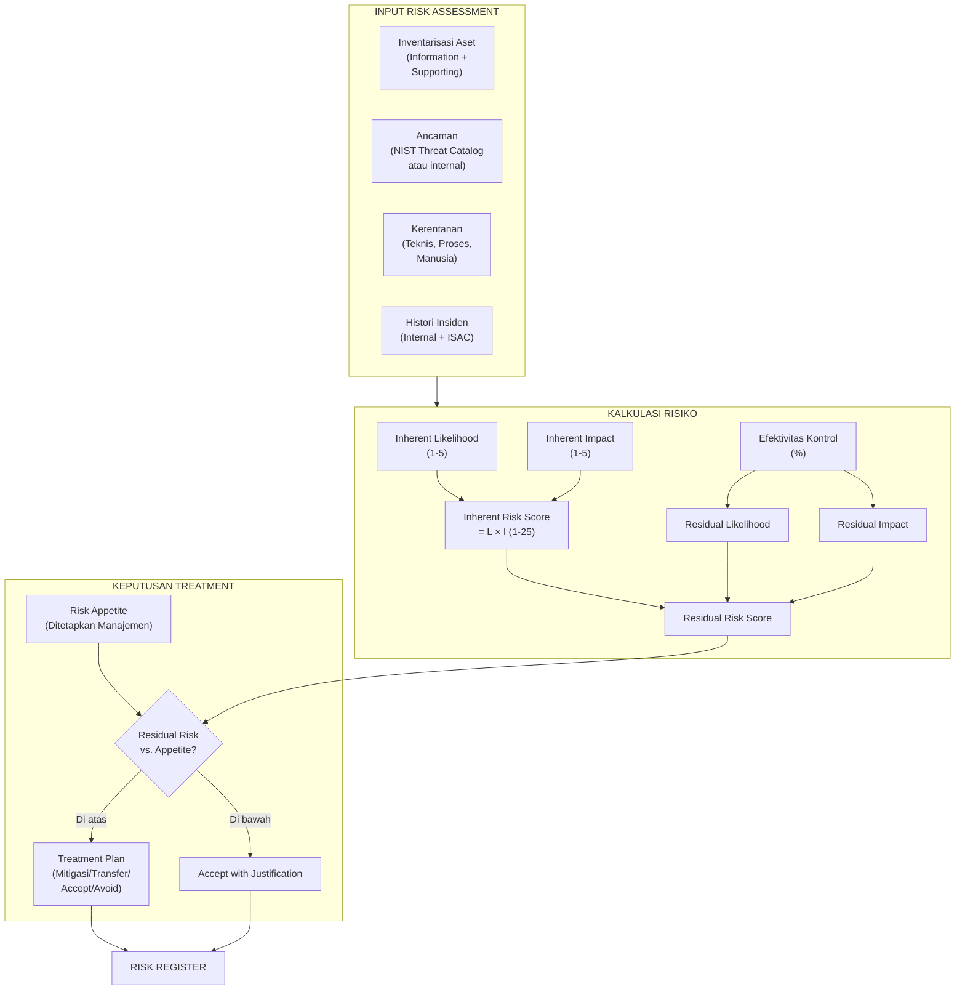

---

### 6. Contoh Terapan

**Skenario: Risk Assessment NDG — Sistem Core Banking**

**Aset yang Dinilai:** Sistem core banking NDG (CBS) — memproses semua transaksi nasabah, menyimpan data rekening, dan mengeksekusi pembayaran.

**Risk Assessment Entry:**

```
Risk ID: NDG-RA-2024-012
Deskripsi Risiko: Eksploitasi kerentanan pada CBS oleh aktor eksternal melalui
                  akun privileged yang tidak dikelola dengan baik
Aset Terpengaruh: Core Banking System (CBS) — data transaksi 150.000 nasabah
Sumber Ancaman: Adversarial — cybercriminal dengan motivasi finansial
Kerentanan: 12 akun ex-karyawan masih aktif dengan hak privileged;
            tidak ada monitoring anomali pada akun admin

Inherent Risk:
  Likelihood: 4 (High) — akun aktif yang dapat diakses kapan saja
  Impact: 5 (Very High) — akses penuh ke data dan transaksi nasabah
  Inherent Risk Score: 20 (Very High)

Kontrol yang Ada:
  - Kebijakan manajemen akses NDG-SEC-002 (ada, tapi tidak dipatuhi)
  - Active Directory dengan Group Policy (dikonfigurasi)
  - CCTV dan logging login (partial)

Efektivitas Kontrol: 20% (sangat lemah — kontrol ada tapi tidak efektif karena
                    proses offboarding gagal dan monitoring tidak memadai)

Residual Risk:
  Likelihood Residual: 4 (tidak banyak berubah — kontrol tidak mengurangi)
  Impact Residual: 4 (sedikit berkurang karena logging ada)
  Residual Risk Score: 16 (High)

Risk Treatment: MITIGATE (segera)
Rencana: (1) Disable semua 12 akun ex-karyawan dalam 24 jam
         (2) Implementasikan alert otomatis offboarding antara HR-IT
         (3) Audit akun privileged setiap 3 bulan
Pemilik: CISO NDG
Tenggat: 72 jam (1) / 30 hari (2,3)
Status: OPEN — CRITICAL
```

---

### 7. Praktikum atau Aktivitas Terarah

**Judul Praktikum:** Pelaksanaan Mini Risk Assessment

**Tujuan Praktikum:**
- Mampu mengidentifikasi aset, ancaman, dan kerentanan untuk skenario yang diberikan
- Mampu menghitung inherent risk dan residual risk secara sistematis
- Mampu menyusun risk register yang mencakup minimal 5 risiko

**Langkah Kerja:**

*Tahap 1 — Konteks (20 menit):*
Dosen menyediakan profil organisasi mini (misalnya: klinik medis digital dengan 50 karyawan, sistem rekam medis elektronik berbasis cloud, 5.000 pasien). Identifikasi: aset utama, kategori ancaman (gunakan NIST threat catalog sebagai referensi), dan kerentanan umum.

*Tahap 2 — Penilaian Risiko (40 menit):*
Untuk 5 risiko yang diidentifikasi, isi tabel risk assessment dengan kolom: deskripsi, likelihood inherent (1-5), impact inherent (1-5), skor inherent, kontrol yang ada, efektivitas kontrol (%), likelihood residual, impact residual, skor residual.

*Tahap 3 — Risk Register dan Treatment (20 menit):*
Buat risk register mini dan tentukan risk treatment untuk setiap risiko. Prioritaskan risiko berdasarkan skor residual.

**Format Output:** Tabel risk assessment + risk register + justifikasi treatment.

---

### 8. Latihan Pemahaman

**Soal 1 (Pilihan Ganda):** Risiko yang ada sebelum mempertimbangkan efektivitas kontrol apapun disebut:
- A. Risiko Residual
- B. Risiko Inherent
- C. Risiko Transfer
- D. Risiko Appetite

**Soal 2 (Pilihan Ganda):** Dalam NIST SP 800-30, "threat source" yang dikategorikan sebagai "Adversarial" mencakup:
- A. Kegagalan hardware yang tidak terduga
- B. Banjir atau gempa bumi yang merusak data center
- C. Hacker, insider threat, dan nation-state actors
- D. Kesalahan konfigurasi oleh administrator

**Soal 3 (Perhitungan):** Sebuah risiko memiliki Inherent Risk Score 20 (Likelihood 4, Impact 5). Kontrol yang ada memiliki efektivitas 60%. Berapa Residual Risk Score? (Gunakan pendekatan: residual = inherent × (1 - efektivitas kontrol))

**Soal 4 (Analisis):** Sebuah CISO menyatakan: "Risk appetite kami adalah Medium. Semua risiko dengan skor di atas 12 harus dimitigasi." Dari risk register, ditemukan risiko dengan skor residual 14 yang sudah diterima tanpa mitigasi sejak 18 bulan lalu karena "biaya mitigasi terlalu tinggi." Apa yang harus dilakukan auditor?

**Soal 5 (Perancangan):** Susun entri risk register untuk risiko berikut: "Karyawan NDG secara tidak sengaja mengirim dokumen kebijakan keamanan internal ke alamat email eksternal yang salah."

---

### 9. Latihan Terapan / Studi Kasus

**Studi Kasus: Evaluasi Risk Register NDG**

Auditor ISMS NDG menerima risk register dari tim manajemen risiko NDG. Berikut adalah 4 entri yang dipilih:

| Risk ID | Deskripsi | Inherent L | Inherent I | Kontrol | Efek. Kontrol | Residual L | Residual I | Treatment |
|---------|-----------|-----------|-----------|---------|--------------|-----------|-----------|-----------|
| R-001 | DDoS terhadap website publik NDG | 4 | 3 | Cloudflare WAF + CDN | 80% | 2 | 1 | Accepted |
| R-002 | Ransomware mengenkripsi server core banking | 3 | 5 | Antivirus + backup harian | 40% | 2 | 4 | Mitigate - belum selesai |
| R-003 | SQL injection pada aplikasi mobile banking | 4 | 5 | Code review (tidak konsisten) | 30% | 3 | 4 | Accepted (12 bulan) |
| R-004 | Kehilangan laptop karyawan dengan data klien | 3 | 4 | Full-disk encryption | 90% | 1 | 1 | Accepted |

Risk appetite NDG: Skor > 8 harus dimitigasi.

*Pertanyaan:*
1. Hitung skor inherent dan residual untuk setiap risiko (L × I).
2. Berdasarkan risk appetite NDG, apakah keputusan treatment untuk setiap risiko sudah tepat?
3. Identifikasi risiko mana yang menurut Anda memerlukan perhatian audit yang paling serius dan jelaskan mengapa.
4. Apa yang harus dilakukan auditor terkait R-003 yang sudah "Accepted" selama 12 bulan dengan skor residual yang jauh di atas risk appetite?

---

### 10. Kunci Jawaban dan Pembahasan

**Jawaban Soal 1:** **B — Risiko Inherent.** Risiko inherent adalah "risiko murni" tanpa memperhitungkan kontrol yang ada. Risiko residual (A) adalah risiko yang tersisa setelah kontrol. Risk appetite (D) adalah tingkat risiko yang bersedia diterima, bukan jenis risiko.

**Jawaban Soal 2:** **C — Hacker, insider threat, dan nation-state actors.** NIST SP 800-30 mengkategorikan "adversarial" sebagai sumber ancaman yang memiliki intensi untuk menyebabkan kerugian — termasuk cybercriminal, insider yang tidak puas, kompetitor, dan aktor negara. Kegagalan hardware (A) adalah "Structural", bencana alam (B) adalah "Environmental", dan kesalahan konfigurasi (D) adalah "Accidental".

**Jawaban Soal 3 (Perhitungan):**
Residual Risk Score = Inherent Risk Score × (1 - Efektivitas Kontrol)
= 20 × (1 - 0.60)
= 20 × 0.40
= **8**

Jika menggunakan pendekatan kualitatif: Likelihood residual berkurang dari 4 ke sekitar 2 (kontrol cukup efektif untuk mengurangi kemungkinan); Impact mungkin tetap 4 (kontrol mengurangi kemungkinan tapi tidak banyak mengurangi dampak jika terjadi). Residual = 2 × 4 = 8.

**Jawaban Soal 4 (Analisis):**

Ini adalah temuan audit signifikan. Auditor harus:
1. **Dokumentasikan sebagai nonconformity**: Risiko dengan skor residual 14 yang di atas risk appetite 12 harus dimitigasi berdasarkan kebijakan organisasi sendiri. Menerimanya tanpa dokumentasi formal (Statement of Acceptance yang disetujui manajemen senior) adalah NC terhadap ISO 27001 Klausul 6.1.2 dan 8.3.
2. **Verifikasi apakah ada Statement of Acceptance yang valid**: Apakah ada dokumen formal yang menunjukkan manajemen senior secara sadar menerima risiko ini dengan memahami implikasinya? Jika tidak, ini NC. Jika ada, periksa apakah persetujuan memadai.
3. **Evaluasi rasionalitas "biaya mitigasi terlalu tinggi"**: Apakah ada analisis cost-benefit yang terdokumentasi? Jika manajemen menerima risiko berdasarkan pertimbangan yang tidak terdokumentasi, ini menunjukkan kelemahan dalam proses risk treatment.
4. **Catat dalam temuan**: Berikan rekomendasi agar manajemen melakukan review formal terhadap keputusan penerimaan risiko ini, dengan mempertimbangkan perkembangan ancaman selama 18 bulan dan biaya insiden potensial vs. biaya mitigasi.

**Jawaban Soal 5 (Perancangan):**

```
Risk ID: NDG-RA-2024-025
Deskripsi: Pengiriman dokumen kebijakan keamanan internal secara tidak sengaja
           ke alamat email eksternal (human error)
Aset: Dokumen kebijakan internal NDG (risiko eksposur informasi operasional)
Sumber Ancaman: Accidental (kesalahan karyawan NDG)
Kerentanan: Tidak ada mekanisme DLP (Data Loss Prevention); 
            tidak ada konfirmasi sebelum pengiriman ke domain eksternal

Inherent Likelihood: 3 (Moderate — volume email tinggi, kesalahan manusiawi umum)
Inherent Impact: 2 (Low — dokumen kebijakan sensitif tapi bukan data nasabah)
Inherent Risk Score: 6 (Moderate)

Kontrol yang Ada: Email gateway dengan spam filtering (tidak ada DLP khusus)
Efektivitas Kontrol: 10% (minimal — tidak dirancang untuk mencegah kesalahan ini)

Residual Likelihood: 3; Residual Impact: 2; Residual Score: 6

Risk Treatment: MITIGATE (rendah prioritas)
Rencana: Implementasikan DLP rule untuk email dengan attachment bertanda [INTERNAL];
         awareness training tentang email keamanan
Pemilik: Kepala IT + HR
Tenggat: 90 hari
Status: Open
```

**Jawaban Studi Kasus:**

1. **Skor Risiko:**

| Risk ID | Inherent (L×I) | Residual (L×I) |
|---------|---------------|---------------|
| R-001 | 4×3 = 12 | 2×1 = 2 |
| R-002 | 3×5 = 15 | 2×4 = 8 |
| R-003 | 4×5 = 20 | 3×4 = 12 |
| R-004 | 3×4 = 12 | 1×1 = 1 |

2. **Evaluasi Treatment:**
   - R-001 (skor 2): Di bawah appetite 8 → **Accept tepat**
   - R-002 (skor 8): Sama dengan batas appetite 8 → **Mitigate masuk akal, tapi perlu dipercepat karena belum selesai**
   - R-003 (skor 12): **Di atas appetite 8 → Accepted tidak tepat!** Ini NC — risiko di atas appetite tidak bisa diterima begitu saja.
   - R-004 (skor 1): Di bawah appetite 8 → **Accept tepat**

3. **Risiko paling serius untuk audit:** R-003 — SQL injection dengan risiko residual 12 (di atas appetite) yang diterima selama 12 bulan. SQL injection pada aplikasi banking adalah vektor serangan yang sangat umum dan berdampak sangat tinggi (impact 4, confidentiality data nasabah). Diterimanya risiko ini tanpa mitigasi selama 12 bulan dengan skor residual yang tinggi adalah sinyal bahaya yang serius.

4. **Tindakan auditor untuk R-003:** Auditor harus: (a) Menyatakan ini sebagai NC — risiko secara eksplisit melebihi risk appetite tapi diterima tanpa justifikasi yang memadai; (b) Meminta dokumentasi formal keputusan penerimaan risiko (siapa yang menyetujui, kapan, dengan pertimbangan apa); (c) Mendorong re-assessment segera — 12 bulan dalam landscape ancaman web adalah waktu yang sangat lama; (d) Mencatat bahwa code review yang tidak konsisten (30% efektivitas) bukanlah kontrol yang memadai untuk risiko critical; (e) Merekomendasikan WAF (Web Application Firewall) sebagai kompensating kontrol segera + program secure coding yang formal.

---

### 11. Ringkasan Bab

Risk assessment yang efektif adalah fondasi dari ISMS berbasis risiko. NIST SP 800-30 Rev.1 menyediakan metodologi empat langkah yang sistematis: persiapan, pelaksanaan (identifikasi ancaman, kerentanan, likelihood, impact), komunikasi, dan pemeliharaan. Perbedaan antara risiko inherent dan residual adalah konsep kunci — efektivitas kontrol yang ada menentukan seberapa jauh risiko inherent dapat dikurangi. Risk register adalah living document yang mendokumentasikan seluruh portfolio risiko organisasi, keputusan treatment, dan status follow-up. Auditor tidak hanya memverifikasi bahwa risk assessment dilakukan, tetapi juga mengevaluasi kualitasnya: apakah ancaman yang relevan teridentifikasi? Apakah likelihood dan impact dikalibrasi dengan realistis? Apakah risiko yang melebihi appetite mendapat treatment yang memadai?

---

### 12. Refleksi Profesional

1. **Subjektivitas dalam Penilaian Risiko**: Likelihood dan impact adalah penilaian yang inherently subjektif. Dua orang yang menganalisis ancaman yang sama dapat memberikan skor yang sangat berbeda. Apa mekanisme yang dapat digunakan untuk mengurangi subjektivitas ini — kalibrasi tim, referensi data historis, konsultasi eksternal? Dan apakah subjektivitas ini merupakan kelemahan fundamental yang harus diterima?

2. **Risk Appetite vs. Realitas Bisnis**: Risk appetite sering ditetapkan oleh manajemen di atas kertas, tetapi keputusan bisnis sehari-hari sering mengabaikannya secara implisit. Seorang CISO yang memiliki risk appetite "medium" tetapi dipaksa menerima proyek dengan time-to-market agresif yang mengabaikan keamanan — bagaimana ia seharusnya mendokumentasikan dan mengelola gap ini?

3. **Tanggung Jawab Auditor atas Risk Register yang Tidak Akurat**: Jika auditor mengevaluasi risk register dan menyatakan bahwa risk assessment "memadai", tetapi kemudian terjadi insiden dari risiko yang tidak teridentifikasi dalam risk register — apakah auditor bisa dimintai pertanggungjawaban? Apa batas antara "risk assessment yang memadai" dan "risk assessment yang sempurna"?

---

## Bab 10 — Control Effectiveness Rating dan Prioritisasi Temuan

### 1. Capaian Pembelajaran Bab

Setelah menyelesaikan bab ini, mahasiswa mampu:
- Menilai efektivitas kontrol menggunakan skala rating yang terstruktur (C4)
- Membedakan antara penilaian efektivitas desain dan efektivitas operasional kontrol (C4)
- Menerapkan matriks prioritisasi untuk mengurutan temuan audit berdasarkan risiko dan urgensi (C4)
- Mengembangkan rekomendasi yang proporsional dengan tingkat keparahan temuan (C5)

*Dikaitkan dengan Sub-CPMK.4 (Pertemuan 10) dan Evaluasi Eval-4 (20%).*

---

### 2. Peta Konsep Bab

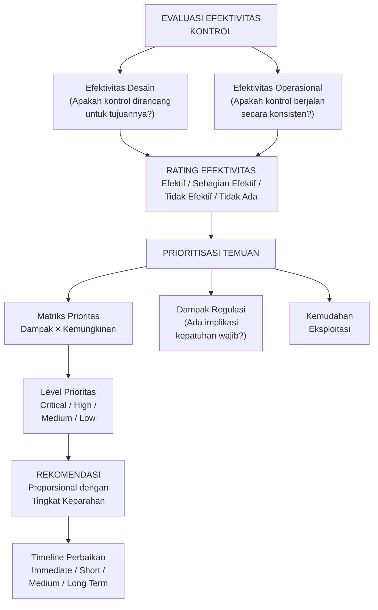

---

### 3. Pengantar Kontekstual

Dalam audit yang komprehensif, auditor sering mengidentifikasi puluhan temuan. Tidak semua temuan sama pentingnya — dan manajemen yang menerima laporan berisi daftar panjang temuan tanpa prioritas akan kesulitan menentukan langkah pertama yang harus diambil. Control effectiveness rating dan prioritisasi temuan adalah dua keterampilan yang mengubah daftar temuan menjadi panduan tindakan yang dapat dieksekusi.

Rating efektivitas kontrol memberikan gambaran kualitatif yang lebih bernuansa dari sekadar "ada/tidak ada" — ia menangkap perbedaan antara kontrol yang ada di atas kertas tetapi tidak diimplementasikan, kontrol yang diimplementasikan tetapi tidak efektif, dan kontrol yang berjalan dengan baik. Prioritisasi memastikan bahwa manajemen tahu secara persis mana yang harus diatasi hari ini, bulan ini, dan kuartal ini.

---

### 4. Landasan Teori

#### 4.1 Control Effectiveness Rating

**Mengapa Rating Lebih Baik dari Binary?**

Pendekatan binary (sesuai/tidak sesuai) seringkali terlalu kasar. Sebuah kontrol bisa:
- Dirancang dengan baik tetapi tidak diimplementasikan
- Diimplementasikan tetapi tidak konsisten (hanya 60% dari waktu)
- Konsisten tetapi tidak efektif (kontrol tidak mengurangi risiko yang ditargetkan)
- Efektif untuk sebagian kasus tetapi memiliki celah untuk kasus lain

Rating efektivitas yang lebih granular memungkinkan rekomendasi yang lebih tepat sasaran.

**Skala Rating Efektivitas Kontrol:**

| Rating | Skor | Deskripsi | Implikasi Risiko |
|--------|------|-----------|-----------------|
| **Efektif** | 4 | Kontrol dirancang dengan baik, diimplementasikan secara konsisten, dan menghasilkan outcome yang diinginkan | Risiko dikelola dengan baik |
| **Sebagian Efektif** | 3 | Kontrol ada dan sebagian berjalan, tapi ada celah dalam implementasi atau konsistensi | Risiko residual lebih tinggi dari yang diharapkan |
| **Lemah** | 2 | Kontrol ada tetapi jarang diikuti atau tidak menghasilkan outcome yang diinginkan | Kontrol memberikan sedikit perlindungan nyata |
| **Tidak Efektif** | 1 | Kontrol terdokumentasi tapi tidak diimplementasikan sama sekali | Kontrol tidak mengurangi risiko |
| **Tidak Ada** | 0 | Tidak ada kontrol untuk area ini | Risiko inherent = risiko residual |

**Prosedur Penilaian Efektivitas:**

*Langkah 1 — Evaluasi Desain:*
- Apakah kontrol dirancang dengan tepat untuk mengatasi risiko yang ditargetkan?
- Apakah mencakup semua aspek yang diperlukan (who, what, when, how)?
- Apakah persyaratan kebijakan/prosedur jelas dan dapat diikuti?

*Langkah 2 — Evaluasi Implementasi:*
- Apakah kontrol benar-benar ada di lingkungan produksi?
- Apakah konfigurasi teknis sesuai dengan yang direncanakan dalam desain?
- Apakah sumber daya (manusia, teknologi) yang dibutuhkan tersedia?

*Langkah 3 — Evaluasi Operasional:*
- Apakah kontrol berjalan secara konsisten dari waktu ke waktu?
- Berapa frekuensi kegagalan atau exception?
- Apakah ada mekanisme monitoring dan eskalasi ketika kontrol gagal?

**Contoh Penerapan untuk NDG:**

| Kontrol | Desain | Implementasi | Operasional | Rating |
|---------|--------|-------------|------------|--------|
| Kebijakan akses NDG-SEC-002 | Baik (lengkap, jelas) | Sebagian (RBAC diterapkan) | Lemah (review tidak rutin) | Sebagian Efektif (3) |
| Patch management | Baik (prosedur ada) | Sebagian (dev server 60%) | Lemah (tidak ada monitoring) | Lemah (2) |
| Logging SIEM | Baik (Splunk terkonfigurasi) | Baik (aktif di semua server kritis) | Lemah (FP rate tinggi, tidak di-tune) | Sebagian Efektif (3) |
| Offboarding akses | Lemah (tidak ada prosedur formal) | Tidak ada (ad hoc) | Tidak ada | Tidak Efektif (1) |

#### 4.2 Prioritisasi Temuan Audit

**Dimensi Prioritisasi:**

*a) Dampak (Impact):*
- **Keuangan**: Potensi kerugian finansial langsung (denda regulasi, biaya pemulihan, kehilangan pendapatan)
- **Reputasional**: Dampak terhadap kepercayaan nasabah, mitra, dan publik
- **Operasional**: Gangguan terhadap operasional bisnis
- **Legal/Regulatori**: Potensi pelanggaran hukum atau regulasi yang bisa mengakibatkan sanksi
- **Keselamatan**: Dampak terhadap keselamatan personel atau masyarakat (relevan untuk infrastruktur kritis)

*b) Kemungkinan (Likelihood):*
- Seberapa mudah kelemahan ini dapat dieksploitasi?
- Apakah ada bukti eksploitasi aktif saat ini?
- Apakah teknik eksploitasi tersedia secara publik?
- Seberapa termotivasi pelaku ancaman untuk menargetkan area ini?

*c) Faktor Regulasi:*
Temuan yang memiliki implikasi kepatuhan regulasi wajib mendapat prioritas lebih tinggi terlepas dari scoring risiko, karena kegagalan mematuhi regulasi dapat mengakibatkan sanksi langsung.

*d) Kemudahan Remediasi:*
Temuan yang mudah diperbaiki (quick win) dengan dampak signifikan sebaiknya diprioritaskan untuk segera diselesaikan — mereka memberikan "return on security investment" tertinggi.

**Matriks Prioritas dengan Skor:**

| Skor Risiko (L×I) | Faktor Regulasi | Prioritas Akhir | Tenggat |
|-------------------|----------------|-----------------|---------|
| ≥ 16 | Ya/Tidak | Critical | Immediate (24-72 jam) |
| 12-15 | Ya | Critical | Immediate |
| 12-15 | Tidak | High | 30 hari |
| 8-11 | Ya | High | 30 hari |
| 8-11 | Tidak | Medium | 90 hari |
| ≤ 7 | Apapun | Low/Informational | 180 hari atau siklus berikutnya |

**Rekomendasi yang Proporsional:**

Rekomendasi harus proporsional dengan tingkat keparahan:

*Critical/High*: Rekomendasi spesifik, terukur, dan dengan timeline yang ketat. Harus mencakup: tindakan immediate (hari pertama), tindakan jangka pendek (30 hari), dan kontrol preventif jangka panjang.

*Medium*: Rekomendasi yang lebih terencana dengan timeline moderat. Dapat mencakup pilihan implementasi (berbagai pendekatan yang dapat dipertimbangkan).

*Low/Informational*: Saran umum yang dapat dipertimbangkan dalam siklus perencanaan berikutnya.

**Format Rekomendasi yang Baik:**

Rekomendasi yang efektif harus menjawab: APA yang harus dilakukan, SIAPA yang bertanggung jawab, KAPAN harus selesai, dan BAGAIMANA efektivitasnya diverifikasi.

```
Rekomendasi untuk Finding NDG-001 (Akun Privileged Ex-Karyawan):

IMMEDIATE (24 jam):
- Disable 12 akun ex-karyawan yang teridentifikasi aktif
- Lakukan audit menyeluruh semua akun privileged (tidak hanya 12 yang teridentifikasi)
- Tanggung jawab: Kepala IT NDG + CISO
- Verifikasi: Report dari Active Directory yang menunjukkan status semua akun

SHORT-TERM (30 hari):
- Implementasikan workflow otomatis antara sistem HR dan AD untuk pencabutan akses
  saat karyawan berhenti (trigger dari Workday → AD disable user dalam 4 jam)
- Revisi Kebijakan NDG-SEC-002 untuk mencakup SLA offboarding yang ketat
- Tanggung jawab: Tim IT + HR + CISO
- Verifikasi: Test end-to-end workflow dengan akun uji coba

LONG-TERM (90 hari):
- Implementasikan Privileged Access Management (PAM) solution
- Review akses privileged setiap 90 hari (bukan 6 bulan)
- Tanggung jawab: CISO dengan anggaran yang disetujui Dewan Direksi
```

#### 4.3 Hubungan Control Effectiveness dan Temuan Klasifikasi

| Efektivitas Kontrol | Implikasi Klasifikasi Temuan |
|--------------------|-----------------------------|
| Rating 4 (Efektif) | Tidak ada temuan (kontrol sesuai) |
| Rating 3 (Sebagian Efektif) | Observasi atau NC Minor (tergantung apakah persyaratan "shall" terpenuhi) |
| Rating 2 (Lemah) | NC Minor (jika kontrol ada tapi tidak konsisten) atau NC Mayor (jika kegagalan sistemik) |
| Rating 1 (Tidak Efektif) | NC (kontrol ada tapi tidak berfungsi) |
| Rating 0 (Tidak Ada) | NC Mayor (persyaratan wajib tidak terpenuhi sama sekali) |

---

### 5. Model atau Arsitektur

```mermaid
flowchart LR
    subgraph ControlRating["CONTROL EFFECTIVENESS RATING"]
        Design2["Evaluasi\nDesain\n(1-4)"]
        Impl["Evaluasi\nImplementasi\n(1-4)"]
        Oper["Evaluasi\nOperasional\n(1-4)"]
        OverallRating["Rating Keseluruhan\n(Paling lemah\ndi antara ketiganya)"]
        Design2 --> OverallRating
        Impl --> OverallRating
        Oper --> OverallRating
    end
    subgraph FindingPrio["PRIORITISASI TEMUAN"]
        Impact2["Skor Dampak\n(1-5)"]
        Likely["Skor Kemungkinan\n(1-5)"]
        RegFactor["Faktor Regulasi\n(Ada/Tidak)"]
        RemEase["Kemudahan\nRemediasi"]
        PrioScore["Skor Prioritas\nAkhir"]
        Impact2 --> PrioScore
        Likely --> PrioScore
        RegFactor --> PrioScore
        RemEase --> PrioScore
    end
    OverallRating --> FindingPrio
    PrioScore --> RecommType["Tipe Rekomendasi\nImmediate/Short/\nLong-term"]
    RecommType --> CAP3["Corrective\nAction Plan"]
```

---

### 6. Contoh Terapan

**Skenario: Rating dan Prioritisasi Temuan NDG — 5 Finding**

Hasil audit mengidentifikasi 5 temuan dengan data berikut:

| Finding | Deskripsi | Rating Kontrol | Dampak | Kemungkinan | Regulasi? | Prioritas |
|---------|-----------|---------------|--------|-------------|-----------|-----------|
| F-001 | 12 akun ex-karyawan aktif dengan hak privileged | Tidak Efektif (1) | 5 | 4 | Ya (POJK) | **CRITICAL** |
| F-002 | 35 vuln. high/critical tidak di-remediate >30 hari | Lemah (2) | 5 | 4 | Tidak | **Critical** |
| F-003 | SIEM 500+ false positives/hari, alerting tidak di-tune | Sebagian Efektif (3) | 4 | 3 | Tidak | **High** |
| F-004 | Retensi CCTV 30 hari vs. kebijakan 90 hari | Sebagian Efektif (3) | 2 | 2 | Tidak | **Medium** |
| F-005 | 35% karyawan belum selesaikan awareness training | Sebagian Efektif (3) | 3 | 3 | Tidak | **Medium** |

**Rekomendasi Terprioritasi:**

*Critical (Immediate — 72 jam):*
F-001: Disable semua akun ex-karyawan + audit menyeluruh akun privileged
F-002: Emergency patch/workaround untuk 10 kerentanan critical (CVSS ≥ 9.0) yang menghadap internet

*High (30 hari):*
F-003: Tuning SIEM — kembangkan use case berbasis MITRE ATT&CK, target FP rate < 20/hari; tetapkan SLA alert response

*Medium (90 hari):*
F-004: Upgrade kapasitas storage CCTV untuk memenuhi retensi 90 hari
F-005: Wajibkan completion awareness training sebelum akses ke sistem kritis diberikan; integrasikan dengan HR system

---

### 7. Praktikum atau Aktivitas Terarah

**Judul Praktikum:** Rating Efektivitas Kontrol dan Penyusunan Priority Matrix

**Tujuan Praktikum:**
- Mampu menilai efektivitas kontrol berdasarkan tiga dimensi (desain, implementasi, operasional)
- Mampu menyusun matriks prioritas untuk temuan audit
- Mampu menyusun rekomendasi yang proporsional dengan tingkat keparahan

**Langkah Kerja:**

*Tahap 1 — Control Effectiveness Rating (30 menit):*
Dosen memberikan deskripsi 5 kontrol dari skenario organisasi. Untuk setiap kontrol, lakukan evaluasi desain, implementasi, dan operasional, kemudian berikan rating keseluruhan.

*Tahap 2 — Priority Matrix (20 menit):*
Masukkan semua temuan dari Tahap 1 ke dalam matriks prioritas. Urutkan dari Critical hingga Low.

*Tahap 3 — Rekomendasi (30 menit):*
Untuk 3 temuan tertinggi prioritasnya, susun rekomendasi yang mencakup immediate, short-term, dan long-term actions.

---

### 8. Latihan Pemahaman

**Soal 1 (Pilihan Ganda):** Sebuah kontrol yang terdokumentasi dengan baik (desain baik), dikonfigurasi dengan benar (implementasi baik), tetapi tidak digunakan secara konsisten oleh tim (hanya 50% compliance) mendapat rating:
- A. Efektif (4)
- B. Sebagian Efektif (3)
- C. Lemah (2)
- D. Tidak Efektif (1)

**Soal 2 (Analisis):** Mengapa rating kontrol keseluruhan harus mengikuti dimensi yang paling lemah, bukan rata-rata dari ketiganya?

**Soal 3 (Perancangan):** Susun rekomendasi untuk temuan berikut menggunakan format immediate/short-term/long-term: "Log audit SIEM NDG tidak mencatat event 'privilege escalation' di 3 dari 8 server kritis."

**Soal 4 (Evaluasi):** Dua temuan: (A) TLS 1.0 pada 2 sistem internal non-kritis; (B) Tidak ada prosedur respons insiden yang terdokumentasi. Mana yang lebih diprioritaskan dan mengapa?

**Soal 5 (Esai):** Jelaskan mengapa "kemudahan remediasi" menjadi faktor prioritisasi yang valid, bahkan untuk temuan dengan risiko yang lebih rendah.

---

### 9. Latihan Terapan / Studi Kasus

**Studi Kasus: Prioritisasi Temuan Audit GSN**

Dari audit GSN (Bab 8), Anda mengidentifikasi 6 temuan berikut. Lakukan control effectiveness rating dan prioritisasi:

1. Risk assessment tidak diperbarui sejak 18 bulan (rating kontrol: Lemah-2; dampak: 4; kemungkinan: 3; regulasi: Tidak)
2. Kebijakan keamanan tidak di-review 3 tahun (rating: Tidak Efektif-1; dampak: 3; kemungkinan: 3; regulasi: Ya - ISO 27001 mensyaratkan review berkala)
3. 35 vuln. high/critical open >30 hari (rating: Lemah-2; dampak: 5; kemungkinan: 4; regulasi: Tidak)
4. NDA missing untuk 2 karyawan (rating: Tidak Ada-0 untuk karyawan tersebut; dampak: 3; kemungkinan: 2; regulasi: Ya)
5. Rekaman CCTV hanya 30 hari vs. kebijakan 90 hari (rating: Sebagian Efektif-3; dampak: 2; kemungkinan: 2; regulasi: Tidak)
6. BCP test terlambat 2 bulan (rating: Sebagian Efektif-3; dampak: 4; kemungkinan: 2; regulasi: Tidak)

*Pertanyaan:*
1. Tentukan prioritas (Critical/High/Medium/Low) untuk masing-masing temuan.
2. Susun urutan prioritas 1-6 dari yang paling mendesak.
3. Untuk temuan nomor 3 (kerentanan), susun rekomendasi immediate/short-term/long-term.

---

### 10. Kunci Jawaban dan Pembahasan

**Jawaban Soal 1:** **C — Lemah (2).** Rating kontrol ditentukan oleh dimensi yang paling lemah, bukan rata-rata. Desain baik (4) dan implementasi baik (4) tetapi operasional hanya 50% compliance berarti dimensi operasional adalah yang paling lemah. 50% compliance menunjukkan kontrol tidak berjalan secara konsisten — ini termasuk "Lemah" bukan "Sebagian Efektif" karena kegagalan 50% dalam operasional adalah signifikan.

**Jawaban Soal 2 (Analisis):**
Rating kontrol mengikuti dimensi paling lemah (bukan rata-rata) karena: rantai keamanan sekuat mata rantai terlemahnya. Sebuah kontrol yang dirancang dengan sempurna (4) tetapi tidak diimplementasikan (0) memberikan perlindungan NOL dalam kenyataan. Mengambil rata-rata (2) akan menyesatkan — angka 2 mengesankan ada perlindungan sedang, padahal dalam kenyataan tidak ada sama sekali. Pendekatan "paling lemah" memastikan evaluasi yang realistis dan tidak overestimasi efektivitas kontrol.

**Jawaban Soal 3 (Rekomendasi):**

IMMEDIATE (24-48 jam):
- Identifikasi secara manual ketiga server yang tidak logging event privilege escalation
- Tambahkan konfigurasi logging manually pada ketiga server tersebut (emergency change dengan approval)
- Verifikasi: generate event uji coba dan konfirmasi muncul di SIEM
- PIC: Senior sysadmin + SIEM engineer

SHORT-TERM (30 hari):
- Audit seluruh konfigurasi logging di semua 8 server kritis secara sistematis
- Buat "golden template" konfigurasi logging yang mencakup semua event kritis (gunakan NIST SP 800-92 sebagai referensi)
- Deploy template via configuration management tool (Ansible/Puppet) untuk konsistensi
- PIC: Security engineer + IT operations

LONG-TERM (90 hari):
- Implementasikan configuration compliance monitoring (CSPM/SIEM use case) yang otomatis mendeteksi server yang tidak memenuhi konfigurasi logging standar
- Tetapkan review konfigurasi logging sebagai bagian dari audit teknis kuartalan
- PIC: CISO dengan dukungan anggaran IT

**Jawaban Soal 4 (Evaluasi):**

Temuan (B) — Tidak ada prosedur respons insiden — lebih diprioritaskan dari (A) TLS 1.0 pada sistem internal non-kritis. Alasan: (1) Dampak lebih luas: ketiadaan prosedur IR berarti SEMUA insiden keamanan (apapun jenisnya) akan ditangani secara ad hoc, meningkatkan risiko kesalahan dan keterlambatan; (2) Kemungkinan insiden lebih tinggi: semua organisasi menghadapi risiko insiden — tidak memiliki prosedur IR adalah "always on" risk; (3) TLS 1.0 pada sistem non-kritis: dampak terbatas pada sistem tersebut, dan risiko eksploitasi TLS 1.0 memerlukan kondisi spesifik (man-in-the-middle dalam jaringan internal). (B) adalah NC Mayor (kegagalan sistemik pada kontrol kritis) vs. (A) yang adalah NC Minor atau Observasi tergantung sensitivitas sistem.

**Jawaban Soal 5 (Esai):**

Kemudahan remediasi adalah faktor prioritisasi yang valid karena alasan efisiensi sumber daya dan prinsip "security ROI" (return on investment keamanan). Jika dua temuan memiliki risiko serupa, tetapi satu memerlukan 1 jam (disable akun) dan yang lain memerlukan 6 bulan (implementasi PAM solution), menyelesaikan yang lebih mudah lebih dulu memberikan: (a) Pengurangan risiko yang lebih cepat; (b) Kepercayaan dan momentum bagi tim yang mengerjakan; (c) Membuktikan kepada manajemen bahwa audit menghasilkan nilai yang konkret dan terukur; (d) Membebaskan bandwidth untuk fokus pada perbaikan yang lebih kompleks. Quick wins dengan dampak tinggi adalah strategi komunikasi yang efektif untuk membangun dukungan manajemen terhadap program keamanan yang lebih komprehensif.

**Jawaban Studi Kasus:**

1. **Prioritas per temuan:**

| # | Dampak | Kemungkinan | Skor | Regulasi | Prioritas |
|---|--------|-------------|------|----------|-----------|
| 1 | 4 | 3 | 12 | Tidak | **High** |
| 2 | 3 | 3 | 9 | Ya (ISO) | **High** |
| 3 | 5 | 4 | 20 | Tidak | **Critical** |
| 4 | 3 | 2 | 6 | Ya | **High** |
| 5 | 2 | 2 | 4 | Tidak | **Low** |
| 6 | 4 | 2 | 8 | Tidak | **Medium** |

2. **Urutan prioritas:** #3 (Critical) → #1 (High, skor 12) → #2 (High, skor 9, ada regulasi) → #4 (High, skor 6 tapi ada regulasi) → #6 (Medium) → #5 (Low)

3. **Rekomendasi untuk Finding #3 (35 vuln. high/critical):**

*Immediate (48 jam):* Identifikasi 5 kerentanan CVSS ≥ 9.0 yang menghadap internet → patch atau isolasi segera. Hubungi vendor untuk workaround jika patch tidak tersedia. PIC: Kepala IT + security team.

*Short-term (30 hari):* Remediate seluruh 35 kerentanan high/critical sesuai SLA yang ditetapkan (High: 30 hari, Critical: 14 hari). Tetapkan vulnerability remediation SLA secara formal. Implementasikan scanning otomatis mingguan (bukan bulanan). PIC: IT operations dengan prioritas dari security team.

*Long-term (90 hari):* Implementasikan vulnerability management platform terintegrasi (Tenable/Qualys) dengan dashboard dan automatic ticketing ke sistem ITSM. Integrasikan dengan SDLC untuk shift-left security. Tetapkan KPI bulanan: vulnerability age, remediation rate, repeat findings.

---

### 11. Ringkasan Bab

Control effectiveness rating memberikan evaluasi yang lebih bernuansa dari binary ada/tidak ada, dengan tiga dimensi: desain, implementasi, dan operasional. Rating mengikuti dimensi paling lemah karena itulah yang menentukan keamanan nyata di lapangan. Prioritisasi temuan mengintegrasikan dampak, kemungkinan, faktor regulasi, dan kemudahan remediasi untuk menghasilkan urutan tindakan yang dapat dieksekusi. Rekomendasi harus proporsional dengan tingkat keparahan dan terstruktur dalam timeline yang konkret — immediate (hari), short-term (bulan), dan long-term (kuartal). Kombinasi rating dan prioritisasi yang baik mengubah laporan audit dari daftar temuan menjadi panduan aksi strategis.

---

### 12. Refleksi Profesional

1. **Subjektivitas Rating vs. Konsistensi**: Dua auditor yang mengevaluasi kontrol yang sama dapat memberikan rating yang berbeda. Bagaimana tim audit memastikan konsistensi dalam rating, terutama ketika anggota tim memiliki threshold objektivitas yang berbeda? Apakah standarisasi skala selalu bisa menghilangkan subjektivitas?

2. **Quick Wins vs. Solusi Fundamental**: Ada tekanan untuk memprioritaskan "quick wins" yang terlihat bagus dalam laporan berikutnya. Tetapi quick wins mungkin tidak mengatasi akar masalah fundamental. Bagaimana auditor membantu manajemen menyeimbangkan antara visibilitas jangka pendek dan keamanan jangka panjang?

3. **Rekomendasi dan Tanggung Jawab**: Ketika auditor memberikan rekomendasi spesifik (misalnya: "implementasikan PAM solution"), apakah ini merupakan langkah keluar dari peran auditor menjadi konsultan? Di mana batas antara "merekomendasikan pendekatan" dan "menentukan solusi teknis"? Dan apakah auditor yang terlalu spesifik dalam rekomendasi berisiko kehilangan independensi pada audit berikutnya?

---

## Bab 11 — Simulasi Audit: Teknik Wawancara dan Observasi

### 1. Capaian Pembelajaran Bab

Setelah menyelesaikan bab ini, mahasiswa mampu:
- Merancang dan melaksanakan wawancara audit yang efektif untuk berbagai jenis narasumber (C3)
- Menerapkan teknik observasi terstruktur untuk mengumpulkan bukti fisik dan proses (C3)
- Mengidentifikasi sinyal-sinyal yang mengindikasikan ketidakakuratan atau incomplete disclosure selama wawancara (C4)
- Mendokumentasikan hasil wawancara dan observasi dalam working paper yang terstruktur (C3)

*Dikaitkan dengan Sub-CPMK.5 (Pertemuan 11) dan Evaluasi Eval-5 (20%).*

---

### 2. Peta Konsep Bab

```mermaid
flowchart TD
    Fieldwork["AUDIT FIELDWORK\n(Pelaksanaan On-site)"] --> Interview["TEKNIK WAWANCARA\nAudit Interview"]
    Fieldwork --> Observation["TEKNIK OBSERVASI\nAudit Observation"]
    Fieldwork --> DocReview["REVIEW DOKUMEN\n(Dikombinasikan\ndengan Interview)"]
    Interview --> InterviewTypes["Jenis Interview\n- Structured (checklist)\n- Semi-structured (topik)\n- Unstructured (exploratory)"]
    Interview --> InterviewTech["Teknik Bertanya\n- Open-ended\n- Probing\n- Clarifying\n- Hypothetical"]
    Interview --> Signals["Sinyal Kewaspadaan\n- Hesitasi\n- Inkonsistensi\n- Over-sharing\n- Defleksi"]
    Observation --> PhysObs["Observasi Fisik\n(Fasilitas, Kontrol Akses,\nCCTV, Server Room)"]
    Observation --> ProcObs["Observasi Proses\n(Prosedur dijalankan\nsecara live)"]
    Interview --> WorkingPaper2["WORKING PAPER\nHasil Wawancara"]
    Observation --> WorkingPaper2
    WorkingPaper2 --> Triangulation["TRIANGULASI\n(Konfirmasi dengan\nbukti lain)"]
```

---

### 3. Pengantar Kontekstual

Dalam audit keamanan informasi, banyak kontrol yang tidak dapat diverifikasi hanya dengan melihat dokumen. Prosedur yang terdokumentasi dengan baik tidak menjamin prosedur tersebut diikuti. Kebijakan yang indah di atas kertas tidak mencegah insiden jika tidak ada yang membacanya. Wawancara dan observasi langsung adalah cara auditor "melihat di balik dokumen" — mengumpulkan bukti tentang apa yang sebenarnya terjadi di lapangan, bukan hanya apa yang diklaim terjadi.

Wawancara audit bukanlah interogasi. Pendekatan yang kolaboratif dan profesional mendorong narasumber untuk berbagi informasi secara terbuka, yang pada akhirnya menghasilkan audit yang lebih akurat dan lebih berguna bagi organisasi. Namun, auditor juga harus terampil mengenali ketika informasi yang diberikan mungkin tidak lengkap atau tidak akurat — dan tahu bagaimana menggali lebih dalam tanpa terlihat menuduh.

---

### 4. Landasan Teori

#### 4.1 Persiapan Wawancara

Wawancara yang efektif dimulai jauh sebelum pertanyaan pertama diajukan:

**a) Identifikasi Narasumber yang Tepat:**
- Untuk setiap area kontrol yang diaudit, siapa yang paling berpengetahuan tentang implementasi aktual? (Bukan hanya siapa yang "bertanggung jawab" di atas kertas)
- Pikirkan berbagai lapisan: manajemen (tahu "apa"), supervisor (tahu "bagaimana"), operator (tahu "kenyataannya")
- Wawancara dari berbagai lapisan hierarki untuk mendapatkan perspektif yang berbeda

**b) Riset Sebelum Wawancara:**
- Review dokumen yang relevan terlebih dahulu (kebijakan, prosedur, laporan sebelumnya)
- Identifikasi area yang tidak jelas atau potensial gap dari review dokumen
- Susun daftar pertanyaan berdasarkan audit program

**c) Logistik Wawancara:**
- Jadwalkan di tempat yang nyaman dan privat (bukan di depan kolega narasumber)
- Alokasikan waktu yang cukup (30-60 menit per narasumber, tergantung cakupan)
- Informasikan tujuan wawancara kepada narasumber sebelumnya
- Dua auditor idealnya hadir: satu yang mengajukan pertanyaan, satu yang mencatat

#### 4.2 Teknik Bertanya dalam Wawancara Audit

**a) Pertanyaan Open-Ended:**
Didesain untuk mendorong narasumber memberikan informasi yang luas daripada jawaban ya/tidak. Kata kunci: "Ceritakan tentang...", "Bagaimana proses...", "Apa yang terjadi ketika..."

*Contoh:* "Ceritakan tentang bagaimana proses onboarding karyawan baru memastikan akses yang diberikan sesuai dengan peran mereka."

**b) Pertanyaan Probing (Menggali):**
Digunakan untuk mendapatkan detail lebih dalam ketika jawaban awal terlalu umum atau tidak spesifik. "Apa yang Anda maksud dengan...?", "Bisa Anda berikan contoh konkret?", "Seberapa sering ini terjadi?"

*Contoh:* [Setelah narasumber mengatakan "kami selalu me-review akses setiap 6 bulan"] "Kapan review terakhir dilakukan, dan siapa yang bertanggung jawab untuk mendokumentasikannya?"

**c) Pertanyaan Klarifikasi:**
Memastikan auditor memahami dengan benar apa yang dikatakan. "Jadi jika saya memahami dengan benar, Anda mengatakan bahwa...?" — ini juga memberi narasumber kesempatan untuk mengoreksi misunderstanding.

**d) Pertanyaan Hipotetis:**
Berguna untuk menguji pengetahuan tentang prosedur atau menilai kesiapan respons. "Jika sistem Anda terkena ransomware besok pagi, apa langkah pertama yang akan Anda lakukan?"

**e) Pertanyaan Spesifik/Tertutup:**
Digunakan untuk konfirmasi fakta spesifik: tanggal, nama sistem, angka. "Review akses terakhir dilakukan tanggal berapa?" "Berapa jumlah akun privileged saat ini?"

**f) Pertanyaan Verifikasi:**
"Apakah saya bisa melihat [dokumen tertentu / konfigurasi sistem] untuk memverifikasi hal tersebut?"

#### 4.3 Sinyal Kewaspadaan dalam Wawancara

Auditor terlatih mengenali sinyal-sinyal yang mungkin mengindikasikan informasi tidak lengkap atau tidak akurat:

**a) Hesitasi dan Ketidakpastian:**
Narasumber mengambil waktu lama untuk menjawab pertanyaan yang seharusnya mudah dijawab oleh seseorang yang bertanggung jawab atas area tersebut.

**b) Defleksi:**
Mengalihkan pertanyaan ke orang lain atau topik lain. "Untuk itu, lebih baik tanya ke Pak X" padahal Pak X adalah bawahan narasumber untuk area tersebut.

**c) Over-Sharing atau Volunteering Informasi Tidak Relevan:**
Memberikan detail berlebihan tentang hal yang tidak ditanyakan, yang dapat mengindikasikan upaya mengalihkan perhatian.

**d) Inkonsistensi Internal:**
Narasumber memberikan jawaban yang bertentangan dalam satu sesi wawancara.

**e) Inkonsistensi dengan Bukti Lain:**
Jawaban bertentangan dengan dokumen atau data teknis yang sudah diperoleh.

**f) Respons yang Terlalu Sempurna:**
Jawaban yang terdengar "terlalu baik untuk menjadi kenyataan" atau yang persis mengikuti kata-kata standar kebijakan tanpa kemampuan menjelaskan dengan kata-kata sendiri — mungkin dihafalkan untuk tujuan audit.

**Respons yang Tepat terhadap Sinyal Kewaspadaan:**
- Tanyakan pertanyaan follow-up dari sudut yang berbeda
- Minta bukti konkret untuk mengkonfirmasi klaim
- Wawancara narasumber lain yang bekerja di area yang sama
- Lakukan observasi langsung jika memungkinkan

#### 4.4 Teknik Observasi

**a) Walk-through Fisik:**
Mengikuti langkah-langkah proses secara fisik di lingkungan yang sebenarnya. Untuk keamanan fisik: berjalan dari pintu masuk gedung ke ruang server sambil mengamati kontrol akses, CCTV, dan tanda-tanda keamanan. Ini sering mengungkapkan gap yang tidak terlihat dari wawancara atau dokumen.

**b) Live Process Observation:**
Mengamati proses dijalankan secara langsung (bukan dilakukan khusus untuk audit). Misalnya: mengamati proses review log keamanan oleh tim SOC selama 30 menit, atau mengamati proses onboarding karyawan baru.

*Catatan penting:* Narasumber yang tahu sedang diobservasi mungkin berperilaku berbeda dari biasanya (Hawthorne Effect). Auditor harus mendokumentasikan ini sebagai keterbatasan.

**c) Test/Re-performance:**
Auditor mengikuti prosedur secara langsung untuk memverifikasi bahwa prosedur tersebut dapat dijalankan dan menghasilkan output yang diharapkan. Misalnya: mengikuti prosedur pelaporan insiden dari awal — mengisi form, mengirim notifikasi, dan memverifikasi bahwa alert muncul di sistem SIEM.

**d) Sampling Dokumen di Tempat:**
Meminta dan mereview dokumen secara langsung di tempat kerja narasumber, bukan melalui email. Ini mengurangi risiko dokumen "disiapkan khusus" untuk audit.

#### 4.5 Dokumentasi Wawancara dalam Working Paper

Wawancara harus didokumentasikan segera setelah selesai. Working paper wawancara harus mencakup:

```
INTERVIEW WORKING PAPER
Audit: NDG-IA-2025-001
Narasumber: [Nama], [Jabatan], [Divisi]
Tanggal/Waktu: [dd/mm/yyyy, hh:mm-hh:mm]
Lokasi: [Ruangan/Lokasi]
Auditor: [Nama auditor 1 (lead interview)], [Nama auditor 2 (pencatat)]
Area yang Dicakup: [Daftar kontrol/area yang dibahas]

Ringkasan Pernyataan Kunci:
Q: [Pertanyaan yang diajukan]
A: [Ringkasan jawaban — bukan transkripsi verbatim]
Bukti yang Diminta/Diperoleh: [Daftar dokumen yang diminta]
Tindak Lanjut Diperlukan: [Pertanyaan yang belum terjawab, perlu klarifikasi]
Sinyal Kewaspadaan: [Jika ada]
Tanda Tangan Auditor: ___________
```

---

### 5. Model atau Arsitektur

```mermaid
flowchart TD
    Prep2["PERSIAPAN\nIdentifikasi narasumber\nReview dokumen\nSusun pertanyaan"] --> Opening["PEMBUKAAN INTERVIEW\nPenjelasan tujuan\nKonfirmasi peran narasumber\nAturkan suasana nyaman"]
    Opening --> MainInterview["WAWANCARA INTI\nOpen-ended → Probing\n→ Clarifying → Verify"]
    MainInterview --> SignalDetect["Deteksi Sinyal\nKewaspadaan?"]
    SignalDetect -->|"Ya"| FollowUp["Follow-up Pertanyaan\nMinta bukti konkret\nCross-check dengan sumber lain"]
    SignalDetect -->|"Tidak"| Continue["Lanjutkan ke\nTopik Berikutnya"]
    FollowUp --> Continue
    Continue --> Closing["PENUTUPAN\nRingkasan temuan awal\nKonfirmasi tindak lanjut\nUcapan terima kasih"]
    Closing --> Documentation["DOKUMENTASI SEGERA\nWorking paper\nBukti yang diperoleh\nTindak lanjut"]
    Documentation --> Triangulation2["TRIANGULASI\nKonfirmasi dengan\ndokumen + teknis"]
```

---

### 6. Contoh Terapan

**Skenario: Wawancara Manajemen Patch NDG**

**Narasumber:** Pak Rudi, Kepala Tim Operasi IT NDG (bertanggung jawab atas patch management)

**Kutipan Wawancara (Disimulasikan):**

*Auditor:* "Pak Rudi, bisa ceritakan tentang bagaimana proses manajemen patch bekerja di NDG?"

*Pak Rudi:* "Kami menggunakan WSUS untuk patch Windows. Setiap minggu ada jadwal maintenance window Minggu malam jam 1-3 pagi untuk deployment patch."

*Auditor (Probing):* "Bagaimana Anda memastikan patch yang kritis di-deploy sebelum window mingguan itu?"

*Pak Rudi:* [Hesitasi, 5 detik] "Ya, kami lihat severity-nya. Yang critical biasanya lebih cepat."

*Auditor (Klarifikasi):* "Lebih cepat — maksudnya berapa hari target untuk critical patches?"

*Pak Rudi:* "Hmm, tergantung... biasanya 1-2 minggu."

*Auditor (Verifikasi):* "Apakah ada SLA tertulis untuk remediation timeline yang bisa saya lihat?"

*Pak Rudi:* "Formal tertulis belum ada, tapi semua tahu standarnya."

**Analisis Wawancara:**
- Sinyal kewaspadaan: Hesitasi 5 detik pada pertanyaan tentang critical patch priority
- Jawaban "1-2 minggu" tidak konsisten dengan scan hasil yang menunjukkan rata-rata 45 hari
- "Semua tahu standarnya" tanpa dokumentasi = kontrol informal, tidak dapat diverifikasi
- Tindak lanjut: Minta WSUS report untuk 3 bulan terakhir; cross-check dengan hasil vulnerability scan

---

### 7. Praktikum atau Aktivitas Terarah

**Judul Praktikum:** Simulasi Role Play Wawancara Audit

**Tujuan Praktikum:**
- Mampu merancang pertanyaan wawancara yang efektif untuk area kontrol keamanan tertentu
- Mampu melaksanakan wawancara audit dengan teknik open-ended, probing, dan klarifikasi
- Mampu mengenali sinyal kewaspadaan dan merespons dengan tepat
- Mampu mendokumentasikan hasil dalam working paper

**Langkah Kerja:**

*Setup (10 menit):*
Kelas dibagi menjadi pasangan. Satu orang menjadi auditor, satu menjadi auditee (Kepala IT NDG yang diberikan "kartu peran" oleh dosen). Kartu peran berisi: apa yang diketahui narasumber, apa yang disembunyikan/tidak disebutkan secara sukarela, dan satu inkonsistensi yang sengaja dimasukkan.

*Tahap 1 — Persiapan (15 menit):*
Auditor menyusun 8-10 pertanyaan wawancara untuk area: "Manajemen Akses NDG" berdasarkan ISO 27001 A.5.15 dan A.8.2.

*Tahap 2 — Role Play (25 menit):*
Lakukan wawancara simulasi. Pengamat (pasangan lain) mencatat penggunaan teknik bertanya dan respon terhadap sinyal kewaspadaan.

*Tahap 3 — Debrief (15 menit):*
- Auditor: ceritakan sinyal kewaspadaan apa yang dideteksi
- Auditee: ungkapkan apa yang disembunyikan dan apakah berhasil terdeteksi
- Pengamat: berikan feedback tentang teknik bertanya yang digunakan

*Tahap 4 — Working Paper (15 menit):*
Susun working paper wawancara berdasarkan simulasi.

**Kriteria Keberhasilan:**
- Minimal menggunakan 3 jenis teknik bertanya yang berbeda
- Berhasil mendeteksi setidaknya satu sinyal kewaspadaan
- Working paper mencakup semua komponen yang diperlukan

---

### 8. Latihan Pemahaman

**Soal 1 (Pilihan Ganda):** Teknik bertanya yang paling tepat digunakan ketika narasumber memberikan jawaban yang tidak spesifik adalah:
- A. Pertanyaan hipotetis
- B. Pertanyaan probing
- C. Pertanyaan tertutup
- D. Pertanyaan leading

**Soal 2 (Analisis Kasus):** Ketika narasumber menjawab "Kami selalu backup setiap hari" tetapi tidak bisa menyebutkan kapan backup terakhir diverifikasi, apa yang seharusnya dilakukan auditor?

**Soal 3 (Perancangan):** Susun 5 pertanyaan wawancara (dengan jenis teknik yang bervariasi) untuk mengevaluasi implementasi kontrol "Information Security Awareness Training" (ISO 27001 A.6.3) di NDG.

**Soal 4 (Evaluasi):** Apa perbedaan antara "walk-through fisik" dan "live process observation" sebagai teknik observasi? Berikan satu contoh penggunaan masing-masing dalam audit keamanan.

**Soal 5 (Esai):** Jelaskan mengapa Hawthorne Effect (narasumber berperilaku berbeda saat diobservasi) adalah keterbatasan yang harus diakui dalam working paper, dan bagaimana auditor dapat memitigasi dampaknya.

---

### 9. Latihan Terapan / Studi Kasus

**Studi Kasus: Wawancara yang Menantang**

Auditor ISMS NDG sedang mewawancarai Ibu Dewi, Manajer HR, tentang proses offboarding karyawan dan pencabutan akses IT.

Catatan auditor dari review dokumen sebelumnya: sistem HR (Workday) tidak terintegrasi dengan Active Directory; ada 12 akun ex-karyawan yang masih aktif.

*Transkrip wawancara (ringkasan):*

**A (Auditor):** "Bisa Ibu ceritakan bagaimana proses offboarding karyawan yang resign di NDG?"

**D (Dewi):** "Ketika karyawan resign, kami melakukan exit interview, menyelesaikan administrasi penggajian, dan memastikan semua aset perusahaan dikembalikan."

**A:** "Bagaimana dengan akses sistem IT — bagaimana memastikan akses dicabut?"

**D:** "Oh, kami mengirimkan email ke IT setelah exit interview selesai."

**A:** "Dalam berapa hari setelah hari terakhir kerja?"

**D:** [Hesitasi] "Hmm, biasanya hari yang sama atau besoknya."

**A:** "Apakah ada SLA atau prosedur tertulis tentang ini?"

**D:** "Belum formal, tapi selalu kami lakukan."

**A:** "Dari sistem HR, apakah ada log atau catatan pengiriman email ke IT untuk karyawan yang resign dalam 6 bulan terakhir?"

**D:** "Oh, kami tidak simpan log email itu secara formal."

*Pertanyaan:*
1. Identifikasi semua sinyal kewaspadaan dalam transkrip ini.
2. Pertanyaan-pertanyaan apa yang seharusnya diajukan auditor sebagai follow-up?
3. Bukti apa yang harus diminta dari narasumber?
4. Bagaimana informasi dari wawancara ini berkontribusi pada temuan tentang 12 akun ex-karyawan yang masih aktif?
5. Susun entri working paper untuk wawancara ini.

---

### 10. Kunci Jawaban dan Pembahasan

**Jawaban Soal 1:** **B — Pertanyaan probing.** Probing digunakan untuk menggali lebih dalam ketika jawaban tidak spesifik. Pertanyaan hipotetis (A) digunakan untuk menguji pengetahuan prosedural. Pertanyaan tertutup (C) menghasilkan ya/tidak. Pertanyaan leading (D) seharusnya dihindari dalam audit karena mengarahkan narasumber ke jawaban tertentu.

**Jawaban Soal 2 (Analisis Kasus):**
Auditor harus: (1) Gunakan probing: "Kapan terakhir kali Anda memverifikasi bahwa backup dapat dipulihkan?" "Siapa yang melakukan verifikasi itu?" (2) Minta bukti konkret: "Apakah ada laporan atau log dari uji restore terakhir yang bisa saya lihat?" (3) Jika tidak ada, ini adalah temuan — backup yang tidak pernah diverifikasi tidak dapat dianggap sebagai kontrol yang efektif, terlepas dari frekuensi backup itu sendiri. (4) Cross-check dengan log backup system secara independen.

**Jawaban Soal 3 (Pertanyaan Wawancara Awareness Training):**

1. [Open-ended] "Ceritakan tentang program awareness training keamanan informasi yang ada di NDG saat ini."
2. [Probing] "Anda menyebutkan ada pelatihan e-learning. Bagaimana Anda memastikan semua karyawan menyelesaikannya dan benar-benar memahami kontennya?"
3. [Spesifik] "Berapa persen karyawan yang telah menyelesaikan modul training tahun ini, dan bagaimana Anda mengetahuinya?"
4. [Verifikasi] "Apakah saya bisa melihat laporan completion rate dari platform e-learning dan beberapa sampel konten training?"
5. [Hipotetis] "Jika seorang karyawan baru bergabung besok, kapan mereka akan menerima training keamanan pertama mereka, dan apa yang akan dibahas?"

**Jawaban Soal 4 (Evaluasi):**

*Walk-through fisik*: Auditor mengikuti rute atau proses secara fisik — misalnya: masuk ke gedung NDG mengikuti alur: pintu utama → registrasi tamu → akses ke lantai kantor → akses ke ruang server. Tujuan: mengevaluasi kontrol akses fisik pada setiap titik. Cocok untuk: verifikasi kontrol fisik yang berurutan dan terhubung.

*Live process observation*: Auditor mengamati proses yang sedang berjalan secara real-time — misalnya: duduk bersama analis SOC selama 30 menit dan mengamati bagaimana mereka menangani alert SIEM, atau mengamati proses backup dilakukan. Tujuan: verifikasi bahwa prosedur operasional berjalan sesuai dengan yang terdokumentasi. Cocok untuk: verifikasi prosedur operasional yang terjadi secara periodik.

**Jawaban Soal 5 (Esai):**

Hawthorne Effect adalah fenomena di mana orang berperilaku berbeda ketika tahu sedang diobservasi — cenderung lebih berhati-hati, lebih mengikuti prosedur, atau menghindari perilaku yang tidak sesuai. Dalam konteks audit, ini berarti observasi langsung mungkin menunjukkan proses yang lebih baik dari kondisi sehari-hari yang normal.

Mengapa harus diakui dalam working paper: karena ini adalah keterbatasan metodologis yang mempengaruhi keandalan bukti. Auditor tidak boleh menyatakan bahwa "kami mengobservasi proses berjalan sesuai prosedur" tanpa catatan bahwa kondisi observasi mungkin tidak representatif dari kondisi normal.

Cara mitigasi: (1) Lakukan observasi tanpa pemberitahuan terlebih dahulu jika memungkinkan dan diizinkan; (2) Bandingkan dengan bukti historis (log, laporan) yang mencerminkan kondisi sebelum audit; (3) Wawancara beberapa orang di level berbeda tentang bagaimana proses BIASANYA berjalan; (4) Jadwalkan visit yang tidak semua detail-nya dikomunikasikan ke auditee.

**Jawaban Studi Kasus:**

1. **Sinyal kewaspadaan:**
   - Hesitasi Ibu Dewi saat ditanya jumlah hari ("Hmm, biasanya hari yang sama atau besoknya") — tidak yakin, mungkin tidak selalu konsisten
   - Tidak ada prosedur tertulis ("Belum formal, tapi selalu kami lakukan") — proses bergantung pada kebiasaan, bukan kontrol
   - Tidak ada log pengiriman email ke IT — tidak ada bukti bahwa proses ini dilakukan
   - Jawaban awal tentang offboarding tidak menyebut akses IT sama sekali (defleksi awal)

2. **Follow-up yang harus diajukan:**
   - "Dari 10 karyawan yang resign dalam 6 bulan terakhir, bisa Ibu tunjukkan kapan email notifikasi dikirim ke IT untuk masing-masing?" (spesifik, meminta bukti konkret)
   - "Siapa di tim IT yang menerima email tersebut? Apakah ada konfirmasi bahwa mereka menerima dan menindaklanjuti?" (mengidentifikasi gap follow-up)
   - "Apakah pernah ada kasus di mana karyawan sudah keluar tapi akses IT terlambat dicabut?" (hipotetis yang mengundang pengakuan)
   - "Apa yang terjadi jika HR lupa mengirim email — apakah ada safety net yang lain?" (menguji apakah ada kontrol kompensasi)

3. **Bukti yang harus diminta:**
   - Daftar karyawan yang resign dalam 12 bulan terakhir beserta tanggal keluar
   - Email box HR yang menunjukkan pengiriman notifikasi ke IT (atau screenshot dari sistem HR)
   - Log Active Directory yang menunjukkan kapan akun karyawan tersebut di-disable
   - Konfirmasi cross-check dengan data IT: apakah ada akun yang di-disable lebih dari 5 hari setelah tanggal keluar?

4. **Kontribusi terhadap temuan 12 akun aktif:**
   Wawancara ini mengkonfirmasi bahwa: (a) Tidak ada prosedur formal tertulis untuk offboarding akses; (b) Proses bergantung pada email manual yang tidak dimonitor dan tidak ada konfirmasi; (c) Tidak ada log yang memungkinkan verifikasi bahwa proses berjalan. Ini memberikan "cause" dalam struktur 4C: bukan sabotase atau kelalaian individu, tetapi **kegagalan desain proses** — tidak ada mekanisme yang menjamin notifikasi IT terjadi dan dikonfirmasi setiap kali karyawan resign.

5. **Working Paper (Ringkasan):**
```
INTERVIEW WORKING PAPER — NDG-IA-2025-001
Narasumber: Ibu Dewi, Manajer HR
Tanggal: [tgl], 14:00-14:45
Area: Offboarding dan Pencabutan Akses IT
Auditor: Sari (lead), Budi (pencatat)

Pernyataan Kunci:
- Proses offboarding mencakup exit interview dan pengembalian aset
- Notifikasi IT dilakukan via email, tidak ada SLA tertulis
- Tidak ada log pengiriman email ke IT
- Target waktu: "biasanya hari yang sama atau besoknya" (tidak konsisten, tidak terdokumentasi)

Sinyal Kewaspadaan:
- Hesitasi saat ditanya jumlah hari pencabutan akses
- Tidak ada log atau bukti proses ini dilakukan secara konsisten

Bukti yang Diminta: [daftar]
Tindak Lanjut: Cross-check dengan Active Directory log untuk karyawan yang resign 6 bulan terakhir
Temuan Sementara: Proses offboarding akses IT tidak memiliki kontrol formal yang terverifikasi
```

---

### 11. Ringkasan Bab

Wawancara audit yang efektif memadukan persiapan yang matang, penguasaan teknik bertanya yang beragam, dan kemampuan mengenali sinyal kewaspadaan. Struktur pertanyaan dari open-ended ke probing ke klarifikasi ke verifikasi memastikan bahwa auditor tidak hanya mendapatkan informasi permukaan tetapi dapat menggali lebih dalam ke kondisi aktual. Observasi — baik walk-through fisik maupun live process — melengkapi wawancara dengan bukti yang lebih langsung dan sulit dimanipulasi. Semua bukti dari wawancara dan observasi harus segera didokumentasikan dalam working paper yang terstruktur dan kemudian ditriangulasikan dengan sumber bukti lain untuk memastikan keakuratan kesimpulan.

---

### 12. Refleksi Profesional

1. **Keseimbangan antara Investigasi dan Kolaborasi**: Wawancara audit yang terlalu terasa seperti interogasi dapat membuat auditee defensif dan kurang terbuka. Tetapi yang terlalu "ramah" mungkin melewatkan informasi kritis. Bagaimana auditor menyeimbangkan tekanan untuk mendapatkan informasi yang akurat dengan kebutuhan mempertahankan hubungan profesional yang produktif dengan auditee?

2. **Etika Wawancara**: Ketika auditor mendeteksi sinyal kewaspadaan, teknik probing yang agresif mungkin menghasilkan informasi yang berguna — tetapi juga bisa menekan narasumber secara tidak proporsional. Apa batas etika dalam teknik wawancara audit? Apakah ada teknik yang tidak pernah dapat dibenarkan bahkan jika menghasilkan informasi yang akurat?

3. **Perlindungan Narasumber yang Jujur**: Dalam beberapa kasus, karyawan yang memberikan informasi jujur tentang kelemahan organisasi mungkin menghadapi risiko profesional. Auditor yang mendapat informasi sensitif dari karyawan tingkat bawah — bagaimana ia melindungi sumber tersebut sambil tetap menggunakan informasi untuk tujuan audit?

---

## Bab 12 — Working Paper dan Nonconformity Log

### 1. Capaian Pembelajaran Bab

Setelah menyelesaikan bab ini, mahasiswa mampu:
- Menyusun working paper audit yang lengkap, terstruktur, dan dapat diaudit ulang (C3)
- Membedakan jenis-jenis catatan audit (nonconformity, observasi, OFI) dan mendokumentasikannya secara tepat (C3)
- Memelihara nonconformity log yang terorganisir selama pelaksanaan audit (C3)
- Mengevaluasi kualitas working paper dari perspektif peer review (C4)

*Dikaitkan dengan Sub-CPMK.5 (Pertemuan 12) dan Evaluasi Eval-5 (20%).*

---

### 2. Peta Konsep Bab

```mermaid
flowchart TD
    AuditEvidence["BUKTI AUDIT\n(Dikumpulkan selama\nFieldwork)"] --> WorkingPaper3["WORKING PAPER\n(Dokumentasi Kerja\nAuditor)"]
    WorkingPaper3 --> WPComponents["Komponen Working Paper\n- Header & Referensi\n- Objektif & Kriteria\n- Prosedur yang Dilakukan\n- Bukti yang Dikumpulkan\n- Temuan & Kesimpulan\n- Tanda Tangan"]
    WorkingPaper3 --> WPQuality["Kualitas Working Paper\n- Lengkap\n- Akurat\n- Terorganisir\n- Dapat Diaudit Ulang\n- Bebas Bias"]
    WorkingPaper3 --> NCLog["NONCONFORMITY LOG\n(Daftar terpusat\nsemua temuan)"]
    NCLog --> NCEntry["Entri NC Log\n- NC ID\n- Deskripsi\n- Klausul/Kontrol\n- Severity\n- Status"]
    NCLog --> NCTypes["Jenis Temuan\n- NC Mayor\n- NC Minor\n- Observasi (OBS)\n- OFI"]
    WPComponents --> PeerReview["PEER REVIEW\n(Review oleh\nauditor lain)"]
    PeerReview --> FinalWP["Working Paper Final\n(Disetujui Lead Auditor)"]
```

---

### 3. Pengantar Kontekstual

Working paper adalah "memori institutional" dari audit — mereka mendokumentasikan setiap langkah yang diambil, setiap bukti yang dikumpulkan, dan setiap kesimpulan yang dicapai. Tanpa working paper yang baik, kesimpulan audit tidak dapat diverifikasi, temuan tidak dapat dipertanggungjawabkan, dan laporan audit tidak memiliki landasan yang dapat ditelusuri.

Dalam konteks hukum dan regulasi, working paper dapat dipanggil sebagai bukti dalam sengketa atau investigasi. Mereka juga adalah basis untuk audit berikutnya — auditor pada siklus berikutnya menggunakan working paper sebelumnya sebagai titik awal untuk memahami kondisi organisasi dan perkembangan yang terjadi.

Nonconformity log adalah dokumen kontrol yang memastikan tidak ada temuan yang "jatuh" selama proses audit. Ia memberikan visibilitas terpusat kepada ketua tim audit tentang apa yang sudah ditemukan, status setiap temuan, dan apa yang masih perlu diselesaikan sebelum laporan final dapat diterbitkan.

---

### 4. Landasan Teori

#### 4.1 Working Paper: Definisi dan Fungsi

**Definisi:** Working paper (kertas kerja) adalah kumpulan dokumentasi yang dikembangkan dan disimpan oleh auditor yang mencatat prosedur yang dilakukan, bukti yang dikumpulkan, dan kesimpulan yang dicapai selama audit.

**Fungsi Working Paper:**
1. **Dukungan Laporan Audit**: Setiap temuan dalam laporan audit harus dapat ditelusuri ke working paper yang spesifik
2. **Basis Peer Review**: Memungkinkan auditor lain atau reviewer untuk memeriksa dan mengevaluasi pekerjaan yang dilakukan
3. **Retensi Bukti**: Menyimpan bukti dalam format yang dapat diakses untuk referensi masa depan atau sengketa
4. **Standar Kualitas**: Mendokumentasikan bahwa prosedur yang ditetapkan telah dilaksanakan
5. **Panduan Audit Berikutnya**: Memberikan konteks dan baseline untuk siklus audit berikutnya

**Prinsip Working Paper yang Baik (CLEAR):**
- **C**omplete: Memuat semua informasi yang diperlukan tanpa gap
- **L**egible: Dapat dibaca dan dipahami oleh pihak yang bukan penulisnya
- **E**vidence-Based: Setiap pernyataan didukung oleh referensi bukti yang spesifik
- **A**ccurate: Mencerminkan kondisi yang sebenarnya, bukan yang diinginkan
- **R**eproducible: Auditor lain dapat menggunakan working paper untuk mengulang prosedur dan mendapat hasil yang sama

#### 4.2 Struktur Working Paper

**a) Working Paper Individual (per prosedur/kontrol):**

```
WORKING PAPER — HEADER
Audit ID: NDG-IA-2025-001
WP Nomor: WP-IAM-003
Area Audit: Identity and Access Management
Kontrol yang Dievaluasi: ISO 27001:2022 A.8.2 (Privileged Access Rights)
Auditor: [Nama]
Tanggal Pelaksanaan: [tgl]
Status: Draft / Final

OBJEKTIF
Memverifikasi bahwa hak akses privileged diberikan sesuai otorisasi formal,
di-review secara berkala, dan dicabut segera ketika tidak diperlukan.

KRITERIA AUDIT
- ISO/IEC 27001:2022 Annex A 8.2
- Kebijakan Manajemen Akses NDG-SEC-002 v2.1

PROSEDUR YANG DILAKUKAN
1. [tanggal] Meminta export daftar akun privileged dari Active Directory (AD-Export-001)
2. [tanggal] Cross-check dengan daftar karyawan aktif dari HR (HR-List-001)
3. [tanggal] Review dokumentasi form otorisasi untuk 25 sampel akun (Ref: Form-IAM-[001-025])
4. [tanggal] Wawancara dengan Kepala IT (WP-Interview-002)

BUKTI YANG DIKUMPULKAN (Referensi)
- AD-Export-001: Export Active Directory tanggal [tgl] — 847 akun total, 50 privileged
- HR-List-001: Daftar karyawan aktif per [tgl] dari Workday — [n] karyawan
- Form-IAM-[001-025]: Form otorisasi untuk 25 akun sampel
- WP-Interview-002: Working paper wawancara Kepala IT [tgl]

TEMUAN AUDIT
Kesesuaian: 22 dari 25 akun sampel memiliki form otorisasi yang lengkap.
Ketidaksesuaian: [Deskripsi detail temuan]

KESIMPULAN
Berdasarkan prosedur yang dilakukan dan bukti yang dikumpulkan, area kontrol
Privileged Access Rights tidak sepenuhnya memenuhi persyaratan ISO 27001:2022 A.8.2.
Tiga finding identified:
- F-001 (NC Minor): 3 akun tanpa otorisasi formal
- F-002 (NC Mayor): 12 akun ex-karyawan masih aktif

REFERENSI KE FINDING LOG: F-001, F-002

Tanda Tangan Auditor: _______________ Tanggal: ___
Review oleh Lead Auditor: __________ Tanggal: ___
```

**b) Working Paper Index:**
Dokumen yang mencantumkan semua working paper dalam audit, nomor referensinya, area yang dicakup, auditor yang bertanggung jawab, dan status (draft/final/reviewed). Memungkinkan navigasi cepat ke working paper yang diperlukan.

#### 4.3 Nonconformity Log

**Definisi:** Nonconformity log (atau finding log) adalah dokumen terpusat yang mencatat semua temuan audit — nonconformity, observasi, dan OFI — dalam satu tempat yang terorganisir.

**Komponen Nonconformity Log:**

| Kolom | Deskripsi |
|-------|-----------|
| Finding ID | Identifikasi unik (misalnya F-001, F-002) |
| WP Referensi | Nomor working paper yang mendukung |
| Deskripsi Singkat | Ringkasan 1-2 kalimat tentang temuan |
| Klausul/Kontrol | ISO/NIST klausul yang dilanggar |
| Severity | NC Mayor / NC Minor / Observasi / OFI |
| Kondisi (C1) | Apa yang ditemukan |
| Kriteria (C2) | Standar yang seharusnya dipatuhi |
| Penyebab (C3) | Root cause yang teridentifikasi |
| Dampak (C4) | Konsekuensi aktual/potensial |
| Risiko | High / Medium / Low |
| Status | Draft / Dikonfirmasi Auditee / Final |
| Respon Auditee | Respons atas temuan (diisi saat closing) |
| Tanggal Temuan | Kapan temuan diidentifikasi |

**Proses Pemeliharaan NC Log:**

1. *Selama audit on-site*: Tim audit memasukkan temuan ke NC log segera setelah diidentifikasi (tidak menunggu akhir audit)
2. *Sebelum closing meeting*: Ketua tim review NC log untuk memastikan kelengkapan dan konsistensi
3. *Saat closing meeting*: NC log dibagikan kepada auditee untuk konfirmasi akurasi faktual
4. *Setelah closing meeting*: Respon auditee dimasukkan ke NC log
5. *Laporan final*: NC log menjadi basis untuk bagian "Findings" dalam laporan audit

#### 4.4 Peer Review Working Paper

Peer review adalah proses di mana auditor lain (bukan yang menyusun working paper) memeriksa kualitas dan kelengkapannya. Ini adalah praktik terbaik yang meningkatkan kualitas audit.

**Checklist Peer Review:**

```
PEER REVIEW CHECKLIST — WORKING PAPER REVIEW

[ ] Header lengkap (semua field terisi)
[ ] Objektif dan kriteria jelas terdefinisi
[ ] Prosedur yang dilakukan sesuai dengan audit program
[ ] Semua bukti yang disebutkan memiliki referensi yang jelas
[ ] Temuan didukung oleh bukti yang dikutip
[ ] Kesimpulan logis berdasarkan bukti
[ ] Klasifikasi temuan (NC/OBS/OFI) tepat
[ ] Tidak ada pernyataan yang tidak didukung bukti
[ ] Bahasa objektif dan bebas emosi
[ ] Finding ID mereferensikan NC log yang benar
[ ] Tanda tangan auditor lengkap

Catatan Review: ___
Reviewed by: ___ Tanggal: ___
```

---

### 5. Model atau Arsitektur

```mermaid
flowchart LR
    subgraph FieldWork2["FIELDWORK"]
        Evid2["Kumpulkan Bukti\n(Interview, Observasi,\nDokumen, Teknis)"]
        DraftWP["Buat Draft\nWorking Paper\n(segera setelah\nbukti dikumpulkan)"]
        Evid2 --> DraftWP
    end
    subgraph Review3["REVIEW DAN FINALISASI"]
        PeerRev["Peer Review\nWorking Paper"]
        LeadRev["Review Lead\nAuditor"]
        DraftWP --> PeerRev --> LeadRev
    end
    subgraph NCTracking["NC LOG TRACKING"]
        AddNC["Tambahkan Finding\nke NC Log"]
        VerifyNC["Verifikasi NC Log\nSebelum Closing"]
        AuditeeResp["Catat Respons\nAuditee"]
        AddNC --> VerifyNC --> AuditeeResp
    end
    FieldWork2 --> NCTracking
    Review3 --> NCTracking
    NCTracking --> FinalReport2["LAPORAN AUDIT\nFINAL"]
```

---

### 6. Contoh Terapan

**Skenario: NC Log NDG Setelah Audit On-site**

Setelah 3 hari audit on-site NDG, tim audit memiliki NC log berikut:

| Finding ID | Klausul | Deskripsi | Severity | Risiko | Status |
|-----------|---------|-----------|----------|--------|--------|
| F-001 | A.8.2 | 12 akun privileged ex-karyawan masih aktif | NC Mayor | Critical | Dikonfirmasi |
| F-002 | A.8.8 | 35 vuln. high/critical belum diremediate >30 hari | NC Mayor | Critical | Dikonfirmasi |
| F-003 | A.8.15 | 3 server tidak log event privilege escalation | NC Minor | High | Draft |
| F-004 | A.9.2 | Review akses terlambat (8 bulan vs. target 6 bulan) | NC Minor | High | Dikonfirmasi |
| F-005 | A.8.15 | Alerting SIEM tidak di-tune (500+ FP/hari) | Observasi | Medium | Draft |
| F-006 | A.7.4 | Retensi CCTV 30 hari vs. kebijakan 90 hari | NC Minor | Medium | Draft |
| F-007 | A.6.3 | 35% karyawan belum selesaikan awareness training | Observasi | Medium | Dikonfirmasi |
| F-008 | A.5.30 | BCP tidak ditest dalam 14 bulan terakhir | NC Minor | Medium | Draft |

*Ketua tim audit harus menyelesaikan F-003, F-005, F-006, dan F-008 sebelum closing meeting.*

---

### 7. Praktikum atau Aktivitas Terarah

**Judul Praktikum:** Penyusunan Working Paper dan NC Log

**Tujuan Praktikum:**
- Mampu menyusun working paper yang memenuhi standar CLEAR
- Mampu memelihara NC log selama simulasi audit
- Mampu melakukan peer review working paper

**Langkah Kerja:**

*Tahap 1 — Penyusunan Working Paper (40 menit):*
Berdasarkan skenario dan bukti yang disediakan dosen untuk area "Manajemen Backup NDG", susun working paper individual yang lengkap menggunakan template standar.

*Tahap 2 — NC Log Update (15 menit):*
Masukkan semua temuan yang ditemukan dari working paper ke dalam NC log bersama (dosen menyediakan NC log template).

*Tahap 3 — Peer Review (20 menit):*
Tukar working paper dengan kelompok lain. Lakukan peer review menggunakan checklist yang disediakan dan berikan feedback tertulis.

*Tahap 4 — Revisi (15 menit):*
Revisi working paper berdasarkan feedback peer review.

---

### 8. Latihan Pemahaman

**Soal 1 (Pilihan Ganda):** Komponen working paper yang memastikan setiap kesimpulan dapat ditelusuri ke data yang spesifik adalah:
- A. Header dan Referensi
- B. Prosedur yang Dilakukan
- C. Referensi Bukti
- D. Tanda Tangan Auditor

**Soal 2 (Analisis):** Auditor menulis dalam working paper: "Kontrol manajemen akses NDG tidak memadai karena sistem tidak aman." Apa masalah dengan pernyataan ini, dan bagaimana seharusnya ditulis ulang?

**Soal 3 (Perancangan):** Buat entri NC log untuk temuan berikut: "Dari 10 server yang disampling, 4 server memiliki versi OpenSSL yang rentan terhadap CVE-2024-XXXXX (CVSS 9.1, RCE). Patch tersedia sejak 45 hari lalu."

**Soal 4 (Evaluasi):** Apa perbedaan antara "draft" dan "dikonfirmasi" dalam kolom status NC log, dan mengapa perbedaan ini penting sebelum laporan final diterbitkan?

**Soal 5 (Esai Singkat):** Jelaskan mengapa working paper harus dapat digunakan oleh auditor yang tidak terlibat dalam pelaksanaan audit untuk memahami dan memverifikasi kesimpulan yang dicapai.

---

### 9. Latihan Terapan / Studi Kasus

**Studi Kasus: Review NC Log GSN**

Tim audit GSN telah menyelesaikan 4 hari audit on-site. Ketua tim audit menerima draft NC log dari anggota tim junior:

| Finding | Deskripsi | Klausul | Severity | WP Ref |
|---------|-----------|---------|----------|--------|
| F-001 | "Manajemen risiko jelek" | 6.1.2 | NC Mayor | WP-RA-001 |
| F-002 | "35 kerentanan belum di-patch, termasuk 10 critical menghadap internet" | A.8.8 | NC Mayor | WP-VM-003 |
| F-003 | "Kebijakan tidak up to date" | 5.2 | NC Minor | WP-GOV-001 |
| F-004 | "Awareness training completion 65%" | A.6.3 | Observasi | WP-HR-002 |

*Pertanyaan:*
1. Identifikasi masalah dalam draft NC log di atas.
2. Susun ulang setiap entri NC log dengan deskripsi yang lebih baik (lengkap, akurat, berbasis fakta).
3. Apakah severity classification untuk F-003 sudah tepat? Justifikasikan.
4. Apa yang harus diverifikasi oleh ketua tim sebelum closing meeting dengan GSN?

---

### 10. Kunci Jawaban dan Pembahasan

**Jawaban Soal 1:** **C — Referensi Bukti.** Referensi bukti adalah komponen yang menghubungkan setiap pernyataan dalam working paper ke sumber bukti yang spesifik (dokumen, log, screenshot, dll.). Tanpa referensi bukti yang jelas, pernyataan dalam working paper tidak dapat diverifikasi secara independen. Header (A) berisi metadata; prosedur (B) mendokumentasikan langkah yang dilakukan; tanda tangan (D) mengkonfirmasi pertanggungjawaban.

**Jawaban Soal 2 (Analisis):**
Masalah dengan pernyataan tersebut:
1. "Tidak memadai" dan "tidak aman" adalah penilaian subjektif tanpa referensi standar
2. Tidak ada referensi bukti spesifik
3. "Tidak aman" adalah klaim yang terlalu luas

Penulisan ulang yang baik:
*"Berdasarkan review log Active Directory tanggal [tgl] (Ref: AD-Export-001) dan cross-check dengan data HR (Ref: HR-List-001), teridentifikasi 12 akun dengan hak privileged yang dimiliki oleh mantan karyawan yang sudah tidak bekerja di NDG per tanggal [tgl]. Ini tidak memenuhi persyaratan ISO/IEC 27001:2022 Annex A 8.2 yang mensyaratkan pencabutan hak akses privileged segera ketika tidak lagi diperlukan, dan Kebijakan NDG-SEC-002 v2.1 Pasal 4.3 yang menetapkan pencabutan dalam 24 jam."*

**Jawaban Soal 3 (Perancangan NC Log Entry):**

```
Finding ID: F-003
WP Referensi: WP-VM-004
Deskripsi: 4 dari 10 server yang disampling memiliki versi OpenSSL rentan terhadap 
           CVE-2024-XXXXX (CVSS 9.1 Critical, Remote Code Execution). Patch telah 
           tersedia selama 45 hari namun belum diterapkan.
Klausul/Kontrol: ISO 27001:2022 A.8.8 (Management of Technical Vulnerabilities);
                 Kebijakan Patch Management GSN-OPS-002 (remediasi critical dalam 30 hari)
Severity: NC Mayor (kerentanan RCE pada server produksi yang dapat dieksploitasi 
          secara remote = risiko kritis sistemik)
Kondisi: 40% server sampel rentan terhadap CVE critical berusia 45 hari
Kriteria: Kebijakan mewajibkan remediasi critical dalam 30 hari
Penyebab: Sedang diselidiki (wawancara lanjutan direncanakan)
Dampak: Potensi eksekusi kode jarak jauh pada server produksi; risiko kompromi data klien
Risiko: Critical
Status: Draft — perlu wawancara follow-up dengan tim VM
```

**Jawaban Soal 4 (Evaluasi):**
- *Draft*: Temuan sudah diidentifikasi dan didokumentasikan oleh auditor, tetapi belum diverifikasi faktual akurasinya dengan auditee. Mungkin masih ada detail yang perlu dikonfirmasi atau klarifikasi dari auditee.
- *Dikonfirmasi*: Auditee telah mengakui akurasi faktual dari kondisi yang dideskripsikan (meskipun mereka mungkin tidak setuju dengan klasifikasi atau interpretasi). Ini biasanya dilakukan selama atau setelah closing meeting.

Mengapa penting sebelum laporan final: Laporan final yang berisi temuan yang belum dikonfirmasi secara faktual berisiko mencantumkan informasi yang tidak akurat. Auditee memiliki hak untuk mengoreksi ketidakakuratan faktual (bukan kesimpulan auditor) sebelum laporan final. Temuan yang "dikonfirmasi" jauh lebih sulit untuk disangkal setelah laporan diterbitkan.

**Jawaban Soal 5 (Esai Singkat):**
Working paper harus dapat digunakan oleh auditor yang tidak terlibat karena: (1) **Akuntabilitas dan peer review**: Auditor lain harus bisa memeriksa apakah pekerjaan dilakukan dengan benar; (2) **Continuity**: Auditor yang mengerjakan siklus audit berikutnya perlu memahami apa yang dilakukan sebelumnya; (3) **Sengketa dan litigasi**: Dalam kasus di mana temuan audit diperdebatkan secara hukum, working paper mungkin diperiksa oleh pihak yang tidak mengenal auditor aslinya; (4) **Quality assurance**: Standar audit (IIA IPPF, ISACA ITAF) mensyaratkan bahwa working paper dapat mendukung kesimpulan bahkan jika penulisnya tidak tersedia. Ini mensyaratkan bahwa working paper tidak bergantung pada pengetahuan implisit atau "yang sudah dipahami" oleh penulisnya.

**Jawaban Studi Kasus:**

1. **Masalah dalam draft NC log:**
   - F-001: "Manajemen risiko jelek" — tidak spesifik, subjektif, tidak berbasis fakta, tidak ada data kuantitatif
   - F-003: "Kebijakan tidak up to date" — tidak spesifik (kebijakan apa? seberapa out of date?), tidak ada referensi kriteria
   - F-004: Deskripsi cukup baik tapi perlu lebih spesifik (dari total berapa? berapa yang outstanding?)
   - Semua entri: Tidak ada informasi Kondisi, Kriteria, Penyebab, Dampak

2. **Perbaikan deskripsi:**
   - F-001: "Risk assessment terakhir dilakukan 18 bulan yang lalu. Sejak itu, GSN telah meluncurkan layanan baru (managed cloud security) yang mengubah profil risiko secara signifikan. Risk register tidak mencerminkan perubahan ini."
   - F-002: "35 kerentanan high/critical (dari hasil scanning terakhir tanggal [tgl]) belum di-remediate setelah lebih dari 30 hari. 10 di antaranya adalah critical (CVSS ≥ 9.0) pada sistem yang menghadap internet langsung."
   - F-003: "Kebijakan Keamanan Informasi GSN (versi terakhir: [tgl - 3 tahun lalu]) belum di-review sejak 3 tahun. Ini melampaui interval review yang dipersyaratkan oleh ISO 27001:2022 Klausul 5.2."
   - F-004: "65 dari 200 karyawan (35%) belum menyelesaikan modul awareness keamanan informasi tahunan. Training period berakhir [tgl - 2 bulan lalu]."

3. **Severity F-003:** NC Minor sudah tepat untuk kebijakan yang outdated (bukan NC Mayor) karena kebijakan masih ada — hanya belum diperbarui. NC Mayor akan lebih tepat jika tidak ada kebijakan sama sekali, atau jika review kebijakan adalah persyaratan yang tidak pernah dipenuhi secara sistemik. Namun, jika seluruh framework ISMS bergantung pada risk assessment dan kebijakan yang outdated, ketua tim mungkin perlu mengevaluasi apakah ini semua bersama-sama membentuk pola NC Mayor.

4. **Verifikasi sebelum closing meeting:** (a) Pastikan semua WP yang direferensikan dalam NC log sudah selesai dan di-peer review; (b) Konfirmasi bahwa deskripsi faktual dalam NC log akurat (bukan opini atau interpretasi yang belum dibuktikan); (c) Pastikan klasifikasi severity konsisten di seluruh tim; (d) Buat ringkasan statistik NC log (berapa NC Mayor, Minor, Observasi, OFI) untuk dibagikan di closing meeting; (e) Siapkan "evidence package" untuk setiap temuan yang akan disampaikan.

---

### 11. Ringkasan Bab

Working paper adalah backbone dokumentasi audit — mereka harus memenuhi standar CLEAR (Complete, Legible, Evidence-Based, Accurate, Reproducible) agar dapat berfungsi sebagai basis laporan yang dapat dipertanggungjawabkan. Setiap pernyataan dalam working paper harus dapat ditelusuri ke bukti spesifik. Nonconformity log menyediakan visibilitas terpusat tentang semua temuan audit, statusnya, dan perkembangan konfirmasi dari auditee. Peer review working paper oleh auditor lain sebelum closing meeting memastikan kualitas dan konsistensi sebelum temuan dikomunikasikan secara resmi. Together, working paper dan NC log membentuk "audit trail" yang lengkap dan dapat diaudit ulang — fondasi dari audit yang dapat dipercaya.

---

### 12. Refleksi Profesional

1. **Standar Dokumentasi vs. Efisiensi**: Working paper yang komprehensif memerlukan waktu yang signifikan untuk disusun. Dalam praktik, tekanan waktu sering menyebabkan dokumentasi yang kurang memadai. Bagaimana auditor menyeimbangkan antara standar dokumentasi yang diperlukan dan efisiensi pelaksanaan audit?

2. **Working Paper sebagai Dokumen Legal**: Di beberapa yurisdiksi, working paper dapat dipanggil sebagai bukti dalam proses hukum atau regulatori. Apakah ini mengubah cara auditor mendokumentasikan penilaian subyektif atau ketidakpastian? Seberapa detail auditor harus mendokumentasikan "proses berpikir" di balik kesimpulan mereka?

3. **Keamanan dan Kerahasiaan Working Paper**: Working paper berisi informasi sangat sensitif tentang kelemahan keamanan organisasi. Jika working paper dicuri atau bocor, ini bisa menjadi "peta jalan" bagi penyerang. Bagaimana tim audit melindungi working paper selama dan setelah audit? Siapa yang berhak mengakses working paper, dan untuk berapa lama?

---

## Bab 13 — Root Cause Analysis dan Corrective Action Plan

### 1. Capaian Pembelajaran Bab

Setelah menyelesaikan bab ini, mahasiswa mampu:
- Menerapkan metode Root Cause Analysis (5 Whys dan Fishbone/Ishikawa) untuk mengidentifikasi akar penyebab temuan audit (C3)
- Membedakan antara gejala, penyebab proksimal, dan akar penyebab (C4)
- Menyusun Corrective Action Plan (CAP) yang efektif, terukur, dan berjangka waktu jelas (C3)
- Mengevaluasi kecukupan CAP yang diajukan oleh auditee berdasarkan kesesuaiannya dengan akar penyebab (C5)

*Dikaitkan dengan Sub-CPMK.5 (Pertemuan 13) dan Evaluasi Eval-5 (20%).*

---

### 2. Peta Konsep Bab

```mermaid
flowchart TD
    Finding2["TEMUAN AUDIT\n(NC / Observasi)"] --> Symptom["Gejala\n(Apa yang terlihat?)"]
    Finding2 --> ProxCause["Penyebab Proksimal\n(Mengapa langsung\nterjadi?)"]
    Finding2 --> RCA["ROOT CAUSE ANALYSIS\n(Akar Penyebab\nSesungguhnya)"]
    RCA --> FiveWhys["Metode 5 Whys\n(Tanya 'mengapa'\nberulang kali hingga\nakar ditemukan)"]
    RCA --> Fishbone["Metode Fishbone\n(Ishikawa Diagram)\n6M: Man, Machine,\nMethod, Material,\nMeasurement, Milieu"]
    RCA --> FaultTree["Fault Tree Analysis\n(Pohon kegagalan\nlogis)"]
    FiveWhys --> RootCause["AKAR PENYEBAB"]
    Fishbone --> RootCause
    FaultTree --> RootCause
    RootCause --> CAP4["CORRECTIVE ACTION PLAN\n(Rencana Perbaikan)"]
    CAP4 --> CAPComponents["Komponen CAP\n- Tindakan perbaikan\n- Tindakan pencegahan\n- PIC (penanggung jawab)\n- Timeline\n- Metode verifikasi\n- Bukti penyelesaian"]
    CAP4 --> CAPEval["EVALUASI CAP\n(Apakah CAP mengatasi\nakar penyebab?)"]
    CAPEval -->|"Tidak"| CAPRevision["Revisi CAP"]
    CAPEval -->|"Ya"| CAPApproval["CAP Disetujui\n(Follow-up monitoring)"]
```

---

### 3. Pengantar Kontekstual

Sebuah corrective action plan yang hanya mengatasi gejala — bukan akar penyebab — hampir pasti akan menghasilkan temuan yang sama pada audit berikutnya. Ini adalah pola yang sangat umum: organisasi "memperbaiki" temuan dengan cara paling mudah yang terlihat — misalnya, menonaktifkan akun ex-karyawan yang ditemukan aktif — tanpa mengatasi mengapa proses offboarding gagal mendeteksi dan mencabut akun tersebut secara tepat waktu.

Root Cause Analysis (RCA) adalah disiplin yang memaksa organisasi — dan auditor — untuk berpikir lebih dalam dari gejala. Akar penyebab seringkali tidak terlihat dari permukaan: mereka bisa berupa kelemahan desain proses, kurangnya tanggung jawab yang jelas, tekanan sumber daya, atau budaya organisasi yang tidak mendukung kepatuhan keamanan.

Auditor yang memahami RCA dapat mengevaluasi apakah CAP yang diajukan auditee benar-benar akan menyelesaikan masalah — atau hanya menyelesaikan laporan.

---

### 4. Landasan Teori

#### 4.1 Hirarki Penyebab

Sebelum membahas metode RCA, penting untuk memahami hirarki penyebab:

**Gejala (Symptom):** Yang terlihat di permukaan — apa yang ditemukan auditor. Contoh: "12 akun ex-karyawan masih aktif."

**Penyebab Proksimal (Proximal/Immediate Cause):** Penyebab langsung yang menyebabkan gejala. Contoh: "Tim HR tidak mengirim notifikasi ke IT ketika karyawan resign."

**Penyebab Kontribusi (Contributing Causes):** Faktor-faktor yang memungkinkan penyebab proksimal terjadi. Contoh: "Tidak ada prosedur tertulis yang mendefinisikan siapa yang harus menotifikasi siapa saat offboarding."

**Akar Penyebab (Root Cause):** Penyebab fundamental yang jika dihilangkan, akan mencegah penyebab proksimal dan gejala dari terulang. Contoh: "Tidak ada sistem terintegrasi atau workflow otomatis antara HR dan IT untuk manajemen siklus hidup akun pengguna; proses bergantung sepenuhnya pada komunikasi manual yang tidak dimonitor."

Perbedaan ini kritis untuk CAP: (a) memperbaiki gejala = "disable 12 akun" (solusi sementara); (b) memperbaiki penyebab proksimal = "buat SOP notifikasi offboarding" (lebih baik, tapi masih bergantung pada kepatuhan manusia); (c) memperbaiki akar penyebab = "integrasikan HR system dengan AD untuk otomatisasi pencabutan akses" (solusi permanen yang tidak bergantung pada kepatuhan manual).

#### 4.2 Metode 5 Whys

**Definisi:** Teknik iteratif di mana auditor (atau auditee) terus bertanya "mengapa?" setelah setiap jawaban hingga akar penyebab ditemukan. Dikembangkan oleh Sakichi Toyoda dan dipopulerkan dalam Toyota Production System.

**Aturan:**
- Mulai dari gejala yang terdokumentasi dalam temuan
- Setiap "mengapa" harus menghasilkan jawaban faktual yang dapat diverifikasi
- Terus bertanya hingga jawaban mengidentifikasi kegagalan sistem atau proses yang dapat diperbaiki
- Biasanya 3-7 "mengapa" cukup; bukan selalu tepat 5

**Contoh 5 Whys untuk Temuan NDG:**

*Gejala:* 12 akun ex-karyawan masih aktif dengan hak privileged

*Why 1:* Mengapa akun ex-karyawan masih aktif?
*A1:* Karena IT tidak menonaktifkan akun mereka ketika mereka keluar.

*Why 2:* Mengapa IT tidak menonaktifkan akun mereka?
*A2:* Karena IT tidak menerima notifikasi bahwa karyawan tersebut sudah keluar.

*Why 3:* Mengapa IT tidak menerima notifikasi?
*A3:* Karena proses notifikasi bergantung pada email manual dari HR, dan HR tidak selalu mengirimkannya tepat waktu.

*Why 4:* Mengapa HR tidak selalu mengirim email tepat waktu?
*A4:* Karena tidak ada checklist atau sistem tracking yang memastikan email notifikasi terkirim sebagai bagian dari proses offboarding formal.

*Why 5:* Mengapa tidak ada checklist atau sistem tracking?
*A5:* Karena proses offboarding dikembangkan bertahun-tahun lalu ketika NDG lebih kecil, dan tidak pernah diperbarui untuk mencakup integrasi keamanan informasi. Tidak ada yang ditugaskan untuk mengelola dan memperbarui proses ini.

**Akar Penyebab Teridentifikasi:** Proses offboarding tidak pernah direvisi untuk mencakup aspek keamanan informasi; tidak ada ownership jelas untuk pemeliharaan proses ini; tidak ada mekanisme kontrol yang memverifikasi pencabutan akses.

#### 4.3 Metode Fishbone (Ishikawa Diagram)

Metode Fishbone mengelompokkan penyebab potensial ke dalam kategori. Format aslinya menggunakan 6M:
- **Man**: Faktor manusia (kurangnya pengetahuan, pelatihan, atau perhatian)
- **Machine**: Teknologi dan infrastruktur
- **Method**: Proses, prosedur, dan cara kerja
- **Material**: Data, dokumen, kebijakan yang digunakan
- **Measurement**: Kurangnya metrik, monitoring, atau feedback
- **Milieu** (Environment): Budaya, tekanan organisasional, lingkungan kerja

**Contoh Fishbone untuk Manajemen Patch NDG:**

```
                    [MAN]                    [MACHINE]
         Tidak ada pemilik       Sistem WSUS tidak mencakup
         patch management → ← semua server (legacy)
         yang jelas
                    ↓                         ↓
EFFECT: 35 kerentanan high/critical belum di-remediate >30 hari
                    ↑                         ↑
         Tidak ada SLA         Tidak ada dashboard
         tertulis untuk   → ← visibility patch
         remediation          compliance
                    [METHOD]              [MEASUREMENT]
```

Keunggulan Fishbone: memastikan analisis yang komprehensif dari berbagai kategori penyebab, mencegah fokus pada satu dimensi saja.

#### 4.4 Corrective Action Plan (CAP)

**Definisi:** CAP adalah dokumen formal yang menjelaskan tindakan yang akan diambil auditee untuk mengatasi temuan audit — baik gejala, penyebab proksimal, maupun akar penyebab.

**Komponen CAP yang Efektif:**

*a) Tindakan Korektif (Corrective Action):*
Apa yang akan dilakukan untuk memperbaiki kondisi yang ada (mengatasi gejala dan penyebab proksimal). Harus spesifik dan terukur.

*b) Tindakan Pencegahan (Preventive Action):*
Apa yang akan dilakukan untuk mencegah masalah yang sama dari berulang (mengatasi akar penyebab). Ini adalah komponen yang paling penting dan seringkali paling diabaikan.

*c) PIC (Person in Charge):*
Siapa yang bertanggung jawab untuk melaksanakan setiap tindakan. Harus spesifik — nama orang, bukan nama jabatan generik.

*d) Timeline:*
Kapan setiap tindakan harus selesai. Harus realistis tetapi cukup cepat mengingat risiko yang ada.

*e) Verifikasi/Evidence of Completion:*
Apa yang akan menjadi bukti bahwa tindakan sudah diselesaikan? Tanpa ini, auditor tidak dapat memverifikasi penyelesaian selama follow-up.

*f) Reaudit/Verifikasi Auditor:*
Kapan dan bagaimana auditor akan memverifikasi bahwa CAP telah dilaksanakan?

**Template CAP:**

```
CORRECTIVE ACTION PLAN
Finding ID: F-001
Deskripsi Finding: 12 akun privileged ex-karyawan masih aktif
Akar Penyebab: Tidak ada integrasi HR-AD untuk siklus hidup akun

TINDAKAN KOREKTIF (Mengatasi Gejala):
Tindakan: Disable semua 12 akun ex-karyawan yang teridentifikasi
PIC: Kepala IT (Ahmad)
Deadline: 27 Juni 2025 (24 jam dari penutupan audit)
Bukti Penyelesaian: Screenshot Active Directory + log perubahan

TINDAKAN PENCEGAHAN (Mengatasi Akar Penyebab):
Tindakan 1: Integrasikan Workday (HR) dengan Active Directory menggunakan
            Microsoft Identity Manager untuk pencabutan akses otomatis
PIC: Kepala IT (Ahmad) + Project Manager IT
Deadline: 31 Agustus 2025
Bukti: Dokumen konfigurasi + test case + log demonstrasi otomasi

Tindakan 2: Revisi Kebijakan NDG-SEC-002 untuk mencakup SLA offboarding
            (akses harus dicabut dalam 4 jam dari hari terakhir kerja)
PIC: CISO (Budi) + HR Manager
Deadline: 15 Juli 2025
Bukti: Versi kebijakan yang diperbarui + tanda tangan persetujuan

JADWAL VERIFIKASI AUDITOR:
Verifikasi korektif: 28 Juni 2025 (remote review via screenshot)
Verifikasi pencegahan: 15 September 2025 (review dokumentasi + test)
```

#### 4.5 Evaluasi CAP oleh Auditor

Auditor tidak hanya menerima CAP yang diajukan — mereka mengevaluasinya:

**Checklist Evaluasi CAP:**
- [ ] Apakah CAP mengatasi akar penyebab yang teridentifikasi, bukan hanya gejala?
- [ ] Apakah tindakan spesifik, terukur, dan dapat diverifikasi?
- [ ] Apakah timeline realistis mengingat risiko yang ada?
- [ ] Apakah ada PIC yang jelas untuk setiap tindakan?
- [ ] Apakah bukti penyelesaian yang diminta memadai untuk konfirmasi?
- [ ] Apakah CAP mencakup tindakan pencegahan, bukan hanya korektif?

**Red Flags dalam CAP:**
- "Akan dilakukan pelatihan lebih banyak" — tanpa perubahan proses atau sistem, pelatihan jarang cukup
- Tindakan yang hanya mengatasi gejala tanpa menyentuh akar penyebab
- Timeline yang tidak realistis (terlalu panjang mengingat risiko, atau terlalu pendek mengingat kompleksitas)
- PIC yang tidak memiliki wewenang atau sumber daya untuk melaksanakan tindakan
- Bukti penyelesaian yang tidak dapat diverifikasi secara independen

---

### 5. Model atau Arsitektur

```mermaid
flowchart TD
    Finding3["TEMUAN (NC)"] --> FiveWhys2["5 WHYS\nAnalysis"]
    Finding3 --> Fishbone2["FISHBONE\nAnalysis"]
    FiveWhys2 --> RootCause2["AKAR PENYEBAB\nTeridentifikasi"]
    Fishbone2 --> RootCause2
    RootCause2 --> CAPDraft["Draft CAP\n(oleh Auditee)"]
    CAPDraft --> AuditorEval{"Auditor\nEvaluasi CAP"}
    AuditorEval -->|"Mengatasi RC?"| Adequate{"Memadai?"}
    Adequate -->|"Ya"| AcceptCAP["CAP Diterima\n(dengan monitoring)"]
    Adequate -->|"Tidak"| RequestRevision["Minta Revisi\n(Jelaskan mengapa\ntidak memadai)"]
    RequestRevision --> CAPDraft
    AcceptCAP --> FollowUp2["Follow-up &\nVerifikasi Penyelesaian"]
    FollowUp2 --> Verified{"Bukti\nMemadai?"}
    Verified -->|"Ya"| CloseFinding["Finding\nDitutup"]
    Verified -->|"Tidak"| ReOpen["Finding\nDibuka Kembali"]
```

---

### 6. Contoh Terapan

**Skenario: RCA dan CAP untuk Temuan SIEM NDG**

**Temuan:** SIEM Splunk menghasilkan 500+ false positive per hari, menyebabkan alert fatigue pada tim SOC. Sebagai akibat, analis tidak mereview semua alert — risiko insiden nyata terlewat.

**5 Whys:**

W1: Mengapa ada 500+ FP per hari?
A1: Karena rule SIEM tidak di-tune setelah initial deployment 2 tahun lalu.

W2: Mengapa rule tidak di-tune?
A2: Karena tidak ada proses review rule yang terjadwal atau tanggung jawab yang ditetapkan.

W3: Mengapa tidak ada proses review rule?
A3: Karena saat SIEM di-deploy, fokus adalah "mengaktifkan semua rule yang tersedia" untuk cakupan maksimal, tanpa mempertimbangkan FP rate.

W4: Mengapa tidak ada pertimbangan FP rate?
A4: Karena tim tidak memiliki benchmark atau target FP rate yang ditetapkan, dan tidak ada panduan tuning yang diikuti.

W5: Mengapa tidak ada benchmark atau panduan?
A5: Karena implementasi SIEM tidak disertai dengan program operasional yang mencakup KPI dan proses pemeliharaan yang berkelanjutan.

**Akar Penyebab:** SIEM diimplementasikan sebagai proyek teknologi tanpa program operasional yang mencakup governance, KPI, dan proses pemeliharaan berkelanjutan.

**CAP:**

Tindakan Korektif (30 hari): Tim SOC melakukan tuning 20 rule dengan FP tertinggi menggunakan metodologi MITRE ATT&CK-based use case. Target: turunkan FP dari 500 ke <50/hari.

Tindakan Pencegahan (90 hari): (a) Implementasikan KPI SIEM: target FP rate <30/hari, mean time to detect (MTTD) <15 menit untuk high-severity alert; (b) Tetapkan proses review rule bulanan dengan PIC SIEM Engineer; (c) Adopsi panduan tuning berbasis NIST SP 800-92 dan MITRE ATT&CK for Enterprise.

---

### 7. Praktikum atau Aktivitas Terarah

**Judul Praktikum:** RCA dan Penyusunan CAP

**Tujuan Praktikum:**
- Mampu melaksanakan analisis 5 Whys untuk menemukan akar penyebab temuan audit
- Mampu membuat Fishbone diagram untuk analisis multi-dimensi
- Mampu menyusun CAP yang mengatasi akar penyebab dengan komponen yang lengkap

**Langkah Kerja:**

*Tahap 1 — 5 Whys (25 menit):*
Dosen menyediakan 2 temuan dari skenario NDG. Mahasiswa melakukan 5 Whys untuk setiap temuan secara individual, kemudian didiskusikan dalam kelompok.

*Tahap 2 — Fishbone Diagram (20 menit):*
Untuk salah satu temuan, buat Fishbone diagram menggunakan 6M. Identifikasi penyebab di setiap kategori.

*Tahap 3 — Penyusunan CAP (25 menit):*
Susun CAP lengkap untuk kedua temuan, mencakup tindakan korektif, pencegahan, PIC, timeline, dan bukti penyelesaian.

*Tahap 4 — Evaluasi CAP (20 menit):*
Tukar CAP dengan kelompok lain. Evaluasi menggunakan checklist evaluasi CAP. Berikan feedback: apakah CAP mengatasi akar penyebab?

---

### 8. Latihan Pemahaman

**Soal 1 (Pilihan Ganda):** Perbedaan utama antara "tindakan korektif" dan "tindakan pencegahan" dalam CAP adalah:
- A. Korektif lebih mahal dan memerlukan lebih banyak sumber daya
- B. Pencegahan lebih jangka panjang dibanding korektif
- C. Korektif mengatasi kondisi yang ada; pencegahan mengatasi akar penyebab untuk mencegah berulang
- D. Korektif dilakukan oleh auditee; pencegahan dilakukan oleh auditor

**Soal 2 (Analisis):** CAP berikut diajukan untuk temuan "backup tidak diverifikasi": "Akan dilakukan training tentang pentingnya backup kepada semua karyawan IT." Evaluasi apakah CAP ini memadai.

**Soal 3 (Terapan):** Lakukan 5 Whys untuk temuan: "Prosedur respons insiden NDG tidak diuji dalam 18 bulan, padahal kebijakan mensyaratkan uji setiap 6 bulan."

**Soal 4 (Evaluasi):** Seorang auditee mengajukan CAP dengan timeline 12 bulan untuk memperbaiki temuan "akun ex-karyawan aktif dengan risiko Critical." Apakah timeline ini dapat diterima? Apa respons auditor yang tepat?

**Soal 5 (Perancangan):** Untuk temuan "35% karyawan belum menyelesaikan awareness training", susun CAP yang mencakup tindakan korektif, pencegahan, PIC, timeline, dan bukti penyelesaian.

---

### 9. Latihan Terapan / Studi Kasus

**Studi Kasus: Evaluasi CAP GSN**

Setelah closing meeting, GSN mengajukan CAP berikut untuk temuan kritis:

**Finding F-003:** 35 kerentanan high/critical tidak di-remediate >30 hari

**CAP yang Diajukan GSN:**
"Tim IT akan melakukan patching terhadap semua 35 kerentanan dalam 60 hari. Di masa depan, kami akan lebih memperhatikan patch management. Tim akan mendapat reminder dari kepala divisi setiap bulan tentang pentingnya patching tepat waktu."

*Pertanyaan:*
1. Evaluasi CAP GSN menggunakan checklist evaluasi CAP. Apa yang kurang?
2. Lakukan 5 Whys untuk temuan ini dan identifikasi akar penyebab yang mungkin.
3. Susun CAP yang lebih komprehensif berdasarkan akar penyebab yang ditemukan.
4. Apa yang harus disampaikan auditor kepada GSN tentang CAP yang diajukan?

---

### 10. Kunci Jawaban dan Pembahasan

**Jawaban Soal 1:** **C — Korektif mengatasi kondisi yang ada; pencegahan mengatasi akar penyebab untuk mencegah berulang.** Tindakan korektif = "perbaiki sekarang" (misalnya: disable akun aktif). Tindakan pencegahan = "pastikan tidak terulang" (misalnya: otomatisasi proses offboarding). Keduanya diperlukan dalam CAP yang efektif. Perbedaan bukan tentang biaya (A), timeline relatif (B — pencegahan bisa lebih cepat jika berupa perubahan kebijakan), atau siapa yang melakukan (D — keduanya dilakukan oleh auditee).

**Jawaban Soal 2 (Analisis):**
CAP "training tentang pentingnya backup" tidak memadai karena:
1. Tidak mengatasi akar penyebab: kegagalan verifikasi backup kemungkinan bukan karena karyawan tidak tahu pentingnya backup — mereka tahu. Akar penyebab lebih mungkin adalah: tidak ada prosedur formal, tidak ada penugasan tanggung jawab, tidak ada jadwal yang dijadwalkan, tidak ada mekanisme tracking.
2. Tidak ada tindakan korektif untuk segera memulihkan situasi: kapan verifikasi backup pertama akan dilakukan?
3. Training tanpa perubahan proses/sistem adalah salah satu "red flag" klasik dalam evaluasi CAP.
4. CAP yang memadai harus mencakup: (a) Jadwal verifikasi backup segera; (b) Prosedur tertulis yang mendefinisikan siapa memverifikasi apa dan kapan; (c) Sistem tracking atau checklist; (d) Mungkin training juga — tetapi sebagai pelengkap perubahan sistem, bukan sebagai satu-satunya tindakan.

**Jawaban Soal 3 (5 Whys):**

W1: Mengapa IR plan tidak diuji 18 bulan?
A1: Karena tidak ada yang menjadwalkan dan melaksanakan exercise dalam periode tersebut.

W2: Mengapa tidak ada yang menjadwalkan?
A2: Karena tidak ada penugasan formal untuk manajemen dan pengujian IR plan.

W3: Mengapa tidak ada penugasan formal?
A3: Karena proses perencanaan kegiatan keamanan tahunan tidak mencakup jadwal IR exercise secara eksplisit.

W4: Mengapa perencanaan tahunan tidak mencakup ini?
A4: Karena tidak ada template atau checklist planning tahunan yang mewajibkan IR exercise terjadwal.

W5: Mengapa tidak ada template atau checklist?
A5: Karena program keamanan informasi NDG tidak memiliki proses perencanaan tahunan yang terstruktur yang mencakup semua persyaratan standar.

**Akar Penyebab:** Tidak ada proses perencanaan program keamanan tahunan yang terstruktur dan mencakup semua persyaratan ISO 27001, termasuk pengujian rencana kontingensi.

**Jawaban Soal 4 (Evaluasi):**

Timeline 12 bulan untuk menonaktifkan akun ex-karyawan dengan risiko Critical tidak dapat diterima. Auditor harus:
1. Tegas bahwa untuk risiko Critical, tindakan korektif (disable akun) harus diselesaikan dalam 24-48 jam, bukan 12 bulan.
2. Jelaskan bahwa 12 bulan mungkin sesuai untuk tindakan pencegahan yang kompleks (misalnya: implementasi PAM solution), tetapi tidak untuk tindakan sederhana yang dapat dilakukan segera.
3. Proposal kompromi yang dapat diterima: Tindakan korektif (disable akun) dalam 24 jam. Tindakan pencegahan (otomasi, revisi kebijakan) dalam 30-90 hari tergantung kompleksitas.
4. Jika auditee tetap bersikeras dengan 12 bulan, auditor harus mendokumentasikan penolakan ini dalam laporan dan merekomendasikan kepada audit client untuk mengambil tindakan eskalasi.

**Jawaban Soal 5 (Perancangan CAP):**

```
CORRECTIVE ACTION PLAN — F-007 (Awareness Training)
Akar Penyebab (berdasarkan 5 Whys singkat): Tidak ada mekanisme tracking
otomatis yang mengirimkan reminder dan eskalasi untuk karyawan yang belum
menyelesaikan training.

TINDAKAN KOREKTIF:
1. Kepala HR mengirimkan email reminder personal kepada 65 karyawan yang
   belum menyelesaikan training dalam 48 jam
2. Akses ke sistem kritis (core banking) dibatasi untuk karyawan yang
   belum menyelesaikan dalam 14 hari
PIC: HR Manager + CISO
Deadline: 2 minggu
Bukti: Screenshot LMS menunjukkan completion 100% + log pembatasan akses

TINDAKAN PENCEGAHAN:
1. Integrasikan LMS dengan AD: akun yang belum menyelesaikan training
   dalam 30 hari setelah enrollment otomatis mendapat flag untuk review
2. Jadwalkan training enforcement: batas waktu completion wajib (bukan opsional)
   ditetapkan dalam kebijakan; non-completion = eskalasi ke manajer
3. Tambahkan metrik awareness training ke KPI keamanan bulanan
PIC: HR Manager + IT (LMS integration)
Deadline: 60 hari
Bukti: Dokumentasi integrasi LMS-AD + policy update + dashboard KPI

JADWAL VERIFIKASI AUDITOR:
Korektif: 2 minggu (remote review LMS report)
Pencegahan: 75 hari (review dokumentasi + test eskalasi)
```

**Jawaban Studi Kasus:**

1. **Evaluasi CAP GSN menggunakan checklist:**
   - [✗] Apakah mengatasi akar penyebab? TIDAK — "lebih memperhatikan" bukan tindakan struktural
   - [✗] Spesifik, terukur, dapat diverifikasi? TIDAK — "akan lebih memperhatikan" tidak terukur
   - [?] Timeline realistis? 60 hari untuk 35 vuln mungkin realistis, tapi tidak ada prioritisasi (critical dulu)
   - [✗] PIC jelas? TIDAK — "Tim IT" terlalu umum
   - [✗] Bukti penyelesaian? TIDAK disebutkan
   - [✗] Tindakan pencegahan? "Reminder dari kepala divisi" bukan tindakan pencegahan struktural

2. **5 Whys untuk Finding F-003:**
   W1: Mengapa 35 vuln belum di-remediate? → Tim tidak punya bandwidth
   W2: Mengapa tidak punya bandwidth? → Tim fokus ke layanan klien yang ada; tidak ada prioritisasi
   W3: Mengapa tidak ada prioritisasi? → Tidak ada SLA atau proses formal untuk remediation
   W4: Mengapa tidak ada SLA? → VM program tidak pernah didefinisikan dengan formal process
   W5: Mengapa tidak pernah didefinisikan? → Program keamanan internal GSN selalu memprioritaskan keamanan klien; keamanan internal dianggap less critical
   **Akar Penyebab:** Program keamanan internal GSN tidak memiliki governance structure yang memastikan keamanan internal (termasuk VM) mendapat prioritas yang setara dengan layanan klien.

3. **CAP yang lebih komprehensif:**
   Korektif: Dalam 14 hari — patch/mitigasi 10 critical menghadap internet (CVSS ≥ 9.0). Dalam 60 hari — remediasi seluruh 35 vuln high/critical. PIC: Kepala IT GSN (nama spesifik). Bukti: Scan report setelah patching menunjukkan 0 critical/high open.
   Pencegahan: (a) Tetapkan SLA remediation formal: Critical 14 hari, High 30 hari; (b) Implementasikan vulnerability management dashboard dengan automated ticketing; (c) Tetapkan VM sebagai bagian dari KPI keamanan internal GSN dengan review bulanan; (d) Alokasikan 20% bandwidth tim IT untuk keamanan internal (saat ini 0%).

4. **Pesan kepada GSN:** "CAP yang diajukan belum memadai karena tidak mengatasi akar penyebab sistemik — yaitu ketidakadaan governance dan SLA yang formal untuk manajemen kerentanan internal. Kami meminta GSN untuk merevisi CAP dengan mencakup: (a) SLA tertulis untuk remediation; (b) PIC yang spesifik; (c) Bukti penyelesaian yang dapat diverifikasi; (d) Tindakan pencegahan yang mengatasi governance gap, bukan hanya patch yang tertunda."

---

### 11. Ringkasan Bab

Root Cause Analysis memastikan bahwa corrective action plan mengatasi penyebab fundamental, bukan sekadar gejala. Metode 5 Whys memberikan pendekatan iteratif yang sistematis untuk menggali dari permukaan ke akar; Fishbone diagram memastikan analisis komprehensif dari berbagai kategori penyebab. CAP yang efektif harus mencakup tindakan korektif (atasi kondisi yang ada) DAN tindakan pencegahan (cegah berulang melalui perbaikan sistem atau proses). Auditor tidak hanya menerima CAP — mereka mengevaluasinya terhadap akar penyebab yang teridentifikasi. "Red flag" klasik dalam CAP termasuk: solusi yang hanya mengatasi gejala, ketergantungan berlebihan pada pelatihan tanpa perubahan sistem, dan timeline yang tidak proporsional dengan risiko.

---

### 12. Refleksi Profesional

1. **Kedalaman RCA vs. Praktikalitas**: Melakukan RCA yang benar-benar komprehensif memerlukan waktu dan investigasi yang signifikan. Dalam konteks audit dengan jadwal yang ketat, auditor sering harus membuat keputusan tentang seberapa dalam menggali akar penyebab. Kapan "cukup dalam" dalam RCA sudah memadai untuk menghasilkan CAP yang efektif?

2. **CAP sebagai Komitmen**: CAP adalah komitmen formal dari manajemen. Jika manajemen mengajukan CAP tetapi kemudian tidak melaksanakannya, apa yang harus dilakukan auditor pada audit follow-up? Dan bagaimana pola "CAP berulang untuk finding yang sama" seharusnya mempengaruhi laporan dan opini audit?

3. **Akar Penyebab Budaya**: Beberapa akar penyebab yang paling fundamental bersifat budaya — misalnya, "manajemen tidak menganggap keamanan informasi sebagai prioritas." Apakah auditor bertanggung jawab untuk mengidentifikasi dan melaporkan akar penyebab budaya ini? Dan bagaimana CAP dapat mengatasi masalah budaya, yang jauh lebih sulit diubah dari masalah teknis atau proses?

---

## Bab 14 — Laporan Audit Keamanan Profesional

### 1. Capaian Pembelajaran Bab

Setelah menyelesaikan bab ini, mahasiswa mampu:
- Menyusun struktur laporan audit keamanan yang lengkap dan profesional (C3)
- Menulis executive summary yang mengkomunikasikan temuan kritis kepada manajemen non-teknis (C3)
- Mengintegrasikan evidence, finding statement, dan rekomendasi ke dalam narasi laporan yang kohesif (C4)
- Mengevaluasi kualitas laporan audit berdasarkan standar pelaporan IIA dan ISACA (C5)

*Dikaitkan dengan Sub-CPMK.6 (Pertemuan 14) dan Evaluasi Eval-6 (15%).*

---

### 2. Peta Konsep Bab

```mermaid
flowchart TD
    AuditProcess["PROSES AUDIT\n(Seluruh tahap sebelumnya)"] --> ReportDraft["DRAFT LAPORAN AUDIT"]
    ReportDraft --> PeerReview2["Peer Review\n(Internal QA)"]
    PeerReview2 --> ManagementResponse["Management Response\nperiod (5-14 hari)"]
    ManagementResponse --> FinalReport["LAPORAN AUDIT FINAL"]
    FinalReport --> Structure["STRUKTUR LAPORAN"]
    Structure --> ExecSummary["1. Executive Summary\n(untuk Dewan/Manajemen)"]
    Structure --> Scope2["2. Scope & Tujuan\n(batas audit)"]
    Structure --> Methodology["3. Metodologi\n(standar, teknik)"]
    Structure --> FindingsSection["4. Temuan & Rekomendasi\n(detail, 4C, prioritas)"]
    Structure --> MgmtResp["5. Management Response\n(tanggapan auditee)"]
    Structure --> Appendix["6. Lampiran\n(evidence summary,\ncriteria, glossary)"]
    FinalReport --> Distribution["DISTRIBUSI\n(komite audit, manajemen,\nauditee, regulasi)"]
    FinalReport --> Retention["RETENSI\n(kebijakan penyimpanan\nworking paper)"]
```

---

### 3. Pengantar Kontekstual

Laporan audit adalah produk akhir yang paling kasat mata dari seluruh proses audit. Ia adalah dokumen yang akan dibaca oleh manajemen senior, dewan komisaris, regulator, dan bahkan pemegang saham — dan keputusan bernilai jutaan dolar seringkali dibuat berdasarkan isinya. Namun, kualitas laporan audit sangat bervariasi: dari yang sangat teknis dan hanya dipahami oleh spesialis IT, hingga yang terlalu abstrak hingga tidak memberikan panduan tindakan yang jelas.

Laporan audit yang efektif harus menjawab tiga pertanyaan dari setiap pembacanya: (1) "Apa masalahnya?" — temuan yang jelas; (2) "Seberapa serius?" — penilaian risiko yang kontekstual; (3) "Apa yang harus dilakukan?" — rekomendasi yang dapat dilaksanakan. Laporan yang gagal menjawab salah satu dari tiga pertanyaan ini akan kehilangan dampaknya.

---

### 4. Landasan Teori

#### 4.1 Prinsip Pelaporan Audit menurut Standar

**IIA Standards (2024) — Standar 2410 Communication Criteria:**
- Findings harus mencakup: kondisi, kriteria, penyebab, efek/dampak
- Laporan harus mencakup: tujuan, scope, hasil audit, kesimpulan
- Laporan harus objektif, jelas, ringkas, konstruktif, lengkap, dan tepat waktu
- Standar kualitas: 2421 (errors and omissions), 2431 (engagement disclosure)

**ISACA ITAF — Pelaporan:**
- IS Auditing Guideline 2201: Reporting — laporan harus mendukung pengambilan keputusan
- Temuan harus: dapat diverifikasi, relevan dengan tujuan audit, bernilai bagi stakeholder
- Rekomendasi harus: actionable, cost-effective, dikaitkan dengan risiko

**ISO 19011:2018 — Klausul 6.5:**
- Audit report must: fully document audit, mencakup deviasi dari scope
- Distribusi laporan harus dikontrol (hanya ke pihak yang berwenang)
- Laporan bersifat confidential dan dimiliki oleh audit client

#### 4.2 Struktur Laporan Audit Keamanan

**Bagian 1: Halaman Sampul dan Metadata**

```
LAPORAN AUDIT KEAMANAN INFORMASI
[Logo Organisasi]

Judul: Audit Keamanan Informasi — Sistem Core Banking
Klien Audit: PT Nusantara Digital Group (NDG)
Auditor: Tim Audit Internal Keamanan Informasi
Nomor Laporan: AKI-2025-03
Tanggal Audit: 10–14 Juni 2025
Tanggal Laporan: 20 Juni 2025
Klasifikasi: CONFIDENTIAL — Distribusi Terbatas

Didistribusikan kepada:
• Direktur Utama NDG
• Ketua Komite Audit
• CISO NDG
• Kepala Divisi IT
```

**Bagian 2: Executive Summary**

Executive summary adalah bagian paling penting — sering kali satu-satunya bagian yang dibaca oleh manajemen senior. Harus ditulis terakhir setelah seluruh laporan selesai, tetapi diposisikan pertama.

Komponen Executive Summary:
- *Tujuan dan konteks*: mengapa audit ini dilakukan
- *Scope ringkas*: apa yang diaudit
- *Kesimpulan keseluruhan*: assessment singkat (satu paragraf) tentang tingkat keamanan informasi organisasi
- *Ringkasan temuan*: berapa NC Mayor, Minor, OBS, OFI
- *Temuan kritis yang harus mendapat perhatian segera*: 2-3 temuan paling penting
- *Penilaian maturity level keseluruhan*
- *Rekomendasi prioritas tinggi*: 3-5 tindakan paling penting

**Prinsip penulisan Executive Summary:**
- Gunakan bahasa non-teknis — hindari jargon teknis
- Setiap temuan yang disebutkan harus dikaitkan dengan risiko bisnis, bukan hanya teknis
- Hindari terlalu panjang — idealnya 1-2 halaman
- Gunakan bullet points untuk readability
- Jadikan risiko nyata dan konkret: "risiko kebocoran 150.000 data nasabah" lebih kuat dari "risiko terhadap kerahasiaan data"

**Bagian 3: Latar Belakang dan Tujuan**
- Konteks mengapa audit dilakukan (regulatory, internal program, insiden, dll.)
- Tujuan spesifik audit (sesuai audit charter)
- Standar yang digunakan sebagai kriteria

**Bagian 4: Scope dan Metodologi**
- In-scope: sistem, lokasi, periode, proses, klausul standar yang diaudit
- Out-of-scope: apa yang tidak dicakup dan mengapa (eksklusi eksplisit)
- Metodologi: teknik pengumpulan evidence (dokumen review, wawancara, observasi, re-performance, teknis testing)
- Keterbatasan: apakah ada akses yang ditolak, dokumen yang tidak tersedia, dll.

**Bagian 5: Temuan dan Rekomendasi**

Ini adalah inti laporan. Setiap temuan harus disajikan dalam format yang konsisten:

```
TEMUAN F-001
Judul: Manajemen Akun Privileged Tidak Memadai
Klasifikasi: NC Mayor
Prioritas: Critical

KONDISI (Condition):
Pemeriksaan Active Directory NDG pada 10 Juni 2025 mengidentifikasi 12 akun
pengguna yang terafiliasi dengan ex-karyawan, 8 di antaranya memiliki
keanggotaan grup privileged (Domain Admins, Backup Operators). Akun-akun ini
tetap aktif antara 30 hingga 180 hari setelah tanggal terminasi karyawan.
[Ref: Evidence E-001, E-002, E-003]

KRITERIA (Criteria):
ISO/IEC 27001:2022 Annex A 5.18 mensyaratkan bahwa "hak akses terhadap
informasi dan fasilitas pengolahan informasi harus dihapus setelah terminasi...
pekerjaan, kontrak, atau perjanjian." NDG-SEC-001 (Kebijakan Manajemen Akses)
pasal 4.3 mewajibkan pencabutan akses dalam 24 jam setelah hari terakhir kerja.

PENYEBAB (Cause):
Proses offboarding bergantung pada notifikasi email manual dari HR ke IT.
Tidak ada workflow otomatis atau mekanisme verifikasi yang memastikan notifikasi
dikirim dan ditindaklanjuti. Analisis RCA (Ref: WP-F001-RCA) mengidentifikasi
akar penyebab: tidak ada integrasi antara sistem HR dan Active Directory untuk
manajemen siklus hidup akun.

DAMPAK (Effect):
12 akun dengan akses privileged yang tidak sah terhadap sistem kritis NDG,
mencakup akses ke server core banking, sistem backup, dan repositori data
nasabah. Berdasarkan jumlah data yang dapat diakses, potensi dampak mencakup:
eksfiltrasi data >500.000 rekening nasabah, risiko ransomware melalui akun
backup operator, dan ketidakpatuhan terhadap PBI 9/2012 Pasal 7 yang dapat
mengakibatkan sanksi administratif.

REKOMENDASI:
R-001-A (Immediate, <24 jam): Disable semua 12 akun ex-karyawan yang
teridentifikasi dan audit group membership untuk memverifikasi tidak ada
akun ex-karyawan lain yang terlewat.

R-001-B (30 hari): Integrasikan sistem HR dengan Active Directory menggunakan
Microsoft Identity Manager atau alat IAM yang setara, untuk memastikan
pencabutan akses dilakukan secara otomatis pada hari terminasi.

R-001-C (60 hari): Revisi NDG-SEC-001 untuk menetapkan SLA 4 jam (bukan 24
jam) untuk akun privileged; tambahkan kontrol kompensasi berupa audit harian
akun aktif vs. data HR.

MANAGEMENT RESPONSE:
Tanggal Response: 18 Juni 2025
Responden: Ahmad Fauzi (Kepala IT), Budi Santoso (CISO)

"Kami menerima temuan ini dan setuju dengan semua tiga rekomendasi.
R-001-A telah dilaksanakan pada 11 Juni 2025 (12 akun di-disable pada
jam 14:00 WIB). Untuk R-001-B dan R-001-C, kami mengajukan CAP
terlampir dengan target penyelesaian 15 Agustus 2025."

STATUS AUDITOR:
R-001-A: VERIFIED (screenshot AD tertanggal 11 Juni 2025 diterima)
R-001-B: OPEN (CAP diterima, monitoring pada 15 Agustus 2025)
R-001-C: OPEN (CAP diterima, monitoring pada 15 Agustus 2025)
```

**Bagian 6: Kesimpulan Keseluruhan**
- Pernyataan kesimpulan auditor tentang keadaan ISMS secara keseluruhan
- Penilaian maturity level
- Apakah ada peningkatan signifikan dari audit sebelumnya (jika applicable)
- Kondisi overall: Conforming / Partially Conforming / Non-Conforming

**Bagian 7: Lampiran**
- Lampiran A: Daftar Lengkap Temuan (tabel ringkasan)
- Lampiran B: Daftar Evidence yang Dikumpulkan
- Lampiran C: Personel yang Diwawancara
- Lampiran D: Dokumen yang Diperiksa
- Lampiran E: Kriteria Audit (standar, kebijakan)
- Lampiran F: Definisi Klasifikasi Temuan

#### 4.3 Gaya Penulisan Laporan Audit

**Prinsip Objektivitas:**
- Gunakan bahasa faktual, bukan opinionis: "Akun ex-karyawan X masih aktif" (fakta), bukan "Tim IT tidak kompeten dalam mengelola akses" (opini)
- Dukung setiap pernyataan dengan referensi evidence
- Bedakan temuan (fakta) dari rekomendasi (saran)

**Prinsip Konstruktivitas:**
- Laporan audit bukan tentang mencari kesalahan — laporan yang terlalu punitif akan mengurangi kolaborasi auditee di masa depan
- Akui kemajuan dan kontrol yang berfungsi baik, tidak hanya kelemahan
- Rekomendasi harus realistis dan dapat dilaksanakan

**Prinsip Kejelasan:**
- Satu ide per paragraf
- Hindari kalimat panjang berlapis-lapis
- Gunakan tabel untuk menyajikan data komparatif
- Gunakan heading yang konsisten dan hierarkis

**Bahasa yang Harus Dihindari:**
- Bahasa yang menyiratkan niat buruk tanpa bukti: "dengan sengaja", "dengan tujuan..."
- Generalisasi: "seluruh tim IT tidak patuh" → "dari sampel 50 akun, 12 (24%) tidak patuh"
- Jargon teknis tanpa penjelasan di Executive Summary

#### 4.4 Management Response

Management response adalah hak auditee untuk merespons secara formal terhadap temuan dan rekomendasi. Ini adalah komponen penting yang meningkatkan akuntabilitas.

**Proses Management Response:**
1. Draft laporan dikirimkan ke auditee
2. Auditee diberikan 5-14 hari untuk merespons
3. Auditor dapat menyetujui atau menolak response yang tidak memadai
4. Response yang tidak memuaskan didokumentasikan bersama catatan auditor
5. Jika ada ketidaksepakatan fundamental, keduanya dicantumkan dalam laporan final

**Apa yang Harus Ada dalam Management Response:**
- Penerimaan atau penolakan temuan (beserta alasannya jika ditolak)
- Jika diterima: tindakan yang akan diambil (CAP)
- PIC dan timeline untuk setiap tindakan
- Tanda tangan manajemen yang berwenang

---

### 5. Model atau Arsitektur

```mermaid
flowchart TD
    WorkingPapers["Working Papers\n& Evidence"] --> DraftReport["Draft Laporan\n(Lead Auditor)"]
    DraftReport --> InternalQA["Internal QA\n(Peer Review oleh\nauditor lain)"]
    InternalQA --> QAPass{"QA\nLulus?"}
    QAPass -->|"Tidak"| Revision3["Revisi Draft"]
    Revision3 --> InternalQA
    QAPass -->|"Ya"| MgmtReview["Draft ke\nManagement Review\n(Audit Manager)"]
    MgmtReview --> MgmtApproval{"Disetujui?"}
    MgmtApproval -->|"Tidak"| Revision3
    MgmtApproval -->|"Ya"| IssueDraft["Issue Draft ke\nAuditee (confidential)"]
    IssueDraft --> ResponsePeriod["Response Period\n(5-14 hari kerja)"]
    ResponsePeriod --> MgmtResponse2["Management\nResponse diterima"]
    MgmtResponse2 --> ResponseAdequate{"Response\nMemadai?"}
    ResponseAdequate -->|"Tidak"| RequestClarify["Minta Klarifikasi\natau Dokumentasikan\nKetidaksepakatan"]
    ResponseAdequate -->|"Ya"| FinalDraft["Final Draft\n(Incorporate Response)"]
    RequestClarify --> FinalDraft
    FinalDraft --> FinalApproval["Final Approval\n(Audit Director/Committee)"]
    FinalApproval --> IssueReport["Issue Laporan Final"]
    IssueReport --> Distribution2["Distribusi ke\npihak berwenang"]
    IssueReport --> Archive["Arsip &\nRetensi"]
```

---

### 6. Contoh Terapan

**Executive Summary NDG Audit 2025 (Template):**

---
**EXECUTIVE SUMMARY**

**Audit Keamanan Informasi — Sistem Core Banking NDG**
**Periode Audit: 10–14 Juni 2025**

**Tujuan Audit**

Audit ini dilaksanakan untuk menilai kesesuaian sistem manajemen keamanan informasi (ISMS) PT Nusantara Digital Group khususnya pada sistem core banking dengan persyaratan ISO/IEC 27001:2022 dan regulasi Bank Indonesia.

**Kesimpulan Keseluruhan**

Berdasarkan evidence yang dikumpulkan, ISMS NDG berada pada tingkat kematangan **Level 2 (Berkembang)** dari skala 0–5. NDG memiliki kebijakan keamanan informasi yang terdokumentasi dan komitmen manajemen yang jelas. Namun, terdapat kesenjangan implementasi yang signifikan: kebijakan tidak selalu diikuti dalam praktik, kontrol teknis tidak dikonfigurasi secara konsisten, dan monitoring kepatuhan masih lemah.

**Ringkasan Temuan**

| Klasifikasi | Jumlah |
|---|---|
| Nonkonformitas Mayor | 3 |
| Nonkonformitas Minor | 7 |
| Observasi | 4 |
| Peluang Perbaikan | 5 |
| **Total** | **19** |

**Temuan yang Memerlukan Perhatian Segera**

1. **F-001 (Critical):** 12 akun ex-karyawan dengan akses privileged masih aktif — risiko eksfiltrasi data 500.000+ rekening nasabah
2. **F-003 (Critical):** 35 kerentanan high/critical belum di-remediate >30 hari — potensi kompromi sistem
3. **F-007 (High):** 35% karyawan belum menyelesaikan awareness training — risiko phishing dan social engineering

**Rekomendasi Prioritas Tinggi**

1. Implementasikan integrasi HR-AD untuk otomatisasi manajemen siklus hidup akun
2. Terapkan program vulnerability management formal dengan SLA 14 hari untuk critical
3. Selesaikan program awareness training tersisa dalam 30 hari

---

### 7. Praktikum atau Aktivitas Terarah

**Judul Praktikum:** Penyusunan Laporan Audit Keamanan

**Tujuan:** Mahasiswa dapat menyusun laporan audit yang komprehensif dari working paper dan temuan audit.

**Langkah Kerja:**

1. Gunakan temuan F-001 hingga F-005 dari skenario NDG yang sudah dikumpulkan di bab-bab sebelumnya
2. Susun Executive Summary (1 halaman)
3. Tulis 3 temuan lengkap dengan format Kondisi-Kriteria-Penyebab-Dampak-Rekomendasi
4. Buat tabel ringkasan semua temuan dengan klasifikasi dan prioritas
5. Evaluasi laporan menggunakan rubrik: Objektivitas (0-4), Kejelasan (0-4), Kelengkapan (0-4), Konstruktivitas (0-4)

**Kriteria Keberhasilan:**
- Executive Summary ≤2 halaman, dapat dipahami non-teknisi
- Setiap temuan memiliki 4C yang lengkap dan dapat diverifikasi
- Rekomendasi dikaitkan langsung dengan akar penyebab

---

### 8. Latihan Pemahaman

**Soal 1 (Pilihan Ganda):** Bagian mana dari laporan audit yang harus ditulis TERAKHIR meskipun diposisikan PERTAMA dalam laporan?
- A. Methodology
- B. Executive Summary
- C. Finding and Recommendations
- D. Management Response

**Soal 2 (Analisis):** Pernyataan temuan berikut: "Tim IT NDG dengan sengaja mengabaikan prosedur patch management karena tidak ingin bekerja lembur." Apa yang salah dengan pernyataan ini?

**Soal 3 (Terapan):** Susun "Kondisi" (Condition) untuk temuan: "Log akses server database core banking tidak diaudit secara berkala." Pastikan kondisi didukung oleh evidence yang spesifik.

**Soal 4 (Evaluasi):** Management response berikut diterima: "Kami tidak setuju dengan temuan ini karena kami sudah melakukan patch secara rutin." Sebagai auditor, bagaimana Anda menangani response ini?

**Soal 5 (Perancangan):** Siapa saja yang seharusnya menerima salinan laporan audit final keamanan informasi, dan mengapa kontrol distribusi penting?

---

### 9. Latihan Terapan / Studi Kasus

**Studi Kasus: Evaluasi Dua Versi Laporan**

Diberikan dua versi penulisan temuan yang sama:

**Versi A:**
"F-003: Patch management NDG sangat buruk. Banyak server tidak di-patch. Tim IT tidak mengerti pentingnya patch. Ini sangat berbahaya dan perlu segera diperbaiki."

**Versi B:**
"F-003: Dari 75 server yang termasuk dalam scope audit (sumber: Evidence E-012), 35 server (46,7%) memiliki kerentanan high/critical yang belum di-remediate lebih dari 30 hari berdasarkan scan Nessus tertanggal 11 Juni 2025 (Ref: E-013). Kerentanan paling kritis adalah CVE-2024-1234 (CVSS 9.8) pada 5 server menghadap internet. ISO/IEC 27001:2022 Annex A 8.8 mensyaratkan pengelolaan kerentanan teknis secara tepat waktu; kebijakan NDG-SEC-005 pasal 3.2 menetapkan SLA 7 hari untuk critical. Penyebab adalah tidak adanya proses formal vulnerability management dengan ownership dan SLA yang jelas (Ref: Interview INT-007, INT-008). Dampaknya adalah potensi eksploitasi kerentanan yang dapat mengakibatkan kompromi sistem dan eksfiltrasi data nasabah."

*Pertanyaan:*
1. Identifikasi setidaknya 5 masalah dalam Versi A.
2. Apa yang membuat Versi B lebih baik dari Versi A? Jelaskan secara konkret.
3. Tambahkan bagian "Rekomendasi" untuk Versi B yang konstruktif dan spesifik.
4. Susun management response yang memadai untuk Finding F-003 Versi B.

---

### 10. Kunci Jawaban dan Pembahasan

**Jawaban Soal 1:** **B — Executive Summary.**
Executive Summary ditulis terakhir karena harus merangkum seluruh temuan, kesimpulan, dan rekomendasi dari laporan yang sudah selesai. Menulis ES sebelum laporan selesai berisiko inkonsistensi antara ringkasan dan isi detail. Namun, ES diposisikan pertama karena audiens manajemen senior seringkali hanya membaca bagian ini.

**Jawaban Soal 2 (Analisis):**
Pernyataan tersebut mengandung minimal tiga masalah serius:
1. **Menyiratkan niat buruk tanpa bukti**: "dengan sengaja mengabaikan" adalah pernyataan tentang motif yang memerlukan bukti — tanpa bukti, ini adalah opini atau tuduhan, bukan temuan audit yang objektif.
2. **Spekulatif tentang alasan**: "karena tidak ingin bekerja lembur" adalah spekulasi yang tidak dapat dibuktikan melalui evidence.
3. **Tidak menggunakan bahasa faktual**: pernyataan yang tepat akan berbunyi "berdasarkan wawancara dengan [narasumber] dan review jadwal patching selama 6 bulan, ditemukan bahwa X dari Y server belum di-patch sesuai SLA yang ditetapkan." Auditor tidak memiliki tugas untuk menilai motif — hanya kondisi, kriteria, penyebab, dan dampak.

**Jawaban Soal 3 (Terapan — Kondisi):**

"Review log konfigurasi server database DB-PROD-001 hingga DB-PROD-005 (server core banking utama) dilakukan pada 12 Juni 2025. Ditemukan bahwa audit log aktivitas akses database (database activity monitoring/DAM) tidak diaktifkan pada 3 dari 5 server (60%). Pada 2 server yang memiliki log aktif, tidak ada prosedur review periodik — wawancara dengan DBA Lead (INT-009) mengkonfirmasi bahwa log tidak pernah direview secara regular sejak sistem go-live 18 bulan lalu. Tidak ada tiket atau rekaman review yang dapat ditemukan dalam sistem ticketing [Ref: Evidence E-019, E-020, INT-009]."

Catatan: Kondisi yang baik harus: (a) menyebutkan tanggal observasi; (b) menyebut sistem spesifik; (c) menggunakan angka/persentase; (d) mereferensikan evidence.

**Jawaban Soal 4 (Evaluasi):**
Management response yang tidak disertai bukti penyanggah atau spesifikasi konkret perlu ditangani sebagai berikut:
1. Auditor meminta klarifikasi tertulis: "Kami menghargai respons manajemen. Untuk mendukung pernyataan bahwa patching dilakukan secara rutin, mohon sediakan: laporan scan kerentanan terbaru, log patching 3 bulan terakhir, dan SLA patch management yang berlaku." 
2. Jika auditee tidak dapat memberikan bukti yang diminta, auditor mendokumentasikan ketidaksepakatan dalam laporan: "Manajemen tidak sependapat dengan temuan ini [alasan]. Auditor mempertahankan temuan berdasarkan evidence [E-013, dll.] yang menunjukkan 35 kerentanan high/critical tidak di-remediate."
3. Ketidaksepakatan antara auditor dan auditee adalah hal yang sah — keduanya dimuat dalam laporan final untuk transparansi.

**Jawaban Soal 5 (Perancangan — Distribusi):**

Penerima laporan audit keamanan final yang tepat:
- Direktur Utama / CEO: sebagai penanggung jawab tertinggi governance
- Ketua Komite Audit / Dewan Komisaris: untuk oversight independen
- CISO dan Kepala IT: sebagai pihak yang bertanggung jawab atas remediasi
- Auditee (manajer unit yang diaudit): untuk awareness dan CAP tracking
- Regulasi (OJK, BI, dll.): jika dipersyaratkan oleh ketentuan

**Mengapa kontrol distribusi penting:**
Laporan audit mengandung informasi sensitif tentang kelemahan keamanan — jika jatuh ke tangan yang salah (termasuk penyerang eksternal atau pegawai yang tidak berwenang), ia dapat digunakan untuk mengeksploitasi sistem. Distribusi yang tidak terkontrol juga dapat memicu kebocoran informasi material kepada pesaing atau media. IIA Standards mewajibkan laporan dikontrol distribusinya oleh audit client.

**Jawaban Studi Kasus:**

1. **Masalah dalam Versi A:**
   - "Sangat buruk" — penilaian subjektif tanpa ukuran
   - "Banyak server tidak di-patch" — tidak ada angka spesifik
   - "Tim IT tidak mengerti" — serangan karakter, bukan temuan fakta
   - "Sangat berbahaya" — tanpa kuantifikasi dampak atau referensi risiko
   - Tidak ada referensi evidence
   - Tidak ada referensi kriteria/standar
   - Tidak ada penyebab yang diidentifikasi
   - Nada punitif, bukan konstruktif

2. **Keunggulan Versi B:** Spesifik (75 server, 35 server, 46.7%), berorientasi evidence (scan Nessus, Evidence E-013), merujuk kriteria konkret (ISO 27001 Annex A 8.8, kebijakan NDG-SEC-005), menyebut narasumber wawancara, mengkuantifikasi dampak, menggunakan bahasa objektif dan faktual.

3. **Rekomendasi untuk F-003 Versi B:**
   R-003-A (14 hari): Lakukan patching terhadap 5 server menghadap internet dengan CVE-2024-1234 (CVSS 9.8) sebagai prioritas absolut. Verifikasi: scan Nessus post-patch.
   R-003-B (30 hari): Lakukan patching terhadap seluruh 35 server berdasarkan prioritas CVSS score. Verifikasi: laporan VM dashboard.
   R-003-C (60 hari): Implementasikan program vulnerability management formal: (i) tentukan PIC (Vulnerability Manager); (ii) tetapkan SLA formal (Critical 14 hari, High 30 hari); (iii) implementasikan dashboard VM dengan notifikasi otomatis; (iv) laporkan metrik VM ke CISO setiap bulan.

4. **Management Response yang memadai:**
   "Kami menerima temuan F-003. Tindakan yang telah dan akan diambil: (a) Patching 5 server internet-facing dijadwalkan 22 Juni 2025 oleh Ahmad Fauzi (Kepala IT) — prioritas darurat; (b) Patching 30 server tersisa akan diselesaikan 30 Juli 2025 berdasarkan risk-priority order; (c) Kami akan menunjuk VM Lead dari tim IT pada 1 Juli 2025 dan mendefinisikan SLA formal; CAP terlampir. Ttd: Ahmad Fauzi, 18 Juni 2025."

---

### 11. Ringkasan Bab

Laporan audit adalah produk yang menentukan dampak seluruh proses audit terhadap keamanan organisasi. Struktur laporan yang efektif — mulai dari executive summary yang komunikatif hingga temuan dengan format 4C yang berorientasi evidence — menentukan apakah manajemen akan bertindak atas rekomendasi. Tiga prinsip kunci pelaporan: objektivitas (fakta, bukan opini), konstruktivitas (bantu perbaikan, jangan hukum), dan kejelasan (dapat dipahami oleh non-teknisi). Management response memberikan ruang bagi auditee untuk merespons dan berkomitmen — dan ketidaksepakatan yang terdokumentasi dengan baik lebih baik dari konsensus paksa. Distribusi laporan harus dikontrol ketat karena mengandung informasi tentang kelemahan keamanan yang sensitif.

---

### 12. Refleksi Profesional

1. **Temuan yang Kontroversial**: Kadang auditor menemukan bukti pelanggaran serius (misalnya: akses tidak sah yang terlihat disengaja, penghapusan log, atau aktivitas yang mungkin melibatkan insider threat). Dalam situasi seperti ini, apa tanggung jawab auditor — hanya melaporkan dalam laporan audit, atau ada kewajiban untuk segera menginformasikan kepada manajemen senior atau bahkan regulator sebelum laporan final?

2. **Keseimbangan Konstruktif**: Laporan audit yang terlalu punitif dapat merusak hubungan dengan auditee dan mengurangi kerja sama di masa depan. Sebaliknya, laporan yang terlalu "lunak" dapat memberikan rasa aman palsu kepada manajemen. Di mana garis yang tepat antara konstruktif dan tegas, dan bagaimana Anda menjaga keseimbangan ini?

3. **Konflik dengan Manajemen**: Bagaimana jika manajemen senior meminta Anda untuk "melembutkan" atau bahkan menghapus temuan kritis dari laporan final dengan alasan reputasi bisnis? Apa implikasi etis dan profesional dari permintaan ini, dan apa yang harus Anda lakukan?

---

## Bab 15 — Presentasi Rekomendasi kepada Stakeholder

### 1. Capaian Pembelajaran Bab

Setelah menyelesaikan bab ini, mahasiswa mampu:
- Menyesuaikan komunikasi teknis dengan karakteristik audiens manajemen non-teknis (C3)
- Menyusun struktur presentasi rekomendasi audit yang efektif dan persuasif (C3)
- Menggunakan teknik storytelling dan visualisasi data untuk menyampaikan risiko keamanan (C4)
- Merespons pertanyaan dan penolakan dari stakeholder dengan argumentasi berbasis evidence (C5)

*Dikaitkan dengan Sub-CPMK.6 (Pertemuan 15) dan Evaluasi Eval-6 (15%).*

---

### 2. Peta Konsep Bab

```mermaid
flowchart TD
    AuditFindings["TEMUAN AUDIT\n(Teknis & Kompleks)"] --> AudienceAnalysis["ANALISIS AUDIENS\nSiapa mereka?\nApa yang mereka pedulikan?\nApa yang mereka ketahui?"]
    AudienceAnalysis --> BoardLevel["Dewan/Eksekutif\n- Fokus: risiko bisnis, regulasi\n- Bahasa: finansial, strategis\n- Waktu: 15-30 menit"]
    AudienceAnalysis --> TechMgmt["Manajemen Teknis\n- Fokus: implementasi, prioritas\n- Bahasa: semi-teknis\n- Waktu: 45-60 menit"]
    AudienceAnalysis --> OperTeam["Tim Operasional\n- Fokus: langkah konkret\n- Bahasa: prosedural\n- Waktu: 60-90 menit"]
    BoardLevel --> PresentationDesign["DESAIN PRESENTASI"]
    TechMgmt --> PresentationDesign
    OperTeam --> PresentationDesign
    PresentationDesign --> Storytelling["Storytelling\n(Narasi risiko,\nbukan daftar temuan)"]
    PresentationDesign --> Visualization["Visualisasi\n(Dashboard risiko,\nheatmap, tren)"]
    PresentationDesign --> Structure2["Struktur\n(BLUF, konteks,\ntemuan, call to action)"]
    Storytelling --> Delivery["PENYAMPAIAN\n(Opening, delivery,\nQ&A, closing)"]
    Visualization --> Delivery
    Structure2 --> Delivery
    Delivery --> QnA["MENANGANI Q&A\n(Pertanyaan teknis,\npenolakan, eskalasi)"]
    QnA --> FollowUp3["TINDAK LANJUT\n(Ringkasan meeting,\nCAP konfirmasi)"]
```

---

### 3. Pengantar Kontekstual

Seorang auditor yang luar biasa dalam pengumpulan evidence dan analisis teknis masih bisa gagal menciptakan perubahan nyata jika tidak dapat mengkomunikasikan temuan secara efektif kepada pengambil keputusan. Dewan komisaris dan CEO tidak berpikir dalam istilah "CVE score" atau "Annex A kontrol 8.8" — mereka berpikir tentang risiko reputasi, denda regulasi, kerugian finansial, dan keunggulan kompetitif.

Kesenjangan komunikasi ini — antara bahasa teknis keamanan dan bahasa manajemen bisnis — adalah salah satu tantangan terbesar dalam profesi audit keamanan informasi. Bab ini membahas teknik konkret untuk menjembatani kesenjangan ini.

---

### 4. Landasan Teori

#### 4.1 Prinsip Komunikasi Berdasarkan Audiens

**Analisis Audiens:** Sebelum menyusun presentasi, auditor harus menjawab:
- Siapa yang hadir? (Jabatan, fungsi, background teknis)
- Apa keputusan yang perlu mereka buat? (Alokasi anggaran, approval CAP, eskalasi)
- Apa yang mereka sudah ketahui? (Konteks bisnis, insiden sebelumnya)
- Apa motivasi dan kekhawatiran mereka? (Regulasi, reputasi, efisiensi biaya)
- Berapa waktu yang tersedia?

**Tiga Level Audiens dalam Konteks Audit Keamanan:**

*Level 1 — Dewan/C-Suite (Board/Executive):*
Karakteristik: orientasi strategis dan finansial, tidak memiliki background teknis mendalam, waktu sangat terbatas (15-30 menit).
Apa yang mereka pedulikan: risiko yang mempengaruhi reputasi bisnis, potensi denda regulasi (OJK, BI), kerugian finansial dari insiden.
Bahasa yang tepat: "Jika kerentanan ini dieksploitasi, estimasi kerugian langsung adalah Rp 50 miliar ditambah potensi denda OJK hingga 2% dari total aset." Bukan: "CVE-2024-1234 dengan CVSS 9.8 pada sistem Nginx yang belum di-patch."

*Level 2 — Manajemen Menengah (CISO, Kepala IT, Kepala Risiko):*
Karakteristik: background teknis moderat, bertanggung jawab atas implementasi, memiliki konteks operasional.
Apa yang mereka pedulikan: feasibility CAP, sumber daya yang dibutuhkan, prioritisasi.
Bahasa yang tepat: Campuran teknis dan bisnis — dapat menggunakan terminologi seperti "patch management SLA", "IAM integration", namun dalam konteks dampak bisnis.

*Level 3 — Tim Operasional (Sysadmin, Analis SOC, tim IT):*
Karakteristik: sangat teknis, memahami detail implementasi, fokus pada "how".
Apa yang mereka pedulikan: instruksi spesifik, timeline realistis, dukungan sumber daya.
Bahasa yang tepat: Sepenuhnya teknis — langkah spesifik, tool yang digunakan, konfigurasi target.

#### 4.2 Struktur Presentasi: BLUF dan Piramida Terbalik

**BLUF — Bottom Line Up Front:**
Prinsip komunikasi militer yang sangat efektif untuk eksekutif: sampaikan kesimpulan dan rekomendasi PERTAMA, baru kemudian berikan konteks dan detail. Ini berlawanan dengan struktur narasi ilmiah konvensional (latar belakang → metode → hasil → kesimpulan).

**Mengapa BLUF?**
Eksekutif sering kali diinterupsi atau harus keluar meeting lebih awal. Dengan BLUF, bahkan jika mereka hanya mendengar 5 menit pertama, mereka sudah mendapat inti pesan. Detail tersedia bagi mereka yang ingin mendalami.

**Struktur Presentasi Audit yang Direkomendasikan:**

```
[SLIDE 1 — BLUF/Opening (2 menit)]
Satu kalimat: "Audit menemukan 3 risiko kritis yang memerlukan tindakan segera."
Satu gambar: Risk dashboard (heatmap merah-kuning-hijau)

[SLIDE 2 — Konteks (1 menit)]
Mengapa audit ini dilakukan? (Regulatory, program tahunan, dll.)
Scope ringkas: "10 sistem core banking, 5 hari, ISO 27001 sebagai kriteria"

[SLIDE 3-5 — Top 3 Temuan Kritis (6 menit)]
Satu slide per temuan kritis. Format per slide:
  • Judul temuan (bahasa bisnis, bukan teknis)
  • Risiko bisnis konkret: "Apa yang bisa terjadi?"
  • Status: "Apakah kita conform atau tidak?"
  • Estimasi dampak finansial (jika dapat dikuantifikasi)
  • Rekomendasi utama

[SLIDE 6 — Ringkasan Semua Temuan (1 menit)]
Tabel: Jumlah NC Mayor, Minor, OBS, OFI
Risk heatmap keseluruhan

[SLIDE 7 — Rekomendasi dan Next Steps (3 menit)]
Top 5 tindakan yang diminta dari manajemen:
  1. Approve CAP dengan timeline X
  2. Alokasikan anggaran Y untuk remediasi Z
  3. Tetapkan ownership untuk A, B, C
Kapan follow-up audit dijadwalkan?

[SLIDE 8 — Q&A]
```

#### 4.3 Storytelling dalam Komunikasi Risiko

**Mengapa Storytelling Bekerja:**
Otak manusia lebih mudah memproses dan mengingat narasi daripada data abstrak. Sebuah studi keamanan yang mencantumkan "500.000 data terekspos" lebih sulit diingat dibanding "bayangkan 500.000 nasabah menerima telepon dari penipu yang menyebutkan nomor rekening mereka secara tepat."

**Teknik Storytelling untuk Audit:**

*Before-After Narrative:*
"Saat ini, ketika karyawan resign, akun mereka tetap aktif selama rata-rata 60 hari. Seorang mantan karyawan yang tidak puas, atau penyerang yang berhasil mencuri kredensial mereka, dapat masuk ke sistem core banking NDG selama periode itu tanpa terdeteksi. Jika kita implementasikan rekomendasi R-001-B, sistem akan secara otomatis menonaktifkan akun dalam 4 jam setelah hari terminasi — menutup jendela risiko ini sepenuhnya."

*Analogis Risiko:*
"Membiarkan akun ex-karyawan aktif seperti tidak mengganti kunci kantor setelah karyawan keluar — kita masih menyerahkan kunci fisik, tidak peduli apakah mereka sudah tidak punya alasan untuk masuk."

*Framing Biaya Risiko vs. Biaya Kontrol:*
"Biaya implementasi solusi IAM yang kami rekomendasikan adalah sekitar Rp 800 juta (one-time) + Rp 200 juta per tahun. Biaya rata-rata breach akibat akun yang dikompromikan, berdasarkan IBM Cost of Data Breach Report 2024, adalah USD 4,88 juta atau sekitar Rp 78 miliar — belum termasuk denda regulasi dan kerusakan reputasi."

#### 4.4 Visualisasi Data dalam Presentasi Audit

**Risk Heatmap:**
Matriks 5×5 dengan sumbu dampak (1-5) dan kemungkinan (1-5). Setiap temuan diplot sebagai titik atau label. Sangat efektif untuk menunjukkan distribusi risiko secara visual.

**Dashboard Ringkasan:**
- Pie chart: distribusi temuan per klasifikasi
- Bar chart: temuan per domain kontrol (Access Control, Network, dll.)
- Trend chart: perbandingan maturity level dari audit ke audit (jika tersedia)
- Traffic light: hijau (conform), kuning (minor gap), merah (NC mayor) per area

**Prinsip Visualisasi:**
- Satu pesan per slide, bukan satu slide berisi semua data
- Hindari angka yang terlalu banyak dalam satu grafik
- Gunakan warna merah-kuning-hijau secara konsisten (intuitif bagi audience)
- Label yang jelas — jangan paksa audiens menebak apa yang divisualisasikan

#### 4.5 Menangani Pertanyaan dan Penolakan

**Jenis Pertanyaan yang Umum:**

*Pertanyaan Klarifikasi:*
"Maksud Anda, semua 12 akun ini bisa digunakan siapa saja?"
→ Jawab dengan fakta dan evidence: "Bukan siapa saja — hanya seseorang yang mengetahui password akun tersebut. Namun karena akun ini milik ex-karyawan yang mungkin telah berbagi password-nya, atau bisa menjadi target phishing, risikonya nyata."

*Pertanyaan Teknis yang Meragukan Metode:*
"Bagaimana Anda tahu 35 kerentanan itu belum di-patch? Mungkin ada yang sudah?"
→ Tetap tenang, rujuk evidence: "Kami mendasarkan temuan pada scan Nessus yang dilakukan 11 Juni 2025, dikonfirmasi dengan verifikasi manual pada 5 server sampel. Jika ada patching yang terjadi setelah tanggal scan, kami siap memperbarui temuan jika buktinya disediakan."

*Penolakan:*
"Saya pikir ini terlalu dilebih-lebihkan. Tim kami sudah sangat berhati-hati."
→ Akui perspektif, jangan konfrontatif, kembalikan ke evidence: "Kami memahami komitmen tim Anda. Temuan ini bukan tentang niat, tetapi tentang kondisi yang kami verifikasi secara faktual. Jika ada konteks atau kontrol kompensasi yang kami lewatkan, kami sangat ingin mendengarnya — karena tujuan kami adalah laporan yang paling akurat."

*Pertanyaan Anggaran:*
"Berapa biaya untuk memperbaiki semua ini?"
→ Jika belum dipersiapkan: "Kami tidak dalam posisi yang tepat untuk memberikan estimasi biaya yang akurat — ini memerlukan analisis oleh tim IT dan vendor. Yang dapat kami rekomendasikan adalah prioritisasi: mulai dari kontrol yang berbiaya rendah namun dampak tinggi, seperti menonaktifkan akun ex-karyawan yang dapat dilakukan hari ini tanpa biaya."

**Teknik Menangani Penolakan:**
- Acknowledge-Reframe-Evidence: Akui kekhawatiran, reframe dalam konteks risiko, kembalikan ke fakta
- Tunda yang tidak siap: "Itu pertanyaan bagus yang memerlukan data spesifik — bolehkah saya menyediakan jawaban tertulis setelah presentasi?"
- Jangan berdebat — offer follow-up diskusi bilateral jika diperlukan

---

### 5. Model atau Arsitektur

```mermaid
flowchart TD
    PrepPhase["FASE PERSIAPAN"] --> AudienceMap["Peta Audiens\n(jabatan, background,\nwaktu, kebutuhan)"]
    PrepPhase --> ContentPriority["Prioritisasi Konten\n(BLUF — kesimpulan\ndulu, detail kemudian)"]
    PrepPhase --> VisualPrep["Persiapan Visual\n(heatmap, dashboard,\ngrafik tren)"]
    PrepPhase --> QAPrep["Antisipasi Pertanyaan\n(teknis, anggaran,\npenolakan)"]
    AudienceMap --> Presentation2["PRESENTASI"]
    ContentPriority --> Presentation2
    VisualPrep --> Presentation2
    QAPrep --> Presentation2
    Presentation2 --> Opening["Opening (BLUF)\n2-3 menit"]
    Opening --> CoreFindings["Temuan Kritis\n(bahasa risiko bisnis)"]
    CoreFindings --> Overview["Overview Semua\nTemuan (dashboard)"]
    Overview --> Recommendations["Rekomendasi &\nCall to Action"]
    Recommendations --> QASession["Q&A Session"]
    QASession --> Closing["Closing\n(Konfirmasi next steps)"]
    Closing --> PostPresentation["PASCA PRESENTASI"]
    PostPresentation --> MeetingMinutes["Meeting Minutes\n(ringkasan keputusan)"]
    PostPresentation --> CAPConfirmation["Konfirmasi CAP\n& Timeline"]
    PostPresentation --> FollowUpSchedule["Jadwal Follow-up"]
```

---

### 6. Contoh Terapan

**Skenario: Closing Meeting NDG**

Auditor menyiapkan presentasi closing meeting dengan Direktur Utama NDG, CISO, dan Kepala Divisi IT. Waktu tersedia: 45 menit.

**Opening (3 menit):**
"Terima kasih atas waktu Bapak/Ibu. Saya akan langsung ke intinya: audit 5 hari kami mengidentifikasi 3 risiko yang memerlukan perhatian segera dan 16 temuan lain yang perlu ditangani dalam 90 hari ke depan. Kabar baiknya adalah komitmen keamanan informasi yang sudah ada di NDG — kebijakan Anda komprehensif dan tim Anda kooperatif. Tantangannya ada di konsistensi implementasi."

**Temuan Kritis #1 (5 menit):**
[Slide: Judul "Pintu Masuk Terbuka: 12 Mantan Karyawan Masih Memiliki Akses Sistem"]
"Bayangkan 12 mantan karyawan — termasuk 8 dengan akses administrator — masih memiliki kunci digital ke sistem core banking NDG. Jika salah satu dari mereka, atau penyerang yang berhasil mencuri identitas mereka, masuk ke sistem, mereka bisa mengakses data 500.000+ nasabah atau bahkan memanipulasi sistem backup. Kami menemukan akun yang masih aktif 180 hari setelah hari terakhir kerja. Tindakan yang kami minta: nonaktifkan 12 akun ini hari ini, dan dalam 60 hari, implementasikan sistem yang memastikan ini tidak terulang."

---

### 7. Praktikum atau Aktivitas Terarah

**Judul Praktikum:** Simulasi Closing Meeting

**Tujuan:** Mahasiswa berlatih mempresentasikan temuan audit kepada audiens yang berbeda (eksekutif vs. teknis) dan merespons pertanyaan sulit.

**Skenario:** Mahasiswa dibagi dalam kelompok 4 orang. Dua orang berperan sebagai auditor, dua orang berperan sebagai manajemen NDG (satu sebagai Direktur Utama, satu sebagai CISO). Kelompok rotasi setelah 20 menit.

**Langkah Kerja:**

1. (15 menit persiapan) Siapkan presentasi 10 menit dari 5 temuan yang sudah disusun di bab-bab sebelumnya. Targetkan untuk audiens Direktur Utama (non-teknis).
2. (10 menit) Presentasikan kepada "manajemen". Gunakan BLUF dan bahasa risiko bisnis.
3. (10 menit) "Manajemen" mengajukan pertanyaan dan penolakan yang telah disiapkan oleh dosen.
4. (5 menit) Feedback dari audiens dan diskusi kelas.

**Pertanyaan Sulit yang Disiapkan Dosen (untuk "Manajemen"):**
- "Mengapa Anda tidak menemukan masalah ini dalam audit tahun lalu?"
- "Tim kami sudah sangat sibuk — bagaimana Anda mengharapkan kami memperbaiki semua ini sekaligus?"
- "Berapa biaya yang Anda estimasikan untuk perbaikan ini?"
- "Apakah audit ini juga menemukan hal-hal yang sudah berjalan dengan baik?"

---

### 8. Latihan Pemahaman

**Soal 1 (Pilihan Ganda):** Prinsip BLUF dalam presentasi berarti:
- A. Sampaikan detail teknis terlebih dahulu sebelum kesimpulan
- B. Sampaikan kesimpulan dan rekomendasi di awal, detail menyusul
- C. Batasi presentasi tidak lebih dari 15 menit
- D. Gunakan bahasa teknis hanya untuk audiens teknis

**Soal 2 (Analisis):** Manajemen NDG merespons presentasi temuan patch management dengan: "Ini bukan masalah besar karena kami belum pernah mengalami insiden karena patch." Bagaimana Anda merespons?

**Soal 3 (Terapan):** Terjemahkan temuan teknis berikut ke dalam bahasa bisnis untuk Direktur Utama: "Server DB-PROD-001 menjalankan PostgreSQL 12.3 yang memiliki CVE-2024-5678 (CVSS 9.1) — remote code execution vulnerability — yang belum di-patch selama 45 hari."

**Soal 4 (Evaluasi):** Anda diminta mempresentasikan 19 temuan dalam 20 menit kepada Dewan Komisaris. Apa strategi Anda?

**Soal 5 (Perancangan):** Desain satu slide "Risk Dashboard" yang efektif untuk menyampaikan distribusi 19 temuan audit NDG kepada manajemen non-teknis.

---

### 9. Latihan Terapan / Studi Kasus

**Studi Kasus: Menangani Penolakan Eksekutif**

Dalam closing meeting GSN, Chief Executive Officer (CEO) memotong presentasi Anda pada menit ke-5 dan berkata: "Saya tidak mengerti mengapa audit internal Anda terus menemukan masalah yang sama setiap tahun. Kalau saja Anda bekerja dengan tim kami lebih kolaboratif, bukannya seperti polisi, mungkin kami bisa memperbaiki hal-hal ini bersama-sama. Saya pikir beberapa temuan Anda terlalu dilebih-lebihkan."

*Pertanyaan:*
1. Analisis berbagai lapisan yang terkandung dalam pernyataan CEO: kritik metodologi, kekhawatiran relasi auditor-auditee, dan penolakan temuan. Apa yang sesungguhnya disampaikan CEO?
2. Bagaimana Anda merespons secara profesional kepada CEO saat itu juga, tanpa: (a) menjadi defensif, (b) mengalah pada tekanan untuk melunak, (c) mengabaikan kritik yang mungkin valid?
3. Apakah ada elemen dalam kritik CEO yang mungkin mengandung poin yang sah dan perlu dipertimbangkan?
4. Setelah meeting, apa langkah tindak lanjut yang tepat untuk menjaga integritas audit sambil memperbaiki relasi?

---

### 10. Kunci Jawaban dan Pembahasan

**Jawaban Soal 1:** **B — Sampaikan kesimpulan dan rekomendasi di awal, detail menyusul.** BLUF (Bottom Line Up Front) adalah prinsip komunikasi eksekutif yang memastikan pesan utama tersampaikan bahkan jika audiens hanya memiliki waktu terbatas. Pilihan A adalah kebalikan dari BLUF. C dan D adalah prinsip yang benar tetapi bukan definisi BLUF.

**Jawaban Soal 2 (Analisis):**
Respons yang tepat menggunakan teknik Acknowledge-Reframe-Evidence:

"Kami memahami perspektif Bapak/Ibu, dan syukurlah NDG belum mengalami insiden yang dikaitkan dengan kerentanan ini. Namun, tidak adanya insiden yang terdeteksi berbeda dari tidak adanya risiko — sebenarnya, salah satu risiko dari patch management yang lemah adalah bahwa kompromi bisa terjadi tanpa terdeteksi, terutama jika logging dan monitoring juga tidak optimal (yang juga kami temukan sebagai area yang perlu diperkuat). Data industri menunjukkan bahwa rata-rata waktu dari kompromi hingga deteksi adalah 194 hari — artinya, insiden mungkin sudah terjadi tanpa kita sadari. Yang kami rekomendasikan adalah tidak menunggu insiden pertama untuk bertindak."

**Jawaban Soal 3 (Terjemahan ke Bahasa Bisnis):**
"Server database utama yang menyimpan seluruh data transaksi nasabah NDG memiliki kelemahan keamanan kritis yang belum diperbaiki selama 45 hari. Kelemahan ini — yang sudah diketahui publik dan telah dieksploitasi di berbagai kasus di seluruh dunia — memungkinkan penyerang mengambil kendali penuh server tersebut dari jarak jauh melalui internet. Jika dieksploitasi, penyerang dapat mencuri, memanipulasi, atau menghapus data transaksi seluruh nasabah NDG. Kami merekomendasikan patching darurat dalam 24 jam."

**Jawaban Soal 4 (Strategi 20 Menit untuk 19 Temuan):**
Tidak mungkin dan tidak tepat mempresentasikan 19 temuan secara detail dalam 20 menit kepada Dewan Komisaris. Strategi yang tepat:
1. (2 menit) BLUF + satu slide risk dashboard: "3 NC Mayor, 7 NC Minor, maturity Level 2"
2. (9 menit) Focus pada 3 temuan NC Mayor — 3 menit per temuan, bahasa risiko bisnis, rekomendasi kunci
3. (5 menit) Slide "Ringkasan Seluruh Temuan" + timeline remediation 90 hari
4. (4 menit) Q&A
Detail 16 temuan lainnya ada dalam laporan tertulis yang didistribusikan sebelum meeting. Dewan tidak perlu mendengar detail teknis setiap temuan — mereka perlu memahami exposure risk dan menyetujui CAP.

**Jawaban Soal 5 (Risk Dashboard):**
Slide risk dashboard yang efektif mencakup: (a) Heatmap 5×5 dengan 19 titik temuan diplot berdasarkan dampak vs kemungkinan — visual langsung menunjukkan mana yang "merah" (kritis); (b) Pie chart kecil: komposisi 3 NC Mayor, 7 NC Minor, 4 OBS, 5 OFI; (c) Traffic light status per area (Access Control: MERAH; Patch Mgmt: MERAH; Training: KUNING; Logging: KUNING; Physical: HIJAU); (d) Satu angka besar: "Maturity Level 2/5". Tidak ada tabel angka detail. Tidak ada terminologi teknis. Warna merah-kuning-hijau berbicara sendiri.

**Jawaban Studi Kasus:**

1. **Analisis lapisan pernyataan CEO:**
   - *Frustrasi berulang*: "temuan yang sama setiap tahun" → CEO mungkin melihat audit sebagai tidak berdampak atau siklis tanpa kemajuan
   - *Kritik metodologi kolaborasi*: "seperti polisi" → CEO ingin pendekatan yang lebih advisory dan kurang adversarial
   - *Penolakan temuan*: "terlalu dilebih-lebihkan" → kemungkinan discomfort atau ketidaksetujuan dengan keparahan temuan
   - *Motif defensif*: CEO mungkin merasa laporan ini akan merugikan posisinya di depan Dewan

2. **Respons profesional saat itu:**
   "Pak [nama], terima kasih atas kejujuran ini — ini adalah percakapan penting. Tujuan kami adalah mitra, bukan polisi: kami ingin NDG berhasil menghadapi ancaman yang nyata, bukan sekadar menghasilkan laporan. Saya sangat terbuka untuk mendengar spesifik mana yang Anda rasa berlebihan — kami selalu siap meninjau ulang temuan jika ada bukti kontrol kompensasi yang mungkin kami lewatkan. Yang tidak bisa kami lakukan adalah memodifikasi temuan yang didukung fakta, karena integritas proses itulah yang membuat rekomendasi kami bernilai bagi NDG."

3. **Elemen yang mungkin valid dalam kritik CEO:**
   - "Temuan yang sama setiap tahun" mungkin mencerminkan bahwa audit tidak cukup membantu auditee memprioritaskan dan melaksanakan remediasi — ini adalah kritik yang sah terhadap program audit, bukan hanya temuan individual
   - "Seperti polisi" — jika gaya komunikasi terlalu formal/konfrontatif, ini bisa menghambat kerja sama yang produktif. Pendekatan advisory yang lebih kolaboratif bisa meningkatkan efektivitas

4. **Langkah pasca-meeting:**
   - Kirimkan ringkasan meeting tertulis yang mencatat semua poin yang diangkat CEO
   - Jadwalkan pertemuan bilateral dengan CEO untuk mendengar kekhawatiran secara lebih mendalam
   - Review apakah ada perubahan dalam cara presentasi (tanpa mengubah konten temuan) yang bisa membantu
   - Konsultasikan dengan audit committee chairperson — mereka adalah sponsor independen yang perlu diberitahu jika ada tekanan terhadap integritas laporan

---

### 11. Ringkasan Bab

Efektivitas audit ditentukan tidak hanya oleh kualitas analisis, tetapi juga oleh kemampuan mengkomunikasikan temuan kepada audiens yang beragam. Prinsip BLUF memastikan pesan utama tersampaikan bahkan dalam waktu terbatas. Translasi bahasa teknis ke bahasa risiko bisnis adalah kompetensi kritis — "CVE-2024-1234 pada server Nginx" tidak bermakna bagi CEO, tetapi "potensi kompromi data 500.000 nasabah senilai Rp 78 miliar" bermakna. Storytelling dan visualisasi data (heatmap, dashboard) membuat risiko konkret dan berkesan. Penolakan dari manajemen adalah normal dan harus direspons dengan teknik Acknowledge-Reframe-Evidence — tidak konfrontatif, tidak menyerah, selalu kembali ke fakta dan evidence. Integritas temuan tidak dapat dikompromikan oleh tekanan sosial atau hierarki.

---

### 12. Refleksi Profesional

1. **Kemandirian di Bawah Tekanan**: Dalam skenario tadi, CEO secara implisit menekan auditor untuk "melunak". Bagaimana auditor mempertahankan independensi ketika tekanan datang dari manajemen puncak yang juga merupakan pemberi mandat dan, dalam beberapa struktur, pihak yang menentukan anggaran audit? Apa peran Komite Audit dalam melindungi independensi ini?

2. **Kolaborasi vs. Independensi**: Ada ketegangan yang nyata antara auditor yang terlalu "polisi" (menghasilkan perlawanan dari auditee) dan auditor yang terlalu "konsultan" (kehilangan objektivitas). Di mana posisi profesional Anda pada spektrum ini, dan bagaimana Anda menyeimbangkan keduanya?

3. **Komunikasi Risiko yang Bertanggung Jawab**: Kadang, auditor perlu menyampaikan risiko yang serius dalam konteks publik atau semi-publik (misalnya: presentasi kepada regulator, atau Rapat Umum Pemegang Saham). Apa tanggung jawab etis auditor dalam mengkomunikasikan risiko keamanan — antara transparansi yang diperlukan untuk mendorong tindakan, dan kehati-hatian yang mencegah pengungkapan informasi yang dapat memperburuk risiko jika diketahui publik?

---

## Bab 16 — Follow-up Audit, Continuous Improvement, dan Program Audit Berkelanjutan

### 1. Capaian Pembelajaran Bab

Setelah menyelesaikan bab ini, mahasiswa mampu:
- Merancang proses follow-up audit yang terstruktur untuk memverifikasi penyelesaian CAP (C3)
- Mengintegrasikan audit keamanan ke dalam siklus PDCA (Plan-Do-Check-Act) untuk continuous improvement (C4)
- Mengevaluasi tingkat kematangan program audit keamanan informasi suatu organisasi (C5)
- Merancang program audit keamanan informasi jangka panjang yang berorientasi risiko (C6)

*Dikaitkan dengan Sub-CPMK.6 (Pertemuan 16 / UAS Capstone) dan Evaluasi Eval-7 (UAS Capstone, 35%).*

---

### 2. Peta Konsep Bab

```mermaid
flowchart TD
    AuditCycle["SIKLUS AUDIT\n(Per ISO 19011:2018)"] --> FollowUp4["FOLLOW-UP AUDIT\n(Fase 6 Siklus Audit)"]
    FollowUp4 --> CAPTracking["CAP Tracking\n(Status per finding:\nOpen/In Progress/Closed)"]
    FollowUp4 --> VerifEvidence["Verifikasi Evidence\n(Dokumen, screenshot,\ntest, demonstrasi)"]
    FollowUp4 --> ReAudit["Re-audit (jika perlu)\n(CAP tidak dilaksanakan\natau tidak efektif)"]
    FollowUp4 --> FindingClose["Penutupan Finding\n(Formal, terdokumentasi)"]
    CAPTracking --> PDCA["SIKLUS PDCA\nCONTINUOUS IMPROVEMENT"]
    PDCA --> Plan["PLAN\n(Program audit tahunan\nberdasarkan risiko)"]
    PDCA --> Do["DO\n(Pelaksanaan audit\nsesuai program)"]
    PDCA --> Check["CHECK\n(Follow-up &\nevaluasi efektivitas audit)"]
    PDCA --> Act["ACT\n(Perbaikan program audit\nberdasarkan temuan)"]
    Plan --> AuditProgram2["AUDIT PROGRAM\nBERKELANJUTAN\n(Risk-based,\nmulti-year rolling)"]
    AuditProgram2 --> Maturity["MATURITY PROGRAM\nAUDIT\n(Level 1-5)"]
    Maturity --> Reporting2["PELAPORAN KE\nKOMITE AUDIT\n(Tahunan + ad-hoc)"]
```

---

### 3. Pengantar Kontekstual

Audit bukan kejadian satu kali — ia adalah bagian dari siklus perbaikan berkelanjutan. Nilai sesungguhnya dari audit tidak terletak pada laporan yang dihasilkan, tetapi pada perubahan nyata yang terjadi dalam sistem keamanan organisasi sebagai respons terhadap temuan. Tanpa follow-up yang terstruktur, audit hanya menghasilkan dokumen yang cepat terlupakan.

Program audit yang matang mengintegrasikan siklus audit ke dalam governance organisasi melalui: perencanaan berbasis risiko yang diperbarui setiap tahun, follow-up yang memverifikasi implementasi CAP, dan pelaporan rutin kepada komite audit yang memastikan visibility manajemen atas kondisi keamanan informasi.

---

### 4. Landasan Teori

#### 4.1 Follow-up Audit

**Definisi:** Follow-up audit adalah proses yang dilakukan setelah audit primer untuk memverifikasi bahwa corrective action plan telah dilaksanakan sesuai komitmen dan bahwa tindakan yang diambil efektif dalam mengatasi temuan.

**Kapan Follow-up Dilakukan:**
- Sesuai dengan timeline yang ditetapkan dalam CAP (bukan ditentukan sepihak oleh auditor)
- Untuk temuan Critical/High: follow-up korektif segera (7-14 hari), follow-up pencegahan sesuai CAP
- Untuk temuan Medium: biasanya dalam 30-90 hari
- Untuk temuan Low/OFI: dapat digabung dengan siklus audit berikutnya

**Metode Follow-up:**

*Remote Review:* Auditor meminta dan mereview bukti penyelesaian yang dikirimkan oleh auditee (screenshot, dokumen, laporan). Efisien untuk tindakan yang mudah diverifikasi dari dokumen.

*On-site Verification:* Auditor mengunjungi lokasi untuk memverifikasi perubahan secara langsung. Diperlukan untuk temuan yang memerlukan observasi fisik atau demonstrasi sistem.

*Re-testing:* Auditor melakukan pengujian ulang (technical testing, scan, dll.) untuk memverifikasi efektivitas kontrol baru.

**Status CAP:**

| Status | Definisi |
|---|---|
| Open | Tindakan belum dimulai |
| In Progress | Tindakan sedang dilaksanakan, belum selesai |
| Completed (Unverified) | Auditee menyatakan selesai, bukti belum diverifikasi |
| Verified/Closed | Auditor telah memverifikasi bukti dan menyatakan finding ditutup |
| Overdue | Timeline terlewati tanpa penyelesaian |
| Rejected | CAP tidak efektif; finding tetap terbuka |

**Proses Penutupan Finding:**
1. Auditee menyampaikan bukti penyelesaian sesuai yang ditetapkan dalam CAP
2. Auditor mereview bukti dan memverifikasi kesesuaiannya
3. Jika memadai: auditor menutup finding secara formal dalam nonconformity log
4. Jika tidak memadai: auditor mendokumentasikan alasan, finding tetap open, dan mungkin memerlukan re-audit
5. Laporan follow-up diterbitkan kepada komite audit

**Eskalasi Finding yang Tidak Diselesaikan:**
Jika auditee tidak melaksanakan CAP sesuai timeline tanpa justifikasi yang valid, auditor harus mengambil langkah eskalasi:
- Notifikasi tertulis kepada CISO dan manajemen yang bertanggung jawab
- Jika masih tidak ada respons: laporan eskalasi kepada komite audit
- Dalam kasus yang melibatkan regulasi: notifikasi kepada badan pengawas mungkin diperlukan

#### 4.2 Continuous Improvement Melalui PDCA

Siklus Plan-Do-Check-Act (Deming Cycle) adalah fondasi dari ISO/IEC 27001:2022 dan berlaku langsung pada program audit keamanan:

**PLAN (Rencanakan):**
- Tetapkan tujuan dan scope program audit tahunan
- Identifikasi area risiko tinggi yang akan diprioritaskan (risk-based audit planning)
- Alokasikan sumber daya auditor
- Susun audit schedule yang mempertimbangkan siklus bisnis, regulatory deadline, dan perubahan signifikan (merger, migrasi sistem, insiden)

**DO (Laksanakan):**
- Laksanakan audit sesuai program
- Dokumentasikan seluruh proses dalam working paper
- Terbitkan laporan dan kelola CAP

**CHECK (Periksa):**
- Follow-up audit: verifikasi pelaksanaan CAP
- Evaluasi efektivitas audit program: apakah audit mengidentifikasi risiko yang paling material?
- Analisis tren temuan: apakah temuan yang sama berulang? Di area mana?
- Benchmarking: bandingkan maturity level NDG dengan industri

**ACT (Tindak lanjut):**
- Perbarui risk assessment untuk audit program tahun berikutnya
- Perbaiki metode dan prosedur audit berdasarkan evaluasi
- Update audit charter jika diperlukan (perubahan scope, sumber daya, otoritas)
- Tingkatkan kompetensi auditor berdasarkan gap yang teridentifikasi

#### 4.3 Risk-Based Audit Planning

Program audit yang efektif tidak mengaudit semua hal dengan intensitas yang sama — ia memprioritaskan berdasarkan risiko.

**Faktor yang Mempengaruhi Prioritas Audit:**
- Inherent risk area: domain atau sistem dengan risiko tinggi secara inheren (data sensitif, sistem kritis, regulasi ketat)
- Change: area yang mengalami perubahan signifikan (migrasi cloud, akuisisi bisnis, sistem baru)
- Past findings: area yang secara historis memiliki banyak temuan atau CAP yang tidak tuntas
- Regulatory focus: area yang sedang disorot oleh regulator (OJK, BI, BSSN)
- Emerging threats: ancaman baru yang relevan dengan industri (ransomware baru, supply chain attacks)

**Rolling Audit Universe:**
Daftar semua area yang dapat diaudit, yang diperbarui setiap tahun. Tidak semua area diaudit setiap tahun — beberapa mungkin diaudit setiap 2-3 tahun tergantung risk level.

Contoh Audit Universe NDG (2025-2027):

| Area Audit | Risk Level | Frekuensi | Terakhir Diaudit |
|---|---|---|---|
| Core Banking System | Critical | Tahunan | 2025 |
| IAM/Privileged Access | Critical | Tahunan | 2025 |
| Patch Management | High | Tahunan | 2025 |
| Business Continuity/DR | High | Tahunan | 2026 |
| Cloud Security (AWS) | High | Tahunan | 2026 |
| Physical Security | Medium | 2 Tahunan | 2026 |
| Vendor Management | Medium | 2 Tahunan | 2027 |
| Awareness & Training | Medium | Tahunan | 2025 |

#### 4.4 Maturity Program Audit Keamanan

Program audit keamanan itu sendiri memiliki tingkat kematangan. Menggunakan skala adaptasi dari CMMI:

**Level 1 — Ad-hoc/Initial:**
Audit dilakukan secara reaktif (setelah insiden atau permintaan regulasi mendadak). Tidak ada program formal. Tidak ada metodologi standar. Working paper minimal. Tidak ada follow-up terstruktur.

**Level 2 — Repeatable/Managed:**
Audit dilakukan secara periodik (tahunan). Ada audit charter dasar. Metodologi mengikuti standar (IIA, ISO 19011). Working paper terdokumentasi. Follow-up dilakukan tetapi tidak konsisten. Pelaporan ke manajemen.

**Level 3 — Defined/Standardized:**
Program audit tahunan berbasis risiko. Metodologi terdokumentasi dan konsisten. Audit universe terdefinisi. Follow-up terstruktur dengan tracking status. Pelaporan rutin ke komite audit. Auditor dengan sertifikasi profesional (CISA, CIA, ISO 27001 Lead Auditor).

**Level 4 — Managed/Quantitatively Managed:**
KPI program audit terdefinisi dan dimonitor (coverage, CAP closure rate, temuan berulang). Analisis tren multi-tahun. Benchmarking dengan industri. Audit menggunakan data analytics. Program audit terintegrasi dengan enterprise risk management.

**Level 5 — Optimized/Continuous Improvement:**
Program audit secara aktif berkontribusi pada perbaikan ISMS. Audit berkelanjutan (continuous auditing) menggunakan otomasi dan real-time monitoring. Program diperbaiki berdasarkan evaluasi reguler. Dipandang sebagai aset strategis, bukan beban kepatuhan. Auditor berperan sebagai trusted advisor manajemen.

#### 4.5 Continuous Auditing dan Automated Monitoring

Program audit modern bergerak dari "periodic" menuju "continuous":

**Continuous Control Monitoring (CCM):**
Penggunaan teknologi untuk memonitor kontrol secara real-time atau near-real-time. Contoh: dashboard yang menampilkan secara otomatis daftar akun yang belum di-disable 24 jam setelah offboarding, atau alert ketika ada server dengan CVE critical yang muncul dalam scan mingguan tanpa tiket remediation.

**Data Analytics dalam Audit:**
- Journal entry testing: analisis seluruh dataset transaksi untuk mengidentifikasi anomali
- User behavior analytics: identifikasi pola akses tidak lazim tanpa perlu sampling
- Configuration drift detection: bandingkan konfigurasi aktual dengan baseline secara otomatis

**GRC Platform Integration:**
Platform GRC (Governance, Risk, Compliance) seperti ServiceNow GRC, MetricStream, atau RSA Archer memungkinkan integrasi antara manajemen risiko, kontrol, audit, dan CAP tracking dalam satu platform — meningkatkan visibility dan mengurangi manual effort.

---

### 5. Model atau Arsitektur

```mermaid
flowchart TD
    AnnualRiskAssess["RISK ASSESSMENT\nTAHUNAN\n(Mana area risiko\ntertinggi tahun ini?)"] --> AuditPlan["AUDIT PROGRAM\n(Scope, jadwal,\nsumber daya)"]
    AuditPlan --> AuditExec["PELAKSANAAN AUDIT\n(Per siklus: charter,\nprep, fieldwork,\nreporting)"]
    AuditExec --> AuditReport["LAPORAN AUDIT\n(Temuan + CAP)"]
    AuditReport --> FollowUpPlan["FOLLOW-UP PLAN\n(Timeline per finding)"]
    FollowUpPlan --> FollowUpExec["PELAKSANAAN\nFOLLOW-UP\n(Verifikasi evidence)"]
    FollowUpExec --> CAPStatus{"Status CAP?"}
    CAPStatus -->|"Closed"| TrendAnalysis["ANALISIS TREN\n(Pola temuan,\nrecurring issues,\nmaturity level)"]
    CAPStatus -->|"Overdue/Open"| Escalation["ESKALASI\n(Laporan ke\nKomite Audit)"]
    Escalation --> TrendAnalysis
    TrendAnalysis --> AuditProgEval["EVALUASI PROGRAM\nAUDIT\n(Efektivitas, KPI,\nbenchmark)"]
    AuditProgEval --> AuditProgImprove["PERBAIKAN PROGRAM\n(Metodologi, kompetensi,\ntool, scope)"]
    AuditProgImprove --> AnnualRiskAssess
    TrendAnalysis --> BoardReport["PELAPORAN KE\nKOMITE AUDIT\n(Dashboard risiko,\ntren, maturity)"]
```

---

### 6. Contoh Terapan

**Skenario: Follow-up Audit NDG — 3 Bulan Setelah Audit Primer**

Audit primer NDG selesai 14 Juni 2025. Tiga bulan kemudian (15 September 2025), auditor melakukan follow-up:

**Temuan F-001 (12 akun ex-karyawan):**
- Korektif (R-001-A): VERIFIED ✓ — Screenshot AD tertanggal 11 Juni menunjukkan 12 akun disabled. Scan ulang 15 September mengkonfirmasi 0 akun ex-karyawan aktif.
- Pencegahan (R-001-B): COMPLETED (UNVERIFIED) — NDG menyampaikan dokumen konfigurasi MIM (Microsoft Identity Manager). Auditor mereview dan melakukan test: simulasikan offboarding akun test → akun otomatis disabled dalam 3,5 jam. VERIFIED ✓
- Pencegahan (R-001-C): VERIFIED ✓ — Policy NDG-SEC-001 v2.0 tertanggal 14 Juli 2025, mencantumkan SLA 4 jam untuk akun privileged. Disetujui CISO.
- **Status Finding F-001: CLOSED**

**Temuan F-003 (35 kerentanan patch management):**
- R-003-A (5 server internet-facing): VERIFIED ✓ — Scan Nessus 22 Juni 2025 menunjukkan 0 kerentanan critical/high pada 5 server tersebut.
- R-003-B (30 server tersisa): IN PROGRESS — Per 15 September, 22 dari 30 server sudah di-patch. 8 server memerlukan persetujuan downtime untuk patching. NDG menyatakan akan selesai 30 Oktober 2025. PARTIAL — auditor menerima justifikasi, set reminder 30 Oktober.
- R-003-C (VM Program): COMPLETED (UNVERIFIED) — NDG menyampaikan: SLA dokumen, job description VM Lead, dan dashboard screenshot. Auditor review: SLA formal ada, VM Lead ditunjuk. VERIFIED ✓
- **Status Finding F-003: IN PROGRESS (deadline baru: 30 Oktober 2025)**

**Tren Analysis (Q3 2025 vs. sebelumnya):**
NDG belum memiliki data historis audit sebelumnya yang terstruktur (audit primer ini adalah yang pertama menggunakan ISO 27001 sebagai kriteria). Namun dari internal quarterly security review, maturity level meningkat dari estimasi Level 1 (pre-audit) ke Level 2 yang terverifikasi.

---

### 7. Praktikum atau Aktivitas Terarah

**Judul Praktikum: UAS Capstone — Siklus Audit Lengkap**

*Catatan: Praktikum ini berfungsi sebagai UAS Capstone (Eval-7, 35%). Mahasiswa mendemonstrasikan penguasaan seluruh kompetensi yang diajarkan sepanjang mata kuliah.*

**Tujuan Capstone:**
Mahasiswa mampu melaksanakan siklus audit keamanan informasi lengkap dari perencanaan hingga follow-up pada skenario organisasi yang diberikan.

**Skenario Capstone:**
Mahasiswa menerima skenario organisasi baru (berbeda dari NDG/GSN) yang mencakup: profil organisasi, dokumen kebijakan dengan gap yang sengaja ditanamkan, data teknis (inventaris sistem, scan result, log), dan hasil wawancara mock.

**Deliverables Capstone:**

*1. Dokumen Perencanaan (20% dari capstone):*
- Audit charter (Lampiran A template)
- Audit plan dan scope statement (Lampiran B template)
- Compliance checklist yang dipetakan ke ISO 27001:2022 Annex A (Lampiran C)

*2. Working Papers (25% dari capstone):*
- Minimum 3 working paper menggunakan template (Lampiran E)
- Nonconformity log untuk semua temuan (Lampiran F)
- Risk register untuk 3 risiko teridentifikasi (Lampiran D)

*3. Laporan Audit (30% dari capstone):*
- Laporan audit lengkap menggunakan template (Lampiran G)
- Minimum 5 temuan dengan format 4C yang lengkap
- Executive summary yang ditargetkan untuk Direktur Utama

*4. Presentasi (25% dari capstone):*
- Presentasi 15 menit kepada "Komite Audit" (dosen dan peer)
- Menggunakan teknik BLUF dan bahasa risiko bisnis
- Menjawab 5 pertanyaan dari "manajemen"

---

### 8. Latihan Pemahaman

**Soal 1 (Pilihan Ganda):** Finding yang sudah melewati timeline CAP tanpa penyelesaian disebut:
- A. Rejected
- B. Overdue
- C. Suspended
- D. Deferred

**Soal 2 (Analisis):** Apa perbedaan antara "Completed (Unverified)" dan "Verified/Closed" dalam status CAP, dan mengapa perbedaan ini penting?

**Soal 3 (Evaluasi):** Sebuah organisasi melakukan audit keamanan setiap tahun, memiliki audit charter, metodologi yang terdokumentasi, dan working paper yang lengkap. Namun tidak ada KPI program audit, tidak ada analisis tren, dan tidak ada benchmarking industri. Di level maturity mana program audit ini berada?

**Soal 4 (Terapan):** Dalam Risk-based Audit Planning, jelaskan mengapa sistem yang baru saja mengalami perubahan signifikan (misalnya: migrasi ke cloud) harus mendapat prioritas audit yang lebih tinggi bahkan jika risikonya sebelumnya dinilai medium.

**Soal 5 (Perancangan):** Susun KPI (Key Performance Indicator) yang dapat digunakan untuk mengukur efektivitas program audit keamanan informasi di sebuah bank. Berikan minimal 5 KPI dengan definisi dan target.

---

### 9. Latihan Terapan / Studi Kasus

**Studi Kasus: Merancang Program Audit 3 Tahun untuk NDG**

NDG telah menyelesaikan audit pertamanya (Juni 2025) dengan hasil: maturity Level 2, 3 NC Mayor, 7 NC Minor, 4 OBS, 5 OFI. Direktur Utama NDG meminta Anda merancang program audit 3 tahun (2026-2028) yang komprehensif.

Konteks tambahan:
- NDG berencana migrasi sebagian core banking ke cloud hybrid pada Q2 2026
- OJK baru-baru ini mengeluarkan SEOJK tentang manajemen risiko teknologi informasi yang lebih ketat
- NDG sedang mengakuisisi sebuah perusahaan fintech kecil
- Dalam audit 2025, area patch management dan IAM mendapat temuan Critical berulang

*Pertanyaan:*
1. Identifikasi minimal 8 area audit yang harus masuk dalam audit universe NDG 2026-2028.
2. Prioritaskan area-area tersebut dan tentukan frekuensi audit (tahunan, 2 tahunan, 3 tahunan) berdasarkan risk-based reasoning.
3. Faktor apa saja yang harus mendapat prioritas khusus mengingat konteks NDG (cloud migration, akuisisi, regulasi baru)?
4. Bagaimana program audit harus mempertimbangkan keterbatasan sumber daya (misalnya: hanya 2 auditor internal full-time)?
5. Apa KPI yang akan Anda gunakan untuk mengevaluasi keberhasilan program audit 3 tahun ini?

---

### 10. Kunci Jawaban dan Pembahasan

**Jawaban Soal 1:** **B — Overdue.** "Overdue" mengindikasikan bahwa deadline yang disepakati dalam CAP telah terlewati tanpa penyelesaian. "Rejected" digunakan ketika CAP yang dilaksanakan dinilai tidak efektif. "Suspended" dan "Deferred" bukan status standar dalam nonconformity tracking.

**Jawaban Soal 2:**
Perbedaan kritis:
- "Completed (Unverified)": Auditee telah menyampaikan bahwa tindakan sudah selesai dan mungkin sudah mengirimkan bukti, TETAPI auditor belum mereview dan memvalidasi bukti tersebut.
- "Verified/Closed": Auditor telah mereview bukti yang disediakan, menilainya mencukupi dan relevan, dan secara formal menutup finding.

Mengapa penting: Hanya auditor yang dapat menutup finding — bukan auditee. Ini adalah prinsip independensi audit. Jika auditee sendiri yang menentukan apakah tindakannya sudah cukup, proses audit kehilangan nilai verifikasinya. "Completed (Unverified)" adalah status sementara yang mengindikasikan pekerjaan verifikasi auditor masih tertunda.

**Jawaban Soal 3:**
**Level 3 — Defined/Standardized.** Organisasi ini memiliki karakteristik Level 3: audit periodik berbasis program, charter, metodologi standar, dan working paper. Ia belum mencapai Level 4 karena tidak ada KPI program audit yang diukur secara kuantitatif, tidak ada analisis tren, dan tidak ada benchmarking industri — ketiganya adalah ciri khas Level 4 (Quantitatively Managed).

**Jawaban Soal 4:**
Perubahan signifikan meningkatkan risiko karena:
1. *Perubahan attack surface*: migrasi ke cloud mengubah perimeter keamanan secara fundamental — kontrol yang efektif on-premises mungkin tidak berlaku di cloud.
2. *Kontrol baru yang belum teruji*: implementasi kontrol keamanan baru selalu memiliki risiko konfigurasi yang salah atau gap yang belum terdeteksi.
3. *Persyaratan compliance baru*: cloud environment mungkin memiliki persyaratan compliance yang berbeda (shared responsibility model, dll.).
4. *Window of vulnerability*: selama dan setelah migrasi, sistem berada dalam kondisi transisi yang lebih rentan.
5. *Kurangnya baseline*: auditor tidak memiliki baseline historis untuk dibandingkan.
Dalam risk-based planning, "change" adalah salah satu faktor risiko utama yang secara otomatis meningkatkan prioritas audit — bukan karena risiko inherennya tinggi, tetapi karena ketidakpastian yang diciptakan oleh perubahan.

**Jawaban Soal 5 (KPI Program Audit):**

| KPI | Definisi | Target |
|---|---|---|
| CAP Closure Rate | % CAP yang ditutup sesuai timeline | ≥85% per kuartal |
| Finding Recurrence Rate | % temuan yang sama berulang di audit berikutnya | <20% |
| Audit Coverage | % audit universe yang diaudit dalam periode program | 100% universe dicakup dalam 3 tahun |
| Time to Report | Hari dari fieldwork selesai hingga laporan final terbit | ≤15 hari kerja |
| Critical Finding Remediation | Waktu rata-rata penutupan finding Critical | ≤30 hari |
| Auditee Satisfaction | Skor kepuasan auditee terhadap proses audit (survey) | ≥3.5/5 |

**Jawaban Studi Kasus:**

1. **Audit Universe NDG 2026-2028 (minimal 8 area):**
   - IAM / Privileged Access Management (temuan recurring)
   - Patch & Vulnerability Management (temuan recurring Critical)
   - Cloud Security (AWS hybrid — perubahan besar 2026)
   - Data Protection & DLP (regulasi SEOJK baru)
   - Fintech Akuisisi — IT Security Assessment (akuisisi baru)
   - Business Continuity & DR (risiko high, belum diaudit)
   - Third-party/Vendor Risk Management (supply chain risk)
   - Security Awareness & Training (temuan 2025)
   - Network Security & Segmentation (scope lanjutan)
   - SIEM & Incident Response (operasional SOC)

2. **Prioritisasi dan frekuensi:**

| Area | Risk Level | Frekuensi | Alasan |
|---|---|---|---|
| IAM/PAM | Critical | Tahunan | Recurring finding, akses privileged |
| Patch/VM | Critical | Tahunan | Recurring finding Critical |
| Cloud Security | Critical (2026) | Tahunan (mulai 2026) | Major change |
| Data Protection | High | Tahunan | Regulasi SEOJK baru |
| Fintech Assessment | High | 2025 (one-time) + 2027 | Akuisisi |
| BC/DR | High | 2 Tahunan (2026, 2028) | Risk high, belum diaudit |
| Third-party Risk | Medium | 2 Tahunan (2027) | Risk medium |
| Awareness Training | Medium | Tahunan | Temuan 2025 |

3. **Faktor prioritas khusus:**
   - Cloud migration (Q2 2026): prioritas audit cloud security *sebelum* dan *sesudah* migrasi. Audit pre-migrasi untuk memeriksa kesiapan kontrol; audit post-migrasi untuk memverifikasi implementasi.
   - Akuisisi fintech: lakukan IT security assessment terhadap entitas yang diakuisisi segera setelah akuisisi resmi — sebelum integrasi sistem — untuk mengidentifikasi risiko yang masuk ke NDG.
   - Regulasi SEOJK baru: jadikan persyaratan SEOJK sebagai kriteria tambahan dalam audit data protection dan tata kelola IT 2026.

4. **Keterbatasan sumber daya (2 auditor full-time):**
   - Prioritaskan 2-3 audit per tahun yang paling material risikonya
   - Pertimbangkan co-sourcing: gunakan auditor eksternal atau konsultan untuk audit yang memerlukan keahlian khusus (cloud, OT security)
   - Pertimbangkan continuous monitoring untuk area yang tidak dapat diaudit secara periodik
   - Gunakan data analytics untuk meningkatkan efisiensi — audit berbasis data lebih efisien dari audit berbasis sampling

5. **KPI program 3 tahun:**
   - Maturity level meningkat dari Level 2 (2025) ke Level 3 (2026) ke Level 4 (2028)
   - CAP Closure Rate ≥85% dalam 30 hari untuk Critical findings
   - Finding Recurrence Rate <15% pada audit 2027 dan 2028
   - Audit Universe Coverage 100% dalam 3 tahun
   - 0 regulatory violation yang terkait dengan area yang sudah diaudit dalam periode program

---

### 11. Ringkasan Bab

Follow-up audit adalah tahap yang paling sering diabaikan namun paling menentukan dampak nyata program audit. Tanpa follow-up yang terstruktur — dengan tracking status, verifikasi independen evidence, dan eskalasi untuk finding overdue — laporan audit hanya menjadi dokumen. Continuous improvement melalui PDCA mengintegrasikan audit ke dalam siklus governance berkelanjutan: audit bukan kejadian tahunan yang berdiri sendiri, tetapi komponen dari ekosistem manajemen risiko yang hidup. Risk-based audit planning memastikan sumber daya yang terbatas diarahkan ke area yang paling material. Program audit yang matang (Level 4-5) menggunakan KPI, analisis tren, dan data analytics untuk berevolusi dari "check the box" menjadi "trusted advisor" manajemen.

---

### 12. Refleksi Profesional

1. **Dampak Jangka Panjang vs. Kepuasan Jangka Pendek**: Follow-up yang ketat bisa tidak populer — manajemen mungkin merasa terus-menerus diawasi. Namun tanpa follow-up, tingkat penyelesaian CAP secara konsisten lebih rendah. Bagaimana auditor membangun budaya organisasi di mana follow-up dilihat sebagai dukungan, bukan pengawasan?

2. **Audit vs. Advisory**: Seiring program audit berevolusi ke Level 4-5, auditor sering berperan lebih banyak sebagai advisor strategis. Namun peran advisory dapat mengancam independensi: jika auditor membantu mendesain kontrol, bisakah mereka secara objektif mengaudit kontrol yang sama? Bagaimana garis ini sebaiknya dikelola?

3. **Nilai Audit dalam Organisasi yang Aman**: Jika program keamanan informasi suatu organisasi sudah sangat matang dan hampir tidak ada NC yang ditemukan, apakah audit masih memberikan nilai? Atau apakah program audit itu sendiri perlu berevolusi untuk memberikan nilai yang berbeda kepada organisasi yang sudah sangat aman?

---

---

# LAMPIRAN

## Lampiran A — Template Audit Charter

```
════════════════════════════════════════════════════════════════
              AUDIT CHARTER — KEAMANAN INFORMASI
════════════════════════════════════════════════════════════════

DOKUMEN: AUD-CHARTER-[KODE ORGANISASI]-[TAHUN]
VERSI: [X.X]
TANGGAL TERBIT: [DD/MM/YYYY]
DISETUJUI OLEH: [Nama Direktur Utama / Komite Audit]

────────────────────────────────────────────────────────────────
1. TUJUAN

Charter ini menetapkan wewenang, tanggung jawab, scope,
independensi, dan akuntabilitas fungsi audit keamanan informasi
[Nama Organisasi].

────────────────────────────────────────────────────────────────
2. OTORITAS DAN MANDAT

Fungsi audit keamanan informasi diotorisasi oleh [Dewan
Komisaris / Komite Audit] berdasarkan [referensi dokumen
governance]. Fungsi audit memiliki wewenang untuk:

  □ Mengakses seluruh sistem, dokumen, fasilitas, dan personel
    yang relevan dengan scope audit, tanpa pembatasan
  □ Melibatkan spesialis eksternal jika diperlukan
  □ Melaporkan langsung kepada Komite Audit secara independen
    dari manajemen lini

────────────────────────────────────────────────────────────────
3. INDEPENDENSI DAN OBJEKTIVITAS

  □ Fungsi audit tidak bertanggung jawab atas kontrol yang
    diauditnya (bebas konflik kepentingan)
  □ Auditor tidak mengambil keputusan operasional atau
    bertanggung jawab atas kontrol yang diaudit
  □ Pertentangan kepentingan harus diungkapkan kepada
    Komite Audit sebelum pelaksanaan audit

────────────────────────────────────────────────────────────────
4. SCOPE AUDIT KEAMANAN INFORMASI

DALAM SCOPE:
  □ [Sistem/proses/lokasi yang termasuk]
  □ Kriteria: [ISO/IEC 27001:2022 / NIST CSF / kebijakan
    internal / regulasi yang berlaku]

LUAR SCOPE:
  □ [Sistem/proses/lokasi yang dikecualikan]
  □ Alasan: [Jelaskan alasan eksklusi]

────────────────────────────────────────────────────────────────
5. PELAPORAN DAN DISTRIBUSI

  □ Laporan audit didistribusikan kepada:
    - Direktur Utama
    - Ketua Komite Audit
    - CISO / Kepala Divisi yang Diaudit
    - [Regulator, jika dipersyaratkan]
  □ Laporan bersifat CONFIDENTIAL — Distribusi Terbatas

────────────────────────────────────────────────────────────────
6. FREKUENSI DAN PROGRAM AUDIT

  □ Audit tahunan berdasarkan risk-based audit program
  □ Follow-up audit sesuai timeline CAP
  □ Audit ad-hoc atas permintaan Komite Audit atau manajemen

────────────────────────────────────────────────────────────────
7. TANGGUNG JAWAB AUDITOR

  □ Menjaga kerahasiaan informasi yang diperoleh selama audit
  □ Melaksanakan audit sesuai standar IIA IPPF dan ISO 19011
  □ Mendokumentasikan bukti yang cukup dan tepat untuk
    mendukung setiap temuan
  □ Melaporkan temuan secara jujur, akurat, dan konstruktif

────────────────────────────────────────────────────────────────
TANDA TANGAN DAN PERSETUJUAN:

Direktur Utama:      _________________ Tanggal: ___________
Ketua Komite Audit:  _________________ Tanggal: ___________
Lead Auditor:        _________________ Tanggal: ___________
════════════════════════════════════════════════════════════════
```

---

## Lampiran B — Template Audit Plan dan Scope Statement

```
════════════════════════════════════════════════════════════════
       AUDIT PLAN & SCOPE STATEMENT — KEAMANAN INFORMASI
════════════════════════════════════════════════════════════════

NOMOR AUDIT:     AUD-[KODE]-[TAHUN]-[NO]
TANGGAL RENCANA: [DD/MM/YYYY]
LEAD AUDITOR:    [Nama]
TIM AUDIT:       [Nama 1], [Nama 2]

────────────────────────────────────────────────────────────────
1. TUJUAN AUDIT

[Deskripsikan tujuan spesifik audit ini — contoh: "Menilai
kesesuaian ISMS PT X dengan persyaratan ISO/IEC 27001:2022
pada Klausul 4-10 dan Annex A kontrol yang relevan dengan
sistem [nama sistem]."]

────────────────────────────────────────────────────────────────
2. SCOPE

DALAM SCOPE:
  Sistem/Aplikasi  : [Daftar sistem yang diaudit]
  Lokasi           : [Lokasi fisik yang dicakup]
  Periode Review   : [Tanggal mulai s.d. selesai data review]
  Klausul/Kontrol  : [ISO 27001 Klausul X, Annex A kontrol X]
  Proses           : [Proses bisnis yang dicakup]

LUAR SCOPE (eksklusi eksplisit):
  [Item 1]: Alasan: ___________
  [Item 2]: Alasan: ___________

────────────────────────────────────────────────────────────────
3. KRITERIA AUDIT

Standar Utama    : ISO/IEC 27001:2022
Panduan Teknis   : ISO/IEC 27002:2022, NIST SP 800-53 Rev.5
Regulasi         : [OJK SEOJK, BI PBI, dll.]
Kebijakan Intern : [Nama-nama dokumen kebijakan organisasi]

────────────────────────────────────────────────────────────────
4. METODOLOGI

  □ Review dokumen (kebijakan, prosedur, log, laporan)
  □ Wawancara (narasumber: [jabatan/nama yang akan diwawancara])
  □ Observasi langsung (kontrol fisik dan teknis)
  □ Re-performance (pengujian teknis: scan, konfigurasi review)
  □ Sampling: [Metode sampling yang digunakan dan ukuran sampel]

────────────────────────────────────────────────────────────────
5. JADWAL AUDIT

Inisiasi & Persiapan : [Tanggal]
Fieldwork (On-site)  : [Tanggal mulai] s.d. [Tanggal selesai]
Draft Laporan        : [Tanggal target]
Management Response  : [Periode: X s.d. Y hari]
Laporan Final        : [Tanggal target]
Follow-up            : [Tanggal target]

────────────────────────────────────────────────────────────────
6. SUMBER DAYA

Lead Auditor    : [Nama] — [Sertifikasi: CISA/ISO 27001 LA/dll]
Auditor 1       : [Nama] — [Spesialisasi]
Spesialis       : [Nama] — [Technical expertise, jika ada]

────────────────────────────────────────────────────────────────
7. DOKUMEN YANG AKAN DIMINTA (Document Request List)

  1. Kebijakan keamanan informasi terkini
  2. Prosedur [nama prosedur relevan]
  3. Log [nama log yang relevan] periode [X bulan terakhir]
  4. Hasil scan kerentanan terakhir
  5. Daftar pengguna aktif dengan hak privileged
  6. [Item lain sesuai scope]

────────────────────────────────────────────────────────────────
DISETUJUI:

Lead Auditor:      _________________ Tanggal: ___________
Audit Manager:     _________________ Tanggal: ___________
════════════════════════════════════════════════════════════════
```

---

## Lampiran C — Template Compliance Checklist ISO 27001:2022

```
════════════════════════════════════════════════════════════════
    COMPLIANCE CHECKLIST — ISO/IEC 27001:2022 ANNEX A
════════════════════════════════════════════════════════════════
Organisasi  : ___________________________
Auditor     : ___________________________
Tanggal     : ___________________________
Versi Std   : ISO/IEC 27001:2022

STATUS: C=Conform | PC=Partially Conform | NC=Non-Conform
        N/A=Not Applicable | ND=Not Determined

────────────────────────────────────────────────────────────────
TEMA A: KONTROL ORGANISASIONAL (A.5)

A.5.1 — Kebijakan keamanan informasi
Pertanyaan: Apakah kebijakan keamanan informasi terdefinisi,
disetujui manajemen, dikomunikasikan, dan ditinjau berkala?
Status: [ C ] [ PC ] [ NC ] [ N/A ] [ ND ]
Evidence Ref: _______________
Temuan: _______________
NC Level (jika NC): [ Mayor ] [ Minor ]

────────────────────────
A.5.2 — Peran dan tanggung jawab keamanan informasi
Pertanyaan: Apakah peran dan tanggung jawab keamanan informasi
ditetapkan dan dikomunikasikan?
Status: [ C ] [ PC ] [ NC ] [ N/A ] [ ND ]
Evidence Ref: _______________
Temuan: _______________

────────────────────────
A.5.3 — Segregasi tugas
Pertanyaan: Apakah tugas dan area tanggung jawab yang
bertentangan dipisahkan untuk mengurangi risiko akses tidak
sah atau perubahan aset?
Status: [ C ] [ PC ] [ NC ] [ N/A ] [ ND ]
Evidence Ref: _______________
Temuan: _______________

────────────────────────
[Lanjutkan untuk seluruh 93 kontrol Annex A sesuai scope]
...

════════════════════════════════════════════════════════════════
RINGKASAN COMPLIANCE

| Status | Jumlah | Persentase |
|--------|--------|------------|
| Conform (C)            |      |           |
| Partially Conform (PC) |      |           |
| Non-Conform (NC)       |      |           |
| Not Applicable (N/A)   |      |           |
| Not Determined (ND)    |      |           |
| TOTAL IN SCOPE         |      |  100%     |

Compliance Rate (C / Total In Scope): ______%
════════════════════════════════════════════════════════════════
```

---

## Lampiran D — Template Risk Register

```
════════════════════════════════════════════════════════════════
              RISK REGISTER — AUDIT KEAMANAN INFORMASI
════════════════════════════════════════════════════════════════
Organisasi   : ___________________________
Periode      : ___________________________
Prepared by  : ___________________________
Review date  : ___________________________

────────────────────────────────────────────────────────────────
SKALA PENILAIAN:
Dampak      : 1 (Minimal) | 2 (Minor) | 3 (Moderate)
              4 (Major)   | 5 (Critical)
Kemungkinan : 1 (Rare) | 2 (Unlikely) | 3 (Possible)
              4 (Likely) | 5 (Almost Certain)
Skor Risiko : Dampak × Kemungkinan
Level Risiko: 1-6 = Low | 7-14 = Medium | 15-19 = High
              20-25 = Critical

────────────────────────────────────────────────────────────────

ID Risiko    : R-001
Aset         : ___________________________
Ancaman      : ___________________________
Kerentanan   : ___________________________
Dampak Potensial: ___________________________
Skenario Risiko : ___________________________

RISIKO INHERENT:
  Dampak      : ___ | Kemungkinan: ___ | Skor: ___
  Level       : [ Low ] [ Medium ] [ High ] [ Critical ]

KONTROL YANG ADA:
  Nama Kontrol: ___________________________
  Efektivitas : [ Efektif ] [ Sebagian ] [ Tidak Efektif ]
  Ref Standar : ___________________________

RISIKO RESIDUAL:
  Dampak      : ___ | Kemungkinan: ___ | Skor: ___
  Level       : [ Low ] [ Medium ] [ High ] [ Critical ]

RISK TREATMENT:
  Pilihan     : [ Mitigate ] [ Transfer ] [ Accept ] [ Avoid ]
  Deskripsi   : ___________________________
  Tindakan    : ___________________________
  PIC         : ___________________________
  Deadline    : ___________________________

Ref Finding  : ___________________________
Status       : [ Open ] [ In Treatment ] [ Accepted ]

────────────────────────────────────────────────────────────────
[Ulangi untuk setiap risiko yang teridentifikasi]
════════════════════════════════════════════════════════════════
```

---

## Lampiran E — Template Working Paper

```
════════════════════════════════════════════════════════════════
                    WORKING PAPER
════════════════════════════════════════════════════════════════

WP-ID       : WP-[FINDING_ID]-[TOPIK]-[NO]
Judul       : ___________________________
Audit ID    : ___________________________
Tanggal     : ___________________________
Prepared by : ___________________________
Reviewed by : ___________________________

────────────────────────────────────────────────────────────────
TUJUAN WORKING PAPER

[Jelaskan tujuan spesifik working paper ini — apa yang akan
didokumentasikan dan mengapa relevan dengan tujuan audit]

────────────────────────────────────────────────────────────────
KRITERIA / STANDAR YANG RELEVAN

Standar     : ___________________________
Klausul/Kontrol: ___________________________
Kebijakan Internal: ___________________________

────────────────────────────────────────────────────────────────
PROSEDUR AUDIT YANG DILAKUKAN

Metode      : [ Dokumen Review ] [ Wawancara ] [ Observasi ]
              [ Re-performance ] [ Analitik ]
Tanggal     : ___________________________
Narasumber  : ___________________________
Sistem/Tool : ___________________________

Langkah-langkah yang dilakukan:
  1. ___________________________
  2. ___________________________
  3. ___________________________

────────────────────────────────────────────────────────────────
TEMUAN / HASIL PENGUJIAN

[Deskripsi faktual dari apa yang ditemukan — hanya fakta,
bukan interpretasi. Gunakan bahasa yang dapat diverifikasi
oleh pihak ketiga yang memiliki akses ke evidence yang sama]

Kondisi yang ditemukan:
___________________________________________________________

Deviasi dari kriteria (jika ada):
___________________________________________________________

────────────────────────────────────────────────────────────────
DAFTAR EVIDENCE PENDUKUNG

| No | ID Evidence | Deskripsi | Tanggal | Diperoleh dari |
|----|-------------|-----------|---------|----------------|
|  1 |             |           |         |                |
|  2 |             |           |         |                |
|  3 |             |           |         |                |

────────────────────────────────────────────────────────────────
KESIMPULAN DAN KETERKAITAN TEMUAN

Apakah ada temuan yang perlu diangkat? : [ Ya ] [ Tidak ]
Ref Finding (jika ada)                 : _______________
Observasi lain                         : _______________

────────────────────────────────────────────────────────────────
KUALITAS CHECKLIST (CLEAR Principle)
  [ ] Complete  — Semua prosedur terdokumentasi
  [ ] Legible   — Dapat dibaca oleh pihak lain
  [ ] Evidence  — Setiap klaim didukung evidence
  [ ] Accurate  — Informasi faktual dan terverifikasi
  [ ] Reproducible — Prosedur dapat diulang oleh auditor lain

────────────────────────────────────────────────────────────────
TANDA TANGAN:
Prepared by: _______________ Tanggal: __________
Reviewed by: _______________ Tanggal: __________
════════════════════════════════════════════════════════════════
```

---

## Lampiran F — Template Nonconformity Log (Terpusat)

```
════════════════════════════════════════════════════════════════
                   NONCONFORMITY LOG
════════════════════════════════════════════════════════════════
Audit ID    : ___________________________
Organisasi  : ___________________________
Lead Auditor: ___________________________
Terakhir Update: ___________________________

────────────────────────────────────────────────────────────────
TABEL NONCONFORMITY LOG

| ID     | Judul         | Klas  | Prio  | Ref WP   | Status     |
|--------|---------------|-------|-------|----------|------------|
| F-001  |               | NC-Mj | Crit  | WP-001   | In Progress|
| F-002  |               | NC-Mn | High  | WP-002   | Open       |
| F-003  |               | NC-Mj | Crit  | WP-003   | Overdue    |
| F-004  |               | OBS   | Med   | WP-004   | Closed     |
| F-005  |               | OFI   | Low   | WP-005   | Closed     |

Keterangan:
Klas: NC-Mj=NC Mayor | NC-Mn=NC Minor | OBS=Observasi
      OFI=Opportunity for Improvement
Prio: Crit=Critical | High | Med=Medium | Low

────────────────────────────────────────────────────────────────
DETAIL SETIAP FINDING (ISI SATU KARTU PER FINDING)

FINDING ID   : F-001
Judul        : ___________________________
Deskripsi    : ___________________________
Akar Penyebab: ___________________________
Klasifikasi  : ___________________________
Prioritas    : ___________________________
Ref Working Paper: ___________________________

CAP — TINDAKAN KOREKTIF:
  Deskripsi  : ___________________________
  PIC        : ___________________________
  Deadline   : ___________________________
  Bukti      : ___________________________

CAP — TINDAKAN PENCEGAHAN:
  Deskripsi  : ___________________________
  PIC        : ___________________________
  Deadline   : ___________________________
  Bukti      : ___________________________

TRACKING STATUS:
  Tanggal CAP Diterima    : _______________
  Tanggal Bukti Diterima  : _______________
  Tanggal Diverifikasi    : _______________
  Diverifikasi oleh       : _______________
  Status Saat Ini         : _______________
  Catatan                 : _______________

Tanggal Penutupan Formal  : _______________
════════════════════════════════════════════════════════════════
```

---

## Lampiran G — Template Laporan Audit, Rubrik Penilaian, dan Pernyataan Etika

### G.1 Template Laporan Audit

```
════════════════════════════════════════════════════════════════
            LAPORAN AUDIT KEAMANAN INFORMASI
════════════════════════════════════════════════════════════════

[Logo Organisasi]

Judul Audit   : ___________________________
Auditee       : ___________________________
Nomor Laporan : AKI-[TAHUN]-[NO]
Tanggal Audit : ___________________________
Tanggal Laporan: ___________________________
Klasifikasi   : CONFIDENTIAL — Distribusi Terbatas

Distribusi    :
  □ Direktur Utama
  □ Ketua Komite Audit
  □ CISO / Kepala IT
  □ Manajemen Unit yang Diaudit

════════════════════════════════════════════════════════════════
EXECUTIVE SUMMARY

[Tujuan dan konteks audit — 1 paragraf]

[Kesimpulan keseluruhan — 1 paragraf: tingkat kematangan,
compliance level, area kuat, area lemah]

Ringkasan Temuan:
  NC Mayor      : ___
  NC Minor      : ___
  Observasi     : ___
  OFI           : ___
  TOTAL         : ___

Temuan yang Memerlukan Perhatian Segera:
  1. [Judul finding kritis 1] — [Risiko bisnis singkat]
  2. [Judul finding kritis 2] — [Risiko bisnis singkat]
  3. [Judul finding kritis 3] — [Risiko bisnis singkat]

Rekomendasi Prioritas Tinggi:
  1. [Rekomendasi 1]
  2. [Rekomendasi 2]
  3. [Rekomendasi 3]

════════════════════════════════════════════════════════════════
1. LATAR BELAKANG DAN TUJUAN AUDIT

[Konteks mengapa audit dilakukan, tujuan spesifik, standar
kriteria yang digunakan]

════════════════════════════════════════════════════════════════
2. SCOPE DAN METODOLOGI

Dalam Scope    : ___________________________
Luar Scope     : ___________________________
Metodologi     : ___________________________
Keterbatasan   : ___________________________

════════════════════════════════════════════════════════════════
3. TEMUAN DAN REKOMENDASI

[Gunakan format 4C untuk setiap finding:]

FINDING [ID]: [Judul]
Klasifikasi  : ___________________________
Prioritas    : ___________________________

Kondisi (Condition):
[Fakta yang ditemukan, didukung referensi evidence]

Kriteria (Criteria):
[Standar atau kebijakan yang dilanggar]

Penyebab (Cause):
[Akar penyebab berdasarkan analisis]

Dampak (Effect):
[Konsekuensi bisnis dan risiko]

Rekomendasi:
[Tindakan spesifik yang direkomendasikan, dengan timeline]

Management Response:
[Respons auditee terhadap finding dan CAP]

Status Auditor:
[Evaluasi auditor terhadap management response]

════════════════════════════════════════════════════════════════
4. KESIMPULAN KESELURUHAN

[Pernyataan kesimpulan, maturity level, sertifikasi status
jika relevan, perbandingan dengan audit sebelumnya]

════════════════════════════════════════════════════════════════
LAMPIRAN

  A. Daftar Lengkap Temuan (tabel)
  B. Daftar Evidence yang Dikumpulkan
  C. Personel yang Diwawancara
  D. Dokumen yang Diperiksa
  E. Kriteria Audit (standar, kebijakan)
  F. Definisi Klasifikasi Temuan

════════════════════════════════════════════════════════════════
PERSETUJUAN LAPORAN FINAL

Lead Auditor  : _________________ Tanggal: ___________
Audit Manager : _________________ Tanggal: ___________
Komite Audit  : _________________ Tanggal: ___________
════════════════════════════════════════════════════════════════
```

---

### G.2 Rubrik Penilaian Laporan Audit (Capstone)

| Dimensi | Bobot | Deskriptor Skor 4 (Sangat Baik) | Deskriptor Skor 2 (Cukup) | Deskriptor Skor 0 (Tidak Memadai) |
|---|---|---|---|---|
| Kelengkapan Dokumen | 20% | Semua komponen hadir: charter, audit plan, WP, NC log, laporan lengkap dengan semua bagian | Sebagian besar komponen ada; 1-2 bagian minor hilang | Lebih dari 2 komponen utama hilang |
| Kualitas Temuan (4C) | 25% | Semua temuan memiliki 4C lengkap, didukung evidence yang spesifik, dengan referensi standar yang tepat | Sebagian temuan memiliki 4C; beberapa tidak didukung evidence yang memadai | Temuan tidak terstruktur 4C; tidak ada referensi evidence atau standar |
| Kualitas RCA dan CAP | 20% | Akar penyebab teridentifikasi melalui 5 Whys/Fishbone; CAP mengatasi akar penyebab; komponen CAP lengkap | RCA dilakukan tetapi dangkal; CAP ada tetapi hanya mengatasi gejala | Tidak ada RCA; CAP generik tanpa komponen yang jelas |
| Kualitas Laporan | 15% | Objektif, faktual, konstruktif; Executive Summary efektif untuk non-teknis; bahasa jelas dan terstruktur | Laporan ada tetapi ada beberapa bahasa opinionis atau kurang jelas | Laporan tidak objektif, tidak terstruktur, atau tidak dapat dipahami |
| Presentasi dan Komunikasi | 20% | BLUF digunakan; bahasa risiko bisnis; Q&A dijawab dengan evidence; tidak defensif | Presentasi ada tetapi terlalu teknis atau tidak menggunakan BLUF | Tidak menggunakan BLUF; tidak dapat menjawab Q&A; bahasa terlalu teknis |

**Nilai Akhir = Σ (Skor × Bobot)**
Skala: 0-1 = Tidak Lulus | 2-3 = Cukup | 3.5-4 = Baik | 4.5-5 (disesuaikan) = Sangat Baik

---

### G.3 Pernyataan Etika Praktikum

```
════════════════════════════════════════════════════════════════
         PERNYATAAN ETIKA PRAKTIKUM AUDIT KEAMANAN
════════════════════════════════════════════════════════════════

Saya, yang bertanda tangan di bawah ini:

Nama   : ___________________________
NIM    : ___________________________
Prodi  : Magister Terapan Forensik Digital dan Keamanan Siber

Dengan ini menyatakan bahwa:

1. BATAS LEGALITAS
   Seluruh aktivitas praktikum yang saya lakukan dalam mata
   kuliah Security Audit hanya dilakukan pada:
   □ Sistem lab yang disediakan oleh program studi
   □ Akun dan sistem yang saya miliki secara sah
   □ Sistem dengan izin tertulis yang eksplisit dari pemilik

2. LARANGAN
   Saya tidak akan:
   □ Menggunakan teknik atau pengetahuan dari praktikum ini
     untuk mengakses sistem tanpa otorisasi
   □ Mengungkapkan kelemahan yang ditemukan di sistem nyata
     kepada pihak yang tidak berwenang
   □ Menggunakan tool audit/scanning pada jaringan atau sistem
     yang bukan milik saya atau tidak diotorisasi

3. KERAHASIAAN
   Seluruh informasi tentang sistem, konfigurasi, atau
   kelemahan keamanan yang saya peroleh selama praktikum:
   □ Bersifat rahasia dan hanya untuk keperluan akademik
   □ Tidak akan dibagikan di luar konteks pembelajaran
   □ Akan dihapus/dimusnahkan sesuai kebijakan program studi

4. PROFESIONALISME
   □ Saya memahami bahwa pelanggaran etika dan hukum
     di bidang keamanan siber dapat berimplikasi pidana
   □ Saya berkomitmen untuk menerapkan prinsip keamanan
     secara defensif, legal, dan bertanggung jawab

5. PELAPORAN RESPONSIBLE DISCLOSURE
   Jika dalam praktikum saya menemukan kerentanan yang
   tidak disengaja pada sistem nyata, saya berkomitmen
   untuk melaporkan secara bertanggung jawab kepada pihak
   berwenang dan TIDAK mengeksploitasinya.

Saya memahami bahwa pelanggaran terhadap pernyataan ini
dapat mengakibatkan sanksi akademik dan/atau hukum.

Tanda Tangan : _____________________
Tanggal      : _____________________
Tempat       : _____________________
════════════════════════════════════════════════════════════════
```

---

---

# KUNCI JAWABAN DAN PEMBAHASAN GLOBAL

*Bagian ini merangkum jawaban-jawaban kunci dari soal esensial tiap bab yang belum termuat dalam bab masing-masing, serta panduan pembahasan integratif lintas bab.*

---

## Panduan Integratif: Hubungan Antar Bab

```mermaid
flowchart LR
    B1["Bab 1\nKonsep Dasar"] --> B2["Bab 2\nStandar & Etika"]
    B2 --> B3["Bab 3\nCharter & Scope"]
    B3 --> B4["Bab 4\nProgram & Sampling"]
    B4 --> B5["Bab 5\nKerangka Kontrol"]
    B5 --> B6["Bab 6\nControl Mapping"]
    B6 --> B7["Bab 7\nEvidence & Gap"]
    B7 --> B8["Bab 8\nUTS Integratif"]
    B8 --> B9["Bab 9\nRisk Assessment"]
    B9 --> B10["Bab 10\nControl Rating"]
    B10 --> B11["Bab 11\nWawancara & Observasi"]
    B11 --> B12["Bab 12\nWorking Paper & NC Log"]
    B12 --> B13["Bab 13\nRCA & CAP"]
    B13 --> B14["Bab 14\nLaporan Audit"]
    B14 --> B15["Bab 15\nPresentasi Stakeholder"]
    B15 --> B16["Bab 16\nFollow-up & Continuous Improvement"]
```

---

## Pembahasan Soal Integratif Lintas Bab

### Kasus Integrasi 1: Dari Temuan ke CAP ke Laporan

**Skenario:** Dalam audit NDG, ditemukan bahwa tidak ada prosedur incident response yang terdokumentasi, meskipun kebijakan keamanan informasi NDG menyebutkan "prosedur respons insiden harus ada dan diuji setiap 6 bulan." Wawancara dengan CISO mengkonfirmasi bahwa prosedur pernah ada tetapi tidak pernah diperbarui dan dianggap tidak relevan setelah migrasi sebagian sistem ke cloud 2 tahun lalu.

**Pembahasan Integratif:**

*Bab 3 (Scope & Kriteria):* Temuan ini valid karena kebijakan internal NDG sendiri yang menjadi kriteria — bukan hanya standar eksternal. Ini menunjukkan bahwa kriteria audit bisa berbasis dokumen internal organisasi.

*Bab 7 (Evidence & Gap):* Gap analysis: Kondisi saat ini = tidak ada prosedur IR terkini yang valid untuk lingkungan cloud. Kondisi standar = ISO 27001 A.5.24-A.5.26 mensyaratkan prosedur IR yang terdefinisi, dikomunikasikan, dan diuji. Gap = signifikan (NC Mayor).

*Bab 9 (Risk Assessment):* Risiko inherent tinggi: tidak adanya prosedur IR berarti jika insiden terjadi, respons akan kacau dan tidak terkoordinasi — memperpanjang downtime dan meningkatkan kerugian. Kontrol kompensasi yang mungkin ada: tim berpengalaman (tetapi tanpa prosedur, bergantung pada individu). Risiko residual: masih High.

*Bab 13 (RCA & CAP):*
5 Whys:
W1: Prosedur tidak diperbarui → karena perubahan sistem (cloud) tidak memicu review dokumen
W2: Perubahan tidak memicu review → karena tidak ada Change Management policy yang mensyaratkan review keamanan
W3: Tidak ada CM policy yang mensyaratkan review keamanan → karena kebijakan CM dirancang sebelum ISO 27001 diimplementasikan
W4: Policy tidak direvisi → karena tidak ada proses review kebijakan berkala
W5: Tidak ada proses review kebijakan → karena tidak ada document control lifecycle yang formal

Akar penyebab: Tidak ada document control lifecycle yang memastikan kebijakan dan prosedur keamanan ditinjau secara berkala atau dipicu oleh perubahan signifikan.

*Bab 14 (Laporan Audit):* Format 4C finding ini: Kondisi = prosedur IR tidak ada / tidak valid; Kriteria = kebijakan NDG + ISO 27001 A.5.24; Penyebab = tidak ada document control lifecycle; Dampak = jika insiden terjadi, organisasi tidak memiliki panduan respons yang valid, meningkatkan MTTR dan kerugian.

---

### Kasus Integrasi 2: Risk-Based Sampling

**Skenario:** Auditor mengaudit access control untuk 3.500 akun pengguna di NDG. Sumber daya terbatas untuk mereview lebih dari 200 akun.

**Pembahasan Integratif (Bab 4 + Bab 9):**

Strategi sampling berbasis risiko:
1. Identifikasi sub-populasi berdasarkan risiko:
   - Privileged accounts (Domain Admin, CISO, DBA): 45 akun → review 100% (risiko tertinggi)
   - Akun ex-karyawan (dari HR data): verifikasi semua dari daftar terminasi 12 bulan → ~120 nama
   - Akun dormant >90 hari: extract dari AD → misal 340 akun → sample 40 (stratified, 12%)
   - Akun reguler aktif: 2.995 akun → sample 30 (random systematic, 1%)

Total review: 45 + 120 + 40 + 30 = 235 akun — sedikit di atas 200, tapi coverage risiko sangat lebih baik dari pure random sampling 200 dari 3.500.

Justifikasi metodologi: Dalam audit, sampling yang tidak mencakup populasi berisiko tertinggi (privileged, ex-karyawan) akan melewatkan temuan yang paling material. Risk-based stratified sampling adalah standar industri untuk audit access control.

---

### Kasus Integrasi 3: Maturity Assessment vs. Compliance

**Skenario:** NDG mendapat hasil compliance rate 72% terhadap ISO 27001 Annex A (68 dari 93 kontrol yang dalam scope dinilai Conform). Namun maturity assessment menunjukkan Level 2 (Berkembang). Bagaimana keduanya bisa konsisten?

**Pembahasan (Bab 5 + Bab 10 + Bab 16):**

Compliance rate dan maturity level mengukur hal yang berbeda:

*Compliance rate (72%):* Mengukur apakah kontrol ada atau tidak, dibandingkan dengan persyaratan standar. Ini bersifat binary per kontrol: conform atau tidak.

*Maturity level (2):* Mengukur seberapa baik kontrol diimplementasikan, dimonitor, dan diintegrasikan ke dalam budaya organisasi. Sebuah kontrol bisa "conform" secara formal (prosedur ada, terdokumentasi) tetapi hanya di Level 2 (dilakukan tetapi tidak konsisten, bergantung pada individu, tidak dimonitor).

Analogi: Sebuah rumah bisa memiliki kunci di semua pintu (72% kontrol ada) tetapi kunci itu jarang dikunci dan tidak ada yang memonitor apakah pintu-pintu tersebut terkunci (maturity Level 2 — prosedur ada tapi pelaksanaan tidak konsisten).

Implikasi: Organisasi harus mengejar keduanya — memperluas coverage kontrol (compliance rate) DAN mendalami kualitas implementasi kontrol yang ada (maturity level).

---

### Panduan Penilaian Capstone (UAS)

**Checklist Self-Assessment Mahasiswa:**

Sebelum menyerahkan deliverable capstone, mahasiswa harus memverifikasi:

Dokumen Perencanaan:
- [ ] Audit charter mencakup otoritas, independensi, scope, dan distribusi
- [ ] Audit plan menyebutkan tujuan, scope (in dan out), kriteria, metodologi, jadwal, DRL
- [ ] Compliance checklist mencakup kontrol yang relevan dengan scope

Working Papers:
- [ ] Setiap WP memiliki prosedur yang dilakukan, evidence yang direferensikan, dan kesimpulan
- [ ] CLEAR principle terpenuhi (dapat dicek dengan checklist di template)
- [ ] NC log mencatat semua temuan dengan status tracking

Laporan Audit:
- [ ] Executive Summary dapat dipahami oleh non-teknisi
- [ ] Setiap finding memiliki 4C yang lengkap dengan referensi evidence
- [ ] Setiap finding memiliki rekomendasi yang spesifik dan dapat dilaksanakan
- [ ] Bahasa objektif dan faktual (tidak opinionis)

Presentasi:
- [ ] Opening menggunakan BLUF
- [ ] Temuan disajikan dalam bahasa risiko bisnis, bukan teknis
- [ ] Ada visualisasi (heatmap atau tabel risk) yang efektif
- [ ] Siap menjawab pertanyaan tentang metodologi, biaya, dan penolakan

---

---

# DAFTAR PUSTAKA

## Pustaka Utama (dari RPS VSFDKS07)

1. ISO/IEC 27001:2022. *Information Security, Cybersecurity and Privacy Protection — Information Security Management Systems — Requirements*. Geneva: International Organization for Standardization, 2022.

2. ISO/IEC 27002:2022. *Information Security, Cybersecurity and Privacy Protection — Information Security Controls*. Geneva: International Organization for Standardization, 2022.

3. ISO 19011:2018. *Guidelines for Auditing Management Systems* (3rd ed.). Geneva: International Organization for Standardization, 2018.

4. NIST. (2020). *Security and Privacy Controls for Information Systems and Organizations* (NIST Special Publication 800-53, Revision 5). National Institute of Standards and Technology. https://doi.org/10.6028/NIST.SP.800-53r5

5. NIST. (2022). *Assessing Security and Privacy Controls in Information Systems and Organizations* (NIST Special Publication 800-53A, Revision 5). National Institute of Standards and Technology. https://doi.org/10.6028/NIST.SP.800-53Ar5

6. NIST. (2012). *Guide for Conducting Risk Assessments* (NIST Special Publication 800-30, Revision 1). National Institute of Standards and Technology. https://doi.org/10.6028/NIST.SP.800-30r1

7. NIST. (2024). *The NIST Cybersecurity Framework 2.0*. National Institute of Standards and Technology. https://doi.org/10.6028/NIST.CSWP.29

8. ISACA. (2020). *ISACA IT Audit Framework (ITAF): A Professional Practices Framework for IT Audit* (4th ed.). ISACA.

9. The IIA. (2024). *The IIA's International Professional Practices Framework (IPPF): Global Internal Audit Standards*. The Institute of Internal Auditors.

10. CIS. (2021). *CIS Controls Version 8*. Center for Internet Security. https://www.cisecurity.org/controls/v8

---

## Pustaka Pendukung

11. NIST. (2012). *Computer Security Incident Handling Guide* (NIST Special Publication 800-61, Revision 2). National Institute of Standards and Technology. https://doi.org/10.6028/NIST.SP.800-61r2

12. NIST. (2011). *Guidelines on Security and Privacy in Public Cloud Computing* (NIST Special Publication 800-144). National Institute of Standards and Technology. https://doi.org/10.6028/NIST.SP.800-144

13. NIST. (2020). *Guide to Cyber Threat Information Sharing* (NIST Special Publication 800-150). National Institute of Standards and Technology. https://doi.org/10.6028/NIST.SP.800-150

14. MITRE ATT&CK. (2024). *MITRE ATT&CK® for Enterprise*. MITRE Corporation. https://attack.mitre.org

15. MITRE. (2022). *MITRE ATT&CK for ICS*. MITRE Corporation. https://attack.mitre.org/matrices/ics/

16. ENISA. (2022). *Good Practice Guide for Incident Management*. European Union Agency for Cybersecurity. https://www.enisa.europa.eu

17. PCAOB. (2007). *Auditing Standard No. 5: An Audit of Internal Control Over Financial Reporting That Is Integrated with An Audit of Financial Statements*. Public Company Accounting Oversight Board.

18. Louwers, T. J., Blay, A. D., Sinason, D., Strawser, J. R., & Thibodeau, J. C. (2018). *Auditing and Assurance Services* (7th ed.). McGraw-Hill Education.

19. Reding, K. F., Sobel, P. J., Anderson, U. L., Head, M. J., Ramamoorti, S., & Salamasick, M. (2013). *Internal Auditing: Assurance and Advisory Services* (3rd ed.). The IIA Research Foundation.

20. Senft, S., Gallegos, F., & Davis, A. (2012). *Information Technology Control and Audit* (4th ed.). CRC Press / Taylor & Francis.

21. Otoritas Jasa Keuangan. (2017). *Surat Edaran OJK No. 21/SEOJK.03/2017 tentang Penerapan Manajemen Risiko Teknologi Informasi oleh Bank Umum*. Otoritas Jasa Keuangan.

22. Bank Indonesia. (2012). *Peraturan Bank Indonesia No. 14/15/PBI/2012 tentang Penilaian Kualitas Aset Bank Umum*. Bank Indonesia.

23. Badan Siber dan Sandi Negara. (2021). *Panduan Keamanan Siber untuk Penyelenggara Infrastruktur Informasi Vital*. BSSN.

24. Undang-Undang Republik Indonesia Nomor 27 Tahun 2022 tentang Pelindungan Data Pribadi. Sekretariat Negara. Jakarta.

25. Undang-Undang Republik Indonesia Nomor 11 Tahun 2008 tentang Informasi dan Transaksi Elektronik sebagaimana diubah dengan Undang-Undang Nomor 19 Tahun 2016. Sekretariat Negara. Jakarta.

26. IBM Security. (2024). *Cost of a Data Breach Report 2024*. IBM Corporation. https://www.ibm.com/reports/data-breach

27. Verizon. (2024). *Data Breach Investigations Report (DBIR) 2024*. Verizon Business. https://www.verizon.com/business/resources/reports/dbir/

28. SANS Institute. (2023). *SANS Security Awareness Report: Managing Human Cyber Risk*. SANS Institute. https://www.sans.org/security-awareness-training/resources/reports/

29. ISACA. (2019). *Implementing the NIST Cybersecurity Framework*. ISACA.

30. Axelos. (2019). *ITIL Foundation: ITIL 4 Edition*. The Stationery Office.

---

*Seluruh URL telah diverifikasi relevansinya pada saat penulisan buku ajar ini. Pembaca disarankan untuk mengakses versi terbaru dari standar, regulasi, dan laporan yang bersifat berkala, karena pembaruan rutin diterbitkan oleh badan-badan penerbit resmi.*

---

# PENUTUP

Buku ajar ini disusun sebagai panduan belajar mandiri yang komprehensif bagi mahasiswa Program Magister Terapan Forensik Digital dan Keamanan Siber. Seluruh konten diselaraskan dengan Rencana Pembelajaran Semester (RPS) Mata Kuliah Security Audit (VSFDKS07) dan dirancang untuk mempersiapkan mahasiswa tidak hanya memahami teori, tetapi mampu menerapkan kompetensi audit keamanan informasi secara profesional, legal, etis, dan berbasis evidence dalam konteks organisasi nyata.

Setiap praktikum, latihan, dan studi kasus dalam buku ini dirancang dalam batas aktivitas yang legal, defensif, dan berotorisasi. Penerapan kompetensi ini di luar konteks akademik wajib mengikuti ketentuan hukum yang berlaku dan prinsip-prinsip etika profesi keamanan informasi.

---

*Buku Ajar Security Audit (VSFDKS07)*
*Program Studi Magister Terapan Forensik Digital dan Keamanan Siber*
*Politeknik Elektronika Negeri Surabaya (PENS)*
*Edisi 2025*

---
