# BUKU AJAR
# SEMINAR PENELITIAN INTERDISIPLINER 1
## VSFDKS10

---

**Program Studi:** Magister Terapan Forensik Digital dan Keamanan Siber  
**Jurusan:** Teknik Informatika dan Komputer  
**Institusi:** Politeknik Elektronika Negeri Surabaya (PENS)

---

## METADATA MATA KULIAH

| Komponen | Keterangan |
|---|---|
| Kode Mata Kuliah | VSFDKS10 (MK-W-10) |
| Nama Mata Kuliah | Seminar Penelitian Interdisipliner 1 |
| Rumpun Mata Kuliah | Metodologi Penelitian, Kritik Ilmiah, Komunikasi Akademik, Validasi Interdisipliner, Domain Tesis FDKS |
| Bobot SKS | 2 SKS (T=0, P=2) |
| Semester | 3 (Gasal) |
| Jenis | Wajib |
| Level Bloom Dominan | C5–C6 (Mengevaluasi dan Mencipta) |
| Prasyarat Pedagogik | Proposal Tesis (VSFDKS01), Progres Tesis (VSFDKS05), atau capaian setara |
| Ko-requisit | Digital Forensics, Cyber Law & Digital Privacy, Lokakarya Berbasis Lab 1 |

---

## KATA PENGANTAR

Seminar Penelitian Interdisipliner 1 bukan sekadar forum presentasi — ia adalah ujian pertama gagasan penelitian Anda di hadapan komunitas akademik. Di sinilah argumen yang tampak logis dalam isolasi ruang kerja Anda diuji oleh pertanyaan kritis dari dosen, sejawat, dan praktisi yang tidak memiliki kepentingan untuk membenarkan asumsi Anda.

Buku ajar ini dirancang untuk membekali mahasiswa dengan kompetensi yang diperlukan dalam forum seminar akademik: menyusun research progress brief yang jujur tentang posisi penelitian Anda, menganalisis research gap dan novelty secara kritis, memberikan dan menerima kritik ilmiah yang konstruktif, merespons pertanyaan panel dengan argumen berbasis bukti, serta mengintegrasikan perspektif interdisipliner — teknis, legal, etika, organisasi — ke dalam desain penelitian yang lebih kuat.

Mata kuliah ini berbeda dari mata kuliah lain dalam program ini: tidak ada "materi" yang diajarkan dalam pengertian konvensional. Yang diajarkan adalah proses berpikir kritis tentang penelitian Anda sendiri dan penelitian orang lain. Ini adalah keterampilan yang hanya bisa dikuasai melalui praktik — dengan menyusun dokumen, mengkritisi dokumen orang lain, dipresentasikan, dikritisi, direvisi, dan dipresentasikan kembali.

*Tim Dosen VSFDKS10*  
*Program Studi Magister Terapan Forensik Digital dan Keamanan Siber, PENS*

---

## DESKRIPSI MATA KULIAH

Mata kuliah ini adalah forum akademik terstruktur untuk memvalidasi gagasan, progres awal, argumen ilmiah, dan rencana validasi tesis mahasiswa. Penekanan pada kemampuan mengevaluasi research gap, novelty, kontribusi, metodologi, desain eksperimen, aspek legal/etik, risiko implementasi, serta komunikasi ilmiah.

Kegiatan utama: presentasi progres, kritik ilmiah, peer review, panel dosen/praktisi, dan revisi berbasis umpan balik — sehingga penelitian mahasiswa siap memasuki tahap integrasi eksperimen dan finalisasi arah tesis.

---

## PETA OBE: CPL → IK → CPMK → SUB-CPMK → EVALUASI

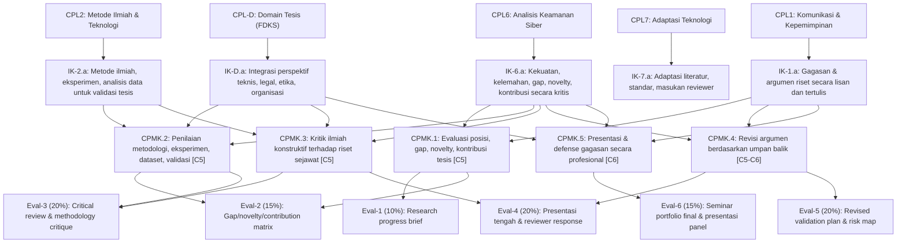

---

## PETA KOMPETENSI DAN ALUR SEMINAR

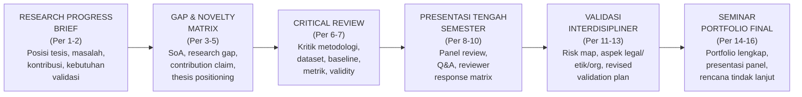

---

## PETUNJUK PENGGUNAAN BUKU

Buku ini berbeda dari buku ajar mata kuliah lain dalam program ini. Tidak ada "materi kuliah" yang perlu dihafalkan — yang ada adalah panduan proses dan alat kerja untuk forum seminar penelitian. Setiap bab memberikan: (1) kerangka konseptual untuk aktivitas seminar minggu tersebut, (2) panduan operasional untuk menyusun dokumen yang diperlukan, (3) contoh/ilustrasi, (4) rubrik evaluasi, dan (5) pertanyaan refleksi.

Mahasiswa perlu membawa penelitian tesis mereka sendiri sebagai "bahan kerja" utama. Setiap latihan dalam buku ini diterapkan pada penelitian masing-masing mahasiswa, bukan pada kasus fiktif.

---

## TABEL PEMETAAN BAB–OBE

| Bab | Pertemuan | Sub-CPMK | Aktivitas | Evaluasi |
|---|---|---|---|---|
| 1 | 1 | Sub-CPMK.1 | Orientasi seminar, etika akademik, alur tesis | Eval-1 |
| 2 | 2 | Sub-CPMK.1 | Research progress brief, seminar readiness self-assessment | Eval-1 |
| 3 | 3 | Sub-CPMK.2 | State-of-the-art dan research gap analysis | Eval-2 |
| 4 | 4 | Sub-CPMK.2 | Novelty claim dan contribution framing | Eval-2 |
| 5 | 5 | Sub-CPMK.2 | Thesis positioning matrix dan pathway alignment | Eval-2 |
| 6 | 6 | Sub-CPMK.3 | Kritik metodologi: desain penelitian dan eksperimen | Eval-3 |
| 7 | 7 | Sub-CPMK.3 | Dataset, baseline, metrik, validity threat, dan reproducibility | Eval-3 |
| 8 | 8 | Sub-CPMK.4 | Presentasi tengah semester — persiapan dan pelaksanaan | Eval-4 |
| 9 | 9 | Sub-CPMK.4 | Q&A handling dan scientific argumentation | Eval-4 |
| 10 | 10 | Sub-CPMK.4 | Reviewer response matrix dan rencana revisi | Eval-4 |
| 11 | 11 | Sub-CPMK.5 | Validasi interdisipliner: teknis, legal, etika, organisasi | Eval-5 |
| 12 | 12 | Sub-CPMK.5 | Interdisciplinary risk map | Eval-5 |
| 13 | 13 | Sub-CPMK.5 | Revised validation plan dan argumentation dossier | Eval-5 |
| 14 | 14 | Sub-CPMK.6 | Seminar portfolio: struktur dan komponen | Eval-6 |
| 15 | 15 | Sub-CPMK.6 | Final presentation design dan rehearsal | Eval-6 |
| 16 | 16 | Sub-CPMK.6 | Seminar panel final dan rencana tindak lanjut tesis | Eval-6 |

---

---

# BAB 1 — ORIENTASI SEMINAR PENELITIAN DAN ETIKA AKADEMIK

## 1. Capaian Pembelajaran Bab

Setelah menyelesaikan bab ini, mahasiswa mampu:
- Menjelaskan tujuan, mekanisme, dan norma forum seminar penelitian akademik (C2)
- Membedakan seminar sebagai evaluasi formatif versus ujian sumatif (C2)
- Mengidentifikasi pelanggaran etika akademik yang relevan dengan forum seminar (C3)
- Mengevaluasi kesiapan diri sendiri sebagai peserta seminar (C5) — Sub-CPMK.1

---

## 2. Peta Konsep Bab

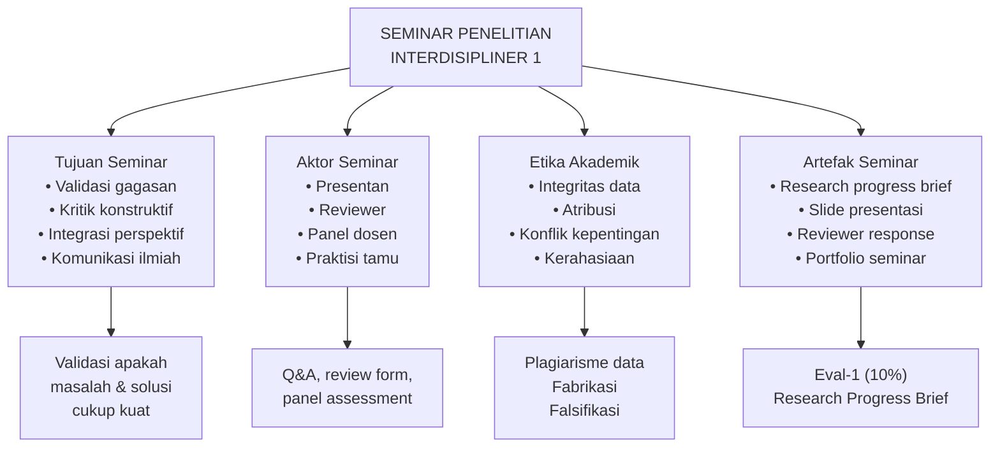

---

## 3. Pengantar Kontekstual

Seminar penelitian adalah institusi tertua dalam tradisi ilmiah. Kata "seminar" berasal dari bahasa Latin *seminarium* (pembibitan) — tempat di mana gagasan disemai, diuji, dipangkas, dan dirawat agar tumbuh menjadi pengetahuan yang kokoh. Di program magister terapan seperti ini, seminar bukan ceremonial — ia adalah mekanisme quality control gagasan sebelum sumber daya waktu, infrastruktur, dan reputasi akademis diinvestasikan.

Dalam konteks forensik digital dan keamanan siber, taruhan seminar lebih tinggi dari disiplin lain yang bersifat murni teoretis. Penelitian di bidang ini memiliki implikasi nyata: temuan tentang kerentanan sistem, efektivitas metode forensik, atau keandalan alat deteksi ancaman dapat mempengaruhi keputusan operasional, kebijakan keamanan nasional, atau proses litigasi digital. Karena itu, validasi metodologi dan klaim penelitian melalui forum seminar bukan pilihan — ia adalah kewajiban profesional.

Mahasiswa yang baru pertama kali mengikuti forum seminar sering memiliki dua respons ekstrem: terlalu percaya diri (mempresentasikan rencana yang belum dipikirkan secara kritis) atau terlalu cemas (mempertahankan setiap aspek penelitian secara defensif). Keduanya kontraproduktif. Seminar yang efektif mensyaratkan kejujuran intelektual — kemampuan mengatakan "saya belum tahu jawabnya, dan ini adalah cara saya akan mencarinya."

---

## 4. Landasan Teori

### 4.1 Fungsi Epistemik Seminar

Seminar penelitian menjalankan beberapa fungsi epistemik sekaligus yang tidak dapat digantikan oleh supervisi satu-satu:

**a. Fungsi Falsifikasi (Popper, 1959)**
Setiap klaim penelitian harus dapat difalsifikasi — artinya, harus ada kondisi yang secara prinsip dapat membuktikannya salah. Forum seminar menyediakan komunitas penguji yang beragam perspektifnya, sehingga kelemahan argumen yang tidak terlihat oleh peneliti sendiri (karena *confirmation bias*) dapat teridentifikasi. Reviewer yang tidak memiliki investasi emosional dalam hipotesis peneliti akan lebih mudah melihat asumsi yang tidak berdasar.

**b. Fungsi Triangulasi Perspektif (Denzin, 1978)**
Penelitian interdisipliner — seperti yang dilakukan di program FDKS — memerlukan validasi dari multiple perspektif: teknis (apakah metode algoritmik/eksperimental valid?), legal (apakah prosedur sesuai hukum dan admissible sebagai evidence?), etika (apakah penelitian tidak merugikan pihak yang rentan?), dan organisasional (apakah temuan dapat diimplementasikan dalam konteks organisasi riil?). Seminar menyediakan forum untuk triangulasi ini.

**c. Fungsi Kalibrasi Novelty**
Peneliti cenderung melebih-lebihkan novelty penelitiannya. Forum seminar dengan reviewer yang memahami state-of-the-art di bidang tersebut menyediakan kalibrasi: apakah kontribusi yang diklaim benar-benar baru, atau sebenarnya sudah ada di literatur yang terlewatkan?

**d. Fungsi Sosialisasi Akademik**
Seminar memperkenalkan mahasiswa pada norma komunikasi akademik: bagaimana mengajukan pertanyaan kritis tanpa menyerang pribadi, bagaimana merespons kritik dengan argumen bukan defensivitas, bagaimana mengakui keterbatasan penelitian secara jujur dan terstruktur.

### 4.2 Tipologi Forum Seminar

| Tipe | Karakteristik | Output |
|---|---|---|
| Progress seminar | Evaluasi status progres tesis | Umpan balik arah penelitian |
| Proposal defense | Validasi proposal sebelum eksekusi | Persetujuan atau revisi besar |
| Hasil seminar | Presentasi temuan awal/akhir | Komentar untuk penyempurnaan |
| Panel interdisipliner | Reviewer dari berbagai disiplin | Identifikasi blind spots |
| Journal club | Kritik terhadap paper yang diterbitkan | Keterampilan critical reading |

VSFDKS10 mengombinasikan progress seminar, panel interdisipliner, dan peer review dalam satu mata kuliah terstruktur.

### 4.3 Etika Akademik dalam Forum Seminar

Forum seminar menciptakan situasi etika yang unik karena melibatkan:

**a. Integritas Data dan Klaim**
Peneliti wajib melaporkan status penelitian secara akurat. Melaporkan hasil yang belum dicapai, mengklaim eksperimen yang belum dilaksanakan, atau menyajikan data yang sudah dimanipulasi sebagai pendahuluan merupakan pelanggaran integritas ilmiah (fabrication/falsification — bagian dari FFP: Fabrication, Falsification, Plagiarism).

**b. Atribusi yang Tepat**
Semua gagasan yang bukan berasal dari peneliti sendiri harus diatribusikan dengan benar. Ini mencakup: ide dari literatur, saran pembimbing, hasil diskusi dengan sejawat, dan bahkan kode/skrip yang diadaptasi dari sumber lain. Dalam bidang keamanan siber, gagal mengakui bahwa teknik yang digunakan berasal dari tool atau framework yang sudah ada adalah bentuk plagiarisme intelektual.

**c. Kerahasiaan Data**
Beberapa penelitian FDKS melibatkan data sensitif: log insiden siber organisasi, data forensik kasus nyata (dengan anonimisasi), atau dataset yang diperoleh melalui kerjasama industri dengan NDA. Mahasiswa tidak boleh mengungkapkan data sensitif dalam forum seminar tanpa izin eksplisit dari pemilik data dan pembimbing.

**d. Konflik Kepentingan Reviewer**
Reviewer (termasuk sesama mahasiswa) yang memiliki hubungan kepentingan dengan peneliti yang sedang dipresentasikan (misalnya: penelitian yang sangat mirip, hubungan personal yang dapat mempengaruhi objektivitas, atau persaingan langsung) wajib mengungkapkan konflik tersebut sebelum memberikan review.

**e. Batas Kerahasiaan Karya yang Belum Dipublikasi**
Gagasan yang dipresentasikan dalam forum seminar adalah karya yang belum dipublikasi. Reviewer tidak boleh menggunakan, mengutip, atau mengadaptasi gagasan presentan tanpa izin eksplisit, bahkan jika forum ini bersifat internal program studi.

### 4.4 Profil Kesiapan Seminar (Seminar Readiness)

Sebelum menghadiri seminar sebagai presentan, mahasiswa perlu mengevaluasi kesiapan mereka pada beberapa dimensi:

| Dimensi | Pertanyaan Kalibrasi | Indikator Kesiapan |
|---|---|---|
| Kejelasan Masalah | "Bisakah saya menjelaskan masalah penelitian dalam 2 kalimat?" | Ya → siap; Tidak → perlu klarifikasi |
| Posisi Literatur | "Apakah saya tahu paper terbaru yang paling relevan?" | 5+ paper kunci → memadai |
| Gap Penelitian | "Apakah saya bisa menunjukkan gap spesifik, bukan hanya umum?" | Gap spesifik + justifikasi → siap |
| Status Metodologi | "Seberapa konkret rencana eksperimen/validasi saya?" | Protokol draft → memadai |
| Keterbatasan | "Bisakah saya menyebutkan 3 kelemahan penelitian saya?" | Ya → menunjukkan self-awareness |
| Kesiapan Q&A | "Apakah saya siap dengan pertanyaan yang paling sulit?" | Jawaban 'Saya belum tahu' + rencana → acceptable |

---

## 5. Model atau Arsitektur

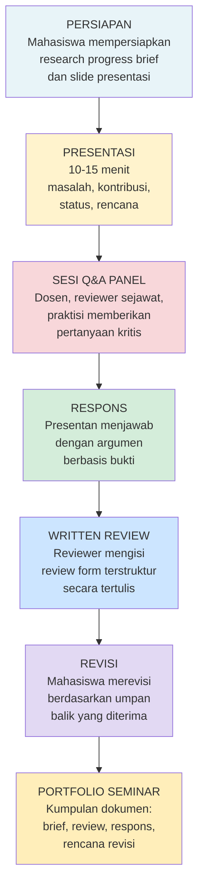

---

## 6. Contoh Terapan

**Konteks:** Mahasiswa A meneliti tentang deteksi serangan ransomware berbasis analisis perilaku proses menggunakan machine learning pada lingkungan Windows enterprise.

**Seminar Readiness Assessment (sebelum Bab 1 berakhir):**

*Dimensi Masalah:* Mahasiswa A dapat menjelaskan bahwa "signature-based detection gagal mendeteksi ransomware baru sebelum definisi tersedia; pendekatan berbasis perilaku proses diharapkan dapat mendeteksi pola enkripsi anomali tanpa bergantung pada signature."

*Dimensi Literatur:* Mahasiswa A mengidentifikasi bahwa paper terbaru dalam space ini adalah Scaife et al. (2016) CryptoLock dan Kharraz et al. (2016) UNVEIL — namun keduanya dari 2016. Ini mengindikasikan bahwa mahasiswa perlu memverifikasi apakah ada paper lebih baru (2022-2024) yang mungkin sudah menyelesaikan masalah yang sama.

*Dimensi Etika:* Mahasiswa A berencana menggunakan dataset ransomware dari repositori malware publik (misalnya VirusTotal, MalwareBazaar) dalam lingkungan sandbox terisolasi. Ini secara etika dapat diterima karena: (1) lingkungan terisolasi, (2) tidak ada sistem produksi yang berisiko, (3) dataset dari sumber yang sah untuk riset.

*Output Orientasi:* Mahasiswa A menyusun "Seminar Readiness Checklist" yang mengidentifikasi bahwa gap yang paling perlu diperjelas sebelum presentasi adalah: apakah novelty klaim "berbasis perilaku proses" cukup kuat mengingat banyak tool komersial (CrowdStrike Falcon, SentinelOne) sudah mengklaim kemampuan serupa — dan apakah lingkup kontribusi penelitian cukup berbeda dari tool komersial tersebut.

---

## 7. Praktikum atau Aktivitas Terarah

### Aktivitas 1.1 — Seminar Readiness Self-Assessment

**Tujuan:** Mengidentifikasi kesiapan awal dan gap yang perlu dipersiapkan sebelum seminar pertama.

**Prasyarat:** Mahasiswa sudah memiliki topik tesis yang disetujui pembimbing.

**Instruksi:**

Isi tabel seminar readiness berikut berdasarkan penelitian tesis Anda sendiri:

| Dimensi | Status Saat Ini (1-4) | Bukti/Artefak | Langkah Berikutnya |
|---|---|---|---|
| Kejelasan masalah penelitian | | | |
| Pemahaman state-of-the-art | | | |
| Identifikasi research gap | | | |
| Novelty claim (diklaim vs. tervalidasi) | | | |
| Metodologi/desain penelitian | | | |
| Status eksperimen/implementasi | | | |
| Identifikasi keterbatasan | | | |
| Aspek legal/etika penelitian | | | |
| Rencana diseminasi | | | |

*Skala: 1=Belum mulai, 2=Awal/draft kasar, 3=Sedang dikerjakan, 4=Cukup matang*

**Output:** Matriks kesiapan seminar dengan prioritas perbaikan yang jelas. Dimensi dengan skor 1-2 menjadi fokus perbaikan sebelum Bab 2 (Research Progress Brief).

**Catatan Etika:** Self-assessment ini bersifat jujur. Skor yang diisi lebih tinggi dari kenyataan hanya merugikan Anda sendiri — forum seminar akan mengekspos gap yang tidak diakui.

---

## 8. Latihan Pemahaman

**1.** Jelaskan mengapa forum seminar memiliki nilai epistemik yang tidak dapat digantikan oleh supervisi satu-satu antara mahasiswa dan pembimbing.

**2.** Seorang mahasiswa mempresentasikan bahwa "eksperimen awal menunjukkan akurasi 94%", padahal eksperimen belum dilaksanakan — ia hanya memprediksi berdasarkan intuisi. Pelanggaran etika apa yang terjadi? Apa konsekuensinya?

**3.** Bedakan antara: (a) mengakui keterbatasan penelitian vs. (b) mempertahankan penelitian secara defensif. Berikan contoh respons Q&A untuk kedua pendekatan.

**4.** Seorang reviewer memiliki penelitian yang sangat mirip dengan presentan yang ia review. Apa yang seharusnya dilakukan reviewer tersebut sebelum memberikan review?

**5.** Mengapa penelitian di bidang forensik digital dan keamanan siber memerlukan validasi aspek legal dan etika dalam forum seminar, lebih dari penelitian di bidang teknik konvensional?

---

## 9. Latihan Terapan / Studi Kasus

**Studi Kasus 1.1 — Kasus Klaim yang Tidak Tervalidasi**

Mahasiswa B mempresentasikan penelitian tentang "sistem deteksi anomali berbasis AI untuk IoT healthcare". Dalam slide-nya tertulis: "Sistem kami telah diuji pada 10.000 perangkat IoT di rumah sakit X dan menunjukkan false positive rate hanya 0.3%."

Namun, ketika dosen penguji bertanya tentang metodologi pengujian, mahasiswa B mengakui bahwa: (1) pengujian hanya dilakukan pada dataset simulasi 500 catatan, (2) rumah sakit X belum memberikan izin formal untuk pengujian, (3) angka 10.000 perangkat adalah estimasi jumlah perangkat di rumah sakit tersebut, bukan jumlah perangkat yang benar-benar diuji.

Analisis:
- a) Identifikasi semua pelanggaran etika akademik yang terjadi dalam kasus ini
- b) Apa dampak potensi dari klaim yang tidak akurat dalam konteks penelitian healthcare IoT security?
- c) Bagaimana mahasiswa B seharusnya mempresentasikan status penelitiannya secara akurat dan tetap meyakinkan?

**Studi Kasus 1.2 — Konflik Kepentingan Reviewer**

Mahasiswa C (reviewer) diminta mereview penelitian mahasiswa D tentang "framework deteksi insider threat". Mahasiswa C mengetahui bahwa: (1) penelitiannya sendiri juga tentang insider threat detection dengan pendekatan yang berbeda, (2) mereka akan bersaing untuk mendapatkan tempat presentasi di konferensi yang sama.

Analisis:
- a) Apakah situasi ini merupakan konflik kepentingan? Jelaskan.
- b) Apa yang harus dilakukan mahasiswa C?
- c) Jika mahasiswa C tetap memberikan review, bias apa yang mungkin muncul dalam reviewnya?

---

## 10. Kunci Jawaban dan Pembahasan

**Jawaban Latihan 1:**
Forum seminar menghadirkan perspektif multipel yang tidak dimiliki pembimbing tunggal. Pembimbing, karena proximity-nya dengan penelitian, mungkin telah mengadopsi asumsi yang sama dengan mahasiswa (*group-think* atau *supervisory blind spot*). Reviewer dari luar — terutama yang ahli di sub-domain yang berbeda atau dari perspektif praktisi — akan mengajukan pertanyaan yang tidak terpikirkan pembimbing. Ini adalah manifestasi dari triangulasi metodologis (Denzin): kebenaran lebih tervalidasi ketika dikonfirmasi dari sudut pandang yang berbeda-beda. Selain itu, forum seminar melatih mahasiswa untuk mengomunikasikan penelitiannya kepada audiens yang lebih luas dari pembimbing, yang merupakan keterampilan esensial untuk publikasi dan diseminasi.

**Jawaban Latihan 2:**
Mahasiswa tersebut melakukan *fabrication* — melaporkan data atau hasil yang tidak pernah ada. Ini adalah salah satu dari tiga pelanggaran paling serius dalam etika akademik (FFP: Fabrication, Falsification, Plagiarism). Konsekuensinya mencakup: (a) jika terdeteksi segera: teguran keras, revisi wajib, pengulangan seminar; (b) jika lolos ke tahap lanjut: penelitian di atas fondasi yang tidak valid, kemungkinan tidak dapat mereproduksi hasil saat eksperimen sesungguhnya; (c) jika masuk ke publikasi: retraksi, dampak reputasi program studi dan institusi; (d) untuk mahasiswa sendiri: potensi pencabutan gelar jika terdeteksi pasca-wisuda. Kesalahan umum: banyak mahasiswa berpikir "melebih-lebihkan sedikit tidak apa-apa" — ini adalah normalization of deviance yang berbahaya.

**Jawaban Latihan 3:**
*Mengakui keterbatasan:* "Dataset yang saya gunakan terbatas pada lingkungan Windows 10. Saya belum dapat mengklaim bahwa temuan ini berlaku universal untuk semua sistem operasi. Ini adalah batasan yang akan saya dokumentasikan dalam tesis dan yang membutuhkan penelitian lanjutan."
*Defensif:* "Dataset saya sudah cukup. Windows 10 adalah sistem yang paling umum digunakan, jadi ini valid."
Perbedaan kunci: respons pertama mengakui batasan sambil menunjukkan pemahaman tentang implikasinya dan tetap membuka ruang untuk penelitian berikutnya. Respons kedua mencoba meyakinkan reviewer dengan argumen yang tidak sepenuhnya valid (popularitas tidak sama dengan representativitas).

**Jawaban Latihan 4:**
Reviewer tersebut wajib mengungkapkan konflik kepentingannya kepada koordinator seminar/dosen sebelum proses review dimulai. Koordinator kemudian memutuskan: (a) mengganti reviewer dengan yang tidak memiliki konflik, atau (b) jika tidak ada reviewer alternatif, reviewer tetap memberikan review tetapi dengan pengungkapan eksplisit di review form bahwa ada potensi konflik kepentingan, sehingga dosen dapat menimbang review tersebut dengan tepat. Reviewer tidak boleh mengundurkan diri secara diam-diam tanpa penjelasan — ini justru mengurangi transparansi.

**Jawaban Latihan 5:**
Bidang forensik digital dan keamanan siber memiliki beberapa karakteristik yang meningkatkan signifikansi etis dan legal: (1) penelitian sering melibatkan data yang berkaitan dengan individu nyata (log akses, data forensik, informasi identitas); (2) temuan penelitian dapat digunakan sebagai dasar tindakan hukum atau kebijakan; (3) metode yang dikembangkan dapat digunakan secara dual-use (defensif dan ofensif); (4) kerentanan yang ditemukan dalam penelitian, jika tidak diungkapkan dengan bertanggung jawab, dapat membahayakan sistem publik. Forum seminar perlu memvalidasi bahwa penelitian tidak melanggar privasi, mendapatkan izin yang diperlukan untuk akses sistem, mengikuti prosedur responsible disclosure, dan tidak menghasilkan artefak yang dapat disalahgunakan.

**Kunci Studi Kasus 1.1:**
a) Pelanggaran: fabrication (mengklaim pengujian pada 10.000 perangkat yang tidak terjadi), falsification (memanipulasi gambaran status penelitian), dan potensi research misconduct dalam konteks healthcare (mengklaim pengujian di fasilitas kesehatan tanpa izin). Ini juga mengindikasikan research without proper authorization.
b) Dampak: klaim false positive rate 0.3% yang tidak valid bisa digunakan oleh institusi kesehatan untuk membuat keputusan pengadaan sistem keamanan. Jika sistem diterapkan berdasarkan klaim yang salah dan gagal mendeteksi ancaman nyata, akibatnya bisa mencakup breach data pasien, gangguan layanan healthcare, atau bahkan risiko keselamatan pasien.
c) Mahasiswa B seharusnya mempresentasikan: "Eksperimen telah didesain untuk pengujian pada skala dataset 500 catatan simulasi yang merepresentasikan pola perilaku IoT healthcare. Rencana pengujian lapangan di lingkungan rumah sakit sedang dalam proses negosiasi izin dengan pihak rumah sakit X. Hasil simulasi awal menunjukkan [metrik yang valid], dengan rencana validasi lapangan pada semester berikutnya."

**Kunci Studi Kasus 1.2:**
a) Ya, ini adalah konflik kepentingan. Dua peneliti yang berkompetisi di domain yang sama memiliki insentif untuk melemahkan penelitian satu sama lain atau menyerap ide tanpa atribusi.
b) Mahasiswa C harus segera mengungkapkan konflik kepentingan kepada koordinator seminar, menawarkan untuk tidak menjadi reviewer, dan menyerahkan keputusan kepada koordinator.
c) Bias yang mungkin muncul: (1) bias negatif — menemukan kelemahan secara berlebihan untuk melemahkan kompetitor; (2) bias positif — jika mahasiswa C takut dianggap tidak objektif, ia mungkin justru terlalu lunak; (3) idea appropriation — mahasiswa C mungkin menggunakan ide dari presentan dalam penelitiannya sendiri tanpa atribusi, karena review dilakukan sebelum penelitian dipublikasikan.

---

## 11. Ringkasan Bab

Forum seminar penelitian menjalankan fungsi epistemik yang kritis: falsifikasi, triangulasi perspektif, kalibrasi novelty, dan sosialisasi akademik. Dalam konteks forensik digital dan keamanan siber, taruhan seminar lebih tinggi karena implikasi riil terhadap keamanan sistem dan kepatuhan hukum. Etika akademik dalam forum seminar mencakup integritas data, atribusi yang tepat, kerahasiaan karya yang belum dipublikasi, dan pengungkapan konflik kepentingan. Sebelum menghadiri seminar, mahasiswa perlu melakukan self-assessment kesiapan secara jujur — karena kesiapan yang rendah lebih baik diakui di awal daripada terekspos dalam forum.

---

## 12. Refleksi Profesional

1. Jika Anda menemukan bahwa penelitian yang telah Anda presentasikan dalam seminar ternyata memiliki kesalahan metodologi yang signifikan setelah seminar selesai, apa yang akan Anda lakukan? Siapa yang perlu Anda beri tahu?

2. Dalam konteks keamanan siber, bagaimana Anda menyeimbangkan kebutuhan untuk berbagi temuan penelitian dalam forum seminar (transparansi akademik) dengan risiko bahwa temuan tentang kerentanan dapat disalahgunakan jika terekspos sebelum patch tersedia?

3. Apakah ada situasi di mana "melindungi" penelitian dari kritik keras dalam forum seminar dapat dibenarkan? Jelaskan kondisinya.

---

---

# BAB 2 — RESEARCH PROGRESS BRIEF: MENYUSUN LAPORAN KEMAJUAN PENELITIAN

## 1. Capaian Pembelajaran Bab

Setelah menyelesaikan bab ini, mahasiswa mampu:
- Menganalisis komponen esensial dari research progress brief yang efektif (C4)
- Menyusun research progress brief yang menggambarkan posisi tesis, masalah, kontribusi, status implementasi, dan kebutuhan validasi secara akurat (C5) — Sub-CPMK.1
- Mengevaluasi kualitas research progress brief milik sejawat (C5)

---

## 2. Peta Konsep Bab

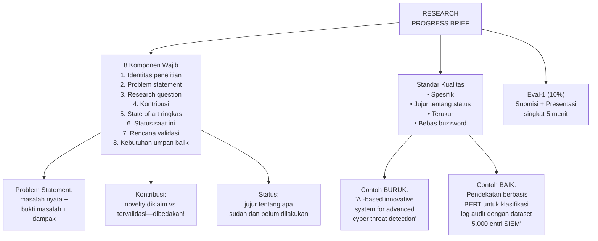

---

## 3. Pengantar Kontekstual

Research progress brief adalah dokumen pertama yang Anda serahkan kepada komunitas akademik sebagai pernyataan: "Ini yang sedang saya kerjakan, ini posisinya dalam lanskap ilmu pengetahuan, dan ini yang perlu saya validasi." Ia bukan proposal tesis (yang sudah lebih luas dan sudah disetujui), bukan pula laporan akhir (yang menunjukkan hasil). Research progress brief adalah snapshot jujur tentang di mana Anda berada sekarang.

Kesalahan paling umum yang dilakukan mahasiswa saat menyusun research progress brief adalah mengoptimasi untuk terlihat baik di hadapan reviewer, bukan untuk mendapatkan umpan balik yang berguna. Brief yang ditulis untuk terlihat impressive biasanya: (1) mengklaim kontribusi yang jauh lebih besar dari yang aktual, (2) mengaburkan status implementasi yang sebenarnya masih awal, (3) menghindari menyebutkan keterbatasan yang signifikan. Brief seperti ini mengundang reviewer untuk memberikan pujian, bukan kritik konstruktif — dan mahasiswa kehilangan kesempatan emas untuk mendapatkan umpan balik yang sebenarnya dibutuhkan.

---

## 4. Landasan Teori

### 4.1 Anatomi Research Progress Brief

Research progress brief yang efektif terdiri dari delapan komponen yang masing-masing memiliki fungsi spesifik:

**Komponen 1: Identitas Penelitian**
Judul (tentatif, dapat berubah), nama mahasiswa, pembimbing, dan semester penelitian. Judul dalam tahap ini sebaiknya deskriptif, bukan persuasif. Judul yang baik mengandung: subjek studi, metode/pendekatan utama, dan konteks/domain. Contoh: "Deteksi Anomali Log Audit SIEM Berbasis LSTM untuk Lingkungan Cloud AWS" lebih baik dari "Sistem Cerdas Keamanan Siber Generasi Terbaru".

**Komponen 2: Problem Statement**
Pernyataan masalah yang efektif harus memenuhi tiga sub-elemen:
- *Masalah nyata:* fenomena yang dapat diobservasi dan didokumentasikan
- *Bukti masalah:* data, statistik, atau referensi yang menunjukkan bahwa masalah ini benar-benar ada dan penting
- *Dampak masalah:* akibat jika masalah tidak diselesaikan

Hindari problem statement yang terlalu umum ("keamanan siber adalah masalah global yang semakin serius"). Fokus pada gap spesifik yang akan diatasi penelitian Anda.

**Komponen 3: Research Question**
Pertanyaan penelitian harus:
- Spesifik dan dapat dijawab (answerable)
- Terkait langsung dengan masalah yang dinyatakan
- Implisit menunjukkan metodologi yang akan digunakan
- Realistis untuk diselesaikan dalam batasan tesis magister

Contoh yang terlalu umum: "Bagaimana meningkatkan keamanan siber di Indonesia?"
Contoh yang lebih baik: "Sejauh mana pendekatan berbasis analisis perilaku menggunakan algoritma isolation forest dapat meningkatkan akurasi deteksi insider threat pada log akses Active Directory dibandingkan metode threshold-based konvensional dalam lingkungan enterprise?"

**Komponen 4: Kontribusi yang Diklaim**
Ini adalah komponen yang paling sering ditulis secara tidak akurat. Mahasiswa perlu membedakan secara eksplisit antara:
- *Kontribusi yang diklaim* (hypothesized contribution): "Kami berharap pendekatan ini akan mengurangi false positive rate sebesar X%"
- *Kontribusi yang tervalidasi* (validated contribution): hasil yang sudah diverifikasi secara empiris

Dalam progress brief di awal semester 3, hampir semua kontribusi masih berupa hypothesized. Mengakui ini tidak melemahkan posisi Anda — justru menunjukkan kejujuran ilmiah.

**Komponen 5: State-of-the-Art Ringkas**
Bukan literature review lengkap, melainkan peta singkat: siapa yang sudah melakukan apa di area ini, dan di mana posisi Anda dalam peta tersebut. Gunakan visual jika membantu — misalnya tabel 2×2 yang memetakan pendekatan berdasarkan dua dimensi kunci.

**Komponen 6: Status Implementasi Saat Ini**
Laporan jujur tentang apa yang sudah dilakukan. Format yang berguna:

| Tahap | Status | Artefak |
|---|---|---|
| Literature review | 80% selesai | 45 paper dianalisis, 12 relevan |
| Desain eksperimen | Draf v2 | Protokol eksperimen (belum divalidasi) |
| Dataset | 30% terkumpul | 1.500 dari target 5.000 sampel |
| Implementasi kode | Belum mulai | — |
| Eksperimen awal | Belum mulai | — |

**Komponen 7: Rencana Validasi**
Apa yang akan dilakukan untuk memvalidasi klaim kontribusi, dengan timeline yang realistis. Ini termasuk: metode eksperimen, dataset yang akan digunakan, baseline yang akan dibandingkan, metrik yang akan diukur, dan kriteria keberhasilan.

**Komponen 8: Kebutuhan Umpan Balik**
Bagian yang sering dilewatkan. Mahasiswa yang efektif datang ke seminar dengan pertanyaan spesifik tentang aspek mana dari penelitiannya yang paling membutuhkan masukan. Contoh: "Saya tidak yakin apakah pemilihan algoritma X sudah tepat untuk dataset dengan karakteristik Y — mohon perspektif reviewer tentang hal ini."

### 4.2 Standar Kualitas Penulisan Brief

**Prinsip Spesifisitas (Specificity Principle)**
Setiap klaim harus spesifik dan dapat diverifikasi. Hindari kata-kata yang terdengar impressive tetapi tidak bermakna dalam konteks akademik:

| Hindari | Ganti dengan |
|---|---|
| "state-of-the-art system" | "sistem menggunakan arsitektur transformer BERT-base" |
| "significant improvement" | "peningkatan akurasi dari 78% ke 91% pada dataset X" |
| "novel approach" | "kombinasi algoritma A dan B yang belum dieksplorasi untuk konteks Y" |
| "comprehensive analysis" | "analisis 1.200 log insiden dari 3 organisasi periode 2022-2024" |
| "advanced AI" | "model XGBoost dengan 47 fitur berbasis perilaku network" |

**Prinsip Kejujuran tentang Status (Honest Status Reporting)**
Tidak ada penalti dalam forum seminar untuk mengakui bahwa penelitian masih dalam tahap awal — selama status yang dilaporkan akurat dan ada rencana yang jelas. Penalti akan datang jika status disampaikan tidak akurat dan reviewer mendeteksinya.

**Prinsip Relevansi Interdisipliner**
Karena ini seminar interdisipliner, brief perlu menunjukkan bahwa peneliti sudah mempertimbangkan implikasi di luar domain teknis: implikasi legal (apakah metode sesuai hukum yang berlaku?), etika (apakah ada risiko terhadap privasi atau keselamatan?), dan organisasional (apakah solusi dapat diimplementasikan dalam konteks organisasi riil?).

### 4.3 Format Brief

Research progress brief memiliki format standar berikut:
- Panjang: 2-4 halaman (tidak termasuk referensi)
- Format sitasi: APA 7th atau IEEE (konsisten)
- Bahasa: Indonesia formal akademik atau Inggris (sesuai arahan program studi)
- Lampiran opsional: diagram arsitektur, tabel perbandingan literatur

---

## 5. Model atau Arsitektur

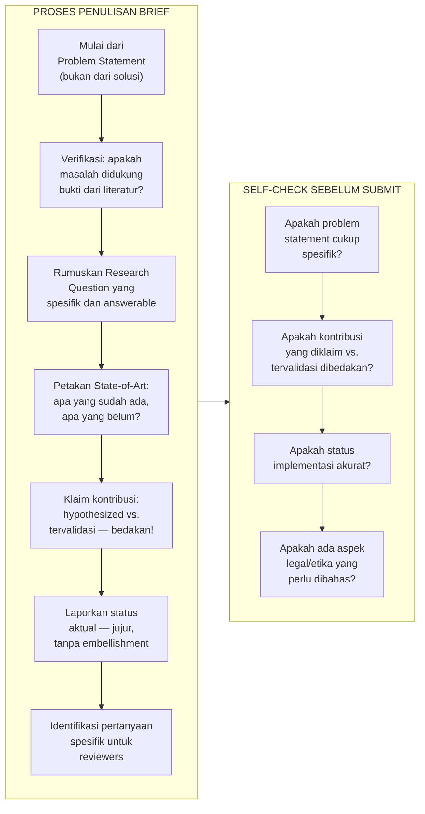

---

## 6. Contoh Terapan

**Konteks:** Program Magister Terapan FDKS, Semester 3, mahasiswa meneliti deteksi phishing berbasis analisis URL.

**Contoh Research Progress Brief (versi ringkas):**

---
*Judul Tentatif:* Klasifikasi URL Phishing Menggunakan Ensemble Random Forest dan XGBoost dengan Fitur Leksikal dan Jaringan

*Masalah:* Serangan phishing berbasis URL terus berkembang dengan teknik obfuskasi yang mengecoh sistem deteksi berbasis signature (APWG 2023: 1.76 juta situs phishing unik terdeteksi dalam Q3 2023). Sistem blacklist bereaksi lambat terhadap domain baru — rata-rata waktu deteksi 6-24 jam memberikan window of opportunity bagi penyerang.

*Research Question:* Apakah kombinasi fitur leksikal (panjang URL, kedalaman path, keberadaan karakter khusus) dan fitur jaringan (reputasi IP, usia domain, ASN) dapat meningkatkan F1-score deteksi URL phishing dibandingkan pendekatan berbasis fitur tunggal, pada dataset yang mencakup zero-day phishing?

*Status Saat Ini:*
- Literature review: 67 paper dianalisis, matriks perbandingan 23 paper relevan tersedia
- Dataset: Menggunakan ISCX-URL-2016 (450K URL, 30% phishing) — berencana menambah dataset 2023-2024 dari PhishTank API
- Implementasi: Feature extraction module selesai (15 fitur), model training belum dilakukan
- Eksperimen: Belum dilakukan

*Kontribusi yang Diklaim (Hypothesized):*
- Kombinasi fitur leksikal + jaringan menghasilkan F1 ≥0.97 pada dataset ISCX-URL-2016
- Evaluasi khusus pada zero-day phishing subset (yang belum dieksplorasi literatur yang ada)

*Pertanyaan untuk Reviewer:*
- Apakah dataset ISCX-URL-2016 masih relevan atau sudah terlalu lama untuk menggambarkan lanskap phishing 2024?
- Apakah pemisahan evaluasi zero-day phishing cukup kuat sebagai novel contribution?

---

---

## 7. Praktikum atau Aktivitas Terarah

### Aktivitas 2.1 — Menyusun Research Progress Brief

**Tujuan:** Menghasilkan research progress brief pertama yang akan digunakan dalam presentasi seminar Pertemuan 2.

**Instruksi Bertahap:**

*Langkah 1 — Problem Statement (30 menit):*
Tulis 1 paragraf (100-150 kata) yang mencakup: fenomena masalah, bukti empiris dari literatur (minimal 2 sitasi), dan dampak jika masalah tidak diselesaikan.

*Langkah 2 — Research Question (15 menit):*
Tulis research question Anda. Uji dengan kriteria SMART: Specific (apakah cukup spesifik?), Measurable (apakah jawaban dapat diukur?), Answerable (apakah dapat dijawab dalam batas tesis?), Relevant (apakah relevan dengan masalah?), Time-bound (apakah realistis untuk timeline tesis?).

*Langkah 3 — Status Tabel (20 menit):*
Isi tabel status implementasi secara jujur. Ini adalah latihan kejujuran akademik.

*Langkah 4 — Klaim Kontribusi (20 menit):*
Buat dua kolom: "Diklaim (Hypothesized)" dan "Tervalidasi". Isi sesuai kenyataan penelitian Anda saat ini.

*Langkah 5 — Pertanyaan untuk Reviewer (10 menit):*
Tulis 2-3 pertanyaan spesifik yang Anda ingin review dari audiens seminar. Pertanyaan harus spesifik dan menunjukkan bahwa Anda tidak yakin akan jawabannya.

**Output:** Dokumen research progress brief 2-4 halaman yang siap disubmit sebagai Eval-1.

**Kriteria Keberhasilan:**
- Problem statement memiliki bukti empiris dari literatur
- Research question memenuhi 4 dari 5 kriteria SMART
- Status implementasi akurat (akan diverifikasi dalam Q&A)
- Kontribusi diklaim vs. tervalidasi dibedakan secara eksplisit
- Ada minimal 2 pertanyaan spesifik untuk reviewer

---

## 8. Latihan Pemahaman

**1.** Apa perbedaan antara "kontribusi yang diklaim" dan "kontribusi yang tervalidasi"? Mengapa perbedaan ini penting untuk dinyatakan secara eksplisit dalam research progress brief?

**2.** Seorang mahasiswa menulis dalam brief-nya: "Sistem kami akan menjadi solusi komprehensif untuk ancaman siber di seluruh sektor industri." Evaluasi pernyataan ini berdasarkan prinsip spesifisitas.

**3.** Mengapa "kebutuhan umpan balik" dianggap sebagai komponen penting dalam research progress brief, padahal secara teknis ini bukan bagian dari penelitian itu sendiri?

**4.** Bagaimana menentukan apakah dataset yang digunakan dalam penelitian sudah cukup "baru" dan relevan? Faktor apa yang perlu dipertimbangkan dalam konteks forensik digital dan keamanan siber?

**5.** Seorang reviewer membaca research progress brief dan tidak menemukan informasi tentang aspek legal dan etika penelitian. Pertanyaan apa yang sebaiknya diajukan reviewer kepada presentan?

---

## 9. Latihan Terapan / Studi Kasus

**Studi Kasus 2.1 — Evaluasi Research Progress Brief**

Berikut adalah kutipan dari research progress brief mahasiswa E:

*"Penelitian ini mengembangkan sistem keamanan siber berbasis artificial intelligence yang revolusioner untuk mendeteksi advanced persistent threat (APT) di lingkungan enterprise. Sistem kami menggunakan deep learning terdepan dan akan menghasilkan akurasi deteksi yang jauh melampaui sistem yang ada saat ini. Dataset yang digunakan sangat komprehensif dan mencakup berbagai skenario serangan nyata. Implementasi akan selesai dalam waktu dekat dan hasil yang diharapkan sangat menjanjikan."*

Tugas:
- a) Identifikasi semua pelanggaran terhadap prinsip spesifisitas dalam kutipan tersebut
- b) Identifikasi klaim yang tidak dapat diverifikasi tanpa informasi tambahan
- c) Tulis ulang kutipan tersebut sebagai research progress brief yang baik, dengan membuat asumsi yang masuk akal tentang detail penelitiannya

**Studi Kasus 2.2 — Research Question yang Bermasalah**

Mahasiswa F memiliki dua kandidat research question:
- *RQ1:* "Bagaimana cara terbaik untuk mendeteksi malware di perangkat Android?"
- *RQ2:* "Apakah analisis dinamis berbasis sandbox menggunakan fitur API call sequence dapat membedakan malware Android baru dari keluarga Trojan-Banker dibandingkan analisis statis berbasis signature, dengan presisi ≥0.90 pada dataset AndroZoo 2022-2024?"

a) Analisis kelebihan dan kekurangan masing-masing research question
b) Identifikasi implikasi pemilihan RQ terhadap desain eksperimen
c) Apa risiko akademik dan operasional dari research question yang terlalu luas (seperti RQ1)?

---

## 10. Kunci Jawaban dan Pembahasan

**Jawaban Latihan 1:**
Kontribusi yang "diklaim" (hypothesized) adalah kontribusi yang diharapkan terjadi berdasarkan desain penelitian, tetapi belum dibuktikan secara empiris. Kontribusi yang "tervalidasi" adalah kontribusi yang sudah dikonfirmasi melalui eksperimen, pengujian, atau analisis yang dapat direproduksi. Perbedaan ini penting karena: (a) membantu reviewer memahami mana bagian penelitian yang masih perlu diverifikasi, (b) mencegah salah paham tentang status penelitian, (c) menunjukkan kejujuran ilmiah yang merupakan fondasi integritas akademik, dan (d) memungkinkan reviewer memberikan umpan balik yang tepat sasaran — misalnya, mempertanyakan validitas hipotesis vs. mempertanyakan metodologi eksperimen yang sudah berjalan.

**Jawaban Latihan 2:**
Pernyataan tersebut melanggar hampir semua prinsip spesifisitas: (a) "komprehensif" — tidak ada definisi apa yang dicakup; (b) "ancaman siber" — terlalu luas, tidak spesifik ke jenis ancaman; (c) "seluruh sektor industri" — klaim generalisasi yang tidak realistis; (d) "solusi" — tidak menjelaskan apa yang dimaksud dengan solusi. Versi yang lebih baik akan menyebutkan: jenis ancaman spesifik yang ditarget, metode teknis yang digunakan, domain/industri yang dikaji, dan metrik yang diharapkan.

**Jawaban Latihan 3:**
"Kebutuhan umpan balik" mengubah seminar dari monolog (presentan berbicara kepada audience) menjadi dialog produktif. Tanpa pertanyaan spesifik, reviewer cenderung memberikan komentar umum yang tidak terlalu berguna. Dengan pertanyaan spesifik, presentan mengarahkan energi reviewer ke aspek yang benar-benar membutuhkan masukan. Ini juga menunjukkan metacognitive awareness — kemampuan mengetahui apa yang tidak Anda ketahui, yang merupakan keterampilan peneliti yang matang.

**Jawaban Latihan 4:**
Relevansi dataset dalam bidang keamanan siber perlu dievaluasi berdasarkan: (a) temporal relevance — apakah dataset masih menggambarkan lanskap ancaman terkini? Dalam keamanan siber, dataset yang berusia >3 tahun mungkin sudah tidak merepresentasikan taktik dan teknik terbaru (lihat perubahan TTPs di MITRE ATT&CK dari tahun ke tahun); (b) ecological validity — apakah dataset berasal dari lingkungan yang serupa dengan yang akan ditarget penelitian? Dataset synthetic berbeda dari traffic nyata; (c) coverage — apakah dataset mencakup class yang relevan dengan penelitian? (d) provenance — apakah dataset dapat diverifikasi asal-usulnya dan apakah penggunaannya sesuai lisensi?

**Jawaban Latihan 5:**
Reviewer dapat mengajukan pertanyaan berikut: (a) "Apakah penelitian ini melibatkan data dari sistem produksi nyata atau data yang berkaitan dengan individu yang dapat diidentifikasi? Jika ya, izin apa yang sudah diperoleh?" (b) "Apakah ada risiko bahwa metode yang dikembangkan dapat digunakan untuk tujuan ofensif? Bagaimana rencana responsible disclosure atau mitigasi risiko dual-use?" (c) "Apakah penelitian telah melalui proses ethics review dari institusi?" Pertanyaan-pertanyaan ini bukan serangan terhadap penelitian, melainkan pemeriksaan kelengkapan yang diperlukan untuk penelitian di bidang FDKS.

**Kunci Studi Kasus 2.1:**
a) Pelanggaran spesifisitas: "revolusioner" (klaim evaluatif tanpa bukti), "artificial intelligence" (tidak spesifik — AI apa?), "terdepan" (superlative tanpa referensi), "jauh melampaui" (komparatif tanpa baseline spesifik), "sangat komprehensif" (tidak ada definisi komprehensif), "dalam waktu dekat" (tidak ada timeline), "sangat menjanjikan" (tidak ada metrik).
b) Klaim tidak terverifikasi: akurasi deteksi (tidak ada angka), jenis APT yang ditarget, komposisi dan ukuran dataset, metode deep learning yang digunakan.
c) Versi yang lebih baik: "Penelitian ini mengembangkan sistem deteksi APT menggunakan model LSTM untuk analisis sekuens perilaku proses pada log Windows Security Event (Event ID 4688, 4624, 4625). Baseline perbandingan adalah sistem rule-based SIEM (Microsoft Sentinel). Dataset: 3.200 sekuens serangan dari APT29 dan APT41 yang diannotasi secara manual dari open threat intelligence feeds (MITRE ATT&CK, VirusTotal). Status saat ini: arsitektur model draft, dataset 60% terkumpul. Kontribusi yang diklaim (belum tervalidasi): F1-score ≥0.93 pada dataset pengujian."

**Kunci Studi Kasus 2.2:**
a) RQ1 terlalu luas: tidak ada metode spesifik, tidak ada konteks spesifik, tidak ada kriteria keberhasilan — sehingga tidak dapat dijawab secara definitif. RQ2 sudah baik: metode spesifik (analisis dinamis berbasis sandbox), fitur spesifik (API call sequence), target spesifik (keluarga Trojan-Banker), komparatif dengan baseline (analisis statis), kriteria terukur (presisi ≥0.90), dan dataset spesifik (AndroZoo 2022-2024). RQ2 juga implisit menunjukkan desain eksperimen: diperlukan sandbox, dataset berlabel, ekstraksi fitur API call, model klasifikasi, dan evaluasi perbandingan.
b) Implikasi terhadap desain: RQ2 langsung mengindikasikan bahwa peneliti perlu: lingkungan sandbox (Cuckoo/AnyRun), akses ke dataset AndroZoo, labeling data, implementasi feature extractor, training classifier, dan evaluasi komparatif. RQ1 tidak memberikan arah ini.
c) Risiko RQ terlalu luas: (a) penelitian tidak pernah selesai karena scopenya tidak terbatas; (b) reviewer tidak dapat mengevaluasi apakah penelitian sudah menjawab pertanyaannya; (c) kontribusi tidak dapat diklaim secara spesifik; (d) untuk penelitian keamanan siber khususnya, penelitian yang terlalu umum tidak memberikan guidance operasional yang berguna bagi praktisi.

---

## 11. Ringkasan Bab

Research progress brief adalah dokumen strategis yang berfungsi sebagai snapshot jujur posisi penelitian Anda. Delapan komponen kritis — dari problem statement hingga kebutuhan umpan balik — membentuk struktur yang memungkinkan reviewer memberikan masukan yang tepat sasaran. Prinsip spesifisitas dan kejujuran tentang status merupakan standar kualitas yang tidak dapat dikompromikan. Membedakan kontribusi yang diklaim versus tervalidasi adalah tanda kedewasaan akademik, bukan kelemahan. Research progress brief yang baik mengundang kritik yang berguna — bukan pujian yang kosong.

---

## 12. Refleksi Profesional

1. Dalam lingkungan kerja profesional (SOC, lembaga penegak hukum, konsultan keamanan), laporan kemajuan proyek memiliki fungsi serupa dengan research progress brief. Apa persamaan dan perbedaan tuntutan akurasi dalam konteks profesional versus akademik?

2. Jika Anda menemukan bahwa research question Anda setelah dianalisis lebih dalam ternyata sudah dijawab oleh penelitian yang sangat baru (paper 2024 yang terbit setelah proposal Anda disetujui), apa yang akan Anda lakukan? Bagaimana Anda akan mengomunikasikan situasi ini kepada pembimbing dan dalam forum seminar?

3. Seberapa penting kemampuan menyusun research progress brief yang jujur dan akurat untuk karir profesional Anda di bidang forensik digital dan keamanan siber? Berikan contoh situasi profesional di mana kemampuan ini akan sangat berharga.

---

---

# BAB 3 — STATE-OF-THE-ART DAN RESEARCH GAP ANALYSIS

## 1. Capaian Pembelajaran Bab

Setelah menyelesaikan bab ini, mahasiswa mampu:
- Memetakan state-of-the-art penelitian dalam domain tesis menggunakan kerangka sistematis (C4)
- Menganalisis research gap berdasarkan literatur yang teridentifikasi (C4) — Sub-CPMK.2
- Mengevaluasi relevansi gap terhadap kebutuhan industri keamanan siber (C5)

---

## 2. Peta Konsep Bab

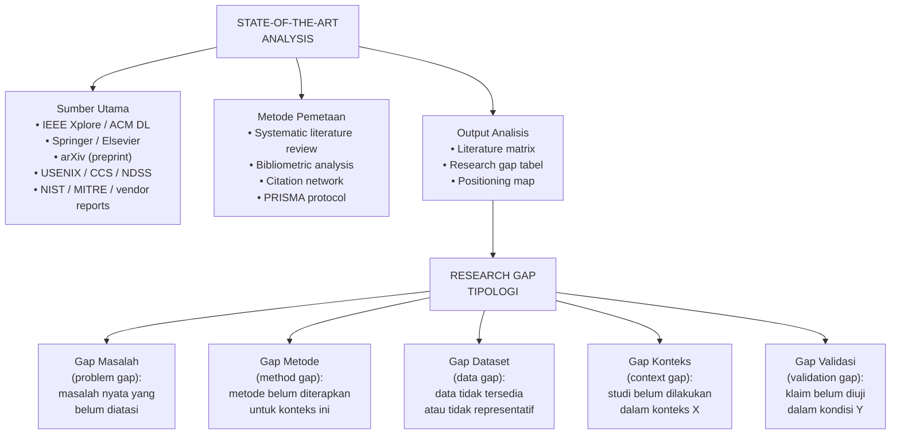

---

## 3. Pengantar Kontekstual

State-of-the-art analysis adalah proses menemukan di mana batas pengetahuan saat ini berada, untuk kemudian mengidentifikasi di mana penelitian Anda dapat berkontribusi. Ini bukan sekadar "membaca 50 paper" — ini adalah proses analitis sistematis yang menghasilkan peta pengetahuan yang dapat dipertahankan di hadapan reviewer.

Dalam keamanan siber dan forensik digital, tantangan tambahan adalah bahwa state-of-the-art bergerak sangat cepat. Paper tentang deteksi ransomware yang diterbitkan 2020 mungkin sudah tidak relevan karena teknik yang dibahas sudah digunakan dan dielus oleh penyerang. Reviewer yang aktif di bidang ini akan segera mendeteksi jika mahasiswa hanya membaca paper lama tanpa mengecek perkembangan terbaru. Sumber seperti proceedings USENIX Security, IEEE S&P (Oakland), CCS (ACM), NDSS, dan laporan threat intelligence dari vendor (CrowdStrike Global Threat Report, Mandiant M-Trends, Verizon DBIR) adalah bagian dari state-of-the-art yang tidak boleh diabaikan.

---

## 4. Landasan Teori

### 4.1 Systematic Literature Review vs. Narrative Review

Terdapat dua pendekatan utama dalam memetakan literatur:

**Systematic Literature Review (SLR)**
Dikodifikasikan oleh Kitchenham (2007) untuk domain rekayasa perangkat lunak, SLR mengikuti protokol yang ketat dan dapat direproduksi:
1. Mendefinisikan research questions secara eksplisit
2. Menetapkan search string dan database yang akan digunakan
3. Menerapkan inclusion/exclusion criteria
4. Melakukan screening (judul → abstrak → full text)
5. Melakukan data extraction dari paper yang lolos
6. Melakukan quality assessment
7. Melakukan sintesis dan pelaporan

Kelebihan SLR: dapat direproduksi, transparan, dan tahan terhadap kritik tentang bias seleksi. Kekurangannya: membutuhkan waktu yang signifikan (beberapa bulan untuk SLR komprehensif).

**Narrative Review**
Lebih fleksibel, kurang sistematis, bergantung pada pemilihan paper oleh peneliti berdasarkan pengetahuan domain. Lebih cepat, tetapi lebih rentan terhadap confirmation bias.

Untuk tesis magister terapan, pendekatan yang umumnya feasible adalah **modified SLR** atau **semi-systematic review** — menggunakan aspek kunci SLR (search string, inclusion/exclusion criteria, PRISMA flow diagram) tanpa keharusan menjadi komprehensif seperti SLR untuk meta-analisis.

### 4.2 Tipologi Research Gap

Research gap bukan sekadar "belum pernah diteliti". Ada beberapa tipologi yang berbeda implikasinya terhadap desain penelitian:

**1. Problem Gap**
Fenomena nyata yang belum diatasi oleh penelitian yang ada. Contoh: "Serangan supply chain melalui malicious package di npm registry meningkat 650% pada 2023 (Sonatype OSSRA, 2023), namun tidak ada studi sistematis tentang deteksi otomatis berbasis analisis perilaku paket."

**2. Method Gap**
Metode yang sudah terbukti efektif di domain lain belum diterapkan di domain yang diteliti. Contoh: "Teknik transfer learning sudah terbukti meningkatkan performa pada NLP dan computer vision, namun belum dieksplorasi secara sistematis untuk klasifikasi malware berbasis opcode sequence dalam kondisi class imbalance."

**3. Data/Dataset Gap**
Dataset yang tersedia tidak merepresentasikan kondisi yang relevan dengan penelitian. Contoh: "Sebagian besar dataset forensik mobile yang tersedia publik hanya mencakup Android 8.0 ke bawah, tidak merepresentasikan perilaku artefak pada Android 12-14 yang mengubah model penyimpanan signifikan."

**4. Context Gap**
Penelitian yang ada dilakukan dalam konteks yang berbeda dari yang relevan untuk penelitian Anda. Contoh: "Studi deteksi DDoS berbasis ML hampir seluruhnya dilakukan pada lingkungan ISP dan data center, belum ada studi pada konteks ICS/SCADA yang memiliki profil traffic sangat berbeda."

**5. Validation Gap**
Klaim dalam literatur belum divalidasi dalam kondisi tertentu yang relevan. Contoh: "Sebagian besar algoritma deteksi anomali log dievaluasi pada dataset yang bersih dan berlabel — belum ada evaluasi sistematis pada log produksi yang bising dan tidak berlabel (noisy label)."

### 4.3 Literature Matrix

Literature matrix adalah alat utama untuk mendokumentasikan dan menganalisis state-of-the-art secara visual. Format standar:

| Referensi | Metode | Dataset | Konteks | Metrik | Hasil | Keterbatasan |
|---|---|---|---|---|---|---|
| Smith et al. (2022) | CNN | CICIDS-2018 | Network IDS | Accuracy | 98.3% | Tidak diuji di lingkungan produksi |
| Lee & Kim (2023) | LSTM | Custom (5K sampel) | Mobile malware | F1 | 0.91 | Dataset kecil, tidak public |
| ... | ... | ... | ... | ... | ... | ... |

Dari matriks ini, pola gap menjadi terlihat: misalnya, jika semua studi menggunakan dataset benchmark yang sama, maka ada data gap karena kurangnya keragaman ekologis.

### 4.4 Research Gap vs. Research Question

Penting untuk memahami bahwa research gap adalah justifikasi untuk research question, bukan sama dengan research question. Alurnya:

*Gap diidentifikasi* → *Gap dijustifikasi dengan bukti dari literatur* → *Gap ditranslasikan menjadi research question* → *Research question memandu desain metodologi*

---

## 5. Model atau Arsitektur

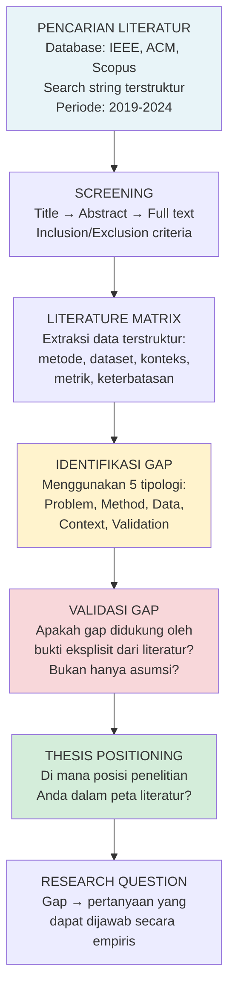

---

## 6. Contoh Terapan

**Konteks:** Penelitian tentang deteksi lateral movement dalam enterprise network menggunakan analisis log Active Directory.

**Search String yang Digunakan:**
```
("lateral movement" OR "pass-the-hash" OR "pass-the-ticket" OR "credential abuse")
AND ("detection" OR "identification" OR "analysis")
AND ("machine learning" OR "deep learning" OR "anomaly detection")
AND ("Active Directory" OR "Windows event log" OR "enterprise network")
```

**Hasil Screening:**
- Total ditemukan: 284 paper
- Lolos screening judul: 89
- Lolos screening abstrak: 41
- Lolos full-text review: 23 paper relevan

**Gap yang Teridentifikasi (dengan bukti):**

*Gap 1 (Context):* Dari 23 paper, 19 menggunakan dataset sintetis atau simulasi. Hanya 4 yang menggunakan data produksi nyata, dan keempatnya dari lingkungan cloud/data center. Tidak ada yang menggunakan lingkungan enterprise Windows hybrid (on-premise AD + Azure AD) yang semakin umum.

*Gap 2 (Validation):* Dari 23 paper, semua mengukur akurasi dalam kondisi balanced dataset. Tidak ada evaluasi pada imbalanced data (yang umum di lingkungan produksi di mana event normal jauh lebih banyak dari event malicious).

*Implikasi untuk Penelitian:* Research question difokuskan pada deteksi lateral movement pada lingkungan hybrid AD dengan evaluasi khusus dalam kondisi class imbalance berat (rasio 1:10.000).

---

## 7. Praktikum atau Aktivitas Terarah

### Aktivitas 3.1 — Menyusun Literature Matrix

**Tujuan:** Membangun literature matrix yang merupakan fondasi dari gap analysis.

**Instruksi:**

1. Tetapkan 3-5 keyword utama penelitian Anda
2. Rancang search string menggunakan operator Boolean (AND, OR, NOT)
3. Lakukan pencarian di minimal 2 database (IEEE Xplore, ACM DL, Scopus)
4. Terapkan inclusion criteria: diterbitkan 2019-2024, bahasa Inggris/Indonesia, peer-reviewed
5. Terapkan exclusion criteria: tidak ada metode eksperimental, duplikasi
6. Untuk 10-15 paper yang lolos screening, isi literature matrix

**Output:** Literature matrix minimal 10 entri + PRISMA flow diagram + daftar gap yang teridentifikasi dengan bukti dari tabel.

---

## 8. Latihan Pemahaman

**1.** Bedakan antara Systematic Literature Review (SLR) dan narrative review. Untuk tesis magister terapan, pendekatan mana yang lebih feasible dan mengapa?

**2.** Sebutkan dan jelaskan kelima tipologi research gap. Berikan contoh dari domain keamanan siber untuk masing-masing tipologi.

**3.** Mengapa klaim "penelitian ini belum pernah dilakukan sebelumnya" tidak cukup sebagai justifikasi research gap? Apa yang perlu ditambahkan?

**4.** Apa fungsi literature matrix dalam proses identifikasi research gap? Informasi apa yang minimal harus dicantumkan?

**5.** Jelaskan alur dari gap yang teridentifikasi hingga menjadi research question yang dapat diuji secara empiris.

---

## 9. Latihan Terapan / Studi Kasus

**Studi Kasus 3.1 — Gap yang Lemah**

Mahasiswa G mempresentasikan gap analysis-nya: "Banyak penelitian sudah dilakukan tentang malware detection. Namun, belum ada yang melakukan penelitian tentang malware detection menggunakan metode yang lebih baik. Oleh karena itu, penelitian ini bertujuan untuk mengembangkan metode yang lebih baik."

a) Identifikasi semua masalah dengan gap analysis di atas
b) Jelaskan mengapa reviewer akan langsung mempertanyakan gap ini
c) Perbaiki gap statement tersebut dengan membuat asumsi yang masuk akal

**Studi Kasus 3.2 — Multi-Gap Research**

Seorang mahasiswa meneliti "forensik artefak browser pada browser berbasis Chromium di Android setelah factory reset". Dalam literature review-nya, ia menemukan: (a) Ada banyak studi tentang forensik browser di desktop Windows, (b) Ada studi tentang Android forensik, tetapi berfokus pada aplikasi non-browser, (c) Tidak ada studi tentang recovery artefak browser post-factory-reset di Android.

Analisis: identifikasi dan klasifikasikan setiap gap yang ada, dan jelaskan bagaimana multi-gap ini membentuk novelty dan kontribusi penelitian.

---

## 10. Kunci Jawaban dan Pembahasan

**Jawaban Latihan 1:**
SLR menggunakan protokol eksplisit, dapat direproduksi, dan terdokumentasi lengkap (search string, database, tanggal pencarian, inclusion/exclusion criteria, PRISMA diagram). Narrative review lebih fleksibel dan bergantung pada pemilihan peneliti. Untuk tesis magister terapan dengan batasan waktu, modified SLR (menggunakan elemen kunci SLR tanpa scope komprehensif meta-analisis) adalah pendekatan yang paling balance antara rigor dan feasibility. Ini meningkatkan kredibilitas literatur review tanpa mengonsumsi terlalu banyak waktu.

**Jawaban Latihan 2:**
(1) Problem gap: masalah nyata yang belum ada solusi — contoh: "Serangan firmware rootkit tidak terdeteksi oleh antivirus yang beroperasi di OS layer". (2) Method gap: metode dari domain lain belum diterapkan — "Transfer learning dari domain NLP belum dieksplorasi untuk deteksi phishing berbasis analisis konten HTML". (3) Data/Dataset gap: data tidak tersedia — "Tidak ada dataset publik yang merepresentasikan traffic IoT healthcare yang diannotasi untuk deteksi anomali". (4) Context gap: studi dilakukan di konteks berbeda — "Studi ransomware detection yang ada hanya pada Windows, belum di Linux server (yang kritis untuk database dan web server)". (5) Validation gap: klaim belum divalidasi pada kondisi tertentu — "Algoritma deteksi yang diklaim real-time belum dievaluasi dengan pengukuran latency yang ketat dalam kondisi produksi."

**Jawaban Latihan 3:**
"Belum pernah dilakukan sebelumnya" memerlukan dua pembuktian tambahan: (a) bahwa klaim "belum pernah" didukung oleh pencarian literatur yang sistematis dan cukup komprehensif — reviewer akan selalu bertanya "sudahkah Anda mencek di [database X]?"; (b) bahwa gap tersebut memiliki signifikansi — mengapa penting bahwa hal ini dilakukan? Gap yang belum dieksplorasi karena memang tidak penting atau tidak feasible berbeda dari gap yang belum dieksplorasi karena keterbatasan sumber daya atau timing. Justifikasi gap harus menunjukkan bahwa mengisi gap ini memiliki dampak yang bermakna.

**Jawaban Latihan 4:**
Literature matrix berfungsi sebagai alat visualisasi dan analisis yang memungkinkan perbandingan sistematis antarstudi. Minimal harus mencakup: referensi, metode, dataset, konteks/domain, metrik evaluasi, hasil kunci, dan keterbatasan yang dilaporkan penulis. Dari matriks ini, pola dapat diidentifikasi: misalnya, jika kolom "konteks" selalu berisi "simulasi" — maka ada context gap karena tidak ada studi di lingkungan produksi nyata.

**Jawaban Latihan 5:**
Alur: (1) Gap diidentifikasi dari literatur dengan bukti eksplisit → (2) Gap dijustifikasi: mengapa ini penting untuk diselesaikan? → (3) Gap ditranslasikan menjadi pertanyaan: "apakah X dapat dilakukan untuk Y?" → (4) Pertanyaan dioperasionalisasikan: "sejauh mana metode A meningkatkan metrik B pada kondisi C dibandingkan baseline D?" → (5) Pertanyaan memandu desain metodologi: memilih metode, dataset, baseline, dan metrik yang relevan.

**Kunci Studi Kasus 3.1:**
a) Masalah: (1) tidak ada referensi ke literature yang spesifik; (2) "metode yang lebih baik" tidak didefinisikan — lebih baik dalam hal apa?; (3) gap tidak menjelaskan mengapa gap ini penting; (4) tidak ada tipologi gap yang jelas; (5) tidak ada bukti bahwa claim "belum ada" berdasarkan pencarian yang sistematis.
b) Reviewer akan bertanya: "Berapa paper yang Anda baca? Di database apa? Dengan search string apa? Apa definisi 'lebih baik' — akurasi, kecepatan, explainability?"
c) Versi yang lebih baik: "Studi terkini tentang deteksi malware Android (Smith 2021, Lee 2022, Kumar 2023) semuanya mengevaluasi model pada dataset DREBIN yang berusia >5 tahun dan tidak mencerminkan teknik obfuskasi terbaru yang digunakan malware 2023-2024. Evaluasi pada dataset terbaru dengan malware yang menggunakan reflection-based code injection (teknik yang meningkat 340% pada 2023 menurut Zimperium Mobile Threat Report) belum dilakukan. Penelitian ini mengisi data gap dan validation gap ini."

**Kunci Studi Kasus 3.2:**
Gap yang teridentifikasi: (1) Context gap: studi browser forensik ada, tetapi untuk desktop Windows — belum untuk Android; (2) Method gap (partial): metode forensik Android ada, tetapi untuk aplikasi non-browser; (3) Problem gap: forensik post-factory-reset pada Android browser adalah skenario forensik yang relevan (mengingat tersangka sering melakukan factory reset), tetapi belum diteliti. Multi-gap ini membentuk novelty: penelitian berada di persimpangan tiga area (browser forensik + Android forensik + post-factory-reset recovery) yang secara individual sudah ada studi, tetapi interseksi ketiganya belum. Kontribusinya: memberikan panduan forensik untuk investigator saat menghadapi perangkat Android yang sudah di-reset.

---

## 11. Ringkasan Bab

State-of-the-art analysis yang efektif menggunakan pendekatan sistematis — minimal dengan elemen kunci SLR — untuk menghasilkan peta pengetahuan yang dapat dipertahankan. Lima tipologi research gap (problem, method, data, context, validation) menyediakan kerangka untuk mengidentifikasi di mana kontribusi penelitian dapat ditempatkan. Literature matrix adalah alat operasional utama. Gap yang valid harus didukung bukti eksplisit dari literatur, bukan sekadar klaim "belum pernah dilakukan". Alur dari gap ke research question ke metodologi harus koheren dan dapat dipertahankan di hadapan reviewer.

---

## 12. Refleksi Profesional

1. Dalam pekerjaan sebagai analis keamanan atau forensik investigator, kemampuan memahami state-of-the-art alat dan teknik sangat kritis. Bagaimana Anda akan membangun sistem monitoring perkembangan teknik serangan dan pertahanan yang berkelanjutan dalam karir profesional Anda?

2. Penelitian keamanan siber sering menghadapi dilema: mengungkapkan gap penelitian berarti mengungkapkan kerentanan yang belum ada solusinya. Bagaimana Anda mengelola ketegangan antara transparansi akademik dan responsible disclosure dalam konteks seminar penelitian?

---

---

# BAB 4 — NOVELTY CLAIM DAN CONTRIBUTION FRAMING

## 1. Capaian Pembelajaran Bab

Setelah menyelesaikan bab ini, mahasiswa mampu:
- Membedakan novelty, originality, dan significance dalam konteks penelitian akademik (C2)
- Merumuskan novelty claim yang dapat dipertahankan secara akademik (C5) — Sub-CPMK.2
- Mengevaluasi validitas novelty claim sejawat (C5)

---

## 2. Peta Konsep Bab

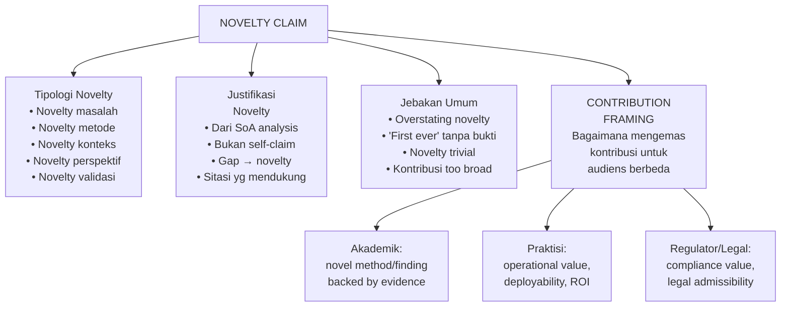

---

## 3. Pengantar Kontekstual

"Novelty" adalah kata yang paling sering disalahgunakan dalam tesis magister. Hampir setiap tesis mengklaim novelty — namun ketika ditanya lebih dalam oleh reviewer, klaim tersebut sering runtuh karena: (1) paper lain yang melakukan hal yang hampir sama terlewatkan, (2) kombinasi metode yang diklaim baru sebenarnya sudah dilakukan dengan nama berbeda, atau (3) novelty ada, tetapi signifikansinya tidak cukup untuk menjadi kontribusi akademik yang bermakna.

Di sisi lain, ada bahaya yang berlawanan: mahasiswa yang terlalu merendahkan kontribusinya karena terlalu hati-hati, sehingga tidak dapat mengartikulasikan nilai penelitiannya kepada reviewer. Bab ini memberikan kerangka untuk menavigasi diantara dua ekstrem ini.

---

## 4. Landasan Teori

### 4.1 Tipologi Novelty dalam Penelitian Keamanan Siber

**Novelty Masalah (Problem Novelty)**
Mengidentifikasi dan memformulasikan masalah yang belum pernah diarticulasikan sebagai masalah penelitian. Ini adalah jenis novelty tertinggi — membutuhkan kemampuan untuk melihat fenomena yang orang lain abaikan. Contoh: ketika pertama kali diidentifikasi bahwa AI generatif dapat digunakan untuk membuat phishing yang melewati filter karena menggunakan bahasa alami yang lebih meyakinkan.

**Novelty Metode (Method Novelty)**
Mengembangkan atau mengadaptasi metode baru. Dalam bidang teknis seperti FDKS, ini bisa berupa: algoritma baru, arsitektur model baru, pipeline baru, atau kombinasi teknik yang belum dieksplorasi. Novelty metode harus diikuti dengan bukti bahwa metode yang dikembangkan superior dalam dimensi tertentu (akurasi, kecepatan, interpretability, dll.).

**Novelty Konteks (Context Novelty)**
Menerapkan metode yang sudah ada ke konteks baru yang memiliki karakteristik unik. Ini adalah jenis novelty yang paling umum di tesis magister dan legitimate — asalkan konteks yang baru memiliki karakteristik yang membuat penerapan langsung dari studi sebelumnya tidak trivial.

**Novelty Perspektif (Perspective Novelty)**
Menganalisis masalah yang sudah dikenal dari sudut pandang yang baru. Dalam program FDKS, ini bisa berupa analisis teknik yang ada dari perspektif admissibility evidence (apakah metode forensik yang digunakan menghasilkan bukti yang dapat diterima di pengadilan?).

**Novelty Validasi (Validation Novelty)**
Menguji klaim yang sudah ada dalam kondisi yang belum diuji — misalnya, memvalidasi algoritma yang diklaim efektif pada dataset benchmark untuk melihat apakah kinerjanya bertahan pada data produksi nyata.

### 4.2 Standar Justifikasi Novelty

Novelty claim yang valid harus memenuhi tiga standar:

**Standar 1: Berbasis Bukti Literatur**
Klaim novelty tidak dapat berdiri sendiri sebagai opini peneliti. Setiap klaim harus didukung dengan referensi spesifik yang menunjukkan bahwa aspek yang diklaim baru memang belum ada dalam literatur yang ada. Format yang tepat: "Sejauh yang kami ketahui berdasarkan pencarian sistematis [database, periode, search string], belum ada studi yang menggabungkan X dan Y dalam konteks Z."

**Standar 2: Spesifisitas yang Defensible**
Novelty harus cukup spesifik untuk dapat dipertahankan jika ada paper yang hampir serupa ditemukan. Novelty yang terlalu luas ("pertama yang menggunakan AI untuk keamanan") tidak dapat dipertahankan. Novelty yang spesifik ("pertama yang menggunakan BERT untuk klasifikasi log SIEM dalam Bahasa Indonesia dengan fine-tuning pada domain keamanan siber") lebih defensible.

**Standar 3: Signifikansi**
Novelty yang trivial tidak bernilai akademik. Seorang reviewer akan bertanya: "Dan apa implikasinya jika memang ini baru? Apakah ini penting?" Novelty harus dikaitkan dengan manfaat yang signifikan: peningkatan performa, kemungkinan baru, pemahaman baru, atau nilai praktis yang nyata.

### 4.3 Contribution Framing untuk Audiens Berbeda

Kontribusi yang sama dapat diartikulasikan berbeda untuk audiens berbeda:

| Audiens | Fokus | Bahasa | Contoh Frame |
|---|---|---|---|
| Reviewer akademik | Novelty ilmiah, rigor metodologi | Teknis, referensial | "Kontribusi metodologis: pendekatan hybrid X+Y yang mengatasi limitasi Z" |
| Panel praktisi | Nilai operasional | Problem-solution | "Tool ini memungkinkan analis SOC mendeteksi lateral movement 40% lebih cepat" |
| Regulator/hukum | Compliance, admissibility | Legal-teknis | "Metode menghasilkan chain of custody digital yang memenuhi KUHAP Ps.184" |
| Industri/partner | ROI, deployability | Bisnis-teknis | "Dapat diintegrasikan ke SIEM yang sudah ada tanpa penggantian infrastruktur" |

---

## 5. Model atau Arsitektur

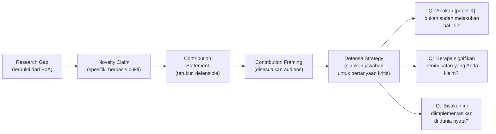

---

## 6. Contoh Terapan

**Penelitian:** Deteksi Command & Control (C2) traffic menggunakan analisis pola DNS.

**Novelty Claim yang Lemah:** "Penelitian ini pertama yang menggunakan machine learning untuk mendeteksi C2 traffic."

**Mengapa Lemah:** Klaim ini hampir pasti salah — banyak paper sudah menggunakan ML untuk deteksi C2. Reviewer akan dengan mudah menemukan paper yang membantah klaim ini, dan kepercayaan terhadap seluruh penelitian akan terpengaruh.

**Novelty Claim yang Lebih Kuat:**
"Berdasarkan systematic review kami terhadap 31 paper (IEEE, USENIX Security, CCS 2019-2024), deteksi C2 berbasis DNS telah menggunakan fitur statistik domain (entropy, panjang label, karakter distribusi) dan timing analysis. Namun, tidak ada studi yang mengeksplorasi kombinasi fitur semantik nama domain (menggunakan word embedding berbasis NLP) dengan fitur jaringan (TTL variability, resolver chain) untuk mendeteksi C2 domain yang menggunakan domain generation algorithm (DGA) berbasis kosakata bahasa alami, yang semakin umum digunakan oleh APT groups (CrowdStrike GTR 2023). Kontribusi kami adalah mendemonstrasikan bahwa pendekatan hybrid ini meningkatkan recall deteksi domain DGA-vocabulary dari 71% (baseline state-of-the-art) ke 89% pada dataset evaluasi kami."

---

## 7. Praktikum atau Aktivitas Terarah

### Aktivitas 4.1 — Merumuskan dan Menguji Novelty Claim

**Tujuan:** Merumuskan novelty claim yang dapat dipertahankan.

**Langkah:**
1. Dari literature matrix (Bab 3), identifikasi gap yang paling kuat
2. Rumuskan novelty claim dalam format: "Berdasarkan [pencarian literatur X], belum ada studi yang [spesifik claim], padahal [signifikansi]. Penelitian ini [kontribusi spesifik]."
3. Uji novelty claim dengan "devil's advocate" — bayangkan reviewer bertanya: "Apakah [paper X] bukan sudah melakukan ini?"
4. Revisi claim jika perlu

**Output:** Satu novelty statement yang kuat + tiga pertanyaan kritis yang diantisipasi + draft respons.

---

## 8. Latihan Pemahaman

**1.** Apa perbedaan antara "novelty", "originality", dan "significance" dalam konteks penelitian akademik?
**2.** Mengapa klaim "penelitian pertama yang menggunakan AI untuk keamanan siber" adalah klaim yang bermasalah?
**3.** Jelaskan tipologi "novelty validasi" dan berikan contoh yang relevan untuk forensik digital.
**4.** Bagaimana cara mengkomunikasikan kontribusi yang sama kepada reviewer akademik versus kepada praktisi industri?
**5.** Apa yang dimaksud dengan "novelty trivial" dan mengapa ini tidak cukup untuk tesis magister?

---

## 9. Latihan Terapan / Studi Kasus

**Studi Kasus 4.1:** Mahasiswa H mengklaim novelty: "Sistem kami menggunakan kombinasi random forest dan SVM untuk deteksi intrusi." Evaluasi klaim ini dan jelaskan perbaikan yang diperlukan.

**Studi Kasus 4.2:** Mahasiswa I meneliti implementasi Privacy by Design dalam pengembangan sistem SIEM untuk fintech. Identifikasi tipologi novelty yang paling relevan dan rumuskan novelty claim yang kuat.

---

## 10. Kunci Jawaban dan Pembahasan

**Jawaban 1:** *Novelty* merujuk pada aspek yang baru dalam penelitian. *Originality* merujuk pada bahwa karya adalah milik peneliti sendiri (bukan plagiasi). *Significance* merujuk pada apakah novelty tersebut penting dan berdampak. Ketiga hal ini berbeda: karya bisa original (bukan plagiat) tetapi tidak novel (sudah ada yang melakukan) dan tidak significant (bahkan jika novel, tidak berdampak). Tesis akademik idealnya memiliki ketiga-tiganya.

**Jawaban 2:** Klaim terlalu luas dan hampir pasti salah (ada ribuan paper tentang AI untuk keamanan siber). Klaim yang tidak dapat dipertahankan merusak kredibilitas seluruh penelitian. Reviewer yang menemukan satu paper yang membantah klaim akan mempertanyakan kualitas literature review secara keseluruhan.

**Jawaban 3:** Novelty validasi: menguji klaim yang ada dalam kondisi baru yang relevan. Contoh forensik: "Kitchenham (2017) mengklaim bahwa metode akuisisi memori X mempertahankan integritas pada 99.9% kasus dalam pengujian lab. Studi kami adalah yang pertama mengevaluasi klaim ini dalam kondisi volatile memory yang terfragmentasi akibat rootkit level kernel, yang belum pernah diuji dalam kondisi tersebut."

**Jawaban 4:** Untuk reviewer akademik: fokus pada aspek metodologis yang novel, referensi ke baseline literatur, metrik evaluasi yang ketat. Untuk praktisi: fokus pada nilai operasional (apakah analis SOC dapat menggunakan ini? Berapa waktu yang dihemat?), deployability (integrasi dengan infrastruktur yang ada), dan false positive rate yang dapat diterima dalam lingkungan produksi.

**Jawaban 5:** Novelty trivial adalah novelty yang ada tetapi tidak memberikan manfaat yang berarti. Contoh: "Kami menggunakan parameter yang sedikit berbeda dari paper X." Ini adalah novelty, tetapi tidak signifikan. Tesis magister perlu menunjukkan bahwa kontribusinya memiliki dampak yang cukup signifikan untuk membenarkan investasi penelitian.

**Kunci 4.1:** Masalah: kombinasi RF dan SVM sudah sangat umum dalam literatur deteksi intrusi — ini bukan novelty. Perbaikan: perlu spesifisitas (fitur apa? dataset apa?), perbandingan dengan baseline yang relevan, dan justifikasi mengapa kombinasi ini superior untuk konteks tertentu.

**Kunci 4.2:** Tipologi novelty yang relevan: Context novelty (Privacy by Design dalam SIEM untuk fintech Indonesia — konteks regulasi PDP dan OJK yang unik) + Perspective novelty (pendekatan dari perspektif legal-teknis yang mengintegrasikan UU PDP dengan desain arsitektur SIEM). Novelty claim: "Berdasarkan review literatur, implementasi Privacy by Design pada SIEM telah dieksplorasi dalam konteks healthcare (GDPR) dan cloud, namun belum ada studi yang mengintegrasikan persyaratan UU PDP No.27/2022 dan regulasi OJK ke dalam desain arsitektur SIEM untuk fintech Indonesia. Kontribusi: framework mapping UU PDP ke kontrol teknis SIEM yang dapat diimplementasikan."

---

## 11. Ringkasan Bab

Novelty claim yang valid harus spesifik, berbasis bukti dari SoA analysis, dan memiliki signifikansi yang dapat dipertahankan. Lima tipologi novelty (masalah, metode, konteks, perspektif, validasi) memberikan kerangka untuk mengidentifikasi dan mengartikulasikan posisi kontribusi. Contribution framing perlu disesuaikan dengan audiens — reviewer akademik membutuhkan justifikasi metodologis, praktisi membutuhkan nilai operasional, regulator membutuhkan compliance value. Novelty yang tidak dapat dipertahankan lebih merusak daripada kontribusi yang modest namun akurat.

---

## 12. Refleksi Profesional

1. Dalam konteks keamanan siber, seberapa penting "novelty" dibandingkan "proven effectiveness"? Apakah ada nilai dalam replikasi studi yang ada dalam konteks lokal Indonesia?

2. Jika penelitian Anda mengungkap bahwa teknik yang banyak digunakan oleh praktisi ternyata tidak efektif (validation gap), bagaimana Anda mengkomunikasikan temuan ini secara bertanggung jawab?

---

# BAB 5 — THESIS POSITIONING MATRIX DAN PATHWAY ALIGNMENT

## 1. Capaian Pembelajaran Bab

Setelah menyelesaikan bab ini, mahasiswa mampu:
- Menggunakan thesis positioning matrix untuk memvisualisasikan posisi penelitian dalam lanskap literatur (C3)
- Mengevaluasi kesesuaian arah penelitian dengan pathway tesis dan kebutuhan industri (C5) — Sub-CPMK.2
- Menyusun dokumen gap-novelty-contribution yang terintegrasi untuk Eval-2 (C6)

---

## 2. Peta Konsep Bab

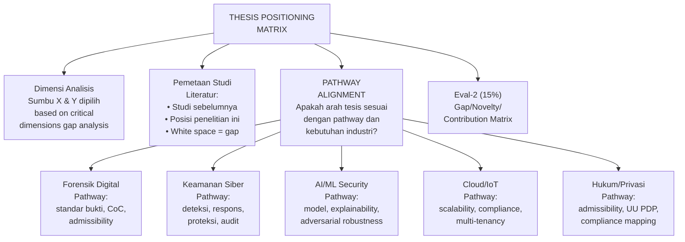

---

## 3. Pengantar Kontekstual

Thesis positioning matrix adalah visualisasi dua dimensi yang menempatkan studi dalam literatur pada sebuah peta, sehingga posisi penelitian Anda — dan terutama "white space" yang belum terisi — menjadi terlihat secara intuitif. Ini adalah alat komunikasi yang powerful dalam seminar: daripada menjelaskan gap secara verbal yang panjang, satu gambar positioning matrix seringkali lebih efektif meyakinkan reviewer bahwa gap yang diklaim memang nyata.

Pathway alignment adalah pemeriksaan apakah arah penelitian Anda konsisten dengan pathway tesis yang ditetapkan bersama pembimbing dan dengan kebutuhan industri/konteks penerapan yang relevan. Inkonsistensi antara arah penelitian dan pathway sering terdeteksi dalam seminar — misalnya, penelitian yang mengklaim berkontribusi untuk forensik digital tetapi tidak mempertimbangkan aspek admissibility bukti sama sekali.

---

## 4. Landasan Teori

### 4.1 Membangun Thesis Positioning Matrix

Langkah-langkah:

**Langkah 1: Identifikasi Dua Dimensi Kritis**
Pilih dua dimensi yang paling mendefinisikan perbedaan antarstudi dalam domain Anda. Dimensi harus: (1) relevan dengan gap yang diidentifikasi, (2) membedakan pendekatan secara bermakna, (3) bersifat kontinu (bukan kategorikal binary).

Contoh dimensi untuk domain deteksi ancaman:
- Sumbu X: Tingkat otomasi (manual → fully automated)
- Sumbu Y: Cakupan ancaman (narrow/targeted → broad-spectrum)

**Langkah 2: Petakan Studi Literatur**
Tempatkan 10-15 studi representatif dalam matriks berdasarkan dua dimensi tersebut. Gunakan label singkat (penulis+tahun). Kelompokkan yang berdekatan.

**Langkah 3: Identifikasi White Space**
White space (area kosong) dalam matriks adalah visualisasi gap. Area yang tidak ditempati oleh studi yang ada adalah area di mana penelitian Anda berposisi.

**Langkah 4: Tempatkan Penelitian Anda**
Tandai posisi penelitian Anda dalam matriks. Ini harus berada di area white space yang sesuai dengan gap yang diklaim.

### 4.2 Pathway Alignment Check

Setiap penelitian dalam program FDKS harus diperiksa terhadap pathway-nya:

| Pathway | Pertanyaan Kunci | Red Flags |
|---|---|---|
| Forensik Digital | Apakah metode menghasilkan bukti yang admissible? Apakah chain of custody terjaga? | Tidak ada pertimbangan KUHAP, tidak ada dokumentasi forensik |
| Keamanan Siber Teknis | Apakah baseline perbandingan realistis? Apakah evaluasi mencerminkan kondisi adversarial? | Hanya menguji pada dataset bersih, tidak ada evaluasi terhadap evasion |
| AI/ML Security | Apakah model explainable? Apakah ada evaluasi adversarial robustness? | Black-box tanpa interpretability, tidak ada testing adversarial perturbation |
| Cloud/IoT | Apakah skalabilitas dipertimbangkan? Apakah ada evaluasi latency pada edge device? | Hanya diuji di server lokal, tidak ada pertimbangan resource constraint |
| Hukum & Privasi | Apakah implikasi UU PDP dipertimbangkan? Apakah metodologi sesuai prosedur hukum? | Tidak ada analisis aspek legal, menggunakan data tanpa izin yang jelas |

### 4.3 Gap–Novelty–Contribution Matrix (Eval-2)

Dokumen akhir yang dihasilkan dari Bab 3-5 adalah Gap–Novelty–Contribution (GNC) Matrix — tabel integratif yang menghubungkan gap yang teridentifikasi dengan novelty yang diklaim dan kontribusi yang diharapkan:

| # | Gap (Tipe) | Bukti dari Literatur | Novelty yang Diklaim | Kontribusi yang Diharapkan | Status Validasi |
|---|---|---|---|---|---|
| 1 | Context Gap | [Referensi 3 paper] | Penerapan metode X di konteks Y | Framework A untuk lingkungan B | Hypothesized |
| 2 | Validation Gap | [Referensi 2 paper] | Evaluasi pada kondisi C yang belum diuji | Dataset D + protokol evaluasi E | Partially validated |

---

## 5. Model atau Arsitektur

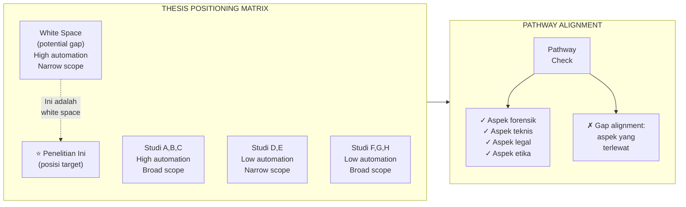

---

## 6. Contoh Terapan

**Penelitian:** Deteksi memory-based malware menggunakan analisis snapshot RAM.

**Thesis Positioning Matrix:**
- Sumbu X: Sumber data analisis (disk-only → memory-only)
- Sumbu Y: Tingkat deteksi (signature-based → behavior-based)

Studi sebelumnya:
- Antivirus tradisional: disk-only + signature-based (kuadran kiri bawah)
- Memory scanner komersial (ESET, Kaspersky): memory + signature-based (kuadran kanan bawah)
- Volatility-based forensic: memory + semi-manual behavior (kuadran kanan tengah)
- Penelitian ini: memory + automated behavior-based (kuadran kanan atas — white space)

**Pathway Alignment (Forensik Digital):**
- ✓ Menggunakan prosedur akuisisi memori yang forensically sound (FTK Imager, WinPmem)
- ✓ Mempertahankan hash verification untuk integritas snapshot
- ✗ Belum dipertimbangkan: apakah analisis behavioral menghasilkan output yang dapat dijadikan bukti di pengadilan (interpretability)?
- Tindakan korektif: tambahkan modul reporting yang menghasilkan audit trail terstruktur

---

## 7. Praktikum atau Aktivitas Terarah

### Aktivitas 5.1 — Menyusun Gap–Novelty–Contribution Matrix

**Tujuan:** Menghasilkan dokumen terintegrasi yang menjadi fondasi Eval-2.

**Instruksi:**
1. Dari literature matrix (Bab 3), identifikasi 2-3 gap terkuat dengan bukti literatur
2. Untuk setiap gap, rumuskan novelty claim yang defensible (Bab 4)
3. Untuk setiap novelty, formulasikan kontribusi yang diharapkan dalam format terukur
4. Lakukan pathway alignment check: identifikasi aspek yang sudah dan belum dipertimbangkan
5. Buat thesis positioning matrix dengan dua dimensi yang dipilih dengan justifikasi

**Output:** GNC Matrix (tabel) + Thesis Positioning Matrix (visual) + Pathway Alignment Report singkat. Ini adalah dokumen utama untuk Eval-2.

---

## 8. Latihan Pemahaman

**1.** Bagaimana memilih dua dimensi yang tepat untuk thesis positioning matrix?
**2.** Apa yang dimaksud dengan "white space" dalam thesis positioning matrix, dan mengapa ini penting?
**3.** Bedakan antara pathway alignment check untuk pathway "Forensik Digital" versus "AI/ML Security".
**4.** Apa fungsi Gap–Novelty–Contribution Matrix sebagai dokumen terintegrasi?
**5.** Mengapa "status validasi" penting untuk dicantumkan dalam GNC Matrix?

---

## 9. Latihan Terapan / Studi Kasus

**Studi Kasus 5.1:** Mahasiswa J meneliti deteksi insider threat berbasis analisis log User and Entity Behavior Analytics (UEBA). Buat thesis positioning matrix dengan dua dimensi yang relevan, tempatkan 5 studi literatur yang Anda anggap representatif, dan identifikasi white space yang dapat ditempati penelitian J.

**Studi Kasus 5.2:** Penelitian mahasiswa K tentang model klasifikasi malware berbasis deep learning tidak mempertimbangkan adversarial robustness. Dari perspektif pathway "AI/ML Security", identifikasi red flags dan rekomendasi perbaikan.

---

## 10. Kunci Jawaban dan Pembahasan

**Jawaban 1:** Dimensi yang tepat harus: (a) merepresentasikan variasi terpenting dalam domain (bukan variasi trivial), (b) membedakan pendekatan secara bermakna, (c) relevan dengan gap yang ingin ditunjukkan. Proses pemilihan: identifikasi dari literature matrix kolom mana yang paling bervariasi dan paling kritis — dimensi dengan variasi terbesar dan relevansi tertinggi adalah kandidat terbaik.

**Jawaban 2:** White space adalah area dalam matriks yang tidak ditempati oleh studi yang ada — secara visual merepresentasikan gap. Ini penting karena mengkomunikasikan novelty secara intuitif kepada reviewer: melihat "kekosongan" dalam matriks lebih meyakinkan daripada membaca deskripsi verbal tentang gap.

**Jawaban 3:** Forensik Digital: fokus pada admissibility (apakah prosedur forensically sound?), chain of custody, reproducibility, dan dokumentasi yang dapat diaudit. AI/ML Security: fokus pada model transparency/explainability, evaluasi adversarial robustness, potensi model inversion/poisoning attacks, dan bias dalam training data.

**Jawaban 4:** GNC Matrix menghubungkan tiga elemen secara eksplisit: gap yang terbukti dari literatur → novelty yang diklaim sebagai respons terhadap gap → kontribusi konkret yang diharapkan. Ini memastikan koherensi: kontribusi harus berhubungan dengan novelty, dan novelty harus merespons gap yang nyata.

**Jawaban 5:** Status validasi penting karena: (a) membantu reviewer mengetahui bagian mana yang masih spekulatif vs. sudah diverifikasi; (b) memungkinkan review yang lebih terarah (reviewer akan fokus mempertanyakan bagian yang masih hypothesized); (c) menunjukkan kejujuran akademik.

**Kunci 5.1:** Dimensi yang relevan untuk UEBA: Sumbu X: Tingkat analisis (individual user → collective/entity), Sumbu Y: Sumber data (single data source → multi-source integration). Studi representatif: (1) Akbar et al. (rule-based, single log) → kuadran individual+single; (2) CERT Insider Threat (baseline statistical) → individual+multi; (3) DLP tool komersial → collective+single; (4) Machine learning UEBA (Splunk UBA style) → collective+multi. White space: penelitian yang fokus pada individual behavior dengan multi-source integration yang menggunakan explainable AI untuk audit trail.

**Kunci 5.2:** Red flags: (a) tidak ada evaluasi ketahanan model terhadap adversarial examples (input yang sengaja dimodifikasi untuk menipu model); (b) malware author dapat mempelajari cara memodifikasi malware untuk menghindari deteksi jika model diketahui; (c) tidak ada analisis poisoning attack pada training data. Rekomendasi: tambahkan evaluasi adversarial robustness menggunakan library seperti ART (Adversarial Robustness Toolbox), tambahkan metrik robustness (accuracy under FGSM/PGD attack), dan diskusikan batasan model dalam threat model yang mengasumsi adversary mengetahui model yang digunakan.

---

## 11. Ringkasan Bab

Thesis positioning matrix memvisualisasikan posisi penelitian dalam peta literatur, menjadikan gap terlihat secara intuitif. White space dalam matriks adalah representasi visual dari gap yang diklaim. Pathway alignment check memastikan bahwa arah penelitian konsisten dengan pathway yang ditetapkan dan mempertimbangkan semua aspek yang relevan — termasuk aspek yang sering terlewat seperti admissibility (forensik) atau adversarial robustness (AI/ML). Gap–Novelty–Contribution Matrix mengintegrasikan tiga elemen kunci menjadi dokumen yang koheren dan dapat dipertahankan, yang menjadi output utama Eval-2.

---

## 12. Refleksi Profesional

1. Thesis positioning matrix adalah alat komunikasi ilmiah. Dalam konteks profesional, analoginya adalah competitive intelligence analysis — memetakan posisi solusi Anda terhadap solusi kompetitor. Bagaimana keterampilan ini dapat diterapkan dalam karir Anda sebagai praktisi keamanan siber?

2. Pathway alignment check mewajibkan peneliti untuk mempertimbangkan aspek legal, etika, dan organisasional sejak tahap awal. Mengapa ini lebih efektif daripada menambahkan pertimbangan tersebut di akhir penelitian?

---

---

# BAB 6 — KRITIK ILMIAH: MENILAI METODOLOGI DAN DESAIN PENELITIAN

## 1. Capaian Pembelajaran Bab

Setelah menyelesaikan bab ini, mahasiswa mampu:
- Menganalisis kekuatan dan kelemahan desain penelitian menggunakan kerangka kritik ilmiah (C4)
- Mengevaluasi kesesuaian metodologi dengan research question (C5) — Sub-CPMK.3
- Menyusun critical review yang konstruktif dan berbasis bukti (C5)

---

## 2. Peta Konsep Bab

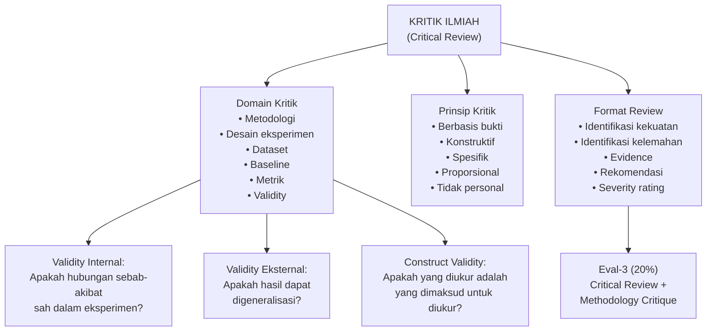

---

## 3. Pengantar Kontekstual

Kemampuan memberikan kritik ilmiah yang konstruktif adalah salah satu keterampilan paling berharga yang dapat dikembangkan dalam program magister. Peneliti yang tidak dapat mengkritisi penelitian orang lain biasanya juga tidak dapat mengkritisi penelitian mereka sendiri — dan ini adalah kelemahan yang fatal dalam dunia penelitian.

Dalam bidang forensik digital dan keamanan siber, kritik ilmiah memiliki dimensi tambahan yang serius: jika metodologi yang cacat digunakan untuk menganalisis bukti forensik dalam kasus nyata, konsekuensinya bukan hanya akademis. Bukti yang dianalisis dengan metode yang tidak valid dapat disanggah di pengadilan, terdakwa yang bersalah bisa lolos, atau orang yang tidak bersalah bisa dihukum. Standar kritik metodologi dalam bidang ini karena itu lebih tinggi dari rata-rata.

---

## 4. Landasan Teori

### 4.1 Kerangka Kritik Metodologi

Untuk memberikan kritik metodologi yang sistematis, gunakan kerangka MEVR (Methodology–Evidence–Validity–Reproducibility):

**M — Methodology (Metodologi)**
- Apakah metode yang dipilih sesuai dengan research question?
- Apakah metode dijelaskan dengan detail yang cukup untuk direproduksi?
- Apakah ada alternatif metodologi yang lebih sesuai yang tidak dipertimbangkan?
- Apakah asumsi metode sesuai dengan karakteristik data?

**E — Evidence (Bukti/Data)**
- Apakah dataset representatif terhadap populasi yang diklaim?
- Apakah ukuran sampel cukup untuk statistik yang digunakan?
- Apakah labeling/annotation dataset dapat dipercaya?
- Apakah ada data leakage (informasi dari test set bocor ke training)?

**V — Validity (Validitas)**
- *Internal validity:* Apakah kesimpulan kausal valid dalam batasan eksperimen?
- *External validity:* Apakah temuan dapat digeneralisasi ke konteks lain?
- *Construct validity:* Apakah metrik yang digunakan benar-benar mengukur apa yang diklaim?
- *Statistical validity:* Apakah uji statistik yang digunakan tepat?

**R — Reproducibility (Reprodusibilitas)**
- Apakah eksperimen dapat direproduksi oleh peneliti lain?
- Apakah dataset dan kode tersedia?
- Apakah ada randomness yang tidak dikontrol (seed tidak ditetapkan)?
- Apakah konfigurasi environment terdokumentasi?

### 4.2 Tipologi Kelemahan Metodologi yang Umum di FDKS

**1. Data Leakage**
Terjadi ketika informasi dari test set digunakan dalam proses training, menghasilkan estimasi performa yang terlalu optimis. Dalam deteksi malware, ini sering terjadi ketika fitur yang diekstrak dari seluruh dataset sebelum dibagi training/test (misalnya, normalisasi berdasarkan statistik seluruh dataset).

**2. Temporal Split yang Tidak Tepat**
Dalam keamanan siber, model yang diuji pada malware yang lebih lama dari training set (retroactive evaluation) menghasilkan akurasi tinggi yang tidak mencerminkan kemampuan mendeteksi ancaman baru. Evaluasi yang valid memerlukan temporal split: training pada periode T1, testing pada periode T2 > T1.

**3. Class Imbalance yang Diabaikan**
Dataset keamanan siber biasanya sangat imbalanced (event normal jauh lebih banyak dari event malicious). Menggunakan accuracy sebagai metrik utama pada imbalanced dataset adalah kesalahan metodologis — model yang selalu prediksi "normal" akan mencapai akurasi tinggi meski tidak berguna.

**4. Overfitting pada Benchmark Dataset**
Mengevaluasi hanya pada satu dataset benchmark (misalnya, KDD Cup 99 yang sudah sangat dikenal) tanpa menguji pada dataset lain. Model bisa "ingat" pola dalam dataset benchmark tanpa benar-benar belajar prinsip yang generalisable.

**5. Baseline yang Tidak Adil**
Membandingkan dengan implementasi baseline yang sengaja dikonfigurasi dengan buruk (menggunakan parameter suboptimal) untuk membuat metode yang diusulkan tampak lebih superior.

**6. Untuk Forensik Digital: Kurangnya Legal Admissibility Test**
Metode forensik yang tidak mempertimbangkan apakah hasilnya akan diterima di pengadilan. Misalnya, menggunakan tool forensik tanpa memverifikasi bahwa tool tersebut tervalidasi secara hukum, atau tidak mendokumentasikan chain of custody.

### 4.3 Format Critical Review yang Konstruktif

Critical review yang baik mengikuti format SPEC:

**S — Strengths (Kekuatan)**
Identifikasi apa yang sudah dilakukan dengan baik. Ini bukan basa-basi — mengidentifikasi kekuatan menunjukkan bahwa reviewer memahami penelitian secara komprehensif dan reviewnya tidak bias negatif.

**P — Problems (Masalah)**
Daftar masalah spesifik dengan evidence. Setiap masalah harus: (a) spesifik (bukan "metodologi kurang kuat"), (b) didukung penjelasan mengapa ini masalah, (c) diberi severity rating.

**E — Evidence (Bukti Masalah)**
Kutipan dari paper/presentasi yang menunjukkan masalah yang diidentifikasi, atau referensi literatur yang menunjukkan bahwa praktik yang lebih baik ada.

**C — Constructive Recommendations (Rekomendasi Konstruktif)**
Untuk setiap masalah, berikan rekomendasi spesifik untuk perbaikan. Review tanpa rekomendasi adalah kritik destruktif yang tidak berguna.

---

## 5. Model atau Arsitektur

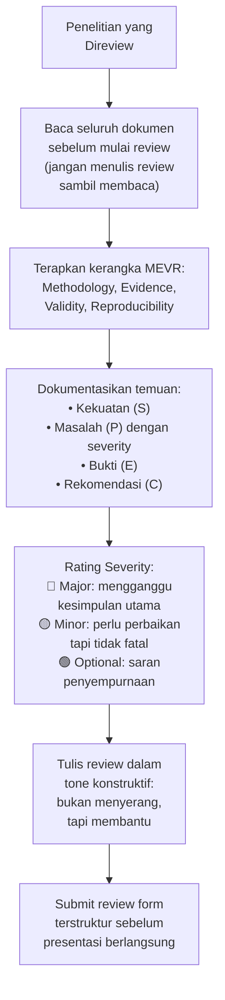

---

## 6. Contoh Terapan

**Contoh Critical Review Singkat:**

*Penelitian yang direview:* "Deteksi phishing berbasis analisis konten halaman web menggunakan BERT" (Mahasiswa X, VSFDKS Sem.3)

**Kekuatan:**
- Pemilihan model BERT relevan untuk analisis konten teks
- Dataset mencakup 50.000 URL dengan distribusi yang memadai
- Eksperimen menggunakan 5-fold cross validation

**Masalah (P) dengan Severity:**

🔴 **[Major] Data Leakage:** Normalisasi TF-IDF dilakukan pada seluruh dataset sebelum split training/test (Bagian 3.2, paragraf 4). Ini menghasilkan test set yang "bocor" ke model training, membuat akurasi 97.3% yang dilaporkan tidak valid. Referensi: Kaufman et al. (2012) "Leakage in Data Mining: Formulation, Detection, and Avoidance."

🔴 **[Major] Tidak Ada Temporal Evaluation:** Dataset dikumpulkan pada periode yang sama, sehingga model tidak dievaluasi kemampuannya mendeteksi phishing yang baru muncul setelah training.

🟡 **[Minor] Baseline Tidak Adil:** Baseline rule-based yang dibandingkan menggunakan hanya 5 rules. Baseline ML yang lebih kompetitif (DistilBERT, logistic regression) tidak disertakan.

🟢 **[Optional]:** Menambahkan analisis error (confusion matrix untuk kategori phishing yang sulit) akan meningkatkan nilai akademik.

**Rekomendasi:**
- [Major #1] Ulangi preprocessing dengan train/test split dilakukan sebelum normalisasi
- [Major #2] Tambahkan temporal split evaluation: train 2022, test 2023-2024
- [Minor] Sertakan DistilBERT sebagai baseline ML kompetitif

---

## 7. Praktikum atau Aktivitas Terarah

### Aktivitas 6.1 — Peer Review Penelitian Sejawat

**Tujuan:** Menghasilkan critical review yang akan diserahkan sebagai bagian Eval-3.

**Instruksi:**
1. Baca research progress brief atau makalah singkat yang diberikan oleh koordinator seminar
2. Lakukan review menggunakan kerangka MEVR
3. Kategorikan temuan menggunakan format SPEC
4. Berikan severity rating untuk setiap masalah
5. Tulis review dalam tone konstruktif menggunakan review form terstruktur

**Kriteria Etika:**
- Review harus objektif — jika ada konflik kepentingan, ungkapkan kepada koordinator
- Tidak menggunakan informasi dari review untuk kepentingan penelitian sendiri tanpa izin
- Menjaga kerahasiaan detail penelitian yang belum dipublikasi

**Output:** Completed review form (2-4 halaman) yang siap disubmit sebagai Eval-3.

---

## 8. Latihan Pemahaman

**1.** Jelaskan kerangka MEVR dan fungsi masing-masing elemen dalam kritik metodologi.
**2.** Apa yang dimaksud dengan "data leakage" dan mengapa ini merupakan masalah metodologis yang serius?
**3.** Bedakan antara internal validity, external validity, dan construct validity.
**4.** Mengapa menggunakan accuracy sebagai metrik utama pada imbalanced dataset adalah kesalahan metodologis?
**5.** Apa perbedaan antara kritik konstruktif dan kritik destruktif? Berikan contoh masing-masing.

---

## 9. Latihan Terapan / Studi Kasus

**Studi Kasus 6.1:** Sebuah penelitian tentang deteksi DDoS menggunakan Random Forest melaporkan akurasi 99.8% pada dataset KDD Cup 99. Reviewer berpengalaman langsung skeptis. Identifikasi setidaknya 3 alasan mengapa reviewer harus skeptis terhadap klaim ini.

**Studi Kasus 6.2:** Mahasiswa L memberikan review yang berisi: "Penelitian ini sangat buruk dan tidak layak dilanjutkan karena metodologinya tidak meyakinkan dan penulisnya tampaknya tidak paham bidang ini." Evaluasi review ini dari perspektif kritik ilmiah yang baik dan tulis ulang dalam format yang konstruktif.

---

## 10. Kunci Jawaban dan Pembahasan

**Jawaban 1:** MEVR: (M) Metodologi — kesesuaian metode dengan pertanyaan penelitian, detail yang cukup untuk reprodusibilitas; (E) Evidence/Data — representativitas, ukuran, kualitas labeling, potensi leakage; (V) Validity — internal (kausalitas), eksternal (generalisasi), construct (pengukuran yang tepat), statistik; (R) Reproducibility — ketersediaan kode/data, kontrol randomness, dokumentasi environment.

**Jawaban 2:** Data leakage terjadi ketika informasi dari test set bocor ke proses training, baik secara langsung maupun tidak langsung (misalnya, melalui statistik yang dihitung dari seluruh dataset). Ini merupakan masalah serius karena: (a) estimasi performa menjadi terlalu optimis (model seperti "melihat jawaban sebelum ujian"); (b) model yang dilaporkan performa tingginya mungkin tidak efektif di lingkungan produksi; (c) penelitian lain yang membangun di atas hasil ini juga akan terpengaruh.

**Jawaban 3:** Internal validity: seberapa kuat bukti bahwa hubungan yang diamati adalah kausal (bukan korelasi yang disebabkan faktor lain) dalam konteks eksperimen yang dilakukan. External validity: seberapa jauh hasil dapat digeneralisasi ke populasi, setting, atau waktu yang berbeda. Construct validity: apakah instrumen pengukuran atau metrik yang digunakan benar-benar mengukur konstruk yang dimaksud (misalnya, apakah F1-score benar-benar mengukur "efektivitas deteksi" dalam konteks operasional yang nyata?).

**Jawaban 4:** Pada imbalanced dataset (misalnya, 99% normal, 1% malicious), model yang selalu memprediksi "normal" akan mencapai akurasi 99% — yang sangat tinggi tetapi sama sekali tidak berguna. Metrik yang lebih tepat untuk imbalanced data adalah: precision, recall, F1-score (terutama untuk kelas minoritas), AUC-ROC, atau Matthews Correlation Coefficient (MCC).

**Jawaban 5:** Kritik konstruktif: mengidentifikasi masalah spesifik, menjelaskan mengapa ini masalah, dan memberikan rekomendasi perbaikan yang actionable. Contoh: "Normalisasi dilakukan sebelum train/test split yang menyebabkan data leakage. Rekomendasi: ulangi preprocessing dengan split dilakukan terlebih dahulu." Kritik destruktif: menilai secara umum tanpa spesifisitas, tidak memberikan rekomendasi, dan/atau bersifat personal. Contoh: "Metodologinya sangat lemah dan tidak menunjukkan pemahaman yang memadai tentang machine learning."

**Kunci 6.1:** Alasan skeptis terhadap akurasi 99.8% pada KDD Cup 99: (1) KDD Cup 99 adalah dataset lama (1999) yang telah diketahui memiliki banyak duplikasi — menghapus duplikat secara dramatis menurunkan performa; (2) Dataset sudah sangat "dikenal" oleh komunitas — banyak fiturnya sangat diskriminatif dan tidak merepresentasikan tantangan deteksi DDoS modern; (3) Akurasi bukan metrik yang tepat untuk dataset yang mungkin imbalanced; (4) Tidak ada evaluasi pada dataset yang lebih baru dan lebih realistis; (5) Performa yang terlalu tinggi sering mengindikasikan data leakage atau overfitting.

**Kunci 6.2:** Review mahasiswa L tidak memenuhi standar kritik ilmiah: (a) tidak spesifik ("metodologinya tidak meyakinkan" — apa yang spesifik tidak meyakinkan?); (b) bersifat personal ("penulisnya tampaknya tidak paham bidang ini" — ini serangan ad hominem, bukan kritik ilmiah); (c) tidak ada rekomendasi konstruktif. Versi yang baik: "Penelitian ini memiliki beberapa kelemahan metodologis yang perlu ditangani sebelum dapat dilanjutkan: [1] Dataset yang digunakan tidak dijelaskan sumber dan karakteristiknya, sehingga sulit menilai representativitasnya [Major]; [2] Baseline perbandingan tidak disebutkan secara eksplisit [Major]; Rekomendasi: (1) tambahkan deskripsi dataset lengkap termasuk distribusi kelas; (2) sertakan minimal satu baseline yang relevan dari literatur."

---

## 11. Ringkasan Bab

Kritik ilmiah yang efektif menggunakan kerangka sistematis (MEVR) dan format yang konstruktif (SPEC). Domain kritik mencakup metodologi, evidence, validity (internal, eksternal, construct), dan reproducibility. Kelemahan metodologis umum di FDKS meliputi data leakage, temporal split yang tidak tepat, class imbalance yang diabaikan, dan baseline yang tidak adil. Kritik yang baik selalu spesifik, berbasis bukti, proporsional terhadap severity masalah, dan menyertakan rekomendasi yang actionable — bukan penilaian umum yang tidak membantu perbaikan.

---

## 12. Refleksi Profesional

1. Dalam forensik digital untuk keperluan hukum, standar metodologi yang dapat dipertahankan di pengadilan (Daubert Standard di AS, atau standar equivalent di Indonesia) lebih ketat dari standar akademik. Bagaimana kerangka kritik metodologi yang Anda pelajari dapat diterapkan untuk mengevaluasi apakah teknik forensik yang digunakan dalam investigasi nyata dapat dipertahankan di hadapan hakim?

2. Peer review dalam akademik dan quality review dalam SOC memiliki tujuan yang sama: memastikan bahwa analisis yang dilakukan dapat dipercaya. Bagaimana budaya "blameless review" — fokus pada sistem dan proses, bukan individu — dapat diterapkan baik dalam forum akademik maupun dalam lingkungan kerja profesional?

---

# BAB 7 — DATASET, BASELINE, METRIK, VALIDITY THREAT, DAN REPRODUCIBILITY

## 1. Capaian Pembelajaran Bab

Setelah menyelesaikan bab ini, mahasiswa mampu:
- Mengevaluasi kualitas dan representativitas dataset penelitian (C5)
- Menganalisis kesesuaian baseline dan metrik evaluasi (C5) — Sub-CPMK.3
- Mengidentifikasi validity threats dan strategi mitigasinya (C5)
- Menilai reproducibility sebuah penelitian berdasarkan dokumentasi yang tersedia (C4)

---

## 2. Peta Konsep Bab

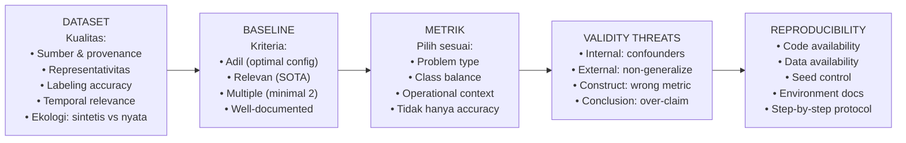

---

## 3. Pengantar Kontekstual

Kualitas dataset dan kesesuaian metrik adalah dua faktor yang paling sering menjadi sumber kelemahan metodologis dalam penelitian keamanan siber. Seorang peneliti dapat memiliki ide yang brilian, namun jika dataset yang digunakan tidak representatif atau metrik yang dipilih tidak tepat, kesimpulan yang dihasilkan tidak dapat dipercaya.

Bagian ini membahas empat dimensi yang saling terkait: dataset (apa yang Anda ukur), baseline (dibandingkan dengan apa), metrik (bagaimana Anda mengukur), validity threats (ancaman terhadap kesahihan kesimpulan), dan reproducibility (apakah orang lain dapat mengulang dan memverifikasi).

---

## 4. Landasan Teori

### 4.1 Evaluasi Kualitas Dataset

**Dimensi Evaluasi Dataset:**

| Dimensi | Pertanyaan | Red Flag |
|---|---|---|
| Sumber & Provenance | Dari mana dataset berasal? Bagaimana dikumpulkan? | Sumber tidak jelas, tidak dapat diverifikasi |
| Representativitas | Apakah mencerminkan populasi yang diklaim? | "Dataset dari lingkungan sendiri" tanpa justifikasi |
| Labeling Accuracy | Siapa yang melabeli? Berapa inter-rater agreement? | Label dari satu annotator tanpa cross-check |
| Temporal Relevance | Apakah masih merepresentasikan lanskap terkini? | Dataset >5 tahun untuk ancaman yang cepat berevolusi |
| Ecological Validity | Apakah sintetis atau dari lingkungan nyata? | Seluruhnya sintetis tanpa justifikasi |
| Class Balance | Apakah distribusi realistis? | Dataset seimbang sempurna dalam domain yang sangat imbalanced |
| Etika & Izin | Apakah ada izin untuk menggunakan data ini? | Data dari breach/insiden tanpa anonimisasi |

**Dataset Benchmark Umum di FDKS:**

Untuk Network Intrusion Detection: CICIDS-2017/2018, NSL-KDD, UNSW-NB15
Untuk Malware: Drebin, AndroZoo, VirusTotal Public Feed
Untuk Phishing/Fraud: PhishTank, APWG eCrime Dataset
Untuk Forensik: NIST CFReDS (Computer Forensic Reference Data Sets)
Untuk Log Analysis: HDFS Log Dataset, BGL (BlueGene/L)

Catatan: Gunakan dataset benchmark sebagai titik awal, tetapi ketahui kelemahannya. KDD Cup 99 sudah tidak relevan; CICIDS-2018 lebih baik tetapi masih memiliki keterbatasan ekologis.

### 4.2 Pemilihan Baseline yang Adil

Baseline yang adil harus memenuhi kriteria:
1. **Optimal configuration:** Baseline harus dikonfigurasi dengan parameter optimal, bukan parameter default yang mungkin suboptimal
2. **State-of-the-art:** Sertakan baseline yang merupakan SOTA terkini di domain tersebut
3. **Multiple baselines:** Minimal 2 baseline — satu klasik (simple reference point) dan satu terkini
4. **Reprodusibel:** Baseline harus diimplementasikan ulang atau menggunakan hasil yang diterbitkan dari paper original

### 4.3 Pemilihan Metrik yang Tepat

**Panduan pemilihan metrik berdasarkan konteks:**

| Konteks | Metrik yang Tepat | Alasan |
|---|---|---|
| Imbalanced class (IDS, fraud) | F1, Precision, Recall, AUC-ROC | Accuracy menyesatkan |
| Operasional SOC | False Positive Rate kritis | FP tinggi berarti alert fatigue |
| Forensik (binary decision) | Matthews Correlation Coefficient | Balanced metric untuk binary |
| Multi-class | Macro-F1, Weighted-F1 | Tergantung apakah semua kelas sama pentingnya |
| Real-time detection | Throughput + Latency | Performa tidak hanya akurasi, tapi kecepatan |
| Legal evidence | Sensitivity (recall) tinggi | Lebih baik false positive daripada false negative |

### 4.4 Validity Threats (Ancaman Validitas)

Klasifikasi validity threats dari Wohlin et al. (Experimentation in Software Engineering):

**Internal Validity Threats:** Faktor yang dapat menjelaskan hubungan yang diamati selain hipotesis yang diuji.
- *Selection bias:* Tidak merepresentasikan populasi dengan benar
- *History effect:* Faktor luar yang berubah selama eksperimen
- *Instrumentation:* Alat pengukuran yang berubah atau tidak konsisten
- *Maturation:* Perubahan pada subjek selama eksperimen

**External Validity Threats:** Faktor yang membatasi generalisasi.
- *Population threat:* Hasil hanya berlaku untuk sampel yang digunakan
- *Setting threat:* Hasil hanya berlaku dalam setting eksperimen, tidak di produksi

**Construct Validity Threats:** Apakah yang diukur adalah yang dimaksud untuk diukur.
- *Inadequate preoperational explication:* Definisi konsep tidak jelas sebelum operasionalisasi
- *Mono-method bias:* Hanya satu cara pengukuran

**Conclusion Validity Threats:** Ancaman terhadap ketepatan kesimpulan statistik.
- *Low statistical power:* Sampel terlalu kecil untuk menarik kesimpulan yang kuat
- *Fishing and error rate:* Multiple testing tanpa koreksi

### 4.5 Reproducibility

Krisis reprodusibilitas dalam machine learning (Pineau et al., 2021) menunjukkan bahwa sebagian besar paper tidak dapat direproduksi sepenuhnya oleh peneliti lain. Praktik reprodusibilitas yang baik mencakup:

1. **Kode tersedia:** Repository publik (GitHub) dengan kode yang lengkap dan terdokumentasi
2. **Data tersedia:** Dataset publik, atau instruksi untuk mendapatkan data yang sama
3. **Random seed dikontrol:** Semua proses stokastik menggunakan seed yang ditetapkan
4. **Environment terdokumentasi:** versi Python/library (requirements.txt atau conda environment)
5. **Langkah-langkah eksplisit:** README yang menjelaskan cara mereproduksi setiap eksperimen
6. **Hasil intermediate tersedia:** Log training, model checkpoint, hasil evaluasi

---

## 5. Model atau Arsitektur

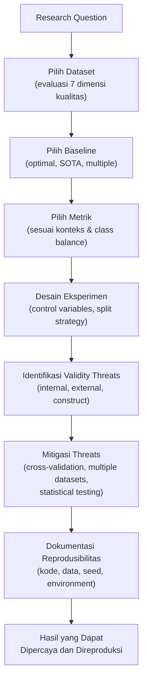

---

## 6. Contoh Terapan

**Konteks:** Penelitian tentang deteksi email phishing berbasis NLP.

**Dataset:** PhishTank (phishing URL/email) + Enron Email Dataset (ham) — imbalanced 1:3
→ Evaluasi: representatif untuk phishing lama, mungkin tidak merepresentasikan phishing modern berbasis AI-generated content. Ini adalah known limitation yang harus dinyatakan.

**Baseline:** (1) Rule-based filter (SpamAssassin) — reference point; (2) BERT base uncased — state-of-the-art NLP; (3) DistilBERT — lightweight SOTA. Ketiganya diimplementasikan dengan tuning hyperparameter yang optimal.

**Metrik:** Precision, Recall, F1 (weighted), AUC-ROC. Accuracy dihitung tetapi tidak dijadikan metrik utama karena imbalance.

**Validity Threats yang Diidentifikasi:**
- External validity: dataset dari tahun 2021-2022, mungkin tidak merepresentasikan phishing 2024 yang menggunakan generative AI
- Construct validity: F1 mengasumsi bahwa precision dan recall sama pentingnya — dalam konteks operasional, recall (tidak melewatkan phishing) mungkin lebih kritis
- Mitigasi: tambahkan evaluasi pada subset phishing terbaru (2023-2024) dari sumber yang berbeda; analisis sensitivitas terhadap threshold decision boundary

**Reproducibility:** Kode tersedia di GitHub, menggunakan seed=42 untuk semua proses random, requirements.txt tersedia, Jupyter notebook dengan output sudah dijalankan tersedia.

---

## 7. Praktikum atau Aktivitas Terarah

### Aktivitas 7.1 — Audit Dataset dan Metrik Penelitian Sendiri

**Tujuan:** Mengidentifikasi kelemahan dataset dan metrik dalam penelitian sendiri untuk diperbaiki sebelum eksperimen.

**Instruksi:**
1. Isi tabel evaluasi dataset untuk dataset yang akan Anda gunakan
2. Justifikasi pemilihan baseline: mengapa baseline tersebut dipilih?
3. Justifikasi pemilihan metrik: mengapa metrik ini sesuai untuk konteks penelitian Anda?
4. Identifikasi validity threats yang paling relevan dan rencana mitigasi
5. Periksa reproducibility plan: apa yang sudah ada dan apa yang masih kurang?

**Output:** Methodology critique self-assessment yang akan menjadi bagian dari Eval-3 (self-review).

---

## 8. Latihan Pemahaman

**1.** Mengapa dataset KDD Cup 99 sudah tidak direkomendasikan untuk penelitian IDS terkini?
**2.** Apa yang dimaksud dengan "baseline yang adil" dan apa konsekuensinya jika baseline dikonfigurasi dengan buruk?
**3.** Bedakan antara precision dan recall. Dalam konteks sistem deteksi intrusi, mana yang lebih kritis dan mengapa?
**4.** Apa yang dimaksud dengan "temporal split" dan mengapa ini penting dalam penelitian keamanan siber?
**5.** Jelaskan mengapa reproducibility adalah komponen kritis dari penelitian ilmiah, dan identifikasi 3 praktik yang meningkatkan reproducibility.

---

## 9. Latihan Terapan / Studi Kasus

**Studi Kasus 7.1:** Penelitian malware detection mengklaim akurasi 99.5% menggunakan dataset yang dibuat sendiri dengan 1.000 sampel malware dan 1.000 sampel benign. Identifikasi semua potensi kelemahan dalam setup ini.

**Studi Kasus 7.2:** Sebuah paper tentang network anomaly detection menggunakan precision=0.95 sebagai metrik utama dan menyimpulkan bahwa sistem sangat efektif untuk deployment di SOC. Seorang reviewer berpengalaman tidak setuju dengan kesimpulan ini. Jelaskan argumen reviewer tersebut.

---

## 10. Kunci Jawaban dan Pembahasan

**Jawaban 1:** KDD Cup 99 bermasalah karena: (a) ~78% dari data adalah duplikat, yang menyebabkan model dapat mencapai akurasi tinggi dengan "menghafal" entri; (b) menggambarkan jaringan dan serangan dari 1999 yang tidak merepresentasikan ancaman modern; (c) terlalu banyak paper yang telah "mengoptimasi" pada dataset ini, menyebabkan hasil yang tidak dapat digeneralisasi; (d) kategori serangan sudah usang (tidak ada DDoS modern, malware modern, dll.).

**Jawaban 2:** Baseline adil: dikonfigurasi dengan parameter optimal (bukan default). Konsekuensi baseline buruk: (a) perbandingan tidak valid — sistem baru terlihat superior bukan karena memang lebih baik, tetapi karena baseline sengaja dibuat lemah; (b) komunitas penelitian dapat mencapai kesimpulan salah jika penelitian di-publish; (c) reviewer yang berpengalaman akan mendeteksi ini dan menolak paper.

**Jawaban 3:** Precision = TP/(TP+FP): dari semua yang diprediksi positif, berapa yang benar-benar positif. Recall = TP/(TP+FN): dari semua yang seharusnya positif, berapa yang berhasil terdeteksi. Dalam IDS: recall lebih kritis — miss detection (FN) berarti serangan nyata tidak terdeteksi, yang dalam konteks operasional berarti breach yang tidak tertangani. False alarm (FP, menurunkan precision) lebih dapat ditoleransi karena menghasilkan alert yang perlu diverifikasi — tidak ideal, tetapi tidak berbahaya secara langsung. Namun, FP yang terlalu tinggi menyebabkan alert fatigue, sehingga keseimbangan (F1) tetap penting.

**Jawaban 4:** Temporal split: membagi data berdasarkan waktu — training pada data lama, testing pada data baru. Penting dalam keamanan siber karena: (a) ancaman berevolusi; (b) evaluasi retroaktif (training dan testing dari periode yang sama secara acak) menghasilkan model yang "melihat" pola masa depan dalam training — hasilnya tidak mencerminkan kemampuan model mendeteksi ancaman yang belum pernah dilihat.

**Jawaban 5:** Reproducibility penting karena: (a) memungkinkan verifikasi independen oleh peneliti lain; (b) memungkinkan pembangunan di atas penelitian yang ada; (c) meningkatkan kepercayaan pada temuan. Tiga praktik: (1) publikasikan kode di repository publik dengan dokumentasi; (2) kontrol semua proses stokastik menggunakan fixed seed; (3) dokumentasikan environment (versi library, hardware) secara eksplisit.

**Kunci 7.1:** Kelemahan: (a) 1.000 sampel sangat sedikit untuk belajar pola yang generalisable; (b) dataset buatan sendiri mungkin tidak merepresentasikan malware nyata dengan variasi penuh (packer, obfuscation, dll.); (c) class balance sempurna (1:1) tidak mencerminkan lingkungan produksi di mana malware sangat minoritas; (d) sumber dataset tidak disebutkan — label mungkin tidak akurat; (e) tidak diuji pada dataset independen yang berbeda sumber.

**Kunci 7.2:** Argumen reviewer: Precision 0.95 berarti 5% dari alert yang dihasilkan adalah false alarm. Dalam SOC dengan 10.000 alert per hari, ini berarti 500 false alarm setiap hari yang harus diinvestigasi. Ini akan menyebabkan alert fatigue yang parah. Lebih penting lagi, precision tinggi TIDAK memberikan informasi tentang recall (berapa persen serangan nyata yang terdeteksi). Sistem dengan recall 30% dan precision 0.95 akan melewatkan 70% serangan nyata. Kesimpulan bahwa sistem "sangat efektif untuk deployment" berdasarkan precision saja adalah kesimpulan yang tidak valid.

---

## 11. Ringkasan Bab

Kualitas penelitian sangat bergantung pada pilihan dataset, baseline, dan metrik. Dataset harus dievaluasi berdasarkan tujuh dimensi termasuk representativitas, labeling accuracy, dan temporal relevance. Baseline yang adil harus optimal, relevan (SOTA), dan multiple. Metrik harus dipilih berdasarkan konteks, khususnya mempertimbangkan class balance dan implikasi operasional. Validity threats harus diidentifikasi dan dimitigasi secara eksplisit. Reproducibility — kode, data, seed, environment — adalah komponen kritis dari penelitian yang dapat dipercaya.

---

## 12. Refleksi Profesional

1. Dalam investigasi forensik digital, standar reprodusibilitas berarti bahwa investigator lain harus dapat mencapai kesimpulan yang sama menggunakan metode yang sama pada bukti yang sama. Bagaimana prinsip ini berbeda dari reprodusibilitas dalam penelitian akademik, dan apa implikasinya untuk cara Anda mendokumentasikan pekerjaan forensik?

2. Validity threats dalam penelitian akademik memiliki analogi dalam operasional keamanan: bias dalam model threat intelligence, data yang tidak representatif dalam anomaly detection, atau metrik yang salah dalam mengukur efektivitas program keamanan. Identifikasi satu contoh dari pengalaman Anda atau dari berita keamanan siber di mana "validity threat" berdampak pada keputusan operasional yang salah.

---

---

# BAB 8 — PRESENTASI TENGAH SEMESTER: PERSIAPAN DAN PELAKSANAAN

## 1. Capaian Pembelajaran Bab

Setelah menyelesaikan bab ini, mahasiswa mampu:
- Merancang presentasi ilmiah yang efektif untuk audiens akademik dan praktisi (C6)
- Melaksanakan presentasi tengah semester sesuai standar seminar penelitian (C6) — Sub-CPMK.4
- Mempersiapkan respons terhadap pertanyaan kritis yang diantisipasi (C5)

---

## 2. Peta Konsep Bab

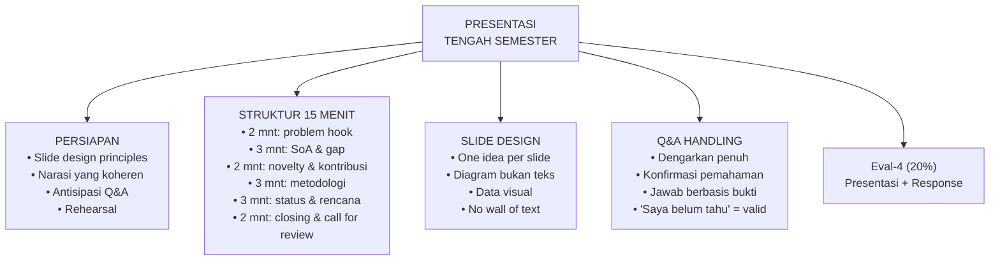

---

## 3. Pengantar Kontekstual

Presentasi tengah semester adalah milestone pertama di mana penelitian Anda dinilai oleh panel yang lebih luas dari sekadar pembimbing. Ini adalah latihan pertama untuk ujian tesis akhir — dan seperti latihan apapun, tujuannya bukan untuk sempurna, tetapi untuk belajar dari umpan balik. Namun demikian, "belajar dari umpan balik" mensyaratkan bahwa Anda datang cukup siap sehingga umpan balik yang diterima bermakna dan dapat ditindaklanjuti.

Kesiapan yang sesungguhnya bukan tentang memorisasi slide — ini tentang kemampuan menjelaskan setiap aspek penelitian Anda dengan kata-kata Anda sendiri, tanpa membaca dari slide, kepada audiens yang tidak mengenal penelitian Anda.

---

## 4. Landasan Teori

### 4.1 Prinsip Desain Slide untuk Presentasi Penelitian

**Prinsip 1: One Idea Per Slide**
Setiap slide harus menyampaikan satu — dan hanya satu — ide utama. Audiens tidak bisa membaca teks dan mendengarkan presenter secara bersamaan. Jika slide Anda memiliki 6 bullet points, Anda memiliki 6 slide yang dipadatkan menjadi satu.

**Prinsip 2: Diagram Lebih Kuat dari Teks**
Research question, metodologi, arsitektur sistem, dan alur penelitian sebaiknya divisualisasikan sebagai diagram. Diagram yang baik dapat dikomunikasikan dalam hitungan detik; teks membutuhkan puluhan detik untuk dibaca.

**Prinsip 3: Data dalam Grafik, Bukan Tabel**
Tabel dengan banyak angka sulit dibaca dalam presentasi. Gunakan bar chart, line chart, atau heatmap untuk menunjukkan tren, perbandingan, dan pola. Tabel detail dapat disimpan dalam appendix untuk Q&A.

**Prinsip 4: Font Cukup Besar**
Ukuran font minimum 24pt untuk teks utama, 32pt+ untuk judul. Jika tidak terbaca dari belakang ruangan, font terlalu kecil.

**Prinsip 5: Warna Bermakna**
Gunakan warna untuk membawa makna (misalnya, merah untuk ancaman, hijau untuk mitigasi, biru untuk data netral) — bukan sekadar estetika.

### 4.2 Struktur Narasi Presentasi 15 Menit

| Segmen | Durasi | Konten |
|---|---|---|
| Problem hook | 2 mnt | Mulai dengan fakta mengejutkan atau skenario yang relevan yang memotivasi penelitian |
| State-of-the-art & gap | 3 mnt | Peta singkat literatur + gap yang diidentifikasi (dengan positioning matrix jika ada) |
| Novelty & kontribusi | 2 mnt | Apa yang diklaim baru dan mengapa penting |
| Metodologi | 3 mnt | Desain eksperimen/penelitian: data, metode, baseline, metrik |
| Status & rencana | 3 mnt | Status saat ini, apa yang sudah ada, apa yang masih dikerjakan, timeline |
| Closing & call for review | 2 mnt | Ringkasan key points + 2-3 pertanyaan spesifik yang diminta dari reviewer |

**Kunci naratif:** Setiap slide harus menjawab pertanyaan "so what?" — mengapa ini penting, mengapa audiens harus peduli dengan informasi ini?

### 4.3 Antisipasi Pertanyaan Q&A

Sebelum presentasi, identifikasi 5-7 pertanyaan yang paling mungkin ditanyakan oleh panel, dan siapkan respons yang berbasis bukti. Kategori pertanyaan umum:

| Kategori | Contoh Pertanyaan | Strategi Respons |
|---|---|---|
| Tentang gap | "Apakah [paper X] bukan sudah melakukan ini?" | Penjelasan perbedaan spesifik |
| Tentang metodologi | "Mengapa memilih algoritma Y bukan Z?" | Justifikasi berdasarkan literatur |
| Tentang dataset | "Mengapa dataset X masih relevan?" | Temporal relevance + known limitation |
| Tentang novelty | "Apa yang benar-benar baru di sini?" | Spesifik dan defensible claim |
| Tentang feasibility | "Bisakah ini diselesaikan dalam waktu yang ada?" | Timeline konkret dengan milestones |
| Yang belum diketahui | "Bagaimana Anda akan menangani [kasus edge X]?" | "Ini pertanyaan yang bagus dan belum saya pertimbangkan; saya akan mengeksplorasi ini." |

---

## 5. Model atau Arsitektur

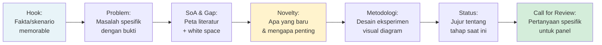

---

## 6. Contoh Terapan

**Problem Hook yang Kuat:**
"Pada Januari 2023, sebuah rumah sakit di California membayar tebusan $1.3 juta setelah sistem medis mereka dienkripsi oleh ransomware. Sistem deteksi yang ada menghabiskan rata-rata 6 jam untuk mengidentifikasi serangan — waktu di mana 15.000 file klinis pasien sudah tidak dapat diakses. Penelitian ini mengeksplorasi apakah pendekatan berbasis analisis perilaku proses real-time dapat memotong waktu deteksi menjadi di bawah 3 menit."

**Mengapa Ini Efektif:** Konkret (lokasi, waktu, jumlah), kontekstual (domain healthcare), dan langsung menghubungkan masalah dengan penelitian.

---

## 7. Praktikum atau Aktivitas Terarah

### Aktivitas 8.1 — Persiapan Presentasi Tengah Semester

**Instruksi:**
1. Buat slide deck 10-15 slide mengikuti prinsip dan struktur yang dibahas
2. Lakukan rehearsal minimal 2 kali: pertama sendiri (rekam video), kedua bersama teman atau pembimbing
3. Tonton rekaman video: identifikasi tic verbal, kontak mata yang kurang, dan slide yang membutuhkan penjelasan terlalu panjang
4. Siapkan daftar 5-7 pertanyaan antisipasi beserta draft respons
5. Siapkan slide appendix: detail teknis, tabel lengkap, referensi yang mungkin ditanyakan

**Kriteria Keberhasilan:**
- Durasi tepat dalam batas waktu yang ditetapkan (±1 menit)
- Setiap slide dapat dijelaskan tanpa membaca dari slide
- Dapat menjawab semua pertanyaan dari daftar antisipasi

---

## 8. Latihan Pemahaman

**1.** Apa yang dimaksud dengan "one idea per slide" dan mengapa ini penting?
**2.** Mengapa "saya belum tahu jawaban pertanyaan itu" adalah respons yang acceptable dalam Q&A seminar?
**3.** Bagaimana cara memulai presentasi dengan "problem hook" yang efektif?
**4.** Apa fungsi "appendix slide" dalam presentasi penelitian?
**5.** Mengapa rehearsal adalah komponen kritis dari persiapan presentasi?

---

## 9. Latihan Terapan / Studi Kasus

**Studi Kasus 8.1:** Mahasiswa M menyiapkan slide pertamanya yang berisi: judul, nama, tanggal, dan 12 bullet points tentang latar belakang penelitian. Evaluasi slide ini dan desain ulang menggunakan prinsip yang dipelajari.

**Studi Kasus 8.2:** Selama Q&A, dosen penguji bertanya: "Mengapa Anda tidak menggunakan pendekatan federated learning untuk mengatasi masalah privasi data?" Mahasiswa N belum mempertimbangkan federated learning. Tulis respons yang ideal untuk situasi ini.

---

## 10. Kunci Jawaban dan Pembahasan

**Jawaban 1:** One idea per slide berarti setiap slide hanya menyampaikan satu pesan utama yang dapat diidentifikasi dalam 5 detik pertama. Ini penting karena audiens tidak dapat membaca teks dan mendengarkan presenter secara bersamaan — otak manusia tidak multitask dalam hal ini. Jika slide memiliki banyak informasi, audiens akan membaca slide dan berhenti mendengarkan, atau mendengarkan dan tidak memproses slide.

**Jawaban 2:** "Saya belum tahu" adalah respons yang jujur dan acceptable karena: (a) pura-pura tahu padahal tidak lebih merusak kredibilitas dari pada mengakui ketidaktahuan; (b) seorang peneliti yang baik tahu batas pengetahuannya — ini adalah metacognitive awareness yang dihargai; (c) harus diikuti dengan "saya akan mengeksplorasi ini" atau "ini di luar scope penelitian saya saat ini, tetapi merupakan arah penelitian yang menarik."

**Jawaban 3:** Problem hook yang efektif dimulai dengan: (a) statistik atau fakta yang mengejutkan tentang skala atau dampak masalah, (b) skenario spesifik yang nyata (insiden yang terdokumentasi), atau (c) pertanyaan retoris yang membuat audiens berpikir. Yang membuat hook efektif adalah bahwa ia langsung relevan dengan penelitian yang akan dipresentasikan.

**Jawaban 4:** Appendix slide berisi detail teknis yang terlalu terperinci untuk slide utama tetapi mungkin dibutuhkan dalam Q&A — tabel perbandingan lengkap, formula matematika, kode singkat, atau referensi spesifik. Presenter dapat menampilkan appendix slide saat pertanyaan spesifik diajukan, menunjukkan bahwa mereka sudah mengantisipasi pertanyaan tersebut.

**Jawaban 5:** Rehearsal penting karena: (a) mengekspos masalah timing yang tidak terdeteksi saat membuat slide; (b) mengidentifikasi bagian yang membutuhkan penjelasan terlalu panjang (slide harus disederhanakan atau dibagi); (c) membangun muscle memory sehingga presenter tidak perlu membaca dari slide; (d) meningkatkan kepercayaan diri yang mengurangi kecemasan presentasi.

**Kunci 8.1:** Masalah dengan slide: 12 bullet points memaksa audiens membaca, bukan mendengarkan; tidak ada "hook" yang menarik perhatian; terlalu banyak informasi untuk satu slide. Desain ulang: Slide 1 = judul + satu kalimat problem statement yang kuat. Slide 2 = satu statistik atau fakta mengejutkan sebagai hook (bisa berupa infografis sederhana). Slide 3 = diagram peta masalah (bukan daftar bullet).

**Kunci 8.2:** Respons ideal: "Itu pertanyaan yang sangat relevan. Federated learning memang merupakan pendekatan yang menarik untuk masalah privasi data terdistribusi, dan saya mengakui bahwa saya belum mempertimbangkannya secara eksplisit dalam desain saya saat ini. Dalam konteks penelitian ini, asumsi awal saya adalah bahwa data dapat dikumpulkan secara terpusat dalam lingkungan yang dikontrol — namun Anda benar bahwa untuk deployment di lingkungan yang melibatkan multiple organisasi, federated learning akan menjadi pertimbangan penting. Saya akan menambahkan diskusi tentang ini sebagai future work dan memeriksa apakah ada implikasi untuk desain saat ini."

---

## 11. Ringkasan Bab

Presentasi tengah semester yang efektif mensyaratkan persiapan yang serius: slide yang mengikuti prinsip desain yang tepat (one idea, diagram, font besar), narasi yang terstruktur dalam 15 menit (hook → SoA+gap → novelty → metodologi → status → call for review), dan antisipasi pertanyaan Q&A yang komprehensif. Kemampuan menjawab dengan jujur — termasuk mengakui ketidaktahuan dengan graceful — adalah tanda peneliti yang matang. Rehearsal adalah komponen tak tergantikan dari persiapan.

---

## 12. Refleksi Profesional

1. Kemampuan presentasi yang Anda kembangkan dalam seminar ini akan digunakan dalam karir profesional: presentasi kepada manajemen, briefing kepada klien, laporan kepada regulator, atau testimoni dalam proses hukum. Dari semua konteks ini, mana yang menurut Anda paling menantang dan mengapa?

2. Seorang forensik investigator sering harus mempresentasikan temuan teknis yang kompleks kepada hakim dan juri yang tidak memiliki latar belakang teknis. Bagaimana prinsip "one idea per slide" dan visualisasi data dapat membantu dalam konteks ini?

---

# BAB 9 — Q&A HANDLING DAN SCIENTIFIC ARGUMENTATION

## 1. Capaian Pembelajaran Bab

Setelah menyelesaikan bab ini, mahasiswa mampu:
- Menganalisis struktur pertanyaan kritis dari reviewer (C4)
- Membangun argumen ilmiah yang berbasis bukti untuk merespons pertanyaan (C5) — Sub-CPMK.4
- Membedakan pertahanan yang sah dari defensivitas yang tidak produktif (C5)

---

## 2. Peta Konsep Bab

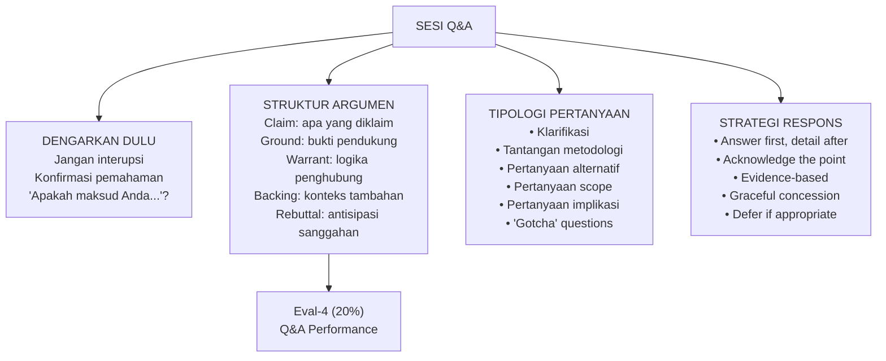

---

## 3. Pengantar Kontekstual

Kualitas respons Q&A sering membedakan presentasi yang biasa dari yang luar biasa. Tidak ada yang sempurna dalam semua aspek penelitiannya — reviewer yang berpengalaman tahu itu. Yang mereka evaluasi bukan apakah peneliti memiliki semua jawaban, tetapi bagaimana peneliti berpikir: apakah mereka dapat menganalisis pertanyaan, mengakui asumsi yang tidak sempurna, dan berargumen secara koheren berdasarkan bukti yang ada.

Satu kesalahan yang sering terjadi adalah memahami Q&A sebagai pertarungan — peneliti mempertahankan setiap aspek penelitiannya, reviewer mencoba merobohkannya. Ini adalah framing yang salah dan kontraproduktif. Q&A yang produktif adalah kolaborasi untuk mengidentifikasi kelemahan yang dapat diperbaiki, sehingga penelitian menjadi lebih kuat.

---

## 4. Landasan Teori

### 4.1 Struktur Argumen Toulmin

Stephen Toulmin mengembangkan model argumen yang berguna untuk analisis dan konstruksi argumen akademik:

- **Claim (Klaim):** Apa yang diklaim (kesimpulan)
- **Ground (Dasar):** Fakta atau data yang mendukung klaim
- **Warrant (Justifikasi):** Prinsip atau aturan yang menghubungkan ground ke claim
- **Backing (Dukungan):** Konteks atau otorisasi yang mendukung warrant
- **Rebuttal (Sanggahan):** Kondisi di mana klaim mungkin tidak berlaku
- **Qualifier (Kualifier):** Tingkat kepastian klaim

Contoh dalam konteks penelitian FDKS:
- *Claim:* "Model kami lebih efektif dari baseline untuk deteksi insider threat."
- *Ground:* "F1-score kami 0.89 vs. baseline 0.73 pada dataset yang sama."
- *Warrant:* "F1-score yang lebih tinggi mengindikasikan keseimbangan precision dan recall yang lebih baik."
- *Backing:* "Dalam konteks insider threat, keseimbangan antara menangkap ancaman (recall) dan mengurangi false alert (precision) adalah kritis untuk operasional SOC."
- *Rebuttal:* "Kecuali dataset tidak representatif terhadap lingkungan produksi riil."
- *Qualifier:* "Dalam kondisi eksperimen yang dijelaskan, dengan dataset X yang digunakan."

### 4.2 Tipologi Pertanyaan Reviewer

**Pertanyaan Klarifikasi:** Meminta penjelasan lebih lanjut tentang sesuatu yang tidak jelas.
*Strategi:* Jelaskan lebih detail, sertakan contoh jika membantu.

**Pertanyaan Tantangan Metodologi:** Mempertanyakan validitas atau kesesuaian metode.
*Strategi:* Acknowledge kekhawatiran, jelaskan justifikasi, akui limitasi jika valid.

**Pertanyaan Alternatif:** "Mengapa tidak menggunakan pendekatan Y?"
*Strategi:* Jelaskan tradeoffs, mengapa pendekatan yang dipilih lebih sesuai untuk research question ini.

**Pertanyaan Scope:** "Apakah ini bisa digeneralisasi ke X?"
*Strategi:* Akui batasan scope secara jujur, jelaskan apa yang dapat dan tidak dapat diklaim.

**Pertanyaan Implikasi:** "Apa implikasi temuan ini untuk [aspek lain]?"
*Strategi:* Eksplorasi implikasi secara jujur, termasuk implikasi yang mungkin belum dipertimbangkan.

**"Gotcha" Questions:** Pertanyaan yang dirancang untuk menunjukkan kontradiksi atau kelemahan yang seharusnya sudah diperkirakan.
*Strategi:* Tidak panik. Analisis pertanyaan dengan tenang, akui jika pertanyaan valid, jelaskan bagaimana akan ditangani.

### 4.3 Strategi Respons Efektif

**Answer First, Detail After:** Jawab pertanyaan inti terlebih dahulu, baru berikan detail. Jangan memulai dengan konteks yang panjang sebelum sampai ke jawaban — reviewer sudah tahu konteksnya.

**Acknowledge Before Rebuttal:** Jika pertanyaan mengandung poin yang valid, akui terlebih dahulu sebelum memberikan respons. "Anda benar bahwa [X] adalah kelemahan yang perlu diperhatikan. Alasan kami memilih pendekatan ini meskipun demikian adalah..."

**Evidence-Based Responses:** Setiap respons yang berupa klaim harus didukung bukti — referensi, data, atau logika yang dapat diikuti.

**Graceful Concession:** Ketika pertanyaan mengungkap kelemahan yang nyata, akui dengan "Ini adalah poin yang valid dan akan menjadi area perbaikan dalam versi selanjutnya" lebih baik dari membela posisi yang tidak dapat dipertahankan.

**Defer When Appropriate:** Untuk pertanyaan di luar scope penelitian atau yang memerlukan penelitian lebih lanjut: "Ini adalah pertanyaan yang menarik dan di luar scope penelitian ini; ini bisa menjadi arah penelitian lanjutan yang produktif."

---

## 5. Model atau Arsitektur

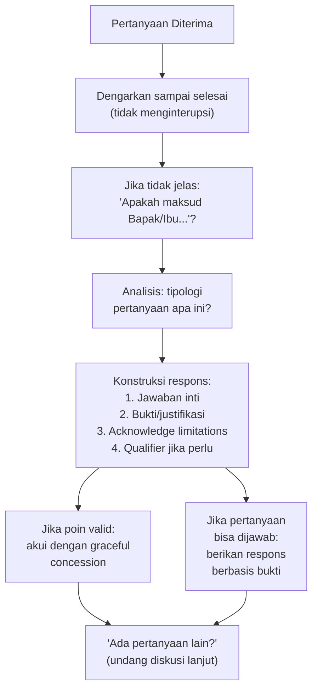

---

## 6. Contoh Terapan

**Pertanyaan dari Reviewer:**
"Anda mengklaim bahwa model Anda lebih baik dari SOTA, tetapi Anda hanya membandingkan dengan dua paper dari 2020 dan 2021. Ada paper terbaru 2023 yang saya ketahui dengan pendekatan yang sangat mirip dengan akurasi yang lebih tinggi. Mengapa tidak dibandingkan?"

**Respons yang Lemah (defensif):**
"Paper 2020 dan 2021 yang kami gunakan sudah cukup representatif sebagai baseline. Paper 2023 yang Anda sebutkan mungkin belum relevan untuk perbandingan kami."

**Respons yang Lebih Baik:**
"Terima kasih atas referensi tersebut — paper 2023 yang Bapak/Ibu sebutkan, apakah itu [judul/penulis]? Saya menyadari bahwa pemilihan baseline kami mungkin tidak mencakup publikasi terbaru karena literature review kami dilakukan pada Q1 semester ini. Ini adalah kelemahan valid yang perlu saya tangani — saya akan memasukkan paper tersebut sebagai baseline tambahan dan memperbarui perbandingan. Jika paper tersebut menunjukkan performa yang lebih tinggi, maka klaim 'lebih baik dari SOTA' perlu dikualifikasikan lebih hati-hati. Apakah Bapak/Ibu bersedia berbagi referensi lengkapnya agar saya dapat mengakses paper tersebut?"

**Mengapa Respons Ini Lebih Baik:**
- Mengakui kelemahan yang diidentifikasi reviewer
- Menunjukkan keinginan untuk memperbaiki
- Tidak defensif, tetapi aktif mencari solusi
- Meminta informasi tambahan yang berguna

---

## 7. Praktikum atau Aktivitas Terarah

### Aktivitas 9.1 — Mock Q&A Session

**Tujuan:** Melatih kemampuan Q&A sebelum presentasi sesungguhnya.

**Instruksi:**
1. Pasangkan mahasiswa berdua (atau dalam kelompok kecil)
2. Satu mahasiswa mempresentasikan ringkasan penelitiannya (5 menit)
3. Mahasiswa lain mengajukan pertanyaan kritis menggunakan daftar tipologi pertanyaan
4. Rekam sesi Q&A
5. Tonton rekaman: evaluasi respons menggunakan kriteria: (a) menjawab pertanyaan inti, (b) berbasis bukti, (c) acknowledge poin valid, (d) graceful concession jika perlu

**Output:** Refleksi tertulis tentang pola kelemahan Q&A yang perlu diperbaiki sebelum presentasi tengah semester.

---

## 8. Latihan Pemahaman

**1.** Jelaskan model argumen Toulmin dan fungsi masing-masing elemen.
**2.** Apa yang dimaksud dengan "graceful concession" dan mengapa ini lebih efektif dari mempertahankan posisi yang tidak dapat dipertahankan?
**3.** Bedakan antara pertanyaan "tantangan metodologi" dan pertanyaan "gotcha". Bagaimana strategi respons yang berbeda untuk keduanya?
**4.** Mengapa "answer first, detail after" merupakan prinsip respons Q&A yang efektif?
**5.** Kapan defer (menunda jawaban) merupakan respons yang tepat dalam Q&A seminar?

---

## 9. Latihan Terapan / Studi Kasus

**Studi Kasus 9.1:** Reviewer bertanya: "Metodologi Anda mengasumsikan bahwa penyerang tidak menyadari bahwa sistem deteksi Anda sedang berjalan. Ini adalah asumsi yang tidak realistis dalam praktik. Bagaimana Anda merespons ini?"

Tulis respons yang efektif menggunakan prinsip yang dipelajari.

**Studi Kasus 9.2:** Reviewer bertanya panjang-lebar tentang topik yang sepenuhnya di luar scope penelitian Anda. Mahasiswa O merasa tidak nyaman karena tidak bisa menjawab semua aspek pertanyaan tersebut. Apa yang seharusnya dilakukan?

---

## 10. Kunci Jawaban dan Pembahasan

**Jawaban 1:** Toulmin: Claim (apa yang diklaim), Ground (bukti/data), Warrant (prinsip yang menghubungkan data ke klaim), Backing (otorisasi untuk warrant), Rebuttal (kondisi pengecualian), Qualifier (tingkat kepastian). Bersama-sama, elemen ini membentuk argumen yang transparan dan dapat diuji, yang membuat klaim lebih defensible dan menunjukkan kesadaran terhadap batas-batas klaim.

**Jawaban 2:** Graceful concession adalah pengakuan terbuka bahwa poin reviewer valid, tanpa kehilangan kredibilitas. Ini lebih efektif dari defensivitas karena: (a) reviewer yang cerdas tahu ketika argumen tidak dapat dipertahankan — mempertahankannya dengan keras justru menurunkan kredibilitas; (b) mengakui kelemahan menunjukkan self-awareness dan integritas akademik; (c) membuka ruang untuk diskusi konstruktif tentang bagaimana kelemahan tersebut dapat diatasi.

**Jawaban 3:** Tantangan metodologi: mempertanyakan validitas atau kesesuaian metode yang digunakan. Respons: jelaskan justifikasi pemilihan, akui tradeoffs. "Gotcha" question: dirancang untuk mengekspos kontradiksi atau kelalaian yang seharusnya diketahui. Respons: tidak panik, analisis dengan tenang, akui jika valid dengan graceful concession. Perbedaan utama: tantangan metodologi adalah fair dan membantu; "gotcha" mungkin berlebihan, tetapi tetap harus dijawab dengan tenang.

**Jawaban 4:** Answer first, detail after efektif karena: (a) reviewer sudah tahu konteksnya — mereka tidak perlu pengantar panjang; (b) jika jawaban inti datang terlambat, reviewer mungkin sudah kehilangan benang merah dari respons; (c) menunjukkan bahwa presenter memahami pertanyaan dan bisa langsung ke inti.

**Jawaban 5:** Defer tepat ketika: (a) pertanyaan di luar scope penelitian yang terdefinisi; (b) memerlukan penelitian lebih lanjut yang belum dilakukan; (c) memerlukan data yang tidak tersedia saat ini. Defer harus disertai penjelasan mengapa ini di luar scope atau apa yang diperlukan untuk menjawabnya.

**Kunci 9.1:** Respons efektif: "Anda benar bahwa ini adalah asumsi yang membatasi scope penelitian ini. Sistem kami mengevaluasi kemampuan deteksi dalam threat model 'unaware attacker' — yaitu penyerang yang tidak secara aktif memodifikasi perilakunya untuk menghindari deteksi. Ini adalah asumsi awal yang valid untuk establising baseline effectiveness. Namun, saya mengakui bahwa evaluasi dalam kondisi 'aware attacker' — di mana penyerang secara aktif menggunakan teknik evasion — adalah langkah berikutnya yang kritis. Ini akan saya tambahkan sebagai future work dan saya akan mendiskusikan implikasi dari asumsi ini secara eksplisit dalam tesis."

**Kunci 9.2:** Mahasiswa O harus: (a) tidak pura-pura memahami seluruh pertanyaan jika tidak; (b) identifikasi bagian pertanyaan yang dapat dijawab: "Dari pertanyaan Bapak/Ibu, saya dapat merespons aspek [X] karena itu dalam scope penelitian saya. Untuk aspek [Y], itu melampaui scope tesis ini dan memerlukan penelitian tersendiri"; (c) jika pertanyaan jauh keluar dari bidang keahlian: "Saya belum memiliki kedalaman pengetahuan yang cukup untuk menjawab aspek tersebut dengan akurat — saya lebih baik mempelajarinya terlebih dahulu daripada memberikan jawaban yang mungkin tidak tepat."

---

## 11. Ringkasan Bab

Q&A yang efektif dimulai dengan mendengarkan penuh dan memahami tipologi pertanyaan sebelum merespons. Struktur argumen Toulmin menyediakan kerangka untuk membangun respons yang transparan, berbasis bukti, dan dapat diuji. Strategi respons kunci meliputi: answer first, acknowledge valid points, graceful concession untuk kelemahan nyata, dan defer untuk pertanyaan di luar scope. Q&A bukan pertarungan — ini adalah kolaborasi untuk memperkuat penelitian.

---

## 12. Refleksi Profesional

1. Dalam konteks hukum, forensik investigator sering diajukan pertanyaan kritis oleh pengacara yang berusaha mendiskreditkan kesaksian mereka. Bagaimana prinsip graceful concession dapat membantu investigator dalam situasi ini tanpa merusak kredibilitas mereka sebagai saksi ahli?

2. Scientific argumentation dan epistemic humility (kesadaran tentang batas pengetahuan) adalah dua nilai yang kadang tampak bertentangan. Bagaimana Anda menyeimbangkan keduanya dalam karir profesional Anda?

---

# BAB 10 — REVIEWER RESPONSE MATRIX DAN RENCANA REVISI

## 1. Capaian Pembelajaran Bab

Setelah menyelesaikan bab ini, mahasiswa mampu:
- Menyusun reviewer response matrix yang sistematis (C5) — Sub-CPMK.4
- Mengklasifikasikan dan memprioritasikan umpan balik reviewer (C4)
- Merumuskan rencana revisi yang konkret dan bertahap (C6)

---

## 2. Peta Konsep Bab

```mermaid
flowchart TD
    FeedbackIn["UMPAN BALIK\nDARI SEMINAR\nDosen, reviewer,\npraktisi"] --> Klasifikasi["KLASIFIKASI\nUMPAN BALIK\n• Kritik valid → perlu revisi\n• Saran → pertimbangkan\n• Salah paham → klarifikasi\n• Konflik kepentingan → filter"]
    Klasifikasi --> RRM["REVIEWER RESPONSE\nMATRIX\n• Komentar reviewer\n• Respons/sikap mahasiswa\n• Tindakan konkret\n• Timeline"]
    RRM --> Priority["PRIORITAS REVISI\n• Critical: mengubah kesimpulan\n• Major: metodologi/dataset\n• Minor: presentasi/penulisan\n• Optional: enhancement"]
    Priority --> RevPlan["RENCANA REVISI\nConcrete action items\ndengan deadline\ndan deliverable"]
    RevPlan --> Eval4["Eval-4 (20%)\nReviewer Response\nMatrix"]
```

---

## 3. Pengantar Kontekstual

Setelah seminar, mahasiswa biasanya menerima umpan balik yang beragam — beberapa konsisten, beberapa saling kontradiksi, beberapa di luar scope penelitian, dan beberapa merupakan pertanyaan yang memerlukan investigasi lebih lanjut sebelum dapat direspons. Kemampuan untuk mengelola umpan balik secara sistematis — memilah mana yang harus ditindaklanjuti, mana yang perlu klarifikasi, dan mana yang dapat dikesampingkan dengan justifikasi — adalah keterampilan yang sangat berharga, baik dalam konteks akademik maupun profesional.

---

## 4. Landasan Teori

### 4.1 Klasifikasi Umpan Balik Reviewer

Tidak semua umpan balik reviewer bernilai sama atau harus ditindaklanjuti dengan cara yang sama:

**Kritik Valid:** Mengidentifikasi masalah nyata yang mempengaruhi validitas atau kualitas penelitian. Harus ditangani secara langsung dengan revisi.

**Saran (Suggestion):** Rekomendasi untuk penyempurnaan yang meningkatkan kualitas tetapi tidak kritis untuk validitas. Pertimbangkan berdasarkan feasibility dan nilai tambah.

**Salah Paham (Misunderstanding):** Reviewer mungkin salah memahami aspek tertentu dari penelitian. Klarifikasi diperlukan — bukan dengan membantah reviewer, tetapi dengan memperbaiki presentasi/penulisan agar lebih jelas.

**Pertanyaan Out-of-Scope:** Pertanyaan tentang aspek yang di luar cakupan penelitian. Dokumentasikan sebagai future work, jelaskan batasan scope penelitian.

**Potentially Biased Feedback:** Umpan balik yang mungkin dipengaruhi oleh perspektif atau kepentingan spesifik reviewer. Konsultasikan dengan pembimbing sebelum merespons.

### 4.2 Format Reviewer Response Matrix

| # | Komentar Reviewer | Reviewer | Klasifikasi | Respons/Sikap | Tindakan Konkret | Timeline | Status |
|---|---|---|---|---|---|---|---|
| 1 | "Dataset terlalu lama" | Dr. A | Kritik valid | Setuju | Update ke dataset 2022-2024 + justifikasi | 2 minggu | In progress |
| 2 | "Coba tambahkan federated learning" | Praktisi B | Saran | Pertimbangkan sebagai future work | Tambah sebagai future work section | 1 minggu | Done |
| 3 | "Mengapa tidak menggunakan XYZ?" | Dr. C | Salah paham tentang scope | Klarifikasi scope | Perbaiki Section 2.1 untuk memperjelas scope | 1 minggu | Planned |

### 4.3 Prinsip Merespons Reviewer

1. **Tidak ada kewajiban untuk setuju dengan semua reviewer:** Jika dua reviewer memberikan saran yang bertentangan, konsultasikan dengan pembimbing dan buat keputusan yang beralasan.

2. **Setiap keputusan harus didokumentasikan:** Termasuk keputusan untuk TIDAK mengikuti saran reviewer — ini harus disertai justifikasi yang jelas.

3. **Bedakan antara scope dan keterbatasan:** Tidak menangani sesuatu karena "di luar scope yang sudah terdefinisi" berbeda dari mengabaikannya karena tidak ingin bekerja lebih.

4. **Revisi harus dapat diverifikasi:** Untuk setiap tindakan revisi, harus jelas: apa yang diubah, di mana (nomor bab/bagian), dan bagaimana perubahan tersebut merespons komentar reviewer.

---

## 5. Model atau Arsitektur

```mermaid
flowchart LR
    Review["Semua Komentar\nReviewer"] --> Filter["Klasifikasi:\nValid / Saran /\nMisunderstanding /\nOut-of-scope"] --> Matrix["Reviewer Response\nMatrix"]
    Matrix --> Action["Action Items:\nRevisi konkret\ndengan timeline"]
    Matrix --> Defer["Deferred Items:\nFuture work /\nOut of scope"]
    Matrix --> Clarify["Clarification Items:\nPerbaiki presentasi\nuntuk kejelasan"]
    Action --> Verify["Verifikasi:\napakah revisi\nmenjawab komentar?"]
    Verify --> Submit["Submit revisi\n+ response matrix\nke koordinator seminar"]
```

---

## 6. Contoh Terapan

**Contoh Reviewer Response Matrix (sebagian):**

Penelitian: Deteksi anomali jaringan untuk ICS/SCADA

| # | Komentar | Dari | Klasifikasi | Respons | Tindakan | Done? |
|---|---|---|---|---|---|---|
| 1 | "Dataset Modbus yang digunakan berasal dari 2018 — apakah representatif untuk protokol SCADA modern?" | Prof. X | Kritik valid | Setuju, ini kelemahan. Akan ditambahkan dataset HAI (Hardware-in-the-Loop Augmented ICS) 2020 | Update Section 3.2 + tambah dataset HAI, re-evaluate | ☐ |
| 2 | "Pertimbangkan IEC 62443 sebagai framework evaluasi compliance" | Praktisi Y | Saran berharga | Setuju, relevan untuk pathway praktis | Tambah analisis IEC 62443 mapping di Section 5 | ☐ |
| 3 | "Penelitian ini tidak mempertimbangkan quantum computing threats" | Reviewer Z | Out of scope | Quantum computing di luar scope tesis ini. Akan didokumentasikan sebagai future work | Tambah 1 paragraf future work | ☐ |

---

## 7. Praktikum atau Aktivitas Terarah

### Aktivitas 10.1 — Menyusun Reviewer Response Matrix

**Instruksi:**
1. Kumpulkan semua umpan balik yang diterima dari presentasi tengah semester (tertulis dan dari catatan Q&A)
2. Masukkan ke dalam reviewer response matrix
3. Klasifikasikan setiap item
4. Untuk setiap item: tentukan respons/sikap dan tindakan konkret
5. Konsultasikan dengan pembimbing untuk item yang tidak jelas cara meresponsnya
6. Susun timeline revisi yang realistis

**Output:** Reviewer response matrix yang lengkap — ini adalah komponen utama Eval-4.

---

## 8. Latihan Pemahaman

**1.** Mengapa tidak semua umpan balik reviewer harus diikuti? Apa yang menentukan apakah umpan balik harus ditindaklanjuti?
**2.** Bagaimana cara merespons ketika dua reviewer memberikan saran yang saling bertentangan?
**3.** Apa perbedaan antara menangani komentar "out of scope" dengan "mengabaikan" komentar reviewer?
**4.** Mengapa setiap keputusan (termasuk keputusan untuk tidak mengikuti saran reviewer) harus didokumentasikan?
**5.** Apa yang dimaksud dengan "revisi yang dapat diverifikasi"?

---

## 9. Latihan Terapan / Studi Kasus

**Studi Kasus 10.1:** Mahasiswa P menerima tiga komentar: (a) "Tambahkan federated learning", (b) "Dataset tidak representatif", (c) "Penelitian ini mirip dengan paper [X] dari 2022." Klasifikasikan komentar-komentar ini dan tentukan rencana respons.

**Studi Kasus 10.2:** Reviewer A menyarankan menggunakan pendekatan kuantitatif murni, sedangkan Reviewer B menyarankan mixed-methods. Mahasiswa Q tidak yakin harus mengikuti yang mana. Apa yang seharusnya dilakukan?

---

## 10. Kunci Jawaban dan Pembahasan

**Jawaban 1:** Tidak semua umpan balik harus diikuti karena: (a) beberapa saran mungkin di luar scope penelitian; (b) beberapa mungkin didasarkan pada salah paham tentang penelitian; (c) beberapa mungkin bertentangan satu sama lain; (d) beberapa mungkin tidak feasible dalam batasan waktu dan sumber daya. Yang menentukan apakah umpan balik harus ditindaklanjuti: apakah komentar mengidentifikasi masalah yang mempengaruhi validitas atau kualitas penelitian secara material? Jika ya → tindak lanjuti. Jika tidak → dokumentasikan alasan.

**Jawaban 2:** Dua reviewer yang bertentangan: (a) jangan langsung mengikuti salah satu; (b) analisis argumen di balik masing-masing saran; (c) konsultasikan dengan pembimbing; (d) buat keputusan yang beralasan dan dokumentasikan dalam response matrix dengan penjelasan mengapa memilih satu pendekatan atas yang lain.

**Jawaban 3:** Out of scope yang didokumentasikan: peneliti mengakui bahwa topik tersebut relevan tetapi secara sadar memilih untuk tidak memasukkannya karena batasan scope yang sudah terdefinisi, dan mendokumentasikan ini sebagai future work. Mengabaikan: peneliti tidak merespons komentar sama sekali, tanpa dokumentasi. Perbedaannya: yang pertama menunjukkan kesadaran dan keputusan yang berdasar; yang kedua menunjukkan kelalaian atau defensivitas.

**Jawaban 4:** Dokumentasi keputusan (termasuk keputusan untuk tidak mengikuti) penting karena: (a) memberikan transparansi tentang bagaimana umpan balik ditangani; (b) memungkinkan pembimbing dan koordinator seminar menilai kematangan pengambilan keputusan mahasiswa; (c) melindungi peneliti dari tuduhan "mengabaikan reviewer" ketika kenyataannya ada alasan yang legitimate.

**Jawaban 5:** Revisi yang dapat diverifikasi: setiap perubahan harus dapat dilacak ke komentar reviewer yang memotivasi perubahan tersebut, dengan lokasi spesifik (bagian/paragraf/halaman) yang diubah. Ini memungkinkan reviewer memeriksa apakah revisiannya sudah ditangani dengan tepat.

**Kunci 10.1:** (a) Federated learning = Saran (bukan masalah metodologis kritis; bisa future work). (b) Dataset tidak representatif = Kritik valid (perlu ditangani; update dataset atau tambahkan justifikasi dan acknowledgment limitasi yang lebih kuat). (c) Mirip paper 2022 = Potensially critical — harus diinvestigasi dulu. Jika paper tersebut benar-benar sangat mirip, novelty claim harus dikalibrasi ulang. Jika ada perbedaan signifikan, perlu penjelasan eksplisit tentang perbedaan tersebut.

**Kunci 10.2:** Mahasiswa Q harus: (a) tidak memilih berdasarkan preferensi reviewer yang "lebih senior" semata; (b) analisis: mana yang lebih sesuai dengan research question? Jika research question bersifat explanatory dan memerlukan pemahaman mendalam tentang pengalaman subjek, mixed-methods mungkin tepat. Jika bersifat komparatif atau predictive, kuantitatif mungkin lebih sesuai; (c) konsultasikan dengan pembimbing; (d) buat keputusan berdasarkan kesesuaian metodologi dengan research question, bukan berdasarkan siapa yang memberi saran.

---

## 11. Ringkasan Bab

Reviewer response matrix adalah alat manajemen umpan balik yang sistematis, memungkinkan peneliti untuk mengklasifikasikan, memprioritaskan, dan merencanakan respons terhadap semua komentar reviewer. Tidak semua komentar harus diikuti — yang menentukan adalah apakah komentar mengidentifikasi masalah yang material untuk validitas penelitian. Setiap keputusan, termasuk keputusan untuk tidak mengikuti saran reviewer, harus didokumentasikan dengan justifikasi yang jelas. Revisi harus konkret, terverifikasi, dan dapat dilacak ke komentar spesifik yang memotivasinya.

---

## 12. Refleksi Profesional

1. Dalam manajemen proyek keamanan siber, respons terhadap temuan audit memiliki struktur yang mirip dengan reviewer response matrix: setiap temuan diklasifikasikan, diberi prioritas, dan diberikan tindakan korektif dengan timeline. Bagaimana pengalaman Anda dalam mengelola umpan balik seminar dapat mempersiapkan Anda untuk mengelola finding dari audit keamanan?

2. Ketika Anda bekerja sebagai konsultan keamanan dan klien tidak setuju dengan rekomendasi Anda, bagaimana Anda mendokumentasikan perbedaan pendapat tersebut secara profesional sambil tetap melindungi klien dari risiko yang teridentifikasi?

---

---

# BAB 11 — VALIDASI INTERDISIPLINER: TEKNIS, LEGAL, ETIKA, ORGANISASI

## 1. Capaian Pembelajaran Bab

Setelah menyelesaikan bab ini, mahasiswa mampu:
- Menganalisis penelitian dari empat perspektif interdisipliner (C4)
- Mengidentifikasi tension dan konflik antaraspek interdisipliner (C4) — Sub-CPMK.5
- Mengevaluasi kecukupan desain penelitian dari perspektif interdisipliner (C5)

---

## 2. Peta Konsep Bab

```mermaid
flowchart TD
    IntValid["VALIDASI\nINTERDISIPLINER"] --> Tech["TEKNIS\n• Correctness metode\n• Skalabilitas\n• Adversarial robustness\n• Reproducibility\n• Performance tradeoffs"]
    IntValid --> Legal["LEGAL\n• Kesesuaian hukum (UU ITE, UU PDP)\n• Admissibility bukti\n• Otorisasi akses\n• Chain of custody\n• Kewajiban pelaporan"]
    IntValid --> Ethics["ETIKA\n• Privacy by design\n• Informed consent\n• Dual-use risk\n• Vulnerable populations\n• Responsible disclosure"]
    IntValid --> Org["ORGANISASI\n• Deployability\n• Change management\n• Resource requirements\n• Skill gaps\n• Organizational culture"]
    Tech & Legal & Ethics & Org --> Tension["TENSION ANTAR ASPEK\nMisalnya:\nTeknis optimal vs. Legal compliant\nEfektivitas vs. Privasi\nScalability vs. Auditability"]
    Tension --> Eval5["Eval-5 (20%)\nInterdisciplinary\nValidation Plan"]
```

---

## 3. Pengantar Kontekstual

Penelitian forensik digital dan keamanan siber tidak hidup dalam vakum teknis. Sebuah algoritma deteksi yang secara teknis superior tetapi mengumpulkan data pribadi tanpa izin yang sah adalah penelitian yang gagal secara legal dan etika. Sebuah framework forensik yang mengikuti prosedur hukum secara sempurna tetapi terlalu lambat untuk digunakan dalam respons insiden real-time memiliki keterbatasan organisasional yang serius. Validasi interdisipliner adalah proses sistematis untuk memastikan bahwa penelitian Anda layak tidak hanya secara teknis, tetapi juga secara legal, etis, dan organisasional.

---

## 4. Landasan Teori

### 4.1 Dimensi Validasi Teknis

Validasi teknis melampaui sekadar performa model pada dataset:

**Correctness:** Apakah metode menghasilkan output yang benar? Apakah ada edge cases yang tidak ditangani?

**Skalabilitas:** Apakah metode berfungsi pada skala yang relevan secara operasional? Sebuah IDS yang akurat pada 1.000 event/detik mungkin tidak berfungsi pada 100.000 event/detik di lingkungan produksi.

**Adversarial Robustness:** Apakah metode tahan terhadap manipulasi aktif oleh penyerang yang menyadari keberadaan sistem deteksi? Ini sangat relevan dalam domain keamanan siber.

**Performance Tradeoffs:** Setiap desain teknis membuat tradeoffs — akurasi vs. kecepatan, presisi vs. recall, coverage vs. false alarm rate. Apakah tradeoffs yang dibuat sesuai dengan konteks penggunaan?

### 4.2 Dimensi Validasi Legal

**Kesesuaian UU ITE dan UU PDP:**
- Apakah pengumpulan data dalam penelitian sesuai dengan dasar pemrosesan yang sah (UU PDP Ps.20)?
- Apakah data yang digunakan telah mendapat consent yang valid?
- Apakah ada kewajiban notifikasi breach jika terjadi insiden dengan data penelitian?

**Admissibility Bukti (untuk penelitian forensik):**
- Apakah metode menghasilkan output yang dapat diterima sebagai bukti elektronik (KUHAP Ps.184 jo. UU ITE)?
- Apakah chain of custody terdokumentasi?
- Apakah tool forensik yang digunakan tervalidasi?

**Otorisasi Akses:**
- Apakah ada otorisasi eksplisit untuk mengakses sistem atau data yang digunakan dalam penelitian?
- Untuk penetration testing atau red teaming: apakah scope otorisasi terdokumentasi?

### 4.3 Dimensi Validasi Etika

**Privacy by Design (Cavoukian, 2010):**
Apakah privasi diintegrasikan ke dalam desain penelitian sejak awal, bukan ditambahkan sebagai afterthought? Ini mencakup: data minimization (hanya mengumpulkan data yang benar-benar diperlukan), pseudonymization, secure storage, dan purpose limitation.

**Dual-Use Risk:**
Metode yang dikembangkan dalam penelitian keamanan siber sering dapat digunakan untuk tujuan ofensif. Apakah ada analisis tentang dual-use risk? Apakah ada mekanisme untuk membatasi penyebaran aspek yang berpotensi berbahaya?

**Responsible Disclosure:**
Jika penelitian menemukan kerentanan dalam sistem nyata (bahkan secara tidak sengaja), apakah ada protokol responsible disclosure yang sudah disiapkan?

**Populasi Rentan:**
Apakah penelitian melibatkan data dari kelompok yang rentan (anak-anak, pasien, narapidana)? Jika ya, perlindungan tambahan apa yang diterapkan?

### 4.4 Dimensi Validasi Organisasional

**Deployability:** Seberapa sulit dan mahal untuk mengimplementasikan solusi yang dikembangkan dalam konteks organisasi riil? Solusi yang memerlukan infrastruktur baru yang mahal atau keahlian yang sangat langka memiliki hambatan adopsi yang tinggi.

**Change Management:** Apakah solusi memerlukan perubahan proses kerja yang signifikan? Seberapa realistis adopsi oleh personel yang ada?

**Skill Gaps:** Apakah operator target memiliki kemampuan untuk menggunakan, memelihara, dan menginterpretasikan output dari sistem yang dikembangkan?

**Organizational Culture:** Apakah solusi sesuai dengan budaya dan prioritas organisasi target? Sebuah solusi yang sangat efektif secara teknis tetapi tidak sesuai dengan prioritas bisnis organisasi tidak akan diadopsi.

### 4.5 Mengelola Tension Antaraspek

Tension antara aspek interdisipliner adalah hal yang normal dan tidak selalu dapat diselesaikan — terkadang yang terbaik yang dapat dilakukan adalah mengakui tension tersebut dan mendokumentasikan tradeoffs dengan jelas:

| Tension | Contoh | Resolusi |
|---|---|---|
| Teknis optimal vs. Legally compliant | Akurasi tertinggi memerlukan lebih banyak data pribadi | Privacy-preserving ML, federated learning, synthetic data |
| Efektivitas vs. Privasi | Analisis perilaku user yang detail vs. GDPR/UU PDP | Data minimization, pseudonymization, aggregation |
| Kecepatan vs. Auditability | Real-time detection vs. complete audit trail | Desain pipeline yang memisahkan detection (fast) dan logging (complete) |
| Coverage vs. Deployment Cost | Deteksi komprehensif vs. biaya komputasi | Edge model untuk filtering, cloud model untuk analisis mendalam |

---

## 5. Model atau Arsitektur

```mermaid
flowchart TD
    subgraph Technical["VALIDASI TEKNIS"]
        T1["Correctness"] 
        T2["Scalability"]
        T3["Adversarial Robustness"]
        T4["Performance Tradeoffs"]
    end
    
    subgraph Legal["VALIDASI LEGAL"]
        L1["Compliance UU ITE/PDP"]
        L2["Admissibility"]
        L3["Authorization"]
    end
    
    subgraph Ethical["VALIDASI ETIKA"]
        E1["Privacy by Design"]
        E2["Dual-Use Risk"]
        E3["Responsible Disclosure"]
    end
    
    subgraph Org["VALIDASI ORGANISASI"]
        O1["Deployability"]
        O2["Skill Requirements"]
        O3["Cultural Fit"]
    end
    
    Technical & Legal & Ethical & Org --> Synthesis["SINTESIS INTERDISIPLINER\nIdentifikasi tension & tradeoffs\nRancang mitigasi\nDokumentasikan keputusan"]
    Synthesis --> Plan["REVISED VALIDATION PLAN\n(Eval-5)"]
```

---

## 6. Contoh Terapan

**Penelitian:** Sistem UEBA (User and Entity Behavior Analytics) berbasis ML untuk deteksi insider threat di organisasi perbankan.

**Validasi Teknis:** Model LSTM dengan akurasi F1=0.87. Namun, latency prediksi 2.3 detik per event tidak memenuhi kebutuhan real-time alerting di SOC yang memerlukan <500ms.

**Validasi Legal (UU PDP):** Sistem menganalisis pola perilaku individu karyawan — ini adalah pemrosesan data pribadi yang memerlukan dasar legal yang valid. Untuk konteks monitoring karyawan, UU PDP memerlukan: (a) dasar pemrosesan yang sah (kemungkinan "kepentingan sah" pengendali), (b) pemberitahuan privasi kepada karyawan, (c) batasan penggunaan data hanya untuk tujuan keamanan. Ini memerlukan konsultasi legal sebelum deployment.

**Validasi Etika:** Ada risiko chilling effect — karyawan yang tahu dimonitor mungkin mengubah perilakunya, bukan karena insider threat tetapi karena rasa tidak nyaman. Ini adalah dampak pada autonomi yang perlu dipertimbangkan.

**Validasi Organisasional:** Deployment memerlukan integrasi dengan Active Directory dan endpoint monitoring tools yang sudah ada. SOC analyst perlu training untuk interpretasi output model. Estimasi deployment cost: 6 bulan engineering + 40 jam training.

**Tension yang Diidentifikasi:** Teknis (akurasi tinggi memerlukan lebih banyak data perilaku) vs. Legal/Etika (lebih banyak data → lebih besar risiko privasi). Resolusi yang diusulkan: agregasi data pada level team/departemen bukan individual, kecuali ada alert spesifik yang memerlukan investigasi individual dengan otorisasi eksplisit.

---

## 7. Praktikum atau Aktivitas Terarah

### Aktivitas 11.1 — Interdisciplinary Validation Analysis

**Tujuan:** Menghasilkan analisis validasi interdisipliner untuk penelitian sendiri.

**Instruksi:**
1. Untuk penelitian Anda sendiri, isi checklist validasi untuk setiap dimensi (teknis, legal, etika, organisasi)
2. Identifikasi aspek yang sudah dipertimbangkan dan yang belum
3. Identifikasi tension antara aspek yang berbeda
4. Untuk setiap tension, usulkan resolusi atau dokumentasikan bahwa tension tidak dapat diselesaikan dan perlu diakui sebagai limitasi

**Output:** Interdisciplinary validation analysis (2-3 halaman) yang akan menjadi bagian dari Eval-5.

---

## 8. Latihan Pemahaman

**1.** Mengapa validasi teknis saja tidak cukup untuk penelitian di bidang forensik digital dan keamanan siber?
**2.** Apa yang dimaksud dengan "dual-use risk" dalam konteks penelitian keamanan siber, dan bagaimana cara mengidentifikasi dan mengelolanya?
**3.** Jelaskan konsep "Privacy by Design" dan bagaimana mengintegrasikannya ke dalam desain penelitian.
**4.** Berikan contoh tension antara aspek teknis dan aspek legal dalam penelitian keamanan siber, dan jelaskan bagaimana tension tersebut dapat dikelola.
**5.** Mengapa "deployability" adalah dimensi validasi yang penting bahkan untuk penelitian yang bersifat akademik?

---

## 9. Latihan Terapan / Studi Kasus

**Studi Kasus 11.1:** Penelitian tentang sistem deteksi deepfake dalam konten media sosial. Sistem mampu mendeteksi deepfake dengan akurasi 94%. Lakukan analisis validasi interdisipliner: apa pertanyaan kunci yang harus dijawab dari perspektif teknis, legal, etika, dan organisasional?

**Studi Kasus 11.2:** Peneliti mengembangkan tool untuk menganalisis log akses WiFi publik untuk mendeteksi aktivitas mencurigakan. Tool ini sangat akurat tetapi menganalisis konten lalu lintas semua pengguna. Identifikasi semua masalah validasi dan usulkan desain alternatif yang mengatasi masalah tersebut.

---

## 10. Kunci Jawaban dan Pembahasan

**Jawaban 1:** Penelitian di FDKS memiliki implikasi yang melampaui domain teknis: (a) metode yang menggunakan data pribadi tanpa izin melanggar UU PDP; (b) teknik forensik yang tidak mempertahankan chain of custody menghasilkan bukti yang tidak dapat diterima di pengadilan; (c) tool yang mengembangkan kemampuan serangan baru memiliki dual-use risk yang bisa merugikan; (d) solusi yang tidak dapat diimplementasikan dalam konteks organisasi nyata tidak memberikan nilai praktis. Validasi dari perspektif tunggal akan melewatkan masalah kritis ini.

**Jawaban 2:** Dual-use risk adalah potensi bahwa metode atau tool yang dikembangkan untuk tujuan defensif dapat digunakan oleh pihak yang tidak bertanggung jawab untuk tujuan ofensif. Cara mengidentifikasi: tanyakan "bisakah metode ini digunakan untuk menyerang sistem?". Cara mengelola: (a) tidak mempublikasikan detail teknis yang memungkinkan reproduksi mudah tool ofensif; (b) menerapkan prinsip responsible disclosure untuk kerentanan yang ditemukan; (c) mendiskusikan risiko dual-use secara eksplisit dalam paper; (d) berkonsultasi dengan komunitas keamanan tentang cara diseminasi yang bertanggung jawab.

**Jawaban 3:** Privacy by Design (Cavoukian, 2010): 7 prinsip yang mengintegrasikan privasi sebagai default, bukan afterthought. Dalam penelitian: (a) data minimization — hanya kumpulkan data yang benar-benar diperlukan; (b) purpose limitation — gunakan data hanya untuk tujuan penelitian yang dinyatakan; (c) pseudonymization — hilangkan identifier langsung dari dataset; (d) secure storage — enkripsi data penelitian yang sensitif; (e) access control — batasi siapa yang bisa mengakses data penelitian.

**Jawaban 4:** Tension teknis vs. legal: sistem anomaly detection yang paling akurat memerlukan analisis payload konten jaringan secara dalam (Deep Packet Inspection — DPI). Namun, DPI pada jaringan perusahaan tanpa pemberitahuan kepada karyawan dapat melanggar UU ITE (penyadapan ilegal). Resolusi: (a) batasi analisis pada metadata (header) bukan payload untuk compliance — akurasi mungkin turun; (b) implementasikan dengan pemberitahuan eksplisit kepada karyawan; (c) gunakan proxy yang mendekripsi TLS dalam lingkungan terkontrol dengan consent karyawan.

**Jawaban 5:** Deployability penting bahkan untuk penelitian akademik karena: (a) kontribusi praktis adalah bagian dari nilai penelitian terapan; (b) peneliti yang tidak mempertimbangkan deployability sering mengklaim kontribusi yang tidak dapat direalisasikan; (c) reviewer dari industri/praktisi akan menilai apakah penelitian dapat berkontribusi pada praktik nyata; (d) untuk program Magister Terapan, relevansi praktis adalah komponen penting dari penilaian.

**Kunci 11.1:** Teknis: apakah 94% akurasi cukup untuk konteks ini? Apa false positive rate? Apakah sistem tahan terhadap adversarial deepfake yang dirancang untuk mengelabui detektor? Apakah dapat berjalan pada skala konten media sosial (jutaan video/hari)?

Legal: di Indonesia, pendeteksian konten pengguna media sosial memerlukan kerangka hukum yang jelas — siapa yang berwenang melakukan deteksi? Apakah platform yang menjalankan deteksi ini perlu menjadi PSE? Bagaimana jika deteksi salah (false positive menyebabkan konten sah dihapus)?

Etika: risiko censorship — siapa yang mengontrol definisi "deepfake berbahaya"? Potensi discriminatory impact — apakah akurasi berbeda untuk etnis/ras yang berbeda (bias dalam training data)? Apa mekanisme banding untuk konten yang salah diklasifikasikan?

Organisasi: siapa yang akan menangani false positives? Diperlukan human review? Berapa cost per review? Bagaimana integrasi dengan workflow moderasi yang sudah ada?

**Kunci 11.2:** Masalah: (a) menganalisis konten semua pengguna WiFi publik adalah penyadapan ilegal tanpa consent (UU ITE Ps.31); (b) mengandung data pribadi yang sangat sensitif; (c) dual-use risk: tool ini bisa digunakan untuk surveillance massal.

Desain alternatif: (a) hanya analisis metadata (MAC address, timing pattern, volume) — bukan konten; (b) optionally: implementasikan sebagai opt-in sistem di mana pengguna WiFi yang mendaftar dan memberikan consent dapat dianalisis; (c) analisis secara aggregat (pattern di level jaringan, bukan individual); (d) deployed hanya oleh operator jaringan yang sah dengan legal authority.

---

## 11. Ringkasan Bab

Validasi interdisipliner memastikan bahwa penelitian layak tidak hanya secara teknis tetapi juga secara legal (UU ITE, UU PDP, admissibility), etika (privasi, dual-use, responsible disclosure), dan organisasional (deployability, skill gaps, cultural fit). Tension antara aspek interdisipliner adalah hal yang normal — yang penting adalah mengakui tension tersebut, mendokumentasikan tradeoffs, dan merancang mitigasi yang sesuai. Untuk program Magister Terapan FDKS, validasi interdisipliner adalah komponen kritis dari semua penelitian.

---

## 12. Refleksi Profesional

1. Dalam karir profesional di bidang keamanan siber, Anda akan sering menghadapi tekanan untuk mengimplementasikan solusi teknis yang efektif tanpa mempertimbangkan implikasi legal atau etika (karena ini "memperlambat proses"). Bagaimana Anda akan mempertahankan standar interdisipliner ini dalam lingkungan kerja yang berorientasi kecepatan?

2. Dual-use research dilemma adalah tantangan nyata dalam komunitas keamanan siber — antara kebutuhan untuk berbagi pengetahuan secara terbuka (untuk memperkuat pertahanan komunitas) dan risiko bahwa pengetahuan tersebut disalahgunakan. Di mana Anda menarik garis tersebut untuk penelitian tesis Anda?

---

# BAB 12 — INTERDISCIPLINARY RISK MAP

## 1. Capaian Pembelajaran Bab

Setelah menyelesaikan bab ini, mahasiswa mampu:
- Menyusun interdisciplinary risk map untuk penelitian tesis (C6) — Sub-CPMK.5
- Menganalisis risiko dari perspektif teknis, legal, etika, dan operasional (C4)
- Merancang strategi mitigasi risiko yang proporsional (C5)

---

## 2. Peta Konsep Bab

```mermaid
flowchart TD
    RiskMap["INTERDISCIPLINARY\nRISK MAP"] --> Identifikasi["IDENTIFIKASI RISIKO\n• Teknis\n• Legal/Compliance\n• Etika/Privasi\n• Operasional\n• Reputasional"]
    RiskMap --> Analisis["ANALISIS RISIKO\n• Kemungkinan (1-5)\n• Dampak (1-5)\n• Risk score = K × D\n• Risk level classification"]
    RiskMap --> Ownership["RISK OWNERSHIP\n• Siapa yang bertanggung jawab?\n• Researcher\n• Supervisor\n• Institution\n• IRB/Ethics Committee"]
    RiskMap --> Mitigasi["STRATEGI MITIGASI\n• Avoid: ubah desain\n• Reduce: kontrol\n• Transfer: insurance/legal\n• Accept: residual risk"]
    Mitigasi --> Eval5["Eval-5 (20%)\nInterdisc. Risk Map\n+ Revised Validation Plan"]
```

---

## 3. Pengantar Kontekstual

Setiap penelitian memiliki risiko — bukan hanya risiko kegagalan teknis, tetapi risiko yang lebih luas: risiko melanggar aturan tanpa disadari, risiko menghasilkan artefak yang dapat disalahgunakan, risiko data penelitian bocor, atau risiko bahwa temuan penelitian memiliki implikasi yang tidak diantisipasi. Risk mapping yang sistematis memungkinkan peneliti untuk mengidentifikasi, menganalisis, dan merancang respons terhadap risiko sebelum terjadi — bukan setelah.

---

## 4. Landasan Teori

### 4.1 Kategori Risiko Penelitian FDKS

**Risiko Teknis:**
- Kegagalan metode yang dikembangkan untuk memberikan performa yang diklaim
- Bug kritis dalam implementasi yang menghasilkan hasil yang tidak valid
- Ketidakmampuan mereproduksi hasil eksperimen
- Ketergantungan pada library/API yang deprecated

**Risiko Legal/Compliance:**
- Pengumpulan data tanpa dasar hukum yang valid (UU PDP)
- Akses sistem tanpa otorisasi yang memadai (UU ITE)
- Hasil penelitian yang mengandung data pribadi yang tidak teranonimisasi
- Konflik NDA dengan data yang diperoleh dari mitra industri

**Risiko Etika/Privasi:**
- Breach dataset penelitian yang berisi data sensitif
- Dual-use: metode disalahgunakan oleh pihak ketiga
- Bias dalam model yang menghasilkan diskriminasi
- Penelitian yang merugikan subjek tanpa kesadaran mereka

**Risiko Operasional:**
- Timeline yang tidak realistis
- Ketergantungan pada sumber daya yang tidak tersedia (infrastruktur, dataset)
- Key person risk: ketergantungan pada satu orang untuk aspek kritis
- Scope creep yang mengancam penyelesaian tepat waktu

**Risiko Reputasional:**
- Klaim yang berlebihan yang terbukti tidak dapat dipertahankan saat publikasi
- Asosiasi dengan pihak yang bermasalah (misalnya, data dari sumber yang dipertanyakan)
- Penelitian yang menghasilkan kontroversi publik

### 4.2 Analisis dan Penilaian Risiko

| Level | Kemungkinan (K) | Dampak (D) | Risk Score |
|---|---|---|---|
| Low | 1-2 | 1-2 | 1-4 |
| Medium | 3 | 3 | 5-9 |
| High | 4-5 | 4-5 | 10-25 |

**Risk Heat Map:**

| | Dampak Rendah | Dampak Sedang | Dampak Tinggi |
|---|---|---|---|
| Kemungkinan Tinggi | Medium | High | Critical |
| Kemungkinan Sedang | Low | Medium | High |
| Kemungkinan Rendah | Low | Low | Medium |

### 4.3 Strategi Mitigasi

Empat strategi respons terhadap risiko (NIST SP 800-30):

**Avoid (Hindari):** Ubah desain penelitian untuk menghilangkan sumber risiko sepenuhnya. Contoh: jika penggunaan data produksi nyata menghadirkan risiko privasi yang tidak dapat dimitigasi, ganti dengan synthetic data.

**Reduce (Kurangi):** Implementasikan kontrol yang mengurangi kemungkinan atau dampak. Contoh: enkripsi dataset penelitian yang sensitif, implementasi access control ketat.

**Transfer (Transfer):** Geser sebagian risiko ke pihak lain. Contoh: gunakan layanan cloud dengan SLA dan liability yang jelas untuk penyimpanan data.

**Accept (Terima):** Menerima risiko residual yang tersisa setelah mitigasi, dengan dokumentasi eksplisit bahwa risiko diketahui dan diterima secara sadar.

---

## 5. Model atau Arsitektur

```mermaid
flowchart LR
    subgraph Identify["IDENTIFIKASI"]
        R1["Teknis"] 
        R2["Legal"]
        R3["Etika"]
        R4["Operasional"]
    end
    
    subgraph Analyze["ANALISIS"]
        A1["K × D = Score"]
        A2["Risk Level\nLow/Med/High/Critical"]
    end
    
    subgraph Respond["RESPONS"]
        S1["Avoid"]
        S2["Reduce"]
        S3["Transfer"]
        S4["Accept"]
    end
    
    Identify --> Analyze --> Respond
    Respond --> Monitor["MONITORING\nPantau risiko\nsepanjang penelitian"]
    Monitor --> Update["UPDATE\nRisk map saat\nkonteks berubah"]
```

---

## 6. Contoh Terapan

**Risk Map Singkat — Penelitian Forensik Memory pada Sistem Linux:**

| # | Risiko | Kategori | K | D | Score | Level | Mitigasi |
|---|---|---|---|---|---|---|---|
| R1 | Memory dumping tool merusak data yang sedang diakuisisi | Teknis | 2 | 5 | 10 | High | Uji tool pada VM terisolasi sebelum digunakan pada target nyata; gunakan tool yang sudah tervalidasi |
| R2 | Dataset log dari mitra mengandung data pribadi karyawan | Legal | 3 | 4 | 12 | High | Dapatkan DPA dengan mitra; anonimisasi sebelum analisis; izin Ethics Committee |
| R3 | Teknik akuisisi yang dikembangkan dapat digunakan untuk surveillance ilegal | Etika | 2 | 4 | 8 | Medium | Publikasikan dengan pembatasan; fokus pada aspek forensik forensik legal |
| R4 | Mitra industri menarik akses ke data mid-project | Operasional | 2 | 5 | 10 | High | Backup dataset lokal dengan izin; siapkan dataset alternatif |

---

## 7. Praktikum atau Aktivitas Terarah

### Aktivitas 12.1 — Menyusun Interdisciplinary Risk Map

**Instruksi:**
1. Identifikasi minimal 10 risiko untuk penelitian Anda, mencakup semua 5 kategori
2. Analisis setiap risiko menggunakan matriks K×D
3. Untuk setiap risiko high/critical, tentukan strategi mitigasi yang konkret
4. Dokumentasikan siapa yang bertanggung jawab (ownership) untuk setiap risiko
5. Identifikasi residual risks yang akan diterima dengan justifikasi

**Output:** Interdisciplinary risk map dalam format tabel + heat map visual — bagian utama Eval-5.

---

## 8. Latihan Pemahaman

**1.** Sebutkan lima kategori risiko dalam penelitian FDKS dan berikan contoh masing-masing.
**2.** Apa perbedaan antara strategi "reduce" dan "avoid" dalam manajemen risiko penelitian?
**3.** Mengapa "residual risk" perlu didokumentasikan secara eksplisit, bahkan setelah mitigasi?
**4.** Bagaimana key person risk dapat mempengaruhi penelitian tesis dan bagaimana cara mitigasinya?
**5.** Apa yang dimaksud dengan "risk transfer" dalam konteks penelitian akademik?

---

## 9. Latihan Terapan / Studi Kasus

**Studi Kasus 12.1:** Penelitian menggunakan dataset yang diperoleh dari dark web (log breach yang sudah dipublikasikan secara ilegal). Identifikasi semua risiko yang terkait dengan penggunaan dataset ini dan usulkan alternatif.

**Studi Kasus 12.2:** Mahasiswa R mengembangkan exploit proof-of-concept untuk membuktikan kerentanan yang ditemukan. Susun risk map untuk kegiatan ini.

---

## 10. Kunci Jawaban dan Pembahasan

**Jawaban 1:** (1) Teknis: bug dalam implementasi menghasilkan hasil yang tidak valid; (2) Legal: pengumpulan data tanpa consent yang valid (UU PDP); (3) Etika: dual-use — tool defensif digunakan untuk serangan; (4) Operasional: mitra industri menarik akses data di tengah penelitian; (5) Reputasional: klaim berlebihan yang tidak dapat dipertahankan saat peer review.

**Jawaban 2:** Avoid: menghilangkan sumber risiko dengan mengubah desain. Reduce: mempertahankan pendekatan tetapi mengurangi kemungkinan/dampak melalui kontrol. Contoh: jika menggunakan data sensitif adalah risiko, avoid = ganti dengan synthetic data; reduce = enkripsi + access control + pseudonymization.

**Jawaban 3:** Residual risk dokumentasi penting karena: (a) transparansi — pemangku kepentingan (pembimbing, ethics committee) perlu tahu risiko yang tersisa; (b) informed decision-making — persetujuan penelitian yang terinformasi mensyaratkan bahwa semua risiko diketahui; (c) akuntabilitas — jika risiko residual terwujud, dokumentasi menunjukkan bahwa risiko sudah diketahui dan keputusan sadar sudah dibuat.

**Jawaban 4:** Key person risk: ketergantungan pada satu orang (misalnya, mahasiswa sendiri sebagai satu-satunya yang tahu cara menjalankan pipeline eksperimen). Mitigasi: (a) dokumentasi lengkap setiap langkah sehingga orang lain bisa melanjutkan; (b) cross-training — ajarkan aspek kritis kepada asisten/co-researcher; (c) backup: simpan code dan data di repositori yang bisa diakses pembimbing.

**Jawaban 5:** Risk transfer dalam akademik: menggeser sebagian risiko ke institusi atau pihak lain. Contoh: (a) menyimpan data sensitif di infrastructure institusi dengan kebijakan keamanan formal (bukan laptop pribadi); (b) menggunakan layanan cloud institusi yang memiliki SLA dan compliance certification; (c) dalam kolaborasi dengan industri, NDA dan Data Processing Agreement mentransfer sebagian tanggung jawab data ke mitra industri.

**Kunci 12.1:** Risiko: (1) Legal critical: menggunakan data breach yang dipublikasikan secara ilegal merupakan potensial penerima hasil kejahatan dan mungkin melanggar UU ITE Ps.30; (2) Etika critical: data berisi informasi korban breach yang tidak memberikan consent; (3) Reputasional high: jika diketahui, ini akan merusak reputasi peneliti dan institusi. Alternatif: gunakan dataset publik legal yang sudah dianonimisasi (misalnya dari Have I Been Pwned anonymized statistics), synthetic data yang mencerminkan karakteristik breach data, atau dataset akademik yang sudah mendapat ethics clearance.

**Kunci 12.2:** Risk map exploit PoC: R1 (Teknis, K=2, D=5): exploit tidak stabil dan merusak sistem target saat pengujian — mitigasi: uji hanya pada VM terisolasi dengan snapshot. R2 (Legal, K=3, D=5): exploit tanpa otorisasi tertulis melanggar UU ITE — mitigasi: dapatkan otorisasi tertulis dari pemilik sistem target, dokumentasikan scope. R3 (Etika, K=4, D=5): exploit PoC dapat bocor dan digunakan oleh threat actor — mitigasi: tidak mempublikasikan kode exploit, hanya dokumentasikan kerentanan secara konseptual; koordinasi responsible disclosure dengan vendor. R4 (Reputasional, K=3, D=4): diasosiasikan dengan "membuat malware" meski untuk riset — mitigasi: dokumentasikan tujuan riset secara eksplisit, dapatkan ethics approval.

---

## 11. Ringkasan Bab

Interdisciplinary risk map adalah alat proaktif untuk mengidentifikasi, menganalisis, dan merespons risiko sebelum terjadi. Lima kategori risiko — teknis, legal, etika, operasional, reputasional — perlu dipertimbangkan secara komprehensif. Analisis menggunakan matriks kemungkinan × dampak menghasilkan risk score yang memungkinkan prioritisasi. Empat strategi respons (avoid, reduce, transfer, accept) diterapkan proporsional terhadap level risiko. Residual risks harus didokumentasikan secara eksplisit sebagai bagian dari transparansi penelitian.

---

## 12. Refleksi Profesional

1. Risk management dalam penelitian dan risk management dalam operasional keamanan siber (seperti dalam SOC atau ISMS) memiliki banyak kesamaan metodologis. Bagaimana pengalaman menyusun research risk map mempersiapkan Anda untuk peran sebagai risk analyst atau CISO di masa depan?

2. Dalam situasi di mana risiko legal dan risiko teknis dari penelitian bertentangan (misalnya: dataset yang paling representatif secara teknis juga yang paling berisiko secara legal), bagaimana Anda membuat keputusan dan mendokumentasikannya?

---

# BAB 13 — REVISED VALIDATION PLAN DAN ARGUMENTATION DOSSIER

## 1. Capaian Pembelajaran Bab

Setelah menyelesaikan bab ini, mahasiswa mampu:
- Menyusun revised validation plan yang mengintegrasikan umpan balik seminar (C6) — Sub-CPMK.5
- Membangun argumentation dossier yang mendukung keputusan metodologis penelitian (C5)
- Mengevaluasi kecukupan rencana validasi dari perspektif interdisipliner (C5)

---

## 2. Peta Konsep Bab

```mermaid
flowchart TD
    RevPlan["REVISED\nVALIDATION PLAN"] --> What["APA yang divalidasi?\n• Kontribusi teknis\n• Asumsi kunci\n• Hipotesis penelitian\n• Kelayakan implementasi"]
    RevPlan --> How["BAGAIMANA validasi?\n• Eksperimen\n• Studi kasus\n• Evaluasi empiris\n• Expert review\n• Pilot deployment"]
    RevPlan --> Criteria["KRITERIA KEBERHASILAN\n• Threshold terukur\n• Baselines\n• Conditions\n• Failure criteria"]
    RevPlan --> Timeline["TIMELINE\n• Milestone\n• Dependencies\n• Contingency plans"]
    RevPlan --> ArgDossier["ARGUMENTATION\nDOSSIER\nKumpulan argumen\nberbasis bukti untuk\nkeputusan metodologis"]
    ArgDossier --> Eval5["Eval-5 (20%)\nRevised Validation Plan +\nInterdisciplinary Risk Map +\nArgumentation Dossier"]
```

---

## 3. Pengantar Kontekstual

Validation plan adalah kontrak antara peneliti dan komunitas akademik: "Inilah yang akan saya lakukan untuk membuktikan klaim yang saya buat." Setelah melalui putaran kritik dari seminar, validation plan perlu direvisi untuk mencerminkan: (a) umpan balik yang diterima, (b) risiko yang teridentifikasi, (c) pertimbangan interdisipliner. Argumentation dossier adalah koleksi argumen berbasis bukti yang mendukung setiap keputusan metodologis penting — ini adalah "pembelaan" yang disiapkan sebelum pertanyaan diajukan.

---

## 4. Landasan Teori

### 4.1 Komponen Revised Validation Plan

**What (Apa yang Divalidasi):**
Setiap kontribusi yang diklaim harus memiliki rencana validasi yang spesifik. Format:

*Kontribusi yang diklaim → Pertanyaan validasi → Metode validasi → Kriteria keberhasilan → Kriteria kegagalan*

Contoh:
- Kontribusi: "Model X mendeteksi anomali dengan F1≥0.90 pada lingkungan cloud"
- Pertanyaan: "Apakah F1≥0.90 tercapai pada dataset evaluasi yang ditentukan?"
- Metode: 5-fold cross-validation + holdout test set + temporal split evaluation
- Kriteria sukses: F1≥0.90 pada test set + F1≥0.85 pada temporal holdout
- Kriteria gagal: F1<0.85 pada test set → revisit model architecture

**How (Metode Validasi):**

| Tipe Penelitian | Metode Validasi |
|---|---|
| Algoritma/Model ML | Eksperimen dengan dataset benchmark + dataset mandiri, perbandingan baseline |
| Framework/Metodologi | Expert review (delphi method) + pilot implementation + case study |
| Tool/Sistem | Functional testing + performance testing + user acceptance testing |
| Kebijakan/Compliance | Gap analysis + regulatory review + expert consultation |
| Forensik | Eksperimen terkontrol + peer validation + legal admissibility review |

**Criteria (Kriteria Keberhasilan yang Terukur):**
Kriteria keberhasilan harus: (a) terukur secara objektif, (b) ditetapkan sebelum eksperimen (bukan setelah), (c) realistis berdasarkan benchmark literatur, (d) mencakup "kriteria kegagalan" — kondisi di mana klaim harus direvisi.

Menetapkan kriteria setelah melihat hasil eksperimen (post-hoc) adalah bentuk p-hacking yang tidak dapat diterima.

**Timeline dengan Contingency:**
Timeline validation harus mencakup: milestones kunci, dependencies, buffer time (20-30% dari estimasi), dan contingency plans untuk skenario kegagalan.

### 4.2 Argumentation Dossier

Argumentation dossier adalah dokumen yang mengumpulkan semua argumen berbasis bukti yang mendukung keputusan metodologis penting:

**Format satu entri:**
- *Keputusan:* [Apa yang diputuskan]
- *Argumen:* [Mengapa ini adalah keputusan terbaik]
- *Bukti:* [Referensi, data, atau logika yang mendukung]
- *Alternatif yang dipertimbangkan:* [Pendekatan lain yang ditolak]
- *Alasan menolak alternatif:* [Mengapa alternatif tidak dipilih]
- *Keterbatasan keputusan ini:* [Apa yang dikompromikan dengan keputusan ini]

Argumentation dossier berfungsi sebagai "defense toolkit" — ketika reviewer mengajukan pertanyaan tentang keputusan metodologis tertentu, jawaban sudah tersedia dalam bentuk terstruktur.

---

## 5. Model atau Arsitektur

```mermaid
flowchart TD
    ContribClaim["Kontribusi yang Diklaim"] --> ValQuestion["Pertanyaan Validasi\n(spesifik, testable)"]
    ValQuestion --> Method["Metode Validasi\n(eksperimen, case study,\npilot, review)"]
    Method --> Criteria["Kriteria Keberhasilan\n(kuantitatif, pre-defined)\n+ Kriteria Kegagalan"]
    Criteria --> Timeline["Timeline + Dependencies\n+ Contingency Plans"]
    Timeline --> Execute["Eksekusi\n(Semester 3-4)"]
    Execute --> Compare["Bandingkan hasil\ndengan kriteria"]
    Compare --> ClaimRevise["Sesuaikan klaim\nberdasarkan hasil"]
    
    ArgDossier["ARGUMENTATION DOSSIER\nMengumpulkan argumen\nuntuk setiap keputusan\nmetodologis kritis"] -.->|"Mendukung\npertahanan"| Method
    ArgDossier -.-> Criteria
```

---

## 6. Contoh Terapan

**Revised Validation Plan — Deteksi Ransomware Berbasis Behavioral Analysis:**

| Kontribusi | Pertanyaan Validasi | Metode | Kriteria Sukses | Kriteria Gagal | Timeline |
|---|---|---|---|---|---|
| Deteksi enkripsi anomali F1≥0.93 | Apakah F1≥0.93 pada dataset evaluasi? | 5-fold CV + temporal holdout | F1≥0.93 test, F1≥0.89 holdout | F1<0.87 → revisit feature set | Minggu 8-10 |
| Latency <500ms per event | Apakah latency <500ms pada throughput 1000 events/sec? | Performance benchmark pada VM standar | P95 latency <500ms | P95>1000ms → optimasi pipeline | Minggu 11 |
| Interoperabilitas dengan SIEM | Apakah output dapat diintegrasikan ke Splunk tanpa modifikasi? | Integration test dengan Splunk sandbox | Zero custom code needed | Jika perlu custom code → dokumentasikan sebagai limitasi | Minggu 12-13 |

**Argumentation Dossier — Entry 1:**
- *Keputusan:* Menggunakan LSTM bukan Transformer untuk analisis sekuens perilaku
- *Argumen:* LSTM lebih efisien secara komputasi untuk sekuens pendek (<100 events) yang merupakan karakteristik behavioral signature ransomware dalam penelitian ini
- *Bukti:* Benchmark Yin et al. (2023) menunjukkan LSTM memiliki latency 40% lebih rendah dari Transformer untuk sekuens <100 langkah dengan F1 yang comparable (±2%)
- *Alternatif:* Transformer-based model (BERT-like)
- *Alasan menolak:* Latency <500ms adalah kriteria hard requirement; Transformer menghasilkan P95 latency 780ms pada hardware target yang sama
- *Keterbatasan:* Untuk sekuens yang sangat panjang (>500 events), Transformer mungkin superior — ini adalah scope penelitian masa depan

---

## 7. Praktikum atau Aktivitas Terarah

### Aktivitas 13.1 — Menyusun Revised Validation Plan dan Argumentation Dossier

**Instruksi:**
1. Untuk setiap kontribusi yang diklaim, isi tabel validation plan (apa, bagaimana, kriteria, timeline)
2. Identifikasi 3-5 keputusan metodologis kritis yang paling mungkin dipertanyakan reviewer
3. Untuk setiap keputusan, buat satu entry argumentation dossier
4. Review dengan pembimbing untuk memastikan kriteria keberhasilan realistis

**Output:** Revised validation plan (tabel) + argumentation dossier (3-5 entries) + interdisciplinary risk map (dari Bab 12). Bersama-sama ini membentuk Eval-5.

---

## 8. Latihan Pemahaman

**1.** Mengapa kriteria keberhasilan harus ditetapkan sebelum eksperimen, bukan setelah melihat hasil?
**2.** Apa fungsi "kriteria kegagalan" dalam validation plan?
**3.** Jelaskan perbedaan antara "kontribusi" dan "pertanyaan validasi" dalam revised validation plan.
**4.** Apa yang dimaksud dengan "argumentation dossier" dan mengapa ini berguna dalam konteks seminar?
**5.** Mengapa contingency plans penting dalam research timeline?

---

## 9. Latihan Terapan / Studi Kasus

**Studi Kasus 13.1:** Mahasiswa S meneliti framework untuk privacy impact assessment di lingkungan cloud computing Indonesia. Buat revised validation plan untuk tiga kontribusi utama yang mungkin diklaim oleh penelitian ini.

**Studi Kasus 13.2:** Seorang reviewer mempertanyakan mengapa mahasiswa T menggunakan random forest bukan neural network untuk klasifikasi log. Tulis satu entry argumentation dossier yang merespons pertanyaan ini.

---

## 10. Kunci Jawaban dan Pembahasan

**Jawaban 1:** Kriteria sebelum eksperimen penting karena: (a) menetapkan kriteria setelah melihat hasil (p-hacking atau HARKing: Hypothesizing After Results are Known) adalah pelanggaran etika ilmiah; (b) hasil yang "disesuaikan" dengan kriteria post-hoc tidak dapat diverifikasi dan tidak reproducible; (c) pre-defined criteria menunjukkan commitment peneliti terhadap outcome yang mungkin tidak menguntungkan — ini adalah tanda integritas ilmiah.

**Jawaban 2:** Kriteria kegagalan mendefinisikan kondisi di mana klaim harus direvisi, bukan ditampilkan. Ini penting untuk: (a) mencegah publication bias (hanya melaporkan hasil positif); (b) memberikan blueprint untuk apa yang harus dilakukan jika eksperimen tidak memberikan hasil yang diharapkan; (c) menunjukkan bahwa peneliti sudah mempertimbangkan kemungkinan negatif.

**Jawaban 3:** Kontribusi: apa yang diklaim akan dicapai ("Model X mendeteksi Y dengan F1≥0.90"). Pertanyaan validasi: pertanyaan yang dapat dijawab secara empiris untuk memverifikasi kontribusi ("Apakah F1≥0.90 tercapai pada dataset Z?"). Pertanyaan validasi harus lebih operasional dan testable dari kontribusi yang masih relatif abstrak.

**Jawaban 4:** Argumentation dossier: koleksi terstruktur dari argumen berbasis bukti untuk keputusan metodologis penting. Berguna dalam seminar karena: (a) mempersiapkan respons Q&A sebelum pertanyaan diajukan; (b) memastikan bahwa semua keputusan metodologis dapat dipertahankan; (c) mengidentifikasi keputusan yang memerlukan justifikasi yang lebih kuat.

**Jawaban 5:** Contingency plans penting karena: (a) penelitian sering menghadapi hambatan yang tidak terduga (dataset tidak tersedia, tool deprecated, mitra menarik akses); (b) tanpa plan B, hambatan satu aspek bisa membuat seluruh timeline kolaps; (c) menunjukkan kematangan perencanaan penelitian kepada pembimbing dan reviewer.

**Kunci 13.1:** Tiga kontribusi framework PIA di cloud Indonesia: (1) Kontribusi: mapping persyaratan UU PDP ke kontrol teknis cloud. Validasi: expert review oleh 3 praktisi legal & cloud (Delphi method). Kriteria: >80% validator setuju bahwa mapping sudah komprehensif. (2) Kontribusi: tool otomasi PIA untuk AWS/Azure di Indonesia. Validasi: functional testing + pilot dengan 2 organisasi. Kriteria: tool dapat menyelesaikan PIA dalam <4 jam vs. proses manual >2 hari. (3) Kontribusi: panduan implementasi PIA berbasis evidence. Validasi: case study 2 organisasi yang mengimplementasikan panduan. Kriteria: berhasil identify >80% risiko privasi yang diidentifikasi oleh audit manual.

**Kunci 13.2:** Entry argumentation dossier: Keputusan: menggunakan Random Forest bukan Neural Network. Argumen: Random Forest lebih interpretable (explainability) dan memerlukan lebih sedikit data untuk training yang efektif. Bukti: dalam domain log classification dengan dataset <50.000 sampel, Liaw & Wiener (2002) dan konfirmasi empiris dalam Chen et al. (2021) menunjukkan RF comparable atau superior ke NN; selain itu, RF menghasilkan feature importance yang dapat diinterpretasikan oleh operator SOC. Alternatif: LSTM atau MLP. Alasan menolak: LSTM memerlukan data berlimpel untuk training yang stabil; MLP tidak memiliki built-in feature importance; keduanya black-box yang lebih sulit untuk diaudit dalam konteks SOC. Keterbatasan: untuk dataset yang lebih besar (>500K sampel) dan pola yang sangat non-linear, deep learning mungkin superior.

---

## 11. Ringkasan Bab

Revised validation plan mengintegrasikan semua pembelajaran dari seminar: setiap kontribusi yang diklaim memiliki pertanyaan validasi yang testable, metode validasi yang sesuai, kriteria keberhasilan dan kegagalan yang pre-defined, dan timeline dengan contingency plans. Argumentation dossier menyiapkan justifikasi berbasis bukti untuk keputusan metodologis kritis sebelum pertanyaan diajukan. Bersama-sama dengan interdisciplinary risk map, dokumen-dokumen ini membentuk fondasi Eval-5 dan menyiapkan penelitian untuk memasuki fase eksekusi dengan landasan yang kokoh.

---

## 12. Refleksi Profesional

1. Dalam penetration testing dan red teaming, "rules of engagement" memiliki fungsi yang mirip dengan validation plan: mendefinisikan scope, metode, kriteria sukses, dan batasan yang tidak boleh dilanggar. Bagaimana pengalaman Anda menyusun validation plan mempersiapkan Anda untuk menyusun dan mengelola rules of engagement dalam konteks profesional?

2. Argumentation dossier dalam penelitian memiliki analog dalam forensik digital: laporan forensik harus dapat mendukung setiap kesimpulan dengan dokumentasi bukti yang dapat diaudit. Bagaimana prinsip "dokumentasikan semua keputusan dengan justifikasi" diterapkan dalam praktik forensik yang sesungguhnya?

---

---

# BAB 14 — SEMINAR PORTFOLIO: STRUKTUR DAN KOMPONEN

## 1. Capaian Pembelajaran Bab

Setelah menyelesaikan bab ini, mahasiswa mampu:
- Mengidentifikasi komponen wajib seminar portfolio final (Sub-CPMK.6)
- Menyusun setiap komponen portfolio dengan standar kualitas magister terapan (C6-Create)
- Mengevaluasi kualitas dan kelengkapan portfolio sebelum diserahkan ke panel (C5-Evaluate)
- Mengintegrasikan seluruh dokumen dari Eval-1 sampai Eval-5 ke dalam narasi yang koheren

## 2. Peta Konsep Bab

```mermaid
flowchart TD
    PORTFOLIO["SEMINAR\nPORTFOLIO FINAL"] --> COVER["Cover Page &\nExecutive Summary\n(1-2 hal)"]
    PORTFOLIO --> BRIEF["Revised Research\nProgress Brief\n(dari Eval-1)"]
    PORTFOLIO --> GAP["Gap/Novelty/\nContribution Matrix\n(dari Eval-2)"]
    PORTFOLIO --> CRITIQUE["Critical Review &\nMethodology Critique\n(dari Eval-3)"]
    PORTFOLIO --> RESPONSE["Reviewer Response\nMatrix\n(dari Eval-4)"]
    PORTFOLIO --> VALPLAN["Revised Validation\nPlan\n(dari Eval-5)"]
    PORTFOLIO --> RISKMAP["Interdisciplinary\nRisk Map\n(dari Eval-5)"]
    PORTFOLIO --> ARGDOSSIER["Argumentation\nDossier\n(dari Eval-5)"]
    PORTFOLIO --> REFLEXION["Refleksi Seminar\n& Rencana Tindak\nLanjut"]
    BRIEF & GAP & CRITIQUE & RESPONSE & VALPLAN & RISKMAP & ARGDOSSIER --> NARRATIVE["NARASI KOHEREN:\nPositioning, Gap, Metode,\nValidasi, Interdisipliner"]
    NARRATIVE --> REFLEXION
```

## 3. Pengantar Kontekstual

Seminar portfolio bukan kumpulan dokumen — ia adalah rekaman intelektual dari perjalanan penelitian Anda selama satu semester. Seorang peneliti yang baik bukan hanya menghasilkan temuan; ia mendokumentasikan proses berpikir, mengakui perubahan arah, dan menjelaskan mengapa setiap keputusan diambil.

Dalam konteks profesional, kemampuan mendokumentasikan proses penelitian secara sistematis sangat dihargai: security researcher harus dapat mempertanggungjawabkan metode investigasi mereka; forensic analyst harus dapat menjelaskan chain of reasoning dari bukti hingga kesimpulan; policy analyst harus dapat menunjukkan bahwa rekomendasinya didasarkan pada evidence yang solid.

Portfolio yang baik menunjukkan pertumbuhan: antara draft pertama research brief (Eval-1) dengan validation plan akhir (Eval-5), harus tampak perbedaan kualitas yang nyata — argumen yang lebih tajam, asumsi yang lebih eksplisit, limitasi yang lebih jujur.

## 4. Landasan Teori

### 4.1 Portfolio sebagai Instrumen Asesmen Autentik

Portfolio dalam konteks akademik adalah kumpulan bukti terorganisasi yang mendokumentasikan kompetensi, perkembangan, dan pencapaian seseorang dalam suatu domain. Berbeda dengan ujian satu waktu, portfolio menangkap perjalanan belajar secara longitudinal.

**Komponen portfolio yang efektif:**
- *Artifacts*: dokumen-dokumen yang dihasilkan selama proses (brief, matrix, critique, dll.)
- *Refleksi*: komentar mahasiswa tentang apa yang dipelajari dan bagaimana pemikirannya berkembang
- *Evidence of revision*: dokumen sebelum dan sesudah feedback, menunjukkan kemampuan merespons kritik
- *Integration*: bagaimana setiap komponen terhubung ke narasi yang lebih besar

**Fungsi portfolio dalam program riset:**
Portfolio berfungsi sebagai alat komunikasi kepada pembimbing dan panel tentang posisi, kesiapan, dan arah penelitian mahasiswa. Ia juga berfungsi sebagai alat refleksi diri yang membantu mahasiswa mengidentifikasi gap dalam pemahaman mereka sendiri.

### 4.2 Komponen Wajib Seminar Portfolio Final

**Komponen 1: Cover Page dan Executive Summary**
- Judul penelitian (versi terkini, dapat berbeda dari proposal awal)
- Nama, NIM, Program Studi, Pembimbing
- Executive summary 400-600 kata: masalah, gap, pendekatan, kontribusi yang diklaim, status saat ini, langkah selanjutnya
- Tanggal seminar

**Komponen 2: Revised Research Progress Brief** (revisi dari Eval-1)
- Harus menunjukkan perbaikan dari versi awal berdasarkan feedback
- Sertakan changelog: apa yang berubah dan mengapa
- Panjang: 3-5 halaman

**Komponen 3: Gap/Novelty/Contribution Matrix** (dari Eval-2)
- Matrix lengkap dengan literature citations
- Revisi jika ada perubahan framing berdasarkan feedback seminar
- Panjang: 2-4 halaman

**Komponen 4: Critical Review dan Methodology Critique** (dari Eval-3)
- Peer review yang ditulis mahasiswa untuk penelitian sejawat
- Methodology critique yang diterima mahasiswa dari sejawat, beserta respons
- Ini menunjukkan kemampuan give AND receive feedback

**Komponen 5: Reviewer Response Matrix** (dari Eval-4)
- Seluruh pertanyaan/komentar dari presentasi tengah semester
- Respons tertulis untuk setiap pertanyaan
- Klasifikasi: incorporated/acknowledged/disagreed-with-reason

**Komponen 6: Revised Validation Plan** (dari Eval-5)
- Versi final setelah semua feedback diintegrasikan
- Harus mencerminkan masukan dari presentasi tengah semester dan peer review
- Panjang: 4-6 halaman

**Komponen 7: Interdisciplinary Risk Map** (dari Eval-5)
- Matrix risiko dengan analisis teknis, legal, etika, dan organisasi
- Treatment plan untuk setiap risiko high-priority

**Komponen 8: Argumentation Dossier** (dari Eval-5)
- Entri untuk setiap keputusan metodologis kritis
- Bukti pendukung dan alternatif yang ditolak

**Komponen 9: Refleksi Seminar dan Rencana Tindak Lanjut**
- Refleksi jujur tentang apa yang dipelajari selama seminar (2-3 halaman)
- Rencana konkret untuk 6 bulan ke depan (langkah, timeline, deliverable, milestone)
- Identifikasi risiko yang masih belum terpecahkan

### 4.3 Prinsip Integrasi Portfolio

**Narasi koheren:** Setiap komponen harus terhubung. Gap analysis (Komponen 3) harus menjelaskan mengapa pendekatan dalam validation plan (Komponen 6) dipilih. Reviewer response (Komponen 5) harus terefleksi dalam revisi dokumen lain.

**Evidence of learning:** Tunjukkan perbedaan antara versi awal dan revisi. Jangan hanya menyerahkan versi terbaru — sertakan changelog atau "note on revision" di setiap komponen yang direvisi.

**Kelengkapan vs. kualitas:** Panel menilai kualitas argumen, bukan ketebalan dokumen. Portfolio 30 halaman yang koheren lebih baik dari 60 halaman yang berulang-ulang.

**Konsistensi terminologi:** Gunakan terminologi yang konsisten di seluruh portfolio. Jika Anda menyebut pendekatan Anda "SIEM-based anomaly detection" di satu bagian, jangan tiba-tiba menyebutnya "ML-based log analysis" di bagian lain tanpa penjelasan.

## 5. Model atau Arsitektur

### 5.1 Alur Penyusunan Portfolio

```mermaid
flowchart TD
    E1["Eval-1\nResearch Progress Brief"] --> COLLECT["Kumpulkan semua\ndokumen Eval-1 s/d Eval-5"]
    E2["Eval-2\nGap/Novelty Matrix"] --> COLLECT
    E3["Eval-3\nCritical Review"] --> COLLECT
    E4["Eval-4\nPresentation + Reviewer Response"] --> COLLECT
    E5["Eval-5\nValidation Plan + Risk Map + Dossier"] --> COLLECT
    COLLECT --> REVIEW["Review dan identifikasi\nkonsistensi antar dokumen"]
    REVIEW --> REVISE["Revisi setiap dokumen\nberdasarkan feedback kumulatif"]
    REVISE --> CHANGELOG["Tambahkan changelog\nke setiap komponen yang direvisi"]
    CHANGELOG --> NARRATIVE["Tulis executive summary\ndan refleksi seminar"]
    NARRATIVE --> CHECK["Self-assessment:\napakah semua komponen\nkoheren?"]
    CHECK -->|Tidak koheren| REVISE
    CHECK -->|Koheren| ASSEMBLE["Assembling:\ncover page + urutan\nkomponen + halaman"]
    ASSEMBLE --> SUBMIT["Submit portfolio\ndan siapkan presentasi panel"]
```

## 6. Contoh Terapan

### Studi Kasus: Portfolio Malikha — Threat Intelligence untuk ICS/SCADA

**Konteks:** Malikha sedang menyusun seminar portfolio untuk penelitian threat intelligence platform untuk Industrial Control Systems (ICS/SCADA) pada sektor energi Indonesia.

**Komponen 2 — Revised Research Progress Brief (ringkasan):**
Versi Eval-1: "Mengembangkan platform TI untuk ICS/SCADA menggunakan ML."
Versi revisi: "Mengembangkan framework pengumpulan dan analisis Indicators of Compromise (IoC) yang spesifik untuk protokol ICS (Modbus, DNP3, IEC 61850) dengan mekanisme kontekstualisasi berbasis asset criticality — untuk sektor energi Indonesia yang tunduk pada regulasi BSSN."
*Changelog:* Scope dipersempit dari "ML general" ke "IoC spesifik ICS" berdasarkan feedback bahwa ML tanpa spesifikasi protokol terlalu luas; ditambahkan dimensi regulatori berdasarkan pertanyaan panel tengah semester.

**Komponen 5 — Reviewer Response Matrix (ringkasan 2 entry):**

| # | Pertanyaan/Komentar Reviewer | Kategori | Respons Malikha | Status |
|---|---|---|---|---|
| 1 | "Bagaimana framework Anda menangani protokol proprietary yang tidak terdokumentasi?" | Metodologis | Framework fokus pada protokol standar (Modbus/DNP3/IEC 61850); protokol proprietary akan diklasifikasi sebagai "unknown protocol" dengan alert flag untuk investigasi manual — batasan ini sudah ditambahkan ke validation plan. | Incorporated |
| 2 | "Apakah ada concern privasi terkait pengumpulan traffic ICS?" | Legal/Etika | ICS traffic dianggap data operasional, bukan data pribadi, sehingga UU PDP tidak langsung berlaku — namun framework menerapkan data minimization (hanya header dan metadata protokol, bukan payload operasional). Ditambahkan ke risk map di dimensi etika. | Incorporated |

**Komponen 9 — Refleksi (kutipan):**
"Seminar ini mengubah cara saya melihat penelitian saya. Awalnya saya melihat ini sebagai problem teknis murni — bagaimana mengdeteksi anomali di traffic ICS. Setelah sesi interdisciplinary validation (Bab 11), saya menyadari bahwa deployment di sektor energi Indonesia melibatkan setidaknya empat dimensi: teknis (akurasi deteksi), legal (BSSN compliance, UU ITE), operasional (workflow operator SCADA yang tidak bisa terganggu), dan etika (apakah monitoring ini melanggar privasi pekerja yang mengoperasikan sistem?). Menyempitkan scope ke IoC untuk protokol standar adalah keputusan yang tepat — memberikan saya domain yang dapat dikuasai dalam timeline tesis, sementara tetap memberikan kontribusi yang dapat direplikasi oleh peneliti lain."

## 7. Praktikum atau Aktivitas Terarah

### Aktivitas 14.1: Portfolio Self-Assessment

**Tujuan:** Mengevaluasi kelengkapan dan koherensi portfolio sebelum diserahkan ke panel.

**Prasyarat:** Seluruh dokumen Eval-1 hingga Eval-5 sudah tersedia dalam bentuk draft.

**Lingkungan:** Individual, menggunakan checklist pada bab ini.

**Langkah kerja:**
1. Kumpulkan semua dokumen dari Eval-1 hingga Eval-5 dalam satu folder.
2. Gunakan checklist kelengkapan (Lampiran D) untuk memverifikasi semua komponen hadir.
3. Baca executive summary (yang akan ditulis) dan verifikasi bahwa setiap klaim di executive summary dapat ditemukan evidencenya di salah satu komponen portfolio.
4. Identifikasi inkonsistensi terminologi di seluruh dokumen.
5. Identifikasi tiga area paling lemah dalam portfolio dan tulis rencana perbaikan untuk masing-masing.
6. Tulis changelog untuk setiap komponen yang direvisi dari versi sebelumnya.

**Bukti yang harus dikumpulkan:** Checklist kelengkapan yang sudah diisi; daftar inkonsistensi dan cara penyelesaiannya; daftar tiga area lemah beserta rencana perbaikan; changelog untuk setiap komponen.

**Format laporan:** Memo self-assessment 2-3 halaman.

**Kriteria keberhasilan:** Semua komponen wajib hadir; tidak ada inkonsistensi terminologi yang tidak dijelaskan; setiap klaim executive summary dapat dilacak ke komponen portfolio; rencana perbaikan yang konkret.

**Catatan etika:** Portfolio harus merepresentasikan pekerjaan mahasiswa sendiri. Menyertakan dokumen dari penelitian lain sebagai karya sendiri adalah pelanggaran integritas akademik. Revisi berdasarkan feedback tidak melanggar aturan — itu adalah bagian dari proses yang diharapkan.

## 8. Latihan Pemahaman

**Soal 1 (Pilihan Ganda):** Apa fungsi utama dari "changelog" di setiap komponen portfolio yang direvisi?
a. Menunjukkan bahwa mahasiswa bekerja keras  
b. Membuktikan bahwa mahasiswa merespons feedback dengan substantif, bukan kosmetik  
c. Memenuhi persyaratan administratif program studi  
d. Menjelaskan mengapa dokumen sebelumnya salah

**Soal 2 (Esai Singkat):** Jelaskan mengapa executive summary harus ditulis TERAKHIR, setelah semua komponen lain portfolio selesai direvisi.

**Soal 3 (Analisis):** Seorang mahasiswa menyerahkan portfolio yang mengandung inkonsistensi berikut: di Research Progress Brief, masalah penelitian didefinisikan sebagai "deteksi malware pada endpoint"; di Validation Plan, metode yang diusulkan adalah "analisis anomali traffic jaringan." Apa implikasi inkonsistensi ini terhadap validitas klaim kontribusi?

**Soal 4 (Perancangan):** Buat template changelog yang dapat digunakan untuk setiap komponen portfolio yang direvisi. Template harus menangkap: apa yang berubah, mengapa berubah, siapa yang memberikan feedback yang memicu perubahan.

**Soal 5 (Evaluasi):** Sebuah portfolio seminar memiliki semua komponen wajib tetapi executive summary hanya merangkum Eval-1 dan tidak menyebut sama sekali temuan dari peer review (Eval-3) atau pertanyaan panel (Eval-4). Apa masalah utama portfolio ini?

## 9. Latihan Terapan / Studi Kasus

**Studi Kasus 14.1:** Anda sedang mereview portfolio seminar seorang sejawat. Portfolio tersebut lengkap secara komponen, tetapi Anda menemukan bahwa Reviewer Response Matrix (Komponen 5) memiliki 3 pertanyaan yang dikategorikan "acknowledged but not incorporated" tanpa penjelasan mengapa. Salah satu pertanyaan adalah: "Apakah metodologi Anda comply dengan persyaratan sertifikasi Common Criteria untuk produk keamanan?" Analisis: (a) apakah "acknowledged but not incorporated" adalah respons yang valid untuk pertanyaan tersebut? (b) apa yang seharusnya ada di kolom respons?

**Studi Kasus 14.2:** Anda sedang menyelesaikan portfolio Anda sendiri dan menyadari bahwa antara Gap/Novelty Matrix (Eval-2) dan Revised Validation Plan (Eval-5), framing kontribusi Anda berubah secara signifikan akibat feedback. Kontribusi awal: "framework deteksi AI berbasis deep learning untuk APT." Kontribusi revisi: "framework deteksi rule-based hybrid dengan ML assistance untuk APT targeting sektor keuangan Indonesia." Bagaimana Anda mendokumentasikan perubahan ini dalam portfolio agar tidak terlihat seperti "scope creep" melainkan sebagai "refinement berbasis evidence"?

## 10. Kunci Jawaban dan Pembahasan

**Jawaban 1:** **B.** Changelog berfungsi membuktikan bahwa respons terhadap feedback bersifat substantif, bukan kosmetik. Reviewer dan panel dapat membandingkan versi sebelum dan sesudah untuk melihat apakah mahasiswa benar-benar mempertimbangkan komentar yang diberikan. *Kesalahan umum:* Menganggap changelog sebagai formalitas — padahal ia adalah evidence of intellectual engagement dengan feedback. *Mengapa A, C, D salah:* A (bekerja keras) bukan fungsi utama — dokumen buruk yang direvisi banyak pun tidak berarti kualitas baik; C (persyaratan administratif) adalah konsekuensi, bukan fungsi; D (menjelaskan mengapa salah) terlalu negatif — changelog menjelaskan evolusi, bukan kesalahan.

**Jawaban 2:** Executive summary harus ditulis terakhir karena: (a) ia harus merepresentasikan keseluruhan portfolio secara akurat — menulis lebih awal berarti menulis tentang sesuatu yang belum final; (b) proses merevisi semua komponen lain sering menghasilkan insight atau framing baru yang harus tercermin di executive summary; (c) executive summary yang ditulis di awal cenderung menjadi "visi awal" bukan "posisi final" — ini menciptakan inkonsistensi dengan komponen lain. *Teori:* Ini adalah prinsip "writing as thinking" — dokumen ringkas yang baik hanya bisa ditulis setelah pemikiran detail sudah matang.

**Jawaban 3:** Inkonsistensi ini menunjukkan bahwa masalah penelitian (endpoint malware detection) tidak align dengan metode validasi (network traffic analysis). Implikasinya: (a) klaim kontribusi menjadi ambigu — apakah penelitian ini tentang endpoint atau network? (b) validasi tidak mungkin membuktikan klaim jika domain objek berbeda; (c) panel akan mempertanyakan apakah mahasiswa memahami scope penelitiannya sendiri. *Perbaikan:* Mahasiswa harus memilih satu domain yang konsisten dan merevisi semua komponen portfolio untuk mencerminkan pilihan tersebut.

**Jawaban 4:** Template changelog yang efektif:
```
## Changelog — [Nama Komponen]
| Versi | Tanggal | Perubahan | Pemicu Perubahan | Pemberi Feedback |
|---|---|---|---|---|
| 1.0 → 2.0 | [tanggal] | [deskripsi perubahan] | [feedback atau insight] | [siapa: reviewer/panel/pembimbing] |
```
Setiap baris changelog harus dapat menjawab: "Jika panel bertanya mengapa ini berubah, apa jawabannya?"

**Jawaban 5:** Masalah utama: executive summary tidak merepresentasikan portfolio secara keseluruhan. Peer review (Eval-3) dan respons panel (Eval-4) adalah komponen yang menunjukkan kemampuan berpikir kritis dan kemampuan merespons kritik — keduanya penting untuk level magister. Executive summary yang mengabaikan komponen ini menunjukkan bahwa mahasiswa menganggap proses kritik-respons sebagai formalitas, bukan pembelajaran. *Kaitan:* Portfolio adalah rekaman perjalanan intelektual, bukan hanya kumpulan dokumen.

**Kunci 14.1:** (a) "Acknowledged but not incorporated" bisa valid jika penjelasannya substansif. Untuk pertanyaan Common Criteria: jika penelitian tidak bertujuan menghasilkan produk tersertifikasi, jawaban yang valid adalah "Common Criteria sertifikasi berada di luar scope penelitian tesis ini, yang berfokus pada [X]; namun, komponen desain mengikuti prinsip security assurance yang kompatibel dengan CC level EAL2." (b) Yang seharusnya ada: identifikasi bagian CC yang relevan dengan penelitian, penjelasan mengapa tidak dimasukkan (scope, resources, timeline), dan — jika relevan — rencana untuk future work.

**Kunci 14.2:** Cara mendokumentasikan sebagai "refinement berbasis evidence": (a) di changelog Gap/Novelty Matrix, sertakan: "Framing kontribusi dipersmpit dari 'deep learning general' ke 'rule-based hybrid dengan ML assistance' berdasarkan feedback reviewer [nama/nomor] yang menunjukkan bahwa deep learning memerlukan dataset yang tidak tersedia dalam scope tesis ini, dan feedback panel yang mempertanyakan baseline comparison."; (b) di executive summary, sertakan paragraf yang secara eksplisit menjelaskan: "Selama proses seminar, scope penelitian dipersmpit dari X ke Y. Perubahan ini didorong oleh [feedback spesifik] dan menghasilkan penelitian yang lebih terfokus dan validable dalam timeline yang tersedia." Narasi "refinement berbasis evidence" menunjukkan kematangan peneliti; "scope creep" adalah perubahan tanpa justifikasi.

## 11. Ringkasan Bab

Seminar portfolio final adalah integrasi dari semua dokumen yang dihasilkan selama satu semester — dari research progress brief awal hingga revised validation plan. Kualitas portfolio ditentukan oleh koherensi narasi, kelengkapan komponen, kualitas revisi berdasarkan feedback, dan kejujuran refleksi. Portfolio yang baik menunjukkan bukan hanya apa yang peneliti ketahui, tetapi bagaimana cara berpikirnya berkembang sepanjang proses seminar.

## 12. Refleksi Profesional

1. Dalam keamanan siber profesional, dokumentasi proses investigasi sama pentingnya dengan temuan itu sendiri — karena dokumentasi yang buruk dapat membuat bukti tidak dapat digunakan di pengadilan. Bagaimana prinsip dokumentasi portfolio seminar berbeda dari dan serupa dengan dokumentasi forensik digital?

2. Portfolio seminar mencerminkan perjalanan intelektual selama satu semester. Jika Anda harus mempresentasikan "lesson learned" terpenting dari proses seminar ini kepada mahasiswa yang akan memulai program yang sama, apa yang akan Anda sampaikan dan mengapa?

---

---

# BAB 15 — FINAL PRESENTATION DESIGN DAN REHEARSAL

## 1. Capaian Pembelajaran Bab

Setelah menyelesaikan bab ini, mahasiswa mampu:
- Merancang struktur presentasi seminar panel yang efektif dan logis (Sub-CPMK.6)
- Mengalokasikan waktu presentasi secara proporsional berdasarkan bobot setiap komponen (C5)
- Mempersiapkan diri untuk sesi Q&A panel dengan strategi yang terstruktur (C6)
- Melakukan rehearsal yang produktif dan mengintegrasikan umpan balik rehearsal (C5)

## 2. Peta Konsep Bab

```mermaid
flowchart TD
    DESIGN["FINAL PRESENTATION\nDESIGN"] --> STRUCTURE["Struktur Presentasi:\nAlur logis, durasi,\ntransisi"]
    DESIGN --> SLIDES["Slide Design:\nKepadatan informasi,\nvisual, konsistensi"]
    DESIGN --> NARRATIVE["Narasi Presentasi:\nOpening hook,\nbody, closing"]
    STRUCTURE & SLIDES & NARRATIVE --> REHEARSAL["REHEARSAL"]
    REHEARSAL --> SOLO["Solo Rehearsal:\nTiming, fluency,\nkonsistensi"]
    REHEARSAL --> PEER["Peer Rehearsal:\nFeedback konten\ndan delivery"]
    REHEARSAL --> QA["Q&A Practice:\nAnticipate questions,\nstructure responses"]
    SOLO & PEER & QA --> FINAL["PRESENTASI PANEL\nFINAL"]
```

## 3. Pengantar Kontekstual

Presentasi seminar panel adalah demonstrasi publik kompetensi akademik Anda. Berbeda dengan presentasi kelas biasa, panel terdiri dari penguji yang tugasnya adalah mengidentifikasi kelemahan dalam argumen Anda — bukan untuk menghukum, tetapi untuk memastikan bahwa penelitian yang akan dilaksanakan memiliki fondasi yang kokoh.

Paradoks presentasi penelitian: semakin dalam Anda memahami topik Anda, semakin sulit menyajikannya secara sederhana. Mahasiswa yang belum matang cenderung memasukkan semua yang mereka ketahui ke dalam presentasi; mahasiswa yang matang memilih dengan cermat apa yang paling penting untuk dikomunikasikan dalam waktu yang tersedia.

Dalam konteks profesional, kemampuan mempresentasikan temuan teknis kepada audiens non-teknis (manajemen, klien, regulator) adalah kompetensi yang sangat dicari. Seminar panel adalah latihan untuk kemampuan ini.

## 4. Landasan Teori

### 4.1 Struktur Presentasi Seminar Panel

**Alokasi waktu standar (30 menit presentasi + 20 menit Q&A):**

| Segmen | Durasi | Konten |
|---|---|---|
| Opening | 2 menit | Hook, identifikasi diri, outline presentasi |
| Research context & problem | 4 menit | Masalah, motivasi, relevansi |
| Gap & novelty | 5 menit | State-of-the-art, research gap, novelty claim |
| Approach & methodology | 7 menit | Pendekatan penelitian, metode, desain eksperimen |
| Validation plan | 5 menit | Pertanyaan validasi, metode, kriteria keberhasilan |
| Interdisciplinary dimensions | 3 menit | Legal, etika, risiko |
| Conclusion & next steps | 2 menit | Kontribusi yang diklaim, timeline, langkah selanjutnya |
| Q&A buffer | 2 menit | Ringkasan, transisi ke Q&A |

**Prinsip alokasi waktu:** Waktu terbesar dialokasikan ke metodologi dan validation plan — karena inilah yang paling banyak dipertanyakan oleh panel dan di mana kelemahan paling sering muncul.

### 4.2 Prinsip Desain Slide Akademik

**Aturan kepadatan informasi:**
- Maksimum 6 bullet point per slide, atau 1 diagram/grafik per slide
- Setiap slide harus dapat "dibaca" dalam 20 detik oleh audiens
- Jangan membaca slide — slide adalah visual aid, Anda adalah presenter

**Jenis slide yang efektif untuk seminar penelitian:**
- *Problem statement slide:* 1-2 kalimat masalah + 1 ilustrasi atau statistik yang menarik
- *Gap analysis slide:* Tabel atau matrix yang menunjukkan apa yang sudah ada dan apa yang belum
- *Methodology diagram:* Flowchart atau arsitektur yang menjelaskan pendekatan Anda
- *Validation plan table:* Tabel ringkas: kontribusi → pertanyaan validasi → metode → kriteria
- *Risk summary:* Heatmap atau tabel prioritas risiko

**Visual aids:** Untuk topik teknis seperti keamanan siber dan forensik digital, diagram arsitektur sistem, flowchart deteksi, atau timeline investigasi lebih efektif daripada bullet point panjang.

### 4.3 Strategi Q&A Panel

**Kategorisasi pertanyaan panel:**
Panel biasanya mengajukan pertanyaan dalam 5 kategori berikut:

1. *Clarification questions:* "Apa yang Anda maksud dengan X?" — Tanda presenter tidak cukup jelas, bukan serangan.
2. *Challenge questions:* "Mengapa Anda memilih X dan bukan Y?" — Pertanyaan tentang trade-off dan justifikasi.
3. *Extension questions:* "Bagaimana pendekatan Anda bekerja jika kondisi Z?" — Menguji pemahaman batas asumsi.
4. *Limitation questions:* "Apa kelemahan utama pendekatan Anda?" — Menguji kejujuran dan kematangan peneliti.
5. *Impact questions:* "Apa implikasi praktis dari penelitian Anda?" — Menguji relevansi.

**Struktur respons PREP untuk Q&A:**
- *Point:* Langsung jawab pertanyaan dalam 1-2 kalimat
- *Reason:* Berikan alasan/justifikasi
- *Evidence:* Dukung dengan referensi atau data jika ada
- *Point (reiterate):* Ringkas jawaban Anda

**Respons untuk pertanyaan yang tidak diketahui:**
"Pertanyaan yang sangat baik — saya belum melakukan analisis mendalam tentang [X]. Berdasarkan [Y yang saya ketahui], dugaan saya adalah [Z], tetapi ini perlu diverifikasi lebih lanjut. Saya akan menambahkan ini ke research agenda saya."
Ini jauh lebih baik daripada menjawab dengan tidak jelas atau, lebih buruk, memberikan jawaban yang tidak akurat.

### 4.4 Rehearsal yang Produktif

**Solo rehearsal:** Presentasikan ke diri sendiri, rekam video, tonton kembali. Perhatikan: kecepatan bicara, penggunaan filler words ("emmm", "jadi", "ya"), kontak mata dengan kamera/audiens, kelancaran transisi antar slide.

**Peer rehearsal:** Presentasikan ke sejawat yang bertugas sebagai devil's advocate. Brief mereka untuk mengajukan pertanyaan yang paling sulit. Rekam dan diskusikan setelahnya.

**Content rehearsal vs. delivery rehearsal:** Content rehearsal memastikan argumen logis dan tidak ada materi penting yang terlewat. Delivery rehearsal memastikan penyampaian lancar, timing tepat, dan respons Q&A terlatih. Keduanya diperlukan.

## 5. Model atau Arsitektur

### 5.1 Siklus Persiapan Presentasi

```mermaid
flowchart TD
    OUTLINE["Buat outline presentasi:\nalur, slide list, timing"] --> DRAFT["Draft semua slide:\nkonten, visual, narasi"]
    DRAFT --> SOLO1["Solo rehearsal #1:\nrekam, tonton, catat kelemahan"]
    SOLO1 --> REVISE1["Revisi slide dan narasi"]
    REVISE1 --> PEER1["Peer rehearsal dengan\nQ&A simulasi"]
    PEER1 --> NOTES["Catat pertanyaan yang\nsulit dijawab"]
    NOTES --> PREPARE["Siapkan respons\nuntuk pertanyaan sulit"]
    PREPARE --> SOLO2["Solo rehearsal #2:\nfokus pada Q&A dan timing"]
    SOLO2 --> CHECK{"Timing tepat?\nTransisi lancar?\nQ&A siap?"}
    CHECK -->|Belum| REVISE1
    CHECK -->|Ya| READY["SIAP PRESENTASI PANEL"]
```

## 6. Contoh Terapan

### Studi Kasus: Persiapan Presentasi Panel — Ridwan (IoT Forensics)

**Konteks:** Ridwan meneliti metode forensik untuk perangkat IoT pada smart home environment di Indonesia. Topiknya interdisipliner: teknis (forensik firmware), legal (UU PDP karena data rumah tangga), dan privasi (monitoring aktivitas penghuni).

**Slide 1 — Problem Statement:**
"1,2 juta insiden keamanan siber di Indonesia (BSSN 2023) melibatkan perangkat IoT. Namun, tidak ada standar forensik IoT yang mengakomodasi regulasi Indonesia (UU PDP, UU ITE) — mempersulit proses hukum ketika perangkat IoT menjadi barang bukti."

**Slide 2 — Gap Analysis (tabel):**
| Penelitian Existing | Cakupan | Gap |
|---|---|---|
| Kebande & Venter (2018) | IoT forensics framework | Tidak mempertimbangkan regulasi Indonesia |
| Hegarty et al. (2014) | Smart home forensics | Hanya iOS/Android, bukan firmware |
| Penelitian ini | Forensik firmware + admissibility UU ITE | Novelty: regulasi Indonesia |

**Strategi Q&A Ridwan (untuk pertanyaan yang diantisipasi):**

| Pertanyaan yang diantisipasi | Respons yang disiapkan |
|---|---|
| "Bagaimana chain of custody untuk firmware yang di-dump?" | "Kami mengikuti ISO/IEC 27037 dengan adaptasi untuk volatile storage IoT: hash SHA-256 sebelum dan sesudah akuisisi, log timestamped, dan write-blocker virtual untuk flash storage." |
| "Apakah metode Anda legal jika perangkat milik tersangka?" | "Akuisisi dilakukan hanya dengan otorisasi penyidik (KUHAP Ps.38). Dalam konteks lab penelitian, kami menggunakan perangkat yang dibeli peneliti sendiri — tidak ada aspek privasi yang dilanggar." |
| "Bagaimana jika firmware dienkripsi?" | "Ini adalah limitation yang sudah saya dokumentasikan di validation plan. Framework saat ini tidak mencakup full-disk encryption; ini akan menjadi future work dengan pendekatan memory forensics selama perangkat aktif." |

## 7. Praktikum atau Aktivitas Terarah

### Aktivitas 15.1: Rehearsal Presentasi dan Peer Feedback

**Tujuan:** Menguji kelancaran presentasi dan kesiapan Q&A dalam setting simulasi panel.

**Prasyarat:** Draft slide presentasi sudah selesai; portfolio sudah dalam kondisi hampir final.

**Lingkungan:** Kelompok 3-4 mahasiswa; satu presenter, dua-tiga peer reviewer yang berperan sebagai panel.

**Langkah kerja:**
1. Presenter menyampaikan presentasi penuh (30 menit) tanpa interupsi.
2. Peer reviewer mencatat: (a) poin yang tidak jelas, (b) klaim yang tidak didukung bukti dalam presentasi, (c) pertanyaan yang ingin diajukan.
3. Sesi Q&A simulasi 15 menit: setiap peer reviewer mengajukan 2-3 pertanyaan.
4. Debriefing 10 menit: diskusi tentang kekuatan dan kelemahan presentasi.
5. Presenter mencatat semua feedback dan menyusun action items untuk perbaikan.

**Bukti yang harus dikumpulkan:** Rekaman video rehearsal; daftar feedback dari peer reviewer; action items presenter untuk revisi.

**Format laporan:** Tidak diperlukan laporan formal — feedback langsung yang terdokumentasi dalam action items.

**Kriteria keberhasilan:** Timing sesuai alokasi (±2 menit); semua komponen portfolio tercakup dalam presentasi; presenter dapat menjawab 70% pertanyaan Q&A dengan memuaskan.

**Catatan etika:** Feedback peer review harus konstruktif dan berbasis argumen, bukan personal. Tujuan adalah memperkuat presentasi, bukan melemahkan kepercayaan diri presenter.

## 8. Latihan Pemahaman

**Soal 1 (Pilihan Ganda):** Jika total waktu presentasi adalah 30 menit, berapa durasi ideal untuk segmen "metodologi dan validation plan" berdasarkan prinsip alokasi waktu seminar penelitian?
a. 3-4 menit  
b. 5-7 menit  
c. 10-12 menit  
d. 15 menit

**Soal 2 (Esai Singkat):** Apa perbedaan antara "content rehearsal" dan "delivery rehearsal"? Mengapa keduanya diperlukan, tidak cukup hanya satu?

**Soal 3 (Analisis):** Seorang mahasiswa merespons pertanyaan panel yang tidak diketahuinya dengan: "Pertanyaan itu di luar scope penelitian saya." Panel terlihat tidak puas. Apa yang seharusnya dilakukan presenter?

**Soal 4 (Perancangan):** Rancang slide "methodology" untuk penelitian Anda sendiri menggunakan prinsip desain slide akademik yang dijelaskan di bab ini. Jelaskan pilihan visual yang Anda buat.

**Soal 5 (Evaluasi):** Seorang presenter menghabiskan 15 menit dari 30 menit presentasi untuk membahas literature review secara detail, sehingga hanya tersisa 5 menit untuk metodologi dan validation plan. Evaluasi dampak alokasi waktu ini terhadap persepsi panel.

## 9. Latihan Terapan / Studi Kasus

**Studi Kasus 15.1:** Selama rehearsal, Anda menyadari bahwa slide ke-8 (tentang validation metrics) sangat padat — 12 bullet points, 3 tabel, dan 2 grafik dalam satu slide. Anda hanya punya 3 menit tersisa untuk segmen tersebut. Bagaimana Anda merestrukturisasi konten ini untuk tetap informatif dalam waktu yang tersedia? Jelaskan keputusan apa yang Anda buat dan apa yang Anda korbankan (jika ada).

**Studi Kasus 15.2:** Pada saat rehearsal dengan peer, seorang reviewer mengajukan pertanyaan: "Anda mengklaim novelty pada integrasi antara X dan Y — tetapi paper Z dari 2023 tampaknya sudah melakukan hal yang sama. Bagaimana Anda merespons?" Anda tidak familiar dengan paper Z. Bagaimana Anda merespons dalam rehearsal, dan apa yang Anda lakukan setelah rehearsal sebelum presentasi panel sesungguhnya?

## 10. Kunci Jawaban dan Pembahasan

**Jawaban 1:** **C. 10-12 menit.** Metodologi dan validation plan adalah inti dari seminar penelitian — di sinilah panel paling banyak mengajukan pertanyaan dan di mana kelemahan paling sering teridentifikasi. Presentasi yang mengalokasikan terlalu sedikit waktu untuk metodologi mengirimkan sinyal bahwa presenter tidak percaya diri atau tidak matang dalam aspek ini. *Perbandingan:* Opening dan closing cukup 2 menit masing-masing; literature review 3-4 menit; interdisciplinary dimensions 3 menit.

**Jawaban 2:** Content rehearsal memastikan argumen logis, semua komponen penting tercakup, dan tidak ada inkonsistensi antara slide dengan portfolio. Delivery rehearsal memastikan penyampaian lancar, timing tepat, transisi natural, dan Q&A siap. Hanya content rehearsal saja tidak cukup karena presenter mungkin memiliki argumen kuat tetapi penyampaian yang kaku atau melebihi waktu. Hanya delivery rehearsal saja tidak cukup karena presenter mungkin tampil lancar tetapi melewatkan komponen penting. Keduanya saling melengkapi.

**Jawaban 3:** "Di luar scope penelitian saya" adalah respons yang menutup dialog dan terkesan defensif. Yang lebih baik: (a) akui bahwa pertanyaan menyentuh area yang belum dikaji mendalam; (b) berikan dugaan berbasis apa yang diketahui; (c) akui bahwa ini perlu diverifikasi; (d) tawarkan untuk mendiskusikannya lebih lanjut setelah presentasi. Respons yang defensif memperburuk persepsi panel; respons yang jujur tentang keterbatasan pengetahuan justru menunjukkan kematangan ilmiah.

**Jawaban 4:** *Panduan desain:* Slide metodologi yang baik menggunakan diagram flowchart atau arsitektur sistem, bukan list prosedur. Visual harus menunjukkan alur kerja dari input ke output, dengan label yang jelas di setiap tahap. Jika metodologi kompleks, bagi menjadi 2 slide: (1) overview dengan diagram high-level, (2) detail satu komponen kritis. Warna digunakan untuk membedakan komponen, bukan untuk dekorasi.

**Jawaban 5:** Alokasi 15 menit untuk literature review dan hanya 5 menit untuk metodologi mengirimkan pesan bahwa presenter lebih nyaman membahas karya orang lain daripada karyanya sendiri. Dampak: (a) Panel tidak mendapat cukup informasi tentang kontribusi aktual penelitian; (b) Q&A kemungkinan akan dipenuhi pertanyaan tentang metodologi yang tidak sempat dijelaskan; (c) persepsi kematangan peneliti menjadi negatif. *Aturan:* Literature review dalam seminar bukan tentang menunjukkan bahwa Anda sudah membaca banyak — tetapi tentang menjelaskan gap yang memotivasi penelitian Anda. Cukup 4-5 menit.

**Kunci 15.1:** Restrukturisasi: (a) Identifikasi 3 metrik paling kritis — tampilkan hanya itu di slide; (b) buat tabel ringkas 3×3 maksimal; (c) pindahkan detail ke "backup slide" yang hanya ditampilkan jika panel bertanya; (d) sampaikan secara lisan bahwa detail lengkap tersedia di portfolio. Yang dikorbankan: detail metrik yang tidak kritis. Yang dipertahankan: klaim utama tentang bagaimana validasi bekerja. *Prinsip:* Slide adalah prompt untuk presentasi, bukan dokumentasi — detail berada di portfolio.

**Kunci 15.2:** Dalam rehearsal: "Terima kasih atas pertanyaan ini. Saya tidak familiar dengan paper Z — bisakah Anda memberikan referensi lengkapnya setelah sesi ini? Berdasarkan apa yang saya ketahui tentang domain ini, [jelaskan mengapa Anda percaya pendekatan Anda berbeda]." Setelah rehearsal: segera cari dan baca paper Z; jika benar ada overlap, revisi novelty claim dengan penjelasan diferensiasi yang lebih tepat sebelum presentasi sesungguhnya. *Kritis:* Tidak merespons dengan menegaskan novelty tanpa membaca papernya — itu berisiko terlihat tidak jujur jika ternyata ada overlap nyata.

## 11. Ringkasan Bab

Presentasi seminar panel yang efektif didasarkan pada tiga pilar: struktur yang logis dengan alokasi waktu proporsional, slide design yang mendukung narasi bukan menggantikannya, dan kesiapan Q&A yang dibangun melalui rehearsal yang terstruktur. Solo rehearsal mengidentifikasi masalah timing dan fluency; peer rehearsal mengidentifikasi masalah konten dan kemampuan merespons pertanyaan sulit. Presenter yang baik memilih apa yang tidak disajikan sama pentingnya dengan memilih apa yang disajikan.

## 12. Refleksi Profesional

1. Dalam konteks profesional keamanan siber, briefing kepada manajemen atau client tentang temuan audit atau investigasi forensik memiliki tantangan yang mirip dengan presentasi panel: audiens non-teknis, waktu terbatas, dan ekspektasi solusi yang actionable. Bagaimana pengalaman mempersiapkan presentasi seminar ini mempersiapkan Anda untuk komunikasi profesional semacam itu?

2. Seorang peneliti yang baik tahu batas pengetahuannya dan mengakuinya secara transparan. Namun, ada tekanan sosial untuk tampil "tahu segalanya" dalam presentasi. Bagaimana Anda menyeimbangkan kepercayaan diri dalam presentasi dengan kejujuran tentang ketidakpastian dan keterbatasan penelitian Anda?

---

---

# BAB 16 — SEMINAR PANEL FINAL DAN RENCANA TINDAK LANJUT TESIS

## 1. Capaian Pembelajaran Bab

Setelah menyelesaikan bab ini, mahasiswa mampu:
- Melaksanakan presentasi seminar panel final dengan standar akademik yang profesional (Sub-CPMK.6, C6)
- Merespons pertanyaan panel dengan argumen berbasis bukti secara real-time (C5-C6)
- Menyusun rencana tindak lanjut tesis yang konkret dan terukur berdasarkan output seminar (C6)
- Mengevaluasi kesiapan diri untuk memasuki fase penelitian aktif (C5)

## 2. Peta Konsep Bab

```mermaid
flowchart TD
    SEMINAR["SEMINAR PANEL FINAL"] --> PRESENT["Presentasi 30 menit:\nPositioning, Gap, Metode,\nValidasi, Risiko, Next Steps"]
    PRESENT --> QA["Q&A 20 menit:\nPanel dosen + praktisi\npada portfolio"]
    QA --> DELIBERATION["Deliberasi Panel:\nEvaluasi kesiapan,\nrekomendasi"]
    DELIBERATION --> DECISION{"Keputusan Panel"}
    DECISION -->|"Layak lanjut\ntanpa revisi"| PROCEED["Proceed to research\nexecution phase"]
    DECISION -->|"Layak lanjut\ndengan revisi minor"| MINORREV["Revisi minor:\n2-4 minggu,\ndisetujui pembimbing"]
    DECISION -->|"Revisi major:\nperlu seminar ulang"| MAJORREV["Revisi major:\n6-8 minggu,\nseminar 2 ulang"]
    PROCEED & MINORREV & MAJORREV --> FOLLOWUP["RENCANA TINDAK LANJUT:\nTimeline, Milestone,\nRisk Management"]
```

## 3. Pengantar Kontekstual

Seminar panel final adalah titik kulminasi dari seluruh proses VSFDKS10. Panel bukan sekedar formalitas — ini adalah evaluasi peer yang sesungguhnya dari kesiapan penelitian Anda. Keputusan panel memiliki dampak nyata: apakah Anda dapat langsung memulai eksekusi penelitian, perlu merevisi dulu, atau bahkan perlu memikirkan ulang pendekatan secara mendasar.

Namun lebih dari sekadar penilaian, seminar panel adalah peluang pembelajaran terakhir sebelum Anda memasuki fase kerja mandiri. Pertanyaan yang diajukan panel — bahkan yang terasa menyerang — adalah investasi dari pengalaman penelitian mereka untuk memastikan bahwa Anda tidak membuang 6-12 bulan berikutnya pada arah yang salah.

Setelah seminar, apapun keputusan panel, langkah terpenting adalah menyusun rencana tindak lanjut yang konkret: apa yang perlu direvisi, berapa lama, dan apa milestone penelitian 6 bulan ke depan.

## 4. Landasan Teori

### 4.1 Anatomi Seminar Panel Final

**Komposisi panel tipikal:**
- 1-2 dosen pembimbing (observer, tidak memberikan penilaian — tetapi dapat mengklarifikasi)
- 2-3 dosen penguji dengan keahlian relevan
- 0-1 praktisi industri (jika tersedia dan relevan dengan topik)

**Urutan kegiatan:**
1. Pembukaan oleh moderator (5 menit)
2. Presentasi mahasiswa (30 menit)
3. Sesi Q&A panel (20 menit — setiap penguji 5-7 menit)
4. Deliberasi panel (tertutup, 10-15 menit)
5. Pengumuman keputusan dan rekomendasi (5 menit)

**Apa yang dinilai panel:**
Panel mengevaluasi enam aspek utama berdasarkan rubrik (lihat Lampiran E):
1. Kejelasan dan relevansi masalah penelitian
2. Kualitas analisis gap dan klaim novelty
3. Kekokohan metodologi dan rencana validasi
4. Integrasi perspektif interdisipliner
5. Kemampuan merespons pertanyaan dan mempertahankan argumen
6. Kualitas dan koherensi portfolio secara keseluruhan

### 4.2 Tipe Keputusan Panel dan Implikasinya

**Keputusan 1: Layak Lanjut Tanpa Revisi**
Artinya: Semua komponen portfolio memenuhi standar; mahasiswa dapat segera memulai eksekusi penelitian. Ini bukan berarti penelitian sempurna — tetapi cukup solid untuk dilaksanakan.

**Keputusan 2: Layak Lanjut dengan Revisi Minor**
Artinya: Ada 1-3 aspek yang perlu diperbaiki sebelum penelitian dapat dieksekusi. Revisi diselesaikan dalam 2-4 minggu dan disetujui oleh pembimbing (tidak perlu seminar ulang). Contoh revisi minor: mempersempit scope satu komponen, menambahkan baseline comparison ke validation plan, memperjelas satu kriteria keberhasilan.

**Keputusan 3: Perlu Revisi Major (Seminar Ulang)**
Artinya: Terdapat kelemahan fundamental yang memerlukan rekonseptualisasi — masalah penelitian tidak cukup jelas, gap tidak terdokumentasi dengan baik, metodologi memiliki flaw yang serius, atau klaim novelty tidak dapat dipertahankan. Revisi diselesaikan dalam 6-8 minggu diikuti dengan seminar ulang. Ini bukan kegagalan — ini adalah quality control yang melindungi mahasiswa dari memulai penelitian dengan fondasi yang rapuh.

### 4.3 Rencana Tindak Lanjut Tesis

Terlepas dari keputusan panel, setiap mahasiswa harus menyusun rencana tindak lanjut tesis yang konkret. Rencana ini harus mencakup:

**Komponen rencana tindak lanjut:**
1. *Tindakan segera (0-2 minggu):* Revisi berdasarkan rekomendasi panel; persiapan untuk memulai eksekusi penelitian; pertemuan dengan pembimbing untuk menyepakati timeline
2. *Milestone 3 bulan ke depan:* Target konkret yang terukur (misalnya: dataset dikumpulkan, eksperimen baseline selesai, draft bab metodologi ditulis)
3. *Milestone 6 bulan ke depan:* Target untuk Seminar Penelitian Interdisipliner 2 (VSFDKS13) — progress harus dapat dipresentasikan
4. *Risk management:* Identifikasi 3 risiko terbesar untuk eksekusi penelitian dan contingency plan masing-masing
5. *Kebutuhan dukungan:* Akses dataset, infrastruktur lab, kolaborasi eksternal, persetujuan etik — identifikasi apa yang perlu diperoleh dan kapan

**Template rencana tindak lanjut (lihat Lampiran F untuk versi lengkap):**

| Fase | Kegiatan | Target Selesai | Deliverable | Risiko | Contingency |
|---|---|---|---|---|---|
| 0-2 minggu | Revisi portfolio berdasarkan panel | Minggu ke-2 | Portfolio final tersetujui | Feedback ambigu | Konsultasi langsung pembimbing |
| 0-4 minggu | Setup lab dan tools | Minggu ke-4 | Lingkungan eksperimen siap | Akses dataset terbatas | Dataset alternatif publik |
| Bulan 2-3 | Eksperimen awal/baseline | Akhir bulan ke-3 | Laporan baseline | Tool deprecated | Cari tool alternatif sebelum mulai |
| Bulan 3-5 | Eksperimen utama | Akhir bulan ke-5 | Dataset hasil eksperimen | Hasil tidak sesuai ekspektasi | Tuning hyperparameter / revisi scope |
| Bulan 5-6 | Analisis dan penulisan | Akhir bulan ke-6 | Draft bab 3-4 tesis | Waktu tidak cukup | Prioritaskan bab metodologi |

### 4.4 Refleksi Pasca-Seminar sebagai Praktik Profesional

Setelah seminar, sebelum memulai pekerjaan berikutnya, luangkan waktu untuk refleksi terstruktur:
- Pertanyaan mana yang paling sulit dijawab dan mengapa?
- Asumsi mana yang paling banyak dipertanyakan panel?
- Apa satu hal yang, jika diketahui lebih awal, akan mengubah cara Anda menyiapkan penelitian ini?
- Bagaimana pendapat Anda tentang penelitian Anda berubah setelah satu semester seminar?

Refleksi ini bukan untuk menghukum diri sendiri — tetapi untuk mengekstrak pembelajaran yang paling berharga dari proses yang baru dilalui.

## 5. Model atau Arsitektur

### 5.1 Alur Seminar Panel Final

```mermaid
sequenceDiagram
    participant M as Mahasiswa
    participant P as Panel Penguji
    participant Mo as Moderator

    Mo->>M: Pembukaan & persilakan presentasi
    M->>P: Presentasi 30 menit
    Mo->>P: Buka sesi Q&A
    P->>M: Pertanyaan Penguji 1 (5-7 menit)
    M->>P: Respons berbasis bukti
    P->>M: Pertanyaan Penguji 2 (5-7 menit)
    M->>P: Respons berbasis bukti
    P->>M: Pertanyaan Penguji 3 (5-7 menit)
    M->>P: Respons berbasis bukti
    Mo->>M: Persilakan keluar ruangan
    P->>P: Deliberasi panel (tertutup)
    Mo->>M: Panggil kembali
    P->>M: Keputusan + Rekomendasi
    M->>M: Catat semua rekomendasi
```

## 6. Contoh Terapan

### Studi Kasus: Seminar Panel Final — Dewi (SIEM Rule Optimization)

**Konteks:** Dewi meneliti optimasi SIEM detection rules menggunakan pendekatan machine learning untuk mengurangi false positive rate di SOC mid-size enterprise Indonesia.

**Kutipan Q&A Panel:**

*Penguji 1:* "Anda mengklaim false positive rate akan berkurang 40% — dari mana angka ini?"
*Dewi:* "Angka 40% adalah target yang didasarkan pada studi komparasi Li et al. (2022) yang melaporkan reduksi 35-45% dengan pendekatan serupa pada enterprise berskala AS. Target saya konservatif karena dataset Indonesia mungkin memiliki karakteristik berbeda. Kriteria keberhasilan di validation plan adalah ≥30% — lebih rendah dari target untuk mengakomodasi variabilitas."

*Penguji 2:* "Bagaimana Anda memastikan bahwa rule yang di-optimize tidak melewatkan true positive yang sebelumnya terdeteksi?"
*Dewi:* "Pertanyaan yang sangat penting. Validation plan mencakup dua tahap: (1) offline testing pada historical dataset dengan label — F1 score pada true positive tidak boleh turun lebih dari 5% dari baseline; (2) shadow mode deployment selama 2 minggu sebelum production deployment. Jika salah satu kriteria tidak terpenuhi, optimasi dianggap gagal."

**Keputusan Panel:** Layak lanjut dengan revisi minor — tambahkan justifikasi pemilihan ML algorithm di argumentation dossier, dan perjelas kriteria untuk "shadow mode success."

**Rencana tindak lanjut Dewi (ringkasan):**
- Minggu 1-2: Revisi dossier dan kriteria shadow mode (revisi minor dari panel)
- Bulan 1-2: Setup lab SIEM (Elasticsearch + Kibana) dan akuisisi dataset log (sudah ada MoU dengan mitra)
- Bulan 3-4: Eksperimen ML untuk rule optimization — baseline comparison
- Bulan 5: Shadow mode testing di environment mitra
- Bulan 6: Analisis hasil, penulisan bab 3-4 tesis, persiapan VSFDKS13

## 7. Praktikum atau Aktivitas Terarah

### Aktivitas 16.1: Seminar Panel Simulasi (Full Dress Rehearsal)

**Tujuan:** Mensimulasikan keseluruhan seminar panel final dalam setting yang semirip mungkin dengan kondisi sesungguhnya.

**Prasyarat:** Portfolio final sudah selesai; slide presentasi sudah direvisi berdasarkan rehearsal sebelumnya.

**Lingkungan:** Ruang kelas yang diatur seperti ruang seminar; 1 presenter, 2-3 peer sebagai panel simulasi, 1 sebagai moderator.

**Langkah kerja:**
1. Setup ruangan seperti seminar sesungguhnya (posisi duduk, proyektor, stopwatch).
2. Panel simulasi membaca ringkasan portfolio presenter sebelum simulasi.
3. Jalankan seminar simulasi lengkap (30 menit presentasi + 20 menit Q&A) tanpa interupsi sesuai protokol.
4. Panel simulasi memberikan keputusan simulasi dan rekomendasi.
5. Debriefing 20 menit: presenter menerima feedback; diskusi tentang kekuatan dan area perbaikan.
6. Presenter menyusun rencana perbaikan final sebelum seminar sesungguhnya.

**Bukti yang harus dikumpulkan:** Rekaman video simulasi; feedback tertulis dari panel simulasi; rencana perbaikan presenter.

**Kriteria keberhasilan:** Timing sesuai alokasi; presenter dapat menjawab 75% pertanyaan dengan memuaskan; tidak ada komponen portfolio yang terlewat dalam presentasi.

**Catatan etika:** Panel simulasi bertanggung jawab untuk memberikan pertanyaan yang memang relevan dan bermakna — bukan pertanyaan untuk mempermalukan atau membingungkan presenter. Tujuan adalah simulasi realistis, bukan adversarial attack.

## 8. Latihan Pemahaman

**Soal 1 (Pilihan Ganda):** Keputusan panel "Layak Lanjut dengan Revisi Minor" berarti:
a. Penelitian mahasiswa memiliki kualitas rata-rata  
b. Ada aspek yang perlu diperbaiki namun tidak memerlukan seminar ulang  
c. Mahasiswa tidak perlu merevisi apapun  
d. Panel tidak dapat memberikan keputusan definitif

**Soal 2 (Esai Singkat):** Mengapa deliberasi panel dilakukan secara tertutup (tanpa kehadiran mahasiswa)? Apa prinsip yang mendasari praktik ini?

**Soal 3 (Analisis):** Seorang mahasiswa menerima keputusan "Revisi Major" dan merasa demotivasi, menganggap ini sebagai kegagalan. Bagaimana Anda menjelaskan fungsi keputusan ini dalam konteks quality control penelitian?

**Soal 4 (Perancangan):** Buat rencana tindak lanjut tesis untuk penelitian Anda sendiri menggunakan template di Bagian 4.3. Identifikasi setidaknya 3 milestone konkret untuk 6 bulan ke depan.

**Soal 5 (Refleksi):** Setelah menyelesaikan seluruh proses VSFDKS10 — dari research progress brief hingga seminar panel final — apa satu perubahan terbesar dalam cara Anda berpikir tentang penelitian Anda? Jelaskan secara konkret.

## 9. Latihan Terapan / Studi Kasus

**Studi Kasus 16.1:** Panel memberikan rekomendasi berikut kepada Anda: "Klaim novelty perlu diperkuat — berikan evidence yang lebih konkret bahwa tidak ada penelitian sebelumnya yang mengintegrasikan X dan Y untuk konteks Z." Anda yakin bahwa Anda sudah melakukan literature review yang menyeluruh, tetapi panel tampaknya tidak puas. Bagaimana Anda merespons secara profesional selama seminar, dan apa langkah konkret yang akan Anda lakukan dalam revisi minor?

**Studi Kasus 16.2:** Dua minggu setelah seminar panel, Anda memulai setup eksperimen dan menemukan bahwa dataset yang Anda rencanakan tidak dapat diakses karena pemilik dataset menarik akses untuk alasan yang tidak dijelaskan. Dataset ini adalah komponen kritis dalam validation plan Anda. Bagaimana Anda mengelola situasi ini, dan bagaimana Anda mengkomunikasikan perubahan ini kepada pembimbing?

## 10. Kunci Jawaban dan Pembahasan

**Jawaban 1:** **B.** "Layak lanjut dengan revisi minor" berarti ada 1-3 aspek yang perlu diperbaiki, diselesaikan dalam 2-4 minggu dan disetujui pembimbing — tanpa seminar ulang. *Mengapa A salah:* keputusan ini tidak menunjukkan kualitas "rata-rata" — penelitian yang baik pun sering mendapat revisi minor karena proses review menemukan nuansa yang terlewat. *Mengapa C salah:* revisi tetap diperlukan. *Mengapa D salah:* panel memberikan keputusan yang definitif.

**Jawaban 2:** Deliberasi tertutup menerapkan prinsip: (a) *Independence*: kehadiran mahasiswa dapat mempengaruhi diskusi panel secara emosional; (b) *Frankness*: panel dapat berdiskusi secara terbuka tentang kelemahan yang mungkin berdampak pada perasaan mahasiswa; (c) *Collegial deliberation*: anggota panel dapat berbeda pendapat dan perlu mencapai konsensus tanpa tekanan kehadiran mahasiswa; (d) *Procedural fairness*: proses yang konsisten dan dapat dipercaya oleh semua pihak. *Kaitan dengan forensik:* prinsip serupa diterapkan dalam deliberasi juri dalam sistem hukum — keputusan harus dibuat bebas dari pengaruh langsung pihak yang dievaluasi.

**Jawaban 3:** Revisi major bukan kegagalan — ini adalah quality control yang protektif. Jika mahasiswa memulai eksekusi penelitian dengan metodologi yang fundamental flawed, hasilnya adalah 6-12 bulan kerja yang tidak dapat digunakan. Keputusan panel yang meminta revisi major justru menyelamatkan mahasiswa dari investasi waktu dan energi yang lebih besar. *Analogi forensik:* Seorang investigator yang menemukan bahwa chain of custody rusak sebelum persidangan lebih beruntung dari investigator yang menemukan hal ini di pengadilan. Identifikasi masalah lebih awal selalu lebih baik dari identifikasi lebih akhir.

**Jawaban 4:** *Panduan:* Rencana tindak lanjut yang baik memiliki: milestone yang SMART (Specific, Measurable, Achievable, Relevant, Time-bound); contingency plan untuk setiap risiko yang diidentifikasi; deliverable yang konkret (bukan hanya "progress" tetapi "draft bab X selesai"). Hindari rencana yang terlalu ambisius — lebih baik achievable dan exceeded daripada ambitious dan missed.

**Jawaban 5:** *Panduan untuk refleksi:* Jawaban yang baik menunjukkan perubahan spesifik dalam pemikiran — bukan generalisasi seperti "saya belajar pentingnya penelitian." Contoh konkret: "Sebelum seminar, saya percaya bahwa klaim novelty cukup didasarkan pada 'tidak ada yang mengerjakan ini sebelumnya.' Setelah proses peer review di Bab 6-7, saya menyadari bahwa novelty harus dibuktikan melalui systematic literature review yang dapat diaudit — dan saya menemukan dua penelitian yang sebelumnya saya abaikan yang mengharuskan saya mempersmpit klaim novelty secara signifikan."

**Kunci 16.1:** Respons selama seminar: "Terima kasih atas masukan ini. Saya telah melakukan systematic review menggunakan protokol PRISMA dengan keyword [X], [Y], [Z] pada IEEE Xplore, ACM DL, dan Scopus (lihat Lampiran B portfolio). Temuan review menunjukkan bahwa tidak ada penelitian yang mengintegrasikan ketiga komponen tersebut dalam konteks Indonesia. Namun, saya memahami bahwa Bapak/Ibu mungkin memiliki referensi spesifik yang belum saya temukan — apakah ada paper tertentu yang ingin Bapak/Ibu rekomendasikan untuk saya review?" Langkah revisi: minta rekomendasi paper dari panel; review paper tersebut; jika ada overlap, persmpit klaim dengan diferensiasi yang lebih tajam; jika tidak ada overlap, perkuat narasi dengan menjelaskan mengapa penelitian existing tidak menjawab gap yang sama.

**Kunci 16.2:** Pengelolaan situasi: (a) *Segera dokumentasikan*: catat tanggal, komunikasi dengan pemilik dataset, dan alasan penolakan akses; (b) *Identifikasi alternatif*: dataset publik yang relevan (CAIDA, UNSW-NB15, CIC-IDS, dll.), dataset sintetis, atau dataset dari mitra baru; (c) *Komunikasikan ke pembimbing dalam 1 minggu*: jangan tunda — pembimbing perlu tahu sebelum timeline terganggu; (d) *Evaluasi dampak ke timeline*: apakah pencarian dataset alternatif memerlukan penyesuaian milestone VSFDKS13? (e) *Revisi validation plan*: jika dataset berbeda, kriteria keberhasilan mungkin perlu disesuaikan. *Prinsip:* dalam penelitian, hambatan yang tidak terduga adalah norma, bukan pengecualian — kemampuan mengelola hambatan adalah kompetensi peneliti yang sesungguhnya.

## 11. Ringkasan Bab

Seminar panel final adalah evaluasi komprehensif dari kesiapan penelitian yang mensintesiskan seluruh pembelajaran selama VSFDKS10. Keputusan panel — baik "layak lanjut" maupun "revisi major" — adalah mekanisme quality control yang melindungi mahasiswa dari memulai eksekusi penelitian dengan fondasi yang tidak solid. Setelah seminar, rencana tindak lanjut yang konkret adalah instrumen kritis untuk mentranslasikan output seminar menjadi aksi penelitian nyata dengan timeline, milestone, dan contingency plan yang terukur.

## 12. Refleksi Profesional

1. Seorang profesional keamanan siber sering harus mempresentasikan rekomendasi kepada stakeholder yang mungkin tidak menyukainya — misalnya, merekomendasikan penghentian sistem kritis karena vulnerability. Bagaimana kemampuan mempertahankan argumen berbasis bukti di hadapan panel akademik mempersiapkan Anda untuk situasi profesional yang serupa?

2. Proses VSFDKS10 mengajarkan bahwa penelitian yang baik adalah proses iteratif: proposal → seminar → kritik → revisi → validasi → revisi. Dalam konteks keamanan siber operasional, vulnerability management mengikuti pola yang serupa: discovery → triage → remediation → validation → re-testing. Apa persamaan epistemologis antara kedua proses ini?

3. Setelah menyelesaikan VSFDKS10, Anda akan memasuki fase paling mandiri dalam program ini: eksekusi penelitian tesis. Apa satu kompetensi dari proses seminar ini yang paling Anda andalkan untuk menghadapi tantangan penelitian mandiri tersebut?

---

---

# LAMPIRAN

## Lampiran A — Template Research Progress Brief

**[RESEARCH PROGRESS BRIEF]**
**Seminar Penelitian Interdisipliner 1 — VSFDKS10**

---

**Nama Mahasiswa:** ___________________________  
**NIM:** ___________________________  
**Pembimbing Utama:** ___________________________  
**Pembimbing Pendamping (jika ada):** ___________________________  
**Tanggal Penyerahan:** ___________________________  
**Versi Brief:** _____ (v1.0 = Eval-1; versi selanjutnya menunjukkan revisi)

---

### A. Identitas Penelitian

| Komponen | Isian |
|---|---|
| Judul sementara | |
| Domain penelitian | (Forensik Digital / Keamanan Siber / Hukum Siber / Privasi / Lainnya) |
| Sub-domain spesifik | |
| Kata kunci utama (5-7) | |
| Metode penelitian utama | (Eksperimen / SLR / Design Science / Case Study / Mixed) |

### B. Pernyataan Masalah

Jelaskan masalah penelitian dalam 2-3 paragraf:
- Apa kondisi yang ada saat ini? (situasi faktual)
- Apa yang belum dapat dilakukan/diselesaikan oleh pendekatan yang ada?
- Mengapa masalah ini penting untuk diselesaikan? (dampak jika tidak diselesaikan)

### C. Research Question (RQ)

| RQ | Pertanyaan | Tipe (Deskriptif/Eksplanatori/Evaluatif/Desain) |
|---|---|---|
| RQ1 (utama) | | |
| RQ2 (pendukung) | | |
| RQ3 (pendukung, jika ada) | | |

### D. Tujuan Penelitian

1. Tujuan utama: ___________________________
2. Tujuan sekunder (jika ada): ___________________________

### E. Kontribusi yang Diklaim (Draft Awal)

| Tipe Kontribusi | Deskripsi | Novelty Claim |
|---|---|---|
| Kontribusi 1 | | |
| Kontribusi 2 (jika ada) | | |

### F. Status Progres Saat Ini

| Aktivitas | Status | Catatan |
|---|---|---|
| Literature review | Belum/Sedang/Selesai | |
| Identifikasi research gap | Belum/Sedang/Selesai | |
| Desain metodologi | Belum/Sedang/Selesai | |
| Akuisisi dataset/tools | Belum/Sedang/Selesai | |
| Eksperimen awal | Belum/Sedang/Selesai | |

### G. Kebutuhan Dukungan

Apa yang mahasiswa butuhkan dari pembimbing, program studi, atau mitra eksternal untuk melanjutkan penelitian? (akses dataset, lisensi tools, rekomendasi referensi, dll.)

### H. Seminar Readiness Self-Assessment

| Dimensi | Skor (1-5) | Komentar |
|---|---|---|
| Kejelasan masalah | | |
| Pemahaman literature | | |
| Kematangan metodologi | | |
| Kesiapan untuk kritik peer | | |
| Estimasi timeline realistis | | |

*Skala: 1=Belum siap, 3=Cukup siap, 5=Sangat siap*

---

## Lampiran B — Template Gap/Novelty/Contribution Matrix

**[GAP/NOVELTY/CONTRIBUTION MATRIX]**
**Seminar Penelitian Interdisipliner 1 — VSFDKS10**

---

### Bagian 1: Summary Table of Related Work

| No | Penelitian | Tahun | Pendekatan | Konteks | Kekuatan | Keterbatasan |
|---|---|---|---|---|---|---|
| 1 | [Penulis (tahun)] | | | | | |
| 2 | | | | | | |
| ... | | | | | | |

*Minimal 10 penelitian terkait yang relevan*

### Bagian 2: Research Gap Identification

| Dimensi Gap | Deskripsi Gap | Referensi yang Mengonfirmasi Gap |
|---|---|---|
| Gap metodologis | | |
| Gap domain/konteks | | |
| Gap teknis | | |
| Gap regulatori/etis (jika relevan) | | |

### Bagian 3: Novelty Claim

**Klaim novelty utama penelitian ini:**

"Penelitian ini berkontribusi dengan [DESKRIPSI KONTRIBUSI] yang berbeda dari penelitian sebelumnya dalam hal [DIMENSI PERBEDAAN]. Sejauh yang diketahui peneliti berdasarkan systematic review menggunakan protokol [JELASKAN], tidak ada penelitian yang [DESKRIPSI SPESIFIK APA YANG BELUM ADA]."

### Bagian 4: Contribution Positioning Matrix

| Aspek | Penelitian Existing (rata-rata) | Penelitian Ini | Diferensiasi |
|---|---|---|---|
| Objek penelitian | | | |
| Metode | | | |
| Konteks/domain | | | |
| Output/artefak | | | |
| Regulasi/standar yang diintegrasikan | | | |

### Bagian 5: Thesis Positioning Statement

Penelitian ini memposisikan diri sebagai [TIPE: ekstensi/alternatif/sintesis/aplikasi baru] dari [BODY OF WORK], dengan fokus spesifik pada [DOMAIN] dalam konteks [GEOGRAFIS/REGULATORI/TEKNIS SPESIFIK].

---

## Lampiran C — Template Reviewer Response Matrix

**[REVIEWER RESPONSE MATRIX]**
**Seminar Penelitian Interdisipliner 1 — VSFDKS10**

---

**Sumber Feedback:** □ Peer Review Sejawat  □ Presentasi Tengah Semester  □ Seminar Panel Final  
**Tanggal:** ___________________________

| # | Komentar/Pertanyaan | Pengaju | Kategori | Respons | Status | Perubahan di Dokumen |
|---|---|---|---|---|---|---|
| 1 | | | Klarifikasi/Tantangan/Ekstensi/Limitasi/Dampak | | Incorporated/Acknowledged/Disagreed | |
| 2 | | | | | | |
| 3 | | | | | | |

**Keterangan Status:**
- *Incorporated:* Feedback diintegrasikan ke dalam dokumen/penelitian
- *Acknowledged:* Feedback diakui dan dicatat, tetapi tidak dapat diintegrasikan saat ini (jelaskan alasan)
- *Disagreed with Reason:* Peneliti tidak setuju dengan feedback — berikan argumen spesifik mengapa

---

## Lampiran D — Checklist Kelengkapan Seminar Portfolio

**[PORTFOLIO COMPLETENESS CHECKLIST]**

| # | Komponen | Ada (✓/✗) | Halaman | Catatan |
|---|---|---|---|---|
| 1 | Cover page + executive summary | | | |
| 2 | Revised Research Progress Brief + changelog | | | |
| 3 | Gap/Novelty/Contribution Matrix | | | |
| 4 | Critical Review yang ditulis mahasiswa | | | |
| 5 | Methodology Critique yang diterima + respons | | | |
| 6 | Reviewer Response Matrix (dari presentasi tengah) | | | |
| 7 | Revised Validation Plan | | | |
| 8 | Interdisciplinary Risk Map | | | |
| 9 | Argumentation Dossier | | | |
| 10 | Refleksi Seminar + Rencana Tindak Lanjut | | | |

**Pemeriksaan koherensi:**
- [ ] Terminologi konsisten di seluruh dokumen
- [ ] Klaim di executive summary dapat dilacak ke komponen portfolio
- [ ] Semua perubahan dari versi sebelumnya terdokumentasi di changelog
- [ ] Validation plan mencerminkan semua feedback yang diintegrasikan

---

## Lampiran E — Rubrik Penilaian Seminar Panel Final

**[RUBRIK PENILAIAN — EVAL-6: SEMINAR PORTFOLIO FINAL & PRESENTASI PANEL]**

| Dimensi | Bobot | Indikator Sangat Baik (A) | Indikator Baik (B) | Indikator Cukup (C) | Indikator Kurang (D) |
|---|---|---|---|---|---|
| Kejelasan & relevansi masalah | 15% | Masalah sangat jelas, motivasi kuat berbasis evidence, scope terdefinisi dengan tepat | Masalah jelas, motivasi cukup, scope terdefinisi | Masalah cukup jelas, motivasi lemah | Masalah tidak jelas atau scope ambigu |
| Kualitas gap & novelty analysis | 20% | Gap terdokumentasi dengan SLR yang rigor; novelty claim spesifik dan dapat diverifikasi | Gap terdokumentasi dengan baik; novelty jelas | Gap ada tetapi justifikasi lemah; novelty masih generik | Gap tidak terdokumentasi; novelty tidak jelas |
| Kekokohan metodologi & validation plan | 25% | Metodologi tepat untuk RQ; validation plan dengan kriteria pre-defined yang testable | Metodologi tepat; validation plan cukup konkret | Metodologi ada tetapi tidak optimal; validation plan lemah | Metodologi tidak tepat atau validation plan tidak ada |
| Integrasi perspektif interdisipliner | 15% | Semua dimensi relevan (teknis, legal, etika, org) teranalisis dengan substantif | Tiga dimensi teranalisis dengan baik | Dua dimensi teranalisis | Hanya satu dimensi atau tidak ada |
| Kemampuan Q&A & argumentasi | 15% | Semua pertanyaan dijawab dengan argumen berbasis bukti; acknowledgment yang tepat untuk ketidakpastian | Sebagian besar pertanyaan dijawab dengan baik | Beberapa pertanyaan tidak dapat dijawab | Banyak pertanyaan tidak dapat dijawab atau jawaban tidak akurat |
| Kualitas & koherensi portfolio | 10% | Semua komponen hadir, koheren, changelog lengkap, revisi substantif | Semua komponen hadir, sebagian besar koheren | Beberapa komponen tidak lengkap atau tidak koheren | Portfolio tidak lengkap atau tidak koheren |

---

## Lampiran F — Template Rencana Tindak Lanjut Tesis

**[RENCANA TINDAK LANJUT TESIS]**
**Pasca-Seminar Penelitian Interdisipliner 1**

---

**Keputusan Panel:** □ Layak Lanjut □ Revisi Minor □ Revisi Major  
**Tanggal Seminar:** ___________________________  
**Target Mulai Eksekusi:** ___________________________

### Bagian 1: Tindakan Segera (0-2 Minggu)

| # | Tindakan | Target Selesai | Penanggung Jawab | Catatan |
|---|---|---|---|---|
| 1 | Revisi berdasarkan rekomendasi panel: [daftar item] | | Mahasiswa | |
| 2 | Pertemuan dengan pembimbing untuk finalisasi timeline | | Mahasiswa + Pembimbing | |
| 3 | Setup lingkungan lab/tools | | Mahasiswa | |

### Bagian 2: Milestone 6 Bulan (Menuju VSFDKS13)

| Bulan | Milestone | Deliverable | Ketergantungan | Risiko |
|---|---|---|---|---|
| 1-2 | | | | |
| 3-4 | | | | |
| 5-6 | | | | |

### Bagian 3: Risk Register Eksekusi Penelitian

| # | Risiko | Probabilitas (T/S/R) | Dampak (T/S/R) | Contingency Plan |
|---|---|---|---|---|
| 1 | | | | |
| 2 | | | | |
| 3 | | | | |

*T=Tinggi, S=Sedang, R=Rendah*

### Bagian 4: Kebutuhan Dukungan

| Kebutuhan | Sumber | Target Perolehan | Status |
|---|---|---|---|
| Dataset | | | |
| Infrastruktur/tools | | | |
| Kolaborasi eksternal | | | |
| Persetujuan etik (jika diperlukan) | | | |

---

## Lampiran G — Pernyataan Etika Penelitian dan Seminar

**[PERNYATAAN ETIKA PENELITIAN DAN SEMINAR]**

Saya, yang bertanda tangan di bawah ini:

**Nama:** ___________________________  
**NIM:** ___________________________  
**Program Studi:** Magister Terapan Forensik Digital dan Keamanan Siber, PENS  
**Judul Penelitian:** ___________________________

Dengan ini menyatakan bahwa:

1. **Integritas Akademik:** Seluruh pekerjaan yang saya serahkan sebagai portfolio seminar — termasuk research progress brief, gap analysis, critical review, reviewer response matrix, validation plan, risk map, dan argumentation dossier — adalah karya original saya sendiri, kecuali bagian yang secara eksplisit diatribusikan kepada sumber yang dikutip.

2. **Etika Peer Review:** Saya akan memberikan kritik ilmiah kepada penelitian sejawat secara konstruktif, berbasis argumen, dan berorientasi pada perbaikan — bukan untuk mempermalukan atau melemahkan motivasi peneliti lain.

3. **Kejujuran Akademik:** Saya tidak akan mengklaim novelty atau kontribusi yang tidak saya miliki, tidak akan memalsukan atau memfabrikasi referensi, dan tidak akan menyembunyikan limitasi penelitian saya secara sengaja.

4. **Kepatuhan Hukum:** Seluruh penelitian yang saya rancang dan laksanakan akan memenuhi persyaratan hukum yang berlaku — termasuk UU ITE, UU PDP, KUHAP, dan regulasi sektor yang relevan — serta pedoman etika penelitian PENS.

5. **Kerahasiaan Peer Portfolio:** Saya tidak akan menyebarkan konten portfolio atau presentasi sejawat tanpa izin eksplisit dari yang bersangkutan.

6. **Tanggung Jawab Profesional:** Saya memahami bahwa penelitian dalam bidang forensik digital dan keamanan siber memiliki implikasi hukum dan etis yang signifikan, dan saya berkomitmen untuk selalu menjaga standar etika profesi dalam seluruh aktivitas penelitian saya.

**Tanda tangan:** ___________________________  
**Tanggal:** ___________________________

---

---

# KUNCI JAWABAN GLOBAL DAN PEMBAHASAN

## Rangkuman Kunci Jawaban Per Bab

Bagian ini merangkum poin-poin kunci dari kunci jawaban yang sudah disajikan dalam setiap bab. Untuk pembahasan lengkap, lihat Bagian 10 pada masing-masing bab.

---

### Bab 1 — Orientasi Seminar dan Etika Akademik

**Konsep kunci untuk evaluasi:**
- Seminar penelitian adalah forum validasi publik, bukan presentasi final hasil — ini membedakannya dari sidang tesis.
- Etika akademik dalam seminar mencakup kejujuran tentang limitasi, konstruktivitas dalam peer review, dan tidak mengklaim kontribusi yang tidak dimiliki.
- Research progress brief berfungsi sebagai "state of research" — bukan laporan kemajuan administratif, tetapi dokumen akademik yang memperlihatkan posisi intelektual peneliti.
- Seminar readiness self-assessment harus jujur — self-assessment yang over-confident tanpa bukti adalah tanda kematangan peneliti yang belum optimal.

**Kesalahan paling umum pada Bab 1:**
- Mengira seminar adalah formalitas; tidak mempersiapkan argumen yang dapat dipertahankan
- Menyerahkan self-assessment dengan skor tinggi semua tanpa justifikasi

---

### Bab 2 — Research Progress Brief

**Konsep kunci:**
- Brief yang baik menggambarkan masalah, gap, kontribusi yang diklaim, dan status saat ini secara jujur dan terukur.
- Research question harus testable dan answerable dalam scope tesis — bukan terlalu luas ("Bagaimana AI mempengaruhi keamanan siber?") dan tidak terlalu sempit.
- Perbedaan masalah vs. gejala: masalah adalah kondisi yang perlu diselesaikan; gejala adalah manifestasinya. Brief yang hanya mendeskripsikan gejala tanpa mengidentifikasi masalah underlying tidak cukup.
- Changelog di antara versi brief adalah evidence of learning — harus menjelaskan apa yang berubah dan mengapa.

---

### Bab 3 — State-of-the-Art dan Research Gap Analysis

**Konsep kunci:**
- State-of-the-art bukan sekedar ringkasan literature — ia adalah peta dari apa yang sudah diketahui dan apa yang belum, yang secara langsung memotivasi penelitian ini.
- Research gap harus spesifik, dapat didokumentasikan, dan significant — gap yang terlalu kecil tidak memerlukan penelitian tesis; gap yang terlalu besar tidak dapat diselesaikan dalam satu tesis.
- Protokol systematic review (PRISMA) memberikan auditability: jika orang lain menggunakan protokol yang sama, mereka seharusnya menemukan corpus literature yang serupa.
- Membaca abstrak saja tidak cukup untuk SLR yang valid — bagian metodologi dan hasil harus dibaca untuk menilai kekuatan klaim.

---

### Bab 4 — Novelty Claim dan Contribution Framing

**Konsep kunci:**
- Novelty claim yang valid: spesifik, verifiable, dan significant. "Pertama yang mengintegrasikan X dan Y" adalah klaim yang dapat diverifikasi; "pendekatan baru" tidak.
- Tipe kontribusi: framework/model, metode/teknik, dataset/artifact, evaluasi komparatif, aplikasi domain baru — masing-masing memiliki cara validasi yang berbeda.
- Over-claiming novelty adalah risiko reputasi yang serius dalam komunitas akademik. Under-claiming novelty membuat penelitian tampak tidak berarti.
- Kontribusi harus consistent di seluruh dokumen — jika di proposal Anda mengklaim satu hal dan di seminar mengklaim hal yang berbeda, panel akan mempertanyakan kejelasan tujuan penelitian.

---

### Bab 5 — Thesis Positioning Matrix dan Pathway Alignment

**Konsep kunci:**
- Thesis positioning matrix adalah alat komunikasi — ia menunjukkan kepada panel DIMANA penelitian ini berada relatif terhadap lanskap yang sudah ada.
- Pathway alignment memastikan bahwa metodologi yang dipilih konsisten dengan tipe kontribusi yang diklaim: design science menghasilkan artifact; eksperimen menghasilkan evaluasi empiris; SLR menghasilkan synthesis.
- Ketidakselarasan antara kontribusi yang diklaim dan metode yang digunakan adalah flaw yang sering ditemukan panel.

---

### Bab 6 — Kritik Ilmiah: Metodologi dan Desain Penelitian

**Konsep kunci:**
- Kritik metodologi yang konstruktif: identifikasi specific flaw, jelaskan dampaknya, usulkan alternatif yang feasible.
- Empat dimensi validity: internal (apakah perubahan X menyebabkan Y?), construct (apakah kita mengukur apa yang dimaksud?), external (apakah hasilnya dapat digeneralisasi?), statistical (apakah kesimpulan statistik valid?).
- "Metode ini tidak standar" bukan kritik yang memadai — harus dijelaskan mengapa standar itu ada dan apa risiko deviasi darinya.
- Kritik yang baik memberikan respons yang defensible bagi peneliti yang dikritik — bukan serangan yang tidak dapat dijawab.

---

### Bab 7 — Dataset, Baseline, Metrik, Validity Threat, dan Reproducibility

**Konsep kunci:**
- Dataset harus fit-for-purpose: representatif untuk populasi yang diklaim, tidak bias dalam cara yang mempengaruhi validitas klaim, dan legal untuk digunakan.
- Baseline comparison adalah requirement untuk klaim keunggulan — tanpa baseline, tidak ada basis perbandingan.
- Pre-registration prinsip: definisikan hipotesis dan kriteria evaluasi SEBELUM melihat data — ini mencegah p-hacking dan HARKing.
- Reproducibility checklist: kode tersedia, data tersedia (atau instruksi akses), seed/parameter terdokumentasi, environment terdokumentasi.

---

### Bab 8 — Presentasi Tengah Semester

**Konsep kunci:**
- Presentasi tengah semester berfungsi sebagai "mid-course correction" — umpan balik diberikan ketika masih ada waktu untuk perbaikan signifikan.
- Berbeda dari seminar final: panel lebih toleran terhadap ketidaklengkapan, tetapi tetap kritis terhadap kelemahan fundamental.
- Slide presentasi tengah semester harus menunjukkan progress yang nyata dari research progress brief — bukan hanya visualisasi ulang dari dokumen yang sama.

---

### Bab 9 — Q&A Handling dan Scientific Argumentation

**Konsep kunci:**
- Struktur PREP (Point, Reason, Evidence, Point) membantu memberikan respons yang terstruktur dalam tekanan Q&A.
- Lima tipe pertanyaan panel: klarifikasi, tantangan, ekstensi, limitasi, dampak — masing-masing memerlukan strategi respons yang berbeda.
- "Saya tidak tahu" yang diikuti dengan apa yang Anda ketahui dan rencana untuk mencari tahu adalah respons yang lebih baik dari jawaban yang tidak akurat.
- Argumen ilmiah berbeda dari argumen retorikal: argumen ilmiah harus dapat difalsifikasi dan didukung oleh evidence yang dapat diaudit.

---

### Bab 10 — Reviewer Response Matrix dan Rencana Revisi

**Konsep kunci:**
- Reviewer response matrix mengubah pertanyaan Q&A yang ephemeral menjadi dokumen yang dapat diaudit dan diintegrasikan ke dalam penelitian.
- Klasifikasi "incorporated/acknowledged/disagreed" semuanya valid — yang tidak valid adalah tidak merespons sama sekali.
- Rencana revisi yang baik: spesifik (apa yang diubah), measurable (bagaimana memverifikasi bahwa perubahan sudah dilakukan), dan time-bound (kapan selesai).

---

### Bab 11 — Validasi Interdisipliner

**Konsep kunci:**
- Penelitian keamanan siber dan forensik digital selalu memiliki dimensi interdisipliner yang tidak dapat diabaikan: teknis, legal, etika, organisasi, dan kadang sosial/budaya.
- Dimensi legal: apakah penelitian dan implementasinya comply dengan regulasi Indonesia (UU ITE, UU PDP, KUHAP)?
- Dimensi etika: apakah penelitian menghormati privasi, tidak memfasilitasi tindakan ofensif, dan dapat dipertanggungjawabkan secara moral?
- Dimensi organisasi: apakah solusi yang dihasilkan feasible untuk diimplementasikan dalam konteks organisasi yang realistis?

---

### Bab 12 — Interdisciplinary Risk Map

**Konsep kunci:**
- Risk map yang efektif menggunakan heatmap probabilitas × dampak untuk memprioritaskan risiko.
- Empat treatment options: Accept (risiko terlalu kecil untuk ditangani), Mitigate (kurangi probabilitas/dampak), Transfer (asuransi, kontrak), Avoid (ubah scope untuk menghilangkan risiko).
- Risiko penelitian berbeda dari risiko proyek: selain risiko teknis dan manajerial, ada risiko validitas (hasil tidak mendukung hipotesis), risiko etis, dan risiko reputasi.

---

### Bab 13 — Revised Validation Plan dan Argumentation Dossier

**Konsep kunci:**
- Pre-defined success/failure criteria adalah tanda integritas ilmiah — menghindari p-hacking dan HARKing.
- Argumentation dossier menyiapkan justifikasi untuk keputusan metodologis kritis sebelum panel bertanya.
- Contingency plans bukan tanda pesimisme — mereka adalah tanda kematangan perencanaan penelitian.

---

### Bab 14 — Seminar Portfolio: Struktur dan Komponen

**Konsep kunci:**
- Portfolio yang koheren lebih baik dari portfolio yang tebal tetapi tidak koheren.
- Executive summary ditulis terakhir setelah semua komponen final.
- Changelog di setiap komponen adalah evidence of intellectual engagement dengan feedback.
- Consistency of terminology di seluruh portfolio adalah indikator kualitas dan kejelasan berpikir.

---

### Bab 15 — Final Presentation Design dan Rehearsal

**Konsep kunci:**
- Alokasi waktu proporsional: metodologi dan validation plan mendapat waktu terbesar (10-12 menit dari 30 menit).
- Slide design: prompt untuk narasi, bukan pengganti narasi. Maksimum 6 bullet points atau 1 diagram per slide.
- Rehearsal yang produktif: solo (timing dan fluency) + peer (konten dan Q&A).
- Strategi untuk pertanyaan yang tidak diketahui: akui, berikan dugaan berbasis yang diketahui, rencanakan untuk mencari tahu.

---

### Bab 16 — Seminar Panel Final dan Rencana Tindak Lanjut

**Konsep kunci:**
- Keputusan panel adalah quality control, bukan penilaian personal — revisi major melindungi mahasiswa dari membuang waktu pada penelitian dengan fondasi yang rapuh.
- Rencana tindak lanjut yang baik: SMART milestones, contingency plans, dan identifikasi kebutuhan dukungan.
- Hambatan yang tidak terduga dalam penelitian (dataset tidak tersedia, tool deprecated) adalah norma, bukan pengecualian — kemampuan mengelolanya adalah kompetensi kunci peneliti.
- Refleksi pasca-seminar mengekstrak pembelajaran terpenting untuk diaplikasikan dalam fase eksekusi penelitian.

---

---

# DAFTAR PUSTAKA

## Pustaka Utama

Booth, W. C., Colomb, G. G., Williams, J. M., Bizup, J., & FitzGerald, W. T. (2016). *The Craft of Research* (4th ed.). University of Chicago Press.

Creswell, J. W., & Creswell, J. D. (2023). *Research Design: Qualitative, Quantitative, and Mixed Methods Approaches* (6th ed.). SAGE Publications.

Kitchenham, B., & Charters, S. (2007). *Guidelines for Performing Systematic Literature Reviews in Software Engineering* (Technical Report EBSE 2007-001). Keele University and Durham University.

Wieringa, R. J. (2014). *Design Science Methodology for Information Systems and Software Engineering*. Springer.

## Pustaka Pendukung: Metodologi Penelitian

Brereton, P., Kitchenham, B. A., Budgen, D., Turner, M., & Khalil, M. (2007). Lessons from applying the systematic literature review process within the software engineering domain. *Journal of Systems and Software*, 80(4), 571–583.

Hevner, A. R., March, S. T., Park, J., & Ram, S. (2004). Design science in information systems research. *MIS Quarterly*, 28(1), 75–105.

Moher, D., Liberati, A., Tetzlaff, J., Altman, D. G., & PRISMA Group. (2009). Preferred reporting items for systematic reviews and meta-analyses: The PRISMA statement. *PLOS Medicine*, 6(7), e1000097.

Runeson, P., & Höst, M. (2009). Guidelines for conducting and reporting case study research in software engineering. *Empirical Software Engineering*, 14(2), 131–164.

Wohlin, C., Runeson, P., Höst, M., Ohlsson, M. C., Regnell, B., & Wesslén, A. (2012). *Experimentation in Software Engineering*. Springer.

## Pustaka Pendukung: Komunikasi Ilmiah dan Presentasi Akademik

Graff, G., & Birkenstein, C. (2018). *They Say / I Say: The Moves That Matter in Academic Writing* (4th ed.). W. W. Norton & Company.

Murray, R. (2013). *Writing for Academic Journals* (3rd ed.). Open University Press.

Strunk, W., & White, E. B. (2000). *The Elements of Style* (4th ed.). Longman.

## Pustaka Pendukung: Etika Penelitian

Council for International Organizations of Medical Sciences (CIOMS). (2016). *International Ethical Guidelines for Health-related Research Involving Humans*. CIOMS.

Resnik, D. B. (2015). *What Is Ethics in Research & Why Is It Important?* National Institute of Environmental Health Sciences (NIEHS). https://www.niehs.nih.gov/research/resources/bioethics/whatis

## Pustaka Pendukung: Domain Forensik Digital dan Keamanan Siber (untuk referensi penelitian mahasiswa)

Casey, E. (2011). *Digital Evidence and Computer Crime: Forensic Science, Computers, and the Internet* (3rd ed.). Academic Press.

Luttgens, J., Pepe, M., & Mandia, K. (2014). *Incident Response & Computer Forensics* (3rd ed.). McGraw-Hill Education.

NIST. (2012). *Guide to Integrating Forensic Techniques into Incident Response* (NIST Special Publication 800-86). National Institute of Standards and Technology.

NIST. (2022). *Cybersecurity Framework (CSF) v2.0*. National Institute of Standards and Technology. https://www.nist.gov/cyberframework

## Peraturan dan Regulasi

Undang-Undang Nomor 1 Tahun 2024 tentang Perubahan Kedua atas Undang-Undang Nomor 11 Tahun 2008 tentang Informasi dan Transaksi Elektronik (UU ITE).

Undang-Undang Nomor 27 Tahun 2022 tentang Pelindungan Data Pribadi (UU PDP).

Undang-Undang Nomor 8 Tahun 1981 tentang Kitab Undang-Undang Hukum Acara Pidana (KUHAP).

## Standar dan Framework

Institute of Electrical and Electronics Engineers (IEEE). (2014). *IEEE Code of Ethics*. IEEE. https://www.ieee.org/about/corporate/governance/p7-8.html

ISO/IEC 27001:2022. *Information Security, Cybersecurity and Privacy Protection — Information Security Management Systems — Requirements*. International Organization for Standardization.

ISO/IEC 27037:2012. *Information Technology — Security Techniques — Guidelines for Identification, Collection, Acquisition and Preservation of Digital Evidence*. International Organization for Standardization.

---

*Buku ajar ini disusun berdasarkan RPS VSFDKS10 (MK-W-10) Seminar Penelitian Interdisipliner 1, Program Studi Magister Terapan Forensik Digital dan Keamanan Siber, PENS. Seluruh konten buku diselaraskan dengan CPL, CPMK, Sub-CPMK, bahan kajian, dan evaluasi yang tercantum dalam RPS.*

*Versi 1.0 — 2025/2026*

---
