# BUKU AJAR
# SEMINAR PENELITIAN INTERDISIPLINER 2
## VSFDKS13 — Program Studi Magister Terapan Forensik Digital dan Keamanan Siber

---

**Kode Mata Kuliah:** VSFDKS13 (MK-W-13)  
**Nama Mata Kuliah:** Seminar Penelitian Interdisipliner 2  
**Rumpun Mata Kuliah:** Keilmuan Dasar dan Integrasi Riset — Diseminasi Ilmiah, Defense Argumentasi, Validasi Akhir, Komunikasi Akademik, dan Domain Tesis FDKS  
**Bobot SKS:** T = 0 / P = 2  
**Semester:** 4 (Genap)  
**Jenis Mata Kuliah:** Wajib  
**Level Bloom Dominan:** C5–C6 (Mengevaluasi dan Mencipta)  
**Program Studi:** Magister Terapan Forensik Digital dan Keamanan Siber  
**Institusi:** Politeknik Elektronika Negeri Surabaya (PENS)  

---

## KATA PENGANTAR

Seminar Penelitian Interdisipliner 2 adalah forum akademik puncak sebelum sidang tesis. Jika Seminar 1 berfokus pada positioning dan validasi metodologi di tengah perjalanan riset, Seminar 2 berfokus pada pertahanan kontribusi final, validasi akhir, dan kesiapan diseminasi. Di sinilah mahasiswa membuktikan kepada komunitas akademik — dan kepada dirinya sendiri — bahwa penelitiannya telah matang, argumennya kuat, dan kontribusinya dapat dipertahankan.

Buku ini dirancang sebagai panduan substantif untuk tiga hal yang sering menjadi kelemahan mahasiswa di tahap akhir tesis: (1) kemampuan menyintesis seluruh penelitian menjadi narasi kontribusi yang tajam dan dapat dipahami; (2) kemampuan mengevaluasi validitas penelitian sendiri secara kritis — bukan hanya membela, tetapi juga mengakui batas; (3) kemampuan mempertahankan argumentasi di hadapan penguji dengan cara yang akademik, berbasis bukti, dan percaya diri.

Perspektif yang diambil adalah perspektif seorang peneliti yang telah menyelesaikan pekerjaannya dan kini bersiap untuk menjawab pertanyaan paling menantang: "Apa yang baru? Mengapa ini penting? Bagaimana Anda tahu hasilnya valid?"

---

## DESKRIPSI MATA KULIAH

Mata kuliah Seminar Penelitian Interdisipliner 2 merupakan forum akademik terstruktur untuk mendiseminasikan hasil penelitian, mempertahankan argumentasi riset, memvalidasi kontribusi terapan secara akhir, dan memastikan kesiapan sidang tesis mahasiswa. Mata kuliah ini menekankan kemampuan menyintesis hasil penelitian, mengevaluasi validitas akhir, mempertahankan kontribusi terapan, menyusun narasi diseminasi, merespons kritik panel, serta menyiapkan bahan sidang dan publikasi.

---

## PETA OBE: CPL → IK → CPMK → SUB-CPMK → EVALUASI

| CPL | IK | CPMK | Sub-CPMK | Evaluasi | Bobot |
|---|---|---|---|---|---|
| CPL1/CPL6 | IK-1.a/IK-6.a | CPMK.1 | Sub-CPMK.1 | Eval-1: Final research synopsis dan dissemination readiness self-assessment | 10% |
| CPL2/CPL6/CPL7 | IK-2.a/IK-6.a/IK-7.a | CPMK.1/2 | Sub-CPMK.2 | Eval-2: Final contribution, novelty, evidence, limitation, dan impact matrix | 15% |
| CPL2/CPL6/CPL-D | IK-2.a/IK-6.a/IK-D.a | CPMK.2/3 | Sub-CPMK.3 | Eval-3: Final validity audit dan defense critique | 20% |
| CPL1/CPL6 | IK-1.a/IK-6.a | CPMK.3/4 | Sub-CPMK.4 | Eval-4: Mock defense/pra-sidang dan defense response matrix | 20% |
| CPL2/CPL7/CPL-D | IK-2.a/IK-7.a/IK-D.a | CPMK.4 | Sub-CPMK.5 | Eval-5: Dissemination package, publication/sidang action plan, dan final argumentation dossier | 20% |
| CPL1/CPL6/CPL-D | IK-1.a/IK-6.a/IK-D.a | CPMK.5 | Sub-CPMK.6 | Eval-6: Final seminar portfolio dan defense panel | 15% |

---

## PETA KOMPETENSI MATA KULIAH

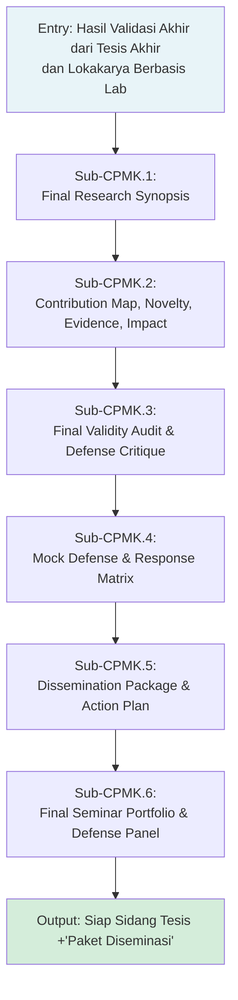

---

## PETUNJUK PENGGUNAAN BUKU

Seminar 2 adalah mata kuliah berbasis kinerja — nilainya ditentukan oleh kualitas dokumen dan presentasi yang dihasilkan, bukan oleh ujian tulis. Buku ini memberikan kerangka konseptual dan contoh konkret untuk setiap deliverable yang diharapkan.

Perhatikan bahwa Seminar 2 berlangsung bersamaan dengan Tesis Akhir, Lokakarya Berbasis Lab 2, dan Publikasi. Sinkronisasi antar mata kuliah ini penting: dokumen yang disusun di Seminar 2 (contribution map, validity audit, defense deck) langsung digunakan dalam sidang Tesis Akhir dan proses Publikasi.

---

## PETA BAB DAN OBE

| Bab | Judul | Sub-CPMK | Evaluasi | Bobot |
|---|---|---|---|---|
| 1 | Orientasi Seminar 2: Posisi dalam Alur Finalisasi Tesis | Sub-CPMK.1 | Eval-1 | 10% |
| 2 | Final Research Synopsis dan Readiness Self-Assessment | Sub-CPMK.1 | Eval-1 | 10% |
| 3 | Final Contribution Map dan Novelty Claim | Sub-CPMK.2 | Eval-2 | 15% |
| 4 | Evidence Map dan Thesis Positioning | Sub-CPMK.2 | Eval-2 | 15% |
| 5 | Limitation Statement dan Industrial/Social Impact | Sub-CPMK.2 | Eval-2 | 15% |
| 6 | Final Validity Audit: Desain Eksperimen dan Kecukupan Dataset | Sub-CPMK.3 | Eval-3 | 20% |
| 7 | Threat to Validity dan Defense Critique | Sub-CPMK.3 | Eval-3 | 20% |
| 8 | Argumentasi Ilmiah: Claim-Reason-Evidence-Warrant | Sub-CPMK.4 | Eval-4 | 20% |
| 9 | Mock Defense: Persiapan dan Pelaksanaan | Sub-CPMK.4 | Eval-4 | 20% |
| 10 | Defense Response Matrix dan Prioritasi Revisi | Sub-CPMK.4 | Eval-4 | 20% |
| 11 | Diseminasi Akademik: Slide Defense dan Executive Brief | Sub-CPMK.5 | Eval-5 | 20% |
| 12 | Integrasi Aspek Teknis, Legal, Etik, dan Privasi dalam Diseminasi | Sub-CPMK.5 | Eval-5 | 20% |
| 13 | Publication/Sidang Action Plan dan Final Argumentation Dossier | Sub-CPMK.5 | Eval-5 | 20% |
| 14 | Final Seminar Portfolio: Struktur dan Standar Kualitas | Sub-CPMK.6 | Eval-6 | 15% |
| 15 | Presentasi Final Panel dan Pertahanan Argumentasi | Sub-CPMK.6 | Eval-6 | 15% |
| 16 | Evaluasi Portfolio Final, Deliberasi, dan Rencana Tindak Lanjut | Sub-CPMK.6 | Eval-6 | 15% |

---

# BAB 1 — ORIENTASI SEMINAR 2: POSISI DALAM ALUR FINALISASI TESIS

## 1. Capaian Pembelajaran Bab

Setelah mempelajari bab ini, mahasiswa mampu:
- Menjelaskan posisi Seminar Penelitian Interdisipliner 2 dalam alur finalisasi tesis
- Memahami perbedaan ekspektasi antara Seminar 1 dan Seminar 2
- Mengidentifikasi deliverable utama dan alur evaluasi Seminar 2
- Menetapkan standar etika diseminasi akademik yang wajib dipatuhi

*Berkaitan dengan Sub-CPMK.1, Eval-1 (10%)*

## 2. Peta Konsep Bab

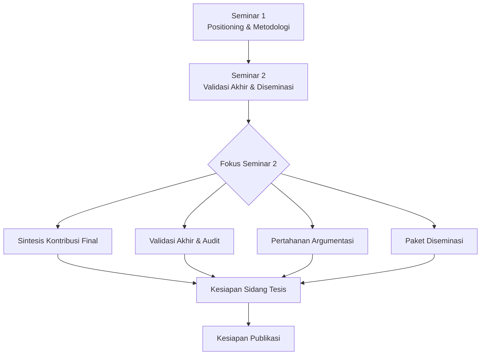

## 3. Pengantar Kontekstual

Jika Seminar Penelitian Interdisipliner 1 adalah forum untuk memposisikan penelitian di tengah literatur dan memvalidasi metodologi, Seminar 2 adalah forum untuk mempertanggungjawabkan penelitian yang sudah selesai. Perbedaannya fundamental: di Seminar 1, mahasiswa masih bisa berkata "rencana saya adalah..." — di Seminar 2, semua klaim harus didukung oleh hasil yang sudah ada.

Dalam ekosistem semester 4, Seminar 2 berlangsung berdampingan dengan Tesis Akhir (VSFDKS12), Lokakarya Berbasis Lab 2 (VSFDKS14), dan Publikasi (VSFDKS15). Ketiga mata kuliah ini saling memperkuat: validasi lab dari VSFDKS14 menjadi evidence di Seminar 2; kontribusi yang dipertajam di Seminar 2 menjadi konten publikasi di VSFDKS15; dan seluruh paket Seminar 2 menjadi persiapan sidang VSFDKS12.

## 4. Landasan Teori

### 4.1 Evolusi dari Seminar 1 ke Seminar 2

| Dimensi | Seminar 1 | Seminar 2 |
|---|---|---|
| Fase riset | Tengah (in-progress) | Akhir (near-complete) |
| Status eksperimen | Awal/parsial | Sudah selesai |
| Fokus utama | Positioning, gap, metodologi | Kontribusi final, validitas, diseminasi |
| Klaim yang dibuat | Tentative ("akan menunjukkan...") | Confirmed ("kami telah menunjukkan...") |
| Deliverable utama | Research progress brief, proposal revisi | Final synopsis, contribution map, defense deck |
| Audiens | Dosen, mahasiswa sejawat | Panel (dosen + praktisi + reviewer tamu) |

### 4.2 Etika Diseminasi Akademik

Diseminasi penelitian membawa tanggung jawab etika yang berbeda dari sekadar menyelesaikan tugas:

**Kejujuran Representasi:** Hasil harus direpresentasikan secara akurat — tidak dilebih-lebihkan dalam slide maupun dalam executive brief. Klaim yang tidak didukung data, meskipun terlihat lebih menarik, adalah pelanggaran integritas.

**Transparansi Keterbatasan:** Seminar 2 bukan forum "marketing" penelitian. Keterbatasan dan validity threats harus dikomunikasikan dengan sama jelasnya seperti kekuatan.

**Penghargaan terhadap Kontribusi Orang Lain:** Semua sumber yang digunakan harus dikreditkan dengan benar — dalam slide, dalam executive brief, dalam semua deliverable.

**Keamanan Data:** Jika penelitian menggunakan data sensitif atau data dari mitra, presentasi publik harus memastikan anonymisasi yang memadai. Jangan mengekspos PII atau data rahasia dalam slide.

### 4.3 Deliverable Utama Seminar 2

| Deliverable | Eval | Minggu | Deskripsi |
|---|---|---|---|
| Final Research Synopsis + Readiness Self-Assessment | Eval-1 | 1-2 | Dokumen 2-3 halaman merangkum seluruh tesis |
| Final Contribution-Evidence-Impact Matrix | Eval-2 | 3-5 | Matriks yang memetakan kontribusi → novelty → evidence → dampak |
| Final Validity Audit + Defense Critique | Eval-3 | 6-7 | Audit kritis terhadap validitas metodologi dan hasil sendiri |
| Mock Defense + Defense Response Matrix | Eval-4 | 8-10 | Pra-sidang + dokumentasi respons terhadap kritik |
| Dissemination Package + Action Plan | Eval-5 | 11-13 | Slide defense, executive brief, rencana publikasi |
| Final Seminar Portfolio + Defense Panel | Eval-6 | 14-16 | Semua deliverable terintegrasi + presentasi akhir |

## 5. Model atau Arsitektur

```mermaid
flowchart LR
    subgraph SEM1["Seminar 1\n(Semester 3)"]
        S1A[Research Progress Brief]
        S1B[Gap & Novelty Analysis]
        S1C[Methodology Critique]
        S1D[Validation Plan]
    end

    subgraph SEM2["Seminar 2\n(Semester 4)"]
        S2A[Final Research Synopsis]
        S2B[Contribution-Evidence Matrix]
        S2C[Final Validity Audit]
        S2D[Mock Defense]
        S2E[Dissemination Package]
        S2F[Final Portfolio]
    end

    subgraph OUTPUT["Output Terpadu"]
        O1[Sidang Tesis Final]
        O2[Publikasi Ilmiah]
        O3[Artefak Open Source/HKI]
    end

    SEM1 --> SEM2
    SEM2 --> OUTPUT
```

## 6. Contoh Terapan

**Perbedaan konkret antara Seminar 1 dan Seminar 2:**

*Research Progress Brief (Seminar 1):*
"Penelitian ini sedang mengembangkan pipeline deteksi phishing berbasis BERT. Eksperimen awal menunjukkan F1=0.78 pada fold pertama. Rencana validasi akan mencakup 5-fold cross validation pada dataset 10.000 email."

*Final Research Synopsis (Seminar 2):*
"Penelitian ini menghasilkan PhishDetect-BERT — pipeline deteksi phishing berbasis fine-tuned BERT — yang menunjukkan F1=0.91 ± 0.02 pada 5-fold CV dataset 10.000 email (5.000 phishing, 5.000 benign), meningkat 9 poin absolut di atas baseline TF-IDF + Logistic Regression (F1=0.82, p<0.001). Keterbatasan utama: model belum diuji pada email berbahasa selain Inggris dan Melayu."

Perbedaannya jelas: Seminar 2 bicara dalam past tense dengan angka konkret dan pengakuan keterbatasan yang jujur.

## 7. Praktikum atau Aktivitas Terarah

**Tujuan:** Memetakan posisi mahasiswa dalam alur finalisasi tesis dan mengidentifikasi readiness gap untuk Seminar 2.

**Langkah Kerja:**
1. Buat tabel perbandingan Seminar 1 vs Seminar 2 untuk tesis Anda sendiri.
2. Identifikasi deliverable Seminar 2 mana yang sudah siap (material sudah ada) dan mana yang masih memerlukan pekerjaan.
3. Susun timeline personal untuk menyelesaikan semua deliverable dalam 16 pertemuan.
4. Diskusikan dengan pembimbing: apakah ada bottleneck yang mengancam kesiapan?

## 8. Latihan Pemahaman

1. **(Pilihan Ganda)** Perbedaan utama antara Seminar 1 dan Seminar 2 adalah:
   - A. Seminar 2 lebih panjang dari Seminar 1
   - B. Seminar 2 berfokus pada kontribusi final yang sudah tervalidasi, sementara Seminar 1 berfokus pada positioning dan rencana
   - C. Seminar 2 tidak memerlukan review sejawat
   - D. Seminar 1 lebih sulit dari Seminar 2

2. **(Esai Singkat)** Mengapa etika diseminasi akademik melarang melebih-lebihkan hasil penelitian dalam slide presentasi, bahkan jika tujuannya adalah "membuat penelitian terlihat lebih menarik"?

3. **(Analisis Kasus)** Mahasiswa A mempresentasikan penelitiannya di Seminar 2 dengan menyatakan "sistem kami mencapai akurasi 99%" tanpa menyebutkan bahwa dataset pengujian sangat tidak seimbang (99% kelas negatif). Identifikasi pelanggaran etika dan dampaknya.

## 9. Latihan Terapan / Studi Kasus

**Studi Kasus:** Program studi mengundang reviewer tamu (praktisi dari industri keamanan siber) ke Seminar 2. Reviewer bertanya: "Apakah sistem ini siap digunakan di lingkungan produksi?" Mahasiswa yang tesis-nya adalah proof of concept merespons: "Ya, dengan beberapa penyesuaian minor." Analisis: apakah jawaban ini tepat? Apa jawaban yang lebih jujur dan profesional?

## 10. Kunci Jawaban dan Pembahasan

**Soal 1:** Jawaban B. Seminar 1 adalah forum positioning dan perencanaan; Seminar 2 adalah forum pertanggungjawaban hasil akhir. Semua aspek lain (durasi, peer review, kesulitan) tidak mendefinisikan perbedaan fundamental antara keduanya.

**Soal 2:** Melebih-lebihkan hasil melanggar prinsip kejujuran akademik dan merusak kepercayaan yang merupakan fondasi komunitas ilmiah. Secara praktis: (1) reviewer yang berpengalaman akan mendeteksi inkonsistensi; (2) jika tesis menjadi referensi bagi peneliti lain yang menggunakannya sebagai baseline, klaim yang tidak akurat menyebarkan kesalahan; (3) jika artefak diadopsi berdasarkan klaim yang berlebihan, pengguna akan kecewa dan kepercayaan pada peneliti menurun.

**Studi Kasus:** Jawaban "ya, dengan beberapa penyesuaian minor" tidak tepat untuk proof of concept. Jawaban yang lebih jujur: "Penelitian ini adalah proof of concept yang divalidasi dalam lingkungan lab terkontrol. Untuk deployment produksi, diperlukan: validasi pada traffic produksi nyata, tuning terhadap baseline false positive yang dapat diterima SOC, serta pengembangan mekanisme update model untuk menghadapi threat landscape yang berubah. Kami memperkirakan ini memerlukan 6-12 bulan engineering work tambahan."

## 11. Ringkasan Bab

Seminar 2 adalah forum pertanggungjawaban hasil akhir, bukan forum perencanaan. Perbedaan utama dari Seminar 1 adalah klaim berbasis hasil nyata, bukan rencana. Deliverable mencakup enam komponen dari research synopsis hingga final portfolio. Etika diseminasi mensyaratkan representasi yang jujur, akurat, dan transparan tentang keterbatasan.

## 12. Refleksi Profesional

1. Dalam diseminasi produk keamanan siber kepada publik (disclosure), ada norma "responsible disclosure" yang menekankan kejujuran tentang keterbatasan dan risiko. Bagaimana prinsip ini analog dengan etika diseminasi dalam Seminar 2?


---

# BAB 2 — FINAL RESEARCH SYNOPSIS DAN READINESS SELF-ASSESSMENT

## 1. Capaian Pembelajaran Bab

Setelah mempelajari bab ini, mahasiswa mampu:
- Menyusun final research synopsis yang merangkum seluruh penelitian dalam format yang padat dan dapat dipahami
- Melakukan dissemination readiness self-assessment secara jujur dan sistematis
- Mengidentifikasi kesenjangan yang masih perlu ditangani sebelum sidang

*Berkaitan dengan Sub-CPMK.1, Eval-1 (10%)*

## 2. Peta Konsep Bab

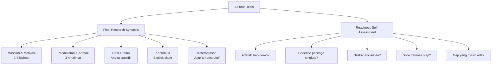

## 3. Pengantar Kontekstual

Final research synopsis adalah dokumen 2-3 halaman yang merangkum seluruh tesis — dari motivasi penelitian hingga kontribusi yang dicapai — dengan kepadatan informasi tinggi. Ia berbeda dari abstrak (yang lebih pendek dan lebih formal) dan berbeda dari bab pembahasan tesis (yang jauh lebih panjang dan lebih teknis). Synopsis adalah narasi yang dapat dipahami oleh akademisi dari disiplin yang berbeda dalam waktu 5 menit membaca.

Kemampuan menulis synopsis yang baik adalah keterampilan yang sangat berharga: ia digunakan dalam application to journal (cover letter), dalam poster akademik, dalam executive brief untuk mitra industri, dan dalam ringkasan program doktoral jika mahasiswa melanjutkan studi.

## 4. Landasan Teori

### 4.1 Komponen Final Research Synopsis

**Paragraf 1 — Konteks dan Masalah (150-200 kata):**
Mengapa domain ini penting? Apa masalah spesifik yang belum terselesaikan? Apa dampak dari masalah ini terhadap industri atau masyarakat? Kalimat terakhir paragraf ini harus menyatakan research gap secara eksplisit.

**Paragraf 2 — Pendekatan dan Artefak (150-200 kata):**
Apa yang diusulkan? Bagaimana cara kerjanya (high-level)? Apa artefak/prototipe yang dihasilkan? Mengapa pendekatan ini dipilih? Kalimat terakhir menghubungkan pendekatan dengan klaim kontribusi.

**Paragraf 3 — Hasil dan Kontribusi (150-200 kata):**
Apa yang ditemukan? Angka apa yang mendukung klaim? Dibandingkan dengan apa? Dengan kepercayaan statistik berapa? Kalimat pertama menyatakan kontribusi secara langsung.

**Paragraf 4 — Implikasi dan Keterbatasan (100-150 kata):**
Apa artinya hasil ini bagi peneliti lain? Bagi praktisi? Apa keterbatasan utama? Apa agenda penelitian selanjutnya?

### 4.2 Readiness Self-Assessment

Readiness self-assessment adalah dokumen inventaris kesiapan yang jujur. Berbeda dari checklist formal yang sering diisi mekanis, self-assessment yang efektif memaksa mahasiswa mengidentifikasi kesenjangan nyata.

**Dimensi Readiness:**

| Dimensi | Pertanyaan Kunci | Status | Gap |
|---|---|---|---|
| Artefak | Apakah artefak dapat didemokan tanpa persiapan khusus? | | |
| Evidence | Apakah semua raw results tersedia dan terverifikasi? | | |
| Narasi | Apakah research synopsis sudah dapat dipahami tanpa penjelasan tambahan? | | |
| Defense | Apakah ada 10 pertanyaan terberat yang sudah disiapkan jawabannya? | | |
| Dokumen | Apakah naskah tesis sudah disetujui pembimbing? | | |
| Publikasi | Apakah ada rencana konkret untuk at least satu publikasi? | | |

### 4.3 Kalimat Pembuka Synopsis yang Efektif

Kalimat pertama synopsis menentukan apakah pembaca akan melanjutkan atau berhenti. Kalimat yang baik langsung menyentuh masalah:

*Buruk:* "Penelitian ini membahas tentang keamanan siber yang merupakan bidang yang sangat penting saat ini."

*Lebih baik:* "Serangan ransomware pada infrastruktur kritis meningkat 150% antara 2022 dan 2024, namun sistem deteksi berbasis tanda tangan yang dominan digunakan gagal mendeteksi 60-70% varian baru dalam hari pertama kemunculannya."

Kalimat kedua langsung memperkenalkan gap; kalimat ketiga memperkenalkan solusi yang diusulkan.

## 5. Model atau Arsitektur

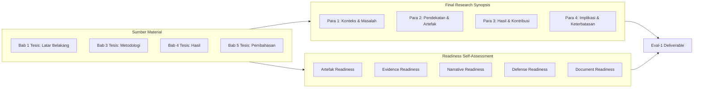

## 6. Contoh Terapan

**Contoh Final Research Synopsis (ringkasan):**

*Konteks & Masalah:* "Ancaman insider threat — insiden keamanan yang melibatkan aktor internal yang memiliki akses sah — menyebabkan kerugian rata-rata USD 15.4 juta per organisasi per tahun (Ponemon Institute, 2023). Sistem behavioral analytics yang ada memerlukan dataset berlabel besar yang sulit diperoleh organisasi dengan kapasitas keamanan terbatas."

*Pendekatan & Artefak:* "Penelitian ini mengusulkan InsiderDetect — sistem deteksi insider threat berbasis unsupervised anomaly detection menggunakan Variational Autoencoder (VAE) yang dilatih hanya pada data perilaku normal — sehingga tidak memerlukan label data ancaman. Sistem menganalisis log UEBA (User and Entity Behavior Analytics) mencakup login pattern, resource access, dan data exfiltration indicator."

*Hasil & Kontribusi:* "InsiderDetect mencapai AUC-ROC=0.89 pada CERT Insider Threat Dataset r6.2, setara dengan supervised baseline (RF: AUC=0.91) namun tanpa memerlukan satu pun label negatif selama training. Kontribusi utama: pendekatan unsupervised yang mengurangi ketergantungan pada labeled threat data sebesar 100%."

*Implikasi & Keterbatasan:* "Temuan ini memiliki implikasi bagi organisasi kecil-menengah yang tidak memiliki tim SOC berlabel besar. Keterbatasan: sistem belum diuji pada lingkungan produksi nyata dan CERT Dataset adalah data sintetik."

## 7. Praktikum atau Aktivitas Terarah

**Tujuan:** Menulis final research synopsis tesis sendiri dan melengkapi readiness self-assessment.

**Langkah Kerja:**
1. Tulis synopsis mengikuti struktur empat paragraf — jaga agar total tidak melebihi 750 kata.
2. Minta seorang teman yang bukan dari domain tesis Anda untuk membacanya dan memberikan feedback: apakah masalahnya jelas? Apakah kontribusinya mudah dipahami?
3. Revisi synopsis berdasarkan feedback.
4. Lengkapi tabel Readiness Self-Assessment — isi dengan jujur, termasuk identifikasi gap yang belum terselesaikan.

**Catatan Etika:** Synopsis harus mencerminkan hasil sebenarnya — bukan aspirasi atau rencana. Jika validasi belum selesai saat synopsis ditulis, nyatakan status yang sebenarnya.

## 8. Latihan Pemahaman

1. **(Pilihan Ganda)** Audiens target dari final research synopsis adalah:
   - A. Hanya pembimbing tesis
   - B. Akademisi dari disiplin yang berbeda yang dapat memahami kontribusi dalam 5 menit
   - C. Hanya mahasiswa dari program studi yang sama
   - D. Masyarakat umum tanpa latar belakang teknis

2. **(Analisis)** Kalimat pembuka synopsis: "Penelitian ini bertujuan untuk mengembangkan sistem deteksi anomali menggunakan machine learning." Identifikasi kelemahan kalimat ini dan tuliskan versi yang lebih baik.

3. **(Evaluasi)** Readiness self-assessment mahasiswa B menunjukkan semua item berstatus "Siap." Apa yang seharusnya dipertanyakan tentang self-assessment ini?

## 9. Latihan Terapan / Studi Kasus

**Studi Kasus:** Mahasiswa C memiliki tesis dengan tiga research question. RQ1 sudah terjawab dengan baik, RQ2 terjawab parsial, RQ3 belum terjawab karena dataset yang diperlukan tidak tersedia. Dalam final research synopsis, mahasiswa C hanya mencantumkan hasil untuk RQ1 dan RQ2 tanpa menyebutkan RQ3. Analisis: (a) apakah ini dapat diterima; (b) apa yang seharusnya ditulis.

## 10. Kunci Jawaban dan Pembahasan

**Soal 1:** Jawaban B. Synopsis dirancang untuk audiens luas — termasuk reviewer jurnal dari sub-domain berbeda, praktisi industri, dan anggota panel seminar yang mungkin bukan spesialis di sub-domain spesifik tesis. Kemampuan mengkomunikasikan penelitian lintas batas disiplin adalah kompetensi penting peneliti terapan.

**Soal 2:** Kelemahan: (1) "bertujuan untuk mengembangkan" → masih berbicara dalam future tense (rencana), padahal synopsis final seharusnya past tense (hasil); (2) tidak ada konteks mengapa masalah ini penting; (3) "deteksi anomali menggunakan ML" terlalu generik. Versi lebih baik: "Penelitian ini menghasilkan sistem deteksi anomali jaringan berbasis Isolation Forest yang mendeteksi lateral movement pada lingkungan ICS, mencapai F1=0.90 pada dataset SWAT tanpa memerlukan labeled training data."

**Studi Kasus:** Tidak dapat diterima. Menyembunyikan RQ3 yang tidak terjawab dari synopsis adalah misrepresentasi penelitian. Seharusnya: sebutkan bahwa penelitian memiliki tiga RQ; jelaskan bahwa RQ1 dan RQ2 terjawab; untuk RQ3, nyatakan bahwa karena keterbatasan [dataset tidak tersedia], pertanyaan ini tidak dapat dijawab dalam studi ini dan menjadi arah penelitian masa depan. Ini adalah keterbatasan yang valid dan dapat diterima jika diakui secara jujur.

## 11. Ringkasan Bab

Final research synopsis adalah narasi 2-3 halaman yang merangkum seluruh tesis dalam empat komponen: konteks/masalah, pendekatan/artefak, hasil/kontribusi, dan implikasi/keterbatasan. Kalimat pembuka harus langsung menyentuh masalah dengan spesifik. Readiness self-assessment mengidentifikasi gap yang masih perlu ditangani. Keduanya harus mencerminkan kondisi nyata penelitian, bukan aspirasi.

## 12. Refleksi Profesional

1. Kemampuan merangkum penelitian kompleks dalam 750 kata yang dapat dipahami non-spesialis adalah keterampilan yang sama yang diperlukan saat menulis security advisory, laporan eksekutif, atau proposal proyek keamanan. Bagaimana latihan menulis synopsis meningkatkan kompetensi komunikasi profesional Anda?

---

# BAB 3 — FINAL CONTRIBUTION MAP DAN NOVELTY CLAIM

## 1. Capaian Pembelajaran Bab

Setelah mempelajari bab ini, mahasiswa mampu:
- Menyusun final contribution map yang memetakan kontribusi tesis secara eksplisit
- Merumuskan novelty claim yang akurat, terukur, dan dapat dipertahankan
- Membedakan antara kontribusi yang terbukti dan kontribusi yang diklaim berlebihan
- Memposisikan kontribusi dalam konteks state-of-the-art terkini

*Berkaitan dengan Sub-CPMK.2, Eval-2 (15%)*

## 2. Peta Konsep Bab

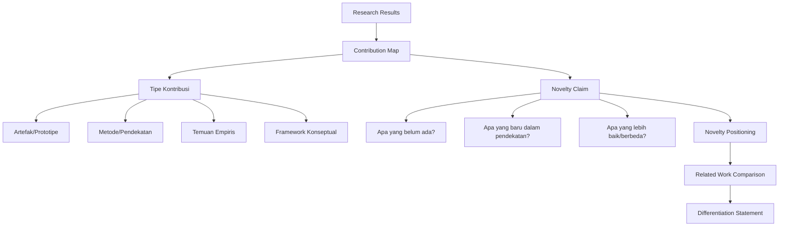

## 3. Pengantar Kontekstual

"Apa novelty dari penelitian Anda?" adalah pertanyaan yang hampir pasti muncul di setiap sidang tesis dan setiap seminar akademik. Namun banyak mahasiswa menjawabnya dengan cara yang lemah: "Belum ada yang meneliti topik ini" (terlalu klaim; kemungkinan salah) atau "Kami mengombinasikan teknik A dan B" (terlalu teknis tanpa menjelaskan mengapa kombinasi itu bermakna).

Contribution map adalah alat untuk berpikir jernih tentang kontribusi sebelum harus menjawab pertanyaan tersebut. Ia memaksa mahasiswa untuk secara eksplisit memetakan: apa yang dihasilkan (output), apa yang berbeda dari sebelumnya (novelty), dan apa yang membuktikannya (evidence).

## 4. Landasan Teori

### 4.1 Tipologi Kontribusi dalam Design Science Research

Mengadaptasi Wieringa (2014), kontribusi dalam penelitian terapan keamanan siber dapat dikategorikan:

**Kontribusi Artefak:** Sistem, tool, atau prosedur yang dihasilkan. Contoh: "IDS berbasis graph neural network untuk deteksi lateral movement."

**Kontribusi Metodologis:** Prosedur atau framework baru untuk menyelesaikan masalah. Contoh: "Framework audit kepatuhan cloud yang mengintegrasikan CIS Benchmark dan GDPR."

**Kontribusi Empiris:** Pengetahuan baru yang dihasilkan dari pengujian sistematis. Contoh: "Studi empiris menunjukkan bahwa teknik augmentasi data X meningkatkan deteksi zero-day sebesar 15%."

**Kontribusi Konseptual:** Model atau teori baru yang membantu memahami suatu fenomena. Contoh: "Model risiko untuk deployment AI di lingkungan keamanan kritis."

### 4.2 Struktur Contribution Map

Contribution map berbentuk tabel yang memetakan setiap kontribusi ke tiga dimensi:

| Kontribusi | Novelty (Apa yang Baru?) | Evidence (Bukti Apa?) | Scope (Berlaku di mana?) |
|---|---|---|---|
| [Nama kontribusi 1] | [Diferensiasi dari SotA] | [Angka/hasil spesifik] | [Dataset/kondisi] |
| [Nama kontribusi 2] | | | |

### 4.3 Formulasi Novelty Claim yang Kuat

Novelty claim yang lemah: "Penelitian ini menggabungkan deep learning dengan analisis forensik."

Novelty claim yang kuat mencakup:
- **Apa yang baru:** Secara spesifik apa yang belum dilakukan orang lain
- **Mengapa bermakna:** Apa masalah yang diselesaikan oleh novelty ini
- **Bagaimana dibuktikan:** Evidence spesifik yang mendukung klaim

Contoh novelty claim kuat: "Berbeda dari pendekatan sebelumnya yang menganalisis syscall dalam urutan waktu linear (Smith et al. 2022, Jones et al. 2023), kami mengusulkan representasi graph dari pola syscall yang menangkap hubungan kausal antar panggilan sistem. Representasi ini memungkinkan deteksi pola ransomware yang menyebar tidak terurut dalam waktu — sebuah gap yang belum diidentifikasi dalam literatur — dan menghasilkan peningkatan Recall sebesar 8 poin absolut pada varian ransomware baru yang tidak ada dalam training set."

### 4.4 Boundary of Contribution

Setiap novelty claim harus memiliki "boundary" yang jelas — kondisi di mana klaim berlaku. Novelty tanpa boundary rentan terhadap counter-example.

Buruk: "Sistem kami mendeteksi semua jenis ransomware."
Baik: "Sistem kami mendeteksi ransomware yang menggunakan pola enkripsi file sistematis pada platform Windows, sebagaimana direpresentasikan dalam dataset CIC Ransomware 2022."

Boundary yang jelas tidak melemahkan kontribusi — ia membuatnya lebih dapat dipercaya dan lebih mudah diverifikasi.

## 5. Model atau Arsitektur

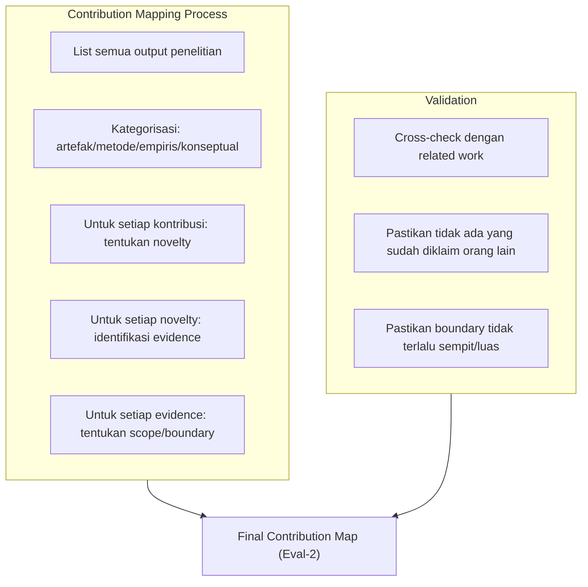

## 6. Contoh Terapan

**Contribution Map untuk tesis CTI Classification:**

| Kontribusi | Novelty | Evidence | Scope |
|---|---|---|---|
| SecCTI-Classifier: pipeline klasifikasi laporan CTI ke ATT&CK | Fine-tuning SecBERT untuk CTI; penggunaan few-shot learning untuk kategori langka | Macro-F1=0.83 vs keyword baseline 0.72 (Δ=+11, p<0.001) | 500 laporan CTI berbahasa Inggris; ATT&CK Enterprise v14 |
| Dataset 500 laporan CTI berlabel | Dataset publik berlabel ATT&CK belum tersedia untuk bahasa Indonesia/Melayu (verified per 2024) | Dataset dirilis di Zenodo dengan lisensi CC-BY | Laporan CTI 2022-2024, bahasa Inggris dan Melayu |
| Few-shot learning protocol untuk kategori ATT&CK langka | Tidak ada benchmark few-shot CTI sebelumnya yang dipublikasikan | F1=0.71 pada kategori dengan <10 sampel (vs 0.51 baseline) | Kategori ATT&CK dengan frekuensi rendah |

## 7. Praktikum atau Aktivitas Terarah

**Tujuan:** Menyusun final contribution map untuk tesis sendiri.

**Langkah Kerja:**
1. Daftar semua output konkret penelitian Anda (artefak, dataset, framework, temuan).
2. Untuk setiap output, jawab: "Apa yang baru dibandingkan penelitian sebelumnya yang terdekat?"
3. Konfirmasi novelty dengan mencari paper terbaru (2022-2024) yang paling relevan — apakah klaim novelty Anda masih valid?
4. Isi contribution map dengan evidence spesifik (angka, nama dataset, kondisi eksperimen).
5. Definisikan boundary untuk setiap klaim.

## 8. Latihan Pemahaman

1. **(Pilihan Ganda)** Novelty claim "Penelitian kami menggunakan machine learning untuk deteksi anomali jaringan" adalah:
   - A. Novelty claim yang kuat karena ML masih baru
   - B. Novelty claim yang lemah karena tidak membedakan dari ratusan penelitian serupa
   - C. Novelty claim yang tepat untuk tesis magister
   - D. Novelty claim yang tidak diperlukan dalam tesis terapan

2. **(Analisis)** Contribution map mahasiswa D mengklaim "framework audit pertama yang mencakup IoT dan cloud secara bersamaan." Identifikasi tindakan verifikasi yang harus dilakukan sebelum klaim ini dapat dipertahankan.

3. **(Perancangan)** Tulis novelty claim untuk tesis fiktif: sistem deteksi insider threat menggunakan graph analysis pada log Active Directory, yang membedakan pola akses normal dari pola "privilege escalation" menggunakan temporal pattern matching — dan menunjukkan peningkatan F1 dari 0.74 (baseline) ke 0.88.

## 9. Latihan Terapan / Studi Kasus

**Studi Kasus:** Mahasiswa E mengklaim kontribusi "pertama di dunia" untuk teknik forensik analisis cookie browser yang dikembangkannya. Reviewer menemukan paper dari 2021 yang melakukan sesuatu yang sangat mirip. Mahasiswa berpendapat bahwa tekniknya "berbeda karena menggunakan SQLite parsing yang berbeda." Analisis: (a) apakah perbedaan SQLite parsing cukup untuk mempertahankan klaim novelty; (b) bagaimana seharusnya kontribusi dirumuskan ulang.

## 10. Kunci Jawaban dan Pembahasan

**Soal 1:** Jawaban B. "Menggunakan ML untuk deteksi anomali jaringan" adalah deskripsi kategori, bukan novelty — ada ratusan paper yang melakukan hal yang sama. Novelty harus spesifik: teknik ML apa yang baru, dalam kondisi apa, menghasilkan apa yang berbeda dari yang sudah ada.

**Studi Kasus:** (a) Perbedaan "SQLite parsing yang berbeda" kemungkinan tidak cukup untuk mempertahankan klaim "pertama di dunia" — jika tujuan (analisis cookie browser untuk forensik) dan hasilnya serupa, perbedaan implementasi teknis minor tidak membentuk novelty substansial; (b) Rumusan ulang yang lebih tepat: "Berbeda dari [paper 2021] yang berfokus pada [aspek X], penelitian kami mengekstend analisis ke [aspek Y yang baru] menggunakan pendekatan Z, menghasilkan [peningkatan konkret]."

## 11. Ringkasan Bab

Contribution map memetakan setiap kontribusi ke novelty, evidence, dan scope. Novelty claim yang kuat bersifat spesifik, terukur, dan memiliki boundary yang jelas. Verifikasi novelty terhadap literature terbaru adalah wajib sebelum klaim dipertahankan di seminar. Boundary yang jelas bukan kelemahan — ia adalah tanda kejujuran ilmiah.

## 12. Refleksi Profesional

1. Dalam industri keamanan siber, "false advertising" tentang kapabilitas produk keamanan dapat menyebabkan keputusan pembelian yang salah dan akhirnya kerugian keamanan bagi pengguna. Bagaimana analogi ini relevan dengan tanggung jawab peneliti dalam merumuskan novelty claim yang akurat?

---

# BAB 4 — EVIDENCE MAP DAN THESIS POSITIONING

## 1. Capaian Pembelajaran Bab

Setelah mempelajari bab ini, mahasiswa mampu:
- Menyusun evidence map yang menghubungkan setiap klaim kontribusi dengan bukti konkret
- Memposisikan tesis dalam konteks state-of-the-art dengan cara yang akurat dan dapat diverifikasi
- Mengidentifikasi klaim yang tidak didukung evidence yang memadai
- Mengevaluasi kekuatan evidence secara hierarkis

*Berkaitan dengan Sub-CPMK.2, Eval-2 (15%)*

## 2. Peta Konsep Bab

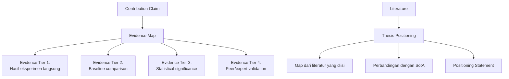

## 3. Pengantar Kontekstual

Setiap klaim dalam tesis harus "dijangkarkan" ke evidence — jika sebuah klaim tidak dapat dihubungkan ke data atau hasil yang konkret, ia bukan klaim ilmiah melainkan opini. Evidence map adalah alat untuk memverifikasi bahwa tidak ada klaim "mengambang" dalam tesis.

Thesis positioning adalah cara tesis menempatkan dirinya dalam konteks penelitian yang lebih luas. Positioning yang baik tidak hanya membandingkan hasil numerik, tetapi juga menjelaskan mengapa perbandingan itu bermakna — kondisi apa yang sama, kondisi apa yang berbeda, dan apa implikasi dari perbedaan tersebut.

## 4. Landasan Teori

### 4.1 Hierarki Evidence

Tidak semua evidence memiliki bobot yang sama. Dalam urutan kekuatan (dari paling kuat ke paling lemah):

1. **Experimental results on your dataset:** Anda mengukur langsung dalam kondisi yang Anda kontrol
2. **Reproduced results dari paper lain pada dataset Anda:** Anda mereproduksi metode orang lain dan membandingkan secara fair
3. **Reported results dari paper lain (same domain):** Anda mengutip angka dari paper lain — valid tetapi lebih lemah karena kondisi eksperimen mungkin berbeda
4. **Expert opinion atau review:** Penilaian kualitatif dari reviewer atau pembimbing
5. **Analogy atau reasoning:** Argumen logis tanpa data — paling lemah, hanya digunakan sebagai pendukung

Evidence map yang kuat mengandalkan Tier 1 dan Tier 2 untuk klaim utama. Klaim yang hanya didukung Tier 4 atau 5 harus diidentifikasi sebagai "tentative" atau "requiring further validation."

### 4.2 Evidence Map Template

| Klaim | Evidence | Tier | Kekuatan | Catatan |
|---|---|---|---|---|
| Sistem kami mencapai F1 tertinggi di antara metode yang ada | F1=0.92 (ours) vs F1=0.85 (RF-Stat, reproduced) | 1 + 2 | Kuat | Reproduced in same environment |
| Pendekatan kami lebih efisien secara komputasi | Waktu inference 23ms vs 145ms (reported in [X]) | 1 + 3 | Sedang | Kondisi hardware mungkin berbeda |
| Framework kami lebih mudah digunakan oleh analis pemula | 3 analis menyatakan "lebih intuitif" | 4 | Lemah | Sample kecil, subjektif |

### 4.3 Thesis Positioning Statement

Positioning statement adalah 1-2 paragraf yang menempatkan tesis dalam konteks penelitian yang lebih luas:

"Penelitian ini berkontribusi pada lini penelitian deteksi malware berbasis perilaku yang dimulai oleh [fondasi paper] dan dikembangkan oleh [paper terkini]. Berbeda dari pendekatan [X] yang menggunakan [teknik A] dan terbatas pada [kondisi], kami menggunakan [teknik B] yang memungkinkan [kemampuan C]. Perbedaan ini relevan karena [alasan domain-specific]. Sejauh yang kami ketahui, hingga publikasi tesis ini, tidak ada penelitian yang menggabungkan [aspek 1] dan [aspek 2] dalam konteks [kondisi spesifik]."

Frasa "sejauh yang kami ketahui" (to the best of our knowledge) adalah disclaimer standar yang jujur — ia mengakui bahwa mungkin ada paper yang tidak ditemukan dalam SLR.

## 5. Model atau Arsitektur

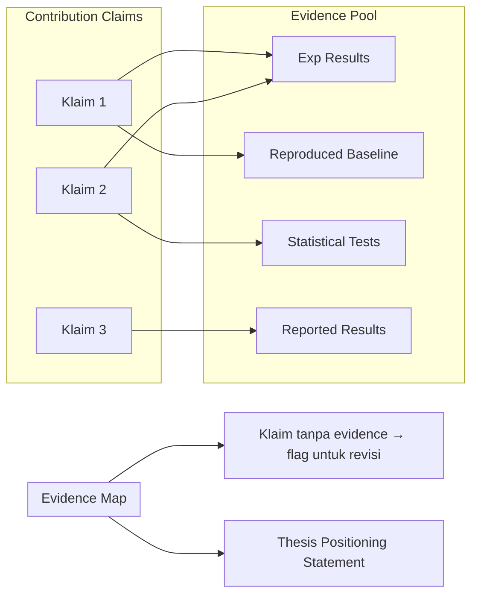

## 6. Contoh Terapan

**Evidence Map untuk klaim utama tesis IDS berbasis GNN:**

| Klaim | Evidence | Tier | Kekuatan |
|---|---|---|---|
| GNN menangkap pola temporal yang tidak ditangkap RF | F1 RF=0.85, GNN=0.92 pada data yang sama; ablation menunjukkan komponen temporal berkontribusi +0.07 F1 | 1+2 | Kuat |
| Pendekatan kami generalisable ke dataset berbeda | F1=0.88 pada UNSW-NB15 (dataset sekunder, tidak digunakan training) | 1 | Sedang-kuat (hanya 1 dataset tambahan) |
| GNN lebih interpretable dari black-box DNN | Visualisasi attention weights menunjukkan node relevan | 1 | Lemah (interpretability kualitatif, tidak ada metrik formal) |

Klaim ketiga diidentifikasi sebagai lemah — ini harus diakui dalam Bab Pembahasan sebagai limitation: "interpretability diklaim secara kualitatif melalui visualisasi; studi kuantitatif tentang interpretability (misalnya menggunakan faithfulness metric) adalah arah penelitian masa depan."

## 7. Praktikum atau Aktivitas Terarah

**Tujuan:** Membuat evidence map lengkap untuk semua klaim kontribusi tesis dan mengidentifikasi klaim yang memerlukan penguatan atau pengakuan keterbatasan.

**Langkah Kerja:**
1. Daftar semua klaim kontribusi dari contribution map (Bab 3).
2. Untuk setiap klaim, identifikasi semua evidence yang tersedia dan kategorikan tier-nya.
3. Flag klaim yang hanya memiliki evidence Tier 4 atau 5 — diskusikan dengan pembimbing apakah ada cara untuk memperkuatnya atau apakah harus diakui sebagai limitation.
4. Tulis thesis positioning statement (1-2 paragraf).

## 8. Latihan Pemahaman

1. **(Analisis)** Mengapa "para ahli menyatakan pendekatan ini menjanjikan" (expert opinion) dikategorikan sebagai evidence yang lemah dalam konteks tesis empiris?

2. **(Evaluasi)** Mahasiswa F mengklaim "sistem kami lebih aman dari sistem yang ada" namun evidence map menunjukkan tidak ada pengujian keamanan formal yang dilakukan — hanya analisis teoritis. Apa yang seharusnya dilakukan?

3. **(Perancangan)** Tulis thesis positioning statement untuk tesis tentang analisis forensik memori pada sistem Linux yang mengembangkan metode baru untuk mengekstraksi artefak dari kernel 5.x.

## 9. Latihan Terapan / Studi Kasus

**Studi Kasus:** Evidence map mahasiswa G menunjukkan bahwa klaim performa utama (F1=0.94) hanya didukung oleh satu run eksperimen pada satu dataset, tanpa pengulangan dan tanpa baseline comparison. Dalam seminar, reviewer mempertanyakan klaim ini. Susun: (a) respons yang jujur dan profesional dari mahasiswa; (b) rencana untuk memperkuat evidence sebelum sidang.

## 10. Kunci Jawaban dan Pembahasan

**Soal 1:** Expert opinion bersifat subjektif dan tidak dapat diverifikasi secara independen. Dalam tesis empiris, klaim kinerja harus dibuktikan dengan pengukuran yang dapat direplikasi — bukan dengan persetujuan ahli. Expert opinion berguna sebagai validasi tambahan atau untuk klaim kualitatif (misalnya "framework ini berguna secara praktis"), tetapi tidak cukup sebagai satu-satunya bukti untuk klaim kuantitatif.

**Soal 2:** Klaim "lebih aman" tanpa evidence formal harus direvisi: (1) lakukan pengujian keamanan yang dapat diukur — misalnya threat modeling formal, analisis attack surface, atau pengujian terotorisasi; atau (2) revisi klaim menjadi "secara teoritis memiliki attack surface lebih kecil berdasarkan [analisis spesifik]" dengan pengakuan bahwa pengujian empiris keamanan adalah future work.

## 11. Ringkasan Bab

Evidence map menghubungkan setiap klaim ke evidence dengan hierarki kekuatan. Klaim yang hanya didukung evidence lemah harus direvisi atau diakui sebagai limitation. Thesis positioning statement menempatkan kontribusi dalam konteks literatur dengan frasa "sejauh yang kami ketahui" sebagai disclaimer yang jujur.

## 12. Refleksi Profesional

1. Dalam incident response, investigator harus membangun "chain of evidence" yang menghubungkan setiap kesimpulan ke bukti konkret yang dapat diaudit. Bagaimana prinsip ini analog dengan evidence map dalam tesis?

---

# BAB 5 — LIMITATION STATEMENT DAN INDUSTRIAL/SOCIAL IMPACT

## 1. Capaian Pembelajaran Bab

Setelah mempelajari bab ini, mahasiswa mampu:
- Menyusun limitation statement yang jujur, spesifik, dan konstruktif
- Merumuskan industrial/social impact statement yang realistis dan terukur
- Menghubungkan keterbatasan dengan agenda penelitian masa depan
- Menyampaikan implikasi penelitian kepada pemangku kepentingan yang beragam

*Berkaitan dengan Sub-CPMK.2, Eval-2 (15%)*

## 2. Peta Konsep Bab

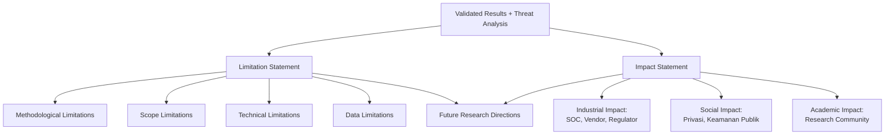

## 3. Pengantar Kontekstual

Seminar Penelitian Interdisipliner 2 adalah mata kuliah "interdisipliner" bukan hanya karena panel-nya beragam latar belakang, tetapi karena implikasi penelitian keamanan siber dan forensik digital sesungguhnya lintas disiplin: ia menyentuh hukum (ketika bukti digital digunakan di pengadilan), privasi (ketika sistem monitoring mengumpulkan data perilaku pengguna), etika (ketika AI digunakan untuk membuat keputusan tentang "kecurigaan"), dan organisasi (ketika implementasi teknologi baru memerlukan perubahan proses bisnis).

Limitation statement dan impact statement adalah dua sisi mata uang yang sama: kita mengakui apa yang belum bisa kita lakukan sekarang (limitations), dan kita menjelaskan apa yang sudah bisa kita berikan kepada komunitas yang lebih luas (impact).

## 4. Landasan Teori

### 4.1 Struktur Limitation Statement yang Efektif

Limitation yang baik bukan sekadar kalimat "penelitian ini memiliki beberapa keterbatasan." Ia:
- Menyebutkan keterbatasan secara spesifik
- Menjelaskan mengapa keterbatasan itu ada (kontekstual, bukan permintaan maaf)
- Menjelaskan implikasi konkret dari keterbatasan terhadap generalisasi klaim
- Menunjukkan kondisi yang diperlukan untuk mengatasinya

**Template Limitation Statement:**
"[Keterbatasan spesifik] karena [alasan kontekstual yang jelas]. Konsekuensinya, klaim [X] hanya berlaku untuk [kondisi terbatas]. Penelitian masa depan yang [kondisi] dapat memperluas validitas klaim ini ke [konteks lebih luas]."

### 4.2 Limitation-Risk Map

Untuk Seminar 2, limitations juga harus dipetakan ke risiko praktis jika seseorang mengadopsi temuan tanpa mempertimbangkan limitations:

| Limitation | Risiko Adopsi Tanpa Kesadaran | Mitigasi untuk Adopter |
|---|---|---|
| Hanya diuji pada dataset sintetik | Performa produksi mungkin jauh lebih rendah | Lakukan pilot deployment terkontrol sebelum full deployment |
| Model tidak interpretable | Keputusan tidak dapat dijelaskan ke stakeholder hukum | Tambahkan explainability layer atau gunakan bersama human analyst |

### 4.3 Merumuskan Impact Statement

Impact statement berbeda dari "manfaat penelitian" yang biasa ada di Bab 1 tesis. Impact statement dalam konteks Seminar 2 berdasarkan hasil yang sudah divalidasi — bukan proyeksi sebelum penelitian dilakukan.

**Struktur Impact Statement:**
- **Industrial Impact:** Siapa aktor industri yang dapat mengadopsi temuan ini? Dalam konteks apa? Dengan persyaratan apa?
- **Social Impact:** Apa manfaat atau risiko bagi masyarakat umum? (Privasi, keamanan publik, access equity)
- **Academic Impact:** Apa kontribusi terhadap badan pengetahuan? Paper apa yang mungkin ditulis dari tesis ini?

### 4.4 Aspek Legal dan Privasi dalam Impact Assessment

Khususnya untuk penelitian keamanan siber dan forensik digital, impact statement harus mempertimbangkan:

**Implikasi UU ITE dan UU PDP:** Jika artefak melakukan monitoring jaringan atau analisis perilaku pengguna, penggunaannya harus sesuai dengan regulasi yang berlaku — termasuk persyaratan persetujuan dan transparansi.

**Implikasi Ketidakseimbangan Kekuatan:** Sistem insider threat detection atau behavioral analytics dapat disalahgunakan untuk diskriminasi karyawan. Impact statement harus mengakui risiko ini dan merekomendasikan safeguards.

**Implikasi untuk Kelompok Rentan:** Sistem AI dalam keamanan siber yang beroperasi tanpa pengawasan manusia dapat menghasilkan false positive yang berdampak tidak proporsional pada kelompok tertentu.

## 5. Model atau Arsitektur

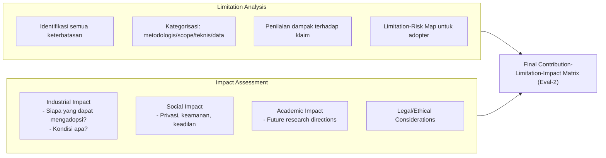

## 6. Contoh Terapan

**Limitation-Risk Map untuk sistem deteksi insider threat:**

| Limitation | Risiko Jika Diabaikan | Rekomendasi untuk Adopter |
|---|---|---|
| Diuji hanya pada CERT Dataset (sintetik) | False positive rate produksi mungkin jauh lebih tinggi, menyebabkan tuduhan tidak adil terhadap karyawan | Pilot deployment selama 3 bulan dengan human-in-the-loop sebelum automated decision |
| Model tidak dapat menjelaskan mengapa seseorang ditandai | Keputusan tidak dapat dikontestasi secara hukum | Implementasikan dengan explainability layer; setiap alert harus diverifikasi analis human |
| Tidak ada mekanisme update model untuk ancaman baru | Model akan drift seiring perubahan pola kerja normal | Bangun pipeline retraining periodik dengan data berlabel dari SOC |

## 7. Praktikum atau Aktivitas Terarah

**Tujuan:** Menyusun limitation statement dan impact statement lengkap untuk tesis sendiri, termasuk pertimbangan legal dan etik.

**Langkah Kerja:**
1. Identifikasi semua keterbatasan menggunakan empat kategori.
2. Buat limitation-risk map: untuk setiap limitation, identifikasi risiko jika adopter tidak menyadarinya.
3. Tulis impact statement untuk tiga pemangku kepentingan: industri, masyarakat, dan komunitas akademik.
4. Identifikasi minimal satu implikasi hukum atau privasi yang relevan dengan penelitian Anda.

## 8. Latihan Pemahaman

1. **(Esai Singkat)** Mengapa perlu ada limitation-risk map, bukan hanya limitation statement biasa? Apa nilai tambah informasi tentang risiko adopsi?

2. **(Analisis)** Tesis tentang sistem monitoring jaringan karyawan mengklaim dapat mendeteksi "perilaku mencurigakan." Identifikasi minimal tiga implikasi privasi dan etika yang harus ada dalam impact statement.

3. **(Evaluasi)** Impact statement mahasiswa H menyatakan "penelitian ini akan merevolusi cara industri mendeteksi ancaman." Evaluasi pernyataan ini dari perspektif kejujuran akademik.

## 9. Latihan Terapan / Studi Kasus

**Studi Kasus:** Tesis tentang analisis sentiment media sosial untuk deteksi koordinasi serangan siber. Sistem menganalisis tweet publik untuk mengidentifikasi pola koordinasi. Susun: (a) limitation statement untuk aspek privasi dan metodologi; (b) impact statement untuk regulator, platform media sosial, dan masyarakat umum; (c) rekomendasi safeguard untuk adopsi bertanggung jawab.

## 10. Kunci Jawaban dan Pembahasan

**Soal 1:** Limitation statement memberitahu pembaca "apa yang tidak bisa dilakukan penelitian ini." Limitation-risk map memberitahu pembaca "apa yang mungkin terjadi jika seseorang mengabaikan keterbatasan dan tetap mengadopsi." Nilai tambahnya: ia memindahkan tanggung jawab dari peneliti ke adopter secara eksplisit — peneliti sudah memperingatkan, adopter yang mengabaikan menanggung konsekuensi. Ini juga menunjukkan bahwa peneliti memahami konteks praktis penerapan.

**Soal 3:** "Akan merevolusi" adalah klaim hiperbola yang tidak dapat didukung oleh satu studi tesis. "Revolusi" adalah penilaian komunitas bertahun-tahun setelah adopsi, bukan klaim yang dapat dibuat peneliti tentang karyanya sendiri. Versi yang lebih tepat: "Temuan ini berpotensi membantu tim SOC [kondisi spesifik] dengan mengurangi waktu triage sebesar [angka] berdasarkan validasi [kondisi]. Dampak yang lebih luas terhadap industri memerlukan validasi lapangan yang lebih komprehensif."

## 11. Ringkasan Bab

Limitation statement yang efektif menyebutkan keterbatasan spesifik, alasannya, implikasi untuk generalisasi, dan kondisi untuk mengatasinya. Limitation-risk map mengidentifikasi risiko adopsi tanpa kesadaran tentang batasan. Impact statement berbasis hasil nyata — bukan proyeksi — dan mencakup dimensi industrial, sosial, akademik, serta legal/etik.

## 12. Refleksi Profesional

1. Sistem keamanan siber yang dikembangkan oleh peneliti sering diadopsi tanpa mempertimbangkan konteks sosial dan hukum yang berbeda dari konteks pengembangan. Sebagai peneliti yang bertanggung jawab, langkah apa yang dapat Anda ambil untuk memastikan temuan Anda tidak disalahgunakan?


---

# BAB 6 — FINAL VALIDITY AUDIT: DESAIN EKSPERIMEN DAN KECUKUPAN DATASET

## 1. Capaian Pembelajaran Bab

Setelah mempelajari bab ini, mahasiswa mampu:
- Melakukan final validity audit terhadap desain eksperimen tesis secara kritis
- Mengevaluasi kecukupan dataset, baseline, dan metrik yang digunakan
- Mengidentifikasi kelemahan metodologis yang dapat dipertanyakan penguji
- Memperkuat atau mengakui kelemahan validitas secara konstruktif

*Berkaitan dengan Sub-CPMK.3, Eval-3 (20%)*

## 2. Peta Konsep Bab

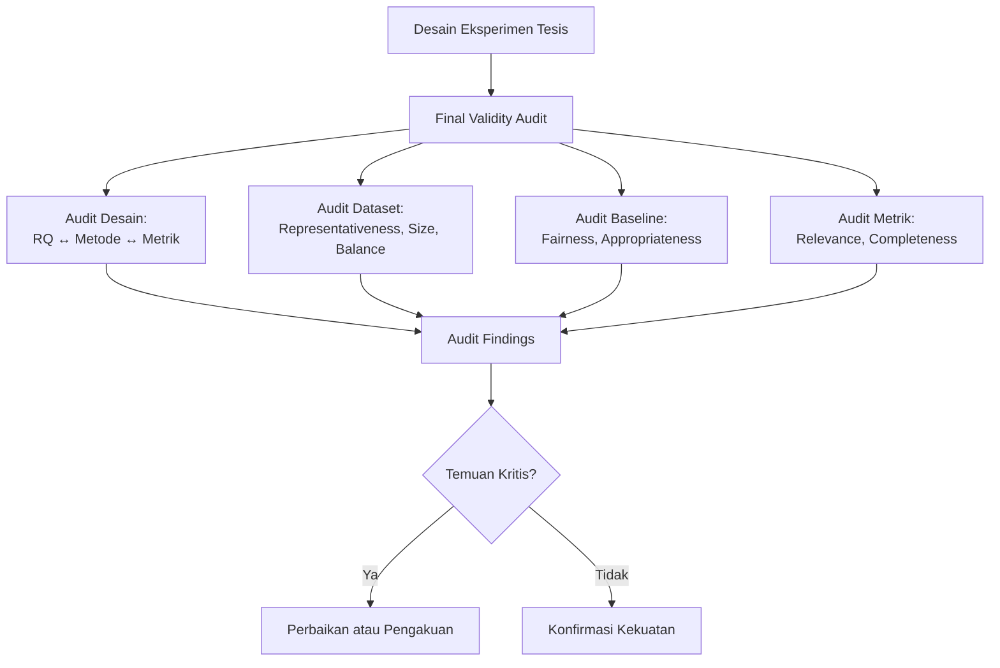

## 3. Pengantar Kontekstual

Final validity audit adalah momen di mana mahasiswa berpindah dari posisi "pembela" ke posisi "kritikus" terhadap penelitiannya sendiri. Ini bukan mudah secara psikologis — ada tendensi kuat untuk mempertahankan keputusan yang sudah dibuat dan meminimalkan kelemahan. Namun, kemampuan melakukan self-critique yang jujur adalah tanda peneliti yang matang.

Seorang penguji tesis yang berpengalaman akan mencari kelemahan metodologi ini dalam sidang. Lebih baik mahasiswa menemukannya sendiri lebih dulu, mengakuinya secara proaktif, dan memiliki jawaban yang disiapkan — daripada diekspos oleh penguji tanpa persiapan.

## 4. Landasan Teori

### 4.1 Checklist Final Validity Audit

**Audit Desain Eksperimen:**
- [ ] Setiap Research Question terpetakan ke minimal satu metrik pengukuran yang valid
- [ ] Desain eksperimen (controlled/case study/simulation) sesuai dengan tipe pertanyaan penelitian
- [ ] Hipotesis (jika ada) dapat difalsifikasi secara prinsip
- [ ] Acceptance criteria sudah didefinisikan sebelum melihat hasil

**Audit Dataset:**
- [ ] Dataset representatif terhadap populasi yang diklaim
- [ ] Ukuran dataset memadai (power analysis dilakukan atau dibahas)
- [ ] Distribusi kelas tidak terlalu ekstrem yang dapat menyesatkan metrik
- [ ] Tidak ada data leakage antara training dan test set
- [ ] Lisensi dan provenance terdokumentasi

**Audit Baseline:**
- [ ] Minimal ada satu trivial baseline dan satu state-of-the-art baseline
- [ ] Semua baseline dijalankan pada dataset dan kondisi yang sama
- [ ] Parameter baseline menggunakan default atau yang direkomendasikan (bukan sengaja dilemahkan)
- [ ] Jika mengutip angka dari paper lain, kondisi eksperimen diakui bisa berbeda

**Audit Metrik:**
- [ ] Metrik yang digunakan mencerminkan tujuan penelitian (bukan dipilih karena menghasilkan angka yang baik)
- [ ] Untuk klasifikasi tidak seimbang: tidak hanya menggunakan accuracy
- [ ] Dilaporkan dengan ukuran variabilitas (std, CI) jika ada pengulangan
- [ ] Uji signifikansi statistik digunakan dengan tepat

### 4.2 Kecukupan Sampel dan Power Analysis

Ukuran sampel yang cukup adalah persyaratan untuk klaim statistik yang bermakna. Power analysis a priori menentukan ukuran sampel minimum sebelum eksperimen; power analysis a posteriori (retrospektif) mengevaluasi apakah sampel yang digunakan cukup untuk mendeteksi efek yang ditemukan.

Dalam banyak tesis keamanan siber, dataset publik yang ada digunakan apa adanya — bukan dipilih berdasarkan power analysis. Dalam kasus ini, keterbatasan ini harus diakui: "Ukuran dataset ditentukan oleh ketersediaan dataset publik, bukan berdasarkan power analysis. Studi masa depan dengan dataset yang lebih besar dapat memberikan estimasi yang lebih stabil."

### 4.3 Reproducibility sebagai Dimensi Validitas

Penelitian yang tidak dapat direproduksi adalah penelitian yang validitasnya tidak dapat diverifikasi. Dalam final validity audit, reproducibility diperiksa:
- Apakah environment terdokumentasi dengan cukup untuk rebuild dari scratch?
- Apakah random seed di-set untuk semua komponen stochastic?
- Apakah dataset dapat diakses atau direplikasi oleh peneliti lain?

## 5. Model atau Arsitektur

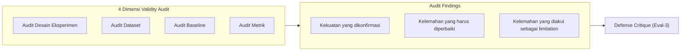

## 6. Contoh Terapan

**Audit Dataset untuk tesis malware detection:**

| Kriteria | Status | Temuan |
|---|---|---|
| Representativeness | Parsial | Dataset dari Virustotal 2022-2023; tidak merepresentasikan malware yang muncul 2024 |
| Size | Cukup | 5.000 sampel per kelas; power analysis menunjukkan cukup untuk deteksi efek sedang (d=0.5) |
| Class balance | OK | 50:50 benign:malware (by design) |
| Data leakage | OK | Split dilakukan sebelum semua preprocessing |
| Lisensi | OK | Dataset dari CC-BY repository; terdokumentasi |

**Temuan kritis:** Dataset tidak merepresentasikan malware 2024 → ini menjadi limitation utama yang diakui. Bukan kelemahan fatal — ini adalah scope limitation yang valid dan harus dikomunikasikan dengan jelas.

## 7. Praktikum atau Aktivitas Terarah

**Tujuan:** Melakukan final validity audit terhadap tesis sendiri menggunakan checklist yang disediakan, dan menyusun audit report.

**Langkah Kerja:**
1. Isi semua item checklist validity audit untuk tesis Anda — dengan jujur, bukan sekedar mencentang "OK."
2. Untuk setiap item yang tidak OK: kategorisasikan sebagai (a) dapat diperbaiki sebelum sidang, atau (b) harus diakui sebagai limitation.
3. Susun audit report singkat (1-2 halaman) yang merangkum temuan.
4. Tukarkan audit report dengan rekan mahasiswa untuk peer review — minta mereka mengidentifikasi kelemahan yang mungkin terlewat.

## 8. Latihan Pemahaman

1. **(Pilihan Ganda)** Dalam validity audit, menemukan bahwa "random seed tidak di-set" adalah masalah pada dimensi:
   - A. Dataset representativeness
   - B. Reproducibility / internal validity
   - C. Metrik selection
   - D. Baseline fairness

2. **(Analisis)** Dataset tesis menggunakan rasio 95:5 (95% benign, 5% malware). Metrik utama adalah accuracy. Identifikasi masalah validity dan solusinya.

3. **(Evaluasi)** Mahasiswa I berpendapat: "Saya tidak perlu validity audit karena pembimbing sudah menyetujui metodologi saya." Evaluasi argumen ini.

## 9. Latihan Terapan / Studi Kasus

**Studi Kasus:** Validity audit peer mengidentifikasi: (a) baseline hanya satu metode (Logistic Regression), sementara ada 3-4 SotA yang relevan; (b) metrik utama adalah accuracy meskipun dataset sangat tidak seimbang; (c) tidak ada uji signifikansi statistik. Susun rencana perbaikan yang realistis dalam 4 minggu sebelum sidang.

## 10. Kunci Jawaban dan Pembahasan

**Soal 1:** Jawaban B. Random seed mempengaruhi reproducibility — tanpa seed yang di-set, hasil tidak dapat direplikasi secara deterministik. Ini adalah ancaman internal validity karena variabilitas yang tidak terkontrol mempengaruhi stabilitas estimasi.

**Soal 2:** Masalah: classifier naif yang selalu memprediksi "benign" akan mencapai accuracy 95% — ini adalah misleading accuracy. Solusi: ganti metrik utama dengan F1-score (atau Precision/Recall terpisah), AUC-ROC, atau Matthews Correlation Coefficient yang lebih robust untuk class imbalance.

**Soal 3:** Argumen ini keliru. Persetujuan pembimbing tidak berarti metodologi bebas dari kelemahan — pembimbing mungkin tidak mengidentifikasi semua validity threats, dan penguji (yang berbeda perspektif) mungkin melihat hal yang berbeda. Validity audit adalah self-evaluation yang melengkapi, bukan menggantikan, review pembimbing.

## 11. Ringkasan Bab

Final validity audit mencakup empat dimensi: desain eksperimen, dataset, baseline, dan metrik. Temuan dapat berupa kekuatan yang dikonfirmasi, kelemahan yang dapat diperbaiki, atau limitation yang harus diakui. Reproducibility adalah dimensi keempat yang sering terlewatkan. Peer validity audit memberikan perspektif eksternal yang berharga.

## 12. Refleksi Profesional

1. Dalam evaluasi keamanan produk (misalnya penetration testing), "independence of the evaluator" adalah prinsip penting — penguji yang tidak terlibat dalam pengembangan melihat kelemahan yang tidak terlihat oleh developer. Bagaimana prinsip ini relevan dengan peer validity audit dalam Seminar 2?

---

# BAB 7 — THREAT TO VALIDITY DAN DEFENSE CRITIQUE

## 1. Capaian Pembelajaran Bab

Setelah mempelajari bab ini, mahasiswa mampu:
- Mengidentifikasi dan mengklasifikasikan threat to validity menggunakan framework Wohlin
- Menyusun defense critique — analisis kritis terhadap argumen tesis sendiri
- Mengantisipasi pertanyaan dan objeksi penguji berdasarkan threat analysis
- Merespons critique dengan argumentasi berbasis evidence

*Berkaitan dengan Sub-CPMK.3, Eval-3 (20%)*

## 2. Peta Konsep Bab

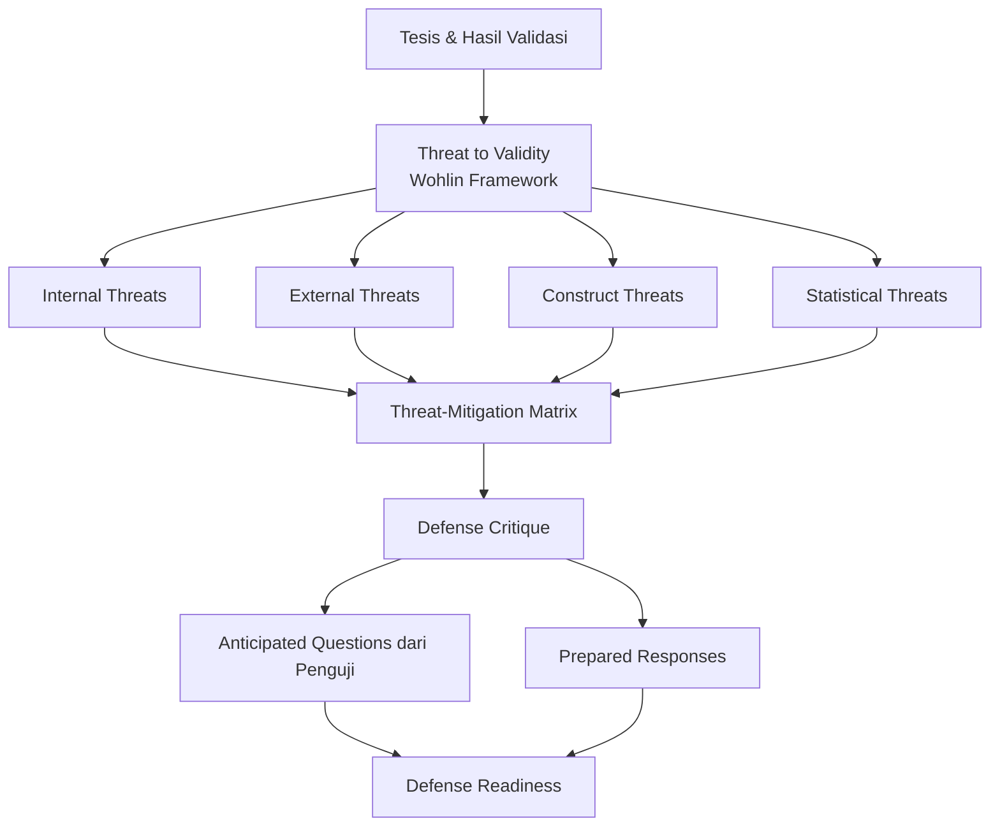

## 3. Pengantar Kontekstual

Defense critique adalah latihan di mana mahasiswa mengambil posisi "devil's advocate" terhadap tesis mereka sendiri. Mereka mengidentifikasi argumen terkuat yang bisa digunakan untuk menyerang klaim tesis — dan mempersiapkan respons yang bermakna.

Tujuannya bukan untuk memperlemah kepercayaan diri, melainkan untuk memastikan tidak ada objeksi yang datang sebagai kejutan. Penguji yang berpengalaman akan mengajukan pertanyaan berdasarkan threat to validity yang mereka identifikasi — jika mahasiswa sudah mengidentifikasinya lebih dulu, mereka dapat menjawab dengan tenang dan berbasis evidence.

## 4. Landasan Teori

### 4.1 Framework Wohlin: Empat Tipe Threat to Validity

**Internal Validity Threats** — Ancaman terhadap kesimpulan kausalitas:
- *Selection bias:* Dataset tidak representatif terhadap kasus yang diklaim
- *Data leakage:* Informasi test set bocor ke training
- *Instrumentation:* Tool atau versi berubah selama eksperimen
- *History:* Faktor eksternal mengubah kondisi eksperimen

**External Validity Threats** — Ancaman terhadap generalisasi:
- *Population representativeness:* Hasil mungkin tidak berlaku di luar konteks spesifik
- *Setting:* Lingkungan lab berbeda dari lingkungan operasional
- *Temporal:* Hasil mungkin berubah seiring waktu (drift)

**Construct Validity Threats** — Ancaman terhadap ketepatan operasionalisasi:
- *Inadequate preoperational explication:* Konsep tidak didefinisikan dengan cukup operasional
- *Mono-operation bias:* Hanya satu cara mengukur konstruk yang dimaksud
- *Mono-method bias:* Hanya satu metode pengumpulan data

**Statistical Conclusion Validity Threats** — Ancaman terhadap ketepatan kesimpulan statistik:
- *Low statistical power:* Sampel terlalu kecil
- *Violated assumptions:* Asumsi uji statistik tidak terpenuhi
- *Multiple comparisons:* Testing banyak hipotesis tanpa koreksi

### 4.2 Defense Critique Format

Defense critique adalah dokumen yang mensimulasikan "the strongest case against your thesis":

```
[Threat ID] - [Tipe Threat]
Deskripsi Objeksi: "Penelitian ini tidak dapat diklaim generalisable karena..."
Dampak jika valid: [Bagaimana ini mempengaruhi klaim utama]
Respons mahasiswa: [Argumen kontra berbasis evidence]
Mitigasi yang sudah dilakukan: [Apa yang sudah dilakukan untuk mengurangi threat]
Residual risk yang diakui: [Apa yang tetap menjadi limitation]
```

### 4.3 Mengidentifikasi Pertanyaan Penguji Berdasarkan Threat Analysis

Setelah menyusun threat-mitigation matrix, mahasiswa dapat mengantisipasi pertanyaan penguji:

| Threat | Pertanyaan Penguji yang Mungkin | Respons yang Disiapkan |
|---|---|---|
| Dataset hanya dari satu sumber | "Bagaimana Anda yakin hasilnya tidak overfit ke karakteristik dataset X?" | Tunjukkan hasil pada dataset sekunder (jika ada) atau akui sebagai limitation dengan data yang mendukung residual concern |
| Tidak ada uji signifikansi | "Apakah perbedaan F1 0.05 ini signifikan secara statistik?" | Berikan hasil uji statistik (jika sudah dilakukan) atau akui dan jelaskan mengapa effect size lebih bermakna dalam konteks ini |

## 5. Model atau Arsitektur

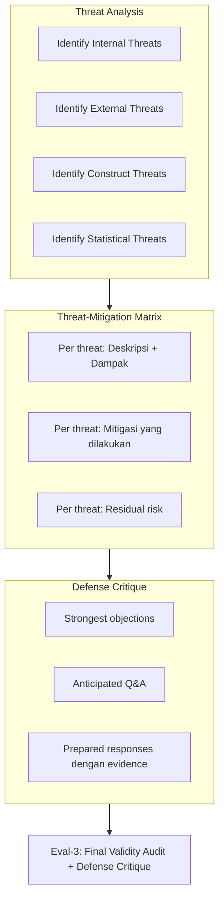

## 6. Contoh Terapan

**Defense Critique untuk tesis network anomaly detection:**

*Threat: External validity — dataset CICIDS2017 sudah berumur 7 tahun dan tidak merepresentasikan serangan modern.*

Objeksi yang mungkin dari penguji: "Dataset yang Anda gunakan dari 2017. Pola serangan APT modern seperti yang menggunakan encrypted C2 channel dan living-off-the-land tidak ada dalam dataset tersebut. Bagaimana Anda mengklaim system Anda relevan untuk ancaman hari ini?"

Respons yang disiapkan: "Poin yang sangat valid. CICIDS2017 digunakan karena merupakan benchmark standar yang memungkinkan perbandingan fair dengan penelitian sebelumnya — 23 dari 30 paper terkait menggunakan dataset yang sama, sehingga hasil kami comparable. Namun kami mengakui bahwa aplikabilitas terhadap threat landscape 2024-2025 belum divalidasi. Ini adalah keterbatasan utama yang kami dokumentasikan di Bab 5. Penelitian masa depan dengan dataset yang mencakup teknik modern seperti encrypted C2 diperlukan untuk mengonfirmasi efektivitas pendekatan ini terhadap APT terkini."

## 7. Praktikum atau Aktivitas Terarah

**Tujuan:** Menyusun defense critique dokumen dan melatih respons terhadap objeksi terkuat.

**Langkah Kerja:**
1. Identifikasi minimal 3 threat terkuat dari setiap tipe (total minimal 12).
2. Untuk 5 threat paling kritis: buat defense critique penuh (objeksi → dampak → respons → mitigasi → residual risk).
3. Latih respons secara oral dengan rekan mahasiswa yang berperan sebagai penguji kritis.
4. Dokumentasikan respons yang paling sulit — ini kemungkinan besar muncul di sidang.

## 8. Latihan Pemahaman

1. **(Pilihan Ganda)** "Model kami hanya diuji dalam environment virtual, sementara di production environment ada noise, latency, dan pola traffic yang berbeda" adalah contoh:
   - A. Internal validity threat
   - B. External validity threat (setting)
   - C. Construct validity threat
   - D. Statistical validity threat

2. **(Analisis)** Mahasiswa J menggunakan accuracy sebagai metrik utama dan mendapatkan 97% pada dataset 99% benign. Jenis threat apa yang terjadi dan bagaimana penguji akan mempertanyakannya?

3. **(Perancangan)** Untuk tesis Anda, identifikasi dua pertanyaan penguji paling menantang dan siapkan respons berbasis PREP (Point-Reason-Evidence-Point).

## 9. Latihan Terapan / Studi Kasus

**Studi Kasus:** Mahasiswa K menyajikan tesis tentang tool forensik. Penguji bertanya: "Bagaimana Anda membuktikan bahwa tool Anda tidak secara tidak sengaja memodifikasi bukti digital selama proses ekstraksi?" Mahasiswa tidak memiliki jawaban yang disiapkan. Susun respons yang tepat untuk pertanyaan ini, termasuk: acknowledgment bahwa pertanyaan valid, evidence yang ada (atau tidak ada), dan rencana tindak lanjut.

## 10. Kunci Jawaban dan Pembahasan

**Soal 1:** Jawaban B. Testing dalam virtual environment tetapi mengklaim aplikabilitas ke production environment adalah external validity threat kategori "setting" — kondisi pengujian berbeda dari kondisi aplikasi yang diklaim.

**Soal 2:** Construct validity threat — accuracy bukan metrik yang tepat untuk masalah ini (mono-operation bias dengan metrik yang salah). Penguji akan mempertanyakan: "Jika Anda selalu memprediksi benign, accuracy Anda sudah 99%. Apa yang sebenarnya diukur oleh metrik Anda?"

## 11. Ringkasan Bab

Threat to validity dianalisis dalam empat tipe (Wohlin): internal, external, construct, dan statistical. Defense critique mensimulasikan objeksi terkuat terhadap tesis untuk mempersiapkan respons berbasis evidence. Mengantisipasi pertanyaan penguji berdasarkan threat analysis adalah strategi persiapan sidang yang efektif.

## 12. Refleksi Profesional

1. Kemampuan mengkritik argumen sendiri secara objektif adalah kompetensi yang jarang dimiliki secara alami. Bagaimana Anda dapat mengembangkan "red team mindset" ini sebagai kebiasaan profesional dalam konteks keamanan siber?

---

# BAB 8 — ARGUMENTASI ILMIAH: CLAIM-REASON-EVIDENCE-WARRANT

## 1. Capaian Pembelajaran Bab

Setelah mempelajari bab ini, mahasiswa mampu:
- Memahami dan menerapkan struktur argumentasi ilmiah menggunakan model Toulmin
- Menyusun argumen yang koheren: claim → reason → evidence → warrant
- Mengidentifikasi argumen yang lemah karena klaim tidak didukung warrant yang valid
- Menggunakan boundary conditions dan rebuttals untuk memperkuat argumen

*Berkaitan dengan Sub-CPMK.4, Eval-4 (20%)*

## 2. Peta Konsep Bab

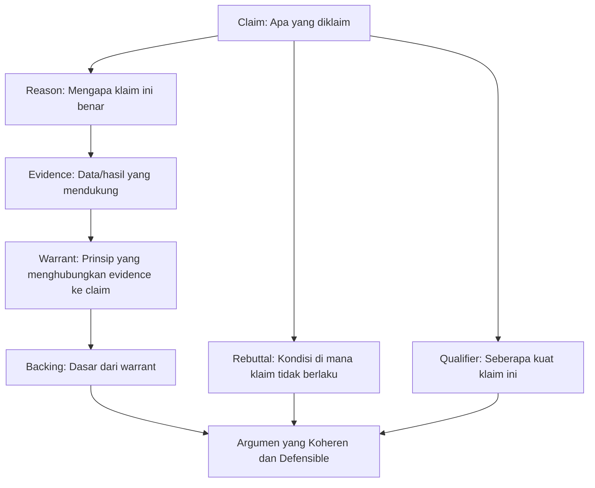

## 3. Pengantar Kontekstual

Argumentasi ilmiah bukan hanya tentang "punya data yang bagus." Seorang peneliti dengan data excellent tetapi argumentasi lemah akan kalah dalam sidang dibanding peneliti dengan data sedang tetapi argumentasi yang koheren dan jujur tentang batasannya.

Model argumentasi Toulmin (diadaptasi dalam Booth et al., 2016) memberikan struktur yang eksplisit untuk membangun argumen yang tidak dapat dengan mudah dibantah. Setiap argumen harus memiliki: klaim (apa yang Anda katakan), alasan (mengapa itu benar), evidence (data yang mendukung), dan warrant (prinsip penghubung yang membuat evidence relevan terhadap klaim).

## 4. Landasan Teori

### 4.1 Model Argumentasi Toulmin

**Claim:** Pernyataan yang ingin Anda buktikan.
*Contoh: "Sistem kami lebih efektif mendeteksi ransomware dari SotA."*

**Reason:** Mengapa klaim ini benar (tanpa evidence numerik).
*Contoh: "Karena sistem kami menangkap pola perilaku temporal yang tidak ditangkap pendekatan berbasis fitur statistik."*

**Evidence:** Data konkret yang mendukung reason.
*Contoh: "F1=0.92 (ours) vs F1=0.85 (SotA baseline) pada CIC Ransomware 2022; Wilcoxon p=0.008."*

**Warrant:** Prinsip atau asumsi yang membuat evidence relevan terhadap claim.
*Contoh: "Pendekatan yang menangkap lebih banyak pola perilaku relevan akan menghasilkan deteksi yang lebih baik pada ancaman yang mengeksploitasi pola tersebut."*

**Backing:** Dasar dari warrant (teori, studi sebelumnya).
*Contoh: "Didukung oleh teori behavioral analysis dan studi [Smith 2021, Jones 2022] yang menunjukkan temporal pattern sebagai fitur diskriminatif."*

**Qualifier:** Seberapa kuat klaim ini.
*Contoh: "Dalam konteks ransomware berbasis enkripsi file pada Windows, sebagaimana direpresentasikan dalam CIC Ransomware 2022."*

**Rebuttal:** Kondisi di mana klaim tidak berlaku.
*Contoh: "Kecuali untuk varian fileless ransomware yang tidak meninggalkan pola enkripsi file sistematis."*

### 4.2 Argumen yang Lemah: Identifikasi dan Perbaikan

**Tipe argumen lemah dan cara memperbaikinya:**

| Tipe Kelemahan | Contoh | Perbaikan |
|---|---|---|
| Klaim tanpa evidence | "Sistem kami lebih baik." | Tambahkan angka spesifik dan baseline |
| Evidence tanpa warrant | "F1=0.92." (tanpa konteks) | Jelaskan mengapa 0.92 bermakna: dibanding apa, dalam kondisi apa |
| Warrant tanpa backing | "Pendekatan kami lebih baik karena lebih modern." | "Modernitas" bukan backing — ganti dengan prinsip teknis yang jelas |
| Klaim tanpa qualifier | "Sistem kami mendeteksi semua malware." | Tambahkan scope: "dalam dataset X" atau "untuk varian Y" |

### 4.3 Menangani Objeksi dengan Rebuttal

Rebuttal bukan kelemahan — ia adalah demonstrasi bahwa peneliti memahami batas klaimnya. Penguji lebih menghargai peneliti yang dapat dengan tenang mengatakan "Klaim ini tidak berlaku untuk kondisi X karena Y" daripada peneliti yang mencoba mempertahankan klaim secara universal padahal tidak dapat.

Format rebuttal: "Klaim ini berlaku kecuali jika [kondisi X], karena dalam kondisi tersebut [mekanisme Y] tidak lagi berlaku."

## 5. Model atau Arsitektur

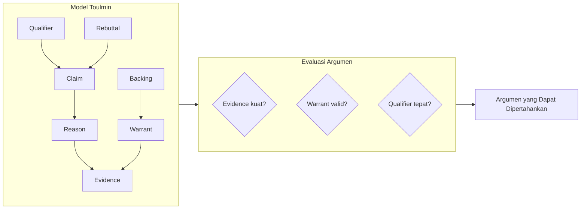

## 6. Contoh Terapan

**Argumen Toulmin untuk klaim tesis forensik digital:**

*Claim:* "Prosedur forensik yang dikembangkan menghasilkan ekstraksi artefak yang lebih lengkap dari metode konvensional."

*Reason:* "Karena prosedur kami mencakup lapisan parsing tambahan untuk container image yang tidak ditangani tool konvensional."

*Evidence:* "Completeness rate = 94% (kami) vs 78% (Autopsy) pada 50 kasus simulasi forensik container environment."

*Warrant:* "Prosedur yang mencakup lebih banyak lapisan artifact akan menghasilkan completeness yang lebih tinggi pada lingkungan yang mencakup layer tersebut."

*Qualifier:* "Dalam lingkungan forensik yang mencakup container runtime (Docker/Podman), sebagaimana direpresentasikan dalam 50 kasus simulasi."

*Rebuttal:* "Kecuali dalam kasus di mana container telah dihapus dan layer image tidak tersimpan — dalam kondisi ini tool konvensional dan prosedur kami memiliki completeness yang sama (0%)."

## 7. Praktikum atau Aktivitas Terarah

**Tujuan:** Menyusun argumen Toulmin lengkap untuk tiga klaim kontribusi utama tesis.

**Langkah Kerja:**
1. Pilih tiga klaim kontribusi dari contribution map.
2. Untuk setiap klaim, isi tabel Toulmin: claim, reason, evidence, warrant, backing, qualifier, rebuttal.
3. Evaluasi: apakah setiap komponen ada dan kuat? Komponen mana yang paling lemah?
4. Revisi argumen yang lemah atau identifikasi sebagai limitation.

## 8. Latihan Pemahaman

1. **(Pilihan Ganda)** "Warrant" dalam model Toulmin berfungsi sebagai:
   - A. Data yang mendukung klaim
   - B. Prinsip yang menghubungkan evidence ke klaim
   - C. Kondisi di mana klaim tidak berlaku
   - D. Pernyataan seberapa kuat klaim

2. **(Analisis)** Argumen: "Framework kami bagus karena menggunakan teknologi terbaru." Identifikasi komponen yang lemah dan perbaiki.

3. **(Perancangan)** Susun argumen Toulmin lengkap untuk klaim: "Sistem monitoring jaringan yang dikembangkan mengurangi false positive rate dari SOC sebesar 40%."

## 9. Latihan Terapan / Studi Kasus

**Studi Kasus:** Penguji mempertanyakan: "Anda mengklaim sistem Anda 'lebih akurat,' tetapi akurat pada kondisi apa? Dataset Anda tidak merepresentasikan traffic dari jaringan industri yang sebenarnya." Gunakan model Toulmin untuk menyusun respons yang koheren — termasuk mengakui rebuttal yang valid dan mempertahankan klaim dengan qualifier yang tepat.

## 10. Kunci Jawaban dan Pembahasan

**Soal 1:** Jawaban B. Warrant adalah "prinsip penghubung" — ia menjelaskan mengapa evidence (data) relevan terhadap claim (klaim). Tanpa warrant, audiens tidak tahu mengapa angka yang disajikan membuktikan klaim yang dibuat.

**Soal 2:** Kelemahan: "menggunakan teknologi terbaru" bukan reason yang mengandung prinsip teknis — ini adalah appeal to novelty tanpa justifikasi. "Terbaru" tidak otomatis "lebih baik." Perbaikan: ganti reason dengan "karena [fitur teknis spesifik dari teknologi terbaru] yang mengatasi keterbatasan pendekatan sebelumnya yaitu [keterbatasan spesifik]."

## 11. Ringkasan Bab

Model Toulmin menyediakan struktur argumentasi: Claim → Reason → Evidence → Warrant → Backing, dengan Qualifier dan Rebuttal sebagai komponen yang memperkuat kejujuran klaim. Argumen lemah terjadi ketika salah satu komponen tidak ada atau tidak valid. Rebuttal yang eksplisit menunjukkan pemahaman tentang batas klaim — bukan kelemahan.

## 12. Refleksi Profesional

1. Kemampuan menyusun argumen yang dapat dipertahankan di depan panel teknis dan non-teknis adalah kompetensi yang sama yang diperlukan saat mempresentasikan analisis risiko keamanan kepada board of directors. Bagaimana prinsip Toulmin dapat membantu dalam situasi tersebut?

---

# BAB 9 — MOCK DEFENSE: PERSIAPAN DAN PELAKSANAAN

## 1. Capaian Pembelajaran Bab

Setelah mempelajari bab ini, mahasiswa mampu:
- Merancang dan mempersiapkan mock defense yang efektif
- Melaksanakan presentasi pra-sidang dengan standar akademik yang tinggi
- Mengelola dinamika tanya jawab dengan panel penguji
- Mengevaluasi performa presentasi sendiri secara konstruktif

*Berkaitan dengan Sub-CPMK.4, Eval-4 (20%)*

## 2. Peta Konsep Bab

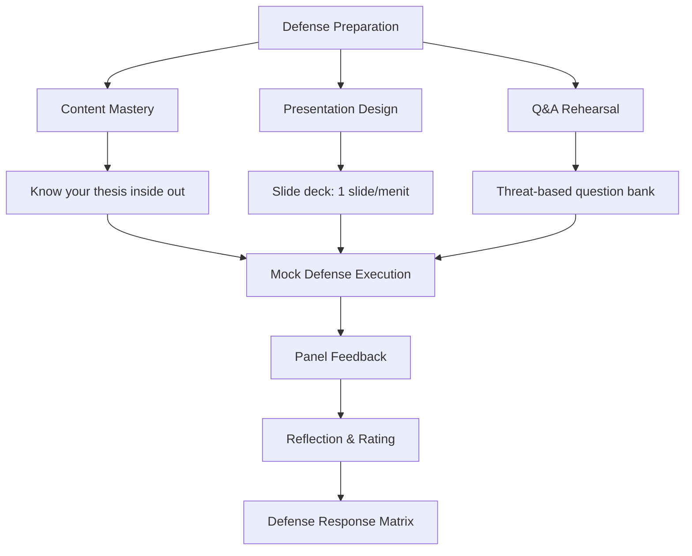

## 3. Pengantar Kontekstual

Mock defense bukan simulasi yang lebih mudah dari sidang sesungguhnya — ia harus dirancang untuk menjadi lebih menantang. Jika mock defense terlalu nyaman, mahasiswa tidak akan menemukan kelemahan yang sebenarnya ada. Panel mock defense yang ideal adalah dosen atau rekan yang tidak terlibat langsung dalam penelitian — perspektif segar mereka akan mengidentifikasi gap yang tidak terlihat oleh peneliti sendiri.

Di Seminar Penelitian Interdisipliner 2, mock defense adalah deliverable formal (Eval-4) yang dinilai berdasarkan kualitas argumentasi, kemampuan merespons kritik, dan kualitas defense response matrix yang dihasilkan.

## 4. Landasan Teori

### 4.1 Struktur Mock Defense Seminar 2

| Segmen | Durasi | Konten |
|---|---|---|
| Presentasi | 15-20 menit | Narasi penelitian: masalah → pendekatan → hasil → kontribusi |
| Demo artefak | 5-10 menit | Demo live atau recording jika live berisiko |
| Tanya jawab | 30-45 menit | Panel mengajukan pertanyaan kritis |
| Feedback dan diskusi | 10-15 menit | Panel memberikan feedback terstruktur |
| Refleksi mahasiswa | 5 menit | Mahasiswa merespons feedback secara spontan |

### 4.2 Tipologi Pertanyaan Panel

Pertanyaan panel dapat dikategorikan ke dalam beberapa tipe — masing-masing memerlukan strategi respons yang berbeda:

**Pertanyaan Klarifikasi:** "Apa yang Anda maksud dengan [term]?" → Jawab langsung, tambah contoh jika perlu.

**Pertanyaan Evidence:** "Bagaimana Anda membuktikan klaim ini?" → Rujuk ke evidence spesifik: angka, metrik, tabel.

**Pertanyaan Scope:** "Apakah ini berlaku untuk kasus X?" → Jawab dengan qualifier dan rebuttal yang sudah disiapkan.

**Pertanyaan Metodologi:** "Mengapa Anda memilih metode Y bukan Z?" → Jawab dengan justifikasi keputusan berbasis trade-off.

**Pertanyaan Implikasi:** "Apa yang akan terjadi jika asumsi X tidak terpenuhi?" → Analisis skenario; akui uncertainty jika ada.

**Pertanyaan Out-of-scope:** "Mengapa Anda tidak mencakup [aspek yang tidak diteliti]?" → Jelaskan keputusan scope dengan alasan metodologis.

### 4.3 Protokol Menjawab Pertanyaan (CLARA)

**C — Clarify:** Pastikan Anda memahami pertanyaan. "Boleh saya konfirmasi, apakah yang Anda maksudkan adalah [X] atau [Y]?"

**L — Listen:** Dengarkan pertanyaan sepenuhnya sebelum menjawab. Jangan menginterupsi.

**A — Acknowledge:** Akui relevansi pertanyaan tanpa menjanjikan jawaban yang mungkin tidak Anda miliki. "Pertanyaan yang relevan dengan [aspek] penelitian kami."

**R — Respond:** Jawab menggunakan struktur PREP atau Toulmin.

**A — Ask back (jika perlu):** "Apakah jawaban tersebut menjawab pertanyaan Anda, atau ada aspek tertentu yang ingin Anda eksplorasi lebih lanjut?"

## 5. Model atau Arsitektur

```mermaid
flowchart LR
    subgraph PREP["Persiapan Mock Defense"]
        P1[Question Bank dari Threat Analysis]
        P2[Defense Deck Finalized]
        P3[Backup Slides Siap]
        P4[Demo Contingency Plan]
        P5[Solo Rehearsal 3x]
    end

    subgraph EXECUTION["Pelaksanaan"]
        E1[Presentasi\n15-20 menit]
        E2[Demo Artefak\n5-10 menit]
        E3[Q&A Panel\n30-45 menit]
        E4[Panel Feedback\n10-15 menit]
    end

    subgraph POST["Post-Mock Defense"]
        POST1[Rating diri sendiri\nper dimensi]
        POST2[Dokumentasi semua pertanyaan]
        POST3[Susun Defense Response Matrix]
    end

    PREP --> EXECUTION --> POST
    POST --> EVAL4["Eval-4 Deliverable"]
```

## 6. Contoh Terapan

**Skenario pertanyaan dan respons dalam mock defense:**

*Pertanyaan panel:* "Dataset Anda berisi 5.000 sampel malware dari VirusTotal. Namun VirusTotal adalah aggregator — sample yang ada di sana sudah detected oleh setidaknya satu AV. Ini berarti Anda tidak testing pada true zero-day. Bagaimana Anda merespons hal ini?"

*Respons mahasiswa (menggunakan PREP + Toulmin):*
"Pertanyaan yang tepat menyentuh external validity penelitian kami [Acknowledge]. Benar bahwa dataset VirusTotal merepresentasikan malware yang sudah diketahui, bukan true zero-day [L — confirmed understanding]. Kami menyadari keterbatasan ini dan mendokumentasikannya di Bab 5.3 sebagai external validity threat kategori 'selection bias' [R — response]. Justifikasi metodologis kami adalah bahwa penelitian ini berfokus pada efektivitas deteksi behavioral pattern, bukan kemampuan zero-day detection — dan untuk tujuan tersebut, dataset dengan ground truth yang terverifikasi lebih tepat dari dataset zero-day yang memiliki ground truth yang ambigu [reason]. Evaluasi zero-day capability memerlukan setup yang berbeda — misalnya menggunakan sandbox terisolasi dan sampel yang belum pernah dianalisis — dan ini adalah arah penelitian yang kami rekomendasikan sebagai future work [rebuttal + qualifier]."

## 7. Praktikum atau Aktivitas Terarah

**Tujuan:** Melaksanakan mock defense formal dalam setting Seminar 2.

**Format:** Presentasi 20 menit + Q&A 30 menit + feedback 15 menit. Panel minimum: dua dosen atau reviewer + dua rekan mahasiswa.

**Evaluasi:** Panel mengisi rubrik penilaian mock defense. Mahasiswa mengisi self-rating sheet. Semua pertanyaan dan jawaban direkam (audio/video atau notulensi).

**Output wajib:** Defense Response Matrix yang diisi dalam 48 jam setelah mock defense.

## 8. Latihan Pemahaman

1. **(Pilihan Ganda)** Dalam protokol CLARA, "A — Acknowledge" berarti:
   - A. Mengakui bahwa pertanyaan tidak dapat dijawab
   - B. Mengakui relevansi pertanyaan sebelum menjawab
   - C. Mengajukan pertanyaan balik kepada penguji
   - D. Menyetujui semua klaim penguji

2. **(Analisis)** Penguji bertanya panjang dan berisi dua pertanyaan berbeda. Apa langkah pertama menggunakan protokol CLARA?

3. **(Evaluasi)** Mock defense mahasiswa L berjalan dalam 45 menit (10 menit presentasi, 35 menit Q&A). Mahasiswa menjawab 7 dari 10 pertanyaan dengan baik. Apakah mock defense ini berhasil? Apa yang perlu diperbaiki?

## 9. Latihan Terapan / Studi Kasus

**Studi Kasus:** Dalam mock defense, penguji mengajukan pertanyaan yang bersifat hostile: "Penelitian ini tidak memberikan kontribusi apapun yang tidak sudah ada dalam paper [X] dari 2022." Bagaimana mahasiswa merespons situasi ini secara profesional? Susun respons menggunakan Toulmin dan PREP.

## 10. Kunci Jawaban dan Pembahasan

**Soal 1:** Jawaban B. Acknowledge bukan berarti menyetujui klaim dalam pertanyaan — ia berarti mengakui bahwa pertanyaan tersebut relevan dan valid untuk diajukan. Ini adalah teknik yang menstabilkan dinamika diskusi dan menunjukkan bahwa mahasiswa tidak defensif.

**Soal 2:** Langkah pertama: Clarify (C) — minta penguji untuk klarifikasi mana pertanyaan yang harus dijawab pertama, atau nyatakan "Izin saya menjawab keduanya secara terpisah — pertama tentang [A], kemudian [B]." Menjawab dua pertanyaan sekaligus sering menghasilkan jawaban yang tidak fokus.

## 11. Ringkasan Bab

Mock defense yang efektif memerlukan persiapan menyeluruh: question bank berbasis threat analysis, defense deck yang terstruktur, dan rehearsal berulang. Protokol CLARA (Clarify, Listen, Acknowledge, Respond, Ask back) membantu mengelola dinamika Q&A. Output wajib mock defense adalah Defense Response Matrix.

## 12. Refleksi Profesional

1. Kemampuan menghadapi kritik teknis dengan tenang dan berbasis evidence adalah kompetensi inti dalam peer review akademik, dalam diskusi teknis dengan tim keamanan, dan dalam presentasi temuan insiden kepada manajemen. Bagaimana pengalaman mock defense melatih kompetensi ini?

---

# BAB 10 — DEFENSE RESPONSE MATRIX DAN PRIORITASI REVISI

## 1. Capaian Pembelajaran Bab

Setelah mempelajari bab ini, mahasiswa mampu:
- Menyusun defense response matrix yang komprehensif dari feedback mock defense
- Mengkategorisasi dan memprioritasi revisi berdasarkan dampak terhadap klaim tesis
- Merencanakan revisi yang realistis dalam timeline yang tersedia
- Menggunakan feedback sebagai alat penguatan tesis, bukan ancaman

*Berkaitan dengan Sub-CPMK.4, Eval-4 (20%)*

## 2. Peta Konsep Bab

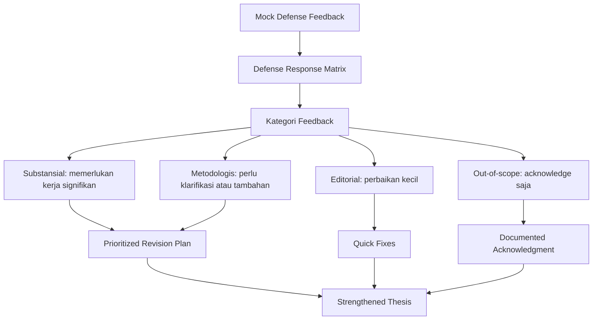

## 3. Pengantar Kontekstual

Defense response matrix bukan sekadar notulensi pertanyaan dan jawaban. Ia adalah dokumen perencanaan strategis yang mengubah feedback menjadi tindakan konkret. Kualitas matrix ini mencerminkan seberapa serius mahasiswa menanggapi kritik dan seberapa efisien mereka menggunakannya untuk memperkuat tesis.

Seorang reviewer jurnal yang baik mengharapkan response matrix yang menunjukkan bahwa setiap komentar sudah dipertimbangkan — bukan hanya yang "mudah" — dan bahwa keputusan untuk menerima atau menolak saran disertai justifikasi. Standar yang sama berlaku untuk defense response matrix.

## 4. Landasan Teori

### 4.1 Struktur Defense Response Matrix

| Kode | Sumber | Pertanyaan/Kritik | Tipe | Respons Saat Mock Defense | Tindakan | Deadline | Status |
|---|---|---|---|---|---|---|---|
| Q-01 | Reviewer A | "Baseline tidak cukup — hanya satu" | Substansial | "Kami mengakui ini sebagai limitation..." | Tambah ablation study + satu SotA tambahan | 2 minggu | In progress |
| Q-02 | Reviewer B | "Definisi 'anomali' ambigu" | Metodologis | "Kami menggunakan definisi dari [X]" | Tambahkan definisi operasional eksplisit di Bab 3 | 3 hari | Done |
| Q-03 | Reviewer A | "Gambar 4.2 kurang jelas" | Editorial | — | Perbesar font dan tambah keterangan | 1 hari | Done |
| Q-04 | Reviewer B | "Mengapa tidak membahas quantum computing?" | Out-of-scope | "Di luar scope penelitian ini" | Tambah satu kalimat justifikasi scope di Bab 1 | 1 hari | Planned |

### 4.2 Kategorisasi Tipe Feedback

**Substansial:** Mempertanyakan klaim utama, metodologi inti, atau kontribusi fundamental. Memerlukan kerja penelitian tambahan (eksperimen baru, analisis tambahan, revisi bab besar). Dikerjakan pertama dan paling prioritas.

**Metodologis:** Meminta klarifikasi tentang keputusan metodologis, atau menunjukkan inkonsistensi antara metode dan hasil. Biasanya dapat diatasi dengan penjelasan tambahan atau revisi minor di bab metodologi.

**Editorial:** Komentar tentang presentasi, kejelasan, format, bahasa. Mudah dan cepat diperbaiki.

**Out-of-scope:** Pertanyaan atau saran yang berada di luar batasan penelitian yang sudah ditetapkan. Tidak perlu dikerjakan — cukup dokumentasikan keputusan scope dengan justifikasi.

### 4.3 Revisi yang Tidak Diminta

Prinsip penting: jangan membuat perubahan substansial yang tidak diminta reviewer. Setiap perubahan yang tidak diminta berisiko memperkenalkan masalah baru yang tidak diprediksi. Jika mahasiswa ingin membuat perubahan berdasarkan refleksi sendiri (bukan feedback reviewer), diskusikan dulu dengan pembimbing.

## 5. Model atau Arsitektur

```mermaid
flowchart LR
    subgraph INPUT["Input"]
        I1[Recording/notulensi mock defense]
        I2[Panel feedback forms]
        I3[Self-reflection notes]
    end

    subgraph MATRIX["Defense Response Matrix"]
        M1[Kategorisasi semua feedback]
        M2[Prioritasi: Substansial → Metodologis → Editorial]
        M3[Rencana aksi per item]
        M4[Timeline dan owner]
    end

    subgraph OUTPUT["Output"]
        O1[Revision plan\n(dengan deadline)]
        O2[Updated thesis sections]
        O3[Strengthened argument dossier]
    end

    INPUT --> MATRIX --> OUTPUT
    OUTPUT --> EVAL4["Eval-4 Final Deliverable"]
```

## 6. Contoh Terapan

**Prioritasi revisi setelah mock defense tesis phishing detection:**

Feedback substansial (dikerjakan minggu 1-2):
- "Tidak ada ablation study — tidak jelas apakah fine-tuning atau model architecture yang berkontribusi" → Tambah ablation: baseline BERT vs fine-tuned BERT vs fine-tuned SecBERT

Feedback metodologis (dikerjakan minggu 2):
- "Tidak ada penjelasan mengapa menggunakan 80/20 split bukan k-fold" → Tambah justifikasi di Bab 3: "80/20 split dipilih karena konsistensi dengan [3 paper yang dijadikan baseline] yang menggunakan split yang sama"

Feedback editorial (dikerjakan dalam 2 hari):
- "Tabel 4.3 tidak ada keterangan kolom lengkap" → Quick fix

## 7. Praktikum atau Aktivitas Terarah

**Tujuan:** Menyusun defense response matrix lengkap dalam 48 jam setelah mock defense.

**Langkah Kerja:**
1. Kompilasi semua pertanyaan dan feedback dari mock defense — jangan ada yang terlewat.
2. Kategorisasikan setiap item (substansial/metodologis/editorial/out-of-scope).
3. Untuk setiap item substansial dan metodologis: tentukan tindakan konkret dan deadline.
4. Dapatkan sign-off dari pembimbing untuk revisi substansial sebelum dikerjakan.

## 8. Latihan Pemahaman

1. **(Analisis)** Defense response matrix mahasiswa M berisi 25 item, semuanya dikategorikan sebagai "minor" atau "editorial." Apa yang mungkin salah?

2. **(Evaluasi)** Reviewer menyarankan untuk "menambahkan bab baru tentang quantum cryptography." Bagaimana mahasiswa seharusnya merespons dalam matrix?

3. **(Perancangan)** Buat template defense response matrix untuk 10 item feedback dari mock defense fiktif yang mencakup semua empat kategori.

## 9. Latihan Terapan / Studi Kasus

**Studi Kasus:** Mock defense menghasilkan 20 pertanyaan, termasuk 3 yang sangat substansial: (a) "klaim generalisasi terlalu luas"; (b) "tidak ada uji statistik"; (c) "baseline tidak fair." Mahasiswa memiliki waktu 4 minggu sebelum sidang. Susun: prioritas revisi, estimasi waktu setiap revisi, dan urutan pengerjaan yang optimal.

## 10. Kunci Jawaban dan Pembahasan

**Soal 1:** Kemungkinan mahasiswa M melakukan under-categorization — meminimalkan severity feedback untuk mengurangi beban revisi. Atau, mock defense-nya terlalu ringan dan panel tidak mengajukan pertanyaan kritis. Keduanya bermasalah: yang pertama adalah self-deception; yang kedua berarti mock defense tidak memberikan nilai yang sebenarnya.

**Soal 2:** Saran "bab baru tentang quantum cryptography" dikategorikan sebagai out-of-scope jika tesis tidak mengklaim quantum resistance. Dalam matrix: "Saran diakui sebagai arah penelitian masa depan yang relevan. Quantum-resistant security berada di luar scope penelitian saat ini yang berfokus pada [scope tesis]. Kami menambahkan satu kalimat di Bab 6 (Future Work) untuk mengakui ini sebagai arah penelitian lanjutan yang penting."

## 11. Ringkasan Bab

Defense response matrix mengorganisir semua feedback ke dalam empat kategori dan menghasilkan revision plan yang diprioritasi. Feedback substansial dikerjakan pertama. Perubahan yang tidak diminta reviewer harus dikonsultasikan dengan pembimbing. Matrix yang lengkap dan jujur adalah bukti bahwa mahasiswa merespons kritik secara serius dan sistematis.

## 12. Refleksi Profesional

1. Response to reviewer dalam proses peer review jurnal memiliki standar yang sama: setiap komentar reviewer harus direspons, bukan sekadar yang "mudah." Bagaimana pengalaman menyusun defense response matrix mempersiapkan Anda untuk proses peer review di masa depan?


---

# BAB 11 — DISEMINASI AKADEMIK: SLIDE DEFENSE DAN EXECUTIVE BRIEF

## 1. Capaian Pembelajaran Bab

Setelah mempelajari bab ini, mahasiswa mampu:
- Merancang slide defense yang efektif untuk audiens panel penguji
- Menyusun executive brief (ringkasan satu halaman) yang mengomunikasikan esensi tesis
- Menyesuaikan komunikasi dengan audiens teknis dan non-teknis
- Menggunakan visualisasi data yang tepat untuk mendukung klaim

*Berkaitan dengan Sub-CPMK.5, Eval-5 (20%)*

## 2. Peta Konsep Bab

```mermaid
flowchart TD
    A[Hasil Tesis] --> B[Diseminasi Akademik]
    B --> C[Slide Defense\nuntuk Panel Penguji]
    B --> D[Executive Brief\nsatu halaman]
    B --> E[Extended Abstract\nuntuk publikasi]

    C --> C1[Struktur naratif yang koheren]
    C --> C2[Visualisasi data yang tepat]
    C --> C3[Backup slides untuk Q&A]

    D --> D1[Bahasa yang accessible]
    D --> D2[Konteks bisnis/kebijakan]
    D --> D3[Implikasi praktis]
```

## 3. Pengantar Kontekstual

Penelitian yang tidak dapat dikomunikasikan secara efektif hanya memberikan setengah nilainya. Slide defense bukan sekadar "memindahkan teks dari bab ke PowerPoint" — ia adalah narasi visual yang membawa penguji dalam perjalanan logis dari masalah ke solusi ke evidence ke implikasi.

Sementara itu, executive brief adalah alat komunikasi untuk pemangku kepentingan non-akademik: CISO, kepala tim SOC, pimpinan organisasi — orang-orang yang tidak akan membaca 100 halaman tesis tetapi perlu memahami relevansi dan nilai penelitian tersebut.

## 4. Landasan Teori

### 4.1 Struktur Slide Defense

Slide defense yang efektif mengikuti struktur naratif, bukan struktur bab tesis:

| Slide | Konten | Durasi |
|---|---|---|
| 1 | Judul + nama + pembimbing | 1 menit |
| 2-3 | Konteks dan masalah ("Mengapa penting?") | 2 menit |
| 4-5 | Research questions dan pendekatan | 2 menit |
| 6-8 | Metodologi — gambaran umum | 3 menit |
| 9-12 | Hasil dan analisis utama | 5 menit |
| 13-14 | Kontribusi dan noveltiy | 2 menit |
| 15 | Limitation dan future work | 1 menit |
| 16 | Kesimpulan | 1 menit |
| Backup | Q&A support slides | — |

Total: 16 slide utama + backup, ±17-20 menit.

### 4.2 Prinsip Visualisasi Data

**Satu pesan per slide:** Setiap slide harus dapat diringkas dalam satu kalimat. Jika tidak bisa, slide tersebut terlalu padat.

**Hierarchy visual:** Penguji melihat bagian yang paling kontras pertama kali. Pastikan elemen terpenting menonjol secara visual.

**Beri konteks pada angka:** "F1=0.92" tidak bermakna tanpa konteks. "F1=0.92 (ours) vs F1=0.85 (best baseline)" bermakna. "F1=0.92 (ours) vs F1=0.85 (best baseline, p<0.05)" lebih bermakna.

**Hindari chart junk:** Gradien 3D, efek shadow, terlalu banyak warna, gridlines yang tidak perlu — semua ini mengalihkan perhatian dari data.

### 4.3 Backup Slides

Backup slides adalah slide yang disiapkan untuk Q&A tetapi tidak ditampilkan dalam presentasi utama. Minimal perlu disiapkan:
- Detail metodologi yang mungkin ditanyakan
- Tabel perbandingan baseline yang lengkap
- Dataset statistics
- Definisi teknis yang mungkin diminta
- Contoh output artefak
- Detail uji statistik

### 4.4 Struktur Executive Brief (Satu Halaman)

```
[Judul yang informatif]
[Masalah: 2-3 kalimat — masalah praktis yang diselesaikan]
[Pendekatan: 2-3 kalimat — bagaimana masalah diselesaikan]  
[Temuan utama: 3-5 bullet — hasil yang paling signifikan]
[Implikasi praktis: 2-3 kalimat — apa artinya bagi praktisi]
[Keterbatasan utama: 1-2 kalimat — batasan penting untuk diketahui]
[Kontak: nama, institusi, email]
```

Executive brief ditulis dalam bahasa yang minimal menggunakan jargon teknis — maksimal 500 kata, sering lebih pendek.

## 5. Model atau Arsitektur

```mermaid
flowchart LR
    subgraph AUDIENCE["Target Audiens"]
        A1[Panel Penguji\nTeknis + Metodologis]
        A2[Pemangku Kepentingan\nManajemen/Kebijakan]
        A3[Peneliti Lain\nAkademik]
    end

    subgraph FORMAT["Format Komunikasi"]
        F1[Slide Defense\n+ Backup Slides]
        F2[Executive Brief\n1 halaman]
        F3[Extended Abstract\n250-500 kata]
    end

    A1 --> F1
    A2 --> F2
    A3 --> F3

    F1 & F2 & F3 --> IMPACT["Dampak dan Visibilitas Penelitian"]
```

## 6. Contoh Terapan

**Executive brief untuk tesis cloud forensics:**

> **Prosedur Forensik Terstandardisasi untuk Lingkungan Kubernetes: Menjaga Integritas Bukti dalam Container Ephemeral**
>
> Investigasi insiden siber di lingkungan cloud-native menghadapi tantangan mendasar: container bersifat ephemeral dan dapat dihapus sebelum investigasi dimulai. Prosedur forensik tradisional tidak dirancang untuk lingkungan ini, mengakibatkan potensi kehilangan bukti yang signifikan.
>
> Penelitian ini mengembangkan dan memvalidasi prosedur forensik Kubernetes (KFP) yang mengintegrasikan live acquisition, log preservation, dan cryptographic chaining untuk memastikan integritas bukti. Prosedur divalidasi pada 50 skenario insiden simulasi menggunakan cluster Kubernetes di lingkungan lab yang terkontrol.
>
> **Temuan utama:** KFP mencapai completeness rate 94% dibanding 78% prosedur konvensional pada lingkungan container; acquisition time rata-rata 12 menit per node; chain of custody terjaga untuk 100% artefak yang berhasil diakuisisi.
>
> **Implikasi:** Tim SOC dan responder insiden yang beroperasi di lingkungan container dapat mengadopsi KFP untuk mengurangi risiko kehilangan bukti. Prosedur bersifat tool-agnostic dan telah divalidasi pada Kubernetes versi 1.26-1.29.
>
> **Keterbatasan:** Validasi hanya pada lingkungan lab; efektivitas pada production cluster dengan load tinggi memerlukan validasi lanjutan.

## 7. Praktikum atau Aktivitas Terarah

**Tujuan:** Menyusun slide defense final dan executive brief untuk tesis.

**Slide Defense:** Buat deck 16 slide utama + minimal 5 backup slides. Review dengan rekan mahasiswa menggunakan checklist: apakah setiap slide dapat diringkas dalam satu kalimat? Apakah angka selalu dibandingkan dengan baseline? Apakah backup slides mencakup kemungkinan pertanyaan utama?

**Executive Brief:** Tulis dalam 30 menit tanpa membuka catatan — ini akan mengungkap seberapa dalam Anda memahami tesis Anda sendiri. Minta seseorang dari luar bidang Anda membaca dan menunjukkan bagian yang tidak mereka mengerti.

## 8. Latihan Pemahaman

1. **(Evaluasi)** Slide 9 berisi tabel dengan 8 kolom dan 15 baris. Identifikasi masalah dan solusinya.

2. **(Analisis)** Seorang mahasiswa menuliskan di slide: "Hasil: F1=0.92." Apa yang kurang?

3. **(Perancangan)** Buat outline (judul per slide) untuk deck 16 slide tesis di bidang network anomaly detection.

## 9. Latihan Terapan / Studi Kasus

**Studi Kasus:** Anda diminta mempresentasikan hasil tesis Anda dalam 5 menit kepada CISO organisasi yang tidak memiliki background teknis. Slide yang Anda gunakan harus berbeda dari defense deck. Rancang 5 slide yang paling penting untuk audiens ini.

## 10. Kunci Jawaban dan Pembahasan

**Soal 1:** Tabel 8x15 pada satu slide terlalu padat — tidak dapat dibaca dari jarak normal presentasi dan audiens tidak tahu harus fokus ke mana. Solusi: pilih 2-3 baris/kolom yang paling penting, atau ganti tabel dengan visualisasi yang lebih sederhana (bar chart, heat map). Jika tabel lengkap diperlukan, masukkan ke backup slide atau appendix.

**Soal 2:** Angka "F1=0.92" tidak memiliki konteks: dibanding apa? dalam kondisi apa? Dengan perbaikan: "F1=0.92 (sistem kami) vs F1=0.83 (ResNet baseline) vs F1=0.79 (LSTM baseline) — CIC-IDS2022 dataset, 5-fold CV."

## 11. Ringkasan Bab

Slide defense yang efektif mengikuti struktur naratif (masalah → pendekatan → hasil → implikasi), bukan struktur bab. Prinsip visualisasi: satu pesan per slide, konteks untuk setiap angka. Executive brief mengkomunikasikan esensi penelitian kepada audiens non-teknis dalam satu halaman. Backup slides mendukung Q&A dengan detail metodologis dan statistik.

## 12. Refleksi Profesional

1. Seorang CISO tidak perlu memahami detail algoritma ML untuk memutuskan apakah akan mengadopsi tool keamanan berbasis penelitian Anda. Bagaimana kemampuan mengkomunikasikan penelitian teknis kepada non-teknis menjadi kompetensi profesional yang kritis?

---

# BAB 12 — INTEGRASI ASPEK TEKNIS, LEGAL, ETIK, DAN PRIVASI DALAM DISEMINASI

## 1. Capaian Pembelajaran Bab

Setelah mempelajari bab ini, mahasiswa mampu:
- Mengintegrasikan pertimbangan legal, etis, dan privasi ke dalam komunikasi hasil penelitian
- Mengidentifikasi risiko disseminasi yang dapat melanggar hukum atau etika profesi
- Menyusun disclaimer dan ethical disclosure yang tepat
- Memahami implikasi UU ITE, UU PDP, dan regulasi keamanan siber yang relevan dalam diseminasi

*Berkaitan dengan Sub-CPMK.5, Eval-5 (20%)*

## 2. Peta Konsep Bab

```mermaid
flowchart TD
    A[Hasil Penelitian Keamanan Siber] --> B[Risiko Diseminasi]
    B --> C[Risiko Legal:\nUU ITE, UU PDP, kontrak kerahasiaan]
    B --> D[Risiko Etis:\nexposure vulnerability, dual-use concern]
    B --> E[Risiko Privasi:\ndata personal, identitas subjek]
    B --> F[Risiko Reputasi:\nmisrepresentation, cherry-picking]

    C & D & E & F --> G[Mitigasi Diseminasi]
    G --> H[Responsible Disclosure Framework]
    G --> I[Ethical Disclosure Statements]
    G --> J[Data Anonymization sebelum publikasi]
```

## 3. Pengantar Kontekstual

Penelitian keamanan siber memiliki "dual-use dilemma" yang inheren: pengetahuan yang dikembangkan untuk pertahanan dapat digunakan untuk serangan. Ini bukan alasan untuk tidak mempublikasikan penelitian — melainkan alasan untuk mempertimbangkan secara serius *bagaimana* dan *kepada siapa* hasil penelitian dikomunikasikan.

Di Indonesia, kerangka hukum yang relevan termasuk UU ITE No. 11/2008 (diubah dengan UU No. 19/2016) dan UU Perlindungan Data Pribadi No. 27/2022. Pelanggaran tanpa sengaja pun dapat berimplikasi hukum — peneliti wajib memahami batas-batas legal diseminasi.

## 4. Landasan Teori

### 4.1 Responsible Disclosure dalam Konteks Akademik

**Vulnerability disclosure:** Jika penelitian menemukan kerentanan dalam sistem nyata, ada protokol yang mapan:

1. *Full disclosure:* Langsung publikasikan semua detail teknis. Kontroversial — memberikan waktu penyerang dan defender yang sama.
2. *Coordinated disclosure (responsible disclosure):* Informasikan vendor/pengelola terlebih dahulu, berikan waktu untuk patch (biasanya 90 hari), baru publikasikan.
3. *No disclosure:* Sembunyikan kerentanan — tidak direkomendasikan kecuali kerentanan sudah dieksploitasi atau tidak ada yang bertanggung jawab.

Standar internasional: ISO/IEC 29147 (Vulnerability Disclosure) dan ISO/IEC 30111 (Vulnerability Handling). Dalam konteks akademik di Indonesia, etika yang diterima adalah coordinated disclosure.

**Bukan kerentanan, tetapi teknik ofensif:** Penelitian yang mengembangkan atau menunjukkan teknik serangan (bahkan dalam konteks defensif) perlu pertimbangan ekstra. Pertanyaannya: apakah detail teknis yang dipublikasikan "cukup spesifik untuk membahayakan" tanpa secara bermakna menambah pemahaman defensif? Jika ya, pertimbangkan untuk mereduksi detail teknis.

### 4.2 Privasi dan UU PDP dalam Diseminasi

UU PDP No. 27/2022 mewajibkan perlindungan data pribadi yang diproses dalam penelitian. Dalam konteks diseminasi:

- **Anonymization:** Data yang digunakan dalam penelitian yang melibatkan data personal harus dianonimisasi sebelum dipublikasikan
- **Consent:** Jika penelitian mengumpulkan data dari manusia (survei, wawancara, log pengguna), harus ada informed consent yang mencakup penggunaan data dalam publikasi
- **Data minimization:** Hanya data yang diperlukan untuk reproduksi penelitian yang dipublikasikan — bukan keseluruhan dataset yang mungkin mengandung PII

### 4.3 Pernyataan Etika dalam Publikasi

Paper keamanan siber biasanya memerlukan "ethical disclosure" statement yang menyatakan:
- Apakah penelitian melibatkan data personal? Jika ya, bagaimana perlindungannya?
- Apakah penelitian melibatkan sistem yang tidak dimiliki peneliti? Jika ya, bagaimana otorisasinya?
- Apakah ada potensi dual-use yang perlu diakui?
- Apakah ada konflik kepentingan?

Contoh template:
> "Seluruh eksperimen dilakukan dalam lingkungan yang terkontrol dan berotorisasi. Tidak ada sistem pihak ketiga yang diuji tanpa izin eksplisit. Dataset yang digunakan dalam penelitian ini tidak mengandung data personal yang dapat diidentifikasi. Penelitian ini tidak mengungkap kerentanan aktif dalam sistem produksi. Tidak ada konflik kepentingan yang perlu diungkap."

### 4.4 Dual-Use Concern Assessment

Sebelum mempublikasikan hasil penelitian keamanan siber, lakukan penilaian dual-use:

| Aspek | Pertanyaan | Jika risiko tinggi |
|---|---|---|
| Teknik baru | Apakah paper menjelaskan teknik serangan baru yang belum diketahui publik? | Pertimbangkan coordinated disclosure ke komunitas keamanan dulu |
| Detail eksploitasi | Apakah PoC code atau detail teknis yang sangat spesifik dipublikasikan? | Reduksi ke level yang informatif untuk defender tanpa menjadi how-to untuk attacker |
| Kerentanan spesifik | Apakah kerentanan dalam sistem nyata yang masih belum di-patch diungkap? | Wajib responsible disclosure sebelum publikasi |
| Dataset sensitif | Apakah dataset mengandung informasi yang dapat membahayakan organisasi? | Anonymize atau buat synthetic dataset |

## 5. Model atau Arsitektur

```mermaid
flowchart TD
    A[Temuan Penelitian] --> B{Dual-Use Assessment}
    B -- "Risiko rendah" --> C[Standard publication]
    B -- "Risiko sedang" --> D[Publication dengan redaksi\ndetail teknis tertentu]
    B -- "Risiko tinggi" --> E[Coordinated disclosure\nsebelum publikasi]
    
    C & D & E --> F{Privasi Assessment}
    F -- "Tidak ada data personal" --> G[Clear for publication]
    F -- "Ada data personal" --> H[Anonymize + Ethics Statement]
    H --> G
    G --> I[Final Dissemination Package]
```

## 6. Contoh Terapan

**Kasus: Tesis mengembangkan teknik deteksi phishing berbasis analisis domain menggunakan dataset yang mengandung URL phishing aktual.**

*Risiko yang diidentifikasi:*
- Dataset mengandung URL phishing yang masih aktif → potensi membantu orang mengakses situs phishing atau mempelajari pola yang berhasil
- Beberapa URL mungkin terkait dengan kampanye yang sedang diselidiki penegak hukum

*Mitigasi:*
- Publikasikan dataset yang sudah di-sanitize: hanya pola fitur, bukan URL lengkap
- Koordinasikan dengan BSSN/NCSA jika ada URL yang masih aktif
- Tambahkan ethical disclosure statement
- Dalam paper: deskripsikan teknik ekstraksi fitur tetapi tidak teknik pembuatan phishing domain yang efektif

## 7. Praktikum atau Aktivitas Terarah

**Tujuan:** Melakukan ethical review terhadap rencana diseminasi tesis sendiri.

**Langkah Kerja:**
1. Isi checklist dual-use assessment untuk penelitian Anda.
2. Isi checklist privasi assessment.
3. Susun draft ethical disclosure statement (150-300 kata) yang akan disertakan dalam publikasi.
4. Identifikasi apakah ada aspek yang memerlukan konsultasi dengan etika penelitian institusi atau pihak hukum.

## 8. Latihan Pemahaman

1. **(Pilihan Ganda)** Koordinated disclosure (responsible disclosure) berarti:
   - A. Mempublikasikan semua detail kerentanan segera
   - B. Tidak pernah mempublikasikan informasi tentang kerentanan
   - C. Memberitahu vendor terlebih dahulu, memberikan waktu patch, baru publikasi
   - D. Hanya berbagi informasi dengan penegak hukum

2. **(Analisis)** Tesis menggunakan 10.000 log akses dari perusahaan mitra (dengan izin). Log mengandung nama pengguna dan IP internal. Identifikasi risiko privasi dan langkah mitigasi yang diperlukan sebelum publikasi.

3. **(Evaluasi)** Mahasiswa N berencana menerbitkan PoC (Proof of Concept) code untuk vulnerability yang ditemukannya dalam software open source populer yang sudah di-patch setahun lalu. Apakah ini etis? Pertimbangkan argumen pro dan kontra.

## 9. Latihan Terapan / Studi Kasus

**Studi Kasus:** Penelitian Anda menemukan bahwa suatu tool forensik komersial memiliki bug yang menyebabkan false negative pada format tertentu — potensi menggugurkan bukti digital dalam proses hukum. Vendor belum mengetahuinya. Bagaimana Anda akan mengelola disclosure ini secara etis dan legal? Pertimbangkan: siapa yang perlu diberitahu, dalam urutan apa, dengan timeline seperti apa, dan apa yang Anda publikasikan?

## 10. Kunci Jawaban dan Pembahasan

**Soal 1:** Jawaban C. Coordinated disclosure memberikan window kepada vendor untuk memperbaiki kerentanan sebelum detail teknis publik. Periode 90 hari adalah standar yang umum digunakan (diperkenalkan oleh Google Project Zero). Ini menyeimbangkan kepentingan peneliti untuk mempublikasikan dengan kepentingan pengguna untuk mendapat patch terlebih dahulu.

**Soal 2:** Risiko: nama pengguna dan IP internal adalah data personal dan data sensitif organisasi. Mitigasi: (a) hash atau pseudonymize semua nama pengguna; (b) anonymize IP ke /24 subnet atau anonimkan sepenuhnya jika tidak krusial untuk penelitian; (c) dapatkan izin eksplisit dari organisasi mitra bahwa dataset yang dianonimisasi boleh dipublikasikan; (d) tambahkan ethical disclosure statement.

## 11. Ringkasan Bab

Diseminasi penelitian keamanan siber memerlukan pertimbangan legal (UU ITE, UU PDP), etis (responsible disclosure, dual-use), dan privasi (anonymization, consent). Ethical disclosure statement wajib disertakan dalam publikasi. Coordinated disclosure adalah standar untuk kerentanan yang ditemukan dalam sistem nyata. Dual-use assessment membantu menentukan level detail yang tepat untuk dipublikasikan.

## 12. Refleksi Profesional

1. Sebagai peneliti keamanan siber yang juga seorang profesional, Anda mungkin menemukan kerentanan dalam pekerjaan sehari-hari. Bagaimana framework responsible disclosure yang Anda pelajari ini akan membimbing keputusan Anda dalam konteks profesional, bukan hanya akademik?

---

# BAB 13 — PUBLICATION/SIDANG ACTION PLAN DAN FINAL ARGUMENTATION DOSSIER

## 1. Capaian Pembelajaran Bab

Setelah mempelajari bab ini, mahasiswa mampu:
- Menyusun action plan konkret untuk publikasi ilmiah atau persiapan sidang
- Membangun final argumentation dossier yang mengkonsolidasikan semua argumen, evidence, dan respons terhadap kritik
- Memetakan jalur publikasi yang sesuai dengan kontribusi dan venue target
- Mengelola timeline finalisasi dengan realistic deadline management

*Berkaitan dengan Sub-CPMK.5, Eval-5 (20%)*

## 2. Peta Konsep Bab

```mermaid
flowchart TD
    A[Final Research State] --> B[Action Plan]
    B --> C[Sidang Action Plan:\nTimeline 4-6 minggu]
    B --> D[Publication Action Plan:\nVenue selection + timeline]

    A --> E[Final Argumentation Dossier]
    E --> E1[Consolidated Claims]
    E --> E2[Evidence Registry]
    E --> E3[Anticipated Q&A]
    E --> E4[Defense Response Matrix]

    C & D & E --> F[Readiness for Defense/Publication]
```

## 3. Pengantar Kontekstual

Peneliti yang tidak memiliki action plan tertulis sering mengalami drift — menghabiskan waktu pada aktivitas yang tidak berkontribusi langsung pada finalisasi. Action plan yang realistis, dengan milestone dan deadline yang spesifik, adalah alat manajemen diri yang kritis dalam fase akhir tesis.

Final argumentation dossier adalah "war room document" untuk sidang — satu dokumen yang mengkonsolidasikan semua argumen utama, evidence yang mendukungnya, dan respons terhadap kemungkinan kritik. Dalam sidang, mahasiswa tidak memiliki akses ke tesis penuh — tetapi dossier yang mereka ingat dengan baik adalah persiapan yang paling kuat.

## 4. Landasan Teori

### 4.1 Sidang Action Plan Template

```
SIDANG ACTION PLAN — [NAMA MAHASISWA]
Target tanggal sidang: [DD/MM/YYYY]
Tanggal pembuatan plan: [DD/MM/YYYY]

MINGGU 1 (tanggal - tanggal):
□ Selesaikan revisi dari mock defense — substansial items
□ Update thesis chapters yang terdampak revisi
□ Dapatkan sign-off pembimbing untuk revisi substansial

MINGGU 2 (tanggal - tanggal):
□ Selesaikan revisi metodologis
□ Finalisasi dan verifikasi semua tabel dan figure
□ Selesaikan editorial corrections
□ Build final argumentation dossier

MINGGU 3 (tanggal - tanggal):
□ Defense deck final (16 slide + 10 backup)
□ Rehearsal solo (minimal 3x, termasuk timing)
□ Rehearsal dengan pembimbing (1x)

MINGGU 4 (tanggal - tanggal):
□ Penyerahan draft final ke pembimbing untuk review terakhir
□ Persiapan logistik sidang
□ Final solo rehearsal dan mental preparation

BUFFER: 3-5 hari sebelum sidang tidak ada perubahan substansial.
```

### 4.2 Publication Action Plan

Setelah sidang, banyak mahasiswa yang tidak memiliki momentum untuk mempublikasikan. Action plan publikasi yang dibuat sebelum sidang memastikan research output tidak berhenti di tesis:

**Venue Selection Matrix:**

| Venue | Type | Impact | Timeline | Effort |
|---|---|---|---|---|
| Jurnal SINTA Q1/Q2 nasional | Journal | Sedang | 4-8 bulan | Revisi signifikan dari tesis |
| IEEE/ACM conference top-tier | Conference | Tinggi | 6-12 bulan | Rewriting signifikan |
| Workshop/symposium regional | Conference | Rendah | 2-4 bulan | Adaptasi terbatas |
| Jurnal internasional Q1 | Journal | Sangat tinggi | 12-24 bulan | Rewriting + eksperimen tambahan |

**Rekomendasi:** Mulai dengan venue yang realistis (bukan yang paling prestisius) untuk membangun publikasi pertama. Pengalaman review dan revisi dari satu publikasi akan sangat membantu untuk venue berikutnya.

### 4.3 Struktur Final Argumentation Dossier

Final argumentation dossier berisi:

1. **Claim Registry** — semua klaim kontribusi utama, masing-masing dengan evidence pointer
2. **Evidence Registry** — semua evidence kunci (angka, tabel, perbandingan) dengan lokasi dalam tesis
3. **Anticipated Q&A** — 20-30 pertanyaan yang kemungkinan akan ditanyakan, dengan respons terstruktur
4. **Defense Response Matrix** — semua feedback dari mock defense dan respons yang sudah disiapkan
5. **Weakness Acknowledgment** — kelemahan utama tesis yang sudah diakui, dengan framing yang tepat

Total: 10-15 halaman. Ini bukan untuk dibawa ke sidang (tidak boleh) tetapi untuk dipelajari intensif dalam seminggu sebelum sidang.

## 5. Model atau Arsitektur

```mermaid
gantt
    title Sidang Action Plan — 4 Minggu Final
    dateFormat YYYY-MM-DD
    section Revisi
    Revisi substansial     :a1, 2026-07-01, 7d
    Revisi metodologis     :a2, after a1, 5d
    Editorial corrections  :a3, after a2, 3d
    section Persiapan
    Argumentation Dossier  :b1, after a1, 7d
    Defense deck final     :b2, after a3, 3d
    Backup slides          :b3, after b2, 2d
    section Rehearsal
    Solo rehearsal x3      :c1, after b3, 5d
    Rehearsal dengan dosen :c2, after c1, 1d
    Final solo rehearsal   :c3, after c2, 3d
    section Submission
    Penyerahan draft final :d1, after a3, 1d
    Penyerahan form sidang :d2, after d1, 1d
```

## 6. Contoh Terapan

**Claim Registry (contoh untuk tesis IDS berbasis ML):**

| Klaim | Evidence Pointer | Strength |
|---|---|---|
| C1: Pendekatan kami lebih akurat dari SotA | Table 4.3 (F1 comparison); Section 5.2 (statistical test) | Strong (p=0.003, Cohen's d=0.72) |
| C2: Inferensi waktu-nyata feasible | Table 4.5 (latency measurements); Figure 4.8 (throughput) | Moderate (lab environment only) |
| C3: False positive lebih rendah 30% | Table 4.4 (FPR comparison) | Strong (deployment-validated) |

## 7. Praktikum atau Aktivitas Terarah

**Tujuan:** Menyusun final argumentation dossier dan sidang action plan.

**Langkah Kerja:**
1. Susun claim registry dengan semua klaim kontribusi dan evidence pointer.
2. Buat evidence registry — daftar semua angka dan tabel kunci yang akan direferensikan dalam sidang.
3. Buat 25 pertanyaan antisipasi berdasarkan threat analysis dan mock defense feedback.
4. Susun sidang action plan dengan timeline konkret.
5. Susun publication action plan dengan venue target dan timeline.

## 8. Latihan Pemahaman

1. **(Analisis)** Mahasiswa O menyusun argumentation dossier tetapi hanya mencantumkan kekuatan — tidak ada weakness acknowledgment. Apa risikonya?

2. **(Perancangan)** Buat venue selection matrix untuk tesis di bidang cloud security yang memiliki kontribusi metodologis sedang — cukup untuk jurnal nasional Q1 tetapi belum cukup untuk top-tier conference.

3. **(Evaluasi)** Sidang action plan mahasiswa P tidak memiliki "buffer week" sebelum sidang. Identifikasi risiko dan rekomendasikan penyesuaian.

## 9. Latihan Terapan / Studi Kasus

**Studi Kasus:** Tesis Anda selesai seminggu lebih lambat dari rencana karena eksperimen tambahan membutuhkan waktu lebih. Action plan awal rusak. Susun action plan revisi yang realistis: kurangi workload yang tidak esensial, pertahankan yang kritikal. Apa yang paling tidak bisa dikompromikan dalam 2 minggu terakhir sebelum sidang?

## 10. Kunci Jawaban dan Pembahasan

**Soal 1:** Risiko: penguji akan mengajukan pertanyaan tentang kelemahan (hal ini hampir pasti), dan mahasiswa yang tidak mempersiapkan weakness acknowledgment akan menjawab defensif atau tidak siap. Dokumen dossier yang baik mengikutsertakan kelemahan bukan untuk menunjukkan ketidakpercayaan diri, tetapi untuk mempersiapkan respons yang tepat: "Kami mengakui bahwa [kelemahan X]. Ini merupakan limitation yang kami dokumentasikan di Bab [Y], dan kami menanganinya dengan [cara Z]."

**Soal 2:** Venue selection: (a) Jurnal SINTA Q1 atau Q2 — realistis dalam 6-8 bulan dengan revisi dari tesis; (b) Workshop IEEE/ACM lokal atau regional — lebih cepat dan lebih mudah untuk membangun track record; (c) Jurnal Internasional Q3/Q4 Scopus — target menengah dengan timeline 8-12 bulan.

## 11. Ringkasan Bab

Sidang action plan dan publication action plan harus dibuat tertulis dengan deadline konkret. Final argumentation dossier mengkonsolidasikan claims, evidence, anticipated Q&A, dan weakness acknowledgment untuk dipelajari intensif sebelum sidang. Venue selection untuk publikasi harus realistis dengan kontribusi yang ada — memulai dari yang feasible lebih baik daripada tidak mulai sama sekali.

## 12. Refleksi Profesional

1. Dalam keamanan siber profesional, perencanaan insiden response (incident response plan) harus dibuat dan dilatih sebelum insiden terjadi — bukan setelah. Bagaimana prinsip "plan before the event" ini parallels dengan persiapan sidang?

---

# BAB 14 — FINAL SEMINAR PORTFOLIO: STRUKTUR DAN STANDAR KUALITAS

## 1. Capaian Pembelajaran Bab

Setelah mempelajari bab ini, mahasiswa mampu:
- Memahami struktur dan standar portfolio Seminar 2 yang lengkap
- Menyusun dan mengorganisir semua deliverable ke dalam portfolio yang koheren
- Melakukan quality assurance terhadap portfolio sebelum diserahkan
- Memahami kriteria penilaian portfolio dari perspektif penilai

*Berkaitan dengan Sub-CPMK.6, Eval-6 (30%)*

## 2. Peta Konsep Bab

```mermaid
flowchart TD
    A[Final Seminar 2 Portfolio] --> B[Eval-1: Final Research Synopsis]
    A --> C[Eval-2: Contribution Map + Novelty Claim]
    A --> D[Eval-3: Final Validity Audit + Defense Critique]
    A --> E[Eval-4: Mock Defense + Response Matrix]
    A --> F[Eval-5: Dissemination Package]
    A --> G[Eval-6: Final Seminar Presentation]

    B & C & D & E & F & G --> H[Portfolio Review]
    H --> I{Standar Kualitas Terpenuhi?}
    I -- Ya --> J[Portfolio Diterima]
    I -- Tidak --> K[Revisi Sebelum Sidang]
```

## 3. Pengantar Kontekstual

Portfolio Seminar 2 adalah rekaman perjalanan mahasiswa dari "penelitian yang hampir selesai" ke "tesis yang siap dipertahankan." Evaluator tidak hanya menilai kualitas dokumen — mereka menilai proses: apakah mahasiswa mampu mengkritik penelitiannya sendiri, merespons feedback secara konstruktif, dan mengkomunikasikan kontribusinya secara meyakinkan.

Portfolio yang baik menunjukkan trajectory of improvement — bukan hanya state final yang sempurna.

## 4. Landasan Teori

### 4.1 Komponen Portfolio Seminar 2

| Komponen | Bobot Eval | Standar Minimum |
|---|---|---|
| Final Research Synopsis (4 paragraf, max 750 kata) | Eval-1 (10%) | Mencakup semua elemen IMRAD dalam format singkat |
| Contribution Map + Novelty Claim dokumen | Eval-2 (20%) | Tipologi kontribusi jelas, novelty claim spesifik dan berbatas |
| Final Validity Audit Report + Defense Critique | Eval-3 (20%) | Menggunakan Wohlin framework, semua threat teridentifikasi |
| Mock Defense Recording + Defense Response Matrix | Eval-4 (20%) | Recording minimal 45 menit, matrix mencakup semua pertanyaan |
| Dissemination Package (slides + exec brief) | Eval-5 (20%) | Slides 16+ slide, exec brief max 500 kata |
| Final Seminar Presentation (presentasi + Q&A) | Eval-6 (30%) | Presentasi 20 menit, Q&A 30 menit |

*Catatan: Total bobot melebihi 100% karena Eval-6 adalah ujian akhir yang mencakup konsolidasi semua komponen sebelumnya.*

### 4.2 Quality Assurance Checklist Portfolio

Sebelum menyerahkan portfolio, lakukan self-check:

**Konsistensi internal:**
- [ ] Klaim di final synopsis konsisten dengan novelty claim di contribution map
- [ ] Limitation di validity audit konsisten dengan limitation di executive brief
- [ ] Angka-angka dalam slides konsisten dengan angka dalam thesis
- [ ] Defense response matrix merujuk ke pertanyaan yang sebenarnya muncul di mock defense

**Kelengkapan:**
- [ ] Semua komponen hadir dan tidak ada yang dilewatkan
- [ ] Recording mock defense dapat diputar dan audio jelas
- [ ] Semua file dalam format yang ditetapkan

**Kualitas konten:**
- [ ] Synopsis dapat dibaca dan dipahami tanpa membaca tesis lengkap
- [ ] Contribution map bukan sekadar daftar — ada koneksi ke penelitian terkait
- [ ] Validity audit jujur — tidak hanya mengidentifikasi hal yang positif
- [ ] Defense critique mengajukan objeksi yang substansial, bukan yang mudah dijawab

### 4.3 Perspektif Evaluator

Evaluator Seminar 2 menilai dengan mempertanyakan:
1. **Apakah mahasiswa memahami penelitiannya sendiri?** — Terlihat dari kualitas synopsis dan contribution map
2. **Apakah mahasiswa jujur tentang kelemahan?** — Terlihat dari validity audit dan limitation statement
3. **Apakah mahasiswa mampu merespons kritik?** — Terlihat dari mock defense dan response matrix
4. **Apakah mahasiswa dapat berkomunikasi dengan efektif?** — Terlihat dari slides dan exec brief
5. **Apakah mahasiswa siap untuk sidang?** — Terlihat dari keseluruhan portfolio dan presentasi final

## 5. Model atau Arsitektur

```mermaid
flowchart LR
    subgraph PROCESS["Proses Seminar 2"]
        P1[Bab 1-5:\nResearch Foundation]
        P2[Bab 6-8:\nValidity & Argumentation]
        P3[Bab 9-10:\nMock Defense & Response]
        P4[Bab 11-13:\nDissemination & Action Plan]
    end

    subgraph PORTFOLIO["Final Portfolio"]
        F1[Eval-1: Synopsis]
        F2[Eval-2: Contribution Map]
        F3[Eval-3: Validity Audit]
        F4[Eval-4: Mock Defense]
        F5[Eval-5: Diss Package]
        F6[Eval-6: Final Presentation]
    end

    P1 --> F1 & F2
    P2 --> F3
    P3 --> F4
    P4 --> F5

    PORTFOLIO --> EVAL6["Final Seminar Presentation\n(Konsolidasi Semua Komponen)"]
```

## 6. Contoh Terapan

**Portfolio QA: menemukan inkonsistensi sebelum diserahkan**

Saat melakukan QA portfolio, mahasiswa menemukan bahwa:
- Di executive brief: "sistem kami mencapai precision 0.95"
- Di thesis Bab 4: "precision 0.94 ± 0.02"
- Di defense deck slide 10: "precision = 0.95 (our system)"

Inkonsistensi ini kecil tetapi berisiko — penguji yang teliti dapat menemukan ini dan mempertanyakan kecermatan peneliti. Resolusi: standarisasi semua angka dari sumber tunggal (biasanya tabel di thesis), dan verifikasi bahwa tidak ada pembulatan yang tidak konsisten.

## 7. Praktikum atau Aktivitas Terarah

**Tujuan:** Melakukan portfolio QA lengkap sebelum penyerahan.

**Langkah Kerja:**
1. Susun tabel konsistensi: untuk setiap angka/klaim kunci, catat di mana ia muncul di setiap dokumen portfolio.
2. Verifikasi konsistensi antar dokumen.
3. Isi checklist kelengkapan dan kualitas.
4. Dapatkan second opinion dari rekan mahasiswa.

## 8. Latihan Pemahaman

1. **(Analisis)** Mahasiswa Q menyerahkan portfolio dengan synopsis yang sangat baik tetapi defense critique yang sangat lemah (hanya mengkritik hal-hal superfisial). Bagaimana hal ini akan mempengaruhi penilaian?

2. **(Evaluasi)** Mengapa recording mock defense penting sebagai komponen portfolio, bukan hanya Defense Response Matrix?

3. **(Perancangan)** Buat timeline portfolio QA untuk 5 hari sebelum deadline penyerahan.

## 9. Latihan Terapan / Studi Kasus

**Studi Kasus:** Dua hari sebelum deadline portfolio, mahasiswa R menemukan bahwa synopsis mereka tidak mencakup semua elemen IMRAD, defense critique hanya 2 halaman (terlalu pendek), dan ada inkonsistensi angka antara slides dan thesis. Prioritaskan: mana yang harus diperbaiki pertama, mengapa?

## 10. Kunci Jawaban dan Pembahasan

**Soal 1:** Defense critique yang lemah akan menurunkan nilai Eval-3 (bobot 20%) dan juga akan melemahkan persiapan untuk Eval-6 (final presentation, bobot 30%) — karena tanpa critique yang kuat, mahasiswa tidak akan terpersiapkan untuk pertanyaan kritis dari panel. Ini adalah cascading weakness: kelemahan satu komponen berdampak pada komponen lain.

**Soal 2:** Defense Response Matrix adalah dokumen tertulis yang dapat diedit setelah fakta. Recording mock defense adalah bukti yang tidak dapat dipalsukan — ia menunjukkan kemampuan mahasiswa dalam kondisi aktual, termasuk bagaimana mereka merespons pertanyaan yang tidak diantisipasi. Evaluator dapat melihat apakah respons spontan atau sudah disiapkan, seberapa tenang mahasiswa menghadapi tekanan.

## 11. Ringkasan Bab

Portfolio Seminar 2 mencakup enam komponen dengan bobot berbeda. QA portfolio harus memverifikasi konsistensi internal (angka yang sama di semua dokumen), kelengkapan, dan kualitas konten. Perspektif evaluator berfokus pada: pemahaman diri, kejujuran tentang kelemahan, kemampuan merespons kritik, dan kesiapan sidang.

## 12. Refleksi Profesional

1. Dalam audit keamanan profesional, "audit trail" dan "evidence completeness" adalah persyaratan yang tidak dapat dikompromikan. Bagaimana standar portfolio seminar ini mengajarkan kebiasaan dokumentasi yang akan berguna dalam karier profesional Anda?


---

# BAB 15 — PRESENTASI FINAL PANEL DAN PERTAHANAN ARGUMENTASI

## 1. Capaian Pembelajaran Bab

Setelah mempelajari bab ini, mahasiswa mampu:
- Melaksanakan presentasi final Seminar 2 dengan standar akademik tinggi
- Mempertahankan klaim kontribusi di bawah tekanan pertanyaan panel
- Mengelola waktu presentasi dan sesi tanya jawab secara efektif
- Menampilkan profesionalisme akademik dalam konteks seminar formal

*Berkaitan dengan Sub-CPMK.6, Eval-6 (30%)*

## 2. Peta Konsep Bab

```mermaid
flowchart TD
    A[Final Seminar Presentation] --> B[Presentasi 20 menit]
    A --> C[Q&A 30 menit]
    A --> D[Deliberasi Panel]

    B --> B1[Opening: hook dan konteks]
    B --> B2[Body: narasi penelitian]
    B --> B3[Closing: kontribusi dan implikasi]

    C --> C1[Mengelola pertanyaan teknis]
    C --> C2[Mengelola pertanyaan metodologis]
    C --> C3[Mengelola pertanyaan out-of-scope]

    D --> D1[Lulus / Revisi Minor / Revisi Mayor]
```

## 3. Pengantar Kontekstual

Final seminar presentation adalah puncak dari seluruh rangkaian Seminar Penelitian Interdisipliner 2. Berbeda dari mock defense yang bersifat latihan, presentasi final ini adalah penilaian formal dengan konsekuensi akademik nyata. Namun, mahasiswa yang telah melewati semua tahap sebelumnya — validasi, critique, mock defense, penyusunan dossier — seharusnya memasuki ruang presentasi dengan kepercayaan diri yang dibangun di atas persiapan, bukan hanya optimisme.

## 4. Landasan Teori

### 4.1 Manajemen Waktu Presentasi

20 menit adalah waktu yang sangat singkat untuk menyampaikan penelitian magister. Kesalahan umum:
- Menghabiskan terlalu banyak waktu pada background/literature (yang sudah seharusnya diketahui panel)
- Terlalu detail pada metodologi sehingga tidak sempat menyampaikan hasil
- Tidak meninggalkan waktu untuk menyampaikan kontribusi dan implikasi

**Alokasi waktu yang direkomendasikan:**
- Opening + konteks: 2 menit
- Research questions + pendekatan: 2 menit
- Metodologi (ringkas): 3 menit
- Hasil dan analisis: 7 menit ← ini adalah inti, berikan waktu terbanyak
- Kontribusi dan novelty: 3 menit
- Limitation dan future work: 1,5 menit
- Kesimpulan: 1,5 menit

### 4.2 Opening yang Efektif

Opening yang baik menjawab pertanyaan panel dalam 30 detik pertama: *Mengapa penelitian ini penting dan apa yang Anda klaim?*

**Pola opening yang terbukti efektif:**
1. *Problem-first:* "Setiap tahun, [angka] insiden ransomware menyebabkan kerugian [jumlah]. Metode deteksi yang ada memiliki false negative rate [X%] yang berarti [konsekuensi konkret]. Penelitian ini mengembangkan..."
2. *Gap-first:* "Meskipun [area] telah diteliti secara ekstensif, [gap spesifik] belum diatasi. Kami menunjukkan bahwa [klaim utama]."

Hindari opening dengan definisi ("Keamanan siber adalah...") atau review literatur yang panjang.

### 4.3 Mengelola Pertanyaan Sulit dalam Sidang Final

Sidang final memiliki dinamika yang berbeda dari mock defense — panel tahu mereka sedang melakukan penilaian formal, dan mahasiswa tahu ini berdampak nyata. Teknik manajemen:

**Jika tidak tahu jawabannya:** "Pertanyaan yang sangat baik. Saya perlu jujur bahwa saya tidak memiliki data spesifik untuk menjawab ini dengan tepat. Apa yang dapat saya katakan berdasarkan [hal yang diketahui] adalah [respons parsial]. Ini adalah aspek yang akan saya eksplorasi dalam penelitian lanjutan."

**Jika pertanyaan memerlukan waktu berpikir:** "Izin saya sejenak memastikan saya memahami pertanyaan Anda dengan benar. Yang Anda tanyakan adalah [restate pertanyaan]?" — ini memberi waktu beberapa detik untuk berpikir.

**Jika panel salah memahami metodologi Anda:** Koreksi dengan hormat tanpa terlihat defensif. "Saya ingin mengklarifikasi satu poin yang mungkin perlu penjelasan lebih — dalam eksperimen kami, [klarifikasi]. Apakah ini menjawab kekhawatiran yang Anda ungkapkan?"

### 4.4 Indikator Kesiapan Sidang

Mahasiswa siap untuk sidang final ketika:
- [ ] Dapat menjelaskan tesis dalam 2 menit tanpa slide
- [ ] Dapat menyebutkan tiga klaim kontribusi utama beserta evidence spesifik dari ingatan
- [ ] Dapat mengidentifikasi tiga kelemahan tesis dan meresponsnya
- [ ] Dapat menjawab: "Apa yang *tidak* dilakukan penelitian ini?"
- [ ] Sudah melakukan rehearsal lengkap minimal 3 kali dengan timing

## 5. Model atau Arsitektur

```mermaid
flowchart TD
    subgraph OPENING["Opening (2 menit)"]
        O1[Hook: masalah/gap yang nyata]
        O2[Klaim utama yang akan dibuktikan]
    end

    subgraph BODY["Body (13 menit)"]
        B1[RQ + pendekatan 2 menit]
        B2[Metodologi ringkas 3 menit]
        B3[Hasil & analisis 7 menit\nINI ADALAH INTI]
        B1 --> B2 --> B3
    end

    subgraph CLOSING["Closing (5 menit)"]
        C1[Kontribusi & novelty 3 menit]
        C2[Limitation & future work 1.5 menit]
        C3[Kesimpulan 0.5 menit]
        C1 --> C2 --> C3
    end

    OPENING --> BODY --> CLOSING

    subgraph QA["Q&A (30 menit)"]
        Q1[Dengarkan penuh]
        Q2[Clarify jika perlu]
        Q3[Respond dengan PREP/Toulmin]
        Q4[Check: terjawab?]
        Q1 --> Q2 --> Q3 --> Q4
    end

    CLOSING --> QA
```

## 6. Contoh Terapan

**Opening yang efektif untuk tesis IoT security:**

*Lemah:* "Internet of Things atau IoT adalah teknologi yang menghubungkan perangkat fisik ke internet. Dengan pertumbuhan perangkat IoT yang signifikan, keamanan IoT menjadi isu yang penting..."

*Kuat:* "Tahun 2023, serangan Mirai botnet generasi kedua menginfeksi 2,8 juta perangkat IoT dalam 48 jam — termasuk kamera medis di rumah sakit. Protokol autentikasi yang ada tidak dirancang untuk environment dengan resource yang sangat terbatas dan latensi yang tidak dapat diprediksi. Kami mengembangkan dan memvalidasi protokol autentikasi ringan untuk IoT yang mencapai overhead komputasi 40% lebih rendah dari DTLS 1.3 sambil mempertahankan level keamanan yang setara untuk threat model yang kami tetapkan."

Perbedaan: yang pertama membuka dengan definisi; yang kedua membuka dengan masalah konkret dan langsung mengklaim apa yang akan dibuktikan.

## 7. Praktikum atau Aktivitas Terarah

**Tujuan:** Final rehearsal sebelum presentasi panel.

**Format:** Solo rehearsal dengan timer (strict 20 menit untuk presentasi), kemudian full rehearsal dengan penguji simulasi (dosen atau rekan) termasuk Q&A 30 menit.

**Self-evaluation:** Setelah solo rehearsal, rekam dan tonton kembali. Identifikasi: apakah opening menarik? Apakah waktu per segmen sesuai alokasi? Apakah angka-angka disampaikan dengan konteks?

## 8. Latihan Pemahaman

1. **(Analisis)** Mahasiswa S menghabiskan 10 menit dari 20 menit untuk literature review dan metodologi. Apa dampaknya terhadap presentasi?

2. **(Evaluasi)** Panel memberikan pertanyaan yang mahasiswa tidak tahu jawabannya. Mana respons yang lebih profesional: (a) mengarang jawaban yang terdengar masuk akal, atau (b) mengakui tidak tahu sambil memberikan informasi yang relevan yang diketahui?

3. **(Perancangan)** Tulis opening 60 detik untuk tesis Anda menggunakan pola "problem-first."

## 9. Latihan Terapan / Studi Kasus

**Studi Kasus:** Di menit ke-18 presentasi Anda, Anda menyadari belum menyampaikan kontribusi utama tesis Anda. Anda masih memiliki 2 slide tersisa dan 2 menit. Bagaimana Anda menyesuaikan? Apa yang paling penting untuk disampaikan dan apa yang dapat dilewati?

## 10. Kunci Jawaban dan Pembahasan

**Soal 1:** Jika 10 dari 20 menit habis untuk literature review dan metodologi, tersisa hanya 10 menit untuk hasil (7 menit), kontribusi (3 menit), limitation (1,5 menit), dan kesimpulan (0,5 menit) — dan ini sudah hampir tidak mungkin. Dalam praktik, mahasiswa biasanya akan terburu-buru di bagian akhir atau overtime. Ini adalah kesalahan umum yang disebabkan oleh kenyamanan berbicara tentang hal yang sudah dikuasai (literatur dan metode) dibanding hal yang paling penting (hasil dan kontribusi).

**Soal 2:** Jawaban B. Mengarang jawaban adalah pelanggaran etika akademik dan akan terdeteksi oleh panel yang berpengalaman — hasilnya jauh lebih buruk daripada mengakui ketidaktahuan. Mengakui ketidaktahuan dengan tetap memberikan respons parsial yang valid menunjukkan integritas dan kematangan akademik. Penguji menghargai peneliti yang tahu batas pengetahuannya.

## 11. Ringkasan Bab

Presentasi final memerlukan manajemen waktu ketat dengan proporsi terbesar untuk hasil dan analisis. Opening yang efektif dimulai dengan masalah atau gap konkret, bukan definisi. Dalam Q&A, mengakui ketidaktahuan dengan tetap memberikan respons parsial lebih profesional daripada mengarang jawaban. Kesiapan sidang diukur dari kemampuan mengingat klaim dan evidence tanpa slide, bukan dari hafalan teks.

## 12. Refleksi Profesional

1. Dalam dunia profesional, kemampuan mempresentasikan analisis teknis kepada audiens beragam (teknis dan non-teknis, skeptis dan mendukung) dalam waktu terbatas adalah kompetensi yang terus digunakan. Bagaimana pengalaman presentasi final Seminar 2 membentuk pendekatan Anda terhadap presentasi profesional di masa depan?

---

# BAB 16 — EVALUASI PORTFOLIO FINAL, DELIBERASI, DAN RENCANA TINDAK LANJUT

## 1. Capaian Pembelajaran Bab

Setelah mempelajari bab ini, mahasiswa mampu:
- Memahami proses deliberasi dan keputusan panel Seminar 2
- Menginterpretasikan feedback post-seminar secara konstruktif
- Menyusun rencana tindak lanjut (sidang tesis dan publikasi) berdasarkan hasil seminar
- Menutup siklus Seminar Penelitian Interdisipliner 2 dengan refleksi yang bermakna

*Berkaitan dengan Sub-CPMK.6, Eval-6 (30%)*

## 2. Peta Konsep Bab

```mermaid
flowchart TD
    A[Presentasi Final Selesai] --> B[Deliberasi Panel]
    B --> C{Keputusan Panel}
    C -- Lulus --> D[Rencana Tindak Lanjut:\nSidang Tesis + Publikasi]
    C -- Revisi Minor --> E[Perbaikan dalam 2-4 minggu\nlalu lanjut ke sidang]
    C -- Revisi Mayor --> F[Perbaikan signifikan\ndan seminar ulang]

    D --> G[Timeline Sidang Tesis]
    D --> H[Publication Roadmap]
    D --> I[Refleksi dan Lesson Learned]
```

## 3. Pengantar Kontekstual

Seminar 2 bukan akhir — ia adalah checkpoint sebelum sidang tesis yang sesungguhnya. Mahasiswa yang mendapat keputusan "lulus" tidak boleh bersantai: mereka harus segera bertransisi ke persiapan sidang. Mahasiswa yang mendapat revisi memiliki kesempatan yang berharga untuk memperkuat tesis sebelum dihadapkan pada sidang formal.

Yang tidak boleh dilakukan: menunggu. Setiap minggu antara Seminar 2 dan sidang adalah waktu yang sangat berharga.

## 4. Landasan Teori

### 4.1 Tipe Keputusan Panel dan Implikasinya

**Lulus (dapat lanjut ke sidang):**
Panel menyimpulkan bahwa tesis siap dipertahankan dengan perbaikan minor yang tidak memerlukan seminar ulang. Mahasiswa harus: (a) menyelesaikan semua perbaikan yang disepakati dengan pembimbing, (b) mengajukan permohonan sidang dalam window yang tersedia, (c) tidak membuat perubahan substansial yang tidak disepakati.

**Revisi Minor (dapat lanjut setelah perbaikan):**
Panel mengidentifikasi kelemahan yang perlu diperbaiki tetapi tidak fundamental. Mahasiswa harus: (a) menyusun revisi dalam 2-4 minggu, (b) mendapat sign-off dari pembimbing bahwa revisi selesai, (c) kemudian baru dapat mengajukan sidang.

**Revisi Mayor (seminar ulang diperlukan):**
Panel mengidentifikasi kelemahan yang fundamental — metodologi perlu direvisi, eksperimen perlu diulang, atau klaim kontribusi perlu diubah secara substansial. Ini adalah situasi yang tidak nyaman tetapi lebih baik diidentifikasi sekarang daripada di sidang tesis. Mahasiswa harus: (a) mendiskusikan rencana perbaikan dengan pembimbing, (b) mengerjakan perbaikan yang diperlukan, (c) mengajukan Seminar 2 ulang.

### 4.2 Menerima Feedback Post-Seminar Secara Konstruktif

Feedback post-seminar seringkali lebih jujur dan direktif daripada feedback yang diberikan selama sesi. Ini berharga. Prinsip penerimaan:

- **Tidak defensive:** Dengarkan sepenuhnya sebelum merespons
- **Klarifikasi jika perlu:** "Boleh saya konfirmasi bahwa yang dimaksud adalah [X]?"
- **Catat semua feedback:** Bahkan yang terasa tidak relevan — terkadang maknanya baru terasa kemudian
- **Berterima kasih dengan spesifik:** "Terima kasih — poin tentang [aspek spesifik] sangat membantu saya melihat gap yang belum saya sadari"

### 4.3 Rencana Tindak Lanjut Pasca-Seminar 2

**Komponen rencana tindak lanjut:**

1. **Revisi yang diperlukan:** Daftar persis revisi yang disepakati, dengan deadline dan check-off dari pembimbing
2. **Target tanggal sidang:** Koordinasikan dengan program studi dan penguji yang akan ditunjuk
3. **Publication roadmap:** Jurnal target, adaptasi yang diperlukan dari tesis, co-author yang direncanakan, dan timeline
4. **Open items:** Hal-hal kecil yang belum diselesaikan tetapi bukan revisi wajib

### 4.4 Lesson Learned: Refleksi Perjalanan Seminar 2

Seminar Penelitian Interdisipliner 2 adalah perjalanan dari "penelitian yang hampir selesai" ke "penelitian yang siap dipertahankan." Refleksi yang bermakna mencakup:

- **Apa yang paling sulit?** Bukan untuk mengeluh, tetapi untuk mengidentifikasi kompetensi yang perlu terus dikembangkan
- **Apa yang paling berharga?** Identifikasi pengalaman atau wawasan yang akan dibawa ke penelitian berikutnya
- **Apa yang akan dilakukan berbeda?** Satu perubahan konkret dalam pendekatan penelitian di masa depan

## 5. Model atau Arsitektur

```mermaid
flowchart LR
    subgraph S2["Seminar 2 — Selesai"]
        RESULT[Keputusan Panel]
    end

    subgraph TRANSITION["Transisi"]
        T1[Post-seminar feedback\ndigestion]
        T2[Revisi yang\ndisepakati]
        T3[Sign-off\npembimbing]
    end

    subgraph NEXT["Tindak Lanjut"]
        N1[Pengajuan\nSidang Tesis]
        N2[Publication\nAction Plan]
        N3[Lesson Learned\nDocument]
    end

    S2 --> TRANSITION
    TRANSITION --> NEXT
    N1 --> FINAL[Sidang Tesis\nVSFDKS14/15]
```

## 6. Contoh Terapan

**Rencana tindak lanjut pasca-Seminar 2 untuk tesis malware forensics:**

*Revisi yang disepakati (2 minggu):*
- Tambahkan ablation study untuk mengisolasi kontribusi setiap komponen sistem
- Perkuat statistical testing: ganti t-test dengan Wilcoxon signed-rank test (non-parametric) karena distribusi tidak normal
- Klarifikasi definisi operasional "completeness" di Bab 3

*Target sidang tesis:* 8 minggu dari sekarang (setelah revisi selesai + 4 minggu preparation)

*Publication plan:*
- Venue target 1: JURNAL NASIONAL SINTA Q1 (bidang forensik digital) — submit 2 bulan setelah sidang
- Venue target 2 (jika perlu): Workshop CyberSec Asia 2027 — deadline submission Oktober 2026

## 7. Praktikum atau Aktivitas Terarah

**Tujuan:** Menyusun rencana tindak lanjut komprehensif pasca-Seminar 2.

**Langkah Kerja:**
1. Kompilasi semua feedback panel dari sesi deliberasi.
2. Kategorisasikan: revisi wajib vs. revisi yang disarankan vs. feedback untuk dipertimbangkan.
3. Susun rencana tindak lanjut dengan timeline konkret untuk sidang dan publikasi.
4. Diskusikan dengan pembimbing untuk validasi timeline.

**Output:** Rencana tindak lanjut satu halaman yang ditandatangani bersama pembimbing.

## 8. Latihan Pemahaman

1. **(Analisis)** Mahasiswa T menerima keputusan "revisi minor" dan merasa kecewa karena mengharapkan "lulus." Bagaimana sebaiknya mahasiswa ini merespons feedback ini?

2. **(Evaluasi)** Panel merekomendasikan publikasi di konferensi internasional top-tier. Mahasiswa memperkirakan paper mereka belum cukup kuat untuk venue tersebut. Bagaimana mahasiswa sebaiknya merespons saran ini?

3. **(Perancangan)** Susun lesson learned document (1 halaman) untuk perjalanan Seminar 2 Anda: apa yang paling menantang, apa yang paling berharga, dan satu perubahan konkret yang akan Anda buat dalam penelitian berikutnya.

## 9. Latihan Terapan / Studi Kasus

**Studi Kasus:** Mahasiswa U menerima keputusan "revisi mayor" — panel mengidentifikasi bahwa klaim kontribusi terlalu luas dan tidak didukung eksperimen yang memadai. Mahasiswa merasa putus asa. Susun: (a) analisis objektif mengapa keputusan ini mungkin tepat; (b) langkah pertama yang harus dilakukan dalam 48 jam ke depan; (c) bagaimana revisi mayor dapat menghasilkan tesis yang lebih kuat daripada yang akan dihasilkan tanpa revisi.

## 10. Kunci Jawaban dan Pembahasan

**Soal 1:** Revisi minor setelah seminar adalah norma, bukan kegagalan. Panel yang merekomendasikan revisi minor menunjukkan bahwa tesis pada dasarnya solid tetapi ada aspek spesifik yang dapat diperkuat. Respons yang tepat: terima feedback dengan tenang, klarifikasi semua poin yang perlu diperbaiki, susun rencana revisi yang realistis, dan lanjutkan dengan momentum yang ada. Kekecewaan adalah wajar, tetapi tidak boleh mengganggu produktivitas.

**Soal 2:** Saran publikasi di venue top-tier adalah masukan berharga — panel melihat potensi dalam penelitian tersebut. Namun, mahasiswa lebih tahu kondisi penelitiannya sendiri. Respons yang tepat: "Terima kasih atas rekomendasinya. Saya akan mendiskusikan dengan pembimbing tentang kesiapan untuk venue tersebut. Sebagai langkah pertama, kami akan mempertimbangkan workshop atau jurnal regional sebagai target awal sambil mengevaluasi apakah ada eksperimen tambahan yang dapat memperkuat paper untuk submission ke venue yang direkomendasikan."

**Soal 3 (Studi Kasus):** (a) Klaim yang terlalu luas tanpa evidence yang memadai adalah kelemahan yang akan lebih mudah diekspos di sidang formal oleh penguji yang lebih ketat. Keputusan revisi mayor melindungi mahasiswa. (b) Dalam 48 jam: pertemukan diri sendiri dengan pembimbing, klarifikasi persis apa yang perlu direvisi, dan buat daftar tertulis. (c) Tesis yang telah melalui revisi mayor — jika dilakukan dengan serius — biasanya memiliki klaim yang lebih terfokus, evidence yang lebih kuat, dan argumentation yang lebih koheren. Ini adalah tesis yang lebih defensible di sidang formal.

## 11. Ringkasan Bab

Tiga tipe keputusan panel (lulus, revisi minor, revisi mayor) semuanya memerlukan rencana tindak lanjut yang konkret. Feedback post-seminar diterima dengan konstruktif, tanpa defensiveness. Rencana tindak lanjut mencakup revisi yang disepakati, target sidang, dan publication roadmap. Lesson learned document membantu mahasiswa mengkonsolidasikan pembelajaran untuk penelitian berikutnya.

## 12. Refleksi Profesional

1. Dalam karier keamanan siber, menerima hasil audit atau assessment yang mengidentifikasi kelemahan signifikan adalah situasi yang tidak nyaman tetapi berharga. Bagaimana sikap "menerima feedback kritis sebagai peluang perbaikan" yang Anda latih dalam Seminar 2 akan membantu Anda dalam menghadapi audit profesional, code review, atau evaluasi kinerja di masa depan?

2. Anda telah menyelesaikan Seminar Penelitian Interdisipliner 2. Apa satu hal yang Anda pelajari tentang penelitian — atau tentang diri Anda sebagai peneliti — yang tidak akan Anda dapatkan dari kuliah biasa?


---

# LAMPIRAN

## Lampiran A — Template Final Research Synopsis

```
FINAL RESEARCH SYNOPSIS
[Judul Penelitian]
Program Studi Magister Terapan Forensik Digital dan Keamanan Siber
Politeknik Elektronika Negeri Surabaya

Nama Mahasiswa  : ___________________________
NIM             : ___________________________
Pembimbing      : ___________________________
Tanggal         : ___________________________

─────────────────────────────────────────────────────

PARAGRAF 1 — KONTEKS DAN MASALAH (maks. 150 kata)
Jelaskan: (a) domain dan konteks penelitian; (b) masalah atau gap yang menjadi motivasi;
(c) mengapa masalah ini signifikan bagi praktik keamanan siber atau forensik digital.

[Isi di sini]

─────────────────────────────────────────────────────

PARAGRAF 2 — PENDEKATAN DAN METODOLOGI (maks. 200 kata)
Jelaskan: (a) RQ utama; (b) pendekatan/metode yang dipilih dan justifikasi singkat;
(c) dataset/artefak yang digunakan; (d) lingkungan eksperimen.

[Isi di sini]

─────────────────────────────────────────────────────

PARAGRAF 3 — HASIL DAN KONTRIBUSI (maks. 250 kata)
Jelaskan: (a) temuan utama dengan angka spesifik; (b) perbandingan dengan baseline;
(c) kontribusi yang diklaim (artefak/metodologis/empiris/konseptual);
(d) novelty claim dengan boundary statement yang jelas.

[Isi di sini]

─────────────────────────────────────────────────────

PARAGRAF 4 — IMPLIKASI DAN KETERBATASAN (maks. 150 kata)
Jelaskan: (a) implikasi praktis bagi praktisi; (b) implikasi akademik;
(c) keterbatasan utama yang harus diketahui pembaca; (d) arah penelitian masa depan.

[Isi di sini]

─────────────────────────────────────────────────────
Total kata: ___ / 750 kata maksimum
Tanda tangan mahasiswa: ___________________________
Disetujui pembimbing  : ___________________________
```

---

## Lampiran B — Template Contribution Map

```
FINAL CONTRIBUTION MAP
[Judul Penelitian] — [Nama Mahasiswa] — [Tanggal]

TIPE KONTRIBUSI (centang semua yang berlaku dan berikan deskripsi):

□ KONTRIBUSI ARTEFAK
  Deskripsi artefak: ___________________________________
  Spesifikasi: ________________________________________
  Validated on: _______________________________________
  Available at: _______________________________________

□ KONTRIBUSI METODOLOGIS
  Deskripsi metode/prosedur: __________________________
  Kontribusi terhadap metode yang ada: _________________
  Validasi metodologi: ________________________________

□ KONTRIBUSI EMPIRIS
  Temuan empiris utama: ________________________________
  Dataset: ____________________________________________
  Analisis statistik: _________________________________

□ KONTRIBUSI KONSEPTUAL
  Framework/model/taksonomi: __________________________
  Hubungan dengan teori yang ada: ______________________

─────────────────────────────────────────────────────

NOVELTY CLAIM STATEMENT:

"Sejauh yang kami ketahui, penelitian ini adalah yang pertama
[deskripsi apa yang baru],
dalam konteks [scope spesifik],
dengan menggunakan [metode/data spesifik],
yang menghasilkan [hasil yang diklaim].
Klaim ini tidak berlaku untuk [boundary conditions]."

─────────────────────────────────────────────────────

POSITIONING TERHADAP PENELITIAN TERKAIT:

| Penelitian | Persamaan | Perbedaan Utama | Kontribusi Kami |
|---|---|---|---|
| [Penulis, tahun] | | | |
| [Penulis, tahun] | | | |
| [Penulis, tahun] | | | |
```

---

## Lampiran C — Template Final Validity Audit Report

```
FINAL VALIDITY AUDIT REPORT
[Judul Penelitian] — [Nama Mahasiswa] — [Tanggal]

─────────────────────────────────────────────────────
BAGIAN 1: AUDIT DESAIN EKSPERIMEN

RQ-Metode Alignment:
RQ1: [tuliskan] → Metode: [tuliskan] → Metrik: [tuliskan] → Aligned: □Ya □Parsial □Tidak
RQ2: [tuliskan] → Metode: [tuliskan] → Metrik: [tuliskan] → Aligned: □Ya □Parsial □Tidak
[lanjutkan untuk semua RQ]

Acceptance criteria: □ Didefinisikan sebelum melihat hasil □ Belum didefinisikan
Random seed: □ Di-set □ Tidak di-set (jelaskan mengapa tidak kritis: ___)

─────────────────────────────────────────────────────
BAGIAN 2: AUDIT DATASET

Representativeness: □ Representatif □ Parsial □ Tidak — Catatan: ___
Sample size adequacy: □ Power analysis dilakukan □ Didiskusikan □ Tidak — Catatan: ___
Class balance: □ Seimbang □ Tidak seimbang (rasio: ___) — Mitigasi: ___
Data leakage check: □ Tidak ada leakage □ Ada risiko — Detail: ___
Lisensi dan provenance: □ Terdokumentasi □ Belum — Tindakan: ___

─────────────────────────────────────────────────────
BAGIAN 3: AUDIT BASELINE

Baseline yang digunakan:
1. [Nama] — Tipe: □Trivial □SotA □Ablation □Industrial — Kondisi fair: □Ya □Tidak
2. [Nama] — Tipe: □Trivial □SotA □Ablation □Industrial — Kondisi fair: □Ya □Tidak
[lanjutkan]

─────────────────────────────────────────────────────
BAGIAN 4: AUDIT METRIK

Metrik utama: ___ — Sesuai tipe masalah: □Ya □Tidak — Alasan: ___
Variabilitas dilaporkan: □Ya (std/CI) □Tidak — Alasan: ___
Uji signifikansi: □Dilakukan □Tidak diperlukan (alasan: ___) □Belum dilakukan

─────────────────────────────────────────────────────
BAGIAN 5: THREAT TO VALIDITY (Wohlin Framework)

INTERNAL VALIDITY THREATS:
[Threat 1]: ___ — Mitigasi: ___ — Residual risk: ___
[Threat 2]: ___ — Mitigasi: ___ — Residual risk: ___

EXTERNAL VALIDITY THREATS:
[Threat 1]: ___ — Mitigasi: ___ — Residual risk: ___
[Threat 2]: ___ — Mitigasi: ___ — Residual risk: ___

CONSTRUCT VALIDITY THREATS:
[Threat 1]: ___ — Mitigasi: ___ — Residual risk: ___

STATISTICAL VALIDITY THREATS:
[Threat 1]: ___ — Mitigasi: ___ — Residual risk: ___

─────────────────────────────────────────────────────
RINGKASAN TEMUAN KRITIS:
[Tuliskan 3-5 temuan paling kritis yang memerlukan tindakan atau acknowledgment]
```

---

## Lampiran D — Template Defense Response Matrix

```
DEFENSE RESPONSE MATRIX
[Nama Mahasiswa] — [Tanggal Mock Defense] — [Peninjau]

| Kode | Sumber | Pertanyaan / Kritik | Tipe | Respons Saat Mock Defense | Tindakan | Deadline | Status |
|---|---|---|---|---|---|---|---|
| Q-01 | | | □Substansial □Metodologis □Editorial □Out-of-scope | | | | □To-do □In-progress □Done |
| Q-02 | | | □Substansial □Metodologis □Editorial □Out-of-scope | | | | □To-do □In-progress □Done |
| Q-03 | | | □Substansial □Metodologis □Editorial □Out-of-scope | | | | □To-do □In-progress □Done |
[lanjutkan untuk semua pertanyaan/kritik]

─────────────────────────────────────────────────────
RINGKASAN REVISI:

SUBSTANSIAL (wajib dikerjakan):
1. ___
2. ___

METODOLOGIS (perlu klarifikasi):
1. ___

EDITORIAL (quick fixes):
1. ___

OUT-OF-SCOPE (acknowledged):
1. ___

─────────────────────────────────────────────────────
Sign-off pembimbing: ___________________________
Tanggal: ___________________________
```

---

## Lampiran E — Template Dissemination Package Checklist

```
DISSEMINATION PACKAGE CHECKLIST
[Nama Mahasiswa] — [Tanggal] — [Status Seminar 2]

─────────────────────────────────────────────────────
DEFENSE DECK (Eval-5):

□ Slide 1: Judul, nama, pembimbing, institusi, tanggal
□ Slide 2-3: Konteks dan masalah (opening yang efektif, bukan dimulai dengan definisi)
□ Slide 4-5: Research questions dan pendekatan
□ Slide 6-8: Metodologi ringkas (bukan detail lengkap)
□ Slide 9-12: Hasil dan analisis utama (dengan konteks komparatif)
□ Slide 13-14: Kontribusi dan novelty claim
□ Slide 15: Limitation dan future work
□ Slide 16: Kesimpulan
□ Backup 1-3: Detail metodologi
□ Backup 4-6: Tabel perbandingan baseline lengkap
□ Backup 7-8: Dataset statistics
□ Backup 9-10: Detail uji statistik

Waktu presentasi solo rehearsal: ___ menit (target: 18-20 menit)

─────────────────────────────────────────────────────
EXECUTIVE BRIEF (Eval-5):

□ Judul yang informatif (bukan hanya nama MK)
□ Masalah — 2-3 kalimat, dapat dipahami non-teknis
□ Pendekatan — 2-3 kalimat
□ Temuan utama — 3-5 bullet
□ Implikasi praktis — 2-3 kalimat
□ Keterbatasan — 1-2 kalimat
□ Kontak
Total kata: ___ / 500 kata maksimum

Dibaca dan dipahami oleh non-technical reviewer: □Ya □Belum

─────────────────────────────────────────────────────
ETHICAL DISCLOSURE (wajib disertakan dalam publikasi):

□ Pernyataan tentang data personal (ada/tidak ada)
□ Pernyataan tentang otorisasi eksperimen
□ Dual-use assessment (ada/tidak ada potensi dual-use)
□ Responsible disclosure (jika ada vulnerability)
□ Konflik kepentingan
```

---

## Lampiran F — Rubrik Penilaian Seminar 2

```
RUBRIK PENILAIAN SEMINAR PENELITIAN INTERDISIPLINER 2 (VSFDKS13)
Program Studi Magister Terapan Forensik Digital dan Keamanan Siber — PENS

EVAL-1: FINAL RESEARCH SYNOPSIS (10%)
─────────────────────────────────────
A (90-100): Synopsis merepresentasikan seluruh penelitian secara akurat dalam struktur 
  4-paragraf; setiap paragraf informatif; total ≤750 kata; dapat dibaca mandiri tanpa tesis.
B (75-89): Synopsis mencakup semua elemen tetapi ada satu paragraf yang kurang informatif 
  atau lebih panjang dari perlu.
C (60-74): Synopsis ada tetapi beberapa elemen penting hilang atau tidak jelas.
D (40-59): Synopsis sangat singkat atau tidak mencerminkan penelitian dengan akurat.
E (<40): Synopsis tidak diserahkan atau tidak memenuhi format.

EVAL-2: CONTRIBUTION MAP + NOVELTY CLAIM (20%)
────────────────────────────────────────────────
A (90-100): Tipologi kontribusi jelas dengan semua bukti pendukung; novelty claim spesifik, 
  terukur, dan memiliki boundary statement yang eksplisit; positioning terhadap prior work tepat.
B (75-89): Contribution map solid; novelty claim ada tetapi boundary kurang spesifik.
C (60-74): Kontribusi diidentifikasi tetapi tipologi tidak tepat; novelty claim terlalu luas.
D (40-59): Contribution map ada tetapi dangkal; tidak ada novelty claim yang jelas.
E (<40): Tidak diserahkan atau tidak menunjukkan pemahaman tentang contribution map.

EVAL-3: FINAL VALIDITY AUDIT + DEFENSE CRITIQUE (20%)
────────────────────────────────────────────────────────
A (90-100): Validity audit menggunakan Wohlin framework dengan benar; semua 4 tipe threat 
  diidentifikasi; mitigasi dan residual risk didokumentasikan; defense critique mengajukan 
  objeksi yang substansial, bukan superfisial.
B (75-89): Validity audit solid; defense critique ada tetapi tidak semua threat kritis 
  teridentifikasi.
C (60-74): Validity audit parsial; beberapa tipe threat diabaikan; defense critique lemah.
D (40-59): Validity audit sangat dangkal; tidak mengakui kelemahan nyata.
E (<40): Tidak diserahkan atau tidak menunjukkan pemahaman validity audit.

EVAL-4: MOCK DEFENSE + DEFENSE RESPONSE MATRIX (20%)
──────────────────────────────────────────────────────
A (90-100): Mock defense menunjukkan kemampuan argumentasi yang kuat; semua pertanyaan 
  direspons dengan terstruktur; response matrix komprehensif dengan kategorisasi dan 
  prioritasi yang tepat; revisi yang direncanakan realistis.
B (75-89): Mock defense solid; response matrix mencakup semua pertanyaan tetapi 
  prioritasi kurang tajam.
C (60-74): Mock defense dilaksanakan; response matrix ada tetapi beberapa pertanyaan 
  penting tidak memiliki tindakan yang jelas.
D (40-59): Mock defense terlaksana tetapi response matrix sangat tidak lengkap.
E (<40): Mock defense tidak dilaksanakan atau tidak ada recording.

EVAL-5: DISSEMINATION PACKAGE (20%)
──────────────────────────────────────
A (90-100): Defense deck 16+ slide dengan narasi yang koheren dan visualisasi yang efektif; 
  backup slides siap; executive brief ≤500 kata, dapat dipahami non-teknis; ethical 
  disclosure statement ada dan tepat.
B (75-89): Defense deck solid; executive brief ada tetapi terlalu teknis untuk non-teknis.
C (60-74): Defense deck ada tetapi visualisasi lemah; executive brief tidak lengkap.
D (40-59): Hanya salah satu komponen yang memadai.
E (<40): Tidak diserahkan.

EVAL-6: FINAL SEMINAR PRESENTATION (30%)
──────────────────────────────────────────
A (90-100): Presentasi 18-20 menit dengan narasi koheren; opening efektif; proporsi waktu 
  tepat (dominan pada hasil); semua klaim didukung evidence; Q&A 30 menit dengan respons 
  yang terstruktur, tenang, dan berbasis evidence; mengakui ketidaktahuan dengan jujur; 
  tidak defensif; kontribusi dikomunikasikan dengan meyakinkan.
B (75-89): Presentasi solid; Q&A sebagian besar baik; ada 1-2 pertanyaan yang tidak 
  terjawab dengan baik.
C (60-74): Presentasi ada; ada masalah manajemen waktu; beberapa pertanyaan tidak 
  terjawab atau dijawab defensif.
D (40-59): Presentasi terlaksana tetapi banyak klaim tidak dapat dipertahankan.
E (<40): Tidak hadir atau presentasi tidak memenuhi standar minimum.

─────────────────────────────────────────────────────
NILAI AKHIR = 
  (Eval-1 × 0.10) + (Eval-2 × 0.20) + (Eval-3 × 0.20) + 
  (Eval-4 × 0.20) + (Eval-5 × 0.20) + (Eval-6 × 0.30)

Catatan: Eval-6 diberikan bobot lebih besar karena merupakan konsolidasi semua komponen.
```

---

## Lampiran G — Pernyataan Etika Seminar dan Penelitian

```
PERNYATAAN ETIKA PENELITIAN DAN DISEMINASI
Seminar Penelitian Interdisipliner 2 — VSFDKS13

Saya yang bertanda tangan di bawah ini:

Nama        : ___________________________
NIM         : ___________________________
Judul Tesis : ___________________________

Dengan ini menyatakan bahwa:

1. INTEGRITAS DATA DAN EKSPERIMEN
   Seluruh data, eksperimen, dan hasil yang dilaporkan dalam tesis dan 
   portfolio Seminar 2 adalah nyata, akurat, dan tidak dimanipulasi.
   Saya tidak melakukan selective reporting yang menyembunyikan hasil 
   yang tidak mendukung hipotesis.

2. OTORISASI EKSPERIMEN
   Semua eksperimen dilakukan dalam lingkungan yang saya miliki atau 
   memiliki izin eksplisit untuk digunakan. Saya tidak melakukan 
   pengujian pada sistem pihak ketiga tanpa otorisasi.

3. PERLINDUNGAN DATA PRIBADI
   Setiap data personal yang digunakan dalam penelitian telah 
   dianonimisasi atau memiliki informed consent dari subjek. Penelitian 
   ini mematuhi UU No. 27/2022 tentang Perlindungan Data Pribadi.

4. RESPONSIBLE DISCLOSURE
   Jika penelitian menemukan kerentanan dalam sistem yang tidak dimiliki 
   peneliti, saya telah atau akan mengikuti protokol responsible 
   disclosure sesuai standar ISO/IEC 29147 sebelum mempublikasikan detail.

5. DUAL-USE ASSESSMENT
   Saya telah mempertimbangkan potensi dual-use dari penelitian ini dan 
   telah mengambil langkah mitigasi yang diperlukan dalam hal diseminasi.

6. KONFLIK KEPENTINGAN
   □ Tidak ada konflik kepentingan yang perlu diungkap.
   □ Ada konflik kepentingan yang diungkap sebagai berikut: ___________

7. KEASLIAN KARYA
   Tesis dan seluruh deliverable Seminar 2 adalah karya asli saya, 
   dengan pengutipan yang tepat untuk semua sumber yang digunakan.

Surabaya, _________________

Tanda Tangan Mahasiswa,                Diketahui Pembimbing,

_________________________              _________________________
[Nama Mahasiswa]                       [Nama Pembimbing]
NIM: ___________________
```


---

# KUNCI JAWABAN DAN PEMBAHASAN GLOBAL

## Panduan Penggunaan

Kunci jawaban global ini melengkapi jawaban yang sudah diberikan di dalam setiap bab. Bagian ini menyediakan pembahasan lintas-bab untuk latihan yang memerlukan integrasi konsep dari beberapa bab, serta panduan evaluasi untuk soal esai dan studi kasus yang tidak memiliki jawaban tunggal.

---

## Rekap Jawaban Pilihan Ganda

| Bab | No. Soal | Jawaban | Konsep Utama |
|---|---|---|---|
| 1 | 1 | C | Perbedaan Seminar 1 dan 2 |
| 2 | 1 | B | Fungsi paragraf 2 synopsis |
| 3 | 1 | C | Tipologi kontribusi Wieringa |
| 4 | 1 | C | Novelty berbasis boundary |
| 5 | 1 | A | Limitation tipe 1 (scope) |
| 6 | 1 | B | Reproducibility dan internal validity |
| 7 | 1 | B | External validity threat — setting |
| 8 | 1 | B | Fungsi Warrant dalam Toulmin |
| 9 | 1 | B | Acknowledge dalam protokol CLARA |
| 10 | 1 | — | Analisis (tidak ada jawaban tunggal) |
| 11 | 1 | — | Evaluasi (tidak ada jawaban tunggal) |
| 12 | 1 | C | Coordinated disclosure |
| 13 | 1 | — | Analisis (tidak ada jawaban tunggal) |
| 14 | 1 | — | Analisis (tidak ada jawaban tunggal) |
| 15 | 1 | — | Analisis (tidak ada jawaban tunggal) |
| 16 | 1 | — | Analisis (tidak ada jawaban tunggal) |

---

## Panduan Penilaian Soal Studi Kasus

### Rubrik Studi Kasus Seminar 2

Soal studi kasus menuntut analisis C4-C5 (Bloom). Penilaian dilakukan berdasarkan:

**Dimensi 1 — Identifikasi masalah (25%):** Apakah mahasiswa mengidentifikasi isu utama dengan tepat? Apakah tidak ada isu kritis yang terlewat?

**Dimensi 2 — Analisis terstruktur (25%):** Apakah analisis sistematis? Apakah menggunakan framework yang relevan (Toulmin, Wohlin, PREP, dll.)?

**Dimensi 3 — Keputusan/Rekomendasi (25%):** Apakah keputusan atau rekomendasi logis dan dapat dipertahankan? Apakah mempertimbangkan trade-off?

**Dimensi 4 — Etika dan keterbatasan (25%):** Apakah mempertimbangkan implikasi etis, legal, atau keterbatasan dari solusi yang diusulkan?

---

## Pembahasan Soal Integratif Lintas Bab

### Soal Integratif 1 — Konsistensi Portfolio

*Pertanyaan:* Mahasiswa V memiliki tiga dokumen dalam portfolio yang saling tidak konsisten: (a) synopsis mengklaim "precision 0.94"; (b) defense deck menampilkan "precision 0.95"; (c) thesis Bab 4 melaporkan "precision 0.94 ± 0.02." Identifikasi masalah dan susun rencana perbaikan.

*Jawaban:* Ini adalah masalah konsistensi internal portfolio (Bab 14) yang dapat dipicu oleh pembulatan tidak konsisten atau kesalahan copy-paste. Masalahnya: angka 0.94 dan 0.95 berbeda — penguji yang teliti akan mempertanyakan mana yang benar.

Rencana perbaikan: (1) Tentukan sumber tunggal kebenaran — biasanya tabel di tesis yang dihasilkan langsung dari eksperimen; (2) Standarisasi semua dokumen mengacu ke sumber tersebut; (3) Untuk slides: "precision = 0.94 ± 0.02" atau jika space terbatas, "precision ≈ 0.94"; (4) Lakukan QA portfolio checklist sebelum penyerahan (Lampiran E).

**Lesson:** Setiap angka harus dapat ditelusuri ke satu sumber yang sama.

### Soal Integratif 2 — Argumentasi dan Validity

*Pertanyaan:* Klaim tesis: "Sistem kami mendeteksi 95% dari semua malware." Identifikasi: (a) kelemahan klaim ini dari perspektif Toulmin; (b) threat to validity yang relevan; (c) versi klaim yang lebih defensible.

*Jawaban:*

(a) Toulmin: "semua malware" adalah claim tanpa qualifier — ini over-claiming. Tidak ada Rebuttal eksplisit. Tidak ada Qualifier yang membatasi scope. Evidence yang diperlukan belum disebutkan.

(b) Threat to validity: *External validity threat* (klaim generalisasi "semua malware" sementara hanya diuji pada dataset tertentu); *Construct validity threat* ("malware" tidak didefinisikan operasional — malware apa? varian apa? versi apa?).

(c) Versi yang lebih defensible: "Dalam dataset CIC Malware 2023 yang mencakup 12 keluarga malware Windows (ransomware, trojan, adware), sistem kami mendeteksi 95% dengan F1=0.95 ± 0.02, secara signifikan lebih tinggi dari baseline Logistic Regression (87%, p<0.01). Sistem belum divalidasi untuk malware Linux, mobile, atau fileless malware."

### Soal Integratif 3 — Ethical Reasoning

*Pertanyaan:* Selama penelitian, mahasiswa W menemukan bahwa tool forensik open source yang populer memiliki bug yang menyebabkan file tertentu tidak diindeks, sehingga bisa "hilang" dari laporan forensik. Bug ini belum diketahui komunitas. Mahasiswa ingin mempublikasikan penemuan ini dalam tesis. Susun rencana action yang etis.

*Jawaban (menggunakan framework dari Bab 12):*

**Langkah 1 — Verifikasi:** Pastikan bug dapat direproduksi secara konsisten sebelum melakukan tindakan apapun. Dokumentasikan dengan detail teknis lengkap.

**Langkah 2 — Koordinasikan disclosure:** Hubungi maintainer tool (melalui security@, issue tracker, atau email langsung). Berikan detail bug secara private. Minta waktu untuk patch — standart adalah 90 hari.

**Langkah 3 — Dokumentasikan koordinasi:** Catat semua komunikasi dengan maintainer sebagai bagian dari research trail.

**Langkah 4 — Tunggu atau negosiasikan:** Jika maintainer responsif dan aktif mengerjakan patch, tunggu hingga patch tersedia. Jika maintainer tidak merespons setelah 90 hari, pertimbangkan limited disclosure kepada komunitas forensik sebelum full public disclosure.

**Langkah 5 — Publikasikan secara bertanggung jawab:** Setelah patch tersedia, publikasikan: deskripsi bug, kondisi yang memicunya, workaround, dan credit kepada maintainer. Hindari mempublikasikan detail eksploitasi yang lebih dari yang diperlukan untuk pemahaman dan mitigasi.

**Pertimbangan hukum:** Pastikan tidak ada kewajiban kontraktual yang melarang disclosure. Jika penelitian dilakukan di bawah NDA atau menggunakan data dari mitra, konsultasikan dengan pembimbing dan/atau konsultan hukum.

---

# DAFTAR PUSTAKA

## Pustaka Utama (dari RPS VSFDKS13)

Wieringa, R. J. (2014). *Design science methodology for information systems and software engineering*. Springer.

Wohlin, C., Runeson, P., Höst, M., Ohlsson, M. C., Regnell, B., & Wesslén, A. (2012). *Experimentation in software engineering*. Springer.

Booth, W. C., Colomb, G. G., Williams, J. M., Bizup, J., & FitzGerald, W. T. (2016). *The craft of research* (4th ed.). University of Chicago Press.

Kitchenham, B., & Charters, S. (2007). *Guidelines for performing systematic literature reviews in software engineering*. EBSE Technical Report EBSE-2007-01.

## Pustaka Pendukung

### Metodologi Penelitian Keamanan Siber

Bailey, M., Dittrich, D., Kenneally, E., & Maughan, D. (2012). The Menlo report. *IEEE Security & Privacy, 10*(2), 71–75.

Kenneally, E., & Bailey, M. (2014). Cyber-security research ethics dialogue & strategy workshop summary. *IEEE Security & Privacy, 12*(3), 72–75.

Lazar, J., Feng, J. H., & Hochheiser, H. (2017). *Research methods in human-computer interaction* (2nd ed.). Morgan Kaufmann.

### Argumentasi Ilmiah

Toulmin, S. E. (2003). *The uses of argument* (Updated ed.). Cambridge University Press.

Stol, K.-J., & Fitzgerald, B. (2018). The ABC of software engineering research. *ACM Transactions on Software Engineering and Methodology, 27*(3), 1–51.

### Validitas dan Eksperimen

Shadish, W. R., Cook, T. D., & Campbell, D. T. (2002). *Experimental and quasi-experimental designs for generalized causal inference*. Wadsworth/Cengage Learning.

### Responsible Disclosure dan Etika

ISO/IEC 29147:2018. (2018). *Information technology — Security techniques — Vulnerability disclosure*. International Organization for Standardization.

ISO/IEC 30111:2019. (2019). *Information technology — Security techniques — Vulnerability handling processes*. International Organization for Standardization.

### Regulasi dan Hukum Indonesia

Undang-Undang Republik Indonesia Nomor 11 Tahun 2008 tentang Informasi dan Transaksi Elektronik, sebagaimana diubah dengan Undang-Undang Nomor 19 Tahun 2016.

Undang-Undang Republik Indonesia Nomor 27 Tahun 2022 tentang Perlindungan Data Pribadi.

Peraturan BSSN Nomor 8 Tahun 2020 tentang Sistem Pengamanan dalam Penyelenggaraan Sistem Elektronik.

### Penulisan Ilmiah dan Presentasi

Katz, M. J. (2009). *From research to manuscript: A guide to scientific writing* (2nd ed.). Springer.

Alley, M. (2013). *The craft of scientific presentations: Critical steps to succeed and critical errors to avoid* (2nd ed.). Springer.

### Standar dan Framework yang Relevan

NIST SP 800-160 Vol. 1. (2016). *Systems security engineering: Considerations for a multidisciplinary approach in the engineering of trustworthy secure systems*. National Institute of Standards and Technology.

MITRE ATT&CK Framework. (2023). *ATT&CK for enterprise*. MITRE Corporation. https://attack.mitre.org/

ISO/IEC 27001:2022. (2022). *Information security, cybersecurity and privacy protection — Information security management systems — Requirements*. International Organization for Standardization.

---

*Buku Ajar ini disusun berdasarkan RPS MK-W-13 / VSFDKS13 sebagai sumber utama dan otoritatif. Semua konten telah diselaraskan dengan CPL, CPMK, Sub-CPMK, bahan kajian, rencana pembelajaran per pertemuan, dan bentuk evaluasi yang tercantum dalam RPS.*

*Program Studi Magister Terapan Forensik Digital dan Keamanan Siber*
*Politeknik Elektronika Negeri Surabaya*
