# BUKU AJAR
# TESIS AKHIR
## VSFDKS12 — Program Studi Magister Terapan Forensik Digital dan Keamanan Siber

---

**Kode Mata Kuliah:** VSFDKS12 (MK-W-12)  
**Nama Mata Kuliah:** Tesis Akhir  
**Rumpun Mata Kuliah:** Keilmuan Dasar dan Inti — Riset Terapan, Sintesis Inovasi, Validasi Akhir, Kontribusi Terapan, dan Diseminasi  
**Bobot SKS:** T = 0 / P = 6  
**Semester:** 4 (Genap)  
**Jenis Mata Kuliah:** Wajib  
**Level Bloom Dominan:** C6 — Mencipta (Create)  
**Program Studi:** Magister Terapan Forensik Digital dan Keamanan Siber  
**Institusi:** Politeknik Elektronika Negeri Surabaya (PENS)  

---

## KATA PENGANTAR

Tesis Akhir adalah puncak akademik perjalanan seorang mahasiswa Magister Terapan. Ia bukan sekadar dokumen tebal berisi rangkuman literatur — ia adalah bukti bahwa mahasiswa mampu mengidentifikasi masalah nyata di domain keamanan siber atau forensik digital, merancang solusi yang tervalidasi, mengeksekusi penelitian dengan integritas ilmiah, dan mengomunikasikan kontribusinya kepada komunitas akademik dan industri.

Buku ajar ini dirancang sebagai panduan substantif untuk menuntaskan tesis akhir dengan standar yang dapat dipertanggungjawabkan. Setiap bab menyertai mahasiswa dalam satu tahap perjalanan: dari readiness review dan diagnosis gap, melewati penyempurnaan artefak dan validasi akhir, hingga penyusunan naskah, pertahanan argumentasi di hadapan penguji, dan penyerahan artefak final.

Sudut pandang yang diambil adalah sudut pandang praktisi-peneliti (practitioner-researcher): seseorang yang tidak hanya memahami teori, tetapi juga dapat menjelaskan mengapa sebuah keputusan teknis dibuat, apa batasan metode yang dipilih, dan bagaimana temuan dapat memberikan dampak nyata di luar tembok laboratorium.

Keamanan siber dan forensik digital adalah domain yang bersinggungan dengan hukum, privasi, dan kepercayaan publik. Buku ini secara konsisten menekankan batas-batas legal dan etik praktik penelitian: semua validasi dilakukan pada sistem yang dimiliki atau diizinkan; semua data sensitif diperlakukan sesuai UU PDP; semua klaim kontribusi didukung oleh evidence yang dapat diaudit. Integritas bukan pilihan — ia adalah fondasi.

---

## DESKRIPSI MATA KULIAH

Mata kuliah Tesis Akhir merupakan tahapan puncak penyelesaian riset terapan mahasiswa Magister Terapan Forensik Digital dan Keamanan Siber. Mata kuliah ini membimbing mahasiswa menyintesis seluruh capaian dari Proposal Tesis dan Progres Tesis menjadi kontribusi terapan yang tervalidasi, terdokumentasi, dan dapat dipertanggungjawabkan.

Fokus pembelajaran mencakup: penyempurnaan artefak/prototipe, pelaksanaan validasi akhir, analisis hasil dan keterbatasan, penyusunan naskah tesis, kesiapan sidang, pertahanan argumentasi ilmiah, revisi akhir, serta penyerahan artefak final sesuai standar akademik, etik, dan kebutuhan domain keamanan siber/forensik digital.

Prasyarat: lulus Progres Tesis (VSFDKS05) dan seluruh beban inti semester 1–3 tuntas.

---

## PETA OBE: CPL → IK → CPMK → SUB-CPMK → EVALUASI

| CPL | IK | CPMK | Sub-CPMK | Evaluasi | Bobot |
|---|---|---|---|---|---|
| CPL1/CPL2/CPL6 | IK-1.a/IK-2.a/IK-6.a | CPMK.1 | Sub-CPMK.1 | Eval-1: Readiness review, completion plan, gap list, risk register final, dan validation protocol | 10% |
| CPL2/CPL7/Domain | IK-2.a/IK-7.a/IK-Domain | CPMK.2 | Sub-CPMK.2 | Eval-2: Artefak/prototipe final candidate, repository, baseline, dataset/testbed, dan reproducibility package | 20% |
| CPL2/CPL6/CPL8/Domain | IK-2.a/IK-6.a/IK-8.a/IK-Domain | CPMK.3 | Sub-CPMK.3 | Eval-3: Validasi akhir, evidence package, log eksperimen, dan analisis hasil | 20% |
| CPL6/CPL7/CPL8 | IK-6.a/IK-7.a/IK-8.a | CPMK.3/4 | Sub-CPMK.4 | Eval-4: Bab Pembahasan, kontribusi, novelty, limitations, implications, dan validity threats | 15% |
| CPL1/CPL6/CPL8 | IK-1.a/IK-6.a/IK-8.a | CPMK.4 | Sub-CPMK.5 | Eval-5: Naskah Tesis Akhir lengkap, plagiarism/similarity check, dan kelayakan pra-sidang | 20% |
| CPL1/CPL6/CPL8/Domain | IK-1.a/IK-6.a/IK-8.a/IK-Domain | CPMK.4 | Sub-CPMK.6 | Eval-6: Pra-sidang/sidang, defense argumentation, revisi akhir, dan penyerahan artefak final | 15% |

---

## PETA KOMPETENSI MATA KULIAH

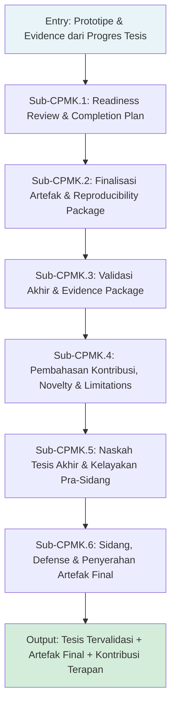

---

## PETUNJUK PENGGUNAAN BUKU

Buku ini mengikuti alur 16 pertemuan tesis akhir. Setiap bab dirancang untuk satu fase spesifik — dari readiness review di awal semester hingga penyerahan artefak final di penghujung.

Karena Tesis Akhir adalah mata kuliah berbasis proyek individual, buku ini berfungsi sebagai kerangka acuan metodologis, bukan sebagai panduan langkah demi langkah yang bisa diikuti tanpa konteks. Setiap mahasiswa memiliki topik, domain, dan tantangan yang berbeda. Prinsip-prinsip dalam buku ini bersifat universal dan harus diadaptasi ke konteks spesifik masing-masing.

**Cara menggunakan buku ini secara efektif:**
1. Baca Bab sebelum pertemuan bimbingan yang relevan — gunakan sebagai bekal untuk berdiskusi dengan pembimbing.
2. Gunakan template di Lampiran sebagai kerangka awal, bukan dokumen final yang diisi mekanis.
3. Latihan pemahaman dirancang untuk menguji kemampuan berpikir kritis, bukan hafalan.
4. Studi kasus di setiap bab merupakan skenario fiktif yang realistis — gunakan untuk berlatih analisis sebelum menghadapi situasi nyata.

---

## PETA BAB DAN OBE

| Bab | Judul | Sub-CPMK | Evaluasi | Bobot |
|---|---|---|---|---|
| 1 | Readiness Review dan Diagnosis Gap Tesis Akhir | Sub-CPMK.1 | Eval-1 | 10% |
| 2 | Completion Plan, Risk Register Final, dan Validation Protocol | Sub-CPMK.1 | Eval-1 | 10% |
| 3 | Finalisasi Artefak/Prototipe dan Technical Documentation | Sub-CPMK.2 | Eval-2 | 20% |
| 4 | Baseline, Comparator, dan Fairness dalam Evaluasi | Sub-CPMK.2 | Eval-2 | 20% |
| 5 | Repository Final, Reproducibility Package, dan Data/Testbed | Sub-CPMK.2 | Eval-2 | 20% |
| 6 | Desain Validasi Akhir: Skenario, Metrik, dan Protokol | Sub-CPMK.3 | Eval-3 | 20% |
| 7 | Pelaksanaan Validasi Akhir dan Evidence Preservation | Sub-CPMK.3 | Eval-3 | 20% |
| 8 | Analisis Hasil, Statistik, dan Interpretasi | Sub-CPMK.3 | Eval-3 | 20% |
| 9 | Replicability, Validity Threats, dan Audit Trail | Sub-CPMK.3 | Eval-3 | 20% |
| 10 | Pembahasan Kontribusi dan Novelty Positioning | Sub-CPMK.4 | Eval-4 | 15% |
| 11 | Keterbatasan, Implikasi Teknis/Industri, dan Rekomendasi | Sub-CPMK.4 | Eval-4 | 15% |
| 12 | Struktur Naskah Tesis Akhir dan Penulisan Ilmiah | Sub-CPMK.5 | Eval-5 | 20% |
| 13 | Konsistensi, Sitasi, Plagiarism Check, dan Format | Sub-CPMK.5 | Eval-5 | 20% |
| 14 | Kesiapan Pra-Sidang dan Dokumen Kelayakan | Sub-CPMK.5/6 | Eval-5/6 | 20% |
| 15 | Defense Deck, Pra-Sidang, dan Pertahanan Argumentasi | Sub-CPMK.6 | Eval-6 | 15% |
| 16 | Sidang Final, Revisi Akhir, dan Penyerahan Artefak | Sub-CPMK.6 | Eval-6 | 15% |

---

# BAB 1 — READINESS REVIEW DAN DIAGNOSIS GAP TESIS AKHIR

## 1. Capaian Pembelajaran Bab

Setelah mempelajari bab ini, mahasiswa mampu:
- Melakukan readiness review terhadap seluruh capaian Progres Tesis secara sistematis
- Mengidentifikasi gap antara kondisi saat ini dan target penyelesaian tesis akhir
- Menyusun diagnosis gap yang terstruktur dan berbasis evidence
- Menentukan prioritas penyelesaian berdasarkan dampak terhadap klaim kontribusi tesis

*Berkaitan dengan Sub-CPMK.1, Eval-1 (10%)*

## 2. Peta Konsep Bab

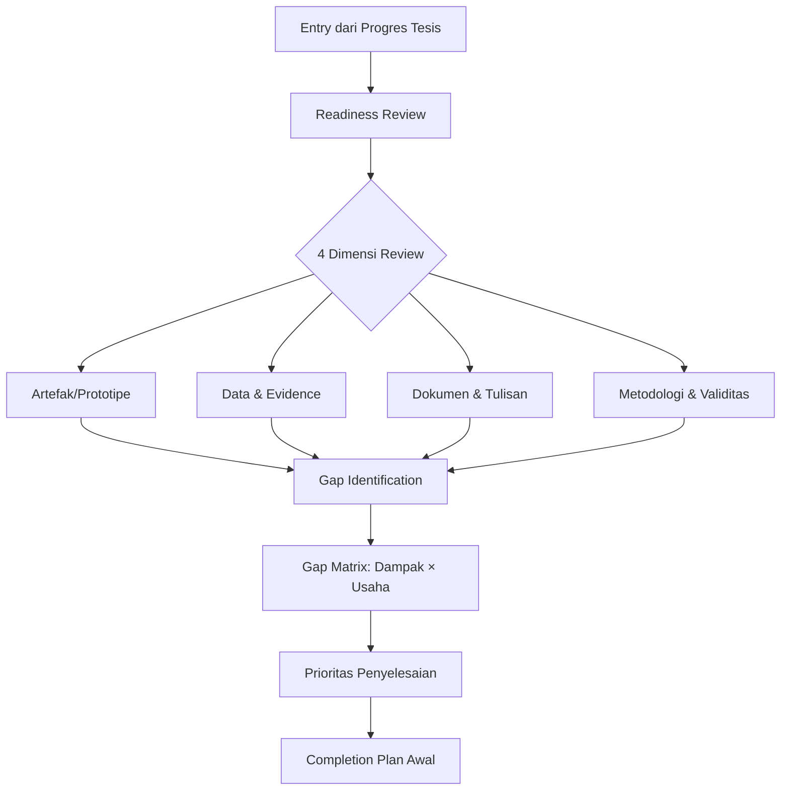

## 3. Pengantar Kontekstual

Transisi dari Progres Tesis ke Tesis Akhir adalah momen kritis yang sering diremehkan. Banyak mahasiswa memasuki semester tesis akhir dengan asumsi bahwa "tinggal menulis" — padahal realitasnya sangat berbeda. Progres Tesis menghasilkan prototipe awal, eksperimen parsial, dan draft tulisan yang belum tentu koheren. Tesis Akhir menuntut sintesis, finalisasi, dan pertahanan.

Readiness review adalah mekanisme diagnostik yang memaksa mahasiswa — dan pembimbing — untuk melihat dengan jujur: apa yang sudah ada, apa yang masih hilang, dan apa yang perlu diperbaiki sebelum validasi akhir dapat dimulai. Tanpa readiness review yang sistematis, mahasiswa berisiko menghabiskan waktu berharga pada pekerjaan yang tidak berkontribusi pada klaim tesis, atau menyadari gap kritis hanya beberapa minggu sebelum sidang.

Di industri keamanan siber, analog dari readiness review adalah pre-engagement scoping dalam penetration testing: sebelum eksekusi, tim melakukan penilaian kesiapan untuk memastikan scope jelas, tools siap, dan lingkungan terkontrol. Prinsip yang sama berlaku untuk tesis.

## 4. Landasan Teori

### 4.1 Konsep Readiness Review

**Definisi:** Readiness review (ulasan kesiapan) adalah proses evaluasi sistematis terhadap kondisi saat ini suatu proyek riset untuk menentukan apakah ia siap melangkah ke fase berikutnya. Dalam konteks tesis akhir, readiness review mengevaluasi kesiapan untuk memasuki fase validasi akhir dan penulisan.

**Tujuan:**
- Memastikan tidak ada gap fundamental yang tidak disadari sebelum validasi akhir dimulai
- Memberikan baseline yang jelas untuk perencanaan penyelesaian
- Mengidentifikasi risiko teknis, metodologis, dan temporal sedini mungkin

**Dimensi yang Dievaluasi:**

*Dimensi 1 — Artefak/Prototipe:* Apakah artefak yang dihasilkan sudah representatif dari solusi yang diklaim? Apakah ia berjalan stabil dan dapat didemonstrasikan? Apakah komponen-komponen yang relevan dengan klaim kontribusi sudah terimplementasi?

*Dimensi 2 — Data dan Evidence:* Apakah data/log/dataset yang diperlukan untuk validasi sudah tersedia? Apakah integritas data sudah diverifikasi (hash)? Apakah ada gap data yang memerlukan akuisisi tambahan?

*Dimensi 3 — Dokumen dan Tulisan:* Apakah draft bab-bab tesis yang ada sudah koheren dengan arah penelitian terkini? Apakah rumusan masalah, hipotesis, dan metode masih relevan?

*Dimensi 4 — Metodologi dan Validitas:* Apakah desain eksperimen/validasi yang direncanakan memadai untuk menjawab research question? Apakah acceptance criteria sudah didefinisikan secara eksplisit?

**Batasan Readiness Review:**
Readiness review bukan jaminan kesuksesan — ia adalah snapshot kondisi saat ini. Masalah baru dapat muncul selama validasi. Yang penting adalah bahwa readiness review meminimalkan blind spot yang bisa dihindari.

### 4.2 Konsep Gap Analysis dalam Konteks Tesis

Gap analysis dalam penelitian berbeda dari gap analysis dalam tinjauan literatur. Di sini, gap adalah perbedaan antara kondisi saat ini dan kondisi yang diperlukan untuk memenuhi klaim kontribusi tesis.

**Tipe Gap:**

| Tipe Gap | Deskripsi | Contoh |
|---|---|---|
| Gap Artefak | Komponen prototipe belum selesai atau belum terintegrasi | Modul deteksi ML sudah ada tetapi belum terhubung ke pipeline ingestion |
| Gap Data | Dataset tidak lengkap, tidak terverifikasi, atau tidak representatif | Dataset training mengandung data duplikat yang belum dibersihkan |
| Gap Validasi | Protokol validasi belum didefinisikan atau tidak memadai | Belum ada baseline comparator untuk membandingkan performa |
| Gap Dokumen | Bab tesis tidak mencerminkan perkembangan terkini riset | Bab Metode masih menggunakan desain yang sudah berubah |
| Gap Legal/Etik | Izin penggunaan data atau sistem belum lengkap | Dataset publik yang digunakan belum diverifikasi lisensinya |

**Gap Matrix — Prioritasi dengan Dampak × Usaha:**

```
Tinggi   | [Prioritas Tinggi]  | [Keputusan Strategis]
Dampak   |   Kerjakan segera   |   Pertimbangkan trade-off
         |---------------------|---------------------
Rendah   | [Lakukan bila perlu]| [Tunda atau hilangkan]
         |   Dampak minimal    |   Usaha besar, nilai kecil
         |---------------------|---------------------
         |      Rendah         |       Tinggi
         |              Usaha
```

Gap dengan dampak tinggi terhadap klaim kontribusi dan usaha rendah harus dikerjakan pertama. Gap dengan dampak rendah dan usaha tinggi perlu dipertimbangkan untuk tidak dikerjakan — atau dijadikan limitasi yang diakui.

### 4.3 Kriteria Kelulusan Tesis dan Relevansinya dengan Readiness

Setiap program studi memiliki kriteria kelulusan tesis yang berbeda-beda. Secara umum, tesis magister terapan dievaluasi berdasarkan:

- **Klaim kontribusi yang jelas:** Apa yang baru atau berbeda dari pendekatan sebelumnya?
- **Validasi yang memadai:** Apakah klaim didukung oleh evidence yang dapat diaudit?
- **Dokumen yang konsisten:** Apakah seluruh bagian tesis koheren satu sama lain?
- **Kemampuan defensi:** Apakah mahasiswa dapat menjelaskan dan mempertahankan keputusan risetnya?

Readiness review harus merujuk pada kriteria ini secara eksplisit. Gap yang ditemukan harus dipetakan ke kriteria kelulusan yang terancam.

## 5. Model atau Arsitektur

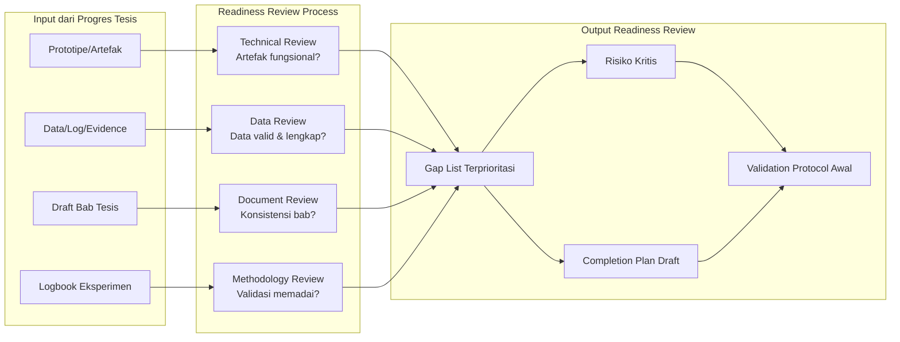

## 6. Contoh Terapan

**Skenario:** Mahasiswa A sedang mengerjakan tesis tentang deteksi anomali jaringan menggunakan machine learning pada lingkungan Industrial Control Systems (ICS).

**Kondisi entry (dari Progres Tesis):**
- Model ML (Isolation Forest) sudah dilatih pada dataset SWAT (Secure Water Treatment)
- Akurasi pada dataset tersebut: 87%
- Draft Bab 1-3 sudah ada
- Belum ada baseline comparator (hanya satu model tanpa pembanding)
- Acceptance criteria belum didefinisikan secara eksplisit
- Klaim kontribusi: "model lebih efisien dari pendekatan threshold-based"

**Hasil Readiness Review:**

| Dimensi | Status | Gap | Dampak | Prioritas |
|---|---|---|---|---|
| Artefak | Pipeline training/inference ada | Inference mode belum production-ready | Tinggi | P1 |
| Data | SWAT dataset tersedia | Tidak ada dataset ICS kedua untuk generalisasi | Tinggi | P1 |
| Validasi | - | Tidak ada baseline comparator | Sangat Tinggi | P1 |
| Dokumen | Draft Bab 1-3 ada | Bab 3 masih menggunakan desain lama (supervised) | Sedang | P2 |
| Metodologi | - | Acceptance criteria tidak eksplisit | Tinggi | P1 |
| Legal/Etik | SWAT adalah dataset publik | Lisensi dataset sudah diverifikasi | - | OK |

**Keputusan:** Mahasiswa A harus menyelesaikan 4 gap P1 sebelum validasi akhir dimulai: membuat inference pipeline, mencari dataset ICS tambahan (misal: BATADAL atau dataset sintetik terotorisasi), mengimplementasikan baseline (threshold-based sederhana), dan mendefinisikan acceptance criteria secara eksplisit.

## 7. Praktikum atau Aktivitas Terarah

**Tujuan:** Melakukan readiness review terhadap tesis sendiri dan menghasilkan gap list terprioritasi.

**Prasyarat:** Mahasiswa memiliki output Progres Tesis (prototipe, draft bab, data).

**Lingkungan:** Tidak memerlukan lab khusus. Dibutuhkan: akses ke repository/logbook, dokumen draft tesis, dan template readiness review.

**Langkah Kerja:**

1. Baca kembali klaim kontribusi dan research question tesis Anda.
2. Isi Template Readiness Review (Lampiran A) untuk setiap dimensi (artefak, data, dokumen, metodologi, legal/etik).
3. Untuk setiap item, tentukan: status (ada/tidak ada/parsial), deskripsi gap, dampak terhadap klaim (Tinggi/Sedang/Rendah), dan usaha yang diperlukan.
4. Plot gap ke dalam Gap Matrix Dampak × Usaha.
5. Buat daftar prioritas P1, P2, P3.
6. Diskusikan hasil dengan pembimbing — minta konfirmasi bahwa gap yang diidentifikasi lengkap.

**Bukti yang Dikumpulkan:** Template Readiness Review yang terisi; Gap Matrix; daftar prioritas P1/P2/P3 yang ditandatangani pembimbing.

**Catatan Etika:** Readiness review harus dilakukan dengan jujur. Menyembunyikan gap dari pembimbing hanya menunda masalah ke sidang — dengan konsekuensi yang jauh lebih besar.

## 8. Latihan Pemahaman

1. **(Pilihan Ganda)** Tujuan utama readiness review pada awal Tesis Akhir adalah:
   - A. Memulai penulisan naskah tesis dari awal
   - B. Mengidentifikasi gap antara kondisi saat ini dan target penyelesaian tesis
   - C. Mempresentasikan hasil Progres Tesis kepada penguji
   - D. Menentukan topik tesis baru yang lebih relevan

2. **(Esai Singkat)** Jelaskan mengapa "gap baseline/comparator" termasuk gap dengan dampak sangat tinggi dalam tesis yang membuat klaim performa komparatif.

3. **(Analisis Kasus)** Mahasiswa B mengklaim bahwa forensic tool yang dikembangkannya "lebih cepat dari tool komersial X." Dalam readiness review, ditemukan bahwa: (a) tidak ada benchmark formal terhadap tool X; (b) dataset pengujian sangat kecil (5 kasus). Identifikasi gap yang ada dan dampaknya terhadap klaim.

4. **(Perbandingan Konsep)** Bedakan antara "gap literatur" (yang relevan saat Proposal Tesis) dan "gap penyelesaian" (yang relevan saat Readiness Review Tesis Akhir). Mengapa keduanya penting pada tahap yang berbeda?

5. **(Evaluasi)** Seorang mahasiswa mengatakan: "Saya tidak perlu readiness review karena pembimbing saya sudah tahu kondisi tesis saya." Evaluasi pernyataan ini secara kritis.

## 9. Latihan Terapan / Studi Kasus

**Studi Kasus 1:** Mahasiswa C mengerjakan tesis tentang analisis malware berbasis perilaku menggunakan sandbox. Entry condition: sandbox (Cuckoo) sudah berjalan, 200 sampel malware sudah dianalisis, draft Bab 2 sudah ada. Masalah yang ditemukan saat readiness review: sampel malware berasal dari berbagai sumber dengan lisensi yang tidak terdokumentasi; tidak ada ground truth untuk mengklasifikasikan perilaku; acceptance criteria belum ada. Susun gap list, prioritasi, dan rekomendasikan tindakan korektif. Pertimbangkan aspek legal dari penggunaan sampel malware.

**Studi Kasus 2:** Mahasiswa D mengerjakan tesis tentang kepatuhan GDPR dalam sistem cloud berbasis komparasi framework audit. Entry condition: framework audit sudah dirancang, dua perusahaan (fiktif dalam simulasi) sudah diaudit menggunakan framework tersebut. Gap yang ditemukan: checklist audit belum divalidasi oleh expert domain; tidak ada definisi operasional untuk "kepatuhan parsial"; pengukuran hanya kualitatif tanpa metrik kuantitatif. Analisis implikasi gap ini terhadap klaim kontribusi dan rekomendasikan strategi penyelesaian.

## 10. Kunci Jawaban dan Pembahasan

**Soal 1:** Jawaban B.
Readiness review bertujuan mengidentifikasi gap — perbedaan antara kondisi saat ini dan kondisi yang diperlukan untuk penyelesaian tesis. Opsi A (mulai menulis dari awal) salah karena readiness review dilakukan sebelum penulisan intensif; Opsi C (presentasi ke penguji) adalah sidang, bukan readiness review; Opsi D (topik baru) adalah keputusan ekstrem yang bertentangan dengan konsep penyelesaian tesis yang sedang berjalan.

**Soal 2:** Klaim performa komparatif ("lebih baik dari X") secara logis mensyaratkan adanya X sebagai pembanding yang diukur pada kondisi yang setara. Tanpa baseline/comparator: (1) klaim tidak dapat dibuktikan — hanya ada satu data point; (2) pembaca/penguji tidak dapat menilai apakah peningkatan signifikan atau trivial; (3) klaim dapat dengan mudah digugurkan ("bagaimana Anda tahu lebih baik jika tidak ada pembanding?"). Gap ini berdampak langsung pada falsifiability klaim kontribusi.

**Soal 3:** Gap yang ada: (1) Tidak ada benchmark formal — metrik perbandingan tidak didefinisikan, kondisi pengujian tidak standar → gap validasi dengan dampak sangat tinggi; (2) Dataset terlalu kecil — 5 kasus tidak memadai untuk klaim performa → gap data dengan dampak tinggi. Dampak: klaim "lebih cepat" tidak dapat dipertahankan di sidang. Tindakan: implementasikan benchmark terstandar terhadap tool X pada dataset yang sama; tambah jumlah kasus uji ke setidaknya yang representatif secara statistik untuk domain.

**Soal 4:** Gap literatur adalah perbedaan antara apa yang sudah dilakukan peneliti lain dan apa yang belum dilakukan — relevan saat Proposal untuk menjustifikasi pentingnya penelitian. Gap penyelesaian adalah perbedaan antara kondisi riset saat ini dan kondisi yang diperlukan untuk menyelesaikan tesis — relevan saat Tesis Akhir untuk merencanakan penyelesaian. Keduanya penting: gap literatur memotivasi kontribusi; gap penyelesaian memandu eksekusi.

**Soal 5:** Pernyataan ini mengandung kesalahan logis: readiness review bukan tentang apa yang diketahui pembimbing, tetapi tentang apa yang diketahui mahasiswa sendiri secara sistematis. Tanpa dokumen readiness review formal: mahasiswa tidak memiliki baseline tertulis untuk merencanakan penyelesaian; gap implisit (yang tidak disadari) tidak akan teridentifikasi; risiko tidak terkelola secara eksplisit. Pembimbing yang baik justru akan mendorong mahasiswa melakukan readiness review karena ia memberikan transparansi dan akuntabilitas bersama.

## 11. Ringkasan Bab

Readiness review adalah langkah pertama dan kritis dalam Tesis Akhir. Ia mengidentifikasi gap dalam empat dimensi: artefak, data, dokumen, dan metodologi. Gap diprioritasi menggunakan matriks Dampak × Usaha. Gap dengan dampak tinggi terhadap klaim kontribusi harus diselesaikan sebelum validasi akhir dimulai. Hasil readiness review menjadi fondasi Completion Plan dan Validation Protocol.

## 12. Refleksi Profesional

1. Seorang peneliti yang menemukan gap serius dalam readiness review merasa tergoda untuk "menyederhanakan klaim" tesis agar gap tidak perlu diselesaikan. Apa konsekuensi etik dari keputusan ini? Kapan penyederhanaan klaim dapat dibenarkan dan kapan tidak?

2. Bagaimana prinsip readiness review dapat diterapkan dalam konteks profesional — misalnya sebelum meluncurkan sistem keamanan baru di sebuah organisasi?

---

# BAB 2 — COMPLETION PLAN, RISK REGISTER FINAL, DAN VALIDATION PROTOCOL

## 1. Capaian Pembelajaran Bab

Setelah mempelajari bab ini, mahasiswa mampu:
- Menyusun completion plan yang realistis berdasarkan hasil readiness review
- Merancang risk register final yang mengidentifikasi, menilai, dan memitigasi risiko penyelesaian tesis
- Menyusun validation protocol yang operasional dan dapat diaudit
- Mendefinisikan acceptance criteria secara eksplisit sebelum validasi dimulai

*Berkaitan dengan Sub-CPMK.1, Eval-1 (10%)*

## 2. Peta Konsep Bab

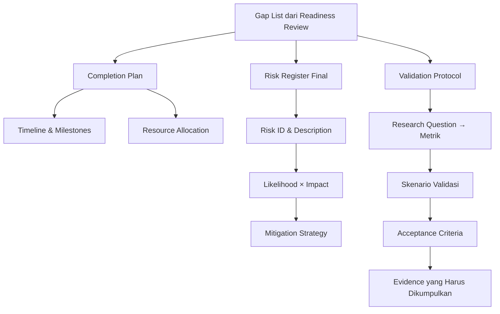

## 3. Pengantar Kontekstual

Kegagalan menyelesaikan tesis tepat waktu jarang disebabkan oleh kekurangan intelektual mahasiswa. Lebih sering, penyebabnya adalah perencanaan yang tidak realistis, risiko yang tidak diantisipasi, dan validasi yang tidak terdefinisi dengan jelas. Completion plan, risk register, dan validation protocol adalah tiga dokumen yang mencegah kegagalan ini.

Analoginya dalam keamanan siber adalah pre-engagement documentation dalam penetration testing: sebelum menyentuh satu sistem pun, tim pentest mendokumentasikan scope, rules of engagement, jadwal, dan eskalasi risiko. Tesis akhir memerlukan tingkat kedisiplinan dokumentasi yang sama.

## 4. Landasan Teori

### 4.1 Completion Plan

Completion plan adalah dokumen yang menguraikan semua pekerjaan yang tersisa, diorganisir dalam milestone yang terukur dan berjadwal.

**Komponen Completion Plan:**

*Milestone List:* Daftar milestone dengan tanggal target dan deliverable yang jelas. Milestone yang baik harus SMART: Specific, Measurable, Achievable, Relevant, Time-bound.

*Dependency Map:* Beberapa pekerjaan tidak dapat dimulai sebelum yang lain selesai. Dependency harus dipetakan untuk menghindari bottleneck. Contoh: baseline comparator harus selesai sebelum validasi akhir bisa dimulai.

*Buffer Time:* Perencanaan yang realistis menyertakan buffer. Sebagai aturan umum, tambahkan 20-30% dari estimasi waktu murni untuk mengantisipasi masalah yang tidak terduga.

*Weekly Targets:* Breakdown milestone ke target mingguan yang operasional — "selesaikan implementasi pipeline ingestion" lebih actionable dari "kerjakan artefak."

### 4.2 Risk Register Final

Risk register adalah katalog risiko yang sistematis. "Final" menunjukkan bahwa ini adalah versi yang diperbarui dan diperbaiki berdasarkan pengalaman dari Progres Tesis.

**Struktur Entri Risk Register:**

| Field | Deskripsi |
|---|---|
| Risk ID | Identifier unik (R-01, R-02, ...) |
| Kategori | Teknis / Data / Metodologi / Temporal / Legal |
| Deskripsi Risiko | Apa yang bisa salah? |
| Likelihood | 1 (Sangat Rendah) s/d 5 (Sangat Tinggi) |
| Impact | 1 (Minimal) s/d 5 (Catastrophic) |
| Risk Score | Likelihood × Impact |
| Mitigasi | Apa yang dilakukan untuk mengurangi likelihood atau impact? |
| Contingency | Apa yang dilakukan jika risiko terjadi? |
| Owner | Siapa yang bertanggung jawab memantau risiko ini? |

**Risiko Kritis dalam Tesis Keamanan Siber/Forensik:**
- Dataset tidak dapat diakses atau lisensinya berubah
- Tool yang digunakan mengalami breaking change
- Environment lab tidak stabil atau tidak reproducible
- Klaim kontribusi ternyata sudah dipublikasikan orang lain
- Pembimbing tidak tersedia pada periode kritis

### 4.3 Validation Protocol

Validation protocol adalah dokumen yang menentukan secara eksplisit bagaimana klaim kontribusi akan diuji. Ia adalah perjanjian antara mahasiswa dan pembimbing (dan secara tidak langsung dengan penguji) tentang standar yang harus dipenuhi.

**Komponen Validation Protocol:**

*Research Question → Metrik Mapping:* Setiap research question harus dipetakan ke metrik yang mengukurnya secara langsung. Jika metrik tidak dapat dipetakan ke RQ, tanyakan apakah metrik itu benar-benar perlu.

*Skenario Validasi:* Kondisi spesifik di mana validasi dilakukan — termasuk dataset yang digunakan, konfigurasi sistem, dan prosedur yang diikuti.

*Acceptance Criteria (Pre-defined):* Nilai ambang batas yang, jika dicapai, mendukung klaim kontribusi. HARUS didefinisikan sebelum validasi dilakukan untuk mencegah p-hacking dan HARKing.

*Evidence yang Harus Dikumpulkan:* Untuk setiap klaim, dokumentasikan evidence apa yang harus tersedia untuk mendukungnya — raw results, log, screenshot, konfigurasi.

**Mengapa Acceptance Criteria Harus Pre-defined:**

Jika acceptance criteria didefinisikan setelah melihat hasil, mahasiswa secara tidak sadar memilih threshold yang "kebetulan" membuat hasil terlihat bagus. Ini adalah bentuk p-hacking yang merusak integritas ilmiah, meskipun tidak disengaja. Pre-defined criteria adalah perlindungan terhadap bias konfirmasi.

## 5. Model atau Arsitektur

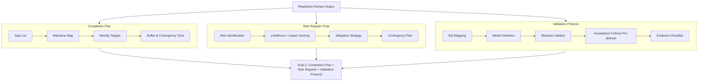

## 6. Contoh Terapan

**Skenario:** Mahasiswa E mengerjakan tesis tentang deteksi phishing berbasis NLP pada email korporat.

**Validation Protocol (ringkasan):**

| RQ | Metrik | Skenario | Acceptance Criteria |
|---|---|---|---|
| RQ1: Apakah model NLP mendeteksi phishing lebih akurat dari rule-based? | F1-score, Precision, Recall | Dataset ENRON + dataset phishing terstandar, split 80/20, 5-fold CV | F1 ≥ 0.90; Recall ≥ 0.92 (FN pada phishing lebih berbahaya dari FP) |
| RQ2: Apakah model bekerja pada bahasa Indonesia? | F1-score pada subset Indonesia | Subset 500 email Indonesia berlabel | F1 ≥ 0.85 (threshold lebih rendah karena resource terbatas) |

**Risk Register (dua entri kritis):**

| Risk ID | Deskripsi | Likelihood | Impact | Score | Mitigasi |
|---|---|---|---|---|---|
| R-01 | Dataset email Indonesia berlabel tidak tersedia | 3 | 5 | 15 | Buat dataset sintetik menggunakan template phishing publik + expert label; hubungi institusi untuk data anonim |
| R-02 | Model overfitting pada ENRON (dataset lama, distribusi berbeda) | 4 | 4 | 16 | Validasi silang dengan dataset kedua; dokumentasikan sebagai limitation jika generalisasi terbatas |

## 7. Praktikum atau Aktivitas Terarah

**Tujuan:** Menyusun validation protocol lengkap untuk tesis sendiri dengan acceptance criteria yang pre-defined.

**Langkah Kerja:**
1. Tulis kembali semua research question tesis Anda.
2. Untuk setiap RQ, identifikasi metrik yang mengukurnya. Jika tidak ada metrik yang tepat, diskusikan dengan pembimbing.
3. Definisikan skenario validasi: dataset apa, konfigurasi apa, prosedur apa.
4. Tentukan acceptance criteria — nilai numerik spesifik atau kondisi kualitatif yang jelas. Tanda tangani dokumen ini sebelum memulai validasi.
5. Susun risk register dengan minimal 8 entri, termasuk setidaknya satu risiko dari setiap kategori (teknis, data, metodologi, temporal, legal).

**Kriteria Keberhasilan:** Validation protocol yang sudah ditandatangani pembimbing; risk register dengan semua kolom terisi; acceptance criteria yang eksplisit dan tidak ambigu.

## 8. Latihan Pemahaman

1. **(Pilihan Ganda)** Mengapa acceptance criteria harus didefinisikan SEBELUM validasi dilakukan?
   - A. Untuk membuat validasi lebih cepat
   - B. Untuk mencegah bias konfirmasi dan p-hacking
   - C. Karena aturan program studi mewajibkannya
   - D. Untuk memudahkan penulisan bab hasil

2. **(Esai Singkat)** Jelaskan perbedaan antara "mitigasi" dan "contingency" dalam risk register. Berikan contoh untuk risiko "dataset tidak tersedia."

3. **(Perancangan)** Anda mengerjakan tesis tentang deteksi insider threat menggunakan log analisis. Rancang minimal 3 entri risk register yang relevan dengan domain ini, lengkap dengan likelihood, impact, mitigasi, dan contingency.

4. **(Analisis Kasus)** Validation protocol mahasiswa F hanya menyatakan: "Model akan dievaluasi menggunakan metrik standar dan hasilnya akan dibandingkan dengan literatur." Identifikasi setidaknya 4 kelemahan validation protocol ini.

5. **(Evaluasi Risiko)** Risk score = Likelihood × Impact menghasilkan nilai yang sama untuk (5,1) dan (1,5). Apakah kedua risiko ini harus diperlakukan identik? Jelaskan justifikasi Anda.

## 9. Latihan Terapan / Studi Kasus

**Studi Kasus 1:** Mahasiswa G mengerjakan tesis tentang keamanan IoT menggunakan fuzzing terotorisasi pada firmware router. Completion plan menunjukkan validasi akhir dijadwalkan 4 minggu sebelum sidang. Namun, risk register tidak pernah dibuat. Pada minggu validasi, ditemukan bahwa firmware target telah diperbarui oleh vendor dan lingkungan fuzzing tidak kompatibel. Analisis: (a) risiko apa yang seharusnya ada di risk register yang bisa mencegah situasi ini; (b) apa contingency yang seharusnya disiapkan; (c) apakah situasi ini dapat dijadikan limitasi yang diakui dalam tesis?

**Studi Kasus 2:** Mahasiswa H mendefinisikan acceptance criteria sebagai "akurasi ≥ 80%." Setelah validasi, akurasi mencapai 78%. Mahasiswa H kemudian "menyesuaikan" definisi acceptance criteria menjadi "akurasi ≥ 75%" dan mengklaim tesis berhasil. Identifikasi pelanggaran integritas akademik yang terjadi, dampaknya, dan bagaimana situasi ini dapat dicegah.

## 10. Kunci Jawaban dan Pembahasan

**Soal 1:** Jawaban B. Pre-defined acceptance criteria mencegah bias konfirmasi — tendensi manusia untuk menerima hasil yang mendukung hipotesis dan menolak yang tidak. Tanpa pre-definition, threshold dapat "disesuaikan" setelah melihat hasil, yang merupakan bentuk p-hacking. Opsi A, C, D tidak menangkap alasan fundamental.

**Soal 2:** Mitigasi adalah tindakan yang diambil SEBELUM risiko terjadi untuk mengurangi likelihood atau impact-nya. Contingency adalah tindakan yang diambil JIKA risiko terjadi. Contoh untuk "dataset tidak tersedia": Mitigasi — identifikasi 2-3 sumber alternatif dataset sebelum memulai; Contingency — jika dataset utama tidak tersedia dan alternatif juga tidak, gunakan dataset sintetik yang didokumentasikan sebagai limitasi.

**Soal 4:** Kelemahan: (1) "Metrik standar" tidak spesifik — F1? Precision? AUC-ROC? Untuk kelas tidak seimbang, metrik berbeda memberikan gambaran berbeda; (2) "Hasilnya akan dibandingkan dengan literatur" tidak operasional — paper mana? Kondisi eksperimen paper tersebut? (3) Tidak ada acceptance criteria numerik — kapan dianggap berhasil? (4) Tidak ada deskripsi skenario validasi — dataset apa? Split berapa? Kondisi apa?

**Soal 5:** Secara numerik sama, tetapi tidak boleh diperlakukan identik. Risiko (5,1) — sangat mungkin terjadi tetapi dampak minimal — lebih mudah ditolerir karena meskipun sering terjadi, konsekuensinya tidak merusak penelitian. Risiko (1,5) — sangat jarang terjadi tetapi jika terjadi bersifat catastrophic — memerlukan contingency plan yang lebih kuat meskipun mitigasinya lebih sederhana. Dalam praktik: fokus mitigasi pada likelihood; fokus contingency pada impact.

## 11. Ringkasan Bab

Completion plan, risk register, dan validation protocol adalah tiga dokumen fondasi Tesis Akhir. Completion plan mengorganisir pekerjaan ke milestone terukur dengan buffer realistis. Risk register mengidentifikasi dan memitigasi ancaman penyelesaian. Validation protocol mendefinisikan secara eksplisit bagaimana klaim akan diuji — dengan acceptance criteria pre-defined sebagai penjaga integritas ilmiah.

## 12. Refleksi Profesional

1. Dalam profesi keamanan siber, "rules of engagement" dalam penetration testing memiliki fungsi yang mirip dengan validation protocol dalam tesis. Apa yang terjadi jika rules of engagement dilanggar dalam konteks profesional? Apa analoginya dalam konteks akademik?

2. Risk register yang baik mendorong mahasiswa mengakui ketidakpastian — sesuatu yang tidak nyaman bagi banyak orang. Bagaimana budaya akademik dapat mendorong pengakuan ketidakpastian daripada menghukumnya?


---

# BAB 3 — FINALISASI ARTEFAK/PROTOTIPE DAN TECHNICAL DOCUMENTATION

## 1. Capaian Pembelajaran Bab

Setelah mempelajari bab ini, mahasiswa mampu:
- Melakukan sprint finalisasi artefak/prototipe berdasarkan prioritas gap dari readiness review
- Menyusun technical documentation yang memadai untuk artefak tesis
- Memverifikasi fungsionalitas artefak secara sistematis sebelum validasi akhir
- Memahami standar kematangan artefak yang dapat dipertanggungjawabkan di sidang

*Berkaitan dengan Sub-CPMK.2, Eval-2 (20%)*

## 2. Peta Konsep Bab

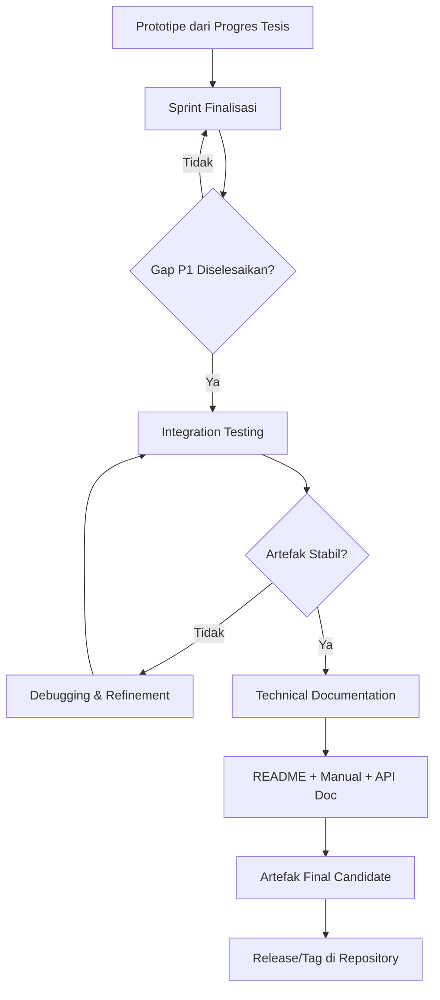

## 3. Pengantar Kontekstual

Artefak tesis adalah bukti konkret dari kontribusi terapan. Ia bisa berupa: sistem perangkat lunak, model machine learning, prosedur forensik yang terstandarisasi, framework audit, playbook incident response, atau tool analisis. Tanpa artefak yang fungsional dan terdokumentasi, klaim kontribusi tidak dapat diverifikasi — baik oleh penguji, maupun oleh komunitas yang ingin mengadopsi atau mereplikasi penelitian.

Finalisasi artefak bukan berarti artefak harus sempurna — ia harus memadai untuk mendukung klaim yang dibuat. Jika tesis mengklaim bahwa sistem mencapai akurasi X pada skenario Y, artefak harus mampu mereproduksi hasil tersebut dalam kondisi yang didokumentasikan.

## 4. Landasan Teori

### 4.1 Tingkat Kematangan Artefak (Artifact Readiness Level)

Mengadaptasi konsep Technology Readiness Level (TRL) dari NASA, artefak tesis dapat dinilai tingkat kematangannya:

| Level | Deskripsi | Persyaratan Tesis |
|---|---|---|
| ARL-1 | Konsep dan algoritma terdefinisi | Tidak cukup untuk Tesis Akhir |
| ARL-2 | Proof of concept pada data mainan | Tidak cukup untuk Tesis Akhir |
| ARL-3 | Prototipe awal pada data nyata/representatif | Minimum acceptable untuk Progres Tesis |
| ARL-4 | Prototipe terintegrasi dengan testing | Target minimum Tesis Akhir |
| ARL-5 | Pipeline end-to-end yang dapat didemokan | Target ideal Tesis Akhir |
| ARL-6 | Siap deployment (production-ready) | Melebihi persyaratan tesis |

Mayoritas tesis magister terapan menargetkan ARL-4 hingga ARL-5. ARL-6 jarang diharapkan dalam tesis akademik.

### 4.2 Komponen Technical Documentation

Technical documentation yang memadai mencakup:

**README (Dokumen Entry Point):**
- Deskripsi singkat artefak dan klaim kontribusi yang didukung
- Prasyarat (OS, dependency, hardware)
- Instruksi instalasi yang telah diuji
- Instruksi penggunaan untuk kasus penggunaan utama
- Struktur direktori yang dijelaskan
- Cara mereproduksi hasil utama tesis

**Technical Manual (untuk artefak kompleks):**
- Arsitektur sistem secara keseluruhan (diagram)
- Deskripsi setiap komponen dan antarmukanya
- Format input dan output
- Parameter konfigurasi dan penjelasannya
- Pesan error dan cara mengatasinya
- Known limitations

**API Documentation (jika artefak berupa library/API):**
- Daftar endpoint atau fungsi
- Parameter, tipe data, dan return value
- Contoh request/response
- Kode error

**Dataset/Testbed Documentation:**
- Deskripsi dataset: asal, jumlah instance, distribusi kelas
- Lisensi dan syarat penggunaan
- SHA-256 hash untuk integritas
- Preprocessing yang dilakukan

### 4.3 Integration Testing untuk Artefak Tesis

Sebelum dianggap sebagai "final candidate," artefak harus melewati serangkaian test:

*Smoke Test:* Apakah artefak dapat dijalankan tanpa crash? Input minimal menghasilkan output tanpa error.

*Functional Test:* Apakah setiap komponen bekerja sesuai spesifikasi?

*Integration Test:* Apakah semua komponen bekerja bersama dalam pipeline end-to-end?

*Reproducibility Test:* Dapatkah orang lain (dengan environment yang terdokumentasi) mendapatkan hasil yang sama?

## 5. Model atau Arsitektur

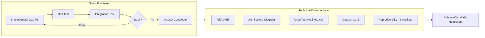

## 6. Contoh Terapan

**Skenario:** Artefak tesis adalah pipeline SIEM custom yang mengintegrasikan log Windows Event + network flow + threat intelligence untuk mendeteksi lateral movement.

**Deliverable Finalisasi:**
- `README.md`: Cara install Elasticsearch + Logstash + Kibana (ELK stack) dengan konfigurasi custom
- `docker-compose.yml`: Environment yang dapat dijalankan ulang
- `detection_rules/`: File YAML berisi aturan deteksi yang merupakan kontribusi utama
- `docs/architecture.md`: Diagram arsitektur pipeline
- `tests/`: Dataset sampel untuk smoke test

**Reproducibility Test:** Tim lain mengikuti README dari awal — install, konfigurasi, ingest sampel log, dan verifikasi bahwa aturan deteksi trigger pada event yang tepat. Hasilnya terdokumentasi dalam `tests/reproducibility_report.md`.

## 7. Praktikum atau Aktivitas Terarah

**Tujuan:** Melakukan integration test terhadap artefak tesis dan mendokumentasikan hasilnya.

**Langkah Kerja:**
1. Buat test plan: daftar semua komponen dan antarmuka yang perlu diuji.
2. Lakukan smoke test pada artefak dari state "fresh install" menggunakan environment documentation yang ada.
3. Lakukan functional test pada setiap komponen.
4. Lakukan integration test end-to-end.
5. Dokumentasikan hasil setiap test: passed/failed, error message jika ada, tindakan korektif.
6. Setelah semua test passed, buat release/tag di Git repository.

**Catatan Etika:** Jika artefak melibatkan tool keamanan ofensif (scanner, fuzzer), pastikan seluruh pengujian dilakukan hanya pada sistem yang dimiliki sendiri atau dalam lab yang terisolasi. Jangan pernah menguji artefak pada sistem produksi tanpa izin tertulis.

## 8. Latihan Pemahaman

1. **(Pilihan Ganda)** Manakah yang BUKAN termasuk komponen technical documentation yang wajib ada dalam portofolio artefak tesis?
   - A. README dengan instruksi instalasi dan penggunaan
   - B. Dataset card dengan informasi asal dan lisensi dataset
   - C. Ulasan pengguna dari platform publik
   - D. Arsitektur sistem dalam bentuk diagram

2. **(Esai Singkat)** Mengapa "reproducibility test" lebih penting dari sekadar "integration test" dalam konteks tesis?

3. **(Analisis)** Mahasiswa I memiliki artefak yang berhasil dijalankan di laptopnya tetapi gagal di environment penguji saat pra-sidang. Identifikasi 3 kemungkinan penyebab dan bagaimana masing-masing dapat dicegah.

## 9. Latihan Terapan / Studi Kasus

**Studi Kasus:** Mahasiswa J mengembangkan tool forensik digital untuk mengekstraksi artefak dari memori RAM. Tool berjalan pada Windows 10 dengan Python 3.9. Technical documentation hanya berupa komentar dalam kode. Penguji tidak dapat menjalankan tool karena tidak ada instruksi instalasi. Artefak menggunakan library `volatility3` yang tidak dicantumkan versinya. Analisis kekurangan dokumentasi dan susun outline README yang memadai untuk kasus ini.

## 10. Kunci Jawaban dan Pembahasan

**Soal 1:** Jawaban C. Ulasan pengguna dari platform publik bukan bagian dari technical documentation akademik — ia adalah feedback eksternal yang tidak dapat dikendalikan mahasiswa. Semua opsi lain (README, dataset card, arsitektur) adalah komponen standar yang diharapkan.

**Soal 2:** Integration test memverifikasi bahwa komponen bekerja bersama di lingkungan pengembang. Reproducibility test memverifikasi bahwa orang lain dapat membangun ulang environment dan mendapatkan hasil yang sama — ini jauh lebih ketat karena menguji apakah semua dependensi dan konfigurasi terdokumentasi dengan benar. Banyak artefak yang lolos integration test tetapi gagal reproducibility test karena ada konfigurasi tersembunyi atau dependensi tidak terdokumentasi.

## 11. Ringkasan Bab

Finalisasi artefak menargetkan ARL-4 hingga ARL-5: pipeline terintegrasi yang dapat didemokan dan direproduksi. Technical documentation mencakup README, arsitektur, manual, dan dataset card. Integration test dan reproducibility test adalah gerbang terakhir sebelum artefak dinyatakan sebagai final candidate.

## 12. Refleksi Profesional

1. Dalam industri, "documentation debt" sering kali lebih mahal dari "technical debt." Bagaimana hal ini berlaku pada artefak tesis yang ingin dipublikasikan atau diadopsi industri?

---

# BAB 4 — BASELINE, COMPARATOR, DAN FAIRNESS DALAM EVALUASI

## 1. Capaian Pembelajaran Bab

Setelah mempelajari bab ini, mahasiswa mampu:
- Memilih dan mengimplementasikan baseline/comparator yang tepat untuk klaim kontribusi
- Memahami prinsip fairness dalam perbandingan eksperimental
- Menghindari bias dalam pemilihan baseline
- Mendokumentasikan kondisi eksperimen secara adil dan dapat direplikasi

*Berkaitan dengan Sub-CPMK.2, Eval-2 (20%)*

## 2. Peta Konsep Bab

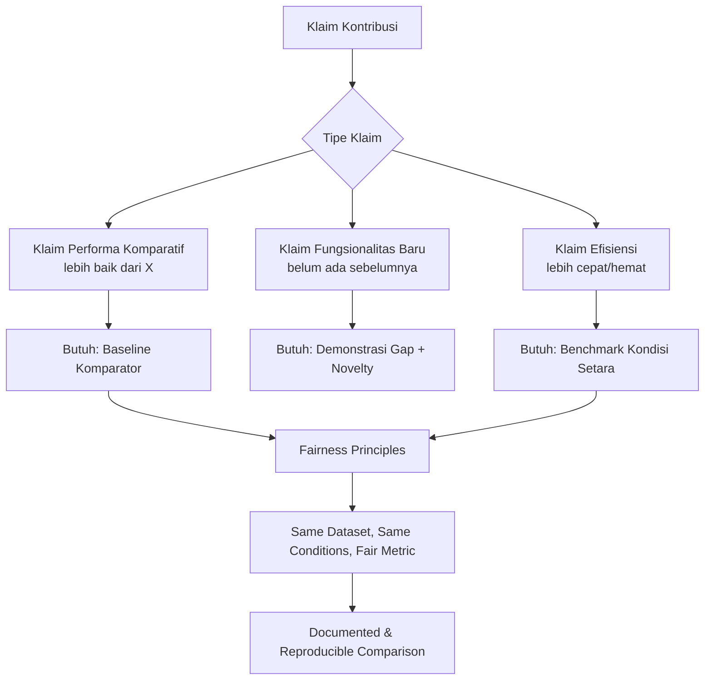

## 3. Pengantar Kontekstual

Salah satu pertanyaan paling sering dari penguji tesis adalah: "Bagaimana Anda tahu pendekatan Anda lebih baik?" Untuk menjawabnya, diperlukan baseline — titik referensi yang menjadi standar perbandingan. Tanpa baseline yang tepat, klaim superioritas tidak dapat dibuktikan.

Namun, pemilihan baseline yang tidak tepat — terlalu lemah, terlalu tua, atau dijalankan dalam kondisi yang tidak adil — dapat membuat klaim tampak kuat secara artifisial. Penguji yang berpengalaman akan segera mengenali "baseline straw man" ini.

## 4. Landasan Teori

### 4.1 Tipe Baseline

**Trivial Baseline:** Pendekatan paling sederhana yang mungkin. Contoh: random classifier, majority class classifier, atau rule-based sederhana. Berguna untuk menunjukkan bahwa solusi lebih baik dari pendekatan naif.

**State-of-the-Art Baseline:** Pendekatan terbaik yang ada dalam literatur pada dataset yang sama atau kondisi yang sebanding. Ini adalah standar perbandingan yang paling dihargai oleh komunitas ilmiah.

**Ablation Baseline:** Versi dari solusi sendiri yang menghilangkan satu atau lebih komponen. Berguna untuk menunjukkan kontribusi spesifik setiap komponen. Contoh: "Model dengan feature X menghasilkan F1 0.90; tanpa feature X hanya 0.81."

**Industrial Baseline:** Sistem atau tool komersial yang sudah digunakan di industri. Relevan untuk tesis terapan yang membandingkan solusi akademik dengan solusi industri.

### 4.2 Prinsip Fairness dalam Perbandingan

**Same Dataset:** Semua metode dibandingkan pada dataset yang identik. Menggunakan dataset berbeda untuk metode berbeda adalah perbandingan yang tidak valid.

**Same Conditions:** Parameter training/testing, preprocessing, dan hardware yang setara (atau perbedaan yang didokumentasikan). Membandingkan GPU vs CPU tanpa catatan adalah tidak adil.

**Appropriate Metric:** Pilih metrik yang mencerminkan tujuan sebenarnya. Dalam deteksi malware, Recall lebih penting dari Precision karena False Negative lebih berbahaya. Melaporkan Accuracy pada dataset tidak seimbang adalah menyesatkan.

**Reproduced vs Reported Results:** Lebih baik mereproduksi baseline pada lingkungan sendiri daripada hanya mengutip angka dari paper lain — kondisi eksperimen dapat berbeda signifikan.

### 4.3 Bahaya "Cherry-Picking" Baseline

Cherry-picking adalah memilih baseline yang kemungkinan besar dikalahkan solusi baru, sementara mengabaikan baseline yang mungkin menunjukkan performa serupa atau lebih baik. Ini adalah bentuk bias konfirmasi yang melemahkan validitas klaim.

Tanda-tanda cherry-picking:
- Hanya satu baseline yang digunakan padahal banyak state-of-the-art tersedia
- Baseline yang dipilih adalah paper berusia 5-10 tahun padahal ada yang lebih baru
- Kondisi eksperimen baseline berbeda dari kondisi solusi baru (tidak adil)

Pencegahan: diskusikan pemilihan baseline dengan pembimbing sebelum implementasi; dokumentasikan alasan pemilihan baseline secara eksplisit.

## 5. Model atau Arsitektur

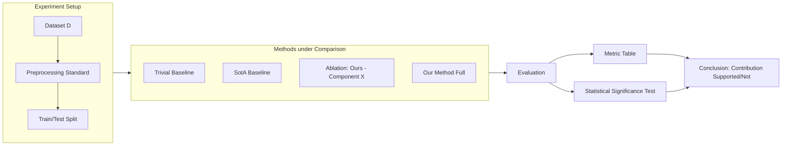

## 6. Contoh Terapan

**Skenario:** Tesis tentang klasifikasi traffic jaringan untuk deteksi C&C communication.

**Klaim:** "Pendekatan hybrid CNN-LSTM mengungguli pendekatan berbasis fitur statistik tradisional."

**Baseline yang dipilih:**
1. *Trivial:* Logistic Regression pada fitur statistik (baseline naif)
2. *SotA:* Random Forest + fitur statistik (pendekatan umum di literatur, dilambangkan RF-Stat)
3. *Ablation:* CNN saja (tanpa LSTM)
4. *Our Method:* CNN-LSTM hybrid

**Tabel Hasil (F1-score pada dataset CICIDS2017):**

| Metode | F1 | Precision | Recall | Catatan |
|---|---|---|---|---|
| Logistic Regression | 0.71 | 0.73 | 0.69 | Baseline naif |
| RF-Stat | 0.85 | 0.87 | 0.83 | SotA literature |
| CNN (ablation) | 0.88 | 0.89 | 0.87 | Ours - temporal |
| CNN-LSTM (ours) | 0.92 | 0.91 | 0.93 | Full method |

Tabel ini menunjukkan kontribusi bertahap setiap komponen — ini jauh lebih meyakinkan dari sekadar membandingkan CNN-LSTM dengan Logistic Regression.

## 7. Praktikum atau Aktivitas Terarah

**Tujuan:** Mengimplementasikan dan menjalankan setidaknya satu baseline komparator untuk tesis sendiri.

**Langkah Kerja:**
1. Identifikasi tipe klaim kontribusi tesis Anda (komparatif, fungsionalitas baru, efisiensi).
2. Tentukan baseline yang sesuai — minimal satu trivial dan satu SotA (atau industrial).
3. Implementasikan baseline dalam kondisi yang identik dengan implementasi solusi Anda.
4. Jalankan evaluasi dan catat hasilnya.
5. Dokumentasikan alasan pemilihan baseline dan kondisi eksperimen secara eksplisit.

**Catatan Etika:** Jangan memodifikasi parameter baseline untuk membuatnya terlihat lemah. Gunakan konfigurasi default atau yang direkomendasikan paper aslinya.

## 8. Latihan Pemahaman

1. **(Pilihan Ganda)** Seorang mahasiswa membandingkan sistem IDSnya hanya dengan sistem IDS yang dikembangkan 10 tahun lalu, padahal banyak sistem IDS modern tersedia. Ini adalah contoh dari:
   - A. Kegagalan teknis
   - B. Cherry-picking baseline
   - C. Kesalahan metodologi yang tidak disengaja
   - D. Praktik umum yang dapat diterima

2. **(Analisis)** Mengapa "accuracy" adalah metrik yang tidak adil untuk dataset dengan rasio kelas 99:1 (99% negatif, 1% positif)?

3. **(Perancangan)** Anda mengklaim bahwa tool forensik Anda mengekstraksi artefak "lebih lengkap" dari tool komersial yang ada. Rancang skema perbandingan yang fair, termasuk: metrik, dataset/kasus uji, kondisi eksperimen, dan cara mendokumentasikan hasil.

## 9. Latihan Terapan / Studi Kasus

**Studi Kasus:** Mahasiswa K mengklaim bahwa algoritma enkripsi yang dioptimasi untuk IoT "20% lebih cepat dari AES-128." Baseline: AES-128 diimplementasikan dalam Python murni (tanpa akselerasi hardware). Solusi mahasiswa: diimplementasikan dalam C++ dengan SIMD intrinsics. Evaluasi: apakah perbandingan ini fair? Apa yang seharusnya dilakukan untuk perbandingan yang adil?

## 10. Kunci Jawaban dan Pembahasan

**Soal 1:** Jawaban B. Memilih baseline yang secara artifisial lemah untuk membuat solusi baru terlihat unggul adalah cherry-picking baseline. Ini bukan kegagalan teknis (artefak mungkin bekerja dengan baik) melainkan masalah integritas metodologis.

**Soal 2:** Classifier naif yang selalu memprediksi "negatif" akan mencapai accuracy 99% — padahal tidak pernah mendeteksi satu pun kasus positif. Ini menunjukkan bahwa accuracy adalah metrik yang menyesatkan pada dataset tidak seimbang. Metrik yang lebih tepat: F1-score, Precision, Recall, atau AUC-ROC yang mempertimbangkan performa pada kelas minoritas.

**Studi Kasus:** Perbandingan tidak fair. Python murni vs C++ dengan SIMD adalah membandingkan implementasi level bahasa yang berbeda, bukan algoritma. Untuk perbandingan fair: implementasikan keduanya dalam bahasa dan level optimasi yang setara (keduanya C++ atau keduanya Python); atau dokumentasikan perbedaan implementasi secara eksplisit dan klaim "implementasi kami lebih efisien pada bahasa X" alih-alih "algoritma kami lebih cepat."

## 11. Ringkasan Bab

Baseline yang tepat adalah fondasi klaim kontribusi komparatif. Gunakan minimal dua baseline (trivial dan SotA). Pastikan semua perbandingan dilakukan pada kondisi yang adil: dataset sama, kondisi setara, metrik yang tepat. Dokumentasikan alasan pemilihan baseline. Cherry-picking adalah pelanggaran integritas metodologis.

## 12. Refleksi Profesional

1. Dalam evaluasi produk keamanan siber di industri (misalnya benchmark AV-TEST untuk antivirus), metodologi pengujian yang tidak fair dapat menyesatkan konsumen. Bagaimana prinsip fairness dalam baseline penelitian tesis berhubungan dengan tanggung jawab profesional ini?

---

# BAB 5 — REPOSITORY FINAL, REPRODUCIBILITY PACKAGE, DAN DATA/TESTBED

## 1. Capaian Pembelajaran Bab

Setelah mempelajari bab ini, mahasiswa mampu:
- Mengorganisir repository final dengan struktur yang standar dan dapat diaudit
- Menyusun reproducibility package yang memungkinkan replikasi independen
- Mendokumentasikan data dan testbed secara lengkap sesuai standar akademik
- Membuat release/tag yang menandai versi artefak yang digunakan dalam tesis

*Berkaitan dengan Sub-CPMK.2, Eval-2 (20%)*

## 2. Peta Konsep Bab

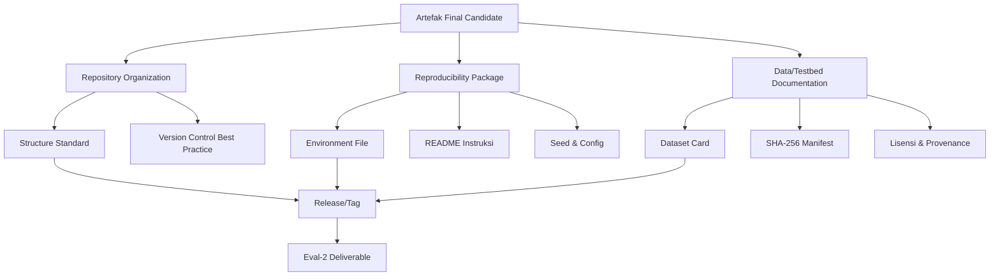

## 3. Pengantar Kontekstual

Reproducibility adalah krisis yang sedang dihadapi penelitian ilmu komputer dan keamanan siber. Sebuah studi ACM (2018) menemukan bahwa sebagian besar paper tidak dapat direproduksi dari informasi yang tersedia. Sebagai peneliti terapan, mahasiswa tesis bertanggung jawab untuk memastikan bahwa kontribusinya dapat diverifikasi secara independen.

Repository final dan reproducibility package bukan formalitas administratif — mereka adalah mekanisme yang memungkinkan peneliti lain (atau penguji) untuk memverifikasi klaim, mengembangkan penelitian lebih lanjut, atau mengadopsi artefak. Di komunitas keamanan siber, reproducibility juga penting untuk memvalidasi bahwa sistem pertahanan benar-benar bekerja seperti yang diklaim.

## 4. Landasan Teori

### 4.1 Standar Struktur Repository

```
thesis_repo/
├── README.md                 # Entry point: deskripsi, instalasi, penggunaan
├── LICENSE                   # Lisensi artefak
├── CHANGELOG.md              # Perubahan antar versi
├── requirements.txt          # atau environment.yml atau Dockerfile
├── config/
│   └── config.yaml           # Parameter konfigurasi (no hardcoded values)
├── src/                      # Source code
│   ├── preprocessing/
│   ├── model/ atau detection/
│   └── evaluation/
├── data/
│   ├── raw/                  # Hanya pointer/instruksi, bukan data asli
│   ├── processed/
│   └── data_manifest.csv     # SHA-256 hash semua file data
├── experiments/
│   ├── exp_001/              # Setiap eksperimen dalam folder terpisah
│   │   ├── config.yaml
│   │   ├── run.sh
│   │   └── results/
│   └── baseline/
├── docs/
│   ├── architecture.md
│   └── user_manual.md
└── tests/
    ├── unit/
    └── integration/
```

### 4.2 Environment Documentation

**requirements.txt (Python):** Spesifik dengan versi (`scikit-learn==1.3.0`, bukan `scikit-learn`). Versi ambigu menyebabkan breaking change yang tidak dapat diprediksi.

**environment.yml (conda):** Mencatat seluruh environment conda termasuk channel dan versi Python.

**Dockerfile:** Level tertinggi reproducibility — encapsulates seluruh environment dalam container yang dapat dibangun ulang.

**Aturan Emas:** Uji lingkungan dari scratch pada mesin yang berbeda. Jika hanya bekerja di "mesin pengembang," ia belum reproducible.

### 4.3 Dataset Card dan SHA-256 Manifest

**Dataset Card** mendokumentasikan:
- Nama dan versi dataset
- Sumber dan URL (atau instruksi akses)
- Lisensi dan syarat penggunaan
- Statistik deskriptif (jumlah instance, distribusi kelas, dimensi)
- Potensi bias yang diketahui
- Preprocessing yang dilakukan dan script yang digunakan
- SHA-256 hash file dataset asli

**SHA-256 Manifest** adalah file CSV yang mendaftar semua file data dengan hash-nya:
```
filename,sha256,size_bytes,date_acquired
dataset_train.csv,abc123...,1048576,2025-03-15
dataset_test.csv,def456...,262144,2025-03-15
```

### 4.4 Git Tagging untuk Tesis

Git tags menandai titik spesifik dalam sejarah repository. Untuk tesis:
- `v1.0-thesis`: Versi yang digunakan untuk hasil utama tesis
- `v1.0-pra-sidang`: Versi yang dipresentasikan di pra-sidang
- `v1.0-sidang-final`: Versi yang diserahkan ke program studi

Tags memungkinkan penguji atau peneliti lain untuk me-checkout versi yang persis sama yang menghasilkan hasil dalam tesis.

## 5. Model atau Arsitektur

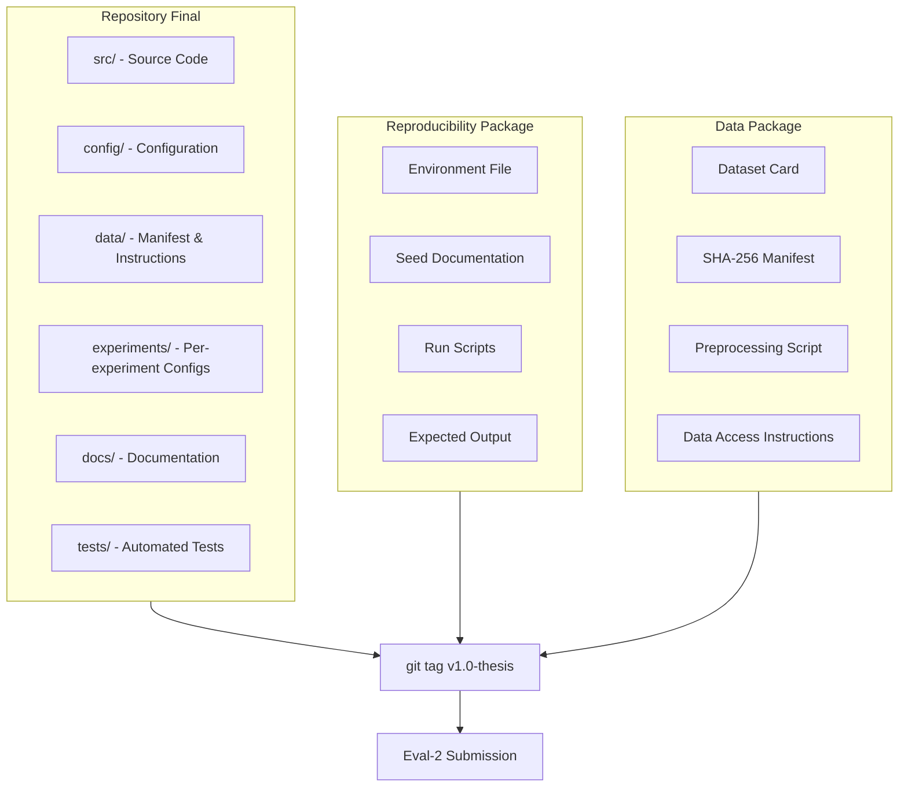

## 6. Contoh Terapan

**Skenario:** Tesis tentang anomali deteksi pada log Sysmon Windows.

**Struktur Repository:**
```
sysmon-anomaly-detection/
├── README.md
├── Dockerfile
├── config/detection_config.yaml
├── src/
│   ├── parse_sysmon.py
│   ├── feature_extraction.py
│   ├── isolation_forest_detector.py
│   └── evaluate.py
├── data/
│   └── data_manifest.csv    # SHA-256 + instruksi download OTRF dataset
├── experiments/
│   ├── exp_01_baseline/
│   └── exp_02_full_pipeline/
└── tests/
    └── test_parser.py
```

**README Snippet:**
```markdown
## Cara Mereproduksi Hasil Tesis

1. Clone repository: `git checkout v1.0-thesis`
2. Build Docker: `docker build -t sysmon-detector .`
3. Download data: ikuti instruksi di `data/README_data.md`
4. Verifikasi integritas: `python verify_hashes.py`
5. Jalankan pipeline: `docker run sysmon-detector python src/evaluate.py --config config/detection_config.yaml`

Hasil yang diharapkan: F1=0.89 ±0.02 (lihat `experiments/exp_02_full_pipeline/expected_output.json`)
```

## 7. Praktikum atau Aktivitas Terarah

**Tujuan:** Menyusun reproducibility package untuk artefak tesis sendiri dan memverifikasi bahwa package tersebut berfungsi pada environment baru.

**Langkah Kerja:**
1. Organisasikan repository mengikuti struktur standar yang diajarkan.
2. Generate environment file (requirements.txt atau Dockerfile).
3. Buat SHA-256 manifest untuk semua file data.
4. Tulis dataset card.
5. Buat release/tag `v1.0-thesis` di repository.
6. Verifikasi: hapus virtual environment / gunakan Docker, ikuti README dari awal, pastikan pipeline berjalan.

**Kriteria Keberhasilan:** Anggota tim atau mahasiswa lain dapat mengikuti README dari awal dan mendapatkan output yang konsisten dengan yang dilaporkan.

## 8. Latihan Pemahaman

1. **(Pilihan Ganda)** Manakah level terbaik dari reproducibility package?
   - A. requirements.txt dengan versi ambigu
   - B. Instruksi instalasi manual tanpa environment file
   - C. Dockerfile yang mengencapsulasi seluruh environment
   - D. Screenshot langkah-langkah instalasi

2. **(Esai Singkat)** Jelaskan mengapa data tidak boleh disimpan langsung dalam repository Git publik, dan apa alternatif yang tepat untuk mendokumentasikan data.

3. **(Perancangan)** Susun struktur direktori repository untuk tesis tentang automated malware triage berbasis ML. Jelaskan tujuan setiap direktori.

## 9. Latihan Terapan / Studi Kasus

**Studi Kasus:** Mahasiswa L menyerahkan tesis dengan reproducibility package berupa satu file ZIP berisi source code tanpa versi dependency, satu folder data tanpa manifest, dan tidak ada instruksi penggunaan. Penguji tidak dapat menjalankan kode karena library tidak kompatibel. Analisis kekurangan package ini dan rekomendasikan perbaikan konkret.

## 10. Kunci Jawaban dan Pembahasan

**Soal 1:** Jawaban C. Dockerfile mengencapsulasi seluruh lingkungan — OS, runtime, library, konfigurasi — dalam format yang dapat dibangun ulang secara deterministik. Requirements.txt dengan versi ambigu (A) menyebabkan ketidakpastian; instruksi manual (B) bergantung pada interpretasi pengguna; screenshot (D) tidak dapat dieksekusi.

**Soal 2:** Data tidak boleh disimpan dalam repository Git publik karena: (1) dataset besar dapat melebihi batas ukuran repository (GitHub membatasi 100MB per file); (2) data sensitif atau berlisensi tidak boleh didistribusikan ulang secara publik; (3) Git tidak dirancang untuk binary large objects. Alternatif yang tepat: simpan SHA-256 manifest dan instruksi cara mengunduh dataset dari sumber aslinya (Zenodo, IEEE DataPort, dataset publik resmi); atau gunakan Git LFS untuk dataset non-sensitif berukuran sedang.

## 11. Ringkasan Bab

Repository final yang terorganisir, environment file yang eksplisit, dataset card dengan SHA-256 manifest, dan git tag adalah komponen reproducibility package. Reproducibility bukan opsional — ia adalah standar minimum integritas ilmiah. Uji reproducibility pada environment bersih sebelum submission.

## 12. Refleksi Profesional

1. Open source forensic tools seperti Volatility atau Autopsy dapat diaudit dan diverifikasi komunitas karena repositorinya publik. Bagaimana prinsip ini relevan dengan transparansi artefak tesis Anda? Kapan Anda harus membuat repository publik dan kapan sebaiknya privat?


---

# BAB 6 — DESAIN VALIDASI AKHIR: SKENARIO, METRIK, DAN PROTOKOL

## 1. Capaian Pembelajaran Bab

Setelah mempelajari bab ini, mahasiswa mampu:
- Merancang skenario validasi akhir yang relevan dengan research question
- Memilih metrik evaluasi yang tepat sesuai tipe masalah dan domain
- Menyusun protokol eksperimen yang dapat diaudit dan direplikasi
- Mengantisipasi validity threats sebelum validasi dimulai

*Berkaitan dengan Sub-CPMK.3, Eval-3 (20%)*

## 2. Peta Konsep Bab

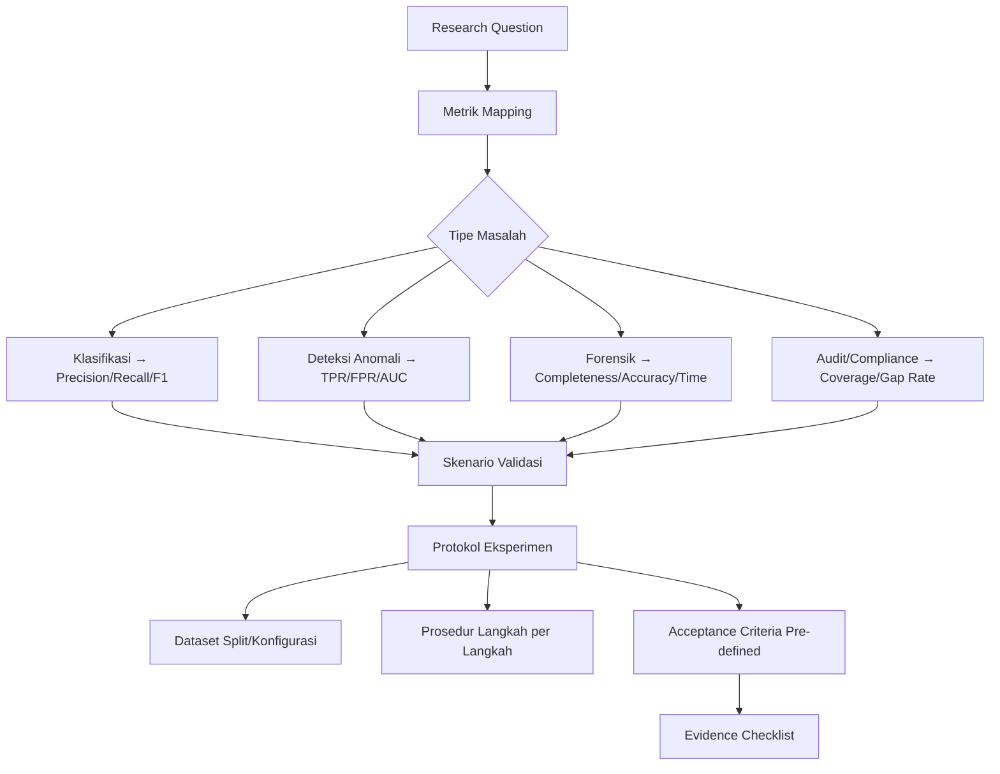

## 3. Pengantar Kontekstual

Validasi akhir adalah momen di mana semua klaim kontribusi diuji terhadap evidence. Ini berbeda dari eksperimen awal (Progres Tesis) yang bersifat eksploratori. Validasi akhir bersifat konfirmatori: mahasiswa datang dengan hipotesis yang terdefinisi dan protokol yang jelas, lalu mengeksekusi protokol tanpa modifikasi.

Kualitas validasi akhir menentukan seberapa kuat klaim kontribusi dapat dipertahankan di sidang. Desain yang buruk menghasilkan evidence yang lemah — bahkan jika artefak bekerja dengan baik.

## 4. Landasan Teori

### 4.1 Hierarki Validasi dalam Penelitian Terapan

Mengacu pada Wieringa (2014), desain penelitian terapan (design science) dapat menggunakan berbagai bentuk validasi:

**Proof of Concept:** Menunjukkan bahwa artefak dapat bekerja dalam kondisi yang dikontrol. Tingkat keyakinan rendah tetapi cepat dilakukan.

**Controlled Experiment:** Membandingkan dua atau lebih kondisi dengan variabel yang dikontrol. Tingkat keyakinan tinggi tetapi memerlukan sampel yang cukup.

**Case Study:** Menerapkan artefak pada kasus nyata (atau yang merepresentasikan kasus nyata) dan mengobservasi hasilnya. Relevan untuk konteks terapan.

**Simulation:** Menggunakan model simulasi untuk menguji skenario yang tidak mungkin diujikan langsung. Berguna untuk skenario berbahaya atau langka.

Tesis keamanan siber sering menggunakan kombinasi: controlled experiment (untuk klaim performa) + case study (untuk relevansi kontekstual).

### 4.2 Pemilihan Metrik per Domain

**Domain Deteksi (IDS/AV/Malware):**
- True Positive Rate (TPR) / Recall: proporsi ancaman nyata yang terdeteksi
- False Positive Rate (FPR): proporsi traffic normal yang salah dikategorikan sebagai ancaman
- Precision: dari semua yang dikategorikan ancaman, berapa yang memang ancaman
- F1-score: harmonik mean Precision dan Recall
- AUC-ROC: performa across different threshold settings

**Domain Forensik Digital:**
- Completeness: berapa persen artefak relevan yang berhasil diekstraksi
- Accuracy: kebenaran artefak yang diekstraksi (false artifacts)
- Time-to-extraction: efisiensi waktu
- Chain of custody integrity: apakah hash terjaga sepanjang proses

**Domain Audit/Compliance:**
- Control Coverage: berapa persen kontrol yang tercakup dalam framework
- Gap Detection Rate: kemampuan menemukan gap kepatuhan yang sebenarnya ada
- False Positive Gap Rate: gap yang dilaporkan tetapi tidak nyata

**Domain Kriptografi/Protokol:**
- Throughput (ops/sec)
- Latency (ms)
- Memory footprint
- Side-channel resistance (jika relevan)

### 4.3 Skenario Validasi

Skenario adalah deskripsi kondisi spesifik di mana validasi dilakukan. Skenario yang baik mencakup:

- **Lingkungan:** Environment yang digunakan (VM, Docker, hardware spesifik)
- **Dataset:** Dataset spesifik yang digunakan, versi, dan subset yang dipilih
- **Konfigurasi:** Parameter sistem yang digunakan
- **Prosedur:** Langkah-langkah yang diikuti secara berurutan
- **Pengukuran:** Bagaimana metrik dihitung — formula eksplisit
- **Jumlah Ulangan:** Berapa kali eksperimen diulang (untuk stabilitas estimasi)

### 4.4 Validitas Internal vs Eksternal

**Validitas Internal:** Sejauh mana perbedaan yang diamati disebabkan oleh variabel yang dimanipulasi (solusi kita), bukan oleh faktor lain. Ancaman: data leakage, confounding variable, selection bias.

**Validitas Eksternal:** Sejauh mana hasil dapat digeneralisasi ke konteks lain. Ancaman: dataset yang tidak representatif, environment yang sangat terkontrol.

Tesis yang jujur mengakui batasan validitas eksternal — "hasil berlaku untuk dataset X dan konfigurasi Y; generalisasi ke konteks Z memerlukan validasi tambahan."

## 5. Model atau Arsitektur

```mermaid
flowchart LR
    subgraph DESIGN["Validation Design"]
        VD1[RQ → Metrik Mapping]
        VD2[Skenario Spesifikasi]
        VD3[Acceptance Criteria]
        VD4[Evidence Checklist]
    end

    subgraph EXECUTION["Execution Protocol"]
        EP1[Environment Setup]
        EP2[Data Preparation & Hash Verify]
        EP3[Run Experiment]
        EP4[Collect Raw Results]
        EP5[Compute Metrics]
    end

    subgraph QA["Quality Assurance"]
        QA1[Multiple Runs]
        QA2[Variance Check]
        QA3[Anomaly Investigation]
    end

    DESIGN --> EXECUTION
    EXECUTION --> QA
    QA --> RESULT["Validated Results + Evidence Package"]
```

## 6. Contoh Terapan

**Skenario Validasi untuk Tesis CTI (Cyber Threat Intelligence):**

*Klaim:* Framework CTI yang dirancang dapat mengklasifikasikan laporan ancaman ke dalam kategori MITRE ATT&CK dengan akurasi lebih tinggi dari pendekatan keyword-based.

*Metrik:* F1-score per kategori ATT&CK Tactic; Macro-F1 keseluruhan.

*Skenario:*
- Dataset: 500 laporan CTI dari sumber publik (AlienVault OTX, FS-ISAC reports)
- Ground truth: dilabel oleh dua expert secara independen (inter-rater agreement ≥ 0.8 Kappa)
- Split: 80% training, 20% testing
- Pengulangan: 5-fold cross validation

*Acceptance Criteria:* Macro-F1 ≥ 0.80; Macro-F1 lebih tinggi dari keyword-based baseline sebesar ≥ 5 poin absolut.

## 7. Praktikum atau Aktivitas Terarah

**Tujuan:** Menyusun validation protocol final dan mendapatkan sign-off dari pembimbing sebelum eksekusi.

**Langkah Kerja:**
1. Lengkapi template Validation Protocol (Lampiran bab ini).
2. Untuk setiap RQ: petakan ke metrik, definisikan skenario, tetapkan acceptance criteria.
3. Hitung kebutuhan sampel/dataset — apakah data yang ada memadai?
4. Identifikasi validity threats yang paling relevan dan rencana mitigasinya.
5. Dapatkan review dan sign-off pembimbing sebelum eksekusi dimulai.

**Catatan Etika:** Jika validasi melibatkan dataset dari pihak ketiga atau sistem yang diizinkan, pastikan izin terdokumentasi dalam validation protocol.

## 8. Latihan Pemahaman

1. **(Pilihan Ganda)** Dalam deteksi malware, mengapa Recall (TPR) lebih penting dari Precision?
   - A. Karena Recall lebih mudah dihitung
   - B. Karena False Negative (malware tidak terdeteksi) lebih berbahaya dari False Positive (alarm palsu)
   - C. Karena Recall selalu lebih tinggi dari Precision
   - D. Karena Precision tidak relevan dalam domain keamanan

2. **(Analisis)** Mahasiswa M menggunakan dataset yang sama untuk training dan testing tanpa pemisahan yang benar. Validity threat apa yang terjadi? Apa dampaknya terhadap klaim kontribusi?

3. **(Perancangan)** Rancang skenario validasi untuk tesis tentang analisis forensik pada bukti perangkat mobile yang menggunakan tool buatan sendiri vs. Autopsy (tool forensik standar). Tentukan: metrik, dataset/kasus uji, kondisi, dan acceptance criteria.

## 9. Latihan Terapan / Studi Kasus

**Studi Kasus 1:** Mahasiswa N mengklaim sistem IDSnya mencapai "zero false positives" pada dataset pengujian. Penguji mempertanyakan klaim ini karena dataset pengujian hanya berisi 100 sampel, semuanya adalah traffic anomali. Analisis: (1) mengapa klaim ini bermasalah; (2) validity threat apa yang terjadi; (3) bagaimana validasi seharusnya dirancang.

**Studi Kasus 2:** Tesis tentang deteksi insider threat menggunakan behavioral analytics. Validasi menggunakan dataset dari organisasi nyata dengan data karyawan. Identifikasi: (1) isu privasi yang muncul; (2) langkah etik yang harus diambil; (3) batasan yang harus diakui dalam tesis.

## 10. Kunci Jawaban dan Pembahasan

**Soal 1:** Jawaban B. False Negative dalam deteksi malware berarti malware lolos tanpa terdeteksi — yang dapat menyebabkan kompromi sistem, pencurian data, atau kerusakan yang signifikan. False Positive (alarm palsu) memang mengganggu tetapi umumnya lebih dapat diterima karena analis keamanan dapat menginvestigasi dan mendismiss alarm palsu. Opsi A tidak relevan; Opsi C salah secara faktual; Opsi D salah (Precision tetap relevan sebagai metrik efisiensi operasional).

**Soal 2:** Data leakage — informasi dari test set "bocor" ke proses training, membuat model terlihat lebih akurat dari yang sebenarnya. Dampak: klaim akurasi terlalu optimistik dan tidak akan mereproduksi performa serupa pada data baru. Ini adalah ancaman terhadap validitas internal (dan eksternal) yang sangat serius.

## 11. Ringkasan Bab

Desain validasi akhir mencakup: mapping RQ ke metrik, definisi skenario eksplisit, protokol langkah-per-langkah, dan acceptance criteria pre-defined. Metrik harus sesuai domain — bukan semua penelitian menggunakan accuracy sebagai metrik utama. Validitas internal dan eksternal harus diantisipasi sebelum eksekusi.

## 12. Refleksi Profesional

1. Dalam dunia sertifikasi keamanan siber (misalnya evaluasi produk Common Criteria), metodologi validasi yang ketat adalah syarat mandatory. Bagaimana standar ini memengaruhi cara Anda merancang validasi tesis?

---

# BAB 7 — PELAKSANAAN VALIDASI AKHIR DAN EVIDENCE PRESERVATION

## 1. Capaian Pembelajaran Bab

Setelah mempelajari bab ini, mahasiswa mampu:
- Melaksanakan validasi akhir sesuai protokol yang sudah disetujui
- Mendokumentasikan proses eksperimen secara real-time dalam engineering log
- Mengelola evidence dari eksperimen sesuai prinsip chain of custody
- Menangani anomali dan deviasi protokol dengan cara yang transparan

*Berkaitan dengan Sub-CPMK.3, Eval-3 (20%)*

## 2. Peta Konsep Bab

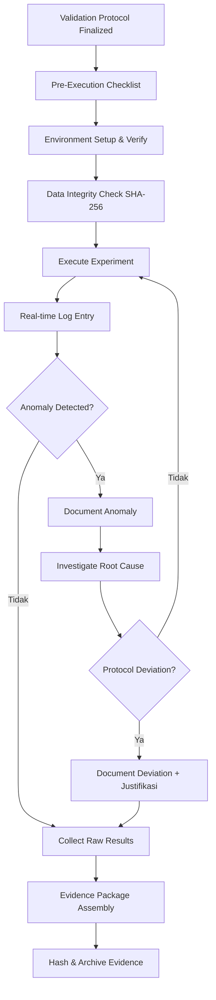

## 3. Pengantar Kontekstual

Pelaksanaan validasi adalah fase di mana rencana bertemu realita. Tidak semua berjalan sesuai protokol — anomali muncul, tool berperilaku tidak terduga, dataset mengandung surprise. Kualitas seorang peneliti tidak diukur dari apakah hasil berjalan sempurna, tetapi dari bagaimana ia mendokumentasikan, menginvestigasi, dan merespons hal yang tidak terduga.

Analogi yang tepat adalah forensik digital: investigator tidak dapat memodifikasi bukti setelah dikumpulkan; setiap tindakan harus terdokumentasi dalam chain of custody. Prinsip yang sama berlaku untuk pelaksanaan validasi penelitian.

## 4. Landasan Teori

### 4.1 Pre-Execution Checklist

Sebelum menjalankan satu baris kode pun, eksekutor harus memverifikasi:
- [ ] Environment identik dengan yang didokumentasikan dalam protocol
- [ ] SHA-256 semua file data terverifikasi sesuai manifest
- [ ] Random seed di-set (untuk reproducibility)
- [ ] Konfigurasi sudah sesuai config.yaml (bukan versi lama)
- [ ] Log file siap menerima output
- [ ] Tidak ada proses lain yang berjalan yang dapat mempengaruhi hasil (beban CPU, I/O)

### 4.2 Real-time Engineering Log

Engineering log selama eksekusi berbeda dari log pre-eksperimen. Ia mencatat:
- Waktu mulai dan selesai setiap tahap
- Parameter yang digunakan
- Anomali yang diamati
- Keputusan yang dibuat (dan alasannya)
- Referensi ke file output yang dihasilkan

**Format entri log eksekusi:**
```
[2025-06-15 09:23:41] START experiment exp_02_full_pipeline
[2025-06-15 09:23:41] Config: config/exp_02.yaml (hash: abc123)
[2025-06-15 09:23:42] Data verified: manifest OK
[2025-06-15 09:24:15] Training complete: 432.7s, val_loss=0.142
[2025-06-15 09:31:22] Anomaly: epoch 47 menunjukkan spike loss; investigasi...
[2025-06-15 09:35:00] Root cause: batch dengan corrupt record; filtered 3 records
[2025-06-15 09:35:01] Decision: lanjut dengan data yang sudah difilter; DICATAT sebagai deviasi minor
[2025-06-15 10:02:33] Evaluation complete: F1=0.912, P=0.908, R=0.916
[2025-06-15 10:02:34] Results saved: results/exp_02/metrics.json (hash: def456)
```

### 4.3 Evidence Preservation

Evidence dari validasi akhir harus dipreservasi dengan cara yang dapat diaudit:

**Raw Results:** File output mentah dari eksperimen — confusion matrix, prediction files, timing logs. Raw results tidak pernah dimodifikasi setelah dikumpulkan.

**Processed Results:** Agregasi atau visualisasi dari raw results. Setiap langkah processing harus terdokumentasi dan dapat direproduksi dari raw results.

**Hash dan Archive:** Setelah eksperimen selesai, buat SHA-256 hash dari semua file evidence dan archivkan dalam folder yang dilindungi.

**Evidence Package Structure:**
```
evidence_package_exp_02/
├── README_evidence.md          # Deskripsi isi package
├── manifest_evidence.csv       # SHA-256 semua file
├── raw/                        # Raw results - DO NOT MODIFY
│   ├── predictions.csv
│   └── timing.log
├── processed/                  # Derived from raw - script terdokumentasi
│   └── confusion_matrix.png
└── experiment_log.txt          # Engineering log selama eksperimen
```

### 4.4 Menangani Anomali dan Deviasi Protokol

**Anomali:** Hasil atau kejadian yang tidak terduga selama eksperimen. Anomali harus diinvestigasi, bukan diabaikan atau "dihilangkan dari data."

**Deviasi Protokol:** Situasi di mana prosedur yang dijalankan berbeda dari yang direncanakan. Deviasi harus didokumentasikan dengan justifikasi. Jika deviasi berdampak signifikan, pembimbing harus dikonsultasikan.

**Yang TIDAK boleh dilakukan:**
- Menghapus data poin yang menghasilkan performa buruk tanpa justifikasi
- Menjalankan ulang eksperimen berkali-kali dan hanya melaporkan run terbaik (p-hacking)
- Mengubah acceptance criteria setelah melihat hasil

## 5. Model atau Arsitektur

```mermaid
flowchart LR
    subgraph EXECUTION["Execution Phase"]
        E1[Setup & Verify]
        E2[Run Protocol]
        E3[Log Real-time]
        E4[Collect Output]
    end

    subgraph EVIDENCE["Evidence Management"]
        EV1[Raw Results → Archive]
        EV2[Processing Script]
        EV3[Processed Results]
        EV4[Hash Manifest]
    end

    subgraph QA["QA & Validation"]
        QA1[Cross-check with Expected]
        QA2[Anomaly Review]
        QA3[Deviation Documentation]
    end

    EXECUTION --> EVIDENCE
    EVIDENCE --> QA
    QA --> PACKAGE["Evidence Package (Eval-3)"]
```

## 6. Contoh Terapan

**Skenario:** Eksekusi validasi untuk sistem deteksi phishing berbasis deep learning.

**Anomali yang ditemukan:** Pada fold ke-3 dari 5-fold cross validation, F1-score tiba-tiba turun ke 0.61 (fold lain: 0.89-0.92).

**Investigasi:** Analisis fold ke-3 menunjukkan proporsi email phishing berbahasa asing (non-Inggris) yang lebih tinggi (42%) dibanding fold lain (15-22%). Model tampaknya kurang generalizable untuk email non-Inggris.

**Keputusan:** Deviasi tidak terjadi — ini adalah temuan valid. Hasil dilaporkan APA ADANYA termasuk fold ke-3. Temuan ini menjadi bagian dari analisis keterbatasan: "model menunjukkan performa signifikan lebih rendah pada email non-Inggris (F1=0.61 vs 0.90 rata-rata)."

Keputusan ini menunjukkan integritas: hasil yang "buruk" tidak dihapus, melainkan dianalisis dan dilaporkan dengan jujur.

## 7. Praktikum atau Aktivitas Terarah

**Tujuan:** Melaksanakan setidaknya satu eksperimen validasi sesuai protokol dan menghasilkan evidence package lengkap.

**Langkah Kerja:**
1. Verifikasi pre-execution checklist.
2. Eksekusi eksperimen sambil mencatat log real-time.
3. Kumpulkan semua output sebagai raw results.
4. Buat hash manifest.
5. Analisis anomali jika ada — dokumentasikan investigasi dan keputusan.
6. Assembly evidence package.

**Catatan Etika:** Jika menemukan anomali yang membuktikan bahwa klaim kontribusi tidak valid, laporkan kepada pembimbing. Menyembunyikan hasil negatif adalah pelanggaran integritas akademik yang serius.

## 8. Latihan Pemahaman

1. **(Pilihan Ganda)** Jika dalam 5 kali pengulangan eksperimen, 3 menghasilkan F1 di atas acceptance criteria dan 2 di bawah, keputusan yang TEPAT adalah:
   - A. Laporkan rata-rata dan standar deviasi dari semua 5 pengulangan
   - B. Hanya laporkan 3 pengulangan yang berhasil
   - C. Ulangi eksperimen sampai semua 5 di atas threshold
   - D. Nyatakan acceptance criteria tidak tercapai dan analisis penyebabnya

2. **(Esai Singkat)** Apa perbedaan antara "anomali" dan "deviasi protokol"? Berikan contoh masing-masing.

3. **(Analisis Kasus)** Mahasiswa O menemukan bahwa performa sistemnya sangat bervariasi antara pengulangan (F1: 0.61, 0.88, 0.91, 0.85, 0.79). Tanpa investigasi, mahasiswa mengklaim "F1 rata-rata 0.81." Identifikasi masalah dengan pendekatan ini dan rekomendasikan tindakan yang lebih tepat.

## 9. Latihan Terapan / Studi Kasus

**Studi Kasus:** Mahasiswa P melakukan validasi akhir sistem klasifikasi malware. Setelah 20 menit eksperimen, terjadi crash pada mesin eksperimen. Mahasiswa memutuskan untuk me-restart dan menjalankan ulang dari awal, tetapi hanya melaporkan hasil run ke-2 (yang berhasil) tanpa menyebutkan crash atau run ke-1. Analisis: (a) apakah keputusan ini dapat dibenarkan; (b) apa yang seharusnya dilaporkan; (c) apa implikasinya jika crash disebabkan oleh edge case dalam data.

## 10. Kunci Jawaban dan Pembahasan

**Soal 1:** Jawaban A (ideal) dikombinasikan dengan D (jika rata-rata tidak memenuhi threshold). Melaporkan rata-rata dan standar deviasi adalah praktek statistik yang benar — ia mengungkapkan variabilitas. Jika acceptance criteria tidak tercapai, hal itu harus dinyatakan dengan jelas dan dianalisis. Opsi B (cherry-picking) dan C (p-hacking melalui pengulangan) adalah pelanggaran integritas ilmiah.

**Soal 2:** Anomali adalah kejadian atau hasil yang tidak terduga selama eksperimen yang memerlukan investigasi — contoh: spike loss yang tidak biasa pada epoch tertentu. Deviasi protokol adalah situasi di mana prosedur yang dieksekusi berbeda dari yang direncanakan dalam protocol — contoh: menggunakan dataset berbeda karena dataset utama tidak tersedia pada saat eksekusi.

**Studi Kasus:** Keputusan mahasiswa P bermasalah karena: (a) jika crash disebabkan oleh edge case dalam data, run ke-1 sebenarnya mengandung informasi penting tentang robustness sistem; (b) tidak melaporkan crash adalah selective reporting. Seharusnya: dokumentasikan crash, investigasi penyebabnya, dan laporkan kedua informasi (bahwa sistem crash pada kondisi X, dan performa pada run yang berhasil selesai). Jika crash adalah bug yang diperbaiki, perbaikan harus terdokumentasi.

## 11. Ringkasan Bab

Pelaksanaan validasi akhir mengikuti protokol yang sudah disetujui, dengan pre-execution checklist, log real-time, dan evidence preservation yang ketat. Anomali harus diinvestigasi dan dilaporkan — bukan diabaikan. Deviasi protokol harus terdokumentasi. Evidence package yang lengkap adalah deliverable utama Eval-3.

## 12. Refleksi Profesional

1. Dalam penyelidikan forensik digital, setiap tindakan investigator harus terdokumentasi dalam chain of custody karena evidence mungkin digunakan di pengadilan. Bagaimana prinsip ini relevan dengan dokumentasi evidence dalam validasi tesis?

---

# BAB 8 — ANALISIS HASIL, STATISTIK, DAN INTERPRETASI

## 1. Capaian Pembelajaran Bab

Setelah mempelajari bab ini, mahasiswa mampu:
- Menganalisis hasil validasi menggunakan metode statistik yang tepat
- Membedakan signifikansi statistik dengan signifikansi praktis (effect size)
- Menginterpretasikan hasil secara jujur termasuk yang tidak mendukung hipotesis
- Menyusun visualisasi data yang akurat dan tidak menyesatkan

*Berkaitan dengan Sub-CPMK.3, Eval-3 (20%)*

## 2. Peta Konsep Bab

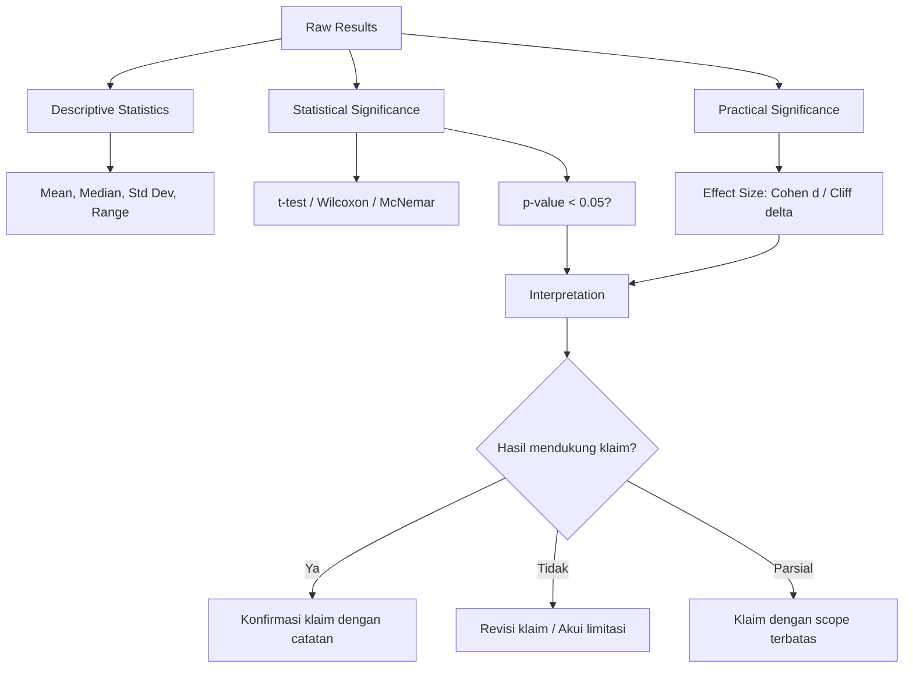

## 3. Pengantar Kontekstual

Mendapatkan angka dari eksperimen baru setengah dari pekerjaan. Setengah lainnya adalah menginterpretasikan angka-angka tersebut secara tepat dan jujur. Dua peneliti dapat melihat F1=0.81 dan mencapai kesimpulan yang sangat berbeda tergantung pada: apakah mereka tahu baseline, apakah mereka mempertimbangkan variabilitas, dan apakah mereka jujur tentang limitasi.

Analisis yang baik tidak hanya melaporkan "kami mencapai F1=0.81" — ia menjelaskan mengapa angka tersebut bermakna (atau tidak bermakna), dalam konteks apa, dengan asumsi apa, dan dengan ketidakpastian berapa besar.

## 4. Landasan Teori

### 4.1 Statistik Deskriptif untuk Hasil Eksperimen

Setiap set hasil eksperimen harus dilaporkan dengan statistik deskriptif yang mencukupi:
- **Mean:** Rata-rata. Dapat menyesatkan jika distribusi sangat skewed.
- **Median:** Nilai tengah. Lebih robust terhadap outlier.
- **Standar Deviasi (SD):** Dispersi sekitar mean. Wajib dilaporkan bersama mean.
- **Confidence Interval (CI):** Rentang nilai yang dengan probabilitas tertentu (misal 95%) mengandung parameter populasi. Lebih informatif dari p-value.

### 4.2 Uji Statistik untuk Perbandingan

**t-test (berpasangan):** Membandingkan mean dua kelompok berpasangan ketika asumsi normalitas terpenuhi.

**Wilcoxon Signed-Rank Test:** Alternatif non-parametrik untuk t-test berpasangan. Lebih tepat ketika sampel kecil atau distribusi tidak normal.

**McNemar Test:** Untuk membandingkan dua classifier pada kasus biner dengan data berpasangan. Umum digunakan dalam NLP dan ML classification.

**Catatan Penting:** Uji statistik mengukur apakah perbedaan yang diamati kemungkinan besar bukan karena kebetulan. Tetapi "signifikan secara statistik" ≠ "penting secara praktis."

### 4.3 Signifikansi Statistik vs Signifikansi Praktis

Dengan sampel yang sangat besar, perbedaan yang sangat kecil (F1=0.81 vs 0.82) dapat menjadi "signifikan secara statistik" (p<0.05). Namun perbedaan 1% mungkin tidak bermakna secara operasional dalam konteks keamanan siber.

**Effect Size** mengukur besaran perbedaan, terlepas dari ukuran sampel:
- **Cohen's d:** Untuk perbedaan mean. d=0.2 (kecil), d=0.5 (sedang), d=0.8 (besar)
- **Cliff's delta:** Non-parametrik, mengukur probabilitas nilai dari satu kelompok lebih besar dari kelompok lain

Peneliti yang baik melaporkan KEDUANYA: signifikansi statistik (p-value atau CI) dan signifikansi praktis (effect size).

### 4.4 Interpretasi Jujur terhadap Hasil yang Tidak Diharapkan

Hasil yang tidak mendukung hipotesis adalah temuan ilmiah yang valid. Interpretasi yang tepat:
- Apakah klaim kontribusi perlu direvisi (dikecilkan scope-nya)?
- Apakah ada penjelasan metodologis untuk hasil yang tidak terduga?
- Apakah ada kondisi di mana klaim tetap berlaku?
- Apakah ini temuan negatif yang berharga (membuktikan bahwa pendekatan tertentu tidak bekerja)?

Mengklaim bahwa "hasilnya mendekati acceptance criteria" ketika sebenarnya tidak memenuhi criteria adalah manipulasi yang tidak etis.

## 5. Model atau Arsitektur

```mermaid
flowchart LR
    subgraph DESCRIPTIVE["Descriptive Analysis"]
        DA1[Mean ± SD per metric]
        DA2[Confidence Interval]
        DA3[Distribution Visualization]
    end

    subgraph INFERENTIAL["Inferential Analysis"]
        IA1[Select Appropriate Test]
        IA2[Compute p-value]
        IA3[Compute Effect Size]
        IA4[Interpret Together]
    end

    subgraph INTERPRETATION["Interpretation"]
        INT1[Does result support claim?]
        INT2[What is the scope of validity?]
        INT3[What are the limitations?]
    end

    RAW[Raw Results] --> DESCRIPTIVE
    DESCRIPTIVE --> INFERENTIAL
    INFERENTIAL --> INTERPRETATION
    INTERPRETATION --> CHAPTER4["Input untuk Bab Pembahasan"]
```

## 6. Contoh Terapan

**Hasil eksperimen deteksi anomali:**

| Metode | F1 Mean | F1 Std | p-value (vs RF-Stat) | Cohen's d |
|---|---|---|---|---|
| Trivial (LR) | 0.712 | 0.018 | - | - |
| RF-Stat (baseline) | 0.851 | 0.012 | - | - |
| CNN (ablation) | 0.878 | 0.015 | 0.003* | 1.84 (large) |
| CNN-LSTM (ours) | 0.917 | 0.011 | <0.001** | 4.21 (very large) |

**Interpretasi:** "CNN-LSTM secara signifikan mengungguli RF-Stat (p<0.001, Cohen's d=4.21 — efek sangat besar). Perbedaan absolut sebesar 6.6 poin F1 relevan secara operasional karena dalam konteks ICS, setiap 1% peningkatan Recall setara dengan N% lebih sedikit insiden yang tidak terdeteksi. Ablation study menunjukkan bahwa komponen temporal (LSTM) memberikan kontribusi tambahan sebesar 3.9 poin F1 di atas CNN saja."

## 7. Praktikum atau Aktivitas Terarah

**Tujuan:** Melakukan analisis statistik lengkap terhadap hasil validasi menggunakan Python/R.

**Langkah Kerja:**
1. Load raw results dari evidence package.
2. Hitung statistik deskriptif (mean, std, CI 95%).
3. Pilih uji statistik yang tepat berdasarkan tipe data dan distribusi.
4. Hitung effect size.
5. Buat visualisasi: box plot, confusion matrix, ROC curve.
6. Tulis narasi interpretasi yang jujur — termasuk kondisi di mana klaim berlaku dan tidak berlaku.

## 8. Latihan Pemahaman

1. **(Pilihan Ganda)** Sebuah studi dengan n=10.000 menemukan p=0.04 untuk perbedaan F1 sebesar 0.002. Kesimpulan yang TEPAT adalah:
   - A. Perbedaan ini signifikan dan penting secara praktis
   - B. Perbedaan ini signifikan secara statistik tetapi mungkin tidak penting secara praktis
   - C. Perbedaan ini tidak signifikan karena n terlalu besar
   - D. p<0.05 selalu berarti perbedaan penting

2. **(Analisis)** Anda mendapatkan F1=0.91 ± 0.08 (rata-rata dan SD dari 5 fold). Penguji bertanya: "Apakah ada kemungkinan hasil ini adalah kebetulan?" Bagaimana Anda merespons menggunakan statistik yang tepat?

3. **(Interpretasi)** Mahasiswa Q mendapatkan akurasi 95% pada dataset pengujian. Namun, confusion matrix menunjukkan: 950 TP, 0 TN, 0 FP, 50 FN (kelas positif 1000, kelas negatif 0). Jelaskan mengapa ini bermasalah.

## 9. Latihan Terapan / Studi Kasus

**Studi Kasus:** Tesis tentang deteksi DDoS. Hasil menunjukkan F1=0.78 — di bawah acceptance criteria 0.80. Mahasiswa ingin menyimpulkan "tesis berhasil karena F1 mendekati target." Susun: (1) argumen mengapa kesimpulan ini tidak dapat diterima; (2) cara yang tepat untuk melaporkan hasil ini; (3) kemungkinan revisi klaim yang masih dapat dipertahankan.

## 10. Kunci Jawaban dan Pembahasan

**Soal 1:** Jawaban B. Dengan n sangat besar, bahkan perbedaan yang tidak bermakna secara praktis dapat mencapai signifikansi statistik. Perbedaan F1 sebesar 0.002 (0.2%) kemungkinan besar tidak memiliki dampak operasional nyata, meskipun p<0.05. Effect size harus dihitung — kemungkinan akan menunjukkan d sangat kecil.

**Soal 3:** Ini adalah situasi di mana dataset pengujian hanya mengandung kelas positif (1000 sampel positif, 0 negatif). Dalam kasus ini, accuracy = TP/(TP+FP+TN+FN) = 950/1000 = 0.95, tetapi sistem tidak pernah menghadapi kelas negatif. Tidak ada TN yang dapat dievaluasi. Sistem ini belum diuji pada skenario lengkap dan accuracy 95% menyesatkan.

## 11. Ringkasan Bab

Analisis hasil yang valid mencakup statistik deskriptif (mean ± SD, CI), uji signifikansi statistik yang tepat, dan effect size untuk signifikansi praktis. Hasil yang tidak mendukung hipotesis tetap valid dan harus dilaporkan dengan jujur. Visualisasi harus akurat dan tidak menyesatkan.

## 12. Refleksi Profesional

1. Banyak insiden keamanan siber terjadi karena keputusan diambil berdasarkan data yang salah diinterpretasikan. Bagaimana kemampuan analisis statistik yang baik membantu Anda sebagai profesional keamanan membuat keputusan berbasis evidence?

---

# BAB 9 — REPLICABILITY, VALIDITY THREATS, DAN AUDIT TRAIL

## 1. Capaian Pembelajaran Bab

Setelah mempelajari bab ini, mahasiswa mampu:
- Memverifikasi replicability hasil validasi secara sistematis
- Mengidentifikasi dan mengklasifikasikan validity threats menggunakan framework Wohlin
- Menyusun audit trail yang dapat diverifikasi untuk seluruh proses validasi
- Mengintegrasikan hasil analisis validity threats ke dalam bab pembahasan

*Berkaitan dengan Sub-CPMK.3, Eval-3 (20%)*

## 2. Peta Konsep Bab

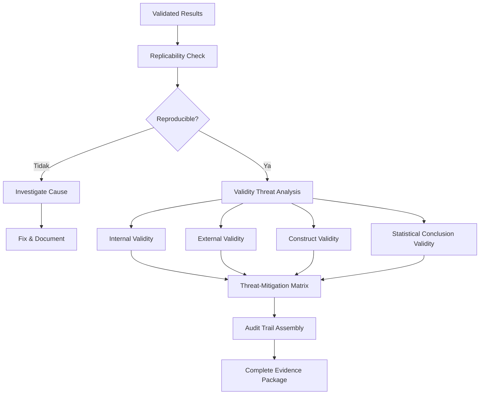

## 3. Pengantar Kontekstual

Sebuah penelitian yang tidak dapat direplikasi bukanlah kontribusi ilmu pengetahuan — ia adalah klaim yang tidak dapat diverifikasi. Replicability crisis dalam sains mengingatkan kita bahwa keakuratan sebuah klaim hanya dapat dinilai jika peneliti lain dapat mengujinya sendiri. Untuk tesis terapan di bidang keamanan siber, dimana temuan dapat memengaruhi keputusan pertahanan nyata, standar ini sangat penting.

Validity threats adalah pengakuan jujur bahwa setiap penelitian memiliki batasan. Peneliti yang mengidentifikasi validity threats-nya sendiri menunjukkan kematangan intelektual — mereka memahami batas klaim yang dapat dibuat dari data yang ada.

## 4. Landasan Teori

### 4.1 Framework Validity Threats (Wohlin et al., 2012)

**Internal Validity Threats:** Ancaman terhadap kesimpulan bahwa variabel independen (solusi kita) menyebabkan perubahan pada variabel dependen (metrik).

| Ancaman | Deskripsi | Contoh dalam Tesis Keamanan |
|---|---|---|
| History | Kejadian eksternal memengaruhi hasil | Dataset diperbarui vendor selama eksperimen |
| Maturation | Subjek berubah seiring waktu | Model yang semakin "terlatih" bukan dari intervensi kita |
| Selection bias | Pemilihan sampel tidak representatif | Hanya malware dari satu sumber, bukan dari berbagai aktor |
| Instrumentation | Alat ukur berubah selama eksperimen | Versi tool berbeda antara baseline dan evaluasi |
| Data leakage | Informasi test bocor ke training | Scaler di-fit pada data gabungan sebelum split |

**External Validity Threats:** Ancaman terhadap generalisasi hasil ke konteks, populasi, atau kondisi yang berbeda.

| Ancaman | Deskripsi | Contoh |
|---|---|---|
| Population representativeness | Dataset tidak mewakili populasi target | Dataset CICIDS 2017 (lab) ≠ traffic produksi |
| Setting | Kondisi eksperimen berbeda dari operasional | Lab yang terisolasi ≠ infrastruktur enterprise riil |
| Time | Hasil dapat berubah seiring waktu | Dataset malware 2020 tidak merepresentasikan threat landscape 2025 |

**Construct Validity Threats:** Ancaman terhadap apakah konsep yang diukur memang yang dimaksud.

| Ancaman | Deskripsi |
|---|---|
| Inadequate preoperational explication | Konsep tidak didefinisikan dengan cukup operasional |
| Mono-operation bias | Hanya satu cara mengukur konstruk |
| Hypothesis guessing | Subjek (jika manusia) menebak hipotesis dan mengubah perilaku |

**Statistical Conclusion Validity Threats:** Ancaman terhadap ketepatan kesimpulan statistik.

| Ancaman | Deskripsi |
|---|---|
| Low statistical power | Sampel terlalu kecil untuk mendeteksi efek yang sebenarnya ada |
| Violated assumptions | Asumsi uji statistik tidak terpenuhi |
| Fishing | Menguji banyak hipotesis tanpa koreksi (multiple comparison problem) |

### 4.2 Menyusun Threat-Mitigation Matrix

Setiap validity threat yang diidentifikasi harus disertai: deskripsi dampak potensial, tindakan mitigasi yang sudah dilakukan, dan penilaian residual risk setelah mitigasi.

| Ancaman | Tipe | Dampak Potensial | Mitigasi | Residual Risk |
|---|---|---|---|---|
| Dataset hanya dari satu sumber | External | Generalisasi terbatas | Akui sebagai limitation | Rendah (sudah diakui) |
| Data leakage risk | Internal | Overestimasi performa | Pipeline validation ketat | Rendah |

### 4.3 Audit Trail

Audit trail adalah rekaman lengkap dari semua keputusan dan tindakan yang memengaruhi hasil penelitian. Komponen:
- Engineering log (real-time selama eksperimen)
- Git commit history (perubahan kode)
- Configuration files (versi yang digunakan)
- Data manifest (hash sebelum dan sesudah preprocessing)
- Decision log (setiap deviasi dari protokol dan justifikasinya)

## 5. Model atau Arsitektur

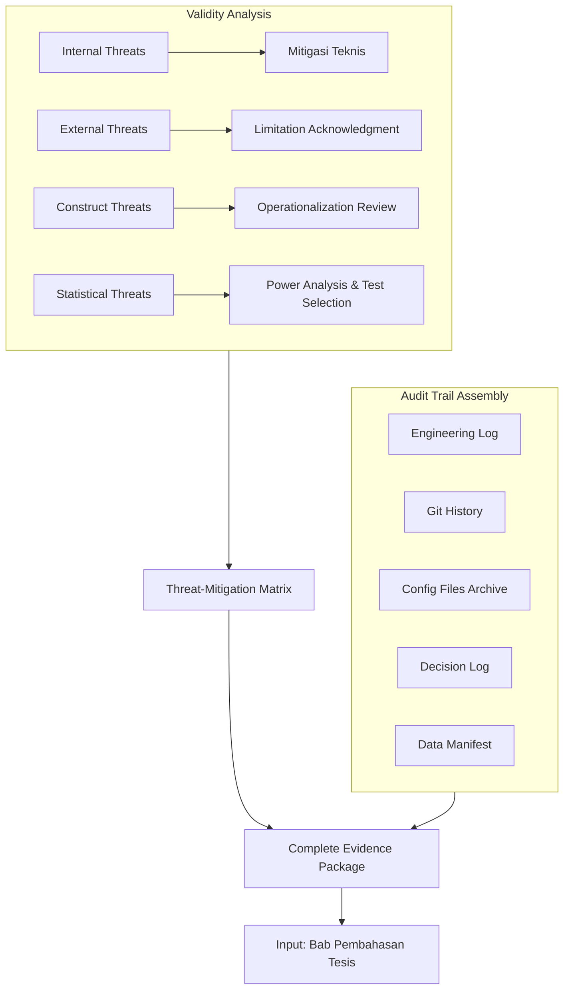

## 6. Contoh Terapan

**Validity Threat Analysis untuk tesis Deteksi Ransomware:**

| No | Ancaman | Tipe | Dampak | Mitigasi | Status |
|---|---|---|---|---|---|
| T1 | Dataset ransomware dari Virustotal (satu sumber) | External | Bias terhadap ransomware yang sudah dideteksi AV | Akui limitation; tambah dataset kedua bila waktu memungkinkan | Partially mitigated |
| T2 | Feature extraction menggunakan tool versi 2.1.0; sekarang ada versi 2.2.0 | Internal | Potential instrumentation change | Lock tool version dalam Docker | Mitigated |
| T3 | Accuracy sebagai metrik tunggal pada dataset sangat tidak seimbang (99% benign) | Construct | Accuracy menyesatkan | Ganti dengan F1, Precision, Recall | Mitigated |
| T4 | n=50 per kelas → statistical power rendah | Statistical | Efek kecil mungkin tidak terdeteksi | Lakukan power analysis a priori; akui sebagai limitation | Partially mitigated |

## 7. Praktikum atau Aktivitas Terarah

**Tujuan:** Menyusun threat-mitigation matrix lengkap untuk tesis sendiri.

**Langkah Kerja:**
1. Identifikasi minimal 3 ancaman dari setiap tipe (internal, external, construct, statistical) — total minimal 12 ancaman.
2. Untuk setiap ancaman: nilai dampak (Tinggi/Sedang/Rendah), tentukan mitigasi yang sudah ada, nilai residual risk.
3. Prioritaskan 5 ancaman paling kritis untuk didiskusikan dalam Bab Pembahasan.
4. Assembly audit trail: verifikasi semua komponen ada dan dapat diakses.

## 8. Latihan Pemahaman

1. **(Pilihan Ganda)** Menggunakan dataset malware yang sama untuk training dan testing TANPA pemisahan yang benar adalah contoh:
   - A. External validity threat
   - B. Internal validity threat (data leakage)
   - C. Construct validity threat
   - D. Statistical validity threat

2. **(Klasifikasi)** Kategorikan validity threats berikut ke dalam empat tipe Wohlin: (a) peneliti mengetahui kelas sampel saat mengekstraksi fitur; (b) hasil baik di lab tetapi belum tentu di production; (c) F1 tinggi karena dataset sangat tidak seimbang; (d) sampel 30 item tidak cukup untuk mendeteksi perbedaan kecil.

3. **(Evaluasi)** Mahasiswa R mengklaim "penelitian ini tidak memiliki validity threats karena menggunakan dataset yang sangat besar." Evaluasi pernyataan ini.

## 9. Latihan Terapan / Studi Kasus

**Studi Kasus:** Tesis tentang tool forensik untuk mengekstrak artefak dari memory dump. Selama audit trail review, pembimbing menemukan: (a) 3 run eksperimen terjadi tetapi hanya 1 yang dilaporkan; (b) konfigurasi yang digunakan dalam run yang dilaporkan berbeda dari yang didokumentasikan dalam protocol; (c) tidak ada hash manifest untuk raw results. Identifikasi masalah integritas ilmiah dalam kasus ini dan langkah perbaikan yang harus diambil.

## 10. Kunci Jawaban dan Pembahasan

**Soal 1:** Jawaban B. Data leakage — menggunakan data yang sama untuk training dan testing — adalah ancaman terhadap validitas internal karena "variabel independen" (model) terpapar informasi dari "variabel dependen" (test labels) selama proses estimasi parameter. Ini menyebabkan performa terlihat lebih tinggi dari yang sebenarnya pada data baru.

**Soal 2:** (a) Peneliti mengetahui kelas saat ekstraksi fitur → Internal threat (instrumentation/observer bias); (b) Hasil lab tidak berlaku di production → External threat (setting); (c) F1 tinggi karena imbalance → Construct threat (inadequate metric operationalization); (d) Sampel kecil → Statistical threat (low power).

**Soal 3:** Pernyataan ini salah pada dua level: (1) Dataset besar mengurangi statistical conclusion threats (low power), tetapi tidak menghilangkan validity threats lainnya — external, internal, dan construct threats tidak hilang hanya karena dataset besar; (2) Dataset besar bahkan dapat memperparah beberapa threats, misalnya statistical significance threshold yang terlalu mudah dicapai (type II error reduction tetapi false positive increase).

## 11. Ringkasan Bab

Replicability adalah standar minimum riset yang dapat dipercaya. Framework Wohlin mengidentifikasi empat tipe validity threats: internal, external, construct, dan statistical. Setiap threat harus diidentifikasi, dinilai dampaknya, dan dimitigasi atau diakui. Audit trail lengkap — engineering log, git history, config files, data manifest, decision log — mendukung verifiabilitas independen.

## 12. Refleksi Profesional

1. Dalam industri keamanan siber, audit trail adalah persyaratan compliance untuk banyak regulasi (ISO 27001, SOC 2, PCI DSS). Bagaimana pengalaman menyusun audit trail untuk tesis mempersiapkan Anda untuk peran profesional di lingkungan regulated?


---

# BAB 10 — PEMBAHASAN KONTRIBUSI DAN NOVELTY POSITIONING

## 1. Capaian Pembelajaran Bab

Setelah mempelajari bab ini, mahasiswa mampu:
- Merumuskan klaim kontribusi tesis secara eksplisit dan dapat diverifikasi
- Memposisikan novelty tesis dalam konteks literatur yang ada
- Menyusun bab pembahasan yang mengintegrasikan hasil, kontribusi, dan implikasi
- Menghindari over-claiming dan under-claiming kontribusi

*Berkaitan dengan Sub-CPMK.4, Eval-4 (15%)*

## 2. Peta Konsep Bab

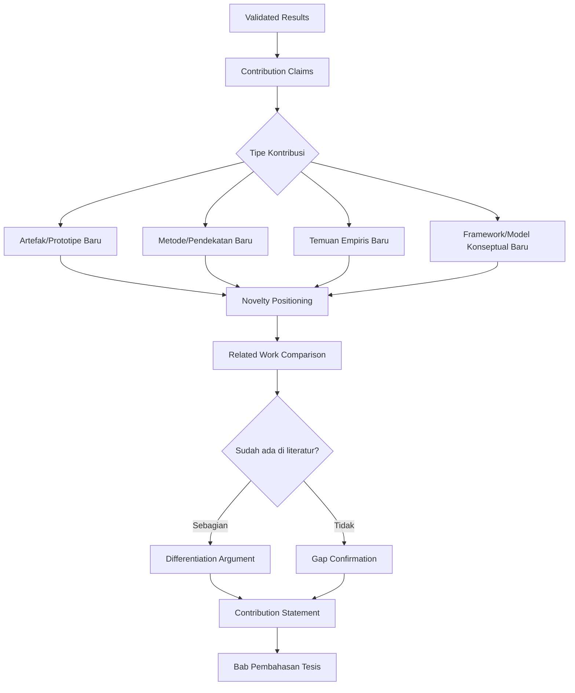

## 3. Pengantar Kontekstual

Bab Pembahasan dalam tesis magister terapan bukan sekadar restatement dari bab hasil. Ia adalah sintesis intelektual yang menjawab pertanyaan: "Jadi apa artinya semua ini?" Seorang peneliti yang baik tidak hanya melaporkan angka — ia menjelaskan mengapa angka-angka tersebut bermakna, bagaimana mereka berkontribusi pada badan pengetahuan yang ada, dan apa implikasinya.

Di sisi lain, ada dua jebakan umum: over-claiming (mengklaim lebih dari yang didukung data) dan under-claiming (merendahkan kontribusi yang sebenarnya signifikan). Keduanya merugikan: over-claiming merusak kredibilitas di sidang; under-claiming membuat penguji bertanya "lalu apa kontribusinya?"

## 4. Landasan Teori

### 4.1 Tipe Kontribusi dalam Penelitian Terapan

Wieringa (2014) mengidentifikasi beberapa tipe kontribusi dalam design science research:

**Artefak Baru:** Sistem, tool, prosedur, atau framework yang sebelumnya tidak ada. Contoh: tool forensik untuk jenis artefak baru, sistem deteksi untuk vektor serangan baru.

**Peningkatan Artefak yang Ada:** Modifikasi atau ekstensi dari sistem yang sudah ada. Contoh: meningkatkan akurasi IDS yang ada dengan komponen ML tambahan.

**Temuan Empiris:** Pengetahuan baru tentang fenomena yang ada. Contoh: studi komparatif menunjukkan bahwa teknik A lebih efektif dari B dalam kondisi X.

**Framework/Model Konseptual:** Cara baru untuk mengorganisir atau memahami suatu domain. Contoh: framework audit IoT yang mengintegrasikan aspek teknis dan regulatori.

### 4.2 Novelty Positioning Matrix

| Dimensi | Pertanyaan | Sumber Jawaban |
|---|---|---|
| Apa yang sudah ada? | Review literatur terkait (SLR/tinjauan sistematik) | Bab Tinjauan Literatur |
| Apa gap-nya? | Keterbatasan pendekatan yang ada | Bab Latar Belakang/Rumusan Masalah |
| Apa kontribusi Anda? | Artefak/metode/temuan yang dihasilkan | Bab Hasil |
| Bagaimana berbedanya? | Perbandingan langsung dengan state-of-the-art | Bab Pembahasan |
| Apa dampaknya? | Implikasi teoritis dan praktis | Bab Pembahasan |

### 4.3 Struktur Contribution Statement

Contribution statement yang baik mengikuti pola: **"Kami mengusulkan [nama kontribusi] yang [cara kerja utama] dan menunjukkan bahwa [klaim kinerja/manfaat] pada [kondisi/dataset spesifik], dibandingkan dengan [baseline], dengan [metrik spesifik]."**

Contoh buruk: "Kami mengembangkan sistem IDS yang lebih baik."

Contoh baik: "Kami mengusulkan HybridIDS — sistem deteksi intrusi yang menggabungkan analisis statistik network flow dengan graph-based anomaly detection — dan menunjukkan bahwa sistem ini mencapai F1=0.92 pada dataset CICIDS2017, meningkat 7 poin absolut di atas state-of-the-art berbasis fitur statistik murni (RF-Stat: F1=0.85, p<0.001)."

### 4.4 Mengintegrasikan Hasil dengan Literatur

Pembahasan harus secara eksplisit menghubungkan hasil dengan literatur:
- "Hasil ini konsisten dengan [paper X] yang menemukan bahwa..."
- "Berbeda dari [paper Y], kami menemukan bahwa... Perbedaan ini kemungkinan disebabkan oleh..."
- "Temuan ini memperluas [paper Z] dengan menunjukkan bahwa prinsip yang sama berlaku untuk..."

## 5. Model atau Arsitektur

```mermaid
flowchart LR
    subgraph INPUT["Input Bab Pembahasan"]
        I1[Validated Results]
        I2[Literature Review]
        I3[Research Questions]
        I4[Acceptance Criteria Status]
    end

    subgraph CONTENT["Konten Bab Pembahasan"]
        C1[RQ Answer for Each RQ]
        C2[Contribution Claim Explicit]
        C3[Comparison with Literature]
        C4[Novelty Differentiation]
        C5[Limitations Honest]
        C6[Implications Technical & Industry]
    end

    INPUT --> CONTENT
    CONTENT --> OUTPUT["Draft Bab Pembahasan → Eval-4"]
```

## 6. Contoh Terapan

**Konteks:** Tesis CTI classification.

**Contribution Statement:** "Kami mengusulkan CTI-Classifier — pipeline klasifikasi laporan threat intelligence ke framework MITRE ATT&CK menggunakan fine-tuned SecBERT — dan menunjukkan bahwa pipeline ini mencapai Macro-F1=0.83 pada dataset 500 laporan CTI berlabel, meningkat 11 poin absolut di atas baseline keyword-based (Macro-F1=0.72, Wilcoxon p=0.003, Cliff's delta=0.68)."

**Novelty Positioning:** "Penelitian sebelumnya (Smith et al., 2022) menggunakan BERT generik untuk klasifikasi CTI dan mencapai Macro-F1=0.79. Kontribusi kami menunjukkan bahwa fine-tuning pada domain-specific model (SecBERT) memberikan peningkatan tambahan sebesar 4 poin absolut, khususnya pada kategori Lateral Movement dan Credential Access yang secara linguistik paling ambigu."

## 7. Praktikum atau Aktivitas Terarah

**Tujuan:** Menulis draft Bab Pembahasan yang mengintegrasikan hasil, kontribusi, dan implikasi.

**Langkah Kerja:**
1. Tulis satu paragraf untuk setiap research question: apakah terjawab? Dengan bukti apa?
2. Tulis contribution statement eksplisit mengikuti template yang diajarkan.
3. Bandingkan hasil dengan minimal 3 paper dari literatur — jelaskan persamaan dan perbedaan.
4. Nyatakan novelty dalam satu paragraf yang dapat dipahami oleh penguji yang tidak spesialis di sub-domain Anda.

## 8. Latihan Pemahaman

1. **(Pilihan Ganda)** "Hasil ini melebihi semua penelitian sebelumnya dan merupakan terobosan terbesar dalam bidang ini" adalah contoh:
   - A. Contribution statement yang baik
   - B. Over-claiming kontribusi
   - C. Novelty positioning yang tepat
   - D. Pernyataan yang dapat diterima jika didukung data

2. **(Esai Singkat)** Jelaskan perbedaan antara "Bab Hasil" dan "Bab Pembahasan" dalam konteks tesis. Apa yang ada di pembahasan yang tidak ada di hasil?

3. **(Perancangan)** Tulis contribution statement untuk tesis fiktif tentang: framework audit keamanan cloud yang mengintegrasikan CIS Benchmark dan ISO 27017, diuji pada 3 deployment cloud (AWS, GCP, Azure simulasi), menemukan rata-rata 40% lebih banyak gap dibanding audit manual.

## 9. Latihan Terapan / Studi Kasus

**Studi Kasus:** Tesis mahasiswa S mengklaim "sistem kami adalah yang pertama mendeteksi serangan zero-day menggunakan behavioral analysis." Dalam sidang, penguji menemukan paper dari 2023 yang melakukan hal yang hampir identik. Mahasiswa tidak aware karena literature review tidak komprehensif. Analisis: (a) dampak terhadap klaim novelty; (b) bagaimana situasi ini dapat dicegah; (c) apakah ada cara untuk merevisi klaim yang masih dapat dipertahankan.

## 10. Kunci Jawaban dan Pembahasan

**Soal 1:** Jawaban B. "Melebihi semua penelitian sebelumnya" dan "terobosan terbesar" adalah klaim superlative yang memerlukan justifikasi yang sangat kuat dan komprehensif — dan bahkan jika benar, kata-kata seperti ini jarang tepat dalam penulisan akademik. "Terobosan terbesar" adalah penilaian komunitas ilmiah, bukan klaim yang dapat dibuat penulis sendiri.

**Soal 2:** Bab Hasil menyajikan apa yang ditemukan (angka, pola, output eksperimen) tanpa interpretasi yang mendalam. Bab Pembahasan menjelaskan mengapa temuan itu bermakna, bagaimana mereka menjawab research question, apa hubungannya dengan literatur, apa implikasinya, dan apa batasannya. Pembahasan adalah "synthesis layer" yang mengubah data menjadi pengetahuan.

## 11. Ringkasan Bab

Contribution statement harus eksplisit, dapat diverifikasi, dan dikalibrasi dengan tepat — tidak over-claim, tidak under-claim. Novelty positioning menggunakan comparison dengan state-of-the-art yang spesifik. Bab Pembahasan mengintegrasikan hasil, literatur, kontribusi, dan implikasi menjadi narasi koheren.

## 12. Refleksi Profesional

1. Dalam proposal proyek keamanan siber kepada manajemen, "apa yang berbeda dari solusi yang ada?" adalah pertanyaan bisnis yang setara dengan "apa kontribusi novelty?" dalam akademik. Bagaimana kemampuan merumuskan kontribusi dengan tepat membantu karir profesional Anda?

---

# BAB 11 — KETERBATASAN, IMPLIKASI TEKNIS/INDUSTRI, DAN REKOMENDASI

## 1. Capaian Pembelajaran Bab

Setelah mempelajari bab ini, mahasiswa mampu:
- Menyatakan keterbatasan penelitian secara jujur dan konstruktif
- Merumuskan implikasi teknis dan implikasi bagi industri/praktisi
- Menyusun rekomendasi yang terukur dan berbasis evidence
- Menghubungkan penelitian tesis dengan agenda penelitian yang lebih luas

*Berkaitan dengan Sub-CPMK.4, Eval-4 (15%)*

## 2. Peta Konsep Bab

```mermaid
flowchart TD
    A[Validated Results + Threat Analysis] --> B[Limitations]
    B --> C[Methodological Limitations]
    B --> D[Scope Limitations]
    B --> E[Technical Limitations]
    
    A --> F[Implications]
    F --> G[Technical Implications\nbagi peneliti]
    F --> H[Practical Implications\nbagi industri/praktisi]
    F --> I[Policy Implications\nbagi regulasi/standar]
    
    A --> J[Recommendations]
    J --> K[Future Research Directions]
    J --> L[Implementation Recommendations]
    J --> M[Risk Considerations for Adoption]
```

## 3. Pengantar Kontekstual

Keterbatasan bukan kelemahan — ia adalah bukti kejujuran intelektual. Peneliti yang menyatakan keterbatasan risetnya secara eksplisit lebih dipercaya dari peneliti yang mengklaim temuannya berlaku universal. Penguji tesis yang berpengalaman justru curiga terhadap tesis yang tidak menyebutkan keterbatasan apapun.

Implikasi dan rekomendasi menunjukkan bahwa mahasiswa tidak hanya mampu melakukan penelitian, tetapi juga memahami konteks lebih luas di mana penelitian tersebut relevan. Ini membedakan tesis yang "menyelesaikan persyaratan akademik" dari tesis yang "berkontribusi pada profesi."

## 4. Landasan Teori

### 4.1 Kategorisasi Keterbatasan

**Keterbatasan Metodologis:** Batasan yang berasal dari pilihan desain penelitian.
- Contoh: "Studi ini menggunakan cross-sectional design yang tidak dapat menangkap perubahan pola serangan seiring waktu. Studi longitudinal di masa depan diperlukan untuk menilai efektivitas jangka panjang."

**Keterbatasan Scope:** Batasan yang berasal dari scope yang didefinisikan untuk tesis.
- Contoh: "Framework audit yang dikembangkan divalidasi hanya pada infrastruktur cloud publik (AWS); aplikabilitas pada private cloud atau hybrid cloud memerlukan adaptasi tambahan."

**Keterbatasan Teknis:** Batasan yang berasal dari teknologi yang digunakan.
- Contoh: "Model yang dikembangkan memerlukan minimum 8GB RAM untuk berjalan dengan latensi <100ms — yang dapat menjadi hambatan pada perangkat edge dengan resource terbatas."

**Keterbatasan Data:** Batasan yang berasal dari dataset yang digunakan.
- Contoh: "Dataset yang digunakan mencakup periode 2022-2023; pola serangan yang muncul sejak 2024 mungkin tidak terwakili."

### 4.2 Menyatakan Keterbatasan dengan Konstruktif

Keterbatasan tidak boleh dinyatakan sebagai permintaan maaf. Setiap keterbatasan harus diiringi dengan: (1) penjelasan mengapa keterbatasan ini ada; (2) implikasi konkret dari keterbatasan; (3) apa yang diperlukan untuk mengatasi keterbatasan ini.

**Format yang baik:**
"[Keterbatasan X] karena [alasan]. Ini berarti [implikasi konkret]. Penelitian masa depan yang [kondisi] dapat mengatasi keterbatasan ini."

### 4.3 Implikasi bagi Berbagai Pemangku Kepentingan

**Implikasi Teknis (bagi peneliti):** Apa yang perlu dilakukan komunitas penelitian sebagai tindak lanjut? Teknik, dataset, atau pendekatan apa yang divalidasi/dibantah oleh penelitian ini?

**Implikasi Praktis (bagi praktisi/industri):** Bagaimana temuan dapat diadopsi? Apa persyaratan implementasi? Apa risiko adopsi?

**Implikasi Kebijakan (jika relevan):** Apa yang disarankan bagi regulator atau pembuat standar? Apakah temuan mendukung atau menantang standar yang ada?

### 4.4 Rekomendasi yang Dapat Ditindaklanjuti

Rekomendasi yang buruk: "Penelitian masa depan harus meneliti topik ini lebih lanjut."

Rekomendasi yang baik: "Penelitian masa depan sebaiknya mengevaluasi framework yang dikembangkan pada dataset dari sektor perbankan di Asia Tenggara, karena regulasi lokal (OJK POJK 11/2022) memiliki persyaratan kontrol yang berbeda dari GDPR yang menjadi referensi utama studi ini. Dataset dapat diperoleh melalui kolaborasi dengan Asosiasi Fintech Indonesia atau lembaga keuangan yang bersedia."

## 5. Model atau Arsitektur

```mermaid
flowchart LR
    subgraph LIMITATIONS["Limitations Section"]
        L1[Methodological]
        L2[Scope]
        L3[Technical]
        L4[Data]
    end

    subgraph IMPLICATIONS["Implications Section"]
        IMP1[For Researchers\nFuture Work]
        IMP2[For Practitioners\nAdoption Guidelines]
        IMP3[For Policy\nStandard Updates]
    end

    subgraph RECOMMENDATIONS["Recommendations"]
        R1[Future Research: Specific]
        R2[Implementation: Conditions]
        R3[Risk: Adoption Considerations]
    end

    RESULT[Validated Results] --> LIMITATIONS
    RESULT --> IMPLICATIONS
    LIMITATIONS --> IMPLICATIONS
    IMPLICATIONS --> RECOMMENDATIONS
    RECOMMENDATIONS --> EVAL4["Eval-4 Deliverable\n(Bab Pembahasan Lengkap)"]
```

## 6. Contoh Terapan

**Konteks:** Tesis sistem deteksi insider threat berbasis ML.

**Keterbatasan:**
"Studi ini menggunakan dataset CERT Insider Threat Dataset r6.2 yang merupakan dataset sintetik yang dihasilkan melalui simulasi. Meskipun dataset ini adalah standar dalam penelitian insider threat, pola perilaku dalam dataset mungkin tidak sepenuhnya mencerminkan kompleksitas perilaku manusia dalam lingkungan kerja nyata. Validasi pada data log organisasi nyata (dengan anonymisasi yang memadai dan persetujuan etik) diperlukan sebelum sistem ini dipertimbangkan untuk deployment."

**Implikasi Praktis:**
"Organisasi yang mempertimbangkan mengadopsi sistem ini harus mempersiapkan: (1) baseline behavioral model yang dikalibrasi pada populasi karyawan spesifik mereka (bukan generik); (2) kebijakan eskalasi yang jelas untuk setiap alert agar menghindari bias diskriminatif terhadap karyawan tertentu; (3) mekanisme appeal bagi karyawan yang secara tidak adil ditandai sebagai ancaman."

## 7. Praktikum atau Aktivitas Terarah

**Tujuan:** Menyusun section Limitations dan Implications dari Bab Pembahasan tesis.

**Langkah Kerja:**
1. Identifikasi semua keterbatasan menggunakan empat kategori (metodologis, scope, teknis, data).
2. Untuk setiap keterbatasan, tulis: deskripsi, alasan, implikasi konkret, cara mengatasinya di masa depan.
3. Rumuskan implikasi untuk tiga pemangku kepentingan: peneliti, praktisi, dan (jika relevan) pembuat kebijakan.
4. Tulis minimal 3 rekomendasi spesifik yang actionable.

## 8. Latihan Pemahaman

1. **(Pilihan Ganda)** Manakah yang merupakan pernyataan keterbatasan yang PALING baik?
   - A. "Penelitian ini memiliki beberapa keterbatasan yang perlu diperhatikan."
   - B. "Dataset yang digunakan terbatas pada traffic dari satu ISP selama 3 bulan, sehingga hasil mungkin tidak merepresentasikan pola traffic global atau musiman."
   - C. "Seperti semua penelitian, ada beberapa limitasi dalam studi ini."
   - D. "Keterbatasan penelitian ini adalah waktu dan sumber daya yang terbatas."

2. **(Analisis)** Mahasiswa T mengklaim "sistem kami siap untuk deployment langsung di lingkungan enterprise." Identifikasi setidaknya 3 pertanyaan yang harus dijawab sebelum klaim ini dapat diterima.

3. **(Perancangan)** Tulis implikasi praktis untuk tesis tentang tool monitoring keamanan IoT yang divalidasi hanya pada perangkat smart home dari satu vendor. Siapa pemangku kepentingannya? Apa implikasi untuk masing-masing?

## 9. Latihan Terapan / Studi Kasus

**Studi Kasus:** Tesis tentang framework deteksi penipuan (fraud detection) pada transaksi mobile banking. Sistem mencapai performa tinggi dalam validasi lab. Namun: (a) semua data dari satu bank; (b) model memerlukan akses ke data transaksi real-time yang sensitif; (c) model black-box (tidak interpretable). Susun: (1) keterbatasan yang harus diakui; (2) implikasi untuk adopsi industri; (3) rekomendasi penelitian lanjutan; (4) pertimbangan regulasi (UU PDP, OJK).

## 10. Kunci Jawaban dan Pembahasan

**Soal 1:** Jawaban B. Opsi B spesifik — menyebutkan sumber data (satu ISP), periode waktu (3 bulan), dan implikasi konkret (tidak merepresentasikan pola global atau musiman). Opsi A, C, dan D adalah pernyataan generik yang tidak memberikan informasi substansial tentang batasan penelitian.

**Soal 2:** Pertanyaan yang harus dijawab: (1) Berapa false positive rate dalam kondisi traffic produksi yang sangat bervariasi (bukan kondisi lab yang terkontrol)? (2) Bagaimana sistem bekerja ketika diserang adversarially (adversarial robustness)? (3) Berapa kebutuhan komputasi dan apakah memenuhi SLA enterprise? (4) Bagaimana sistem terupdate ketika pola serangan baru muncul? (5) Apa prosedur rollback jika sistem menghasilkan false positive tinggi setelah deployment?

## 11. Ringkasan Bab

Keterbatasan harus dinyatakan secara spesifik, jujur, dan konstruktif — bukan sebagai disclaimer umum. Implikasi menunjukkan pemahaman konteks lebih luas. Rekomendasi harus actionable dan spesifik, bukan generik. Ketiga komponen ini adalah bukti kematangan intelektual yang dievaluasi di sidang.

## 12. Refleksi Profesional

1. Dalam presentasi solusi keamanan kepada board of directors, pengakuan jujur tentang limitasi produk/sistem justru meningkatkan kepercayaan. Bagaimana prinsip yang sama berlaku dalam sidang tesis dan dalam komunikasi profesional lebih lanjut?

---

# BAB 12 — STRUKTUR NASKAH TESIS AKHIR DAN PENULISAN ILMIAH

## 1. Capaian Pembelajaran Bab

Setelah mempelajari bab ini, mahasiswa mampu:
- Memahami dan menerapkan struktur standar naskah tesis akhir
- Menulis abstrak, pendahuluan, dan kesimpulan yang koheren
- Menjaga konsistensi internal antara semua bagian tesis
- Menulis dalam gaya akademik formal yang sesuai untuk tesis magister terapan

*Berkaitan dengan Sub-CPMK.5, Eval-5 (20%)*

## 2. Peta Konsep Bab

```mermaid
flowchart TD
    subgraph STRUCTURE["Struktur Naskah Tesis"]
        S1[Halaman Judul & Persetujuan]
        S2[Abstrak Indonesia & Inggris]
        S3[Daftar Isi & Daftar Gambar & Daftar Tabel]
        S4[Bab 1: Pendahuluan]
        S5[Bab 2: Tinjauan Literatur]
        S6[Bab 3: Metodologi]
        S7[Bab 4: Hasil]
        S8[Bab 5: Pembahasan]
        S9[Bab 6: Kesimpulan & Saran]
        S10[Daftar Pustaka]
        S11[Lampiran]
    end

    subgraph CONSISTENCY["Konsistensi Internal"]
        C1[RQ di Bab 1 ↔ Bab 3 ↔ Bab 4 ↔ Bab 5 ↔ Bab 6]
        C2[Hipotesis ↔ Acceptance Criteria ↔ Hasil]
        C3[Klaim ↔ Evidence ↔ Pembahasan]
    end

    STRUCTURE --> CONSISTENCY
    CONSISTENCY --> QUALITY["Naskah Tesis Berkualitas"]
```

## 3. Pengantar Kontekstual

Naskah tesis bukan kumpulan bab yang ditulis secara independen lalu disatukan. Ia adalah dokumen koheren yang harus dibaca sebagai satu narasi ilmiah dari halaman pertama hingga terakhir. Masalah konsistensi — research question yang berubah antara bab 1 dan bab 3, klaim yang tidak didukung oleh data di bab 4, atau kesimpulan yang tidak menjawab rumusan masalah — adalah tanda bahwa tesis tidak dikerjakan secara holistik.

Penulisan naskah tesis juga bukan kegiatan yang dilakukan "setelah semua selesai." Bab-bab awal (Pendahuluan, Tinjauan Literatur, Metodologi) seharusnya sudah ada dalam bentuk draft yang memadai dari Progres Tesis. Tesis Akhir adalah penyempurnaan dan penyempurnaan akhir.

## 4. Landasan Teori

### 4.1 Struktur Standar Tesis Magister Terapan

**Bab 1 — Pendahuluan:**
- Latar belakang: konteks dan motivasi penelitian
- Rumusan masalah (research questions yang spesifik)
- Tujuan penelitian
- Manfaat/kontribusi yang diharapkan
- Batasan penelitian
- Sistematika penulisan

**Bab 2 — Tinjauan Literatur/Kajian Pustaka:**
- Tinjauan terhadap teori/konsep dasar
- Tinjauan terhadap penelitian terkait (state-of-the-art)
- Identifikasi gap yang dijawab penelitian ini
- Landasan teoretis untuk pendekatan yang dipilih

**Bab 3 — Metodologi Penelitian:**
- Desain penelitian (tipe: eksperimen, studi kasus, simulasi)
- Hipotesis penelitian (jika ada)
- Dataset dan sumber data
- Arsitektur artefak/prototipe
- Metode evaluasi dan metrik
- Acceptance criteria (pre-defined)
- Protokol eksperimen

**Bab 4 — Hasil:**
- Deskripsi artefak yang dikembangkan
- Hasil eksperimen/validasi: tabel, grafik, confusion matrix
- Hasil analisis statistik
- Hasil per research question (tanpa interpretasi mendalam)

**Bab 5 — Pembahasan:**
- Jawaban untuk setiap research question
- Perbandingan dengan state-of-the-art
- Contribution statement eksplisit
- Keterbatasan
- Implikasi dan rekomendasi

**Bab 6 — Kesimpulan dan Saran:**
- Ringkasan kontribusi (1 paragraf)
- Jawaban singkat untuk setiap RQ
- Saran untuk penelitian lanjutan (spesifik)

### 4.2 Menulis Abstrak yang Efektif

Abstrak adalah representasi seluruh tesis dalam 200-250 kata. Ia harus mengandung:
- **Konteks:** Mengapa masalah ini penting?
- **Gap:** Apa yang belum diselesaikan oleh penelitian sebelumnya?
- **Metode:** Apa pendekatan yang digunakan?
- **Artefak:** Apa yang dikembangkan?
- **Hasil:** Apa yang ditemukan (dengan angka spesifik)?
- **Implikasi:** Apa artinya bagi praktisi/komunitas?

Abstrak ditulis TERAKHIR, setelah seluruh tesis selesai.

### 4.3 Konsistensi Internal

Konsistensi internal adalah properti yang paling sering gagal dalam tesis yang "ditulis bab per bab." Poin-poin yang harus diverifikasi:

| Dari | Harus Konsisten dengan |
|---|---|
| RQ di Bab 1 | Metode di Bab 3, Analisis di Bab 4, Jawaban di Bab 5 & 6 |
| Klaim kontribusi di Bab 1 | Evidence di Bab 4, Pembahasan di Bab 5 |
| Metodologi di Bab 3 | Prosedur yang actually dilakukan (Bab 4) |
| Keterbatasan di Bab 5 | Batasan penelitian di Bab 1 |
| Jumlah sampel di Bab 3 | Jumlah sampel yang dilaporkan di Bab 4 |

### 4.4 Gaya Penulisan Akademik

**Gunakan:** Kalimat aktif yang jelas; terminologi teknis yang konsisten; referensi sitasi yang tepat; kalimat deklaratif untuk temuan.

**Hindari:** Kalimat yang terlalu panjang dan beranak-cucu; penggunaan "kami" yang tidak konsisten dengan "penelitian ini"; klaim tanpa referensi; kata-kata evaluatif tanpa dasar ("sangat efektif," "jauh lebih baik") tanpa angka.

## 5. Model atau Arsitektur

```mermaid
flowchart LR
    subgraph WRITING_PROCESS["Proses Penulisan"]
        W1[Draft Bab 3 - Metodologi\n(dari Progres Tesis)]
        W2[Draft Bab 4 - Hasil\n(dari Evidence Package)]
        W3[Draft Bab 5 - Pembahasan\n(dari Eval-4)]
        W4[Revisi Bab 1 - Pendahuluan\n(sesuaikan dengan hasil aktual)]
        W5[Revisi Bab 2 - Tinjauan Literatur\n(tambah state-of-the-art terkini)]
        W6[Tulis Bab 6 - Kesimpulan]
        W7[Tulis Abstrak\n(terakhir)]
    end

    W1 --> W2 --> W3 --> W4 --> W5 --> W6 --> W7
    W7 --> REVIEW["Consistency Review\n(Checklist)]
```

## 6. Contoh Terapan

**Contoh Abstrak (200 kata):**

"Serangan ransomware pada infrastruktur kritis terus meningkat, dengan kerugian global mencapai miliaran dolar setiap tahunnya. Sistem deteksi berbasis tanda tangan yang ada tidak efektif terhadap varian ransomware baru. Penelitian ini mengusulkan RansoDetect — sistem deteksi ransomware berbasis analisis perilaku menggunakan Recurrent Neural Network yang dilatih pada sekuens panggilan sistem (syscall) — untuk mendeteksi ransomware sebelum proses enkripsi selesai. Sistem dikembangkan dan dievaluasi pada dataset CIC Ransomware 2022 yang mengandung 12 keluarga ransomware dan 5 kategori benign software. Hasil validasi menunjukkan bahwa RansoDetect mencapai F1=0.93, Recall=0.95, dan rata-rata deteksi sebelum 15% file terenkripsi — meningkat 9 poin F1 di atas sistem berbasis tanda tangan (Baseline: F1=0.84, p<0.001). Sistem berhasil mendeteksi 10 dari 12 keluarga ransomware pada dataset yang tidak digunakan dalam training. Temuan ini menunjukkan bahwa analisis perilaku berbasis RNN efektif untuk deteksi dini ransomware, dengan implikasi praktis bagi SOC yang memerlukan early warning sebelum data loss signifikan terjadi."

## 7. Praktikum atau Aktivitas Terarah

**Tujuan:** Melakukan consistency review terhadap draft tesis dan mengidentifikasi inkonsistensi.

**Langkah Kerja:**
1. Buat tabel konsistensi: ekstrak semua RQ dari Bab 1, lalu verifikasi setiap RQ muncul di Bab 3 (metode), Bab 4 (hasil), Bab 5 (jawaban), dan Bab 6 (kesimpulan).
2. Verifikasi semua angka yang muncul di Abstrak konsisten dengan Bab 4.
3. Pastikan semua claim di Bab 5 dikaitkan dengan data di Bab 4.
4. Tulis daftar inkonsistensi yang ditemukan dan rencana perbaikannya.

## 8. Latihan Pemahaman

1. **(Pilihan Ganda)** Bagian mana dari tesis yang sebaiknya ditulis TERAKHIR?
   - A. Bab Metodologi
   - B. Bab Tinjauan Literatur
   - C. Abstrak
   - D. Bab Kesimpulan

2. **(Analisis)** Bab 1 menyatakan: "RQ2: Apakah sistem berjalan pada perangkat IoT dengan RAM 512MB?" Namun Bab 4 hanya menguji sistem pada server dengan RAM 16GB. Identifikasi: (a) jenis inkonsistensi yang terjadi; (b) dampak terhadap validitas tesis; (c) cara penyelesaian yang tepat.

3. **(Evaluasi)** Kesimpulan tesis menyatakan: "Sistem kami adalah solusi terbaik untuk mendeteksi serangan siber." Evaluasi pernyataan ini dari perspektif penulisan akademik yang tepat.

## 9. Latihan Terapan / Studi Kasus

**Studi Kasus:** Pembimbing melakukan review draft tesis dan menemukan: (a) tabel di Bab 4 menunjukkan n=450 sampel test, tetapi Bab 3 menyebutkan n=500; (b) Bab 5 membahas "kontribusi keempat" tetapi Bab 1 hanya menyebutkan tiga kontribusi; (c) Bab 6 merekomendasikan "pengembangan sistem berbasis cloud" tetapi Bab 5 menyatakan cloud bukan dalam scope penelitian. Susun checklist konsistensi dan rencana revisi untuk setiap inkonsistensi.

## 10. Kunci Jawaban dan Pembahasan

**Soal 1:** Jawaban C. Abstrak harus mencerminkan isi tesis secara akurat — termasuk hasil spesifik dan klaim yang sudah divalidasi. Jika abstrak ditulis terlalu awal, ia mungkin tidak mencerminkan hasil final. Abstrak yang ditulis terakhir dapat dengan tepat mensintesis seluruh isi tesis.

**Soal 2:** (a) Inkonsistensi antara RQ (Bab 1) dan lingkup validasi (Bab 4) — RQ tentang IoT RAM 512MB tidak dijawab; (b) Salah satu RQ tidak terjawab dalam tesis — ini adalah kelemahan metodologis yang serius yang akan ditangkap penguji; (c) Penyelesaian: lakukan pengujian pada perangkat IoT atau emulator yang sesuai, ATAU revisi RQ2 menjadi sesuatu yang benar-benar diuji, dan akui dalam Bab Pembahasan bahwa pengujian di lingkungan terbatas adalah keterbatasan.

**Soal 3:** Tidak dapat diterima sebagai kalimat akademik karena: (1) "terbaik" adalah superlative yang memerlukan perbandingan komprehensif dengan SEMUA solusi yang ada — tidak mungkin dijustifikasi; (2) "serangan siber" terlalu generik — sistem yang diuji hampir pasti hanya mencakup tipe serangan spesifik; (3) "solusi" menyiratkan kesiapan deployment yang belum tentu divalidasi. Versi yang lebih tepat: "Hasil penelitian ini menunjukkan bahwa [nama sistem] efektif mendeteksi [tipe serangan X] dengan F1=Y pada dataset Z, mengungguli [baseline tertentu] sebesar N poin."

## 11. Ringkasan Bab

Struktur tesis akhir yang standar mengikuti alur: Pendahuluan → Tinjauan Literatur → Metodologi → Hasil → Pembahasan → Kesimpulan. Abstrak ditulis terakhir. Konsistensi internal antara semua bab adalah persyaratan kritis. Penulisan akademik menghindari klaim superlative tanpa justifikasi dan mempertahankan gaya yang tepat.

## 12. Refleksi Profesional

1. Dalam laporan forensik digital yang digunakan sebagai bukti hukum, konsistensi internal adalah persyaratan yang tidak dapat dikompromikan — inkonsistensi dapat mendiskreditkan seluruh bukti. Bagaimana prinsip ini menginformasikan standar yang Anda terapkan dalam menulis tesis?

---

# BAB 13 — KONSISTENSI, SITASI, PLAGIARISM CHECK, DAN FORMAT

## 1. Capaian Pembelajaran Bab

Setelah mempelajari bab ini, mahasiswa mampu:
- Menerapkan manajemen referensi yang baik menggunakan reference manager
- Memverifikasi konsistensi sitasi antara teks dan daftar pustaka
- Melakukan dan menginterpretasikan hasil plagiarism/similarity check
- Memenuhi persyaratan format tesis sesuai panduan PENS

*Berkaitan dengan Sub-CPMK.5, Eval-5 (20%)*

## 2. Peta Konsep Bab

```mermaid
flowchart TD
    A[Draft Naskah Tesis] --> B[Citation Management]
    B --> C[Reference Manager: Mendeley/Zotero]
    C --> D[In-text Citation Consistency]
    D --> E[Bibliography Completeness]
    
    A --> F[Plagiarism Check]
    F --> G[Turnitin / iThenticate / Grammarly]
    G --> H{Similarity Score}
    H -- >20% --> I[Review & Revisi]
    H -- ≤20% --> J[Format Check]
    
    J --> K[Panduan Format PENS]
    K --> L[Margin, Font, Spasi, Numbering]
    L --> M[Naskah Siap Pra-Sidang]
```

## 3. Pengantar Kontekstual

Sebuah tesis dengan kontribusi ilmiah yang luar biasa dapat didiskualifikasi atau dikembalikan untuk revisi besar jika memiliki masalah sitasi, plagiarism, atau format yang signifikan. Ini bukan formalitas administratif — mereka adalah standar integritas akademik yang melindungi hak penulis asli dan memastikan bahwa kontribusi mahasiswa dapat dibedakan dari karya orang lain.

Di era AI generatif, batas antara "parafrase yang baik" dan "plagiarism tidak disengaja" menjadi semakin kabur. Prinsip yang jelas: jika sebuah ide bukan berasal dari Anda, ia harus dikutip — bahkan jika diparafrase dengan kata-kata sendiri.

## 4. Landasan Teori

### 4.1 Manajemen Referensi

**Reference Manager (Mendeley, Zotero, EndNote):** Tool untuk mengorganisir referensi, menginsert sitasi secara otomatis, dan menghasilkan daftar pustaka dalam format yang benar. Menggunakan reference manager mengurangi risiko inkonsistensi manual secara drastis.

**Format Sitasi yang Umum:**
- **APA (Publication Manual, 7th ed.):** Umum dalam ilmu sosial dan beberapa bidang teknis
- **IEEE:** Umum dalam teknik dan ilmu komputer — nomor dalam kurung siku [1], [2]
- **Vancouver:** Digunakan dalam bidang medis

Pilihan format harus konsisten dengan panduan PENS dan dipertahankan secara konsisten di seluruh naskah.

**Konsistensi Minimal yang Harus Dijaga:**
- Setiap sitasi in-text harus memiliki entri yang sesuai di daftar pustaka
- Setiap entri di daftar pustaka harus dikutip di-text
- Nama author, tahun, dan judul harus konsisten antara teks dan daftar pustaka

### 4.2 Jenis Plagiarism dalam Konteks Akademik

**Verbatim plagiarism:** Menyalin teks kata per kata tanpa tanda kutip dan sitasi.

**Paraphrase plagiarism:** Mengganti beberapa kata dari teks orang lain tanpa sitasi — meskipun sudah diparafrase, ide yang bukan milik sendiri tetap harus dikutip.

**Mosaic plagiarism:** Menggabungkan potongan dari berbagai sumber tanpa sitasi yang memadai.

**Self-plagiarism:** Menggunakan kembali karya sendiri yang sudah dipublikasikan tanpa deklarasi — relevan jika bagian tesis sudah dipublikasikan sebagai paper.

### 4.3 Menginterpretasikan Similarity Score

Similarity score dari Turnitin atau tool sejenis bukan ukuran langsung plagiarism. Ia mengukur kesamaan teks. Sumber similarity yang sah:
- Sitasi langsung yang benar (dalam tanda kutip)
- Terminologi teknis yang tidak dapat diparafrase (nama protokol, nama standar)
- Self-citation pada bagian yang sudah dipublikasikan dengan deklarasi

Program studi biasanya menetapkan ambang batas similarity yang dapat diterima (umumnya 15-25%). Namun, similarity 10% yang seluruhnya berasal dari satu sumber tanpa kutipan lebih bermasalah dari similarity 25% yang tersebar dari ratusan sumber (terminologi teknis).

### 4.4 Persyaratan Format Tesis

Format tesis mengikuti panduan program studi (PENS). Komponen umum:
- **Kertas:** A4, 80 gsm
- **Margin:** Atas 4cm, Bawah 3cm, Kiri 4cm, Kanan 3cm (umumnya)
- **Font:** Times New Roman 12pt atau Arial 11pt
- **Spasi:** 1.5 atau 2.0
- **Penomoran bab:** Bab I, II, III ... atau Bab 1, 2, 3 ... (konsisten)
- **Penomoran halaman:** Romawi kecil untuk preliminaries, Arabik untuk isi

Pastikan mengacu pada panduan tesis PENS versi terkini yang berlaku.

## 5. Model atau Arsitektur

```mermaid
flowchart TD
    subgraph CITATION_MGMT["Citation Management"]
        CM1[Reference Manager Setup]
        CM2[Import References]
        CM3[Insert In-text Citations]
        CM4[Generate Bibliography]
        CM5[Verify Consistency]
    end

    subgraph INTEGRITY["Integrity Check"]
        IC1[Similarity Check Run]
        IC2[Review Flagged Sections]
        IC3[Revise atau Add Citations]
        IC4[Re-run Check]
        IC5[Score ≤ Threshold]
    end

    subgraph FORMAT["Format Compliance"]
        FC1[Page Setup]
        FC2[Font & Spacing]
        FC3[Heading Styles]
        FC4[Table & Figure Numbering]
        FC5[Cross-reference Check]
    end

    CITATION_MGMT --> INTEGRITY
    INTEGRITY --> FORMAT
    FORMAT --> READY["Naskah Siap Pra-Sidang (Eval-5)"]
```

## 6. Contoh Terapan

**Contoh inkonsistensi sitasi yang umum:**

| Di teks | Di daftar pustaka | Status |
|---|---|---|
| (Smith et al., 2022) | Smith, J. (2021). Title... | INKONSISTEN — tahun berbeda |
| [14] | Entry ke-14: Jones (2023). Title... | OK |
| (Kim & Lee, 2023) | Tidak ada entri | MASALAH — missing reference |

**Contoh revisi untuk memperbaiki similarity score:**

Teks asli (similarity tinggi dari paper X): "Machine learning has been widely used in intrusion detection systems to improve detection accuracy."

Revisi yang tepat: Kutip langsung + sitasi: sebagaimana diulas oleh Smith et al. (2022), penggunaan machine learning dalam sistem deteksi intrusi telah meningkat signifikan dalam dekade terakhir [3]. ATAU parafrase dengan sitasi: Pendekatan berbasis ML telah menjadi pilihan umum dalam penelitian IDS (Smith et al., 2022).

## 7. Praktikum atau Aktivitas Terarah

**Tujuan:** Melakukan similarity check pada draft tesis dan merevisi bagian yang bermasalah.

**Langkah Kerja:**
1. Pastikan reference manager terisi lengkap.
2. Generate daftar pustaka otomatis dari reference manager.
3. Verifikasi konsistensi: setiap sitasi in-text ada di daftar pustaka dan sebaliknya.
4. Upload ke tool similarity check (Turnitin, iThenticate, atau yang tersedia di PENS).
5. Analisis laporan: identifikasi sumber dengan similarity tinggi.
6. Revisi: untuk setiap flagged section, tentukan apakah: (a) perlu ditambah sitasi; (b) perlu diparafrase lebih lanjut; (c) similarity sah (terminologi teknis).

## 8. Latihan Pemahaman

1. **(Pilihan Ganda)** Similarity score 30% dari Turnitin PASTI berarti tesis mengandung plagiarism. Pernyataan ini:
   - A. Benar, karena ambang batas adalah 25%
   - B. Salah, karena similarity score harus diinterpretasikan dalam konteks sumbernya
   - C. Benar, karena semua kesamaan teks adalah plagiarism
   - D. Salah, karena Turnitin tidak dapat mendeteksi plagiarism

2. **(Esai Singkat)** Jelaskan mengapa self-plagiarism adalah masalah akademik, meskipun mahasiswa tidak "mencuri" dari orang lain.

3. **(Analisis)** Daftar pustaka tesis mengandung 60 referensi, tetapi hanya 40 yang dikutip dalam teks. Identifikasi masalah dan solusinya.

## 9. Latihan Terapan / Studi Kasus

**Studi Kasus:** Similarity report menunjukkan 28% similarity, dengan breakdown: 12% dari paper sendiri yang sudah dipublikasikan (Bab 2 diadaptasi dari paper konferensi), 8% dari sumber teknis resmi (NIST, MITRE), 8% dari berbagai paper yang dikutip. Analisis: (a) apakah 28% ini bermasalah? (b) bagaimana menangani 12% dari paper sendiri? (c) apakah 8% dari NIST/MITRE perlu direvisi?

## 10. Kunci Jawaban dan Pembahasan

**Soal 1:** Jawaban B. Similarity score mengukur kesamaan teks, bukan plagiarism. 30% similarity dapat sah jika berasal dari: terminologi teknis yang tidak bisa diparafrase, kutipan langsung yang benar, atau self-citation yang dideklarasikan. Penilaian plagiarism memerlukan review manual terhadap sumber similarity.

**Soal 2:** Self-plagiarism bermasalah karena: (1) Jika karya sebelumnya sudah dipublikasikan di jurnal dengan copyright transfer, hak untuk menggunakan ulang teks mungkin sudah berpindah ke penerbit; (2) Pembaca tesis dan reviewer berasumsi semua konten adalah karya baru — menggunakan konten lama tanpa deklarasi adalah penipuan (deception); (3) Double publication (mempublikasikan konten sama dua kali) melanggar etika penerbitan.

**Soal 3:** 60 referensi di daftar pustaka tetapi 40 dikutip → 20 referensi tidak dikutip dalam teks. Ini melanggar konvensi akademik: daftar pustaka hanya boleh berisi sumber yang dikutip. Solusi: hapus 20 referensi yang tidak dikutip dari daftar pustaka, ATAU integrasikan sitasinya ke dalam teks jika memang relevan.

## 11. Ringkasan Bab

Reference manager mencegah inkonsistensi sitasi. Similarity check harus diinterpretasikan dalam konteks sumber — bukan hanya angka. Self-plagiarism memerlukan deklarasi. Format tesis harus mengikuti panduan program studi. Konsistensi sitasi antara teks dan daftar pustaka adalah wajib.

## 12. Refleksi Profesional

1. Dalam dunia intelijen ancaman siber, atribusi yang salah (salah mengidentifikasi asal serangan) dapat menyebabkan respons yang salah sasaran. Bagaimana prinsip akurasi atribusi ini berhubungan dengan akurasi sitasi dalam penulisan akademik?


---

# BAB 14 — KESIAPAN PRA-SIDANG DAN DOKUMEN KELAYAKAN

## 1. Capaian Pembelajaran Bab

Setelah mempelajari bab ini, mahasiswa mampu:
- Menilai kesiapan tesis untuk memasuki tahap pra-sidang secara objektif
- Menyusun dokumen kelayakan pra-sidang yang lengkap
- Memahami mekanisme dan tujuan pra-sidang dalam konteks program studi
- Menggunakan feedback pra-sidang sebagai input untuk revisi final

*Berkaitan dengan Sub-CPMK.5/6, Eval-5/6 (20%)*

## 2. Peta Konsep Bab

```mermaid
flowchart TD
    A[Naskah Tesis Draft] --> B[Self-Assessment Kelayakan]
    B --> C{Memenuhi Kriteria?}
    C -- Tidak --> D[Revisi Tambahan]
    D --> B
    C -- Ya --> E[Pengajuan ke Pembimbing]
    E --> F[Review Pembimbing]
    F --> G{Disetujui?}
    G -- Tidak --> H[Revisi Sesuai Catatan]
    H --> E
    G -- Ya --> I[Persiapan Dokumen Pra-Sidang]
    I --> J[Upload ke LMS/Submit]
    J --> K[Pra-Sidang dengan Penguji]
    K --> L[Reviewer Feedback Matrix]
    L --> M[Revisi untuk Sidang Final]
```

## 3. Pengantar Kontekstual

Pra-sidang adalah "rehearsal" sebelum sidang final. Tujuannya bukan untuk menghukum mahasiswa, tetapi untuk mengidentifikasi masalah substansial yang masih dapat diperbaiki sebelum sidang formal. Pengalaman pra-sidang yang baik memberikan mahasiswa gambaran tentang pertanyaan yang akan muncul, kelemahan yang perlu diperkuat, dan tingkat keyakinan yang seharusnya dimiliki.

Kuncinya adalah datang ke pra-sidang dengan tesis yang sudah siap — bukan untuk "mendapat feedback agar tahu apa yang harus dikerjakan." Pra-sidang adalah ujian kesiapan, bukan forum bimbingan.

## 4. Landasan Teori

### 4.1 Kriteria Kelayakan Pra-Sidang

Program studi biasanya menetapkan kriteria kelayakan minimum. Umumnya mencakup:

**Kelayakan Akademik:**
- Naskah tesis lengkap (semua bab, daftar pustaka, lampiran)
- Similarity score memenuhi batas (biasanya ≤ 20-25%)
- Pembimbing memberikan persetujuan tertulis
- Semua mata kuliah prasyarat lulus

**Kelayakan Teknis:**
- Artefak/prototipe dapat didemonstrasikan
- Repository final siap dengan release/tag
- Evidence package lengkap

**Kelayakan Formal:**
- Format naskah sesuai panduan PENS
- Administrasi akademik lengkap (KRS, nilai prasyarat)
- Formulir persetujuan pembimbing ditandatangani

### 4.2 Self-Assessment sebelum Pengajuan

Sebelum mengajukan ke pembimbing untuk persetujuan pra-sidang, mahasiswa harus melakukan self-assessment jujur:

| Komponen | Pertanyaan | Status |
|---|---|---|
| Klaim kontribusi | Apakah klaim eksplisit dan didukung evidence? | |
| Research questions | Apakah semua RQ terjawab? | |
| Validation | Apakah validasi sesuai protokol yang disetujui? | |
| Bab pembahasan | Apakah keterbatasan diakui dengan jujur? | |
| Konsistensi | Apakah semua bab koheren satu sama lain? | |
| Format | Apakah format sesuai panduan? | |
| Similarity | Apakah similarity score memenuhi batas? | |
| Artefak | Apakah artefak dapat didemokan dengan stabil? | |

### 4.3 Menggunakan Feedback Pra-Sidang

Feedback dari pra-sidang harus diorganisir dalam Reviewer Response Matrix:

| No | Komentar Reviewer | Tipe | Halaman | Tindakan | Status |
|---|---|---|---|---|---|
| R1 | "Baseline tidak cukup — hanya ada satu comparator" | Major | Bab 4 | Tambah ablation study | In progress |
| R2 | "Kalimat di Bab 5, paragraf 3 ambigu" | Minor | 89 | Revisi kalimat | Done |

Kategorisasi menjadi major (substansial, memerlukan kerja signifikan) dan minor (editorial, mudah diperbaiki) membantu prioritasi.

## 5. Model atau Arsitektur

```mermaid
flowchart LR
    subgraph SELF_CHECK["Self-Assessment"]
        SC1[Checklist Kelayakan]
        SC2[Mock Q&A dengan Pembimbing]
        SC3[Demo Artefak Test Run]
    end

    subgraph SUBMIT["Submission Package"]
        SUB1[Naskah PDF]
        SUB2[Similarity Report]
        SUB3[Repository Link + Tag]
        SUB4[Evidence Package]
        SUB5[Formulir Persetujuan]
    end

    subgraph PRA_SIDANG["Pra-Sidang"]
        PS1[Presentasi 15-20 menit]
        PS2[Demo Artefak]
        PS3[Tanya Jawab Penguji]
        PS4[Feedback Summary]
    end

    SELF_CHECK --> SUBMIT
    SUBMIT --> PRA_SIDANG
    PRA_SIDANG --> MATRIX["Reviewer Response Matrix → Revisi"]
```

## 6. Contoh Terapan

**Skenario:** Mahasiswa U menerima 12 komentar dari pra-sidang. 3 major, 9 minor.

**Major issues:**
1. Penguji 1: "Jumlah sampel terlalu kecil untuk klaim generalisasi" → Tambah disclaimer scope yang jelas + kalkulasi power analysis retrospektif
2. Penguji 2: "Tidak ada pembahasan adversarial robustness" → Tambah subsection dalam Bab 5 + acknowledged limitation
3. Penguji 1: "Referensi pada Bab 2 banyak yang sudah > 5 tahun" → Update dengan paper 2023-2024 yang relevan

Mahasiswa V membuat rencana penyelesaian: major issues → 2 minggu; minor issues → 3 hari.

## 7. Praktikum atau Aktivitas Terarah

**Tujuan:** Melakukan pra-sidang mock dengan teman sejawat dan mendokumentasikan hasilnya.

**Langkah Kerja:**
1. Siapkan presentasi 20 menit.
2. Lakukan mock pra-sidang dengan 2-3 teman sejawat yang berperan sebagai penguji.
3. Teman memberikan pertanyaan dan feedback — catat semua.
4. Isi Reviewer Response Matrix dari feedback yang diterima.
5. Prioritaskan major vs minor issues.

**Catatan:** Mock pra-sidang adalah latihan, bukan evaluasi formal. Hasilnya tidak mempengaruhi nilai.

## 8. Latihan Pemahaman

1. **(Pilihan Ganda)** Tujuan utama pra-sidang adalah:
   - A. Menentukan nilai akhir tesis
   - B. Mengidentifikasi masalah substansial yang masih dapat diperbaiki sebelum sidang formal
   - C. Mempermalukan mahasiswa di depan penguji
   - D. Menggantikan sidang formal

2. **(Analisis)** Reviewer Response Matrix memiliki kolom "Tipe" (Major/Minor). Mengapa kategorisasi ini penting?

3. **(Evaluasi)** Mahasiswa V mengatakan: "Saya tidak akan mengajukan pra-sidang sampai tesis benar-benar sempurna." Apakah strategi ini bijak? Jelaskan.

## 9. Latihan Terapan / Studi Kasus

**Studi Kasus:** Mahasiswa W datang ke pra-sidang dengan tesis yang memiliki: (a) similarity score 32%; (b) dua research question yang tidak terjawab; (c) artefak yang crash saat demo. Prediksi hasil pra-sidang. Identifikasi urutan prioritas perbaikan dan estimasi waktu yang realistis.

## 10. Kunci Jawaban dan Pembahasan

**Soal 1:** Jawaban B. Pra-sidang dirancang sebagai mekanisme quality assurance sebelum sidang formal — memberikan kesempatan untuk perbaikan akhir. Ini menguntungkan mahasiswa karena masalah yang ditemukan di pra-sidang masih dapat diperbaiki; masalah yang sama di sidang formal akan memengaruhi nilai.

**Soal 2:** Major issues memerlukan pekerjaan substantif (bisa memakan minggu) sementara minor issues dapat diselesaikan dalam beberapa jam atau hari. Kategorisasi memungkinkan perencanaan waktu yang realistis dan memastikan mahasiswa tidak membuang waktu pada komentar minor sementara major issues belum diselesaikan.

**Studi Kasus:** Pra-sidang kemungkinan besar tidak lolos / mahasiswa diminta revisi mayor. Prioritas: (1) [Immediate] Revisi tesis untuk menurunkan similarity score; (2) [Priority] Jawab dua RQ yang belum terjawab — ini memerlukan kerja tambahan yang mungkin signifikan; (3) [Priority] Debug dan stabilkan artefak; kemudian (4) re-submit untuk pra-sidang ulang.

## 11. Ringkasan Bab

Pra-sidang adalah mekanisme quality assurance, bukan hukuman. Persiapkan dengan self-assessment jujur dan pastikan semua kriteria kelayakan terpenuhi sebelum mengajukan. Feedback pra-sidang harus diorganisir dalam Reviewer Response Matrix dan diselesaikan secara prioritas (major sebelum minor).

## 12. Refleksi Profesional

1. Dalam siklus pengembangan produk keamanan, "beta testing" atau "security review" sebelum rilis publik memiliki fungsi yang analog dengan pra-sidang. Apa yang terjadi jika fase ini dilewatkan atau dilakukan tergesa-gesa?

---

# BAB 15 — DEFENSE DECK, PRA-SIDANG, DAN PERTAHANAN ARGUMENTASI

## 1. Capaian Pembelajaran Bab

Setelah mempelajari bab ini, mahasiswa mampu:
- Merancang defense deck (slide presentasi) yang efektif untuk sidang tesis
- Mengstrukturkan presentasi sidang dalam alokasi waktu yang optimal
- Mengembangkan strategi untuk menjawab pertanyaan penguji secara argumentatif
- Mengelola situasi teknikal dan non-teknikal selama sidang

*Berkaitan dengan Sub-CPMK.6, Eval-6 (15%)*

## 2. Peta Konsep Bab

```mermaid
flowchart TD
    A[Naskah Tesis Final] --> B[Defense Deck Design]
    B --> C[Content Selection\nApa yang dipresentasikan?]
    B --> D[Visual Design\nBagaimana disajikan?]
    B --> E[Narrative Arc\nAlur yang meyakinkan]
    
    A --> F[Anticipate Questions]
    F --> G[Jenis Pertanyaan Penguji]
    G --> H[Pertanyaan Metodologi]
    G --> I[Pertanyaan Kontribusi]
    G --> J[Pertanyaan Limitasi]
    G --> K[Pertanyaan Domain]
    
    H & I & J & K --> L[Preparation & Practice]
    L --> M[Confident Defense]
```

## 3. Pengantar Kontekstual

Sidang tesis bukan ujian hafalan — ia adalah demonstrasi bahwa mahasiswa adalah pemilik dari penelitiannya. Penguji ingin melihat bahwa mahasiswa memahami setiap keputusan yang diambil, dapat menjelaskan trade-off yang dibuat, dan dapat merespons kritik dengan argumentasi berbasis evidence — bukan hanya menerima semua pertanyaan sebagai serangan.

Defense deck bukan alat bantu yang menggantikan argumentasi verbal — ia adalah kerangka visual yang memandu audiens melalui narasi penelitian. Slide yang terlalu padat menunjukkan ketidakmampuan untuk menyarikan; slide yang terlalu kosong menunjukkan kurangnya persiapan substansial.

## 4. Landasan Teori

### 4.1 Struktur Defense Deck yang Efektif

**Alokasi Waktu Presentasi (tipikal 15-20 menit):**

| Bagian | Durasi | Isi |
|---|---|---|
| Opening | 1 menit | Judul, mahasiswa, pembimbing |
| Motivation & Problem | 2-3 menit | Mengapa topik ini penting? Apa masalahnya? |
| Research Questions | 1 menit | RQ yang dijawab (ringkas) |
| Approach & Contribution | 3-4 menit | Apa yang diusulkan? Mengapa berbeda? |
| Results | 4-5 menit | Hasil utama dengan angka; tabel/grafik kunci |
| Discussion | 2-3 menit | Apa artinya? Kontribusi dalam konteks |
| Limitations & Future | 1-2 menit | Keterbatasan utama; agenda ke depan |
| Conclusion | 1 menit | Take-away yang paling penting |

**Jumlah Slide:** Sekitar 1 slide per menit. Untuk 20 menit, 18-22 slide adalah wajar.

### 4.2 Prinsip Desain Slide untuk Sidang

**Informasi kunci harus terlihat dari kursi penguji:** Gunakan font minimal 18pt untuk teks, 20pt untuk judul.

**Satu ide per slide:** Slide yang mencoba menyampaikan lima poin sekaligus menghasilkan audiens yang bingung dan presenter yang terburu-buru.

**Data visual > tabel teks:** Grafik perbandingan lebih mudah dipahami dari tabel angka dalam 30 detik.

**Backup slides:** Siapkan slide tambahan di bagian akhir untuk pertanyaan yang diantisipasi — grafik detil, tabel lengkap, breakdown per kategori.

### 4.3 Strategi Menjawab Pertanyaan Penguji

**PREP Framework (Point, Reason, Evidence, Point):**
1. **Point:** Nyatakan posisi/jawaban Anda secara langsung
2. **Reason:** Jelaskan mengapa posisi itu benar
3. **Evidence:** Dukung dengan data dari tesis Anda
4. **Point:** Ulangi kesimpulan untuk mempertegas

**Contoh penerapan PREP:**
Pertanyaan: "Mengapa Anda memilih Isolation Forest dan bukan One-Class SVM?"

Jawaban PREP: "Kami memilih Isolation Forest karena lebih efisien secara komputasi untuk dataset skala besar [Point]. Isolation Forest memiliki kompleksitas O(n log n) dibandingkan O(n²) untuk OC-SVM pada kernel non-linear [Reason]. Dalam eksperimen awal kami, Isolation Forest memproses dataset 100.000 event dalam 2.3 detik vs 47 detik untuk OC-SVM pada hardware yang sama [Evidence]. Dengan pertimbangan efisiensi ini, Isolation Forest adalah pilihan yang lebih tepat untuk skenario SOC dengan volume log tinggi [Point]."

### 4.4 Menangani Pertanyaan Sulit

**"Saya tidak tahu" yang jujur lebih baik dari jawaban yang menyesatkan.** Format yang baik: "Pertanyaan yang menarik — saya tidak melakukan eksperimen spesifik untuk itu, tetapi berdasarkan [prinsip/literatur], saya menduga bahwa... Ini adalah arah penelitian yang perlu dikonfirmasi."

**Pertanyaan yang salah premis:** "Pembimbing saya tidak setuju dengan klaim tersebut..." → Klarifikasi premis dulu: "Izin saya klarifikasi dulu — apakah yang dimaksud adalah [X] atau [Y]?"

**Kritik metodologi yang valid:** Akui dengan tenang: "Itu adalah keterbatasan yang kami akui di Bab 5, halaman X. Kami memilih pendekatan ini karena [alasan], dengan kesadaran bahwa [dampak keterbatasan]."

## 5. Model atau Arsitektur

```mermaid
flowchart LR
    subgraph PREP_PHASE["Persiapan Sidang"]
        P1[Finalkan Defense Deck]
        P2[Rehearsal Solo 3x]
        P3[Mock Defense dengan Pembimbing]
        P4[Prepare Backup Slides]
        P5[Prepare Demo Environment]
    end

    subgraph EXECUTION["Pelaksanaan Sidang"]
        E1[Opening - Confident & Clear]
        E2[Present with Eye Contact]
        E3[Demo if Required]
        E4[Handle Q&A with PREP]
        E5[Close Professionally]
    end

    subgraph POST["Pasca Sidang"]
        POST1[Catat Semua Pertanyaan & Keputusan]
        POST2[Terima Feedback Penguji]
        POST3[Susun Revision Plan]
    end

    PREP_PHASE --> EXECUTION
    EXECUTION --> POST
```

## 6. Contoh Terapan

**Pertanyaan Penguji yang Umum dalam Sidang Keamanan Siber:**

1. "Dataset Anda terlalu kecil. Bagaimana Anda yakin hasilnya generalisable?"
   → PREP: Akui keterbatasan → jelaskan mengapa ukuran tersebut reasonable untuk konteks → tunjukkan confidence interval → nyatakan sebagai future work

2. "Apakah sistem Anda aman terhadap adversarial attack?"
   → PREP: Jawab scope penelitian → jelaskan bahwa adversarial robustness bukan focus utama → tunjukkan limitation yang sudah diakui → jelaskan future work

3. "Mengapa tidak menggunakan GPT/LLM untuk task ini?"
   → PREP: Jelaskan trade-off (interpretability, latency, cost, privasi data) → justifikasi pilihan yang dibuat → tunjukkan bahwa pilihan dipertimbangkan

## 7. Praktikum atau Aktivitas Terarah

**Tujuan:** Merancang defense deck dan melakukan rehearsal terukur.

**Langkah Kerja:**
1. Desain defense deck mengikuti struktur yang diajarkan.
2. Lakukan rehearsal solo dengan timer — pastikan sesuai alokasi waktu.
3. Rekam video rehearsal, tonton, dan identifikasi kelemahan (kecepatan, clarity, eye contact).
4. Lakukan mock defense dengan pembimbing — gunakan PREP untuk setiap jawaban.
5. Siapkan minimal 10 backup slides untuk pertanyaan yang diantisipasi.

## 8. Latihan Pemahaman

1. **(Pilihan Ganda)** Jika penguji mengajukan pertanyaan yang tidak dapat Anda jawab karena berada di luar scope penelitian, respons terbaik adalah:
   - A. Diam dan tunggu penguji melanjutkan
   - B. Akui bahwa pertanyaan di luar scope, jelaskan apa yang dilakukan dalam scope, dan nyatakan sebagai arah masa depan
   - C. Jawab seadanya meskipun tidak akurat
   - D. Bertanya balik kepada penguji

2. **(Analisis)** Defense deck memiliki 45 slide untuk presentasi 20 menit. Identifikasi masalah dan solusi.

3. **(Perancangan)** Rancang jawaban PREP untuk pertanyaan: "Dataset yang Anda gunakan adalah dataset publik yang banyak digunakan. Bagaimana Anda memastikan hasil Anda bukan hanya reproduksi dari penelitian sebelumnya?"

## 9. Latihan Terapan / Studi Kasus

**Studi Kasus:** Saat demo dalam sidang, artefak mengalami error yang tidak pernah terjadi sebelumnya. Mahasiswa panik dan tidak dapat melanjutkan demo. Analisis: (a) bagaimana seharusnya mahasiswa merespons situasi ini secara profesional; (b) apa yang seharusnya disiapkan sebagai contingency; (c) apakah situasi ini harus mempengaruhi penilaian kontribusi penelitian secara signifikan?

## 10. Kunci Jawaban dan Pembahasan

**Soal 1:** Jawaban B. Mengakui keterbatasan scope secara jelas dan profesional, lalu menjawab dengan apa yang memang dikaji dalam penelitian, adalah respons yang menunjukkan kematangan ilmiah. Penguji yang baik menghargai kejujuran tentang batasan lebih dari jawaban yang berusaha menutup-nutupi keterbatasan.

**Soal 2:** 45 slide untuk 20 menit = 2.25 menit per slide — ini terlalu cepat untuk menyampaikan konten bermakna. Masalah: presenter akan terburu-buru, audiens tidak dapat mengikuti, kualitas diskusi menjadi rendah. Solusi: kurangi ke 18-22 slide dengan konten yang lebih terfokus; pindahkan detail ke backup slides.

**Studi Kasus:** Respons profesional: (a) tenang — jangan panik di depan penguji; jelaskan situasi secara singkat ("izin saya switch ke backup demo/recording"); (b) contingency yang seharusnya disiapkan: video recording demonstrasi yang sudah berjalan + output screenshot dari run sebelumnya; (c) error demo saat sidang tidak harus mendiskreditkan kontribusi penelitian — penguji yang baik mengerti bahwa demo error adalah kejadian teknis yang berbeda dari kualitas penelitian itu sendiri. Artefak yang sudah berjalan dalam evidence package adalah bukti yang lebih kuat dari demo live.

## 11. Ringkasan Bab

Defense deck yang efektif memiliki ~1 slide per menit dengan narasi yang jelas. PREP framework (Point, Reason, Evidence, Point) adalah struktur jawaban yang meyakinkan. Pertanyaan sulit dijawab dengan jujur dan konstruktif. Backup slides dan contingency plan untuk demo adalah persiapan yang wajib.

## 12. Refleksi Profesional

1. Kemampuan mempresentasikan temuan teknis kepada audiens campuran (teknis dan non-teknis) adalah kompetensi kritis dalam karir keamanan siber — dari laporan insiden ke manajemen hingga presentasi dalam konferensi. Bagaimana persiapan sidang tesis melatih kompetensi ini?

---

# BAB 16 — SIDANG FINAL, REVISI AKHIR, DAN PENYERAHAN ARTEFAK

## 1. Capaian Pembelajaran Bab

Setelah mempelajari bab ini, mahasiswa mampu:
- Memahami mekanisme dan kriteria sidang tesis final
- Mengelola proses revisi akhir secara sistematis setelah sidang
- Menyiapkan dan menyerahkan artefak final sesuai persyaratan program studi
- Merencanakan transisi dari tesis ke publikasi dan pengembangan karir

*Berkaitan dengan Sub-CPMK.6, Eval-6 (15%)*

## 2. Peta Konsep Bab

```mermaid
flowchart TD
    A[Sidang Tesis Final] --> B[Panel Decision]
    B --> C{Keputusan}
    C --> D[Lulus Tanpa Revisi]
    C --> E[Lulus dengan Revisi Minor\nbatas waktu: 2-4 minggu]
    C --> F[Lulus dengan Revisi Mayor\nbatas waktu: 1-3 bulan]
    C --> G[Tidak Lulus - Sidang Ulang]
    
    D & E & F --> H[Revision Plan & Execution]
    H --> I[Sign-off Pembimbing/Penguji]
    I --> J[Naskah Final + Artefak Final]
    J --> K[Penyerahan ke Program Studi]
    K --> L[Arsip + Repository Release]
    L --> M[Rencana Pasca Tesis:\nPublikasi & Karir]
```

## 3. Pengantar Kontekstual

Sidang final adalah puncak dari perjalanan multi-semester yang dimulai dari Proposal Tesis. Bagi sebagian besar mahasiswa, ia adalah saat yang campur aduk antara ketegangan, kepuasan, dan kelegaan. Memahami mekanismenya secara rasional — bukan hanya emosional — membantu mahasiswa mempersiapkan diri dengan lebih baik dan merespons hasilnya dengan lebih konstruktif.

Yang paling penting: sidang final bukan akhir dari proses akademik — ia adalah awal dari fase diseminasi. Tesis yang dipertahankan dan direvisi dengan baik memiliki potensi menjadi publikasi ilmiah, tools yang diadopsi industri, atau fondasi untuk penelitian doktoral.

## 4. Landasan Teori

### 4.1 Anatomi Sidang Tesis Final

**Struktur Tipikal Sidang (90-120 menit):**
- 15-20 menit: Presentasi oleh mahasiswa
- 10 menit: Demo artefak (jika relevan)
- 60-90 menit: Tanya jawab dan deliberasi panel
- 10-15 menit: Deliberasi panel (tertutup)
- 5 menit: Pengumuman keputusan

**Komposisi Panel:** Biasanya terdiri dari pembimbing (sebagai moderator atau anggota) dan 2-3 penguji dari dalam dan luar program studi.

### 4.2 Tipe Keputusan Sidang

**Lulus Tanpa Revisi (Sangat Jarang):** Tesis diterima as-is. Mahasiswa langsung menyerahkan naskah final.

**Lulus dengan Revisi Minor:** Tesis diterima dengan perbaikan kecil yang dapat diselesaikan dalam 2-4 minggu. Tidak diperlukan sidang ulang. Revisi diverifikasi oleh pembimbing.

**Lulus dengan Revisi Mayor:** Tesis memerlukan perbaikan substansial (penambahan eksperimen, penulisan ulang bab tertentu). Batas waktu biasanya 1-3 bulan. Verifikasi oleh pembimbing dan/atau penguji.

**Tidak Lulus / Sidang Ulang:** Tesis memerlukan perbaikan yang sangat signifikan dan harus dipresentasikan ulang di depan panel. Kondisi ini seharusnya dapat dicegah dengan persiapan pra-sidang yang baik.

### 4.3 Manajemen Revisi Akhir

**Prinsip Revisi Akhir:**
1. Buat revision plan dalam 48 jam setelah sidang — saat semua feedback masih segar
2. Konfirmasi scope revisi dengan pembimbing — pastikan pemahaman sama
3. Track revisi dengan Reviewer Response Matrix
4. Jangan membuat perubahan yang tidak diminta — revisi luar scope dapat memperkenalkan masalah baru
5. Dapatkan sign-off dari pembimbing/penguji sebelum menyerahkan naskah final

### 4.4 Penyerahan Artefak Final

Penyerahan tidak hanya berupa naskah PDF. Umumnya mencakup:
- Naskah tesis format PDF (versi setelah revisi dan disetujui)
- Lembar persetujuan dengan tanda tangan semua pihak
- Repository link (dengan release/tag final)
- Evidence package (jika dipersyaratkan)
- Formulir administrasi program studi
- Soft copy untuk arsip perpustakaan

### 4.5 Rencana Pasca Tesis

**Publikasi:** Tesis yang baik umumnya memiliki satu atau lebih paper yang dapat diekstraksi. Bab Pembahasan (kontribusi + novelty) adalah fondasi section 4-5 dari paper jurnal/konferensi. Koordinasikan dengan pembimbing tentang authorship dan target venue.

**HKI (Hak Kekayaan Intelektual):** Jika artefak memiliki nilai komersial, pertimbangkan pendaftaran paten atau hak cipta melalui lembaga yang sesuai (DJKI). Diskusikan dengan pembimbing dan program studi tentang kebijakan HKI.

**Open Source Release:** Jika artefak berupa tool yang berguna bagi komunitas, pertimbangkan rilis publik dengan lisensi yang tepat (MIT, Apache 2.0, atau lisensi yang disepakati dengan program studi).

## 5. Model atau Arsitektur

```mermaid
flowchart LR
    subgraph DEFENSE["Sidang Final"]
        D1[Opening & Presentation]
        D2[Demo Artefak]
        D3[Q&A Panel]
        D4[Deliberasi Panel]
        D5[Keputusan]
    end

    subgraph REVISION["Revisi Akhir"]
        R1[Revision Plan dalam 48 jam]
        R2[Konfirmasi Scope dengan Pembimbing]
        R3[Revisi Berdasarkan Matrix]
        R4[Sign-off Pembimbing/Penguji]
    end

    subgraph SUBMISSION["Penyerahan Final"]
        SUB1[Naskah Final PDF]
        SUB2[Repository Tag Final]
        SUB3[Administrasi Lengkap]
        SUB4[Evidence Package]
    end

    subgraph POST["Pasca Tesis"]
        POST1[Ekstraksi Paper Publikasi]
        POST2[Pertimbangan HKI/Open Source]
        POST3[Portfolio Profesional]
    end

    DEFENSE --> REVISION --> SUBMISSION --> POST
```

## 6. Contoh Terapan

**Skenario:** Mahasiswa X lulus dengan revisi mayor setelah sidang.

**Keputusan Panel:** "Tambahkan eksperimen dengan dataset kedua untuk memperkuat klaim generalisasi; revisi Bab 2 untuk memasukkan paper terkini (2023-2024); perbaiki inkonsistensi penomoran tabel antara Bab 3 dan Bab 4."

**Revision Plan (dibuat dalam 48 jam):**

| No | Revisi | Tipe | Waktu Estimasi | Deadline |
|---|---|---|---|---|
| 1 | Eksperimen dengan dataset UNSW-NB15 | Mayor | 3 minggu | Minggu 4 |
| 2 | Update Bab 2 dengan 8 paper 2023-2024 | Mayor | 1 minggu | Minggu 2 |
| 3 | Fix penomoran tabel Bab 3-4 | Minor | 1 hari | Minggu 1 |

**Rencana Publikasi:** Bab 5 (Pembahasan + Kontribusi) → paper untuk IEEE Access; target submission setelah revisi tesis selesai.

## 7. Praktikum atau Aktivitas Terarah

**Tujuan:** Membuat rencana pasca-tesis yang komprehensif.

**Langkah Kerja:**
1. Identifikasi kontribusi utama tesis yang paling "publishable."
2. Pilih 2-3 target venue publikasi yang sesuai domain tesis (jurnal/konferensi).
3. Diskusikan dengan pembimbing tentang: authorship, timeline submission, dan adapatasi dari tesis ke paper.
4. Buat draft outline paper pertama berdasarkan material tesis.

## 8. Latihan Pemahaman

1. **(Pilihan Ganda)** Setelah sidang, mahasiswa menerima keputusan "lulus dengan revisi mayor." Tindakan pertama yang PALING tepat dalam 48 jam adalah:
   - A. Langsung mulai merevisi bab yang dikritik
   - B. Konfirmasi scope revisi secara tertulis dengan pembimbing
   - C. Membuat revision plan lengkap dan konfirmasi scope dengan pembimbing
   - D. Menyerahkan naskah saat ini ke program studi

2. **(Analisis)** Penguji meminta "tambahkan eksperimen baru" sebagai bagian dari revisi mayor. Mahasiswa tidak setuju karena menurutnya eksperimen yang ada sudah cukup. Bagaimana cara mahasiswa menyikapi situasi ini secara profesional?

3. **(Perancangan)** Tesis Anda tentang sistem deteksi phishing. Identifikasi: (a) komponen tesis yang paling mungkin menjadi paper; (b) target venue yang sesuai; (c) adaptasi yang diperlukan dari format tesis ke format paper.

## 9. Latihan Terapan / Studi Kasus

**Studi Kasus 1:** Mahasiswa Y lulus dengan revisi minor setelah sidang. Pembimbing menandatangani naskah final tanpa membaca revisi secara detail karena percaya mahasiswa. Saat diserahkan ke program studi, penguji menemukan bahwa salah satu revisi mayor yang diminta belum dilakukan. Analisis: (a) siapa yang bertanggung jawab; (b) apa konsekuensinya; (c) bagaimana situasi ini dapat dicegah.

**Studi Kasus 2:** Tesis mahasiswa Z mengandung tool forensik yang berhasil divalidasi. Pembimbing menyarankan untuk mendaftarkan HKI. Mahasiswa khawatir mendaftarkan HKI berarti tool tidak dapat dibuat open source. Klarifikasi: apakah keduanya (HKI dan open source) dapat berjalan bersama?

## 10. Kunci Jawaban dan Pembahasan

**Soal 1:** Jawaban C. Membuat revision plan DAN konfirmasi scope adalah kombinasi yang paling efektif. Revision plan dibuat saat feedback masih segar (48 jam), lalu dikonfirmasi dengan pembimbing untuk memastikan pemahaman tentang scope tidak berbeda. Langsung merevisi (A) tanpa konfirmasi berisiko merevisi hal yang salah; menyerahkan naskah saat ini (D) sebelum revisi adalah tidak mungkin untuk "lulus dengan revisi mayor."

**Soal 2:** Mahasiswa harus mendiskusikan secara profesional dengan pembimbing sebagai mediator. Ekspresi ketidaksetujuan yang tepat: "Izin saya sampaikan pandangan saya tentang revisi ini — saya memahami concern penguji tentang [X], dan saya berpendapat bahwa eksperimen yang ada sudah menangani concern tersebut karena [alasan]. Apakah mungkin saya mendiskusikan ini dengan penguji untuk mengklarifikasi apakah ada kesenjangan pemahaman?" Dalam kebanyakan kasus, mahasiswa harus mengikuti keputusan panel — tetapi klarifikasi scope revisi adalah hak yang sah.

**Studi Kasus 2:** HKI (paten atau hak cipta) dan open source DAPAT berjalan bersama — bahkan banyak software berlisensi terbuka yang juga memiliki paten (contoh: banyak kontribusi Google ke Android). Yang harus dikonsultasikan: apakah program studi memiliki kebijakan tentang HKI karya mahasiswa (beberapa institusi mungkin memiliki klaim atas karya yang dibuat selama studi); apakah paten yang dimaksud adalah paten software atau metode; dan apakah lisensi open source yang dipilih kompatibel dengan rencana HKI.

## 11. Ringkasan Bab

Sidang final menghasilkan salah satu dari empat keputusan. Revisi akhir harus direncanakan dalam 48 jam dan dieksekusi secara disiplin menggunakan Reviewer Response Matrix. Penyerahan artefak final mencakup lebih dari sekadar naskah PDF. Tesis yang baik adalah awal dari karir penelitian dan profesional — bukan akhir dari perjalanan akademik.

## 12. Refleksi Profesional

1. Setiap peneliti yang berhasil melewati sidang tesis telah membuktikan satu hal: kemampuan untuk menyelesaikan penelitian ilmiah yang bermakna dari awal hingga akhir. Bagaimana kompetensi ini — perencanaan, eksekusi, dokumentasi, pertahanan argumentasi — akan Anda aplikasikan dalam lima tahun pertama karir profesional Anda di bidang keamanan siber?


---

# LAMPIRAN

## Lampiran A — Template Readiness Review

**[READINESS REVIEW — TESIS AKHIR]**

**Mahasiswa:** _______________ **NIM:** _______________ **Tanggal:** _______________ **Pembimbing:** _______________

### Dimensi 1: Artefak/Prototipe

| Komponen | Status (Ada/Parsial/Tidak Ada) | Gap | Dampak (T/S/R) | Usaha (T/S/R) |
|---|---|---|---|---|
| Prototipe utama | | | | |
| Integrasi komponen | | | | |
| Baseline/comparator | | | | |
| Pipeline end-to-end | | | | |
| Dokumentasi teknis | | | | |

### Dimensi 2: Data dan Evidence

| Komponen | Status | Gap | Dampak | Usaha |
|---|---|---|---|---|
| Dataset utama tersedia | | | | |
| SHA-256 hash terverifikasi | | | | |
| Ground truth / label | | | | |
| Dataset sekunder (generalisasi) | | | | |
| Lisensi data terverifikasi | | | | |

### Dimensi 3: Dokumen

| Komponen | Status | Gap | Dampak | Usaha |
|---|---|---|---|---|
| Bab 1 draft | | | | |
| Bab 2 draft (tinjauan literatur) | | | | |
| Bab 3 draft (metodologi) | | | | |
| Bab 4 draft (hasil) | | | | |
| Acceptance criteria terdefinisi | | | | |

### Dimensi 4: Metodologi dan Validitas

| Komponen | Status | Gap | Dampak | Usaha |
|---|---|---|---|---|
| Validation protocol disetujui | | | | |
| Acceptance criteria pre-defined | | | | |
| Validity threats teridentifikasi | | | | |
| Izin legal/etik lengkap | | | | |

### Gap Priority List

| Prioritas | Gap | Tindakan | Deadline |
|---|---|---|---|
| P1 | | | |
| P2 | | | |

**Tanda Tangan Pembimbing:** _______________ **Tanggal:** _______________

---

## Lampiran B — Template Validation Protocol

**[VALIDATION PROTOCOL — TESIS AKHIR]**

**Versi:** _______________ **Tanggal Disahkan:** _______________ **Tanda Tangan Pembimbing:** _______________

### RQ → Metrik → Skenario → Acceptance Criteria

| RQ | Metrik | Formula | Skenario | Acceptance Criteria | Evidence Diperlukan |
|---|---|---|---|---|---|
| RQ1: | | | | | |
| RQ2: | | | | | |

### Konfigurasi Eksperimen

| Parameter | Nilai | Justifikasi |
|---|---|---|
| Dataset | | |
| Split ratio | | |
| Random seed | | |
| Jumlah ulangan | | |
| Tool dan versi | | |
| Hardware | | |

### Deklarasi Pre-Registration

"Saya menyatakan bahwa acceptance criteria di atas ditetapkan SEBELUM eksperimen dilaksanakan dan tidak akan diubah setelah melihat hasil."

**Tanda Tangan Mahasiswa:** _______________ **Tanda Tangan Pembimbing:** _______________ **Tanggal:** _______________

---

## Lampiran C — Template Reviewer Response Matrix

**[REVIEWER RESPONSE MATRIX]**

| No | Reviewer | Komentar Asli | Tipe (Major/Minor) | Halaman | Tindakan yang Dilakukan | Lokasi Revisi | Status |
|---|---|---|---|---|---|---|---|
| R1 | | | | | | | |
| R2 | | | | | | | |

---

## Lampiran D — Rubrik Penilaian Sidang Tesis

| Dimensi | Bobot | A (90-100) | B (75-89) | C (60-74) | D (<60) |
|---|---|---|---|---|---|
| Presentasi & Komunikasi | 20% | Presentasi terstruktur, jelas, percaya diri; alokasi waktu tepat | Presentasi baik dengan beberapa kelemahan minor | Presentasi kurang terstruktur; penyampaian kurang jelas | Presentasi tidak terstruktur; sulit dipahami |
| Penguasaan Materi | 25% | Menjawab semua pertanyaan dengan argumentasi kuat berbasis evidence | Menjawab sebagian besar pertanyaan dengan baik | Menjawab beberapa pertanyaan; beberapa jawaban lemah | Banyak pertanyaan tidak dapat dijawab |
| Kualitas Kontribusi | 25% | Kontribusi jelas, novelty terposisi, evidence kuat | Kontribusi jelas; beberapa aspek kurang terdukung | Kontribusi ada tetapi kurang jelas atau terbukti | Kontribusi tidak jelas atau tidak terbukti |
| Keterbatasan & Kejujuran Ilmiah | 15% | Keterbatasan diakui dengan jujur dan konstruktif; validity threats dibahas | Keterbatasan diakui; beberapa aspek kurang detail | Keterbatasan disebutkan secara generik | Tidak mengakui keterbatasan atau defensif terhadap kritik |
| Demo & Artefak | 15% | Demo berjalan lancar; artefak mendukung klaim | Demo dengan masalah minor; artefak cukup | Demo dengan masalah; artefak partial | Demo gagal; artefak tidak fungsional |

---

## Lampiran E — Checklist Penyerahan Artefak Final

**[CHECKLIST PENYERAHAN TESIS AKHIR]**

**Dokumen Akademik:**
- [ ] Naskah tesis final PDF (setelah revisi dan disetujui)
- [ ] Lembar persetujuan dengan tanda tangan semua pihak
- [ ] Similarity report dari tool resmi (score memenuhi batas)
- [ ] Formulir administrasi program studi (lengkap)

**Artefak Teknis:**
- [ ] Repository URL dengan release/tag final
- [ ] README yang dapat diikuti dari scratch
- [ ] Environment file (requirements.txt / environment.yml / Dockerfile)
- [ ] SHA-256 manifest untuk semua file data
- [ ] Dataset card / model card (jika relevan)

**Evidence:**
- [ ] Evidence package (raw results, processed results, logs) — jika dipersyaratkan
- [ ] Engineering log dari validasi akhir

**Soft Copy:**
- [ ] Naskah dalam format .docx atau .pdf untuk arsip perpustakaan
- [ ] Presentasi sidang (defense deck)

---

## Lampiran F — Pernyataan Etika Penelitian Tesis

**[PERNYATAAN ETIKA PENELITIAN]**

Saya yang bertanda tangan di bawah ini menyatakan dengan sesungguhnya bahwa:

1. **Originalitas:** Tesis ini adalah karya saya sendiri. Tidak ada bagian yang merupakan plagiarism dari karya orang lain tanpa sitasi yang tepat.

2. **Integritas Data:** Semua data dalam tesis ini dikumpulkan, diproses, dan dilaporkan dengan jujur. Tidak ada manipulasi data atau selective reporting yang disengaja.

3. **Legalitas:** Semua eksperimen dilakukan pada sistem yang saya miliki atau dengan izin tertulis. Tidak ada akses ilegal ke sistem pihak ketiga.

4. **Privasi:** Data yang mengandung informasi pribadi telah diperlakukan sesuai dengan Undang-Undang Nomor 27 Tahun 2022 tentang Pelindungan Data Pribadi.

5. **Konflik Kepentingan:** Tidak ada konflik kepentingan yang tidak diungkapkan yang dapat memengaruhi hasil atau interpretasi penelitian ini.

6. **Reproducibility:** Saya berkomitmen bahwa penelitian ini dapat direplikasi menggunakan environment dan data yang terdokumentasi dalam tesis dan repository.

**Nama:** _______________ **NIM:** _______________ **Tanda Tangan:** _______________ **Tanggal:** _______________

---

# KUNCI JAWABAN GLOBAL DAN PEMBAHASAN

## Prinsip Universal yang Muncul Lintas Bab (VSFDKS12)

**Prinsip #1: Pre-defined acceptance criteria adalah penjaga integritas.**
Mendefinisikan "berhasil" sebelum melihat hasil mencegah HARKing, p-hacking, dan bias konfirmasi. Ini adalah perbedaan antara konfirmasi hipotesis dan penyesuaian hipotesis post-hoc.

**Prinsip #2: Evidence harus dapat diaudit dan direproduksi.**
Klaim tanpa trail bukti yang dapat diverifikasi bukan klaim ilmiah — ia adalah assertion. Evidence package, git history, dan SHA-256 manifest adalah fondasi audit trail.

**Prinsip #3: Keterbatasan bukan kelemahan — ia adalah kejujuran intelektual.**
Tesis yang mengidentifikasi keterbatasannya sendiri lebih dapat dipercaya dari yang mengklaim tanpa batasan. Penguji yang berpengalaman akan lebih menghargai pengakuan jujur daripada klaim yang terlihat terlalu sempurna.

**Prinsip #4: Fairness dalam perbandingan adalah kondisi sine qua non.**
Klaim superioritas hanya valid jika perbandingan dilakukan pada kondisi yang adil: dataset sama, kondisi setara, metrik yang tepat. Cherry-picking baseline adalah manipulasi metodologis.

**Prinsip #5: Konsistensi internal tesis mencerminkan kualitas pemikiran.**
Tesis yang konsisten — dari RQ di Bab 1 hingga jawaban di Bab 6 — menunjukkan pemikiran yang koheren. Inkonsistensi adalah sinyal bahwa bab-bab ditulis secara terpisah tanpa sintesis.

**Prinsip #6: Reproducibility adalah standar minimum, bukan bonus.**
Penelitian yang tidak dapat direplikasi tidak memberikan kontribusi yang dapat diverifikasi. Environment file, README yang teruji, dan dataset documentation adalah persyaratan, bukan opsional.

**Prinsip #7: Defense adalah dialog, bukan konfrontasi.**
Sidang tesis adalah forum ilmiah di mana mahasiswa mendemonstrasikan kepemilikan pengetahuan. PREP framework (Point, Reason, Evidence, Point) mengubah setiap pertanyaan menjadi kesempatan menunjukkan penguasaan materi.

---

# DAFTAR PUSTAKA

## Pustaka Utama

Wieringa, R. J. (2014). *Design Science Methodology for Information Systems and Software Engineering*. Springer. https://doi.org/10.1007/978-3-662-43839-8

Creswell, J. W., & Creswell, J. D. (2023). *Research Design: Qualitative, Quantitative, and Mixed Methods Approaches* (6th ed.). SAGE Publications.

Wohlin, C., Runeson, P., Höst, M., Ohlsson, M. C., Regnell, B., & Wesslén, A. (2012). *Experimentation in Software Engineering*. Springer. https://doi.org/10.1007/978-3-642-29044-2

Kitchenham, B., & Charters, S. (2007). *Guidelines for Performing Systematic Literature Reviews in Software Engineering* (Technical Report EBSE 2007-001). Keele University.

ACM/IEEE-CS. (2017). *Cybersecurity Curricula 2017: Curriculum Guidelines for Post-Secondary Degree Programs in Cybersecurity*. ACM/IEEE-CS.

CyBOK Editors. (2023). *The Cyber Security Body of Knowledge* (Version 2.0). The CyBOK Project. https://www.cybok.org

## Pustaka Pendukung: Metodologi

Montgomery, D. C. (2017). *Design and Analysis of Experiments* (9th ed.). Wiley.

APA. (2020). *Publication Manual of the American Psychological Association* (7th ed.). American Psychological Association.

IEEE. (2018). *IEEE Editorial Style Manual for Authors*. IEEE. https://www.ieee.org/content/dam/ieee-org/ieee/web/org/pubs/style_references_manual.pdf

## Pustaka Pendukung: Reproduksibilitas dan Integritas Riset

Goodman, S. N., Fanelli, D., & Ioannidis, J. P. A. (2016). What does research reproducibility mean? *Science Translational Medicine*, 8(341), 341ps12.

Baker, M. (2016). 1,500 scientists lift the lid on reproducibility. *Nature*, 533(7604), 452–454.

Kaufman, S., Rosset, S., Perlich, C., & Stitelman, O. (2012). Leakage in data mining. *ACM Transactions on Knowledge Discovery from Data*, 6(4), 1–21.

## Pustaka Pendukung: Domain Keamanan Siber

MITRE Corporation. (2025). *ATT&CK: Adversarial Tactics, Techniques & Common Knowledge*. https://attack.mitre.org

NIST. (2018). *Framework for Improving Critical Infrastructure Cybersecurity* (Version 1.1). National Institute of Standards and Technology.

OWASP Foundation. (2023). *OWASP Testing Guide v4.2*. https://owasp.org/www-project-web-security-testing-guide/

## Regulasi dan Standar

Undang-Undang Nomor 1 Tahun 2024 tentang Perubahan Kedua atas Undang-Undang Nomor 11 Tahun 2008 tentang Informasi dan Transaksi Elektronik.

Undang-Undang Nomor 27 Tahun 2022 tentang Pelindungan Data Pribadi.

ISO/IEC 27001:2022. *Information Security, Cybersecurity and Privacy Protection — Information Security Management Systems — Requirements*. International Organization for Standardization.

ISO/IEC 27037:2012. *Information Technology — Security Techniques — Guidelines for Identification, Collection, Acquisition and Preservation of Digital Evidence*. International Organization for Standardization.

---

*Buku ajar ini disusun berdasarkan RPS VSFDKS12 (MK-W-12) Tesis Akhir, Program Studi Magister Terapan Forensik Digital dan Keamanan Siber, PENS. Seluruh konten buku diselaraskan dengan CPL, CPMK, Sub-CPMK, bahan kajian, dan evaluasi yang tercantum dalam RPS.*

*Versi 1.0 — 2025/2026*

---
